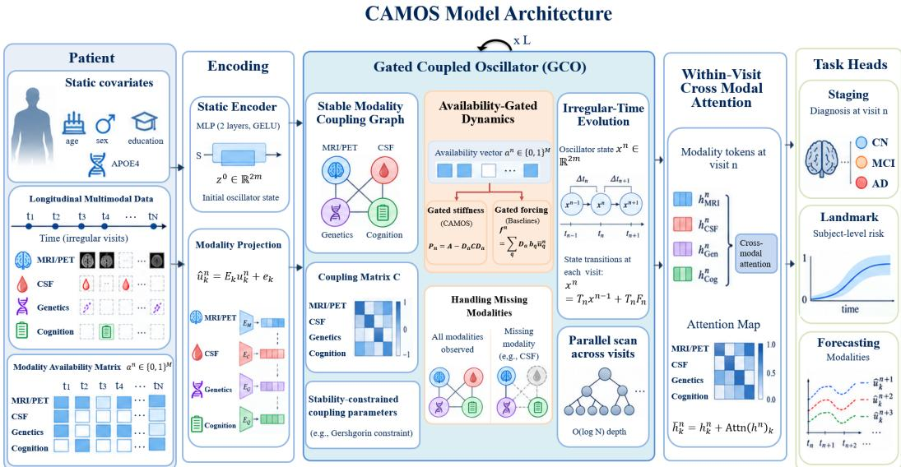
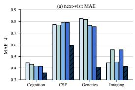
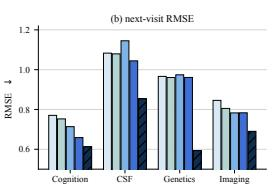
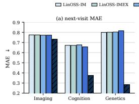
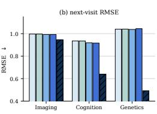
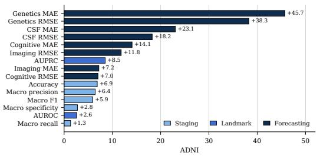
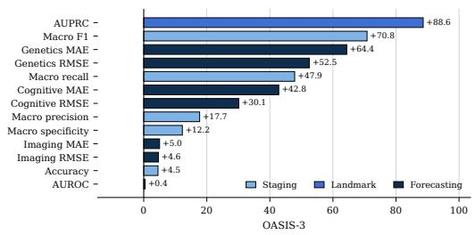
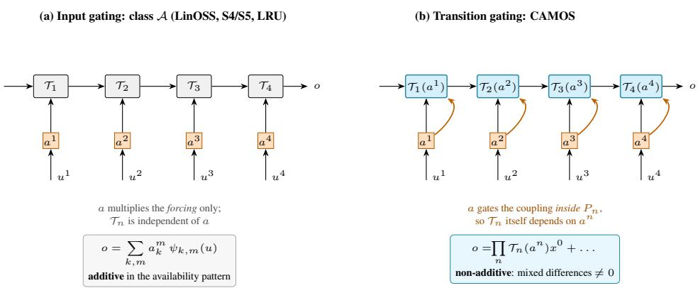
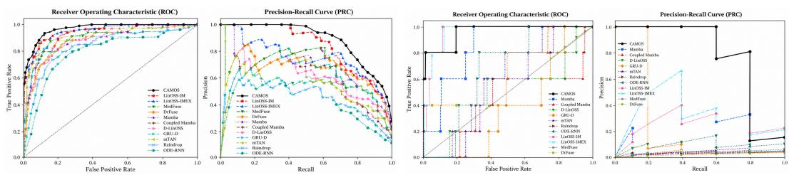

# CAMOS: COUPLED OSCILLATORY STATE-SPACE MODEL FOR MULTIMODAL CLINICAL TIME-SERIES

Maxx Richard Rahman   
Saarland University and   
German Research Center for Artificial Intelligence (DFKI)   
Saarbrucken, Germany¨

Mostafa Hammouda Saarland University Saarbrucken, Germany¨

Wolfgang Maass   
Saarland University and   
German Research Center for Artificial Intelligence (DFKI)   
Saarbrucken, Germany¨

## ABSTRACT

Longitudinal clinical cohorts are multimodal, irregularly sampled and pervasively incomplete: in ADNI, positron emission tomography and cerebrospinal fluid assays are absent from roughly half of all visits. Linear state-space models handle irregular sampling gracefully but treat a missing modality by masking the input, leaving the transition operator untouched. We prove that this is a representational limitation: the latent state of any linear state-space layer whose transition operator does not depend on the availability pattern is an additive function of the availability indicators, so no such layer can represent an interaction between two modalities being jointly present or jointly absent. We propose CAMOS, which gives each modality a bank of second-order oscillators coupled through a matrix that sits inside the differential equation and is gated by availability, so the transition operator itself becomes a function of which measurements were taken. Coupling invalidates the analysis of uncoupled oscillatory models, and we restore it: a per-channel Gershgorin budget makes the effective stiffness positive definite uniformly over all 2M availability patterns and all gaps, an energy argument charges amplification to availability transitions rather than sequence length, and a channel factorization preserves exact associative parallel scans. On ADNI, CAMOS outperforms uncoupled oscillatory state-space models and clinical fusion models on same-visit staging, landmark prediction and longitudinal forecasting, and under zero-shot transfer to OASIS-3 it is the only model that avoids collapse to the majority class.

## 1 INTRODUCTION

State-space models (SSMs) have been widely adopted for learning on long sequences (Gu et al., 2022; Smith et al., 2023; Orvieto et al., 2023; Gu & Dao, 2024), and they suit clinical time series because they discretize a continuous-time system and so treat a variable step size as a parameter rather than an approximation. Oscillatory SSMs sharpen this further, deriving stability from a nonnegative diagonal state matrix alone and admitting associative parallel scans in logarithmic depth (Rusch & Rus, 2025; Boyer et al., 2025; Blelloch, 1990). However, clinical cohorts pose a second difficulty alongside irregular sampling, i.e., measurements arrive as several modalities ordered by clinical need, cost and invasiveness, so each has its own gaps, while the underlying processes are coupled. In Alzheimer’s disease, amyloid deposition precedes tau pathology, then neurodegeneration, then cognitive decline (Hardy & Selkoe, 2002; Jack et al., 2010; 2013), yet in ADNI (Petersen et al., 2010) imaging and cognitive testing occur at most visits whereas amyloid PET and cerebrospinal fluid assays are far rarer, so the cascade should be tracked through a missingness process that is neither uniform nor ignorable (Rubin, 1976).

Existing models treat that missingness as an input phenomenon. An absent measurement is handled by zeroing or masking the forcing term, sometimes with an appended indicator (Che et al., 2018), while the transition operator, which propagates latent state across time, is left untouched. Unrolling such a layer shows the cost: the latent state is a sum of per-modality, per-step contributions, each scaled by its own availability indicator, so the effect of one modality being present cannot depend on whether another was present at a different step. Joint availability is nevertheless informative, since whether an unverified amyloid estimate should influence a tau prediction depends on whether amyloid was measured, not merely on its value. Multimodal fusion methods provide a solution to this additive class (Hayat et al., 2022; Zhang et al., 2022a; Wang et al., 2023; Yao et al., 2024), but they fuse after the temporal model has been applied, so nothing lets one modality shape another’s trajectory across a long gap.

In this paper, we place availability inside the dynamics. Each modality receives a bank of secondorder oscillators, and modalities drive one another through a coupling matrix in the differential equation itself, gated by availability. Because the gate multiplies a matrix in the homogeneous part, the transition operator becomes a function of which measurements were taken, and the additivity obstruction disappears. However, coupling invalidates the analysis of uncoupled oscillatory models in three places: i) stability is a property of the effective stiffness, which no condition on the individual coupling blocks alone controls; ii) parallel evaluation relies on a diagonal state matrix, which coupling destroys; and iii) a per-step spectral radius bound no longer implies boundedness once the operator varies over time. Our contributions, each addressing one of them are:

• We introduce CAMOS, a coupled oscillatory state-space model whose transition operator is gated by the availability pattern and factored channel-wise, preserving exact associative parallel scans.

• We prove that every availability-independent linear state-space layer is additive in the availability indicators while CAMOS is not.

• We perform empirical evaluation on ADNI and OASIS-3 where CAMOS outperforms uncoupled oscillatory SSMs and clinical fusion models on same-visit staging, landmark prediction and longitudinal forecasting.

## 2 RELATED WORK

Structured, oscillatory and coupled state-space models. S4, S5, LRU and Mamba established structured and selective state matrices solved by FFT or associative scans (Gu et al., 2020; 2022; Smith et al., 2023; Orvieto et al., 2023; Gu & Dao, 2024; Dao & Gu, 2024). LinOSS (Rusch & Rus, 2025) instead discretizes a second-order oscillator system, obtaining stability from a nonnegative diagonal state matrix alone and universality within continuous causal operators; its two variants, LinOSS-IM and LinOSS-IMEX, differ in whether the oscillator system is integrated by an implicit or a symplectic implicit-explicit scheme, and D-LinOSS (Boyer et al., 2025) decouples damping from frequency. These are the direct parents of CAMOS and our primary baselines. All of them take a single monolithic input, so concatenating modalities leaves the state matrix shared and the modality partition invisible to the dynamics, and no object in the model represents one modality driving another; they correspond to a zero coupling with a dense input matrix. Coupled Mamba (Li et al., 2024) is the closest on the oscillator side, coupling the hidden-state chains of several modalities, but it couples a discrete first-order recurrence rather than a continuous-time second-order system, so an irregular gap has no natural meaning.

Irregular sampling and missing modalities. Irregular sampling is handled by GRU-D, ODEbased models, controlled differential equations, mTAN and Raindrop (Che et al., 2018; Chen et al., 2018; Rubanova et al., 2019; De Brouwer et al., 2019; Kidger et al., 2020; Walker et al., 2024; Shukla & Marlin, 2021; Zhang et al., 2022b), all of which are sequential in the sequence length and none of which gates a coupled dynamical system by availability. Clinical fusion methods instead handle missing modalities at the level of representations (Ma et al., 2021; Zhang et al., 2022a; Wang et al., 2023; Yao et al., 2024; Hayat et al., 2022; Joze et al., 2020; Polsterl et al.¨ , 2021), fusing after the temporal model has be applied. MedFuse (Hayat et al., 2022) learns a representation of the missing modality inside an LSTM fusion, and DrFuse (Yao et al., 2024) disentangles shared from modality-specific representations so that the shared component survives an absent modality. Both are nonlinear in the availability pattern, which places them outside the additive class, and both are our second family of baselines.

  
Figure 1: CAMOS architecture consists of static and longitudinal multimodal patient data through availability-gated coupled oscillators, irregular-time dynamics, and cross-modal attention.

## 3 PROBLEM FORMULATION

Let us consider a subject contribute N visits at strictly increasing times $t _ { 1 } < \cdots < t _ { N }$ with gaps $\Delta t _ { n } : = t _ { n } - t _ { n - 1 } > 0$ in years, where $\Delta t _ { 1 } : = t _ { 1 } - t _ { 0 }$ and $t _ { 0 }$ is the cohort baseline. At visit $n ,$ , each of the M modalities k $\in [ M ] : = \{ 1 , \dots , M \}$ contributes a feature vector $u _ { k } ^ { n } \in \mathbb { R } ^ { p _ { k } }$ and a binary availability indicator $a _ { k } ^ { n } \doteq \{ 0 , 1 \}$ , equal to one exactly when modality k was measured, with $u _ { k } ^ { n }$ undefined and never read when $a _ { k } ^ { n } = 0$ . We write $a ^ { n } = ( a _ { 1 } ^ { n } , \ldots , a _ { M } ^ { n } ) \in \{ 0 , 1 \} ^ { M }$ for the availability pattern, $a ^ { 1 : N }$ for its sequence, $m : = M d$ for the stacked latent width, and $D _ { a } : =$ blkdiag $( a _ { 1 } I _ { d } , \therefore , a _ { M } I _ { d } ) \ \in \ \mathbb { R } ^ { m \times m }$ for the gate matrix. Each subject also has static covariates $s \in \mathbb { R } ^ { p _ { s } }$ The three prediction targets are: i) same-visit staging: a visit-level ordinal label $\ell ^ { n } \in$ {CN, MCI, AD} predicted as ${ \hat { p } } ^ { n }$ in the 2-simplex; ii) landmark prediction: a subject-level binary label $q \in \{ 0 , 1 \}$ for progression from mild cognitive impairment (MCI) to Alzheimer’s disease (AD) within three years, predicted as $\hat { q } \in [ 0 , 1 ]$ ; and iii) longitudinal forecasting: the values $u _ { k } ^ { n + h }$ at horizon $h \geq 1 .$ , predicted as $\hat { u } _ { k } ^ { n + h }$ and scored only where $a _ { k } ^ { n + h } \ = \ 1$ . The model is a map: $\Phi : \left( \{ u _ { k } ^ { n } \} , a ^ { 1 : N } , \{ t _ { n } \} , s \right) \longmapsto \left( \{ { \hat { p } } ^ { n } \} , { \hat { q } } , \{ { \hat { u } } _ { k } ^ { n + h } \} \right)$ , which uses $a ^ { 1 : N }$ as a genuine input rather than merely as a mask on u.

## 4 PROPOSED CAMOS MODEL

CAMOS is a stack of L gated coupled oscillator (GCO) blocks between an encoder and three task heads, $\Phi = \left\{ \mathrm { H e a d } _ { \tau } \right\} _ { \tau \in \{ 1 , 2 , 3 \} } \circ \mathrm { A t t n ~ \circ ~ { G C O } ^ { ( L ) } \circ \cdots \circ { G C O } ^ { ( 1 ) } }$ ◦ Enc. Everything except the GCO recurrence is applied pointwise in n and is therefore trivially parallel. The GCO recurrence is evaluated by an associative scan in ${ \cal O } ( \log N )$ ) depth. All proofs are in Appendix C.

## 4.1 INPUT ENCODERS

Static covariates $s \in \mathbb { R } ^ { p _ { s } }$ set the initial condition $x ^ { 0 } = ( z ^ { 0 } , y ^ { 0 } ) ^ { \top } \in \mathbb { R } ^ { 2 m }$ of the oscillator bank through a two-layer perceptron with GELU activation (Hendrycks & Gimpel, 2016), rather than

adding an offset at the readout, which encodes the hypothesis that baseline demographics modulate the phase and amplitude of the cascade rather than shifting outcomes additively. Modalities are measured on incommensurable scales, so each is projected affinely into a shared width h,

$$
\tilde { u } _ { k } ^ { n } = E _ { k } u _ { k } ^ { n } + e _ { k } \in \mathbb { R } ^ { h } , \qquad E _ { k } \in \mathbb { R } ^ { h \times p _ { k } } , e _ { k } \in \mathbb { R } ^ { h } ,\tag{1}
$$

in parallel across visits and evaluated only when $a _ { k } ^ { n } = 1 ;$ ; the value of $\tilde { u } _ { k } ^ { n }$ is irrelevant when $a _ { k } ^ { n } = 0$ because the forcing is gated in equation 6.

## 4.2 COUPLED MULTIMODAL OSCILLATORS, AND WHY THE COUPLING MUST BE BUDGETED

Each modality k carries a bank of d oscillators obeying

$$
z _ { k } ^ { \prime } ( t ) = - A _ { k } y _ { k } ( t ) + \sum _ { j \neq k } C _ { k j } y _ { j } ( t ) + B _ { k } \tilde { u } _ { k } ( t ) , \qquad y _ { k } ^ { \prime } ( t ) = z _ { k } ( t ) ,\tag{2}
$$

with $A _ { k } , C _ { k j } \in \mathbb { R } ^ { d \times d }$ and $B _ { k } \in \mathbb { R } ^ { d \times h }$ . Stacking $y = ( y _ { 1 } ^ { \top } , \ldots , y _ { M } ^ { \top } ) ^ { \top } \in \mathbb { R } ^ { m }$ and likewise for $z ,$ equation 2 becomes $y ^ { \prime \prime } = - P y + B \tilde { u }$ with

$$
\begin{array} { r } { \begin{array} { r l } & { \quad P : = A - C , \qquad A : = \mathrm { b l k d i a g } ( A _ { 1 } , \dots , A _ { M } ) , } \\ & { \quad [ C ] _ { k j } : = C _ { k j } \quad ( k \neq j ) , \qquad [ C ] _ { k k } : = 0 , \qquad B : = \mathrm { b l k d i a g } ( B _ { 1 } , \dots , B _ { M } ) . } \end{array} } \end{array}\tag{3}
$$

Stability, discretization and cost are properties of the effective stiffness P rather than of the individual blocks, which invalidates the natural first guess.

Remark 1 (Block-level conditions do not give stability). Parameterizing each block as $C _ { k j } \ =$ $Q _ { k j } Q _ { k j } ^ { \top } \succeq 0$ does not make $P \succeq 0$ . Under Assumption 1 the assembled C is symmetric with zero diagonal blocks, so $\operatorname { t r } ( C ) = 0$ and C has a strictly negative eigenvalue whenever $C \neq 0$ . The only free bound is $\lambda _ { \operatorname* { m i n } } ( P ) \geq \lambda _ { \operatorname* { m i n } } ( A ) - \| C \| _ { 2 }$ , which can be negative whenever $\| C \| _ { 2 } > \lambda _ { \operatorname* { m i n } } ( A ) ;$ then $I + \Delta t ^ { 2 } P$ can be singular, the implicit solve fails, and the transition operator can have spectral radius exceeding one. A joint condition on A and C is required.

Channel factorization. We take $A _ { k }$ and $C _ { k j }$ diagonal, $A _ { k } = \mathrm { d i a g } ( \alpha _ { k , 1 } , . . . , \alpha _ { k , d } )$ and $C _ { k j } =$ $\mathrm { d i a g } ( c _ { k j , 1 } , \dots , c _ { k j , d } )$ , so coupling mixes modalities within each latent channel but not across channels. With Π the permutation Π $e _ { ( k - 1 ) d + r } = e _ { ( r - 1 ) M + k }$ , reindexing from (modality-major, channel-minor) to (channel-major, modality-minor),

$$
\Pi { \cal P } \Pi ^ { \top } = \mathrm { b l k d i a g } \big ( { \cal P } ^ { ( 1 ) } , \ldots , { \cal P } ^ { ( d ) } \big ) , \qquad \big [ { \cal P } ^ { ( r ) } \big ] _ { k k } = \alpha _ { k , r } , \quad \big [ { \cal P } ^ { ( r ) } \big ] _ { k j } = - c _ { k j , r } ~ ( k \ne j ) ,\tag{4}
$$

so the coupled system decomposes into d independent networks of M oscillators, each carrying its own weighted modality graph $P ^ { ( r ) } \in \mathbb { R } ^ { M \times \mathbf { \bar { M } } }$ . Appendix E shows that a dense $C _ { k j }$ raises the per-step cost from $O ( d M ^ { 3 } ) \mathrm { t o } O ( d ^ { 3 } M ^ { 3 } )$ , and that a low-rank $C _ { k j }$ does not help, because low-rankplus-diagonal structure is not closed under the scan combine.

## Symmetry and Gershgorin budget. We impose two assumptions.

Assumption 1 (Symmetry). $c _ { k j , r } = c _ { j k , r }$ for all $k , j \in [ M ] , r \in [ d ]$ , so every $P ^ { ( r ) }$ is symmetric and $P = P ^ { \top }$

Assumption 2 (Gershgorin budget). There is $\epsilon \in ( 0 , 1 ]$ such that $\begin{array} { r } { \sum _ { j \neq k } \left| c _ { k j , r } \right| \leq \left( 1 - \epsilon \right) \alpha _ { k , r } } \end{array}$ for all $k \in [ M ] , r \in [ d ]$ , with $\alpha _ { k , r } > 0$

Both hold by construction under the following parameterization, which needs no projection step, no power iteration, and is differentiable everywhere. Let $\hat { \alpha } _ { k , r }$ and $\hat { c } _ { k j , r } = \hat { c } _ { j k , r }$ be free parameters (parameterize the strict upper triangle and mirror it) and set, with $\delta > 0$ a small constant,

$$
\alpha _ { k , r } = \mathrm { s o f t p l u s } ( \hat { \alpha } _ { k , r } ) , \quad \sigma _ { k , r } = \sum _ { l \neq k } | \hat { c } _ { k l , r } | , \quad c _ { k j , r } = \frac { ( 1 - \epsilon ) \operatorname* { m i n } \{ \alpha _ { k , r } , \alpha _ { j , r } \} } { \operatorname* { m a x } \{ \sigma _ { k , r } , \sigma _ { j , r } , \delta \} } \hat { c } _ { k j , r } .\tag{5}
$$

Symmetry is immediate because the prefactor is symmetric in $( k , j )$ , and the budget follows termwise. Writing $\begin{array} { r } { \alpha _ { \operatorname* { m i n } } : = \ \operatorname* { m i n } _ { k , r } \alpha _ { k , r } , \alpha _ { \operatorname* { m a x } } : = \ \operatorname* { m a x } _ { k , r } \alpha _ { k , r } } \end{array}$ r and $\gamma : = \operatorname* { m a x } _ { r } \| C ^ { ( r ) } \| _ { 2 }$ for the coupling strength, we set $\mu \ : = \ \epsilon \alpha _ { \mathrm { m i n } }$ and $L _ { P } : = ( 2 - \epsilon ) \alpha _ { \mathrm { m a x } } .$ , and Assumption 2 gives $\gamma \le ( 1 - \epsilon ) \alpha _ { \mathrm { m a x } } .$

Lemma 2 (Uniform positive definiteness). For every $a \in [ 0 , 1 ] ^ { M }$ the matrix $P ( a ) = A - D _ { a } C D _ { a }$ is symmetric and $\mu I _ { m } \preceq P ( \boldsymbol { a } ) \preceq L _ { P } I _ { m }$ . In particular $P ( a ) \succ 0$ simultaneously for all $2 ^ { M }$ binary availability patterns, $I _ { m } + \Delta t ^ { 2 } P ( a )$ is symmetric positive definite for every $\Delta t \in \mathbb { R }$ , and its Choleskyfactorization exists.

The proof is a per-channel Gershgorin argument using only $| a _ { k } a _ { j } | \le 1 ,$ , so gating can shrink but never enlarge an off-diagonal row sum: the budget is imposed once, on the ungated coupling, and gating preserves it automatically, so no availability pattern can destabilize the model.

## 4.3 AVAILABILITY GATING AND WHAT INPUT MASKING CANNOT REPRESENT

Availability enters in exactly two places, the stiffness and the forcing:

$$
P _ { n } : = A - D _ { a ^ { n } } C D _ { a ^ { n } } , \qquad f ^ { n } : = \sum _ { k = 1 } ^ { M } a _ { k } ^ { n } \iota _ { k } B _ { k } \tilde { u } _ { k } ^ { n } \in \mathbb { R } ^ { m } ,\tag{6}
$$

where $\iota _ { k } : \mathbb { R } ^ { d }  \mathbb { R } ^ { m }$ embeds into the k-th modality block. Since $[ D _ { a ^ { n } } C D _ { a ^ { n } } ] _ { k j } = a _ { k } ^ { n } a _ { j } ^ { n } C _ { k j }$ , the coupling gate is the symmetric product $g _ { k j } ^ { n } = a _ { k } ^ { n } a _ { j } ^ { n } \in \{ 0 , 1 \}$ , so $[ P _ { n } ^ { ( r ) } ] _ { k j } = - a _ { k } ^ { n } a _ { j } ^ { n } c _ { k j , \ i }$ r off the diagonal. Two properties motivate this over the asymmetric alternative $g _ { k j } ^ { n } = a _ { j } ^ { n }$ , which gates only by the source modality: $P _ { n }$ remains symmetric, which Assumption 1 and every result below require, and an unobserved modality is removed from the graph entirely.

Proposition 3 (Exact isolation of unobserved modalities). $H a _ { j } ^ { n } = 0 ,$ , then $P _ { n }$ is block diagonal with respect to the splitting $\{ j \} \cup ( [ M ] \setminus \{ j \} )$ , hence so are $S _ { n }$ and $\mathcal { T } _ { n }$ of equation 8. Consequently, at visit n the latent state of modality j has exactly zero influence on every other modality and vice versa, while modality j continues to evolve under its own $A _ { j }$ with $S _ { n } ^ { j j } = \stackrel { \cdot } { ( } I _ { d } + \Delta t _ { n } ^ { 2 } A _ { j } ) ^ { \cdot } { } ^ { 1 }$ . Under the asymmetric gate $g _ { k j } = a _ { j } , P _ { n }$ is block triangular rather than block diagonal, so the isolation is one-sided and $P _ { n }$ is no longer symmetric, invalidating Lemma 2.

Without the gate, the one-step cross-modal influence is $\left| [ S _ { n } ^ { ( r ) } ] _ { k j } \right| = \Delta t _ { n } ^ { 2 } \left| c _ { k j , r } \right| + { \cal O } \big ( \Delta t _ { n } ^ { 4 } L _ { P } ^ { 2 } \big )$ at short gaps, peaks at intermediate gaps and decays as $\Delta t _ { n } ^ { - 2 }$ at long ones (Proposition 11), so the gate matters most in the intermediate regime and for slow channels. The structural point is that $P _ { n }$ sits in the homogeneous part of the dynamics and is a function of $a ^ { n }$ , and the following theorem is the formal consequence.

Definition 4 (Input-gated linear layers). Let A be the class of layers $\begin{array} { r } { x ^ { n } = T _ { n } x ^ { n - 1 } + \sum _ { k = 1 } ^ { M } a _ { k } ^ { n } B _ { k } ^ { n } \tilde { u } _ { k } ^ { n } } \end{array}$ with $x ^ { 0 } = 0$ and $o ^ { n } = R x ^ { n }$ , in which $T _ { n } , B _ { k } ^ { n }$ and R may depend arbitrarily on the parameters, on $\left\{ t _ { m } \right\}$ and on $\{ \Delta t _ { m } \}$ , but not on the availability pattern $a ^ { \mathrm { i } : N }$

A contains the state-space layers of S4, S5, LRU, LinOSS and D-LinOSS applied to concatenated multimodal inputs with masked or zero-filled missing entries. It excludes selective models such as Mamba when the availability vector is appended to the input, since selection then makes $T _ { n }$ depend on a.

Theorem 5 (Availability additivity). For every layer in A and every n, $\begin{array} { r } { o ^ { n } = \sum _ { m \leq n } \sum _ { k } a _ { k } ^ { m } \psi _ { k , m } } \end{array}$ with $\psi _ { k , m } : = R T _ { n } \cdot \cdot \cdot T _ { m + 1 } B _ { k } ^ { m } \tilde { u } _ { k } ^ { m }$ , so $o ^ { n }$ is a multilinear polynomial of degree one in $a ^ { 1 : n }$ and every mixed availability difference oforder two or higher vanishes identically, $\Delta _ { ( k , m ) } \Delta _ { ( j , m ^ { \prime } ) } o ^ { n } \equiv 0$ for all $( k , m ) \neq ( j , m ^ { \prime } )$ , where $\Delta _ { ( k , m ) } F ( a ) : = F ( a | a _ { k } ^ { m } { = } 1 ) - F ( a | a _ { k } ^ { m } { = } 0 )$ . CAMOS does not lie in A: already for $M = 2 , d = 1 , \dot { L } = \dot { 1 }$

$$
[ S _ { n } ] _ { 1 2 } = { \frac { \Delta t _ { n } ^ { 2 } g c } { ( 1 + \Delta t _ { n } ^ { 2 } \alpha _ { 1 } ) ( 1 + \Delta t _ { n } ^ { 2 } \alpha _ { 2 } ) - \Delta t _ { n } ^ { 4 } g ^ { 2 } c ^ { 2 } } } , \qquad g = a _ { 1 } ^ { n } a _ { 2 } ^ { n } ,\tag{7}
$$

which vanishes when $g = 0$ and is nonzero when $g = 1 f o r a n y c \neq 0 ,$ , giving $\Delta _ { ( 1 , n ) } \Delta _ { ( 2 , n ) } o ^ { n } \neq 0 \quad$

Theorem 5 concerns a single linear layer. It does not say that deep networks built from such layers cannot represent availability interactions, since a nonlinear readout applied to an additive statistic is not itself additive, nor does it separate CAMOS from representation-level fusion such as Med-Fuse or DrFuse, whose encoders are nonlinear in a. It says that in class A the interaction must be reconstructed by the readout from an additive summary, whereas CAMOS represents it inside the recurrence, in the part of the model that is scannable and carries the stability guarantees above (Remark 8).

## 4.4 STABLE DISCRETIZATION ON THE IRREGULAR VISIT GRID

We discretize equation 2 on $\{ t _ { n } \}$ with the fully implicit (backward Euler) scheme applied to the first-order form, $z ^ { n } = z ^ { n - 1 } \dot { + } \dot { \Delta } t _ { n } ( - P _ { n } y ^ { n } \dot { + } \dot { f } ^ { n } )$ and $y ^ { n } = y ^ { n - 1 } + \Delta t _ { n } z ^ { n }$ . Collecting $x ^ { n } : =$ $( z ^ { n } , y ^ { n } ) ^ { \top } \in \mathbb { R } ^ { 2 m }$ and inverting through the Schur complement $S _ { n } : = ( I _ { m } + \Delta t _ { n } ^ { 2 } P _ { n } ) ^ { - \bar { 1 } }$ , which exists for every $\Delta t _ { n } \in \mathbb { R }$ by Lemma 2, gives

$$
\begin{array} { r } { x ^ { n } = { \cal T } _ { n } x ^ { n - 1 } + { \cal T } _ { n } { \cal F } _ { n } , \qquad { \cal T } _ { n } = ( { \displaystyle \sum _ { \Delta t _ { n } } } S _ { n }  \qquad { \cal S } _ { n } } \\ { \qquad { \cal S } _ { n }  } \end{array} ) , \qquad { \cal F } _ { n } = ( \Delta t _ { n } f ^ { n } , 0 ) ^ { \top } .\tag{8}
$$

Under equation $4 , S _ { n }$ is block diagonal with d blocks $S _ { n } ^ { ( r ) } = ( I _ { M } + \Delta t _ { n } ^ { 2 } P _ { n } ^ { ( r ) } ) ^ { - 1 }$ , each costing $O ( M ^ { 3 } )$ by Cholesky. The step size enters as a per-visit scalar, so irregular sampling requires no modification: the model integrates the same continuous system over whatever gap actually occurred, and stability is uniform in that gap.

Proposition 6 (Strict spectral contraction, uniform in $\Delta t _ { n }$ and $a ^ { n } )$ . Let $\nu _ { 1 } , \dots , \nu _ { m } > 0$ be the eigenvalues of $P _ { n } .$ . The 2m eigenvalues of $\cdot _ { \mathcal { T } _ { n } }$ are $\lambda _ { i } ^ { \pm } = ( 1 \pm \mathrm { i } \Delta t _ { n } \sqrt { \nu _ { i } } ) / ( 1 + \Delta t _ { n } ^ { 2 } \nu _ { i } )$ , so $| \lambda _ { i } ^ { \pm } | =$ $( 1 + \Delta t _ { n } ^ { 2 } \nu _ { i } ) ^ { - 1 / 2 } \leq ( 1 + \Delta t _ { n } ^ { 2 } \mu ) ^ { - 1 / 2 } < 1$ for every $\Delta t _ { n } > 0$ and every availability pattern.

The proof does not follow from the uncoupled case, because $P _ { n }$ is not diagonal; it orthogonally diagonalizes the symmetric $P _ { n }$ and reduces to m scalar $2 \times 2$ problems. Proposition 6 bounds each $\mathcal { T } _ { n }$ individually, which is not sufficient for boundedness of the trajectory, since the $\mathcal { T } _ { n }$ vary with n and are not normal, and finite products of matrices with spectral radius below one can grow transiently. This gap does not arise in the constant-coefficient setting, and we close it with an energy argument.

Theorem 7 (Switching bound governed by availability transitions). Let $E _ { n } \ : = \ { \frac { 1 } { 2 } } ( \| z ^ { n } \| ^ { 2 } \ +$ $( y ^ { n } ) ^ { \top } P _ { n } y ^ { n } )$ with $f ^ { n } = 0 ,$ , and let $V _ { N } : = \# \{ n \leq N : a ^ { n } \neq a ^ { n - 1 } \}$ count the visits at which the availability pattern changes. Then

$$
\begin{array} { r } { E _ { N } \leq E _ { 0 } \exp \Bigl ( \frac { 1 } { \mu } \sum _ { n = 1 } ^ { N } \| P _ { n } - P _ { n - 1 } \| _ { 2 } \Bigr ) \leq E _ { 0 } \exp \bigl ( 2 \gamma V _ { N } / \mu \bigr ) , } \end{array}\tag{9}
$$

and $E _ { n }$ is non-increasing on every maximal run of visits over which $a ^ { n }$ is constant, with exact dissipation $\begin{array} { r } { E _ { n } - E _ { n - 1 } = - \frac { 1 } { 2 } \Delta t _ { n } ^ { 2 } \dot { ( } ( y ^ { n } ) ^ { \top } P ^ { 2 } y ^ { n } + ( \check { z } ^ { n } ) ^ { \top } P z ^ { n } ) } \end{array}$ when $P _ { n } \equiv P$ (Proposition 9).

The bound is length-independent: amplification is charged to availability transitions, not to the number of visits or the size of the gaps, and it makes ϵ quantitative through $\gamma / \mu \leq \frac { 1 - \epsilon } { \epsilon } \alpha _ { \mathrm { m a x } } / \alpha _ { \mathrm { m i n } }$ The choice of scheme is not free. The implicit-explicit symplectic discretization used by uncoupled oscillatory SSMs keeps unit-modulus eigenvalues only while $\Delta t _ { n } ^ { 2 } \nu \leq 4$ for every eigenvalue ν of $P _ { n } .$ and otherwise has a real eigenvalue pair with product one, so one of them exceeds unity and the recurrence diverges. In ADNI, gaps range over roughly $[ 0 . 5 , 4 ]$ years, so enforcing that condition uniformly would require $L _ { P } \leq 0 . 2 5 .$ , hence $\alpha _ { \mathrm { m a x } } \lesssim 0 . 1 \dot { 4 }$ , an order of magnitude below our initialization range and enough to collapse the representable frequency band.

## 4.5 DEEP BLOCKS, WITHIN-VISIT ATTENTION AND TASK HEADS

GCO block. Following the block design of oscillatory SSMs (Rusch & Rus, 2025), block ℓ maps $\{ \tilde { u } ^ { ( \ell - 1 ) , n } \} _ { n = 1 } ^ { N } \ \subset \ \mathbb { R } ^ { M h }$ to $\{ \tilde { u } ^ { ( \ell ) , n } \} _ { n = 1 } ^ { N }$ by scanning equation 8, forming $w ^ { ( \ell ) , n } = C _ { \mathrm { r o } } ^ { ( \ell ) } y ^ { ( \ell ) , n } +$ $D _ { \mathrm { r o } } ^ { ( \ell ) } \tilde { u } ^ { ( \ell - 1 ) , n }$ with $C _ { \mathrm { r o } } \in \mathbb { R } ^ { M h \times m }$ , and applying a residual GLU (Dauphin et al., 2017) with dropout 0.1 (Appendix B). Each block owns its own $\hat { \alpha } , \hat { c } , \boldsymbol { B } , \boldsymbol { C } _ { \mathrm { r o } } , D _ { \mathrm { r o } } ,$ while the pattern $a ^ { 1 : N }$ and the gaps $\{ \Delta t _ { n } \}$ are shared. We write $h _ { k } ^ { n } : = \iota _ { k } ^ { \top } y ^ { ( L ) , n } \in \mathbb { R } ^ { d }$

Within-visit cross-modal attention. GCO layers model how modalities drive one another over time. Contemporaneous associations at a single visit are captured by one multi-head attention block over the M modality tokens at each visit, applied in parallel across n (Vaswani et al., 2017), with an additive availability bias $- \beta ( 1 - a _ { i } ^ { n } )$ on the logit of key $j ,$ where $\beta = \operatorname { s o f t p l u s } ( { \hat { \beta } } ) \geq 0$ is learnable. Taking $\beta \to \infty$ recovers the hard availability mask of Yao et al. (2024); a finite $\beta$ down-weights but does not erase an unobserved modality, consistent with its latent state continuing to evolve under Proposition 3. We use $H = 4$ heads with a residual connection and layer normalization, and write $\bar { h } _ { k } ^ { n } : = h _ { k } ^ { n } + \mathrm { A t t n } ( h ^ { n } ) _ { k }$ and $\bar { h } ^ { n } : = \| _ { k } \bar { h } _ { k } ^ { n }$

Table 1: Same-visit CN/MCI/AD staging on ADNI and OASIS-3. † denotes that CAMOS is significantly better than the best baseline $( p < 0 . 0 1$ , two-sided Welch’s t-test).
<table><tr><td>Models</td><td>Accuracy ↑</td><td>Macro F1 ↑</td><td></td><td>Macro Prec. ↑ Macro Recall ↑ Macro Spec. ↑</td><td></td></tr><tr><td>ADNI</td><td></td><td></td><td></td><td></td><td></td></tr><tr><td>LinOSS-IM</td><td> $0 . 6 5 9 3 { \scriptstyle \pm 0 . 0 0 4 1 }$ </td><td> $0 . 6 8 1 5 { \scriptstyle \pm 0 . 0 0 3 9 }$ </td><td> $0 . 6 8 0 4 { \scriptstyle \pm 0 . 0 0 4 5 }$ </td><td> $0 . 6 8 6 4 { \scriptstyle \pm 0 . 0 0 3 7 }$ </td><td> $0 . 8 1 4 7 _ { \pm 0 . 0 0 2 1 }$ </td></tr><tr><td>LinOSS-IMEX</td><td> $0 . 7 2 0 6 { \scriptstyle \pm 0 . 0 0 5 8 }$ </td><td> $0 . 7 2 3 4 { \scriptstyle \pm 0 . 0 0 6 1 }$ </td><td> $0 . 7 3 9 4 { \scriptstyle \pm 0 . 0 0 5 5 }$ </td><td> $0 . 7 4 2 4 { \scriptstyle \pm 0 . 0 0 5 9 }$ </td><td> $0 . 8 5 1 3 { \scriptstyle \pm 0 . 0 0 3 0 }$ </td></tr><tr><td>MedFuse</td><td> $0 . 6 6 4 8 { \scriptstyle \pm 0 . 0 0 7 2 }$ </td><td> $0 . 6 6 9 7 _ { \pm 0 . 0 0 7 6 }$ </td><td> $0 . 6 5 6 4 { \scriptstyle \pm 0 . 0 0 6 9 }$ </td><td> $0 . 7 1 3 9 { \scriptstyle \pm 0 . 0 0 7 0 }$ </td><td> $0 . 8 2 8 4 { \scriptstyle \pm 0 . 0 0 3 4 }$ </td></tr><tr><td>DrFuse</td><td> $0 . 7 3 2 2 { \scriptstyle \pm 0 . 0 0 4 9 }$ </td><td> $0 . 7 3 5 4 { \scriptstyle \pm 0 . 0 0 4 6 }$ </td><td> $0 . 7 4 8 8 _ { \pm 0 . 0 0 4 4 }$ </td><td> $0 . 7 6 8 3 _ { \pm 0 . 0 0 4 2 }$ </td><td> $0 . 8 5 9 9 { \scriptstyle \pm 0 . 0 0 2 4 }$ </td></tr><tr><td>CAMOS</td><td> $\mathbf { 0 . 7 8 2 4 } _ { \pm 0 . 0 0 1 6 } ^ { \dagger }$ </td><td> $\mathbf { 0 . 7 7 9 0 } _ { \pm 0 . 0 0 1 8 } ^ { \dagger }$ </td><td> $\mathbf { 0 . 7 9 7 0 } _ { \pm 0 . 0 0 2 2 } ^ { \dagger }$ </td><td> $\mathbf { 0 . 7 7 8 6 } _ { \pm 0 . 0 0 2 5 } ^ { \dagger }$ </td><td> $\mathbf { 0 . 8 8 3 6 } _ { \pm 0 . 0 0 1 3 } ^ { \dagger }$ </td></tr><tr><td>OASIS-3</td><td></td><td></td><td></td><td></td><td></td></tr><tr><td>LinOSS-IM</td><td> $0 . 7 2 7 1 { \scriptstyle \pm 0 . 0 0 1 7 }$ </td><td> $0 . 3 2 5 3 { \scriptstyle \pm 0 . 0 0 5 3 }$ </td><td> $0 . 5 3 3 4 { \scriptstyle \pm 0 . 0 0 8 2 }$ </td><td> $0 . 3 5 4 1 { \scriptstyle \pm 0 . 0 0 2 5 }$ </td><td> $0 . 6 7 7 3 { \scriptstyle \pm 0 . 0 0 1 4 }$ </td></tr><tr><td>LinOSS-IMEX</td><td> $0 . 7 2 3 1 { \scriptstyle \pm 0 . 0 0 2 0 }$ </td><td> $0 . 3 0 2 7 { \scriptstyle \pm 0 . 0 0 6 4 }$ </td><td> $0 . 4 2 2 2 _ { \pm 0 . 0 0 9 4 }$ </td><td> $0 . 3 4 1 4 { \scriptstyle \pm 0 . 0 0 2 8 }$ </td><td> $0 . 6 7 5 6 { \scriptstyle \pm 0 . 0 0 1 6 }$ </td></tr><tr><td>MedFuse</td><td> $0 . 6 6 8 2 _ { \pm 0 . 0 0 3 2 }$ </td><td> $0 . 3 1 7 6 { \scriptstyle \pm 0 . 0 0 5 9 }$ </td><td> $0 . 2 8 7 1 { \scriptstyle \pm 0 . 0 0 9 1 }$ </td><td> $0 . 3 5 5 8 { \scriptstyle \pm 0 . 0 0 2 6 }$ </td><td> $0 . 6 8 4 4 { \scriptstyle \pm 0 . 0 0 1 9 }$ </td></tr><tr><td>DrFuse</td><td> $0 . 7 2 6 3 _ { \pm 0 . 0 0 2 3 }$ </td><td> $0 . 2 8 0 5 { \scriptstyle \pm 0 . 0 0 8 1 }$ </td><td> $0 . 2 4 2 1 { \scriptstyle \pm 0 . 0 0 8 6 }$ </td><td> $0 . 3 3 3 3 { \scriptstyle \pm 0 . 0 0 0 0 }$ </td><td> $0 . 6 6 6 7 _ { \pm 0 . 0 0 0 0 }$ </td></tr><tr><td>CAMOS</td><td></td><td></td><td> $\mathbf { 0 . 6 2 8 0 } _ { \pm 0 . 0 0 3 1 } ^ { \dagger }$ </td><td> $\mathbf { 0 . 5 2 6 1 } _ { \pm \mathbf { 0 . 0 0 3 0 } } ^ { \dagger }$ </td><td></td></tr><tr><td></td><td> $\mathbf { 0 . 7 6 0 0 } _ { \pm 0 . 0 0 1 4 } ^ { \dagger }$ </td><td> $\mathbf { 0 . 5 5 5 5 7 } _ { \pm 0 . 0 0 2 8 } ^ { \dagger }$ </td><td></td><td></td><td> $\mathbf { 0 . 7 6 8 2 } _ { \pm 0 . 0 0 1 5 } ^ { \dagger }$ </td></tr></table>

Task heads and objective. All heads are affine in $\bar { h } \colon$ same-visit staging is $\hat { p } ^ { n } = \mathrm { s o f t m a x } ( W _ { \mathrm { s t } } \bar { h } ^ { n } +$ $ { b _ { \mathrm { s t } } } )$ ; landmark prediction is $\begin{array} { r } { \hat { q } = \sigma ( w _ { \mathrm { c v } } ^ { \top } \sum _ { n } \omega _ { n } \bar { h } ^ { n } + b _ { \mathrm { c v } } ) } \end{array}$ , pooled over visits by learned weights $\omega _ { n }$ so that subjects with different numbers of visits are handled without padding artefacts; and longitudinal forecasting is $\hat { u } _ { k } ^ { n + h } = W _ { \mathrm { f c } , k } ^ { ( h ) } \bar { h } _ { k } ^ { n } + b _ { \mathrm { f c } , k } ^ { ( h ) }$ for $h \leq H _ { \operatorname* { m a x } } = 3$ . The objective is

$$
\mathcal { L } = \lambda _ { \mathrm { s t } } \mathcal { L } _ { \mathrm { s t } } + \lambda _ { \mathrm { c v } } \mathcal { L } _ { \mathrm { c v } } + \lambda _ { \mathrm { f c } } \mathcal { L } _ { \mathrm { f c } } + \lambda _ { \mathrm { r e g } } \sum _ { \ell , k , j , r } \big | \hat { c } _ { k j , r } ^ { ( \ell ) } \big | ,\tag{10}
$$

with $\mathcal { L } _ { \mathrm { s t } }$ class-weighted cross-entropy over visits with a recorded stage label, $\mathcal { L } _ { \mathrm { c v } }$ class-weighted binary cross-entropy, and ${ \mathcal L } _ { \mathrm { f c } }$ a horizon-discounted $\ell _ { 1 }$ error masked by $a _ { k } ^ { n + h }$ and normalized by the number of observed targets (Appendix B). The mask is essential: with roughly half of all modalityvisit pairs unobserved, scoring against imputed targets would train the model on its own imputation error. The forecasting term also acts as a physical regularizer, forcing the latent oscillators to track measurable quantities, and the $\ell _ { 1 }$ penalty on the raw couplings encourages a sparse modality graph without interfering with the budget equation 5. We use $( \dot { \lambda } _ { \mathrm { s t } } , \breve { \lambda } _ { \mathrm { c v } } , \lambda _ { \mathrm { f c } } , \breve { \lambda } _ { \mathrm { r e g } } ) = \dot { ( } 1 , 0 . 5 , 1 , 1 0 ^ { - 3 } )$ .

## 5 EXPERIMENTS

Datasets. We evaluate on ADNI (Petersen et al., 2010) with $M = 4$ modalities grouped by acquisition route: imaging $( p _ { 1 } = 8 ;$ intracranial-volume-normalized volumes of hippocampus, entorhinal cortex, fusiform gyrus, middle temporal gyrus, whole brain and ventricles, plus FDG and AV45 PET SUVRs), CSF $( p _ { 2 } = 3 ; \mathbf { A } \beta _ { 1 - 4 2 }$ , total tau, phosphorylated tau), genetics $( p _ { 3 } = 3 ; A P O E \varepsilon .$ 4 allele count, genotype indicators, polygenic risk summary) and cognition $( p _ { 4 } = 5 ;$ MMSE, ADAS-Cog-13, CDR-SB, RAVLT immediate recall, FAQ), with baseline age, sex and years of education as static covariates $( p _ { s } = 3 )$ . We retain subjects with at least three diagnosed visits and one fully observed modality per visit, and mark a modality available only when all of its features are recorded. We also evaluate on OASIS-3 (LaMontagne et al., 2019), which carries the three modalities (imaging, genetics, cognition) and three targets, refitting only the normalization statistics.

Baselines. LinOSS-IM and LinOSS-IMEX (Rusch & Rus, 2025) are uncoupled oscillatory SSMs, the direct parents of CAMOS, and isolate the effect of coupling. Having no native mechanism for missing modalities, they receive concatenated features with unobserved entries zero-filled, the availability vector $a ^ { n }$ as M extra channels, and $\Delta t _ { n }$ both as an input channel and as the per-step discretization interval. MedFuse (Hayat et al., 2022) and DrFuse (Yao et al., 2024) handle missing modalities at the representation level; we replace their modality encoders by per-modality gated recurrent encoders over the visit sequence, so they receive the same temporal information as the SSMs. Appendix I contains results for all the different families of baselines.

Table 2: 3-year MCI-AD landmark prediction on ADNI and OASIS-3. CAMOS is significantly better than the best baseline at $^ { \dag } p < 0 . 0 1$ or $^ { * } p < 0 . 0 5$ (two-sided Welch’s t-test).
<table><tr><td></td><td colspan="2">ADNI</td><td colspan="2">OASIS-3</td></tr><tr><td>Models</td><td>AUROC ↑</td><td>AUPRC ↑</td><td>AUROC↑</td><td>AUPRC ↑</td></tr><tr><td>LinOSS-IM</td><td> $0 . 9 2 2 3 { \scriptstyle \pm 0 . 0 0 3 1 }$ </td><td> $0 . 7 1 0 2 _ { \pm 0 . 0 0 8 7 }$ </td><td> $0 . 9 5 3 3 { \scriptstyle \pm 0 . 0 0 2 4 }$ </td><td> $0 . 3 5 8 8 { \scriptstyle \pm 0 . 0 1 4 2 }$ </td></tr><tr><td>LinOSS-IMEX</td><td> $0 . 9 3 0 7 { \scriptstyle \pm 0 . 0 0 2 7 }$ </td><td> $0 . 7 3 8 9 { \scriptstyle \pm 0 . 0 0 7 4 }$ </td><td> $0 . 9 5 6 0 { \scriptstyle \pm 0 . 0 0 2 9 }$ </td><td> $0 . 4 1 8 5 { \scriptstyle \pm 0 . 0 1 6 3 }$ </td></tr><tr><td>MedFuse</td><td> $0 . 9 1 3 4 { \scriptstyle \pm 0 . 0 0 4 5 }$ </td><td> $0 . 6 9 0 0 { \scriptstyle \pm 0 . 0 1 0 2 }$ </td><td> $0 . 8 4 6 7 _ { \pm 0 . 0 0 5 8 }$ </td><td> $0 . 2 5 9 4 { \scriptstyle \pm 0 . 0 1 2 1 }$ </td></tr><tr><td>DrFuse</td><td> $0 . 9 3 8 6 _ { \pm 0 . 0 0 2 2 }$ </td><td> $0 . 7 6 8 9 _ { \pm 0 . 0 0 6 9 }$ </td><td> $0 . 8 7 8 7 _ { \pm 0 . 0 0 4 7 }$ </td><td> $0 . 3 1 8 3 { \scriptstyle \pm 0 . 0 1 3 5 }$ </td></tr><tr><td>CAMOS</td><td> $\mathbf { 0 . 9 6 1 1 } _ { \pm \mathbf { 0 . 0 0 1 4 } } ^ { \dagger }$ </td><td> $\mathbf { 0 . 8 6 8 7 } _ { \pm 0 . 0 0 4 1 } ^ { \dagger }$ </td><td> $\mathbf { 0 . 9 6 0 0 } _ { \pm 0 . 0 0 1 8 } ^ { \ast }$ </td><td> $\mathbf { 0 . 7 8 9 4 } _ { \pm 0 . 0 0 9 3 } ^ { \dagger }$ </td></tr></table>

## 6 RESULTS

Same-visit Staging. On ADNI, CAMOS outperforms all the baselines (Table 1), improving over DrFuse, by 0.0502 in accuracy (+6.9% relative) and 0.0436 in macro F1 (+5.9%). LinOSS-IMEX outperforms LinOSS-IM, since the implicit-explicit scheme is stable only while $\Delta t _ { n } ^ { 2 } \nu \leq 4 .$ This suggests that the tuned baseline learned frequencies low enough to stay in the stable regime. On OASIS-3, evaluated zero-shot with only the normalization statistics refitted, accuracy is weakly informative because one class dominates. DrFuse attains macro recall of exactly 1/3 and macro specificity of exactly 2/3, the signature of predicting a single class, so its accuracy of 0.7263 equals the majority-class rate. The other baselines are close to this solution, with macro F1 between 0.2805 and 0.3253. CAMOS alone retains classification among the three stages, raising macro F1 from 0.3253 to 0.5557 and macro recall from 0.3558 to 0.5261, while exceeding the majority-class accuracy. Since these relative gains are measured against near-collapsed baselines, the absolute macro F1 of CAMOS is the informative quantity for transfer.

Landmark Prediction. Our CAMOS improves AUROC from 0.9386 to 0.9611 (+2.4%) and AUPRC from 0.7689 to 0.8687 (+13.0%) over DrFuse on ADNI dataset (Table 2). The asymmetry between the two metrics is the main finding. AUROC is compressed near its ceiling, spanning only 4.8 points across the five models (0.9134 to 0.9611), whereas AUPRC, which is sensitive to the minority positive class, spans 17.9 points (0.6900 to 0.8687). This matters practically because landmark prediction is used for trial enrichment, a precision-limited application in which AUPRC is the relevant summary. On OASIS-3 the pattern is sharper. AUROC barely separates CAMOS from the oscillatory baselines (0.9600 vs. 0.9560 for LinOSS-IMEX, +0.4%), while AUPRC rises from 0.4185 to 0.7894 (+88.6%), with all baselines between 0.2594 and 0.4185.

Longitudinal forecasting. Figure 2 reports next-visit (h = 1) error per modality. On ADNI, CAMOS attains the lowest MAE and RMSE on all four modalities. The largest reductions are on the sparsely observed genetics (MAE 0.7535 → 0.4088, −45.8%; RMSE −38.3%) and CSF (MAE 0.7676 → 0.5906, −23.1%; RMSE −18.3%), where the four baselines are tightly clustered (MAE 0.7535 to 0.8270 and 0.7676 to 0.7895), so uncoupled oscillatory dynamics and representation-level fusion perform alike there while CAMOS separates clearly. Gains are smaller on cognition (MAE −14.1%, RMSE −7.0%) and imaging (MAE −7.2%, RMSE −11.8%), the only modality on which the baselines split, with LinOSS-IM and MedFuse (MAE 0.4468, 0.4538) ahead of LinOSS-IMEX and DrFuse (0.5567, 0.5562). The same ordering holds zero-shot on OASIS-3: CAMOS reduces MAE most on genetics (0.7875 → 0.2847, −63.9%), then on clinical measures (0.5775 → 0.3756, −35.0%), and least on imaging (0.7664 → 0.7333, −4.3%).

Relative improvements over baselines. All relative improvements in Figure 3 are positive, ranging from +1.3% (macro recall) to +45.8% (genetics MAE) on ADNI and from +0.4% (AUROC) to +88.6% (AUPRC) on OASIS-3, where margins are largest on metrics for which baselines collapse to the majority class (F1 +70.8%, recall +47.9%) and smallest on the imbalance-saturated accuracy and AUROC. The ADNI ablations trace these gains to three design choices. The implicit discretization, stable for every gap, matters most: switching to the implicit-explicit scheme, unstable once $\Delta t _ { n } ^ { 2 } \nu > 4$ as the 0.5 to 4 year gaps allow, lowers macro F1 from 0.7790 to 0.653 and AUPRC from 0.8687 to 0.8063, and raises forecasting MAE by 39.8% (sparse) and 25.5% (dense). Coupling lets each modality’s state absorb cross-modal information at co-observed visits before an unobserved in-

  
Figure 2: Next-visit (h = 1) forecasting on ADNI (left) and OASIS (right) per modality.

  
Figure 3: Relative improvement of CAMOS over the best baseline on each of the reported metrics.

terval; removing it raises MAE by 7.7% (sparse) and 8.1% (dense) and lowers AUPRC to 0.8193, the two regions of largest margin. The availability gate acts selectively: removing it lowers AUROC to 0.9531 and AUPRC to 0.8296 but leaves staging (F1 0.7804) and forecasting (MAE 0.5016 sparse, 0.4014 dense) essentially unchanged. It also explains the transfer result, since the CSF oscillator is not observed in OASIS-3 and stays isolated instead of entering as a zero-filled input block.

Ablation studies. Table 3 evaluates different variants of CAMOS on ADNI. Removing crossmodal coupling $( C \equiv 0 )$ degrades every task, lowering staging macro F1 by 2.3 points and landmark prediction AUPRC by 4.9 points while increasing forecasting MAE by 7.7% (sparse) and 8.1% (dense), which shows that information flow between modalities is beneficial. Coupling alone is not sufficient, without gating $( g _ { k j } ^ { n } \equiv 1 )$ , staging improves slightly over the uncoupled variant, but landmark prediction and forecasting become worse than having no coupling at all (AUPRC 0.7916, $\mathbf { M A E } + 1 1 . 2 \%$ sparse and +11.4% dense), plausibly because unobserved or unreliable states propagate indiscriminately across modalities. An asymmetric gate $( g _ { k j } ^ { n } = a _ { j } ^ { n } )$ recovers much of this loss and is the strongest ablation on landmark prediction and forecasting, yet it yields the lowest staging F1 among the non-IMEX variants (0.7532), so only the full gating performs well on all tasks at once. Replacing the implicit discretization with an IMEX scheme causes the largest degradation, increasing forecasting MAE by 39.8% on sparse and 25.5% on dense modalities; the stronger effect on sparse modalities is consistent with their irregular observation gaps.

## 7 CONCLUSION

In this paper, we argue that missingness in multimodal clinical sequences belongs in the transition operator rather than only in the forcing term. We propose CAMOS, a coupled oscillatory state-space model whose transition operator is gated by availability. Making coupling admissible required three new results: a per-channel Gershgorin budget that keeps the effective stiffness positive definite over all $2 ^ { M }$ availability patterns and all gaps, an energy bound that charges amplification to availability transitions rather than sequence length, and a channel-block matrix family that keeps the associative scan exact at $O ( M ^ { 2 } )$ overhead. On ADNI, CAMOS outperforms uncoupled oscillatory SSMs and clinical fusion models on same-visit staging, landmark prediction and longitudinal forecasting. On zero-shot OASIS-3, it is the only model that avoids collapse to the majority class. The ablations attribute these gains to the implicit discretization and the coupling.

Table 3: Ablation study evaluating the contribution of coupling, gating, and discretisation choices.
<table><tr><td rowspan="2">Variants</td><td>Staging</td><td colspan="2">Landmark Prediction</td><td colspan="2">Longitudinal Forecasting</td></tr><tr><td>Macro F1 ↑</td><td>AUROC↑</td><td>AUPRC ↑</td><td></td><td>Sparse MAE ↓ Dense MAE ↓</td></tr><tr><td>w/o coupling  $( C \equiv 0 )$ </td><td>0.7561±0.0034</td><td>0.9530±0.0021 0.8193±0.0068</td><td></td><td>0.5491±0.0057</td><td>0.4354±0.0032</td></tr><tr><td>w coupling ungated  $( g _ { k j } ^ { n } \equiv 1 )$ </td><td> $0 . 7 6 9 4 { \scriptstyle \pm 0 . 0 0 2 9 }$ </td><td> $0 . 9 4 7 8 { \scriptstyle \pm 0 . 0 0 2 6 }$ </td><td> $0 . 7 9 1 6 { \scriptstyle \pm 0 . 0 0 8 1 }$ </td><td> $0 . 5 6 6 8 { \scriptstyle \pm 0 . 0 0 6 3 }$ </td><td>0.4487±0.0038</td></tr><tr><td>w asymmetric gate  $( g _ { k j } ^ { n } = a _ { j } ^ { n } )$ </td><td> $0 . 7 5 3 2 { \scriptstyle \pm 0 . 0 0 4 1 }$ </td><td> $0 . 9 5 6 2 { \scriptstyle \pm 0 . 0 0 1 9 }$ </td><td> $0 . 8 3 8 4 { \scriptstyle \pm 0 . 0 0 5 9 }$ </td><td> $0 . 5 3 1 5 { \scriptstyle \pm 0 . 0 0 4 9 }$ </td><td>0.4176±0.0027</td></tr><tr><td>w IMEX discretization</td><td> $0 . 6 5 3 0 { \scriptstyle \pm 0 . 0 0 6 2 }$ </td><td> $0 . 9 5 4 6 _ { \pm 0 . 0 0 2 4 }$ </td><td> $0 . 8 0 6 3 _ { \pm 0 . 0 0 7 4 }$ </td><td> $0 . 7 1 2 7 _ { \pm 0 . 0 0 8 9 }$ </td><td>0.5057±0.0046</td></tr><tr><td>CAMOS</td><td> $\mathbf { 0 . 7 7 9 0 _ { \pm 0 . 0 0 1 8 } }$ </td><td> $\mathbf { 0 . 9 6 1 1 { \scriptstyle \pm 0 . 0 0 1 4 } }$ </td><td> $\mathbf { 0 . 8 6 8 7 { \scriptstyle \pm 0 . 0 0 4 1 } }$ </td><td> $\mathbf { 0 . 5 0 9 } 7 _ { \pm 0 . 0 0 3 6 }$ </td><td> $\mathbf { 0 . 4 0 2 9 _ { \pm 0 . 0 0 2 2 } }$ </td></tr></table>

## AI USE STATEMENT

Generative AI tools were used for language editing of the manuscript. They were not used to generate experimental results, numerical values, or the statements and proofs of the theoretical results, all of which were derived by the authors. The authors take full responsibility for the final content of this work, including all text, claims and artifacts.

## ETHICS STATEMENT

CAMOS predicts conversion to Alzheimer’s disease and assigns clinical stages, outputs that could influence trial enrolment or a person’s understanding of their own prognosis. We regard it as a research instrument rather than a decision-support tool. The results here are obtained on volunteer research cohorts that are not representative of the general population. The predicted probabilities are not calibrated, and the availability gate makes the model sensitive to which tests were ordered, a variable that reflects access to care as much as clinical need. Subgroup evaluation, calibration, and an audit of performance conditional on the availability pattern are therefore prerequisites for any clinical claim. All data are used under the existing data use agreements of ADNI and OASIS-3, and no new human-subject data were collected. The authors declare no competing interests.

## REPRODUCIBILITY STATEMENT

The model is fully specified: Table 4 for every hyperparameter and optimizer setting, Appendix F the algorithm in pseudocode, Appendix G the complete configuration table, and Appendix H the exact feature definitions, inclusion criteria, preprocessing and label construction. The assumptions underlying the theory are isolated as Assumptions 1 and 2, and every proof appears in Appendix C. An anonymized code repository accompanies this submission, containing the model implementation, the cohort extraction and preprocessing scripts, the training and evaluation pipeline for CAMOS and all baselines. All datasets are available to qualified researchers from their original providers.

## REFERENCES

Guy E. Blelloch. Prefix sums and their applications. Technical Report CMU-CS-90-190, School of Computer Science, Carnegie Mellon University, 1990.

Jared Boyer, T. Konstantin Rusch, and Daniela Rus. Learning to dissipate energy in oscillatory state-space models. arXiv preprint arXiv:2505.12171, 2025. URL https://arxiv.org/ abs/2505.12171.

Zhengping Che, Sanjay Purushotham, Kyunghyun Cho, David Sontag, and Yan Liu. Recurrent neural networks for multivariate time series with missing values. Scientific Reports, 8(1):6085, 2018. doi: 10.1038/s41598-018-24271-9.

Ricky T. Q. Chen, Yulia Rubanova, Jesse Bettencourt, and David Duvenaud. Neural ordinary differential equations. In Advances in Neural Information Processing Systems (NeurIPS), volume 31, 2018.

Tri Dao and Albert Gu. Transformers are SSMs: Generalized models and efficient algorithms through structured state space duality. In International Conference on Machine Learning (ICML), 2024.

Yann N. Dauphin, Angela Fan, Michael Auli, and David Grangier. Language modeling with gated convolutional networks. In International Conference on Machine Learning (ICML), pp. 933–941, 2017.

Edward De Brouwer, Jaak Simm, Adam Arany, and Yves Moreau. GRU-ODE-Bayes: Continuous modeling of sporadically-observed time series. In Advances in Neural Information Processing Systems (NeurIPS), volume 32, 2019.

Albert Gu and Tri Dao. Mamba: Linear-time sequence modeling with selective state spaces. In First Conference on Language Modeling (COLM), 2024. URL https://arxiv.org/abs/ 2312.00752.

Albert Gu, Tri Dao, Stefano Ermon, Atri Rudra, and Christopher Re. HiPPO: Recurrent memory´ with optimal polynomial projections. In Advances in Neural Information Processing Systems (NeurIPS), volume 33, pp. 1474–1487, 2020.

Albert Gu, Karan Goel, and Christopher Re. Efficiently modeling long sequences with structured´ state spaces. In International Conference on Learning Representations (ICLR), 2022. URL https://openreview.net/forum?id=uYLFoz1vlAC.

John Hardy and Dennis J. Selkoe. The amyloid hypothesis of Alzheimer’s disease: Progress and problems on the road to therapeutics. Science, 297(5580):353–356, 2002. doi: 10.1126/science. 1072994.

Nasir Hayat, Krzysztof J. Geras, and Farah E. Shamout. MedFuse: Multi-modal fusion with clinical time-series data and chest X-ray images. In Proceedings of the 7th Machine Learning for Healthcare Conference, volume 182 of Proceedings of Machine Learning Research, pp. 479– 503. PMLR, 2022.

Dan Hendrycks and Kevin Gimpel. Gaussian error linear units (GELUs). arXiv preprint arXiv:1606.08415, 2016.

Roger A. Horn and Charles R. Johnson. Matrix Analysis. Cambridge University Press, 2nd edition, 2012.

Clifford R. Jack, David S. Knopman, William J. Jagust, Leslie M. Shaw, Paul S. Aisen, Michael W. Weiner, Ronald C. Petersen, and John Q. Trojanowski. Hypothetical model of dynamic biomarkers of the Alzheimer’s pathological cascade. The Lancet Neurology, 9(1):119–128, 2010. doi: 10.1016/S1474-4422(09)70299-6.

Clifford R. Jack, David S. Knopman, William J. Jagust, Ronald C. Petersen, Michael W. Weiner, Paul S. Aisen, Leslie M. Shaw, Prashanthi Vemuri, Heather J. Wiste, Stephen D. Weigand, Timothy G. Lesnick, Vernon S. Pankratz, Michael C. Donohue, and John Q. Trojanowski. Tracking pathophysiological processes in Alzheimer’s disease: An updated hypothetical model of dynamic biomarkers. The Lancet Neurology, 12(2):207–216, 2013. doi: 10.1016/S1474-4422(12)70291-0.

Hamid Reza Vaezi Joze, Amirreza Shaban, Michael L. Iuzzolino, and Kazuhito Koishida. MMTM: Multimodal transfer module for CNN fusion. In Proceedings of the IEEE/CVF Conference on Computer Vision and Pattern Recognition (CVPR), pp. 13289–13299, 2020.

Patrick Kidger, James Morrill, James Foster, and Terry Lyons. Neural controlled differential equations for irregular time series. In Advances in Neural Information Processing Systems (NeurIPS), volume 33, pp. 6696–6707, 2020.

Peter M. Kogge and Harold S. Stone. A parallel algorithm for the efficient solution of a general class of recurrence equations. IEEE Transactions on Computers, C-22(8):786–793, 1973.

Pamela J. LaMontagne, Tammie L.S. Benzinger, John C. Morris, Sarah Keefe, Russ Hornbeck, Chengjie Xiong, Elizabeth Grant, Jason Hassenstab, Krista Moulder, Andrei G. Vlassenko, Marcus E. Raichle, Carlos Cruchaga, and Daniel Marcus. OASIS-3: Longitudinal neuroimaging, clinical, and cognitive dataset for normal aging and Alzheimer disease. medRxiv, 2019. doi: 10.1101/2019.12.13.19014902.

Wenbing Li, Hang Zhou, Junqing Yu, Zikai Song, and Wei Yang. Coupled mamba: Enhanced multimodal fusion with coupled state space model. In Advances in Neural Information Processing Systems (NeurIPS), volume 37, 2024. URL https://openreview.net/forum?id= UXEo3uNNIX.

Mengmeng Ma, Jian Ren, Long Zhao, Sergey Tulyakov, Cathy Wu, and Xi Peng. SMIL: Multimodal learning with severely missing modality. In Proceedings of the AAAI Conference on Artificial Intelligence, volume 35, pp. 2302–2310, 2021.

Eric Martin and Chris Cundy. Parallelizing linear recurrent neural nets over sequence length. arXiv preprint arXiv:1709.04057, 2017.

Antonio Orvieto, Samuel L Smith, Albert Gu, Anushan Fernando, Caglar Gulcehre, Razvan Pascanu, and Soham De. Resurrecting recurrent neural networks for long sequences. In International Conference on Machine Learning (ICML), pp. 26670–26698, 2023.

Adam Paszke, Sam Gross, Francisco Massa, Adam Lerer, James Bradbury, Gregory Chanan, Trevor Killeen, Zeming Lin, Natalia Gimelshein, Luca Antiga, Alban Desmaison, Andreas Kopf, Edward¨ Yang, Zachary DeVito, Martin Raison, Alykhan Tejani, Sasank Chilamkurthy, Benoit Steiner, Lu Fang, Junjie Bai, and Soumith Chintala. PyTorch: An imperative style, high-performance deep learning library. Advances in Neural Information Processing Systems (NeurIPS), 32, 2019.

Ronald C. Petersen, Paul S. Aisen, Laurel A. Beckett, Michael C. Donohue, Anthony C. Gamst, Danielle J. Harvey, Clifford R. Jack, William J. Jagust, Leslie M. Shaw, Arthur W. Toga, John Q. Trojanowski, and Michael W. Weiner. Alzheimer’s Disease Neuroimaging Initia tive (ADNI): Clinical characterization. Neurology, 74(3):201–209, 2010. doi: 10.1212/WNL. 0b013e3181cb3e25.

Sebastian Polsterl, Tom Nuno Wolf, and Christian Wachinger. Combining 3D image and tabular¨ data via the dynamic affine feature map transform. In Medical Image Computing and Computer Assisted Intervention (MICCAI), pp. 688–698. Springer, 2021.

Yulia Rubanova, Ricky T. Q. Chen, and David K Duvenaud. Latent ordinary differential equations for irregularly-sampled time series. In Advances in Neural Information Processing Systems (NeurIPS), volume 32, 2019.

Donald B. Rubin. Inference and missing data. Biometrika, 63(3):581–592, 1976.

T. Konstantin Rusch and Daniela Rus. Oscillatory state-space models. In The Thirteenth International Conference on Learning Representations (ICLR), 2025. URL https://openreview. net/forum?id=GRMfXcAAFh.

Satya Narayan Shukla and Benjamin M. Marlin. Multi-time attention networks for irregularly sampled time series. In International Conference on Learning Representations (ICLR), 2021. URL https://openreview.net/forum?id=4c0J6lwQ4\_.

Jimmy T.H. Smith, Andrew Warrington, and Scott Linderman. Simplified state space layers for sequence modeling. In The Eleventh International Conference on Learning Representations (ICLR), 2023. URL https://openreview.net/forum?id=Ai8Hw3AXqks.

Ashish Vaswani, Noam Shazeer, Niki Parmar, Jakob Uszkoreit, Llion Jones, Aidan N. Gomez, Łukasz Kaiser, and Illia Polosukhin. Attention is all you need. In Advances in Neural Information Processing Systems (NeurIPS), volume 30, 2017.

Benjamin Walker, Andrew D. McLeod, Tiexin Qin, Yichuan Cheng, Haoliang Li, and Terry Lyons. Log neural controlled differential equations: The Lie brackets make a difference. In International Conference on Machine Learning (ICML), 2024.

Hu Wang, Yuanhong Chen, Congbo Ma, Jodie Avery, Louise Hull, and Gustavo Carneiro. Multimodal learning with missing modality via shared-specific feature modelling. In Proceedings of the IEEE/CVF Conference on Computer Vision and Pattern Recognition (CVPR), pp. 15878–15887, 2023.

Wenfang Yao, Kejing Yin, William K. Cheung, Jia Liu, and Jing Qin. DrFuse: Learning disentangled representation for clinical multi-modal fusion with missing modality and modal inconsistency. In Proceedings of the AAAI Conference on Artificial Intelligence, volume 38, pp. 16416–16424, 2024. doi: 10.1609/aaai.v38i15.29578.

Chaohe Zhang, Xu Chu, Liantao Ma, Yinghao Zhu, Yasha Wang, Jiangtao Zhao, and Junfeng Wang. M3Care: Learning with missing modalities in multimodal healthcare data. In Proceedings of the 28th ACM SIGKDD Conference on Knowledge Discovery and Data Mining, pp. 2418–2428, 2022a.

Xiang Zhang, Marko Zeman, Theodoros Tsiligkaridis, and Marinka Zitnik. Graph-guided network for irregularly sampled multivariate time series. In International Conference on Learning Representations (ICLR), 2022b. URL https://openreview.net/forum?id= Kwm8I7dU-l5.

## A APPENDIX: NOTATION

<table><tr><td>Symbol</td><td>Meaning</td><td>Symbol</td><td>Meaning</td></tr><tr><td> $M$ </td><td>number of modalities (M = 4)</td><td> $d$ </td><td>oscillators per modality</td></tr><tr><td> $N$ </td><td>visits for a subject</td><td> $m = M d$ </td><td>total latent width</td></tr><tr><td> $h$ </td><td>shared projection width</td><td> $L$ </td><td>number of GCO blocks</td></tr><tr><td> $p _ { k }$ </td><td>raw dimension of modality k</td><td> $p _ { s }$ </td><td>static covariate dimension</td></tr><tr><td> $t _ { n }$ </td><td>time of visit n (years)</td><td> $\Delta t _ { n }$ </td><td> $t _ { n } - t _ { n - 1 } > 0$ </td></tr><tr><td> $u _ { k } ^ { n } \in \mathbb { R } ^ { p _ { k } }$ </td><td>raw features</td><td> $\tilde { u } _ { k } ^ { n } \in \mathbb { R } ^ { h }$ </td><td>projected</td></tr><tr><td> $a _ { k } ^ { n } \in \{ 0 , 1 \}$ </td><td>availability indicator</td><td> $a ^ { \overset { \ldots } { n } } \in \{ 0 , 1 \} ^ { M }$ </td><td>availability pattern</td></tr><tr><td> $D _ { a }$ </td><td> $\mathrm { b l k d i a g } ( a _ { 1 } I _ { d } , \dots , a _ { M } I _ { d } )$ </td><td> $g _ { k j } ^ { n } = a _ { k } ^ { n } a _ { j } ^ { n }$ </td><td>coupling gate</td></tr><tr><td> $\boldsymbol { y } ( t ) , \boldsymbol { z } ( t ) \in \mathbb { R } ^ { m }$ </td><td>position, velocity</td><td> $\boldsymbol { x } = ( z , y )$ </td><td>full state, R2m</td></tr><tr><td> $A _ { k } = \mathrm { d i a g } ( \alpha _ { k , \cdot } )$ </td><td>natural freqs.</td><td> $C _ { k j } = \mathrm { d i a g } ( c _ { k j , \cdot } )$ </td><td>coupling</td></tr><tr><td> $P = A - { \overrightarrow { C } }$ </td><td>effective stiffness</td><td> $P _ { n } = A - \dot { D } _ { a ^ { n } } \dot { C } D _ { a ^ { n } }$ </td><td>gated stiffness</td></tr><tr><td> $P ^ { ( r ) } \in \mathbb { R } ^ { M \times M }$ </td><td>channel-r block</td><td>Ⅱ</td><td>channel permutation</td></tr><tr><td> $S _ { n } = ( I + \Delta t _ { n } ^ { 2 } P _ { n } ) ^ { - 1 }$ </td><td></td><td> $\mathcal { T } _ { n }$ </td><td></td></tr><tr><td></td><td>inverse Schur cmpl.</td><td>δ</td><td>transition operator</td></tr><tr><td>€</td><td>Gershgorin budget (0.2) stiffness lower bound</td><td> $L _ { P } = ( 2 - \epsilon ) \alpha _ { \mathrm { m a x } }$ </td><td>numerical floor (10−6)</td></tr><tr><td> $\mu = \epsilon \alpha _ { \mathrm { m i n } }$ </td><td></td><td></td><td>upper bound</td></tr><tr><td> $\gamma = \operatorname* { m a x } _ { r } \| C ^ { ( r ) } \| _ { 2 }$ </td><td>coupling strength</td><td> $H _ { \mathrm { m a x } }$ </td><td>forecast horizons</td></tr><tr><td> $E _ { n }$   $\mathcal { F }$ </td><td>discrete energy channel-block matrix family</td><td> $V _ { N }$   $\mathcal { A }$ </td><td>availability transitions input-gated linear layers</td></tr></table>

## B MODEL COMPONENT DETAILS

Static encoder. The initial condition of Section 4.1 is

$$
\begin{array} { r } { x ^ { 0 } = ( z ^ { 0 } , y ^ { 0 } ) ^ { \top } = W _ { 2 } ^ { s } \operatorname { G E L U } ( W _ { 1 } ^ { s } s + b _ { 1 } ^ { s } ) + b _ { 2 } ^ { s } \in \mathbb { R } ^ { 2 m } , \qquad W _ { 1 } ^ { s } \in \mathbb { R } ^ { 2 m \times p _ { s } } , \ W _ { 2 } ^ { s } \in \mathbb { R } ^ { 2 m \times 2 m } . } \end{array}\tag{11}
$$

GCO block. Block ℓ maps $\{ \tilde { u } ^ { ( \ell - 1 ) , n } \} _ { n = 1 } ^ { N } \mathrm { t o } \{ \tilde { u } ^ { ( \ell ) , n } \} _ { n = 1 } ^ { N }$ by

$$
\{ \boldsymbol { x } ^ { ( \ell ) , n } \} _ { n } = \mathrm { S C A N } _ { \bullet } \big ( \{ \mathcal { T } _ { n } ^ { ( \ell ) } \} _ { n } , \{ \mathcal { T } _ { n } ^ { ( \ell ) } F _ { n } ^ { ( \ell ) } \} _ { n } \big ) ,\tag{12}
$$

$$
w ^ { ( \ell ) , n } = C _ { \mathrm { r o } } ^ { ( \ell ) } y ^ { ( \ell ) , n } + D _ { \mathrm { r o } } ^ { ( \ell ) } \widetilde { u } ^ { ( \ell - 1 ) , n } , \qquad C _ { \mathrm { r o } } \in \mathbb { R } ^ { M h \times m } ,\tag{13}
$$

$$
\tilde { u } ^ { ( \ell ) , n } = \tilde { u } ^ { ( \ell - 1 ) , n } + \mathrm { D r o p } \Big ( \mathrm { G L U } \big ( \mathrm { G E L U } ( w ^ { ( \ell ) , n } ) \big ) \Big ) ,\tag{14}
$$

with $\mathrm { G L U } ( v ) = \sigma ( W _ { 1 } v ) \odot W _ { 2 } \iota$ (Dauphin et al., 2017) and dropout 0.1.

Within-visit attention. With H heads and $d _ { H } = d / H$

$$
\mathrm { A t t n } ( h ^ { n } ) _ { k } = W o \Big \| _ { \eta = 1 } ^ { H } \sum _ { j = 1 } ^ { M } \frac { \exp \bigl ( \langle W _ { Q } ^ { ( \eta ) \top } h _ { k } ^ { n } , W _ { K } ^ { ( \eta ) \top } h _ { j } ^ { n } \rangle / \sqrt { d _ { H } } - \beta \bigl ( 1 - a _ { j } ^ { n } \bigr ) \bigr ) } { \sum _ { l = 1 } ^ { M } \exp \bigl ( \langle W _ { Q } ^ { ( \eta ) \top } h _ { k } ^ { n } , W _ { K } ^ { ( \eta ) \top } h _ { l } ^ { n } \rangle / \sqrt { d _ { H } } - \beta \bigl ( 1 - a _ { l } ^ { n } \bigr ) \bigr ) } ~ W _ { V } ^ { ( \eta ) \top } h _ { j } ^ { n } ,\tag{15}
$$

with $\beta = \operatorname { s o f t p l u s } ( { \hat { \beta } } ) \geq 0$ learnable and initialized at $\beta _ { 0 } = 2$

Task heads and forecasting loss. The three heads are

$$
\hat { p } ^ { n } = \mathrm { s o f t m a x } \big ( W _ { \mathrm { s t } } \bar { h } ^ { n } + b _ { \mathrm { s t } } \big ) , \qquad W _ { \mathrm { s t } } \in \mathbb { R } ^ { 3 \times m } ,\tag{16}
$$

$$
\begin{array} { r } { \hat { q } = \sigma \Big ( w _ { \mathrm { c v } } ^ { \top } \sum _ { n } \omega _ { n } \bar { h } ^ { n } + b _ { \mathrm { c v } } \Big ) , \qquad \omega _ { n } = \frac { \exp ( v ^ { \top } \bar { h } ^ { n } ) } { \sum _ { n ^ { \prime } } \exp ( v ^ { \top } \bar { h } ^ { n ^ { \prime } } ) } , } \end{array}\tag{17}
$$

$$
\hat { u } _ { k } ^ { n + h } = W _ { \mathrm { f c } , k } ^ { ( h ) } \bar { h } _ { k } ^ { n } + b _ { \mathrm { f c } , k } ^ { ( h ) } ,
$$

$$
h \in \{ 1 , \dots , H _ { \operatorname* { m a x } } \} ,\tag{18}
$$

and the masked forecasting term of equation 10 is

$$
\mathcal { L } _ { \mathrm { f c } } = \frac { \sum _ { h = 1 } ^ { H _ { \mathrm { m a x } } } \gamma _ { h } \sum _ { n , k } a _ { k } ^ { n + h } \left\| \hat { u } _ { k } ^ { n + h } - u _ { k } ^ { n + h } \right\| _ { 1 } } { \sum _ { h = 1 } ^ { H _ { \mathrm { m a x } } } \gamma _ { h } \sum _ { n , k } a _ { k } ^ { n + h } p _ { k } } , \qquad \gamma _ { h } = 2 ^ { - ( h - 1 ) } .\tag{19}
$$

  
Figure 4: Input gating versus transition gating. In (a) the indicators multiply the forcing only, so the state unrolls into a sum of per-modality, per-visit contributions and every mixed availability difference vanishes. In (b) the gate enters the homogeneous part, so the state is a product of availabilitydependent operators and contains genuine interactions among availability indicators.

## C PROOFS

## C.1 DERIVATION OF THE IMPLICIT RECURRENCE EQUATION 8

Scheme equation 4.4 reads $\mathcal { M } _ { n } x ^ { n } = x ^ { n - 1 } + F _ { n }$ with $\begin{array} { r } { \mathcal { M } _ { n } = \binom { I } { - \Delta t _ { n } I } ^ { \Delta t _ { n } P _ { n } } \ d I _ { I } ^ { \ } } \end{array}$ . Direct multiplication gives

$$
\left( - \mathop { \cal L } _ { n } \mathop { I } \phantom { \frac { \sum } { \sum } } \Delta t _ { n } P _ { n } \right) \left( \mathop { S _ { n } } _ { \Delta t _ { n } } \phantom { \frac { \sum } { \sum } } - \Delta t _ { n } P _ { n } \ : S _ { n } \right) = \left( \mathop { ( I + \Delta t _ { n } ^ { 2 } P _ { n } ) } _ { 0 } \phantom { \frac { \sum } { \sum } } 0 \right) = \mathop { I } _ { 2 m } ,\tag{20}
$$

since $( I + \Delta t _ { n } ^ { 2 } P _ { n } ) S _ { n } = I _ { m }$ by definition of $S _ { n }$ . Hence $\mathcal { T } _ { n } = \mathcal { M } _ { n } ^ { - 1 }$ has the stated form. □

## C.2 PROOF OF LEMMA 2

Fix $a \in [ 0 , 1 ] ^ { M }$ and a channel r. By Assumption 1 the matrix $P ^ { ( r ) } ( a ) \in \mathbb { R } ^ { M \times M }$ with $[ P ^ { ( r ) } ( a ) ] _ { k k } =$ $\alpha _ { k , r }$ and $[ P ^ { ( r ) } ( a ) ] _ { k j } = - a _ { k } a _ { j } c _ { k j , r }$ for $k \neq j$ is symmetric, so its eigenvalues are real. By the Gershgorin circle theorem (Horn & Johnson, 2012, Thm. 6.1.1) every eigenvalue ν satisfies $| \nu - |$ $\alpha _ { k , r } | \leq R _ { k }$ for some k, with

$$
R _ { k } = \sum _ { j \neq k } \left| a _ { k } a _ { j } c _ { k j , r } \right| \leq \sum _ { j \neq k } \left| c _ { k j , r } \right| \leq \left( 1 - \epsilon \right) \alpha _ { k , r } ,\tag{21}
$$

the first inequality using $a _ { k } , a _ { j } \in [ 0 , 1 ]$ and the second Assumption 2. Hence $\nu \in [ \epsilon \alpha _ { k , r } , ( 2 - \epsilon ) \alpha _ { k , r } ]$ for some $k ,$ so $\nu \geq \mu$ and $\nu \leq L _ { P }$ . Since $\Pi P ( a ) \Pi ^ { \top } =$ blkdiag $P ^ { ( 1 ) } ( a ) , \ldots , P ^ { ( d ) } ( a ) )$ and permutation conjugation preserves the spectrum, the same bounds hold for $\dot { P ( a ) }$ . The eigenvalues of $I _ { m } + \Delta t ^ { 2 } { \cal P } ( \bar { a } )$ are $1 + \Delta t ^ { 2 } \nu \geq 1 + \dot { \Delta } t ^ { 2 } \mu > 0$ , so it is symmetric positive definite and admits a Cholesky factorization. □

## C.3 PROOF OF PROPOSITION 3

If $a _ { i } ^ { n } \ = \ 0$ then for every $k \neq j$ the $( k , j )$ and $( j , k )$ blocks of $D _ { a ^ { n } } C D _ { a ^ { n } }$ are $a _ { k } ^ { n } a _ { j } ^ { n } C _ { k j } \ = \ 0$ and $a _ { i } ^ { n } a _ { k } ^ { n } C _ { j k } = 0$ . Since A is block diagonal, $P _ { n }$ is block diagonal with respect to the splitting $\{ j \} \cup ( [ M ] \backslash \{ j \} )$ . The inverse of a block diagonal matrix is block diagonal, so $S _ { n }$ is block diagonal, and each of the four blocks of $\mathcal { T } _ { n }$ in equation 8 is a product of ${ \bar { S } } _ { n } , { \bar { P } } _ { n }$ and scalars, hence block diagonal. Restricting to the $j$ block gives $P _ { n } | _ { j j } = A _ { j }$ and $S _ { n } | _ { j j } = ( I _ { d } + \Delta t _ { n } ^ { 2 } A _ { j } ) ^ { - 1 }$ . Under the asymmetric gate $g _ { k j } = a _ { j }$ , the $( k , j )$ blocks vanish for all k $\neq j$ but the $( j , k )$ blocks equal $- a _ { k } ^ { n } C _ { j k } ,$ which need not vanish, so $P _ { n }$ is block triangular and in general non-symmetric. □

## C.4 PROOF OF THEOREM 5

Let $T _ { n : m + 1 } : = T _ { n } T _ { n - 1 } \cdot \cdot \cdot T _ { m + 1 }$ 1 with $T _ { n : n + 1 } : = I$ . Unrolling the recurrence of Definition 4 from $x ^ { 0 } = 0$

$$
x ^ { n } = \sum _ { m = 1 } ^ { n } T _ { n : m + 1 } \sum _ { k = 1 } ^ { M } a _ { k } ^ { m } B _ { k } ^ { m } \tilde { u } _ { k } ^ { m } = \sum _ { m = 1 } ^ { n } \sum _ { k = 1 } ^ { M } a _ { k } ^ { m } T _ { n : m + 1 } B _ { k } ^ { m } \tilde { u } _ { k } ^ { m } ,\tag{22}
$$

and $o ^ { n } = R x ^ { n }$ gives the additive form. The map $a ^ { 1 : n } \mapsto o ^ { n }$ is affine in each coordinate with no products of distinct coordinates, so for any $( k , m ) ^ { \dagger } \neq ( j , m ^ { \prime } ) , \Delta _ { ( k , m ) } \Delta _ { ( j , m ^ { \prime } ) } o ^ { n } = ( \psi _ { k , m } + \psi _ { j , m ^ { \prime } } ) -$ $\psi _ { k , m } - \psi _ { j , m ^ { \prime } } = 0 .$ . For the second claim, take $M = 2 , d = 1 , L = 1$ and consider the (1, 2) entry of $S _ { n } = ( I _ { 2 } + \Delta t _ { n } ^ { 2 } P _ { n } ) ^ { - 1 }$ with $\begin{array} { r } { P _ { n } = \big ( \begin{array} { l l } { \alpha _ { 1 } } & { - g c } \\ { - q c } & { \alpha _ { 2 } } \end{array} \big ) , g = a _ { 1 } ^ { n } a _ { 2 } ^ { n } , c \neq 0 , } \end{array}$ . The $2 \times 2$ inverse gives equation 7, which vanishes iff $g = 0 .$ . Choosing an input supported only on modality 1 at visit n and reading out coordinate 2 of $y ^ { n } , o ^ { n }$ is a nonzero multiple of $[ S _ { n } ] _ { 1 2 }$ when $a _ { 1 } ^ { n } = a _ { 2 } ^ { n } = 1$ and zero if either indicator is zero, so $\bar { \Delta } _ { ( 1 , n ) } \Delta _ { ( 2 , n ) } o ^ { n } \neq 0$ and CAMOS is not in A. □

Remark 8 (Scope of Theorem 5). The theorem concerns a single linear state-space layer. It does not say that deep networks built from such layers cannot represent availability interactions, since a nonlinear readout applied to an additive statistic is not itself additive; it says that in class $\mathcal { A }$ the interaction must be reconstructed by the readout from an additive summary, whereas CAMOS represents it inside the recurrence, in the part of the model that is scannable and carries the guarantees of Lemma 2 and Theorem 7. Nor does it separate CAMOS from representation-level fusion such as MedFuse or DrFuse, whose encoders are nonlinear in a. We state it narrowly on purpose.

## C.5 PROOF OF PROPOSITION 6

Since $P _ { n }$ is symmetric, write $P _ { n } ~ = ~ U \Lambda U ^ { \top }$ with U orthogonal and $\Lambda ~ = ~ \mathrm { d i a g } ( \nu _ { 1 } , . . . , \nu _ { m } )$ $\nu _ { i } ~ \geq \mu ~ > ~ 0$ by Lemma 2. Put $\mathcal { U } = \mathrm { b l k d i a g } ( U , U )$ , which is orthogonal. Then ${ \mathcal { U } } ^ { \top } { \mathcal { M } } _ { n } { \mathcal { U } } \ =$ $\left( \begin{array} { c } { \boldsymbol { I } } \\ { - \Delta t _ { n } \boldsymbol { I } } \end{array} \Delta t _ { n } \boldsymbol { \Lambda } \right)$ , which decouples into m independent $2 \times 2$ problems $\left( \begin{array} { l l } { \phantom { - } 1 } & { \Delta t _ { n } \nu _ { i } } \\ { - \Delta t _ { n } } & { \phantom { - } 1 } \end{array} \right)$ , each with inverse $s _ { i } \big ( \ o _ { \Delta t _ { n } } ^ { 1 } - \ o _ { 1 } ^ { \Delta t _ { n } \nu _ { i } } \big ) , s _ { i } = ( 1 + \Delta t _ { n } ^ { 2 } \nu _ { i } ) ^ { - 1 }$ . The eigenvalues of this inverse are $s _ { i } ( 1 \pm \mathrm { i } \Delta t _ { n } \sqrt { \nu _ { i } } )$ , so $\vert \lambda _ { i } ^ { \pm } \vert ^ { 2 } = s _ { i } ^ { 2 } \ddot { ( 1 + \Delta t _ { n } ^ { 2 } \nu _ { i } ) } = s _ { i } \le ( 1 + \Delta t _ { n } ^ { 2 } \mu ) ^ { - 1 } < 1$ . Since $\mathcal { T } _ { n } = \mathcal { M } _ { n } ^ { - 1 }$ and orthogonal conjugation preserves the spectrum, the claim follows. The argument uses only symmetry and positivity of $P _ { n } ,$ not diagonality, which is why the uncoupled proof does not transfer. □

Proposition 9 (Exact dissipation at fixed availability). Suppose $f ^ { n } = 0$ and $P _ { n } \equiv P .$ . Then $E _ { n } : =$ $\begin{array} { r } { \frac 1 2 ( \| \dot { \boldsymbol { z } } ^ { n } \| ^ { 2 } + ( \boldsymbol { y } ^ { n } ) ^ { \top } P \boldsymbol { y } ^ { n } ) } \end{array}$ satisfies, for every $\Delta t _ { n } > 0$

$$
\begin{array} { r } { E _ { n } - E _ { n - 1 } = - \frac { 1 } { 2 } \Delta t _ { n } ^ { 2 } \big ( ( y ^ { n } ) ^ { \top } P ^ { 2 } y ^ { n } + ( z ^ { n } ) ^ { \top } P z ^ { n } \big ) \leq - \frac { \mu } { 2 } \Delta t _ { n } ^ { 2 } \big ( \mu \| y ^ { n } \| ^ { 2 } + \| z ^ { n } \| ^ { 2 } \big ) \leq 0 . } \end{array}\tag{23}
$$

Proof. From equation 4.4, $z ^ { n - 1 } = z ^ { n } + \Delta t _ { n } P y ^ { n }$ and $y ^ { n - 1 } = y ^ { n } - \Delta t _ { n } z ^ { n }$ , so

$$
\| \boldsymbol { z } ^ { n - 1 } \| ^ { 2 } = \| \boldsymbol { z } ^ { n } \| ^ { 2 } + 2 \Delta t _ { n } \langle \boldsymbol { z } ^ { n } , { P } \boldsymbol { y } ^ { n } \rangle + \Delta t _ { n } ^ { 2 } ( \boldsymbol { y } ^ { n } ) ^ { \top } { P } ^ { 2 } \boldsymbol { y } ^ { n } ,\tag{24}
$$

$$
( y ^ { n - 1 } ) ^ { \top } P y ^ { n - 1 } = ( y ^ { n } ) ^ { \top } P y ^ { n } - 2 \Delta t _ { n } \langle z ^ { n } , P y ^ { n } \rangle + \Delta t _ { n } ^ { 2 } ( z ^ { n } ) ^ { \top } P z ^ { n } .\tag{25}
$$

Adding and halving, the cross terms cancel and $\begin{array} { r } { E _ { n - 1 } = E _ { n } + \frac { 1 } { 2 } \Delta t _ { n } ^ { 2 } ( ( y ^ { n } ) ^ { \top } P ^ { 2 } y ^ { n } + ( z ^ { n } ) ^ { \top } P z ^ { n } ) } \end{array}$ The inequality uses $P \succeq \mu I$ and hence $P ^ { 2 } \succeq \mu ^ { 2 } I$ □

The dissipation is negligible for the slowest mode at clinical sequence lengths, since $\prod _ { n } ( 1 +$ $\Delta t _ { n } ^ { 2 } \mu ) ^ { - 1 / 2 } \geq \mathrm { e x p } ( - \textstyle { \frac { \mu } { 2 } } \sum _ { n } \Delta t _ { n } ^ { 2 } )$ exceeds 0.90 for $N \approx 1 0 , \Delta t _ { n } \approx 1$ year and $\mu \approx 0 . 0 2 ;$ ; highfrequency modes are damped more strongly at long gaps, which is the price of unconditional stability.

## C.6 PROOF OF THEOREM 7

Write $E _ { n } ^ { ( Q ) } : = \textstyle { \frac { 1 } { 2 } } ( \| z ^ { n } \| ^ { 2 } + ( y ^ { n } ) ^ { \top } Q y ^ { n } )$ , so $E _ { n } = E _ { n } ^ { ( P _ { n } ) }$ . Applying Proposition 9 with $P _ { n }$ frozen over the step from $n - 1$ to n gives $E _ { n } ^ { ( P _ { n } ) } \leq E _ { n - 1 } ^ { ( P _ { n } ) }$ , and

$$
\begin{array} { r } { { E } _ { n - 1 } ^ { ( P _ { n } ) } = { E } _ { n - 1 } ^ { ( P _ { n - 1 } ) } + \frac 1 2 ( y ^ { n - 1 } ) ^ { \top } ( P _ { n } - P _ { n - 1 } ) y ^ { n - 1 } \leq { E } _ { n - 1 } ^ { ( P _ { n - 1 } ) } + \frac 1 2 \| P _ { n } - P _ { n - 1 } \| _ { 2 } \| y ^ { n - 1 } \| ^ { 2 } . } \end{array}\tag{26}
$$

By Lemma 2, $\| y ^ { n - 1 } \| ^ { 2 } \leq ( 2 / \mu ) E _ { n - 1 } ^ { ( P _ { n - 1 } ) }$ , so $\begin{array} { r } { E _ { n } \leq E _ { n - 1 } \exp ( \frac { 1 } { u } \| P _ { n } - P _ { n - 1 } \| _ { 2 } ) } \end{array}$ , and telescoping gives the first inequality. For the second, i $\operatorname { f } a ^ { n } = a ^ { n - 1 }$ then $P _ { n } = P _ { n - 1 }$ and the factor is one, which also proves monotonicity; if $a ^ { n } \neq a ^ { n - 1 }$ then

$$
\begin{array} { r } { \| P _ { n } - P _ { n - 1 } \| _ { 2 } \leq \| D _ { a ^ { n - 1 } } C D _ { a ^ { n - 1 } } \| _ { 2 } + \| D _ { a ^ { n } } C D _ { a ^ { n } } \| _ { 2 } \leq 2 \gamma , } \end{array}\tag{27}
$$

using $\| D _ { a } \| _ { 2 } \leq 1$ and $\begin{array} { r } { \| C \| _ { 2 } = \operatorname* { m a x } _ { r } \| C ^ { ( r ) } \| _ { 2 } = \gamma } \end{array}$ . Summing over the $V _ { N }$ transition steps completes the proof. □

Proposition 10 (Input-to-state bound). With forcing $f ^ { n }$ and $P _ { n } \ \equiv \ P , \ \sqrt { E _ { n } } \ \leq \ \sqrt { E _ { n - 1 } } \ +$ ${ \sqrt { 2 } } \Delta t _ { n } \| f ^ { n } \|$

Proof. Repeating the computation of Proposition 9 with $z ^ { n - 1 } = z ^ { n } + \Delta t _ { n } ( P y ^ { n } - f ^ { n } )$ gives $2 E _ { n } \leq$ $2 E _ { n - 1 } + 2 \Delta t _ { n } \| z ^ { n } \| \| f ^ { n } \|$ . With $A _ { * } = \sqrt { 2 E _ { n } } , B _ { * } = \sqrt { 2 E _ { n - 1 } } , c = \Delta t _ { n } \| f ^ { n } \| \mathrm { ~ a n d ~ } \| z ^ { n } \| \leq A _ { * }$ , we get $A _ { * } ^ { 2 } \leq B _ { * } ^ { 2 } + 2 c A _ { * }$ , hence $A _ { * } \leq c + \sqrt { c ^ { 2 } + B _ { * } ^ { 2 } } \leq B _ { * } + 2 c$ . Dividing by $\sqrt { 2 }$ gives the claim.

Proposition 11 (Cross-modal leakage and its dependence on the gap). Fix a channel $^ { r , }$ an availability vector $a ~ \in ~ [ 0 , 1 ] ^ { M }$ (the ungated case is $\textbf { \em a } = \textbf { 1 } )$ , and $k \neq j .$ Write $s : = \Delta t _ { n } ^ { 2 }$ and $S _ { n } ^ { ( r ) } = ( I _ { M } + s P _ { n } ^ { ( r ) } ) ^ { - 1 }$ with $P _ { n } ^ { ( r ) } = \mathrm { d i a g } ( \alpha . _ { , r } ) - D _ { a } C ^ { ( r ) } D _ { a }$

(i) Short gaps. $\left| [ S _ { n } ^ { ( r ) } ] _ { k j } - s a _ { k } a _ { j } c _ { k j , r } \right| \leq s ^ { 2 } L _ { P } ^ { 2 }$ , so the leakage grows quadratically in $\Delta t _ { n }$ while $s L _ { P } \ll 1$

(ii) Uniform bound. For every $\Delta t _ { n } > 0$

$$
\bigl | [ S _ { n } ^ { ( r ) } ] _ { k j } \bigr | \le \beta ( s ) : = \frac 1 2 \Bigl ( \frac 1 { 1 + s \mu } - \frac 1 { 1 + s L _ { P } } \Bigr ) = \frac { s \left( L _ { P } - \mu \right) } { 2 ( 1 + s \mu ) ( 1 + s L _ { P } ) } .\tag{28}
$$

$\beta$ increases for $s < ( \mu L _ { P } ) ^ { - 1 / 2 }$ and decreases afterwards, attains its maximum $\scriptstyle { \frac { 1 } { 2 } } \left( { \sqrt { L _ { P } } } \ - \right.$ $\sqrt { \mu } ) / ( \sqrt { L _ { P } } + \sqrt { \mu } ) < \frac { 1 } { 2 }$ , and satisfies $\beta ( s ) \le ( L _ { P } - \mu ) / ( 2 s \mu L _ { P } )$

(iii) Long gaps. $\big | [ S _ { n } ^ { ( r ) } ] _ { k j } - s ^ { - 1 } [ ( P _ { n } ^ { ( r ) } ) ^ { - 1 } ] _ { k j } \big | \leq s ^ { - 2 } \mu ^ { - 2 }$ , so the leakage decays as $\Delta t _ { n } ^ { - 2 }$

(iv) Exact form for $M = 2$ . With $g = a _ { 1 } a _ { 2 }$ and $D : = \alpha _ { 1 } \alpha _ { 2 } - g ^ { 2 } c ^ { 2 } > 0 ,$ , equation 7 reads

$$
[ S _ { n } ] _ { 1 2 } = \frac { s g c } { 1 + s ( \alpha _ { 1 } + \alpha _ { 2 } ) + s ^ { 2 } D } ,\tag{29}
$$

which is unimodal in $\Delta t _ { n }$ with peak at $\Delta t _ { \star } = D ^ { - 1 / 4 }$ , peak value $| g c | / ( \alpha _ { 1 } + \alpha _ { 2 } + 2 \sqrt { D } )$ and $[ S _ { n } ] _ { 1 2 } \sim g c / ( \Delta t _ { n } ^ { 2 } D ) a s \bar { \Delta t } _ { n } \to \infty$

Cross-modal transfer of the previous state is therefore largest at intermediate gaps and vanishes at long ones.

Proof. Write $P : = P _ { n } ^ { ( r ) }$ and $S : = S _ { n } ^ { ( r ) }$ . By Lemma 2, applied channel-wise, P is symmetric with spectrum in $[ \mu , L _ { P } ]$ , so S is symmetric with spectrum in $\ddot { [ ( 1 + s L _ { P } ) ^ { - 1 } , ( 1 + s \mu ) ^ { - 1 } ] }$ and $\| S \| _ { 2 } \leq 1$ (i) From $( I + s P ) S = I$ we get $S = I - s P + s ^ { 2 } P ^ { 2 } S$ . For $k \neq j$ the identity contributes nothing and $[ - s P ] _ { k j } = s a _ { k } a _ { j } c _ { k j , r }$ , while $| [ s ^ { 2 } P ^ { 2 } S ] _ { k j } | \leq s ^ { 2 } \| P \| _ { 2 } ^ { 2 } \| S \| _ { 2 } \leq s ^ { 2 } L _ { P } ^ { 2 }$ .

(ii) If X is symmetric with spectrum in $[ \lambda _ { - } , \lambda _ { + } ] ,$ then for k $\neq \textit { j }$ and $m : = ( \lambda _ { - } + \lambda _ { + } ) / 2$ $| X _ { k j } | ~ = ~ | e _ { k } ^ { \top } \langle X - m I \rangle e _ { j } | ~ \le ~ \| X - m I \| _ { 2 } ~ = ~ ( \mathring { \lambda } _ { + } - \lambda _ { - } ) / 2 . ~ \mathrm { \bf ~ A }$ pplying this to S gives equation 28. Differentiating, sign $\beta ^ { \prime } ( s ) = \mathrm { s i g n } \big ( 1 - s ^ { 2 } \mu L _ { P } \big )$ , which gives the monotonicity and the maximizer $s = ( \mu L _ { P } ) ^ { - 1 / 2 } ;$ ; substituting yields the stated maximum. The decay bound follows from $( 1 + s \mu ) ( 1 + s L _ { P } ) \geq s ^ { 2 } \mu L _ { P }$

(iii) From $( I + s P ) S = I$ we also get $S = s ^ { - 1 } P ^ { - 1 } - s ^ { - 1 } P ^ { - 1 } S$ , and $\| P ^ { - 1 } S \| _ { 2 } \leq \mu ^ { - 1 } ( 1 + s \mu ) ^ { - 1 } \leq$ $\dot { s } ^ { - \dot { 1 } } \mu ^ { - 2 }$

(iv) Expanding the denominator of equation 7 gives equation 29. Assumption 2 gives $| c | \leq ( 1 -$ ϵ) min $\left\{ \alpha _ { 1 } , \alpha _ { 2 } \right\}$ , so $g ^ { 2 } c ^ { 2 } < \alpha _ { 1 } \alpha _ { 2 }$ and $D > 0$ . With $\bar { f } ( s ) = s g c / Q ( s )$ and $Q ( s ) = 1 + s ( \alpha _ { 1 } +$ $\alpha _ { 2 } ) + s ^ { 2 } D$ , we have sign $f ^ { \prime } ( s ) = \mathrm { s i g n } ( g c ) \cdot \mathrm { s i g n } \bigl ( Q ( s ) - s Q ^ { \prime } ( s ) \bigr ) = \mathrm { s i g n } ( g c ) \cdot \mathrm { s i g n } ( 1 - s ^ { 2 } D )$ , so $| f |$ peaks at $s = D ^ { - 1 / 2 }$ , where $Q = 2 + ( \alpha _ { 1 } + \alpha _ { 2 } ) D ^ { - 1 / 2 }$ , giving the stated value. The asymptotic form follows because $Q ( s ) \sim s ^ { 2 } D$ □

Proposition 12 (Normal modes and frequency shift). Fix a channel r and an availability pattern a, and let $P ^ { ( r ) } ( a ) = U ^ { ( r ) } \Lambda ^ { ( r ) } U ^ { ( r ) \top }$ with $\Lambda ^ { ( r ) } = \mathrm { d i a g } ( \nu _ { 1 } ^ { ( r ) } , . . . , \nu _ { M } ^ { ( r ) } )$ . Then the unforced system equation 2 restricted to channel r is a superposition of M decoupled harmonic modes with angular frequencies $\sqrt { \nu _ { i } ^ { ( r ) } }$ and mode shapes the columns $o f U ^ { ( r ) } ,$ ; the frequencies are pinned to the uncoupled ones by Weyl’s inequality, $\begin{array} { r } { | \nu _ { i } ^ { ( r ) } - \alpha _ { ( i ) , r } | \leq \gamma \leq ( 1 - \epsilon ) \alpha _ { \mathrm { m a x } } ; } \end{array}$ and the channel transferfunction is $H ^ { ( r ) } ( s ) = ( s ^ { 2 } I _ { M } + P ^ { ( r ) } ( a ) ) ^ { - 1 }$ , whose cross-modal entry $[ H ^ { ( r ) } ( s ) ] _ { k j }$ vanishes for $k \neq j$ when modalities k and j lie in different connected components of the gated graph $P ^ { ( r ) } ( a )$ , and is nonzero for generic couplings when they lie in the same component. The entries $\left| c _ { k j , r } \right|$ therefore define d weighted modality graphs whose connected components are the sets of modalities that exchange information in that frequency band.

Proof. (i) With $f = 0 ,$ substituting $y = U ^ { ( r ) } \zeta$ into the channel-r restriction of equation 3 gives $\zeta ^ { \prime \prime } = - \Lambda ^ { ( r ) } \zeta .$ , which is M decoupled scalar oscillators with angular frequency $\sqrt { \nu _ { i } ^ { ( r ) } }$ , all $\nu _ { i } ^ { ( r ) } > 0$ by Lemma 2. (ii) $P ^ { ( r ) } ( a ) = \mathrm { d i a g } ( \alpha . _ { , r } ) - D _ { a } C ^ { ( r ) } D _ { a }$ is a symmetric perturbation of a diagonal matrix by a symmetric matrix of spectral norm at most $\gamma ,$ , so Weyl’s inequality (Horn & Johnson, $2 0 1 2 .$ , Thm. 4.3.1) gives the stated bound. (iii) Laplace transforming $y ^ { \prime \prime } = - P ^ { ( r ) } ( a ) y + \tilde { f }$ with zero initial conditions gives $H ^ { ( r ) } ( s ) = ( s ^ { 2 } I + P ^ { ( r ) } ( a ) ) ^ { - 1 }$ . If k and $j$ are disconnected in $P ^ { ( r ) } ( a )$ then $s ^ { 2 } I + P ^ { ( r ) } ( a )$ is block diagonal and so is its inverse, giving $[ H ] _ { k j } = 0 ;$ conversely, if they are connected by a path $k = i _ { 0 } , \ldots , i _ { q } = j$ , the Neumann series $( s ^ { \bar { 2 } } \bar { I } + \bar { P } ) ^ { - 1 } = s ^ { - 2 } \stackrel { \cdot } { \sum _ { q > 0 } } ( - s ^ { - \bar { 2 } } P ) ^ { q }$ contains the monomial $P _ { i _ { 0 } i _ { 1 } } \cdot \cdot \cdot P _ { i _ { q - 1 } i _ { q } } \neq 0$ at order $q ,$ , and for generic couplings the entry is a nonzero rational function of s. □

## D PARALLEL EVALUATION, COMPLEXITY AND EXPRESSIVITY

Equation equation 8 is a linear recurrence with time-varying coefficients, so it is solvable by the associative scan with binary operator

$$
( T _ { 1 } , v _ { 1 } ) \bullet ( T _ { 2 } , v _ { 2 } ) : = \big ( T _ { 2 } T _ { 1 } , T _ { 2 } v _ { 1 } + v _ { 2 } \big ) ,\tag{30}
$$

which is associative (Kogge & Stone, 1973; Blelloch, 1990; Martin & Cundy, 2017; Smith et al., 2023). Applying its inclusive scan to $[ ( \mathcal { T } _ { 1 } , \mathcal { T } _ { 1 } F _ { 1 } ) , \dots , ( \mathcal { T } _ { N } , \mathcal { T } _ { N } F _ { N } ) ]$ returns $\bar { x ^ { 1 } } , \dots , x ^ { N }$ in the second components in $\lceil \log _ { 2 } N \rceil$ sequential rounds. Associativity is immediate; what is not immediate, and what the channel factorization buys, is that the scan never leaves a cheap structural family.

Definition 13 (Channel-block family). Let $\mathcal { F } \subset \mathbb { R } ^ { 2 m \times 2 }$ m be the set of matrices whose four $m \times m$ blocks $T _ { a b }$ satisfy $\Pi T _ { a b } \Pi ^ { \top } = { \mathrm { b l k d i a g } } ( T _ { a b } ^ { ( 1 ) } , \dots , T _ { a b } ^ { ( d ) } )$ with $T _ { a b } ^ { ( r ) } \in \mathbb { R } ^ { M \times M }$

Lemma 14 (Closure). $\mathcal { F }$ is closed under addition and multiplication, contains $I _ { 2 m } ,$ , and contains $\mathcal { T } _ { n }$ for every n and every availability pattern. A product of two elements of $\mathcal { F }$ costs $8 d M ^ { 3 }$ multiplyaccumulate operations, against $8 m ^ { \dot { 3 } } = 8 d ^ { 3 } M ^ { 3 }$ for dense 2m × 2m blocks.

Proof. Let $T , T ^ { \prime } \in { \mathcal { F } }$ . Conjugating by $\mathrm { b l k d i a g ( I I , I I ) }$ maps each of the four $m \times m$ blocks of $T$ and $\check { T } ^ { \prime }$ to block-diagonal matrices with d blocks of size $\bar { M } \times M$ . Block-diagonal matrices with a common partition are closed under addition and multiplication, and each block of the product $T T ^ { \prime }$ is a sum of two products of such matrices, hence again block diagonal with the same partition; therefore $T T ^ { \prime } \in \dot { \mathcal { F } }$ . Additivity and $I _ { 2 m } \in \mathcal { F }$ are immediate. That $\bar { \mathcal { T } _ { n } } \in \mathcal { F }$ follows from equation 8: $S _ { n }$ and $P _ { n }$ are channel-block-diagonal by equation 4 and Lemma 2, and every block of $\mathcal { T } _ { n }$ is a scalar multiple of $S _ { n }$ or of $P _ { n } S _ { n } .$ . For the cost, forming $T T ^ { \prime }$ requires 8 products of $m \times m$ channel-blockdiagonal matrices, each of which is d independent $M \times M$ products at $M ^ { 3 }$ multiply-accumulates, giving $8 d M ^ { 3 }$ ; for dense blocks the same 8 products cost $m ^ { 3 } = d ^ { 3 } M ^ { 3 }$ each. □

Proposition 15 (Complexity and parameter count). One GCO layer requires $\Theta ( N d M ^ { 3 } )$ arithmetic work and $\lceil \log _ { 2 } N \rceil$ sequential depth, with $\Theta ( N d M ^ { 2 } )$ memory for the scan carries. An uncoupled oscillatory layer of the same total state width $m = M d$ requires $\Theta ( N m )$ work, so the overhead of coupling is afactor $\Theta ( M ^ { 2 } )$ , independent ofN and d, and the within-visit attention adds $\Theta ( N M ^ { 2 } { \dot { d } } )$ at constant depth. Of the $\Theta ( M ^ { 2 } h ^ { 2 } + M ^ { 2 } d h )$ parameters per layer, only $( \mathbf { \Sigma } _ { 2 } ^ { M } ) d$ belong to the coupling: for $M = 4$ and $d = h = 6 \div$ that is 384 out o $f 2 . 8 \times 1 0 ^ { 5 }$ , about 0.14%.

Proof. By equation 8 each $S _ { n } ^ { ( r ) }$ is an $M \times M$ symmetric positive definite inverse costing $\Theta ( M ^ { 3 } )$ by Cholesky, and over d channels and N visits this is $\Theta ( N d M ^ { 3 } )$ . Each $\mathcal { T } _ { n }$ lies in $\mathcal { F }$ by Lemma $^ { 1 4 , }$ whose products cost $\Theta ( d M ^ { 3 } ) ;$ ; the associative scan performs $\Theta ( N )$ such operations at depth $\lceil \log _ { 2 } N \rceil$ , giving $\Theta ( N d \dot { M } ^ { 3 } )$ work and $\Theta ( \log N )$ depth. Each scan carry stores 4d blocks of size $M \times M$ , hence $\Theta ( N d M ^ { 2 } )$ memory. For the uncoupled model, $C = 0$ makes every $S _ { n } ^ { ( r ) }$ diagonal, so all products cost $\Theta ( d M ) = \Theta ( m )$ and the total is $\Theta ( N m )$ ). The attention block equation $^ { 1 5 }$ computes $M \times M$ scores at each of N visits with d-dimensional values, hence $\Theta ( N M ^ { 2 } d )$ at constant depth.

For the parameter count, the free parameters of one GCO layer are $\boldsymbol { \hat { \alpha } } \in \mathbb { R } ^ { M \times d } ;$ cˆ on the strict upper triangle in $( k , j )$ for each channel, giving ${ \binom { M } { 2 } } d ;$ the forcing matrices $B _ { k } \in \mathbb { R } ^ { d \times h }$ for $k \in [ M ]$ giving $M d h ;$ the readout $C _ { \mathrm { r o } } \in \mathbb { R } ^ { M h \times m }$ and skip $D _ { \mathrm { r o } } \in \mathbb { R } ^ { M h \times M h }$ , giving $M h m + M ^ { 2 } h ^ { 2 } ;$ ; and the two GLU matrices in $\mathbb { R } ^ { M h \times M h }$ , giving $2 M ^ { 2 } h ^ { 2 } .$ . Since $m = M d ,$ , we have $M h m = M ^ { 2 } d h$ , so the total is $M d + \textstyle { \binom { M } { \textstyle 2 } } d + M ^ { 2 } d h + M d h + 3 M ^ { 2 } h ^ { 2 } = \Theta ( M ^ { 2 } h ^ { 2 } + M ^ { 2 } d h )$ . Substituting $M = 4$ and $d = h = 6 4$ gives $2 5 6 + 3 8 4 + 6 5 5 3 6 + 1 6 3 8 4 + 1 9 6 6 0 8 = 2 7 9 , 1 6 8 \approx 2 . 8 \times 1 0 ^ { 5 }$ , of which the $\binom { 4 } { 2 } \cdot 6 4 = 3 8 4$ coupling parameters are 0.14%. □

Expressivity is not lost. Setting $\hat { c } \equiv 0$ in equation 5 gives $C = 0$ and reduces a CAMOS layer to an uncoupled oscillatory layer with strictly positive diagonal state matrix, so CAMOS blocks inherit universality within continuous causal operators. This certifies only that Assumptions 1 and 2 cost nothing in expressivity, and it is weak here because a symmetric coupled system is orthogonally equivalent to an uncoupled one when everything is observed. The representational gain is therefore due to gating (Theorem 5), since the gate acts in the modality basis and does not commute with the diagonalizing rotation $U ^ { ( r ) }$ of Proposition 12.

## E DENSE AND LOW-RANK COUPLINGS

If $C _ { k j } \in \mathbb { R } ^ { d \times d }$ is dense rather than diagonal, $P$ does not block-diagonalize under Π and three things change.

Stability. Assumption 2 is replaced by a spectral condition. If $C = C ^ { \top }$ and $\| C \| _ { 2 } ~ \le ~ ( 1 ~ -$ $\epsilon ) \lambda _ { \mathrm { m i n } } ( A )$ , then for every $a \in \mathsf { \bar { \Gamma } } [ 0 , 1 ] ^ { M } , \mathsf { \bar { \lambda } } _ { \operatorname* { m i n } } ( P ( a ) ) \geq \lambda _ { \operatorname* { m i n } } ( A ) - \| C \| _ { 2 } \geq \epsilon \lambda _ { \operatorname* { m i n } } ( A ) > 0$ using $\| D _ { a } \| _ { 2 } \leq 1$ , and Lemma 2 and everything downstream go through with $\mu : = \epsilon \lambda _ { \operatorname* { m i n } } ( A )$ . Enforcing this requires spectral normalization of $C ,$ , hence a power iteration at every training step rather than the closed form equation 5. It also interacts badly with the standard $\begin{array} { r } { \alpha \stackrel { \cdot } { \sim } \mathcal { U } ( [ 0 , \stackrel { \cdot } { 1 } ] ) } \end{array}$ initialization, since $\lambda _ { \mathrm { m i n } } ( A )$ is then near zero and the admissible coupling collapses.

Cost. $S _ { n }$ becomes a dense $m \times m$ inverse costing $\Theta ( d ^ { 3 } M ^ { 3 } )$ , and the scan combine leaves $\mathcal { F }$ and requires dense 2m × 2m products at the same order. The overhead relative to the channel-factored model is $\Theta ( d ^ { 2 } )$ , about a factor of 4000 per layer at $d = 6 4$

Why low rank does not help. The parameterization $C _ { k j } = Q _ { k j } Q _ { k j } ^ { \top }$ with $Q _ { k j } \in \mathbb { R } ^ { d \times \rho }$ reduces the parameter count from $d ^ { 2 }$ to $d \rho$ per block but not the scan cost, because low-rank-plus-diagonal structure is not closed under multiplication: if $T = D _ { 1 } + U _ { 1 } V _ { 1 } ^ { \top }$ and $T ^ { \prime } = D _ { 2 } \dot { + } U _ { 2 } V _ { 2 } ^ { \top }$ with rank $U _ { i } = \rho ,$ , then $T T ^ { \prime } = D _ { 1 } D _ { 2 } + \mathrm { \dot { \it { D } } _ { 1 } } U _ { 2 } V _ { 2 } ^ { \top } + U _ { 1 } V _ { 1 } ^ { \top } D _ { 2 } + U _ { 1 } ( { \dot { V _ { 1 } } } ^ { \top } U _ { 2 } ) V _ { 2 } ^ { \top }$ has rank up to 3ρ in its non-diagonal part, so the carried operator’s rank triples at every combine and reaches $\dot { N } ^ { \mathrm { l o g _ { 2 } 3 } } \rho$ after a full scan. Woodbury inversion is available at each individual step but does not survive the scan. This is worth stating because a low-rank PSD coupling is the natural first choice, and it is where intuition from static fusion layers fails in a sequential model.

Intermediate option. Partitioning the d channels into $d / \rho$ groups with dense coupling inside each group interpolates between the extremes: $\mathcal { F }$ becomes block-diagonal matrices with $\bar { d / \rho }$ blocks of size $\rho M$ , the cost becomes $\Theta ( N d \rho ^ { 2 } M ^ { 3 } )$ , and $\rho = 1$ recovers the channel-factored model.

Algorithm 1 One gated coupled oscillator (GCO) layer, forward pass   
Require: projected inputs $\{ \tilde { u } _ { k } ^ { n } \}$ , availability $\{ a _ { k } ^ { n } \}$ , gaps $\{ \Delta t _ { n } \}$ , initial state $x ^ { 0 } .$ , parameters   
$\bar { \alpha } , \hat { c } , \{ \bar { B } _ { k } \}$ , budget $\epsilon ,$ floor δ   
Ensure: states $\{ x ^ { n } = ( z ^ { n } , y ^ { n } ) \} _ { n = 1 } ^ { N }$   
1: $\alpha _ { k , r } \gets \mathrm { s o f t p } ]$ lus $( \hat { \alpha } _ { k , r } )$ for all $k , r$ ▷ $\Theta ( M d )$   
2: $\sigma _ { k , r } \gets \sum _ { l \neq k } | \hat { c } _ { k l , r } | ; \quad c _ { k j , r } \gets \frac { ( 1 - \epsilon ) \operatorname* { m i n } \{ \alpha _ { k , r } , \alpha _ { j , r } \} } { \operatorname* { m a x } \{ \sigma _ { k , r } , \sigma _ { j , r } , \delta \} } \hat { c } _ { k j , r }$ ▷ Assumptions 1, 2 hold by   
construction   
3: for $n = 1 , \ldots , N$ in parallel do   
4: for $r = 1 , \ldots , d$ in parallel do   
5: $\begin{array} { r } { [ P _ { n } ^ { ( r ) } ] _ { k k }  \alpha _ { k , r } ; [ P _ { n } ^ { ( r ) } ] _ { k j }  - a _ { k } ^ { n } a _ { j } ^ { n } c _ { k j , r } } \end{array}$ for $k \neq j$ ▷ symmetric product gate   
6: $S _ { n } ^ { ( r ) } \gets \mathrm { C H O L S O L V E } \left( I _ { M } + \Delta t _ { n } ^ { 2 } P _ { n } ^ { ( r ) } , I _ { M } \right)$ ▷ SPD by Lemma $2 ; \Theta ( M ^ { 3 } )$   
7: end for   
8: assemble $\mathcal { T } _ { n }$ from $\{ S _ { n } ^ { ( r ) } \} , \{ P _ { n } ^ { ( r ) } \}$ by equation 8   
9: $\begin{array} { r } { f _ { - } ^ { n } \gets \sum _ { k } a _ { k } ^ { n } \iota _ { k } B _ { k } \tilde { u } _ { k } ^ { n } ; \quad v _ { n } \gets \bar { \mathcal { T } } _ { n } ( \mathbf { \dot { \Delta } } t _ { n } f ^ { n } , 0 ) ^ { \top } } \end{array}$   
10: end for   
11: $\{ x ^ { n } \} \gets \mathrm { A s s o c S c A N } _ { \bullet } \left( [ ( \mathcal T _ { 1 } , v _ { 1 } + \mathcal T _ { 1 } x ^ { 0 } ) , ( \mathcal T _ { 2 } , v _ { 2 } ) , \dots , ( \mathcal T _ { N } , v _ { N } ) ] \right)$ ▷ $\lceil \log _ { 2 } N \rceil$ depth,   
$\Theta ( N d M ^ { 3 } )$ work   
12: return $\{ x ^ { \acute { n } } \}$

Algorithm 2 CAMOS forward pass for one subject   
Require: $\{ u _ { k } ^ { n } \} , \{ a _ { k } ^ { n } \} , \{ t _ { n } \}$ , static s   
Ensure: $\{ \hat { p } ^ { n } \} , \hat { q } , \{ \hat { u } _ { k } ^ { n + h } \}$   
1: $\Delta t _ { n } \gets \dot { t _ { n } } - \dot { t _ { n - 1 } }$ for all n   
2: $\tilde { u } _ { k } ^ { ( 0 ) , n } \gets E _ { k } u _ { k } ^ { n } + e _ { k } \mathrm { { i f } } a _ { k } ^ { n } = 1$ , else 0 ▷ equation 1, parallel in n   
3: $x ^ { \ddot { 0 } }  W _ { 2 } ^ { s } \mathrm { G E L U } ( W _ { 1 } ^ { s } s + b _ { 1 } ^ { s } ) + b _ { 2 } ^ { s }$ ▷ equation 11   
4: for $\ell = \bar { 1 , } , \ldots , L$ do   
5: $\{ x ^ { ( \ell ) , n } \}  \mathbf { A }$ lgorithm 1 with inputs $\{ \tilde { u } ^ { ( \ell - 1 ) , n } \}$ and layer-ℓ parameters   
6: $\begin{array} { r } { \begin{array} { r } { \dot { w } ^ { ( \ell ) , n }  C _ { \mathrm { r o } } ^ { ( \ell ) } y ^ { ( \ell ) , n } + D _ { \mathrm { r o } } ^ { ( \ell ) } \tilde { u } ^ { ( \ell - 1 ) , n } } \end{array} } \end{array}$   
7: $\tilde { u } ^ { ( \ell ) , n } \gets \tilde { u } ^ { ( \tilde { \ell } - \mathrm { i } ) , n } + \mathrm { D r o p } \big ( \mathrm { G L U } ( \mathrm { G E L U } ( w ^ { ( \ell ) , n } ) ) \big )$   
8: end for   
9: $h _ { k } ^ { n }  \iota _ { k } ^ { \top } y ^ { ( L ) , n } ; \quad \bar { h } _ { k } ^ { n }  h _ { k } ^ { n } + \mathrm { A t t n } ( h ^ { n } ) _ { k }$ ▷ equation 15, parallel in n   
10: $\hat { p } ^ { n } , \hat { q } , \hat { u } _ { k } ^ { n + h }$ ← heads equation 16, equation 17, equation 18

## F ALGORITHMS

## G IMPLEMENTATION DETAILS

All models are implemented in PyTorch 2.3 (Paszke et al., 2019) and trained on a single NVIDIA A100 40GB GPU, with the associative scan implemented as a Blelloch up-sweep and down-sweep over batched $2 M \times 2 M$ channel blocks and the Cholesky solves of equation 8 batched over $( n , r )$ in float32. Table 4 lists the complete configuration; values marked “grid” are selected on the validation split, and the identical grid and trial budget are applied to every baseline so that no model receives a larger search. The validation selection criterion is the unweighted mean of staging macro-F1, landmark prediction AUROC and one minus the normalized forecasting MAE. Staging is scored by accuracy and macro-averaged F1, precision, recall and specificity; landmark prediction by AU-ROC and AUPRC; forecasting by per-modality MAE and RMSE in the normalized feature space, averaged over observed targets only.

The frequency shift $\alpha _ { 0 } > 0$ in Table 4 matters: the standard oscillatory initialization $\alpha \sim \mathcal { U } ( [ 0 , 1 ] )$ places mass near zero, and the admissible coupling in equation 5 is proportional to min $\{ \alpha _ { k , r } , \alpha _ { j , r } \}$ so a large fraction of channels would begin with no coupling budget and never recover.

Table 4: Complete CAMOS configuration.
<table><tr><td>Group</td><td>Setting</td><td>Value</td></tr><tr><td rowspan="5">Architecture</td><td>GCO blocks L</td><td>grid {2, 4, 6}</td></tr><tr><td>oscillators per modality d</td><td>grid {32, 64, 128}</td></tr><tr><td>projection width h</td><td>grid {32, 64, 128}</td></tr><tr><td>attention heads H</td><td>4</td></tr><tr><td>dropout</td><td>0.1</td></tr><tr><td rowspan="5"></td><td>static encoder</td><td>2-layer MLP, width 2m, GELU</td></tr><tr><td>budget €</td><td> $0 . 2$ </td></tr><tr><td>numerical floor δ</td><td> $1 0 ^ { - 6 }$ </td></tr><tr><td>gate</td><td>hard,  $g _ { k j } ^ { n } = a _ { k } ^ { n } a _ { j } ^ { n }$ </td></tr><tr><td>structure</td><td>channel-factored, symmetric</td></tr><tr><td rowspan="4">Initialization</td><td> $\alpha _ { k , r }$ </td><td> $\mathcal { U } ( [ \alpha _ { 0 } , \alpha _ { 0 } + 1 ] ) , \alpha _ { 0 } = 0 . 1$ </td></tr><tr><td> $\hat { c } _ { k j , r }$ </td><td> $\mathcal { N } ( 0 , 1 / M )$  , symmetrized</td></tr><tr><td>attention bias  $\beta _ { 0 }$ </td><td> $2 . 0 ,$  learnable via softplus</td></tr><tr><td>remaining weights</td><td>PyTorch defaults</td></tr><tr><td rowspan="5">Optimization</td><td>optimizer weight decay</td><td> $\mathrm { A d a m W } , \beta = ( 0 . 9 , 0 . 9 9 9 ) , \varepsilon = 1 0 ^ { - 8 }$   $1 0 ^ { - 2 }$ </td></tr><tr><td>peak learning rate</td><td>, excluding  ${ \hat { \alpha } } , { \hat { c } } ,$  biases</td></tr><tr><td>schedule</td><td>grid  $\{ 1 0 ^ { - 4 } , 3 \cdot 1 0 ^ { - 4 } , 1 0 ^ { - 3 } \}$ </td></tr><tr><td>batch size</td><td>cosine, 5% linear warmup</td></tr><tr><td>gradient clipping</td><td>64 subjects global norm 1.0</td></tr><tr><td rowspan="5">Objective</td><td>epochs / early stopping</td><td>max 200, patience 20</td></tr><tr><td> $( \lambda _ { \mathrm { s t } } , \lambda _ { \mathrm { c v } } , \lambda _ { \mathrm { f c } } )$ </td><td> $( 1 , 0 . 5 , 1 )$ </td></tr><tr><td> $\lambda _ { \mathrm { r e g } }$ </td><td> $\mathrm { i } 0 ^ { - 3 } ( \ell _ { 1 } \mathrm { o n } \hat { c } )$ </td></tr><tr><td>forecasting horizons</td><td> $H _ { \mathrm { m a x } } = 3 ,$  discount  $\gamma _ { h } = 2 ^ { - ( h - 1 ) }$ </td></tr><tr><td>class weighting</td><td>inverse frequency on the training split</td></tr><tr><td rowspan="5">Protocol</td><td>split</td><td>subject-level  $7 0 / 1 5 / 1 5 ,$  stratified</td></tr><tr><td>seeds</td><td>5</td></tr><tr><td>selection criterion</td><td>mean of staging macro-F1, landmark prediction</td></tr><tr><td></td><td>AUROC, 1— normalized forecasting MAE</td></tr><tr><td>precision</td><td>float32 throughout, including Cholesky</td></tr></table>

Numerical notes. The Cholesky factorizations in equation 8 are the only place where conditioning could be a concern. By Lemma $2 , I _ { M } + \Delta t _ { n } ^ { 2 } P _ { n } ^ { ( r ) }$ has condition number at most $( 1 + \Delta t _ { n } ^ { 2 } L _ { P } ) / ( 1 +$ $\Delta t _ { n } ^ { 2 } \mu )$ , bounded above by $L _ { P } / \mu = ( 2 - \epsilon ) \overset { \cdot \cdot } { \operatorname { c o n d } } ( A ) / \epsilon$ independently of $\Delta t _ { n } ;$ with $\epsilon = 0 . 2$ and the initialization of Table 4 this is below 200, comfortably inside float32. This is a practical dividend of the budget: an unconstrained coupling would allow $\dot { I } + \Delta t ^ { 2 } P$ to become near-singular precisely at long gaps, where the model is most needed.

Baseline adaptation. LinOSS-IM and LinOSS-IMEX receive the concatenation $[ u _ { 1 } ^ { n } ; \ldots ; u _ { M } ^ { n } ] \in$ Rp with unobserved entries set to zero, the availability vector $a ^ { n }$ appended as M channels, and $\Delta t _ { n }$ appended as one channel and used as the per-step discretization interval. MedFuse and DrFuse are given per-modality gated recurrent encoders over the visit sequence, so that they see the same temporal information as the SSMs rather than a single pooled vector.

## H DATASET CONSTRUCTION

ADNI extraction. From the ADNIMERGE table we retain the columns listed in Section 5 together with the visit code, examination date, baseline diagnosis and current diagnosis. Visits are ordered by examination date and $t _ { n }$ is expressed in years from the subject’s baseline visit. A subject is included if it has at least three visits with a recorded diagnosis and, at each retained visit, at least one modality fully observed. Volumetric MRI measures are divided by intracranial volume before normalization, which removes head-size variation that would otherwise dominate the leading principal direction. All continuous features are then robust z-scored, $u \mapsto ( u - \mathrm { m e d } ) / \mathrm { I Q R }$ , with statistics computed on the training split only and applied unchanged to validation and test; the robust form is preferred because several ADNI biomarkers, CSF amyloid, are censored at assay limits and have heavy tails. Categorical static covariates are one-hot encoded, and APOE4 is kept as its integer allele count in {0, 1, 2}, which encodes the known dose response.

Table 5: Cohort statistics. M: number of modalities; $\begin{array} { r } { p = \sum _ { k } p _ { k } \colon } \end{array}$ total raw feature dimension; missing rate: percentage of modality-visit pairs unobserved.
<table><tr><td>Dataset</td><td>Role</td><td>M</td><td>p</td><td>Subjects</td><td>Visits</td><td>Mean visits/subj.</td><td>Max visits/subj. </td><td>Missing (%)</td></tr><tr><td>ADNI</td><td>train / val / test</td><td>4</td><td>19</td><td>2749</td><td>7432</td><td>2.7</td><td>15</td><td>32.5</td></tr><tr><td>OASIS-3</td><td>zero-shot</td><td>3</td><td>19</td><td>1377</td><td>8522</td><td>6.2</td><td>20</td><td>28</td></tr></table>

Availability convention. $a _ { k } ^ { n } = 1$ if and only if every feature of modality k is recorded at visit n. Per-feature masking was rejected because acquisition is organized by procedure: a lumbar puncture yields the whole CSF panel or none of it, and a PET session yields the whole tracer panel or none of it. Modelling availability at the procedure level is therefore both more faithful and what makes the modality-level gate of Section 4.3 meaningful.

Label construction. Staging labels are the recorded diagnosis at each visit, mapped to {CN, MCI, AD}; visits without a recorded diagnosis contribute to the forecasting loss but not to $\mathcal { L } _ { \mathrm { s t } } .$ For landmark prediction, the index visit is the first visit at which a subject is diagnosed MCI; the label is 1 if AD is recorded at any visit within three years of the index visit, and 0 if the subject has at least three years of subsequent follow-up without an AD diagnosis. Subjects censored before three years without converting are excluded from the landmark prediction task only, so no conversion label is ever imputed. Reversions from MCI to CN are retained in the staging task with their recorded label and do not affect the conversion label unless a later AD diagnosis occurs within the window.

OASIS-3 mapping. For OASIS-3 (LaMontagne et al., 2019) we use the same modalities and, where a feature has no exact ADNI counterpart, the nearest available measure of the same construct, refitting only the normalization statistics; the model is otherwise transferred without retraining, so this is a zero-shot evaluation.

## I EXTENDED RESULTS

In this section, we report all the baselines on both cohorts, across the four families: uncoupled oscillatory SSMs (LinOSS-IM, LinOSS-IMEX, D-LinOSS), general and coupled SSMs (S5, Mamba, Coupled Mamba), irregular-time and missing-value models (GRU-D, mTAN, Raindrop, ODE-RNN), and clinical fusion models (MedFuse, DrFuse). All entries are means over five seeds on the subject-level splits of Appendix H.

## I.1 STAGING WITH ALL THE BASELINES

Table 6 extends the staging comparison of Section 6. On ADNI the strongest baselines come from three different families, DrFuse (0.7322 accuracy), LinOSS-IMEX (0.7206) and Mamba (0.7187), so no single design axis accounts for baseline performance, and CAMOS exceeds all twelve on every metric. On OASIS-3 the picture changes: accuracy is compressed between 0.6263 and 0.7525 because one class dominates, while macro F1 separates the models from 0.2805 to 0.5557. Every baseline falls below macro F1 0.44 and macro recall 0.44, with DrFuse at exactly 1/3 recall and 2/3 specificity, the signature of predicting a single class. CAMOS is the only model that retains discrimination among the three stages under transfer.

## I.2 LANDMARK PREDICTION WITH ALL THE BASELINES

Table 7 extends Table 2, and Figure 5 shows the corresponding ROC and precision-recall curves. The two metrics behave differently in each cohort. On ADNI, AUROC spans 0.8795 to 0.9611 while

Table 6: Same-visit CN/MCI/AD staging on ADNI (in-distribution) and OASIS-3 (zero-shot).
<table><tr><td>Models</td><td>Accuracy ↑</td><td>Macro F1 ↑</td><td></td><td>Macro Prec. ↑ Macro Recall ↑ Macro Spec. ↑</td><td></td></tr><tr><td>ADNI</td><td></td><td></td><td></td><td></td><td></td></tr><tr><td>LinOSS-IM</td><td></td><td>0.6593±0.0041 0.6815±0.0039</td><td>0.6804±0.0045</td><td> $0 . 6 8 6 4 { \scriptstyle \pm 0 . 0 0 3 7 }$ </td><td> $0 . 8 1 4 7 _ { \pm 0 . 0 0 2 1 }$ </td></tr><tr><td>LinOSS-IMEX</td><td>0.7206±0.0058</td><td>0.7234±0.0061</td><td>0.7394±0.0055</td><td>0.7424±0.0059</td><td>0.8513±0.0030</td></tr><tr><td>D-LinOSS</td><td>0.6820±0.0324</td><td>0.6882±0.0271</td><td>0.6912±0.0294</td><td>0.6975±0.0281</td><td>0.8392±0.0152</td></tr><tr><td>S5</td><td>0.6562±0.0226</td><td>0.6696±0.0196</td><td>0.6731±0.0207</td><td>0.6804±0.0196</td><td>0.8215±0.0118</td></tr><tr><td>Mamba</td><td>0.7187±0.0203</td><td>0.7304±0.0163</td><td>0.7386±0.0174</td><td>0.7412±0.0169</td><td>0.8561±0.0097</td></tr><tr><td></td><td>Coupled Mamba 0.7002±0.0282</td><td>0.7052±0.0209</td><td>0.7127±0.0233</td><td>0.7169±0.0214</td><td>0.8447±0.0126</td></tr><tr><td>GRÚ-D</td><td>0.6192±0.0356</td><td>0.6251±0.0391</td><td>0.6318±0.0372</td><td>0.6402±0.0365</td><td>0.8043±0.0198</td></tr><tr><td>mTAN</td><td>0.6931±0.0182</td><td>0.7037±0.0165</td><td>0.7094±0.0171</td><td>0.7158±0.0163</td><td>0.8489±0.0092</td></tr><tr><td>Raindrop</td><td>0.6776±0.0174</td><td>0.6902±0.0172</td><td>0.6953±0.0182</td><td>0.7021±0.0176</td><td>0.8374±0.0101</td></tr><tr><td>ODE-RÑN</td><td>0.6619±0.0194</td><td>0.6682±0.0172</td><td>0.6729±0.0184</td><td>0.6817±0.0179</td><td>0.8268±0.0105</td></tr><tr><td>MedFuse</td><td> $0 . 6 6 4 8 { \scriptstyle \pm 0 . 0 0 7 2 }$ </td><td>0.6697±0.0076</td><td>0.6564±0.0069</td><td> $0 . 7 1 3 9 _ { \pm 0 . 0 0 7 0 }$ </td><td>0.8284±0.0034</td></tr><tr><td>DrFuse</td><td> $0 . 7 3 2 2 { \scriptstyle \pm 0 . 0 0 4 9 }$ </td><td> $0 . 7 3 5 4 { \scriptstyle \pm 0 . 0 0 4 6 }$ </td><td> $0 . 7 4 8 8 _ { \pm 0 . 0 0 4 4 }$ </td><td> $0 . 7 6 8 3 _ { \pm 0 . 0 0 4 2 }$ </td><td> $0 . 8 5 9 9 { \scriptstyle \pm 0 . 0 0 2 4 }$ </td></tr><tr><td>CAMOS</td><td> $\mathbf { 0 . 7 8 2 4 { \scriptstyle \pm 0 . 0 0 1 6 } }$ </td><td> $\mathbf { 0 . 7 7 9 0 { \scriptstyle \pm 0 . 0 0 1 8 } }$ </td><td> $\mathbf { 0 . 7 9 7 0 { \scriptstyle \pm 0 . 0 0 2 2 } }$ </td><td> $\mathbf { 0 . 7 7 8 6 { \scriptstyle \pm 0 . 0 0 2 5 } }$ </td><td> $\mathbf { 0 . 8 8 3 6 { \scriptstyle \pm 0 . 0 0 1 3 } }$ </td></tr></table>

<table><tr><td rowspan=3 colspan=1>LinOSS-IM     0.7271±0.0017</td><td rowspan=3 colspan=1>0.3253±0.0053</td><td></td><td></td><td></td></tr><tr><td rowspan=2 colspan=1>0.5334±0.0082</td><td rowspan=2 colspan=1>0.3541±0.0025</td><td></td></tr><tr><td rowspan=1 colspan=1>0.6773±0.0014</td></tr><tr><td rowspan=1 colspan=1>LinOSS-IMEX  0.7231±0.0022</td><td rowspan=1 colspan=1>0.3027±0.0064</td><td rowspan=1 colspan=1>0.4222±0.0094</td><td rowspan=1 colspan=1>0.3414±0.0028</td><td rowspan=1 colspan=1>0.6756±0.0016</td></tr><tr><td rowspan=1 colspan=1>D-LinOSS       0.7022±0.0343</td><td rowspan=1 colspan=1>0.3754±0.0376</td><td rowspan=1 colspan=1>0.4127±0.0412</td><td rowspan=1 colspan=1>0.3896±0.0284</td><td rowspan=1 colspan=1>0.6948±0.0163</td></tr><tr><td rowspan=1 colspan=1>S5              0.7525±0.0290</td><td rowspan=1 colspan=1>0.4047±0.0396</td><td rowspan=1 colspan=1>0.4518±0.0437</td><td rowspan=1 colspan=1>0.4102±0.0315</td><td rowspan=1 colspan=1>0.7051±0.0172</td></tr><tr><td rowspan=1 colspan=1>Mamba          0.7345±0.0262</td><td rowspan=1 colspan=1>0.4312±0.0492</td><td rowspan=1 colspan=1>0.4863±0.0521</td><td rowspan=1 colspan=1>0.4389±0.0406</td><td rowspan=1 colspan=1>0.7194±0.0208</td></tr><tr><td rowspan=1 colspan=1>Coupled Mamba 0.7237±0.0636</td><td rowspan=1 colspan=1>0.3594±0.0667</td><td rowspan=1 colspan=1>0.3924±0.0703</td><td rowspan=1 colspan=1>0.3781±0.0452</td><td rowspan=1 colspan=1>0.6890±0.0231</td></tr><tr><td rowspan=1 colspan=1>GRU-D           $0 . 7 2 5 9 { \scriptstyle \pm 0 . 0 4 9 4 }$ </td><td rowspan=1 colspan=1>0.3731±0.0363</td><td rowspan=1 colspan=1>0.4035±0.0398</td><td rowspan=1 colspan=1>0.3852±0.0317</td><td rowspan=1 colspan=1>0.6926±0.0159</td></tr><tr><td rowspan=1 colspan=1>mTAN          0.7371±0.0376</td><td rowspan=1 colspan=1>0.2931±0.0110</td><td rowspan=1 colspan=1>0.2846±0.0137</td><td rowspan=1 colspan=1>0.3409±0.0068</td><td rowspan=1 colspan=1>0.6705±0.0034</td></tr><tr><td rowspan=1 colspan=1>Raindrop         $0 . 6 2 6 3 _ { \pm 0 . 0 3 7 7 }$ </td><td rowspan=1 colspan=1>0.3411±0.0298</td><td rowspan=1 colspan=1> $0 . 3 6 2 7 { \scriptstyle \pm 0 . 0 3 1 2 }$ </td><td rowspan=1 colspan=1>0.3597±0.0243</td><td rowspan=1 colspan=1>0.6798±0.0121</td></tr><tr><td rowspan=1 colspan=1>ODE-RNN      0.7154±0.0403</td><td rowspan=1 colspan=1>0.3330±0.0124</td><td rowspan=1 colspan=1>0.3468±0.0154</td><td rowspan=1 colspan=1>0.3502±0.0097</td><td rowspan=1 colspan=1>0.6751±0.0048</td></tr><tr><td rowspan=1 colspan=1>MedFuse         $0 . 6 6 8 2 _ { \pm 0 . 0 0 3 2 }$ </td><td rowspan=1 colspan=1> $0 . 3 1 7 6 { \scriptstyle \pm 0 . 0 0 5 9 }$ </td><td rowspan=1 colspan=1> $0 . 2 8 7 1 { \scriptstyle \pm 0 . 0 0 9 1 }$ </td><td rowspan=1 colspan=1> $0 . 3 5 5 8 { \scriptstyle \pm 0 . 0 0 2 6 }$ </td><td rowspan=1 colspan=1>0.6844±0.0019</td></tr><tr><td rowspan=1 colspan=1>DrFuse          0.7263±0.0023</td><td rowspan=1 colspan=1>0.2805±0.0081</td><td rowspan=1 colspan=1> $0 . 2 4 2 1 { \scriptstyle \pm 0 . 0 0 8 6 }$ </td><td rowspan=1 colspan=1>0.3333±0.0000</td><td rowspan=1 colspan=1>0.6667±0.0000</td></tr><tr><td rowspan=1 colspan=1>CAMOS         $\mathbf { 0 . 7 6 0 0 _ { \pm 0 . 0 0 1 4 } }$ </td><td rowspan=1 colspan=1> $\mathbf { 0 . 5 5 5 5 7 { \scriptstyle \pm 0 . 0 0 2 8 } }$ </td><td rowspan=1 colspan=3> $\mathbf { 0 . 6 2 8 0 _ { \pm 0 . 0 0 3 1 } }$    $\mathbf { 0 . 5 2 6 1 { \scriptstyle \pm 0 . 0 0 3 0 } }$    $\mathbf { 0 . 7 6 8 2 _ { \pm 0 . 0 0 1 5 } }$ </td></tr></table>

Figure 5: ROC and PR curves for 3-year MCI-to-AD landmark prediction on ADNI (left) and OASIS-3 (right).

AUPRC spans 0.6187 to 0.8687, and the ordering is not preserved: mTAN is the strongest baseline on AUPRC (0.7750) but only third on AUROC. On OASIS-3 the gap widens, with baseline AUPRC between 0.0801 and 0.5982 at AUROC between 0.7896 and 0.9560, indicating few positive cases in the transfer cohort. Baseline standard deviations there reach ±0.188 on AUPRC, against ±0.009 for CAMOS, so the transfer margin should be read alongside that variance.

## I.3 LONGITUDINAL FORECASTING WITH ALL THE BASELINES

Tables 8 and 9 extend Figure 2 to all baselines. On ADNI, the baselines are tightly clustered on the two sparse modalities, within 0.112 MAE on CSF and, aside from S5, Mamba and Coupled Mamba, within 0.091 on genetics, while CAMOS separates by 0.115 and 0.106 from the best of them. On OASIS-3 the clustering is tighter still: eleven of twelve baselines lie within 0.041 MAE of each other on imaging and within 0.039 on clinical measures, which suggests they largely reproduce the last observed value. CAMOS departs from that cluster on clinical measures (0.3756 against a baseline

Table 7: 3-year MCI-to-AD conversion on ADNI (in-distribution) and OASIS-3 (zero-shot).
<table><tr><td rowspan="2">Models</td><td colspan="2">ADNI</td><td colspan="2">OASIS-3</td></tr><tr><td>AUROC ↑</td><td>AUPRC ↑</td><td>AUROC ↑</td><td>AUPRC ↑</td></tr><tr><td>LinOSS-IM</td><td> $0 . 9 2 2 3 { \scriptstyle \pm 0 . 0 0 3 1 }$ </td><td> $0 . 7 1 0 2 _ { \pm 0 . 0 0 8 7 }$ </td><td> $0 . 9 5 3 3 { \scriptstyle \pm 0 . 0 0 2 4 }$ </td><td> $0 . 3 5 8 8 { \scriptstyle \pm 0 . 0 1 4 2 }$ </td></tr><tr><td>LinOSS-IMEX</td><td> $0 . 9 3 0 7 { \scriptstyle \pm 0 . 0 0 2 7 }$ </td><td> $0 . 7 3 8 9 { \scriptstyle \pm 0 . 0 0 7 4 }$ </td><td> $0 . 9 5 6 0 { \scriptstyle \pm 0 . 0 0 2 9 }$ </td><td> $0 . 4 1 8 5 { \scriptstyle \pm 0 . 0 1 6 3 }$ </td></tr><tr><td>D-LinOSS</td><td> $0 . 9 1 4 2 _ { \pm 0 . 0 1 8 7 }$ </td><td> $0 . 7 0 2 2 { \scriptstyle \pm 0 . 0 7 2 1 }$ </td><td> $0 . 8 2 3 6 _ { \pm 0 . 0 4 1 2 }$ </td><td> $0 . 1 1 3 4 { \scriptstyle \pm 0 . 0 4 8 1 }$ </td></tr><tr><td>S5</td><td> $0 . 9 0 8 7 { \scriptstyle \pm 0 . 0 1 6 3 }$ </td><td> $0 . 6 9 2 5 { \scriptstyle \pm 0 . 0 6 2 0 1 }$ </td><td> $0 . 9 4 1 2 _ { \pm 0 . 0 2 6 5 }$ </td><td> $0 . 5 9 8 2 _ { \pm 0 . 1 8 8 9 }$ </td></tr><tr><td>Mamba</td><td> $0 . 8 7 9 5 { \scriptstyle \pm 0 . 0 2 0 4 }$ </td><td> $0 . 6 1 8 7 { \scriptstyle \pm 0 . 0 6 8 6 }$ </td><td> $0 . 8 4 1 8 { \scriptstyle \pm 0 . 0 5 3 7 }$ </td><td> $0 . 1 2 6 0 { \scriptstyle \pm 0 . 1 1 0 4 }$ </td></tr><tr><td>Coupled Mamba</td><td> $0 . 8 9 1 3 { \scriptstyle \pm 0 . 0 1 4 2 }$ </td><td> $0 . 6 4 6 3 _ { \pm 0 . 0 4 2 3 }$ </td><td> $0 . 8 3 0 7 { \scriptstyle \pm 0 . 0 5 8 1 }$ </td><td>0.1177±0.1189</td></tr><tr><td>GRU-D</td><td> $0 . 9 1 2 8 { \scriptstyle \pm 0 . 0 1 9 6 }$ </td><td> $0 . 7 0 1 4 { \scriptstyle \pm 0 . 0 6 7 8 }$ </td><td> $0 . 8 6 5 4 { \scriptstyle \pm 0 . 0 4 7 6 }$ </td><td>0.1825±0.1054</td></tr><tr><td>mTAN</td><td> $0 . 9 3 4 6 { \scriptstyle \pm 0 . 0 1 7 2 }$ </td><td> $0 . 7 7 5 0 { \scriptstyle \pm 0 . 0 6 6 7 }$ </td><td> $0 . 8 3 7 2 _ { \pm 0 . 0 5 0 3 }$ </td><td>0.1224±0.1031</td></tr><tr><td>Raindrop</td><td> $0 . 9 0 6 1 _ { \pm 0 . 0 1 5 8 }$ </td><td> $0 . 6 9 0 9 { \scriptstyle \pm 0 . 0 5 8 4 }$ </td><td> $0 . 7 8 9 6 { \scriptstyle \pm 0 . 0 3 4 8 }$ </td><td> $0 . 0 8 0 1 { \scriptstyle \pm 0 . 0 3 2 2 }$ </td></tr><tr><td>ODE-RÑN</td><td> $0 . 9 2 1 5 { \scriptstyle \pm 0 . 0 2 1 1 }$ </td><td> $0 . 7 2 5 0 { \scriptstyle \pm 0 . 0 7 5 2 }$ </td><td> $0 . 8 5 1 9 _ { \pm 0 . 0 3 9 2 }$ </td><td> $0 . 1 3 0 8 { \scriptstyle \pm 0 . 0 6 7 6 }$ </td></tr><tr><td>MedFuse</td><td> $0 . 9 1 3 4 { \scriptstyle \pm 0 . 0 0 4 5 }$ </td><td> $0 . 6 9 0 2 _ { \pm 0 . 0 1 0 2 }$ </td><td> $0 . 8 4 6 7 _ { \pm 0 . 0 0 5 8 }$ </td><td> $0 . 2 5 9 4 { \scriptstyle \pm 0 . 0 1 2 1 }$ </td></tr><tr><td>DrFuse</td><td> $0 . 9 3 8 6 _ { \pm 0 . 0 0 2 2 }$ </td><td> $0 . 7 6 8 9 _ { \pm 0 . 0 0 6 9 }$ </td><td> $0 . 8 7 8 7 _ { \pm 0 . 0 0 4 7 }$ </td><td> $0 . 3 1 8 3 { \scriptstyle \pm 0 . 0 1 3 5 }$ </td></tr><tr><td>CAMOS</td><td> $\mathbf { 0 . 9 6 1 1 { \scriptstyle \pm 0 . 0 0 1 4 } }$ </td><td> $\mathbf { 0 . 8 6 8 7 { \scriptstyle \pm 0 . 0 0 4 1 } }$ </td><td> $\mathbf { 0 . 9 6 0 0 { \scriptstyle \pm 0 . 0 0 1 8 } }$ </td><td> $\mathbf { 0 . 7 8 9 4 _ { \pm 0 . 0 0 9 3 } }$ </td></tr></table>

Table 8: Next-visit (h = 1) forecasting on ADNI per modality.
<table><tr><td rowspan="2">Model</td><td colspan="2">Cognition ↓</td><td colspan="2">CSF↓</td><td colspan="2">Genetics ↓</td><td colspan="2">Imaging ↓</td></tr><tr><td>MAE</td><td>RMSE</td><td>MAE</td><td>RMSE</td><td>MAE</td><td>RMSE</td><td>MAE</td><td>RMSE</td></tr><tr><td>LinOSS-IM</td><td>0.4471</td><td>0.7704</td><td>0.7715</td><td>1.0832</td><td>0.8270</td><td>0.9662</td><td>0.4468</td><td>0.8457</td></tr><tr><td>LinOSS-IMEX</td><td>0.4343</td><td>0.7526</td><td>0.7676</td><td>1.0795</td><td>0.8183</td><td>0.9607</td><td>0.5567</td><td>0.8053</td></tr><tr><td>D-LinOSS</td><td>0.5579</td><td>0.8736</td><td>0.7651</td><td>1.0724</td><td>0.7802</td><td>0.9731</td><td>0.6017</td><td>0.8612</td></tr><tr><td>S5</td><td>0.4973</td><td>0.8012</td><td>0.7591</td><td>1.0689</td><td>0.5147</td><td>0.9712</td><td>0.5945</td><td>0.8547</td></tr><tr><td>Mamba</td><td>0.4932</td><td>0.7894</td><td>0.7056</td><td>1.0180</td><td>0.5964</td><td>0.9480</td><td>0.5646</td><td>0.8273</td></tr><tr><td>Coupled Mamba</td><td>0.4976</td><td>0.7948</td><td>0.7139</td><td>1.0518</td><td>0.6166</td><td>0.9688</td><td>0.5764</td><td>0.8394</td></tr><tr><td>GRU-D</td><td>0.5695</td><td>0.8891</td><td>0.7349</td><td>1.0612</td><td>0.8011</td><td>0.9804</td><td>0.5867</td><td>0.8481</td></tr><tr><td>mTAN</td><td>0.5728</td><td>0.8824</td><td>0.7517</td><td>1.0703</td><td>0.8000</td><td>0.9779</td><td>0.5668</td><td>0.8325</td></tr><tr><td>Raindrop</td><td>0.6561</td><td>0.9967</td><td>0.8179</td><td>1.1386</td><td>0.7823</td><td>0.9856</td><td>0.6781</td><td>0.9412</td></tr><tr><td>ODE-RÑN</td><td>0.5578</td><td>0.8649</td><td>0.7471</td><td>1.0655</td><td>0.7360</td><td>0.9694</td><td>0.5771</td><td>0.8436</td></tr><tr><td>MedFuse</td><td>0.4199</td><td>0.7136</td><td>0.7873</td><td>1.1452</td><td>0.7644</td><td>0.9743</td><td>0.4538</td><td>0.7828</td></tr><tr><td>DrFuse</td><td>0.4176</td><td>0.6586</td><td>0.7895</td><td>1.0443</td><td>0.7535</td><td>0.9610</td><td>0.5562</td><td>0.7832</td></tr><tr><td>CAMOS</td><td>0.3588</td><td>0.6124</td><td>0.5906</td><td>0.8537</td><td>0.4088</td><td>0.5930</td><td>0.4146</td><td>0.6902</td></tr></table>

minimum of 0.6569) and genetics (0.2847 against 0.7711), and only marginally on imaging (0.7333 against 0.7705).

Table 9: Next-visit (h = 1) forecasting on OASIS-3 per modality.
<table><tr><td></td><td colspan="2">Imaging ↓</td><td colspan="2">Cognition ↓</td><td colspan="2">Genetics ↓</td></tr><tr><td>Model</td><td>MAE</td><td>RMSE</td><td>MAE</td><td>RMSE</td><td>MAE</td><td>RMSE</td></tr><tr><td>LinOSS-IM</td><td>0.7748</td><td>0.9968</td><td>0.6719</td><td>0.9356</td><td>0.7993</td><td>1.0398</td></tr><tr><td>LinOSS-IMEX</td><td>0.7745</td><td>0.9966</td><td>0.6712</td><td>0.9352</td><td>0.8011</td><td>1.0408</td></tr><tr><td>D-LinOSS</td><td>0.7721</td><td>0.9937</td><td>0.6789</td><td>0.9387</td><td>0.7904</td><td>1.0341</td></tr><tr><td>S5</td><td>0.8116</td><td>1.0342</td><td>0.6916</td><td>0.9512</td><td>0.7840</td><td>1.0296</td></tr><tr><td>Mamba</td><td>0.7866</td><td>1.0081</td><td>0.6867</td><td>0.9458</td><td>0.7711</td><td>1.0213</td></tr><tr><td>Coupled Mamba</td><td>0.7874</td><td>1.0094</td><td>0.6959</td><td>0.9547</td><td>0.8026</td><td>1.0419</td></tr><tr><td>GRU-D</td><td>0.7846</td><td>1.0057</td><td>0.6854</td><td>0.9441</td><td>0.8054</td><td>1.0437</td></tr><tr><td>mTAN</td><td>0.7705</td><td>0.9921</td><td>0.6749</td><td>0.9369</td><td>0.8048</td><td>1.0429</td></tr><tr><td>Raindrop</td><td>0.8968</td><td>1.1273</td><td>0.8194</td><td>1.0836</td><td>0.9028</td><td>1.1542</td></tr><tr><td>ODE-RNN</td><td>0.7902</td><td>1.0126</td><td>0.6775</td><td>0.9372</td><td>0.7974</td><td>1.0385</td></tr><tr><td>MedFuse</td><td>0.7721</td><td>0.9925</td><td>0.6765</td><td>0.9194</td><td>0.8035</td><td>1.0377</td></tr><tr><td>DrFuse</td><td>0.7729</td><td>0.9929</td><td>0.6569</td><td>0.9161</td><td>0.8158</td><td>1.0446</td></tr><tr><td>CAMOS</td><td>0.7333</td><td>0.9464</td><td>0.3756</td><td>0.6401</td><td>0.2847</td><td>0.4927</td></tr></table>

<table><tr><td rowspan="2">Variants</td><td>Staging</td><td colspan="2">Landmark Prediction</td><td colspan="3">Longitudinal Forecasting</td></tr><tr><td>Macro F1 ↑</td><td>AUROC↑</td><td>AUPRC ↑</td><td>Img. MAE↓</td><td>Clin. MAE↓</td><td>Gen. MAE↓</td></tr><tr><td>w/o coupling  $( C \equiv 0 )$ </td><td> $0 . 5 4 2 2 _ { \pm 0 . 0 2 8 5 }$ </td><td> $0 . 9 6 7 8 { \scriptstyle \pm 0 . 0 2 0 3 }$ </td><td> $0 . 7 6 7 7 { \scriptstyle \pm 0 . 0 8 0 2 }$ </td><td> $0 . 7 6 4 7 { \scriptstyle \pm 0 . 0 1 9 7 }$ </td><td> $0 . 3 9 4 7 { \scriptstyle \pm 0 . 0 0 9 7 }$ </td><td> $0 . 3 2 1 4 { \scriptstyle \pm 0 . 0 0 5 6 }$ </td></tr><tr><td>w coupling ungated  $( g _ { k j } ^ { n } \equiv 1 )$ </td><td> $0 . 5 3 4 1 { \scriptstyle \pm 0 . 0 3 3 9 }$ </td><td> $0 . 9 6 0 2 _ { \pm 0 . 0 3 5 0 }$ </td><td> $0 . 7 3 2 4 { \scriptstyle \pm 0 . 0 9 9 1 }$ </td><td> $0 . 7 7 9 8 { \scriptstyle \pm 0 . 0 2 0 1 }$ </td><td> $0 . 4 0 7 5 { \scriptstyle \pm 0 . 0 1 1 6 }$ </td><td>0.3392±0.0076</td></tr><tr><td>w asymmetric gate  $( g _ { k j } ^ { n } = a _ { j } ^ { n } )$ </td><td> $0 . 5 4 9 3 { \scriptstyle \pm 0 . 0 3 4 1 }$ </td><td> $0 . 9 6 6 1 { \scriptstyle \pm 0 . 0 3 6 1 }$ </td><td> $0 . 7 5 8 6 { \scriptstyle \pm 0 . 1 1 2 1 }$ </td><td> $0 . 7 7 0 2 { \scriptstyle \pm 0 . 0 2 0 1 }$ </td><td> $0 . 3 9 8 9 { \scriptstyle \pm 0 . 0 1 1 6 }$ </td><td> $0 . 3 2 9 8 { \scriptstyle \pm 0 . 0 0 7 6 }$ </td></tr><tr><td>w IMEX discretization</td><td> $0 . 4 8 8 0 { \scriptstyle \pm 0 . 0 4 2 5 }$ </td><td> $0 . 9 5 3 5 { \scriptstyle \pm 0 . 0 3 0 8 }$ </td><td> $0 . 7 0 6 9 _ { \pm 0 . 1 7 8 2 }$ </td><td> $0 . 8 1 7 3 { \scriptstyle \pm 0 . 0 2 5 5 }$ </td><td> $0 . 6 1 1 0 { \scriptstyle \pm 0 . 0 2 6 5 }$ </td><td> $0 . 7 0 3 2 { \scriptstyle \pm 0 . 0 1 3 1 }$ </td></tr><tr><td>CAMOS</td><td> $\mathbf { 0 . 5 5 7 3 { \scriptstyle \pm 0 . 0 2 6 0 } }$ </td><td> $\mathbf { 0 . 9 7 0 7 { \scriptstyle \pm 0 . 0 2 1 0 } }$ </td><td> $\mathbf { 0 . 7 7 7 7 } \mathrm { { 7 } 2 0 . 0 6 2 6 }$ </td><td> $\mathbf { 0 . 7 6 1 4 { \scriptstyle \pm 0 . 0 1 9 0 } }$ </td><td> $\mathbf { 0 . 3 9 1 3 _ { \pm 0 . 0 1 1 1 } }$ </td><td> $\mathbf { 0 . 3 2 1 0 _ { \pm 0 . 0 0 4 5 } }$ </td></tr></table>

Table 10: Ablation study evaluating the contribution of coupling, gating, and discretisation choices on OASIS-3.

## I.4 ABLATION STUDIES ON OASIS-3

Table 10 repeats the ablations of Section 6 under zero-shot transfer, and the ordering matches ADNI. The IMEX discretization is the most damaging change, lowering macro F1 from 0.5573 to 0.4880 and raising forecasting MAE by 7.3%, 56.1% and 119.1% on imaging, clinical measures and genetics. Removing the gate is the next most damaging, and removing coupling or replacing the symmetric product by the asymmetric gate costs less. Two qualifications apply. The margins between the full model and the three non-IMEX variants are smaller than the seed standard deviations, which reach ±0.034 on macro F1 and ±0.112 on AUPRC, so only the discretization effect is resolved at this sample size. The asymmetric gate breaks the symmetry required by Lemma 2, but we observed no divergence, so that guarantee acts as a safeguard rather than a practical necessity at this scale.