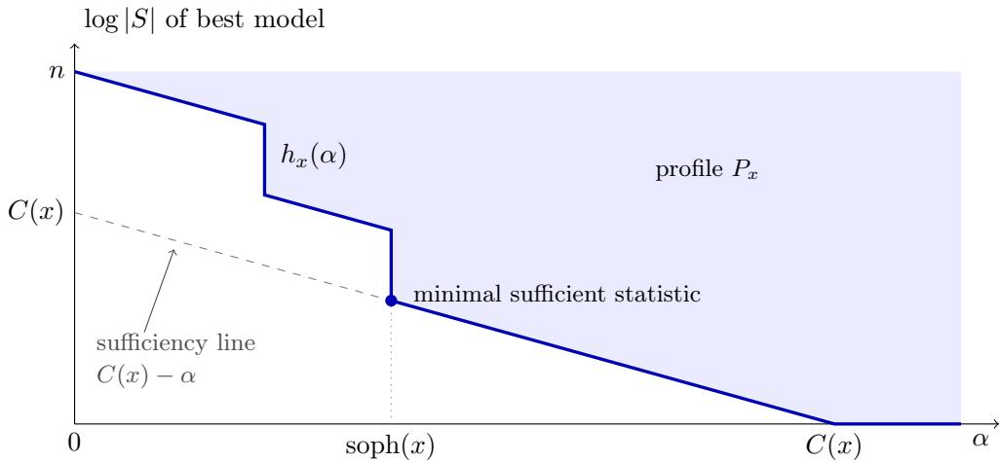
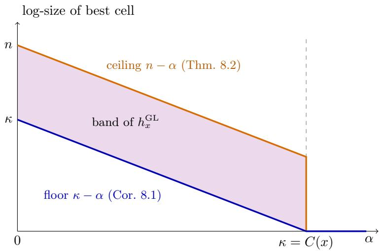
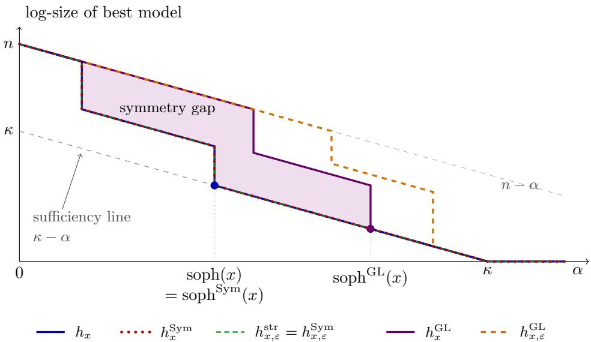

# CAS II: Symmetric Partitions as Kolmogorov Models

Romie Banerjee

September 2026

## Abstract

In algorithmic statistics a string x is explained by a finite set containing ${ \mathrm { i t } } ,$ and Kolmogorov’s structure function records the smallest such model at each level of complexity. The strong models of Vereshchagin, those computable from the data by a total algorithm, are essentially the cells of simple partitions. So a partition of $\{ 0 , 1 \} ^ { n }$ can be read as a hypothesis, and the cell containing x as the model it assigns. We develop algorithmic statistics over symmetric partitions, the orbit partitions of groups acting on strings.

The Galois connection between subgroups and partitions assigns to each ambient group G a lattice $\operatorname { P a r } _ { G }$ of symmetric partitions. Each has a canonical certificate whose cost equals that of the partition, and hypotheses can be combined by joins and meets. The resulting structure function $h _ { x } ^ { G }$ and symmetric sophistication $\mathrm { s o p h } ^ { G } ( x )$ measure which part of the regularity of x is symmetric.

For $G = \mathrm { S y m } ( \{ 0 , 1 \} ^ { n } )$ every partition is symmetric. Cells then recover all Kolmogorov models, and cells of cheap partitions recover exactly the strong models, so normal and strange strings are characterised by symmetry. For $G = \mathrm { G L } ( n , 2 )$ the cells are exactly the linearly homogeneous sets, which turns linear symmetry into a restricted model class. For every nonzero $\bar { x , } h _ { x } ^ { \mathrm { G L } }$ lies in a band between $C ( x ) \mathrm { ~ - ~ } \alpha$ and $n - \alpha ,$ and both edges are attained. In particular, there are stochastic normal strings whose simple structure is entirely invisible to linear symmetry: $\mathrm { s o p h } ( x ) \approx 0$ but $\mathrm { s o p h } ^ { \mathrm { G L } } ( x ) \approx C ( x )$

Finally, we coordinatise the space of permutation groups. Each group is an element of a Burnside ring (its type) together with a permutation (its placement), and restriction moves refine partitions cell by cell via the Mackey formula. In these coordinates the collapse for Sym is a statement about placement, a linear hypothesis is determined by its type up to $n ^ { 2 }$ bits, and the maximal gap theorem shows that any space of symmetry hypotheses small enough to search is small enough to miss simple structure.

## 1 Introduction

## 1.1 Models, strong models and partitions

Kolmogorov proposed to explain a string x by a finite set $S \ni x ,$ a model, and to measure the explanation by the two-part code $C ( x ) \lesssim C ( S ) + \log | S |$ : first the model, then the position of x in it, which is treated as noise [3, 1, 11, 10]. The structure function $h _ { x } ( \alpha )$ records the smallest model afordable at complexity $\alpha ,$ and a model is a suficient statistic when the two parts together cost no more than $C ( x )$

Arbitrary finite sets are too generous as models. The universal models of Gács, Tromp and Vitányi [1] can be suficient, yet they encode the number of strings of bounded complexity, so they cannot be found from the data. Vereshchagin [9] therefore singled out the strong models: those computable from x by a total algorithm. A total algorithm $x ^ { \prime } \mapsto A ( x ^ { \prime } )$ assigns a model to every string, and Milovanov [6] observed that this makes strong models essentially the cells of simple partitions of $\{ 0 , 1 \} ^ { n }$ . So beneath algorithmic statistics lies a theory of partitions. A partition p is a hypothesis: a classification of all strings into classes of strings the hypothesis cannot tell apart. The model for x is its cell, and the description becomes

$$
C ( x ) ~ \lesssim ~ \underbrace { C ( p ) } _ { \mathrm { h y p o t h e s i s } } ~ + ~ \underbrace { C ( B \mid p ) } _ { \mathrm { w h i c h ~ c e l l } } + \underbrace { \log \vert B \vert } _ { \mathrm { n o i s e } } , \qquad x \in B \in p .\tag{1.1}
$$

## 1.2 Symmetric partitions

Which partitions are structured hypotheses? The most natural source of classifications in mathematics and physics is symmetry: two strings are indistinguishable if some transformation from a group maps one to the other. The hypothesis is then the orbit partition of a group $U$ acting on strings, and the size of the cell of x is governed by its symmetry. By the orbit–stabiliser theorem,

$$
\log | U \cdot x | = \log | U | - \log | \mathrm { s t a b } _ { U } ( x ) | = - \log \operatorname* { P r } _ { u \in U } [ u x = x ] ,
$$

so strings with large stabilisers lie in small cells and receive short descriptions in (1.1). This is the precise sense in which symmetric objects are simple: a symmetry hypothesis explains x well when it is cheap and x is fixed by a large part of it.

Diferent groups can have the same orbits and then make the same hypothesis, so the group is best seen as a certificate that a partition arises from symmetry. The classical Galois connection between subgroups and partitions [2] makes this precise. For an ambient group $G$ acting on strings it singles out a lattice $\operatorname { P a r } _ { G }$ of symmetric partitions. Each symmetric partition has a canonical certificate, the largest subgroup with those orbits, which costs exactly as much as the partition. Hypotheses can be combined by joins and meets, and conjugation acts as relabelling. The theory of this paper is algorithmic statistics restricted to cells of symmetric partitions.

The choice of ambient group matters. For $G = \mathrm { S y m } ( \{ 0 , 1 \} ^ { n } )$ every partition is symmetric, and symmetry adds nothing to the theory of strong models. Its certificates turn out to be structurally trivial symmetries placed in complicated ways (Section 5). At the other extreme, the orbit partition of the stabiliser of x in a large group has $\{ x \}$ as a cell: a lossless description that costs $C ( x )$ . The informative cases lie in between and arise from structured ambient groups, above all the group ${ \mathrm { G L } } ( n , 2 )$ of linear symmetries of $\mathbb { F } _ { 2 } ^ { n }$

## 1.3 The question and the results

$C ( x )$ can always be recovered from a symmetric partition at full price, so the question is not whether but how: which part of the regularity of x is captured by cells of symmetric partitions, and at what cost? We measure this by the structure function $h _ { x } ^ { G }$ over $\operatorname { P a r } _ { G } .$ , and summarise it by the symmetric sophistication $\mathrm { s o p h } ^ { G } ( x )$ , the least cost at which a cell of a symmetric partition is a suficient statistic.

(1) Framework (Sections 3–4). The Galois connection between subgroups and partitions: symmetric partitions, their canonical certificates and costs, an algebra of joins and meets, and relabelling. Partition structure functions come with a dictionary between the group and partition formulations.

(2) All permutations (Section 5). Every partition is symmetric. Cells of symmetric partitions recover all Kolmogorov models, and cells of cheap ones recover exactly the strong models. The certificates realising arbitrary models have trivial type: all their information sits in the placement.

(3) Linear symmetry (Section 6). The cells of ParGL are the linearly homogeneous sets, but whole symmetric partitions are rigid. A linear hypothesis is determined by its type up to $n ^ { 2 }$ bits.

(4) A band and its extremes (Sections 7–8). For nonzero x, $C ( x ) - \alpha \leq h _ { x } ^ { \mathrm { G L } } ( \alpha ) \leq n - \alpha$ , both edges are attained, and there are stochastic normal strings with soph(x) ≈ 0 but soph ${ \mathrm { ^ { G L } } } ( x ) \approx C ( x ) { \mathrm { : } }$ : their regularity is simple and computable, yet no linear symmetry captures any of it. A figure places all the structure functions of the paper in one picture.

(5) Coordinates and search (Section 9). Every permutation group is a Burnside ring element (its type) together with a permutation (its placement), which gives coordinates on the spaces of permutation groups and symmetric partitions, and moves for navigating them. The maximal gap theorem limits what any search in these coordinates can achieve: coordinates small enough to search are small enough to miss simple structure.

  
Figure 1: A typical structure function (schematic, after [11]). It lies above the suficiency line, decreases with slope at most −1, and touches the line first at the minimal suficient statistic.

## 2 Preliminaries

## 2.1 Structure functions and sophistication

C is plain Kolmogorov complexity and $C T ( y \mid x )$ the total conditional complexity: the length of a shortest program that maps x to y and halts on every input. Strings have length n. Statements said to hold “up to ${ \cal O } ( \log n ) ^ { * }$ hold up to additive $O ( \log n )$ terms in all coordinates; c denotes a suficiently large constant.

Definition 2.1. The structure function of $x \in \{ 0 , 1 \} ^ { n }$ is $h _ { x } ( \alpha ) = \operatorname* { m i n } \{ \log | S | : x \in S \subseteq \{ 0 , 1 \} ^ { n } , \ C ( S ) \leq$ α} for $\alpha \geq c \log n . \mathrm { ~ \normalfont ~ { ~ A ~ } ~ }$ model is suficient if $C ( S ) + \log | S | \leq C ( x ) + c \log n ,$ and the sophistication soph $\quad ( x ) = \operatorname* { m i n } \{ \alpha : h _ { x } ( \alpha ) + \alpha \leq C ( x )$ + c log n} is the complexity of a minimal suficient statistic [4, 1, 11]. The string is stochastic if sop $\mathbf { \boldsymbol { \mathrm { 1 } } } ( \boldsymbol { x } ) = O ( \log n )$ , and antistochastic if $h _ { x } ( \alpha ) \approx n - \alpha$ for all $\alpha < C ( x ) \ [ 5 ]$

Lemma 2.2 ([11, 8]). $F o r x \in \{ 0 , 1 \} ^ { n }$ with $C ( \boldsymbol { x } ) = \kappa$ , up to $O ( \log n ) \colon ( i ) h _ { x } ( \alpha ) \geq \kappa - \alpha ; ( i i ) h _ { x } ( c \log n ) \leq$ n and $h _ { x } ( \kappa ) = 0 ;$ (iii) ( halving law) $h _ { x } ( \alpha ) + \alpha$ is non-increasing. Conversely $I 1 1 \jmath ,$ , every simple function with $( i ) - ( i i i )$ is the structure function of some x up to $O ( \log n )$ ; such functions are called admissible.

Figure 1 shows a typical structure function. The curve starts near n, where the only afordable model is essentially $\{ 0 , 1 \} ^ { n }$ , and reaches 0 at $\alpha \approx C ( x )$ , where {x} is afordable. It never lies below the suficiency line $C ( x ) - \alpha$ (Lemma $2 . 2 ( \mathrm { i } ) )$ , and by the halving law it falls by at least one bit per additional bit of model complexity, possibly in sudden drops. It first meets the suficiency line at the minimal suficient statistic, of complexity soph(x), and follows the line from there on. The region above the curve is the profile $P _ { x }$ of all pairs $( \alpha , \log | S | )$ achieved by models $S \ni x$ . For a stochastic string the curve drops to the suficiency line almost at once; for an antistochastic string it follows $n - \alpha$ until $\alpha \approx C ( x )$

## 2.2 Strong models and partitions

Definition 2.3 ([9, 6]). A model $A \ni x$ is ε-strong if $C T ( A \mid x ) \leq \varepsilon ,$ and $h _ { x , \varepsilon } ^ { \mathrm { s t r } } ( \alpha ) = \operatorname* { m i n } \{ \log | A | : x \in$ $A , \ C T ( A \mid x ) \leq \varepsilon , \ C ( A ) \leq \alpha \}$ . A string is (ε, δ)-normal if $h _ { x , \varepsilon } ^ { \mathrm { s t r } } ( \alpha + \delta ) \leq h _ { x } ( \alpha ) ^ { ' } +$ δ for all $\alpha _ { \mathrm { { : } } }$ , and strange if it has no strong minimal suficient statistic.

Strong models exclude the universal models of [1], which carry the information of the number of strings of bounded complexity [9]. Strange strings exist [9]; normal strings exist for every admissible shape [6]; antistochastic strings are normal [6]. The following lemma is the bridge to partitions.

Lemma 2.4 (Partition lemma [6]). $I f A \ni x$ is ε-strong, there is a partition p of $\{ 0 , 1 \} ^ { n }$ with $C ( p ) \leq$ $\varepsilon + O ( \log n )$ and a cell $A _ { 1 } \ni x \ o f \ p$ with $A _ { 1 } \subseteq A$ and $C ( A _ { 1 } ) \leq C ( A ) + \varepsilon + O ( \log n )$

Proof. Let p be a total program with $p ( x ) = A$ and $| p | \leq \varepsilon$ . Group the strings $x ^ { \prime }$ with $x ^ { \prime } \in p ( x ^ { \prime } )$ according to the value $p ( x ^ { \prime } )$ , and put every other string in a singleton cell. This partition is computable from $p$ and $n ,$ and the cell of x is $A _ { 1 } = \{ x ^ { \prime \prime } \in A : p ( x ^ { \prime \prime } ) = A \}$ , computable from $A , p$ and $n .$ □

## 2.3 Restricted model classes

A family A of finite sets is acceptable [12] (see also $\lbrack 6 , 8 \rbrack )$ if it is enumerable, contains every $\{ 0 , 1 \} ^ { n }$ , and satisfies the covering condition: for a fixed polynomial $p ,$ every $A \in { \mathcal { A } }$ and every $c < | A |$ , the n-bit strings of A are covered by at most $p ( n ) | A | / c$ members of A of size at most c.

Theorem 2.5 ([12]). If A is acceptable, $h _ { x } ^ { A }$ obeys the halving law, and for every admissible shape P there is x with $h _ { x }$ and $h _ { x } ^ { \mathcal { A } }$ both $C ( P ) + O ( { \sqrt { n \log n } } )$ -close to $P$

## 3 The Galois connection

## 3.1 Symmetric partitions

Fix an ambient finite group G acting on a finite set X, with $G = G _ { n }$ computable from n when $X = \{ 0 , 1 \} ^ { n }$ Let $L ( G )$ be the subgroup lattice and $\operatorname { P a r } ( X )$ the partition lattice, ordered by refinement $( p \leq q$ if every cell of p lies in a cell of q). Put

$$
\operatorname { o r b } _ { G } ( U ) = \{ { \mathrm { o r b i t s ~ o f ~ } } U \} , \qquad \operatorname { s t a b } _ { G } ( p ) = \{ g \in G : g ( B ) = B { \mathrm { ~ f o r ~ e v e r y ~ c e l l ~ } } B \in p \} .
$$

Proposition 3.1 ([2]). or $\ u \cup \ d \ d \ d \mathbf { U } \ d d \mathbf { U } \ d d \mathbf { U } \ d d \mathbf { U } \ d d \mathbf { U } \ d d \mathbf { U } \ d d \mathbf { U } \ d d \mathbf { U } \ d d \mathbf { U } \ d d \mathbf { U } \ d d \mathbf { U } \ d d \mathbf { U } \ d d \mathbf { U } \ d d \mathbf { U } \ d d \mathbf { U } \ d d \mathbf { U } \ d d \mathbf { U } \ d d \mathbf { U } \ d d \mathbf { U } \ d d \mathbf { U } \ d d \mathbf { U } \ d d \mathbf { U } \ d d \mathbf { U } \ d d \mathbf { U } \ d d \mathbf { U } \ d d \mathbf { U } \ d d \mathbf { U } \ d d \mathbf { U } \ d d \mathbf { U } \ d d \mathbf { U } \ d d \mathbf { U } \ d d \mathbf { U } \ d d \mathbf { U } \ d d \mathbf { U } \ d d \mathbf { U } \ d d \mathbf { U } \ d d \mathbf { U } \ d d \mathbf { U } \ d d \mathbf { U } \ d d \mathbf { U } \ d d \mathbf { U } \ d d \mathbf { U } \ d d \mathbf { U } \ d d \mathbf { U } \ d d \mathbf { U } \ d d \mathbf { U } \ d d \mathbf { U }$ . Hence both maps are monotone, $U \ \leq$ $\operatorname { s t a b } _ { G } \operatorname { o r b } _ { G } ( U )$ $\mathrm { o r b } _ { G } \mathrm { s t a b } _ { G } ( p ) \leq p .$ , and the closed subgroups $( U = \operatorname { s t a b } _ { G } \operatorname { o r b } _ { G } U )$ correspond bijectively and order-preservingly to the symmetric partitions $( p = \operatorname { o r b } _ { G } \operatorname { s t a b } _ { G } p )$ , which are exactly the orbit partitions of subgroups of G. Denote their lattice by $\operatorname { P a r } _ { G }$

Proof. If every U-orbit lies in a cell of $p ,$ each cell is a union of U-orbits and is U-invariant; conversely, if U preserves every cell its orbits lie in cells. The rest is the general theory of Galois connections.

The closed subgroup stabG(p) is the largest subgroup with orbit partition $p \mathrm { : }$ the canonical certificate of the hypothesis $p .$

Example 3.2.

(a) $G = { \mathrm { S y m } } ( X ) { \mathrm { : } }$ every partition is symmetric, and the canonical certificates are the Young subgroups $\prod _ { B \in { \mathfrak { p } } } \operatorname { S y m } ( B )$

(b) $G = { \dot { S } } _ { n }$ permuting the coordinates of $\{ 0 , 1 \} ^ { n }$ : or $\mathsf { b } ( S _ { n } )$ is the partition into weight classes; subgroups give finer “combinatorial” partitions.

(c) $G = \operatorname { G L } ( n , 2 )$ : symmetric partitions are rigid. If $W \neq \mathbb { F } _ { 2 } ^ { n }$ is a subspace with dim $W \geq 2$ , the partition $\{ W \setminus \{ 0 \} \} \cup \{ { \mathrm { s i n g l e t o n s } } \}$ is not symmetric: any g preserving it fixes every vector outside $W \backslash \{ 0 \}$ , these span $\mathbb { F } _ { 2 } ^ { n } .$ , so $g = 1$ . With a canonical complement D, the orbit partition of ${ \mathrm { G L } } ( W ) \times$ $\{ \mathrm { i d } _ { D } \}$ is symmetric; its cells are $\{ d \}$ and $d + ( W \setminus \{ 0 \} ) , d \in D$ . A cell can appear only together with the other orbits of its certificate.

## 3.2 Canonical cost

$C ( \boldsymbol p )$ is the complexity of a partition p of $\{ 0 , 1 \} ^ { n }$ as a finite object, $C ( \boldsymbol { p } , B )$ that of p with one of its cells, and $C ( U )$ the complexity of a generator list of $U$

Proposition 3.3 (Canonical cost). For $U \leq G$ with $p = { \mathrm { o r b } } _ { G } ( U )$ and a cell B of p:

$$
C ( { \mathrm { s t a b } } _ { G } p ) \leq C ( p ) + O ( 1 ) \leq C ( U ) + O ( 1 ) , \qquad C ( { \mathrm { s t a b } } _ { G } p , B ) = C ( p , B ) \pm O ( 1 ) .
$$

The canonical certificate is, up to $O ( 1 )$ , the cheapest group with the given orbits, and it costs exactly as much as the hypothesis.

Proof. Orbits are computable from generators; stab (p) is computable from $p$ by search in $G _ { n }$ , and n is recoverable from $p .$ □

## 3.3 The algebra of hypotheses

Since orbG is a lower adjoint it preserves joins, and stabG as an upper adjoint preserves meets:

$$
\operatorname { o r b } _ { G } ( \langle U , V \rangle ) = \operatorname { o r b } _ { G } ( U ) \vee \operatorname { o r b } _ { G } ( V ) , \qquad \operatorname { s t a b } _ { G } ( p \wedge q ) = \operatorname { s t a b } _ { G } ( p ) \cap \operatorname { s t a b } _ { G } ( q ) .
$$

So $\operatorname { P a r } _ { G }$ is closed under joins in $\operatorname { P a r } ( X )$ : the join of two hypotheses is the hypothesis of all their symmetries together, and is coarser. The meet in Par is $p \wedge _ { G } q = { \mathrm { o r b } } _ { G } ( { \mathrm { s t a b } } _ { G } p \cap$ sta $\qquad \ b _ { G } q ) \leq p \wedge q ,$ the hypothesis of their common symmetries, which is finer. Both are computable, so $C ( p \vee q ) , C ( p \wedge _ { G } q ) \leq$ $C ( p ) + C ( q ) + O ( \log n )$ . The cell of x in $p \land _ { G } q$ lies inside the intersection of its cells in p and q. Meeting with a second cheap hypothesis is thus the natural way to sharpen an explanation (compare the halving discussion in Section 7).

## 3.4 Relabelling

G acts by conjugation on $L ( G )$ and by translation on Par , and the two maps are equivariant: or $b _ { G } ( g U g ^ { - 1 } ) =$ $g \cdot \operatorname { o r b } _ { G } ( U )$ and stabG $( g \cdot p ) = g \mathrm { s t a b } _ { G } ( p ) g ^ { - 1 }$ . The model $( g \cdot p , g B )$ for gx is the model $( p , B )$ for x in new coordinates, and costs at most $C ( g ) + O ( 1 )$ more.

## 4 Partition structure functions

Definition 4.1. Let P assign to each n a family of partitions of $\{ 0 , 1 \} ^ { n }$ . A P-model for x is a pair $( p , B )$ with $p \in \mathcal P$ and $x \in B \in p$ . Define

$$
h _ { x } ^ { \mathcal { P } } ( \alpha ) = \operatorname* { m i n } \{ \log | B | : ( p , B ) \ \mathcal { P } \mathrm { - m o d e l } , \ C ( p , B ) \le \alpha \} ,
$$

$$
h _ { x , \varepsilon } ^ { \mathcal { P } } ( \alpha ) = \operatorname* { m i n } \{ \log | B | : ( p , B ) ~ \mathcal { P } \mathrm { - m o d e l } , ~ C ( p ) \le \varepsilon , ~ C ( p , B ) \le \alpha \} ,
$$

$$
\mathrm { s o p h } ^ { \mathcal { P } } ( x ) = \operatorname* { m i n } \{ \alpha : h _ { x } ^ { \mathcal { P } } ( \alpha ) + \alpha \leq C ( x ) + c \log n \} .
$$

$C ( \boldsymbol p )$ is the cost of the hypothesis and $C ( B \mid p )$ that of the cell; $C ( p , B ) = C ( p ) + C ( B \mid p )$ up to $O ( \log n )$ For an ambient group G we write $h _ { x } ^ { G } , \dot { h _ { x , \varepsilon } ^ { G } }$ and $\operatorname { s o p h } ^ { G }$ for $\mathcal { P } = \operatorname { P a r } _ { G }$

Proposition 4.2. Up to O(1) shifts: $( i ) \ h _ { x } \leq h _ { x } ^ { \mathcal { P } } \leq h _ { x , \varepsilon } ^ { \mathcal { P } }$ , and $\mathcal { P } \subseteq \mathcal { P } ^ { \prime }$ implies $h _ { x } ^ { \mathcal { P } ^ { \prime } } \leq h _ { x } ^ { \mathcal { P } } ; ( i i )$ every cell of a partition of complexity at most ε is $\left( \varepsilon + O ( 1 ) \right)$ -strong, so $h _ { x , \varepsilon + c } ^ { \mathrm { s t r } } \leq h _ { x , \varepsilon } ^ { \mathcal { P } } ; ( i i i ) \mathrm { s o p h } ( x ) \leq \mathrm { s o p h } ^ { \mathcal { P } } ( x )$ up to $O ( \log n )$ .

Proof. (i) A cell is a finite set containing x and $C ( B ) \leq C ( p , B ) + O ( 1 )$ . (ii) A total program knowing p maps x to its cell. □

Groups and partitions. The group formulation defines $h _ { x } ^ { L ( G ) } ( \alpha )$ as the least log $| U \cdot x |$ over subgroups $U \leq G$ with $C ( U , U \cdot x ) \leq \alpha .$ , and $h _ { x , \varepsilon } ^ { L ( G ) }$ by adding $C ( U ) \leq \varepsilon$

Theorem 4.3 (Dictionary). For every ambient G, up to $O ( 1 )$ shifts in α and $\varepsilon , \ h _ { x } ^ { L ( G ) } \ = \ h _ { x } ^ { G }$ and $h _ { x , \varepsilon } ^ { L ( G ) } = h _ { x , \varepsilon } ^ { G }$

Proof. A pair $( U , U \cdot x )$ gives the Par -model $( \mathrm { o r b } _ { G } U , U \cdot x )$ at no greater cost. A Par -model $( p , B )$ gives $( \mathrm { s t a b } _ { G } p , B )$ , and $\operatorname { s t a b } _ { G } ( p ) \cdot x = B$ because p is symmetric. Costs are compared by Proposition 3.3.

Proposition 4.4 (Burnside form). $I f \left( p , B \right)$ is a Par -model for x with certificate $U = \operatorname { s t a b } _ { G } ( p )$ , then $| B | = | U | / | \mathrm { s t a b } _ { U } ( x ) | = 1 / \operatorname* { P r } _ { u \in U } [ u x = x ]$ , so $C ( x \mid p , B ) \leq \log | B | + O ( 1 )$ . All but $a ~ 2 ^ { - t }$ fraction of $x ^ { \prime } \in B$ have $C ( x ^ { \prime } \mid p , B ) \geq \log | B | - t .$

<table><tr><td>symmetry</td><td>algorithmic statistics</td></tr><tr><td>symmetric partition  $p \in { \mathrm { P a r } } _ { G }$ </td><td>hypothesis (model class)</td></tr><tr><td>cell  $B \ni x$ </td><td>model</td></tr><tr><td>log  $| U | - \log | \mathrm { s t a b } _ { U } ( x ) |$ </td><td>log |B|</td></tr><tr><td> $C ( \boldsymbol p )$  small</td><td>strong model</td></tr><tr><td>x typical in its cell  $\mathrm { s o p h } ^ { G } ( x )$ </td><td>small randomness deficiency soph(x)</td></tr></table>

## 5 All permutations

Let Sym denote the ambient group $\operatorname { S y m } ( \{ 0 , 1 \} ^ { n } )$ . By Example $3 . 2 ( \mathrm { a } )$ , Pa $\mathrm { r } _ { \mathrm { S y m } }$ is the lattice of all partitions.

Theorem 5.1. Up to $O ( 1 )$ shifts, $h _ { x } ^ { \mathrm { S y m } } = h _ { x }$ , so $\mathrm { s o p h } ^ { \mathrm { S y m } } = \mathrm { s o p h }$ . Up to $O ( \varepsilon + \log n )$ shifts, $h _ { x , \varepsilon } ^ { \mathrm { S y m } } = h _ { x , \varepsilon } ^ { \mathrm { s t r } }$

Proof. For $S \ni x$ , the partition $\{ S \} \cup \{ { \mathrm { s i n g l e t o n s } } \}$ costs $C ( S ) + O ( 1 )$ . For the second claim combine Proposition $4 . 2 ( \mathrm { i i } )$ with the partition lemma (Lemma 2.4). □

Corollary 5.2. Up to $O ( \varepsilon + \delta + \log n )$ , a string is $( \varepsilon , \delta )$ -normal if and only if cells of partitions of complexity at most ε (equivalently, orbits of groups of complexity at most ε) are as good as arbitrary models at every level. It is strange if and only if no such cell is a minimal suficient statistic. So there are strings with no suficient cheap symmetry explanation $I ^ { g } J ,$ and every admissible shape is realised by a string whose cheap-symmetry structure function equals its Kolmogorov structure function [6].

Theorem 5.1 says that unrestricted symmetry explains everything. As a statement about symmetry this is vacuous: in the coordinates of Section 9, the certificates realising arbitrary sets are structurally trivial symmetries whose information lies entirely in their placement (Proposition 9.4).

## 6 Linear symmetry

Identify $\{ 0 , 1 \} ^ { n }$ with $\mathbb { F } _ { 2 } ^ { n }$ and take $G = { \mathrm { G L } } ( n , 2 )$ . Linear maps fix 0, so throughout $x \neq 0$

## 6.1 Cells: linearly homogeneous sets

Which sets can be cells of linear-symmetric partitions? A linear map preserves all $\mathbb { F } _ { 2 ^ { - } }$ -linear dependencies, so a set can be an orbit of a linear group only if its internal dependency structure looks the same from each of its points. We make this precise.

A relation in $S \subseteq \mathbb { F } _ { 2 } ^ { n } \setminus \{ 0 \}$ is a subset $T \subseteq S$ with $\textstyle \sum T = 0$ , an XOR dependency among elements of S. For example, in $S = \{ e _ { 1 } , e _ { 2 } , e _ { 1 } + e _ { 2 } \}$ the whole set is a relation, since $e _ { 1 } + e _ { 2 } + ( e _ { 1 } + e _ { 2 } ) = 0$ . The family of all relations is the dependency structure of S (the binary matroid it represents). A permutation π of S preserves relations if ${ \textstyle \sum } T = 0 \Longleftrightarrow \sum \pi ( T ) = 0$ for all $T \subseteq S$ , i.e. if it is an automorphism of the dependency structure.

Definition 6.1. A set $S \subseteq \mathbb { F } _ { 2 } ^ { n } \setminus \{ 0 \}$ is linearly homogeneous if the relation-preserving permutations of S act transitively on S: for any $s , s ^ { \prime } \in S$ some automorphism of the dependency structure maps s to $s ^ { \prime } .$

The analogy is with vertex-transitive graphs, where every vertex looks alike; here every point looks alike with respect to XOR dependencies instead of edges. Two extreme cases show the range of the notion. A linearly independent set has no relations, so every permutation preserves them and the set is homogeneous. A punctured subspace $W \backslash \{ 0 \}$ has as many relations as possible, but GL(W) moves any nonzero vector to any other while preserving them, so it too is homogeneous. Homogeneity fails when some points play special roles.

Example 6.2. Linearly homogeneous sets include: $W \backslash \{ 0 \}$ for a subspace $W ;$ afine subspaces $a + W$ with $a \notin W ;$ ; linearly independent sets; weight classes and other orbits of coordinate permutation groups; and cosets of multiplicative subgroups of $\mathbb { F } _ { 2 ^ { n } } ^ { \times }$ , identifying $\mathbb { F } _ { 2 } ^ { n }$ with $\mathbb { F } _ { 2 ^ { n } }$ . The set $\{ e _ { 1 } , e _ { 2 } , e _ { 1 } + e _ { 2 } , e _ { 3 } \}$ is not homogeneous: $e _ { 1 }$ lies in the three-term relation $\{ e _ { 1 } , e _ { 2 } , e _ { 1 } + e _ { 2 } \}$ while $e _ { 3 }$ lies in no relation, so no relation-preserving permutation maps $e _ { 1 }$ to $e _ { 3 }$

The key fact is a small piece of linear algebra: a permutation of S extends to an invertible linear map $i f$ and only if it preserves relations. This gives the characterisation of cells.

Theorem 6.3. $S \subseteq \mathbb { F } _ { 2 } ^ { n } \setminus \{ 0 \}$ is a cell of some partition in $\mathrm { P a r } _ { \mathrm { G L } }$ if and only if it is linearly homogeneous. Moreover such a cell is a cell of a symmetric partition of complexity $C ( S ) { + } O ( 1 )$ , so $h _ { x } ^ { \mathrm { G L } }$ is Kolmogorov’s structure function restricted to linearly homogeneous sets.

Proof. If $U \cdot x = S .$ , every $u \in U$ restricts to a relation-preserving bijection of S, and these act transitively. Conversely, a relation-preserving π defines a linear bijection $\begin{array} { r } { L _ { \pi } ( \sum _ { s \in T } s ) = \sum _ { s \in T } \pi ( s ) } \end{array}$ of $\operatorname { s p a n } ( S )$ . It is well defined, because $\sum T = \sum T ^ { \prime }$ implies $\Sigma ( T \triangle T ^ { \prime } ) = 0$ and hence $\begin{array} { r } { \sum \bar { \pi } ( T ) = \sum \bar { \pi } ( T ^ { \prime } ) } \end{array}$ , and it is injective, because $\pi ^ { - 1 }$ also preserves relations. Extend it by the identity on a canonical complement. The resulting group is computable from $S ,$ its orbit through x is $S _ { \mathrm { { ; } } }$ , and its orbit partition costs $C ( S ) + O ( 1 )$ □

Why this matters: linear symmetry as a restricted model class. Theorem 6.3 places the linear theory inside the general theory of restricted model classes of Section 2.3.

(1) The groups disappear. $h _ { x } ^ { \mathrm { G L } }$ is defined by ranging over subgroups of ${ \mathrm { G L } } ( n , 2 )$ and their orbits. The theorem identifies it with $h _ { x } ^ { \mathcal { A } }$ for the concrete, combinatorially defined family $\mathcal { A } _ { \mathrm { G L } }$ of linearly homogeneous sets. Questions about linear symmetry become questions about a family of sets, and the tools of Vereshchagin–Vitányi [12] apply directly.

(2) The restriction costs nothing extra. A homogeneous set comes with a certificate computable from it, so the symmetry hypothesis costs no more than the set itself. Every diference between $h _ { x } ^ { \mathrm { G L } }$ and $h _ { x }$ is therefore caused by which sets are admissible, not by any overhead of describing groups. This is a diferent kind of restriction from strong models, where the models are ordinary sets but must be computable from the data.

(3) It explains why linear symmetry does not collapse. For $\operatorname { S y m } ( \{ 0 , 1 \} ^ { n } )$ every set is a cell, and symmetric models are all models (Theorem 5.1). For ${ \mathrm { G L } } ( n , 2 )$ only homogeneous sets qualify. A string whose good models all have inhomogeneous dependency structure cannot be explained well by linear symmetry. This is the gap measured by the band (Section 7) and realised at its maximum by Theorem 8.2.

(4) The class is small. There are at most $2 ^ { n ^ { 4 } + n }$ homogeneous subsets of $\mathbb { F } _ { 2 } ^ { n }$ , since each is an orbit of one of at most $2 ^ { n ^ { 4 } }$ subgroups. Arbitrary sets number $2 ^ { 2 ^ { n } }$ . This size diference is what the counting proof of Theorem 8.2 exploits.

(5) The class is not closed under halving. Half of a homogeneous set is usually not homogeneous, since the two halves need not look alike internally. So the covering condition of acceptability, automatic for all sets and easy for afine subspaces, is a genuine question for ${ \mathcal { A } } _ { \mathrm { G L } }$ . This is why the halving law for $h _ { x } ^ { \mathrm { G L } }$ is open (Question 7.2).

(6) Membership is a finite test. Deciding whether a proposed set is a legitimate linear-symmetry model requires no search over groups: one checks that its dependency structure is point-transitive.

Since linear maps fix 0, homogeneous sets avoid 0, and $\mathcal { A } _ { \mathrm { G L } }$ contains $\mathbb { F } _ { 2 } ^ { n } \setminus \{ 0 \}$ rather than the whole space required in the definition of acceptability. This changes nothing up to $O ( 1 )$

Single cells are constrained only by homogeneity, but whole symmetric partitions are rigid (Example $3 . 2 ( \mathrm { c } ) \}$ . This matters for the strong version $\bar { h } _ { x , \varepsilon } ^ { \mathrm { G L } }$ , which requires a cheap symmetric partition containing the cell (Question 10.1). Linear hypotheses also have little room to hide information in placement: a subgroup of ${ \mathrm { G L } } ( n , 2 )$ is determined by its $\mathrm { t y p e }$ , an abstract group with a faithful module, up to $n ^ { 2 }$ bits (Proposition 9.5).

## 6.2 Afine hypotheses

Every afine subspace is a cell of a cheap symmetric partition. For $W \backslash \{ 0 \}$ this is Example $3 . 2 ( \mathrm { c } )$ . For $a + W$ with $a \notin W$ , fix a complement D of $W \oplus \langle a \rangle$ , and for $w \in W$ let $\tau _ { w }$ fix W ⊕ D pointwise and send $a \mapsto a + w$ . The group $\{ \tau _ { w } \} \cong W$ has cells $\{ v \}$ for $v \in W \oplus D$ and $a + d + W$ for $d \in D$ , at cost $C ( W , a ) + O ( 1 )$ . Writing $h _ { x } ^ { \mathrm { a f f } }$ for the structure function over afine subspaces, we get, up to $O ( \log n )$

$$
h _ { x } \ \leq \ h _ { x } ^ { \mathrm { G L } } \ \leq \ h _ { x } ^ { \mathrm { a f f } } , \qquad h _ { x } \ \leq \ h _ { x , \varepsilon } ^ { \mathrm { s t r } } \ \leq \ h _ { x , \varepsilon } ^ { \mathrm { G L } } .\tag{6.1}
$$

## 7 The band

Theorem 7.1 (Band). Let $x \in \mathbb { F } _ { 2 } ^ { n } \setminus \{ 0 \}$ with $C ( x ) = \kappa$ . Up to $O ( \log n )$

$$
\kappa - \alpha \leq h _ { x } ( \alpha ) \leq h _ { x } ^ { \mathrm { G L } } ( \alpha ) \leq h _ { x } ^ { \mathrm { a f f } } ( \alpha ) \leq n - \alpha \ f o r \ c \log n \leq \alpha \leq \kappa ;
$$

(ii) $h _ { x } ^ { \mathrm { G L } } ( c \log n ) \leq \log ( 2 ^ { n } - 1 )$ and $h _ { x } ^ { \mathrm { G L } } ( \kappa ) = 0 ;$

(iii) $0 \leq h _ { x } ^ { \mathrm { G L } } ( \alpha ) - h _ { x } ( \alpha ) \leq n - \kappa$ , and soph(x) ≤ sophGL(x) ≤ κ;

(iv) $\begin{array} { r } { ( r e l a b e l l i n g ) ~ f o r ~ g \in \operatorname { G L } ( n , 2 ) , ~ h _ { g x } ^ { \operatorname { G L } } ( \alpha + C ( g ) + c ) \le h _ { x } ^ { \operatorname { G L } } ( \alpha ) . } \end{array}$

Proof. (i) By Lemma 2.2(i) and (6.1); for the last inequality use the afine subspace of strings agreeing with x in the first $j$ coordinates. (ii) Use the partitions $\{ \{ 0 \} , \mathbb { F } _ { 2 } ^ { n } \setminus \{ 0 \} \}$ and the discrete partition. (iii) Follows from (i) and (ii). (iv) By equivariance of the Galois connection. □

  
Figure 2: The band containing $h _ { x } ^ { \mathrm { G L } }$ (Theorem 7.1); both edges are attained.

All the structure functions together. Figure 3 places the structure functions of this paper in one picture, for a typical normal string x of length n with $\kappa = C ( x )$ . Normal strings are the common case. A stochastic string has a simple, hence strong, suficient model, so strangeness forces non-stochasticity, and non-stochastic strings have small a priori probability [10]. The figure shows six curves, of which three coincide for normal strings, together with two guide lines and three marked points. It should be read as follows.

(1) The guides. The lower dashed line is the suficiency line $\kappa - \alpha$ , and the upper one is the ceiling $n - \alpha$ . By Lemma 2.2(i) and Theorem 7.1(i), every curve in the figure lies between them for c log $n \leq \alpha \leq \kappa ,$ up to $O ( \log n )$ . A model on the suficiency line is suficient; a curve on the ceiling means that the models of that kind are no better than those of a random string of length n.

(2) The order of the curves (proved for every x). By Proposition 4.2, up to $O ( 1 )$ shifts,

$$
h _ { x } \leq h _ { x , \varepsilon } ^ { \mathrm { s t r } } \leq h _ { x , \varepsilon } ^ { \mathrm { G L } } , \qquad h _ { x } \leq h _ { x } ^ { \mathrm { G L } } \leq h _ { x , \varepsilon } ^ { \mathrm { G L } } .
$$

The cheap linear-symmetry curve pays for two restrictions at once: its models must be linearsymmetric and strong.

(3) The endpoints (proved for every x). At the cheapest budget every curve is at most n: the one-cell partition and the partition $\{ \{ 0 \} , \bar { \mathbb { F } } _ { 2 } ^ { n } \setminus \{ 0 \} \}$ cost $O ( \log n )$ . At α ≈ κ every curve vanishes, since the discrete partition is cheap and its cell {x} costs κ. All diferences between the curves occur for c log $n \leq \alpha \leq \kappa$

(4) Kolmogorov’s curve $h _ { x }$ (solid blue) has the typical shape of Figure 1. It starts on the ceiling, decreases by at least one bit per bit of budget (the halving law), with two sudden drops, and first meets the suficiency line at its minimal suficient statistic (blue dot), of complexity soph(x). From there it follows the suficiency line down to $\alpha = \kappa$

(5) The unrestricted symmetric curve $h _ { x } ^ { \mathrm { S y m } }$ (red dots) lies on $h _ { x }$ for every string, not only for normal ones. This is the collapse of Theorem 5.1: every finite set is a cell of a partition symmetric under $\mathrm { S y m } ( \{ 0 , 1 \} ^ { n } )$ , at no extra cost. In particular sop $\mathrm { { h ^ { S y m } ( x ) = \mathrm { { s o p h } ( \it { x ) } } } }$ , and the two tick labels at the blue dot coincide. The coincidence is uninformative about symmetry, since by Proposition 9.4 the certificates realising arbitrary models have trivial type.

(6) The strong curve $h _ { x , \varepsilon } ^ { \mathrm { s t r } }$ (green dashes) also lies on $h _ { x }$ . This is the definition of normality: every point of the profile is attained by an ε-strong model, up to δ. By Theorem 5.1 the same curve is the cheap unrestricted symmetric curve $h _ { x , \varepsilon } ^ { \mathrm { S y m } }$ . For a strange string it would separate from $h _ { x }$ and lie above it, while $h _ { x } ^ { \mathrm { S y m } }$ would still lie on $h _ { x }$

(7) The linear-symmetry curve $h _ { x } ^ { \mathrm { G L } }$ (solid violet) uses cells of symmetric partitions of ${ \mathrm { G L } } ( n , 2 )$ of any cost, that is, linearly homogeneous sets (Theorem 6.3). In the figure it follows the ceiling up to $\alpha \approx \kappa / 2 \colon$ at those budgets no linear symmetry sees any structure of $x .$ It then drops, decreases along a segment of slope −1, drops again, and first meets the suficiency line at the violet dot, whose complexity is the symmetric sophistication $\mathrm { s o p h } ^ { \mathrm { G L } } ( x )$ . By Theorem 7.1(iii), soph $. ( x ) \leq \mathrm { s o p h } ^ { \mathrm { G L } } ( x ) \leq \kappa$

(8) The symmetry gap (shaded) is the region between $h _ { x }$ and $h _ { x } ^ { \mathrm { G L } }$ . At each budget it is the part of the regularity of x that linear symmetry does not see. Its horizontal extent at the suficiency line, $\mathrm { s o p h } ^ { \mathrm { G L } } ( x ) - \mathrm { s o p h } ( x )$ , is the extra budget symmetric explanations need before they become suficient. By Corollary 8.1 the region can be empty, with $h _ { x } ^ { \mathrm { G L } } = h _ { x }$ . By Theorem 8.2 it can fill the whole band, with $h _ { x } ^ { \mathrm { G L } }$ on the ceiling up to $x \approx \kappa ,$ even for stochastic normal strings.

(9) The cheap linear-symmetry curve $h _ { x , \varepsilon } ^ { \mathrm { G L } }$ (orange dashes) uses only cells of symmetric partitions of complexity at most ε. In the figure it agrees with $h _ { x } ^ { \mathrm { G L } }$ on the ceiling, where the cylinder partitions fixing the first j coordinates are cheap, and lies above it afterwards. There the good linear-symmetric cells of x exist only inside expensive symmetric partitions: the rigidity efect of Question 10.1. It meets the suficiency line only at the right end, just before $\alpha = \kappa$ . Because x is normal, this separation from $h _ { x } ^ { \mathrm { G L } }$ is caused by symmetry, not by strangeness.

(10) The marked points. On the horizontal axis: $\operatorname { s o p h } ( x )$ , equal to $\mathrm { s o p h } ^ { \mathrm { S y m } } ( x )$ , where $h _ { x }$ and $h _ { x } ^ { \mathrm { S y m } }$ become suficient; $\mathrm { s o p h } ^ { \mathrm { G L } } ( x )$ , where $h _ { x } ^ { \mathrm { G I } }$ becomes suficient; and $\kappa ,$ where all curves vanish. On the vertical axis: $n ,$ where all curves start, and $\kappa ,$ where the suficiency line starts.

Items (1)–(6) and the inequality in $( 7 )$ are theorems; item (10) only names the marked points. The particular shapes of $h _ { x } ^ { \mathrm { G L } }$ and $h _ { x , \varepsilon } ^ { \mathrm { G L } }$ are illustrative. Which shape is typical is open, and so is whether the rigidity separation in (9) occurs at all. Whether the GL curves obey the halving law (Question 7.2) is also open. If they do not, they may have plateaus, which $h _ { x }$ never has.

  
Figure 3: The structure functions for a typical normal string. The curves $h _ { x } , h _ { x } ^ { \mathrm { S y m } }$ and $h _ { x , \varepsilon } ^ { \mathrm { s t r } } = h _ { x , \varepsilon } ^ { \mathrm { S y m } }$ coincide; the first two coincide for every string. The shaded region is the symmetry gap. The ordering, the guides, the endpoints and the coincidences are proved; the shapes of the two GL curves are illustrative. See items (1)–(10) in the text.

Halving as refinement. Afine subspaces form an acceptable class: a coset of dimension d splits into at most $2 | A | / c$ cosets of size at most c. By Theorem $2 . 5 , h _ { x } ^ { \mathrm { a \bar { f } } }$ obeys the halving law. For $h _ { x } ^ { \mathrm { G L } }$ the question becomes one about the lattice $\mathrm { P a r _ { G L } }$ . Given a symmetric p with $x \in B \in p ,$ is there a cheap symmetric refinement whose cell containing x has size about $| B | / 2 ?$ The algebra of Section 3 suggests meeting p with a second cheap hypothesis q: the cell of x in $p \wedge _ { \mathrm { G L } } q$ lies in the intersection of its cells. Transitivity alone does not obstruct this. ${ \mathrm { G L } } ( n , 2 )$ is 2-transitive on nonzero vectors, so no subgroup between stab(x) and ${ \mathrm { G L } } ( n , 2 )$ refines the orbit of $x ,$ but subgroups not containing stab(x) can.

Question 7.2. Is the family of cells of ParG acceptable, i.e. can every cell of size N be covered by $\mathrm { p o l y } ( n ) N / c$ cells of size at most c? Equivalently for the halving law: does every cell admit cheap symmetric refinements, for instance by meets? If not, does $h _ { x } ^ { \mathrm { G L } }$ exhibit a plateau for some x?

## 8 The extremes of the band

## 8.1 Zero gap: symmetry explains everything

Corollary 8.1. For every admissible shape P there is a string x with $h _ { x } \approx h _ { x } ^ { \mathrm { G L } } \approx h _ { x } ^ { \mathrm { a f f } } \approx P$ , up to $C ( P ) + O ( { \sqrt { n \log n } } )$ , so $\mathrm { s o p h } ^ { \mathrm { G L } } ( x ) = \mathrm { s o p h } ( x )$ to the same accuracy.

Proof. Theorem 2.5 applied to afine subspaces, and (6.1).

## 8.2 Maximal gap: structure invisible to symmetry

Theorem 8.2 (Maximal gap). There is a constant c such that for all $n ,$ all c log $n \leq m \leq n$ and all $t \geq 0$ there are strings $x \in \{ 0 , 1 \} ^ { n }$ with:

(a) $C ( x ) = m \pm O ( t + \log n )$ and $h _ { x } ( \alpha ) = m - \alpha \pm O ( t + \log n )$ for c log $n \leq \alpha \leq m ; :$ x is stochastic and (O(log n), O(t + log n))-normal;

$$
( b ) \ h _ { x } ^ { \mathrm { G L } } ( \alpha ) \geq n - \alpha - t - O ( \log n ) \ f o r \ a l l \ \alpha \leq m - t - c \log n .
$$

In fact all but a $2 ^ { - t }$ fraction of a set S with $C ( S ) = O ( \log n )$ and $| S | \approx 2 ^ { m }$ have these properties.

Proof. Counting cells. By Proposition 9.5, or simply because a group of order N has a generating set of size log N, there are at most $2 ^ { n ^ { \overline { { 4 } } } }$ subgroups of $\operatorname { G L } ( n , 2 )$ , hence at most $2 ^ { n ^ { 4 } + n }$ cells of symmetric partitions.

A set that no cell sees. Put each string into a random S independently with probability $2 ^ { m - n }$ . For a cell B let $R _ { B } = \operatorname* { m a x } ( 2 e 2 ^ { m - n } | B | , n ^ { 5 } )$ . The Chernof bound $\operatorname* { P r } [ \bar { X } \geq R ] \leq 2 ^ { - R }$ for $R \geq 2 e \mathbb { E } X$ [7] gives $\operatorname* { P r } [ | S \cap B | \geq R _ { B } ] \leq 2 ^ { - n ^ { 5 } }$ . A union bound, and concentration of $| S |$ , show that with positive probability

$$
2 ^ { m - 1 } \leq | S | \leq 2 ^ { m + 1 } \quad \mathrm { a n d } \quad | S \cap B | < \operatorname* { m a x } ( 2 e 2 ^ { m - n } | B | , n ^ { 5 } ) \mathrm { ~ f o r ~ e v e r y ~ c e l l ~ } B .\tag{8.1}
$$

This property is decidable, so the lexicographically first such S has $C ( S ) = O ( \log n )$

Typical elements. All but a $2 ^ { - t }$ fraction of $x \in S$ have $C ( x ) \geq m - t ;$ fix one.

(a) Cutting S into $2 ^ { j }$ consecutive pieces gives models of complexity $j + O ( \log n )$ and size at most $2 ^ { m + 1 - j }$ , each computable from x by a total program of length $O ( \log n )$ . With Lemma 2.2(i) this gives $h _ { x }$ and normality.

(b) Fix $\alpha , s .$ . Fewer than $2 ^ { \alpha + 1 }$ models $( p , B )$ have $C ( p , B ) \leq \alpha .$ , and the union U of those cells with $| B | \le 2 ^ { s }$ is enumerable from n, m, α, s. By (8.1), $| U \cap S | \leq 2 ^ { \alpha + 1 }$ max $\cdot ( 2 e 2 ^ { m - n + s } , n ^ { 5 } )$ . If $x \in U$ , then

$$
m - t \leq C ( x ) \leq \log | U \cap S | + O ( \log n ) \leq \alpha + \operatorname* { m a x } ( m - n + s , { \mathrm { ~ } } 5 \log n ) + O ( \log n ) .
$$

For $\alpha \leq m - t - c \log n$ the second branch is impossible, so $s \geq n - \alpha - t - O ( \log n )$

Corollary 8.3 (Simple structure, invisible to symmetry). If moreover $m \leq n - t - c ^ { \prime }$ log n, these strings satisfy soph $( x ) = O ( \log n )$ but soph $^ \mathrm { G L } ( x ) \geq C ( x ) - O ( t + \log n )$ . They are stochastic and normal, yet no cell of a symmetric partition costing less than $C ( x ) - O ( t + \log n )$ is suficient: every suficient symmetric model essentially names x itself. The gap between the two chains in (6.1) is a symmetry phenomenon, not a computability one.

Proof. By (b), $h _ { x } ^ { \mathrm { G L } } ( \alpha ) + \alpha \geq n - t - O ( \log n ) > C ( x ) + c \log n { \mathrm { ~ f o r ~ } } \alpha \leq m - t - c \log n .$

Remark. The argument only uses that the partition family has $2 ^ { \mathrm { p o l y } ( n ) }$ cells and is decidable. So every such family, for instance ParG for any ambient group of order $2 ^ { \mathrm { p o l y } ( n ) }$ , has stochastic normal strings that it sees as antistochastic. The construction is not explicit

## 9 Coordinates on the space of permutation groups

The Galois connection organises symmetry hypotheses into a lattice. To move through that lattice, and to search it, we need coordinates. This section shows that every permutation group is a Burnside ring element (its type) together with a permutation (its placement), compares the two ambient groups in these terms, and discusses what the maximal gap theorem implies for searching the coordinates for good models.

## 9.1 The coordinate theorem

We give coordinates on the set of all permutation groups on a finite set $X , \ \vert X \vert \ = \ N ;$ in our setting $X = \{ 0 , 1 \} ^ { n }$ and $N = 2 ^ { n }$ . Via the Galois connection of Section 3 these become coordinates on symmetric partitions, and they are used to navigate both spaces. To keep G for the ambient group, we write H for the abstract group.

A subgroup $U \leq S _ { X }$ is the image of a faithful action $\rho \colon H  S _ { X }$ of an abstract group $H \cong U$ Up to isomorphism of H-sets, the action is determined by its class in the Burnside ring $B ( H )$ . Fix representatives $K _ { 1 } , \ldots , K _ { r }$ of the conjugacy classes of subgroups of H. Then

$$
[ X ] _ { \rho } = \sum _ { i = 1 } ^ { r } a _ { i } \left[ H / K _ { i } \right] , \qquad a _ { i } \geq 0 , \qquad \deg [ X ] _ { \rho } : = \sum _ { i } a _ { i } \left| H : K _ { i } \right| = N .
$$

The action is faithful if $\begin{array} { r } { \bigcap _ { a _ { i } > 0 } \mathrm { c o r e } _ { H } ( K _ { i } ) = 1 } \end{array}$ , where core $\begin{array} { r } { \mathbf { \Lambda } _ { H } ( K ) = \bigcap _ { h } h K h ^ { - 1 } } \end{array}$ is the kernel of H on $H / K$ By Burnside’s theorem, $b \in B ( H )$ is determined by its marks $\varphi _ { K } ( b ) = | X _ { b } ^ { K } |$ , the number of points fixed by K.

Definition 9.1 (Canonical realisation). Let $B _ { N } ( H )$ be the set of faithful $\begin{array} { r } { b = \sum a _ { i } [ H / K _ { i } ] } \end{array}$ of degree N. Fix H concretely (with a total order on its elements) and the representatives $K _ { i }$ canonically. For $b \in B _ { N } ( H )$ let $X _ { b }$ be the disjoint union of $a _ { i }$ copies of $H / K _ { i } ,$ , ordered by i, then by copy, then by the least element of each coset. Identify $X _ { b }$ with X in lexicographic order. This gives a faithful action $\rho _ { b }$ and a canonical subgroup $U _ { b } = \rho _ { b } ( H ) \leq S _ { X }$

Theorem 9.2 (Coordinates). Let $S _ { H } ( X ) = \{ U \leq S _ { X } : U \cong H \}$ and

$$
\Phi _ { H } \colon B _ { N } ( H ) \times S _ { X }  S _ { H } ( X ) , \qquad \Phi _ { H } ( b , \sigma ) = \sigma U _ { b } \sigma ^ { - 1 } .
$$

(i) $\Phi _ { H }$ is surjective: every $U \cong H$ has coordinates $( b , \sigma )$

(ii) For fixed $b , \ \Phi _ { H } ( b , \sigma ) = \Phi _ { H } ( b , \sigma ^ { \prime } ) \ i f f \sigma ^ { - 1 } \sigma ^ { \prime } \in N _ { S _ { X } } ( U _ { b } )$

(iii) $\Phi _ { H } ( b , \sigma )$ and $\Phi _ { H } ( b ^ { \prime } , \sigma ^ { \prime } )$ are conjugate in $S _ { X } \ i f f \ b ^ { \prime } \in \operatorname { A u t } ( H ) \cdot b$ , where $\alpha \in \operatorname { A u t } ( H )$ acts $b y \left[ H / K \right] \mapsto$ $[ H / \alpha ( K ) ]$

Consequently

$$
S _ { H } ( X ) = \bigcup _ { [ b ] \in B _ { N } ( H ) / \mathrm { A u t } ( H ) } S _ { X } / N _ { S _ { X } } ( U _ { b } ) :
$$

the type [b] is a discrete coordinate labelling conjugacy classes, and the placement σ is a coordinate on the homogeneous space $S _ { X } / N _ { S _ { X } } ( U _ { b } )$ . The whole space of permutation groups on X is the disjoint union of these pieces over the isomorphism classes of H with a faithful action of degree $N$

Proof. (i) Fix an isomorphism ψ : $H  U$ . The H-set X with action ψ is faithful of some class $b \in B _ { N } ( H )$ so there is an isomorphism of H-sets $\sigma \colon ( X , \rho _ { b } ) \to ( X , \psi )$ , i.e. $\sigma \rho _ { b } ( h ) \sigma ^ { - 1 } = \psi ( h )$ for all $h .$ Hence $U = \sigma U _ { b } \sigma ^ { - 1 }$ . (ii) This is the definition of the normaliser. (iii) If $\tau U _ { b } \tau ^ { - 1 } = U _ { b ^ { \prime } }$ , then $\alpha = \rho _ { b ^ { \prime } } ^ { - 1 } \circ c _ { \tau } \circ \rho _ { b }$ is an automorphism of $H$ , and $\tau$ is an isomorphism of H-sets from $X _ { b }$ to $X _ { b ^ { \prime } }$ twisted by $\alpha ,$ so $b ^ { \prime } = \alpha \cdot b .$ The converse reverses the argument. □

Partitions and cells in coordinates. The orbits of $U _ { b }$ are the summands of $X _ { b }$ , which are consecutive intervals of X. Let $\lambda ( b )$ be the integer partition of N with part $| H : K _ { i } |$ repeated $a _ { i }$ times, and $p _ { \lambda ( b ) }$ the corresponding partition of X into consecutive intervals. Then

$$
\mathrm { o r b } \big ( \Phi _ { H } ( b , \sigma ) \big ) = \sigma \cdot p _ { \lambda ( b ) } .
$$

So partitions have coordinates $( \lambda , \sigma )$ , with σ defined modulo the stabiliser of $p _ { \lambda }$ in $S _ { X }$ . The projection $( b , \sigma ) \mapsto ( \lambda ( b ) , \sigma )$ is orb written in coordinates: it forgets the structure of b beyond its cell sizes. If $\sigma ^ { - 1 } ( x )$ lies in a summand of type $H / K _ { i }$ , then the cell of x has size $| H : K _ { i } |$ , its stabiliser is conjugate to $K _ { i }$ , and

$$
\operatorname* { P r } _ { u \in U } [ u x = x ] = { \frac { | K _ { i } | } { | H | } } .
$$

The marks $\varphi _ { K } ( b )$ give the whole distribution of cell sizes and fixed points over $X ;$ Proposition 4.4 is the pointwise case.

Proposition 9.3 (Complexity in coordinates). Let $U = \Phi _ { H } ( b , \sigma )$ , with b chosen canonically in its $\operatorname { A u t } ( H )$ -orbit. Then, up to $O ( \log C ( U ) )$ ,

$$
C ( U ) \ = \ C ( H , b ) \ + \ \operatorname* { m i n } \{ C ( \sigma ^ { \prime } \mid H , b ) : \Phi _ { H } ( b , \sigma ^ { \prime } ) = U \} .
$$

Proof. From U one computes H up to isomorphism, the canonical $b ,$ and the least σ in the coset σ $N _ { S x } ( U _ { b } )$ This least element is computable from any member of the coset together with $( H , b )$ . Apply symmetry of information. □

Navigation. Two basic moves act on coordinates.

• Relabelling: $( b , \sigma ) \mapsto ( b , \pi \sigma )$ conjugates the group by π and translates its partition, at cost at most $C ( \pi )$

• Restriction to a subgroup $L \leq H \colon$ the subgroup $\sigma \rho _ { b } ( L ) \sigma ^ { - 1 }$ has coordinates $( \mathrm { R e s } _ { L } ^ { H } b , \ \sigma \tau )$ in $S _ { L } ( X )$ where $\tau$ is computable from $( H , L , b )$ . Its partition refines that of $U$ cell by cell, according to the Mackey formula

$$
\mathrm { R e s } _ { L } ^ { H } \left[ H / K \right] = \sum _ { L h K \in L \setminus H / K } \left[ L / ( L \cap h K h ^ { - 1 } ) \right] ,
$$

so a cell of size $| H : K |$ splits into cells of sizes $| L : L \cap h K h ^ { - 1 } | .$

Restriction moves down the subgroup lattice and refines hypotheses; relabelling moves within a conjugacy class. In coordinates, the halving question of Section 7 asks for a cheap subgroup $L \leq H$ whose Mackey decomposition splits the cell of x roughly in half.

Remark. For subgroups of ${ \mathrm { G L } } ( n , 2 )$ the same construction applies with $B ( H )$ replaced by the isomorphism classes of faithful $\mathbb { F } _ { 2 } H .$ -modules of dimension n (the Green ring), and $S _ { X }$ by ${ \mathrm { G L } } ( n , 2 )$ . The fibres are then $\mathrm { G L } ( n , 2 ) / N _ { \mathrm { G L } ( n , 2 ) } ( U _ { b } )$ , and the placement costs at most $n ^ { 2 }$ bits (Proposition 9.5).

## 9.2 Types and placements: $S _ { X }$ versus $\operatorname { G L } ( n , 2 )$

The coordinates separate what a symmetry hypothesis is (its type) from where it sits (its placement).   
The two ambient groups behave very diferently.

Proposition 9.4 (Placement dominates). Let $U _ { S } = \mathrm { S y m } ( S ) \times 1$ be the Young subgroup of a set $S \subseteq X$ with $| S | = k \ge 2$ . In the coordinates of Theorem 9.2, its type is $H = S _ { k } , b = [ S _ { k } / S _ { k - 1 } ] + ( 2 ^ { n } - k ) [ S _ { k } / S _ { k } ]$ and costs $O ( n )$ , while its placement costs

$$
\operatorname* { m i n } \{ C ( \sigma \mid H , b ) : \Phi _ { H } ( b , \sigma ) = U _ { S } \} \ = \ C ( S ) \pm O ( n ) .
$$

Proof. S is the unique cell of size greater than one, so $C ( U _ { S } ) = C ( S ) \pm O ( 1 )$ . The type is described by k and n. Since $C ( U _ { S } ) \leq n 2 ^ { n } + O ( 1 )$ , the error term in Proposition 9.3 is $O ( n )$ □

So the explanations that realise arbitrary Kolmogorov models are structurally trivial symmetries placed in a complicated way. A symmetry explanation is informative only when its information lies in the type. The placement for Sym can cost up to $\log ( 2 ^ { n } ! ) \approx n 2 ^ { n }$ bits, and this is what makes the collapse possible.

Proposition 9.5 (Type determines the hypothesis up to $n ^ { 2 }$ bits). Let $U \leq \mathrm { G L } ( n , 2 )$ have coordinates $( b , g )$ as in the remark at the end $o f$ Section 9.1: b is the class of a faithful $\mathbb { F } _ { 2 } H$ -module of dimension n and $g \in \operatorname { G L } ( n , 2 )$ is a placement. Then, up to $O ( \log n )$ 2

$$
C ( H , b ) \ \leq \ C ( U ) \ \leq \ C ( H , b ) + n ^ { 2 } .
$$

Consequently the number ofsymmetric partitions in $\mathrm { P a r _ { G L } }$ is at most the number oftypes times $| \mathrm { G L } ( n , 2 ) | <$ $2 ^ { n ^ { 2 } }$

Proof. The type is computable from U. Conversely $U = g U _ { b } g ^ { - 1 }$ , where $U _ { b }$ is computable from the type and g is an $n \times n$ matrix. □

Contrast Proposition 9.4: in $S _ { X }$ the placement can carry almost all of the information, whereas in ${ \mathrm { G L } } ( n , 2 )$ it carries at most $n ^ { 2 }$ bits. A linear symmetry hypothesis is essentially an abstract group with a module, and it cannot hide arbitrary information in its placement.

## 9.3 What the maximal gap theorem means for search

The coordinates make the search for symmetric models concrete. A hypothesis is a type $( H , b )$ together with a placement, and one moves through the space by relabelling, by restriction with its Mackey splitting of cells, and by meets with other cheap hypotheses. It is natural to try to find good models of a given string x this way, by exhaustive, heuristic or learned search. Theorem 8.2 sets the limits of any such procedure.

Failure can be forced by the class, not the search. For the strings of Theorem 8.2, no cell of a linear-symmetric partition costing much less than $C ( x )$ is a good model. No search strategy over $\mathrm { P a r } _ { \mathrm { G L } } ,$ however it navigates the coordinates, can find one, because none exists. Conversely, a model found by search only gives an upper bound on $h _ { x } ^ { \mathrm { G L } }$ . Since structure functions are not computable, no search yields matching lower bounds.

Failure says little about $x .$ . The strings of Theorem 8.2 are stochastic and normal. Their suficient statistics are simple, and even computable from x by a short total program (Corollary 8.3). So “no good symmetric model found” means “no linear-symmetric structure found”. It is no evidence that x is random, nor that x is strange.

Permutation-group coordinates are complete but uninformative. For the ambient group $S _ { X }$ search is complete in principle: by Theorem 5.1, every Kolmogorov model is a cell of a symmetric partition. But by Proposition 9.4, the certificates that realise arbitrary models have trivial type, so the search would take place almost entirely among placements. The homogeneous spaces $S _ { X } / N _ { S _ { X } } ( U _ { b } )$ can have size close to $( 2 ^ { n } ) !$ , and searching them is searching arbitrary finite sets under another name. The group structure helps only for models whose information lies mainly in the type.

Matrix-group coordinates are searchable but blind. For ${ \mathrm { G L } } ( n , 2 )$ , the placement costs at most $n ^ { 2 }$ bits (Proposition 9.5). The efective search space is therefore the discrete set of types, small abstract groups with faithful modules, times at most $2 ^ { n ^ { 2 } }$ placements: altogether $2 ^ { \mathrm { p o l y } ( n ) }$ hypotheses. This finite ness is what makes the search feasible, and it is exactly what the proof of Theorem 8.2 exploits: any family of 2poly(n) decidable cells is blind to some stochastic normal strings. The same holds for $\operatorname { A G L } ( n , 2 )$ , for coordinate permutations, and for any finite combination of such classes (the remark after Corollary 8.3). In short:

A coordinate system in which the space of symmetry hypotheses is small enough to search is small enough to miss simple structure.

Completeness requires the full group $S _ { X }$ , where the hypotheses stop being meaningfully symmetric.

What search is good for. None of this makes symmetric search useless. Theorem 8.2 is nonconstructive. It shows that blind strings exist, not how often they occur in data of interest, and if such data tend to have symmetric regularities, the search target exists (Corollary 8.1) and finding it is a genuine discovery. The theorem changes what a search should report. It should not report “the structure of $x '$ It should report how much of the structure of x is symmetric: the best model found, with its deficiency $C ( p , B ) + \log | B | - C ( x )$ , where $C ( x )$ is estimated by a compressor. A deficiency near the ceiling of Theorem 7.1 means that x looks random to linear symmetry. Four practical consequences follow.

(a) Pair symmetric search with strong-model search. Blind strings can be normal, so a search over all simple partitions can succeed where the symmetric search fails. The diference between the two results estimates $\mathrm { s o p h } ^ { \mathrm { G L } } ( x ) - \mathrm { s o p h } ( x )$

(b) Search types first. For ${ \mathrm { G L } } ( n , 2 )$ , enumerate small types $( H , b )$ and only then optimise placements within each type.

(c) Refine by restriction and meets. Mackey splitting and meets are the natural moves for halving the cell of x (Question 7.2).

(d) Treat stalls as possibly genuine. If $h _ { x } ^ { \mathrm { G L } }$ violates the halving law, a search that stalls at some cell size may have reached a real plateau of $h _ { x } ^ { \mathrm { G L } }$ , not a local optimum of the algorithm.

Strangeness is rare, since strange strings are non-stochastic and non-stochastic strings have small a priori probability [10]. Blindness to symmetry is plausibly common among stochastic strings, because a symmetric family has only 2poly(n) cells. So in practice the gap between symmetric and arbitrary models, not the gap between strong and arbitrary ones, is the dominant limitation.

## 10 Open problems

(1) Halving as refinement. Resolve Question 7.2: does $\mathrm { P a r _ { G L } }$ admit cheap refinements of every cell, for instance by meets with cheap hypotheses, or by restriction moves whose Mackey decomposition halves the cell of x (Section 9)?

(2) Navigation. Use the coordinates $( b , \sigma )$ and the moves of restriction and relabelling to search the space of symmetric partitions for good models of a given string. Which moves are cheap, and how does the structure function change along them?

(3) Rigidity.

Question 10.1. Is there a string x for which $h _ { x } ^ { \mathrm { G L } }$ and $h _ { x , \varepsilon } ^ { \mathrm { s t r } }$ are both small at some level, yet $h _ { x , \varepsilon } ^ { \mathrm { G L } }$ is large there? Such an x would have a good linearly homogeneous model and a good strong model, but no cheap symmetric partition, a separation caused by the rigidity of ParG rather than by computability.

(4) Type-dominated explanations. Charge the type and the placement separately, and define structure functions in which the placement cost is bounded. Which strings have suficient symmetric explanations whose information lies mainly in the type? For $\operatorname { S y m }$ , Proposition 9.4 shows that arbitrary models need placement. For ${ \mathrm { G L } } ( n , 2 )$ , how do the at most $n ^ { 2 }$ bits of placement trade against the type in optimal models?

(5) Counting symmetric partitions. Bound the number of $p \in { \mathrm { P a r } } _ { \mathrm { G I } }$ with $C ( \boldsymbol { p } ) \le \varepsilon$ and given cell sizes, using types (Burnside and Green rings) and placements. This would sharpen Theorem 8.2, whose counting ranges over all subgroups.

(6) Realizability. Which pairs $( h _ { x } , h _ { x } ^ { \mathrm { G L } } )$ occur? Conjecture: every pair $( P , Q )$ with P admissible, $Q$ non-increasing, $P \leq Q \leq n - \alpha$ and Q vanishing where P does, up to $o ( n ) ;$ in particular every value of $\mathrm { { s o p h } } ^ { \mathrm { { G L } } } ( x )$ between soph(x) and $C ( x )$

(7) Explicit extremal strings. Find explicit stochastic strings with $\mathrm { s o p h } ^ { \mathrm { G L } } ( x ) \approx C ( x )$ . Candidates are $( y , f ( y ) )$ for simple $f$ whose graph has neither large Walsh coeficients nor large linear symmetry groups.

(8) Canonicity and heredity. Is a suficient cell of a cheap symmetric partition canonical, in the sense of Vereshchagin’s theorem for strong minimal suficient statistics $[ 9 ] ?$ Is the code of an optimal symmetric model of a string with $h _ { x } ^ { \mathrm { G L } } \approx h _ { x }$ again of this kind, as for normal strings [6]?

(9) Other ambient groups. Develop the lattices ParG for the afine group $\operatorname { A G L } ( n , 2 )$ , for coordinate permutations $S _ { n }$ , and for groups of polynomial automorphisms, and determine which regularities each sees.

## References

[1] P. Gács, J. Tromp and P. M. B. Vitányi. Algorithmic statistics. IEEE Transactions on Information Theory, 47(6):2443–2463, 2001.

[2] A. Kerber. Applied Finite Group Actions. Springer, 2nd edition, 1999.

[3] A. N. Kolmogorov. Talk at the Information Theory Symposium, Tallinn, 1974.

[4] M. Koppel. Complexity, depth, and sophistication. Complex Systems, 1, 1987.

[5] A. Milovanov. Some properties of antistochastic strings. In Computer Science – Theory and Applications (CSR 2015), LNCS 9139. Springer, 2015.

[6] A. Milovanov. Algorithmic statistics: normal objects and universal models. In Computer Science – Theory and Applications (CSR 2016), LNCS 9691. Springer, 2016. arXiv:1512.04510.

[7] M. Mitzenmacher and E. Upfal. Probability and Computing. Cambridge University Press, 2005.

[8] A. Shen, V. A. Uspensky and N. Vereshchagin. Kolmogorov Complexity and Algorithmic Randomness. American Mathematical Society, 2017.

[9] N. Vereshchagin. Algorithmic minimal suficient statistics: a new approach. Theory of Computing Systems, 56(2), 2015.

[10] N. Vereshchagin and A. Shen. Algorithmic statistics: forty years later. arXiv:1607.08077, 2016.

[11] N. K. Vereshchagin and P. M. B. Vitányi. Kolmogorov’s structure functions and model selection. IEEE Transactions on Information Theory, 50(12):3265–3290, 2004.

[12] N. K. Vereshchagin and P. M. B. Vitányi. Rate distortion and denoising of individual data using Kolmogorov complexity. IEEE Transactions on Information Theory, 56(7):3438–3454, 2010.