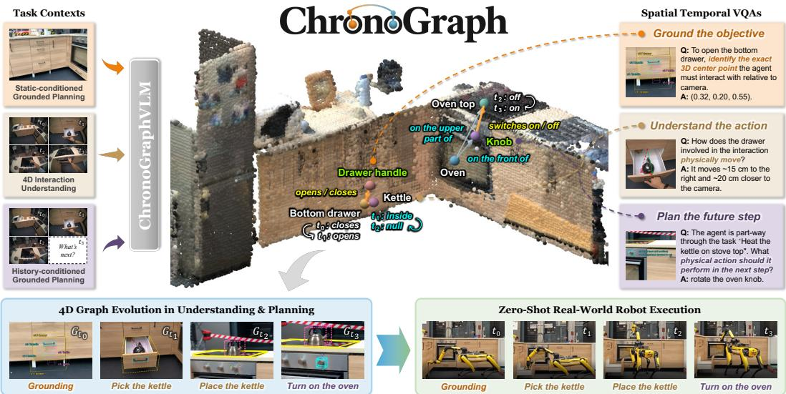
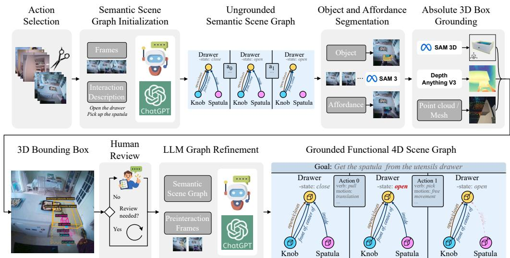
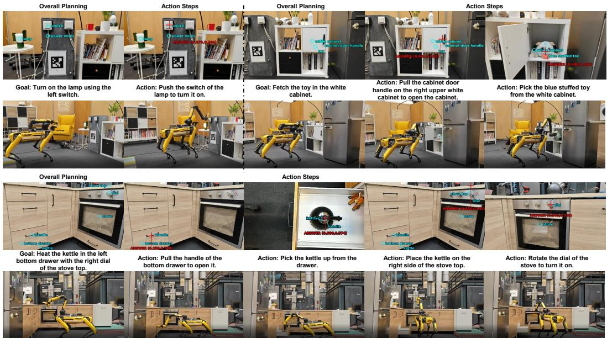

# CHRONOGRAPH: FUNCTIONAL 4D SCENE GRAPHSWITH VISION-LANGUAGE MODELS FOR INTERACTIONUNDERSTANDING AND GROUNDED PLANNING

Chenyangguang Zhang1∗ Malgorzata Gwiazda1,2∗ Guanlong Jiao3 Yuanchen Ju4 Federico Tombari2,5 Koushil Sreenath4 Marc Pollefeys1,6 Sunghwan Hong1 1ETH Zurich 2Technical University of Munich 3University of British Columbia 4University of California, Berkeley 5Google 6Microsoft

  
Figure 1: ChronoGraph connects 4D interaction understanding with spatially grounded planning. ChronoGraphVLM generates functional 4D scene graphs linking affordance-level actions to semantic and geometric state changes for interaction-grounded VQA and planning. Its predicted plans and affordance grounding guide zero-shot real-world mobile manipulation.

## ABSTRACT

Embodied agents must determine where to act, anticipate the resulting scene changes, and interpret observed outcomes to guide subsequent actions. This requires connecting 4D interaction understanding, which explains how past actions changed the scene, with spatially grounded planning, which determines how and where to act toward a goal and anticipates the resulting scene changes. We introduce ChronoGraph, a functional 4D scene graph that links actions on affordance parts to semantic and geometric state changes. By representing observed and anticipated transitions in the same form, it provides a shared basis for understanding and planning. We construct ChronoGraphBench through an automatic data engine that converts human-interaction videos and simulated robot trajectories into graph-annotated questions for training and evaluating Vision-Language Models (VLMs) on both tasks. Using these annotations, we train ChronoGraphVLM by adapting pretrained VLMs in two stages. Graph-as-Chain-of-Thought supervised fine-tuning teaches the models to reconstruct observed transitions and predict future ones as graph traces before answering. Subsequent joint 4D graph reinforcement learning directly rewards graph properties and answer correctness. Experiments across model scales show improvements over the corresponding pretrained baselines and zero-shot transfer to VLM4D. Real-world demonstrations

further show that graph-based planning and affordance grounding support mobile manipulation through existing robot skills without additional fine-tuning.

## 1 INTRODUCTION

Embodied tasks demand more than recognizing objects or describing their arrangement. When retrieving an item from a drawer, a robot must locate the handle and anticipate that pulling it will expose the contents. After acting, it must inspect and understand whether the drawer opened sufficiently and where the item can now be grasped. Its next decision depends on interpreting the actual outcome and identifying the affordances available in the updated scene. 4D understanding and grounded planning thus address complementary sides of the same interaction: one interprets realized semantic and geometric effects, while the other predicts the next action on a grounded affordance and anticipates future changes based on the interpreted current observation.

Existing benchmarks for Vision-Language Models (VLMs) largely assess these capabilities separately. Evaluations of 3D reasoning emphasize spatial attributes and relations (Chen et al., 2024; Cheng et al., 2024; Delitzas et al., 2024), while 4D benchmarks examine how objects and scenes change over time (Zhou et al., 2026; Huang et al., 2026; Yin et al., 2026), focusing on observed object-level dynamics rather than interaction affordances. Planning benchmarks investigate action selection and task decomposition (Ju et al., 2025; Li et al., 2024; Rana et al., 2023), but rarely consider affordance-level grounding or successor-state prediction. This separation leaves the connection between understanding an interaction and planning the next one underexplored, particularly when an action changes the spatial configuration or accessibility of relevant affordances.

To make this connection explicit, we introduce ChronoGraph, a functional 4D scene graph that provides a common representation for understanding and planning. Object and affordance-part nodes encode semantic states and 3D attributes, while edges describe functional and spatial relations. Action-linked transitions specify how manipulating a particular affordance changes the scene. A graph sequence can therefore explain observed interactions or describe anticipated outcomes using the same entities, relations, and state transitions. This shared structure provides a basis for learning both how interactions unfold and how their consequences inform subsequent actions.

Using this representation, we construct ChronoGraphBench from egocentric human-interaction videos (Perrett et al., 2025; Engelbracht et al., 2025) and simulated robot trajectories (Nasiriany et al., 2026). Our automatic data engine recognizes interactions in the recordings, generates graph annotations, and derives interaction-grounded Visual Question Answering (VQA) pairs. The benchmark comprises two tracks: 4D interaction understanding, which localizes observed interac tions and recovers their actions, affordances, and semantic and geometric state changes, and spatially grounded planning, which predicts goal-directed actions and their consequences. History conditioned planning requires interpreting preceding interactions to determine the current state and subsequent steps (Chen et al., 2023; Sermanet et al., 2024). Static-conditioned planning instead starts from a current image and additionally requires explicit grounding of execution locations.

We further turn these annotations into structured reasoning supervision for pretrained VLMs through a two-stage training pipeline, yielding ChronoGraphVLM. We first develop Graph-as-Chain-of-Thought supervised fine-tuning, which teaches models to reconstruct observed transitions and predict future ones as graph traces before answering. While this stage establishes the reasoning format, imitating a trace does not directly optimize its semantic and geometric correctness. We therefore follow it with joint 4D graph reinforcement learning, which provides feedback on graph semantic and geometric properties as well as answer correctness.

Experiments on ChronoGraphBench demonstrate improvements over the corresponding pretrained baselines across model scales in both interaction understanding and planning, and these gains extend to zero-shot evaluation on VLM4D (Zhou et al., 2025b). Real-world mobile-manipulation demonstrations further show that the explicitly generated functional 4D scene graph, together with the learned planning and affordance-grounding capabilities, supports sequential execution through existing robot skills without any additional fine-tuning. In summary, our contributions are:

• ChronoGraph, a functional 4D scene graph formulation that connects affordance-level interaction understanding with spatially grounded planning through observed and predicted action-conditioned state changes.

• ChronoGraphBench with a graph-based data engine, supporting training and evaluation of the interleaved understanding and planning tasks.

• ChronoGraphVLM from a training pipeline combining Graph-as-Chain-of-Thought supervised fine-tuning with joint 4D graph reinforcement learning, demonstrating improvements across model scales and benchmarks alongside transferring to robotic applications.

## 2 RELATED WORK

3D and 4D Understanding with VLMs. Early benchmarks evaluate spatial understanding through visual question answering (Azuma et al., 2022; Ma et al., 2022; Chen et al., 2024; Cheng et al., 2024), while later efforts extend to multi-view and broader 3D reasoning (Yang et al., 2025; Ma et al., 2026; Yang et al., 2026; Jia et al., 2026). Image-based methods improve these capabilities through specialized training, preference optimization, and multi-image reasoning (Zhang et al., 2026a; Shen et al., 2026; Xu et al., 2026; Ouyang et al., 2025). Other approaches incorporate geometry through 3D scene inputs (Huang et al., 2024a; Deng et al., 2025), depth cues (Zhu et al., 2025; Liu et al., 2026), or reconstruction priors (Zheng et al., 2026; Wu et al., 2026; Guo et al., 2025). Recent work addresses the temporal evolution of objects and scenes (Zhou et al., 2025b; Li et al., 2025; Zhou et al., 2026; Huang et al., 2026; Yin et al., 2026), alongside spatial traces and low-level embodied grounding (Zhou et al., 2025a; Zhang et al., 2026b). These directions primarily emphasize spatial relations, object and camera motion, or observed dynamics. We instead connect observed interactions to future actions at the level of functional affordance parts. Models must lo calize interactions, infer their semantic and spatial effects, and use the resulting state to ground the next action and predict its consequences.

Embodied Planning with VLMs. VLM-based planning translates visual observations and language instructions into action sequences or spatial constraints (Li et al., 2024; Niu et al., 2024; Guo et al., 2024; Huang et al., 2023; 2024b; Zheng et al., 2025). Graph-based approaches represent taskrelevant entities and relations for planning and verification (Rana et al., 2023; Dai et al., 2024; Ekpo et al., 2024), with MomaGraph (Ju et al., 2025) incorporating objects, interactive parts, and their spatial and functional relations in form of plain text to describe static scenes. Our formulation connects this functional structure with observed and predicted interaction dynamics in temporal domain, linking affordance-level actions to semantic and geometric changes within a shared 4D grounded graph representation.

## 3 CHRONOGRAPH: FUNCTIONAL 4D SCENE GRAPH FOR UNDERSTANDING AND PLANNING

We extend functional 3D scene graphs (Zhang et al., 2025; Hu et al., 2026; Fu et al., 2026) to model the action-triggered 4D evolution of an interactive scene. A functional 4D scene graph represents not only the objects and affordances present at a particular timestep, but also the semantic and spatial changes induced by interaction. At time step t, we define the scene graph as:

$$
G _ { t } = ( \mathcal V _ { t } , \mathcal E _ { t } ) , \qquad \mathcal V _ { t } = \mathcal O _ { t } \cup \mathcal P _ { t } ,\tag{1}
$$

where ${ \mathcal { O } } _ { t }$ denotes task-relevant object nodes and $\mathcal { P } _ { t }$ denotes affordance-part nodes. Each node $v \in \mathcal { V } _ { t }$ is associated with attributes of a name label, a semantic state, and 3D geometric information. Each directed edge $e ~ = ~ ( v _ { 1 } , v _ { 2 } , r ) ~ \in ~ \mathcal { E } _ { t }$ is labeled by a relation $r \in \mathcal { R }$ , which contains both functional and spatial relations (Ju et al., 2025). Thus, $G _ { t }$ jointly represents what entities are present, which parts can be acted upon, and how their functional and spatial states are currently related.

An interaction $a _ { t }$ is grounded on an affordance node $p _ { t }$ and induces an action-conditioned transition

$$
G _ { t } \xrightarrow { a _ { t } } G _ { t + 1 } ,\tag{2}
$$

where the relevant node states, geometric attributes, and relation edges have been updated.

  
Figure 2: ChronoGraphBench annotation pipeline. We convert interaction recordings into functional 4D scene graphs linking affordance-level actions to semantic and geometric state changes. The pipeline combines semantic graph initialization, object and affordance grounding, human verification, and graph refinement.

For an entire task with goal $z ,$ the scene evolves through a sequence of atomic interactions:

$$
\mathcal { G } _ { 0 : T } = \left( G _ { 0 } \stackrel { a _ { 0 } } { \longrightarrow } G _ { 1 } \stackrel { a _ { 1 } } { \longrightarrow } \cdot \cdot \cdot \stackrel { a _ { T - 1 } } { \longrightarrow } G _ { T } \right) .\tag{3}
$$

Each transition captures the local effect of one action, while the full chain represents the evolving functional and spatial state required to accomplish the goal. Each action changes the objects, accessible affordances, and spatial configuration on which subsequent actions depend. We name this explicit 4D representation ChronoGraph.

## 4 CHRONOGRAPHBENCH: DATASET AND BENCHMARK

Connecting interaction understanding with planning requires annotations linking affordance-level actions to semantic and spatial changes. We utilize the representation of functional 4D scene graph $\mathcal { G } _ { 0 : T }$ to construct the dataset and benchmark from egocentric human-interaction videos in HD-EPIC (Perrett et al., 2025) and HOI! (Engelbracht et al., 2025), alongside synthetic robot trajectories from RoboCasa (Nasiriany et al., 2026). These annotations support structured reasoning supervision and scalable generation of 4D-grounded VQA examples.

As a result, our dataset comprises 1,669 interaction samples, 5,143 graph states, and 15,094 QA pairs from human egocentric recordings and robot simulations. It covers 357 object categories with questions spanning all conditioning settings and reasoning categories.

## 4.1 CHRONOGRAPH ANNOTATION

All sources follow a shared annotation pipeline (Figure 2). The dataset metadata, annotations or simulator ground-truth are used to substitute corresponding pipeline components when available.

Semantic graph initialization. We first extract interaction clips with their temporal annotations, semantic labels, and descriptions. Given sampled videos and the metadata, GPT-5.5 is adopted to generate an initial semantic graph of entities, actions, semantic states, and relations. Few-shot examples specify the graph schema, establishing the semantic structure for subsequent grounding.

Object and affordance grounding. For each interaction clip, SAM3 (Carion et al., 2026) segments the manipulated object and its affordance region. We reconstruct these regions with SAM-3D (Chen et al., 2026) and estimate axis-aligned 3D bounding boxes for the corresponding graph nodes. To recover metric scale, we rescale each reconstruction using a low percentile of sparse metric point depths projected inside the mask, reducing contamination from background points. For masks without projected points, we use Depth Anything V3 (Lin et al., 2025) estimates calibrated to the metric point cloud via RANSAC. Boxes across all states share a world frame aligned with the scene’s dominant horizontal direction.

Human verification and graph refinement. Automatic checks trigger human review for incomplete or invalid graph fields, ambiguous visual or spatial evidence, and low-confidence vision model outputs. We then refine the verified graphs with language descriptions. GPT-5.5 generates referring expressions that distinguish interaction-relevant objects and, conditioned on the verified graph, describes executed actions, intended goals, and scene configurations. Each completed record combines the semantic graph, object and affordance masks, 3D annotations, and descriptions for structured supervision and question generation.

## 4.2 QUESTION CONSTRUCTION AND EVALUATION TASKS

Question generation and validation. We generate graph-derived questions using 62 Python templates spanning atomic, short-horizon (2–4 sub-actions), and long-horizon (5+) interactions, given different characteristics of different time range. Before full-dataset application, templates are iteratively refined on a representative subset across multiple review rounds to address phrasing, ambiguity, answerability, and distractor quality. Questions must satisfy template-specific graph constraints. Each multiple-choice question pairs a graph-derived answer with three semantically or functionally plausible distractors that are inconsistent with the annotations. Distractor selection uses the dataset vocabulary, object statistics, and graph constraints, with GPT-5.6 Terra supplying additional candidates subject to answer-type, format, and mutual-exclusivity checks. To reduce goal-based shortcuts in atomic action questions, we compare GPT-5.6 Terra’s answer correctness with and without video frames under the same textual prompt. Candidates are rejected if the frames provide no improvement across three repeated runs. We do not apply this to longer-horizon questions, which inherently require integrating temporal evidence from the video, according to our development experiments.

Evaluation settings. 4D interaction understanding evaluates realized transitions from videos, covering spatial tracking, action recognition, and functional and semantic state changes. Staticconditioned planning provides a pre-interaction image and goal for predicting the next action, target affordance, and successor state, including 2D/3D grounding of the interaction location. Historyconditioned planning provides a goal and video prefix containing the first k completed sub-actions, requiring inference of the resulting state and prediction of the next action and successor state. This history provides observations of task-relevant objects and state changes that a single current egocentric frame may omit, e.g., after an agent retrieves food from a refrigerator and moves to a countertop, its current view may no longer reveal whether the refrigerator was left open.

Reasoning categories. Questions fall into five categories. Action reasoning covers observed or future actions, including sequences, next steps, and goal-relevant sub-actions. Affordance reasoning identifies interactive object parts and their functions, while state change reasoning concerns semantic transitions, affected entities, and transition times. Spatial reasoning assesses object and affordance motion, including direction, relative configuration, changes in position, and camera-relative distance. Finally, 2D/3D grounding requires numerical predictions of target object or affordance centers in static-conditioned planning rather than multiple-choice answers.

## 5 CHRONOGRAPHVLM: GRAPH-GUIDED LEARNING FOR UNDERSTANDING AND PLANNING

We train ChronoGraphVLM to generate a functional 4D scene graph trace before answering questions. Training comprises Graph-as-Chain-of-Thought supervised fine-tuning, which initializes structured graph generation and graph-conditioned answering, followed by joint 4D graph reinforcement learning, which optimizes graph consistency and answer quality.

## 5.1 GRAPH-AS-CHAIN-OF-THOUGHT SUPERVISED FINE-TUNING

Task-conditioned graph generation. We represent each supervised example as an input–target pair (x, y) and structure the target as an ordered graph–evidence–answer sequence. The graph first makes the task-relevant entities, affordances, actions, and state transitions explicit. The evidence field then selects the graph properties that support the prediction, and the final answer is generated conditioned on this structured context. This ordering encourages the model to ground its answer in an explicit scene representation.

Let $q$ denote the VQA question, $V _ { \leq t }$ the available video, $I _ { t }$ the current image, and z the task goal. The model inputs and corresponding graph outputs for interaction understanding, historyconditioned planning, and static-conditioned planning are

$$
x _ { \mathrm { u n d } } = ( V _ { \leq t } , q ) \longmapsto ( \hat { G } _ { 0 : t } , \hat { a } _ { 0 : t - 1 } ) , x _ { \mathrm { h i s t } } = ( V _ { \leq t } , z , q ) \longmapsto ( \hat { G } _ { 0 : T } , \hat { a } _ { 0 : T - 1 } ) , x _ { \mathrm { s t a t } } = ( I _ { t } , z , q ) \longmapsto ( \hat { G } _ { t : T } , \hat { a } _ { t : T - 1 } )\tag{4}
$$

where $T > t$ denotes the planning horizon. Interaction understanding reconstructs the observed graph transitions, whereas the two planning settings predict future actions and their resulting states, conditioned on the task goal. Each output trace follows the functional 4D scene graph representation G introduced in Section 3. All graph attributes are serialized as text, while specifically 3D geometric information is serialized through a 3D center $\mathbf { p } _ { i , s } \in \mathbb { R } ^ { 3 }$ for each node i in state s. All centers share the coordinate system of the first input frame, or the current image for static-conditioned planning, which supports consistency of observed and predicted positions.

After generating the graph, the model outputs an evidence field $\hat { \boldsymbol E } = [ ( \ell _ { j } , c _ { j } ) ] _ { j = 1 } ^ { M }$ , where $\ell _ { j }$ identifies a graph property relevant to the question, such as a node name, semantic state or functional relation, etc., and $c _ { j }$ is the content claimed for that property. Ground-truth evidence is generated jointly with the VQA examples described in Section 4. Placing this field between the graph trace and the answer explicitly links the final prediction to its supporting graph content.

Training objective. Writing the serialized target as the token sequence $y = ( y _ { 1 } , \dots , y _ { | y | } )$ , we minimize the autoregressive negative log-likelihood:

$$
\mathcal { L } _ { \mathrm { S F T } } = - \mathbb { E } _ { ( x , y ) \sim \mathcal { D } _ { \mathrm { S F T } } } \left[ \sum _ { k = 1 } ^ { \lfloor y \rfloor } \log \pi _ { \theta } \left( y _ { k } \mid x , y _ { < k } \right) \right] ,\tag{5}
$$

where k indexes output tokens and $\pi _ { \theta }$ denotes the VLM’s conditional next-token distribution. The graph and evidence precede the answer, providing explicit context for answer generation.

## 5.2 JOINT 4D GRAPH REINFORCEMENT LEARNING

Token-level likelihood does not directly optimize structural consistency or task correctness. We therefore refine the model using Group-Relative Policy Optimization (Shao et al., 2024) with a composite reward that jointly evaluates graph properties and answer correctness:

$$
R = \lambda _ { \mathrm { f m t } } R _ { \mathrm { f m t } } + \lambda _ { \mathrm { g r a p h } } R _ { \mathrm { g r a p h } } + \lambda _ { \mathrm { m c } } R _ { \mathrm { m c } } + \lambda _ { \mathrm { g n d } } R _ { \mathrm { g n d } } ,\tag{6}
$$

where the coefficients weight format validity, graph quality, and answer correctness.

Prediction alignment. Inserted or omitted graph states can misalign all subsequent index-wise comparisons. We therefore apply Needleman–Wunsch alignment (Needleman & Wunsch, 1970) using graph-state similarity:

$$
\begin{array} { r } { \sin ( n _ { p } , n _ { g } ) = \eta { \mathcal M } \left( d _ { p } ^ { \mathrm { s t a t e } } , d _ { g } ^ { \mathrm { s t a t e } } \right) + ( 1 - \eta ) \mathrm { s o f t F } 1 ( \mathcal N _ { p } , \mathcal N _ { g } ) , } \end{array}\tag{7}
$$

where $p , g$ indicate the predicted and reference node, M measures semantic state agreement, $\mathcal { N } _ { p }$ and $\mathcal { N } _ { g }$ are the respective node name sets, and $\eta$ balances the terms. Soft F1 is the harmonic mean of soft precision and recall, each obtained by averaging the best cross-set name agreement in its respective direction. Semantic state descriptions distinguish consecutive states that share the same entities, while the monotone alignment preserves temporal order.

Format and graph rewards. The format reward $R _ { \mathrm { f m t } }$ checks the output wrapper, nonempty state sequence, contiguous indices, and graph state–action interleaving. The graph reward $R _ { \mathrm { g r a p h } }$ evaluates node names and edge types using soft F1, semantic state agreement between name-matched nodes, and graph state count. It also scores semantic and relational changes across aligned transitions. Action sequence which connects consecutive graph states is scored with equal credit to the correct affordance verb and target affordance node name. For each name-matched node, the reward on each node’s 3D center $\mathbf { p } _ { i , s }$ is defined as exp $\begin{array} { r } { \left[ - \frac { 1 } { 2 } \left( \frac { d _ { u v } } { \sigma _ { u v } } \right) ^ { 2 } - \frac { 1 } { 2 } \left( \frac { d _ { z } } { \sigma _ { z } } \right) ^ { 2 } \right] } \end{array}$ , where $d _ { u v }$ is the

Euclidean error in normalized image coordinates, $d _ { z }$ is the absolute depth error, and $\sigma _ { u v }$ and $\sigma _ { z }$ control the respective tolerances. To capture temporal motion beyond absolute position, we additionally compute a reward of max $\begin{array} { r } { \left( 0 , \frac { \Delta \mathbf { c } _ { \mathrm { g t } } ^ { \top } \Delta \mathbf { c } _ { \mathrm { p r e d } } } { \| \Delta \mathbf { c } _ { \mathrm { g t } } \| _ { 2 } \| \Delta \mathbf { c } _ { \mathrm { p r e d } } \| _ { 2 } } \right) } \end{array}$ , where $\Delta \mathbf { c } = \mathbf { c } _ { s + 1 } - \mathbf { c } _ { s }$ s denotes the center motion across corresponding transitions. Transitions with negligible reference motion are excluded because their direction is unstable.

Answer rewards. Multiple-choice questions use exact-match accuracy to form $R _ { \mathrm { m c } }$ . Grounding questions use $R _ { \mathrm { g n d } } = \mathrm { e } \mathbf { \bar { x } } \mathbf { p } ( - \alpha d )$ , where d is the distance from the predicted point to the target 2D or 3D box, defined as zero inside it. This assigns full credit within the target and smoothly decreasing credit outside it.

## 6 EXPERIMENTS

## 6.1 EXPERIMENTAL SETUP

Datasets and metrics. We partition the benchmark data into mutually exclusive subsets of the level of the household or simulation set-up for supervised fine-tuning, reinforcement learning and holdout evaluation, comprising 20%, 68%, and 12% of the data, respectively. This deliberately short supervised fine-tuning stage primarily teaches the model the structured graph evidence output format and provides a stable initialization for reinforcement learning. It also reduces overfitting to the supervised trajectories and better preserves the general visual and linguistic capabilities of the pretrained model (Chu et al., 2025). The evaluation set contains 202 interaction samples, including 129 human and 73 robotic interactions, from which we construct 1,811 VQAs, with careful human verification. The benchmark contains single-answer multiple-choice questions and open-numerical grounding questions. We evaluate multiple-choice questions using exact-match accuracy. For 2D and 3D grounding, we use the soft score $\exp ( - \alpha d )$ (Zhang et al., 2026b), where d denotes the distance from the predicted point to the target box and is defined as zero when the prediction lie inside the box. We set $\alpha = 8$ for normalized 2D coordinates and $\alpha = 5$ for metric 3D coordinates.

Baselines. We compare our method against three groups of baselines. First, we evaluate state-ofthe-art commercial models, including GPT 6 Astra, 5.6 Sol, 5.6 Terra, Gemini 3.1 Pro, 3.8 Flash, Claude Opus 5, and Kimi K3, with the medium reasoning effort configuration. Second, we eval uate open-source VLMs from the Qwen model families across multiple parameter scales. Finally, we compare with specialized methods for 4D interaction understanding and embodied planning, including MomaGraph (Ju et al., 2025), SpatialVLM (Chen et al., 2024), DSR (Zhou et al., 2026), and MLLM-4D (Yin et al., 2026). All models are evaluated using the same input protocol: for 4D interaction understanding and history-conditioned planning, videos are uniformly sampled at 4 FPS; for static-conditioned planning, each model receives the corresponding pre-interaction image.

## 6.2 MAIN RESULTS

Table 1 compares 4D interaction understanding and both planning settings. GPT-6 Astra leads the commercial baselines overall, while the Qwen series exhibits an overall scaling trend. However, strong semantic predictions do not imply equally accurate spatial reasoning: in static-conditioned planning, GPT-6 Astra scores 96.6 on state-change prediction but 69.2 on spatial prediction. Specialized 4D understanding or planning methods also remain limited under the unified evaluation, reaching at most 53.0 overall. Chrono-GraphVLM improves understanding and both planning settings at both model scales, increasing the overall score by 24.0 at 9B and 24.1 at 4B over the corresponding baselines. The resulting scores of 75.2 and 73.0 surpass all evaluated open-source and specialized baselines. The category-level strengths align with the explicit semantic and geometric guidance from the graph. Nevertheless, a substantial gap remains in history-conditioned action and affordance prediction. These results distinguish improved interaction grounding from the still-challenging problem of selecting subsequent actions from an evolving interaction history.

Table 2: Zero-shot transfer to VLM4D. We report multiple-choice accuracy on the egocentric split.
<table><tr><td>Method</td><td>Acc. (%) ↑</td></tr><tr><td>Qwen3.5-9B</td><td>60.5</td></tr><tr><td>Qwen3.5-4B</td><td>53.7</td></tr><tr><td>Ours-9B</td><td>67.1</td></tr><tr><td>Ours-4B</td><td>61.0</td></tr></table>

Table 1: Main comparison on ChronoGraphBench for 4D interaction understanding and spatially grounded planning. Planning scores are reported as history-conditioned/static-conditioned, with 2D/3D grounding evaluated only in the static-conditioned setting. The overall average is the unweighted mean of per-question scores across all settings.
<table><tr><td></td><td colspan="5">4D Interaction Understanding</td><td colspan="6">Spatially Grounded Planning</td><td></td></tr><tr><td>Model</td><td>Action Recognition</td><td>Affordance Recognition</td><td>Spatial Reasoning</td><td>State Change Recognition</td><td>Avg.</td><td>Action Prediction</td><td>Affordance Prediction</td><td>Spatial Prediction</td><td>State Change Prediction</td><td>2D/3D Grounding</td><td>Avg.</td><td>Overall Avg.</td></tr><tr><td>Commercial Models</td><td></td><td></td><td></td><td></td><td></td><td></td><td></td><td></td><td></td><td></td><td></td><td></td></tr><tr><td>GPT 6 Astra</td><td>93.8</td><td>72.6</td><td>75.5</td><td>88.1</td><td>85.5</td><td>85.4/85.4</td><td>81.1/81.7</td><td>78.1/69.2</td><td>85.3/96.6</td><td>—/67.9</td><td>81.3/74.2</td><td>79.4</td></tr><tr><td>GPT 5.6 Sol</td><td>86.8</td><td>72.6</td><td>69.6</td><td>83.5</td><td>80.1</td><td>78.0/85.4</td><td>78.4/78.5</td><td>75.0/57.8</td><td>88.2/93.1</td><td>—/61.2</td><td>78.4/68.1</td><td>73.9</td></tr><tr><td>GPT 5.6 Terra</td><td>84.9</td><td>74.2</td><td>64.1</td><td>77.8</td><td>76.5</td><td>75.6/82.6</td><td>67.6/83.9</td><td>65.6/54.0</td><td>61.8/93.1</td><td>—/61.5</td><td>67.3/67.4</td><td>70.9</td></tr><tr><td>Gemini 3.1 Pro</td><td>85.3</td><td>74.2</td><td>65.2</td><td>82.5</td><td>78.2</td><td>75.6/86.1</td><td>73.0/84.9</td><td>67.7/63.5</td><td>88.2/100.0</td><td>—/61.0</td><td>73.6/70.5</td><td>73.8</td></tr><tr><td>Gemini 3.8 Flash</td><td>91.9</td><td>74.2</td><td>72.8</td><td>85.1</td><td>83.4</td><td>78.0/86.8</td><td>75.7/84.9</td><td>67.7/67.3</td><td>91.2/98.3</td><td>—/66.2</td><td>75.0/73.7</td><td>77.6</td></tr><tr><td>Claude Opus 5</td><td>70.9</td><td>56.5</td><td>54.3</td><td>70.1</td><td>65.0</td><td>68.3/80.6</td><td>62.2/82.8</td><td>61.5/57.3</td><td>67.6/93.1</td><td>—/51.7</td><td>63.9/63.4</td><td>64.1</td></tr><tr><td>Kimi K3 2.8T</td><td>83.3</td><td>71.0</td><td>64.1</td><td>83.0</td><td>77.1</td><td>68.3/86.1</td><td>73.0/78.5</td><td>68.8/58.8</td><td>82.4/93.1</td><td>—/61.0</td><td>71.6/68.3</td><td>72.1</td></tr><tr><td>Open-Source Models</td><td></td><td></td><td></td><td></td><td></td><td></td><td></td><td></td><td></td><td></td><td></td><td></td></tr><tr><td>Qwen-3.8 27B</td><td>72.1</td><td>69.4</td><td>45.7</td><td>71.1</td><td>64.6</td><td>53.7/78.5</td><td>45.9/81.7</td><td>56.2/47.9</td><td>58.8/91.4</td><td>—/45.9</td><td>54.3/58.2</td><td>60.2</td></tr><tr><td>Qwen-3.5 27B</td><td>72.1</td><td>72.6</td><td>54.9</td><td>72.2</td><td>67.6</td><td>58.5/77.1</td><td>54.1/84.9</td><td>63.5/45.0</td><td>70.6/93.1</td><td>—/40.0</td><td>62.0/55.1</td><td>60.7</td></tr><tr><td>4D / Planning Experts</td><td></td><td></td><td></td><td></td><td></td><td></td><td></td><td></td><td></td><td></td><td></td><td></td></tr><tr><td>MomaGraph 7B</td><td>55.8</td><td>61.3</td><td>43.5</td><td>64.9</td><td>55.6</td><td>39.0/77.8</td><td>27.0/76.3</td><td>44.8/36.0</td><td>73.5/87.9</td><td>—/33.8</td><td>45.2/49.2</td><td>51.2</td></tr><tr><td>SpatialVLM 13B</td><td>43.8</td><td>40.3</td><td>32.1</td><td>34.0</td><td>37.7</td><td>41.5/56.9</td><td>32.4/72.0</td><td>46.9/28.9</td><td>29.4/84.5</td><td>—/30.6</td><td>40.4/42.1</td><td>40.2</td></tr><tr><td>DSR 7B</td><td>54.3</td><td>58.1</td><td>45.7</td><td>62.9</td><td>54.7</td><td>41.5/76.4</td><td>27.0/78.5</td><td>46.9/33.2</td><td>79.4/82.8</td><td>—/31.8</td><td>47.6/47.3</td><td>50.2</td></tr><tr><td>MLLM-4D 8B</td><td>58.1</td><td>66.1</td><td>41.8</td><td>63.9</td><td>56.2</td><td>51.2/74.3</td><td>54.1/86.0</td><td>43.8/46.9</td><td>41.2/86.2</td><td>—/33.5</td><td>46.6/51.9</td><td>53.0</td></tr><tr><td>Baselines v.s. Ours</td><td></td><td></td><td></td><td></td><td></td><td></td><td></td><td></td><td></td><td></td><td></td><td></td></tr><tr><td>Qwen-3.5 9B</td><td>62.8</td><td>59.7</td><td>38.0</td><td>60.3</td><td></td><td>55.3 48.8/71.5</td><td>45.9/79.6</td><td>55.2/41.7</td><td>50.0/89.7</td><td>—/29.1</td><td>51.4/47.9</td><td>51.2</td></tr><tr><td>ChronoGraphVLM 9B</td><td>78.3</td><td>87.1 56.5</td><td>62.5</td><td>82.0</td><td>75.9</td><td>53.7/88.9</td><td>51.4/92.5</td><td>74.0/60.7</td><td>79.4/96.6</td><td>—/73.7</td><td>66.8/76.5</td><td>75.2</td></tr><tr><td>Qwen-3.5 4B</td><td>53.1</td><td></td><td>37.0</td><td>53.6</td><td>49.3</td><td>46.3/74.3</td><td>24.3/82.8 51.4/87.1</td><td>46.9/36.0 74.0/49.3</td><td>35.3/86.2</td><td>—/36.8</td><td>40.9/50.5</td><td>48.9</td></tr><tr><td>ChronoGraphVLM 4B</td><td>79.1</td><td>87.1</td><td>63.0</td><td>76.3</td><td>74.8</td><td>51.2/84.7</td><td></td><td></td><td>79.4/98.3</td><td>—/74.9</td><td>66.3/73.2</td><td>73.0</td></tr></table>

Table 3: Ablations of graph-guided reasoning and training with Qwen3.5-9B. ChronoGraph-Bench planning scores are reported as history-conditioned / static-conditioned. The final column reports zero-shot accuracy on the egocentric split of VLM4D.
<table><tr><td rowspan="2">Method</td><td colspan="5">4D Interaction Understanding</td><td colspan="6">Spatially Grounded Planning</td><td colspan="2">VLM4D</td></tr><tr><td>Action</td><td>Affordance Recognition Recognition Reasoning</td><td>Spatial</td><td>State Change Recognition</td><td>Avg.</td><td>Action Prediction</td><td>Affordance Prediction</td><td>Spatial Prediction</td><td>State Change Prediction</td><td>2D/3D Grounding</td><td>Avg.</td><td>Overall Avg.</td><td>Acc. (%)</td></tr><tr><td>(a) Graph-Guided Reasoning</td><td></td><td></td><td></td><td></td><td></td><td></td><td></td><td></td><td></td><td></td><td></td><td></td><td></td></tr><tr><td>Qwen3.5-9B (Direct)</td><td>62.8</td><td>59.7</td><td>38.0</td><td>60.3</td><td>55.3</td><td>48.8/71.5</td><td>45.9/79.6</td><td>55.2/41.7</td><td>50.0/89.7</td><td>—/29.1</td><td>51.4/47.9</td><td>51.2</td><td>60.5</td></tr><tr><td>Qwen3.5-9B + Naive Thinking</td><td>68.3</td><td>65.6</td><td>59.0</td><td>59.7</td><td>63.8</td><td>46.2/76.9</td><td>44.4/77.2</td><td>45.5/47.6</td><td>76.4/92.7</td><td>—/26.0</td><td>49.5/50.6</td><td>55.8</td><td>62.2</td></tr><tr><td>Qwen3.5-9B + Graph-as-CoT</td><td>67.8</td><td>67.7</td><td>50.0</td><td>70.1</td><td>63.8</td><td>51.2/80.6</td><td>45.9/77.4</td><td>58.3/49.8</td><td>50.0/87.9</td><td>—/42.4</td><td>53.3/56.7</td><td>59.0</td><td>63.9</td></tr><tr><td>(b) Supervised Fine-Tuning</td><td></td><td></td><td></td><td></td><td></td><td></td><td></td><td></td><td></td><td></td><td></td><td></td><td></td></tr><tr><td>SFT: Answer Only</td><td>75.2</td><td>79.0</td><td>51.6</td><td>75.3</td><td>69.3</td><td>56.0/82.6</td><td>45.9/81.7</td><td>59.4/49.8</td><td>67.6/93.1</td><td>—/64.3</td><td>57.7/67.5</td><td>67.0</td><td>49.4</td></tr><tr><td>Ours: Graph-as-CoT SFT</td><td>76.0</td><td>82.3</td><td>55.4</td><td>71.1</td><td>69.8</td><td>51.2/86.1</td><td>48.6/89.2</td><td>64.6/55.5</td><td>79.4/91.4</td><td>—/68.9</td><td>61.5/72.0</td><td>69.9</td><td>64.2</td></tr><tr><td>(c) Reinforcement Learning</td><td></td><td></td><td></td><td></td><td></td><td></td><td></td><td></td><td></td><td></td><td></td><td></td><td></td></tr><tr><td>RL: Answer Reward Only</td><td>78.3</td><td>85.5</td><td>62.5</td><td>78.4</td><td>74.9</td><td>56.0/88.9</td><td>43.2/89.2</td><td>70.8/54.0</td><td>76.5/94.8</td><td>—/72.2</td><td>63.9/73.8</td><td>73.0</td><td>65.4</td></tr><tr><td>Ours: Answer + Graph Reward</td><td>78.3</td><td>87.1</td><td>62.5</td><td>82.0</td><td>75.9</td><td>53.7/88.9</td><td>51.4/92.5</td><td>74.0/60.7</td><td>79.4/96.6</td><td>—173.7</td><td>66.8/76.5</td><td>75.2</td><td>67.1</td></tr></table>

## 6.3 ZERO-SHOT CROSS-BENCHMARK RESULTS

We evaluate zero-shot transfer on the egocentric split of VLM4D (Zhou et al., 2025b) without additional fine-tuning. As shown in Table 2, ChronoGraphVLM achieves 67.1% accuracy at 9B and 61.0% at 4B, improving over the corresponding pretrained initializations by 6.6% and 7.3%. Since VLM4D differs in both evaluation data and question construction, these gains suggest that graphguided training develops transferable spatiotemporal reasoning rather than only improving perfor mance on ChronoGraphBench-specific questions. As shown in Section 6.4, this transfer relies on graph supervision, since answer-only fine-tuning reduces VLM4D accuracy below the pretrained model.

## 6.4 ABLATION STUDIES

Table 3 reports performance on ChronoGraphBench and zero-shot transfer to the egocentric split of VLM4D for the ablations of graph-guided reasoning and training with Qwen3.5-9B.

Graph-guided reasoning. Graph-as-CoT prompting instructs the pretrained model to identify taskrelevant nodes and relations before answering, without requiring the complete functional 4D graph schema or metric 3D predictions. This training-free intervention improves the overall ChronoGraph Bench score by 7.8 over direct answering and by 3.2 over the model’s native free-form thinking mode. It also improves zero-shot VLM4D accuracy by 3.4% and 1.7% respectively. Notably, graph-guided models, including ours, do not produce longer outputs on average than models using free-form reasoning. The improvement over free-form thinking indicates that explicitly organizing entities and relations produces more intelligent behavior even without parameter updates.

  
Figure 3: Zero-shot real-world mobile manipulation with a Boston Dynamics Spot robot. ChronoGraphVLM predicts sub-actions and updates affordance grounding before each interaction, guiding tasks of increasing horizon through existing robot skills.

Graph-as-chain-of-thought supervised fine-tuning. Relative to the baseline, answer-only supervision raises the ChronoGraphBench overall average from 51.2 to 67.0, but reduces zero-shot VLM4D accuracy from 60.5% to 49.4%. Graph-as-CoT instead improves both, reaching 69.9 and 64.2% respectively. This contrast suggests that supervising intermediate entities and state transitions improves both performance on in-domain data and cross-benchmark generalization.

Joint 4D graph reinforcement learning. Answer-only reward only increases the ChronoGraph-Bench overall score from 69.9 to 73.0 and VLM4D accuracy from 64.2% to 65.4%, while including graph rewards raises them further to 75.2 and 67.1%. These results suggest that feedback on graph properties improving understanding and planning with cross-benchmark generalization.

## 6.5 APPLICATION: MOBILE MANIPULATION

We deploy ChronoGraphVLM zero-shot on a Boston Dynamics Spot quadruped without environment- or task-specific fine-tuning. Given an initial RGB observation and a high-level goal, the model generates a subaction sequence and a task-relevant functional scene graph. Before each subaction, it uses the observation history to predict subsequent actions and grounds the target affordance in the current image. The predicted location is converted to a 3D target using measured depth and registered in the robot’s local map for execution through the corresponding motion primitive. The robot then observes the updated scene and repeats this perception–grounding–action loop.

Figure 3 shows three tasks of increasing horizon: pushing a switch to activate a lamp; opening a cabinet and grasping the newly exposed toy; and opening a bottom drawer, retrieving a kettle, placing it on the appropriate stovetop region, and rotating the corresponding dial. These qualitative demonstrations illustrate how goal decomposition and observation-conditioned affordance grounding support sequential manipulation through existing robot skills in an unseen environment.

## 7 CONCLUSION AND LIMITATIONS

We introduce ChronoGraph, a functional 4D scene graph that links affordance-level actions to semantic and geometric changes, connecting 4D interaction understanding with spatially grounded planning. Building on it, we construct ChronoGraphBench from human and robot interactions and train ChronoGraphVLM with Graph-as-Chain-of-Thought supervised fine-tuning and joint 4D graph reinforcement learning. The resulting models improve over pretrained baselines across scales, transfer zero-shot to VLM4D, and support real-world mobile manipulation through existing robot skills without additional fine-tuning. These results highlight the value of learning how interactions change the scene and inform subsequent actions. However, dataset scale is limited by the cost of affordance-level 3D annotation, and inference latency hinders real-time closed-loop replanning. Future work could broaden coverage across environments and robot platforms, and explore distillation and streaming inference for incremental graph and plan updates.

## ACKNOWLEDGMENTS

We thank the help provided by the colleagues in developing the project: Zuria Bauer, Zhengyu Fu, and Tim Engelbracht.

## REFERENCES

Daichi Azuma, Taiki Miyanishi, Shuhei Kurita, and Motoaki Kawanabe. Scanqa: 3d question answering for spatial scene understanding. In 2022 IEEE/CVF Conference on Computer Vision and Pattern Recognition (CVPR), pp. 19107–19117. IEEE, 2022.

Nicolas Carion, Laura Gustafson, Yuan-Ting Hu, Shoubhik Debnath, Ronghang Hu, Didac Suris Coll-Vinent, Chaitanya Ryali, Kalyan Vasudev Alwala, Haitham Khedr, Andrew Huang, et al. Sam 3: Segment anything with concepts. In International conference on learning representations, volume 2026, pp. 138846–138923, 2026.

Boyuan Chen, Zhuo Xu, Sean Kirmani, Brain Ichter, Dorsa Sadigh, Leonidas Guibas, and Fei Xia. Spatialvlm: Endowing vision-language models with spatial reasoning capabilities. In Proceedings of the IEEE/CVF Conference on Computer Vision and Pattern Recognition, pp. 14455–14465, 2024.

Xingyu Chen, Fu-Jen Chu, Pierre Gleize, Kevin J Liang, Alexander Sax, Hao Tang, Weiyao Wang, Michelle Guo, Thibaut Hardin, Xiang Li, et al. Sam 3d: 3dfy anything in images. In Proceedings of the IEEE/CVF Conference on Computer Vision and Pattern Recognition, pp. 7220–7232, 2026.

Yi Chen, Yuying Ge, Yixiao Ge, Mingyu Ding, Bohao Li, Rui Wang, Ruifeng Xu, Ying Shan, and Xihui Liu. Egoplan-bench: Benchmarking multimodal large language models for human-level planning. arXiv preprint arXiv:2312.06722, 2023.

An-Chieh Cheng, Hongxu Yin, Yang Fu, Qiushan Guo, Ruihan Yang, Jan Kautz, Xiaolong Wang, and Sifei Liu. Spatialrgpt: Grounded spatial reasoning in vision-language models. Advances in Neural Information Processing Systems, 37:135062–135093, 2024.

Tianzhe Chu, Yuexiang Zhai, Jihan Yang, Shengbang Tong, Saining Xie, Dale Schuurmans, Quoc V Le, Sergey Levine, and Yi Ma. Sft memorizes, rl generalizes: A comparative study of foundation model post-training. arXiv preprint arXiv:2501.17161, 2025.

Zhirui Dai, Arash Asgharivaskasi, Thai Duong, Shusen Lin, Maria-Elizabeth Tzes, George Pappas, and Nikolay Atanasov. Optimal scene graph planning with large language model guidance. In 2024 IEEE International Conference on Robotics and Automation (ICRA), pp. 14062–14069. IEEE, 2024.

Alexandros Delitzas, Ayca Takmaz, Federico Tombari, Robert Sumner, Marc Pollefeys, and Francis Engelmann. SceneFun3D: Fine-Grained Functionality and Affordance Understanding in 3D Scenes. In IEEE/CVF Conference on Computer Vision and Pattern Recognition (CVPR), 2024.

Jiajun Deng, Tianyu He, Li Jiang, Tianyu Wang, Feras Dayoub, and Ian Reid. 3d-llava: Towards generalist 3d lmms with omni superpoint transformer. In 2025 IEEE/CVF Conference on Computer Vision and Pattern Recognition (CVPR), pp. 3772–3782. IEEE, 2025.

Daniel Ekpo, Mara Levy, Saksham Suri, Chuong Huynh, Archana Swaminathan, and Abhinav Shrivastava. Verigraph: Scene graphs for execution verifiable robot planning. arXiv preprint arXiv:2411.10446, 2024.

Tim Engelbracht, Rene Zurbr ´ ugg, Matteo Wohlrapp, Martin B ¨ uchner, Abhinav Valada, Marc Polle- ¨ feys, Hermann Blum, and Zuria Bauer. Hoi!-a multimodal dataset for force-grounded, cross-view articulated manipulation. arXiv preprint arXiv:2512.04884, 2025.

Zhengyu Fu, Rene Zurbr ´ ugg, Kaixian Qu, Marc Pollefeys, Marco Hutter, Hermann Blum, and Zuria¨ Bauer. Funfact: building probabilistic functional 3d scene graphs via factor-graph reasoning. In Proceedings of the IEEE/CVF Conference on Computer Vision and Pattern Recognition, pp. 23848–23858, 2026.

Yanjiang Guo, Yen-Jen Wang, Lihan Zha, and Jianyu Chen. Doremi: Grounding language model by detecting and recovering from plan-execution misalignment. In 2024 IEEE/RSJ International Conference on Intelligent Robots and Systems (IROS), pp. 12124–12131. IEEE, 2024.

Zhongbin Guo, Jiahe Liu, Yushan Li, Wenyu Gao, Zhen Yang, Chenzhi Li, Xinyue Zhang, and Ping Jian. Beyond flatlands: Unlocking spatial intelligence by decoupling 3d reasoning from numerical regression. arXiv preprint arXiv:2511.11239, 2025.

Xinggang Hu, Chenyangguang Zhang, Alexandros Delitzas, Xiangkui Zhang, Marc Pollefeys, Francis Engelmann, and Xiangyang Ji. Hierarchical and holistic open-vocabulary functional 3d scene graphs for indoor spaces. arXiv preprint arXiv:2605.15753, 2026.

Haifeng Huang, Yilun Chen, Zehan Wang, Rongjie Huang, Runsen Xu, Tai Wang, Luping Liu, Xize Cheng, Yang Zhao, Jiangmiao Pang, et al. Chat-scene: Bridging 3d scene and large language models with object identifiers. Advances in Neural Information Processing Systems, 37:113991– 114017, 2024a.

Wenlong Huang, Chen Wang, Ruohan Zhang, Yunzhu Li, Jiajun Wu, and Li Fei-Fei. Voxposer: Composable 3d value maps for robotic manipulation with language models. arXiv preprint arXiv:2307.05973, 2023.

Wenlong Huang, Chen Wang, Yunzhu Li, Ruohan Zhang, and Li Fei-Fei. Rekep: Spatiotemporal reasoning of relational keypoint constraints for robotic manipulation. arXiv preprint arXiv:2409.01652, 2024b.

Yuzhi Huang, Kairun Wen, Rongxin Gao, Dongxuan Liu, Yibin Lou, Jie Wu, Jing Xu, Jian Zhang, Zheng Yang, Yunlong Lin, et al. Thinking in dynamics: How multimodal large language models perceive, track, and reason dynamics in physical 4d world. In Proceedings of the IEEE/CVF Conference on Computer Vision and Pattern Recognition, pp. 33446–33456, 2026.

Mengdi Jia, Zekun Qi, Shaochen Zhang, Wenyao Zhang, Xinqiang Yu, Jiawei He, He Wang, and Li Yi. Omnispatial: Towards comprehensive spatial reasoning benchmark for vision language models. In International Conference on Learning Representations, volume 2026, pp. 35634– 35670, 2026.

Yuanchen Ju, Yongyuan Liang, Yen-Jen Wang, Nandiraju Gireesh, Yuanliang Ju, Seungjae Lee, Qiao Gu, Elvis Hsieh, Furong Huang, and Koushil Sreenath. Momagraph: State-aware unified scene graphs with vision-language model for embodied task planning. arXiv preprint arXiv:2512.16909, 2025.

Kanxue Li, Baosheng Yu, Qi Zheng, Yibing Zhan, Yuhui Zhang, Tianle Zhang, Yijun Yang, Yue Chen, Lei Sun, Qiong Cao, et al. Muep: A multimodal benchmark for embodied planning with foundation models. In IJCAI, pp. 129–138, 2024.

Yun Li, Yiming Zhang, Tao Lin, XiangRui Liu, Wenxiao Cai, Zheng Liu, and Bo Zhao. Sti-bench: Are mllms ready for precise spatial-temporal world understanding? In 2025 IEEE/CVF Interna tional Conference on Computer Vision (ICCV), pp. 5622–5632. IEEE, 2025.

Haotong Lin, Sili Chen, Junhao Liew, Donny Y Chen, Zhenyu Li, Guang Shi, Jiashi Feng, and Bingyi Kang. Depth anything 3: Recovering the visual space from any views. arXiv preprint arXiv:2511.10647, 2025.

Yang Liu, Ming Ma, Xiaomin Yu, Pengxiang Ding, Han Zhao, Mingyang Sun, Siteng Huang, and Donglin Wang. Ssr: Enhancing depth perception in vision-language models via rationale-guided spatial reasoning. Advances in Neural Information Processing Systems, 38:123926–123958, 2026.

Wufei Ma, Yu-Cheng Chou, Qihao Liu, Xingrui Wang, Celso de Melo, Jianwen Xie, and Alan Yuille. Spatialreasoner: Towards explicit and generalizable 3d spatial reasoning. Advances in Neural Information Processing Systems, 38:140751–140774, 2026.

Xiaojian Ma, Silong Yong, Zilong Zheng, Qing Li, Yitao Liang, Song-Chun Zhu, and Siyuan Huang. Sqa3d: Situated question answering in 3d scenes. arXiv preprint arXiv:2210.07474, 2022.

Soroush Nasiriany, Sepehr Nasiriany, Abhiram Maddukuri, and Yuke Zhu. Robocasa365: A largescale simulation framework for training and benchmarking generalist robots. arXiv preprint arXiv:2603.04356, 2026.

Saul B Needleman and Christian D Wunsch. A general method applicable to the search for similarities in the amino acid sequence of two proteins. Journal of molecular biology, 48(3):443–453, 1970.

Dantong Niu, Yuvan Sharma, Giscard Biamby, Jerome Quenum, Yutong Bai, Baifeng Shi, Trevor Darrell, and Roei Herzig. Llarva: Vision-action instruction tuning enhances robot learning. arXiv preprint arXiv:2406.11815, 2024.

Kun Ouyang, Yuanxin Liu, Haoning Wu, Yi Liu, Hao Zhou, Jie Zhou, Fandong Meng, and Xu Sun. Spacer: Reinforcing mllms in video spatial reasoning. arXiv preprint arXiv:2504.01805, 2025.

Toby Perrett, Ahmad Darkhalil, Saptarshi Sinha, Omar Emara, Sam Pollard, Kranti Kumar Parida, Kaiting Liu, Prajwal Gatti, Siddhant Bansal, Kevin Flanagan, et al. Hd-epic: A highly-detailed egocentric video dataset. In Proceedings of the Computer Vision and Pattern Recognition Conference, pp. 23901–23913, 2025.

Krishan Rana, Jesse Haviland, Sourav Garg, Jad Abou-Chakra, Ian Reid, and Niko Suenderhauf. Sayplan: Grounding large language models using 3d scene graphs for scalable robot task planning. arXiv preprint arXiv:2307.06135, 2023.

Pierre Sermanet, Tianli Ding, Jeffrey Zhao, Fei Xia, Debidatta Dwibedi, Keerthana Gopalakrishnan, Christine Chan, Gabriel Dulac-Arnold, Sharath Maddineni, Nikhil J Joshi, Pete Florence, Wei Han, Robert Baruch, Yao Lu, Suvir Mirchandani, Peng Xu, Pannag Sanketi, Karol Hausman, Izhak Shafran, Brian Ichter, and Yuan Cao. Robovqa: Multimodal long-horizon reasoning for robotics. In IEEE International Conference on Robotics and Automation (ICRA), 2024.

Zhihong Shao, Peiyi Wang, Qihao Zhu, Runxin Xu, Junxiao Song, Xiao Bi, Haowei Zhang, Mingchuan Zhang, YK Li, Yang Wu, et al. Deepseekmath: Pushing the limits of mathematical reasoning in open language models. arXiv preprint arXiv:2402.03300, 2024.

Yifan Shen, Yuanzhe Liu, Jingyuan Zhu, Xu Cao, Xiaofeng Zhang, Yixiao He, Wenming Ye, James Rehg, and Ismini Lourentzou. Fine-grained preference optimization improves spatial reasoning in vlms. Advances in Neural Information Processing Systems, 38:17929–17960, 2026.

Diankun Wu, Fangfu Liu, Yi-Hsin Hung, and Yueqi Duan. Spatial-mllm: Boosting mllm capabilities in visual-based spatial intelligence. Advances in neural information processing systems, 38: 13569–13597, 2026.

Runsen Xu, Weiyao Wang, Hao Tang, Xingyu Chen, Xiaodong Wang, Fu-Jen Chu, Matt Feiszli, and Kevin J Liang. Multi-spatialmllm: Multi-frame spatial understanding with multi-modal large language models. In Proceedings of the IEEE/CVF Conference on Computer Vision and Pattern Recognition, pp. 31078–31088, 2026.

Jihan Yang, Shusheng Yang, Anjali W Gupta, Rilyn Han, Li Fei-Fei, and Saining Xie. Thinking in space: How multimodal large language models see, remember, and recall spaces. In 2025 IEEE/CVF Conference on Computer Vision and Pattern Recognition (CVPR), pp. 10632–10643. IEEE, 2025.

Sihan Yang, Runsen Xu, Yiman Xie, Sizhe Yang, Mo Li, Jingli Lin, Chenming Zhu, Xiaochen Chen, Haodong Duan, Xiangyu Yue, et al. Mmsi-bench: A benchmark for multi-image spatial intelligence. In International Conference on Learning Representations, volume 2026, pp. 157051–157088, 2026.

Xingyilang Yin, Chengzhengxu Li, Jiahao Chang, Chi-Man Pun, and Xiaodong Cun. Mllm-4d: Towards visual-based spatial-temporal intelligence. arXiv preprint arXiv:2603.00515, 2026.

Chenyangguang Zhang, Alexandros Delitzas, Fangjinhua Wang, Ruida Zhang, Xiangyang Ji, Marc Pollefeys, and Francis Engelmann. Open-vocabulary functional 3d scene graphs for real-world indoor spaces. In Proceedings of the Computer Vision and Pattern Recognition Conference, pp. 19401–19413, 2025.

Jiahui Zhang, Yurui Chen, Yueming Xu, Ze Huang, Jilin Mei, Chunhui Chen, Yanpeng Zhou, Yu-Jie Yuan, Xinyue Cai, Guowei Huang, et al. From flatland to space: Teaching vision-language models to perceive and reason in 3d. Advances in Neural Information Processing Systems, 38, 2026a.

Jiyao Zhang, Mingxu Zhang, Yitong Peng, Haoxuan Liu, Chenshuo Wang, Yuxing Long, Haoyang Huang, Dongjiang Li, Nan Duan, Hui Shen, et al. Embodied3dbench: Benchmarking lowlevel embodied spatial intelligence of vision language models. arXiv preprint arXiv:2605.29074, 2026b.

Duo Zheng, Yanyang Li, Liwei Wang, et al. Learning from videos for 3d world: Enhancing mllms with 3d vision geometry priors. Advances in neural information processing systems, 38:20560– 20586, 2026.

Ruijie Zheng, Yongyuan Liang, Shuaiyi Huang, Jianfeng Gao, Hal Daume III, Andrey Kolobov,´ Furong Huang, and Jianwei Yang. Tracevla: Visual trace prompting enhances spatial-temporal awareness for generalist robotic policies. In International Conference on Learning Representations, volume 2025, pp. 54277–54296, 2025.

Enshen Zhou, Cheng Chi, Yibo Li, Jingkun An, Jiayuan Zhang, Shanyu Rong, Yi Han, Yuheng Ji, Mengzhen Liu, Pengwei Wang, et al. Robotracer: Mastering spatial trace with reasoning in vision-language models for robotics. arXiv preprint arXiv:2512.13660, 2025a.

Shengchao Zhou, Yuxin Chen, Yuying Ge, Wei Huang, Jiehong Lin, Ying Shan, and Xiaojuan Qi. Learning to reason in 4d: Dynamic spatial understanding for vision language models. In Proceedings of the IEEE/CVF Conference on Computer Vision and Pattern Recognition, pp. 9637–9646, 2026.

Shijie Zhou, Alexander Vilesov, Xuehai He, Ziyu Wan, Shuwang Zhang, Aditya Nagachandra, Di Chang, Dongdong Chen, Xin Eric Wang, and Achuta Kadambi. Vlm4d: Towards spatiotemporal awareness in vision language models. In 2025 IEEE/CVF International Conference on Computer Vision (ICCV), pp. 8600–8612. IEEE, 2025b.

Chenming Zhu, Tai Wang, Wenwei Zhang, Jiangmiao Pang, and Xihui Liu. Llava-3d: A simple yet effective pathway to empowering lmms with 3d capabilities. In 2025 IEEE/CVF International Conference on Computer Vision (ICCV), pp. 4295–4305. IEEE, 2025.