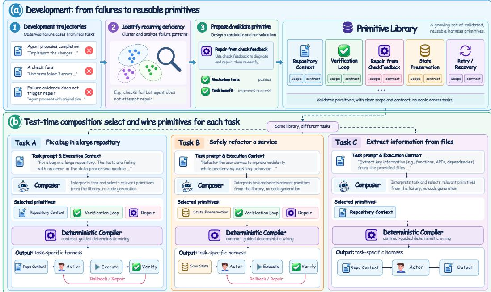
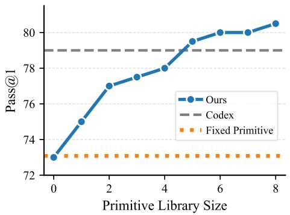
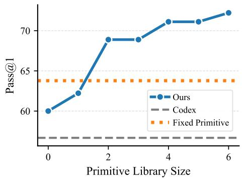
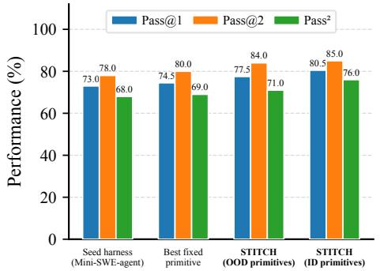
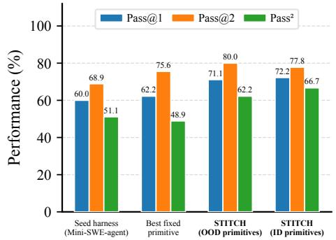
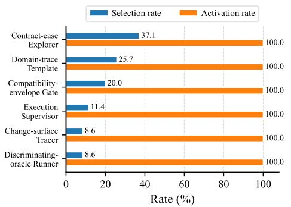
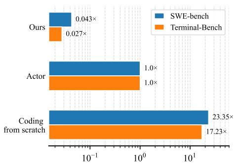
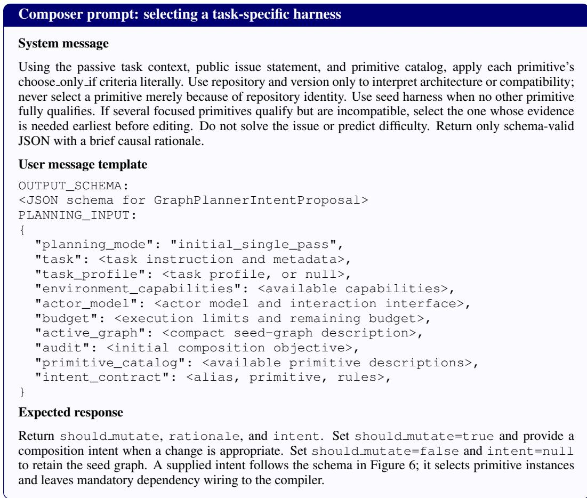
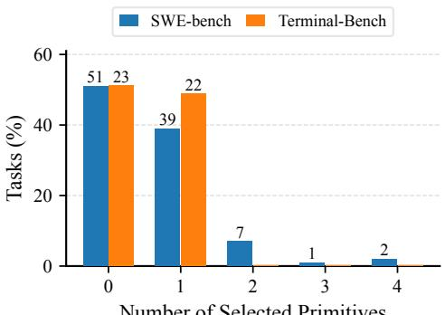
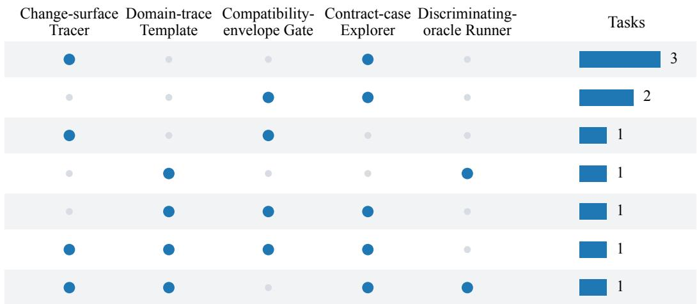

# COMPOSING TASK-SPECIFIC AGENT HARNESSES AT TEST TIME WITH REUSABLE PRIMITIVES

Peng Kuang<sup>1</sup>, Haibo Jin<sup>1</sup>, Dehao Wu<sup>1</sup>, Feiyang Deng<sup>2</sup>, Xiaopeng Yuan<sup>1</sup>, Jerry Wang<sup>1</sup>, Haohan Wang<sup>1</sup>

<sup>1</sup>University of Illinois Urbana-Champaign, <sup>2</sup>University of Michigan, Ann Arbor pengk2@illinois.edu, haohanw@illinois.edu

## ABSTRACT

Agent harnesses govern how large language models (LLMs) gather context, invoke tools, verify results, preserve state, and terminate, largely affecting agent performance. However, the value of each harness mechanism can differ across heterogeneous tasks: a mechanism that improves one task may impose overhead or context distraction on another, leading to the suboptimality of a global harness. We characterize this suboptimality as a mismatch induced by fixed mechanism choices, motivating task-specific harness construction. Nonetheless, generating harness code for each task introduces generation and debugging costs, with execution risks that can compound as more mechanisms are generated. To address those challenges, we introduce Harness Primitives, reusable harness mechanisms with clear application scope and composition contract mined from failed task trajectories. Based on Harness Primitives, we propose STITCH, a framework that Selects suitable primitives given Task Information and compiles them into TaskspeCific Harnesses at test time. This separation enables task-specific harnesses without generating or repairing mechanism code at test time. Extensive experiments demonstrate that STITCH not only improves harness adaptability and robustness, but also scales with the primitive library size, boosting task success rates by up to 12 points over fixed harness baselines, surpassing human-designed harnesses like Codex CLI while maintaining a minimal test-time harness composition overhead of only 2.7%, 638 times more efficient than generating task-specific harnesses from scratch. Ultimately, our work demonstrates that building taskadaptive harnesses can be beneficial for completing diverse tasks and that building reusable primitives can be a promising path towards this goal.

## 1 INTRODUCTION

For large language model (LLM) agents, successful task execution depends not only on the capabilities of the underlying model, but also on the agent harness that governs how those capabilities are used, where the task success rate can differ significantly when the same model is paired with different harnesses (Lee et al., 2026b;a). The harness determines how context is assembled, the interaction protocols between the actor and the environment, and when execution terminates. Modern agent harnesses therefore incorporate a range of mechanisms in those aspects that the model needs to complete the tasks. In practice, these mechanisms are typically organized within a shared harness design that is fixed across tasks (Yang et al., 2026; Sengupta & Wang, 2026).

However, the effect of each mechanism can differ in heterogeneous tasks, leading to the suboptimality of a global harness (Zhang et al., 2026a; Chen et al., 2026). We characterize this suboptimality as a task–mechanism mismatch induced by fixed mechanism choices: whenever a mechanism has positive utility within its application scope and incurs a penalty outside it, either fixed choice is strictly suboptimal to task-conditioned activation of that mechanism. (Section 3) This highlights the theoretical advantage of and the need for task-specific harness engineering, in which the mechanisms governing execution are built according to the requirements of each task.

To realize this advantage, task-specific harness engineering faces a practical challenge: generating executable harness code on the fly can be brittle, introducing independent risks of syntax errors, logic flaws, and interface mismatches, along with generation and debugging costs (Zhang et al., 2026a). We further analyzed how these execution risks compound in Proposition 2: under an independent mechanism-failure model, the probability of a generated harness remaining executable decays exponentially with a growing number of generated mechanisms. Thus, a task-adaptive harness that is not only flexible, but also robust to execution errors during test-time harness construction is needed.

Motivated by the challenge, we introduce Harness Primitives, reusable harness mechanisms with clear application scope and composition contract. Specifically, we mine failed execution trajectories to identify recurring harness deficiencies, proposing and implementing new primitives to address each gap. Based on Harness Primitives, we propose STITCH to compose task-specific harnesses at test time. STITCH includes a harness composer that evaluates the task instructions and execution contexts against the application scopes to select a subset of beneficial primitives called composition intent, and a deterministic compiler then takes this composition intent and wires the selected prim itives into an executable harness. This two-step composition separates task-conditioned primitive selection from dependency handling and executable graph construction, allowing the composer to focus on matching primitives to task requirements.

We evaluate STITCH on agent benchmarks including SWE-bench Verified (Jimenez et al., 2024) and Terminal-Bench 2 (Merrill et al., 2026). As a basis for comparison, the experiments test STITCH against baselines including Mini-SWE-agent (Yang et al., 2024), Codex CLI, MemoHarness (Huang et al., 2026), and MetaHarness (Lee et al., 2026b). Results show that the success rate of STITCH scales with the size of the Harness Primitives library, outperforming fixed harness baselines by 12 points, including human-designed harnesses like Codex CLI. In terms of efficiency, the pro cess of composition incurs an overhead of 2.7% of the cost of execution. This overhead constitutes at least a reduction by a factor of 638 compared to generation of code from scratch. For reliability, tests indicate the system activates components at a rate of 100 percent, showing the compiled primitives are not only valid but genuinely taking effect during actor execution. Regarding generalization, STITCH functions across models of actors and domains of tasks, further supporting the scalability of STITCH. In summary, our main contributions are as follows:

• Mechanism-level analysis of task-specific harness construction. We show that task-dependent control requirements induce a task-mechanism mismatch for fixed mechanism choices and that the probability of generating a valid harness can decay exponentially with more mechanisms.

• Primitive-based task-specific harness engineering. We develop Harness Primitives from failed execution trajectories, assigning each primitive an application scope and a composition contract. Based on this library, we introduce STITCH, a test-time framework that separates task-conditioned primitive selection from deterministic compilation into executable harnesses.

• Empirical validation. We evaluate our framework on SWE-bench Verified and Terminal-Bench 2. Our experiments support our analysis and design, demonstrating that STITCH is scalable on Harness Primitives library size and improves task success rates by up to 12 points over the seed harness, surpassing fixed harness baselines including human-designed architectures like Codex CLI, while maintaining a test-time computational overhead of only 2.7%, at least 638 times less than generating the harness from scratch.

## 2 RELATED WORK

Agent Harnesses. Agent harnesses organize reasoning, tool use, memory, and feedback around a language model (Ning et al., 2026; Kuang et al., 2026a). Early systems develop reasoning–action loops and reflection (Yao et al., 2023; Shinn et al., 2023; Kuang et al., 2026b), alongside interfaces for repository editing and environment interaction (Yang et al., 2024; Wang et al., 2025). For taskdependent control, HarnessX selects among complete harnesses produced by editing processor code and configurations (Chen et al., 2026), whereas STITCH selects individual validated primitives and compiles them for each task without changing their implementations.

Harness Optimization. Program and workflow search (Hu et al., 2025; Zhang et al., 2025) and harness optimizers such as Self-Harness (Zhang et al., 2026b), Meta-Harness (Lee et al., 2026b), and AutoSaddler (Park et al., 2026) edit and evaluate candidate harnesses to select a fixed harness for all tasks, whereas our approach retains validated mechanisms in a library and STITCH selects which to execute separately for each task. MemoHarness’s (Huang et al., 2026) Codex-based adaptation and Recursive Harness Self-Improvement (Lee et al., 2026a) change textual instructions and rely on the agent to follow the requested workflow descriptions, whereas STITCH connects implemented operations so that harness code determines and enforces the selected mechanisms to be executed. Test-Time Harness Evolution (Nie et al., 2026) rewrites Python harness code from test-batch traces, while JIT-Agent (Zhang et al., 2026a) generates task-specific modules and repairs execution errors, both of which suffer from the vulnerability and cost of code generation. STITCH instead constructs each task’s harness by selecting and connecting existing implementations, so test-time adaptation requires neither generating nor repairing mechanism code.

## 3 THEORETICAL ANALYSIS OF TASK-ADAPTIVE HARNESSES

We analyze static harnesses, raw code generation, and primitive-based composition under a simplified model. Let $\mathcal { X }$ denote the space of tasks drawn from a distribution D. An agent harness H has task success probability $R ( x , \mathbf { \bar { H } } ) \in [ 0 , 1 ]$ conditional on valid execution. Let $\mathsf { \bar { V } } ( H ) \in \{ 0 , 1 \}$ indicate the absence of the modeled implementation failures. We assign zero utility to invalid harnesses and write $J ( x , H ) = V ( H ) R ( \dot { x } , H )$ . Expectations below include task sampling and any randomness in primitive selection and harness generation.

We formalize our primitive library as $\mathcal { P } = \{ p _ { 1 } , . . . , p _ { M } \}$ . Each primitive $p _ { i }$ is characterized by an application scope $\Omega _ { i } ~ \subseteq ~ { \mathcal { X } }$ with task prevalence $\mu _ { i } \ = \ \mathbb { P } _ { x \sim \mathcal { D } } ( x \ \in \ \Omega _ { i } ) \ \in \ ( 0 , 1 )$ . For each task $x \in \Omega _ { i }$ , activating $p _ { i }$ yields a marginal task utility $u _ { i } ( x ) > 0$ , with conditional mean $\bar { u } _ { i } =$ $\mathbb { E } [ u _ { i } ( x ) \mid x \in \Omega _ { i } ] > \bar { 0 . }$ . For each task $x \notin \Omega _ { i }$ , activating it incurs a task-utility penalty $c _ { i } ( x ) > 0 ,$ with conditional mean $\bar { c } _ { i } = \mathbb { E } [ c _ { i } ( x ) \mid x \not \in \Omega _ { i } ] > 0$ . A composed harness is parameterized by an activation vector $\mathbf { a } \in \{ 0 , 1 \} ^ { M }$ . Assuming valid execution $( \bar { V } ( H _ { \mathbf { a } } ) = 1 )$ , the performance follows an additive structure: $\begin{array} { r } { R ( x , \mathbf { a } ) = R _ { 0 } ( x ) + \sum _ { i = 1 } ^ { M } a _ { i } \Delta _ { i } ( x ) } \end{array}$ , where $R _ { 0 } ( x )$ is the baseline performance without primitives, and $\Delta _ { i } ( x ) = u _ { i } ( x )$ if $x \in \Omega _ { i } ,$ and $- c _ { i } ( x )$ otherwise. We assume all primitive combinations are admissible and the additive expression lies in [0, 1] for every task and activation vector, abstracting away interactions between primitives.

Proposition 1 (Task-mechanism Mismatch of Fixed Activations). Assume $\mu _ { i } \in ( 0 , 1 ) , \bar { u } _ { i } > 0$ , and $\bar { c } _ { i } > 0 f o r$ all $i \in \{ 1 , \ldots , M \}$ . The expected performance of the optimal task-independent harness, $\mathbf { a } _ { \mathit { \hbar } x e d } ^ { * } \in$ arg $\begin{array} { r } { \operatorname* { m a x } _ { \mathbf { a } \in \{ 0 , 1 \} ^ { M } } \mathbb { E } _ { x \sim \mathcal { D } } [ R ( x , \mathbf { a } ) ] } \end{array}$ , is strictly lower than that of the oracle task-adaptive harness $\mathbf { a } ^ { * } ( x )$ . The suboptimality gap $\Gamma _ { f i x e d }$ is defined as:

$$
\Gamma _ { f i x e d } = \mathbb { E } _ { x } [ R ( x , \mathbf { a } ^ { * } ( x ) ) ] - \mathbb { E } _ { x } [ R ( x , \mathbf { a } _ { f i x e d } ^ { * } ) ] = \sum _ { i = 1 } ^ { M } \operatorname* { m i n } \left( \mu _ { i } \bar { u } _ { i } , ( 1 - \mu _ { i } ) \bar { c } _ { i } \right) > 0\tag{1}
$$

Remark 1. Proposition 1 quantifies the task-mechanism mismatch induced by fixed mechanism choices of a task-independent harness. Including a mechanism across tasks incurs an expected outof-scope penalty of $( 1 - \mu _ { i } ) \bar { c } _ { i }$ , while excluding it sacrifices an expected in-scope utility of $\mu _ { i } { \bar { u } } _ { i }$ Under the stated model, task-conditioned choices avoid thisfixed-choice trade-off.

While Proposition 1 motivates task-specific adaptation, raw code generation can introduce implementation failures. Let $\begin{array} { r } { k ( x ) = \sum _ { i = 1 } ^ { M } \mathbf { 1 } ( x \in \Omega _ { i } ) } \end{array}$ denote the number of oracle-selected mechanisms, and consider generating them in one attempt without repair. Conditional on task x, assume each mechanism fails independently with probability $\epsilon \in ( 0 , \bar { 1 } )$ , and the harness is valid exactly when none of these failures occurs. Then $\mathbb { P } ( V ( H _ { \mathrm { g e n } } ) = 1 \mid x ) = ( 1 - \epsilon ) ^ { k ( x ) }$

In contrast, a primitive-based harness selects validated primitives and composes them using a deterministic compiler. We assume the resulting compositions have valid execution, $V ( H _ { \mathrm { c o m p } } ) = 1$ . With expectations include task sampling and any randomness in selection or generation, let $a _ { i }$ denote the final activation of $p _ { i }$ , and define the utility-weighted false positive and false negative rates by

$$
\alpha _ { i } = \frac { \mathbb { E } [ a _ { i } c _ { i } ( x ) \mid x \not \in \Omega _ { i } ] } { \bar { c } _ { i } } , \qquad \beta _ { i } = \frac { \mathbb { E } [ ( 1 - a _ { i } ) u _ { i } ( x ) \mid x \in \Omega _ { i } ] } { \bar { u } _ { i } } .\tag{2}
$$

Proposition 2 (Conditional Dominance of Primitive-Based Composition). Under the model in Section $^ { 3 , }$ let $\begin{array} { r } { \bar { k } = \mathbb { E } _ { x } [ k ( x ) ] = \sum _ { i = 1 } ^ { M } \mu _ { i } } \end{array}$ . Primitive-based task-adaptive composition outperforms the specified alternatives under thefollowing conditions:

  
Figure 1: Overview of STITCH. Development stage turns recurring failures into a library of implemented primitives, and test-time harness composition selects and connects these primitives for individual tasks.

1. Dominance over Static Harnesses: $\mathbb { E } [ J ( x , H _ { c o m p } ) ] > \mathbb { E } [ J ( x , H _ { f u x e d } ^ { * } ) ]$ if and only if its utilityweighted selection loss is smaller than the fixed mismatch gap:

$$
\sum _ { i = 1 } ^ { M } [ \mu _ { i } \beta _ { i } \bar { u } _ { i } + ( 1 - \mu _ { i } ) \alpha _ { i } \bar { c } _ { i } ] < \Gamma _ { f u x e d } .\tag{3}
$$

2. Dominance over Raw Code Generation: For this part, assume $k ( x ) = \bar { k }$ for every task, although the selected mechanisms may differ across tasks. Suppose valid generated harnesses attain the oracle performance $R ( x , \mathbf { a } ^ { * } ( x ) )$ $I f \mathbb { E } [ J ( x , H _ { c o m p } ) ] > 0$ and with a small ϵ, composition strictly outperforms this oracle generator ifand only if,

$$
\bar { k } > k ^ { * } = \frac { \ln \left( \frac { \mathbb { E } [ R ( x , \mathbf { a } ^ { * } ( x ) ) ] } { \mathbb { E } [ J ( x , H _ { c o m p } ) ] } \right) } { - \ln ( 1 - \epsilon ) } \approx \frac { 1 } { \epsilon } \ln \left( \frac { \mathbb { E } [ R ( x , \mathbf { a } ^ { * } ( x ) ) ] } { \mathbb { E } [ J ( x , H _ { c o m p } ) ] } \right) .\tag{4}
$$

Remark 2. Part 1 shows that the composer need not be perfect: its selection loss need only remain below the mismatch gap of the best task-independent configuration. Part 2 characterizes a reliability trade-off under constant mechanism count and independent implementation failures. These conditional results motivate separating task-conditioned selectionfrom implementation generation; they do not establish compiler correctness or superiority over code generation with repair.

## 4 METHODOLOGY

Our approach separates the development of Harness Primitives from its test-time composition by STITCH. As shown in Figure 1, primitive development converts recurring execution failures into a library of implemented and validated mechanisms, each with an application scope and a composition contract (Section 4.2). Given this library and task information, STITCH uses a harness composer to select primitives and a deterministic compiler to connect them into a task-specific harness (Section 4.3). This separation allows mechanism choices to vary across tasks while reusing their implementations.

## 4.1 PRELIMINARIES

Agent Harness. Let x denote a task instruction and $c _ { x }$ an execution specification describing the task-solving language model, its interaction interface, and the task environment setup. We call the task-solving model the actor. A harness H is a control program that mediates the actor’s interaction with the environment: it constructs model requests, executes actions through available tools, returns observations, and determines when to terminate. Together, the actor, harness, and environment produce an execution trajectory τ for success evaluation.

Task-specific harness construction. The problem is to design a construction procedure $F$ that maps the available task information to a harness $H _ { x } = F ( x , \bar { c _ { x } } )$ . The objective is to improve the probability of successful task completion while holding the actor model and environment fixed. Unlike using a shared harness across tasks, this formulation allows the harness program to depend on the individual task. Let $\mathcal { H } ( c _ { x } )$ be the set of compatible harnesses, $p ( \cdot \mid x , c _ { x } , H )$ the induced trajectory distribution, and $R _ { x } ( \tau ) \in \{ 0 , 1 \}$ indicate task success. The goal is to find a task-specific harness $H _ { x } ^ { \star }$ that satisfies:

$$
H _ { x } ^ { \star } \in \underset { H \in \mathcal { H } ( c _ { x } ) } { \arg \operatorname* { m a x } } ~ \mathbb { E } _ { \tau \sim p ( \cdot \vert x , c _ { x } , H ) } \big [ R _ { x } ( \tau ) \big ] .\tag{5}
$$

Primitives and harness composition. We instantiate harness construction through a library $\mathcal { P }$ of primitives: implemented, reusable control operations, each with an application scope and a composition contract. The scope describes when the primitive is expected to help, while the contract specifies its inputs, outputs, environment requirements, and dependencies. We represent a harness $\bar { H }$ as a directed graph $\dot { G } = ( V , E )$ , where $V$ is the set of control-operation nodes and E is the set of directed edges specifying execution order and conditional branches. Each operation node invokes a primitive, and operations communicate through shared execution state containing the interaction history and intermediate results. This representation allows the same operations to be reused in different task-specific control flows. Details in Appendix B.

## 4.2 PRIMITIVE DEVELOPMENT

The Primitive Harness is initialized with a development set $\mathcal { D } _ { \mathrm { d e v } }$ and a seed harness $H _ { \mathrm { s e e d } }$ . The development process starts with failure-motivated primitive propositions. Then, primitive propositions are implemented, verified, and revised until a library of useful primitives is built. Finally, each accepted primitive is assigned an application scope and composition contract to guide the primitive selection and harness composition at test time, as detailed in Section 4.3.

Primitive proposal: From failures to reusable mechanisms. Primitive development takes a development set $\mathcal { D } _ { \mathrm { d e v } }$ and a seed harness $H _ { \mathrm { s e e d } }$ as input for collecting failed trajectories. A development agent, an LLM agent responsible for proposing, implementing, and evaluating reusable control mechanisms, runs the actor with $H _ { \mathrm { s e e d } }$ on tasks in $\mathcal { D } _ { \mathrm { d e v } }$ and collects the resulting trajectories τ and task outcomes $R _ { x } ( \tau )$ The development agent is distinct in role from the task-solving actor. It analyzes failed attempts, for which $R _ { x } ( \tau ) = 0$ , to identify recurring deficiencies. For each deficiency, the development agent proposes a mechanism, specifies when it should activate and which subsequent actor decision it should influence, and implements the corresponding primitives.

Primitive validation and revision. Our validation protocol separates mechanism correctness from task benefit. Mechanism tests check whether the intended primitive operation activates and whether its output changes the relevant request, action, or control-flow decision. Matched development runs then compare the trajectory of a harness with and without the candidate primitive to assess its benefit in task success $\bar { R } _ { x } ( \tau ) \ '$ . The evidence informs iterative revision and library acceptance. Only primitives with a positive effect on the performance are accepted, and the process terminates when the number of valid primitives within the library passes a given threshold θ.

Scope and composition contracts. For each accepted primitive, we assign an application scope, describing when it is expected to facilitate the task and when its overhead or behavior may be undesirable according to its success on the evaluated tasks, and a composition contract, specifying its inputs, outputs, required environment setup, and dependencies. Scope descriptions guide the test-time harness composer, which selects primitives, while contracts guide the implementation of the harness compiler, which connects them into a harness.

## 4.3 TEST-TIME HARNESS COMPOSITION

After development, the accepted primitive library ${ \mathcal { P } } _ { : }$ , application scopes, and composition contracts are fixed for test-time use. Given a task x and its execution specification $c _ { x } ,$ a harness composer selects suitable primitives, and a deterministic harness compiler connects them into an executable harness. This process instantiates the construction procedure F in Section 4.1. We denote the abstraction of the seed harness $H _ { \mathrm { s e e d } }$ as a graph $G _ { \mathrm { s e e d } }$ and the resulting task-specific graph by $G _ { x }$ which represents $H _ { x } = F ( x , c _ { x } )$ ).

Primitive selection. Before the first actor request, the harness composer π with the same backbone LLM as the actor, uses the application scopes to match the task’s demands to the accepted primitives and their contracts to account for environment requirements and dependencies. Specifically, the composer receives x, $c _ { x } , G _ { \mathrm { s e e d } }$ , and the library descriptions. It outputs a composition intent $I _ { x } ,$ specifying which primitives to use at a design level rather than generating their implementation code from scratch or handling the integration of the primitives, which could be brittle as well. Example schema and implementation details can be found in Appendix C and Appendix D.

Contract-guided compilation. Let K denote the deterministic compiler and $\widetilde { G } _ { x }$ the candidate graph it constructs from the intent. Selection and compilation are given by

$$
\begin{array} { r } { I _ { x } = \pi ( x , c _ { x } ; G _ { \mathrm { s e e d } } , \mathcal { P } ) , \ \widetilde { G } _ { x } = K ( G _ { \mathrm { s e e d } } , I _ { x } ; \mathcal { P } , c _ { x } ) } \end{array}\tag{6}
$$

The compiler connects the selected primitives to the seed graph and supplies the dependencies required by their composition contracts. For example, selecting a repository map, which summarizes task-relevant files and symbols, also requires inserting that map into the actor’s request. The compiler supplies this connection without requiring the composer to specify it. The candidate composition intent is checked for supported primitives, compatibility with $c _ { x } ,$ , valid connections, reachable termination, and bounded loops. If considered invalid, the diagnostics are returned to the composer for bounded correction. If correction fails, the system retains the seed harness, $G _ { \mathrm { s e e d } }$ . Finally, the compiler builds the task-specific harness according to the valid graph.

## 5 EXPERIMENTS

## 5.1 SETUP

Benchmark and metrics. We evaluate on SWE-bench Verified (Jimenez et al., 2024), which requires repairing real repository issues, and Terminal-Bench 2 (Merrill et al., 2026), which covers tasks performed in a terminal environment. The main tables report 100 randomly sampled SWE-bench tasks, grouped into Django, SymPy, and other repositories, and 45 randomly sampled Terminal-Bench tasks, grouped by difficulty. With k = 2 attempts per task, we report Pass@1, the fraction of successful attempts; Pass@k, the fraction of tasks solved in at least one attempt (Chen et al., 2021); and Passˆk, the fraction solved in all k attempts.

Implementation details. For STITCH and the harness optimization baselines, MemoHarness (Huang et al., 2026) and MetaHarness (Lee et al., 2026b), we use Mini-SWE-agent 2.4.6 (Yang et al., 2024) as the common seed harness and GPT-5.6-Sol as the development model. GPT-5.6-Luna with medium reasoning effort serves as the task-solving actor in the main experiments and as the primitive selector for STITCH. In our analysis, we also use GPT-5.6-Terra with medium reasoning, DeepSeek-V4-Flash with no reasoning, and Claude-4.5-Haiku as out-of-domain actors models not used during development. We compare against the fixed Mini-SWE-agent, SWE-agent (Yang et al., 2024), and Codex CLI harnesses, the two harness optimization baselines, and harnesses that apply fixed primitives across all tasks (Appendix E). The development task set is sampled randomly, 100 from SWE-bench and 44 from Terminal-bench, both disjoint from the evaluation samples.

## 5.2 MAIN RESULTS

Task-adaptive composition improves task success. Tables 1 and 2 show that STITCH leads all compared methods on all three overall metrics. These results are consistent with the motivation for task-conditioned mechanism selection in Section 3. On SWE-bench, it achieves 80.5% Pass@1, exceeding Mini-SWE-agent by 7.5 percentage points, Codex CLI by 1.5 points, and the stronger harness optimization baseline, MetaHarness, by 7.0 points. On Terminal-Bench, it reaches 72.2% Pass@1, improving over these baselines by 12.2, 15.5, and 16.6 points, respectively. The gains extend to repeated success: Pass<sup>2</sup> rises from Mini-SWE-agent’s 68.0% to 76.0% on SWE-bench and from 51.1% to 66.7% on Terminal-Bench. Furthermore, the results also show that task-adaptive selection exploits complementary primitives. STITCH exceeds the strongest fixed primitive’s overall Pass@1 by 4.5 points on SWE-bench and 5.5 points on Terminal-Bench, while the random composer baseline barely reaches the average performance of fixed primitives. Individual primitives have distinct strengths, which echoes our assumptions in Section 3: Contract-case Explorer performs best among fixed primitives on SymPy and other repositories, while Environment-capability Runner leads on Django. On Terminal-Bench, State Guard leads on medium tasks, whereas Execution Supervisor leads on hard tasks. STITCH combines this coverage, reaching 81.0% Pass@1 on medium tasks and 46.2% on hard tasks while retaining 100% on easy tasks. These patterns support the value of matching control mechanisms to individual tasks.

Table 1: The performance of the GPT-5.6-Luna on SWE-bench Verified.
<table><tr><td>Method</td><td colspan="3">Overall</td><td colspan="3">Django</td><td colspan="3">SymPy</td><td colspan="3">Other repos</td></tr><tr><td></td><td>Pass@1 Pass@k</td><td></td><td></td><td></td><td>c Pass^k Pass@1 Pass@k Pass^k</td><td></td><td>Pass@1 Pass@k Pass^k</td><td></td><td></td><td>Pass@1 Pass@k Pass^k</td><td></td><td></td></tr><tr><td>Mini-SWE-agent (Seed Harness)</td><td>73.0</td><td>78.0</td><td>68.0</td><td>75.0</td><td>78.8</td><td>71.2</td><td>75.0</td><td>78.6</td><td>71.4</td><td>69.1</td><td>76.5</td><td>61.8</td></tr><tr><td>SWE-agent</td><td>47.5</td><td>63.0</td><td>32.0</td><td>53.8</td><td>71.2</td><td>36.5</td><td>42.9</td><td>50.0</td><td>35.7</td><td>39.7</td><td>55.9</td><td>23.5</td></tr><tr><td>Codex CLI</td><td>79.0</td><td>83.0</td><td>75.0</td><td>78.8</td><td>80.8</td><td>76.9</td><td>64.3</td><td>71.4</td><td>57.1</td><td>85.3</td><td>91.2</td><td>79.4</td></tr><tr><td>MemoHarness</td><td>70.5</td><td>77.0</td><td>64.0</td><td>70.2</td><td>76.9</td><td>63.5</td><td>67.9</td><td>71.4</td><td>64.3</td><td>72.1</td><td>79.4</td><td>64.7</td></tr><tr><td>MetaHarness</td><td>73.5</td><td>79.0</td><td>68.0</td><td>74.0</td><td>78.8</td><td>69.2</td><td>64.3</td><td>71.4</td><td>57.1</td><td>76.5</td><td>82.4</td><td>70.6</td></tr><tr><td colspan="9">Our developed primitives (fixed across tasks)</td><td></td><td></td><td></td></tr><tr><td>Change-surface Tracer</td><td>73.5</td><td>77.0</td><td>70.0</td><td>76.9</td><td>80.8</td><td>73.1</td><td>60.7</td><td>64.3</td><td>57.1</td><td>73.5</td><td>76.5</td><td>70.6</td></tr><tr><td>Compatibility-envelope Gate</td><td>72.0</td><td>77.0</td><td>67.0</td><td>76.9</td><td>80.8</td><td>73.1</td><td>57.1</td><td>64.3</td><td>50.0</td><td>70.6</td><td>76.5</td><td>64.7</td></tr><tr><td>Contract-case Explorer</td><td>72.5</td><td>78.0</td><td>67.0</td><td>69.2</td><td>76.9</td><td>61.5</td><td>71.4</td><td>78.6</td><td>64.3</td><td>77.9</td><td>79.4</td><td>76.5</td></tr><tr><td>Discriminating-oracle Runner</td><td>71.5</td><td>76.0</td><td>67.0</td><td>75.0</td><td>78.8</td><td>71.2</td><td>57.1</td><td>57.1</td><td>57.1</td><td>72.1</td><td>79.4</td><td>64.7</td></tr><tr><td>Domain-trace Template</td><td>73.0</td><td>77.0</td><td>69.0</td><td>76.0</td><td>80.8</td><td>71.2</td><td>60.7</td><td>64.3</td><td>57.1</td><td>73.5</td><td>76.5</td><td>70.6</td></tr><tr><td>Environment-capability Runner</td><td>76.0</td><td>79.0</td><td>73.0</td><td>77.9</td><td>80.8</td><td>75.0</td><td>67.9</td><td>71.4</td><td>64.3</td><td>76.5</td><td>79.4</td><td>73.5</td></tr><tr><td>Random composer</td><td>73.3</td><td>78.0</td><td>68.6</td><td>75.4</td><td>79.6</td><td>71.2</td><td>64.3</td><td>69.6</td><td>58.9</td><td>73.9</td><td>79.0</td><td>68.8</td></tr><tr><td>STITCH (Ours)</td><td>80.5</td><td>85.0</td><td>76.0</td><td>79.8</td><td>84.6</td><td>75.0</td><td>75.0</td><td>78.6</td><td>71.4</td><td>83.8</td><td>88.2</td><td>79.4</td></tr></table>

Table 2: The performance of the GPT-5.6-Luna on Terminal-Bench 2.
<table><tr><td>Method</td><td colspan="3">Overall</td><td colspan="3">Easy</td><td colspan="3">Medium</td><td colspan="3">Hard</td></tr><tr><td></td><td>Pass@1</td><td>Pass@k</td><td>Pass^k</td><td></td><td>Pass@1 Pass@k</td><td>Pass^k</td><td>Pass@1</td><td>Pass@k</td><td>Pass^k</td><td>Pass@1</td><td>Pass@k</td><td>Pass^k</td></tr><tr><td>Mini-SWE-agent (Seed Harness)</td><td>60.0</td><td>68.9</td><td>51.1</td><td>100.0</td><td>100.0</td><td>100.0</td><td>65.5</td><td>75.9</td><td>55.2</td><td>38.5</td><td>46.2</td><td>30.8</td></tr><tr><td>SWE-agent</td><td>13.3</td><td>17.8</td><td>8.9</td><td>33.3</td><td>33.3</td><td>33.3</td><td>13.8</td><td>17.2</td><td>10.3</td><td>7.7</td><td>15.4</td><td>0.0</td></tr><tr><td>Codex CLI</td><td>56.7</td><td>66.7</td><td>46.7</td><td>66.7</td><td>66.7</td><td>66.7</td><td>67.2</td><td>79.3</td><td>55.2</td><td>30.8</td><td>38.5</td><td>23.1</td></tr><tr><td>MemoHarness</td><td>53.3</td><td>66.7</td><td>40.0</td><td>83.3</td><td>100.0</td><td>66.7</td><td>62.1</td><td>75.9</td><td>48.3</td><td>26.9</td><td>38.5</td><td>15.4</td></tr><tr><td>MetaHarness</td><td>55.6</td><td>66.7</td><td>44.4</td><td>66.7</td><td>100.0</td><td>33.3</td><td>62.1</td><td>72.4</td><td>51.7</td><td>38.5</td><td>46.2</td><td>30.8</td></tr><tr><td colspan="9">Our developed primitives (fixed across tasks)</td><td></td><td></td><td></td></tr><tr><td>State Guard</td><td>66.7</td><td>75.6</td><td>57.8</td><td>83.3</td><td>100.0</td><td>66.7</td><td>77.6</td><td>86.2</td><td>69.0</td><td>38.5</td><td>46.2</td><td>30.8</td></tr><tr><td>Check Replay</td><td>65.6</td><td>75.6</td><td>55.6</td><td>100.0</td><td>100.0</td><td>100.0</td><td>74.1</td><td>86.2</td><td>62.1</td><td>38.5</td><td>46.2</td><td>30.8</td></tr><tr><td>First-Failure Localizer</td><td>62.2</td><td>68.9</td><td>55.6</td><td>100.0</td><td>100.0</td><td>100.0</td><td>72.4</td><td>82.8</td><td>62.1</td><td>30.8</td><td>30.8</td><td>30.8</td></tr><tr><td>Experiment Keeper</td><td>58.9</td><td>68.9</td><td>48.9</td><td>83.3</td><td>100.0</td><td>66.7</td><td>65.5</td><td>75.9</td><td>55.2</td><td>38.5</td><td>46.2</td><td>30.8</td></tr><tr><td>Execution Supervisor</td><td>65.6</td><td>75.6</td><td>55.6</td><td>100.0</td><td>100.0</td><td>100.0</td><td>70.7</td><td>82.8</td><td>58.6</td><td>46.2</td><td>53.8</td><td>38.5</td></tr><tr><td>Random composer</td><td>63.5</td><td>71.9</td><td>55.2</td><td>94.4</td><td>100.0</td><td>88.9</td><td>71.3</td><td>81.0</td><td>61.5</td><td>39.1</td><td>44.9</td><td>33.3</td></tr><tr><td>STITCH (ours)</td><td>72.2</td><td>77.8</td><td>66.7</td><td>100.0</td><td>100.0</td><td>100.0</td><td>81.0</td><td>89.7</td><td>72.4</td><td>46.2</td><td>46.2</td><td>46.2</td></tr></table>

STITCH scales with primitive library size. We explore how the size of the primitive library affects the performance of STITCH and how scalable it is to the primitive library size. Starting from the seed harness, we gradually increase the number of primitives in the primitive library used by STITCH at test time. As shown in Figure 2, the performance of STITCH increases steadily from 75.0% to 80.5% on SWE-bench and from 62.2% to 72.2% on Terminal-Bench as the number of primitives in the library grows, showing strong scalability of the proposed primitive-based taskadaptive harnesses.



  
Figure 2: The scalability of STITCH on Harness Primitives Library size. Left: The performance of STITCH on SWE-bench Verified scales with Harness Primitives Library size. Right: The performance of STITCH on Terminal-bench 2 scales with Harness Primitives Library size.

## 5.3 ANALYSIS

Harness Primitives generalizes across actor models. To examine the cross-model generalization of STITCH, we use out-of-domain actor models such as GPT-5.6-Terra, DeepSee-v4-Flash, and Claude-4.5-Haiku at test time, while GPT-5.6-Luna is used as the actor model during the development stage. The primitives implementation and composition contract remain unchanged while the application scope is adjusted according to the model’s execution on development tasks. As shown in Table 3, the primitives generalize to different actor models, with the overall performance of all fixed single-primitive harnesses surpassing the seed harness. This shows that developed primitives represent generic harness control mechanisms instead of overfitting to the weaknesses of the actor model during development. Furthermore, the composer is also able to effectively select suitable primitives for the tasks, achieving the highest average performance across the evaluated actor models.

Table 3: Out-of-development-model actor generalization on SWE-bench Verified.
<table><tr><td>Method</td><td colspan="3">Overall</td><td colspan="3">GPT-5.6-Terra</td><td colspan="3">DeepSeek-V4-Flash</td><td colspan="3">Claude-4.5-Haiku</td></tr><tr><td></td><td>Pass@1 Pass@k Passk</td><td></td><td></td><td>Pass@1 Pass@k Passk</td><td></td><td></td><td>Pass@1 Pass@k</td><td></td><td> $\mathrm { P a s s } ^ { k }$ </td><td>Pass@1 Pass@k</td><td></td><td> $\mathrm { P a s s } ^ { k }$ </td></tr><tr><td>Mini-SWE-agent (Seed Harness)</td><td>75.2</td><td>80.3</td><td>70.0</td><td>82.0</td><td>84.0</td><td>80.0</td><td>82.5</td><td>89.0</td><td>76.0</td><td>61.0</td><td>68.0</td><td>54.0</td></tr><tr><td>SWE-agent</td><td>73.3</td><td>79.7</td><td>67.0</td><td>74.5</td><td>83.0</td><td>66.0</td><td>89.5</td><td>93.0</td><td>86.0</td><td>56.0</td><td>63.0</td><td>49.0</td></tr><tr><td>Codex CLI</td><td>78.5</td><td>84.7</td><td>72.3</td><td>88.0</td><td>92.0</td><td>84.0</td><td>82.0</td><td>90.0</td><td>74.0</td><td>65.5</td><td>72.0</td><td>59.0</td></tr><tr><td colspan="9">Our developed primitives (fixed across tasks)</td><td></td><td></td><td></td></tr><tr><td>Change-surface Tracer</td><td>77.7</td><td>83.7</td><td>71.7</td><td>79.5</td><td>84.0</td><td>75.0</td><td>87.5</td><td>92.0</td><td>83.0</td><td>66.0</td><td>75.0</td><td>57.0</td></tr><tr><td>Compatibility-envelope Gate</td><td>77.3</td><td>83.3</td><td>71.3</td><td>79.5</td><td>85.0</td><td>74.0</td><td>85.5</td><td>90.0</td><td>81.0</td><td>67.0</td><td>75.0</td><td>59.0</td></tr><tr><td>Contract-case Explorer</td><td>78.7</td><td>83.7</td><td>73.7</td><td>80.0</td><td>83.0</td><td>77.0</td><td>88.5</td><td>93.0</td><td>84.0</td><td>67.5</td><td>75.0</td><td>60.0</td></tr><tr><td>Discriminating-oracle Runner</td><td>76.3</td><td>81.0</td><td>71.7</td><td>77.5</td><td>82.0</td><td>73.0</td><td>86.5</td><td>90.0</td><td>83.0</td><td>65.0</td><td>71.0</td><td>59.0</td></tr><tr><td>Domain-trace Template</td><td>78.7</td><td>85.0</td><td>72.3</td><td>81.5</td><td>86.0</td><td>77.0</td><td>84.5</td><td>91.0</td><td>78.0</td><td>70.0</td><td>78.0</td><td>62.0</td></tr><tr><td>Environment-capability Runner</td><td>79.5</td><td>84.3</td><td>74.7</td><td>83.5</td><td>86.0</td><td>81.0</td><td>89.0</td><td>93.0</td><td>85.0</td><td>66.0</td><td>74.0</td><td>58.0</td></tr><tr><td>Random composer</td><td>77.4</td><td>82.8</td><td>71.9</td><td>80.6</td><td>84.4</td><td>76.9</td><td>85.9</td><td>90.9</td><td>80.9</td><td>65.6</td><td>73.3</td><td>58.0</td></tr><tr><td>STITCH (Ours)</td><td>84.0</td><td>88.3</td><td>79.7</td><td>86.5</td><td>90.0</td><td>83.0</td><td>91.5</td><td>95.0</td><td>88.0</td><td>74.0</td><td>80.0</td><td>68.0</td></tr></table>

Harness Primitives generalizes to out-of-domain tasks. To test whether the primitives developed on tasks from one domain generalize to another, we sampled a subset of the primitive library where only primitives developed from other out-of-domain (OOD) tasks are retained during evaluation. For example, STITCH is evaluated on Terminal-bench but is paired with OOD primitives developed on SWE-bench. The primitives’ implementation and composition contract remain unchanged while the application scope is adjusted on development tasks. As shown in Figure 3, while the Pass@1 performance of STITCH with OOD primitives underperforms that paired with in-domain (ID) primitives, its performance gain compared to the seed harness is still significant, achieving 11.1 points of Pass@1 gain when evaluated on the SWE-bench to Terminal bench setup. This generalizability of Harness Primitives is consistent with the scalability of primitive library size is shown in Figure 2.



  
Figure 3: The cross domain generalization of STITCH. Left: The generalization of STITCH on SWE-bench with out-of-domain primitives developed on Terminal-bench. Right: The generalization of STITCH on Terminal-bench with out-of-domain primitives developed on SWE-bench.



  
Cost by Tokens  
Figure 4: Left: Despite different selection rates of primitives, all primitives are fully executable and activated at test time. Right: The cost overhead of STITCH is as low as 2.7% compared to the actor. In comparison, even the lower bound cost of coding the harness from scratch is 17.23× higher than the actor cost, making STITCH 638× efficient.

Selected primitives activate during task execution. We measure the frequencies of primitives that are selected and whether they are actually activated during the actor’s task-solving trajectories. As shown in the left panel of Figure 4, while different primitives are selected at different rates, the activation rate, which measures whether the selected primitive is actually activated and executed without runtime errors on the actor agent, is stable at 100% for all primitives. This empirically supports part 2 of Proposition 2, demonstrating that STITCH is not only free of the exponential reliability risk of raw harness code generation, but also actually takes effect during the actor execution. We further show that the primitives are sparsely activated with the selection pattern in Appendix F.

The cost of STITCH in building task-specific harnesses is minimal, down to 2.7% of actor execution and 638× less than coding from scratch. To quantify the cost of building task-specific harnesses, we compare STITCH with an optimistic lower bound for generating the complete harness implementation at test time. Specifically, we assume an oracle coding agent that emits valid code directly, with no input, reasoning, or debugging cost. Under this assumption, the cost is simply that of emitting the implementation’s output tokens. As shown in the right panel of Figure 4, STITCH costs only 4.3% of one actor attempt on SWE-bench and 2.7% on Terminal-Bench, whereas full-code generation costs 23.35 and 17.23 actor attempts, respectively, which is approximately 543 and 638 times the composition cost.

## 6 CONCLUSION

We introduced Harness Primitives, reusable harness mechanisms developed from recurring execution failures and equipped with application scopes and composition contracts. Based on these primitives, STITCH constructs task-specific harnesses by separating task-conditioned selection from deterministic compilation. Our analysis examines the task-mechanism mismatch induced by fixed choices and the execution risks of generating mechanism implementations at test time. Evaluation on held-out subsets of SWE-bench Verified and Terminal-Bench 2 shows improvements over the seed harness and surpasses human-designed harnesses such as Codex CLI, with composition costs of 4.3% and 2.7% of one actor attempt, respectively. The experiments also examine library expansion and transfer across actor models and task domains. Together, these results support reusable mechanisms and task-conditioned composition as an approach to task-specific harness construction.

## AI USE STATEMENT

In preparing this manuscript, we used AI tools (Codex) only to polish the language and improve the clarity of the presentation. Their use was limited to correcting grammar, rephrasing authorwritten sentences, and improving readability and consistency of wording. The research questions, core ideas, methodology, experimental design, analyses, and scientific conclusions of this work were developed by the human authors, and no claims, results, or references were generated by these tools. Every AI-assisted edit was reviewed for correctness by at least two human authors. We take full responsibility for the final content of this work.

## REFERENCES

Mark Chen, Jerry Tworek, Heewoo Jun, Qiming Yuan, Henrique Ponde de Oliveira Pinto, Jared Kaplan, Harri Edwards, Yuri Burda, Nicholas Joseph, Greg Brockman, Alex Ray, Raul Puri, Gretchen Krueger, Michael Petrov, Heidy Khlaaf, Girish Sastry, Pamela Mishkin, Brooke Chan, Scott Gray, Nick Ryder, Mikhail Pavlov, Alethea Power, Lukasz Kaiser, Mohammad Bavarian, Clemens Winter, Philippe Tillet, Felipe Petroski Such, Dave Cummings, Matthias Plappert, Fotios Chantzis, Elizabeth Barnes, Ariel Herbert-Voss, William Hebgen Guss, Alex Nichol, Alex Paino, Nikolas Tezak, Jie Tang, Igor Babuschkin, Suchir Balaji, Shantanu Jain, William Saunders, Christopher Hesse, Andrew N. Carr, Jan Leike, Josh Achiam, Vedant Misra, Evan Morikawa, Alec Radford, Matthew Knight, Miles Brundage, Mira Murati, Katie Mayer, Peter Welinder, Bob Mc-Grew, Dario Amodei, Sam McCandlish, Ilya Sutskever, and Wojciech Zaremba. Evaluating large language models trained on code, 2021. URL https://arxiv.org/abs/2107.03374.

Tingyang Chen, Shuo Lu, Kang Zhao, Weicheng Meng, Hanlin Teng, Tianhao Li, Chao Li, Xule Liu, Jian Liang, Zhizhong Zhang, Yuan Xie, Heng Qu, Kun Shao, and Jian Luan. Harnessx: A composable, adaptive, and evolvable agent harness foundry, 2026. URL https://arxiv. org/abs/2606.14249.

Shengran Hu, Cong Lu, and Jeff Clune. Automated design of agentic systems, 2025. URL https: //arxiv.org/abs/2408.08435.

Yue Huang, Wenjie Wang, Han Bao, Yuchen Ma, Xiaonan Luo, Yi Nian, Haomin Zhuang, Zheyuan Liu, Yue Zhao, and Xiangliang Zhang. Memoharness: Agent harnesses that learn from experience, 2026. URL https://arxiv.org/abs/2607.14159.

Carlos E. Jimenez, John Yang, Alexander Wettig, Shunyu Yao, Kexin Pei, Ofir Press, and Karthik Narasimhan. Swe-bench: Can language models resolve real-world github issues?, 2024. URL https://arxiv.org/abs/2310.06770.

Peng Kuang, Haibo Jin, Xiaoyu Han, Yanli Wang, Xiaopeng Yuan, Ye Yu, Kaidi Xu, and Haohan Wang. Kv-prm: Efficient process reward modeling via kv-cache transfer for multi-agent test-time scaling, 2026a. URL https://arxiv.org/abs/2607.09153.

Peng Kuang, Yanli Wang, Xiaoyu Han, Yaowenqi Liu, Kaidi Xu, and Haohan Wang. Optimal aggregation of llm and prm signals for efficient test-time scaling. In C. Vondrick, B. Hariharan, C. Raffel, L. Pinto, D. Yang, and A. Faust (eds.), International

Conference on Learning Representations, volume 2026, pp. 92094–92109, 2026b. URL https://proceedings.iclr.cc/paper\_files/paper/2026/file/ 94bd1b8c906494bada774096bd0fdd73-Paper-Conference.pdf.

Hyunin Lee, Jinglue Xu, Jeffrey Seely, Donghyun Lee, Matei Zaharia, and Yujin Tang. Recursive harness self-improvement, 2026a. URL https://arxiv.org/abs/2607.15524.

Yoonho Lee, Roshen Nair, Qizheng Zhang, Kangwook Lee, Omar Khattab, and Chelsea Finn. Metaharness: End-to-end optimization of model harnesses, 2026b. URL https://arxiv.org/ abs/2603.28052.

Mike A. Merrill, Alexander G. Shaw, Nicholas Carlini, Boxuan Li, Harsh Raj, Ivan Bercovich, Lin Shi, Jeong Yeon Shin, Thomas Walshe, E. Kelly Buchanan, Junhong Shen, Guanghao Ye, Haowei Lin, Jason Poulos, Maoyu Wang, Marianna Nezhurina, Jenia Jitsev, Di Lu, Orfeas Menis Mastromichalakis, Zhiwei Xu, Zizhao Chen, Yue Liu, Robert Zhang, Leon Liangyu Chen, Anurag Kashyap, Jan-Lucas Uslu, Jeffrey Li, Jianbo Wu, Minghao Yan, Song Bian, Vedang Sharma, Ke Sun, Steven Dillmann, Akshay Anand, Andrew Lanpouthakoun, Bardia Koopah, Changran Hu, Etash Guha, Gabriel H. S. Dreiman, Jiacheng Zhu, Karl Krauth, Li Zhong, Niklas Muennighoff, Robert Amanfu, Shangyin Tan, Shreyas Pimpalgaonkar, Tushar Aggarwal, Xiangning Lin, Xin Lan, Xuandong Zhao, Yiqing Liang, Yuanli Wang, Zilong Wang, Changzhi Zhou, David Heineman, Hange Liu, Harsh Trivedi, John Yang, Junhong Lin, Manish Shetty, Michael Yang, Nabil Omi, Negin Raoof, Shanda Li, Terry Yue Zhuo, Wuwei Lin, Yiwei Dai, Yuxin Wang, Wenhao Chai, Shang Zhou, Dariush Wahdany, Ziyu She, Jiaming Hu, Zhikang Dong, Yuxuan Zhu, Sasha Cui, Ahson Saiyed, Arinbjorn Kolbeinsson, Jesse Hu, Christopher Michael Rytting,¨ Ryan Marten, Yixin Wang, Alex Dimakis, Andy Konwinski, and Ludwig Schmidt. Terminalbench: Benchmarking agents on hard, realistic tasks in command line interfaces, 2026. URL https://arxiv.org/abs/2601.11868.

Jun Nie, Yonggang Zhang, Jun Song, Qianshu Cai, Dahai Yu, Yike Guo, Xinmei Tian, and Bo Han. Tthe: Test-time harness evolution, 2026. URL https://arxiv.org/abs/2607.08124.

Xuying Ning, Katherine Tieu, Dongqi Fu, Tianxin Wei, Zihao Li, Yuanchen Bei, Jiaru Zou, Mengting Ai, Zhining Liu, Ting-Wei Li, Lingjie Chen, Yanjun Zhao, Ke Yang, Bingxuan Li, Cheng Qian, Gaotang Li, Xiao Lin, Zhichen Zeng, Ruizhong Qiu, Sirui Chen, Yifan Sun, Xiyuan Yang, Ruida Wang, Rui Pan, Chenyuan Yang, Dylan Zhang, Liri Fang, Zikun Cui, Yang Cao, Pan Chen, Dorothy Sun, Ren Chen, Mahesh Srinivasan, Nipun Mathur, Yinglong Xia, Hong Li, Hong Yan, Pan Lu, Lingming Zhang, Tong Zhang, Hanghang Tong, and Jingrui He. Code as agent harness, 2026. URL https://arxiv.org/abs/2605.18747.

Sungho Park, Wonjoong Kim, Rongyuan Tan, Jue Zhang, Wook-Shin Han, Pengfei Gao, Chanyoung Park, Yongqiang Yao, Rao Fu, Elsie Nallipogu, Qingwei Lin, Saravan Rajmohan, and Dongmei Zhang. Autosaddler: Automatic harness optimization with durable updates from agent execution traces, 2026. URL https://arxiv.org/abs/2608.23041.

Biswa Sengupta and Jinhua Wang. Harbor: Automated harness optimization, 2026. URL https: //arxiv.org/abs/2604.20938.

Noah Shinn, Federico Cassano, Edward Berman, Ashwin Gopinath, Karthik Narasimhan, and Shunyu Yao. Reflexion: Language agents with verbal reinforcement learning, 2023. URL https://arxiv.org/abs/2303.11366.

Xingyao Wang, Boxuan Li, Yufan Song, Frank F. Xu, Xiangru Tang, Mingchen Zhuge, Jiayi Pan, Yueqi Song, Bowen Li, Jaskirat Singh, Hoang H. Tran, Fuqiang Li, Ren Ma, Mingzhang Zheng, Bill Qian, Yanjun Shao, Niklas Muennighoff, Yizhe Zhang, Binyuan Hui, Junyang Lin, Robert Brennan, Hao Peng, Heng Ji, and Graham Neubig. Openhands: An open platform for ai software developers as generalist agents, 2025. URL https://arxiv.org/abs/2407.16741.

Chenyang Yang, Xinran Zhao, Tongshuang Wu, and Christian Kastner. Better harnesses, smaller¨ models: Building 90URL https://arxiv.org/abs/2607.08938.

John Yang, Carlos E. Jimenez, Alexander Wettig, Kilian Lieret, Shunyu Yao, Karthik Narasimhan, and Ofir Press. Swe-agent: Agent-computer interfaces enable automated software engineering, 2024. URL https://arxiv.org/abs/2405.15793.

Shunyu Yao, Jeffrey Zhao, Dian Yu, Nan Du, Izhak Shafran, Karthik Narasimhan, and Yuan Cao. React: Synergizing reasoning and acting in language models, 2023. URL https://arxiv. org/abs/2210.03629.

Guibin Zhang, Leo Lu, Fangzhou Xie, Kang Zhu, Junhao Wang, Zhifei Xie, Zhaochen Yu, Zihang Liu, Zhongxiang Sun, Qiankun Li, Yue Liao, Heng Chang, Xiaobin Hu, Qibing Ren, Wangchunshu Zhou, Chuanrui Hu, Yafeng Deng, and Shuicheng Yan. Jit-agent: Scaling harness intelligence via just-in-time harness evolution, 2026a. URL https://arxiv.org/abs/2608.25593.

Hangfan Zhang, Shao Zhang, Kangcong Li, Chen Zhang, Yang Chen, Yiqun Zhang, Lei Bai, and Shuyue Hu. Self-harness: Harnesses that improve themselves, 2026b. URL https://arxiv. org/abs/2606.09498.

Jiayi Zhang, Jinyu Xiang, Zhaoyang Yu, Fengwei Teng, Xionghui Chen, Jiaqi Chen, Mingchen Zhuge, Xin Cheng, Sirui Hong, Jinlin Wang, Bingnan Zheng, Bang Liu, Yuyu Luo, and Chenglin Wu. Aflow: Automating agentic workflow generation, 2025. URL https://arxiv.org/ abs/2410.10762.

## A PROOFS OF THEORETICAL RESULTS

## A.1 PROOF OF PROPOSITION 1

Proposition (Fundamental Suboptimality of Monolithic Harnesses, Restated). Assume $\mu _ { i } \in ( 0 , 1 )$ $\bar { u } _ { i } ~ > ~ 0 ,$ , and $\bar { c } _ { i } ~ > ~ 0 ~ f o r$ all $i \ \stackrel { \textstyle - } { \in } \ \{ 1 , \dotsc , M \}$ . The expected performance of the optimal taskindependent harness, $\begin{array} { r } { \mathbf { a } _ { \mathit { f i x e d } } ^ { * } = \arg \operatorname* { m a x } _ { \mathbf { a } \in \{ 0 , 1 \} ^ { M } } \mathbb { E } _ { x \sim \mathcal { D } } [ R ( x , \mathbf { a } ) ] , } \end{array}$ , is strictly lower than that of the oracle task-adaptive harness $\mathbf { a } ^ { * } ( x )$ . The suboptimality gap $\Gamma _ { f i x e d }$ is defined as:

$$
\Gamma _ { f x e d } = \mathbb { E } _ { x } [ R ( x , \mathbf { a } ^ { * } ( x ) ) ] - \mathbb { E } _ { x } [ R ( x , \mathbf { a } _ { f x e d } ^ { * } ) ] = \sum _ { i = 1 } ^ { M } \operatorname* { m i n } \left( \mu _ { i } \bar { u } _ { i } , ( 1 - \mu _ { i } ) \bar { c } _ { i } \right) > 0
$$

Proof. Under the pointwise sign assumptions, one oracle activation maximizing $R ( x , \mathbf { a } )$ for each task is:

$$
a _ { i } ^ { * } ( x ) = \mathbf { 1 } ( x \in \Omega _ { i } ) .\tag{7}
$$

The expected performance of the oracle adaptive harness is:

$$
\mathbb { E } _ { { x } \sim \mathcal { D } } [ R ( x , \mathbf { a } ^ { * } ( x ) ) ] = \mathbb { E } [ R _ { 0 } ( x ) ] + \sum _ { i = 1 } ^ { M } \mathbb { E } _ { x } [ \mathbf { 1 } ( x \in \Omega _ { i } ) u _ { i } ( x ) ] = \mathbb { E } [ R _ { 0 } ( x ) ] + \sum _ { i = 1 } ^ { M } \mu _ { i } \bar { u } _ { i }\tag{8}
$$

For a fixed harness $\mathbf { a } _ { \mathrm { f i x e d } } \in \{ 0 , 1 \} ^ { M }$ , the expected performance over $\mathcal { D }$ is:

$$
\mathbb { E } _ { \boldsymbol { x } \sim \mathcal { D } } [ R ( \boldsymbol { x } , \mathbf { a } _ { \mathrm { f i x e d } } ) ] = \mathbb { E } [ R _ { 0 } ( \boldsymbol { x } ) ] + \sum _ { i = 1 } ^ { M } a _ { i } \mathbb { E } _ { \boldsymbol { x } \sim \mathcal { D } } [ \Delta _ { i } ( \boldsymbol { x } ) ]\tag{9}
$$

Using the law of total expectation:

$$
\mathbb { E } _ { x } [ \Delta _ { i } ( x ) ] = \mathbb { P } ( x \in \Omega _ { i } ) \mathbb { E } [ u _ { i } ( x ) \mid x \in \Omega _ { i } ] - \mathbb { P } ( x \notin \Omega _ { i } ) \mathbb { E } [ c _ { i } ( x ) \mid x \notin \Omega _ { i } ] = \mu _ { i } { \bar { u } } _ { i } - ( 1 - \mu _ { i } ) { \bar { c } } _ { i }\tag{10}
$$

To maximize this sum, the optimal fixed harness sets:

$$
a _ { i , \mathrm { f i x e d } } ^ { * } = \left\{ \begin{array} { l l } { 1 , } & { \mathrm { i f } \ \mu _ { i } \bar { u } _ { i } > ( 1 - \mu _ { i } ) \bar { c } _ { i } } \\ { 0 , } & { \mathrm { o t h e r w i s e } } \end{array} \right.\tag{11}
$$

The optimal fixed expectation is therefore:

$$
\mathbb { E } _ { { x } \sim { \mathcal { D } } } [ R ( x , \mathbf { a } _ { \mathrm { f i x e d } } ^ { * } ) ] = \mathbb { E } [ R _ { 0 } ( x ) ] + \sum _ { i = 1 } ^ { M } \operatorname* { m a x } \left( 0 , \ \mu _ { i } { \bar { u } } _ { i } - ( 1 - \mu _ { i } ) { \bar { c } } _ { i } \right)\tag{12}
$$

Subtracting $\mathbb { E } _ { x } [ R ( x , \mathbf { a } _ { \mathrm { f i x e d } } ^ { * } ) ]$ from $\mathbb { E } _ { x } [ R ( x , \mathbf { a } ^ { * } ( x ) ) ]$ ] yields the gap $\Gamma _ { \mathrm { f i x e d } }$

$$
\Gamma _ { \mathrm { f i x e d } } = \sum _ { i = 1 } ^ { M } \left( \mu _ { i } { \bar { u } } _ { i } - \operatorname * { m a x } \left( 0 , \ \mu _ { i } { \bar { u } } _ { i } - ( 1 - \mu _ { i } ) { \bar { c } } _ { i } \right) \right)\tag{13}
$$

Using the identity $y - \operatorname* { m a x } ( 0 , y - z ) = \operatorname* { m i n } ( y , z ) { \mathrm { ~ f o r ~ } } y = \mu _ { i } { \bar { u } } _ { i } { \mathrm { ~ a n d ~ } } z = ( 1 - \mu _ { i } ) { \bar { c } } _ { i } .$

$$
{ \Gamma _ { \mathrm { { f i x e d } } } } = \sum _ { i = 1 } ^ { M } { \operatorname* { m i n } \big ( } \mu _ { i } \bar { u } _ { i } , ( 1 - \mu _ { i } ) \bar { c } _ { i } \big )\tag{14}
$$

Because $\mu _ { i } \in ( 0 , 1 ) , \bar { u } _ { i } > 0$ , and $\bar { c } _ { i } > 0$ , each term in the sum is strictly positive, proving $\Gamma _ { \mathrm { f i x e d } } >$ 0.

## A.2 PROOF OF PROPOSITION 2

Proposition (Conditional Dominance of Primitive-Based Composition, Restated). Under the model in Section 3, let $\begin{array} { r } { \bar { k } = \mathbb { E } _ { x } [ k ( x ) ] = \sum _ { i = 1 } ^ { M } \mu _ { i } } \end{array}$ . Primitive-based task-adaptive composition outperforms the specified alternatives under thefollowing conditions:

1. Dominance over Static Harnesses: $\mathbb { E } [ J ( x , H _ { c o m p } ) ] > \mathbb { E } [ J ( x , H _ { f u x e d } ^ { * } ) ]$ if and only if its utilityweighted selection loss is smaller than thefixed mismatch gap:

$$
\sum _ { i = 1 } ^ { M } [ \mu _ { i } \beta _ { i } \bar { u } _ { i } + ( 1 - \mu _ { i } ) \alpha _ { i } \bar { c } _ { i } ] < \Gamma _ { f u x e d } .\tag{15}
$$

2. Dominance over Raw Code Generation: For this part, assume $k ( x ) = \bar { k } .$ for every task, although the selected mechanisms may differ across tasks. Suppose valid generated harnesses attain the oracle performance $R ( x , \mathbf { a } ^ { * } ( x ) )$ ). $I f \mathbb { E } [ J ( x , H _ { c o m p } ) ] \ \bar { > } \ 0$ , composition strictly outperforms this oracle generator ifand only if

$$
\bar { k } > k ^ { * } = \frac { \ln \left( \frac { \mathbb { E } [ R ( x , { \bf a } ^ { * } ( x ) ) ] } { \mathbb { E } [ J ( x , H _ { c o m p } ) ] } \right) } { - \ln ( 1 - \epsilon ) } .\tag{16}
$$

For small $\epsilon ,$ the threshold satisfies

$$
k ^ { * } \approx \frac { 1 } { \epsilon } \ln \left( \frac { \mathbb { E } [ R ( x , \mathbf { a } ^ { * } ( x ) ) ] } { \mathbb { E } [ J ( x , H _ { c o m p } ) ] } \right) .\tag{17}
$$

Proof. Write $A = \mathbb { E } _ { x } [ R ( x , \mathbf { a } ^ { * } ( x ) ) ]$ and $B = \mathbb { E } [ J ( x , H _ { \mathrm { c o m p } } ) ]$

Part 1: Dominance over Static Harnesses. By the definitions of the utility-weighted error rates,

$$
\begin{array} { r l } & { \mathbb { E } [ a _ { i } \Delta _ { i } ( x ) ] = \mu _ { i } \mathbb { E } [ a _ { i } u _ { i } ( x ) \mid x \in \Omega _ { i } ] - ( 1 - \mu _ { i } ) \mathbb { E } [ a _ { i } c _ { i } ( x ) \mid x \not \in \Omega _ { i } ] } \\ & { \quad \quad \quad = \mu _ { i } ( 1 - \beta _ { i } ) \bar { u } _ { i } - ( 1 - \mu _ { i } ) \alpha _ { i } \bar { c } _ { i } . } \end{array}\tag{18}
$$

Using the additive model and the assumed validity of composition,

$$
B = A - \sum _ { i = 1 } ^ { M } \left[ \mu _ { i } \beta _ { i } \bar { u } _ { i } + ( 1 - \mu _ { i } ) \alpha _ { i } \bar { c } _ { i } \right] .\tag{19}
$$

Proposition 1 gives $\mathbb { E } [ J ( x , H _ { \mathrm { f i x e d } } ^ { * } ) ] = A - \Gamma _ { \mathrm { f i x e d } }$ . Comparing these expressions establishes the first condition.

Part 2: Dominance over Raw Code Generation. Under the conditional failure model and oracleperformance assumption,

$$
\mathbb { E } \big [ J ( x , H _ { \mathrm { g e n } } ) \big ] = \mathbb { E } _ { x } \left[ ( 1 - \epsilon ) ^ { k ( x ) } R ( x , \mathbf { a } ^ { * } ( x ) ) \right] = ( 1 - \epsilon ) ^ { \bar { k } } A ,\tag{20}
$$

where the last equality uses $k ( x ) = \bar { k }$ for every task. Since $0 < B \le A$

$$
B > ( 1 - \epsilon ) ^ { \bar { k } } A \quad \Longleftrightarrow \quad \bar { k } > { \frac { \ln ( A / B ) } { - \ln ( 1 - \epsilon ) } } .\tag{21}
$$

The approximation follows from $- \ln ( 1 - \epsilon ) = \epsilon + O ( \epsilon ^ { 2 } )$ . For varying mechanism counts, the exact expectation must be retained; replacing $k ( x )$ by its mean does not generally yield the required upper bound. □

## B AN ILLUSTRATIVE PRIMITIVE

Figure 5 illustrates how a recurring failure in development trajectories motivates a reusable primitive, and how its scope and contract guide task-specific composition. State Guard preserves task-critical source files; the actor remains responsible for solving the task.

<table><tr><td colspan="2">State Guard: preserving task-critical inputs</td></tr><tr><td colspan="2">From development failures to a reusable mechanism</td></tr><tr><td>Failure cluster</td><td>Actor actions destroy inputs needed later: opening a database removes recovery evidence, or modifying a reference program invalidates subsequent comparisons. These failures share a missing source-preservation mechanism.</td></tr><tr><td>Proposal</td><td>Preserve designated inputs across actor actions and report attempted modifications, so exploration does not irreversibly lose essential evidence.</td></tr><tr><td>Implementation</td><td>Save original file contents and hashes before execution. Block recognized direct writes; check for indirect changes after each action. Restore changed files and return a failed-action observation naming the affected paths.</td></tr><tr><td>Application scope</td><td>Select when local inputs are irreplaceable, actions plausibly risk modifying them, and outputs are separate. Exclude files that the task requires editing in place; merely having reference files is insufficient.</td></tr><tr><td>Composition contract</td><td>Inputs: source paths to protect and declared output paths. Outputs: mutation reports and integrity-check results. Setup: file access and storage for recoverable copies. Dependencies: snapshot before the first actor action; check after each action; deliver violation feedback to the next actor request; expose the final integrity check to completion logic.</td></tr><tr><td colspan="2">Illustrative application: database recovery Recover database records into a separate JSON file. The database and its</td></tr><tr><td>Task</td><td>write-ahead log (WAL), a companion file containing recovery evidence, must remain available.</td></tr><tr><td>Seed-harness failure</td><td>The actor opens the original database before preserving its WAL. The operation removes recovery evidence, leaving the actor to guess missing records. Both recorded seed-harness attempts exhibited this failure.</td></tr><tr><td>Guarded execution</td><td>The harness first snapshots the database and WAL. If an action changes or deletes either, State Guard restores the original contents and reports the action as failed. The feedback enables the actor to change its approach, for example by operating on a working copy while preserving the originals.</td></tr><tr><td>Validation</td><td>Tests cover direct and indirect mutations while allowing output creation. In two development attempts on this task, the guard activated and both recovery outputs passed evaluation. Preservation alone does not establish that a recovered answer is correct.</td></tr></table>

Figure 5: An illustrative State Guard primitive. The same file-preservation mechanism applies to different task-critical inputs without implementing a domain-specific solver. The case summarizes development records rather than reproducing a verbatim trajectory; it is not a controlled estimate of improvement or evidence of held-out generalization. Protection covers designated local file contents, not arbitrary external side effects.

## C AN EXAMPLE OF COMPOSITION INTENT

A composition intent specifies the primitives to use and their configuration; the compiler resolves their dependencies and constructs the executable graph. Figure 6 illustrates the interface for a repository-repair task that needs repository context and verification feedback. The example follows the implemented intent schema and the compilation procedure in Section 4.3.

```jsonl
Composition intent: repository context and verified repair
Schema fields
strategy id, rationale Strings naming the composition and explaining the selection.
primitives A list of instances, each with a unique local alias, a registered
primitive id, and a params object.
Example intent (JSON)
{
"strategy_id": "repository_repair",
"rationale": "Provide context and repair failed checks.",
"primitives": [
{
"alias": "repository_context",
"primitive_id": "build_repository_map",
"params": {}
},
{
"alias": "verification_feedback",
"primitive_id": "repair_from_verifier_feedback",
"params": {}
}
]
}
```  
Figure 6: An illustrative composition intent. The composer names reusable operations and explains their purpose; the deterministic compiler supplies the required dependencies and graph connections. Aliases identify instances within the intent, so the composer does not need to assign runtime node identifiers.

## D HARNESS COMPOSER PROMPT

Figure 7 presents the prompt used for initial harness composition. The composer receives the task, execution specification, seed graph, primitive catalog, and output schema before the actor starts. Its response wraps the composition intent illustrated in Figure 6 with a Boolean decision indicating whether to change the seed graph and a short explanation.

## E IMPLEMENTATION DETAILS OF PRIMITIVE LIBRARIES AND COMPILER

Tables 4 and 5 introduce the primitives presented in Tables 1 and 2, respectively. Each entry describes an application scope and the information or execution result that helps the actor choose its next action. The actor remains responsible for completing the task.

For the deterministic compiler, we note that each fixed-primitive baseline evaluates a fixed harness configuration containing one designated focused control mechanism, its required dependencies, and shared supporting operations, forming a minimal compatible set of operations handled by the compiler instead of an isolated primitive. The compiler also handles the integration of multiple primitive when multiple primitives are selected in the composition intent.

  
Figure 7: Example harness-composer prompt.

  
Figure 8: The distribution of the selected primitives by the composer.

  
Figure 9: The combination of multi-primitive selections by the composer.

## F COMPOSER SELECTION PATTERNS

With the implementation details of STITCH detailed in Appendix E, we additionally provide the primitive selection pattern of the composer in STITCH . As shown in Figure 8, the composer selects 0 primitives, that is, the seed harness, for about half of the tasks given the readily competent performance of the seed harness Mini-SWE-agent. For the other half of the tasks, the majority of the tasks selects only a single primitive, with a few cases selecting more than one primitive. The combinations of these multi-primitive selections are shown in Figure 9. This relatively sparse selection pattern shows that STITCH follows the idea of applying harness mechanisms selectively instead of using a fixed harness and dense activations of all the mechanisms.

Table 4: The six SWE-bench primitives introduced in the main paper. Application scopes guide selection; the described checks and evidence guide repository inspection, editing, and verification.
<table><tr><td>Primitive</td><td>Application scope</td><td>Operation and use of its output</td></tr><tr><td>Change-surface Tracer</td><td>One public behavior spans coupled implementations or representations that must obey the same rule.</td><td>Identifies the behavior owner and an alternate implementation path to inspect. The resulting checks direct attention to related edits or tests that a single-file repair could miss.</td></tr><tr><td>Compatibility-envelope Gate</td><td>A requested change must preserve a concrete legacy input, entry point, or previously supported behavior.</td><td>Pairs the requested behavior with preservation and alternate legacy checks. These checks make the compatibility requirement explicit when the actor chooses and verifies a patch.</td></tr><tr><td>Contract-case Explorer</td><td>A nearby case or an interaction between features can expose an incomplete interpretation of the requested behavior.</td><td>Develops a reported case, a preservation control, and a contrasting alternate case. Their expected observations help distinguish a narrow patch from a repair covering the behavioral boundary.</td></tr><tr><td>Discriminating-oracle Runner</td><td>An ordinary return-value or exception check could pass while a relevant side effect remains wrong.</td><td>Specifies a focused observation of behavior such as mutation, object identity, callback order, or generated structure, together with a preservation control. This gives the actor a more discriminating correctness check.</td></tr><tr><td>Domain-trace Template</td><td>A value or reference crosses changes in meaning, ownership, or lifecycle state.</td><td>Organizes checks around the relevant transitions and an invariant that should survive them. The trace guides the actor toward the point where the value first acquires the wrong meaning or state.</td></tr><tr><td>Environment-capability Runner</td><td>A missing executable, dependency, backend, locale, or operating-system facility may prevent the reported behavior from being exercised.</td><td>Specifies a capability probe alongside behavior and preservation checks. The probe helps the actor distinguish unavailable environment support from an observed defect before interpreting a test result.</td></tr></table>

Table 5: The five Terminal-Bench primitives introduced in the main paper. Each operation uses inputs available from the task or ordinary actor execution and returns evidence for the next action or completion check.
<table><tr><td>Primitive</td><td>Application scope</td><td>Operation and use of its output</td></tr><tr><td>State Guard</td><td>Irreplaceable source files may be modified by task commands, while the required output is stored separately.</td><td>Saves source contents and hashes, detects changes, and restores modified files. Reports the affected paths so the actor can work on a copy or a separate output; checks source integrity before completion.</td></tr><tr><td>Check Replay</td><td>A concrete executable check is available and should remain valid as the actor revises the deliverable.</td><td>Retains the check command and its execution context, then reruns the same check at completion. Records the result and restores local workspace writes made by the check, exposing regressions without weakening the acceptance criterion.</td></tr><tr><td>First-Failure Localizer</td><td>Reference and candidate commands produce comparable ordered observations whose first difference can identify a repair target.</td><td>Runs both commands from the same initial workspace state and compares exit status, standard output, and error output. Returns the matching prefix and first difference to focus the actor&#x27;s next investigation.</td></tr><tr><td>Experiment Keeper</td><td>Iterative search produces candidate files that can be compared using a numeric objective with a known optimization direction.</td><td>Repeatedly measures valid candidates, compares their median scores, and retains the best candidate&#x27;s contents. Restores the retained candidate after a worse trial and remeasures it before completion.</td></tr><tr><td>Execution Supervisor</td><td>A background job or persistent service needs explicit lifecycle management, including a readiness check when appropriate.</td><td>Manages the process group, deadline, logs, and cleanup. Records job completion or probes service readiness, allowing the actor to proceed using an observed execution result rather than repeated manual launch-and-poll steps.</td></tr></table>