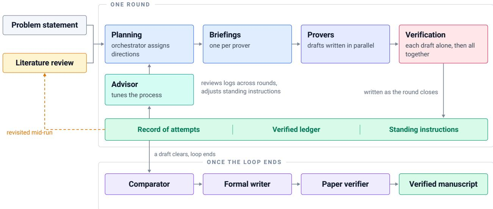

# Cogentic: Multi-Agent Orchestration for Automated Proof Discovery

Yang Cai, Vineet Gupta, Yanchen Jiang, Christopher Liaw, Aranyak Mehta, Grigoris Velegkas and Di Wang Google Research

We present Cogentic, a multi-agent harness for automated proof discovery on open research problems. While frontier language models can generate strong mathematical ideas in a single shot, single-shot generation is often insuficient for open problems that require exploring multiple competing conjectures, overcoming subtle technical obstructions, and retaining intermediate progress over a long horizon. Cogentic addresses these challenges through an iterative prove–verify loop in which an orchestrator allocates a population of independent provers across distinct proof directions, subjects their output to adversarial verification by several specialized components, and promotes confirmed intermediate results into a persistent verified ledger that later rounds build on. The harness is designed to be able to solve research-level math and theoretical computer science problems. Using Gemini as the base model, Cogentic produced novel results on five open problems across online learning, auction theory, and mechanism design. Each result was independently verified by domain experts and is developed in full in companion papers. We list these results, and new ones as they are verified, at https://sites.google.com/view/cogentic.

Keywords: multi-agent orchestration, automated proof discovery, LLM reasoning, adversarial verification, inference eficiency

## 1. Introduction

We introduce Cogentic, a multi-agent harness for proof discovery on open research problems. Inspired by our own experience conducting research in theoretical computer science and mathematics, the harness divides the work like a research group would: an orchestrator decides what gets worked on, provers draft proofs in parallel, and verifiers read those drafts looking for potential issues. We found that our system is quite eficient: The results reported here were based on Cogentic runs which used �(100) calls to Gemini for most problems, and �(1000) for the hardest. The system has headroom for further optimization of the number of calls but also allows for naturally scaling up to solve harder problems. A key feature of the system is that it only needs a problem statement, without any expert hints, and can work autonomously until it produces a result in the form of a paper. To evaluate the harness, we focus on problem domains within our own areas of expertise, targeting natural-language, human-readable proofs where we can directly verify the mathematical reasoning and provide exposition surrounding the background of the paper and the novel techniques that the system generates.

Interactive theorem provers — Lean (Moura and Ullrich, 2021), Isabelle/HOL (Nipkow et al., 2002), Coq (Castéran and Bertot, 2004) — provide machine-checked guarantees, and a substantial line of work uses language models to lower the cost of obtaining them: retrieving premises and generating tactics (Yang et al., 2023), drafting an informal proof and compiling it into a formal sketch (Jiang et al., 2022), and training for olympiad-level formal reasoning with reinforcement learning (Hubert et al., 2026). More recently the same machinery has been used on open research problems (Tsoukalas et al., 2026). In contrast, Cogentic operates in natural language, producing mathematical prose that domain experts can verify.

A distinct and highly successful line of work uses language models to search for mathematical objects rather than for arguments. Program search has discovered new constructions in extremal combinatorics (Romera-Paredes et al., 2024), evolutionary coding agents have improved algorithms and bounds (Novikov et al., 2025), and related systems perform test-time learning on open problems (Wang et al., 2025; Yuksekgonul et al., 2026) or explore many problems at once (Georgiev et al., 2025). Neuro-symbolic search attains medal-level performance in olympiad geometry by pairing a learned proposer with a symbolic engine (Trinh et al., 2024). The same recipe extends beyond mathematics to writing expert-level empirical research software under a quality metric (Aygün et al., 2026). What each of these approaches requires is a cheap, faithful, and machine-computable score. Sometimes theorems can be proven by reducing the question to finding mathematical structures with certain properties: e.g., Nagda et al. (2026) found proofs of inapproximability for combinatorial problems by finding extremal structures, and (Cai et al., 2026f) found bounds on gain from bilateral trade by finding extremal probability distributions, both using AlphaEvolve (Novikov et al., 2025) with such oracles. However, not every problem is amenable to such an approach.

A second line of work is based on scaling the LLM inference budget, perhaps through multiple model calls, to solve more complex tasks. The base case is simply to sample more — chain-of-thought prompting (Wei et al., 2022), self-consistency across sampled solutions (Wang et al., 2022), and repeated sampling with a selector over the candidates (Brown et al., 2024; Snell et al., 2024). Another approach is to scale the inference via multi-agent interaction. Debate between instances has been reported to improve factuality and reasoning (Du et al., 2024; Liang et al., 2024), and models have been used to evaluate the work of other models (Zhuge et al., 2024). Our framework builds on an iterative interaction between provers and verifiers. The verifiers are adversarial and begin with the assumption that the proofs are incorrect or incomplete. We explain our framework in more detail in Section 2.

There are several recent works that apply agentic harnesses to research-level mathematics and theoretical computer science. We do not attempt to give a comprehensive survey or compare these eforts, but they include (Feng et al., 2026; Gottweis et al., 2026; Lin et al., 2026; Schmitt et al., 2026; Zheng et al., 2026).

Finally, we place our contributions against recent milestones obtained with large agentic systems, including the resolution of a Millennium Prize problem (OpenAI, 2026b) and other long-standing mathematical conjectures (Anthropic, 2026; OpenAI, 2026a). We focus on problems in our areas of expertise, at the hardness level of open questions in flagship theoretical computer science conferences like STOC and FOCS, using a relatively low inference budget, �(100) to �(1000) Gemini calls per problem.

## 2. The Harness

Cogentic consists of a group of agents working on a single problem. They share a workspace on disk and are coordinated by an orchestrator that decides which of them runs, when, and on what.

Components. We outline the main components of our system below.

• The orchestrator serves as the central controller: it tracks global state, partitions prover slots across research directions, spawns summarizers to condense history into targeted briefings

Figure 1 | One round of Cogentic. The orchestrator decides how many provers to run and which direction each attends to, an advisor writes each prover an individual briefing, the provers draft candidate proofs in parallel, and every draft is verified both on its own and alongside the others from the round. What a round establishes is written down for subsequent rounds: the attempts and why they failed, the verified ledger of intermediate results, and the standing instructions maintained by the process advisor. Literature reviewers supply background at the start and can be dispatched again mid-run when attempts stall at the same step. Rounds continue until a draft clears verification after which the accepted proof is consolidated, expanded into a formal manuscript, and audited.

for individual provers, evaluates verifier consensus, and manages ledgers that store important findings obtained so far and records that track prior proof attempts and their verdicts. The orchestrator does not perform mathematical derivations itself.

• Literature reviewers search for related work and retrieve information such as definitions and theorems that a prover is likely to need. They can also be sent out again mid-run to do a more targeted search and find results that can help overcome ongoing technical barriers.

• Provers generate candidate proofs independently and in parallel based on assigned briefings that selectively summarize findings obtained so far.

• Verifiers critique candidate solutions from complementary angles and scopes.

• The record keeps track of prover attempts and their corresponding critiques from verifiers, and the ledger keeps track of verified intermediate lemmas that came out of proof attempts. These are the central ways that our agents communicate and document progress, as explained in more detail below.

• An advisor reads outputs across rounds to help the orchestrator decide how to control and allocate prover attempts and what to adjust the instructions given to each individual prover for the next round.

• Finally, a consolidation stage formats and audits the final manuscript.

Workflow. The work proceeds in rounds (Figure 1). A round produces a batch of candidate proofs, puts them through verification, and writes into the record and the verified ledger that the next round starts from. Rounds continue until a draft clears verification or until the budget runs out.

## 2.1. Directions and Assignments

A round opens with the orchestrator planning the work: how many provers to run, and what direction each should attend to. A direction here is a specific claim (e.g., a bound, a constant, a construction), finding counterexamples, or as the run goes on, repairing and finalizing promising proofs. A prover is assigned to a direction to work on, but not how to work on it. It reads what has been attempted previously for that direction, what the verifiers said about those attempts, as well as common information like the literature survey and the verified ledger, and chooses its own next step.

As the run goes on, the material relevant to a prover grows in volume. Rather than passing all of it as input, each prover sees only a briefing, written for it by a summarizer, which is spawned by the orchestrator. The summarizer reads all prior attempts and their verdicts, selects the most informative ones as context, and gives suggestions for possible next steps, based on what has worked and what has not. Each summarizer produces its briefing independently, so provers in the same round receive diferent readings of the same history. Longer documents are given as paths rather than quoted in full, so a prover (which itself is an agent, such as an Antigravity agent (The Antigravity Team, 2025)) can open what it wants to read selectively.

## 2.2. Verification

After each prover completes a proof, it is read by a verifier whose task is to check the correctness of the proof. A separate verifier reads all of the round’s drafts side by side, which allows it to spot shared blind spots and compare the strengths of individual proofs. A draft is accepted only when it passes both verifiers. Both are adversarial: they start from the assumption that every step is wrong until justified, and that every citation is incorrect until checked.

## 2.3. Cross-Round Communication

Each round leaves two artifacts: a record of what was tried, and a ledger of results that have been verified. The record pools attempts by what they were trying to establish, storing with each one the method used and the objection it failed on. The orchestrator and advisor read the record and decide what the next round should do.

The ledger accumulates confirmed fragments, such as intermediate lemmas, across rounds. Verifiers often confirm individual lemmas inside proofs they otherwise reject. At the end of a round, an auditor extracts those fragments, rewrites each as a self-contained lemma, and sends it to be verified again in isolation. What survives becomes available to every later prover as something that may be reused without being proved again. The ledger also records dead ends, for example, a bound excluded by a verified counterexample is written down as excluded, so that later rounds do not revisit them.

## 2.4. Process Level Adaptation

At the end of each round, a process advisor reviews verification logs, not only from the current round but from the run as a whole, to adjust how subsequent rounds are conducted. It surfaces patterns that become visible over time: repeated mistakes, common gaps in arguments, recurring verification blind spots where one verifier missed but was caught by some other verifier, etc. Based on these observations, it recommends adjustments to the instructions given to provers and verifiers — for example, a warning about a mistake several provers keep making, or a stricter justification standard for the kind of step where earlier drafts cut corners. It also advises the orchestrator on how to allocate prover attempts and how to adjust the instructions given to each prover and verifier for the next round. This is a separate agent because the orchestrator, which must juggle concurrent duties across many agents, rarely has the context window to review and synthesize log trends itself. Note that, neither the advisor nor the orchestrator is permitted a mathematical opinion: they cannot speculate on what the answer is likely to be, recommend a technique, or declare a direction promising or dead.

## 2.5. Termination and Output

When a candidate clears all verification, the orchestrator may continue to explore some remaining promising that may yield a better result, terminating once those avenues are exhausted. Upon termination, a comparator selects the strongest verified proof, a formal writer expands it into a complete manuscript, and a final verification audit checks the compiled document against the accepted proof to ensure no errors were introduced during exposition. The output is a self-contained document that states the theorems and the proofs, with the lemmas it depends $_ \mathrm { o n , }$ notation, and background of the problem written out in full, so that it can be read and checked by domain experts who knows nothing about the run that produced it.

## 3. Results

We applied Cogentic using Gemini to open research problems across online learning, auction theory, and mechanism design. The problems are in the areas of the research expertise of the authors. Each run operated from the problem statement without human mathematical intervention; domain experts subsequently verified every proof. Table 1 summarizes the five results, which are developed in full in companion papers. We maintain an up-to-date list of results obtained with Cogentic, with links to their companion papers, at https://sites.google.com/view/cogentic.

## 3.1. Eficient Online Inverse Linear Optimization

In online inverse linear optimization, a learner watches an expert make choices and tries to make the same ones without ever being told what the expert is optimizing. A vector $\boldsymbol { w } ^ { * }$ in the unit ball $\mathbb { B } \subseteq \mathbb { R } ^ { d }$ is fixed and hidden. At each round an adversary reveals a compact action set $X _ { t } \subseteq \mathbb { B } _ { : }$ , the learner recommends some $\hat { x } _ { t } \in X _ { t }$ , and then observes the expert’s choice $x _ { t } \in$ arg max $\scriptstyle { \mathfrak { c } } \in X _ { t }  \left. { \boldsymbol { w } } ^ { * } , { \boldsymbol { x } } \right.$ . It does not see $\boldsymbol { w } ^ { * }$ or the value of any action. The learner is charged the cumulative shortfall $\begin{array} { r } { R _ { T } = \sum _ { t \leq T } \langle w ^ { * } , x _ { t } - \hat { x } _ { t } \rangle } \end{array}$ a sum of non-negative terms, and the question is whether that sum can be bounded by a function of � alone, uniformly in �.

A bound uniform in � is stronger than $O ( { \sqrt { T } } )$ or �(� ln �), both of which let the total grow without bound. And a learner is proper if it commits to a nonzero estimate $\hat { w } _ { t }$ of the objective before seeing the menu and then recommends a maximizer of $\langle \hat { w } _ { t } , \cdot \rangle$ ; a proper learner answers not only what to do but what it takes the expert to be optimizing, and its recommendation costs one linear optimization over $X _ { t }$ . The problem reduces to a cutting-plane game with a strong separation oracle, in which the learner queries $p _ { t } \in \mathbb { R } ^ { d }$ and an adversary who has seen $p _ { t }$ returns a unit vector $\upsilon _ { t }$ with $\langle w ^ { * } - p _ { t } , \nu _ { t } \rangle \geq 0 ;$ bounding the regret of that game sufices to bounds $R _ { T }$

Prior work left a gap between the two desiderata. For arbitrary action sets the best eficient bounds were �(� ln �), polynomial but growing with the horizon: Gollapudi et al. (2021) obtained this from a regularized center of gravity, and Sakaue et al. (2025b) obtained it eficiently from an online Newton step, at $O ( d ^ { 2 } )$ per round after Sakaue (2026a) removed the Mahalanobis projection. Bounds uniform in � were either exponential in � — the John ellipsoid rule of Gollapudi et al. (2021), at exp(�(� log �)) — or required extra structure on the action sets (Oki and Sakaue, ${ } ^ { 2 0 2 6 ; }$ Sakaue et al., 2025a). Whether a finite poly(�) bound was achievable at all was answered afirmatively by Dewasurendra (2026), but by a rule that is neither proper nor eficient: it pools covers of the optimality-gap class across dyadic scales into a weighted vote whose finite implementation can involve �Θ(�) tests and requires nonconvex optimization over the action set, without committing to a linear objective before seeing the menu.

Table 1 | Open problems resolved or improved by Cogentic. Each result is developed in full in a companion paper; see https://sites.google.com/view/cogentic for updates.
<table><tr><td>Problem</td><td>Area</td><td>Prior State of the Art</td><td>Cogentic Result</td></tr><tr><td>Online inverse linear opti- Online learning &amp; mization / low-regret cutting optimization planes</td><td></td><td>O(d ln T) efficiently; First efficient and first Tθ(d) per round</td><td>O(d) only by an im- proper O(d) bound, uni- proper rule costing form in T, at O(d²) per round (Cai et al., 2026a)</td></tr><tr><td>Two-sided Bulow-Klemperer Auction theory &amp; O(1) agents suffice, but +2 agents on the competition complexity</td><td>market design</td><td>recruiting on both sides smaller side alone and with a constant of suffice (STR(m, n + 2) ≥ at least 20,000 per side OPT(m, n)), and +1 does</td><td>not suffice for any DSIC, IR, weakly budget- balanced mechanism</td></tr><tr><td>Anytime regret with n ex- Online learning perts</td><td></td><td>the factor √2 open</td><td>(Cai et al., 2026e) Anytime √t lnn vs. Anytime regret (1 + fixed-horizon√t ln n/2; 0(√ln ln n/ln n))√t ln n/2: no leading-order price for anytime validity (Cai et al., 2026b)</td></tr><tr><td>Simple vs. optimal revenue Mechanism de- 5.2·max(SRev, BRev) ≥ 3.52·max(SRev, BRev) ≥ maximization, single addi- sign tive buyer</td><td></td><td>OPT (Ma and Simchi- OPT (Cai et al., 2026d) Levi, 2021)</td><td></td></tr><tr><td>Price of anarchy for autobid- Auction theory &amp; 1.8 PoA for 2 bidders; Optimal 1.5 PoA for 2 ding auctions</td><td>autobidding</td><td>general n-bidder tight bidders (anonymous, mechanism open</td><td>monotone mecha- nisms);  $\begin{array} { r l } { { 2 } ~ - } & { { } { \frac { 1 } { 4 n + 1 } } } \end{array}$  for n bidders (Cai et al., 2026c)</td></tr></table>

Theorem 1 (Cai et al., 2026a). There is a deterministic, proper, anytime algorithm for online inverse linear optimization with cumulative shortfall $R _ { T } = O ( d )$ , uniform in the horizon �, using $O ( d ^ { 2 } )$ arithmetic and one linear optimization per round.

This is the first bound of that order that is eficient, and the first that is proper. It is within a factor of $O ( { \sqrt { d } } )$ of the optimal bound: every algorithm sufers $\Omega ( { \sqrt { d } } )$ (Sakaue et al., 2025b).

The proof builds on the variable-metric framework of Sakaue et al. (2025b), in which the learner runs online gradient descent under a metric $H _ { t }$ that stretches along directions already queried. Two changes remove the logarithm. First, with $g _ { t } = - \upsilon _ { t } .$ the rank-one metric update $g _ { t } g _ { t } ^ { \top }$ is selfnormalized, divided by the dual-metric length $s _ { t } = \| g _ { t } \| _ { H _ { t } ^ { - } }$ 1 of the observed direction. Second, the log det $H _ { t }$ potential — which bounds the total squared step length $\textstyle \sum _ { t } s _ { t } ^ { 2 }$ but grows like � log �, and is the source of the ln � in every earlier volumetric analysis — is replaced by the trace power $\mathrm { t r } ( H _ { t } ^ { - 1 / 2 } )$ . That potential starts at �, stays non-negative, and falls by at least $\textstyle { \frac { \tau } { 4 } } s _ { t } ^ { 2 }$ each round, where $\tau = \Theta ( 1 / d )$ controls the metric update, so $\textstyle \sum _ { t } s _ { t } ^ { 2 } \leq 4 d / \tau = O ( d ^ { 2 } )$ , independently of the horizon. With the iterate step size $\alpha = \Theta ( 1 / d )$ , the distance-contraction argument and the reduction then give $\begin{array} { r } { R _ { T } = O ( 1 / \alpha + \alpha \sum _ { t } s _ { t } ^ { 2 } ) = O ( d ) } \end{array}$

The argument uses the expert’s optimality only to make each round legal, so the same bound holds when the expert merely does at least as well as the learner by its own criterion; this is the first $O ( d )$ bound competing against an expert that does not optimize. The companion paper also gives corruption-robust and rank-adaptive variants, and an application to convex minimization: an �-Lipschitz convex function with a minimizer within distance � of the initial point can be minimized from subgradient directions alone with total suboptimality �(���) over an infinite run.

Subsequent to the companion paper, Sakaue (2026b) obtained a tight $O ( { \sqrt { d } } )$ bound. However, this algorithm is ineficient and it remains an open question to obtain an eficient algorith with $O ( { \sqrt { d } } )$ regret.

## 3.2. Competition Complexity for Two-Sided Markets

The Bulow–Klemperer theorem (Bulow and Klemperer, 1994) establishes that in one-sided auctions, adding a single bidder to a simple mechanism yields at least the revenue of the optimal mechanism for the original market. A natural question is whether a Bulow–Klemperer-type result also holds for two-sided markets. This line of work was initiated by Babaiof et al. (2020a), who show that, when the buyers’ valuations first-order stochastically dominate the sellers’ costs, adding roughly $n ( m + 4 { \sqrt { m } } )$ buyers sufices for a prior-independent mechanism to have gains from trade (GFT) at least that of the first-best GFT, where � is the number of buyers, � the number of sellers, and $m \geq n$ . Following up on this, Cai et al. (2024) showed that if one augments both sides of the market then �(1) agents sufice. Their analysis, however, requires a large constant, namely at least 20,000 per side. At least two questions remained open, including (i) whether the constant can be improved and (ii) whether it is suficient to recruit from only one side of the market.

Using Cogentic we proved the following theorem, which answers both questions simultaneously.

Theorem 2 (Cai et al., 2026e). For any � $\geq n \geq 1$ , if the buyer distribution $F _ { B }$ first-order stochastically dominates the seller distribution $F _ { S } ,$ then adding exactly two sellers — the smaller side of the market — sufices for Seller Trade Reduction to achieve expected gains from trade at least the first-best gains from trade of the original market:

$$
\mathrm { S T R } ( m , n + 2 ) \ \geq \ \mathrm { O P T } ( m , n ) .
$$

Moreover this is tight: even for $m = n = 1$ , recruiting one additional seller does not sufice for any prior-independent mechanism.

The constant drops from at least 20,000 per side to 2 on one side, and the recruitment is one-sided, so the mechanism designer need only find two more participants of the type already in shorter supply.

## 3.3. Anytime Regret with � Experts

In prediction with expert advice, a learner plays a distribution over � experts, an adversary reveals a loss vector in [0, 1]�, and the learner is charged its expected loss relative to the best single expert in hindsight. When the horizon � is known, multiplicative weights tuned to $T$ guarantees regret ${ \sqrt { T \ln n / 2 } } .$ , and the leading constant $1 / \sqrt { 2 }$ cannot be improved for large � (Cesa-Bianchi et al., 1997). An anytime algorithm is given no horizon and must satisfy its bound at every � simultaneously. The best known anytime guarantee for many experts was $\sqrt { t }$ ln �, a factor $\sqrt { 2 }$ worse, and whether that factor was necessary had remained open. For $n = 2 .$ , Luo and Schapire (2014) proved that the anytime regret is strictly larger than the fixed-time regret obtained by Cover (1966). Later, Harvey et al.

(2023) gave the optimal anytime algorithm for $n = 2$ but also conjectured that as $n  \infty ,$ , the leading constant of the anytime regret and fixed-time regret would coincide. Some evidence towards this conjecture was given by Harvey et al. (2024), who proved that in continuous time, the anytime and fixed-time constants agree as $n \to \infty$ when the experts follow independent Brownian motions.

With the Cogentic framework, we prove that the leading constant of the fixed-time regret and anytime regret coincide as $n \to \infty$

Theorem 3 (Cai et al., 2026b). There is an algorithm for prediction with expert advice which uses no knowledge of the horizon and whose regret over � experts satisfies

$$
R _ { t } ~ \le ~ \left( 1 + O \left( \sqrt { \frac { \ln \ln n } { \ln n } } \right) \right) \sqrt { \frac { t \ln n } { 2 } }
$$

simultaneously for all $t \geq 1$

for every sequence of loss vectors in $[ 0 , 1 ] ^ { n }$

The leading constant is optimal, since an anytime algorithm is in particular a fixed-horizon algorithm at every �.

The proof Cogentic found is elementary. Run one multiplicative-weights instance for each horizon on a geometric grid $H ^ { m } = ( 1 + \varepsilon ) ^ { m }$ and aggregate them with a master multiplicative-weights algorithm. At any time � some instance is tuned to a horizon in $[ t , ( 1 + \varepsilon ) t ]$ and so has regret $\sqrt { 1 + \varepsilon } \sqrt { t }$ ln ${ \overline { { n / 2 } } } ;$ it would sufice for the master to track that instance cheaply. The obstruction is that the pool grows with � while the master’s regret grows with the number of instances it tracks, which would leave a time-dependent overhead in the leading constant. The construction keeps the pool bounded by waking instance � only at round $\lfloor \delta H ^ { m } \rfloor$ and retiring it after round $\lfloor H ^ { m } \rfloor$ . Then $O ( \varepsilon ^ { - 1 } \log \delta ^ { - 1 } )$ instances are awake at once, independent of $t ,$ and at most that many are born during any one instance’s lifetime. This second count matters because when new instances arrive, we must allocate some of the existing probability mass to new instances. Retirement leaves the prefix before $\lfloor \delta H ^ { m } \rfloor$ uncovered, and recursing on it contributes a geometric series $1 + { \sqrt { \delta } } + \delta + \cdot \cdot .$ . Taking $\varepsilon = { \sqrt { \ln \ln n / \ln n } }$ and $\delta = \varepsilon ^ { 3 }$ makes the grid coarseness, the aggregation overhead, and the recursion together cost a factor $1 + O ( \varepsilon )$ .

## 3.4. Simple versus Optimal Revenue for an Additive Buyer

Consider a single buyer with additive valuations over � items whose values are drawn independently. Let SRev be the revenue from selling each item separately at a fixed price, and BRev the revenue from selling the grand bundle at a single price. Let OPT be the revenue of the optimal mechanism, which may be randomized and arbitrarily complex. Babaiof et al. (2020b) showed that the better of these two simple mechanisms is within a constant factor of optimal: OPT ≤ 6·max(SRev, BRev). The duality framework of Cai et al. (2016) later extended this result to a more general setting. For the original single-additive-buyer setting, Ma and Simchi-Levi (2021) improved the factor to 5.2. The optimal constant is still unknown, and the best lower bound on the approximation ratio is 2 (Rubinstein, 2016).

Theorem 4 (Cai et al., 2026d). For a single additive buyer whose values for � items are independent,

$$
3 . 5 2 \cdot \operatorname* { m a x } ( { \mathrm { S R e v , B R e v } } ) \ \geq \ 0 { \mathrm { P T } } .
$$

The proof builds on the duality framework of Cai et al. (2016). Let $\nu _ { j }$ be the buyer’s value for item $j ,$ and let $\begin{array} { r } { V = \sum _ { j } \nu _ { j } , M _ { \mathrm { m a x } } = \operatorname* { m a x } _ { j } \nu _ { j } , } \end{array}$ , and $M = \operatorname* { m a x } \{ \mathrm { S R e v } , \mathrm { B R e v } \}$ . The framework gives

$$
\begin{array} { r } { \mathrm { O P T } \leq \mathrm { S R e v } + \mathbb { E } \left[ V - M _ { \mathrm { m a x } } \right] , } \end{array}
$$

so it remains to bound the expected non-favorite welfare $\mathbb { E } [ V - M _ { \operatorname* { m a x } } ]$ , i.e., the total value of all items except the buyer’s favorite.

Prior analyses truncate item values at SRev and split $\mathbb { E } [ V - M _ { \operatorname* { m a x } } ]$ into a Core and a Tail, each bounded separately (Cai et al., 2016). We instead truncate at the joint scale �, which also accounts for BRev, and show directly that

$$
\mathbb { E } [ V - M _ { \operatorname* { m a x } } ] \le \mathbb { E } [ V _ { M } ] , \qquad V _ { M } = \sum _ { j = 1 } ^ { n } \operatorname* { m i n } \{ \nu _ { j } , M \} .
$$

This removes the Tail analysis entirely and leaves a single Core-like quantity. We then derive extremal distributions that maximize and minimize the second-order moment bound $\mathbb { E } [ V _ { M } ^ { 2 } ]$ , while keeping $\mathbb { E } [ V _ { M } ]$ fixed. The upper and lower bounds then suggest a relationship between $\mathbb { E } [ V _ { M } ]$ and � that allows us to bound $\mathbb { E } [ V _ { M } ]$ by a constant multiple of �.

## 3.5. Price of Anarchy for Autobidding Auctions

Automated bidding (autobidding) is now a widely adopted interface for advertisers to bid into high frequency ad auctions. In this interface, advertisers specify high level constraints, such as return-onspend and budget constraints. To measure eficiency, the literature uses a standard metric known as the price of anarchy (PoA) which is the ratio of the welfare in the optimal allocation and the worst-case equilibrium welfare. Aggarwal et al. (2019) initiated this line of work, showing that the second-price auction (SPA) achieves a tight PoA of 2. Subsequent work by Liaw et al. (2023) proved that no deterministic mechanism—including the first-price auction (FPA)—can beat the PoA barrier of 2 in the prior-free setting, even for two bidders. When randomization is combined with non-truthful payments, however, the barrier of 2 can be broken for two bidders: Mehta (2022) achieved a twobidder PoA of approximately 1.89 via a randomized truthful auction, and Liaw et al. (2023) improved the two-bidder upper bound to 1.8 using a randomized first-price auction, while proving an �-bidder lower bound (for even �) showing that every anonymous mechanism has $\begin{array} { r } { \mathrm { P o A } \ge \frac { 2 n + 4 } { n + 4 } = 2 - \frac { 4 } { n + 4 } } \end{array}$ . At least two questions remain open: (i) what is the exact minimax optimal PoA for $n = 2$ bidders, and (ii) for general $n \geq 3$ bidders, whether any mechanism can break the deterministic PoA barrier of 2 and match the $2 - \Theta ( 1 / n )$ lower bound.

Using Cogentic we proved the following theorem, which answers both questions simultaneously using the family of �-Proportional First-Price Auctions $( \mathsf { p F P A } _ { r } )$ , in which each bidder $i \in [ n ]$ wins a query with probability $\begin{array} { r } { x _ { i , j } = b _ { i , j } ^ { r } / \sum _ { k = 1 } ^ { n } b _ { k , } ^ { r } } \end{array}$ �� and pays their bid 1 $b _ { i , j }$ upon winning (a bidder facing no competing bid wins for free).

Theorem 5 (Cai et al., 2026c). In prior-free autobidding markets with return-on-spend constraints:

1. For $n = 2$ bidders, the standard Proportional First-Price Auction $( \mathsf { p F P A } _ { 1 } ,$ with $r = 1 )$ achieves a Price of Anarchy of at most 1.5. Moreover, this is tight: any anonymous two-bidder mechanism (with mild assumptions) has $\mathrm { P o A } \ge 1 . 5$

2. For general $n \geq 2 b i d d e r s ,$ the 2�-Proportional First-Price Auction $( \mathsf { p F P A } _ { 2 n } ,$ with $r = 2 n )$ achieves a Price of Anarchy of at most

$$
\mathrm { P o A } ( \mathsf { p F P A } _ { 2 n } ) \leq 2 - \frac { 1 } { 4 n + 1 } = 2 - \Omega ( 1 / n ) .
$$

This matches the $\textstyle 2 - { \frac { 4 } { n + 4 } }$ lower bound up to constantfactors in the $1 / n$ term.

In the second part of the theorem, the upper bound holds only assuming that bids are undominated (i.e. no bidder can raise their bid on any query to win more while satisfying their RoS constraint).

For the first part of this theorem, the authors had already suspected that the proportional first-price auction would have an improved Price of Anarchy over rFPA, and their conjecture was that the bound is 1.5, but did not have a proof. Cogentic was able to prove both the upper bound and the lower bound for any mechanism. The authors had not previously studied the second part of the theorem and did not provide any hints to the system. It independently came up with the mechanism and analysis.

## 4. Discussion

As noted, Cogentic produces natural language proofs which are verified by experts. That was possible because of how the problems were chosen: they come from areas the authors work in. Some companion papers include coauthors who had already been working on the corresponding problems. We checked the argument, wrote the exposition around it, and in some cases carried it further than the harness had. We note that the initial papers were coherent and nicely readable on their own, but we added further exposition such as better placement in the literature, the framing, and distilling and explaining the techniques.

A system like this can produce candidate results faster than they can be read, and the gap widens as the compute budget grows. One possibility is to formalize in a proof assistant such as Lean (Moura and Ullrich, 2021), so that correctness is settled mechanically. However, human understanding of the solution might lag behind. In the past, understanding the solution of a problem has also led to new directions and problems being explored. Balancing out the throughput of this generation and human understanding remains an important question.

## References

Gagan Aggarwal, Ashwinkumar Badanidiyuru, and Aranyak Mehta. Autobidding with constraints. In International Conference on Web and Internet Economics, pages 17–30. Springer, 2019.

Anthropic. Learning more about claude’s mathematical capabilities. https://www.anthropic. com/research/riemann-zeta, August 2026.

Eser Aygün, Anastasiya Belyaeva, Gheorghe Comanici, Marc Coram, Hao Cui, Jake Garrison, Renee Johnston, Anton Kast, Cory Y McLean, Peter Norgaard, et al. An ai system to help scientists write expert-level empirical software. Nature, pages 1–3, 2026.

Moshe Babaiof, Kira Goldner, and Yannai A. Gonczarowski. Bulow-klemperer-style results for welfare maximization in two-sided markets. In Shuchi Chawla, editor, Proceedings of the 2020 ACM-SIAM Symposium on Discrete Algorithms, SODA 2020, Salt Lake City, UT, USA, January 5- 8, 2020, pages 2452–2471. SIAM, 2020a. doi: 10.1137/1.9781611975994.150. URL https: //doi.org/10.1137/1.9781611975994.150.

Moshe Babaiof, Nicole Immorlica, Brendan Lucier, and S Matthew Weinberg. A simple and approximately optimal mechanism for an additive buyer. Journal of the ACM (JACM), 67(4):1–40, 2020b.

Bradley Brown, Jordan Juravsky, Ryan Ehrlich, Ronald Clark, Quoc V Le, Christopher Ré, and Azalia Mirhoseini. Large language monkeys: Scaling inference compute with repeated sampling. arXiv preprint arXiv:2407.21787, 2024.

Jeremy I Bulow and Paul D Klemperer. Auctions vs. negotiations, 1994.

Yang Cai, Nikhil R Devanur, and S Matthew Weinberg. A duality based unified approach to bayesian mechanism design. In Proceedings of the forty-eighth annual ACM symposium on Theory of Computing, pages 926–939, 2016.

Yang Cai, Christopher Liaw, Aranyak Mehta, and Mingfei Zhao. The power of two-sided recruitment in two-sided markets. In Proceedings of the 56th Annual ACM Symposium on Theory of Computing, pages 201–212, 2024.

Yang Cai, Anupam Gupta, Vineet Gupta, Guru Guruganesh, Yanchen Jiang, Christopher Liaw, Aranyak Mehta, Renato Paes Leme, Grigoris Velegkas, and Di Wang. Eficient online inverse optimization with �(�) regret. arXiv preprint arXiv:2609.13440, 2026a.

Yang Cai, Vineet Gupta, Yanchen Jiang, Christopher Liaw, Aranyak Mehta, Grigoris Velegkas, and Di Wang. Prediction with expert advice: Anytime regret with many experts matches the fixed-time constant, 2026b. URL https://arxiv.org/abs/2609.27206.

Yang Cai, Vineet Gupta, Yanchen Jiang, Christopher Liaw, Aranyak Mehta, Grigoris Velegkas, and Di Wang. Eficiency of generalized proportional first-price auctions under auto-bidding, 2026c. Forthcoming.

Yang Cai, Vineet Gupta, Yanchen Jiang, Christopher Liaw, Aranyak Mehta, Grigoris Velegkas, and Di Wang. Improved revenue guarantees for selling separately and bundling, 2026d. URL https: //arxiv.org/abs/2609.28873.

Yang Cai, Vineet Gupta, Yanchen Jiang, Christopher Liaw, Aranyak Mehta, Grigoris Velegkas, Di Wang, and Mingfei Zhao. The power of recruiting the smaller side: Two additional traders sufice in two-sided markets. arXiv preprint arXiv:2609.27304, 2026e.

Yang Cai, Vineet Gupta, Zun Li, and Aranyak Mehta. A new lower bound for the random oferer mechanism in bilateral trade using ai-guided evolutionary search. arXiv preprint arXiv:2603.08679, 2026f.

Pierre Castéran and Yves Bertot. Interactive theorem proving and program development. coq’art: The calculus of inductive constructions., 2004.

Nicolò Cesa-Bianchi, Yoav Freund, David Haussler, David P Helmbold, Robert E Schapire, and Manfred K Warmuth. How to use expert advice. Journal of the ACM (JACM), 44(3):427–485, 1997.

Thomas M Cover. Behavior of sequential predictors of binary sequences. Number 7002. Stanford University, Stanford Electronics Laboratories, Systems Theory, 1966.

Pahan Dewasurendra. Multiscale reward hedging from correct demonstrations. arXiv preprint arXiv:2608.06825, 2026.

Yilun Du, Shuang Li, Antonio Torralba, Joshua B Tenenbaum, and Igor Mordatch. Improving factuality and reasoning in language models through multiagent debate. In International Conference on Machine Learning (ICML), 2024.

Tony Feng, Trieu H Trinh, Garrett Bingham, Dawsen Hwang, Yuri Chervonyi, Junehyuk Jung, Joonkyung Lee, Carlo Pagano, Sang-hyun Kim, Federico Pasqualotto, et al. Towards autonomous mathematics research. arXiv preprint arXiv:2602.10177, 2026.

Bogdan Georgiev, Javier Gómez-Serrano, Terence Tao, and Adam Zsolt Wagner. Mathematical exploration and discovery at scale. arXiv preprint arXiv:2511.02864, 2025.

Sreenivas Gollapudi, Guru Guruganesh, Kostas Kollias, Pasin Manurangsi, Renato Paes Leme, and Jon Schneider. Contextual recommendations and low-regret cutting-plane algorithms. Advances in Neural Information Processing Systems, 34:22498–22508, 2021.

Juraj Gottweis, Wei-Hung Weng, Alexander Daryin, Tao Tu, Petar Sirkovic, Artiom Myaskovsky, Grzegorz Glowaty, Felix Weissenberger, Alessio Orlandi, Dan Popovici, Anil Palepu, Keran Rong, Ryutaro Tanno, Khaled Saab, Fan Zhang, Jacob Blum, Andrew Carroll, Kavita Kulkarni, Nenad Tomašev, Dina Zverinski, Ivor Rendulic, Elahe Vedadi, Florian Hasler, Luka Rimanic, Marina Boia, Ivan Budiselic, Ben Feinstein, Mathias Bellaiche, Tom Shefer, Jan Freyberg, Jeremy Ratclif, Ottavia Bertolli, Katherine Chou, Avinatan Hassidim, Burak Gokturk, Amin Vahdat, Yuan Guan, Vikram Dhillon, Eeshit Dhaval Vaishnav, Byron Lee, Tiago R. D. Costa, José R. Penadés, Gary Peltz, Yossi Matias, James Manyika, Demis Hassabis, Yunhan Xu, Pushmeet Kohli, Annalisa Pawlosky, Alan Karthikesalingam, and Vivek Natarajan. Accelerating scientific discovery with co-scientist. Nature, 655(8122):487–496, May 2026. ISSN 1476-4687. doi: 10.1038/s41586-026-10644-y. URL http://dx.doi.org/10.1038/s41586-026-10644-y.

Nicholas J. A. Harvey, Christopher Liaw, Edwin Perkins, and Sikander Randhawa. Optimal anytime regret with two experts. Mathematical Statistics and Learning, 6(1):87–142, 2023.

Nicholas J. A. Harvey, Christopher Liaw, and Victor S Portella. Continuous prediction with experts’ advice. Journal of Machine Learning Research, 25(228):1–32, 2024.

Thomas Hubert, Rishi Mehta, Laurent Sartran, Miklós Z Horváth, Goran Žužić, Eric Wieser, Aja Huang, Julian Schrittwieser, Yannick Schroecker, Hussain Masoom, et al. Olympiad-level formal mathematical reasoning with reinforcement learning. Nature, 651(8106):607–613, 2026.

Albert Q Jiang, Sean Welleck, Jin Peng Zhou, Wenda Li, Jiacheng Liu, Mateja Jamnik, Timothée Lacroix, Yuhuai Wu, and Guillaume Lample. Draft, sketch, and prove: Guiding formal theorem provers with informal proofs. arXiv preprint arXiv:2210.12283, 2022.

Tian Liang, Zhiwei He, Wenxiang Jiao, Xing Wang, Yan Wang, Rui Wang, Yujiu Yang, Shuming Shi, and Zhaopeng Tu. Encouraging divergent thinking in large language models through multi-agent debate. In Proceedings of the 2024 conference on empirical methods in natural language processing, pages 17889–17904, 2024.

Christopher Liaw, Aranyak Mehta, and Andres Perlroth. Eficiency of non-truthful auctions in autobidding: The power of randomization. In Proceedings of the ACM Web Conference 2023, pages 3561–3571, 2023.

Honghao Lin, David P Woodruf, Yuan Deng, Jieming Mao, Song Zuo, and Vahab Mirrokni. Stellar colosseum: A many-agent harness for long-horizon research in mathematics and theoretical computer science. arXiv preprint arXiv:2609.15983, 2026.

Haipeng Luo and Robert Schapire. Towards minimax online learning with unknown time horizon. In International Conference on Machine Learning, pages 226–234. PMLR, 2014.

Will Ma and David Simchi-Levi. Reaping the benefits of bundling under high production costs. In International Conference on Artificial Intelligence and Statistics, pages 1342–1350. PMLR, 2021.

Aranyak Mehta. Auction design in an auto-bidding setting: Randomization improves eficiency beyond vcg. In Proceedings of the ACM Web Conference 2022, WWW ’22, page 173–181, New York, NY, USA, 2022. Association for Computing Machinery. ISBN 9781450390965. doi: 10.1145/3485447. 3512062. URL https://doi.org/10.1145/3485447.3512062.

Leonardo de Moura and Sebastian Ullrich. The lean 4 theorem prover and programming language. In International Conference on Automated Deduction, pages 625–635. Springer, 2021.

Ansh Nagda, Prabhakar Raghavan, and Abhradeep Thakurta. Reinforced generation of combinatorial structures: Hardness of approximation, 2026. URL https://arxiv.org/abs/2509.18057.

Tobias Nipkow, Markus Wenzel, and Lawrence C Paulson. Isabelle/HOL: a proof assistantfor higherorder logic. Springer, 2002.

Alexander Novikov, Ngân Vu, Marvin Eisenberger, Emilien Dupont, Po-Sen Huang, Adam Zsolt Wagner,˜ Sergey Shirobokov, Borislav Kozlovskii, Francisco JR Ruiz, Abbas Mehrabian, et al. Alphaevolve: A coding agent for scientific and algorithmic discovery. arXiv preprint arXiv:2506.13131, 2025.

Taihei Oki and Shinsaku Sakaue. Finite and corruption-robust regret bounds in online inverse linear optimization under m-convex action sets. arXiv preprint arXiv:2602.01682, 2026.

OpenAI. An OpenAI model has disproved a central conjecture in discrete geometry. https:// openai.com/index/model-disproves-discrete-geometry-conjecture/, May 2026a.

OpenAI. On the Navier–Stokes Millennium Prize problem. https://openai.com/index/ navier-stokes-solution/, September 2026b.

Bernardino Romera-Paredes, Mohammadamin Barekatain, Alexander Novikov, Matej Balog, M Pawan Kumar, Emilien Dupont, Francisco JR Ruiz, Jordan S Ellenberg, Pengming Wang, Omar Fawzi, et al. Mathematical discoveries from program search with large language models. Nature, 625(7995): 468–475, 2024.

Aviad Rubinstein. On the computational complexity of optimal simple mechanisms. In Proceedings of the 2016 ACM Conference on Innovations in Theoretical Computer Science (ITCS), pages 21–28, 2016.

Shinsaku Sakaue. Simple projection-free algorithm for contextual recommendation with logarithmic regret and robustness. arXiv preprint arXiv:2603.20826, 2026a.

Shinsaku Sakaue. Tight regret bound for online inverse linear optimization via multiscale matrix weights. arXiv preprint arXiv:2609.26978, 2026b.

Shinsaku Sakaue, Han Bao, and Taira Tsuchiya. Revisiting online learning approach to inverse linear optimization: A Fenchel-Young loss perspective and gap-dependent regret analysis. arXiv preprint arXiv:2501.13648, 2025a.

Shinsaku Sakaue, Taira Tsuchiya, Han Bao, and Taihei Oki. Online inverse linear optimization: Eficient logarithmic-regret algorithm, robustness to suboptimality, and lower bound. Advances in Neural Information Processing Systems, 38:85189–85217, 2025b.

Johannes Schmitt, Tim Gehrunger, Jasper Dekoninck, Gergely Bérczi, Uri Kreitner, Liam Price, and David Holmes. Proofcouncil: An llm agent for solving open mathematical problems, 2026. URL https://arxiv.org/abs/2607.09474.

Charlie Snell, Jaehoon Lee, Kelvin Xu, and Aviral Kumar. Scaling llm test-time compute optimally can be more efective than scaling model parameters. arXiv preprint arXiv:2408.03314, 2024.

The Antigravity Team. Introducing Google Antigravity, a new era in AI-assisted software development. https://antigravity.google/blog/introducing-google-antigravity, November 2025. Google Antigravity Blog.

Trieu H Trinh, Yuhuai Wu, Quoc V Le, He He, and Thang Luong. Solving olympiad geometry without human demonstrations. Nature, 625(7995):476–482, 2024.

George Tsoukalas, Anton Kovsharov, Sergey Shirobokov, Anja Surina, Moritz Firsching, Gergely Bérczi, Francisco J. R. Ruiz, Arun Suggala, Adam Zsolt Wagner, Eric Wieser, Lei Yu, Aja Huang, Miklós Z. Horváth, Andrew Ferraiuolo, Henryk Michalewski, Edward Lockhart, Codrut Grosu, Thomas Hubert, Matej Balog, Pushmeet Kohli, and Swarat Chaudhuri. Advancing mathematics research with ai-driven formal proof search, 2026. URL https://arxiv.org/abs/2605.22763.

Xuezhi Wang, Jason Wei, Dale Schuurmans, Quoc Le, Ed Chi, Sharan Narang, Aakanksha Chowdhery, and Denny Zhou. Self-consistency improves chain of thought reasoning in language models. arXiv preprint arXiv:2203.11171, 2022.

Yiping Wang, Shao-Rong Su, Zhiyuan Zeng, Eva Xu, Liliang Ren, Xinyu Yang, Zeyi Huang, Xuehai He, Luyao Ma, Baolin Peng, et al. Thetaevolve: Test-time learning on open problems. arXiv preprint arXiv:2511.23473, 2025.

Jason Wei, Xuezhi Wang, Dale Schuurmans, Maarten Bosma, Brian Ichter, Fei Xia, Ed Chi, Quoc V Le, and Denny Zhou. Chain-of-thought prompting elicits reasoning in large language models. Advances in neural information processing systems, 35:24824–24837, 2022.

Kaiyu Yang, Aidan Swope, Alex Gu, Rahul Chalamala, Peiyang Song, Shixing Yu, Saad Godil, Ryan J Prenger, and Animashree Anandkumar. Leandojo: Theorem proving with retrieval-augmented language models. Advances in Neural Information Processing Systems, 36:21573–21612, 2023.

Mert Yuksekgonul, Daniel Koceja, Xinhao Li, Federico Bianchi, Jed McCaleb, Xiaolong Wang, Jan Kautz, Yejin Choi, James Zou, Carlos Guestrin, et al. Learning to discover at test time. arXiv preprint arXiv:2601.16175, 2026.

Daniel Zheng, Ingrid von Glehn, Yori Zwols, Iuliya Beloshapka, Lars Buesing, Daniel M. Roy, Martin Wattenberg, Bogdan Georgiev, Tatiana Schmidt, Andrew Cowie, Fernanda Viegas, Dimitri Kanevsky, Vineet Kahlon, Hartmut Maennel, Sophia Alj, George Holland, Alex Davies, and Pushmeet Kohli. Ai co-mathematician: Accelerating mathematicians with agentic ai, 2026. URL https://arxiv. org/abs/2605.06651.

Mingchen Zhuge, Changsheng Zhao, Dylan Ashley, Wenyi Wang, Dmitrii Khizbullin, Yunyang Xiong, Zechun Liu, Ernie Chang, Raghuraman Krishnamoorthi, Yuandong Tian, et al. Agent-as-a-judge: Evaluate agents with agents. arXiv preprint arXiv:2410.10934, 2024.

## A. Prompts Used for the Problems

## A.1. Eficient Online Inverse Linear Optimization

Let \$B = \{w \in \mathbb{R}^d \mid \Vert{}w\Vert{}\_2 \le 1\}\$ be the unit ball in \$\mathbb{R}^d\$. We are searching for a hidden point \$w^\* \in B\$. Every round \$t\$, we can choose a point \$p\_t \in B\$ and submit this point to a separation oracle. The separation oracle then returns a half-space separating \$p\_t\$ from \$w^\*\$; in particular, the oracle returns a normalized direction \$v\_t\$ (where \$\Vert{}v\_t\Vert{}\_2 = 1\$) such that \$\ langle w^\*, v\_t \rangle \ge \langle p\_t, v\_t \rangle\$.

Traditionally, cutting-plane algorithms have been developed to minimize the   
number of calls to the separation oracle until the oracle returns a   
hyperplane that passes within some distance \$\delta\$ of \$w^\*\$.   
In our setting, instead of trying to minimize the number of separation oracle   
queries before finding a "close" hyperplane, we would like to minimize   
the total (over all \$T\$ rounds) distance between the returned hyperplanes   
and the hidden point \$w^\*\$. That is, we would like to minimize the   
expression:\$Reg’ = \sum\_{t=1}^T (\langle w^\*, v\_t \rangle - \langle p\_t,   
v\_t \rangle) = \sum\_{t=1}^T \langle w^\* - p\_t, v\_t \rangle\$.   
Can we design a cutting plane algorithm whose regret is polynomial in \$d\$,   
and independent of \$T\$?   
Note that this problem is from the paper NeurIPS 2021 paper "Contextual   
Recommendations and Low-Regret Cutting-Plane".

## A.2. Recruiting Two Traders Sufices for Two-Sided Markets

Read this paper: https://arxiv.org/abs/2307.03844.   
Suppose there are \$m\$ buyers and \$n\$ sellers and \$m \geq n\$.   
We assume that the buyer distribution \$F\_B\$ first-order stochastically   
dominates the seller distribution \$F\_S\$.   
Let STR(m, n) be the expected GFT of Seller Trade Reduction as discussed in   
the paper.   
Let OPT(m, n) be the expected first-best GFT.   
Show that adding 2 additional sellers is sufficient to guarantee that Seller   
Trade Reduction achieves at least the first-best GFT of the original   
market. That is, show that STR(m, n+2) >= OPT(m, n) for all m, n >= 1.

## A.3. Anytime Algorithm for Prediction with Expert Advice

Start by reading: https://arxiv.org/pdf/2002.08994   
In that paper, they establish the optimal anytime regret for two experts.   
I want to understand what is the anytime regret for n experts as \$n \to \   
infty\$. Can we show that the price of anytime goes to \$1\$ as \$n \to \   
infty\$? Please take a look at the conjecture described in https://arxiv.   
org/pdf/2002.08994.   
Please also have the lit reviewers do a deep search so you understand the   
landscape. Feel free to launch as many lit reviewers as you feel you need.

## A.4. Selling Separately vs. Bundling

You are an expert theoretical computer scientist specializing in algorithmic   
game theory and Bayesian mechanism design. Your task is to write a   
formally rigorous mathematical proof.   
\*\*Problem Statement:\*\*   
Prove that for a single additive buyer with multiple items, the revenue from   
the better of selling the items separately or selling them as a grand   
bundle is a factor-3 approximation to the optimal expected revenue. The   
items have independent values drawn from known distributions.   
Formally, show that: \$\text{OPT} \le 3 \max\{\text{SREV}, \text{BREV}\}\$   
\*\*Definitions:\*\*   
\$\text{OPT}\$: The expected revenue of the optimal (fully general,   
randomized) Bayesian Incentive Compatible mechanism.   
\$\text{SREV}\$: The maximum expected revenue achievable by selling each item   
separately at item-specific prices.   
\$\text{BREV}\$: The maximum expected revenue achievable by selling all items   
together as a single grand bundle.   
Additive Buyer: The buyer’s value for a set of items is the sum of their   
values for the individual items.   
\*\*Reference Material:\*\*   
The following two papers are useful references:   
1. \*A Duality Based Unified Approach to Bayesian Mechanism Design\* (Cai,   
Devanur, Weinberg): https://www.cs.yale.edu/homes/cai/publication/duality   
journal/duality-journal.pdf   
2. \*A Simple and Approximately Optimal Mechanism for an Additive Buyer\* (   
Babaioff, Immorlica, Lucier, Weinberg): https://arxiv.org/pdf/1405.6146   
\*\*Proof Outline and Instructions:\*\*   
Please think step-by-step and structure your proof carefully using LaTeX for   
all mathematics. If you cannot prove the factor 3 approximation, you   
should first try to prove that this is a factor 4 approximation, then try   
to strengthen it.

## A.5. Autobidding

We provided two prompts to the system corresponding to the � = 2 case and the � ≥ 2 case. Note that the prompts asked the system to make some mild assumption. We removed the assumption by asking Gemini to look at the output proof and modify it accordingly.

First, read this paper: https://arxiv.org/abs/2207.03630. Use this paper to   
understand the background of autobidding.   
I want to consider the following mechanism. For two bidders, if their bids   
are \$b\_1\$ and \$b\_2\$,   
then bidder \$i\$ wins with probability \$b\_i / (b\_1 + b\_2)\$ and, conditional on   
winning, pays \$b\_i\$.

Prove or disprove that this mechanism has a PoA of 1.5. You can and should assume that all bidders have strictly positive value on all queries.

First, read this paper: https://arxiv.org/abs/2207.03630. Use this paper to understand the background of autobidding.

That paper gives a mechanism that works well for two bidders. However, the setting for more than two bidders remains open.

Your goal is to first understand the lower bound in https://arxiv.org/abs /2207.03630. What kind of PoA lower bound does it give as a function of \$n\$ where \$n\$ is the number of bidders.

Once you understand that, let’s try to find an upper bound. In either words, come up with a mechanism that, for all \$n\$, gives a PoA as close to the lower bound as you can.

For example, if the lower bound PoA is of the form \$2 - \Omega(1/n)\$ then an idea upper bound should be of the form \$2 - O(1/n)\$.

Note that your mechanism is allowed to depend on \$n\$ but should not depend on values, costs, etc. other than the bids.

You can and should assume that all bidders have strictly positive value on all queries.

You can and should do some literature review on what is known about this problem.