# DAMPER: Return-Prioritized Gradient Control for Smooth Policies

Seokmin Ko Taewon Goo Kihyuk Hong

KAIST

komin0407, tetrise9, kihyukh @kaist.ac.kr

## Abstract

Actor–critic methods achieve strong performance in continuous control, but their policies can produce highly oscillatory actions. A common remedy is to add auxiliary smoothness losses. However, their contribution can be negligible when their gradients are small relative to the native actor gradient. Moreover, existing methods often combine multiple auxiliary losses, complicating loss balancing without necessarily improving the return–smoothness trade-off. We introduce DAMPER (Direction-Aware Magnitude-Controlled Projection with Explicit Return Priority), which combines the native actor gradient with a temporal-consistency gradient through conflict-conditioned projection and adaptive magnitude control. It removes the auxiliary component opposing the actor gradient and scales the retained temporal direction relative to the actor gradient norm, preserving positive alignment with the native actor gradient. Experiments with TD3 and SAC on six continuous-control tasks show reduced action oscillation relative to the native agents in all 12 task–backbone pairs and the best oscillation score among the compared methods in eight, with task-dependent return trade-offs. Our code is available at https://github.com/komin0407/DAMPER.

## 1 Introduction

Actor–critic algorithms are effective tools for continuous control, but high episodic return does not imply a well-behaved control signal. A learned policy may vary its action sharply between adjacent time steps even when the system state changes only slightly. Simulation often tolerates these oscillations; physical platforms do not. Rapid control changes can waste energy, amplify unmodeled dynamics, and increase actuator wear [21]. Learning policies that are both effective and temporally smooth is therefore an important requirement for deploying reinforcement learning on real systems.

Most existing approaches introduce smoothness through an auxiliary loss. They regularize policy outputs at consecutive or nearby states, constrain local policy sensitivity, or stabilize the critic gradients used by the actor [13–16, 19]. These methods can reduce action variation, but the smoothing they achieve is often limited. Moreover, many existing methods introduce two or more auxiliary losses to control smoothness [13, 14, 16, 19], which complicates loss balancing without necessarily improving the return–smoothness trade-off, as illustrated by our comparison with a tuned single-loss baseline in Section 6.4.

We approach this problem as primary–auxiliary gradient optimization. The primary objective is the native actor loss of the underlying algorithm. The auxiliary objective is the established consecutive-state consistency penalty $\mathbb { E } _ { ( s , s ^ { \prime } ) } [ \| \pi _ { \theta } ( s ^ { \prime } ) - \pi _ { \theta } ( s ) \| _ { 2 } ^ { 2 } ]$ , where $\pi _ { \theta }$ is the deterministic action used for evaluation. Our contribution is not this temporal loss itself, but a rule for combining its gradient with the native actor gradient.

We introduce DAMPER, which combines the native actor and temporal gradients through two operations (Figure 1). First, when the temporal gradient conflicts with the native actor gradient, DAMPER removes only its return-opposing component. The native actor gradient is never projected, and an aligned temporal component is retained rather than discarded. Second, DAMPER controls the remaining direction relative to the native gradient norm. A bounded parameter η [0, 1] interpolates between two endpoints: at η = 0, the temporal component is only capped at the native gradient norm, and at η = 1, it is rescaled to that norm. Unlike a scalar regularization coefficient, η controls how the observed gradient magnitudes are reconciled after the objectives have been differentiated. Figure 1 provides an overview of these two operations.

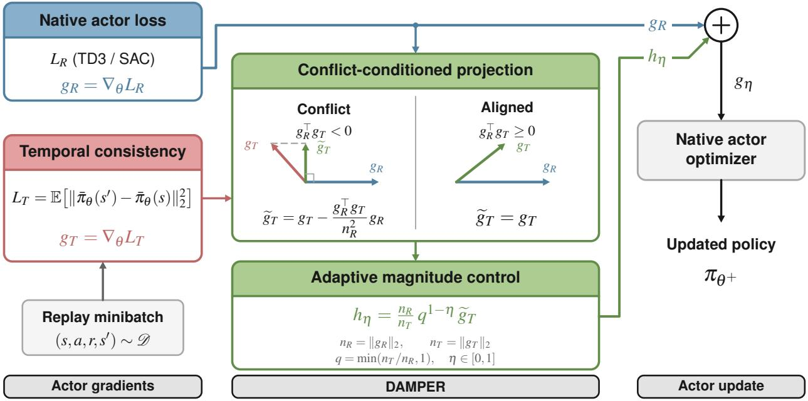  
Figure 1: Overview of DAMPER.

Across six continuous-control tasks and two backbones, DAMPER improves the FFT-based oscillation score over the corresponding unregularized agent in all 12 task–backbone pairs and achieves the best score among the compared methods in 8. The improvement is more consistent for action stability than for return: several locomotion settings exhibit a clear smoothness–return trade-off. We report this limitation explicitly and isolate the role of conflict-conditioned projection in an ablation study.

Our contributions are as follows:

• We introduce DAMPER, a return-prioritized actor update that combines conflict-conditioned projection with norm-ratio interpolation.

• We establish finite-step descent for the fixed actor surrogate and characterize temporal progress at matched first-order primary progress.

• DAMPER reduces action oscillation relative to native TD3 and SAC on all six tasks, achieving the best score in eight of 12 task–backbone pairs. Projection ablations, interpolation sweeps, and fixed-weight scalarization comparisons assess the contributions of directional and magnitude control.

## 2 Related Work

## 2.1 Policy Smoothness in Reinforcement Learning

Policy-output regularization. CAPS combines temporal consistency between consecutive states with spatial consistency under state perturbations [19]. Closely related work directly penalizes consecutive deterministic policy outputs [4]. We use the same form of temporal surrogate, but do not add it to the native actor loss with a fixed coefficient. Instead, we modify its gradient according to its alignment and scale relative to the native actor gradient.

Sensitivity and critic regularization. Grad-CAPS regularizes policy sensitivity [15], ASAP combines action alignment, action prediction, and second-order temporal regularization [14], and L2C2 constrains local changes in both the policy and value function [13]. PAVE instead regularizes the critic to stabilize the action-gradient field that drives policy learning [16]. These approaches encode richer notions of regularity than our single temporal loss, but multi-component scalarized objectives introduce additional relative weights. DAMPER is complementary: it focuses on how a temporal auxiliary gradient should enter the actor update when the native actor objective remains primary.

Structured smooth control. Smooth behavior can also arise from architectural or action-space structure. LipsNet controls policy sensitivity through an adaptive Lipschitz architecture [25]; generalized state-dependent exploration produces temporally correlated exploration noise [23]; and action-rate parameterizations smooth the executed control by construction [2]. In contrast, DAMPER changes only training-time actor gradients and leaves the policy architecture and execution interface unchanged.

## 2.2 Gradient Combination and Objective Priority

Multi-objective optimization. MGDA searches for a common descent direction [5, 24], GradNorm balances task-gradient magnitudes [1], PCGrad removes conflicting gradient components [28], and CAGrad constructs a conflict-averse common update [17]. These methods typically treat objectives symmetrically. Our setting is hierarchical: the native actor objective is always primary, so its gradient is never altered to accommodate temporal consistency.

Primary–auxiliary learning. Gradient-similarity weighting [6], Dynamic Barrier [8], and Bloop [11] prevent auxiliary objectives from degrading a primary task, while MetaBalance [10] adapts auxiliary-gradient magnitudes to a target gradient. DAMPER combines the two relevant ideas: it conditionally removes only the primary-opposing temporal component and separately controls its magnitude through a bounded norm-ratio interpolation.

Priority-aware reinforcement learning. PEGrad prioritizes reward over energy minimization by orthogonalizing and capping the lower-priority gradient [20]; GCR-PPO conditionally projects lower-priority reward components [18]; and LPPG-RL considers lexicographically ordered policy-gradient objectives [22]. FCGrad addresses individual–collective return conflicts in mixed-motive multi-agent learning and changes priority according to current returns [12]. Our hierarchy is fixed, projection occurs only under conflict, and the retained temporal direction is scaled by an explicit interpolation between cap-only and norm-balanced updates. The contribution is this combination for temporal policy smoothing, rather than gradient projection in isolation.

## 3 Preliminaries

Actor–critic learning. We consider a discounted Markov decision process $\boldsymbol { \mathcal { M } } = ( \boldsymbol { \mathcal { S } } , \boldsymbol { \mathcal { A } } , p , \boldsymbol { r } , \boldsymbol { \gamma } )$ , with transition kernel $p ( s ^ { \prime } \mid s , a )$ , reward $r ( s , a )$ , and discount factor $\gamma \in [ 0 , 1 )$ . A policy $\pi _ { \theta }$ seeks to maximize the expected return

$$
J ( \theta ) : = \mathbb { E } _ { \pi _ { \theta } } \left[ \sum _ { { t = 0 } } ^ { \infty } \gamma ^ { t } r ( s _ { t } , a _ { t } ) \right] .
$$

Actor–critic methods use a learned action-value function $Q _ { \phi } ( s , a )$ to guide policy optimization. We adopt the loss-minimization convention and denote the underlying algorithm’s native actor loss by $L _ { \mathrm { R } } ( \theta )$ . Algorithmspecific definitions are provided in Appendix E.

Temporal policy consistency. Let $\pi _ { \boldsymbol { \theta } } ( s )$ denote the differentiable deterministic action map associated with the current policy. For consecutive states $( s , s ^ { \prime } )$ drawn from an observed transition distribution $\mathcal { D } ,$ , we define the temporal-consistency loss

$$
L _ { \mathrm { T } } ( \theta ) : = \mathbb { E } _ { ( s , s ^ { \prime } ) \sim \mathcal { D } } \left[ \left\| \pi _ { \theta } ( s ^ { \prime } ) - \pi _ { \theta } ( s ) \right\| _ { 2 } ^ { 2 } \right] .\tag{1}
$$

Both actions are computed using the same current policy. Minimizing this loss encourages similar actions at consecutive states, promoting temporal consistency along environment trajectories.

Combining objectives. We denote the actor-parameter gradients by

$$
g _ { R } : = \nabla _ { \theta } L _ { \mathrm { R } } ( \theta ) , \qquad g _ { T } : = \nabla _ { \theta } L _ { \mathrm { T } } ( \theta ) .\tag{2}
$$

The term “return gradient” refers to $g _ { R }$ , the critic-based actor-loss gradient, rather than a direct gradient of measured episodic return. A conventional auxiliary-loss formulation minimizes

$$
\begin{array} { r } { \mathcal { L } _ { \lambda } ( \theta ) : = L _ { \mathrm { R } } ( \theta ) + \lambda L _ { \mathrm { T } } ( \theta ) , \qquad \lambda > 0 , } \end{array}\tag{3}
$$

which yields the combined gradient $g _ { R } + \lambda g _ { T }$

## 4 Method

We introduce DAMPER, an actor update rule designed to reduce action oscillation while prioritizing return maximization. It uses a temporal-consistency objective to encourage similar actions at consecutive states, with the native actor objective taking priority. To combine their gradients, DAMPER first removes any temporal component that opposes the native actor gradient, then controls the remaining contribution relative to the native gradient norm. These two operations address directional conflict and scale imbalance when incorporating temporal consistency into the actor update. Figure 1 summarizes the complete update.

## 4.1 Conflict-Conditioned Projection

We use conflict-conditioned projection to prevent the temporal gradient from hindering first-order progress on the native actor objective. Let $g _ { R } = \nabla _ { \theta } L _ { \mathrm { R } }$ and $g _ { T } = \nabla _ { \theta } L _ { \mathrm { T } }$ denote the gradients of the objectives defined in Section 3. When $g _ { R } ^ { \top } g _ { T } < 0$ , the temporal gradient contains a component that opposes the native actor gradient. We remove this component by projecting $g _ { T }$ onto the subspace orthogonal to $g _ { R }$ . Otherwise, we leave $g _ { T }$ unchanged. Denoting the resulting temporal gradient by $\widetilde { g } _ { T }$ , we obtain

$$
\widetilde { g } _ { T } : = \left\{ \begin{array} { l l } { g _ { T } - \frac { g _ { R } ^ { \top } g _ { T } } { \| g _ { R } \| _ { 2 } ^ { 2 } } g _ { R } , } & { g _ { R } ^ { \top } g _ { T } < 0 , } \\ { g _ { T } , } & { g _ { R } ^ { \top } g _ { T } \ge 0 . } \end{array} \right.\tag{4}
$$

The native gradient $g _ { R }$ is never modified. The retained temporal gradient satisfies $g _ { R } ^ { \top } \widetilde { g } _ { T } \ge 0$ , so adding a nonnegative multiple of $\widetilde { g } _ { T }$ epreserves the first-order decrease in the native actor loss provided by $g _ { R }$ . The eConflict and Aligned panels in Figure 1 illustrate the two cases.

## 4.2 Adaptive Magnitude Control

Projection resolves directional conflict, but a temporal gradient that is small relative to the native actor gradient may have little influence on policy smoothness, whereas a much larger one may dominate the actor update. We therefore rescale the temporal gradient according to the relative norms of the original actor and temporal gradients.

For nonzero gradients, let $n _ { R } : = \| g _ { R } \| _ { 2 }$ and $n _ { T } : = \| g _ { T } \| _ { 2 }$ . Before accounting for directional conflict, consider the target combined gradient

$$
g _ { \mathrm { t a r g e t } } ( s ) : = g _ { R } + s \frac { g _ { T } } { n _ { T } } , \qquad s > 0 .
$$

This target adds a temporal contribution of magnitude s along $g _ { T }$ to the unchanged actor gradient $g _ { R } .$

The target may, however, reduce first-order progress on the native actor objective relative to using $g _ { R }$ alone. We therefore make the smallest adjustment, measured in Euclidean distance, to $g _ { \mathrm { t a r g e t } } ( s )$ that preserves this progress:

$$
g ( s ) : = \operatorname * { a r g m i n } _ { d : g _ { R } ^ { \top } d \geq \| g _ { R } \| _ { 2 } ^ { 2 } } \| d - g _ { \mathrm { t a r g e t } } ( s ) \| _ { 2 } ^ { 2 } .
$$

The constraint requires at least the first-order decrease in the native actor loss achieved by $g _ { R }$ . It can be shown (Appendix A) that the unique solution to the optimization problem is

$$
g ( s ) = g _ { R } + \frac { s } { n _ { T } } \widetilde { g } _ { T } ,
$$

where $\widetilde { g } _ { T }$ is exactly the conflict-conditioned projection from the previous subsection.

eWe consider two reference target magnitudes. The cap-only choice $s _ { 0 } : = \operatorname* { m i n } ( n _ { T } , n _ { R } )$ caps the target temporal magnitude at the native actor gradient norm $n _ { R }$ , without amplifying weak temporal gradients. The norm-matched choice $s _ { 1 } : = n _ { R }$ instead rescales the temporal contribution to $n _ { R }$ before projection, amplifying it when $n _ { T } < n _ { R }$

To obtain intermediate behavior, we geometrically interpolate between these choices using a parameter $\eta \in [ 0 , 1 ]$ :

$$
s _ { \eta } : = s _ { 0 } ^ { 1 - \eta } s _ { 1 } ^ { \eta } , \qquad g _ { \eta } : = g ( s _ { \eta } ) = g _ { R } + \frac { s _ { \eta } } { n _ { T } } \widetilde { g } _ { T } .\tag{5}
$$

Equivalently, defining $q : = \mathrm { m i n } ( n _ { T } / n _ { R } , 1 )$ and $w _ { \eta } : = q ^ { 1 - \eta }$ gives $s _ { \eta } = n _ { R } w _ { \eta }$ . For $n _ { T } < n _ { R }$ , increasing η strengthens the temporal gradient.

## 4.3 DAMPER Actor Update

Algorithm 1 summarizes the core actor update for nonzero gradients. DAMPER computes the two gradients separately, applies conflict-conditioned projection and adaptive magnitude control, and passes the merged gradient to the native actor optimizer.

## 5 Analysis of the Primary–Auxiliary Update

We analyze a single Euclidean actor step using the direction constructed by Algorithm 1, with the critic and sampled transitions held fixed.

Algorithm 1: DAMPER actor update   
Input: Actor parameters $\theta ,$ replay buffer $\mathcal { D } ,$ native actor loss $L _ { \mathrm { R } }$ , interpolation $\eta \in [ 0 , 1 ]$   
1 Sample a minibatch B from D   
2 Evaluate $L _ { \mathrm { R } } ( \theta )$ and $L _ { \mathrm { T } } ( \theta )$ in equation 1   
3 $g _ { R } \gets \nabla _ { \theta } L _ { \mathrm { R } } , g _ { T } \gets \nabla _ { \theta } L _ { \mathrm { T } }$   
4 $n _ { R }  \| g _ { R } \| _ { 2 } , n _ { T }  \| g _ { T } \| _ { 2 }$   
5 $\langle \widetilde { g } _ { T }  g _ { T }$   
6 if $g _ { R } ^ { \top } g _ { T } < 0$ then   
7 $\widetilde { g } _ { T }  g _ { T } - \frac { g _ { R } ^ { \top } g _ { T } } { n _ { R } ^ { 2 } } g _ { R }$   
8 $q  \operatorname* { m i n } ( n _ { T } / n _ { R } , 1 ) , w _ { \eta }  q ^ { 1 - \eta }$   
9 $g  g _ { R } + ( n _ { R } / n _ { T } ) w _ { \eta } \widetilde { g } _ { T }$   
10 Assign $g$ to the actor-gradient buffers and apply the native actor optimizer

## 5.1 Descent on the Native Actor Loss

Consistent with our primary–auxiliary formuation, in which the native actor objective tasks priority over temporal consistency, we first show that DAMPER preserves descent on the native actor loss even when the two gradients conflicts.

Theorem 1 (Finite-step descent for the fixed actor surrogate). Assume that $L _ { \mathrm { R } }$ is differentiable and globally β -smoothfor $\beta _ { R } > 0$ , and that $g _ { R } = \nabla _ { \theta } L _ { \mathrm { R } } ( \theta ) \neq 0 .$ . Let g be the direction returned by Algorithm 1. Then every step

$$
\theta ^ { + } = \theta - \alpha g , \qquad 0 < \alpha < \frac { 1 } { \beta _ { R } } ,\tag{6}
$$

strictly decreases thefixed native actor loss: $L _ { \mathrm { R } } ( \theta ^ { + } ) < L _ { \mathrm { R } } ( \theta )$

Thus, for sufficiently small steps, DAMPER incorporates the temporal gradient while preserving descent on the native actor loss. The proof is in Appendix B.1.

## 5.2 Temporal Progress at Matched Primary Progress

We next compare the temporal progress of DAMPER and fixed-weight scalarization. For this comparison, we rescale each update to give the same predicted decrease in the native actor loss, using a first-order approximation. This holds primary improvement fixed, allowing us to compare the temporal benefit of the update directions independently of their overall scale. For any direction d with $g _ { R } ^ { \top } d > 0$ , define

$$
\mathcal { G } ( d ) : = \frac { g _ { T } ^ { \top } d } { g _ { R } ^ { \top } d } - \frac { g _ { T } ^ { \top } g _ { R } } { \Vert g _ { R } \Vert _ { 2 } ^ { 2 } } .\tag{7}
$$

The first term measures the predicted temporal decrease per unit of predicted native-actor-loss decrease;   
subtracting the corresponding quantity for the native-gradient update gives the additional temporal gain.

Using this measure, the next result shows that, for noncollinear gradients and fixed $\eta ,$ DAMPER achieves greater additional temporal gain than scalarization with any fixed positive weight when the temporal gradient is sufficiently small relative to the native actor gradient.

Theorem 2 (Temporal gain in the weak-gradient regime). Let $g _ { R } = \nabla _ { \theta } L _ { R } ( \theta )$ and $g _ { T } = \nabla _ { \boldsymbol { \theta } } L _ { T } ( \boldsymbol { \theta } )$ be nonzero, and define

$$
q : = \operatorname* { m i n } \left\{ \frac { \| g _ { T } \| _ { 2 } } { \| g _ { R } \| _ { 2 } } , 1 \right\} , \qquad c : = \frac { g _ { R } ^ { \top } g _ { T } } { \| g _ { R } \| _ { 2 } \| g _ { T } \| _ { 2 } } .
$$

Fix $\eta \in [ 0 , 1 ]$ and any $\lambda > 0 .$ . Assume $0 < q < 1$ and $\lambda q < 1 - \delta$ for some fixed $\delta \in ( 0 , 1 )$ . For the analytic DAMPER direction $g _ { \eta }$ in equation $5$ and $g _ { \lambda } = g _ { R } +$ λg , the matched temporal gains satisfy

$$
\mathcal { G } ( g _ { \eta } ) = \Theta \bigl ( ( 1 - c ^ { 2 } ) q ^ { 2 - \eta } \bigr ) , \qquad \mathcal { G } ( g _ { \lambda } ) = \Theta \bigl ( ( 1 - c ^ { 2 } ) q ^ { 2 } \bigr ) .\tag{8}
$$

Here, Θ denotes two-sided bounds with positive constants independent ofq and $c ,$ but possibly dependent on $\lambda$ and δ.

The result highlights the role of magnitude control in the weak-temporal regime, where the temporal gradient is small relative to the native actor gradient. For fixed $\eta > 0$ and $\lambda > 0$ , DAMPER provides greater additional temporal gain than scalarization and sufficiently small $q ,$ , when the first-order primary progress is matched. Appendix B.2 gives the proof.

## 6 Experiments

## 6.1 Experimental Setup

In this subsection, we describe the tasks, baselines, and evaluation protocol used to assess DAMPER.

Tasks and backbones. We consider six continuous-control tasks from Gymnasium [27] and MuJoCo [26]: LunarLander, Pendulum, Reacher, Ant, Hopper, and Walker. Each method is evaluated with both TD3 and SAC. Our implementation and protocol follow the PAVE codebase, and all neural networks use SiLU activations.

Baselines. We compare with the unregularized TD3 and SAC agents and five smooth-control methods: CAPS, Grad-CAPS, ASAP, L2C2, and PAVE. The comparison therefore spans policy-output regularization, policy-sensitivity regularization, joint policy–value constraints, and critic-gradient stabilization.

Evaluation protocol. Each method is trained with five independent random seeds. For each seed, the learned policy is evaluated for ten episodes; tables report the mean and standard deviation across seeds. We measure cumulative episodic return (re, higher is better) and action oscillation (sm, lower is better). The latter is a spectral smoothness metric computed using the fast Fourier transform (FFT), following Christmann et al. [3] and Mysore et al. [19].

## 6.2 Overall Performance

In this subsection, we show that DAMPER consistently reduces action oscillation across TD3 and SAC, with task-dependent effects on return. It lowers sm relative to the unregularized agents in all 12 task–backbone pairs and achieves the lowest score among the compared methods in eight (Tables 1 and 2). Figure 2 also shows smaller consecutive action changes on Walker for both backbones.

TD3 results. DAMPER achieves the lowest oscillation score on LunarLander, Ant, Hopper, and Walker (Table 1). On LunarLander, it improves both metrics, increasing return from 205.5 to 266.4 and reducing sm from 1.815 to 0.313. Hopper and Walker also show large reductions in sm, from 3.061 to 0.240 and from 1.937 to 0.346, respectively, accompanied by lower returns than unregularized TD3.

SAC results. DAMPER achieves the lowest oscillation score on LunarLander, Reacher, Ant, and Walker (Table 2). It also obtains the highest return on LunarLander and Hopper; on Hopper, sm decreases from 0.708 to 0.571 relative to unregularized SAC. On Ant and Walker, the lowest oscillation scores are accompanied by lower returns than the unregularized agent, again showing that the return–smoothness balance depends on the task.

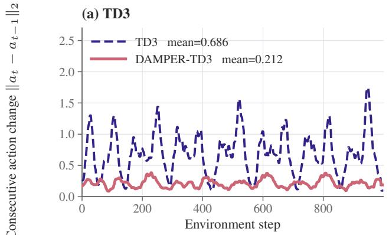

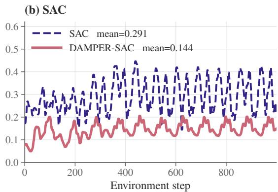  
Figure 2: DAMPER reduces consecutive action variation on Walker under both actor–critic backbones. We plot $\lVert a _ { t } - a _ { t - 1 } \rVert _ { 2 }$ over a 1,000-step rollout.

Table 1: TD3 results. Entries are mean (standard deviation) across five seeds. Higher return (re) and lower oscillation score (sm) are better. The best value in each column is highlighted in bold.
<table><tr><td></td><td colspan="2">LunarLander</td><td colspan="2">Pendulum</td><td colspan="2">Reacher</td><td colspan="2">Ant</td><td colspan="2">Hopper</td><td colspan="2">Walker</td></tr><tr><td>Method</td><td> $r e \uparrow$ </td><td>sm↓</td><td> $r e \uparrow$ </td><td>sm↓</td><td> $r e \uparrow$ </td><td>sm↓</td><td>re↑</td><td>sm↓</td><td>re↑</td><td>sm↓</td><td>re↑</td><td>sm↓</td></tr><tr><td>TD3</td><td>205.5 (98.5)</td><td>1.815 (0.955)</td><td>-157.6 (84.0)</td><td>2.308 (1.422)</td><td>-3.34 (1.45)</td><td>0.050 (0.015)</td><td>4749 (1226)</td><td>2.044 (0.307)</td><td>3604 (150)</td><td>3.061 (0.421)</td><td>4596 (328)</td><td>1.937 (0.139)</td></tr><tr><td>CAPS</td><td>246.1 (81.6)</td><td>0.634 (0.233)</td><td>-159.4 (81.7)</td><td>0.454 (0.140)</td><td>-3.34 (1.47)</td><td>0.046 (0.015)</td><td>5370 (275)</td><td>2.064 (0.101)</td><td>2928 (1025)</td><td>1.730 (0.341)</td><td>5032 (241)</td><td>1.865 (0.176)</td></tr><tr><td>Grad-CAPS</td><td>225.5 (61.4)</td><td>0.905 (0.333)</td><td>-153.4 (77.9)</td><td>1.011 (0.503)</td><td>-3.34 (1.49)</td><td>0.040 (0.011)</td><td>4201 (1859)</td><td>1.713 (0.408)</td><td>3371 (619)</td><td>1.287 (0.128)</td><td>5046 (460)</td><td>1.412 (0.291)</td></tr><tr><td>ASAP</td><td>245.5 (58.6)</td><td>1.345 (0.616)</td><td>-155.3 (78.3)</td><td>2.013 (1.047)</td><td>-3.36 (1.44)</td><td>0.048 (0.015)</td><td>4925 (1210)</td><td>2.041 (0.343)</td><td>2581 (1448)</td><td>1.866 (0.883)</td><td>4880 (745)</td><td>1.615 (0.288)</td></tr><tr><td>L2C2</td><td>218.5 (83.3)</td><td>1.626 (0.727)</td><td>-156.0 (79.1)</td><td>3.293 (1.034)</td><td>-3.38 (1.52)</td><td>0.048 (0.014)</td><td>4078 (1658)</td><td>1.974 (0.402)</td><td>2807 (1371)</td><td>2.427 (1.087)</td><td>4960 (1048)</td><td>1.707 (0.320)</td></tr><tr><td>PAVE</td><td>238.1 (71.5)</td><td>0.841 (0.601)</td><td>-154.5 (80.4)</td><td>0.410 (0.121)</td><td>-3.55 (1.51)</td><td>0.046 (0.016)</td><td>5064 (1245)</td><td>1.865 (0.237)</td><td>3328 (541)</td><td>1.022 (0.148)</td><td>4996 (700)</td><td>1.991 (0.410)</td></tr><tr><td>DAMPER (ours)</td><td>266.4 (35.8)</td><td>0.313 (0.036)</td><td>-154.6 (78.7)</td><td>0.463 (0.131)</td><td>-3.63 (1.44)</td><td>0.048 (0.016)</td><td>5281 (887)</td><td>1.261 (0.147)</td><td>3078 (599)</td><td>0.240 (0.035)</td><td>4275 (322)</td><td>0.346 (0.088)</td></tr></table>

## 6.3 Ablation Studies

Projection Ablation. We show that conflict-conditioned projection achieves the highest mean return among the evaluated update rules on three TD3 tasks: LunarLander, Hopper, and Walker. We compare DAMPER with Unconditional Sum, which always adds the scaled temporal direction, and Unconditional Projection, which orthogonalizes it at every update. The former retains components that oppose the native actor gradient, while the latter removes aligned components as well.

On Hopper, unconditional summation reduces mean return from 3078 to 317, despite achieving a lower oscillation score (Table 3). This result highlights the need to assess smoothness together with task performance. Unconditional projection yields a similar Hopper return but lowers Walker return from 4275 to 3525, with greater variability. On LunarLander, unconditional summation remains close to DAMPER in mean return,

Table 2: SAC results. Entries are mean (standard deviation) across five seeds. Higher return (re) and lower oscillation score (sm) are better. The best value in each column is highlighted in bold.
<table><tr><td></td><td colspan="2">LunarLander</td><td colspan="2">Pendulum</td><td colspan="2">Reacher</td><td colspan="2">Ant</td><td colspan="2">Hopper</td><td colspan="2">Walker</td></tr><tr><td>Method</td><td>re↑</td><td>sm↓</td><td>re↑</td><td>sm↓</td><td>re↑</td><td>sm↓</td><td>re↑</td><td>sm↓</td><td>re↑</td><td>sm↓</td><td>re↑</td><td>sm↓</td></tr><tr><td>SAC</td><td>162.6 (139.9)</td><td>0.402 (0.143)</td><td>-149.9 (76.9)</td><td>0.479 (0.128)</td><td>-3.49 (1.43)</td><td>0.053 (0.016)</td><td>5001 (1145)</td><td>1.935 (0.234)</td><td>3059 (825)</td><td>0.708 (0.074)</td><td>4771 (292)</td><td>0.747 (0.081)</td></tr><tr><td>CAPS</td><td>120.0 (171.6)</td><td>0.279 (0.065)</td><td>-152.7 (80.1)</td><td>0.325 (0.107)</td><td>-3.48 (1.39)</td><td>0.048 (0.014)</td><td>5439 (707)</td><td>1.931 (0.170)</td><td>3222 (548)</td><td>0.653 (0.058)</td><td>4955 (296)</td><td>0.745 (0.164)</td></tr><tr><td>Grad-CAPS</td><td>269.0 (27.6)</td><td>0.277 (0.064)</td><td>-148.9 (75.7)</td><td>0.379 (0.119)</td><td>-3.51 (1.41)</td><td>0.046 (0.013)</td><td>5675 (960)</td><td>1.797 (0.248)</td><td>3144 (653)</td><td>0.494 (0.061)</td><td>5060 (262)</td><td>0.585 (0.067)</td></tr><tr><td>ASAP</td><td>270.1 (19.6)</td><td>0.303 (0.080)</td><td>-149.2 (76.0)</td><td>0.505 (0.138)</td><td>-3.46 (1.40)</td><td>0.053 (0.016)</td><td>4564 (2104)</td><td>1.727 (0.326)</td><td>2831 (908)</td><td>0.637 (0.104)</td><td>5035 (408)</td><td>0.760 (0.155)</td></tr><tr><td>L2C2</td><td>239.4 (58.2)</td><td>0.407 (0.168)</td><td>-149.3 (76.2)</td><td>0.510 (0.145)</td><td>-3.45 (1.38)</td><td>0.052 (0.016)</td><td>4947 (1565)</td><td>1.810 (0.415)</td><td>3101 (580)</td><td>0.732 (0.106)</td><td>4834 (277)</td><td>0.901 (0.221)</td></tr><tr><td>PAVE</td><td>263.6 (24.2)</td><td>0.203 (0.034)</td><td>-151.6 (78.7)</td><td>0.334 (0.114)</td><td>-3.51 (1.49)</td><td>0.051 (0.015)</td><td>5543 (1007)</td><td>1.741 (0.218)</td><td>2403 (862)</td><td>0.584 (0.097)</td><td>4544 (646)</td><td>0.713 (0.090)</td></tr><tr><td>DAMPER (ours)</td><td>281.5 (24.4)</td><td>0.102 (0.037)</td><td>-156.6 (78.5)</td><td>0.336 (0.164)</td><td>-3.57 (1.57)</td><td>0.038 (0.018)</td><td>4564 (1577)</td><td>1.207 (0.253)</td><td>3384 (273)</td><td>0.571 (0.022)</td><td>4402 (1086)</td><td>0.268 (0.044)</td></tr></table>

Table 3: Ablation of conflict-conditioned projection with TD3. Entries are mean (standard deviation); each variant uses five training seeds and ten evaluation episodes per seed. The numerically best mean for each metric is shown in bold.
<table><tr><td rowspan="2">Method</td><td colspan="2">LunarLander</td><td colspan="2">Hopper</td><td colspan="2">Walker</td></tr><tr><td>re↑</td><td>sm↓</td><td>re↑</td><td>sm↓</td><td>re↑</td><td>sm↓</td></tr><tr><td>DAMPER</td><td>266.4 (35.8)</td><td>0.313 (0.036)</td><td>3078 (599)</td><td>0.240 (0.035)</td><td>4275 (322)</td><td>0.346 (0.088)</td></tr><tr><td>Unconditional projection</td><td>206.9 (122.7)</td><td>0.370 (0.223)</td><td>3050 (587)</td><td>0.249 (0.040)</td><td>3525 (1576)</td><td>0.314 (0.072)</td></tr><tr><td>Unconditional sum</td><td>263.5 (68.8)</td><td>0.279 (0.113)</td><td>317 (341)</td><td>0.053 (0.106)</td><td>3575 (514)</td><td>0.268 (0.088)</td></tr></table>

whereas unconditional projection has a lower mean and greater variability. These results support resolving conflicting components while retaining aligned temporal information.

Table 4: PEGrad-based baseline with TD3. Mean (standard deviation); five training seeds and ten evaluation episodes per seed.
<table><tr><td>Task</td><td>re↑</td></tr><tr><td>LunarLander 198.8 (123.5)</td><td>0.619 (0.353)</td></tr><tr><td>Hopper</td><td>2760 (835) 0.636 (0.046)</td></tr><tr><td>Walker</td><td>4361 (176) 0.712 (0.142)</td></tr></table>

Comparison with a PEGrad-Based Baseline. We compare DAMPER with a PEGrad-based baseline [20]. This baseline doesn’t use conditional projection and limits the temporal gradient’s magnitude, but lacks a parameter for strengthening weak temporal gradients relative to the native actor gradient. DAMPER can amplify weak temporal gradients through $w _ { \eta } = q ^ { 1 - \eta }$ . Across the three tasks, DAMPER lowers the mean oscillation score by 49–62% (Tables 3 and 4), while achieving higher mean returns on LunarLander and Hopper and a slightly lower mean return on Walker. These results are consistent with the benefit of magnitude interpolation alongside conflict-conditioned projection.

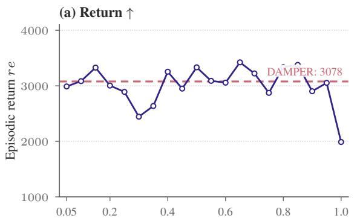

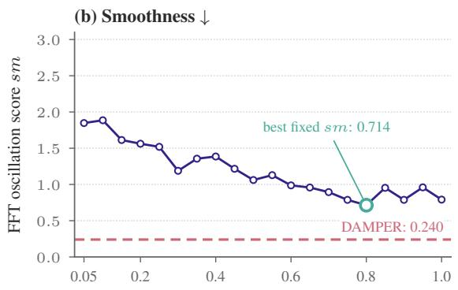  
Fixed scalarization weight λ  
Figure 3: Fixed-weight scalarization on TD3 Hopper. Points show means for $\lambda = 0 . 0 5 , 0 . 1 0 , \ldots , 1 . 0 ;$ dashed lines mark DAMPER.

## 6.4 Comparison with Fixed-Weight Scalarization

We evaluate fixed-weight scalarization on all six TD3 tasks. For each of the 20 weights $\lambda \in \Lambda : =$ $\{ 0 . 0 5 , 0 . 1 0 , \ldots , 1 . 0 \}$ , we train agents using

$$
\begin{array} { r } { \begin{array} { r } { \mathcal L _ { \lambda } ( \theta ) : = L _ { \mathrm { R } } ( \theta ) + \lambda L _ { \mathrm { T } } ( \theta ) , \qquad \lambda \in \Lambda , } \end{array} } \end{array}\tag{9}
$$

with λ fixed throughout training. Figure 3 shows the Hopper comparison with DAMPER at $\eta = 1$

Across the six tasks, DAMPER achieves a lower mean oscillation score than every evaluated fixed weight on five tasks, with Reacher as the exception. On Hopper, even the smoothest scalarized policy, obtained at $\lambda = 0 . 8 .$ , has $s m = 0 . 7 1 4$ , compared with 0.240 for DAMPER. These results are consistent with the temporal-progress analysis in Theorem 2.

Tuned scalarization nevertheless achieves competitive returns and lower oscillation than several specialized smoothness baselines. On LunarLander, Ant, and Hopper, selected weights improve both mean metrics over multiple such baselines, suggesting limited additional benefit from their more elaborate mechanisms over a well-tuned single temporal loss in these settings (Appendix C).

## 6.5 Effect of the Interpolation Parameter

(a) LunarLander  
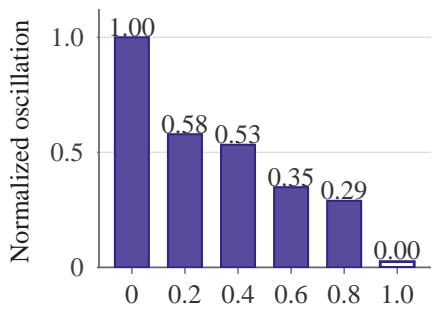  
Interpolation parameter η

(b) Hopper  
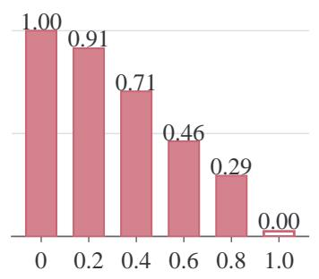

(c) Walker  
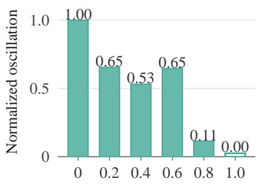  
Interpolation parameter η

Figure 4: Effect of η on task-normalized action oscillation with TD3.

We sweep $\eta \in \mathcal { H } = \{ 0 , 0 . 2 , \dots , 1 . 0 \}$ on LunarLander, Hopper, and Walker using TD3. For each task e, we normalize the mean oscillation score over the sweep as

$$
\widetilde { s m } _ { e } ( \eta ) = \frac { s m _ { e } ( \eta ) - m _ { e } } { M _ { e } - m _ { e } } ,\tag{10}
$$

where $m _ { e }$ and $M _ { e }$ are the minimum and maximum mean scores over $\mathcal { H } .$ respectively. Zero therefore denotes the smoothest tested setting for each task; absolute scores remain task-dependent.

Figure 4 shows that oscillation decreases monotonically on LunarLander and Hopper, while Walker exhibits a temporary increase at $\eta = 0 . 6$ . All three tasks attain their lowest mean score at $\eta = 1$ . This trend is consistent with Theorem 2: increasing η makes $\mathcal { G } ( g _ { \eta } )$ nondecreasing at matched first-order primary progress.

## 7 Conclusion

We introduced DAMPER, a primary–auxiliary actor update that combines conflict-conditioned temporalgradient projection with norm-ratio magnitude control. The update leaves the native actor gradient unchanged, admits a local descent guarantee for a fixed critic and minibatch, and reduces the reported action-oscillation score across all 12 evaluated task–backbone pairs. Return is not uniformly preserved, however, and our theoretical analysis is limited to a single actor update rather than the full training process. Evaluation on physical systems is an important next step for understanding when smoother control can be obtained without sacrificing task performance.

## AI Use Statement

In this work, we used generative AI tools to assist with writing and coding. For writing, AI tools were used to edit and polish author-written text for grammar, clarity, and readability, and to help format LATEX (e.g., tables and references). For coding, AI tools were used to assist in creating and editing software code, including debugging, refactoring, and writing experiment and plotting scripts.

Generative AI tools were also used to assist with checking and refining mathematical derivations and proofs, including identifying gaps and assessing consistency between theorem statements, assumptions, and supporting arguments. These tools served as supplementary aids, with the authors retaining responsibility for the validity of all theoretical claims and proofs. AI tools were not used to originate research hypotheses or design the research methodology or experiments. Synthetic dataset generation, translation, dataset cleaning, and qualitative data analysis are not applicable to this work.

We have reviewed all AI-assisted work. All AI-edited text was checked by the authors to ensure that it accurately reflects our intended meaning and claims. All AI-assisted code was reviewed, tested, and verified for correctness by the authors before being used to produce the reported results. We take responsibility for the final content of this work, including text, claims, and artifacts produced with the aid of generative AI.

## References

[1] Zhao Chen, Vijay Badrinarayanan, Chen-Yu Lee, and Andrew Rabinovich. “GradNorm: Gradient Normalization for Adaptive Loss Balancing in Deep Multitask Networks”. In: Proceedings ofthe 35th International Conference on Machine Learning. Vol. 80. Proceedings of Machine Learning Research. PMLR, 2018, pp. 794–803. URL: https://proceedings.mlr.press/v80/chen18a.html.

[2] Eugenio Chisari, Alexander Liniger, Alisa Rupenyan, Luc Van Gool, and John Lygeros. “Learning from Simulation, Racing in Reality”. In: 2021 IEEE International Conference on Robotics and Automation (ICRA). 2021, pp. 8046–8052.

[3] Guilherme Christmann, Ying-Sheng Luo, Hanjaya Mandala, and Wei-Chao Chen. “Benchmarking Smoothness and Reducing High-Frequency Oscillations in Continuous Control Policies”. In: 2024 IEEE/RSJ International Conference on Intelligent Robots and Systems (IROS). 2024, pp. 627–634.

[4] Bram De Cooman, Johan A. K. Suykens, and Andreas Ortseifen. “Improving Temporal Smoothness of Deterministic Reinforcement Learning Policies with Continuous Actions”. In: Proceedings of BNAIC/BENELEARN 2021. 2021, pp. 217–240. URL: https://lirias.kuleuven.be/3635727.

[5] Jean-Antoine Desid ´ eri. “Multiple-Gradient Descent Algorithm (MGDA) for Multiobjective Optimiza-´ tion”. In: Comptes Rendus Mathematique ´ 350.5–6 (2012), pp. 313–318.

[6] Yunshu Du, Wojciech M. Czarnecki, Siddhant M. Jayakumar, Mehrdad Farajtabar, Razvan Pascanu, and Balaji Lakshminarayanan. “Adapting Auxiliary Losses Using Gradient Similarity”. In: arXiv preprint arXiv:1812.02224 (2018).

[7] Scott Fujimoto, Herke van Hoof, and David Meger. “Addressing Function Approximation Error in Actor-Critic Methods”. In: Proceedings of the 35th International Conference on Machine Learning. Vol. 80. Proceedings of Machine Learning Research. PMLR, 2018, pp. 1587–1596. URL: https: //proceedings.mlr.press/v80/fujimoto18a.html.

[8] Chengyue Gong, Xingchao Liu, and Qiang Liu. “Automatic and Harmless Regularization with Constrained and Lexicographic Optimization: A Dynamic Barrier Approach”. In: Advances in Neural Information Processing Systems. Vol. 34. 2021, pp. 29630–29642.

[9] Tuomas Haarnoja, Aurick Zhou, Pieter Abbeel, and Sergey Levine. “Soft Actor-Critic: Off-Policy Maximum Entropy Deep Reinforcement Learning with a Stochastic Actor”. In: Proceedings of the 35th International Conference on Machine Learning. Vol. 80. Proceedings of Machine Learning Research. PMLR, 2018, pp. 1861–1870. URL: https://proceedings.mlr.press/v80/ haarnoja18b.html.

[10] Yun He, Xue Feng, Cheng Cheng, Geng Ji, Yunsong Guo, and James Caverlee. “MetaBalance: Improving Multi-Task Recommendations via Adapting Gradient Magnitudes of Auxiliary Tasks”. In: Proceedings of the ACM Web Conference 2022. 2022, pp. 2205–2215.

[11] Yu-Guan Hsieh, James Thornton, Eugene Ndiaye, Michal Klein, Marco Cuturi, and Pierre Ablin. “Careful with That Scalpel: Improving Gradient Surgery with an EMA”. In: Proceedings ofthe 41st International Conference on Machine Learning. Vol. 235. Proceedings of Machine Learning Research. PMLR, 2024, pp. 19085–19100. URL: https://proceedings.mlr.press/v235/hsieh24a. html.

[12] Woojun Kim and Katia Sycara. “Fair Cooperation in Mixed-Motive Games via Conflict-Aware Gradient Adjustment”. In: arXiv preprint arXiv:2508.17696 (2025).

[13] Taisuke Kobayashi. “L2C2: Locally Lipschitz Continuous Constraint towards Stable and Smooth Reinforcement Learning”. In: 2022 IEEE/RSJ International Conference on Intelligent Robots and Systems (IROS). 2022, pp. 4032–4039.

[14] Kyoleen Kwak and Hyoseok Hwang. “Enhancing Control Policy Smoothness by Aligning Actions with Predictions from Preceding States”. In: Proceedings of the AAAI Conference on Artificial Intelligence 40.27 (2026), pp. 22707–22715.

[15] I Lee, Hoang-Giang Cao, Cong-Tinh Dao, Yu-Cheng Chen, and I-Chen Wu. “Gradient-Based Regularization for Action Smoothness in Robotic Control with Reinforcement Learning”. In: 2024 IEEE/RSJ International Conference on Intelligent Robots and Systems (IROS). 2024, pp. 603–610.

[16] Jeong Woon Lee, Kyoleen Kwak, Daeho Kim, and Hyoseok Hwang. “Stabilizing the Q-Gradient Field for Policy Smoothness in Actor-Critic”. In: arXiv preprint arXiv:2601.22970 (2026).

[17] Bo Liu, Xingchao Liu, Xiaojie Jin, Peter Stone, and Qiang Liu. “Conflict-Averse Gradient Descent for Multi-Task Learning”. In: Advances in Neural Information Processing Systems. Vol. 34. 2021, pp. 18878–18890.

[18] Humphrey Munn, Brendan Tidd, Peter Bohm, Marcus Gallagher, and David Howard. “Scalable ¨ Multi-Objective Robot Reinforcement Learning through Gradient Conflict Resolution”. In: 2026 IEEE International Conference on Robotics and Automation (ICRA). 2026.

[19] Siddharth Mysore, Bassel Mabsout, Renato Mancuso, and Kate Saenko. “Regularizing Action Policies for Smooth Control with Reinforcement Learning”. In: 2021 IEEE International Conference on Robotics and Automation (ICRA). 2021, pp. 1810–1816.

[20] Skand Peri, Akhil Perincherry, Bikram Pandit, and Stefan Lee. “Non-Conflicting Energy Minimization in Reinforcement Learning Based Robot Control”. In: Proceedings ofthe 9th Conference on Robot Learning. Vol. 305. Proceedings of Machine Learning Research. PMLR, 2025, pp. 221–237. URL: https://proceedings.mlr.press/v305/peri25a.html.

[21] Roman de la Presilla, Sebastian Wandel, Matthias Stammler, Markus Grebe, Gerhard Poll, and Sergei´ Glavatskih. “Oscillating rolling element bearings: A review of tribotesting and analysis approaches”. In: Tribology International 188 (2023), p. 108805.

[22] Ruiyu Qiu, Rui Wang, Guanghui Yang, Xiang Li, and Zhijiang Shao. “LPPG-RL: Lexicographically Projected Policy Gradient Reinforcement Learning with Subproblem Exploration”. In: Proceedings of the AAAI Conference on Artificial Intelligence 40.30 (2026), pp. 25009–25017.

[23] Antonin Raffin, Jens Kober, and Freek Stulp. “Smooth Exploration for Robotic Reinforcement Learning”. In: Proceedings of the 5th Conference on Robot Learning. Vol. 164. Proceedings of Machine Learning Research. PMLR, 2022, pp. 1634–1644. URL: https://proceedings.mlr. press/v164/raffin22a.html.

[24] Ozan Sener and Vladlen Koltun. “Multi-Task Learning as Multi-Objective Optimization”. In: Advances in Neural Information Processing Systems. Vol. 31. 2018.

[25] Xujie Song, Jingliang Duan, Wenxuan Wang, Shengbo Eben Li, Chen Chen, Bo Cheng, Bo Zhang, Junqing Wei, and Xiaoming Simon Wang. “LipsNet: A Smooth and Robust Neural Network with Adaptive Lipschitz Constant for High Accuracy Optimal Control”. In: Proceedings of the 40th International Conference on Machine Learning. Vol. 202. Proceedings of Machine Learning Research. PMLR, 2023, pp. 32253–32272. URL: https://proceedings.mlr.press/v202/song23b.html.

[26] Emanuel Todorov, Tom Erez, and Yuval Tassa. “MuJoCo: A Physics Engine for Model-Based Control”. In: 2012 IEEE/RSJ International Conference on Intelligent Robots and Systems. IEEE, 2012, pp. 5026–5033.

[27] Mark Towers et al. “Gymnasium: A Standard Interface for Reinforcement Learning Environments”. In: arXiv preprint arXiv:2407.17032 (2024).

[28] Tianhe Yu, Saurabh Kumar, Abhishek Gupta, Sergey Levine, Karol Hausman, and Chelsea Finn. “Gradient Surgery for Multi-Task Learning”. In: Advances in Neural Information Processing Systems. Vol. 33. 2020, pp. 5824–5836.

## A Optimization Characterization of the Combined Gradient

The following lemma establishes the closed-form solution to the optimization problem in Section 4.2.

Lemma 1 (Closest primary-preserving combined gradient). Let $g _ { R } , g _ { T } \in \mathbb { R } ^ { p }$ be nonzero gradients, with $n _ { R } : = \| g _ { R } \| _ { 2 }$ and nT $: = \| g _ { T } \| _ { 2 }$ . For any $s > 0 ,$ , define the target combined gradient

$$
g _ { \mathrm { t a r g e t } } ( s ) : = g _ { R } + s \frac { g _ { T } } { n _ { T } } .
$$

Then the optimization problem

$$
g ( s ) : = \underset { d \in \mathbb { R } ^ { p } : g _ { R } ^ { \top } d \geq n _ { R } ^ { 2 } } { \arg \operatorname* { m i n } } \ \left\| d - g _ { \mathrm { t a r g e t } } ( s ) \right\| _ { 2 } ^ { 2 }\tag{11}
$$

has the unique solution

$$
g ( s ) = g _ { R } + \frac { s } { n _ { T } } \widetilde { g } _ { T } , \qquad \widetilde { g } _ { T } : = g _ { T } - \frac { \operatorname * { m i n } \{ g _ { R } ^ { \top } g _ { T } , 0 \} } { n _ { R } ^ { 2 } } g _ { R } .\tag{12}
$$

Here, $\widetilde { g } _ { T }$ is the conflict-conditioned projection defined in Section 4.1.

Proof. Write $t : = g _ { \mathrm { t a r g e t } } ( s )$ and $b : = g _ { R } ^ { \top } g _ { T }$

If $b \geq 0 .$ , then

$$
g _ { R } ^ { \top } t = n _ { R } ^ { 2 } + \frac { s } { n _ { T } } b \geq n _ { R } ^ { 2 } .
$$

Thus, t is feasible and attains an objective value of zero, making it the unique minimizer. Since $\widetilde { g } _ { T } = g _ { T }$ in this case, the claimed solution follows.

If $b < 0 .$ , define

$$
d ^ { \star } : = t - \frac { s b } { n _ { T } n _ { R } ^ { 2 } } g _ { R } .
$$

Then $g _ { R } ^ { \top } d ^ { \star } = n _ { R } ^ { 2 }$ , so $d ^ { \star }$ is feasible. Moreover, $d ^ { \star } - t$ is a positive multiple of $g _ { R }$ . For any feasible $d ,$ we have $g _ { R } ^ { \top } ( d - d ^ { \star } ) \geq 0$ , and hence

$$
\begin{array} { r l } & { \| d - t \| _ { 2 } ^ { 2 } - \| d ^ { \star } - t \| _ { 2 } ^ { 2 } = \| d - d ^ { \star } \| _ { 2 } ^ { 2 } + 2 ( d - d ^ { \star } ) ^ { \top } ( d ^ { \star } - t ) } \\ & { \qquad \geq \| d - d ^ { \star } \| _ { 2 } ^ { 2 } . } \end{array}
$$

The right-hand side is strictly positive unless $d = d ^ { \star }$ . Therefore, $d ^ { \star }$ is the unique minimizer. Substituting the definition of t gives

$$
d ^ { \star } = g _ { R } + \frac { s } { n _ { T } } \left( g _ { T } - \frac { b } { n _ { R } ^ { 2 } } g _ { R } \right) = g _ { R } + \frac { s } { n _ { T } } \widetilde { g } _ { T } ,
$$

as required.

Connection to magnitude control. The cap-only and norm-matched target magnitudes are $s _ { 0 } : =$ min $( n _ { T } , n _ { R } )$ and $s _ { 1 } : = n _ { R }$ , respectively. For $\eta \in [ 0 , 1 ]$ , define

$$
s _ { \eta } : = s _ { 0 } ^ { 1 - \eta } s _ { 1 } ^ { \eta } , \qquad q : = \operatorname* { m i n } \left( \frac { n _ { T } } { n _ { R } } , 1 \right) , \qquad w _ { \eta } : = q ^ { 1 - \eta } .
$$

Since $s _ { 0 } = n _ { R } q$ and $s _ { 1 } = n _ { R }$ , we obtain $s _ { \eta } = n _ { R } w _ { \eta }$ . Lemma 1 therefore yields

$$
g _ { \eta } = g ( s _ { \eta } ) = g _ { R } + \frac { s _ { \eta } } { n _ { T } } \widetilde { g } _ { T } = g _ { R } + \frac { n _ { R } } { n _ { T } } w _ { \eta } \widetilde { g } _ { T } ,\tag{13}
$$

recovering the norm-ratio combination rule.

Because $\| \widetilde { g } _ { T } \| _ { 2 } \le n _ { T }$ and $s _ { \eta } \leq n _ { R }$ , the temporal contribution satisfies

$$
\| g _ { \eta } - g _ { R } \| _ { 2 } = s _ { \eta } \frac { \| \widetilde { g } _ { T } \| _ { 2 } } { n _ { T } } \le s _ { \eta } \le n _ { R } .\tag{14}
$$

Thus, $s _ { \eta }$ specifies the temporal magnitude before projection, not necessarily the magnitude of the final temporal contribution. Under conflict, $\| \widetilde { g } _ { T } \| _ { 2 } < n _ { T }$ , so this contribution is strictly smaller than $s _ { \eta } .$ . Using the original norm $n _ { T }$ ein the denominator preserves this attenuation rather than amplifying the projected gradient back to the target magnitude.

## B Proofs for the Primary–Auxiliary Analysis

## B.1 Proof of Theorem 1

Proof. Write $r : = g _ { R }$ and $n _ { R } : = \| r \| _ { 2 } > 0$ . If Algorithm 1 activates its numerical guard, then $g = r$ . The descent lemma gives

$$
\begin{array} { r } { L _ { \mathrm { R } } ( \theta - \alpha r ) \leq L _ { \mathrm { R } } ( \theta ) - \alpha \| r \| _ { 2 } ^ { 2 } + \frac { \beta _ { R } \alpha ^ { 2 } } { 2 } \| r \| _ { 2 } ^ { 2 } } \\ { = L _ { \mathrm { R } } ( \theta ) - \alpha \left( 1 - \frac { \beta _ { R } \alpha } { 2 } \right) n _ { R } ^ { 2 } . } \end{array}\tag{15}
$$

This is strictly smaller than $L _ { \mathrm { R } } ( \theta )$ whenever $0 ~ < ~ \alpha ~ < ~ 2 / \beta _ { R }$ , and hence under the stated condition $0 < \alpha < 1 / \beta _ { R }$

Otherwise, $g = g _ { \eta }$ . Define $u _ { R } : = g _ { R } / n _ { R }$ and $\widetilde { u } _ { T } : = \widetilde { g } _ { T } / n _ { T }$ , where $n _ { T } : = \| g _ { T } \| _ { 2 }$ . Let

$$
c _ { + } : = \operatorname* { m a x } \{ c , 0 \} , \qquad c _ { - } : = \operatorname* { m a x } \{ - c , 0 \} .\tag{16}
$$

From equation 4,

$$
u _ { R } ^ { \top } \widetilde { u } _ { T } = c _ { + } , \qquad \| \widetilde { u } _ { T } \| _ { 2 } ^ { 2 } = 1 - c _ { - } ^ { 2 } .\tag{17}
$$

Using $r = n _ { R } u _ { R }$ and equation 5,

$$
\begin{array} { r } { r ^ { \top } g _ { \eta } = n _ { R } ^ { 2 } u _ { R } ^ { \top } \left( u _ { R } + w _ { \eta } \widetilde { u } _ { T } \right) } \\ { = n _ { R } ^ { 2 } \left( 1 + w _ { \eta } c _ { + } \right) > 0 . } \end{array}\tag{18}
$$

Moreover,

$$
\begin{array} { r l } & { \| g _ { \eta } \| _ { 2 } ^ { 2 } = n _ { R } ^ { 2 } \left\| u _ { R } + w _ { \eta } \widetilde { u } _ { T } \right\| _ { 2 } ^ { 2 } } \\ & { \qquad = n _ { R } ^ { 2 } \left[ 1 + 2 w _ { \eta } c _ { + } + w _ { \eta } ^ { 2 } ( 1 - c _ { - } ^ { 2 } ) \right] . } \end{array}\tag{19}
$$

The descent lemma therefore yields

$$
\begin{array} { r l } & { { \cal L } _ { \mathrm { R } } \big ( \theta - \alpha g _ { \eta } \big ) - { \cal L } _ { \mathrm { R } } ( \theta ) \le - \alpha n _ { R } ^ { 2 } ( 1 + w _ { \eta } c _ { + } ) } \\ & { \qquad + \frac { \beta _ { R } \alpha ^ { 2 } n _ { R } ^ { 2 } } { 2 } \big [ 1 + 2 w _ { \eta } c _ { + } + w _ { \eta } ^ { 2 } ( 1 - c _ { - } ^ { 2 } ) \big ] . } \end{array}\tag{20}
$$

The right-hand side is strictly negative when

$$
0 < \alpha < \frac { 2 ( 1 + w _ { \eta } c _ { + } ) } { \beta _ { R } [ 1 + 2 w _ { \eta } c _ { + } + w _ { \eta } ^ { 2 } ( 1 - c _ { - } ^ { 2 } ) ] } .\tag{21}
$$

Because the numerical guard is inactive, $q \in ( 0 , 1 ]$ , and hence $w _ { \eta } = q ^ { 1 - \eta } \in ( 0 , 1 ]$ . Consequently,

$$
\begin{array} { r l } & { 1 + 2 w _ { \eta } c _ { + } + w _ { \eta } ^ { 2 } ( 1 - c _ { - } ^ { 2 } ) \leq 2 + 2 w _ { \eta } c _ { + } } \\ & { ~ = 2 ( 1 + w _ { \eta } c _ { + } ) . } \end{array}\tag{22}
$$

The upper bound in equation 21 is therefore at least $1 / \beta _ { R } .$ , proving the theorem.

## B.2 Proof of Theorem 2

Matched-progress interpretation. For $g _ { R } ^ { \top } d > 0 .$ , define

$$
\widehat { d } : = \frac { \| g _ { R } \| _ { 2 } ^ { 2 } } { g _ { R } ^ { \top } d } d .
$$

Then $g _ { R } ^ { \top } \widehat { d } = \| g _ { R } \| _ { 2 } ^ { 2 }$ , so $\widehat { d }$ and $g _ { R }$ yield the same first-order decrease in the native actor loss. As $\alpha  0$ , a bTaylor expansion gives

$$
\begin{array} { r l } & { \qquad L _ { T } ( \theta - \alpha g _ { R } ) - L _ { T } ( \theta - \alpha \widehat { d } ) } \\ & { \qquad = \alpha g _ { T } ^ { \top } ( \widehat { d } - g _ { R } ) + o ( \alpha ) } \\ & { \qquad = \alpha \| g _ { R } \| _ { 2 } ^ { 2 } \left[ \frac { g _ { T } ^ { \top } d } { g _ { R } ^ { \top } d } - \frac { g _ { T } ^ { \top } g _ { R } } { \| g _ { R } \| _ { 2 } ^ { 2 } } \right] + o ( \alpha ) } \\ & { \qquad = \alpha \| g _ { R } \| _ { 2 } ^ { 2 } \mathcal { G } ( d ) + o ( \alpha ) . } \end{array}\tag{23}
$$

Hence, $\mathcal { G } ( d )$ measures the additional first-order temporal decrease per unit primary decrease relative to the native-gradient update.

Proof. Write $w : = q ^ { 1 - \eta }$ and $c _ { + } : = \operatorname* { m a x } \{ c , 0 \}$ . Since $0 < q < 1$ , the cap is inactive, $q = \| g _ { T } \| _ { 2 } / \| g _ { R } \| _ { 2 }$ and $0 < w \leq 1$ . The projection rule gives

$$
g _ { \eta } = \bigl ( 1 - w \operatorname* { m i n } \{ c , 0 \} \bigr ) g _ { R } + q ^ { - \eta } g _ { T } .
$$

Consequently,

$$
g _ { R } ^ { \top } g _ { \eta } = \| g _ { R } \| _ { 2 } ^ { 2 } ( 1 + w c _ { + } ) > 0 .
$$

Substitution into equation 7 yields

$$
\mathcal { G } ( g _ { \eta } ) = \frac { q ^ { 2 - \eta } ( 1 - c ^ { 2 } ) } { 1 + w c _ { + } } .\tag{24}
$$

For scalarization, $g _ { \lambda } = g _ { R } + \lambda g _ { T }$ , and

$$
g _ { R } ^ { \top } g _ { \lambda } = \| g _ { R } \| _ { 2 } ^ { 2 } ( 1 + \lambda q c ) .
$$

Since $\lambda q < 1 - \delta$ and $| c | \le 1$

$$
\delta < 1 + \lambda q c < 2 - \delta .\tag{25}
$$

Thus, the scalarized direction also has positive primary progress. Direct substitution gives

$$
\begin{array} { c } { { \mathcal { G } ( g _ { \lambda } ) = q \displaystyle \frac { c + \lambda q } { 1 + \lambda q c } - q c } } \\ { { = \displaystyle \frac { \lambda q ^ { 2 } ( 1 - c ^ { 2 } ) } { 1 + \lambda q c } . } } \end{array}\tag{26}
$$

Since $1 \leq 1 + w c _ { + } \leq 2$ , equation 24 gives

$$
{ \frac { 1 } { 2 } } ( 1 - c ^ { 2 } ) q ^ { 2 - \eta } \leq \mathcal { G } ( g _ { \eta } ) \leq ( 1 - c ^ { 2 } ) q ^ { 2 - \eta } .\tag{27}
$$

Similarly, combining equation 26 with equation 25 yields

$$
\frac { \lambda } { 2 - \delta } ( 1 - c ^ { 2 } ) q ^ { 2 } \leq \mathcal { G } ( g _ { \lambda } ) \leq \frac { \lambda } { \delta } ( 1 - c ^ { 2 } ) q ^ { 2 } .\tag{28}
$$

Because $\lambda > 0$ and $\delta \in \mathsf { \Gamma } ( 0 , 1 )$ are fixed, these bounds establish equation $^ { 8 , }$ with positive constants independent of $q$ and c. They also cover $| c | = 1$ , where both gains vanish.

Finally, if $| c | < 1$ , both gains are positive, and their common factor $1 - c ^ { 2 }$ cancels:

$$
\frac { \mathcal { G } ( g _ { \eta } ) } { \mathcal { G } ( g _ { \lambda } ) } = \frac { q ^ { - \eta } } { \lambda } \frac { 1 + \lambda q c } { 1 + w c _ { + } } .\tag{29}
$$

Combining $1 \leq 1 + w c _ { + } \leq 2$ with equation 25 gives

$$
\frac { \delta } { 2 \lambda } q ^ { - \eta } \le \frac { { \mathcal G } ( g _ { \eta } ) } { { \mathcal G } ( g _ { \lambda } ) } \le \frac { 2 - \delta } { \lambda } q ^ { - \eta } .\tag{30}
$$

Thus,

$$
\frac { \mathcal { G } ( g _ { \eta } ) } { \mathcal { G } ( g _ { \lambda } ) } = \Theta ( q ^ { - \eta } ) ,
$$

with constants independent of $q$ and c. For every fixed $\eta > 0$ and $\lambda > 0$ , the lower bound diverges as $q  0 .$ establishing the claimed asymptotic advantage for noncollinear gradients. □

## C Additional Fixed-Weight Scalarization Results

We report the five TD3 task sweeps omitted from Section 6.4: LunarLander, Pendulum, Reacher, Ant, and Walker. Each sweep uses the 20 fixed weights $\Lambda = \{ 0 . 0 5 , 0 . 1 0 , \ldots , 1 . 0 \}$ , with five training seeds and ten evaluation episodes per seed. Points show mean return and FFT-based oscillation score; dashed lines show the reported TD3 means of DAMPER. The highlighted point has the lowest mean oscillation score within each sweep. Axis ranges vary by task.

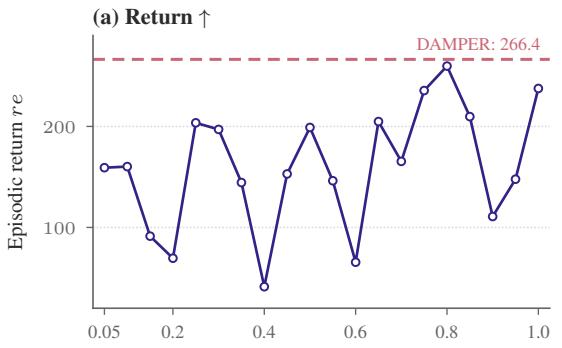

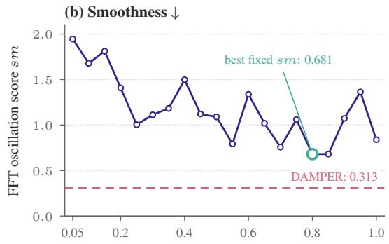  
Fixed scalarization weight λ

Figure 5: Fixed-weight scalarization on TD3 LunarLander. The lowest scalarization score is $s m = 0 . 6 8 1 \mathrm { a t } \lambda = 0 . 8 0 $ compared with 0.313 for DAMPER.  
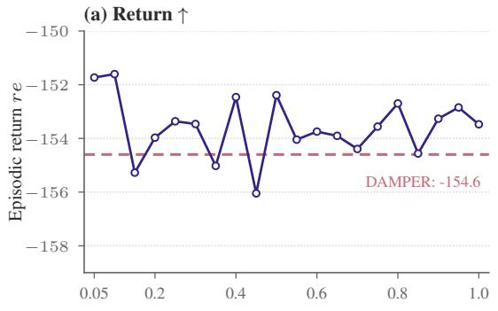

(b) Smoothness  
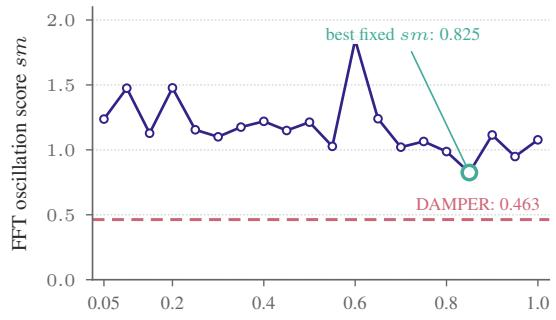  
Fixed scalarization weight λ  
Figure 6: Fixed-weight scalarization on TD3 Pendulum. The lowest scalarization score is $s m = 0 . 8 2 5 \mathrm { a t } \lambda = 0 . 8 5$ , compared with 0.463 for DAMPER.

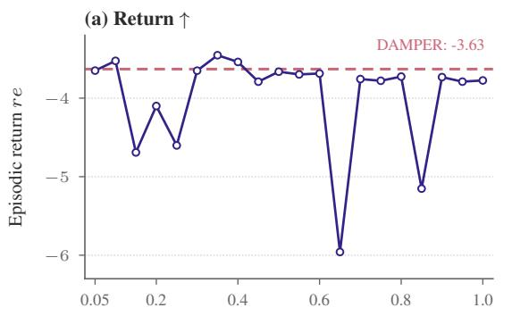

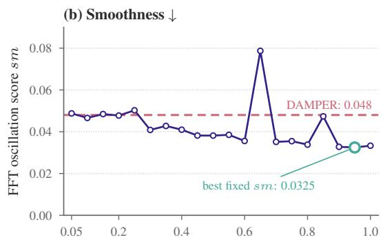  
Fixed scalarization weight λ

Figure 7: Fixed-weight scalarization on TD3 Reacher. Reacher is the exception: scalarization reaches $s m = 0 . 0 3 2 5 \mathrm { a t } \lambda = 0 . 9 5 .$ below the reported 0.048 for DAMPER.  
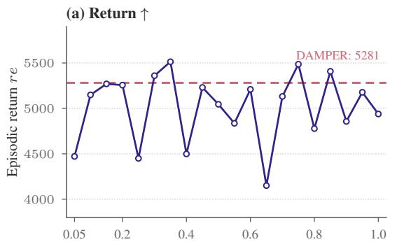

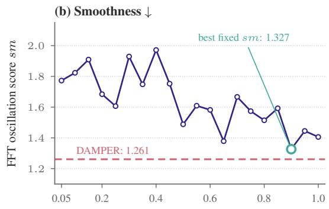  
Fixed scalarization weight λ

Figure 8: Fixed-weight scalarization on TD3 Ant. The lowest scalarization score is $s m = 1 . 3 2 7 \mathrm { a t } \lambda = 0 . 9 0 $ , compared with 1.261 for DAMPER.  
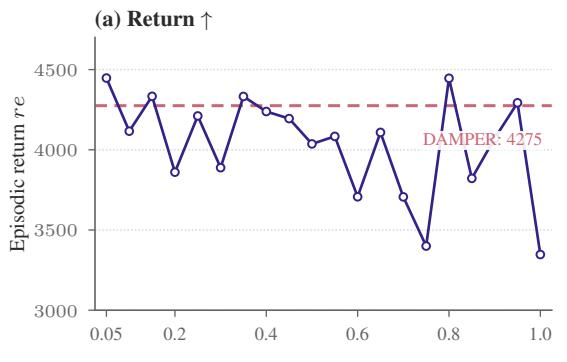

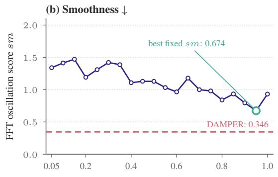  
Fixed scalarization weight λ  
Figure 9: Fixed-weight scalarization on TD3 Walker. The lowest scalarization score is $s m = 0 . 6 7 4 \mathrm { a t } \lambda = 0 . 9 5 .$ , compared with 0.346 for DAMPER.

Comparison with smoothing baselines. We compare tuned scalarization with the five smoothing baselines in Table 1, excluding DAMPER. On Ant, the weight λ = 0.75 gives (re, sm) = (5486, 1.574). Its return exceeds the highest baseline return (5370, CAPS), while its oscillation score is 8.1% below the lowest baseline score (1.713, Grad-CAPS). Thus, it improves both metrics over all five baselines. On LunarLander, $\lambda = 0 . 8 0$ gives (259.8, 0.681), improving both metrics over Grad-CAPS, ASAP, L2C2, and PAVE; PAVE, for example, obtains (238.1, 0.841). On Hopper, λ = 0.80 gives (3338, 0.714), improving both metrics over CAPS, ASAP, L2C2, and PAVE. Its oscillation score is 30.1% below the best baseline score (1.022, PAVE), with a similar return (3338 versus 3328). On Pendulum, λ = 0.85 gives ( 154.6, 0.825), improving on both ASAP ( 155.3, 2.013) and L2C2 ( 156.0, 3.293) in both metrics.

These gains are task dependent. CAPS remains smoother on LunarLander, and CAPS and PAVE remain smoother on Pendulum. The lowest scalarization scores on Reacher (0.0325) and Walker (0.674) improve on all five baselines, but their returns are lower: 3.79 versus 3.55 to 3.34 on Reacher, and 4293 versus 4880 to 5046 on Walker. These results make a tuned temporal-consistency loss a strong baseline: additional smoothing mechanisms do not consistently improve the return–smoothness trade-off in these experiments. Comparisons use reported means and weights selected from the sweep; they do not establish statistical significance.

## D Experimental Details

Baseline configurations. We follow the baseline hyperparameter settings reported in the PAVE appendix [16]. Table 5 lists the settings for CAPS, Grad-CAPS, ASAP, and PAVE from Appendix E.1 (Tables 10 and 11) of that work. Grad-CAPS is denoted as GRAD in the original tables. CAPS, Grad-CAPS, and ASAP use the same settings under TD3 and SAC; PAVE uses backbone-specific loss weights.

Table 5: Baseline hyperparameters adopted from PAVE. Settings apply to both TD3 and SAC unless a backbone is specified. Parameter notation follows each baseline.
<table><tr><td>Method</td><td></td><td>Parameter LunarLander</td><td>Pendulum</td><td>Reacher</td><td>Ant</td><td>Hopper Walker</td><td></td></tr><tr><td>CAPS</td><td> $\lambda _ { T }$ </td><td>0.1</td><td>1.0</td><td>0.1</td><td>0.1</td><td>0.1</td><td>0.1</td></tr><tr><td></td><td> $\lambda _ { S }$ </td><td>0.5</td><td>5.0</td><td>0.5</td><td>0.5</td><td>0.5</td><td>0.5</td></tr><tr><td></td><td>σ</td><td>0.2</td><td>0.2</td><td>0.2</td><td>0.2</td><td>0.2</td><td>0.2</td></tr><tr><td>Grad-CAPS</td><td> $\lambda _ { T }$ </td><td>1.0</td><td>1.0</td><td>1.0</td><td>1.0</td><td>1.0</td><td>1.0</td></tr><tr><td>ASAP</td><td> $\lambda _ { T }$ </td><td>0.005</td><td>0.005</td><td>0.1</td><td>0.05</td><td>0.07</td><td>0.05</td></tr><tr><td></td><td> $\lambda _ { S }$ </td><td>0.03</td><td>0.03</td><td>0.1</td><td>0.3</td><td>0.3</td><td>0.3</td></tr><tr><td></td><td> $\lambda _ { P }$ </td><td>2.0</td><td>2.0</td><td>2.0</td><td>2.0</td><td>2.0</td><td>2.0</td></tr><tr><td>PAVE (TD3)</td><td> $\lambda _ { 1 }$ </td><td>0.1</td><td>2.0</td><td>0.1</td><td>0.1</td><td>0.1</td><td>0.1</td></tr><tr><td></td><td> $\lambda _ { 2 }$ </td><td>0.1</td><td>0.005</td><td>0.1</td><td>0.005</td><td>0.005</td><td>0.1</td></tr><tr><td></td><td> $\lambda _ { 3 }$ </td><td>0.01</td><td>2.0</td><td>0.01</td><td>0.5</td><td>0.5</td><td>0.01</td></tr><tr><td>PAVE (SAC)</td><td> $\lambda _ { 1 }$ </td><td>0.1</td><td>0.1</td><td>0.1</td><td>0.1</td><td>2.0</td><td>2.0</td></tr><tr><td></td><td> $\lambda _ { 2 }$ </td><td>0.5</td><td>0.005</td><td>0.0005</td><td>0.0005</td><td>0.0005</td><td>0.005</td></tr><tr><td></td><td> $\lambda _ { 3 }$ </td><td>0.05</td><td>0.5</td><td>1.0</td><td>1.0</td><td>3.0</td><td>2.0</td></tr></table>

For PAVE, $\lambda _ { 1 } , \lambda _ { 2 } ,$ and $\lambda _ { 3 }$ weight mixed-partial regularization, vector-field consistency, and curvature preservation, respectively. Its perturbation scale $\sigma = 0 . 0 1$ and curvature floor δ = 1.0 are fixed across all tasks and both backbones.

L2C2. For both TD3 and SAC, we use σ = 1.0, λ = 0.01, $\overline { { \lambda } } = 1 . 0$ , and $\beta = 0 . 1$ on all six tasks.

DAMPER. Table 6 lists the interpolation parameter η used for each task–backbone pair in our main experiments. The parameter sweeps used for ablation are reported separately.

Table 6: Interpolation parameter η for DAMPER.
<table><tr><td>Backbone</td><td>LunarLander</td><td>Pendulum</td><td>Reacher</td><td>Ant</td><td>Hopper</td><td>Walker</td></tr><tr><td>TD3</td><td>0.8</td><td>1.0</td><td>1.0</td><td>0.0</td><td>1.0</td><td>1.0</td></tr><tr><td>SAC</td><td>1.0</td><td>1.0</td><td>0.8</td><td>0.0</td><td>0.0</td><td>1.0</td></tr></table>

Hardware. Experiments were conducted using NVIDIA GeForce RTX 2080 and RTX 5060 Ti GPUs.

Table 7: Training budgets and network sizes following the PAVE protocol [16].
<table><tr><td>Setting</td><td>TD3</td><td>SAC</td></tr><tr><td>Training iterations</td><td></td><td></td></tr><tr><td>LunarLander</td><td>500,000</td><td>500,000</td></tr><tr><td>Pendulum</td><td>100,000</td><td>100,000</td></tr><tr><td>Reacher</td><td>500,000</td><td>500,000</td></tr><tr><td>Ant</td><td>1,000,000</td><td>1,000,000</td></tr><tr><td>Hopper</td><td>1,000,000</td><td>1,000,000</td></tr><tr><td>Walker2d</td><td>1,000,000</td><td>1,000,000</td></tr><tr><td>Hidden-layer widths</td><td>(400,300)</td><td>(256, 256)</td></tr></table>

## E Native Actor Objectives

We specify the native actor losses and deterministic action maps used in our TD3 and SAC implementations. Expectations over states use the state marginal of the replay transition distribution . The critic parameters are held fixed during actor optimization, while gradients pass through the critic’s action input.

TD3. For TD3 [7], the deterministic actor $\mu _ { \theta }$ is optimized using

$$
L _ { \mathrm { R } } ^ { \mathrm { T D 3 } } ( \theta ) = - \mathbb { E } _ { s \sim \mathcal { D } } \left[ Q _ { \phi _ { 1 } } ( s , \mu _ { \theta } ( s ) ) \right] .\tag{31}
$$

The temporal-consistency loss uses $\bar { \mu } _ { \boldsymbol { \theta } } ( s ) = \mu _ { \boldsymbol { \theta } } ( s )$

SAC. For SAC [9], let $a _ { \theta } ( s , \epsilon )$ denote a reparameterized action with $\epsilon \sim \mathcal { N } ( 0 , I )$ , and let $\alpha _ { \mathrm { e n t } }$ denote the entropy temperature. The native actor loss is

$$
\begin{array} { r l } & { L _ { \mathrm { R } } ^ { \mathrm { S A C } } ( \theta ) = \mathbb { E } _ { s \sim \mathcal { D } , \epsilon } \left[ \alpha _ { \mathrm { e n t } } \log \pi _ { \theta } ( a _ { \theta } ( s , \epsilon ) \mid s ) \right. } \\ & { ~ - \left. \underset { j \in \{ 1 , 2 \} } { \operatorname* { m i n } } Q _ { \phi _ { j } } ( s , a _ { \theta } ( s , \epsilon ) ) \right] . } \end{array}\tag{32}
$$

The temporal-consistency loss uses the squashed mean action $\pi _ { \boldsymbol { \theta } } ( s ) = a _ { \boldsymbol { \theta } } ( s , 0 )$ , including any action-bound rescaling used by the policy.

## F Computational Cost

We measure the per-iteration update time of TD3 and SAC and their smoothness variants on an NVIDIA GeForce RTX 5060 Ti GPU using Hopper-v5 transitions collected under random actions. Each configuration starts from freshly initialized networks and uses a batch size of 256. We perform 50 warmup iterations followed by 1,000 timed iterations. The measured operations include forward computation, loss evaluation, gradient computation, and optimizer steps; logging, diagnostics, and target-network copy operations are excluded. During the timed interval, TD3 performs 500 actor updates and SAC performs 1,000. We therefore report time per update iteration and normalize it to the unregularized baseline within each backbone.

Table 8: Average update time on Hopper-v5. Relative time is the ratio to the corresponding unregularized backbone. Lower is better. Each entry averages 1,000 timed update iterations.
<table><tr><td rowspan="2">Method</td><td colspan="2">TD3</td><td colspan="2">SAC</td></tr><tr><td>Time (ms)</td><td>Relative (×)</td><td>Time (ms)</td><td>Relative (×)</td></tr><tr><td>Unregularized</td><td>4.54</td><td>1.00</td><td>10.87</td><td>1.00</td></tr><tr><td>CAPS</td><td>7.32</td><td>1.61</td><td>18.78</td><td>1.73</td></tr><tr><td>Grad-CAPS</td><td>6.35</td><td>1.40</td><td>18.60</td><td>1.71</td></tr><tr><td>ASAP</td><td>9.85</td><td>2.17</td><td>23.38</td><td>2.15</td></tr><tr><td>L2C2</td><td>12.71</td><td>2.80</td><td>48.36</td><td>4.45</td></tr><tr><td>PAVE</td><td>24.07</td><td>5.30</td><td>32.22</td><td>2.96</td></tr><tr><td>DAMPER</td><td>6.57</td><td>1.45</td><td>14.26</td><td>1.31</td></tr></table>

Table 8 shows that DAMPER with η = 0 requires 6.57 ms per iteration with TD3 and 14.26 ms with SAC, corresponding to overheads of 44.8% and 31.3%, respectively, over the unregularized backbones. On TD3, DAMPER is slightly slower than Grad-CAPS but faster than CAPS, ASAP, L2C2, and PAVE. On SAC, it has the lowest measured runtime among the compared smoothness methods. These measurements characterize update computation under the tested configuration and do not represent end-to-end training time.