# DOES LEARNING PROTEIN FOLDING GENERALIZE TO BROADER REASONING?

Yong Liu1 Zhanpeng Shi2,3 Yizhou Dang4 Zhongyue Zhang Xiaoliang Shi1 Zhijian Wei1 Shuangjia Zheng1

1Shanghai Jiao Tong University 2Fudan University 3Shanghai Innovation Institute 4Northeastern University shuangjia.zheng@sjtu.edu.cn

## ABSTRACT

Large language models rely heavily on human text, which often conveys surface answers rather than the spatial and structural logic behind them. Protein folding is a natural testbed, because one solved structure yields thousands of exactly checkable spatial and topological statements. We ask: can learning to fold proteins teach general models reusable reasoning capabilities? To answer this, we build FoldingCorpus, a protein-derived question–answer dataset, and Fold2Reason, a recipe that post-trains on it through two complementary signals: discrete structural answers predicted via the model’s native language head, and continuous 3D geometry decoded from the same shared representations. On FoldBench, Fold2Reason achieves structure prediction scores 2.7 to 3.5 times those of Qwen3.5-9B. Beyond protein structure prediction, it improves performance on all 10 benchmarks spanning spatial, graph, scientific, and general reasoning, raising macro-average accuracy from 45.09% to 48.33% (+3.23 pp), with positive gains on all 10 benchmarks, while matched controls built from random, synthetic, and shuffled structure yield substantially smaller or negative gains. Our work shows that non-linguistic, structure-dense scientific data can systematically improve broad reasoning in language models, making a solved scientific problem a practical source of post-training supervision.

Code: https://github.com/GENTEL-lab/Fold2Reason

(a) LM-Folding performance  
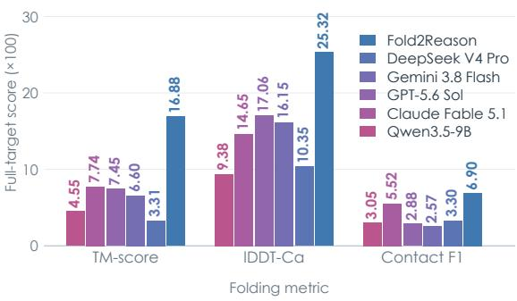

(b) General transfer of Fold2Reason  
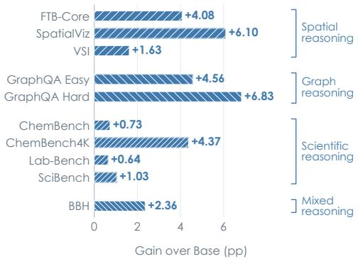  
Figure 1: Folding performance and transfer to general reasoning. (a) Full-target folding scores on all 334 FoldBench proteins (Xu et al., 2025), for FOLD2REASON and for general-purpose language models prompted to emit Cα coordinates directly. (b) Gains of FOLD2REASON over its base model on the ten General-10 benchmarks, in percentage points, grouped into the four reasoning categories used throughout the paper.

## 1 INTRODUCTION

Finite human-written text and code motivate alternative supervision for language models (Raffel et al., 2020; Gao et al., 2020; Soldaini et al., 2024; Villalobos et al., 2024; Muennighoff et al., 2023). Instruction tuning, synthetic logic, and code training can improve behavior beyond their source domains (Ouyang et al., 2022; Chung et al., 2024; Wang et al., 2023; Morishita et al., 2024; Ma et al., 2023). Yet specialized training can also leave broader behavior unchanged or worse (Huan et al., 2025; Liu et al., 2026). Which properties of supervision support general transfer remains open.

We hypothesize that structurally constrained tasks can help a model acquire, or more reliably invoke, computation reusable outside the training domain. We test behavioral transfer without claiming to identify its underlying computation. Our source should offer multiple structural targets, automatic answer verification, and scale; these criteria do not imply that more labels necessarily yield more transfer.

Protein folding provides this setting. Advances in structure prediction (Jumper et al., 2021; Abramson et al., 2024; Baek et al., 2021; Ahdritz et al., 2024), geometric learning (Fuchs et al., 2020; Satorras et al., 2021), and protein language models (Rives et al., 2021; Lin et al., 2023; Su et al., 2024; Hayes et al., 2025) demonstrate learnable sequence–structure relationships. Solved coordinates in the Protein Data Bank (wwPDB Consortium, 2019) yield deterministic contact, distance, orientation, and coordinate targets without additional annotation, enabling a test of transfer from scientific structures to non-protein tasks.

We construct FoldingCorpus by applying 12 deterministic structural operators to the OpenFold monomer short-protein collection (Ahdritz et al., 2024), producing question–answer examples verified against source coordinates. FoldingCorpus names this dataset and its discrete answer supervision; FOLD2REASON combines it with continuous geometry supervision.

FOLD2REASON post-trains Qwen3.5-9B (Qwen Team, 2026a) through a shared, training-time workspace. FoldingCorpus answers supervise its native language head; a frozen coordinate and distogram decoder supplies continuous geometry supervision to the same LoRA-adapted representations (Hu et al., 2022). External evaluation retains only the adapted language model, removing protein inputs, the workspace, and the geometry decoder (Figure 1). This tests whether the learned parameter updates transfer beyond the protein interface used to obtain them.

Across three independently trained adapters, FOLD2REASON raises the General-10 macro from 45.09% to 48.33% (+3.23 pp), with positive dataset means across text, image, and video tasks. FoldingCorpus-only gains extend across three Qwen3.5 scales (Qwen Team, 2026b;c;a) and InternVL3.5-8B (Wang et al., 2025b), while Gemma-4-12B-IT (Gemma Team, 2026) is neutral. An independent 50–4,000-protein study peaks at +3.70 pp with 2,000 proteins under a fixed-epoch schedule that increases coverage and optimization steps together. Component ablations locate most transfer in FoldingCorpus supervision (+2.93 pp without Geometry); Geometry adds 0.30 pp overall, with its increments concentrated in spatial evaluations and local structural readouts. These results support behavioral transfer with model and task dependence, rather than uniform improvement in reasoning.

Our main contributions are:

• Data infra. We construct a new post-training dataset , FoldingCorpus, from existing protein structures. Its core contains 1,200 proteins and 14,400 question–answer records across 12 structural operators, with 1,000 training, 100 development, and 100 frozen-test proteins. Cluster-disjoint core partitions and independently recomputed answers make the supervision auditable. FoldingCorpus turns scientific coordinates into a concrete data resource for studying general reasoning transfer.

• Method. We convert known structures into two exactly checkable training signals and route them through a single shared interface: discrete FoldingCorpus answers supervise the native language head, while a frozen coordinate decoder constrains the same LoRA-adapted residue states. Downstream evaluation uses the adapted base model alone.

• Findings. Post-training on protein structure improves a general language model on reasoning tasks that contain no proteins, no structural inputs, and no specialized modules. Across three seeds and 10 general-purpose benchmarks, FOLD2REASON raises the macro-average from 45.09% to 48.33% (+3.23 pp), with positive mean changes on all 10 datasets.

## 2 RELATED WORK

Protein folding and its alignment with language models. Supervised geometric pipelines made structure prediction reliable (Jumper et al., 2021; Baek et al., 2021; Ahdritz et al., 2024; Abramson et al., 2024), and a recent review reports that predicted coordinates now serve as working models across drug discovery, enzyme engineering, and disease biology (Yin et al., 2026). Geometric generative models also synthesize protein backbones using flow matching (Bose et al., 2024). A parallel line moves structure into language models: protein language models fold directly or absorb structural states into their vocabulary (Lin et al., 2023; Su et al., 2024; Hayes et al., 2025), and recent work aligns a sequence model with a structural graph encoder (Chen et al., 2025). Protein encoders are also connected to general-purpose LLMs for protein understanding (Xiao et al., 2025a; Shu et al., 2025; Xiao et al., 2025b), while 3D-MoLM aligns molecular structure with text for molecule–text tasks (Li et al., 2024). These alignment efforts evaluate molecular or protein capabilities. We instead use protein structure as a training signal and measure downstream reasoning after the protein view, workspace, and geometry decoder have been detached.

What training data builds general capability. A complementary literature asks which data makes a model more capable. Corpus work documented composition (Raffel et al., 2020; Gao et al., 2020; Soldaini et al., 2024) before attention turned to the ceiling of human-written text (Villalobos et al., 2024; Muennighoff et al., 2023). Recent work therefore engineers data rather than collecting it, by targeting pretraining selection at downstream tasks (Mizrahi et al., 2025), synthesizing corpora (Yang et al., 2025b; Morishita et al., 2024), and training against verifiable answers (Lambert et al., 2024; DeepSeek-AI, 2025; Ma et al., 2025). How far such training travels is now measured directly, with mixed results (Ma et al., 2023; Huan et al., 2025; Chu et al., 2025; Liu et al., 2026). Complementary studies identify distribution mismatch in offline self-correction training (Kumar et al., 2025) and analyze how finetuning changes predictions on other examples (Ren & Sutherland, 2025). A recent survey organizes the resulting data-centric design space (Liang et al., 2026). Program-generated logic and verifiable-reward training already provide checkable supervision (Morishita et al., 2024; Lambert et al., 2024; DeepSeek-AI, 2025). FoldingCorpus draws its answer targets from three-dimensional protein coordinates, extending these sources of structured supervision to a scientific structural archive.

## 3 METHOD

## 3.1 TRAINING TARGETS: KNOWN ANSWERS, HIDDEN EVIDENCE

For a protein of length L, let x contain the amino-acid sequence and optional MSA or template evidence, $Y \in \mathbb { R } ^ { L \times 4 \times 3 }$ its known backbone coordinates, and m the residue-validity mask. Coordinates generate targets and losses and remain outside the model input. Qwen processes a prompt with one marker per residue, producing

$$
H = f _ { \theta } ( x ) _ { \mathrm { r e s } } \in \mathbb { R } ^ { L \times 4 0 9 6 } ,\tag{1}
$$

where the base weights are frozen and θ includes trainable LoRA parameters.

Each protein yields one packed set of 12 questions. Programs over Y create contact, distance comparison, segment orientation, center proximity, local direction, chirality, multi-constraint, and global-summary labels. Nine answers are binary, two are three-way, and one is a 32-way textual summary match; every option is one vocabulary token. For example, the program computes the answer to “do residues 23 and 147 contact?” from Y , and Qwen predicts that target from the protein view and learned states. Appendix B gives the mathematical definition, threshold, sampling rule, and observed training-label count for every operator.

We construct these packs once, independently recompute the answers, and retain the numerical evidence in an audit record rather than the prompt. Independent hash salts determine label sampling, option order, and question order; the frozen packs are reused across epochs. The 32-way question chooses among one target summary and 31 hard-negative summaries. It remains ordinary answertoken supervision, distinct from the separate retrieval-projection objective, which is disabled in the canonical recipe.

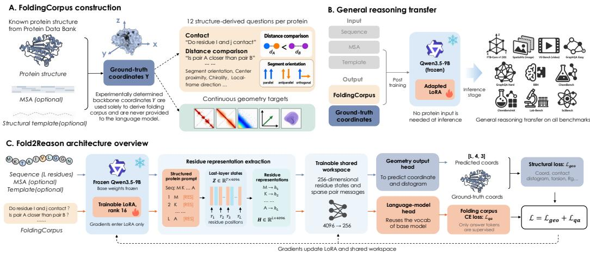  
Figure 2: The FOLD2REASON pipeline from protein structures to general reasoning transfer. (a) Known protein structures generate deterministic FoldingCorpus labels and continuous geometry targets; ground-truth coordinates are used only for supervision. (b) The adapted model transfers to general reasoning benchmarks without protein inputs at inference. (c) A frozen language-model backbone with trainable LoRA and a shared workspace feeds FoldingCorpus and geometry readouts during post-training.

## 3.2 ONE WORKSPACE, TWO READOUTS

The workspace $W _ { \phi }$ reduces marker states to 256 dimensions, exchanges messages over sequence-local pairs and sampled long-range pairs, and returns two readouts:

$$
( E , M ) = W _ { \phi } ( H ) , \qquad E \in \mathbb { R } ^ { L \times 4 0 9 6 } , \quad M \in \mathbb { R } ^ { 1 6 \times 4 0 9 6 } .\tag{2}
$$

E is residue aligned. Sixteen learned queries pool the residue set and project it back to LM width, giving evidence tokens M. “Workspace” refers only to these training-time residue and pooled tensors.

Pairs connect sequence offsets 1–4 and evenly spaced longer-range indices, with at most 2,048 pairs per protein; target contacts do not select the edges. Symmetric features combine absolute differences and elementwise products of the reduced states. Messages are averaged at incident residues, followed by residual updates. Learned-query pooling forms M, providing a fixed-size prefix while E preserves residue-level correspondence (Jaegle et al., 2021; Li & Liang, 2021).

The FoldingCorpus path prepends M to the packed question sequence $q .$ Prefix and prompt positions are ignored; only the 12 answer tokens and EOS are supervised, giving the answer loss $\mathcal { L } _ { \mathrm { { q a } } } \mathrm { { : } }$

$$
\mathcal { L } _ { \mathrm { q a } } = - \frac { 1 } { | S | } \sum _ { t \in S } \log p _ { \theta , \phi } ( y _ { t } \mid M , q , y _ { < t } ) .\tag{3}
$$

The geometry path passes E to a frozen coordinate and distogram decoder $g _ { \psi }$ . Its loss combines coordinate, pair-distance, contact, distogram, local-frame, torsion, and radius-of-gyration terms:

$$
\mathcal { L } _ { \mathrm { g e o } } = \mathcal { L } _ { \mathrm { c o o r d } } + \mathcal { L } _ { \mathrm { p a i r } } + \mathcal { L } _ { \mathrm { c o n t a c t } } + \mathcal { L } _ { \mathrm { d i s t } } + \mathcal { L } _ { \mathrm { l o c a l } } + \mathcal { L } _ { \mathrm { t o r s i o n } } + \mathcal { L } _ { R _ { g } } .\tag{4}
$$

Freezing ψ prevents a new coordinate head from absorbing the objective; gradients must change the shared workspace and LoRA. The canonical objective is $\dot { \mathcal { L } } = \mathcal { L } _ { \mathrm { q a } } \dot { + } \mathcal { L } _ { \mathrm { g e o } } .$ . One FoldingCorpus target is a 32-way textual classification task and is trained through the same native language-model head as the other FoldingCorpus answers. Appendix E documents the provenance, training data, and freeze checks for $g _ { \psi }$

Each training example uses two forwards through the same LoRA-adapted Qwen: the protein forward produces $H ,$ , and the answer forward consumes the concatenation of M with the embedded question– answer sequence. We retain the computation graph between them, so answer loss updates both the answering parameters and the protein-to-workspace path. Freezing the decoder means excluding ψ from the optimizer, not detaching $E ;$ geometry gradients therefore still reach $\phi$ and the shared LoRA parameters. This limits adaptation of the readout itself, without equating structural decodability with a particular reasoning mechanism (Hewitt & Liang, 2019; Ravichander et al., 2021).

Only LoRA and the active workspace parameters are optimized. In the canonical run, four workers accumulate two one-protein microsteps, giving eight proteins per update. We average answer CE over the 12 labels and EOS, combine it with geometry loss, and clip the accumulated gradient norm to 1.0 before each AdamW update (Loshchilov & Hutter, 2019). At transfer evaluation, we discard $W _ { \phi }$ and $g _ { \psi }$ and apply only the learned LoRA adapter to the model’s native benchmark interface. Thus, any measured transfer must reside in the adapted model rather than the protein-specific modules.

## 4 EXPERIMENTAL DESIGN

Training. We train Qwen3.5-9B (Qwen Team, 2026a) on 1,000 proteins: 336 sequence-only, 332 sequence+MSA, and 332 sequence+MSA+template views. Lengths range from 29 to 199. The resulting 12,000 FoldingCorpus records are packed into one example per protein. LoRA is applied to audited attention and feed-forward projections (rank 16, alpha 32, dropout 0.05; 43.28M parameters); the workspace has 3.90M parameters and the frozen decoder 3.31M. Every run uses three epochs, 375 optimizer steps, four A800-80G GPUs, and seeds 20260729, 20260803, and 20260804. All checkpoints are evaluated at epoch 3/step 375, without benchmark-based selection. Appendix A gives the complete contract, and Appendix E gives the frozen decoder protocol.

Evaluation. General-10 is the unweighted macro over FTB-Core, SpatialViz, VSI, GraphQA Easy and Hard, BBH, ChemBench, ChemBench4K, Lab-Bench, and SciBench:

$$
\Delta _ { \mathrm { G 1 0 } } = \frac { 1 } { 1 0 } \sum _ { d = 1 } ^ { 1 0 } \left[ s _ { d } ( \mathrm { a d a p t e r } ) - s _ { d } ( \mathbf { B } \mathrm { a S E } ) \right] .\tag{5}
$$

FTB-Core is our internally constructed text benchmark for transferable 3D reasoning. It contains 12,000 fixed questions covering spatial primitives, constraint satisfaction, packing and clearance, SE(3) transformations and symmetry, and noisy evidence fusion. SpatialViz evaluates imagegrounded spatial reasoning (Wang et al., 2025a), and VSI evaluates video-grounded spatial understanding (Yang et al., 2025a). GraphQA Easy and Hard test reasoning over graph structure (Fatemi et al., 2023). BBH covers diverse hard reasoning tasks (Suzgun et al., 2022). ChemBench (Mirza et al., 2025) and ChemBench4K from ChemLLM (Zhang et al., 2024) are separately sourced chemistry question-answering benchmarks. Lab-Bench targets laboratory and scientific workflow reasoning (Laurent et al., 2024), and SciBench tests scientific problem solving (Wang et al., 2024). All 76,725 examples are included. FTB-Core, SpatialViz, and VSI enter the macro as three of the ten datasets and carry no extra weight. FoldBench334 uses the monomer targets from FoldBench (Xu et al., 2025), drawn from the Protein Data Bank (wwPDB Consortium, 2019); we report TM-score (Zhang & Skolnick, 2004), lDDT-Cα (Mariani et al., 2013), contact F1, and Cα distance MAE. Figure 1(a) additionally compares the full folding system with direct coordinate generation by general-purpose language models, including the unadapted Qwen3.5-9B backbone. This comparison averages all 334 targets, including incomplete predictions, using the full-target scoring rules in Appendix J. Appendices C and D document the fixed FTB-Core generator and the prompt, decoding, media-sampling, parser, and invalid-answer contract for every benchmark. External9 applies the same unweighted macro to the nine public benchmarks and isolates transfer beyond the internally generated FTB-Core.

The unit of replication is an independently trained adapter. We report the mean and sample SD across three training seeds.

Ablations and controls. The ablation arms follow the naming in Table 2. FoldingCorpus-only denotes training on the dataset’s answer loss with no Geometry objective. It appears in two configurations: the w/o Geometry arm of Table 2, which keeps the workspace, and the Pure-LoRA setting used for the matched controls and the model-family study, which does not. The w/o FoldingCorpus arm removes FoldingCorpus CE while retaining protein inputs, the Geometry objective, and the historical retrieval auxiliary; we therefore analyze it as a geometry-dominant historical arm. Fold2Reason-full combines FoldingCorpus CE and Geometry; appendix tables and figures label this arm Full RG. The component ablations use the same base model, training endpoint, seeds, and General-10 evaluation protocol as Fold2Reason-full. We use these ablations to localize which loss path drives external transfer and which path improves structural readout.

## 5 RESULTS

## 5.1 GENERAL-10 TRANSFER AND MATCHED FOLDINGCORPUS-FORMAT CONTROLS

FOLD2REASON improves General-10 from 45.09% to 48.33%, a change of 3.23 pp (SD 0.15 pp). Seed changes are 3.19, 3.12, and 3.40 pp. The largest mean changes occur on GraphQA Hard (+6.83 pp), SpatialViz (+6.10 pp), GraphQA Easy (+4.56 pp), and ChemBench4K (+4.37 pp), and the text-only seven-dataset macro rises by 2.93 pp. Removing GraphQA Easy and Hard leaves an eight-dataset macro gain of 2.62 pp and a five-dataset text-only gain of 1.83 pp, and excluding FTB-Core leaves an External9 gain of +3.14 pp. The aggregate gain is therefore distributed across modalities and benchmark families, with positive mean changes on all 10 datasets.

Table 1: Dataset-level General-10 results for matched FoldingCorpus-format controls and the full FOLD2REASON recipe. Values are mean accuracies in percent over three seeds; parentheses report absolute change from BASE in percentage points. Categories follow Figure 1(b). Green/red cells indicate gains/declines; stronger shading indicates larger absolute changes on a shared scale. The three controls share the same LoRA recipe, supervised-token budget, seeds, and full General-10 evaluation.
<table><tr><td rowspan="2">Category</td><td rowspan="2">Benchmark</td><td rowspan="2">BASE</td><td colspan="4">Post-training</td></tr><tr><td>Hidden Geom.</td><td>Format Copy</td><td>Fixed Shuffle</td><td>FOLD2REASON</td></tr><tr><td rowspan="3">Spatial reasoning</td><td>FTB-Core</td><td>36.18</td><td>37.25 (+1.07)</td><td>36.04 (-0.14)</td><td>35.41 (-0.77)</td><td>40.26 (+4.08)</td></tr><tr><td>SpatialViz</td><td>26.61</td><td>23.16 (-3.45)</td><td>28.56 (+1.95)</td><td>25.76 (-0.85)</td><td>32.71 (+6.10)</td></tr><tr><td>VSI Bench</td><td>58.53</td><td>59.22 (+0.69)</td><td>56.32 (-2.21)</td><td>58.42 (-0.11)</td><td>60.16 (+1.63)</td></tr><tr><td rowspan="2">Graph reasoning</td><td>GraphQA Easy</td><td>65.14</td><td>66.90 (+1.76)</td><td>63.95 (-1.19)</td><td>64.91 (-0.23)</td><td>69.70 (+4.56)</td></tr><tr><td>GraphQA Hard</td><td>32.65</td><td>34.83 (+2.18)</td><td>33.95 (+1.30)</td><td>35.88 (+3.23)</td><td>39.48 (+6.83)</td></tr><tr><td rowspan="4">Scientific reasoning</td><td>ChemBench</td><td>66.76</td><td>66.64 (-0.12)</td><td>67.44 (+0.68)</td><td>62.85 (-3.91)</td><td>67.49 (+0.73)</td></tr><tr><td>ChemBench4K</td><td>63.56</td><td>65.93 (+2.37)</td><td>64.35 (+0.79)</td><td>61.44 (-2.12)</td><td>67.93 (+4.37)</td></tr><tr><td>Lab-Bench</td><td>37.21</td><td>38.43 (+1.22)</td><td>38.24 (+1.03)</td><td>36.58 (-0.63)</td><td>37.86 (+0.64)</td></tr><tr><td>SciBench</td><td>9.83</td><td>12.19 (+2.36)</td><td>10.40 (+0.57)</td><td>12.36 (+2.53)</td><td>10.86 (+1.03)</td></tr><tr><td>Mixed reasoning</td><td>BBH</td><td>54.45</td><td>55.56 (+1.11)</td><td>50.79 (-3.66)</td><td>54.61 (+0.16)</td><td>56.81 (+2.36)</td></tr><tr><td colspan="2">General-10 macro</td><td>45.09</td><td>46.01 (+0.92)</td><td>45.01 (-0.09)</td><td>44.82 (-0.27)</td><td>48.33 (+3.23)</td></tr></table>

Matched controls separate correct input–target correspondence from geometry-target and answerformat alternatives. Three Pure-LoRA controls share the Qwen3.5-9B base model, 12-question packing, 375 optimizer steps, checkpoint selection, and three training seeds. Hidden Geometry keeps the protein prompts but recomputes each pack’s answers from one unobserved random point structure; Format Copy supplies donor answer codes and trains the model to copy them; Fixed Shuffle keeps the original prompts but assigns fixed donor labels matched by operator and candidate vocabulary, detailed in Appendix A.2.

Table 1 shows that Hidden Geometry improves the General-10 macro by 0.92 pp, whereas Format Copy changes it by −0.09 pp and Fixed Shuffle by −0.27 pp. Thus, input-independent but internally coherent geometry targets retain some transfer, while copying valid answer codes or learning a fixed input–label mismatch does not yield a consistent aggregate gain. Protein-derived FOLD2REASON reaches +3.23 pp, more than twice the strongest control, so its benefit cannot be explained by answer formatting or fixed shuffled supervision alone. The FTB-Core and SpatialViz gains persist on questions with valid outputs from both models; Appendix H.1 reports the parsing audit, task concentration, and remaining answer-selection-bias limitations.

## 5.2 FOLDINGCORPUS SUPERVISION TRANSFERS ACROSS MODEL SCALES AND FAMILIES

We further test the model-level generality of FoldingCorpus supervision with the same Pure-LoRA comparison on three Qwen3.5 scales and two independent multimodal model families, InternVL3.5 and Gemma-4. Each setting is evaluated on the full General-10 suite over three training seeds. Figure 3 shows that the improvement persists across all three Qwen3.5 scales and transfers to InternVL3.5-8B. FoldingCorpus supervision raises General-10 by 5.41, 4.84, and 3.22 pp for Qwen3.5-2B, 4B, and 9B, respectively. The InternVL result raises General-10 by 1.53 pp, with a positive change for every seed.

(a) Overall transfer

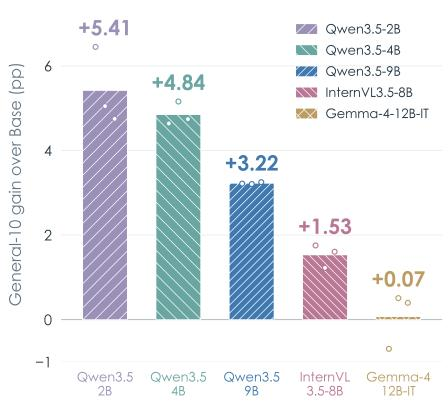  
(b) Transfer across benchmarks

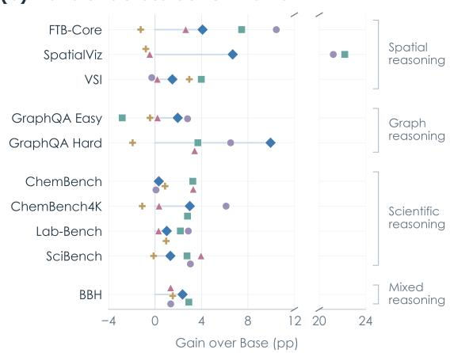  
Figure 3: FoldingCorpus supervision across model scales and families. (a) General-10 change relative to each model’s own base checkpoint. Bars show the three-seed mean and open circles show the individual seeds. (b) The same change resolved per benchmark, with one marker shape and colour per model and the categories of Figure 1(b). The horizontal axis is broken to accommodate the large SpatialViz gains of the two smaller Qwen3.5 models.

Figure 3(b) resolves these aggregates by benchmark and shows that no single dataset carries them: all four reasoning categories contribute, and the largest single effects are the SpatialViz gains of Qwen3.5-2B and 4B. Architecture nonetheless shapes the magnitude: Gemma-4-12B-IT remains at its base level (+0.07 pp, two positive and one negative seed), so the positive InternVL result establishes transfer beyond Qwen while the neutral Gemma result identifies meaningful family dependence.

## 5.3 GENERAL TRANSFER UNDER JOINT SCALING OF PROTEIN COVERAGE AND TRAINING STEP

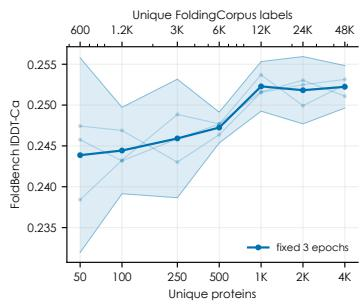

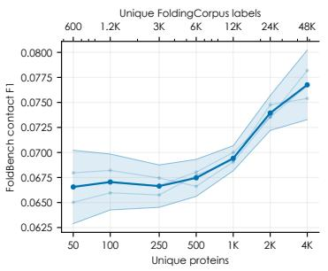

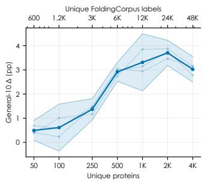  
Figure 4: Data scaling of structural readout and general transfer. The three panels report FoldBench lDDT-Cα, FoldBench Contact F1, and General-10 change for an independent three-seed Qwen3.5-9B Full-RG scaling run over seven nested subsets spanning 50–4,000 proteins. Every subset is trained for three epochs. Thin curves show individual seeds, center curves show means, and transparent bands with boundary lines show three-seed 95% t-intervals. The upper axis gives the corresponding number of FoldingCorpus records at 12 targets per protein.

We study seven nested training sets spanning 50–4,000 proteins, equivalent to 600–48,000 unique FoldingCorpus targets, with all 12 targets retained per protein and three training seeds at every scale. Training each set for three epochs yields 21, 39, 96, 189, 375, 750, and 1,500 optimizer steps. The corresponding General-10 gains are 0.49, 0.61, 1.37, 2.92, 3.31, 3.70, and 3.02 pp (Figure 4). Transfer therefore strengthens continuously from 50 to 2,000 proteins, peaks at +3.70 pp, and remains strong at $+ 3 . 0 2 \mathrm { p p }$ with 4,000 proteins, indicating diminishing returns beyond 2,000 proteins under this schedule.

The source-side diagnostics follow a different profile. Held-out FoldingCorpus accuracy rises from 0.478 at 50 proteins to 0.546 at 2,000 and becomes unstable at 4,000 (three-seed mean 0.418); FoldBench lDDT-Cα increases from 0.244 to 0.252 and then saturates, while Contact F1 keeps rising from 0.0666 to 0.0768. General-10 stays positive despite the 4,000-protein instability, so downstream transfer is not determined by endpoint FoldingCorpus accuracy alone.

Appendix L reports all endpoint, seed-level, and checkpoint results.

## 5.4 ABLATIONS: FOLDINGCORPUS DRIVES BROAD TRANSFER WHILE GEOMETRY CONCENTRATES ON 3D

Table 2: Component results on external benchmarks over three seeds. Values are mean accuracies in percent; parentheses report absolute change from BASE in percentage points. The 3D macro averages FTB-Core, SpatialViz, and VSI; Text G7 averages the remaining seven General-10 datasets.
<table><tr><td>Arm</td><td>G10</td><td>3D macro</td><td>FTB</td><td>SpatialViz</td><td>VSI</td><td>Text G7</td></tr><tr><td>BASE</td><td>45.09</td><td>40.44</td><td>36.18</td><td>26.61</td><td>58.53</td><td>47.09</td></tr><tr><td>w/o FoldingCorpus</td><td> $4 5 . 7 7 \ : ( + 0 . 6 8 )$ </td><td> $4 1 . 4 7 \ : ( + 1 . 0 3 )$ </td><td> $3 8 . 4 4 \ ( + 2 . 2 6 )$ </td><td> $2 7 . 4 0 ( + 0 . 7 9 )$ </td><td> $5 8 . 5 8 \ : ( + 0 . 0 5 )$ </td><td>47.61 (+0.52)</td></tr><tr><td>w/o Geometry</td><td> $4 8 . 0 2 \ : ( + 2 . 9 3 )$ </td><td> $4 3 . 3 0 \ : ( + 2 . 8 6 )$ </td><td> $3 9 . 0 0 \ : ( + 2 . 8 1 ) $ </td><td> $3 1 . 8 1 \ : ( + 5 . 2 0 )$ </td><td> $5 9 . 0 8 \ : ( + 0 . 5 4 )$ </td><td>50.05 (+2.96)</td></tr><tr><td>Fold2Reason-full</td><td>48.33 (+3.23)</td><td> $4 4 . 3 8 \ : ( + 3 . 9 4 )$ </td><td> ${ \bf 4 0 . 2 6 \ ( + 4 . 0 8 ) }$ </td><td> ${ \bf 3 2 . 7 1 \ ( + 6 . 1 0 ) }$ </td><td>60.16 (+1.63)</td><td>50.02 (+2.93)</td></tr></table>

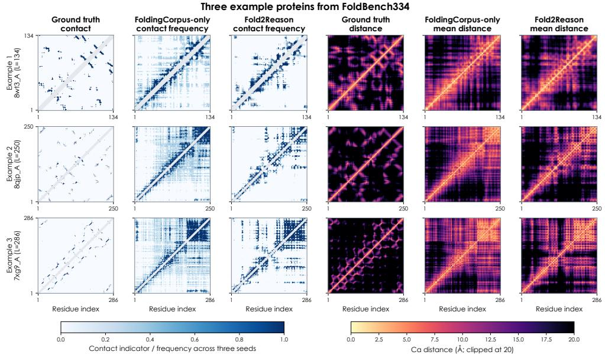  
Figure 5: Contact and distance maps for three example proteins. Rows show three FoldBench334 proteins of increasing length $( 8 \mathrm { w t 3 \_ A } , L = 1 3 4 ; 8 \mathrm { q j p \_ A } , L = 2 5 0 ; 7 \mathrm { x g 9 \_ A } , L = 2 8 6 )$ , comparing ground truth, FoldingCorpus-only, and Fold2Reason. Contacts use Cα distance $< 8 \mathring \mathrm { A }$ and sequence separation ≥ 6; predicted maps show frequency across all three seeds, with gray diagonal bands marking excluded near-sequence pairs. Distance maps show the three-seed mean, clipped at 20 Å. Panels are unsmoothed and cover the complete protein.

The w/o Geometry arm raises General-10 by 2.93 pp, so FoldingCorpus question answering accounts for most of the external effect. Paired by seed, Fold2Reason-full minus w/o Geometry is 0.57, 0.49, and −0.15 pp (mean +0.30 pp); the sign change across seeds makes this broad-transfer estimate seed-sensitive. That increment is not spread evenly within General-10: relative to w/o Geometry, Fold2Reason-full gains 1.26 pp on FTB-Core, 0.90 pp on SpatialViz, and 1.08 pp on VSI, raising their 3D macro by 1.08 pp while changing Text G7 by −0.03 pp. This 3D-specific difference is conditional on keeping the workspace; Pure LoRA has a slightly higher 3D macro than Full (44.54% versus 44.38%).

The structural readout follows the complementary pattern (Appendix K, Table 17). Relative to the workspace-equipped w/o Geometry arm, Fold2Reason-full increases mean lDDT-Cα by 0.00973 and Contact F1 by 0.00629, while TM-score decreases by 0.00214 and Cα distance MAE increases by 0.148 Å; the geometry-dominant w/o FoldingCorpus arm preserves these readouts near the full model. The Geometry signal is therefore concentrated in local structure, making residue neighborhoods and contacts more recoverable from the shared representation while global topology does not improve under this decoder. The absolute Full scores (TM-score 0.1688 and lDDT-Cα 0.2532) place this result in the regime of structural decodability; competitive protein folding requires substantially stronger global reconstruction. Read through its native LM head on the same 334 targets, the unadapted Qwen3.5-9B backbone scores 4.55 TM-score, 9.38 lDDT-Cα, and 3.05 Contact F1 against 16.88, 25.32, and 6.90 for FOLD2REASON (all scores ×100; Figure 1a), and FOLD2REASON also leads the best per-metric values of the four other general-purpose systems in that panel. Appendix K.1 reports the full-cohort distribution of the paired per-protein changes and repeats the audit on three cases fixed at the lower, median, and higher quantiles of the per-protein Contact F1 change before any map was inspected.

Figure 5 complements the aggregate distribution with three individual proteins. Fold2Reason-full produces sharper and less diffuse contact frequencies than FoldingCorpus-only in all three, and its mean distance maps show more pronounced block structure, while both adapted models remain far from the ground-truth global contact topology: Geometry sharpens selected local and pairwise structure while global reconstruction remains unreliable.

Across the three arms, FoldingCorpus supervision governs broad behavioral transfer and Geometry shapes local structural decodability and 3D-targeted behavior; the w/o FoldingCorpus arm retains lDDT and contact readouts near Fold2Reason-full while producing smaller FTB and SpatialViz gains.

## 6 DISCUSSION AND CONCLUSION

FOLD2REASON turns known protein structures into two training signals for a general language model: verified FoldingCorpus answers through the native LM head and continuous geometry through a frozen structural reader, with separable behavioral and representational effects. FoldingCorpus answers account for most of the 3.23 pp General-10 gain, positive on every dataset mean. Geometry adds a smaller increment on 3D-oriented evaluations (+1.26 pp on FTB-Core over the workspaceequipped w/o Geometry arm) and local structural decodability, raising lDDT-Cα and Contact F1 while TM-score dips marginally and global folding quality stays low.

Matched controls locate the broader signal: hidden random-geometry targets improve the aggregate, whereas format copying and fixed shuffled labels remain near zero on average. Real protein structure is strongest among the tested sources, and the gap cannot be reduced to learning the answer format alone. Across 50–4,000 proteins, transfer peaks at 2,000 when data breadth and compute scale together, whereas raising labels per protein from 3 to 12 at fixed coverage and optimizer steps gives no monotonic gain (Appendix L.3): the evidence supports transfer from protein-derived supervision, not label density. Whether this reflects reusable reasoning, more reliable use of pretrained capabilities, or answer-format adaptation remains unresolved. Gains extend to InternVL3.5-8B and Qwen3.5-2B, 4B, and 9B but not Gemma-4-12B-IT, implicating architecture and adaptation dynamics.

These claims rest on 1,000 training proteins, rank-16 adapters, three seeds, and General-10, and the frozen decoder measures structural decodability, not accurate global reconstruction. Protein splits are cluster-disjoint, but FoldBench uses only exact-sequence and 5-mer screening with known scalingpool overlaps, leaving remote-homology and novel-fold generalization unverified; task heterogeneity and answer-format ambiguity further qualify behavioral gains (Appendices H, D, and L). Broader benchmarks and corpora, stronger decoders, and more architectures come next. Within these limits, a solved scientific problem becomes usable post-training data for general reasoning.

## REFERENCES

Josh Abramson, Jonas Adler, Jack Dunger, Richard Evans, Tim Green, Alexander Pritzel, Olaf Ronneberger, Lindsay Willmore, Andrew J. Ballard, Joshua Bambrick, Sebastian W. Bodenstein, et al. Accurate structure prediction of biomolecular interactions with AlphaFold 3. Nature, 630 (8016):493–500, 2024. doi: 10.1038/s41586-024-07487-w. URL https://doi.org/10. 1038/s41586-024-07487-w.

Gustaf Ahdritz, Nazim Bouatta, Christina Floristean, Sachin Kadyan, Qinghui Xia, William Gerecke, Timothy J. O’Donnell, Daniel Berenberg, Ian Fisk, Niccolo Zanichelli, Bo Zhang, Arkadiusz Nowaczynski, Bei Wang, Marta M. Stepniewska-Dziubinska, Shang Zhang, Adegoke Ojewole, Murat Efe Guney, Stella Biderman, Andrew M. Watkins, Stephen Ra, Pablo Ribalta Lorenzo, Lucas Nivon, Brian D. Weitzner, Yih-En Andrew Ban, Peter K. Sorger, Emad Mostaque, Zhao Zhang, Richard Bonneau, and Mohammed AlQuraishi. OpenFold: Retraining AlphaFold2 yields new insights into its learning mechanisms and capacity for generalization. Nature Methods, 21: 1514–1524, 2024. doi: 10.1038/s41592-024-02272-z. URL https://doi.org/10.1038/ s41592-024-02272-z.

Minkyung Baek, Frank DiMaio, Ivan Anishchenko, Justas Dauparas, Sergey Ovchinnikov, Gyu Rie Lee, Jue Wang, Qian Cong, Lisa N. Kinch, R. Dustin Schaeffer, Claudia Millan, Hahnbeom Park, Carson Adams, et al. Accurate prediction of protein structures and interactions using a three-track neural network. Science, 373(6557):871–876, 2021. doi: 10.1126/science.abj8754. URL https://doi.org/10.1126/science.abj8754.

Joey Bose, Tara Akhound-Sadegh, Guillaume Huguet, Kilian Fatras, Jarrid Rector-Brooks, Chenghao Liu, Andrei Nica, Maksym Korablyov, Michael Bronstein, and Alexander Tong. SE(3)-stochastic flow matching for protein backbone generation. In International Conference on Learning Representations, 2024. URL https://proceedings.iclr.cc/paper\_files/paper/2024/ file/618c95f4557c15b253fb0e6f548ea0c0-Paper-Conference.pdf.

Can Chen, David Heurtel-Depeiges, Robert M. Vernon, Christopher James Langmead, Yoshua Bengio, and Quentin Fournier. Structure-aligned protein language model, 2025. URL https: //arxiv.org/abs/2505.16896.

Tianzhe Chu, Yuexiang Zhai, Jihan Yang, Shengbang Tong, Saining Xie, Dale Schuurmans, Quoc V. Le, Sergey Levine, and Yi Ma. SFT memorizes, RL generalizes: A comparative study of foundation model post-training, 2025. URL https://arxiv.org/abs/2501.17161.

Hyung Won Chung, Le Hou, Shayne Longpre, Barret Zoph, Yi Tay, William Fedus, Yunxuan Li, Xuezhi Wang, Mostafa Dehghani, Siddhartha Brahma, Albert Webson, Shixiang Shane Gu, Zhuyun Dai, Mirac Suzgun, Xinyun Chen, Aakanksha Chowdhery, Alex Castro-Ros, Marie Pellat, Kevin Robinson, Dasha Valter, Sharan Narang, Gaurav Mishra, Adams Yu, Vincent Zhao, Yanping Huang, Andrew Dai, Hongkun Yu, Slav Petrov, Ed H. Chi, Jeff Dean, Jacob Devlin, Adam Roberts, Denny Zhou, Quoc V. Le, and Jason Wei. Scaling instruction-finetuned language models. Journal of Machine Learning Research, 25(70):1–53, 2024. URL https://jmlr.org/papers/v25/ 23-0870.html.

DeepSeek-AI. DeepSeek-R1: Incentivizing reasoning capability in LLMs via reinforcement learning, 2025. URL https://arxiv.org/abs/2501.12948.

Bahare Fatemi, Jonathan Halcrow, and Bryan Perozzi. Talk like a graph: Encoding graphs for large language models, 2023. URL https://arxiv.org/abs/2310.04560.

Naomi K. Fox, Steven E. Brenner, and John-Marc Chandonia. SCOPe: Structural classification of proteins—extended, integrating SCOP and ASTRAL data and classification of new structures. Nucleic Acids Research, 42(D1):D304–D309, 2014. doi: 10.1093/nar/gkt1240. URL https: //doi.org/10.1093/nar/gkt1240.

Fabian B. Fuchs, Daniel E. Worrall, Volker Fischer, and Max Welling. SE(3)-transformers: 3d roto-translation equivariant attention networks. In Advances in Neural Information Processing Systems, volume 33, pp. 1970–1981, 2020. URL https://proceedings.neurips.cc/ paper/2020/hash/15231a7ce4ba789d13b722cc5c955834-Abstract.html.

Leo Gao, Stella Biderman, Sid Black, Laurence Golding, Travis Hoppe, Charles Foster, Jason Phang, Horace He, Anish Thite, Noa Nabeshima, Shawn Presser, and Connor Leahy. The Pile: An 800GB dataset of diverse text for language modeling, 2020. URL https://arxiv.org/abs/2101. 00027.

Gemma Team. Gemma 4 technical report, 2026. URL https://arxiv.org/abs/2607. 02770.

Thomas Hayes, Roshan Rao, Halil Akin, Nicholas J. Sofroniew, Deniz Oktay, Zeming Lin, Robert Verkuil, Vincent Q. Tran, Jonathan Deaton, Marius Wiggert, Rohil Badkundri, Irhum Shafkat, Jun Gong, Alexander Derry, Raul S. Molina, Neil Thomas, Yousuf A. Khan, Chetan Mishra, Carolyn Kim, Liam J. Bartie, Matthew Nemeth, Patrick D. Hsu, Tom Sercu, Salvatore Candido, and Alexander Rives. Simulating 500 million years of evolution with a language model. Science, 387 (6736):850–858, 2025. doi: 10.1126/science.ads0018. URL https://doi.org/10.1126/ science.ads0018.

John Hewitt and Percy Liang. Designing and interpreting probes with control tasks. In Proceedings of the 2019 Conference on Empirical Methods in Natural Language Processing and the 9th International Joint Conference on Natural Language Processing, pp. 2733–2743. Association for Computational Linguistics, 2019. doi: 10.18653/v1/D19-1275. URL https: //aclanthology.org/D19-1275/.

Edward J. Hu, Yelong Shen, Phillip Wallis, Zeyuan Allen-Zhu, Yuanzhi Li, Shean Wang, Lu Wang, and Weizhu Chen. LoRA: Low-rank adaptation of large language models. In International Conference on Learning Representations, 2022. URL https://openreview.net/forum? id=nZeVKeeFYf9.

Maggie Huan, Yuetai Li, Tuney Zheng, Xiaoyu Xu, Seungone Kim, Minxin Du, Radha Poovendran, Graham Neubig, and Xiang Yue. Does math reasoning improve general LLM capabilities? understanding transferability of LLM reasoning, 2025. URL https://arxiv.org/abs/ 2507.00432.

Andrew Jaegle, Felix Gimeno, Andy Brock, Oriol Vinyals, Andrew Zisserman, and Joao Carreira. Perceiver: General perception with iterative attention. In Proceedings ofthe 38th International Conference on Machine Learning, volume 139 of Proceedings ofMachine Learning Research, pp. 4651–4664. PMLR, 2021. URL https://proceedings.mlr.press/v139/ jaegle21a.html.

John Jumper, Richard Evans, Alexander Pritzel, Tim Green, Michael Figurnov, Olaf Ronneberger, Kathryn Tunyasuvunakool, Russ Bates, August Zidek, Anna Potapenko, Alex Bridgland, Clemens Meyer, Simon A. A. Kohl, Andrew J. Ballard, Andrew Cowie, Bernardino Romera-Paredes, Stanislav Nikolov, Rishub Jain, Jonas Adler, Trevor Back, Stig Petersen, David Reiman, Ellen Clancy, Michal Zielinski, Martin Steinegger, Michalina Pacholska, Tamas Berghammer, Sebastian Bodenstein, David Silver, Oriol Vinyals, Andrew W. Senior, Koray Kavukcuoglu, Pushmeet Kohli, and Demis Hassabis. Highly accurate protein structure prediction with AlphaFold. Nature, 596 (7873):583–589, 2021. doi: 10.1038/s41586-021-03819-2. URL https://doi.org/10. 1038/s41586-021-03819-2.

Wolfgang Kabsch. A solution for the best rotation to relate two sets of vectors. Acta Crystallographica Section A, 32(5):922–923, 1976. doi: 10.1107/S0567739476001873. URL https://doi.org/ 10.1107/S0567739476001873.

Aviral Kumar, Vincent Zhuang, Rishabh Agarwal, Yi Su, John D. Co-Reyes, Avi Singh, Kate Baumli, Shariq Iqbal, Colton Bishop, Rebecca Roelofs, Lei Zhang, Kay McKinney, Disha Shrivastava, Cosmin Paduraru, George Tucker, Doina Precup, Feryal Behbahani, and Aleksandra Faust. Training language models to self-correct via reinforcement learning. In International Conference on Learning Representations,

2025. URL https://proceedings.iclr.cc/paper\_files/paper/2025/file/ 871ac99fdc5282d0301934d23945ebaa-Paper-Conference.pdf.

Nathan Lambert, Jacob Morrison, Valentina Pyatkin, Shengyi Huang, Hamish Ivison, et al. Tulu 3: Pushing frontiers in open language model post-training, 2024. URL https://arxiv.org/ abs/2411.15124.

Jon M. Laurent, Joseph D. Janizek, Michael Ruzo, Michaela M. Hinks, Michael J. Hammerling, Siddharth Narayanan, Manvitha Ponnapati, Andrew D. White, and Samuel G. Rodriques. LAB-Bench: Measuring capabilities of language models for biology research, 2024. URL https: //arxiv.org/abs/2407.10362.

Sihang Li, Zhiyuan Liu, Yanchen Luo, Xiang Wang, Xiangnan He, Kenji Kawaguchi, Tat-Seng Chua, and Qi Tian. Towards 3d molecule–text interpretation in language models. In International Conference on Learning Representations, 2024. URL https://openreview.net/forum? id=xI4yNlkaqh.

Xiang Lisa Li and Percy Liang. Prefix-tuning: Optimizing continuous prompts for generation. In Proceedings of the 59th Annual Meeting of the Association for Computational Linguistics and the 11th International Joint Conference on Natural Language Processing, pp. 4582–4597. Association for Computational Linguistics, 2021. doi: 10.18653/v1/2021.acl-long.353. URL https://aclanthology.org/2021.acl-long.353/.

Hao Liang, Zhengyang Zhao, Zhaoyang Han, Meiyi Qiang, Xiaochen Ma, Bohan Zeng, Qifeng Cai, Zhiyu Li, Linpeng Tang, Weinan E, and Wentao Zhang. Towards next-generation LLM training: From the data-centric perspective, 2026. URL https://arxiv.org/abs/2603.14712.

Zeming Lin, Halil Akin, Roshan Rao, Brian Hie, Zhongkai Zhu, Wenting Lu, Nikita Smetanin, Allan dos Santos Costa, Maryam Fazel-Zarandi, Tom Sercu, Salvatore Candido, and Alexander Rives. Evolutionary-scale prediction of atomic-level protein structure with a language model. Science, 379(6637):1123–1130, 2023. doi: 10.1126/science.ade2574. URL https://doi.org/10. 1126/science.ade2574.

Zhihan Liu, Lin Guan, Yixin Nie, Kai Zhang, Zhuoqun Hao, Lin Chen, Asli Celikyilmaz, Zhaoran Wang, and Na Zhang. Paying less generalization tax: A cross-domain generalization study of RL training for LLM agents, 2026. URL https://arxiv.org/abs/2601.18217.

Ilya Loshchilov and Frank Hutter. Decoupled weight decay regularization. In International Conference on Learning Representations, 2019. URL https://openreview.net/forum?id= Bkg6RiCqY7.

Xueguang Ma, Qian Liu, Dongfu Jiang, Ge Zhang, Zejun Ma, and Wenhu Chen. General-Reasoner: Advancing LLM reasoning across all domains, 2025. URL https://arxiv.org/abs/2505. 14652.

Yingwei Ma, Yue Liu, Yue Yu, Yuanliang Zhang, Yu Jiang, Changjian Wang, and Shanshan Li. At which training stage does code data help LLMs reasoning?, 2023. URL https://arxiv.org/ abs/2309.16298.

Valerio Mariani, Marco Biasini, Alessandro Barbato, and Torsten Schwede. lDDT: A local superposition-free score for comparing protein structures and models using distance difference tests. Bioinformatics, 29(21):2722–2728, 2013. doi: 10.1093/bioinformatics/btt473. URL https://doi.org/10.1093/bioinformatics/btt473.

Adrian Mirza, Nawaf Alampara, Sreekanth Kunchapu, Martino Rios-Garcia, Benedict Emoekabu, Aswanth Krishnan, Tanya Gupta, Mara Schilling-Wilhelmi, Macjonathan Okereke, Anagha Aneesh, et al. A framework for evaluating the chemical knowledge and reasoning abilities of large language models against the expertise of chemists. Nature Chemistry, 2025. doi: 10.1038/ s41557-025-01815-x. URL https://doi.org/10.1038/s41557-025-01815-x.

David Mizrahi, Anders Boesen Lindbo Larsen, Jesse Allardice, Suzie Petryk, Yuri Gorokhov, Jeffrey Li, Alex Fang, Josh Gardner, Tom Gunter, and Afshin Dehghan. Language models improve when pretraining data matches target tasks, 2025. URL https://arxiv.org/abs/2507.12466.

Terufumi Morishita, Gaku Morio, Atsuki Yamaguchi, and Yasuhiro Sogawa. Enhancing reasoning capabilities of LLMs via principled synthetic logic corpus. In Advances in Neural Information Processing Systems, volume 37, 2024. URL https://proceedings.neurips.cc/paper\_files/paper/2024/hash/ 8678da90126aa58326b2fc0254b33a8c-Abstract-Conference.html.

Niklas Muennighoff, Alexander M. Rush, Boaz Barak, Teven Le Scao, Aleksandra Piktus, Nouamane Tazi, Sampo Pyysalo, Thomas Wolf, and Colin Raffel. Scaling data-constrained language models. In Advances in Neural Information Processing Systems, volume 36, 2023. URL https:// arxiv.org/abs/2305.16264.

Long Ouyang, Jeff Wu, Xu Jiang, Diogo Almeida, Carroll L. Wainwright, Pamela Mishkin, Chong Zhang, Sandhini Agarwal, Katarina Slama, Alex Ray, John Schulman, Jacob Hilton, Fraser Kelton, Luke Miller, Maddie Simens, Amanda Askell, Peter Welinder, Paul Christiano, Jan Leike, and Ryan Lowe. Training language models to follow instructions with human feedback. In Advances in Neural Information Processing Systems, volume 35, pp. 27730–27744, 2022. URL https://proceedings.neurips.cc/paper\_files/paper/2022/ hash/b1efde53be364a73914f58805a001731-Abstract-Conference.html.

Qwen Team. Qwen3.5-9B model card. Hugging Face model repository, 2026a. URL https: //huggingface.co/Qwen/Qwen3.5-9B. Accessed 2026-08-06.

Qwen Team. Qwen3.5-2B model card. Hugging Face model repository, 2026b. URL https: //huggingface.co/Qwen/Qwen3.5-2B. Accessed 2026-09-21.

Qwen Team. Qwen3.5-4B model card. Hugging Face model repository, 2026c. URL https: //huggingface.co/Qwen/Qwen3.5-4B. Accessed 2026-09-21.

Colin Raffel, Noam Shazeer, Adam Roberts, Katherine Lee, Sharan Narang, Michael Matena, Yanqi Zhou, Wei Li, and Peter J. Liu. Exploring the limits of transfer learning with a unified text-to-text transformer. Journal of Machine Learning Research, 21(140):1–67, 2020. URL https://jmlr.org/papers/v21/20-074.html.

Abhilasha Ravichander, Yonatan Belinkov, and Eduard Hovy. Probing the probing paradigm: Does probing accuracy entail task relevance? In Proceedings of the 16th Conference of the European Chapter ofthe Associationfor Computational Linguistics, pp. 3363–3377. Association for Computational Linguistics, 2021. doi: 10.18653/v1/2021.eacl-main.295. URL https: //aclanthology.org/2021.eacl-main.295/.

Yi Ren and Danica Sutherland. Learning dynamics of LLM finetuning. In International Conference on Learning Representations, 2025. URL https://proceedings.iclr.cc/paper\_files/paper/2025/file/ afe1aa79e5eea7955f553c61a307273e-Paper-Conference.pdf.

Alexander Rives, Joshua Meier, Tom Sercu, Siddharth Goyal, Zeming Lin, Jason Liu, Demi Guo, Myle Ott, C. Lawrence Zitnick, Jerry Ma, and Rob Fergus. Biological structure and function emerge from scaling unsupervised learning to 250 million protein sequences. Proceedings ofthe National Academy ofSciences, 118(15):e2016239118, 2021. doi: 10.1073/pnas.2016239118. URL https://doi.org/10.1073/pnas.2016239118.

Victor Garcia Satorras, Emiel Hoogeboom, and Max Welling. E(n) equivariant graph neural networks. In Proceedings of the 38th International Conference on Machine Learning, volume 139 of Proceedings of Machine Learning Research, pp. 9323–9332. PMLR, 2021. URL https://proceedings.mlr.press/v139/satorras21a.html.

Dong Shu, Bingbing Duan, Kai Guo, Kaixiong Zhou, Jiliang Tang, and Mengnan Du. Aligning large language models and geometric deep models for protein representation, 2025. URL https: //arxiv.org/abs/2411.05316v2. arXiv:2411.05316v2, revised March 2025.

Ian Sillitoe, Natalie Dawson, Tony E. Lewis, Sayoni Das, Jonathan G. Lees, Paul Ashford, Adeyelu Tolulope, Harry M. Scholes, Ivan Senatorov, Adriana Bujan, Francisco Ceballos Rodriguez-Conde, Brendan Dowling, Janet Thornton, and Christine A. Orengo. CATH: Expanding the horizons of

structure-based functional annotations for genome sequences. Nucleic Acids Research, 47(D1): D280–D284, 2019. doi: 10.1093/nar/gky1097. URL https://doi.org/10.1093/nar/ gky1097.

Temple F. Smith and Michael S. Waterman. Identification of common molecular subsequences. Journal ofMolecular Biology, 147(1):195–197, 1981. doi: 10.1016/0022-2836(81)90087-5. URL https://doi.org/10.1016/0022-2836(81)90087-5.

Luca Soldaini, Rodney Kinney, Akshita Bhagia, Dustin Schwenk, David Atkinson, et al. Dolma: An open corpus of three trillion tokens for language model pretraining research. In Proceedings of the 62nd Annual Meeting of the Association for Computational Linguistics (Volume 1: Long Papers), pp. 15725–15788. Association for Computational Linguistics, 2024. URL https: //aclanthology.org/2024.acl-long.840.

Martin Steinegger and Johannes Söding. MMseqs2 enables sensitive protein sequence searching for the analysis of massive data sets. Nature Biotechnology, 35(11):1026–1028, 2017. doi: 10.1038/nbt.3988. URL https://doi.org/10.1038/nbt.3988.

Jin Su, Chenchen Han, Yuyang Zhou, Junjie Shan, Xibin Zhou, and Fajie Yuan. SaProt: Protein language modeling with structure-aware vocabulary. In International Conference on Learning Representations, 2024. URL https://proceedings.iclr.cc/paper\_files/paper/ 2024/hash/1c42513b8895ab11fbbb5b7e8e6b6b02-Abstract-Conference. html.

Mirac Suzgun, Nathan Scales, Nathanael Scharli, Sebastian Gehrmann, Yi Tay, Hyung Won Chung, Aakanksha Chowdhery, Quoc V. Le, Ed H. Chi, Denny Zhou, and Jason Wei. Challenging BIG-Bench tasks and whether chain-of-thought can solve them, 2022. URL https://arxiv.org/ abs/2210.09261.

Pablo Villalobos, Anson Ho, Jaime Sevilla, Tamay Besiroglu, Lennart Heim, and Marius Hobbhahn. Position: Will we run out of data? limits of LLM scaling based on human-generated data. In Proceedings ofthe 41st International Conference on Machine Learning, volume 235 of Proceedings ofMachine Learning Research, pp. 49523–49544, 2024. URL https://proceedings.mlr. press/v235/villalobos24a.html.

Siting Wang, Minnan Pei, Luoyang Sun, Cheng Deng, Yuchen Li, Kun Shao, Zheng Tian, Haifeng Zhang, and Jun Wang. SpatialViz-Bench: A cognitively-grounded benchmark for diagnosing spatial visualization in MLLMs, 2025a. URL https://arxiv.org/abs/2507.07610v7. arXiv:2507.07610v7, revised March 2026.

Weiyun Wang, Zhangwei Gao, Lixin Gu, Hengjun Pu, Long Cui, Xingguang Wei, Zhaoyang Liu, Linglin Jing, Shenglong Ye, Jie Shao, et al. InternVL3.5: Advancing open-source multimodal models in versatility, reasoning, and efficiency, 2025b. URL https://arxiv.org/abs/ 2508.18265.

Xiaoxuan Wang, Ziniu Hu, Pan Lu, Yanqiao Zhu, Jieyu Zhang, Satyen Subramaniam, Arjun R. Loomba, Shichang Zhang, Yizhou Sun, and Wei Wang. SciBench: Evaluating college-level scientific problem-solving abilities of large language models. In Proceedings of the 41st International Conference on Machine Learning, volume 235 of Proceedings of Machine Learning Research, pp. 50622–50649. PMLR, 2024. URL https://proceedings.mlr.press/ v235/wang24z.html.

Yizhong Wang, Yeganeh Kordi, Swaroop Mishra, Alisa Liu, Noah A. Smith, Daniel Khashabi, and Hannaneh Hajishirzi. Self-instruct: Aligning language models with self-generated instructions. In Proceedings of the 61st Annual Meeting of the Association for Computational Linguistics, pp. 13484–13508, 2023. doi: 10.18653/v1/2023.acl-long.754. URL https://aclanthology. org/2023.acl-long.754.

wwPDB Consortium. Protein data bank: The single global archive for 3d macromolecular structure data. Nucleic Acids Research, 47(D1):D520–D528, 2019. doi: 10.1093/nar/gky949. URL https://doi.org/10.1093/nar/gky949.

Yijia Xiao, Edward Sun, Yiqiao Jin, Qifan Wang, and Wei Wang. ProteinGPT: Multimodal LLM for protein property prediction and structure understanding. In ICLR 2025 Workshop on Machine Learningfor Genomics Explorations (MLGenX), 2025a. URL https://arxiv.org/abs/ 2408.11363.

Yijia Xiao, Wanjia Zhao, Junkai Zhang, et al. Protein large language models: A comprehensive survey. In Findings of the Association for Computational Linguistics: EMNLP 2025, pp. 23080–23103. Association for Computational Linguistics, 2025b. doi: 10.18653/v1/2025.findings-emnlp.1255. URL https://aclanthology.org/2025.findings-emnlp.1255.

Sheng Xu, Qiantai Feng, Lifeng Qiao, Hao Wu, Tao Shen, Yu Cheng, Shuangjia Zheng, and Siqi Sun. Benchmarking all-atom biomolecular structure prediction with FoldBench. Nature Communications, 17(1):442, 2025. doi: 10.1038/s41467-025-67127-3. URL https://doi. org/10.1038/s41467-025-67127-3.

Jihan Yang, Shusheng Yang, Anjali W. Gupta, Rilyn Han, Li Fei-Fei, and Saining Xie. Thinking in space: How multimodal large language models see, remember, and recall spaces. In Proceedings of the IEEE/CVF Conference on Computer Vision and Pattern Recognition, pp. 10632–10643, 2025a. URL https://openaccess.thecvf.com/content/CVPR2025/html/ Yang\_Thinking\_in\_Space\_How\_Multimodal\_Large\_Language\_Models\_See\_ Remember\_CVPR\_2025\_paper.html.

Zitong Yang, Neil Band, Shuangping Li, Emmanuel Candès, and Tatsunori Hashimoto. Synthetic continued pretraining. In International Conference on Learning Representations, 2025b. URL https://proceedings.iclr.cc/paper\_files/paper/2025/file/ 6dcf277ea32ce3288914faf369fe6de0-Paper-Conference.pdf.

Tianxiang Yin, Yunxuan Chen, Yuhang Wang, Hongyu Su, Chengxu Duan, and Jingrui Liu. Protein structure prediction powered by artificial intelligence: From biochemical foundations to practical applications. Frontiers in Molecular Biosciences, 13:1767821, 2026. doi: 10.3389/fmolb.2026. 1767821. URL https://doi.org/10.3389/fmolb.2026.1767821.

Di Zhang, Wei Liu, Qian Tan, Jingdan Chen, Hang Yan, Yuliang Yan, Jiatong Li, Weiran Huang, Xiangyu Yue, Dongzhan Zhou, Shufei Zhang, Mao Su, Hansen Zhong, Yuqiang Li, and Wanli Ouyang. ChemLLM: A chemical large language model, 2024. URL https://arxiv.org/ abs/2402.06852.

Yang Zhang and Jeffrey Skolnick. Scoring function for automated assessment of protein structure template quality. Proteins: Structure, Function, and Bioinformatics, 57(4):702–710, 2004. doi: 10.1002/prot.20264. URL https://doi.org/10.1002/prot.20264.

## A TRAINING AND DATA CONTRACT

Table 3: Canonical Fold2Reason-full training contract.
<table><tr><td>Item</td><td>Value</td></tr><tr><td>Base model</td><td>Qwen3.5-9B</td></tr><tr><td>Protein views</td><td>336 sequence; 332 +MSA; 332 +MSA+template</td></tr><tr><td>Length range / mean</td><td>29–199 / 144.42 residues</td></tr><tr><td>FoldingCorpus records</td><td>12 per protein; 12,000 total</td></tr><tr><td>Packed supervision</td><td>12 labels + EOS per protein</td></tr><tr><td>Workspace</td><td>width 256; 16 pooled tokens; at most 2,048 pairs</td></tr><tr><td>LoRA</td><td>rank 16; alpha 32; dropout 0.05</td></tr><tr><td>Trainable parameters</td><td>43,278,336 LoRA + 3,898,624 workspace</td></tr><tr><td>Frozen decoder</td><td>3,308,332 parameters</td></tr><tr><td>Optimization</td><td>3 epochs; 375 steps; 4 A800-80G GPUs</td></tr><tr><td>Seeds</td><td>20260729, 20260803, 20260804</td></tr><tr><td>Mean runtime</td><td>approximately 31.6 minutes per seed</td></tr></table>

## A.1 OPTIMIZATION DYNAMICS

Three instrumentation reruns use the canonical seeds, data order, rank-16 LoRA, shared workspace, and frozen decoder. Logged losses and gradient norms are training diagnostics, not checkpointselection criteria.

## A.2 PROTEIN SOURCE, PARTITIONS, AND STRUCTURAL PREPROCESSING

The source is the OpenFold monomer short-protein collection. We retain one selected, relaxed monomer conformation per source ID and require standard amino acids, a sequence–backbone length match, and finite N/CA/C/O atoms. The source parser accepts only PDB ATOM records with blank or A alternate-location identifiers; preprocessing excludes other chains, hetero atoms, side chains, and additional conformations. The target is centered and placed in a deterministic right-handed PCA-v1 frame, then quantized at 0.1 Å in the intermediate BB4Q10 record. Cache construction restores floating-point N/CA/C/O coordinates. Pair distances and contacts are recomputed from that cache and are invariant to translation and proper rotation; the right-handed frame preserves chirality.

Table 4: Protein data partitions and supervision counts. A FoldingCorpus record is one operator applied to one protein; a packed sample contains all 12 records.
<table><tr><td>Partition</td><td>Proteins</td><td>Questions/protein</td><td>FoldingCorpus records</td><td>Packed samples</td></tr><tr><td>Train</td><td>1,000</td><td>12</td><td>12,000</td><td>1,000</td></tr><tr><td>Development</td><td>100</td><td>12</td><td>1,200</td><td>100</td></tr><tr><td>Frozen test</td><td>100</td><td>12</td><td>1,200</td><td>100</td></tr><tr><td>Total</td><td>1,200</td><td>12</td><td>14,400</td><td>1,200</td></tr></table>

The 1,200 proteins occupy disjoint upstream MMseqs2 clusters (Steinegger & Söding, 2017) constructed at 30% sequence identity and 80% coverage; source-ID and cluster overlap are zero for every pair of partitions, and at most one protein is selected per cluster within a split. These are checks of upstream cluster membership, not exhaustive pairwise or template isolation. Core-training versus FoldBench334 screens report zero exact-sequence matches and maximum 5-mer Jaccard 0.02381. Full MMseqs2, deposition-date, CATH, and SCOP isolation remain unverified (Sillitoe et al., 2019; Fox et al., 2014); the separate scaling-pool audit below reports nonzero template-source and alignment overlaps.

For train and development proteins, residues with pLDDT below 70 are excluded from coordinatederived supervision and the remaining residues receive confidence weights; the median valid-residue fraction is 0.983. The frozen-test source uses its complete, prefiltered backbone because its source artifact lacks the residue-level confidence vector. Samples with fewer than max(3, round(0.5L)) valid residues are rejected. No gap filling, chain stitching, alternate-conformer averaging, or sidechain reconstruction is performed.

MSA views use the source OpenFold alignments (the retained artifacts include concat\_cfdb\_uniref100\_filtered.a3m and hmm\_output.sto). The query is row one; up to 31 additional unique rows are selected across sequence identity after requiring at least 60% coverage and identity in [0.10, 0.995]. Template views use at most four preassigned hits. We map finite template Cα atoms to query indices, retain pairs with sequence separation at least six and distance at most 12 Å, and encode the median distance in 0.5 Å bins together with supporting-hit count, capped at 4L pairs. Template identifiers and release dates are removed from model prompts. No additional experiment-specific template-date cutoff was applied; the source assignment retains release dates, so a temporal rerun must filter and regenerate the template evidence before training.

Matched-control construction. The three Table 1 controls use Qwen3.5-9B Pure-LoRA with the same 1,000 training packs, 12 answers per pack, rank-16 adapter, three epochs (375 optimizer steps), and three seeds, without the workspace, Geometry loss, or retrieval auxiliary. Fixed Shuffle preserves every protein input and question but replaces each target with a fixed donor label drawn from a cluster-disjoint pack with the same operator and candidate vocabulary; because label marginals are preserved rather than forced to disagree, 42.85% of training labels coincide with the native target. Hidden Geometry instead derives all 12 targets in a pack from one unobserved random point structure conditioned on the source length, residue mask, and radius of gyration; the structure is sampled from an IID cloud, polymer chain, or clustered-shape family, and only the 32-way retrieval question has its candidate fingerprints regenerated so that one candidate represents the hidden target. Format Copy appends a donor Code= label to each question and explicitly trains the model to copy these operator-valid codes, making it a joint format, copying, and answer-prior control rather than a strict format-only intervention. Control construction did not read General-10 items, answers, model errors, or scores. Thus, Hidden Geometry tests internally coherent but input-independent geometric targets, Fixed Shuffle tests fixed mismatched supervision, and Format Copy estimates the transfer available from producing valid short answers without solving the structural questions.

## B FOLDINGCORPUS CONSTRUCTION

Let $c _ { i } \in \mathbb { R } ^ { 3 }$ be the valid Cα coordinate of residue $i , d ( i , j ) = \| c _ { i } - c _ { j } \| _ { 2 } .$ , and ${ \bar { c } } = | V | ^ { - 1 } \sum _ { i \in V } c _ { i }$ Every protein contributes exactly one record for each operator in Table 5. A salted deterministic hash first chooses the intended class and candidate order; the generator then samples a valid coordinate tuple for that class. When a requested class has no valid tuple, it falls back to the available candidate set and records the resulting label. Distance-order records sample from the lowest and highest distance deciles before independently permuting option order. These rules prevent answer position from being a deterministic function of the operator while preserving one record per operator and protein.

Table 5: The 12 FoldingCorpus operators. Counts are observed labels in the 1,000-protein training partition. Indices refer to valid residues; sep is sequence separation.
<table><tr><td>Operator / train labels</td><td>Definition and threshold</td><td>Sampling rule</td></tr><tr><td>CONTACT_SHORT A470/B530</td><td> $A \operatorname { i f f } d ( i , j ) < 8 \mathring { \mathrm { A } }$ </td><td> $6 \leq \mathrm { s e p } \leq 1 1$ </td></tr><tr><td>CONTACT_MEDIUM A458/B542</td><td> $A \operatorname { i f f } d ( i , j ) < 8 \mathring { \mathrm { A } }$ </td><td> $1 2 \leq \mathrm { s e p } \leq 2 3$ </td></tr><tr><td>CONTACT_LONG A447/B553</td><td> $A \operatorname { i f f } d ( i , j ) < 8 \mathring { \mathrm { A } }$ </td><td> $\mathbf { s e p } \geq 2 4$ </td></tr><tr><td>DISTANCE_ORDER_1 A481/B519</td><td> $A \operatorname { i f f } d ( i , j ) < d ( k , l )$ </td><td>low/high distance deciles; local/medium pairs</td></tr><tr><td>DISTANCE_ORDER_2 A512/B488</td><td> $A \operatorname { i f f } d ( i , j ) < d ( k , l )$ </td><td>low/high distance deciles; long-range pairs</td></tr><tr><td>SEGMENT ORIENTATION A331/B297/C372</td><td>For endpoint vectors  $u , v \colon \operatorname { A i f } \cos ( u , v ) \geq 0 . 5 ; \operatorname { B i f } \cos ( u , v ) \leq - 0 . 5 ; \mathbf { C }$  otherwise</td><td>segment starts separated by at least eight residues</td></tr><tr><td>NEARER_CENTER A491/B509</td><td> $\mathrm { A i f f } \ | | c _ { i } - \bar { c } | | _ { 2 } < | | c _ { j } - \bar { c } | | _ { 2 }$ </td><td>two valid residues; option order permuted</td></tr><tr><td>LOCAL_FRAME DIRECTION A508/B492</td><td> $\mathrm { A i f f } \left( c _ { j } - c _ { i } \right) ^ { \top } \left( C _ { i } - C A _ { i } \right) \geq 0$ </td><td>source/target separation at least</td></tr><tr><td>CA_CHIRALITY A548/B452</td><td> $\mathrm { A i f f } \left[ \left( c _ { 2 } - c _ { 1 } \right) \times \left( c _ { 3 } - c _ { 1 } \right) \right] ^ { \top } \left( c _ { 4 } - c _ { 1 } \right) \geq 0$ </td><td>six four consecutive valid Cα atoms</td></tr><tr><td>MULTI_CONSTRAINT A304/B317/C379</td><td>A/B selects the nearer candidate only if its distance is &lt; 8 Å; C if neither</td><td>one anchor and two valid</td></tr><tr><td>RETRIEVAL_32 21-38/label</td><td>qualifies Select the target fingerprint among labels A-Z,a-f</td><td>candidates target plus 31 same-split hard</td></tr><tr><td>CONTACT_ANY A454/B546</td><td> $\mathrm { A i f f } d ( i , j ) < 8 \mathring { \mathrm { A } }$ </td><td>negatives; order permuted any pair with sep ≥ 6</td></tr></table>

The 32-way fingerprint contains sequence length, radius of gyration, dominant secondary-structure class, and eight representative long-range contacts quantized to a 32 × 32 index grid. Hard negatives are nearest neighbors under length, radius, secondary-structure fractions, contact density and span, mean contact degree, and two covariance-shape ratios. All 32 labels occur in train (21–38 times each).

Nine operators use labels A/B, SEGMENT\_ORIENTATION and MULTI\_CONSTRAINT use A/B/C, and RETRIEVAL\_32 uses A–Z,a–f. Tokenizer audit confirms that every label is one token. Thus each packed sample supervises 12 answer tokens and EOS. The generator independently recomputes every answer from coordinates; all 14,400 exported records pass schema, candidate, split, and answer-recomputation checks.

## C FTB-CORE CONSTRUCTION AND AUDIT

FTB-Core v1.0.0 is generated deterministically by scripts/generate\_ftb\_core.py (generator SHA-256 prefix 52b2b1cf) and was frozen on 2026-07-24. It contains 36,000 train, 6,000 validation, 6,000 test, and 6,000 size/range-shifted test-OOD examples. The paper uses all 12,000 test and test-OOD examples, with 500 examples from each split for each of the 12 tasks.

Table 6: FTB-Core v1 task composition. The final column gives one prompt schema per task; each task contributes 500 test and 500 test-OOD examples to the headline score.
<table><tr><td>Task</td><td>Answer/parser</td><td>Representative generated query</td></tr><tr><td>nearest_neighbor</td><td>point ID / exact</td><td>choose the nearest labeled 3D point</td></tr><tr><td>bond_angle</td><td>degrees / ±0.5</td><td>compute an angle from three coordinates</td></tr><tr><td>signed_dihedral</td><td>degrees / ±0.5</td><td>compute a signed four-point dihedral</td></tr><tr><td>tetrahedral_chirality</td><td>positive/negative</td><td>determine the handedness of four points</td></tr><tr><td>proper_rigid_equivalence</td><td>yes/no</td><td>distinguish a proper rigid transform from reflection</td></tr><tr><td>sparse_constraints_candidate_ selection</td><td>A-D</td><td>choose the structure satisfying sparse distances</td></tr><tr><td>distance_constraint_audit</td><td>constraint ID/none</td><td>identify the violated distance constraint</td></tr><tr><td>sphere_collision</td><td>yes/no</td><td>test collision between translated spheres</td></tr><tr><td>straight_path_clearance</td><td>yes/no</td><td>test whether a swept path clears obstacles</td></tr><tr><td>noisy_template_selection</td><td>A-D</td><td>select a candidate from noisy distance evidence</td></tr><tr><td>weighted_contact_evidence</td><td>contact/no_contact</td><td>aggregate confidence-weighted contact evidence</td></tr><tr><td>fragment_interface_assembly</td><td>A-D</td><td>select the assembly satisfying interface constraints</td></tr></table>

Generation seeds are 101/202/303/404 for train/validation/test/test-OOD. The manifest stores split hashes, stable IDs, task counts, answer types, and tolerances. Validation recomputes file hashes, required fields, unique IDs across splits, finite numeric targets, answer-schema validity, and exact per-task counts over all 54,000 records. An additional SHA-256 audit over the rendered prompt strings finds no duplicate within any split and zero exact-prompt overlap for every pair of splits. This audit eliminates exact prompt reuse; semantic near-duplicates remain possible under the shared generator. Answer correctness is exhaustively program-audited because labels are deterministic outputs. Prompt clarity lacks separately logged human validation, which limits the benchmark audit. The release will include the generator, all rendered prompts, one complete rendered example for every task, split manifests, parser, and validation script. All model training excludes every FTB-Core split.

## D GENERAL-10 EVALUATION PROTOCOL

Table 7 fixes the local dataset revisions and headline sample counts. Full 40-character revisions and file hashes are retained in each SOURCE.json and the sealed selection manifests.

Table 7: Per-benchmark evaluation contract. All rows use greedy decoding. EM denotes the benchmark-specific normalized exact matcher; MCA is mean relative accuracy.
<table><tr><td>Benchmark (revision)</td><td>n</td><td>Modality</td><td>New tokens</td><td>Score / extraction</td></tr><tr><td>FTB-Core v1.0.0</td><td>12,000</td><td>text</td><td>32</td><td>numeric tolerance or categorical EM</td></tr><tr><td>SpatialViz (f38482a8)</td><td>1,180</td><td>image+text</td><td>128</td><td>option-letter accuracy</td></tr><tr><td>VSI(d7cb1a39)</td><td>5,130</td><td>video+text</td><td>16</td><td>MC accuracy/MCA; aggregation below</td></tr><tr><td>GraphQA Easy (18f55c29)</td><td>21,600</td><td>text</td><td>128</td><td>canonical answer-tail EM</td></tr><tr><td>GraphQA Hard (b7e910dd)</td><td>21,600</td><td>text</td><td>128</td><td>canonical answer-tail EM</td></tr><tr><td>BBH(982bb89f)</td><td>6,511</td><td>text</td><td>128</td><td>normalized EM</td></tr><tr><td>ChemBench (6e1d2574)</td><td>2,785</td><td>text</td><td>128</td><td>deterministic option-letter accuracy</td></tr><tr><td>ChemBench4K (9b8fec19)</td><td>4,009</td><td>text</td><td>128</td><td>option-letter accuracy</td></tr><tr><td>Lab-Bench (5c77cec6)</td><td>1,967</td><td>text</td><td>128</td><td>option-letter accuracy</td></tr><tr><td>SciBench (93931252)</td><td>692</td><td>text</td><td>128</td><td>last number, 1% relative tolerance</td></tr></table>

VSI question scores use the official multiple-choice and numeric scoring rules. The canonical endpoint and component results average these scores over all 5,130 questions. The independent scaling study retains its archived eight-task macro; Appendix L.1 gives both evaluation contracts and their frozen base scores. GraphQA in the canonical Qwen9 results uses the corrected answer-tail matcher. The model-family tables retain their archived within-model scoring contracts, detailed in Appendix G.

Exact prompt construction. The sealed Qwen text runs use the system message “Answer the benchmark item accurately. Return only the final answer, without explanation.” The FTB-Core system message is “Solve the spatial reasoning problem carefully. Return only the final answer requested by the problem, without explanation.” BBH uses the benchmark input verbatim, and GraphQA uses question verbatim. ChemBench, ChemBench4K, and Lab-Bench items with distractors use question, a blank line, “Options:”, one LETTER. choice per line, and “Return only the option letter.” Lab-Bench items without distractors use the question verbatim. SciBench uses problem\_text. These strings are passed through the model’s official chat template with thinking disabled and an assistant-generation marker.

SpatialViz supplies the original image and renders the question and four choices after the instruction to return one letter inside <answer></answer>. VSI prefixes “These are frames of a video.”; multiple-choice items append the listed options and request the option letter, while numeric items request one word or phrase. VSI resolves 288 scene videos and uniformly samples 32 frames per video; all questions for a scene reuse the same frame tensor. Qwen uses its official image/video processor.

Model-family differences. InternVL and Gemma use their tokenizer-native chat templates and official media processors. Selected IDs, benchmark user content, generation caps, and scorers remain fixed within each base–adapter comparison. Gemma text evaluation uses a semantically equivalent deterministic answer-only system instruction. Its SpatialViz and VSI wrappers seed the assistant response with <answer> and Final answer:, respectively, because the native chat interface otherwise continued with explanatory text. These fixed openings contain no correct option or target value and apply to both Base and adapters. The same parser strips them, but no with/without-prefix ablation is available. Appendix H.1 reports parse-failure rates, valid-output-only accuracy, and common-valid paired comparisons for Qwen3.5-9B Base and the three canonical Full adapters on FTB-Core and SpatialViz. Equivalent audits are not available for the other model-family settings and benchmarks; exact truncation rates cannot be recovered from decoded-text-only archives and must not be interpreted as zero. These diagnostics distinguish failed extraction from valid but incorrect answers, but do not fully separate reasoning improvements from answer-format or answer-selection changes.

Decoding is deterministic (do\_sample=False, no beams, no benchmark-specific few-shot demonstrations). Parsers first discard generated role continuations. A missing option, malformed categorical label, absent numeric value, non-finite number, or output outside the task tolerance receives zero credit. GraphQA additionally accepts an exact normalized final-answer tail, matching numeric suffix, or final yes/no/true/false/unknown label; the same canonical matcher is applied to Base and all adapters. SpatialViz uses strict option extraction. VSI uses accuracy for multiple choice and the official 0.50–0.95 mean-relative-accuracy thresholds for numeric questions. Canonical endpoint results average all questions; the independent scaling study uses the archived eight-task macro, as specified above.

## E GEOMETRY DECODER PRETRAINING PROTOCOL

The geometry decoder is pretrained in a Phase-0 head-only stage and reused as a fixed readout in all component arms. In Phase 0, Qwen3.5-9B and all LoRA parameters were frozen; the coordinate head (2,112,012 parameters) and distogram head (1,196,320 parameters) were optimized, for 3,308,332 trainable decoder parameters in total. The decoder was trained for three epochs, 375 optimizer steps, on the OpenFold high-confidence 1K training split (336 sequence-only, 332 sequence+MSA, and 332 sequence+MSA+template proteins), using the same coordinate, pair-distance, contact, distogram, local-frame, torsion, and radius-of-gyration losses used by the geometry objective.

This design fixes the geometry readout across arms. During FOLD2REASON training, $g _ { \psi }$ receives the residue workspace output E as its sole input. Target coordinates and benchmark inputs remain outside the decoder path. Trainability checks, optimizer exclusion, initial/final parameter hashes, and gradient/update audits verify that decoder parameters remain fixed. The decoder supplies a structural training loss and is removed for external evaluation.

The Phase-0 decoder carries a structural readout prior learned from the 1K training proteins and Qwen’s existing residue-marker representations. FoldBench and geometry losses therefore measure structural decodability and support the mechanism analysis. General-10 measures behavioral transfer from the adapted language model after the protein and decoder interfaces are removed.

Table 8: Frozen geometry decoder provenance.
<table><tr><td>Item</td><td>Protocol</td></tr><tr><td>Initialization</td><td>Pretrained Phase-0 head-only decoder</td></tr><tr><td>Trainable in Phase 0</td><td>Coordinate and distogram heads only; base LM and LoRA frozen</td></tr><tr><td>Phase-0 data</td><td>1,000 training proteins from the OpenFold high-confidence split</td></tr><tr><td>Fold2Reason training</td><td>Decoder loaded with requires_grad=False and excluded from optimization</td></tr><tr><td>Held-out exclusions</td><td>No FoldBench334, General-10, FTB-Core, SpatialViz, VSI, GraphQA, BBH, ChemBench, ChemBench4K, Lab-Bench, or SciBench examples</td></tr><tr><td>Extra structural data</td><td>No additional PDB-derived proteins beyond the 1K training split</td></tr><tr><td>External evaluation</td><td>Decoder absent; downstream benchmarks use only the adapted Qwen LM</td></tr></table>

## F ALGORITHMIC SPECIFICATION AND WORKED DATA EXAMPLES

This section specifies the data-to-update path and illustrates it with an actual training protein. Algorithms 1–3 cover target construction, post-training, and evaluation. The worked example in Appendix F.3 links a source record to the packed answer tokens and loss mask used by the implementation.

## F.1 CONSTRUCTING THE FROZEN TRAINING CACHE

Algorithm 1 operates on the training partition after the structural preprocessing in Appendix A. Coordinates determine the answers offline. The cached protein prompt contains sequence and its assigned optional evidence view; the FoldingCorpus prompt contains sequence, questions, and candidate descriptions. Numerical answer evidence and source-ID mappings remain in the audit record. Independent hash salts control operator labels, option order, and packed question order; the completed packs are reused across training epochs.

Algorithm 1 Construct a FoldingCorpus training cache   
Input: training proteins $( s , v , Y , m , w )$ , tokenizer T, fixed data seed $s _ { d } ;$ v is the assigned evidence view.   
Output: frozen protein inputs x, marker indices I, FoldingCorpus tokens z, masked labels ℓ, and geometry   
targets.   
1 Compute valid Cα distances and structural summaries from $Y , m .$   
2 Build the training-pool hard-negative index used by the 32-way summary question.   
3 For each protein p in the training partition:   
4 Serialize $( s _ { p } , v _ { p } )$ and a residue skeleton with exactly one marker per residue; tokenize to obtain $( x _ { p } , I _ { p } )$   
5 For each of the 12 operators in Table 5:   
6 Choose its intended class with an operator-specific salted hash; use the protein-seeded RNG for   
argument and option sampling.   
7 Sample valid arguments under the operator’s separation and class rules; use the available-candidate   
fallback when needed.   
8 Construct question $q _ { k } ,$ , candidate labels, and answer $a _ { k }$ from $Y _ { p } , m _ { p } ;$ retain numerical evidence   
separately.   
9 Independently recompute every answer and check candidate membership.   
10 Permute the 12 question–answer pairs using the protein-specific training-order salt.   
11 Render the sequence and numbered questions with the chat template; append the space-separated   
answers and EOS to obtain $z _ { p } .$   
12 Set $\ell _ { p } = - 1 0 0$ on every prompt position and $\ell _ { p } = z _ { p }$ on the answer/EOS positions.   
13 Check one marker per residue and 13 supervised tokens; save $( x _ { p } , I _ { p } , z _ { p } , \ell _ { p } , Y _ { p } , m _ { p } , w _ { p } )$ and audit   
metadata.

The 32-way operator presents one target summary and 31 hard-negative summaries in permuted order. Its one-token answer is part of the same FoldingCorpus CE as the other 11 answers. The canonical Full recipe disables the separate fingerprint-projection retrieval objective; that setting does not remove the textual 32-way question.

## F.2 POST-TRAINING WITH SHARED AND LANGUAGE-ONLY PATHS

Let $\theta _ { 0 }$ denote the frozen base weights, ∆θ the LoRA parameters, ϕ the active workspace parameters, and ψ the pretrained geometry decoder. Algorithm 2 describes the canonical Full run. Both forwards use the same adapted language model. The workspace and frozen decoder remain in the gradient path, while the optimizer updates only ∆θ and ϕ.

Algorithm 2 Canonical Full post-training and its Pure-LoRA specialization   
Input: frozen cache, base $\theta _ { 0 } ,$ pretrained decoder $g _ { \psi }$ , training seed, three-epoch schedule.   
Output: LoRA adapter $\Delta \theta$ and workspace ϕ; unchanged decoder $\psi .$   
1 Initialize rank-16 LoRA and workspace; freeze $\theta _ { 0 } , \psi ,$ and the unused retrieval projection.   
2 Create AdamW groups for LoRA and active workspace parameters only.   
3 For each epoch and seed-shuffled gradient-accumulation window:   
4 Zero optimizer gradients; distribute protein packs across workers.   
5 For each active protein pack $( x , I , \bar { z } , \ell , Y , \bar { m } , w ) \colon$   
6 $H \gets f _ { \theta _ { 0 } , \Delta \theta } ( \mathbf { \hat { \boldsymbol { x } } } ) _ { I } ;$ retain the computation graph.   
7 $( E , M ) \stackrel { } {  } W _ { \phi } ( H )$ , with residue-aligned E and 16 prefix embeddings $M .$   
8 $( \widehat { Y } , \widehat { D } ) \gets g _ { \psi } ( E ) ; \widehat { D }$ contains pairwise distogram logits.   
9 $\mathcal { L } _ { \mathrm { g e o } } $ GeometryLoss $( \widehat { Y } , \widehat { D } ; Y , m , w ) .$ , using the seven terms in Section 3.   
10 $u  [ M ; \mathrm { E m b e d } _ { \theta _ { 0 } } ( z ) ]$ and $\widetilde { \ell } \gets [ - 1 0 0 ^ { 1 6 } ; \ell ] .$   
11 $\mathcal { L } _ { \mathrm { q a } } \gets \mathrm { C a u s a l C E } ( f _ { \theta _ { 0 } , \Delta \theta } ( u ) , \widetilde { \ell } ) ;$ ; average over the 13 supervised positions.   
12 Backpropagate the accumulation-window-normalized $\mathcal { L } _ { \mathrm { { q a } } } + \mathcal { L } _ { \mathrm { { g e o } } } .$   
13 Synchronize gradients, clip their norm to 1.0, update LoRA/workspace with AdamW, and advance the   
learning-rate scheduler.   
14 Save declared checkpoints and the fixed three-epoch endpoint; verify the decoder is unchanged.   
15 Pure-LoRA specialization: initialize only LoRA, omit workspace/decoder and lines ${ \bar { 6 . 9 } } ,$ set $u \ =$   
$\mathrm { E m b e d } _ { \theta _ { 0 } } ( z )$ and $\widetilde { \ell } = \ell ,$ and optimize only $\Delta \theta$ with ${ \mathcal { L } } _ { \mathrm { q a } } .$

The workspace first maps H to width 256. It forms pairs at sequence offsets 1–4 and fills the remaining budget of at most 2,048 pairs with evenly spaced indices from longer-range pairs. Symmetric pair features concatenate absolute differences and elementwise products; messages are averaged at their incident residues. Residual transitions produce the updated residue features. A residual projection returns E at LM width, while 16 learned queries attention-pool the reduced features and project the pooled vectors to M. Pair construction depends on sequence indices, not target contacts.

For the canonical 1,000-protein run, four workers each process one protein per microstep and accumulate two microsteps, giving eight proteins per optimizer step and 375 steps over three epochs. LoRA and workspace learning rates are $\bar { 1 0 ^ { - 4 } } \mathrm { a n d } \bar { 3 } \times \mathrm { \bar { 1 0 ^ { - 4 } } }$ , with weight decay 0.01, a 5% warmup, and cosine decay. LoRA uses alpha 32 and dropout 0.05. These values describe the canonical run; the scaling runs use their declared data sizes and exposure schedules.

In implementation terms, freezing the decoder sets its parameters to requires\_grad=False and excludes them from optimizer groups. Its forward pass is still differentiable with respect to E. This distinction preserves geometry gradients into the workspace and LoRA. The Pure-LoRA specialization uses the same packed FoldingCorpus tensors, without a workspace or geometry forward pass.

## F.3 PACKED DATA AND SUPERVISION MASKS

Each protein contributes one packed prompt with 12 structural answers and EOS. Prompt tokens are masked from the answer loss. Full prepends 16 workspace embeddings; Pure LoRA uses the same cached answer sequence without those embeddings or the protein-stream forward pass. The operator definitions and Algorithms 1 and 2 specify target construction and training.

## F.4 EVALUATION INTERFACES AND AGGREGATION

The three evaluation interfaces answer different questions. FoldingCorpus evaluation tests the learned one-token decisions, FoldBench evaluates the coordinate readout, and General-10 evaluates the adapted language model on downstream inputs. Algorithm 3 makes the inputs and aggregation explicit.

## Algorithm 3 Evaluate fixed checkpoints on FoldingCorpus, FoldBench, and General-10

Input: declared checkpoint(s), frozen evaluation manifests, prompts, decoding settings, and scorers. Output: per-example predictions, per-seed metrics, and seed-aggregated results.

1 For each training seed, load its declared checkpoint in evaluation mode.

2 Held-out FoldingCorpus questions: for each protein, compute its matched workspace memory for Full; omit memory for Pure-LoRA.

3 Ask each question independently using the sequence and that question; do not append earlier gold answers.

4 Take the first next-token argmax over the complete vocabulary and compare with the canonical label token.

5 Average correctness within each operator, then average the 12 operator accuracies. Record candidaterestricted accuracy separately as a diagnostic.

6 FoldBench: for each of the 334 proteins, run the protein stream, workspace, and fixed coordinate decoder for the structural-readout arm.

7 Score its predicted coordinates against the valid reference residues; average each metric over the 334 proteins within the seed.

8 General-10: load only the base LM plus LoRA adapter; remove workspace, protein inputs, and geometry decoder.

9 Evaluate every example in each of the ten fixed manifests with the dataset’s input modality, decoding contract, and scorer.

10 Pair adapted and base results by sample ID under identical prompts and scoring; compute each dataset score $\boldsymbol { a } _ { s , d }$ and difference $\delta _ { s , d } .$

11 Compute the per-seed macro gain $\begin{array} { r } { \Delta _ { s } = 1 0 ^ { - 1 } \sum _ { d = 1 } ^ { 1 0 } \delta _ { s , d } . } \end{array}$

12 Aggregate per-seed scores and gains with the reported mean and seed variability; retain every seed and the declared checkpoints.

For FoldingCorpus accuracy, an out-of-set first token is incorrect even if the correct label has the highest score among the listed options. For structural metrics, each seed’s coordinates are scored before averaging scores across seeds; averaging distance/contact maps is a visualization operation. General-10 scores are expressed as percentages, so $\delta _ { s , d }$ and $\Delta _ { s }$ are percentage-point changes. Each dataset has equal weight, independent of its number of examples. The detailed benchmark parsing and decoding contract remains in Appendix D.

## G MODEL-SCALE AND MODEL-FAMILY RESULTS

The model-family comparison evaluates the transfer of FoldingCorpus supervision through Pure LoRA. All five settings train on 1,000 proteins and the same twelve-question FoldingCorpus inventory. All models use three epochs and 375 optimizer steps. Each comparison pairs an adapted checkpoint with its own base model and its archived prompt and scoring contract.

The saved configurations verify rank 16, alpha 32, dropout 0.05, and zero trainable parameters outside LoRA for all fifteen runs. The Qwen adapters cover the language decoder’s attention, linear-attention projections, and MLP projections. InternVL and Gemma use the language-decoder q/k/v/o and gate/up/down projections available in their respective architectures. Vision modules and multimodal projectors remain frozen. The source package records the exact module counts for each seed.

Table 9: Model-family training contracts from the saved run configurations. All arms use rank-16, alpha-32 LoRA with dropout 0.05; the parameter count includes only trainable adapters.
<table><tr><td>Model</td><td>Epochs</td><td>Steps</td><td>Peak LR</td><td>LoRA (M)</td><td>GPUs/seed</td></tr><tr><td>Qwen3.5-2B</td><td>3</td><td>375</td><td>1e-04</td><td>16.82</td><td>4</td></tr><tr><td>Qwen3.5-4B</td><td></td><td>375</td><td>1e-04</td><td>32.46</td><td>4</td></tr><tr><td>Qwen3.5-9B</td><td>33</td><td>375</td><td>1e-04</td><td>43.28</td><td>4</td></tr><tr><td>InternVL3.5-8B</td><td>3</td><td>375</td><td>1e-04</td><td>43.65</td><td>4</td></tr><tr><td>Gemma-4-12B-IT</td><td>3</td><td>375</td><td>1e-04</td><td>65.57</td><td>4</td></tr></table>

All three configurations per model were checked. Each model uses 1,000 training proteins, all 12 FoldingCorpus labels, and zero non-LoRA trainable parameters.

All three Qwen sizes and InternVL improve in each of the three seeds. Their mean General-10 gains are 5.414, 4.844, 3.223, and 1.529 pp. Gemma’s changes are −0.690, +0.509, and +0.398 pp, giving a mean of +0.072 pp and a t interval spanning zero. These seed distributions support the positive transfer and family dependence reported in the main text.

Table 10: General-10 gains by model and training seed. Each row is paired with its own base checkpoint and archived evaluation contract.
<table><tr><td>Model</td><td>S1</td><td>S2</td><td>S3</td><td>Mean ± SD</td><td>95% t interval</td></tr><tr><td>Qwen3.5-2B</td><td>+6.448</td><td>+5.048</td><td>+4.747</td><td>5.414 ± 0.907</td><td>[+3.160, +7.668]</td></tr><tr><td>Qwen3.5-4B</td><td>+4.636</td><td>+5.155</td><td>+4.742</td><td> $4 . 8 4 4 \pm 0 . 2 7 4$ </td><td>[+4.164, +5.525]</td></tr><tr><td>Qwen3.5-9B</td><td>+3.216</td><td>+3.204</td><td>+3.249</td><td> $3 . 2 2 3 \pm 0 . 0 2 4$ </td><td>[+3.164, +3.281]</td></tr><tr><td>InternVL3.5-8B</td><td>+1.754</td><td>+1.225</td><td>+1.607</td><td> $1 . 5 2 9 \pm 0 . 2 7 3$ </td><td>[+0.851, +2.206]</td></tr><tr><td>Gemma-4-12B-IT</td><td>-0.690</td><td>+0.509</td><td>+0.398</td><td> $0 . 0 7 2 \pm 0 . 6 6 3$ </td><td>[-1.574, +1.718]</td></tr></table>

## G.1 COMPLETE DATASET PROFILES

The table reports every benchmark and every model, including negative means. The nine-billionparameter Qwen reference uses Pure LoRA and the corrected answer-tail GraphQA scorer. Other model rows retain their archived within-model scoring contracts. This is a set of within-model comparisons, not a common-budget ranking.

Table 11: Complete Pure-LoRA mean changes from each model’s own base (percentage points). All benchmarks and model settings are retained.
<table><tr><td>Benchmark</td><td>Qwen 2B</td><td>Qwen 4B</td><td>Qwen 9B</td><td>InternVL 8B</td><td>Gemma 12B</td></tr><tr><td>FTB-Core</td><td>+10.45</td><td>+7.46</td><td>+4.10</td><td>+2.64</td><td>-1.23</td></tr><tr><td>SpatialViz</td><td>+21.21</td><td>+22.20</td><td>+6.69</td><td>-0.45</td><td>-0.79</td></tr><tr><td>VSI</td><td>-0.28</td><td>+3.99</td><td>+1.50</td><td>+0.20</td><td>+2.95</td></tr><tr><td>GraphQA Easy</td><td>+2.80</td><td>-2.82</td><td>+1.96</td><td>+0.22</td><td>-0.43</td></tr><tr><td>GraphQA Hard</td><td>+6.51</td><td>+3.69</td><td>+9.95</td><td>+3.42</td><td>-1.93</td></tr><tr><td>BBH</td><td>+1.35</td><td>+2.91</td><td>+2.38</td><td>+1.35</td><td>+1.53</td></tr><tr><td>ChemBench</td><td>+0.08</td><td>+3.26</td><td>+0.33</td><td>+3.29</td><td>+0.87</td></tr><tr><td>ChemBench4K</td><td>+6.12</td><td>+2.80</td><td>+2.99</td><td>+0.35</td><td>-1.10</td></tr><tr><td>Lab-Bench</td><td>+2.86</td><td>+2.19</td><td>+1.02</td><td>+0.31</td><td>+0.97</td></tr><tr><td>SciBench</td><td>+3.05</td><td>+2.76</td><td>+1.32</td><td>+3.97</td><td>-0.11</td></tr><tr><td>General-10</td><td>+5.41</td><td>+4.84</td><td>+3.22</td><td>+1.53</td><td>+0.07</td></tr></table>

## H TASK-LEVEL DECOMPOSITION OF SPATIAL TRANSFER

The compact table retains all 12 FTB-Core and all 12 SpatialViz tasks, including zero and negative changes. Full improves FTB-Core test and test-OOD by 3.94 and 4.21 pp; the largest family gain is constraint satisfaction (12.19 pp). SpatialViz category means are positive, but constituent tasks differ markedly.

Concentration and sensitivity. Sparse-constraint candidate selection accounts for 74.98% of the FTB-Core net gain. Its Base score is 32.50%, above the uniform four-choice reference of 25%;

Table 12: Complete task-level mean scores for Full. Scores are percentages; changes are percentage points. Abbreviated FTB task names follow the construction table.
<table><tr><td>FTB-Core task</td><td>Base</td><td>Full</td><td>∆</td><td>SpatialViz task</td><td>Base</td><td>Full</td><td>∆</td></tr><tr><td>Bond angle</td><td>0.60</td><td>0.23</td><td>-0.37</td><td>2DRotation</td><td>0.00</td><td>5.00</td><td>+5.00</td></tr><tr><td>Distance audit</td><td>9.40</td><td>7.50</td><td>-1.90</td><td>3DRotation</td><td>30.00</td><td>35.42</td><td>+5.42</td></tr><tr><td>Fragment assembly</td><td>28.30</td><td>30.10</td><td>+1.80</td><td>3ViewProjection</td><td>31.00</td><td>38.67</td><td>+7.67</td></tr><tr><td>Nearest neighbor</td><td>41.50</td><td>50.47</td><td>+8.97</td><td>ArrowMoving</td><td>30.00</td><td>33.75</td><td>+3.75</td></tr><tr><td>Noisy template</td><td>25.80</td><td>26.97</td><td>+1.17</td><td>BlockMoving</td><td>31.25</td><td>31.25</td><td>+0.00</td></tr><tr><td>Rigid equivalence</td><td>47.20</td><td>48.20</td><td>+1.00</td><td>CrossSection</td><td>14.17</td><td>11.39</td><td>-2.78</td></tr><tr><td>Signed dihedral</td><td>0.40</td><td>0.37</td><td>-0.03</td><td>CubeAssembly</td><td>1.25</td><td>50.00</td><td>+48.75</td></tr><tr><td>Sparse selection</td><td>32.50</td><td>69.17</td><td>+36.67</td><td>CubeCounting</td><td>40.00</td><td>44.72</td><td>+4.72</td></tr><tr><td>Sphere collision</td><td>53.60</td><td>55.80</td><td>+2.20</td><td>CubeReconstruction</td><td>30.00</td><td>30.56</td><td>+0.56</td></tr><tr><td>Path clearance</td><td>49.30</td><td>48.70</td><td>-0.60</td><td>CubeUnfolding</td><td>33.33</td><td>30.00</td><td>-3.33</td></tr><tr><td>Chirality</td><td>49.40</td><td>49.37</td><td>-0.03</td><td>MechanicalSystem</td><td>43.75</td><td>52.92</td><td>+9.17</td></tr><tr><td>Contact evidence</td><td>96.20</td><td>96.23</td><td>+0.03</td><td>PaperFolding</td><td>27.50</td><td>33.89</td><td>+6.39</td></tr></table>

Each FTB task has 1,000 questions. SpatialViz counts are 80 each for 2DRotation, 3DRotation, ArrowMoving, BlockMoving, CubeAssembly, and MechanicalSystem; 100 for 3ViewProjection; and 120 each for the other five tasks.

numeric bond-angle and signed-dihedral tasks have no comparable four-choice chance baseline. CubeAssembly accounts for 54.17% of the SpatialViz net gain, with a 1.25% Base score; 2DRotation starts at 0%. Both are below four-choice uniform chance. These scores motivate checking output validity rather than assuming that all changes reflect reasoning.

Excluding sparse selection leaves a +1.11 pp FTB-Core gain over 11,000 questions. Excluding CubeAssembly leaves +3.00 pp on 1,100 SpatialViz questions; also excluding 2DRotation leaves +2.84 pp on 1,020. Excluding both complete benchmarks leaves +2.77 pp over the other eight General-10 datasets. These post hoc reaggregations concern Full, preserve original weights within each retained benchmark, and do not correct parser failures.

Video tasks. VSI improves most on relative direction (+4.92 pp) and room-size estimation (+3.80 pp), while absolute distance (−0.85 pp) and route planning (−1.89 pp) decline. The remaining changes are appearance order +0.65, object counting +0.79, relative distance +1.74, and object-size estimation +1.54 pp.

## H.1 OUTPUT VALIDITY, EXTRACTION FAILURES, AND ANSWER-SELECTION BIAS

Protocol and denominators. We audit all 12,000 FTB-Core and 1,180 SpatialViz predictions from Base and each of the three canonical Full adapters (seeds 20260729, 20260803, and 20260804), without regenerating answers or changing the scorer. Replaying the repository’s parsers exactly reproduces every archived prediction and correctness label. Base outputs are identical across the three paired evaluations. Validity means that the parser extracts a supported categorical label or a finite number; a wrong answer or a numeric answer outside tolerance remains valid. The reference answer is not used to decide validity. With N total questions, V valid outputs, and C correct answers, parse-failure rate is (N − V)/N, all-item accuracy is C/N, and valid-output-only accuracy is C/V.

Conditioning each model on its own valid outputs changes the evaluated subset. We therefore also report the accuracy difference on the identical IDs for which both Base and the adapter produce valid outputs, separately for each seed before averaging. All Full outputs in these two benchmarks are valid, so this common-valid subset is also the fixed Base-valid subset. These are diagnostic conditiona comparisons, not counterfactual estimates of reasoning with output format held fixed.

FTB-Core. Base and every Full seed have 12,000/12,000 valid outputs. Valid-output-only and allitem accuracy therefore coincide: 36.18% for Base and 40.26% for Full. Sparse-constraint candidate selection likewise has 1,000/1,000 valid outputs in both conditions and improves from 32.50% to 69.17%; all outputs for this task re-encode to a single answer token. Its gain is not recovery from failed parsing. However, Base selects A/B on 946/1,000 questions despite approximately balanced reference labels, so answer-selection bias is a distinct possible contributor. The task contributes 74.98% of the FTB net gain; the remaining eleven tasks gain 1.11 pp on average. These observations limit a claim of uniform spatial improvement.

Table 13: FTB-Core parser audit. PF: parse-failure rate (percent of all rows); VO: accuracy conditional on a valid output (percent). Common-valid ∆ uses the same IDs for Base and Full in each seed. Full values are means of three seed-wise rates, not pooled votes. Overall rates use question weighting.
<table><tr><td>Task</td><td>n</td><td>Base PF</td><td>Full PF</td><td>Base VO</td><td>Full VO</td><td>Common ∆</td></tr><tr><td>all</td><td>12000</td><td>0.00</td><td>0.00</td><td>36.18</td><td>40.26</td><td>+4.08</td></tr><tr><td>Bond angle</td><td>1000</td><td>0.00</td><td>0.00</td><td>0.60</td><td>0.23</td><td>-0.37</td></tr><tr><td>Constraint audit</td><td>1000</td><td>0.00</td><td>0.00</td><td>9.40</td><td>7.50</td><td>-1.90</td></tr><tr><td>Fragment assembly</td><td>1000</td><td>0.00</td><td>0.00</td><td>28.30</td><td>30.10</td><td>+1.80</td></tr><tr><td>Nearest neighbor</td><td>1000</td><td>0.00</td><td>0.00</td><td>41.50</td><td>50.47</td><td>+8.97</td></tr><tr><td>Template selection</td><td>1000</td><td>0.00</td><td>0.00</td><td>25.80</td><td>26.97</td><td>+1.17</td></tr><tr><td>Rigid equivalence</td><td>1000</td><td>0.00</td><td>0.00</td><td>47.20</td><td>48.20</td><td>+1.00</td></tr><tr><td>Signed dihedral</td><td>1000</td><td>0.00</td><td>0.00</td><td>0.40</td><td>0.37</td><td>-0.03</td></tr><tr><td>Sparse-constraint selection</td><td>1000</td><td>0.00</td><td>0.00</td><td>32.50</td><td>69.17</td><td>+36.67</td></tr><tr><td>Sphere collision</td><td>1000</td><td>0.00</td><td>0.00</td><td>53.60</td><td>55.80</td><td>+2.20</td></tr><tr><td>Path clearance</td><td>1000</td><td>0.00</td><td>0.00</td><td>49.30</td><td>48.70</td><td>-0.60</td></tr><tr><td>Chirality</td><td>1000</td><td>0.00</td><td>0.00</td><td>49.40</td><td>49.37</td><td>-0.03</td></tr><tr><td>Contact evidence</td><td>1000</td><td>0.00</td><td>0.00</td><td>96.20</td><td>96.23</td><td>+0.03</td></tr></table>

SpatialViz. Base has 20 parse failures (1.69%), compared with zero for each Full seed. Validoutput-only accuracy is 27.07% for Base (314/1, 160) and 32.71% for Full (three-seed mean on 1,180 rows). On the same 1,160 Base-valid questions, accuracy is 27.07% versus 32.53%, giving +5.46 pp; the seed-wise gains are 5.60, 5.09, and 5.69 pp. The 20 Base-invalid questions yield 9, 9, and 8 correct Full answers. Their mean contribution to the original all-item gain is 0.7345 pp, or 12.04% of the 6.1017 pp net gain. The other 87.96% is the net improvement on questions already parseable for Base. This decomposition does not establish that all recovered answers are caused by format learning, or that all common-valid improvement is caused by better reasoning.

CubeAssembly (1.25% versus 50.00%) and 2DRotation (0.00% versus 5.00%) each have 80/80 valid outputs for Base and every Full seed. Base selects D on 79/80 CubeAssembly and 74/80 2DRotation questions; none of their reference answers is D. The poor scores therefore reflect valid wrong choices, not rejected answer strings. CubeAssembly contributes 54.17% of the SpatialViz net gain, but removing it still leaves +3.00 pp. A conservative, target-independent sensitivity parser accepting singleton parenthesized/lowercase letters and unambiguous explicit answer cues recovers no additional correct SpatialViz answers. Output-format recovery, correction of a response bias, and improved visual inference must not be conflated.

Table 14: SpatialViz parser audit. PF: parse-failure rate (percent of all rows); VO: accuracy conditional on a valid output (percent). Common-valid ∆ uses the same IDs for Base and Full in each seed. Full values are means of three seed-wise rates, not pooled votes. Overall rates use question weighting.
<table><tr><td>Task</td><td>n</td><td>Base PF</td><td>Full PF</td><td>Base VO</td><td>Full VO</td><td>Common ∆</td></tr><tr><td>all</td><td>1180</td><td>1.69</td><td>0.00</td><td>27.07</td><td>32.71</td><td>+5.46</td></tr><tr><td>2DRotation</td><td>80</td><td>0.00</td><td>0.00</td><td>0.00</td><td>5.00</td><td>+5.00</td></tr><tr><td>3DRotation</td><td>80</td><td>0.00</td><td>0.00</td><td>30.00</td><td>35.42</td><td>+5.42</td></tr><tr><td>3ViewProjection</td><td>100</td><td>0.00</td><td>0.00</td><td>31.00</td><td>38.67</td><td>+7.67</td></tr><tr><td>ArrowMoving</td><td>80</td><td>0.00</td><td>0.00</td><td>30.00</td><td>33.75</td><td>+3.75</td></tr><tr><td>BlockMoving</td><td>80</td><td>0.00</td><td>0.00</td><td>31.25</td><td>31.25</td><td>+0.00</td></tr><tr><td>CrossSection</td><td>120</td><td>0.83</td><td>0.00</td><td>14.29</td><td>11.39</td><td>-3.64</td></tr><tr><td>CubeAssembly</td><td>80</td><td>0.00</td><td>0.00</td><td>1.25</td><td>50.00</td><td>+48.75</td></tr><tr><td>CubeCounting</td><td>120</td><td>6.67</td><td>0.00</td><td>42.86</td><td>44.72</td><td>+2.68</td></tr><tr><td>CubeReconstruction</td><td>120</td><td>0.00</td><td>0.00</td><td>30.00</td><td>30.56</td><td>+0.56</td></tr><tr><td>CubeUnfolding</td><td>120</td><td>0.00</td><td>0.00</td><td>33.33</td><td>30.00</td><td>-3.33</td></tr><tr><td>MechanicalSystem</td><td>80</td><td>13.75</td><td>0.00</td><td>50.72</td><td>52.92</td><td>+3.38</td></tr><tr><td>PaperFolding</td><td>120</td><td>0.00</td><td>0.00</td><td>27.50</td><td>33.89</td><td>+6.39</td></tr></table>

Length-limit diagnostics. The archived records contain decoded text but not generation token IDs or stopping reasons, so exact truncation rates cannot be identified and are reported as unavailable, not zero. We re-encode the decoded text with the local Qwen3.5-9B tokenizer, without special tokens, as a length-limit diagnostic. All 20 Base-invalid SpatialViz strings re-encode to the 128-token cap; they occur in MechanicalSystem (11), CubeCounting (8), and CrossSection (1). No other SpatialViz output reaches that decoded-length threshold. Neither Base nor Full FTB text reaches its 32-token cap. Re-encoding after special-token removal is not an exact reconstruction of generation length or termination reason.

Robustness and scope. After omitting FTB-Core and SpatialViz entirely, the remaining eight General-10 benchmarks improve by 2.648, 2.680, and 2.981 pp across seeds (mean $2 . 7 7 0 \mathrm { p p } .$ sample SD 0.184 pp). This is a post-hoc sensitivity analysis with the canonical GraphQA scorer. The audit addresses extraction failures in the two spatial benchmarks; it does not isolate format effects throughout General-10. For example, a valid alternative answer representation in a text benchmark can still fail its scorer. The strongest supported interpretation is task-dependent behavioral transfer, including improvements among already parseable spatial answers. Establishing a format-independent spatial mechanism requires additional interventions such as fixed-choice decoding and balanced option permutations.

## I COMPLETE COMPONENT ABLATION RESULTS

Table 15: Dataset-level component ablation results. Values are mean accuracies in percent over three seeds; parentheses report absolute change from BASE in percentage points. The w/o FoldingCorpus arm removes FoldingCorpus CE, the w/o Geometry arm removes the Geometry objective, and Fold2Reason-full combines FoldingCorpus CE and Geometry. The historical w/o FoldingCorpus arm is geometry-dominant and includes the legacy retrieval auxiliary.
<table><tr><td>Benchmark</td><td>BASE</td><td>w/o FoldingCorpus</td><td>w/o Geometry</td><td>Fold2Reason-full</td></tr><tr><td>FTB-Core</td><td>36.18</td><td>38.44 (+2.26)</td><td>39.00 (+2.81)</td><td>40.26 (+4.08)</td></tr><tr><td>SpatialViz</td><td>26.61</td><td>27.40 (+0.79)</td><td>31.81 (+5.20)</td><td>32.71 (+6.10)</td></tr><tr><td>VSI</td><td>58.53</td><td>58.58 (+0.05)</td><td>59.08 (+0.54)</td><td>60.16 (+1.63)</td></tr><tr><td>GraphQA Easy</td><td>65.14</td><td>67.34 (+2.20)</td><td>68.72 (+3.58)</td><td>69.70 (+4.56)</td></tr><tr><td>GraphQA Hard</td><td>32.65</td><td>32.63 (-0.02)</td><td>44.44 (+11.79)</td><td>39.48 (+6.83)</td></tr><tr><td>BBH</td><td>54.45</td><td>54.64 (+0.19)</td><td>55.17 (+0.72)</td><td>56.81 (+2.36)</td></tr><tr><td>ChemBench</td><td>66.76</td><td>66.98 (+0.22)</td><td>67.55 (+0.79)</td><td>67.49 (+0.73)</td></tr><tr><td>ChemBench4K</td><td>63.56</td><td>65.46 (+1.90)</td><td>64.87 (+1.31)</td><td>67.93 (+4.37)</td></tr><tr><td>Lab-Bench</td><td>37.21</td><td>36.55 (-0.66)</td><td>38.33 (+1.12)</td><td>37.86 (+0.64)</td></tr><tr><td>SciBench</td><td>9.83</td><td>9.66 (-0.17)</td><td>11.26 (+1.44)</td><td>10.86 (+1.03)</td></tr><tr><td>General-10 macro</td><td>45.09</td><td>45.77 (+0.68)</td><td>48.02 (+2.93)</td><td>48.33 (+3.23)</td></tr></table>

The component table reports the full dataset profile behind Table 2. The w/o FoldingCorpus arm comes from the sealed component evaluation, while Fold2Reason-full uses the canonical run. These shared-contract comparisons isolate the behavioral and structural roles of the two loss paths; a full factorial interaction analysis remains a separate experiment.

## I.1 SEED-LEVEL COMPONENT COMPARISONS

FoldingCorpus supervision accounts for most of the broad transfer in each training replicate. The mean Full-minus-w/o-Geometry increment is $0 . 3 0 3 \mathrm { p p }$ , with individual-seed differences of +0.575, +0.486, and −0.152 pp. Its t interval spans zero, whereas each arm’s gain over Base remains positive in all three seeds. This is a conditional loss comparison with the workspace retained; the direct Pure-LoRA comparison does not show a resolved aggregate advantage for the additional modules.

Table 16: Component gains and the paired Geometry increment on General-10 (percentage points).
<table><tr><td>Comparison</td><td>S1</td><td>S2</td><td>S3</td><td>Mean ± SD</td><td>95% t interval</td></tr><tr><td>w/o FoldingCorpus</td><td>+0.688</td><td>+0.783</td><td>+0.556</td><td>0.676 ± 0.114</td><td>[+0.392, +0.959]</td></tr><tr><td>w/o Geometry</td><td>+2.611</td><td>+2.629</td><td>+3.551</td><td>2.931 ± 0.538</td><td>[+1.595, +4.266]</td></tr><tr><td>Full RG</td><td>+3.186</td><td>+3.115</td><td>+3.400</td><td>3.234 ± 0.148</td><td>[+2.866, +3.601]</td></tr><tr><td>Full — w/o Geometry</td><td>+0.575</td><td>+0.486</td><td>-0.152</td><td>0.303 ± 0.396</td><td>[-0.681, +1.287]</td></tr></table>

The w/o FoldingCorpus arm is the historical geometry-dominant arm with its legacy retrieval auxiliary, as in the main component table.

## J NATIVE LANGUAGE-HEAD FOLDING EVALUATION

The unadapted Qwen3.5-9B baseline receives the query sequence and available MSA/template evidence, without reference coordinates, and generates one Cα coordinate row per residue through its native LM head. We use greedy decoding with thinking disabled and a budget of max(2048, 24L +

1024) new tokens for sequence length L. FOLD2REASON uses the existing epoch-3 checkpoints for seeds 20260729, 20260803, and 20260804 with their workspace and frozen decoder.

We map finite coordinate rows to query positions by unique residue indices, excluding duplicate and out-of-range indices. The primary mapping uses the index rather than the echoed amino-acid character. Partial predictions are retained without coordinate imputation. TM-score uses Kabsch alignment (Kabsch, 1976) on available positions and normalization by the full reference-valid target length. lDDT-Cα retains all reference pairs within 15 Å in its denominator; missing endpoints receive no distance-preservation credit. Contact F1 counts missing true contacts as false negatives, using an 8 Å threshold and minimum separation of six positions in the reference-valid residue ordering. These rules reproduce the existing scorer for complete predictions.

All 334 proteins receive equal weight, including the three without usable coordinates, which score zero. Native predictions cover 97.22% of reference-valid residues on average. Requiring matching aminoacid characters additionally gives native scores of 2.05/2.22/1.05 for TM-score/lDDT-Cα/Contact F1 (×100), with the same 334-protein denominator.

## K STRUCTURAL READOUT AUDITS

Table 17 gives the complete FoldBench334 structural means referenced in Section 5.4. Paired perprotein distributions, per-protein maps, and fixed-quantile examples appear below; seed-level means are available in foldbench\_audit.json and appendix\_tables.json.

Table 17: Complete FoldBench334 structural readout comparison over three seeds. The frozen-base row trains a decoder of the same architecture on frozen Qwen features; the three adapted rows use the Phase-0 decoder as a fixed readout. The historical w/o FoldingCorpus arm is geometry-dominant and includes a legacy retrieval auxiliary. Lower Cα MAE is better.
<table><tr><td>Readout condition</td><td>TM-score ↑</td><td>IDDT-Cα↑</td><td>Contact F1 ↑</td><td>Cα MAE (Å) ↓</td></tr><tr><td>Frozen-base readout</td><td>0.1742</td><td>0.2400</td><td>0.0664</td><td>10.753</td></tr><tr><td>w/o Geometry</td><td>0.1710</td><td>0.2435</td><td>0.0627</td><td>12.096</td></tr><tr><td>w/o FoldingCorpus</td><td>0.1685</td><td>0.2534</td><td>0.0696</td><td>12.262</td></tr><tr><td>Fold2Reason-full</td><td>0.1688</td><td>0.2532</td><td>0.0690</td><td>12.244</td></tr></table>

## K.1 PER-PROTEIN STRUCTURAL EFFECTS

Figure 6 resolves the cohort-level means into paired changes for individual proteins. Each comparison averages the three training seeds for a protein before subtracting FoldingCorpus-only from the full model. Here FoldingCorpus-only means the workspace-equipped w/o Geometry arm, not Pure LoRA. The distributions show the consistency of local readout improvements and the variation in global-structure metrics.

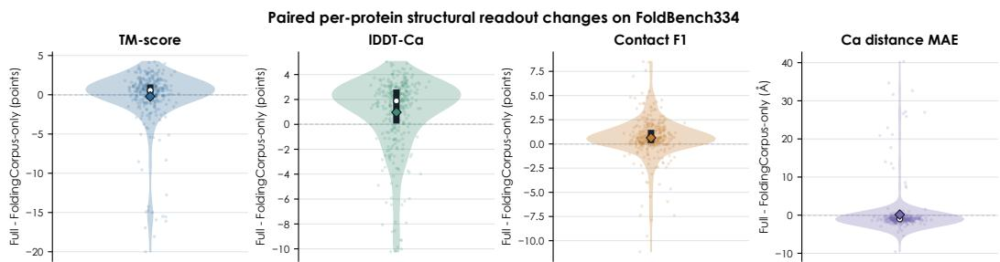  
Figure 6: Geometry changes local readouts more consistently than global topology. Each point is one FoldBench334 protein after averaging that protein over three training seeds; distributions show Fold2Reason-full minus FoldingCorpus-only. Thick bars span the interquartile range, white circles mark medians, and diamonds mark means. Positive values favor Full except for Cα MAE, where negative is better. Full improves per-protein lDDT-Cα and Contact F1 for 75.4% and 78.7% of proteins, respectively, while TM-score and MAE contain influential tails.

Table 18 consolidates the two predeclared qualitative audits: Panel A reports the three proteins in Figure 5, while Panel B retains the lower, median, and higher Contact-F1-change cases used in Figure 7. The latter include one protein whose contact F1 decreases.

Table 18: Preselected FoldBench334 cases for qualitative structural audit. Panel A matches Figure 5: the three proteins have the highest Full mean TM-score among all 334 targets. Panel B matches Figure 7: proteins are selected at the 10th, 50th, and 90th percentiles of the per-protein Contact F1 change. Selection uses the three-seed mean, with protein ID breaking ties, and precedes visual inspection. Each metric cell reports FC-only → Full, followed by Full minus FC-only in parentheses; lower distance MAE is better.
<table><tr><td>Selection</td><td>Protein</td><td>L</td><td>TM-score FC-only → Full</td><td>IDDT-Cα FC-only → Full</td><td>Contact F1 FC-only → Full</td><td>Distance MAE (Å) FC-only → Full</td></tr><tr><td colspan="7">Panel A: proteins displayed in Figure 5</td></tr><tr><td>Rank 1</td><td>8wt3_A</td><td>134</td><td>0.2438 → 0.2742 (+0.0304)</td><td>0.2767 → 0.3034 (+0.0267)</td><td>0.1146 → 0.1169 (+0.0023)</td><td>6.0422 → 5.3820 (-0.6602)</td></tr><tr><td>Rank 2</td><td>8qjp_A</td><td>250</td><td>0.2255 → 0.2586 (+0.0331)</td><td>0.2462 → 0.2629 (+0.0167)</td><td>0.0377 → 0.0552 (+0.0175)</td><td>10.8590 → 9.1586 (-1.7004)</td></tr><tr><td>Rank 3</td><td>7xg9_A</td><td>286</td><td>0.2310 → 0.2568 (+0.0258)</td><td>0.2607 → 0.2834 (+0.0227)</td><td>0.0435 → 0.0493 (+0.0058)</td><td>12.2372 → 10.8577 (-1.3794)</td></tr><tr><td colspan="7">Panel B: Contact-F1-change quantiles displayed in Figure 7</td></tr><tr><td>Lower (10th)</td><td>7urp_A</td><td>159</td><td>0.1917 → 0.2035 (+0.0118)</td><td>0.2125 → 0.2275 (+0.0150)</td><td>0.0707 → 0.0595 (-0.0112)</td><td>9.3934 → 8.0564 (-1.3371)</td></tr><tr><td>Median (50th)</td><td>8dge_A</td><td>707</td><td>0.1506 → 0.1616 (+0.0110) 0.2324 → 0.2364</td><td>0.2169 → 0.2480 (+0.0312) 0.2294 → 0.2608</td><td>0.0249 → 0.0307 (+0.0058)</td><td>27.6176 → 26.2962 (-1.3214) 9.5911 → 8.3614</td></tr><tr><td>Higher (90th)</td><td>8b61_A</td><td>197</td><td>(+0.0040)</td><td>(+0.0314)</td><td>0.0876 → 0.1126 (+0.0249)</td><td>(-1.2297)</td></tr></table>

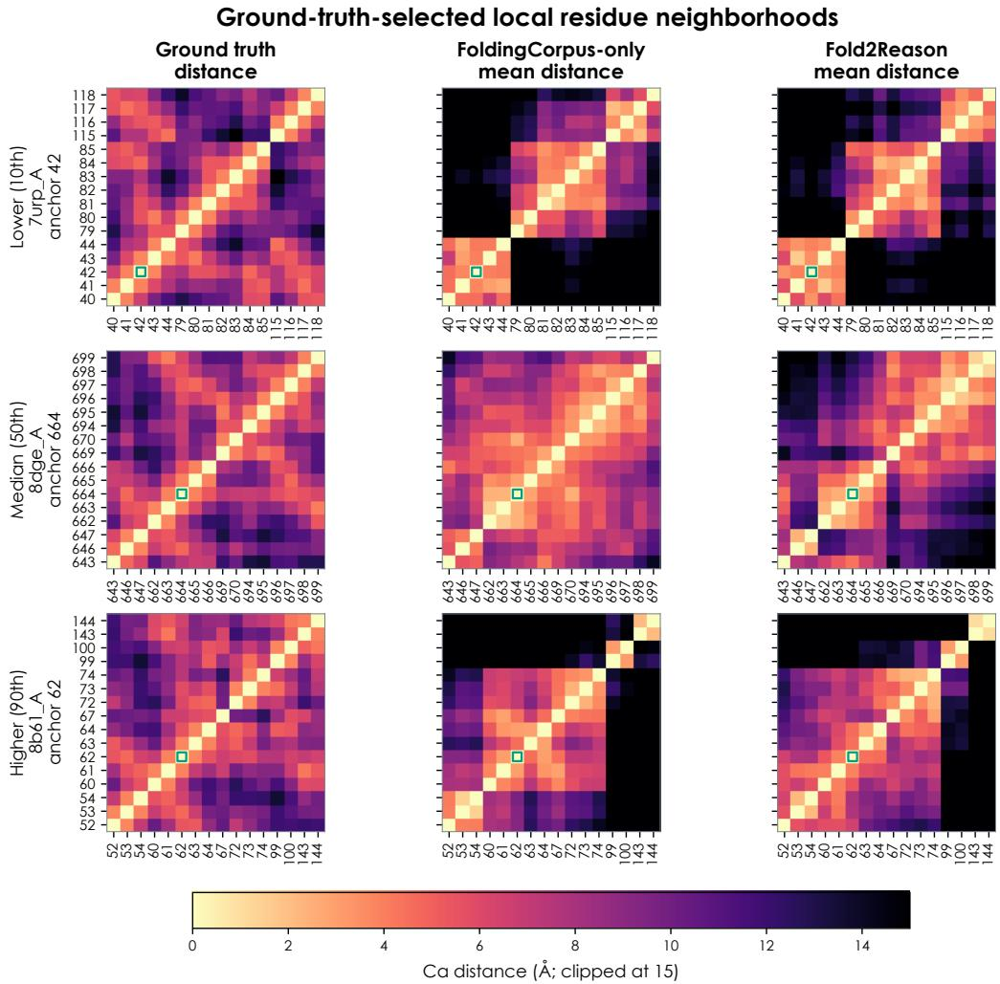  
Figure 7: Local distance-map audit for the preselected proteins of Table 18. For each protein, the anchor is the residue with the most ground-truth contacts; the displayed neighborhood contains that anchor and its 15 nearest ground-truth Cα neighbors. Ground truth alone determines the selection. Full changes the local distance MAE from 6.311 to 6.178 Å in the lower case, from 2.620 to 2.821 Å in the median case, and from 5.982 to 5.533 Å in the higher case. The middle case worsens while the lower and higher cases improve, matching the heterogeneous Geometry effect in the aggregate analysis. Green squares mark the anchor residue.

The intervention rows are an appendix-only workspace audit. On FoldBench334, Fold2Reason-full obtains TM-score 0.1688, lDDT-Cα 0.2532, contact F1 0.0690, and Cα distance MAE 12.24 Å. Replacing a matched workspace with one from another protein reduces TM-score by 0.01043, showing that the geometry decoder uses protein-specific residue information.

## K.2 WHY THE STRUCTURAL COHORT CONTAINS 334 PROTEINS

FoldBench334 contains the entire monomer-protein target list represented by the local FoldBench release manifest, whose source is targets/monomer\_protein.csv. The manifest has 334 distinct target IDs. All 334 appear in the matched structural-evaluation records for every seed of Ful RG, w/o Geometry, w/o FoldingCorpus, and the frozen-base decoder control. Thus, the cohort size follows the monomer-protein target list rather than a performance-based subsample. Other FoldBench task categories are outside this monomer readout evaluation.

The manifest sequences range from 28 to 1,414 residues. The structural evaluation uses the residue representation in the cached input and coordinate records, which can be shorter than the manifest sequence: the minimum evaluated length is 26 residues and the mean is 261.10, compared with 261.43 in the manifest. We report both distributions to distinguish target coverage from residue-level preprocessing. Protein IDs, rather than sequence length alone, define the paired comparisons.

Table 19: FoldBench334 cohort size and residue-count distribution. Manifest sequence length and the residue count in the structural evaluation cache are reported separately.
<table><tr><td>Representation</td><td>N</td><td>Min</td><td>Q1</td><td>Median</td><td>Q3</td><td>Max</td><td>Mean</td></tr><tr><td>Manifest sequence</td><td>334</td><td>28.0</td><td>140.2</td><td>225.5</td><td>344.8</td><td>1414.0</td><td>261.43</td></tr><tr><td>Evaluated residues</td><td>334</td><td>26.0</td><td>140.2</td><td>225.5</td><td>344.8</td><td>1414.0</td><td>261.10</td></tr></table>

## K.3 STRUCTURAL READOUT SCOPE

Complete target coverage and data isolation are separate. The three adapted arms use the same Phase-0 fixed reader; the frozen-base arm trains a separate decoder of the same architecture. Full improves local readouts relative to w/o Geometry but has lower TM-score and worse distance MAE. FoldBench homology, deposition-date, and fold-level isolation remain incomplete, and the independent scaling audit found template-source and alignment overlaps (Appendix L). These measurements remain diagnostics under the stated conditions.

## L DATA SCALING AND CHECKPOINT DYNAMICS

The scaling study uses nested subsets of the same frozen training pool and the three canonical seeds. Every protein contributes all 12 FoldingCorpus labels, and every scale is trained for three epochs. All endpoints use the complete held-out FoldingCorpus split, FoldBench334, and General-10; no endpoint was selected using evaluation performance. This is an independent scaling run, which accounts for its 3.31 pp 1,000-protein endpoint differing slightly from the canonical 3.23 pp main experiment. The complete study covers seven training-set sizes from 50 to 4,000 proteins under the same three-epoch schedule. The 4,000-protein pool uses a mean-pLDDT/fraction-high-confidence gate of 70/0.70, versus 80/0.80 for the 2,000-protein pool; this comparison changes both sample count and quality support.

Table 20: Fixed-epochs data-scaling endpoints. Values are three-seed means from the independent scaling run. General-10 values are changes from the base model in percentage points.
<table><tr><td colspan="2">FoldingCorpus</td><td rowspan="2">Steps</td><td rowspan="2">FoldingCorpus macro</td><td rowspan="2">IDDT-Cα</td><td rowspan="2">Contact F1</td><td rowspan="2">General-10 ∆</td></tr><tr><td>Proteins</td><td>targets</td></tr><tr><td>50</td><td>600</td><td>21</td><td>0.478</td><td>0.244</td><td>0.0666</td><td>0.49</td></tr><tr><td>100</td><td>1,200</td><td>39</td><td>0.486</td><td>0.244</td><td>0.0671</td><td>0.61</td></tr><tr><td>250</td><td>3,000</td><td>96</td><td>0.485</td><td>0.246</td><td>0.0666</td><td>1.37</td></tr><tr><td>500</td><td>6,000</td><td>189</td><td>0.492</td><td>0.247</td><td>0.0675</td><td>2.92</td></tr><tr><td>1,000</td><td>12,000</td><td>375</td><td>0.501</td><td>0.252</td><td>0.0694</td><td>3.31</td></tr><tr><td>2,000†</td><td>24,000</td><td>750</td><td>0.546</td><td>0.252</td><td>0.0739</td><td>3.70</td></tr><tr><td>4,000†</td><td>48,000</td><td>1,500</td><td>0.418</td><td>0.252</td><td>0.0768</td><td>3.02</td></tr></table>

†Fresh-run extension beyond the original 50–1,000-protein curve. The 4,000-protein FoldingCorpus mean has high seed variance because one seed exhibits answer-token calibration collapse; the predeclared greedy metric is retained.

Figure 8 tracks the pre-registered checkpoints for Full RG and FoldingCorpus-only Pure-LoRA. At step 5, the three Full-RG General-10 changes are −0.02, +0.03, and +0.04 pp; by step 375 they reach +3.15, +2.94, and +3.85 pp. Pure-LoRA follows the same broad timing pattern, moving from +0.03/ + 0.05/ + 0.08 pp at step 5 to +2.80/ + 3.25/ + 3.37 pp at step 375. Under the pre-registered trajectory rules, every seed in both arms is classified as continuous growth, with none classified as an instant plateau, transient peak, or decoupling. The gain therefore develops over optimization rather than appearing as an immediate prompt-format response; gradual format adaptation remains an alternative explanation, and this timing pattern is not specific to the Geometry loss.

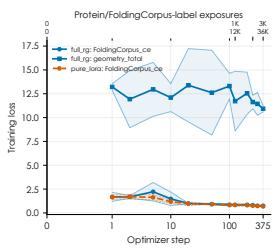

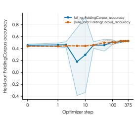

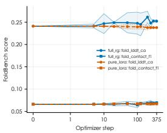

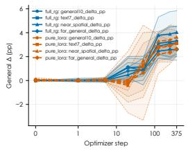  
Figure 8: Training and transfer dynamics at pre-registered checkpoints. Columns show training losses, held-out FoldingCorpus answer accuracy, FoldBench structural readouts, and General-10 changes. Legend entries carry the run identifiers full\_rg for Fold2Reason-full (blue) and pure\_lora for FoldingCorpus-only Pure-LoRA (orange). The upper axis reports cumulative protein and answer-label exposures. All benchmark evaluations were run offline after training and were not used for checkpoint selection.

Observed overlaps and audit scope. Six scaling-training inputs contain template-contact constraints originating from FoldBench targets: 8ec3, 8ey3, 8g64, 8t9n, 8uds, and 9etn. A Smith– Waterman audit (Smith & Waterman, 1981) $\mathrm { a t \geq 3 0 \% }$ identity and ≥ 80% bidirectional coverage found 12 train–dev, 14 train–test, three train–FoldBench, three dev–test, and one dev–FoldBench matches. PDB IDs were not model inputs, but this does not remove template-derived evidence. Checkpoints and evaluation sets were not changed after discovery, and no cleaned rerun is claimed. FoldBench curves are therefore readout diagnostics, not strictly template- or remote-homologydisjoint generalization. The identified matches concern protein-side data rather than General-10 items; they do not constitute a complete audit of base-model pretraining contamination.

## L.1 EVALUATION CONTRACTS AND COMPLETE SCALE-BY-SEED RESULTS

The independent scaling study has its own frozen base generations and archived scoring implementation. Table 21 records these alongside the canonical endpoint base to make the comparison unit explicit. In particular, the scaling study uses VSI’s official eight-task macro, while the canonical endpoint study uses the mean score over all questions. The other differing base scores reflect the respective archived evaluation runs. All points within the scaling and bandwidth analyses use the same scaling base, and all reported changes are computed within their respective evaluation contract.

Table 21: The two frozen base-evaluation contracts used by the canonical endpoint study and the independent scaling study. Each reported gain uses the base from its own column.
<table><tr><td>Dataset</td><td>N</td><td>Canonical base</td><td>Scaling base</td></tr><tr><td>FTB-Core</td><td>12000</td><td>36.18</td><td>36.23</td></tr><tr><td>SpatialViz</td><td>1180</td><td>26.61</td><td>26.61</td></tr><tr><td>VSI</td><td>5130</td><td>58.53</td><td>56.93</td></tr><tr><td>GraphQA Easy</td><td>21600</td><td>65.14</td><td>67.71</td></tr><tr><td>GraphQA Hard</td><td>21600</td><td>32.65</td><td>33.39</td></tr><tr><td>BBH</td><td>6511</td><td>54.45</td><td>54.00</td></tr><tr><td>ChemBench</td><td>2148</td><td>66.76</td><td>66.53</td></tr><tr><td>ChemBench4K</td><td>4009</td><td>63.56</td><td>61.29</td></tr><tr><td>Lab-Bench</td><td>1967</td><td>37.21</td><td>36.25</td></tr><tr><td>SciBench</td><td>580</td><td>9.83</td><td>9.14</td></tr></table>

VSI uses mean-question scoring in the canonical endpoint study and the official eight-task macro in the archived scaling study. Text/FTB base generations also belong to their respective runs.

Table 22 reports all 21 fixed-three-epoch endpoints. The 4K run with seed 20260803 has frozen-test FoldingCorpus accuracy 0.1283, compared with 0.5683 for seed 20260729. Its General-10 change remains positive at 3.139 pp. Retaining this run exposes the answer-calibration instability behind the 4K FoldingCorpus mean and the difference between source-task accuracy and external transfer.

Table 22: All fixed-three-epoch data-scaling endpoints by seed. FoldingCorpus and structure metrics are fractions; General-10 changes are percentage points.
<table><tr><td>Proteins</td><td>Seed</td><td>Steps</td><td>FC acc.</td><td>IDDT</td><td>Contact F1</td><td>General-10 ∆</td></tr><tr><td>50</td><td>20260729</td><td>21</td><td>0.4608</td><td>0.2384</td><td>0.0650</td><td>+0.406</td></tr><tr><td>50</td><td>20260803</td><td>21</td><td>0.4875</td><td>0.2458</td><td>0.0667</td><td>+0.686</td></tr><tr><td>50</td><td>20260804</td><td>21</td><td>0.4858</td><td>0.2474</td><td>0.0680</td><td>+0.392</td></tr><tr><td>100</td><td>20260729</td><td>39</td><td>0.4758</td><td>0.2432</td><td>0.0660</td><td>+0.232</td></tr><tr><td>100</td><td>20260803</td><td>39</td><td>0.4975</td><td>0.2432</td><td>0.0670</td><td>+0.593</td></tr><tr><td>100</td><td>20260804</td><td>39</td><td>0.4850</td><td>0.2469</td><td>0.0682</td><td>+1.013</td></tr><tr><td>250</td><td>20260729</td><td>96</td><td>0.5208</td><td>0.2489</td><td>0.0658</td><td>+1.457</td></tr><tr><td>250</td><td>20260803</td><td>96</td><td>0.4392</td><td>0.2459</td><td>0.0667</td><td>+1.487</td></tr><tr><td>250</td><td>20260804</td><td>96</td><td>0.4958</td><td>0.2430</td><td>0.0675</td><td>+1.165</td></tr><tr><td>500</td><td>20260729</td><td>189</td><td>0.4892</td><td>0.2477</td><td>0.0677</td><td>+2.971</td></tr><tr><td>500</td><td>20260803</td><td>189</td><td>0.4842</td><td>0.2477</td><td>0.0680</td><td>+3.043</td></tr><tr><td>500</td><td>20260804</td><td>189</td><td>0.5017</td><td>0.2464</td><td>0.0666</td><td>+2.743</td></tr><tr><td>1000</td><td>20260729</td><td>375</td><td>0.4867</td><td>0.2516</td><td>0.0692</td><td>+3.145</td></tr><tr><td>1000</td><td>20260803</td><td>375</td><td>0.5175</td><td>0.2537</td><td>0.0700</td><td>+2.941</td></tr><tr><td>1000</td><td>20260804</td><td>375</td><td>0.5000</td><td>0.2515</td><td>0.0690</td><td>+3.848</td></tr><tr><td>2000†</td><td>20260729</td><td>750</td><td>0.5508</td><td>0.2530</td><td>0.0748</td><td>+3.763</td></tr><tr><td>2000†</td><td>20260803</td><td>750</td><td>0.5367</td><td>0.2499</td><td>0.0735</td><td>+3.468</td></tr><tr><td>2000†</td><td>20260804</td><td>750</td><td>0.5492</td><td>0.2525</td><td>0.0736</td><td>+3.876</td></tr><tr><td>4000†</td><td>20260729</td><td>1500</td><td>0.5683</td><td>0.2511</td><td>0.0754</td><td>+2.780</td></tr><tr><td>4000†</td><td>20260803</td><td>1500</td><td>0.1283</td><td>0.2525</td><td>0.0767</td><td>+3.139</td></tr><tr><td>4000†</td><td>20260804</td><td>1500</td><td>0.5567</td><td>0.2531</td><td>0.0782</td><td>+3.152</td></tr></table>

†Fresh-run extension beyond the original 50–1,000-protein curve. The 4K pool also changes the structureconfidence support. Values preserve the scoring protocol of the independent scaling study described in this section.

## L.2 WHICH DATASETS ACCOUNT FOR DATA-SCALING GAINS?

The dataset profiles show different responses to increasing protein coverage. GraphQA Hard and SpatialViz contribute substantial gains toward 2K proteins, while ChemBench4K peaks earlier in the displayed range. ChemBench and Lab-Bench have small negative mean changes at 4K. The macro therefore summarizes a mixture of strengthening, saturating, and declining task responses. All seven scales and all ten datasets are included in the table and heatmap.

Table 23: Dataset-level changes along the complete fixed-three-epoch curve (percentage points). The final row reports the macro mean and training-seed SD.
<table><tr><td>Dataset</td><td>50</td><td>100</td><td>250</td><td>500</td><td>1K</td><td> $2 \mathrm { K } ^ { \dagger }$ </td><td> $4 \mathrm { K } ^ { \dagger }$ </td></tr><tr><td>FTB-Core</td><td>-0.13</td><td>-0.44</td><td>+0.50</td><td>+4.26</td><td>+4.26</td><td>+5.00</td><td>+4.56</td></tr><tr><td>SpatialViz</td><td>+0.76</td><td>+0.65</td><td>+1.53</td><td>+5.17</td><td>+5.93</td><td>+7.12</td><td>+6.92</td></tr><tr><td>VSI</td><td>+0.12</td><td>-0.08</td><td>+0.33</td><td>+1.17</td><td>+1.13</td><td>+1.82</td><td>+1.58</td></tr><tr><td>GraphQA Easy</td><td>+1.36</td><td>+2.13</td><td>+1.77</td><td>+2.58</td><td>+2.49</td><td>+2.76</td><td>+1.47</td></tr><tr><td>GraphQA Hard</td><td>+0.78</td><td>+0.56</td><td>+1.94</td><td>+3.90</td><td>+6.35</td><td>+8.67</td><td>+8.46</td></tr><tr><td>BBH</td><td>+0.57</td><td>+0.74</td><td>+2.37</td><td>+3.30</td><td>+3.77</td><td>+3.68</td><td>+2.90</td></tr><tr><td>ChemBench</td><td>-0.19</td><td>-0.85</td><td>-0.62</td><td>+0.47</td><td>+1.30</td><td>+0.34</td><td>-0.12</td></tr><tr><td>ChemBench4K</td><td>+0.58</td><td>+2.06</td><td>+3.60</td><td>+6.03</td><td>+5.61</td><td>+4.78</td><td>+2.74</td></tr><tr><td>Lab-Bench</td><td>+0.29</td><td>+0.15</td><td>+0.85</td><td>+0.47</td><td>+0.37</td><td>+0.44</td><td>-0.39</td></tr><tr><td>SciBench</td><td>+0.80</td><td>+1.21</td><td>+1.44</td><td>+1.84</td><td>+1.90</td><td>+2.41</td><td>+2.13</td></tr><tr><td>General-10</td><td>0.49 ± 0.17</td><td>0.61 ± 0.39</td><td>1.37 ± 0.18</td><td>2.92 ± 0.16</td><td>3.31 ± 0.48</td><td>3.70 ± 0.21</td><td>3.02 ± 0.21</td></tr></table>

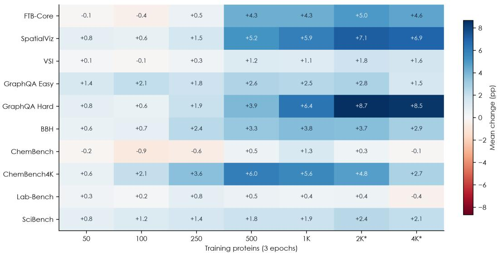  
Figure 9: Dataset-level transfer along the fixed-three-epoch curve. Cells show the three-seed mean change from the scaling study’s frozen base in percentage points. A common diverging color scale is centered at zero. Asterisks mark the fresh 2K and 4K extension runs; the 4K pool also changes the confidence-quality support described above.

## L.3 FOLDINGCORPUS-LABEL DENSITY AT FIXED PROTEIN COVERAGE

The label-density experiment holds the training set at 1,000 proteins and the schedule at 375 optimizer steps, then uses 3, 6, or 12 FoldingCorpus labels per protein. The q=12 condition is the independent 1K scaling endpoint. The mean General-10 changes are 3.391, 2.951, and 3.311 pp, respectively. Increasing label density therefore produces no monotonic transfer increase in this range. The mean within-seed slope against $\log _ { 2 } ( q ) { \mathrm { i s } } - 0 . 0 4 0$ pp per doubling, with a 95% t interval of $[ - 0 . 8 1 4 , 0 . 7 3 4 ]$ The three-seed interval permits both positive and negative density effects, so it neither supports a positive dose–response relationship nor establishes that label density has no effect. In particular, these results do not support the claim that asking more structural questions about the same proteins improves transfer over the tested range. Label count is an operational measure of supervision density, not a direct measure of independent structural information. Redundancy among labels or saturation by three labels could explain a flat response, but neither explanation is established by this experiment. The protein-count curve also increases data breadth and training compute together and cannot resolve this mechanism. We therefore interpret the combined evidence as behavioral transfer from proteinderived supervision, without attributing that transfer to increasing label density or claiming that these experiments identify reusable reasoning computations.

Table 24: FoldingCorpus-label density at fixed 1,000 proteins and 375 optimizer steps. S1–S3 and the first mean report General-10 changes (pp); the remaining metrics are fractions.
<table><tr><td>Labels/protein</td><td>S1</td><td>S2</td><td>S3</td><td>∆± SD</td><td>FC acc.</td><td>IDDT</td><td>Contact F1</td></tr><tr><td>3</td><td>+2.971</td><td>+3.731</td><td>+3.472</td><td> $3 . 3 9 1 \pm 0 . 3 8 6$ </td><td> $0 . 4 9 4 2 \pm 0 . 0 1 7 5$ </td><td> $0 . 2 5 4 4 \pm 0 . 0 0 2 0$ </td><td> $0 . 0 6 9 0 \pm 0 . 0 0 0 7$ </td></tr><tr><td>6</td><td>+3.145</td><td>+2.441</td><td>+3.268</td><td> $2 . 9 5 1 \pm 0 . 4 4 6$ </td><td> $0 . 4 9 9 4 \pm 0 . 0 0 4 7$ </td><td> $0 . 2 5 4 2 \pm 0 . 0 0 2 8$ </td><td> $0 . 0 6 9 3 \pm 0 . 0 0 0 3$ </td></tr><tr><td>12</td><td>+3.145</td><td>+2.941</td><td>+3.848</td><td> $3 . 3 1 1 \pm 0 . 4 7 6$ </td><td> $0 . 5 0 1 4 \pm 0 . 0 1 5 5$ </td><td> $0 . 2 5 2 3 \pm 0 . 0 0 1 2$ </td><td> $0 . 0 6 9 4 \pm 0 . 0 0 0 5$ </td></tr></table>

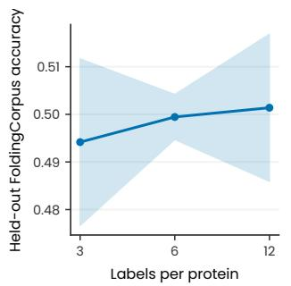

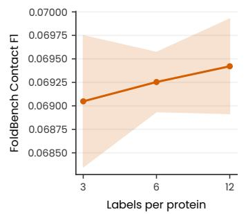

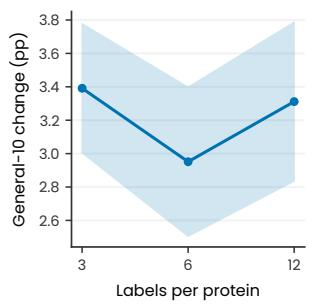  
Figure 10: FoldingCorpus-label density with 1,000 proteins and 375 steps. Solid lines show means over three training seeds. Shaded regions extend from mean minus one sample SD to mean plus one sample SD; the thin boundary lines mark those limits. FoldingCorpus accuracy uses the frozen test split. FoldBench uses all 334 targets, and external transfer uses the scaling evaluation contract.

## L.4 NUMERICAL CHECKPOINT TRAJECTORIES

Figure 8 retains the complete recorded trajectories. FoldingCorpus accuracy there uses the 100- protein development split; scaling and label-density endpoint tables use the separate 100-protein frozen test split. Full’s General-10 gain is 0.016 pp at step 5, 3.116 pp at step 125, and 3.311 pp at step 375; Pure LoRA reaches 3.140 pp at step 375 in this independent study. The canonical Full/Pure endpoints are a separate experiment. Numerical losses, scheduled gaps, structural metrics, and every seed trajectory remain in scaling\_evidence.json and appendix\_tables.json. The time course alone does not distinguish reasoning acquisition from gradual answer-format adaptation.

## M BROADER IMPACT

This work studies transfer from public protein structures into general model behavior. Potential benefits include more data-efficient structured supervision and clearer audits of what scientific posttraining changes. The main risks are benchmark contamination and misuse of structural readouts as folding predictions. Sequence overlap audits, seed-level variation, and separate behavioral and decodability metrics make these risks visible. The released models and documentation will identify the geometry output as a training diagnostic and reserve biological interpretation for validated structure-prediction systems.

## N MACHINE-READABLE EVIDENCE FILES

The supplementary source directory core-results/appendix-evidence-20260906/ contains the numerical evidence behind the tables and figures of this paper. The table builder reads the archived results, checks paired identifiers and aggregate reconstruction, and exports the following files.

Table 25: Machine-readable evidence included with the appendix source package.
<table><tr><td>File</td><td>Contents</td></tr><tr><td>endpoint_seed_scores.json</td><td>All ten dataset scores by seed for Fold2Reason-full, the component arms, the model families, and the source-control aggregates.</td></tr><tr><td>model_training_contracts.json</td><td>Saved LoRA modules, parameter counts, steps, seed, and hardware world size for the fifteen model-family runs.</td></tr><tr><td>task_breakdown.json</td><td>Complete FTB split/family/task, SpatialViz category/task, and VSI question-group scores. The 334 target IDs, sequence and evaluation length distributions, and structural metrics by</td></tr><tr><td>foldbench_audit.json</td><td>arm and seed.</td></tr><tr><td>scaling_evidence.json</td><td>Fixed-three-epoch endpoints, label-density results, and numerical checkpoint trajectories. Archived checkpoint and split assignments and expected evaluation counts for the included</td></tr><tr><td>scaling_evaluation_manifest.json</td><td>original scaling runs.</td></tr><tr><td>scaling_recorded_hashes.json</td><td>Archived adapter-state, evaluation-ID, and base-model hashes, including completion records for the 2K and 4K extensions.</td></tr><tr><td>appendix_source_manifest.csv</td><td>Paths, SHA-256 digests, and byte counts of the source files used by the builder.</td></tr><tr><td>appendix_tables.json</td><td>Every generated table cell and its caption.</td></tr></table>

Every reported General-10 endpoint covers 76,725 questions across the ten datasets. The structural audit checks all 334 protein IDs in every arm and seed. FTB subgroup counts reconstruct the 12,000- example total, and the SpatialViz and VSI decompositions use the same prediction IDs across Base and all three adapted arms. The machine-readable bundle preserves run-specific base and scoring contracts, the development versus frozen-test FoldingCorpus splits, and the distinction between the canonical and the independent scaling checkpoints. Rebuilding the tables from scratch requires the referenced experiment files; inspecting the exported scores, table cells, and figures requires only the supplementary source package.