# DiffWAM: A Fast and Efficient Navigation World Action Model

Mo Zhu1,2,†, Yuze Wu1,2,†,∗, Xijie Huang1,2,†, Xiao Cui2, Fei Gao1,2, Xin Zhou2,∗

1 Zhejiang University, 2 Differential Robotics.

†These authors contributed equally to this work.

∗Corresponding author. E-mail: wuyuze000@zju.edu.cn (Yuze Wu), iszhouxin@zju.edu.cn (Xin Zhou).

## Abstract

Pretrained video foundation models encode rich semantic and spatiotemporal priors for embodied navigation, yet converting these priors into UAV motion typically requires expensive future-video synthesis and geometric reconstruction. We investigate whether the motion implicit in future visual prediction can instead be recovered directly from the predictive representations of a frozen video model. To this end, we present DiffWAM, a geometry-conditioned navigation world-action model that directly transforms multilevel predictive features into continuous camera trajectories. Its Grid-Motion module preserves spatialtemporal motion associations, while Latent2Pose grounds them with first-frame geometry to recover metrically meaningful 3D motion. Complete video rollouts and geometric reconstruction are required only for offline supervision, eliminating future-video decoding and multi-frame reconstruction during deployment. We further introduce FastDreamer, which overlaps predictive and geometric computation with ongoing flight and performs timestamp-aware asynchronous trajectory handoff for continuous UAV execution. DiffWAM achieves a trajectory RMSE of 0.3492 m and an endpoint success rate of 74.40% on the 1,000- sample DiffWAM-1000 benchmark, while representative real-world experiments demonstrate complex behaviors including constrained traversal, orbiting, S-shaped flight, and multi-stage navigation. An onboard DiffWAM-Flash implementation further reaches 1.08 s model-pipeline latency on NVIDIA Jetson AGX Thor. These results demonstrate that predictive video representations can be efficiently grounded into continuous 3D motion, providing a direct alternative to generate-then-reconstruct navigation pipelines. Project page: https://zzmmzzm.github.io/diffwam.github.io/.

Keywords World-action models, predictive video representations, trajectory grounding, geometric distillation, 3D navigation

## 1 Introduction

With the rapid advancement of large language models and multimodal foundation models, 3D vision-language navigation/action (VLN/VLA) [1–4], particularly for unmanned aerial vehicles (UAVs), has become an important research direction in robotics. Existing methods can combine target recognition with instruction understanding to accomplish object-goal navigation tasks such as “navigate to the electric fan next to the table.” However, they remain less effective for instructions involving continuous, structured motion, such as “circle around the fire hydrant three times for inspection.” A key limitation is that current VLN/VLA systems based on vision language models (VLMs) [5] are generally better at deciding where to go or what to do next than at translating complex language instructions into continuous, executable trajectories subject to direction, clearance, and spatial-scale constraints. In contrast, video foundation models naturally learn how visual scenes evolve over time, making their internal representations better aligned with continuous motion processes.

In our previous work, NavDreamer [6], we introduced a video-foundation-model-based generate–reconstruct paradigm: first generating a future video and then recovering the implicit camera trajectory from it. This demonstrated that video foundation models can provide rich semantic and temporal priors for 3D navigation. However, complete video generation and pixel-level rendering introduce substantial computation that is not intrinsically required for navigation. In practice, image fidelity, texture detail, and color realism are far less important than the underlying sequence of motion states and camera poses. This motivates a more direct question: before the future video is fully generated, do the intermediate representations of a video generative model already contain sufficien information to recover the underlying navigation motion?

Recent implicit World-Action Models (WAMs) [7] provide a promising direction by directly decoding actions from video-model representations. However, existing approaches often aggregate features from many hidden layers, leading to unnecessarily large action branches, while early predictive features themselves are not explicit pose representations: they entangle appearance, camera motion, object motion, language conditions, and prediction uncertainty. Naive global pooling may therefore destroy the spatial correspondences required for motion recovery. Moreover, representations at different network depths contribute differently to navigation, and implicit features alone do not provide a reliable metric spatial reference. These observations lead to three key research questions: (1) At which de noising stage does a videofoundation model begin toform navigation-motion representations that can be decoded reliably? (2) Which network depths and latent representations are most informativefor action generation? (3) How can predictive visual knowledge be efficiently grounded into continuous, executable trajectories with geometric, metric-scale, and temporal constraints?

To answer these questions, we propose DiffWAM, a navigation World Action Model that directly transforms the predictive representations of a pretrained video foundation model into continuous 3D motion. Our design follows the three questions above. First, rather than waiting for complete video synthesis, we investigate whether navigation motion can already be decoded from an early predictive state of the frozen video model, allowing subsequent generation to be bypassed once sufficiently informative representations have been obtained. Second, because different network depths encode complementary visual, semantic, and motion information, we selectively read and fuse representations from multiple depths instead of forwarding a large collection of hidden layers to the action branch. Third, since these implicit representations do not by themselves define a metrically meaningful trajectory, we preserve their spatial-temporal structure before pooling and condition motion decoding on geometry extracted from the initial observation, thereby grounding predictive visual knowledge into a common spatial reference and estimated metric scale. We instantiate these operations with Grid-Motion, which establishes motion associations across spatial locations and time, and Latent2Pose, which converts the resulting motion representation into a time-indexed sequence of camera poses.

Learning such a direct predictive-to-motion mapping, however, requires supervision that reveals the motion implicitly represented by these early predictive features. We therefore adopt an asymmetric teacher–student training strategy that exploits complete video generation only during offline training. Starting from the same predictive state observed by the student, the teacher continues the video-generation process and reconstructs the resulting future camera motion, with geometric calibration providing a metric trajectory reference. The student is then trained to recover this trajectory using only the paired early predictive representations and first-frame geometry. In this way, motion information that would otherwise require expensive future generation and reconstruction to obtain explicitly is distilled into a compact trajectory readout, while the video backbone and geometry estimator remain frozen. At deployment, complete video rollout, video decoding, and multi-frame geometric reconstruction are entirely re moved. Experiments confirm that this direct readout preserves useful navigation motion: DiffWAM achieves a trajectory RMSE of 0.3492 m and an endpoint success rate of 74.40% on DiffWAM-1000, while real-world flights further demonstrate constrained traversal, orbiting, S-shaped motion, landing, and multi-stage navigation.

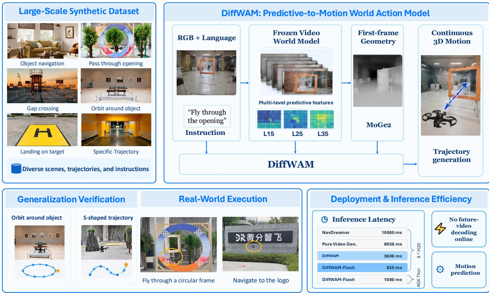  
Figure 1: Overview of DiffWAM. DiffWAM grounds multi-level predictive representations from a frozen video world model, together with first-frame geometry, into continuous 3D UAV trajectories. Trained with large-scale synthetic navigation data, it supports diverse structured motions, real-world execution, and efficient deployment without online future-video decoding.

Direct trajectory decoding substantially shortens the computational path from visual prediction to motion generation, but efficient prediction alone does not guarantee continuous flight. During onboard inference, the UAV continues to move while a new trajectory is being computed; consequently, when a proposal becomes available, the vehicle state may already have changed and the proposal may no longer be aligned with the state and reference frame from which it was predicted. We therefore further introduce FastDreamer, an inference-and-execution framework that extends DiffWAM from individual motion prediction to continuous closed-loop navigation. FastDreamer reduces proposal-preparation overhead by reusing the world-model conditioning components for local instruction rewriting and by executing predictive-representation extraction and first-frame geometry estimation in parallel. More importantly, computation is overlapped with execution: while the UAV follows its currently committed trajectory, the next motion proposal is prepared in advance. Each update retains its observation timestamp and is associated with a scheduled future handoff state, allowing the downstream planner to explicitly account for the vehicle motion accumulated during inference and construct a compatible transition before activation. This design addresses both the latency of preparing a new motion proposal and the state/reference mismatch introduced while the UAV continues to move, extending predictive-to-motion grounding toward continuous and multi-stage vision-language UAV navigation.

Our contributions are fourfold:

1. A direct predictive-to-motion formulation for navigation WAMs. We formulate continuous UAV navigation as directly decoding camera motion from intermediate predictive representations of a pretrained video foundation model, avoiding complete future-video synthesis at deployment.

2. Geometry-grounded motion decoding and predictive distillation. We develop a geometry-conditioned motion readout that preserves spatial-temporal structure and learns from rollout-paired offline supervision, enabling camera-trajectory prediction while keeping the video and geometry backbones frozen.

3. Latency-aware continuous execution with FastDreamer. We introduce FastDreamer to bridge trajectory prediction and continuous UAV execution through parallel inference, flight-time-aware scheduling, and timestamp-aware prospective handoff.

4. Comprehensive validation across navigation settings. We evaluate DiffWAM-FastDreamer across benchmark, simulation, real-world flight, onboard deployment, and controlled ablation studies, demonstrating its effectiveness across diverse continuous and structured UAV navigation tasks.

## 2 Related Work

## 2.1 Video World Models for Embodied Action and Navigation

Vision–language–action models map multimodal observations and instructions to robot actions by adapting pretrained vision–language representations to embodied control. OpenVLA [8] demonstrates this paradigm at scale, while some work [9] extends it to efficient onboard aerial navigation. In parallel, video foundation models provide predictive priors that capture scene evolution and motion. DreamZero [10] and WorldFly [11] jointly model future visual states and actions, showing that video prediction can support embodied decision making.

For aerial navigation, NavDreamer [6] and ImagineUAV [12] generate future visual observations and subsequently recover 3D motion, whereas WorldVLN [13] predicts latent world transitions and decodes waypoint actions. Recent Fast-WAM [7] and Faster-WAM [14] further show that useful action prediction does not necessarily require complete future rendering at test time. DiffWAM follows this direction but focuses on a different interface: it directly grounds intermediate predictive representations of a frozen video model into continuous camera trajectories, removing complete future-video decoding from deployment.

## 2.2 Predictive Representation Grounding and Distillation

Predictive video features encode motion together with appearance, semantics, and uncertainty, but do not directly provide a metric 3D trajectory. Geometric foundation models offer complementary spatial information. $\pi ^ { 3 }$ [15] reconstructs camera motion and scene geometry from image collections, while MoGe-2 [16] estimates metric geometry from a single image. DiffWAM uses first-frame geometry to provide spatial reference and scale during deployment, while complete-video reconstruction is used only to construct offline trajectory supervision.

This training setting is related to knowledge and policy distillation. Conventional knowledge distillation transfers [17] predictive or representational information between teacher and student models [18,19], while policy distil lation transfers behavior from a teacher policy [20]. DiffWAM instead distills the motion implied by an expensive future continuation and reconstruction process. The student observes only early predictive representations and first-frame geometry, while the teacher trajectory is reconstructed from the corresponding completed video rollout. The resulting supervision therefore transfers future predictive information into a direct representation-to-trajectory readout rather than matching teacher logits or action distributions.

## 2.3 Latency-Aware Continuous Execution

Foundation-model inference can be slow relative to robotic control, motivating both model-side acceleration and asynchronous execution. Speculative inference provides one route to reducing large-model computation, with recent work characterizing its scaling behavior across model and inference configurations [21]. At the policy level, Diffusion Policy [22] adopts receding-horizon execution, while Real-Time Chunking [23] overlaps action generation with ongoing execution. AsyncVLA [24] similarly separates slower semantic reasoning from faster onboard control.

For mobile robots, delay also introduces spatial inconsistency because the robot moves between observation and action activation. For instance, PathPainter [25] has constructed a global planner and a local planner based on API, and during execution, they need to be executed asynchronously to alleviate the latency. AsyncShield [26] compensates for delayed navigation outputs using pose-aware geometric alignment, while classical UAV planners such as EGO-Planner [27] provide dynamically feasible local trajectory generation. FastDreamer addresses the complementary interface between delayed predictive motion and continuous UAV execution by preparing new proposals during ongoing flight and associating them with their observation time and scheduled handoff state.

## 3 DiffWAM: Grounding Predictive Representations into Motion

As motivated in Sec. 1, our objective is to recover language-conditioned navigation motion from the intermediate predictive representations of a video world model without completing expensive video synthesis. This requires retaining motion-relevant spatiotemporal information and grounding it in a meaningful spatial reference and estimated metric scale. We develop DiffWAM as a direct representation-to-motion interface that produces camera-trajectory proposals for continuous 3D navigation. In this work, we instantiate DiffWAM with MiniMax H3 [28] as the video world model backbone and read out its intermediate predictive representations for motion grounding.

Given an initial RGB observation and a language instruction, DiffWAM extracts multi-level predictive features using four successive evaluations of the frozen video backbone, retaining features at zero-based schedule indices 0-3. The first three evaluations are completed to advance the video latent, while the fourth terminates immediately after DiT block 35. DiffWAM-Flash retains features only at schedule index 0 and terminates its first evaluation after the same block. Unless otherwise stated, DiffWAM denotes the four-evaluation configuration. Grid-Motion preserves spatial correspondences and establishes geometry-conditioned motion associations, while Latent2Pose combines predictive representations with first-frame geometry estimated by frozen MoGe2 to recover a time-indexed sequence of camera poses. Neither variant performs future-video VAE decoding or multi-frame reconstruction at deployment. Training follows a three-stage procedure, as illustrated in Fig. 2: video-backbone distillation (S0), navigation-aware motionreadout pretraining (S1), and geometry-guided predictive distillation (GPD, S2). Completed video rollouts and geometric reconstruction provide offline trajectory supervision. GPD pairs early predictive features with reference trajectories reconstructed from the same video rollout, transferring trajectory-relevant information from completed video predictions to the motion readout. The video backbone and the MoGe2 geometry estimator remain frozen during motion-readout training; the trainable scope of the readout is specified below. This asymmetric training procedure removes complete future-video synthesis and subsequent trajectory reconstruction from deployment.

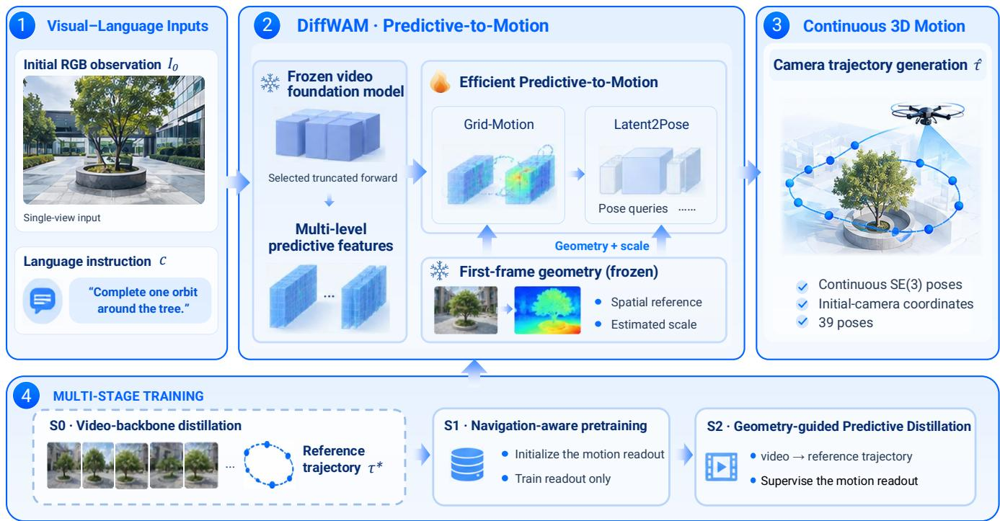  
Figure 2: DiffWAM’s pipeline. DiffWAM converts selected early predictive features and first-frame geometry into camera-motion trajectories through Grid-Motion and Latent2Pose. Training proceeds through video-backbone preparation (S0), navigation-aware readout pretraining (S1), and geometry-guided predictive distillation (S2), where completed video rollouts and geometric reconstruction provide offline trajectory supervision. Detailed tensor and output dimensions are specified in Fig. 3.

## 3.1 Problem Formulation

Given an initial RGB observation $I _ { 0 }$ and a language instruction $^ { c , }$ DiffWAM predicts camera motion over a nominal five-second horizon. The future trajectory is represented as

$$
\begin{array} { r } { \hat { \tau } = \{ ( \hat { R } _ { t } , \hat { p } _ { t } ) \} _ { t = 1 } ^ { T } , \qquad T = 3 8 , } \end{array}\tag{1}
$$

where $\hat { R } _ { t } \in \mathrm { S O } ( 3 )$ and $\hat { p } _ { t } \in \mathbb { R } ^ { 3 }$ denote the orientation and position at the t-th future timestamp. We express all future camera poses relative to the initial camera frame: a point $x ^ { C _ { t } }$ in the future camera frame is mapped to the initial camera frame as $x ^ { C _ { 0 } } = \hat { R } _ { t } x ^ { C _ { t } } + \hat { p } _ { t }$ . The initial camera axes point right, down, and forward. Prepending $( R _ { 0 } , p _ { 0 } ) = ( I _ { 3 } , \mathbf { 0 } )$ gives 39 poses in total, as specified by the detailed architecture in Fig. 3.

Each pose query is associated with a prescribed time offset $\delta _ { t } ,$ , with $0 = \delta _ { 0 } < \delta _ { 1 } < \cdot \cdot \cdot < \delta _ { T }$ , shared by prediction and supervision. These offsets index physical video time rather than denoising steps. Here, continuous-valued poses distinguish the output from discrete action tokens; a finite pose sequence does not by itself specify a continuously differentiable or dynamically feasible flight trajectory. Temporal interpolation and executable trajectory construction belong to the downstream execution system.

Rather than completing the video-generation schedule, DiffWAM retains predictive features from selected early backbone evaluations. Let K denote the retained zero-based schedule indices, with $\mathcal { K } = \{ 0 , 1 , 2 , 3 \}$ for DiffWAM and $\kappa = \{ 0 \}$ for DiffWAM-Flash. We denote the retained feature collection by $Z = \{ Z ^ { ( k ) } \} _ { k \in \mathcal { K } }$ and write

$$
( Z , A _ { 0 } ) = { \mathcal E } _ { \psi } ^ { \mathcal K } ( I _ { 0 } , c , \epsilon _ { v } ) ,\tag{2}
$$

where $\epsilon _ { v }$ is the sampled video noise, $\psi$ denotes the frozen video-model parameters, and $A _ { 0 }$ denotes the observationanchor representation supplied to the readout. The extraction operator includes all preceding backbone evaluations and scheduler updates needed to reach max $\kappa .$ , and terminates after DiT block 35 of the final required evaluation. The frozen MoGe2 geometry estimator provides

$$
G _ { 0 } = \mathcal { G } _ { \eta } ( I _ { 0 } ) ,\tag{3}
$$

and the motion-readout interface predicts

$$
\hat { \tau } = \mathcal { D } _ { \boldsymbol { \theta } } \big ( Z , A _ { 0 } , G _ { 0 } \big ) .\tag{4}
$$

The parameter set $\theta$ contains the trainable readout components and excludes the frozen video backbone and MoGe2 estimator.

Each retained schedule state preserves the native token-wise timestep assignments. A schedule index identifies a denoising evaluation, whereas a DiT block index identifies network depth within that evaluation; both differ from the physical timestamps of the predicted trajectory. The four-evaluation and one-evaluation budgets refer exclusively to the video backbone, not to the internal sampling budget of the pose readout. Neither variant performs future-video VAE decoding. Features from states $\mathcal { K } = \{ 0 , 1 , 2 , 3 \}$ are spatially encoded with state, position, and noise-level embeddings, concatenated at each video slot, and fused by learned attention pooling:

$$
m _ { u } = \mathrm { M H A } \Big ( q _ { \mathrm { f r a m e } } , \mathrm { C o n c a t } _ { k \in \mathcal { K } } H _ { u } ^ { ( k ) } , \mathrm { C o n c a t } _ { k \in \mathcal { K } } H _ { u } ^ { ( k ) } \Big ) .\tag{5}
$$

## 3.2 Efficient Predictive Motion Readout

DiffWAM investigates whether an early computation of a trained video model contains motion information that can be recovered without decoding future RGB frames. The readout therefore operates on hidden features of the video backbone rather than on rendered video or reconstructed future geometry.

Multi-level predictive representation. For each retained schedule index $k \in \mathcal { K }$ , we extract hidden features from DiT blocks 15, 25, and 35 using zero-based block indexing. The three depth taps are collected within the same backbone evaluation, whereas different schedule indices correspond to successive denoising evaluations. Only the final required evaluation is truncated after block 35. Before readout-specific feature preparation, the per-evaluation tensors are represented as

$$
Z ^ { ( k ) } \in \mathbb { R } ^ { L \times T _ { v } \times H _ { z } \times W _ { z } \times C } , \qquad A _ { 0 } ^ { ( k ) } \in \mathbb { R } ^ { L \times 1 \times H _ { z } \times W _ { z } \times C } ,\tag{6}
$$

where $L = 3 , T _ { v } = 3 9$ counts predictive video-time slots, $H _ { z } \times W _ { z }$ is the spatial feature grid, and $C$ is the hidden-channel dimension. The retained predictive input is $Z = \{ Z ^ { ( k ) } \} _ { k \in \mathcal { K } }$ . The video-time dimension, denoising schedule index, and DiT block index describe three distinct axes and must not be conflated. Observation-anchor features do not introduce additional output poses.

Each depth passes through a layer-specific normalization and a projection from 5,376 to 512 channels. The projected features are fused using softmax-normalized coefficients:

$$
F ^ { \mathrm { { f u s e } } } = \sum _ { \ell = 1 } ^ { L } \omega _ { \ell } \phi _ { \ell } ( Z _ { \ell } ) , \qquad \omega _ { \ell } = \frac { \exp ( a _ { \ell } ) } { \sum _ { j = 1 } ^ { L } \exp ( a _ { j } ) } .\tag{7}
$$

Here, $\phi _ { \ell }$ denotes the corresponding normalization and projection, and $a \ell$ is a fusion coefficient before softmax. These transformations belong to the prepared video-feature interface. Following the frozen-module configuration

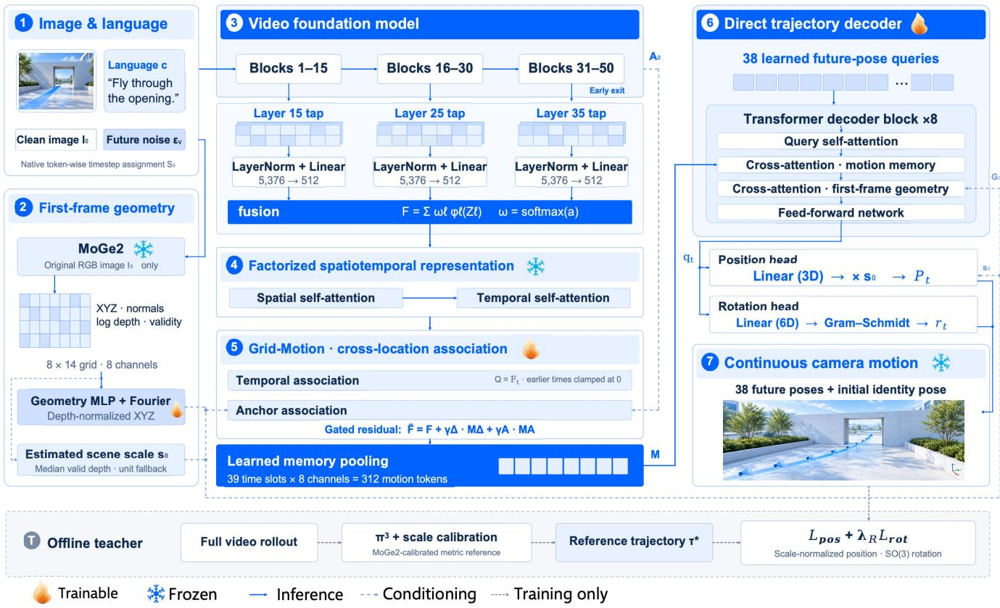  
Figure 3: DiffWAM’s model architecture. Features from DiT blocks 15, 25, and 35 are projected to 512 dimensions, fused, and processed by a frozen factorized spatiotemporal module. Grid-Motion associates predictive features across time and with geometry-conditioned anchors before pooling them into 312 motion-memory tokens. A direct decoder with 38 pose queries and eight transformer blocks predicts 38 future poses from motion memory and first-frame geometry; together with the initial identity pose, these form a 39-pose trajectory. During offline supervision, $\pi ^ { 3 }$ reconstructs camera motion and depth from completed video rollouts, and MoGe2 provides metric depth information for translation-scale calibration.

in Fig. 3, the representation front end is held fixed during motion-readout training; no predefined semantic role is assigned to an individual selected depth.

Four factorized transformer blocks then apply spatial and temporal self-attention:

$$
{ \cal F } = { \cal B } _ { \bar { \xi } } ( { \cal F } ^ { \mathrm { f u s e } } ) ,\tag{8}
$$

where $\bar { \xi }$ denotes the fixed parameters of the factorized spatiotemporal module. All associations below use this processed grid F. Spatial pooling is performed only after Grid-Motion, so that the association operators can access the unpooled spatial layout.

Grid-Motion association. For a predictive grid at video-slot index u, temporal association retrieves features across spatial locations from reference grids at $\operatorname* { m a x } ( 0 , u - 1 )$ and $\operatorname* { m a x } ( 0 , u - 4 )$ . The retrieved features are indexed on the current grid, giving

$$
M _ { u } ^ { \Delta } = \Psi \bigl ( F _ { u } - \mathcal { A } _ { \theta } ^ { \Delta } \bigl ( F _ { u } , F _ { \operatorname* { m a x } ( 0 , u - 1 ) } , F _ { \operatorname* { m a x } ( 0 , u - 4 ) } \bigr ) \bigr ) .\tag{9}
$$

Here, $\mathcal { A } _ { \theta } ^ { \Delta }$ performs cross-location retrieval and aggregation, and $\Psi$ transforms the resulting feature difference. The index u refers to a predictive video slot, whereas t indexes an output trajectory pose. The temporal offsets above are measured in feature slots, not seconds or denoising evaluations.

A second association links predictive features to the observed scene. Queries are derived from predictive features and keys from clean observation-anchor features, while values incorporate first-frame geometry. Geometry therefore conditions the aggregated content rather than directly entering the query–key matching scores in this association. We denote this interface by

$$
K _ { 0 } = \kappa ( A _ { 0 } ) , \qquad V _ { 0 } = \nu ( A _ { 0 } , G _ { 0 } ) , \qquad M _ { u } ^ { A } = { \mathcal A } _ { \theta } ^ { A } ( F _ { u } , K _ { 0 } , V _ { 0 } ) .\tag{10}
$$

The geometry-conditioned value mapping ν associates geometric information with the anchor indexing; the geometry grid and the video backbone feature grid need not have identical native resolutions. The two messages are combined with the processed predictive feature through a gated residual:

$$
\widetilde { F } _ { u } = F _ { u } + \gamma _ { u } ^ { \Delta } M _ { u } ^ { \Delta } + \gamma _ { u } ^ { A } M _ { u } ^ { A } .\tag{11}
$$

where $\gamma _ { u } ^ { \Delta }$ and $\gamma _ { u } ^ { A }$ are learned gates.

Learned memory pooling maps each ${ \widetilde { F } } _ { u }$ to eight pooling outputs, corresponding to the eight per-slot pooling channels shown in Fig. 3. Each output forms one motion-memory token, giving

$$
\mathcal { M } = \mathrm { P o o l } _ { \theta } ( \widetilde { F } ) \in \mathbb { R } ^ { 3 1 2 \times 5 1 2 } , \qquad 3 1 2 = 3 9 \times 8 .\tag{12}
$$

The eight pooling outputs are distinct from the 512-dimensional feature channels. The separately retained observation anchors are used for association and are not included in this count of pooled predictive tokens.

These associations are learned soft correspondences rather than measured optical flow. The readout does not explic itly impose orbit templates, target-center constraints, manually specified trajectory shapes, or forced loop closure. The architecture therefore provides learnable motion associations without explicitly imposing task-specific geometric templates.

## 3.3 Geometry-Guided Trajectory Decoding

Predictive motion features do not by themselves define an explicit metric spatial reference. We therefore condition the readout on geometry estimated from $I _ { 0 }$ by frozen MoGe2. The cached $8 \times 1 4$ geometry grid contains signed log XYZ coordinates, surface normals, log depth, and a validity indicator, giving eight channels per cell. After spatial resampling when required, the geometry MLP embeds these channels. For the coordinate embedding, the signed-log coordinates are decoded to XYZ and normalized by the scene-level scale $s _ { 0 }$ defined below:

$$
\bar { \mathbf { x } } _ { j } = \mathrm { { c l i p } } \left( \frac { \mathbf { x } _ { j } } { s _ { 0 } } , - 2 0 , 2 0 \right) .\tag{13}
$$

The Fourier embedding concatenates $\bar { \mathbf { x } } _ { j }$ with sin $( f \bar { \bf x } _ { j } )$ and $\cos ( f \bar { \bf x } _ { j } )$ for $f \in \{ 1 , 2 , 4 \}$ , yielding 21 coordinate features. The projected coordinate embedding is added to the geometry-MLP output. This normalization uses a shared scene scale rather than each cell’s individual depth.

Let $g _ { j } ^ { \mathrm { d e p t h } } = \log d _ { j }$ denote the log depth of cell j. From the valid cells $\nu ,$ we compute

$$
s _ { 0 } = \mathrm { c l i p } \Big ( \mathrm { m e d i a n } _ { j \in \mathscr { V } } \exp ( g _ { j } ^ { \mathrm { d e p t h } } ) , 0 . 1 , 1 0 0 \Big ) .\tag{14}
$$

The bounds are expressed in meters. When no valid depth estimate is available, the implementation uses unit scale. Thus, s provides a metric-scale condition derived either from monocular geometry or from an external depth sensor, depending on the available depth source.

The decoder contains 38 learned future-pose queries and eight transformer decoder blocks. Each block applies query self-attention, cross-attention to $\mathcal { M }$ , cross-attention to the first-frame geometry tokens, and a feed-forward sublayer. Let $q _ { t }$ be the final query representation for timestamp $\delta _ { t }$ . The position and rotation heads output

$$
\begin{array} { r } { \hat { p } _ { t } = s _ { 0 } ( W _ { p } q _ { t } + b _ { p } ) , \qquad \hat { R } _ { t } = \mathrm { G S } ( W _ { R } q _ { t } + b _ { R } ) , } \end{array}\tag{15}
$$

where the heads produce three translation coordinates and a six-dimensional rotation representation, respectively.   
Gram–Schmidt orthogonalization, denoted by GS, converts the latter into a rotation matrix.

The video model provides predictive representations of future scene evolution and camera motion, while monocular geometry estimation or an external depth sensor anchors these representations to the geometry and metric scale of the current observation. Their combination enables DiffWAM to predict camera trajectories in the initial camera coordinate frame. The scale factor $s _ { 0 }$ explicitly conditions translation on scene scale, but does not impose strict scale equivariance because the learned representations themselves also depend on geometric inputs.

## 3.4 Geometry-Guided Predictive Distillation

Training stages and parameter scope. Figure 2 distinguishes video-backbone preparation (S0), navigation aware readout pretraining (S1), and geometry-guided predictive distillation (GPD, S2). These stage labels are distinct from denoising schedule indices. S1 produces the navigation-aware readout initialization $\theta _ { \mathrm { p r e } }$ . Starting from this initialization, S2 fine-tunes the DiffWAM and DiffWAM-Flash readouts using their respective retained predictive-state subsets. During S1 and S2, the video backbone and the MoGe2 geometry estimator remain frozen, while the trainable motion-readout components are optimized jointly. The geometry embeddings inside the readout are trainable components and are not part of the frozen MoGe2 estimator.

Navigation-aware readout pretraining (S1). We initialize the readout using trajectory supervision from the same corpus employed for video-backbone adaptation, without introducing additional scene or instruction data. The extracted predictive features and first-frame geometry are mapped to the available corpus trajectories, producing an initialization $\theta _ { \mathrm { p r e } }$ . This stage establishes a corpus-supervised motion readout. The following stage adds an explicit correspondence between each sampled early predictive state and the reconstructed motion of its own completed latent rollout.

Geometry-guided predictive distillation (S2). GPD transfers trajectory supervision from completed video rollouts to a motion readout operating on early predictive features. Each training example pairs features with a reference trajectory reconstructed from the same rollout. The frozen video model generates these examples offline, independently of the current readout parameters.

For $( I _ { 0 } , c )$ and sampled video noise $\epsilon _ { v } ,$ we retain the feature collection required by the deployed variant:

$$
\begin{array} { r } { ( Z _ { \epsilon _ { v } } , A _ { 0 } ) = \mathcal { E } _ { \psi } ^ { K } ( I _ { 0 } , c , \epsilon _ { v } ) , } \end{array}\tag{16}
$$

where $\mathcal { K } = \{ 0 , 1 , 2 , 3 \}$ for DiffWAM and $\kappa = \{ 0 \}$ for DiffWAM-Flash. During offline data construction, we complete the same video rollout, including the remaining backbone computation, scheduler updates, and video

decoding, to obtain

$$
V _ { \epsilon _ { v } } = \mathrm { R o l l o u t } _ { \psi } ( I _ { 0 } , c , \epsilon _ { v } ) .\tag{17}
$$

The rollout operator denotes continuation of the same sampled generation rather than an independent video sample. Any additional randomness introduced during continuation is retained to preserve the correspondence between predictive features and the completed video.

Each record preserves

$$
\left( Z _ { \epsilon _ { v } } , A _ { 0 } , G _ { 0 } , V _ { \epsilon _ { v } } \right) ,\tag{18}
$$

with $G _ { 0 } = \mathcal { G } _ { \eta } ( I _ { 0 } )$ computed from the initial RGB image, matching deployment. Geometry extracted from generated future images, when used by the teacher, is not part of the student’s input. Different noise samples can produce different plausible motions for the same $( I _ { 0 } , c )$ ; pairing features and trajectories from unrelated rollouts can therefore introduce inconsistent supervision. The preserved correspondence is

$$
( Z _ { \epsilon _ { v } } , A _ { 0 } ) \longleftrightarrow V _ { \epsilon _ { v } } ,\tag{19}
$$

so that the decoder is supervised against the motion associated with its own feature realization.

Reconstruction-derived, scale-calibrated teacher. $\pi ^ { 3 }$ reconstructs camera motion and depth from the completed video. Following the MoGe2-calibrated teacher in Fig. 3, we estimate its translation scale using MoGe2 depth for the corresponding calibration images. Let $\mathcal { I } _ { \mathrm { c a l } }$ denote the selected calibration-frame indices. For $t \in \mathcal { I } _ { \mathrm { c a l } }$ $D _ { t , j } ^ { \mathrm { m e t r i c } }$ is the MoGe2-estimated depth and $D _ { t , j } ^ { \pi ^ { 3 } }$ is the $\pi ^ { 3 }$ depth at the corresponding image pixel. These depths must refer to the same image and registered pixel locations; unrelated future sensor observations cannot substitute for generated-image depth.

For finite depth pairs satisfying

$$
0 . 5 < D _ { t , j } ^ { \mathrm { m e t r i c } } < 3 0 , \qquad D _ { t , j } ^ { \pi ^ { 3 } } > 0 ,\tag{20}
$$

we form the valid set $\mathcal { V } _ { \mathrm { t e a c h e r } }$ and estimate

$$
\alpha = \mathrm { m e d i a n } _ { ( t , j ) \in \mathscr { V } _ { \mathrm { t e a c h e r } } } \frac { D _ { t , j } ^ { \mathrm { m e t r i c } } } { D _ { t , j } ^ { \pi ^ { 3 } } } .\tag{21}
$$

The metric-depth bounds are in meters. This definition requires a successful reconstruction, a nonempty valid set, and a finite positive α. If calibration uses only the initial image, then $\mathcal { I } _ { \mathrm { c a l } } = \{ 0 \}$ ; using additional generated frames changes the teacher’s information budget but not the student’s first-frame-only input.

Writing the reconstructed poses in camera-to-reconstruction-frame convention as $( \bar { R } _ { t } , \bar { p } _ { t } )$ , we express the supervision in the initial camera frame:

$$
R _ { t } ^ { \star } = \bar { R } _ { 0 } ^ { \top } \bar { R } _ { t } , \qquad p _ { t } ^ { \star } = \alpha \bar { R } _ { 0 } ^ { \top } ( \bar { p } _ { t } - \bar { p } _ { 0 } ) .\tag{22}
$$

Thus, $( R _ { 0 } ^ { \star } , p _ { 0 } ^ { \star } ) = ( I _ { 3 } , { \bf 0 } )$ , and the same α scales all translation axes. Scale calibration does not change rotations; the rotation above only changes the reference frame. If reconstruction poses are provided in the inverse convention, they are first converted to the convention used in this equation. Teacher and student poses correspond to the same time offsets $\delta _ { t }$

The resulting trajectory is

$$
\tau _ { \epsilon _ { v } } ^ { \star } = \mathcal { T } ( V _ { \epsilon _ { v } } , D ^ { \mathrm { m e t r i c } } ) ,\tag{23}
$$

where T includes reconstruction, scale calibration, and coordinate and temporal alignment. This is a reconstructionderived reference in estimated meters, not measured physical ground truth. Same-rollout pairing ensures source correspondence, but does not remove generation errors, reconstruction drift, or monocular-scale bias.

Distillation objective. Starting from $\theta _ { \mathrm { p r e } }$ , the readout predicts

$$
\hat { \tau } _ { \epsilon _ { v } } = \mathcal { D } _ { \theta } ( Z _ { \epsilon _ { v } } , A _ { 0 } , G _ { 0 } ) , \qquad \theta  \theta _ { \mathrm { p r e } } ,\tag{24}
$$

and is optimized through

$$
\begin{array} { r } { \theta ^ { \star } = \arg \operatorname* { m i n } _ { \theta } \ \mathbb { E } _ { ( I _ { 0 } , c ) \sim \mathcal { D } _ { \mathrm { t r a i n } } , \epsilon _ { v } } \left[ \mathcal { L } \big ( \mathcal { D } _ { \theta } ( Z _ { \epsilon _ { v } } , A _ { 0 } , G _ { 0 } ) , \tau _ { \epsilon _ { v } } ^ { \star } \big ) \right] . } \end{array}\tag{25}
$$

The teacher accesses the completed generated future, whereas the student uses only early predictive features and first-frame geometry. The targets train the readout to recover the teacher-associated motion; they do not update the frozen video backbone representations. This is trajectory-level supervised distillation of an expensive continuationand-reconstruction process into a direct motion readout.

For the $T = 3 8$ future poses, the two-term objective shown in Fig. 3 is

$$
\begin{array} { r } { \mathcal { L } = \mathcal { L } _ { \mathrm { p o s } } + \lambda _ { R } \mathcal { L } _ { \mathrm { r o t } } , } \end{array}\tag{26}
$$

where

$$
\mathcal { L } _ { \mathrm { p o s } } = \frac { 1 } { 3 T } \sum _ { t = 1 } ^ { T } \sum _ { j = 1 } ^ { 3 } \rho \bigg ( \frac { \hat { p } _ { t , j } - p _ { t , j } ^ { \star } } { \mathrm { s g } ( s _ { 0 } ) } \bigg ) ,\tag{27}
$$

and

$$
\mathcal { L } _ { \mathrm { r o t } } = \frac { 1 } { T } \sum _ { t = 1 } ^ { T } d _ { \mathrm { S O ( 3 ) } } ( \hat { R } _ { t } , R _ { t } ^ { \star } ) ^ { 2 } .\tag{28}
$$

Here, $\rho$ is the robust scalar position penalty and sg denotes stop-gradient. The rotation discrepancy is the geodesic angle in radians,

$$
d _ { \mathrm { S O ( 3 ) } } ( R _ { 1 } , R _ { 2 } ) = \operatorname { a r c c o s } \left[ \exp \left( \frac { \mathrm { t r } ( R _ { 1 } ^ { \top } R _ { 2 } ) - 1 } { 2 } , - 1 , 1 \right) \right] .\tag{29}
$$

The fixed initial pose is excluded from supervision, and all future timestamps receive equal weight. The teacher factor α calibrates reconstruction scale, whereas $s _ { 0 }$ conditions and normalizes the student’s translation readout; they have different roles.

The readout and its objectives are shared across instruction categories; task conditions enter through the predictive features rather than through hand-designed trajectory templates. Historical composite-loss configurations discussed in Sec. 5.4 are separate training variants, not additional unlisted terms in Eq. (26). At deployment, the complete video rollout, $\pi ^ { 3 }$ reconstruction, and teacher-side calibration are removed.

## 3.5 Inference

At deployment, the external inputs are the initial RGB observation $I _ { 0 }$ and language instruction c. The video backbone and MoGe2 can be evaluated concurrently: the predictive branch depends on $( I _ { 0 } , c )$ and internally sampled video noise, while the geometry branch depends only on $I _ { 0 }$ . The predictive branch performs only the backbone evaluations and scheduler updates required to reach the final retained schedule state, and terminates immediately after DiT block 35 of the final required evaluation. No further scheduler updates or VAE video decoding are performed. Making the internal noise dependence explicit, the inference path is

$$
\left( I _ { 0 } , c ; \epsilon _ { v } \right) \longrightarrow \left( Z _ { \epsilon _ { v } } , A _ { 0 } , G _ { 0 } \right) \longrightarrow \hat { \tau } _ { \epsilon _ { v } } .\tag{30}
$$

No completed future video, online $\pi ^ { 3 }$ reconstruction, or teacher trajectory is required.

The predicted pose sequence is a motion proposal, not a certified collision-free vehicle command. Its initial-camera reference and pose time offsets are preserved when calibrated camera-to-body extrinsics and the downstream state estimate map it to the execution frame. The planner checks feasibility and constructs an executable trajectory, while the control stack handles tracking and vehicle constraints. This separation lets DiffWAM focus on languageconditioned geometric motion prediction without attributing collision avoidance or dynamic-feasibility guarantees to the pose decoder itself.

## 4 FastDreamer: Inference and Continuous Execution

FastDreamer is an inference-and-execution framework designed to connect DiffWAM to continuous UAV control, with particular emphasis on onboard deployment of the DiffWAM-Flash configuration on the Thor platform. It ad dresses two challenges that become critical in closed-loop execution. First, short-horizon motion prediction benefits from a locally grounded instruction, but maintaining an additional large vision-language model solely for instruc tion rewriting increases the onboard memory requirement. FastDreamer therefore defines a shared-weight rewriting interface that reuses the vision-language component of the world-model conditioning path. Second, proposal preparation takes time while the UAV continues to move. FastDreamer overlaps this computation with the execution of a currently validated trajectory and aligns each accepted update with a scheduled future handoff state.

Shared-weight rewriting and parallel proposal inference address memory residency and computation dependencies; Flight-Time Compute determines whether a new plan can be prepared within the remaining execution horizon; and Prospective Handoff addresses the state mismatch accumulated during preparation. These mechanisms have distinct evaluation targets. The inference-performance protocol in Sec. 5.3.3 measures model-pipeline latency and memory, while waiting during execution and handoff continuity characterize separate closed-loop properties. Neither low prediction latency nor a feasible scheduling budget alone establishes closed-loop task success.

## 4.1 Shared-Weight Prompt Rewriting and Parallel Proposal Inference

Shared-weight prompt rewriting. A mission-level instruction may contain multiple stages or completion requirements that cannot be inferred from a single current image. For long-horizon execution, the rewriting interface therefore requires task context $h _ { n }$ from an upstream mission manager, in addition to the mission instruction $\mathcal { T }$ and observation $I _ { n }$ . This context describes the active subtask and verified execution progress, such as completed stages or remaining repetitions. At replanning cycle n, the local condition is

$$
\begin{array} { r } { c _ { n } = \mathcal { Q } _ { \omega } ( I _ { n } , \mathcal { I } , h _ { n } ) , } \end{array}\tag{31}
$$

where $\mathcal { Q } _ { \omega }$ denotes the rewriter and $\omega$ denotes the reused vision-language parameters. This notation distinguishes rewriting from the complete video backbone rollout operator used for offline supervision. For an independent singlestage request, $h _ { n }$ can be empty. Updating task progress and declaring mission completion remain responsibilities of the mission manager, not of frame-wise rewriting alone.

The rewriter is instructed to preserve the target identity, commanded side, distance, altitude, motion direction, and temporal constraints relevant to the active subtask. Global stage ordering and completion requirements remain in the task context rather than being reset at each local prediction. Prompt rewriting [29] adapts the user instruction to the conditioning distribution of the video model by making the intended motion and scene relations more explicit. Prior work has shown that such prompt optimization can improve instruction alignment in generated videos. In FastDreamer, the rewritten condition is used directly by the predictive backbone, providing a more explicit motion condition for the downstream trajectory readout without requiring future-video generation.

Parallel proposal inference. Once the request inputs are available, first-image geometry estimation can start concurrently with prompt rewriting because MoGe2 does not depend on $c _ { n }$ . After rewriting, the prediction branch computes image-language conditioning from $\left( I _ { n } , c _ { n } \right)$ and executes the predictive-backbone evaluations required by the deployed DiffWAM variant, terminating after the deepest retained feature layer of the final required evaluation. DiffWAM-Flash uses a single truncated evaluation, whereas the standard DiffWAM configuration retains multiple predictive evaluations as defined in Sec. 3. The trajectory decoder runs after both the predictive features and geometry features are available. Both branches use the same captured image, and neither configuration performs future-video decoding or online $\pi ^ { 3 }$ reconstruction.

Let $T _ { \mathrm { p r e d } }$ denote the duration of the prediction branch, including rewriting, and $T _ { \mathrm { g e o } }$ the duration of the geometry branch:

$$
T _ { \mathrm { p r e d } } = T _ { \mathrm { r e w r i t e } } + T _ { \mathrm { v i d e o ~ c o n d i t i o n } } + T _ { \mathrm { v i d e o ~ D i T } } + T _ { \mathrm { f e a t u r e ~ t r a n s f e r } } ,\tag{32}
$$

$$
T _ { \mathrm { g e o } } = T _ { \mathrm { M o G e 2 } } + T _ { \mathrm { g e o m e t r y ~ t r a n s f e r } } .\tag{33}
$$

The idealized model-proposal inference critical path is

$$
T _ { \mathrm { p r o p o s a l } } ^ { \mathrm { i d e a l } } = T _ { \mathrm { i n p u t } } + \mathrm { m a x } ( T _ { \mathrm { p r e d } } , T _ { \mathrm { g e o } } ) + T _ { \mathrm { h e a d } } + T _ { \mathrm { o u t p u t } } ,\tag{34}
$$

where $T _ { \mathrm { i n p u t } }$ covers request-side input handling and $T _ { \mathrm { o u t p u t } }$ covers delivery of the predicted proposal to the planning interface. This quantity includes rewriting but excludes downstream transition planning and validation. It is therefore one component of the complete preparation latency defined in Sec. 4.2, and is distinct from the model-only latency measured with a prepared image and local condition.

## 4.2 Flight-Time Compute

DiffWAM predicts a finite-horizon motion proposal. FastDreamer uses the remaining duration of the currently validated committed trajectory as a preparation budget, rather than waiting for that trajectory to end before requesting an update. We distinguish five timestamps: image capture $t _ { n }$ , request launch $u _ { n }$ , preparation completion $r _ { n }$ , scheduled handoff $t _ { h , n }$ , and expiry of the current committed trajectory $e _ { n }$ . Preparation includes proposal inference, transition planning, validation, and delivery. For a timely accepted update, these timestamps satisfy

$$
t _ { n } \leq u _ { n } \leq r _ { n } \leq t _ { h , n } \leq e _ { n } .
$$

The measured preparation duration is $d _ { n } = r _ { n } - u _ { n }$ , whereas the observation-to-handoff age is $\Delta _ { n } = t _ { h , n } - t _ { n }$ These durations need not be equal.

The available flight-time budget is

$$
\begin{array} { r } { B _ { n } = e _ { n } - u _ { n } . } \end{array}\tag{35}
$$

An additive accounting of the preparation stages is

$$
\widehat { L } _ { n } = \widehat { L } _ { \mathrm { p r o p o s a l } , n } + \widehat { L } _ { \mathrm { p l a n n e r } , n } + \widehat { L } _ { \mathrm { v a l i d a t i o n } , n } + \widehat { L } _ { \mathrm { c o m m u n i c a t i o n } , n } ^ { \mathrm { e x t r a } } ,\tag{36}
$$

where the proposal estimate includes rewriting and parallel geometry. The last term includes only communication not already accounted for in input handling, feature transfer, or proposal delivery. Validation and activation checks are explicitly budgeted rather than hidden in an unspecified margin. When these stages overlap, the estimate follows the measured critical path instead of summing overlapping intervals or stage-wise latency quantiles.

Let $M _ { n } \geq 0$ account for uncertainty in the preparation-time estimate, and let $R _ { n } \geq 0$ reserve the time required by the flight stack to enter a validated fallback before $e _ { n }$ . The scheduling condition is

$$
\widehat { L } _ { n } + M _ { n } + R _ { n } \leq B _ { n } .\tag{37}
$$

The handoff time is selected before transition planning, with

$$
u _ { n } + \widehat { L } _ { n } + M _ { n } \leq t _ { h , n } \leq e _ { n } - R _ { n } .
$$

State prediction and transition planning use this same scheduled time. An early result waits for the scheduled activation; a result that misses that time must be rescheduled and revalidated or rejected, rather than activated with an outdated boundary condition. Equation 37 is an admission condition based on estimated latency, not a deterministic runtime guarantee.

The fallback decision cannot be postponed until the committed trajectory has expired. If no usable update is available by $e _ { n } \mathrm { ~ - ~ } R _ { n }$ , the flight stack must retain a validated continuation or initiate its feasible braking or holding behavior. A zero reserve is admissible only when the committed trajectory already provides the required terminal behavior. Changes that invalidate the committed trajectory may require an earlier response, independently of the nominal compute budget.

For completed preparation attempts, the overrun beyond the committed-plan expiry is

$$
g _ { n } = \operatorname* { m a x } ( 0 , d _ { n } - B _ { n } ) .\tag{38}
$$

The condition $g _ { n } = 0$ means only that preparation did not extend beyond $e _ { n } ;$ it does not imply that the earlier scheduled handoff was met or that the proposal was accepted. Preparation latency is hidden from execution only when a valid, feasible update is ready for the scheduled handoff and ongoing motion remains executable. This reduces waiting caused by computation, not the intrinsic model latency. Rejected proposals, missed handoffs, and unfinished requests must be recorded separately rather than counted as successful zero-wait updates. Requests must also retain their mission and committed-plan identity so that superseded results cannot overwrite newer decisions.

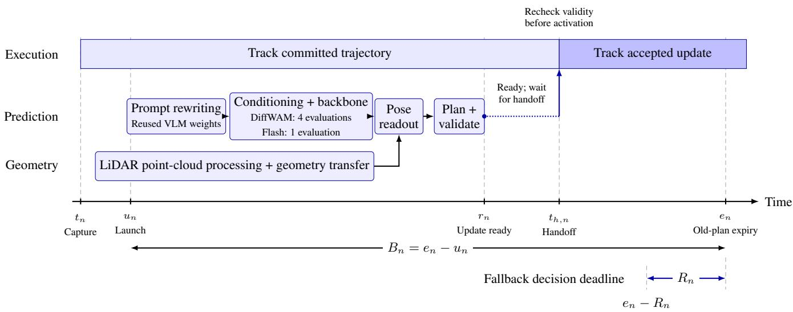  
Figure 4: Asynchronous trajectory preparation and scheduled handoff. While the UAV tracks its committed trajectory, prompt rewriting and LiDAR-based geometry preparation proceed in parallel. The predictive backbone, pose readout, planning, and validation produce a candidate update ready at $r _ { n }$ . DiffWAM uses four backbone evaluations, whereas DiffWAM-Flash uses one; both terminate the final evaluation after DiT block 35 without future-video decoding. An early candidate waits until the scheduled handoff $t _ { h , n }$ and is activated only after its validity is rechecked. The remaining budget is $B _ { n } = e _ { n } - u _ { n }$ , with a fallback decision required no later than $e _ { n } - R _ { n }$ if no valid update can be activated. The diagram illustrates an early-ready update; horizontal distances are schematic rather than measured durations.

## 4.3 Prospective Handoff and Safety Boundary

Capture-time coordinate grounding. A proposal is conditioned on an image captured at $t _ { n }$ , not on the vehicle state at its later activation. Let W denote the world frame, $C _ { n }$ the capture-time camera frame, and k a predicted-pose index. Using the estimated capture-time camera pose, the predicted poses are lifted into the world frame as

$$
{ } ^ { W } \widehat { T } _ { C _ { n , k } } = { } ^ { W } T _ { C _ { n } } { } ^ { C _ { n } } \widehat { T } _ { C _ { n , k } } .\tag{39}
$$

Let $^ B T _ { C }$ be the calibrated rigid transform mapping camera coordinates into body coordinates. The corresponding world-frame body-pose references are

$$
{ } ^ { W } \widehat { T } _ { B _ { n , k } } = { } ^ { W } \widehat { T } _ { C _ { n , k } } \left( { } ^ { B } { T } _ { C } \right) ^ { - 1 } .\tag{40}
$$

This conversion changes the represented rigid body, not the world reference frame. Replacing $w _ { T _ { C _ { n } } }$ with an activation-time pose would incorrectly translate and rotate the world-anchored proposal. The resulting body-pose sequence remains a motion reference, not a directly executable vehicle-attitude command.

Scheduled-state prediction. Let $s ( t _ { s , n } )$ denote the latest state estimate used for planning, with timestamp $t _ { s , n } ~ \leq ~ t _ { h , n }$ , and let $\tau _ { n } ^ { - }$ denote the currently committed world-frame reference, parameterized by absolute time. The prospective activation state is

$$
\begin{array} { r } { \widetilde { s } _ { h , n } = \Phi \big ( s ( t _ { s , n } ) , \tau _ { n } ^ { - } , t _ { h , n } - t _ { s , n } \big ) , } \end{array}\tag{41}
$$

where $\Phi$ propagates the state under the committed motion. Its propagation interval starts at the state-estimation timestamp, not automatically at the image-capture time. The planner uses this prediction together with the committed reference to assess the transition at $t _ { h , n }$ . Prediction error and reference-tracking error are not assumed to be zero.

The controller must check the latest state and plan validity before activation. The actual activation time is recorded separately from $t _ { h , n }$ . If timing jitter, a changed committed plan, or state mismatch invalidates the planned transition, the proposal must be realigned and revalidated or rejected; changing its timestamp alone is insufficient.

Progress-aware transition requirements. Elapsed preparation time is not equivalent to progress along the newly predicted trajectory, because the UAV has been following $\tau _ { n } ^ { - }$ rather than the new proposal. The execution interface therefore does not remove a proposal prefix solely according to $\Delta _ { n }$ . A prefix may be omitted only when the executed motion and task context establish that the corresponding requirement has already been satisfied. For repeated or self-intersecting motions, geometric proximity alone is insufficient to determine task progress.

The transition must connect the scheduled boundary state to a compatible part of the remaining proposal without skipping uncompleted task requirements. World-frame targets and the order of required maneuvers are retained; preserving only the endpoint is insufficient for passage, orbiting, or side-specific motion. The predicted sample times specify nominal motion timing, whereas the downstream planner determines feasible execution timing. Any retiming must preserve explicit duration, speed, and ordering constraints in the instruction. If progress cannot be established or no task-consistent feasible connection exists, the proposal must be rejected or refreshed instead of being forced into the current execution state.

Reference continuity and acceptance. Let $\tau _ { n } ^ { + } ( \xi )$ denote the replacement reference with local execution time $\xi = t - t _ { h , n }$ . At the scheduled handoff, the minimum kinematic reference-continuity conditions considered here are

$$
p _ { n } ^ { + } ( 0 ) = p _ { n } ^ { - } ( t _ { h , n } ) , \qquad v _ { n } ^ { + } ( 0 ) = v _ { n } ^ { - } ( t _ { h , n } ) .\tag{42}
$$

All positions and velocities are expressed in the world frame. These equalities constrain commanded references; they do not assert that the actual vehicle state exactly equals the nominal reference. The predicted and latest es timated states must remain compatible with the tracking conditions accepted by the flight stack. If a separate transition segment is followed by a retained proposal segment, continuity must also hold at their connection, not only at activation.

## 5 Results

To comprehensively evaluate DiffWAM, we conduct extensive benchmark, simulation, real-world, deployment, and ablation experiments focusing on four key questions: (1) How does DiffWAM compare with representative worldaction and trajectory-prediction methods across diverse aerial navigation tasks? (2) Can the predicted motion be reliably executed in simulation and real-world environments, including tasks that require continuous and spatially structured trajectories? (3) Can the proposed efficient inference and asynchronous execution pipeline support practical onboard UAV deployment? (4) Which representation, predictive-computation, geometric, and training choices contribute to trajectory quality and execution performance?

To address these questions, Sec. 5.1 first introduces the training datasets, evaluation datasets, evaluation metrics, baselines, and experimental protocol. Sec. 5.2 then presents quantitative benchmark comparisons and simulation results. Sec. 5.3 evaluates real-world navigation and onboard deployment. Finally, Sec. 5.4 provides systematic ablation studies to analyze the major design choices of DiffWAM.

## 5.1 Experimental Setup

## 5.1.1 Training Datasets

To train DiffWAM, we construct a large-scale aerial navigation dataset primarily using synthetic data generated by two automated pipelines developed in our previous work, FlyMirage [30] and NavGen [31]. FlyMirage first employs large language models (LLMs) to generate diverse scene descriptions and uses the generative model Marble [32] to construct corresponding high-fidelity 3DGS environments. A heuristic autonomous exploration strategy is then applied to traverse the generated scenes, while Boxer [33] detects and annotates object categories and their 3D locations. Based on these annotations, the efficient trajectory planner GCOPTER [34] automatically generates dynamically feasible UAV trajectories between objects and spatial regions. The resulting FlyMirage dataset contains approximately 1,100 scenes and more than 110K trajectories, alleviating several common limitations of existing aerial navigation datasets, including inconsistent observation quality, limited scene diversity, and trajectories that do not satisfy realistic UAV dynamics. In parallel, NavGen provides a complementary data-generation paradigm based on generative video models. By exploiting the rich visual and motion priors encoded in video foundation models, NavGen efficiently generates task-conditioned navigation trajectories for diverse instructions, such as “follow the path and continue moving forward,” while data augmentation further improves the diversity of scene appearance and environmental configurations. More importantly, the strong generative and motion generalization capabilities of video models enable NavGen to synthesize complex motion patterns that are difficult to obtain using conventional point-to-point navigation pipelines, such as “fly through the cave” and “complete one orbit around the cabin in the forest.” In this way, NavGen substantially expands the training distribution from goal-directed navigation to continuous motions with richer spatial and geometric structures, yielding approximately 400K trajectories covering a broad range of aerial navigation tasks. We have released an initial batch of the data in these projects.

Combining the above methods, we obtain more than 510K training samples spanning a broad range of aerial navigation capabilities, including Basic Motion, Instruction Following, Object Navigation, Precise Navigation, Spatial Grounding, Specific Trajectory, Language Control, Scene Understanding, and Object Searching. This heteroge neous data distribution exposes DiffWAM to both elementary motion primitives and complex language-conditioned trajectory structures, providing a diverse data foundation for learning continuous and generalizable UAV navigation.

## 5.1.2 Evaluation Datasets

We evaluate DiffWAM on a unified aerial-navigation benchmark covering both simulation and real-world scenes. The benchmark contains 1,000 test samples, which we refer to as DiffWAM-1000, and fully represents the distribution of all task categories. It covers 18 task types organized into four families, as illustrated in Fig. 5: basic motion (10%), object interaction (65%), spatial navigation (15%), and scene understanding (10%).

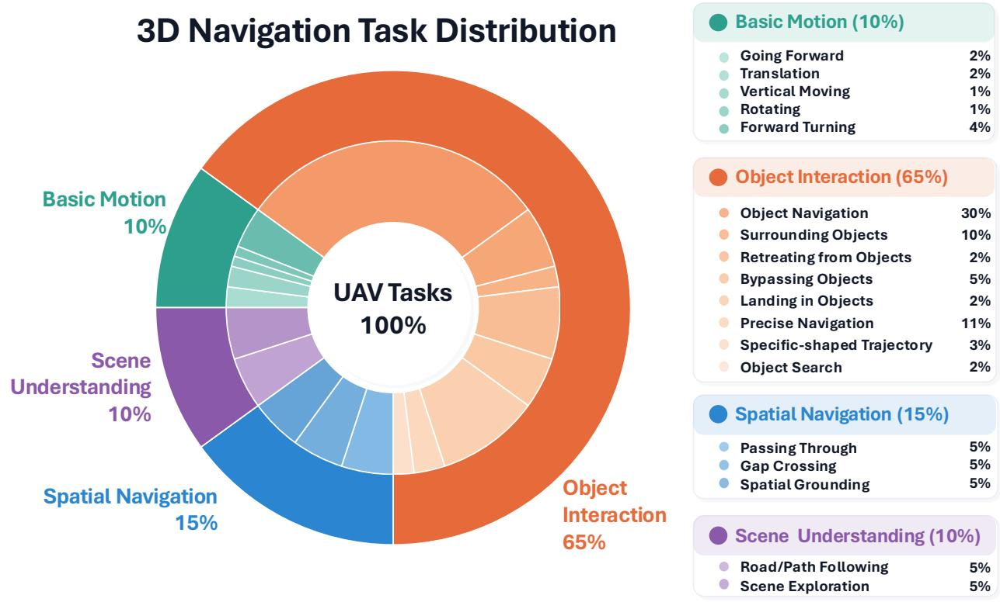  
Figure 5: Distribution of the evaluation tasks. The benchmark contains 18 task types grouped into four families: basic motion, object interaction, spatial navigation, and scene understanding. Percentages denote the fraction of the complete evaluation set.

Tab. 1 provides a more detailed description of each task category of the test benchmark, as well as examples of typical task instructions. The benchmark is designed to evaluate complementary aspects of continuous UAV navigation. Basic motion tasks examine whether the predicted trajectory follows explicit translational and rotational commands. Object-interaction tasks require the model to associate language instructions with target objects and generate target-relative motion, including approaching, retreating, side-specific passing, orbiting, slalom flight, and landing. Spatial-navigation tasks evaluate motion through constrained free-space regions, while scene-understanding tasks require the predicted motion to follow larger-scale scene structures such as roads or boundaries. Object-interaction tasks constitute the largest subset because language-conditioned target selection and spatial-relation reasoning are central to vision-language UAV navigation.

Table 1: Composition of the evaluation benchmark. All task percentages are computed with respect to the complete evaluation set.
<table><tr><td>Task family</td><td>Task type</td><td>Example of instructions</td></tr><tr><td>Basic Motion</td><td>Going Forward</td><td>Fly forward for 5 seconds</td></tr><tr><td rowspan="8">Object Interaction</td><td>Translation</td><td>Move left without turning</td></tr><tr><td>Vertical Moving</td><td>Move upwards by 3 meters</td></tr><tr><td>Rotating</td><td>Rotate 45 degrees in place</td></tr><tr><td>Forward Turning</td><td>Move to the right and face that direction</td></tr><tr><td>Object Navigation</td><td>Navigate to the black rock formation</td></tr><tr><td>Surrounding objects</td><td>Circle around the white pillar</td></tr><tr><td>Retreating from objects</td><td>Step back and leave the square box</td></tr><tr><td>Bypassing objects</td><td>Go around from the right side of the tree</td></tr><tr><td></td><td>Landing in Objects</td><td>Land on the brown table</td></tr><tr><td></td><td>Precise Navigation</td><td>Navigate to the second billboard on the left</td></tr><tr><td></td><td>Specific-shaped trajectory</td><td>Fly in an S-shaped trajectory</td></tr><tr><td>Spatial navigation</td><td>Object Search</td><td>Find a place where one can drink water</td></tr><tr><td rowspan="3"></td><td>Passing Through</td><td>Pass through the middle of the two charging stations</td></tr><tr><td>Gap Crossing</td><td>Go through the opening in this window</td></tr><tr><td>Spatial Grounding</td><td>Head to the left of the chair on the right</td></tr><tr><td rowspan="2">Scene Understanding</td><td>Road/path Following</td><td>Keep flying along the path in the forest</td></tr><tr><td>Scene exploration</td><td>Keep exploring along the corridor of the room until you reach the end of the corridor</td></tr></table>

Training, validation, and evaluation data are separated at the scene level to prevent visually adjacent viewpoints or paraphrased instructions from appearing in different partitions. Unless otherwise specified, all benchmark results in Secs. 5.2 and 5.3 are reported on this revised evaluation protocol.

## 5.1.3 Evaluation Metrics

We evaluate the proposed system from five complementary perspectives: endpoint accuracy, trajectory accuracy, rotation accuracy, closed-loop task completion, and execution efficiency.

Endpoint accuracy. Endpoint accuracy evaluates whether the UAV reaches sufficiently close to the desired target and is mainly used for tasks such as object navigation and instruction following. For the i-th test episode, we denote the ground-truth trajectory as $\tau _ { i } ^ { \star } = \{ P _ { i , 1 } ^ { \star } , P _ { i , 2 } ^ { \star } , \ldots , P _ { i , N } ^ { \star } \}$ , and the trajectory predicted by DiffWAM as $\hat { \tau } _ { i } = \{ \hat { P } _ { i , 1 } , \hat { P } _ { i , 2 } , \ldots , \hat { P } _ { i , N } \}$ , where $P _ { i , n } ^ { \star }$ and $\hat { P } _ { i , n }$ denote the ground-truth and predicted 3D positions at the n-th trajectory waypoint, respectively, and $N$ is the number of temporally aligned trajectory waypoints. We measure the endpoint deviation using the Final Displacement Error (FDE):

$$
\begin{array} { r } { \mathrm { F D E } _ { i } = \left. \hat { P } _ { i , N } - P _ { i , N } ^ { \star } \right. _ { 2 } . } \end{array}\tag{43}
$$

An episode is considered successful if its endpoint error satisfies $\mathrm { F D E } _ { i } \leq 1$ m in indoor environments or $\mathrm { F D E } _ { i } \leq$ 3 m in outdoor environments. Endpoint accuracy is then reported as the percentage of successful episodes over all evaluated trials. Invalid predictions, timeouts, and episodes whose endpoint errors exceed the corresponding distance threshold are counted as failures.

Trajectory accuracy. Endpoint accuracy alone is insufficient to characterize the geometric quality of a continuous trajectory. For example, in an orbiting task, the UAV may start and terminate at nearly the same position, resulting in a small endpoint error even if the intermediate motion does not follow the required circular path around the target. Therefore, in addition to endpoint accuracy, we evaluate the entire predicted trajectory using root-meansquare error (RMSE), average displacement error (ADE), and mean orientation error. For the i-th test episode containing N temporally aligned waypoints, RMSE and ADE are defined as

$$
\mathrm { R M S E } _ { i } = \sqrt { \frac { 1 } { N } \sum _ { n = 1 } ^ { N } \left\| \tilde { P } _ { i , n } - P _ { i , n } ^ { \star } \right\| _ { 2 } ^ { 2 } } , \qquad \mathrm { A D E } _ { i } = \frac { 1 } { N } \sum _ { n = 1 } ^ { N } \left\| \tilde { P } _ { i , n } - P _ { i , n } ^ { \star } \right\| _ { 2 } .\tag{44}
$$

Here, $P _ { i , n } ^ { \star }$ and $\tilde { P } _ { i , n }$ denote the ground-truth and DiffWAM-predicted 3D positions at the n-th waypoint, respectively. RMSE emphasizes larger trajectory deviations, whereas ADE measures the average positional deviation over the entire trajectory. The mean orientation error evaluates the discrepancy between the predicted and reference orienta tions along the trajectory. All trajectory errors are computed in the initial camera coordinate frame without post-hoc rigid transformation or scale alignment, and the shared initial pose is excluded from the error computation.

Rotation accuracy. Let $R _ { i , n } ^ { \star } , \tilde { R } _ { i , n } \in \mathrm { S O } ( 3 )$ denote the reference and predicted orientations at waypoint n, expressed relative to the initial camera frame. The mean rotation error in degrees is

$$
{ \mathrm { R o E } } _ { i } = \frac { 1 8 0 } { \pi N } \sum _ { n = 1 } ^ { N } \operatorname { a r c c o s } \left( \mathrm { c l i p } \left( \frac { \mathrm { t r } \left( ( R _ { i , n } ^ { \star } ) ^ { \top } \tilde { R } _ { i , n } \right) - 1 } { 2 } , - 1 , 1 \right) \right) .\tag{45}
$$

Closed-loop task success. For simulation and real-world execution, we further report task success rate (SR). Unlike endpoint accuracy, SR evaluates whether the complete semantic motion requirement has been satisfied. For goal-reaching tasks, success requires reaching the target within the prescribed positional tolerance without collision or manual intervention. For orbiting, side-specific passage, gap traversal, landing, and other structuredmotion tasks, additional task-specific conditions such as traversal direction, angular coverage, heading, clearance, and landing/contact status are evaluated. Timeouts, collisions, invalid commands, and incomplete maneuvers are counted as failures.

Execution efficiency. For deployment experiments, we report model inference latency using the median (P50) and 95th percentile (P95), peak memory usage, end-to-end navigation-update latency, task completion time and waiting fraction. Latency measurements exclude model loading unless otherwise stated. All hardware, numerical precision, caching, and distributed-inference configurations are reported together with their corresponding accuracy measurements.

## 5.1.4 Baselines and Evaluation Protocol

We distinguish overall navigation-benchmark comparisons from supplementary trajectory-readout comparisons. For the overall evaluation on IndoorUAV-VLA [3], UAV-FLOW-Sim [4], and DiffWAM-1000, we compare DiffWAM with WorldVLN [13], ImagineUAV [12], Fast-WAM-UAV [7], and WorldFly [11]. These comparisons assess endpoint performance across the three datasets, with additional task-family results reported for DiffWAM-1000.

Within each comparison, methods receive the same evaluation instructions and observations whenever their respective interfaces permit. Training, validation, and evaluation partitions are separated at the scene level. All entries in the overall benchmark comparison use the common endpoint criterion. This endpoint-based success rate is distinguished from task-specific closed-loop completion: reaching the reference endpoint alone does not establish that the required traversal direction, orbit coverage, intermediate motion, or landing condition has been satisfied.

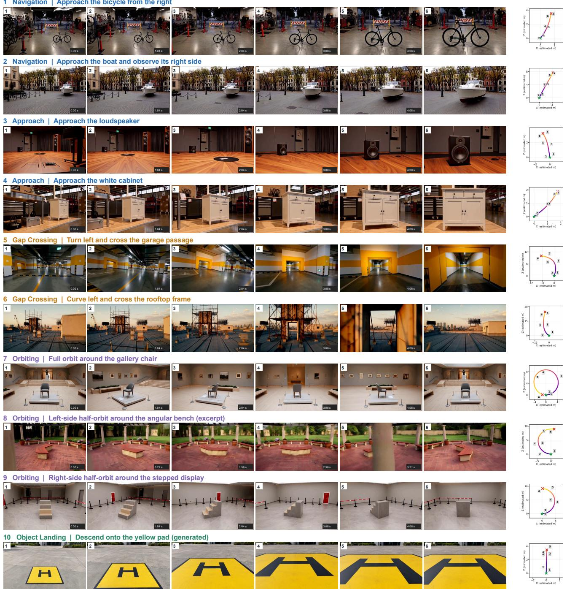  
Figure 6: Representative trajectory-generation results of DiffWAM. Rows 1–4 illustrate target-directed navigation and approach; Rows 5–6 show constrained gap traversal; and Rows 7–9 show a full orbit and directionconditioned half-orbits, including the excerpt in Row 8. Row 10 provides a supplemental generated example of descent onto a yellow landing pad. Each visual sequence is accompanied by a top-view trajectory. These selected examples support qualitative analysis rather than aggregate success-rate estimation.

## 5.2 Benchmark Results and Analysis

## 5.2.1 DiffWAM Performance

We assess DiffWAM through the endpoint benchmark in Table 2 and the trajectory examples in Fig. 6. On DiffWAM-1000, DiffWAM achieves a benchmark success rate of 74.40% under the shared endpoint criterion. The qualitative examples complement this endpoint-based measurement by showing how the predicted trajectory changes with the motion requirements of the instruction.

For target-directed navigation and approach, Rows 1–4 of Fig. 6 illustrate both object selection and target-relative motion. The bicycle case requires approaching from the right, whereas the boat case requires approaching the boat and observing its right side. The loudspeaker and white-cabinet cases illustrate direct approach in different scene layouts. The visual sequences and top-view paths show progressive motion toward the referenced objects, with lateral displacement adapted to the target-relative instruction and initial viewpoint.

Rows 5–6 illustrate constrained traversal. In the garage case, the trajectory turns left before passing through the passage; in the rooftop case, it curves left toward and through the frame. These examples involve a sequence of approach, alignment, and traversal rather than simply terminating near an opening. They therefore highlight a geometric requirement that endpoint proximity alone cannot fully characterize.

The orbiting cases in Rows 7–9 exhibit more structured motion. Row 7 shows a full orbit around the gallery chair, Row 8 shows an excerpt of a left-side half-orbit around the angular bench, and Row 9 shows a right-side half-orbit around the stepped display. Their top-view paths contain a loop or direction-dependent arcs, consistent with the corresponding instructions. Unlike point-goal navigation, these tasks require the intermediate path to evolve around a reference object. For a full orbit, the start and end positions may be close even when the intervening motion is incorrect; consequently, endpoint error must be complemented by full-trajectory evaluation when assessing such behavior.

Row 10 provides a supplemental landing example. As the viewpoint approaches the yellow pad, the pad occupies an increasing portion of the image, illustrating the requested descent toward the landing region. This example extends the visualization beyond horizontal approach and orbiting, but does not provide an independently measured landing error or a physical landing success rate.

Taken together, these examples show task-dependent differences in trajectory geometry: relatively direct target approach, turning motion through constrained openings, circumferential motion around objects, and a generated descent sequence. They illustrate that the model output encodes how to move relative to the scene, rather than only where to terminate. The benchmark results below quantify endpoint performance separately from these selected qualitative demonstrations.

## 5.2.2 Overall Benchmark Performance

Table 2 compares DiffWAM with WorldVLN, ImagineUAV, Fast-WAM-UAV, and WorldFly on IndoorUAV-VLA, UAV-FLOW-Sim, and DiffWAM-1000. Under the common endpoint criterion, DiffWAM achieves success rates of 56.77%, 91.42%, and 74.40%, respectively, ranking first on all three benchmarks among the compared methods. WorldVLN is the strongest competing method in each overall comparison, with 39.32%, 80.24%, and 58.40%, respectively. The corresponding absolute improvements are 17.45, 11.18, and 16.00 percentage points.

On DiffWAM-1000, DiffWAM achieves 92.00%, 70.35%, 74.03%, and 84.00% on basic motion, object interaction, spatial navigation, and scene understanding, respectively. Relative to the strongest competing result within each family, the improvements are 6.00, 13.73, 23.26, and 28.00 percentage points. The largest gains occur in scene

Table 2: Benchmark success rate (SR, %) on IndoorUAV-VLA, UAV-FLOW-Sim, and DiffWAM-1000. All reported entries use the same endpoint criterion; this endpoint-based SR is distinct from task-specific closed-loop completion. BM: basic motion; OI: object interaction; SN: spatial navigation; SU: scene understanding.
<table><tr><td></td><td>IndoorUAV-VLA</td><td>UAV-FLOW-Sim</td><td colspan="5">DiffWAM-1000</td></tr><tr><td>Method</td><td>Average</td><td>Average</td><td>BM</td><td>OI</td><td>SN</td><td>SU</td><td>Average</td></tr><tr><td>WorldVLN [13]</td><td>39.32</td><td>80.24</td><td>86.00</td><td>56.62</td><td>50.77</td><td>54.00</td><td>58.40</td></tr><tr><td>ImagineUAV [12]</td><td>33.78</td><td>69.65</td><td>68.00</td><td>39.85</td><td>32.67</td><td>56.00</td><td>43.20</td></tr><tr><td>Fast-WAM-UAV [7]</td><td>35.69</td><td>71.27</td><td>73.00</td><td>52.34</td><td>38.67</td><td>51.00</td><td>52.20</td></tr><tr><td>WorldFly [11]</td><td>25.71</td><td>53.98</td><td>64.00</td><td>24.08</td><td>28.62</td><td>41.00</td><td>30.50</td></tr><tr><td>DiffWAM (ours)</td><td>56.77</td><td>91.42</td><td>92.00</td><td>70.46</td><td>74.00</td><td>84.00</td><td>74.40</td></tr></table>

understanding and spatial navigation. For scene understanding, the strongest baseline is ImagineUAV at 56.00%;   
for the other three families, it is WorldVLN.

These results establish an endpoint-performance advantage across the evaluated datasets and task families. However, the endpoint criterion does not by itself verify traversal direction, orbit coverage, or landing completion. The motion examples in Fig. 6 therefore provide complementary qualitative evidence. A separate comparison of trajectoryreadout architectures is reported in Table 4 and analyzed in the ablation studies.

## 5.3 Real-World Experiment

Beyond offline and simulation evaluation, we conduct physical UAV experiments in indoor and outdoor environments. The demonstrations include individual motion primitives, language-specified target selection, constrained traversal, and multi-stage task compositions. Figure 8 presents nine representative examples, with Cases I–III and V–VIII illustrate individual tasks, while Cases IV and IX illustrate sequential tasks.

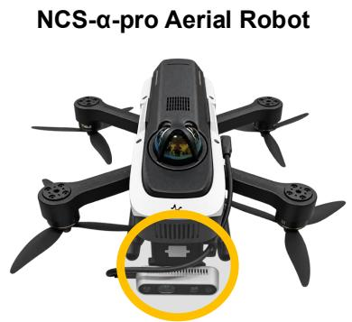  
• Nvidia Jetson Orin NX  
• Realsense D435 camera

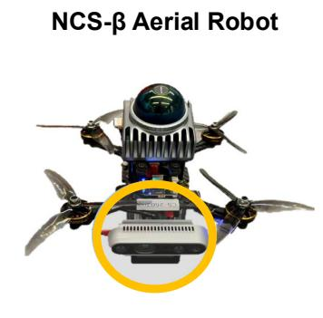  
• Nvidia Jetson Orin NX  
• Realsense D435 camera

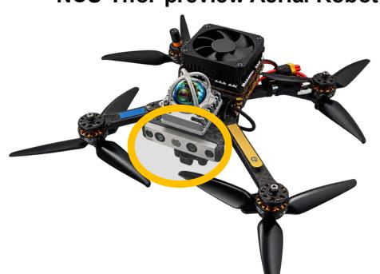  
• Nvidia AGX Thor  
• Realsense D450 camera

Figure 7: Real-world UAV platforms.

The experiments use three Differential Robotics platforms: NCS-α-pro, NCS-β, and NCS-Thor-preview. NCS-β and NCS-α-pro are equipped with a Livox Mid-360 LiDAR and an Intel RealSense D435 camera, while carrying an NVIDIA Jetson Orin NX with 16 GB of memory. These two platforms use cloud-assisted WAM inference. NCS-Thor-preview carries an NVIDIA Jetson AGX Thor with 128 GB of memory and runs the complete DiffWAM inference pipeline onboard. This setup covers both cloud-assisted and fully onboard model deployment.

## 5.3.1 Real-World Navigation Performance

Cases I–VI in Fig. 8 demonstrate distinct trajectory structures in the indoor environment. Orbiting the dark-blue pillar requires sustained motion relative to a fixed object; passing between the two trees requires selecting the instructed opening; S-shaped flight requires successive changes in lateral direction; and circular-frame traversal requires approaching and continuing through a bounded opening. These examples extend the evaluation beyond direct object approach to motions whose intermediate geometry is part of the instruction.

Cases VII–VIII demonstrate outdoor target-directed navigation. The UAV approaches the wall with the “Differential Robotics” logo in Case VII and the red fire hydrant on the far left in Case VIII. The latter additionally requires resolving a relative-position qualifier among multiple candidate objects. Together with the indoor demonstrations, these examples illustrate physical execution under different scene appearances and language-specified spatial relations.

These nine illustrated cases are selected qualitative demonstrations rather than a complete record of evaluation trials. Accordingly, they support analysis of the executed behaviors but are not used to infer the number of evaluated episodes, aggregate physical-flight success rates, or per-task completion times.

## 5.3.2 Long-Horizon Real-World Navigation

In our previous work, we developed DiffAgent [35], which is an agent-based airborne navigation framework. It converts open-ended, continuous human instructions into long-horizon real-world UAV missions by integrating planning, reflection, skill coordination, and cloud–edge execution within a single agent loop. We integrated it into DiffWAM.

Cases IV and IX in Fig. 8 illustrate two representative multi-stage missions. In Case IV, the UAV must pass around the left side of the tree on the right, then navigate toward the yellow mat and land on it. The sequence therefore combines target disambiguation, side-specific bypassing, landing-region approach, and descent. The final images show the transition from flight near the tree to landing on the designated mat.

In Case IX, the UAV first passes around the left side of the electric fan and subsequently reaches the region in front of the rock formation. Unlike Case IV, this mission changes the target reference without introducing a terminal landing maneuver. Its ordering matters: directly approaching the rock formation would not satisfy the preceding requirement to pass the fan on the specified side.

Both examples require preserving the remaining task objectives as the observation and local motion target change. The image sequences illustrate that DiffWAM trajectory proposals can be incorporated into multi-stage physical navigation with downstream planning and execution, rather than being restricted to isolated point-to-point predictions.

## 5.3.3 Onboard Inference Performance

Table 3 reports measured latency and peak memory for archived DiffWAM and DiffWAM-Flash pipeline variants on two NVIDIA H20 GPUs, eight NVIDIA H20 GPUs, and an NVIDIA Jetson AGX Thor. All six configurations use BF16 inference. These measurements characterize the recorded FastDreamer implementations and are reported separately from the current direct-pose decoder.

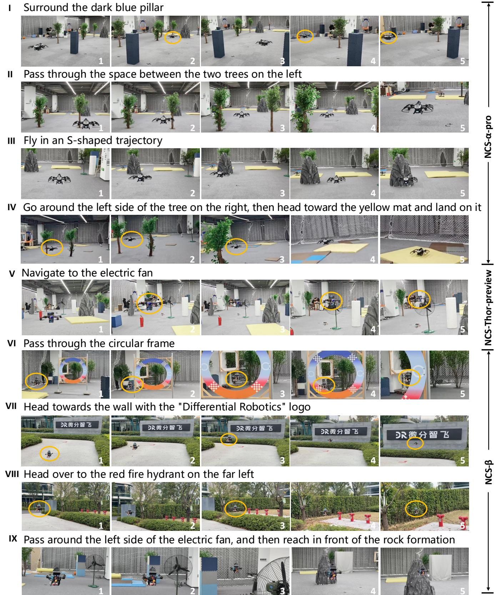  
Figure 8: Representative real-world UAV experiments. The image sequences illustrate task-conditioned physical execution, including the transitions between successive tasks in Cases IV and IX.

Table 3: Measured latency of archived FastDreamer pipeline variants.All configurations use BF16 inference. Memory is reported in GiB as maximum per-GPU/simultaneous aggregate usage.
<table><tr><td>Archived head</td><td>Platform / precision</td><td>Model P50/P95 (s)</td><td>Peak memory (GiB)</td></tr><tr><td>DiffWAM</td><td>2×H20/BF16</td><td>11.199 / 11.273</td><td>76.29 / 149.30</td></tr><tr><td>DiffWAM-Flash</td><td>2×H20/BF16</td><td>3.182 / 3.242</td><td>76.29 / 149.30</td></tr><tr><td>DiffWAM</td><td>8×H20/BF16</td><td>3.605 / 3.820</td><td>60.33 / 457.67</td></tr><tr><td>DiffWAM-Flash</td><td>8×H20/BF16</td><td>0.835 / 0.912</td><td>60.33 / 457.67</td></tr><tr><td>DiffWAM</td><td>AGX-Thor / BF16</td><td>3.796 / 3.851</td><td>97.60 / 97.60</td></tr><tr><td>DiffWAM-Flash</td><td>AGX-Thor / BF16</td><td>1.080 / 1.101</td><td>97.60 / 97.60</td></tr></table>

Each configuration is evaluated on 15 requests with three timed passes after warm-up, yielding 45 measurements per configuration. Conditioning caches are disabled. Model-pipeline latency is measured from a prepared image and model-ready instruction to an available trajectory, including video inference, overlapping MoGe2 inference, feature transfer, and trajectory prediction/integration. Instruction rewriting, external communication, and file export are excluded. These values therefore do not represent end-to-end navigation-update latency, which additionally accounts for the remaining preparation and execution-interface stages.

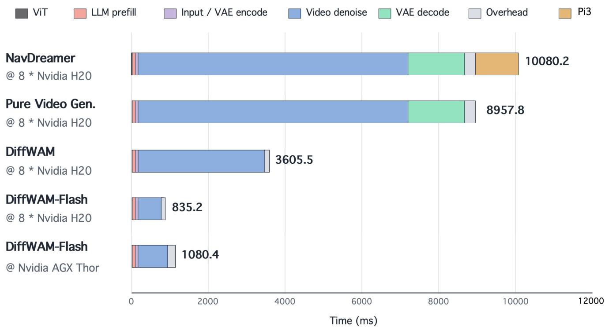  
Figure 9: Stage-wise latency breakdown of the compared inference pipelines. NavDreamer, pure video generation, DiffWAM, and DiffWAM-Flash are measured on eight NVIDIA H20 GPUs; the final row reports DiffWAM Flash on NVIDIA Jetson AGX Thor. Bar-end values indicate total latency in milliseconds.

On two H20 GPUs, DiffWAM and DiffWAM-Flash achieve P50/P95 latencies of 11.199/11.273 s and 3.182/3.242 s, respectively. On eight H20 GPUs, the corresponding values decrease to 3.605/3.820 s and 0.835/0.912 s. DiffWAM-

Flash reduces P50 latency by 71.58% and 76.83% relative to DiffWAM in these two configurations, corresponding to speedups of approximately 3.52× and 4.31×.

On AGX Thor, DiffWAM achieves 3.796/3.851 s, while DiffWAM-Flash achieves 1.080/1.101 s. The latter reduces P50 latency by 71.55%, corresponding to an approximately 3.51× speedup. Both variants have the same reported peak memory of 97.60 GiB on Thor. The two H20 configurations likewise report identical memory values for the two variants: 76.29/149.30 GiB on two GPUs and 60.33/457.67 GiB on eight GPUs, expressed as maximum per-GPU/simultaneous aggregate usage. Thus, the measured Flash advantage is a latency reduction, not a reduction in the reported peak memory.

Figure 9 further compares the stage-wise latency of the inference pipelines. On eight H20 GPUs, the plotted total times are 10,080.2 ms for NavDreamer, 8,957.8 ms for pure video generation, 3,605.5 ms for DiffWAM, and 835.2 ms for DiffWAM-Flash. The additional AGX Thor configuration reports 1,080.4 ms for DiffWAM-Flash. The latter three values agree, after rounding, with the corresponding P50 entries in Table 3.

The breakdown shows that NavDreamer retains future-video decoding and $\pi ^ { 3 }$ reconstruction, whereas the displayed DiffWAM variants omit these stages and spend less time on predictive video-model computation. Relative to Nav-Dreamer on the same eight-H20 platform, the plotted DiffWAM and DiffWAM-Flash totals correspond to approximately 2.80× and 12.07× speedups, respectively. This comparison concerns the displayed inference pipelines; it does not measure waiting time during flight or the quality of asynchronous trajectory handoff.

## 5.4 Ablation Studies

We examine five design choices in the predictive-to-motion pipeline: the trajectory-readout architecture, worldmodel feature layers, the number of predictive evaluations, training-data volume, and the trajectory-training ob jective with depth normalization. These studies complement the endpoint benchmarks by characterizing trajectory reconstruction accuracy and, where measured, trajectory-head latency.

Unless otherwise stated, matched training ablations keep the dataset split, initialization, optimizer, training budget, geometric input, and model-selection criterion fixed, except for the factor under investigation. The world-model and geometry backbones remain frozen. Each study is interpreted within its reported experimental setting; in particular, the five-case architecture comparison is separate from the complete benchmark evaluation, and results obtained with different training or predictive-computation budgets are not treated as measurements of a single configuration.

## 5.4.1 Different WAM Architectures

Table 4 compares video-adapted trajectory-prediction architectures. This supplementary comparison evaluates both trajectory agreement and generation cost. Positional metrics retain the error-score convention of the reported comparison, while latency covers only the trajectory head, excluding the world-model and geometry branches.

Table 4: Comparison of video-based trajectory-prediction architectures.
<table><tr><td>Method</td><td>RMSE (m)</td><td>ADE (m)</td><td>FDE (m)</td><td>RoE (°)</td><td>Head P50/P95 (ms)</td></tr><tr><td>WorldVLN [13]</td><td>0.8280</td><td>0.7103</td><td>1.2711</td><td>57.2106</td><td>3.14 /3.34</td></tr><tr><td>Fast-WAM [7]</td><td>0.8818</td><td>0.6815</td><td>1.5395</td><td>6.1389</td><td>59.20 / 60.97</td></tr><tr><td>Faster-WAM [14]</td><td>0.7011</td><td>0.5749</td><td>1.0792</td><td>4.5870</td><td>60.37 / 61.77</td></tr><tr><td>MLP [36]</td><td>1.3881</td><td>1.0729</td><td>2.6189</td><td>98.8160</td><td>0.22 / 0.25</td></tr><tr><td>DiffWAM (ours)</td><td>0.3492</td><td>0.3151</td><td>0.4357</td><td>2.9179</td><td>37.35 / 38.84</td></tr></table>

DiffWAM achieves the lowest error in all four accuracy metrics, with RMSE, ADE, FDE, and RoE of 0.3492 m, 0.3151 m, 0.4357 m, and 2.9179◦, respectively. Compared with the MLP readout, it reduces RMSE by 74.84% and FDE by 83.36%. Relative to Faster-WAM, the most accurate competing WAM variant in this comparison, the corresponding reductions are 50.19% and 59.63%. Since the MLP receives the same frozen predictive features and first-frame geometric inputs, this comparison supports the usefulness of a structured motion readout beyond a simple feed-forward mapping.

The DiffWAM head has a P50/P95 latency of 37.35/38.84 ms, compared with 59.20/60.97 ms for Fast-WAM and 60.37/61.77 ms for Faster-WAM. Its median head latency is therefore 36.91% and 38.13% lower, respectively. WorldVLN and MLP remain faster at 3.14/3.34 ms and 0.22/0.25 ms, but incur larger trajectory errors. DiffWAM thus combines the best reported trajectory accuracy with a lower head latency than Fast-WAM and Faster-WAM, rather than achieving the minimum head latency among all architectures.

(a) Approach the left tree  
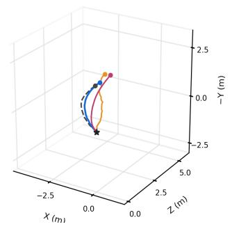

(b) Move to the right front of the tree  
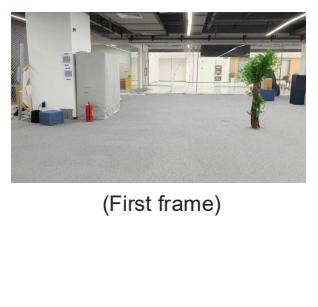

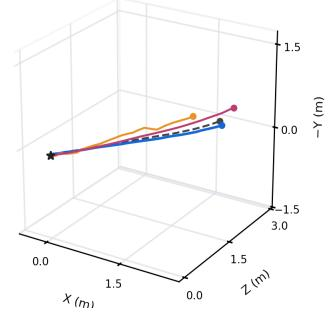  
(d) Orbit the central hoop clockwise through 360°

(c) Pass through the left circular hoop  
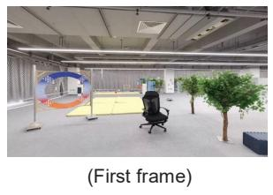

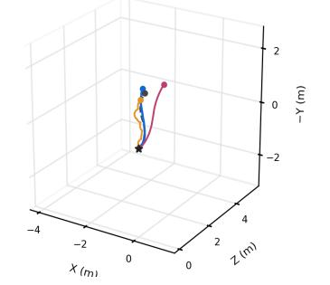

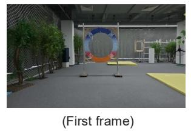

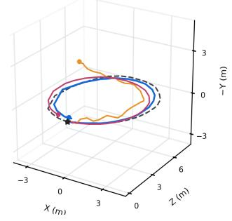  
Figure 10: Qualitative comparison of WAM trajectory-readout architectures. Each example shows the initial observation and the corresponding 3D trajectories.

Figure 10 complements the numerical comparison with four motion instructions. DiffWAM follows the referencedirected motion in the approach and passage examples and captures the loop-shaped structure in the orbiting example. In the latter case, the MLP prediction exhibits a visibly distorted path and a displaced endpoint, illustrating why intermediate trajectory geometry matters beyond goal proximity.

## 5.4.2 Feature-Layer Selection

We investigate the effect of world-model feature depth using four native-grid configurations: mixed layers 15/25/35, early layers $3 / 5 / 7$ , middle layers 23/25/27, and deep layers 33/35/37. The configurations use the same native $1 5 \times 2 6$ feature grid and trajectory-decoder architecture, with 72M pose-head parameters in each case. This comparison varies the selected representation depths without changing the size of the pose head.

As shown in Table 5, the mixed 15/25/35 configuration achieves the lowest positional errors, with an RMSE of 0.3492 m and an FDE of 0.4357 m. The early, middle, and deep configurations obtain RMSE values of 0.7250,

Table 5: Ablation of world-model feature-layer selection. Four native-grid configurations are compared using the same trajectory-decoder architecture and 72M pose-head parameters.
<table><tr><td>Condition</td><td>DiT layers</td><td>Pose params</td><td>RMSE (m)</td><td>FDE (m)</td><td>RoE (°)</td></tr><tr><td>Native early</td><td>3/5/7</td><td>72M</td><td>0.7250</td><td>1.0036</td><td>9.2979</td></tr><tr><td>Native middle</td><td>23/25/27</td><td>72M</td><td>0.5397</td><td>0.7641</td><td>2.4314</td></tr><tr><td>Native deep</td><td>33/35/37</td><td>72M</td><td>0.3790</td><td>0.5562</td><td>2.5763</td></tr><tr><td>Native mixed</td><td>15/25/35</td><td>72M</td><td>0.3492</td><td>0.4357</td><td>2.9179</td></tr></table>

0.5397, and 0.3790 m, respectively. Mixing features from separated depths therefore reduces RMSE by 51.83%,   
35.30%, and 7.86% relative to these three alternatives.

The ranking differs for orientation: the middle-layer configuration achieves the lowest RoE of 2.4314◦, followed by the deep-layer configuration at 2.5763◦, whereas the mixed configuration obtains 2.9179◦. These results favor multi-depth feature selection for positional reconstruction, but do not indicate that the same layer combination is optimal for every pose metric.

## 5.4.3 Predictive Computation

DiffWAM directly decodes camera motion from predictive world-model features rather than using an iterative trajectory sampler. We therefore vary the number of world-model evaluations, not the number of denoising steps in the trajectory head. Table 6 compares one, two, three, and four evaluations while keeping the trajectory decoder, feature layers, and output resolution fixed.

Table 6: Ablation of predictive computation. One step denotes one world-model evaluation, not an iteration of the trajectory decoder.
<table><tr><td>World-model evaluations</td><td>RMSE (m)</td><td>ADE (m)</td><td>FDE (m)</td><td>RoE (°)</td></tr><tr><td>1</td><td>0.5012</td><td>0.4423</td><td>0.6865</td><td>3.7897</td></tr><tr><td>2</td><td>0.4107</td><td>0.3601</td><td>0.5883</td><td>3.1867</td></tr><tr><td>3</td><td>0.3828</td><td>0.3347</td><td>0.5653</td><td>3.7730</td></tr><tr><td>4</td><td>0.3492</td><td>0.3151</td><td>0.4357</td><td>2.9179</td></tr></table>

Positional accuracy improves monotonically over the evaluated range. Increasing the number of evaluations from one to four reduces RMSE from 0.5012 to 0.3492 m, ADE from 0.4423 to 0.3151 m, and FDE from 0.6865 to 0.4357 m. The corresponding reductions are 30.33%, 28.76%, and 36.53%, respectively. Orientation accuracy is not monotonic: RoE increases from 3.1867◦ at two evaluations to 3.7730◦ at three, before reaching its lowest value of 2.9179◦ at four evaluations.

In this experiment, one world-model evaluation minimizes the inference budget but yields the lowest overall per formance. In contrast, four world-model evaluations achieve the lowest errors across all reported metrics. This improvement may be attributed to the progressively more complete recovery of 3D spatial scale as the number of denoising steps increases, albeit at the cost of higher inference latency. Balancing accuracy and efficiency, we therefore adopt the four-step configuration as DiffWAM, our best-performing variant. Meanwhile, although the single-step configuration incurs some performance degradation, its performance remains acceptable on several tasks, making it a suitable choice for DiffWAM-Flash, our fastest inference variant.

## 5.4.4 Training-Data Volume

We study the effect of generated-supervision volume using four nested training sets containing 1k, 4k, 16k, and 64k trajectory pairs. All trajectory decoders are randomly initialized and trained for 20,000 updates with a global batch size of 32. Table 7 reports the resulting trajectory errors on DiffWAM-1000.

Table 7: Generated-supervision scaling on DiffWAM-1000. All models use random initialization and 20,000 training updates with a global batch size of 32.
<table><tr><td>Training-Data Volume</td><td>RMSE (m)</td><td>FDE (m)</td><td>RoE (°)</td></tr><tr><td>1,000</td><td>0.8203</td><td>1.4011</td><td>9.9409</td></tr><tr><td>4,000</td><td>0.6519</td><td>0.9897</td><td>7.2710</td></tr><tr><td>16,000</td><td>0.5465</td><td>0.7739</td><td>4.1872</td></tr><tr><td>64,000</td><td>0.4873</td><td>0.6884</td><td>2.7894</td></tr></table>

All three reported errors decrease monotonically as the training set grows. Increasing the number of trajectory pairs from 1k to 64k reduces RMSE from 0.8203 to 0.4873 m, FDE from 1.4011 to 0.6884 m, and RoE from 9.9409◦ to 2.7894◦. These changes correspond to relative reductions of 40.59%, 50.87%, and 71.94%, respectively. The intermediate 4k and 16k settings follow the same improving trend.

Because the update count and global batch size remain fixed, these improvements are obtained without increasing the number of optimization updates. The results support the value of additional generated supervision for both positional and rotational reconstruction over the evaluated data range.

## 5.4.5 Loss Functions and Depth Normalization

We compare the legacy composite pose objective with compact position–orientation objectives while keeping the geometric input fixed. All experiments in Table 8 use 1,024 training pairs, seed 0, and 600 updates, with the same 192-case validation set for model selection. The comparison includes unnormalized and depth-normalized two-term objectives, as well as a depth-normalized recipe selected through validation-based hyperparameter tuning.

Table 8: Matched compact-loss experiments on DiffWAM-1000. The selected recipe uses validation-based hyperparameter tuning.
<table><tr><td>Objective</td><td>RMSE (m)</td><td>FDE (m)</td><td>RoE (°)</td></tr><tr><td>Legacy composite pose loss</td><td>0.7288</td><td>1.0297</td><td>3.5997</td></tr><tr><td>Two-term, unnormalized</td><td>0.8120</td><td>1.1451</td><td>4.2803</td></tr><tr><td>Two-term, depth-normalized</td><td>1.0728</td><td>1.5092</td><td>3.9662</td></tr><tr><td>Selected depth-normalized recipe</td><td>0.6873</td><td>0.9496</td><td>3.8131</td></tr></table>

Directly replacing the legacy objective with either untuned two-term formulation increases all three errors. The unnormalized objective produces an RMSE of 0.8120 m, an FDE of 1.1451 m, and an RoE of 4.2803◦, compared with 0.7288 m, 1.0297 m, and 3.5997◦ for the legacy composite objective. The untuned depth-normalized objective further increases the positional errors to 1.0728 m RMSE and 1.5092 m FDE, with an RoE of 3.9662◦. Thus, neither loss simplification nor depth normalization alone guarantees an improvement under the tested settings.

After validation-based selection, the depth-normalized recipe achieves the lowest positional errors, with an RMSE of 0.6873 m and an FDE of 0.9496 m. These values are 5.69% and 7.78% lower than those of the legacy composite objective. Its RoE, however, is 3.8131◦, compared with the legacy objective’s lower value of 3.5997◦. The selected recipe therefore improves positional agreement with a modest orientation-error trade-off, rather than outperforming the composite objective on every metric.

The selected configuration uses $\lambda _ { R } = 0 . 0 3 .$ , and a peak learning rate of $1 0 ^ { - 4 } .$ . Together, these results support a compact position–orientation objective with an appropriately selected training recipe. Since the selected recipe combines normalization with hyperparameter tuning, its gains cannot be attributed to normalization alone. This comparison concerns objective design under fixed geometric inputs, not the effect of removing spatial geometry or adding auxiliary teacher supervision.

## 6 Conclusion

We presented DiffWAM, a geometry-conditioned world-action model that converts frozen video-model predictive representations into language-conditioned camera trajectories without completing future-video synthesis at deployment. Its efficient formulation combines multi-level features, Grid-Motion associations, and geometry-conditioned Latent2Pose decoding to connect predictive motion information with an observed spatial reference and estimated metric scale. Completed video rollouts and geometric reconstruction supply offline trajectory supervision, while the video and geometry backbones remain frozen during motion-readout training. FastDreamer complements this model with shared-weight instruction rewriting, parallel predictive and geometric processing, flight-time computation scheduling, and timestamp-aware prospective trajectory handoff.

On IndoorUAV-VLA, UAV-FLOW-Sim, and DiffWAM-1000, the reported DiffWAM configurations achieve endpoint-based success rates of 56.77%, 91.42%, and 74.40%, respectively, the highest among the compared methods under the common criterion. Qualitative trajectory and physical-flight examples illustrate target approach, constrained traversal, orbiting, S-shaped motion, and multi-stage navigation. Separately, the archived DiffWAM-Flash pipeline achieves a P50/P95 model-pipeline latency of 1.080/1.101 s on AGX Thor; these measurements exclude instruction rewriting and external communication and do not represent complete navigation-update latency.

The ablations identify complementary effects of representation selection, predictive computation, and supervision. Mixed-depth features yield the lowest positional errors among the tested layer configurations, additional world model evaluations improve positional accuracy, and larger generated-supervision sets consistently reduce trajectory errors under a fixed update budget. A tuned two-term objective further improves positional reconstruction in the compact-loss comparison, although the legacy composite objective retains the lowest orientation error. Together, these findings support predictive-to-motion grounding as a route to efficient continuous UAV navigation. Further evaluation should quantify task-specific closed-loop completion, physical-scale accuracy, and complete navigationupdate latency across unseen environments. Beyond the early-exit computation studied here, model-side accelera tion mechanisms such as speculative inference and its empirically characterized scaling behavior [21] may provide a complementary direction for reducing the cost of large predictive models while preserving motion quality.

## References

[1] J. Zhang, et al., Embodied navigation foundation model, in International Conference on Learning Representations, vol. 2026 (2026), pp. 127293–127322.

[2] Y. Wu, et al., Vla-an: An efficient and onboard vision-language-action framework for aerial navigation in complex environments. arXiv preprint arXiv:2512.15258 (2025).

[3] X. Liu, Y. Liu, H. Qiu, Y. Qirong, Z. Lian, Indooruav: Benchmarking vision-language uav navigation in continuous indoor environments, in Proceedings of the AAAI Conference on Artificial Intelligence, vol. 40 (2026), pp. 23864–23872.

[4] X. Wang, et al., Uav-flow colosseo: A real-world benchmark for flying-on-a-word uav imitation learning. Advances in Neural Information Processing Systems 38 (2026).

[5] J. Bai, et al., Qwen-VL: A Versatile Vision-Language Model for Understanding, Reasoning, and Generation. arXiv preprint arXiv:2308.12966 (2023).

[6] X. Huang, et al., Navdreamer: Video models as zero-shot 3d navigators. IEEE Robotics and Automation Letters (2026).

[7] T. Yuan, Z. Dong, Y. Liu, H. Zhao, Fast-WAM: Do World Action Models Need Test-time Future Imagination? arXiv preprint arXiv:2603.16666 (2026).

[8] M. J. Kim, et al., OpenVLA: An Open-Source Vision-Language-Action Model. arXiv preprint arXiv:2406.09246 (2024).

[9] T. Chen, W. Li, Y. Wu, F. Gao, et al., Towards Precise Intent-Aligned VLA Aerial Navigation via Expert-Guided GRPO. arXiv preprint arXiv:2606.02313 (2026).

[10] S. Ye, et al., World action models are zero-shot policies. arXiv preprint arXiv:2602.15922 (2026).

[11] S. Zheng, et al., WorldFly: A World-Model-Based Vision-Language-Action Model for UAV Navigation. arXiv preprint arXiv:2606.06147 (2026).

[12] X. Liu, et al., ImagineUAV: Aerial Vision-Language Navigation via World-Action Modeling and Kinodynamic Planning. arXiv preprint arXiv:2606.01205 (2026).

[13] B. Zhao, et al., WorldVLN: Autoregressive World Action Model for Aerial Vision-Language Navigation. arXiv preprint arXiv:2605.15964 (2026).

[14] W. Zhao, et al., Faster-WAM: Efficient inference-time future conditioning for robust world action models. arXiv preprint arXiv:2608.04404 (2026).

[15] Y. Wang, et al., $\pi ^ { 3 } { \vdots }$ Permutation-Equivariant Visual Geometry Learning. arXiv preprint arXiv:2507.13347 (2025).

[16] R. Wang, et al., MoGe-2: Accurate Monocular Geometry with Metric Scale and Sharp Details (2025).

[17] X. Cui, et al., Revisiting On-policy Adversarial Black-Box Distillation: Calibrating Groupwise Reward Geometry for Effective Advantage Construction, in Advances in Neural Information Processing Systems (2026).

[18] X. Cui, et al., Multi-Level Optimal Transport for Universal Cross-Tokenizer Knowledge Distillation on Lan guage Models, in Proceedings of the AAAI Conference on Artificial Intelligence, vol. 39 (2025), pp. 23724– 23732, doi:10.1609/aaai.v39i22.34543.

[19] X. Cui, et al., Flexible Multi-Level Optimal Transport for Universal Cross-Tokenizer Knowledge Distillation on LLMs and Beyond. IEEE Transactions on Pattern Analysis and Machine Intelligence pp. 1–18 (2026), doi:10.1109/TPAMI.2026.3728858.

[20] A. A. Rusu, et al., Policy Distillation. arXiv preprint arXiv:1511.06295 (2015).

[21] S. Yan, et al., Scaling Laws for Speculative Decoding. arXiv preprint arXiv:2505.07858 (2025).

[22] C. Chi, et al., Diffusion Policy: Visuomotor Policy Learning via Action Diffusion, in Proceedings ofRobotics: Science and Systems (Daegu, Republic of Korea) (2023), doi:10.15607/RSS.2023.XIX.026.

[23] K. Black, M. Y. Galliker, S. Levine, Real-Time Execution of Action Chunking Flow Policies (2025).

[24] N. Hirose, C. Glossop, D. Shah, S. Levine, AsyncVLA: An Asynchronous VLA for Fast and Robust Navigation on the Edge (2026).

[25] Y. Wang, et al., PathPainter: Transferring the Generalization Ability of Image Generation Models to Embodied Navigation. arXiv preprint arXiv:2605.07496 (2026).

[26] K. Yang, et al., AsyncShield: A Plug-and-Play Edge Adapter for Asynchronous Cloud-based VLA Navigation (2026).

[27] X. Zhou, Z. Wang, H. Ye, C. Xu, F. Gao, EGO-Planner: An ESDF-Free Gradient-Based Local Planner for Quadrotors. IEEE Robotics and Automation Letters 6 (2), 478–485 (2021), doi:10.1109/LRA.2020.3047728.

[28] MiniMaxAI, MiniMax-H3, Hugging Face Model Card (2026), https://huggingface.co/MiniMaxAI/ MiniMax-H3, accessed: 2026-08-17.

[29] J. Cheng, et al., VPO: Aligning Text-to-Video Generation Models with Prompt Optimization. arXiv preprin arXiv:2503.20491 (2025).

[30] J. Li, et al., FlyMirage: A Fully Automated Generation Pipeline for Diverse and Scalable UAV Flight Data via Generative World Model. arXiv preprint arXiv:2605.19600 (2026).

[31] X. Huang, et al., NavGen: Visual Generative Models as a Scalable Data Engine for Embodied 3D Navigation. arXiv preprint arXiv:2609.30770 (2026).

[32] World Labs, Marble: Create 3D Worlds from a Simple Prompt, https://marble.worldlabs.ai (2025), accessed: 2026-09-29.

[33] D. DeTone, et al., Boxer: Robust Lifting of Open-World 2D Bounding Boxes to 3D, in European Conference on Computer Vision (ECCV) (2026).

[34] Y. S. Shao, Y. Wu, L. Jarin-Lipschitz, P. Chaudhari, V. Kumar, Design and evaluation of motion planners for quadrotors in environments with varying complexities, in 2024 IEEE International Conference on Robotics and Automation (ICRA) (IEEE) (2024), pp. 10033–10039.

[35] M. Zhu, et al., DiffAgent: Unlocking New Possibilities for Flying Embodied Agents (2026), https: //zzmmzzm.github.io/diffagent.github.io/.

[36] D. E. Rumelhart, G. E. Hinton, R. J. Williams, Learning representations by back-propagating errors. nature 323 (6088), 533–536 (1986).