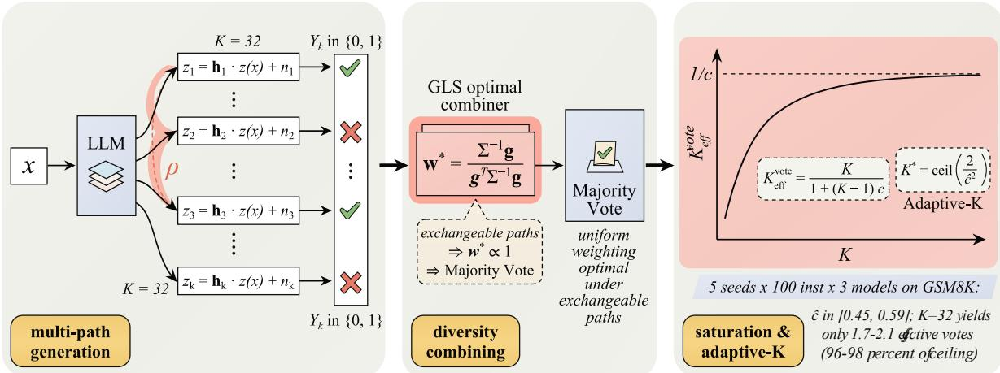
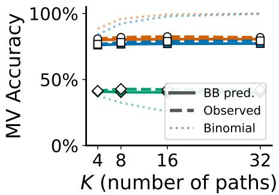
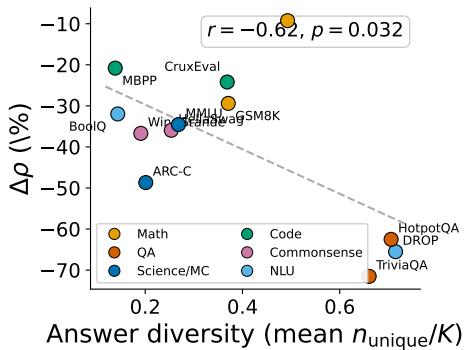

# Diversity Combining for Multi-Path LLM Reasoning

Guangsheng Yu1, Litianyi Zhang2, Qin Wang3, Xu Wang1,

Mingyuan Li4,5, Shaoxiong Ji4,5, Ren Ping Liu1, and Massimo Piccardi1

1University of Technology Sydney, 2The University of Sydney, 3CSIRO

4ELLIS Institute Finland, 5University of Turku

¹ OniReimu/DiversityCombining

\* OniReimu/DiversityCombining

Abstract—Multi-path reasoning methods such as self-consistency (SC) sample K reasoning paths and choose the most frequent answer. However, their gains quickly plateau as K increases, and existing methods do not predict when this saturation will occur. We formalize multi-path LLM reasoning as a diversity combining problem from wireless communications: each path is a noisy channel observation, and the pairwise correlation of path correctness caps the design-effect effective sample size of the vote at a finite ceiling. Generalized least squares (GLS) analysis shows that, under exchangeability, the optimal symmetric linear combiner of latent embeddings is uniform, supporting majority vote as the natural default in standard SC while leaving room for weighting or pruning under heterogeneous prompt-template branches. Across 5 models and 12 benchmarks, prompt-template diversity reduces path correlation in 55 of 57 valid cells, with the strongest effect on open-ended QA. We derive an Adaptive-K rule that uses a four-path pilot to select $K ^ { * }$ , retaining 96–103% of MV@K=32 accuracy across Math, QA, and NLU.

## 1. Introduction

Multi-path reasoning has become a standard technique for improving LLM answer reliability. Self-consistency [1] samples K chain-of-thought paths and returns the majorityvote answer; extensions include weighted voting [2], treestructured search [3], and token-level embedding aggregation [4].

However, a common empirical observation lacks a satisfactory theoretical explanation: accuracy gains from additional reasoning paths diminish rapidly, and beyond a model-dependent threshold $K ^ { * }$ , adding more paths yields negligible improvement. Existing analyses attribute this saturation to answer-space coverage or sampling temperature, yet these explanations remain qualitative and do not predict ${ \bf { \bar { K } } } ^ { * }$ for a given model. They also do not establish a formal relationship between the observable path agreement rate and the underlying correlation structure, which is what a saturation formula requires.

The classical Condorcet jury theorem [5] predicts that majority voting among independent voters, each correct with probability above $1 / { \bar { 2 } } ,$ converges to certainty as $K  \infty ,$ yet compound LLM inference saturates much earlier [6], indicating that path correctness is correlated across questions. While ensemble diversity measures [7], [8] quantify disagreement, they do not provide a closed-form saturation bound for LLM reasoning. We address this gap via an analogy to diversity combining over multipath channels: a receiver observes $\dot { K }$ noisy signal copies, but path correlation reduces the effective diversity order below K, as determined by the channel correlation matrix [9]. We show that the correctness of reasoning paths sampled from the same model and prompt is positively correlated across questions, and that this correlation limits the gain from increasing K. Fig. 1 illustrates the framework. The main contributions are:

• LLM-specific saturation diagnostic. Adapting the classical design-effect [10] and participation-ratio formulations to multi-path LLM reasoning, we cast reasoning paths as correlated branches and obtain the vote-level diagnostic $K _ { \mathrm { e f f } } ^ { \mathrm { v o t e } } = K / ( 1 + ( K - 1 ) c )$ with ceiling $1 / c ,$ , where c is the pairwise correctness correlation, a vote-level overdispersion measurable from outputs alone. Across three model families on GSM8K, $K _ { \mathrm { e f f } } ^ { \mathrm { v o t e } }$ at $K { = } 3 2$ reaches 96–98% of this ceiling (§4, §5).

• Uniform-weighting optimality under exchangeability. Applying classical GLS analysis to the latent-embedding combiner, we show the optimal linear weights reduce to uniform under the equicorrelated model, supporting majority vote as the natural default in standard SC and leaving room for weighting or pruning when prompttemplate branches become heterogeneous (§4, §I).

• Answer-space-associated decorrelation. Across 5 models and 12 benchmarks, prompt-template perturbation reduces path correlation in 55 of 57 valid cells (mean −38%), with magnitude associated with the task’s answer-space structure: QA $( - 6 7 \% ) \gg$ code (−22%) > math (−9 to $- 2 9 \% ) ;$ the QA–math gap is significant (Mann-Whitney $p { < } 1 0 ^ { - 3 }$ , §5.2.4). The channel framing is consistent with this ordering and motivates a single-SC-run predictor (Fig. 3: r=−0.62, p=0.032).

• Adaptive-K design rule. The diagnostic yields a closedform operating point K∗ (Eq. 12) from a fixed $K { = } 4$ pilot, with no held-out tuning and no per-instance scorer. Cross-domain validation (Math, QA, NLU) shows this rule retains 96–103% of accuracy at $K ^ { * }$ (§5.2.5); positioning relative to online-stopping and scaling-law approaches is summarized in Table 7.

## 2. Background and Related Work

Multi-path LLM reasoning. Self-consistency [1] generates K reasoning paths by sampling at temperature $\tau \ > \ 0$ and returns the plurality answer. Extensions include treestructured search [3] and token-level embedding aggregation [4], [11]. A parallel line on efficient reasoning [12], [13], [14], [15] studies when and how to reduce multi-path compute, showing that adaptive scaling outperforms brute-force path multiplication. These methods operate at the answer or token level and do not provide a theoretical framework for predicting the diminishing-returns threshold $K ^ { * }$ . Trainingbased approaches change how paths are generated. Global forking tokens [16] train models toward diverse yet correct reasoning modes, and Native Parallel Reasoner [17] trains models to reason in parallel branches within a single response. Our diagnostic measures the path correlation that such traintime interventions act on (Appendix C).

Diversity combining in multipath channels. In wireless communications, a receiver observes K correlated copies of a transmitted signal through distinct paths with gain and additive noise; classical combiners (selection, maximal ratio, MMSE) trade off complexity against correlation awareness [9]. For an equally-correlated model with coefficient $\rho ,$ the latent effective rank scales as $K / ( 1 +$ $( K { - } 1 ) \rho ^ { 2 } )$ [18]; the corresponding vote-level effective sample size $\dot { K } / ( 1 + ( K { - } 1 ) c )$ divides K by the Kish design effect $1 + ( K - 1 ) c [ 1 0 ]$

Positioning. Existing efficient-SC work treats path-budget reduction as either online stopping by vote agreement or quality (Adaptive-Consistency [19], ESC [20], RASC [21]), confidence-weighted aggregation (CISC [2], [22], [23]), or compound-inference scaling-law fitting ( [6], large-scale repeated sampling [15], [24]). We organize these under a single upstream diagnostic: pairwise correctness correlation c limits effective diversity to $K / ( 1 + ( K - 1 ) c )$ , supplying a closed-form ceiling $1 / c$ and a pilot-estimated ${ \bar { K } } ^ { * }$ . Because cˆ equals the corrected between-instance variance of per-instance accuracy divided by $\bar { p } ( 1 - \bar { p } )$ , it summarizes in one vote-level statistic the difficulty heterogeneity that query-difficulty scaling models fit as a mixture. Table 7 (Appendix C) summarizes the per-method differences.

## 3. System Model

A summary of notation used throughout the paper is provided in Table 5 (Appendix A).

## 3.1. The Reasoning Channel

We use a communications-inspired effective model as an analytically tractable abstraction, not as a claim about the internal mechanism of language generation. Reasoning paths generated by the same model under the same prompt share that model’s competence on each problem, so their correctness is correlated across problems even when the paths for a given problem are sampled independently. In this view, the ground-truth answer is the latent target, each reasoning path is a branch observation, and the final aggregator is a receiver-side combiner. The value of the model lies in the predictions it enables (saturation law, majority-vote calibration) and the qualitative account it provides of answerspace effects, which we validate empirically in §5. The saturation law, the beta-binomial prediction and Adaptive-K use observable correctness alone. Among the theoretical results only the latent-rank part of Theorem 4.1 uses (1), and the GLS results use the separate linear model of §4.3 (Appendix B).

Consider an LLM generating K reasoning paths for a problem with ground-truth answer $x \in A .$ , where A is a finite answer space. Let $\mathbf { z } ( x ) \in \mathbb { R } ^ { D }$ denote the latent embedding of the correct answer. Each reasoning path k produces a latent representation:

$$
\begin{array} { r } { \mathbf { z } _ { k } = h _ { k } \mathbf { z } ( x ) + \mathbf { n } _ { k } , \quad k = 1 , \ldots , K , } \end{array}\tag{1}
$$

where $h _ { k } \ > \ 0$ is a real-valued channel gain capturing the reasoning quality of path k, and $\mathbf { n } _ { k } \sim \mathcal { N } ( \mathbf { 0 } , \sigma _ { n } ^ { 2 } \mathbf { I } _ { D } )$ represents reasoning noise (hallucination, arithmetic errors).

The final answer is decoded from a combined representation zˆ as $\begin{array} { r } { \hat { x } = \arg \operatorname* { m i n } _ { a \in \mathcal { A } } \| \hat { \mathbf { z } } - \mathbf { z } ( a ) \| ^ { 2 } } \end{array}$ . This decoding step is part of the analytical abstraction only, and no latentembedding decoding is performed. The implemented pipeline extracts discrete answers from generated text. Deployment returns the plurality vote over these answers (Algorithm 1), and the reported accuracies are the binary majority vote on their gold-scored correctness (§5.1). The empirical GLS-R combiner (§4.3) is the only construct defined on embeddings, and it requires hidden-state access.

Assumption 3.1 (Exchangeable paths). Channel gains $h _ { 1 } , \ldots , h _ { K }$ are identically distributed with $\mathbb { E } [ h _ { k } ] = \mu _ { h } > 0$ and $\mathrm { V a r } ( h _ { k } ) = \sigma _ { h } ^ { 2 }$ . Noise vectors ${ \bf n } _ { k }$ are i.i.d. across paths and independent of $h _ { k }$

This assumption is more likely to hold when all K paths are generated by the same model with the same prompt and sampling temperature.

Remark 3.2 (Evaluation-induced binary collapse). For openform tasks (HotpotQA, TriviaQA, DROP), we operate on the binary-collapsed correctness indicator $Y _ { k } = \mathbf { 1 } \{ a _ { k } = x \}$ reducing any task to $\mathcal { A } = \{ 0 , 1 \}$ so that the majority-vote (Theorem 4.2) and beta-binomial (9) results apply regardless of the original output format. Scope, thresholding, and GLS exclusion are discussed in Appendix E.

## 3.2. Path Correlation

Since all paths originate from the same model and prompt, the channel gains $h _ { 1 } , \ldots , h _ { K }$ are correlated. We model this

  
Figure 1. Diversity combining for multi-path LLM reasoning. The LLM generates K correlated paths ${ \bf z } _ { k } = h _ { k } { \bf z } ( x ) + { \bf n } _ { k }$ (h : reasoning quality; ${ \bf n } _ { k } \mathrm { : }$ errors; $\rho \mathrm { : }$ pairwise correlation), collapsed to correctness indicators $Y _ { k }$ . Aggregation: under exchangeability, the GLS-optimal linear combiner is uniform (Corollary ${ \overline { { ( 4 . 5 ) } } }$ , supporting uniform majority vote as the natural default. Diagnostic: $K _ { \mathrm { e f f } } ^ { \mathrm { v o t e } } = K / ( \breve { 1 } + ( \breve { K } - 1 ) c )$ saturates at $1 / c ;$ Adaptive-K estimates $K ^ { * }$ from a $K { = } 4$ pilot.

correlation through an equally-correlated structure for the path correlation matrix $\dot { \mathbf { R } } \in \dot { \mathbb { R } } ^ { K \times K }$ :

$$
R _ { i j } = { \left\{ \begin{array} { l l } { \sigma _ { h } ^ { 2 } } & { i = j , } \\ { \sigma _ { h } ^ { 2 } \rho } & { i \neq j , } \end{array} \right. }\tag{2}
$$

where $\rho \in [ 0 , 1 ]$ is the pairwise path correlation coefficient. Estimating path correlation from data. The latent correlation $\rho$ is not directly observable. We estimate path dependence through the correctness correlation

$$
\hat { c } _ { j k } = \frac { \frac { 1 } { n } \sum _ { i = 1 } ^ { n } Y _ { i } ^ { ( j ) } Y _ { i } ^ { ( k ) } - \bar { p } ^ { 2 } } { \bar { p } ( 1 - \bar { p } ) } ,\tag{3}
$$

where $Y _ { i } ^ { ( k ) } = \mathbf { 1 } \{ a _ { i } ^ { ( k ) } = x _ { i } \}$ is the correctness indicator for path k on instance i, and $\begin{array} { r } { \bar { p } \ = \ \frac { 1 } { n K } \sum _ { i , k } Y _ { i } ^ { ( k ) } } \end{array}$ is the empirical mean accuracy. This is the natural estimator for the vote-level correlation that directly governs majorityvote behavior through $K _ { \mathrm { e f f } } ^ { \mathrm { v o t e } } = K / ( 1 \bar { + } ( K - 1 ) c )$ . In all experiments, we report $\begin{array} { r } { \hat { c } = \binom { K } { 2 } ^ { - 1 } \sum _ { j < k } \hat { c } _ { j k } } \end{array}$ , averaged over all path pairs. Pooled over instances, cˆ equals the finite-Kcorrected between-instance variance of per-instance accuracy divided by $\bar { p } ( 1 - \bar { p } )$ . In identically prompted SC the $\dot { K }$ paths of an instance are sampled independently, so cˆ is a marginal intraclass correlation, $K _ { \mathrm { e f f } } ^ { \mathrm { v o t e } }$ is the corresponding design-effect effective sample size, and $1 / c$ is its asymptotic ceiling. Under prompt templates the K slots follow different distributions, and we use that setting to test whether cˆ moves with the sampling configuration. We use cˆ rather than alternatives such as Cohen’s kappa because cˆ is the quantity that enters the effective sample size formula (see Appendix F for comparison).

Assumption 3.3 (Gaussian decision surrogate). For analytical tractability, we model the binary correctness indicators $Y _ { 1 } , \dots , Y _ { K }$ as arising from thresholding jointly Gaussian latent decision scores $M _ { 1 } , \ldots , M _ { K } \colon Y _ { k } \ = \ \mathbf { 1 } \{ M _ { k } \ > \ 0 \}$ with $\operatorname* { P r } ( M _ { k } > 0 ) = p$ and $\mathrm { C o r r } ( M _ { j } , M _ { k } ) = \rho _ { d }$ . In the binary case $| { \mathcal { A } } | = 2 ,$ , the decision margin conditioned on gains is a linear function of the Gaussian observation $\mathbf { z } _ { k }$ so $\rho _ { d }$ coincides with the gain correlation $\rho$ when gains are jointly Gaussian. For $| { \mathcal { A } } | > 2 ,$ , the nearest-neighbor decision boundary is polyhedral and $\rho _ { d }$ depends on both $\rho$ and the answer-space geometry; we treat $\rho _ { d }$ as a surrogate parameter calibrated through the observable cˆ.

## 3.3. Two Notions of Effective Diversity

We distinguish two notions that must not be conflated. Latent covariance effective rank. The participation ratio of the gain covariance matrix R measures the effective rank of the gain structure:

$$
K _ { \mathrm { e f f } } ^ { \mathrm { r a n k } } ( \mathbf { R } ) = \frac { ( \mathrm { t r } \mathbf { R } ) ^ { 2 } } { \mathrm { t r } ( \mathbf { R } ^ { 2 } ) } .\tag{4}
$$

The participation ratio is scale-invariant, so $K _ { \mathrm { e f f } } ^ { \mathrm { r a n k } }$ depends only on $\rho ,$ not on $\sigma _ { h } ^ { 2 } .$

Vote-level effective sample size. For binary correctness indicators $Y _ { k } = \mathbf { 1 } \{ a _ { k } = x \}$ with pairwise correlation $c =$ $\operatorname { C o r r } ( Y _ { i } , Y _ { j } )$ , the standard design-effect formula gives:

$$
K _ { \mathrm { e f f } } ^ { \mathrm { v o t e } } = \frac { K } { 1 + ( K - 1 ) c } .\tag{5}
$$

The latent effective rank characterizes covariance geometry; the vote-level effective sample size is the more direct object for predicting majority-vote accuracy.

Proposition 3.4 (Bridge between latent and vote-level diversity). Both effective diversity measures share the form $K / ( 1 \stackrel { \cdot } { + } ( K - 1 ) \stackrel { \cdot } { \gamma } )$ with $\gamma = \rho ^ { \dot { 2 } }$ (latent rank) $o r \ \gamma \ = \ c$ (vote level), where $\gamma \mapsto K / ( 1 + ( K { - } 1 ) \gamma )$ is monotone decreasing. Under the Gaussian decision surrogate (Assumption 3.3) with $p \in ( 0 , 1 )$ , the binary correctness correlation $c = \operatorname { C o r r } ( Y _ { j } , Y _ { k } )$ is a strictly monotone increasing function of the decision-layer correlation $\rho _ { d }$ (proof in Appendix V). The relationship between c and $\rho ^ { 2 }$ depends on both p and $\rho _ { d } ,$ the two quantities are not directly comparable in general. Assumption used: Assumption 3.3 only.

Practical consequence. Since the latent ρ is unobservable, all experiments use $K _ { \mathrm { e f f } } ^ { \mathrm { v o t e } } = K / ( 1 + ( K - 1 ) \hat { c } )$ with the directly measured $\hat { c } ;$ Proposition 3.4 ensures that higher latent dependence produces higher vote-level dependence, so the two effective-diversity measures move in the same direction (design-effect derivation [10] in Appendix D).

## 4. Theoretical Analysis

## 4.1. Effective Diversity Order

Theorem 4.1 (Effective diversity order). For K equallycorrelated paths with correlation coefficient $\rho$ as in (2),

$$
K _ { e f f } ^ { r a n k } = \frac { K } { 1 + ( K { - } 1 ) \rho ^ { 2 } } , \quad \quad K _ { e f f } ^ { r a n k } \to \frac { 1 } { \rho ^ { 2 } } \ a s \ K \to \infty .\tag{6}
$$

The vote-level analog $K _ { e f f } ^ { \nu o t e } = K / ( 1 + ( K - 1 ) c )$ saturates at $1 / c .$ Proof via eigenvalue decomposition of R is in Appendix G. Assumptions used: for $K _ { e f f } ^ { r a n k } ;$ , (1) with Assumption 3.1 and the equicorrelated matrix (2). For $K _ { e f f } ^ { \nu o t e }$ equicorrelated correctness indicators.

## 4.2. Majority Vote Accuracy

We analyze majority vote through a binary-collapsed correctness process. Let $Y _ { k } = \mathbf { 1 } \{ a _ { k } = x \}$ where $a _ { k }$ is the extracted answer from path k.

Theorem 4.2 (Majority vote under independence). If $Y _ { 1 } , \dots , Y _ { K }$ are i.i.d. Bernoulli(p), for odd K:

$$
P _ { M V } ( K , p ) = \sum _ { j = ( K + 1 ) / 2 } ^ { K } \binom { K } { j } p ^ { j } ( 1 { - } p ) ^ { K - j } .\tag{7}
$$

For even K with random tie-breaking, the tie term $\binom { K } { K / 2 } p ^ { K / 2 } ( 1 { - } p ) ^ { K / 2 }$ contributes a factor of 1/2. Assumption used: i.i.d. correctness indicators (the independence reference).

This formula is exact for the binary-collapsed model. In the original multiclass answer space with $| { \mathcal { A } } | \ > \ 2 ,$ plurality self-consistency depends on the full wrong-answer distribution and the binomial formula is a surrogate.

Remark 4.3 (Multiclass plurality heuristic). Let $| { \mathcal { A } } | =$ $M \ > \ 2$ and let $p$ denote the probability that a single path produces the correct answer. Under uniform wronganswer fragmentation among $M - 1$ alternatives, the effective pairwise accuracy for correct-vs-most-popular-wrong is $p ^ { \prime } { \overset { \cdot } { = } } { \overset { \cdot } { p } } ( M - 1 ) / ( p M { \overset { \cdot } { - } } 2 p + 1 )$ . Since $p ^ { \prime } > p$ for $M > 2 .$ , the binary-collapsed model provides a heuristically conservative bound on multiclass plurality accuracy. For $M { = } 4$ and $p { = } 0 . 5$ $p ^ { \prime } { = } 0 . 7 5$ (see Appendix W for the derivation). A formal proof of $P _ { \mathrm { P V } } ^ { ( M ) } ( K , p ) \stackrel {  } { \geq } P _ { \mathrm { M V } } ^ { ( 2 ) } ( K , p )$ via multinomial coupling is an open problem.

Non-uniform wrong-answer fragmentation (where some wrong answers are more popular) reduces the plurality advantage.

Correlated majority vote. When paths are correlated, we model the joint correctness distribution using the classical beta-binomial (BB) model [25]. Assume $\Theta \sim \operatorname { B e t a } ( \alpha , \beta )$ and $Y _ { k } \mid \Theta \stackrel { \mathrm { i . i . d . } } { \sim }$ Bernoulli(Θ). Then $Y _ { k }$ are exchangeable with:

$$
p = { \frac { \alpha } { \alpha + \beta } } , \quad c = { \frac { 1 } { \alpha + \beta + 1 } } .\tag{8}
$$

The count $\begin{array} { r } { S _ { K } = \sum _ { k } Y _ { k } } \end{array}$ follows a beta-binomial distribution, and the correlated majority-vote accuracy is:

$$
P _ { \mathrm { M V } } ^ { \mathrm { c o r r } } = \sum _ { j > K / 2 } { \binom { K } { j } } \frac { B ( j + \alpha , K - j + \beta ) } { B ( \alpha , \beta ) } ,\tag{9}
$$

where $B ( \cdot , \cdot )$ is the beta function. For even K with random tie-breaking, the $\scriptstyle { j = K / 2 }$ term contributes half its probability mass: add $\overset { \vartriangle } { \frac { 1 } { 2 } \ v { C } } \binom { K } { K / 2 } B ( K / 2 + \alpha , K / 2 + \beta ) / B ( \alpha , \beta )$ to (9).

## 4.3. GLS-Optimal Combining

Equal-weight combining ignores cross-path redundancy. We now analyze a generalized linear aggregation model that shares the branch-combining structure of $\ S 3$ but is not a direct corollary of Eq. (1). The GLS results (Theorem 4.4, Corollaries 4 $. 5 \mathrm { - } 4 . 7 )$ are the classical generalized least squares solution [26] and hold for any linear estimation model satisfying ${ \bf e } _ { k } ~ = ~ g _ { k } { \bf s } + \varepsilon _ { k }$ , independent of the channel model. Assume each path embedding follows this model for $k = 1 , \ldots , K$ , where $\mathbf { \sigma } _ { \mathbf { S } } ^ { \mathbf { \prime } } \in \mathbb { R } ^ { D }$ is the latent answer embedding, $g _ { k } > 0$ is a path-quality gain, and for each feature dimension $d ,$ the branch error vector $\pmb { \varepsilon } ^ { ( d ) } = ( \varepsilon _ { 1 d } , \dots , \varepsilon _ { K d } ) ^ { \top }$ has mean zero and covariance $\pmb { \Sigma } \in \mathbb { R } ^ { K \times K }$

For a linear estimator $\begin{array} { r } { \hat { \mathbf { s } } ( \mathbf { w } ) = \sum _ { k } w _ { k } \mathbf { e } _ { k } } \end{array}$ , unbiasedness requires $\mathbf { g } ^ { \top } \mathbf { w } = 1$ . The risk is $\mathbb { E } \| \hat { \mathbf { s } } - \mathbf { s } \| ^ { 2 } = D \cdot \mathbf { w } ^ { \top } \pmb { \Sigma } \mathbf { w }$

Theorem 4.4 (GLS-optimal combiner). Let Σ be positive definite. Among all linear unbiased estimators satisfying $\mathbf { g } ^ { \dagger } \mathbf { w } = 1$ , the minimum-MSE weights are:

$$
\begin{array} { r l r } & { \mathbf { w } _ { * } = \frac { { \mathbf { \Sigma } } { \mathbf { \Sigma } } ^ { - 1 } \mathbf { g } } { { \mathbf { g } } ^ { \top } { \mathbf { \Sigma } } { \mathbf { \Sigma } } ^ { - 1 } \mathbf { g } } , } & \\ & { w i t h ~ o p t i m a l ~ r i s k \mathrm { M S E } ( \mathbf { w } _ { * } ) = D / ( { \mathbf { g } } ^ { \top } { \mathbf { \Sigma } } { \mathbf { \Sigma } } ^ { - 1 } \mathbf { g } ) . } & \end{array}\tag{10}
$$

Assumption used: the linear embedding model of $\ S 4 . 3 ,$ independent of (1).

The Lagrangian derivation and strict-improvement condi tions are given in Appendix H.

Corollary 4.5 (Symmetric case reduces to uniform weighting). Under the fully symmetric model $\pmb { \Sigma } = \sigma ^ { 2 } [ ( 1 { - } \rho ) \mathbf { \check { I } } +$ $\bar { \rho } \bar { \mathbf { 1 } } \bar { \mathbf { 1 } } ^ { \top } ] w i t h \mathbf { g } = \bar { \mathbf { 1 } } , \bar { \Sigma } ^ { - 1 } \mathbf { 1 } \propto \mathbf { 1 } , s o \mathbf { w } _ { * } = ( 1 / K ) \mathbf { 1 } .$ : no path is distinguished. Other special cases (white noise ⇒ Maximum Ratio Combining (MRC); equal gains ⇒ covariance-aware averaging) are given in Appendix H. Assumption used: as Theorem 4.4, with symmetric Σ and equal gains.

Remark 4.6 (GLS→majority vote). Corollary 4.5 establishes that uniform weighting is optimal among linear combiners operating on the latent embeddings. Majority vote operates on the decoded discrete answers; the two coincide when the decoding step preserves the symmetry of the equicorrelated model, but differ in general. We interpret the GLS result as theoretical grounding for the empirical effectiveness of majority vote, not as a claim that MV is Bayes-optimal among all aggregation rules. More precisely, GLS minimizes mean-squared error over continuous latent estimates, whereas majority vote selects a discrete answer evaluated by classification accuracy. These objectives align under symmetry-preserving decoding but define different optimization problems in general.

Corollary 4.7 (Gain over uniform averaging). $\mathrm { M S E } ( \mathbf { w } _ { * } ) \leq$ $\mathrm { M S E } ( \mathbf { w } _ { u n i f } )$ , with equality $i f f \pmb { \Sigma } ^ { - 1 } \mathbf { g } \propto \mathbf { 1 } .$ . Strict improvement requires heterogeneity in path variances, correlations, or quality gains (proof in Appendix Q). Assumption used: as Theorem 4.4, with equal gains $\mathbf g = \mathbf 1$ so that uniform weights are feasible.

Empirical GLS-R. In practice, the branch covariance Σ is estimated from a calibration set. Given T problems with path embeddings, we form centered residuals $\tilde { \mathbf { E } } _ { t } \in \mathbb { R } ^ { K \times D }$ and estimate $\begin{array} { r } { \tilde { \Sigma } = ( T D ) ^ { - 1 } \sum _ { t } \tilde { \mathbf { E } } _ { t } \tilde { \mathbf { E } } _ { t } ^ { \top } } \end{array}$ . The regularized empirical GLS weights are:

$$
\hat { \mathbf { w } } _ { \lambda } = \frac { ( \hat { \pmb { \Sigma } } + \lambda \mathbf { I } ) ^ { - 1 } \hat { \mathbf { g } } } { \hat { \mathbf { g } } ^ { \top } ( \hat { \pmb { \Sigma } } + \lambda \mathbf { I } ) ^ { - 1 } \hat { \mathbf { g } } } .\tag{11}
$$

## 5. Experiments

The experiments validate the framework’s predictions (saturation ceiling, BB calibration, uniform-weighting optimality) and characterize how prompt-template perturbations probe the correlation structure of multi-path reasoning across 12 benchmarks spanning six domains.

## 5.1. Experimental Settings

Models. We evaluate five instruction-tuned models across three architecture families: Qwen2.5-0.5B/7B/32B-Instruct, Llama-3.1-8B-Instruct, and Mistral-7B-Instruct-v0.3. Saturation analysis (§5.2.1) uses Qwen-7B, Llama-8B, Mistral-7B at $K \in \mathsf { \bar { \{ 4 , 8 , 1 6 , 3 2 \} } }$ ; cross-benchmark analysis (§5.2.4) uses all five at K=8. A reasoning model, Qwen3.5-9B in thinking mode, is evaluated separately (Appendix M).

Benchmarks. We evaluate on 12 benchmarks spanning six task domains (Math, QA, Sci/MC, Code, Commonsense, NLU); the full list with citations and the per-benchmark effective evaluated output space (numeric, open text, bounded choice, binary, code pass/fail) is in Appendix T, with the answer-space label appearing as a column of Table 3. Saturation experiments (§5.2.1–§5.2.2) use n=100 instances per seed on GSM8K, pooled across 5 seeds (500 per cell); cross-benchmark experiments (§5.2.4) use n=50 per seed, pooled across 5 seeds (250 per cell, fewer in six cells listed in Table 3).

Methods and metrics. Saturation analysis (§5.2.1–§5.2.2) runs standard self-consistency (SC, temperature τ=0.7) at $K \in \{ 4 , 8 , 1 6 , 3 2 \}$ and reports the correctness correlation cˆ from (3), the modeled quantity entering the design-effect formula. Cross-benchmark comparisons $( \ S 5 . 2 . 4 )$ contrast SC $( K { = } 8 )$ against prompt-template SC (PT, K=8 structurally distinct templates per task; e.g., algebraic vs. estimation for math, chain-of-thought vs. extract-then-answer for QA; full set in Appendix U), reporting $\hat { \rho } ,$ the measured mean pairwise Pearson correlation of the K-path binary correctness vectors (under SC the two estimators coincide; under PT they may differ slightly), with $\Delta \rho = ( \hat { \rho } _ { \mathrm { P T } } - \hat { \rho } _ { \mathrm { S C } } ) / | \hat { \rho } _ { \mathrm { S C } } |$ . For QA and DROP, we threshold token-level $\mathrm { F 1 \ \ge 0 . 5 }$ to obtain binary correctness. Throughout, MV@K is the binary majority vote on these indicators: an instance scores 1 when more than $K / 2$ of its paths are correct and $1 / 2$ at an exact tie, matching the decision rule of (9).

Implementation details. All experiments use Hugging Face Transformers with bfloat16 precision on NVIDIA H100 GPUs. Maximum generation length is 2048 tokens for the cross-benchmark experiments, and 1024, 512 and 256 tokens for GSM8K, HotpotQA and BoolQ in the saturation and Adaptive-K experiments with non-reasoning models (the reasoning model of Appendix M uses 16,384 tokens).

## 5.2. Experimental Results

5.2.1. Diversity Saturation in Self-Consistency. We use GSM8K as the primary saturation benchmark because it is the principled stress test for the diagnostic: closed-form numeric answers admit a clean binary correctness collapse and isolate the correlation parameter cˆ from partial-credit or open-form scoring confounds; the cross-task results in Table 4 (HotpotQA cˆ=0.61, BoolQ cˆ=0.79) further show that the saturation rule remains predictive in highercorrelation regimes spanning open-form QA and binary NLU at $K = \{ 4 , 8 , \bar { 1 6 } , 3 2 \}$ for those rows; a per-K saturation sweep across additional open-form benchmarks is left for future work.

Table 1 reports the effective diversity analysis for Qwen2.5-7B-Instruct on GSM8K. As K increases from 4 to 32, the correctness correlation cˆ remains stable near 0.59, indicating persistent inter-path correlation. The vote-level effective diversity $K _ { \mathrm { e f f } } ^ { \mathrm { v o t e } }$ saturates at 1.67 at $K { = } 3 2$ , reaching 98% of its theoretical ceiling $1 / \hat { c } = 1 . 7 1$

The rapid ceiling approach confirms the design-effect prediction: $K _ { \mathrm { e f f } } ^ { \mathrm { v o t e } } \ll \bar { K }$ and saturates quickly, explaining the diminishing accuracy returns observed beyond $K { = } 8$

5.2.2. Cross-Architecture Validation. Table 2 validates the vote-level saturation law across three model families spanning base accuracies of 43–79%. Mistral has the lowest correctness correlation $\scriptstyle \left( { \hat { c } } = 0 . 4 5 \right)$ , yielding the highest ceiling $( 1 / \hat { c } \mathrm { = } 2 . 2 1 )$ and the highest $K _ { \mathrm { e f f } } ^ { \mathrm { v o t e } }$ at K=32 (2.13). The saturation law is model-agnostic: it depends only on c, not on the absolute accuracy level.

TABLE 1. EFFECTIVE DIVERSITY ANALYSIS FOR QWEN2.5-7B ON GSM8K (5 SEEDS × 100 INSTANCES = 500 POOLED). AGREE IS THE MEAN PAIRWISE AGREEMENT $\begin{array} { r } { \binom { K } { 2 } ^ { - 1 } \sum _ { j < k } \operatorname* { P r } ( Y ^ { ( j ) } = Y ^ { ( k ) } ) } \end{array}$ CORRECTNESS CORRELATION cˆ IS COMPUTED VIA $( 3 ) . K _ { \mathrm { E F F } } ^ { \mathrm { v o r e } }$ IS THE DESIGN-EFFECT (5); $\mathbf { C } _ { \mathrm { E I L I N G } } = 1 / \hat { c } . \bar { p }$ IS THE MEAN PER-PATH ACCURACY, REPORTED AS PER-SEED MEAN ± STD OVER 5 SEEDS; IT IS NOT THE MAJORITY-VOTE ACCURACY MV@K OF TABLE 2. THE K=1 ROW IS A SINGLE SAMPLED PATH.
<table><tr><td></td><td>K Agree</td><td>ê</td><td> $K _ { \mathrm { e f f } } ^ { \mathrm { v o t e } }$ </td><td></td><td>Ceiling % Ceil.</td><td> $\hat { p } \left( \% \right) \uparrow$ </td><td>Tokens↓</td></tr><tr><td>1</td><td></td><td>一</td><td>1.0</td><td></td><td></td><td> $7 8 . 0 \pm 2 . 5$ </td><td>323</td></tr><tr><td>4</td><td>0.868</td><td>0.604</td><td>1.42</td><td>1.66</td><td>86%</td><td> $7 9 . 0 \pm 1 . 3$ </td><td>1293</td></tr><tr><td>8</td><td>0.866</td><td>0.593</td><td>1.55</td><td>1.69</td><td>92%</td><td> $7 9 . 2 \pm 0 . 8$ </td><td>2592</td></tr><tr><td>16</td><td>0.862</td><td>0.579</td><td>1.65</td><td>1.73</td><td>96%</td><td> $7 9 . 4 \pm 0 . 8$ </td><td>5179</td></tr><tr><td>32</td><td>0.864</td><td>0.586</td><td>1.67</td><td>1.71</td><td>98%</td><td> $7 9 . 2 \pm 0 . 4$ </td><td>10327</td></tr></table>

TABLE 2. SATURATION AND BETA-BINOMIAL CALIBRATION ON GSM8K (QWEN2.5-7B, LLAMA-3.1-8B, MISTRAL-7B, 5 SEEDS × 100 INSTANCES = 500 POOLED PER CELL). $K _ { \scriptscriptstyle \mathrm { E F F } } ^ { \mathrm { v o r E } } = K / ( 1 + ( K - 1 ) \hat { c } ) ; \mathrm { A L L }$ MODELS REACH 96–98% OF THE CEILING 1/cˆ AT K=32. MV@K DENOTES THE BINARY MAJORITY-VOTE ACCURACY AT K PATHS (§5.1), WHICH IS DISTINCT FROM THE MEAN PER-PATH ACCURACY p¯ OF TABLE 1. BB (BETA-BINOMIAL) AND BINOM

(INDEPENDENCE-BINOMIAL) COLUMNS ARE IN-SAMPLE MV@32 PREDICTIONS; BOTH ESTIMATORS ARE FORMALLY DEFINED IN THE NEXT SUBSECTION (EQ. (9)).
<table><tr><td></td><td></td><td colspan="4"> $K _ { \mathrm { e f f } } ^ { \mathrm { v o t e } }$  at</td><td></td><td colspan="3">Predicted MV@32</td></tr><tr><td>Model</td><td> $\hat { c } _ { K = 4 }$ </td><td>4</td><td>8</td><td>16</td><td></td><td>32</td><td>MV@32</td><td>BB</td><td>Binom</td></tr><tr><td>Qwen2.5-7B</td><td>0.60</td><td>1.42</td><td>1.55</td><td>1.65</td><td>1.67</td><td>81.9%</td><td>81.1%</td><td></td><td>100.0%</td></tr><tr><td>Llama-3.1-8B</td><td>0.53</td><td>1.55</td><td>1.72</td><td>1.86</td><td></td><td>1.94</td><td>79.3%</td><td>77.8%</td><td>99.9%</td></tr><tr><td>Mistral-7B</td><td>0.45</td><td>1.71 1.89</td><td></td><td></td><td>2.002.13</td><td></td><td>42.4%</td><td>41.3%</td><td>20.6%</td></tr></table>

5.2.3. Beta-Binomial Calibration. We validate the correlated majority-vote model from (9) (derivation in Appendix O) by fitting beta-binomial parameters $( \alpha , \beta )$ via method of moments (MoM) from the observed vote-count distribution, then comparing the predicted MV accuracy against empirical values. We use MoM rather than maximumlikelihood or GLMM estimation because it yields closed-form $( \alpha , \beta )$ from $( p , c )$ alone, matching the pilot-based diagnostic use case; at $n { = } 1 0 0$ , MoM and MLE estimates are comparable for the overdispersion levels observed here.

Table 2 shows that the independence-assuming binomial diverges catastrophically at K=32 (e.g., 100.0% predicted vs. 81.9% actual for Qwen; 99.9% vs. 79.3% for Llama; 20.6% vs. 42.4% for Mistral), while the beta-binomial predicts within 0.8–1.5 pp of the observed MV accuracy.

Held-out prediction test. When $( \alpha , \beta )$ are fitted from a K=4 pilot on one half of the GSM8K instances and used to predict $K \in \{ 8 , 1 6 , 3 2 \}$ on the other half, BB absolute error at K=32 is 3.3–4.8 pp across all three models (averaged over both halves), whereas the binomial diverges by 18–24 pp (Fig. 2).

5.2.4. Prompt-Template Diversity Across 12 Benchmarks. The value of prompt-template diversity lies in the structure it reveals: its success criterion is whether the diagnostic variable moves under a controlled prompt change on a fixed question set. This subsection measures that decorrelation, which raises the saturation ceiling $1 / c .$ Decorrelation by itself does not raise base path accuracy ${ \bar { p } } ,$ and observed MV accuracy changes are correspondingly small and mixed in sign (Appendix L). Temperature-only sampling yields exchangeable correctness patterns with limited decorrelation (Corollary 4.5); to break exchangeability, we assign structurally distinct prompt templates to each of the $K { = } 8$ slots and measure $\Delta \rho$ against $\mathrm { \bf S C }$ on the same model across all 12 benchmarks. After excluding 3 cells with base accuracy $< 2 \%$ (all on DROP, where $\hat { \rho }$ is numerically degenerate), PT reduces $\hat { \rho }$ in 55 of 57 remaining cells (Table 3), with mean $\Delta \rho { = } { - } 3 8 \%$ and mean $\Delta K _ { \mathrm { e f f } } ^ { \mathrm { v o t e } } { = } + 0 . 9$ . The two exceptions are $\mathrm { Q w e n - 0 . 5 B }$ on MATH $( \Delta \rho { = } \mathrm { + 9 \% , ~ } \bar { p } { = } 1 4 \% )$ and MBPP $( \Delta \rho { = } \mathrm { + } 0 . 4 \% , \bar { p } { = } 3 . 5 \% )$ , both small-effect cells on closed/code tasks where the answer-space-gated framework predicts the weakest decorrelation.

Answer-space structure determines diversity gain. $| \Delta \rho |$ correlates with the openness of each task’s answer space: $\mathrm { Q A }$ $( \approx - 6 7 \% ) \gg$ MC/commonsense $( - 3 5 \mathrm { ~ t o ~ } - 4 9 \% ) >$ Code (≈ −22%) > Math (−9% to −29%). Mann-Whitney on Math (n=10) vs. QA (n=10) gives $\scriptstyle p = 5 . 0 \times 1 0 ^ { - 4 }$ , with the unit being the model-benchmark cell rather than independent instances; per-cell instance-level uncertainty (95% bootstrap CI median 24 pp) is reported separately in Appendix K. The channel framing is consistent with this ordering: openform QA is analogous to rich-scattering conditions where distinct templates redirect attention across evidence passages even when the answer is wrong, whereas math is analogous to line-of-sight conditions where a reasoning chain arrives at the correct number or fails regardless of phrasing. This differential is not visible from accuracy curves or aggregation weights alone, making path correlation the key diagnostic; we therefore use prompt-template perturbation as a structural probe of c rather than a replacement for SC.

Predicting the ordering from SC alone. A natural question is whether the answer-space ordering can be estimated without running the paired SC/PT comparison. Fig. 3 shows that mean answer diversity under SC (the fraction of unique answers per instance, $n _ { \mathrm { u n i q u e } } / K )$ correlates with $\Delta \rho$ across 12 benchmarks $( r { = } { - } 0 . 6 2 , p { = } 0 . 0 3 2 )$ , operationalizing the taxonomy as a quantity computable from a single SC run. The unit is the per-benchmark mean across 5 models $( n { = } 1 2$ points), so the strength is suggestive rather than precise; the direction matches the Mann-Whitney domain test on cell-level data.

Heterogeneous slot regime. When prompt templates create heterogeneous per-slot accuracy, the exchangeability of Corollary 4.5 breaks and the GLS analysis predicts room for non-uniform weighting; this is the empirical regime in which weighted MV materially outperforms uniform MV, operationalizing the “room for weighting/pruning” clause from the contributions. Consistent with Corollary 4.7, weighted-MV gain is strongly correlated with the slot-accuracy coefficient of variation (CV; r=0.91), with +17 pp gains in the high-CV regime. Full results, an oracle-weighted upper bound, and implications for confidence-weighted methods (e.g., CISC [2]) are in Appendix I.

  
Figure 2. Held-out BB prediction on GSM8K: $( \alpha , \beta )$ fitted from K=4. BB tracks within 3.3–4.8 pp at K=32 and the binomial diverges by 18–24 pp.

  
Figure 3. Answer diversity under SC $( n _ { \mathrm { u n i q u e } } / K )$ vs. PT decorrelation $( \Delta \rho )$ across 12 benchmarks.

TABLE 3. PROMPT-TEMPLATE DIVERSITY ACROSS 12 BENCHMARKS (K=8. POOLED OVER 5 SEEDS, n=250 PER CELL EXCEPT SIX CELLS WITH 100–235 INSTANCES IN ONE ARM: MATH ON QWEN-7B, QWEN-32B AND LLAMA-8B, MMLU ON QWEN-7B AND QWEN-32B, AND MBPP ON QWEN-7B). FIVE MODELS EVALUATED: QWEN2.5-0.5B/7B/32B, LLAMA-3.1-8B, MISTRAL-7B. THE Answer space COLUMN GIVES THE EFFECTIVE EVALUATED OUTPUT SPACE (POST-EXTRACTION VALUE COMPARED AGAINST GOLD), USED AS THE RELEVANT AXIS FOR THE CORRELATION ANALYSIS. $\Delta \rho$ IS THE relative CHANGE IN PAIRWISE CORRELATION, $\big ( \hat { \rho } _ { \mathrm { P T } } - \hat { \rho } _ { \mathrm { S C } } \big ) / \hat { \rho } _ { \mathrm { S C } } ,$ EXPRESSED AS A PERCENTAGE (SO −71.5 ON TRIVIAQA MEANS CORRELATION DROPS BY 71.5% OF ITS SC VALUE, NOT BY 71.5 PERCENTAGE POINTS). CELLS WITH BASE ACCURACY < 2% EXCLUDED; n = NUMBER OF VALID MODELS PER BENCHMARK. EACH ROW REPORTS THE MEAN ACROSS n MODELS.
<table><tr><td>Domain</td><td>Benchmark</td><td>Answer space</td><td>n</td><td>Mean  $\Delta \rho \left( \% \right) \downarrow$ </td><td>Mean  $\Delta K _ { \mathrm { e f f } } ^ { \mathrm { v o t e } } \uparrow$ </td><td>Mean  $\hat { \rho } _ { \mathrm { S C } }$ </td><td>Mean PT</td></tr><tr><td rowspan="2">QA</td><td>TriviaQA</td><td>open text</td><td>5</td><td>-71.5</td><td>+2.1</td><td>0.68</td><td>0.19</td></tr><tr><td>HotpotQA</td><td>open text</td><td>5</td><td>-62.5</td><td>+2.0</td><td>0.55</td><td>0.17</td></tr><tr><td rowspan="2">Science/MC</td><td>ARC-C</td><td>bounded (4)</td><td>5</td><td>-48.7</td><td>+1.1</td><td>0.60</td><td>0.28</td></tr><tr><td>MMLU</td><td>bounded (4)</td><td>5</td><td>-34.6</td><td>+0.7</td><td>0.48</td><td>0.31</td></tr><tr><td rowspan="2">Commonsense</td><td>HellaSwag</td><td>bounded (4)</td><td>5</td><td>-36.0</td><td>+0.9</td><td>0.45</td><td>0.25</td></tr><tr><td>WinoGrande</td><td>binary (2)</td><td>5</td><td>-36.7</td><td>+0.7</td><td>0.60</td><td>0.35</td></tr><tr><td rowspan="2">NLU</td><td>DROP†</td><td>open text</td><td>2</td><td>-65.5</td><td>+2.0</td><td>0.37</td><td>0.13</td></tr><tr><td>BoolQ</td><td>binary (y/n)</td><td>5</td><td>-32.0</td><td>+0.5</td><td>0.85</td><td>0.59</td></tr><tr><td rowspan="2">Code</td><td>MBPP</td><td>code pass/fail</td><td>5</td><td>-20.8</td><td>+0.3</td><td>0.67</td><td>0.51</td></tr><tr><td>CruxEval</td><td>code pass/fail</td><td>5</td><td>-24.2</td><td>+0.3</td><td>0.73</td><td>0.55</td></tr><tr><td rowspan="2">Math</td><td>GSM8K</td><td>numeric</td><td>5</td><td>-29.4</td><td>+0.5</td><td>0.55</td><td>0.38</td></tr><tr><td>MATH</td><td>numeric</td><td>5</td><td>-9.2</td><td>+0.2</td><td>0.60</td><td>0.55</td></tr></table>

†Lower confidence: only 2 valid model cells on DROP, because Qwen-0.5B, Qwen-7B and Mistral-7B fall under the p <¯ 2% exclusion.

5.2.5. Adaptive-K. The saturation law motivates a computeallocation rule. The marginal diversity gain from adding one path is ${ \partial K _ { \mathrm { e f f } } ^ { \mathrm { v o t e } } } / { \partial K } \stackrel {  } { = } ( 1 { - } c ) / ( 1 \stackrel {  } { + } \stackrel {  } { ( } K - 1 ) c ) ^ { 2 }$ , which decreases in K. Setting this marginal gain to a threshold ε and solving yields:

$$
K ^ { * } = \Bigg \lceil \frac { \sqrt { ( 1 - c ) / \varepsilon } - 1 } { c } + 1 \Bigg \rceil .\tag{12}
$$

For the default threshold $\varepsilon { = } 0 . 0 2 5$ (2.5% marginal gain) and a K=4 pilot estimate cˆ, the shorthand $\lceil 2 / \hat { c } ^ { 2 } \rceil$ lies within one path of (12), and never above it, for typical $\hat { c } \in [ 0 . 5 , 0 . 7 ]$ Algorithm 1 (Appendix R) lists the full procedure.

Table 4 shows that a $K { = } 4$ pilot reliably predicts saturation across Math, QA, and NLU: $K ^ { * }$ retains 96–103% of MV@K=32 at net inference cost 25–44% of full $K { = } 3 2$ SC, with higher-correlation tasks saturating earlier (the single >100% cell is annotated by the dagger). The rule is also stable to ε: varying it from 0.01 to 0.1 changes $K ^ { * }$ but preserves 97–101% accuracy on Qwen-7B GSM8K (Appendix S).

## 6. Conclusion

This paper formalized multi-path LLM reasoning as a diversity combining problem. The design-effect formula $K _ { \mathrm { e f f } } ^ { \mathrm { v o t e } } ~ \dot { = } ~ K / ( 1 { + } ( \bar { K } { - } \dot { 1 } ) c )$ predicts that 32 paths yield a design-effect effective sample size of only 1.7–2.1, a ceiling confirmed across three model families. GLS analysis shows that the symmetric linear combiner of latent embeddings is uniform under exchangeability, supporting uniform majority vote as the natural default in standard SC and motivating slot-pruning and weighted-MV variants in the heterogeneoustemplate regime. Prompt-template diversity reduces path correlation in 55 of 57 valid cells across 12 benchmarks, with the reduction answer-space-gated (QA −67% vs math −9–29%, $p { < } 1 0 ^ { - 3 } )$ . An Adaptive-K rule derived from the saturation law retains 96–103% of accuracy across Math, QA, and NLU domains from a four-path pilot.

TABLE 4. ADAPTIVE-K COMPUTE SAVINGS ACROSS THREE DOMAINS. cˆ IS ESTIMATED FROM $K { = } 4 \ S C \ ( 5$ SEEDS $\times \ n { = } 1 0 0 = 5 0 0$ POOLED FOR GSM8K, 3 SEEDS × $\mathrm { : } n { = } 1 0 0 = 3 0 0$ FOR HOTPOTQA AND BOOLQ). RETAINED = MV ACCURACY AT $K ^ { * }$ AS A PERCENTAGE OF MV AT K=32. NET $\cos \mathrm { T } = ( K ^ { \ast } + 4 ) / 3 2$ ACCOUNTS FOR THE K=4 PILOT IN ADDITION TO THE OPERATING-POINT PATHS.
<table><tr><td>Task</td><td>Model</td><td> $\hat { c } _ { K = 4 }$ </td><td> $K ^ { * }$ </td><td> $\operatorname { M V } @ K ^ { * }$ </td><td>MV@32</td><td>Retained</td><td>Net cost</td></tr><tr><td>GSM8K (Math)</td><td>Qwen-7B</td><td>0.60</td><td>6</td><td>81.6%</td><td>81.9%</td><td>100%</td><td>31%</td></tr><tr><td>GSM8K (Math)</td><td>Llama-8B</td><td>0.53</td><td>8</td><td>78.1%</td><td>79.3%</td><td>98%</td><td>38%</td></tr><tr><td>GSM8K (Math)</td><td>Mistral-7B</td><td>0.45</td><td>10</td><td>43.6%</td><td>42.4%</td><td>103%†</td><td>44%</td></tr><tr><td>HotpotQA (QA)</td><td>Llama-8B</td><td>0.61</td><td>6</td><td>50.2%</td><td>52.2%</td><td>96%</td><td>31%</td></tr><tr><td>BoolQ (NLU)</td><td>Llama-8B</td><td>0.79</td><td>4</td><td>80.2%</td><td>80.3%</td><td>100%</td><td>25%</td></tr></table>

†Retention above 100% is consistent with finite-sample variance: the paired bootstrap  
95% CI of MV@K∗−MV@32 contains zero in every cell.

## Acknowledgments and Disclosure of Funding

The authors received no specific funding for this work and declare no competing interests.

## References

[1] X. Wang, J. Wei, D. Schuurmans, Q. V. Le, E. H. Chi, S. Narang, A. Chowdhery, and D. Zhou, “Self-consistency improves chain of thought reasoning in language models,” in Proceedings of the 11th International Conference on Learning Representations (ICLR), 2023.

[2] A. Taubenfeld, T. Sheffer, E. Ofek, A. Feder, A. Goldstein, Z. Gekhman, and G. Yona, “Confidence improves self-consistency in LLMs,” in Findings of the Association for Computational Linguistics: ACL 2025, 2025.

[3] S. Yao, D. Yu, J. Zhao, I. Shafran, T. L. Griffiths, Y. Cao, and K. Narasimhan, “Tree of thoughts: Deliberate problem solving with large language models,” in Advances in Neural Information Processing Systems 36 (NeurIPS), 2023.

[4] Y. Xu, X. Guo, Z. Zeng, and C. Miao, “SoftCoT: Soft chain-of-thought for efficient reasoning with LLMs,” in Proceedings of the 63rd Annual Meeting of the Association for Computational Linguistics, 2025.

[5] M. d. Condorcet, Essai sur l’application de l’analyse a la probabilit \` e´ des decisions rendues ´ a la pluralit \` e des voix ´ . Paris: Imprimerie Royale, 1785.

[6] L. Chen, J. Q. Davis, B. Hanin, P. Bailis, I. Stoica, M. Zaharia, and J. Zou, “Are more LLM calls all you need? towards the scaling properties of compound AI systems,” in Advances in Neural Information Processing Systems 37 (NeurIPS), 2024.

[7] L. I. Kuncheva and C. J. Whitaker, “Measures of diversity in classifier ensembles and their relationship with the ensemble accuracy,” Machine Learning, vol. 51, no. 2, pp. 181–207, 2003.

[8] A. Jeffares, T. Liu, J. Crabbe, and M. van der Schaar, “Joint training´ of deep ensembles fails due to learner collusion,” in Advances in Neural Information Processing Systems 36 (NeurIPS), 2023.

[9] D. Tse and P. Viswanath, Fundamentals of Wireless Communication. Cambridge University Press, 2005.

[10] L. Kish, Survey Sampling. New York: John Wiley & Sons, 1965.

[11] Z. Zhang, X. He, W. Yan, A. Shen, C. Zhao, and X. Wang, “Soft thinking: Unlocking the reasoning potential of LLMs in continuous concept space,” in Advances in Neural Information Processing Systems 38 (NeurIPS), 2025.

[12] T. Han, Z. Wang, C. Fang, S. Zhao, S. Ma, and Z. Chen, “Tokenbudget-aware LLM reasoning,” in Findings of the Association for Computational Linguistics: ACL 2025, 2025.

[13] H. Wen, X. Wu, Y. Sun, F. Zhang, L. Chen, J. Wang, Y. Liu, Y. Liu, Y.-Q. Zhang, and Y. Li, “BudgetThinker: Empowering budget-aware LLM reasoning with control tokens,” arXiv preprint arXiv:2508.17196, 2025.

[14] Y. Sui, Y.-N. Chuang, G. Wang, J. Zhang, T. Zhang, J. Yuan, H. Liu, A. Wen, S. Zhong, N. Zou, H. Chen, and X. Hu, “Stop overthinking: A survey on efficient reasoning for large language models,” Transactions on Machine Learning Research, 2025.

[15] C. Snell, J. Lee, K. Xu, and A. Kumar, “Scaling LLM test-time compute optimally can be more effective than scaling parameters for reasoning,” in Proceedings of the 13th International Conference on Learning Representations (ICLR), 2025.

[16] S. Jia, X. Wang, and S. P. Kasiviswanathan, “Training large language models to reason in parallel with global forking tokens,” in International Conference on Learning Representations, 2026.

[17] T. Wu, Y. Liu, J. Bai, Z. Jia, S. Zhang, Z. Lin, Y. Wang, S.-C. Zhu, and Z. Zheng, “Native parallel reasoner: Reasoning in parallelism via self-distilled reinforcement learning,” in International Conference on Machine Learning, 2026.

[18] M. K. Simon and M.-S. Alouini, Digital Communication over Fading Channels, 2nd ed. Wiley-IEEE Press, 2004.

[19] P. Aggarwal, A. Madaan, Y. Yang, and Mausam, “Let’s sample step by step: Adaptive-consistency for efficient reasoning and coding with LLMs,” in Proceedings of the 2023 Conference on Empirical Methods in Natural Language Processing (EMNLP), 2023.

[20] Y. Li, P. Yuan, S. Feng, B. Pan, X. Wang, B. Sun, H. Wang, and K. Li, “Escape sky-high cost: Early-stopping self-consistency for multi-step reasoning,” in International Conference on Learning Representations (ICLR), 2024.

[21] G. Wan, Y. Wu, J. Chen, and S. Li, “Reasoning aware self-consistency: Leveraging reasoning paths for efficient LLM sampling,” in Proceedings of the 2025 Conference of the Nations of the Americas Chapter of the Association for Computational Linguistics (NAACL), 2025, pp. 3613–3635.

[22] A. Sharma and P. Chopra, “The sequential edge: Inverse-entropy voting beats parallel self-consistency at matched compute,” arXiv preprint arXiv:2511.02309, 2025.

[23] P. Kuang, Y. Wang, X. Han, Y. Liu, K. Xu, and H. Wang, “Optimal aggregation of LLM and PRM signals for efficient test-time scaling,” in International Conference on Learning Representations, 2026.

[24] B. Brown, J. Juravsky, R. Ehrlich, R. Clark, Q. V. Le, C. Re, and´ A. Mirhoseini, “Large language monkeys: Scaling inference compute with repeated sampling,” arXiv preprint arXiv:2407.21787, 2024.

[25] J. G. Skellam, “A probability distribution derived from the binomial distribution by regarding the probability of success as variable between the sets of trials,” Journal of the Royal Statistical Society, Series B, vol. 10, no. 2, pp. 257–261, 1948.

[26] A. C. Aitken, “On least squares and linear combination of observations,” Proceedings of the Royal Society of Edinburgh, vol. 55, pp. 42–48, 1936.

[27] K. Cobbe, V. Kosaraju, M. Bavarian, M. Chen, H. Jun, L. Kaiser, M. Plappert, J. Tworek, J. Hilton, R. Nakano, C. Hesse, and J. Schulman, “Training verifiers to solve math word problems,” arXiv preprint arXiv:2110.14168, 2021.

[28] D. Hendrycks, C. Burns, S. Kadavath, A. Arora, S. Basart, E. Tang, D. Song, and J. Steinhardt, “Measuring mathematical problem solving with the MATH dataset,” in NeurIPS Datasets and Benchmarks Track, 2021.

[29] Z. Yang, P. Qi, S. Zhang, Y. Bengio, W. Cohen, R. Salakhutdinov, and C. D. Manning, “HotpotQA: A dataset for diverse, explainable multi-hop question answering,” in Proceedings of the 2018 Conference on Empirical Methods in Natural Language Processing (EMNLP), 2018.

[30] M. Joshi, E. Choi, D. S. Weld, and L. Zettlemoyer, “TriviaQA: A large scale distantly supervised challenge dataset for reading comprehension,” in Proceedings of the 55th Annual Meeting of the Association for Computational Linguistics (ACL), 2017.

[31] P. Clark, I. Cowhey, O. Etzioni, T. Khot, A. Sabharwal, C. Schoenick, and O. Tafjord, “Think you have solved question answering? try ARC, the AI2 reasoning challenge,” arXiv preprint arXiv:1803.05457, 2018.

[32] D. Hendrycks, C. Burns, S. Basart, A. Zou, M. Mazeika, D. Song, and J. Steinhardt, “Measuring massive multitask language understanding,” in Proceedings of the 9th International Conference on Learning Representations (ICLR), 2021.

[33] J. Austin, A. Odena, M. Nye, M. Bosma, H. Michalewski, D. Dohan, E. Jiang, C. Cai, M. Terry, Q. Le, and C. Sutton, “Program synthesis with large language models,” arXiv preprint arXiv:2108.07732, 2021.

[34] A. Gu, B. Roziere, H. Leather, A. Solar-Lezama, G. Synnaeve, and S. I. Wang, “CRUXEval: A benchmark for code reasoning, understanding and execution,” in Proceedings of the 41st International Conference on Machine Learning (ICML), 2024.

[35] R. Zellers, A. Holtzman, Y. Bisk, A. Farhadi, and Y. Choi, “HellaSwag: Can a machine really finish your sentence?” in Proceedings of the 57th Annual Meeting of the Association for Computational Linguistics (ACL), 2019.

[36] K. Sakaguchi, R. Le Bras, C. Bhagavatula, and Y. Choi, “WinoGrande: An adversarial winograd schema challenge at scale,” in Proceedings of the AAAI Conference on Artificial Intelligence, 2020.

[37] C. Clark, K. Lee, M.-W. Chang, T. Kwiatkowski, M. Collins, and K. Toutanova, “BoolQ: Exploring the surprising difficulty of natural yes/no questions,” in Proceedings of the 2019 Conference of the North American Chapter of the Association for Computational Linguistics (NAACL), 2019.

[38] D. Dua, Y. Wang, P. Dasigi, G. Stanovsky, S. Singh, and M. Gardner, “DROP: A reading comprehension benchmark requiring discrete reasoning over paragraphs,” in Proceedings of the 2019 Conference of the North American Chapter of the Association for Computational Linguistics (NAACL), 2019.

## Appendix A. Notation

TABLE 5. NOTATION USED THROUGHOUT THE PAPER.
<table><tr><td>Symbol</td><td>Meaning</td></tr><tr><td> $x \in { \mathcal { A } }$ </td><td>Ground-truth answer in discrete answer space.</td></tr><tr><td> $\mathbf { z } ( x ) \in \mathbb { R } ^ { D }$ </td><td>Latent embedding of answer x.</td></tr><tr><td> $K$ </td><td>Number of reasoning paths.</td></tr><tr><td> $h _ { k }$ </td><td>Channel gain of path k  $( h _ { k } > 0 ) .$ </td></tr><tr><td> ${ \bf n } _ { k }$ </td><td>Additive noise vector of path k.</td></tr><tr><td> $\rho \in [ 0 , 1 ]$ </td><td>Latent channel gain correlation (in R).</td></tr><tr><td> $p$ </td><td>Single-path accuracy  $\mathrm { P r } ( Y _ { k } = 1 )$ </td></tr><tr><td> $K _ { \alpha \mathcal { F } } ^ { \mathrm { r a n k } }$ </td><td>Latent effective rank (participation ratio).</td></tr><tr><td> $\bar { K } _ { \mathrm { e f f } } ^ { \mathrm { e f f } }$ </td><td>Vote-level effective sample size (design effect).</td></tr><tr><td> $^ c$ </td><td>Pairwise correctness correlation  $\bar { \mathrm { C o r r } ( Y _ { i } , Y _ { j } ) }$ </td></tr><tr><td> $\mathbf { R }$ </td><td>Gain covariance matrix  $( K \times K ) .$ </td></tr><tr><td> $\pmb { \Sigma }$ </td><td>Branch error covariance  $( K \times K )$ </td></tr><tr><td> $\mathbf { g }$ </td><td>Path quality gain vector.</td></tr></table>

Upper: problem and channel variables. Lower: analysis quantities.

## Appendix B. Assumption Map

Table 6 records which assumptions each result uses. The results the experiments test sit on the correlated-Bernoulli voting layer and are computed from observable correctness alone. The latent channel model (1) enters only the latentrank part of Theorem 4.1, and the GLS results rest on the separate linear embedding model of §4.3.

## Appendix C.

Positioning: Analytical Coverage of Prior Work

## Appendix D.

## Design-Effect Derivation

The vote-level effective sample size in (5) follows from the standard design-effect formula for correlated binary variables. For exchangeable $Y _ { 1 } , \dots , Y _ { K }$ with $\mathbb { E } [ Y _ { k } ] = p$ and $\mathrm { C o r r } ( Y _ { j } , Y _ { k } ) = c$ for $j \neq k$ , each variance is $p ( 1 - p )$ and each of the $K ( K { - } 1 )$ off-diagonal covariances is $c p ( 1 - p )$ so

$$
\begin{array} { r l r } & { } & { \mathrm { V a r } ( \bar { Y } ) = \displaystyle \frac { 1 } { K ^ { 2 } } \Big [ K p ( 1 { - } p ) + K ( K { - } 1 ) c p ( 1 { - } p ) \Big ] } \\ & { } & { \qquad = p ( 1 { - } p ) \displaystyle \frac { 1 + ( K { - } 1 ) c } { K } , } \end{array}\tag{13}
$$

so the effective sample size relative to K i.i.d. draws is $K _ { \mathrm { e f f } } ^ { \mathrm { v o t e } } = K / ( 1 + ( K \bar { - } 1 ) c )$ [10], the number of independent draws whose mean has the same variance $p ( 1 - p ) / K _ { \mathrm { e f f } } ^ { \mathrm { v o t e } }$ Eq. (3) is the sample analog of $\operatorname { C o r r } ( Y _ { j } , Y _ { k } )$ pooled over instances, and averaging it over path pairs gives the cˆ that enters this formula. Monotonicity (Proposition 3.4) guarantees qualitative consistency (higher $\rho _ { d }$ implies lower ceiling), not numerical equivalence between c and $\rho ^ { 2 } ;$ the two quantities enter different-level formulas. The quantitative accuracy of cˆ as a predictor of observed MV accuracy is validated empirically in §5 (Fig. 2).

TABLE 6. ASSUMPTION DEPENDENCIES OF EACH RESULT. “OBSERVABLE” MARKS RESULTS COMPUTED FROM OUTPUT-LEVEL CORRECTNESS ALONE.
<table><tr><td>Result</td><td>Assumptions used</td><td>Observable</td></tr><tr><td> $K _ { \mathrm { e f f } } ^ { \mathrm { v o t e } } , \mathrm { E q . } \ ( 5 )$ </td><td>Equicorrelated correctness indicators (design effect [10])</td><td>V</td></tr><tr><td>Theorem 4.2</td><td>i.i.d. Bernoulli correctness (independence reference)</td><td></td></tr><tr><td>Beta-binomial, Eq. (9)</td><td>Θ ∼ Beta(α, β), Yk | Θ i.i.d. Bernoulli(Θ) [25]</td><td>√</td></tr><tr><td>Adaptive-K, Eq. (12)</td><td> $K _ { \mathrm { e f f } } ^ { \mathrm { v o t e } }$  and a marginal-gain threshold ε</td><td>√</td></tr><tr><td>Theorem 4.1, latent rank</td><td> $\operatorname { E q . } \left( 1 \right)$  with Assumption 3.1 and the equicorrelated matrix (2)</td><td>××</td></tr><tr><td>Proposition 3.4</td><td>Gaussian decision surrogate (Assumption 3.3)</td><td></td></tr><tr><td>Theorem 4.4</td><td>Linear embedding model  ${ \bf e } _ { k } = g _ { k } { \bf s } + \varepsilon _ { k } \left[ 2 6 \right]$ </td><td>×</td></tr><tr><td>Corollaries 4.5–4.7</td><td>As Theorem 4.4 with  $\mathbf { g } = \mathbf { 1 }$  (and symmetric Σ for Corollary 4.5)</td><td>x</td></tr><tr><td>GLS-R, Eq. (11)</td><td>Access to path embeddings</td><td>x</td></tr></table>

TABLE 7. ANALYTICAL COVERAGE OF MULTI-PATH REASONING STUDIES. EXISTING METHODS FOCUS ON AGGREGATION STRATEGIES, ONLINE STOPPING, OR EMPIRICAL SCALING LAWS; THIS WORK PROVIDES AN UPSTREAM CORRELATION-BASED DIAGNOSTIC FRAMEWORK. $\begin{array} { r } { \pmb { \checkmark } = \mathrm { Y E S } , \pmb { \check { \chi } } = \mathrm { N O } , } \end{array}$ ∼ = PARTIAL. SUPERSCRIPTS INDICATE THE PREDICTIVE MECHANISM: online STOPS SAMPLING PER QUERY BASED ON OBSERVED AGREEMENT/QUALITY; dificulty PREDICTS K FROM A QUERY-DIFFICULTY MIXTURE MODEL FIT TO SCALING CURVES; correlation PREDICTS K∗ FROM A CLOSED-FORM CEILING DERIVED FROM INTER-PATH CORRECTNESS CORRELATION. COMPOUND-INFERENCE SCALING [6] FITS QUERY-DIFFICULTY HETEROGENEITY AS A MIXTURE OVER SCALING CURVES. OUR cˆ EQUALS THE CORRECTED BETWEEN-INSTANCE VARIANCE OF PER-INSTANCE ACCURACY DIVIDED BY p¯(1 − p¯) (§3.2), SO IT SUMMARIZES THE SAME HETEROGENEITY IN ONE VOTE-LEVEL STATISTIC WITHOUT DECOMPOSING ITS SOURCES.
<table><tr><td>Study</td><td>Formal saturation bound</td><td>Aggregation optimality analysis</td><td>Predicts K*</td><td>Cross-task characterization</td><td>Answer-space analysis</td></tr><tr><td>SC [1]</td><td>x</td><td>x</td><td>x</td><td>x</td><td>x</td></tr><tr><td>CISC [2]</td><td>x</td><td>x</td><td>x</td><td>x</td><td>x</td></tr><tr><td>Entropy Voting [22]</td><td>x</td><td>x</td><td>x</td><td>x</td><td>x</td></tr><tr><td>Optimal Agg. [23]</td><td>x</td><td>2</td><td>x</td><td>x</td><td>x</td></tr><tr><td>SoftCoT [4], [11]</td><td>x</td><td>x</td><td>x</td><td>x</td><td>x</td></tr><tr><td>Test-time scaling [15]</td><td>x</td><td>x</td><td>2</td><td>x</td><td>x</td></tr><tr><td>Adaptive-Consistency [19]</td><td>x</td><td>x</td><td>~online</td><td>x</td><td>x</td></tr><tr><td>ESC [20]</td><td>x</td><td>x</td><td>~online</td><td>x</td><td>x</td></tr><tr><td>RASC [21]</td><td>x</td><td>2</td><td>~online</td><td>x</td><td>x</td></tr><tr><td>Compound-inf. scaling [6]</td><td>2</td><td>x</td><td>difficulty</td><td>2</td><td>x</td></tr><tr><td>LLM Monkeys [24]</td><td>x</td><td>x</td><td>x</td><td>2</td><td>x</td></tr><tr><td>This work</td><td>√</td><td>√</td><td>√correlation</td><td>√</td><td>√</td></tr></table>

## Appendix E.

## Binary Collapse Details and Scope

The formal system model in §3 assumes a finite answer space A with nearest-neighbor decoding, which directly applies to closed-form (numeric) and multiple-choice tasks. For open-form QA tasks (HotpotQA, TriviaQA, DROP), we adopt $\mathrm { F 1 \ge 0 . 5 }$ as the thresholding criterion for partial matches when computing $Y _ { k } = \mathbf { 1 } \{ a _ { k } = x \}$ . Under this reduction, all theoretical results that depend on binary correctness (Theorem 4.2, the design-effect formula (5), and the beta-binomial model (9)) apply regardless of the original output format. The GLS analysis (Theorem 4.4) operates on latent embeddings and does not depend on binary collapse; see §4.3.

## Appendix F.

## Kappa vs. Correctness Correlation

An alternative estimator of path agreement is Cohen’s kappa $\kappa = ( p _ { \mathrm { a g r e e } } - p _ { \mathrm { c h a n c e } } ) / ( 1 - p _ { \mathrm { c h a n c e } } )$ , which measures answer-identity agreement corrected for chance. Since κ conflates “both correct” and “both wrong with the same wrong answer,” it differs from c in general. We use cˆ throughout as it is the quantity that enters the effective sample size formula (5).

## Appendix G.

## Proof of Theorem 4.1 (Effective Diversity Order)

The eigenvalues of the equally-correlated matrix R with diagonal $\breve { \sigma _ { h } ^ { 2 } }$ and off-diagonal $\sigma _ { h } ^ { 2 } \bar { \rho }$ are:

$$
\lambda _ { 1 } = \sigma _ { h } ^ { 2 } ( 1 + ( K { - } 1 ) \rho ) , \quad [ \mathrm { m u l t i p l i c i t y \ 1 } ]\tag{14}
$$

$$
\lambda _ { j } = \sigma _ { h } ^ { 2 } ( 1 - \rho ) , \quad j = 2 , \ldots , K .\tag{15}
$$

The trace and squared trace are:

$$
\operatorname { t r } \mathbf { R } = K \sigma _ { h } ^ { 2 } ,\tag{16}
$$

$$
\mathrm { t r } ( { \bf R } ^ { 2 } ) = \sigma _ { h } ^ { 4 } \big [ ( 1 + ( K { - } 1 ) \rho ) ^ { 2 } + ( K { - } 1 ) ( 1 { - } \rho ) ^ { 2 } \big ] .\tag{17}
$$

Expanding the denominator:

$$
\begin{array} { r l } & { ( 1 + ( K { - } 1 ) \rho ) ^ { 2 } + ( K { - } 1 ) ( 1 { - } \rho ) ^ { 2 } } \\ & { = 1 + 2 ( K { - } 1 ) \rho + ( K { - } 1 ) ^ { 2 } \rho ^ { 2 } } \\ & { \phantom { { = } } + ( K { - } 1 ) - 2 ( K { - } 1 ) \rho + ( K { - } 1 ) \rho ^ { 2 } } \\ & { = K + K ( K { - } 1 ) \rho ^ { 2 } . } \end{array}\tag{18}
$$

Therefore $K _ { \mathrm { e f f } } ^ { \mathrm { r a n k } } = K ^ { 2 } \sigma _ { h } ^ { 4 } / [ \sigma _ { h } ^ { 4 } ( K + K ( K - 1 ) \rho ^ { 2 } ) ] = K / ( 1 +$ $( K { - } 1 ) \rho ^ { 2 } )$ . Taking $K  \infty$ yields $K _ { \mathrm { e f f } } ^ { \mathrm { r a n k } } \to 1 / \rho ^ { 2 }$

## Appendix H.

## Proof of Theorem 4.4 and Special Cases

Proof of Theorem 4.4. Form the Lagrangian $\mathcal { L } ( \mathbf { w } , \nu ) =$ $\mathbf { w } ^ { \top } \pmb { \Sigma } \mathbf { w } + \nu ( \mathbf { g } ^ { \top } \mathbf { w } - 1 )$ . Stationarity gives $2 \pmb { \Sigma } \mathbf { w } + \nu \mathbf { g } =$ 0, hence $\mathbf { w } ~ = ~ - ( \nu / 2 ) \Sigma ^ { - 1 } \mathbf { g } .$ . Substituting into the constraint $\begin{array} { r } { \begin{array} { l l l } { \mathbf { g } ^ { \top } \mathbf { w } } & { = } & { 1 } \end{array} } \end{array}$ yields the stated formula w∗ = $\Sigma ^ { - 1 } \mathbf { g } / ( \mathbf { g } ^ { \top } \Sigma ^ { - 1 } \mathbf { g } )$

Additional special cases of Corollary 4.5. Beyond the equicorrelated symmetric case stated in the main text, the GLS combiner recovers:

1) White noise $( \pmb { \Sigma } = \sigma ^ { 2 } \mathbf { I } ) \colon \mathbf { w } _ { * } \propto \mathbf { g } ,$ i.e., qualityweighted combining (the MRC principle).

2) Equal gains $\begin{array} { r } { \mathbf { \Delta } ( \mathbf { g } = \mathbf { 1 } ) \mathbf { : } \mathbf { \Delta w } _ { \ast } = \mathbf { \dot { \Sigma } } ^ { - 1 } \mathbf { i } ^ { \intercal } ( \mathbf { 1 } ^ { \intercal } \mathbf { \Sigma } ^ { - 1 } \mathbf { 1 } ) } \end{array}$ i.e., covariance-aware averaging.

## Appendix I.

## Heterogeneous Slot Regime: Weighted Voting and Oracle Bound

This appendix collects the empirical follow-ups to Corollary 4.7 for prompt-template (PT) data, where heterogeneous per-slot accuracy breaks the symmetric exchangeable regime.

When does uniform voting fail? We compute accuracyweighted voting across all 60 PT cells and measure the gain over MV as a function of slot-accuracy coefficient of variation (CV). The correlation between CV and weighted-MV gain is $r { = } 0 . 9 1 \ ( p { < } 1 0 ^ { - 4 } )$ : when slot accuracies are heterogeneous $\mathrm { ( C V > 0 . 2 2 5 ) }$ , weighted voting gains +16.7 pp on average over uniform MV; when slots are nearhomogeneous $\mathrm { ( C V \le 0 . 2 2 5 ) }$ , the gain is only +1.3 pp. This effect is concentrated in the low-accuracy regime: cells with MV accuracy at least 30% gain only +1.6 pp on average from weighted MV (CV=0.135), while cells below 30% gain +14.5 pp (CV=0.656). The two partitions are closely aligned: 74% of low-accuracy cells also have $\mathrm { C V > 0 . 2 2 5 }$ while only 14% of high-accuracy cells do, confirming that the CV threshold and the MV accuracy threshold identify the same regime.

Oracle upper bound. WMV slot weights above are estimated on the same evaluation set (an oracle upper bound);

deployment requires held-out weight calibration. Let $\mathbf { w } ^ { * }$ denote the oracle accuracy-weighted combiner. Any deployable weighting scheme wˆ (including confidence-based methods such as CISC [2]) satisfies:

$$
\begin{array} { r l } & { \mathrm { A c c } ( \hat { \mathbf { w } } ) \leq \mathrm { A c c } ( \mathbf { w } ^ { * } ) } \\ & { \qquad \leq \mathrm { A c c } ( \mathbf { w } _ { \mathrm { u n i f } } ) + 1 . 5 \mathrm { p p } \quad \mathrm { ( S C , ~ C V \leq 0 . 2 4 ) } . } \end{array}\tag{19}
$$

The 1.5 pp gap is the empirical ceiling across all nearexchangeable cells, confirming that uniform MV is nearoptimal in the standard SC regime and that confidence weighting cannot meaningfully improve upon it.

## Appendix J. Scope and Boundaries

What the framework enables. The saturation formula (5) uses the observable cˆ directly at the vote level; Proposition 3.4 justifies treating cˆ as a monotone proxy for the unobservable latent dependence. The GLS derivation establishes that uniform weighting is optimal among linear combiners of latent embeddings under exchangeability (Theorem 4.4, Corollary 4.5); majority vote on decoded answers inherits this optimality when decoding preserves the model’s symmetry (Remark 4.6). The channel model provides a qualitative account of the answer-space ordering: open spaces create rich-scattering conditions and closed spaces create line-ofsight.

Practical applicability. The framework is designed as an offline diagnostic tool for multi-path reasoning pipelines. Applying it to a new model-task pair requires (1) a calibration run of K=4 SC paths on $n \approx 5 0 – 1 0 0$ instances to estimate cˆ (Appendix P confirms $n { = } 5 0$ yields cˆ with $\mathrm { C V } \leq 1 4 . 2 \%$ and $K ^ { * } { \mathrm { ~ } } \mathrm { ~ s t d ~ } \leq { \mathrm { ~ } } 2 . 0 )$ , and (2) evaluating the closed-form expressions for $K _ { \mathrm { e f f } } ^ { \mathrm { v o t e } }$ and $K ^ { * }$ . The calibration run costs 4n path generations once per model-task pair, which is 12.5% of a K=32 budget on the calibration instances and is amortized over all later queries, which need no additional inference. With $n { = } 1 0 0 ,$ , the one-time pilot costs 400 paths, and serving N queries at $K ^ { * }$ costs 400+K∗N paths against 32N at fixed K=32. On the five cells of Table 4 the pilot is repaid after 15–19 queries, and at $N { = } 1 0 0 0$ the total cost including the pilot is 13.8–32.5% of the fixed-K=32 budget. Calibration uses gold labels on the n pilot instances only, and deployment is label-free. The estimate belongs to one (model, prompt, task) configuration: a model update, a prompt change or a distribution shift defines a new configuration and triggers recalibration, and transfer of an operating point without recalibration is outside the claimed regime. For API-based deployments where hidden-state access is unavailable, the framework remains applicable: cˆ is estimated from outputlevel correctness patterns alone, and the Adaptive-K rule operates entirely on observed vote statistics.

Equicorrelated approximation quality. The theoretical results assume Assumption 3.1 with a common correlation $\rho .$ Prompt-template diversity breaks this symmetry: different templates produce heterogeneous slot accuracy.

To quantify the approximation, we compute the variancebased $K _ { \mathrm { e f f } } ^ { \mathrm { b l o c k } } = { \bar { p } } { \hat { ( 1 - p ) } } / \operatorname { V a r } ( S _ { K } / K )$ from the full $K \times K$ correlation matrix across 58 valid PT cells (two cells excluded due to degenerate per-slot variance) and compare to the equicorrelated $K _ { \mathrm { e f f } } ^ { \mathrm { v o t e } }$ . The mean ratio $K _ { \mathrm { e f f } } ^ { \mathrm { b l o c k } } / \dot { K _ { \mathrm { e f f } } ^ { \mathrm { v o t e } } } = 1 . 1 6$ (std 0.30), so the equicorrelated formula is conservative on average. For closed-answer tasks the ratio is near 1.0; for open QA it reaches up to 2.5× (TriviaQA/Qwen-7B), indicating that heterogeneous slot structure provides more diversity than the equicorrelated model credits. The binarycollapsed correctness model loses information about the wrong-answer distribution in multiclass settings, which $K _ { \mathrm { e f f } } ^ { \mathrm { v o t e } }$ does not capture.

## Appendix K.

## Statistical Precision of $\Delta \rho$ Estimates

Bootstrap confidence intervals (10,000 instanceresampling replicates per cell) at the pooled sample size $n { = } 2 5 0$ give per-cell 95% CI widths with median 24 pp (IQR 18–39 pp). For QA benchmarks, most cells exclude zero (TriviaQA across all five models: $[ - 8 6 \% , - 4 4 \% ]$ HotpotQA four of five, with Qwen-0.5B at $\bar { p } { = } 2 . 7 \%$ showing wide bounds), confirming that the large decorrelation effect is robust. For math benchmarks, individual-cell CIs include zero in several cases (e.g., MATH Qwen-32B: $\Delta \rho { = } { - 2 . 1 \% } .$ $\mathrm { ~ C I ~ } \left[ - 1 2 \% , + 8 \% \right] )$ , consistent with the small effect size. Across 57 valid cells, 43 have CIs that exclude zero at the 95% level; the remaining cells lack statistical power rather than showing null effects. The pooled range of per-cell $\Delta \rho$ estimates spans [−81%, +9%]; this breadth reflects the heterogeneity of effect sizes across task types (large for QA/MC, small for Math/Code), not an absence of effect. The between-domain ordering is robust to resampling: the Mann-Whitney U test on bootstrapped $\Delta \rho$ distributions maintains $p < 0 . 0 0 1 \ \mathrm { i n } > 9 9 \%$ of bootstrap replicates. We exclude cells with $\hat { p } \ < \ 2 \%$ where correlation estimates are unreliable (3 cells of 60, all on DROP: Qwen-0.5B, Qwen-7B, Mistral-7B).

## Appendix L.

## Prompt-Template MV Accuracy Deltas

Table 8 reports per-domain MV accuracy under SC and prompt-template (PT), and the difference $\Delta \mathrm { \dot { A } c c = M V _ { P T } - }$ $\mathrm { M V } _ { \mathrm { S C } }$ , averaged over valid model-benchmark cells (K=8, 5 seeds $\times \ n { = } 5 0$ pooled). ∆Acc is small (within ±4 pp on average) and mixed in sign across the six domains, with within-domain standard deviations comparable to or larger than the means. This pattern is consistent with the $K _ { \mathrm { e f f } } ^ { \mathrm { { \bar { v } o t e } } }$ analysis: PT enlarges the saturation ceiling $1 / c$ but does not by itself raise base per-path accuracy p¯, so the operational MV accuracy remains near the SC level. The diagnostic value of PT in this paper is therefore the structure it reveals (Section 5.2.4, Table 3), not a uniform accuracy improvement over SC.

TABLE 8. PER-DOMAIN MV ACCURACY UNDER SC AND PT $( K { = } 8 , 5$ SEEDS $\times \ n { = } 5 0$ POOLED). n = NUMBER OF VALID MODEL-BENCHMARK CELLS (AFTER p <¯ 2% EXCLUSION). ± DENOTES WITHIN-DOMAIN STANDARD DEVIATION ACROSS CELLS.
<table><tr><td>Domain</td><td>n</td><td> $\mathrm { M V } _ { \mathrm { S C } }$ </td><td> $\mathrm { M V } _ { \mathrm { P T } }$ </td><td>∆Acc (pp)</td></tr><tr><td>QA</td><td>10</td><td>6.9%</td><td>6.5%</td><td> $- 0 . 4 \pm 1 . 8$ </td></tr><tr><td>Sci/MC</td><td>10</td><td>60.7%</td><td>59.3%</td><td> $- 1 . 5 \pm 5 . 4$ </td></tr><tr><td>Commonsense</td><td>10</td><td>63.6%</td><td>63.9%</td><td> $+ 0 . 3 \pm 8 . 7$ </td></tr><tr><td>NLU</td><td>7</td><td>50.2%</td><td>52.5%</td><td> $+ 2 . 3 \pm 2 . 1$ </td></tr><tr><td>Code</td><td>10</td><td>13.1%</td><td>9.3%</td><td> $- 3 . 9 \pm 1 1 . 2$ </td></tr><tr><td>Math</td><td>10</td><td>46.7%</td><td>45.4%</td><td> $- 1 . 3 \pm 3 . 8$ </td></tr></table>

## Appendix M.

## Reasoning Model

We apply the saturation and Adaptive-K protocol to Qwen3.5-9B in thinking mode on GSM8K, with 3 seeds (42, 123, 456) × 100 instances, K=32 paths per instance sampled at $\tau { = } 0 . 7$ and top-p 0.95, and a generation cap of 16,384 tokens. Each K is evaluated on the first K of the 32 paths. 5.4% of paths reach the cap, and these are scored as incorrect. The model is close to its accuracy ceiling on this task, with mean per-path accuracy 92.9%. The $K { = } 4$ pilot gives cˆ=0.33, and at $K { = } 3 2$ the measured cˆ=0.38 gives a ceiling $1 / \hat { c } { = } 2 . 6 7$ with $K _ { \mathrm { e f f } } ^ { \mathrm { v o t e } } { = } 2 . 5 3$

Table 9 reports the held-out beta-binomial test with the protocol of §5.2.2. The parameters $( \alpha , \beta )$ are fitted from the $K { = } 4$ pilot on one half of the instances and used to predict MV@K on the other half. The beta-binomial error is 0.8– 1.7 pp across K, whereas the independence model is off by 2.8–3.2 pp. Adaptive-K selects $K ^ { * } { = } 1 4$ and retains 99.8% of MV@32 (paired bootstrap 95% CI of MV@K∗−MV@32: [−0.5, 0.0] pp) at a net cost of 56% of the fixed $K { = } 3 2$ budget. Harder benchmarks such as AIME need a generation budget above 16,384 tokens and are left to future work.

TABLE 9. QWEN3.5-9B (THINKING) ON GSM8K, 3 SEEDS × 100 INSTANCES. OBSERVED BINARY MV AND HELD-OUT ABSOLUTE PREDICTION ERRORS (PP), AVERAGED OVER THE TWO INSTANCE HALVES.
<table><tr><td>K</td><td>Observed MV</td><td>Beta-binomial error</td><td>Independence error</td></tr><tr><td>4</td><td>95.8%</td><td>0.8</td><td>2.8</td></tr><tr><td>8</td><td>96.8%</td><td>1.2</td><td>3.1</td></tr><tr><td>16</td><td>96.8%</td><td>1.3</td><td>3.2</td></tr><tr><td>32</td><td>96.8%</td><td>1.7</td><td>3.2</td></tr></table>

## Appendix N.

## Limitations and Future Work

Limitations. The Adaptive-K rule uses a global cˆ estimate and does not adapt to per-instance difficulty variation; incorporating instance-level confidence into $K ^ { * }$ is a natural refinement. The GLS analysis (Theorem 4.4) requires access to hidden-state embeddings; for API-only deployments the vote-level framework remains applicable with the observable cˆ (Proposition 3.4), and the Adaptive-K rule operates entirely on output statistics. Per-cell $\Delta \rho$ estimates at the pooled sample size n=250 (5 seeds × 50 instances) have 95% CI widths with median 24 pp (IQR 18–39 pp) (Appendix K); the domain-level ordering is robust (Mann-Whitney U, $p ~ < ~ 1 0 ^ { - 3 } )$ , but individual small-effect math/code cells lack power and would benefit from larger n. Adaptive-K fixes one budget per (model, prompt, task) configuration before deployment, while online-stopping methods [19], [20], [21] act per query during sampling. A matched-compute comparison with them remains open.

Future work. Optimal prompt-template design under a decorrelation–accuracy trade-off, and extensions to blockcovariance or non-exchangeable regimes, remain open.

## Appendix O. Beta-Binomial Correlated Voting Model

Under the beta-binomial model $\Theta \sim \operatorname { B e t a } ( \alpha , \beta ) , Y _ { k }$ Θ ∼ Bernoulli(Θ), the moments are $p = \mathbb { E } [ \Theta ] = \alpha / ( \alpha + \beta )$ and, for $j \neq k$ $\mathrm { { C o v } } ( Y _ { j } , Y _ { k } ) = \mathrm { { V a r } } ( \hat { \Theta } ) = \dot { \alpha \beta } \dot { / } [ ( \alpha + \dot { \beta } ) ^ { 2 } ( \alpha +$ $\beta + 1 ) ]$ . Dividing by $\operatorname { V a r } ( Y _ { k } ) = p ( 1 - p ) = \alpha \beta / ( \alpha + \beta ) ^ { 2 }$ gives $\dot { c } = 1 / ( \alpha + \beta + 1 )$ , so $\alpha + \beta = ( 1 - c ) / c ,$ and the method-of-moments estimates follow from $\alpha = p ( \alpha + \beta )$ and $\beta = ( 1 - p ) ( \alpha + \beta )$

$$
\alpha = \frac { p ( 1 - c ) } { c } , \beta = \frac { ( 1 - p ) ( 1 - c ) } { c } ,\tag{20}
$$

where $p = \mathbb { E } [ Y _ { k } ]$ and $c = \operatorname { C o r r } ( Y _ { i } , Y _ { j } ) = 1 / ( \alpha + \beta + 1 )$ The probability mass function of the count $\begin{array} { r } { S _ { K } = \sum _ { k } Y _ { k } } \end{array}$ is:

$$
P ( S _ { K } = j ) = { \binom { K } { j } } \frac { B ( j + \alpha , K - j + \beta ) } { B ( \alpha , \beta ) } .\tag{21}
$$

The correlated majority-vote accuracy is:

$$
P _ { \mathrm { M V } } ^ { \mathrm { c o r r } } = \sum _ { j > K / 2 } P ( S _ { K } = j ) .\tag{22}
$$

For even K with random tie-breaking, add ${ \scriptstyle { \frac { 1 } { 2 } } } P ( S _ { K } = K / 2 )$

## Appendix P. Pilot Size Sensitivity

Table 10 shows the stability of cˆ and $K ^ { * }$ estimates as a function of pilot size n, computed via 500 bootstrap resamples of instances (with all seed replicates of an instance kept together) from the pooled 5-seed K=4 SC data on GSM8K. At $n { = } 5 0$ , cˆ has a coefficient of variation of at most 14.2% across all three models and $K ^ { * }$ standard deviation is 1.5–2.0, sufficient for practical guidance. At n=25, cˆ CV reaches 20.5–21.5% and $K ^ { * }$ variance widens (std 3.1–6.8), motivating n≥50 as the minimum recommended pilot size.

TABLE 10. PILOT SIZE SENSITIVITY ON GSM8K (K=4, 500 BOOTSTRAP RESAMPLES OF INSTANCES FROM POOLED 5-SEED DATA).
<table><tr><td>Model</td><td>n</td><td>ê mean</td><td>ê std</td><td> $K ^ { * }$  mean</td><td> $K ^ { * } { \mathrm { ~ s t d } }$ </td></tr><tr><td rowspan="5">Qwen-7B</td><td>25</td><td>0.571</td><td>0.122</td><td>7.9</td><td>6.77</td></tr><tr><td>50</td><td>0.589</td><td>0.083</td><td>6.9</td><td>1.69</td></tr><tr><td>100</td><td>0.596</td><td>0.055</td><td>6.6</td><td>1.02</td></tr><tr><td>200</td><td>0.605</td><td>0.039</td><td>6.5</td><td>0.72</td></tr><tr><td>25</td><td>0.512</td><td>0.105</td><td>8.7</td><td>3.14</td></tr><tr><td rowspan="3">Llama-8B</td><td>50</td><td>0.522</td><td>0.068</td><td>8.1</td><td>1.53</td></tr><tr><td>100</td><td>0.526</td><td>0.048</td><td>8.0</td><td>1.06</td></tr><tr><td>200</td><td>0.525</td><td>0.034</td><td>7.9</td><td>0.77</td></tr><tr><td rowspan="4">Mistral-7B</td><td>25</td><td>0.437</td><td>0.090</td><td>10.6</td><td>3.10</td></tr><tr><td>50</td><td>0.438</td><td>0.062</td><td>10.3</td><td>1.98</td></tr><tr><td>100</td><td>0.447</td><td>0.044</td><td>9.9</td><td>1.30</td></tr><tr><td>200</td><td>0.446</td><td>0.031</td><td>9.9</td><td>0.92</td></tr></table>

## Appendix Q. Proof of Corollary 4.7

Let $\mathbf { w } _ { u } = ( 1 / K ) \mathbf { 1 }$ . Since w∗ minimizes $\mathbf { w } ^ { \top }$ Σw subject to $\mathbf { g } ^ { \top } \mathbf { w } \ = \ 1$ , and $\mathbf { w } _ { u }$ is feasible when $\mathrm { ~ \bf ~ g ~ } = \mathrm { ~ \bf ~ 1 ~ }$ , the optimal value cannot exceed the feasible value: $\mathrm { \bar { M } S E } ( \mathbf { w } _ { * } ) \leq$ $\mathrm { M S E } ( \mathbf { w } _ { u } )$ . Equality holds when $\mathbf { w } _ { u }$ itself satisfies the KKT conditions, i.e., when $\pmb { \Sigma } \mathbf { w } _ { u } \propto \mathbf { g } .$ . For $\mathbf g = \mathbf 1$ , this requires Σ1 ∝ 1, i.e., all row sums of Σ are equal.

## Appendix R. Adaptive-K Algorithm

Algorithm 1 states the procedure behind §5.2.5. The pilot stage is the only stage that uses gold labels, and only on the n pilot instances. The deployment stage is label-free. The pilot’s compute is 4n sampled paths once per (model, prompt, task) configuration, which the net-cost column of Table 4 already charges.

## Appendix S. Adaptive-K Threshold Sensitivity

Table 11 shows that the Adaptive-K rule is robust to the threshold ε: across a 10× range $( \varepsilon \in [ 0 . 0 1 , 0 . 1 ] )$ , retained accuracy stays within 97–103% of MV@K=32 for all three models.

On retention above 100%. Several cells in Tables 4 and 11 show MV@K∗ exceeding MV@K=32 (e.g., Mistral-7B GSM8K at 103%, ε=0.025). This is consistent with finitesample variance: a paired bootstrap over instances puts the 95% CI of MV@K∗−MV@32 around zero in all five cells of Table 4, so a gap of this size is within sampling noise. The saturation prediction is therefore a guideline for the operating point rather than a strict upper bound on observed accuracy.

Net compute including pilot. The compute savings reported in Table 4 are nominal in the sense that they count only the $K ^ { * }$ paths used at the operating point. A deployment that estimates cˆ from a fresh K=4 pilot pays for those four pilot paths as well, so the net inference cost relative to full K=32 self-consistency is $( K ^ { * } + 4 ) / 3 2$ . For our five cells this is 25–44% (vs. a nominal $K ^ { * } / 3 2$ of 13–31%); in amortized deployments where cˆ is reused across many queries the pilot cost vanishes and the nominal figure applies.

Algorithm 1 Adaptive-K path-budget selection   
Require: model M, task instances D, pilot size n (default   
50–100), threshold $\varepsilon > 0$ (default 0.025), maximum   
budget $K _ { \mathrm { m a x } }$ (default 32)   
Ensure: operating point $K ^ { * }$ and final answers   
1: Pilot: for each of n pilot instances, sample $K _ { 0 } { = } 4$ paths   
from M   
2: Extract discrete answers and score them against gold to   
obtain $Y _ { i } ^ { ( k ) }$   
3: Estimate p¯ and cˆ from the $Y _ { i } ^ { ( k ) }$ by (3)   
4: if $\bar { p } \in \{ 0 , 1 \}$ then   
5: $K ^ { * } \gets \dot { K _ { \operatorname* { m a x } } }$ {degenerate pilot}   
6: else   
7: cˆ ← clip(ˆc, 0.05, 0.99); K∗ ←   
min $\big ( \operatorname* { m a x } ( \lceil ( \sqrt { ( 1 - \hat { c } ) / \varepsilon } ~ - ~ 1 ) / \hat { c } ~ + ~ 1 \rceil , 1 ) , K _ { \operatorname* { m a x } } \big )$   
by (12)   
8: end if   
9: Deployment: for each new instance, sample $K ^ { * }$ paths,   
extract answers and return the plurality vote

TABLE 11. SENSITIVITY OF ADAPTIVE-K TO THRESHOLD ε ON GSM8K (5 SEEDS × n=100 = 500 POOLED). RETAINED = MV@ $K ^ { * }$ AS A PERCENTAGE OF MV@K=32.
<table><tr><td>Model</td><td>ε</td><td> $K ^ { * }$ </td><td>MV@K*</td><td>Retained</td></tr><tr><td rowspan="4">Qwen-7B</td><td>0.01</td><td>10</td><td>82.4%</td><td>101%</td></tr><tr><td>0.025</td><td>6</td><td>81.6%</td><td>100%</td></tr><tr><td>0.05</td><td>5</td><td>81.4%</td><td>99%</td></tr><tr><td>0.1</td><td>3</td><td>79.8%</td><td>97%</td></tr><tr><td rowspan="4">Llama-8B</td><td>0.01</td><td>13</td><td>78.8%</td><td>99%</td></tr><tr><td>0.025</td><td>8</td><td>78.1%</td><td>98%</td></tr><tr><td>0.05</td><td>5</td><td>76.8%</td><td>97%</td></tr><tr><td>0.1</td><td>4</td><td>76.7%</td><td>97%</td></tr><tr><td rowspan="4">Mistral-7B</td><td>0.01</td><td>16</td><td>42.4%</td><td>100%</td></tr><tr><td>0.025</td><td>10</td><td>43.6%</td><td>103%</td></tr><tr><td>0.05</td><td>7</td><td>43.6%</td><td>103%</td></tr><tr><td>0.1</td><td>5</td><td>41.6%</td><td>98%</td></tr></table>

## Appendix T.

## Benchmark Details

We evaluate on 12 benchmarks spanning six task domains: Math: GSM8K [27], MATH [28]; QA: HotpotQA [29], TriviaQA [30]; Science/MC: ARC-Challenge [31], MMLU [32]; Code: MBPP [33], CruxEval [34]; Commonsense: HellaSwag [35], WinoGrande [36]; Natural language understanding (NLU): BoolQ [37], DROP [38].

These benchmarks span a range of answer-space structures, classified by the effective evaluated output space (the post-extraction value compared against the gold answer): numeric (GSM8K, MATH), open text (HotpotQA, TriviaQA, DROP; scored by extractive matching), bounded choice of 3–4 options (ARC, MMLU, HellaSwag), binary (BoolQ as yes/no, WinoGrande as 2-way), and code pass/fail (MBPP, CruxEval; scored by execution outcome). For code, the grading space is the binary pass/fail signal returned by the test suite, which is the relevant axis for the correlation analysis. The per-benchmark labels appear in the Answer space column of Table 3.

Licenses. Qwen2.5-0.5B/7B/32B-Instruct, Qwen3.5-9B and Mistral-7B-Instruct-v0.3 are released under Apache-2.0, and Llama-3.1-8B-Instruct under the Llama 3.1 Community License. GSM8K, MATH, MMLU, HellaSwag and CRUXEval are released under MIT, and TriviaQA under Apache-2.0. HotpotQA, ARC and DROP are released under CC BY-SA 4.0, BoolQ under CC BY-SA 3.0, MBPP under CC BY 4.0, and WinoGrande under CC BY. All assets are used for evaluation only. The released generation records contain the benchmarks’ gold answers and the models’ outputs, and their dataset card states these license terms.

## Appendix U.

## Prompt Templates

## Math tasks (GSM8K, MATH). K=8 templates:

1) Standard CoT: “Solve step by step.”

2) Algebra: “Use algebraic equations. Define variables, write equations, solve.”

3) Estimate+Precise: “First estimate, then solve precisely.”

4) Decompose: “Break into sub-problems, solve each, combine.”

5) Work Backwards: “Work backwards from a hypothetical answer, then solve forward.”

6) Verify: “Solve, then verify by substituting back.”

7) Concise: “Show key steps only.”

8) Explain: “Explain as if teaching a student.”

## QA tasks (HotpotQA, TriviaQA). K=8 templates:

1) Standard: “Answer based on the context.”

2) Chain-of-thought: “Reason step by step.”

3) Extract-then-answer: “Identify key facts, then answer.”

4) Direct: “Give a short, direct answer.”

5) Verify: “Answer, then verify against context.”

6) Decompose: “Break into sub-questions, answer each, combine.”

7) Concise: “Answer in as few words as possible.”

8) Explain: “Explain reasoning thoroughly, then give final answer.”

## Science/MC tasks (ARC-Challenge, MMLU). K=8 templates:

1) Direct: “Answer the following multiple choice question.”

2) Step-by-step: “Think step by step, then select the best answer.”

3) Elimination: “Eliminate wrong answers first, then choose.”

4) Letter only: “Give the answer directly with just the letter.”

5) Explain options: “Explain why each option is right or wrong, then select.”

6) Scientific: “Use your scientific knowledge to answer.”

7) Real-world: “Consider real-world examples to determine the answer.”

8) Teacher: “What would a teacher say is the correct answer?”

## Code generation (MBPP). K=8 templates:

1) Standard: “Complete the following Python function.”

2) Algorithmic: “Think about the approach step by step, then complete.”

3) Test-driven: “Consider what test cases to handle, then implement.”

4) Concise: “Write the most concise implementation possible.”

5) Defensive: “Write a robust implementation with edge case handling.”

6) Efficient: “Choose the most efficient algorithm and implement.”

7) Readable: “Write clean, readable code with meaningful variable names.”

8) Alternative: “Think of an alternative approach, then implement.”

## Code understanding (CruxEval). K=8 templates:

1) Direct: “What is the output of the following Python code?”

2) Trace: “Trace through this code step by step, then give the output.”

3) Mental execution: “Execute this function mentally and predict the result.”

4) Output only: “Give only the output value, nothing else.”

5) Return value: “What does the function return?”

6) Logic: “Analyze the code logic, then predict the output.”

7) Edge cases: “Think about edge cases, then give the output.”

8) Simulate: “Simulate a Python interpreter running this code.”

## Commonsense (HellaSwag). K=8 templates:

1) Most likely: “Choose the most likely continuation of the scenario.”

2) Step-by-step: “Think step by step about what happens next, then select.”

3) Elimination: “Eliminate unlikely continuations first, then choose.”

4) Letter only: “Give just the letter of the most likely continuation.”

5) Common sense: “Consider real-world common sense to determine the continuation.”

6) Visualization: “Visualize the scenario, then choose what would happen next.”

7) Cause-effect: “Think about cause and effect to select the continuation.”

8) Natural: “What would naturally follow in this situation?”

## Commonsense (WinoGrande). K=8 templates:

1) Standard: “Which option best fills the blank?”

2) Context clues: “Think about context clues step by step.”

3) Elimination: “Consider both options and eliminate the wrong one.”

4) Binary: “Give just A or B.”

5) Real-world: “Use real-world knowledge to decide.”

6) Careful reading: “Read carefully, focus on meaning, and select.”

7) Logical: “Which option makes the sentence logically coherent?”

8) Semantic: “Think about what makes grammatical and semantic sense.”

## Reading comprehension (BoolQ). K=8 templates:

1) Standard: “Based on the passage, answer Yes or No.”

2) Chain-of-thought: “Read carefully and reason step by step, then answer.”

3) Evidence first: “Find the relevant evidence, then answer.”

4) Direct: “Answer only Yes or No, nothing else.”

5) Quote: “First quote the relevant passage part, then answer.”

6) Support/contradict: “Does the passage support or contradict the question?”

7) Stated vs. implied: “What does the passage actually say vs. imply?”

8) Explicit or inferred: “Is the answer explicitly stated or inferred?”

## Discrete reasoning (DROP). K=8 templates:

1) Direct: “Read the passage and answer the question.”

2) Step-by-step: “Think step by step, count or compare as needed.”

3) Identify facts: “Find the relevant numbers or facts, then answer.”

4) Short answer: “Give a short, direct answer.”

5) Show reasoning: “Show your arithmetic or reasoning, then answer.”

6) Focus details: “Focus on the specific details asked about.”

7) Extract-compute: “Extract relevant information, then compute the answer.”

8) Trace quantities: “Trace the quantities mentioned to answer.”

## Appendix V.

Proof of Proposition 3.4 (Monotonicity of c in $\rho _ { d } )$

Under the Gaussian decision surrogate (Assumption 3.3), each path’s correctness is determined by thresholding a Gaussian decision score: $Y _ { k } = \mathbf { 1 } \{ M _ { k } > 0 \}$ with $\operatorname* { P r } ( M _ { k } > 0 ) = p$ and $\mathrm { C o r r } ( M _ { j } , M _ { k } ) = \rho _ { d } .$

Consider two paths $j ,$ , k. The joint correctness probability is:

$$
\mathrm { P r } ( Y _ { j } = 1 , Y _ { k } = 1 ) = \Phi _ { 2 } \left( \Phi ^ { - 1 } ( p ) , \Phi ^ { - 1 } ( p ) ; \rho _ { d } \right) ,\tag{23}
$$

where $\Phi _ { 2 } ( \cdot , \cdot ; \rho _ { d } )$ is the bivariate standard normal CDF with correlation $\rho _ { d } .$ , and $\Phi ^ { - 1 } ( p )$ is the threshold corresponding to single-path accuracy $p .$ This is a direct application of the thresholded-Gaussian representation in Assumption 3.3.

The correctness correlation is then:

$$
c ( \rho _ { d } ) = \frac { \Phi _ { 2 } ( \Phi ^ { - 1 } ( p ) , \Phi ^ { - 1 } ( p ) ; \rho _ { d } ) - p ^ { 2 } } { p ( 1 - p ) } .\tag{24}
$$

To show monotonicity, we use the known result that the bivariate normal CDF $\Phi _ { 2 } ( a , b ; \rho )$ is strictly increasing in ρ for all fixed $a , b$ (see, e.g., [9], Appendix $\mathbf { A } )$ . Since $p \in ( 0 , 1 )$ is fixed, $\Phi ^ { - 1 } ( p )$ is finite, and both $p ^ { 2 }$ and $p ( 1 - p )$ are constants with respect to $\rho _ { d }$ . Therefore $c ( \rho _ { d } ) = [ \Phi _ { 2 } ( \cdot ; \rho _ { d } ) -$ const]/const inherits strict monotonicity: $\partial c / \partial \rho _ { d } > 0$ for all $\rho _ { d } \in ( 0 , 1 )$

This confirms that higher decision-layer correlation always produces higher binary correctness correlation, justifying the use of cˆ as a monotone proxy for the unobservable $\rho _ { d } .$

## Appendix W.

## Derivation for Remark 4.3 (Multiclass Plurality Heuristic)

Consider $| { \mathcal A } | = M > 2$ answer classes. Each path produces the correct answer with probability p and an incorrect answer with probability $1 - p .$ . Under uniform fragmentation, wrong answers are spread equally among $M - 1$ alternatives, so each wrong answer has probability $( 1 - p ) / ( M - 1 )$

For plurality vote, the correct answer wins if it receives more votes than every individual wrong answer. We reduce this to a pairwise contest: the correct answer $( p )$ competes against the single most popular wrong alternative $( ( 1 { - } \bar { p } ) / ( M { - } 1 ) )$ .

The effective binary accuracy for this pairwise contest is:

$$
\begin{array} { r } { p ^ { \prime } = \frac { p } { p + ( 1 - p ) / ( M - 1 ) } = \frac { p ( M - 1 ) } { p ( M - 1 ) + ( 1 - p ) } } \\ { = \frac { p ( M - 1 ) } { p M - 2 p + 1 } . } \end{array}\tag{25}
$$

For $M { = } 4$ and $p { = } 0 . 5 \colon p ^ { \prime } = ( 0 . 5 \times 3 ) / ( 0 . 5 \times 4 - 1 + 1 ) =$ $1 . 5 / 2 = 0 . 7 5$ . More generally, $p ^ { \prime } > p$ whenever $M > 2 .$

suggesting that the binary-collapsed formula provides a conservative bound on multiclass plurality accuracy. This argument provides an intuitive lower bound under uniform fragmentation; it does not constitute a formal proof of stochastic dominance over the full multinomial count vector, which would require coupling arguments on the joint count distribution.