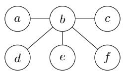
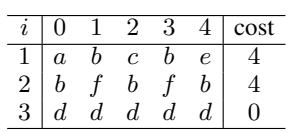
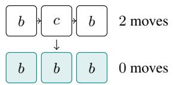
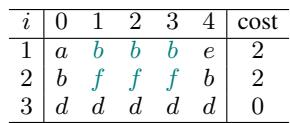
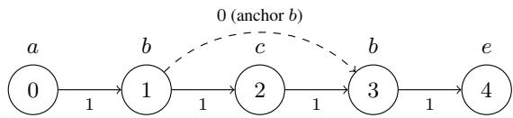
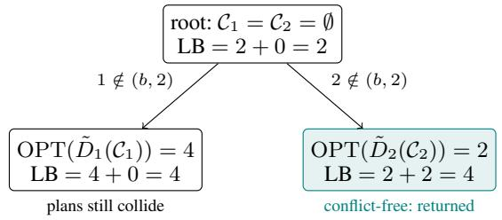
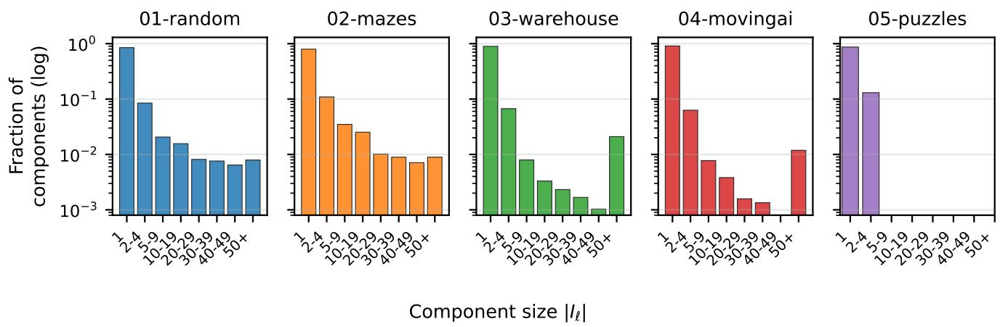
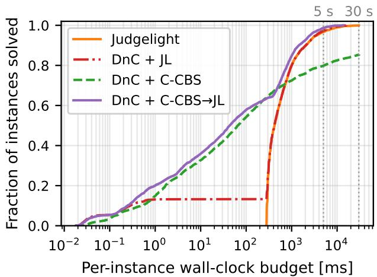
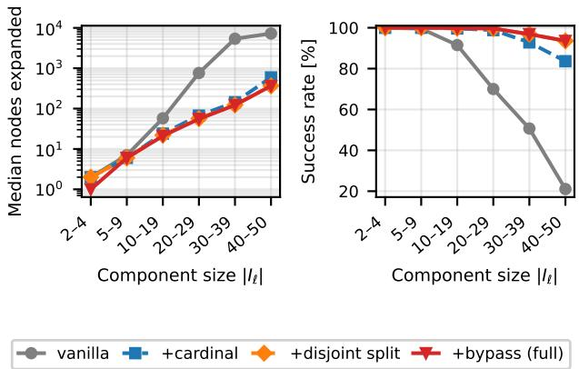

# Divide and Collapse: MAPF-Collapse via Exact Decomposition into Independent Sub-Instances

Oren Salzman1

1Technion – Israel Institute of Technology osalzman@cs.technion.ac.il

## Abstract

In this work we study the problem of MAPF-COLLAPSE, a post-optimization step for Multi-Agent Path Finding (MAPF) plans where we are given a feasible plan produced by a modern MAPF solver and are tasked with removing avoidable moves while preserving feasibility. This NP-hard problem naturally arises when using learning-based state-of-theart (SOTA) solvers which construct plans that contain redundant moves that can be removed. Recently, Tang et al. presented Judgelight, which uses Integer Linear Programming (ILP) to solve MAPF-COLLAPSE. Importantly, the ILP is constructed over all agents jointly, so its cost is governed by the full instance rather than by the small coupled residue that actually requires joint reasoning. Our key insight, motivating this work, is that MAPF-COLLAPSE instances naturally decompose into independent sub-problems, most of which involve a single agent and can be solved without any inter-agent reasoning. To this end, we first identify which agents need to coordinate their motion and partition the instance into subproblems accordingly. For the cases where no coordination is required, we introduce an extremely lightweight solver that is ≈ 1,900× faster than Judgelight. For cases where coordination is required, Judgelight can be used but we introduce an alternative CBS-like solver which is more efficient on easier problems. The resulting framework is exact, uses no commercial ILP solver, and matches Judgelight’s quality while running substantially faster on the coordination-light majority of instances; on the coordination-heavy instances we propose a regime-aware hybrid planner that falls back to Judgelight. Over all benchmarks tested, this planner achieves a median 10.5× per-instance speedup over Judgelight.

## 1 Introduction

In Multi-Agent Path Finding (MAPF) (Stern et al. 2019; Salzman and Stern 2020), we are tasked with coordinating the motion of a fleet of agents. It has applications in automated warehouses, robotic fulfillment, and large-scale logistics fleets (Wurman, D’Andrea, and Mountz 2008; Sturtevant 2012; Skrynnik et al. 2025). Modern MAPF solvers, whether search-based (Okumura 2023) or learned (Sartorett et al. 2019; Wang et al. 2023; Skrynnik et al. 2024; Andreychuk et al. 2025), are tuned to produce feasible schedules quickly. The trajectories they emit routinely contain moves that could be replaced by waiting in place without violating feasibility, inflating energy and battery consumption with no throughput benefit. Tang, Koenig, and Biyik (2026) recently formalized the corresponding post-optimization task as MAPF-COLLAPSE (see Fig. 1 and Sec. 3): given a feasible plan M, find a feasible modification of M minimizing total moves by collapsing an agent’s closed subwalk into a sequence of waits at its endpoint.

Unfortunately, MAPF-COLLAPSE is NP-hard (Tang, Koenig, and Biyik 2026, Thm. 1). To solve MAPF-COLLAPSE, Tang et al. presented Judgelight (Sec. 4), which formulates the problem as an Integer Linear Program (ILP) over all agents jointly. Our key insight, motivating this work, is that most agents in typical MAPF-COLLAPSE instances never occupy the same position at the same time and can therefore be post-optimized in complete isolation. Decomposing MAPF into independent groups is a classical idea (Standley 2010; Wagner and Choset 2015; Sharon et al. 2012); what MAPF-COLLAPSE adds is enough structure to make this split exact and compute it up front; to the best of our knowledge, this is the first exact, up-front decomposition for a MAPF post-optimization problem.

Concretely, we propose Divide-and-Collapse (Sec. 5), a two-stage framework which starts by partitioning the agents into groups according to whether they could possibly occupy the same position at the same time under any sequence of collapses. Each isolated agent’s problem then reduces to the simple question of which of its moves can safely be turned into waits, which we answer optimally and in linear time (Sec. 6). Only the small residue of agents that actually need to coordinate requires a joint solver. When agents need to be coordinated, any MAPF-COLLAPSE planner such as Judgelight can be used. However, a structural property of MAPF-COLLAPSE makes the CBS framework a natural fit: the optimization stage is only required to reason about vertex collisions (and not edge collisions as in the general MAPF problem). Consequently, we suggest (Sec. 7) Collapse-CBS (C-CBS),1 a CBS-like solver that lets us harness the stateof-the-art algorithmic tools developed for CBS. We then continue to evaluate our algorithmic framework (Sec. 8) and conclude with a discussion regarding future work (Sec. 9).

  
(a) Input Graph G.

  
(b) Input plan M.

  
(c) Collapse operator.

  
(d) Optimum plan Π⋆.  
Figure 1: MAPF-COLLAPSE problem. (a,b) Input graph G and plan M of cost 8. The problem calls for applying the Collapse operator (c) which replaces a closed walk that returns to a vertex, here $ b  c  b ,$ by waiting at b. (d) Applying collapses yields the optimum Π⋆ of cost 4; teal cells are moves turned into waits. Noteworthy is that agents 1 and 2 contend for b and form one coupled component solved jointly, whereas agent 3 never interacts which is the structure our framework exploits.

Our evaluation tests the framework with both C-CBS and Judgelight as the joint solver, and uncovers a phase transition: C-CBS is faster by an order of magnitude on small components, while using Judgelight within the framework becomes beneficial only on large-problem instances. This phase transition prescribes a regime-aware planner: each non-trivial component is dispatched according to the regime size, C-CBS (with a Judgelight fallback) on the smallto-medium majority, and Judgelight on the largest cores. The resulting planner is exact on every component C-CBS solves, never returns a costlier plan than Judgelight, and often a cheaper one, at a 10.5× median per-instance speedup. On the coordination-light majority it is near-instant; and only on a fraction of the densest instances does it fall back to Judgelight.

## 2 Related Work

Our work sits at the intersection of three lines of research: learning-based and lifelong MAPF, post-optimization of MAPF schedules, and heuristic search for MAPF, which includes both the conflict-based solvers we adapt and the agent-decomposition methods closest to our approach.

## 2.1 Learning-Based and Lifelong MAPF

Learning-based MAPF solvers, such as PRIMAL (Sartoretti et al. 2019), SCRIMP (Wang et al. 2023), Follower (Skrynnik et al. 2024), MAPF-GPT (Andreychuk et al. 2025) and RAILGUN (Tang et al. 2025), train decentralized policies that scale to fleets and horizons beyond the reach of optimal search, producing feasible schedules in milliseconds. This speed comes at a price: with no optimality mechanism, the emitted plans contain redundant moves such as back-andforth oscillations, reflected in the cost gaps these solvers exhibit relative to search-based baselines on the POGEMA benchmark (Skrynnik et al. 2025). The same holds for fast rule-based solvers such as PIBT (Okumura et al. 2022), whose plans often contain similar oscillations. Moreover, these policies increasingly target lifelong settings (Skrynnik et al. 2024), where plans are continually re-issued and per-plan waste compounds across the replanning loop.

## 2.2 Post-Optimization of MAPF Schedules

Post-processing of MAPF plans has been studied along several axes. Large-neighborhood search (Li et al. 2021) and iterative refinement (Okumura, Tamura, and Defago 2021)´ destroy and repair selected agent trajectories to improve cost while preserving feasibility, and delay-introduction (Kottinger et al. 2024) adds controlled waits to account for execution-time failures rather than to reduce cost.

A related execution-level line of work re-times a fixed spatial plan, for kinematic feasibility (Honig et al. 2016), ro-¨ bust execution under delays (Honig et al. 2019; Ma, Kumar,¨ and Koenig 2017), or built-in slack (Atzmon et al. 2018). Similarly, APEX-MR (Huang et al. 2025) post-processes a sequential multi-robot task plan into an asynchronous execution plan that absorbs delays and contingencies. All these methods operate on the temporal (execution) layer while MAPF-COLLAPSE operates on the path (movement) layer: it preserves the timeline and shortens the spatial trace, turning moves into waits to reduce cost. Tailored specifically to MAPF-COLLAPSE is the recent ILP-based Judgelight of Tang, Koenig, and Biyik (2026), which we recap in Sec. 4.

## 2.3 Heuristic Search for MAPF

Heuristic search has been the algorithmic infrastructure used to develop state-of-the-art algorithms for MAPF, with Conflict-Based Search (CBS) (Sharon et al. 2015) being one of the prominent examples. CBS computes optimal solutions by exploring a high-level tree whose nodes carry peragent constraint sets and dispatching the per-agent search to a low-level solver, resolving each vertex conflict in the resulting joint plan by branching. Its running time has been improved by (i) relaxing optimality guarantees to bounded suboptimality (Barer et al. 2014; Li, Ruml, and Koenig 2021) or by (ii) introducing optimizations to the basic version of CBS such as cardinal-conflict prioritization and conflict bypass (Boyarski et al. 2015), disjoint splitting (Li et al. 2019a), and symmetry breaking (Li et al. 2019b).

A common tool used in the development of heuristic search algorithms for MAPF is reasoning about which agents actually interact. Independence detection (Standley 2010) partitions the agents into groups, plans each group in isolation, and merges two groups only once a conflict between them is detected, re-planning the merged group; M\* (Wagner and Choset 2015) couples agents lazily by inflating the search dimension only around realized collisions; and meta-agent CBS (Sharon et al. 2012) merges agents into a meta-agent inside the CBS tree once their conflict count crosses a threshold. The common thread is that the coupling structure is discovered lazily, during search, from conflicts that actually arise. The closest line of research to ours is this family of decomposition methods, from which we differ in that (i) we reason about agent interaction up front, before running the planner, rather than lazily during search; and (ii) our interaction reasoning is tailored to MAPF-COLLAPSE, whose reach sets make the split exact.

## 3 Preliminaries and Problem Formulation

Let $G = ( V , E )$ be an undirected graph. A single-agent plan is a sequence $\pi = \langle v _ { 0 } , v _ { 1 } , \ldots , v _ { k } \rangle$ of vertices in $V$ such that, for every $0 \leq t < k ,$ , either $v _ { t } = v _ { t + 1 }$ (the agent waits at $v _ { t } )$ or $( v _ { t } , v _ { t + 1 } ) \in E$ (the agent moves along an edge). We write $| \pi | : = k$ for the length of π and $\pi ( t ) : = v _ { t }$ for the agent’s position at time $t \in \{ 0 , \ldots , k \}$ . The cost of $\pi$ is its move count,

$$
\begin{array} { r } { \mathrm { c o s t } ( \pi ) : = \big | \big \{ t \in \{ 0 , \dots , k - 1 \} \big | \pi ( t ) \neq \pi ( t + 1 ) \big \} \big | . } \end{array}
$$

Two single-agent plans $\pi ^ { i } , \pi ^ { j }$ are in vertex collision at time t if $\pi ^ { \bar { i } } ( t ) \ \bar { = } \ \pi ^ { \bar { j } } ( t )$ , and in edge collision at time t if $\pi ^ { i } ( t ) \neq \pi ^ { i } ( { \dot { t } } { + } 1 ) , \pi ^ { i } ( { \dot { t } } ) = \pi ^ { j } ( t { + } 1 )$ , and $\pi ^ { i } ( t { + } 1 ) = \pi ^ { j } ( t )$ The pair is collision-free if no such t exists.

For agents $\textit { I } = \ \{ 1 , \ldots , N \}$ , a joint plan is a tuple $\Pi \ = \ ( \breve { \pi } ^ { 1 } , \ldots , \pi ^ { N } )$ of single-agent plans. Its end-time is $T ( \Pi ) : = \operatorname* { m a x } _ { i \in I } | \dot { \pi } ^ { i } |$ ; each agent’s position is extended by waits at its endpoint, namely with ${ \dot { v _ { i , \mathrm { e n d } } } } : = \pi ^ { i } ( | \pi ^ { i } | )$ we set $\pi ^ { i } ( t ) : = v _ { i , \mathrm { e n d } }$ for $| \pi ^ { i } | < t \leq T ( \Pi )$ . The joint plan is collision-free if every pair $( \pi ^ { i } , \pi ^ { j } ) , i \neq j ,$ , is collision-free over $\{ 0 , \ldots , T ( \Pi ) \}$ . Its cost is cost $\begin{array} { r } { \mathrm { ( I I ) } : = \sum _ { i \in I } \mathrm { c o s t } ( \pi ^ { i } ) } \end{array}$

Given a single-agent plan $\pi = \langle v _ { 0 } , \ldots , v _ { k } \rangle$ and indices $0 \leq a < b \leq k$ with $\begin{array} { r } { \boldsymbol { v } _ { a } \ = \ \boldsymbol { v } _ { b } . } \end{array}$ , the collapse operation $\mathrm { C o l 1 }$ apse $( \pi , a , b )$ returns the plan $\pi ^ { \prime }$ of length k defined by $\pi ^ { \prime } ( t ) : = v _ { a }$ for every $t \in [ a , b ]$ and $\pi ^ { \prime } ( t ) : = v _ { t }$ otherwise. We call the common endpoint vertex $v _ { a } = v _ { b }$ the anchor of $\mathtt { C o l l a p s e ( } \pi , a , b )$ . As the operation replaces a sequence of moves by waits we have that cost(Collapse $( \pi , a , b ) ) \leq$ cost(π).

Example 1. Consider the graph G of Fig. 1, and consider the single-agent plan $\pi ~ = ~ \langle a , b , c , b , e \rangle$ on G. This plan has length 4 and cost $( \pi ) ~ = ~ 4 { : }$ every consecutive pair differs. The only repeated vertex is $b ,$ occurring at $\bar { t } \in \{ 1 , 3 \}$ , so the only admissible $C O \bot$ apse application is Collapse $( \pi , 1 , 3 )$ , which yields $\pi ^ { \star } = \langle a , b , b , b , e \rangle$ with cost $( \pi ^ { \star } ) \ = \ 2 ;$ this is the minimum-cost plan obtainable from π by a sequence of Collapse applications.

The main problem of this paper extends this single-agent setting to multiple agents under joint-feasibility constraints. setting to multiple agents under joint-feasibility constraints.

Problem 1 (MAPF-COLLAPSE). Given a graph $G$ and a collision-free joint plan $M = ( M ^ { i } ) _ { i \in I }$ on G for agents $I , ^ { 2 }$ find a collision-free joint plan $\Pi ^ { \star } ~ = ~ ( \pi ^ { \star i } ) _ { i \in I }$ in which each $\pi ^ { \star i }$ is obtained from $M ^ { i }$ by a finite sequence of Collapse applications, that minimizes cost(Π⋆).

For a subset of agents $S \subseteq I ,$ , we write OPT(S) for the cost of an optimal solution to MAPF-COLLAPSE restricted to S with the corresponding rows of M. We further write $k _ { i } : = | M ^ { i } |$ for the length of agent i’s input plan.

Assumption 3.1 (common makespan). The input rows share a common makespan: $| M ^ { i } | \stackrel { \textstyle - } { = } T ( M )$ for all $i \in I ,$ equivalently $k _ { i } = T ( M )$ .

This is the standard form of a MAPF solution, in which each agent waits at its goal until the last agent arrives.

Example 2. Consider the graph G and the input plan M of Fig. 1. The input is collision-free (no shared cell, no swap) and cost $( M ) { \overset { \cdot } { = } } 4 + 4 + 0 = { \overset { \cdot } { 8 } } .$ . Note that the per-agent $o p \textmd { - }$ timum on $M ^ { 1 }$ in isolation (Ex. 1) keeps agent 1 waiting at b during [1, 3], while $M ^ { 2 }$ also visits b at $t = 2 ;$ whether the single-agent optima are jointlyfeasible is precisely the coupling question that distinguishes MAPF-COLLAPSE from its single-agent restriction.

## 4 Algorithmic Background: Judgelight

Tang, Koenig, and Biyik (2026) solve MAPF-COLLAPSE using Judgelight, which casts the problem as an ILP after two preprocessing reductions.

Judgelight enumerates every candidate collapse action by introducing a binary variable $y _ { c } ~ \in ~ \{ 0 , 1 \}$ for every quadruple $c ~ = ~ ( i , a , b , v )$ with $M ^ { i } ( a ) \ = \ M ^ { i } ( b ) \ = \ v ,$ where $y _ { c } = 1$ indicates that the collapse $( a , b )$ is applied to $M ^ { i }$ . Each variable carries a non-negative weight $w _ { c }$ equal to the number of moves of $M ^ { i }$ inside $[ a , b ]$ , the saving the collapse realizes in isolation. The ILP maximizes $\sum _ { c } w _ { c } y _ { c }$ subject to three constraint families: per-agent exclusion (two selected actions of one agent must have time-disjoint intervals), vertex-collision exclusion (no two selected actions place two agents at the same cell at the same time), and dependency constraints (if a selected action keeps one agent at a cell that another agent originally occupies, that other agent must collapse around the cell). The dependency constraints are the inter-agent coupling that makes the problem hard. In contrast, our C-CBS discovers this coupling lazily within each component, one resolved conflict at a time (Sec. 7).

Two reductions run before the ILP is built. Safeoscillation removal greedily eliminates every oscillation an agent can undo on its own, without affecting any other agent; because the choice is greedy, it can commit an agent to waits that preclude a larger joint saving. A maximal-loop reduction losslessly prunes redundant collapse candidates, shrinking the variable set. Even after this reduction, an alternating segment of length n still yields $O ( n ^ { 2 } )$ variables and $O ( n ^ { 4 } )$ dependency constraints, so building the ILP is worst-case quartic in an agent’s plan length.

## 5 Decomposing MAPF-COLLAPSE by Interaction Components

In this section we present our approach to solving MAPF-COLLAPSE (Prob. 1). We begin (Lem. 5.1) with a structural property of joint Collapse applied to a collision-free input: no edge collision can ever arise, so the only feasibility constraint we need to enforce is vertex-collision avoidance. We then introduce the reach set of an agent, namely the (vertex, time) cells it can occupy under any plan derived from $M ^ { i }$ , and use pairwise reach-set intersections to define an interaction graph on the agents whose edges record which pairs can potentially conflict. These two ingredients let us decompose any MAPF-COLLAPSE instance into independent sub-instances, one per connected component of the interaction graph (Sec. 5.2): singletons are dispatched to a per-agent primitive 1-MAPFC (Sec. 6), that returns the peragent optimum $\mathrm { O P T } ( \{ i \} )$ in time linear in $\vert M ^ { i } \vert ;$ non-trivial components are handed to a joint solver of choice $( \mathsf { S e c . 7 } )$

Lemma 5.1 (no edge conflicts). Let M be a collision-free joint plan and Π a joint plan in which each $\pi ^ { i }$ is obtained from Mi by a finite sequence of Collapse applications. Then Π contains no edge collision.

Proof. We call a triple $( t , \pi ( t ) , \pi ( t { + } 1 ) )$ with $\begin{array} { r l } { \pi ( t ) } & { { } \neq } \end{array}$ $\pi ( t { + } 1 )$ a move-transition of π. A single Collapse turns the moves at timesteps inside its interval into waits and leaves all other timesteps unchanged, so it can only shrink a plan’s move-transition set; by induction, the movetransitions of each $\pi ^ { i }$ are a subset of those of $M ^ { i }$ . An edge collision between agents i and j at time t consists of a move-transition $( t , u , v )$ of agent i and the opposite move-transition $( t , v , \dot { u } )$ of agent $j ;$ these would be movetransitions of $M ^ { i }$ and $\dot { M } ^ { j }$ as well, so M would contain the same edge collision, contradicting that M is collisionfree. □

Throughout the remainder of the paper, “conflict” therefore always means a vertex collision.

## 5.1 Reach Sets and the Interaction Graph

Recall that $T ( M ) : = \operatorname* { m a x } _ { i } | M ^ { i } |$ denotes the end-time of the input joint plan (Sec. 3). A vertex-time cell is a pair $( v , t ) \in$ $\bar { V ^ { \mathbf { \alpha } } } \times \bar { \{ 0 , \dots , T ( M ) \} }$ . For an agent i and a vertex $v \in V$ visited by $M ^ { i }$ , let

$$
\begin{array} { r l } & { \operatorname { f i r s t } _ { i } ( v ) : = \operatorname* { m i n } \{ t : M ^ { i } ( t ) = v \} , } \\ & { \operatorname { l a s t } _ { i } ( v ) : = \operatorname* { m a x } \{ t : M ^ { i } ( t ) = v \} . } \end{array}
$$

An anchor of $M ^ { i }$ is a vertex v with $\begin{array} { r l } { \mathrm { f i r s t } _ { i } ( v ) } & { { } < } \end{array}$ las $\mathrm { t } _ { i } ( \boldsymbol { v } )$ , namely a vertex visited at least twice. We define the original cells Reac $\mathrm { \mathsf { 1 } } _ { \mathrm { o r i g } } ^ { i }$ traced by $M ^ { i }$ and the anchor cells $\mathrm { R e a c h } _ { \mathrm { a n c h o r } } ^ { i }$ visited when i collapses as follows:

$$
\begin{array} { r c l } { { } } & { { \mathrm { R e a c h } _ { \mathrm { o r i g ~ } } ^ { i } = ~ \left\{ ( M ^ { i } ( t ) , t ) \ : | \ : 0 \leq t \leq T ( M ) \right\} , } } \\ { { } } & { { \mathrm { R e a c h } _ { \mathrm { a n c h o r ~ } } ^ { i } = ~ \displaystyle \bigcup _ { v : \mathrm { f i r s t } _ { i } ( v ) < \mathrm { l a s t } _ { i } ( v ) } \left\{ v \right\} \times \left[ \mathrm { { f i r s t } _ { \mathit { i } } ( v ) , \mathrm { l a s t } _ { \mathit { i } } ( v )  . } } } \en\right]d{array} \end{array}
$$

The reach set of agent i is their union:

$$
\mathrm { R e a c h } ^ { i } = \mathrm { R e a c h } _ { \mathrm { o r i g } } ^ { i } \cup \mathrm { R e a c h } _ { \mathrm { a n c h o r } } ^ { i } .
$$

Roughly speaking, ${ \mathrm { R e a c h } } ^ { i }$ is the set of all cells agent i can occupy under some single-agent plan derived from $M ^ { i }$ which we now make precise.

Observation 5.2 (reach containment). Every Collapsederived plan $\pi ^ { i } o f M ^ { i }$ satisfies $( \pi ^ { i } ( t ) , t ) \in \operatorname { R e a c h } ^ { i } f o r \ e \nu -$ ery $0 \leq t \leq T ( M )$ . Conversely, every cell of Reachi is occupied by some Collapse-derived plan of $\check { M } ^ { i }$

<table><tr><td rowspan=7 colspan=1>abCdef</td><td rowspan=1 colspan=4>t=0 t=1 t=2 t=3</td><td rowspan=1 colspan=1>t=4</td></tr><tr><td rowspan=1 colspan=1>1</td><td rowspan=1 colspan=1></td><td rowspan=1 colspan=1></td><td rowspan=1 colspan=1></td><td rowspan=1 colspan=1></td></tr><tr><td rowspan=1 colspan=1>2</td><td rowspan=1 colspan=1>1,2</td><td rowspan=1 colspan=1>1,2</td><td rowspan=1 colspan=1>1,2</td><td rowspan=1 colspan=1>2</td></tr><tr><td rowspan=1 colspan=1></td><td rowspan=1 colspan=1></td><td rowspan=1 colspan=1>1</td><td rowspan=1 colspan=1></td><td rowspan=1 colspan=1></td></tr><tr><td rowspan=1 colspan=1>3</td><td rowspan=1 colspan=1>3</td><td rowspan=1 colspan=1>3</td><td rowspan=1 colspan=1>3</td><td rowspan=1 colspan=1>3</td></tr><tr><td rowspan=1 colspan=1></td><td rowspan=1 colspan=1></td><td rowspan=1 colspan=1></td><td rowspan=1 colspan=1></td><td rowspan=1 colspan=1>1</td></tr><tr><td rowspan=1 colspan=1></td><td rowspan=1 colspan=1>2</td><td rowspan=1 colspan=1>2</td><td rowspan=1 colspan=1>2</td><td rowspan=1 colspan=1></td></tr></table>

Figure 2: Reach-set for the running example. Each cell $( v , t )$ is labeled with the agents whose reach set ${ \mathrm { R e a c h } } ^ { i }$ includes it; an empty cell is in no reach set. The shaded cells form the intersection Reach1 ∩ Reach2 that witnesses the interaction edge $\{ 1 , 2 \}$ of H (Fig. 3). Agent 3’s column (row d) is disjoint from the others, so {3} is a singleton component.

Proof. We prove the first claim by induction on the number of Collapse applications, with the invariant that at every time t either $\bar { \pi ^ { i } } ( t ) ~ = ~ M ^ { i } ( t )$ or $\pi ^ { i } ( t ) = w$ for an anchor w of $M ^ { i }$ with first $( w ) \leq t \leq \mathrm { l a s t } _ { i } ( w )$ ; the invariant places $( \pi ^ { i } ( t ) , t )$ in $\operatorname { R e a c h } _ { \mathrm { o r i g } } ^ { i }$ or in $\mathrm { R e a c h } _ { \mathrm { a n c h o r } } ^ { i } ,$ respectively. The base case is $M ^ { i }$ itself. For the inductive step, let $\dot { \pi ^ { \prime } } = \mathtt { C o l l a p s e } ( \pi , a , b )$ with anchor $v ~ = ~ \pi ( a ) ~ = ~$ $\pi ( b )$ , where π satisfies the invariant. Applying the invariant at time a gives first ${ \mathrm { : } } ( v ) \leq a ,$ , both when $v = M ^ { i } ( a )$ as then $M ^ { i }$ visits v at time $^ { a , }$ and when v is an anchor of $M ^ { i }$ ; symmetrically, at time b it gives $b \leq \mathrm { l a s t } _ { i } ( v )$ . Hence first $\dot { \mathbf { \zeta } } _ { i } ( v ) \leq a < b \leq$ last ${ \bf \rho } _ { i } ( v )$ , so v is an anchor of $M ^ { i }$ and $[ a , b ] \subseteq [ \mathrm { f i r s t } _ { i } ( v ) , \mathrm { l a s t } _ { i } ( v ) ]$ . Every cell $\pi ^ { \prime }$ newly occupies therefore lies in $\mathrm { R e a c h } _ { \mathrm { a n c h o r } } ^ { i } .$ , and outside $[ a , b ]$ the plan is unchanged, so $\pi ^ { \prime }$ satisfies the invariant. For the converse, $M ^ { i }$ occupies every cell of ${ \mathrm { R e a c h } } _ { \mathrm { o r i g } } ^ { i } ,$ , and for an anchor v the single application $\mathsf { C o l l a p s e } ( M ^ { i }$ , first (v), last (v)) occupies $( v , t )$ for every $t \in [ \mathrm { f i r s t } _ { i } ( v ) , \mathrm { l a s t } _ { i } ( v ) \}$ ]. □

Noteworthy is that the anchor of a Collapse application on an already-collapsed plan is itself an anchor of the input row $M ^ { i }$ , which is why the reach set does not grow as applications compose. See Fig. 2 for a visualization of the reach sets of the running example.

Example 3. Take agent 1 of the running example, with input plan $\bar { M } ^ { 1 } = \langle a , b , c , \bar { b } , e \rangle ( \bar { E } x . I )$ . Its original cells are thefive it traces, Reac $\boldsymbol { 1 } _ { o r i g } ^ { 1 } = \{ ( a , 0 ) , ( b , 1 ) , ( c , 2 ) , ( b , 3 ) , ( e , 4 ) \}$ . Its only anchor is b resulting in Reach $\mathsf { \Pi } _ { a n c h o r } ^ { 1 } = \{ b \} \times [ 1 , 3 ] =$ $\{ ( b , 1 ) , ( b , 2 ) , ( b , 3 ) \}$ }. The reach set Reach1 is their union, the cells marked 1 in Fig. 2.

The interaction graph $H = ( I , { \mathcal { E } } )$ is the undirected graph on agents defined by

$$
\{ i , j \} \in \mathcal { E } \iff \operatorname { R e a c h } ^ { i } \cap \operatorname { R e a c h } ^ { j } \neq \emptyset .
$$

For any distinct $i , j$ , Reac $\mathrm { h } _ { \mathrm { o r i g } } ^ { i } \cap \mathrm { R e a c h } _ { \mathrm { o r i g } } ^ { j } = \emptyset .$ , since these

1 2 3

Figure 3: The interaction graph H for the running $\mathbf { \vec { e } X \tilde { \mathbf { \theta } } }$ ample. Component {1, 2} is non-trivial (witnessed by $( b , \bar { 1 } ) , ( b , 2 ) , \bar { ( } b , 3 ) \in \bar { \mathrm { R e a c h } } ^ { 1 } \cap \mathrm { R e a c h } ^ { 2 }$ , the shaded cells of Fig. 2); agent 3 is a singleton.

are exactly the cells of the collision-free input joint plan M; hence every edge of H is witnessed by at least one anchor cell. A component $I _ { \ell }$ of H with $| I _ { \ell } | = 1$ is a singleton; one with $| I _ { \ell } | \geq \overset { \cdot } { 2 }$ is non-trivial.

## 5.2 Exact Decomposition and the Pipeline

Let $I _ { 1 } , \ldots , I _ { m }$ be the connected components of H. The next theorem shows that the reach sets and the interaction graph suffice to factorize the problem across these components.

Theorem 5.3 (exact decomposition). Combining optimal plans for the individual components yields a globally optimal plan. In particular, $\begin{array} { r } { \mathrm { O P T } ( I ) = \dot { \sum } _ { \ell = 1 } ^ { m } \mathrm { O P T } ( I _ { \ell } ) } \end{array}$

Proof. By Lem. 5.1, feasibility reduces to absence of vertex collisions. If agents i and j collide at cell $( v , t )$ under some pair of plans, then $( v , t ) \in \operatorname { R e a c h } ^ { i } \cap \operatorname { R e a c h } ^ { j }$ by Obs. 5.2. Thus $\{ i , j \} \in { \mathcal { E } } ;$ equivalently, any colliding pair is H-adjacent and lies in a single component. Hence crosscomponent pairs, and non-adjacent same-component pairs, are collision-free under every choice of plans, and a joint plan is feasible iff its restriction to each component is feasible. The cost decomposes additively over agents and, by the factorization above, the components can be optimized independently; the global minimum therefore equals the sum of per-component minima, proving the decomposition. □

Thm. 5.3 suggests a natural algorithmic realization, outlined in Alg. 1. We start by computing the reach set of every agent (Lines 1–4). Specifically, for each agent $i ,$ a single left-to-right pass over $M ^ { i }$ emits the trajectory cells of $\operatorname { R e a c h } _ { \mathrm { o r i g } } ^ { i }$ and records, in a vertex hash $\mathcal { H } _ { i } ,$ , the first and last visit times first (v), last (v) of each visited vertex v (Line 3). Every anchor of $M ^ { i }$ then contributes its band of anchor cells $\{ \dot { v } \} \times [ \mathrm { f i r s t } _ { i } ( v ) , \mathrm { l a s t } _ { i } ( v ) ]$ . The resulting reach sets are inserted, cell by cell, into a shared cell-to-agents map M (Line 4). We then recover the interaction graph and its components (Lines 5–6). As stated, Line 5 enumerates the edge set $\mathcal { E } ,$ , which a single cell shared by c agents would inflate by $\binom { c } { 2 }$ pairs; this is avoided by maintaining a union– find over the agents: whenever an agent lands on a cell of M already occupied by another, we union the two. The connected components $I _ { 1 } , \ldots , I _ { m }$ are read off as the union–find classes (Line 6); the bound of Prop. 5.4 refers to this realization. Finally, we solve the components independently and stitch the results (Lines 7–14). A singleton {i} goes to the per-agent primitive 1-MAPFC (Line 10), while a non-trivial component is handed to a joint solver JOINTSOLVE as the self-contained sub-instance $( G , M _ { I _ { \ell } } )$ , the restriction of M to the agents in $I _ { \ell }$ (Line 12). Appending each component’s plans (Line 13) gives the joint plan Π returned in Line 14; by

Algorithm 1: Divide-and-Collapse: decomposition   
pipeline.   
Require: MAPF-COLLAPSE instance $( G , M )$ on agents I.   
Ensure: A feasible joint plan Π.   
1: $M \gets \emptyset$ ▷ cell → agents map   
2: for all $i \in I$ do   
3: Compute $\operatorname { f i r s t } _ { i } ( v )$ , last $\mathbf { \rho } _ { i } ( v )$ for each anchor v of $M ^ { i }$   
4: Rea $\boldsymbol { \mathrm { \cdot } } \boldsymbol { \mathrm { h } } ^ { i } \gets$ Reac $\mathbf { l } _ { \mathrm { o r i g } } ^ { i }$ ∪ Reac $1 _ { \mathrm { a n c h o r } } ^ { i } ;$ insert its cells   
into $\mathcal { M }$   
5: $\mathcal { E }  \{ \{ i , j \} \vert \exists ( v , t )$ with $\{ i , j \} \subseteq \mathcal { M } [ ( v , t ) ] \}$   
6: $\{ I _ { 1 } , \ldots , I _ { m } \}$ ← connected components of $\scriptstyle { \dot { H } } = ( I , { \mathcal { E } } )$   
7: Π $ ( )$   
8: for all component $I _ { \ell }$ do   
9: $\mathbf { i f } | I _ { \ell } | = 1 , \mathrm { s a y } I _ { \ell } { = } \{ i \}$ then   
10: $\pi ^ { i }  1 \neg \mathsf { M A P F C } ( { \bar { G } } , M ^ { i } )$ ▷ Sec. 6, Cor. 6.3   
11: else   
12: $\Pi _ { I _ { \ell } }  \mathrm { J O I N T S O L V E } ( G , M _ { I _ { \ell } } )$   
13: Append the per-agent plans to Π   
14: return Π

Thm. 5.3, Π is globally optimal whenever every component is solved optimally.

Proposition 5.4 (decomposition-pipeline complexity). The singleton-exact part ofAlg. 1, namely all of its steps except the JOINTSOLVE call on Line 12, runs in time3

$$
\tilde { O } \Big ( \sum _ { i } k _ { i } + \sum _ { i } | \mathrm { R e a c h } ^ { i } | \Big ) .
$$

Proof. We bound the work agent by agent. Fix an agent i with $k _ { i } = | M ^ { i } |$ . A single left-to-right pass over $M ^ { i }$ computes firsti(v), lasti(v) for every visited vertex and emits the original cells ${ \mathrm { R e a c h } } _ { \mathrm { o r i g } } ^ { i } ,$ , in $O ( k _ { i } )$ time (Lines 3–4). Emitting the anchor cells $\mathrm { R e a c h } _ { \mathrm { a n c h o r } } ^ { i }$ and inserting all $\lvert \mathrm { R e a c h } ^ { i } \rvert$ cells of ${ \mathrm { R e a c h } } ^ { i }$ into the shared map M takes $O ( | \operatorname { R e a c h } ^ { i } | )$ time; each insertion performs one hash lookup and triggers at most one UNION, contributing $O ( | \operatorname { R e a c h } ^ { i } | \alpha ( N ) )$ union– find work (Tarjan 1975), where α is the extremely slowly growing inverse-Ackermann function4 (Lines 4–6). Each singleton is then solved by one 1-MAPFC call in $O ( k _ { i } )$ time (Line 10; Cor. 6.3). Summing over the N agents,

$$
\begin{array} { l } { \displaystyle \sum _ { i } \Big ( O ( k _ { i } ) + O \big ( \vert \mathrm { R e a c h } ^ { i } \vert \cdot \alpha ( N ) \big ) \Big ) } \\ { = \ O \Big ( \displaystyle \sum _ { i } k _ { i } + \alpha ( N ) \cdot \sum _ { i } \vert \mathrm { R e a c h } ^ { i } \vert \Big ) , } \end{array}
$$

which is the claimed $\begin{array} { r } { \tilde { O } ( \sum _ { i } k _ { i } + \sum _ { i } | \operatorname { R e a c h } ^ { i } | ) } \end{array}$ once the inverse-Ackermann factor is absorbed into $\tilde { O }$ □

The bound is output-sensitive: $\vert \mathrm { R e a c h } ^ { i } \vert$ can reach $\Theta ( k _ { i } ^ { 2 } )$ in the worst case, though in all our experiments (Sec. 8) $\textstyle \sum _ { i } |$ | Reachi | never exceeds ${ \mathrm { 1 } } \times \sum _ { i } k _ { i }$ on any instance.

The pipeline yields two bounds at no extra cost. The input joint plan M is a global upper bound cost $( M ) \geq \mathrm { O P T } ( \mathbf { \hat { \eta } } _ { } )$ The sum of unconstrained single-agent optima is a global lower bound $\begin{array} { r } { \begin{array} { r c l } { \mathrm { O P T } ( I ) } & { \geq } & { \sum _ { i } ^ { } \mathrm { O P T } ( \{ i \} ) } \end{array} } \end{array}$ ), since coordination can only raise an agent’s cost. As we will see, these bounds seed the root of the joint solver of Sec. 7.

Example 4 (continuing Ex. 3). On the running example, Alg. 1 processes the singleton $I _ { 2 } ~ = ~ \{ 3 \}$ via the 1- MAPFC oracle (Cor. 6.3, see Ex. 5), returning $\pi ^ { \star 3 } = M ^ { 3 }$ (cost 0). The non-trivial component $I _ { 1 } = \{ 1 , 2 \}$ is emitted as a self-contained sub-instance and handed to JOINT-SOLVE; we resolve it in Ex. 6 below. The LB/UB seeds are $\begin{array} { r } { \sum _ { i } \mathrm { O P T } ( \{ i \} ) = 2 } \end{array}$ and cost $( M ) = 8 .$

## 6 Per-Agent Solver for Singleton Components

In this section we fill in the per-agent primitive 1-MAPFC that the decomposition pipeline of Sec. 5 dispatches each singleton component to. Given a graph G and a single-agent plan π on $G$ (corresponding to $\pi = M ^ { i }$ for some agent $i ) ,$ 1-MAPFC returns a minimum-cost plan obtained from π by a sequence of Collapse applications, in time linear in |π|.

Given a graph G and a single-agent plan π on G, the Collapse $D A G D _ { G , \pi } = ( \mathcal { N } , \mathcal { A } )$ is defined as follows. The nodes of $D _ { G , \pi }$ are

$$
\mathcal { N } : = \{ 0 , 1 , \ldots , | \pi | \} ,
$$

and its arcs are $\mathcal { A } : = \mathcal { A } _ { \mathrm { t r a c e } } \cup \mathcal { A } _ { \mathrm { c o l l a p s e } }$ with

$$
\begin{array} { r } { \mathcal { A } _ { \mathrm { t r a c e } } : = \left\{ ( t , t + 1 ) \ : \middle | \ : 0 \leq t < | \pi | \right\} } \end{array}
$$

and

$$
{ \mathcal { A } } _ { \mathrm { c o l l a p s e } } : = \{ ( a , b ) { \big | } 0 \leq a < b \leq { \big | } \pi { \big | } { \mathrm { a n d } } \pi ( a ) = \pi ( b ) \}
$$

An arc $( t , t { + } 1 ) ~ \in ~ \mathcal { A } _ { \mathrm { t r a c e } }$ corresponds to following π at timestep t and has cost $1 [ \pi ( t ) \neq \pi ( t { + } 1 ) ]$ ] (one if π moves at timestep $t ,$ zero if π waits). An arc $( a , \bar { b } ) \in \mathcal { A } _ { \mathrm { c o l l a p s e } }$ corresponds to applying Collapse $( \pi , a , b )$ and has cost zero.

Lemma 6.1 (Collapse-DAG correspondence). Every path in $D _ { G , \pi } f r o m$ node 0 to node |π| corresponds to a singleagent plan $\pi ^ { \prime }$ obtained from π by applying Collapse along the path’s collapse arcs. Furthermore, the cost of the path equals cost $( \dot { \pi ^ { \prime } } )$ . Conversely, every plan obtained from π by afinite sequence ofCollapse applications corresponds to some path in $D _ { G , \pi }$ from node 0 to node |π|.

Proof. Consider first a $0 \  \ | \pi |$ path P, and apply the $\mathrm { C o l 1 }$ apse operations of its collapse arcs in left-to-right order. Every such arc $( a , b )$ satisfies π $\cdot ( a ) = \pi ( b )$ ; since an application alters positions only in the interior of its interval, and the arcs of $\bar { P }$ traverse internally-disjoint intervals, the plan to which Collapse $( \cdot , a , b )$ is applied agrees with π at both a and b, so each application is admissible. The resulting plan $\pi ^ { \prime }$ waits at the anchor across every collapse arc of $P$ and follows $\pi$ elsewhere. Consequently, a trace arc $( t , t { + } 1 )$ of $P$ costs one exactly when $\pi ^ { \prime }$ moves at time t, collapse arcs cost zero while $\pi ^ { \prime }$ waits across them, and the cost of $P$ equals cost $( \pi ^ { \prime } )$

For the converse, we show by induction on the number of Collapse applications that every derived plan $\pi ^ { \prime }$ waits across pairwise-disjoint intervals $[ a _ { 1 } , b _ { 1 } ] , \dotsc , [ a _ { m } , b _ { m } ]$ satisfying $\pi ^ { \prime } ( t ) = \pi ( a _ { j } ) = \pi ( b _ { j } )$ for $t \in [ a _ { j } , b _ { j } ]$ and follows π elsewhere; the path that takes the collapse arc $( a _ { j } , b _ { j } )$ across each interval and trace arcs elsewhere then corresponds to $\pi ^ { \prime } .$ . The claim is immediate for zero applications. For the inductive step, apply Collapse $( \pi ^ { \prime } , c , \bar { d } )$ and denote $w : = \pi ^ { \prime } ( c ) = \pi ^ { \prime } ( d )$ . If c lies in an interval $[ a _ { i } , b _ { i } ]$ then $w = \pi ( a _ { i } )$ and we set $c ^ { * } : = a _ { i } ;$ otherwise $w = \pi ( c )$ and we set $c ^ { * } : = c .$ . The index $d ^ { * }$ is defined symmetrically. The new plan waits at w across all of $[ c ^ { * } , d ^ { * } ]$ (on $[ c ^ { * } , c )$ and $( d , d ^ { * } ]$ it already did), we have $\pi ( c ^ { * } ) \stackrel { } { = } \pi ( d ^ { * } ) \stackrel { } { = } w .$ , and every previous interval is either contained in $[ c ^ { * } , d ^ { * } ]$ or disjoint from it; the intervals of the new plan therefore again have the claimed form. □

  
Figure 4: The Collapse DAG $D _ { G , \pi }$ for the plan $\pi =$ $\langle a , b , c , b , e \rangle$ on the running-example graph. Above each node t is the position $\pi ( t )$ . Solid arrows are trace arcs (cost $\mathbb { 1 } [ \pi ( t ) ~ \neq ~ \pi ( t { + } 1 ) ] ) ;$ the dashed arrow is the unique collapse arc at anchor b. The minimum-cost path from 0 to 4 is $\mathsf { 0 } \to 1 \to 3 \to 4$ , has cost 2 and uses the collapse arc.

Algorithm 2: 1-MAPFC (single-agent MAPF-COLLAPSE):   
minimum-cost collapse of π on $G .$   
Require: Graph G and single-agent plan π on $G .$   
Ensure: A min-cost plan $\pi ^ { \star }$ obtained from π by a sequence   
of Collapse applications, with cost $( \pi ^ { \star } )$   
1: $\mathrm { { d i s t } [ 0 ]  0 ; }$ dis $\bar { [ } t \bar { ] }  \infty$ for $t = 1 , \ldots , | \pi |$   
2: $B  \bar { \varnothing } ; B [ \pi ( 0 ) ] \stackrel {  } {  } 0$ ▷ argmin hash   
3: for $t = 1 , \mathbf { \bar { 2 } } , \dots , | \pi |$ do   
4: $w  \mathbb { 1 } [ \pi ( t - 1 ) \neq \pi ( t ) ]$ ; dist[t] ← dist[t−1] + w   
5: parent $[ t ] \gets t { - } 1$   
6: $\mathbf { \bar { i } } \mathbf { f } \pi ( t ) \mathbf { \bar { \in } } B$ and dis $[ B [ \pi ( t ) ] ] <$ dist[t] then   
7: dist $[ t ]  \mathrm { d i s t } [ B [ \pi ( t ) ] ] ;$ parent $[ t ]  B [ \pi ( t ) ]$   
8: $\mathbf { i f } \pi ( t ) \notin B$ or dist $[ t ] <$ dist $[ B [ \pi ( t ) ] ]$ then   
9: $B [ \pi ( t ) ]  t$   
10: $\pi ^ { \star }$ ← path reconstructed via parent pointers ▷ Lem. 6.1   
11: return $\pi ^ { \star }$ , dist[|π|]

Fig. 4 shows the Collapse DAG of the running-example plan ${ \bf { \bar { \boldsymbol { M } } } } ^ { 1 }$ and its minimum-cost path.

Since $D _ { G , \pi }$ is a DAG, a minimum-cost path from 0 to |π| is computable in time linear in $| { \cal A } |$ by processing the nodes in increasing index order. In the worst case, however, |A| is quadratic in |π|. 1-MAPFC (Alg. 2) computes it in $O ( | \pi | )$ time and space regardless, by exploiting the structure of the collapse arcs: all collapse arcs entering node t cost zero and originate at earlier occurrences of the vertex $\pi ( t )$ , so it suffices to remember, for each vertex, its cheapest occurrence so far and the quadratic arc set is never materialized.

1-MAPFC receives a graph G and a path π and maintains two data structures: (i) a distance array dist : $\mathcal { N }  \mathbb { R }$ with dist[t] storing the least cost of a 0-to-t path found so far; and (ii) a per-vertex argmin hash $B : { \overline { { V } } }  { \mathcal { N } }$ with $B [ v ] = \arg \operatorname* { m i n } _ { a : \pi ( a ) = v }$ dist[a] storing the visited index of vertex v of least dist, which lets the best collapse arc into a node be retrieved in $O ( 1 )$ . Thus, instead of enumerating the collapse arcs entering node t, the algorithm reads the single entry $B [ \pi ( t ) ]$ , which holds the tail of the cheapest such arc. We initialize both structures (Lines 1– 2), then make a single left-to-right pass over the nodes $t = 1 , \ldots , | \pi |$ (Line 3). At node t we first follow the trace arc, setting dist $[ t ]  \mathrm { d i s t } [ t - 1 ] + \mathbb { 1 } [ \pi ( t - 1 ) \neq \pi ( t ) ]$ and parent[t] $ t - 1$ (Lines 4–5). If the stored index $B [ \pi ( t ) ]$ offers a smaller distance, we take the zero-cost collapse arc from it instead, updating dist[t] and parent[t] accordingly (Lines 6–7). We then refresh $\dot { B [ \pi ( t ) ] }$ whenever t improves on the stored argmin for vertex $\pi ( t )$ (Lines 8–9), so later nodes find the best collapse source in $O ( 1 )$ . Once the pass completes, a backward walk over the parent pointers reconstructs the optimal plan $\pi ^ { \star }$ (Line 10), returned with its cost dist[|π|] (Line 11).

Lemma 6.2 (single-pass sweep). For a graph G and a single-agent plan π, 1-MAPFC (Alg. 2) computes a minimum-cost path from $0 ~ t o ~ | \pi |$ in the Collapse DAG, using $O ( | \pi | )$ time and space.

Proof. Correctness. Nodes are processed in increasing order $t = 0 , \ldots , | \pi |$ , and every arc into t leaves an earlier node $a \ < \ t ;$ thus dist[t] is computed from already-final values, and this topological-order sweep yields exact distances. Node t has one trace arc $( t - 1 , t )$ and, possibly, several collapse arcs; every collapse arc into t has the form $( a , t )$ with $\pi ( a ) = \pi ( t )$ and cost zero, so the cheapest originates at arg mi $\scriptstyle { \mathsf { l } } _ { a : \pi ( a ) = \pi ( t ) }$ dist[a], which the hash B maintains (Lines 8–9). Setting dist[t] to the smaller of the tracearc candidate (Line 4) and this collapse candidate (Lines 6– 7) is therefore the minimum over all arcs entering t, and the parent pointers encode a corresponding minimum-cost 0-to-|π| path (Line 10). Complexity. Each node costs $O ( 1 )$ amortized work, a constant number of array and hash operations (the arc set A is never constructed), and the backward trace is $O ( | \pi | )$ ; the total is $O ( | \pi | )$ time and space. □

Combining Lem. 6.2 with Lem. 6.1, we obtain:

Corollary 6.3 (1-MAPFC optimality). For a graph G and a single-agent plan π, a minimum-cost plan obtained from π by a sequence ofCollapse applications can be computed in time $O ( | \pi | )$ ).

Example 5 (continuing Ex. 2). We instantiate the construction on each of the three input plans of the running example, with $k _ { i } = 4 .$ for every agent.

• For $M ^ { 1 } = \langle a , b , c , b , e \rangle , D _ { G , M ^ { 1 } } ( F i g . 4 )$ has four trace arcs ofcost 1 and a single collapse arc $1  3$ (anchor b). The minimum-cost path $0  1  3  4$ has cost 2 and yields $\pi ^ { \star 1 } = \langle a , b , \dot { b } , b , e \rangle ( E x . \ I ) .$

• For $M ^ { 2 } = \langle b , f , b , f , b \rangle , D _ { G , M ^ { 2 } }$ has all four trace arcs of cost 1 and four collapse arcs: $\mathrm { ~ 0 ~  ~ 2 , ~ 0 ~  ~ }$ $4 , \ 2 \  \ 4$ (anchor $b ) ,$ and $1 \  \ 3$ (anchor $f ) .$ . The minimum-cost path is the single-arc path 0 → 4, applying

$C o \mathrm { { } } l \mathrm { { } } l a p s e ( M ^ { 2 } , 0 , 4 )$ , of cost 0 and corresponding plan $\pi ^ { \star 2 } = \bar { \langle b , b , b , b , b \rangle }$

• For $M ^ { 3 } = \langle d , d , d , d , d \rangle$ , every trace arc has cost 0 and the minimum-cost path already costs 0.

The per-agent optima are $\begin{array} { r l r } { \mathrm { O P T } ( \{ 1 \} ) } & { { } = } & { 2 } \end{array}$ and $\mathrm { O P T } ( \{ 2 \} ) \stackrel { - } { = } \mathrm { O P T } ( \{ 3 \} ) = 0 ,$ , summing to a lower bound $o f 2$ on the global optimum of MAPF-COLLAPSE.

## 7 A Joint Solver for Non-Trivial Components

In this section we develop a joint solver for the non-trivial components that the decomposition pipeline of Sec. 5 emits, each a self-contained MAPF-COLLAPSE sub-instance on its agents. The framework is agnostic to which solver is plugged in: Judgelight of Tang, Koenig, and Biyik (2026) applied per sub-instance is one valid configuration (evaluated in Sec. 8); below we describe an exact CBS-style joint solver, Collapse-CBS (C-CBS) (Sec. 7.2) tailored to the non-trivial components, which builds on a constrained single-agent primitive (Sec. 7.1). C-CBS naturally uses MAPF-based optimizations, outlined in Sec. 7.3 and detailed in App. A.

## 7.1 The Constrained Single-Agent DAG

As we will develop a CBS-style joint solver (Sec. 7.2), the low-level single-agent planner of Sec. 6 must account for constraints induced by the high-level search. To this end, we introduce negative reach constraints, each of the form $^ { \ast } i \notin$ $( \boldsymbol { v } , t ) ^ { \flat }$ , that forbid agent i from occupying cell $( v , t )$ under its plan. We collect the negative reach constraints on agent i into a set $\mathcal { C } _ { i } \subseteq V \times \{ 0 , \ldots , T ( M ) \}$ offorbidden cells, one cell $( v , t ) \in \mathcal { C } _ { i }$ per constraint $^ { \ast } i \notin ( v , t ) ^ { \flat }$ emitted by the high-level search. Relative to $\mathcal { C } _ { i }$ we define three notions: (i) a time $t \in [ \mathrm { f i r s t } _ { i } ( v )$ , lasti $\left[ \left( v \right) \right]$ is a forbidden time of anchor v if $( v , t ) \bar { \in } \mathcal { C } _ { i } ; ( \operatorname { i i } ) \mathrm { a } \mathcal { j }$ forbidden-free window of anchor v is a maximal interval $W \subseteq [ \mathrm { f i r s t } _ { i } ( v ) , \mathrm { l a s t } _ { i } ( v ) ]$ ] containing no forbidden time of v; and (iii) a node $t \in \{ 0 , \ldots , k _ { i } \}$ is blocked if $( M ^ { i } ( t ) , t ) \in \mathcal { C } _ { i } ,$ i.e., $\mathcal { C } _ { i }$ forbids agent i from its own trajectory cell at time t.

We denote $D _ { i } : = D _ { G , M ^ { i } } = ( \mathcal { N } _ { i } , \mathcal { A } _ { i } )$ to be the Collapse DAG (Sec. 6) of agent i’s input plan, where ${ \mathcal { N } } _ { i } \ =$ $\{ \bar { 0 } , \ldots , k _ { i } \}$ (recall that $k _ { i } = T ( M )$ ) by Asm. 3.1, so the node indices span the same horizon as the forbidden-cell times). Define the constrained Collapse DAG $\tilde { D } _ { i } ( \mathcal { C } _ { i } ) = ( \tilde { \mathcal { N } _ { i } } , \tilde { \mathcal { A } } _ { i } )$ as follows: the node set $\tilde { \mathcal { N } } _ { i } = \{ t \in \mathcal { N } _ { i }$ | t is not blocked} excludes the blocked nodes; a trace arc $( t , t { + } 1 )$ is retained iff both of its endpoints lie in ${ \tilde { \mathcal { N } } } _ { i } ;$ and a collapse arc $a  b$ with anchor v, corresponding to $\mathsf { C o l l a p s e } ( M ^ { i } , a , b )$ , is retained iff $[ a , b ]$ is contained in some forbidden-free window of v.

Proposition 7.1 (constrained correspondence). The $0 \to k _ { i }$ paths of $\cdot \tilde { D } _ { i } ( \boldsymbol { C } _ { i } )$ correspond to the Collapse-derived plans of $M ^ { i }$ satisfying $\mathcal { C } _ { i }$ and have equal cost. In particular, (i) a minimum-cost $0  k _ { i }$ path is a minimum-cost such plan, and (ii) if no $0 \to k _ { i }$ path exists, then no Collapse-derived plan satisfies $\mathcal { C } _ { i }$

Proof. $\tilde { D } _ { i } ( \mathcal { C } _ { i } )$ is $D _ { i }$ with the blocked nodes and every arc that would violate $\mathcal { C } _ { i }$ removed, namely the arcs incident to a blocked node and collapse arcs whose window contains a forbidden time. By Lem. 6.1 the $0 \to k _ { i }$ paths of $D _ { i }$ correspond to the Collapse-derived plans of $M ^ { i }$ at equal cost, so it remains to match the removed arcs with $\mathcal { C } _ { i \cdot } \mathrm { A } \mathrm { \bar { n } y } 0 \mathrm {  } k _ { i }$ path in $\tilde { D } _ { i } ( \mathcal { C } _ { i } )$ occupies, at each time, either $M ^ { i } ( t )$ at an unblocked node or an anchor across a forbidden-free window, both avoiding $\mathcal { C } _ { i } .$ . Conversely, let $\pi$ be a $\mathrm { C o 1 }$ lapse-derived plan satisfying $\mathcal { C } _ { i }$ and let $p$ be its $0 \to k _ { i }$ path in $D _ { i }$ , guaranteed by Lem. 6.1. Every node and arc of $p$ is retained: (i) at each node t visited by $p$ the plan is at $M ^ { i } { \bar { ( t ) } }$ , whether p enters t along a trace arc or along a collapse arc whose anchor is $M ^ { i } ( t )$ itself, so $( M ^ { i } ( t ) , \bar { t } ) \notin \mathcal { C } _ { i } .$ , no visited node is blocked, and every trace arc of $p$ is retained; and (ii) a collapse arc $a \to b$ of $p$ with anchor v keeps π at v throughout $[ a , b ]$ , so no $t \in [ a , b ]$ is a forbidden time of $v$ and $[ \bar { a } , b ]$ lies in a forbidden-free window. Hence $p$ is a path of $\tilde { D } _ { i } ( \mathcal { C } _ { i } )$ The paths of $\tilde { D } _ { i } ( \mathcal { C } _ { i } )$ therefore correspond to exactly the $\mathcal { C } _ { i ^ { - } }$ satisfying plans, at equal cost. □

We extend 1-MAPFC (Alg. 2, Lem. 6.2) to compute a minimum-cost path in $\tilde { D } _ { i } ( \mathcal { C } _ { i } )$ . Specifically, we start by preprocessing $\mathcal { C } _ { i }$ to construct, for every time $t ,$ the set $\mathcal { R } [ t ] \subseteq V$ of vertices forbidden at time $t . \ \dot { \mathcal { R } }$ is computed by iterating over all constraints in $\mathcal { C } _ { i }$ and for each one updating $\mathcal { R }$ We then process the nodes of $\tilde { D } _ { i } ( \mathcal { C } _ { i } )$ in topological order $t = 0 , \ldots , k _ { i }$ , maintaining the distance array dist[ · ] and an argmin hash $B : V  { \mathcal { N } } _ { i }$ that, for each vertex, holds the cheapest index within its current forbidden-free window. If node 0 is blocked, i.e., $M ^ { i } ( 0 ) \in \mathcal { R } [ 0 ]$ , the algorithm terminates, as no sequence of $\mathtt { C o l l a p s e }$ applications alters the position at time 0. Otherwise, we initialize dist $[ 0 ]  0$ and seed $B [ M ^ { i } ( 0 ) ]  0$ . At each step $t \geq 1$ we perform, in order: (i) erase $B [ v ]$ for every $v \in \mathcal { R } [ t ]$ , so that later visits of v cannot take a collapse arc from an index before $t ;$ (ii) if t is blocked, i.e., $M ^ { \hat { i } } ( t ) \in \mathcal { R } [ t ]$ , set $\mathrm { d i s t } [ t ] \gets \infty ;$ otherwise set dist[t] to the smaller of the trace-arc value dist $[ t - 1 ] + \mathbb { 1 } [ M ^ { i } ( \dot { t } - 1 ) \neq M ^ { i } ( t ) ]$ and the collapse-arc value dist $\dot { [ } B [ M ^ { i } ( t ) \dot { ] } ]$ (collapse arcs cost zero), recording parent[t] as the tail of the chosen arc; and (iii) set $B [ M ^ { i } ( \breve { t } ) ]  t \ " \mathrm { i f }$ dist $[ t ] < \mathrm { d i s t } [ B [ M ^ { i } ( t ) ] ]$ , where an unset entry counts as $\infty$ We refer to this procedure as the constrained sweep.

Lemma 7.2 (constrained sweep). The constrained sweep computes a minimum-cost $0 \to k _ { i }$ path in $\tilde { D } _ { i } ( \mathcal { C } _ { i } )$ , or reports that none exists, in $O ( k _ { i } + | \mathcal { C } _ { i } | )$ time and space.

Proof. Correctness. As in Lem. 6.2, the sweep processes nodes in topological order. Node 0 is settled at initialization: if it is blocked, it is not a node of $\tilde { D } _ { i } ( \mathcal { C } _ { i } )$ , so no $0 \to k _ { i }$ path exists and the immediate termination is correct; otherwise dis $[ 0 ] = 0$ is the cost of the empty path.

Thus, it suffices to show that step (ii) sets dist[t] to the minimum of dist[a] plus the arc cost, over all arcs $a  t$ of $\tilde { D } _ { i } ( \mathcal { C } _ { i } )$ . A blocked t is not a node of $\tilde { D } _ { i } ( \mathcal { C } _ { i } )$ and dist[t] is correctly set to $\infty .$ . For an unblocked $t ,$ the incoming arcs are the trace arc from t−1 and the zero-cost collapse arcs whose tails are the indices $a < t$ of the anchor $M ^ { i } ( t )$ with no forbidden time of $M ^ { i } ( t )$ in $[ a , t ] ;$ ; we claim that $B [ \dot { M } ^ { i } ( t ) ]$ holds the cheapest such tail at the read. Indeed, an index enters $\boldsymbol { B }$ at its own iteration only if it improves the incumbent (step (iii); blocked nodes, whose dist is $\infty$ , never enter), and an entry is erased at every later forbidden time of its vertex (step (i), those of iteration t preceding the read); hence exactly the tails not separated from t by a forbidden time survive, the cheapest one stored. Step (ii) therefore sets dist[t] to this minimum; the distances are exact, dis $\left[ k _ { i } \right] = \infty$ iff no $0 \to k _ { i }$ path exists, and otherwise the parent pointers trace back a minimum-cost path.

Complexity. Constructing R takes $O ( k _ { i } + | \mathcal { C } _ { i } | )$ time: initializing its $k _ { i } { + 1 }$ buckets is $O ( k _ { i } )$ , and the single scan inserts each cell of $\mathcal { C } _ { i }$ into its bucket in $O ( 1 )$ . Each iteration of the sweep then performs $O ( 1 )$ work beyond the erasures of step (i), and each cell of $\mathcal { C } _ { i }$ triggers at most one erasure over the entire sweep, so the erasures total $O ( | \mathcal { C } _ { i } | )$ . The structures dist, parent, B, and R occupy $O ( k _ { i } + | \vec { C _ { i } } | )$ space. □

Corollary 7.3 (constrained $1 - M A P F C )$ . One can compute, in $O ( k _ { i } + | \mathcal { C } _ { i } | )$ time and space, a minimum-cost Collapsederived plan of $\cdot _ { M ^ { i } }$ satisfying $\mathcal { C } _ { i } ,$ , or report that no such plan exists.

Proof. The sweep of Lem. 7.2 returns a minimum-cost $0  k _ { i }$ path in $\tilde { D } _ { i } ( \mathcal { C } _ { i } )$ or certifies that none exists, within the stated bound; by Prop. 7.1 this is a minimum-cost Collapse-derived plan satisfying $\mathcal { C } _ { i }$ , respectively a certificate that no such plan exists. □

For convenience, we use $\mathrm { O P T } ( \tilde { D } _ { i } ( \mathcal { C } _ { i } ) )$ to denote the cost of the plan of Cor. 7.3, setting $\mathrm { O P T } ( \tilde { D } _ { i } ( \mathcal { C } _ { i } ) ) = \infty$ when no such plan exists; with $\mathcal { C } _ { i } = \varnothing$ it equals $\mathrm { O P T } ( \{ i \} )$ ).

## 7.2 Conflict-Based Joint Solver: C-CBS

C-CBS adapts CBS (Sharon et al. 2015) to MAPF-COLLAPSE: given a MAPF-COLLAPSE instance $( G , M )$ its search tree $( \mathrm { A l g } . 3 )$ explores constraint sets $C = \{ { \mathcal C } _ { i } \} _ { i \in I } ,$ with each node storing the per-agent constrained $1 - M A P F C$ plans (Cor. 7.3) together with a lower bound

$$
\operatorname { L B } ( { \mathcal { C } } ) = \sum _ { i \in I } { \mathrm { O P T } } { \big ( } { \tilde { D } } _ { i } ( { \mathcal { C } } _ { i } ) { \big ) } .
$$

An open node is one that has been generated but not yet expanded; at each iteration C-CBS pops the open node of smallest LB (Line $4 ) ,$ computes its joint plan (Lines 5–7), and either returns the plan if conflict-free (Lines 10–11) or selects a vertex conflict $( i , j , v , t )$ (Line 12) and branches on it by appending the constraint ${ } ^ { \ast } i \notin ( v , t ) ^ { \ast } \mathrm { o r } ^ { \ast } j \notin ( v , t ) ^ { \ast }$ in the two children (Lines 13–16); a node whose constrained sub-problem is infeasible is discarded on pop (Lines 8–9).

Theorem 7.4 (C-CBS soundness and completeness). On every MAPF-COLLAPSE instance, C-CBS terminates and returns afeasible, optimal joint plan.

Proof. Soundness. The standard CBS argument transfers (Sharon et al. 2015): adding ${ } ^ { \ast \ast } i \notin ( v , t ) ^ { \flat } \ \mathrm { o r } \ { } ^ { \ast } j \notin ( v , t ) ^ { \flat }$ to a parent node preserves every solution of the parent that avoids the conflict $( v , t )$ , since one of the two conflicting agents must vacate that cell in any feasible solution. Hence the optimal feasible plan survives in some leaf. Best-first expansion by LB guarantees the first conflict-free node popped is optimal, since LB is admissible: in any feasible joint plan consistent with C, each agent’s plan satisfies $\mathcal { C } _ { i }$ and thus costs at least $\mathrm { O P T } ( \tilde { D } _ { i } ( \mathcal { C } _ { i } ) )$ ). Completeness. The constraint space $V \times \{ 0 , \ldots , { \dot { T } } ( { \dot { M } } ) \}$ is finite, and each branch enlarges one constraint set (the conflict cell is occupied by both conflicting agents’ plans and thus, by Prop. 7.1, lies in neither $\mathcal { C } _ { i }$ nor $\bar { \mathcal { C } _ { j } } )$ , so the search tree is finite. The un-collapsed input M is itself a feasible solution, being collision-free with each $M ^ { i }$ derived from itself by zero Collapse applications. Furthermore M survives to a leaf: at any branch on a conflict $( i , j , v , t )$ , since M is collision-free agents i and $j$ are not both at v at time t, so M satisfies at least one of the two child constraints $^ { \ast } i \notin ( v , t ) ^ { \flat }$ and $\ " { j } \notin ( { v } , t ) \ "$ and remains admissible in that child. A feasible leaf therefore exists. Best-first expansion by LB reaches it. □

Algorithm 3: C-CBS: joint solver for a non-trivial compo  
nent.   
Require: MAPF-COLLAPSE instance (G, M).   
Ensure: An optimal feasible joint plan Π⋆.   
1: ${ \mathcal { C } } ^ { ( 0 ) } \gets \{ { \mathcal { C } } _ { i } = \emptyset \} _ { i \in I }$ ▷ root: no constraints   
2: OPEN ← C(0), Pi OPT(D˜i(∅))   
3: while OPEN ̸= ∅ do   
4: Pop (C, LB) with smallest LB from OPEN   
5: for all $i \in { \dot { I } }$ do   
6: build $\tilde { D } _ { i } ( \mathcal { C } _ { i } )$ ▷ Cor. 7.3   
7: $\pi ^ { i } $ min-cost $0 \to k _ { i }$ path in $\tilde { D } _ { i } ( \mathcal { C } _ { i } )$   
8: if some $\pi ^ { i }$ does not exist then   
9: continue ▷ branch infeasible   
10: if $( \pi ^ { i } ) _ { i \in I }$ is collision-free then   
11: return $( \pi ^ { i } ) _ { i \in I }$   
12: Pick a vertex conflict $( i , j , v , t )$ in $( \pi ^ { i } ) _ { i \in I }$   
13: ${ \mathcal { C } } ^ { \prime }  { \mathcal { C } }$ with $( v , t )$ added to $\mathcal { C } _ { i }$   
14: Push $\begin{array} { r l } {  { \bigl ( \mathcal { C } ^ { \prime } , \sum _ { \ell } \mathrm { O P T } ( \tilde { D } _ { \ell } ( \mathcal { C } _ { \ell } ^ { \prime } ) ) \bigr ) } \qquad } & { { } } \end{array}$ onto OPEN   
15: ${ \mathcal { C } } ^ { \prime \prime }  { \mathcal { C } }$ with $( v , t )$ added to ${ \dot { C } } _ { j }$   
16: Push $\begin{array} { r l } {  { \bigl ( \mathcal { C } ^ { \prime \prime } , \sum _ { \ell } \mathrm { O P T } ( \tilde { D } _ { \ell } ( \mathcal { C } _ { \ell } ^ { \prime \prime } ) ) \bigr ) } \qquad } & { { } } \end{array}$ onto OPEN

  
Figure 5: The C-CBS constraint tree of Ex. 6 on component $\bar { I _ { 1 } } = \{ 1 , 2 \}$ . The root’s optimal plans collide at $( b , 2 ) ;$ each child adds one negative constraint. Both children tie at $\mathrm { L } \mathbf { B } =$ 4, but child A’s plans still collide at $( b , 1 )$ and (b, 3), so the search returns child B’s conflict-free plan regardless of tiebreaking.

Example 6 (continuing Ex. 4). C-CBS on the running example’s non-trivial component $I _ { 1 } = \{ 1 , 2 \}$ (Fig. 5) starts at the root with $ { \mathcal { C } } { \mathrm { ~  ~ { ~ = ~ } ~ } } \emptyset$ and root ${ \cal L } \dot { \cal B } = \mathrm { O P T } ( \{ 1 \} ) \ +$ $\mathrm { O P T } ( \{ 2 \} ) = 2 + 0 = 2 .$ . The unconstrained joint plan applies $\ddot { C o } \bar { \cal 1 } \bar { \cal 1 } a p s e ( M ^ { 1 } , 1 , 3 )$ (giving $\pi ^ { 1 } = \langle a , \dot { b } , b , \dot { b _ { \rangle } } e \rangle )$ and Collapse $M ^ { 2 } , 0 , 4 )$ (giving $\pi ^ { 2 ^ { - } } = \langle b , \dot { b } , b , b , b \rangle )$ , which collide at $( b , 1 ) , ( b , 2 ) , ( b , 3 )$ . Branching on the conflict $( 1 , 2 , b , 2 )$ produces two children: child A forbids agent 1 at (b, 2) (its b-loop is destroyed because b occurs only at $t \in \{ 1 , 3 \}$ , so no forbidden-free window of anchor b contains both endpoints), giving $\mathrm { O P T } ( \tilde { D } _ { 1 } ( \mathcal { C } _ { 1 } ) ) = 4$ and node $L B = 4 ;$ child B forbids agent 2 at $( b , 2 )$ (its b-loop is destroyed for the same reason), giving $\mathrm { O P T } ( \tilde { D } _ { 2 } ( \mathcal { C } _ { 2 } ) ) = 2$ via Collapse $( M ^ { 2 } , 1 , 3 )$ , with node $L B = 2 + 2 = 4 . E x -$ panding child B yields thejoint plan with $\pi ^ { 1 } = \langle a , b , b , b , e \rangle$ (from Collapse $( M ^ { 1 } , 1 , \bar { 3 } ) )$ and $\pi ^ { 2 } = \langle b , f , f , \dot { f } , \dot { b } \rangle$ (from Collapse(M2, 1, 3)); this is collision-free and returned. The total optimumfor I1 is 4; combined with the singleton’s 0, the global optimum is $\mathrm { O P T } ( I ) = 4 .$

## 7.3 CBS-Style Optimizations

As C-CBS (Alg. 3) adapts CBS, many of the algorithmic approaches used to improve the efficiency of CBS can be applied to C-CBS by slight adaptation to the structure of MAPF-COLLAPSE. Specifically, we employ (i) cardinalconflict prioritization which branches on conflicts that provably raise the lower bound of both children; (ii) disjoint splitting which replaces the two-child negative split of Alg. 3 by a negative-vs-positive split on a single agent, cutting the constrained Collapse DAG more aggressively; and (iii) conflict bypass which returns a child immediately when its joint plan is collision-free and matches the parent’s lower bound. We detail each ingredient, with pseudocode and correctness arguments, in App. A.

## 8 Experimental Evaluation

We evaluate Divide-and-Collapse through the following four questions:

Q1 What is the computational cost of the per-agent primitive 1-MAPFC (i.e., for singleton components)?

Q2 How does the interaction graph H decompose in practice: what fraction of the instance is singletons, and how large are the non-trivial components?

Q3 How does C-CBS compare with Judgelight on the nontrivial components?

Q4 How does Divide-and-Collapse compare with Judgelight in solution cost, runtime, and success rate?

The underlying premise that motivates our framework is the small-component hypothesis: on typical instances (which we test through the POGEMA-derived inputs), H is a large mass of singletons plus a residue of small components. As we will see, the framework’s advantage over Judgelight is conditional on this structure.

## 8.1 Setup

Problem and platform. All experiments target MAPF-COLLAPSE (Sec. 3) on the POGEMA suite (Skrynnik et al. 2025), which provides five families: Random (01- random) and Maze (02-mazes), both 32 × 32; Warehouse (03-warehouse, 33×46); MovingAI city tiles (04-movingai, 64 × 64); and Puzzle (05-puzzles, 5 × 5). Following Tang, Koenig, and Biyik (2026), we evaluate on this suite; the input schedule of each instance is produced by running POGEMA’s BatchAStarAgent on the scenario. The benchmark suite consists of 3,296 scenarios: 768 each in 01- random, 02-mazes, and 03-warehouse, 512 in 04-movingai, and 480 in 05-puzzles.

Algorithms compared. We instantiate the following baselines and configurations. In configuration names we abbreviate Divide-and-Collapse as DnC and Judgelight as JL.

NoCollapse. Returns the input M unmodified; its cost cost(M) is the trivial upper bound on OPT(I).

IndepLB. The per-agent optimum $\textstyle \sum _ { i } \operatorname { O P T } ( \{ i \} )$ ; a lower bound on OPT(I).

Judgelight. The ILP-based baseline of Tang, Koenig, and Biyik (2026).

DnC+JL. Our algorithmic pipeline (Alg. 1) solving singletons via 1-MAPFC (Alg. 2) and non-trivial components via Judgelight.

DnC+C-CBS. Our algorithmic pipeline (Alg. 1) solving singletons via 1-MAPFC (Alg. 2) and non-trivial components via C-CBS (using all optimizations described in App. A; the C-CBS configuration used throughout).

DnC+C-CBS→JL. The configuration we recommend, a regime-aware hybrid. It routes each non-trivial component to the solver that wins in its size regime: (i) a component with more than 40 agents is sent directly to Judgelight; (ii) a smaller component is solved by C-CBS (as above) under a 1.5 s budget, falling back to Judgelight on timeout.5

Metrics. We report (i) the saving ratio $1 - \mathrm { S o C / S o C } ( M )$ where SoC denotes the sum-of-costs cost(Π) of Sec. 3; (ii) total wall-clock (model construction plus solve); (iii) the singleton fraction, the fraction of agents in size-one components; and (iv) the success rate, the fraction of instances a configuration solves within the 30-second time limit.

Implementation. All algorithms were implemented in Python, and Judgelight was run from the public release of Tang, Koenig, and Biyik (2026). Judgelight returns Gurobi’s incumbent solution if the per-instance budget expires; in our runs it terminated within the budget on all but two instances (one each in 02-mazes and 03-warehouse), on which it overran the limit but still returned a plan. All experiments were run on an Intel Core Ultra 7 265U (14 logical cores, 3.4 GHz base) running Windows 11 with Python 3.12 and Gurobi 13.0 for the ILP solver. Each (instance, configuration) pair is run five times, where a run covers the complete per-instance pipeline (decomposition, singleton dispatch, and joint solves); the reported wall-clock time is the median over the runs, the reported cost is that of the cheapest successful run (for budget-limited configurations the returned plan can differ across runs near the time limit), and an instance is reported unsolved only when repeated runs fail, in which case the two failing runs settle the outcome and the remaining three are skipped. Absolute times should nonetheless be read with the implementation in mind: our framework is pure Python, whereas Judgelight delegates its search to a compiled commercial ILP solver, so on percomponent solve time our solver is at a disadvantage. Code, scenarios, and reproduction scripts are publicly available.6

<table><tr><td>Family</td><td>Mean #agents</td><td>Singleton %</td><td>Median H-build</td></tr><tr><td>01-random</td><td>32</td><td>45.0%</td><td>1.5 ms</td></tr><tr><td>02-mazes</td><td>32</td><td>37.9%</td><td>1.8 ms</td></tr><tr><td>03-warehouse</td><td>112</td><td>32.6%</td><td>10.5 ms</td></tr><tr><td>04-movingai</td><td>160</td><td>37.7%</td><td>15.5 ms</td></tr><tr><td>05-puzzles</td><td>3</td><td>75.9%</td><td>0.12 ms</td></tr><tr><td>Overall</td><td></td><td>43.8%</td><td>3.0 ms</td></tr></table>

Table 1: Per-family decomposition statistics. Mean #agents is the mean number of agents per instance, Singleton % is the per-instance mean of the agent singleton fraction, and Median H-build the median wall-clock to construct the interaction graph H (Alg. 1).

## 8.2 Q1: The Per-Agent Primitive Is Near-Instant

In this section we evaluate the computational cost of the per-agent primitive 1-MAPFC (Q1). Specifically, we run 1- MAPFC (Alg. 2) in isolation on every agent schedule in the benchmark suite, timed on schedule prefixes spanning $k _ { i } \in \{ 8 , \ldots , 1 2 8 \}$ to expose the dependence on the schedule length, for a total of ≈1.5 million instances. The median solve time is 10 µs and no single solve exceeds 150 µs. Thus, singleton computation is effectively free from a computational point of view, which, as we will see, is what lets the framework concentrate its time budget on the small coupled residue.

## 8.3 Q2: The Interaction Graph Is Mostly Singletons and Small Components

In this section we examine how the interaction graph H decomposes in practice (Q2), which empirically tests the small-component hypothesis. Specifically, we run the decomposition pipeline (Alg. 1) on all 3,296 instances and record, per instance, the time to build H, the number of agents, the singleton fraction, and the sizes of the non-trivial components; Tbl. 1 reports per-family statistics and Fig. 6 the component-size distribution.

Building H is effectively free from a computational point of view: the median build time of 3.0 ms is two orders of magnitude below Judgelight’s median runtime (Sec. 8.5), and even on the hardest subset, the 128 instances with N=256 (all in 04-movingai), the median rises to ≈0.45 s, still below Judgelight’s median runtime on that family, with a suite-wide maximum of 0.54 s. The mean singleton fraction of 43.8% means that close to half of all agents can be solved through the near-instant 1-MAPFC algorithm (Q1). However, as half of the agents do not lie in singletons, to support the small-component hypothesis we need to look at the component-size distribution, to which we turn next.

Figure 6: Per-family component-size distribution over the 3,296 instances: the fraction of components in each size bucket, on a log-scale y-axis, with singletons in the leftmost (size-1) bucket.
<table><tr><td>Component size |Ie|</td><td>n</td><td>C-CBS success rate</td><td>JL success rate</td><td>C-CBS med.</td><td>JL med.</td><td>Speedup</td><td>Mean saving</td></tr><tr><td>[2, 4]</td><td>5,236</td><td>100%</td><td>100%</td><td>0.26 ms</td><td>4.37 ms</td><td>17.0×</td><td>0.271</td></tr><tr><td>[5, 9]</td><td>890</td><td>100%</td><td>100%</td><td>2.52 ms</td><td>13.65 ms</td><td>5.4×</td><td>0.389</td></tr><tr><td>[10, 19]</td><td>542</td><td>99.8%</td><td>100%</td><td>20.14 ms</td><td>43.59 ms</td><td>2.2×</td><td>0.438</td></tr><tr><td>[20, 29]</td><td>260</td><td>99.6%</td><td>100%</td><td>57.19 ms</td><td>95.60 ms</td><td>1.7×</td><td>0.438</td></tr><tr><td>[30, 39]</td><td>223</td><td>96.9%</td><td>100%</td><td>124.49 ms</td><td>149.24 ms</td><td>1.2×</td><td>0.456</td></tr><tr><td>[40,50]</td><td>171</td><td>93.6%</td><td>100%</td><td>323.84 ms</td><td>250.22 ms</td><td>0.8×</td><td>0.493</td></tr><tr><td>[51,224]</td><td>969</td><td>38.2%</td><td>100%</td><td>&gt;5 s</td><td>815.4 ms</td><td>1</td><td></td></tr></table>

Table 2: Per-component statistics by size over all 8,291 non-trivial components; n is the number of components per bucket and success rate the fraction solved within the 5-second per-component budget. Speedup is the ratio of the two medians shown; mean saving is the mean optimal per-component saving ratio $\mathrm { ~ \bar { 1 } - O P T } ( \mathrm { \bar { I } } _ { \ell } ) / \mathrm { \bar { c o s t } } ( \mathrm { \bar { \it M } } _ { I _ { \ell } } )$ over the components solved by both. The faster of the two medians is set in bold. The bottom row aggregates the 969 components larger than 50 agents: C-CBS exceeds the budget on 61.8% of them, so its median is reported as $> 5 ~ \mathrm { s } ;$ Speedup and Mean saving, both defined over the components solved by both, are omitted.

By component count,7 the decomposition is overwhelmingly trivial: 88% of all components are singletons (Fig. 6). The residue itself is small: the 8,291 non-trivial components have a median size of three agents, and an instance hands the joint solver only 0.3 (05-puzzles) to 5.1 (04-movingai) components on average: exactly the structure the smallcomponent hypothesis posits. The caveat is the tail: the 12% of non-trivial components with $| I _ { \ell } | > 5 0 $ , concentrated in 03-warehouse and 04-movingai, hold roughly half of all agents pooled over the suite (65% on 03-warehouse, 55% on 04-movingai). The framework thus dispatches almost every component trivially, but the agent mass, and hence the runtime, concentrates in a handful of large cores.

## 8.4 Q3: C-CBS Dominates the Small-to-Medium Residue

In this section we compare C-CBS with Judgelight on the non-trivial components (Q3). Specifically, we run both solvers on each of the 8,291 non-trivial components. Both solvers are given a 5-second per-component time limit. Here, in contrast to the instance-level success rate of Sec. 8.1, we report a per-component success rate: the fraction of components solved within the budget. Tbl. 2 summarizes the results. C-CBS solves $9 9 . 7 \%$ of the components of size at most 50 and Judgelight all of them; where both succeed, C-CBS never returns a costlier plan and is lower on 10.8% of them, the result of Judgelight’s greedy safe-oscillation removal (Sec. 4); on the components larger than 50 agents the effect grows: where both succeed, C-CBS produces paths whose cost is cheaper on 325 of 370 components, by up to 7.6%.

Tbl. 2 exposes a clean phase transition in component size: C-CBS is an order of magnitude faster on the small components that dominate the residue, the advantage narrows as size grows, and Judgelight is faster past the [30, 39] band, decisively so beyond 50 agents, where C-CBS solves only 38.2% within the budget. Noteworthy is that the mean saving rises with component size, since larger cores carry more removable oscillation. We defer an ablation of ${ \dot { \mathsf { C } } } ^ { - }$ CBS’s MAPF-based optimizations to App. B.1.

  
Figure 7: Runtime distribution over the 3,296 instances: cumulative fraction solved against the per-instance wall-clock budget (log scale).

## 8.5 Q4: The Hybrid Matches Judgelight at a Fraction of the Runtime

In this section we compare the full framework with Judgelight (Q4). Specifically, we run all the algorithms described in Sec. 8.1 on the complete 3,296-instance suite with a time limit of 30 seconds per instance; Fig. 7 shows the runtime distribution and Tbl. 3 the aggregate metrics.

Let us first consider DnC+C-CBS: for small per-instance budgets it solves the largest fraction of instances (Fig. 7), but its success rate plateaus at 85.4%; the unsolved instances contain components on which C-CBS’s search tree grows prohibitively large, and increasing the budget does not recover them. The hybrid DnC+C-CBS→JL matches DnC+C-CBS up to that plateau and continues to a success rate of 100% because every component is ultimately handed to Judgelight: one larger than 40 agents is routed there directly, while a smaller one falls back to it whenever C-CBS exhausts its 1.5 s budget. In contrast, for small per-instance budgets Judgelight and $\mathsf { D n C + J L }$ solve a smaller fraction of instances than the hybrid. This behavior arises because the ILP solver constructs a model of up to $O ( k _ { i } ^ { 2 } )$ variables and $O ( k _ { i } ^ { 4 } )$ constraints before search begins, incurring several hundred milliseconds, a cost that DnC+C-CBS never pays and that accounts for much of the framework’s advantage on coordination-light instances. Decomposition alone does not accelerate Judgelight: DnC+JL matches Judgelight almost exactly (Tbl. 3), because the per-component model-construction overhead offsets the singleton savings; the speedup comes only from replacing the ILP with C-CBS on the non-trivial components.

<table><tr><td>Configuration</td><td>Mean saving</td><td></td><td>Median time Success rate</td></tr><tr><td>Reference bounds</td><td></td><td></td><td></td></tr><tr><td>NoCollapse</td><td>0.000</td><td>0.0 ms</td><td></td></tr><tr><td>IndepLB (cost LB)</td><td>0.393</td><td>1.6 ms</td><td></td></tr><tr><td>Solvers</td><td></td><td></td><td></td></tr><tr><td>Judgelight</td><td>0.359</td><td>420.9 ms</td><td>99.9%</td></tr><tr><td>DnC+JL</td><td>0.359</td><td>421.3 ms</td><td>99.9%</td></tr><tr><td> $_ { \mathsf { D n C + C - C B S } }$ </td><td>0.369</td><td>65.7 ms</td><td>85.4%</td></tr><tr><td> $\mathsf { D n C + C - C B S \mathrm { \to } J L }$ </td><td>0.360</td><td>43.4 ms</td><td>100.0%</td></tr></table>

Table 3: Aggregate metrics over the 3,296 instances under the 30-second time limit. Mean saving is averaged over the instances a configuration solves; median time and success rate are over all 3,296, so the two populations coincide for every row except those that do not solve all instances: DnC+C-CBS (2,815/3,296), Judgelight (3,294/3,296), and DnC+JL (3,295/3,296); Judgelight and DnC+JL still return a plan on the instances they exceed the limit on. The first two rows are reference bounds, not solvers: NoCollapse is the untouched input (zero saving) and IndepLB sums the per-agent optima, an upper bound on achievable saving that is generally jointly infeasible; a success rate is therefore undefined for them.

Under the 30-second time limit, the hybrid solves all 3,296 instances, and it does so at Judgelight’s solution quality: it matches the mean saving (0.360 vs. 0.359). Specifically, it ties with Judgelight on 2,697 instances (82%), improving on 599 (18%), and losing on none. Two speedup measures are worth distinguishing: the median per-instance speedup (the median of the per-instance ratios Judgelight /hybrid) is $1 0 . 5 \times ,$ , and the ratio of the median runtimes is 9.7×. The advantage holds per family as well: the recommended configuration is no slower than Judgelight on any of the five families (App. B.2). Finally, on the 437 coordination-free instances, where all agents are singletons, the framework reduces to per-agent dispatch (IndepLB) and is ≈1,900× faster than Judgelight.

## 9 Discussion and Future Work

This work reformulated MAPF-COLLAPSE as an exact decomposition over the connected components of the interaction graph, reducing an NP-hard joint problem to a mass of linear-time singleton solves plus a small residue ofjoint subinstances, with C-CBS as an exact solver for the residue. Unfortunately, C-CBS’s search tree still grows prohibitively on instances with large component sizes.

To this end, the first line of future work is adapting additional MAPF machinery to MAPF-COLLAPSE. This adaptation is non-trivial, since each technique interacts with the constrained Collapse DAG of Prop. 7.1 in a non-standard way. We see the following natural candidates: (i) interval constraints, which forbid a vertex over a whole window and would sparsify conflicts on shared cells; here the low level requires no change (a window is a set of forbidden cells) and the challenge is a high-level branching rule that preserves optimality; and (ii) mutex propagation (Zhang et al. 2020), which prunes jointly-infeasible moves, but whose mutex structure depends on the per-agent collapse availability that is itself a search variable.

The second line concerns problem variants. While we study MAPF-COLLAPSE as a one-shot offline postprocessing step, its value compounds in lifelong and online settings (Skrynnik et al. 2024), where plans are continually re-issued and a collapse step sits on the replanning loop. Here, the key question would be how to reuse information from previous search episodes to speed up the planner’s running times on hard instances while maintaining the fast running times of microseconds on the easier instances.

## References

Andreychuk, A.; Yakovlev, K.; Panov, A.; and Skrynnik, A. 2025. MAPF-GPT: Imitation Learning for Multi-Agent Pathfinding at Scale. In Associationfor the Advancement of Artificial Intelligence (AAAI).

Andreychuk, A.; Yakovlev, K.; Surynek, P.; Atzmon, D.; and Stern, R. 2022. Multi-Agent Pathfinding with Continuous Time. Artificial intelligence, 305: 103662.

Atzmon, D.; Stern, R.; Felner, A.; Wagner, G.; Bartak, R.;´ and Zhou, N.-F. 2018. Robust Multi-Agent Path Finding. In Symposium on Combinatorial Search (SoCS), 2–9.

Barer, M.; Sharon, G.; Stern, R.; and Felner, A. 2014. Suboptimal Variants of the Conflict-Based Search Algorithm for the Multi-Agent Pathfinding Problem. In Symposium on Combinatorial Search (SoCS).

Boyarski, E.; Felner, A.; Stern, R.; Sharon, G.; Tolpin, D.; Betzalel, O.; and Shimony, S. E. 2015. ICBS: Improved Conflict-Based Search Algorithm for Multi-Agent Pathfinding. In International Joint Conferences on Artificial Intelligence (IJCAI), 740–746.

Honig, W.; Kiesel, S.; Tinka, A.; Durham, J. W.; and Aya-¨ nian, N. 2019. Persistent and Robust Execution of MAPF Schedules in Warehouses. IEEE Robotics and Automation Letters, 4(2): 1125–1131.

Honig, W.; Kumar, T. K. S.; Cohen, L.; Ma, H.; Xu, H.; Aya-¨ nian, N.; and Koenig, S. 2016. Multi-Agent Path Finding with Kinematic Constraints. In International Conference on Automated Planning and Scheduling (ICAPS), 477–485.

Huang, P.; Liu, R.; Aggarwal, S.; Liu, C.; and Li, J. 2025. APEX-MR: Multi-Robot Asynchronous Planning and Execution for Cooperative Assembly. In Robotics: Science and Systems (RSS).

Kottinger, J.; Geft, T.; Almagor, S.; Salzman, O.; and Lahijanian, M. 2024. Introducing Delays in Multi-Agent Path Finding. In Symposium on Combinatorial Search (SoCS), 37–45.

Li, J.; Chen, Z.; Harabor, D.; Stuckey, P. J.; and Koenig, S. 2021. Anytime Multi-Agent Path Finding via Large Neighborhood Search. In International Joint Conferences on Artificial Intelligence (IJCAI).

Li, J.; Harabor, D.; Stuckey, P. J.; Felner, A.; Ma, H.; and Koenig, S. 2019a. Disjoint Splitting for Multi-Agent Path

Finding with Conflict-Based Search. In International Conference on Automated Planning and Scheduling (ICAPS).

Li, J.; Harabor, D.; Stuckey, P. J.; Ma, H.; and Koenig, S. 2019b. Symmetry-Breaking Constraints for Grid-Based Multi-Agent Path Finding. In Association for the Advancement ofArtificial Intelligence (AAAI).

Li, J.; Ruml, W.; and Koenig, S. 2021. EECBS: A Bounded-Suboptimal Search for Multi-Agent Path Finding. In Associationfor the Advancement ofArtificial Intelligence (AAAI).

Ma, H.; Kumar, T. K. S.; and Koenig, S. 2017. Multi-Agent Path Finding with Delay Probabilities. In Associationfor the Advancement of Artificial Intelligence (AAAI), 3605–3612.

Okumura, K. 2023. LaCAM: Search-Based Algorithm for Quick Multi-Agent Pathfinding. In Association for the Advancement ofArtificial Intelligence (AAAI).

Okumura, K.; Machida, M.; Defago, X.; and Tamura, Y.´ 2022. Priority Inheritance with Backtracking for Iterative Multi-Agent Path Finding. Artificial intelligence, 310: 103752.

Okumura, K.; Tamura, Y.; and Defago, X. 2021. Iterative´ Refinement for Real-Time Multi-Robot Path Planning. In IEEE/RSJ International Conference on Intelligent Robots and Systems (IROS), 9690–9697.

Salzman, O.; and Stern, R. 2020. Research Challenges and Opportunities in Multi-Agent Path Finding and Multi-Agent Pickup and Delivery Problems. In Autonomous Agents and MultiAgent Systems (AAMAS), 1711–1715.

Sartoretti, G.; Kerr, J.; Shi, Y.; Wagner, G.; Kumar, T. K. S.; Koenig, S.; and Choset, H. 2019. PRIMAL: Pathfinding via Reinforcement and Imitation Multi-Agent Learning. IEEE Robotics and Automation Letters, 4(3): 2378–2385.

Sharon, G.; Stern, R.; Felner, A.; and Sturtevant, N. R. 2012. Meta-Agent Conflict-Based Search for Optimal Multi-Agent Path Finding. In Symposium on Combinatorial Search (SoCS), 97–104.

Sharon, G.; Stern, R.; Felner, A.; and Sturtevant, N. R. 2015. Conflict-based search for optimal multi-agent pathfinding. Artificial intelligence, 219: 40–66.

Skrynnik, A.; Andreychuk, A.; Borzilov, A.; Chernyavskiy, A.; Yakovlev, K.; and Panov, A. 2025. POGEMA: A Benchmark Platform for Cooperative Multi-Agent Pathfinding. In International Conference on Learning Representations (ICLR).

Skrynnik, A.; Andreychuk, A.; Nesterova, M.; Yakovlev, K.; and Panov, A. 2024. Learn to Follow: Decentralized Lifelong Multi-Agent Pathfinding via Planning and Learning. In Associationfor the Advancement ofArtificial Intelligence (AAAI).

Standley, T. S. 2010. Finding Optimal Solutions to Cooperative Pathfinding Problems. In Associationfor the Advancement ofArtificial Intelligence (AAAI), 173–178.

Stern, R.; Sturtevant, N. R.; Felner, A.; Koenig, S.; Ma, H.; Walker, T. T.; Li, J.; Atzmon, D.; Cohen, L.; Kumar, T. K. S.; Bartak, R.; and Boyarski, E. 2019. Multi-Agent Pathfinding:´ Definitions, Variants, and Benchmarks. In Symposium on Combinatorial Search (SoCS), 151–158.

Sturtevant, N. R. 2012. Benchmarks for Grid-Based Pathfinding. IEEE Transactions on Computational Intelligence and AI in Games, 4(2): 144–148.

Tang, Y.; Koenig, S.; and Biyik, E. 2026. Judgelight: Trajectory-Level Post-Optimization for Multi-Agent Path Finding via Closed-Subwalk Collapsing. In World Symposium on the Algorithmic Foundations ofRobotics (WAFR).

Tang, Y.; Xiong, X.; Xi, J.; Li, J.; Biyik, E.; and Koenig, S. 2025. RAILGUN: A Unified Convolutional Policy for Multi-Agent Path Finding Across Different Environments and Tasks. In IEEE/RSJ International Conference on Intelligent Robots and Systems (IROS), 8645–8651.

Tarjan, R. E. 1975. Efficiency of a Good But Not Linear Set Union Algorithm. Journal ofthe ACM, 22(2): 215–225.

Wagner, G.; and Choset, H. 2015. Subdimensional Expansion for Multirobot Path Planning. Artificial intelligence, 219: 1–24.

Wang, Y.; Xiang, B.; Huang, S.; and Sartoretti, G. 2023. SCRIMP: Scalable Communication for Reinforcement- and Imitation-Learning-Based Multi-Agent Pathfinding. In IEEE/RSJ International Conference on Intelligent Robots and Systems (IROS), 9301–9308.

Wurman, P. R.; D’Andrea, R.; and Mountz, M. 2008. Coordinating Hundreds of Cooperative, Autonomous Vehicles in Warehouses. AI Magazine, 29(1): 9–20.

Zhang, H.; Li, J.; Surynek, P.; Koenig, S.; and Kumar, T. K. S. 2020. Multi-Agent Path Finding with Mutex Propagation. In International Conference on Automated Planning and Scheduling (ICAPS), 323–332.

## A MAPF-Based Optimizations for C-CBS

This appendix details the three MAPF-based optimizations deferred from Sec. 7: cardinal-conflict prioritization (App. A.1), disjoint splitting (App. A.2), and conflict bypass (App. A.3); each adapts a classical CBS optimization (Sharon et al. 2015; Boyarski et al. 2015) to the plans obtainable from the fixed input M by Collapse operations, and the ablation of App. B.1 measures the empirical contribution of each.

## A.1 Cardinal-Conflict Prioritization

The order in which C-CBS branches on conflicts does not affect optimality but may have a substantial effect on the size of the search tree. Following the notion of cardinal conflicts (Boyarski et al. 2015), introduced for Improved CBS (ICBS), we classify each conflict in a node by the lowerbound increments it induces on the two agents involved, and bias branching towards conflicts that raise the lower bound on both children.

Definitions and structural observation Let $n = ( \mathcal { C } , \mathrm { L B } )$ be a C-CBS node, with $\pi ^ { i }$ the minimum-cost plan returned by Cor. 7.3 on the constraint set $\mathcal { C } _ { i }$ and $\Pi = ( \pi ^ { i } ) _ { i \in I }$ the joint plan computed at $n ,$ and let $( i , j , v , t )$ be a vertex conflict in Π (edge conflicts cannot arise, Lem. 5.1). Define the two

Algorithm 4: SelectConflict: cardinal-first conflict selec  
tion at a C-CBS node.   
Require: Node $n = ( \mathcal { C } , \mathrm { L B } )$ with the per-agent plans $\pi ^ { i }$ of   
Cor. 7.3 and joint plan $\dot { \Pi } = ( \pi ^ { i } ) _ { i \in I } \bar { }$   
Ensure: Selected vertex conflict $( i ^ { \star } , \bar { j } ^ { \star } , v ^ { \star } , t ^ { \star } )$ or ⊥ if Π is   
conflict-free   
1: semi ← ⊥; non ← ⊥   
2: for each vertex conflict $( i , j , v , t )$ of Π in earliest-time  
then-lexicographic order do   
3: $\Delta _ { i } \gets \mathrm { O P T } ( \tilde { D } _ { i } ( \mathcal { C } _ { i } \cup \{ ( v , t ) \} ) ) - \mathrm { O P T } ( \tilde { D } _ { i } ( \mathcal { C } _ { i } ) )$   
4: $\Delta _ { j } \gets \mathrm { O P T } ( \tilde { D } _ { j } ( \mathcal { C } _ { j } \cup \{ ( v , t ) \} ) ) - \mathrm { O P T } ( \tilde { D } _ { j } ( \mathcal { C } _ { j } ) )$   
5: $\mathbf { i } \mathbf { f } \Delta _ { i } > 0$ and $\bar { \Delta } _ { j } > 0$ then   
6: return $( i , j , v , \bar { t } )$ ▷ first cardinal conflict   
7: else if $\Delta _ { i } > 0 \mathbf { o r } \Delta _ { j } > 0$ then   
8: if semi = ⊥ then semi $ ( i , j , v , t )$   
9: else   
10: if non = ⊥ then non $ ( i , j , v , t )$   
11: return semi if semi $\neq \bot$ , otherwise non

child LB increments

$$
\Delta _ { i } \ = \ \mathrm { O P T } \big ( \tilde { D } _ { i } ( \mathcal { C } _ { i } \cup \{ ( v , t ) \} ) \big ) - \mathrm { O P T } \big ( \tilde { D } _ { i } ( \mathcal { C } _ { i } ) \big ) ,
$$

$$
\Delta _ { j } \ = \ \mathrm { O P T } \big ( \tilde { D } _ { j } ( \mathcal { C } _ { j } \cup \{ ( v , t ) \} ) \big ) - \mathrm { O P T } \big ( \tilde { D } _ { j } ( \mathcal { C } _ { j } ) \big ) .
$$

Branching on $( i , j , v , t )$ produces two children, one forbidding $( v , t )$ for agent i and one for agent $j ;$ their LBs equal $\mathrm { L B } ^ { - } + \Delta _ { i }$ and $\mathrm { L } \bar { \mathrm { B } } + \Delta _ { j }$ , respectively. We say that the conflict is (i) cardinal if both $\Delta _ { i }$ and $\Delta _ { j }$ are positive, (ii) semicardinal if exactly one of $\Delta _ { i } , \Delta _ { j }$ is positive, and (iii) noncardinal if $\Delta _ { i } = \Delta _ { j } = 0 .$

Conceptually, branching on a cardinal conflict increases the LB of both children, whereas branching on a noncardinal conflict leaves at least one child with the parent’s LB intact and may chain into long non-progressing subtrees. Importantly, cardinal conflicts are common in MAPF-COLLAPSE: a forbidden cell $( v , t )$ in the interior of a forbidden-free window W of v (Prop. 7.1) splits W into two, destroying every collapse arc of v that spans the split point; in particular, when $\bar { W _ { \mathbf { \lambda } } } = [ \mathrm { f i r s t } _ { i } ( v ) , \mathrm { l a s t } _ { i } ( v ) ]$ the widest collapse arc of v disappears, and a single constraint can raise the per-agent cost by up to the number of moves the destroyed arcs covered.

Algorithm and analysis To this end, Alg. 4 implements cardinal-first conflict selection at a single C-CBS node. The procedure scans the vertex conflicts of the joint plan in earliest-time order, classifying each by evaluating the constrained sweep on both candidate children at a cost of $O ( k _ { i } + | \mathcal { C } _ { i } | + k _ { j } \mathbf { \bar { + } } | \mathcal { C } _ { j } | )$ per conflict examined (Cor. 7.3). It returns the first cardinal conflict it encounters, falling back to the first semi-cardinal conflict and, absent those, to the first non-cardinal one. Note that the terms $\mathrm { O P T } ( \tilde { D } _ { i } ( \mathcal { C } _ { i } ) )$ , which do not depend on the conflict, are computed once per node and cached.

Lemma A.1 (Cardinal-first preserves C-CBS guarantees). Replacing the default conflict-selection rule of C-CBS (Alg. 3) by SelectConflict ofAlg. 4 preserves the soundness and completeness guarantees ofThm. 7.4.

Proof. Conflict selection in C-CBS enters the algorithm only after a node has been popped from the LB-ordered open list, and only to decide which conflict to branch on. The two children produced by branching on $( i , j , v , t )$ are $\mathcal { C } \cup \{ i \notin ( v , t ) \}$ and $\mathcal { C } \cup \{ j \not \in ( v , t ) \}$ } regardless of how the conflict was selected, and Thm. 7.4 shows that this binary split is sound and complete for any choice of conflict in Π. Cardinal-first only changes which conflict is branched on, not the branching mechanism itself. The best-first expansion on LB therefore continues to return an optimum on termination, and the finite state space guarantees termination. □

Example 7 (continuing Ex. 6). Consider the vertex conflict $( 1 , 2 , \bar { b , 2 } )$ at the root node: the unconstrained optima keep agent 1 waiting at b throughout [1, 3] and agent 2 throughout $[ 0 , 4 ] ,$ , so both occupy (b, 2). For agent 1, forbidding $( b , 2 )$ splits the single window [1, 3] of its only anchor b into [1, 1] and $[ 3 , 3 ]$ , destroying the collapse arc, so it must keep the moves $\quad \mathbf { \bar { \boldsymbol { b } } } \to \mathbf { \bar { \boldsymbol { c } } } \to \mathbf { \boldsymbol { b } } ;$ its minimum cost risesfrom 2 to 4, giving $\Delta _ { 1 } = 2 .$ . For agent 2, the same constraint splits the bwindow [0, 4] into [0, 1] and [3, 4] and destroys the arc $0  4 ,$ but its second anchor f (window [1, 3]) still admits a collapse of cost $2 ,$ so its minimum cost rises from 0 to 2 and $\Delta _ { 2 } = 2 .$ . Both increments are strictly positive: the conflict is cardinal, and SelectConflict branches on it, raising the $L B$ from 2 to 4 on both children, in agreement with the trace of Ex. 6.

## A.2 Disjoint Splitting

The default C-CBS branching on a conflict $( i , j , v , t )$ adds the negative constraint $\textit { i } \not \in \ ( v , t )$ in one child and $j \not \in$ $( v , t )$ in the other. Following the disjoint-splitting variant of CBS (Li et al. 2019a), we replace this rule by splitting on a single chosen agent, say i: the first child carries the negative constraint $i \not \in ( v , t )$ , and the second child carries the positive constraint $i \in ( v , t )$ , which forces i to occupy $( v , t )$ . In the positive child, every other agent whose current plan occupies $( v , t )$ additionally receives the matching negative constraint: agent i occupies $( v , t )$ in every plan consistent with that child, so no conflict-free solution in its subtree places another agent there, and these constraints prune only colliding plans.

The constrained Collapse DAG is defined for negative constraints only, so we instantiate a positive constraint by reducing it to a set of negative constraints the primitive already handles. For agent i and time t, let

$$
R _ { i } ( t ) ~ = ~ \{ M ^ { i } ( t ) \} ~ \cup ~ \{ w : ~ \mathrm { f i r s t } _ { i } ( w ) \leq t \leq \mathrm { l a s t } _ { i } ( w ) ~ \} ,
$$

where w ranges over the anchors of $M ^ { i }$ , be the finite set of vertices i can occupy at time t under some Collapsederived plan: either it stays on its trajectory at $M ^ { i } ( { \bar { t } } )$ , or it waits at an anchor w with first $( w ) \ \leq \ t \ \leq$ last $\dot { \mathbf { \rho } } _ { i } ( w )$ $R _ { i } ( t )$ is the time-t slice of the reach set Reachi of Sec. 5, so every Collapse-derived plan satisfies $\pi ^ { i } ( t ) \in R _ { i } ( t )$ by Obs. 5.2.

Lemma A.2 (positive constraints reduce to negative ones). For a target vertex v, the positive constraint $\pi ^ { i } ( { \bar { t } } ) = v$ holds for a Collapse-derived plan if and only if that plan satisfies the negative constraint set $\mathcal { C } _ { i } ^ { + } ( v , t ) = \{ ( u , t ) : u \in$ $\dot { R _ { i } } ( t ) \setminus \{ v \} \dot  \}$

Proof. Every $\mathsf { C o l 1 }$ apse-derived plan has $\pi ^ { i } ( t ) \in R _ { i } ( t )$ . If $v \in R _ { i } ( t )$ , forbidding every $u \in \bar { R _ { i } } ( t ) \backslash \{ v \}$ at time t leaves $\pi ^ { i } ( t ) \stackrel { \cdot } { = } v$ as the only admissible value. If $v \notin R _ { i } ( t )$ , the same constraint set forbids all of $R _ { i } ( t )$ and the sub-problem becomes infeasible, and indeed no Collapse-derived plan places i at v at time t. □

The forbidden set $\mathcal { C } _ { i } ^ { + } ( v , t )$ contains fewer than $k _ { i }$ cells, all at the single time $t ,$ so the positive child is an ordinary constrained Collapse $\mathrm { D A G } \cdot$ it is solved, and its feasibility decided, in time $O ( k _ { i } + | \mathcal { C } _ { i } | )$ by Cor. 7.3, and $\mathrm { O P T } \big ( \tilde { D } _ { i } ( \mathcal { C } _ { i } \cup \mathcal { C } _ { i } ^ { + } ( v , t ) ) \big )$ is an admissible per-agent lower bound. Consequently, the disjoint split inherits the guarantees of Thm. 7.4: the two children cover every Collapsederived plan (agent i either occupies $( v , t )$ or it does not), each child’s OPT is a valid lower bound on its restricted plan set, and best-first expansion on LB still returns an optimum.

Termination is preserved as well. The negative child strictly enlarges $\bar { \mathcal { C } _ { i } }$ (the plan of agent i occupies $( v , t )$ so $( \boldsymbol { \dot { v } } , t ) \not \in { \mathcal { C } } _ { i } ) ;$ the positive child enlarges either $\mathcal { C } _ { i }$ (by $\mathcal { C } _ { i } ^ { + } ( v , t ) )$ or, when ${ \mathcal { C } } _ { i } ^ { + } ( v , t ) \ \subseteq { \mathcal { C } } _ { i }$ already holds, the constraint set of the other conflict agent through the propagated constraint (its plan also occupies $( v , t ) )$ . Every branch thus enlarges some agent’s constraint set within the finite cell space, and the finiteness argument of Thm. 7.4 applies verbatim.

## A.3 Conflict Bypass

ICBS (Boyarski et al. 2015) bypasses a conflict by letting the parent adopt a child plan of equal cost with fewer conflicts, avoiding the split altogether. We use a restricted form of this idea, tailored to C-CBS. When C-CBS expands a node n with conflict $( i , j , v , t )$ into children $n _ { i }$ and $n _ { j }$ , the bypass rule is simple: if the joint plan reconstructed at a child is collision-free and its cost matches the parent LB, we return it immediately rather than continuing to branch. Since n is popped in best-first order, its lower bound is the minimum key of the open list at that moment and hence a lower bound on the optimum of the instance being solved, so a collision-free plan attaining it is optimal. A child whose plan is collision-free but more expensive than the parent does not trigger bypass and is processed normally by $\mathsf { C } \mathrm { - }$ CBS’s branch-and-bound loop. In our experiments this rule fires frequently; its effect is to trim per-node reconstruction work rather than tree size (App. B.1).

## B Additional Experiments

This appendix describes two supporting experiments deferred from Sec. 8: the ablation of C-CBS’s MAPF-based optimizations (App. B.1) and the per-family end-to-end breakdown $( \mathrm { A p p . ~ B . 2 } )$ . All use the platform, baselines, and protocol of Sec. 8.1.

  
Figure 8: Ablation of C-CBS’s MAPF-based optimizations. Left: median high-level nodes expanded by component size (log scale). Right: success rate within the 5 s per-component budget.

## B.1 Ablation of C-CBS’s MAPF-Based Optimizations

C-CBS’s efficiency on the non-trivial residue rests on the three MAPF-based optimizations of App. A. To quantify each, we isolate them with an incremental ladder over the 7,322 components of size at most 50 from Sec. 8.4 (Fig. 8): vanilla C-CBS (earliest-time conflict selection, classical branching), then cardinal-conflict prioritization (App. A.1), disjoint splitting (App. A.2), and conflict bypass (App. A.3), the last being our default; all rungs, vanilla included, run with two exactness-preserving implementation accelerations (deferring a child’s constrained solves to pop time under its parent’s bound, and maintaining the conflict map incrementally across CT nodes), so the ladder varies only the three search ingredients. We score each variant by its median high-level expansion count, a machine-independent proxy for search effort that, unlike wall-clock, is unaffected by the per-component budget. As in Sec. 8.4, success rates are per component, namely the fraction of the 7,322 components solved within the 5-second budget.

Vanilla C-CBS already solves 94.9% of the components, but its search tree grows by orders of magnitude with component size and its timeouts concentrate on the largest cores: the failure mode is tree explosion, not slow node processing. Cardinal-conflict prioritization is the decisive ingredient, shrinking the median expansion count on the large buckets by an order of magnitude and lifting the success rate to 99.3%; this is the behavior the structural observation of App. A.1 predicts, since a single forbidden cell often destroys an entire collapse arc, making conflicts that provably raise the lower bound both common and highly informative. Disjoint splitting contributes the remaining coverage on the medium-to-large buckets, reaching the 99.7% success rate of the production solver, whereas conflict bypass leaves the tree essentially unchanged at this scale: its value lies in the per-node work it avoids, not in the nodes it prunes. All three MAPF-based optimizations preserve optimality by construction.

<table><tr><td></td><td colspan="3">Judgelight</td><td colspan="2">No DnC+C-CBS→JL routing</td></tr><tr><td>Family</td><td>Saving</td><td>Median</td><td>Saving</td><td>Median</td><td>Median</td></tr><tr><td>01-random</td><td>0.376</td><td>344.0</td><td>0.378</td><td>16.5</td><td>18.3</td></tr><tr><td>02-mazes</td><td>0.463</td><td>377.9</td><td>0.464</td><td>33.0</td><td>39.1</td></tr><tr><td>03-warehouse</td><td>0.273</td><td>1,490.8</td><td>0.273</td><td>1,011.8</td><td>1,432.5</td></tr><tr><td>04-movingai</td><td>0.170</td><td>640.8</td><td>0.170</td><td></td><td>594.4 2,080.9</td></tr><tr><td>05-puzzles</td><td>0.507</td><td>283.2</td><td>0.507</td><td>0.2</td><td>0.2</td></tr></table>

Table 4: Per-family comparison of Judgelight and the recommended DnC+C-CBS→JL: mean saving ratio and median wall-clock (ms) over the full 3,296-instance suite. The final column gives the median wall-clock of the regimeagnostic hybrid (every component sent through C-CBS first); the regime-aware hybrid leads Judgelight on every family, whereas the regime-agnostic variant is 3.2× slower on 04-movingai.

## B.2 Per-Family End-to-End Breakdown

Tbl. 4 breaks the Q4 comparison of the recommended DnC+C-CBS→JL against Judgelight (Sec. 8.5) down by POGEMA family and isolates the contribution of the regime-aware routing. DnC+C-CBS→JL’s medianruntime advantage is largest on the singleton-dominated families (≈ 1,200× on 05-puzzles, 21× on 01-random, and 11× on 02-mazes) and it also leads on the two families whose residue holds the largest cores, by 1.5× on 03- warehouse and 1.1× on 04-movingai. Regime-aware routing is what secures the latter: the regime-agnostic variant, which runs every non-trivial component through the 1.5-second C-CBS budget before falling back, is instead ≈3.2× slower than Judgelight on 04-movingai, since C-CBS exhausts that budget on the largest cores before Judgelight finishes the job. Regime-aware routing also stabilizes the returned cost, leaving no instance whose reported cost flips across timing repeats, versus twenty under the regime-agnostic variant. Saving is essentially unchanged across all families and both variants, the two agreeing to within 5 · 10−4.