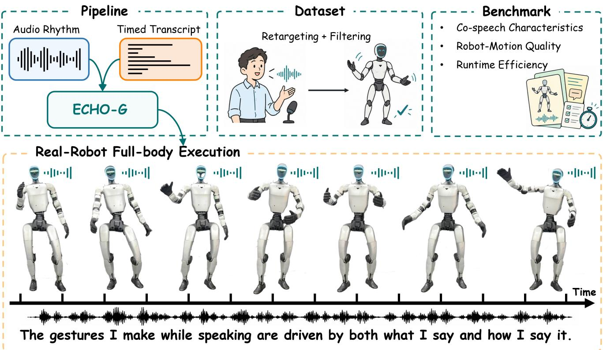
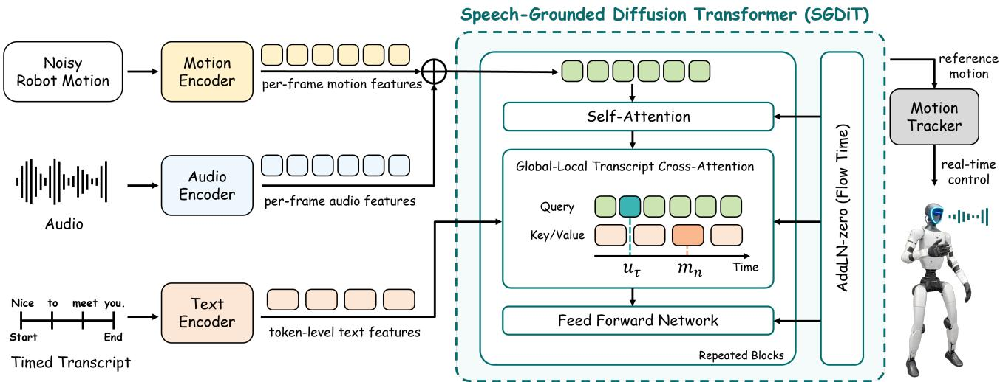
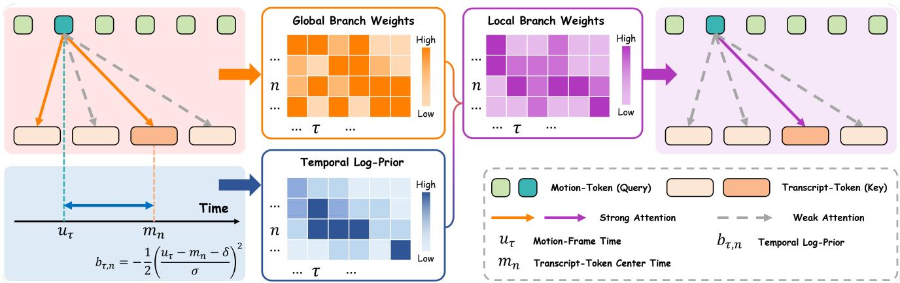
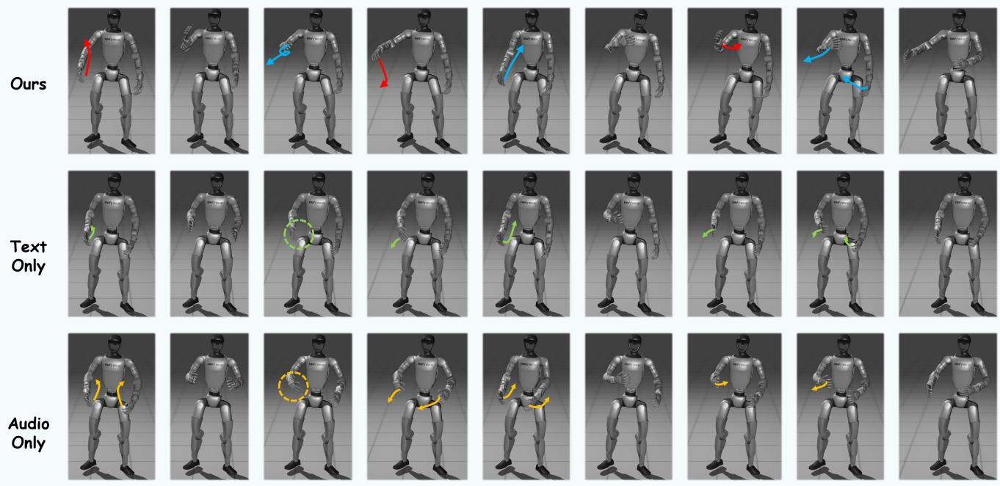
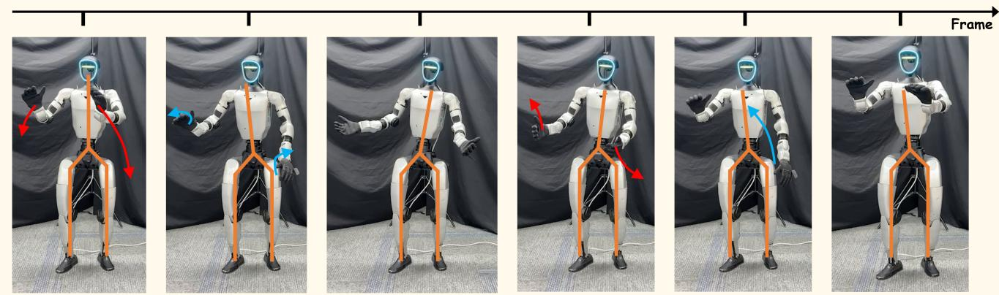

# ECHO-G: Embodied Co-speech Humanoid mOtion Generation

Yizhao Li2,4,∗, Pusen Gao3,4,∗, Ming Wang2, Shaojie Shen3, Shuo Yang4, and Hao Xu1,†

  
Fig. 1. Overview of ECHO-G. Top: Speech audio and a timed transcript jointly condition full-body robot-motion generation. We publicly release a BEAT2-derived audio–text–robot dataset and a benchmark with evaluation code covering co-speech characteristics, robot-motion quality, and runtime efficiency. The dataset panel summarizes retargeting and quality filtering. Bottom: Frames from a real-robot deployment experiment are shown in temporal order with the corresponding speech waveform and transcript.

Abstract— Generating full-body co-speech motion for humanoid robots requires coordinating speech prosody, linguistic content, and embodiment-specific motion. To this end, we present ECHO-G, a framework jointly conditioned on speech audio and timed transcripts. Its Speech-Grounded Diffusion Transformer (SGDiT) combines frame-aligned acoustic features with token-level linguistic context, preserving their distinct granularities. Trained with rectified flow matching, it models one-to-many utterance–motion relationships directly in robot space. To support training and evaluation, we introduce a BEAT2-derived audio–text–robot dataset and a benchmark covering co-speech characteristics, robot-motion quality, and runtime efficiency. Comparative evaluation supports direct robot-space generation over the evaluated human-motion generation and retargeting pipelines, while modality ablations highlight the benefits of joint audio–text conditioning. We further demonstrate deployment on a physical humanoid robot. A complementary video-rating study also favors joint conditioning over the alternatives. The dataset and training, inference, and evaluation code are available through our project page.

Index Terms— Human and Humanoid Motion Analysis and Synthesis, Gesture, Posture and Facial Expressions, Humanoid Robot Systems, co-speech gesture generation, flow matching.

## I. INTRODUCTION

In human communication, gestures complement spoken content, convey emphasis, and organize the temporal structure of speech [1], [2]. Inspired by this coordination, we aim to equip speaking humanoids with body motion that reflects both how an utterance is spoken and what it conveys, while respecting the robot’s embodiment. We study full-body cospeech motion generation from the audio and timed transcript of the robot’s own utterance.

Human co-speech research provides a foundation for learning speech–motion relationships. Representative methods explicitly combine acoustic features with transcriptderived linguistic features to model speech rhythm and content [3], [4], [5]. These methods primarily generate humanmotion representations. Extending speech-conditioned generation to humanoids requires robot-specific motion references and an interface for their physical execution. Recent robotoriented methods address the generation of such references from speech. RoboGesture [6] studies audio-driven streaming generation of upper-body and hand gestures, while Phys-Drift [7] explores robot-native generation with speech and text encoders.

These advances suggest a full-body robot co-speech generator should combine densely sampled acoustic cues with token-level linguistic content while preserving their distinct granularities. The one-to-many relationship between utterances and gestures [8] further motivates a generative formulation, and real-robot deployment favors direct prediction in robot space. In addition, existing public releases do not consistently provide paired audio–text–robot training data together with a benchmark spanning co-speech characteristics, robot-motion quality, and runtime efficiency.

Motivated by these considerations, we present ECHO-G, a framework for full-body humanoid co-speech generation from speech audio and timed transcripts (Fig. 1). Its Speech-Grounded Diffusion Transformer (SGDiT) adds framealigned acoustic features to motion tokens and retrieves token-level linguistic context through global–local crossattention, preserving the distinct granularities of the two conditions. Trained with rectified flow matching [9], SGDiT models the one-to-many relationship between utterances and full-body robot motion, enabling different motions to be sampled for the same utterance. A fixed pretrained wholebody motion tracker executes the joint-position components of the generated references.

To support training and evaluation in humanoid cospeech generation, we construct a BEAT2-derived robotspace dataset through retargeting and embodiment-specific quality filtering [4], [10]. We publicly release the dataset and code for training, inference, and evaluation, together with a benchmark covering co-speech characteristics, robot-motion quality, and runtime efficiency. Pipeline comparisons and modality ablations assess the generation-space and conditioning choices, while video ratings and physical demonstrations provide complementary perceptual and deployment evidence.

Our contributions are threefold:

• We present ECHO-G, a full-body humanoid co-speech generation framework that jointly uses speech audio and timed transcripts, and demonstrate its deployment on a physical humanoid.

• We develop SGDiT, a rectified-flow model combining frame-aligned acoustic conditioning with global– local transcript cross-attention for one-to-many fullbody robot-motion generation.

• We release a BEAT2-derived dataset pairing speech audio and timed transcripts with full-body robot motion, together with training, inference, and evaluation code. The accompanying benchmark covers co-speech characteristics, robot-motion quality, and runtime efficiency.

## II. RELATED WORK

## A. Humanoid Whole-Body Motion Generation

Recent whole-body tracking systems [11], [12] enable humanoids to execute diverse motion references. Such references can be obtained by retargeting human motion, as in GMR [10] and OmniRetarget [13], or generated from language instructions, as in FRoM-W1 [14] and TextOp [15]. OMG [16] further unifies language, audio, and humanmotion conditioning within a shared generative framework.

Within this broader setting, robot co-speech generation focuses on gestures accompanying spoken utterances. Yoon et al. [17] generate transcript-conditioned upper-body gestures and demonstrate execution on NAO. RoboPerform [18] generates humanoid motion from speech audio using a generic text prompt rather than the utterance transcript. RoboGesture [6] combines hierarchical semantic–acoustic conditioning with streaming generation of upper-body and hand gestures. PhysDrift [7] uses separate speech and text encoders for one-step robot-native motion generation. However, these approaches either omit utterance-specific audio– text conditioning, focus on upper-body motion, or do not fully specify the temporal organization of their multimodal features. ECHO-G combines frame-aligned acoustic features with token-level transcript embeddings for full-body robotspace generation, preserving their distinct granularities. We also provide paired audio–text–robot data and code for training, inference, and evaluation.

## B. Holistic Human Co-Speech Motion Generation

BEAT [19] provides multimodal speech–gesture data and introduces CaMN for integrating audio, text, and auxiliary conditions. Building on BEAT2, EMAGE [4] combines adaptive content–rhythm fusion with masked gesture modeling and compositional motion priors for holistic generation. DiffSHEG [20] jointly generates expressions and gestures through diffusion, while GestureLSM [5] combines flow matching, latent shortcut learning, and spatiotemporal modeling of body regions for efficient gesture generation. These methods primarily synthesize human-motion representations.

Evaluation considers distributional fidelity, motion variation, and speech–motion alignment. Yoon et al. [3] introduced Frechet Gesture Distance (FGD), and EMAGE [4]´ adopted skeleton-aware features for distributional evaluation. Audio2Gestures [8] examines motion diversity and multimodality, while beat-alignment measures assess temporal correspondence between motion and audio [21], [4]. Our benchmark adapts these evaluation dimensions to robot motion and complements them with measures of robot-motion quality and runtime efficiency.

  
Fig. 2. SGDiT architecture and tracking interface. Frame-aligned acoustic features are combined with noisy motion-frame features to form motion tokens. Contextual transcript embeddings provide a shared key–value memory for global and temporally biased text attention. Their attention distributions are fused within each transformer block before value aggregation and residual injection into the motion stream. Rectified-flow sampling produces robotmotion references, whose joint-position components are passed to a fixed whole-body motion tracker for execution.

## III. METHOD

As shown in Fig. 2, ECHO-G generates full-body robotmotion references from speech audio and timed transcripts. SGDiT integrates acoustic and linguistic conditions within a rectified-flow model, while a fixed whole-body motion tracker executes the generated joint-position references.

## A. Problem Formulation and Motion Representation

Given speech audio a and its word-timed transcript y, ECHO-G models a conditional distribution over full-body robot-motion sequences:

$$
p _ { \boldsymbol { \theta } } ( \mathbf { R } \mid a , y ) ,\tag{1}
$$

where θ denotes the generator parameters and $\mathbf { R } =$ $[ \mathbf { r } _ { 1 } , \hdots , \mathbf { r } _ { T } ] ^ { \top } \in \mathbb { R } ^ { T \times D }$ contains T motion frames. For each frame $\tau = 1 , \dots , T$ , we use $D = 3 9$ features:

$$
\mathbf { r } _ { \tau } = \left[ \rho _ { \tau } ^ { \top } , \delta \psi _ { \tau } , ( \mathbf { v } _ { \tau } ^ { \mathrm { l o c } } ) ^ { \top } , \mathbf { q } _ { \tau } ^ { \top } \right] ^ { \top } ,\tag{2}
$$

where $\rho _ { \tau } \in \mathbb { R } ^ { 6 }$ encodes the base orientation using a 6- D rotation representation, $\delta \psi _ { \tau } \in \mathbb { R }$ is the inter-frame yaw increment, $\mathbf { v } _ { \tau } ^ { \mathrm { l o c } } \in \mathbb { R } ^ { 3 }$ is the base linear velocity in a yawaligned local frame, and $\mathbf { q } _ { \tau } \in \mathbb { R } ^ { 2 9 }$ contains the robot’s joint angles in a fixed order. Absolute root translation is omitted to make the learning target invariant to global position offsets.

The generator operates on normalized motion features:

$$
\mathbf { x } _ { \tau } = \left( \mathbf { r } _ { \tau } - \mu \right) \bigcirc \pmb { \sigma } ,\tag{3}
$$

where $\boldsymbol { \mu } , \boldsymbol { \sigma } \in \mathbb { R } ^ { D }$ are the feature-wise mean and standard deviation computed from the training split, and ⊘ denotes element-wise division. We denote the normalized sequence by $\mathbf { X } = [ \mathbf { x } _ { 1 } , \ldots , \mathbf { x } _ { T } ] ^ { \top }$ . Generated sequences are denormalized before evaluation or execution.

## B. Audio–Text Conditioning

Acoustic features extracted by a frozen speech encoder [22] are linearly interpolated to the T motion frames. The transcript text in y is tokenized into $w _ { 1 : N }$ and encoded by a frozen language model [23]. Separate layer normalization and learned affine projections map the two feature sequences to $\mathbf { A } \in \mathbb { R } ^ { T \times d }$ and $\bar { \mathbf { H } } \in \mathrm { \overline { { R } } } ^ { N \times d }$ , respectively, where d is the generator’s hidden dimension and N is the number of transcript tokens. The projected conditions retain their frame-level and token-level organization.

Using tokenizer character offsets, we derive approximate token intervals $B = \{ ( s _ { n } , e _ { n } ) \} _ { n = 1 } ^ { N }$ from the word-level timestamps, where $s _ { n }$ and $e _ { n }$ are the associated start and end times. Temporal conditioning uses token centers $m _ { n } = ( s _ { n } + e _ { n } ) / 2$ and motion-frame times $u _ { \tau } = ( \tau - 1 ) / f \ d f$ , where f is the motion frame rate. Both times are measured from the utterance onset. The combined condition is ${ \boldsymbol { c } } = ( \mathbf { A } , \mathbf { H } , { B } )$

## C. Speech-Grounded Diffusion Transformer

SGDiT maps a noisy normalized motion sequence $\mathbf { X } _ { t } \in$ $\mathbb { R } ^ { T \times D }$ and conditions c to the flow velocity $\nu _ { \theta } ( \mathbf { X } _ { t } , t , c )$ . Its transformer blocks combine temporal self-attention, transcript cross-attention, and feed-forward processing. Flow time $t \in [ 0 , 1 ]$ modulates the blocks through adaptive layer normalization [24].

Acoustic conditioning. Each input motion token combines a projected motion frame, its aligned acoustic condition, and a positional embedding:

$$
\begin{array} { r } { \mathbf { z } _ { \tau } = \mathbf { W } _ { r } \mathbf { x } _ { t , \tau } + \mathbf { A } _ { \tau } + \mathbf { p } _ { \tau } , } \end{array}\tag{4}
$$

where $\mathbf { x } _ { t , \tau }$ is frame τ of $\mathbf { X } _ { t }$ $\mathbf { W } _ { r } \in \mathbb { R } ^ { d \times D }$ is a learned projection, and $\mathbf { p } _ { \tau } \in \mathbb { R } ^ { d }$ is a learned frame-position embedding. Temporal self-attention then exchanges information bidirectionally across the acoustically conditioned motion sequence.

  
Fig. 3. Temporal conditioning in the local transcript-attention branch. Orange and purple heatmaps show global and local attention weights respectively. The blue heatmap represents the clipped Gaussian log-prior $\dot { b } _ { \tau n }$ derived from motion-frame times $u _ { \tau }$ and token-center times $m _ { n } .$ . Multiplying global weights by the exponentiated log-prior and renormalizing yields the local weights. Matrices are transposed for display; colored and dashed arrows indicate stronger and weaker attention, respectively.

Transcript conditioning. Cross-attention retrieves linguistic context through two paths over the same transcript features. The global path provides content-based access to the full token sequence, while the local path adds a preference for temporally nearby tokens. Updated motion features, after normalization and flow-time modulation, provide queries $\mathbf { Q } _ { \tau } \dot { , }$ the projected transcript features H provide keys $\mathbf { K } _ { n }$ and values ${ \bf V } _ { n }$ shared by both paths. For one attention head, the content scores and global attention are

$$
\begin{array} { r l } & { S _ { \tau n } = \gamma \hat { \mathbf { Q } } _ { \tau } ^ { \top } \hat { \mathbf { K } } _ { n } , } \\ & { \Pi ^ { \mathrm { g } } = \operatorname* { m a s k e d S o f t m a x } ( \mathbf { S } ) , } \end{array}\tag{5}
$$

where hats denote L2-normalized queries and keys, $\gamma$ is a bounded learned logit scale, and masked softmax normalizes over non-padding transcript tokens.

The local path adds a Gaussian temporal prior to the shared content scores, yielding the temporally reweighted attention illustrated in Fig. 3:

$$
\begin{array} { r l } & { b _ { \tau n } = - \frac { \left( u _ { \tau } - m _ { n } - \delta \right) ^ { 2 } } { 2 \sigma ^ { 2 } } , } \\ & { \widetilde { b } _ { \tau n } = \operatorname* { m a x } ( b _ { \tau n } , - \kappa ) , } \\ & { \Pi ^ { 1 } = \mathrm { m a s k e d S o f t m a x } ( \mathbf { S } + \widetilde { \mathbf { b } } ) , } \end{array}\tag{6}
$$

where $\sigma$ and δ control the temporal width and offset, and κ bounds the log penalty. Both paths use the same token padding mask.

The two distributions are combined using temporal support:

$$
\begin{array} { r l } & { g _ { \tau } = \alpha \underset { n \in I } { \operatorname* { m a x } } \exp ( b _ { \tau n } ) , } \\ & { \Pi _ { \tau n } = ( 1 - g _ { \tau } ) \Pi _ { \tau n } ^ { \mathrm { g } } + g _ { \tau } \Pi _ { \tau n } ^ { 1 } , } \end{array}\tag{7}
$$

where I contains the non-padding token indices and α is the learned base mixing coefficient. Support uses the unclipped prior, reducing the local contribution when the frame is distant from all offset-adjusted token centers. The mixed weights aggregate the shared values into a text-conditioned update, which is projected and added to the motion features through a gated residual connection. A linear output head produces the final $T \times D$ flow-velocity prediction.

## D. Training Objective

We train SGDiT with rectified flow matching [9], [25]. For a normalized motion–condition pair $\mathbf { \Psi } ( \mathbf { X } , c )$ , we sample standard Gaussian noise $\pmb { \mathcal { E } } \in \mathbb { R } ^ { T \times D }$ and a sequence-level flow time $t \sim \mathcal { U } ( 0 , 1 )$ . The interpolated motion and target velocity are

$$
{ \bf X } _ { t } = t { \bf X } + ( 1 - t ) \boldsymbol { \varepsilon } , \qquad { \bf V } ^ { \star } = { \bf X } - \boldsymbol { \varepsilon } .\tag{8}
$$

The predicted velocity $\hat { \mathbf { V } } = \nu _ { \theta } ( \mathbf { X } _ { t } , t , c )$ is supervised by matching the target flow and its adjacent-frame differences:

$$
\begin{array} { r l } & { \mathcal { L } _ { \mathrm { f l o w } } = \mathbb { E } \big [ \mathbf { M S E } ( \hat { \mathbf { V } } , \mathbf { V } ^ { \star } ) \big ] , } \\ & { \mathcal { L } _ { \mathrm { t e m p } } = \mathbb { E } \big [ \mathbf { M S E } \big ( \Delta _ { \tau } \hat { \mathbf { V } } , \Delta _ { \tau } \mathbf { V } ^ { \star } \big ) \big ] , } \\ & { \mathcal { L } _ { \mathrm { g e n } } = \mathcal { L } _ { \mathrm { f l o w } } + \lambda _ { \mathrm { t e m p } } \mathcal { L } _ { \mathrm { t e m p } } . } \end{array}\tag{9}
$$

Here $\Delta _ { \tau }$ denotes first differences along the motion-frame axis, and $\lambda _ { \mathrm { t e m p } }$ weights the temporal term. MSE is averaged over feature dimensions and valid frames; the temporal term uses only adjacent pairs of valid frames.

## E. Inference and Tracking

At inference, the output length T is specified by the input clip duration at the motion frame rate. We initialize $\mathbf { X } ^ { ( 0 ) } \in$ $\mathbb { R } ^ { \hat { T } \times D }$ with standard Gaussian noise and integrate the learned velocity field from flow time 0 to 1, keeping c fixed. Using K uniform Euler steps, we update

$$
\begin{array} { c } { \displaystyle \mathit { t } _ { k } = \frac { k } { K } , } \\ { \displaystyle \mathbf { X } ^ { ( k + 1 ) } = \mathbf { X } ^ { ( k ) } + \frac { 1 } { K } \nu _ { \theta } ( \mathbf { X } ^ { ( k ) } , t _ { k } , c ) , } \end{array}\tag{10}
$$

for $k = 0 , \ldots , K - 1$ . The final state $\hat { \mathbf { X } } = \mathbf { X } ^ { ( K ) }$ is converted to robot-motion references by inverting the normalization in (3). Their joint-angle components are supplied to the fixed SONIC motion tracker [11] as joint-position references and executed alongside speech playback.

  
Fig. 4. Conditioning comparison on an utterance outside BEAT2. Rows show joint audio–text conditioning (Ours), text-only, and audio-only outputs at matched frame indices. In the selected frames, joint conditioning exhibits broader arm extensions, whereas the unimodal outputs generally keep the hands closer to the torso. Colored arrows and circles highlight selected arm and hand movements.

## IV. EXPERIMENTS AND RESULTS

## A. Experimental Setup

1) Datasets and Preprocessing: We construct a robotspace co-speech dataset from BEAT2 [4]. The original longform recordings are segmented into 22,192 utterance-level clips at speech pauses using word-level forced alignment, retaining the corresponding audio, transcript, SMPL-X motion, and word timestamps. Each motion sequence is retargeted to the 29-DoF Unitree G1 using GMR [10]. The retargeted motions are converted to a unified Z-up coordinate system and foot-ground aligned using a clip-wise vertical root offset, followed by recomputation of forward kinematics and motion derivatives. We further canonicalize each sequence by removing its initial global yaw while preserving subsequent root dynamics. Robot motions remain at the native 30 fps throughout processing.

We then filter the resulting speech–robot pairs using both robot-motion quality checks and cross-modal consistency checks. For robot-motion quality, we discard clips that violate criteria on foot contact, self-collision, joint continuity and limits, smoothness, or severe high-frequency motion artifacts. We also retain only pairs whose audio and motion durations differ by at most one motion frame.

We adopt a speaker-held-out split, holding out three English speakers for validation and using the remaining speakers for training. After filtering, the final dataset contains

14,987 training clips and 3,242 validation clips.

2) Evaluation Metrics: All methods use the same heldout split as the candidate input set, with eligibility determined by their native input and output-length requirements. Prediction–reference comparisons use the common temporal prefix of each eligible pair.

Co-Speech Motion Characteristics. Frechet Gesture Dis-´ tance (FGD) [3], [4] measures distributional discrepancy using a shared skeleton-aware G1 joint-motion encoder. Div, MM, and BA are computed from forward-kinematic body positions with fixed base rotation and translation. Diversity (Div) measures the frame-wise L1 deviation from each sequence’s temporal mean pose. For stochastic generators, Multimodality (MM) [8] averages pairwise L1 distances among 20 samples generated for each input condition. Beat Alignment (BA) [21], [4] matches speech onsets to the nearest detected upper-body motion beats. We report absolute gaps to the matched reference statistics for Div and BA.

Robot Motion Quality. Body jerk [16] is estimated from third-order finite differences of reconstructed world-space body positions, scaled by the cube of the frame rate. We average jerk magnitudes over all valid frame–body pairs and report the absolute gap between generated and reference means (∆Jerk) [26]. Foot-ground error measures the vertical distance of the lowest sole-proxy surface from the ground plane. Contact sliding speed measures the maximum horizontal sole-point speed per foot, averaged over detected

  
I just finished the most amazing book. It's called The Midnight Library and it .. perspective on life. I'm not kidding. You have to read it.  
Fig. 5. Real-robot execution on an utterance outside BEAT2. ECHO-G’s predicted joint angles are supplied as joint-position references to a fixed SONIC motion tracker while the corresponding speech is played. Frames progress from left to right through the book-recommendation utterance shown below, illustrating changes in arm extension, hand height, and torso posture. Colored arrows highlight selected arm movements, while the orange skeletal overlays outline the body configuration.

contact intervals.

Efficiency. End-to-end inference time covers input audio and aligned-transcript reading, online feature encoding, motion generation, and GMR or VAE-based motion mapping when applicable, ending at the robot-motion reference. We report total processing time divided by the total number of output frames. Peak RAM increase is the maximum requestwindow system memory usage above the corresponding preload idle baseline.

3) Implementation Details: We use frozen wav2vec 2.0 large XLSR and Qwen3.5-4B models to obtain 1024-D acoustic features and 2560-D contextual token embeddings, respectively. SGDiT contains 12 transformer blocks with a hidden dimension of 768, 8 attention heads, a feedforward dimension of 2048, and learned temporal positional embeddings. The attention parameters γ,σ,δ,α are learned separately for each layer and head. Attention parameters are constrained to $\gamma \in [ 1 , 1 6 ]$ $\sigma \in [ 0 . 2 5 , 2 ]$ s, $\delta \in [ - 0 . 5 , 0 . 5 ]$ s, and $\alpha \in [ 0 , 0 . 5 ]$ using sigmoid/tanh mappings, with log-prior clipping threshold $\kappa = 1 2$

We train for 63,000 optimizer steps on NVIDIA RTX 4090 hardware using FP32 computation. AdamW uses an initial learning rate of $3 \times 1 0 ^ { - 4 }$ with cosine decay and no warmup, weight decay of $1 0 ^ { - 4 }$ , an effective batch size of 48, and gradient clipping at 1.0. We set $\lambda _ { \mathrm { t e m p } } = 0 . 5$ and jointly drop the acoustic and text encoder features together with the timedistance inputs with probability 0.1. The exponential moving average (EMA) decay is 0.999.

For physical deployment, motion generation runs on a Jetson AGX Orin, which is also used for the efficiency evaluation of all compared methods. Inference uses EMA weights from the checkpoint with the lowest EMA validation loss. Sampling uses eight Euler steps with classifier-free guidance (CFG) scale 1.0. We generate at most 600 motion frames at 30 fps and limit transcripts to 256 tokenizer tokens. Efficiency is measured with batch size one after warm-up.

4) Baselines and Ablations: We use the publicly released pretrained checkpoints of EMAGE [4] and GestureLSM [5], and retarget their generated human motions to G1 using GMR [10]. We additionally construct Human-Retargeted using the same audio–text conditioning design, backbone configuration, data split, and optimization settings as Ours, but generate normalized 136-D human motion. After denormalization using human-motion training statistics, a pretrained VAE-based mapping converts the samples to 39- D robot references. This mapping remains frozen during human-motion generator training.

Audio-only and Text-only are trained separately in robot space using only the indicated modality. Both variants share the data split, backbone configuration, and optimization settings with Ours. Text-only retains the supplied clip duration and word timings but does not use acoustic features.

## B. Quantitative Results

Table I compares direct robot-space generation with human-motion generation followed by retargeting or learned mapping. ECHO-G achieves the best results on all four cospeech metrics and the lowest processing time per output frame. It also improves all three robot-motion quality metrics over EMAGE+GMR and GestureLSM+GMR. Human-Retargeted yields a smaller Jerk gap, lower foot-ground error, and less contact sliding. These results support direct robot-space generation for co-speech modeling with reduced processing time.

Table II evaluates conditioning modalities within the robot-space generator. Joint audio–text conditioning achieves the lowest FGD, ∆Div, and ∆BA and the highest MM, outperforming both unimodal variants on the reported cospeech metrics. Audio-only yields the smallest Jerk gap and contact sliding speed, and matches joint conditioning in footground error at the displayed precision. These results support combining acoustic and linguistic information to improve the evaluated co-speech characteristics.

TABLE I  
COMPARISON OF DIRECT ROBOT-SPACE GENERATION WITH HUMAN-MOTION GENERATION FOLLOWED BY RETARGETING OR LEARNED MAPPING ON THE BEAT2 SPEAKER-HELD-OUT EVALUATION DATA. ∆DIV, ∆BA, AND ∆JERK DENOTE ABSOLUTE DEVIATIONS FROM MATCHED GROUND-TRUTH STATISTICS OVER EACH METHOD’S EVALUATED MOTION RANGE. BEST AND SECOND-BEST RESULTS ARE SHOWN IN BOLD AND UNDERLINED TEXT, RESPECTIVELY.
<table><tr><td>Method</td><td colspan="4">Co-Speech Motion Characteristics</td><td colspan="3">Robot Motion Quality</td><td colspan="2">Efficiency</td></tr><tr><td></td><td>FGD↓</td><td>∆Div ↓</td><td>MM ↑</td><td>∆BA↓</td><td>∆Jerk↓</td><td>Foot Err. (m) ↓</td><td>C-Slide (m/s) ↓</td><td>E2E Time (ms/frame) ↓</td><td>Peak RAM∆ (MB) ↓</td></tr><tr><td>EMAGE+GMR</td><td>4.976</td><td>0.749</td><td>0</td><td>0.172</td><td>26.951</td><td>0.013</td><td>0.163</td><td>21.3</td><td>2661</td></tr><tr><td>GestureLSM+GMR</td><td>5.008</td><td>0.561</td><td>1.016</td><td>0.158</td><td>24.444</td><td>0.010</td><td>0.169</td><td>20.5</td><td>3804</td></tr><tr><td>Human-Retargeted</td><td>4.725</td><td>0.408</td><td>1.498</td><td>0.161</td><td>8.001</td><td>0.003</td><td>0.050</td><td>6.56</td><td>18714</td></tr><tr><td>Ours</td><td>2.278</td><td>0.320</td><td>1.786</td><td>0.063</td><td>9.039</td><td>0.008</td><td>0.052</td><td>5.96</td><td>18542</td></tr></table>

TABLE II

ABLATION OF CONDITIONING MODALITIES FOR DIRECT ROBOT-SPACE GENERATION ON THE BEAT2 SPEAKER-HELD-OUT EVALUATION DATA. ∆DIV, ∆BA, AND ∆JERK DENOTE ABSOLUTE DEVIATIONS FROM THE SHARED GROUND-TRUTH STATISTICS. BEST AND SECOND-BEST RESULTS ARE SHOWN IN BOLD AND UNDERLINED TEXT, RESPECTIVELY. TIES AT THE DISPLAYED PRECISION RECEIVE IDENTICAL HIGHLIGHTING.
<table><tr><td>Method</td><td>FGD↓</td><td>∆Div↓</td><td>MM↑</td><td>∆BA↓</td><td>∆Jerk↓</td><td>Foot Err. (m) ↓</td><td>C-Slide (m/s) ↓</td></tr><tr><td>Audio-only</td><td>2.360</td><td>0.360</td><td>1.702</td><td>0.081</td><td>4.497</td><td>0.008</td><td>0.038</td></tr><tr><td>Text-only</td><td>2.436</td><td>0.429</td><td>1.681</td><td>0.113</td><td>5.940</td><td>0.009</td><td>0.049</td></tr><tr><td>Ours</td><td>2.278</td><td>0.320</td><td>1.786</td><td>0.063</td><td>9.039</td><td>0.008</td><td>0.052</td></tr></table>

## C. Qualitative Results

We visualize motions generated from independently prepared audio–text utterances outside BEAT2. These examples provide qualitative evidence of generalization to speech inputs beyond the source dataset. In Fig. 4, audio-only conditioning produces rhythm-responsive motion, but gestures around semantically salient phrases remain small and less clearly related to the spoken content. Text-only conditioning produces content-related gestures, but their timing is less consistently aligned with the audio. Joint conditioning combines speech-responsive timing with more expansive, content-related gestures and fluid transitions in this example.

## D. Real-Robot Deployment

We conduct real-robot experiments on a Unitree G1, executing the generated joint-position references through a fixed SONIC motion tracker [11] while playing the corresponding speech audio. Fig. 5 shows a representative trial using an independently prepared utterance outside BEAT2, with the robot accompanying its speech with generated body movements. Videos of additional real-robot trials are provided on the project page.

## E. User Study

We conducted a video-rating study with 45 participants using G1 kinematic renderings in MuJoCo. Each participant completed nine trials, with three randomly selected from each of three criterion-specific pools comprising 33 utterances in total. The criteria were human-likeness, rhythm matching, and motion quality. Each trial presented four videos of the same utterance under matched rendering conditions, with hidden method identities and randomized positions. Participants rated each video on a five-point scale.

TABLE III  
MEAN USER-STUDY RATINGS FROM 45 PARTICIPANTS ON A FIVE-POINT SCALE. HIGHER IS BETTER. UNIMODAL SCORES ARE POOLED AS DESCRIBED IN THE TEXT. BEST AND SECOND-BEST MEANS ARE SHOWN IN BOLD AND UNDERLINED TEXT, RESPECTIVELY.
<table><tr><td>Method</td><td>Overall</td><td>Human- likeness</td><td>Rhythm Matching</td><td>Motion Quality</td></tr><tr><td>EMAGE+GMR</td><td>1.80</td><td>1.87</td><td>1.95</td><td>1.59</td></tr><tr><td>Human-Retargeted</td><td>2.65</td><td>2.67</td><td>2.38</td><td>2.90</td></tr><tr><td>Unimodal (pooled)</td><td>3.05</td><td>3.01</td><td>3.13</td><td>3.01</td></tr><tr><td>Ours</td><td>3.49</td><td>3.45</td><td>3.31</td><td>3.70</td></tr></table>

Each trial compared ECHO-G, Human-Retargeted, EMAGE+GMR, and an audio-only or text-only variant. Unimodal ratings were pooled over the observed trial allocation. Overall denotes the equally weighted mean of the three criterion scores. As shown in Table III, joint audio–text conditioning receives the highest overall mean rating and the highest mean ratings across all three criteria, providing perceptual support for our method.

## V. DISCUSSION AND LIMITATIONS

The experimental results support direct robot-space modeling and joint audio–text conditioning for humanoid cospeech generation. Benchmark comparisons show the benefits of these choices for the reported co-speech characteristics, with the direct generation pipeline also requiring less processing time. Qualitative examples, user ratings, and physical demonstrations provide complementary evidence of expressive gestures, perceived quality, and robot execution. Further improvement is needed to better reconcile expressive behavior with robot-motion consistency.

Several limitations remain. First, the gains in co-speech characteristics do not consistently translate into smaller Jerk gaps or better foot-contact measures, leaving room to improve expressive behavior and robot-motion consistency together. Second, the model learns broad speech–gesture associations, with limited training examples of explicit deictic or instructional gestures. This may constrain instructionaware gesture generation when an utterance calls for a specific semantic motion. Third, the current system requires complete speech audio and timed transcripts and does not yet support causal streaming generation.

## VI. CONCLUSION

We presented ECHO-G for full-body humanoid co-speech generation from speech audio and timed transcripts. SGDiT combines frame-aligned acoustic conditioning with global– local transcript cross-attention to generate robot-motion ref erences. Quantitative evaluation, a video-rating study, and physical demonstrations provide complementary evidence for the framework. The released dataset, benchmark, and code support reproducible research on humanoid co-speech generation. Future work will focus on jointly improving gesture expressiveness and robot-motion consistency, enriching training data for instruction-aware semantic gestures, and extending the framework to causal streaming generation.

## REFERENCES

[1] D. McNeill, Hand and Mind: What Gestures Reveal about Thought. Chicago, IL, USA: University of Chicago Press, 1992.

[2] A. Kendon, Gesture: Visible Action as Utterance. Cambridge, UK: Cambridge University Press, 2004.

[3] Y. Yoon, B. Cha, J.-H. Lee, M. Jang, J. Lee, J. Kim, and G. Lee, “Speech gesture generation from the trimodal context of text, audio, and speaker identity,” ACM Transactions on Graphics, vol. 39, no. 6, pp. 1–16, 2020.

[4] H. Liu, Z. Zhu, G. Becherini, Y. Peng, M. Su, Y. Zhou, X. Zhe, N. Iwamoto, B. Zheng, and M. J. Black, “EMAGE: Towards unified holistic co-speech gesture generation via expressive masked audio gesture modeling,” in Proceedings of the IEEE/CVF Conference on Computer Vision and Pattern Recognition, 2024, pp. 1144–1154.

[5] P. Liu, L. Song, J. Huang, H. Liu, and C. Xu, “GestureLSM: Latent shortcut based co-speech gesture generation with spatial-temporal modeling,” in Proceedings of the IEEE/CVF International Conference on Computer Vision, 2025, pp. 10 929–10 939.

[6] Z. Wang, Z. Ren, P. Shi, Z. Wang, C. Lin, T. Wang, Z. Qi, L. Zhao, H. Wang, and L. Yi, “RoboGesture: Real-time semantic-aligned cospeech gestures generation for humanoid interaction,” in Proceedings of the European Conference on Computer Vision (ECCV), 2026.

[7] Z. Liang, X. Xing, M. Yang, W. Zhou, and X. Xu, “PhysDrift: Bridging the embodiment gap in humanoid co-speech motion generation,” arXiv preprint arXiv:2606.19935, 2026.

[8] J. Li, D. Kang, W. Pei, X. Zhe, Y. Zhang, Z. He, and L. Bao, “Audio2Gestures: Generating diverse gestures from speech audio with conditional variational autoencoders,” in Proceedings ofthe IEEE/CVF International Conference on Computer Vision, 2021, pp. 11 293– 11 302.

[9] X. Liu, C. Gong, and Q. Liu, “Flow straight and fast: Learning to generate and transfer data with rectified flow,” in International Conference on Learning Representations, 2023.

[10] J. P. Araujo, Y. Ze, P. Xu, J. Wu, and C. K. Liu, “Retargeting matters: General motion retargeting for humanoid motion tracking,” arXiv preprint arXiv:2510.02252, 2025.

[11] Z. Luo, Y. Yuan, T. Wang, C. Li, F. Castaneda, S. Chen, Z.-A. Cao,˜ J. Li, D. Minor, Q. Ben et al., “SONIC: Supersizing motion tracking for natural humanoid whole-body control,” Science Robotics, vol. 11, no. 117, p. eaed4592, 2026.

[12] M. Chen, K. Wang, B. Zhang, X. Ma, Z. Yang, Y. Ren, Q. Huang, Z. Zhu, Y. Wang, and Z. Su, “HoloMotion-1 technical report,” arXiv preprint arXiv:2605.15336, 2026.

[13] L. Yang, X. Huang, Z. Wu, A. Kanazawa, P. Abbeel, C. Sferrazza, C. K. Liu, R. Duan, and G. Shi, “OmniRetarget: Interaction-preserving data generation for humanoid whole-body loco-manipulation and scene interaction,” arXiv preprint arXiv:2509.26633, 2025.

[14] P. Li, Z. Zhuang, Y. Gao, Y. Dong, S. Li, C. Jiang, S. Dou, Z. Xi, E. Zhou, J. Huang et al., “FRoM-W1: Towards general humanoid whole-body control with language instructions,” arXiv preprint arXiv:2601.12799, 2026.

[15] W. Xie, J. Zheng, J. Han, J. Shi, W. Zhang, C. Bai, and X. Li, “TextOp: Real-time interactive text-driven humanoid robot motion generation and control,” arXiv preprint arXiv:2602.07439, 2026.

[16] S. Huang, K.-Y. Lee, D. Qiao, G. He, Z. Wang, Y. Li, S. Zhu, and H. Zhao, “OMG: Omni-modal motion generation for generalist humanoid control,” arXiv preprint arXiv:2606.10340, 2026.

[17] Y. Yoon, W.-R. Ko, M. Jang, J. Lee, J. Kim, and G. Lee, “Robots learn social skills: End-to-end learning of co-speech gesture generation for humanoid robots,” in 2019 International Conference on Robotics and Automation (ICRA), 2019, pp. 4303–4309.

[18] Z. Li, C. Chi, Y. Wei, B. Zhu, T. Huang, Z. Sun, Y. Peng, P. Wang, Z. Wang, F. Liu, C. Xu, and S. Zhang, “Do you have freestyle? expressive humanoid locomotion via audio control,” in Proceedings of the IEEE/CVF Conference on Computer Vision and Pattern Recognition, 2026, pp. 956–965.

[19] H. Liu, Z. Zhu, N. Iwamoto, Y. Peng, Z. Li, Y. Zhou, E. Bozkurt, and B. Zheng, “BEAT: A large-scale semantic and emotional multi-modal dataset for conversational gestures synthesis,” in European Conference on Computer Vision. Springer, 2022, pp. 612–630.

[20] J. Chen, Y. Liu, J. Wang, A. Zeng, Y. Li, and Q. Chen, “DiffSHEG: A diffusion-based approach for real-time speech-driven holistic 3D expression and gesture generation,” in Proceedings of the IEEE/CVF Conference on Computer Vision and Pattern Recognition, 2024, pp. 7352–7361.

[21] R. Li, S. Yang, D. A. Ross, and A. Kanazawa, “AI choreographer: Music conditioned 3D dance generation with AIST++,” in Proceedings of the IEEE/CVF International Conference on Computer Vision, 2021, pp. 13 401–13 412.

[22] A. Baevski, Y. Zhou, A. Mohamed, and M. Auli, “wav2vec 2.0: A framework for self-supervised learning of speech representations,” in Advances in Neural Information Processing Systems, vol. 33, 2020, pp. 12 449–12 460.

[23] Qwen Team, “Qwen3.5: Towards native multimodal agents,” February 2026. [Online]. Available: https://qwen.ai/blog?id=qwen3.5

[24] W. Peebles and S. Xie, “Scalable diffusion models with transformers,” in Proceedings of the IEEE/CVF International Conference on Computer Vision, 2023, pp. 4195–4205.

[25] Y. Lipman, R. T. Q. Chen, H. Ben-Hamu, M. Nickel, and M. Le, “Flow Matching for generative modeling,” in International Conference on Learning Representations, 2023. [Online]. Available: https://arxiv.org/abs/2210.02747

[26] F. Fang, S. Yang, and W. Yang, “CoordSpeaker: Exploiting gesture captioning for coordinated caption-empowered co-speech gesture generation,” in Proceedings of the IEEE/CVF Conference on Computer Vision and Pattern Recognition (CVPR), June 2026, pp. 30 761–30 771.