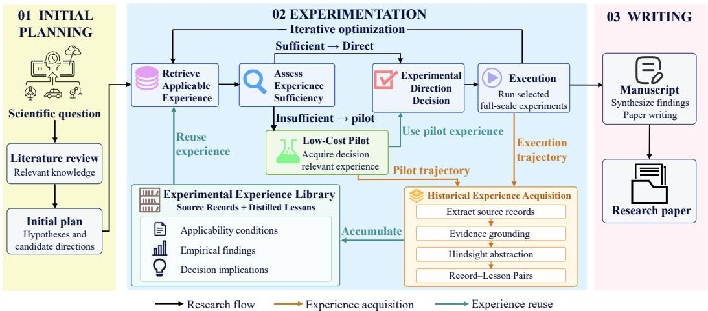
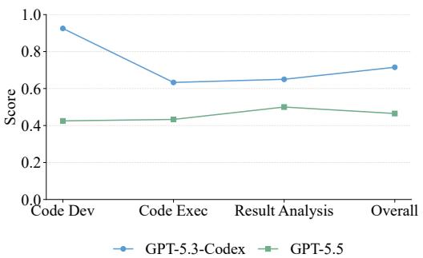
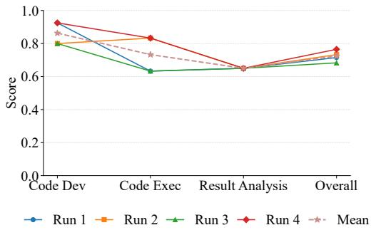

# EXPERIMENTAL EXPERIENCE MODELING FOR AUTONOMOUS RESEARCH

Wenda Wei1,2,3, Yingchen Zhang1,2,3, Ruqing Zhang1,2,3∗, Jiafeng Guo1,2,3∗, Daiting Shi4, Xueqi Cheng1,2,3

1State Key Laboratory of AI Safety

2Institute of Computing Technology, Chinese Academy of Sciences

3University of Chinese Academy of Sciences 4Baidu Inc.

{weiwenda25z, zhangyingchen23s, zhangruqing, guojiafeng, cxq}@ict.ac.cn

shidaiting01@baidu.com

## ABSTRACT

Autonomous research agents can generate hypotheses and conduct experiments, but experimentation remains a major source of computational cost. A fundamental challenge is deciding which experiments are worth running, particularly when prior evidence is insufficient to resolve uncertainty. Yet current research agents lack a systematic way to leverage experimental experience when making such decisions. We introduce Experimental Experience Modeling (EEM), a framework for making informed experimental decisions by acquiring, reusing, and accumulating experimental experience. EEM extracts decision-relevant records from earlier experimental trajectories, distills them into reusable experience, and organizes them in an experience library. For a new experimental decision, EEM retrieves relevant historical experience and assesses whether it provides sufficient support for deciding whether a candidate direction warrants further investment. When historical experience is insufficient, EEM conducts a targeted, low-cost pilot experiment to acquire the missing decision-relevant experience on demand. It then combines this newly acquired experience with retrieved historical experience to determine whether the direction warrants full-scale evaluation, which requires substantial resources. The resulting experimental outcomes are further distilled into reusable experience, allowing the library to continually grow through iterative accumulation. Experiments on autonomous research benchmarks show that EEM improves research performance while reducing model interaction overhead, demonstrating the value of reusing accumulated experience and acquiring additional experience only when needed.

## 1 INTRODUCTION

Recent advances in large language models (LLMs) have enabled autonomous research agents to coordinate literature review, hypothesis generation, experimentation, and scientific writing (Lu et al., 2024; Schmidgall et al., 2025). Recent systems further improve research ideas and implementations through iterative experimentation and feedback (Yuan et al., 2025; Jiang et al., 2025; Yamada et al., 2025). As these agents become increasingly capable of conducting research autonomously, experimentation has emerged as a major source of computational cost. The key challenge is not only what to experiment with, but also which experiments are worth running. An agent should avoid expen sive experiments when existing evidence already supports a direction, yet should not over-rely on limited or uncertain evidence. Thus, effective research requires deciding whether to exploit existing evidence or acquire additional evidence through further experimentation.

Human researchers naturally accumulate experimental experience that goes beyond isolated results, capturing what works under particular conditions, what fails and why, and how such evidence should influence subsequent choices (Box, 1976; Collins, 1974). When prior experience is insufficient, researchers can acquire targeted evidence through low-cost pilot experiments before committing substantial resources to full-scale evaluation (Thabane et al., 2010). The resulting evidence is then incorporated into subsequent decisions. Thus, experimental experience provides a bridge between what has been learned before and what should be done next.

Recent autonomous research agents have begun to learn from previous attempts through feedback, reflection, and execution traces. Reflexion uses feedback from prior trials to improve subsequent attempts, while Dolphin incorporates experimental findings into further idea generation (Shinn et al., 2023; Yuan et al., 2025). AIDE, The AI Scientist-v2, and AutoResearchClaw similarly iteratively refine candidate implementations or execution strategies based on previous attempts (Jiang et al., 2025; Yamada et al., 2025; Liu et al., 2026). However, these approaches primarily treat prior information as task-specific feedback or execution signals, rather than as reusable experimental experience explicitly organized to support future experimental decisions. In particular, they do not systematically distill past experimental outcomes into reusable knowledge about when a finding is applicable, what empirical relationship it supports, and how it should influence subsequent resource investment. Nor do they explicitly assess whether available historical experience is sufficient for the current decision and, when it is not, acquire only the missing decision-relevant experience through a targeted low-cost experiment.

## This motivates a fundamental question:

How can experimental experience be systematically acquired, reused, and accumulated to guide experimental decisions in autonomous research?

To answer this question, we introduce Experimental Experience Modeling (EEM), an experiencedriven framework for efficient experimental decision making. The framework contains three connected components. (i) Historical experience acquisition. EEM identifies decision-relevant experimental records from prior experimental attempts within the research process and distills them into reusable experience. Each experience item captures the conditions under which it is applicable, the empirical finding supported by the experiment, and the implication of that finding for future experimental investment, while retaining the original experimental record as supporting evidence. (ii) Experience-guided experimental decision making. For a candidate direction, EEM first retrieves applicable historical experience and assesses whether it is sufficient to support the current decision. If it is sufficient, EEM directly decides whether the direction should be pursued, revised, or rejected. If it is insufficient, EEM identifies the missing decision-relevant experience and designs a targeted, low-cost pilot to acquire it before committing full-scale resources. The newly acquired experience is then combined with the retrieved historical experience to support the final experimental decision. (iii) Experience accumulation. Experience obtained from both pilot and full-scale experiments is added back to the historical library, allowing experience acquired for the current decision to become reusable prior experience for subsequent decisions.

We evaluate EEM on the 25 research topics in ARC-Bench (Liu et al., 2026). Compared with AutoResearchClaw (Liu et al., 2026), the strongest evaluated baseline, EEM improves the overall score by 13.1% and result analysis by 31.7%, while reducing average total token consumption by 11.4%. Ablation experiments support the effectiveness of EEM’s design, while experiments across backbone models and repeated runs examine its applicability and performance consistency.

## 2 METHODOLOGY

We introduce Experimental Experience Modeling (EEM), a framework for experience-supported experimental decision making in autonomous research. EEM reuses relevant historical experience to assess whether a candidate experiment warrants further resource investment and, when existing experience is insufficient, acquires the missing decision-relevant experience through a targeted, lowcost pilot. We first describe the end-to-end research setting and provide an overview of EEM’s design (Section 2.1), then present historical experience acquisition (Section 2.2), experience-guided experimental decision making (Section 2.3), and iterative experience accumulation (Section 2.4).

  
Figure 1: Overview of Experimental Experience Modeling (EEM). During the experimentation stage, EEM retrieves applicable experience to guide experimental decisions and conducts targeted, low-cost pilots only when existing experience is insufficient. Experience from both pilot and full scale experiments is distilled into record–lesson pairs and accumulated for reuse in subsequent decisions within the research task.

## 2.1 OVERVIEW

We consider end-to-end autonomous research, where the input is a scientific question and the output is a research paper. As illustrated in Figure 1, the workflow consists of three stages: (i) Initial planning reviews relevant literature and converts the research question into hypotheses and candidate experimental directions. (ii) Experimentation implements, evaluates, and iteratively refines these directions through empirical studies. (iii) Paper writing synthesizes the resulting motivation, methodology, experimental evidence, and conclusions into a research manuscript.

EEM focuses on the experimentation stage. Specifically, given a candidate direction under the current research state, EEM asks whether the available experimental experience is sufficient to determine whether the direction deserves further investment. It first retrieves relevant experience accumulated from previous experimental attempts. If this experience is sufficient, the direction can be directly pursued, revised, or rejected. Otherwise, EEM identifies the decision-relevant experience that is still missing and acquires it through a targeted pilot designed to obtain sufficient support at substantially lower cost than full-scale execution. The newly acquired experience is then combined with the retrieved historical experience to support the subsequent experimental decision, while completed experiments generate new reusable experience for later rounds. For each research task, EEM initializes the experience library as ${ \mathcal { E } } _ { 0 } = \emptyset$ and accumulates experience from experimental attempts conducted during the subsequent research process.

## 2.2 HISTORICAL EXPERIENCE ACQUISITION

EEM defines experimental experience by its role in future experimental decisions: it should provide reusable, empirically grounded guidance for determining whether an experimental direction warrants further resource investment under a particular research context. Accordingly, EEM first identifies decision-relevant records from previous experimental trajectories and then distills them into reusable experience.

Experience Definition and Representation. A research trajectory contains many events that are not informative for future experimental decisions. EEM therefore focuses on experimental records that connect a research context and an attempted direction to an observed consequence. We represent each experience item as a source record paired with its distilled natural-language lesson:

$$
e _ { i } = ( r _ { i } , \ell _ { i } ) ,\tag{1}
$$

where $r _ { i }$ records the experimental context, candidate direction, action, and observed outcome. The lesson $\ell _ { i }$ summarizes three components: (i) applicability conditions, specifying the context and experimental conditions under which the finding holds and can guide a subsequent decision; (ii) empirical finding, describing the observed relationship between the attempted direction and its outcome, bounded by the evidence available in the source record; (iii) decision implication, expressing how the supported finding should guide future experimental choices and whether further resource investment is warranted. The source record preserves the supporting evidence, ensuring that experience is derived from observed consequences rather than the agent’s prior expectations.

Although all experience items share the representation in Eq. equation 1, they may capture different aspects of experimentation. For lightweight organization, we therefore associate each item with one or more non-exclusive semantic tags, including mechanism effectiveness, mechanism ineffectiveness and adverse effects, errors and failure diagnoses, experimental settings, and experimental decisions. These tags provide an interpretable view of what an experience item concerns.

Extracting Experimental Experience. EEM extracts experience from experimental attempts that produce consequences informative for future decisions. Such records may originate from pilot experiments, full-scale evaluations, refinement attempts, or interrupted runs with informative partial results or failures. Given a trajectory segment $\tau ,$ , EEM first localizes decision-relevant records and then distills each record into an experience item:

$$
\begin{array} { c } { { \{ r _ { i } \} _ { i = 1 } ^ { n _ { \tau } } = \mathrm { R e c o r d } _ { \theta } ( \tau ) , } } \\ { { e _ { i } = \mathrm { D i s t i l l } _ { \theta } ( r _ { i } ) , } } \\ { { \Delta \mathcal { E } ( \tau ) = \{ e _ { i } \} _ { i = 1 } ^ { n _ { \tau } } , } } \end{array}\tag{2}
$$

where θ denotes the LLM parameters and $n _ { \tau }$ is the number of localized records. Each $\mathrm { D i s t i l l } _ { \theta } ( r _ { i } )$ produces an experience item in the form of Eq. equation 1, pairing the source record with its distilled lesson.

The extraction process has two stages after record localization: (i) evidence grounding interprets the observed consequence with respect to the attempted direction, separating empirical support from the agent’s original expectation. (ii) hindsight abstraction converts the grounded observation into reusable decision knowledge. The distillation prompt therefore asks three questions: under what conditions the observation is applicable, what empirical relationship is supported by the record, and how that relationship should affect a future decision about further experimental investment. In this way, EEM transforms a concrete observation such as “a configuration improved a metric in this run” into reusable guidance that states the applicable conditions, the supported finding about the direction, and its implication for future investment.

## 2.3 EXPERIENCE-GUIDED EXPERIMENTAL DECISION MAKING

For each candidate experimental direction, EEM determines whether further resource investment is justified using the experience available at decision time. The decision follows two possible paths: (i) When relevant historical experience already provides sufficient support, EEM directly reuses that experience to determine whether the direction should be pursued, revised, or rejected. (ii) When historical experience is insufficient, EEM identifies the missing decision-relevant experience, acquires it through a targeted, low-cost pilot, and then makes the decision using both historical and newly acquired experience. In this way, EEM maximizes reuse of accumulated experience while acquiring additional experience only when necessary.

Decision Making with Sufficient Historical Experience. For a candidate direction d under research state $s _ { t } .$ , EEM retrieves applicable historical experience as $\mathcal { R } _ { t } ( d ) = \mathrm { R e t r i e v e } ( \xi _ { t } ; s _ { t } , d , K )$ where $\mathcal { E } _ { t }$ is the historical experience library containing record–lesson pairs defined in Eq. equation 1, and $K$ denotes relevant model knowledge and literature-derived information. The research state $s _ { t }$ includes the current objective, experimental plan, and available results.

EEM then assesses whether the retrieved historical experience is sufficient for the current investment decision:

$$
\left( h _ { t } ( d ) , g _ { t } ( d ) \right) = \operatorname { A s s e s s } _ { \theta } \big ( s _ { t } , d , K , \mathcal { R } _ { t } ( d ) \big ) ,\tag{3}
$$

where $h _ { t } ( d ) \in \{ 0 , 1 \}$ indicates whether the available historical experience is sufficient, and $g _ { t } ( d )$ describes the decision-relevant experience gap when $h _ { t } ( d ) = 0$ . Experience sufficiency is decisionspecific. Historical experience may remain insufficient when it comes from mismatched conditions, contains inconsistent findings, or leaves an uncertainty critical to the current decision unresolved.

When $h _ { t } ( d ) \ = \ 1$ , EEM directly makes the investment decision from the current state, relevant knowledge, and retrieved experience, choosing whether the direction should proceed to full-scale evaluation, be revised, or be rejected. Applicable positive experience can justify further investment, while negative or failure-related experience can prevent repeated ineffective experimentation.

When $h _ { t } ( d ) = 0$ , historical experience alone cannot reliably support the decision, and EEM follows the second path by acquiring the missing experience on demand.

Decision Making with On-Demand Experience Acquisition. When historical experience is insufficient, EEM uses the identified $\mathrm { g a p } g _ { t } ( d )$ to determine what additional experience is required for the current decision. EEM designs a targeted pilot that probes only the unresolved decision-critical uncertainty. The pilot is not intended to approximate the entire full-scale experiment. Its purpose is to obtain sufficient additional experience for the current decision at substantially lower cost. EEM asks the model to specify the missing observation implied by $g _ { t } ( d )$ and construct a bounded pilot that isolates this observation while reducing experimental scale, duration, or coverage where possible. After execution, the pilot trajectory $\tau _ { t } ^ { p } ( \bar { d } )$ is processed by the same extraction procedure in Eq. equation 2, yielding $\Delta \mathcal { E } _ { t } ^ { \bar { p } } ( d ) =$ Extract $\mathfrak { g } \big ( \overline { { \tau _ { t } ^ { p } } } ( \bar { d } ) \big )$ ). Each newly acquired item retains the record–lesson representation in Eq. equation 1.

The experience available for the current decision is therefore

$$
\mathcal { D } _ { t } ( d ) = \left\{ \begin{array} { l l } { \mathcal { R } _ { t } ( d ) , } & { h _ { t } ( d ) = 1 , } \\ { \mathcal { R } _ { t } ( d ) \cup \Delta \mathcal { E } _ { t } ^ { p } ( d ) , } & { h _ { t } ( d ) = 0 . } \end{array} \right.\tag{4}
$$

EEM then makes the final investment decision as $a _ { t } ( d ) = \mathrm { D e c i d e } _ { \theta } ( s _ { t } , d , K , \mathcal { D } _ { t } ( d ) )$ , where $a _ { t } ( d )$ specifies whether to proceed, revise, or reject the direction. Historical experience provides reusable evidence accumulated from previous attempts, while the pilot supplies current, decision-targeted experience to address uncertainty specific to the present direction. Their combination allows EEM to decide whether the direction should proceed to full-scale evaluation, be revised, or be abandoned before substantial resources are committed.

## 2.4 ITERATIVE EXPERIENCE ACCUMULATION

EEM closes the loop between experience reuse and experience acquisition by turning newly obtained experimental experience into historical experience for subsequent decisions. After the decision and subsequent experimentation, the experience obtained from both pilot and full-scale execution is accumulated into the historical library and becomes available to later rounds.

Let $\Delta \mathcal { E } _ { t } ^ { p }$ denote the union of the candidate-specific pilot experience sets $\Delta \mathcal { E } _ { t } ^ { p } ( d )$ acquired in round t. Let $\tau _ { t } ^ { f }$ denote the subsequent full-scale execution trajectory and $\Delta \mathcal { E } _ { t } ^ { f } = \mathrm { E x t r a c t } _ { \theta } ( \tau _ { t } ^ { f } )$ the corresponding experience extracted using Eq. equation 2. The historical experience library is updated as

$$
\mathcal { E } _ { t + 1 } = U \left( \mathcal { E } _ { t } , \Delta \mathcal { E } _ { t } ^ { p } \cup \Delta \mathcal { E } _ { t } ^ { f } \right) ,\tag{5}
$$

where U incorporates newly acquired record–lesson pairs into the library and removes duplicate entries corresponding to the same underlying decision record. When no pilot is required, $\Delta \mathcal { E } _ { t } ^ { \bar { p } } = \emptyset ;$ when no full-scale experiment is conducted, $\Delta \mathcal { E } _ { t } ^ { f } \ = \ \mathcal { O }$ . When a candidate is not selected for full-scale execution, its pilot experience can still be retained because it provides empirical evidence relevant to future decisions.

In our setting, the experience library is initialized as ${ \mathcal { E } } _ { 0 } = \emptyset$ at the beginning of each research task. Therefore, $\mathcal { E } _ { t }$ contains experience accumulated from earlier pilot and full-scale experimental attempts within the same autonomous research run, and historical experience throughout this paper refers to this intra-task experimental history unless otherwise specified. More generally, the same formulation allows ${ \mathcal { E } } _ { 0 }$ to be warm-started with experience collected from previous research tasks, provided that its applicability conditions are compatible with the current problem. We leave systematic cross-task experience transfer and the associated risk of negative transfer to future work.

This accumulation process gradually converts local experimental outcomes into reusable historical experience. As the library grows, later decisions can draw on a broader set of prior observations, reducing the need to reacquire experience that has already been established under applicable conditions. The latest experimental results and accumulated experience then inform revisions to the plan and the candidate directions considered in the next round, closing the cycle of experience reuse, on-demand acquisition, and accumulation. The experimental loop terminates when the collected evidence adequately addresses the research question and supports the intended claims, or when the configured iteration limit is reached. EEM then proceeds to paper writing using the accumulated experimental record.

Table 1: Main experimental results of EEM and baselines on ARC-Bench. The overall score weights Code Development, Code Execution, and Result Analysis at 25:25:50. Bold values indicate the best results. Higher scores are better.
<table><tr><td>Framework</td><td>Code Dev</td><td>Code Exec</td><td>Result Analysis</td><td>Overall</td></tr><tr><td>AI Scientist v2</td><td>0.712</td><td>0.442</td><td>0.261</td><td>0.419</td></tr><tr><td>AIDE-ML</td><td>0.958</td><td>0.415</td><td>0.336</td><td>0.511</td></tr><tr><td>AutoResearchClaw (Full-Auto)</td><td>0.938</td><td>0.562</td><td>0.442</td><td>0.596</td></tr><tr><td>EEM</td><td>0.911</td><td>0.619</td><td>0.582</td><td>0.674</td></tr></table>

## 3 RESULTS

We evaluate EEM on ARC-Bench (Liu et al., 2026) to examine whether reusable experimental experience and on-demand pilot acquisition improve autonomous research. Our experiments focus on five aspects: (i) overall performance: comparison with representative autonomous research systems across code development, code execution, and result analysis (Section 3.2); (ii) efficiency: comparison of model token consumption across planning, experimentation, and writing (Section 3.3); (iii) component effectiveness: ablations of experience distillation, on-demand pilot acquisition, and historical experience reuse (Section 3.4); (iv) backbone applicability: evaluation with a general-purpose model in addition to a coding-oriented model (Section 3.5); and (v) stability across runs: repeated executions under the same configuration to assess performance consistency (Section 3.6).

## 3.1 EXPERIMENTAL SETUP

Benchmark and Evaluation Metrics. We use ARC-Bench (Liu et al., 2026), which contains 25 machine learning research topics with specified research objectives and experimental requirements. The benchmark evaluates three aspects of experimentation: Code Development (CD), Code Execution (CE), and Result Analysis (RA). CD assesses the implementation of the proposed methods and baselines, CE measures successful execution and the production of required experimental evidence, and RA evaluates whether the conclusions are supported by the observed results. An LLM-based evaluator assigns scores according to the benchmark rubrics, with higher scores indicating better performance. The overall score is computed as 0.25 CD + 0.25 CE + 0.50 RA.

Baselines and Implementation. We compare EEM with three autonomous research baselines: (i) AI Scientist v2 (Yamada et al., 2025) automates the research workflow and uses agentic tree search to improve experiments. (ii) AIDE-ML (Jiang et al., 2025) searches over candidate implementations through iterative code generation, evaluation, and refinement. (iii) AutoResearchClaw (Liu et al., 2026) coordinates an end-to-end research pipeline with adaptive experimentation and feedback; we use its fully autonomous version. All baselines and EEM use the same GPT-5.3-Codex backbone and Python sandbox settings and are evaluated on identical benchmark tasks using the same scoring protocol. We limit each pilot experiment to 120 seconds to prevent excessively long pilot runs.

## 3.2 OVERALL PERFORMANCE

Table 1 shows that EEM achieves the highest overall score of 0.674, compared with 0.596 for AutoResearchClaw, 0.511 for AIDE-ML, and 0.419 for AI Scientist v2. The 13.1% improvement over AutoResearchClaw, the strongest evaluated baseline, supports the effectiveness of EEM’s experience-supported experimental decision framework. EEM combines reusable historical experience with targeted pilot acquisition when additional decision-relevant experience is needed, provid ing a basis for deciding which directions warrant further investment.

EEM improves code execution from 0.562 to 0.619 and result analysis from 0.442 to 0.582, despite a lower code development score than AutoResearchClaw. These results indicate that EEM’s overall advantage lies in successfully conducting experiments and drawing supported conclusions. The largest improvement occurs in result analysis, with a relative gain of 31.7%. This metric evaluates whether conclusions are supported by observed results, which is aligned with EEM’s emphasis on grounding reusable experience in concrete experimental records.

## 3.3 EFFICIENCY

Table 2 compares the average token consumption of EEM and AutoResearchClaw across the 25 ARC-Bench topics. Input tokens include the prompts and context supplied to the model, while output tokens include its generated responses. We report both quantities for planning, experimentation, and writing.

EEM reduces total token consumption from 843,284 to 746,857 tokens per topic, a reduction of 11.4%. Input and output tokens decrease by 8.7% and 16.5%, respectively. Together with its higher overall score, these results show that EEM improves research performance with lower model

Table 2: Efficiency comparison of EEM and AutoResearchClaw in LLM input and output token consumption across research stages.
<table><tr><td>Method</td><td></td><td></td><td>Token Type Planning Experimentation</td><td>Writing</td><td>Total</td></tr><tr><td rowspan="2">AutoResearchClaw</td><td>Input</td><td>53,581</td><td>265,000</td><td>227,612</td><td>546,193</td></tr><tr><td>Output</td><td>27,003</td><td>209,330</td><td>60,758</td><td>297,091</td></tr><tr><td rowspan="2">EEM</td><td>Input</td><td>48,064</td><td>230,240</td><td>220,353</td><td>498,657</td></tr><tr><td>Output</td><td>28,314</td><td>156,984</td><td></td><td>62,902 248,200</td></tr></table>

interaction overhead, despite the additional operations required for experience distillation and pilot-based experience acquisition. The largest savings occur during experimentation, where combined token consumption decreases from 474,330 to 387,224, a reduction of 18.4%. This pattern is consistent with EEM’s design principle of reusing historical experience when it is sufficient and acquiring additional experience only when necessary.

## 3.4 ABLATION STUDY

Table 3 reports the results of three ablations aligned with the main components of EEM: (i) w/o experience distillation, which retains historical source records but removes their distilled reusable lessons and associated retrieval metadata; (ii) w/o on-demand acquisition, which disables pilot experiments so that no additional decision-targeted experience is acquired before the full-scale decision; and (iii) w/o historical experience, which removes the accumulated experience library. All variants are evaluated on ARC-Bench under the same experimental settings as the full framework, except for the removed component.

EEM achieves the best performance across all metrics. The full framework obtains an overall score of 0.674, compared with 0.649 without experience distillation, 0.565 without ondemand acquisition, and 0.506 without historical experience. These results provide end-toend evidence that reusable historical experience and targeted acquisition of additional expe-

Table 3: Ablation study of EEM. Each variant removes one component: (i) experience distillation, while retaining source records; (ii) on-demand pilot acquisition; or (iii) the historical experience library.
<table><tr><td>Variant</td><td>Code Dev</td><td>Code Exec</td><td>Result Analysis</td><td>Overall</td></tr><tr><td>EEM</td><td>0.911</td><td>0.619</td><td>0.582</td><td>0.674</td></tr><tr><td>w/o experience distillation</td><td>0.874</td><td>0.598</td><td>0.563</td><td>0.649</td></tr><tr><td>w/o on-demand acquisition</td><td>0.798</td><td>0.454</td><td>0.504</td><td>0.565</td></tr><tr><td>w/o historical experience</td><td>0.671</td><td>0.413</td><td>0.470</td><td>0.506</td></tr></table>

rience make complementary contributions to EEM’s experimental decision process: (i) Removing historical experience causes the largest performance decrease, lowering the overall score from 0.674 to 0.506, a relative decrease of 24.9%. This result highlights the importance of accumulating and reusing information from previous experimental attempts rather than repeatedly reasoning from the current state alone. (ii) Removing on-demand acquisition also causes a substantial drop to 0.565, indicating that historical experience by itself does not fully replace the need to acquire additional evidence when the current decision remains unresolved. (iii) Retaining source records without experience distillation yields 0.649, suggesting that transforming concrete experimental history into reusable decision-oriented guidance provides additional value beyond storing raw records alone.

  
(a) Performance with different backbone models.

  
(b) Stability across four independent runs.  
Figure 2: Backbone applicability and stability analysis of EEM on ARC-Bench task ML10. (a) Performance using GPT-5.3-Codex and GPT-5.5 under the same framework configuration. (b) Performance across four independent runs with the same model and configuration.

## 3.5 APPLICABILITY ACROSS BACKBONE MODELS

Figure 2(a) compares EEM using GPT-5.3-Codex and GPT-5.5 on ARC-Bench task ML10 under the same framework configuration. With GPT-5.5 as a general-purpose backbone, EEM completes the full workflow from a research question through experimentation to manuscript generation, showing that the framework can operate with both a coding-oriented and a general-purpose backbone in the evaluated task. GPT-5.5 obtains lower scores than GPT-5.3-Codex in this comparison, with the largest decrease in code development. This suggests that implementation quality remains sensitive to the backbone’s coding capabilities even when experimental decision making and experience reuse are provided by the framework. The result-analysis score declines less than the code-development score, indicating that changing the backbone affects evaluation dimensions differently.

## 3.6 STABILITY ACROSS RUNS

Figure 2(b) reports four independent executions of EEM on ARC-Bench task ML10. The overall scores remain within an approximately 0.68–0.77 range. This supports repeatability under the evaluated configuration rather than dependence on a single successful execution. Specifically, result analysis remains unchanged across all four runs, while code development and code execution vary without substantially affecting overall performance. Overall, EEM exhibits limited variation in its aggregate score across these repeated runs.

## 4 RELATED WORK

Autonomous Research. Autonomous research systems increasingly connect scientific reasoning with tools, experimentation, and manuscript preparation. This progress is enabled by the growing capabilities of LLMs (Anthropic, 2026; OpenAI, 2026a;b). Early systems such as Coscientist and ChemCrow integrate LLMs with scientific tools to support chemical planning and experimentation (Boiko et al., 2023; M. Bran et al., 2024). The AI Scientist, Agent Laboratory, and AI-Researcher extend this direction toward integrated workflows covering literature review, implementation, evaluation, and writing (Lu et al., 2024; Schmidgall et al., 2025; Tang et al., 2026). Beyond workflow integration, Dolphin uses experimental feedback to refine research ideas, while AIDE and The AI Scientist-v2 explore and improve candidate implementations through search (Yuan et al., 2025; Jiang et al., 2025; Yamada et al., 2025). The AI co-scientist further investigates iterative hypothesis generation through debate and tournament-based refinement (Gottweis et al., 2025). AutoResearchClaw combines adaptive execution, hypothesis revision, and lessons from previous failures within an autonomous research pipeline (Liu et al., 2026). Building on these advances, EEM focuses specifically on experimental decision making in autonomous research, reusing accumulated experimental experience and acquiring additional experience through targeted pilots only when needed.

Experience Reuse in Language Agents. Experience reuse builds on the principle of adapting previous cases to new decisions (Aamodt & Plaza, 1994). For language agents, Generative Agents, MemGPT, and A-MEM investigate complementary mechanisms for retaining, retrieving, and organizing information across interactions (Park et al., 2023; Packer et al., 2023; Xu et al., 2026). Reflexion and ExpeL extract verbal reflections or reusable insights from prior attempts, while Voyager retains executable skills for subsequent tasks (Shinn et al., 2023; Zhao et al., 2024; Wang et al., 2023). More recent approaches develop persistent strategy memories: Dynamic Cheatsheet main tains an adaptive record of useful knowledge, ReasoningBank distills strategies from successful and failed trajectories, and ACE incrementally organizes experience into evolving playbooks (Suzgun et al., 2026; Ouyang et al., 2026; Zhang et al., 2026). Within autonomous research, AgentRxiv enables agents to share and build on previous research reports (Schmidgall & Moor, 2025). Dream-RSI further reuses accumulated discovery history by constructing replay simulators from historical discovery trees, enabling exploration policies to be evaluated and improved without repeatedly invoking expensive online execution (Zheng et al., 2026). EEM differs in focusing specifically on reusable experimental decision experience. Rather than retaining general interaction memory, research reports, or replaying historical search trajectories, EEM distills experimental records into experience that specifies its applicability conditions, empirically supported finding, and implication for future resource investment. This experience is used directly to determine whether an experimental direction warrants further investment and whether additional experience must first be acquired.

Cost-Efficient Experimental Decision Making. A related line of work reduces expensive evaluation through preliminary or lower-fidelity experiments. Pilot studies collect limited evidence before full-scale studies (Thabane et al., 2010), while successive halving, Hyperband, and multi-fidelity optimization use cheaper evaluations to allocate resources among candidate configurations (Jamieson & Talwalkar, 2016; Li et al., 2018; Kandasamy et al., 2017). These methods mainly study resource allocation under predefined candidates, objectives, or fidelity levels. EEM instead addresses openended autonomous research, where different experimental directions may require different evidence for deciding whether they are worth pursuing. Rather than routinely evaluating candidates at lower fidelity, EEM first reuses historical experience and invokes a targeted pilot only when the experience required for the current decision is missing.

Most closely related, AI Research Preference Models (RPMs) predict which research candidates are worth executing, with an agentic variant using small-scale pilots to improve candidate ranking (Foster et al., 2026). EEM instead formulates the problem as experience-supported experimental decision making: it distills prior experiments into reusable experience, assesses whether that experience is sufficient, and acquires only the missing decision-relevant experience when necessary. The resulting experience supports not only candidate selection, but also decisions to pursue, revise, or reject an experimental direction.

## 5 CONCLUSION

We introduced Experimental Experience Modeling (EEM), a framework for experience-supported experimental decision making in autonomous research. EEM distills experimental trajectories into reusable experience, retrieves applicable experience to guide resource investment, and acquires missing decision-relevant experience through targeted, low-cost pilots when historical experience is insufficient. Experience from both pilot and full-scale experiments is accumulated for subsequent decisions. Experiments on ARC-Bench show that EEM improves research performance while reducing model token consumption, with ablation studies supporting the effectiveness of its design. These results suggest that reusing accumulated experimental experience and selectively acquiring additional evidence can improve the effectiveness and efficiency of autonomous experimentation. Future work will explore experience transfer across research tasks to support broader reuse of accumulated knowledge. We will also investigate how to better balance experience reuse and evidence acquisition in autonomous research.

## REFERENCES

Agnar Aamodt and Enric Plaza. Case-based reasoning: Foundational issues, methodological variations, and system approaches. AI communications, 7(1):39–59, 1994.

Anthropic. Claude sonnet 5 system card. Technical report, Anthropic, June 2026. URL https: //www.anthropic.com/claude-sonnet-5-system-card.

Daniil A Boiko, Robert MacKnight, Ben Kline, and Gabe Gomes. Autonomous chemical research with large language models. Nature, 624(7992):570–578, 2023.

George EP Box. Science and statistics. Journal of the American Statistical Association, 71(356): 791–799, 1976.

Harry M Collins. The tea set: Tacit knowledge and scientific networks. Science studies, 4(2): 165–185, 1974.

Thomas Simon Foster, Bassel Al Omari, Tingchen Fu, Thomas Mann, Carl Domond, Lucia Cipolina-Kun, Bhavul Gauri, Muna Aghamelu, Alexander D Goldie, Eryk Helenowski, et al. Ai research preference models. arXiv preprint arXiv:2608.13940, 2026.

Juraj Gottweis, Wei-Hung Weng, Alexander Daryin, Tao Tu, Anil Palepu, Petar Sirkovic, Artiom Myaskovsky, Felix Weissenberger, Keran Rong, Ryutaro Tanno, et al. Towards an ai co-scientist. arXiv preprint arXiv:2502.18864, 2, 2025.

Kevin Jamieson and Ameet Talwalkar. Non-stochastic best arm identification and hyperparameter optimization. In Artificial intelligence and statistics, pp. 240–248. PMLR, 2016.

Zhengyao Jiang, Dominik Schmidt, Dhruv Srikanth, Dixing Xu, Ian Kaplan, Deniss Jacenko, and Yuxiang Wu. Aide: Ai-driven exploration in the space of code. arXiv preprint arXiv:2502.13138, 2025.

Kirthevasan Kandasamy, Gautam Dasarathy, Jeff Schneider, and Barnabas P ´ oczos. Multi-fidelity´ bayesian optimisation with continuous approximations. In International conference on machine learning, pp. 1799–1808. PMLR, 2017.

Lisha Li, Kevin Jamieson, Giulia DeSalvo, Afshin Rostamizadeh, and Ameet Talwalkar. Hyperband: A novel bandit-based approach to hyperparameter optimization. Journal of machine learning research, 18(185):1–52, 2018.

Jiaqi Liu, Shi Qiu, Mairui Li, Bingzhou Li, Haonian Ji, Siwei Han, Xinyu Ye, Peng Xia, Zihan Dong, Meng Chen, et al. Autoresearchclaw: Self-reinforcing autonomous research with humanai collaboration. arXiv preprint arXiv:2605.20025, 2026.

Chris Lu, Cong Lu, Robert Tjarko Lange, Jakob Foerster, Jeff Clune, and David Ha. The ai scientist: Towards fully automated open-ended scientific discovery. arXiv preprint arXiv:2408.06292, 2024.

Andres M. Bran, Sam Cox, Oliver Schilter, Carlo Baldassari, Andrew D White, and Philippe Schwaller. Augmenting large language models with chemistry tools. Nature machine intelligence, 6(5):525–535, 2024.

OpenAI. Gpt-5.3-codex system card. Technical report, OpenAI, February 2026a. URL https: //deploymentsafety.openai.com/gpt-5-3-codex/gpt-5-3-codex.pdf.

OpenAI. Gpt-5.5 system card. Technical report, OpenAI, April 2026b. URL https:// deploymentsafety.openai.com/gpt-5-5/gpt-5-5.pdf.

Siru Ouyang, Jun Yan, I Hsu, Yanfei Chen, Ke Jiang, Zifeng Wang, Rujun Han, Long Le, Samira Daruki, Xiangru Tang, et al. Reasoningbank: Scaling agent self-evolving with reasoning memory. In International Conference on Learning Representations, volume 2026, pp. 94327–94354, 2026.

Charles Packer, Sarah Wooders, Kevin Lin, Vivian Fang, Shishir G Patil, Ion Stoica, and Joseph E Gonzalez. Memgpt: Towards llms as operating systems. arXiv preprint arXiv:2310.08560, 2023.

Joon Sung Park, Joseph O’Brien, Carrie Jun Cai, Meredith Ringel Morris, Percy Liang, and Michael S Bernstein. Generative agents: Interactive simulacra of human behavior. In Proceedings of the 36th annual acm symposium on user interface software and technology, pp. 1–22, 2023.

Samuel Schmidgall and Michael Moor. Agentrxiv: Towards collaborative autonomous research. arXiv preprint arXiv:2503.18102, 2025.

Samuel Schmidgall, Yusheng Su, Ze Wang, Ximeng Sun, Jialian Wu, Xiaodong Yu, Jiang Liu, Michael Moor, Zicheng Liu, and Emad Barsoum. Agent laboratory: Using llm agents as research assistants. Findings of the Association for Computational Linguistics: EMNLP 2025, pp. 5977– 6043, 2025.

Noah Shinn, Federico Cassano, Ashwin Gopinath, Karthik Narasimhan, and Shunyu Yao. Reflexion: Language agents with verbal reinforcement learning. Advances in neural information processing systems, 36:8634–8652, 2023.

Mirac Suzgun, Mert Yuksekgonul, Federico Bianchi, Dan Jurafsky, and James Zou. Dynamic cheatsheet: Test-time learning with adaptive memory. In Proceedings of the 19th Conference of the European Chapter of the Association for Computational Linguistics (Volume 1: Long Papers), pp. 7080–7106, 2026.

Jiabin Tang, Lianghao Xia, Zhonghang Li, and Chao Huang. Ai-researcher: Autonomous scientific innovation. Advances in Neural Information Processing Systems, 38:9481–9520, 2026.

Lehana Thabane, Jinhui Ma, Rong Chu, Ji Cheng, Afisi Ismaila, Lorena P Rios, Reid Robson, Marroon Thabane, Lora Giangregorio, and Charles H Goldsmith. A tutorial on pilot studies: the what, why and how. BMC medical research methodology, 10(1):1, 2010.

Guanzhi Wang, Yuqi Xie, Yunfan Jiang, Ajay Mandlekar, Chaowei Xiao, Yuke Zhu, Linxi Fan, and Anima Anandkumar. Voyager: An open-ended embodied agent with large language models. arXiv preprint arXiv:2305.16291, 2023.

Wujiang Xu, Zujie Liang, Kai Mei, Hang Gao, Juntao Tan, and Yongfeng Zhang. A-mem: Agentic memory for llm agents. Advances in Neural Information Processing Systems, 38:17577–17604, 2026.

Yutaro Yamada, Robert Tjarko Lange, Cong Lu, Shengran Hu, Chris Lu, Jakob Foerster, Jeff Clune, and David Ha. The ai scientist-v2: Workshop-level automated scientific discovery via agentic tree search. arXiv preprint arXiv:2504.08066, 2025.

Jiakang Yuan, Xiangchao Yan, Bo Zhang, Tao Chen, Botian Shi, Wanli Ouyang, Yu Qiao, Lei Bai, and Bowen Zhou. Dolphin: moving towards closed-loop auto-research through thinking, practice, and feedback. In Proceedings of the 63rd Annual Meeting of the Association for Computational Linguistics (Volume 1: Long Papers), pp. 21768–21789, 2025.

Qizheng Zhang, Changran Hu, Shubhangi Upasani, Boyuan Ma, Fenglu Hong, Vamsidhar Kamanuru, Jay Rainton, Chen Wu, Mengmeng Ji, Hanchen Li, et al. Agentic context engineering: Evolving contexts for self-improving language models. In International Conference on Learning Representations, volume 2026, pp. 86069–86100, 2026.

Andrew Zhao, Daniel Huang, Quentin Xu, Matthieu Lin, Yong-Jin Liu, and Gao Huang. Expel: Llm agents are experiential learners. In Proceedings of the AAAI Conference on Artificial Intelligence, volume 38, pp. 19632–19642, 2024.

Tong Zheng, Xidong Wu, Zheng Zhang, Zhankui He, Chaoyi Zhang, Benjamin Coleman, Ruoqiao Wei, Di Bai, Haolin Liu, Rui Liu, et al. Dream-rsi: Recursive self-improvement through evolving worlds. arXiv preprint arXiv:2609.14858, 2026.