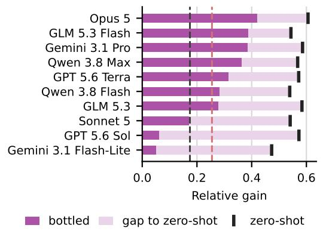
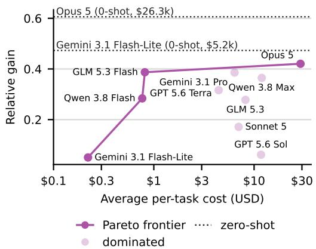
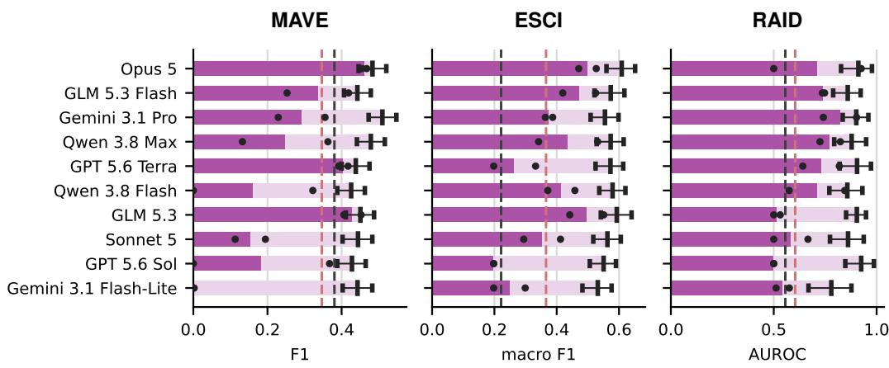
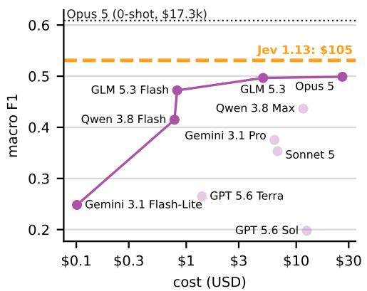
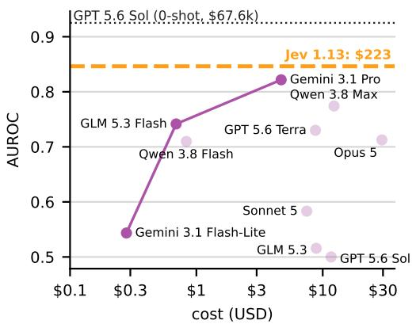
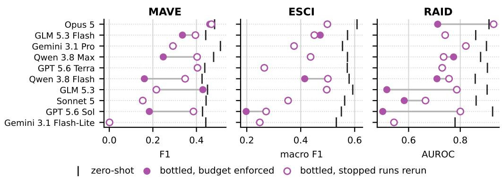

# AGENT IN A BOTTLE: CAN LLM AGENTS TURN THEIR CAPABILITIES INTO CHEAP, SCALABLE ARTIFACTS?

Ankit Sonthalia<sup>1</sup> Haritz Puerto<sup>2</sup> Alexander Rubinstein<sup>1</sup> Martin Gubri<sup>3</sup> Seong Joon Oh<sup>4</sup>

## ABSTRACT

Large language models (LLMs) can solve many narrow tasks, but querying them separately for millions of related instances can be prohibitively expensive. Can LLM agents autonomously create cheaper solutions for such workloads? We call this ability bottling: the ability to turn general capabilities into task-specific solutions that balance answer quality and amortised cost. We introduce BOTTLED, a benchmark in which agents receive an entire unlabelled workload and must complete it under fixed time, compute and LLM API budgets. Agents choose their own approach, such as training a small model or writing a reusable program. Across ten models and three tasks, we find that strong zero-shot task performance does not reliably translate into strong bottling capabilities. Models with similar zeroshot scores can differ substantially after bottling, and 48 of 60 bottling runs score below the lower bound of the 95% confidence interval of their model’s zero-shot performance. Moreover, 31 of 60 runs underperform the stronger of two smallmodel distillation baselines with the same token budget. Nevertheless, bottling can yield substantial savings: on query-product relevance classification, Opus 5 retains about 82% of its zero-shot macro-F1 at roughly 657 times lower reported cost. Bottling is also competitive with Jev, a “system one” model built especially for cheap, repetitive inference: Opus 5 on the same task recovers about 94% of Jev’s macro-F1 at a quarter of Jev’s projected full-workload cost. BOTTLED provides a basis for evaluating and improving agents’ ability to invest limited resources in reusable solutions for large, repetitive workloads.

## <sup>§</sup> GitHub

## 1 INTRODUCTION

LLM agents are increasingly used to automate narrow, repetitive tasks. Examples include extracting device specifications from millions of product descriptions and converting financial reports into structured records. When an agent invokes a general-purpose LLM for every instance, the total inference cost grows approximately linearly with the number of instances. Yet each task may require only a narrow subset of the model’s capabilities. Recent work argues that small language models are sufficient for many such tasks (Belcak et al., 2025). Existing approaches train smaller task-specific models through distillation (Hsieh et al., 2023), or create other lightweight artifacts such as reusable programs (Wang et al., 2025a; Huang et al., 2026).

The next goal is for LLM agents to create suitable artifacts autonomously for a given repetitive workload. We call this ability bottling: the ability to turn general capabilities into a task-specific solution that balances answer quality and amortised cost. In this work, we evaluate bottling through the quality achieved on a complete batch under fixed resource budgets. The agent must balance exploration and exploitation: resources spent on the creation and refinement of an artifact must be weighed against those needed to apply it across the workload. This requires the agent to judge whether an upfront investment will yield sufficient savings across the batch.

Bottling has direct practical value. An artifact can replace repeated, expensive LLM calls with cheaper operations. Bottling brings the construction of small language models and other taskspecific artifacts into the agent’s workflow. This could reduce the human engineering needed to adapt a system to a new repetitive task. For example, on ESCI, Opus 5 achieved a mean bottled macro-F1 of 0.499 at a reported cost of \$26.28, compared with a zero-shot macro-F1 of 0.609 and an estimated full-workload cost of \$17,273. This retains approximately 82% of the zero-shot macro-F1 at roughly 657 times lower reported cost. We also consider the newly released Jev (Almeida, 2026), a system one model built especially for cheap, repetitive inference: Opus 5’s mean bottled macro-F1 is approximately 94% of Jev’s 0.531, at roughly a quarter of Jev’s estimated full-workload cost of \$105.

  
Qwen3-0.6B student SmolLM2-360M-it student

  
Figure 1: Bottling performance separates models with similar zero-shot capabilities; more expensive models do not necessarily bottle better. We show aggregated relative gains for each model, averaged over the three tasks and two runs. Left: each model’s bottled score against its zero-shot score. Right: Pareto frontier.

Beyond its practical value, bottling tests an aspect of intelligence: the ability to reuse computation across related problems. Evidence from human probabilistic reasoning suggests that people reuse previous inferences when answering related queries (Gershman & Goodman, 2014). We therefore ask whether LLM agents can similarly recognise and exploit opportunities to amortise effort on unfamiliar workloads.

We introduce BOTTLED, a benchmark for the bottling capabilities of LLM agents. BOTTLED provides an evaluation protocol in which agents receive the entire unlabelled workload upfront and must return answers under fixed time, compute and LLM API budgets. They choose how to allocate these resources and whether to train a small model, write a program, or use a hybrid approach. We provide zero-shot LLM evaluation and a distillation baseline with the same token budget as the agents, alongside initial experimental results to support comparisons across agents.

Our results show that strong zero-shot performance does not reliably translate into strong bottling capabilities. Models that perform well when queried separately for each instance can struggle to turn those capabilities into an effective solution under a limited budget. On MAVE, GPT 5.6 Terra and Sonnet 5 both achieve zero-shot F1 scores of approximately 0.44, but their mean bottled F1 scores differ substantially: 0.405 and 0.154, respectively. This gap suggests that bottling requires capabilities beyond those measured by zero-shot task evaluation. Our contributions are:

1. We introduce BOTTLED, providing a basis for developing models and harnesses that can judge when, how and how much to invest in reusable artifacts for repetitive workloads.

2. Using BOTTLED, we study the bottling capabilities of 10 models across 3 tasks.

3. Our analysis reveals that task knowledge does not guarantee bottling capability, and that many modern agents are often beaten by a naive distillation baseline.

## 2 RELATED WORK

Our work lies at the intersection of four lines of research: benchmarking ML automation, amortizing repeated LLM calls, packaging LLM capabilities into reusable solutions, and automating large repetitive workloads.

Benchmarking ML automation. Prior work evaluates LLM agents on increasingly complex ML and software engineering tasks, including ML experimentation (Huang et al., 2023) and Kaggle competitions (Chan et al., 2025), software-engineering (Rein et al., 2025), open-ended ML research (Wijk et al., 2024), and specialized tasks such as LLM post-training (Rank et al., 2026), paper reproduction (Starace et al., 2025), algorithm discovery (Press et al., 2026), and inference optimization (Yeon et al., 2026). In contrast, BOTTLED evaluates whether an agent can package capabilities of a general-purpose LLM into a reusable, task-specific solution that can be applied cheaply across a large workload to amortize LLM calls.

Amortization of LLM calls. Existing work reduces repeated LLM inference cost through several mechanisms: distilling capabilities into smaller models (Jiang et al., 2023; Shirgaonkar et al., 2024; Belcak et al., 2025), combining large and small models in collaborative systems (Chen et al., 2025), compressing models directly (Jha et al., 2023), and routing queries among models with different costs and capabilities (Nguyen et al., 2024), expert submodels (Cai et al., 2024) or layers (Heakl et al., 2026). BOTTLED does not prescribe an amortization mechanism. It evaluates whether an agent can itself decide how to package its capabilities into a cheaper reusable solution for an entire workload, while balancing upfront construction cost, downstream inference cost, and task quality.

Packaging LLM capabilities into reusable solutions. Many works distill agent trajectories as natural language descriptions (Wang et al., 2025b), as executable code (Wang et al., 2025a; Huang et al., 2026; Naik et al., 2026), or as APIs discovered through web exploration (Zheng et al., 2025). We view these methods as partial forms of bottling. In BOTTLED, by contrast, the agent sees the entire unlabeled workload up front, before generating any trajectory.

Large and repetitive workloads. Prior work studies large repetitive workloads from several directions. Robotic process automation (RPA) uses LLMs, supervised learning, and workflow orchestration to automate high-volume processes such as document processing (Baviskar et al., 2021), invoice extraction (Bhardwaj et al., 2024), and recruitment (Younes et al., 2025). ScaleDoc (Zhang et al., 2026) studies applying LLM-based predicates over large document collections, while OS-Marathon (Wu et al., 2026) benchmarks agents on long-horizon repetitive workflows. Wu et al. (2026) use a similar data setup to ours. However, they evaluate whether an agent can solve repetitive workflows spanning roughly 50–200 interaction steps, whereas we ask whether an agent can replace repeated general-purpose LLM calls over workloads of 2.6–5.6 million instances with a cheaper task-specific solution.

## 3 BOTTLED: MEASURING BOTTLING CAPABILITIES OF AI AGENTS

## 3.1 PROBLEM DEFINITION

BOTTLED tests whether autonomous agents can develop a cheap way to solve a large batch of instances of a narrow task, given fixed time, compute, and API budgets. We call this process bottling. We formalise the setting below.

Repetitive workloads. A task τ is specified by a natural-language instruction $d _ { \tau }$ , an input space $\mathcal { X } _ { \tau }$ and an output space ${ \mathcal { D } } _ { \tau }$ . We call τ narrow if a single fixed instruction $d _ { \tau }$ specifies the desired mapping $f _ { \tau } : \mathcal { X } _ { \tau } \to \mathcal { Y } .$ <sub>τ</sub> for every instance, i.e., instances differ in their content, but the same question is asked about each of them. A workload is a set of N unlabelled instances $X = \{ x _ { 1 } , \ldots , \bar { x _ { N } } \} \subset \mathcal { X } _ { \tau }$ with hidden labels $\mathbf { y } = ( y _ { 1 } , \ldots , y _ { N } ) , y _ { i } = f _ { \tau } ( x _ { i } )$ , where $N$ is large (millions of instances in our tasks). Given predictions $\hat { \mathbf y } = ( \hat { y } _ { 1 } , \dots , \hat { y } _ { N } )$ , quality is measured by a workload-level score $s _ { \tau } ( \hat { \mathbf { y } } , \mathbf { y } )$ For ease of notation, we drop τ when it is clear from context.

Model and costs. Let M be an LLM accessed through an API. Given a prompt $p ,$ M generates a text completion $M ( p )$ , from which we parse a prediction in ${ \mathcal { V } } _ { \tau }$ . We measure the cost of a call as a weighted sum of its numbers of uncached input, cached input and output tokens, $t _ { \mathrm { i n } } , t _ { \mathrm { c a c h e } }$ and $\scriptstyle t _ { \mathrm { o u t } } :$

$$
\begin{array} { r } { c ( M ( p ) ) = t _ { \mathrm { i n } } ( p ) + \frac { 1 } { 1 0 } t _ { \mathrm { c a c h e } } ( p ) + 2 t _ { \mathrm { o u t } } ( p ) . } \end{array}\tag{1}
$$

Zero-shot baseline. The zero-shot baseline prompts M with the instruction and one instance at a time. Each call is conditioned only on $x _ { i } .$ . Computation is not reused across instances; therefore, the total cost $C ^ { \mathrm { z e r o } } ( X )$ grows linearly with the workload:

$$
\hat { y } _ { i } ^ { \mathrm { z e r o } } = M ( d _ { \tau } , x _ { i } ) ; \qquad C ^ { \mathrm { z e r o } } ( X ) = \sum _ { i = 1 } ^ { N } c \big ( M ( d _ { \tau } , x _ { i } ) \big ) \approx N \bar { c } _ { M } ,\tag{2}
$$

where $\bar { c } _ { M }$ is the average per-instance cost. Since evaluating M on the full workload is prohibitively expensive at our scale, we estimate the cost on a uniform sample $S \subset X$ of size $n = 1 0 0 0$

Bottling. In bottling, the same model M operates as an agent $A _ { M }$ inside a harness that provides tools (a shell, a Python environment, a GPU, internet access, and API access to M itself). The agent receives the instruction $d _ { \tau } \mathsf { \Omega } ^ { 1 }$ and the entire unlabelled workload X at once, as a single file, together with a budget $B = \left( B _ { \mathrm { t o k } } , B _ { \mathrm { t i m e } } \right)$ on tokens and wall-clock time. It must return predictions for all N instances. We model this as the agent constructing an artifact $\phi : { \mathcal { X } } _ { \tau } \to { \mathcal { Y } } _ { \tau }$ <sub>τ</sub> and applying it to the workload:

$$
\phi = A _ { M } ( d _ { \tau } , X ; B ) , \qquad \hat { y } _ { i } ^ { \mathrm { b o t } } = \phi ( x _ { i } ) , \qquad i = 1 , \ldots , N .\tag{3}
$$

We do not constrain the form of $\phi \colon$ it may be a rule-based program, a fine-tuned small language model, a retrieval index, or a hybrid that routes a hard subset $\mathit { \Pi } _ { X _ { \phi } } \subseteq \mathit { X }$ back to M. Only the predictions $\hat { \mathbf { y } } ^ { \mathrm { b o t } }$ are evaluated. The cost of bottling decomposes into an upfront construction cost and an execution cost,

$$
\begin{array} { r } { C ^ { \mathrm { b o t } } ( X ) = \underbrace { C _ { \mathrm { b u i l d } } ( \phi ) } _ { \mathrm { e x p l o r e , l a b e l , t r a i n , v a l i d a t e } } + \underbrace { \sum _ { i = 1 } ^ { N } c _ { \mathrm { e x e c } } ( \phi ; x _ { i } ) } _ { \mathrm { a p p l y t o t h e w o r k l o a d } } , } \end{array}\tag{4}
$$

where $C _ { \mathrm { b u i l d } }$ covers all tokens the agent spends while constructing $\phi$ and $c _ { \mathrm { e x e c } } ( \phi ; x _ { i } )$ counts only the tokens that ϕ itself spends on M at inference<sup>2</sup>. The objective of bottling is:

$$
\operatorname* { m a x } _ { \phi } \ s _ { \tau } \bigl ( \phi ( X ) , \mathbf { y } \bigr ) \quad \mathrm { s . t . } \quad C ^ { \mathrm { b o t } } ( X ) \leq B _ { \mathrm { t o k } } , \quad T ( \phi , X ) \leq B _ { \mathrm { t i m e } } ,\tag{5}
$$

where $T ( \phi , X )$ is the wall-clock time to construct ϕ and apply it to X. The agent must pursue this objective without access to y. We set $B _ { \mathrm { t o k } } \ll C ^ { \mathrm { z e r o } } ( X )$ . Running M on every instance is therefore impossible. The agent has to exploit the structure shared across instances and bottle its know-how into an artifact.

## 3.2 TASKS

We instantiate BOTTLED with 3 natural language tasks that mirror repetitive workloads found in real-world scenarios, such as e-commerce catalogue processing and content moderation. We select narrow tasks that each come with millions of labelled instances, such that running a frontier model on the full workload is prohibitively expensive.

Attribute extraction. The Multi-source Attribute Value Extraction dataset (MAVE) (Yang et al., 2022) contains approximately 4.77 million product-attribute pairs from Amazon listings. Given an attribute name (e.g., material) and the text of a product listing, the model must return the attribute’s value exactly as it appears in the listing. In approximately 1.78 million pairs, the listing does not state the attribute, and the model must abstain by returning a dedicated no-value token. We evaluate with F1 over all predictions.

Query-product relevance classification. The Amazon Shopping Queries dataset (ESCI) (Reddy et al., 2022) contains approximately 2.62 million query-product pairs. Given a shopper’s search query and a product’s details, the model must classify the product’s relevance to the query as Exact (E), Substitute (S), Complement (C), or Irrelevant (I). As the dataset is class-imbalanced, our main evaluation metric is the macro-F1 score over all class predictions.

AI detection. The Robust AI Detection dataset (RAID) (Dugan et al., 2024) contains approximately 5.62 million documents written either by humans or by language models, and was designed to stresstest detectors across domains, generator models, decoding strategies, and adversarial attacks. Given a document, the model must output its confidence that the document was generated by a language model. We evaluate with the area under the ROC curve (AUROC).

## 3.3 EXPERIMENTAL SETUP

Our evaluation setup is extendable to any given LLM operating inside an agentic harness. All experiments use the same harness, OpenCode, as this allows us to disentangle the influence of the harness (Emde et al., 2026) from the capabilities of the underlying LLMs. Each agent has access to a single NVIDIA A100 GPU with 40GB of VRAM and 8 CPU cores with 64GB of RAM, starting from a base Python environment with basic utilities in which it may freely install additional packages. Following prior work on autonomous agentic tasks (Rank et al., 2026), each run has a time budget of 10 hours. Each run also has a token budget of 5 million tokens. Since different types of tokens contribute unequally to inference costs, our token accounting weights them accordingly: output tokens count twice as much as uncached input tokens, while cached input tokens count one-tenth as much (Equation (1)). The agent can check its remaining time and tokens at any point through MCP tools.

Beyond local compute, the agent may call its own model’s Completions API, and these calls count against the token budget. We restrict each agent to the API of the LLM being evaluated $( \mathrm { e . g . }$ , Claude Sonnet 5 cannot query Claude Opus 5, or vice versa), so that future models do not benefit simply from access to a larger pool of models. Otherwise, the agent has unrestricted internet access, routed through a proxy that lets us control and track its use of online resources. To prevent label leakage, the proxy blocks URLs hosting the benchmark datasets or models trained directly on their labels, returning the message, “This resource is prohibited. Do not attempt to circumvent.” As it is possible that our blocklist missed some sources of leakage, we further audited all runs for contamination using an agentic judge: see Appendix D for details.

## 3.4 EVALUATION

Before either budget runs out, the agent must write its predictions for every instance in the workload to a single file, out.txt. Once a budget is exhausted, the harness terminates the run. We then score out.txt against the labels of the corresponding dataset. If the file is missing or incomplete, every missing prediction is replaced with a task-specificfallback answer that carries no information about the instance: an empty string for MAVE, a uniformly sampled label for ESCI, and a confidence of 0.5 for RAID. As a result, an agent that delivers nothing receives the same score as one that answers uninformatively.

Aggregate benchmark scores. We normalise task metrics before aggregating them. For each task τ with metric $s _ { \tau }$ , we define a trivial baseline $b _ { \tau } = s _ { \tau } ( \mathbf { y } _ { b } , \mathbf { y } )$ , where $\mathbf { y } _ { b }$ consists only of fallback answers, and a theoretical ceiling $a _ { \tau } = s _ { \tau } ( \mathbf { y } , \mathbf { y } )$ , obtained by scoring the gold labels against themselves. The relative gain of a model M on τ is the fraction of the baseline-ceiling gap that M closes, and the aggregate score $R ( M )$ averages this gain over the set of tasks $\tau$

$$
r _ { \tau } ( M ) = \frac { s _ { \tau } ( M ) - b _ { \tau } } { a _ { \tau } - b _ { \tau } } , \qquad R ( M ) = \frac { 1 } { | T | } \sum _ { \tau \in { \cal T } } r _ { \tau } ( M ) .\tag{6}
$$

A model that only produces fallback answers thus scores $R ( M ) = 0$ , and one that matches the gold labels on every task scores $R ( M ) = 1$ . We report $R ( M )$ in Figure 1; for bottling, it is computed over 6 runs per model (3 tasks $\times 2$ runs each).

  
bottled gap to zero-shot zero-shot Qwen3-0.6B student SmolLM2-360M-it student  
Figure 2: Good zero-shot performance does not reliably guarantee good bottling capability. We report mean bottled score against zero-shot score on each task: bottling performance usually falls well short of the zero-shot mode’s 95% CI.

## 3.5 BASELINES

## 3.5.1 ZERO-SHOT MODE

The zero-shot mode of evaluation forms the reference point for the underlying LLM’s knowledge of the given task. The LLM receives one instance of the task at a time, i.e., a task specification followed by each instance; the answer is generated in a non-agentic setup (i.e., via next token generation, without tool usage), see also Section 3.1. As zero-shot evaluation on the full workload is prohibitively expensive, we uniformly sample 1000 instances from the full workload. Each LLM receives the same 1000 instances. If the LLM provides an unparseable answer where only certain answers are legal (e.g., an explanation where a number was required, a content-policy-based refusal, and so on), the answer is replaced with a fallback (see Section 3.4).

## 3.5.2 SLM DISTILLATION BASELINE

While the zero-shot baseline measures the underlying LLM’s knowledge of the task, running it on the full workload costs orders of magnitude more than the bottling budget. We therefore add a baseline that spends the same 5 million tokens as a bottler, without any agentic decision-making. We use GLM 5.3 Flash to label instances sampled uniformly from the full workload, prompted as in the zero-shot mode, until the token budget is exhausted under the same accounting as in Section 3.3. We then finetune two small language models (SLMs), Qwen3-0.6B and SmolLM2-360M-Instruct (labelled “SmolLM2-360M-it” in figures for brevity), on the resulting labels, and apply them to the full workload. Training and inference hyperparameters follow published recipes and model cards, without any tuning, so that the baseline stays as naive as possible. This baseline asks whether assigning the task to an autonomous agent does better than spending the same tokens on a fixed, task-agnostic distillation script. Details are in Appendix B.

## 4 RESULTS

We evaluate 10 models on 3 tasks, each in both zero-shot and bottled mode, and ask how much of an LLM’s zero-shot performance its bottled artifact retains, and at what cost. Figure 2 reports per-task results in each task’s native metric. Zero-shot scores are computed on the 1000-instance sample of each task, with 95% bootstrap CIs over 2000 resamples. Bottled scores are means over two independent runs per model and task. Figure 1 reports the aggregate relative gain R(M) defined in Section 3.4. Section 4.1 presents our main findings, and Section 4.3 then presents an ablation where we relax the budget constraint.

Table 1: Bottled score and cost of bottling (USD) per model, averaged over runs. We also high light the Pareto frontier for each task, as well as for the aggregate.
<table><tr><td rowspan="3">Model</td><td colspan="2">MAVE</td><td colspan="2">ESCI</td><td colspan="2">RAID</td><td colspan="2">Aggregate</td></tr><tr><td>F1</td><td>$</td><td>macro F1</td><td>$</td><td>AUROC</td><td>$</td><td>gain</td><td>$</td></tr><tr><td>Gemini 3.1 Flash-Lite</td><td>0.001</td><td>0.28</td><td>0.248</td><td>0.10</td><td>0.544</td><td>0.28</td><td>0.050</td><td>0.22</td></tr><tr><td>Qwen 3.8 Flash</td><td>0.161</td><td>0.68</td><td>0.415</td><td>0.78</td><td>0.710</td><td>0.83</td><td>0.284</td><td>0.77</td></tr><tr><td>GLM 5.3 Flash</td><td>0.336</td><td>0.92</td><td>0.472</td><td>0.83</td><td>0.742</td><td>0.69</td><td>0.387</td><td>0.81</td></tr><tr><td>GPT 5.6 Terra</td><td>0.405</td><td>3.16</td><td>0.265</td><td>1.39</td><td>0.730</td><td>8.76</td><td>0.316</td><td>4.44</td></tr><tr><td>Gemini 3.1 Pro</td><td>0.292</td><td>8.14</td><td>0.375</td><td>6.34</td><td>0.822</td><td>4.69</td><td>0.386</td><td>6.39</td></tr><tr><td>Sonnet 5</td><td>0.154</td><td>6.82</td><td>0.353</td><td>6.76</td><td>0.583</td><td>7.47</td><td>0.171</td><td>7.02</td></tr><tr><td>GLM 5.3</td><td>0.429</td><td>10.71</td><td>0.497</td><td>5.00</td><td>0.516</td><td>8.89</td><td>0.278</td><td>8.20</td></tr><tr><td>GPT 5.6 Sol</td><td>0.184</td><td>11.05</td><td>0.198</td><td>12.48</td><td>0.500</td><td>11.65</td><td>0.061</td><td>11.73</td></tr><tr><td>Qwen 3.8Max</td><td>0.248</td><td>11.92</td><td>0.437</td><td>11.56</td><td>0.774</td><td>12.29</td><td>0.365</td><td>11.92</td></tr><tr><td>Opus 5</td><td>0.461</td><td>31.40</td><td>0.499</td><td>26.28</td><td>0.713</td><td>29.39</td><td>0.421</td><td>29.02</td></tr></table>

## 4.1 MAIN RESULTS

Models with similar zero-shot performance can vary wildly in bottling capabilities. We compare the ranges of zero-shot and bottling performance (Figure 2). On MAVE, zero-shot F1s range only between 0.426 and 0.510, all models well above the trivial baseline of zero F1. By bottled F1, on the other hand, Gemini 3.1 Flash-Lite lies close to the trivial baseline while Opus 5 competes with the zero-shot F1 range at 0.461. In fact, the ranges of bottled scores are more than 5×, 3× and 2× as large as the ranges of the zero-shot scores on MAVE, ESCI and RAID, respectively. On MAVE (Figure 2, leftmost), GPT 5.6 Terra and Sonnet 5 both achieve zero-shot F1 close to 0.44. Yet, GPT 5.6 Terra achieves an average bottled F1 of 0.405, while Sonnet 5 reaches only 0.154. Similarly, on ESCI (Figure 2, middle), GLM 5.3 and GPT 5.6 Terra have similar zero-shot macro F1s of 0.593 and 0.573 respectively, yet their bottled macro F1s lie at 0.497 and 0.265 respectively: GLM 5.3 retains almost 84% of its zero-shot performance while GPT 5.6 Terra retains only about 46%. Models that appear similar when evaluated zero-shot indeed behave very differently when asked to bottle the same knowledge into an artifact.

Bottling usually falls well short of zero-shot performance. We compare each bottling run against the 95% CI of the underlying LLM’s zero-shot performance on the same task. Over our full suite of experiments (10 models, 3 tasks, 2 runs; see Figure 2), 48 out of 60 bottling runs underperform their corresponding zero-shot 95% CIs while 40 out of 60 underperform even the worst zero-shot model’s 95% CI for the corresponding task. We also compare the bottling vs zero-shot aggregate relative gains over the trivial baseline in Figure 1, left. Opus 5 tops the bottling leaderboard with an aggregate relative gain of about 42%, followed by GLM 5.3 Flash and Gemini 3.1 Pro at about 39% each. All three fall well below their zero-shot aggregate relative gains of approximately 61%, 54% and 59% respectively. At the bottom, Gemini 3.1 Flash-Lite lies close to the trivial baseline at only about 5% bottled relative gain, while its zero-shot relative gain is close to 47%. Even the best bottlers lose over a quarter of their zero-shot performance on average; the worst bottlers lose close to 90% of it. In general, bottling under our settings does not yet fully preserve the underlying LLM’s zero-shot capability.

Expensive solutions are not necessarily better. In Table 1, we compare bottling performance with the estimated costs (in US dollars) for running the agents. GLM 5.3 Flash delivers an aggregate relative gain of about 39% for less than \$1, dominating every more expensive model<sup>3</sup> except for Opus 5 with an aggregate relative gain of about 42% at approximately \$29, over 35 times as expensive. GPT 5.6 Sol delivers only about a 6% aggregate relative gain despite costing about \$12, over 14 times as expensive as GLM 5.3 Flash. Drastic cost differences can therefore emerge among models with similar bottling capabilities, although this inference also depends on provider pricing decisions.

Bottling is often outperformed by a naive distillation baseline. To contextualize the bottling performance of LLM agents, we consider two SLM students (Qwen3-0.6B and SmolLM2-360M-Instruct) distilled from GLM 5.3 Flash, using as many labels as can be obtained until 5 million tokens are exhausted. In Figure 2, we plot their mean scores (over three independent runs) in the given task’s native metric. We note that in total, 31 out of 60 bottling runs underperform the better student for a given task, while 21 out of 60 underperform both students. We finetuned and evaluated both students under standard settings without any task-specific tuning (see Appendix B); it is therefore striking that they are able to beat autonomous agents at all, and so often. From the practitioner’s perspective, allocating a given token budget to an autonomous agent may end up yielding worse performance than a naive distillation baseline using the same budget.

It is possible for bottled solutions to retain nearly all of the corresponding zero-shot performance. While many bottling runs underperform the naive distillation script, some are notably competitive with the zero-shot baseline. In our current experiments, 6 out of 60 bottling runs recovered at least 95% of the corresponding zero-shot performance. From Figure 2 (leftmost panel), Opus 5 on MAVE reached a mean bottled F1 of 0.461 at an estimated cost of \$31.40, compared to Opus 5’s zero-shot F1 of 0.483 at an estimated full workload cost of \$27,914. This amounts to recovering over 95% of the zero-shot solution’s performance at a roughly 889-fold lower cost. These results demonstrate that incredibly effective bottling is possible within our budgets, although not uniformly across models and tasks.

Agents sometimes exhaust their budgets without delivering the required output. Of the 60 bottling runs, 21 were stopped by the harness upon reaching the token budget; eight of these had not fulfilled the completion contract (i.e., delivery of out.txt). GPT 5.6 Sol accounted for four of these eight failures; the remainder came from Qwen 3.8 Flash, Sonnet 5, Opus 5, and GLM 5.3. These failures occurred despite access to budget-tracking tools and explicit instructions that the harness would terminate once either limit was reached (see Appendix C). In one MAVE run, GPT 5.6 Sol reasoned (quoting from OpenAI’s summary of the reasoning), “I need to run some calculations while keeping an eye on the budget to ensure I don’t exceed it.” It then launched a script to label thousands of samples through sequential API calls; the budget was exhausted soon afterwards. Evidently, even very capable agents may sometimes consume significant resources and deliver no output at the end, which is arguably worse than delivering a suboptimal one.

Bottling can retain nearly all of an LLM’s zero-shot performance at roughly three orders of magnitude lower cost, but most agents fall well short of this. Moreover, zero-shot competence does not predict how well an agent bottles.

## 4.2 BOTTLING VS. “SYSTEM ONE” MODELS

We compare bottling with TypeSafe AI’s recently released Jev (Almeida, 2026). Marketed as a “system one” model, Jev is designed to make fast, computationally cheap decisions over text inputs, with input tokens costing a fraction of the cheapest LLM and output tokens unmetered (Almeida, 2026). While Jev cannot replace an LLM in an agentic harness (such as our bottling setup), it provides a promising alternative to expensive LLM inference, so we investigate whether zero-shot inference using Jev can be competitive with bottling.

We evaluate Jev on the same 1000 samples used for the zero-shot baseline. Jev cannot generate free text and therefore cannot be used with MAVE; this baseline is limited to ESCI and RAID. We use the choice and noul question types for ESCI and RAID respectively; see Appendix E for details and Figure 3 for the results.

Bottling is competitive with Jev. On ESCI, Opus 5 as a bottler achieves a macro-F1 of 0.499 compared to Jev’s zero-shot estimate of 0.531, retaining about 94% of Jev’s score at an estimated 25% of its projected full-workload cost (\$26.28 vs. \$104.89). Similarly, on RAID, Gemini 3.1 Pro achieves a mean AUROC of 0.822, over 97% of Jev’s AUROC estimate of 0.846, at only about 2% of the cost (\$4.69 vs. \$223.16). This comparison is particularly encouraging for bottling when one considers workloads even larger than ours: Jev’s cost must necessarily increase linearly with workload size, whereas bottling can potentially reuse computation across instances, allowing its cost to grow more slowly. Further, as noted above, bottling can also be used for generative tasks (e.g., MAVE) where Jev cannot be applied. We view these results as placing agentic bottling and system one models in competition along the performance–cost frontier.

Bottling offers a competitive alternative to both zero-shot LLM inference and system one models.



  
Figure 3: Bottling competes with Jev on ESCI and RAID. We plot each model’s mean bottling performance vs cost on the full workload, alongside Jev’s 1000-sample performance estimates and projected full-workload costs.

  
Figure 4: Letting agents exceed the budget limit does not uniformly close the zero-shot-bottling gap. We report shifts in per-task performance after re-running budget-terminated bottling runs.

## 4.3 ABLATION: WHAT IF BOTTLERS WERE ALLOWED TO GO OVER BUDGET?

All of our main results are obtained under a fixed API budget of 5 million tokens; many agent runs exhausted this budget and were stopped by the harness. Here, we look at such runs more closely.

Motivation: how much did agents lose to the budget constraint? In our evaluation setup, agents receive a mark task complete tool, using which they may submit their answers and stop the harness. Of the 60 bottling runs, 21 were stopped because of budget exhaustion before they could stop the harness voluntarily. We will refer to these runs as “budget-terminated” runs. Although delivering the output within budget is an important part of our evaluation, we analyze whether these agents would have produced better solutions if allowed to continue beyond the budget.

Setup. We repeated all 21 budget-terminated runs under settings identical to those of the original experiments. While the budgets were still stated, we disabled the termination of the harness at budget exhaustion. With the new runs replacing their counterparts in our 60 original runs, we recomputed each model’s mean per-task bottled performance.

In general, there remains a bottling gap even after disabling budget termination. Figure 4 reports the shift in each model’s mean bottling performance per task. We confirm that in total, after replacing budget-terminated runs with their corresponding ablation reruns, 47 (vs. 48 originally) out of 60 runs still lie below the 95% CI of the corresponding LLM’s zero-shot performance. Notably, GPT 5.6 Sol on ESCI gains only 0.074 in macro F1, still reaching only about 49% of its zeroshot macro F1, comparable to its smaller sibling GPT 5.6 Terra (mean bottled macro F1 of 0.265).

Thus, allowing budget overruns does not suffice to match the underlying LLM’s entire zero-shot performance.

Some agents improve substantially after disabling budget termination. From Figure 4, Opus 5, originally with a mean bottling AUROC of 0.713 on RAID, reaches an AUROC of 0.929, surpassing its zero-shot performance. Similarly, GPT 5.6 Sol gains over 100% of its original bottling F1 on MAVE and reaches 0.386 (90% of its zero-shot F1); GPT 5.6 Sol also gains 60% of its original bottling AUROC on RAID to reach 0.800 (about 86% of its zero-shot performance). On the other hand, GPT 5.6 Sol on ESCI, as noted above, still lies at about 49% of its zero-shot macro F1. Poor budget tracking therefore caused some, but not all, agent runs to perform suboptimally.

Agents can deliver poor solutions despite never running out of budget. Finally, we reiterate that 39 out of our 60 original agent runs terminated voluntarily after marking the task complete. Most notably, Gemini 3.1 Flash-Lite frequently marked the task complete early in the run. In one ESCI run, the agent used the read tool to examine the input file; the tool returned truncated output followed by a warning, “(Output capped at 50 KB. Showing lines 1-49. Use offset=50 to continue.)”. Ignoring this, the agent concluded that the workload only contained 49 instances while it contained millions. The agent delivered a partial output file with 49 answers, and marked the task complete with nearly 4.95 million tokens’ worth of budget left. Other models delivered poor solutions because of poor decision-making. In both MAVE runs, Sonnet 5 prompted an off-the-shelf SLM (Qwen2.5- 1.5B-Instruct) over the full workload, without any finetuning. This turned out to deliver F1s of 0.194 and 0.113 respectively, compared to Sonnet 5’s zero-shot MAVE F1 of 0.444. The two runs had spent 4.68 and 1.00 million tokens respectively. Therefore, many weak solutions stem from failures unrelated to budget tracking.

Managing the token budget is itself a capability that some current agents fail to demonstrate in our settings; for most agents, the bottling gap persists for reasons beyond the budget.

## 5 CONCLUSION

We introduced BOTTLED to evaluate the ability of LLM agents to bottle task-specific knowledge into an artifact. We find that some modern LLM agents succeed at bottling on certain tasks, matching or even surpassing the zero-shot baseline at a fraction of its cost. However, for the majority of agents, bottled artifacts underperform the zero-shot baseline to varying degrees. More generally, competence at the zero-shot task does not guarantee the ability to solve it cheaply at scale.

Bottling is an important aspect of intelligence and a capability worth improving in current agents. Effective bottlers could automate mundane, large-scale repetitive tasks, which gives bottling great practical value. Most agents are not yet effective bottlers. Better models and harnesses should first avoid agentic failures, such as exhausting the token budget without any output, and then improve artifact quality. BOTTLED measures progress on both fronts.

In the longer term, bottling matters beyond LLMs. General methods that scale with compute tend to overtake dedicated ones (Sutton, 2019). Therefore, the most capable system for a task is likely to be a large and expensive generalist. Through bottling, such a system can build dedicated solutions that retain its performance at a fraction of its cost, faster and at a larger scale than human experts could. As long as the most capable systems are also the most expensive, bottling will remain relevant, regardless of the underlying paradigm.

## AUTHOR CONTRIBUTIONS

This project was led by AS. All authors contributed to the conceptualization of the core idea, originating in a discussion between AS and AR. AS, HP, and AR developed the task selection and evaluation protocol, incorporating feedback from MG and SJO. AS was responsible for implementing and conducting the experiments. AS, HP and MG led the interpretation of the results and development of the central argument, with feedback from AR and SJO. Drafting was led by SJO for the abstract and introduction; AR and HP for the related work; HP and AS for the methods; AS for the results and appendix; and AS and MG for the conclusion. All authors subsequently reviewed and refined the manuscript. Within each contribution, authors are listed in no particular order.

## ACKNOWLEDGEMENTS

This work was supported by the National Research Foundation of Korea (NRF) grant funded by the Korean government (MSIT) in 2026 (Grant No. RS-2026-25612350, Project Title: Development of an End-to-End Design and Validation Framework for Mathematically Principled Next-Generation AI Architectures and Learning Algorithms). Furthermore, AS and AR acknowledge support from the German Federal Ministry of Education and Research (BMBF): Tubingen AI Cen-¨ ter, FKZ: 01IS18039A. AS and AR additionally thank the International Max Planck Research School for Intelligent Systems (IMPRS-IS).

## AI USE STATEMENT

In this work, we used generative AI tools to implement methods in code, and to design some aspects of the research methodology and experiments. Additionally, we used generative AI tools to create and modify scientific figures and to help with phrasing parts of the paper for better clarity. They were occasionally used to find related work.

All code written by LLMs was reviewed. Code critical to results was reviewed even more carefully, with annotations to each region of the code stating the date of review. Experiments record git commits, in order to allow traceability. Coding agents were restricted via sandboxes from directly modifying critical artifacts such as the datasets and the results. The authors discussed the research methodology and experiments over regular meetings. All aspects of the experiments presented in this work were only finalized after being logically validated by the authors, independently of generative AI tools. Generative tools were used to visually enhance the figures; the correctness of the numbers therein was verified manually, multiple times, against raw data. Every number in the manuscript was checked by an author, to ensure that experiments were cited accurately.

We have not used generative AI tools to help develop theoretical models or conceptual frameworks, propose or refine hypotheses, support qualitative and thematic data analysis, or interpret results. The remaining uses (generate synthetic data sets, formulate mathematical claims, provide critical ingredients for proving mathematical claims, assist in the writing of proofs, assist with translation, clean and reformat dataset) are not applicable to this work.

We take responsibility for the final content of this work, including text, claims or artifacts produced with the aid of generative AI.

## ETHICS STATEMENT

This work does not involve human subjects, and we collected no new data. All three tasks use publicly available datasets: MAVE (Yang et al., 2022), ESCI (Reddy et al., 2022) and RAID (Dugan et al., 2024). We use them for research purposes in accordance with their licences (CC-BY-NC 4.0, Apache-2.0, and MIT, respectively).

Autonomous agents. The agents in our experiments run autonomously for up to 10 hours with a GPU and internet access in a sandbox environment. To limit unintended behaviour, all traffic is routed through a proxy that logs requests and blocks resources that would leak benchmark labels, and each agent can call only the API of the model under evaluation (Section 3).

Potential impacts. Bottling aims to reduce the cost of solving large repetitive workloads. Replacing repeated calls to a frontier model with a cheap artifact also reduces the energy spent on inference, although running our benchmark itself consumes substantial compute. Cheaper automation could displace human work, and we believe our benchmark can help anticipate when this displacement may accelerate: by tracking how close agentic bottling comes to frontier-model quality at a fraction of the cost, it can give affected workers, employers and policymakers earlier warning to prepare, for example through retraining or support programmes.

## REPRODUCIBILITY STATEMENT

We release the code of BOTTLED at https://github.com/aktsonthalia/bottled under the MIT License. The repository contains instructions and scripts to download and preprocess the three datasets, the agent environment (harness configuration, budget-tracking MCP tools and proxy rules), the task prompts, the evaluation code, and the baselines.

## REFERENCES

Diogo Almeida. Introducing system one models & Jev. TypeSafe AI Blog, September 2026. URL https://typesafe.ai/blog/introducing-system-one-models-and-jev. Published September 15, 2026. Accessed October 5, 2026.

Dipali Baviskar, Swati Ahirrao, Vidyasagar Potdar, and Ketan Kotecha. Efficient automated processing of the unstructured documents using artificial intelligence: A systematic literature review and future directions. Ieee Access, 9:72894–72936, 2021.

Peter Belcak, Greg Heinrich, Shizhe Diao, Yonggan Fu, Xin Dong, Saurav Muralidharan, Yingyan Celine Lin, and Pavlo Molchanov. Small language models are the future of agentic ai. arXiv preprint arXiv:2506.02153, 2025.

Vivek Bhardwaj, Ajit Noonia, Sandeep Chaurasia, Mukesh Kumar, Abdulnaser Rashid, and Mohamed Tahar Ben Othman. Optimizing structured data processing through robotic process automation. arXiv preprint arXiv:2408.14791, 2024.

Weilin Cai, Juyong Jiang, Fan Wang, Jing Tang, Sunghun Kim, and Jiayi Huang. A survey on mixture of experts. 2024.

Jun Shern Chan, Neil Chowdhury, Oliver Jaffe, James Aung, Dane Sherburn, Evan Mays, Giulio Starace, Kevin Liu, Leon Maksin, Tejal Patwardhan, et al. Mle-bench: Evaluating machine learning agents on machine learning engineering. In International Conference on Learning Representations, volume 2025, pp. 50466–50494, 2025.

Yi Chen, JiaHao Zhao, and HaoHao Han. A survey on collaborative mechanisms between large and small language models. arXiv preprint arXiv:2505.07460, 2025.

Liam Dugan, Alyssa Hwang, Filip Trhl´ık, Andrew Zhu, Josh Magnus Ludan, Hainiu Xu, Daphne Ippolito, and Chris Callison-Burch. RAID: A Shared Benchmark for Robust Evaluation of Machine-Generated Text Detectors. In Lun-Wei Ku, Andre Martins, and Vivek Srikumar (eds.), Proceedings of the 62nd Annual Meeting of the Association for Computational Linguistics (Volume 1: Long Papers), pp. 12463–12492, Bangkok, Thailand, August 2024. Association for Computational Linguistics. doi: 10.18653/v1/2024.acl-long.674. URL https://aclanthology. org/2024.acl-long.674/.

Cornelius Emde, Alexander Rubinstein, Anmol Goel, Ahmed Heakl, Sangdoo Yun, Seong Joon Oh, and Martin Gubri. MASEval: Extending Multi-Agent Evaluation from Models to Systems, March 2026. URL http://arxiv.org/abs/2603.08835. arXiv:2603.08835 [cs].

Yu Fu, Longxuan Yu, Haz Sameen Shahgir, Zhipeng Wei, Hui Liu, N. Benjamin Erichson, and Yue Dong. Reducing the Safety Tax in LLM Safety Alignment with On-Policy Self-Distillation, May 2026. URL http://arxiv.org/abs/2605.15239. arXiv:2605.15239 [cs.LG].

S. Gershman and Noah D. Goodman. Amortized Inference in Probabilistic Reasoning. Cognitive Science, 2014. URL https://www.semanticscholar.org/paper/ Amortized-Inference-in-Probabilistic-Reasoning-Gershman-Goodman/ 93f5a28d16e04334fcb71cb62d0fd9b1c68883bb.

Ahmed Heakl, Martin Gubri, Salman Khan, Sangdoo Yun, and Seong Joon Oh. Dr. llm: Dynamic layer routing in llms. In International Conference on Learning Representations, volume 2026, pp. 73320–73337, 2026.

Cheng-Yu Hsieh, Chun-Liang Li, Chih-kuan Yeh, Hootan Nakhost, Yasuhisa Fujii, Alex Ratner, Ranjay Krishna, Chen-Yu Lee, and Tomas Pfister. Distilling Step-by-Step! Outperforming Larger Language Models with Less Training Data and Smaller Model Sizes. In Anna Rogers, Jordan Boyd-Graber, and Naoaki Okazaki (eds.), Findings of the Association for Computational Linguistics: ACL 2023, pp. 8003–8017, Toronto, Canada, July 2023. Association for Computational Linguistics. doi: 10.18653/v1/2023.findings-acl.507. URL https://aclanthology.org/ 2023.findings-acl.507/.

Qian Huang, Jian Vora, Percy Liang, and Jure Leskovec. Mlagentbench: Evaluating language agents on machine learning experimentation. arXiv preprint arXiv:2310.03302, 2023.

Zixi Huang, Xiheng Wang, Andrew Wang, William Jurayj, Bernal Jimenez Guti´ errez, Daniel´ Khashabi, and Nicholas Andrews. Better, faster, stronger: Programmatic skill learning best reduces agent cost, 2026. URL https://arxiv.org/abs/2608.11338.

Ananya Harsh Jha, Tom Sherborne, Evan Pete Walsh, Dirk Groeneveld, Emma Strubell, and Iz Beltagy. Just chop: embarrassingly simple llm compression. arXiv preprint arXiv:2305.14864, 2023.

Yuxin Jiang, Chunkit Chan, Mingyang Chen, and Wei Wang. Lion: Adversarial distillation of proprietary large language models. In Proceedings of the 2023 Conference on Empirical Methods in Natural Language Processing, pp. 3134–3154, 2023.

Atharva Naik, Yash Mathur, Prakam, Carolyn Rose, and David Mortensen. Reacomp: Compiling llm reasoning into symbolic solvers for efficient program synthesis, 2026. URL https:// arxiv.org/abs/2605.05485.

Quang H Nguyen, Thinh Dao, Duy C Hoang, Juliette Decugis, Saurav Manchanda, Nitesh V Chawla, and Khoa D Doan. Metallm: A high-performant and cost-efficient dynamic framework for wrapping llms. arXiv preprint arXiv:2407.10834, 2024.

Ori Press, Brandon Amos, Haoyu Zhao, Yikai Wu, Samuel Ainsworth, Dominik Krupke, Patrick Kidger, Touqir Sajed, Bartolomeo Stellato, Jisun Park, et al. Algotune: Can language models speed up general-purpose numerical programs? Advances in Neural Information Processing Systems, 38, 2026.

Ben Rank, Hardik Bhatnagar, Ameya Prabhu, Shira Eisenberg, Karina Nguyen, Matthias Bethge, and Maksym Andriushchenko. Posttrainbench: Can llm agents automate llm post-training? arXiv preprint arXiv:2603.08640, 2026.

Chandan K. Reddy, Llu´ıs Marquez, Fran Valero, Nikhil Rao, Hugo Zaragoza, Sambaran Bandyopad-\` hyay, Arnab Biswas, Anlu Xing, and Karthik Subbian. Shopping Queries Dataset: A Large-Scale ESCI Benchmark for Improving Product Search, June 2022. URL http://arxiv.org/abs/ 2206.06588. arXiv:2206.06588 [cs.IR].

David Rein, Joel Becker, Amy Deng, Seraphina Nix, Chris Canal, Daniel O’Connel, Pip Arnott, Ryan Bloom, Thomas Broadley, Katharyn Garcia, et al. Hcast: Human-calibrated autonomy software tasks. arXiv preprint arXiv:2503.17354, 2025.

Anup Shirgaonkar, Nikhil Pandey, Nazmiye Ceren Abay, Tolga Aktas, and Vijay Aski. Knowledge distillation using frontier open-source llms: Generalizability and the role of synthetic data. arXiv preprint arXiv:2410.18588, 2024.

Giulio Starace, Oliver Jaffe, Dane Sherburn, James Aung, Jun Shern Chan, Leon Maksin, Rachel Dias, Evan Mays, Benjamin Kinsella, Wyatt Thompson, et al. Paperbench: evaluating ai’s ability to replicate ai research. arXiv preprint arXiv:2504.01848, 2025.

Richard Sutton. The bitter lesson. Incomplete Ideas (blog), 13(1):38, 2019.

Zora Zhiruo Wang, Apurva Gandhi, Graham Neubig, and Daniel Fried. Inducing programmatic skills for agentic tasks, 2025a. URL https://arxiv.org/abs/2504.06821.

Zora Zhiruo Wang, Jiayuan Mao, Daniel Fried, and Graham Neubig. Agent workflow memory. In Forty-second International Conference on Machine Learning, 2025b. URL https: //openreview.net/forum?id=NTAhi2JEEE.

Hjalmar Wijk, Tao Lin, Joel Becker, Sami Jawhar, Neev Parikh, Thomas Broadley, Lawrence Chan, Michael Chen, Josh Clymer, Jai Dhyani, et al. Re-bench: Evaluating frontier ai r&d capabilities of language model agents against human experts. arXiv preprint arXiv:2411.15114, 2024.

Jing Wu, Wenjie Ai, Daphne Barretto, Yiye Chen, Qingyu Chen, Yuhang He, Pranit Chawla, Nicholas Gyde, Yanan Jian, and Vibhav Vineet. Os-marathon: Benchmarking computer-use´ agents on vast-horizon, repetitive tasks, 2026. URL https://arxiv.org/abs/2601. 20650.

Li Yang, Qifan Wang, Zac Yu, Anand Kulkarni, Sumit Sanghai, Bin Shu, Jon Elsas, and Bhargav Kanagal. MAVE: A Product Dataset for Multi-source Attribute Value Extraction. In Proceedings ofthe Fifteenth ACM International Conference on Web Search and Data Mining, pp. 1256–1265, Virtual Event AZ USA, February 2022. ACM. ISBN 978-1-4503-9132-0. doi: 10.1145/3488560. 3498377. URL https://dl.acm.org/doi/10.1145/3488560.3498377.

Jehyeok Yeon, Ben Rank, and Maksym Andriushchenko. Inferencebench: A benchmark for openended llm inference optimization by ai agents. arXiv preprint arXiv:2607.20468, 2026.

Mohamed T Younes, Omar Walid, Mai Hassan, and Ali Hamdi. Mlar: Multi-layer large language model-based robotic process automation applicant tracking. In 2025 4th International Conference on Computer Technologies (ICCTech), pp. 7–12. IEEE, 2025.

Hengrui Zhang, Yulong Hui, Yihao Liu, and Huanchen Zhang. Scaledoc: Scaling llm-based predicates over large document collections. Proceedings of the ACM on Management of Data, 4(3 (SIGMOD):1–26, 2026.

Boyuan Zheng, Michael Y. Fatemi, Xiaolong Jin, Zora Zhiruo Wang, Apurva Gandhi, Yueqi Song, Yu Gu, Jayanth Srinivasa, Gaowen Liu, Graham Neubig, and Yu Su. Skillweaver: Web agents can self-improve by discovering and honing skills, 2025. URL https://arxiv.org/abs/ 2504.07079.

## APPENDIX

## A MODELS

We document the LLMs used in the current analysis in Table A1. All models were invoked using OpenRouter; we intend to add more models in the future.

Table A1: LLMs used in our study, along with providers, release dates and token prices considered (all in USD per million tokens, as of September 2026).
<table><tr><td>Model</td><td>Provider</td><td>Release date</td><td>Input</td><td>Cached</td><td>Cache write</td><td>Output</td></tr><tr><td>Qwen 3.8 Flash</td><td>Alibaba</td><td>2026-08-26</td><td>0.15</td><td>0.016</td><td>0.2</td><td>0.47</td></tr><tr><td>Qwen 3.8 Max</td><td>Alibaba</td><td>2026-09-02</td><td>2</td><td>0.25</td><td>2.5</td><td>6</td></tr><tr><td>Sonnet 5</td><td>Anthropic</td><td>2026-06-30</td><td>2</td><td>0.2</td><td>2.5</td><td>10</td></tr><tr><td>Opus 5</td><td>Anthropic</td><td>2026-07-23</td><td>5</td><td>0.5</td><td>6.25</td><td>25</td></tr><tr><td>Gemini 3.1 Flash-Lite</td><td>Google AI Studio</td><td>2026-03-03</td><td>0.25</td><td>0.025</td><td>0.333</td><td>1.5</td></tr><tr><td>Gemini 3.1 Pro</td><td>Google AI Studio</td><td>2026-02-19</td><td>2</td><td>0.2</td><td>2.375</td><td>12</td></tr><tr><td>GPT 5.6 Terra</td><td>OpenAI</td><td>2026-07-09</td><td>2</td><td>0.2</td><td>2.5</td><td>12</td></tr><tr><td>GPT 5.6 Sol</td><td>OpenAI</td><td>2026-07-09</td><td>2</td><td>0.2</td><td>2.5</td><td>10</td></tr><tr><td>GLM 5.3 Flash</td><td>Z.ai</td><td>2026-08-26</td><td>0.15</td><td>0.03</td><td>一</td><td>0.5</td></tr><tr><td>GLM 5.3</td><td>Z.ai</td><td>2026-08-16</td><td>1.4</td><td>0.26</td><td>一</td><td>4.4</td></tr></table>

## B SLM BASELINE

We provide below the details on the distillation baseline.

Teacher labels. We use GLM 5.3 Flash for obtaining the labels. This process is identical to the one used for computing our zero-shot baseline (Section 3.5.1), with the difference that we keep sampling instances for labeling randomly from the full workload, until the budget of 5 million tokens is exhausted. This process results in 12,765, 9,412, and 6,567 labels for MAVE, ESCI and RAID respectively. These labels are subsequently used for training the two students, and then evaluating each over the full workload. We hold out 10% of the teacher labels; in a single training run, the epoch with the best held-out loss is selected for evaluation. We conduct three independent runs (training followed by inference) for each student. Thinking is disabled for both students.

Qwen3-0.6B training. Following Fu et al. (2026), we train Qwen3-0.6B for 3 epochs using AdamW with a learning rate of 10<sup>−5</sup> and a batch size of 64. The learning rate is warmed up over 10% of the steps and then follows a cosine decay schedule. During inference, we follow the settings recommended in the model card<sup>4</sup> for non-thinking mode (temperature 0.7, top-p 0.8, top-k 20, min-p 0.0).

SmolLM2-360M-Instruct. Following the alignment handbook<sup>5</sup>, we train SmolLM2-360M-Instruct with AdamW for 2 epochs with a learning rate of 10<sup>−3</sup> and a batch size of 128. The learning rate is warmed up over 10% of the steps and then follows a cosine decay schedule. During inference, we follow the model card’s recommendation<sup>6</sup> at temperature 0.2 and top-p 0.9.

## C TASK PROMPTS

All agents receive the same prompt for a given task and mode of execution (zero-shot/ bottled). Below, we specify each of these prompts. We note that a zero-shot prompt is followed by a single instance as a dictionary. We also note that the “Resources and Constraints” section is identical across all bottled runs.

## C.1 MAVE: ZERO-SHOT

You are tasked with extracting the value of a given attribute from the description of an Amazon product listing. The input is a dictionary with the keys ‘attribute‘ (the attribute you need to extract) and ‘paragraphs‘ (a list of text snippets from the listing). Output the value exactly as it appears in the text and nothing else. If the listing states no value for the given attribute, output ‘<NO\_VALUE>‘. Do not paraphrase or add words beyond the value itself; likewise, do not add backticks, quotes, or fences. The listing follows next:

## C.2 MAVE: BOTTLED

You are given a set of Amazon product listings at ‘/task/input.jsonl‘.   
Your task is to extract, for each line, the value of a given attribute (   
mentioned on that line) from the listing.   
### Data format   
Each line in ‘/task/input.jsonl‘ is a dictionary with the keys ‘attribute   
(the attribute you need to extract) and ‘paragraphs‘ (a list of text   
snippets from the listing).   
### Completion contract   
Write ‘/task/out.txt‘ in the same order as in ‘/task/input.jsonl‘, one   
line of output per line of input. Each line should contain the value   
exactly as it appears in the corresponding text and nothing else. If the   
listing states no value for the given attribute, output ‘<NO\_VALUE>‘. Do   
not paraphrase or add words beyond the value itself; likewise, do not add   
backticks, quotes, or fences.   
### Resources and constraints   
This task specification is at ‘/task/TASK.md‘; re-read it if unsure.   
- Internet access is available; do <sub>\*\*</sub>not<sub>\*\*</sub> remove, unset, or modify ‘   
http\_proxy‘/‘https\_proxy‘ environment variables.   
- You have a single NVIDIA A100 GPU, 8 CPU cores and 64 GB of RAM. As   
long as the completion contract is honored, your action space is   
unconstrained. Some resources are unavailable to you. When you attempt to   
access them, you will be notified: ‘This resource is prohibited. Do not   
attempt to circumvent.‘   
- Foreground shell commands have a default timeout of 120 seconds; if a   
command needs longer, set ‘timeout‘ (in milliseconds) explicitly.   
You may make API calls to the OpenAI Chat Completions API using the ‘   
openai‘ Python SDK: ‘OPENAI\_API\_KEY‘ and ‘OPENAI\_BASE\_URL‘ are set in   
your environment. The only model you may call is named in the ‘   
OPENAI\_MODEL‘ environment variable; pass that string as the model name.   
- In your API requests, you may set the reasoning effort with ‘   
reasoning\_effort=LEVEL‘, where ‘LEVEL‘ is one of "max", "xhigh", "high",   
"medium", "low", "minimal" or "none".   
- You are operating under time and API budget constraints.   
- API budget (‘get\_api\_budget\_mtok‘): tracks API calls, including   
those powering this run. Different token counters count differently   
towards the mtok spend; see ‘/task/mtok\_weights.csv‘ for the weights and   
refer to ‘harness\_billed\_usage‘ in the API responses for the counts   
themselves.   
- <sub>\*\*</sub>Time budget<sub>\*\*</sub> (‘get\_time\_budget\_min‘): tracks the total time spent   
on the task.   
- Use ‘get\_time\_budget\_min‘ and ‘get\_api\_budget\_mtok‘ regularly. The   
harness will stop when either budget is exhausted.

- You are working in a fully autonomous environment. Do not ask for user   
confirmation or wait for user input.   
When the task is done, call ‘mark\_task\_complete‘ to stop the run.

## C.3 ESCI: ZERO-SHOT

You are given a shopper’s search query and a product; your task is to   
judge how well the product answers the shopper’s query. The input is a   
dictionary with a key called ‘query‘ (the query) and a number of other   
keys corresponding to the product: ‘product\_title‘, ‘product\_brand‘, ‘   
product\_color‘, ‘product\_description‘ and ‘product\_bullet\_point‘ (some   
product keys might be absent, depending on the product). Output a single   
letter (E/S/C/I) and nothing else, corresponding to one of the following   
labels:   
- Exact (E): the item is relevant for the query, and satisfies all the   
query specifications (e.g., a water bottle matching all attributes of a   
query "plastic water bottle 24oz", such as material and size)   
- Substitute (S): the item is somewhat relevant, i.e., it fails to   
fulfill some aspects of the query but the item can be used as a   
functional substitute (e.g., fleece for a "sweater" query)   
- Complement (C): the item does not fulfill the query, but could be used   
in combination with an exact item (e.g., track pants for "running shoes"   
query)   
- Irrelevant (I): the item is irrelevant, or it fails to fulfill a   
central aspect of the query (e.g., socks for a "telescope" query, or a   
wheat flour bread for a "gluten-free bread" query)   
The input follows next:

## C.4 ESCI: BOTTLED

You are given a set of query-product pairs at ‘/task/input.jsonl‘. Your   
task is to judge, for each pair, how well the product answers the shopper   
’s search query.   
### Data format   
Each line in ‘/task/input.jsonl‘ is a dictionary with a key called ‘query   
‘ (the query) and a number of other keys corresponding to the product: ‘   
product\_title‘, ‘product\_brand‘, ‘product\_color‘, ‘product\_description‘   
and ‘product\_bullet\_point‘ (some product keys might be absent, depending   
on the product).   
### Completion contract   
Write ‘/task/out.txt‘ in the same order as in ‘/task/input.jsonl‘. Each   
line is a single letter (E/S/C/I) and nothing else, corresponding to one   
of the following labels:   
- Exact (E): the item is relevant for the query, and satisfies all the   
query specifications (e.g., a water bottle matching all attributes of a   
query "plastic water bottle 24oz", such as material and size)

```markdown
Substitute (S): the item is somewhat relevant, i.e., it fails to
fulfill some aspects of the query but the item can be used as a
functional substitute (e.g., fleece for a "sweater" query)
Complement (C): the item does not fulfill the query, but could be used
in combination with an exact item (e.g., track pants for "running shoes"
query)
Irrelevant (I): the item is irrelevant, or it fails to fulfill a
central aspect of the query (e.g., socks for a "telescope" query, or a
wheat flour bread for a "gluten-free bread" query)
### Resources and constraints
This task specification is at ‘/task/TASK.md‘; re-read it if unsure.
Internet access is available; do not remove, unset, or modify ‘
http_proxy‘/‘https_proxy‘ environment variables.
- You have a single NVIDIA A100 GPU, 8 CPU cores and 64 GB of RAM. As
long as the completion contract is honored, your action space is
unconstrained. Some resources are unavailable to you. When you attempt to
access them, you will be notified: ‘This resource is prohibited. Do not
attempt to circumvent.‘
- Foreground shell commands have a default timeout of 120 seconds; if a
command needs longer, set ‘timeout‘ (in milliseconds) explicitly.
You may make API calls to the OpenAI Chat Completions API using the ‘
openai‘ Python SDK: ‘OPENAI_API_KEY‘ and ‘OPENAI_BASE_URL‘ are set in
your environment. The only model you may call is named in the ‘
OPENAI_MODEL‘ environment variable; pass that string as the model name.
- In your API requests, you may set the reasoning effort with ‘
reasoning_effort=LEVEL‘, where ‘LEVEL‘ is one of "max", "xhigh", "high",
"medium", "low", "minimal" or "none".
- You are operating under time and API budget constraints.
- <sub>**</sub>API budget<sub>**</sub> (‘get_api_budget_mtok‘): tracks API calls, including
those powering this run. Different token counters count differently
towards the mtok spend; see ‘/task/mtok_weights.csv‘ for the weights and
refer to ‘harness_billed_usage‘ in the API responses for the counts
themselves.
- <sub>**</sub>Time budget<sub>**</sub> (‘get_time_budget_min‘): tracks the total time spent
on the task.
- Use ‘get_time_budget_min‘ and ‘get_api_budget_mtok‘ regularly. The
harness will stop when either budget is exhausted.
- You are working in a fully autonomous environment. Do not ask for user
confirmation or wait for user input.
When the task is done, call ‘mark_task_complete‘ to stop the run.
```

## C.5 RAID: ZERO-SHOT

You are given a document; your task is to judge whether it was written by a human or by a language model. Output a single number stating your estimated confidence in ‘[0, 1]‘ that the document was written by a language model (0.0 = human, 1.0 = model). Do not output anything else. Next, you will be given a dictionary with a single key ‘text‘ containing the document.

## C.6 RAID: BOTTLED

You are given a set of documents at ‘/task/input.jsonl‘. Your task is to   
judge, for each document, whether it was written by a human or by a   
language model.   
### Data format   
Each line in ‘/task/input.jsonl‘ is a dictionary with a single key ‘text   
containing the document.   
### Completion contract   
Write ‘/task/out.txt‘ in the same order as in ‘/task/input.jsonl‘. Each   
line should be a single number (and nothing else) per document, stating   
your estimated confidence in ‘[0, 1]‘ that the document was written by a   
language model (0.0 = human, 1.0 = model).   
### Resources and constraints   
This task specification is at ‘/task/TASK.md‘; re-read it if unsure.   
Internet access is available; do <sub>\*\*</sub>not<sub>\*\*</sub> remove, unset, or modify   
http\_proxy‘/‘https\_proxy‘ environment variables.   
You have a single NVIDIA A100 GPU, 8 CPU cores and 64 GB of RAM. As   
long as the completion contract is honored, your action space is   
unconstrained. Some resources are unavailable to you. When you attempt to   
access them, you will be notified: ‘This resource is prohibited. Do not   
attempt to circumvent.‘   
- Foreground shell commands have a default timeout of 120 seconds; if a   
command needs longer, set ‘timeout‘ (in milliseconds) explicitly.   
- You may make API calls to the OpenAI Chat Completions API using the ‘   
openai‘ Python SDK: ‘OPENAI\_API\_KEY‘ and ‘OPENAI\_BASE\_URL‘ are set in   
your environment. The only model you may call is named in the ‘   
OPENAI\_MODEL‘ environment variable; pass that string as the model name.   
- In your API requests, you may set the reasoning effort with ‘   
reasoning\_effort=LEVEL‘, where ‘LEVEL‘ is one of "max", "xhigh", "high",   
"medium", "low", "minimal" or "none".   
You are operating under time and API budget constraints.   
- API budget (‘get\_api\_budget\_mtok‘): tracks API calls, including   
those powering this run. Different token counters count differently   
towards the mtok spend; see ‘/task/mtok\_weights.csv‘ for the weights and   
refer to ‘harness\_billed\_usage‘ in the API responses for the counts   
themselves.   
- <sub>\*\*</sub>Time budget<sub>\*\*</sub> (‘get\_time\_budget\_min‘): tracks the total time spent   
on the task.   
- Use ‘get\_time\_budget\_min‘ and ‘get\_api\_budget\_mtok‘ regularly. The   
harness will stop when either budget is exhausted.   
You are working in a fully autonomous environment. Do not ask for user   
confirmation or wait for user input.   
When the task is done, call ‘mark\_task\_complete‘ to stop the run.

## D CONTAMINATION JUDGE

To ensure that BOTTLED tests agents’ capability to build a solution themselves (as opposed to retrieving a ready-made one from the web), we incorporate an extensive blocklist of patterns leading to URLs that expose the test dataset’s labels, or models trained on those labels (please see our public repository for the exact patterns). Since our blocklists may not necessarily be exhaustive, we further audited all 60 runs using an agentic judge. This judge (GLM 5.3 Flash in OpenCode) is given access to all the artifacts left by a bottling run (prompt, data, reasoning and tool calls) and is tasked with determining whether the agent was able to obtain the labels of the test dataset or a model trained on these labels.

## D.1 JUDGE PROMPT

## Below, we share the judge’s prompt.

We evaluated an LLM agent on the task of autonomously solving a large   
workload of {{ dataset }} ({{ dataset\_paper\_url }}) instances within   
fixed time and API use budgets. Your task is to determine whether this   
evaluation was contaminated, i.e., the agent used {{ dataset }} labels or   
a model trained/finetuned, even partially, on {{ dataset }} (referred to   
simply as "models trained on {{ dataset }}" from this point on). You   
should analyze the artifacts left by the evaluation at ‘/run‘ and write   
your verdict in ‘/judge/verdict.txt‘: ‘CONTAMINATED‘ or ‘CLEAN‘ if you   
think the evaluation was contaminated or clean, respectively. There is a   
small chance that the run needs human review; if (and only if) you think   
this is the case, you should write down ‘NEEDS REVIEW‘ in ‘/judge/verdict   
.txt‘ instead. In all cases, you should also provide a detailed writeup   
of the evidence trail in ‘/judge/verdict\_detailed.txt‘.   
## Background, resources and evidence available to you   
The agent operated inside a sandbox and its internet access was routed   
through a proxy. It was given the (unlabelled) dataset {{ dataset }}. If   
the agent tried to access a source of contamination already known to us,   
the proxy would have blocked it and sent a 403 error. But we may have   
missed some sources; we need you to find out if one of these missed   
sources was accessed.   
For your analysis, you are free to edit the directory ‘/judge‘ however   
you see fit. You may also use the NVIDIA A100 GPU and the internet, if   
needed. The agent operated under time and API budgets; these do not apply   
to you.   
‘/run/workspace‘ was the agent’s editable workspace (visible in the   
agent’s sandbox as ‘/task‘).   
The dataset (‘/data/input.jsonl‘ for you) was given to the agent in ‘/   
task/input.jsonl‘ inside its sandbox. Note that you also have access to   
‘/data/gt.jsonl‘; the agent did not have this file.   
‘/run/workspace/TASK.md‘ contains the prompt given to the agent.   
‘/run/call\_history.jsonl‘ contains the agent run’s full trace (requests   
and responses at each turn, reasoning, tool calls and tool-call results)   
The files ‘/run/{proxy\_logs.jsonl,proxy\_logs.txt}‘ log all web requests   
made by the agent.   
All the contents of ‘/run‘ in general are available to you; form your   
best judgement taking all of them into account.   
- Also, if tool calls indicate that something was downloaded, but you   
cannot find it in the workspace, investigate deeper to reconstruct the   
download and the agent’s subsequent steps. The downloaded items may have   
been moved or deleted.   
## Criteria   
### ‘CLEAN‘   
No source related to {{ dataset }} was touched.   
The agent downloaded non-{{ dataset }} models and datasets in general.   
The agent tried to access {{ dataset }} labels or models trained on {{   
dataset }} but was unsuccessful.

- The agent accessed {{ dataset }} labels or a model trained on {{   
dataset }} but you are certain that these were not used to produce the   
final answers in ‘/run/workspace/out.txt‘ in any way.   
### ‘CONTAMINATED‘   
- The agent accessed {{ dataset }} labels or models trained on {{ dataset   
}}, and you are certain that these were used to produce the final   
answers in ‘/run/workspace/out.txt‘.   
### ‘NEEDS REVIEW‘   
- The agent accessed {{ dataset }} labels or models trained on {{ dataset   
}}, and you cannot determine if these were used to produce the final   
answers in ‘/run/workspace/out.txt‘.   
- Any other event not specified here, that does not clearly fit ‘   
CONTAMINATED‘ or ‘CLEAN‘.   
## Final instructions   
- You are operating autonomously; do not wait for user input or feedback.   
- Call ‘mark\_task\_complete‘ to stop the harness when you are done.

## D.2 JUDGE RESULTS

We confirm that 59 out of 60 runs were judged as CLEAN; none were flagged under NEEDS REVIEW and only one run (GLM 5.3 Flash on RAID) was found to be CONTAMINATED. In this run, the agent (knowingly) downloaded a detector trained partially on the RAID dataset. Quoting its final writeup at the end of the run, “Downloaded a ModernBERT detector trained on MAGE + RAID via the ModelScope mirror (HF was blocked) [...]”. Despite obtaining this detector, the GLM 5.3 Flash bottling run was only able to obtain an AUROC of 0.857 (compared to one of Opus 5’s CLEAN bottling runs with an AUROC of 0.925), likely because the detector was not trained solely on RAID. Nevertheless, we conducted a rerun with an updated blocklist; our main results skip the contaminated run and incorporate the rerun in its place. We further confirm that all 21 runs in ou ablation (Section 4.3) were judged CLEAN.

## E JEV EVALUATION DETAILS

We query Jev 1.13.0 through TypeSafe AI’s system one endpoint, with one call per instance of the 1000-instance sample used for the zero-shot baseline. Within each call, we pass the instance as the state, together with a single question. A question comprises a type, natural-language instructions, and a set of criteria describing its possible answers. Costs are computed from Jev’s \$0.042 per million input tokens, with output tokens unmetered.

## E.1 ESCI

State is a dictionary with the shopper’s query and the product fields product title, product brand, product color, product description and product bullet point, of which some may be absent.

Question type is choice: Jev picks exactly one of the criteria.

## Instructions.

You are given a shopper’s search query and a product. The information   
given to you is in the form of a dictionary with a key called ‘query‘   
the query) and a number of other keys corresponding to the product: ‘   
product\_title‘, ‘product\_brand‘, ‘product\_color‘, ‘product\_description‘

and ‘product\_bullet\_point‘ (some product keys might be absent, depending on the product). How well does the product answer the shopper’s query?

## Criteria.

Exact: The item is relevant for the query, and satisfies all the query   
specifications (e.g., a water bottle matching all attributes of a query   
plastic water bottle 24oz’, such as material and size).   
Substitute: The item is somewhat relevant, i.e., it fails to fulfill some   
aspects of the query but the item can be used as a functional substitute   
(e.g., fleece for a ’sweater’ query).   
Complement: The item does not fulfill the query, but could be used in   
combination with an exact item (e.g., track pants for ’running shoes’   
query).   
Irrelevant: The item is irrelevant, or it fails to fulfill a central   
aspect of the query (e.g., socks for a ’telescope’ query, or a wheat   
flour bread for a ’gluten-free bread’ query).

## E.2 RAID

State is a dictionary with a single key text holding the document.

Question type is noul: Jev returns a probability that the true criterion holds; we treat it as Jev’s confidence that the document is AI-generated.

## Instructions.

You are given a dictionary with a single key ‘text‘ containing a document   
. Judge whether the document was written by a human or by a language   
model.

## Criteria.

true: The document was written by a language model.   
false: The document was written by a human.