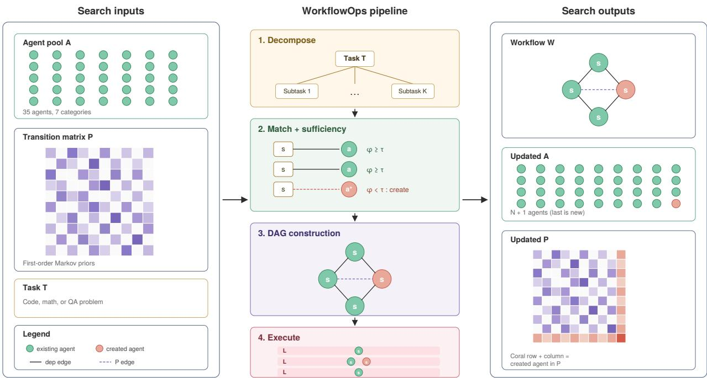

# WorkflowOps: Learning Agent Collaboration Priors for Multi-Agent Workflow Orchestration

Qi Cheng1, Shengyu Chen2, Wei Cheng3, Zhengzhang Chen3,

Xiaowei Jia1, Haoyu Wang3, Haifeng Chen3

1Rutgers University, New Brunswick, NJ

2University of Pittsburgh, Pittsburgh, PA

3NEC Labs America, Princeton, NJ

q.cheng@rutgers.edu, shc160@pitt.edu, xj159@cs.rutgers.edu, {weicheng, zchen, haoyu, haifeng}@nec-labs.com

## Abstract

Multi-agent systems are increasingly deployed for complex knowledge work, yet their orchestration layers remain largely memoryless: each new task is decomposed, assigned, and ex- ecuted from scratch with no benefit from prior successful executions. We present WorkflowOps, a multi-agent work- flow orchestration framework that learns agent collaboration priors from historical workflows and expands its agent pool on demand to cover new capability requirements. Our ap proach introduces three coupled mechanisms. First, a transition probability matrix captures pairwise agent collaboration frequencies from past workflows and applies them as soft guid- ance during DAG workflow construction through intra-layer ordering optimization, probability-thresholded edge sugges- tion, and transitive reduction for parallelism maximization. Second, a suficiency-driven agent creation loop detects capability gaps via semantic matching scores, generates special- ized agents through an LLM, and simultaneously injects them into the collaboration matrix, so that newly created agents are immediately usable with predicted collaboration priors. Third, a layered semantic matching strategy uses pre-trained sentence embeddings for fast, deterministic capability match- ing as a first pass, invoking LLM verification only for low- confidence cases, thereby reducing LLM routing calls by over 80% compared to pure-LLM approaches. We formalize the workflow construction problem as constrained optimization over a dependency-valid DAG guided by Markov collabora- tion priors and show that even lightweight frequency-based statistics, without any training, provide efective orchestration guidance. Experiments on mixed code, math, and question- answering suites show that WorkflowOps improves end-to- end pass rates over recent workflow-construction baselines, with the largest gains on structured, decomposable tasks where past agent handof patterns transfer.

## 1 Introduction

Large language model (LLM) based multi-agent systems have rapidly evolved from research prototypes into practi- cal frameworks for complex knowledge-work tasks. Systems such as AutoGen (Wu et al. 2024), CrewAI (CrewAI 2024), and LangGraph (LangChain 2024) allow developers to com-pose specialized agents into collaborative workflows for tasks such as research synthesis, software engineering, compliance analysis, and business planning. As these systems are applied to increasingly complex and recurring tasks, the orchestra- tion layer—how one task is decomposed, how subtasks are assigned to agents, how dependencies are structured, and how the resulting workflow is executed—has become a cen- tral bottleneck. Reconstructing a workflow from scratch for every query increases API cost, latency, and the risk of error accumulation, even when similar workflows have succeeded before.

The central limitation of many current orchestration pipelines is the lack of persistent orchestration state: workflow-level collaboration priors, evolving capability cov- erage, and low-cost capability matching are rarely carried across tasks. Historical workflow traces expose recurring handofs, capability gaps, and matching patterns that can be reused as soft guidance rather than hard constraints. Recent work improves orchestration adaptivity through topology se- lection, dynamic coordination, learned optimization, routing, and sub-agent creation (authors $2 0 2 6 \mathrm { a } , \mathrm { c } , \mathrm { d } ;$ Yue et al. 2025; Zhang et al. 2026a; authors 2026b). However, these threads are typically studied separately: some methods recompute decisions at task time, some require task-specific training, and others create agents without integrating them into a per- sistent collaboration model.

We introduce WorkflowOps, a history-conditioned or- chestration framework that maintains persistent state through a collaboration-prior matrix, an evolving agent pool, and a semantic capability index. The system uses historical or bootstrapped successful workflow traces as soft guidance for approximate constrained optimization over dependency- valid DAGs, balancing historical alignment, assignment suficiency, and structural parallelism. Concretely, Work- flowOps builds a row-stochastic agent transition matrix for layer ordering, soft-edge proposal, and redundancy pruning via transitive reduction (Aho, Garey, and Ullman 1972); ex-pands the agent pool only when semantic suficiency checks reveal capability gaps; and uses Sentence-BERT-style em- beddings (Reimers and Gurevych 2019) as the primary routing mechanism, with optional LLM verification for low- confidence cases.

We evaluate WorkflowOps on two heterogeneous suites: a Mixed code/math/QA benchmark and a harder Mixed\_Hard suite of competition-grade and frontier-dificulty problems. On the Mixed test split, WorkflowOps in DAG mode achieves a 0.890 overall pass rate (Linear: 0.870), im-proving over MetaAgent (Zhang, Liu, and Xiao 2025), the strongest query-level baseline, by 13.9 absolute points, and over ADAS (Hu, Lu, and Clune 2025), the strongest tasklevel baseline, by 19.6 points. On the harder Mixed\_Hard suite, WorkflowOps reaches 0.770, exceeding every fully- completed baseline by at least 15 points. Ablations show that removing the transition matrix, disabling agent-pool evolu- tion, and replacing semantic embeddings with TF-IDF re- duce accuracy by 4.5, 1.7, and 8.5 points, respectively, vali- dating each of the three coupled mechanisms. The gains are strongest on code and math; DAG execution provides modest additional accuracy gains via matrix-suggested edges over the Linear mode.

  
Figure 1: Overview of WorkflowOps. Given an agent pool A, transition matrix P, and task T, the pipeline decomposes T, matches subtasks to agents (creating a∗ when $\phi < \tau )$ , constructs a DAG using P as soft guidance, and executes it in parallel layers. Outputs: workflow W, expanded A′, and updated P′. Coral marks the newly created agent.

## Our contributions are as follows:

1. We formulate history-conditioned multi-agent work- flow construction as approximate constrained optimiza- tion over dependency-valid DAGs, guided by persistent Markov collaboration priors extracted from successful workflow traces.

2. We instantiate this formulation with a transition-prior workflow-construction algorithm that uses empirical agent-to-agent transition probabilities for layer ordering, soft-edge proposal, and redundancy pruning, while pre- serving hard task dependencies.

3. We introduce a suficiency-driven agent-pool expansion loop that detects capability gaps through semantic match- ing, creates specialized agents only when needed, and immediately integrates new agents into the collaboration-

prior matrix.

4. We provide an end-to-end empirical study and ablation analysis on Mixed and Mixed\_Hard benchmarks, show- ing a 13.9-point overall gain over the strongest query- level baseline on Mixed and a 15+ point lead over fully- completed baselines on Mixed\_Hard, while isolating the efects of transition priors, agent evolution, and semantic matching.

Together, these results position WorkflowOps as a lightweight and interpretable framework for training-free, history-conditioned multi-agent orchestration. Rather than relying on expensive policy learning or reconstructing work- flows from scratch, WorkflowOps demonstrates that sim- ple frequency-based collaboration statistics, when coupled with persistent agent-pool evolution and semantic capability matching, can serve as efective operational priors for future workflow construction.

## 2 Related Work

Recent multi-agent orchestration methods improve adaptivity through topology selection, dynamic coordination, learned workflow optimization, routing, or agent creation. Adap- tOrch (authors 2026a) selects among predefined orchestration patterns, CORAL (authors 2026c) studies informationflow-based dynamic coordination, and FlowSteer (authors 2026d) learns workflow-editing policies through reinforce-ment learning. Other work optimizes workflow structure or interaction policies directly, including HeGFlow (Guan, Wang, and Shen 2025), AgentPO (Sun et al. 2026), and agentic architecture search methods such as ADAS (Hu, Lu, and Clune 2025) and MaAS (Zhang et al. 2025b). These ap- proaches show that orchestration structure matters, but many either recompute decisions at task time or require train- ing/search for each target setting.

Our baselines instantiate this workflow-search line: AFlow (Zhang et al. 2025c) searches workflow code with MCTS, ADAS (Hu, Lu, and Clune 2025) performs automated agentic-system search, MaAS (Zhang et al. 2025b) searches over architecture supernets, and MetaAgent (Zhang, Liu, and Xiao 2025) constructs a finite-state-machine workflow per query. A further line reuses workflow experience: Agent Workflow Memory (Wang et al. 2024) induces and stores reusable workflow skills, EvoFlow (Zhang et al. 2025a) evolves a population of diverse workflows, and TopoPrior (Zhang et al. 2026b) learns topology pri-ors that transfer across domains. WorkflowOps is comple- mentary to both lines: rather than storing executable work- flows or learning topology generators, it accumulates inter- pretable agent-to-agent transition statistics and applies them as training-free soft guidance under hard task dependencies.

A complementary line of work studies agent routing and self-evolving agent systems. MasRouter (Yue et al. 2025) and EvoRoute (Zhang et al. 2026a) learn routing policies for multi-agent systems, while AOrchestra (authors 2026b), SEAA (SEAA authors 2026), SEVerA (Banerjee, Xu, and Singh 2026), and AgentOrchestra (authors 2025a) explore dynamic sub-agent creation, self-extension, verification, or hierarchical orchestration. WorkflowOps difers by inte- grating these threads into a single training-free, history- conditioned orchestration layer: empirical transition priors guide DAG construction, semantic matching assigns sub- tasks to agents, and demand-driven agent creation expands the pool while immediately updating the persistent collabora- tion prior. Extended related work is provided in Appendix A.

## 3 Problem Formulation

General problem. Given a task T and an agent pool ${ \mathcal { A } } ,$ workflow orchestration must produce a dependency-valid workflow DAG W and an agent assignment π that maxi-mize downstream task success. This statement is independent of any particular mechanism. WorkflowOps additionally assumes access to a history of successful workflows, from which it derives a transition matrix P; P is an input to our approach, not part of the problem itself. We first define the core objects.

Definition 1 (Agent Pool) An agent pool $\begin{array} { r l } { A } & { { } = } \end{array}$ $\{ a _ { 1 } , \dotsc , a _ { N } \}$ consists of N specialized agents. Each agent $a _ { i }$ is characterized by a natural language capability description $d _ { i }$ and dense embedding $\mathbf { e } _ { i } = \dot { f } _ { \mathrm { e n c } } ( d _ { i } ) \mathbf { \bar { \rho } } \in \mathbb { R } ^ { \bar { h } }$ where $f _ { \mathrm { e n c } }$ is a pre-trained sentence encoder.

Definition 2 (Task Decomposition) Given a natural language task T, a decomposition function $\mathcal { D } _ { \mathrm { L L M } }$ produces subtasks $\boldsymbol { S } = \{ s _ { 1 } , \ldots , s _ { K } \}$ and a dependency $D A G G _ { \mathrm { d e p } } =$ $( S , E _ { \mathrm { d e p } } ) _ { : }$ , where each directed edge $( s _ { i } , s _ { j } ) \in E _ { \mathrm { d e p } }$ indicates that $s _ { i }$ must complete before $s _ { j }$ begins. Each subtask $s _ { j }$ carries a required capability description $c _ { j }$

Definition 3 (Capability Matching) For subtask $s _ { j }$ with requirement cj, the matching score against agent $a _ { i }$ is

$$
\phi ( s _ { j } , a _ { i } ) = \cos \left( f _ { \mathrm { e n c } } ( c _ { j } ) , \mathbf { e } _ { i } \right) .\tag{1}
$$

The assignment $\pi : { \mathcal { S } }  A$ maps each subtask to its bestmatching agent: $\pi ( s _ { j } ) = \arg \operatorname* { m a x } _ { a _ { i } \in \mathcal { A } } \phi ( s _ { j } , a _ { i } )$

Definition 4 (Suficiency) Assignment π is τ-suficient if and only $i f \ \phi ( s _ { j } , \pi ( s _ { j } ) ) \ \geq \ \tau$ for all $s _ { j } ~ \in ~ S _ { \mathrm { : } }$ , where $\tau \in \ [ 0 , 1 ]$ is the suficiency threshold. The gap set is $\mathcal { G } = \{ \bar { s } _ { j } \ | \ \bar { \phi } ( s _ { j } , \pi ( s _ { j } ) ) < \tau \}$

Definition 5 (Transition Matrix) Given a history of successful workflows $\mathcal { H } = \{ W _ { 1 } , \ldots , W _ { M } \}$ , each containing an ordered sequence ofagent invocations, the transition matrix $\mathbf { P } \in \mathbb { R } ^ { N \times \dot { N } } \mathbf { \Lambda } _ { i s }$

$$
P _ { i j } = \frac { \mathrm { c o u n t } ( a _ { i }  a _ { j } i n \mathcal { H } ) } { \sum _ { k = 1 } ^ { N } \mathrm { c o u n t } ( a _ { i }  a _ { k } i n \mathcal { H } ) } .\tag{2}
$$

Here count $( a _ { i } ~  ~ a _ { j }$ in H) denotes the number of times agent $a _ { j }$ immediately follows $a _ { i }$ across workflows in H. P is row-stochastic and encodes empirical first-order Markov collaboration priors.

Definition 6 (Workflow) A workflow $W = ( V , E , \pi )$ consists of nodes $V = S ,$ , edges $E \stackrel { \cdot } { = } E _ { \mathrm { d e p } } \cup E _ { \mathrm { m a t } }$ containing hard dependency edges and soft matrix-suggested edges, and agent assignment π.

WorkflowOps design objective. Because downstream task success is not directly measurable at construction time, our approach optimizes a history-conditioned surrogate bal- ancing three terms: alignment with historical collaboration priors, semantic suficiency of subtask–agent assignments, and structural parallelism:

$$
Q ( W , \pi , { \mathcal { A } } ^ { \prime } ) = \alpha \cdot { \mathrm { A l i g n } } ( W , \mathbf { P } ) + \beta \cdot { \mathrm { S u f f } } ( \pi ) + \gamma \cdot \operatorname { P a r } ( W ) ,\tag{3}
$$

subject to preserving hard task dependencies, maintaining acyclicity, and allowing only monotonic expansion of the agent pool $A ^ { \prime } \supseteq A$ , where

$$
\operatorname { A l i g n } ( W , \mathbf { P } ) = { \frac { 1 } { | E | } } \sum _ { ( s _ { i } , s _ { j } ) \in E } P _ { \pi ( s _ { i } ) , \pi ( s _ { j } ) } ,\tag{4}
$$

$$
\operatorname { S u f f } ( \pi ) = \frac { 1 } { | \mathcal { S } | } \sum _ { j = 1 } ^ { K } \phi ( s _ { j } , \pi ( s _ { j } ) ) ,\tag{5}
$$

$$
\operatorname { P a r } ( W ) = { \frac { | S | } { \operatorname { d e p t h } ( W ) } } ,\tag{6}
$$

with depth(W) the length of the longest path in the DAG. Align measures agreement with historical collaboration pat- terns, Suf measures capability coverage, and Par measures available parallelism. We use this objective as a design prin-ciple rather than solving it globally; WorkflowOps approx- imates it through staged decomposition, semantic matching, agent-pool expansion, transition-guided DAG construction, and layered execution.

## 4 Method

WorkflowOps operates as a pipeline of four stages: (1) task decomposition with layered semantic matching, (2) suficiency-driven agent pool expansion, (3) transition-prior-guided workflow construction, and (4) layered parallel execution. We describe each stage below, with detailed algorithms where useful. The general flow ofWorkflowOps can be found in Figure 1.

## 4.1 Task decomposition and layered semantic matching

Task decomposition. Given a natural language task T, an LLM decomposes it into K subtasks $S = \left\{ { s } _ { 1 } , \ldots , { s } _ { K } \right\} ( 3 \leq$ $K \leq 7 )$ , each with a required capability description $c _ { j }$ and dependency links forming a DAG $G _ { \mathrm { d e p } }$ . The decomposition prompt enforces valid DAG structure; a post-processing step detects and breaks cycles via DFS if they arise from LLM output errors. All dependency links are thus proposed by the LLM under a schema-constrained prompt: structural validity is enforced programmatically, while the semantic correctness of the decomposition is delegated to the LLM.

Layered semantic matching. We adopt a two-layer match- ing strategy that balances quality and eficiency:

Layer 1: Sentence embedding matching. We use a pre- trained sentence encoder $f _ { \mathrm { e n c } }$ (Sentence-BERT (Reimers and Gurevych 2019), specifically the $\mathtt { a l 1 - M i n i L M - L 6 - v 2 }$ variant) to encode both agent capability descriptions and subtask requirements into 384-dimensional dense vectors. Matching scores are computed as:

$$
\begin{array} { r } { \phi ( s _ { j } , a _ { i } ) = \cos \bigl ( f _ { \mathrm { e n c } } ( c _ { j } ) , \ f _ { \mathrm { e n c } } ( d _ { i } ) \bigr ) . } \end{array}\tag{7}
$$

Here $a _ { i }$ denotes an agent, $d _ { i }$ its capability description, and $c _ { j }$ the subtask requirement (cf. Definition 3). Agent embeddings are pre-computed and cached; subtask embeddings are computed at decomposition time. This layer is deterministic, has zero LLM cost, and runs in sub-millisecond time per subtask-agent pair through batched matrix multiplication.

Layer 2: LLM on-demand verification. For subtasks where the best matching score falls below the suficiency threshold τ , an optional LLM verification stage can judge whether an existing agent is truly adequate or whether a capability gap exists. This stage is invoked only for low- confidence cases where embedding similarity is ambiguous.

Complexity comparison. Pure LLM routing evaluates $K \times { \bf \bar { N } }$ subtask-agent pairs with LLM calls. Our approach requires $K \times N$ vector operations (Layer 1, negligible cost) plus at most $K ^ { \prime } \times 1 ~ \mathrm { L L M }$ calls (Layer 2, where $\breve { K } ^ { \prime } \ll K )$ For a typical setting with K=5 subtasks and N=35 agents, this reduces from 175 LLM calls to ∼5 vector-similarity computations plus ∼1 LLM verification call.

## 4.2 Transition-prior-guided workflow construction

Matrix construction. The transition matrix P (Definition 5) is built ofline from a corpus of historical (or synthetic) workflows by counting pairwise agent transitions and row-normalizing. In our deployment, we bootstrap from ∼65 synthetic workflows spanning eight task domains, yielding a $3 5 \times 3 5$ matrix with approximately 20% non-zero entries. Constructing P is a single counting pass over historical hand-ofs, lookups are $O ( 1 { \bar { ) } }$ , and memory grows as $O ( N ^ { 2 } )$ ; at $N { = } 3 5$ the matrix occupies a few kilobytes, so its construc- tion and query cost are negligible relative to a single LLM call.

Algorithm 1 Transition-guided DAG workflow construction   
Require: Subtasks S, dependency graph $G _ { \mathrm { d e p } } = (  { \boldsymbol { S } } , E _ { \mathrm { d e p } } )$ , as  
signment π, transition matrix P, edge threshold θ   
Ensure: Workflow $W = ( V , E , \pi )$   
1: $V  S ; \quad E  E _ { \mathrm { d e p } }$   
2: Compute topological depths: depth(s) ← longest path from   
any source to s in $G _ { \mathrm { d e p } }$   
3: for each pair $( s _ { i } , s _ { j } ) \stackrel { . } { \in } S \times S$ with $s _ { i } \neq s _ { j }$ and $\left( { { s } _ { i } } , { { s } _ { j } } \right)$ ∈/ E   
do   
4: if $P _ { \pi ( s _ { i } ) , \pi ( s _ { j } ) } \geq \theta$ and depth $\mathbf { \alpha } _ { 1 } ( s _ { i } ) <$ depth(sj) then   
5: $E  E \cup \{ ( s _ { i } , s _ { j } ) \}$ ▷ Add matrix-suggested soft edge   
6: end if   
7: end for   
8: $E $ TransitiveReduction $( V , E ) \triangleright$ Remove redundant   
edges   
9: Compute parallel groups via layered topological sort of $( V , E )$   
10: Sort agents within each layer by $P _ { \mathrm { p r e v } , \pi ( s ) }$ descending ▷   
Intra-layer ordering   
11: return $W = ( V , \mathbf { \bar { } { \cal E } } , \pi )$

Triple-role mechanism. The transition matrix serves three distinct roles during workflow construction:

(a) Intra-layer ordering optimization. Within each topological layer (subtasks that share the same depth and can be freely reordered), agents are sorted by their transition prob-ability from the preceding layer’s agents. If the previous layer’s agent was $a _ { p }$ , and the current layer contains subtasks assigned to agents $a _ { x }$ and $a _ { y } .$ , the system prefers the ordering where $P _ { p , x } > P _ { p , y } ,$ placing $a _ { x }$ before $a _ { y } .$ This optimizes information flow sequence based on historically successful patterns.

(b) Probability-thresholded edge suggestion. For each pair of subtasks $( s _ { i } , s _ { j } )$ with no explicit dependency edge, if $P _ { \pi ( s _ { i } ) , \pi ( s _ { j } ) } \geq \theta$ (the edge threshold) and adding the edge preserves topological ordering (i.e., depth $\left( { { s } _ { i } } \right) \mathrm { ~ < ~ }$ depth(sj)), a soft edge is added. These matrix-suggested edges encode the system’s belief, grounded in historical data, that agent $\pi ( s _ { i } ) ^ { \prime }$ s output is valuable as input to agent $\pi ( s _ { j } )$ .

(c) Transitive reduction. After both hard dependency edges and soft matrix-suggested edges are incorporated, the system performs a transitive reduction (Aho, Garey, and Ullman 1972): if edges (u, v) and (v, w) exist, and a direct edge (u, w) also exists, the direct edge (u, w) is removed because the dependency is already transitively satisfied. This maximizes parallelism by removing redundant sequential constraints, allowing more subtasks to execute concurrently within each topological layer.

Algorithm 1 formalizes this procedure.

Dynamic matrix update. When new agents are created (§4.3), they must be integrated into P. The system uses the

Algorithm 2 Suficiency-driven agent pool expansion   
Require: Subtasks S, agent pool A, threshold τ, max rounds $R ,$   
matrix P   
Ensure: Expanded pool ${ \mathcal A } ^ { \prime } ,$ updated matrix $\mathbf { P ^ { \prime } } ,$ , suficient assign   
ment $\pi ^ { \prime }$   
1: $\mathcal { A } ^ { \prime }  \mathcal { A } ; \quad \mathbf { P } ^ { \prime }  \mathbf { P }$   
2: for $r = 1 , \ldots , R$ do   
3: Build matching index from $\mathcal { A } ^ { \prime }$ using $f _ { \mathrm { e n c } }$   
4: Compute $\pi ^ { \prime } \gets \arg \operatorname* { m a x } _ { a \in \mathcal { A } ^ { \prime } } \phi ( s _ { j } , a )$ for all $s _ { j } \in S$   
5: $\mathcal { G }  \{ s _ { j } \mid \phi ( s _ { j } , \pi ^ { \prime } ( s _ { j } ) ) < \tau \} \quad \triangleright$ Identify capability gaps   
6: if ${ \mathcal { G } } = { \dot { \emptyset } }$ then   
7: break ▷ All subtasks suficiently covered   
8: end if   
9: for each $s _ { j } \in \mathcal G$ do   
10: if optional adequacy check indicates existing agents are   
insuficient then   
11: anew ← LLMGenerate(sj.capability) ▷ Generate   
agent definition   
12: Persist $a _ { \mathrm { n e w } }$ to agent pool on disk   
13: $\mathcal { A } ^ { \prime }  \mathcal { A } ^ { \prime } \cup \{ a _ { \mathrm { n e w } } \}$   
14: (pred, succ) ← LLMPredict $( a _ { \mathrm { n e w } } , \mathcal { A } ^ { \prime } )$ ▷ Predict   
collaborators   
15: P′ ← InjectAndNormalize $( \mathbf { P } ^ { \prime } , a _ { \mathrm { n e w } } ,$ pred, succ)   
16: end for   
17: end for   
18: return $\mathbf { \mathcal { A } } ^ { \prime } , \mathbf { P } ^ { \prime } , \boldsymbol { \pi } ^ { \prime }$

LLM to predict likely predecessor and successor agents for the new agent $a _ { \mathrm { n e w } } ;$ the prediction is conditioned on the new agent’s capability card and the capability descriptions of the existing pool (cf. Algorithm 2), and the predicted transition probabilities are injected into the corresponding rows and columns of P. All afected rows are re-normalized to maintain row-stochasticity. This ensures that the matrix grows alongside the agent pool, so workflow construction can immediately exploit the new agent’s predicted collaboration patterns.

Why soft guidance. The matrix is used as soft guidance rather than hard constraints for three reasons: (i) with ∼20% matrix density, hard constraints would block valid but histor- ically unseen workflows; (ii) dependency structure is always the non-negotiable foundation—the matrix cannot override task logic; (iii) novel task patterns should still be expressible even if they deviate from historical priors.

## 4.3 Suficiency-driven agent-pool expansion

When the current agent pool cannot τ-suficiently cover a task’s requirements, WorkflowOps enters a closed-loop agent creation process. This is a defining capability: the sys- tem does not stop at weak assignments but actively expands its capability boundaries.

Algorithm 2 formalizes the suficiency loop.

Key design decisions. Demand-driven creation. Unlike AOrchestra (authors 2026b), which creates agents for ev-ery task regardless of pool coverage, WorkflowOps creates agents only when a measurable capability gap is detected $( \phi < \tau )$ . This prevents unnecessary pool inflation.

Integrated collaboration knowledge. Each new agent is not only added to the pool but also injected into the transition matrix P with LLM-predicted predecessor and successor relationships. This means the next workflow that uses the new agent benefits from collaboration priors immediately, rather than requiring multiple executions to accumulate transition statistics organically.

Safety mechanisms. The loop is bounded by three mech- anisms: (i) a maximum round count R (default 3), (ii) a per-subtask deduplication guard, and (iii) a maximum agent creation count per run.

Persistence and lifecycle. Created agents are persisted to disk and become part of the available pool for future runs. The system supports three environment modes—exploratory (free evolution), controlled (periodic curation), and frozen (version-locked for production)—enabling a governance path from experimentation to enterprise deployment.

## 4.4 Layered Parallel Execution

After workflow construction, WorkflowOps executes the DAG by topological layers. All nodes in the same layer are dependency-independent and can therefore run concurrently; downstream nodes receive either a single predecessor output or a merged message containing all upstream results. This ex- ecution mode preserves hard dependencies while exploiting the parallelism exposed by transition-guided DAG construc- tion.

We compare this DAG mode with a Linear mode that uses the same decomposition and agent assignment but executes subtasks sequentially. Both modes use the same message ab- straction and logging interface, enabling a controlled com- parison between sequential execution and transition-guided DAG execution. Detailed message schemas, fan-in merging, error propagation, audit logging, and the end-to-end pipeline algorithm (Algorithm 3) are provided in Appendix B.

## 5 Experiments

## 5.1 Experimental Setup

Task suites. We use two heterogeneous benchmark suites with the same inference pipeline and grading harness. Mixed combines code generation (HumanEval (Chen et al. 2021), MBPP (Austin et al. 2021)), mathematical reasoning (GSM8K (Cobbe et al. 2021), MATH (Hendrycks et al. 2021)), and question answering (DROP (Dua et al. 2019), HotpotQA (Yang et al. 2018)); it contains 120 validation and 300 test problems, sampled equally across sources. Mixed\_Hard contains harder competition-grade and frontier-dificulty problems from AIME 2025 (Balunović et al. 2026), LiveCodeBench (Jain et al. 2024), CodeContests (Li et al. 2022), and GPQA Diamond (Rein et al. 2023); it contains 180 validation and 694 test problems. The orches- trator does not observe the benchmark identity, so it must handle both broad category coverage and harder problem distributions without source-specific routing.

Baselines. We compare against four recent multi-agent or- chestration systems: AFlow (Zhang et al. 2025c), an MCTSbased workflow generator; ADAS (Hu, Lu, and Clune 2025), an automated agentic-system search method; MaAS (Zhang et al. 2025b), architecture search over agentic supernets; and MetaAgent (Zhang, Liu, and Xiao 2025), a finite-state-machine multi-agent constructor. MetaAgent constructs a fresh workflow per query, while AFlow, ADAS, and MaAS search for one workflow per benchmark and reuse it across queries.

Table 1: End-to-end pass rate on Mixed and Mixed\_Hard. Full category breakdowns are in Appendix C.
<table><tr><td>System</td><td>Mixed</td><td>Mixed_Hard</td></tr><tr><td>AFlow (Zhang et al. 2025c)</td><td>0.676</td><td>0.218</td></tr><tr><td>ADAS (Hu, Lu, and Clune 2025)</td><td>0.694</td><td>0.729†</td></tr><tr><td>MaAS (Zhang et al. 2025b)</td><td>0.400</td><td>DNF</td></tr><tr><td>MetaAgent (Žhang, Liu, and Xiao 2025)</td><td>0.751</td><td>0.618</td></tr><tr><td>WoRKFLOwOps Linear</td><td>0.870</td><td>0.763</td></tr><tr><td>WORKFLOWOPS DAG</td><td>0.890</td><td>0.770</td></tr></table>

†ADAS on Mixed\_Hard is the strongest partial-strategy result among completed candidate strategies. DNF = did not finish (MaAS deadlocked on Mixed\_Hard).

Backbone and configuration. All systems use gpt-5 as the underlying language model. WorkflowOps uses suficiency threshold τ=0.45, edge threshold θ=0.3, the all-MiniLM-L6-v2 sentence-transformer matcher (Reimers and Gurevych 2019), MAX\_AGENTS\_PER\_RUN= 4, MAX\_CREATION\_ROUNDS= 3, and MAX\_DAG\_BRANCHING= 3. Decomposition produces 3−7 subtasks per query, workflows execute with 16 worker processes per configuration, and each query has a 900 s wall-clock timeout.

Metrics. The primary metric is pass rate: the fraction of test rows where the extracted final answer matches ground truth, with code tasks graded by sandboxed execution against canonical tests. We also log matrix alignment, suficiency, dynamic-agent creation, gap closure, LLM calls, token counts, latency, and DAG-vs.-Linear wall time; detailed op- erational statistics are reported in Appendix E.

## 5.2 End-to-end Workflow Quality

Table 1 reports the headline pass rates on Mixed and Mixed\_Hard. Full category-level breakdowns are provided in Appendix C. Baseline numbers are taken from the respec- tive systems’ evaluation runs on the same splits with the same gpt-5 backbone.

Mixed. On Mixed, WorkflowOps (DAG) reaches 0.890, improving over the strongest query-level baseline, MetaA- gent (0.751), by 13.9 absolute points and over the strongest task-level baseline, ADAS (0.694), by 19.6 points. The gain is largest on CODE: WorkflowOps obtains 0.940 in Linear mode and 0.960 in DAG mode, more than 40 points above the nearest baseline. On MATH, WorkflowOps ties MetaAgent at 0.940. QA remains the weakest category: MetaAgent leads by 4–8 points, suggesting that the current agent pool and transition priors are better aligned with struc- tured code/math workflows than with open-ended reading- comprehension style reasoning. DAG mode improves over Linear by 2 points overall, with the gain concentrated on CODE and QA.

Mixed\_Hard. On the harder benchmark suite, Work- flowOps (DAG) reaches 0.770, outperforming every fully completed baseline by at least 15 points and exceeding the strongest partial ADAS result by 4 points. The breakdown shows strong performance across competition-grade prob- lems: 0.850 on MATH, 0.780 on CODE, and 0.700 on QA. DAG and Linear modes are within 1 point of each other on Mixed\_Hard, indicating that the harder suite benefits more from robust assignment and agent coverage than from addi- tional DAG structure.

Significance. A paired bootstrap test on Mixed finds the gap between WorkflowOps (DAG) and MetaAgent significant (p<0.001). The efect is driven primarily by CODE; MATH is statistically tied and QA marginally favors MetaA-gent. Full confidence intervals, category results, and efect sizes are in Appendix C.

## 5.3 Ablation Studies

We ablate the mechanisms introduced in Section 4: transition-matrix guidance, suficiency-driven agent-pool ex- pansion, semantic embedding matching, pure-LLM match- ing, and the edge threshold θ. Each cell uses the same agent pool, matrix initialization, decomposition prompt, and exe- cution engine.

The ablations validate all three core mechanisms. Remov- ing the transition matrix drops Mixed accuracy by 4.5–5.0 points, showing that historical collaboration priors provide useful structural guidance. Disabling agent evolution drops accuracy by 1.7 points but reduces cost sharply, identifying a cheaper operating point when the static pool already covers the task distribution. Replacing semantic embeddings with TF-IDF drops accuracy by 8.5–13.0 points, while pure LLM matching is both less accurate and more expensive than the layered matcher. The edge-threshold sweep peaks near the default θ=0.3, with θ=0.5 close behind. Full perbenchmark ablations and detailed interpretations are in Ap- pendix D. Together, these ablations support the central de- sign claim: WorkflowOps improves not through a single dominant component, but through the coupling of historical transition priors, semantic capability matching, and bounded agent-pool expansion. In terms of efect size, semantic capa- bility matching is the largest single factor, transition-matrix guidance contributes a consistent additional gain, and pool expansion trades a smaller accuracy gain for the largest share of cost, while DAG construction adds a further modest im- provement over Linear at near-equal wall time. The head- line improvement is therefore driven primarily by reliable subtask–agent matching, with the transition prior and DAG structure supplying complementary structural guidance.

## 5.4 Eficiency Analysis

WorkflowOps exposes a clear cost–accuracy tradeof. Ap- pendix E tabulates the full operational profile of the Refer- ence configuration on the Mixed test split. The system uses 14.8 LLM calls and 43.6k tokens per query on average, with a median wall time of 605 seconds. Most calls come from two sources: the suficiency-driven agent-creation loop, which creates an average of 3.5 agents per query, and agent execu- tion, which invokes one agent per workflow node. The em- bedding matcher itself contributes essentially no LLM calls, supporting the design choice of using semantic embeddings as the routing fast path.

Table 2: Ablation results on the Mixed test split (300 problems per cell). “Linear” and $\mathbf { \ddot { \Gamma } } ^ { 6 6 } \mathbf { A } \mathbf { G } ^ { \prime } \mathbf { \dot { \Gamma } }$ columns give overall pass rate; brackets are 95% bootstrap CIs $( n _ { \mathrm { { b o o t } } } { = } 2 0 0 0 )$ . CODE/MATH/QA are unweighted category means in Linear mode. Calls and tokens are mean per query in Linear mode.
<table><tr><td>Variant</td><td>Linear</td><td>DAG</td><td>CODE</td><td>MATH</td><td>QA</td><td>calls</td><td>tokens</td></tr><tr><td>REFERENCE</td><td>0.870 [0.830, 0.907]</td><td>0.890 [0.853, 0.923]</td><td>0.940</td><td>0.940</td><td>0.730</td><td>14.8</td><td>43.6k</td></tr><tr><td>No-MATRIX</td><td>0.825 [0.780, 0.867]</td><td>0.840 [0.797, 0.880]</td><td>0.920</td><td>0.910</td><td>0.645</td><td>13.9</td><td>41.2k</td></tr><tr><td>No-EvoLvE</td><td>0.853 [0.813, 0.893]</td><td>0.850 [0.807, 0.890]</td><td>0.930</td><td>0.960</td><td>0.670</td><td>7.8</td><td>15.9k</td></tr><tr><td>TF-IDF</td><td>0.785 [0.737, 0.830]</td><td>0.760 [0.710, 0.810]</td><td>0.890</td><td>0.910</td><td>0.555</td><td>14.7</td><td>43.0k</td></tr><tr><td>LLM-MATCH</td><td>0.840 [0.800, 0.883]</td><td>0.853 [0.813, 0.890]</td><td>0.930</td><td>0.940</td><td>0.650</td><td>17.7</td><td>48.0k</td></tr><tr><td> $\theta = 0 . 0$ </td><td>0.825 [0.780, 0.867]</td><td>0.815 [0.770, 0.857]</td><td>0.870</td><td>0.910</td><td>0.695</td><td>14.6</td><td>42.5k</td></tr><tr><td> $\theta = 0 . 5$ </td><td>0.855 [0.813, 0.893]</td><td>0.870 [0.830, 0.907]</td><td>0.910</td><td>0.920</td><td>0.735</td><td>14.7</td><td>42.6k</td></tr><tr><td> $\theta = 0 . 7$ </td><td>0.795 [0.747, 0.840]</td><td>0.815 [0.770, 0.857]</td><td>0.870</td><td>0.890</td><td>0.625</td><td>14.5</td><td>42.3k</td></tr></table>

Normalizing by the cheapest ablation cell, No-Evolve (7.8 calls and 15.9k tokens), Reference spends 1.9× the calls and 2.7× the tokens for $\mathrm { a + 1 . 7 }$ point accuracy gain. This makes agent-pool expansion an explicit deployment knob: disabling expansion is attractive when the static pool already covers the task distribution, while the reference setting is preferable when tasks may expose new capability gaps. DAG execution provides modest accuracy gains with near-equal median wall time to Linear mode on Mixed, because most workflows are shallow; detailed DAG-vs.-Linear timing and additional operational statistics are provided in Appendix E.

## 6 Discussion and Limitations

Lightweight priors as orchestration memory. A key finding is that simple frequency-based transition priors can provide useful workflow guidance without gradient-based training. Unlike learned workflow optimizers, the transi- tion matrix requires only execution history, is interpretable, updates incrementally as new workflows complete, and de- grades gracefully when no relevant transition has been ob- served. This makes it a practical middle ground between static templates and expensive task-specific workflow search.

Limitations. WorkflowOps shows that lightweight col- laboration priors can improve multi-agent orchestration with- out gradient-based training, but several limitations remain. First, the transition matrix captures only first-order pair- wise handofs; higher-order collaboration patterns such as repeated agent sequences are not modeled. Second, dynamic agent creation depends on LLM generation quality, so poorly specified agents may persist unless the pool is curated; re- latedly, our evaluation does not measure long-term efects of pool expansion—whether created agents are reused by later tasks, refined, or pruned—so we claim demand-driven expansion rather than sustained self-evolution. Third, the cur- rent system uses a single shared transition matrix, whereas domain-specific matrices may provide more targeted guid- ance; because P indexes agent roles rather than backbone outputs, it need not be rebuilt when the underlying LLM changes, though transition quality may shift and should be re-validated. Finally, our evaluation focuses on code, math, and QA-style knowledge work; generalization to substantially diferent domains requires further study. Additional discussion of matrix sparsity, matching design, and future extensions is provided in Appendix F.

## 7 Conclusion

We presented WorkflowOps, a multi-agent workflow or- chestration framework that addresses the memoryless orches- tration problem in current multi-agent systems. Our three coupled mechanisms—transition probability matrix guid- ance, suficiency-driven agent-pool expansion, and layered semantic matching—enable the system to learn from execu- tion history, expand its capabilities on demand, and eficiently route subtasks to agents, all without requiring gradient-based training. The benefits are largest on structured, decomposable tasks where past agent handof patterns transfer.

The transition matrix demonstrates that even simple first- order Markov collaboration statistics, when applied as soft guidance during DAG workflow construction, provide mean- ingful improvement in workflow quality and parallelism. The suficiency loop shows that demand-driven agent cre- ation with integrated collaboration knowledge updates lets the agent pool and its collaboration priors grow together on demand. The layered matching strategy shows that pre- trained sentence embeddings can serve as an efective fast path for capability matching, with LLM verification reserved for genuinely ambiguous cases.

Future work. Several directions are promising: (i) upgrading the matrix to learned completion methods (matrix factorization, neural completion) for better coverage of sparse transitions; (ii) online matrix learning from execution feedback, creating an RL-style closed loop; (iii) domain-specific matrices that capture field-specific collaboration patterns; (iv) integration with emerging inter-agent protocols such as A2A (Google 2026) and MCP for standardized agent com-

## References

Aho, A. V.; Garey, M. R.; and Ullman, J. D. 1972. The Transitive Reduction of a Directed Graph. SIAM Journal on Computing, 1(2): 131–137.

Austin, J.; Odena, A.; Nye, M.; Bosma, M.; Michalewski, H.; Dohan, D.; Jiang, E.; Cai, C.; Terry, M.; Le, Q.; et al. 2021. Program Synthesis with Large Language Models. arXiv preprint arXiv:2108.07732.

authors, A. 2025a. AgentOrchestra: A Hierarchical Multi- Agent Framework for General-Purpose Task Solving. arXiv preprint arXiv:2506.12508. Author metadata to be filled in the next round.

authors, A. 2026a. AdaptOrch: Task-Adaptive Multi-Agent Orchestration in the Era of LLM Performance Convergence. arXiv preprint arXiv:2602.16873. Author metadata to be filled in the next round.

authors, A. 2026b. AOrchestra: Automating Sub-Agent Creation for Agentic Orchestration. arXiv preprint arXiv:2602.03786. Author metadata to be filled in the next round.

authors, C. 2026c. Beyond Rule-Based Workflows: An Information-Flow-Orchestrated Multi-Agents Paradigm via Agent-to-Agent Communication from CORAL. arXiv preprint arXiv:2601.09883. Author metadata to be filled in the next round.

authors, F. 2026d. FlowSteer: Interactive Agentic Work- flow Orchestration via End-to-End Reinforcement Learning. arXiv preprint arXiv:2602.01664. Author metadata to be filled in the next round.

authors, P. 2026e. ProMAS: Proactive Error Forecasting for Multi-Agent Systems Using Markov Transition Dynamics. arXiv preprint arXiv:2603.20260. Author metadata to be filled in the next round.

authors, S. 2025b. A Survey on Agent Workflow – Status and Future. Proceedings ofIEEE ICAIBD. Author metadata to be filled in the next round.

authors, S. 2026f. From Static Templates to Dynamic Run- time Graphs: A Survey of Workflow Optimization for LLM Agents. arXiv preprint arXiv:2603.22386. Author metadata to be filled in the next round.

Balunović, M.; Dekoninck, J.; Petrov, I.; Jovanović, N.; and Vechev, M. 2026. MathArena: Evaluating LLMs on Uncon- taminated Math Competitions. arXiv:2505.23281.

Banerjee, D.; Xu, C.; and Singh, G. 2026. SEVerA: Verified Synthesis of Self-Evolving Agents. arXiv preprint arXiv:2603.25111.

Chen, M.; Tworek, J.; Jun, H.; Yuan, Q.; de Oliveira Pinto, H. P.; Kaplan, J.; Edwards, H.; Burda, Y.; Joseph, N.; Brock- man, G.; Ray, A.; Puri, R.; Krueger, G.; Petrov, M.; Khlaaf, H.; Sastry, G.; Mishkin, P.; Chan, B.; Gray, S.; Ryder, N.; Pavlov, M.; Power, A.; Kaiser, L.; Bavarian, M.; Winter, C.; Tillet, P.; Such, F. P.; Cummings, D.; Plappert, M.; Chantzis, F.; Barnes, E.; Herbert-Voss, A.; Guss, W. H.; Nichol, A.; Paino, A.; Tezak, N.; Tang, J.; Babuschkin, I.; Balaji, S.;

Jain, S.; Saunders, W.; Hesse, C.; Carr, A. N.; Leike, J.; Achiam, J.; Misra, V.; Morikawa, E.; Radford, A.; Knight, M.; Brundage, M.; Murati, M.; Mayer, K.; Welinder, P.; Mc- Grew, B.; Amodei, D.; McCandlish, S.; Sutskever, I.; and Zaremba, W. 2021. Evaluating Large Language Models Trained on Code. arXiv:2107.03374.

Cobbe, K.; Kosaraju, V.; Bavarian, M.; Chen, M.; Jun, H.; Kaiser, L.; Plappert, M.; Tworek, J.; Hilton, J.; Nakano, R.; Hesse, C.; and Schulman, J. 2021. Training Verifiers to Solve Math Word Problems. arXiv preprint arXiv:2110.14168.

CrewAI. 2024. CrewAI: Multi-Agent Orchestration Frame- work. https://www.crewai.com/.

Dua, D.; Wang, Y.; Dasigi, P.; Stanovsky, G.; Singh, S.; and Gardner, M. 2019. DROP: A Reading Comprehension Benchmark Requiring Discrete Reasoning Over Paragraphs. In Proc. ofNAACL.

Google. 2026. Agent-to-Agent (A2A) Protocol. https: //google.github.io/A2A/.

Guan, B.; Wang, R.; and Shen, Y. 2025. A Heteroge- neous Graph Optimization Perspective for Multi-Agent Sys- tem Workflows. arXiv preprint. Submitted to ICLR 2026.

Hendrycks, D.; Burns, C.; Kadavath, S.; Arora, A.; Basart, S.; Tang, E.; Song, D.; and Steinhardt, J. 2021. Measuring Mathematical Problem Solving With the MATH Dataset. arXiv:2103.03874.

Hu, S.; Lu, C.; and Clune, J. 2025. Automated Design of Agentic Systems. arXiv:2408.08435.

Jain, N.; Han, K.; Gu, A.; Li, W.-D.; Yan, F.; Zhang, T.; Wang, S.; Solar-Lezama, A.; Sen, K.; and Stoica, I. 2024. LiveCodeBench: Holistic and Contamination Free Evalua- tion of Large Language Models for Code. arXiv preprint arXiv:2403.07974.

LangChain. 2024. LangGraph: Multi-Agent Work- flows. https://blog.langchain.dev/langgraph-multi-agent- workflows.

Li, Y.; Choi, D.; Chung, J.; Kushman, N.; Schrittwieser, J.; Leblond, R.; Eccles, T.; Keeling, J.; Gimeno, F.; Dal Lago, A.; Hubert, T.; Choy, P.; de Masson d’Autume, C.; Babuschkin, I.; Chen, X.; Huang, P.-S.; Welbl, J.; Gowal, S.; Cherepanov, A.; Molloy, J.; Mankowitz, D. J.; Suther- land Robson, E.; Kohli, P.; de Freitas, N.; Kavukcuoglu, K.; and Vinyals, O. 2022. Competition-level code generation with AlphaCode. Science, 378(6624): 1092–1097.

Reimers, N.; and Gurevych, I. 2019. Sentence-BERT: Sen- tence Embeddings using Siamese BERT-Networks. In Proceedings of the 2019 Conference on Empirical Methods in Natural Language Processing (EMNLP), 3982–3992.

Rein, D.; Hou, B. L.; Stickland, A. C.; Petty, J.; Pang, R. Y.; Dirani, J.; Michael, J.; and Bowman, S. R. 2023. GPQA: A Graduate-Level Google-Proof Q&A Benchmark. arXiv:2311.12022.

SEAA authors. 2026. Self-Extending Agent Architecture: Capability Gap Detection, Tool Synthesis, and Autonomous Evolution Under Governance Constraints. https://os.maria- code.ai/blog/self-extending-agent-architecture.

Sun, L.; Liu, C.; Zhang, C.; Wu, Y.; Lu, W.; and Wu, N. 2026. AgentPO: Enhancing Multi-Agent Collaboration via Reinforcement Learning. In International Conference on Learning Representations (ICLR).

survey authors, O. 2026. The Orchestration of Multi-Agent Systems: Architectures, Protocols, and Enterprise Adoption. arXiv preprint arXiv:2601.13671. Author metadata to be filled in the next round.

Wang, Z. Z.; Mao, J.; Fried, D.; and Neubig, G. 2024. Agent Workflow Memory. arXiv preprint arXiv:2409.07429.

Wu, Q.; Bansal, G.; Zhang, J.; Wu, Y.; Li, B.; Zhu, E.; Jiang, L.; Zhang, X.; Zhang, S.; Liu, J.; et al. 2024. AutoGen: En- abling Next-Gen LLM Applications via Multi-Agent Con- versation. In Conference on Language Modeling (COLM).

Yang, Z.; Qi, P.; Zhang, S.; Bengio, Y.; Cohen, W. W.; Salakhutdinov, R.; and Manning, C. D. 2018. HotpotQA: A Dataset for Diverse, Explainable Multi-hop Question Answering. In Conference on Empirical Methods in Natural Language Processing (EMNLP).

Yue, Y.; et al. 2025. MasRouter: Learning to Route LLMs for Multi-Agent Systems. In Proceedings ofthe 63rd Annual Meeting of the Association for Computational Linguistics (ACL), 15549–15572.

Zhang, G.; Chen, K.; Wan, G.; Chang, H.; Cheng, H.; Wang, K.; Hu, S.; and Bai, L. 2025a. EvoFlow: Evolv- ing Diverse Agentic Workflows On The Fly. arXiv preprint arXiv:2502.07373.

Zhang, G.; Niu, L.; Fang, J.; Wang, K.; Bai, L.; and Wang, X. 2025b. Multi-agent Architecture Search via Agentic Su- pernet. arXiv:2502.04180.

Zhang, G.; et al. 2026a. EvoRoute: Experience-Driven Self-Routing LLM Agent Systems. arXiv preprint arXiv:2601.02695.

Zhang, J.; Xiang, J.; Yu, Z.; Teng, F.; Chen, X.; Chen, J.; Zhuge, M.; Cheng, X.; Hong, S.; Wang, J.; Zheng, B.; Liu, B.; Luo, Y.; and Wu, C. 2025c. AFlow: Automating Agentic Workflow Generation. arXiv:2410.10762.

Zhang, T.; Zhou, Z.; Wan, J.; Hu, T.; Wang, C.; He, X.; and Hong, R. 2026b. Learning Transferable Topology Priors for Multi-Agent LLM Collaboration Across Domains. arXiv preprint arXiv:2605.17359.

Zhang, Y.; Liu, X.; and Xiao, C. 2025. MetaAgent: Auto- matically Constructing Multi-Agent Systems Based on Finite State Machines. arXiv:2507.22606.

## Technical Appendix A Extended Related Work

## A.1 Adaptive and Dynamic Orchestration

Recent orchestration methods mainly improve adaptivity through topology routing or learned control policies. Adap- tOrch (authors 2026a) proposes task-adaptive topology selection among predefined orchestration patterns and re- ports gains over static templates. CORAL (authors 2026c) moves from fixed workflows to information-flow-based dynamic coordination via agent-to-agent communication.

FlowSteer (authors 2026d) applies end-to-end reinforcement learning to optimize workflow editing decisions.

These methods are highly relevant but difer from our focus: WorkflowOps emphasizes persistent, training-free collaboration priors accumulated from workflow history and used as soft constraints during DAG construction.

## A.2 Workflow Structure Learning and Optimization

HeGFlow (Guan, Wang, and Shen 2025) formulates workflow design as heterogeneous graph adjacency optimization with a training pipeline, while AgentPO (Sun et al. 2026) op- timizes collaborative interaction policies under fixed topol- ogy assumptions. ProMAS (authors 2026e) uses Markov transition dynamics for error forecasting rather than work- flow synthesis. In contrast, WorkflowOps directly uses his- torical transition statistics as an interpretable and incremen- tally updatable prior for structure construction.

A broader survey perspective (authors 2026f, 2025b; survey authors 2026) highlights an open gap between static template orchestration and expensive training-heavy opti- mization. Our method is positioned in that gap: lightweight, history-informed graph construction without retraining.

## A.3 Agent Routing and Selection

MasRouter (Yue et al. 2025) and EvoRoute (Zhang et al. 2026a) study learned routing in multi-agent systems, primarily targeting model allocation and cost-performance trade- ofs. Our setting is complementary: we focus on capability matching between subtasks and role-specialized agents. The layered semantic matching strategy in WorkflowOps can be interpreted as a routing policy over agent capabilities, using an embedding fast path with optional LLM fallback, rather than routing over model backbones.

## A.4 Self-Evolving Agent Architectures

AOrchestra (authors 2026b) demonstrates dynamic sub-agent creation through compositional agent specifications, but treats created sub-agents as ephemeral: they are not per- sisted, and no collaboration knowledge about them is accu- mulated. SEAA (SEAA authors 2026) and SEVerA (Banerjee, Xu, and Singh 2026) provide formal perspectives on self-extension and verification, mainly at the tool or synthesis- control layer. AgentOrchestra (authors 2025a) studies hier-archical orchestration with dynamic tool pathways. Work- flowOps difers by coupling demand-driven agent creation with immediate integration into a persistent collaboration- prior matrix, so newly created roles influence future work- flow construction.

## A.5 Workflow Memory and Experience Reuse

Agent Workflow Memory (Wang et al. 2024) induces reusable workflow skills from experience and stores them for later tasks, EvoFlow (Zhang et al. 2025a) evolves a population of diverse agentic workflows, and TopoPrior (Zhang et al. 2026b) learns topology priors that transfer across domains. These systems persist executable workflows or learned topology generators. WorkflowOps instead persists pairwise collaboration statistics that act as training-free soft guidance during construction: hard task dependencies are always pre- served, the prior is interpretable and incrementally updatable without retraining, and previously unseen workflow shapes remain expressible.

Algorithm 3 WorkflowOps end-to-end pipeline   
Require: Task T, agent pool A, transition matrix P, thresh   
old τ , edge threshold θ, max rounds R, workflow type ∈   
{linear, dag}   
Ensure: Final result $m _ { \mathrm { f i n a l } } .$ , workflow W, logs L   
1: // Stage 1: Decomposition   
2: $\mathcal { S } , G _ { \mathrm { d e p } } ^ { \mathrm { ~ - ~ } }  \mathcal { D } _ { \mathrm { L L M } } \mathbf { \bar { ( } } T \mathcal { ) } \triangleright \mathrm { L L M }$ decomposes task into subtasks   
with dependencies   
3: Validate ${ \mathrm { D A G } } \colon { \mathrm { i f ~ H a s C r c L E } } ( G _ { \mathrm { d e p } } )$ , linearize dependencies   
4: // Stage 2: Matching + Suficiency Loop   
5: $\mathbf { \mathcal { A } } ^ { \prime } , \mathbf { P } ^ { \prime } , \boldsymbol { \pi } \gets \mathbf { : }$ SufficiencyLoop $( \bar { S , A , \tau , R , { \bf P } } ) \triangleright \bar { \bf A }$ lgorithm 2   
6: // Stage 3: Workflow Construction   
7: if workflow $\mathrm { t y p e } = \mathrm { d a g }$ then   
8: W ← TransitionGuidedDAG(S, Gdep, π, P′, θ) ▷   
Algorithm 1   
9: else   
10: W ← BuildLinear $( \boldsymbol { S } , \pi , { \bf P } ^ { \prime } )$ ▷ Linear with intra-layer   
ordering   
11: end if   
12: // Stage 4: Execution   
13: $m _ { \mathrm { f i n a l } } , \mathcal { L } $ ExecuteDAG(W, T) ▷ Algorithm 4   
14: // Stage 5: Persistence   
15: Save $\breve { ( } W , m _ { \mathrm { f i n a l } } , \mathcal { L } )$ to results directory with timestamps and   
metadata   
16: return $m _ { \mathrm { f i n a l } } , W , { \mathcal { L } }$

## B Pipeline and Execution Engine Details

## B.1 End-to-End Pipeline

Algorithm 3 summarizes the complete WorkflowOps pipeline; the individual stages are described in Section 4.

## B.2 Layered DAG Execution

After workflow construction, the execution engine processes the DAG through layered topological traversal. Nodes in the same layer have no unresolved dependencies and are executed in parallel. A downstream node receives the output of its predecessor when it has one parent, or a merged message when it has multiple parents.

## B.3 Unified Messaging Protocol

All inter-agent communication uses a single AgentMessage schema carrying natural language content, optional structured data, typed artifacts, and trace metadata, including source agent, target agent, parent message ID, workflow ID, and step index. This composable protocol avoids the pairwise adapter problem that arises when agents use heterogeneous message formats.

## B.4 Fan-in Merge

When parallel branches converge, upstream messages are merged into a single input for the downstream agent. The merge concatenates labeled content sections, preserves source attribution, and unions artifact collections, maintain- ing provenance across branches.

Algorithm 4 DAG execution engine   
Require: Workflow $W = ( V , E , \pi )$ , original task T   
Ensure: Final result message mfinal, execution logs L   
1: Compute topological layers $L _ { 0 } , L _ { 1 } , \dots , L _ { D }$ from (V, E)   
2: results $ \dot { \{ \} } ; \dot { \ } c  \dot { \ }$   
3: minit ← CreateMessage(T)   
4: for $l = 0 , 1 , \ldots , D$ do   
5: parallel for each node $v \in L _ { l } { : }$ ▷ Thread pool within layer   
6: preds $ \{ u \mid ( u , v ) \in E \}$   
7: if preds = ∅: min ← minit   
8: else if |preds| = 1: min ← results[preds[0]]   
9: else: $m _ { \mathrm { i n } } \gets$ MergeMessages({results[u] | u ∈   
preds})   
10: mout ← ExecuteAgent(π(v), min)   
11: results[v] $ m _ { \mathrm { o u t } } ;$ append log to L   
12: end for   
13: terminals $ \{ v \in V \mid \nexists ( v , w ) \in E \}$   
14: $m _ { \mathrm { f i n a l } }  \mathrm { N }$ MergeMessages({results[v] | v ∈ terminals})   
15: return $m _ { \mathrm { { f i n a l } } } , { \mathcal { L } }$

## B.5 Error Propagation

If an individual agent step fails, the system creates an error- typed message and propagates it downstream. Subsequent agents receive the error context and may still produce partial results. This prioritizes operational continuity and traceabil- ity over immediate workflow abortion.

## B.6 Audit Logging

Every execution step records timestamps, input/output pre-views, success or error status, and agent metadata. Combined with the workflow definition, including nodes, edges, assign- ments, matrix alignment score, and suficiency report, this provides a complete decision trail from task intake to final output.

## C Full End-to-end Results

Tables 3 and 4 provide the full category-level pass-rate break- downs corresponding to the compact main results table.

On Mixed, WorkflowOps dominates the CODE category in both modes and ties MetaAgent on MATH, while MetaA- gent remains stronger on QA. On Mixed\_Hard, Work-flowOps is strongest overall, with especially large gains on competition-level math and competitive results on code. A paired bootstrap test $( n _ { \mathrm { b o o t } } { = } 2 0 0 0 )$ on the per-row pass/fail vector finds the gap between WorkflowOps (DAG) and MetaAgent on Mixed highly significant (p<0.001), driven by CODE (p<0.001); MATH is statistically tied and QA marginally favors MetaAgent (p<0.05). Cohen’s h on overall Mixed pass rate is +0.53 over AFlow, +0.49 over ADAS, +1.09 over MaAS, and +0.37 over MetaAgent.

## D Detailed Ablation Results

Table 5 reports per-benchmark ablation results. Disabling the transition matrix reduces all categories by 2–8 points, indi- cating that the matrix shapes workflow construction across subtasks rather than carrying a single category. Disabling agent evolution reduces accuracy modestly but cuts calls and tokens substantially, making it a cost-optimized operating point when the static agent pool is already suficient. Replac- ing embeddings with TF-IDF causes the largest degradation, validating semantic matching over sparse keyword overlap. Pure LLM matching is more expensive and less accurate than the layered matcher because it bypasses the agent-creation loop. The edge-threshold sweep peaks at the default θ = 0.3, with θ = 0.5 close behind.

Table 3: End-to-end accuracy on the Mixed test split (300 problems). Per-category numbers are unweighted means across the benchmarks within each category. “Overall” is the unweighted mean over all rows; brackets are 95% bootstrap CIs $( n _ { \mathrm { b o o t } }$ =2000) on WorkflowOps rows where per-row pass/fail data is available. Best result per column is in bold.
<table><tr><td>System</td><td>Overall</td><td>CODE</td><td>MATH</td><td>QA</td></tr><tr><td>AFlow (Zhang et al. 2025c)</td><td>0.676</td><td>0.470</td><td>0.810</td><td>0.747</td></tr><tr><td>ADAS (Hu, Lu, and Clune 2025)</td><td>0.694</td><td>0.480</td><td>0.870</td><td>0.731</td></tr><tr><td>MaAS (Zhang et al. 2025b)</td><td>0.400</td><td></td><td></td><td></td></tr><tr><td>MetaAgent (Zhang, Liu, and Xiao 2025)</td><td>0.751</td><td>0.500</td><td>0.940</td><td>0.812</td></tr><tr><td>WoRKFLOwOPs (Linear)</td><td>0.870 [0.830, 0.907]</td><td>0.940</td><td>0.940</td><td>0.730</td></tr><tr><td>WORKFLOWOPS (DAG)</td><td>0.890 [0.853, 0.923]</td><td>0.960</td><td>0.940</td><td>0.770</td></tr></table>

Table 4: End-to-end accuracy on the Mixed\_Hard test split (694 problems): AIME 2025 (math), LiveCodeBench and Code-Contests (code), and GPQA Diamond (qa). Best result per column in bold. ADAS results are from the strongest per-benchmark strategy among the 10 of 25 candidate strategies that completed; MaAS deadlocked and is omitted.
<table><tr><td>System</td><td>Overall</td><td>CODE</td><td>MATH</td><td>QA</td></tr><tr><td>AFlow (Zhang et al. 2025c)</td><td>0.218</td><td>0.000</td><td>0.200</td><td>0.365</td></tr><tr><td>ADAS (Hu, Lu, and Clune 2025) (Self-Refine, partial)</td><td>0.729</td><td>0.751</td><td>0.567</td><td>0.723</td></tr><tr><td>MetaAgent (Zhang, Liu, and Xiao 2025)</td><td>0.618</td><td>0.648</td><td>0.450</td><td>0.584</td></tr><tr><td>WoRKFLOwOps (Linear)</td><td>0.763 [0.731, 0.795]</td><td>0.770</td><td>0.850</td><td>0.700</td></tr><tr><td>WORKFLOWOPS (DAG)</td><td>0.770 [0.738, 0.802]</td><td>0.780</td><td>0.850</td><td>0.700</td></tr></table>

## E Eficiency Details

We report per-query operational characteristics from the Ref- erence cell on the Mixed test split. Table 6 summarizes calls, tokens, latency, and workflow statistics; Table 7 compares DAG and Linear median wall time.

Normalizing by the cheapest cell, No-Evolve (7.8 calls, 15.9k tokens), Reference spends 1.9× the calls and 2.7× the tokens for +1.7 points of overall accuracy. The agent-creation loop is the dominant driver of latency variance: queries that trigger multiple creation rounds run approximately 3× longer than queries where the static pool is already suficient.

DAG mode provides consistent accuracy gains in cells where the matrix mechanism is active, but wall-time difer- ences are small because Mixed workflows are shallow. Thus, the main benefit of DAG mode in this setting is structural guidance rather than large parallel speedup.

## F Additional Discussion

Lightweight priors vs. trained optimizers. The transi- tion matrix is built from simple frequency counting without gradient-based training. This design is useful when execu- tion history exists but task-specific training is expensive: the matrix is interpretable, updates incrementally as new work- flows complete, and degrades gracefully when no historica transition is available. The matrix interface can also support learned completion methods, such as matrix factorization or neural completion, without changing the surrounding or- chestration pipeline.

Embedding matching vs. TF-IDF. Sentence embedding capture semantic relationships beyond keyword overlap, such as “regulatory audit” and “compliance assessment,” while re- taining low cost because agent embeddings are pre-computed and cached. The matching module is abstracted, so future sys- tems can replace the current encoder with domain-specific embeddings or cross-encoder rerankers.

Matrix sparsity. With approximately 65 bootstrapped workflows over a 35-agent grid, the transition matrix has about 20% non-zero entries. This sparsity is acceptable be- cause the matrix is used as soft guidance; workflow construc- tion still preserves hard dependencies when the matrix has no relevant history. As more workflows execute, matrix den- sity increases organically, and LLM-predicted links for newly created agents provide immediate approximate guidance that can later be refined.

## G Agent card specification

Each agent in WorkflowOps is defined by a structured YAML card with the schema listed in Table 8.

In addition, each predefined agent has a corresponding three-layer Agent Card providing richer structured metadata:

• Meta layer: Role identity (role\_definition), semantic classification (semantic\_tags), and overarching purpose (primary\_objective).

• Reasoning layer: Capabilities, anti-patterns (domainspecific guardrails), and declared dependencies (up- stream/downstream agents).

Table 5: Per-benchmark pass-rate per ablation cell on the Mixed test split (Linear mode, $n { = } 5 0$ per benchmark per cell).
<table><tr><td>Variant</td><td>humaneval</td><td>mbpp</td><td>gsm8k</td><td>math</td><td>drop</td><td>hotpotqa</td></tr><tr><td>REFERENCE</td><td>0.940</td><td>0.940</td><td>0.980</td><td>0.900</td><td>0.640</td><td>0.820</td></tr><tr><td>No-MATRIX</td><td>0.940</td><td>0.900</td><td>0.980</td><td>0.840</td><td>0.530</td><td>0.760</td></tr><tr><td>No-EvoLvE</td><td>0.900</td><td>0.960</td><td>1.000</td><td>0.920</td><td>0.560</td><td>0.780</td></tr><tr><td>TF-IDF</td><td>0.860</td><td>0.920</td><td>1.000</td><td>0.820</td><td>0.450</td><td>0.660</td></tr><tr><td>LLM-MATCH</td><td>0.920</td><td>0.940</td><td>1.000</td><td>0.880</td><td>0.580</td><td>0.720</td></tr><tr><td> $\theta = 0 . 0$ </td><td>0.840</td><td>0.900</td><td>1.000</td><td>0.820</td><td>0.640</td><td>0.750</td></tr><tr><td> $\theta = 0 . 5$ </td><td>0.900</td><td>0.920</td><td>1.000</td><td>0.840</td><td>0.660</td><td>0.810</td></tr><tr><td> $\theta = 0 . 7$ </td><td>0.820</td><td>0.920</td><td>1.000</td><td>0.780</td><td>0.580</td><td>0.670</td></tr></table>

Table 6: Operational statistics for the Reference cell on the Mixed test split $( n ~ = ~ 3 0 0 )$ . “Calls/query” and “To- kens/query” are means; “Wall-time/query” is median.
<table><tr><td>Statistic</td><td>REFERENCE</td></tr><tr><td>LLM calls / query (mean)</td><td>14.8</td></tr><tr><td>decomposition</td><td>1.0</td></tr><tr><td>matcher (sufficiency check)</td><td>~0 (embedding)</td></tr><tr><td>agent-creation loop</td><td>~7 (3.5 new agents avg.)</td></tr><tr><td>agent execution</td><td>~6 (one per node)</td></tr><tr><td>Prompt tokens / query (mean)</td><td>~10k</td></tr><tr><td>Completion tokens / query (mean)</td><td>~33k</td></tr><tr><td>Total tokens / query (mean)</td><td>43,620</td></tr><tr><td>Wall-time / query (median)</td><td>605 s</td></tr><tr><td>Workflow nodes / query (mean)</td><td>5.62</td></tr><tr><td>Workflow edges / query (mean)</td><td>5.38</td></tr><tr><td>Matrix alignment score Ā</td><td>0.181</td></tr><tr><td>Avg. sufficiency score φ</td><td>0.748</td></tr><tr><td>Avg. dynamic agents created</td><td>3.50</td></tr><tr><td>Gap closure rate</td><td>0.96</td></tr><tr><td>Errors</td><td>0/300</td></tr></table>

• Execution layer: System prompt, output schema, and tool selection.

## H Message schema

The unified AgentMessage schema enables O(1)- composable inter-agent communication; Table 9 lists its fields.

Table 7: DAG vs. Linear median wall-time per query on the Mixed test split and selected ablation cells. “Ratio” is DAG- median / Linear-median; values close to 1 indicate near-equal wall time.
<table><tr><td>Cell</td><td>Linear (s)</td><td>DAG (s)</td><td>Ratio</td></tr><tr><td>REFERENCE (test, n=300)</td><td>605</td><td>598</td><td>0.99×</td></tr><tr><td>No-MATRIx (test, n=300)</td><td>588</td><td>590</td><td>1.00×</td></tr><tr><td>No-EvoLvE (test, n=300)</td><td>248</td><td>250</td><td>1.01×</td></tr><tr><td>TF-IDF (test, n=300)</td><td>425</td><td>408</td><td>0.96×</td></tr><tr><td>LLM-MATCH (test, n=300)</td><td>207</td><td>199</td><td>0.96×</td></tr></table>

## I Predefined agent pool

The system ships with 35 predefined agents organized into 7 categories, summarized in Table 10.

## J Configuration parameters

Table 11 lists the key configuration parameters and their defaults.

Table 8: Agent card schema.
<table><tr><td>Field</td><td>Type</td><td>Description</td></tr><tr><td>id</td><td>string</td><td>Unique identifier (snake_case)</td></tr><tr><td>name</td><td>string</td><td>Human-readable agent name</td></tr><tr><td>description</td><td>string</td><td>Capability description (primary signal for matching, 2–3 sentences)</td></tr><tr><td>keywords</td><td>list[string]</td><td>Search keywords for enriching embedding vectors business,</td></tr><tr><td>category</td><td>enum</td><td>One of: research, content, analysis, engineering,quality,planning</td></tr><tr><td>instructions</td><td>string</td><td>System prompt governing agent behavior</td></tr><tr><td>llm_config</td><td>object</td><td>Model configuration: model, temperature, max_tokens</td></tr><tr><td>metadata</td><td>dict</td><td>Optional key-value metadata (e.g., priority, domain)</td></tr></table>

Table 9: AgentMessage schema.
<table><tr><td>Field</td><td>Type</td><td>Description</td></tr><tr><td>message_id</td><td>UUID</td><td>Unique identifier</td></tr><tr><td>message_type</td><td>enum</td><td>TASK, RESULT, ERROR, or HANDOFF</td></tr><tr><td>source_agent</td><td>string</td><td>Sending agent ID</td></tr><tr><td>target_agent</td><td>string</td><td>Receiving agent ID</td></tr><tr><td>content</td><td>string</td><td>Primary natural language body</td></tr><tr><td>structured_data</td><td>dict</td><td>Optional key-value structured data</td></tr><tr><td>artifacts</td><td>list</td><td>Typed attachments with name, content_type, content</td></tr><tr><td>task_context</td><td>string</td><td>Original user task (immutable, passed through entire workflow)</td></tr><tr><td>workflow_id</td><td>string</td><td>Workflow this message belongs to</td></tr><tr><td>step_index</td><td>int</td><td>Current step number</td></tr><tr><td>parent_message_id</td><td>UUID</td><td>Upstream message ID for traceability</td></tr><tr><td>metadata</td><td>dict</td><td>Arbitrary metadata dictionary</td></tr></table>

Table 10: Predefined agent pool composition.
<table><tr><td>Category</td><td>Count</td><td>Representative capabilities</td></tr><tr><td>Research</td><td>5</td><td>Information gathering, literature review, hypothesis gen- eration</td></tr><tr><td>Content</td><td>8</td><td>Writing, summarization, translation, report synthesis</td></tr><tr><td>Analysis</td><td>2</td><td>Data analysis, benchmarking, comparative evaluation</td></tr><tr><td>Business</td><td>11</td><td>Risk assessment, market analysis, legal compliance, fi- nancial modeling</td></tr><tr><td>Engineering</td><td>4</td><td>Code generation, data processing, visualization</td></tr><tr><td>Quality</td><td>4</td><td>Review, editing, fact-checking, peer review simulation</td></tr><tr><td>Planning</td><td>1</td><td>Strategic planning and task decomposition</td></tr><tr><td>Total</td><td>35</td><td></td></tr></table>

Table 11: Key configuration parameters and their defaults.
<table><tr><td>Parameter</td><td>Default</td><td>Description</td></tr><tr><td>τ (SUFFICIENCY_THRESHOLD)</td><td>0.45</td><td>Minimum matching score for subtask-agent assignment</td></tr><tr><td>θ (EDGE_THRESHOLD)</td><td>0.3</td><td>Minimum transition probability for matrix-suggested edges</td></tr><tr><td>R (MAX_CREATION_ROUNDS)</td><td>3</td><td>Maximum rounds of dynamic agent creation</td></tr><tr><td>TOP_K_MATCHES</td><td>3</td><td>Number of top agent candidates per subtask</td></tr><tr><td>MAX_DAG_BRANCHING</td><td>3</td><td>Maximum branching factor in DAG workflows</td></tr><tr><td>LLM_TEMPERATURE</td><td>0.3</td><td>Default temperature for LLM calls</td></tr><tr><td>LLM_TIMEOUT</td><td>120s</td><td>Request timeout for LLM API calls</td></tr><tr><td>MAX_RETRIES</td><td>2</td><td>Maximum retry attempts for failed LLM calls</td></tr></table>