# Adapting Vision-Language-Action Models to Unknown Visual Disruptions During Execution

Ahin Lee Jinwoo Seo Youngsoo Jang Taesik Gong

UNIST, Ulsan, Republic of Korea

{ahin, jinwoo, youngsoo.jang, taesik.gong}@unist.ac.kr

## Abstract

Visual disruptions can arise while a robot is executing a task, leaving a vision– language–action (VLA) policy to respond without knowing the disruption type or timing. We introduce Self-supervised Adaptation from Leftover Trajectories (SALT), which uses the leftover trajectory, the unexecuted part of the previous action chunk, as self-supervision for test-time adaptation. Because consecutive chunks overlap in time, the leftover provides a temporally aligned target for the current prediction over the same future control interval. At the onset of a visual shift, the leftover can retain a plan formed before the corruption, so updating the policy toward it anchors the adaptation across the shift (Transition Anchoring). SALT keeps the adapted policy and regenerates the current chunk, whose leftover becomes the target at the next replan, carrying the correction forward along the execution trajectory (Sequential Correction Propagation). Supervision comes entirely from the policy’s own predictions, requiring no disruption annotations, expert actions, or target-domain demonstrations, and a lightweight adaptation gate calibrated only on nominal trajectories decides when updates begin. On LIBERO-10, SALT increases average success across five persistent visual corruptions from 43.9% to 53.2% with SmolVLA and from 58.7% to 66.0% with GR00T N1.7, while largely preserving nominal performance. On a real robot, it raises task progress averaged over digital and physical disruptions from 0.49 to 0.61.

## 1 Introduction

Vision–Language–Action (VLA) models map visual observations and natural-language instructions to robot actions, enabling a single policy to perform diverse manipulation tasks (Zitkovich et al., 2023; Kim et al., 2025; Octo Model Team et al., 2024; Black et al., 2024; Bjorck et al., 2025). Despite these capabilities, reliable deployment remains challenging when unexpected changes in visual conditions occur during task execution (Fei et al., 2026; Morgan et al., 2026). Changes in lighting, image quality, or camera visibility can perturb the observation stream on which the policy relies and abruptly change its action predictions (Figure 1, right), which can substantially degrade task performance. We refer to such execution-time events as visual disruptions, which induce a visual shift from the nominal observation condition while the task is already underway.

Test-time adaptation (TTA) provides a framework for adapting pretrained models to distribution shifts using signals available at deployment, such as predictive entropy (Wang et al., 2021; Gong et al., 2023) or teacher predictions (Wang et al., 2022; Döbler et al., 2023). Existing VLA adaptation methods rely on signals prepared outside the current episode, such as delayed feedback, learned progress estimates, or target-domain demonstrations (Zang et al., 2026; Kang et al., 2026; Li et al., 2026; Bai et al., 2025). When a disruption arises during execution with unknown type and timing (Figure 1, left), such resources are not available, and the policy must respond within the ongoing rollout using only what execution has already produced. We ask: How can a VLA adapt online to an unknown visual disruption using only information already produced during execution?

Our key observation is that action-chunked execution already exposes a useful learning signal within the rollout. At each replan, a VLA predicts an action chunk (Zhao et al., 2023) but executes only a prefix (Black et al., 2024; Liu et al., 2025). We refer to the remaining, unexecuted action sequence from the previous chunk as a leftover trajectory. Because the leftover and the prefix predicted at the next replan cover the same future control interval, the policy obtains temporally aligned supervision without any new expert label. At the shift boundary, this leftover was planned from a nominal observation, so it retains the intended plan that the corrupted prediction has lost.

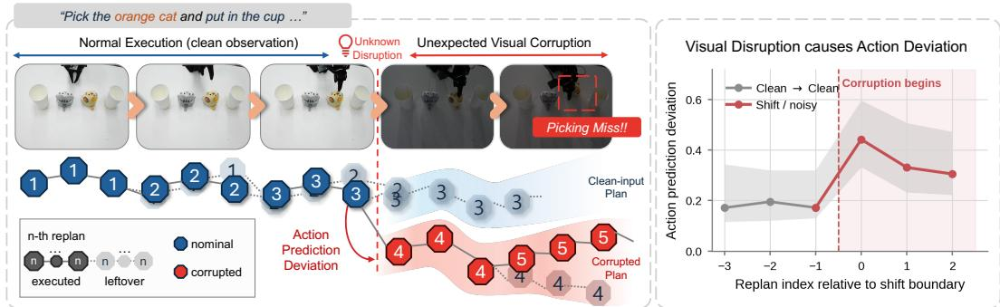

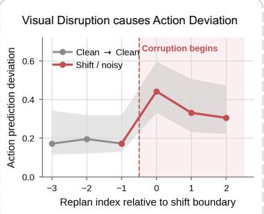  
Figure 1: Visual disruption during an ongoing task. A VLA begins executing under nominal observations, but an unexpected visual corruption can arise during execution and alter its subsequent action predictions. Left: an example of task failure under the visual disruption. Right: deviation between each new action chunk and the aligned leftover of the previous chunk. It stays small under nominal observations (gray) but jumps at the first corrupted replan (red). See Appendix H for details.

Building on this observation, we introduce Self-supervised Adaptation from Leftover Trajectories (SALT), a leftover-supervised mechanism for test-time adaptation of VLAs within the ongoing episode. Once adaptation is activated, SALT uses the previous chunk’s leftover as self-supervision under the current policy input, updates the policy, and regenerates the action chunk before execution. The same supervision plays two complementary roles. Across the visual shift, the nominal-side leftover can provide Transition Anchoring. Thereafter, SALT retains the adapted policy state and refreshes the leftover target at successive replans, yielding Sequential Correction Propagation along the execution trajectory. To deploy SALT when disruption timing is unknown, we use a lightweight adaptation gate calibrated only on nominal trajectories. The gate determines when these leftover-supervised updates begin without requiring annotations of the disruption type or timing.

We evaluate SALT on LIBERO-10 tasks (Liu et al., 2023) under five persistent visual corruptions from LIBERO-Plus (Fei et al., 2026). With SmolVLA (Shukor et al., 2025), SALT raises average success across corrupted conditions from 43.9% to 53.2%, and with GR00T N1.7 (Bjorck et al., 2025), it raises success from 58.7% to 66.0%, while largely preserving nominal performance. The leftover target approaches an oracle target that is unavailable at deployment. On SmolVLA, SALT reaches 53.2%, within 3.7 points of supervising with the policy’s clean-input prediction (56.9%), whereas other nominal targets, such as another episode’s plan, remain at or below the frozen level (43.9%). On a real robot, SALT raises task progress from 0.46 to 0.61 under digital disruptions and from 0.51 to 0.62 under physical disruptions such as switching of the lights or covering a camera. Because SALT relies only on the temporal overlap between consecutive action chunks for supervision, its core mechanism is compatible with action-chunked backbones without requiring architectural modifications.

## 2 Related Work

Robustness of VLA models under visual shifts. VLA policies have shown strong performance across diverse manipulation tasks (Zitkovich et al., 2023; Kim et al., 2025; Black et al., 2024; Bjorck et al., 2025), but visual shifts such as sensor noise and lighting changes can sharply degrade execution (Fei et al., 2026; Morgan et al., 2026). Prior work improves visual robustness through training on perturbed images (Xie et al., 2026) or learned visual adapters (Fu et al., 2026), intervenes on or restores observations at inference time while keeping the policy fixed (Hancock et al., 2025; Orjuela et al., 2026), or adapts from target-domain demonstrations (Kang et al., 2026; Li et al., 2026). Unlike these approaches, SALT updates the policy when a visual shift of unknown type and timing arises mid-episode, using only observations and action predictions from the ongoing rollout without target-domain demonstrations or corruption-specific training.

Test-time adaptation of policies. Test-time adaptation methods for visual perception update models from unlabeled test data through entropy-based objectives (Wang et al., 2021; Gong et al., 2023), teacher predictions (Wang et al., 2022; Döbler et al., 2023), or activation-statistics matching (Mirza et al., 2023). These objectives do not directly provide targets for temporally aligned continuous action chunks. VLA-specific approaches instead use delayed episode feedback (Zang et al., 2026), learned progress estimates (Bai et al., 2025; Liu et al., 2026), predicted and observed future images in visual-foresight policies (Park et al., 2026), a proxy task trained before deployment (Zhang et al., 2026), or additional exploratory rollouts (Chen et al., 2026). Several of these assume discrete action tokens or a future-image head and do not transfer directly to recent flow-based action experts. Unlike methods that depend on such feedback, auxiliary components, or extra rollouts, SALT uses temporally aligned leftover actions already generated during the same episode as targets for online updates, and applies to any action-chunked backbone.

Reusing overlapping action chunks. Prior work uses overlapping action chunks to improve execution: ACT temporally ensembles predictions (Zhao et al., 2023), SEAM smooths chunk transitions (Zhan et al., 2026), BID selects chunks consistent with previous actions (Liu et al., 2025), and RTC freezes actions committed during inference latency (Black et al., 2026). AAC adjusts the execution horizon from action uncertainty (Liang et al., 2026). These methods reuse overlapping predictions to improve inference-time continuity, chunk selection, or execution while keeping the policy parameters fixed. In contrast, SALT uses temporally aligned leftover actions as self-supervision for online policy updates under within-episode visual shifts, which to our knowledge has not been explored before.

## 3 Preliminaries and Problem Setting

## 3.1 Action-Chunked VLA Execution

Let $r _ { t }$ denote the �-th replan. At replan $r _ { t } ,$ , a VLA policy � predicts an action chunk from visual observation $o _ { t }$ , proprioceptive state $s _ { t } .$ , and task instruction $g \colon$

$$
\mathbf { A } _ { t } = [ \mathbf { a } _ { t , 0 } , \ldots , \mathbf { a } _ { t , H - 1 } ] \sim { \boldsymbol { \pi } } ( \cdot \mid o _ { t } , s _ { t } , g ) , \qquad \mathbf { A } _ { t } \in \mathbb { R } ^ { H \times d } ,\tag{1}
$$

where � is the prediction horizon and � is the action dimension. Executing only the first $E < H$ actions before replanning can help the robot respond to new observations (Liu et al., 2025; Liang et al., 2026). With $L = H { - } E$ the unexecuted leftover trajectory A� [�:�] and the next chunk’s prefix ${ \bf A } _ { t + 1 } \left[ 0 : L \right]$ cover the same future control interval (Figure 2). This temporal overlap provides the basis for the online self-supervision introduced in Section 4.

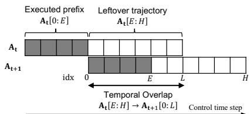  
Figure 2: Temporal overlap between consecutive chunks. The leftover trajectory ${ \bf A } _ { t } \left[ E ; H \right]$ and the next chunk’s prefix ${ \bf A } _ { t + 1 } \left[ 0 : L \right]$ cover the same future control interval. Indices mark action positions in ${ \bf A } _ { t + 1 }$ so position � of ${ \bf A } _ { t + 1 }$ and position $E + j$ of ${ \bf A } _ { t }$ refer to the same future control step.

## 3.2 Visual Disruptions During Execution

We consider episodes that begin under nominal visual conditions. An unknown visual disruption may change the visual input during execution. We call the resulting deviation a visual shift. Let $r _ { t ^ { \ast } }$ denote the first replan afected by this shift, marking the shift boundary from nominal visual observations $o _ { t } ^ { \mathrm { n o m } }$ to shifted visual observations $o _ { t } ^ { \mathrm { s h i f t } }$ . The task instruction, proprioception, embodiment, and action space remain unchanged. The policy’s visual input is

$$
\begin{array}{c} o _ { t } = \left\{ { { o _ { t } ^ { \mathrm { { n o m } } } } , \quad t < t ^ { * } , \atop { { o _ { t } ^ { \mathrm { { s h i f t } } } } , \quad t \end{array} } }  \right\}\tag{2}
$$

At deployment, neither the disruption type nor the shift boundary $t ^ { * }$ is known. The policy can use its current inputs and execution history, but has no paired nominal observation, expert action, or prior shifted-domain data. We allow access to a small set of nominal trajectories before deployment. The goal is to preserve the policy’s nominal task behavior under the shifted visual input without access to the corresponding nominal observation.

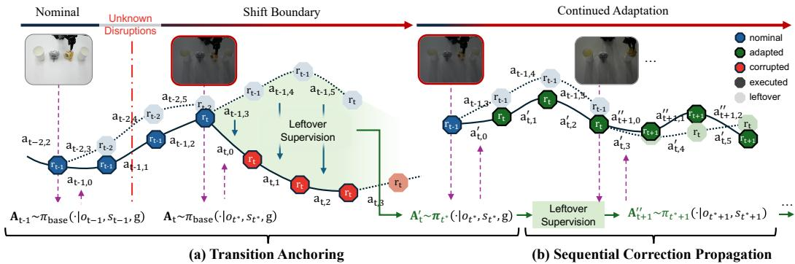  
Figure 3: SALT adapts to a visual disruption during execution. Illustrated with a chunk of $H = 6$ actions, of which $E = 3$ are executed and $L = 3$ remain as the leftover. (a) Transition Anchoring: at the shift boundary, the leftover of the chunk planned from the last nominal observation serves as the supervision target. SALT updates the policy under the shifted observation toward this leftover, pulling it toward the plan formed before the shift. (b) Sequential Correction Propagation: at later replans, the target is the leftover of the chunk regenerated by the adapted policy at the previous replan. Because the adapted policy is carried forward, each update refines the correction along the execution trajectory.

## 4 Method

We propose Self-supervised Adaptation from Leftover Trajectories (SALT), which repurposes the leftover trajectory introduced in Section 3.1 as self-supervision for online policy adaptation. Figure 3 illustrates the overall adaptation process. Across the shift boundary, Transition Anchoring provides a temporally aligned nominal-side action reference for correcting the policy under the shifted observation. As execution proceeds, the adapted policy is carried forward and the leftover supervision is repeatedly refreshed, yielding Sequential Correction Propagation along the execution trajectory. In deployment, a lightweight adaptation gate determines when these online updates begin.

## 4.1 Leftover Supervision

At replan $r _ { t }$ with $t \geq 1$ , we denote the leftover trajectory from the preceding action chunk by

$$
\mathbf { Y } _ { t } : = \mathbf { A } _ { t - 1 }  { [ E ; H ] } = [ \mathbf { a } _ { t - 1 , E } ,  { \mathrm {  ~ \cdot ~ } } ,  { \mathrm {  ~ \cdot ~ } } , \mathbf { a } _ { t - 1 , H - 1 } ] \in { \mathbb { R } } ^ { L \times d } .\tag{3}
$$

By construction, $\mathbf { Y } _ { t }$ and the prefix of the current action chunk, ${ \bf A } _ { t } \left[ 0 { : } L \right]$ , correspond to the same future control interval. More specifically, for each $j = 0 , \ldots , L - 1$ , the target action $\mathbf { Y } _ { t , j } = \mathbf { a } _ { t - 1 , E + j }$ and the current prediction $\mathbf { a } _ { t , j }$ refer to the same future control step. We call this one-to-one correspondence temporal alignment.

When adaptation is active, SALT treats $\mathbf { Y } _ { t }$ as a detached action-space target for updating the policy conditioned on the current input $\left( o _ { t } , s _ { t } , g \right)$ . Importantly, $\mathbf { Y } _ { t }$ contains planned actions for the shared future control interval rather than actions that have already been executed. Thus, SALT obtains its supervision directly from predictions produced during closed-loop execution.

## 4.2 Temporal Roles of Leftover Supervision

Transition Anchoring. At the shift boundary, the leftover target comes from a chunk generated under the nominal visual condition:

$$
\mathbf { A } _ { t ^ { * } - 1 } \sim \pi _ { t ^ { * } - 1 } \bigl ( \cdot \mid o _ { t ^ { * } - 1 } ^ { \mathrm { n o m } } , s _ { t ^ { * } - 1 } , g \bigr ) , \qquad \mathbf { Y } _ { t ^ { * } } : = \mathbf { A } _ { t ^ { * } - 1 } [ E : H ] .\tag{4}
$$

If no adaptation has occurred before the shift boundary, then $\pi _ { t ^ { * } - 1 } = \pi _ { \mathrm { b a s e } }$ . In either case, $\mathbf { Y } _ { t ^ { * } }$ is generated from a nominal visual observation, whereas the current policy input contains the shifted observation $o _ { t ^ { * } } ^ { \mathrm { s h i f t } }$ . Thus, at $t ^ { * }$ , the leftover and the current policy prediction difer in their visual conditioning.

Crucially, this change in visual mismatch does not introduce a temporal mismatch. Although $\mathbf { Y } _ { t } .$ ∗ was predicted from the preceding observation, $\mathbf { Y } _ { t ^ { * } }$ and ${ \bf A } _ { t ^ { * } } [ 0 ; L ]$ correspond to the same future control interval starting at $t ^ { * }$

Moreover, the leftover better preserves the nominal-side behavior of the frozen policy. Relative to the prediction that $\pi _ { \mathrm { b a s e } }$ produces from the clean observation at the current state, the leftover is substantially closer than the prediction produced from the current shifted observation (median $^ { 4 2 }$ -step $\ell _ { 2 }$ distance: 0.643 vs. 1.294 across 1,000 shiftboundary states; Figure 4). Thus, despite having been generated one action chunk earlier, the leftover retains a useful action-space reference for the behavior intended before the visual shift.

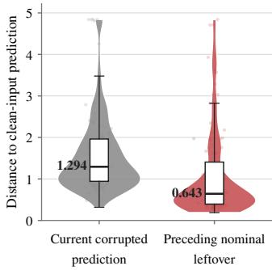

We refer to this cross-boundary use of the leftover trajectory as Transition Anchoring. When adaptation is active at the shift boundary, the update of Equation 7 (Section 4.3) takes the shifted observation $o _ { t ^ { * } } ^ { \mathrm { s h i f t } }$ as the policy input and the nominal-side leftover $\mathbf { Y } _ { t ^ { * } }$ as the target. This update pulls the policy under the shifted observation toward the plan formed before the shift.

Figure 4: Leftover quality at transition. Median 42-step $\ell _ { 2 }$ distance to the clean-input prediction across 1,000 pairs: 0.643 for the leftover and 1.294 for the corrupted-input prediction.

Sequential Correction Propagation. After a cross-boundary correction is established, subsequent active replans $r _ { t }$ with $t > t ^ { * }$ use refreshed leftover targets generated by the adapted policy under shifted observations:

$$
\mathbf { A } _ { t - 1 } \sim \pi _ { t - 1 } \bigl ( \cdot \mid o _ { t - 1 } ^ { \mathrm { s h i f t } } , s _ { t - 1 } , g \bigr ) , \qquad \mathbf { Y } _ { t } = \mathbf { A } _ { t - 1 } [ E : H ] , \qquad t > t ^ { * } ,\tag{5}
$$

where $\pi _ { t - 1 }$ already carries the updates made since activation. Each such replan applies Equation 7 with this target, generates $\mathbf { A } _ { t }$ from the updated policy, and keeps its tail as $\mathbf { Y } _ { t + 1 }$ . Thus, the transition target in Equation 4 originates from a policy prediction under a nominal observation, whereas subsequent targets are refreshed from the adapted policy operating under shifted observations. The adapted parameters are carried forward across these updates rather than reset to their pretrained initialization.

We refer to this cumulative process as Sequential Correction Propagation. Propagation here does not imply that a single transition-time update globally corrects the policy on distant future observations. Instead, Transition Anchoring seeds a cross-boundary correction, while subsequent updates locally refine this correction as execution reaches new trajectory regions. By carrying the adapted policy forward and repeatedly refreshing the leftover target, SALT progressively carries the anchor-seeded correction forward along the execution trajectory. Section $6 . 2$ probes this carryover at a fixed target observation (Figure 9(b)) and evaluates its closed-loop benefit.

## 4.3 Online Adaptation Pipeline

Sections 4.1 and 4.2 define the leftover supervision and temporal roles that constitute the SALT adaptation mechanism. We now describe how this mechanism is instantiated as an online deployment pipeline.

Adaptation gate. The shift boundary $t ^ { * }$ is unknown at deployment, so the pipeline uses a lightweight adaptation gate to determine when SALT begins updating. At each replan $r _ { t } ,$ we compare visual tokens $F _ { t }$ with those from the preceding replan, $F _ { t - 1 }$ . Adaptation is activated when the resulting temporal feature change exceeds a threshold calibrated on a disjoint set of nominal trajectories. Once activated, adaptation remains active for the rest of the episode. The gate determines when the policy may change, helping to reduce average computation (Appendix F.1). The feature-change score, calibration procedure, and activation statistics are provided in Appendix B and Appendix H.1.

Leftover-supervised policy update. For the flow-based VLA backbones considered in this work, we instantiate the leftover-supervised update using each backbone’s native flow-matching objective.

We write the policy at replan $r _ { t }$ as $\pi _ { t } \equiv \pi _ { \theta , \phi _ { t } }$ , where � denotes the frozen pretrained parameters and $\phi _ { t }$ denotes the adaptive parameters. SALT optimizes only a lightweight set of adaptive parameters associated with selected action-expert projections.

Table 1: Success rates (%) under five persistent visual corruptions on LIBERO-10. Avg. averages the five corrupted conditions. Clean is reported separately. Bold marks the best corruptedcondition result within each backbone.
<table><tr><td>Backbone</td><td>Method</td><td>Clean</td><td>Motion</td><td>Gaussian</td><td>Zoom</td><td>Glass</td><td>Fog</td><td>Avg.</td></tr><tr><td rowspan="5">SmolVLA</td><td>Frozen</td><td>71.5</td><td>63.0</td><td>25.0</td><td>29.0</td><td>56.5</td><td>46.0</td><td>43.9</td></tr><tr><td>ActMAD (Mirza et al., 2023)</td><td>74.5</td><td>60.0</td><td>29.0</td><td>31.0</td><td>54.0</td><td>48.5</td><td>44.5</td></tr><tr><td>BID (Liu et al., 2025)</td><td>69.5</td><td>63.0</td><td>27.0</td><td>32.5</td><td>57.0</td><td>50.5</td><td>46.0</td></tr><tr><td>Self-training</td><td>71.0</td><td>61.0</td><td>23.5</td><td>26.5</td><td>55.5</td><td>48.0</td><td>42.9</td></tr><tr><td>SALT</td><td>70.5</td><td>68.5</td><td>43.0</td><td>42.0</td><td></td><td>58.5 54.0</td><td>53.2</td></tr><tr><td rowspan="5">GR00T N1.7</td><td>Frozen</td><td>81.5</td><td>76.5</td><td>46.0</td><td>53.0</td><td>40.0</td><td>78.0</td><td>58.7</td></tr><tr><td>ActMAD (Mirza et al., 2023)</td><td>82.0</td><td>79.0</td><td>49.5</td><td>55.0</td><td>41.5</td><td>77.0</td><td>60.4</td></tr><tr><td>BID (Liu et al., 2025)</td><td>82.0</td><td>79.5</td><td>53.0</td><td>60.0</td><td>44.0</td><td>79.0</td><td>63.1</td></tr><tr><td>Self-training</td><td>82.0</td><td>77.5</td><td>41.5</td><td>52.0</td><td>32.5</td><td>80.5</td><td>56.8</td></tr><tr><td>SALT</td><td>82.0</td><td>78.5</td><td>55.5</td><td>63.5</td><td></td><td>54.0 78.5</td><td>66.0</td></tr></table>

To supervise the � aligned actions in $\mathbf { Y } _ { t } .$ , we pad the target to the full chunk shape as $\widetilde { \mathbf { Y } } _ { t }$ and define a binary mask � over the aligned positions and valid action dimensions. In a standard flow-matching formulation, for $\tau \sim \mathcal { U } [ 0 , \bar { 1 } ]$ and $\epsilon \sim { \cal N } ( 0 , I )$ , we construct

$$
X _ { \tau } = ( 1 - \tau ) \widetilde { \mathbf { Y } } _ { t } + \tau \epsilon
$$

and write the leftover-supervised objective for input $\left( o _ { t } , s _ { t } , g \right)$ and target $\mathbf { Y } _ { t }$ as

$$
\mathcal { L } ( \phi ; o _ { t } , s _ { t } , g , \mathbf { Y } _ { t } ) = \mathbb { E } _ { \tau , \epsilon } \left[ \left\| M \odot \left( \nu _ { \theta , \phi } ( X _ { \tau } , \tau , o _ { t } , s _ { t } , g ) - ( \epsilon - \widetilde { \mathbf { Y } } _ { t } ) \right) \right\| _ { F } ^ { 2 } \right] .\tag{6}
$$

At each active replan, the adaptive parameters are updated by gradient descent on Equation 6 starting from $\phi _ { t - 1 }$ , while $\mathbf { Y } _ { t }$ remains detached:

$$
\phi _ { t } = \phi _ { t - 1 } - \alpha \nabla _ { \phi } \mathcal { L } ( \phi _ { t - 1 } ; o _ { t } , s _ { t } , g , \mathbf { Y } _ { t } ) ,\tag{7}
$$

where � is the learning rate. Exact parameterization, backbone-specific flow conventions, and optimization hyperparameters are provided in Appendix B.

Execution. At an inactive replan, the predicted chunk is executed as is. At an active replan, SALT updates the adaptive parameters and regenerates the action chunk from the same input before execution. The robot then executes A� [0:�], and the regenerated chunk’s tail becomes $\mathbf { Y } _ { t + 1 }$

## 5 Experiments

## 5.1 Experimental Setup

We evaluate two VLA backbones, SmolVLA (Shukor et al., 2025) and GR00T N1.7 (Bjorck et al., 2025), in simulation. The real-world evaluation uses SmolVLA fine-tuned on the tabletop tasks and deployed on an SO-101 robot. We compare SALT with the frozen policy, ActMAD (Mirza et al., 2023), BID (Liu et al., 2025), and Self-training. ActMAD is a non-entropy-based test-time adaptation method that matches activation statistics; BID uses leftover actions for guided inference-time chunk selection. Self-training replaces the leftover target with the detached current prediction while matching SALT’s gate and update procedure. In both simulation and real-world trials, disruptions arise during execution without providing their type or timing to the policy, and all methods are evaluated under the same conditions within each setting. Implementation details for SALT and the baselines are given in Appendices B and C.

## 5.2 Simulation-Based Evaluation

Benchmark and visual disruptions. We evaluate all ten LIBERO-10 tasks (Liu et al., 2023), using 20 episodes per task and condition. We apply five LIBERO-Plus sensor-noise transformations:

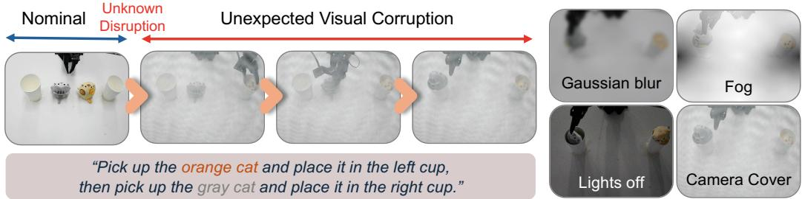  
Figure 5: Representative real-world visual disruptions. Nominal and disrupted observations are shown for Two Cats in Cups. Gaussian blur and fog are applied digitally to the camera stream; lights of and camera cover are physical disturbances introduced during execution.

motion blur, Gaussian blur, zoom blur, glass blur, and fog (Fei et al., 2026). Each is applied at severity 5 to both the agent-view and wrist-camera images. Figure 10 shows examples of the five corruptions across severity levels. Each disruption begins at a random point between 30% and 70% of a clean reference rollout, rounded to a replan, and persists until the episode ends. Robot state and language instruction remain unchanged. Methods with the same backbone share initial states and shift boundaries. We report task success, with clean performance shown separately and the five corrupted conditions weighted equally in Avg. Appendix A gives the full episode-construction protocol.

Main simulation results. Table 1 shows that SALT increases the corrupted-condition average from 43.9% to 53.2% on SmolVLA and from 58.7% to 66.0% on GR00T N1.7 relative to the frozen policies. It also exceeds the strongest baseline average by 7.2 and 2.9 percentage points, respectively. Relative to Frozen, success improves in all five corruption categories on both backbones, while clean success remains within one percentage point. The gains are largest where the frozen policies are particularly vulnerable: Gaussian and zoom blur for SmolVLA, and Gaussian, zoom, and glass blur for GR00T N1.7. Additional LIBERO suites and corruption severities are reported in Appendix D, and further deployment details in Appendix F.1.

## 5.3 Real-World Robot Evaluation

Tasks and disruption conditions. We evaluate three multi-stage tabletop tasks: Two Cats in Cups (place the orange and gray cats in the left and right cups), Drawer (place a block in a drawer and close it), and Stack (stack the middle block on the right block, then place the left block in a cup). During execution, we introduce visual disruptions digitally by applying Gaussian blur or fog to the camera streams, or physically by turning of the room lights or covering the overhead camera with a mesh. Figure 5 shows representative observations. Each disruption starts at a fixed replan about 30% into a successful nominal trial: replan 10 for Two Cats in Cups and Stack, and replan 6 for the shorter Drawer task. Each task-condition pair uses 20 trials per method. Since the tasks are long-horizon with multiple sub-goals, we report a task-progress score in [0, 1] that gives partial credit for completed sub-goals, following common practice for distinguishing partial completion in long-horizon manipulation (Zhang et al., 2025; Snyder et al., 2026). Scoring and robot-protocol details are in Appendix E.

Main real-world results. Figure 6 reports task progress under digital and physical disruptions. Across the three tasks and four conditions, SALT achieves the highest score in every cell except Stack under lights of. In that condition no method preserves meaningful progress. Averaged over the three tasks, SALT raises task progress over the frozen policy from 0.46 to 0.61 under the digital disruptions and from 0.51 to 0.62 under the physical ones. The second-best method varies with the task and condition, whereas SALT ranks consistently at the top. Lights of and camera cover change the physical scene and camera input rather than applying an image operator, so the gains under these conditions show that the benefit extends beyond simulated corruptions.

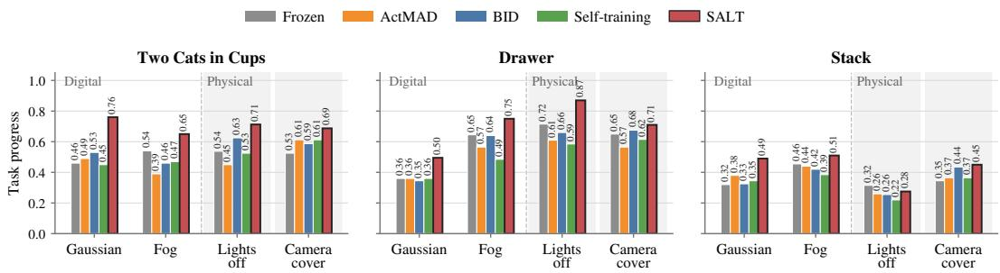  
Figure 6: Real-world task-progress score under digital and physical disruptions. Each bar averages 20 trials per method. A score of 1.0 means the task was completed.

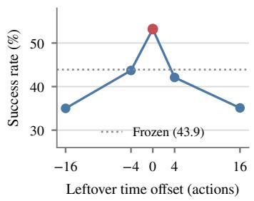  
(a) Temporal alignment.

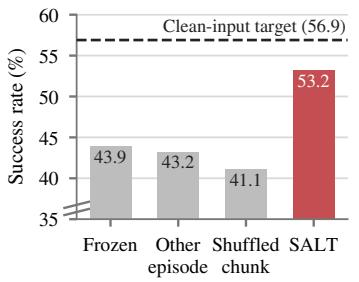  
(b) Target identity.

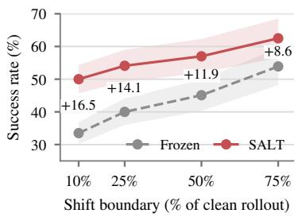  
(c) Shift timing.  
Figure 7: Leftover target properties and shift timing on SmolVLA. (a) Temporal alignment. Shifting the leftover away from its aligned position at ofset 0 reduces success to or below Frozen. (b) Target identity. Another episode’s plan and a time-shufled previous chunk remain at or below Frozen, while the aligned leftover approaches the clean-input prediction target. (c) Shift timing. Success when the shift boundary is fixed at four points of the clean rollout. Shaded bands show 95% confidence intervals. Exact values for (c) are reported in Table 11.

## 6 Analysis

## 6.1 Transition Anchoring: Why Is the Leftover a Good Target?

At the shift boundary, the leftover was planned from a nominal observation yet refers to the same future interval as the current prediction (Section 4.2), and learning from it moves the corrupted prediction toward the clean plan: under Gaussian blur, one update lowers the median ℓ2 distance to the clean-input prediction at the same state from 1.786 to 1.171 on SmolVLA (� = 200; Figure 8) and from 0.528 to 0.335 on GR00T N1.7 (Appendix G.2).

As shown in Figure 7(a), shifting the leftover by as few as four actions reduces success from 53.2% to the level of the frozen policy. This shows that the leftover is useful when its actions remain temporally aligned with the current future control interval. Figure 7(b) asks whether another nominal action target can provide the same benefit. Replacing the leftover with another episode’s plan for the same interval or a time-shufled previous chunk leaves performance at or below the frozen level, whereas the aligned leftover approaches the performance of the cleaninput prediction target. This shows that the target must also remain tied to the current trajectory rather than simply being a nominal action sequence. When the corruption is present from the first replan, no leftover has been generated from a nominal observation and adaptation leaves success nearly unchanged. We report this setting in Appendix I. Together, these results support the leftover as a temporally aligned nominal-side action reference at the visual transition.

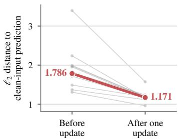  
Figure 8: One update narrows the clean-plan gap (SmolVLA, Gaussian blur; thin: tasks, thick: pooled).

<table><tr><td></td><td>Anchoring</td><td colspan="2">Propagation</td><td></td></tr><tr><td>Variant</td><td>Update at activation</td><td>Later updates</td><td>Adapted state kept Success</td><td></td></tr><tr><td>Frozen</td><td>X</td><td>X</td><td>X</td><td>43.9</td></tr><tr><td>One-time adaptation</td><td>O</td><td>X</td><td>X</td><td>45.5</td></tr><tr><td>Without anchoring</td><td>X</td><td>O</td><td>O</td><td>48.9</td></tr><tr><td>Per-replan reset</td><td>C</td><td></td><td>X</td><td>45.0</td></tr><tr><td>SALT</td><td></td><td></td><td></td><td>53.2</td></tr></table>

(a) Ablations.

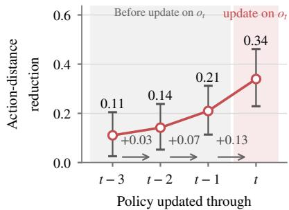  
(b) Sequential correction.  
Figure 9: Roles and propagation of leftover-supervised updates on SmolVLA. (a) Ablations of the two roles: success over the 1,000 episodes of Table 1; without anchoring skips only the update at the shift boundary. (b) Sequential correction: normalized ℓ2-distance reduction for policies updated through replan $t - 3 , \ldots , t$ (40 replayed clean trajectories, five corruptions; 95% bootstrap intervals). All policies are evaluated on the same $o _ { t }$

## 6.2 Sequential Correction Propagation: Benefits of Continued Updates

Figure 9(a) examines how Sequential Correction Propagation complements the transition-time correction established by Transition Anchoring. Full SALT reaches 53.2% success. In contrast, a single update at activation reaches 45.5%, and continued updates that restart from the pretrained weights at each replan reach 45.0%. Removing the transition-time update also lowers performance. These ablations show that both Transition Anchoring and Sequential Correction Propagation are needed to achieve the full improvement of SALT.

The action-space analysis in Figure 9(b) shows how Sequential Correction Propagation carries the correction forward to observations that have not yet been seen. On the same later observation $o _ { t } .$ policies updated through � −3, � −2, and � −1 already reduce the distance to the clean-input prediction, even though none has been updated on $o _ { t }$ . The reduction becomes larger as the adapted state is carried closer to $t ,$ and updating on $o _ { t }$ provides an additional local correction. This shows that corrections from earlier replans can transfer to future observations, while repeated updates continue to refresh and strengthen that efect along the execution trajectory.

By refreshing the leftover target and carrying the adapted state forward at each replan, SALT continues correcting its predictions as the robot reaches new observations. SALT also shows larger improvements over Frozen when disruptions begin earlier in the rollout, despite the corruption afecting a larger fraction of the rollout, as shown in Figure 7(c). Leftover supervision also helps when the corruption increases gradually or clears after several replans, with additional results reported in Appendix I.

## 7 Conclusion

In this work, we study online adaptation of VLAs to visual disruptions whose type and timing are unknown to the deployed policy. We propose SALT, which uses the unexecuted leftover trajectory of the previous action chunk as self-supervision. Because the leftover and the next chunk’s prefix cover the same future control interval, their temporal alignment provides action-space supervision within the ongoing rollout. Unlike prior work that reuses overlapping action chunks to improve execution with the policy parameters fixed, SALT uses this overlap to update the policy itself. The leftover supervision plays two complementary roles, Transition Anchoring across the shift boundary and Sequential Correction Propagation as execution continues. Across simulation and a real robot, SALT improves performance under visual disruptions. More broadly, our results suggest that the temporal overlap in action-chunked execution is an underused resource for test-time adaptation of robot policies.

## References

Zechen Bai, Chen Gao, and Mike Zheng Shou. Evolve-vla: Test-time training from environment feedback for vision-language-action models. arXiv preprint arXiv:2512.14666, 2025.

Johan Bjorck, Fernando Castañeda, Nikita Cherniadev, Xingye Da, Runyu Ding, Linxi Fan, Yu Fang, Dieter Fox, Fengyuan Hu, Spencer Huang, et al. Gr00t n1: An open foundation model for generalist humanoid robots. arXiv preprint arXiv:2503.14734, 2025.

Kevin Black, Noah Brown, Danny Driess, Adnan Esmail, Michael Equi, Chelsea Finn, Niccolo Fusai, Lachy Groom, Karol Hausman, Brian Ichter, et al. �0: A Vision-Language-Action flow model for general robot control. arXiv preprint arXiv:2410.24164, 2024.

Kevin Black, Manuel Galliker, and Sergey Levine. Real-time execution of action chunking flow policies. Advances in Neural Information Processing Systems, 38:33383–33407, 2026.

Siyao Chen, Jiakang Yuan, Jiaxin Wang, and Tao Chen. Trust your instincts: Confidence-driven test-time rl for vision-language-action models. In European Conference on Computer Vision, pp. 478–495. Springer, 2026.

Mario Döbler, Robert A Marsden, and Bin Yang. Robust mean teacher for continual and gradual test-time adaptation. In Proceedings of the IEEE/CVF Conference on Computer Vision and Pattern Recognition, pp. 7704–7714, 2023.

Senyu Fei, Siyin Wang, Junhao Shi, Zihao Dai, Jikun Cai, Pengfang Qian, Li Ji, Xinzhe He, Shiduo Zhang, Zhaoye Fei, et al. Libero-plus: A progressive robustness benchmark for visual-languageaction models. In Proceedings of the IEEE/CVF Conference on Computer Vision and Pattern Recognition, pp. 38574–38583, 2026.

Yiyang Fu, Chubin Zhang, Shukai Gong, Yufan Deng, Kaiwei Sun, Qiyang Min, Qibin Hou, Yansong Tang, Jianan Wang, and Daquan Zhou. Stablevla: Towards robust vision-language-action models without extra data. In International Conference on Machine Learning (ICML), 2026.

Taesik Gong, Yewon Kim, Taeckyung Lee, Sorn Chottananurak, and Sung-Ju Lee. Sotta: Robust test-time adaptation on noisy data streams. Advances in Neural Information Processing Systems, 36:14070–14093, 2023.

Asher J Hancock, Allen Z Ren, and Anirudha Majumdar. Run-time observation interventions make vision-language-action models more visually robust. In 2025 IEEE International Conference on Robotics and Automation (ICRA), pp. 9499–9506. IEEE, 2025.

Taewook Kang, Taeheon Kim, Donghyun Shin, and Jonghyun Choi. Domain arithmetic: One-shot vla adaptation under environmental shifts. In ECCV, 2026.

Moo Jin Kim, Karl Pertsch, Siddharth Karamcheti, Ted Xiao, Ashwin Balakrishna, Suraj Nair, Rafael Rafailov, Ethan P Foster, Pannag R Sanketi, Quan Vuong, Thomas Kollar, Benjamin Burchfiel, Russ Tedrake, Dorsa Sadigh, Sergey Levine, Percy Liang, and Chelsea Finn. Openvla: An open-source vision-language-action model. In Pulkit Agrawal, Oliver Kroemer, and Wolfram Burgard (eds.), Proceedings of The 8th Conference on Robot Learning, volume 270 of Proceedings of Machine Learning Research, pp. 2679–2713. PMLR, 06–09 Nov 2025. URL https:// proceedings.mlr.press/v270/kim25c.html.

Weiqi Li, Quande Zhang, Ruifeng Zhai, Liang Lin, and Guangrun Wang. Vla models are more generalizable than you think: Revisiting physical and spatial modeling. In Proceedings of the IEEE/CVF Conference on Computer Vision and Pattern Recognition, pp. 35025–35035, 2026.

Yuanchang Liang, Xiaobo Wang, Kai Wang, Shuo Wang, Xiaojiang Peng, Haoyu Chen, David Kim Huat Chua, and Prahlad Vadakkepat. Adaptive action chunking at inference-time for visionlanguage-action models. In Proceedings of the IEEE/CVF Conference on Computer Vision and Pattern Recognition, pp. 20802–20811, 2026.

Vijay Lingam, Atula Tejaswi, Aditya Vavre, Aneesh Shetty, Gautham K Gudur, Joydeep Ghosh, Alex Dimakis, Eunsol Choi, Aleksandar Bojchevski, and Sujay Sanghavi. Svft: Parametereficient fine-tuning with singular vectors. Advances in neural information processing systems, 37:41425–41446, 2024.

Bo Liu, Yifeng Zhu, Chongkai Gao, Yihao Feng, Qiang Liu, Yuke Zhu, and Peter Stone. Libero: Benchmarking knowledge transfer for lifelong robot learning. Advances in Neural Information Processing Systems, 36:44776–44791, 2023.

Changyu Liu, Yiyang Liu, Taowen Wang, Qiao Zhuang, James Chenhao Liang, Wenhao Yang, Renjing Xu, Qifan Wang, Dongfang Liu, and Cheng Han. On-the-fly vla adaptation via testtime reinforcement learning. In Proceedings of the 64th Annual Meeting of the Association for Computational Linguistics (Volume 1: Long Papers), pp. 40107–40125, 2026.

Yuejiang Liu, Jubayer Hamid, Annie Xie, Yoonho Lee, Max Du, and Chelsea Finn. Bidirectional decoding: Improving action chunking via guided test-time sampling. In International Conference on Learning Representations, volume 2025, pp. 4594–4627, 2025.

Muhammad Jehanzeb Mirza, Pol Jané Soneira, Wei Lin, Mateusz Kozinski, Horst Possegger, and Horst Bischof. Actmad: Activation matching to align distributions for test-time-training. In Proceedings of the IEEE/CVF Conference on Computer Vision and Pattern Recognition, pp. 24152–24161, 2023.

Jeremy Morgan, Prajwal Vijay, Hyeonho Oh, Jincen Song, Ashvin Arora, Alina Du, Gaurav Sukhatme, Jesse Thomason, and Ishika Singh. Colosseum v2: Benchmarking generalization for vision language action models. arXiv preprint arXiv:2605.27759, 2026.

Octo Model Team, Dibya Ghosh, Homer Walke, Karl Pertsch, Kevin Black, Oier Mees, Sudeep Dasari, Joey Hejna, Charles Xu, Jianlan Luo, Tobias Kreiman, You Liang Tan, Lawrence Yunliang Chen, Pannag Sanketi, Quan Vuong, Ted Xiao, Dorsa Sadigh, Chelsea Finn, and Sergey Levine. Octo: An open-source generalist robot policy. In Proceedings ofRobotics: Science and Systems, Delft, Netherlands, 2024.

Daniel Yezid Guarnizo Orjuela, Leonardo Scappatura, Veronica Di Gennaro, Riccardo Andrea Izzo, Gianluca Bardaro, and Matteo Matteucci. Improving robustness of vision-language-action models by restoring corrupted visual inputs. arXiv preprint arXiv:2602.01158, 2026.

Sangwu Park, Wonjoong Kim, Yeonjun In, Sein Kim, Hongseok Kang, and Chanyoung Park. Testtime training for visual foresight vision-language-action models. arXiv preprint arXiv:2605.08215, 2026.

Mustafa Shukor, Dana Aubakirova, Francesco Capuano, Pepijn Kooijmans, Steven Palma, Adil Zouitine, Michel Aractingi, Caroline Pascal, Martino Russi, Andres Marafioti, Simon Alibert, Matthieu Cord, Thomas Wolf, and Remi Cadene. Smolvla: A vision-language-action model for afordable and eficient robotics, 2025. URL https://arxiv.org/abs/2506.01844.

David Snyder, Apurva Badithela, Nikolai Matni, George Pappas, Anirudha Majumdar, Masha Itkina, and Haruki Nishimura. Beyond binary success: Sample-eficient and statistically rigorous robot policy comparison. arXiv preprint arXiv:2603.13616, 2026.

Yanpeng Sun, Qiang Chen, Xiangyu He, Jian Wang, Haocheng Feng, Junyu Han, Errui Ding, Jian Cheng, Zechao Li, and Jingdong Wang. Singular value fine-tuning: Few-shot segmentation requires few-parameters fine-tuning. Advances in neural information processing systems, 35: 37484–37496, 2022.

Dequan Wang, Evan Shelhamer, Shaoteng Liu, Bruno Olshausen, and Trevor Darrell. Tent: Fully test-time adaptation by entropy minimization. In International Conference on Learning Representations, 2021. URL https://openreview.net/forum?id=uXl3bZLkr3c.

Qin Wang, Olga Fink, Luc Van Gool, and Dengxin Dai. Continual test-time domain adaptation. In Proceedings ofConference on Computer Vision and Pattern Recognition, 2022.

Yuhan Xie, Yuping Yan, Yunqi Zhao, Handing Wang, and Yaochu Jin. Strong-vla: Decoupled robustness learning for vision-language-action models under multimodal perturbations. arXiv preprint arXiv:2604.10055, 2026.

Zehua Zang, Xi Wang, Fuchun Sun, Xiao Xu, Lixiang Liu, Jiahuan Zhou, and Jiangmeng Li. Testtime perturbation tuning with delayed feedback for vision-language-action models. In Proceedings of the IEEE/CVF Conference on Computer Vision and Pattern Recognition (CVPR), pp. 8110– 8119, June 2026.

Dijia Zhan, Xuemiao Xu, Jinyi Li, and Jie Tang. Seam: Smooth execution of action-chunked motion for vision-language-action policies. arXiv preprint arXiv:2607.04609, 2026.

Shiduo Zhang, Zhe Xu, Peiju Liu, Xiaopeng Yu, Yuan Li, Qinghui Gao, Zhaoye Fei, Zhangyue Yin, Zuxuan Wu, Yu-Gang Jiang, and Xipeng Qiu. Vlabench: A large-scale benchmark for language-conditioned robotics manipulation with long-horizon reasoning tasks. In Proceedings of the IEEE/CVF International Conference on Computer Vision (ICCV), pp. 11142–11152, October 2025.

Wenbo Zhang, Jianxiong Li, Shuai Yang, Sijin Chen, Jiajun Liu, Lingqiao Liu, and Xiao Ma. Ttt-vla: Test-time latent prompt optimization for vision-language-action models. arXiv preprint arXiv:2606.03127, 2026.

Tony Z Zhao, Vikash Kumar, Sergey Levine, and Chelsea Finn. Learning fine-grained bimanual manipulation with low-cost hardware. arXiv preprint arXiv:2304.13705, 2023.

Brianna Zitkovich, Tianhe Yu, Sichun Xu, Peng Xu, Ted Xiao, Fei Xia, Jialin Wu, Paul Wohlhart, Stefan Welker, Ayzaan Wahid, Quan Vuong, Vincent Vanhoucke, Huong Tran, Radu Soricut, Anikait Singh, Jaspiar Singh, Pierre Sermanet, Pannag R. Sanketi, Grecia Salazar, Michael S. Ryoo, Krista Reymann, Kanishka Rao, Karl Pertsch, Igor Mordatch, Henryk Michalewski, Yao Lu, Sergey Levine, Lisa Lee, Tsang-Wei Edward Lee, Isabel Leal, Yuheng Kuang, Dmitry Kalashnikov, Ryan Julian, Nikhil J. Joshi, Alex Irpan, Brian Ichter, Jasmine Hsu, Alexander Herzog, Karol Hausman, Keerthana Gopalakrishnan, Chuyuan Fu, Pete Florence, Chelsea Finn, Kumar Avinava Dubey, Danny Driess, Tianli Ding, Krzysztof Marcin Choromanski, Xi Chen, Yevgen Chebotar, Justice Carbajal, Noah Brown, Anthony Brohan, Montserrat Gonzalez Arenas, and Kehang Han. Rt-2: Vision-language-action models transfer web knowledge to robotic control. In Jie Tan, Marc Toussaint, and Kourosh Darvish (eds.), Proceedings of The 7th Conference on Robot Learning, volume 229 of Proceedings of Machine Learning Research, pp. 2165–2183. PMLR, 06–09 Nov 2023. URL https://proceedings.mlr.press/v229/zitkovich23a.html.

glass\_blur  
fog  
gaussian\_blur  
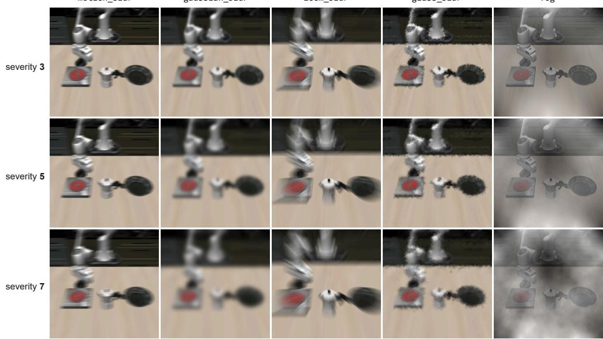  
Figure 10: Visual corruption examples by severity. The five LIBERO-Plus corruption families at severity levels 3, 5, and 7.

## A Evaluation Details

Episodes. Each LIBERO-10 task is evaluated from 20 initial states per condition. The corruption begins at a random point between 30% and 70% of a clean rollout of the frozen policy from the same initial state, rounded to a replan, and persists until the episode ends. All methods of a backbone share the initial states and shift boundaries. The clean rollouts only schedule the shift boundaries; they are never given to SALT.

Corruptions. The five corruptions and their severity levels follow the sensor-noise perturbations of LIBERO-Plus (Fei et al., 2026) (Table 2); level 5 is used unless stated otherwise. Unlike LIBERO-Plus, which corrupts only the agent-view image, we corrupt both the agent-view and wrist images, since disruptions of the scene, such as a change in lighting, reach every camera. Results under the default LIBERO-Plus setting, which corrupts only the agent view, are in Table 4. The realrobot camera-cover condition covers the case in which only one camera is disrupted (Appendix E). Figure 10 visualizes the five corruption families across the evaluated severity levels.

Table 2: Corruption parameters by severity level, taken from the LIBERO-Plus tables. Zoom blur averages the image over zoom factors from 1.0 to the listed maximum in the listed step.
<table><tr><td>Corruption</td><td>Parameters</td><td>Level 3</td><td>Level 5</td><td>Level 7</td></tr><tr><td>Motion blur</td><td>radius, σ (px)</td><td>10,4</td><td>15,6</td><td>20,10</td></tr><tr><td>Gaussian blur</td><td>σ (px)</td><td>3</td><td>5</td><td>7</td></tr><tr><td>Zoom blur</td><td>max. zoom (step)</td><td>1.20 (0.02)</td><td>1.30 (0.03)</td><td>1.40 (0.01)</td></tr><tr><td>Glass blur Fog</td><td>σ, displacement, iterations strength, decay</td><td>0.9, 2, 3 1.5,2.5</td><td>1.1, 3,2 2.5, 2.0</td><td>1.5,4, 2 3.5, 1.6</td></tr></table>

Calibration. For each backbone, the adaptation gate is calibrated on 20 nominal trajectories from five tasks, which are disjoint from the evaluation episodes and contain no corrupted frames. The update hyperparameters in Table 3 are shared by both backbones, all corruptions, the other LIBERO suites, and the real robot.

Statistics. Each corruption has 200 episodes, and the corruption average weights the five families equally. Because episodes are paired across methods, �-values are two-sided exact binomial tests on the episodes that only one of two methods solves. Intervals for action-space diagnostics resample task–episode clusters.

## B Method Details

## B.1 Online Algorithm

At the start of every episode, the adaptive parameters are set to zero, the optimizer state is cleared, and the gate is inactive. At each replan:

1. Obtain the current observation and a provisional action chunk together with the interface features.

2. If the gate is inactive, compute the feature-change score (Equation 11) and latch the gate when it exceeds the calibrated threshold. Once latched, the gate stays active for the rest of the episode.

3. If the gate is active and a previous chunk exists, form the detached leftover target from its unexecuted tail, take five Adam steps on Equation 6, and regenerate the chunk with the updated policy.

4. Otherwise, use the provisional chunk.

5. Execute the first � actions and keep the chunk for the next target.

The update is synchronous: execution waits for the regenerated chunk.

## B.2 Updated Parameters

In Equation 6, � consists of log-scale vectors � on selected attention key projections. This parameterization builds on singular-value fine-tuning (SVF), which updates singular values while fixing the singular vectors (Sun et al., 2022). It is also a diagonal case of SVFT, which more generally learns sparse coeficients in the singular-vector basis (Lingam et al., 2024). We use bounded multiplicative scales:

$$
\begin{array} { c } { { W _ { 0 } = U \mathrm { d i a g } ( { \pmb \sigma } ) V ^ { \top } , } } \\ { { W ( { \pmb \beta } ) = U \mathrm { d i a g } ( { \pmb \sigma } \odot \exp ( { \pmb \beta } ) ) V ^ { \top } , } } \\ { { \pmb \beta ^ { ( 0 ) } = { \bf 0 } , \qquad \| { \pmb \beta } \| _ { \infty } \leq \eta . } } \end{array}\tag{8}
$$

The elementwise exponential makes $\beta = \mathbf { 0 }$ recover $W _ { 0 }$ . Clipping $\| \beta \| _ { \infty } \leq \eta$ bounds each singular value within $[ e ^ { - \eta } \dot { \sigma _ { i } } , e ^ { \eta } \sigma _ { i } ]$ while keeping the singular directions fixed. The decomposition is computed once when the gates are attached. The learning rate is set to $2 \eta / K$ for � optimizer steps, so that the bound is reachable within one update. The target is stored without gradients, and the masked squared error is averaged over the supervised entries. Table 3 lists the model-specific settings.

Table 3: Model-specific implementation.
<table><tr><td>Setting</td><td>SmolVLA</td><td>GR00T N1.7</td></tr><tr><td>Checkpoint</td><td>SmolVLA fine-tuned on LIBERO</td><td>GR00T N1.7 LIBERO-10</td></tr><tr><td>Chunk H / executed prefix E / overlap L</td><td>50/8/42</td><td>16/8/8</td></tr><tr><td>Adapted projections</td><td>keys of the 8 cross-attention layers of the action expert</td><td>keys of the 16 cross-attention blocks of the action-head DiT</td></tr><tr><td>Trainable scales</td><td>2,560</td><td>24,576</td></tr><tr><td>Bound η</td><td>0.15</td><td>0.15</td></tr><tr><td>Optimizer</td><td>Adam, lr 0.06, 5 steps</td><td>Adam, lr 0.06, 5 steps</td></tr><tr><td>Noise-time draws per step</td><td>8, flow times evenly</td><td>8, native beta</td></tr><tr><td>Supervised action dimensions</td><td>spaced on [0.001, 1] 7</td><td>time sampling 7</td></tr><tr><td>Reset</td><td>every episode</td><td>every episode</td></tr></table>

## B.3 GR00T Flow Convention

The main-text flow equation is written in the SmolVLA convention, with the action target at $\tau = 0 .$ Gaussian noise at $\tau = 1$ , and target velocity $\epsilon - \widetilde { Y } _ { t }$ . GR00T retains its native reverse-time convention. For flow time $\tau ^ { \prime }$ drawn from the pretrained action head’s native time distribution, it constructs

$$
X _ { \tau ^ { \prime } } = ( 1 - \tau ^ { \prime } ) \epsilon + \tau ^ { \prime } \widetilde { Y } _ { t } , \qquad U _ { \tau ^ { \prime } } = \widetilde { Y } _ { t } - \epsilon .\tag{9}
$$

Thus, under $\tau ^ { \prime } = 1 - \tau$ , the two conventions traverse the same linear noise–action path with opposite velocity directions. Our GR00T implementation invokes the native action-head objective, including its beta-based time sampling and timestep discretization. We replicate the target and mask across eight noise–time draws at each optimizer step.

## B.4 Adaptation Gate

Let $F _ { r } \in \mathbb { R } ^ { N \times D }$ denote the interface tokens from the provisional pass at replan �. The temporal cosine change of token � is

$$
d _ { r , i } = 1 - { \frac { \langle F _ { r - 1 , i } , F _ { r , i } \rangle } { \| F _ { r - 1 , i } \| _ { 2 } \| F _ { r , i } \| _ { 2 } } } .\tag{10}
$$

Calibration supplies token-wise robust centers $m _ { i }$ and scales $s _ { i } ,$ , a shared scale floor, and the threshold. SALT aggregates standardized one-sided changes as

$$
S _ { r } = \frac { 1 } { N } \sum _ { i = 1 } ^ { N } \mathrm { c l i p } \left( \frac { d _ { r , i } - m _ { i } } { s _ { i } } , 0 , \kappa \right) .\tag{11}
$$

We take $m _ { i }$ as the median and $s _ { i }$ as 1.4826 times the median absolute deviation of the nominal changes at token $i ,$ and floor every $s _ { i }$ at a quarter of the median scale, so that a token which barely moves under nominal conditions cannot turn a small change into a large score. The score cap is $\kappa = 1 0$ . The threshold is cross-fitted by leaving out one calibration task at a time: the statistics are refit on the remaining tasks, every held-out nominal episode contributes its maximum score, and the threshold is 0.9 times the largest of those maxima. The deployed $m _ { i } , s _ { i }$ are then refit on all calibration episodes. The detector reads the agent-view stream for backbones whose interface is one tensor per camera, and the leading vision block of the sequence for backbones that emit vision and language fused; token norms are floored before the cosine. The same rule, floor, and cap are used for every model and corruption; only the threshold is recomputed per model.

## C Comparison Methods

ActMAD. ActMAD (Mirza et al., 2023) aligns the means and variances of test-time activations with statistics of nominal data. For SmolVLA, the statistics cover the outputs of all 12 vision-encoder layers and are computed from 1,888 nominal frames of initial states 20–23 of all ten tasks. At every replan, from the start of the episode and without a gate, the vision encoder takes one SGD step (learning rate $2 . 5 \times 1 0 ^ { - 4 }$ , momentum 0.9, weight decay $5 \times 1 0 ^ { - 4 } )$ on a batch of the eight most recent frames. For GR00T N1.7, the statistics cover all 24 blocks of the vision transformer, computed from 1,593 nominal frames of the same initial states, and the update uses a learning rate of $\phantom { - } 2 . 5 \times 1 0 ^ { - 6 }$ with float32 master weights; the SmolVLA rate made the GR00T policy fail on every clean episode.

BID. BID (Liu et al., 2025) samples $N = 1 6$ candidate chunks at every replan and selects one using backward coherence with the previous chunk (decay $\rho = 0 . 5 )$ and forward contrast against samples from a strong and a weak policy (mode size $K = 3 )$ . The weak policy is an early checkpoint of the same model: SmolVLA fine-tuned on LIBERO for 2,500 steps, and GR00T N1.7 fine-tuned for 1,000 of 10,000 steps. BID therefore uses a second model and a larger sampling budget than the frozen policy.

Self-training. This control replaces the leftover target with the detached chunk that the policy has just produced from the current observation, supervising all � positions. The observation, updated parameters, optimizer, number of update steps, and gate are matched to SALT.

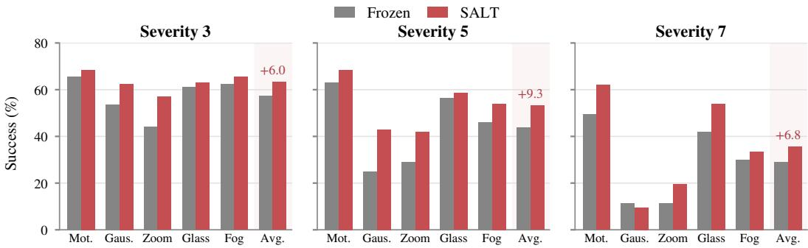  
Figure 11: SmolVLA success rate (%) on LIBERO-10 across corruption severity. Frozen and SALT are evaluated on 200 episodes per corruption and severity. Mot. and Gaus. abbreviate motion and Gaussian blur; Avg. excludes clean episodes. Numbers above Avg. are SALT gains in percentage points.

## D Additional Results

Other LIBERO suites. Table 5 applies the same protocol to LIBERO-Spatial, LIBERO-Object, and LIBERO-Goal, each with ten tasks and 20 episodes per task and corruption. Each suite has its own gate threshold, calibrated with the rule of Appendix A on nominal trajectories of that suite. Averaged over the three suites, SALT raises SmolVLA from 74.3% to 79.4% and GR00T N1.7 from 87.6% to 89.8%. On SmolVLA, clean success is unchanged on LIBERO-Object (93.5%) and LIBERO-Goal (87.0%) and moves from 80.5% to 79.0% on LIBERO-Spatial. The gains concentrate where the frozen policy loses most; on GR00T LIBERO-Spatial, whose frozen success is already within four points of clean, SALT is level on average and lowers Gaussian-blur success.

Corruption severity. Figure 11 shows SmolVLA success on LIBERO-10 at severity levels 3, 5, and 7 (Table 2). The severity-5 values correspond to the main results in Table 1.

Table 4: Agent-view-only corruption (SmolVLA, LIBERO-10, success %). The wrist image stays clean. 200 episodes per cell.
<table><tr><td>Method</td><td>Motion</td><td>Gaussian</td><td>Zoom</td><td>Glass</td><td>Fog</td><td>Avg.</td></tr><tr><td>Frozen</td><td>70.0</td><td>43.0</td><td>39.0</td><td>65.5</td><td>52.5</td><td>54.0</td></tr><tr><td>SALT</td><td>70.5</td><td>57.0</td><td>54.0</td><td>64.5</td><td>56.0</td><td>60.4</td></tr></table>

## E Real-World Protocol

Tasks and policy. We evaluate three multi-stage tabletop tasks:

• Two Cats in Cups: “Pick up the orange cat and place it in the left cup, then pick up the gray cat and place it in the right cup.”

• Drawer: “Pick up the block and put it in the drawer then close it.”

• Stack: “Stack the middle block on top of the right block, then pick up the left block and place it in the cup.”

Figure 12 shows the stages of these tasks.

The policy is SmolVLA fine-tuned on demonstrations of the tabletop tasks with the vision encoder frozen. It reads an overhead and a wrist camera together with the joint state, and the arm is controlled at 30 Hz. Each replan predicts a 50-action chunk and executes its first 25 actions, so the leftover contains 25 actions. The gate is calibrated on nominal robot rollouts that are not part of the evaluation, and the adaptation settings match simulation.

Table 5: Results across LIBERO suites. Success rate (%) under persistent severity-5 corruption, 1,000 episodes per suite and method.
<table><tr><td>Backbone</td><td>Suite</td><td>Method</td><td>Motion</td><td>Gaussian</td><td>Zoom</td><td>Glass</td><td>Fog</td><td>Avg.</td></tr><tr><td rowspan="5">SmolVLA</td><td>Spatial</td><td>Frozen SALT</td><td>74.5 75.5</td><td>56.5 70.5</td><td>48.0 68.0</td><td>75.0 75.5</td><td>74.5 72.0</td><td>65.7 72.3</td></tr><tr><td>Object</td><td>Frozen SALT</td><td>93.0 91.5</td><td>75.5 88.0</td><td>67.5 86.5</td><td>92.5 91.0</td><td>92.5 89.5</td><td>84.2 89.3</td></tr><tr><td>Goal</td><td>Frozen SALT</td><td>80.5</td><td>67.5</td><td>57.5</td><td>79.5</td><td>80.5</td><td>73.1</td></tr><tr><td></td><td>Frozen</td><td>83.0 63.0</td><td>67.5 25.0</td><td>72.0 29.0</td><td>81.0 56.5</td><td>79.5</td><td>76.6</td></tr><tr><td>Long (LIBERO-10)</td><td>SALT</td><td>68.5</td><td>43.0</td><td>42.0</td><td>58.5</td><td>46.0 54.0</td><td>43.9 53.2</td></tr><tr><td rowspan="5">GR00T N1.7</td><td>Spatial</td><td>Frozen SALT</td><td>91.0 92.5</td><td>87.0 81.0</td><td>86.0 90.5</td><td>88.5 89.0</td><td>90.5 91.0</td><td>88.6 88.8</td></tr><tr><td>Object</td><td>Frozen SALT</td><td>94.5 95.0</td><td>88.0 91.5</td><td>92.0 93.0</td><td>92.0 93.0</td><td>94.5 94.5</td><td>92.2 93.4</td></tr><tr><td>Goal</td><td>Frozen SALT</td><td>89.0 89.0</td><td>71.0 81.5</td><td>82.0 86.5</td><td>74.0</td><td>93.5</td><td>81.9</td></tr><tr><td>Long (LIBERO-10)</td><td>Frozen</td><td>76.5</td><td>46.0</td><td>53.0</td><td>85.0 40.0</td><td>94.0 78.0</td><td>87.2</td></tr><tr><td></td><td>SALT</td><td>78.5</td><td>55.5</td><td>63.5</td><td>54.0</td><td>78.5</td><td>58.7 66.0</td></tr></table>

Disruptions. Each disruption begins at a fixed replan about 30% into a successful nominal trial (median length 35 replans on Two Cats in Cups, 34 on Stack, and 20 on Drawer): replan 10 for Two Cats in Cups and Stack, and replan 6 for Drawer. Gaussian blur and fog are applied at severity 5 to both camera streams before inference, using the same implementation as in simulation. For the physical disruptions, the operator switches of the room lights or places a mesh in front of the overhead camera lens; execution pauses for three seconds while the disturbance is applied.

Scoring. The task-progress score gives partial credit for completed sub-goals. For Two Cats in Cups, touching the first cat scores 0.25, placing it in its cup 0.5, touching the second cat 0.75, and placing both 1.0. For Drawer, touching the block, placing it in the drawer, and closing the drawer contribute 0.3, 0.3, and 0.4. For Stack, touching the middle block, stacking it, touching the left block, and placing it in the cup contribute 0.2, 0.3, 0.2, and 0.3. A trial is a success when it reaches a score of 1.0. Table 6 reports binary success counts. The frozen policy succeeds in 16 of 20 clean trials on Two Cats in Cups, 10 of 20 on Drawer, and 4 of 20 on Stack. Binary success under disruption is rare for every method on Stack, so the task-progress score in Figure 6 is the primary measure.

Table 6: Real-world success counts. Successful trials out of 20 per task, condition, and method.
<table><tr><td></td><td colspan="4">Two Cats in Cups</td><td colspan="4">Drawer</td><td colspan="4">Stack</td></tr><tr><td>Method</td><td>Gaussian</td><td>Fog</td><td>Lights off</td><td>Camera cover</td><td>Gaussian</td><td>Fog</td><td>Lights off</td><td>Camera cover</td><td>Gaussian</td><td>Fog</td><td>Lights off</td><td>Camera cover</td></tr><tr><td>Frozen</td><td>2</td><td>0</td><td>1</td><td>1</td><td>0</td><td>3</td><td>9</td><td>5</td><td>0</td><td>0</td><td>0</td><td>0</td></tr><tr><td>ActMAD</td><td>3</td><td>0</td><td>0</td><td>3</td><td>0</td><td>4</td><td>8</td><td>4</td><td>0</td><td>1</td><td>0</td><td>0</td></tr><tr><td>BID</td><td>1</td><td>1</td><td>2</td><td>2</td><td>0</td><td>8</td><td>8</td><td>9</td><td>0</td><td>0</td><td>0</td><td>1</td></tr><tr><td>Self-training</td><td>1</td><td>0</td><td>1</td><td>2</td><td>0</td><td>3</td><td>7</td><td>4</td><td>0</td><td>0</td><td>0</td><td>0</td></tr><tr><td>SALT</td><td>7</td><td>0</td><td>3</td><td>5</td><td>0</td><td>9</td><td>14</td><td>8</td><td>0</td><td>0</td><td>0</td><td>1</td></tr></table>

## F Role of the Adaptation Gate

The adaptation gate determines when SALT begins updating and is separate from the leftoversupervision mechanism itself. Table 7 isolates its role by changing only when the same leftoversupervised update starts. On SmolVLA, adapting at every replan without the gate reaches a comparable corrupted-condition average (54.5% versus 53.2% with the gate) and clean success (69.5% versus 70.5%). The gate mainly reduces computation. Because deployment does not announce whether or when a disruption will arrive, SALT without the gate must adapt at every replan. It updates the policy on about 98% of replans under both nominal and corrupted inputs, at 4.2× the frozen policy’s average per-replan latency in either condition (Table 8). With the gate, the detector adds 9 ms to a replan without an update, and only 13% of nominal replans trigger an update, so the average per-replan latency is 1.5× the frozen policy’s under nominal input and 2.9× under persistent corruption (measurement details in Appendix F.1). Overall, the gate serves as a lightweight deployment mechanism that keeps SALT near the frozen policy’s cost whenever the input is nominal, rather than as a precise disruption detector.

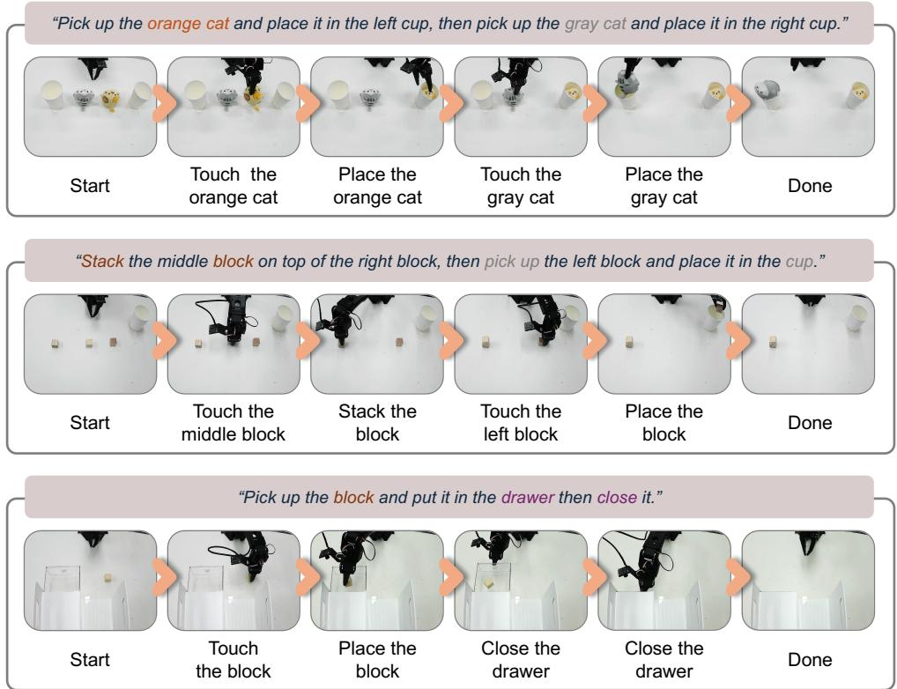  
Figure 12: Real-world tabletop tasks. From top to bottom: Two Cats in Cups places the orange and gray cats in the left and right cups, respectively; Stack places the middle block on the right block, then the left block in a cup; and Drawer places a block in the drawer and closes it. Each row shows successive stages from the starting scene to task completion.

Table 7: When SALT starts adapting (SmolVLA, LIBERO-10, success %). Every row except Never runs the same leftover-supervised update; only its start difers. The activation-gate row is the configuration of Table 1. Avg. excludes clean episodes.
<table><tr><td>Backbone</td><td>Adaptation starts</td><td>Clean</td><td>Motion</td><td>Gaussian</td><td>Zoom</td><td>Glass</td><td>Fog</td><td>Avg.</td></tr><tr><td rowspan="3">SmolVLA</td><td>Never (Frozen)</td><td>71.5</td><td>63.0</td><td>25.0</td><td>29.0</td><td>56.5</td><td>46.0</td><td>43.9</td></tr><tr><td>At activation gate</td><td>70.5</td><td>68.5</td><td>43.0</td><td>42.0</td><td>58.5</td><td>54.0</td><td>53.2</td></tr><tr><td>At every replan</td><td>69.5</td><td>67.5</td><td>42.0</td><td>45.5</td><td>61.0</td><td>56.5</td><td>54.5</td></tr></table>

Over the evaluation of Table 1, the gate updates on 12.7% of nominal and 59.3% of corrupted replans, against roughly 98% in both conditions for always-on adaptation. Table 8 reports the resulting average per-replan cost, measured identically for every method. Self-training shares SALT’s gate, so its profile matches SALT’s. ActMAD updates on nearly every replan by construction, and BID pays its candidate sampling at every replan with no gradient step.

Table 8: Average per-replan latency across methods (multiples of the frozen policy; update frequencies from the evaluation of Table 1).
<table><tr><td rowspan="2">Method</td><td colspan="2">SmolVLA</td><td colspan="2">GR00T N1.7</td></tr><tr><td>Nominal</td><td>Corrupted</td><td>Nominal</td><td>Corrupted</td></tr><tr><td>Frozen</td><td>1.00</td><td>1.00</td><td>1.00</td><td>1.00</td></tr><tr><td>BID</td><td>33.7</td><td>33.7</td><td>24.3</td><td>24.3</td></tr><tr><td>ActMAD</td><td>2.7</td><td>2.7</td><td>3.1</td><td>3.1</td></tr><tr><td>Self-training</td><td>1.4</td><td>2.8</td><td>1.5</td><td>3.2</td></tr><tr><td>SALT (gate)</td><td>1.5</td><td>2.9</td><td>1.4</td><td>3.4</td></tr><tr><td>SALT (every replan)</td><td>4.2</td><td>4.2</td><td>5.0</td><td>5.0</td></tr></table>

## F.1 Runtime Measurement

We measure per-replan cost inside the LIBERO rollout loop on one NVIDIA H200, one process per GPU, with CUDA synchronization at every section boundary; the first replan of each episode is excluded as warm-up. The singular value decomposition is computed only once when the gates are attached. A replan without an update pays the frozen forward plus the gate’s feature-change score, which adds 3–9 ms including the embedding export (Table 9). An update replan adds the five-step optimization and the regeneration of the executed chunk.

Table 9: Per-replan latency breakdown. Median milliseconds on one H200, measured in the rollout loop. Optimization uses five gradient steps and eight noise–time draws; Quiet is a replan without an update, gate included.
<table><tr><td>Model</td><td>Frozen</td><td>Quiet</td><td>Optimization</td><td>Regeneration</td><td>Update replan</td></tr><tr><td>SmolVLA</td><td>134.8</td><td>143.9</td><td>269.3</td><td>143.4</td><td>559.3</td></tr><tr><td>GR00T N1.7</td><td>139.8</td><td>142.8</td><td>414.7</td><td>154.4</td><td>723.7</td></tr></table>

## G Supervision Diagnostics

This section details the analyses of Sections 6.1 and 6.2.

## G.1 Target, Alignment, and Length Controls

The alternative targets in Figure 7b replace only the supervised action sequence. Another episode’s plan is the chunk planned one replan earlier in a nominal rollout from another initial state of the same task, so it is aligned in time but belongs to a diferent state. Time-shufled previous chunk reorders the previous chunk in time. Clean-input prediction is the policy’s prediction from the uncorrupted version of the current observation, which is unavailable at deployment. All rows share the adaptation gate, the update schedule, and the random draws of the update, so they difer only in the supervised sequence; the Frozen and leftover rows reproduce Table 1 episode by episode. Against the leftover, the clean-input prediction wins 114 episodes and loses 77 $\bar { ( p } = 0 . 0 \dot { 0 } 9 )$ , another episode’s plan wins 62 and loses 162, and the time-shufled chunk wins 47 and loses 168 (both $p \dot { < } 1 0 ^ { - 1 0 } )$ . Another episode’s plan does not difer from Frozen $( p = 0 . 6 7 )$ , and the time-shufled chunk falls slightly below it $( p = 0 . 0 3 5 )$ ).

For supervision length (Figure 13), only the first � of the 42 aligned leftover actions are supervised and the rest are masked out. The 16- to 42-position variants difer by at most 1.3 points $( p = 0 . 7 3$ and $p = 0 . 2 0$ for 16 and 32 against 42).

## G.2 Clean-Plan Gap under Gaussian Blur

Figure 14 repeats the SmolVLA measurement of Figure 8 on GR00T N1.7 under Gaussian blur.

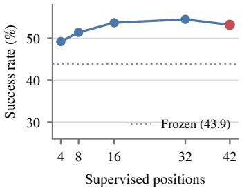  
Figure 13: Supervision length on SmolVLA. Success when only the first � of the 42 aligned leftover actions are supervised (the 1,000 episodes of Table 1 over five persistent corruptions). Supervising 16 to 42 positions performs similarly; shorter targets are less efective.

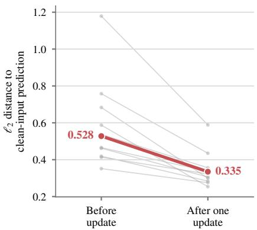  
Figure 14: One update narrows the clean-plan gap on GR00T N1.7. Gaussian blur: distance to the clean-input prediction at the same shift-boundary state and flow-noise seed before and after one update $( n = 2 0 0$ , eight aligned positions). Thin lines are task medians; the thick line is the pooled median.

## H Activation and Gate Timing

Figure 1 action-consistency diagnostic. The right panel of Figure 1 is the SmolVLA panel of Figure 15, which repeats the measurement for GR00T N1.7. At each replan, the diagnostic measures the RMSE between the previous chunk’s unexecuted tail and the current chunk’s temporally aligned prefix after eight actions have been executed. We replay clean reference trajectories and evaluate corrupted observations at the same simulator states with matched flow-noise draws, without executing the counterfactual corrupted chunks. The six arm-action dimensions are normalized by task-specific scales estimated from calibration episodes; the gripper is excluded. Across ten LIBERO-10 tasks, three held-out episodes per task, and five severity-5 corruptions (150 shift boundaries events per backbone), the median gap rises from 0.172 immediately before $t ^ { * }$ to 0.442 at $t ^ { * }$ on SmolVLA, and from 0.309 to 0.485 on GR00T N1.7. In both cases the gap stays elevated after $t ^ { * } .$ , while the preceding clean-to-clean transitions remain within the nominal band. This action-space diagnostic is distinct from the feature-change score used by the deployment gate.

## H.1 Gate Timing

Table 10 summarizes when the gate activates in the evaluation of Table 1. Clean alarm counts clean episodes with any activation; Early counts corrupted episodes whose first activation precedes $t ^ { * } ;$ each corruption column counts episodes first activated at or after $t ^ { * }$ . The remaining 1 SmolVLA and 246 GR00T episodes are never activated: GR00T’s gate misses most motion-blur and fog episodes, although it activates on more than 90% of the other three families. Among activations at or after $t ^ { * }$ 98.9% (SmolVLA) and 91.7% (GR00T) occur at the replan of $t ^ { * }$ itself.

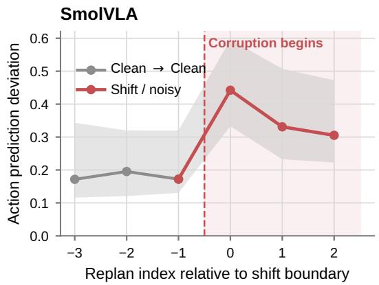

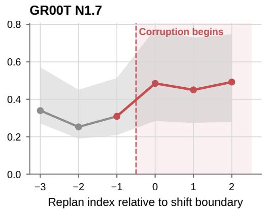  
Figure 15: Action-consistency gap around the shift boundary. Median (line) and interquartile range (band) of the normalized RMSE between the previous chunk’s leftover and the current chunk’s aligned prefix, over 150 shift boundaries per backbone. Gray marks clean-to-clean transitions and red marks transitions at or after �∗. The SmolVLA panel is the right panel of Figure 1.

Table 10: Gate timing on LIBERO-10 (%). Overall divides activations at or after �∗ by all 1,000 corrupted episodes; delay is the mean number of replans between �∗ and activation.
<table><tr><td></td><td>Clean alarm</td><td></td><td></td><td>Gaussian</td><td>Zoom</td><td>Glass</td><td>Fog</td><td>Overall</td><td>Mean delay</td></tr><tr><td>Backbone SmolVLA</td><td></td><td>Early 9.0</td><td>Motion</td><td></td><td></td><td></td><td>90.5</td><td>90.9</td><td>0.13</td></tr><tr><td>GR00T N1.7</td><td>26.5 12.5</td><td>8.0</td><td>91.0 31.5</td><td>91.0 92.0</td><td>91.0 90.5</td><td>91.0 92.0</td><td>31.0</td><td>67.4</td><td>0.74</td></tr></table>

## I Disruption Schedules

Shift timing. Figure 7c fixes the shift boundary at 10%, 25%, 50%, or 75% of the clean rollout instead of sampling it, with 1,000 episodes per setting. Table 11 lists the values. An earlier boundary leaves more active replans for adaptation, and the gain grows with them.

Table 11: Success by shift-boundary position (SmolVLA, %, 1,000 episodes per row, 95% confidence intervals in brackets). Active replans is the mean number of replans per episode at which SALT updates.
<table><tr><td>Shift boundary</td><td>Frozen</td><td>SALT</td><td>Gain</td><td>Active replans</td></tr><tr><td>10%</td><td>33.5 [30.2, 36.9]</td><td>50.0 [45.7, 54.3]</td><td>+16.5 [13.1, 19.9]</td><td>44.3</td></tr><tr><td>25%</td><td>40.0 [36.0, 44.1]</td><td>54.1 [49.2, 59.0]</td><td>+14.1 [10.8, 17.4]</td><td>37.5</td></tr><tr><td>50%</td><td>45.1 [40.3, 49.9]</td><td>57.0 [51.9, 62.3]</td><td>+11.9 [8.4, 15.4]</td><td>28.4</td></tr><tr><td>75%</td><td>53.9 [48.2, 59.5]</td><td>62.5 [56.6, 68.5]</td><td>+8.6 [5.6, 11.7]</td><td>17.3</td></tr></table>

Gradual and temporary corruption. Table 12 extends the persistent-corruption evaluation of Table 1 to two additional schedules. Gradual corruption blends the corrupted and nominal images linearly, from the nominal image at the first replan to full strength after eight replans, and then persists. Gradual corruption has no clear shift boundary for the gate to read. SALT adapting at every replan raises success from 37.6% to 46.0%, since the early leftovers come from nearly nominal frames. Temporary corruption starts at the sampled shift boundary and clears after eight replans. A corruption that clears also calls for a release the gate does not provide, so both schedules are evaluated with updates at every replan once a previous chunk is available. SALT continues updating after the clean input returns and raises success from 57.2% to 64.9%.

Table 12: Temporary and gradual corruption by family (SmolVLA, success %, 200 episodes per corruption and method). SALT updates at every replan once a previous chunk is available. Avg. averages the five corrupted conditions.
<table><tr><td>Schedule</td><td>Method</td><td>Motion</td><td>Gaussian</td><td>Zoom</td><td>Glass</td><td>Fog</td><td>Avg.</td></tr><tr><td rowspan="2">Temporary</td><td>Frozen</td><td>63.5</td><td>48.5</td><td>51.5</td><td>64.5</td><td>58.0</td><td>57.2</td></tr><tr><td>SALT</td><td>68.0</td><td>59.5</td><td>62.0</td><td>69.0</td><td>66.0</td><td>64.9</td></tr><tr><td rowspan="2">Gradual</td><td>Frozen</td><td>62.5</td><td>13.5</td><td>21.0</td><td>50.5</td><td>40.5</td><td>37.6</td></tr><tr><td>SALT</td><td>64.5</td><td>28.0</td><td>35.5</td><td>59.0</td><td>43.0</td><td>46.0</td></tr></table>

Corruption from the first replan. Table 13 applies each corruption from replan 0, so no leftover is planned from a nominal frame. Adapting at every replan once a previous chunk exists leaves overall success nearly unchanged (32.5% versus 32.9%).

Table 13: Corruption from the first replan (SmolVLA, success %, 200 episodes per family). SALT updates at every replan once a previous chunk is available. Avg. averages the five corrupted conditions.
<table><tr><td>Method</td><td>Motion</td><td>Gaussian</td><td>Zoom</td><td>Glass</td><td>Fog</td><td>Avg.</td></tr><tr><td>Frozen</td><td>58.0</td><td>3.5</td><td>11.0</td><td>51.0</td><td>39.0</td><td>32.5</td></tr><tr><td>SALT</td><td>56.5</td><td>8.0</td><td>14.0</td><td>51.0</td><td>35.0</td><td>32.9</td></tr></table>

## J Limitations and Future Work

SALT’s supervision comes from the leftover, so the method is only as good as the leftover it receives. When the disruption is present from the start of the episode, no nominal-side plan exists and the leftover ofers little to teach from. Disruptions that invalidate the plan itself, such as moved objects or changed goals, are also beyond what leftover supervision can correct. Separately, the adaptation gate is a deployment trigger. It reads transitions between consecutive replans, so it can miss shifts that produce no clear transition, for example those that arrive gradually. Any activation rule can drive the same leftover-supervised update. Improving activation is therefore left to future work, for example by accumulating evidence across replans. Finally, adaptation is learned at test time, and an update replan pays for gradient steps and chunk regeneration. Reducing this cost with fewer optimizer steps or lighter update rules is also left to future work.