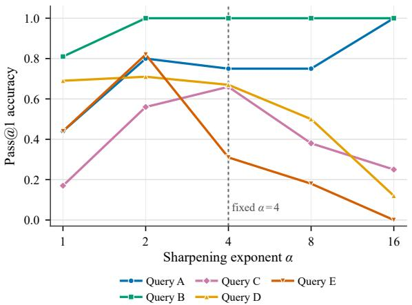
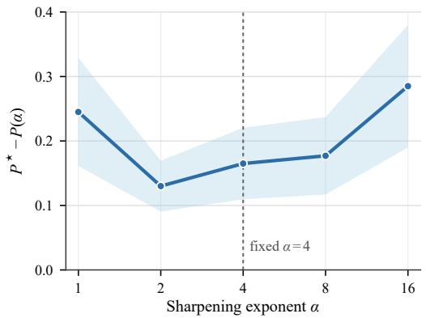
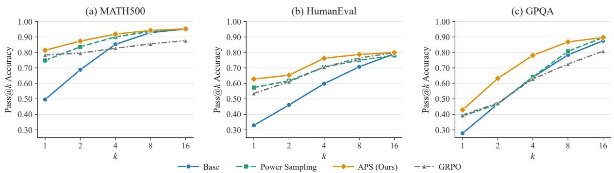
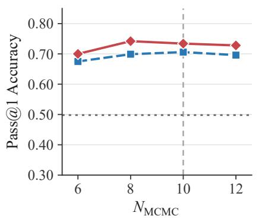
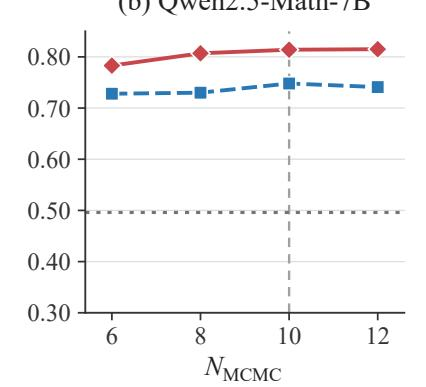
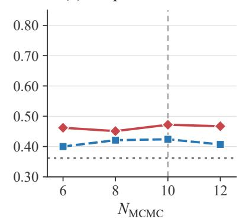
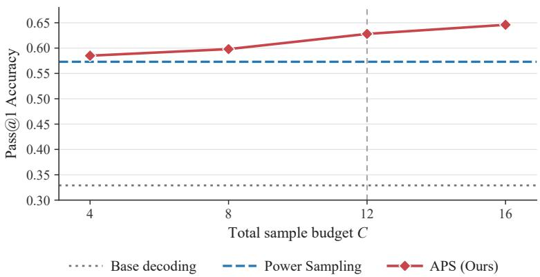
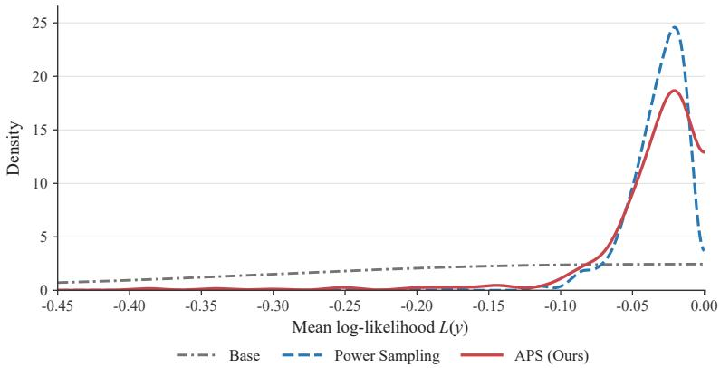
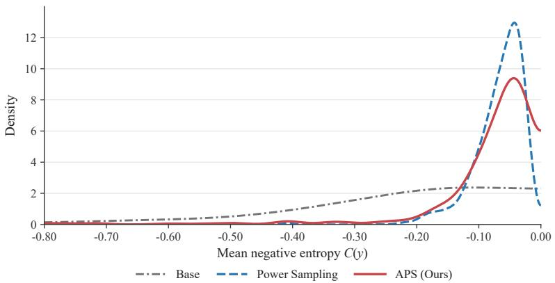

# Adaptive Power Sampling for LLM Reasoning

Bingnan Xiao<sup>\*</sup> Fudan University 22110720061@m.fudan.edu.cn

Wei Ni   
Edith Cowan University   
wei.ni@ieee.org

Chenhao Yang<sup>\*</sup> University of Glasgow 3165453Y@student.gla.ac.uk

Xin Wang<sup>†</sup>   
Fudan University   
xwang11@fudan.edu.cn   
Bingcong Li<sup>†</sup>   
ETH Zurich   
bingtsongli@gmail.com

## Abstract

Sequence-level power sampling has recently emerged as a training-free approach to reasoning by sampling from a sharpened output distribution of a base large language model (LLM). Nevertheless, existing methods typically sharpen the base model distribution uniformly across queries, overlooking variations in query difficulty and in how well the base model already handles each query. The goal of this work is to equip power sampling with query adaptivity. Theoretically, we show that the benefits of further sharpening are determined by the self-reward gap between correct and incorrect responses. Based on this insight, we propose Adaptive Power Sampling (APS), which adjusts the sharpening exponent on a per-query basis at test time using the relationship between answer agreement and the model’s self-reward. Experiments across diverse reasoning tasks, including MATH500, HumanEval, and GPQA, show that APS consistently outperforms power sampling with a fixed sharpening exponent, without additional training.

## 1 Introduction

Reasoning is fundamentally about generating and identifying high-quality solution trajectories from a model’s output distribution. Recent work suggests that post-training often achieves this by redistributing probability mass toward sequences that are more likely to yield correct answers (Huang et al., 2025; Yue et al., 2025; He et al., 2025). This perspective, commonly referred to as sequence-level distribution sharpening, also provides a foundation for test-time reasoning (Karan and Du, 2026). In particular, strong reasoning performance on tasks such as math and coding can be achieved by sampling from a sharpened version of the base model’s sequence-level distribution, even when the base model has not undergone post-training (Karan and Du, 2026; Ji et al., 2026).

Compared with post-training, a clear advantage of test-time reasoning is its reduced reliance on post-training data. This benefit, however, comes at the cost of query-adaptive sharpening. Post-training can implicitly learn,for each query or prompt, an appropriate degree of sharpening, concentrating sufficient probability mass on high-quality responses while preserving enough diversity for the target task. In contrast, test-time reasoning methods typically commit to a single predetermined degree of sharpening, “betting on” how concentrated the desired distribution should be (Karan and Du, 2026; Azizi et al., 2026; Ji et al., 2026; Nguyen et al., 2026; Meng et al., 2026).

Such a fixed choice, however, may not be sufficient. Intuitively, the appropriate degree of sharpening should vary across problems and domains, e.g., between math and coding, or also within the same domain, between, e.g., primary school and college-level math problems. Motivated by this intuition, which we further validate experimentally, we study whether the sharpening strength can instead be determined query-wise at test time, without relying on post-training data or manual tuning. To equip power sharpening with adaptivity, we first study how reasoning performance varies with the sharpening strength. More precisely, let x denote a prompt, and let $p _ { \theta } ( y \mid x )$ denote the probability that a base model θ generates a complete response y given x. Test-time sharpening (Karan and Du, 2026) samples responses from the sharpened distribution $\pi _ { \alpha } ( y \mid x ) \propto p _ { \theta } ( y \mid x ) ^ { \alpha }$ , where $\alpha \geq 1$ controls the degree of distributional sharpening. We show that for this particular query x, the preferred sharpening direction is jointly determined by the relationship between response correctness and sequence log-likelihood. Stronger sharpening, i.e., larger α, is more beneficial when correct responses tend to have higher sequence log-likelihood than incorrect ones, and harmful otherwise. Translating these theoretical insights into practice, we propose Adaptive Power Sampling (APS), a training-free reasoning method that dynamically adjusts the sharpening exponent α at test time. Since ground-truth correctness is unavailable, APS leverages self-consistency (Wang et al., 2023; Aggarwal et al., 2023) among sampled answers as a surrogate signal. Combined with the theoretical characterization above, APS adjusts α on the fly for each query. Such adaptivity improves reasoning performance across several tasks. In a nutshell, our main contributions are summarized as follows:

• Motivated by our empirical observation that the preferred sharpening strength varies across queries, we develop a theoretical characterization of how reasoning performance changes with the sharpening strength. For each query, whether a stronger sharpening is preferred is determined by the self-reward gap between correct and incorrect responses.

• Building on these insights, we propose Adaptive Power Sampling (APS), which adjusts the sharpening exponent α for each query at test time using statistics from sampled responses. APS achieves query-wise adaptivity analogous to that of RL-based post-training, while requiring no additional training or post-training data.

• We evaluate APS on multiple models and reasoning benchmarks, showing consistent improvements over fixedexponent power sampling, and competitive performance against RL-post-trained methods.

## 2 Related Work

Reasoning via post-training. Reinforcement learning (RL) has been shown to improve the reasoning performance of LLMs on mathematical and coding tasks (Ouyang et al., 2022; Shao et al., 2024; DeepSeek-AI, 2025; Yu et al., 2025; Liu et al., 2025; Lin et al., 2025). Recent work (Huang et al., 2025; Yue et al., 2025; He et al., 2025; Shao et al., 2025; Song et al., 2025) suggests that RL post-training can reinforce existing high-probability responses in the model, highlighting distribution reshaping as an important mechanism behind reasoning performance improvement. The view motivates investigating whether similar gains can be achieved by directly sharpening the model distribution and adapting the sharpening strength at inference time.

Inference-time scaling improves LLM performance by allocating additional computation at test time (Zhang et al., 2025; Hariri et al., 2026). Representative approaches include repeated sampling and answer aggregation or selection (Wang et al., 2023; Li et al., 2022; Brown et al., 2024), verifier- or reward-guided selection of candidate solutions (Cobbe et al., 2021; Lightman et al., 2024; Chow et al., 2025), and explicit search over intermediate reasoning states (Xie et al., 2023; Yao et al., 2023; Zhou et al., 2024; Snell et al., 2024). While effective, these methods motivate more direct control of the model’s response distribution at inference time.

Reasoning at test time. Power sampling directly sharpens the model’s sequence-level distribution by assigning greater weight to high-probability responses (Karan and Du, 2026). It provides a training-free alternative that can achieve reasoning performance comparable to RL post-training while better preserving generation diversity. Recent studies have further improved the efficiency of sequence-level power sampling via, e.g., a future-aware autoregressive approximation (Ji et al., 2026), particle and sequential Monte Carlo methods (Azizi et al., 2026; Nguyen et al., 2026; Wang et al., 2026) and entropy-guided proposals (Guo et al., 2026; Zhou et al., 2026). While these methods improve sampling efficiency, they typically rely on a predetermined sharpening strength across queries. In contrast, our work studies how the sharpening strength should be adaptive to individual queries.

Power sampling can also be understood from a theoretical perspective. (Tomihari and Sato, 2026) connects power sampling with self-reward KL-regularized RL and self-distillation. In parallel, our work studies how reasoning performance changes with the sharpening strength, thereby motivating the adaptive selection of sharpening strength at test time.

## 3 Preliminaries

## 3.1 Sequence-Level Power Distribution

Given prompt x, let $p _ { \theta } ( y | x )$ denote the probability of a base model θ generating a complete response $y = ( y ^ { 1 } , \ldots , y ^ { T } )$ In this work, $p _ { \theta } ( y | x )$ is referred to as the sequence-level likelihood, and by the autoregressive factorization, it can be



  
Figure 1: Motivating example on MATH500 with Qwen2.5-Math-7B. The left panel shows representative Pass@1 accuracy curves under power sampling over $\alpha \in \{ 1 , 2 , 4 , 8 , 1 6 \}$ . The right panel shows the mean oracle gap $P ^ { \star } - P ( \alpha )$

equivalently obtained via $\begin{array} { r } { p _ { \theta } ( y | x ) = \prod _ { t = 1 } ^ { T } p _ { \theta } ( y ^ { t } | x , y ^ { < t } ) } \end{array}$

Power sampling, originally proposed in (Karan and Du, 2026), leverages a sharpened sequence-level distribution to re-weight the base model’s probability by a sharpening exponent α. For $\alpha \geq 1$ , the sequence-level power distribution is defined as

$$
\pi _ { \alpha } ( y | x ) = \frac { p _ { \theta } ( y | x ) ^ { \alpha } } { Z _ { \alpha } ( x ) } ,\tag{1}
$$

where $\begin{array} { r } { Z _ { \alpha } ( x ) = \sum _ { y } p _ { \theta } ( y | x ) ^ { \alpha } } \end{array}$ is the normalization constant. The exponent $\alpha = 1$ recovers the base model distribution, while a larger α concentrates probability mass on higher-likelihood complete responses. To illustrate the sharpening effect, consider two complete responses y and $y ^ { \prime }$ with $p _ { \theta } ( y \mid x ) > p _ { \theta } ( y ^ { \prime } \mid x )$ . For $\alpha > 1$ , their relative probabilities satisfy

$$
{ \frac { \pi _ { \alpha } ( y \mid x ) } { \pi _ { \alpha } ( y ^ { \prime } \mid x ) } } = \left( { \frac { p _ { \theta } ( y \mid x ) } { p _ { \theta } ( y ^ { \prime } \mid x ) } } \right) ^ { \alpha } > { \frac { p _ { \theta } ( y \mid x ) } { p _ { \theta } ( y ^ { \prime } \mid x ) } } .\tag{2}
$$

Thus, increasing α further amplifies the relative advantage of responses with higher base-model likelihood, making the sequence-level distribution sharper. Note that sequence-level sharpening is fundamentally different from token-level low-temperature scaling in autoregressive decoding (Wang et al., 2020): the former reweights complete sequences according to their sequence likelihoods, whereas the latter rescales the next-token distribution locally at each decoding step. This has been demonstrated multiple times, e.g., (Karan and Du, 2026; Azizi et al., 2026; Ji et al., 2026; Nguyen et al., 2026; Meng et al., 2026).

## 3.2 One Fixed Exponent Does Not Fit Every Query

Existing power sampling algorithms (Karan and Du, 2026; Azizi et al., 2026; Ji et al., 2026; Nguyen et al., 2026; Meng et al., 2026) rely on a fixed sharpening exponent α. While it is natural to expect different tasks, such as coding and mathematics, to favor different values of $\alpha ,$ in this subsection we show that even within the same dataset, no single α performs equally well across all queries.

To illustrate this, we evaluate Qwen2.5-Math-7B (Yang et al., 2024b) on 20 randomly sampled queries from the MATH500 dataset (Lightman et al., 2024). We consider power-sampling exponents $\alpha \in \{ 1 , 2 , 4 , 8 , 1 6 \}$ . For each query and each value of $\alpha ,$ we generate $N = 1 6$ responses per random seed using the MCMC sampler of Karan and Du (2026). We use $P ( \alpha \mid x )$ to denote the fraction of correct responses for query x at exponent α.

The results are shown in Figure 1. In the left panel, 5 representative queries are plotted to visualize query-wise optimal α. In particular, Query A attains its highest pass@1 accuracy only at $\alpha = 1 6$ while Query B already reaches perfect accuracy at $\alpha = 2$ . In contrast, Queries C–E achieve their best performance at an intermediate exponent. In the right panel, we measure the performance loss from using a common exponent instead of the best exponent for each of the 20 sampled queries. For each query x, let $P ^ { * } ( x ) = \operatorname* { m a x } _ { a } P ( a \mid x )$ denote its best accuracy over the tested exponents, and define the oracle gap as $P ^ { * } ( x ) - P ( \alpha \mid x )$ . The gap is smallest at $\alpha = 2$ , with an average value of 0.13, whereas the fixed choice $\alpha = 4$ used in (Karan and Du, 2026) gives a larger gap of 0.17. These results jointly show that a single fixed α can leave a noticeable performance gap relative to the best exponent for individual queries, motivating an adaptive choice of α at test time.

## 4 Effect of the Sharpening Strength

In this section, we theoretically study how α affects reasoning performance under the sequence-level power distribution. We characterize its effect on test-time correctness and identify when sharpening is beneficial or harmful. Following the same analytical framework, we also obtain an extension to group-relative RL as a byproduct, where adaptive sharpening can likewise be beneficial. Throughout this section, we consider a fixed query x and omit the dependence on x for notational simplicity.

## 4.1 Definitions

To examine how the sharpening exponent α affects the reasoning performance, we restrict our discussion to tasks with binary correctness outcomes, such as mathematics and coding. For a given prompt x, let $r ^ { \star } ( y ) \in \{ 0 , 1 \}$ denote the binary task reward of a complete response $y ,$ where $r ^ { \star } ( y ) = 1$ indicates a correct response and $r ^ { \star } ( y ) = 0$ indicates an incorrect response. Accordingly, we partition the response space into correct and incorrect sets, i.e.,

$$
\mathcal { Y } _ { C } = \{ y : r ^ { \star } ( y ) = 1 \} , \quad \mathcal { Y } _ { I } = \{ y : r ^ { \star } ( y ) = 0 \} .\tag{3}
$$

The expected performance under exact sampling from $\pi _ { \alpha }$ is defined as

$$
P ( \alpha ) = \mathbb { E } _ { \pi _ { \alpha } } [ r ^ { \star } ( Y ) ] .\tag{4}
$$

Since $r ^ { \star }$ is binary, $P ( \alpha )$ is also the probability that a response sampled from $\pi _ { \alpha }$ is correct. Hence, a preferred sharpening exponent enlarges $P ( \alpha )$ . Another useful quantity is the model’s self-reward, which reflects the sequence-level likelihood assigned to a response y

$$
r _ { \mathrm { s e l f } } ( y ) = \log p _ { \theta } ( y | x ) .\tag{5}
$$

Under $\pi _ { \alpha } ,$ the conditional self-reward means and variances with respect to α is defined as

$$
\mu _ { C } ( \alpha ) = \mathbb { E } _ { \pi _ { \alpha } } [ r _ { \mathrm { s e l f } } ( Y ) \mid r ^ { \star } ( Y ) = 1 ] , \qquad \mu _ { I } ( \alpha ) = \mathbb { E } _ { \pi _ { \alpha } } [ r _ { \mathrm { s e l f } } ( Y ) \mid r ^ { \star } ( Y ) = 0 ] ,\tag{6}
$$

$$
\sigma _ { C } ^ { 2 } ( \alpha ) = \mathrm { V a r } _ { \pi _ { \alpha } [ r _ { \mathrm { s e l f } } ( Y )  \mid r ^ { \star } ( Y ) = 1 ] , } \qquad \sigma _ { I } ^ { 2 } ( \alpha ) = \mathrm { V a r } _ { \pi _ { \alpha } [ r _ { \mathrm { s e l f } } ( Y )  \mid r ^ { \star } ( Y ) = 0 ] . }\tag{7}
$$

We then define the self-reward gap $\delta ( \alpha )$ to measure whether correct responses have higher model log-likelihood than incorrect responses under the current power distribution

$$
\delta ( \alpha ) = \mu _ { C } ( \alpha ) - \mu _ { I } ( \alpha ) .\tag{8}
$$

## 4.2 Theoretical Basis for Adaptive Sharpening

For the test-time objective $P ( \alpha )$ , we study how the expected reasoning performance changes as α increases. From (1), increasing α shifts relative probability mass toward responses with higher base-model likelihood. Consequently, the marginal effect of sharpening on $P ( \alpha )$ depends on whether model likelihood is aligned with the task reward. The following theorem makes this relation exact.

Theorem 1. For the fixed prompt x and the reward $r ^ { \star }$ independent $o f \alpha ,$ we have

$$
{ \frac { d P ( \alpha ) } { d \alpha } } = \mathrm { C o v } _ { \pi _ { \alpha } } ( r ^ { \star } ( Y ) , r _ { \mathrm { s e l f } } ( Y ) ) .\tag{9}
$$

Theorem 1 provides an exact characterization of the marginal effect of sharpening. If task reward and self-reward are positively correlated under the current power distribution, increasing α improves exact expected performance. Conversely, if the covariance is negative, additional sharpening moves probability mass in a direction that hurts the task reward. Interestingly, the covariance in (9) can be further decomposed into a simple self-reward gap, as given below.

Corollary 1 (Self-reward gap decomposition). Based on the task reward $r ^ { \star } \in \{ 0 , 1 \}$ , we obtain

$$
{ \frac { d P ( \alpha ) } { d \alpha } } = P ( \alpha ) ( 1 - P ( \alpha ) ) \delta ( \alpha ) .\tag{10}
$$

Corollary 1 has a direct interpretation. Here, $P ( \alpha ) ( 1 - P ( \alpha ) )$ measures how much room is left for the correctness probability to change under the current power distribution: it is largest when correct and incorrect responses are both likely, i.e., $P ( \alpha ) = 0 . 5$ , and it becomes small when the sampler almost always succeeds or almost always fails. Prior work connects power sampling to the correlation between task reward and self-reward (Tomihari and Sato, 2026). Theorem 1 and Corollary 1 further characterize the local change in expected performance caused by increasing α. Since $P ( \alpha ) \in [ 0 , 1 ]$ for binary $r ^ { \star }$ , increasing α locally improves performance if $\delta ( \alpha ) > 0$ and locally degrades performance $\mathrm { i f } \delta ( \alpha ) < 0$ . This reveals the source of adaptivity: if $\delta ( \alpha )$ is known, we can determine whether increasing or decreasing α would improve performance for this particular query. Next, we study how $\delta ( \alpha )$ evolves with α to understand when further sharpening may switch from improving performance to degrading it, or vice versa.

Lemma 1 (Self-reward gap dynamics). The self-reward gap evolves as

$$
\frac { d \delta ( \alpha ) } { d \alpha } = \sigma _ { C } ^ { 2 } ( \alpha ) - \sigma _ { I } ^ { 2 } ( \alpha ) .\tag{11}
$$

The self-reward gap increases when correct sequences have higher conditional log-probability variance than incorrect sequences, and decreases under the reverse ordering. Since the sign of $d P ( \alpha ) / d \alpha$ is determined by $\delta ( \alpha )$ for binary $r ^ { \star } ,$ , a larger conditional variance in the correct class moves the gap toward more positive values and thereby shifts the local effect of sharpening toward improvement. Besides, we can differentiate the first-order identity, yielding the second-order characterization of $d ^ { 2 } P / d \alpha ^ { 2 }$ in Appendix B.

While extending the above local optimality analysis to a characterization of the globally optimal $\alpha ^ { * } \in [ 1 , \infty )$ is challenging, we can still gain insight into how $P ( \alpha )$ evolves with α. For binary $r ^ { \star }$ , the sign of $d P ( \alpha ) / d \alpha$ is determined by the sign of $\delta ( \alpha )$ . Hence, examining $\delta ( \alpha )$ at the two extremes, $\alpha = 1$ and $\alpha  \infty .$ , provides useful information about the global behavior of $P ( \alpha )$ . The following theorem shows that $\delta ( \infty )$ admits a closed-form expression.

Theorem 2 (Limit of the self-reward gap). As $\alpha  \infty$ , the self-reward gap $\Delta _ { s }$ satisfies

$$
\Delta _ { s } \triangleq \operatorname* { l i m } _ { \alpha  \infty } \delta ( \alpha ) = s _ { C } - s _ { I } ,\tag{12}
$$

where $s _ { C } = \mathrm { m a x } _ { y \in \mathcal { Y } _ { C } } r _ { \mathrm { s e l f } } ( y )$ , and $s _ { I } = \mathrm { m a x } _ { y \in \mathcal { Y } _ { I } } r _ { \mathrm { s e l f } } ( y )$

The signs of $\delta ( 1 )$ and $\Delta _ { s }$ reveal the following four cases. If both are positive, increasing α improves performance near $\alpha = 1$ and again for all sufficiently large $\alpha ,$ , although $\delta ( \alpha )$ may still change sign at intermediate values, causing $d P ( \alpha ) / d \alpha$ to change sign as well. $\mathrm { I f } \delta ( 1 ) > 0$ but $\Delta _ { s } < 0$ , increasing α initially improves performance but eventually becomes harmful. If $\delta ( 1 ) < 0$ but $\Delta _ { s } > 0$ , increasing α is initially harmful but eventually becomes beneficial. If both are negative, increasing α is harmful near $\alpha = 1$ and again for sufficiently large α.

## 4.3 Extensions to Group-Relative RL

Going beyond test-time reasoning, another related sampling scenario is group-relative ${ \mathrm { R L } } ,$ , where multiple responses to the same query are scored and compared to construct relative advantages for policy optimization, as in GRPO (Shao et al., 2024). We next show that replacing such standard rollouts with query-adaptive power sampling can also be beneficial. This follows from the same analytical framework with a modified objective, since RL requires informative reward variation among sampled responses (Razin et al., 2025), rather than simply maximizing correctness.

Precisely, for a group of K responses independently sampled from $\pi _ { \alpha } ( y \mid x )$ in group-relative RL, let $R _ { i }$ denote the reward of the i-th response and $\begin{array} { r } { \bar { R } = K ^ { - 1 } \sum _ { i = 1 } ^ { K } R _ { i } } \end{array}$ . For binary correctness rewards, we define $C _ { K } ( \alpha ) =$ E $\begin{array} { r } { \left\lceil \frac { 1 } { K } \sum _ { i = 1 } ^ { K } ( R _ { i } - \bar { R } ) ^ { 2 } \right\rceil } \end{array}$ denoting the expected within-group reward variation of K sampled responses. Since $R _ { i }$ is a Bernoulli random variable with success probability $P ( \alpha ) , C _ { K } ( \alpha )$ can be rewritten as

$$
C _ { K } ( \alpha ) = \frac { K - 1 } { K } P ( \alpha ) \big ( 1 - P ( \alpha ) \big ) .\tag{13}
$$

A larger $C _ { K } ( \alpha )$ means more variation in the rewards within a group, making the relative advantages among sampled responses easier to distinguish and yielding a clearer signal for policy optimization. Differentiating (13) and applying Corollary 1 gives the following theorem.

Theorem 3. For the expected within-group reward variation $C _ { K } ( \alpha )$ defined above, we have

$$
{ \frac { d { \mathcal { C } } _ { K } ( \alpha ) } { d \alpha } } = { \frac { K - 1 } { K } } \left( 1 - 2 P ( \alpha ) \right) { \frac { d P ( \alpha ) } { d \alpha } } = { \frac { K - 1 } { K } } \left( 1 - 2 P ( \alpha ) \right) P ( \alpha ) \left( 1 - P ( \alpha ) \right) \delta ( \alpha ) .\tag{14}
$$

Theorem 3 reveals how adapting the sharpening exponent α affects correctness probability and within-group reward variation jointly. When $P ( \alpha ) < 1 / 2$ , an adaptation of α that increases $P ( \alpha )$ also increases $C _ { K } ( \alpha )$ . In contrast, once $P ( \alpha ) > 1 / 2$ , the same improvement in $P ( \alpha )$ is accompanied by a decrease in $C _ { K } ( \alpha )$ . According to $( 1 3 ) , { \mathcal { C } } _ { K } ( \alpha )$ is maximized at $P ( \alpha ) = 1 / 2$ , which provides a simple criterion for adapting the sharpening strength in group-relative RL. We therefore adapt α to maximize $C _ { K } ( \alpha )$ , or equivalently, to make the correctness probability close to $1 / 2 .$ . The detailed procedure and experiments are presented in Appendix $\mathbf { C } .$

Lastly, we develop a unified framework that subsumes both the test-time objective $P ( \alpha )$ and the within-group reward variation $C _ { K } ( \alpha )$ ; see Appendix B. More broadly, this framework provides a recipe for adapting the sharpening strength in other power sampling-based settings.

## 5 Adaptive Power Sampling

This section translates the theoretical insights into practical algorithms.

## 5.1 Estimating the Sharpening Direction

Theorem 1 and Corollary 1 show that the sharpening exponent α can be adjusted to improve $P ( \alpha )$ according to the alignment between true reward and model’s self-reward. In practice, however, the true task reward is unavailable at test time. To address this challenge, we develop an efficient algorithm, Adaptive Power Sampling $( \mathsf { A P S } )$ , which uses self-consistency among sampled answers as a surrogate signal to adaptively adjust α during inference.

APS proceeds iteratively. At iteration t, given the current exponent $\alpha _ { t } .$ , suppose that $N _ { t } \geq 2$ responses $\{ y _ { i , t } \} _ { i = 1 } ^ { N _ { t } }$ <sub>1</sub> are available. For simplicity, we omit the iteration index t and write $y _ { i }$ . For each response $y _ { i }$ , we compute its self-reward as

$$
s _ { i } = r _ { \mathrm { s e l f } } ( y _ { i } ) = \log p _ { \theta } ( y _ { i } \mid x ) .\tag{15}
$$

To reduce variations in the scale of self-reward, we standardize the self-reward of each response as

$$
z _ { i } = \frac { s _ { i } - \bar { s } _ { t } } { \widehat { \sigma } _ { s , t } } ,\tag{16}
$$

where $\begin{array} { r } { \bar { s } _ { t } = \frac { 1 } { N _ { t } } \sum _ { i = 1 } ^ { N _ { t } } { s _ { i } } } \end{array}$ and $\begin{array} { r } { \widehat { \sigma } _ { s , t } = \Big [ \frac { 1 } { N _ { t } } \sum _ { i = 1 } ^ { N _ { t } } ( s _ { i } - \bar { s } _ { t } ) ^ { 2 } \Big ] ^ { 1 / 2 } , } \end{array}$

Since the ground-truth correctness of each response is unavailable at test time, we design answer agreement as a surrogate signal. This is inspired by self-consistency methods (Wang et al., 2023; Aggarwal et al., 2023) , where agreement across independently sampled reasoning paths provides a useful indication of answer confidence and is often associated with answer correctness. By denoting $e _ { i }$ as the normalized answer key of $y _ { i }$ , the answer-agreement score of $y _ { i }$ is defined as

$$
v _ { i } = \frac { \mathbf { 1 } [ e _ { i } \neq \mathrm { i n v a l i d } ] } { N _ { t } - 1 } \sum _ { j \neq i } \mathbf { 1 } [ e _ { j } = e _ { i } ] ,\tag{17}
$$

where $\mathbf { 1 } [ \cdot ]$ denotes the indicator function, which equals one when the condition inside the brackets is satisfied and zero otherwise. For a valid answer, $v _ { i }$ measures the fraction of other sampled responses giving the same answer as $y _ { i }$ . For an invalid answer, $v _ { i } = 0 . \mathrm { A }$ larger $v _ { i }$ indicates stronger support from the other samples and is treated as evidence that the answer $y _ { i }$ is more likely to be correct.

Based on the answer-agreement scores and normalized self-rewards, we therefore define the following score for determining the sharpening direction, i.e., whether α should be increased or decreased:

$$
\widehat { g } _ { t } = \frac { 1 } { N _ { t } } \sum _ { i = 1 } ^ { N _ { t } } ( v _ { i } - \bar { v } _ { t } ) z _ { i } = \frac { 1 } { N _ { t } \widehat { \sigma } _ { s , t } } \sum _ { i = 1 } ^ { N _ { t } } ( v _ { i } - \bar { v } _ { t } ) ( s _ { i } - \bar { s } _ { t } ) .\tag{18}
$$

where $\begin{array} { r } { \bar { \boldsymbol { v } } _ { t } = \frac { 1 } { N _ { t } } \sum _ { i = 1 } ^ { N _ { t } } \boldsymbol { v } _ { i } } \end{array}$ . The sign of $\hat { g } _ { t }$ reflects whether answer agreement and self-reward vary in the same direction with $\hat { \sigma } _ { s , t } > 0$ . In particular, $\hat { g } _ { t } > 0$ indicates that responses with stronger agreement tend to have higher self-reward, which is consistent with the favorable case identified in Section 4. We should therefore increase α. The magnitude of $\hat { g } _ { t }$ further reflects the strength of this relationship and is used to determine the amount by which α is adjusted. If $\hat { \sigma } _ { s , t } = 0$ , the sampled responses have identical self-reward, and we set $\hat { g } _ { t } = 0$ . When all agreement scores are identical, the samples provide no preferred sharpening direction; APS keeps $\alpha _ { t }$ unchanged and collects additional samples.

## 5.2 Adaptive Exponent Update

Given the estimate $\widehat { g } _ { t }$ , APS updates the sharpening exponent via gradient ascent strategy:

$$
\alpha _ { t + 1 } = \mathrm { c l i p } \left( \alpha _ { t } + \eta \widehat { g } _ { t } , \alpha _ { \operatorname* { m i n } } , \alpha _ { \operatorname* { m a x } } \right) ,\tag{19}
$$

where $\eta$ is the stepsize and $\mathrm { c l i p } ( \cdot )$ ensures that the updated exponent remains within the appropriate range $[ \alpha _ { \mathrm { m i n } } , \alpha _ { \mathrm { m a x } } ]$ The exponent adaptation is performed under both sampling-quality and budget constraints. At iteration $t ,$ we monitor the batch-level MCMC acceptance rate $\widehat { q } _ { t } = A _ { t } / P _ { t } .$ , where $A _ { t }$ and $P _ { t }$ denote the numbers of accepted and total Metropolis–Hastings (MH) proposals used to generate the current batch at $\alpha _ { t } .$ , respectively. We use $\widehat { q _ { t } }$ as a samplerquality diagnostic (Karan and Du, 2026). If the optional quality threshold $q _ { \mathrm { m i n } }$ is enabled and $\widehat { q } _ { t } < q _ { \operatorname* { m i n } } .$ , the adaptive search is terminated. Let C denote the total sample budget and c the number of samples generated so far. The adaptive search continues only when the remaining budget is sufficient to generate another batch of K samples. The adaptive search also terminates if either $| \widehat { g } _ { t } | \le \epsilon$ , indicating insufficient evidence for changing $\alpha _ { t } , \mathrm { o r } \alpha _ { t + 1 } = \alpha _ { t }$ , indicating that the proposed update cannot move the exponent.

APS retains the last exponent passing the sampling-quality check as $\alpha ^ { \star }$ , with $\alpha ^ { \star } = 1$ as the initial fallback. After adaptation, the remaining budget is spent at $\alpha ^ { \star }$ , and samples collected at this exponent are pooled for majority voting over valid answers, breaking ties by the mean self-reward of supporting responses. Algorithm 1 summarizes the procedure. APS adjusts the sharpening strength for each query through the estimated alignment between answer agreement and self-reward: its sign determines whether to increase $\alpha ,$ while its magnitude determines the update size, without requiring ground-truth answers.

## 6 Experiments

## 6.1 Experimental Setup

Models. We evaluate APS on four models: Qwen2.5-7B (Yang et al., 2024a), Qwen2.5-Math-7B (Yang et al., 2024b), DeepSeek-Math-7B (Shao et al., 2024), and DeepSeek-Math-7B-RL (Shao et al., 2024). Qwen2.5-7B is a general-purpose model, while Qwen2.5-Math-7B and DeepSeek-Math-7B are math-focused models.

Benchmarks and Baselines. We use three reasoning benchmarks. MATH500 (Lightman et al., 2024) evaluates multi-step mathematical reasoning through correctness of the final answer. HumanEval (Chen et al., 2021) contains 164 Python programming tasks evaluated by functional correctness. GPQA Diamond (Rein et al., 2024) contains 198 expert-level multiple-choice questions in physics, chemistry, and biology. For the compared methods, base decoding denotes standard autoregressive sampling from the original model distribution, while low-temperature applies tokenlevel temperature scaling with $T = 1 / \alpha$ (Wang et al., 2020). The sequence-level sampling baselines include several methods that use a fixed sharpening exponent α with different sampling strategies, such as power sampling (Karan and Du, 2026), scalable power sampling (SPS) (Ji et al., 2026), power sampling with sequential Monte Carlo (Power-SMC) (Azizi et al., 2026), and auxiliary particle power sampling (APPS) (Nguyen et al., 2026). We set $\alpha = 4$ for all the fixed-exponent baselines. More implementation details are provided in Appendix D.

## 6.2 Main Results

Pass@1 Performance. Table 1 summarizes the pass@1 accuracy results on MATH500, HumanEval, and GPQA. GRPO (MATH) comes from Shao et al. (2025) for Qwen and DeepSeek-Math-7B-RL for DeepSeek Shao et al. (2024). Compared with base decoding, low-temperature sampling generally yields performance improvements, showing that sharpening the next-token distribution at each decoding step can already improve reasoning performance. The sequence level sampling baselines with fixed sharpening exponent, including Power Sampling, SPS, Power-SMC, and APPS, generally outperform low-temperature sampling, suggesting that sequence-level distribution sharpening can provide additional gains beyond token-level temperature scaling. More importantly, APS achieves the best performance among all baselines in most cases. These results further validate the query-wise variation observed in Section 3.2, where different queries favor different sharpening strengths. Unlike these fixed-exponent methods, APS adjusts α according to the sampled responses and hence adapts the sharpening strength to the current query. By adapting α online, APS could exploit the reasoning capability already contained in the base model more effectively.

Algorithm 1 Adaptive Power Sampling (APS)   
Require: Prompt $x ,$ base model p<sub>θ</sub>, α<sub>1</sub>, α<sub>min</sub>, α<sub>max</sub>, K, C, η, q<sub>min</sub>, ϵ   
1: Initialize $c \gets 0 , \alpha ^ { \star } \gets 1$ , and $B _ { \alpha } \gets \emptyset$   
2: for $t = 1 , 2 , \ldots$ . while $c + K \leq C$ do   
3: Draw K sequence-level MCMC samples from $p _ { \theta } ( y | x ) ^ { \alpha _ { t } }$ ; set $c  c + K$   
4: For each $y _ { i } ,$ extract $e _ { i } , s _ { i } ,$ , and display answer $d _ { i }$   
5: Estimate sampler quality $\widehat { q _ { t } }$ from the MCMC acceptance rate   
6: if $q _ { \mathrm { m i n } }$ is enabled and $\widehat { q } _ { t } < q _ { \mathrm { m i n } }$ then   
7: break   
8: end if   
9: Add the current samples to $B _ { \alpha _ { t } } ,$ , set $\alpha ^ { \star }  \alpha _ { t }$ and $N _ { t } \gets | B _ { \alpha _ { t } } |$ , and compute $v _ { i }$ via (17)   
10: if $v _ { i } = 1$ for all $i = 1 , \ldots , N _ { t }$ then   
11: break   
12: else if $v _ { i } = \bar { v } _ { t }$ for all $i = 1 , \ldots , N _ { t }$ then   
13: Set $\alpha _ { t + 1 }  \alpha _ { t }$ and continue   
14: end if   
15: Compute $z _ { i }$ via (16); if $\hat { \sigma } _ { s , t } = 0 ,$ , set $z _ { i } \gets 0$   
16: Estimate $\widehat { g } _ { t }$ via (18), and set $\alpha _ { t + 1 }$ via (19)   
17: if $| \widehat { g } _ { t } | \le \epsilon$ or $\alpha _ { t + 1 } = \alpha _ { t }$ or $c + K > C$ then   
18: break   
19: end if   
20: end for   
21: Use the remaining budget to sample at $\alpha ^ { \star }$ and add the samples to $B _ { \alpha ^ { \star } }$ ; select the most frequent valid answer,   
breaking ties by the highest mean self-reward among its supporting samples   
22: return The corresponding display answer, or an empty answer if all samples are invalid

We further compare APS with GRPO, which is used to post-train the model on MATH. Although GRPO achieves strong performance on the in-domain MATH500 benchmark, its gains are less consistent on HumanEval and GPQA. In contrast, APS requires no additional training and achieves consistently strong performance across all three benchmarks. These results show that adaptive inference-time sharpening can effectively improve reasoning performance across different tasks without updating the model parameters or relying on an external reward for post-training.

  
Figure 2: Pass@k accuracy of Qwen2.5-Math-7B on MATH500, HumanEval, and GPQA.

Table 1: Pass@1 accuracy on MATH500 (M), HumanEval (H), and GPQA (G).
<table><tr><td>Method</td><td colspan="3">Qwen2.5-7B</td><td colspan="3">Qwen2.5-Math-7B</td><td colspan="3">DeepSeek-Math-7B</td></tr><tr><td></td><td>M</td><td>H</td><td>G</td><td>M</td><td>H</td><td>G</td><td>M</td><td>H</td><td>G</td></tr><tr><td>Base</td><td>0.498</td><td>0.329</td><td>0.278</td><td>0.496</td><td>0.329</td><td>0.278</td><td>0.362</td><td>0.415</td><td>0.333</td></tr><tr><td>Low-temperature</td><td>0.628</td><td>0.524</td><td>0.303</td><td>0.690</td><td>0.512</td><td>0.353</td><td>0.366</td><td>0.427</td><td>0.430</td></tr><tr><td>Power Sampling</td><td>0.706</td><td>0.622</td><td>0.318</td><td>0.748</td><td>0.573</td><td>0.389</td><td>0.424</td><td>0.470</td><td>0.345</td></tr><tr><td>SPS</td><td>0.708</td><td>0.756</td><td>0.349</td><td>0.758</td><td>0.604</td><td>0.409</td><td>0.464</td><td>0.487</td><td>0.364</td></tr><tr><td>Power-SMC</td><td>0.714</td><td>0.761</td><td>0.351</td><td>0.762</td><td>0.612</td><td>0.413</td><td>0.467</td><td>0.498</td><td>0.386</td></tr><tr><td>APPS</td><td>0.736</td><td>0.610</td><td>0.379</td><td>0.782</td><td>0.616</td><td>0.429</td><td>0.462</td><td>0.512</td><td>0.323</td></tr><tr><td>APS (Ours)</td><td>0.734</td><td>0.732</td><td>0.369</td><td>0.814</td><td>0.628</td><td>0.429</td><td>0.472</td><td>0.518</td><td>0.389</td></tr><tr><td>GRPO (MATH)</td><td>0.740</td><td>0.561</td><td>0.354</td><td>0.785</td><td>0.537</td><td>0.399</td><td>0.492</td><td>0.524</td><td>0.333</td></tr></table>

APS on Post-Trained LLMs. Table 2 evaluates whether APS remains effective when applied to an RL posttrained model. On DeepSeek-Math-7B-RL, low-temperature sampling does not consistently improve the reasoning performance, while fixed-exponent power sampling yields only modest gains. In contrast, APS consistently improves performance across all three benchmarks, with particularly strong gains on MATH500 (0.492 → 0.549) and HumanEval (0.524 → 0.598). These results indicate that RL post-training does not eliminate query-level variation in the preferred sharpening strength, further demonstrating the merits of adaptive rather than fixed power sampling.

Table 2: Pass@1 accuracy of DeepSeek-Math-7B-RL on MATH500, HumanEval, and GPQA.
<table><tr><td>Benchmark</td><td>Base</td><td>Low-temperature</td><td>Power Sampling</td><td>APS (ours)</td></tr><tr><td>MATH500</td><td>0.492</td><td>0.412</td><td>0.494</td><td>0.549</td></tr><tr><td>HumanEval</td><td>0.524</td><td>0.524</td><td>0.530</td><td>0.598</td></tr><tr><td>GPQA</td><td>0.333</td><td>0.303</td><td>0.349</td><td>0.359</td></tr></table>

Pass@k Performance. To examine how performance scales with additional test-time samples, we evaluate Pass@k for $k \in \{ 1 , 2 , 4 , 8 , 1 6 \}$ , where a problem is considered solved if at least one of the k independently sampled responses is correct. Figure 2 presents the results on MATH500, HumanEval, and GPQA with Qwen2.5-Math-7B. Across all benchmarks, APS achieves strong Pass@k performance, with its advantage being most pronounced for small k. As k increases, the performance gaps among the training-free sampling methods gradually narrow, since drawing more samples increases the chance of covering a correct response. Nevertheless, APS remains competitive across the full range of k, indicating that adaptive sharpening improves single-sample performance without substantially sacrificing multi-sample coverage. In contrast, GRPO exhibits relatively limited improvement as k increases, suggesting that post-training may concentrate the output distribution and reduce the benefit of drawing additional test-time samples. Meanwhile, please refer to Appendix C and D for the results of adaptive power sharpening in group RL, MH-step sensitivity, effect of sample budgets, score distributions, and qualitative examples.

## 7 Conclusion

This work proposes Adaptive Power Sampling (APS) to equip power sampling for LLM reasoning with query-level adaptivity. Motivated by the empirical observation that the preferred sharpening strength is not universal across queries, we theoretically characterize how the effect of increasing the sharpening strength depends on the self-reward gap between correct and incorrect responses. We empirically show that this gap can be estimated using the correlation between answer agreement and the model’s self-reward. Together, this theoretical characterization and practical adaptation enable APS to consistently improve test-time reasoning across diverse models and datasets, achieving consistent performance gain over power sampling with a fixed sharpening exponent, without additional training.

## Reproducibility statement

Proofs of the theoretical results are provided in Appendices A and B. The models, benchmarks, and experimental settings are described in Section 6, with additional sampling and evaluation details in Appendix D. An anonymized implementation of APS and the evaluation scripts are included in the supplementary material.

## AI use statement

We used generative AI tools to assist with proofs, writing evaluation code, extracting illustrative cases from experimental outputs, polishing manuscript prose, and checking and summarizing cited literature. The authors verified the AI-assisted mathematical arguments, reviewed the code and text, checked the illustrative cases against the experimental outputs, and checked the literature. The authors take responsibility for the final content of this work.

## References

Pranjal Aggarwal, Aman Madaan, Yiming Yang, and Mausam. Let’s sample step by step: Adaptive-consistency for efficient reasoning and coding with LLMs. In Proceedings ofthe 2023 Conference on Empirical Methods in Natural Language Processing, pages 12375–12396, 2023.

Seyedarmin Azizi, Erfan Baghaei Potraghloo, Minoo Ahmadi, Souvik Kundu, and Massoud Pedram. Power-SMC: Low-latency sequence-level power sampling for training-free LLM reasoning. arXiv preprint arXiv:2602.10273, 2026.

Bradley Brown, Jordan Juravsky, Ryan Ehrlich, Ronald Clark, Quoc V. Le, Christopher Ré, and Azalia Mirhoseini. Large language monkeys: Scaling inference compute with repeated sampling. arXiv preprint arXiv:2407.21787, 2024.

Mark Chen, Jerry Tworek, Heewoo Jun, Qiming Yuan, Henrique Ponde de Oliveira Pinto, Jared Kaplan, Harri Edwards, Yuri Burda, Nicholas Joseph, Greg Brockman, Alex Ray, Raul Puri, Gretchen Krueger, Michael Petrov, Heidy Khlaaf, Girish Sastry, Pamela Mishkin, Brooke Chan, Scott Gray, Nick Ryder, Mikhail Pavlov, Alethea Power, Lukasz Kaiser, Mohammad Bavarian, Clemens Winter, Philippe Tillet, Felipe Petroski Such, Dave Cummings, Matthias Plappert, Fotios Chantzis, Elizabeth Barnes, Ariel Herbert-Voss, William Hebgen Guss, Alex Nichol, Alex Paino, Nikolas Tezak, Jie Tang, Igor Babuschkin, Suchir Balaji, Shantanu Jain, William Saunders, Christopher Hesse, Andrew N. Carr, Jan Leike, Josh Achiam, Vedant Misra, Evan Morikawa, Alec Radford, Matthew Knight, Miles Brundage, Mira Murati, Katie Mayer, Peter Welinder, Bob McGrew, Dario Amodei, Sam McCandlish, Ilya Sutskever, and Wojciech Zaremba. Evaluating large language models trained on code. arXiv preprint arXiv:2107.03374, 2021.

Yinlam Chow, Guy Tennenholtz, Izzeddin Gur, Vincent Zhuang, Bo Dai, Aviral Kumar, Rishabh Agarwal, Sridhar Thiagarajan, Craig Boutilier, and Aleksandra Faust. Inference-aware fine-tuning for best-of-n sampling in large language models. In International Conference on Learning Representations, 2025.

Karl Cobbe, Vineet Kosaraju, Mohammad Bavarian, Mark Chen, Heewoo Jun, Lukasz Kaiser, Matthias Plappert, Jerry Tworek, Jacob Hilton, Reiichiro Nakano, Christopher Hesse, and John Schulman. Training verifiers to solve math word problems. arXiv preprint arXiv:2110.14168, 2021.

DeepSeek-AI. DeepSeek-R1: Incentivizing reasoning capability in LLMs via reinforcement learning. arXiv preprint arXiv:2501.12948, 2025.

Hong Guo, Nianhui Guo, Christoph Meinel, and Haojin Yang. Sample where you struggle: Sharpening base model reasoning via entropy-guided power sampling. arXiv preprint arXiv:2606.09926, 2026.

Mohsen Hariri, Weicong Chen, Nahal Shahini, Vikash Singh, Kai Ye, Amirhossein Samandar, Debargha Ganguly, Sreehari Sankar, Yanyan Zhang, Shouren Wang, Jerry Peng, Biyao Zhang, Michael Hinczewski, and Vipin Chaudhary. Test-time scaling in reasoning LLMs: Inference regimes, evaluation, and reproducibility. arXiv preprint arXiv:2608.04001, 2026.

Andre Wang He, Daniel Fried, and Sean Welleck. Rewarding the unlikely: Lifting GRPO beyond distribution sharpening. In Proceedings of the 2025 Conference on Empirical Methods in Natural Language Processing (EMNLP), 2025.

Dan Hendrycks, Collin Burns, Saurav Kadavath, Akul Arora, Steven Basart, Eric Tang, Dawn Song, and Jacob Steinhardt. Measuring mathematical problem solving with the math dataset. In Proceedings ofthe Neural Information Processing Systems Track on Datasets and Benchmarks, volume 1, 2021.

Edward J. Hu, Yelong Shen, Phillip Wallis, Zeyuan Allen-Zhu, Yuanzhi Li, Shean Wang, Lu Wang, and Weizhu Chen. Lora: Low-rank adaptation of large language models. In International Conference on Learning Representations, 2022.

Audrey Huang, Adam Block, Dylan J. Foster, Dhruv Rohatgi, Cyril Zhang, Max Simchowitz, Jordan T. Ash, and Akshay Krishnamurthy. Self-improvement in language models: The sharpening mechanism. In International Conference on Learning Representations, 2025.

Xiaotong Ji, Rasul Tutunov, Matthieu Zimmer, and Haitham Bou Ammar. Scalable power sampling: Unlocking efficient, training-free reasoning for LLMs via distribution sharpening. arXiv preprint arXiv:2601.21590, 2026.

Aayush Karan and Yilun Du. Reasoning with sampling: Your base model is smarter than you think. In International Conference on Learning Representations, 2026.

Yujia Li, David Choi, Junyoung Chung, Nate Kushman, Julian Schrittwieser, Rémi Leblond, Tom Eccles, James Keeling, Felix Gimeno, Agustin Dal Lago, Thomas Hubert, Peter Choy, Cyprien de Masson d’Autume, Igor Babuschkin, Xinyun Chen, Po-Sen Huang, Johannes Welbl, Sven Gowal, Alexey Cherepanov, James Molloy, Daniel J. Mankowitz, Esme Sutherland Robson, Pushmeet Kohli, Nando de Freitas, Koray Kavukcuoglu, and Oriol Vinyals. Competitionlevel code generation with AlphaCode. Science, 378(6624):1092–1097, 2022. doi: 10.1126/science.abq1158.

Hunter Lightman, Vineet Kosaraju, Yura Burda, Harri Edwards, Bowen Baker, Teddy Lee, Jan Leike, John Schulman, Ilya Sutskever, and Karl Cobbe. Let’s verify step by step. In International Conference on Learning Representations, 2024.

Zhihang Lin, Mingbao Lin, Yuan Xie, and Rongrong Ji. Cppo: Accelerating the training of group relative policy optimization-based reasoning models. In Advances in Neural Information Processing Systems, volume 38, 2025.

Zichen Liu, Changyu Chen, Wenjun Li, Penghui Qi, Tianyu Pang, Chao Du, Wee Sun Lee, and Min Lin. Understanding R1-zero-like training: A critical perspective. arXiv preprint arXiv:2503.20783, 2025.

Zibin Meng, Peng Xie, and Kani Chen. Depth-entropy guided sampling for training-free LLM reasoning. arXiv preprint arXiv:2607.09693, 2026.

Tu Nguyen, Matthieu Zimmer, Rasul Tutunov, Xiaotong Ji, and Haitham Bou Ammar. The model knows, the decoder finds: Future value guided particle power sampling. arXiv preprint arXiv:2605.02427, 2026.

Long Ouyang, Jeff Wu, Xu Jiang, Diogo Almeida, Carroll L. Wainwright, Pamela Mishkin, Chong Zhang, Sandhini Agarwal, Katarina Slama, Alex Ray, John Schulman, Jacob Hilton, Fraser Kelton, Luke Miller, Maddie Simens, Amanda Askell, Peter Welinder, Paul Christiano, Jan Leike, and Ryan Lowe. Training language models to follow instructions with human feedback. In Advances in Neural Information Processing Systems, volume 35, pages 27730–27744, 2022.

Noam Razin, Zixuan Wang, Hubert Strauss, Stanley Wei, Jason D. Lee, and Sanjeev Arora. What makes a reward model a good teacher? an optimization perspective. In Advances in Neural Information Processing Systems, volume 38, pages 59162–59222, 2025.

David Rein, Betty Li Hou, Asa Cooper Stickland, Jackson Petty, Richard Yuanzhe Pang, Julien Dirani, Julian Michael, and Samuel R. Bowman. GPQA: A graduate-level google-proof Q&A benchmark. In First Conference on Language Modeling, 2024.

Rulin Shao, Shuyue Stella Li, Rui Xin, Scott Geng, Yiping Wang, Sewoong Oh, Simon Shaolei Du, Nathan Lambert, Sewon Min, Ranjay Krishna, Yulia Tsvetkov, Hannaneh Hajishirzi, Pang Wei Koh, and Luke Zettlemoyer. Spurious rewards: Rethinking training signals in RLVR. arXiv preprint arXiv:2506.10947, 2025.

Zhihong Shao, Peiyi Wang, Qihao Zhu, Runxin Xu, Junxiao Song, Xiao Bi, Haowei Zhang, Mingchuan Zhang, Y. K. Li, Y. Wu, and Daya Guo. DeepSeekMath: Pushing the limits of mathematical reasoning in open language models. arXiv preprint arXiv:2402.03300, 2024.

Charlie Snell, Jaehoon Lee, Kelvin Xu, and Aviral Kumar. Scaling LLM test-time compute optimally can be more effective than scaling model parameters. arXiv preprint arXiv:2408.03314, 2024.

Yuda Song, Julia Kempe, and Remi Munos. Outcome-based exploration for LLM reasoning. arXiv preprint arXiv:2509.06941, 2025.

Akiyoshi Tomihari and Issei Sato. Power distribution bridges sampling, self-reward RL, and self-distillation. arXiv preprint arXiv:2605.04542, 2026.

Ke Wang, Zehao Yu, Luwei Wang, and Yongchao Huang. Cache coherent resampling for efficient test time scaling in LLM reasoning via adaptive sequential monte carlo. In Proceedings of the 43rd International Conference on Machine Learning, 2026.

Pei-Hsin Wang, Sheng-Iou Hsieh, Shih-Chieh Chang, Yu-Ting Chen, Jia-Yu Pan, Wei Wei, and Da-Chang Juan. Contextual temperature for language modeling. arXiv preprint arXiv:2012.13575, 2020.

Xuezhi Wang, Jason Wei, Dale Schuurmans, Quoc V. Le, Ed H. Chi, Sharan Narang, Aakanksha Chowdhery, and Denny Zhou. Self-consistency improves chain of thought reasoning in language models. In International Conference on Learning Representations, 2023.

Yuxi Xie, Kenji Kawaguchi, Yiran Zhao, James Xu Zhao, Min-Yen Kan, Junxian He, and Michael Xie. Self-evaluation guided beam search for reasoning. In Advances in Neural Information Processing Systems, volume 36, 2023.

An Yang, Baosong Yang, Beichen Zhang, Binyuan Hui, Bo Zheng, Bowen Yu, Chengyuan Li, Dayiheng Liu, Fei Huang, Haoran Wei, et al. Qwen2.5 technical report. arXiv preprint arXiv:2412.15115, 2024a.

An Yang, Beichen Zhang, Binyuan Hui, Bofei Gao, Bowen Yu, Chengpeng Li, Dayiheng Liu, Jianhong Tu, Jingren Zhou, Junyang Lin, Keming Lu, Mingfeng Xue, Runji Lin, Tianyu Liu, Xingzhang Ren, and Zhenru Zhang. Qwen2.5- math technical report: Toward mathematical expert model via self-improvement. arXiv preprint arXiv:2409.12122, 2024b.

Shunyu Yao, Dian Yu, Jeffrey Zhao, Izhak Shafran, Tom Griffiths, Yuan Cao, and Karthik Narasimhan. Tree of thoughts: Deliberate problem solving with large language models. In Advances in Neural Information Processing Systems, 2023.

Qiying Yu, Zheng Zhang, Ruofei Zhu, Yufeng Yuan, Xiaochen Zuo, Yue Yu, Weinan Dai, Tiantian Fan, Gaohong Liu, Juncai Liu, Lingjun Liu, Xin Liu, Haibin Lin, Zhiqi Lin, Bole Ma, Guangming Sheng, Yuxuan Tong, Chi Zhang, Mofan Zhang, Ru Zhang, Wang Zhang, Hang Zhu, Jinhua Zhu, Jiaze Chen, Jiangjie Chen, Chengyi Wang, Hongli Yu, Yuxuan Song, Xiangpeng Wei, Hao Zhou, Jingjing Liu, Wei-Ying Ma, Ya-Qin Zhang, Lin Yan, Yonghui Wu, and Mingxuan Wang. DAPO: An open-source LLM reinforcement learning system at scale. In Advances in Neural Information Processing Systems, volume 38, 2025.

Yang Yue, Zhiqi Chen, Rui Lu, Andrew Zhao, Zhaokai Wang, Yang Yue, Shiji Song, and Gao Huang. Does reinforcement learning really incentivize reasoning capacity in llms beyond the base model? In Advances in Neural Information Processing Systems, volume 38, 2025.

Qiyuan Zhang, Fuyuan Lyu, Zexu Sun, Lei Wang, Weixu Zhang, Wenyue Hua, Haolun Wu, Zhihan Guo, Yufei Wang, Niklas Muennighoff, Irwin King, Xue Liu, and Chen Ma. A survey on test-time scaling in large language models: What, how, where, and how well? arXiv preprint arXiv:2503.24235, 2025.

Andy Zhou, Kai Yan, Michal Shlapentokh-Rothman, Haohan Wang, and Yu-Xiong Wang. Language agent tree search unifies reasoning, acting, and planning in language models. In Proceedings ofthe 41st International Conference on Machine Learning, volume 235, pages 62138–62160, 2024.

Felix Zhou, Anay Mehrotra, and Quanquan C. Liu. Reasoning with sampling: Cutting at decision points. arXiv preprint arXiv:2605.30327, 2026.

## A Proofs

## A.1 Proof of Theorem 1

For a fixed prompt x, according to the definition of $P ( \alpha )$ in (4), we have

$$
\begin{array} { l } { \displaystyle \frac { d P ( \alpha ) } { d \alpha } = \frac { d } { d \alpha } \sum _ { y } r ^ { \star } ( y ) \frac { p _ { \theta } ( y \mid x ) ^ { \alpha } } { Z _ { \alpha } } } \\ { = \sum _ { y } r ^ { \star } ( y ) \frac { r _ { \mathrm { s e l f } } ( y ) p _ { \theta } ( y \mid x ) ^ { \alpha } Z _ { \alpha } - p _ { \theta } ( y \mid x ) ^ { \alpha } Z _ { \alpha } ^ { \prime } } { Z _ { \alpha } ^ { 2 } } } \\ { = \sum _ { y } r ^ { \star } ( y ) \pi _ { \alpha } ( y ) \left[ r _ { \mathrm { s e l f } } ( y ) - \frac { Z _ { \alpha } ^ { \prime } } { Z _ { \alpha } } \right] } \\ { = \mathbb { E } _ { \pi _ { \alpha } } \left[ r ^ { \star } ( Y ) r _ { \mathrm { s e l f } } ( Y ) \right] - \mathbb { E } _ { \pi _ { \alpha } } \left[ r ^ { \star } ( Y ) \right] \mathbb { E } _ { \pi _ { \alpha } } \left[ r _ { \mathrm { s e l f } } ( Y ) \right] } \\ { = \operatorname { C o v } _ { \pi _ { \alpha } } \left( r ^ { \star } ( Y ) , r _ { \mathrm { s e l f } } ( Y ) \right) } \end{array}\tag{20}
$$

where $\begin{array} { r } { Z _ { \alpha } ^ { \prime } = \sum _ { y } p _ { \theta } ( y \mid x ) ^ { \alpha } } \end{array}$ log $p _ { \theta } ( y \mid :$ x). The proof is thus completed.

## A.2 Proof of Corollary 1

For binary $r ^ { \star } , P ( \alpha ) = \operatorname* { P r } _ { \pi _ { \alpha } } ( r ^ { \star } ( Y ) = 1 )$ . We then have

$$
\begin{array} { r l } & { \mathrm { C o v } _ { \pi _ { \alpha } } \left( r ^ { \star } ( Y ) , r _ { \mathrm { s e l f } } ( Y ) \right) = \mathbb { E } _ { \pi _ { \alpha } } \left[ r ^ { \star } ( Y ) r _ { \mathrm { s e l f } } ( Y ) \right] - \mathbb { E } _ { \pi _ { \alpha } } \left[ r ^ { \star } ( Y ) \right] \mathbb { E } _ { \pi _ { \alpha } } \left[ r _ { \mathrm { s e l f } } ( Y ) \right] } \\ & { \phantom { \quad \quad \quad \quad } = P ( \alpha ) \mu _ { C } ( \alpha ) - P ( \alpha ) \mathbb { E } _ { \pi _ { \alpha } } \left[ r _ { \mathrm { s e l f } } ( Y ) \right] } \\ & { \phantom { \quad \quad \quad \quad \quad } = P ( \alpha ) \left[ \mu _ { C } ( \alpha ) - P ( \alpha ) \mu _ { C } ( \alpha ) - \left( 1 - P ( \alpha ) \right) \mu _ { I } ( \alpha ) \right] } \\ & { \phantom { \quad \quad \quad \quad = } = P ( \alpha ) \big ( 1 - P ( \alpha ) \big ) \left[ \mu _ { C } ( \alpha ) - \mu _ { I } ( \alpha ) \right] = P ( \alpha ) \big ( 1 - P ( \alpha ) \big ) \delta ( \alpha ) , } \end{array}\tag{21}
$$

where the last step uses $\mathbb { E } _ { \pi _ { \alpha } } [ r _ { \mathrm { s e l f } } ( Y ) ] = P ( \alpha ) \mu _ { C } ( \alpha ) + ( 1 - P ( \alpha ) ) \mu _ { I } ( \alpha )$

## A.3 Proof of Lemma 1

For fixed $x ,$ define

$$
Z _ { C } ( \alpha ) = \sum _ { y \in \mathcal { Y } _ { C } } p _ { \theta } ( y \mid x ) ^ { \alpha } , \qquad Z _ { I } ( \alpha ) = \sum _ { y \in \mathcal { Y } _ { I } } p _ { \theta } ( y \mid x ) ^ { \alpha } .\tag{22}
$$

For $y \in \mathcal { D } _ { C }$ , the distribution of correct responses under $\pi _ { \alpha }$ is denoted as

$$
\operatorname* { P r } _ { \pi _ { \alpha } } ( Y = y \mid r ^ { \star } ( Y ) = 1 ) = \frac { p _ { \theta } ( y \mid x ) ^ { \alpha } } { Z _ { C } ( \alpha ) } .\tag{23}
$$

It follows that

$$
\mu _ { C } ( \alpha ) = \frac { \sum _ { y \in \mathcal { Y } _ { C } } p _ { \theta } ( y \mid x ) ^ { \alpha } r _ { \mathrm { s e l f } } ( y ) } { Z _ { C } ( \alpha ) } = \frac { Z _ { C } ^ { \prime } ( \alpha ) } { Z _ { C } ( \alpha ) } = \frac { d } { d \alpha } \log Z _ { C } ( \alpha ) .\tag{24}
$$

By differentiating (24), we obtain

$$
\begin{array} { r l } & { \frac { d \mu _ { C } ( \alpha ) } { d \alpha } = \frac { \sum _ { y \in \mathcal { Y } _ { C } } p _ { \theta } ( y \mid x ) ^ { \alpha } r _ { \mathrm { s e l f } } ^ { 2 } ( y ) } { Z _ { C } ( \alpha ) } - \left( \frac { \sum _ { y \in \mathcal { Y } _ { C } } p _ { \theta } ( y \mid x ) ^ { \alpha } r _ { \mathrm { s e l f } } ( y ) } { Z _ { C } ( \alpha ) } \right) ^ { 2 } } \\ & { \qquad = \mathbb { E } _ { \pi _ { \alpha } } \left[ r _ { \mathrm { s e l f } } ^ { 2 } ( Y ) \mid r ^ { \star } ( Y ) = 1 \right] - \mu _ { C } ^ { 2 } ( \alpha ) = \sigma _ { C } ^ { 2 } ( \alpha ) . } \end{array}\tag{25}
$$

The same calculation for the incorrect responses gives

$$
\frac { d \mu _ { I } ( \alpha ) } { d \alpha } = \sigma _ { I } ^ { 2 } ( \alpha ) .\tag{26}
$$

Since $\delta ( \alpha ) = \mu _ { C } ( \alpha ) - \mu _ { I } ( \alpha )$ , we have

$$
\frac { d \delta ( \alpha ) } { d \alpha } = \sigma _ { C } ^ { 2 } ( \alpha ) - \sigma _ { I } ^ { 2 } ( \alpha ) ,\tag{27}
$$

which proves the lemma.

## A.4 Proof of Theorem 2

Taking any $y , y ^ { \prime } \in \mathcal { V } _ { C }$ with $r _ { \mathrm { s e l f } } ( y ) < r _ { \mathrm { s e l f } } ( y ^ { \prime } )$ as an example, as $\alpha \to \infty$ , their conditional probability ratio satisfies

$$
{ \frac { \operatorname* { P r } _ { \pi _ { \alpha } } ( Y = y \mid r ^ { \star } ( Y ) = 1 ) } { \operatorname* { P r } _ { \pi _ { \alpha } } ( Y = y ^ { \prime } \mid r ^ { \star } ( Y ) = 1 ) } } = \exp \{ \alpha [ r _ { \mathrm { s e l f } } ( y ) - r _ { \mathrm { s e l f } } ( y ^ { \prime } ) ] \}  0 .\tag{28}
$$

Thus, the conditional distribution over $\mathcal { V } _ { C }$ concentrates on the highest-self-reward responses in the correct class. The same argument applies to $\mathcal { V } _ { I }$ . Hence,

$$
\operatorname * { l i m } _ { \alpha  \infty } \mu _ { C } ( \alpha ) = s _ { C } , \qquad \operatorname * { l i m } _ { \alpha  \infty } \mu _ { I } ( \alpha ) = s _ { I } ,\tag{29}
$$

and therefore

$$
\operatorname* { l i m } _ { \alpha  \infty } \delta ( \alpha ) = s _ { C } - s _ { I } = \Delta _ { s } ,\tag{30}
$$

which proves the theorem.

## B Additional theoretical results

## B.1 Second-Order Effect of Sharpening

Proposition 1. The second derivative of the performance with respect to the sharpening exponent α is given by

$$
\frac { d ^ { 2 } P } { d \alpha ^ { 2 } } = P ( \alpha ) ( 1 - P ( \alpha ) ) \left[ ( 1 - 2 P ( \alpha ) ) \delta ( \alpha ) ^ { 2 } + \sigma _ { C } ^ { 2 } ( \alpha ) - \sigma _ { I } ^ { 2 } ( \alpha ) \right] .\tag{31}
$$

Proposition 1 follows directly by differentiating the first-order performance relation in (10) and applying Lemma 1. The sign of (31) is determined by two factors. First, the term $( 1 - 2 P ( \alpha ) ) \delta ^ { 2 }$ could remain positive on hard queries with $P ( \alpha ) < 1 / 2$ and negative on easy queries with $P ( \alpha ) > 1 / 2$ . From Lemma 1, the variance-difference term equals $d \delta ( \alpha ) / d \alpha$ and therefore indicates whether the self-reward gap is widening or narrowing as α increases. This decomposition immediately yields a simple sufficient condition for concavity. If $P ( \alpha ) > 1 / 2$ and $\sigma _ { C } ^ { 2 } ( \alpha ) \leq \sigma _ { I } ^ { 2 } ( \alpha )$ both terms in (31) are non-positive, and hence $\begin{array} { r } { \frac { d ^ { 2 } P } { d \alpha ^ { 2 } } \le 0 } \end{array}$ . Therefore, for queries that are already more likely to be solved than not under this variance condition, the performance is locally concave in α. $\mathrm { I f } \delta ( \alpha ) > 0$ also holds, the performance still increases with $\alpha ,$ , but at a decreasing rate.

## B.2 Generalization to Sample-Based Objectives

We further generalize the preceding analysis to objectives defined over multiple responses sampled from the power distribution. Let s index a scenario and $Y _ { 1 } , \dots , Y _ { K _ { i } }$ be independently sampled from $\pi _ { \alpha } ( y \mid x )$ . Let $\ell _ { s } ( Y _ { 1 : K _ { s } } )$ denote a statistic of interest with no explicit dependence on α. We define the corresponding scenario objective as

$$
J _ { s } ( \alpha ) = \mathbb { E } \left[ \ell _ { s } ( Y _ { 1 : K _ { s } } ) \right] ,\tag{32}
$$

where the expectation is taken over the $K _ { s }$ independent samples from $\pi _ { \alpha } ( \cdot \mid x )$ . Then the following theorem characterizes how the sharpening exponent α affects the scenario objective defined above.

Proposition 2. The scenario objective in (32) satisfies

$$
\frac { d J _ { s } ( \alpha ) } { d \alpha } = \mathrm { C o v } \left( \ell _ { s } ( Y _ { 1 : K _ { s } } ) , \sum _ { i = 1 } ^ { K _ { s } } r _ { \mathrm { s e l f } } ( Y _ { i } ) \right) ,\tag{33}
$$

where the covariance is taken over the same $K _ { s }$ independent responses sampledfrom $\pi _ { \alpha } ( \cdot \mid x )$

Proof. Define the joint distribution of the $K _ { s }$ independent responses under prompt x as

$$
q _ { \alpha } ( y _ { 1 : K _ { s } } \mid x ) = \prod _ { i = 1 } ^ { K _ { s } } \pi _ { \alpha } ( y _ { i } \mid x ) .\tag{34}
$$

Since $\ell _ { s } ( Y _ { 1 : K _ { s } } )$ has no explicit dependence on α, applying the log-derivative identity gives

$$
\frac { d J _ { s } ( \alpha ) } { d \alpha } = \mathbb { E } _ { q _ { \alpha } } \left[ \ell _ { s } ( Y _ { 1 : K _ { s } } ) \frac { \partial } { \partial \alpha } \log q _ { \alpha } ( Y _ { 1 : K _ { s } } \mid x ) \right] .\tag{35}
$$

Since the $K _ { s }$ responses are independently sampled,

$$
\frac \partial { \partial \alpha } \log q _ { \alpha } ( Y _ { 1 : K _ { s } } \mid x ) = \sum _ { i = 1 } ^ { K _ { s } } \frac \partial { \partial \alpha } \log \pi _ { \alpha } ( Y _ { i } \mid x ) .\tag{36}
$$

From the power distribution $\textstyle \pi _ { \alpha } ( y \mid x ) = { \frac { p _ { \theta } ( y \mid x ) ^ { \alpha } } { Z _ { \alpha } ( x ) } }$ , we have

$$
\begin{array} { l } { \displaystyle \frac { \partial } { \partial \alpha } \log \pi _ { \alpha } ( Y _ { i } \mid x ) = \log p _ { \theta } ( Y _ { i } \mid x ) - \frac { \partial } { \partial \alpha } \log Z _ { \alpha } ( x ) } \\ { = r _ { \mathrm { s e l f } } ( Y _ { i } ) - \mathbb { E } _ { \pi _ { \alpha } } \left[ r _ { \mathrm { s e l f } } ( Y ) \right] . } \end{array}\tag{37}
$$

Therefore,

$$
\frac { d J _ { s } ( \alpha ) } { d \alpha } = \mathbb { E } \left[ \ell _ { s } ( Y _ { 1 : K _ { s } } ) \left( \sum _ { i = 1 } ^ { K _ { s } } r _ { \mathrm { s e l f } } ( Y _ { i } ) - K _ { s } \mathbb { E } _ { \pi _ { \alpha } } \left[ r _ { \mathrm { s e l f } } ( Y ) \right] \right) \right] .\tag{38}
$$

Since the responses are identically distributed,

$$
K _ { s } \mathbb { E } _ { \pi _ { \alpha } } \left[ r _ { \mathrm { s e l f } } ( Y ) \right] = \mathbb { E } \left[ \sum _ { i = 1 } ^ { K _ { s } } r _ { \mathrm { s e l f } } ( Y _ { i } ) \right] .\tag{39}
$$

Hence,

$$
\frac { d J _ { s } ( \alpha ) } { d \alpha } = \mathbb { E } \left[ \ell _ { s } ( Y _ { 1 : K _ { s } } ) \left( \sum _ { i = 1 } ^ { K _ { s } } r _ { \mathrm { s e l f } } ( Y _ { i } ) - \mathbb { E } \left[ \sum _ { i = 1 } ^ { K _ { s } } r _ { \mathrm { s e l f } } ( Y _ { i } ) \right] \right) \right] = \mathrm { C o v } \left( \ell _ { s } ( Y _ { 1 : K _ { s } } ) , \sum _ { i = 1 } ^ { K _ { s } } r _ { \mathrm { s e l f } } ( Y _ { i } ) \right) .\tag{40}
$$

Proposition 2 shows that the marginal effect of sharpening is determined by the alignment between the scenariospecific statistic and the aggregate self-reward of the sampled responses. For test-time inference, setting $K _ { s } = 1$ and $\ell _ { s } ( Y ) = r ^ { \star } ( Y )$ recovers the performance derivative derived in Section 4.2. For rollout generation in group-relative RL, taking $\ell _ { s }$ as the within-group reward variance recovers $C _ { K } ( \alpha )$ . This provides a common way to analyze how sharpening affects both test-time reasoning and RL rollout generation.

## C Adaptive Power Sharpening in group-relative RL

## C.1 Adaptive Sharpening Exponent Selection

In this appendix, we investigate whether the rollout objective derived in Appendix A can be used to adapt the sharpening strength for group-relative RL training, focusing on GRPO. For binary rewards, the analysis of Theorem 3 shows that the sharpening exponent α directly controls the within-group reward variation. Motivated by this result, we adapt α separately for each training prompt before generating the rollout group used for the subsequent GRPO update.

To translate the rollout objective into a practical procedure, we compare candidate sharpening exponents using a small number of pilot responses. For each prompt and each exponent candidate $\alpha ^ { ( j ) } \in \Delta$ , we generate $k _ { p }$ pilot responses using token-level low-temperature $T = 1 / \alpha ^ { ( j ) }$ (Wang et al., 2020). Since the correctness reward $r ^ { \star }$ is available during RL post-training, we estimate the correctness probability for each candidate as

$$
\widehat { P } _ { j } = \frac { 1 } { k _ { p } } \sum _ { i = 1 } ^ { k _ { p } } r ^ { \star } \Big ( \tilde { y } _ { i } ^ { ( j ) } \Big ) ,\tag{41}
$$

where $\tilde { y } _ { i } ^ { ( j ) }$ denotes the i-th pilot response associated with candidate exponent $\alpha ^ { ( j ) }$ . Based on (13), the corresponding within-group reward variation is estimated by

$$
\widehat C _ { K } \Big ( \alpha ^ { ( j ) } \Big ) = \frac { K - 1 } { K } \widehat P _ { j } \Big ( 1 - \widehat P _ { j } \Big ) .\tag{42}
$$

$$
\alpha ^ { \star } = \arg \operatorname* { m a x } _ { \alpha ^ { ( j ) } \in \Delta } \widehat { C } _ { K } \Big ( \alpha ^ { ( j ) } \Big ) .\tag{43}
$$

If there is a tie, we choose the smallest exponent as $\alpha ^ { \star }$ . Note that token-level low-temperature is only used as a practical approximation to compare candidate exponents; After selecting $\alpha ^ { \star }$ , we draw $K$ sequence-level MCMC samples from $p _ { \theta } ( y | x ) ^ { \alpha ^ { \star } }$ using the same sampler as in Section 5. These samples form the rollout group, which is evaluated with correctness reward $r ^ { \star }$ and used for the standard GRPO update. Algorithm 2 summarizes the complete rollout generation and update procedure.

Algorithm 2 Power-sharpened Rollout Generation and GRPO update   
Require: Prompt x, current model $p _ { \theta } , \Delta , k _ { p } , K , r ^ { \star }$   
1: for $\alpha ^ { ( j ) } \in \Delta$ do   
2: Sample $k _ { p }$ pilots at token temperature $T = 1 / \alpha ^ { ( j ) }$   
3: Compute $\widehat { \mathcal { C } } _ { K } ( \alpha ^ { ( j ) } )$ using (42)   
4: end for   
5: Select $\alpha ^ { \star }$ using (43), breaking ties with the smallest α   
6: Draw K sequence-level MCMC samples from $p _ { \theta } ( y | x ) ^ { \alpha ^ { \star } }$   
7: Evaluate the rollouts with $r ^ { \star }$ and use them for the standard GRPO update

## C.2 Experimental Results

To examine the performance gain of the designed power-sharpened rollout, we train Low-Rank Adaptation (LoRA) (Hu et al., 2022) adapters on the Qwen2.5-7B (Yang et al., 2024a) using a MATH-derived reasoning dataset with 12,000 examples (Hendrycks et al., 2021). Each training update contains 24 prompts with K = 8 responses per prompt, resulting in 192 rollouts per update. The LoRA rank and scaling factor are 32 and 64, respectively. We use a learning rate of $3 \times 1 0 ^ { - 6 }$ , a GRPO KL coefficient of $\beta = 0 . 0 4$ , and a clipping range of 0.2. For APS-assisted rollout generation, we set $\Delta = \{ 1 , 2 , 4 \}$ and $k _ { p } = 3 .$ , and select $\alpha ^ { \star }$ independently for each prompt. Each pilot generation uses a maximum length of 1,536 tokens.

We compare APS-assisted GRPO with Vanilla GRPO, which follows the standard GRPO training procedure without adaptive exponent selection for rollout generation. We evaluate the trained models on MATH500 (Lightman et al., 2024) using Pass@1 accuracy with one sampled response per problem. The corresponding results are summarized in Table 3.

<table><tr><td>Method</td><td>Updates</td><td>Relative time</td><td>Pass@1</td></tr><tr><td>Base, no GRPO</td><td>一</td><td></td><td>49.0%</td></tr><tr><td>Vanilla GRPO</td><td>80</td><td>1.00×</td><td>52.0%</td></tr><tr><td>APS-assisted GRPO</td><td>62</td><td>0.96×</td><td>54.2%</td></tr><tr><td>APS-assisted GRPO</td><td>80</td><td>1.41×</td><td>57.6%</td></tr></table>

Table 3: Training cost and Pass@1 accuracy of Qwen2.5-7B on MATH500

As shown in Table 3, APS-assisted GRPO consistently improves over Vanilla GRPO. Under a comparable wall-clock budget, APS-assisted GRPO achieves 54.2% Pass@1 after 62 steps, compared with 52.0% for Vanilla GRPO, while using slightly less training time (0.96×). With the same number of 80 updates, APS-assisted GRPO further improves Pass@1 to 57.6%, a gain of 5.6 percentage points.

## D Supplementary Experimental Results

## D.1 Additional Evaluation Details

All inference experiments are conducted on a node with 8 GPUs using vLLM v0.9.1.

Prompts. We follow the prompt templates used in (Karan and Du, 2026; Ji et al., 2026), as summarized in Table 4.

Hyperparameter settings of APS. APS uses a maximum generation length of $T _ { \mathrm { m a x } } = 3 0 7 2$ tokens. For sequencelevel MCMC sampling, we follow the implementation settings of (Karan and Du, 2026). Specifically, we use a block size of $B = 1 9 2 .$ , which determines the number of tokens updated in each proposal block, and perform $N _ { \mathrm { M C M C } } = 1 0$ MH steps at each stage. We initialize APS with initial exponent $\alpha _ { 1 } = 4 .$ , batch size $K = 4 ,$ , total sample budget $C = 1 2$ step size $\eta = 2 ,$ , tolerance $\epsilon = 0 . 0 5$ , exponent range $\alpha \in [ 1 , 8 ]$ with $\alpha _ { \mathrm { m i n } } = 1$ and $\alpha _ { \mathrm { m a x } } = 8 .$ , optional quality threshold $q _ { \mathrm { m i n } } = 0 . 0 5$ . Unless otherwise stated, we report results averaged over 3 random seeds.
<table><tr><td>Task</td><td>Qwen Prompt</td><td>DeepSeek Prompt</td></tr><tr><td>MATH500</td><td>Can you solve the following math problem? Please reason step by step, and put your final answer within \\boxed{}</td><td>Please reason step by step, and put your final answer within \\boxed{}</td></tr><tr><td>HumanEval</td><td>Write a Python function to solve the following problem:</td><td>Complete the following Python function:</td></tr><tr><td>GPQA</td><td>Answer the following multiple-choice question. The last line of your response should be of the following format:&#x27;\\boxed{LETTER}’(without quotes) where LETTER is one of ABCD (ex. quotes) where LETTER is one of ABCD (ex. &#x27;\\boxed{A}&#x27;). Think step by step before answering. {Question} A) {} B) {} C) {} D) {}</td><td>Answer the following multiple-choice question. The last line of your response should be of the following format:&#x27;\\boxed{LETTER}&#x27;(without &#x27;\\boxed{A}&#x27;). Think step by step before answering. {Question} A) {} B) {} C) {} D) {}</td></tr></table>

Table 4: Prompt templates used for baselines and our method.

Hyperparameter settings of baselines. For low-temperature sampling, we apply token-level temperature scaling with temperature $\tau = 1 / \alpha = 0 . 2 5$ with $\alpha = 4$

For power sampling, we follow (Karan and Du, 2026) with $\alpha = 4 , T _ { \mathrm { m a x } } = 3 0 7 2 .$ $B = 1 9 2 .$ , and $N _ { \mathrm { M C M C } } = 1 0$ MH transitions per stage.

For SPS, we follow (Ji et al., 2026) with $\alpha = 4 , T _ { \mathrm { m a x } } = 3 0 7 2$ , and B = 192. At each decoding step, SPS considers the top $K _ { t } = 8$ candidate tokens and uses $M _ { t } = 8$ future rollouts for each candidate.

For Power-SMC, we use the reported results from (Azizi et al., 2026) and (Meng et al., 2026), depending on the corresponding model and benchmark. For APPS, we use the results reported in (Nguyen et al., 2026). We refer to the original papers for their implementation details and hyperparameter settings.

## D.2 Effect of MCMC Steps

We vary the number of MH steps, N<sub>MCMC</sub>, and assess whether the default setting is sufficient and how APS is affected by MCMC approximation quality. The evaluation on MATH500 uses Qwen2.5-7B, Qwen2.5-Math-7B, and DeepSeek-Math-7B, with $N _ { \mathrm { M C M C } } \in \{ 6 , 8 , 1 0 , 1 2 \}$ steps per block. Using the same sampling settings as in Appendix D.1, we compare APS with fixed-exponent power sampling at $\alpha = 4$ . The Pass@1 accuracy of base decoding in Table 1 is include as fixed references.

Figure 3 shows that $N _ { \mathrm { M C M C } } = 1 0$ MH steps are sufficient under the tested settings. To be specific, increasing $N _ { \mathrm { M C M C } }$ from 10 to 12 changes APS Pass@1 by −0.6, +0.1, and −0.5 percentage points on Qwen2.5-7B, Qwen2.5- Math-7B, and DeepSeek-Math-7B, respectively. Additional MH steps beyond the default setting therefore provide no consistent accuracy gain.

APS also maintains its advantage when fewer MH steps are used, outperforming power sampling at every evaluated step count for all three models. Even with only 6 steps, APS improves Pass@1 accuracy by 2.5, 5.5, and 6.2 percentage points on the three models, compared with 2.8, 6.6, and 4.8 points at 10 steps. The persistent advantage indicates that APS is robust to the tested range of MH steps.

(a) Qwen2.5-7B  


(b) Qwen2.5-Math-7B  


(c) DeepSeek-Math-7B  
  
Figure 3: Pass@1 accuracy on MATH500 under different numbers of MH steps. The vertical dashed line marks the default $N _ { \mathrm { M C M C } } = 1 0$

## D.3 Effect of Sample Budget

We vary the total sample budget C and evaluate APS with Qwen2.5-Math-7B on HumanEval with $C \in \{ 4 , 8 , 1 2 , 1 6 \}$ while keeping the other settings in Appendix D.1 fixe. The Pass@1 accuracies of base decoding and power sampling in Table 1 are include as fixed references.

Figure 4 shows that the reasoning performance of APS generally improves as the total sample budget C increases. For example, increasing C from 4 to 16 raises Pass@1 accuracy from 0.585 to 0.646, a gain of 6.1 percentage points. This is because a larger budget allows APS to perform more rounds of sharpening exponent adaptation, providing more opportunities to refine α and identify a sharpening strength better suited to the current query.

  
Figure 4: Pass@1 accuracy on HumanEval with Qwen2.5-Math-7B under different sample budgets. The vertical dashed line marks the default $C = 1 2$

## D.4 Log-Likelihood and Confidence Densities

We examine log-likelihood and confidence densities of responses generated by different sampling methods on MATH500 with Qwen2.5-Math-7B. For each response y, we compute its mean token log-likelihood $\begin{array} { r } { L ( y ) { \stackrel { \mathbf { \sigma } } { = } } T ^ { - 1 } \sum _ { t = 1 } ^ { T } \log p _ { \theta } ( y ^ { t } \mid } \end{array}$ $x , y ^ { < t } )$ and use the mean negative predictive entropy $\begin{array} { r } { C ( y ) = - T ^ { - 1 } \sum _ { t = 1 } ^ { T } H [ p _ { \theta } ( \cdot \ : \vert \ : x , y ^ { < t } ) ] } \end{array}$ as a confidence score (Karan and Du, 2026). Both quantities are evaluated under the base model. For each query, we collect one response from base decoding, one from fixed-exponent power sampling with $\alpha = 4$ , and one from APS, and compute $L ( y )$ and $C ( y )$ for each response.

Figures 5 and 6 show the empirical densities of mean token log-likelihood and negative predictive entropy. Relative to base decoding, fixed-exponent power sampling concentrates both distributions near zero, indicating a preference for responses with higher base-model likelihood and confidence. APS preserves a similar high-density mode but exhibits broader distributions (standard deviation: $0 . 0 2 0 1  0 . 0 4 9 4$ for $L ( y )$ and $0 . 0 4 0 2  0 . 1 0 1 3$ for $C ( y ) )$ , with slightly lower mean scores (mean: $- 0 . 0 3 2 9 \substack {  - 0 . 0 4 2 1 }$ for $L ( y )$ and −0.0671 → −0.0858 for $C ( y ) )$ . These results suggest that APS retains the high-likelihood, high-confidence region favored by power sampling while covering a broader range of responses through query-adaptive sharpening.

  
Figure 5: Density of mean token-level log-likelihood on MATH500 with Qwen2.5-Math-7B.

  
Figure 6: Density of mean negative predictive entropy on MATH500 with Qwen2.5-Math-7B.

## D.5 More Qualitative Examples

Tables 5–7 compare APS, power sampling, and GRPO on representative examples from the three benchmarks considered in this paper. The first two examples use Qwen2.5-Math-7B, while the last example uses Qwen2.5-7B. Across the

three examples, APS returns the correct output whenever fixed-exponent power sampling fails. In the MATH500 example, GRPO also succeeds, while APS adapts α away from the fixed value and recovers the correct answer. In the HumanEval and GPQA examples, both power sampling and GRPO fail, whereas APS returns the correct output with a query-specific sharpening exponent. Together, these cases illustrate the potential benefit of adapting the sharpening strength to individual queries.
<table><tr><td colspan="4">The results of a cross-country team&#x27;s training run are graphed as distance against time. The graph contains Evelyn (1.25, 4.5) Briana (2.5, 2.2), Carla (4.25, 5.2), Debra (5.6, 2.8), and Angela (6.8, 1.4). Which student has the greatest average speed?</td></tr><tr><td>Correct answer:</td><td>Evelyn</td><td></td><td></td></tr><tr><td>Method APS</td><td>Representative response (excerpt)</td><td>The response computes distance divided by time for each student and reports True</td><td>Result</td></tr><tr><td>(α*=3.605)</td><td>Evelyn.</td><td>(&#x27;Evelyn&#x27;, 3.6). It concludes: “The student with the greatest average speed is Evelyn, with an average speed of 3.6 units per time unit.&quot; Final answer: The response extracts the same five points and writes the correct code False</td><td></td></tr><tr><td>Power Sampling (α=4)</td><td>unit.&quot; Final answer: Carla |</td><td>for the ratios and their maximum, but its generated output is (&#x27;Carla&#x27;, 1.2205882352941178). It concludes: “The student with the greatest aver- age speed is Carla, with an average speed of approximately 1.22 units per time</td><td></td></tr><tr><td>GRPO</td><td>answer: Evelyn</td><td>The response computes the average speeds as Evelyn: 3.6; Briana: 0.88; Carla: True 1.22; Debra: 0.5; Angela: 0.206. It concludes: “Based on the calculated average speeds, Evelyn has the greatest average speed of 3.6 units.&quot; Final</td><td></td></tr></table>

Table 5: A representative MATH500 example with Qwen2.5-Math-7B. APS and GRPO return the correct answer, while power sampling returns an incorrect answer despite using the correct computation.

```python
Complete intersperse(numbers: List[int], delimeter: int) -> List[int]. Insert delimeter between every
two consecutive elements ofnumbers.
Expected outputs: intersperse([], 4) = [] and intersperse([1, 2, 3], 4) = [1, 4, 2, 4, 3].
Method Completion Passed
APS result = [] True
(α<sup>⋆</sup>=2.497) for i in range(len(numbers)):
result.append(numbers[i])
if i < len(numbers) - 1:
result.append(delimeter)
return result
Power Sampling result = [] False
(α=4) for i in range(len(numbers) - 1):
result.append(numbers[i])
result.append(delimeter)
result.append(numbers[-1])
return result
GRPO return [delimeter] * (len(numbers) - 1) + numbers False
```  
Table 6: A representative HumanEval example with Qwen2.5-Math-7B. APS passes the tests, while power sampling fails on the empty list and GRPO places the delimiters before the input elements rather than between them.

“Oh, I know you,” the ribonucleoprotein particle says to the nascent chain as they meet. “Pause there for a minute. Let me show you in; you really need some sugar.” “It seems somewhat rough. I guess this is goodbye; I need to be on my way”, the chain replies. Where did they meet, and where is the chain heading? A) cytosol to the extracellular space; B) Golgi to the mitochondrion; C) membrane to the nucleus; D) ribosome to the proteasome. Correct answer: A .
<table><tr><td>Method</td><td>Representative response (excerpt)</td><td>Result</td></tr><tr><td> $\mathsf { A P S }$   $( \alpha ^ { \star } { = } 3 . 7 5 4 )$ </td><td>“A) cytosol to the extracellular space: This is a common pathway for proteins synthesized in the cytosol to be secreted. [... ] D) ribosome to the proteasome: This is a pathway for proteins that are targeted for degradation. [.. . ] Given the context and the dialogue, the most likely scenario is that the nascent chain is</td><td>True</td></tr><tr><td>Power Sampling (α=4)</td><td> $\boxed { A } ^ { \flat }$  &quot;D) ribosome to the proteasome: This option involves the nascent chain moving from the ribosome to the proteasome. The dialogue suggests that the nascent chain is being guided into a specific location (the ribosome) and then leaving that location (the proteasome).  $[ \dots ]$  Based on the analysis, the most likely answer is:  $\boxed { D } ^ { \flat }$ </td><td>False</td></tr><tr><td>GRPO</td><td>&quot;D) Ribosome to the proteasome: This option fits because the nascent chain is False being guided into the Golgi apparatus, where it will undergo glycosylation, and then it will be transported to the proteasome for degradation if it&#x27;s not needed.  $\boxed { D } . \ '$  [...] Therefore, the correct answer is</td><td></td></tr></table>

Table 7: A representative GPQA example with Qwen2.5-7B. APS returns the correct answer A, while power sampling and GRPO both return the wrong answer D.