# Agentic RCA for Internet-Scale Services Using Constrained Creativity

Sayan Sinha1,3, Vipul Harsh3, B. Aditya Prakash1, Vyas Sekar2,3, Hui Zhang2,3 1Georgia Tech 2Carnegie Mellon University 3Conviva

## Abstract

System administrators of Internet-scale services need to resolve failure incidents to maintain reliability of such services. Ideally, we want a troubleshooting system to be: (1) expressive to known and unknown incidents with high accuracy; (2) cost efficient at scale; (3) explainable to provide actionable insights operators can act on; and (4) entail low effort from the operators. Unfortunately, most existing systems, including emerging LLM-assisted agentic workflows and structured frameworks for authoring diverse RCA algorithms fall short of achieving all four requirements. We present E4, a novel agentic system for troubleshooting for Internet-scale services. E4 embodies the paradigm of constrained creativity that combines the best of LLM-assisted automation and exploration with the explainability and efficiency of a structured approach. Instead of allowing an LLM agent to write arbitrary code or generate arbitrary responses, we provide the agent a restricted DSL to generate its response via simple loop-free data flow programs. This DSL, equipped with high level operators for troubleshooting, makes E4’s output accurate, verifiable and explainable. On a mix of synthetic and real-world workloads, E4 achieves up to 62% better accuracy compared to state-ofthe-art solutions, while providing more explainable responses at up to 12× reduced cost.

## 1 Introduction

Modern Internet services handle millions of clients in diverse and heterogeneous Internet conditions today. Providers running such services care about key performance indicators or KPIs (e.g., web page load time, latency, buffering) affecting user experience. To this end, they constantly monitor and troubleshoot their systems to track and optimize these KPIs. Given the dynamic operating environment and heterogeneity of clients, drops in KPIs are the norm, not the exception. When such KPI-impacting incidents occur, operators need root cause analysis or troubleshooting workflows to identify what caused the incident and initiate mitigations.

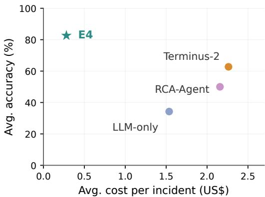  
Figure 1: E4 achieves higher diagnostic accuracy at lower cost than the evaluated agent-based RCA approaches across four datasets. Moreover, it produces more explainable analysis pipelines than the baselines.

While manually navigating dashboards and issuing queries may have sufficed in small deployments, at scale, automation of incident diagnosis is critical. In this regard, the community has responded with many solutions including specialized signature-based and ML algorithms (e.g., [17, 27, 46]) and high-level frameworks for enable analysts to express their hypothesis (e.g., [26,41,59]). More recently, there is significant interest in LLM-assisted agentic workflows (e.g., [12,54,66]).

Ideally, analysts want a root cause analysis system that is:

• expressive to cover a wide range of known and unknown incidents with high accuracy.

• efficient in terms of the cost to process and diagnose incidents at scale.

• explainable so that they have actionable and understandable insights to act on the diagnosis; and

• entail low effort to use.

Unfortunately, existing solutions fail to simultaneously achieve all of these properties. Classical signature-based systems and ML algorithms can be efficient and explainable. However, they lack the expressivity over diverse and future incidents. Using a framework to author flexible data analysis workflows can in theory be expressive and explainable. However, it requires significant effort to design and for analysts to learn to write new capabilities. LLM-assisted agentic systems have the potential to be expressive given the code generation and in-built world knowledge. Unfortunately, they are also prone to inaccuracies, hallucinations, and unverified logic, and can produce answers that are not explainable. Furthermore, LLM-based workflows can be inefficient in terms of the number of steps/tokens taken and data processing costs.

We present E4, an agentic system for root causing incidents in Internet-scale services that demonstrates it is possible to simultaneously achieve all four requirements. Our work builds on constrained creativity [56], a recently proposed design paradigm for agents in systems operations. Instead of having an LLM generate arbitrary code or explore arbitrary hypotheses, we constrain the creativity of the LLM to only produce programs in a structured functional form using a specific DSL. Domain experts can provide an initial library of operators and diagnostic workflows expressed as dataflow DAGs for different kinds of incidents that may occur. The agentic system still has the freedom to reason when its library or playbooks are insufficient and dynamically create new operators and DAGs. Figure 1 previews our results: E4 combines higher average diagnostic accuracy with lower average cost than the evaluated baselines.

There are three key challenges to translate this high-level idea into practice(§ 4): (1) bootstrapping the operator library for a new domain; (2) resolving a new incident efficiently and explainably; and (3) evolving the operator library to tackle future issues. For (1), rather than use a generic domain- and deployment-agnostic library, we develop an effective heuristic to agentically adapt to the available telemetry types and data fields in a new deployment. For (2), rather than use a naive spray-and-pray approach and launching multiple parallel agents, we employ a diagnostic approach that runs analysis via progressive stages of expressivity, moving to the next stage only if the previous stage was insufficient. Finally, for (3), rather than naively allowing the agent to arbitrarily extend the operator library, we explicitly gate the admission of new operators based on their demonstrable utility to explain novel incidents.

We develop a practical end-to-end prototype of E4. We develop an initial library of core operators and example playbooks for common incident types. We design a systematic methodology for hypothesis generation, pruning, and scoring. We evaluate this prototype on a mix of real-world and synthetic incidents based on data from a large application analytics provider, including a small pilot study on real inci dents. We find that E4 can be up to 62% more accurate than the strongest baseline agentic system in terms of identifying the root causes within the top-3 suggested leads, and 5.4× cheaper on average, and up to 12× cheaper, in terms of total analysis cost. We run a number of factor analysis studies and find that the use of the abstraction in constrained creativity is the key contributor. We show that E4 can be effective even with lower reasoning models. We also demonstrate that E4 is flexible and that its effectiveness can be amplified via analyst hints and predefined playbooks.

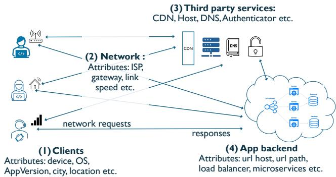  
Figure 2: Internet-scale services entail complex interactions among clients, network-services, third party services, and backend components and can fail in various ways impacting user-experience.

## 2 Background and Motivation

We begin with illustrative troubleshooting and RCA scenarios in large-scale services (Figure 2). We identify key requirements that any such system must satisfy and argue why existing approaches fall short.

## 2.1 Motivating scenarios and requirements

SETTING We consider an RCA assistant that runs alongside an existing alerting system. Given an alert that specifies a KPI anomaly (and its baseline/anomalous time windows), the assistant analyzes available telemetry data and returns a rank-ordered set of hypotheses (e.g., a client cohort, backend service, user behavior sequence) with supporting evidence. The assistant can run fully autonomously from the alert alone, or accept an analyst hint that can prioritize a class of hypotheses and suggest how to probe them.

ILLUSTRATIVE SCENARIOS We discuss three incidents inspired by true stories observed in a production service. We validated these using our simulation harness where we have more fine-grained control.

• Example 1 (Figure 3a): In this case, the KPI of interest to the provider is the login failure rate. An alert fires that the login failure rate went up. The root-cause of the problem is that clients belonging to a specific region were suffering higher failures. The analyst used a traditional distributional shift analysis. Here, for each distinct cohort identified by client attribute values, they check if the distribution of login failures in recent times changed significantly and identify top-5 cohorts that changed the most. Unfortunately, this not only missed the true root cause but also produced false leads. In this case, true problem cohort exhibited a change in the distribution with high variance much before the incident which eventually got amplified when the alert fired. Ideally, the system should also consider such second order effects on distribution properties or frequency-based analysis.

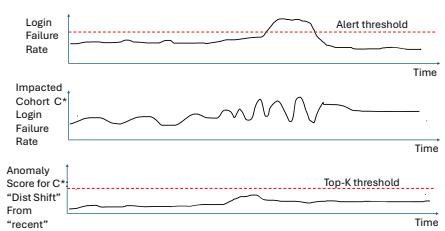  
(a) Example 1 (Login Failure): statistical test lacking second order or frequency-based analysis may miss the ground truth and produce false leads

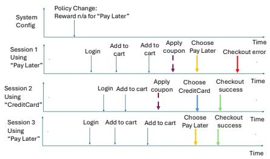  
(b) Example 2 (Checkout policy error): Looking at static attributes misses event sequences

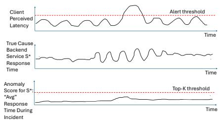  
(c) Example 3 (Latency Increase): Looking at just average values may miss flapping phenomena  
Figure 3: A simplified view of three real-world inspired incidents. These examples illustrate that incidents can have diverse origins and patterns. They also show the need to explore the space of possible hypothesis to explain incidents.

• Example 2 (Figure 3b) In this example, the provider was trying to diagnose a sudden increase in the client checkout errors. But they could not find any discernible error or timeout patterns in backend logs or the client side logs. The true cause turned out to be subtle. There was a policy update where users using a specific “buy now pay later” scheme were no longer allowed to use discount/coupon codes. Users who used this specific payment option after applying the coupon code encountered checkout errors. Other users using different payment modes or who did not apply the coupon did not face issues. In this case, we need to look deeper into behavioral “event sequence patterns” (e.g., Coupon followed by PayLater) that led to errors.

• Example 3 (Figure 3c): In a third example, the provider was concerned about client-perceived latency. An alert fires on an end-to-end latency KPI. The true root cause was that one of the backend services handling client requests wasflapping and its service response time caused clients assigned to it to suffer. The analyst relied on a traditional “correlation” approach to look for backend services whose average response time during the incident duration was high and identified the top-5 services. Unfortunately, these were all false leads and missed the true problem. If the analyst had some intuition that flapping could explain it, they would like to dynamically craft a new hypothesis focused on identifying instability-focused tests that rank services by the change in coefficient of variation.

REQUIREMENTS The above examples help us identify four key requirements for any automated system for RCA in Internet-scale services:

• Expressive: Our examples show the need to consider a diverse set of hypotheses that can span client-side attributes, event patterns, backend metrics, and so on. They also highlight that we may need to look beyond rigid statistical tests or heuristics to avoid blind spots and false leads.

• Efficient: At the same time, we cannot do a brute force search over all possible hypothesis or comb through all data. Both cost and responsiveness of incident resolution are critical and we should be able to get to resolution or a set of leads quickly and cost effectively.

• Explainable: The examples involve non-trivial reasoning beyond basic heuristics and second-order effects. In this case, the analysis should be explainable, so that its outputs are actionable. Imagine a blackbox system that states an answer or produces a long python notebook. Even if it was correct, the analyst would be uneasy to take the recommendation on face value.

• Effort: The system should be easy to use by practitioners, so they do not deal with complex notebooks and writing Pandas/SQL queries. Furthermore, human analysts may want to see the output of AI algorithms and refine them based on their domain knowledge and steer the system or give it hints based on their domain knowledge (e.g., about service flapping in Example 3).

## 2.2 Related Work and Limitations

Troubleshooting and RCA are well studied in academia and industry. At a high level, we can categorize existing efforts into one of three classes as shown in Table 1 (with LLMassisted agents having two subclasses).

• Specialized algorithms: Conventional RCA approaches use custom algorithms for different types of incidents in client-side and backend services (e.g., [9, 11, 18, 28, 35, 47, 57, 69, 74]). While they are mostly explainable and efficient, they have two fundamental gaps in terms of expressivity and effort—limited in the types of incidents they can cover and effort to develop the algorithm.

• Structured frameworks for data analytics/RCA workflows: In addition to bespoke algorithms for narrow incident classes, frameworks allow analysts to author new troubleshooting workflows (e.g., [41, 53, 59]). ExplainIt! [33] provides a declarative SQL interface for exploring and ranking candidate causes in time-series data. MoCE [26] expresses hypothesis exploration as operator DAGs and reuses computation across analyses. These frameworks provide flexible, structured analyses, but analysts still supply the queries, workflows, or new analysis methods needed to cover diverse incidents. E4 builds on this approach by using LLMs to compose analysis DAGs and synthesize new operators when needed.

<table><tr><td rowspan=1 colspan=1>System Class</td><td rowspan=1 colspan=1>Expressive</td><td rowspan=1 colspan=1>Efficient</td><td rowspan=1 colspan=1>Explainable |</td><td rowspan=1 colspan=1>Effort</td></tr><tr><td rowspan=1 colspan=1>Specialized    al-gorithms    (e.g.,Sage       [18],Murphy     [28],[9,11,35,47,74])</td><td rowspan=1 colspan=1>X</td><td rowspan=1 colspan=1>√</td><td rowspan=1 colspan=1>√</td><td rowspan=1 colspan=1>X</td></tr><tr><td rowspan=1 colspan=1>Frameworks   forauthoring    dataanalysis    work-flows (e.g., SQL,ExplainIt!   [33],MoCE [26])</td><td rowspan=1 colspan=1>X</td><td rowspan=1 colspan=1>√</td><td rowspan=1 colspan=1>√</td><td rowspan=1 colspan=1>X</td></tr><tr><td rowspan=1 colspan=1>Workflow-guidedRCA agents (e.g.,LLexus     [39],StepFly [43])</td><td rowspan=1 colspan=1>X</td><td rowspan=1 colspan=1>X</td><td rowspan=1 colspan=1>√</td><td rowspan=1 colspan=1>√</td></tr><tr><td rowspan=1 colspan=1>Coding    agentsfor RCA  (e.g.,Terminus-2  [24],RCA-Agent [66])</td><td rowspan=1 colspan=1>√</td><td rowspan=1 colspan=1>X</td><td rowspan=1 colspan=1>X</td><td rowspan=1 colspan=1>√</td></tr><tr><td rowspan=1 colspan=1>Ours (E4)</td><td rowspan=1 colspan=1>√</td><td rowspan=1 colspan=1>√</td><td rowspan=1 colspan=1>√</td><td rowspan=1 colspan=1>√</td></tr></table>

Table 1: Qualitative comparison against the four requirements of modern RCA. Ticks indicate support for the stated requirements; crosses indicate limitations.

• LLM-assisted RCA agents: Recent efforts use LLMs to guide diagnosis and gather evidence through tools [32, 52, 62, 66, 68]. Workflow-guided agents constrain investigations using predefined procedures [20, 39, 43, 49], making the analysis easier to follow but limiting its expressivity. Coding agents can introduce new analyses on demand, but their generated code and reasoning trails can be difficult to inspect. A second, and related issue is efficiency. The LLM may hallucinate and/or chase a number of dead ends, consuming time/tokens in the process [37]. LLM-assisted agents also repeatedly examine telemetry and intermediate results, incurring substantial token costs. Finally, even with tool augmentation we observe that state-of-the-art (public) capabilities are quite limited in terms of effectiveness [13, 51, 61, 62].

Takeaways: We see that none of the current paradigms of RCA/troubleshooting efforts can simultaneously achieve all of our requirements. Each class achieves only a subset of these requirements at the expense of the others; an ideal solution would satisfy all four simultaneously. Next, we discuss how we can indeed achieve this in practice.

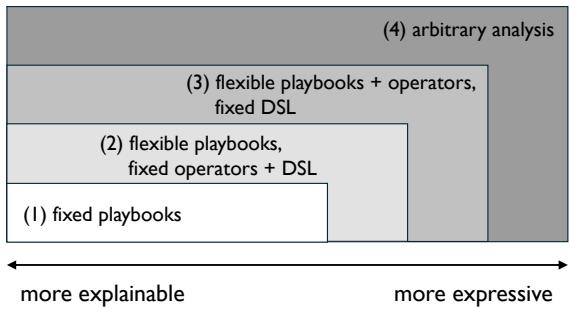  
Figure 4: The inherent tradeoff between explainability and expressivity among RCA approaches: (1) RCA is performed via fixed pre-defined playbooks, (2) RCA is performed via composing new playbooks based on existing DSL and operators, (3) RCA is performed via authoring new operators in an existing DSL and then composing new playbooks using those operators, (4) the RCA agent can write arbitrary code to orchestrate the analysis. E4 confines RCA to (1), (2) and (3), using more expressive power only if the previous level was insufficient.

## 3 Design Overview

## 3.1 High-level Idea

Every analysis in an RCA system can ultimately be thought of as a data analysis program. The program takes the telemetry data, associated metadata, and the anomalous KPI as input, and outputs a ranked list of root cause leads. We posit that high expressivity, explainability, and efficiency are desirable traits of this program, and that an RCA system should produce it with low effort.

To achieve low-effort, we adopt an LLM-driven RCA system similar to prior work. That said, there is a wide spectrum of how we can use an LLM. Different approaches in agentic RCA systems have different levels of expressivity and explainability on a expressivity–explainability spectrum as shown in Figure 4. At the expressivity end are generalpurpose coding agents, which can write any program. Close to this end, RCAgent [62] and the agent framework evaluated in OpenRCA [66] enable flexible tool use and code generation, making their programs expressive but hard to explain. Moving toward greater explainability, works like Flow-of-Action [49] follow previously created SOP-guided investigation with some procedure generation. At the explainability end are works that only execute human-authored troubleshooting guides, such as LLexus [39] and StepFly [43], where the procedure is fixed in advance and the agent’s role is limited to carrying out its steps.

To navigate this tradeoff, we adopt constrained creativity [56], a paradigm in which the programs an agent produces stay within a bounded region of this expressivity– explainability spectrum. More specifically, we constrain the structure that every analysis program must follow using a specific domain-specific language (DSL). As illustrated in fig. 4, the DSL and operator library restricts the space of programs that can be generated to perform the analysis. In essence, we can think of each RCA analysis as a composition of some basic lego blocks or operators that retrieve or analyze the telemetry data, prune the space of related entities, construct the trajectories, and perform some statistical or contrastive analysis to produce leads. Said differently, our DSL defines a vocabulary of callable operator APIs, such as generating candidate hypotheses or scoring them, and a grammar requiring that calls to these APIs compose into an analysis DAG. The grammar is fixed, so every analysis program obeys the same structural rules. This structure also helps keep token and execution costs low (§4.2).

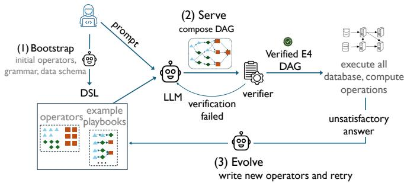  
Figure 5: E4 is a practical realization of constrained creativity with 3 high-level ideas: (1) Bootstrap: adapting the DSL operators to the specific domain, incorporating any domain knowledge or custom data columns, (2) serving an incident by crafting a DSL-compliant DAG for the diagnosis and (3) if the current operator library is not sufficient, E4 authors new operators and reruns diagnosis.

Realizing this paradigm raises four questions: how to represent the structure that every analysis program must follow; what vocabulary that structure can use, and where it comes from; how to keep the cost of an investigation in check; and what to do when the vocabulary does not suffice. We answer these in the following sections.

RELATION TO HARNESS ENGINEERING Skills and har ness engineering decide what the agent can call, how calls compose, and what executes. Harness design has grown from prompt templates into runtime and systems design [63], spanning workflows [30], evaluation, permission control, state management, and review loops [55]. For RCA, constrained creativity can serve as the basis for designing a good harness based on its DSL in conjunction with these techniques.

## 3.2 System Overview And Challenges

We present E4, a practical realization of this high-level idea of constrained creativity. To fix the grammar every analysis program must follow, we borrow the DAG structure of a recent work [26]. E4 ships with an initial set of operators common to RCA in Internet-scale services; this vocabulary can be extended during the investigation of an incident. E4 follows a two-step exploration process of the given region of expressivity–explainability spectrum. At level 1 – the DSL has a given vocabulary and grammar and E4 is restricted to use the given vocabulary and grammar to explore the space of all possible analysis programs and come up with the best that solves the anlysis. At level 2, the vocabulary can be evolved using an LLM, thereby increasing the space of programs more towards the space of all programs supported by the DSL’s grammar. These two steps are analogous to the two levels in fig. 4.

Figure 5 gives an end-to-end view of E4. Panel (a) shows the DSL: operators with compatible input and output types, composed into an analysis DAG. Panel (b) shows the threestage recipe for building, running, and evolving the agent. An initial operator library and example playbooks provide the starting vocabulary; the recipe grows the vocabulary while the grammar stays fixed. The recipe is agnostic to the choice of LLM and comprises the following stages:

1. Bootstrap runs once per deployment and fixes the vocabulary the agent starts from, and with it the program space of fig. 4 that level 1 explores. The LLM takes as input the initial operators and example playbooks, the deployment’s telemetry schema, a description of the RCA task, and optional analyst hints. From these it generates additional operators from the schema and domain knowledge of the task, then composes example playbooks over them. New operators must use input and output types supported by the DSL; the grammar remains fixed. The LLM sees the schema but never the deployment’s telemetry. The playbooks undergo static verification and execution on synthetic data generated from the schema to catch runtime errors. Bootstrap hands the agent a deployment-specific operator library and verified playbooks for use at runtime.

2. Runtime adaptation runs per incident, at level 1 of fig. 4. The agent is given the incident as a natural-language description, relevant metadata, and optional troubleshooting hints, along with the operator library and playbooks from bootstrap and access to the telemetry. It selects a playbook or composes a new DAG from the operators. The verifier checks that the referenced operators exist, connected operators have compatible types, and the graph is acyclic. Once verified, the DAG is passed to the execution engine, which schedules its database and compute operations. The agent can revise the DAG over several iterations to refine the diagnosis, and returns a ranked list of root cause leads; if no program over the current vocabulary yields a satisfactory result, it escalates to evolution.

3. Evolution runs when runtime adaptation escalates, moving the agent to level 2 of fig. 4 and enlarging the space of programs it can compose (fig. 4). The LLM is given the escalated incident together with the history of failed attempts, the current operator library and playbooks, and the task description. It proposes new operators, with input and output types supported by the DSL, that fill the gap the failures reveal, and composes playbooks over them; the grammar remains fixed. The extended library is admitted only if it lets the escalated incident be served, in which case it replaces the current one and is reused in subsequent investigations; otherwise the library is left unchanged.

## 4 Detailed design

This section provides detailed designs of the bootstrap, compose and evolve phases of our RCA agent, E4, for a given deployment. Figure 5 outlines the various components of the end-to-end system. There are 3 core ideas in the design: (1) bootstrapping E4 for a new domain, (2) diagnosing an incident via successive stages of expressivity and (3) evolving the library of operators in the DSL if the current operators are insufficient. We describe these next.

## 4.1 Bootstrapping E4 for a new domain

Different internet services have different sets of available monitoring data with varying data schemas. The bootstrapping phase, executed once per deployment, adapts E4 to the specific system, ensuring the DSL includes obvious operators to incorporate domain-knowledge or take advantage of domain-specific columns in the data schema. For instance, in one scenario, the bootstrapping phase produced an operator that uses parent-child relationships in traces to rank services by their failed spans with no failed child, helping distinguish potential error origins from propagated failures.

For bootstrapping, we start with a starter DSL with an initial set of operators that are general for different modes of telemetry (e.g., timeseries, events, traces). Then we prompt a state-of-the-art coding agent with the following inputs: the initial operator set, the deployment’s telemetry schema and metadata, a natural-language description of the domain and the RCA task, a few example playbooks (pre-defined programs in the DSL) and an optional analyst hint. Based on this input, the agent synthesizes a specialized operator library and a playbook library customized to that deployment.

The grammar of the DSL constitutes the structure that E4 uses to compose the operators. We fix E4’s grammar to a DAG of operators, but we note that other structures like tree, or a program with loops are also possible. We made this choice as previous RCA algorithms fit naturally into a DAG [26]1. We next describe the starter DSL vocabulary: the initial set of operators provided as input to the bootstrapping phase.

• Candidate generation operators: Operators to analyze (1) data cohorts based on column attributes e.g., region, deviceVersion, (2) event sequences e.g., error sequences in the client-side device, (3) performance metrics e.g., CPU usage in backend services. They output a list of candidate root cause leads.

• Candidate scoring operators: These include (1) statistical scorers that test a candidate’s metrics against the baseline (e.g., from history or another user cohort) via standard statistical test, (2) Bayesian models, such as decision tree, for learning distribution of metric values in fine-grained data cohorts and performing MLE. They output candidate root cause leads along with a score.

• Summarizer operators: These include (1) ensemble aggregation operator to combine results from multiple algorithms via weighted majority, giving weight to root causes flagged by multiple algorithms (2) weight readjustment operators to distinguish primary root causes from secondary symptoms e.g., by penalizing the scores of upstream backend services that get affected by a failure. They output a ranked list of candidate root-cause leads.

If the analysis uses an ensemble of algorithms, the DAGbased DSL naturally avoids duplicate computation across different algorithms by utilizing the same intermediate result for different downstream analysis.

E4’s operators abstract away implementation complexity from the agent; it only needs to know the functional signature describing the input/output types of each operator. For instance, the candidate generation operators require issuing complex SQL queries (e.g. to get all events after login-start and before login-end for each user-session) or perform complex stateful computation over the event stream (e.g. to compute if a user is a frequent user or not). Similarly, the scoring operators have complex algorithmic machinery e.g., employing Aho-Corasick data structure to handle “event strings” for finding event patterns. The agent does not need to know or handle any of these complexities, which boosts its serving accuracy and context usage. These operators are also optimized for large-scale data, resulting in better efficiency.

## 4.2 Serving incidents via progressive stages

Once the DSL operator library gets updated via bootstrapping, it can be used for diagnosing incidents. E4’s progresses in stages with each stage providing more expressivity if the analysis from the previous stage was not satisfactory (see illustration of stages in Figure 4). The rationale here is constraining the creativity of the agent makes the responses more explainable, so we only employ more expressivity if needed.

To troubleshoot an ongoing incident, a human prompts the E4 agent, optionally with any domain knowledge about the failure. The operator descriptions and the example playbooks are passed along with the prompt. The E4 agent then composes a DAG for RCA, in successive stages (Figure 4). We describe the first two stages below:

• Stage (1) Fixed playbook: the E4 agent picks an existing playbook from the set of given playbooks for performing RCA and instantiates its hyperparameters for the given incident. For instance, the agent can select a playbook to an alyze client cohorts and look for corresponding root causes e.g., browser version, operating system, backend service. If the root cause is not among these entities or it is not found using the chosen playbook, the agent moves to the next stage.

• Stage (2) Flexible playbook, fixed operators: the agent composes a new DSL-conformant DAG using the existing operator library. The agent can pick the hyperparameters for individual operators in the DAG. For reference, Figure 10 in appendix includes a detailed DAG produced by E4.

Once the agent generates a DAG, E4’s verifier ensures that “the DAG compiles” before passing the DAG to the runtime execution engine. We describe the verifier and the runtime execution engine briefly before moving on to the next stage of evolution (stage 3 in Figure 4).

Verifier We employ a simple verifier to ensure the candidate DSL DAG generated by the E4 agent is semantically correct, thereby increasing the reliability of the compose phase. Specifically, the verifier checks for the following:

• operator validity to prevent hallucinated operators

• type-safety to ensure input/output data types match for each operator in the DAG

• the operators are composed via a DAG and do not include any cyclic calls

• candidate generation operators are consumed only by scoring operators or by other candidate generation operators, and no operator remains unused

• the program finally ends in exactly one answer

E4’s Runtime Execution Engine The runtime system is responsible for scheduling all the database and compute operations of the generated DAG, parallelizing them across a distributed cluster. Note that the DAG operations can be of different types e.g., SQL, ML inference, stateful filtering. The runtime also caches intermediate computation to save execution costs, indexing a DAG node by computing a recursive hash of its resolved inputs. This cached result can be resued if the agent invokes the same subgraph in a later analysis. It can also be used for failure recovery in case one of the parallel nodes fails mid-execution. E4 allows the user to change the maximum size of this cache along with the cache eviction policy e.g., Least recently used or Last in first out.

Note that at no stage does the LLM interact with data directly. The agent reads the prompt, the operator descriptions and the playbook library and produces a DAG. The DAG gets executed in a local environment without any agent interactions. This has two advantages. Firstly, this results in low token costs without sacrificing the accuracy of the analysis (§ 6.2). Secondly, this naturally addresses sovereignty and privacy , if any, for sensitive and proprietary data as no data needs to leave the enterprise.

## 4.3 Evolving E4’s operators for more expressivity

When the second stage (flexible playbook, fixed operators) of the agent also fails, it implies no program over the current vocabulary (operator library) could diagnose the incident, and the operator library must be extended. This represents stage (3) of expressivity (flexible playbook, flexible operators, fixed DSL) in Figure 4. This step can be thought of as a joint optimization problem (Appendix D) to generate the most accurate program (P) from E4’s operator library (L) and both P and L are modified alternatively. For synthesizing operators, E4 analyzes diagnosis gaps. It retains new operators only when they improve the diagnosis, avoiding “operator-bloat”.

To evolve the operator library, we take the escalated incident together with the results of every program tried and why it was deemed insufficient and pass them as input to a coding agent. The LLM is prompted to first evaluate the gap, i.e., why previous attempts were insufficient, and then to propose new operators based on this evaluation. The serve phase of E4’s agent is then invoked again, to diagnose the incident using the new operators. Ultimately, the new operators are admitted to the DSL permanently, if they produced the true root cause (decided via user feedback).

As an example, in one incident, the gap evaluation showed that no operator in the library generates root cause candidates corresponding to the endpoint of a request, and asks for suitable operators. The evolve phase, in this case, synthesized two new operators: the first operator emits candidates based on requests’ target endpoint (host and path), filtering out rarely used endpoints. The second operator computes the candidate’s failure rate within a window by a count-weighted mean and standard deviation and scores the candidate by the Wasserstein-2 distance between the baseline and anomalous windows. Both were admitted, taking the library from 19 operators to 21. E4’s agent then orchestrates new analysis by using these two operators along with existing cohort-based summarizer operators. This updated analysis produced the right root cause as the top lead: clients in a single geographic region were experiencing high login-failure rates (74%).

## 5 Implementation

System and runtime setup We implement E4 in about 7.5K lines of Python and run the prototype on a single MacBook Pro with an Apple M3 Pro CPU (12 cores: 6 performance and 6 efficiency), 18 GB of unified memory, and macOS. Programs are serialized as JSON: each node names an operator and its inputs, with node identifiers representing dependencies. The execution engine uses Ray tasks/actors [45] to run independent branches in parallel and caches node outputs for reuse across attempts. Operator admission checks Python syntax, declared signatures and return annotations, and scans the AST for prohibited I/O and dynamic-code constructs; collid ing operator names receive new versions. We run Python 3.10 and Ray 2.49. Across all experiments, the LLM is Gemini-3.1-Pro, served remotely through Google Vertex AI; only the operators execute locally.

Configuration The runtime uses binary analyst feedback: it accepts a diagnosis when the analyst is satisfied and otherwise proceeds to the next stage, subject to the attempt budget.2

The digest reports baseline and anomalous aggregates side by side: row counts, per-entity failure rates, and latency quantiles $p _ { 5 0 } / p _ { 9 0 } / p _ { 9 9 }$ . The data-processing limits cap the largest entity groups, time buckets and string lengths. Bootstrap tests playbooks on schema-derived synthetic telemetry covering five fault types: cohort failure, cohort duration, latency, CPU stress and primary URL failure. Generation and scoring operators use separate synthesis prompts. Library eviction removes the least-used operators, counting usage over incidents seen so far, and drops playbooks that no longer verify.

Operators do not carry fixed statistical thresholds. Every threshold, such as a significance level, a minimum support or a minimum traffic share, is a declared parameter with a default and an optional estimator; a playbook wires it as auto and the engine estimates it from the baseline window at execution time. OVer rejects an operator that hard-codes a threshold in its body, so a value the agent cannot see or set never decides an answer.

Default operators and playbooks The starter library contains 19 operators: 7 candidate hypotheses generators, 10 scorers, and 2 summarizers. Eleven example playbooks ship with it. Table 2 summarizes the operator families grouped by their function. The playbooks cover client cohorts, backend services, URL-driven incidents, and combined client/backend analysis.

## 6 Evaluation

We evaluate E4 on four public benchmarks and on a custom benchmark. We first compare overall accuracy and cost across these datasets, then examine incident types, recipe stages, and sensitivity to workload conditions.

<table><tr><td>Family</td><td>Inputs and computation</td></tr><tr><td>Data access</td><td></td></tr><tr><td>Loaders and aggregators</td><td>Read sessions and aggregate telemetry by window and at- tribute.</td></tr><tr><td>Candidate generation</td><td></td></tr><tr><td>Client cohorts</td><td>Propose cohorts by region, ISP, OS or device version.</td></tr><tr><td>Backend metrics</td><td>Propose services with CPU, memory or disk conditions.</td></tr><tr><td>Event patterns</td><td>Derive candidate subsequences from session events.</td></tr><tr><td>URL services</td><td>Propose backend or third-party URLs with failures or delays.</td></tr><tr><td>Scoring</td><td></td></tr><tr><td>Differential diagnosis</td><td>Compare cohort, URL or server metrics against baseline using t-tests or permutation tests.</td></tr><tr><td>MLE</td><td>Fit a decision-tree regressor to historical cohort KPIs; score cohorts by how well they explain the anomaly.</td></tr><tr><td>Flow model</td><td>Fit a weighted sum of URL metrics to the KPI; score changes in each URL&#x27;s contribution.</td></tr><tr><td>Event pattern</td><td>Use Aho-Corasick matching to compare subsequence sup- port in failed and successful sessions.</td></tr><tr><td>Summarization</td><td></td></tr><tr><td>Weight readjustment</td><td>Use backend dependencies to downweight propagated symp- toms and boost likely primary causes.</td></tr><tr><td>Ensemble aggregation</td><td>Combine scores, giving more weight to candidates supported by multiple scorers.</td></tr></table>

Table 2: Starter operator families and their computations.
<table><tr><td>Dataset</td><td>Application / scope</td><td>Incidents</td><td>MB/incident</td></tr><tr><td>DSB</td><td>Social network; client and backend</td><td>64</td><td>479±251</td></tr><tr><td>Market-CB1</td><td>Online shopping; backend</td><td>70</td><td>224±37</td></tr><tr><td>Bank</td><td>Banking; backend</td><td>136</td><td>83±56</td></tr><tr><td>Telecom</td><td>Telecommunications; backend</td><td>51</td><td>107±3</td></tr><tr><td>ORCA-bench</td><td>Online shopping; multiple backend causes</td><td>36</td><td>221±50</td></tr></table>

Table 3: Dataset summary. Distinct incident counts cover the full benchmark. MB/incident reports mean ± standard deviation of compact JSON inputs in our evaluation.

## 6.1 Setup

DATASETS We evaluate on the Market-CB1, Bank, and Telecom deployments from OpenRCA [66] and ORCAbench [22], which provide backend telemetry. To additionally evaluate client-side diagnosis, we extend DeathStarBench’s Social Network application [19] with simulated clients, attributes, and session-event histories. Table 3 summarizes the datasets; Appendix A describes their telemetry, KPIs, faults, and preparation. The DSB corpus contains 64 incidents. For ORCA-bench, we construct windows from frontend KPI anomalies without using fault-injection times.

BASELINES We compare E4 with three baselines. LLM-only directly analyzes raw telemetry selected using the balanced sampling approach in OpenRCA [66]. RCA-Agent, also introduced in OpenRCA [66], uses two LLM agents: a controller directs the investigation and interprets results, while an executor writes and runs Python code in a persistent Python interpreter. Terminus-2, the agent harness used in the ORCAbench evaluation [22], investigates raw telemetry through an interactive Bash shell. We run all three baselines through the

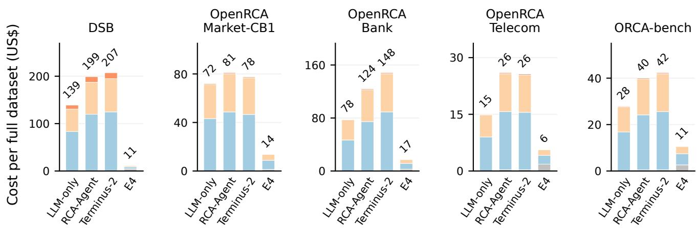  
(b) Full-dataset cost in US\$ by component (lower is better).  
Figure 6: Overall results on the five datasets. Compared with Terminus-2, E4 achieves 1.3× the accuracy or recall and reduces cost by a factor of 8.1 on average, using the mean of per-dataset ratios.

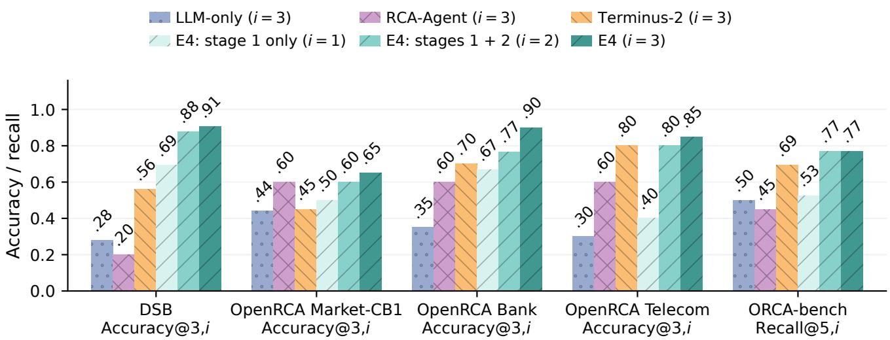  
(a) E4 achieves 65-91% accuracy across all benchmarks compared to ≤ 56% for baselines. The accuracy metric is indicated for each dataset and the attempt budget i is shown in the legend. Baselines use up to three attempts; each E4 stage adds one attempt.  
System Input Thinking Output

Harbor harness [24] used by Terminus-2. All baselines receive the same anomaly trigger as E4, including the anomalous KPI and historical/anomalous time windows. They are prompted to return ranked leads using the same JSON schema as E4, enabling evaluation with a shared parser. All baselines use the same underlying LLM (Gemini-3.1-Pro) as E4 (§5) and are evaluated on the same incidents.

E4 CONFIGURATIONS We evaluate three variants of E4. All start from a bootstrapped library containing the starter operators, additional operators synthesized by the LLM during bootstrap, and playbooks over these operators. For the opensource benchmarks, we kept the starter operators unchanged throughout the experiments.3 We refer to the three successive serving attempts as Stages 1, 2, and 3. E4: stage 1 only selects and instantiates an existing playbook (Stage 1; Mode 1.A). E4: stages 1 + 2 additionally permits composition of a new DSL program using existing operators when Stage 1 fails (Stage 2; Mode 1.B). Full E4 further permits synthesis of new operators and composition of a program using the expanded library when Stage 2 fails (Stage 3; level 2).

EVALUATION METRICS We use a two-dimensional metric, Accuracy@k,i, to evaluate iterative RCA: the fraction of incidents where the true root cause appears among the first k ranked leads in at least one of up to i attempts. This captures both the number of leads an analyst must inspect per attempt and the opportunities to revise a diagnosis. We report Accuracy@3,3 on DSB and the three OpenRCA deployments, allowing three ranked leads per attempt and three attempts total (the initial attempt plus up to two retries). The Stage 1-only and Stages 1+2 configurations correspond to Accuracy@3,1 and Accuracy@3,2, respectively. For ORCA bench, we report Recall@5,3: for each window, we take the highest fraction of labeled root causes found among the first five leads in any of up to three attempts, then average across windows. The Stage 1-only and Stages 1+2 configurations use Recall@5,1 and Recall@5,2, respectively. On a retry, the system is prompted to produce a different ranked list of root causes from its previous attempt. Baselines repeat their investigation workflow, while E4 progresses through playbook selection, composition using existing operators, and evolution with newly synthesized operators. We report the total analysis cost, including LLM inference and system costs.

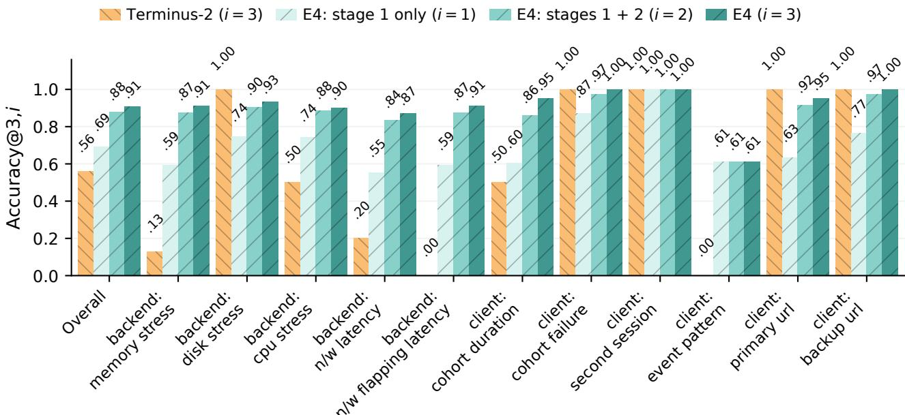  
Figure 7: Accuracy@3,i on DSB by incident type, with attempt budget i shown in the legend. E4 has an average gain of 33.7 percentage points over Terminus-2 across the 11 incident types.

## 6.2 End-to-end evaluation

ACCURACY Figure 6a compares E4 vs. three baselines across five datasets. E4 matches or exceeds every baseline on each dataset’s metric. Its largest gain over the strongest baseline for a dataset is 34.7 percentage points on DSB, or 62% in relative terms. The strongest baseline scores are 0.60 for RCA-Agent on Market-CB1 and 0.70 and 0.80 for Terminus-2 on Bank and Telecom.

Together, this validates that the region explored by E4 on the expressivity–explainability spectrum (Figure 4) delivers high accuracy for RCA tasks despite the restrictions on the program structure. Since Terminus-2 is the strongest baseline on four of the five datasets, we use it for the incident-wise

## comparison in §6.4 later.

COST Figure 6b compares total analysis cost, including LLM inference and system cost. E4 has the lowest cost on every dataset, reducing cost by 5.4× on average and up to 12.1× on DSB relative to the least expensive baseline on each dataset. Although E4 incurs higher system running cost, the savings in LLM inference cost more than offset this overhead.

RECIPE STAGE CONTRIBUTIONS Across the 70 incidents in Market-CB1, Bank, and Telecom, 32 (45.7%) required Stage 2, and 19 (27.1%) proceeded to Stage 3. These stages correctly localized an additional 13 and 6 incidents, respectively, beyond the 38 handled by Stage 1. Using the stage values in Figure 6a, Stage 2 improves accuracy/recall over Stage 1 by 41.6% on average across all five datasets, averaging per-dataset relative gains. Stage 3 improves accuracy/recall over Stage 2 by 7% under the same averaging convention; on Bank, this gain is 17%.

DSB INCIDENT TYPES Figure 7 compares DSB incident types using the plotted Accuracy@3,i estimates. Averaging equally across fault types within each group, E4 achieves 1.22× the mean accuracy of Terminus-2 on client-side faults and 2.47× on backend faults. These gains suggest that E4 is robust across different fault types in both client-side diagnosis and backend localization.

## 6.3 Illustrative examples

We illustrate findings from our evaluation datasets through examples of how E4 prepares its operator library, reuses playbooks in Stage 1, composes new analyses in Stage 2, and synthesizes new operators in Stage 3.

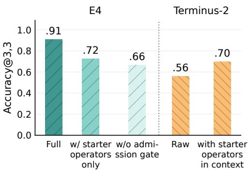  
Figure 8: Contribution of LLM-based operator synthesis and the admission gate in E4 for DSB dataset, compared with providing starter operators in Terminus-2’s context.

• In Market-CB1, an incident flagged increased average latency at the product-catalog service. In Stage 1, E4 selected an existing metric-shift playbook, which compared component metrics against historical baselines and combined evidence across abnormal series. It ranked a shipping-service instance first and identified excessive read I/O, matching the ground truth fault without composing a new DAG or synthesizing an operator.

• Another Market-CB1 incident flagged increased average latency at the shipping service. The metric-shift playbook selected in Stage 1 did not identify the cause. In Stage 2, E4 composed a DAG combining span-latency analysis with trace-flow attribution and component-metric evidence. Using only existing operators, it ranked a frontend instance first and identified network latency, match ing the ground truth fault.

• In Bank, an incident flagged increased average service latency. Stages 1 and 2 did not yield a correct diagnosis among the top three leads. E4 identified that its analyses measured metric deviations without considering whether they tracked the affected KPI. In Stage 3, it generated an operator that weights metric anomaly scores by their temporal correlation with the KPI. The resulting DAG ranked the affected application-server instance first, matching the ground truth component.

## 6.4 Ablation Study

LLM-BASED OPERATOR SYNTHESIS Figure 8’s estimates decrease from 0.91 for full E4 to 0.72 with starter operators alone. This supports the design choice of extending the starter library using an LLM during bootstrapping (Section 4.1).

ADMISSION GATE Without the admission gate (§4.3), accuracy falls to 0.66. This suggests the value of retaining new operators only after they help resolve an incident.

OPERATORS IN CONTEXT Providing starter operators in Terminus-2’s context raises accuracy from 0.56 to 0.70, while full E4 reaches 0.91. This suggests our choice of starter operators is generally useful, but leaves a gap to E4’s structured composition and evolution (Sections 4.2 and 4.3).

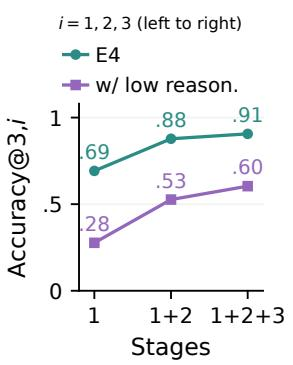  
(a) Reasoning capacity.

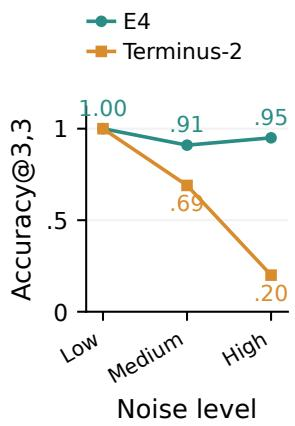  
(b) Impact of noise.  
Figure 9: Accuracy for (a) low and high reasoning capacities over the three stages and (b) full E4 and Terminus-2 at three dataset noise levels, both on the DSB dataset.

IMPACT OF LLM’S REASONING POWER Figure 9a compares the current DSB stage values with a low-reasoning curve. Accuracy@3,i values of 0.28, 0.53, and 0.60 for i = 1,2,3, respectively, ending 33.3% below full E4 hinting decent performance even at lower reasoning levels.

ROBUSTNESS We vary background noise by adding confounding activity, decoy spikes, and timing jitter. Figure 9b compares low, medium, and high noise. From low to high noise, E4’s accuracy drops by 5%, compared with 80% for Terminus-2; under medium noise, their Accuracy@3,3 values are 0.91 and 0.69. Under high noise, Stage 2 improves accuracy over Stage 1 by 27%, suggesting that combining complementary evidence helps distinguish faults from background activity.

## 6.5 Pilot study

We evaluated E4 on 6 incidents sampled over two weeks from three large-scale production media-streaming services monitored by a large analytics provider. The incidents involved login errors, session errors, search success, and user abandonment. For each incident, we manually established ground truth by identifying the affected user cohort from concentrated complaints in application store reviews. E4 identified the correct cohort in 5 of 6 incidents. Three without additional hints and two with analyst hints guiding operator synthesis or DAG refinement. Among these successful cases, the correct cohort ranked first in three and second in two. We highlight two interesting incidents

• In one incident, an app-store review reported that adding an item to the cart never completed. Investigating abandoned add-to-cart flows with errors, E4 successfully identified a third-party advertising endpoint as the primary root-cause lead.

• In another incident, an analyst asked which user actions preceded app crashes. E4 successfully discovered applying a coupon followed by selecting an installmentpayment (EMI) option led to these crashes.

## 7 Other related work

We discussed some of the closest related work in §2.2. Here we discuss other related work.

OBSERVABILITY AND MONITORING SYSTEMS RCA relies on diverse telemetry data and business-centric KPIs of interest. There are significant efforts in industry and academia on building such observability, monitoring, and, analytics systems (e.g., [1–3, 16, 34, 40]). There are also many anomaly detection techniques built on top of these systems (e.g., [8, 23, 65]). These efforts are orthogonal to E4 and our system is flexible to accommodate telemetry data from these systems.

AGENTIC SYSTEMS FOR OTHER ASPECTS OF OPERA-TIONS While we focused on troubleshooting, there are efforts underway to adopt agentic workflows in other aspects of system and network operations (e.g., [64, 72, 73]). These are orthogonal to our focus, but some of the work on configuration changes could be related both as causes of issues and remediations suggested after RCA. We evaluated works analogous to tool-augmented LLMs [62] in §6.4, however they were significantly outperformed by E4.

OPTIMIZING AGENTS An interesting direction for future work is to employ agent optimization techniques [5, 15, 42, 48, 67], including prompt optimization, to improve E4.

## 8 Discussion

LOOKING AHEAD AS LLMS IMPROVE We expect LLM agents to continue improving, and consider it plausible that generic agents will eventually outperform specialized harnesses in RCA accuracy. For example, on DSB our direct LLM baseline improved from 8% accuracy with Gemini-3- Pro to 28% with Gemini-3.1-Pro (Figure 6a); even at the latter accuracy it remains approximately 12× more expensive than E4. Production RCA will still require efficient execution, explainable results, and low operator effort. E4’s analysis via a DAG of predefined operators avoids excessive token consumption during an incident and also enables reuse of existing pipelines that can be extended across successive investigations. This reduces repeated work while making the diagnosis explainable. As stronger LLMs improve the analysis accuracy, we believe E4 will still provide the mechanisms needed to turn that reasoning into an efficient and explainable operational system.

DATA SAFETY Many enterprises may be wary of their data or workflows leaking to frontier models. E4’s design is advantageous in this scenario because the LLM never needs full telemetry dumps: it only sees the incident description, the operator catalog, and the dataset schema whereas the data is accessed locally by the execution engine via E4’s operators.

LEARNING IMPROVEMENTS An interesting direction of future work is considering a continuously learning version of E4 or using ideas like test-time training [60]. That is, over time, E4 can build and refine its library of operators, DAG playbooks, and hypothesis exploration prioritization for a given deployment. This could be further augmented with synthetic scenarios and/or human feedback as well.

CONSTRAINED CREATIVITY FOR OTHER OPS TASKS E4’s constrained creativity is a promising approach to design agentic systems in various other troubleshooting domains e.g. “grey failures” such as silent packet drops (e.g., [31, 44]), failures in the network layer (e.g., [6,7,9,21,25,29,38,50,58,70]), storage systems (e.g., [71]), backend infrastructure (e.g., [17, 27, 33, 36, 74]) and large software systems (e.g., [14, 69]). While we focused on RCA, the same idea could also be applied for anomaly detection. We leave these for future work.

OTHER USES OF CONSTRAINED CREATIVITY While we apply constrained creativity to RCA/troubleshooting, the paradigm is more broadly valuable; prior work outlines its use for network configuration generation and red-teaming [56]. The same paradigm with a different set of operators could also help with revenue debugging [10], aspects of exploratory data analysis and reliable information retrieval.

## 9 Conclusion

We presented E4, an agentic RCA system built around constrained creativity: the agent generates a response via a typed dataflow DAG based on domain specific operators for troubleshooting. This approach leads to the agent’s results being accurate, explainable, verifiable and cost-effective. Across a mix of simulated and production workloads, E4 achieves up to 62% better accuracy compared to state-of-the-art solutions, while providing more explainable responses at up to 12× reduced cost.

Ethics Statement: Most of our experiments use real-world inspired incidents on a simulator. For the pilot study, we engaged domain experts inside an analytics provider and used real-world data from one of this provider’s customers. This does not contain any personally identifiable information and our analysis is in conformance with organizational policies.

## References

[1] Datadog. https://www.datadoghq.com/blog/ datadog-product-analytics/.

[2] Jaeger. https://https://www.jaegertracing. io/.

[3] Opentelemetry. https://opentelemetry.io/.

[4] Zipkin. https://zipkin.io/.

[5] Lakshya A Agrawal, Shangyin Tan, Dilara Soylu, Noah Ziems, Rishi Khare, Krista Opsahl-Ong, Arnav Singhvi, Herumb Shandilya, Michael J Ryan, Meng Jiang, et al. Gepa: Reflective prompt evolution can outperform reinforcement learning. arXiv preprint arXiv:2507.19457, 2025.

[6] Behnaz Arzani, Selim Ciraci, Luiz Chamon, Yibo Zhu, Hongqiang (Harry) Liu, Jitu Padhye, Boon Thau Loo, and Geoff Outhred. 007: Democratically finding the cause of packet drops. In 15th USENIX Symposium on Networked Systems Design and Implementation (NSDI 18), pages 419–435, Renton, WA, 2018. USENIX Association.

[7] Behnaz Arzani, Selim Ciraci, Boon Thau Loo, Assaf Schuster, and Geoff Outhred. Taking the blame game out of data centers operations with netpoirot. In Proceedings ofthe 2016 ACM SIGCOMM Conference, SIGCOMM ’16, pages 440–453, New York, NY, USA, 2016. ACM.

[8] Julien Audibert, Pietro Michiardi, Frédéric Guyard, Sébastien Marti, and Maria A Zuluaga. Usad: Unsu pervised anomaly detection on multivariate time series. In Proceedings of the 26th ACM SIGKDD International Conference on Knowledge Discovery & Data Mining, pages 3395–3404, 2020.

[9] Paramvir Bahl, Ranveer Chandra, Albert Greenberg, Srikanth Kandula, David A. Maltz, and Ming Zhang. Towards highly reliable enterprise network services via inference of multi-level dependencies. In Proceedings of the 2007 Conference on Applications, Technologies, Architectures, and Protocols for Computer Communications, SIGCOMM ’07, pages 13–24, New York, NY, USA, 2007. ACM.

[10] Ranjita Bhagwan, Rahul Kumar, Ramachandran Ramjee, George Varghese, Surjyakanta Mohapatra, Hemanth Manoharan, and Piyush Shah. Adtributor: Revenue debugging in advertising systems. In 11th USENIX Symposium on Networked Systems Design and Implementation (NSDI 14), pages 43–55, 2014.

[11] Xu Chen, Ming Zhang, Z. Morley Mao, and Victor Bahl. Automating network application dependency discovery: Experiences, limitations, and new solutions. In OSDI, January 2008.

[12] Yinfang Chen, Huaibing Xie, Minghua Ma, Yu Kang, Xin Gao, Liu Shi, Yunjie Cao, Xuedong Gao, Hao Fan, Ming Wen, et al. Automatic root cause analysis via large language models for cloud incidents. In Proceedings of the Nineteenth European Conference on Computer Systems, pages 674–688, 2024.

[13] Jackson Clark, Yiming Su, Saad Mohammad Rafid Pial, Yifang Tian, Lily Gniedziejko, Hans-Arno Jacobsen, Yinfang Chen, and Tianyin Xu. Sregym: A live benchmark for ai sre agents with high-fidelity failure scenarios. arXiv preprint arXiv:2605.07161, 2026.

[14] Weidong Cui, Xinyang Ge, Baris Kasikci, Ben Niu, Upamanyu Sharma, Ruoyu Wang, and Insu Yun. REPT: Reverse debugging of failures in deployed software. In 13th USENIX Symposium on Operating Systems Design and Implementation (OSDI 18), pages 17–32, Carlsbad, CA, October 2018. USENIX Association.

[15] Yicheng Feng, Yan Zhang, Yan Cheng, and Wei Qi. Scores are not decisions: Cost-aware stopping for tool acquisition in LLM agents. arXiv:2607.27083, 2026.

[16] Yupeng Fu and Chinmay Soman. Real-time data infrastructure at uber. In Proceedings of the 2021 International Conference on Management of Data, pages 2503–2516, 2021.

[17] Yu Gan, Mingyu Liang, Sundar Dev, David Lo, and Christina Delimitrou. Sage: practical and scalable mldriven performance debugging in microservices. In Proceedings ofthe 26th ACM International Conference on Architectural Supportfor Programming Languages and Operating Systems, pages 135–151, 2021.

[18] Yu Gan, Mingyu Liang, Sundar Dev, David Lo, and Christina Delimitrou. Sage: practical and scalable mldriven performance debugging in microservices. In Proceedings ofthe 26th ACM International Conference on Architectural Support for Programming Languages and Operating Systems, pages 135–151, 2021.

[19] Yu Gan, Yanqi Zhang, Dailun Cheng, Ankitha Shetty, Priyal Rathi, Nayan Katarki, Ariana Bruno, Justin Hu, Brian Ritchken, Brendon Jackson, et al. An open-source benchmark suite for microservices and their hardwaresoftware implications for cloud & edge systems. In Proceedings of the twenty-fourth international conference on architectural support for programming languages and operating systems, pages 3–18, 2019.

[20] Yufei Gao, Zhengong Cai, and Bowei Yang. Rcaflow: A workflow-informed hierarchical planning multi-agent system for root cause analysis. In Proceedings of the AAAI Conference on Artificial Intelligence, volume 40, pages 300–308, 2026.

[21] Yilong Geng, Shiyu Liu, Zi Yin, Ashish Naik, Balaji Prabhakar, Mendel Rosenblum, and Amin Vahdat. {SIMON}: A simple and scalable method for sensing, inference and measurement in data center networks. In 16th {USENIX} Symposium on Networked Systems Design and Implementation ({NSDI} 19), pages 549–564, 2019.

[22] Albert Gong, Kyuseong Choi, Abhineet Agarwal, Jason Schechner, Ryan Huang, Raj Agrawal, Anish Agarwal, and Raaz Dwivedi. Orca-bench: How ready are language model agents for oncall? arXiv preprint arXiv:2607.28545, 2026.

[23] Yile Gu, Yifan Xiong, Jonathan Mace, Yuting Jiang, Yigong Hu, Baris Kasikci, and Peng Cheng. Argos: Agentic time-series anomaly detection with autonomous rule generation via large language models. arXiv:2501.14170, 2025.

[24] Harbor Framework Team. Harbor: A framework for evaluating and optimizing agents and models in container environments. https://doi.org/10.5281/zenodo. 20953922, 2026.

[25] Vipul Harsh, Tong Meng, Kapil Agrawal, and Philip Brighten Godfrey. Flock: Accurate network fault localization at scale. Proc. ACM Netw., 1(CoNEXT1), July 2023.

[26] Vipul Harsh, Sayan Sinha, Henry Milner, B. Aditya Prakash, Vyas Sekar, and Hui Zhang. MoCE: A Mixtureof-Context aware experts framework for troubleshooting internet-scale services. In 23rd USENIX Symposium on Networked Systems Design and Implementation (NSDI 26), pages 2131–2149, Renton, WA, May 2026. USENIX Association.

[27] Vipul Harsh, Wenxuan Zhou, Sachin Ashok, Radhika Niranjan Mysore, Brighten Godfrey, and Sujata Banerjee. Murphy: Performance diagnosis of distributed cloud applications. In Proceedings of the ACM SIGCOMM 2023 Conference, pages 438–451, 2023.

[28] Vipul Harsh, Wenxuan Zhou, Sachin Ashok, Radhika Niranjan Mysore, Brighten Godfrey, and Sujata Banerjee. Murphy: Performance diagnosis of distributed cloud applications. In Proceedings of the ACM SIGCOMM 2023 Conference, pages 438–451, 2023.

[29] Herodotos Herodotou, Bolin Ding, Shobana Balakrishnan, Geoff Outhred, and Percy Fitter. Scalable near real-time failure localization of data center networks. In Proceedings of the 20th ACM SIGKDD International Conference on Knowledge Discovery and Data Mining, KDD ’14, pages 1689–1698, New York, NY, USA, 2014. ACM.

[30] Sirui Hong, Mingchen Zhuge, Jiaqi Chen, Xiawu Zheng, Yuheng Cheng, Ceyao Zhang, Jinlin Wang, Zili Wang, Steven Ka Shing Yau, Zijuan Lin, Liyang Zhou, Chenyu Ran, Lingfeng Xiao, Chenglin Wu, and Jürgen Schmidhuber. MetaGPT: Meta programming for a multi-agent collaborative framework. In The Twelfth International Conference on Learning Representations, 2024.

[31] Peng Huang, Chuanxiong Guo, Lidong Zhou, Jacob R Lorch, Yingnong Dang, Murali Chintalapati, and Randolph Yao. Gray failure: The achilles’ heel of cloudscale systems. In Proceedings of the 16th Workshop on Hot Topics in Operating Systems, pages 150–155, 2017.

[32] Mingxuan Hui, Lu Wang, Qingshan Li, Luyan Zhang, Zhongliang Bai, Jingzhao Hu, Hao Li, Ren Yang, Feiyue Song, Yimian Wang, Tao Sun, and Liwen Luo. Chatrca: A root cause analysis method via llms-based multiagent with human-in-the-loop. ACM Trans. Softw. Eng. Methodol., August 2026. Just Accepted.

[33] Vimalkumar Jeyakumar, Omid Madani, Ali Parandeh, Ashutosh Kulshreshtha, Weifei Zeng, and Navindra Yadav. Explainit! – a declarative root-cause analysis engine for time series data. In Proceedings of the 2019 International Conference on Management of Data, SIG-MOD ’19, page 333–348, New York, NY, USA, 2019. Association for Computing Machinery.

[34] Junchen Jiang, Vyas Sekar, Henry Milner, Davis Shepherd, Ion Stoica, and Hui Zhang. {CFA}: A practical prediction system for video {QoE} optimization. In 13th USENIX Symposium on Networked Systems Design and Implementation (NSDI 16), pages 137–150, 2016.

[35] Srikanth Kandula, Dina Katabi, and Jean-Philippe Vasseur. Shrink: A tool for failure diagnosis in ip networks. In Proceedings of the 2005 ACM SIGCOMM Workshop on Mining Network Data, MineNet ’05, pages 173–178, New York, NY, USA, 2005. ACM.

[36] Srikanth Kandula, Ratul Mahajan, Patrick Verkaik, Sharad Agarwal, Jitendra Padhye, and Paramvir Bahl. Detailed diagnosis in enterprise networks. SIGCOMM Comput. Commun. Rev., 39(4):243–254, August 2009.

[37] Taeyoon Kim, Woohyeok Park, Hoyeong Yun, and Kyungyong Lee. Why do ai agents systematically fail at cloud root cause analysis? arXiv preprint arXiv:2602.09937, 2026.

[38] R. R. Kompella, J. Yates, A. Greenberg, and A. C. Snoeren. Detection and localization of network black holes. In Proceedings of the IEEE INFOCOM 2007 - 26th IEEE International Conference on Computer Communications, pages 2180–2188, Washington, DC, USA, 2007. IEEE Computer Society.

[39] Pedro Las-Casas, Alok Gautum Kumbhare, Rodrigo Fonseca, and Sharad Agarwal. Llexus: an ai agent system for incident management. ACM SIGOPS Operating Systems Review, 58(1):23–36, 2024.

[40] Michael Lindon, Dae Woong Ham, Martin Tingley, and Iavor Bojinov. Anytime-valid linear models and regression adjusted causal inference in randomized experiments. arXiv preprint arXiv:2210.08589, 2022.

[41] Chenghao Liu, Wenzhuo Yang, Himanshu Mittal, Manpreet Singh, Doyen Sahoo, and Steven C. H. Hoi. Pyrca: A library for metric-based root cause analysis. arXiv preprint arXiv:2306.11417, 2023.

[42] Tengxiao Liu, Zifeng Wang, Jin Miao, I-Hung Hsu, Jun Yan, Jiefeng Chen, Rujun Han, Fangyuan Xu, Yanfei Chen, Ke Jiang, Samira Daruki, Yi Liang, William Yang Wang, Tomas Pfister, and Chen-Yu Lee. Budget-aware tool use enables effective agent scaling. arXiv:2511.17006, 2025.

[43] Jiayi Mao, Liqun Li, Yanjie Gao, Zegang Peng, Shilin He, Chaoyun Zhang, Si Qin, Samia Khalid, Qingwei Lin, Saravan Rajmohan, Sitaram Lanka, and Dongmei Zhang. Stepfly: Agentic troubleshooting guide automation for incident diagnosis. Proceedings ofthe ACM on Software Engineering, 3(FSE):3070–3092, 2026.

[44] Edgar Costa Molero, Stefano Vissicchio, and Laurent Vanbever. Fast in-network gray failure detection for isps. In Proceedings of the ACM SIGCOMM 2022 Conference, pages 677–692, 2022.

[45] Philipp Moritz, Robert Nishihara, Stephanie Wang, Alexey Tumanov, Richard Liaw, Eric Liang, Melih Elibol, Zongheng Yang, William Paul, Michael I Jordan, et al. Ray: A distributed framework for emerging {AI} applications. In 13th USENIX symposium on operating systems design and implementation (OSDI 18), pages 561–577, 2018.

[46] Vijayaraghavan Murali, Edward Yao, Umang Mathur, and Satish Chandra. Scalable statistical root cause analysis on app telemetry. In 2021 IEEE/ACM 43rd International Conference on Software Engineering: Software Engineering in Practice (ICSE-SEIP), pages 288–297. IEEE, 2021.

[47] Radhika Niranjan Mysore, Ratul Mahajan, Amin Vahdat, and George Varghese. Gestalt: Fast, unified fault localization for networked systems. In 2014 USENIX Annual Technical Conference (USENIX ATC 14), pages 255–267, Philadelphia, PA, 2014. USENIX Association.

[48] Prasanna Parthasarathi, Mathieu Reymond, Boxing Chen, Yufei Cui, and Sarath Chandar. Credit assignment improves llm reasoning. arXiv preprint arXiv:2510.00194, 2025.

[49] Changhua Pei, Zexin Wang, Fengrui Liu, Zeyan Li, Yang Liu, Xiao He, Rong Kang, Tieying Zhang, Jianjun Chen, Jianhui Li, Gaogang Xie, and Dan Pei. Flow-of-action: Sop enhanced llm-based multi-agent system for root cause analysis. In WWW Companion ’25, 2025. coRR abs/2502.08224.

[50] Yanghua Peng, Ji Yang, Chuan Wu, Chuanxiong Guo, Chengchen Hu, and Zongpeng Li. detector: a topologyaware monitoring system for data center networks. In 2017 USENIX Annual Technical Conference (USENIX ATC 17), pages 55–68, Santa Clara, CA, 2017. USENIX Association.

[51] Luan Pham, Hongyu Zhang, Huong Ha, Flora Salim, and Xiuzhen Zhang. Rcaeval: A benchmark for root cause analysis of microservice systems with telemetry data. In Companion Proceedings ofthe ACM on Web Conference 2025, pages 777–780, 2025.

[52] Devjeet Roy, Xuchao Zhang, Rashi Bhave, Chetan Bansal, Pedro Henrique B. Las-Casas, Rodrigo Fonseca, and Saravan Rajmohan. Exploring llm-based agents for root cause analysis. In Companion Proceedings ofthe 32nd ACM International Conference on the Foundations of Software Engineering, pages 208–219, 2024.

[53] Amit Sharma and Emre Kiciman. Dowhy: An endto-end library for causal inference. arXiv preprint arXiv:2011.04216, 2020.

[54] Yichong Shen, Yingnong Tang, Ying Wang, Renyu Zhang, Yu Liu, Zhenhua Yu, Long Jiang, and Ed H. Chi. Openrca: A benchmark for large language models for root cause analysis. In International Conference on Learning Representations (ICLR), 2024. https: //openreview.net/forum?id=M4qNIzQYpd.

[55] Noah Shinn, Federico Cassano, Ashwin Gopinath, Karthik Narasimhan, and Shunyu Yao. Reflexion: Language agents with verbal reinforcement learning. In Advances in Neural Information Processing Systems, volume 36, pages 8634–8652, 2023.

[56] Sayan Sinha, Vipul Harsh, Yajie Zhou, Marko Morrison, B. Aditya Prakash, Hui Zhang, and Vyas Sekar. Constrained creativity for SysOps agents. Carnegie Mellon University preprint, 2026. https://doi.org/10. 1184/R1/33138296.

[57] Gagan Somashekar, Anurag Dutt, Mainak Adak, Tania Lorido Botran, and Anshul Gandhi. Gamma: Graph neural network-based multi-bottleneck localization for microservices applications. In Proceedings ofthe ACM Web Conference 2024, pages 3085–3095, 2024.

[58] Cheng Tan, Ze Jin, Chuanxiong Guo, Tianrong Zhang, Haitao Wu, Karl Deng, Dongming Bi, and Dong Xiang. Netbouncer: Active device and link failure localization in data center networks. In 16th USENIX Symposium on Networked Systems Design and Implementation (NSDI 19), pages 599–614, Boston, MA, 2019. USENIX Association.

[59] The PyWhy Community. Pywhy: An open source ecosystem for causal machine learning. https:// github.com/py-why, 2022. A community-driven ecosystem for causal inference and machine learning.

[60] Renhao Wang, Yu Sun, Arnuv Tandon, Yossi Gandelsman, Xinlei Chen, Alexei A Efros, and Xiaolong Wang. Test-time training on video streams. Journal of Machine Learning Research, 26(9):1–29, 2025.

[61] Yilun Wang, Guangba Yu, Haiyu Huang, Yujie Huang, Zirui Wang, Pengfei Chen, and Michael R Lyu. Cloudopsbench: A reproducible benchmark for agentic root cause analysis in cloud systems. arXiv preprint arXiv:2603.00468, 2026.

[62] Zefan Wang, Zichuan Liu, Yingying Zhang, Aoxiao Zhong, Jihong Wang, Fengbin Yin, Lunting Fan, Lingfei Wu, and Qingsong Wen. Rcagent: Cloud root cause analysis by autonomous agents with tool-augmented large language models. In Proceedings of the 33rd ACM International Conference on Information and Knowledge Management, pages 4966–4974, 2024.

[63] Lilian Weng. Harness engineering for self-improvement. Lil’Log. https://lilianweng.github.io/posts/ 2026-07-04-harness/, July 2026.

[64] Binghan Wu, Shoufeng Wang, Yunxin Liu, Ya-Qin Zhang, Joseph Sifakis, and Ye Ouyang. Leveraging ai agents for autonomous networks: A reference architecture and empirical studies. arXiv preprint arXiv:2509.08312, 2025.

[65] Jiehui Xu, Haixu Wu, Jianmin Wang, and Mingsheng Long. Anomaly transformer: Time series anomaly detection with association discrepancy. In International Conference on Learning Representations, 2022.

[66] Junjielong Xu, Qinan Zhang, Zhiqing Zhong, Shilin He, Chaoyun Zhang, Qingwei Lin, Dan Pei, Pinjia He, Dongmei Zhang, and Qi Zhang. Openrca: Can large language models locate the root cause of software failures? In The Thirteenth International Conference on Learning Representations, 2025.

[67] Shunyu Yao, Jeffrey Zhao, Dian Yu, Nan Du, Izhak Shafran, Karthik R Narasimhan, and Yuan Cao. React: Synergizing reasoning and acting in language models. In The eleventh international conference on learning representations, 2022.

[68] Siyuan Ye, Gou Tan, Wanqi Yang, and Pengfei Chen. Profrca: Llm-enabled fine-grained root cause analysis with continuous profiling data. In 2026 IEEE International Conference on Software Analysis, Evolution and Reengineering (SANER), pages 945–956. IEEE, 2026.

[69] Ding Yuan, Soyeon Park, Peng Huang, Yang Liu, Michael M. Lee, Xiaoming Tang, Yuanyuan Zhou, and Stefan Savage. Be conservative: enhancing failure diagnosis with proactive logging. In Proceedings of the 10th USENIX Conference on Operating Systems Design and Implementation, OSDI’12, page 293–306, USA, 2012. USENIX Association.

[70] Hongyi Zeng, Ratul Mahajan, Nick McKeown, George Varghese, Lihua Yuan, and Ming Zhang. Measuring and troubleshooting large operational multipath networks with gray box testing. Technical Report MSR-TR-2015- 55, June 2015.

[71] Qiao Zhang, Guo Yu, Chuanxiong Guo, Yingnong Dang, Nick Swanson, Xinsheng Yang, Randolph Yao, Murali Chintalapati, Arvind Krishnamurthy, and Thomas Anderson. Deepview: Virtual disk failure diagnosis and pattern detection for azure. In 15th USENIX Symposium on Networked Systems Design and Implementation (NSDI 18), pages 519–532, Renton, WA, April 2018. USENIX Association.

[72] Yajie Zhou, Kevin Hsieh, Sathiya Kumaran Mani, Srikanth Kandula, and Zaoxing Liu. Meshagent: Enabling reliable network management with large language models. Proceedings ofthe ACM on Measurement and Analysis ofComputing Systems, 9(3):1–36, 2025.

[73] Yajie Zhou, Jiajun Ruan, Eric Wang, Sadjad Fouladi, Francis Yan, Kevin Hsieh, and Zaoxing Liu. Netarena: Dynamic benchmarks for ai agents in network automation. In International Conference on Learning Representations, pages 121053–121081, 2026.

[74] Yu Zhou, Chen Sun, Hongqiang Harry Liu, Rui Miao, Shi Bai, Bo Li, Zhilong Zheng, Lingjun Zhu, Zhen Shen, Yongqing Xi, Pengcheng Zhang, Dennis Cai, Ming

Zhang, and Mingwei Xu. Flow event telemetry on programmable data plane. In Proceedings of the Annual Conference of the ACM Special Interest Group on Data Communication on the Applications, Technologies, Ar chitectures, and Protocols for Computer Communication, SIGCOMM ’20, page 76–89, New York, NY, USA, 2020. Association for Computing Machinery.

## APPENDIX

## A Dataset details

The Market-CB1, Bank, and Telecom datasets in OpenRCA originate from the AIOps Challenge series [66].

MARKET-CB1 We use Market’s cloudbed-1 deployment, an online-shopping microservice system. Its telemetry combines distributed traces, service and proxy logs, and metrics from services, containers, nodes, and the service mesh. Service KPIs include request success rate, mean response time, and request count. Faults include service failures, network problems, and CPU, memory, and storage pressure.

BANK This dataset emulates a banking system with application servers, databases, and caches. Its application KPIs and metrics are similar to Market-CB1, including success rates, mean response times, and request counts. Faults include resource saturation, network delay and loss, and JVM failures.

TELECOM This telecommunications system contains application services, middleware, and databases. Telemetry includes distributed traces and application, service, container, node, and middleware metrics. Service KPIs include success rates, average response times, and request volumes. Faults include CPU stress, network delay and loss, database connection limits, and database shutdowns.

ORCA-BENCH ORCA-bench [22] uses the Astronomy Shop microservice application from the OpenTelemetry Demo [3]. It contains six days of metrics, logs, and traces, with frontend request error rates and tail latency (p ) as KPIs. Faults can be isolated or co-occurring, including concurrent, cascading, and sequential failures. We construct incident windows from frontend KPI anomalies without using fault-injection times; a window may contain multiple root causes.

DSB Our extension of the DeathStarBench Social Network application combines simulated client attributes, requests, and session-event histories with backend traces and resource metrics. Client-side KPIs include workflow completion rates and average durations; backend KPIs include request error rates and average latency. Client-side faults affect cohorts, URLs, or user behaviors, while backend faults introduce persistent or intermittent network latency and CPU, memory, or disk stress. Appendix B details the workload and fault-generation procedures.

INCIDENT COUNTS Table 3 counts the full benchmark corpora. For OpenRCA, we count distinct combinations of timestamp, component, and fault reason in the original label files: 70 for Market’s cloudbed-1, 136 for Bank, and 51 for Telecom. For ORCA-bench, the original six-day schedule contains 36 continuous fault episodes across 13 scenarios [22]. Co-occurring faults count separately; changes in severity during an active fault remain part of the same episode. Repeated query variants and no-fault controls do not add incidents. DSB contains 64 generated cases.

TELEMETRY SIZES Uncompressed source telemetry totals 42.9, 11.9, 26.4, 17.7, and 25.7 decimal GB for DSB, Market-CB1, Bank, Telecom, and ORCA-bench, respectively. Per-incident sizes in Table 3 use compact JSON inputs in decimal MB and report the mean and population standard deviation. The size summaries cover 64 DSB inputs, 20 Market-CB1 incidents, 30 Bank incidents, 20 Telecom incidents, and all 15 ORCA-bench windows, including the two controls. DSB size measurements exclude metadata-only files and sampled copies. Total source sizes and compact per-incident sizes measure different representations and scopes.

## B DSB dataset construction

WORKLOAD AND COLLECTION The fault-injection harness drives the DeathStarBench Social Network backend through simulated client sessions. Sessions carry client attributes and histories and exercise timeline reads and post composition alongside generic client-side URL flows. Each case records a historical window and an anomalous window, followed by fault cleanup and trace collection. Workload settings vary across the saved cases: 22 contain 1,200 sessions and 42 contain 4,800 sessions across the two windows. The runner supports concurrent session generation, with defaults of four workers and ten connections per worker. It collects backend traces from Jaeger [2] and exports per-container CPU, memory, and disk metrics as spans through Jaeger’s Zipkin endpoint [4]. The resulting artifact combines request records, session events, traces, resource metrics, and window boundaries, with the injected target recorded as ground truth.

CLIENT-SIDE INJECTIONS Clients carry cohort attributes for country, state, city, ISP, operating system, browser, and application version. For cohort faults, the harness selects an attribute–value pair and applies the fault only to matching clients. Cohort failures return HTTP 503 responses with a sampled probability of 30–80%; cohort-duration faults add 1–5 s to client-observed latency. URL faults affect selected primary or backup URLs in the client flow. History-dependent faults add latency to a client’s second session or fail requests following a selected sequence of events. These predicates require the diagnosis to use session histories in addition to static client attributes.

operator⟨τ⟩ ::= o ∈ O with declared output type τ   
τ ::= Telemetry | Aggregate | CandidateSet   
| ScoredCandidates | RankedAnswer   
datatype ::= τ | Window | Cohort | Candidate   
| Number | Set⟨datatype⟩   
| datatype × datatype

BACKEND INJECTIONS Network faults use tc netem to introduce persistent or intermittent latency at a target service. Resource faults use stress-ng to stress CPU, memory, or disk. Background perturbations on other containers, including confounding resource activity and decoy spikes, make elevated activity alone insufficient to identify the injected target. The 64-case corpus contains 10 persistent-latency cases, four intermittent-latency cases, and six cases for each resource fault. Its remaining 32 cases cover client-side faults: four each for cohort duration and cohort failure, and six each for primary URLs, backup URLs, second-session latency, and event sequences.

## C DSL grammar

PRELIMINARIES A deployment exposes telemetry T: the set of tables its adapter publishes, whose column names are Schema(T) Every incident supplies two intervals over T, an anomalous window and a baseline window. A candidate names a possible root cause, such as a client cohort given by an attribute–value pair, a backend service or host, a URL, or an event pattern. A scored candidate adds a score and the evidence behind it, and a ranked answer is the ordered list of leads returned to the analyst.

The DSL is the pair $D = ( G , O )$ of the fixed grammar G below and an operator vocabulary O. An operator $o \in O$ is a typed function with a declared signature, and its kind follows from its output type, so the grammar needs no role annotations. O is the vocabulary active for the deployment: bootstrap specializes the starter library to Schema(T) (§4.1), evolution adds synthesized operators, and eviction removes unused ones (§4.3). O therefore changes between incidents while G does not. A program is a straight-line sequence of named bindings ending in one answer; a playbook is a program whose parameters are instantiated per incident. Programs are pure: they read only T, the two windows, and their own earlier bindings.

PROGRAM STRUCTURE The grammar writes the analysis DAG in topological order. Each production is shown beside the conditions, in italics, that a program using it must satisfy.

program ::= binding; . . . ; binding; answer   
binding ::= data | candidates | scored   
data ::= data name : Telemetry   
= load[params](T)   
| data name : Aggregate   
= aggregate[statistic; params]   
(data name, window, grouping)   
candidates ::= candidate name : CandidateSet   
= operator⟨CandidateSet⟩[params]   
(arg, . . . )   
scored ::= scored namem : ScoredCandidates   
= operator⟨ScoredCandidates⟩[params]   
(arg, . . . )   
answer ::= return operator⟨RankedAnswer⟩   
[params](scored name1, . . . , scored namek)   
PARAMETERS, OPERATORS, AND TYPES   
window ::= anomalous window | baseline window   
attribute ::= A ∈ Schema(T)   
grouping ::= [ ] | [attribute, . . . , attribute]   
statistic ::= count | distinct | mean | sum   
| quantiles | topk | min | max   
params ::= [ ] | [ p = v | p = auto, . . . ]

every name is defined exactly once; every argument names an earlier binding; every binding is consumed by a later binding or by the answer

one window per binding: comparing two windows is analysis, done by the bindings below

each arg is a data name or an earlier candidate name, so a candidate set may be pruned or expanded before it is scored

each arg is a data name, a candidate name or an earlier scored name; candidate arguments are optional, but with $C _ { m }$ the candidate names this binding consumes and N all those the program binds, $\begin{array} { r } { \bigcup _ { m } C _ { m } = N , } \end{array}$ so every candidate set is scored

the program’s single terminator, not a binding; k ≥ 1, and the answer consumes every scored name no other binding consumes

The load operator selects a telemetry table, and aggregate computes a statistic over an attribute within one window, optionally grouped by columns of Schema(T). A parameter p takes either a literal v or auto, which the engine estimates from the baseline window at execution time (§5). The trailing dots in operator calls stand for the further arguments an operator’s signature declares:

a signature is a list of datatypes, and the verifier (§4.2) checks every argument against it. CandidateSet, ScoredCandidates, and RankedAnswer denote candidate collections, candidates with scores, and ranked leads, respectively.

EXAMPLE GENERATED DAG Figure 10 shows the complete 15-operator DAG generated in Stage 2 for a Market-CB1 incident. The alert concerned increased shipping-service latency. The program shares baseline and incident aggregates between two latency scorers, combines their results with trace-flow attribution, and attaches component-metric evidence to all three branches. Its top-ranked lead identifies a frontend instance with network latency, matching the ground truth. All operators were already available in the library; this attempt required composition only.

## D Evolution as joint optimization

Evolution (§4.3) can be read as a joint optimization over the program and the library, in the notation of Appendix C. As in that section, P denotes a program and L the library it is composed from. Since the grammar G is fixed, L consists of the operator vocabulary O and the playbooks written over it. Let $P _ { B } ( i ; L )$ be the program that stages (1) and (2) settle on for incident i within the attempt budget B of Table 4, and let conf $( P ) \in \{ 0 , 1 \}$ be the analyst’s verdict on the leads P returns, 1 if the analyst accepts them. For the distribution Q of incidents E4 observes, evolution seeks

$$
\underbrace { \operatorname* { m i n } _ { L \in \mathcal { A } } } _ { \mathrm { l i b r a r y } } ~ \mathbb { E } _ { i \sim \mathcal { Q } } \Big [ 1 - \mathrm { c o n f } \big ( \underbrace { P _ { B } ( i ; L ) } _ { \mathrm { p r o g r a m } } \big ) \Big ] ,
$$

where the expectation also covers the randomness of the LLM calls, and A is the set of libraries the verifier admits: every playbook in L is well formed over O, and |O| stays within the retention cap of Table 4. Since conf is binary, the objective is the probability that serving fails to satisfy the analyst.

Evolution solves this by modifying P and L alternately. Serving (§4.2) searches for a program P over a fixed library L. When it escalates on incident i, evolution changes L by adding operators and playbooks, and serving searches for P again over the new library. The change to L is admitted only if serving then satisfies the analyst on i. Each change is greedy: it is not revisited as later incidents arrive. Bootstrap (§4.1) only supplies the library this search starts from.

## E Default settings

Table 4 lists the default runtime and data-processing limits for E4 (§5).

<table><tr><td>Setting</td><td>Value</td></tr><tr><td>Nodes per program (maximum)</td><td>40</td></tr><tr><td>Stage 1 attempts (playbook selection)</td><td>1</td></tr><tr><td>Stage 2 attempts (composition)</td><td>1</td></tr><tr><td>Stage 3 attempts (after evolution)</td><td>1</td></tr><tr><td>Compile-time repairs per attempt</td><td>2</td></tr><tr><td>Feedback required to accept diagnosis</td><td>Satisfied</td></tr><tr><td>Leads retained per answer</td><td>5</td></tr><tr><td>Operators retained (with eviction)</td><td>19</td></tr><tr><td>New operators per evolution call (maximum)</td><td>3</td></tr></table>

<table><tr><td>Setting</td><td>Value</td></tr><tr><td>LLM temperature</td><td>0.1</td></tr><tr><td>Output tokens per call (maximum) Thinking budget per call (tokens)</td><td>65,535 8,000</td></tr><tr><td>Largest groups per digest aggregation</td><td>8</td></tr><tr><td>Time buckets per aggregation (maximum)</td><td>500</td></tr><tr><td>Characters per string (maximum)</td><td>200</td></tr><tr><td>Synthetic sessions per test case</td><td>300</td></tr><tr><td>Event-pattern length (maximum)</td><td>3</td></tr></table>

Table 4: Default implementation settings. Accuracy evaluates the first three ranked leads; ORCA-bench recall evaluates the first five.

MARKET-CB1 / STAGE 2 / 15 OPERATORS

# Diagnosing increased shipping-service latency

KPI: shippingservice-grpc avg\_latency (increase)

Baseline: 2022-03-20 13:00 - 14:00 UTC

Incident: 2022-03-20 14:00 - 14:30 UTC

Input Data preparation Candidates Scoring / evidence Summarization

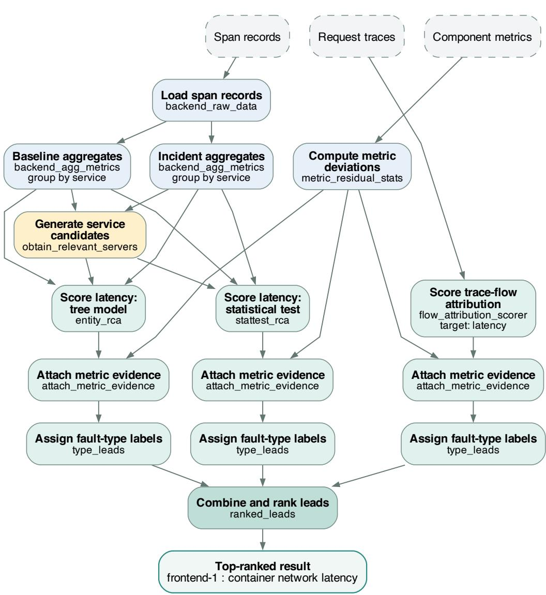  
Figure 10: A saved Stage 2 analysis DAG for Market-CB1, with the observed KPI, baseline and incident windows, and top-ranked result. All 15 operator nodes and their data dependencies are shown. Shared aggregates and metric deviation feed multiple analysis branches; literal parameters and configuration inputs are omitted from the edges for readability.