# AssemState: Manual and Physical-State-Guided Reasoning for Zero-shot Furniture Assembly

Zhiyuan Qi<sup>1,3,∗</sup> Jierui Li<sup>2,3∗</sup> Yifan Shen<sup>3</sup> Cheng Qian<sup>3</sup> Jiateng Liu<sup>3</sup> <sup>1</sup>Tsinghua University <sup>2</sup>Xidian University <sup>3</sup>University of Illinois Urbana-Champaign qzy24@mails.tsinghua.edu.cn

## Abstract

Multimodal large language models (MLLMs) have made significant progress in visual understanding, but precise 3D spatial reasoning integrated with physical environment remains difficult. Furniture assembly requires not only recovering step-level operations from diagrammatic manuals, but also translating semantic attachment relations into 6D pose updates that enable parts to physically interact with the environment and previously assembled components. To study this problem, we propose AssemState, a zero-shot framework for manual and physical-stateguided furniture assembly. It firstly employs anchor-guided boundary assembly states to decompose manual pages into single-part operations and recover an assembly-tree. Then, it uses iterative after-state feedback refinement to guide successive (SE(3)) updates and corrections, and validates their physical plausibility through simulation-based release tests. Experiments show that compared with the strongest prior baseline, AssemState improves F1 from 38.58% to 62.80% and Tree Exact Match from 28.24% to 53.92% for assembly-tree recovery. On 243 independently evaluated part-level operations, our proposed iterative refinement improves judge-accepted operations from 0 to 5.3% and reduces mean Chamfer distance from 5.4111 to 1.7744. However, visually plausible candidate poses may still suffer from collision, floating, mirror-orientation errors, incomplete seating, and wrong-side attachment. These results show that AssemState improves operation-structure recovery and selected local pose metrics, while MLLMs remain limited for spatial relationship reasoning.

## Introduction

Diagrammatic furniture-assembly manuals specify parts, order, and attachment relations, but converting them into physically meaningful actions remains challenging. A manual page may involve multiple parts or interchangeable components, while a semantic instruction such as attaching a frame to a panel does not uniquely determine a contact-accurate 6D pose. A visually plausible placement may still be geometrically invalid, unsupported, or attached to the wrong side.

Recent datasets and environments, including Wang et al. [2022], Zhang et al. [2023], Liu et al. [2024], and Heo et al. [2023], support research on manual understanding and assembly. Tie et al. [2025] and Tie et al. [2026] study hierarchical and connector-aware assembly, while closed-loop visual pose refinement has been explored for language-guided 6D rearrangement Baik et al. [2026]. These works motivate a controlled study of two MLLM capabilities: recovering assembly structure from manuals and reasoning about a current part-to-subassembly pose.

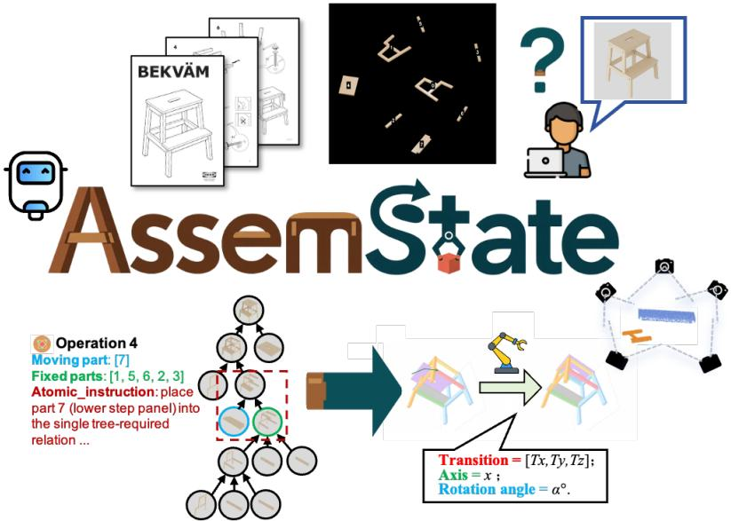  
Figure 1: Overview of AssemState. The framework parses assembly manuals into structured part-level operations and an assembly tree, then leverages the evolving physical assembly state and after-state feedback to predict and refine 6D pose updates.

We present AssemState, a zero-shot framework with two separately evaluated subtasks. For assembly structure recovery, the model receives labeled parts, manual pages, and precomputed numbered step masks, and uses boundary anchors and subassembly tracking to recover a hierarchy. Mask generation is outside the evaluation scope. For pose reasoning, AssemState receives a correct current atomic operation and preceding assembly state, predicts a 6D placement, renders the resulting after-state, diagnoses visible contact/alignment errors, and applies constrained SE(3) corrections. This protocol isolates local pose reasoning from upstream tree errors and is not an end-to-end predicted-tree rollout. We study two related reasoning problems while keeping their evaluation boundaries explicit.

Our contributions are:

• We formulate manual-guided furniture assembly as two controlled zero-shot subtasks: stepmask-conditioned structure recovery and correct-operation-conditioned 6D pose reasoning.

• We introduce anchor-guided part/subassembly reasoning and iterative rendered after-state feedback for state-conditioned pose refinement.

• We show strong assembly-tree gains and improvements in selected local pose diagnostics, while documenting that strict contact-accurate pose recovery remains unsolved.

## Related Work

MLLMs for procedural spatial reasoning. Prior research demonstrate the promising abilities MLLMs and VLA models in interpreting and reasoning the spatial-temporal meaning of motion actions continuously. Driess et al. [2023], Zitkovich et al. [2023], Kim et al. [2024] connect multimodal observations with robot actions, enabling generalist language-conditioned manipulation across diverse tasks. Beyond action generation, Chen et al. [2024], Huang et al. [2023] improve spatial grounding by injecting metric spatial supervision or composing language-conditioned 3D value maps for manipulation. For assembly-specific reasoning, Jing et al. [2026] integrates standard manuals, textual instructions and point clouds to predict static poses, while Pun et al. [2025], Wen et al. [2026] emphasize the importance of buildability and physical stability with units of any shape.

6D pose estimation. Accurate 6D pose estimation is the geometric foundation of assembly, since even a locally plausible operation can fail if the target pose is misaligned. Wen et al. [2024] unifies novel-object pose estimation and tracking under both model-based and model-free settings, improving generalization to unseen objects through synthetic training and pose refinement. Liu et al. [2025] further addresses viewpoint-induced ambiguity by combining pose-hypothesis uncertainty with MLLM-guided direction selection, showing the value of active perception for reliable pose recovery. Baik et al. [2026] iteratively refines object poses through rendered feedback. Zhang et al. [2026] grounds language-specified viewpoints into explicit camera poses for multi-view spatial reasoning. Chi et al. [2023] complements these methods by modeling precise visuomotor control as action diffusion. Despite these advances, existing methods mainly address pose estimation, spatial reasoning, action generation, or physical feasibility in isolation, leaving long-horizon assembly from ambiguous manuals underexplored.

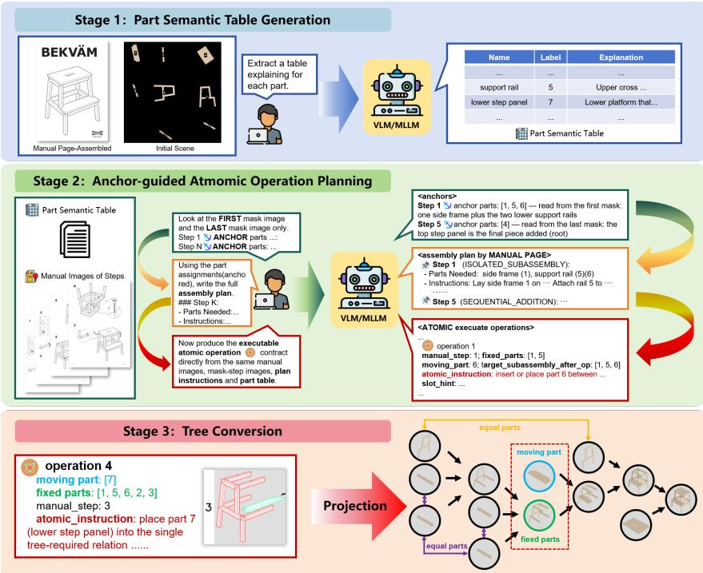  
Figure 2: Anchor-guided manual-to-structure reasoning. The manual-side pipeline uses part semantics and ordered highlighted step masks to recover step-level part/subassembly structure and an assembly tree. Atomic moving-part operations are a downstream interface obtained from the hierarchy rather than being assumed to correspond one-to-one with manual pages.

## Problem Setting

Manual-side assembly-structure recovery. Let $\mathcal { P } _ { 0 } = \{ p _ { 0 } , . . . , p _ { N - 1 } \}$ denote N labeled furniture parts in the initial scene, and let $\mathcal { T } = \{ I _ { 0 } , \ldots , I _ { M - 1 } \}$ denote the ordered manual pages. The current implementation additionally receives ordered, precomputed numbered step masks $\mathcal { H } =$ $\big \{ H _ { 0 } , \dots , \bar { H } _ { M - 1 } \big \}$ , where the highlighted parts provide the step-localized part cues used by the anchor planner. We treat H as an observed input to the manual-side benchmark; generating these masks from raw manuals is outside the scope of the reported evaluation.

The goal is to recover a hierarchical assembly tree G whose leaves are part IDs and whose internal nodes represent intermediate subassemblies. A manual step may introduce several parts or form an isolated subassembly, so we do not assume a one-to-one mapping between the M manual pages and N − 1 atomic moving-part operations. Instead, the manual pipeline first recovers step-level part/subassembly organization and then converts that organization to the hierarchy G.

Atomic-operation interface. For downstream pose reasoning, an atomic current operation is represented as

$$
a _ { q } = \big ( \mathcal { P } _ { q , \mathrm { m o v i n g } } , \mathcal { P } _ { q , \mathrm { f i x } } , r _ { q } , h _ { q } \big ) ,
$$

where $\mathcal { P } _ { q , \mathrm { m o v i n g } }$ is the moving part, $\mathcal { P } _ { q , \mathrm { f i x } }$ is the current fixed subassembly, $r _ { q }$ is a semantic attachment relation, and $h _ { q }$ is a pose hint. Conceptually, such operations can be instantiated by traversing an assembly hierarchy. In the reported pose benchmark, however, $a _ { q }$ and the preceding assembly state are conditioned as correct in order to isolate pose reasoning from upstream tree errors.

Correct-operation-conditioned pose reasoning. Given the correct current operation $a _ { q }$ and preceding state $\begin{array} { r } { {  { \boldsymbol { S } } } _ { q } . } \end{array}$ , the pose subtask predicts a 6D pose

$$
\hat { T } _ { q } = ( \hat { R } _ { q } , \hat { t } _ { q } ) \in S E ( 3 )
$$

for the moving part.

## Methods

AssemState contains anchor-guided manual-to-structure reasoning and rendered after-state pose refinement. The supplementary material gives the exact schedule and preserved prompt snapshots.

## Anchor-Guided Manual-to-Structure Reasoning

As shown in Fig. 2, the manual-side pipeline consists of three conceptual stages implemented by a short sequence of MLLM calls and a tree-conversion step.

## Stage 1: Part Semantic Table Generation

The first call predicts number–name pairs from a top-down numbered scene, available annotated scene views, and a manual preview page. A second call receives this part table together with the scene/views and the full manual-page sequence, and augments each part with a brief functional description. The result is a semantic table

$$
B = \{ ( \mathrm { i d } _ { i } , \mathrm { n a m e } _ { i } , \mathrm { d e s c } _ { i } ) \} _ { i = 0 } ^ { N - 1 } .
$$

This stage grounds the model to the labeled structural parts observed in the scene and reduces the tendency to add manual-only hardware or tools as furniture parts.

## Stage 2: Anchor-Guided Assembly-Structure Planning

A single manual page can involve multiple parts, so this stage does not directly equate pages with atomic moving-part operations. Instead, the anchor planner receives the semantic table B, the numbered scene, and all ordered numbered step masks H. Within one MLLM request, it performs three pieces of reasoning: (i) identify the first- and last-step boundary anchors, (ii) assign highlighted part IDs to steps while tracking carried-over or isolated subassemblies, and (iii) produce a textual assembly plan.

Let $L = \{ l _ { 0 } , \dots , l _ { M - 1 } \}$ denote the resulting step-level plan. Abstractly,

$$
{ \cal L } = \Phi ( V , { \mathcal { H } } , B ) ,
$$

where V denotes the numbered scene. The highlighted step masks are an explicit input to Φ and provide strong part-to-step localization cues; AssemState’s contribution at this stage is the anchor/subassembly reasoning conditioned on those cues, not upstream mask generation. The planner also checks that part IDs are not omitted or reused across its step assignments.

## Stage 3: Assembly-Tree Conversion and Operation Interface

The Stage-2 text is converted to a nested-list hierarchy G. The implementation first attempts a rulebased parse and uses a text-only MLLM conversion prompt when the structured parse is unavailable. Leaves of G correspond to atomic parts, while internal nodes represent intermediate subassemblies and the outermost node represents the completed hierarchy.

Traversing G provides a natural way to instantiate an atomic operation tuple

$$
a _ { q } = \left( \mathcal { P } _ { q , \mathrm { m o v i n g } } , \mathcal { P } _ { q , \mathrm { f i x } } , r _ { q } , h _ { q } \right)
$$

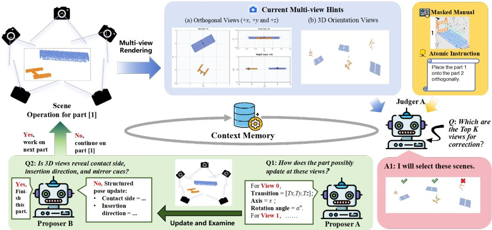  
Figure 3: Iterative after-state feedback refinement. Multi-view renderings of the updated currentoperation state guide successive state-conditioned corrections. The reported benchmark evaluates each operation independently under a correct-operation/preceding-state protocol.

for pose reasoning. This tree-to-operation interface is conceptual in the overall framework. The reported pose benchmark deliberately conditions on the correct current operation/state rather than directly consuming the predicted tree.json; this separates spatial pose errors from upstream structure-recovery errors.

## Target-Free 6D Pose Reasoning and Refinement

For a correct current operation $a _ { q } .$ the model predicts a candidate 6D pose

$$
\hat { T } _ { q } ^ { 0 } = ( \hat { R } _ { q } ^ { 0 } , \hat { t } _ { q } ^ { 0 } ) \in S E ( 3 )
$$

for the moving part, without access to a ground-truth target pose or target-state image.

Iterative after-state feedback. At refinement round r, the current estimate is applied and the resulting after-state is rendered from multiple views:

$$
\hat { S } _ { q } ^ { r } = \hat { T } _ { q } ^ { r } [ m _ { q } ] \cup ( S _ { q } \setminus \{ m _ { q } \} ) ,
$$

where $m _ { q }$ denotes the moving part. A diagnosis of the rendered after-state records whether the current candidate is acceptable and, when rejected, identifies a failure type and residual correction cues such as wrong side, wrong mirror, floating, not fully seated, collision, or orientation error.

Rather than generating a new pose independently from the original scene, the next proposal is conditioned on the current state and the previous diagnosis, predicting an incremental correction

$$
\delta T _ { q } ^ { r } = ( \delta R _ { q } ^ { r } , \delta t _ { q } ^ { r } ) \in S E ( 3 ) , \qquad \hat { T } _ { q } ^ { r + 1 } = \delta T _ { q } ^ { r } \hat { T } _ { q } ^ { r } .
$$

The prompt constrains the correction according to the diagnosed error: for example, seating/floating/collision errors favor local translations, whereas wrong-side or mirror errors may require a larger side/orientation change. We use three refinement rounds in the main reported setting. The final prediction is $\hat { T } _ { q } ^ { R }$ with $R = 3$

## Experiments

We evaluate five aspects of AssemState: (1) manual-side assembly-structure recovery, (2) correctoperation-conditioned target-free 6D pose estimation, (3) simulation-based release diagnostics, (4) component ablations, and (5) failure analysis.

<table><tr><td>Method</td><td>Prec.</td><td>Rec.</td><td>F1</td><td>Tree EM</td></tr><tr><td>SingleStep</td><td>10.78</td><td>10.78</td><td>10.78</td><td>10.78</td></tr><tr><td>GeoCluster</td><td>13.37</td><td>13.36</td><td>13.15</td><td>3.92</td></tr><tr><td>Manual2Skill</td><td>37.45</td><td>36.41</td><td>36.83</td><td>27.45</td></tr><tr><td>Manual2Skill++</td><td></td><td></td><td>38.58</td><td>28.24</td></tr><tr><td>Ours w/o Anchors</td><td>57.39</td><td>55.90</td><td>56.20</td><td>45.10</td></tr><tr><td>Ours</td><td>62.34</td><td>62.46</td><td>62.80</td><td>53.92</td></tr></table>

Table 1: Assembly-structure recovery results (%) under the reported manual-side evaluation protocol. Best results are in bold and second-best are underlined.

Evaluation scope. The two main evaluations are intentionally separated. The manual-side results are conditioned on the precomputed numbered step masks documented in the appendix and therefore measure structure reasoning under highlighted step-part cues rather than raw-manual mask generation. The pose results condition on a correct current operation and preceding assembly state, and therefore measure current-operation spatial reasoning rather than end-to-end propagation from a predicted tree. These boundaries are summarized in the appendix together with the exact prompt/state schedule.

## Manual-to-Structure Recovery

Setup and metrics. Using GPT-5 OpenAI [2025], we evaluate recovery of the reference assembly hierarchy. Precision, Recall, and F1 (%) are computed from predicted versus reference parent–child relations, while Tree Exact Match (Tree EM, %) requires the complete hierarchy to match under the evaluation protocol. The input protocol includes the labeled scene, manual context, and ordered numbered step masks; upstream mask construction is not part of this evaluation.

Baselines. We compare against SingleStep, which predicts a flattened ordered tree; GeoCluster, which uses a trained DGCNN Phan et al. [2018]; and the MLLM-based Manual2Skill Tie et al. [2025] and Manual2Skill++ Tie et al. [2026] baselines.

Results. Under the reported input protocol, AssemState obtains the highest tree-recovery scores in Table 1. Compared with Manual2Skill++, F1 increases from 38.58% to 62.80% and Tree EM from 28.24% to 53.92%. Removing anchor reasoning lowers F1 to 56.20% and Tree EM to 45.10%, consistent with the role of boundary anchors and subassembly tracking in organizing highlighted step-part cues. We restrict this claim to structure recovery under the supplied step-mask-conditioned protocol; the experiment does not evaluate generation of the masks themselves.

## Target-Free 6D Pose Estimation

Setup and metrics. We evaluate the pose subtask on 55 correct-tree cases comprising 243 atomic current operations. Each operation is scored independently because an early incorrect placement would otherwise invalidate later states. After scoring, the moving part is reset to its ground-truth pose only to construct the context for the next operation; the target pose is never exposed to the MLLM as an input or target image. We report five metrics: Judge acceptance, pose accuracy at a strict tolerancePA@0.01, translation RMSE , geodesic rotation distance (GD), and Chamfer distance (CD). Formal definitions and evaluation details are provided in the Appendix.

Baselines. The text-only baseline predicts from the atomic-operation description without currentstate images. The Open6DOR-style Qi et al. [2025] baseline predicts a structured one-shot 6D update. AssemState adds multi-view state grounding and three rounds of after-state feedback with constrained SE(3) correction. Aggregate results are reported under the backbone labels preserved with the experiment tables; the appendix separately documents the exact API identifier available for one representative historical trace.

Results. Table 2(a) shows a mixed but informative pattern. Relative to the Open6DOR-style baseline, three-round self-check increases model-judge acceptance from 0.0% to 5.3% for GPT-5 and from 4.5% to 11.5% for Claude Haiku 4.5 (Anthropic [2025]). Mean CD also decreases from 5.4111 to 1.7744 for GPT-5, while Claude’s median CD decreases from 3.2725 to 1.8770. In contrast, translation RMSE and geodesic rotation distance do not consistently improve, and PA@0.01 remains 0 for all methods. We therefore interpret the refinement as improving selected local/geometric diagnostics and model-judge contact consistency, not as solving target-free 6D assembly pose estimation.

(a) Correct-operation-conditioned target-free 6D pose estimation
<table><tr><td>Backbone</td><td>Setting</td><td>Judge Acc. (%)↑</td><td>RMSEt ↓</td><td> $\mathbf { G D } _ { \mathrm { d e g } }$  ↓</td><td>CD / Med CD ↓</td></tr><tr><td rowspan="3">GPT-5</td><td>Text-only baseline</td><td>0.0</td><td>2.4322</td><td>123.02</td><td>15.7263 / 10.1914</td></tr><tr><td>Open6DOR-style baseline</td><td>0.0</td><td>1.8747</td><td>120.84</td><td>5.4111 / 0.9391</td></tr><tr><td>Ours: Self-check 3-round</td><td>5.3</td><td>1.8898</td><td>121.52</td><td>1.7744 / 0.8112</td></tr><tr><td rowspan="3">Claude Haiku 4.5</td><td>Text-only baseline</td><td>0.8</td><td>2.4315</td><td>125.61</td><td>18.7281 / 13.8936</td></tr><tr><td>Open6DOR-style baseline</td><td>4.5</td><td>1.8887</td><td>123.20</td><td>10.8826 / 3.2725</td></tr><tr><td>Ours: Self-check 3-round</td><td>11.5</td><td>1.9760</td><td>123.69</td><td>10.6708 / 1.8770</td></tr></table>

(b) Simulation-based release validation
<table><tr><td>Backbone</td><td>Setting</td><td>Release Stability (%)↑</td><td>Mean Drift ↓</td><td>Mean Z Drop ↓</td></tr><tr><td rowspan="3">GPT-5</td><td>Text-only baseline</td><td>16.5</td><td>0.4249</td><td>0.1696</td></tr><tr><td>Open6DOR-style baseline</td><td>37.0</td><td>0.2463</td><td>0.1058</td></tr><tr><td>Ours: Self-check 3-round</td><td>39.5</td><td>0.1754</td><td>0.0632</td></tr><tr><td rowspan="3">Claude Haiku 4.5</td><td>Text-only baseline</td><td>12.3</td><td>0.4254</td><td>0.0859</td></tr><tr><td>Open6DOR-style baseline</td><td>33.7</td><td>0.3266</td><td>0.1328</td></tr><tr><td>Ours: Self-check 3-round</td><td>33.7</td><td>0.3109</td><td>0.1262</td></tr></table>

Table 2: Current-operation pose reasoning and release validation on the correct-tree subset. All rates are computed over 243 independently evaluated atomic operations. The pose benchmark conditions on a correct current operation and preceding state; it is not a predicted-tree end-to-end rollout. PA@0.01 is 0.0000 for every setting and is omitted from the table for compactness.

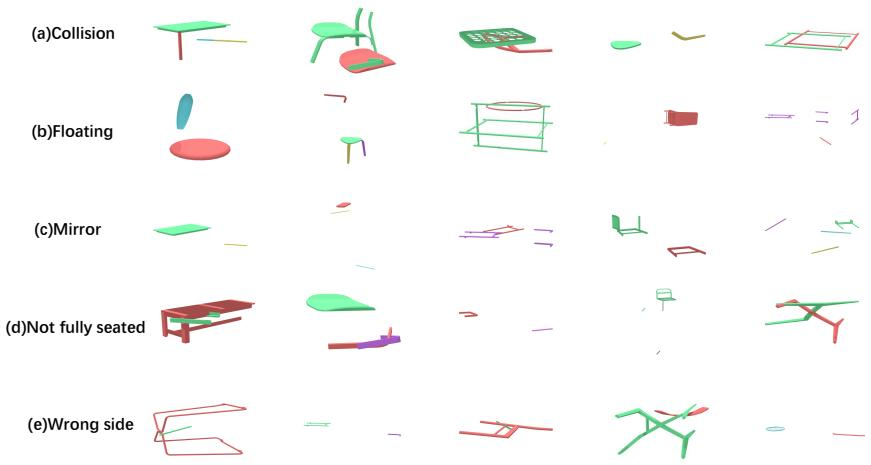  
Figure 4: Representative failure cases of the final self-check setting, including collision, floating, mirror, not-fully-seated, and wrong-side errors.

## Simulation-Based Validation

We additionally release the selected current-operation candidate in simulation and measure whether it remains stable. These diagnostics complement, rather than replace, strict pose accuracy.

<table><tr><td>Setting</td><td>Judge Accept.↑</td><td> $\mathbf { C D } _ { \downarrow }$ </td><td>Release Stability↑</td></tr><tr><td>Open6DOR-style</td><td>0/243</td><td>5.4111</td><td> $9 0 / 2 4 3 = 3 7 . 0 \%$ </td></tr><tr><td>+ Multi-view Structured Init.</td><td>1/243</td><td>5.3113</td><td> $1 0 9 / 2 4 3 = 4 4 . 9 \%$ </td></tr><tr><td>+ Contact-aware Self-check</td><td>13/243</td><td>1.7744</td><td> $9 6 / 2 4 3 = 3 9 . 5 \%$ </td></tr></table>

Table 3: Cumulative pose ablation. Judge acceptance is a model-based diagnostic; each row adds one component to the previous setting.

For GPT-5, Table 2(b) shows that self-check reduces mean drift from 0.2463 to 0.1754 relative to the Open6DOR-style baseline, while release stability increases modestly from 37.0% to 39.5%. For Claude Haiku 4.5, drift and vertical drop decrease slightly, but binary release stability remains unchanged at 33.7%. Thus, after-state refinement can improve some physical plausibility diagnostics, but the effect is not uniform across metrics or backbones.

## Ablation Study

We use a cumulative ablation to separate coarse multi-view grounding from contact-aware after-state feedback. The three reported quantities are judge acceptance, CD, and release stability. Table 3 shows that multi-view initialization has its clearest effect on release stability (37.0% to 44.9%), whereas the subsequent contact-aware self-check has its clearest effect on judge acceptance (1/243 to 13/243) and CD (5.3113 to 1.7744). Release stability decreases from the multi-view-only setting to 39.5%, so the ablation does not support a claim of monotonic improvement across all objectives. Instead, it suggests that the components affect different aspects of current-operation pose quality.

## Failure Analysis

Figure 4 shows representative failures of the final self-check setting. We use GPT-5 to categorize failed rendered after-states according to the manual instruction and expected contact relation; these labels are a model-assisted diagnostic rather than human ground-truth annotations. The failures follow a clear progression. The model usually first localizes a plausible coarse region for the moving part, but this rough localization does not by itself guarantee a physically valid assembly. The residual errors fall into the following recurring categories:

• Collision. The predicted pose can look reasonable from some views yet intersects the fixed subassembly, showing that visual plausibility does not ensure non-penetration.

• Floating. The moving part lacks stable support and drifts or drops after release, so a visually acceptable placement still violates the required support relation.

• Wrong-side. The model identifies the correct local region but attaches the part to the wrong connector face, reflecting the difficulty of resolving contact topology once the coarse region is reached.

• Mirror. The part is placed in a flipped (mirrored) orientation; such errors are especially frequent under symmetry or partial occlusion.

• Not-fully-seated. Even when the correct side is selected, the part reaches the contact region but fails to complete the final insertion or tight seating required by the assembly.

## Conclusion

We presented AssemState as a zero-shot study of two complementary but separately evaluated capabilities for manual-guided furniture assembly: step-mask-conditioned assembly-structure recovery and correct-operation-conditioned target-free 6D pose reasoning. Boundary anchors and subassembly tracking improve assembly-tree recovery under the manual-side input protocol, while rendered after-state feedback can improve model-judge acceptance and Chamfer distance for independently evaluated current operations. At the same time, failure cases continue to exhibit collision, floating, mirror, wrong-side, and incomplete-seating errors. These results support the use of MLLMs for structured manual reasoning and iterative local correction, while showing that reliable end-to-end, contact-accurate furniture assembly remains an open problem.

## References

Anthropic. Claude Haiku 4.5 System Card. Anthropic System Card, 2025.

Sangwon Baik, Gunhee Kim, Mingi Choi, and Hanbyul Joo. Text-guided 6d object pose rearrangement via closed-loop vlm agents. In European Conference on Computer Vision (ECCV), 2026.

Boyuan Chen, Zhuo Xu, Sean Kirmani, Brian Ichter, Dorsa Sadigh, Leonidas Guibas, and Fei Xia. Spatialvlm: Endowing vision-language models with spatial reasoning capabilities. In CVPR, pages 14455–14465, 2024.

Cheng Chi, Siyuan Feng, Yilun Du, Zhenjia Xu, Eric Cousineau, Benjamin Burchfiel, and Shuran Song. Diffusion policy: Visuomotor policy learning via action diffusion. In RSS, 2023.

Danny Driess, Fei Xia, Mehdi S. M. Sajjadi, Corey Lynch, Aakanksha Chowdhery, Brian Ichter, Ayzaan Wahid, Jonathan Tompson, Quan Vuong, Tianhe Yu, et al. Palm-e: An embodied multimodal language model. In Proceedings of the 40th International Conference on Machine Learning, pages 8469–8488, 2023.

Minho Heo, Youngwoon Lee, Doohyun Lee, and Joseph J. Lim. Furniturebench: Reproducible real-world benchmark for long-horizon complex manipulation. In Robotics: Science and Systems (RSS), 2023.

Wenlong Huang, Chen Wang, Ruohan Zhang, Yunzhu Li, Jiajun Wu, and Li Fei-Fei. Voxposer: Composable 3d value maps for robotic manipulation with language models. In CoRL, 2023.

Zhi Jing, Jinbin Qiao, Ouyang Lu, Jicong Ao, Shuang Qiu, Huazhe Xu, Yu-Gang Jiang, and Chenjia Bai. Assemlm: A spatial reasoning multimodal large language model for robotic assembly. arXiv preprint arXiv:2604.08983, 2026.

Moo Jin Kim, Karl Pertsch, Siddharth Karamcheti, Ted Xiao, Ashwin Balakrishna, Suraj Nair, Rafael Rafailov, Ethan Foster, Grace Lam, Pannag Sanketi, et al. Openvla: An open-source vision-language-action model. In CoRL, 2024.

Sheng Liu, Zhe Li, Weiheng Wang, Han Sun, Heng Zhang, Hongpeng Chen, Yusen Qin, Arash Ajoudani, and Yizhao Wang. Activepose: Active 6d object pose estimation and tracking for robotic manipulation. arXiv preprint arXiv:2509.11364, 2025.

Yunong Liu, Cristobal Eyzaguirre, Manling Li, Shubh Khanna, Juan Carlos Niebles, Vineeth Ravi, Saumitra Mishra, Weiyu Liu, and Jiajun Wu. Ikea manuals at work: 4d grounding of assembly instructions on internet videos. In NeurIPS, 2024.

NVIDIA. NVIDIA Isaac Sim. https://docs.isaacsim.omniverse.nvidia.com/, 2024.

OpenAI. GPT-5 System Card. OpenAI System Card, 2025.

Anh Viet Phan, Minh Le Nguyen, Yen Lam Hoang Nguyen, and Lam Thu Bui. Dgcnn: A convolutional neural network over large-scale labeled graphs. Neural Networks, 108:533–543, 2018.

Ava Pun, Kangle Deng, Ruixuan Liu, Deva Ramanan, Changliu Liu, and Jun-Yan Zhu. Generating physically stable and buildable brick structures from text. In Proceedings of the IEEE/CVF International Conference on Computer Vision (ICCV), pages 14798–14809, 2025.

Zekun Qi, Wenyao Zhang, Yufei Ding, Runpei Dong, Xinqiang Yu, Jingwen Li, Lingyun Xu, Baoyu Li, Xialin He, Guofan Fan, Jiazhao Zhang, Jiawei He, Jiayuan Gu, Xin Jin, Kaisheng Ma, Zhizheng Zhang, He Wang, and Li Yi. Sofar: Language-grounded orientation bridges spatial reasoning and object manipulation. In Advances in Neural Information Processing Systems (NeurIPS), 2025.

Chenrui Tie, Shengxiang Sun, Jinxuan Zhu, Yiwei Liu, Jingxiang Guo, Yue Hu, Haonan Chen, Junting Chen, Ruihai Wu, and Lin Shao. Manual2skill: Learning to read manuals and acquire robotic skills for furniture assembly using vision-language models. In Robotics: Science and Systems (RSS), 2025.

Chenrui Tie, Shengxiang Sun, Yudi Lin, Yanbo Wang, Zhongrui Li, Zhouhan Zhong, Jinxuan Zhu, Yiman Pang, Haonan Chen, Junting Chen, Ruihai Wu, and Lin Shao. Manual2Skill++: Connectoraware general robotic assembly from instruction manuals via vision–language models. In IEEE International Conference on Robotics and Automation (ICRA), 2026.

Ruocheng Wang, Yunzhi Zhang, Jiayuan Mao, Ran Zhang, Chin-Yi Cheng, and Jiajun Wu. IKEA-Manual: Seeing shape assembly step by step. In NeurIPS, 2022.

Bowen Wen, Wei Yang, Jan Kautz, and Stan Birchfield. Foundationpose: Unified 6d pose estimation and tracking of novel objects. In CVPR, 2024.

Haowei Wen, Ruixuan Liu, Weiyi Piao, Siyu Li, and Changliu Liu. Bricksim: A physics-based simulator for manipulating interlocking brick assemblies. arXiv preprint arXiv:2603.16853, 2026.

Jiahao Zhang, Anoop Cherian, Yanbin Liu, Yizhak Ben-Shabat, Cristian Rodriguez, and Stephen Gould. Aligning step-by-step instructional diagrams to video demonstrations. In CVPR, pages 2483–2492, 2023.

Xuejun Zhang, Aditi Tiwari, Zhenhailong Wang, and Heng Ji. Predicting camera pose from perspective descriptions for spatial reasoning. arXiv preprint arXiv:2602.06041, 2026.

Brianna Zitkovich, Tianhe Yu, Sichun Xu, Peng Xu, Ted Xiao, Fei Xia, Jialin Wu, Paul Wohlhart, Stefan Welker, Ayzaan Wahid, et al. Rt-2: Vision-language-action models transfer web knowledge to robotic control. In Proceedings of the 7th Conference on Robot Learning, pages 2165–2183, 2023.

## Appendix

## Metrics and Physical Diagnostic

## Pose Discrepancy

Given reference and predicted poses in a common frame, $( R ^ { * } , t ^ { * } )$ and $( \hat { R } , \hat { t } )$ , the translationcoordinate RMSE is

$$
\mathrm { R M S E } _ { t , i } = \sqrt { \frac { 1 } { 3 } \lVert \hat { t } _ { i } - t _ { i } ^ { * } \rVert _ { 2 } ^ { 2 } } .
$$

The reported mean is the mean of per-operation RMSE values, not a fresh root over all products’ coordinates. Rotation error is

$$
\mathrm { G D } _ { i } = \frac { 1 8 0 } { \pi } \operatorname { a r c c o s } \left( \mathrm { c l i p } \left[ \frac { \mathrm { t r } ( ( R _ { i } ^ { * } ) ^ { \top } \hat { R } _ { i } ) - 1 } { 2 } , - 1 , 1 \right] \right) .
$$

Continuous shape symmetry can make orientation error differ from functional correctness. No universal continuous-symmetry correction is claimed for the table’s raw GD.

The visual-agent metric script implements bidirectional squared nearest-neighbor Chamfer:

$$
\mathrm { C D } ( X , Y ) = { \frac { 1 } { | X | } } \sum _ { x \in X } \operatorname* { m i n } _ { y \in Y } \| x - y \| _ { 2 } ^ { 2 } + { \frac { 1 } { | Y | } } \sum _ { y \in Y } \operatorname* { m i n } _ { x \in X } \| y - x \| _ { 2 } ^ { 2 } .
$$

It uses corresponding OBJ vertex subsampling and a KD-tree query, rather than necessarily uniform sampling over surface area. Its current defaults are at most 2048 corresponding vertices and seed 0; alignment can be global, base-anchored, or none. These are source-level defaults, not a recovered command for every historical table row. Another legacy metric module in the same repository uses unsquared nearest-neighbor distances, so it is unsafe to treat every function labeled Chamfer as interchangeable.

Pose Accuracy (PA@0.01) is a strict, binary per-operation success criterion. An atomic operation i is counted as correct only if its part-level discrepancy falls below a fixed tolerance $\tau = 0 . 0 1$

$$
\mathrm { P A @ } \tau = \frac { 1 } { N } \sum _ { i = 1 } ^ { N } \mathbf { 1 } \left[ \mathrm { C D } _ { i } < \tau \right] , \qquad \tau = 0 . 0 1 ,
$$

where $\mathrm { C D } _ { i }$ is the bidirectional squared Chamfer distance defined above and N is the number of evaluated atomic operations. In contrast to the mean CD, RMSE , and GD, which are continuous discrepancy measures, PA@0.01 reports the fraction of operations placed within the tight tolerance required for contact-accurate assembly, and therefore serves as our strictest pose-correctness metric.

## Judge Acceptance

Historical rows use the stored Boolean accepted. The archived judge outputs contain an acceptance decision together with a coarse failure diagnosis and correction hints. A representative response schema is:

Archived judge-response schema   
{   
"Accept": "Yes or No",   
"Error type": "wrong\_side / wrong\_mirror / floating / collision / ...",   
"Residual direction": "textual correction direction",   
"Contact": "Correct / Incorrect / Unclear",   
"Orientation": "Correct / Incorrect / Unclear",   
"Reasoning": "visual evidence",   
"Next candidate hints": ["..."],   
"Confidence": 0.0   
}

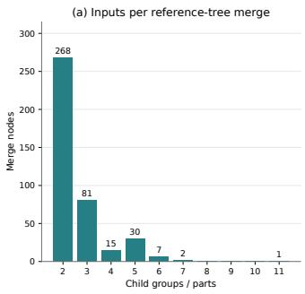

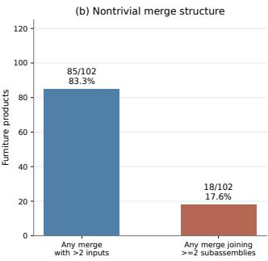

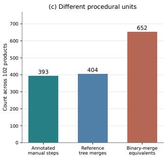  
Figure 5: Reference-tree structure and procedural granularity across 102 products. Left: number of children associated with reference-tree merge nodes. Middle: products containing multiway merges or merges joining multiple subassemblies. Right: total annotated manual steps, reference-tree merges, and binary-merge equivalents. Binary-merge equivalents are combinatorial decompositions and should not be interpreted as verified robot actions or feasible trajectories.

This schema is reconstructed from saved responses rather than from a recovered literal judge prompt. The complete historical judge request was not retained. In the representative GPT trace, proposer, selector, and judge all use gpt-5.2, so judge acceptance may contain correlated model errors and should not be interpreted as independently verified physical correctness. No human-agreement estimate is available.

The maintained agent has a different acceptance rule: Faithfulness=Yes, confidence at least 0.70, ambiguity at most 0.30, and correct contact and orientation. Its evaluator can also return contact-angle and target-residual diagnostics, but the audited acceptance function does not use every such field as an additional hard gate. These current thresholds are not retroactively applied to the historical accepted counts.

## Additional Dataset and Diagnostic Analyses

This section provides complementary analyses of dataset coverage, reference-tree structure, releasethreshold sensitivity, and model-reported failure patterns. These analyses are intended to clarify the scope and interpretation of the main results rather than introduce additional model inference or physical-simulation trials.

## Reference-Tree Structure and Procedural Units

Reference assembly trees do not in general define a unique sequence of single-part executable actions. As shown in Figure 5, 85/102 products contain at least one reference-tree merge with more than two inputs, and 18/102 contain a merge that joins at least two non-leaf subassemblies. Across all products, the metadata contain 393 annotated manual steps and 404 reference-tree merge nodes, whereas decomposing multiway merges into binary equivalents yields 652 combinatorial merges. These counts demonstrate that manual steps, hierarchical tree nodes, and atomic moving-part operations are distinct procedural units.

## Sensitivity of the Release Diagnostic

The box-based release label depends on explicit numerical thresholds and should therefore not be interpreted as an invariant notion of physical assembly success. Figure 6 jointly scales the recorded drift, vertical-drop, and rotation thresholds around the reported operating point. Stability rates vary continuously as these thresholds are relaxed or tightened. The criterion-level breakdown further shows that positional drift is the most restrictive of the three recorded conditions for the self-check configurations, while rotation alone is satisfied substantially more often.

This sensitivity does not invalidate the release diagnostic, but it motivates treating it as a coarse support/stability probe rather than as ground-truth connector-level success. In particular, the test does not evaluate fastening, insertion constraints, mesh-level contact, gripper interaction, or collision-free motion.

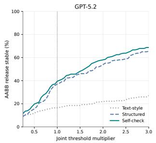

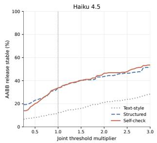

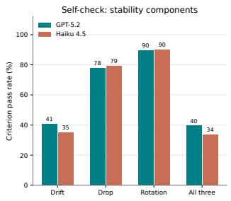

Figure 6: Sensitivity of the AABB release diagnostic. Left and center: release-stability rate when the three reported thresholds are jointly multiplied by a common factor; the vertical reference line marks the reported multiplier of 1.0. Right: individual criterion pass rates for the self-check configurations. This is a post-hoc analysis of stored release records, not an additional physics rollout.  
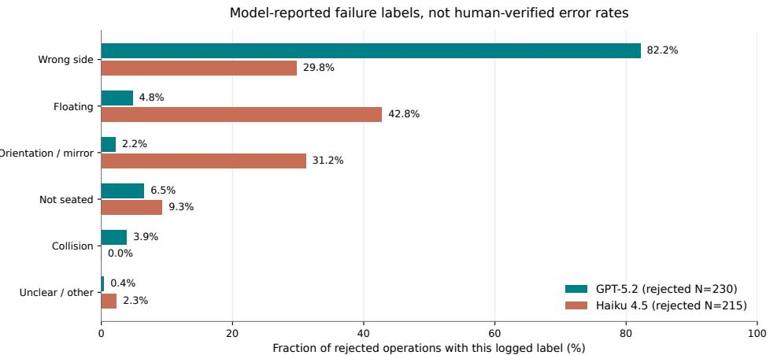  
Figure 7: Model-reported failure labels among rejected self-check operations. Percentages are computed from stored judge labels for rejected operations (GPT-5.2: N = 230; Haiku 4.5: $N = 2 1 5 )$ . The labels are diagnostic model outputs, not human-verified ground-truth error rates.

## Model-Reported Failure Labels

The saved judge records also provide qualitative failure labels for rejected self-check predictions. Figure 7 shows that their distributions differ substantially across backbones. GPT-5.2 assigns wrong\_side to most rejected operations, whereas Haiku 4.5 more frequently reports floating and orientation/mirror-related errors. Such differences may reflect both genuine behavioral differences and backbone-specific diagnostic tendencies.

Accordingly, these labels are useful for organizing failure modes but should not be interpreted as independently verified error frequencies. They are generated by the same model-based diagnostic process discussed, and no human-annotated failure taxonomy is available for these records.

## IsaacLab AABB Release

The physical record version is isaaclab\_release\_aabb.v1NVIDIA [2024]. For each selected moving-part prediction, each posed part is approximated as a world-axis-aligned cuboid. The fixed set becomes static collision geometry, and only the moving body is released dynamically. The simulation records starting/ending center positions, moving-box dimensions, and rotation drift.

Let $p _ { 0 } , p _ { H }$ denote the released box’s initial and final centers, and $Q _ { 0 } , Q _ { H }$ its orientations. Define

$$
d = \| p _ { H } - p _ { 0 } \| _ { 2 } , \qquad z _ { \mathrm { d r o p } } = \operatorname* { m a x } ( 0 , p _ { 0 , z } - p _ { H , z } ) , \qquad \theta = \mathrm { G D } ( Q _ { 0 } , Q _ { H } ) .
$$

The stable indicator is

$$
s = { \bf 1 } [ d < 0 . 0 5 \ \wedge \ z _ { \mathrm { d r o p } } < 0 . 0 5 \ \wedge \ \theta < 1 2 ^ { \circ } ] .
$$

All 1,701 records across the seven audited configurations satisfy this classification when recomputed from saved scalar fields. No new simulation is needed for this check.

This appendix makes the prompt schedule explicit: what is shown to the MLLM at each call, which prompt is used, what is returned, and how that output is consumed by the next stage. We focus on the two reasoning components evaluated in the paper: manual-to-structure recovery and target-free pose refinement. No additional model inference was run for this appendix; the examples below are drawn from the supplied prompt snapshots and saved experiment records. The manual-side protocol consumes precomputed numbered step masks; the supplied materials document this consumption but do not include an upstream mask-construction procedure, so we do not interpret the reported tree results as raw-manual-to-tree inference.

## Manual-to-Structure Prompt Schedule

The implementation uses a short sequence of calls whose outputs are passed forward as text state.   
The three colored blocks below follow the same stage colors used in the main pipeline figure.

Stage 1 – Part grounding (M1–M2)

M1 – Part naming (generate\_json). The model first sees the numbered scene, available annotated scene views, and a manual preview page. It returns a JSON mapping from visible part IDs to part names.

M2 – Semantic enrichment (select\_material). The M1 table is then shown together with the numbered scene/views and the full manual-page sequence. The output augments each part with a short functional explanation; this semantic table is the textual state passed to M3.

Stage 2 – Anchor-guided planning (M3)

M3 – Anchor planning (planning\_anchor\_v2m). One MLLM request receives the Stage-1 semantic table, the numbered scene, and the ordered numbered step masks. Within this single request, the prompt asks the model to identify boundary anchors, assign newly introduced parts to manual steps, track carried-over subassemblies, determine the assembly type, and write the corresponding textual plan. The saved response is passed to the tree-conversion stage.

Stage 3 – Tree conversion (M4)

The Stage-2 text plan is converted to a nested integer-list representation of the assembly hierarchy. A rule-based parser is attempted first; when it does not produce a valid tree, the text-only fallback prompt tree\_ikea\_manual is used. No new images are introduced at this stage, and the resulting hierarchy is saved as tree.json.

Execution order. The same sequence in compact form is:

```matlab
Execution schedule
y_name = MLLM(P_name; scene, scene_views, manual_preview)
y_sem = MLLM(P_sem; scene, scene_views, full_manual, y_name)
y_plan = MLLM(P_anchor; scene, ordered_step_masks, y_sem)
if structured_parse(y_plan) succeeds:
G = Parse(y_plan)
else:
G = MLLM(P_tree; y_plan)
```

The full available prompt snapshots are reproduced in the final prompt-snapshot section below.

## Pose-Refinement Prompt Schedule

The pose experiment is evaluated as a current-operation subtask: the current atomic operation and the preceding assembly state are treated as correct, while the MLLM is not shown the ground-truth target pose or a ground-truth target-state rendering. The preserved historical trace follows a proposer → render → selector → judge → feedback loop.

Initialization (P0). For each independently evaluated operation, the program constructs an operation record containing the moving part, fixed subassembly, manual-step context, and part semantics. This record remains fixed while the candidate pose is refined.

## One refinement round (P1–P4)

P1 Propose. The proposer receives the current multi-view state, manual crop, operation record, and previous judge feedback when $r > 0 ,$ , and predicts an incremental update $\delta T ^ { r }$

P2 Render. The program applies $\delta T ^ { r }$ and renders the resulting after-state from the standard views. This transform/render step is programmatic rather than another MLLM call.

P3 Select. The visual selector compares the rendered candidate after-state(s) against the manual context and operation goal and selects the option to evaluate.

P4 Diagnose. The saved judge output records accept/reject, failure type, residual direction, and contact/orientation hints.

## Feedback rule (P5)

If the round is rejected, the diagnosis from P4 is inserted into the next proposer request together with the newly rendered state. The loop then repeats from P1. The preserved experiment trace uses one candidate per round and at most three rounds.

Historical trace versus maintained source. The supplied handoff explicitly distinguishes this saved three-round experiment from the current refactored agent. The saved trace uses one proposer candidate per round, three refinement rounds, a VLM selector, and a separate stored judge diagnosis. The maintained source defaults to a different evaluator/proposer multi-path loop. We therefore use the saved prompts only to document the historical three-round behavior and do not substitute current default prompts for missing historical requests. The exact historical judge request template was not retained, so we report the preserved judge output rather than reconstructing missing prompt text.

## Information Boundary of the Two Subtasks

The two evaluations intentionally expose different forms of state. The boundary is easier to read as a protocol statement than as an additional result table:

## Evaluation boundary

• Manual-to-structure. The model receives the manual pages, numbered scene, and numbered step masks. The part semantic table is produced by the model and carried forward. The reference assembly tree is used only for evaluation.

• Isolated pose evaluation. The model receives the current manual crop, current rendered state, part semantics, and a correct current operation/state context. In the supplied pose adapter, this context is constructed from dataset tree/step metadata rather than by directly consuming the predicted tree.json.

• Not exposed as targets. The ground-truth target 6D pose and a ground-truth target-state rendering are not shown to the pose MLLM. Ground-truth pose is used only for scoring and, after scoring, to reset context for the next independently evaluated operation. Predicted after-state renders are the visual feedback used for subsequent correction rounds.

The supplied manual-side example contains four labeled structural parts. The retained stage1\_output.json is the enriched Stage-1 table after semantic grounding:

<table><tr><td>ID</td><td>Name</td><td>Functional explanation</td></tr><tr><td>0</td><td>long side rail</td><td>Forms the long side of the bed frame and supports the slatted bed base.</td></tr><tr><td>1</td><td>slatted bed base</td><td>Provides the flexible sleeping surface that supports the mat- tress.</td></tr><tr><td>2</td><td>headboard/end frame</td><td>Closes one end of the bed and provides the headboard struc- ture.</td></tr><tr><td>3</td><td>footboard/end frame</td><td>Closes the opposite end of the bed and helps stabilize the frame.</td></tr></table>

Table A1: Retained Stage-1 semantic table for the representative manual example.

The next MLLM call receives this semantic table together with the numbered scene and ordered step masks. The structural portion of the saved Stage-2 output is:

Retained Stage-2 structural output   
<anchors>   
Step 1 anchor parts: [0, 1, 2]   
Step 2 anchor parts: [3]   
</anchors>   
<part\_visibility>   
Step 1 introduces: [0, 1, 2] -- isolated sub-assembly   
Subassembly formed: main bed assembly of parts [0, 1, 2]   
Step 2 introduces: [3] -- added to main body   
Carried over: parts [0, 1, 2]   
Assembly type: SEQUENTIAL\_ADDITION   
Subassembly formed: complete bed frame   
Verification: all 4 parts assigned exactly once.   
</part\_visibility>

The same response also contains natural-language assembly instructions. We omit those longer prose instructions here because the appendix is intended to expose the prompt/state flow rather than add another qualitative manual figure. The concrete retained example stops at the Stage-2 file; the supplied materials do not contain its final tree.json, so we do not fabricate a conversion result. The exact conversion prompt and its required nested-list output contract are provided in the full prompt-snapshot section below.

## Representative Three-Round Pose Trace

We use the preserved Bench/applaro operation-0 trace because it contains all three rounds of actual proposer, selector, and judge records. The atomic operation moves part 2 (a side frame) relative to fixed part 1 (the seat panel), with the goal of attaching the frame upright to one end of the panel. This is a failure trace, not a successful assembly example: all three rounds remain rejected, and the historical harness records ground-truth rescue only to construct later operation context.

```csv
Round Feedback entering Proposed incremental Saved after-state diagnosis
round update
0 None ∆t = [0, 0, +1.50], Rejected; wrong_side; contact incorrect;
identity rotation orientation incorrect. Judge asks to move
to a short end and rotate the frame upright.
1 Previous ∆t = [0, 0, −0.45], Rejected; wrong_side persists; frame re
wrong_side di- +90<sup>◦</sup> about world Y mains separated from the panel end and not
agnosis and residual upright/perpendicular.
direction
2 Updated ∆t = [0, 0, +0.40], Rejected; wrong_side; the frame is still
wrong_side di- +90<sup>◦</sup> about world X along the long side instead of seated flush
agnosis and contac- on an end face.
t/orientation hints
```  
Table A2: Saved three-round refinement trace for Bench/applaro, operation 0. The feedback changes the next proposal, but does not resolve the contact topology within three rounds.

The key mechanism is that the previous diagnosis is inserted verbatim into the next proposer request. The retained round-1 request contains the following block:

```csv
Judge feedback inserted into the next proposer request
# Previous Iteration Feedback
The previous rendered after-state was judged as:
{
"Accept": "No",
"Error type": "wrong_side",
"Residual direction": "shift to the seat panel end and rotate upright so the open/inner faces meet
,→ the panel end",
"Contact": "Incorrect",
"Orientation": "Incorrect",
"Reasoning": "In the top and 3D orbit views, side frame 2 is not seated on an end face of seat
panel 1; it sits off to the side/under area and does not stand flush/perpendicular at the panel,→
end with its inner faces toward the panel. The supposed attachment faces are not aligned to the,→
panel end.",,→
"Next candidate hints": [
"Place frame 2 centered on one short end of seat panel 1, with its two legs straddling the panel
,→ width",
"Rotate frame 2 so it stands vertical (perpendicular to the panel surface) and its inner
,→ holes/faces point into the panel end"
],
"Confidence": 0.78
}
Use this feedback to revise from the CURRENT images. If translation/contact is wrong, change
,→ Translation.
If orientation/mirror is wrong, change Dominant rotation axis and Angle. Do not repeat the same
,→ failed update.
# Current Repair Mode: COUPLED COARSE REPAIR
Both position/contact and orientation are wrong. Include separate candidates that prioritize:
1) correcting orientation while keeping translation small;
2) correcting translation/contact while keeping rotation small;
3) one coupled correction if both are visibly linked.
# Error-Type Constrained Correction
This is the only correction step after seeing the rendered after-state. Do not freely regenerate a
,→ new pose.
First classify the previous after-state using the judge feedback, then apply exactly one conservative
,→ correction:
- wrong_side / wrong_mirror: keep translation magnitude as small as possible except for moving to the
opposite/contact-correct side. Correct contact face, mirror relation, or connector-facing,→
orientation; do not change unrelated axes.,→
- floating: keep rotation unchanged. Move only along the insertion/contact-normal direction until the
,→ moving contact face touches the fixed contact face.
- collision: keep rotation unchanged. Back off only along the opposite insertion/contact-normal
,→ direction until visible penetration is removed.
- not_fully_seated: keep rotation unchanged. Apply a small seating translation along the insertion
,→ direction. Do not cross through the fixed part.
- accepted/ok/unclear: output near-zero Translation and identity Rotation matrix unless a single
,→ obvious small correction is visible.
```

Always recompute Translation from front/right/top grid coordinates. Use the 3D supporting views only   
,→ to choose side, mirror, and contact normal.

This trace illustrates why the paper reports both improvement and remaining failure modes: after-state feedback can redirect the update, yet a visually reasoned correction may continue to choose the wrong contact side or orientation.

## Inference Configuration for the Preserved Pose Trace

The archived Bench/applaro trace used for the appendix records the following client settings. These settings document this trace only; they should not be read as proof that every aggregate row labeled “GPT-5” in the main table used the identical API identifier or wrapper.

<table><tr><td>Role</td><td>Model ID in trace</td><td>Max image side</td><td>Reasoning effort</td></tr><tr><td>Proposer</td><td>gpt-5.2</td><td>768</td><td>low</td></tr><tr><td>Selector</td><td>gpt-5.2</td><td>512</td><td>minimal</td></tr><tr><td>Judge</td><td>gpt-5.2</td><td>512</td><td>minimal</td></tr></table>

Table A3: Model-client metadata stored with the representative historical trace. Proposer and selector/judge completion-token caps are 2048 and 512, respectively; image detail is recorded as high for all three roles.

The handoff package records one candidate per round and three rounds for this historical example. It also states that the complete historical judge prompt and system-message/API wrapper were not recovered. We therefore reproduce only prompt text and outputs that are actually preserved.

## Full Available Prompt Snapshots

## Part Naming Prompt (M1)

Prompt M1 – Part naming   
Input is one image which is a top view of all the parts of one furniture, each has a number, and   
,→ another image which is the first page of the setup manual   
You should list all the parts in the image, determine their number and name(short description of the   
,→ part), and show your result in JSON format.   
Following is an example. Note that your output should only contain the json code without any   
,→ explanation.   
########## example start ##########   
\`\`\`json   
[   
{   
"name": "seat frame",   
"number": [0]   
},   
{   
"name": "side leg",   
"number": [1]   
},   
{   
"name": "side leg",   
"number": [2]   
},   
{   
"name": "support bar",   
"number": [3]   
}   
]   
########## example end ##########

11. If a part is an assembly aid rather than a final furniture component, briefly explain that it is an assembly aid or spacer.

7. The explanation should be short and functional.

4. Do not invent new labels or new parts based on the manual.

Part Semantic-Enrichment Prompt (M2)

## Prompt M2 – Semantic enrichment

1. Normally include every object from {B}. Exclude an object only if it clearly does not belong to ,→ the target furniture.

2. Each label number from {B} must appear exactly once in the output.

3. Do not select hardware or tools from the manual unless they are explicitly labeled as furniture ,→ parts in {A}/{B}.

5. Do not regroup, split, or merge objects from {B} unless {B} is clearly inconsistent with image {A}.

8. Do not include step numbers, page numbers, IKEA hardware IDs, screw IDs, or exact part IDs in the ,→ explanation.

9. Do not describe specific assembly actions such as tightening, hammering, aligning, inserting, or

10. Do not focus on holes, slots, notches, grooves, joinery, or connector details unless they are ,→ essential for understanding the part's function.

12. The output must be valid JSON only.

13. Do not include markdown code fences, comments, explanations, or extra text.

## Anchor-Guided Planner Prompt (M3)

## Prompt M3 – Anchor-guided planning

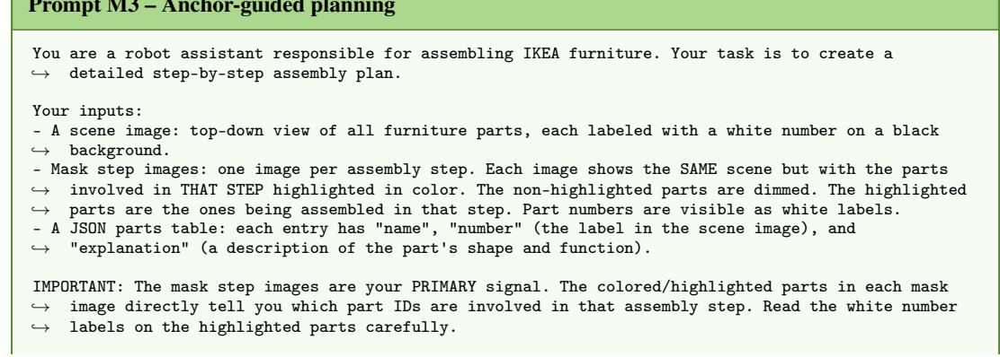

```prolog
PHASE 1 -- ANCHOR IDENTIFICATION
Look at the FIRST mask image and the LAST mask image only.
- FIRST mask image: Which part IDs are highlighted? These are the base structural parts introduced in
,→ Step 1.
- LAST mask image: Which part ID is highlighted? This is the final piece added -- it is the ROOT of
,→ the assembly tree.
Write:
<anchors>
Step 1 anchor parts: [IDs] -- [read directly from highlighted parts in first mask image]
Step N anchor parts: [IDs] -- [read directly from highlighted parts in last mask image]
</anchors>
---
PHASE 2 -- PART VISIBILITY TABLE WITH SUBASSEMBLY ANALYSIS
Now look at ALL mask images in order. For each mask image:
1. Read the white number labels on the HIGHLIGHTED (colored) parts -- these are the part IDs
,→ introduced in this step.
2. Identify what subassembly is carried over from the previous step (the dimmed parts).
3. Determine if this step's parts are assembled IN ISOLATION (independent sub-assembly, will merge
,→ later) or ADDED DIRECTLY to the carried-over subassembly.
Every part must appear in exactly one step. Each part ID must be used EXACTLY ONCE across all steps.
<part_visibility>
Step 1 introduces: [IDs from highlighted parts] -- [isolated sub-assembly | added to main body]
Subassembly formed: [describe]
Step 2 introduces: [IDs from highlighted parts] -- [isolated sub-assembly | added to main body]
Carried over: [subassembly from Step 1]
Assembly type: ISOLATED_SUBASSEMBLY | SEQUENTIAL_ADDITION
Subassembly formed: [describe]
Step N introduces: [IDs] -- [added to main body]
Carried over: [subassembly from Step N-1]
Assembly type: SEQUENTIAL_ADDITION
Subassembly formed: complete furniture
Verification: all [N] parts assigned exactly once. Part IDs used: [list all IDs]. No duplicates [OK]
</part_visibility>
---
PHASE 3 -- ASSEMBLY PLAN
Using the part assignments from Phase 2 (anchored by Phase 1), write the full assembly plan.
### Step K:
- **Parts Needed:** Part Name (id). ..
- **Instructions:**
- [describe spatial relationship
End with:
Verification: Parts used = [all IDs]. Total = [N]. All parts accounted for. [OK]
RULES:
- Number of steps = number of mask images.
- Read part IDs DIRECTLY from the highlighted parts in each mask image -- do not guess.
- Every part in the JSON table must appear in EXACTLY ONE step.
- Mark each step as ISOLATED_SUBASSEMBLY or SEQUENTIAL_ADDITION -- this is critical for the next
,→ stage.
- Do not skip Phase 1 or Phase 2.
```  
Terminology note. The historical M3 prompt uses the word “ROOT for the final-step anchor part. In the paper and in the tree-conversion prompt, the graph-theoretic root denotes the completed assembly; we therefore refer to the former as thefinal-step anchor in the main text.

## Text-to-Tree Conversion Prompt (M4)

The following is reproduced as supplied, including its illustrative examples; it is a prompt snapshot rather than a validated ground-truth trace.

```markdown
Prompt M4 – Text-to-tree conversion
You are a robot assistant responsible for assembling IKEA furnitures.
Your new task is to convert a step by step furniture assembly instruction plan from text format into a
,→ tree format.
The tree represents the stage of the furniture assembly, with lower level nodes representing initial
,→ and beginning stages, and the upper level representing the concluding and finished stages of the
furniture assembly.,→
Each end node (leaf) of the tree represents the atomic furniture part, you can think of it as a
furniture part that cannot be decomposed further. As you move up the tree, each parent node will,→
represent two or more child nodes combined. Finally, the root node will be the completed,→
,→ furniture.
You should clearly describe how every node is connected.
Your output will be a tree that should be STRICTLY written in a nested list of integers with NO other
,→ comments or natural language texts.
EXAMPLE INPUT 1:
Here's a step-by-step assembly plan for the furniture using the provided parts:
### Step 1: Assemble Backrest and Seat
- **Parts Needed:** Backrest Frame (1), Seat Cushion (5)
- **Instructions:**
- Place the Backrest Frame (1) and Seat Cushion (5) adjacent as shown in their respective colors
,→ (red and green).
- Ensure the backrest is upright and securely attached to the seat.
### Step 2: Attach Side Leg Frame
- **Parts Needed:** Side Leg Frame (2) and subassembly from Step 1
- **Instructions:**
- Position the Side Leg Frame (2) on one side of the assembled backrest and seat structure.
### Step 3: Attach Side Leg Frame Again
- **Parts Needed:** Side Leg Frame (7) and subassembly from Step 2
- **Instructions:**
- Position the Side Leg Frame (7) on the other side of the assembled backrest and seat structure.
### Step 4: Connect Support Beams
- **Parts Needed:** Support Beams (3, 4) and subassembly from Step 3
- **Instructions:**
- Attach Support Beams (3, 4) to the inside of the Side Leg Frame, as depicted.
Check the entire assembly for any loose parts and re-tighten as necessary. The chair should now be
,→ fully assembled and ready for use.
EXAMPLE OUTPUT 1:
`python
[
[
[
[
1,
5
],
],<sub>7</sub>
<sup>],</sup>3,<sub>4</sub>
EXAMPLE INPUT 2:
Here is a detailed step-by-step plan for assembling the chair using the provided materials and the
,→ new pages of the manual:
### Step 1: Connect Support Beams and Leg Frame
**Parts Involved:** Support Beams (0 and 3), Leg Frame (4)
- **Instructions:** Position the leg frame (4) horizontally on the floor. Align the support beams (0
and 1) vertically to connect with the leg frame. Ensure that each beam is fitted securely into,→
the designated slots on the frame.,→
### Step 2: Attach Backrest Slats
**Parts Involved:** Backrest Slats (2) and subassembly from Step 1
```

```markdown
- **Instructions:** Insert the backrest slats (2) into the slots on the leg frame. Ensure that the
,→ slats are facing outward and securely fitted to provide back support.
### Step 3: Connect Seat Cushion
**Parts Involved:** Seat Cushion (1) and subassembly from Step 2
- **Instructions:** Place the seat cushion (1) on top of the assembled frame. Align the cushion with
,→ the edges of the frame for balance and comfort.
EXAMPLE OUTPUT 2:
`python
[
[
[
0,
3,
4
],
2
],<sub>1</sub>
]
EXAMPLE INPUT 3:
Here is a detailed step-by-step plan for assembling the chair using the provided materials and the
,→ new pages of the manual:
### Step 1: Connect Support Beams and Leg Frame
**Parts Involved:** Support Beams (7, 11, 6), Leg Frame (5)
- **Instructions:** Position the leg frame (5) horizontally on the floor. Align the support beams (7,
11, 6) vertically to connect with the leg frame. Ensure that each beam is fitted securely into,→
the designated slots on the frame.,→
### Step 2: Attach Backrest Slats
**Parts Involved:** Backrest Slats (1, 10) and subassembly from Step 1
- **Instructions:** Insert the backrest slats (1, 10) into the slots on the leg frame. Ensure that
,→ the slats are facing outward and securely fitted to provide back support.
### Step 3: Connect Seat Cushion
**Parts Involved:** Seat Cushion (3) and subassembly from Step 2
- **Instructions:** Place the seat cushion (3) on top of the assembled frame. Align the cushion with
,→ the edges of the frame for balance and comfort.
### Step 4: Connect Support Beams and Leg Frames
**Parts Involved:** Support Beams (8, 4), Leg Frames (2, 9)
- **Instructions:** Position the leg frame (2, 9) horizontally on the floor. Align the support beams
,→ (8, 4) vertically to connect with the leg frame.
### Step 5: Connect Support Beams and Leg Frames
**Parts Involved:** Subassembly from Step 4 and subassembly from Step 3
- **Instructions:** Connect the two subassemblies together
### Step 5: Connect Support Beams and Leg Frames
**Parts Involved:** Leg frame (0) and subassembly from Step 5
- **Instructions:** Connect the final leg frame with the previous subassembly
EXAMPLE OUTPUT 3:
``python
[
[
[
8,
4,
2,
9
],<sub>[</sub>
[
[
7,
11,
6,<sub>5</sub>
],
1,
10
],<sub>3</sub>
]
]
```

YOUR REAL INPUT:

## Historical Initial Pose-Proposer Request

This is the saved round-0 user prompt for Bench/applaro operation 0.

Pose proposer – Initial request   
# Role   
You are VLM-A, a closed-loop 6D pose proposer for one furniture assembly operation.   
# Image Inputs   
Images 1-3: 3 separate perspective supporting orbit views with color-coded command arrows drawn from   
,→ moving part 2.   
Image 4: current front orthographic view; screen horizontal = +X, screen vertical = +Y.   
Image 5: current right orthographic view; screen horizontal = +Z, screen vertical = +Y.   
Image 6: current top orthographic view; screen horizontal = +X, screen vertical = +Z.   
Image 7: raw manual crop for this operation.   
Before writing pose candidates, choose the three most useful perspective supporting-view indices from   
,→ the provided command-arrow views.   
Use those selected supporting views mainly for direction, rotation, mirror, connector-facing,   
,→ occlusion, and 3D shape.   
Use only the orthographic Front/Right/Top grid tick coordinates for metric translation scale.   
Perspective 3D views are not metric rulers: object size and apparent distance change with camera,→   
viewpoint, so do not estimate Tx/Ty/Tz from 3D pixel lengths.,→   
# Operation Instruction   
Current operation: move part 2 (side frame) only.   
Fixed subassembly: part 1 (seat panel).   
Goal: attach side frame 2 upright to one end of seat panel 1. The frame should stand perpendicular to   
,→ the panel surface, with its inner attachment faces/holes facing the panel end.   
Ignore part 0 for action selection in this operation; it is only context from the same manual step.   
# Manual Step Context   
- Parts Needed: support bar (0), seat panel (1), side frame (2).   
- Attach side frame 2 to one end of seat panel 1.   
- Install support bar 0 horizontally between the side frame and seat panel.   
# Part Table   
- part 0: support bar   
- part 1: seat panel   
- part 2: side frame   
- part 3: side frame

```prolog
# Coordinate Convention
- Follow the Text-Guided 6D Pose / VLM-Pose convention.
- Use the orthographic views for metric translation scale and positions.
- Use the perspective supporting/orbit views for orientation, mirror, connector facing, and 3D shape.
Color convention: red arrow = +X, green arrow = +Y, blue arrow = +Z.
- The arrows are world-aligned and start from the moving part AABB surface; they do not rotate with
,→ the part.
- The image may omit X/Y/Z text labels; use arrow colors for axis identity.
- Black boxed numbers on parts are part IDs, matching the manual and Part Table; they are not
,→ physical features.
- Do not read metric translation from perspective pixel lengths; use the orthographic grid for
,→ Tx/Ty/Tz.
- Use front/right/top jointly to estimate Tx/Ty/Tz and rotation from metric projections.
- Translation is an incremental OBJ/world scene-unit vector [Tx, Ty, Tz] applied to the CURRENT pose.
- Read Tx/Ty/Tz directly from the orthographic grid/tick coordinates. Do not divide by the
,→ colored-arrow length.
- Example: if the moving part center should move 0.30 grid units right in Front/Top, output Tx about
,→ +0.30.
- Direction/orientation can be inferred jointly from the orthographic three-view images and the
,→ selected perspective command-arrow views.
- Translation scale and position must be inferred from orthographic tick/grid coordinates only; the
,→ 3D perspective images are visual context, not a distance scale.
- Dominant rotation axis is one of "x", "y", "z"; Angle is an incremental world-axis orientation
,→ change in degrees.
- Always output a 3x3 incremental world-axis "Rotation matrix" R_delta applied to the CURRENT pose.
If no rotation is needed, output the identity matrix [[1,0,0],[0,1,0],[0,0,1]].
```

```csv
- Direct pose update semantics: Rotation changes orientation; Translation changes position. A
,→ rotation-only repair should use Translation [0,0,0] and should not intentionally move the part.
- Fixed parts ['1'] must not move.
- Use right-hand rule: +Rx rotates +Y toward +Z; +Ry rotates +Z toward +X; +Rz rotates +X toward +Y.
- Do not make all candidates share the same Translation. Candidate diversity must include different
plausible side/end/face placements when the manual says "one end", "side", "edge", "slot",,→
"under", or "mounting region".,→
- Avoid fixed-center collapse: if the goal is an end/side attachment, placing the moving part at the
,→ fixed part center is a likely wrong-side candidate, not the main candidate.
- Assembly is face/edge/slot contact, not center-to-center matching. For side/end/underside tasks,
estimate the fixed part boundary in the orthographic views and place the moving part so its,→
relevant face/end/tabs meet that boundary. Do not translate the moving center to the fixed center,→
unless the instruction explicitly says to center it.,→
- In the top/right/front views, check contact by visible gaps: a correct Translation should close the
gap between mating faces while preserving the moving part's own size; it should not bury the,→
moving part inside the fixed object or leave it floating past the end.,→
```

## # Structured Single-shot Reasoning

## Part 1: 3D spatial understanding.

## Part 2: three-view metric localization.

## # Task # Task

Output exactly 1 diverse executable pose-update candidates for moving part 2.   
The program will directly apply your numeric Translation and Rotation matrix if provided; otherwise   
,→ it applies the single-axis rotation.   
Then it renders after-state images.   
Do not choose from hidden primitives and do not rely on geometric snapping.   
Include the most likely update plus alternatives for mirror/orientation ambiguity. Do not output   
,→ extra candidates beyond the requested count.

```csv
# Output JSON
{
"selected_supporting_views": [1, 2, 3],
"selected_supporting_view_reason": "why the selected view exposes contact/orientation for this
,→ operation",
"spatial_reasoning_3d": {
"moving_part": "part id and name",
"fixed_contact_part": "part id and name",
"contact_region": "underside corner / side edge / slot / end face",
"fixed_contact_face": "+X/-X/+Y/-Y/+Z/-Z or descriptive face",
"moving_contact_face": "+X/-X/+Y/-Y/+Z/-Z or descriptive face",
"insertion_direction": "+X/-X/+Y/-Y/+Z/-Z",
"mirror_relation": "same / mirrored / opposite corner / not applicable",
"orientation_constraint": "parallel/perpendicular/upright/connector-facing constraint"
},
"metric_reasoning_three_view": {
"current_center_estimate": [0.0, 0.0, 0.0],
"target_contact_plane_or_edge": {"axis": "x/y/z", "coordinate": 0.0, "side": "+/- or
,→ descriptive"},
"moving_half_extent_along_contact_axis": 0.0,
"target_center_estimate": [0.0, 0.0, 0.0],
"translation_delta": [0.0, 0.0, 0.0],
"scale_source": "front/right/top orthographic grid only"
},
"rotation_reasoning": {
"dominant_axis_alignment": "which moving axis should align with which world/fixed axis",
"connector_facing_after": "direction the connector/contact face should face after rotation",
"rotation_needed": "none / 90 deg about X/Y/Z / 180 deg mirror-orientation fix"
},
"candidates": [
{
```

```jsonl
"label": "A",
"Translation": [0.0, 0.0, 0.0],
"Rotation matrix": [[1,0,0],[0,1,0],[0,0,1]],
"Dominant rotation axis": "x",
"Angle": 0.0,
"semantic_reason": "attach to the open end / align face / fully seated",
"expected_visual_change": "what should change in front/right/top views",
"risk": "possible failure mode"
}
],
"reasoning": "brief overall reasoning"
}
```

## Historical Feedback-Conditioned Pose-Proposer Request

This is the saved round-1 request after inserting the previous negative diagnosis.

Pose proposer – Feedback-conditioned request   
# Role   
You are VLM-A, a closed-loop 6D pose proposer for one furniture assembly operation.   
# Image Inputs   
Images 1-3: 3 separate perspective supporting orbit views with color-coded command arrows drawn from   
,→ moving part 2.   
Image 4: current front orthographic view; screen horizontal = +X, screen vertical = +Y.   
Image 5: current right orthographic view; screen horizontal = +Z, screen vertical = +Y.   
Image 6: current top orthographic view; screen horizontal = +X, screen vertical = +Z.   
Image 7: raw manual crop for this operation.   
Before writing pose candidates, choose the three most useful perspective supporting-view indices from   
,→ the provided command-arrow views.   
Use those selected supporting views mainly for direction, rotation, mirror, connector-facing,   
,→ occlusion, and 3D shape.   
Use only the orthographic Front/Right/Top grid tick coordinates for metric translation scale.   
Perspective 3D views are not metric rulers: object size and apparent distance change with camera,→   
viewpoint, so do not estimate Tx/Ty/Tz from 3D pixel lengths.,→   
# Operation Instruction   
Current operation: move part 2 (side frame) only.   
Fixed subassembly: part 1 (seat panel).   
Goal: attach side frame 2 upright to one end of seat panel 1. The frame should stand perpendicular to   
,→ the panel surface, with its inner attachment faces/holes facing the panel end.   
Ignore part 0 for action selection in this operation; it is only context from the same manual step.   
# Manual Step Context   
- Parts Needed: support bar (0), seat panel (1), side frame (2).   
- Attach side frame 2 to one end of seat panel 1.   
- Install support bar 0 horizontally between the side frame and seat panel.   
# Part Table   
- part 0: support bar   
- part 1: seat panel   
- part 2: side frame   
- part 3: side frame   
# Previous Iteration Feedback   
The previous rendered after-state was judged as:   
{   
"Accept": "No",   
"Error type": "wrong\_side",   
"Residual direction": "shift to the seat panel end and rotate upright so the open/inner faces meet   
,→ the panel end",   
"Contact": "Incorrect",   
"Orientation": "Incorrect",   
"Reasoning": "In the top and 3D orbit views, side frame 2 is not seated on an end face of seat   
panel 1; it sits off to the side/under area and does not stand flush/perpendicular at the panel,→   
end with its inner faces toward the panel. The supposed attachment faces are not aligned to the,→   
panel end.",,→   
"Next candidate hints": [   
"Place frame 2 centered on one short end of seat panel 1, with its two legs straddling the panel   
,→ width",   
"Rotate frame 2 so it stands vertical (perpendicular to the panel surface) and its inner   
,→ holes/faces point into the panel end"   
],   
"Confidence": 0.78

}

Use this feedback to revise from the CURRENT images. If translation/contact is wrong, change ,→ Translation.

If orientation/mirror is wrong, change Dominant rotation axis and Angle. Do not repeat the same ,→ failed update.

## # Current Repair Mode: COUPLED COARSE REPAIR

Both position/contact and orientation are wrong. Include separate candidates that prioritize: 1) correcting orientation while keeping translation small;

2) correcting translation/contact while keeping rotation small;

3) one coupled correction if both are visibly linked.

## # Error-Type Constrained Correction

This is the only correction step after seeing the rendered after-state. Do not freely regenerate a ,→ new pose.

First classify the previous after-state using the judge feedback, then apply exactly one conservative ,→ correction:

\- wrong\_side / wrong\_mirror: keep translation magnitude as small as possible except for moving to the opposite/contact-correct side. Correct contact face, mirror relation, or connector-facing,→ orientation: do not change unrelated axes

\- floating: keep rotation unchanged. Move only along the insertion/contact-normal direction until the ,→ moving contact face touches the fixed contact face.

\- collision: keep rotation unchanged. Back off only along the opposite insertion/contact-normal ,→ direction until visible penetration is removed.

\- not\_fully\_seated: keep rotation unchanged. Apply a small seating translation along the insertion ,→ direction. Do not cross through the fixed part.

\- accepted/ok/unclear: output near-zero Translation and identity Rotation matrix unless a single ,→ obvious small correction is visible.

Always recompute Translation from front/right/top grid coordinates. Use the 3D supporting views only ,→ to choose side, mirror, and contact normal.

The judge's normalized error\_type is: wrong\_side.

\# Coordinate Convention

\- Follow the Text-Guided 6D Pose / VLM-Pose convention.

\- Use the orthographic views for metric translation scale and positions.

- Use the perspective supporting/orbit views for orientation, mirror, connector facing, and 3D shape.   
- Color convention: red arrow = +X, green arrow = +Y, blue arrow = +Z.

\- The arrows are world-aligned and start from the moving part AABB surface; they do not rotate with ,→ the part.

\- The image may omit X/Y/Z text labels; use arrow colors for axis identity.

\- Black boxed numbers on parts are part IDs, matching the manual and Part Table; they are not ,→ physical features.

\- Do not read metric translation from perspective pixel lengths; use the orthographic grid for ,→ Tx/Ty/Tz.

\- Use front/right/top jointly to estimate Tx/Ty/Tz and rotation from metric projections.

\- Translation is an incremental OBJ/world scene-unit vector [Tx, Ty, Tz] applied to the CURRENT pose.

\- Read Tx/Ty/Tz directly from the orthographic grid/tick coordinates. Do not divide by the ,→ colored-arrow length.

\- Example: if the moving part center should move 0.30 grid units right in Front/Top, output Tx about ,→ +0.30.

\- Direction/orientation can be inferred jointly from the orthographic three-view images and the ,→ selected perspective command-arrow views.

\- Translation scale and position must be inferred from orthographic tick/grid coordinates only; the ,→ 3D perspective images are visual context, not a distance scale.

\- Dominant rotation axis is one of "x", "y", "z"; Angle is an incremental world-axis orientation ,→ change in degrees.

Always output a 3x3 incremental world-axis "Rotation matrix" R\_delta applied to the CURRENT pose.   
If no rotation is needed, output the identity matrix [[1,0,0],[0,1,0],[0,0,1]].

\- Direct pose update semantics: Rotation changes orientation; Translation changes position. A

,→ rotation-only repair should use Translation [0,0,0] and should not intentionally move the part.   
- Fixed parts ['1'] must not move.

\- Use right-hand rule: +Rx rotates +Y toward +Z; +Ry rotates +Z toward +X; +Rz rotates +X toward +Y.

\- Do not make all candidates share the same Translation. Candidate diversity must include different

,→ plausible side/end/face placements when the manual says "one end", "side", "edge", "slot", ,→ "under", or "mounting region".

\- Avoid fixed-center collapse: if the goal is an end/side attachment, placing the moving part at the ,→ fixed part center is a likely wrong-side candidate, not the main candidate.

\- Assembly is face/edge/slot contact, not center-to-center matching. For side/end/underside tasks,

estimate the fixed part boundary in the orthographic views and place the moving part so its,→

relevant face/end/tabs meet that boundary. Do not translate the moving center to the fixed center,→ unless the instruction explicitly says to center it.,→

\- In the top/right/front views, check contact by visible gaps: a correct Translation should close the

gap between mating faces while preserving the moving part's own size; it should not bury the,→

moving part inside the fixed object or leave it floating past the end.,→

# Structured Single-shot Reasoning   
Before choosing numeric pose values, solve the operation in two separated parts.   
Part 1: 3D spatial understanding.   
- Use the selected 3D supporting views, manual crop, part IDs, and atomic instruction to decide   
,→ contact semantics:   
moving part, fixed contact part, contact region, fixed contact face, moving contact face,   
insertion direction, mirror/corner relation, and orientation constraint.   
The 3D views are for spatial relation, connector-facing, occlusion, and mirror/orientation   
,→ disambiguation.   
- Do not use perspective apparent size as the metric translation ruler.   
Part 2: three-view metric localization,   
- Use front/right/top orthographic grid coordinates to estimate current moving-part center, target   
,→ contact plane/edge/slot,   
moving half extent along the contact axis, target center, and Translation = target center - current   
,→ center.   
If a contact face is hidden in one orthographic view, infer the hidden coordinate from the other   
,→ two views plus the 3D/manual evidence.   
- Keep the final Translation in OBJ/world scene units.   
# Task   
Output exactly 1 diverse executable pose-update candidates for moving part 2.   
The program will directly apply your numeric Translation and Rotation matrix if provided; otherwise   
,→ it applies the single-axis rotation.   
Then it renders after-state images.   
Do not choose from hidden primitives and do not rely on geometric snapping.   
Include the most likely update plus alternatives for mirror/orientation ambiguity. Do not output   
,→ extra candidates beyond the requested count.   
# Output JSON   
{   
"selected\_supporting\_views": [1, 2, 3],   
"selected\_supporting\_view\_reason": "why the selected view exposes contact/orientation for this   
,→ operation",   
"spatial\_reasoning\_3d": {   
"moving\_part": "part id and name",   
"fixed\_contact\_part": "part id and name",   
"contact\_region": "underside corner / side edge / slot / end face",   
"fixed\_contact\_face": "+X/-X/+Y/-Y/+Z/-Z or descriptive face",   
"moving\_contact\_face": "+X/-X/+Y/-Y/+Z/-Z or descriptive face",   
"insertion\_direction": "+X/-X/+Y/-Y/+Z/-Z",   
"mirror\_relation": "same / mirrored / opposite corner / not applicable",   
"orientation\_constraint": "parallel/perpendicular/upright/connector-facing constraint"   
},   
"metric\_reasoning\_three\_view": {   
"current\_center\_estimate": [0.0, 0.0, 0.0],   
"target\_contact\_plane\_or\_edge": {"axis": "x/y/z", "coordinate": 0.0, "side": "+/- or   
,→ descriptive"},   
"moving\_half\_extent\_along\_contact\_axis": 0.0,   
"target\_center\_estimate": [0.0, 0.0, 0.0],   
"translation\_delta": [0.0, 0.0, 0.0],   
"scale\_source": "front/right/top orthographic grid only"   
},   
"rotation\_reasoning": {   
"dominant\_axis\_alignment": "which moving axis should align with which world/fixed axis",   
"connector\_facing\_after": "direction the connector/contact face should face after rotation",   
"rotation\_needed": "none / 90 deg about X/Y/Z / 180 deg mirror-orientation fix"   
},   
"candidates": [   
{   
"label": "A",   
"Translation": [0.0, 0.0, 0.0],   
"Rotation matrix": [[1,0,0],[0,1,0],[0,0,1]],   
"Dominant rotation axis": "x",   
"Angle": 0.0,   
"semantic\_reason": "attach to the open end / align face / fully seated",   
"expected\_visual\_change": "what should change in front/right/top views",   
"risk": "possible failure mode"   
}   
],   
"reasoning": "brief overall reasoning"

## Historical After-State Selector Request

After-state selector request   
# Role   
You are VLM-B, the visual selector.   
# Task   
Choose the best rendered after-state candidate for this furniture operation.   
# Operation   
Current operation: move part 2 (side frame) only.   
Fixed subassembly: part 1 (seat panel).   
Goal: attach side frame 2 upright to one end of seat panel 1. The frame should stand perpendicular to   
,→ the panel surface, with its inner attachment faces/holes facing the panel end.   
Ignore part 0 for action selection in this operation; it is only context from the same manual step.   
# Candidate Options   
- A: real\_pose\_A\_Tscene=[0.0, 0.0, 1.5]\_rot=matrix -- VLM-Pose direct update: Tscene   
Translation=[0.0, 0.0, 1.5] (arrow\_len=1.000000), Rotation matrix=[[1.0, 0.0, 0.0], [0.0, 1.0,,→   
0.0], [0.0, 0.0, 1.0]], Dominant rotation axis=y, Angle=+0.000. Update rule=independent. Reason:,→   
Slide the upright side frame forward in +Z to meet the near end face of the seat panel, keeping,→   
it perpendicular/upright.. Expected: Right view: part 2 shifts from z\~0 to overlap the seat panel,→   
end around z\~1.5-2.0; Top view: part 2 moves upward toward the seat panel along +Z, aligning with,→   
the seat's end; Front view: little/no change in X/Y alignment besides closing the gap.. Risk: If,→   
the intended attachment is the opposite end of the seat panel, this +Z translation will place it,→   
on the wrong end (would need -Z instead)..,→   
# Rules   
- Valid labels: A.   
- Select exactly one option.   
- Prefer correct side/end/face, orientation/mirror, fully seated contact, no floating, and no   
,→ collision.   
- Do not output a new pose. Only choose among rendered options.   
# Output JSON   
{   
"Selected option": "one of A",   
"Is acceptable": "Yes or No",   
"Reasoning": "brief visual reason",   
"Confidence": 0.0   
}

## Limitations

Despite our work offers an automated furniture assembly solution that transforms parts into finished object, several limitations should be acknowledged. First, the closed-loop 6D pose estimation process depends on the interaction between the VLM proposer and judge, because errors may accumulate across iterations and assembly steps. Once an incorrect pose is selected, or a visually plausible but geometrically wrong after-state is accepted, it can negatively affect subsequent operations. Second, the VLM-driven 6D pose estimation relies on the quality of the manual-to-operation results in the process (a). If the assembly tree, atomic step decomposition, moving part, fixed subassembly, or attachment relation is incorrect, the pose module may solve the wrong fixed-moving relation. Third, we finds that VLM has some limitations in its ability to understand and reason about spatial-temporal action sequences, particularly when it comes to long-term information exchange and self-updating.

## Ethical Statement on LLM Assistance

We primarily use GPT-5 as a tool for language refinement, including polishing text and improving clarity. All model-generated content is thoroughly reviewed and rewritten by human authors to ensure accuracy, originality, and adherence to research integrity standards.