# BEYOND SCALAR IOU: STRUCTURED VERIFICATIONFROM ROLLOUT GROUPS FOR VIDEO TEMPORALGROUNDING

Youngjae Cho PYLER

Won Young Jhoo PYLER

Jongsuk Kim PYLER

## ABSTRACT

Reinforcement learning with verifiable rewards (RLVR) provides a natural framework for adapting pretrained models to video temporal grounding, where generated temporal intervals can be scored directly against ground truth intervals. Yet existing overlap verifiers typically score each rollout independently, leaving the joint structure of the rollout group unused. We introduce SUTURE, which conditions verification on the rollout group and exploits its structure at two complementary scales: disagreement across rollouts controls how strongly the target is reweighted, while coverage at each position determines where reward mass is redistributed. We show that the resulting verifier admits an exact decomposition into the standard IoU term and a covariance correction determined by the rollout group. A local gradient diagnostic finds a preference for responses covering relatively less supported target regions in the analyzed groups. Across five temporal grounding benchmarks, SUTURE improves grounding performance at every reported IoU threshold. Its trained policy also shows less video-start anchoring in reasoning traces: for later events, the first temporal mention more often overlaps the annotated target. Together, these results show that the joint structure of a rollout group can support a more informative temporal verifier.

## 1 INTRODUCTION

Video temporal grounding requires a model to identify when the event described by a natural language query occurs (Gao et al., 2017; Krishna et al., 2017). Recent multimodal large language models (MLLMs) tackle this task by directly generating temporal intervals from video-query inputs (Bai et al., 2025b; Yan et al., 2025). These predictions can be scored against ground truth intervals, making reinforcement learning with verifiable rewards (RLVR) a natural framework for adapting pretrained models (Shao et al., 2024; Wang et al., 2025). The verifier determines how localization accuracy becomes a learning signal.

Group-relative optimization samples multiple responses for the same input and normalizes their rewards within the rollout group (Shao et al., 2024). Yet temporal overlap verifiers typically score each interval independently against the target interval using an overlap reward based on intersection over union (IoU) (Wang et al., 2025; Zheng et al., 2026a). Optimization is group-relative, but overlap verification remains individual. The group is used to compare scalar rewards, while the temporal support pattern revealed by its predictions is left out of the overlap verifier.

Figure 1 (left) illustrates the resulting distinction. Two predictions can receive the same IoU while covering different parts of the target interval: one reaches a region covered by most rollouts, whereas the other reaches an equally large correct region covered by only a few. Equal accuracy under IoU need not imply equal training emphasis: the latter captures correct coverage that is less consistently represented in the group. We use this distinction to emphasize relatively less supported correct regions during training, rather than treating all correctly covered locations uniformly.

We introduce Structured Under-support Targeting Using Rollout Evidence (SUTURE), a verifier that conditions on the rollout group and separates where to redistribute target weight from how much to redistribute (Figure 1). Among target locations covered by at least one rollout, we use coverage at each position to give greater relative weight to less supported regions. Pairwise disagreement between the complete predicted intervals controls the redistribution strength. Normalization preserves total target mass, while the IoU denominator remains unchanged. The annotation remains the sole source of correctness: the group changes only the relative emphasis within it.

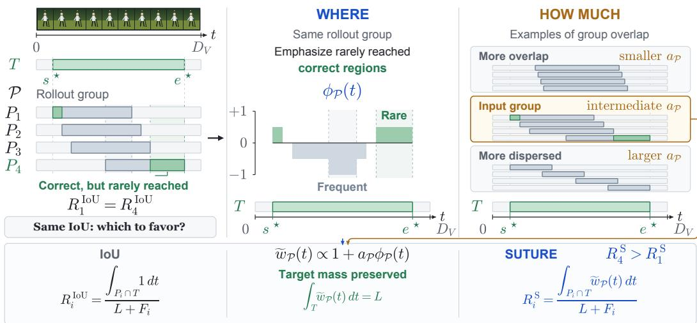  
Figure 1: Target weighting based on rollout groups in SUTURE. Left: $P _ { 1 }$ and $P _ { 4 }$ have equal IoU but different support over their correct overlap. Center: The signed residual $\phi _ { \mathcal { P } } ( t )$ determines where to redistribute target weight. Right: Disagreement controls $a p$ , subject to the floor. Bottom: Normalization preserves target mass $\stackrel { \smile } { \cal L }$ and the IoU denominator, while the structured weighting yields $R _ { 4 } ^ { \mathrm { S } } > R _ { 1 } ^ { \mathrm { S } }$ in this example.

We show that this verifier decomposes exactly into ordinary IoU and a covariance correction determined by the rollout group. This correction can favor predictions covering relatively less supported target regions even among predictions with the same IoU. A separate local gradient diagnostic finds a corresponding preference for responses covering relatively less supported target regions in the analyzed groups.

Across five benchmarks covering both short and long videos, SuTURE consistently improves temporal grounding performance. Component ablations show that structured target weighting improves grounding performance. Adapting the reweighting strength to rollout disagreement yields further gains over the tested controls with fixed strength. Additional analyses show reduced anchoring to the video start in reasoning traces and shorter responses on average.

Our main contributions are summarized as follows:

• Verification using rollout groups for temporal grounding. We introduce SUTURE, which uses rollout coverage at each position to determine where to redistribute target weight and disagreement across the group to set the amplitude, while retaining the annotation as the source of correctness.

• Exact characterization and local analysis. We derive an exact reward decomposition and ordering by group support, and separately examine the structured residual through a local gradient diagnostic.

• Empirical validation across models, benchmarks, and temporal behavior. We demonstrate grounding gains across five benchmarks, evaluate the amplitude rule based on disagreement against controls with fixed amplitudes, and observe reduced anchoring to the video start in reasoning traces.

## 2 PRELIMINARIES

We introduce the temporal grounding setup, standard overlap verification, and the group-relative optimization quantities used throughout the paper.

## 2.1 TEMPORAL GROUNDING AND OVERLAP VERIFICATION

For a video-query input $x = ( V , q )$ with video duration $D _ { V }$ , let the ground truth interval be

$$
\mathcal { T } = [ s ^ { \star } , e ^ { \star } ] , \qquad L = | \mathcal { T } | = e ^ { \star } - s ^ { \star } > 0 .
$$

Here $| A |$ denotes the total duration of a temporal set $A ,$ SO $L$ is the target duration. The policy model $\pi _ { \theta }$ generates a group of $G$ responses. During rollout collection, responses are sampled from the behavior policy $\pi _ { \theta _ { \mathrm { o l d } } }$ as

$$
y _ { i } \sim \pi _ { \theta _ { \mathrm { o l d } } } ( \cdot \mid x ) , \qquad i = 1 , \ldots , G .\tag{1}
$$

A valid prediction in response $y _ { i }$ defines $\boldsymbol { P _ { i } } = \left[ \boldsymbol { \hat { s } } _ { i } , \boldsymbol { \hat { e } _ { i } } \right]$ with $\hat { s } _ { i } < \hat { e } _ { i }$ . We write

$$
\mathcal { P } = ( P _ { 1 } , \ldots , P _ { G } )
$$

for the realized rollout tuple. Throughout, $\mathcal { P }$ denotes the particular group sampled for the current input and is an ordered tuple rather than a distribution.

For rollout $i ,$ define its duration of correct overlap and its duration outside the target as

$$
I _ { i } : = I ( P _ { i } ) = | P _ { i } \cap \mathcal { T } | , \qquad F _ { i } : = F ( P _ { i } ) = | P _ { i } \setminus \mathcal { T } | .\tag{2}
$$

The union $P _ { i } \cup \mathcal { T }$ consists of the full target $\tau$ and the predicted portion outside it, $P _ { i } \setminus \mathcal { T }$ . These parts are disjoint, so $| P _ { i } \cup \mathcal { T } | = | \mathcal { T } | + | P _ { i } \setminus \mathcal { T } | = L + F _ { i }$ . The standard temporal IoU reward is therefore

$$
R _ { i } ^ { \mathrm { I o U } } : = R ^ { \mathrm { I o U } } ( P _ { i } , { \mathcal { T } } ) = { \frac { | P _ { i } \cap { \mathcal { T } } | } { | P _ { i } \cup { \mathcal { T } } | } } = { \frac { I _ { i } } { L + F _ { i } } } = { \frac { \int _ { P _ { i } \cap { \mathcal { T } } } 1 d t } { L + F _ { i } } } .\tag{3}
$$

For fixed $( P _ { i } , \mathcal { T } ) , R _ { i } ^ { \mathrm { I o U } }$ does not depend on the other rollouts in $\mathcal { P } _ { \cdot }$

## 2.2 GROUP-RELATIVE POLICY OPTIMIZATION

We use uppercase R for individual reward terms and lowercase r for the total training reward used to compute the GRPO advantage. Given rollout rewards $\{ r _ { i } \} _ { i = 1 } ^ { G }$ , GRPO (Shao et al., 2024) forms advantages normalized within each group

$$
\bar { r } = \frac { 1 } { G } \sum _ { i = 1 } ^ { G } r _ { i } , \quad \quad \sigma _ { r } = \sqrt { \frac { 1 } { G } \sum _ { i = 1 } ^ { G } ( r _ { i } - \bar { r } ) ^ { 2 } } ,\tag{4}
$$

$$
A _ { i } = \mathrm { s g } \left[ \frac { r _ { i } - \bar { r } } { \sigma _ { r } + \delta } \right] , \qquad \delta > 0 ,\tag{5}
$$

where $\mathrm { s g } [ \cdot ]$ denotes stop-gradient. The full clipped GRPO surrogate is given in Appendix $\mathbf { B } ;$ the main text retains only the quantities needed for our verifier analysis.

## 3 METHOD

## 3.1 TARGET WEIGHTING FROM ROLLOUT GROUPS

For rollout $P _ { i }$ , SUTURE computes the overlap reward $R _ { i } ^ { \mathrm { S } } : = R ^ { \mathrm { S } } ( P _ { i } , \mathcal { T } ; \mathcal { P } )$ by replacing the uniform weighting of the target in IoU:

$$
R _ { i } ^ { \mathrm { I o U } } = \frac { \displaystyle \int _ { P _ { i } \cap T } 1 d t } { L + F _ { i } } , \qquad R _ { i } ^ { \mathrm { S } } = \frac { \displaystyle \int _ { P _ { i } \cap T } \widetilde w _ { \mathcal { P } } ( t ) d t } { L + F _ { i } } .\tag{6}
$$

IoU counts every correctly covered temporal location equally; SuTURE weights these locations using rollout group support. The shared weight field $\widetilde { w } _ { \mathcal P }$ is obtained by normalizing $1 + a p \phi _ { \mathcal { P } } ( t )$ over the target to preserve total mass $L .$ The support residual $\phi _ { \mathcal { P } } ( t )$ determines the reweighting pattern from coverage at each position, while the amplitude $a p$ controls its strength based on rollout disagreement. Each rollout integrates this field over its own correct overlap ${ \bar { P _ { i } \cap \mathcal { T } } }$ , with the IoU denominator unchanged.

Where to reweight: group support at each position. The fraction of rollouts covering target location t is

$$
C _ { \mathcal { P } } ( t ) = \frac { 1 } { G } \sum _ { i = 1 } ^ { G } \mathbb { 1 } [ t \in P _ { i } ] , \qquad t \in \mathcal { T } .\tag{7}
$$

We contrast the fraction of rollouts that do not cover a target location with the fraction that do: $( 1 - C _ { \mathcal { P } } ( t ) ) - C _ { \mathcal { P } } ( t ) = 1 - 2 C _ { \mathcal { P } } ( t )$ . We apply this contrast only at target locations covered by at least one rollout, defining the support residual as

$$
\phi _ { \mathcal { P } } ( t ) = \mathbb { 1 } [ C _ { \mathcal { P } } ( t ) > 0 ] \big ( 1 - 2 C _ { \mathcal { P } } ( t ) \big ) ,\tag{8}
$$

where $\mathbb { 1 } ( \cdot )$ is indicator function. Among covered target locations, lower coverage gives a larger residual. An uncovered location contributes to no member's correct overlap. We leave its residual at zero, retaining a raw weight of one before normalization of target mass.

How strongly to reweight: rollout disagreement. We measure disagreement using overlap between complete predicted intervals. Their pairwise interval IoU is $\begin{array} { r l r } { \mathrm { p I o U } ( P _ { i } , P _ { j } ) } & { { } = } & { \frac { | P _ { i } \cap P _ { j } | } { | P _ { i } \cup P _ { j } | } } \end{array}$ Averaging over pairs gives one agreement value for the entire group:

$$
\operatorname { A v g P a i r I o U } ( { \mathcal { P } } ) = { \frac { 2 } { G ( G - 1 ) } } \sum _ { 1 \leq i < j \leq G } \operatorname { p I o U } ( P _ { i } , P _ { j } ) .\tag{9}
$$

The raw disagreement and its floored redistribution amplitude are

$$
u _ { \mathcal { P } } : = 1 - \mathrm { A v g P a i r I o U } ( \mathcal { P } ) , \qquad a _ { \mathcal { P } } = \operatorname* { m a x } \{ u _ { \mathcal { P } } , u _ { \mathrm { f o o r } } \} .\tag{10}
$$

The amplitude follows $u _ { \mathcal { P } }$ above the floor and otherwise remains at $u _ { \mathrm { H o o r } } .$

Combining location and strength. We normalize the combined field $1 + a _ { \mathcal { P } } \phi _ { \mathcal { P } } ( t )$ over the target:

$$
\widetilde { w } _ { \mathcal { P } } ( t ) = \frac { L \big [ 1 + a _ { \mathcal { P } } \phi _ { \mathcal { P } } ( t ) \big ] } { \displaystyle \int _ { \mathcal { T } } \big [ 1 + a _ { \mathcal { P } } \phi _ { \mathcal { P } } ( t ^ { \prime } ) \big ] d t ^ { \prime } } , \qquad \int _ { \mathcal { T } } \widetilde { w } _ { \mathcal { P } } ( t ) d t = L .\tag{11}
$$

This redistributes weight within the target while keeping its total mass at L. Without the floor, a small $u p$ would make $\widetilde { w } _ { \mathcal P }$ close to uniform IoU weighting even if $\phi _ { \mathcal { P } }$ still varies across the target. The floor keeps a minimum amplitude for this remaining difference in support. Throughout, we take $G \ge 2$ and $0 \leq u _ { \mathrm { f l o o r } } < 1$ . On this constraint, $1 + a _ { \mathcal { P } } \phi _ { \mathcal { P } } ( t )$ is strictly positive within each target segment of nonzero duration between consecutive interval boundaries (proved in Lemma 1), so the normalization is well defined.

This completes the construction of the overlap reward conditioned on the rollout group in Equation $^ { 6 . }$ The next section characterizes how this reward differs from ordinary IoU and how the difference enters the group-relative update.

## 3.2 THEORETICAL CHARACTERIZATION

We first characterize how group support changes each prediction's reward relative to IoU. We then examine how this reward correction enters the group-relative gradient. Full proofs and additional properties are provided in Appendices C and D.

Exact reward correction. Let $U \sim \operatorname { U n i f } ( \mathcal { T } )$ denote a uniformly distributed temporal location within the target.

Proposition 1 (Exact refinement using rollout groups). For a fixed realized rollout group ${ \mathcal P } ,$ let

$$
\bar { \phi } _ { \mathcal { P } } = \frac { 1 } { L } \int _ { \mathcal { T } } \phi _ { \mathcal { P } } ( t ) d t , \qquad \beta _ { \mathcal { P } } = \frac { a _ { \mathcal { P } } } { 1 + a _ { \mathcal { P } } \bar { \phi } _ { \mathcal { P } } } \geq 0 ,
$$

and, for member $P _ { i } ,$ define

$$
\xi _ { i } : = \frac { L \operatorname { C o v } ( \phi _ { \mathcal { P } } ( U ) , \mathbf { 1 } [ U \in P _ { i } ] ) } { L + F _ { i } } .\tag{12}
$$

Then the normalized target weight field satisfies

$$
\widetilde { w } _ { \mathcal { P } } ( t ) - 1 = \beta _ { \mathcal { P } } \big ( \phi _ { \mathcal { P } } ( t ) - \bar { \phi } _ { \mathcal { P } } \big ) ,\tag{13}
$$

and the verifier admits the exact decomposition

$$
R _ { i } ^ { \mathrm { S } } = R _ { i } ^ { \mathrm { I o U } } + \beta _ { \mathcal { P } } \xi _ { i } .\tag{14}
$$

Normalization of target mass centers the support residual around its mean over the target (Equation 13). The coefficient $\beta _ { \mathcal { P } }$ is determined by the amplitude and normalization; it introduces no additional parameter. The covariance in Equation 12 compares the residual with individual coverage over temporal locations in $\tau$ , holding the group fixed. For $I _ { i } > 0$ , it is positive precisely when the mean residual over $P _ { i }$ ∩Texceeds $\phi _ { \mathcal { P } }$

Ordering by group support. Consider two members of the same realized group with $a _ { \mathcal { P } } > 0$ equal positive overlap durations within the target, and equal durations outside it. Their IoU scores are equal, but SUTURE gives a higher structured overlap reward to the member whose correct overlap has lower average group coverage (Appendix C). The coefficient $\beta _ { \mathcal { P } }$ scales this difference.

For a fixed residual field, $\beta _ { \mathcal { P } }$ increases with the amplitude $a _ { \mathcal { P } }$ , since $\partial \beta _ { \mathcal { P } } / \partial a _ { \mathcal { P } } = ( 1 + a _ { \mathcal { P } } \bar { \phi } _ { \mathcal { P } } ) ^ { - 2 } > 0$ A smaller $a p$ therefore reduces the correction relative to IoU, recovered at $a _ { \mathcal { P } } = 0$ . When IoU and the support correction favor different members, $\beta _ { \mathcal { P } }$ determines their relative contributions to the reward difference.

Effect on the GRPO gradient. We next examine whether the reward correction only rescales the IoU gradient or can also change its direction. For fixed rollouts and policy parameters, the verifier affects the advantages normalized within each group, not the rollout score vectors. At the behavior policy, each score vector is the gradient of the log-likelihood normalized by response length:

$$
\mathbf { z } _ { i } = \frac { 1 } { | y _ { i } | } \sum _ { t = 1 } ^ { | y _ { i } | } \nabla _ { \theta } \log \pi _ { \theta } ( y _ { i , t } \mid x , y _ { i , < t } ) | _ { \theta = \theta _ { \mathrm { o l d } } } ,\tag{15}
$$

With clipping locally inactive, the realized direction determined by the reward is

$$
\mathbf { d } ( r ) = \frac { 1 } { G } \sum _ { i = 1 } ^ { G } A _ { i } \mathbf { z } _ { i } .\tag{16}
$$

We omit the KL regularizer, which is unchanged by the verifier.

The total training rewards $r _ { i } ^ { \mathrm { I o U } }$ and $r _ { i } ^ { \mathrm { S } }$ combine the respective temporal scores with the same format reward. For the gradient analysis, we write their difference as $\dot { \chi } _ { i } : = r _ { i } ^ { \mathrm { S } } - r _ { i } ^ { \mathrm { I o U } } = \beta _ { \mathcal { P } } \xi _ { i }$ by Proposition 1. Define the group mean $\begin{array} { r } { \bar { \chi } = G ^ { - 1 } \sum _ { i = 1 } ^ { G } \chi _ { i } } \end{array}$ and centered correction $\begin{array} { r } { \widetilde { \chi } _ { i } = \chi _ { i } - \bar { \chi } } \end{array}$ Let ${ \mathbf { d } } _ { \mathrm { S } } : = { \mathbf { d } } ( r ^ { \mathrm { S } } )$ and ${ \bf d } _ { \mathrm { I o U } } : = { \bf d } ( r ^ { \mathrm { I o U } } )$ . At the behavior policy, with locally inactive clipping, stop-gradient advantages, and $\delta > 0 .$ , Equation 16 gives

$$
\mathbf { d } _ { \mathrm { S } } = \kappa _ { \mathcal { P } } \mathbf { d } _ { \mathrm { I o U } } + \alpha _ { \mathcal { P } } \mathbf { d } _ { \mathrm { c o r r } } , \qquad \mathbf { d } _ { \mathrm { c o r r } } = \frac { 1 } { G } \sum _ { i = 1 } ^ { G } \widetilde { \chi } _ { i } \mathbf { z } _ { i } ,\tag{17}
$$

with

$$
\kappa _ { \mathcal { P } } = \frac { \sigma _ { \mathrm { I o U } } + \delta } { \sigma _ { \mathrm { S } } + \delta } , ~ \alpha _ { \mathcal { P } } = \frac { 1 } { \sigma _ { \mathrm { S } } + \delta } > 0 .
$$

Here $\sigma _ { \mathrm { { I o U } } }$ and $\sigma _ { \mathrm { S } }$ are the standard deviations of the corresponding total training rewards within the group. Thus $\kappa _ { \mathcal P }$ rescales the IoU gradient to reflect the change in reward standard deviation. The centered correction contributes an additional component that can change the gradient direction.

Section 4.3 compares fixed and adaptive amplitudes; Section 4.5 probes local response log-likelihood changes with rollouts and model parameters held fixed.

## 4 EXPERIMENTS

## 4.1 EXPERIMENTAL SETTINGS

Benchmarks. We evaluate on five temporal grounding benchmarks. QVHighlights (Lei et al., 2021) pairs vlog and news videos with natural language queries and annotated relevant moments. ActivityNet Captions (Krishna et al., 2017) provides event descriptions aligned with temporal intervals, while Charades-STA (Gao et al., 2017) pairs activity descriptions with their corresponding video segments. We additionally evaluate on Ego4D-NLQ (Grauman et al., 2022), which requires locating segments that answer questions about the camera wearer's experience, and TACoS (Regneri et al., 2013), which aligns descriptions of cooking actions with video segments.

Evaluation metrics. We report top-1 recall at IoU thresholds $m \in \{ 0 . 3 , 0 . 5 , 0 . 7 \}$ , denoted by R1 @m. This metric measures the percentage of queries whose top-ranked predicted interval achieves an IoU above m with the annotated target.

Training setup. The controlled verifier experiments and TaRO reproduction use the training framework of TaRO (Zheng et al., 2026a). We reproduce Time-R1 separately following its original training settings (Wang et al., 2025). The primary experiments use Qwen2.5-VL-7B-Instruct (Bai et al., 2025b) with $G \overset { \bar { } } { = } 8$ rollouts per prompt; SUTURE uses $u _ { \mathrm { f l o o r } } = 0 . 3$ . We additionally compare TaRO and SUTURE with Qwen3-VL-8B-Instruct (Bai et al., 2025a). Training and evaluation details are provided in Appendix $\mathrm { E , }$ and sensitivity to group size is reported in Appendix G.1.

Reward variants. The Naive IoU control, fixed-amplitude controls, and SUTURE use the same training settings and binary format reward, differing only in the overlap verifier $R _ { i } ^ { \mathrm { f o r m a t } }$ is 1 if the response consists of one <think> block followed by one <answer> block and 0 otherwise; it checks structure only. The Naive IoU control uses $r _ { i } ^ { \mathrm { I o U } } = R _ { i } ^ { \mathrm { f o r m a t } } + R _ { i } ^ { \mathrm { I o U } }$ . For context, the reward formulations of Time-R1 (Wang et al., 2025), TaRO, and SUTURE are

$$
\begin{array} { r l } & { r _ { i } ^ { \mathrm { T i m e - R 1 } } = R _ { i } ^ { \mathrm { f o r m a t } } + R _ { i } ^ { \mathrm { t I o U } } , } \\ & { ~ r _ { i } ^ { \mathrm { T a R O } } = R _ { i } ^ { \mathrm { f o r m a t } } + R _ { i } ^ { \mathrm { t I o U } } + R _ { i } ^ { \mathrm { t e m p } } \mathbf { 1 } [ \mathrm { I o U } _ { i } > \tau ] , } \\ & { ~ r _ { i } ^ { \mathrm { S } } = R _ { i } ^ { \mathrm { f o r m a t } } + R _ { i } ^ { \mathrm { S } } . } \end{array}\tag{18}
$$

Here, $R _ { i } ^ { \mathrm { t I o U } }$ denotes the timestamp-aware IoU reward used by Time-R1 and TaRO, and $R _ { i } ^ { \mathrm { t e m p } }$ denotes TaRO's temporal-reasoning reward. For the fixed-amplitude controls, we replace $a _ { \mathcal { P } }$ in $R _ { i } ^ { \mathrm { S } }$ with a constant while keeping the remaining verifier construction unchanged. Definitions of the Time-R1 and TaRO reward terms are provided in Appendix A.

Table 1: Direct comparison across two MLLM backbones. All numbers are R1 at the stated IoU threshold. The broader baseline comparison is provided in Appendix F.
<table><tr><td></td><td colspan="3">QVHighlights</td><td colspan="3">ActivityNet</td><td colspan="3">Charades-STA</td></tr><tr><td>Method</td><td>R1@0.3</td><td>R1@0.5</td><td>R1@0.7</td><td>R1@0.3</td><td>R1@0.5</td><td>R1@0.7</td><td>R1@0.3</td><td>R1@0.5</td><td>R1@0.7</td></tr><tr><td colspan="10">Qwen2.5-VL-7B-Instruct as base model</td></tr><tr><td>Qwen2.5-VL-7B-Instruct</td><td>15.9</td><td>7.1</td><td>4.2</td><td>24.4</td><td>13.6</td><td>6.7</td><td>72.5</td><td>53.6</td><td>28.5</td></tr><tr><td>VideoChat-R1.5</td><td>71.4</td><td>55.8</td><td>38.4</td><td>52.4</td><td>32.3</td><td>16.8</td><td></td><td></td><td></td></tr><tr><td>Time-R1</td><td>80.3</td><td>66.2</td><td>44.8</td><td>58.6</td><td>39.0</td><td>21.4</td><td>78.1</td><td>60.8</td><td>35.3</td></tr><tr><td>TaRO</td><td>81.7</td><td>66.8</td><td>45.3</td><td>61.0</td><td>39.7</td><td>20.5</td><td>79.3</td><td>63.3</td><td>36.7</td></tr><tr><td>SUTURE (ours)</td><td>84.1</td><td>70.1</td><td>50.6</td><td>66.8</td><td>47.1</td><td>26.2</td><td>81.6</td><td>65.1</td><td>37.6</td></tr><tr><td colspan="10">Qwen3-VL-8B-Instruct as base model</td></tr><tr><td>TaRO</td><td>83.2</td><td>68.7</td><td>51.7</td><td>58.0</td><td>39.8</td><td>23.9</td><td>82.9</td><td>67.0</td><td>37.7</td></tr><tr><td>SUTURE (ours)</td><td>84.3</td><td>70.0</td><td>54.4</td><td>63.0</td><td>44.5</td><td>27.3</td><td>83.6</td><td>67.4</td><td>39.9</td></tr></table>

## 4.2 TEMPORAL GROUNDING RESULTS

Table 1 presents the results on QVHighlights (Lei et al., 2021), ActivityNet Captions (Krishna et al., 2017), and Charades-STA (Gao et al., 2017). We omit VideoChat-R1.5 (Yan et al., 2025) results on Charades-STA because Charades data were included in its training. SUTURE outperforms previous methods at every reported IoU threshold on all three benchmarks with both backbones. The largest absolute gains occur on ActivityNet Captions, where R1 @0.5 improves by 7.4 and 4.7 percentage points with Qwen2.5-VL-7B-Instruct and Qwen3-VL-8B-Instruct, respectively. The gains at R1 @0.7 indicate that more predictions achieve close temporal overlap with the annotated event, rather than the improvement being confined to coarse localization. A separate three-run comparison also yields higher mean mIoU and R1 at all three thresholds on these benchmarks (Appendix F.1).

Benchmarks with long videos. We further examine whether the benefits of SUTURE extend to long-video grounding on Ego4D-NLQ (Grauman et al., 2022) and TACoS (Regneri et al., 2013). Both methods use Qwen3-VL-8B-Instruct as the base model. As shown in Table 2, SUTURE achieves higher recall than TaRO at all three IoU thresholds on both benchmarks. Although the absolute gains are modest, these results support the applicability of SUTURE to the evaluated long-video settings.

Table 2: Temporal grounding in long videos. Both methods use Qwen3-VL-8B-Instruct as the base model. Values are R1 at the stated IoU thresholds.
<table><tr><td>Dataset</td><td>Method</td><td>R1@0.3</td><td>R1@0.5</td><td>R1@0.7</td></tr><tr><td rowspan="2">Ego4D-NLQ</td><td>TaRO</td><td>13.0</td><td>7.7</td><td>3.8</td></tr><tr><td>SUTURE (ours)</td><td>13.5</td><td>8.1</td><td>4.3</td></tr><tr><td rowspan="2">TACoS</td><td>TaRO</td><td>27.4</td><td>17.3</td><td>7.2</td></tr><tr><td>SUTURE (ours)</td><td>28.4</td><td>17.7</td><td>7.6</td></tr></table>

## 4.3 COMPONENT ANALYSIS OF VERIFICATION USING ROLLOUT GROUPS

We examine two design choices: weighting target regions using rollout-group support, and adapting the strength of this weighting to rollout disagreement. Table 3 compares Naive IoU, fixed-amplitude structured verification, and adaptive SUTURE under the same training settings. Results are averaged equally over QVHighlights and Charades-STA.

Target weighting based on rollout groups. The fixed controls retain target weighting based on rollout-group support but apply the same amplitude to every group. The weighting pattern therefore still depends on the sampled predictions, even though its amplitude is constant. All tested constants improve over Naive IoU on the four benchmark-averaged metrics. These results support the utility of group-conditioned target weighting even without adapting its amplitude to disagreement.

Adapting the amplitude to disagreement. We then compare the adaptive rule $a _ { \mathcal { P } } = \operatorname* { m a x } \{ u _ { \mathcal { P } } , 0 . 3 \}$ with fixed-amplitude controls at $a \in \{ 0 . 3 , 0 . 4 , 0 . 8 \}$ , retaining the same rules for constructing support and normalizing target mass. The $a = 0 . 3$ control matches the default lower bound $u _ { \mathrm { f l o o r } } = 0 . 3 .$ while $a = 0 . 4$ matches the observed mean of the adaptive amplitude $a p$ during training. We also include $a = 0 . 8$ , selected for its strong performance among the tested fixed-amplitude settings. Appendix G.5 uses the mean-matched $a = 0 . 4$ control for the behavioral comparison. SUTURE achieves higher scores than all three fixed controls on the four benchmark averaged metrics. Neither matching the observed mean amplitude nor using the larger constant $a = 0 . 8$ reproduces the adaptive result. This supports using rollout disagreement to set the amplitude rather than applying one constant across groups.

Table 3: Verifier and amplitude ablation. Values are averages with equal weight over QVHighlights and Charades-STA, reported as percentages rounded to one decimal place.
<table><tr><td>Verifier / amplitude rule</td><td>mIoU</td><td>R1@0.3</td><td>R1@0.5</td><td>R1@0.7</td></tr><tr><td>Naive IoU (uniform target)</td><td>54.8</td><td>78.6</td><td>61.9</td><td>37.2</td></tr><tr><td>Fixed a = 0.3 (floor-matched)</td><td>56.1</td><td>79.1</td><td>63.3</td><td>39.4</td></tr><tr><td>Fixed a = 0.4 (mean-matched)</td><td>57.3</td><td>80.9</td><td>65.4</td><td>41.2</td></tr><tr><td>Fixed  $a = 0 . 8$ </td><td>57.5</td><td>81.1</td><td>65.3</td><td>41.6</td></tr><tr><td>Adaptive SUTURE</td><td>59.2</td><td>82.9</td><td>67.6</td><td>44.1</td></tr></table>

Benchmark-level ablation results and sensitivity to the disagreement floor are provided in Appendices G.2 and G.3. Furthermore, Appendix G.5 examines how the gains from fixed and adaptive verification vary with event start time.

suTURE "From 91.0s to 97.0s, The credits of the video are displayed on screen." TaRo "From 0.0s to 6.0s, the video begins with a black screen featuring ..." Naive loU "From 0.0s to 7.0s, the video shows the logo for the International ..."

## 4.4 TEMPORAL BEHAVIOR AND GENERATED RESPONSE LENGTH

Tracking event start times. The aggregate grounding results do not reveal how the learned policies differ in their temporal behavior. We therefore examine the first well-formed temporal span in the reasoning trace before the final answer (the first temporal mention) and compare its location with the annotated target. Figure 2 compares SUTURE, TaRO, and Naive IoU.

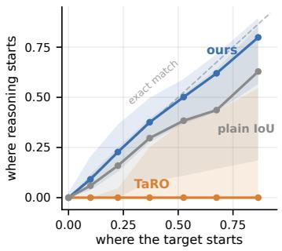  
(a) Tracking event start time.

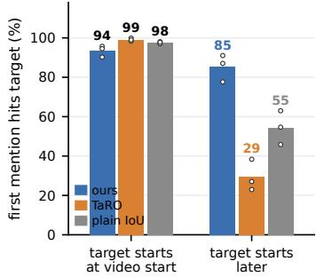  
(b) First-mention target-hit rate.  
Figure 2: Temporal behavior across trained policies. (a) On ActivityNet, the normalized start of the first temporal mention is plotted against the normalized event start time; the dashed diagonal denotes exact tracking. (b) First-mention target-hit rates for events starting at the video start or later. Bars average QVHighlights, ActivityNet Captions, and Charades-STA equally; dots show individual benchmarks.

As the target occurs later, SUTURE shifts its first temporal mention accordingly, while TaRO remains concentrated near the video start. Naive IoU follows the same overall trend as SUTURE but is biased toward earlier positions. All three methods attain high target-hit rates when the event begins at the video start; for later events, SuTURE largely preserves its hit rate while the comparison policies decline. Figure 3 illustrates this difference in two selected examples.

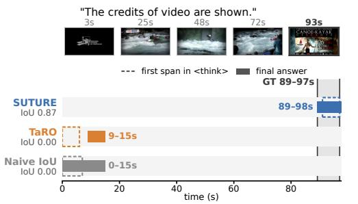  
(a) Video credits.

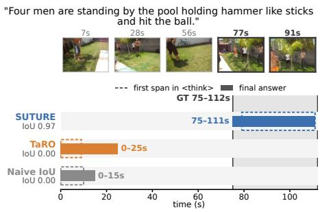  
SuTURE "From 79.0s to 111.0s, Four men are standing by the pool holding hammer ..." TaRo "From 0.0s to 9.0s, a man hits a ball with a stick-like object." Naive loU "From 0.0s to 10.0s, a man is hitting a ball with a stick-like object ..."

(b) Activity by the pool.

Figure 3: Later events with similar opening scenes. Dashed outlines mark first temporal mentions and solid bars mark final answers. These selected ActivityNet examples and the selection rule are detailed in Appendix I.

Generated response length. We also compare output length with TaRO using the Qwen2.5-VL-7B-Instruct evaluation outputs for Table 1. SUTURE reduces mean output length by 31.6% on Charades-STA, 24.2% on QVHighlights, and 23.5% on ActivityNet.

Table 4: Mean reasoning-trace length in tokens.
<table><tr><td>Benchmark</td><td>Naive IoU TaRO</td><td>SUTURE</td></tr><tr><td>Charades-STA</td><td>170.7 124.7</td><td>77.6</td></tr><tr><td>QVHighlights</td><td>423.2 167.2</td><td>119.9</td></tr><tr><td>ActivityNet</td><td>420.8 170.3</td><td>123.6</td></tr></table>

The reduction is concentrated in the reasoning trace (Table 4); mean final answers are about

one token longer than TaRO's. The reward has no explicit length penalty. These are generated-token counts, not latency measurements. Appendix G.6 reports the full single-run statistics.

## 4.5 LOCAL GEOMETRY OF THE STRUCTURED RESIDUAL

Reward ordering alone does not determine how response likelihoods change under a parameter update. We therefore measure each response's directional derivative of log-likelihood normalized by response length along the diagnostic IoU and residual directions. Support alignment measures whether responses covering relatively less supported target segments have larger local likelihood responses. The residual-sign preference gap compares local likelihood responses between rollouts with positive and negative centered reward corrections.

We analyze 35 selected groups from severe Naive IoU failures: 16 recovered and 19 unrecovered, classified retrospectively by final SuTURE outcomes. Reporting both tests whether the preference extends to unrecovered groups; it does not establish a cause of recovery.

We hold rollouts from the first visit and model parameters fixed. Both directions use score vectors from the language model head and the last two decoder layers, normalized by response length. This local diagnostic does not reconstruct the complete training update. Appendix H details group selection, diagnostic definitions, and uncertainty estimation.

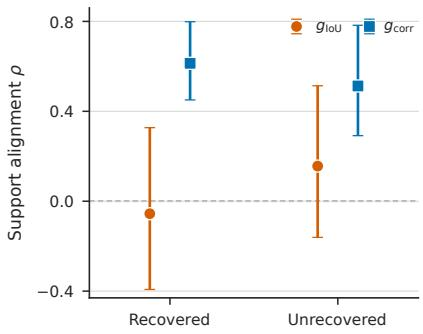  
(a) Temporal support alignment

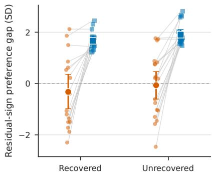  
(b) Residual-sign preference gap.  
Figure 4: Residual gradient diagnostic. (a) Pooled Spearman correlation between temporal support deficits and the mean directional responses of rollouts covering each segment. (b) Mean within-group standardized response difference between rollouts with positive and negative centered reward corrections. Error bars denote 95% bootstrap intervals with rollout groups as clusters; definitions are in Appendix H.

Local response preference. The residual direction shows positive support alignment in recovered $( \rho = 0 . 6 1 4 )$ and unrecovered $( \rho = 0 . 5 1 3 )$ groups, compared with —0.056 and 0.156 for the diagnostic IoU direction (Figure 4a). Its mean standardized residual-sign preference gaps are 1.664 and 1.903 (Figure 4b). For both metrics, the 95% bootstrap intervals for the contrast between the residual and IoU directions lie above zero in each case, using rollout groups as clusters. Thus, the response preference associated with group support appears in both recovered and unrecovered groups

## 5 CONCLUSION

We study temporal RLVR through verifier design. SUTURE uses coverage across the realized rollout group to reweight overlap within the annotated target, while disagreement sets the reweighting amplitude above a floor. The annotation remains the sole source of correctness. The resulting reward decomposes into IoU and a group-conditioned covariance correction, which favors less-supported correct overlap when IoU statistics are matched.

Under shared training settings, fixed structured weighting improves over Naive IoU, and the adaptive rule outperforms the tested constant amplitudes. A local gradient diagnostic finds a support-dependent preference in the selected groups, including those that do not recover. For later events, the first temporal mention in SUTURE-trained reasoning traces is less often anchored to the video start. Grounding improves at every reported IoU threshold across five benchmarks, with gains on the three primary benchmarks also observed with a second MLLM backbone. These results show that the rollout group can inform verification as well as reward normalization.

## GENERATIVE AI USE DISCLOSURE

Generative AI tools were used solely to improve the readability, grammar, and wording of the manuscript. They were not used to develop the research methodology, formulate hypotheses or theoretical claims, design experiments, interpret results, or generate scientific conclusions. All revisions were reviewed and approved by the authors, who take full responsibility for the final content of the paper.

## REFERENCES

Shuai Bai, Yuxuan Cai, Ruizhe Chen, Keqin Chen, Xionghui Chen, Zesen Cheng, Lianghao Deng, Wei Ding, Chang Gao, Chunjiang Ge, Wenbin Ge, Zhifang Guo, Qidong Huang, Jie Huang, Fei Huang, Binyuan Hui, Shutong Jiang, Zhaohai Li, Mingsheng Li, Mei Li, Kaixin Li, Zicheng Lin, Junyang Lin, Xuejing Liu, Jiawei Liu, Chenglong Liu, Yang Liu, Dayiheng Liu, Shixuan Liu, Dunjie Lu, Ruilin Luo, Chenxu Lv, Rui Men, Lingchen Meng, Xuancheng Ren, Xingzhang Ren, Sibo Song, Yuchong Sun, Jun Tang, Jianhong Tu, Jianqiang Wan, Peng Wang, Pengfei Wang, Qiuyue Wang, Yuxuan Wang, Tianbao Xie, Yiheng Xu, Haiyang Xu, Jin Xu, Zhibo Yang, Mingkun Yang, Jianxin Yang, An Yang, Bowen Yu, Fei Zhang, Hang Zhang, Xi Zhang, Bo Zheng, Humen Zhong, Jingren Zhou, Fan Zhou, Jing Zhou, Yuanzhi Zhu, and Ke Zhu. Qwen3-vl technical report, 2025a.URL https://arxiv.org/abs/2511.21631.

Shuai Bai, Keqin Chen, Xuejing Liu, Jialin Wang, Wenbin Ge, Sibo Song, Kai Dang, Peng Wang, Shijie Wang, Jun Tang, Humen Zhong, Yuanzhi Zhu, Mingkun Yang, Zhaohai Li, Jianqiang Wan, Pengfei Wang, Wei Ding, Zheren Fu, Yiheng Xu, Jiabo Ye, Xi Zhang, Tianbao Xie, Zesen Cheng, Hang Zhang, Zhibo Yang, Haiyang Xu, and Junyang Lin. Qwen2.5-vl technical report, 2025b. URLhttps://arxiv.org/abs/2502.13923.

Jiyang Gao, Chen Sun, Zhenheng Yang, and Ram Nevatia. Tall: Temporal activity localization via language query. In 2017 IEEE International Conference on Computer Vision (ICCV), pp. 5277–5285. IEEE, 2017.

Kristen Grauman, Andrew Westbury, Eugene Byrne, Zachary Chavis, Antonino Furnari, Rohit Girdhar, Jackson Hamburger, Hao Jiang, Miao Liu, Xingyu Liu, Miguel Martin, Tushar Nagarajan, Ilija Radosavovic, Santhosh Kumar Ramakrishnan, Fiona Ryan, Jayant Sharma, Michael Wray, Mengmeng Xu, Eric Zhongcong Xu, Chen Zhao, Siddhant Bansal, Dhruv Batra, Vincent Cartillier, Sean Crane, Tien Do, Morrie Doulaty, Akshay Erapalli, Christoph Feichtenhofer, Adriano Fragomeni, Qichen Fu, Abrham Gebreselasie, Cristina González, James Hillis, Xuhua Huang, Yifei Huang, Wenqi Jia, Weslie Khoo, Jáchym Kolář, Satwik Kottur, Anurag Kumar, Federico Landini, Chao Li, Yanghao Li, Zhenqiang Li, Karttikeya Mangalam, Raghava Modhugu, Jonathan Munro, Tullie Murrell, Takumi Nishiyasu, Will Price, Paola Ruiz, Merey Ramazanova, Leda Sari, Kiran Somasundaram, Audrey Southerland, Yusuke Sugano, Ruijie Tao, Minh Vo, Yuchen Wang, Xindi Wu, Takuma Yagi, Ziwei Zhao, Yunyi Zhu, Pablo Arbeláez, David Crandall, Dima Damen, Giovanni Maria Farinella, Christian Fuegen, Bernard Ghanem, Vamsi Krishna Ithapu, C. V. Jawahar, Hanbyul Joo, Kris Kitani, Haizhou Li, Richard Newcombe, Aude Oliva, Hyun Soo Park, James M. Rehg, Yoichi Sato, Jianbo Shi, Mike Zheng Shou, Antonio Torralba, Lorenzo Torresani, Mingfei Yan, and Jitendra Malik. Ego4d: Around the world in 3,000 hours of egocentric video. In Proceedings of the IEEE/CVF Conference on Computer Vision and Pattern Recognition (CVPR), pp. 18995–19012, June 2022.

Yongxin Guo, Jingyu Liu, Mingda Li, Qingbin Liu, Xi Chen, and Xiaoying Tang. TRACE: Temporal grounding video LLM via causal event modeling. In The Thirteenth International Conference on Learning Representations, 2025. URL https://openreview.net/forum?id= 14fFV0chUS.

Bin Huang, Xin Wang, Hong Chen, Zihan Song, and Wenwu Zhu. Vtimellm: Empower llm to grasp video moments. In Proceedings of the IEEE/CVF Conference on Computer Vision and Pattern Recognition, pp. 14271–14280, 2024.

Ranjay Krishna, Kenji Hata, Frederic Ren, Li Fei-Fei, and Juan Carlos Niebles. Dense-captioning events in videos. In Proceedings of the IEEE international conference on computer vision, pp. 706–715, 2017.

Jie Lei, Tamara L. Berg, and Mohit Bansal. Detecting moments and highlights in videos via natural language queries. Advances in Neural Information Processing Systems, 34:11846–11858, 2021.

Xinhao Li, Yi Wang, Jiashuo Yu, Xiangyu Zeng, Yuhan Zhu, Haian Huang, Jianfei Gao, Kunchang Li, Yinan He, Chenting Wang, Yu Qiao, Yali Wang, and Limin Wang. Videochat-flash: Hierarchical compression for long-context video modeling. In The Fourteenth International Conference on Learning Representations, 2026. URL https: //openreview.net/forum?id= MUjdNcfNPv.

Mengxue Qu, Xiaodong Chen, Wu Liu, Alicia Li, and Yao Zhao. Chatvtg: Video temporal grounding via chat with video dialogue large language models. In Proceedings of the IEEE/CVF Conference on Computer Vision and Pattern Recognition (CVPR) Workshops, pp. 1847–1856, June 2024.

Michaela Regneri, Marcus Rohrbach, Dominikus Wetzel, Stefan Thater, Bernt Schiele, and Manfred Pinkal. Grounding action descriptions in videos. Transactions of the Association for Computational Linguistics, 1:25–36, 2013. doi: 10.1162/tacl\_a\_00207. URL https : //aclanthology. org/ Q13-1003/.

Shuhuai Ren, Linli Yao, Shicheng Li, Xu Sun, and Lu Hou. Timechat: A time-sensitive multimodal large language model for long video understanding, 2024. URL https : //arxiv. org/abs/ 2312.02051.

John Schulman, Filip Wolski, Prafulla Dhariwal, Alec Radford, and Oleg Klimov. Proximal policy optimization algorithms. arXiv preprint arXiv:1707.06347, 2017.

Zhihong Shao, Peiyi Wang, Qihao Zhu, Runxin Xu, Junxiao Song, Xiao Bi, Haowei Zhang, Mingchuan Zhang, YK Li, Yang Wu, et al. Deepseekmath: Pushing the limits of mathematical reasoning in open language models. arXiv preprint arXiv:2402.03300, 2024.

Ye Wang, Ziheng Wang, Boshen Xu, Yang Du, Kejun Lin, Zihan Xiao, Zihao Yue, Jianzhong Ju, Liang Zhang, Dingyi Yang, Xiangnan Fang, Zewen He, Zhenbo Luo, Wenxuan Wang, Junqi Lin, Jian Luan, and Qin Jin. Time-r1: Post-training large vision language model for temporal video grounding. In The Thirty-ninth Annual Conference on Neural Information Processing Systems, 2025.URL https://openreview.net/forum?id=gJ05Gm5VxQ.

Yueqian Wang, Xiaojun Meng, Jianxin Liang, Yuxuan Wang, Qun Liu, and Dongyan Zhao. HawkEye: Training video-text LLMs for grounding text in videos. arXiv preprint arXiv:2403.10228, 2024.

Qi Xu, Yue Tan, Shihao Chen, Jiahao Meng, Anna Wang, Shunping Ji, Hao Fei, and Jason Li. Towards one-to-many temporal grounding. arXiv preprint arXiv:2606.06294, 2026.

Ziang Yan, Yinan He, Xinhao Li, Zhengrong Yue, Xiangyu Zeng, Yali Wang, Yu Qiao, Limin Wang, and Yi Wang. Videochat-r1.5: Visual test-time scaling to reinforce multimodal reasoning by iterative perception. In The Thirty-ninth Annual Conference on Neural Information Processing Systems, 2025.URL https://openreview.net/forum?id=oVDAfLuRie.

Xiangyu Zeng, Kunchang Li, Chenting Wang, Xinhao Li, Tianxiang Jiang, Ziang Yan, Songze Li, Yansong Shi, Zhengrong Yue, Yi Wang, Yali Wang, Yu Qiao, and Limin Wang. Timesuite: Improving MLLMs for long video understanding via grounded tuning. In The Thirteenth International Conference on Learning Representations, 2025. URL https: //openreview.net/forum? id=nAVejJURqZ.

Minghang Zheng, Zihao Yin, Yi Yang, Yuxin Peng, and Yang Liu. Temporal-aware reasoning optimization for video temporal grounding. In Forty-third International Conference on Machine Learning, 2026a.URL https://openreview.net/forum?id=13PTeygTS0.

Zelin Zheng, Xinyan Liu, Ruixin Li, Antoni B. Chan, Guorong Li, Qingming Huang, and Laiyun Qing. Foresee-to-ground: From predictive temporal perception to evidence-driven reasoning for video temporal grounding. In Forty-third International Conference on Machine Learning, 2026b. URLhttps://openreview.net/forum?id=Lm3Js8viIP.

## A RELATED WORK

MLLMs for video temporal grounding. Standard temporal grounding benchmarks include QVHighlights (Lei et al., 2021), ActivityNet Captions (Krishna et al., 2017), and Charades-STA (Gao et al., 2017). Recent work has increasingly formulated video temporal grounding as direct generation with multimodal large language models. ChatVTG (Qu et al., 2024) performs zero-shot grounding by matching language queries against segment descriptions at multiple granularities, while TimeChat (Ren et al., 2024) introduces timestamp-aware representations for understanding of long videos. HawkEye (Wang et al., 2024) trains a text-to-text video LLM on captions for video segments and negative spans from InternVid- $\cdot \mathbf { G } ,$ using coarse labels for temporal regions followed by recursive grounding to progressively narrow the predicted interval. VTimeLLM (Huang et al., 2024) develops boundary-aware training for fine-grained temporal reasoning, and TimeSuite (Zeng et al., 2025) incorporates explicit grounding supervision into instruction tuning on long videos. VideoChat-Flash (Li et al., 2026) uses hierarchical compression of video tokens and training from short to long videos for efficient long-context video modeling. More recent approaches further model temporal structure explicitly. TRACE (Guo et al., 2025) represents videos as causal event sequences, while VideoChat-R1.5 (Yan et al., 2025) uses visual test-time scaling to iteratively refine attention over high-confidence spatiotemporal regions. Foresee-to-Ground (Zheng et al., 2026b) restructures prediction as identification followed by measurement using explicit temporal evidence, while One-to-Many Temporal Grounding (Xu et al., 2026) extends the task from a single interval to multiple disjoint occurrences of an event. These works primarily improve temporal representation, supervision, task formulation, or model architecture; our focus is instead on how temporal predictions are verified during adaptation with reinforcement learning.

Reinforcement learning for temporal grounding. Time-R1 (Wang et al., 2025) introduces RLVR for temporal video grounding and optimizes generated intervals using a timestamp-aware IoU reward,

$$
R _ { i } ^ { \mathrm { t I o U } } = \mathrm { I o U } ( P _ { i } , \mathcal { T } ) \left( 1 - \frac { | \hat { s } _ { i } - s ^ { \star } | } { D _ { V } } \right) \left( 1 - \frac { | \hat { e } _ { i } - e ^ { \star } | } { D _ { V } } \right) ,\tag{19}
$$

combined with a binary format reward as $r _ { i } ^ { \mathrm { T i m e - R 1 } } = R _ { i } ^ { \mathrm { f o r m a t } } + R _ { i } ^ { \mathrm { t I o U } }$ . Its TimeRFT curriculum further selects moderately difficult examples and progressively focuses optimization on harder grounding instances.

TaRO (Zheng et al., 2026a) shifts attention toward the quality of the intermediate temporal reasoning. For rollout $i ,$ it measures the decrease in reasoning log-likelihood after perturbing frames around the ground truth interval boundaries,

$$
d _ { i } = p _ { i } - q _ { i } , \qquad R _ { i } ^ { \mathrm { t e m p } } = \alpha { \bf 1 } [ d _ { i } > \bar { d } ] ,\tag{20}
$$

and applies this term only when the predicted interval exceeds an IoU threshold,

$$
r _ { i } ^ { \mathrm { T a R O } } = R _ { i } ^ { \mathrm { f o r m a t } } + R _ { i } ^ { \mathrm { t I o U } } + R _ { i } ^ { \mathrm { t e m p } } \mathbf { 1 } [ \mathrm { I o U } _ { i } > \tau ] .\tag{21}
$$

TaRO therefore introduces group-relative supervision for temporal reasoning, whereas its grounding accuracy term continues to score the predicted interval against the ground truth interval. Our focus is different: SUTURE conditions the temporal overlap verifier itself on the joint geometry of the realized rollout group, using the group to determine how reward is distributed within the target.

## B OPTIMIZATION PRELIMINARIES

For completeness, we give the full clipped GRPO objective underlying the compact formulation in Section 2.2. Given the advantages $A _ { i }$ normalized within each group in Equation $5 ,$ the policy ratio for token t of rollout $y _ { i }$ is

$$
\rho _ { i , t } ( \theta ) = \frac { \pi _ { \theta } ( y _ { i , t } \mid x , y _ { i , < t } ) } { \pi _ { \theta _ { \mathrm { o l d } } } ( y _ { i , t } \mid x , y _ { i , < t } ) } .\tag{22}
$$

For rewards assigned to complete responses, the same advantage $A _ { i }$ is applied to all tokens in rollout i. Following the clipped policy ratio construction of PPO (Schulman et al., 2017), the GRPO surrogate

is

$$
\begin{array} { l } { \mathcal { I } _ { \mathrm { G R P O } } ( \theta ) = \displaystyle \frac { 1 } { G } \sum _ { i = 1 } ^ { G } \frac { 1 } { | y _ { i } | } \sum _ { t = 1 } ^ { | y _ { i } | } \Big [ \operatorname* { m i n } \big ( \rho _ { i , t } ( \theta ) A _ { i } , \mathrm { c l i p } ( \rho _ { i , t } ( \theta ) , 1 - \epsilon , 1 + \epsilon ) A _ { i } \big ) } \\ { - \left. \lambda _ { \mathrm { K L } } D _ { \mathrm { K L } , i , t } ( \theta ) \right] , } \end{array}\tag{23}
$$

where € is the clipping radius, λKL controls KL regularization, and $D _ { \mathrm { K L } , i , t }$ denotes the KL penalty for each token with respect to the reference policy.

At the behavior policy $\theta = \theta _ { \mathrm { o l d } } , \rho _ { i , t } ( \theta _ { \mathrm { o l d } } ) = 1$ . When clipping is locally inactive, the part of the realized update determined by the reward reduces to the rollout scores $\mathbf { z } _ { i }$ and direction $\mathbf { d } ( \boldsymbol { r } )$ defined in Equations 15 and 16. The KL term remains a separate objective component and is unchanged by the verifier.

## C EXTENDED THEORETICAL CHARACTERIZATION

This section collects secondary identities and formal consequences supporting the characterization in the main text. We characterize the magnitude of the variation of the normalized weight field, state the induced ordering by group support formally, and record the normalization identity underlying the update analysis.

## C.1 REFINEMENT OF THE NORMALIZED FIELD AND STRUCTURED VARIATION

The parallel definitions in Equations 3 and 6 give, for member $P _ { i }$

$$
R _ { i } ^ { \mathrm { S } } - R _ { i } ^ { \mathrm { I o U } } = \frac { \displaystyle \int _ { P _ { i } \cap T } \left( \widetilde { w } _ { \mathcal { P } } ( t ) - 1 \right) d t } { L + F _ { i } } .\tag{24}
$$

Proposition 1 further shows that the normalized field is a centered perturbation of uniform IoU weighting through Equation 13.

We measure the RMS magnitude of this structured field relative to uniform IoU weighting by

$$
S _ { \mathrm { c o r r } } ( \mathcal { P } ) : = \left[ \frac { 1 } { L } \int _ { \mathcal { T } } \left( \widetilde { w } _ { \mathcal { P } } ( t ) - 1 \right) ^ { 2 } d t \right] ^ { 1 / 2 } .\tag{25}
$$

Because $\begin{array} { r } { L ^ { - 1 } \int _ { \mathcal T } \widetilde w _ { \mathcal P } ( t ) d t = 1 } \end{array}$ , Equation 13 gives

$$
S _ { \mathrm { c o r r } } ( \mathcal { P } ) = \beta _ { \mathcal { P } } \operatorname { S t d } [ \phi _ { \mathcal { P } } ( U ) ] , \qquad U \sim \operatorname { U n i f } ( \mathcal { T } ) .\tag{26}
$$

Thus, if the realized residual is constant almost everywhere within the target, the normalized field is uniform and SUTURE recovers ordinary IoU for every prediction. More generally, $S _ { \mathrm { c o r r } }$ measures the structured variation available in the verifier field; the correction received by member $P _ { i }$ additionally depends on its alignment with that field through $\xi _ { i }$ Section G.4 examines this variation in realized training groups.

## C.2 ORDERING BY GROUP SUPPORT

For a scored member $P _ { i }$ with $I _ { i } > 0$ , define the average realized group coverage over its correctly covered target region as

$$
\bar { C } _ { i } : = \frac { 1 } { I _ { i } } \int _ { P _ { i \cap T } } C _ { \mathcal { P } } ( t ) d t .\tag{27}
$$

Corollary 1 (Ordering by group support). For a realized group with $a _ { \mathcal { P } } > 0 ,$ consider two scored members $P _ { i }$ and $P _ { j }$ with $I _ { i } = I _ { j } > 0$ and $F _ { i } = F _ { j } . I f { \bar { C } } _ { i } < { \bar { C } } _ { j } ,$ then $R _ { i } ^ { \mathrm { { S } } } > R _ { j } ^ { \mathrm { { S } } }$

This formalizes the preference of the structured overlap component illustrated in Figure 1. Under matched aggregate overlap statistics, the local support field determines the ordering: correctly covering a relatively less supported portion of the target receives the larger structured score, while $\beta _ { \mathcal { P } }$ controls the size of this reward difference. The proof is given in Appendix D.

## C.3 GROUP-RELATIVE NORMALIZATION IDENTITY

For the controlled plain IoU comparison, let $r _ { i } ^ { \mathrm { S } } = r _ { i } ^ { \mathrm { I o U } } + \chi _ { i }$ and $\tilde { \chi } _ { i } = \chi _ { i } - \bar { \chi } .$ with $\kappa _ { \mathcal { P } }$ and $\alpha p$ defined in Section 3.2. Let $A _ { i } ^ { \mathrm { I o U } }$ and $A _ { i } ^ { \mathrm { S } }$ denote the corresponding advantages normalized within each group. Centering the two implemented rewards gives the exact identity

$$
A _ { i } ^ { \mathrm { S } } = \kappa _ { \mathcal { P } } A _ { i } ^ { \mathrm { I o U } } + \alpha _ { \mathcal { P } } \widetilde { \chi } _ { i } .\tag{28}
$$

Multiplying Equation 28 by $\mathbf { z } _ { i }$ and averaging over the fixed rollout group yields Equation 17. The identity permits degenerate cases: a correction shared by the whole group centers to zero, a nonconstant correction may cancel in parameter space, and a nonzero $\mathbf { d } _ { \mathrm { c o r r } }$ may still be collinear with the IoU direction. Section 4.5 examines the realized geometry empirically.

## D PROOFS AND BASIC PROPERTIES

We establish positivity of the normalized field, prove the exact reward refinement and ordering by group support, and derive the structured update component used in the main text.

## D.1 WELL-DEFINEDNESS AND BASIC PROPERTIES

Lemma 1 (Positivity of the normalized field). On the parameter domain $G \geq 2$ and $0 \leq u _ { \mathrm { f l o o r } } < 1$ $1 + a _ { \mathcal { P } } \phi _ { \mathcal { P } } ( t ) > 0$ on every open target segment of positive length between consecutive interval boundaries. Hence the denominator in Equation 11 is positive and $\widetilde { w } _ { \mathcal { P } } ( t )$ is well defined.

Proof. Partition $\tau$ at the rollout interval boundaries and consider an open segment $A \subseteq \tau$ of positive length between consecutive boundaries. Let c be its constant group coverage. If $\dot { c } = 0 .$ then $\phi _ { \mathcal { P } } = 0$ and $1 + a _ { \mathcal { P } } \phi _ { \mathcal { P } } = 1$ . If $\phantom { } 0 < c < 1$ , then $\phi _ { \mathcal { P } } = 1 - 2 c > - 1$ and $a _ { \mathcal { P } } \leq 1$ , SO $1 + a _ { \mathcal { P } } \phi _ { \mathcal { P } } > 0$ . If $c = 1$ every rollout contains A; invalid parses therefore cannot occur in this case, and every pair has positive interval IoU. Hence AvgPairIoU $\lceil ( \mathcal { P } ) > 0$ . Since $u _ { \mathrm { f l o o r } } < 1$

$$
a _ { \mathcal { P } } = \operatorname* { m a x } \bigl ( u _ { \mathcal { P } } , u _ { \mathrm { f l o o r } } \bigr ) < 1 ,\tag{29}
$$

and $1 + a _ { \mathcal { P } } \phi _ { \mathcal { P } } = 1 - a _ { \mathcal { P } } > 0$ . These segments cover the target except for their boundary points, proving that the normalizing denominator is positive.

The segment boundaries form a finite set and therefore do not affect any integral. Segments of zero length are discarded, and a prediction whose clipped endpoints coincide contributes no coverage of positive length. □

Equation 11 fixes $\int _ { \mathcal { T } } \widetilde { w } p = L$ . Positivity then gives $0 \leq R _ { i } ^ { \mathrm { S } } \leq L / ( L + F _ { i } ) \leq 1$ . If $a _ { \mathcal { P } } = 0$ , then $\widetilde { w } _ { \mathcal { P } } = 1$ and SUTURE recovers ordinary IoU. If every rollout misses $\tau$ , then $C _ { \mathcal { P } } = \phi _ { \mathcal { P } } = 0$ on the target, so the field is uniform and both rewards give zero overlap.

## D.2 EXACT REFINEMENT AND PREFERENCE BASED ON GROUP SUPPORT

An overlap verifier that depends only on $( I _ { i } , F _ { i } , L )$ assigns equal scores whenever two predictions have the same aggregate overlap statistics, irrespective of where their correct overlap lies. More generally, an independently computed reward for rollout i is functionally independent of every other $P _ { m } , m \neq i ;$ changing another rollout cannot make that verifier adapt either its overall intervention strength or its preference across positions. These are the two scales of information supplied by conditioning SUTURE on $\mathcal { P }$

Proof of Proposition 1. For member $P _ { i }$ , define

$$
B _ { \mathcal { P } } = \int _ { \mathcal { T } } \phi _ { \mathcal { P } } ( t ) d t , \qquad M _ { i } = \int _ { \mathcal { T } } \phi _ { \mathcal { P } } ( t ) \mathbf { 1 } [ t \in P _ { i } ] d t .\tag{30}
$$

Since $B _ { \mathcal { P } } = L \bar { \phi } _ { \mathcal { P } }$ , Equation 11 gives

$$
\begin{array} { c } { \displaystyle \widetilde { w } _ { \mathcal { P } } ( t ) - 1 = \frac { 1 + a _ { \mathcal { P } } \phi _ { \mathcal { P } } ( t ) } { 1 + a _ { \mathcal { P } } \bar { \phi } _ { \mathcal { P } } } - 1 } \\ { = \frac { a _ { \mathcal { P } } } { 1 + a _ { \mathcal { P } } \bar { \phi } _ { \mathcal { P } } } \bigl ( \phi _ { \mathcal { P } } ( t ) - \bar { \phi } _ { \mathcal { P } } \bigr ) , } \end{array}\tag{31}
$$

which is Equation 13. The raw target mass is $\boldsymbol { L } + \boldsymbol { a } _ { \mathcal { P } } \boldsymbol { B } _ { \mathcal { P } }$ , while the raw mass covered by $P _ { i }$ is $I _ { i } + a _ { \mathcal { P } } M _ { i }$ . Substitution into Equation 6 gives

$$
\begin{array} { r } { R _ { i } ^ { \mathrm { S } } - R _ { i } ^ { \mathrm { I o U } } = \frac { L ( I _ { i } + a _ { \mathcal { P } } M _ { i } ) - I _ { i } ( L + a _ { \mathcal { P } } B _ { \mathcal { P } } ) } { ( L + a _ { \mathcal { P } } B _ { \mathcal { P } } ) ( L + F _ { i } ) } } \\ { = \frac { a _ { \mathcal { P } } } { 1 + a _ { \mathcal { P } } B _ { \mathcal { P } } / L } \frac { M _ { i } - I _ { i } B _ { \mathcal { P } } / L } { L + F _ { i } } . } \end{array}\tag{32}
$$

For $U \sim \operatorname { U n i f } ( \mathcal { T } )$

$$
M _ { i } - \frac { I _ { i } } { L } B _ { \mathcal { P } } = L \operatorname { C o v } \big ( \phi _ { \mathcal { P } } ( U ) , \mathbf { 1 } [ U \in P _ { i } ] \big ) .\tag{33}
$$

Together with $\bar { \phi } _ { \mathcal { P } } = B _ { \mathcal { P } } / L$ , this is exactly Equation 14. Lemma 1 makes its denominator positive; thus $\beta _ { \mathcal { P } } \geq 0$ , with strict inequality whenever $a _ { \mathcal { P } } > 0$

Proof of Corollary 1. Each scored member $P _ { i }$ contributes to its own coverage, so $C _ { \mathcal { P } } ( t ) \geq 1 / G >$ 0 on $P _ { i } \cap \mathcal { T }$ . Using the shorthand from Equation 27, the branch for zero support in Equation 8 never enters this integral, so

$$
M _ { i } = I _ { i } \big ( 1 - 2 \bar { C } _ { i } \big ) .\tag{34}
$$

For members $P _ { i } , P _ { j }$ with common $I > 0$ and $F$ , the IoU terms and the baseline over the target in Equation 32 cancel. Applying Equation 34 yields

$$
R _ { i } ^ { \mathrm { S } } - R _ { j } ^ { \mathrm { S } } = \frac { 2 \beta _ { \mathscr { P } } I } { L + F } \big ( \bar { C } _ { j } - \bar { C } _ { i } \big ) ,\tag{35}
$$

which proves the claim. This ordering concerns the structured overlap channel alone; unchanged format terms may still separate two responses.

The convention for zero coverage concerns normalization of target mass rather than the ordering among covered locations. For a fixed rollout group and amplitude, applying $1 - 2 C _ { \mathcal { P } } ( t )$ also at uncovered locations would leave every member's raw overlap numerator unchanged, while increasing the common normalization denominator whenever $a _ { \mathcal { P } } ~ > ~ 0$ and the uncovered target region has positive duration. The resulting temporal rewards would therefore differ by a common positive scale, preserving their ordering within the group. This does not imply identical training updates when format rewards and advantage normalization are included.

A zero residual specifies the raw baseline, not a normalized weight of one. By Equation 13, the normalized weight exceeds one precisely when $\phi _ { \mathcal { P } } ( t ) > \bar { \phi } _ { \mathcal { P } }$ , provided $a _ { \mathcal { P } } > 0 .$ Thus, half coverage is the neutral point of the raw contrast, not a fixed threshold for normalized upweighting.

## D.3 DERIVATION OF THE STRUCTURED UPDATE COMPONENT

For the controlled verifier comparison,

$$
r _ { i } ^ { \mathrm { S } } = R _ { i } ^ { \mathrm { f o r m a t } } + R _ { i } ^ { \mathrm { S } } , \qquad r _ { i } ^ { \mathrm { I o U } } = R _ { i } ^ { \mathrm { f o r m a t } } + R _ { i } ^ { \mathrm { I o U } } .\tag{36}
$$

Define

$$
\chi _ { i } = r _ { i } ^ { \mathrm { S } } - r _ { i } ^ { \mathrm { I o U } } = \beta _ { \mathcal { P } } \xi _ { i } , \qquad \widetilde { \chi } _ { i } = \chi _ { i } - \bar { \chi } .\tag{37}
$$

Centering $r _ { i } ^ { \mathrm { S } } = r _ { i } ^ { \mathrm { I o U } } + \chi _ { i }$ and dividing by $\sigma _ { \mathrm { S } } + \delta$ gives Equation 28. Multiplying that identity by $\mathbf { z } _ { i }$ and averaging over the fixed rollout group yields Equation 17.

## E TRAINING AND EVALUATION DETAILS

## E.1 TRAINING DATA AND OPTIMIZATION

The settings in this section apply to TaRO and the controlled verifier variants. Time-R1 is reproduced separately following its original training settings (Wang et al., 2025). We train all controlled variants on 2.5K examples from the timerft\_data split of TimeR1-Dataset (Wang et al., 2025). We follow the training framework and optimization setup of TaRO (Zheng et al., 2026a). For the primary Qwen2.5-VL-7B-Instruct experiments, training runs for three epochs (468 optimization steps) on four NVIDIA B200 GPUs. Each step uses a prompt batch size of 16 and $G = 8$ rollouts per prompt, for 128 sampled responses before minibatch updates. We use a learning rate of $1 0 ^ { - 6 }$ , sampling temperature 1.0, and a KL loss coefficient of 0.01; the KL term is applied in the optimization loss rather than added to the reward. The maximum prompt and response lengths are 7168 and 1024 tokens, respectively. The primary SUTURE configuration uses $u _ { \mathrm { f l o o r } } = 0 . 3$

## E.2 WARMUP USING CAPTIONS

As in the TaRO training framework, the first epoch (156 steps) uses a reasoning warmup using captions. When temporal captions are available, a nonempty random subset of caption segments is prepended to the model response as a partial reasoning prefix before the remaining tokens are generated. The injected prefix is included in the response tokens used for optimization. Because these prefixed trajectories are not sampled entirely from the current policy, they are marked as off-policy; under the framework's masking rule, updates for such trajectories are suppressed when the advantage is negative and retained when it is positive. The warmup is disabled after the first epoch, and the remaining two epochs use on-policy GRPO rollouts. All controlled reward variants use the same warmup procedure. Consequently, the timestamped reasoning format induced by this warmup is shared across reward variants; our analyses of reasoning traces compare how the trained policies use that common format rather than attributing the format itself to SUTURE.

## E.3 EVALUATION AND VIDEO PREPROCESSING

We evaluate on the QVHighlights validation split (1,550 examples), Charades-STA test split (3,720), and ActivityNet Captions val1 split(15,933). For each backbone and benchmark, TaRO and the controlled verifier variants use the same split, prompt, video preprocessing, and decoding settings. Table A lists the training and evaluation settings for the primary Qwen2.5-VL-7B-Instruct experiments.

Table A: Training and evaluation settings. TaRO and all controlled reward variants share these settings within each stage for Qwen2.5-VL-7B-Instruct. For visual patch size p, the visual token budget B sets total pixels to $B ( 2 p ) ^ { 2 }$
<table><tr><td>Setting</td><td>Training rollouts</td><td>Evaluation</td></tr><tr><td>Decoding</td><td>Sampling</td><td>Greedy</td></tr><tr><td>Temperature</td><td>1.0</td><td>0.0</td></tr><tr><td>Top-p / top-k</td><td>1.0/-1</td><td>1.0 /-1</td></tr><tr><td>Responses per prompt</td><td>8</td><td>1</td></tr><tr><td>Response limit (tokens)</td><td>1,024</td><td>1,024</td></tr><tr><td>Visual token budget B</td><td>3,584</td><td>4,096</td></tr><tr><td>Maximum frames</td><td>768</td><td>1,024</td></tr><tr><td>Requested frame rate (fps)</td><td>2.0 (library default)</td><td>2 (explicit)</td></tr><tr><td>Minimum frame pixels</td><td> $4 ( 2 p ) ^ { 2 }$ </td><td>4(2p)2</td></tr><tr><td>Prompt template</td><td>TaRO r1, single interval</td><td>TaRO r1, single interval</td></tr><tr><td>Prompt limit (tokens)</td><td>7,168</td><td></td></tr><tr><td>Model context limit (tokens)</td><td>8,192</td><td>16,384</td></tr></table>

Video preprocessing. Training uses the default 2.0 fps setting of qwen-vl, while evaluation explicitly sets 2 fps. For Ego4D-NLQ and TACoS, the evaluation video token budget is increased to 8,192 while retaining the same requested frame rate across reward variants. Qwen3-VL-8B-Instruct uses a visual patch size of 16 pixels.

## F FULL BENCHMARK RESULTS

For completeness, Table B reports the broader comparison omitted from the condensed main table. Comparator rows other than Time-R1 and TaRO are transcribed from Table 1 of TaRO (Zheng et al., 2026a); the original methods are described and cited in Section A. We reproduce Time-R1 separately under its original training settings (Wang et al., 2025) and reevaluate TaRO on all three datasets for a direct comparison. We omit VideoChat-R1.5 (Yan et al., 2025) results on Charades-STA because Charades data were included in its training, making a direct comparison on that benchmark unfair. All values in that table are R1 at the stated IoU threshold, shown as percentages rounded to one decimal place.

Table B: Full video temporal grounding comparison. The table includes the broader set of temporal grounding baselines alongside the direct TaRO and SUTURE comparisons retained in Table 1.
<table><tr><td></td><td></td><td colspan="3">QVHighlights</td><td colspan="3">ActivityNet</td><td colspan="3">Charades-STA</td></tr><tr><td>Method</td><td>Size</td><td>R1@0.3</td><td>R1@0.5</td><td>R1@0.7</td><td>R1@0.3</td><td>R1@0.5</td><td>R1@0.7</td><td>R1@0.3</td><td>R1@0.5</td><td>R1@0.7</td></tr><tr><td>ChatVTG</td><td>7B</td><td></td><td></td><td>一</td><td>40.7</td><td>22.5</td><td>9.4</td><td>52.7</td><td>33.0</td><td>15.9</td></tr><tr><td>TimeChat</td><td>7B</td><td></td><td>8.3</td><td>4.3</td><td>36.2</td><td>20.2</td><td>9.5</td><td>一</td><td>32.2</td><td>13.4</td></tr><tr><td>HawkEye</td><td>7B</td><td></td><td></td><td>一</td><td>49.1</td><td>29.3</td><td>10.7</td><td>50.6</td><td>31.4</td><td>14.5</td></tr><tr><td>VTimeLLM</td><td>7B</td><td></td><td>26.1</td><td>11.1</td><td>44.0</td><td>27.8</td><td>14.3</td><td>51.0</td><td>27.5</td><td>11.4</td></tr><tr><td>TimeSuite</td><td>7B</td><td></td><td>12.3</td><td>9.2</td><td>一</td><td>16.6</td><td>9.3</td><td>69.9</td><td>48.7</td><td>24.0</td></tr><tr><td>VideoChat-Flash</td><td>7B</td><td></td><td></td><td>一</td><td>一</td><td></td><td>一</td><td>74.5</td><td>53.1</td><td>27.6</td></tr><tr><td>TRACE</td><td>7B</td><td></td><td>一</td><td>一</td><td>一</td><td>一</td><td>一</td><td>一</td><td>40.3</td><td>19.4</td></tr><tr><td colspan="9">Qwen2.5-VL-7B-Instruct as base model</td><td></td></tr><tr><td>Qwen2.5-VL-7B-Instruct</td><td>7B</td><td>15.9</td><td>7.1</td><td>4.2</td><td>24.4</td><td>13.6</td><td>6.7</td><td>72.5</td><td>53.6</td><td>28.5</td></tr><tr><td>VideoChat-R1.5</td><td>7B</td><td>71.4</td><td>55.8</td><td>38.4</td><td>52.4</td><td>32.3</td><td>16.8</td><td>一</td><td></td><td></td></tr><tr><td>Time-R1</td><td>7B</td><td>80.3</td><td>66.2</td><td>44.8</td><td>58.6</td><td>39.0</td><td>21.4</td><td>78.1</td><td>60.8</td><td>35.3</td></tr><tr><td>TaRO</td><td>7B</td><td>81.7</td><td>66.8</td><td>45.3</td><td>61.0</td><td>39.7</td><td>20.5</td><td>79.3</td><td>63.3</td><td>36.7</td></tr><tr><td>SUTURE (ours)</td><td>7B</td><td>84.1</td><td>70.1</td><td>50.6</td><td>66.8</td><td>47.1</td><td>26.2</td><td>81.6</td><td>65.1</td><td>37.6</td></tr><tr><td colspan="9">Qwen3-VL-8B-Instruct as base model</td><td></td><td></td></tr><tr><td>TaRO</td><td>8B</td><td>83.2</td><td>68.7</td><td>51.7</td><td>58.0</td><td>39.8</td><td>23.9</td><td>82.9</td><td>67.0</td><td>37.7</td></tr><tr><td>SUTURE (ours)</td><td>8B</td><td>84.3</td><td>70.0</td><td>54.4</td><td>63.0</td><td>44.5</td><td>27.3</td><td>83.6</td><td>67.4</td><td>39.9</td></tr></table>

## F.1 RESULTS ACROSS TRAINING RUNS

We compare TaRO and SUTURE across three training runs. Table C reports the mean and sample standard deviation across runs. SUTURE achieves higher mean scores on all four metrics for each benchmark.

Table C: Results across three training runs. Values are percentages, reported as mean ± sample standard deviation and rounded to one decimal place.
<table><tr><td>Benchmark</td><td>Method</td><td>mIoU</td><td>R1@0.3</td><td>R1@0.5</td><td>R1@0.7</td></tr><tr><td>QVHighlights</td><td>TaRO</td><td> $5 6 . 5 \pm 4 . 6$ </td><td> $7 8 . 7 \pm 3 . 4$ </td><td> $6 3 . 2 \pm 5 . 7$ </td><td> $4 1 . 4 \pm 7 . 6$ </td></tr><tr><td></td><td>SUTURE</td><td> ${ \bf 6 1 . 4 \pm 1 . 1 }$ </td><td> ${ \bf 8 3 . 0 \pm 1 . 0 }$ </td><td> ${ \bf 6 9 . 3 \pm 1 . 3 }$ </td><td> ${ \bf 4 8 . 3 \pm 2 . 0 }$ </td></tr><tr><td>ActivityNet</td><td>TaRO</td><td> $3 9 . 4 \pm 1 . 9$ </td><td> $5 8 . 2 \pm 3 . 1 $ </td><td> $3 8 . 2 \pm 2 . 1$ </td><td> $1 9 . 6 \pm 1 . 6$ </td></tr><tr><td></td><td>SUTURE</td><td> ${ \bf 4 4 . 3 \pm 1 . 8 }$ </td><td> ${ \bf 6 4 . 8 \pm 2 . 3 }$ </td><td> ${ \bf 4 4 . 9 \pm 2 . 2 }$ </td><td> ${ \bf 2 4 . 4 \pm 1 . 5 }$ </td></tr><tr><td>Charades-STA</td><td>TaRO</td><td> $5 4 . 2 \pm 0 . 9$ </td><td> $7 9 . 0 \pm 0 . 5$ </td><td> $6 2 . 8 \pm 1 . 3$ </td><td> $3 5 . 6 \pm 2 . 2$ </td></tr><tr><td></td><td>SUTURE</td><td> ${ \bf 5 5 . 5 \pm 0 . 4 }$ </td><td> ${ \bf 8 0 . 8 \pm 0 . 7 }$ </td><td> ${ \bf 6 4 . 3 \pm 0 . 9 }$ </td><td> ${ \bf 3 7 . 1 \pm 0 . 4 }$ </td></tr></table>

## G ADDITIONAL EXPERIMENTS AND ANALYSES

We first report sensitivity to group size, verifier ablations for each benchmark, and sensitivity to the disagreement floor. We then examine the structured weight field in realized rollout groups and compare verifier components by event start time, followed by generated response length.

## G.1 SENSITIVITY TO ROLLOUT GROUP SIZE

Table D varies G while holding the remaining configuration fixed. The primary $G = 8$ configuration performs best overall, with the clearest separation at stricter localization thresholds.

Table D: Sensitivity to rollout group size using Qwen2.5-VL-7B-Instruct. All numbers are R1 at the stated IoU threshold and are reported as percentages rounded to one decimal place. The $G = 8$ results are reproduced from Table 1.
<table><tr><td rowspan="2">Group size G</td><td colspan="3">QVHighlights</td><td colspan="3">Charades-STA</td></tr><tr><td>R1@0.3</td><td>R1@0.5</td><td>R1@0.7</td><td>R1@0.3</td><td>R1@0.5</td><td>R1@0.7</td></tr><tr><td>2</td><td>82.2</td><td>66.8</td><td>44.7</td><td>79.3</td><td>58.3</td><td>32.8</td></tr><tr><td>4</td><td>81.7</td><td>66.9</td><td>47.5</td><td>80.5</td><td>62.7</td><td>35.4</td></tr><tr><td>8</td><td>84.1</td><td>70.1</td><td>50.6</td><td>81.6</td><td>65.1</td><td>37.6</td></tr></table>

## G.2 VERIFIER ABLATIONS BY BENCHMARK

Table E gives the results for each benchmark behind the rows for Naive IoU and fixed amplitudes in Table 3. Naive IoU uses uniform target weighting; the fixed controls retain the support construction at each position. Every fixed control uses the same rule for constructing the support field at each position from the rollout group; fixing the amplitude therefore does not make the verifier independent across rollouts, nor does it match the realized reward or gradient distribution

The $a = 0 . 8$ control also appears in the main comparison in Table 3. Its QVHighlights and Charades-STA mIoUs are 59.6 and 55.4, respectively; their average with equal weight is 57.5 after rounding, as reported in Table 3. Table E additionally reports the $a = 0 . 5$ control. All values are point estimates from a single run rounded to one decimal place, without uncertainty intervals

Table E: Results on QVHighlights and Charades-STA for the Naive IoU reference and training controls with constant amplitudes. All values are percentages rounded to one decimal place. The Naive IoU, $a = 0 . 3 , a = 0 . 4$ and $a = 0 . 8$ settings correspond to the main comparison in Table $3 ; a \overset { \vartriangle } { = } 0 . 5$ provides an additional control with constant amplitude. The $a \equiv 0 . 4$ control is used in Figure A.
<table><tr><td>Verifier</td><td>Benchmark</td><td>mIoU</td><td>R1@0.3</td><td>R1@0.5</td><td>R1@0.7</td></tr><tr><td>Naive IoU</td><td>QVHighlights</td><td>57.8</td><td>79.7</td><td>64.6</td><td>43.5</td></tr><tr><td></td><td>Charades-STA</td><td>51.8</td><td>77.4</td><td>59.2</td><td>30.8</td></tr><tr><td> $a = 0 . 3$ </td><td>QVHighlights</td><td>58.5</td><td>79.7</td><td>65.2</td><td>44.3</td></tr><tr><td></td><td>Charades-STA</td><td>53.7</td><td>78.5</td><td>61.3</td><td>34.4</td></tr><tr><td> $a = 0 . 4$ </td><td>QVHighlights</td><td>59.7</td><td>81.6</td><td>67.2</td><td>46.4</td></tr><tr><td></td><td>Charades-STA</td><td>54.9</td><td>80.1</td><td>63.7</td><td>35.9</td></tr><tr><td> $a = 0 . 5$ </td><td>QVHighlights</td><td>60.8</td><td>83.2</td><td>67.7</td><td>47.1</td></tr><tr><td></td><td>Charades-STA</td><td>53.8</td><td>79.7</td><td>61.2</td><td>33.7</td></tr><tr><td> $a = 0 . 8$ </td><td>QVHighlights</td><td>59.6</td><td>81.9</td><td>66.8</td><td>45.6</td></tr><tr><td></td><td>Charades-STA</td><td>55.4</td><td>80.2</td><td>63.8</td><td>37.5</td></tr></table>

## G.3 SENSITIVITY TO THE DISAGREEMENT FLOOR

We examine the sensitivity of SUTURE to the disagreement floor $u _ { \mathrm { H o o r } } .$ which sets a lower bound on the redistribution amplitude for each sample in Equation 10. Table F reports the simple average of QVHighlights and Charades-STA results for each setting. This sweep varies the lower bound while preserving the amplitude rule based on disagreement; the controls with constant amplitudes in Table 3 instead test whether that rule can be replaced by one fixed value.

Setting $u _ { \mathrm { f l o o r } } = 0$ retains $a _ { \mathcal { P } } = u _ { \mathcal { P } } $ and the group-conditioned support field, but removes the lower bound; it is not the uniform IoU control. Fixing $a = 0 . 3$ instead removes the amplitude's dependence on disagreement. Neither setting matches the default adaptive rule on the four benchmark-averaged metrics (Tables 3 and F).

Table F: Sensitivity to the disagreement floor $u _ { \mathrm { H o o r } } .$ Results are the simple average of QVHighlights and Charades-STA. The default $u _ { \mathrm { H o o r } } = 0 . 3$ is highlighted.
<table><tr><td> $u _ { \mathrm { H o o r } }$ </td><td>R1@0.3</td><td>R1@0.5</td><td>R1@0.7</td><td>mIoU</td></tr><tr><td>0.00</td><td>81.0</td><td>65.0</td><td>41.4</td><td>57.7</td></tr><tr><td>0.15</td><td>81.0</td><td>64.8</td><td>40.7</td><td>57.1</td></tr><tr><td>0.30</td><td>82.9</td><td>67.6</td><td>44.1</td><td>59.2</td></tr><tr><td>0.50</td><td>81.3</td><td>67.4</td><td>43.9</td><td>58.6</td></tr><tr><td>0.70</td><td>80.4</td><td>65.2</td><td>41.6</td><td>57.1</td></tr></table>

A moderate disagreement floor performs best overall. Relative to removing the floor $( u _ { \mathrm { f l o o r } } = 0 )$ the default value of 0.3 improves mean R1@0.7 by 2.67 points and mIoU by 1.54 points, while 0.5 retains comparable performance. Increasing the floor further to 0.7 removes most of this gain. The sweep therefore supports a moderate nonzero floor rather than a narrowly tuned optimum.

The corresponding activation statistics, measured late in training (approximately after the second epoch), help interpret this nonmonotonic trend. Across $u _ { \mathrm { f l o o r } } \in \{ 0 , 0 . \overset { - } { . } 1 5 , 0 . 3 , 0 . 5 , 0 . 7 \}$ , the fraction of realized groups satisfying $u _ { \mathcal { P } } < u _ { \mathrm { f l o o r } }$ increases from 0.0% to 44.4%, 82.8%, 96.0%, and 99.4%, while $\mathbb { E } [ S _ { \mathrm { c o r r } } ]$ increases from 0.0663 to 0.0740, 0.1147, 0.2121, and 0.3659. The larger $S _ { \mathrm { c o r r } }$ values indicate a less uniform target-weight field, not necessarily more useful reward differences between rollouts. Localization performance does not improve monotonically; at a high floor, the amplitude also depends almost entirely on the floor rather than realized disagreement. Appendix G.4 further compares target-weight variation across target durations.

## G.4 STRUCTURED VARIATION ACROSS ROLLOUT GROUPS

Equation 26 gives an exact factorization of the variation over the target induced by structured verification:

$$
S _ { \mathrm { c o r r } } ( \mathcal { P } ) = \beta _ { \mathcal { P } } \operatorname { S t d } _ { U \sim \operatorname { U n i f } ( \mathcal { T } ) } \left[ \phi _ { \mathcal { P } } ( U ) \right] ,\tag{38}
$$

where

$$
\beta _ { \mathcal { P } } = \frac { a _ { \mathcal { P } } } { 1 + a _ { \mathcal { P } } \bar { \phi } _ { \mathcal { P } } } , \qquad \bar { \phi } _ { \mathcal { P } } = \frac { 1 } { L } \int _ { \mathcal { T } } \phi _ { \mathcal { P } } ( t ) d t .
$$

Recall that $\phi _ { \mathcal { P } } ( t ) = 0$ whenever $C _ { \mathcal { P } } ( t ) = 0$ . Thus, both the mean and standard deviation above are computed over the full target, including locations with no rollout coverage.

For the empirical analysis, we reconstruct the normalized target weight field for each realized rollout group and measure

$$
S _ { \mathrm { c o r r } } ^ { \mathrm { d i r e c t } } ( \mathcal { P } ) = \left[ \frac { 1 } { L } \int _ { \mathcal { T } } \left( \widetilde { w } _ { \mathcal { P } } ( t ) - 1 \right) ^ { 2 } d t \right] ^ { 1 / 2 } .\tag{39}
$$

Variation across target duration. Table G stratifies realized groups by target duration at the final analyzed stage. Each column reports the median of the corresponding quantity across groups within the duration bin.

The effective global coefficient $\beta _ { \mathcal { P } }$ decreases moderately with target duration, from 0.4264 for 5–10s targets to 0.3553 for targets longer than 80s. In contrast, the variation of the residual within the target changes much more strongly: its median rises from 0.1000 in the 5–10s bin to 0.5000 in the 40–80s bin. The directly measured $S _ { \mathrm { c o r r } }$ shows the corresponding increase in structured field variation, from 0.0457 for 5–10s targets to 0.1750 for 40–80s targets.

This separation is also visible when comparing the 5–10s and 40–80s bins: $\beta _ { \mathcal { P } }$ differs by only $1 . 1 5 \times$ , whereas $\mathrm { S t d } _ { T } ( \phi _ { \mathcal { P } } )$ differs by 5.00×. Thus, the duration dependence of the structured field is associated primarily with changes in local residual variation rather than with large changes in the global coefficient.

Table G: Diagnostics of structured variation by target duration. $S _ { \mathrm { c o r r } }$ is measured directly from the normalized target weight field. $\beta _ { \mathcal { P } }$ and $\operatorname { S t d } _ { T } ( \phi _ { \mathcal { P } } )$ are computed over the full target using the residual definition in Equation 8. Entries are medians of the corresponding quantities across groups within each duration bin. Because the three columns are summarized independently, the product of the two reported medians need not equal the reported median of $S _ { \mathrm { c o r r } } .$
<table><tr><td>Target duration</td><td>n</td><td> $S _ { \mathrm { c o r r } }$ </td><td> $\beta _ { \mathcal { P } }$ </td><td> $\mathrm { S t d } \tau ( \phi \mathcal { P } )$ </td></tr><tr><td>5-10s</td><td>223</td><td>0.0457</td><td>0.4264</td><td>0.1000</td></tr><tr><td>10-20s</td><td>241</td><td>0.1493</td><td>0.4022</td><td>0.3689</td></tr><tr><td>20-40s</td><td>134</td><td>0.1696</td><td>0.3848</td><td>0.4403</td></tr><tr><td>40–80s</td><td>67</td><td>0.1750</td><td>0.3723</td><td>0.5000</td></tr><tr><td>80s+</td><td>16</td><td>0.1620</td><td>0.3553</td><td>0.4576</td></tr></table>

## G.5 EVENT-START-TIME ANALYSIS OF VERIFIER COMPONENTS

The aggregate results do not show whether gains vary with event start time. Figure A compares Naive IoU, the mean-matched fixed $a = 0 . 4$ control, and SUTURE on Charades-STA and QVHighlights. We examine final-answer mIoU and the first well-formed temporal span in the reasoning trace before the final answer (the first temporal mention). On both benchmarks, Naive IoU and SUTURE use step 350, while the fixed control uses step 300.

Panel (a) retains examples with well-formed final answers from all three methods: 3,718 of 3,720 on Charades-STA and 1,448 of 1,550 on QVHighlights. The 102 excluded QVHighlights responses lack the <an swer> tag in Naive IoU. Requiring valid first temporal mentions for all three methods leaves the same pools for panels (b, c); panel (c) further restricts event start time, leaving 792 and 353 examples, respectively.

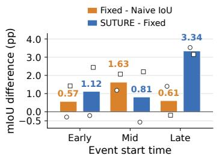  
(a) Final-answer mIoU gains.

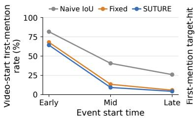  
(b) Video-start anchoring.

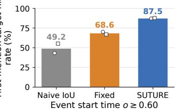  
(c) Late-event target hits.  
Figure A: Verifier components by event start time. Fixed uses $a = 0 . 4$ Bars in (a, c) and curves in (b) average Charades-STA and QVHighlights equally. Numeric labels give the bar means; open circles and squares show Charades-STA and QVHighlights, respectively, in (a, c). Panel (c) uses events with $o \geq 0 . 6 0$

Let $s _ { \mathrm { G T } }$ denote the annotated event's start time, $s _ { \mathrm { f i r s t } }$ the start time of the first temporal mention, and $D _ { V }$ the video duration. Using normalized event start time $o = s _ { \mathrm { G T } } / D _ { V }$ , panels (a, b) use Early $( o < 0 . 1 5 )$ , Mid $( 0 . 1 5 \leq o < 0 . { \bar { 4 } } 5 )$ , and Late $( o \ge 0 . 4 5 )$ bins. Panel (a) reports mIoU differences in percentage points. Video-start first mentions in (b) satisfy $s _ { \mathrm { f i r s t } } / D _ { V } < 0 . 0 2$ . A target hit in (c) means strictly positive overlap with any annotated target interval, without an IoU threshold.

The additional mIoU gain from SUTURE over the fixed control is largest in the Late bin: 3.53 points on Charades-STA and 3.15 on QVHighlights, or 3.34 points with equal benchmark weights.

Most of the reduction in video-start anchoring occurs from Naive IoU to the fixed control. The further reduction with SUTURE is smaller, and the two methods have the same Late-bin rate on QVHighlights (2.6%). Their first-mention target-hit rates differ more clearly for events with $o \geq 0 . 6 0 $ SUTURE reaches 87.1% versus 70.2% on Charades-STA and 87.8% versus 66.9% on $\mathrm { Q V H i g h l i g h t s }$ . Reduced video-start anchoring does not by itself imply a target hit. These observations do not establish that first-mention behavior causes the grounding gains.

## G.6 GENERATED RESPONSE LENGTH

Table H reports output token counts for the Qwen2.5-VL-7B-Instruct policies. The TaRO and SUTURE counts use the same evaluation outputs as Table 1. We count tokens with the Qwen2.5-VL-7B-Instruct tokenizer and report total output length alongside separate counts for the reasoning trace and final answer. All three variants use the evaluation settings in Table A, including a response limit of 1,024 tokens, a budget of 4,096 visual tokens, a model context limit of 16,384 tokens, and video sampling at 2 fps. We measure output tokens only.

Table H: Generated response length. n is the number of evaluated responses. P90 denotes the 90th percentile of total output length. Reasoning and answer columns report mean token counts for the respective response portions. At limit is the percentage of responses reaching 1,024 output tokens.
<table><tr><td rowspan="2">Method</td><td rowspan="2">n</td><td colspan="3">Output tokens</td><td colspan="2">Mean tokens</td><td rowspan="2">At limit (%)</td></tr><tr><td>Mean</td><td>Median</td><td>P90</td><td>Reasoning</td><td>Answer</td></tr><tr><td colspan="8">Charades-STA</td></tr><tr><td>SUTURE</td><td>3,720</td><td>101.9</td><td>100</td><td>134</td><td>77.6</td><td>14.3</td><td>0.00</td></tr><tr><td>TaRO</td><td>3,720</td><td>148.9</td><td>148</td><td>182</td><td>124.7</td><td>13.2</td><td>0.00</td></tr><tr><td>Naive IoU</td><td>3,720</td><td>195.3</td><td>193</td><td>253</td><td>170.7</td><td>14.2</td><td>0.05</td></tr><tr><td colspan="8">QVHighlights</td></tr><tr><td>SUTURE</td><td>1,550</td><td>146.0</td><td>109</td><td>258</td><td>119.9</td><td>15.3</td><td>0.06</td></tr><tr><td>TaRO</td><td>1,550</td><td>192.5</td><td>181</td><td>249</td><td>167.2</td><td>14.2</td><td>0.06</td></tr><tr><td>Naive IoU</td><td>1,550</td><td>447.2</td><td>369</td><td>845</td><td>423.2</td><td>14.2</td><td>6.52</td></tr><tr><td colspan="8">ActivityNet Captions</td></tr><tr><td>SUTURE</td><td>15,933</td><td>149.3</td><td>113</td><td>257</td><td>123.6</td><td>14.9</td><td>0.21</td></tr><tr><td>TaRO</td><td>15,933</td><td>195.2</td><td>182</td><td>256</td><td>170.3</td><td>13.9</td><td>0.04</td></tr><tr><td>Naive IoU</td><td>15,933</td><td>443.1</td><td>335</td><td>1024</td><td>420.8</td><td>13.1</td><td>12.03</td></tr></table>

Relative to TaRO, SUTURE reduces mean output length by 31.6% on Charades-STA, 24.2% on QVHighlights, and 23.5% on ActivityNet, without an explicit length penalty in the reward. Mean reasoning trace length decreases by 37.8%, 28.3%, and 27.4% on Charades-STA, QVHighlights, and ActivityNet, respectively. Mean final answer length is instead about one token longer. Median output length is lower on all three benchmarks, but P90 is slightly higher on QVHighlights and ActivityNet. Naive IoU reaches the response limit on 6.52% of QVHighlights and 12.03% of ActivityNet examples; its length statistics therefore reflect this generation cap rather than unconstrained response lengths.

These measurements come from a single run at the checkpoint selected for each method, without controlled training seeds. They quantify the number of generated tokens rather than elapsed generation time and do not establish that reduced anchoring to the video start causes shorter responses.

## H PROTOCOL FOR THE RESIDUAL GRADIENT DIAGNOSTIC

This appendix defines the analysis reported in Figure 4. Panels 4a and 4b use fixed SUTURE rollout groups from the first visit, with model parameters held fixed at step 350. The diagnostic measures local responses to the structured correction on these fixed rollouts.

Panel 4a reports pooled Spearman alignment between temporal support deficits and directional responses associated with each segment. Panel 4b reports the response difference between rollouts with positive and negative corrections, standardized within each group; faint paired markers show retained groups. Large markers summarize each metric separately for recovered and unrecovered groups, and error bars give 95% bootstrap intervals from 20,000 replicates, using rollout groups as clusters. The analysis includes 16 recovered and 19 unrecovered rollout groups drawn from severe Naive IoU failures and retained under the criteria below. Both diagnostic directions use score vectors normalized by response length and the same selected model parameters: those of the language model head and last two decoder layers.

## H.1 GROUP SELECTION FOR THE GRADIENT ANALYSIS

We consider training instances observed three times under both SUTURE and the Naive IoU control. The first visit denotes each prompt's first encounter during training. We first restrict to severe Naive IoU failures, defined by a mean IoU of at most 0.1 across the group at the final visit. Within this set, an instance is recovered when its mean IoU across the SUTURE group at the final visit is at least 0.3, and unrecovered when that value is at most 0.1; instances with intermediate SUTURE outcomes are excluded from this comparison.

Before gradient computation, we match 25 recovered and 25 unrecovered instances using Naive IoU scores at the first and final visits and the log of target duration. Excluding groups with a degenerate direction of the structured correction leaves 16 recovered and 19 unrecovered rollout groups, containing 54 and 52 valid support bins, respectively. Thus, the final gradient analysis is conditional on severe Naive IoU failure, retrospective classification as recovered or unrecovered, and exclusion of degenerate directions of the structured correction. Because filtering need not preserve the original matched pairs, uncertainty is estimated by bootstrapping rollout groups rather than matched pairs.

## H.2 FIXED MODEL PARAMETERS AND SCORE VECTORS

Each of the 35 instances retained for the gradient analysis contributes its fixed SUTURE rollout group of $G = 8$ responses from the first visit. We evaluate those responses at $\theta _ { \star } = \theta _ { 3 5 0 }$ in evaluation mode with dropout disabled, using float32 arithmetic and the video and metadata preprocessing used for training.

Let S denote the selected model parameters: those of the language model head and last two decoder layers. The same model parameters are used for both diagnostic directions.

For response $y _ { i }$ , define the score vector summed over tokens and its counterpart normalized by response length as

$$
\mathbf { s } _ { i } = \nabla _ { \theta _ { S } } \sum _ { t } \log \pi _ { \theta _ { \star } } ( y _ { i , t } \mid x , y _ { i , < t } ) , \qquad \mathbf { z } _ { i } = \frac { \mathbf { s } _ { i } } { | y _ { i } | } .\tag{40}
$$

The replay stores the Gram matrix of scores summed over tokens and converts it to a matrix normalized by response length. Both diagnostic panels in Figure 4 use $K ^ { ( z ) }$

$$
K _ { i j } ^ { ( s ) } = \mathbf { s } _ { i } ^ { \top } \mathbf { s } _ { j } , \qquad K _ { i j } ^ { ( z ) } = \frac { K _ { i j } ^ { ( s ) } } { | y _ { i } | | y _ { j } | } .\tag{41}
$$

## H.3 DIAGNOSTIC DIRECTIONS AND FIRST-ORDER RESPONSES

The diagnostic IoU direction normalizes temporal IoU alone:

$$
\widehat { A } _ { i } ^ { \mathrm { I o U } } = \frac { R _ { i } ^ { \mathrm { I o U } } - \bar { R } ^ { \mathrm { I o U } } } { \widehat { \sigma } _ { \mathrm { I o U } } + \delta } , \qquad \mathbf { g } _ { \mathrm { I o U } } = \frac { 1 } { G } \sum _ { i } \widehat { A } _ { i } ^ { \mathrm { I o U } } \mathbf { z } _ { i } ,\tag{42}
$$

where $\bar { R } ^ { \mathrm { I o U } }$ and $\widehat { \sigma } _ { \mathrm { I o U } }$ denote the mean and standard deviation of the temporal IoU scores within the group.

For the structured correction, we use the same centered reward correction introduced in Section 3.2. For each realized rollout group,

$$
\chi _ { i } : = r _ { i } ^ { \mathrm { S } } - r _ { i } ^ { \mathrm { I o U } } = R _ { i } ^ { \mathrm { S } } - R _ { i } ^ { \mathrm { I o U } } = \beta _ { \mathcal { P } } \xi _ { i } , \qquad \widetilde { \chi } _ { i } = \chi _ { i } - \bar { \chi } ,\tag{43}
$$

where

$$
\bar { \chi } = \frac { 1 } { G } \sum _ { j = 1 } ^ { G } \chi _ { j } .\tag{44}
$$

The total and temporal reward differences are equal because the controlled variants use the same format reward for each rollout.

We define the diagnostic direction for the structured correction as

$$
\mathbf { g } _ { \mathrm { c o r r } } = \frac { 1 } { G } \sum _ { i } \widetilde { \chi } _ { i } \mathbf { z } _ { i } .\tag{45}
$$

This computes the correction direction from Equation 17 for the fixed rollouts, using only the selected model parameters. The factor $\beta _ { \mathcal { P } }$ is already contained in $\widetilde { \chi } _ { i } \mathrm { ; }$ we do not additionally multiply the diagnostic direction by $\alpha p$

For $d \in \{ \mathrm { I o U } , \mathrm { c o r r } \}$ , define the rollout response as

$$
\begin{array} { r } { q _ { i } ^ { ( d ) } = \mathbf { z } _ { i } ^ { \top } \mathbf { g } _ { d } . } \end{array}\tag{46}
$$

This quantity is the directional derivative of the log-likelihood normalized by response length in the analyzed parameter coordinates.

The IoU reference direction uses temporal IoU rather than the implemented total reward. The comparison therefore isolates the temporal IoU direction and the structured correction direction rather than reconstructing the complete actor update.

## H.4 SUPPORT ALIGNMENT

We partition the implemented temporal representation at rollout interval boundaries and use valid target segments with rollout coverage. For segment k in group $^ { g , }$ let $c _ { g k }$ be the fraction of rollouts covering the segment and let $\bar { c } _ { g }$ be the mean support over its valid segments.

Define the support deficit and the mean directional response of covering rollouts as

$$
\delta _ { g k } = \bar { c } _ { g } - c _ { g k } , \qquad Q _ { g k } ^ { ( d ) } = \frac { 1 } { \left| \mathcal { T } _ { g k } \right| } \sum _ { i \in \mathcal { T } _ { g k } } q _ { i } ^ { ( d ) } ,\tag{47}
$$

where $\mathcal { T } _ { g k }$ is the set of rollouts covering segment k.

We pool segment observations separately for recovered and unrecovered groups and define support alignment as

$$
\rho _ { d } = \mathrm { S p e a r m a n } \left( \{ \delta _ { g k } \} , \{ Q _ { g k } ^ { ( d ) } \} \right) .\tag{48}
$$

Positive values indicate that rollouts covering segments with relatively low support have larger directional responses in the pooled analysis.

Table I: Support alignment in Figure 4a. Intervals are 95% bootstrap intervals with rollout groups as clusters.
<table><tr><td>Final outcome</td><td>Direction</td><td> $\rho _ { d }$ </td><td>95% interval</td></tr><tr><td>Recovered</td><td>gIoU</td><td>-0.056</td><td>[-0.393, 0.327]</td></tr><tr><td>Recovered</td><td>gcorr</td><td>0.614</td><td>[0.451, 0.798]</td></tr><tr><td>Unrecovered</td><td> $\mathbf { g } _ { \mathrm { I o U } }$ </td><td>0.156</td><td>[-0.161, 0.514]</td></tr><tr><td>Unrecovered</td><td> $\mathbf { g } _ { \mathrm { c o r r } }$ </td><td>0.513</td><td>[0.292, 0.783]</td></tr></table>

## H.5 RESIDUAL-SIGN PREFERENCE GAP

For each retained rollout group, define

$$
\mathrm { G a p } _ { g } ( \mathbf { g } _ { d } ) = \frac { \mathrm { m e a n } _ { \widetilde { \chi } _ { i } > 0 } q _ { i } ^ { ( d ) } - \mathrm { m e a n } _ { \widetilde { \chi } _ { i } < 0 } q _ { i } ^ { ( d ) } } { \mathrm { S D } _ { i } ( q _ { i } ^ { ( d ) } ) } .\tag{49}
$$

We average these standardized gaps for individual groups separately over recovered and unrecovered groups. Positive values indicate larger directional responses for rollouts with positive corrections than for those with negative corrections on average. Thus, the residual-sign split is determined by the sign of the centered structured reward correction $\widetilde { \chi } _ { i } ,$ rather than by an independently chosen support threshold.

Table J: Residual-sign preference gap in Figure 4b. Intervals are 95% bootstrap intervals with rollout groups as clusters.
<table><tr><td>Final outcome</td><td>Direction</td><td>Mean gap (SD)</td><td>95% interval</td></tr><tr><td>Recovered</td><td>gIoU</td><td>-0.326</td><td>[-0.983, 0.355]</td></tr><tr><td>Recovered</td><td>gcorr</td><td>1.664</td><td>[1.500, 1.847]</td></tr><tr><td>Unrecovered</td><td>gIoU</td><td>-0.066</td><td>[−0.605, 0.467]</td></tr><tr><td>Unrecovered</td><td> $\mathbf { g } _ { \mathrm { c o r r } }$ </td><td>1.903</td><td>[1.729, 2.103]</td></tr></table>

## H.6 UNCERTAINTY, SCALING, AND SCOPE

We use 20,000 bootstrap replicates with the rollout group as the resampling unit, so segments and responses from the same group are not treated as independent.

The 95% intervals for the $\mathbf { g } _ { \mathrm { c o r r } } .$ -minus. $\mathbf { \sigma } _ { \mathbf { \Theta } } \mathbf { g } _ { \mathrm { I o U } }$ contrast are [0.234, 1.100] and [0.046, 0.723] for support alignment in the recovered and unrecovered groups, respectively. For the mean preference gap, the corresponding intervals are [1.328, 2.663] and [1.446, 2.516]. These intervals characterize uncertainty within the retained diagnostic population rather than variation across independent training runs.

The preference gap standardized within each group is invariant to a positive scaling shared within a group. Pooled support alignment is not generally invariant to positive scaling that varies across groups, since such scaling can change ranks across groups. Accordingly, we report $\mathbf { g } _ { \mathrm { c o r r } }$ exactly as defined in Equation 45, without applying the additional factor $\alpha p$ from Equation 17.

This experiment evaluates fixed past responses with model parameters held fixed, using only the selected model parameters. It characterizes local responses to the structured correction rather than reconstructing the complete actor update.

SUTURE (ours) From 79.0s to 111.0s, Four men are standing by the pool holding hammer like sticks and hit the ball.

## I QUALITATIVE EXAMPLES OF TRACKING EVENT START TIMES

Setup. Figures B and C complement Section 4.4 with individual ActivityNet examples. Each panel shows the ground truth interval, the first well-formed temporal interval in the reasoning trace, the final prediction, and abbreviated response text. Dashed outlines denote first mentions and solid bars denote final answers. SUTURE, TaRO, and plain IoU share the same backbone and training setup; Time-R1 is shown only as a reference because its training configuration differs.

Selection. The four examples use a fixed ActivityNet selection rule: the target starts after 40% of the video, the first SUTURE mention overlaps the target, the first TaRO mention starts within the first 5%, and SUTURE exceeds every baseline by at least 0.60 IoU. We additionally draw examples from nonoverlapping bands of video duration and target length. The rule is intended to expose clear instances of the behavior in Section 4.4; the quantitative claims rely on the full evaluation sets rather than these selected panels.

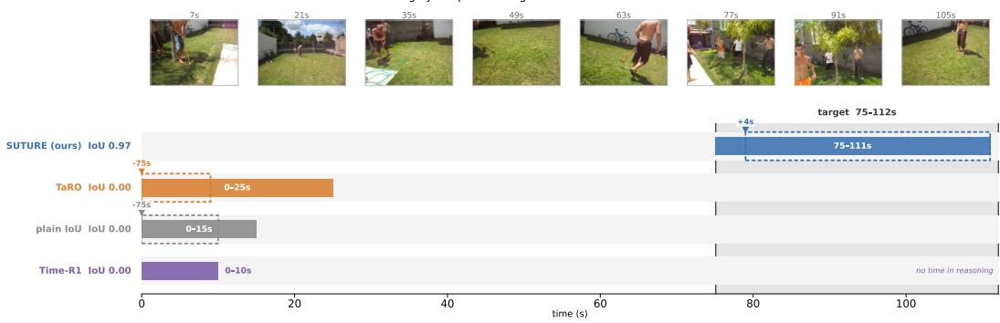  
TaRO From 0.0s to 9.0s, a man hits a ball with a stick-like object  
Time-R1 The event "Four men are standing by the pool holding hammer like sticks and hit the ball." occurs in the middle part of the video, where the camera ca ...

(a) “Four men are standing by the pool holding hammer like sticks and hit the ball." The ground truth interval is 75–112s of a 112s video.

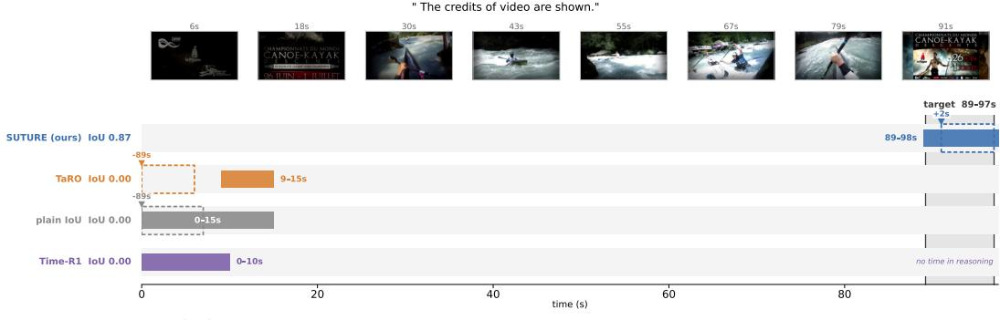  
TaRO From 0.0s to 6.0s, the video begins with a black screen featuring logos for the International Canoe Federation and the Fédération Française de ...  
Time-R1 The event "The credits of video are shown." occurs at the beginning of the video, as indicated by the black screen with the logo and text "la Plagne" ..  
plain loU From 0.0s to 7.0s, the video shows the logo for the International Canoe Federation and the location, La Plagne.

(b) “The credits of video are shown." The ground truth interval is 89–97s of a 98s video, and a similar title card appears at the start of the video.

Figure B: Tracking event start times during reasoning on ActivityNet (I). Dashed outlines mark first temporal mentions and solid bars mark final answers. In both examples SUTURE opens its reasoning inside the target interval, while TaRO and plain IoU open near the video start.

Interpretation. The examples visualize the same pattern of early first-mention start times seen in the aggregate analysis. In the first pair, SUTURE moves its initial temporal hypothesis to the target interval later in the video while TaRO and plain IoU remain near the video start. The second pair also shows that the location of the first mention and the final answer need not move together: comparison policies can partially recover in the final prediction despite opening their temporal reasoning substantially earlier.

"After he shows how that rhythm is done he begins to speed the rhythm up."  
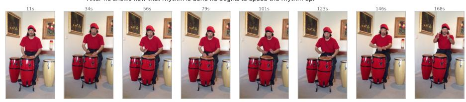

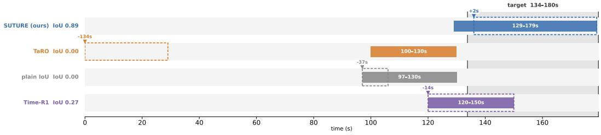

(a) “After he shows how that rhythm is done he begins to speed the rhythm up." The ground truth interval is 134–180s of a 180s video.

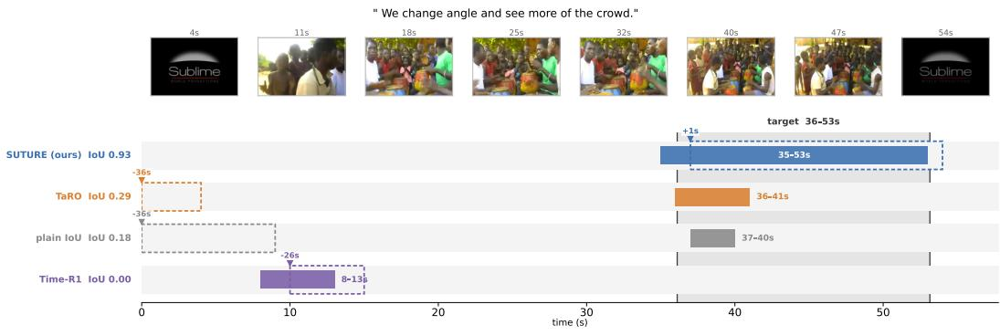  
(b) “We change angle and see more of the crowd." The ground truth interval is 36–53s of a 58s video.

Figure C: Tracking event start times during reasoning on ActivityNet (II). These examples show cases in which comparison policies partially recover in the final answer despite first mentioning substantially earlier temporal regions.