# CAN AGENTS WORK FOR EVERYONE? CROSS-USER RELIABILITY FOR MOBILE GUI AGENTS IN PERSONALIZED USER INTERFACES

Yeji Park, Jaeyun Shim, Taesik Gong UNIST

{yejipark, tlawodbs1170, taesik.gong}@unist.ac.kr

## ABSTRACT

Mobile GUI agents increasingly operate on interfaces influenced by users’ histories and preferences, but their reliability across different users remains underexplored. We introduce PAIR (Personalized Application-state Instantiation and Rendering), a pipeline for constructing user-conditioned application states that enables controlled evaluation of the same task across different users. We further introduce RePAIR (Reinforcement learning with Personalization-Aware Interaction Rewards), a training approach that learns from cross-user differences in subgoal outcomes to improve reliability across user-conditioned mobile environments. Across six agents, we find substantial variation in task success across users and consistently lower subgoal achievement in user-conditioned UI contexts (6.98 to 15.4 pp). This gap further increases for personal targets drawn from each user’s own content (8.77 to 22.0 pp). Failures in these contexts frequently involve selecting another item instead of the intended target, particularly before target exposure. Finally, RePAIR improves user-conditioned SAR (+5.87 pp), all-success (+7.50 pp), and overall Task SR (+9.42 pp) over its supervised fine-tuning parent on unseen users, providing initial evidence that explicitly learning from cross-user variation can improve GUI-agent reliability.

## 1 INTRODUCTION

Recent advances in mobile GUI agents have enabled them to interpret natural-language requests, interpret graphical user interfaces, and perform actions in a human-like manner (Zhou et al., 2025; Qin et al., 2025; Liu et al., 2024; Zhao et al., 2025a). However, GUI agents’ action predictions are sensitive to interface presentation, including layout and element positioning (Yu et al., 2026; Wang et al., 2026b; Chen et al., 2025; Yang et al., 2026c). In deployed mobile GUI agents, interface variations naturally arise from users’ prior interactions and activity histories.

Such user-dependent interface differences can lead to cross-user reliability failures, where an agent that succeeds for one user may fail on the same request for another. Figure 1 shows how userdependent interfaces can lead an agent to different types of failure, for instance, selecting a visually similar but incorrect target or prematurely concluding that the requested target is unavailable. Our analysis of users’ real mobile interactions from FingerTip 20K (Yang et al., 2026b) likewise indicates a 6.41% (SD 2.38) lower success rate (24.71% vs. 31.12%) on labeled target-bearing screen segments containing user-conditioned elements. However, because FingerTip 20K varies both tasks and screen states, it does not support controlled evaluation of the same request across user-conditioned interfaces.

To address this problem, we introduce PAIR (Personalized Application-state Instantiation and Rendering), a pipeline for constructing user-conditioned application states from user profiles. PAIR extracts application-relevant user preferences, matches them to candidate content for each application based on semantic similarity, selects the highest-ranked content, and renders it in each application’s UI. By varying user-conditioned content while keeping the application structure, PAIR enables controlled cross-user evaluation of the same task. Additionally, we introduce RePAIR (Reinforcement learning with Personalization-Aware Interaction Rewards), a training-based approach to improve cross-user reliability by explicitly learning from differences in agent performance across users. Re-

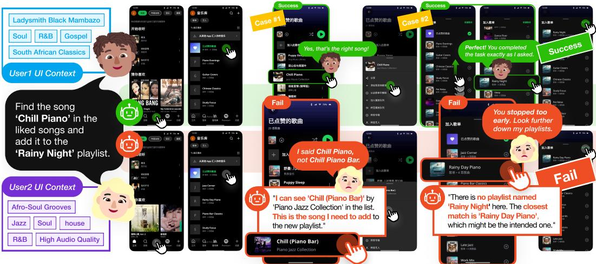  
Figure 1: The same request can require navigating different user-conditioned interfaces. We evaluate whether GUI agents remain reliable across users and trace how user-conditioned content disrupts task progress and target selection.

PAIR compares the outcomes of subgoals, goals associated with benchmark-defined UI contexts, across different users’ environments under the same task condition and reinforces successful behavior in user-conditioned contexts, where the visible interface content varies across users. By leveraging these cross-user differences as a training signal, RePAIR aims to improve consistent task execution across user-conditioned application states.

Using the user-conditioned application states generated by PAIR, we evaluate whether agents complete the same task consistently across users and where cross-user reliability breaks down. Our evaluation reveals four main findings. First, task success varies substantially across users, with a maximum gap of 9.31 pp between the best- and worst-performing users. Second, subgoal achievement is consistently lower in user-conditioned contexts than in user-agnostic contexts, where the visible UI does not depend on the user (+12.0 pp). This gap becomes larger for personal targets where the agent must identify a target drawn from the user’s own content (+14.4 pp). Third, in user-conditioned contexts, subgoal failures involve selecting another item instead of the intended target. These errors occur more frequently for personal targets, particularly before target exposure, when additional navigation is required to reach the intended target. Finally, RePAIR improves user-conditioned SAR by 5.87 points, the all-success rate by 7.50 points, and overall Task SR by 9.42 points over its SFT parent on unseen users, suggesting that explicitly training on cross-user differences in user-conditioned subgoals can improve reliability across unseen users.

We summarize our key contributions as follows:

• We introduce PAIR, a user profile-based pipeline for constructing user-conditioned GUI environments that enables controlled evaluation of the same task across different users.

• We provide an empirical study of cross-user reliability, showing (i) substantial variation in task success across users, (ii) lower subgoal achievement in user-conditioned contexts, and (iii) more target-selection errors for personal targets, especially before target exposure.

• We introduce RePAIR, a training approach that leverages cross-user differences in subgoal outcomes to improve reliable task execution across user-conditioned environments.

## 2 RELATED WORK

## 2.1 GUI AGENT ROBUSTNESS UNDER INTERFACE VARIATION

GUI agents have evolved from grounding instructions in structured GUI representations to perceiving and acting on rendered interfaces (Deng et al., 2023; Cheng et al., 2024; Wu et al., 2025). Recent systems integrate visual grounding, reasoning, and action prediction in a unified interaction loop (Zheng et al., 2024; Qin et al., 2025). This shift highlights the need for robustness to variations in interfaces. Visual attributes affect web-agent selections (Yu et al., 2026), while zoom perturbations reduce grounding accuracy (Wang et al., 2026b). Prior methods address GUI complexity through context simplification (Chen et al., 2025) and adaptive visual focus (Ge et al., 2025). Meanwhile, benchmarks evaluate robustness using static anomaly datasets (Yang et al., 2026a) and dynamically injected disruptions (Chen et al., 2026a). Together, these studies show that reliable GUI interaction requires robustness to dynamic conditions, not just target recognition on fixed screens.

Table 1: Comparison of GUI-agent evaluation settings. The four dimensions are UI Variation, whether UI variations are explicitly evaluated; User Context, whether user preferences or histories are used; User-Conditioned GUI, whether personal records shape the app state; and Cross-User Comparison, whether the same task is evaluated across user-conditioned application states.
<table><tr><td colspan="3">Evaluation setting</td><td rowspan="2">User-Conditioned GUI</td><td rowspan="2">Cross-User Comparison</td></tr><tr><td></td><td>UI Variation</td><td>User Context</td></tr><tr><td>GUI-Perturbed (Wang et al., 2026b)</td><td></td><td>X</td><td>X</td><td>X</td></tr><tr><td>GUI-Robust (Yang et al., 2026a)</td><td></td><td>X</td><td>x</td><td>X</td></tr><tr><td>D-GARA (Chen et al., 2026a)</td><td></td><td>X</td><td>X</td><td>X</td></tr><tr><td>PSPA-Bench (Nie et al., 2026)</td><td>X</td><td></td><td>X</td><td>X</td></tr><tr><td>Persona2Web (Kim et al., 2026)</td><td>X</td><td></td><td>X</td><td>x</td></tr><tr><td>KnowU-Bench (Chen et al., 2026b)</td><td>X</td><td></td><td>X</td><td>X</td></tr><tr><td>FingerTip 20K (Yang et al., 2026b)</td><td>X</td><td></td><td></td><td>X</td></tr><tr><td>iOSWorld (Jang et al., 2026)</td><td>X</td><td></td><td></td><td>x</td></tr><tr><td>PAIR (Ours)</td><td></td><td></td><td></td><td></td></tr></table>

Personalization, however, creates persistent, user-conditioned variation beyond temporary or synthetic perturbations. HCI research shows that usage history and personalized content shape interface presentation (Findlater & McGrenere, 2004; Eslami et al., 2015), while user-specific records shape the content and context of modern applications (Jang et al., 2026). Existing robustness studies nevertheless focus on synthetic or transient changes, leaving reliability across persistent, personalized application states underexplored.

## 2.2 PERSONALIZATION IN MOBILE GUI AGENTS

Existing personalization methods for mobile GUI agents use user preferences, routines, and histories to infer intended actions or provide proactive assistance (Wang et al., 2026a; Lyu et al., 2026). In contrast, we study whether an agent can reliably execute a fixed instruction when the mobile interface itself varies with user-specific content and state. Prior mobile evaluations examine either robustness to runtime interface disruptions (Chen et al., 2026a) or personalized interaction based on user context (Nie et al., 2026; Yang et al., 2026b; Jang et al., 2026; Chen et al., 2026b). However, they do not directly test whether the same instruction and target remain reliable across different userconditioned mobile application states. We address this gap through controlled cross-user evaluation. As summarized in Table 1.

## 3 MOTIVATION: REAL-WORLD MOBILE GUI AGENTS ENCOUNTERUSER-CONDITIONED INTERFACES

To investigate how user-conditioned content influences mobile GUI agents in everyday interfaces, we evaluate six widely used open-source agent models on Fingertip 20K (Yang et al., 2026b), which captures screenshots and action sequences from users’ real mobile interactions. We analyze 103,199 screenshot–action steps spanning 12,016 episodes from 102 apps, collected from 83 users. We group consecutive interactions on the same screen into 60,383 screen segments, and success requires every scored action in a segment to be correct. Across all evaluated agents, segments containing userconditioned elements, labels unique to a given user within each application, show a mean decrease in success of 4.88 pp (SD 1.50) relative to those without them (Figure 2a).

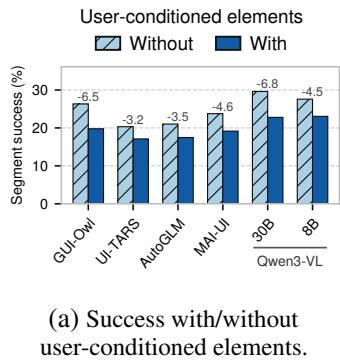

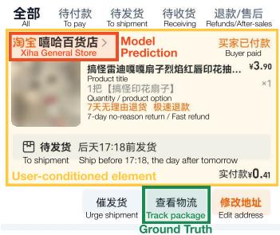  
(b) Mistaking user-conditioned order content for the task target.

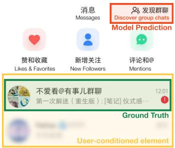  
(c) Overlooking the visible user-conditioned unread chat.  
Figure 2: GUI-agent behavior on FingerTip 20K. (a) Success by the presence of user-conditioned content. (b,c) Example failures: the agent (b) selects a user-specific shop name instead of Track package and (c) overlooks a user-specific unread chat in favor of Discover group chats.

Figures 2b and 2c illustrate two types of errors influenced by user-conditioned elements. In the first case, the user asks to check the delivery status of the first order. The user intends to select the order’s Track package button, but the agent selects the shop name instead, incorrectly assuming it leads to the order details, where delivery information can be found. In the second case, the user asks to view new messages in a group chat. The intended action is to open the visible group conversation with an unread badge, but the agent selects the shared Discover group chats entry instead, incorrectly assuming that it provides access to new messages in the user’s group chats. These examples highlight the need to interpret user-conditioned content in relation to the instruction and identify the appropriate target in the current application state. See more details in Appendix A.

These observations suggest that user-conditioned content can interfere with reliable action selection. However, because FingerTip varies tasks and screen states together, it cannot determine whether the same request is completed consistently across different users’ application states. We refer to this consistency as cross-user reliability. We therefore suggest PAIR to control for the instruction and target while varying user-conditioned application states and study the following questions:

• RQ1: How robustly do mobile GUI agents complete the same request across userconditioned interface states?

• RQ2: Where does task progress break down in user-conditioned interfaces, and how do failure patterns vary with the semantic alignment between the target and the interface?

## 4 PAIR: PERSONALIZED APPLICATION ENVIRONMENT GENERATION

We introduce PAIR (Personalized Application-state Instantiation and Rendering), a pipeline that turns user profiles into personalized, executable GUI environments. PAIR provides a controlled cross-user evaluation environment by pairing user-conditioned application states with matched task templates and success criteria. This section describes the environment generation pipeline, task design, and evaluation protocol. Figure 3 illustrates the pipeline overview.

## 4.1 CROSS-USER RELIABILITY FORMULATION

Our goal is to assess cross-user reliability, defined as the ability of a mobile GUI agent to execute the same request consistently across different users’ interfaces, and to identify where task progress breaks down during execution. Given an instruction q and user $p \mathbf { \hat { s } }$ application state, the agent observes a screenshot $o _ { t }$ and selects an action $a _ { t }$ at each interaction step t:

$$
a _ { t } = \pi ( q , h _ { t } ) , \qquad s _ { t } = ( o _ { t } , a _ { t } ) ,\tag{1}
$$

where π denotes the GUI agent, $h _ { t } = ( o _ { 0 } , a _ { 0 } , \ldots , o _ { t } )$ is the interaction history available to the agent, and $s _ { t }$ denotes the interaction step. Each action updates the application state, and repeating this process yields the interaction trajectory $\tau _ { p } = ( s _ { 0 } , s _ { 1 } , \dots , s _ { T - 1 } )$

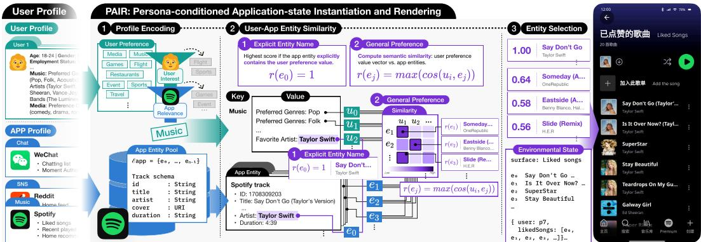  
Figure 3: Overview of PAIR. (i) Given a user and app profile, PAIR extracts user preferences and filters them according to their relevance to each application. (ii) It then scores candidate application entities using exact matching for explicit entity preferences and semantic similarity for general preferences. (iii) The highest-ranked entities are selected and instantiated in the corresponding application state, which is rendered as a user-conditioned interface.

For each task, let $\mathbf { g } ( q ) = ( g _ { 1 } , \dots , g _ { K } )$ denote the ordered subgoals along a reference execution path. Each subgoal $g _ { k }$ specifies an objective associated with a predefined UI context in which that objective can be completed, which we call its subgoal context. For user $p$ and subgoal $g _ { k }$ , let $I _ { p , k }$ denote the set of step indices, ordered by time, that occur in the corresponding subgoal context. We define the context-specific interaction sequence as $\tau _ { p , k } = ( s _ { t } ) _ { t \in I _ { p , k } }$ . Because an agent may revisit the same context multiple times, $I _ { p , k }$ may contain non-consecutive indices, and $\tau _ { p , k }$ therefore aggregates interactions across repeated visits to the same subgoal context.

In our setting, the visible interface state varies across users while the underlying application structure and interaction logic remain fixed. We distinguish user-conditioned (UC) contexts, where relevant visible content varies across users, from user-agnostic (UA) contexts, where the relevant interface content is shared across users, such as common navigation controls. Accordingly, each subgoal context receives a label $c _ { p , k } \in \{ \mathrm { U C } , \mathrm { U A } \}$ : UC when it contains relevant visible user-conditioned elements, and UA otherwise. This labeling groups the corresponding subtrajectories by context type.

## 4.2 ENVIRONMENT GENERATION PIPELINE

PAIR constructs user-conditioned application states from interests and attributes derived from user profiles, as illustrated in Figure 3. The framework proceeds in three stages: (i) profile encoding, which extracts application-relevant preferences from the user profile and candidate entities, content items that can appear in the application state, from the application profile; (ii) user-app entity similarity, which measures their correspondence through exact matching or semantic similarity; and (iii) entity selection, which selects the highest-ranked entities to instantiate the application state.

We first apply user interest filtering to retain preferences associated with user p’s active interests, followed by app relevance filtering to retain those relevant to application A. Let $\bar { \mathcal { P } } _ { p , A } = \{ u _ { i } \}$ denote the filtered preference values for user p and application $A ,$ and let $\mathcal { E } _ { A } = \{ e _ { j } \}$ denote the candidate entity pool for application A. For each candidate application entity $e _ { j }$ , we define its relevance as

$$
\begin{array} { r } { r ( e _ { j } ) = \left\{ \begin{array} { l l } { 1 , } & { \mathrm { ~ i f ~ } e _ { j } \mathrm { ~ d i r e c t l y ~ m a t c h e s ~ a n y ~ p r e f e r e n c e ~ v a l u e ~ } u _ { i } \in \mathcal { P } _ { p , A } , } \\ { \operatorname* { m a x } \cos ( f ( u _ { i } ) , f ( e _ { j } ) ) , } & { \mathrm { ~ o t h e r w i s e . } } \end{array} \right. } \end{array}\tag{2}
$$

where $f ( \cdot )$ is a multilingual sentence encoder. We rank candidate entities by $\boldsymbol { r } ( \boldsymbol { e } _ { j } )$ and use the highestranked entities to populate application-specific collections. To instantiate executable environments, we build on MobileGym Wu et al. (2026), injecting the selected entities into user-specific runtime states according to each application’s native schema. Structured records are created in their respective schema. The resulting states are rendered by the original application UI. (See Appendix B.1)

## 4.3 TASK DESIGN

PAIR constructs task instances by pairing generated user-conditioned states with task templates. Each task template defines the required operation, target UI context, and success criterion, while the target and instruction are varied across conditions. For each user and template, we instantiate tasks along two axes: target type and instruction type. For more information, see Appendix B.2, B.3.

Target type. Targets are either common or personal. A common target is shared across users; its instruction wording is fixed. This enables comparison of the same task across user-conditioned states. In contrast, a personal target is selected from the user-conditioned content generated by PAIR, testing whether the agent can resolve a target specific to that user.

Instruction type. An explicit instruction refers to the task target by its visible label, whereas an implicit instruction refers to the same target using a contextual cue. For example, an explicit instruction requests, “Find the post ‘Looking for interesting flowers for a fashion project!’”, whereas an implicit instruction describes the same target as “a gardening post seeking flower ideas.”

## 4.4 EVALUATION METRICS

Task success rate (Task SR) measures end-to-end task completion as Task $\mathrm { S R } = E _ { s } / E ,$ , where $E$ is the total number of evaluated tasks and $E _ { s }$ is the number of successfully completed tasks.

All-success rate measures cross-user consistency for each template-condition pair, defined as a task template under a fixed target type and instruction type. The all-success rate is defined as $\mathrm { A l l S u c c e s s } = M _ { a } / M$ , where M denotes the number of template-condition pairs and $M _ { a }$ denotes the number of pairs that achieve all-success; the agent succeeds for every user.

Subgoal achievement rate (SAR) measures the proportion of these subgoals that are successfully completed. We define it as $\mathrm { S A R } = S _ { s } / S$ , where S is the number of evaluated subgoals and $S _ { s }$ is the number successfully completed. SAR enables trajectory-level localization of failures and comparison of subgoal performance between user-conditioned and user-agnostic contexts.

## 5 REPAIR: PERSONALIZATION-AWARE INTERACTION REWARDS

To investigate whether rewarding subgoal success in user-conditioned contexts can mitigate performance degradation in mobile GUI agents, we introduce RePAIR (Reinforcement learning with Personalization-Aware Interaction Rewards), which uses relative subgoal success across userconditioned rollouts as the policy optimization signal; see Appendix C for more detail.

Rollout Group Construction. For each combination of task template, target type, and instruction type, we pair training users $p$ and $q$ with compatible subgoal structures. We collect two full-task rollouts from each user’s task instance, forming the group $\mathcal { G } _ { p , q } = ( \tau _ { 1 } , \tau _ { 2 } , \tau _ { 3 } , \tau _ { 4 } )$ , where $\tau _ { 1 }$ and $\tau _ { 2 }$ come from p and $\tau _ { 3 }$ and $\tau _ { 4 }$ from $q .$ Each rollout starts from the corresponding initial state.

Personalization-Aware Rewards. For rollout group $\mathcal { G } _ { p , q } ,$ let $\mathcal { P }$ denote its shared set of subgoals in user-conditioned contexts; subgoals in user-agnostic contexts are excluded. For rollout $\tau _ { j }$ and subgoal $k \in \mathcal { P }$ , we assign a binary success reward:

$$
r _ { j k } = \left\{ \begin{array} { l l } { { 1 , } } & { { \mathrm { i f ~ } \tau _ { j } \mathrm { ~ s a t i s f i e s ~ t h e ~ c r i t e r i a ~ f o r ~ s u b g o a l ~ } k , } } \\ { { 0 , } } & { { \mathrm { o t h e r w i s e } . } } \end{array} \right.\tag{3}
$$

We determine subgoal success from recorded trajectory evidence, including entry-screen observations, visited screens, clicks, and task-judge outcomes.

Group-Relative Advantages. For each subgoal, we normalize its rewards across the four rollouts and then average the normalized rewards across user-conditioned subgoals to obtain one rollout-level advantage. Let $\mu _ { k }$ and $\sigma _ { k }$ be the mean and population standard deviation of the rewards for subgoal k. For nonempty $\mathcal { P }$ , we compute

$$
A _ { j } = \frac { 1 } { | \mathcal { P } | } \sum _ { k \in \mathcal { P } : \sigma _ { k } > 0 } \frac { r _ { j k } - \mu _ { k } } { \sigma _ { k } } .\tag{4}
$$

Table 2: Overall performance of base mobile GUI agents and RePAIR on PAIR. Task SR measures task success, all-success measures the rate of tasks completed successfully by all user profiles, and SAR measures subgoal achievement over reached contexts. Parentheses show RePAIR’s percentagepoint gains over SFT.
<table><tr><td>Model</td><td>Params.</td><td>Task SR (%)</td><td>All-success (%)</td><td>User-agnostic SAR (%)</td><td>User-conditioned SAR (%)</td></tr><tr><td>UI-TARS-1.5 (Qin et al., 2025)</td><td>7B</td><td>48.5</td><td>22.5</td><td>79.7</td><td>65.4</td></tr><tr><td>Qwen3-VL-Instruct (Bai et al., 2025)</td><td>30B-A3B</td><td>47.6</td><td>19.2</td><td>79.3</td><td>67.2</td></tr><tr><td>Qwen3-VL-Instruct (Bai et al., 2025)</td><td>8B</td><td>47.5</td><td>22.5</td><td>74.6</td><td>67.6</td></tr><tr><td>AutoGLM-Phone (Xu et al., 2026b)</td><td>9B</td><td>53.7</td><td>21.7</td><td>85.3</td><td>69.9</td></tr><tr><td>MAI-UI (Zhou et al., 2025)</td><td>8B</td><td>53.4</td><td>25.8</td><td>86.2</td><td>71.0</td></tr><tr><td>GUI-Owl-1.5-Think (Xu et al., 2026a)</td><td>8B</td><td>49.5</td><td>16.7</td><td>77.4</td><td>69.1</td></tr><tr><td>Qwen3-VL-Instruct</td><td>8B</td><td>47.5</td><td>22.5</td><td>74.6</td><td>67.6</td></tr><tr><td>+ SFT</td><td> $8 \mathrm { B } + 1 5 . 3 \mathrm { M }$ </td><td>55.1</td><td>20.0</td><td>92.3</td><td>71.9</td></tr><tr><td>+ SFT + RePAIR (ours)</td><td> $8 \mathrm { B } + 1 5 . 3 \mathrm { M }$ </td><td>64.5 (+9.4)</td><td>27.5 (+7.5)</td><td>94.3 (+2.0)</td><td>77.7 (+5.9)</td></tr></table>

For example, suppose $\mathcal { P }$ contains two subgoals. Across the four rollouts, the first subgoal has reward vector $( 1 , 1 , 0 , 0 )$ and thus normalized reward vector $( 1 , 1 , - 1 , - 1 )$ ). The second has reward vector (1, 1, 1, 1) and thus contributes zero to every rollout. Averaging the two subgoal-level values for each rollout gives $( A _ { 1 } , A _ { 2 } , A _ { 3 } , A _ { 4 } ) = ( 0 . 5 , 0 . 5 , - 0 . 5 , - 0 . 5 )$ . If $\mathcal { P }$ is empty, we set $A _ { j } = 0$

Policy Optimization. We optimize an SFT-initialized policy $\pi _ { \theta }$ with GRPO (Shao et al., 2024) using the rollout groups and advantages defined above, while keeping the SFT policy fixed as the reference $\pi _ { \mathrm { r e f } }$ . Let $\pi _ { \mathrm { o l d } }$ denote the rollout-generating policy. For rollout $\tau _ { j } ,$ let $N _ { j }$ be the number of generated output tokens. At each token position $t \in \{ 1 , \ldots , N _ { j } \} , w _ { j t }$ denotes the generated token and $h _ { j t }$ the instruction and observation–action history available before generating it. We maximize

$$
\begin{array} { r l } & { \mathcal { I } ( \theta ) = \mathbb { E } _ { \mathcal { G } _ { p , q } \sim \pi _ { \mathrm { o l d } } } \frac { 1 } { 4 } \displaystyle \sum _ { j = 1 } ^ { 4 } \frac { 1 } { N _ { j } } \sum _ { t = 1 } ^ { N _ { j } } } \\ & { \qquad \quad \left[ \operatorname* { m i n } \left( \frac { \pi _ { \theta } \left( w _ { j t } \mid h _ { j t } \right) } { \pi _ { \mathrm { o l d } } \left( w _ { j t } \mid h _ { j t } \right) } A _ { j } , \mathrm { c l i p } \left( \frac { \pi _ { \theta } \left( w _ { j t } \mid h _ { j t } \right) } { \pi _ { \mathrm { o l d } } \left( w _ { j t } \mid h _ { j t } \right) } , 1 - \varepsilon , 1 + \varepsilon \right) A _ { j } \right) - \beta D _ { \mathrm { K L } , j t } \right] . } \end{array}\tag{5}
$$

Here ε sets the clipping range, while $\beta$ controls the KL penalty from the SFT reference. For each sampled token, the penalty is

$$
D _ { \mathrm { K L } , j t } = \frac { \pi _ { \mathrm { r e f } } ( w _ { j t } \mid h _ { j t } ) } { \pi _ { \theta } ( w _ { j t } \mid h _ { j t } ) } - \log \frac { \pi _ { \mathrm { r e f } } ( w _ { j t } \mid h _ { j t } ) } { \pi _ { \theta } ( w _ { j t } \mid h _ { j t } ) } - 1 .\tag{6}
$$

Each rollout is weighted equally, and its advantage applies to all response tokens.

## 6 EXPERIMENTS

We evaluate cross-user reliability at both the task and trajectory levels using PAIR. Specifically, we examine (1) how task success and (2) how subgoal achievement are affected across user-conditioned application states, (3) when incorrect-item selections occur relative to target visibility, and (4) whether RePAIR improves performance by rewarding subgoal success in user-conditioned contexts.

## 6.1 EXPERIMENTAL SETUP

Using user profiles from PersonaLens (Zhao et al., 2025b), we evaluate PAIR by instantiating ten profiles (p0 to p9) with PAIR as the test set for our main evaluation. We then instantiate ten additional profiles (p10 to p19) for the RePAIR study, using eight for training and two for validation. For each user profile, PAIR instantiates three task templates across ten applications under two target types and two instruction types, yielding $3 \times 1 0 \times 2 \times 2 = 1 2 0$ instantiated tasks per persona. This results in 1,200 test tasks, 960 training tasks, and 240 validation instances.

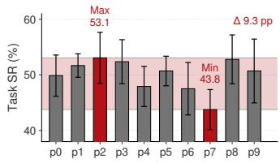  
Figure 4: User-level task success rate(Task SR). Error bars show standard deviation across agents.

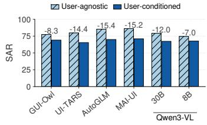  
(a) UA vs. UC contexts.

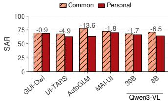  
(b) Common vs. personal targets.

Figure 5: Subgoal achievement rate(SAR) across agents by (a) context type and (b) target type within user-conditioned contexts.  
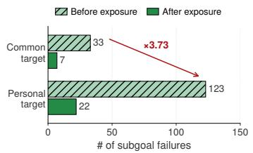

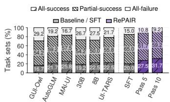

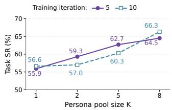  
(a) Task SR composition.  
(b) Task SR by user pool size.  
Figure 6: Incorrect item selections among subgoal failures by Figure 7: RePAIR results. (a) Task success consistency across target exposure and target type. users. (b) Task SR by training user pool size and training iteration.

Models. We evaluate Qwen3-VL-8B, GUI-Owl-1.5-8B-Think (Xu et al., 2026a), MAI-UI-8B (Zhou et al., 2025), AutoGLM-Phone-9B-Multilingual (Liu et al., 2024; Xu et al., 2026b), and UI-TARS-1.5-7B (Qin et al., 2025), which fall within a deployment-relevant model scale for mobile settings, together with Qwen3-VL-30B-A3B (Bai et al., 2025) as a larger-scale comparison, on the same frozen test set. For the RePAIR, we first fine-tune Qwen3-VL-8B with LoRA (Hu et al., 2021) on explicit-instruction demonstrations from the training personas. We then apply RePAIR to tasks selected based on the preceding cross-persona analysis. More details are provided in Appendix D.

## 6.2 RESULTS

To assess overall task completion, cross-user consistency, and subgoal progress, we examine the task success rate (Task SR), the all-success rate, and the subgoal achievement rate (SAR) (see Table 2). Across the six agents, mean Task SR is 50.0% (SD 2.82). As we expected, task success decreases when the instruction is implicit rather than explicit (40.7% vs. 59.3%; p < .001). Personal targets also show lower task success than common targets (46.6% vs. 53.5%). Neither this difference (p = .0642) nor the instruction–target interaction (p = .283) reached statistical significance.

Task success varies substantially across personas. We therefore examine how task outcomes vary across personas. Across the evaluated agents, as illustrated in Figure 4, persona-level Task SR ranges from 43.8% to 53.1%, with a gap of up to 9.31 pp between the best- and worst-performing personas. This cross-persona variation occurs for both common targets with identical instructions and targets across users (6.94 pp) and personal targets drawn from each user’s own records (13.6 pp). Thus, the same task can produce different outcomes depending on the persona-conditioned interface in which it is executed.

Goal achievement drops in user-conditioned contexts, with difficulty for personal targets. Across all six complete agents, the SAR is consistently lower in user-conditioned than in useragnostic contexts, with an average drop of 12.1 (SD 3.64) pp (Figure 5(a)). Within user-conditioned contexts, personal targets yield lower SAR than common targets across all six agents (Figure 5(b)). These results suggest task progress is more difficult in interface regions containing user-conditioned content, particularly when the target is resolved from semantically related items.

Beyond the aggregate SAR gap, the trajectory-level analysis reveals localized peaks in failure at specific subgoals (see Figure 11 in Appendix E). High failure rates frequently occur at subgoals conducted in user-conditioned contexts. This pattern appears across multiple applications and task types, suggesting that the difficulty is not confined to a single interface or operation. From a trajectorylevel perspective, user-conditioned contexts can therefore act as major bottlenecks, disrupting task progress even when other stages are completed successfully.

Personal targets increase competing-item selection errors. To better understand failures in user-conditioned contexts, we further analyze the error patterns that arise when agents resolve targets. For both common and personal targets, incorrect-item selection failures occur more frequently before target exposure, when further navigation is required, than after exposure, with personal targets exhibiting more failures overall (Figure 6).

A closer inspection of these failures reveals two recurring patterns depending on whether the intended target has been exposed. Figure 8 illustrates representative personal target failures under explicit instructions. In the first case, the agent Agent acopens a similarly titled user-specific post before the intended Target context GT result Agent resulttarget appears, rather than continuing to swipe. In the second case, the intended video is already visible, yet the agent selects a different video from the same personalized list. These examples indicate that agents may commit to a competing item before reaching the target, or fail to distinguish it from surrounding items even after it becomes visible. Notably, both failures occur despite the target being named explicitly, suggesting that exact target specification alone does not eliminate interference from competing user-specific context (Appendix F).

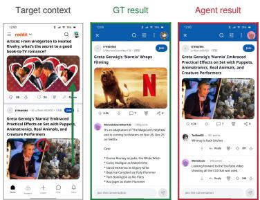  
(a) Before target exposure.

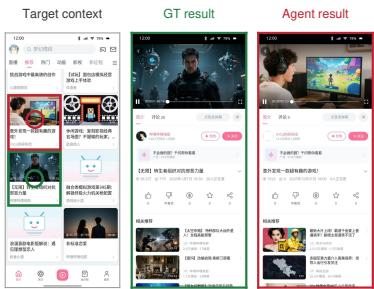  
(b) After target exposure.

## RePAIR improves cross-user reliability on unseen personas.

We first adapt the base model to the benchmark tasks with supervised fine-tuning. This substantially improves SAR in user-agnostic contexts (+17.7 pp) but yields smaller gains in user-conditioned contexts (+4.24 pp) and no improvement in all-success, leaving difficulties in user-conditioned contexts and cross-user inconsistency unresolved. We then apply Re-PAIR to examine whether learning from cross-user differences

Figure 8: Personal-target failures in user-conditioned contexts: the agent selects an incorrect item (a) before target exposure and (b) after the target becomes visible. Red: agent action; green: ground truth.

improves reliability in user-conditioned contexts. RePAIR improves user-conditioned SAR (+5.87 pp), the all-success rate (+7.50 pp), and overall Task SR (+9.42 pp) on unseen users. The gain in user-conditioned SAR indicates greater robustness to user-conditioned interface variation, while the increase in the all-success rate reflects more consistent task completion across users (see Figure 7(a)).

The concurrent improvement in task success further shows that these gains translate to better endto-end performance. To this end, we vary the training user pool size $n _ { \mathrm { p } }$ and the number of training iterations. Increasing $n _ { \mathrm { p } }$ from 1 to 8 improves overall Task SR after both 5 (+8.6 pp) and 10 (+9.7 pp) iterations (Figure 7(b)). However, extending training from 5 to 10 iterations decreases Task SR for $n _ { \mathrm { p } } = 2 ( - 2 . 3 \mathrm { p p } )$ and $n _ { \mathrm { p } } = 5 \left( - 2 . 4 \mathrm { p p } \right)$ , while improving it for $n _ { \mathrm { p } } = 8 \left( + 1 . 8 \mathrm { p p } \right)$ . These results suggest that the benefit of additional RePAIR training depends on user-pool diversity, with repeated comparisons improving unseen-user performance only when training spans a broad set of users.

## 7 CONCLUSION AND FUTURE WORK

We systematically study cross-user reliability in mobile GUI agents: whether the same request is completed consistently across user-conditioned application states. We introduce PAIR, which constructs such states for controlled evaluation, and RePAIR, which trains from cross-user differences in user-conditioned subgoal outcomes. Experiments reveal cross-user performance variation, lower subgoal achievement in user-conditioned contexts, especially for personal targets, and incorrect selections before and after target exposure; RePAIR improves performance and consistency on unseen personas, providing initial evidence that cross-user differences can serve as a useful training signal.

These findings suggest several directions for future work. 1) Develop training methods that leverage cross-user differences in subgoal outcomes to improve reliability in user-conditioned contexts. 2) Strengthen target grounding through uncertainty-aware search, target verification, and recovery from incorrect-item selections before and after target exposure. 3) Determine the optimal balance between persona pool size and the number of training iterations to improve generalization to unseen users.

## REFERENCES

Shuai Bai, Yuxuan Cai, Ruizhe Chen, Keqin Chen, Xionghui Chen, Zesen Cheng, Lianghao Deng, Wei Ding, Chang Gao, Chunjiang Ge, et al. Qwen3-vl technical report. arXiv preprint arXiv:2511.21631, 2025.

Gongwei Chen, Xurui Zhou, Rui Shao, Yibo Lyu, Kaiwen Zhou, Shuai Wang, Wentao Li, Yinchuan Li, Zhongang Qi, and Liqiang Nie. Less is more: Empowering gui agent with context-aware simplification. In 2025 IEEE/CVF International Conference on Computer Vision (ICCV), pp. 5901–5911. IEEE, 2025.

Sen Chen, Tong Zhao, Yi Bin, Fei Ma, Wenqi Shao, and Zheng Wang. D-gara: A dynamic benchmarking framework for gui agent robustness in real-world anomalies. In Proceedings of the AAAI Conference on Artificial Intelligence, volume 40, pp. 17419–17426, 2026a.

Tongbo Chen, Zhengxi Lu, Zhan Xu, Guocheng Shao, Shaohan Zhao, Fei Tang, Yong Du, Kaitao Song, Yizhou Liu, Yuchen Yan, et al. Knowu-bench: Towards interactive, proactive, and personalized mobile agent evaluation. arXiv preprint arXiv:2604.08455, 2026b.

Kanzhi Cheng, Qiushi Sun, Yougang Chu, Fangzhi Xu, Li YanTao, Jianbing Zhang, and Zhiyong Wu. SeeClick: Harnessing GUI grounding for advanced visual GUI agents. In Proceedings ofthe 62nd Annual Meeting of the Association for Computational Linguistics (Volume 1: Long Papers), pp. 9313–9332, Bangkok, Thailand, August 2024. Association for Computational Linguistics. URL https://aclanthology.org/2024.acl-long.505.

Xiang Deng, Yu Gu, Boyuan Zheng, Shijie Chen, Sam Stevens, Boshi Wang, Huan Sun, and Yu Su. Mind2web: Towards a generalist agent for the web. Advances in Neural Information Processing Systems, 36:28091–28114, 2023.

Motahhare Eslami, Aimee Rickman, Kristen Vaccaro, Amirhossein Aleyasen, Andy Vuong, Karrie Karahalios, Kevin Hamilton, and Christian Sandvig. ” i always assumed that i wasn’t really that close to [her]” reasoning about invisible algorithms in news feeds. In Proceedings of the 33rd annual ACM conference on human factors in computing systems, pp. 153–162, 2015.

Leah Findlater and Joanna McGrenere. A comparison of static, adaptive, and adaptable menus. In Proceedings ofthe SIGCHI conference on Humanfactors in computing systems, pp. 89–96, 2004.

Zhiqi Ge, Juncheng Li, Xinglei Pang, Minghe Gao, Kaihang Pan, Wang Lin, Hao Fei, Wenqiao Zhang, Siliang Tang, and Yueting Zhuang. Iris: Breaking gui complexity with adaptive focus and self-refining. In 2025 IEEE/CVF International Conference on Computer Vision (ICCV), pp. 1–10. IEEE, 2025.

Edward J Hu, Yelong Shen, Phillip Wallis, Zeyuan Allen-Zhu, Yuanzhi Li, Shean Wang, Lu Wang, and Weizhu Chen. Lora: Low-rank adaptation of large language models. arXiv preprint arXiv:2106.09685, 2021.

Lawrence Keunho Jang, Mareks Woodside, Geronimo Carom, Andrew Keunwoo Jang, Jing Yu Koh, and Ruslan Salakhutdinov. iosworld: A benchmark for personally intelligent phone agents. arXiv preprint arXiv:2606.09764, 2026.

Serin Kim, Sangam Lee, and Dongha Lee. Persona2web: Benchmarking personalized web agents for contextual reasoning with user history. In Forty-third International Conference on Machine Learning, 2026. URL https://openreview.net/forum?id=qvvD9hgHoX.

Woosuk Kwon, Zhuohan Li, Siyuan Zhuang, Ying Sheng, Lianmin Zheng, Cody Hao Yu, Joseph E. Gonzalez, Hao Zhang, and Ion Stoica. Efficient memory management for large language model serving with pagedattention. In Proceedings of the ACM SIGOPS 29th Symposium on Operating Systems Principles, 2023.

Xiao Liu, Bo Qin, Dongzhu Liang, Guang Dong, Hanyu Lai, Hanchen Zhang, Hanlin Zhao, Iat Long Iong, Jiadai Sun, Jiaqi Wang, et al. Autoglm: Autonomous foundation agents for guis. arXiv preprint arXiv:2411.00820, 2024.

Ilya Loshchilov and Frank Hutter. Decoupled weight decay regularization. In International Conference on Learning Representations, 2019. URL https://openreview.net/forum?id= Bkg6RiCqY7.

Yibo Lyu, Gongwei Chen, Rui Shao, Weili Guan, and Liqiang Nie. Personalalign: Hierarchical implicit intent alignment for personalized gui agent with long-term user-centric records. In Proceedings ofthe 64th Annual Meeting ofthe Associationfor Computational Linguistics (Volume 1: Long Papers), pp. 36074–36089, 2026.

Hongyi Nie, Xunyuan Liu, Yudong Bai, Yaqing Wang, Yang Liu, Quanming Yao, and Zhen Wang. Pspa-bench: A personalized benchmark for smartphone gui agent. arXiv preprint arXiv:2603.29318, 2026.

OpenAI. gpt-oss-120b & gpt-oss-20b model card, 2025. URL https://arxiv.org/abs/ 2508.10925.

Yujia Qin, Yining Ye, Junjie Fang, Haoming Wang, Shihao Liang, Shizuo Tian, Junda Zhang, Jiahao Li, Yunxin Li, Shijue Huang, et al. Ui-tars: Pioneering automated gui interaction with native agents. arXiv preprint arXiv:2501.12326, 2025.

Nils Reimers and Iryna Gurevych. Sentence-bert: Sentence embeddings using siamese bert-networks. In Proceedings of the 2019 Conference on Empirical Methods in Natural Language Processing. Association for Computational Linguistics, 11 2019. URL http://arxiv.org/abs/1908. 10084.

Zhihong Shao, Peiyi Wang, Qihao Zhu, Runxin Xu, Junxiao Song, Xiao Bi, Haowei Zhang, Mingchuan Zhang, YK Li, Yang Wu, et al. Deepseekmath: Pushing the limits of mathematical reasoning in open language models. arXiv preprint arXiv:2402.03300, 2024.

Shuoxin Wang, Chang Liu, Gowen Loo, Lifan Zheng, Kaiwen Wei, Xinyi Zeng, Jingyuan Zhang, and Yu Tian. Me-Agent: A personalized mobile agent with two-level user habit learning for enhanced interaction, 2026a. URL https://arxiv.org/abs/2601.20162.

Yangyue Wang, Harshvardhan Sikka, Yash Mathur, Tony Zhou, Jinu Nyachhyon, and Pranav Guruprasad. Gui-perturbed: Domain randomization reveals systematic brittleness in gui grounding models. arXiv preprint arXiv:2604.14262, 2026b.

Dingbang Wu, Rui Hao, Haiyang Wang, Shuzhe Wu, Han Xiao, Zhenghong Li, Bojiang Zhou, Zheng Ju, Zichen Liu, Lue Fan, and Zhaoxiang Zhang. MobileGym: A verifiable and highly parallel simulation platform for mobile GUI agent research. In Proceedings of the 2026 Conference on Empirical Methods in Natural Language Processing. Association for Computational Linguistics, 2026. URL https://arxiv.org/abs/2605.26114. To appear.

Qianhui Wu, Kanzhi Cheng, Rui Yang, Chaoyun Zhang, Jianwei Yang, Huiqiang Jiang, Jian Mu, Baolin Peng, Bo Qiao, Reuben Tan, Si Qin, Lars Liden, Qingwei Lin, Huan Zhang, Tong Zhang, Jianbing Zhang, Dongmei Zhang, and Jianfeng Gao. GUI-actor: Coordinate-free visual grounding for GUI agents. In The Thirty-ninth Annual Conference on Neural Information Processing Systems, 2025. URL https://openreview.net/forum?id=5fSkinHw7w.

Haiyang Xu, Xi Zhang, Haowei Liu, Junyang Wang, Zhaozai Zhu, Shengjie Zhou, Xuhao Hu, Feiyu Gao, Junjie Cao, Zihua Wang, et al. Mobile-agent-v3. 5: Multi-platform fundamental gui agents. arXiv preprint arXiv:2602.16855, 2026a.

Yifan Xu, Xiao Liu, Xinghan Liu, Jiaqi Fu, Jiayu Huang, Hanchen Zhang, Bohao Jing, Shudan Zhang, Yuting Wang, Yuxiao Dong, et al. Mobilerl: Online agentic reinforcement learning for mobile gui agents. In International Conference on Learning Representations, volume 2026, pp. 35282–35315, 2026b.

Jingqi Yang, Zhilong Song, Jiawei Chen, Mingli Song, Sheng Zhou, Linjun Sun, Xiaogang Ouyang, Chun Chen, and Can Wang. Gui-robust: A comprehensive dataset for testing gui agent robustness in real-world anomalies. In Proceedings of the 32nd ACM SIGKDD Conference on Knowledge Discovery and Data Mining V. 1, pp. 2842–2853, 2026a.

Qinglong Yang, Haoming Li, Haotian Zhao, Xiaokai Yan, Jingtao Ding, Fengli Xu, and Yong Li. Fingertip 20k: A benchmark for proactive and personalized mobile LLM agents. In The Fourteenth International Conference on Learning Representations, 2026b. URL https://openreview. net/forum?id=n3iFV0gLMc.

Wenkui Yang, Chao Jin, Haisu Zhu, Weilin Luo, Derek Yuen, Kun Shao, Junxian Duan, Huaibo Huang, Jie Cao, and Ran He. Are gui agents focused enough? automated distraction via semanticlevel ui element injection. In European Conference on Computer Vision, pp. 115–132. Springer, 2026c.

Kuai Yu, Naicheng Yu, Han Wang, Rui Yang, and Huan Zhang. How do visual attributes influence web agents? a comprehensive evaluation of user interface design factors. In Maria Liakata, Viviane P. Moreira, Jiajun Zhang, and David Jurgens (eds.), Findings ofthe Associationfor Computational Linguistics: ACL 2026, pp. 34520–34536, San Diego, California, United States, July 2026. Association for Computational Linguistics. ISBN 979-8-89176-395-1. doi: 10.18653/v1/2026. findings-acl.1723. URL https://aclanthology.org/2026.findings-acl.1723/.

Yuyang Zhao, Wentao Shi, Fuli Feng, and Xiangnan He. AppAgent-Pro: A Proactive GUI Agent System for Multidomain Information Integration and User Assistance, August 2025a. URL http://arxiv.org/abs/2508.18689. arXiv:2508.18689 [cs].

Zheng Zhao, Clara Vania, Subhradeep Kayal, Naila Khan, Shay B Cohen, and Emine Yilmaz. Personalens: A benchmark for personalization evaluation in conversational ai assistants. In Findings ofthe Associationfor Computational Linguistics: ACL 2025, pp. 18023–18055, 2025b.

Boyuan Zheng, Boyu Gou, Jihyung Kil, Huan Sun, and Yu Su. GPT-4V(ision) is a generalist web agent, if grounded. In Proceedings ofthe 41st International Conference on Machine Learning, volume 235 of Proceedings of Machine Learning Research. PMLR, 2024. URL https:// proceedings.mlr.press/v235/zheng24e.html.

Hanzhang Zhou, Xu Zhang, Panrong Tong, Jianan Zhang, Liangyu Chen, Quyu Kong, Chenglin Cai, Chen Liu, Yue Wang, Jingren Zhou, et al. Mai-ui technical report: Real-world centric foundation gui agents. arXiv preprint arXiv:2512.22047, 2025.

## A FINGERTIP-20K ANALYSIS

Data. All six models are evaluated on the same 103,199 steps from the FingerTip-20K (Yang et al., 2026b) training split: 12,016 episodes, 83 users and 102 app labels. We retain supported actions with available screenshots from apps used by at least five users. Each prediction uses the recorded screenshot, instruction and human action history. Later screenshots follow the human demonstration.

Screen labels and segments. A text label is user-specific if its normalized form appears for only one user within an app. A screen is user-conditioned (UC) if it contains such a label. Numeric and time labels are included; icons and unknown labels are excluded. Labels are not filtered by pixel visibility. Consecutive screens form a segment until the Jaccard similarity of labels outside scrollable regions falls below 0.475; two empty sets have similarity one. This gives 60,383 segments: 51,761 UC and 8,622 without UC elements.

Scoring. An action must have the correct type. For clicks and long clicks, the pixel distance from the reference position, divided by the image diagonal and rounded to four decimals, must be at most 0.14. Scroll direction must match; text is compared after removing whitespace and lowercasing. Other supported actions are scored by type, and parsing failures are incorrect. A segment succeeds only if all its actions are correct. All 60,383 segments are included.

Target exposure. The exposure analysis uses 29,640 segments with a labeled exit target. A clickable element matches the target label if character-bigram Jaccard similarity is at least 0.85, target-bigram coverage is at least 0.8, the shared prefix has at least six characters, or the matching substring has at least eight. This text-based measure does not establish visual attention. Differences between screen groups are descriptive; tasks, apps and segment lengths are not controlled.

## B PAIR IMPLEMENTATION, SCREENS AND DATASET STATISTICS

## B.1 USER-CONDITIONED APPLICATION STATE GENERATION

PAIR converts PersonaLens (Zhao et al., 2025b) interests into app-specific queries. Content is ranked by name matches (score 1) or cosine similarity using paraphrase-multilingual-MiniLM-L12-v2 (Reimers & Gurevych, 2019) with mean pooling, L2 normalization and a 96-token limit. Duplicate IDs/names and reserved Common items are removed before selection. Common items are then added, and lists are shuffled using seed-0 hashes. Most lists contain 20 items. App-specific generators also create transactions, chats and meetings. The records keep their IDs and media links and are rendered by MobileGym (Wu et al., 2026).

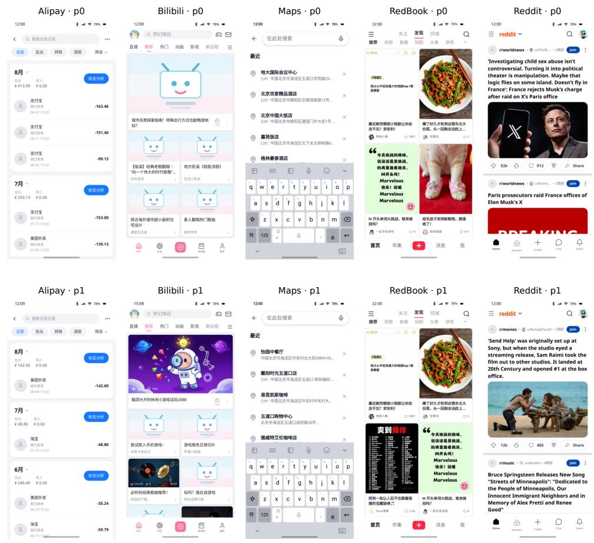  
Figure 9: Generated screens for p0 (top) and p1 (bottom). Each column shows the same app and screen location for both personas.

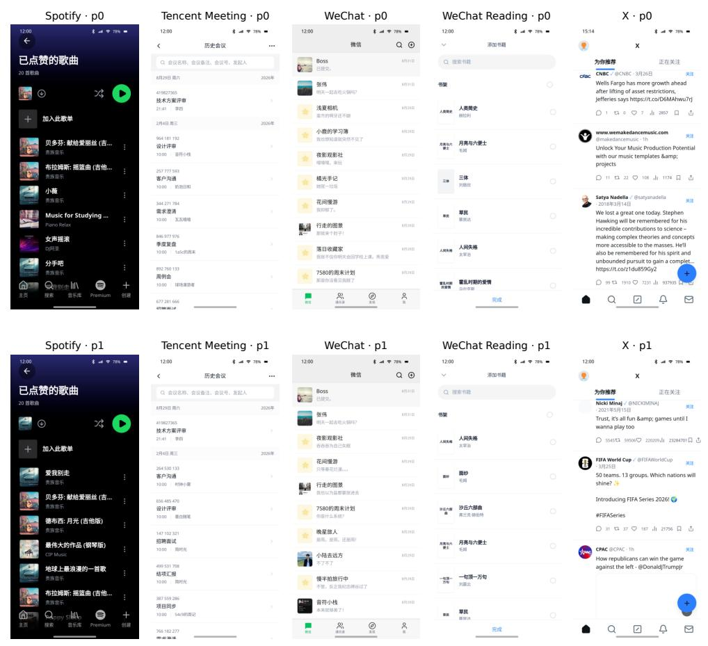  
Figure 10: Persona comparison for the remaining five apps: p0 (top), p1 (bottom).

## B.2 TASK GENERATION

Common targets are shared across personas; Personal targets come from each persona’s data. Explicit and Implicit instructions refer to the same target. All four conditions use the same initial state for a template/persona pair, reset before each episode. The instruction writer (openai/gpt-oss-120b (OpenAI, 2025)) and reviewer use the candidate records. Agents receive only screenshots, instructions and action history.

All 1,200 test instances are evaluated against their designated targets, including cases with unresolved review flags. Automatic review does not guarantee a unique interpretation of every Implicit instruction.

Table 3: Apps and target screens. RedBook is also called Xiaohongshu.
<table><tr><td>Application</td><td>Target UI contexts</td></tr><tr><td>Alipay</td><td>Billing history; message list</td></tr><tr><td>Bilibili</td><td>Subscriptions; home recommendations; liked videos</td></tr><tr><td>Maps</td><td>Recent searches</td></tr><tr><td>RedBook</td><td>Saved notes; liked notes; discover feed</td></tr><tr><td>Reddit</td><td>Home feed</td></tr><tr><td>Spotify</td><td>Liked songs; recently played tracks; home playlists</td></tr><tr><td>Tencent Meeting</td><td>Meeting history; scheduled meetings</td></tr><tr><td>WeChat</td><td>Chat list; Moments</td></tr><tr><td>WeChat Reading X</td><td>Home reading list; Add Favorite Book; recommendations For You feed</td></tr></table>

Table 4: All 30 task templates. Each operation applies to the designated Common/Personal target under Explicit/Implicit instructions.
<table><tr><td>Application</td><td>Task ID</td><td>Target</td><td>Task Template</td></tr><tr><td>Alipay</td><td>GG-ALI-01</td><td>Transaction</td><td>Open the transaction in billing history.</td></tr><tr><td>Alipay</td><td>GG-ALI-02</td><td>Conversation</td><td>Open the conversation in the message list.</td></tr><tr><td>Alipay</td><td>GG-ALI-03</td><td>Conversation</td><td>Open the conversation; reply exactly “Únderstood".</td></tr><tr><td>Bilibili</td><td>GG-BIL-01</td><td>Video</td><td>Open the subscription video and like it.</td></tr><tr><td>Bilibili</td><td>GG-BIL-02</td><td>Video</td><td>Open the home recommendation video.</td></tr><tr><td>Bilibili</td><td>GG-BIL-03</td><td>Video</td><td>Open the video in Liked Videos.</td></tr><tr><td>Maps</td><td>GG-MAP-01</td><td>Place</td><td>Open place details from recent searches.</td></tr><tr><td>Maps</td><td>GG-MAP-02</td><td>Place</td><td>Get directions to the place in recent searches.</td></tr><tr><td>Maps</td><td>GG-MAP-03</td><td>Place</td><td>Open place details from recent searches.</td></tr><tr><td>RedBook</td><td>GG-RBK-01</td><td>Note</td><td>Open the saved note.</td></tr><tr><td>RedBook</td><td>GG-RBK-02</td><td>Note</td><td>Open the liked note.</td></tr><tr><td>RedBook</td><td>GG-RBK-03</td><td>Note</td><td>Open the discover-feed note and save it.</td></tr><tr><td>Reddit</td><td>GG-RDT-01</td><td>Post</td><td>Open the home-feed post.</td></tr><tr><td>Reddit</td><td>GG-RDT-02</td><td>Post</td><td>Open the post; comment exactly “Thank you".</td></tr><tr><td>Reddit</td><td>GG-RDT-03</td><td>Post</td><td>Open the home-feed post.</td></tr><tr><td>Spotify</td><td>GG-SPT-01</td><td>Song</td><td>Add the liked song to a new “Rainy Night"</td></tr><tr><td>Spotify</td><td>GG-SPT-02</td><td>Song</td><td>playlist. Play the recently played song.</td></tr><tr><td>Spotify</td><td>GG-SPT-03</td><td>Playlist</td><td>Open the home-screen playlist.</td></tr><tr><td>Tencent Meeting</td><td>GG-MTG-01</td><td>Meeting</td><td>Open the meeting in history.</td></tr><tr><td>Tencent Meeting</td><td>GG-MTG-02</td><td>Meeting</td><td>Open the scheduled meeting.</td></tr><tr><td>Tencent Meeting</td><td>GG-MTG-03</td><td>Meeting</td><td>Open the meeting in history.</td></tr><tr><td>WeChat</td><td>GG-WCT-01</td><td>Chat</td><td>Open the chat.</td></tr><tr><td>WeChat</td><td>GG-WCT-02</td><td>Chat</td><td>Open the chat; reply exactly “Understood".</td></tr><tr><td>WeChat</td><td>GG-WCT-03</td><td>Author</td><td>Open the author's profile from Moments.</td></tr><tr><td>WeChat Reading</td><td>GG-WRE-01</td><td>Book</td><td>Open the book in the home reading list.</td></tr><tr><td>WeChat Reading</td><td>GG-WRE-02</td><td>Book</td><td>Add the book using Add Favorite Book.</td></tr><tr><td>WeChat Reading</td><td>GG-WRE-03</td><td>Book</td><td>Open the recommended book.</td></tr><tr><td>X</td><td>GG-X-01</td><td>Post</td><td>Open the For You post.</td></tr><tr><td>X</td><td>GG-X-02</td><td>Post</td><td>Open the For You post.</td></tr><tr><td>X</td><td>GG-X-03</td><td>Post</td><td>Open the For You post.</td></tr></table>

## B.3 REFERENCE SUBGOALS BY TASK

Table 5 expands the task templates in Table 4 into their ordered reference subgoals. Each subgoal specifies an objective associated with a UI context and may involve multiple actions, including scrolling, typing, and clicking. The sequence is shared across Common/Personal targets and Explicit/Implicit instructions; the designated target is determined by the task instance. These descriptions specify the reference objectives; the RePAIR training reward is defined separately in Appendix C.

Table 5: The 67 reference subgoal positions across all 30 task templates included in our analysis. The optional library-to-history navigation step in GG-SPT-02 is excluded, and the remaining positions are numbered consecutively within each task.
<table><tr><td>Task ID</td><td>Ordered subgoals</td></tr><tr><td>GG-ALI-01</td><td>(1) Open My from the home screen; (2) Open billing history; (3) Open the designated transaction details.</td></tr><tr><td>GG-ALI-02</td><td>(1) Open the message list from the home screen; (2) Open the designated conversation.</td></tr><tr><td>GG-ALI-03</td><td>(1) Open the message list from the home screen; (2) Open the designated conversation; (3) Enter and send “Understood”.</td></tr><tr><td>GG-BIL-01</td><td>(1) Open Following from the recommendation home screen; (2) Switch to the video tab; (3) Open the designated video; (4) Like the designated video.</td></tr><tr><td>GG-BIL-02</td><td>(1) Open the designated video from the home recommendation feed.</td></tr><tr><td>GG-BIL-03</td><td>(1) Open Me from the recommendation home screen; (2) Open the personal space; (3) Open the liked-video list; (4) Open the designated video.</td></tr><tr><td>GG-MAP-01</td><td>(1) Open search from the map home screen; (2) Open the designated place details from recent searches.</td></tr><tr><td>GG-MAP-02</td><td>(1) Open search from the map home screen; (2) Select the designated place from recent searches; (3) Open directions to the designated place.</td></tr><tr><td>GG-MAP-03</td><td>(1) Open search from the map home screen; (2) Open the designated place details from recent searches.</td></tr><tr><td>GG-RBK-01</td><td>(1) Open Me from the discovery home screen; (2) Open the saved-notes tab; (3) Open the designated note.</td></tr><tr><td>GG-RBK-02</td><td>(1) Open Me from the discovery home screen; (2) Open the liked-notes tab; (3) Open the designated note.</td></tr><tr><td>GG-RBK-03</td><td>(1) Open the designated note from the discovery feed; (2) Save the designated note.</td></tr><tr><td>GG-RDT-01</td><td>(1) Open the designated post from the home feed.</td></tr><tr><td>GG-RDT-02</td><td>(1) Open the designated post from the home feed; (2) Enter and submit the comment “Thank you&quot;.</td></tr><tr><td>GG-RDT-03</td><td>(1) Open the designated post from the home feed.</td></tr><tr><td>GG-SPT-01</td><td>(1) Open the library from the home screen; (2) Open Liked Songs; (3) Open the menu for the designated track; (4) Select Add to playlist; (5) Select the option to create a new playlist; (6) Create the playlist named “Rainy Night&quot; and complete the track addition.</td></tr><tr><td>GG-SPT-02</td><td>(1) Open the library from the home screen; (2) Expand the recent-play group; (3) Play the designated track within the expanded group.</td></tr><tr><td>GG-SPT-03</td><td>(1) Open the designated playlist from the home screen.</td></tr></table>

Continued on next page

<table><tr><td>Task ID</td><td>Ordered subgoals (continued)</td></tr><tr><td>GG-MTG-01</td><td>(1) Open meeting history from the home screen; (2) Open the designated meeting details.</td></tr><tr><td>GG-MTG-02</td><td>(1) Open the designated scheduled meeting details from the home screen.</td></tr><tr><td>GG-MTG-03</td><td>(1) Open meeting history from the home screen; (2) Open the designated meeting details.</td></tr><tr><td>GG-WCT-01</td><td>(1) Open the designated conversation from the chat list.</td></tr><tr><td>GG-WCT-02</td><td>(1) Open the designated conversation from the chat list; (2) Enter and send “Understood&quot;.</td></tr><tr><td>GG-WCT-03</td><td>(1) Open Discover from the chat list; (2) Open Moments; (3) Open the designated author&#x27;s profile.</td></tr><tr><td>GG-WRE-01 GG-WRE-02</td><td>(1) Open the designated book from the home reading list. (1) Open Me from the reading home screen; (2) Open the book-list screen; (3) Open the list</td></tr><tr><td></td><td>editor; (4) Open Add Favorite Book; (5) Select the designated book and confirm its addition.</td></tr><tr><td>GG-WRE-03 GG-X-01</td><td>(1) Open the designated book from the home recommendations.</td></tr><tr><td>GG-X-02</td><td>(1) Open the designated post from the For You feed. (1) Open the designated post from the For You feed.</td></tr><tr><td>GG-X-03</td><td></td></tr><tr><td></td><td>(1) Open the designated post from the For You feed.</td></tr></table>

## C TRAINING REWARDS AND ALGORITHM

Reward calculation. We compute a binary reward for each subgoal from the recorded trajectory. A subgoal first requires evidence that its entry screen was observed before an action; appearing only in the final screen is insufficient. For a nonterminal subgoal, reward one additionally requires either a recorded route corresponding to a later subgoal in the reference path or a click on an expected item or control. For the terminal subgoal, defined as the last subgoal in the reference path, reward one instead requires the task judge to report success. Reward labels and matching criteria are used only for scoring and are not provided to the agent.

For rollout i and subgoal k, let $E _ { i k }$ indicate the required entry observation, $L _ { i k }$ a matching laterreference route in any observation or the final screen, and $C _ { i k }$ an expected click anywhere in the log. Let $J _ { i }$ be the binary task-judge outcome. The reward is

$$
\begin{array} { r } { r _ { i k } = \left\{ \begin{array} { l l } { 0 , } & { E _ { i k } = 0 , } \\ { J _ { i } , } & { E _ { i k } = 1 \mathrm { a n d } k \mathrm { i s } \mathrm { t e r m i n a l } , } \\ { 1 , } & { E _ { i k } = 1 , k \mathrm { n o n t e r m i n a l } , \mathrm { a n d } ( L _ { i k } \vee C _ { i k } ) , } \\ { 0 , } & { \mathrm { o t h e r w i s e } . } \end{array} \right. } \end{array}\tag{7}
$$

Matching rules. Route matching compares URL paths after removing query parameters; app identity and screen state are not used. Expected items and controls are specified by the task template. A target-item click matches when its recorded IDs include the designated target ID or identity. Other controls match by trigger ID or by a substring match in either direction between whitespacenormalized labels. The scorer searches the entire log without enforcing visit order. Here, “later” refers to the order of subgoals in the reference path, not the order of observations in the rollout.

Policy update. Each iteration collects 124 rollouts with a fixed policy and performs one LoRA update per four-rollout group. Rollout-policy and SFT-reference token log probabilities are cached as specified in the pseudocode below.

Table 6: RePAIR training pseudocode $( K = 8 ; N \in \{ 5 , 1 0 \}$ training iterations). θ denotes trainable LoRA parameters; $h _ { i t }$ is the recorded token prefix and $y _ { i t }$ a response token. $T _ { i }$ counts response tokens over the entire trajectory, across all actions.

1 $\theta \gets \mathrm { S F T } ( \theta _ { \mathrm { b a s e } } , \mathcal { D } _ { \mathrm { E x p l i c i t } } )$ for one epoch; freeze $\theta _ { \mathrm { r e f } }  \theta .$   
2 Build fixed persona pools and a repeating five-iteration pair schedule.   
3 for training iteration ${ \bf \bar { \boldsymbol { j } } } = 1 , \ldots , { \bar { \boldsymbol { N } } }$ do   
4 Fix rollout policy $\theta _ { \mathrm { o l d } }  \theta$ for this iteration.   
5 for each of the 31 task–condition pairs q do   
6 Select the scheduled pair; collect two full rollouts per slot with vLLM.   
7 Cache the four trajectories and their rollout-policy token log probabilities.   
8 Cache SFT-reference token log probabilities; reset AdamW and the 31-update cosine schedule.   
9 for each cached group in fixed task order do   
10 Compute subgoal rewards $r _ { i k }$ using Section C.   
11 $a _ { i k }  ( r _ { i k } - \mu _ { k } ) / \sqrt { \sigma _ { k } ^ { 2 } + 1 0 ^ { - 8 } }$ , using the mean and population variance over $i = 1 , \ldots , 4 .$   
12 $\begin{array} { r } { A _ { i } \gets | \mathcal { U } _ { q } | ^ { - 1 } \sum _ { k \in \mathcal { U } _ { a } } a _ { i k } ; \mathcal { U } _ { q } } \end{array}$ is the UC-subgoal set (use zero if empty).   
13 Recompute current-policy token log probabilities; reuse cached SFT-reference scores.   
14 $\rho _ { i t } \gets \pi _ { \theta } ( y _ { i t } \mid h _ { i t } ) / \pi _ { \mathrm { o l d } } ( y _ { i t } \mid h _ { i t } ) ; d _ { i t } \gets \log \pi _ { \mathrm { r e f } } ( y _ { i t } \mid h _ { i t } ) - \log \pi _ { \theta } ( y _ { i t } \mid h _ { i t } )$   
15 $\ell _ { i t } \gets - \operatorname* { m i n } \{ \rho _ { i t } A _ { i } , \mathrm { c l i p } ( \rho _ { i t } , 0 . 8 , 1 . 2 ) A _ { i } \} + 0 . 0 1 ( e ^ { d _ { i t } } - d _ { i t } - 1 ) .$   
16 Take one AdamW step on $\begin{array} { r } { \frac { 1 } { 4 } \sum _ { i = 1 } ^ { 4 } \frac { 1 } { T _ { i } } \sum _ { t = 1 } ^ { T _ { i } } \ell _ { i t } ; } \end{array}$ clip gradient norm to 1.0 and advance the scheduler.   
17 Save the iteration checkpoint.   
18 return the iteration-N adapter (124N rollouts; 31N optimizer updates).

## D EXPERIMENTAL AND TRAINING SETUP

Evaluation. We evaluate Qwen3-VL-8B, Qwen3-VL-30B-A3B, GUI-Owl-1.5-8B-Think, MAI-UI-8B, AutoGLM-Phone-9B-Multilingual and UI-TARS-1.5-7B on the same 1,200 test instances. Decoding uses temperature 0, top-p 1 and seed 0, with each model’s action format. The action limit is 20 for 840 instances and 30 for 360. Output limits are 1,024 tokens for Qwen/SFT/RePAIR, 2,048 for MAI-UI and 3,000 for AutoGLM; GUI-Owl/UI-TARS limits are not specified in the saved request configs. Task SR uses all instances; all-success uses 120 ten-persona groups; SAR uses reached subgoals at the 67 reference positions.

SFT. Qwen3-VL-8B-Instruct is fine-tuned on successful Explicit-instruction oracle demonstrations across all 30 task templates. Of the 480 Explicit task instances from the eight training personas, three failed oracle executions are excluded, leaving 477 demonstrations containing 1,876 actions. Validation uses 119 successful demonstrations containing 469 actions, after excluding one failed execution from 120 instances. All four excluded executions are from X and failed to reach the designated target route.

Implicit instructions, designated targets, and initial states are available, but separate Implicit oracle demonstrations were not collected. SFT therefore uses only Explicit demonstrations. LoRA (Hu et al., 2021) updates the language model’s q/k/v/o attention projections; the vision encoder is frozen. One epoch gives 235 updates using assistant-response loss. Training uses bf16, SDPA and gradient checkpointing on an RTX 6000 Ada (PyTorch 2.13.0+cu130, Transformers 4.57.6, PEFT 0.18.1).

Table 7: Core optimization settings. RePAIR inherits the SFT LoRA adapter.
<table><tr><td>Setting</td><td>SFT</td><td>RePAIR</td></tr><tr><td>LoRA rank / alpha</td><td>16 /32</td><td>16 / 32</td></tr><tr><td>Dropout</td><td>0.05</td><td>Disabled during updates</td></tr><tr><td>Optimizer</td><td>AdamW (Loshchilov &amp; Hutter, 2019)</td><td>AdamW</td></tr><tr><td>Learning rate</td><td>10−4</td><td>10−5</td></tr><tr><td>Weight decay / norm clipping</td><td>0 / 1.0</td><td>0 / 1.0</td></tr><tr><td>Scheduler / warmup</td><td>Cosine / 3%</td><td>Iteration-wise cosine / 3%</td></tr><tr><td>Update unit</td><td>8 action samples</td><td>4 full-task rollouts</td></tr><tr><td>Policy ratio clip</td><td></td><td>0.2</td></tr><tr><td>Reference KL coefficient</td><td></td><td>0.01 (fixed SFT)</td></tr></table>

RePAIR task selection. A task specification is a combination of task template, target type (Common or Personal), and instruction type (Explicit or Implicit). The 30 templates yield 120 specifications, each evaluated across ten personas, p0 to p9. For each model, a specification is classified as mixed when its final-goal outcomes include both successes and failures across these personas.

We select specifications classified as mixed by all five baselines in the frozen September 16, 2026 analysis: Qwen3-VL-8B, Qwen3-VL-30B-A3B, GUI-Owl, MAI-UI, and AutoGLM. This yields 31 specifications spanning 18 templates, comprising 12 Common and 19 Personal specifications, or 8 Explicit and 23 Implicit specifications.

Selection uses the historical AutoGLM results preceding its greedy rerun and excludes UI-TARS. The selected list is held fixed across subsequent training experiments rather than recomputed from updated baseline results.

RePAIR training. The 31 selected specifications are instantiated for the eight training personas p10 to p17, yielding 248 distinct task instances. Each training iteration collects four full-task rollouts per specification, totaling 124 rollouts and 31 optimizer updates. Both Explicit and Implicit tasks are included: the policy generates trajectories that are scored using recorded routes, actions, and the task judge, without requiring oracle demonstrations.

Seeded selection forms fixed pools of K ∈ {1, 2, 5, 8} personas. K1 uses one persona, K2 a fixed pair, and K5/K8 cycle pairs; four Reddit task–condition pairs allow same-persona sampling to keep subgoal labels consistent. Group compatibility requires matching ordered subgoal IDs and UA/UC labels across the full reference path. For each scheduled pair, we collect two rollouts per persona slot, resetting the corresponding task instance to its stored initial state before every rollout. Only UC-subgoal rewards are used to compute the trajectory advantage. Rollouts use temperature 0.8, top-p 1, top-k −1, min-p 0 and a 1,024-token output limit. Five/ten iterations give 620/1,240 rollouts and 155/310 updates. Iterations 6 to 10 repeat the persona schedule with new rollouts, continuing from iteration 5. The main result uses K8 at iteration 5; validation is not used to select it. SFT uses seed 0; RePAIR uses seed j − 1 at iteration j with derived update seeds.

Selection and review scope. Training rollouts use personas p10 to p17, disjoint from the evaluation personas p0 to p9. However, task specifications were selected using earlier baseline outcomes on p0 to p9. Thus, evaluation personas are held out from policy optimization, but their baseline result informed training-task selection. We interpret the RePAIR study as an exploratory intervention informed by the preceding analysis.

The p10 to p19 inputs have not completed semantic and browser review. Successful oracle execution and subsequent model rollouts do not establish completion of that review.

vLLM. We use vLLM (Kwon et al., 2023) for inference, with server seed 0 and GPU memory utilization 0.9. Qwen baselines use an 8,192-token batch budget and image bounds of 3,136 to 12,845,056 pixels; AutoGLM uses at most 5,000,000 pixels. K8 rollout logs for iterations 1 to 5 record vLLM 0.19.0, bf16, prefix caching and chunked prefill. These settings are not verified for all earlier FingerTip or recovery runs.

Table 8: vLLM settings from evaluation configs and training logs. TP: tensor parallelism; Context: token limit; Sequences/Images: per-server and per-request limits, respectively.
<table><tr><td>Model / use</td><td>TP</td><td>Context</td><td>Sequences</td><td>Images</td></tr><tr><td>Qwen3-VL-8B baseline</td><td>1</td><td>16,384</td><td>8</td><td>1</td></tr><tr><td>Qwen3-VL-30B-A3B</td><td>2</td><td>16,384</td><td>8</td><td>1</td></tr><tr><td>GUI-Owl</td><td>1</td><td>32,768</td><td>8</td><td>5</td></tr><tr><td>MAI-UI</td><td>1</td><td>32,768</td><td>8</td><td>4</td></tr><tr><td>UI-TARS</td><td>1</td><td>32,768</td><td>8</td><td>6</td></tr><tr><td>AutoGLM (PAIR / FingerTip)</td><td>1</td><td>25,480</td><td>16 / 32</td><td>10</td></tr><tr><td>SFT/RePAIR evaluation</td><td>1</td><td>32,768</td><td>8</td><td>2</td></tr><tr><td>RePAIR rollout collection</td><td>1</td><td>32,768</td><td>8</td><td>2</td></tr></table>

## E SUBGOAL FAILURE PATTERNS ACROSS TASK TRAJECTORIES

To examine where task progress breaks down, we report subgoal-level failure rates along the reference trajectory for all 30 task templates. For each task, subgoals are ordered according to their position in the reference execution path. We compute the failure rate at each subgoal as 100 − SAR after the agent reaches the corresponding subgoal context. Thus, failure rates at later positions are conditional on the agent having progressed far enough to reach those contexts.

Figure 11 shows that failures are not distributed uniformly across task trajectories. Instead, many tasks exhibit localized failure peaks at particular subgoals. Several pronounced failures occur in user conditioned contexts, including target-related stages for Bilibili, Maps, Tencent Meeting, WeChat, and WeChat Reading. For example, the failure rate reaches 100% at the third subgoal of the Bilibili subscribed anime task, 90% at the first subgoal of scheduled meeting, and 94% at the first subgoal of liked book. These patterns indicate that particular stages involving user-specific application content can form substantial bottlenecks within otherwise multi-step tasks.

At the same time, high failure rates are not exclusive to user-conditioned contexts. Some useragnostic stages also show large failure rates, such as the second subgoal of the Bilibili liked video and subscribed anime tasks. Thus, the trajectory-level analysis does not imply that all failures originate from personalization. Rather, it distinguishes general GUI interaction difficulties from localized failures that arise at user-conditioned stages.

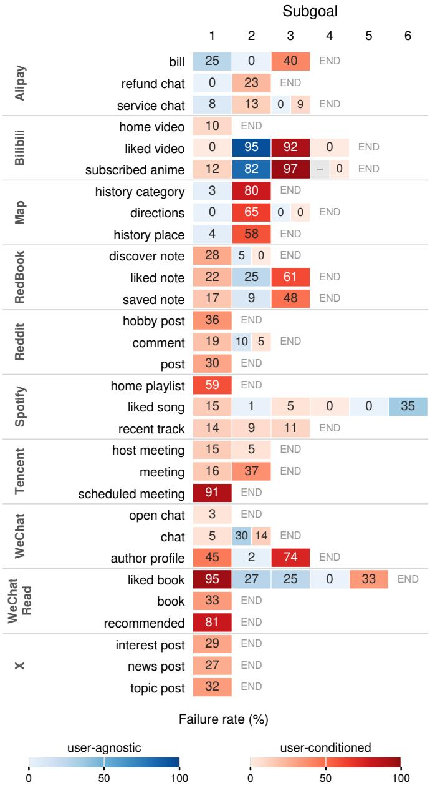  
Figure 11: Subgoal failure rates across task trajectories. Each cell reports the failure rate (100 − SAR, %) after entering the corresponding subgoal context, pooled across six complete agents. Blue and red denote user-agnostic and user-conditioned contexts, respectively; darker cells indicate higher failure rates. A dash denotes no entry, and END marks task termination. Later-position rates are conditional on reaching the corresponding context.

Overall, this analysis complements the aggregate SAR comparison by showing where the observed performance differences emerge within individual task trajectories. The results suggest that difficulty is often concentrated at specific interaction stages rather than being uniformly distributed throughout an entire task.

## F COMPLETE PAIR FAILURE TRAJECTORIES

The two failures from the main paper use Personal targets and Explicit instructions. Each row shows all three recorded steps, including termination. Screenshots precede the labeled actions; no post-termination screenshot is available.

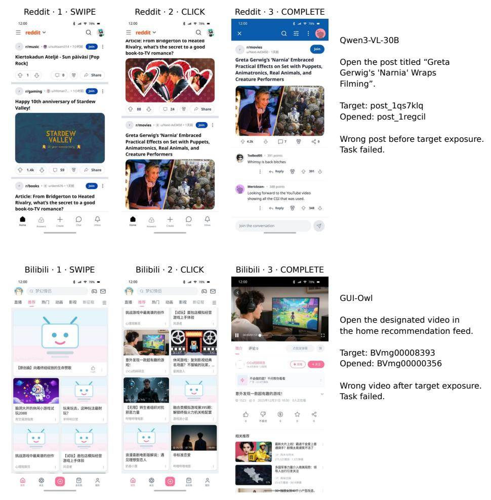  
Figure 12: Reddit (top, Qwen3-VL-30B) selects the wrong post before target exposure. Bilibili (bottom, GUI-Owl) selects the wrong video after target exposure. Both fail the task’s success check; target and selected IDs are shown beside the trajectories.

The selected item is confirmed by the next screen’s route. These examples illustrate the two error types, not their overall frequency.