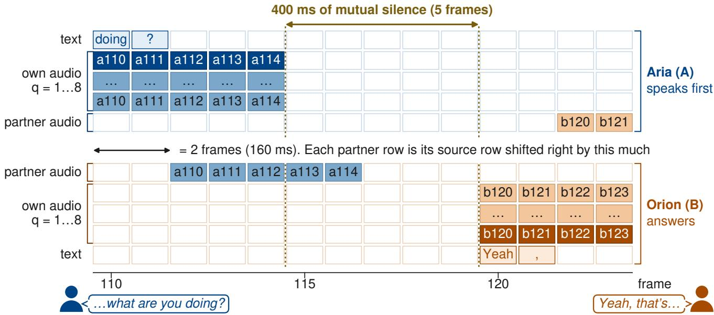
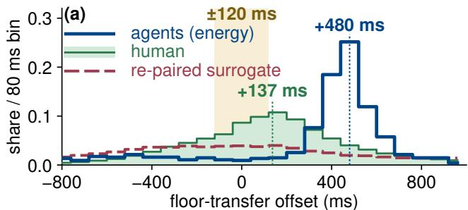
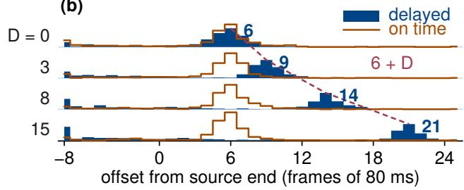
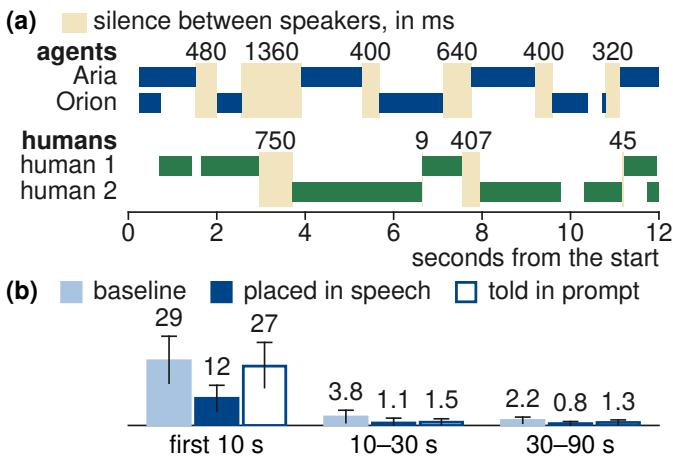

# COUPLED BUT LATE: TURN-TAKING BETWEEN FULL-DUPLEX SPEECH MODELS IN UNSCRIPTED DIALOGUE

Lichen Zhu, Yueqian Lin, Yiheng Wang, Hai “Helen” Li, Yiran Chen

Duke University, Durham, NC, USA

## ABSTRACT

Full-duplex speech models are trained to converse with a person, but they are increasingly made to converse with each other, in self-play data generation, agent societies, and model-based evaluation. In that loop no human absorbs a timing error: each model’s turn-taking is the other’s input. We ask what timing the loop settles into. Two PersonaPlex-7B instances exchange audio tokens on a shared clock in unscripted conversation, and one floor-transfer rule is applied to them and to Switchboard. Their timing is coupled: re-pairing speakers across conversations destroys it. But the floor changes hands late, at a median of 400–560 ms against 137 ms for humans, and the last 120 ms of the partner’s turn, where human projection places a tenth of its transfers, holds 1% of theirs. Delaying one direction of the channel shifts the response one-for-one and leaves the run-up to it empty, consistent with a reactive wait after the perceived end rather than the turn-end projection human timing requires.

Index Terms— full-duplex speech models, turn-taking, agent–agent dialogue, evaluation

## 1. INTRODUCTION

A full-duplex speech model listens while it speaks and decides for itself when to take the floor [1, 2]. It is trained and evaluated as one side of a conversation whose other side is a person or a recording standing in for one. Increasingly, though, two such models are placed in a loop with no person in it: to generate self-play dialogue data [3, 4], to populate spoken agent societies [5], or to act as an automated examiner for another model [6]. In that loop nobody absorbs a timing error: whatever one model does at the floor is the input on which the other decides, and what timing the loop settles into has no answer in single-model evaluation.

Benchmarks score one model against fixed stimuli or an examiner [7, 8, 9, 6], and the model–model dyads built so far serve other questions: SyncLLM compares two agents gap and overlap statistics with human continuations under communication delay [10], dGSLM generates both channels from one model and tabulates them against Fisher [11], Riera et al. [12] route audio tokens between two Moshi instances, as we do, to study representational synchronization, and Agentic-DuplexGen has two duplex models perform a written script and reports their floor-transfer offsets [3]. None measures floor timing for freely generated dyads under controls, or asks whether a difference from human timing belongs to the models or to the channel between them. On the policy side the question has a sharper form. Classical dialogue systems end-point on a silence threshold, so they can only react to a turn that has already ended [13]; humans project turn ends and start 100 to 200 ms after them [14], and projection models such as VAP are built to do the same [15]. Which of the two a duplex model implements when it talks to another duplex model is not known.

We answer it for PersonaPlex-7B. One floor-transfer rule, applied by the same code to both agents and to Switchboard word alignments, gives the timing; three agent-side segmentations bound its dependence on speech boundaries; re-pairing speakers and silencing the partner test what the timing depends on; and a latency adjustment and a one-sided delay sweep test whether the channel explains it. The timing is coupled, it is late, and the lateness behaves like a reactive policy rather than like the channel’s delay. A secondary intervention shows that the opening register the models bring from training yields to a sentence placed in one agent’s speech.

## 2. SETUP AND MEASUREMENT

Conversations. Two PersonaPlex-7B agents (nvidia/ personaplex-7b-v1), one per GPU, exchange Mimi audio tokens [1] at 12.5 Hz (Fig. 1). At each 80 ms step an agent receives the tokens its partner emitted at the previous step; nothing on the path is audio, so no recognizer, synthesizer, or re-encoding adds its own timing. A partner’s frame becomes readable after 160 ms on the coarse codebook and 240 ms on the fine ones, from one frame of buffering plus the model’s codebook schedule; an agent can still start before its partner stops. The baseline is 36 seeded 90 s conversations in five scenes that put both speakers in one place, such as an apartment laundry room. Personas and scenes enter as system prompts, temperatures are 0.8 for audio and 0.7 for text, and every matched condition keeps personas, scenes, voices, and seeds fixed; audio is decoded afterwards for measurement only.

  
Fig. 1. Direct audio-token exchange. Colors identify token origin: A (blue) and B (orange). Each speaker outputs one text stream and eight audio codebooks (two drawn). Partner tokens arrive after 160 ms (coarse, illustrated) or 240 ms (fine). The example gap is 400 ms; the baseline mode is 480 ms.

Floor-transfer offset. Speech spans separated by less than 180 ms merge into inter-pausal units (IPUs), and following Heldner and Edlund [16] a floor transfer is the interval from the end of the current speaker’s IPU to the start of the next speaker’s,

$$
\mathrm { F T O } = t _ { \mathrm { s t a r t , n e x t } } - t _ { \mathrm { e n d , c u r r e n t } } ,\tag{1}
$$

positive for a gap and negative for an overlap. An IPU wholly inside the other speaker’s does not transfer the floor; identicalextent IPUs are resolved by who holds the floor, so counts do not depend on speaker order. No lexical backchannel filter is applied [17]; under the shared rule, nested IPUs are 14% of different-speaker adjacencies for humans against 14–16% for the agents, and sub-second IPUs 43% against 45% under the primary instrument (50% and 84% under the word segmentations, which cut at word boundaries). Offsets are clipped at ±2 s. We report the median, the overlap fraction (FTO < −10 ms, a margin that excludes exact zeros on the 80 ms grid), the share within ±120 ms of zero, and the Wasserstein-1 distance $W _ { 1 }$ between the clipped distributions, in milliseconds. The ±120 ms window, the near-zero band, follows Heldner’s detection thresholds for gaps and overlaps [18].

Reference and segmentation. The same extraction function runs on the released MS-State word alignments for Switchboard [19, 20]: 193,115 transfers from 2,407 calls with at least 20 each. Its median of 137 ms sits below the 168 ms of Roberts et al. [21] because IPU-level segmentation with backchannels retained counts shorter intervals. Switchboard is telephone speech between strangers while the agents share a scene; the two settings differ, and the recorded-partner arm of Sec. 3.4 gives the co-present comparison. Agent speech has no aligner, so we segment it three ways: decoded-audio energy above 0.01 RMS, the primary instrument, which applies unchanged to live and recorded partners and carries through every control; word extents from the text stream; and words aligned to the voiced runs that contain them. The rule is shared, the boundary estimators are not, and the spread across the three is a sensitivity result.

Inference. Bootstrap intervals resample conversations with the human reference fixed; paired intervals invert the sign-flip test. The reporting cutoff is 0.05/45, a conservative divisor kept to avoid post-hoc relaxation; the baseline timing contrasts, the re-pairing control, and the whole-conversation opener contrasts pass it, the rest is nominal. The appendices carry the statistical notes with the enumerated tests and the clip and grid sensitivity checks.

## 3. RESULTS

## 3.1. The floor changes hands late

Table 1 and Fig. 2a compare the baseline dyads with full-call Switchboard. Under every segmentation the agents’ median offset is three to four times the human one, and the near-zero band, which holds a quarter of human transfers, holds 3 to 9% of theirs. The distribution is not merely wide: 44% of all transfers fall at 400 or 480 ms, a sharp peak with no counterpart in the human histogram. Fig. 3a shows one opening: after a simultaneous start, the agents hand over at 320 to 640 ms and once at 1360 ms, the Switchboard callers at 9 and 45 ms, once in overlap, and twice after longer gaps. Measurement does not manufacture this. The three segmentations move the median by up to 160 ms and leave both deficits in place; the first-90- second reference, which matches conversation phase, brings the human side closer and leaves them too; and the observed $W _ { 1 }$ is several times the sampling null of Table 1, with every one of the 36 conversations above its own size-matched null (sign test, $p = 2 . 9 \times 1 0 ^ { - 1 1 } )$ . Shifting the human reference to the agents’ median isolates shape from location: the agents overlap more than a merely delayed human would, so their lower overlap is the same lateness seen again, not a second deficit, and the near-zero deficit survives the shift under two of the three segmentations.

Table 1. Floor-transfer timing under one extraction rule, grouped by the claim each block supports; bold marks the cells the claim rests on. Offsets and $W _ { 1 }$ in ms; overlap $( \mathrm { F T O } < - 1 0 $ ms, any depth), [−120, 0) (the partner’s last 120 ms) and ±120 (the near-zero band) are fractions of transfers. Under a B→A delay of D frames the delayed side’s mode is written as 480 ms plus the delay. Brackets are 95% intervals: conversation bootstrap, the central range of 2,000 re-pairings, and the sampling null.
<table><tr><td colspan="2">condition</td><td>n</td><td>median</td><td>mode</td><td>overlap [-120, 0)</td><td></td><td>±120</td><td> $W _ { 1 }$ </td></tr><tr><td rowspan="3">human reference</td><td>Switchboard, full calls</td><td>193,115</td><td>+137</td><td>160</td><td>0.32</td><td>0.10</td><td>0.25</td><td></td></tr><tr><td>first 90 s of each call</td><td>43,890</td><td>+163</td><td>160</td><td>0.28</td><td>0.10</td><td>0.25</td><td></td></tr><tr><td>sampling null,  $n = 7 4 7$ </td><td></td><td></td><td></td><td></td><td></td><td></td><td>50 [18, 123]</td></tr><tr><td rowspan="3">late</td><td>energy (primary)</td><td></td><td>747 +480 [400, 480]</td><td></td><td>4800.18 [.15, .20]</td><td></td><td>0.01 0.03 [.01, .05] 228 [208, 257]</td><td></td></tr><tr><td>text words</td><td>805</td><td>+560</td><td>640</td><td>0.14</td><td>0.02</td><td>0.09</td><td>330</td></tr><tr><td>aligned words</td><td>736</td><td>+400</td><td>400</td><td>0.18</td><td>0.02</td><td>0.04</td><td>226</td></tr><tr><td rowspan="3">coupled</td><td>partner re-paired</td><td></td><td>+80 [0, 160]</td><td></td><td>− 0.46 [.42, .49]</td><td>一</td><td></td><td>- 520 [471, 570]</td></tr><tr><td>partner silenced, 12 cells recorded human partner</td><td>26/273</td><td></td><td></td><td></td><td></td><td></td><td></td></tr><tr><td></td><td>384</td><td>+240</td><td>320</td><td>0.22</td><td>0.03</td><td>0.16</td><td>103</td></tr><tr><td rowspan="5">not the channel</td><td>energy, —240 ms</td><td>747</td><td>+240</td><td>240</td><td>0.21</td><td>0.02</td><td>0.12</td><td>173</td></tr><tr><td>B→A delay, D = 3</td><td>411</td><td>+640</td><td>480+240</td><td>0.28</td><td>0.01</td><td>0.05</td><td>321</td></tr><tr><td>D = 8</td><td>410</td><td>+1040</td><td> $\mathbf { 4 8 0 + 6 4 0 }$ </td><td>0.32</td><td>0.02</td><td>0.07</td><td>495</td></tr><tr><td> $D = 1 0$ </td><td>395</td><td>+1040</td><td> $4 8 0 \substack { + 8 0 0 }$ </td><td>0.38</td><td>0.02</td><td>0.05</td><td>561</td></tr><tr><td> $D = 1 5$ </td><td>361</td><td>+720</td><td> $\mathbf { 4 8 0 } \substack { + 1 2 0 0 }$ </td><td>0.36</td><td>0.02</td><td>0.06</td><td>722</td></tr></table>

(b)  
  
Fig. 2. (a) Energy-based agent offsets, the full-call human reference, and the re-paired surrogate; 80 ms bins, shading marks ±120 ms. (b) Delaying B→A by D frames (four of the five levels) moves A’s peak to $6 + D$ (filled) while B’s stays at six (line); rows share one scale, one frame is 80 ms.

## 3.2. The timing is coupled

A shared clock alone does not make two speakers a conversation, so the first control asks whether the timing belongs to the pair. Pairing agent A of conversation i with agent B of conversation j ̸= i keeps each speaker’s activity track and the clock and removes only the original partner; two monologues on a common clock would be unaffected. Instead (Table 1) the re-paired median collapses toward zero, overlap more than doubles, the interquartile range widens from 160 to 1360 ms, and the distance to the human reference grows; the real dyads sit outside all 2,000 re-pairings on every statistic. Same-scene re-pairings reproduce the free surrogate, so the structure belongs to the original pairing, not to the clock or the scene. The second control replaces the partner’s audio with encoded silence in twelve matched cells: transfers fall from 273 to 26 and words per agent from 134 to 29; the agents say their opening line and stop. Partner audio sustains speaking at all, a production result rather than a timing one, but it rules out agents talking past each other on a schedule.

## 3.3. Lateness is a policy, not the channel

The channel adds up to 240 ms of delay, so the obvious explanation is the link. Two observations rule it out as the whole story. Subtracting the full 240 ms from every transfer (Table 1, “−240”) leaves a median of 240 ms, still above both human references, and the near-zero band at half the human share; a constant cannot fix a shape. And the last 120 ms of the partner’s turn, where projection shows, is nearly empty: humans place a tenth of their transfers there, the agents one percent, two with the link delay removed. The agents do overlap, on 18% of transfers, but almost all of that mass lies deeper inside the partner’s turn (beyond 120 ms, where the median is −560 ms against −311 ms): interruption, not projection [14].

The delay sweep asks what the wait is anchored to: B’s tokens reach A $D \in \{ 3 , 8 , 1 0 , 1 5 \}$ frames late while A’s reach B on time, 36 conversations per level. A’s pooled response mode moves by exactly D at every level while B’s stays at six frames (Fig. 2b; Table 1); per conversation the modal wait beyond the delay has a median of four and a half to six frames and lies within one frame of six in 18 to 28 of the 35 or 36 conversations at each level, with ties between modal frames resolved to the earlier one. Measured from the moment B’s end becomes visible to A, the pooled wait is unchanged: it rides on the partner’s audio, and a partner that appears up to 1.2 s slower does not shorten the mode. Its shape says what kind of wait it is. Nine in ten of the agents’ positive offsets begin more than 320 ms after the partner’s end, against four in ten for humans, and the approach to that end holds one to two percent at every level. A late mode with the run-up to it unoccupied is consistent with a silence-threshold policy [13] and not with projection, which places part of its onsets in that run-up, delayed or not. After the 240 ms link, the model waits roughly one further link delay of silence before it speaks. Chang et al. [22] measure a 0.6 s generate-to-perceive lag in PersonaPlex during interruptions and call it state inertia; the wait here is consistent with it, though floor timing alone cannot identify the mechanism.

## 3.4. A recorded partner does not elicit it

Replacing the live partner with recorded human speech (72 runs over 24 windows from two AMI headset recordings [23], level-matched and delivered one frame late for parity) removes the six-frame peak: that frame holds a third as many transfers as in live dyads, the median halves (Table 1), and the band share (0.16) sits inside the range of a mismatched-window sur rogate (0.11 to 0.19). A recording never yields the floor to the agent, and the agents mostly do not take it; their speech share halves. The 480 ms wait is therefore not a fixed latency applied to any input but what the model does when a partner yields. Replacing the partner also changes content and acoustics, so this arm shows condition dependence, not a closed-loop effect.

  
Fig. 3. (a) The first 12 s of conversation 1 (the pair of Fig. 1) and of Switchboard call 2009, the first call with five transfers in that span. (b) Telephone-register phrases per thousand words by window, means over the conversations with words in the window; thin lines are 95% conversation-bootstrap intervals.

## 4. THE OPENING REGISTER

The loop propagates more than timing. Placed in a laundry room, the models open in telephone or customer-service language: conversation 1 begins “Hi, this is Aria.” “Hi, Orion.” “Hi, how are you?” (Fig. 3a). A 21-pattern lexicon written after inspecting the baseline counts 29 such phrases per thousand words in the first ten seconds and 2 to 4 afterwards (Fig. 3b), consistent with the checkpoint’s customer-service training data [2]. Placing one of five scene-appropriate openers in one agent’s initial speech, with its timing left to the agent, cuts the opening rate from 29 to 12 (−16.9 [−27.7, −6.0], nominal) and the whole-conversation rate from 7.6 to 2.2 (−5.4 [−8.8, −2.2]; −5.3 with the forced tokens excluded). The effect sits with the agent that speaks the opener (−7.4 [−11.2, −3.7]); its partner moves the same way without reaching the cutoff $( - 3 . 5 \left[ - 7 . 9 , + 0 . 8 \right] )$ . The same sentence given as a system-prompt instruction is followed in only 8 of 36 runs and leaves the opening where it was (26.7), for −2.6 [−5.8, +0.6] over the conversation: placed in the speech, the sentence reaches the register; told in the prompt, it does not reach the opening. Instruction following in duplex models is a benchmark target in its own right [24].

## 5. CONCLUSION

Two full-duplex models left to talk to each other are coupled but late: the floor changes hands three to four times later than between humans, at a wait anchored to the end of the partner’s audio, and the last 120 ms of the partner’s turn, where human projection places a tenth of its transfers, goes almost unused. Coupling is therefore no evidence of human-like timing, and dialogue generated by such a pair, or an examiner built from such a model, inherits a reactive endpointer’s floor. The result is for one checkpoint, with related lateness reported for its model family [22, 25]; the protocol applies unchanged to any duplex model. Code and measurements will be released; the appendices carry the statistical notes.

## 6. COMPLIANCE WITH ETHICAL STANDARDS

This study used the publicly released MS-State word align ments for Switchboard and the AMI Meeting Corpus recordings, under their respective licenses. It involved no new human participants and required no new ethics approval.

## 7. REFERENCES

[1] Alexandre Defossez, Laurent Mazar´ e, Manu Orsini, et al.,´ “Moshi: A speech-text foundation model for real-time dialogue,” arXiv:2410.00037, 2024.

[2] Rajarshi Roy, Jonathan Raiman, Sang-gil Lee, et al., “PersonaPlex: Voice and role control for full duplex conversational speech models,” arXiv:2602.06053, 2026.

[3] Pengcheng Wang, Sheng Li, Jiyi Li, et al., “Agentic-DuplexGen: Decoupling content, timing, and acoustics for synthetic dialogue speech,” arXiv:2608.16053, 2026.

[4] Takyoung Kim, Kang wook Kim, Sang Hoon Woo, et al., “DuplexGen: Adaptive synthesis of human-AI turn-taking dialogues,” arXiv:2607.26178, 2026.

[5] Joon Sung Park, Joseph C. O’Brien, Carrie J. Cai, et al., “Generative agents: Interactive simulacra of human behavior,” in Proc. 36th Annual ACM Symposium on User Interface Software and Technology (UIST), 2023.

[6] Guan-Ting Lin, Shih-Yun Shan Kuan, Jiatong Shi, et al., “Full-duplex-bench-v2: A multi-turn evaluation framework for duplex dialogue systems with an automated examiner,” in Proc. 64th Annual Meeting ofthe Association for Computational Linguistics (ACL), 2026.

[7] Guan-Ting Lin, Jiachen Lian, Tingle Li, et al., “Fullduplex-bench: A benchmark to evaluate full-duplex spoken dialogue models on turn-taking capabilities,” in Proc. IEEE Automatic Speech Recognition and Understanding Workshop (ASRU), 2025.

[8] Guan-Ting Lin, Shih-Yun Shan Kuan, Qirui Wang, et al., “Full-duplex-bench v1.5: Evaluating overlap handling for full-duplex speech models,” in Proc. IEEE Int. Conf. on Acoustics, Speech and Signal Processing (ICASSP), 2026.

[9] Siddhant Arora, Zhiyun Lu, Chung-Cheng Chiu, et al., “Talking turns: Benchmarking audio foundation models

on turn-taking dynamics,” in Proc. Int. Conf. on Learning Representations (ICLR), 2025.

[10] Bandhav Veluri, Benjamin N Peloquin, Bokai Yu, et al., “Beyond turn-based interfaces: Synchronous LLMs as full-duplex dialogue agents,” in Proc. EMNLP, 2024, pp. 21390–21402.

[11] Tu Anh Nguyen, Eugene Kharitonov, Jade Copet, et al., “Generative spoken dialogue language modeling,” Transactions ofthe Associationfor Computational Linguistics, vol. 11, pp. 250–266, 2023.

[12] Pablo Riera, Pablo Brusco, Cristina Kuo, et al., “Synchronization and turn-taking in full-duplex speech dialogue models,” arXiv:2605.20356, 2026.

[13] Gabriel Skantze, “Turn-taking in conversational systems and human-robot interaction: A review,” Computer Speech & Language, vol. 67, pp. 101178, 2021.

[14] Stephen C. Levinson and Francisco Torreira, “Timing in turn-taking and its implications for processing models of language,” Frontiers in Psychology, vol. 6, pp. 731, 2015.

[15] Erik Ekstedt and Gabriel Skantze, “Voice activity projection: Self-supervised learning of turn-taking events,” in Proc. Interspeech, 2022, pp. 5190–5194.

[16] Mattias Heldner and Jens Edlund, “Pauses, gaps and overlaps in conversations,” Journal ofPhonetics, vol. 38, no. 4, pp. 555–568, 2010.

[17] Mattias Heldner, Jens Edlund, Anna Hjalmarsson, et al., “Very short utterances and timing in turn-taking,” in Proc. Interspeech, 2011, pp. 2837–2840.

[18] Mattias Heldner, “Detection thresholds for gaps, overlaps, and no-gap-no-overlaps in speech,” Journal ofthe Acoustical Society ofAmerica, vol. 130, no. 1, pp. 508– 513, 2011.

[19] John J. Godfrey, Edward C. Holliman, and Jane Mc-Daniel, “SWITCHBOARD: Telephone speech corpus for research and development,” in Proc. IEEE Int. Conf. on Acoustics, Speech and Signal Processing (ICASSP), 1992, vol. 1, pp. 517–520.

[20] Neeraj Deshmukh, Aravind Ganapathiraju, Andi Gleeson, et al., “Resegmentation of SWITCHBOARD,” in Proc. 5th Int. Conf. on Spoken Language Processing (IC-SLP), 1998.

[21] Sean G. Roberts, Francisco Torreira, and Stephen C.´ Levinson, “The effects of processing and sequence organization on the timing of turn taking: A corpus study,” Frontiers in Psychology, vol. 6, pp. 509, 2015.

[22] Cheng-Kuang Chang, Kai-Wei Chang, Alexander H. Liu, et al., “Overcoming state inertia in fullduplex spoken language models via activation steering,” arXiv:2606.11386, 2026.

[23] Jean Carletta, Simone Ashby, Sebastien Bourban, et al., “The AMI meeting corpus: A pre-announcement,” in Proc. MLMI, 2005.

[24] Yuzhi Tang, Wentao Ma, Xiling Zhao, et al., “Instruct-FD: Can your full-duplex speech system follow turntaking instructions?,” arXiv:2607.20460, 2026.

[25] Atsumoto Ohashi, Neil Zeghidour, Alexandre Defossez,´ et al., “Multi-faceted interactivity alignment in fullduplex speech models,” arXiv:2606.11167, 2026.

## Appendices: statistical notes

These appendices are the audit trail behind the paper: the inferential statements behind the reporting cutoff, the intervals and sensitivity checks, and every condition in full, including rows the paper omits for space. Table and figure numbers without a prefix refer to the paper.

## A. SCOPE AND REPORTING THRESHOLD

The multiplicity inventory enumerates 31 tests, reproduced in Table A2. The paper’s cutoff is $\alpha _ { * } = 0 . 0 5 / 4 5 \approx 0 . 0 0 1 1 ,$ a conservative divisor retained from the first analysis pass rather than relaxed after inspecting the results. Contrasts below the cutoff are the baseline timing contrasts (rows 1–9), the re-pairing controls (10–17), the silence control (22), the whole-conversation forced-opener contrasts (26, 28, 29), and the per-conversation $W _ { 1 }$ sign test (31). Tables A1 and A3 carry the nominal-level contrasts the paper also reports. All 95% intervals are marginal, not simultaneous.

## B. PROCEDURES

Conversation bootstrap (CB). The resampling unit is the agent conversation; all transfers of a sampled conversation are pooled before each statistic is recomputed. The human reference is fixed, so intervals quantify agent-side uncertainty only. Table 1’s primary row and every tail probability in the inventory (Table A2, rows 1–9, all three segmentations) use 10,000 draws, so the reporting floor $2 / ( B + 1 )$ ) is 0.0002; the intervals of the other rows in Table A1 use 1,000 draws (300 for W ) and carry no tail probability. Two-sided tail probabilities against the fixed human statistic $T _ { H }$ are min $\{ 1 , 2 \operatorname* { m i n } ( ( 1 + \# \{ T _ { b } \leq$ $T _ { H } \} ) / ( B + 1 ) , ( 1 + \# \{ T _ { b } \geq T _ { H } \} ) / ( B + 1 ) ) ]$ , with reporting resolution $2 / ( B + 1 )$

Re-pairing surrogate (DP). Each of 2,000 derangements pairs one speaker’s complete activity track with a partner track from a different conversation, keeping the shared clock. The two-sided probability is $( 1 + c ) / ( B + 1 )$ , where c counts surrogate statistics at least as far from the surrogate median as the observed one; the floor is $1 / 2 0 0 1$ . Table 1’s re-paired row gives the central 95% of the surrogate statistics, not a confidence interval for the observed value. Restricting derangements to pairs staged in the same scene reproduces the free surrogate to within 0.005 of overlap and 0 ms of median.

Paired sign-flip contrasts (SF). Within each conversation and window the rate is 1000×markers/words pooled over both agents; the effect is the mean of paired per-conversation differences over pairs with at least one word in both arms. Two-sided probabilities use 20,000 random sign flips with the $( 1 + c ) / ( B + 1 )$ ) correction; intervals invert the same procedure and include zero whenever its null is accepted. The procedure assumes sign-exchangeability of the paired differences under the null. Excluding the forced opener removes its tokens from numerator and denominator alike.

Exact sign tests (EB). The silence control uses the 12 matched persona-pair and scene cells; all 12 have more transfers with partner audio $( p = 2 / 2 ^ { 1 2 } = 4 . 9 \times 1 0 ^ { - 4 } )$ . The $W _ { 1 }$ check uses the 36 baseline conversations; each exceeds the median of its own size-matched clustered nul $( p = 2 / 2 ^ { 3 6 } = 2 . 9 \times 1 0 ^ { - 1 1 } )$ ).

## C. EVERY CONDITION, WITH INTERVALS

Table A1 extends Table 1 with intervals for every baseline row and the on-time direction of each delay level. The contract is the same throughout: IPUs from spans separated by less than 180 ms; a floor transfer from the current speaker’s IPU end to the next speaker’s IPU start; nested IPUs excluded; identical-extent IPUs resolved by the floor holder; offsets clipped at ±2 s.

Per-conversation stability of the delay sweep. The paper’s modes are pooled over conversations. Per conversation, the modal offset of the delayed direction minus the injected delay has a median of $6 , 6 , 5 . 5 , 5 $ , and 4.5 frames at $D = 0 , 3 , 8 , 1 0 , 1 5 ;$ it lies within one frame of $6 + D$ in 26/36, 28/35, 22/36, 25/35, and 18/36 conversations at those levels, and exactly at 6 + D in 15, 14, 16, 14, and 8 of them. Conversations with fewer than three transfers in that direction are excluded, and when two frames tie for the mode the earlier one is taken, a rule that leans against the anchoring claim. The delayed side’s share of transfers that collide with the partner’s onset rises from 0.17 at D = 0 to 0.36 at D = 15 while the on-time side’s falls from 0.18 to 0.09 (Table A1, overlap).

Recorded partner. Each of 72 agent runs faces a 90 s window of one AMI Headset-0 recording (ES2003a or ES2004a; 24 windows at a 20 s step), Mimi-encoded after level-matching the recording to decoded Mimi speech (median of the loudest 15% of 80 ms frames scaled to 0.04 RMS; gains $\times 7 \mathrm { - } \times 1 4 )$ , and delivered one frame late for parity with the room’s buffering. The human side is segmented from its stored frame energy under the same 0.01 gate as the agent side (voiced fraction median 0.31). Human→agent transfers: $n = 3 8 4 .$ , median 240 ms, mode 4 frames holding 0.12 of transfers (frame 6 holds 0.08, against 0.23 in the matching direction of live dyads), overlap 0.22, band share 0.16. A mismatched-window null that scores each agent’s onsets against the window a different agent heard (300 derangements) gives mode share 0.09 [0.07, 0.13] (p = 0.04 for the observed 0.12) and band share 0.15 [0.11, 0.19]. The agents’ speech share is 0.15 against 0.35 in the baseline dyads. Two earlier recordings (ES2002a, ES2005a) were excluded before analysis because their crosstalk sits at the gate after level-matching (more than a quarter of frames within a factor of two of 0.01 RMS).

Table A1. Every condition under the energy instrument unless noted. Median, mode, and $W _ { 1 }$ in ms; brackets are 95% conversation-bootstrap intervals. The two delay columns per level are the delayed direction (B→A) and the on-time direction (A→B) of the same conversations.
<table><tr><td>condition</td><td>n</td><td></td><td>median mode</td><td></td><td></td><td>overlap [-120,0)</td><td>±120</td><td> $W _ { 1 }$ </td></tr><tr><td>energy (primary)</td><td></td><td>747 +480 [400, 480]</td><td></td><td>480</td><td>0.18 [.15, .20]</td><td>0.011</td><td>0.03 [.01, .05]</td><td>228 [208, 257]</td></tr><tr><td>text words</td><td></td><td>805 +560 [560, 640]</td><td></td><td></td><td>640 0.14 [.12, .16]</td><td>0.024</td><td>0.09 [.07, .11]</td><td>330 [293, 367]</td></tr><tr><td>aligned words</td><td> $7 3 6 + 4 0 0$ </td><td>[400, 480]</td><td></td><td></td><td>4000.18 [.15, .21]</td><td>0.020</td><td>0.04 [.02, .06]</td><td>226 [204, 260]</td></tr><tr><td>energy, —240 ms</td><td></td><td>747 +240 [160, 240]</td><td></td><td>240</td><td>0.21 [.17, .25]</td><td>0.024</td><td>0.12 [.08, .16]</td><td>173 [150, 202]</td></tr><tr><td>D = 0, B→A</td><td>377</td><td></td><td>+400</td><td>480</td><td>0.17</td><td>0.013</td><td>0.04</td><td>227</td></tr><tr><td>D = 0, A→B</td><td>370</td><td></td><td>+480</td><td>480</td><td>0.18</td><td>0.008</td><td>0.02</td><td>229</td></tr><tr><td>D = 3, delayed</td><td>411</td><td></td><td>+640</td><td>720</td><td>0.28</td><td>0.012</td><td>0.05</td><td>321</td></tr><tr><td>D = 3, on time</td><td>408</td><td></td><td>+480</td><td>480</td><td>0.11</td><td>0.015</td><td>0.04</td><td>282</td></tr><tr><td>D = 8, delayed</td><td>410</td><td>+1040</td><td>1120</td><td></td><td>0.32</td><td>0.017</td><td>0.07</td><td>495</td></tr><tr><td>D = 8, on time</td><td>398</td><td></td><td>+480</td><td>480</td><td>0.10</td><td>0.005</td><td>0.02</td><td>289</td></tr><tr><td>D = 10, delayed</td><td>395</td><td>+1040</td><td>1280</td><td></td><td>0.38</td><td>0.015</td><td>0.05</td><td>561</td></tr><tr><td>D = 10, on time</td><td>385</td><td></td><td>+480</td><td>480</td><td>0.11</td><td>0.005</td><td>0.02</td><td>284</td></tr><tr><td>D = 15, delayed</td><td>361</td><td></td><td>+720</td><td>1680</td><td>0.36</td><td>0.017</td><td>0.06</td><td>722</td></tr><tr><td> $D = 1 5 ,$  on time</td><td>356</td><td></td><td>+480</td><td>480</td><td>0.09</td><td>0.006</td><td>0.01</td><td>310</td></tr><tr><td>recorded, human→agent 384</td><td></td><td></td><td>+240</td><td>320</td><td>0.22</td><td>0.031</td><td>0.16</td><td>103</td></tr></table>

## D. CLIP, GRID, AND SEGMENTATION SENSITIVITY

Clip. $W _ { 1 }$ is computed between distributions clipped at ±2 s. The clip holds 0.7% of the human reference (0.05% beyond ±4 s), 0.5% of the baseline energy transfers, 0.1% of the forced-opener arm, 0.2%, 0.1%, 0.1%, and 0.7% of the D = 3, 8, 10, 15 arms, 0.8% of the recorded-partner arm, and 38.3% of the silence control’s 26 transfers. Widening the clip to ±4 s moves the baseline energy $W _ { 1 }$ from 228 to 231 ms.

Grid. Agent offsets lie on the 80 ms frame grid; human word boundaries are continuous. Rounding the human boundaries outward to the grid (starts floored, ends ceiled) moves the human median from 137 to 80 ms and raises the baseline energy $W _ { 1 }$ from 228 to 266 ms, so the grid works against the deficits the paper reports, not for them. The paper keeps continuous human boundaries.

Backchannel-like material. No lexical backchannel filter is applied on either side. Under the shared rule the share of differentspeaker adjacencies that are nested (and therefore not transfers) is 14.2% in Switchboard (31,355 of 221,502) and 16.3%, 13.7%, and 14.1% for the agents under the energy, text-word, and aligned-word segmentations; the share of IPUs shorter than 1 s is 42.6% for humans and 45.2%, 84.3%, and 50.1% for the agents.

Phase-matched reference. Restricting the reference to the first 90 s of each Switchboard call gives 43,890 transfers, median 163 ms, overlap 0.28, band share 0.25, and lowers the baseline energy $W _ { 1 }$ from 228 to 215 ms. Shifting this reference to each agent median gives the median-matched comparison: overlap 0.175 against 0.084 (energy), 0.142 against 0.058 (text), 0.183 against 0.119 (aligned); band share 0.033 against 0.095, 0.088 against 0.072, and 0.043 against 0.122.

## E. ARCHIVED INVENTORY

Status is relative to $\alpha _ { * } .$ : Below, Nominal $( \alpha _ { * } < p \le 0 . 0 5 )$ , or Above. Archive labels are kept for traceability; $\mathrm { \displaystyle { \tilde { \rho } p } } \mathbf { \cal { F } } ^ { \prime }$ is the baseline, $ { \mathbf { \tilde { \rho } } } _ { \mathrm { p p } . \mathrm { G } } ,$ the forced-opener arm, “pp deaf” the silence control.

Table A2: The 31 entries in the archived multiplicity inventory.
<table><tr><td>ID</td><td>Family</td><td>Contrast</td><td>Method</td><td>Probability</td><td>Status</td></tr><tr><td>1</td><td>T1 floor</td><td>energy: median ≠ human</td><td>CB</td><td>0.0002</td><td>Below</td></tr><tr><td>2</td><td>T1 floor</td><td>energy: overlap ≠ human</td><td>CB</td><td>0.0002</td><td>Below</td></tr><tr><td>3</td><td>T1 floor</td><td>energy: band share ≠ human</td><td>CB</td><td>0.0002</td><td>Below</td></tr><tr><td>4</td><td>T1 floor</td><td>text words: median ≠ human</td><td>CB</td><td>0.0002</td><td>Below</td></tr><tr><td>5</td><td>T1 floor</td><td>text words: overlap ≠ human</td><td>CB</td><td>0.0002</td><td>Below</td></tr><tr><td>6</td><td>T1 floor</td><td>text words: band share ≠ human</td><td>CB</td><td>0.0002</td><td>Below</td></tr><tr><td>7</td><td>T1 floor</td><td>aligned words: median ≠ human</td><td>CB</td><td>0.0002</td><td>Below</td></tr><tr><td>8</td><td>T1 floor</td><td>aligned words: overlap ≠ human</td><td>CB</td><td>0.0002</td><td>Below</td></tr><tr><td>9</td><td>T1 floor</td><td>aligned words: band share ≠ human</td><td>CB</td><td>0.0002</td><td>Below</td></tr><tr><td>10</td><td>T2 re-paired</td><td>pp_F: median vs surrogate</td><td>DP</td><td>0.0005</td><td>Below</td></tr><tr><td>11</td><td>T2 re-paired</td><td>pp_F: overlap vs surrogate</td><td>DP</td><td>0.0005</td><td>Below</td></tr><tr><td>12</td><td>T2 re-paired</td><td>pp-F: IQR vs surrogate</td><td>DP</td><td>0.0005</td><td>Below</td></tr><tr><td>13</td><td>T2 re-paired</td><td>pp_F: W1vs surrogate</td><td>DP</td><td>0.0005</td><td>Below</td></tr><tr><td>14</td><td>T2 re-paired</td><td>pp_G: median vs surrogate</td><td>DP</td><td>0.0005</td><td>Below</td></tr><tr><td>15</td><td>T2 re-paired</td><td>pp_G: overlap vs surrogate</td><td>DP</td><td>0.0005</td><td>Below</td></tr><tr><td>16</td><td>T2 re-paired</td><td>pp_G: IQR vs surrogate</td><td>DP</td><td>0.0005</td><td>Below</td></tr><tr><td>17</td><td>T2 re-paired</td><td>pp_G: W1 vs surrogate</td><td>DP</td><td>0.0005</td><td>Below</td></tr><tr><td>18</td><td>T2 re-paired</td><td>pp_deaf: median vs surrogate</td><td>DP</td><td>0.319</td><td>Above</td></tr><tr><td>19</td><td>T2 re-paired</td><td>pp_deaf: overlap vs surrogate</td><td>DP</td><td>0.775</td><td>Above</td></tr><tr><td>20</td><td>T2 re-paired</td><td>pp_deaf: IQR vs surrogate</td><td>DP</td><td>0.955</td><td>Above</td></tr><tr><td>21</td><td>T2 re-paired</td><td>pp_deaf: W1 vs surrogate</td><td>DP</td><td>0.425</td><td>Above</td></tr><tr><td>22</td><td>T2 silence</td><td>12/12 cells: more transfers with partner audio</td><td>EB</td><td>0.00049</td><td>Below</td></tr><tr><td>23</td><td>T3 markers</td><td>forced, 0–10 s</td><td>SF</td><td>0.0015</td><td>Nominal</td></tr><tr><td>24</td><td>T3 markers</td><td>forced, 10–30 s</td><td>SF</td><td>0.11</td><td>Above</td></tr><tr><td>25</td><td>T3 markers</td><td>forced, 30–90 s</td><td>SF</td><td>0.16</td><td>Above</td></tr><tr><td>26</td><td>T3 markers</td><td>forced, 0–90 s</td><td>SF</td><td>0.0002</td><td>Below</td></tr><tr><td>27</td><td>T3 markers</td><td>forced, excl. tokens, 0–10 s</td><td>SF</td><td>0.060</td><td>Above</td></tr><tr><td>28</td><td>T3 markers</td><td>forced, excl. tokens, 0–90 s</td><td>SF</td><td>0.0002</td><td>Below</td></tr><tr><td>29</td><td>T3 role split</td><td>opener-holder, 0–90 s</td><td>SF</td><td>5 × 10−5</td><td>Below</td></tr><tr><td>30</td><td>T3 role split</td><td>partner, 0–90 s</td><td>SF</td><td>0.12</td><td>Above</td></tr><tr><td>31</td><td>W1 null</td><td>36/36 conversations above their clustered null</td><td>EB</td><td> $2 . 9 \times 1 0 ^ { - 1 1 }$ </td><td>Below</td></tr></table>

## F. OPENING REGISTER, IN FULL

The lexicon has 21 patterns in three categories (greeting-by-name, service offers, telephone framing) and was written after inspecting the baseline transcripts; the baseline holds 58 markers, 38 of them in the first 10 s (66% of markers in 14% of the words). The five openers are one scene-appropriate sentence per scene, placed in the first speaker’s speech with timing left to the agent. Table A3 gives every window and contrast; the paper’s Fig. 3b plots the 0–10, 10–30, and 30–90 s rates of all three arms and its text quotes the 0–10 and 0–90 s contrasts.

Prompt compliance. The prompt condition gives the same sentence to the same agent as a system-prompt instruction (“Your first words to them are: . . . ”), with the same seeds. Compliance is the share of the opener’s content words (longer than three letters) that occur anywhere in the instructed agent’s first 60 words; 8 of 36 agents reach 80%, 8 of 36 produce none. The 10–90 s prompt contrast retains the 34 pairs with words in both arms.

## G. WITHIN-CONVERSATION DRIFT

Human offsets tighten within a conversation at −1.45 ms/s (SE 0.08); the agents’ slope is −0.34 (SE 0.69). A conversation fixed-effects model with cluster-robust uncertainty gives a system×time interaction of +1.11 ms/s, 95% CI [−0.24, +2.45], p = 0.11 (wild cluster bootstrap 0.12); the design has 56% power against a human-sized effect. The paper does not report this contrast as a finding.

Table A3. Opening-register markers per 1k words, paired over 36 seeded conversations. Base and treated are means of per-conversation rates over the pairs with words in both arms, which is why they differ slightly from the per-arm means of the paper’s Fig. 3b in the later windows (28 pairs against 31 and 33 conversations at 30–90 s); ∆ is the mean paired difference, with the sign-flip interval and two-sided p.
<table><tr><td>contrast</td><td>window</td><td>base</td><td>treated</td><td></td><td>∆ [95% CI]</td><td>p</td></tr><tr><td rowspan="4">forced vs. baseline</td><td>0-10s</td><td>29.10</td><td>12.21</td><td></td><td>-16.9 [−27.7, -6.0]</td><td>0.0015</td></tr><tr><td>10–30 s</td><td>3.81</td><td>1.13</td><td></td><td>−2.7 [−5.7, +0.2]</td><td>0.11</td></tr><tr><td>30–90 s</td><td>2.31</td><td>0.98</td><td></td><td>-1.3 [−3.1, +0.4]</td><td>0.16</td></tr><tr><td>10–90 s</td><td>2.74</td><td>0.78</td><td></td><td>-2.0 [−3.5, −0.5]</td><td>0.0082</td></tr><tr><td rowspan="3">forced, tokens excluded</td><td>0-90 s</td><td>7.64</td><td>2.21</td><td></td><td>−5.4 [−8.8, −2.2]</td><td>0.0002</td></tr><tr><td>0-10 s</td><td>29.10</td><td>17.70</td><td></td><td>-11.4 [−23.3, +0.5]</td><td>0.060</td></tr><tr><td>0–90 s</td><td>7.64</td><td>2.31</td><td></td><td>−5.3 [−8.7, −2.1]</td><td>0.0002</td></tr><tr><td>forced, opener-holder only</td><td>0–90 s</td><td></td><td></td><td></td><td>-7.4 [−11.2, -3.7]</td><td>5 × 10−5</td></tr><tr><td>forced, partner only</td><td>0–90 s</td><td></td><td></td><td></td><td>-3.5 [−7.9, +0.8]</td><td>0.12</td></tr><tr><td>forced, dominant pattern removed</td><td>0–90 s</td><td></td><td></td><td></td><td>-3.0</td><td>0.009</td></tr><tr><td rowspan="3">prompt vs. baseline</td><td>0-10s</td><td>29.10</td><td>26.70</td><td></td><td>−2.4 [−14.3, +9.5]</td><td>0.68</td></tr><tr><td>0–90 s</td><td>7.64</td><td>5.09</td><td></td><td>-2.6 [−5.8, +0.6]</td><td>0.12</td></tr><tr><td>10–90 s (34 pairs)</td><td>2.81</td><td>1.19</td><td></td><td>-1.6 [−3.3, +0.0]</td><td>0.055</td></tr><tr><td>prompt vs. forced</td><td>0–90 s</td><td>2.21</td><td>5.09</td><td></td><td>+2.9 [+0.6, +5.2]</td><td>0.012</td></tr></table>

## H. THE TIMING AXIS

Let $t _ { s }$ be the source speaker’s IPU end, $t _ { r } ^ { ( q ) }$ the time the corresponding audio becomes readable at codebook $q ,$ and $t _ { o }$ the responding agent’s onset, all on the shared clock. With base codebook delay $\delta _ { q }$ (160 ms coarse, 240 ms fine) and added one-sided delay D frames,

$$
t _ { r } ^ { ( q ) } = t _ { s } + \delta _ { q } + 8 0 D \mathrm { m s } , \qquad \mathrm { F T O } = t _ { o } - t _ { s } = \delta _ { q } + 8 0 D \mathrm { m s } + \bigl ( t _ { o } - t _ { r } ^ { ( q ) } \bigr ) .
$$

The paper’s offsets are $t _ { o } - t _ { s } .$ The observed modes of $6 + D$ frames leave a 480 ms mode after subtracting 80D; that residual still contains $\delta _ { q } ,$ so the wait after the fine path is about 240 ms. The sweep establishes that the wait is anchored to $t _ { r }$ and is not shortened as D grows; it does not by itself separate a fixed threshold from a projection that starts after the perceived end. What separates them in the paper is the distribution’s shape at D = 0: 0.011 of agent transfers fall in [−120, 0) ms against 0.104 for humans, and 90% of positive agent offsets exceed 320 ms against 42% for humans, so onsets in the approach to the perceived end, which projection produces and endpointing cannot, are all but absent; the agents’ remaining overlaps lie deeper in the partner’s turn (among overlaps beyond 120 ms, median −560 ms against −311 ms for the human ones). Chang et al.’s generate-to-perceive lag of about 0.6 s under interruption is consistent with the residual and is not identified by floor timing alone.