# : Can Long-Horizon Agents Synthesize Static-Analysis Checkers?

Hang He∗, Li Wang∗, Hao Chen, Yuchen Shao, Yuling Shi, Lisheng Wang, Peiyang Liu, Goose Lin, Zaiyuan Wang, Haiying Sun, Ting Su, Chengcheng Wan #

∗Equal Contribution, #Corresponding Author

East China Normal University, Humanlaya Data, Shanghai Jiao Tong University, Peking University, Shanghai Innovation Institute

## Abstract

Static-analysis checker synthesis requires agents to interpret a defect specification, inspect a repository, implement analyzer-specific logic, and refine the checker through repeated compilation and analysis feedback. Existing coding-agent benchmarks focus on tasks such as patch generation or vulnerability detection and rarely assess whether an agent can develop a working checker in a repository from start to finish. We introduce CheckerBench, an executable benchmark of 300 tasks derived from 297 CVEs across 167 repositories, 85 CWEs, and five language ecosystems. Each task includes vulnerable and fixed revisions, a pinned analysis environment, and a checker scafold. We further introduce CheckerLab, a common evaluation framework that independently rebuilds submitted checkers and measures vulnerable–fixed diagnostic contrast, patch localization, false positives, and tool use. Across 21 model–harness configurations and three independent repeats per configuration, mean Pass@1 is 32.30%, while the best reaches 45.33%. These results show that reliable, reusable checker development remains challenging for current coding agents.

GitHub: https://github.com/ahang0712/CheckerBench-Dataset

Hugging Face: https://huggingface.co/datasets/Benchanything/checkerbench

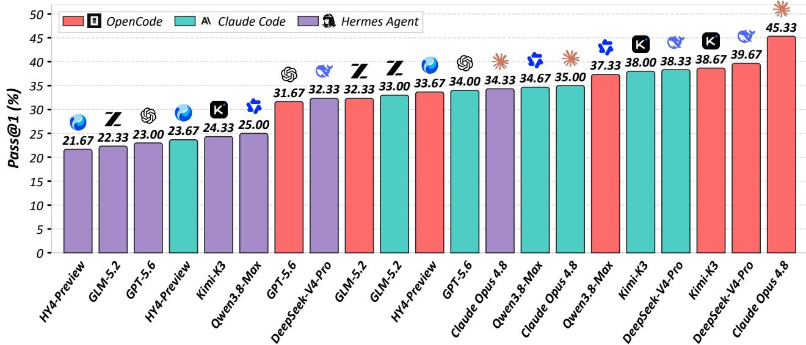  
Figure 1 Pass@1 for 21 model–harness pairs on 300 CheckerBench tasks (Table 2).

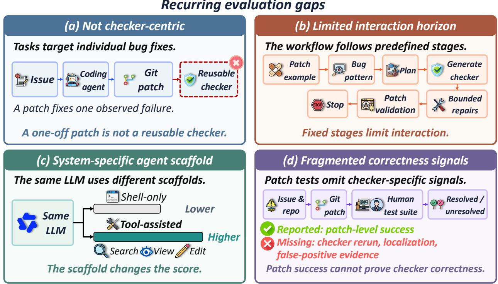  
Figure 2 Four recurring evaluation gaps: (a) Not checker-centric [32]; (b) Limited interaction horizon [67]; (c) Systemspecific agent scafold [68]; and (d) Fragmented correctness signals [53].

## 1 Introduction

Static analysis provides a scalable approach for detecting complex program defects without executing the target programs [11, 28, 36, 59, 67]. However, existing static analyzers typically rely on manually designed checkers, which require substantial expert efort to encode defect patterns and analysis strategies into toolspecific rules [24, 59, 67]. Recent advances in large language models (LLMs) have opened new opportunities for automated code understanding and defect detection. Nevertheless, directly applying LLMs to code snippets remains challenging due to high inference costs and limited access to repository-wide context, which can lead to incomplete reasoning and hallucinated findings [27, 46].

To overcome these limitations, recent coding agents extend LLMs with the ability to interact with software repositories and external tools [9, 10], enabling iterative code modification, execution, and feedback-driven refinement. These capabilities provide a promising foundation for automating static-analysis checker development, which traditionally requires substantial manual engineering efort. Given a defect specification, an agent can navigate analyzer infrastructures, implement checker logic, integrate the checker into the build system, and iteratively refine its behavior based on compiler and analyzer feedback [32, 52, 58, 62, 66]. However, synthesizing efective static-analysis checkers remains a challenging long-horizon task: agents must understand complex analyzer frameworks, make coordinated modifications across multiple files, and ensure that the resulting checker compiles, detects target defects, and maintains low false-positive rates [11, 36, 65]. We refer to this task as long-horizon agentic static-analysis checker synthesis.

However, as illustrated in Figure 2, existing benchmarks are insuficient for evaluating long-horizon agentic static-analysis checker synthesis. First, current coding and vulnerability benchmarks are not checker-centric: repository-level benchmarks typically evaluate code completion, patch generation, or feature implementation, while vulnerability benchmarks focus on detection, classification, or repair rather than reusable checker synthesis [32, 39, 61, 64, 69, 73]. Second, existing benchmarks provide limited task interaction. They either evaluate isolated tasks or decompose workflows into predefined stages, preventing agents from performing the iterative planning, implementation, and debugging required for checker development [24, 35, 67]. Third, benchmarks difer substantially in environments, tool interfaces, and evaluation protocols, making results dificult to compare across systems [62, 66, 68]. Finally, current evaluation metrics mainly measure patchlevel correctness or test-suite outcomes, but do not capture checker-specific properties such as vulnerability coverage, false-positive control, and analyzer compatibility [32, 34, 63]. These limitations motivate a unified benchmark that evaluates agents’ ability to autonomously synthesize reliable and reusable static-analysis checkers.

Table 1 Systems and benchmarks for agentic static-analysis checker synthesis. ✓ denotes full support, ✓ partial support, and ✗ no support. Appendix A defines the operational criteria.
<table><tr><td>System / Benchmark</td><td>Repository Context</td><td>Executable Environment</td><td>Multi-Harness Support</td><td>Long-Horizon Interaction</td><td>Checker Synthesis</td><td>Semantic Verification</td><td>False-Positive Evaluation</td></tr><tr><td>RhoSynth [24]</td><td>x</td><td>x</td><td>x</td><td>x</td><td>√</td><td></td><td></td></tr><tr><td>KNighter [67]</td><td>x</td><td></td><td>x</td><td>x</td><td>√</td><td>√</td><td></td></tr><tr><td>SWE-bench [32]</td><td>√</td><td></td><td>x</td><td>X</td><td>x</td><td>X</td><td>x</td></tr><tr><td>SWE-Gym [53]</td><td>√</td><td></td><td>x</td><td>√</td><td>x</td><td>X</td><td>x</td></tr><tr><td>R2E-Gym [31]</td><td>√</td><td></td><td>x</td><td>√</td><td>x</td><td>X</td><td>x</td></tr><tr><td>ReposVul [61]</td><td>X</td><td>x</td><td>x</td><td>x</td><td>x</td><td>X</td><td>X</td></tr><tr><td>VulEval [64]</td><td>X</td><td>x</td><td>X</td><td>x</td><td>x</td><td>X</td><td>X</td></tr><tr><td>JitVul [69]</td><td>X</td><td>x</td><td>x</td><td>X</td><td>x</td><td></td><td>x</td></tr><tr><td>CHECKERBENCH</td><td></td><td></td><td>J</td><td>J</td><td>√</td><td></td><td>V</td></tr></table>

To address these gaps, we introduce CheckerBench, the first benchmark for evaluating long-horizon staticanalysis checker synthesis. CheckerBench contains 300 real-world tasks collected from 297 CVEs, 167 repositories, 85 CWEs, and five programming-language ecosystems, covering diverse analyzer environments and defect patterns. Each task provides a reproducible repository, an analyzer-specific environment, and reusable skills, enabling agents to perform iterative development and validation rather than isolated code generation. We further develop CheckerLab, a unified evaluation framework that assesses coding-agent systems under a common task specification and scoring protocol. CheckerLab performs independent repeated generation and frozen-candidate verification: each synthesized checker is rebuilt, executed on vulnerable and fixed revisions, and evaluated based on diagnostic reduction, patch localization, residual reports, and computational cost. Across 21 model–harness configurations, the average Pass@1 score is only 32.30%, with the best-performing configuration reaching 45.33% (Figure 1). These results demonstrate that synthesizing reliable and reusable static-analysis checkers remains a challenging problem for current coding agents. In summary, our contributions are threefold.

• To the best of our knowledge, we are the first to build a comprehensive executable benchmark for evaluating repository-level, long-horizon static-analysis checker synthesis by coding agents. CheckerBench contains 300 real-world tasks spanning multiple programming-language ecosystems and analyzer environments, enabling systematic evaluation of agentic checker development.

• We develop a scalable benchmark construction pipeline that automatically reconstructs analyzer environments, packages synthesis tasks, and validates checker behavior. This pipeline enables reproducible task creation beyond manually curated checker examples.

• We present CHECKERLAB, a unified evaluation framework for coding-agent systems with a shared task specification and scoring protocol. CheckerLab supports independent repeated generation and frozen-candidate verification, providing fine-grained measurements of checker correctness, patch localization, false-positive control, and computational cost.

## 2 Related Work

## 2.1 Static Analysis and Checker Synthesis

Static analyzers rely on expert-authored checkers that encode defect patterns and analyzer-specific logic [24, 67]. RhoSynth learns graph-based code-quality rules from examples, while Gordon explores program-specific analyses from behavioral examples [24, 25]. LLM-based systems execute analysis pseudocode or filter bug reports [27, 46]. IRIS infers taint specifications for repository-wide analysis [36]; MoCQ and CQLLM generate vulnerability patterns or CodeQL queries [35, 60]. QLCoder synthesizes CodeQL queries through tool use and iterative feedback [59]. KNighter synthesizes and refines Clang Static Analyzer checkers from Linux kernel patches [67]. These systems target specific analyzers or domains, motivating a common evaluation of general-purpose agents developing and validating checkers across analyzer environments.

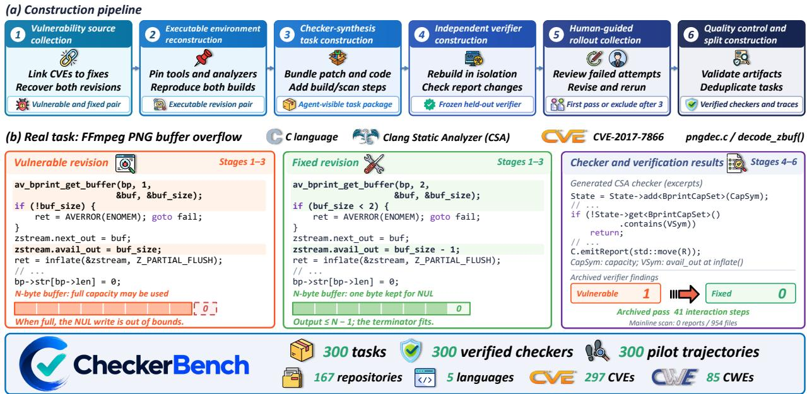  
Figure 3 CheckerBench construction.

## 2.2 Coding Agents for Software Engineering

Coding agents combine LLMs with repository navigation, code editing, tool execution, and feedback. SWEagent and OpenHands support interactive development, while RepoGraph adds repository structure [52, 62, 68]. RepoAudit applies an agent to repository-level bug detection [26]. These systems produce patches or bug findings. Checker synthesis requires analyzer integration and validation through compiler and scan feedback on vulnerable and fixed revisions.

## 2.3 Benchmarks for Repository-Level Code Agents

Repository-level benchmarks cover issue resolution (SWE-bench and SWE-bench Pro), feature development (FeatureBench), and terminal tasks (Terminal-Bench) [19, 32, 43, 73]. SWE-Gym and R2E-Gym provide executable environments and verifiers for issue-resolution tasks [31, 53]. ReposVul, VulEval, and JitVul target vulnerability detection; SEC-bench evaluates proof-of-concept generation and patching [34, 61, 64, 69]. These works score task completion, patches, or vulnerability detection. CheckerBench evaluates reusable checker construction with held-out verification of builds, vulnerable–fixed diagnostics, patch localization, and false positives (Table 1).

## 3 The CHECKERBENCH Benchmark

Problem formulation. Each agent-facing task $x _ { i } = ( p _ { i } , \ell _ { i } , \alpha _ { i } , \mathcal { E } _ { i } , \mathcal { Q } _ { i } )$ combines a vulnerability-fix instance $p _ { i } = ( r _ { i } , c _ { i } ^ { - } , c _ { i } ^ { + } , \Delta _ { i } )$ (repository, vulnerable/fixed revisions, and patch) with its language, analyzer, reproducible version-pinned environment, and synthesis instruction. All runs share the initial skill library $\kappa ;$ agents may edit checker artifacts but must preserve both revisions.

Under an active generation time budget $B ,$ policy $\pi _ { \theta }$ in harness h yields trajectory $\tau _ { i } ^ { ( h , \theta ) } ~ =$ $\left( o _ { 0 } , a _ { 0 } , \ldots , a _ { N _ { i } - 1 } , o _ { { N _ { i } } } \right)$ and candidate checker $\boldsymbol { q } _ { i } ^ { ( h , \theta ) }$ . Here $N _ { i }$ counts interactions, $a _ { k }$ is an action, and $O k { + 1 }$ its resulting observation [8]. A released record is $d _ { i } ^ { ( h , \theta ) } ~ = ~ ( \mathcal { E } _ { i } , \mathcal { Q } _ { i } , \mathcal { V } _ { i } , \tau _ { i } ^ { ( h , \theta ) } , q _ { i } ^ { ( h , \theta ) } )$ , with executable veri fier $\nu _ { i }$ hidden during synthesis. The environment, instruction, and verifier are fixed across model–harness configurations; trajectories and checkers vary by rollout.

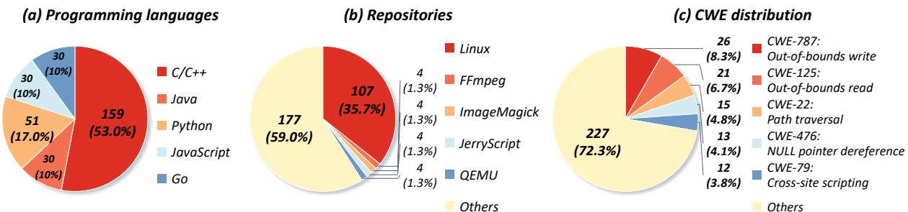  
Figure 4 CheckerBench distributions by (a) language, (b) repository, and (c) CWE.

## 3.1 Benchmark Construction

Figure 3 summarizes the six-stage pipeline: recover executable vulnerability-fix pairs, package synthesis tasks, freeze independent verifiers, and curate verified checker–trajectory pairs. All candidates start from the same harness-component baseline and shared skill library.

Stage I: Vulnerability Source Collection. We link public CVE records from the National Vulnerability Database1 to fixing commits in open-source C/C++, Java, Python, JavaScript, and Go repositories. Each candidate must have a retrievable vulnerable–fixed revision pair and a patch that exposes a reusable staticanalysis property. We exclude unresolved provenance and incompatible redistribution terms, and retain CVE/CWE mappings for auditing and stratified sampling.

Stage II: Executable Environment Reconstruction. We reconstruct both revisions in isolated workspaces with pinned toolchains and analyzers: Clang Static Analyzer (CSA) for C/C++ and CodeQL for the other four languages. Revision-compatible build snapshots and compilation databases recover the analyzable scope of CSA tasks; CodeQL tasks use pinned analysis environments. Each pair includes afected functions and reproducible checker compilation and scan commands. We reject pairs that cannot be reconstructed or do not support stable diferential analysis.

Stage III: Checker-Synthesis Task Construction. Each task exposes the patch, pre- and post-fix functions, build metadata, compile/scan commands, and a minimal checker scafold. Random workspace identifiers and omitted CVE/CWE labels reduce provenance shortcuts. The shared library K supplies harness-specific workflow skills and read-only analyzer documentation, example checker implementations, and semantic utilities; it excludes task-specific checker solutions. The agent must infer the defect mechanism, implement a reusable checker, and refine it through compilation and analysis feedback, producing checker artifacts and an interaction trace.

Stage IV: Independent Verifier Construction. We freeze a held-out verifier before rollout collection. It rebuilds each submitted checker from source in a clean workspace and checks vulnerable–fixed diagnostic contrast and patch relevance under backend-specific rules. CSA requires a disappearing report in a patchmodified function. Passing additionally requires process and semantic quality, mainline false-positive control, and mechanism and anti-hardcoding checks (Appendix F).

Stage V: Human-Guided Rollout Collection and Sampling. Calibration uses fixed model, harness, tool, and budget settings. After a failed attempt, a human diagnoses the verification evidence and revises prompt guidance for a fresh rollout; the task, verifier, and thresholds stay fixed. Each task permits one initial attempt and at most two rerolls, stopping at the first pass and excluding tasks with no pass after three attempts. We retain all attempts and interventions for audit. Checker–trace pairs enter sampling only if the checker passes the frozen verifier and the trace contains at least 40 interaction steps (agent decisions). Eligible pairs are sampled jointly over repository, CWE, and horizon. The 40-step threshold is a curation rule; these pilot interventions are separate from autonomous main evaluation.

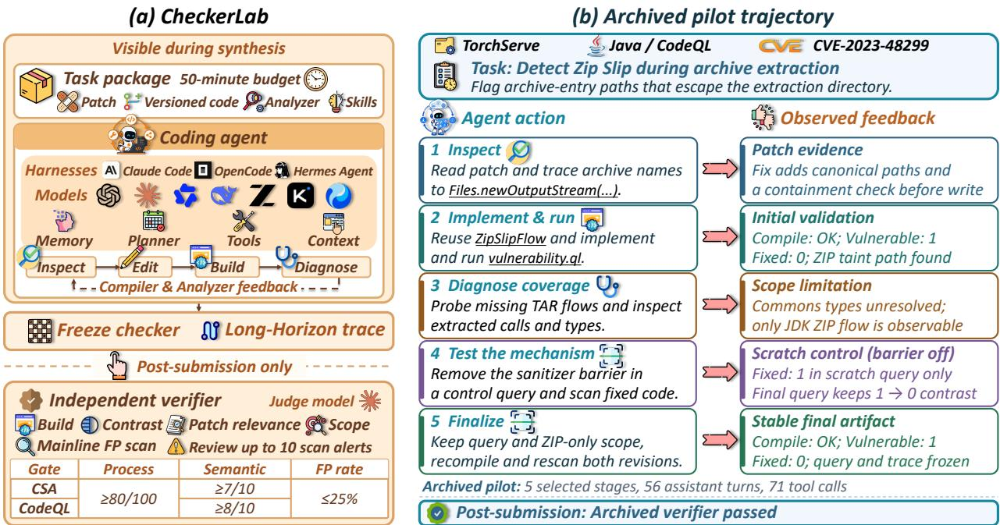  
Figure 5 CheckerLab workflow and five selected stages from an archived TorchServe pilot.

Stage VI: Quality Control, Deduplication, and Splits. Automated checks establish artifact integrity, reproducible builds and scans, verifier isolation, and package completeness; manual review confirms defect semantics and patch-localized diagnostics. We remove duplicate revision pairs and keep tasks connected by repository, CVE, shared revisions, or similar patches in one split. Task-specific reference checkers, calibration traces, and verifier details remain hidden from evaluation agents. Appendix C details these checks and split safeguards.

## 3.2 Benchmark Statistics

Projects and tasks. CheckerBench contains 300 tasks from 167 open-source repositories, including Linux [38] (107 tasks), FFmpeg [23] (4), and ImageMagick [29] (4). Tasks cover C/C++ (159), Java (30), Python (51), JavaScript (30), and Go (30). Static analysis environments are CSA (159) and CodeQL (141).

Trajectories and interaction horizons. We release 300 accepted calibration trajectories, one per task. Calibration includes human intervention to diagnose failures and revise prompts. All trajectories pass executable verification and the construction-time semantic-score threshold. They are separate from independent main-experiment repeats. Interaction steps reflect workload under the calibration configuration [57]. Appendices D.4 and D.5 report trajectory statistics, including the assistant-turn and tool-call distributions of the admitted pilot trajectories (Figure 11).

Defect and task coverage. CheckerBench covers 85 CWEs. The most frequent are CWE-787 (out-ofbounds write), CWE-125 (out-of-bounds read), and CWE-22 (path traversal), as shown in Figure 4(c). Each task also records repository scale, integration scope, verification evidence, and calibration horizon. Appendix D provides complete benchmark statistics.

## 4 CHECKERLAB: Evaluation Framework

CheckerLab separates interactive checker synthesis from independent evaluation of the frozen checker and its trajectory [41] (Figure 5).

Table 2 Performance of seven models across three agent harnesses on CheckerBench. Bold and underlined values mark the best and second-best models per metric within each harness. Model-row subscripts show numerical changes relative to GPT-5.6 in the same harness: ↑ increases and ↓ decreases (percentage points for percentage metrics). Header arrows indicate the preferred direction. Model-row metrics are means over three independent repeats. Overall Average summarizes the 21 model–harness configurations.
<table><tr><td>Model / System</td><td>Pass@1 (%) ↑</td><td>Build (%) ↑</td><td>Diff. SR (%) ↑</td><td> $\mathbf { F P _ { \mathrm { p a s s } } }$  (%) ↓</td><td>#WN</td><td>Process ↑</td><td>Semantic ↑</td><td>Avg. Turns ↓</td><td>Avg. Tool Calls↓</td></tr><tr><td colspan="10"> OpenCode</td></tr><tr><td>GPT-5.6</td><td>31.67</td><td>98.33</td><td>85.33</td><td>0.00</td><td>7</td><td>80.22</td><td>7.68</td><td>29.19</td><td>60.13</td></tr><tr><td>米 Claude Opus 4.8</td><td> $\mathbf { 4 5 . 3 3 } _ { \uparrow 1 3 . 6 6 }$ </td><td> $8 1 . 6 7 _ { \downarrow 1 6 . 6 6 }$ </td><td> $8 1 . 0 0 _ { \scriptstyle \downarrow 4 . 3 3 }$ </td><td> $1 3 . 7 9 _ { \uparrow 1 3 . 7 9 }$ </td><td>174</td><td> $8 6 . 4 2 _ { \uparrow 6 . 2 0 }$ </td><td> $\underline { { 8 . 3 2 } } _ { \uparrow 0 . 6 4 }$ </td><td> $4 4 . 7 8 _ { \uparrow 1 5 . 5 9 }$ </td><td> $6 4 . 3 5 _ { \uparrow 4 . 2 2 }$ </td></tr><tr><td>六 Qwen3.8-Max</td><td> $3 7 . 3 3 \substack { \uparrow 5 . 6 6 }$ </td><td> $6 9 . 3 3 _ { \perp 2 9 . 0 0 }$ </td><td> $6 9 . 0 0 _ { \downarrow 1 6 . 3 3 }$ </td><td> $5 . 7 7 \substack { \uparrow 5 . 7 7 }$ </td><td>52</td><td> $\mathbf { 9 0 . 1 5 } _ { \uparrow 9 . 9 3 }$ </td><td> $\mathbf { 8 . 4 6 } _ { \uparrow 0 . 7 8 }$ </td><td> $3 5 . 9 6 _ { \uparrow 6 . 7 7 }$ </td><td> $4 7 . 5 4 _ { \downarrow 1 2 . 5 9 }$ </td></tr><tr><td>Q DeepSeek-V4-Pro</td><td> $\underline { { 3 9 . 6 7 } } \mathrm { \uparrow 8 . 0 0 }$ </td><td> $\underline { { 9 2 . 6 7 } } \underline { { { . } 5 . 6 6 } }$ </td><td> $\mathbf { 9 0 . 6 7 } _ { \uparrow 5 . 3 4 }$ </td><td> $2 . 5 6 _ { \uparrow 2 . 5 6 }$ </td><td>78</td><td> $8 4 . 8 9 _ { \uparrow 4 . 6 7 }$ </td><td> $8 . 1 2 _ { \uparrow 0 . 4 4 }$ </td><td> $5 1 . 0 9 _ { \uparrow 2 1 . 9 0 }$ </td><td> $6 5 . 2 8 _ { \uparrow 5 . 1 5 }$ </td></tr><tr><td>GLM-5.2</td><td> $3 2 . 3 3 _ { \uparrow 0 . 6 6 }$ </td><td> $7 7 . 3 3 _ { \perp 2 1 . 0 0 }$ </td><td> $7 5 . 3 3 _ { \perp 1 0 . 0 0 }$ </td><td> $1 0 . 3 4 _ { \uparrow 1 0 . 3 4 }$ </td><td>58</td><td> $8 6 . 7 3 _ { \uparrow 6 . 5 1 }$ </td><td> $8 . 1 1 _ { \uparrow 0 . 4 3 }$ </td><td> $4 1 . 2 1 _ { \uparrow 1 2 . 0 2 }$ </td><td> $6 1 . 0 2 _ { \uparrow 0 . 8 9 }$ </td></tr><tr><td>K Kimi-K3</td><td> $3 8 . 6 7 _ { \uparrow 7 . 0 0 }$ </td><td> $8 3 . 3 3 _ { \perp 1 5 . 0 0 }$ </td><td> $8 1 . 6 7 _ { \downarrow 3 . 6 6 }$ </td><td> $\underline { { 1 . 5 9 } } _ { \uparrow 1 . 5 9 }$ </td><td>63</td><td> $\underline { { 8 8 . 4 8 } } _ { \uparrow 8 . 2 6 }$ </td><td> $8 . 3 0 _ { \uparrow 0 . 6 2 }$ </td><td> $3 2 . 4 2 _ { \uparrow 3 . 2 3 }$ </td><td> $\mathbf { 4 3 . 5 3 _ { \perp 1 6 . 6 0 } }$ </td></tr><tr><td>HY4-Preview</td><td> $3 3 . 6 7 _ { \uparrow 2 . 0 0 }$ </td><td> $7 2 . 6 7 _ { \downarrow 2 5 . 6 6 }$ </td><td> $7 1 . 3 3 _ { \downarrow 1 4 . 0 0 }$ </td><td> $1 2 . 3 8 _ { \uparrow 1 2 . 3 8 }$ </td><td>105</td><td> $8 6 . 9 0 _ { \uparrow 6 . 6 8 }$ </td><td> $\underline { { 8 . 3 2 } } _ { \uparrow 0 . 6 4 }$ </td><td> $4 1 . 2 8 _ { \uparrow 1 2 . 0 9 }$ </td><td> $5 0 . 1 5 _ { \downarrow 9 . 9 8 }$ </td></tr><tr><td>Average</td><td>36.95</td><td>82.19</td><td>79.19</td><td>6.63</td><td>76.71</td><td>86.26</td><td>8.19</td><td>39.42</td><td>56.00</td></tr><tr><td colspan="10">AClaude Code</td></tr><tr><td>GPT-5.6</td><td>34.00</td><td>93.67</td><td>83.00</td><td>2.44</td><td>41</td><td>81.41</td><td>7.69</td><td>35.71</td><td>60.58</td></tr><tr><td> Claude Opus 4.8</td><td> $3 5 . 0 0 _ { \uparrow 1 . 0 0 }$ </td><td> $6 3 . 6 7 _ { \downarrow 3 0 . 0 0 }$ </td><td> $6 2 . 3 3 _ { \downarrow 2 0 . 6 7 }$ </td><td> $2 . 3 3 _ { \downarrow 0 . 1 1 }$ </td><td>43</td><td> $8 6 . 8 8 _ { \uparrow 5 . 4 7 }$ </td><td> $8 . 2 1 _ { \uparrow 0 . 5 2 }$ </td><td> $3 2 . 6 0 _ { \downarrow 3 . 1 1 }$ </td><td> $4 5 . 6 3 _ { \downarrow 1 4 . 9 5 }$ </td></tr><tr><td>Qwen3.8-Max</td><td> $3 4 . 6 7 _ { \uparrow 0 . 6 7 }$ </td><td> $6 7 . 3 3 _ { \perp 2 6 . 3 4 }$ </td><td> $6 7 . 0 0 _ { \scriptstyle \downarrow 1 6 . 0 0 }$ </td><td> $4 . 5 5 \substack { \uparrow 2 . 1 1 }$ </td><td>44</td><td> $8 9 . 5 8 _ { \uparrow 8 . 1 7 }$ </td><td> $\underline { { 8 . 3 8 } } _ { \uparrow 0 . 6 9 }$ </td><td> $3 3 . 9 1 _ { \downarrow 1 . 8 0 }$ </td><td> $\underline { { 4 1 . 5 7 } } \underline { { \cdot } } 1 9 . 0 1$ </td></tr><tr><td>DeepSeek-V4-Pro</td><td> $\mathbf { 3 8 . 3 3 } _ { \uparrow 4 . 3 3 }$ </td><td> $\underline { { 9 1 . 3 3 } } . 1 2 . 3 4 $ </td><td> $\mathbf { 8 9 . 6 7 } _ { \uparrow 6 . 6 7 }$ </td><td> $\underline { { 1 . 7 2 } } _ { \downarrow 0 . 7 2 }$ </td><td>58</td><td> $8 5 . 2 5 _ { \uparrow 3 . 8 4 }$ </td><td> $8 . 2 7 _ { \uparrow 0 . 5 8 }$ </td><td> $4 7 . 1 7 _ { \uparrow 1 1 . 4 6 }$ </td><td> $6 2 . 5 0 _ { \uparrow 1 . 9 2 }$ </td></tr><tr><td>GLM-5.2</td><td> $3 3 . 0 0 _ { \downarrow 1 . 0 0 }$ </td><td> $7 6 . 3 3 _ { \scriptstyle \downarrow 1 7 . 3 4 }$ </td><td> $7 4 . 6 7 _ { \downarrow 8 . 3 3 }$ </td><td> $\mathbf { 0 . 0 0 } _ { \downarrow 2 . 4 4 }$ </td><td>18</td><td> $\underline { { 8 9 . 6 7 } } \mathrm { \uparrow 8 . 2 6 }$ </td><td> $\mathbf { 8 . 3 9 } _ { \uparrow 0 . 7 0 }$ </td><td> $3 8 . 7 5 _ { \uparrow 3 . 0 4 }$ </td><td> $4 9 . 9 3 _ { \downarrow 1 0 . 6 5 }$ </td></tr><tr><td>Kimi-K3</td><td> $3 8 . 0 0 \substack { \uparrow 4 . 0 0 }$ </td><td> $8 3 . 6 7 _ { \downarrow 1 0 . 0 0 }$ </td><td> $8 2 . 3 3 _ { \downarrow 0 . 6 7 }$ </td><td> $2 . 7 4 \substack { \uparrow 0 . 3 0 }$ </td><td>73</td><td> $8 7 . 7 9 _ { \uparrow 6 . 3 8 }$ </td><td> $8 . 3 4 _ { \uparrow 0 . 6 5 }$ </td><td> $\mathbf { 3 1 . 8 1 } _ { \downarrow 3 . 9 0 }$ </td><td> $\mathbf { 3 8 . 6 1 } _ { \downarrow 2 1 . 9 7 }$ </td></tr><tr><td>HY4-Preview</td><td> $2 3 . 6 7 _ { \downarrow 1 0 . 3 3 }$ </td><td> $4 9 . 3 3 _ { \downarrow 4 4 . 3 4 }$ </td><td> $4 7 . 3 3 _ { \downarrow 3 5 . 6 7 }$ </td><td> $\mathbf { 0 . 0 0 } _ { \downarrow 2 . 4 4 }$ </td><td>13</td><td> $\mathbf { 9 0 . 8 3 } _ { \uparrow 9 . 4 2 }$ </td><td> $8 . 3 5 _ { \uparrow 0 . 6 6 }$ </td><td> $5 0 . 6 6 _ { \uparrow 1 4 . 9 5 }$ </td><td> $6 2 . 2 3 _ { \uparrow 1 . 6 5 }$ </td></tr><tr><td>Average</td><td>33.81</td><td>75.05</td><td>72.33</td><td>1.97</td><td>41.43</td><td>87.34</td><td>8.23</td><td>38.66</td><td>51.58</td></tr><tr><td colspan="10">2 Hermes Agent</td></tr><tr><td> GPT-5.6</td><td>23.00</td><td>100.00</td><td>64.00</td><td>0.00</td><td>6</td><td>79.85</td><td>7.50</td><td>25.94</td><td>46.91</td></tr><tr><td> Claude Opus 4.8</td><td> $\mathbf { 3 4 . 3 3 } _ { \uparrow 1 1 . 3 3 }$ </td><td> $8 0 . 3 3 _ { \downarrow 1 9 . 6 7 }$ </td><td> $7 8 . 6 7 \substack { \uparrow 1 4 . 6 7 }$ </td><td> $5 . 4 5 _ { \uparrow 5 . 4 5 }$ </td><td>55</td><td> $8 5 . 5 8 \gamma _ { 5 . 7 3 }$ </td><td> $8 . 3 2 _ { \uparrow 0 . 8 2 }$ </td><td> $4 4 . 8 4 _ { \uparrow 1 8 . 9 0 }$ </td><td> $6 1 . 8 9 _ { \uparrow 1 4 . 9 8 }$ </td></tr><tr><td>六 Qwen3.8-Max</td><td> $2 5 . 0 0 _ { \uparrow 2 . 0 0 }$ </td><td> $4 4 . 0 0 _ { \downarrow 5 6 . 0 0 }$ </td><td> $4 2 . 3 3 _ { \downarrow 2 1 . 6 7 }$ </td><td> $1 1 . 1 1 _ { \uparrow 1 1 . 1 1 }$ </td><td>27</td><td> $\mathbf { 9 0 . 9 2 } _ { \uparrow 1 1 . 0 7 }$ </td><td> $\mathbf { 8 . 5 3 } _ { \uparrow 1 . 0 3 }$ </td><td> $4 0 . 5 5 \substack { \uparrow 1 4 . 6 1 }$ </td><td> $5 1 . 9 5 _ { \uparrow 5 . 0 4 }$ </td></tr><tr><td>Q DeepSeek-V4-Pro</td><td> $\underline { { 3 2 . 3 3 } } _ { \uparrow 9 . 3 3 }$ </td><td> $\underline { { 9 4 . 0 0 } } _ { \downarrow 6 . 0 0 }$ </td><td> $\mathbf { 9 0 . 6 7 } _ { \uparrow 2 6 . 6 7 }$ </td><td> $\mathbf { 0 . 0 0 } _ { = 0 . 0 0 }$ </td><td>12</td><td> $8 5 . 2 9 _ { \uparrow 5 . 4 4 }$ </td><td> $8 . 0 3 _ { \uparrow 0 . 5 3 }$ </td><td> $3 9 . 8 2 _ { \uparrow 1 3 . 8 8 }$ </td><td> $6 2 . 3 7 _ { \uparrow 1 5 . 4 6 }$ </td></tr><tr><td>GLM-5.2</td><td> $2 2 . 3 3 _ { \downarrow 0 . 6 7 }$ </td><td> $7 9 . 6 7 _ { \downarrow 2 0 . 3 3 }$ </td><td> $7 8 . 0 0 _ { \uparrow 1 4 . 0 0 }$ </td><td> $\mathbf { 0 . 0 0 } _ { = 0 . 0 0 }$ </td><td>3</td><td> $8 2 . 8 7 _ { \uparrow 3 . 0 2 }$ </td><td> $7 . 8 1 _ { \uparrow 0 . 3 1 }$ </td><td> $4 2 . 8 5 _ { \uparrow 1 6 . 9 1 }$ </td><td> $6 3 . 2 2 _ { \uparrow 1 6 . 3 1 }$ </td></tr><tr><td>Kimi-K3</td><td> $2 4 . 3 3 _ { \uparrow 1 . 3 3 }$ </td><td> $8 7 . 0 0 _ { \downarrow 1 3 . 0 0 }$ </td><td> $7 9 . 6 7 \substack { \uparrow 1 5 . 6 7 }$ </td><td> $\underline { { 4 . 7 6 } } _ { \uparrow 4 . 7 6 }$ </td><td>63</td><td> $8 2 . 6 2 _ { \uparrow 2 . 7 7 }$ </td><td> $8 . 0 8 _ { \uparrow 0 . 5 8 }$ </td><td> $\underline { { 3 2 . 7 3 } } _ { \uparrow 6 . 7 9 }$ </td><td> $\mathbf { 4 2 . 1 2 _ { \perp 4 . 7 9 } }$ </td></tr><tr><td>HY4-Preview</td><td> $2 1 . 6 7 _ { \downarrow 1 . 3 3 }$ </td><td> $5 7 . 6 7 _ { \downarrow 4 2 . 3 3 }$ </td><td> $5 2 . 6 7 _ { \downarrow 1 1 . 3 3 }$ </td><td> $\mathbf { 0 . 0 0 } _ { = 0 . 0 0 }$ </td><td>3</td><td> $\underline { { 8 8 . 4 2 } } _ { \uparrow 8 . 5 7 }$ </td><td> $\underline { { 8 . 4 4 } } _ { \uparrow 0 . 9 4 }$ </td><td> $4 9 . 6 9 _ { \uparrow 2 3 . 7 5 }$ </td><td> $6 2 . 0 6 _ { \uparrow 1 5 . 1 5 }$ </td></tr><tr><td>Average</td><td>26.14</td><td>77.52</td><td>69.43</td><td>3.05</td><td>24.14</td><td>85.08</td><td>8.10</td><td>39.49</td><td>55.79</td></tr><tr><td>Overall Average</td><td>32.30</td><td>78.25</td><td>73.65</td><td>3.88</td><td>47.43</td><td>86.23</td><td>8.17</td><td>39.19</td><td>54.46</td></tr></table>

Evaluation workflow. Each run receives an isolated workspace with the task instruction, fixing patch, code context, analyzer tools, and enabled skills; the reference checker and held-out verifier remain hidden. Agents use native harness capabilities and compilation and analysis feedback within a common 50-minute generation budget. At termination, we freeze the submitted CSA checker or CodeQL query source and record the trajectory and tool invocations. The verifier then rebuilds the frozen checker from source in a clean environment and checks vulnerable–fixed diagnostic contrast and patch relevance under backend-specific rules (Section 3.1). A broader mainline scan assesses false positives without checker edits. Claude Opus 5 [7] judges process quality, vulnerability semantics, and sampled mainline alerts in separate stages. A run passes only after normal generation completion and satisfaction of all gates in Equation 5; Appendix F gives the full rubrics.

Metrics. Our primary metric, Pass@1, is the percentage of tasks whose checker passes the full evaluation after one independent synthesis run. For each of the 21 harness–model pairs, we evaluate the same 300 tasks in three independent repeats and average the three rates equally. Generation failures, refusals, and candidatecode errors count as failures. Build and Dif. SR are the percentages of all tasks passing independent compilation and diferential verification, respectively. Process and Semantic are mean valid scores on 100- point and 10-point scales. Within each repeat, the false-positive percentage $\mathrm { F P _ { p a s s } = 1 0 0 \sum F P / \sum ( T P + F P ) }$ pools fully adjudicated recorded mainline alerts from passed checkers. The acceptance gate uses each checker’s sampled mainline alerts, with a default FP cutof of 25% (Appendix F). We compute each metric per repeat and average equally (Appendix H). In Table 2, #WN is the arithmetic mean of the counts of fully adjudicated recorded mainline warnings from passed checkers across the three repeats. Each repeat’s count is $\sum ( \mathrm { T P + F P } )$

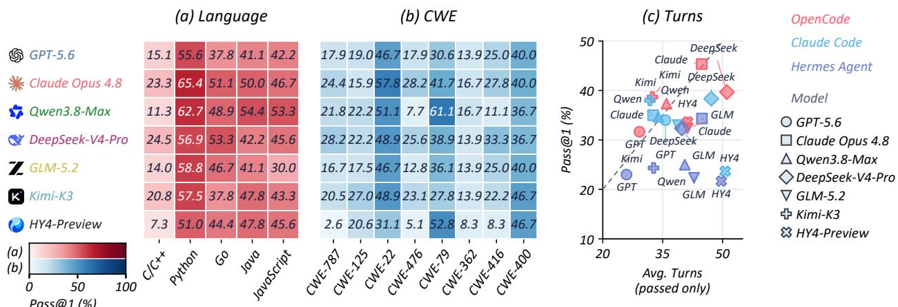  
Figure 6 Pass@1 by (a) language and (b) CWE, averaged equally across three harnesses. (c) Pass@1 versus average turns on successful runs; colors denote harnesses and shapes denote models.

The Average and Overall Average rows report mean counts across seven models and all 21 configurations, respectively. Warning counts are descriptive, with no ranking or change subscripts. Appendix E.6 details alert selection, recorded warning volume, and sensitivity to precision weighting and all-recorded-alert gates. For interaction eficiency, we average turns, tool calls, and explicit skill calls over successful trajectories within each repeat, including subagent activity. We then average these means equally across repeats and report success counts (Appendix E).

## 5 Experiments

## 5.1 Experimental Setup

Models and agent harnesses. We evaluate 7 models using 3 agent harnesses, including OpenCode [3], Claude Code [5], and Hermes Agent [48]. The models are GPT-5.6-Sol [49], Claude Opus 4.8 [6], Qwen3.8-Max [2], DeepSeek-V4-Pro-0813 [18], GLM-5.2 [70], Kimi-K3 [33], and HY4-Preview [56].

Task execution. Each CheckerLab run uses an isolated E2B sandbox and workspace containing the task instruction, fixing patch, relevant code context, and analyzer tools. Agents can inspect code, implement checkers, and use compilation and analysis feedback within a 50-minute active generation budget. The submitted source and execution records are frozen at termination for independent verification. Environment and execution details are provided in Appendix E.

Evaluation and judge. Each frozen checker is evaluated using backend-specific executable checks and scoring rubrics. We use Claude Opus 5 [7] as the LLM judge for false-positive triage, process quality, and vulnerability semantics. Human validation gives a pooled Cohen’s κ = 0.85 for judge–human agreement. Appendix E.9 reports the sampling, labeling, adjudication, and stage-specific agreement. The scoring rubrics are detailed in Appendix F. For the 21 model–harness configurations, we report mean Pass@1 over three independent repeats on the same 300 tasks, with additional diagnostic metrics defined in Section 4. Eficiency metrics are averaged over successful trajectories only.

## 5.2 Overall Performance

End-to-end success. Across 21 model–harness configurations, mean Pass@1 is 32.30%; even the best combination, Claude Opus 4.8 with OpenCode, reaches only 45.33% (Figure 1; Table 2). Thus, more than half of tasks remain unsuccessful even for the strongest configuration. Overall Build and Dif. SR are much higher, at 78.25% and 73.65%, respectively. The gap between Dif. SR and Pass@1 is 41.35 percentage points, much larger than the 4.60-point gap between Build and Dif. SR. For example, GPT-5.6 with Hermes Agent achieves 100.00% Build but only 64.00% Dif. SR and 23.00% Pass@1. The larger gap between diferential verification and full acceptance highlights the challenge of meeting the additional requirements for semantic fidelity, process quality, false-positive control, and normal completion.

Model–harness dependence. OpenCode has the highest mean Pass@1 across models (36.95%), followed by Claude Code (33.81%) and Hermes Agent (26.14%), with a 10.81-percentage-point diference between the highest and lowest averages. The best harness varies by model: GPT-5.6 and GLM-5.2 attain their highest Pass@1 with Claude Code. The leading model also changes across harnesses. Claude Opus 4.8 ranks first with OpenCode and Hermes Agent, whereas DeepSeek-V4-Pro leads with Claude Code (38.33%, compared with 35.00% for Claude Opus 4.8). Kimi-K3 further illustrates the sensitivity to harness choice, declining from 38.67% with OpenCode to 24.33% with Hermes Agent, a 14.34-point gap. These shifts show that harness choice changes both success rates and model rankings, making the complete model–harness configuration the appropriate unit for comparison and selection.

Diagnostic quality and false positives. Qwen3.8-Max with Hermes Agent has the highest Process (90.92/100) and Semantic (8.53/10) scores across all configurations, yet reaches only 25.00% Pass@1 and 44.00% Build. OpenCode’s higher mean Pass@1 is also accompanied by a higher $\mathrm { F P _ { p a s s } }$ than Claude Code (6.63% vs. 1.97%). Within OpenCode, Claude Opus 4.8 has 13.79% $\mathrm { F P _ { p a s s } }$ with $\# \mathrm { W N } = 1 7 4$ , compared with 0.00% and #WN= 7 for GPT-5.6. Both metrics summarize recorded, fully adjudicated alerts from passed checkers. No evaluated configuration leads simultaneously in synthesis success, process and semantic quality, and observed diagnostic precision. Checker reliability should therefore be assessed across these dimensions, with warning volume providing context for false-positive comparisons.

Language and defect-family variation. Figure 6(a,b) averages each model’s results equally across the three harnesses. Every model has its lowest language-specific Pass@1 in $\mathrm { C } / \mathrm { C } { + } +$ , where even the leading model, DeepSeek-V4-Pro, reaches only 24.53%. This stratum contains 159 of the 300 tasks and therefore strongly influences aggregate success. The leaders change in other languages: Claude Opus 4.8 leads Python (65.36%), DeepSeek-V4-Pro leads Go (53.33%), and Qwen3.8-Max leads Java (54.44%) and JavaScript (53.33%). Qwen3.8-Max also outperforms DeepSeek-V4-Pro on CWE-79, with the ordering reversed on CWE-787. C/C++ uses CSA while the other languages use CodeQL, and CWE groups difer in repository and language composition. These results identify C/C++ tasks under CSA as a shared challenge and reveal complementary model strengths across the evaluated task groups, supporting performance breakdowns by language and defect family alongside aggregate Pass@1.

Success and interaction eficiency. Kimi-K3 uses the fewest average tool calls on successful runs in all three harnesses. With Claude Code, it achieves nearly the same Pass@1 as DeepSeek-V4-Pro (38.00% vs. 38.33%), while using fewer turns (31.81 vs. 47.17) and tool calls (38.61 vs. 62.50), a 38.2% reduction in tool calls (Figure 6(c)). Kimi-K3 thus combines a competitive success rate with eficient tool use on successful runs, highlighting the value of considering both Pass@1 and interaction eficiency when selecting a model–harness configuration.

## 5.3 Comparison with Baselines

We compare our skill-guided checker-synthesis method, implemented with OpenCode, against KNighter on the 61 Linuxkernel tasks from KNighter’s original benchmark. All methods use DeepSeek-V4-Pro. Our method achieves an 80.3% valid-checker rate, compared with 67.2% for KNighter (Table 3). Removing the skill library lowers our method’s rate to 29.5%. KNighter organizes synthesis through stage-specific prompts and a checker template, while our method integrates the shared reusable guidance as skills. Its lead on KNighter’s

Table 3 Checker validity on KNighter’s 61 Linux-kernel tasks.
<table><tr><td>Method</td><td>Valid Rate</td><td></td></tr><tr><td>C Ours</td><td>49/61 80.3%</td><td></td></tr><tr><td>KNighter</td><td>41/61 67.2%</td><td></td></tr><tr><td>COurs w/o skills</td><td>18/61 29.5%</td><td></td></tr></table>

original tasks suggests that this skill-guided workflow transfers well to an independently defined task set.   
Details in Appendix H.1.

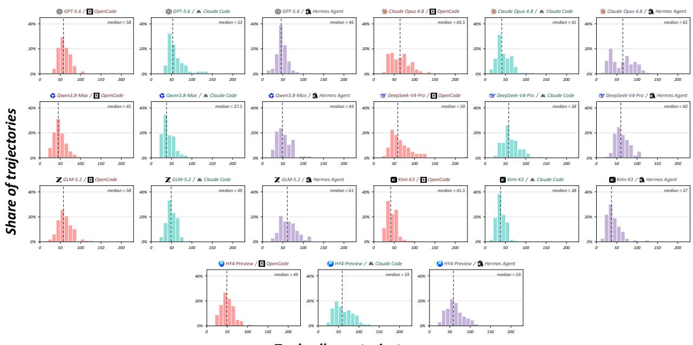  
Tool calls per trajectory

Figure 7 Tool-call distributions over successful trajectories for the 21 model–harness combinations. Histogram bins have width 10; dashed lines indicate medians.  
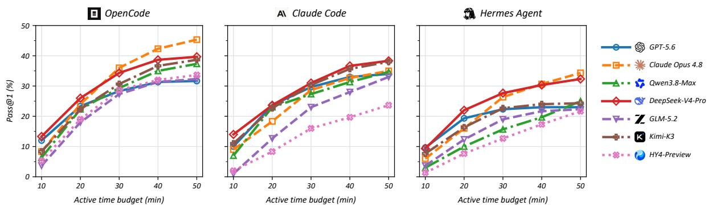  
Figure 8 Retrospective Pass@1 versus active generation time for three agent harnesses.

## 5.4 Ablation Study

We compare DeepSeek-V4-Pro on the same 300 tasks, using its original OpenCode run as Full. As summarized by Table 4, Pass@1 is 39.67% for Full, 8.33% without skills and strategy references, 13.33% with execution feedback hidden, and 0.33% for one-shot generation without tools or a harness. These gaps persist after excluding Process and normal-termination requirements: artifact pass is 48.67%, 18.67%, 20.33%, and 1.33%, respectively. One-shot performance also reflects invalid or incomplete submissions in 237/300 tasks. Diferences between historical and new run conditions prevent attributing the gaps solely to the ablated components. See details in Appendix H.2.

## 5.5 Time-Budget Sensitivity

We assess time-budget sensitivity by retrospectively applying 10, 20, 30, 40, and 50-minute active generation cutofs to the existing trajectories across all 21 model–harness configurations. Only final artifacts completed by each cutof contribute, with all 300 tasks retained per configuration. Figure 8 shows that aggregate Pass@1 rises from 7.24% at 10 minutes to 26.05% at 30 minutes and 32.30% at 50 minutes, with diminishing gains: the 40-minute cutof captures 93.02% of the successes observed by 50 minutes, and the final 10 minutes add 2.25 percentage points. These late gains are largest for Qwen3.8-Max and HY4-Preview. The curves characterize completion timing under the original 50-minute protocol; performance under separately imposed shorter deadlines remains untested. Full metrics and timing rules appear in Appendix H.3.

## 5.6 FP-Threshold Sensitivity

To quantify the influence of the FP threshold on checker acceptance, we evaluate thresholds of 10%, 20%, 25%, 30%, 40%, and 50% across all 21 model–harness configurations (Figure 9). For checkers with adjudicated alerts, the additional acceptance criterion requires 100 FP/(TP + FP) to be no greater than the specified threshold. Adjudication labels and all other eligibility criteria are held fixed, with 300 tasks retained in the denominator for each configuration.

The 25% threshold reproduces the acceptance rates for all 21 configurations in Table 2. The aggregate acceptance rate increases from 32.05% at 10% to 32.30% at 25% and 32.83% at 50%, yielding a net increase of 0.78 percentage points over the evaluated range. Over the same range, the largest increase for an individual configuration is 1.67 percentage points, observed for GLM-5.2 with Claude Code. These results suggest that aggregate acceptance is relatively stable across the evaluated FP thresholds within the recorded cohort.

## 5.7 Analysis of Checker Synthesis Failures

We analyze 4,360 selected failed runs across seven models and three harnesses using tool traces, independent verification logs, and existing judge records. The leading failure categories are budget exhaustion (25.32%), inadequate synthesis process (22.96%), and inadequate semantic modeling (21.15%). These records expose gaps between analysis plans and implementations: for example, a planned path-sensitive analysis becomes AST matching that omits locking and control-flow conditions. Excess false positives account for 15.96% of failures, underscoring the need to evaluate precision beyond the original vulnerable–fixed pair. The remaining failures involve diferential detection or localization (8.17%), patch-specific overfitting or anchoring (3.56%), missing or invalid artifacts (1.83%), and compilation or registration (1.05%). Key challenges for checker synthesis include timely completion, faithful implementation of analysis plans, and precise semantic modeling.

## 5.8 Data Contamination and Prior Exposure

CVE publication postdates release for 3/300 tasks with Claude Opus 4.8, one with GLM-5.2, and none with other models (Figure 10(a,b)); code or patches may have appeared earlier. On 100 language-stratified tasks, we compare original inputs (O), paraphrases retaining identifiers (P), and versions of P with meaningpreserving identifier substitutions (D) [21]. Figure 10(c) shows P–D Pass@1 gaps of +3.00 and +2.00 percentage points for Claude Opus 4.8 and DeepSeek-V4-Pro. Exact CVE recall falls from 10.00% to 1.00% and from 8.00% to 1.00%, respectively. The 7–9-point recall decline accompanies only a 2–3-point Pass@1 drop, suggesting that recognizing familiar vulnerabilities yields only limited gains under this intervention (Appendix C.3).

## 6 Conclusion

We introduced CheckerBench, an executable benchmark for long-horizon static-analysis checker synthesis with 300 tasks across five programming-language ecosystems. CheckerLab independently rebuilds submitted checkers and assesses diagnostic behavior on vulnerable and fixed revisions, patch localization, and false positives. Across seven models and three agent harnesses, the best configuration achieves 45.33% Pass@1, leaving substantial room for improvement within the evaluated repositories and analyzer configurations. CheckerBench provides a reproducible testbed for agents that turn vulnerability specifications into reliable, reusable checkers.

Table 4 Performance comparison of DeepSeek-V4-Pro ablations on 300 CheckerBench tasks. Bold and underlined values mark the best and second-best configurations per metric. Subscripts show numerical changes relative to Full: ↑ increases and ↓ decreases (percentage points for percentage metrics). Header arrows indicate the preferred direction. N/A denotes no alerts.
<table><tr><td>Configuration</td><td>Skill</td><td>Exec. lib. feedback</td><td>Pass@1 (%) ↑</td><td>Build (%) ↑</td><td>Diff. SR (%) ↑</td><td> $\mathbf { F P _ { \mathrm { p a s s } } }$  (%) ↓</td><td>Process ↑</td><td>Semantic ↑</td><td>Avg. Turns ↓</td><td>Avg. Tool Calls ↓</td></tr><tr><td>Full</td><td>√</td><td>√</td><td>39.67</td><td>92.67</td><td>90.67</td><td>2.56</td><td>84.89</td><td>8.12</td><td>57.63</td><td>72.73</td></tr><tr><td>w/o Skills</td><td>x</td><td>√</td><td>8.33↓31.34</td><td> $^ { 7 9 . 3 3 } \mathrm { \textmu 1 3 . 3 4 }$ </td><td>52.67↓38.00</td><td>6.25↑3.69</td><td>65.31↓19.58</td><td>7.39↓0.73</td><td>59.56↑1.93</td><td>80.53↑7.80</td></tr><tr><td>w/o Execution Feedback</td><td>√</td><td>x</td><td>13.33↓26.34</td><td> $6 7 . 3 3 _ { \perp 2 5 . 3 4 }$ </td><td> $4 1 . 6 7 _ { \downarrow 4 9 . 0 0 }$ </td><td> $2 5 . 0 0 _ { \uparrow 2 2 . 4 4 }$ </td><td> $\underline { { 7 9 . 9 3 } } _ { \downarrow 4 . 9 6 }$ </td><td>8.00↓0.12</td><td>53.58↓4.05</td><td>72.16↓0.57</td></tr><tr><td>w/o Harness</td><td>x</td><td>x</td><td> $0 . 3 3 _ { \downarrow 3 9 . 3 4 }$ </td><td> $3 . 3 3 _ { \downarrow 8 9 . 3 4 }$ </td><td> $3 . 3 3 _ { \scriptstyle \downarrow 8 7 . 3 4 }$ </td><td>N/A</td><td> $7 3 . 6 4 _ { \downarrow 1 1 . 2 5 }$ </td><td>7.45↓0.67</td><td>1.00↓56.63</td><td> $\mathbf { 0 . 0 0 } _ { \downarrow 7 2 . 7 3 }$ </td></tr></table>

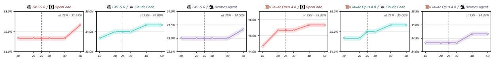

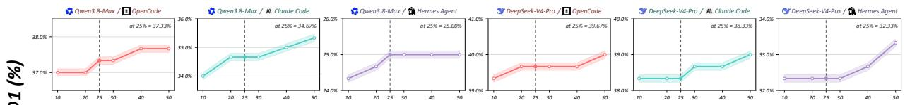

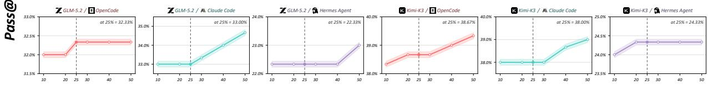

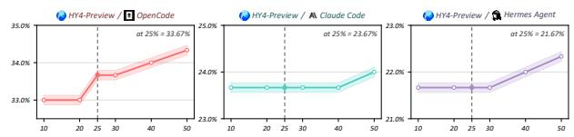  
FP threshold (%)  
Panel-specific y-axis ranges. Dashed line: 25% cutoff.Figure 9 Pass@1 versus FP threshold for 21 model–harness pairs (300 fixed tasks each). Translucent bands highlight the curves. Dashed lines mark the 25% cutof; annotations show Pass@1 at this cutof.  
(a) CVE publications  
C/C++ (159) Go (30) JavaScript (30) Python (51) Java (30)

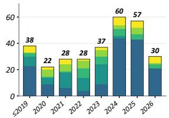

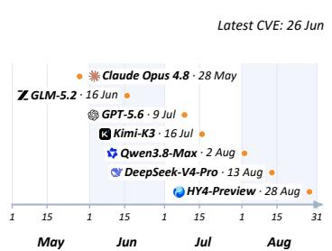  
(c) Prior-exposure sensitivity

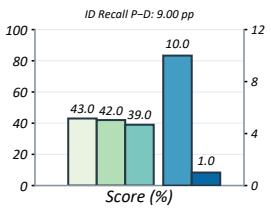

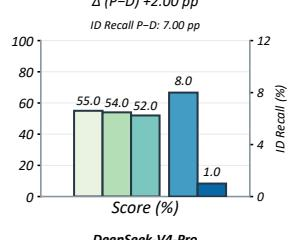  
Figure 10 Temporal coverage and prior exposure: (a) CVE publication counts; (b) model release dates; (c) Pass@1 (O/P/D; left axes, 0–100%) and exact CVE recall (P/D; right axes, 0–12%).

## References

[1] AgentRE-Bench. AgentRE-Bench. Project website, 2026. URL https://www.agentre-bench.ai/.

[2] Alibaba Cloud. Qwen3.8-Max: Model studio release log. https://www.alibabacloud.com/help/en/model-studio/ newly-released-models, 2026. Release entry dated August 2, 2026; accessed September 19, 2026.

[3] Anomaly Contributors. OpenCode. https://github.com/anomalyco/opencode, 2026. Accessed August 25, 2026.

[4] Anonymous. BIN-BENCH: Can LLM Agents Reason Through Long-Horizon Binary Analysis? OpenReview, 2026. URL https://openreview.net/pdf?id=KCBDPLjVrV. Anonymous ACL submission.

[5] Anthropic. How Claude Code works. https://code.claude.com/docs/en/how-claude-code-works, 2026. Accessed August 2, 2026.

[6] Anthropic. Introducing Claude Opus 4.8. https://www.anthropic.com/news/claude-opus-4-8, 2026. Released May 28, 2026; accessed October 4, 2026.

[7] Anthropic. Introducing Claude Opus 5. https://www.anthropic.com/news/claude-opus-5, 2026. Accessed September 20, 2026.

[8] J. Chai, G. Yin, Z. Xu, C. Yue, Y. Jia, S. Xia, X. Wang, J. Jiang, X. Li, C. Dong, H. He, and W. Lin. RLFactory: A Plug-and-Play Reinforcement Learning Post-Training Framework for LLM Multi-Turn Tool-Use, 2025. URL https://arxiv.org/abs/2509.06980.

[9] H. Chen, Z. Hu, J. Chai, H. Yang, H. He, X. Wang, W. Lin, L. Wang, G. Yin, and Z. Zhao. ToolForge: A Data Synthesis Pipeline for Multi-Hop Search without Real-World APIs, 2025. URL https://arxiv.org/abs/ 2512.16149.

[10] H. Chen, S. Zhou, Z. Hu, J. Chai, H. He, H. Yang, X. Wang, W. Lin, T. Wang, Z. Zhao, and G. Yin. ToolForge: A Data Synthesis Pipeline for Multi-Hop, Multi-Turn, and Self-Reflective Tool-Use Data. In Proceedings of the 2026 Conference on Empirical Methods in Natural Language Processing, 2026. URL https://openreview.net/ forum?id=vFFehO66Y0.

[11] T. Chen, S. Lu, S. Lu, Y. Gong, C. Yang, X. Li, M. R. H. Misu, H. Yu, N. Duan, P. Cheng, F. Yang, S. K. Lahiri, T. Xie, and L. Zhou. Automated proof generation for Rust code via self-evolution. In International Conference on Learning Representations, 2025. URL https://proceedings.iclr.cc/paper\_files/paper/2025/ hash/b2e20d7402c9985eae4ba924c65370a8-Abstract-Conference.html.

[12] Cilium eBPF Maintainers. BTF: Fixed panics during parsing of malformed input. https://github.com/cilium/ ebpf/pull/2021, 2026. Pull request 2021; merged May 27, 2026.

[13] Clang Project. Clang Static Analyzer. https://clang.llvm.org/docs/ClangStaticAnalyzer.html, 2026. Accessed August 4, 2026.

[14] CVE Program. CVE List V5: Oficial CVE records. https://github.com/CVEProject/cvelistV5, 2026. Per-record JSON snapshots archived September 15, 2026.

[15] I. David and A. Gervais. CrackMeBench: Binary Reverse Engineering for Agents, 2026. URL https://arxiv. org/abs/2605.10597.

[16] DeepSeek-AI. DeepSeek Harness. https://github.com/deepseek-ai/deepseek-harness, 2026. Accessed August 25, 2026.

[17] DeepSeek-AI. DeepSeek-V4-Pro GA release. https://api-docs.deepseek.com/news/news260813/, 2026. DeepSeek-V4-Pro-0813 released August 13, 2026; accessed September 20, 2026.

[18] DeepSeek-AI et al. DeepSeek-V4: Towards highly eficient million-token context intelligence, 2026. URL https: //arxiv.org/abs/2606.19348.

[19] X. Deng, J. Da, E. Pan, Y. Y. He, C. Ide, K. Garg, N. Laufer, A. Park, N. Pasari, C. Rane, K. Sampath, M. Krishnan, S. Kundurthy, S. Hendryx, Z. Wang, V. Bharadwaj, J. Holm, R. Aluri, C. B. C. Zhang, N. Jacobson, B. Liu, and B. Kenstler. SWE-Bench Pro: Can AI Agents Solve Long-Horizon Software Engineering Tasks?, 2025. URL https://arxiv.org/abs/2509.16941.

[20] J. Ding, S. Long, C. Pu, H. Zhou, H. Gao, X. Gao, C. He, Y. Hou, F. Hu, Z. Li, W. Shi, Z. Wang, D. Zan, C. Zhang, X. Zhang, Q. Chen, X. Cheng, B. Deng, Q. Gu, K. Hua, J. Lin, P. Liu, M. Li, X. Pan, Z. Peng, Y. Qin, Y. Shan, Z. Tan, W. Xie, Z. Wang, Y. Yuan, J. Zhang, E. Zhao, Y. Zhao, H. Zhu, L. Zhu, C. Zou, M. Ding, J. Jiao, J. Liu, M. Liu, Q. Liu, C. Tao, J. Yang, T. Yang, Z. Zhang, X. Chen, W. Huang, and G. Zhang. NL2Repo-Bench: Towards Long-Horizon Repository Generation Evaluation of Coding Agents, 2025. URL https://arxiv.org/abs/2512.12730.

[21] Y. Fang, T. Sun, Y. Shi, M. Wang, and X. Gu. LastingBench: Defend benchmarks against knowledge leakage. In Findings of the Association for Computational Linguistics: EMNLP 2025, pages 18304–18317. Association for Computational Linguistics, 2025. doi: 10.18653/v1/2025.findings-emnlp.993. URL https://aclanthology.org/ 2025.findings-emnlp.993/.

[22] Y. Feng, J. Sun, Z. Yang, J. Ai, C. Li, Z. Li, F. Zhang, K. He, R. Ma, J. Lin, J. Sun, Y. Xiao, S. Zhou, W. Wu, Y. Liu, P. Liu, Y. Qiao, S. Zhang, and K. Zhang. LongCLI-Bench: A Preliminary Benchmark and Study for Longhorizon Agentic Programming in Command-Line Interfaces, 2026. URL https://arxiv.org/abs/2602.14337.

[23] FFmpeg Project. FFmpeg Source Repository. https://github.com/FFmpeg/FFmpeg, 2026. Accessed August 28, 2026.

[24] P. Garg and S. H. Sengamedu. Synthesizing code quality rules from examples. Proceedings of the ACM on Programming Languages, 6(OOPSLA2):1757–1787, 2022. doi: 10.1145/3563350. URL https://doi.org/10.1145/ 3563350.

[25] C. S. Gordon. Synthesizing program-specific static analyses, 2018. URL https://arxiv.org/abs/1810.06600.

[26] J. Guo, C. Wang, X. Xu, Z. Su, and X. Zhang. RepoAudit: An Autonomous LLM-Agent for Repository-Level Code Auditing. In International Conference on Machine Learning, pages 21083–21100, 2025. URL https: //proceedings.mlr.press/v267/guo25n.html.

[27] Y. Hao, W. Chen, Z. Zhou, and W. Cui. E&V: Prompting large language models to perform static analysis by pseudo-code execution and verification, 2023. URL https://arxiv.org/abs/2312.08477.

[28] H. He, Y. Luo, C. Wan, T. Su, H. Sun, and G. Pu. Automated detection of atomicity violations in large-scale systems, 2025. URL https://arxiv.org/abs/2504.00521.

[29] ImageMagick Project. ImageMagick Source Repository. https://github.com/ImageMagick/ImageMagick, 2026. Accessed August 28, 2026.

[30] N. Jain, K. Han, A. Gu, W.-D. Li, F. Yan, T. Zhang, S. Wang, A. Solar-Lezama, K. Sen, and I. Stoica. Live-CodeBench: Holistic and contamination free evaluation of large language models for code. In International Conference on Learning Representations, 2025. URL https://proceedings.iclr.cc/paper\_files/paper/2025/ file/94074dd5a072d28ff75a76dabed43767-Paper-Conference.pdf.

[31] N. Jain, J. Singh, M. Shetty, T. Zhang, L. Zheng, K. Sen, and I. Stoica. R2E-Gym: Procedural environment generation and hybrid verifiers for scaling open-weights SWE agents. In Conference on Language Modeling, 2025. URL https://openreview.net/forum?id=7evvwwdo3z.

[32] C. E. Jimenez, J. Yang, A. Wettig, S. Yao, K. Pei, O. Press, and K. Narasimhan. SWE-bench: Can language models resolve real-world GitHub issues? In International Conference on Learning Representations, 2024. URL https://openreview.net/forum?id=VTF8yNQM66.

[33] Kimi Team et al. Kimi K3: Open frontier intelligence, 2026. URL https://arxiv.org/abs/2607.24653.

[34] H. Lee, Z. Zhang, H. Lu, and L. Zhang. SEC-bench: Automated Benchmarking of LLM Agents on Real-World Software Security Tasks. In Advances in Neural Information Processing Systems, 2025. URL https: //arxiv.org/abs/2506.11791.

[35] P. Li, S. Yao, J. S. Korich, C. Luo, J. Yu, Y. Cao, and J. Yang. Neuro-symbolic Static Analysis with LLMgenerated Vulnerability Patterns, 2025. URL https://arxiv.org/abs/2504.16057v5. Version 5, revised April 2026.

[36] Z. Li, S. Dutta, and M. Naik. IRIS: LLM-assisted static analysis for detecting security vulnerabilities. In International Conference on Learning Representations, 2025. URL https://proceedings.iclr.cc/paper\_files/ paper/2025/hash/582d4e27fa24168f3af1f4582655034b-Abstract-Conference.html.

[37] Z. Li, Z. Li, Y. Shi, R. Wang, J. Yang, Z. Liu, X. Wu, A. Li, Y. Yu, N. Liu, L. Sun, H. Mi, and L. Liang. Long-Horizon-Terminal-Bench: Testing the Limits of Agents on Long-Horizon Terminal Tasks with Dense Reward-Based Grading, 2026. URL https://arxiv.org/abs/2607.08964.

[38] Linux Kernel Community. Linux Kernel Source Repository. https://github.com/torvalds/linux, 2026. Accessed August 28, 2026.

[39] T. Liu, C. Xu, and J. McAuley. RepoBench: Benchmarking repository-level code auto-completion systems. In International Conference on Learning Representations, 2024. URL https://proceedings.iclr.cc/paper\_files/ paper/2024/hash/d191ba4c8923ed8fd8935b7c98658b5f-Abstract-Conference.html.

[40] LLVM Project. Clang Static Analyzer Checker Implementations. https://github.com/llvm/llvm-project/tree/ main/clang/lib/StaticAnalyzer/Checkers, 2026. Accessed August 25, 2026.

[41] H. He, C. Yue, C. Dong, M. Tian, H. Chen, Z. Liu, J. Chai, X. Wang, Y. Zhang, Q. Liao, G. Yin, W. Lin, C. Wan, H. Sun, and T. Su. LocalSearchBench: Benchmarking Agentic Search in Real-World Local Life Services. In

Proceedings of the 32nd ACM SIGKDD Conference on Knowledge Discovery and Data Mining V.2. Association for Computing Machinery, 2026. doi: 10.1145/3770855.3817466. URL https://doi.org/10.1145/3770855.3817466.

[42] H. Luo, H. Zhang, X. Zhang, H. Wang, Z. Qin, W. Lu, G. Ma, H. He, Y. Xie, Q. Zhou, Z. Hu, H. Mi, Y. Wang, N. Tan, H. Chen, Y. R. Fung, C. Yuan, and L. Shen. UltraHorizon: Benchmarking Agent Capabilities in Ultra Long-Horizon Scenarios, 2025. URL https://arxiv.org/abs/2509.21766.

[43] M. A. Merrill, A. G. Shaw, N. Carlini, B. Li, H. Raj, I. Bercovich, L. Shi, J. Y. Shin, T. Walshe, E. K. Buchanan, et al. Terminal-Bench: Benchmarking agents on hard, realistic tasks in command line interfaces. In International Conference on Learning Representations, 2026. URL https://openreview.net/forum?id=a7Qa4CcHak.

[44] D. Miessler and PAI Contributors. Personal AI Infrastructure. https://github.com/danielmiessler/Personal\_ AI\_Infrastructure, 2026. Accessed August 25, 2026.

[45] MITRE Corporation. Common Weakness Enumeration (CWE). https://cwe.mitre.org/, 2026. Accessed August 25, 2026.

[46] M. M. Mohajer, R. Aleithan, N. S. Harzevili, M. Wei, A. B. Belle, H. V. Pham, and S. Wang. SkipAnalyzer: A tool for static code analysis with large language models, 2023. URL https://arxiv.org/abs/2310.18532.

[47] Moonshot AI. Kimi K3: Model release in Kimi Code. https://www.kimi.com/code/docs/en/kimi-code/whats-new. html, 2026. Release entry dated July 16, 2026; accessed September 19, 2026.

[48] Nous Research. Hermes Agent. https://github.com/NousResearch/hermes-agent, 2026. Accessed August 2, 2026.

[49] OpenAI. GPT-5.6: Frontier intelligence that scales with your ambition. https://openai.com/index/gpt-5-6/, 2026. Accessed September 14, 2026.

[50] OpenClaw Contributors. OpenClaw. https://github.com/openclaw/openclaw, 2026. Accessed August 2, 2026.

[51] G. Orlanski, D. Roy, A. Yun, C. Shin, A. Gu, A. Ge, D. Adila, N. Roberts, F. Sala, and A. Albarghouthi. SlopCodeBench: Benchmarking How Coding Agents Degrade Over Long-Horizon Iterative Tasks, 2026. URL https://arxiv.org/abs/2603.24755.

[52] S. Ouyang, W. Yu, K. Ma, Z. Xiao, Z. Zhang, M. Jia, J. Han, H. Zhang, and D. Yu. Repo-Graph: Enhancing AI software engineering with repository-level code graph. In International Conference on Learning Representations, 2025. URL https://proceedings.iclr.cc/paper\_files/paper/2025/hash/ 4a4a3c197deac042461c677219efd36c-Abstract-Conference.html.

[53] J. Pan, X. Wang, G. Neubig, N. Jaitly, H. Ji, A. Suhr, and Y. Zhang. Training software engineering agents and verifiers with SWE-Gym, 2025. URL https://arxiv.org/abs/2412.21139.

[54] W. Peng, Y. Shi, Y. Wang, X. Zhang, B. Shen, and X. Gu. SWE-QA: Can language models answer repositorylevel code questions?, 2026. URL https://arxiv.org/html/2509.14635v2. Version 2, April 26, 2026; accepted to Findings of ACL 2026.

[55] J. Su, Z. Zhao, H. Wang, and H. Chen. CoAL-RAG: A Complexity-Aware Legal Retrieval-Augmented Generation Method, 2026. URL https://arxiv.org/abs/2608.17536.

[56] Tencent. Tencent releases and open-sources Tencent Hy4 preview. https://www.tencent.com/ tencent-releases-and-open-sources-tencent-hy4-preview/, 2026. Released August 28, 2026; accessed September 19, 2026.

[57] H. He, C. Yue, C. Dong, C. Wan, T. Su, H. Sun, J. Chai, X. Wang, and G. Yin. VistaHop: Benchmarking Long-Horizon Visual DeepSearch, 2026. URL https://arxiv.org/abs/2606.03273.

[58] B. Wang, W. Xu, Y. Li, X. Gao, Y. Xie, H. Sun, and D. Chen. Improving code localization with repository memory. In International Conference on Learning Representations, 2026. URL https://openreview.net/forum? id=8yjWLJy2eX.

[59] C. Wang, Z. Li, S. Dutta, and M. Naik. QLCoder: A query synthesizer for static analysis of security vulnerabilities. In International Conference on Learning Representations, 2026. URL https://proceedings.iclr.cc/paper\_ files/paper/2026/hash/2adf01ab15adde8820622f7f24bd516b-Abstract-Conference.html.

[60] L. Wang, C. Chen, J. Zhu, R. Zhan, and W. Han. CQLLM: A Framework for Generating CodeQL Security Vulnerability Detection Code Based on Large Language Model. Applied Sciences, 16(1):517, 2026. doi: 10.3390/ app16010517. URL https://www.mdpi.com/2076-3417/16/1/517.

[61] X. Wang, R. Hu, C. Gao, X.-C. Wen, Y. Chen, and Q. Liao. ReposVul: A repository-level high-quality vulnerability dataset, 2024. URL https://arxiv.org/abs/2401.13169.

[62] X. Wang, B. Li, Y. Song, F. F. Xu, X. Tang, M. Zhuge, J. Pan, Y. Song, B. Li, J. Singh, H. H. Tran, F. Li, R. Ma, M. Zheng, B. Qian, Y. Shao, N. Muennighof, Y. Zhang, B. Hui, J. Lin, R. Brennan, H. Peng, H. Ji, and G. Neubig. OpenHands: An open platform for AI software developers as generalist agents. In International Conference on Learning Representations, 2025. URL https://proceedings.iclr.cc/paper\_files/paper/2025/ hash/a4b6ad6b48850c0c331d1259fc66a69c-Abstract-Conference.html.

[63] Z. Wang, T. Shi, J. He, M. Cai, J. Zhang, and D. Song. CyberGym: Evaluating AI Agents’ Real-World Cybersecurity Capabilities at Scale. In International Conference on Learning Representations, 2026. URL https: //openreview.net/forum?id=2YvbLQEdYt.

[64] X.-C. Wen, X. Wang, Y. Chen, R. Hu, D. Lo, and C. Gao. VulEval: Towards repository-level evaluation of software vulnerability detection, 2024. URL https://arxiv.org/abs/2404.15596.

[65] H. Wu, C. Barrett, and N. Narodytska. Lemur: Integrating large language models in automated program verification. In International Conference on Learning Representations, 2024. URL https://proceedings.iclr. cc/paper\_files/paper/2024/hash/0c86142265c5e2c900613dd1d031cb90-Abstract-Conference.html.

[66] C. S. Xia, Y. Deng, S. Dunn, and L. Zhang. Agentless: Demystifying LLM-based software engineering agents, 2024. URL https://arxiv.org/abs/2407.01489.

[67] C. Yang, Z. Zhao, Z. Xie, H. Li, and L. Zhang. KNighter: Transforming static analysis with LLM-synthesized checkers, 2025. URL https://arxiv.org/abs/2503.09002.

[68] J. Yang, C. E. Jimenez, A. Wettig, K. Lieret, S. Yao, K. Narasimhan, and O. Press. SWE-agent: Agent-computer interfaces enable automated software engineering, 2024. URL https://arxiv.org/abs/2405.15793.

[69] A. Yildiz, S. G. Teo, Y. Lou, Y. Feng, C. Wang, and D. M. Divakaran. Benchmarking LLMs and LLM-based agents in practical vulnerability detection for code repositories, 2025. URL https://arxiv.org/abs/2503.03586.

[70] Z.ai. GLM-5.2: Built for long-horizon tasks. https://z.ai/blog/glm-5.2, 2026. Accessed August 2, 2026.

[71] Z.ai. GLM-5.2: Developer release notes. https://docs.z.ai/release-notes/new-released, 2026. Release entry dated June 16, 2026; accessed September 19, 2026.

[72] W. Zeng, J. Zhang, H. Chen, Z. Hu, Y. Liang, J. Chai, D. Liu, Z. Liu, S. Yan, M. Xue, X. Wang, W. Lin, and G. Yin. RecRM-Bench: Benchmarking Multidimensional Reward Modeling for Agentic Recommender Systems, 2026. URL https://arxiv.org/abs/2605.11874.

[73] Q. Zhou, J. Zhang, H. Wang, R. Hao, J. Wang, M. Han, Y. Yang, S. Wu, F. Pan, L. Fan, D. Tu, and Z. Zhang. FeatureBench: Benchmarking agentic coding for complex feature development. In International Conference on Learning Representations, 2026. URL https://openreview.net/forum?id=41xrZ3uGuI.

## Appendix Contents

A Extended Related Work . 18   
B Dataset Construction Details . 18   
B.1 Source Collection and Provenance 18   
B.2 Build Recovery and Executable Scope 19   
B.3 Task Packaging and Shared References 19   
B.4 Human-Guided Pilot Rerolls 19   
C Quality-Control and Contamination Audits 20   
C.1 Temporal Coverage and Prior-Exposure Audit 21   
C.2 Time-Window Evaluation Protocol 22   
C.3 Paired Prior-Exposure Sensitivity Protocol 22   
D Dataset Composition 24   
D.1 Repository-Level Task Counts 24   
D.2 Programming Languages and Static Analysis Frameworks 27   
D.3 Complete CWE Label Distribution 27   
D.4 Calibration Horizon and Dificulty Distributions 29   
D.5 Pilot Trajectory Statistics 30   
D.6 CVE Publication-Time Distribution 31   
E Evaluation and Inference Protocol . . 31   
E.1 System Configurations and Reproducibility 31   
E.2 Task Admission and Independent Repeats 32   
E.3 Source and Evidence Freezing 32   
E.4 Backend Execution 32   
E.5 Frozen Mainline Scan and Single-Judge Decisions 32   
E.6 Mainline Alert Selection and Sensitivity 33   
E.7 Failure Accounting, Recovery, and Aggregation 34   
E.8 Statistical Reporting 34   
E.9 Human Validation of the LLM Judge 35   
F Post-Synthesis Verifier Rubric 36   
F.1 Independent Replay and Diagnostic Predicates 36   
F.2 CSA Deterministic Objective Gate 36   
F.3 CSA Process and Semantic Quality 37   
F.4 CodeQL Quality Gates . 37   
F.5 Mainline False Positives and Final Verdict 37   
G Representative CSA Checker Patterns 38   
H Additional Experimental Results . . 39   
H.1 KNighter Comparison Details 39   
H.2 Ablation Outcomes and Coverage 40   
H.3 Time-Budget Sensitivity 41   
H.4 Language, Repository, and CWE Performance 43

## A Extended Related Work

Table 1 applies the following operational criteria. Repository Context requires the evaluated agent or system to receive a complete repository snapshot together with general-purpose navigation capabilities. Isolated functions, patch-only inputs, pre-extracted dependency views, and repositories used solely by an external validation pipeline receive partial credit. Executable Environment requires a reproducible repository or analyzer state with automated build and execution support. Multi-Harness Support is assessed against the six coding-agent harnesses integrated through CheckerBench’s adapters: Claude Code [5], Hermes Agent [48], OpenClaw [50], PAI [44], OpenCode [3], and DS Harness [16]. Full support requires documented, reproducible integrations for all six harnesses under a shared task and scoring contract; support for a subset receives partial credit. A generic patch-submission format, compatibility that depends on an unreleased wrapper, or a system-specific internal agent does not count as released harness support.

Long-Horizon Interaction requires a repeated observation–tool–edit–execution loop. Protocols that permit multi-step agent execution or bounded retrieval without specifying the complete loop receive partial credit. Checker Synthesis requires the task output to be an executable, reusable static-analysis rule or checker. Semantic Verification requires an independent rerun of the submitted checker on vulnerable and fixed code together with patch-localized diagnostic evidence; self-reported counts, generic repository tests, and vulnerability labels receive partial credit. False-Positive Evaluation requires residual diagnostic control on the fixed revision, a production scan, or an equivalent procedure that measures overly broad reporting. The audit reflects the task definitions, released artifacts, and evaluation protocols documented by each work, not capabilities that could be supplied by an external agent implementation.

Adjacent agent benchmarks. Recent benchmarks extend agentic software engineering beyond short issue resolution tasks. NL2Repo-Bench starts with a natural-language specification and an empty workspace, requiring agents to construct an installable, multi-module Python library [20]. SWE-Bench Pro instead draws complex issues from maintained repositories, where solutions often require coordinated changes across multiple files [19]. LongCLI-Bench covers from-scratch development, feature addition, bug fixing, and refactoring in a command-line environment, using requirement and regression tests together with step-level scoring [22]. SlopCodeBench follows agents as they repeatedly extend their own solutions under evolving requirements, measuring checkpoint success alongside structural erosion and code verbosity [51].

Other evaluations focus on the trajectory itself. Long-Horizon-Terminal-Bench uses graded subtasks across software engineering and other terminal workflows to measure partial progress during extended runs [37]. UltraHorizon tests sustained exploration in partially observable environments, probing planning, memory, and tool use over long interactions [42]. These benchmarks expose failure modes in sustained execution that also matter when an agent must implement, compile, and refine a checker.

Binary-analysis benchmarks address a related security workflow. BIN-BENCH evaluates long chains of toolassisted binary analysis and examines reasoning traces in addition to final outcomes [4]. AgentRE-Bench asks agents to investigate unfamiliar binaries without source code and scores their structured behavioral claims against fixed ground truth [1]. CrackMeBench requires agents to recover a binary’s validation logic and submit an input or generator accepted by the executable [15]. Together, these works measure software construction, intermediate progress, and binary reasoning. CheckerBench evaluates a distinct artifact: a reusable analyzer checker, independently rebuilt and tested for vulnerable–fixed diagnostic contrast, patch localization, and false positives.

## B Dataset Construction Details

## B.1 Source Collection and Provenance

We collect public CVE records from the National Vulnerability Database and link them to fixing commits in open-source repositories written in C/C++, Java, Python, JavaScript, and Go. A candidate must identify an exact fix, a retrievable parent revision, and a patch that exposes a defect-bearing program change. CVE identifiers provide instance-level provenance; CWE labels support coverage analysis and stratified sampling. We discard candidates with unresolved provenance, unavailable source, incompatible redistribution terms, or no reusable static-analysis property. A stable instance identifier binds each retained repository, revision pair, patch, and downstream artifact.

## B.2 Build Recovery and Executable Scope

The following build-anchor and compilation-database details describe the CSA construction adapter. CodeQL tasks retain their own pinned query-analysis environment and reconstruction metadata. The construction catalog links each vulnerability-fixing commit pair to its repository and to one build anchor per revision. Each anchor records a compilation database, a build snapshot, and build-completeness metadata. Construction first extracts the unified dif, commit message, and pre- and post-fix functions. The vulnerable-side compilation database then filters changed files to translation units for which the original include paths, preprocessor definitions, language mode, and generated dependencies can be recovered. Unmatched files remain in the provenance record as skipped inputs; pairs with no analyzable changed translation unit do not enter synthesis.

For each retained pair, the builder creates isolated Git worktrees for the two source revisions and overlays revision-compatible generated files from the corresponding snapshots. Paths in compilation-database entries are rewritten from the original repository and build roots to the worktree and snapshot roots. Output directives, warnings-as-errors, disabled system includes, and known incompatible GCC-specific options are removed or normalized before CSA execution. Worktrees permit the two revisions to coexist and allow pairs to be processed concurrently without changing the shared repository mirror. They are removed after scanning, and stale worktrees from interrupted tasks are pruned before subsequent construction runs.

After recovering both revisions, we extract the afected pre- and post-fix functions and generate deterministic commands for compiling a checker and scanning the pair. We reject an instance if either revision remains unreconstructable, afected translation units cannot be analyzed after bounded build recovery, or the pair does not support stable diferential analysis. The resulting source–build correspondence, build metadata, and scan context remain available for auditing failures.

## B.3 Task Packaging and Shared References

Each task is packaged in a randomly named workspace containing the patch, afected functions, a minimal checker template, compile and scan scripts, and read-only reference assets. The visible configuration contains repository, revision, build, and scan-scope metadata but omits CVE and CWE identifiers. Static templates and reference assets are hard-linked when possible and copied otherwise; in either case they are made readonly. A separate provenance ledger maps the random identifier back to the source pair. This design exposes all inputs required for synthesis while preventing vulnerability labels from becoming task shortcuts.

The shared library K has two layers. Harness-specific skills support patch interpretation, checker design, build recovery, functional validation, and false-positive triage. A harness-independent, read-only reference layer provides analyzer API documentation, oficial checker or rule implementations (including CSA resources for C/C++ tasks [13, 40]), reusable language-specific AST, data-flow, and state utilities, CWE mechanism cards [45], and repository-specific conventions when available. These assets provide implementation knowledge but do not encode the task’s defect-specific state-transition logic or diagnostic reporting predicate. The agent must infer defect semantics, select analyzer extension points and semantic or state representations, implement and register the checker, and refine it using compiler and analyzer feedback. A completed run produces checker source and plugin or query artifacts, a structured defect analysis, and a scope statement. The declarations support analysis; only independent execution establishes correctness.

## B.4 Human-Guided Pilot Rerolls

Calibration fixes model and harness versions, each task’s analyzer container and language toolchain, workspace schema, enabled tools, shared skills, and time, token, and interaction budgets for each attempt. Pilot runs cover the inspect–implement–compile–scan–repair cycle. We retain observations, edits, tool calls, and responses. One interaction step is one agent decision, independent of token count or low-level tool events.

For each candidate task, the construction protocol permits one initial rollout and at most two additional rollouts after human review. Each attempt uses an isolated workspace and the same task, analyzer configuration, verification predicates, and acceptance thresholds. After a failed checker submission, the reviewer identifies the failure from execution logs and verification evidence, revises the prompt guidance, and records the reason for the change before launching the next rollout. A prompt revision guides the agent’s next attempt; every resulting checker is independently checked.

The ledger links the attempt index (1–3), prompt version and changes, human diagnosis, source checksum, complete trace, verification evidence, verdict, and termination status. The first passing checker advances to quality control and sampling. A task with no passing checker after attempt 3 is excluded. The released checker–trace pairs therefore all pass the construction-time checker-admission criteria. These pilot retries are recorded separately from independent main-evaluation repeats and their infrastructure-recovery attempts.

Human diagnosis can address compiler errors, missed or mislocalized diagnostics, semantic mismatches, or false positives. Verifier internals and task-specific reference checker source remain held out from the calibration agent. Each submitted checker undergoes independent contrastive and patch-relevance checks; accepted executable checkers additionally undergo a subsystem scan on a prebuilt main-branch worktree and sampled LLM warning triage (Appendix C). All applicable executable, semantic, scope, and false-positive gates must pass.

Final selection requires reproducible artifacts, complete traces, and independent verification records. We retain passing trajectories with at least 40 interaction steps and sample jointly over repository, CWE category, observed horizon, and dificulty. This threshold selects sustained interaction under the calibration configuration; it is not an intrinsic lower bound on task dificulty. The construction ledger retains checker source and traces for every attempt, independent verification and false-positive evidence, human diagnoses and prompt revisions, attempt counts, and either a passing checker–trace pair eligible for curation or an exclusion record after the cap.

## C Quality-Control and Contamination Audits

Automated admission checks cover revision ancestry, patch and artifact integrity, the presence of build anchors, compilation-database coverage, clean checker compilation, registration and plugin loading, deterministic vulnerable–fixed scans, verifier isolation, and package completeness. The CSA contrastive gate requires $N _ { i } ^ { - } > N _ { i } ^ { + }$ and $N _ { i } ^ { + } < 5 0 ;$ CodeQL retains its own frozen diferential predicate. Passing the CSA gate is insufficient by itself: code verification recomputes diagnostics and requires at least one disappearing vulnerablerevision report whose source location maps to a function modified by the patch. Hence empty scans, unrelated diagnostic reductions, and agent-reported counts cannot satisfy the hard gate.

For accepted executable checkers, a broader subsystem scan on a prebuilt main-branch worktree supplies falsepositive evidence. This worktree is neither the vulnerable nor the fixed task revision. During constructiontime calibration, a triage model assesses sampled diagnostics. Failed false-positive checks enter the same human-diagnosis and prompt-revision loop as other admission failures, within the shared three-attempt cap (Appendix B.4). Each new checker is rebuilt and independently rechecked. The main evaluation uses the frozen-candidate scan and single Claude Opus 5 judge in Section 4, without returning scores for repair. Manual audit samples passing and failing submissions across projects, CWE families, and horizon strata, and inspects both defect-mechanism fidelity and the patch-localized true positive. Final removal counts, auditor agreement, and contamination-overlap statistics will be reported with the frozen release.

Deduplication and split assignment. Manual review confirms that the patch supports the stated defect and that disappearing reports lie in changed defect-bearing functions. We remove exact duplicate revision pairs; separable units from the same CVE retain a shared provenance link. Connected groups formed by repository identity, CVE identity, shared revisions, and patch similarity are each assigned to one split. Repositorydisjoint and weakness-family-disjoint subsets are additionally marked for generalization analysis.

Artifact isolation. Reference states, task-specific checker implementations, calibration trajectories, verifier thresholds, and adjudication records remain outside the agent-visible snapshot. The vulnerability patch is an intentional task input. Potential training exposure to public vulnerability information is distinct from evaluation-time leakage of checker implementations, calibration traces, or verifier artifacts. The following audits examine public dates and model release boundaries; artifact isolation addresses the separate evaluationtime leakage risk.

Table 5 Oficial model release dates and task counts by CVE publication date. The CVE snapshot is September 15, 2026; model release sources were checked September 19–20, 2026, with Opus 4.8 rechecked October 4, 2026. “On date” counts publications on the release day. Later publication alone does not certify an unseen task.
<table><tr><td>Model</td><td>Release date</td><td>Before</td><td>On date</td><td>After</td></tr><tr><td>GPT-5.6</td><td>2026-07-09</td><td>300</td><td>0</td><td>0</td></tr><tr><td> Claude Opus 4.8</td><td>2026-05-28</td><td>295</td><td>2</td><td>3</td></tr><tr><td>Qwen3.8-Max</td><td>2026-08-02</td><td>300</td><td>0</td><td>0</td></tr><tr><td> DeepSeek-V4-Pro</td><td>2026-08-13</td><td>300</td><td>0</td><td>0</td></tr><tr><td>Z GLM-5.2</td><td>2026-06-16</td><td>299</td><td>0</td><td>1</td></tr><tr><td>K Kimi-K3</td><td>2026-07-16</td><td>300</td><td>0</td><td>0</td></tr><tr><td>HY4-Preview</td><td>2026-08-28</td><td>300</td><td>0</td><td>0</td></tr></table>

## C.1 Temporal Coverage and Prior-Exposure Audit

Public evidence and date provenance. We archive CVE Program JSON records for the fixed task inventory, recording the source URL, retrieval provenance, and SHA-256 checksum alongside each task [14]. The audit snapshot of September 15, 2026 covers all 300 tasks and 297 canonical CVEs. The original inventory identifier CVE-2024-7773 is a rejected duplicate of CVE-2024-45436; the audit retains the original identifier and uses the canonical record for dating. No task is removed by this normalization. Publication dates range from June 14, 2010, to June 26, 2026. Appendix D.6 gives the complete year distribution. The machine-readable ledger is figures/temporal/task\_dates.csv, accompanied by the archived records and a public-evidence index.

The ledger separates CVE publication, the CNA’s explicit public-disclosure date, dated public events, and independently checked patch or checker publication evidence. Discovery dates, CVE reservation dates, packag ing dates, and CVE identifier years do not establish public availability. Git author and committer timestamps alone also do not establish when a patch became public. For 48 tasks, the CVE record explicitly dates a public event before its own publication. The earliest documented event establishes that information was public by that date; it does not prove the absence of still earlier sources. The full first-public patch and checker audit is unresolved, so the ledger does not certify any task as previously unseen on the basis of publication date alone.

Oficial model release dates. Table 5 uses public release dates documented in provider announcements or release logs, checked on September 19–20, 2026, with the Opus 4.8 source rechecked on October 4, 2026. GPT-5.6 Sol and Claude Opus 4.8 were released on July 9 and May 28, respectively [6, 49]. The oficial records date Qwen3.8-Max to August 2, DeepSeek-V4-Pro (the evaluated 0813 version) to August 13, GLM-5.2 to June 16, and Kimi-K3 to July 16 [2, 17, 47, 71]. HY4-Preview was released on August 28 [56]. Dates follow the named model version. Public service or API availability counts as release even if weights follow later; named public previews are included and restricted partner previews excluded. The ledger figures/temporal/model\_releases.json records each source and date convention. Counts distinguish CVE publication before, on, and after the reported release day. These boundaries describe public availability, not a model’s training-data cutof. The actual model version must be pinned and matched to its release before temporal scoring.

A patch-before-CVE example. CVE-2026-10722, a task in cilium/ebpf, was published on June 3, 2026. Its CVE record references pull request #2021, whose fix was already merged on May 27, 2026 [12]. Thus the patch was public a week before the CVE publication. A CVE-only filter can overstate the evidence for novelty relative to a model release between those dates. We retain both dates and require review of the earlier source; we do not infer whether the model actually trained on it.

## C.2 Time-Window Evaluation Protocol

Following LiveCodeBench [30], the temporal analysis groups eligible tasks by audited public-availability windows and compares Pass@1 for each harness–model pair using the same three independent generation repeats as the main comparison. Eligibility requires a pinned model version and its oficial release date together with an audit of public vulnerability descriptions, patches, and task-specific checker sources. Tasks with unresolved public-availability dates remain explicitly unclassified. A common post-release comparison requires the same audited task subset after all included models’ releases. The current inventory has no CVE publications after the latest of the seven release dates, so it supplies no common post-release subset for all seven models. Model-specific comparisons report their own eligible task counts and remain conditional on the earlier-source audit.

Windows are fixed from date and task metadata before inspecting outcomes. We begin with half-year windows and merge adjacent windows until each contains at least 20 distinct CVEs, without crossing a model’s release date. A remaining smaller subset is reported with its sample count and interval, without fitting a temporal trend. Each point reports its distinct task count and a 95% confidence interval. For each window, we compute Pass@1 from the final-pass verdicts of the same eligible tasks separately in each repeat and report the arithmetic mean of the three rates, weighting repeats equally. Resampling keeps the three repeat outcomes for each task and all tasks sharing a CVE together. We report language and static analysis framework strata wherever both periods have support, and disclose repository and CWE composition for every window; unsupported strata are not treated as matched comparisons. Construction-time horizon information serves only as a workload proxy. A score decline across time is interpreted jointly with these composition diferences, rather than as proof of memorization.

The patch remains an intended synthesis input. Reference checker code, calibration trajectories, and verifier artifacts remain held out from the agent-visible package. The audit of generation traces separately records any external retrieval of task-specific solutions or verification material; time-window evidence alone cannot rule out such evaluation-time leakage. The CVE publication counts in Figure 10(a) describe coverage only and do not supply performance estimates. The construction pilot trajectories do not supply independent temporal performance estimates. Performance curves are populated only from completed main-evaluation verdicts and audited task windows.

## C.3 Paired Prior-Exposure Sensitivity Protocol

Sampling. The sampling protocol was fixed before collecting supplementary model outcomes. The initial candidate roster contains 100 distinct canonical CVEs: 53 C/C++, 17 Python, and 10 each in Go, Java, and JavaScript. Within each language, task IDs are sorted and placed in a fixed pseudorandom order; canonical-CVE duplicates are skipped across strata. The full candidate order and original metadata hashes are retained. A task that fails environment validation is replaced by the next eligible task in its frozen language order, with the failure evidence and replacement recorded before any generation or recognition probe. The final roster is admitted only after all 100 tasks pass validation. Selection and replacement never use model outcomes or probe recognition.

Conditions and execution. Claude Opus 4.8 and DeepSeek-V4-Pro each run with OpenCode under original (O), ordinary-paraphrase (P), and identity-cue-reduced (D) conditions. P rewrites non-executable task prose while preserving requirements, source identifiers, and the complete patch. D starts from P and consistently substitutes safely modifiable internal identifiers with meaningful alternatives, and removes residual provenance cues from visible metadata. Standard-library and required external API names, types, constants, control/data flow, and the vulnerability and fix mechanisms are preserved. Unsafe transformations involving reflection, macros, or dynamic name lookup are rejected. This is a semantics-preserving intervention, distinct from the answer-changing counterfactuals studied by LastingBench [21].

There is one independent generation per task–model–condition combination, for 600 scheduled generations. This supplementary experiment does not reuse historical Full trajectories. All three conditions share the same skill library, executable feedback, 3,000-second active budget, model decoding settings within each model, and frozen verification rules with Claude Opus 5 as judge. Condition order is randomized within task blocks. Workspaces and sessions are independent, and probes never enter generation context. Model API IDs, returned version metadata, access dates, harness version, and environment fingerprints are archived. Mutable API aliases cannot establish that a provider’s underlying weights remained unchanged.

Transformation and admission checks. The before, after, and mainline source trees, patch, extracted context, metadata, and tool-visible paths must agree with the same transformation. For CodeQL, all three corresponding databases must be rebuilt from transformed source; changing only prompts, source-archive text, or database display labels does not qualify. Original Git history, source copies, private reverse maps, reference checkers, and verifier material must be inaccessible to generation. All conditions use preinstalled dependencies and local documentation, with network access restricted to the model gateway.

Admission requires reverse-mapped syntax checks, human review of defect and fix equivalence, successful builds or database extraction, and independent reference-checker replay covering diferential behavior, patch localization, and mainline false positives. Validation logs and human review records bind to the exact variant hashes. Missing evidence blocks admission. Infrastructure failures follow the existing bounded recovery policy and are reported separately; they are not imputed as model failures. Valid model failures and budget exhaustion remain failures, without score-based retries.

Claude Opus 4.8 drafts transformation proposals and DeepSeek-V4-Pro provides preliminary critiques. These preparation calls are separate from the 600 synthesis runs and 400 recognition probes and request neither checker solutions nor CVE identification. A human reviewer checks defect and fix equivalence in the complete transformed environments; proposal review does not admit an unbuilt environment. Final semantic approval must reference the exact transformed environment hashes and retain the reviewer identity, review date, supporting evidence, and decision. Independent executable checks remain mandatory. Human review records are retained with the experiment artifacts.

Closed-book recognition probes. Each task–model pair receives separate P and D probes, giving 400 scheduled short calls. Each probe contains pre-fix code only: no fixing patch, CVE/CWE label, source URL, or identifying document heading. A fixed extraction rule selects at most 16,000 characters of code at complete line boundaries; P and D use corresponding source spans, with equal clipping boundaries rather than independently selected excerpts. Probe requests use temperature 0 and an output limit of 256 tokens, with no tools or retrieval. The common instruction is:

Identify the publicly documented CVE associated with the supplied pre-fix code only if you recognize this specific instance. Do not infer an identifier from the general vulnerability type. Return exactly one JSON object with the key cve\_id: a single CVE identifier, or "unknown" if you do not know. Do not use tools or external retrieval.

ID Recall is the fraction of valid completed calls returning the canonical CVE; documented duplicate identi fiers are normalized through the frozen ledger. Incorrect, unknown, refused, or malformed model answers do not receive repair attempts; infrastructure-incomplete calls remain unobserved. A correct identifier indicates instance familiarity, not memorization of a checker solution. Failure to recall an identifier does not establish non-exposure.

Estimation and interpretation. The primary outcome is the existing final full\_pass verdict. For each model, the primary efect is

$$
\Delta _ { \mathrm { i d e n t i t y } } = { \frac { 1 0 0 } { N } } \sum _ { i = 1 } ^ { N } \bigl ( Y _ { i , P } - Y _ { i , D } \bigr ) , \qquad N = 1 0 0 ,
$$

in percentage points. O–P and O–D diferences separate general paraphrase sensitivity from the total intervention. The prespecified uncertainty analysis uses 10,000 paired bootstrap draws, resampling canonical-CVE clusters jointly across conditions, to obtain percentile 95% intervals. A supplementary analysis resamples repositories while retaining within-repository task weights. The intervals describe variation across sampled tasks/clusters under one realized generation per condition; they do not separately estimate repeatedgeneration variability. The two models are reported separately.

Probe P–D recall diferences and descriptive P–D efects among tasks recognized and unrecognized under P provide supporting evidence. A decline in recognition together with a positive P–D efect supports sensitivity to identifying cues; ordinary paraphrase efects and residual dificulty changes remain alternative explanations. We prespecify a practical margin of ±5 percentage points. Only an entire 95% interval inside that margin supports a bounded efect under this intervention. A nonsignificant diference alone does not support equivalence or absence of training contamination. SWE-QA similarly interprets its older-versus-newer source-cohort gap as a possible exposure association [54].

Build and Dif. SR retain the scheduled task denominator. Semantic scores report their own valid-score counts. Incomplete conditions and contrasts remain unavailable in the main comparison rather than silently changing denominators. Figure 10(c) in the main text reports aggregate Pass@1 and exact CVE recall for both models. The P–D efects are derived from O/P/D Pass@1 of 43.00/42.00/39.00% for Claude Opus 4.8 and 55.00/54.00/52.00% for DeepSeek-V4-Pro, yielding +3.00 and +2.00 percentage points, respectively. The corresponding P–D recall declines are 9.00 and 7.00 percentage points.

## D Dataset Composition

## D.1 Repository-Level Task Counts

CheckerBench contains 300 tasks from 167 repositories: 159 C/C++ tasks use CSA, while the 141 CodeQL tasks comprise Java (30), Python (51), JavaScript (30), and Go (30). Table 6 lists every repository, its target language, static analysis framework, task count, and share.

Projects are counted at the repository level. Dataset prefixes are removed, and repository identifiers are compared without case sensitivity. The historical python-imaging/Pillow identifier is merged with python-pillow/Pillow; ImageMagick/ImageMagick and ImageMagick/ImageMagick6 remain separate repos itories. Target language denotes the language analyzed by the task, which can difer from the repository’s dominant implementation language. The counts are taken from the frozen task inventory and its repositorylevel aggregation.

Across the full corpus, 151 repositories contribute one task each, 7 contribute two, 4 contribute three, and 4 contribute four; the Linux kernel repository contributes 107 tasks (35.7%).

Table 6 Complete repository-level task counts. Shares use all 300 tasks as the denominator and are rounded to one decimal place.

<table><tr><td>Repository</td><td colspan="4">Static analysis</td></tr><tr><td></td><td>Target language</td><td>framework</td><td>Tasks</td><td>Share</td></tr><tr><td>torvalds/linux</td><td>C/C++</td><td>CSA</td><td>107</td><td>35.7%</td></tr><tr><td>ffmpeg/ffmpeg</td><td>C/C++</td><td>CSA</td><td>4</td><td>1.3%</td></tr><tr><td>imagemagick/imagemagick</td><td>c/C++</td><td>CSA</td><td>4</td><td>1.3%</td></tr><tr><td>jerryscript-project/jerryscript</td><td>c/C++</td><td>CSA</td><td>4</td><td>1.3%</td></tr><tr><td>qemu/qemu</td><td>C/C++</td><td>CSA</td><td>4</td><td>1.3%</td></tr><tr><td>airlift/aircompressor</td><td>Java</td><td>CodeQL</td><td>3</td><td>1.0%</td></tr><tr><td>freerdp/freerdp</td><td>C/C++</td><td>CSA</td><td>3</td><td>1.0%</td></tr><tr><td>gpac/gpac</td><td>c/C++</td><td>CSA</td><td>3</td><td>1.0%</td></tr><tr><td>libredwg/libredwg</td><td>c/C++</td><td>CSA</td><td>3</td><td>1.0%</td></tr><tr><td>ikus060/rdiffweb</td><td>Python</td><td>CodeQL</td><td>2</td><td>0.7%</td></tr><tr><td>libarchive/libarchive</td><td>C/C++</td><td>CSA</td><td>2</td><td>0.7%</td></tr><tr><td>mlflow/mlflow</td><td>Python</td><td>CodeQL</td><td>2</td><td>0.7%</td></tr><tr><td>openexr/openexr</td><td>C/C++</td><td>CSA</td><td>2</td><td>0.7%</td></tr><tr><td>python-pillow/pillow</td><td>Python</td><td>CodeQL</td><td>2</td><td>0.7%</td></tr><tr><td>rweather/noise-java</td><td>Java</td><td>CodeQL</td><td>2</td><td>0.7%</td></tr><tr><td>verdammelt/tnef</td><td>C/C++</td><td>CSA</td><td>2</td><td>0.7%</td></tr><tr><td>adaptivecomputing/torque</td><td>c/C++</td><td>CSA</td><td>1</td><td>0.3%</td></tr><tr><td>alex/rply</td><td>Python</td><td>CodeQL</td><td>1</td><td>0.3%</td></tr><tr><td>andialbrecht/sqlparse</td><td>Python</td><td>CodeQL</td><td>1</td><td>0.3%</td></tr><tr><td>ansible/ansible</td><td>Python</td><td>CodeQL</td><td>1</td><td>0.3%</td></tr><tr><td>apache/incubator-answer</td><td>JavaScript</td><td>CodeQL</td><td>1</td><td>0.3%</td></tr><tr><td>apache/netbeans-html4j</td><td>Java</td><td>CodeQL</td><td>1</td><td>0.3%</td></tr><tr><td>apache/sling-org-apache-sling-jcr-base</td><td>Java</td><td>CodeQL</td><td>1</td><td>0.3%</td></tr><tr><td>apache/thrift</td><td>JavaScript</td><td>CodeQL</td><td>1</td><td>0.3%</td></tr><tr><td rowspan="2">Repository</td><td colspan="2">Target</td><td colspan="2" rowspan="2">Tasks</td></tr><tr><td>language</td><td colspan="2">framework</td></tr><tr><td>appleboy/gorush</td><td>Go</td><td>CodeQL</td><td></td></tr><tr><td>argoproj/argo-events</td><td>Go</td><td>CodeQL</td><td></td></tr><tr><td>argoproj/argo-workflows</td><td>Go</td><td>CodeQL</td><td>0.3% 0.3%</td></tr><tr><td>auth0/nextjs-auth0</td><td>JavaScript</td><td>CodeQL</td><td>0.3%</td></tr><tr><td>avo-hq/avo</td><td>JavaScript</td><td>CodeQL</td><td>0.3%</td></tr><tr><td>aws/aws-sdk-go</td><td>Go</td><td>CodeQL</td><td>0.3%</td></tr><tr><td>bettercap/bettercap</td><td>Go</td><td>CodeQL</td><td>0.3%</td></tr><tr><td>bitly/oauth2_proxy</td><td>Go</td><td>CodeQL</td><td></td></tr><tr><td>bonigarcia/webdrivermanager</td><td>Java</td><td>CodeQL</td><td></td></tr><tr><td>bonitasoft/bonita-connector-webservice</td><td>Java</td><td>CodeQL</td><td></td></tr><tr><td>briancappello/flask-unchained</td><td>Python</td><td>CodeQL</td><td></td></tr><tr><td>brokercap/bifrost</td><td>JavaScript</td><td>CodeQL</td><td></td></tr><tr><td>bspkrs/mcpmappingviewer</td><td>Java</td><td>CodeQL</td><td></td></tr><tr><td>caronc/apprise</td><td>Python</td><td></td><td></td></tr><tr><td>ccxvii/mujs</td><td>C/C++</td><td>CodeQL</td><td></td></tr><tr><td>cesnet/libyang</td><td>C/C++</td><td>CSA</td><td></td></tr><tr><td>chaosblade-io/chaosblade</td><td>Go</td><td>CSA</td><td></td></tr><tr><td>churchcrm/crm</td><td></td><td>CodeQL</td><td></td></tr><tr><td>cilium/ebpf</td><td>JavaScript Go</td><td>CodeQL</td><td></td></tr><tr><td>codehaus-plexus/plexus-utils</td><td>Java</td><td>CodeQL</td><td></td></tr><tr><td>containernetworking/plugins</td><td></td><td>CodeQL</td><td></td></tr><tr><td>corazawaf/coraza</td><td>Go</td><td>CodeQL</td><td></td></tr><tr><td>cowtowncoder/java-merge-sort</td><td>Go</td><td>CodeQL</td><td></td></tr><tr><td>craftcms/cms</td><td>Java</td><td>CodeQL</td><td></td></tr><tr><td></td><td>JavaScript</td><td>CodeQL</td><td></td></tr><tr><td>cryptpad/cryptpad</td><td>JavaScript</td><td>CodeQL</td><td></td></tr><tr><td>darrenofficial/dpaste</td><td>Python</td><td>CodeQL</td><td>0.3%</td></tr><tr><td>datadog/guarddog</td><td>Python</td><td>CodeQL</td><td></td></tr><tr><td>decidim/decidim</td><td>JavaScript</td><td>CodeQL</td><td>0.3%</td></tr><tr><td>decolua/9router</td><td>JavaScript</td><td>CodeQL</td><td></td></tr><tr><td>dedsecinside/torbot</td><td>Python</td><td>CodeQL</td><td>0.3%</td></tr><tr><td>deeplook/svglib</td><td>Python</td><td>CodeQL</td><td></td></tr><tr><td>dhowden/tag</td><td>Go</td><td>CodeQL</td><td></td></tr><tr><td>dojo/dojo</td><td>JavaScript</td><td>CodeQL</td><td></td></tr><tr><td>duke-git/lancet</td><td>Go</td><td>CodeQL</td><td></td></tr><tr><td>dwisiswant0/apkleaks</td><td>Python</td><td>CodeQL</td><td></td></tr><tr><td>eladnava/mailgen</td><td>JavaScript</td><td>CodeQL</td><td></td></tr><tr><td>electerm/electerm</td><td>JavaScript</td><td>CodeQL</td><td></td></tr><tr><td>encode/starlette</td><td>Python</td><td>CodeQL</td><td></td></tr><tr><td>ethyca/fides fonttools/fonttools</td><td>Python</td><td>CodeQL</td><td>0.3%</td></tr><tr><td></td><td>Python</td><td>CodeQL</td><td>0.3%</td></tr><tr><td>foxcpp/maddy</td><td>Go</td><td>CodeQL</td><td></td></tr><tr><td>gomarkdown/markdown</td><td>Go</td><td>CodeQL</td><td>0.3%</td></tr><tr><td>googleapis/google-oauth-java-client</td><td>Java</td><td>CodeQL</td><td></td></tr><tr><td>goreleaser/goreleaser</td><td>Go</td><td>CodeQL</td><td>0.3%</td></tr><tr><td>gphper/ginadmin</td><td>Go</td><td>CodeQL</td><td>0.3%</td></tr><tr><td>gruntjs/grunt</td><td>JavaScript</td><td>CodeQL</td><td>0.3%</td></tr><tr><td>hedgedoc/hedgedoc</td><td>JavaScript</td><td>CodeQL</td><td></td></tr><tr><td>horazont/xmpp-http-upload</td><td>Python</td><td>CodeQL</td><td>0.3%</td></tr><tr><td>horovod/horovod</td><td>Python</td><td>CodeQL</td><td></td></tr><tr><td>huggingface/transformers</td><td>Python</td><td>CodeQL</td><td></td></tr><tr><td>hybridgroup/gobot</td><td>Go</td><td>CodeQL</td><td></td></tr><tr><td>hyperadev/dragonfly</td><td>Java</td><td>CodeQL</td><td></td></tr><tr><td>hyperledger/fabric</td><td>Go</td><td>CodeQL</td><td></td></tr><tr><td>ifmeorg/ifme</td><td>JavaScript</td><td>CodeQL</td><td></td></tr><tr><td>imagemagick/imagemagick6</td><td>C/C++</td><td>CSA</td><td></td></tr><tr><td>jberet/jsr352</td><td>Java</td><td>CodeQL</td><td></td></tr><tr><td>jdhwpgmbca/pcapture</td><td>Java</td><td>CodeQL</td><td>0.3% 0.3%</td></tr><tr><td>jedisct1/pure-ftpd</td><td>C/C++</td><td>CSA</td><td>0.3%</td></tr><tr><td>jenkinsci/aws-global-configuration-plugin</td><td>Java</td><td></td><td>0.3%</td></tr><tr><td>jenkinsci/azure-ad-plugin</td><td></td><td>CodeQL</td><td>0.3%</td></tr><tr><td>jenkinsci/codedx-plugin</td><td>JavaScript</td><td>CodeQL</td><td></td></tr><tr><td>jenkinsci/dependency-track-plugin</td><td>Java</td><td>CodeQL</td><td></td></tr><tr><td>jenkinsci/environment-manager-tools-plugin</td><td>Java</td><td>CodeQL</td><td></td></tr><tr><td>jenkinsci/xcode-plugin</td><td>Java Java</td><td>CodeQL CodeQL</td><td></td></tr><tr><td>jupyter-server/jupyter_server</td><td>Python</td><td>CodeQL</td><td></td></tr><tr><td>keycloak/keycloak</td><td>JavaScript</td><td>CodeQL</td><td>0.3% 0.3%</td></tr><tr><td></td><td></td><td></td><td>0.3%</td></tr><tr><td>keylime/keylime knative/func</td><td>Python Go</td><td>CodeQL CodeQL</td><td>0.3%</td></tr><tr><td rowspan="2">Repository</td><td rowspan="2">Target language</td><td rowspan="2">Static analysis Tasks</td><td rowspan="2">Share</td></tr><tr><td>framework</td></tr><tr><td>kyverno/kyverno</td><td>Go</td><td>CodeQL</td><td>1</td><td>0.3%</td></tr><tr><td>langchain-ai/langchain</td><td>Python</td><td>CodeQL</td><td>1</td><td>0.3%</td></tr><tr><td>libical/libical</td><td>C/C++</td><td>CSA</td><td>1</td><td>0.3%</td></tr><tr><td>libssh2/libssh2</td><td>C/C++</td><td>CSA</td><td>1</td><td>0.3%</td></tr><tr><td>libvnc/libvncserver</td><td>C/C++</td><td>CSA</td><td>1</td><td>0.3%</td></tr><tr><td>line/centraldogma</td><td>JavaScript</td><td>CodeQL</td><td>1</td><td>0.3%</td></tr><tr><td>mansuf/mangadex-downloader</td><td>Python</td><td>CodeQL</td><td>1</td><td>0.3%</td></tr><tr><td>matrix-org/matrix-react-sdk</td><td>JavaScript</td><td>CodeQL</td><td>1</td><td>0.3%</td></tr><tr><td>matrix-org/sydent</td><td>Python</td><td>CodeQL</td><td>1</td><td>0.3%</td></tr><tr><td>matrix-org/synapse</td><td>Python</td><td>CodeQL</td><td>1</td><td>0.3%</td></tr><tr><td>mde/ejs</td><td>JavaScript</td><td>CodeQL</td><td>1</td><td>0.3%</td></tr><tr><td>meetecho/janus-gateway</td><td>JavaScript</td><td>CodeQL</td><td>1</td><td>0.3%</td></tr><tr><td>mholt/archiver</td><td>Go</td><td>CodeQL</td><td>1</td><td></td></tr><tr><td>michaelforney/samurai</td><td>C/C++</td><td>CSA</td><td>1</td><td>0.3%</td></tr><tr><td>misp/misp-maltego</td><td>Python</td><td>CodeQL</td><td>1</td><td>0.3%</td></tr><tr><td>mity/md4c</td><td>C/C++</td><td>CSA</td><td>1</td><td>0.3%</td></tr><tr><td>mommyheather/advancedbackups</td><td>Java</td><td>CodeQL</td><td></td><td>0.3%</td></tr><tr><td>moodle/moodle</td><td>JavaScript</td><td>CodeQL</td><td>1</td><td>0.3%</td></tr><tr><td>mrvautin/expresscart</td><td>JavaScript</td><td>CodeQL</td><td>1 1</td><td>0.3%</td></tr><tr><td>mwarning/kadnode</td><td>C/C++</td><td>CSA</td><td></td><td>0.3% 0.3%</td></tr><tr><td>nautobot/nautobot-plugin-device-onboarding</td><td>Python</td><td>CodeQL</td><td>1 1</td><td></td></tr><tr><td>netplex/json-smart-v2</td><td>Java</td><td>CodeQL</td><td>1</td><td>0.3% 0.3%</td></tr><tr><td>netty/netty-incubator-codec-quic</td><td>Java</td><td>CodeQL</td><td>1</td><td>0.3%</td></tr><tr><td>nltk/nltk</td><td>Python</td><td>CodeQL</td><td>1</td><td>0.3%</td></tr><tr><td>nvbn/thefuck</td><td>Python</td><td>CodeQL</td><td>1</td><td>0.3%</td></tr><tr><td>nvidia/nvflare</td><td>Python</td><td>CodeQL</td><td>1</td><td>0.3%</td></tr><tr><td>nyuccl/psiturk</td><td>Python</td><td>CodeQL</td><td>1</td><td>0.3%</td></tr><tr><td>oblac/jodd-http</td><td>Java</td><td>CodeQL</td><td>1</td><td></td></tr><tr><td>ofirdagan/cross-domain-local-storage</td><td>JavaScript</td><td>CodeQL</td><td>1</td><td>0.3% 0.3%</td></tr><tr><td>ollama/ollama</td><td>Go</td><td>CodeQL</td><td>1</td><td>0.3%</td></tr><tr><td>openstack/ceilometer</td><td>Python</td><td>CodeQL</td><td>1</td><td>0.3%</td></tr><tr><td>opensuse/libsolv</td><td>C/C++</td><td>CSA</td><td>1</td><td>0.3%</td></tr><tr><td>ossrs/srs</td><td>Go</td><td>CodeQL</td><td>1</td><td>0.3%</td></tr><tr><td>outray-tunnel/outray</td><td>JavaScript</td><td>CodeQL</td><td>1</td><td>0.3%</td></tr><tr><td>overleaf/overleaf</td><td>JavaScript</td><td>CodeQL</td><td>1</td><td>0.3%</td></tr><tr><td>pallets/werkzeug</td><td>Python</td><td>CodeQL</td><td>1</td><td>0.3%</td></tr><tr><td>panva/jose</td><td>JavaScript</td><td>CodeQL</td><td>1</td><td>0.3%</td></tr><tr><td>paramiko/paramiko</td><td>Python</td><td>CodeQL</td><td>1</td><td>0.3%</td></tr><tr><td>petl-developers/petl</td><td>Python</td><td>CodeQL</td><td>1</td><td>0.3%</td></tr><tr><td>pgadmin-org/pgadmin4</td><td>Python</td><td>CodeQL</td><td>1</td><td>0.3%</td></tr><tr><td>phpmyadmin/phpmyadmin</td><td>JavaScript</td><td>CodeQL</td><td>1</td><td>0.3%</td></tr><tr><td>pomerium/pomerium</td><td>Go</td><td>CodeQL</td><td>1</td><td>0.3%</td></tr><tr><td>prismjs/prism</td><td>JavaScript</td><td>CodeQL</td><td>1</td><td>0.3%</td></tr><tr><td>prometheus/client_golang</td><td>Go</td><td>CodeQL</td><td>1</td><td>0.3%</td></tr><tr><td>pytorch/serve</td><td>Java</td><td>CodeQL</td><td>1</td><td>0.3%</td></tr><tr><td>pytorchlightning/pytorch-lightning</td><td>Python</td><td>CodeQL</td><td>1</td><td>0.3%</td></tr><tr><td>rasahq/rasa</td><td>Python</td><td>CodeQL</td><td>1</td><td>0.3%</td></tr><tr><td>redis/redis</td><td>C/C++</td><td>CSA</td><td>1</td><td>0.3%</td></tr><tr><td>revel/revel</td><td>Go</td><td>CodeQL</td><td>1</td><td>0.3%</td></tr><tr><td>saitoha/libsixel</td><td>C/C++</td><td>CSA</td><td>1</td><td>0.3%</td></tr><tr><td>sajari/docconv</td><td>Go</td><td>CodeQL</td><td>1</td><td>0.3%</td></tr><tr><td>sass/libsass satori/go.uuid</td><td>C/C++</td><td>CSA</td><td>1</td><td>0.3%</td></tr><tr><td>seccomp/libseccomp</td><td>Go</td><td>CodeQL</td><td>1</td><td>0.3%</td></tr><tr><td>sehmaschine/django-grappelli</td><td>C/C++</td><td>CSA</td><td>1</td><td>0.3%</td></tr><tr><td>skvadrik/re2c</td><td>Python</td><td>CodeQL</td><td>1</td><td>0.3%</td></tr><tr><td>smallrye/smallrye-config</td><td>C/C++</td><td>CSA</td><td>1</td><td>0.3%</td></tr><tr><td></td><td>Java</td><td>CodeQL</td><td>1</td><td>0.3%</td></tr><tr><td>snowflakedb/snowflake-connector-python</td><td>Python</td><td>CodeQL</td><td>1</td><td>0.3%</td></tr><tr><td>spiral-project/ihatemoney</td><td>Python</td><td>CodeQL</td><td>1</td><td>0.3%</td></tr><tr><td>stranger6667/pyanyapi</td><td>Python</td><td>CodeQL</td><td>1</td><td>0.3%</td></tr><tr><td>strukturag/libde265</td><td>C/C++</td><td>CSA</td><td>1</td><td>0.3%</td></tr><tr><td>strukturag/libheif</td><td>C/C++</td><td>CSA</td><td>1</td><td>0.3%</td></tr><tr><td>tankywoo/simiki</td><td>Python</td><td>CodeQL</td><td>1</td><td>0.3%</td></tr><tr><td>tdunning/pig-vector</td><td>Java</td><td>CodeQL</td><td>1</td><td>0.3%</td></tr><tr><td>tenable/integration-jira-cloud</td><td>Python</td><td>CodeQL</td><td>1</td><td>0.3%</td></tr><tr><td>txthinking/brook</td><td>Go</td><td>CodeQL</td><td>1</td><td>0.3%</td></tr><tr><td>uclouvain/openjpeg</td><td>C/C++</td><td>CSA</td><td>1</td><td>0.3%</td></tr><tr><td>vadz/libtiff</td><td>C/C++</td><td>CSA</td><td>1</td><td>0.3%</td></tr></table>

Continued on next page

<table><tr><td rowspan="2">Repository</td><td colspan="3">Static analysis framework</td><td rowspan="2">Share</td></tr><tr><td>Target language</td><td></td><td>Tasks</td></tr><tr><td>vyperlang/vyper</td><td>Python</td><td>CodeQL</td><td>1</td><td>0.3%</td></tr><tr><td>weaveworks/tf-controller</td><td>Go</td><td>CodeQL</td><td>1</td><td>0.3%</td></tr><tr><td>wildfly/jboss-ejb-client</td><td>Java</td><td>CodeQL</td><td>1</td><td>0.3%</td></tr><tr><td>xsuchy/templated-dictionary</td><td>Python</td><td>CodeQL</td><td>1</td><td>0.3%</td></tr><tr><td>xuxueli/xxl-job</td><td>Java</td><td>CodeQL</td><td>1</td><td>0.3%</td></tr><tr><td>zopefoundation/products.genericsetup</td><td>Python</td><td>CodeQL</td><td>1</td><td>0.3%</td></tr><tr><td>zwczou/weixin-python</td><td>Python</td><td>CodeQL</td><td>1</td><td>0.3%</td></tr><tr><td>Total: 167 repositories</td><td>5 ecosystems</td><td>CSA / CodeQL</td><td>300</td><td>100.0%</td></tr></table>

## D.2 Programming Languages and Static Analysis Frameworks

Table 7 gives the complete task distribution by target programming language and static analysis framework. Each task contributes once. Language denotes the code analyzed by the task, using the same definition and frozen inventory as Table 6.

Table 7 Complete task counts by target language and static analysis framework. Shares use all 300 tasks.
<table><tr><td>Target language</td><td>CSA</td><td>CodeQL</td><td>Tasks</td><td>Share</td></tr><tr><td>C/C++</td><td>159</td><td>0</td><td>159</td><td>53.0%</td></tr><tr><td>Java</td><td>0</td><td>30</td><td>30</td><td>10.0%</td></tr><tr><td>Python</td><td>0</td><td>51</td><td>51</td><td>17.0%</td></tr><tr><td>JavaScript</td><td>0</td><td>30</td><td>30</td><td>10.0%</td></tr><tr><td>Go</td><td>0</td><td>30</td><td>30</td><td>10.0%</td></tr><tr><td>Total</td><td>159</td><td>141</td><td>300</td><td>100.0%</td></tr></table>

## D.3 Complete CWE Label Distribution

Table 8 lists all 85 CWEs and the separate Other group. The source retains original task annotations, supplements three previously unlabeled tasks with explicit CWE labels from saved public CVE records, and assigns Other to the 14 tasks for which no explicit CWE label was found. Labels are deduplicated within each task. Of the 300 tasks, 272 have one CWE label, 14 have two, and 14 have none; 286 tasks therefore have an explicit CWE label. The table’s Other row contains the 14 tasks without an explicit CWE label.

Each task contributes once to each of its labels. Table percentages use all 300 tasks, so rows can overlap and their shares sum to 104.7% including Other. Figure 4(c) instead partitions the 314 task–label pairs into pie sectors. Its five leading CWEs are shown with their names. The pie’s Other sector combines 213 pairs from the remaining 80 CWEs with the 14 unlabeled tasks, giving 227 pairs (72.3%). Ties are ordered by ascending CWE number.

The CWEs comprise 82 Weakness entries and three upstream Category entries (CWE-189, CWE-264, and CWE-399), as recorded in the supplied CWE v4.20 catalog [45]. Category annotations are retained without remapping them to more specific weaknesses; CWE-264 is marked obsolete in that catalog. CSA and CodeQL columns report task counts for the respective static analysis frameworks.

Table 8 Complete distribution of 85 CWEs and Other. Each task counts once per distinct label; shares use all 300 tasks. Multiple-label tasks appear in more than one row. † marks an upstream Category entry.

<table><tr><td>CWE</td><td>Name</td><td>CSA</td><td>CodeQL</td><td>Tasks</td><td>Share</td></tr><tr><td>CWE-787</td><td>Out-of-bounds Write</td><td>25</td><td>1</td><td>26</td><td>8.7%</td></tr><tr><td>CWE-125</td><td>Out-of-bounds Read</td><td>14</td><td>7</td><td>21</td><td>7.0%</td></tr><tr><td>CWE-22</td><td>Improper Limitation of a Pathname to a Restricted Directory ('Path Traversal')</td><td>2</td><td>13</td><td>15</td><td>5.0%</td></tr><tr><td>CWE-476</td><td>NULL Pointer Dereference</td><td>13</td><td>0</td><td>13</td><td>4.3%</td></tr><tr><td>CWE-79</td><td>Improper Neutralization of Input During Web Page Generation ('Cross-site Scripting')</td><td>0</td><td>12</td><td>12</td><td>4.0%</td></tr><tr><td>CWE-362</td><td>Concurrent Execution using Shared Resource with Improper Synchronization ('Race Condition')</td><td>9</td><td>3</td><td>12</td><td>4.0%</td></tr><tr><td>CWE-416</td><td>Use After Free</td><td></td><td></td><td></td><td>4.0%</td></tr><tr><td>CWE-400</td><td>Uncontrolled Resource Consumption</td><td></td><td></td><td></td><td>3.3%</td></tr><tr><td>CWE-908</td><td>Use of Uninitialized Resource</td><td></td><td></td><td></td><td>3.0%</td></tr><tr><td>CWE-667</td><td>Improper Locking</td><td></td><td></td><td>8</td><td>2.7%</td></tr><tr><td>CWE-190</td><td>Integer Overflow or Wraparound</td><td></td><td></td><td>7</td><td>2.3%</td></tr><tr><td>CWE-415</td><td>Double Free</td><td></td><td></td><td>7</td><td>2.3%</td></tr><tr><td>CWE-20</td><td>Improper Input Validation</td><td></td><td></td><td>6</td><td>2.0%</td></tr><tr><td>CWE-611</td><td>Improper Restriction of XML External Entity Reference</td><td></td><td></td><td></td><td>2.0%</td></tr><tr><td>CWE-617</td><td>Reachable Assertion</td><td></td><td></td><td></td><td>2.0%</td></tr><tr><td>CWE-119</td><td>Improper Restriction of Operations within the Bounds of a</td><td></td><td></td><td></td><td>1.7%</td></tr><tr><td></td><td>Memory Buffer Integer Underflow (Wrap or Wraparound)</td><td></td><td></td><td></td><td></td></tr><tr><td>CWE-191</td><td>Exposure of Sensitive Information to an Unauthorized Actor</td><td></td><td></td><td></td><td>1.7% 1.7%</td></tr><tr><td>CWE-200</td><td>Insecure Temporary File</td><td></td><td></td><td></td><td>1.7%</td></tr><tr><td>CWE-377</td><td></td><td></td><td></td><td></td><td></td></tr><tr><td>CWE-401</td><td>Missing Release of Memory after Effective Lifetime</td><td></td><td></td><td></td><td>1.7%</td></tr><tr><td>CWE-601</td><td>URL Redirection to Untrusted Site ('Open Redirect')</td><td></td><td></td><td>5</td><td>1.7%</td></tr><tr><td>CWE-770</td><td>Allocation of Resources Without Limits or Throttling</td><td></td><td></td><td></td><td>1.7%</td></tr><tr><td>CWE-78</td><td>Improper Neutralization of Special Elements used in an OS</td><td></td><td></td><td></td><td>1.3%</td></tr><tr><td></td><td>Command ('OS Command Injection')</td><td></td><td></td><td></td><td>1.3%</td></tr><tr><td>CWE-129</td><td>Improper Validation of Array Index</td><td></td><td></td><td></td><td>1.3%</td></tr><tr><td>CWE-674</td><td>Uncontrolled Recursion</td><td></td><td></td><td></td><td>1.0%</td></tr><tr><td>CWE-94</td><td>Improper Control of Generation of Code ('Code Injection')</td><td></td><td></td><td></td><td>1.0%</td></tr><tr><td>CWE-189†</td><td>Numeric Errors</td><td></td><td></td><td></td><td></td></tr><tr><td>CWE-287</td><td>Improper Authentication</td><td>0 0</td><td></td><td></td><td>1.0% 1.0%</td></tr><tr><td>CWE-326</td><td>Inadequate Encryption Strength</td><td></td><td></td><td></td><td>1.0%</td></tr><tr><td>CWE-1333</td><td>Inefficient Regular Expression Complexity</td><td></td><td></td><td></td><td>0.7%</td></tr><tr><td>CWE-23 CWE-59</td><td>Relative Path Traversal Improper Link Resolution Before File Access ('Link</td><td>0 0</td><td></td><td></td><td>0.7%</td></tr><tr><td></td><td>Following') Improper Neutralization of Special Elements in Output Used</td><td></td><td></td><td></td><td>0.7%</td></tr><tr><td>CWE-74</td><td>by a Downstream Component ('Injection')</td><td></td><td></td><td></td><td></td></tr><tr><td>CWE-77</td><td>Improper Neutralization of Special Elements used in a Command ('Command Injection')</td><td></td><td></td><td></td><td>0.7%</td></tr><tr><td>CWE-284</td><td>Improper Access Control</td><td></td><td></td><td></td><td>0.7%</td></tr><tr><td>CWE-338</td><td>Use of Cryptographically Weak Pseudo-Random Number</td><td>0</td><td></td><td></td><td>0.7%</td></tr><tr><td>CWE-352</td><td>Generator (PRNG) Cross-Site Request Forgery (CSRF)</td><td></td><td></td><td></td><td>0.7%</td></tr><tr><td>CWE-502</td><td>Deserialization of Untrusted Data</td><td></td><td></td><td></td><td>0.7%</td></tr><tr><td>CWE-532</td><td>Insertion of Sensitive Information into Log File</td><td></td><td></td><td></td><td>0.7%</td></tr><tr><td></td><td></td><td></td><td>2</td><td></td><td>0.7%</td></tr><tr><td>CWE-672</td><td>Operation on a Resource after Expiration or Release</td><td></td><td>0</td><td></td><td></td></tr><tr><td>CWE-772</td><td>Missing Release of Resource after Effective Lifetime</td><td></td><td>0</td><td></td><td>0.7%</td></tr><tr><td>CWE-835</td><td>Loop with Unreachable Exit Condition ('Infinite Loop')</td><td></td><td>0</td><td></td><td>0.7%</td></tr><tr><td>CWE-863</td><td>Incorrect Authorization</td><td></td><td>2</td><td>2</td><td>0.7%</td></tr><tr><td>CWE-29</td><td>Path Traversal: '\..\filename'</td><td></td><td>1</td><td>J</td><td>0.3%</td></tr><tr><td>CWE-88</td><td>Improper Neutralization of Argument Delimiters in a</td><td></td><td></td><td></td><td>0.3%</td></tr><tr><td>CWE-91</td><td>Command ('Argument Injection') XML Injection (aka Blind XPath Injection)</td><td></td><td>1</td><td></td><td>0.3%</td></tr><tr><td>CWE-120</td><td>Buffer Copy without Checking Size of Input ('Classic Buffer</td><td></td><td>0</td><td></td><td>0.3%</td></tr><tr><td></td><td>Overflow')</td><td></td><td></td><td></td><td></td></tr><tr><td>CWE-122 CWE-131</td><td>Heap-based Buffer Overflow Incorrect Calculation of Buffer Size</td><td></td><td>0 0</td><td></td><td>0.3% 0.3%</td></tr><tr><td>CWE-193</td><td>Off-bv-one Error</td><td></td><td>0</td><td></td><td>0.3%</td></tr><tr><td>CWE-201</td><td>Insertion of Sensitive Information Into Sent Data</td><td>0</td><td>1</td><td></td><td>0.3%</td></tr><tr><td>CWE-203</td><td>Observable Discrepancy</td><td></td><td>0</td><td></td><td>0.3%</td></tr><tr><td>CWE-209</td><td>Generation of Error Message Containing Sensitive Information</td><td>0</td><td>1</td><td></td><td>0.3%</td></tr><tr><td>CWE-250</td><td>Execution with Unnecessary Privileges</td><td>0</td><td></td><td></td><td>0.3%</td></tr><tr><td>CWE-256</td><td>Plaintext Storage of a Password</td><td>0</td><td></td><td></td><td>0.3%</td></tr><tr><td>CWE-264†</td><td>Permissions, Privileges, and Access Controls</td><td>0</td><td></td><td></td><td>0.3%</td></tr><tr><td></td><td></td><td></td><td>1</td><td></td><td>0.3%</td></tr><tr><td>CWE-266</td><td>Incorrect Privilege Assignment</td><td>0</td><td></td><td></td><td></td></tr><tr><td>CWE-295</td><td>Improper Certificate Validation</td><td>0</td><td></td><td></td><td>0.3%</td></tr><tr><td>CWE-312</td><td>Cleartext Storage of Sensitive Information</td><td>0</td><td></td><td></td><td>0.3%</td></tr><tr><td>CWE-327</td><td>Use of a Broken or Risky Cryptographic Algorithm</td><td>0 0</td><td></td><td></td><td>0.3%</td></tr><tr><td>CWE-331</td><td>Insufficient Entropy</td><td></td><td>1</td><td></td><td>0.3%</td></tr><tr><td>CWE-347</td><td>Improper Verification of Cryptographic Signature</td><td></td><td>1</td><td></td><td>0.3%</td></tr><tr><td>CWE-364</td><td>Signal Handler Race Condition Race Condition within a Thread</td><td>0 1 0</td><td>0</td><td></td><td>0.3% 0.3%</td></tr><tr><td>CWE-366 CWE-369</td></tr><tr><td>CWE-522</td><td>Insufficiently Protected Credentials</td><td>0</td><td>1</td><td>1</td><td>0.3%</td></tr><tr><td>CWE-538</td><td>Insertion of Sensitive Information into Externally-Accessible File or Directory</td><td>0</td><td>1</td><td>1</td><td>0.3%</td></tr><tr><td>CWE-552</td><td>Files or Directories Accessible to External Parties</td><td>0</td><td>1</td><td>1</td><td>0.3%</td></tr><tr><td>CWE-613</td><td>Insufficient Session Expiration</td><td>0</td><td>1</td><td>1</td><td>0.3%</td></tr><tr><td>CWE-639</td><td>Authorization Bypass Through User-Controlled Key</td><td>0</td><td>1</td><td>1</td><td>0.3%</td></tr><tr><td>CWE-668</td><td>Exposure of Resource to Wrong Sphere</td><td>0</td><td>1</td><td>1</td><td>0.3%</td></tr><tr><td>CWE-670</td><td>Always-Incorrect Control Flow Implementation</td><td>0</td><td>1</td><td>1</td><td>0.3%</td></tr><tr><td>CWE-680</td><td>Integer Overflow to Buffer Overflow</td><td>1</td><td>0</td><td>1</td><td>0.3%</td></tr><tr><td>CWE-692</td><td>Incomplete Denylist to Cross-Site Scripting</td><td>0</td><td>1</td><td>1</td><td>0.3%</td></tr><tr><td>CWE-789</td><td>Memory Allocation with Excessive Size Value</td><td>0</td><td>1</td><td>1</td><td>0.3%</td></tr><tr><td>CWE-826</td><td>Premature Release of Resource During Expected Lifetime</td><td>1</td><td>0</td><td>1</td><td>0.3%</td></tr><tr><td>CWE-843</td><td>Access of Resource Using Incompatible Type ('Type Confusion')</td><td>1</td><td>0</td><td>1</td><td>0.3%</td></tr><tr><td>CWE-862</td><td>Missing Authorization</td><td>0</td><td>1</td><td>1</td><td>0.3%</td></tr><tr><td>CWE-918</td><td>Server-Side Request Forgery (SSRF)</td><td>0</td><td>1</td><td>1</td><td>0.3%</td></tr><tr><td>CWE-1188</td><td>Initialization of a Resource with an Insecure Default</td><td>0</td><td>1</td><td>1</td><td>0.3%</td></tr><tr><td>CWE-1336</td><td>Improper Neutralization of Special Elements Used in a Template Engine</td><td>0</td><td>1</td><td>1</td><td>0.3%</td></tr><tr><td>Other</td><td>Other (no explicit CWE found)</td><td>8</td><td>6</td><td>14</td><td>4.7%</td></tr><tr><td colspan="2">Sum across label rows</td><td>165</td><td>149</td><td>314</td><td>104.7%</td></tr></table>

## D.4 Calibration Horizon and Difficulty Distributions

Table 9 expands the horizon and dificulty statistics reported in Section 3.2. The minimum horizon is a curation constraint: only accepted calibration trajectories with at least 40 interaction steps are eligible for the final 300-instance sample. Dificulty scores are used by the dataset-selection pipeline. The median horizon is 60 steps and the maximum is 123. The associated dificulty score has median 0.684 and range 0.414–0.846. These retained construction-time fields use the original calibration metadata.

Table 9 Interaction-horizon and dificulty distributions of the calibration trajectories.
<table><tr><td>Interval</td><td>Count</td><td>Share</td></tr><tr><td colspan="3">Interaction steps</td></tr><tr><td>[40, 60)</td><td>144</td><td>48.0%</td></tr><tr><td>[60, 80)</td><td>104</td><td>34.7%</td></tr><tr><td>[80, ∞)</td><td>52</td><td>17.3%</td></tr><tr><td colspan="3">Difficulty score</td></tr><tr><td>[0.0, 0.5)</td><td>32</td><td>10.7%</td></tr><tr><td>[0.5, 0.6)</td><td>74</td><td>24.7%</td></tr><tr><td>[0.6, 0.7)</td><td>59</td><td>19.7%</td></tr><tr><td>[0.7, 0.8)</td><td>130</td><td>43.3%</td></tr><tr><td>[0.8, 1.0)</td><td>5</td><td>1.7%</td></tr></table>

Table 10 reports every one-step bin underlying the horizon intervals above, including zero-count bins. These counts use construction-time interaction-step metadata; the message-level pilot counts follow below. Table 10 Complete one-step frequency counts in the retained construction-time interaction-step metadata. Read down each three-column block. All 84 bins, including zero-count bins, are shown; shares use 300 trajectories.
<table><tr><td>Steps</td><td>Traces</td><td>Share</td><td>Steps</td><td>Traces</td><td>Share</td><td>Steps</td><td>Traces</td><td>Share</td></tr><tr><td>40</td><td>4</td><td>1.3%</td><td>68</td><td></td><td>0.7%</td><td>96</td><td>2</td><td>0.7%</td></tr><tr><td>41</td><td>4</td><td>1.3%</td><td>69</td><td>27</td><td>2.3%</td><td>97</td><td>0</td><td>0.0%</td></tr><tr><td>42</td><td>4</td><td>1.3%</td><td>70</td><td>8</td><td>2.7%</td><td>98</td><td>1</td><td>0.3%</td></tr><tr><td>43</td><td>3</td><td>1.0%</td><td>71</td><td>5</td><td>1.7%</td><td>99</td><td>1</td><td>0.3%</td></tr><tr><td>44</td><td>2</td><td>0.7%</td><td>72</td><td>5</td><td>1.7%</td><td>100</td><td>0</td><td>0.0%</td></tr><tr><td>45</td><td>6</td><td>2.0%</td><td>73</td><td>6</td><td>2.0%</td><td>101</td><td>1</td><td>0.3%</td></tr><tr><td>46</td><td>7</td><td>2.3%</td><td>74</td><td>5</td><td>1.7%</td><td>102</td><td>0</td><td>0.0%</td></tr><tr><td>47</td><td>8</td><td>2.7%</td><td>75</td><td>5</td><td>1.7%</td><td>103</td><td>0</td><td>0.0%</td></tr><tr><td>48</td><td>6</td><td>2.0%</td><td>76</td><td>5</td><td>1.7%</td><td>104</td><td>0</td><td>0.0%</td></tr><tr><td>49</td><td>11</td><td>3.7%</td><td>77</td><td>6</td><td>2.0%</td><td>105</td><td>2</td><td>0.7%</td></tr><tr><td>50</td><td>3</td><td>1.0%</td><td>78</td><td>1</td><td>0.3%</td><td>106</td><td>0</td><td>0.0%</td></tr><tr><td>51</td><td>12</td><td>4.0%</td><td>79</td><td>4</td><td>1.3%</td><td>107</td><td>1</td><td>0.3%</td></tr><tr><td>52</td><td>7</td><td>2.3%</td><td>80</td><td>1</td><td>0.3%</td><td>108</td><td>1</td><td>0.3%</td></tr><tr><td>53</td><td>8</td><td>2.7%</td><td>81</td><td>1</td><td>0.3%</td><td>109</td><td>0</td><td>0.0%</td></tr><tr><td>54</td><td>11</td><td>3.7%</td><td>82</td><td>9</td><td>3.0%</td><td>110</td><td>0</td><td>0.0%</td></tr><tr><td>55</td><td>6</td><td>2.0%</td><td>83</td><td>2</td><td>0.7%</td><td>111</td><td>1</td><td>0.3%</td></tr><tr><td>56</td><td>13</td><td>4.3%</td><td>84</td><td>3</td><td>1.0%</td><td>112</td><td>0</td><td>0.0%</td></tr><tr><td>57</td><td>9</td><td>3.0%</td><td>85</td><td>1</td><td>0.3%</td><td>113</td><td>0</td><td>0.0%</td></tr><tr><td>58</td><td>12</td><td>4.0%</td><td>86</td><td>3</td><td>1.0%</td><td>114</td><td>0</td><td>0.0%</td></tr><tr><td>59</td><td>8</td><td>2.7%</td><td>87</td><td>3</td><td>1.0%</td><td>115</td><td>0</td><td>0.0%</td></tr><tr><td>60</td><td>7</td><td>2.3%</td><td>88</td><td>3</td><td>1.0%</td><td>116</td><td>1</td><td>0.3%</td></tr><tr><td>61</td><td>8</td><td>2.7%</td><td>89</td><td>4</td><td>1.3%</td><td>117</td><td>0</td><td>0.0%</td></tr><tr><td>62</td><td>4</td><td>1.3%</td><td>90</td><td>4</td><td>1.3%</td><td>118</td><td>0</td><td>0.0%</td></tr><tr><td>63</td><td>5</td><td>1.7%</td><td>91</td><td>0</td><td>0.0%</td><td>119</td><td>0</td><td>0.0%</td></tr><tr><td>64</td><td>3</td><td>1.0%</td><td>92</td><td>1</td><td>0.3%</td><td>120</td><td>0</td><td>0.0%</td></tr><tr><td>65</td><td>5</td><td>1.7%</td><td>93</td><td>1</td><td>0.3%</td><td>121</td><td>1</td><td>0.3%</td></tr><tr><td>66</td><td>6</td><td>2.0%</td><td>94</td><td>2</td><td>0.7%</td><td>122</td><td>0</td><td>0.0%</td></tr><tr><td>67</td><td>7</td><td>2.3%</td><td>95</td><td>1</td><td>0.3%</td><td>123</td><td>1</td><td>0.3%</td></tr></table>

## D.5 Pilot Trajectory Statistics

Figure 11 summarizes the original pilot traces for the 300 selected tasks (159 CSA and 141 CodeQL), with one admitted trajectory per task. Selection follows the original checker-admission records, including 13 trajectories whose checkers passed admission while their agent runs ended at the spending limit. These statistics describe the construction pilot; independent main-evaluation runs follow the final-pass criteria in Section 4.

(a) Assistant turns

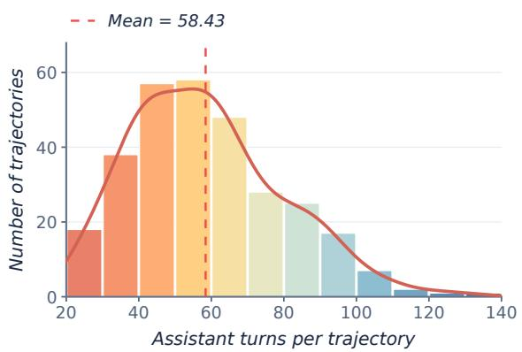  
(b) Tool calls

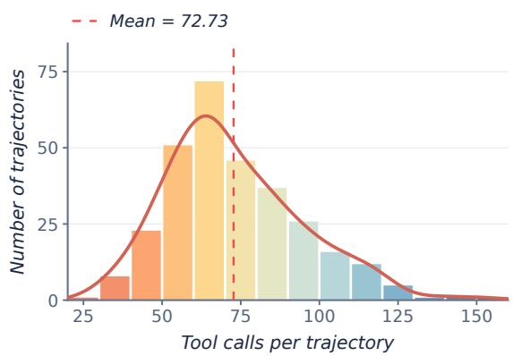  
Figure 11 Distributions of (a) assistant turns and (b) tool calls across 300 admitted pilot trajectories in Checker-Bench. Histogram bins have width 10. Dashed red lines mark sample means; solid red curves show Gaussian kernel density estimates with Scott’s bandwidth, scaled to histogram counts.

An assistant turn is a unique assistant message, deduplicated by session and message identifier. A tool call is a unique tool-use invocation, deduplicated by session and invocation identifier; failed calls and calls without a matching result are included. The tool-call total includes explicit skill invocations. Assistant-turn counts are computed from message events and use a diferent definition from the construction-time interaction-step metadata in Table 9 and the runner’s native turn counter.

Table 11 gives all histogram bins for both pilot metrics. The two columns each account for the same 300 admitted pilot trajectories under their respective event-counting definitions.

Table 11 Complete bin counts for the pilot distributions in Figure 11. Intervals are left-inclusive and right-exclusive. Each share uses 300 pilot trajectories.
<table><tr><td>Interval</td><td>Assistant turns</td><td>Share</td><td>Tool calls</td><td>Share</td></tr><tr><td>[20, 30)</td><td>18</td><td>6.0%</td><td>1</td><td>0.3%</td></tr><tr><td>[30, 40)</td><td>38</td><td>12.7%</td><td>8</td><td>2.7%</td></tr><tr><td>[40, 50)</td><td>57</td><td>19.0%</td><td>23</td><td>7.7%</td></tr><tr><td>[50, 60)</td><td>58</td><td>19.3%</td><td>51</td><td>17.0%</td></tr><tr><td>[60, 70)</td><td>48</td><td>16.0%</td><td>72</td><td>24.0%</td></tr><tr><td>[70, 80)</td><td>28</td><td>9.3%</td><td>46</td><td>15.3%</td></tr><tr><td>[80, 90)</td><td>25</td><td>8.3%</td><td>37</td><td>12.3%</td></tr><tr><td>[90, 100)</td><td>17</td><td>5.7%</td><td>26</td><td>8.7%</td></tr><tr><td>[100, 110)</td><td>7</td><td>2.3%</td><td>16</td><td>5.3%</td></tr><tr><td>[110, 120)</td><td>2</td><td>0.7%</td><td>12</td><td>4.0%</td></tr><tr><td>[120, 130)</td><td>1</td><td>0.3%</td><td>5</td><td>1.7%</td></tr><tr><td>[130, 140)</td><td>1</td><td>0.3%</td><td>1</td><td>0.3%</td></tr><tr><td>[140, 150)</td><td>0</td><td>0.0%</td><td>1</td><td>0.3%</td></tr><tr><td>[150, 160)</td><td>0</td><td>0.0%</td><td>1</td><td>0.3%</td></tr><tr><td>Total</td><td>300</td><td>100.0%</td><td>300</td><td>100.0%</td></tr></table>

## D.6 CVE Publication-Time Distribution

Table 12 gives every publication year, including empty years. Counts use the 300 task records, so separable tasks sharing a CVE contribute separately; uncertainty estimates for temporal performance keep those tasks grouped. The 2026 bin is observed through the September 15 metadata snapshot. The complete dating and boundary policies are in Appendix C.1.

Table 12 CVE publication years for the fixed 300 tasks. Dates use the canonical CVE record; the CVE identifier year is not used.
<table><tr><td>Publication year</td><td>CSA</td><td>CodeQL</td><td>Tasks</td><td>Share</td></tr><tr><td>2010</td><td>0</td><td>1</td><td>1</td><td>0.3%</td></tr><tr><td>2011</td><td>1</td><td>0</td><td>1</td><td>0.3%</td></tr><tr><td>2012</td><td>0</td><td>0</td><td>0</td><td>0.0%</td></tr><tr><td>2013</td><td>1</td><td>1</td><td>2</td><td>0.7%</td></tr><tr><td>2014</td><td>2</td><td>2</td><td>4</td><td>1.3%</td></tr><tr><td>2015</td><td>0</td><td>0</td><td>0</td><td>0.0%</td></tr><tr><td>2016</td><td>2</td><td>0</td><td>2</td><td>0.7%</td></tr><tr><td>2017</td><td>7</td><td>3</td><td>10</td><td>3.3%</td></tr><tr><td>2018</td><td>5</td><td>2</td><td>7</td><td>2.3%</td></tr><tr><td>2019</td><td>5</td><td>6</td><td>11</td><td>3.7%</td></tr><tr><td>2020</td><td>9</td><td>13</td><td>22</td><td>7.3%</td></tr><tr><td>2021</td><td>6</td><td>22</td><td>28</td><td>9.3%</td></tr><tr><td>2022</td><td>4</td><td>24</td><td>28</td><td>9.3%</td></tr><tr><td>2023</td><td>9</td><td>28</td><td>37</td><td>12.3%</td></tr><tr><td>2024</td><td>44</td><td>16</td><td>60</td><td>20.0%</td></tr><tr><td>2025</td><td>43</td><td>14</td><td>57</td><td>19.0%</td></tr><tr><td>2026</td><td>21</td><td>9</td><td>30</td><td>10.0%</td></tr><tr><td>Total</td><td>159</td><td>141</td><td>300</td><td>100.0%</td></tr></table>

## E Evaluation and Inference Protocol

## E.1 System Configurations and Reproducibility

The seven evaluated models are GPT-5.6-Sol [49], Claude Opus 4.8 [6], Qwen3.8-Max [2], DeepSeek-V4-Pro-0813 [18], GLM-5.2 [70], Kimi-K3 [33], and HY4-Preview [56]. We record harness and model versions, context and decoding settings, reasoning efort, and enabled tools. All systems share pinned repositories, toolchains, containers, resource limits, and the verifier. Released artifacts record prompts, skills, tool schemas, commands, workspace difs, diagnostics, termination reasons, and submissions.

## E.2 Task Admission and Independent Repeats

The evaluation manifest fixes 300 environments (159 CSA and 141 CodeQL), three harnesses, seven models, and three independent generation repeats per environment–harness–model combination. All three repeats cover the same 300 tasks for each of the 21 harness–model pairs, yielding 6,300 logical runs per repeat and 18,900 in total. The reported results are the arithmetic mean of the three repeat-level estimates, with equal weight for each repeat. Recovery attempts are tracked separately. A held-out reference checker is used to verify environment usability before runs are admitted. Only environment–model combinations that pass preflight are released, and blocked combinations remain visible in the coverage ledger. The reference checker is never part of the synthesis inputs.

Each independent repeat uses a separate workspace and a 50-minute generation budget. It receives the task instruction, patch, relevant code context, tools, and enabled skills. Visible compilation and analysis feedback can support multiple inspect–write–compile–repair cycles within this budget. The final source is checker.cpp for CSA or CodeQL query source. Generation completion status is recorded independently of downstream verification.

## E.3 Source and Evidence Freezing

At termination, the ledger records the submitted source, SHA-256 digest, complete trajectory, tool-call events, explicit skill invocations, elapsed time, usage, and termination reason. Task, harness, model, container, tool, and scorer versions are retained with independent-repeat and recovery-attempt indices. Subsequent scans and judges consume this exact candidate. Compiled artifacts can be regenerated from it, but verification recovery and a valid low quality score cannot replace its source. Raw evidence is retained alongside any normalized summaries and referenced by path and content hash.

## E.4 Backend Execution

The reference execution image pins LLVM/Clang 18 and mounts the task workspace at /work. Checker source is compiled with /opt/llvm/bin/clang++ in C++17 mode as a position-independent shared object using -fPIC, -shared, -fno-rtti, -fno-exceptions, the pinned LLVM include directory, and -Wl,–allow-shlib-undefined. The resulting object is a CSA plugin, not a standalone executable. Each scan invokes /opt/llvm/bin/clang –analyze, loads the plugin through the analyzer, enables its registered checker name, and appends the translated compilation-database flags and source file. Diagnostics are attributed to the checker through its registered diagnostic label. The task-local validator and the held-out verifier call the same generated scripts, but the verifier rebuilds from source in a clean workspace.

For CodeQL, the verifier independently compiles and executes the submitted query using the task’s pinned CodeQL environment and revision-specific analysis inputs. It enforces the frozen CodeQL rules for target and patch relevance, vulnerable–fixed diferential behavior, query scope, diagnostic quality, and hardcoding. CSA-specific compiler commands, report signatures, count limits, and plugin gates are not reused as CodeQL acceptance rules. The backend and rule version accompany every reported gate result.

## E.5 Frozen Mainline Scan and Single-Judge Decisions

After paired-revision verification, the same checker is scanned over a broader mainline scope. The mainline code is distinct from the vulnerable and fixed task revisions. At most ten warnings requiring judgment are sampled; the selected warning IDs and supporting code context are retained. Appendix E.6 specifies the selection rule, recorded warning counts, and the distinction between the sampled gate and aggregate precision. Claude Opus 5 [7] performs false-positive triage and, in separate stages, assesses process quality and vulnerability semantics. All stages use this one judge model and record the exact model configuration and rubric version. Judge decisions cannot override a failed executable or risk gate.

Each stage commits its first valid decision, including valid low scores and negative verdicts. Only unavailable or invalid evidence follows recovery; quality-based resampling is prohibited. Mainline “refinement” is an assessment of the frozen candidate, with no follow-up edits by the synthesis model. Empty warning sets and missing or invalid judgments follow each backend’s frozen rules; an undefined sample statistic is not fabricated.

Table 13 Recorded warning volume in the historical repeat-1 cohort of passed checkers. Counts precede the ten-aler triage selection.
<table><tr><td>Backend</td><td>Checkers</td><td>Zero alerts</td><td>&gt; 10 alerts</td><td>Recorded alerts</td><td>Sampled alerts</td></tr><tr><td>CSA</td><td>550</td><td>348</td><td>11</td><td>880</td><td>596</td></tr><tr><td>CodeQL</td><td>1,390</td><td>1,218</td><td>5</td><td>455</td><td>382</td></tr><tr><td>Total</td><td>1,940</td><td>1,566</td><td>16</td><td>1,335</td><td>978</td></tr></table>

## E.6 Mainline Alert Selection and Sensitivity

Selection unit and ordering. The frozen implementation selects individual alert records from each checker’s saved mainline output. Selection is deterministic conditional on that list; it is not uniform random sampling over alerts, files, or alert types, and the selector does not rank by severity. All records are judged when the list has at most ten entries. For a longer list of length N, the zero-based selected indices are

$$
\begin{array} { r } { I _ { \mathrm { C S A } } = \{ k \lfloor N / 1 0 \rfloor : k = 0 , \ldots , 9 \} , \quad } \\ { I _ { \mathrm { C o d e Q L } } = \{ \mathrm { r o u n d } ( k ( N - 1 ) / 9 ) : k = 0 , \ldots , 9 \} . } \end{array}\tag{1}
$$

CSA retains checker-tagged warnings and deduplicates identical path–line–column locations within each compiler invocation. Its collected list follows scan-worker completion order, so a fresh scan need not reproduce the same ordering. In particular, for 11–19 CSA warnings the rule takes the first ten. CodeQL uses the normalized finding order and first persists at most 100 findings; its ten-alert selector operates on that retained list. Neither backend allocates a fixed quota per file or alert type. Replaying a sample therefore requires the saved list and selected warning identities.

Warning volume before triage. Table 13 reports the archived audit of 1,940 passed checkers from retained repeat 1, covering all 21 harness–model combinations. This historical cohort predates the subsequent aggregate corrections to Table 2; it is not a three-repeat total. Of its 1,335 recorded alerts, 978 were initially sampled and 357 required supplementary judgment. Only 16 checkers had more than ten recorded alerts; 1,566 had none. These counts cover the passed cohort, not all generated checkers. CSA stops collecting after a compiler invocation brings the collected total to at least 100 warnings, and one scan in this cohort reached that cap. Consequently, recorded counts do not establish the number of alerts an uncapped scan of the entire repository would produce.

Alert-weighted and checker-weighted precision. The ten-alert sample supplies a per-checker acceptance gate. The reported $\mathrm { F P _ { p a s s } }$ instead pools recorded alerts from passed checkers, including supplementary judgments beyond that sample. For a fixed system and repeat, let $\mathcal { C } _ { + }$ contain those checkers with $N _ { i } = \mathrm { T P } _ { i } + \mathrm { F P } _ { i } > 0$ The corresponding alert-weighted and checker-weighted precision percentages are

$$
P _ { \mathrm { m i c r o } } = 1 0 0 \frac { \sum _ { i \in \mathcal { C } _ { + } } \mathrm { T P } _ { i } } { \sum _ { i \in \mathcal { C } _ { + } } N _ { i } } , \qquad P _ { \mathrm { m a c r o } } = \frac { 1 0 0 } { | \mathcal { C } _ { + } | } \sum _ { i \in \mathcal { C } _ { + } } \frac { \mathrm { T P } _ { i } } { N _ { i } } .\tag{2}
$$

Thus $\mathrm { F P _ { p a s s } } = 1 0 0 - P _ { \mathrm { m i c r o } } ;$ larger alert sets receive more weight in this metric. $P _ { \mathrm { m a c r o } }$ gives every alert bearing checker equal weight. Zero-alert checkers are reported separately and enter neither precision denominator; a clean scan does not establish perfect precision.

Observed sensitivity in the archived cohort. We recompute both estimators using the same post hoc $\ast$ Opus 5 audit of all 1,335 saved alerts. It contains 1,063 TP and 272 FP labels. We average the seven system-level estimates equally within each harness. The precision ordering changes from OpenCode, Claude Code, $\widehat { \mathfrak { A } }$ Hermes Agent under alert weighting to Claude Code, OpenCode, $\widehat { \pmb { \mathscr { D } } }$ Hermes Agent under checker weighting. Within Claude Code, the precision leader changes from $\mathfrak { P }$ GPT-5.6 (93.33% micro) to HY4-Preview (96.11% macro). These are conditional precision rankings, distinct from Pass@1 rankings.

Adding the all-recorded-alert gate removes 81 of the 1,940 original passes. The harness ordering by Pass@1 remains unchanged, but the leading harness–model pair changes from Claude Code/ Kimi-K3 (122/300 originally) to OpenCode/ DeepSeek-V4-Pro (119/300 after the added gate). The archived sampled gates and supplementary alert audit both used Claude Opus 5 judgments. The additional gate expands coverage from the ten-alert sample to all recorded alerts while retaining the same judge. Moreover, this is a passed-only audit of saved output: it does not re-adjudicate originally failed checkers or recover alerts beyond scan caps. A representative-subset comparison would need a common task subset spanning repositories and backends, include checkers reaching the FP stage regardless of their original verdict, and compare the sampled and complete outputs under the same judge and rubric. That analysis is not established by this audit; stability of the current full-evaluation rankings under exhaustive adjudication remains unverified.

## E.7 Failure Accounting, Recovery, and Aggregation

Final passed requires normal generation completion and every backend-specific executable, mainline, process, semantic, mechanism, scope, and anti-hardcoding gate. Valid generation failures, refusals, and candidate code errors are failures. Infrastructure failures permit at most two additional attempts under the recovery policy. When source already exists, verification recovery reuses it and preserves prior valid stage decisions. Each additional attempt is attached to its original logical run and does not contribute an additional independent value to the reported estimate.

Unresolved infrastructure outcomes are recorded separately from valid model failures, and evaluation coverage is reported with the scheduled manifest. Incomplete repeat groups are reported as incomplete coverage; they are not silently treated as completed failures or removed from the scheduled task set. For each harness–model pair, we compute Pass@1 as the percentage of the 300 tasks whose checker passes the full evaluation in each independent repeat. We report the arithmetic mean of these three rates, giving each repeat equal weight (Section 4). Each independent run contributes its own final verdict; a successful repeat does not replace a failed repeat. Final-success eficiency summaries average interaction turns, tool calls, and explicit skill calls over passed trajectories in that repeat, counting recorded invocation events including subagent activity. The conditional means from the three repeats are averaged equally. Each repeat’s passed-trajectory count is retained. If a retained repeat has no successful trajectory, its conditional eficiency and the aggregate eficiency mean are N/A, not zero. Full failure and recovery records remain archived for audit and resource accounting.

## E.8 Statistical Reporting

The reported main comparison, time-budget levels, and task subsets average the same three independent repeats equally. The separate ablation study uses one generation per task for each new variant and reuses the original Full cohort (Appendix H.2). The subgroup figure and tables report descriptive estimates without significance claims. Ablation intervals resample paired task IDs jointly across configurations; they reflect task composition and do not estimate uncertainty over repeated model generations or independent CVE clusters. Valid-score sample sizes and backend-specific breakdowns accompany diagnostic means; passed-trajectory counts accompany eficiency summaries.

Build and Dif. SR use all 300 tasks as their denominator. Process and Semantic average available valid scores on their respective scales. For passed checkers, each recorded mainline alert is labeled TP or FP. Within each repeat, $\mathrm { F P _ { p a s s } }$ pools these alerts as $1 0 0 \sum \mathrm { F P } / \sum ( \mathrm { T P } + \mathrm { F P } )$ . The reported $\mathrm { F P _ { p a s s } }$ and #WN are equal-weighted means of the three repeat-level proportions and warning counts, respectively. Checkers with no alerts contribute no denominator. One retained mainline scan reached its warning cap. Judge labels are not human ground truth. The Average and Overall Average rows in Table 2 are unweighted means of the reported metric values over the seven models within each harness and all 21 harness–model combinations, respectively.

## E.9 Human Validation of the LLM Judge

We validate Claude Opus 5’s false-positive triage, process-quality assessment, and vulnerability-semantic assessment against independent human annotations under the backend-specific rubrics in Appendix F. The three annotators have backgrounds in computer science graduate study and software development.

Sampling and judgment units. We sampled 100 of the 159 CSA tasks and 100 of the 141 CodeQL tasks. The CodeQL allocation comprised 25 tasks each for Java, Python, JavaScript, and Go. The task allocation followed these backend and language strata, with one frozen checker submission per task and no scoreboundary or outcome oversampling. Each of the 200 submissions received one process and one semantic judgment. For each backend, 80 of the 100 sampled tasks contributed 100 individual mainline warnings: 60 tasks contributed one warning each, and 20 contributed two each. The remaining 20 tasks contributed none. This yielded 200 warning judgments, 400 submission-stage judgments, and 600 judge–human pairs. No item was excluded or weighted. Model, harness, repeat, and pass/fail status were retained for audit, without allocation quotas.

Human labels and reference. All three annotators labeled every item independently, giving 1,800 initial human labels. Their view contained the warning and source context for false-positive triage; checker source and trajectory evidence for process quality; and the fixing patch plus vulnerable and fixed code for semantic quality. Judge labels and rationales, model and harness identities, and final verdicts were hidden during initial labeling. A majority of the three binary labels defined the human reference. For process and semantics, the binary label records whether the score and applicable discrete gates meet the backend’s rubric: process at least 80/100, CSA semantics at least 7/10, and CodeQL semantics at least 8/10. The table covers these stage decisions; numeric-score error and individual rubric-criterion agreement are outside its scope.

Label distribution and agreement. Table 14 gives separate judge and majority-human positive counts. Positive means a false positive at the warning stage and an accepted decision at the process and semantic stages. Each row contains 100 valid pairs. Judge–human agreement uses unweighted Cohen’s κ; human–human agreement uses three-rater Fleiss’ κ on the original independent binary labels. Exact matches range from 89 to 95 per row. The 2 × 2 cells in table order are (21, 3, 2, 74), (23, 2, 5, 70), (67, 3, 5, 25), (76, 3, 2, 19), (59, 7, 4, 30), and (65, 5, 3, 27), with cells ordered as judge-positive/human-positive, judge-positive/humannegative, judge-negative/human-positive, and judge-negative/human-negative. The minority vote is positive on (3, 5, 4, 3, 7, 5) split items in table order; the remaining split items have a negative minority vote.

Table 14 Human validation of the three categorical judge stages, with 100 items per row. J+/H+ gives judge and majority-human positive counts; exact agreement is a count. Split gives items with a nonunanimous initial human vote.
<table><tr><td>Backend</td><td>Stage</td><td> $\mathbf { J } + / \mathbf { H } +$ </td><td>Exact</td><td>J-H κ</td><td>H-H κ</td><td>Split</td></tr><tr><td>CSA</td><td>FP triage</td><td>24/23</td><td>95</td><td>0.861</td><td>0.867</td><td>7</td></tr><tr><td>CodeQL</td><td>FP triage</td><td>25/28</td><td>93</td><td>0.821</td><td>0.835</td><td>10</td></tr><tr><td>CSA</td><td>Process</td><td>70/72</td><td>92</td><td>0.806</td><td>0.852</td><td>9</td></tr><tr><td>CodeQL</td><td>Process</td><td>79/78</td><td>95</td><td>0.852</td><td>0.883</td><td>6</td></tr><tr><td>CSA</td><td>Semantic</td><td>66/63</td><td>89</td><td>0.760</td><td>0.800</td><td>14</td></tr><tr><td>CodeQL</td><td>Semantic</td><td>70/68</td><td>92</td><td>0.813</td><td>0.832</td><td>11</td></tr><tr><td>Pooled</td><td>All stages</td><td>334/332</td><td>556</td><td>0.852</td><td>0.872</td><td>57</td></tr></table>

Adjudication. The annotation set has 57 nonunanimous human items. Majority voting resolved all 57; no item was tied or removed from the denominator. The majority label changed only the human audit reference and left benchmark verdicts intact. Fleiss’ κ uses the 1,800 initial labels before majority resolution.

CSA versus CodeQL and interpretation of $\kappa = 0 . 8 5$ . Across the six rows, the 556 matching labels among 600 pairs give exact agreement of 0.9267. The judge-positive total is 334 and the human-positive total is 332, so chance agreement is 0.5060 and pooled Cohen’s $\kappa = ( 0 . 9 2 6 7 - 0 . 5 0 6 0 ) / ( 1 - 0 . 5 0 6 0 ) = 0 . 8 5 2$ to three decimal places. These calculations give the pooled $\kappa = 0 . 8 5$ reported in the main text after rounding to two decimal places. Reproducing the CSA and CodeQL results requires the frozen task IDs, checker and warning IDs, judge labels, all three independent human labels, and the adjudicated references. Task-clustered uncertainty intervals likewise require those records.

## F Post-Synthesis Verifier Rubric

CSA and CodeQL retain separate frozen executable and scoring policies. Their common final requirements are normal generation completion, independent executable evidence, mainline false-positive control, process and semantic quality, and backend-specific mechanism, scope, and anti-hardcoding checks. Figure 5 gives the numerical thresholds. The CSA implementation details below describe the post-synthesis-v4 rubric; CodeQL retains its own backend requirements.

## F.1 Independent Replay and Diagnostic Predicates

Before collecting trajectories, we instantiate and freeze each task’s verifier $\nu _ { i }$ from its recovered revision pair and pinned environment $\mathcal { E } _ { i }$ . Given checker source $q _ { i } ,$ , the verifier ignores agent-produced binaries, rebuilds or compiles the candidate in a clean workspace, and scans the task-specific scope in $c _ { i } ^ { - }$ and $c _ { i } ^ { + }$ . CSA uses a loadable checker plugin; CodeQL uses submitted query source in its pinned analysis environment. Versionpinned scripts preserve each backend’s context, while isolation prevents artifact leakage.

Replay produces diagnostic multisets $W _ { i } ^ { - } ( q _ { i } )$ and $W _ { i } ^ { + } ( q _ { i } )$ , with $N _ { i } ^ { \pm } ( q _ { i } ) = | W _ { i } ^ { \pm } ( q _ { i } ) |$ . Executable validity combines three binary indicators for build success, diagnostic contrast, and patch relevance:

$$
\begin{array} { r l } & { \mathrm { V a l i d } _ { i } ( q _ { i } ) = B _ { i } ( q _ { i } ) C _ { i } ( q _ { i } ) L _ { i } ( q _ { i } ) , } \\ & { \quad B _ { i } ( q _ { i } ) = \mathbf { 1 } [ \mathrm { B u i l d } _ { \alpha _ { i } } ( q _ { i } , \mathcal { E } _ { i } ) ] , } \\ & { \quad C _ { i } ( q _ { i } ) = \mathcal { C } _ { \alpha _ { i } , i } ( W _ { i } ^ { - } , W _ { i } ^ { + } ) , } \\ & { \quad L _ { i } ( q _ { i } ) = \mathcal { L } _ { \alpha _ { i } , i } ( W _ { i } ^ { - } , W _ { i } ^ { + } , \Delta _ { i } ) . } \end{array}\tag{3}
$$

Here, $\mathcal { C } _ { \alpha _ { i } , i }$ is the frozen diferential-detection predicate and $\mathcal { L } _ { \alpha _ { i } , i }$ is its target/patch-relevance predicate. CSA contrast requires $N _ { i } ^ { - } > N _ { i } ^ { + }$ and $N _ { i } ^ { + } < T _ { \mathrm { r e s } }$ , with $T _ { \mathrm { r e s } } = 5 0$ fixed before collection. Reports are matched using the line-insensitive signature

$$
\kappa _ { i } ( w ) = ( \mathrm { c h e c k e r } ( w ) , \mathrm { f l e } ( w ) , \mathrm { f u n c } ( w ) , \mathrm { m s g } ( w ) ) .
$$

At least one disappearing report must lie in a patch-modified function. CodeQL applies its own frozen query, diferential, and relevance rules; CSA’s count and matching predicates are not substituted for them. Replay retains normalized locations, dif-hunk distances, residual diagnostics, and in- and out-of-patch reports as evidence.

Let $O _ { i }$ denote the completed objective gate, including required artifacts, independent replay, and the backend’s scope and diagnostic-quality checks. CSA uses the operational G6 gate below; CodeQL uses its own frozen objective gate. In both cases, $O _ { i } \Rightarrow \mathrm { V a l i d } _ { i } ( q _ { i } ) = 1$ . Executable validity, process quality, semantic fidelity, and mainline false-positive control are non-compensating requirements.

## F.2 CSA Deterministic Objective Gate

This gate invokes no LLM. The source and rebuilt plugin are checker.cpp and checker.so. The full frozen CSA contrast and localization predicates must hold in addition to the recorded gate evidence.

G0. The task work directory and interaction trace exist.

G1. The checker source exists and contains at least 50 bytes.

G2. Independent compilation produces the loadable analyzer artifact.

G3. verify\_result.json exists and the vulnerable revision produces at least one diagnostic, $n _ { \mathrm { b u g g y } } > 0$

G4. Vulnerable and fixed diagnostics satisfy the frozen CSA contrast rule; equal positive counts are rejected.

G5. Patch relevance is at least 0.5 and diagnostic sparsity is at least 0.3.

G6. All G0–G5 requirements pass.

Only G6 makes a run eligible for a nonzero CSA process score. Four additional objective diagnostics— Diferential Detection (15 points), Diagnostic Sharpness (15), False-Positive and Scope Control (15), and basic CSA Implementation Quality (4)—are reported for diagnosis. These 49 points are excluded from $S _ { p }$ to avoid counting executability again as process quality.

## F.3 CSA Process and Semantic Quality

The process stage examines the patch, vulnerable and fixed functions, state.json, scope statement, frozen source, synthesis summary, and validation evidence. Its raw score $Q _ { i }$ comprises Patch Semantic Understanding (12 points), Detection Plan Quality (12), Plan-to-Code Consistency (12), and Validation Quality (6), for $Q _ { \mathrm { m a x } } = 4 2$ . Repeated reads, redundant commands, excessive edits, and non-progressing build loops incur a waste penalty $p _ { i } ^ { \mathrm { w a s t e } } \in [ 0 , 5 ]$ . The process floor is 80/100.

The semantic stage first infers the root cause, trigger and safe conditions, defect class, propagation requirements, and minimum analyzer mechanism from the patch and vulnerable functions. It then compares the frozen checker with those requirements. The ordered mechanism ladder is

$$
s y n t a x - o n l y  c a l l - m a t c h  p a t h - s e n s i t i v e  d a t a f l o w  c r o s s - p r o c e d u r e .
$$

Mechanism adequacy is classified as adequate, partial, inadequate, or overkill; semantic correctness as yes, partial, or no. For ten-point correctness and mechanism-fit subscores $s _ { c , i } , s _ { m , i } ,$ the process and semantic scores are

$$
S _ { p , i } = \mathbf { 1 } [ O _ { i } ] \frac { 1 0 0 \operatorname* { m a x } ( 0 , Q _ { i } - p _ { i } ^ { \mathrm { w a s t e } } ) } { Q _ { \operatorname* { m a x } } } , \qquad S _ { s , i } = 0 . 6 s _ { c , i } + 0 . 4 s _ { m , i } .\tag{4}
$$

The CSA semantic floor is $7 / 1 0 .$ . CSA additionally requires mechanism\_adapted=adequate, semantic\_correct in {yes,partial}, valid parsing, and no semantic-anchor risk. A patch-adjacent AST match may therefore fail semantic assessment despite satisfying a diagnostic contrast.

## F.4 CodeQL Quality Gates

CodeQL follows the layered admission structure described above while retaining backend-specific executable, diferential, relevance, scope, and hardcoding predicates. Its query is independently rebuilt and checked on the vulnerable and fixed revisions before scoring, and its refinement scan uses the shared mainline false-positive gate, with a default sampled FP cutof of 25% in the main comparison. Queries that fail or incompletely satisfy these prerequisites are not scored on process or semantic quality.

The CodeQL process-quality score is a 100-point score with a process floor of 80. Its dimensions are vulnerability modeling (18 points), observable-evidence planning (14), mechanism selection (18), plan-to-code consistency (18), validation and recovery (14), eficiency and finalization (10), and generalization discipline (8). The semantic-quality score is a 10-point score in half-point increments with a floor of $\mathrm { 8 ; }$ it assesses the vulnerable sink, trigger and dataflow, safety barrier, CodeQL mechanism, and report-scope generalization. In addition to the numeric floor, automatic admission requires correct vulnerability and safety-barrier modeling, sound dataflow or control-flow support, acceptable scope generalization, an adequate mechanism, and no patch hardcoding or project-specific scope.

These CodeQL-specific conditions refine the common final requirements without changing the noncompensating relation between executable validity, false-positive control, process quality, and semantic quality.

## F.5 Mainline False Positives and Final Verdict

The frozen candidate’s mainline scan and at most ten judged warnings provide false-positive evidence. In the main comparison, the sampled FP rate must be at most 25% for both CSA and CodeQL. For a nonempty, validly judged sample, FP rate is the fraction classified as false positives. Sample composition, warninglevel decisions, and the backend’s complete refinement outcome are stored. A backend-recognized clean scan follows its frozen empty-sample policy.

Let $F _ { i }$ denote normal generation completion; $J _ { i }$ the required valid judge decisions; $R _ { i }$ the mainline false positive gate, including the backend’s full refinement rules; $M _ { i }$ adequate mechanism fit; $C _ { i } ^ { \mathrm { s e m } }$ the required semantic-correctness classification; and $H _ { i } , A _ { i }$ hardcoding and semantic-anchor risks. With $t _ { \mathrm { C S A } } = 7$ and $t _ { \mathrm { C o d e Q L } } = 8$ , the final verdict is

$$
\begin{array} { r l } & { { \mathrm { P A S S } } _ { i } = F _ { i } \wedge O _ { i } \wedge J _ { i } \wedge R _ { i } \wedge [ S _ { p , i } \geq 8 0 ] \wedge [ S _ { s , i } \geq t _ { \alpha _ { i } } ] } \\ & { \qquad \wedge M _ { i } \wedge C _ { i } ^ { \mathrm { s e m } } \wedge \neg ( H _ { i } \vee A _ { i } ) . } \end{array}\tag{5}
$$

Section 5.6 varies only the cutof within $R _ { i }$ , replacing its default 25% value while retaining the saved warning samples, judge decisions, and all remaining acceptance requirements. The main evaluation uses $\divideontimes$ Claude Opus 5 [7] for staged false-positive, process, and semantic judgments and retains each stage’s first valid decision. A valid low score is a failure, not a reason to ask again.

A valid failed gate or low score yields a failed quality outcome; no new checker is requested. An unavailable judge or missing verification evidence cannot grant a pass and follows the bounded infrastructure-recovery rules, without discarding valid earlier decisions. Only a normally completed generation whose candidate satisfies every required gate receives final passed. Objective-only scoring cannot issue that final outcome.

## G Representative CSA Checker Patterns

This appendix summarizes a selected set of implementation patterns from oficial LLVM 18 Clang Static Analyzer (CSA) checkers [40]. The catalog applies only to the CSA-backed C/C++ subset of CheckerBench; tasks in other language ecosystems use the corresponding analyzer-native rule APIs. We retain patterns that expose distinct synthesis challenges rather than reproducing complete checker implementations.

Table 15 Selected CSA checker patterns used as implementation references for $\mathrm { C } / \mathrm { C } + +$ tasks, from stateless local checks to path-sensitive lifecycle analyses with persistent program state.
<table><tr><td>Pattern / official checker</td><td>Callbacks /state</td><td>Synthesis challenge</td></tr><tr><td>Constraint violation DivZeroChecker</td><td>PreStmt State: none</td><td>Split feasible states and report only a defi- nitely zero denominator.</td></tr><tr><td>Undefined value</td><td>PostStmt</td><td>Identify the undefined operand and retain</td></tr><tr><td>UndefResultChecker Resource lifecycle</td><td>State: none PostCall, PreCall, DeadSymbols. PointerEscape</td><td>useful diagnostic provenance. Track opened and closed resources, double close, escape, and leaks.</td></tr><tr><td>Nullability propagation NullabilityChecker</td><td>State: symbol-to-state map Binding, calls, returns, locations, assumptions, and events</td><td>Propagate annotations and constraints across multiple semantic events.</td></tr><tr><td>Memory management MallocChecker</td><td>State: two maps and an invariant flag Calls, locations, dead symbols, es- capes, and assumptions State: region-state map plus auxil-</td><td>Model allocation families, deallocation com- patibility, leaks, double free, and use after</td></tr></table>

Stateless constraint checks. DivZeroChecker and UndefResultChecker illustrate the smallest useful checker structures. They register a single statement callback, query the symbolic value already maintained by CSA, and emit a report without introducing persistent state. The former uses a dual feasibility assumption to separate zero and nonzero denominators; the latter inspects an undefined result after expression evaluation and attributes it to the relevant operand. These patterns test whether an agent can select the correct callback phase and translate a local defect predicate into analyzer constraints.

Finite-state resource tracking. SimpleStreamChecker represents the minimal lifecycle pattern. A programstate map associates each resource symbol with an opened or closed state. Post-call handling records acquisition, pre-call handling validates and updates release, dead-symbol handling reports leaks, and pointer-escape handling stops tracking resources whose ownership can no longer be established. This pattern requires the synthesized checker to coordinate several callbacks while preserving a compact state machine.

Multi-callback semantic propagation. NullabilityChecker and MallocChecker represent the complex end of the catalog. They combine call, statement, location, assumption, liveness, and escape events with multiple state traits. Their purpose here is not to provide templates for direct copying, but to expose the design decisions required for repository-level synthesis: choosing semantic events, defining stable state keys, suppressing infeasible or duplicate reports, and attaching path evidence to diagnostics.

Common reporting contract. Across the selected patterns, a checker obtains symbolic values from the current analysis state, creates a sink or non-fatal error node as appropriate, constructs a path-sensitive bug report, marks relevant symbols and source ranges, optionally installs a visitor for path notes, and finally emits the report. CheckerBench evaluates the resulting behavior through independent rebuilding and vulnerable–fixed diagnostic contrast rather than by matching these reference implementations.

## H Additional Experimental Results

## H.1 KNighter Comparison Details

Tasks and comparison. The comparison in Section 5.3 uses the 61 Linux-kernel tasks from KNighter’s original benchmark [67]. Each task takes a bug-fixing commit as input and requires a CSA checker that distinguishes buggy code from its patched version. We evaluate our OpenCode-based method, KNighter, and our method without skills, all using DeepSeek-V4-Pro. Table 3 reports valid-checker counts and rates.

Time budget. All three configurations use the same 50-minute (3,000-second) active generation budget per task. The budget covers model responses, tool execution, and checker-repair iterations across the complete workflow, including KNighter’s internal agent coordination. Recorded admission queues and maintenance pauses, as well as subsequent independent verification, are excluded under the timing convention in Appendix H.3. The submitted checker is frozen when generation terminates.

Accessible documentation. Our method and KNighter receive the same fixing patch, source-code context, repository revisions, and pinned CSA environment. Both can consult the same read-only Linux/CSA documentation, analyzer API references, and oficial checker examples described in Appendix B.3. These shared resources exclude held-out reference checkers and task-specific checker solutions.

Skill library. Both systems have access to the same reusable skill and strategy content for patch interpretation, checker design, build recovery, and validation. The content is exposed through each system’s native interface. The w/o skills variant of our method removes these skill packages and strategy references while retaining the same task inputs, factual API documentation, tools, and execution budget.

Task prompts. The task-facing instructions standardize the synthesis objective, supplied patch and code context, available resources, required checker artifact, and validation requirements. System-specific role prompts and internal orchestration retain each harness’s workflow, while the task information and reusable knowledge made available to our method and KNighter are held constant.

Validation criteria. All three configurations use the same independent verifier, scan scopes, and acceptance predicates. The verifier rebuilds each frozen checker from source in the pinned CSA environment and applies the same build-success, vulnerable–fixed diagnostic-contrast, and patch-relevance checks (Equation 3). Agentreported success does not determine the verdict. Table 3 reports the number of valid checkers and the corresponding percentage over the same 61 tasks.

Table 16 Artifact pass and diferences from Full. All rates use the full task denominator; CSA and CodeQL use 159 and 141 tasks. Intervals use 10,000 paired task bootstrap samples.
<table><tr><td>Configuration</td><td>All (%)</td><td>∆ pp [95% CI]</td><td>CSA (%)</td><td>CodeQL (%)</td></tr><tr><td>Full</td><td>48.67</td><td>Reference</td><td>44.03</td><td>53.90</td></tr><tr><td>w/o Skills</td><td>18.67</td><td>-30.00 [-36.33, -23.67]</td><td>15.72</td><td>21.99</td></tr><tr><td>w/o Execution Feedback</td><td>20.33</td><td>-28.33 [-34.67, -22.00]</td><td>17.61</td><td>23.40</td></tr><tr><td>w/o Harness</td><td>1.33</td><td>-47.33 [−53.00, -41.33]</td><td>0.00</td><td>2.84</td></tr></table>

## H.2 Ablation Outcomes and Coverage

Each configuration covers the same 300 tasks: 159 CSA and 141 CodeQL tasks. The three new variants have 900 frozen candidates in total; Full reuses the original 300 candidates. We independently evaluated the 21 historical artifacts whose assessment had stopped at the generation deadline. All 21 fail an artifact requirement, including three with no submitted source; Full therefore has 146/300 artifact passes and 119/300 full passes (39.67%). No candidate was regenerated or edited during this completion.

Configurations and generation. Each new configuration uses one generation per task. w/o Skills jointly removes skill packages and strategy references while retaining task inputs, repository tools, and factual API documentation. w/o Execution Feedback retains skills but returns neutral receipts for build and analyzer calls; actual outputs remain outside the agent workspace. Both use OpenCode with a 3,000-second active budget. w/o Harness makes one model call without tools or skills, using the full patch and deterministically extracted code context. The new variants share the model route, sampling settings, and 16,384-token output limit per response; one-shot generation has no feedback or repair call.

Endpoints and comparability. Artifact pass applies the compilation, diferential, semantic, anti-hardcoding, and false-positive gates without requiring Process or normal agent termination. Frozen artifacts are evaluated even when generation reaches the time limit. The new runs retain their frozen Claude Opus 5 judgments for Process, Semantic, and task gates; a separate Opus 5 audit of all saved alerts supplies the reported $\mathrm { F P _ { p a s s } }$ without changing the original verdicts. Historical Full difers from the new runs in execution date, client context limit, and workspace/tool isolation, so the comparisons do not isolate causal efects of individual components. The one-shot result also reflects its strict output protocol: 237/300 requests yield invalid or incomplete structured submissions, and another 53 fail compilation.

Using the displayed rates in Table 4, the Pass@1 diferences from Full are −31.34, −26.34, and −39.34 percentage points, respectively. The artifact-pass intervals in Table 16 describe variation over paired tasks for one generation per task; they do not cover model resampling, shared-CVE dependence, or diferences between historical and new execution conditions.

Process/Semantic valid sample counts are 239/239 for Full, 119/122 for w/o Skills, 100/100 for w/o Execution Feedback, and 10/10 for w/o Harness. These conditional means are not averages over all 300 tasks. Three unavailable Process judgments are excluded instead of using heuristic fallback scores. Missing evidence is never treated as a pass. One failed candidate has seven false positives among ten sampled alerts, exceeding its 25% threshold.

Opus 5 independently adjudicates every saved alert of the 25, 40, and 1 passed new checkers (16, 64, and 0 alerts, respectively). All 80 labels are resolved after source-evidence completion; the Full FP figure reuses the 78-alert Opus 5 audit from the main experiment. These post hoc labels define $\mathrm { F P _ { p a s s } }$ , not the original sampled FP gates. The false-positive counts are 2/78 (2.56%) for Full, 1/16 for w/o Skills, and 16/64 for w/o Execution Feedback. One-shot has no saved alerts, so its N/A entry does not denote a zero falsepositive proportion. No-alert checkers add nothing to the alert denominator. The metric is a false-discovery proportion over saved alerts, not a repository-wide false-positive rate.

Because the ablation variants have substantially lower pass rates and therefore fewer successful trajectories, Table 4 averages turns and tool calls over all 300 tasks, including failed trajectories. This difers from Table 2, which reports interaction metrics over successful trajectories only. Table 17 additionally restricts each comparison to tasks whose artifacts pass in both Full and the corresponding variant.

Table 17 Interaction cost on tasks passed by both artifacts. Each pair uses its own common task subset; these means should not be compared across rows as if the subsets were identical.
<table><tr><td>Variant</td><td>Tasks</td><td>Full turns</td><td>Variant turns</td><td>Full tools</td><td>Variant tools</td></tr><tr><td>w/o Skills</td><td>42</td><td>49.29</td><td>64.02</td><td>63.21</td><td>89.24</td></tr><tr><td>w/o Execution Feedback</td><td>43</td><td>45.21</td><td>63.19</td><td>60.63</td><td>84.09</td></tr><tr><td>w/o Harness</td><td>3</td><td>22.00</td><td>1.00</td><td>39.33</td><td>0.00</td></tr></table>

## H.3 Time-Budget Sensitivity

Tables 18–20 provide the complete time-budget results for the analysis in Section 5.5. The tables cover all seven models and three harnesses at 10, 20, 30, 40, and 50 minutes of active generation time, using the completed-within-budget policy below.

Timing and eligibility. We retrospectively apply the cutofs to existing trajectories, retaining each task’s current evaluated attempt. Active generation time includes model responses and tool execution, but excludes recorded API and compute admission queues, maintenance pauses, and subsequent external verification and judging. Only final artifacts completed within a cutof contribute their existing evaluation outcomes; unfinished runs count as unsuccessful for Pass@1, Build, and Dif. SR, with all 300 tasks retained in each denominator. Intermediate artifacts are not evaluated, and agents are not rerun with shorter deadlines. Realized execution time and trajectory length can difer from the budget because agents may terminate early, batch tool operations, or spend time waiting for responses and recovering from build failures.

Conditional metrics and model diferences. Process and Semantic average available valid scores from eligible completed runs; Avg. Turns and Avg. Tool Calls average eligible passed runs. $\mathrm { F P _ { p a s s } }$ pools recorded alerts from those passed runs, using the same adjudicated labels as the main table. These statistics describe changing subsets of completed runs, not within-trajectory quality improvements. Averaged across harnesses, the 40-to-50-minute Pass@1 gains are largest for Qwen3.8-Max (3.67 percentage points) and HY4-Preview (3.33), compared with 0.44 for GPT-5.6 and 3.00 for Claude Opus 4.8. These diferences describe when the retained trajectories finish successfully.

Table 18 Time-budget sensitivity on CheckerBench: OpenCode.
<table><tr><td>Model</td><td>Budget (min) Pass@1</td><td>(%)↑Build (%)↑Diff. SR</td><td></td><td>(%) ↑FPpass</td><td></td><td>(%) ↓Process ↑Semantic ↑Turns ↓ Tool Calls ↓</td><td></td><td>Avg.</td><td>Avg.</td></tr><tr><td>GPT-5.6</td><td>10</td><td>12.00</td><td>25.33</td><td>25.00</td><td>0.00</td><td>84.57</td><td>8.26</td><td>23.50</td><td>54.53</td></tr><tr><td></td><td>20</td><td>23.33</td><td>64.67</td><td>58.67</td><td>0.00</td><td>82.20</td><td>7.83</td><td>26.89</td><td>57.60</td></tr><tr><td></td><td>30</td><td>28.33</td><td>85.00</td><td>75.33</td><td>0.00</td><td>80.96</td><td>7.75</td><td>28.40</td><td>58.85</td></tr><tr><td></td><td>40</td><td>31.33</td><td>95.33</td><td>83.00</td><td>0.00</td><td>80.71</td><td>7.68</td><td>29.22</td><td>60.06</td></tr><tr><td></td><td>50</td><td>31.67</td><td>98.33</td><td>85.33</td><td>0.00</td><td>80.22</td><td>7.68</td><td>29.19</td><td>60.13</td></tr><tr><td> Claude Opus 4.8</td><td>10</td><td>8.33</td><td>9.67</td><td>9.67</td><td>0.00</td><td>88.28</td><td>9.04</td><td>26.20</td><td>39.36</td></tr><tr><td></td><td>20</td><td>24.00</td><td>31.67</td><td>31.33</td><td>0.00</td><td>89.42</td><td>8.84</td><td>33.60</td><td>50.25</td></tr><tr><td></td><td>30</td><td>36.00</td><td>53.67</td><td>53.00</td><td>5.36</td><td>88.11</td><td>8.51</td><td>39.41</td><td>57.24</td></tr><tr><td></td><td>40</td><td>42.33</td><td>70.33</td><td>69.67</td><td>14.04</td><td>87.07</td><td>8.35</td><td>42.78</td><td>62.07</td></tr><tr><td></td><td>50</td><td>45.33</td><td>81.67</td><td>81.00</td><td>13.79</td><td>86.42</td><td>8.32</td><td>44.78</td><td>64.35</td></tr><tr><td>六 Qwen3.8-Max</td><td>10</td><td>6.33</td><td>7.67</td><td>7.67</td><td></td><td>92.15</td><td>9.22</td><td>24.11</td><td>31.68</td></tr><tr><td></td><td>20</td><td>22.33</td><td>33.33</td><td>33.00</td><td>0.00</td><td>91.72</td><td>8.69</td><td>31.15</td><td>41.39</td></tr><tr><td></td><td>30</td><td>29.33</td><td>50.33</td><td>50.00</td><td>0.00</td><td>91.16</td><td>8.50</td><td>33.18</td><td>44.00</td></tr><tr><td></td><td>40</td><td>35.00</td><td>63.00</td><td>62.67</td><td>6.00</td><td>90.58</td><td>8.49</td><td>34.84</td><td>46.10</td></tr><tr><td></td><td>50</td><td>37.33</td><td>69.33</td><td>69.00</td><td>5.77</td><td>90.15</td><td>8.46</td><td>35.96</td><td>47.54</td></tr><tr><td>DeepSeek-V4-Pro</td><td>10</td><td>13.33</td><td>22.67</td><td>21.67</td><td>0.00</td><td>89.98</td><td>8.40</td><td>34.25</td><td>47.88</td></tr><tr><td></td><td>20</td><td>26.00</td><td>55.67</td><td>54.33</td><td>5.26</td><td>88.05</td><td>8.18</td><td>39.64</td><td>52.94</td></tr><tr><td></td><td>30</td><td>34.33</td><td>75.33</td><td>73.67</td><td>5.00</td><td>86.34</td><td>8.19</td><td>44.62</td><td>58.42</td></tr><tr><td></td><td>40</td><td>38.67</td><td>87.67</td><td>85.67</td><td>2.82</td><td>85.32</td><td>8.16</td><td>49.52</td><td>63.78</td></tr><tr><td></td><td>50</td><td>39.67</td><td>92.67</td><td>90.67</td><td>2.56</td><td>84.89</td><td>8.12</td><td>51.09</td><td>65.28</td></tr><tr><td>Budget</td><td colspan="7">(min) Pass@1 (%) ↑Build (%) ↑Diff. SR (%)</td><td rowspan="2">Avg.</td><td rowspan="2">Avg. (%) ↓Process ↑Semantic ↑Turns ↓ Tool Calls ↓</td></tr><tr><td>Model</td><td></td><td></td><td></td><td> $\uparrow \mathbf { F P _ { \mathrm { p a s s } } }$ </td><td></td><td></td><td></td></tr><tr><td>Z GLM-5.2</td><td>10</td><td>3.67</td><td>4.33</td><td>4.33</td><td>0.00</td><td>91.61</td><td>9.58</td><td>24.82</td><td>43.73</td></tr><tr><td></td><td>20</td><td>18.00</td><td>34.33</td><td>33.00</td><td>14.63</td><td>88.84</td><td>8.20</td><td>33.98</td><td>53.26</td></tr><tr><td></td><td>30</td><td>27.33</td><td>59.67</td><td>58.33</td><td>10.34</td><td>87.41</td><td>8.15</td><td>38.62</td><td>58.17</td></tr><tr><td></td><td>40</td><td>31.33</td><td>73.00</td><td>71.00</td><td>10.34</td><td>86.90</td><td>8.12</td><td>40.23</td><td>59.55</td></tr><tr><td></td><td>50</td><td>32.33</td><td>77.33</td><td>75.33</td><td>10.34</td><td>86.73</td><td>8.11</td><td>41.21</td><td>61.02</td></tr><tr><td>KKimi-K3</td><td>10</td><td>8.33</td><td>9.67</td><td>9.67</td><td>0.00</td><td>92.15</td><td>9.34</td><td>22.32</td><td>33.28</td></tr><tr><td></td><td>20</td><td>22.33</td><td>40.33</td><td>40.00</td><td>0.00</td><td>90.99</td><td>8.53</td><td>26.10</td><td>36.84</td></tr><tr><td></td><td>30</td><td>30.67</td><td>62.00</td><td>60.33</td><td>2.56</td><td>89.67</td><td>8.36</td><td>28.93</td><td>39.91</td></tr><tr><td></td><td>40</td><td>36.67</td><td>76.00</td><td>74.33</td><td>1.75</td><td>88.90</td><td>8.34</td><td>31.32</td><td>42.35</td></tr><tr><td></td><td>50</td><td>38.67</td><td>83.33</td><td>81.67</td><td>1.59</td><td>88.48</td><td>8.30</td><td>32.42</td><td>43.53</td></tr><tr><td>HY4-Preview</td><td>10</td><td>5.33</td><td>7.67</td><td>7.00</td><td>0.00</td><td>90.07</td><td>8.76</td><td>25.06</td><td>32.44</td></tr><tr><td></td><td>20</td><td>19.00</td><td>34.33</td><td>33.67</td><td>18.18</td><td>89.70</td><td>8.40</td><td>33.04</td><td>41.02</td></tr><tr><td></td><td>30</td><td>28.67</td><td>55.67</td><td>55.00</td><td>14.29</td><td>88.20</td><td>8.32</td><td>38.64</td><td>47.22</td></tr><tr><td></td><td>40</td><td>32.00</td><td>65.33</td><td>64.67</td><td>13.98</td><td>87.54</td><td>8.31</td><td>40.32</td><td>49.15</td></tr><tr><td></td><td>50</td><td>33.67</td><td>72.67</td><td>71.33</td><td>12.38</td><td>86.90</td><td>8.32</td><td>41.28</td><td>50.15</td></tr></table>

Budgets threshold existing trajectories by active generation time, excluding recorded resource-admission queues and maintenance pauses. External verification and judging are outside the generation clock. Only final artifacts completed by the cutof contribute; unfinished runs contribute no success to Pass@1, Build, or Dif. SR, whose denominator remains 300. Process and Semantic average available valid scores among eligible completed runs. Turns and Tool Calls average only eligible passed runs. $\mathrm { F P _ { p a s s } }$ is the pooled alert-level FP fraction for those passed runs, using the same adjudicated labels as the main table. A dash denotes no eligible score or a zero alert denominator. Per-cell sample sizes accompany the CSV. These are retrospective completion curves, not separately rerun deadline experiments.

Table 19 Time-budget sensitivity on CheckerBench: Claude Code.
<table><tr><td>Model</td><td>Budget (min) Pass@1 (%) ↑Build (%) ↑Diff. SR (%)</td><td></td><td></td><td> $\uparrow \mathbf { F P _ { \mathrm { p a s s } } }$ </td><td>(%) ↓Process ↑Semantic ↑Turns ↓ Tool Calls ↓</td><td></td><td></td><td>Avg.</td><td>Avg.</td></tr><tr><td>GPT-5.6</td><td>10</td><td>10.00</td><td>19.33</td><td>19.00</td><td>0.00</td><td>88.09</td><td>8.24</td><td>28.37</td><td>51.77</td></tr><tr><td></td><td>20</td><td>23.67</td><td>55.67</td><td>53.33</td><td>0.00</td><td>82.77</td><td>7.73</td><td>31.34</td><td>54.06</td></tr><tr><td></td><td>30</td><td>29.67</td><td>76.33</td><td>69.00</td><td>2.63</td><td>81.89</td><td>7.70</td><td>34.12</td><td>57.94</td></tr><tr><td></td><td>40</td><td>33.00</td><td>92.00</td><td>81.33</td><td>2.44</td><td>81.38</td><td>7.67</td><td>35.18</td><td>59.87</td></tr><tr><td></td><td>50</td><td>34.00</td><td>93.67</td><td>83.00</td><td>2.44</td><td>81.41</td><td>7.69</td><td>35.71</td><td>60.58</td></tr><tr><td> Claude Opus 4.8</td><td>10</td><td>9.00</td><td>10.00</td><td>9.00</td><td>0.00</td><td>87.40</td><td>9.28</td><td>17.52</td><td>30.11</td></tr><tr><td></td><td>20</td><td>18.33</td><td>25.33</td><td>24.00</td><td>0.00</td><td>88.30</td><td>8.85</td><td>23.36</td><td>35.98</td></tr><tr><td></td><td>30</td><td>28.67</td><td>45.33</td><td>44.00</td><td>2.94</td><td>87.77</td><td>8.47</td><td>28.49</td><td>41.53</td></tr><tr><td></td><td>40</td><td>32.67</td><td>55.33</td><td>54.00</td><td>2.50</td><td>87.26</td><td>8.30</td><td>30.23</td><td>43.16</td></tr><tr><td></td><td>50</td><td>35.00</td><td>63.67</td><td>62.33</td><td>2.33</td><td>86.88</td><td>8.21</td><td>32.60</td><td>45.63</td></tr><tr><td>Qwen3.8-Max</td><td>10</td><td>7.00</td><td>8.67</td><td>8.67</td><td>0.00</td><td>92.41</td><td>9.12</td><td>24.00</td><td>29.33</td></tr><tr><td></td><td>20</td><td>23.00</td><td>39.33</td><td>39.00</td><td>4.76</td><td>90.96</td><td>8.50</td><td>27.90</td><td>34.01</td></tr><tr><td></td><td>30</td><td>27.33</td><td>51.33</td><td>51.00</td><td>5.88</td><td>90.33</td><td>8.41</td><td>30.12</td><td>36.60</td></tr><tr><td></td><td>40</td><td>31.33</td><td>61.00</td><td>60.67</td><td>4.88</td><td>89.86</td><td>8.35</td><td>32.17</td><td>39.36</td></tr><tr><td></td><td>50</td><td>34.67</td><td>67.33</td><td>67.00</td><td>4.55</td><td>89.58</td><td>8.38</td><td>33.91</td><td>41.57</td></tr><tr><td> DeepSeek-V4-Pro</td><td>10</td><td>14.00</td><td>22.67</td><td>22.33</td><td>0.00</td><td>89.43</td><td>8.56</td><td>35.07</td><td>48.45</td></tr><tr><td></td><td>20</td><td>23.67</td><td>49.33</td><td>49.00</td><td>0.00</td><td>87.26</td><td>8.29</td><td>39.44</td><td>53.23</td></tr><tr><td></td><td>30</td><td>31.00</td><td>73.67</td><td>72.67</td><td>0.00</td><td>85.86</td><td>8.26</td><td>42.24</td><td>56.84</td></tr><tr><td></td><td>40</td><td>36.67</td><td>86.00</td><td>84.33</td><td>1.79</td><td>85.61</td><td>8.29</td><td>45.71</td><td>60.81</td></tr><tr><td></td><td>50</td><td>38.33</td><td>91.33</td><td>89.67</td><td>1.72</td><td>85.25</td><td>8.27</td><td>47.17</td><td>62.50</td></tr><tr><td>Z GLM-5.2</td><td>10</td><td>1.00</td><td>1.33</td><td>1.33</td><td></td><td>95.75</td><td>9.38</td><td>21.67</td><td>40.33</td></tr><tr><td></td><td>20</td><td>12.67</td><td>23.00</td><td>22.33</td><td>0.00</td><td>93.37</td><td>8.89</td><td>30.92</td><td>41.89</td></tr><tr><td></td><td>30</td><td>23.00</td><td>47.00</td><td>45.33</td><td>0.00</td><td>91.55</td><td>8.64</td><td>34.01</td><td>45.87</td></tr><tr><td></td><td>40</td><td>28.00</td><td>62.67</td><td>61.00</td><td>0.00</td><td>90.55</td><td>8.48</td><td>36.69</td><td>47.92</td></tr><tr><td></td><td>50</td><td>33.00</td><td>76.33</td><td>74.67</td><td>0.00</td><td>89.67</td><td>8.39</td><td>38.75</td><td>49.93</td></tr><tr><td>KKimi-K3</td><td>10</td><td>11.00</td><td>13.33</td><td>13.33</td><td>0.00</td><td>92.51</td><td>9.33</td><td>24.88</td><td>31.21</td></tr><tr><td></td><td>20</td><td>22.67</td><td>47.67</td><td>47.00</td><td>0.00</td><td>90.11</td><td>8.29</td><td>27.32</td><td>33.54</td></tr><tr><td></td><td>30</td><td>30.33</td><td>66.33</td><td>65.33</td><td>3.28</td><td>88.49</td><td>8.27</td><td>30.00</td><td>36.31</td></tr><tr><td></td><td>40</td><td>35.67</td><td>78.33</td><td>77.00</td><td>2.86</td><td>88.04</td><td>8.29</td><td>31.46</td><td>37.83</td></tr><tr><td></td><td>50</td><td>38.00</td><td>83.67</td><td>82.33</td><td>2.74</td><td>87.79</td><td>8.34</td><td>31.81</td><td>38.61</td></tr><tr><td>Budget</td><td colspan="7">(min) Pass@1 (%) ↑Build (%) ↑Diff. SR</td><td colspan="2">Avg. Avg. (%) ↓Process ↑Semantic ↑Turns ↓ Tool Calls ↓</td></tr><tr><td>Model</td><td></td><td></td><td></td><td> $( \% ) \uparrow \mathbf { F P } _ { \mathrm { p a s s } }$ </td><td></td><td></td><td></td><td></td><td></td></tr><tr><td>HY4-Preview</td><td>10</td><td>2.00</td><td>2.33</td><td>2.33</td><td>0.00</td><td>91.99</td><td>9.14</td><td>24.00</td><td>32.33</td></tr><tr><td></td><td>20</td><td>8.33</td><td>13.33</td><td>13.00</td><td>0.00</td><td>93.03</td><td>8.66</td><td>34.04</td><td>43.00</td></tr><tr><td></td><td>30</td><td>16.00</td><td>29.67</td><td>29.00</td><td>0.00</td><td>91.86</td><td>8.63</td><td>43.00</td><td>53.85</td></tr><tr><td></td><td>40</td><td>19.67</td><td>41.00</td><td>39.33</td><td>0.00</td><td>91.42</td><td>8.44</td><td>47.02</td><td>58.29</td></tr><tr><td></td><td>50</td><td>23.67</td><td>49.33</td><td>47.33</td><td>0.00</td><td>90.83</td><td>8.35</td><td>50.66</td><td>62.23</td></tr></table>

Budgets threshold existing trajectories by active generation time, excluding recorded resource-admission queues and maintenance pauses. External verification and judging are outside the generation clock. Only final artifacts completed by the cutof contribute; unfinished runs contribute no success to Pass@1, Build, or Dif. SR, whose denominator remains 300. Process and Semantic average available valid scores among eligible completed runs. Turns and Tool Calls average only eligible passed runs. $\mathrm { F P } _ { \mathrm { p a s s } }$ is the pooled alert-level FP fraction for those passed runs, using the same adjudicated labels as the main table. A dash denotes no eligible score or a zero alert denominator. Per-cell sample sizes accompany the CSV. These are retrospective completion curves, not separately rerun deadline experiments.

Table 20 Time-budget sensitivity on CheckerBench: $\widehat { \pmb { \mathscr { D } } }$ Hermes Agent.
<table><tr><td>Budget</td><td></td><td></td><td></td><td></td><td></td><td></td><td>Avg.</td><td></td><td>Avg.</td></tr><tr><td>Model</td><td colspan="9">(min) Pass@1 (%) ↑Build (%) ↑Diff. SR (%)  $\uparrow \mathbf { F P _ { \mathrm { p a s s } } }$  (%) ↓Process ↑Semantic ↑Turns ↓ Tool Calls ↓</td></tr><tr><td>S GPT-5.6</td><td></td><td></td><td>Hermes Agent</td><td>20.00</td><td></td><td>83.85</td><td>7.97</td><td>24.00</td><td>44.21</td></tr><tr><td></td><td>10 20</td><td>9.67 19.33</td><td>27.67 71.67</td><td>48.67</td><td>0.00</td><td>81.95</td><td>7.67</td><td>25.55</td><td>46.62</td></tr><tr><td></td><td>30</td><td>22.33</td><td>89.67</td><td>59.33</td><td>0.00</td><td>80.49</td><td>7.57</td><td>25.90</td><td>47.19</td></tr><tr><td></td><td>40</td><td>23.00</td><td>94.67</td><td>62.33</td><td>0.00</td><td>80.22</td><td>7.57</td><td>25.94</td><td>46.91</td></tr><tr><td></td><td>50</td><td>23.00</td><td>100.00</td><td>64.00</td><td>0.00</td><td>79.85</td><td>7.50</td><td>25.94</td><td>46.91</td></tr><tr><td> Claude Opus 4.8</td><td>10</td><td>6.00</td><td>8.00</td><td>8.00</td><td>0.00</td><td>88.23</td><td>9.23</td><td>21.00</td><td>30.50</td></tr><tr><td></td><td>20</td><td>16.00</td><td>26.33</td><td>26.00</td><td>0.00</td><td>88.30</td><td>8.59</td><td>28.31</td><td>41.40</td></tr><tr><td></td><td>30</td><td>26.33</td><td>47.00</td><td>46.67</td><td>0.00</td><td>88.15</td><td>8.48</td><td>38.24</td><td>53.27</td></tr><tr><td></td><td>40</td><td>30.67</td><td>62.67</td><td>62.33</td><td>0.00</td><td>87.23</td><td>8.41</td><td>42.08</td><td>58.26</td></tr><tr><td></td><td>50</td><td>34.33</td><td>80.33</td><td>78.67</td><td>5.45</td><td>85.58</td><td>8.32</td><td>44.84</td><td>61.89</td></tr><tr><td>Qwen3.8-Max</td><td>10</td><td>3.00</td><td>3.67</td><td>3.67</td><td></td><td>93.73</td><td>9.05</td><td>20.56</td><td></td></tr><tr><td></td><td>20</td><td>10.00</td><td>15.00</td><td>14.67</td><td>0.00</td><td>93.15</td><td>9.07</td><td>29.37</td><td>28.67 38.43</td></tr><tr><td></td><td>30</td><td>15.67</td><td>25.33</td><td>25.00</td><td>0.00</td><td>92.03</td><td>8.76</td><td>34.09</td><td></td></tr><tr><td></td><td>40</td><td>19.67</td><td>34.33</td><td>34.00</td><td>5.88</td><td>91.35</td><td>8.62</td><td>36.93</td><td>44.11 47.54</td></tr><tr><td></td><td>50</td><td>25.00</td><td>44.00</td><td>42.33</td><td>11.11</td><td>90.92</td><td>8.53</td><td>40.55</td><td>51.95</td></tr><tr><td>DeepSeek-V4-Pro</td><td>10</td><td></td><td></td><td></td><td></td><td></td><td>8.78</td><td>29.21</td><td></td></tr><tr><td></td><td>20</td><td>9.33 22.00</td><td>15.00 49.33</td><td>15.00 48.00</td><td>0.00 0.00</td><td>90.90 88.11</td><td>8.34</td><td>34.56</td><td>50.00 56.45</td></tr><tr><td></td><td>30</td><td>27.67</td><td>70.67</td><td>69.00</td><td>0.00</td><td>86.73</td><td>8.09</td><td>37.27</td><td>59.41</td></tr><tr><td></td><td>40</td><td>30.33</td><td>85.00</td><td>82.33</td><td>0.00</td><td>85.93</td><td>8.07</td><td>38.24</td><td>60.56</td></tr><tr><td></td><td>50</td><td>32.33</td><td>94.00</td><td>90.67</td><td>0.00</td><td>85.29</td><td>8.03</td><td>39.82</td><td>62.37</td></tr><tr><td>Z GLM-5.2</td><td>10</td><td>3.67</td><td>6.00</td><td>6.00</td><td></td><td>90.69</td><td>8.59</td><td>25.18</td><td>43.36</td></tr><tr><td></td><td>20</td><td>12.33</td><td>28.00</td><td>27.33</td><td>0.00</td><td>87.49</td><td>8.27</td><td>35.41</td><td>55.84</td></tr><tr><td></td><td>30</td><td>19.00</td><td>53.00</td><td>51.67</td><td>0.00</td><td>85.54</td><td>7.99</td><td>39.93</td><td>60.49</td></tr><tr><td></td><td>40</td><td>21.67</td><td>70.00</td><td>68.67</td><td>0.00</td><td>83.98</td><td>7.90</td><td>41.37</td><td>62.00</td></tr><tr><td></td><td>50</td><td>22.33</td><td>79.67</td><td>78.00</td><td>0.00</td><td>82.87</td><td>7.81</td><td>42.85</td><td>63.22</td></tr><tr><td>Kimi-K3</td><td></td><td></td><td></td><td>14.33</td><td>0.00</td><td>90.14</td><td>8.38</td><td>21.96</td><td></td></tr><tr><td></td><td>10</td><td>7.67</td><td>14.67</td><td>39.33</td><td>3.64</td><td>87.42</td><td>8.30</td><td>25.90</td><td>29.43</td></tr><tr><td></td><td>20</td><td>16.33 22.67</td><td>41.00</td><td>63.00</td><td>4.76</td><td>84.78</td><td></td><td>31.13</td><td>34.55</td></tr><tr><td></td><td>30</td><td></td><td>67.67</td><td>72.67</td><td></td><td>83.07</td><td>8.18</td><td>31.65</td><td>40.41</td></tr><tr><td></td><td>40 50</td><td>24.00 24.33</td><td>78.67</td><td>79.67</td><td>4.76</td><td>82.62</td><td>8.06 8.08</td><td></td><td>41.04</td></tr><tr><td></td><td></td><td></td><td>87.00</td><td></td><td>4.76</td><td></td><td></td><td>32.73</td><td>42.12</td></tr><tr><td>HY4-Preview</td><td>10</td><td>1.33</td><td>1.33</td><td>1.33</td><td></td><td>94.00</td><td>9.00</td><td>24.50</td><td>35.25</td></tr><tr><td></td><td>20</td><td>7.67</td><td>12.00</td><td>12.00</td><td></td><td>92.19</td><td>8.91</td><td>31.39</td><td>42.83</td></tr><tr><td></td><td>30</td><td>12.67</td><td>25.33</td><td>25.00</td><td></td><td>89.98</td><td>8.69</td><td>37.32</td><td>48.32</td></tr><tr><td></td><td>40</td><td>17.33</td><td>38.33</td><td>37.00</td><td>0.00</td><td>90.34</td><td>8.53</td><td>44.44</td><td>56.00</td></tr><tr><td></td><td>50</td><td>21.67</td><td>57.67</td><td>52.67</td><td>0.00</td><td>88.42</td><td>8.44</td><td>49.69</td><td>62.06</td></tr></table>

Budgets threshold existing trajectories by active generation time, excluding recorded resource-admission queues and maintenance pauses. External verification and judging are outside the generation clock. Only final artifacts completed by the cutof contribute; unfinished runs contribute no success to Pass@1, Build, or Dif. SR, whose denominator remains 300. Process and Semantic average available valid scores among eligible completed runs. Turns and Tool Calls average only eligible passed runs. $\mathrm { F P _ { p a s s } }$ is the pooled alert-level FP fraction for those passed runs, using the same adjudicated labels as the main table. A dash denotes no eligible score or a zero alert denominator. Per-cell sample sizes accompany the CSV. These are retrospective completion curves, not separately rerun deadline experiments.

## H.4 Language, Repository, and CWE Performance

These breakdowns average the same three independent repeats as Table 2 and Figure 6. Each model–harness pair has the same 300 tasks in each repeat. The main heatmaps average the three harness-specific estimates equally; the tables below retain each harness. The abbreviated model names in the CWE tables follow the full names in Table 2. All rates are percentages and are descriptive; small task subsets do not establish reliable model rankings. The downloadable CSVs preserve full precision.

Languages and analyzers. C/C++ uses CSA (159 tasks); Python (51), Go (30), Java (30), and JavaScript (30) use CodeQL. Language and analyzer efects cannot be separated.  
Table 21 Language-specific Pass@1 (%) by harness. All tasks in each language remain in the denominator.
<table><tr><td>Model</td><td>C/C++</td><td>Python</td><td>Go</td><td>Java</td><td>JavaScript</td></tr><tr><td colspan="6"> OpenCode</td></tr><tr><td>GPT-5.6</td><td>12.58</td><td>62.75</td><td>46.67</td><td>46.67</td><td>50.00</td></tr><tr><td>米 Claude Opus 4.8</td><td>26.42</td><td>72.55</td><td>60.00</td><td>70.00</td><td>60.00</td></tr><tr><td>Qwen3.8-Max</td><td>15.72</td><td>72.55</td><td>46.67</td><td>53.33</td><td>66.67</td></tr><tr><td>Q DeepSeek-V4-Pro</td><td>28.30</td><td>58.82</td><td>53.33</td><td>40.00</td><td>53.33</td></tr><tr><td>GLM-5.2</td><td>16.35</td><td>60.78</td><td>53.33</td><td>46.67</td><td>33.33</td></tr><tr><td>K Kimi-K3</td><td>27.04</td><td>68.63</td><td>36.67</td><td>50.00</td><td>40.00</td></tr><tr><td>HY4-Preview</td><td>13.84</td><td>54.90</td><td>60.00</td><td>53.33</td><td>56.67</td></tr><tr><td colspan="6">A Claude Code</td></tr><tr><td>GPT-5.6</td><td>22.01</td><td>62.75</td><td>30.00</td><td>46.67</td><td>40.00</td></tr><tr><td>米 Claude Opus 4.8</td><td>21.38</td><td>62.75</td><td>53.33</td><td>40.00</td><td>36.67</td></tr><tr><td>Qwen3.8-Max</td><td>14.47</td><td>54.90</td><td>60.00</td><td>66.67</td><td>50.00</td></tr><tr><td>Q DeepSeek-V4-Pro</td><td>28.30</td><td>56.86</td><td>46.67</td><td>43.33</td><td>46.67</td></tr><tr><td>GLM-5.2</td><td>20.13</td><td>64.71</td><td>43.33</td><td>43.33</td><td>26.67</td></tr><tr><td>K Kimi-K3</td><td>23.90</td><td>60.78</td><td>46.67</td><td>56.67</td><td>46.67</td></tr><tr><td>HY4-Preview</td><td>5.66</td><td>52.94</td><td>36.67</td><td>43.33</td><td>36.67</td></tr><tr><td colspan="6">Hermes Agent</td></tr><tr><td>S GPT-5.6</td><td>10.69</td><td>41.18</td><td>36.67</td><td>30.00</td><td>36.67</td></tr><tr><td>米 Claude Opus 4.8</td><td>22.01</td><td>60.78</td><td>40.00</td><td>40.00</td><td>43.33</td></tr><tr><td>Qwen3.8-Max</td><td>3.77</td><td>60.78</td><td>40.00</td><td>43.33</td><td>43.33</td></tr><tr><td>Q DeepSeek-V4-Pro</td><td>16.98</td><td>54.90</td><td>60.00</td><td>43.33</td><td>36.67</td></tr><tr><td>GLM-5.2</td><td>5.66</td><td>50.98</td><td>43.33</td><td>33.33</td><td>30.00</td></tr><tr><td>K Kimi-K3</td><td>11.32</td><td>43.14</td><td>30.00</td><td>36.67</td><td>43.33</td></tr><tr><td>HY4-Preview</td><td>2.52</td><td>45.10</td><td>36.67</td><td>46.67</td><td>43.33</td></tr></table>

Table 22 Repository sensitivity by harness (%). Task equal uses 300 tasks; Repo equal averages 167 repository rates; No Linux uses 193 tasks in 166 repositories.

<table><tr><td>Model</td><td>Task equal</td><td>Repo equal</td><td>No Linux</td></tr><tr><td colspan="4">OpenCode</td></tr><tr><td>GPT-5.6</td><td>31.67</td><td>46.23</td><td>42.49</td></tr><tr><td> Claude Opus 4.8</td><td>45.33</td><td>57.32</td><td>53.37</td></tr><tr><td>1 Qwen3.8-Max</td><td>37.33</td><td>53.73</td><td>49.74</td></tr><tr><td>2 DeepSeek-V4-Pro</td><td>39.67</td><td>49.17</td><td>46.11</td></tr><tr><td>GLM-5.2</td><td>32.33</td><td>43.63</td><td>39.38</td></tr><tr><td>Kimi-K3</td><td>38.67</td><td>47.92</td><td>44.56</td></tr><tr><td>HY4-Preview</td><td>33.67</td><td>48.60</td><td>43.52</td></tr><tr><td colspan="4">A\Claude Code</td></tr><tr><td>GPT-5.6</td><td>34.00</td><td>42.60</td><td>39.90</td></tr><tr><td> Claude Opus 4.8</td><td>35.00</td><td>44.51</td><td>40.41</td></tr><tr><td>六 Qwen3.8-Max</td><td>34.67</td><td>49.44</td><td>45.60</td></tr><tr><td>Q DeepSeek-V4-Pro</td><td>38.33</td><td>46.68</td><td>43.52</td></tr><tr><td>GLM-5.2</td><td>33.00</td><td>42.50</td><td>38.86</td></tr><tr><td>Kimi-K3</td><td>38.00</td><td>49.01</td><td>44.56</td></tr><tr><td>HY4-Preview</td><td>23.67</td><td>38.06</td><td>33.68</td></tr><tr><td colspan="4">Hermes Agent</td></tr><tr><td>GPT-5.6</td><td>23.00</td><td>32.88</td><td>31.09</td></tr><tr><td> Claude Opus 4.8</td><td>34.33</td><td>43.70</td><td>40.41</td></tr><tr><td>Qwen3.8-Max</td><td>25.00</td><td>40.54</td><td>36.79</td></tr><tr><td>2 DeepSeek-V4-Pro</td><td>32.33</td><td>42.64</td><td>38.34</td></tr><tr><td>GLM-5.2 Kimi-K3</td><td>22.33 24.33</td><td>35.51</td><td>31.61</td></tr><tr><td>HY4-Preview</td><td>21.67</td><td>34.25 35.99</td><td>31.09</td></tr><tr><td></td><td></td><td></td><td>32.12</td></tr></table>

Interaction turns. Figure 6(c) compares all 21 combinations. Pass@1 uses all 300 tasks; Avg. Turns uses passed trajectories, including subagents. Diferent task sets do not establish a causal efect of more turns. Passed-trajectory counts appear in the companion summary.

Complete CWE breakdown. The following tables include all 85 explicit CWE labels and the 14 tasks without an explicit label (Other). A task contributes once to each distinct CWE label it carries; 14 tasks have two labels. Consequently the row counts sum to 314, not 300. Other does not pool known low-frequency CWEs. The main figure selects the eight explicit labels with at least ten tasks using counts alone, before examining performance. This display threshold is not a claim of statistical precision. CWE groups also difer in language, analyzer, and repository composition.

Table 23 Complete CWE-specific Pass@1 (%) for OpenCode. n counts distinct tasks, not harnesses or repeats.
<table><tr><td>CWE</td><td>n</td><td>GPT</td><td>Claude</td><td>Qwen</td><td> DeepSeek</td><td>Z GLM</td><td>KKimi</td><td>HY4</td></tr><tr><td>CWE-787</td><td>26</td><td>7.69</td><td>26.92</td><td>19.23</td><td>30.77</td><td>15.38</td><td>26.92</td><td>3.85</td></tr><tr><td>CWE-125</td><td>21</td><td>23.81</td><td>28.57</td><td>23.81</td><td>23.81</td><td>19.05</td><td>33.33</td><td>42.86</td></tr><tr><td>CWE-22</td><td>15</td><td>60.00</td><td>73.33</td><td>53.33</td><td>60.00</td><td>53.33</td><td>53.33</td><td>26.67</td></tr><tr><td>CWE-476</td><td>13</td><td>7.69</td><td>30.77</td><td>15.38</td><td>30.77</td><td>15.38</td><td>23.08</td><td>7.69</td></tr><tr><td>CWE-79</td><td>12</td><td>33.33</td><td>66.67</td><td>58.33</td><td>41.67</td><td>41.67</td><td>33.33</td><td>66.67</td></tr><tr><td>CWE-362</td><td>12</td><td>8.33</td><td>25.00</td><td>8.33</td><td>8.33</td><td>8.33</td><td>25.00</td><td>16.67</td></tr><tr><td>CWE-416</td><td>12</td><td>25.00</td><td>25.00</td><td>8.33</td><td>50.00</td><td>25.00</td><td>25.00</td><td>25.00</td></tr><tr><td>CWE-400</td><td>10</td><td>40.00</td><td>50.00</td><td>40.00</td><td>50.00</td><td>50.00</td><td>70.00</td><td>60.00</td></tr><tr><td>CWE-908</td><td>9</td><td>11.11</td><td>33.33</td><td>0.00</td><td>33.33</td><td>11.11</td><td>33.33</td><td>22.22</td></tr><tr><td>CWE-667</td><td>8</td><td>12.50</td><td>12.50</td><td>12.50</td><td>0.00</td><td>37.50</td><td>12.50</td><td>0.00</td></tr><tr><td>CWE-190</td><td>7</td><td>14.29</td><td>14.29</td><td>0.00</td><td>28.57</td><td>0.00</td><td>0.00</td><td>14.29</td></tr><tr><td>CWE-415</td><td>7</td><td>28.57</td><td>14.29</td><td>28.57</td><td>28.57</td><td>28.57</td><td>28.57</td><td>0.00</td></tr><tr><td>CWE-20</td><td>6</td><td>33.33</td><td>83.33</td><td>33.33</td><td>33.33</td><td>16.67</td><td>50.00</td><td>66.67</td></tr><tr><td>CWE-611</td><td>6</td><td>83.33</td><td>83.33</td><td>66.67</td><td>33.33</td><td>50.00</td><td>66.67</td><td>50.00</td></tr><tr><td>CWE-617</td><td>6</td><td>0.00</td><td>16.67</td><td>16.67</td><td>33.33</td><td>16.67</td><td>16.67</td><td>0.00</td></tr><tr><td>CWE-119</td><td>5</td><td>0.00</td><td>0.00</td><td>0.00</td><td>0.00</td><td>0.00</td><td>20.00</td><td>0.00</td></tr><tr><td>CWE-191</td><td>5</td><td>0.00</td><td>40.00</td><td>0.00</td><td>20.00</td><td>0.00</td><td>60.00</td><td>20.00</td></tr><tr><td>CWE-200</td><td>5</td><td>40.00</td><td>20.00</td><td>60.00</td><td>60.00</td><td>40.00</td><td>60.00</td><td>60.00</td></tr><tr><td>CWE-377</td><td>5</td><td>80.00</td><td>100.00</td><td>60.00</td><td>100.00</td><td>100.00</td><td>100.00</td><td>60.00</td></tr><tr><td>CWE-401</td><td>5</td><td>20.00</td><td>80.00</td><td>20.00</td><td>60.00</td><td>60.00</td><td>40.00</td><td>60.00</td></tr><tr><td>CWE-601</td><td>5</td><td>40.00</td><td>40.00</td><td>40.00</td><td>20.00</td><td>20.00</td><td>60.00</td><td>60.00</td></tr><tr><td>CWE-770</td><td>5</td><td>40.00</td><td>20.00</td><td>40.00</td><td>0.00</td><td>20.00</td><td>20.00</td><td>40.00</td></tr><tr><td>CWE-78</td><td>4</td><td>25.00</td><td>25.00</td><td>75.00</td><td>50.00</td><td>25.00</td><td>50.00</td><td>25.00</td></tr><tr><td>CWE-129</td><td>4</td><td>0.00</td><td>25.00</td><td>25.00</td><td>25.00</td><td>25.00</td><td>0.00</td><td>25.00</td></tr><tr><td>CWE-674</td><td>4</td><td>0.00</td><td>25.00</td><td>50.00</td><td>25.00</td><td>0.00</td><td>0.00</td><td>25.00</td></tr><tr><td>CWE-94</td><td>3</td><td>100.00</td><td>100.00</td><td>66.67</td><td>100.00</td><td>66.67</td><td>100.00</td><td>100.00</td></tr><tr><td>CWE-189</td><td>3</td><td>66.67</td><td>100.00</td><td>33.33</td><td>100.00</td><td>66.67</td><td>0.00</td><td>33.33</td></tr><tr><td>CWE-287</td><td>3</td><td>33.33</td><td>66.67</td><td>66.67</td><td>66.67</td><td>0.00</td><td>66.67</td><td>66.67</td></tr><tr><td>CWE-326</td><td>3</td><td>100.00</td><td>100.00</td><td>66.67</td><td>100.00</td><td>33.33</td><td>66.67</td><td>66.67</td></tr><tr><td>CWE-1333</td><td>3</td><td>66.67</td><td>100.00</td><td>66.67</td><td>66.67</td><td>66.67</td><td>66.67</td><td>33.33</td></tr><tr><td>CWE-23</td><td>2</td><td>50.00</td><td>100.00</td><td>100.00</td><td>50.00</td><td>50.00</td><td>50.00</td><td>100.00</td></tr><tr><td>CWE-59</td><td>2</td><td>50.00</td><td>100.00</td><td>100.00</td><td>100.00</td><td>100.00</td><td>50.00</td><td>50.00</td></tr><tr><td>CWE-74</td><td>2</td><td>50.00</td><td>50.00</td><td>100.00</td><td>50.00</td><td>50.00</td><td>100.00</td><td>50.00</td></tr><tr><td>CWE-77</td><td>2</td><td>50.00</td><td>50.00</td><td>100.00</td><td>100.00</td><td>100.00</td><td>50.00</td><td>100.00</td></tr><tr><td>CWE-284</td><td>2</td><td>50.00</td><td>50.00</td><td>50.00</td><td>50.00</td><td>50.00</td><td>50.00</td><td>0.00</td></tr><tr><td>CWE-338</td><td>2</td><td>50.00</td><td>100.00</td><td>50.00</td><td>50.00</td><td>100.00</td><td>50.00</td><td>100.00</td></tr><tr><td>CWE-352</td><td>2</td><td>100.00</td><td>100.00</td><td>100.00</td><td>50.00</td><td>0.00</td><td>100.00</td><td>50.00</td></tr><tr><td>CWE-502</td><td>2</td><td>100.00</td><td>100.00</td><td>100.00</td><td>100.00</td><td>50.00</td><td>100.00</td><td>100.00</td></tr><tr><td>CWE-532</td><td>2</td><td>50.00</td><td>100.00</td><td>100.00</td><td>0.00</td><td>50.00</td><td>50.00</td><td>50.00</td></tr><tr><td>CWE-672</td><td>2</td><td>50.00</td><td>50.00</td><td>50.00</td><td>100.00</td><td>50.00</td><td>100.00</td><td>50.00</td></tr><tr><td>CWE-772</td><td>2</td><td>0.00</td><td>50.00</td><td>100.00</td><td>50.00</td><td>0.00</td><td>0.00</td><td>0.00</td></tr><tr><td>CWE-835</td><td>2</td><td>0.00</td><td>50.00</td><td>0.00</td><td>0.00</td><td>0.00</td><td>50.00</td><td>0.00</td></tr><tr><td>CWE-863</td><td>2</td><td>100.00</td><td>100.00</td><td>100.00</td><td>50.00</td><td>100.00</td><td>50.00</td><td>50.00</td></tr><tr><td>CWE-29</td><td>1</td><td>100.00 0.00</td><td>100.00 0.00</td><td>100.00 100.00</td><td>100.00 100.00</td><td>0.00 100.00</td><td>0.00 100.00</td><td>0.00 0.00</td></tr><tr><td>CWE-88 CWE-91</td><td>1 1</td></tr><tr><td>CWE</td><td>n</td><td> GPT</td><td>Claude</td><td>六 Qwen</td><td> DeepSeek</td><td>Z GLM</td><td>K Kimi</td><td>2 HY4</td></tr><tr><td>CWE-347</td><td>1</td><td>100.00</td><td>0.00</td><td>100.00</td><td>100.00</td><td>100.00</td><td>0.00</td><td>100.00</td></tr><tr><td>CWE-364</td><td>1</td><td>0.00</td><td>0.00</td><td>0.00</td><td>0.00</td><td>0.00</td><td>0.00</td><td>0.00</td></tr><tr><td>CWE-366</td><td>1</td><td>100.00</td><td>100.00</td><td>0.00</td><td>100.00</td><td>100.00</td><td>0.00</td><td>0.00</td></tr><tr><td>CWE-369</td><td>1</td><td>0.00</td><td>0.00</td><td>0.00</td><td>0.00</td><td>0.00</td><td>0.00</td><td>0.00</td></tr><tr><td>CWE-399</td><td>1</td><td>0.00</td><td>0.00</td><td>0.00</td><td>0.00</td><td>0.00</td><td>0.00</td><td>0.00</td></tr><tr><td>CWE-407</td><td>1</td><td>0.00</td><td>0.00</td><td>100.00</td><td>100.00</td><td>100.00</td><td>0.00</td><td>0.00</td></tr><tr><td>CWE-459</td><td>1</td><td>100.00</td><td>100.00</td><td>0.00</td><td>0.00</td><td>0.00</td><td>100.00</td><td>0.00</td></tr><tr><td>CWE-460</td><td>1</td><td>0.00</td><td>0.00</td><td>100.00</td><td>0.00</td><td>0.00</td><td>100.00</td><td>0.00</td></tr><tr><td>CWE-522</td><td>1</td><td>100.00</td><td>100.00</td><td>100.00</td><td>0.00</td><td>100.00</td><td>0.00</td><td>100.00</td></tr><tr><td>CWE-538</td><td>1</td><td>0.00</td><td>0.00</td><td>100.00</td><td>0.00</td><td>100.00</td><td>0.00</td><td>100.00</td></tr><tr><td>CWE-552</td><td>1</td><td>0.00</td><td>0.00</td><td>0.00</td><td>0.00</td><td>0.00</td><td>0.00</td><td>0.00</td></tr><tr><td>CWE-613</td><td>1</td><td>0.00</td><td>100.00</td><td>100.00</td><td>0.00</td><td>0.00</td><td>0.00</td><td>100.00</td></tr><tr><td>CWE-639</td><td>1</td><td>100.00</td><td>0.00</td><td>100.00</td><td>0.00</td><td>0.00</td><td>0.00</td><td>0.00</td></tr><tr><td>CWE-668</td><td>1</td><td>100.00</td><td>100.00</td><td>100.00</td><td>100.00</td><td>100.00</td><td>100.00</td><td>100.00</td></tr><tr><td>CWE-670</td><td>1</td><td>100.00</td><td>0.00</td><td>100.00</td><td>0.00</td><td>100.00</td><td>0.00</td><td>0.00</td></tr><tr><td>CWE-680</td><td>1</td><td>0.00</td><td>0.00</td><td>0.00</td><td>0.00</td><td>0.00</td><td>0.00</td><td>0.00</td></tr><tr><td>CWE-692</td><td>1</td><td>0.00</td><td>0.00</td><td>0.00</td><td>100.00</td><td>0.00</td><td>0.00</td><td>0.00</td></tr><tr><td>CWE-789</td><td>1</td><td>0.00</td><td>100.00</td><td>100.00</td><td>100.00</td><td>100.00</td><td>0.00</td><td>100.00</td></tr><tr><td>CWE-826</td><td>1</td><td>100.00</td><td>0.00</td><td>0.00</td><td>100.00</td><td>0.00</td><td>100.00</td><td>100.00</td></tr><tr><td>CWE-843</td><td>1</td><td>0.00</td><td>100.00</td><td>0.00</td><td>100.00</td><td>100.00</td><td>100.00</td><td>0.00</td></tr><tr><td>CWE-862</td><td>1</td><td>100.00</td><td>100.00</td><td>100.00</td><td>0.00</td><td>100.00</td><td>100.00</td><td>0.00</td></tr><tr><td>CWE-918</td><td>1</td><td>0.00</td><td>100.00</td><td>100.00</td><td>100.00</td><td>0.00</td><td>0.00</td><td>100.00</td></tr><tr><td>CWE-1188</td><td>1</td><td>100.00</td><td>100.00</td><td>0.00</td><td>100.00</td><td>0.00</td><td>0.00</td><td>100.00</td></tr><tr><td>CWE-1336</td><td>1</td><td>100.00</td><td>100.00</td><td>100.00</td><td>100.00</td><td>100.00</td><td>100.00</td><td>100.00</td></tr><tr><td>Other</td><td>14</td><td>35.71</td><td>57.14</td><td>35.71</td><td>50.00</td><td>42.86</td><td>57.14</td><td>50.00</td></tr></table>

Table 24 Complete CWE-specific Pass@1 (%) for Claude Code. n counts distinct tasks, not harnesses or repeats.

<table><tr><td>CWE</td><td>n</td><td>GPT</td><td>Claude 六</td><td>Qwen</td><td> DeepSeek</td><td>Z GLM</td><td>K Kimi</td><td>2 HY4</td></tr><tr><td>CWE-787</td><td>26</td><td>26.92</td><td>26.92</td><td>26.92</td><td>26.92</td><td>26.92</td><td>23.08</td><td>3.85</td></tr><tr><td>CWE-125</td><td>21</td><td>14.29</td><td>9.52</td><td>28.57</td><td>28.57</td><td>28.57</td><td>38.10</td><td>4.76</td></tr><tr><td>CWE-22</td><td>15</td><td>46.67</td><td>60.00</td><td>60.00</td><td>40.00</td><td>46.67</td><td>60.00</td><td>40.00</td></tr><tr><td>CWE-476</td><td>13</td><td>30.77</td><td>23.08</td><td>7.69</td><td>38.46</td><td>15.38</td><td>15.38</td><td>0.00</td></tr><tr><td>CWE-79</td><td>12</td><td>25.00</td><td>25.00</td><td>50.00</td><td>41.67</td><td>33.33</td><td>25.00</td><td>33.33</td></tr><tr><td>CWE-362</td><td>12</td><td>25.00</td><td>16.67</td><td>25.00</td><td>25.00</td><td>16.67</td><td>16.67</td><td>8.33</td></tr><tr><td>CWE-416</td><td>12</td><td>33.33</td><td>25.00</td><td>25.00</td><td>25.00</td><td>25.00</td><td>25.00</td><td>0.00</td></tr><tr><td>CWE-400</td><td>10</td><td>40.00</td><td>40.00</td><td>40.00</td><td>40.00</td><td>40.00</td><td>40.00</td><td>50.00</td></tr><tr><td>CWE-908</td><td>9</td><td>22.22</td><td>33.33</td><td>11.11</td><td>33.33</td><td>33.33</td><td>33.33</td><td>0.00</td></tr><tr><td>CWE-667</td><td>8</td><td>25.00</td><td>25.00</td><td>0.00</td><td>37.50</td><td>25.00</td><td>25.00</td><td>12.50</td></tr><tr><td>CWE-190</td><td>7</td><td>14.29</td><td>0.00</td><td>14.29</td><td>14.29</td><td>14.29</td><td>0.00</td><td>0.00</td></tr><tr><td>CWE-415</td><td>7</td><td>14.29</td><td>14.29</td><td>28.57</td><td>14.29</td><td>14.29</td><td>14.29</td><td>14.29</td></tr><tr><td>CWE-20</td><td>6</td><td>50.00</td><td>16.67</td><td>66.67</td><td>16.67</td><td>16.67</td><td>33.33</td><td>33.33</td></tr><tr><td>CWE-611</td><td>6</td><td>66.67</td><td>100.00</td><td>83.33</td><td>50.00</td><td>66.67</td><td>83.33</td><td>83.33</td></tr><tr><td>CWE-617</td><td>6</td><td>33.33</td><td>0.00</td><td>33.33</td><td>16.67</td><td>16.67</td><td>16.67</td><td>0.00</td></tr><tr><td>CWE-119</td><td>5</td><td>20.00</td><td>0.00</td><td>0.00</td><td>0.00</td><td>0.00</td><td>0.00</td><td>0.00</td></tr><tr><td>CWE-191</td><td>5</td><td>40.00</td><td>20.00</td><td>0.00</td><td>40.00</td><td>0.00</td><td>40.00</td><td>0.00</td></tr><tr><td>CWE-200</td><td>5</td><td>40.00</td><td>60.00</td><td>40.00</td><td>0.00</td><td>40.00</td><td>40.00</td><td>40.00</td></tr><tr><td>CWE-377</td><td>5</td><td>100.00</td><td>100.00</td><td>60.00</td><td>100.00</td><td>60.00</td><td>100.00</td><td>80.00</td></tr><tr><td>CWE-401</td><td>5</td><td>20.00</td><td>80.00</td><td>20.00</td><td>60.00</td><td>40.00</td><td>40.00</td><td>20.00</td></tr><tr><td>CWE-601</td><td>5</td><td>40.00</td><td>40.00</td><td>40.00</td><td>60.00</td><td>40.00</td><td>40.00</td><td>60.00</td></tr><tr><td>CWE-770</td><td>5</td><td>0.00</td><td>40.00</td><td>20.00</td><td>20.00</td><td>0.00</td><td>0.00</td><td>20.00</td></tr><tr><td>CWE-78</td><td>4</td><td>25.00</td><td>50.00</td><td>50.00</td><td>75.00</td><td>50.00</td><td>75.00</td><td>25.00</td></tr><tr><td>CWE-129</td><td>4</td><td>25.00</td><td>0.00</td><td>25.00</td><td>50.00</td><td>50.00</td><td>50.00</td><td>25.00</td></tr><tr><td>CWE-674</td><td>4</td><td>0.00</td><td>0.00</td><td>25.00</td><td>25.00</td><td>0.00</td><td>75.00</td><td>25.00</td></tr><tr><td>CWE-94</td><td>3</td><td>100.00</td><td>66.67</td><td>100.00</td><td>100.00</td><td>66.67</td><td>66.67</td><td>66.67</td></tr><tr><td>CWE-189</td><td>3</td><td>33.33</td><td>66.67</td><td>66.67</td><td>0.00</td><td>66.67</td><td>0.00</td><td>33.33</td></tr><tr><td>CWE-287</td><td>3</td><td>33.33</td><td>0.00</td><td>33.33</td><td>33.33</td><td>33.33</td><td>33.33</td><td>66.67</td></tr><tr><td>CWE-326</td><td>3</td><td>66.67</td><td>66.67</td><td>66.67</td><td>100.00</td><td>66.67</td><td>66.67</td><td>0.00</td></tr><tr><td>CWE-1333</td><td>3</td><td>33.33</td><td>33.33</td><td>33.33</td><td>33.33</td><td>66.67</td><td>33.33</td><td>66.67</td></tr><tr><td>CWE-23</td><td>2</td><td>50.00</td><td>100.00</td><td>50.00</td><td>50.00</td><td>0.00</td><td>50.00</td><td>0.00</td></tr><tr><td>CWE-59</td><td>2</td><td>100.00</td><td>100.00</td><td>50.00</td><td>100.00</td><td>50.00</td><td>100.00</td><td>0.00</td></tr><tr><td>CWE-74</td><td>2</td><td>50.00</td><td>50.00</td><td>100.00</td><td>50.00</td><td>50.00</td><td>50.00</td><td>50.00</td></tr><tr><td>CWE-77</td><td>2</td><td>100.00</td><td>100.00</td><td>100.00</td><td>50.00</td><td>50.00</td><td>100.00</td><td>100.00</td></tr><tr><td>CWE-284</td><td>2</td><td>50.00</td><td>50.00</td><td>50.00</td><td>50.00</td><td>0.00</td><td>50.00</td><td>0.00</td></tr><tr><td>CWE-338</td><td>2</td><td>50.00</td><td>0.00</td><td>0.00</td><td>50.00</td><td>0.00</td><td>50.00</td><td>50.00</td></tr><tr><td>CWE-352</td><td>2</td><td>50.00</td><td>100.00</td><td>0.00</td><td>100.00</td><td>50.00</td><td>100.00</td><td>0.00</td></tr><tr><td>CWE-502</td><td>2</td><td>100.00</td><td>100.00</td><td>50.00</td><td>100.00</td><td>100.00</td><td>50.00</td><td>100.00</td></tr><tr><td>CWE-532</td><td>2</td><td>50.00</td><td>50.00</td><td>50.00</td><td>50.00</td><td>50.00</td><td>50.00</td><td>50.00</td></tr><tr><td>CWE-672</td><td>2</td><td>50.00</td><td>50.00</td><td>50.00</td><td>0.00</td><td>50.00</td><td>0.00</td><td>0.00</td></tr><tr><td>CWE</td><td>n</td><td>GPT</td><td>Claude 六</td><td>Qwen</td><td> DeepSeek</td><td>Z GLM</td><td>Kimi</td><td>HY4</td></tr><tr><td>CWE-772</td><td>2</td><td>50.00</td><td>50.00</td><td>50.00</td><td>0.00</td><td>0.00</td><td>50.00</td><td>0.00</td></tr><tr><td>CWE-835</td><td>2</td><td>0.00</td><td>0.00</td><td>0.00</td><td>0.00</td><td>0.00</td><td>0.00</td><td>0.00</td></tr><tr><td>CWE-863</td><td>2</td><td>50.00</td><td>50.00</td><td>100.00</td><td>50.00</td><td>100.00</td><td>50.00</td><td>100.00</td></tr><tr><td>CWE-29</td><td>1</td><td>0.00</td><td>100.00</td><td>0.00</td><td>100.00</td><td>100.00</td><td>100.00</td><td>100.00</td></tr><tr><td>CWE-88</td><td>1</td><td>0.00</td><td>0.00</td><td>0.00</td><td>100.00</td><td>0.00</td><td>100.00</td><td>0.00</td></tr><tr><td>CWE-91</td><td>1</td><td>100.00</td><td>100.00</td><td>100.00</td><td>100.00</td><td>100.00</td><td>100.00</td><td>100.00</td></tr><tr><td>CWE-120</td><td>1</td><td>0.00</td><td>0.00</td><td>0.00</td><td>0.00</td><td>0.00</td><td>0.00</td><td>0.00</td></tr><tr><td>CWE-122</td><td>1</td><td>0.00</td><td>0.00</td><td>0.00</td><td>0.00</td><td>100.00</td><td>0.00</td><td>0.00</td></tr><tr><td>CWE-131</td><td>1</td><td>0.00</td><td>0.00</td><td>0.00</td><td>0.00</td><td>0.00</td><td>0.00</td><td>0.00</td></tr><tr><td>CWE-193</td><td>1</td><td>0.00</td><td>0.00</td><td>100.00</td><td>100.00</td><td>100.00</td><td>0.00</td><td>0.00</td></tr><tr><td>CWE-201</td><td>1</td><td>0.00</td><td>100.00</td><td>0.00</td><td>0.00</td><td>0.00</td><td>0.00</td><td>0.00</td></tr><tr><td>CWE-203</td><td>1</td><td>0.00</td><td>0.00</td><td>0.00</td><td>0.00</td><td>0.00</td><td>0.00</td><td>100.00</td></tr><tr><td>CWE-209</td><td>1</td><td>100.00</td><td>0.00</td><td>100.00</td><td>0.00</td><td>100.00</td><td>100.00</td><td>100.00</td></tr><tr><td>CWE-250</td><td>1</td><td>0.00</td><td>0.00</td><td>100.00</td><td>100.00</td><td>100.00</td><td>100.00</td><td>0.00</td></tr><tr><td>CWE-256</td><td>1</td><td>0.00</td><td>0.00</td><td>100.00</td><td>0.00</td><td>0.00</td><td>0.00</td><td>0.00</td></tr><tr><td>CWE-264</td><td>1</td><td>100.00</td><td>100.00</td><td>0.00</td><td>100.00</td><td>100.00</td><td>100.00</td><td>100.00</td></tr><tr><td>CWE-266</td><td>1</td><td>0.00</td><td>0.00</td><td>0.00</td><td>0.00</td><td>0.00</td><td>0.00</td><td>0.00</td></tr><tr><td>CWE-295</td><td>1</td><td>100.00</td><td>100.00</td><td>100.00</td><td>100.00</td><td>100.00</td><td>100.00</td><td>100.00</td></tr><tr><td>CWE-312</td><td>1</td><td>0.00</td><td>0.00</td><td>100.00</td><td>0.00</td><td>0.00</td><td>0.00</td><td>0.00</td></tr><tr><td>CWE-327</td><td>1</td><td>100.00</td><td>100.00</td><td>0.00</td><td>0.00</td><td>100.00</td><td>100.00</td><td>0.00</td></tr><tr><td>CWE-331</td><td>1</td><td>0.00</td><td>0.00</td><td>100.00</td><td>0.00</td><td>0.00</td><td>0.00</td><td>0.00</td></tr><tr><td>CWE-347</td><td>1</td><td>0.00</td><td>0.00</td><td>0.00</td><td>0.00</td><td>100.00</td><td>100.00</td><td>100.00</td></tr><tr><td>CWE-364</td><td>1</td><td>0.00</td><td>0.00</td><td>0.00</td><td>0.00</td><td>0.00</td><td>0.00</td><td>0.00</td></tr><tr><td>CWE-366</td><td>1</td><td>100.00</td><td>100.00</td><td>0.00</td><td>0.00</td><td>100.00</td><td>0.00</td><td>100.00</td></tr><tr><td>CWE-369</td><td>1</td><td>0.00</td><td>0.00</td><td>0.00</td><td>0.00</td><td>0.00</td><td>0.00</td><td>0.00</td></tr><tr><td>CWE-399</td><td>1</td><td>0.00</td><td>0.00</td><td>0.00</td><td>0.00</td><td>0.00</td><td>0.00</td><td>0.00</td></tr><tr><td>CWE-407</td><td>1</td><td>100.00</td><td>0.00</td><td>0.00</td><td>0.00</td><td>0.00</td><td>0.00</td><td>0.00</td></tr><tr><td>CWE-459</td><td>1</td><td>0.00</td><td>100.00</td><td>0.00</td><td>0.00</td><td>100.00</td><td>100.00</td><td>0.00</td></tr><tr><td>CWE-460</td><td>1</td><td>0.00</td><td>0.00</td><td>0.00</td><td>0.00</td><td>0.00</td><td>0.00</td><td>0.00</td></tr><tr><td>CWE-522</td><td>1</td><td>0.00</td><td>100.00</td><td>100.00</td><td>100.00</td><td>0.00</td><td>100.00</td><td>0.00</td></tr><tr><td>CWE-538</td><td>1</td><td>0.00</td><td>100.00</td><td>100.00</td><td>0.00</td><td>100.00</td><td>0.00</td><td>100.00</td></tr><tr><td>CWE-552</td><td>1</td><td>0.00</td><td>0.00</td><td>0.00</td><td>0.00</td><td>100.00</td><td>0.00</td><td>0.00</td></tr><tr><td>CWE-613</td><td>1</td><td>0.00</td><td>0.00</td><td>100.00</td><td>100.00</td><td>0.00</td><td>100.00</td><td>100.00</td></tr><tr><td>CWE-639</td><td>1</td><td>0.00</td><td>0.00</td><td>0.00</td><td>100.00</td><td>0.00</td><td>100.00</td><td>0.00</td></tr><tr><td>CWE-668</td><td>1</td><td>100.00</td><td>100.00</td><td>100.00</td><td>100.00</td><td>100.00</td><td>100.00</td><td>100.00</td></tr><tr><td>CWE-670</td><td>1</td><td>100.00</td><td>100.00</td><td>0.00</td><td>100.00</td><td>100.00</td><td>0.00</td><td>0.00</td></tr><tr><td>CWE-680</td><td>1</td><td>0.00</td><td>0.00</td><td>0.00</td><td>0.00</td><td>0.00</td><td>0.00</td><td>0.00</td></tr><tr><td>CWE-692</td><td>1</td><td>100.00</td><td>0.00</td><td>100.00</td><td>0.00</td><td>0.00</td><td>0.00</td><td>0.00</td></tr><tr><td>CWE-789</td><td>1</td><td>100.00</td><td>0.00</td><td>100.00</td><td>100.00</td><td>100.00</td><td>100.00</td><td>100.00</td></tr><tr><td>CWE-826</td><td>1</td><td>0.00</td><td>100.00</td><td>0.00</td><td>0.00</td><td>0.00</td><td>100.00</td><td>0.00</td></tr><tr><td>CWE-843</td><td>1</td><td>0.00</td><td>0.00</td><td>0.00</td><td>100.00</td><td>0.00</td><td>0.00</td><td>0.00</td></tr><tr><td>CWE-862</td><td>1</td><td>100.00</td><td>100.00</td><td>100.00</td><td>100.00</td><td>0.00</td><td>100.00</td><td>0.00</td></tr><tr><td>CWE-918</td><td>1</td><td>0.00</td><td>0.00</td><td>100.00</td><td>100.00</td><td>0.00</td><td>100.00</td><td>100.00</td></tr><tr><td>CWE-1188</td><td>1</td><td>100.00</td><td>100.00</td><td>100.00</td><td>100.00</td><td>0.00</td><td>0.00</td><td>0.00</td></tr><tr><td>CWE-1336 Other</td><td>1 14</td><td>100.00 35.71</td><td>100.00 35.71</td><td>100.00 35.71</td></tr></table>

Table 25 Complete CWE-specific Pass@1 (%) for Hermes Agent. n counts distinct tasks, not harnesses or repeats.

<table><tr><td>CWE</td><td>n</td><td>GPT</td><td>Claude</td><td>六 Qwen</td><td> DeepSeek</td><td>Z GLM</td><td>K Kimi</td><td>2 HY4</td></tr><tr><td>CWE-787</td><td>26</td><td>19.23</td><td>19.23</td><td>19.23</td><td>26.92</td><td>7.69</td><td>11.54</td><td>0.00</td></tr><tr><td>CWE-125</td><td>21</td><td>19.05</td><td>9.52</td><td>14.29</td><td>14.29</td><td>4.76</td><td>9.52</td><td>14.29</td></tr><tr><td>CWE-22</td><td>15</td><td>33.33</td><td>40.00</td><td>40.00</td><td>46.67</td><td>40.00</td><td>33.33</td><td>26.67</td></tr><tr><td>CWE-476</td><td>13</td><td>15.38</td><td>30.77</td><td>0.00</td><td>7.69</td><td>7.69</td><td>30.77</td><td>7.69</td></tr><tr><td>CWE-79</td><td>12</td><td>33.33</td><td>33.33</td><td>75.00</td><td>33.33</td><td>33.33</td><td>25.00</td><td>58.33</td></tr><tr><td>CWE-362</td><td>12</td><td>8.33</td><td>8.33</td><td>16.67</td><td>8.33</td><td>16.67</td><td>0.00</td><td>0.00</td></tr><tr><td>CWE-416</td><td>12</td><td>16.67</td><td>33.33</td><td>0.00</td><td>25.00</td><td>25.00</td><td>16.67</td><td>0.00</td></tr><tr><td>CWE-400</td><td>10</td><td>40.00</td><td>30.00</td><td>30.00</td><td>20.00</td><td>30.00</td><td>30.00</td><td>30.00</td></tr><tr><td>CWE-908</td><td>9</td><td>0.00</td><td>33.33</td><td>0.00</td><td>22.22</td><td>11.11</td><td>11.11</td><td>11.11</td></tr><tr><td>CWE-667</td><td>8</td><td>0.00</td><td>25.00</td><td>0.00</td><td>12.50</td><td>0.00</td><td>0.00</td><td>0.00</td></tr><tr><td>CWE-190</td><td>7</td><td>14.29</td><td>0.00</td><td>0.00</td><td>14.29</td><td>0.00</td><td>0.00</td><td>14.29</td></tr><tr><td>CWE-415</td><td>7</td><td>14.29</td><td>28.57</td><td>0.00</td><td>28.57</td><td>0.00</td><td>14.29</td><td>0.00</td></tr><tr><td>CWE-20</td><td>6</td><td>16.67</td><td>33.33</td><td>16.67</td><td>16.67</td><td>33.33</td><td>16.67</td><td>33.33</td></tr><tr><td>CWE-611</td><td>6</td><td>50.00</td><td>83.33</td><td>33.33</td><td>66.67</td><td>50.00</td><td>50.00</td><td>50.00</td></tr><tr><td>CWE-617</td><td>6</td><td>16.67</td><td>16.67</td><td>0.00</td><td>0.00</td><td>0.00</td><td>16.67</td><td>16.67</td></tr><tr><td>CWE-119</td><td>5</td><td>0.00</td><td>0.00</td><td>0.00</td><td>0.00</td><td>0.00</td><td>0.00</td><td>0.00</td></tr><tr><td>CWE-191</td><td>5</td><td>20.00</td><td>60.00</td><td>0.00</td><td>40.00</td><td>0.00</td><td>20.00</td><td>0.00</td></tr><tr><td>CWE-200</td><td>5</td><td>20.00</td><td>60.00</td><td>60.00</td><td>60.00</td><td>20.00</td><td>20.00</td><td>20.00</td></tr><tr><td>CWE-377</td><td>5</td><td>80.00</td><td>60.00</td><td>100.00</td><td>80.00</td><td>80.00</td><td>100.00</td><td>80.00</td></tr><tr><td>CWE</td><td>n</td><td>GPT</td><td> Claude</td><td>Qwen</td><td> DeepSeek</td><td>Z GLM</td><td>K Kimi</td><td>HY4</td></tr><tr><td>CWE-401</td><td>5</td><td>0.00</td><td>60.00</td><td>0.00</td><td>80.00</td><td>20.00</td><td>20.00</td><td>20.00</td></tr><tr><td>CWE-601</td><td>5</td><td>20.00</td><td>80.00</td><td>20.00</td><td>20.00</td><td>20.00</td><td>0.00</td><td>40.00</td></tr><tr><td>CWE-770</td><td>5</td><td>0.00</td><td>0.00</td><td>20.00</td><td>20.00</td><td>0.00</td><td>20.00</td><td>0.00</td></tr><tr><td>CWE-78</td><td>4</td><td>25.00</td><td>50.00</td><td>75.00</td><td>50.00</td><td>75.00</td><td>25.00</td><td>75.00</td></tr><tr><td>CWE-129</td><td>4</td><td>0.00</td><td>25.00</td><td>0.00</td><td>25.00</td><td>0.00</td><td>0.00</td><td>0.00</td></tr><tr><td>CWE-674</td><td>4</td><td>0.00</td><td>25.00</td><td>25.00</td><td>25.00</td><td>50.00</td><td>0.00</td><td>25.00</td></tr><tr><td>CWE-94</td><td>3</td><td>100.00</td><td>66.67</td><td>33.33</td><td>100.00</td><td>66.67</td><td>33.33</td><td>66.67</td></tr><tr><td>CWE-189</td><td>3</td><td>33.33</td><td>33.33</td><td>0.00</td><td>66.67</td><td>33.33</td><td>0.00</td><td>33.33</td></tr><tr><td>CWE-287</td><td>3</td><td>33.33</td><td>33.33</td><td>33.33</td><td>66.67</td><td>33.33</td><td>33.33</td><td>66.67</td></tr><tr><td>CWE-326</td><td>3</td><td>66.67</td><td>100.00</td><td>66.67</td><td>66.67</td><td>66.67</td><td>100.00</td><td>33.33</td></tr><tr><td>CWE-1333</td><td>3</td><td>33.33</td><td>66.67</td><td>66.67</td><td>66.67</td><td>66.67</td><td>66.67</td><td>33.33</td></tr><tr><td>CWE-23</td><td>2</td><td>50.00</td><td>50.00</td><td>50.00</td><td>100.00</td><td>50.00</td><td>0.00</td><td>0.00</td></tr><tr><td>CWE-59</td><td>2</td><td>50.00</td><td>100.00</td><td>100.00</td><td>100.00</td><td>100.00</td><td>100.00</td><td>50.00</td></tr><tr><td>CWE-74</td><td>2</td><td>50.00</td><td>50.00</td><td>100.00</td><td>50.00</td><td>50.00</td><td>50.00</td><td>100.00</td></tr><tr><td>CWE-77</td><td>2</td><td>100.00</td><td>100.00</td><td>50.00</td><td>100.00</td><td>50.00</td><td>50.00</td><td>100.00</td></tr><tr><td>CWE-284</td><td>2</td><td>50.00</td><td>0.00</td><td>0.00</td><td>50.00</td><td>50.00</td><td>50.00</td><td>0.00</td></tr><tr><td>CWE-338</td><td>2</td><td>0.00</td><td>50.00</td><td>50.00</td><td>50.00</td><td>50.00</td><td>50.00</td><td>50.00</td></tr><tr><td>CWE-352</td><td>2</td><td>50.00</td><td>100.00</td><td>0.00</td><td>0.00</td><td>50.00</td><td>100.00</td><td>0.00</td></tr><tr><td>CWE-502</td><td>2</td><td>100.00</td><td>100.00</td><td>100.00</td><td>100.00</td><td>100.00</td><td>100.00</td><td>50.00</td></tr><tr><td>CWE-532</td><td>2</td><td>50.00</td><td>50.00</td><td>50.00</td><td>50.00</td><td>100.00</td><td>50.00</td><td>100.00</td></tr><tr><td>CWE-672</td><td>2</td><td>0.00</td><td>50.00</td><td>0.00</td><td>50.00</td><td>50.00</td><td>0.00</td><td>0.00</td></tr><tr><td>CWE-772</td><td>2</td><td>0.00</td><td>0.00</td><td>50.00</td><td>0.00</td><td>0.00</td><td>50.00</td><td>0.00</td></tr><tr><td>CWE-835</td><td>2</td><td>0.00</td><td>0.00</td><td>0.00</td><td>0.00</td><td>0.00</td><td>0.00</td><td>0.00</td></tr><tr><td>CWE-863</td><td>2</td><td>50.00</td><td>50.00</td><td>100.00</td><td>50.00</td><td>50.00</td><td>50.00</td><td>50.00</td></tr><tr><td>CWE-29</td><td>1</td><td>0.00</td><td>0.00</td><td>0.00</td><td>0.00</td><td>0.00</td><td>0.00</td><td>0.00</td></tr><tr><td>CWE-88</td><td>1</td><td>0.00</td><td>0.00</td><td>100.00</td><td>0.00</td><td>100.00</td><td>0.00</td><td>100.00</td></tr><tr><td>CWE-91</td><td>1</td><td>100.00</td><td>100.00</td><td>100.00</td><td>100.00</td><td>100.00</td><td>0.00</td><td>0.00</td></tr><tr><td>CWE-120</td><td>1</td><td>0.00</td><td>0.00</td><td>0.00</td><td>0.00</td><td>0.00</td><td>0.00</td><td>0.00</td></tr><tr><td>CWE-122</td><td>1</td><td>0.00</td><td>0.00</td><td>0.00</td><td>0.00</td><td>0.00</td><td>0.00</td><td>0.00</td></tr><tr><td>CWE-131</td><td>1</td><td>100.00</td><td>100.00</td><td>0.00</td><td>100.00</td><td>0.00</td><td>0.00</td><td>0.00</td></tr><tr><td>CWE-193</td><td>1</td><td>0.00</td><td>100.00</td><td>0.00</td><td>0.00</td><td>0.00</td><td>0.00</td><td>0.00</td></tr><tr><td>CWE-201</td><td>1</td><td>0.00</td><td>0.00</td><td>0.00</td><td>0.00</td><td>100.00</td><td>0.00</td><td>0.00</td></tr><tr><td>CWE-203</td><td>1</td><td>0.00</td><td>0.00</td><td>0.00</td><td>0.00</td><td>0.00</td><td>0.00</td><td>0.00</td></tr><tr><td>CWE-209</td><td>1</td><td>0.00</td><td>0.00</td><td>100.00</td><td>100.00</td><td>0.00</td><td>100.00</td><td>100.00</td></tr><tr><td>CWE-250</td><td>1</td><td>0.00</td><td>0.00</td><td>100.00</td><td>100.00</td><td>0.00</td><td>0.00</td><td>0.00</td></tr><tr><td>CWE-256</td><td>1</td><td>0.00</td><td>0.00</td><td>0.00</td><td>0.00</td><td>100.00</td><td>0.00</td><td>0.00</td></tr><tr><td>CWE-264</td><td>1</td><td>0.00</td><td>100.00</td><td>0.00</td><td>100.00</td><td>0.00</td><td>100.00</td><td>0.00</td></tr><tr><td>CWE-266</td><td>1</td><td>0.00</td><td>0.00</td><td>0.00</td><td>0.00</td><td>0.00 100.00</td><td>100.00</td><td>0.00</td></tr><tr><td>CWE-295 CWE-312</td><td>1</td><td>100.00</td><td>100.00</td><td>100.00</td><td>100.00</td><td>100.00</td><td>100.00</td><td>100.00</td></tr><tr><td></td><td>1</td><td>0.00</td><td>0.00</td><td>0.00</td><td>0.00</td><td>0.00</td><td>0.00</td><td>0.00</td></tr><tr><td>CWE-327</td><td>1</td><td>100.00</td><td>0.00</td><td>0.00</td><td>100.00 100.00</td><td>0.00</td><td>0.00</td><td>100.00</td></tr><tr><td>CWE-331</td><td>1</td><td>0.00</td><td>0.00 100.00</td><td>100.00</td><td>0.00</td><td>0.00</td><td>0.00 0.00</td><td>0.00</td></tr><tr><td>CWE-347</td><td>1</td><td>0.00</td><td>0.00</td><td>0.00 0.00</td><td>0.00</td><td>0.00</td><td>0.00</td><td>0.00</td></tr><tr><td>CWE-364 CWE-366</td><td>1</td><td>0.00 100.00</td><td>0.00</td><td>100.00</td><td>0.00</td><td>0.00</td><td>100.00</td><td>0.00 0.00</td></tr><tr><td>CWE-369</td><td>1 1</td></tr></table>