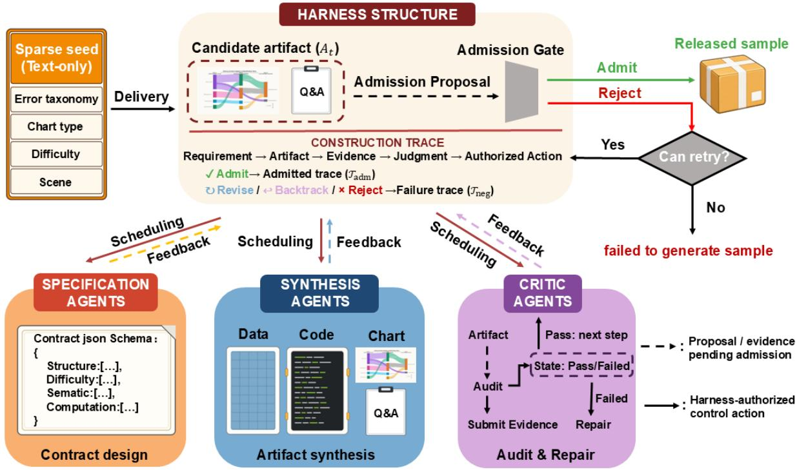
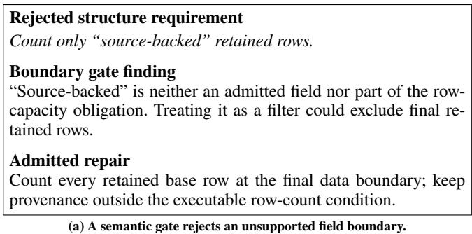
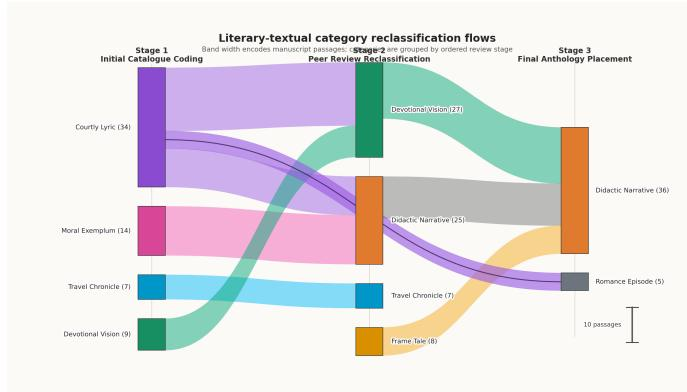

# ChartBmkAgent: Harness-Governed Multi-Agent Construction of Chart QA Benchmarks from Sparse Error-Taxonomy Specifications

Langxi Huang1, Pingping Zhang1, Lanyun Zhu2, Chunyang Jiang3, Jiawei Shao1, Haocheng Yuan1,

Peilin Chen1

1City University of Hong Kong

2Tongji University

3Hong Kong University of Science and Technology

## Abstract

Multimodal large language models (MLLMs) continue to achieve substantial capability gains, while the conventional benchmark-development cycle has not kept pace with these advances, thereby delaying the systematic investigation of newly observed capability gaps. Such investigation requires an expressive task format and an on-demand construction process: information-rich charts make chart question answering (Chart QA) suitable for probing coupled perception and reasoning. Automated Chart QA construction is intended to shorten the benchmark-development cycle by turning identified gaps into targeted samples on demand. Current methods, however, commonly separate target guidance from scratch generation: target-guided systems often require prepared data, charts, or templates, while scratch-generation systems primarily ensure artifact validity, without explicitly controlling whether newly synthesized requirements and content remain aligned with an externally specified diagnostic target. We introduce ChartBmkAgent, which turns an identified capability gap into targeted diagnostic evidence by constructing complete Chart QA samples from sparse error-taxonomy specifications. Throughout construction, a central harness governs specialized agents, requires stage-specific evidence of alignment with the original error category, and records the basis for each acceptance decision. On 300 taxonomy-wide samples, MLLM accuracies ranged from 32.7% to 84.3% with distinct category profiles, showing that generated samples reveal capability diferences. Across three source-model comparisons, targeted follow-ups scored 50.0% versus 82.2% on matched controls $( p = \mathring { 8 . 9 6 } \times 1 0 ^ { - 6 } )$ ; all six cross-model comparisons had the same direction, demonstrating targeted validation and diagnostic-data generation. Multiple evaluator models assessed whether each sample tested its specified error category; 86.4% met this criterion, providing empirical evidence of target preservation.

## Introduction

Multimodal large language models (MLLMs) are revised rapidly and deployed across increasingly varied visual domains (Fu et al. 2023; Liu et al. 2024a; Li et al. 2024). The failures that merit investigation may consequently change between model versions. Static benchmarks remain essential for reproducible comparison, but their coverage and dificulty are fixed at construction time. Model inspection, deployment feedback, or prospective stress testing may therefore expose a failure before an evaluator has a concrete sample that isolates it. At that point, the evaluation need exists only as a sparse description of the suspected error and its context. Turning each such description into a table, chart, question, answer, and validation procedure by hand is slow and expert-intensive, making a shorter path from observed failure to targeted evidence increasingly important.

Chart question answering (Chart QA) provides a concrete setting in which to study this gap. Each sample couples visual encoding, textual recognition, numerical extraction, data semantics, and multi-step reasoning; similar wrong answers may therefore arise from diferent perceptual or inferential processes. Existing resources have progressed from controlled synthetic relations to realistic charts and demanding reasoning (Kahou et al. 2018; Kafle et al. 2018; Methani et al. 2020; Masry et al. 2022; Xu et al. 2024; Wang et al. 2024; Masry et al. 2025). The same expressiveness that makes Chart QA diagnostically useful also raises the burden of construction: a sample must be readable and correctly answered, instantiate the intended failure mechanism, and exclude shortcuts that bypass the evidence being tested.

An error taxonomy can express the perceptual or reasoning construct to be tested while a few auxiliary conditions specify context and intended dificulty. It does not determine the sample semantics or the item-specific requirements needed to judge the resulting artifacts. Automating both introduces a risk of diagnostic drift: an early interpretation of the taxonomy can be built into the generated data, chart, question, and even their acceptance criteria. Downstream artifacts may then agree with one another while the final sample no longer measures the source error construct, and final artifact checks may miss a drift already embedded in the requirements they receive.

We introduce ChartBmkAgent, a multi-agent framework that separates generative agency from construction authority. Specialized agents propose requirements, artifacts, and evidence, while a central harness owns the typed construction state and alone authorizes transitions. It retains the source taxonomy and dificulty as root obligations, and a proposal can condition downstream generation only after a gate verifies both local correctness and inheritance of those obligations. Failed gates trigger bounded revision, backtracking, rejection, or termination. The same admission records form an item-level trace of the obligations, evidence, judgments, and control actions that governed construction.

The main contributions of this work are as follows:

• We formulate sparse diagnostic specification-to-sample construction for Chart QA: a complete probe is materialized from an error-category seed without sample-level scafolds, providing a direct path from suspected failure to targeted evidence.

• We introduce a harness-governed ChartBmkAgent that binds dynamically derived obligations to the root diagnostic construct and admits data, chart, and QA artifacts only when their inheritance evidence satisfies those obligations.

• The harness retains the same admission evidence as an item-level construction trace, coupling online drift control with retrospective audit of error-category realization, dificulty realization, and acceptance.

We evaluate these claims through a 300-sample taxonomywide study over 17 MLLMs, paired targeted construction for three source models, a 40-seed paired direct-construction baseline, and a blinded 220-sample multi-model audit of exact error-description preservation.

## Related Work

## Automated and Failure-Targeted Evaluation Construction

Template-based chart benchmarks and hybrid construction fix much of the data semantics, question logic, or source material before an item is produced (Kahou et al. 2018; Kafle et al. 2018; Methani et al. 2020; Masry et al. 2022). More recent systems accept desiderata or named capabilities, expand benchmark structures, translate verified guidelines, ground transformations, or package a confirmed blueprint with reusable resources (Li et al. 2025; Bao et al. 2024; Liu et al. 2025; Zheng et al. 2026; Chen et al. 2026; Xiong et al. 2026; Jiang et al. 2026a). These choices make construction tractable because the semantics or admissibility conditions are operationalized before generation. They also provide a reference point for regeneration and inspection, whereas an initially sparse diagnostic observation still requires item-level commitments to be derived during construction. In this latter setting, the relevant target may be a relation among marks, values, and question wording rather than a property of any individual artifact. A valid program and readable image can therefore still realize a relation diferent from the one the evaluation intends to test.

Failure-targeted systems similarly connect observed weaknesses to new items through designated flaw families, retrieved seeds, reference assets, or fixed interaction structures (Wu et al. 2024; Tang et al. 2026; Huang et al. 2026). Their common challenge is not artifact generation alone, but retaining evaluation intent as the item is elaborated. Provided seeds or resources can delimit the candidate interpretation and support later comparison. When an error is observed before item-level sources or scafolds exist, the same early interpretation can shape both generated artifacts and their checks; their agreement then need not show that the source failure was retained. ChartBmkAgent addresses this constructiontime authority problem by retaining the source construct as an inherited obligation and admitting later requirements only with linked evidence. Table 1 summarizes the reported input and evidence properties.

<table><tr><td>Method</td><td>Src. Scf. Tar. SI Ev. Tr.</td></tr><tr><td>AutoBencher AutoBench-V</td><td>△ 一 △ 一</td></tr><tr><td>ArenaBencher</td><td>一 △ √ △ △ √ V V 一 △</td></tr><tr><td>ReachQA</td><td>√ V 一</td></tr><tr><td>ChartGen</td><td>√ √ 一</td></tr><tr><td>ChartM³</td><td>√ √ 一</td></tr><tr><td>BloomQA</td><td>√ √ √ 一 △</td></tr><tr><td>BenchBench</td><td>√ √ △ 一 △</td></tr><tr><td>ChartVerse</td><td>一 √ 一 一</td></tr><tr><td>ChartNet</td><td>一 △ √ 一</td></tr><tr><td>Benchmark Agent</td><td>一 √ △ √ 一</td></tr><tr><td></td><td>√ √ △</td></tr><tr><td>RankJudge</td><td>√ √ √ 一</td></tr><tr><td>ProbeLLM</td><td>√ △ △ 一</td></tr><tr><td>Embodied-BenchClaw</td><td>√ √ √ 一 √</td></tr><tr><td>Anchor</td><td>√ √ △ 一 √</td></tr><tr><td>PIPE-Cypher</td><td>√ √ △ V</td></tr><tr><td></td><td>一</td></tr><tr><td>Targeted Tests ChartBmkAgent</td><td>√ √ √ 一 √ 一 一 √ √ √</td></tr></table>

Table 1: Input and evidence properties of automated construction systems. Src.: external sources; Scf.: supplied scaffolds; Tar.: explicit diagnostic target; SI: sparse input without sample-level assets or scafolds; Ev.: target-linked crossstage evidence; Tr.: decision-linked construction trace. ✓, △, and – denote reported, partial, and unreported support.

Because it treats the error-taxonomy construct as an inherited root obligation, ChartBmkAgent can turn a concise seed into a complete, target-linked Chart QA sample without sample-level sources or scafolds.

## Chart and Chart-QA Data Synthesis

Chart QA combines data semantics, visual encoding, text recognition, numerical evidence, and inference; an observed error can consequently have several plausible causes. Existing collections broaden this coverage, while code-driven generators and templates support regeneration and local datato-chart and answer checks (Kahou et al. 2018; Kafle et al. 2018; Methani et al. 2020; Masry et al. 2022; Xu et al. 2024; Wang et al. 2024; Masry et al. 2025; Tang et al. 2025; Kondic et al. 2025; He et al. 2025; Xu et al. 2025; Liu et al. 2026; Kondic et al. 2026). Such checks establish artifact consistency, but not necessarily that a newly introduced diagnostic target remains the mechanism required to answer the question. This distinction motivates target-linked construction evidence rather than replacing executable chart validation.

## Benchmark Validity and Item-Level Evidence

Benchmark-validity studies identify gaps between intended capabilities, task design, responses, and scores, including construct misalignment hidden by aggregate results (Liu et al. 2024b; Bean et al. 2025; Diddee et al. 2026; Jiang et al. 2026b). Datasheets, BenchmarkCards, and item-level releases make motivation, composition, risks, or frozen-item evidence inspectable (Gebru et al. 2021; Sokol et al. 2025;

  
Figure 1: Overview of ChartBmkAgent. The harness admits agent-proposed requirements and artifacts only when their evidence satisfies inherited obligations; failed checks authorize revision or backtracking, and admitted evidence forms the item-level construction trace.

Diddee et al. 2026; Jiang et al. 2026b; Li 2026; Tang et al. 2026). Such resources support retrospective scrutiny of a released collection, but their granularity may not reveal intermediate reinterpretations within a generative run. Correct scoring and inspection remain necessary; when a source construct is incrementally elaborated, they cannot by themselves establish which earlier interpretation guided the resulting item. ChartBmkAgent consequently records the inherited requirement, its evidence, and the corresponding decision while the item is constructed.

## Contract-Guided Construction and Provenance

Iterative refinement, verification, constrained decoding, contracts, gates, and provenance constrain generated artifacts or record their decisions (Madaan et al. 2023; Shinn et al. 2023; Dhuliawala et al. 2024; Geng et al. 2023, 2025; Simbola et al. 2026; Ivanov and Rana 2026; Jiang et al. 2026a; Ranganath and Raghavendra 2026; Xiong et al. 2026). Their governing structure is generally available before the constrained transformation. In sparse diagnostic construction, that structure must itself be elaborated: a short error label is not yet a complete contract, and progressive elaboration can otherwise introduce unrecorded assumptions. A contract may remain self-consistent with prior generated artifacts even when its operative assumptions no longer correspond to the diagnostic seed. The harness therefore admits a new requirement only when its lineage to the source construct is recorded, rather than treating consistency with prior generated artifacts as suficient.

## Method

## Problem and Agentic Architecture

Let s denote a diagnostic seed with initial scene c, chart type v, error-taxonomy construct τ, and dificulty $d ,$ and let y denote its output bundle: formal data D, plotting program P, rendered image I, mechanism-anchor set M, question– answer pair (q, a), and construction trace $\tau { : }$

$$
\begin{array} { r l } & { \mathbf { s } = \langle c , v , \tau , d \rangle \longmapsto \mathbf { y } = \langle D , P , I , M , q , a , T \rangle , } \\ & { I = P ( D ) . } \end{array}\tag{1}
$$

Here $P ( D )$ denotes execution ofP on D. Validity requires artifact consistency, preservation of τ and dificulty, and itemlevel evidence.

Figure 1 shows specification agents that define semantics and evaluators, synthesis agents that construct artifacts, and critic agents that audit inheritance and artifacts. The harness owns admitted state and alone places artifacts in downstream context, separating generation from construction authority (Butt et al. 2024; Jiang et al. 2026a). The candidate artifact $A _ { t }$ and the admitted and failure traces shown there are formalized in the construction-control subsection.

  
QA for (b). Trace the long dark-centered purple ribbon from Stage 1 Courtly Lyric: which Stage 3 category does it reach, and how many passages does it represent? Answer. Romance Episode; 5 passages.

  
(b) Final admitted Chart QA sample.  
Figure 2: A critical construction repair and its resulting sample, grounded in “Long links in complex network diagrams are traced to the wrong endpoints.” The structure gate in (a) prevents an unverifiable provenance qualifier from altering an executable data requirement. The chart in (b) and its QA at left are admitted only after the anchor and $\mathrm { Q A }$ show that the requested answer depends on tracing the long link rather than on a visible lookup shortcut.

## Requirement Grounding and Executable Gates

Because the seed is incomplete, requirements expand progressively. The supplied construct and dificulty are immutable roots; admitted scene and chart type become contextual requirements. Every later requirement must cite an admitted predecessor and its supporting evidence. Field contracts then bind each retained field to its semantic role, boundaries, permitted operations, and the source of that interpretation. Critics check those contracts and scope repairs (Madaan et al. 2023; Dhuliawala et al. 2024).

Each typed requirement stores exact fields $F _ { r } ,$ , observed quantity $h _ { r } ,$ comparison $\omega _ { r } ,$ target $\gamma _ { r } ,$ , mode $m _ { r } \in$ {comp, sem}, and source boundary S . Computational mode is mandatory when a deterministic function recovers the observation:

$$
\begin{array} { r } { r = \langle F _ { r } , h _ { r } , \omega _ { r } , \gamma _ { r } , m _ { r } , S _ { r } \rangle , } \\ { V _ { r } ( D ) = \mathbf { 1 } [ g _ { r } ^ { \star } ( D [ F _ { r } ] ) \omega _ { r } \gamma _ { r } ] . \qquad } \end{array}\tag{2}
$$

Here $D [ F _ { r } ]$ retains $F _ { r } , g _ { r } ^ { \star }$ is the admitted evaluator, $\mathbf { 1 } [ \cdot ]$ is the 0/1 indicator, and $V _ { r } ( D )$ the verdict. This removes judge variance from computable requirements (Cheng et al. 2023; Gao et al. 2023; Ni et al. 2023).

An admitted evaluator must be schema-valid, consume exactly $F _ { r }$ , preserve the source boundary $S _ { r }$ , and reproduce $h _ { r } ( D )$ throughout the admissible domain. Schema validation and reverse audits enforce these field-closure and boundary conditions rather than syntax alone.

Semantic mode is reserved for intensional predicates; deterministic operators select population, units, aggregation, and unknown cases, while the harness retains completesample admission (Liu et al. 2023; Zheng et al. 2023; Wang et al. 2023).

## Data, Chart, and Diagnostic QA Synthesis

The data agent proposes rows under admitted data requirements. Let $\mathcal { R } _ { D }$ denote data-bound requirements, $\mathcal { F } ( \bar { D ) }$ the requirements failed by candidate data D, and $D ^ { \star }$ a candidate

eligible for admission:

$$
\begin{array} { r } { \mathcal { F } ( D ) = \{ r \in \mathcal { R } _ { D } : V _ { r } ( D ) = 0 \} , } \\ { D ^ { \star } \mathrm { ~ i s ~ a d m i t t e d } \Longleftrightarrow \mathcal { F } ( D ^ { \star } ) = \emptyset . } \end{array}\tag{3}
$$

Deterministic evaluators reject malformed or invalid rows before LLM judgment. Feedback names the failed requirement, evidence, and boundary; a repair must reduce $\bar { \mathcal { F } } ( D )$ before an admitted $D ^ { \star }$ is frozen downstream.

The chart agent generates $P$ and renders $I = P ( D ^ { \star } )$ ; code preserves value-to-mark mappings and regeneration (Kondic et al. 2025; He et al. 2025; Liu et al. 2026). The execution gate requires frozen rows, termination, and a nonblank image. A multimodal critic checks fidelity, type, legibility, dificulty, support for $\tau .$ , and shortcuts. Revisions may change P, not $D ^ { \bar { \star } }$

A question is diagnostic only if it depends on a taxonomyrelevant feature. An anchor records the mechanism, image region, data, visual operations, and QA dependency. Critics reject ordinary components, data-only evidence, and unlocalizable anchors; failure backtracks to chart synthesis.

Let $M _ { \tau } \subseteq M$ be accepted target anchors, and let $\Pi ( q , a \mid$ $D ^ { \star } , I )$ be the defensible evidence paths to answer a, with π denoting one such path. The diagnostic condition sought by the QA gate is

$$
\forall \pi \in \Pi ( q , a \mid D ^ { \star } , I ) , \qquad \pi \cap M _ { \tau } \neq \emptyset .\tag{4}
$$

The QA agent returns the question, answer, derivation, image claims, and anchor dependency; critics challenge that dependency with ordinary components, data-only evidence, and alternative shortcuts. This operational review estimates rather than proves the universal condition.

## Construction Control and Evidence Trace

Local failures trigger revision and upstream insuficiency backtracking. The initial proposal is not budgeted; each stage then allows at most four additional attempts shared by local revision and backtracking. Missing evidence, incompatibility, or exhaustion terminates the candidate. For stage index $t ,$ let $A _ { t }$ be the proposed candidate artifact and $e _ { t , r }$ the validator evidence for active requirement $r ;$ admitted requirementevidence records form

<table><tr><td>Model</td><td>Overall</td><td>Visual Perception &amp; Encoding</td><td>Chart Structure &amp; Layout</td><td>Data Logic &amp; Reasoning</td><td>Semantic Understanding</td><td> $\Delta _ { \mathrm { { L 1 } } }$ </td></tr><tr><td colspan="7">Closed-source models</td></tr><tr><td>GPT-5.6-Sol</td><td>84.3</td><td>82.9</td><td>75.0</td><td>89.2</td><td>90.0</td><td>15.0</td></tr><tr><td>GPT-5.5</td><td>82.7</td><td>80.0</td><td>73.3</td><td>86.2</td><td>91.4</td><td>18.1</td></tr><tr><td>Gemini 3.5 Flash</td><td>80.3</td><td>75.2</td><td>81.7</td><td>84.6</td><td>82.9</td><td>9.4</td></tr><tr><td>Gemini 3.6 Flash</td><td>80.7</td><td>76.2</td><td>85.0</td><td>81.5</td><td>82.9</td><td>8.8</td></tr><tr><td>Claude Opus 4.8</td><td>80.3</td><td>71.4</td><td>80.0</td><td>90.8</td><td>84.3</td><td>19.3</td></tr><tr><td>Claude Opus 4.6</td><td>61.3</td><td>53.3</td><td>56.7</td><td>67.7</td><td>71.4</td><td>18.1</td></tr><tr><td>Claude Sonnet 5</td><td>50.7</td><td>44.8</td><td>58.3</td><td>49.2</td><td>54.3</td><td>13.6</td></tr><tr><td>Grok 4.5</td><td>74.0</td><td>74.3</td><td>68.3</td><td>73.8</td><td>78.6</td><td>10.2</td></tr><tr><td>Grok 4.3</td><td>70.0</td><td>62.9</td><td>76.7</td><td>78.5</td><td>67.1</td><td>15.6</td></tr><tr><td colspan="7">Open-weight models</td></tr><tr><td>Qwen 3.6-27B</td><td>74.3</td><td>75.2</td><td>68.3</td><td>75.4</td><td>77.1</td><td>8.8</td></tr><tr><td>Qwen3-VL-30B-A3B</td><td>32.7</td><td>31.4</td><td>33.3</td><td>24.6</td><td>41.4</td><td>16.8</td></tr><tr><td>Kimi K2.5</td><td>63.0</td><td>62.9</td><td>55.0</td><td>58.5</td><td>74.3</td><td>19.3</td></tr><tr><td>Kimi K2.6</td><td>76.3</td><td>70.5</td><td>81.7</td><td>80.0</td><td>77.1</td><td>11.2</td></tr><tr><td>Nex-N2-Pro</td><td>74.3</td><td>71.4</td><td>68.3</td><td>78.5</td><td>80.0</td><td>11.7</td></tr><tr><td>Llama 4 Maverick</td><td>37.7</td><td>36.2</td><td>38.3</td><td>32.3</td><td>44.3</td><td>12.0</td></tr><tr><td>Mistral Medium 3.5</td><td>42.3</td><td>42.9</td><td>46.7</td><td>32.3</td><td>47.1</td><td>14.8</td></tr><tr><td>GLM-4.6V</td><td>66.7</td><td>57.1</td><td>71.7</td><td>72.3</td><td>71.4</td><td>15.2</td></tr></table>

Table 2: Accuracy (%) on 300 samples per model. A 95% Wilson interval for an overall accuracy has maximum half-width 5.7 points at $n = 3 0 0 ;$ the corresponding maximum half-widths for the four level-1 columns $( n = 1 0 5 , 6 0 , 6 5 , 7 0 )$ are 9.4, 12.3, 11.8, and 11.4 points, respectively. $\Delta _ { \mathrm { { L 1 } } }$ measures within-model performance disparity across the four level-1 categories; it is descriptive, and larger values indicate a wider gap between the strongest and weakest categories, not higher overall quality. Bold marks column maxima.

$$
\mathcal { T } _ { \mathrm { a d m } } = \{ ( r , A _ { t } , e _ { t , r } ) \} , \qquad \mathcal { T } = \mathcal { T } _ { \mathrm { a d m } } \cup \mathcal { T } _ { \mathrm { n e g } } ,\tag{5}
$$

where $\mathcal { T } _ { \mathrm { a d m } }$ contains admitted records and $\mathcal { T } _ { \mathrm { n e g } }$ retains failed judgments and authorized repairs or backtracks (Ivanov and Rana 2026; Ranganath and Raghavendra 2026; Jiang et al. 2026a).

The trace is an item-specific diagnostic contract rather than a record appended after construction. It links each proposed artifact to the active requirement, its evidence, and, when needed, the precise repair or backtrack authorized by the harness. This makes explicit which observable relation the chart and question must require before later data or rendering can condition downstream state. Candidate content may remain diverse, but an item cannot acquire construction authority merely because earlier generated artifacts are mutually consistent. The retained records also let a reviewer inspect how a sparse description became a particular visual task and which intervening decisions preserved that relation.

Algorithm 1 makes the control policy explicit. Its z is a stage index, A its candidate artifact, and $\bar { e _ { z } } = \{ e _ { z , r } \} ,$ r its evidence bundle. Every proposal receives only admitted upstream state; a failure is retained as negative evidence before the harness authorizes a scoped repair, upstream backtrack, or termination.

Algorithm 1 Harness admission and repair   
1: Initialize roots $\langle c , v , \tau , d \rangle$ , trace $\tau  \emptyset .$ , and stage $z \gets 1$   
2: while z is not complete do   
Propose $A _ { z }$ from admitted upstream state only; collect ev  
idence ez   
4: if the inherited requirements and artifact checks pass then   
5: Admit $A _ { z } ;$ append its requirement–evidence records to   
${ \mathcal { T } } _ { \mathrm { a d m } } ;$ advance z   
6: else if a shared revision/backtracking attempt remains then   
7: Append the failed judgment to ${ \bar { \mathcal { T } } } _ { \mathrm { n e g } } ;$ authorize a scoped   
repair or backtrack   
8: else   
9: Reject the candidate and terminate construction   
10: end if   
11: end while   
12: return admitted bundle $\langle D , P , I , M , q , a , \mathcal { T } \rangle$

## Experiments

## Experimental Settings

We conduct an experience-informed pre-specification of 60 chart-reading and reasoning error descriptions, drawing on recurring failures observed in practical MLLM use. The taxonomy has four level-1 categories and 27 level-2 labels; labels are fixed before sample construction and model evaluation. Five batches pair every description with reproducibly selected compatible scene–chart-type pairs from 54 scenes and 57 chart types, yielding 300 samples (five per description).

All chart data are synthesized with GPT-5.5 at temperature 0 and a 4,096-token completion limit; after the initial proposal, each stage permits four additional revision/backtracking attempts. We evaluate 17 MLLMs (9 closed-source; 8 open-weight) on final images and questions. Scoring uses only the prompted answer; reasoning supports post hoc audit. Provider-default thinking is retained except for four Qwen 3.6-27B and four Kimi K2.6 evaluations with repeated-revision truncation or timeout. Image hashes, QA review, the integrated solution, and the final record verify reference answers. We report sample-level accuracy and level-1 accuracy $( N = 1 0 5 , 6 0 , 6 5 , 7 0 )$ ; with $\operatorname { A c c } _ { k }$ the accuracy in level-1 category k, $\Delta _ { \mathrm { L 1 } } = \operatorname* { m a x } _ { k } \mathrm { A c c } _ { k } - \operatorname* { m i n } _ { k } \mathrm { A c c } _ { k }$ is descriptive only. Matched target–control and full–direct comparisons use paired exact McNemar tests; the direct-baseline end-to-end diference additionally uses a paired-bootstrap 95% interval.

<table><tr><td>Cohort</td><td>Grok 4.3</td><td>Claude Opus 4.8</td><td>Kimi K2.6</td></tr><tr><td></td><td>46.7/83.3</td><td>73.3/96.7</td><td>43.3/53.3</td></tr><tr><td>Grok 4.3</td><td>(.0127)</td><td>(.0156)</td><td>(.6291)</td></tr><tr><td></td><td>43.3/66.7</td><td>60.0/86.7</td><td>31.0/55.2</td></tr><tr><td>Opus 4.8</td><td>(.1185)</td><td>(.0386)</td><td>(.1185)†</td></tr><tr><td></td><td>40.0/70.0</td><td>46.7/76.7</td><td>43.3/76.7</td></tr><tr><td>Kimi K2.6</td><td>(.0225)</td><td>(.0490)</td><td>(.0129)</td></tr></table>

Table 3: Description-grounded follow-up construction. Each cell gives target/control accuracy (%) and paired exact McNemar $\cdot _ { p }$ for the row cohort evaluated by the column model; bold diagonal cells denote source models. All comparisons use 30 matched pairs except $^ { \dag } n = 2 9$ complete pairs.

## Taxonomy-Wide Model Evaluation

Overall accuracy ranges from 32.7% to 84.3% (mean 66.6%), with closed-source and open-weight means of 73.8% and 58.4% (Table 2). $\Delta _ { \mathrm { { L 1 } } }$ spans 8.8–19.3 points, exposing category profiles beyond overall accuracy.

Human Verification Audit. Two study reviewers independently scored a pre-specified 60-sample set (one per description; 12 per batch) for answer correctness/recoverability and description–mechanism alignment. Both selected pass for 49/60 (81.7%) and 48/60 (80.0%) samples, respectively; complete agreement was 52/60 (86.7%) and 48/60 (80.0%), with 8 and 12 disagreements. Ratings are unadjudicated and provide descriptive verification, not an external quality certification.

## Description-Grounded Follow-up Construction

Preliminary scan accuracy selects concrete descriptions for follow-up construction, not model-private capability signatures. For each cohort, two low-scoring descriptions seed 30 target samples and two higher-scoring descriptions from another same-level-1, level-2 family provide 30 controls. Pairs fix scene, chart type, dificulty, data setting, pipeline, and harness gates; only the description changes. We evaluate each cohort with all three models and analyze complete target– control pairs.

For the three source-model comparisons, target accuracy is 23.3–36.7 points below control accuracy (Table 3; all paired exact McNemar $p \leq 0 . 0 3 8 6 )$ . Across the six cross-model comparisons, the same direction holds with gaps of 10.0– 30.0 points; three reach $p \ < \ 0 . 0 5$ , whereas three do not. Starting from an observed low-score description, ChartBmk-Agent therefore constructs subsequent Chart QA samples that directionally validate and extend the observed dificulty against a strict matched control, without implying that the dificulty is unique to the source model.

<table><tr><td>Scope</td><td colspan="3">Exact n description Level-2 Level-1</td></tr><tr><td>Full audit</td><td>220</td><td>86.4</td><td>93.2 100.0†</td></tr><tr><td>Taxonomy-wide subset</td><td>120</td><td>82.5</td><td>89.2 100.0†</td></tr><tr><td>Visual perc./encoding</td><td>42</td><td>73.8</td><td>88.1 100.0†</td></tr><tr><td>Chart struct./layout</td><td>24</td><td>100.0</td><td>100.0 100.0†</td></tr><tr><td>Data logic/reasoning</td><td>26</td><td>88.5</td><td>92.3  $1 0 0 . 0 ^ { \dagger }$ </td></tr><tr><td>Semantic understanding</td><td>28</td><td>75.0</td><td>78.6 100.0†</td></tr></table>

Table 4: Two-of-three majority target preservation (%). The four indented rows partition the taxonomy-wide subset. †Level-1 is fixed by the same-level-1 candidate design and is not an independent discrimination result.

## Blinded Target-Preservation Audit

We audit 220 frozen samples (120 taxonomy-wide, 50 target, 50 control). GPT-5.6-Sol, Gemini 3.6 Flash, and Claude Opus 4.8 select the tested mechanism from four anonymized, paraphrased same-level-1 definitions in randomized order; outputs and assignments never feed back. The audit remains model-mediated because judges overlap with evaluated MLLMs, and a two-of-three majority defines preservation.

The majority recovers the exact description for 190/220 samples (86.4%; 95% bootstrap CI: 82.7–90.0) and level 2 for 205/220 (93.2%; 90.9–95.5). Exact agreement exceeds randomized keys $( p < 1 0 ^ { - 4 }$ ; Fleiss’ $\kappa = 0 . 8 8 0 )$ , and taxonomywide exact-description preservation spans 73.8–100.0% (Table 4).

## Ablation Study

## Semantic-Drift Gate Ablations

We test containment, not natural drift frequency, by setting root A for 40 frozen chart–anchor–QA artifacts locally valid for B (ten per level-1 category). Each A/B pair shares level 1, dificulty, scene, and chart type, but difers in level 2 and description. We separately disable root-to-anchor or anchor-to-QA alignment; three blind judges select from four anonymized same-level-1 definitions, and majority B is a semantic false admission.

The full harness blocks every injected fault, while disabling either named gate lets all 40 pass that gate, a 100-point paired diference (95% paired-bootstrap CI: 100–100; exact McNemar $p = 1 . 8 2 \times \bar { 1 0 } ^ { - 1 2 }$ ; Table 5). When root-to-anchor alignment is disabled, downstream checks still reject every wrong anchor. When anchor-to-QA alignment is disabled, later checks reject 10%, final blind-majority judgment admits B for 80% (95% CI: 67.5–92.5; $p = 4 . 6 6 \times 1 0 ^ { - 1 0 } )$ , and the remaining 10% are semantically unresolved.

<table><tr><td>Gate disabled disabled gate</td><td>Passes</td><td>Rejected later</td><td>Final B</td><td>Semantic admission unresolved</td></tr><tr><td>Root-to-anchor</td><td>100.0</td><td>100.0</td><td>0.0</td><td>0.0</td></tr><tr><td>Anchor-to-QA</td><td>100.0</td><td>10.0</td><td>80.0</td><td>10.0</td></tr></table>

Table 5: Semantic-drift gate ablation on 40 frozen A/B pairs. With the full harness, no injected mismatch is admitted and no final B admission occurs. Values show the gate-of arms: rootto-anchor failures are recovered by a later alignment check, whereas disabling anchor-to-QA leaves 80.0% final B admissions.

## Paired Direct-Construction Baseline

We isolate downstream harness control on 40 frozen postcanonicalization seeds (ten per level-1 category). The direct GPT-5.5 arm receives the same scene, chart type, taxonomy description, and dificulty, then performs data, plottingcode/local-rendering, and image-grounded QA generation. It omits formal contracts, full-arm artifacts, critic feedback, gates or admission, semantic repair, backtracking, and candidate replacement; only absent provider responses receive infrastructure retries. Both arms use the same frozen post-hoc rubric.

The harness passes end-to-end on 31/40 seeds (77.5%), versus 21/40 (52.5%) for direct construction, a 25.0-point paired diference (95% CI: 5.0–45.0; exact McNemar p = 0.00635; Table 6). Its largest semantic advantage is exact target construction: 80.0% rather than 57.5% jointly preserve the description and make that mechanism necessary to the QA. Direct construction loses a complete artifact bundle on six seeds, two during data generation and four during plotting-code generation or rendering.

## Limitations

ChartBmkAgent is designed to preserve a specified errortaxonomy label; it does not characterize every factor that afects a model’s success on a chart question. Scene and chart type are selected for compatibility and held fixed within matched target–control pairs, but we do not estimate their main efects or their interactions with the taxonomy, nor do the fixed 54 scenes and 57 chart types span the visual-design space. The benchmark is synthetic and chartspecific, and description-guided follow-ups are directed validation rather than an unbiased dificulty distribution. GPT-5.5 serves construction roles and is also evaluated, while every preservation judge belongs to the evaluated model set; these overlaps leave preservation evidence model-mediated rather than source-independent. The two-reviewer audit is small and not external. Finally, the drift ablation measures injected-fault containment, and the direct baseline isolates post-canonicalization control.

<table><tr><td>Joint criterion</td><td>Harness Direct</td></tr><tr><td>Chart usable (rendered and legible)</td><td>97.5 82.5 15.0</td></tr><tr><td>QA valid and image-supported</td><td>97.5 80.017.5</td></tr><tr><td>Exact target</td><td>80.0 57.5 22.5</td></tr><tr><td>No diagnostic shortcut</td><td>100.0 85.015.0</td></tr><tr><td>End-to-end pass (all checks)</td><td>77.5 52.5 25.0</td></tr></table>

Table 6: GPT-5.5 direct three-call baseline on 40 frozen seeds. Values are percentages, ∆ in points. “QA valid”: unambiguous, correct, complete, image-supported QA. “Exact target”: description preservation and necessary target mechanism. End-to-end requires all 13 checks (∆ = 25.0, 95% CI [5.0,45.0]; p = 0.00635).

## Conclusion

ChartBmkAgent addresses a practical gap in evaluation: a model failure may be recognizable before there is a chart, question, answer, template, or dataset that can test it. Starting only from a sparse error-taxonomy specification, the framework materializes a complete Chart QA probe while retaining the source construct and requested dificulty as construction roots. Specialized agents may propose semantics, data, rendering, anchors, and QA, but the harness alone admits downstream state after checking the evidence attached to each requirement. The resulting trace records not only what was admitted, but also the rejected candidates, revisions, and backtracks that led there. This makes construct preservation a construction-time condition rather than only a post hoc judgment of a completed item. Candidate content can be diverse, but only a state with evidence suficient for the initial diagnostic obligation becomes construction authority. The trace consequently links the chart, QA, and admission decision back to the incomplete source observation instead of treating their mutual consistency as proof of diagnostic relevance.

The empirical results support three bounded claims. First, the 300-item collection diferentiates 17 MLLMs, whose accuracies span 32.7–84.3% and whose level-1 profiles difer. Second, descriptions selected from preliminary low scores seed follow-up samples that are consistently harder than strictly matched controls; this is directed validation of an observed dificulty, not a claim of model-private capability. Third, target preservation is supported by an 86.4% exactdescription majority rate on 220 frozen samples, and the paired direct baseline shows a 77.5% end-to-end pass rate for the full harness versus 52.5% for three-call construction without it. The injected-fault ablation further identifies why an omitted anchor-to-QA check can leave semantically wrong samples admissible.

These results do not establish source-independent semantic validity. We therefore define ChartBmkAgent as an auditable construction mechanism; independent external validation remains necessary. Extending the taxonomy, varying chart-design conditions, adding independent human review and judges, and testing other visual domains are necessary next steps.

## References

Bao, H.; Huang, Y.; Wang, Y.; Ye, J.; Wang, X.; Chen, X.; Zhao, Y.; Zhou, T.; Elhoseiny, M.; and Zhang, X. 2024. AutoBench-V: Can Large Vision-Language Models Benchmark Themselves? arXiv preprint arXiv:2410.21259.

Bean, A. M.; Kearns, R. O.; Romanou, A.; Hafner, F. S.; Mayne, H.; Batzner, J.; Foroutan, N.; Schmitz, C.; Korgul, K.; Batra, H.; Deb, O.; Beharry, E.; Emde, C.; Foster, T.; Gausen, A.; Grandury, M.; Han, S.; Hofmann, V.; Ibrahim, L.; Kim, H.; Kirk, H. R.; Lin, F.; Liu, G. K.-M.; Luettgau, L.; Magomere, J.; Rystrøm, J.; Sotnikova, A.; Yang, Y.; Zhao, Y.; Bibi, A.; Bosselut, A.; Clark, R.; Cohan, A.; Foerster, J.; Gal, Y.; Hale, S. A.; Raji, I. D.; Summerfield, C.; Torr, P. H. S.; Ududec, C.; Rocher, L.; and Mahdi, A. 2025. Measuring What Matters: Construct Validity in Large Language Model Benchmarks. In Advances in Neural Information Processing Systems Datasets and Benchmarks Track.

Butt, N.; Chandrasekaran, V.; Joshi, N.; Nushi, B.; and Balachandran, V. 2024. BenchAgents: Multi-Agent Systems for Structured Benchmark Creation. arXiv preprint arXiv:2410.22584.

Chen, S.; Khiem, L. H.; Szymanski, A.; Metoyer, R.; Hua, T.; and Chawla, N. V. 2026. Automated Benchmark Generation from Domain Guidelines Informed by Bloom’s Taxonomy. arXiv preprint arXiv:2601.20253.

Cheng, Z.; Xie, T.; Shi, P.; Li, C.; Nadkarni, R.; Hu, Y.; Xiong, C.; Radev, D.; Ostendorf, M.; Zettlemoyer, L.; Smith, N. A.; and Yu, T. 2023. Binding Language Models in Symbolic Languages. In International Conference on Learning Representations.

Dhuliawala, S.; Komeili, M.; Xu, J.; Raileanu, R.; Li, X.; Celikyilmaz, A.; and Weston, J. 2024. Chain-of-Verification Reduces Hallucination in Large Language Models. In Findings of the Association for Computational Linguistics: ACL 2024, 3563–3578.

Diddee, H.; Yauney, G.; Swayamdipta, S.; and Ippolito, D. 2026. BenchBrowser: Retrieving Evidence for Evaluating Benchmark Validity. arXiv preprint arXiv:2603.18019.

Fu, C.; Chen, P.; Shen, Y.; Qin, Y.; Zhang, M.; Lin, X.; Yang, J.; Zheng, X.; Li, K.; Sun, X.; Wu, Y.; Ji, R.; Shan, C.; and He, R. 2023. MME: A Comprehensive Evaluation Benchmark for Multimodal Large Language Models. arXiv preprint arXiv:2306.13394.

Gao, L.; Madaan, A.; Zhou, S.; Alon, U.; Liu, P.; Yang, Y.; Callan, J.; and Neubig, G. 2023. PAL: Program-Aided Language Models. In International Conference on Machine Learning.

Gebru, T.; Morgenstern, J.; Vecchione, B.; Vaughan, J. W.; Wallach, H.; Daumé III, H.; and Crawford, K. 2021. Datasheets for Datasets. Communications of the ACM, 64(12): 86–92.

Geng, S.; Cooper, H.; Moskal, M.; Jenkins, S.; Berman, J.; Ranchin, N.; West, R.; Horvitz, E.; and Nori, H. 2025. JSON-SchemaBench: A Rigorous Benchmark of Structured Outputs for Language Models. arXiv preprint arXiv:2501.10868.

Geng, S.; Josifoski, M.; Peyrard, M.; and West, R. 2023. Grammar-Constrained Decoding for Structured NLP Tasks without Finetuning. In Proceedings of the 2023 Conference on Empirical Methods in Natural Language Processing, 10932–10952.

He, W.; Xi, Z.; Zhao, W.; Fan, X.; Ding, Y.; Shan, Z.; Gui, T.; Zhang, Q.; and Huang, X. 2025. Distill Visual Chart Reasoning Ability from LLMs to MLLMs. In Findings ofthe Association for Computational Linguistics: EMNLP 2025, 3224–3250.

Huang, Y.; Jiang, Z.; Ma, Y.; Jiang, Y.; Wang, X.; Zhou, Y.; Hao, Y.; Guo, K.; Chen, P.-Y.; Feuerriegel, S.; and Zhang, X. 2026. ProbeLLM: Automating Principled Diagnosis of LLM Failures. arXiv preprint arXiv:2602.12966.

Ivanov, M.; and Rana, A. 2026. Anchor: Mitigating Artifact Drift in Agent Benchmark Generation. arXiv preprint arXiv:2605.26321.

Jiang, B.; Zhang, F.; Wang, L.; Li, H.; Wang, Y.; Ji, Z.; Lai, J.; Ren, X.; Hu, J.; and Ma, Q. 2026a. Embodied-BenchClaw: An Autonomous Multi-Agent System for Embodied Spatial Intelligence Benchmark Construction. arXiv preprint arXiv:2606.11909.

Jiang, H.; Zhang, S.; Zhu, D.; Bai, Y.; Truong, S. T.; Yi, X.; Koyejo, S.; Xie, X.; and Xiao, Z. 2026b. AI Evaluation Should Require Standardized Item-Level Data Releases. arXiv preprint arXiv:2604.03244.

Kafle, K.; Cohen, S.; Price, B.; and Kanan, C. 2018. DVQA: Understanding Data Visualizations via Question Answering. In Proceedings ofthe IEEE Conference on Computer Vision and Pattern Recognition, 5648–5656.

Kahou, S. E.; Michalski, V.; Atkinson, A.; Kadar, A.; Trischler, A.; and Bengio, Y. 2018. FigureQA: An Annotated Figure Dataset for Visual Reasoning. In International Conference on Learning Representations Workshop.

Kondic, J.; Li, P.; Joshi, D.; He, Z.; Abedin, S.; Sun, J.; Wiesel, B.; Schwartz, E.; Nassar, A.; Wu, B.; Arbelle, A.; Oliva, A.; Gutfreund, D.; Karlinsky, L.; and Feris, R. 2025. ChartGen: Scaling Chart Understanding via Code-Guided Synthetic Chart Generation. arXiv preprint arXiv:2507.19492.

Kondic, J.; Li, P.; Joshi, D.; Sanchez, I.; Wiesel, B.; Abedin, S.; Alfassy, A.; Schwartz, E.; Caraballo, D.; Cinar, Y. G.; Scheidegger, F.; Ross, S. I.; Weidele, D. K. I.; Hua, H.; Arutyunova, E.; Herzig, R.; He, Z.; Wang, Z.; Yu, X.; Zhao, Y.; Jiang, S.; Liu, M.; Lin, Q.; Staar, P.; Lastras, L.; Oliva, A.; and Feris, R. 2026. ChartNet: A Million-Scale, High-Quality Multimodal Dataset for Robust Chart Understanding. arXiv preprint arXiv:2603.27064.

Li, B.; Wang, R.; Wang, G.; Ge, Y.; Ge, Y.; and Shan, Y. 2024. SEED-Bench: Benchmarking Multimodal LLMs with Generative Comprehension. In Proceedings of the IEEE/CVF Conference on Computer Vision and Pattern Recognition.

Li, H. 2026. Targeted Tests for LLM Reasoning: An Audit-Constrained Protocol. arXiv preprint arXiv:2605.11599.

Li, X. L.; Kaiyom, F.; Liu, E. Z.; Mai, Y.; Liang, P.; and Hashimoto, T. 2025. AutoBencher: Towards Declarative

Benchmark Construction. In International Conference on Learning Representations.

Liu, Q.; Dineen, J.; Huang, Y.; Zhang, S.; Poon, H.; Zhou, B.; and Chen, M. 2025. ArenaBencher: Automatic Benchmark Evolution via Multi-Model Competitive Evaluation. arXiv preprint arXiv:2510.08569.

Liu, Y.; Duan, H.; Zhang, Y.; Li, B.; Zhang, S.; Zhao, W.; Yuan, Y.; Wang, J.; He, C.; Liu, Z.; Chen, K.; and Lin, D. 2024a. MMBench: Is Your Multi-modal Model an Allaround Player? In Proceedings ofthe European Conference on Computer Vision.

Liu, Y.; Iter, D.; Xu, Y.; Wang, S.; Xu, R.; and Zhu, C. 2023. G-Eval: NLG Evaluation Using GPT-4 with Better Human Alignment. In Proceedings of the 2023 Conference on Empirical Methods in Natural Language Processing, 2511–2522.

Liu, Y. L.; Blodgett, S. L.; Cheung, J. C. K.; Liao, Q. V.; Olteanu, A.; and Xiao, Z. 2024b. ECBD: Evidence-Centered Benchmark Design for NLP. In Proceedings of the 62nd Annual Meeting of the Association for Computational Linguistics, 16349–16365.

Liu, Z.; Lin, H.; Qin, C.; Wang, X.; Gao, X.; Li, Y.; Cai, M.; Zhu, Y.; Zhong, Z.; Pei, Q.; Pan, Z.; Shang, X.; Cui, B.; He, C.; Zhang, W.; and Wu, L. 2026. ChartVerse: Scaling Chart Reasoning via Reliable Programmatic Synthesis from Scratch. arXiv preprint arXiv:2601.13606.

Madaan, A.; Tandon, N.; Gupta, P.; Hallinan, S.; Gao, L.; Wiegrefe, S.; Alon, U.; Dziri, N.; Prabhumoye, S.; Yang, Y.; Gupta, S.; Majumder, B. P.; Hermann, K.; Welleck, S.; Yazdanbakhsh, A.; and Clark, P. 2023. Self-Refine: Iterative Refinement with Self-Feedback. In Advances in Neural Information Processing Systems, volume 36, 46534–46594.

Masry, A.; Islam, M. S.; Ahmed, M.; Bajaj, A.; Kabir, F.; Kartha, A.; Laskar, M. T. R.; Rahman, M.; Rahman, S.; Shahmohammadi, M.; Thakkar, M.; Parvez, M. R.; Hoque, E.; and Joty, S. 2025. ChartQAPro: A More Diverse and Challenging Benchmark for Chart Question Answering. In Findings of the Association for Computational Linguistics: ACL 2025.

Masry, A.; Long, D. X.; Tan, J. Q.; Joty, S.; and Hoque, E. 2022. ChartQA: A Benchmark for Question Answering about Charts with Visual and Logical Reasoning. In Findings ofthe Associationfor Computational Linguistics: ACL 2022, 2263–2279.

Methani, N.; Ganguly, P.; Khapra, M. M.; and Kumar, P. 2020. PlotQA: Reasoning over Scientific Plots. In Proceedings ofthe IEEE/CVF Winter Conference on Applications of Computer Vision, 1527–1536.

Ni, A.; Iyer, S.; Radev, D.; Stoyanov, V.; Yih, W.-t.; Wang, S. I.; and Lin, X. V. 2023. LEVER: Learning to Verify Language-to-Code Generation with Execution. arXiv preprint arXiv:2302.08468.

Ranganath, S.; and Raghavendra, A. 2026. PIPE-Cypher: Automatic Enterprise Benchmark Generation for Text-to-Cypher Systems. arXiv preprint arXiv:2606.08481.

Shinn, N.; Cassano, F.; Gopinath, A.; Narasimhan, K.; and Yao, S. 2023. Reflexion: Language Agents with Verbal Re-

inforcement Learning. In Advances in Neural Information Processing Systems, volume 36, 8634–8652.

Simbola, F.; Reforgiato Recupero, D.; Riboni, D.; and Salis, M. 2026. LLM-Driven Compliance Checking for Natural-Language Policies over Data Product Descriptors. Machine Learning, 115(5).

Sokol, A.; Daly, E.; Hind, M.; Piorkowski, D.; Zhang, X.; Moniz, N.; and Chawla, N. V. 2025. BenchmarkCards: Standardized Documentation for Large Language Model Benchmarks. In Advances in Neural Information Processing Systems Datasets and Benchmarks Track.

Tang, L.; Kim, G.; Zhao, X.; Lake, T.; Ding, W.; Yin, F.; Singhal, P.; Wadhwa, M.; Liu, Z. L.; Sprague, Z.; Namuduri, R.; Hu, B.; Rodriguez, J. D.; Peng, P.; and Durrett, G. 2025. ChartMuseum: Testing Visual Reasoning Capabilities of Large Vision-Language Models. In Advances in Neural Information Processing Systems Datasets and Benchmarks Track.

Tang, Z.; Liu, Z.; Hosseinzadeh, R.; Wu, T.; Golestan, K.; and Cresswell, J. C. 2026. RankJudge: A Multi-Turn LLMas-a-Judge Synthetic Benchmark Generator. arXiv preprint arXiv:2605.21748.

Wang, P.; Li, L.; Chen, L.; Zhu, D.; Lin, B.; Cao, Y.; Liu, Q.; Liu, T.; and Sui, Z. 2023. Large Language Models are not Fair Evaluators. arXiv preprint arXiv:2305.17926.

Wang, Z.; Xia, M.; He, L.; Chen, H.; Liu, Y.; Zhu, R.; Liang, K.; Wu, X.; Liu, H.; Malladi, S.; Chevalier, A.; Arora, S.; and Chen, D. 2024. CharXiv: Charting Gaps in Realistic Chart Understanding in Multimodal LLMs. arXiv preprint arXiv:2406.18521.

Wu, X.; Guan, T.; Li, D.; Huang, S.; Liu, X.; Wang, X.; Xian, R.; Shrivastava, A.; Huang, F.; Boyd-Graber, J. L.; Zhou, T.; and Manocha, D. 2024. AutoHallusion: Automatic Generation of Hallucination Benchmarks for Vision-Language Models. arXiv preprint arXiv:2406.10900.

Xiong, S.; Wu, D.; Sun, P.; Ai, Y.; Yang, B.; Han, W.; Li, X.- H.; and Yue, X. 2026. Benchmark Everything Everywhere All at Once. arXiv preprint arXiv:2606.06462.

Xu, D.; Cheng, H.; Lin, X.; Xie, Z.; and Wang, H. 2025. ChartM3: A Multi-Stage Code-Driven Pipeline for Constructing Multi-Dimensional and Multi-Step Visual Reasoning Data in Chart Comprehension. arXiv preprint arXiv:2511.02415.

Xu, Z.; Du, S.; Qi, Y.; Xu, C.; Yuan, C.; and Guo, J. 2024. ChartBench: A Benchmark for Complex Visual Reasoning in Charts. arXiv preprint arXiv:2312.15915.

Zheng, L.; Chiang, W.-L.; Sheng, Y.; Zhuang, S.; Wu, Z.; Zhuang, Y.; Lin, Z.; Li, Z.; Li, D.; Xing, E. P.; Zhang, H.; Gonzalez, J. E.; and Stoica, I. 2023. Judging LLM-as-a-Judge with MT-Bench and Chatbot Arena. In Advances in Neural Information Processing Systems.

Zheng, Y.; Luo, H.; Lin, Z.; Liu, W.; and Tuan, L. A. 2026. BenchBench: Benchmarking Automated Benchmark Generation. arXiv preprint arXiv:2603.20807.