# Cleave: Scaling Tensor Program Optimization via Decoupled Algebraic Search and Operator Scheduling

David Pissarra∗   
New York University   
New York, USA   
david.pissarra@nyu.edu   
Jinkun Lin   
Cornell University   
Ithaca, USA   
jinkun.lin@nyu.edu   
Haitian Jiang   
New York University   
New York, USA   
haitian.jiang@nyu.edu

Aurojit Panda New York University New York, USA apanda@cs.nyu.edu

## Abstract

Optimized kernels such as FlashAttention and FlashDecod ing are crucial for accelerating today’s large models. Most of them are handwritten by experts because existing ML compilers cannot match their eficiency. Producing such kernels requires fusing computations with multiple reductions, which requires both algebraic transformation of the computation graph and operator scheduling ofthe transformed graph. Unfortunately, searching the two jointly yields a space too large to navigate. We propose Cleave, an ML compiler built on symbolic decoupling: Cleave discovers transformations by performing superoptimization on a graph with symbolic shapes, and then schedules each resulting graph on concrete shapes. Representing shapes as symbols makes equivalence checking cheap and lets a new Split operator, with a symbolic split count, parallelize along a reduction dimension. Cleave’s scheduler fuses graphs with multiple reductions through iterative tiling and horizontal fusion. Evaluation on common LLM subgraphs shows that Cleave generates kernels up to 2.8× faster than the best baseline (1.6× on average) and reduces compilation time by 5.9× on average compared to Mirage. For dynamic workloads captured from production serving traces, Cleave compiles each operator once and achieves geometric mean speedups of 1.4× and 1.7× over FlashInfer’s handwritten FA2 and FA3 backends. Cleave’s code is available at: htps://github.com/nyu-systems/cleave.

## 1 Introduction

Jinyang Li   
New York University   
New York, USA   
jinyang@cs.nyu.edu

Eficient execution of deep learning models requires highperformance GPU kernels, which must minimize data movement and exploit hardware parallelism. Kernel fusion is an important optimization technique for reducing data movement: it combines multiple operations into one kernel so that intermediate results can be kept in shared memory or registers, thereby avoiding global memory trafic. Building eficient fused kernels, as in FlashAttention [6, 26] and FlashDecoding [7], has required substantial efort from human experts. Automating this work would reduce the efort needed to optimize new models. However, despite extensive work on ML compilers [10, 11, 16, 19, 27, 28, 30, 31, 36, 41, 44– 48], automatically generating fused kernels that match the eficiency of expert implementations remains dificult.

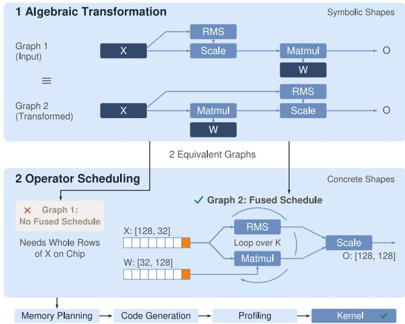  
Figure 1. Symbolic decoupling in Cleave, illustrated by the fusion of RMSNorm followed by Matmul. The first phase performs algebraic transformation that finds an equivalent graph which orders the row-wise scaling after Matmul. The second phase performs operator scheduling which makes each slice of� feed both reductions in a single loop over �.

Kernel fusion is dificult for modern deep learning models because of their extensive use of various reduction-based operations, including matrix multiplication, convolution, normalization and softmax. Fusing these computations often requires combining multiple reductions in one kernel. However, dependencies between reductions can require more intermediate storage than shared memory and registers provide. Furthermore, the straightforward way of partitioning the output across threads may expose too little parallelism to use the GPU eficiently.

Resolving these challenges requires more than determining how to tile, order and map the computation to GPU threads, a process we refer to as operator scheduling. It also requires algebraic transformation to restructure the computation graph to enable tile-by-tile execution and expose additional parallelism. For example, when RMSNorm is followed by a Matmul (Fig. 1), moving the row-wise scaling of RMSNorm after the Matmul allows both reductions to consume the same input tile together, avoiding materialization of the normalized input. The same transformation, applied to the softmax normalization, underlies FlashAttention (§2.2). Scheduling then determines how to tile and execute the transformed graph. Likewise, when a reduction produces too few output tiles to occupy the GPU, algebraic transformation can decompose it into independent partial computations whose results are subsequently combined, a technique commonly referred to as Split-K. Scheduling then determines the partition sizes and maps the partial computations across threadblocks, as in FlashDecoding.

Existing compilers address these requirements in diferent ways. Scheduling-based compilers [16, 27, 30, 41, 44, 46, 47] optimize loops, tile sizes, and memory layouts, but do not discover the algebraic transformations needed above. Algebraic optimizers [10, 11, 19, 28, 36, 45, 48] search for equivalent computation graphs, but graph transformations alone do not determine how to tile and execute them. Mirage [31] uses superoptimization to jointly search algebraic transformations and operator schedules, resulting in a search space that is often too large to optimize. As our evaluation (§7.3) shows, Mirage fails to optimize some commonly used kernels and runs out of memory on some searches. Beyond compilers, a separate line of work uses LLM agents to write kernels directly [3, 13, 23, 38, 40]. These agents match expert kernels on some workloads, but each new operator requires a costly new search.

We observe that, when combining algebraic transformation with scheduling for fusion, the underlying optimizations can be separated along a natural line. Algebraic transformation rewrites the computation graph into an equivalent one, changing the operators and the dependencies among them while preserving the final result. Scheduling leaves the graph unchanged and decides how it is executed: how reductions are tiled into loops, which loops are fused and how tiles are mapped to threadblocks. The validity of a transformation is a property of the graph alone and does not depend on the schedule nor the tensor shapes. Thus, it can be established once for a graph with symbolic shapes. Whether a transformed graph is profitable depends on the schedule and concrete shapes, which can be decided by a scheduler. We call this approach symbolic decoupling: the algebraic phase searches over graphs with symbolic dimensions, and the scheduling phase binds the symbols to concrete shapes and schedules each resulting graph. In efect, the algebraic search never enumerates loop structures and tile sizes, and the scheduler never reasons about algebraic equivalence.

We have implemented symbolic decoupling in Cleave. At a high level, Cleave first uses superoptimization to produce all algebraically equivalent graphs of the input and then uses a dedicated scheduler to perform fused tile-by-tile execution for each graph. Cleave chooses the most promising candidates according to an analytical cost model and compiles and profiles them for the final kernel. In order for this approach to work well, Cleave addresses two technical challenges:

1. Enhancing and scaling algebraic search. (§4) Given the principle of symbolic decoupling, how to enable the algebraic transformation required to support Split-K? To do so, we introduce a new Split operator in the symbolic graph that partitions a reduction dimension into � parts, where � is one more symbol that divides a given tensor dimension. Superoptimization then decides where to insert Split and how to combine the partial results, while the concrete value of � is bound later by the scheduler. The symbolic graph representation also makes the search scale. Superoptimization checks the equivalence of each candidate graph by probabilistic testing [31], whose cost grows with the tensor sizes. For symbolic graphs, we can perform probabilistic testing using any small instantiation that satisfies the graph’s shape constraints. Note that at the end of superoptimization, we still perform the probabilistic testing on the original shapes from the user graph to not lose the correctness guarantee.

2. Scheduling graphs with multiple reductions. (§5) An algebraically transformed graph still needs a schedule that keeps intermediate storage small and reuses data across reductions. Treating reductions as kernel boundaries, or materializing their producers’ full intermediate tensors, would lose the fusion opportunities exposed by algebraic search. Our scheduling algorithm combines two strategies: (1) iterative tiling to break reduction dimensions into smaller tiles, each of which can be computed without materializing all intermediate results in shared memory; and (2) horizontalfusion to compute reductions that share upstream producers in the same loop, reusing the tiles those producers generate.

Cleave also supports dynamic workloads (§6.3), where batch size and sequence length change from one invocation to the next. In this case, scheduling is performed on a representative concrete shape, and code generation keeps the dynamic extents symbolic with runtime loop bounds, so one compiled kernel serves the varying request shapes.

We have evaluated Cleave on commonly used subgraphs, including GQA, MLA, and SwiGLU. Our evaluation (§7) shows that kernels optimized by Cleave are up to 2.8× faster than the best baseline on each subgraph, with an average speedup of 1.6×. Compared to Mirage, Cleave reduces compilation time by 5.9× on average. On dynamic workloads, a single compilation per operator serves all 303 captured shapes across nine operators, achieving geometric mean speedups of 1.4× and 1.7× over FlashInfer’s FA2 and FA3 backends, respectively. Finally, when Cleave-produced kernels are used in transformer layers from GPT-2, Llama-3 8B, and Qwen3-32B, layer execution improves by up to 2.5× (1.7× on average) over torch.compile.

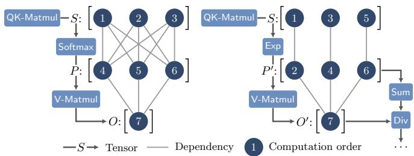  
Figure 2. Data-dependency in the attention graph for computing one output element, before (left) and after (right) FlashAttention algebraic transformation. Circles represent elements in the tensors. Labels indicate computation order after fusion. Before, � is fully computed and cached in SMEM before computing �, incurring high SMEM usage. After, � is streamed with �′, reducing SMEM usage.

## 2 Motivation and Our Approach

We start by presenting some background on kernel optimization (§2.1); then show, through FlashAttention and Split-K, that fusing reduction-based computations requires both algebraic transformation and operator scheduling (§2.2); and finally present the two techniques Cleave uses to meet these requirements, symbolic decoupling and iterative tiling (§2.3).

## 2.1 Background

GPU execution and memory model. We use NVIDIA’s terminology throughout the paper. A kernel is executed by many threads organized into threadblocks, each of which runs on one streaming multiprocessor. Threads have access to three tiers of memory with each level larger but slower than the previous one: thread-local registers (RMEM), shared memory (SMEM) accessible by all threads in a threadblock, and global memory (GMEM) accessible by all threadblocks. A kernel commonly partitions its output tensor into tiles and assigns one threadblock to compute each tile. Thus, the number of output tiles determines the degree of parallelism.

Tiling and fusion. To improve kernel performance, one must reduce data movement. Tiling breaks a computation into blocks small enough to fit in SMEM or RMEM, so that data read from GMEM can be reused across the block rather than reloaded. Kernel fusion merges consecutive kernels into one so that intermediate results stay in SMEM or RMEM instead of being written to GMEM and read back across kernel boundaries.

Superoptimization. Superoptimization [11, 31] finds transformations of a computation graph by enumerating candidate graphs up to a threshold size and checking for those semantically equivalent to the input graph. Equivalence between a candidate graph and the input can be established by probabilistic testing, which runs both on random inputs and compares their outputs [31]. The cost of each test grows with the sizes of the tensors involved.

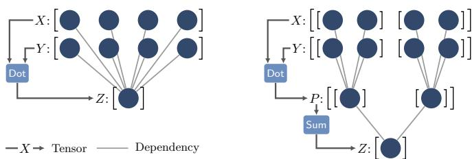  
Figure 3. Algebraic transformation in Split-K, which rewrites the vector dot product � · � into � [: 2] · � [: 2] + � [2 :] · � [2 :].

## 2.2 Motivating Examples

We use two optimizations, FlashAttention and Split-K, to show that optimizing reduction-based computations requires both algebraic transformation and operator scheduling. Both serve as running examples in the rest of the paper.

FlashAttention. At its core, the attention operation of transformer models consists of two matrix multiplications (a QK-Matmul and a V-Matmul) with softmax sandwiched in between. Optimizing the original attention graph into FlashAttention requires two steps: first, the computation graph needs to be transformed into the equivalent graph where the division operator of softmax is after matrix multiplication (V-Matmul). Next, the resulting graph needs to be scheduled in a way so that execution proceeds tile by tile along the reduction dimension of V-Matmul, i.e., the sequence dimension. Each iteration computes one tile of � and �′ and accumulates its contribution to the output, so only one tile of each intermediate tensor is live at a time.

Importantly, tiling along the reduction dimension before transforming the graph is inefective. As shown in Fig. 2, the attention graph contains a problematic reduction operator (softmax), whose input and output tensors are both large. Fusing it according to the original graph requires substantial memory because the entire � must be materialized in SMEM or RMEM before computing �, as seen by the data dependency on the left of Fig. 2.

Algebraic transformation can eliminate the need to materialize intermediate tensors in their entirety. In the case of softmax, moving the division (part of the softmax computation) after V-Matmul breaks the all-to-all data dependency between � and �. As shown in Fig. 2 (right), now each element of �′ only depends on a single element of �, thereby allowing a schedule to keep one tile of each live at a time instead of entire tensors.

Split-K. Since the number of output tiles determines the degree of parallelism (§2.1), a reduction with a small output yields too few threadblocks to fully occupy the GPU. This is common in decode attention, where each request contributes only a single row of the output � tensor. Split K [20] improves parallelism by partitioning the reduction dimension. The example of Fig. 3 applies Split-K to the dot product $Z = \mathrm { D o t } ( X , Y )$ of length K (left). The result is $\begin{array} { r } { Z = \sum _ { j = 0 } ^ { s - 1 } \operatorname { D o t } \bigl ( X [ j b : ( j + 1 ) b ] , Y [ j b : ( j + 1 ) b ] \bigr ) } \end{array}$ with $b = K / s \left( \bar { \mathrm { F i g } } . 3 , \mathrm { r i g h t } \right)$ . The � partial dot products can now run in parallel on separate threadblocks with an extra combine kernel summing their results. Here, algebraic transformation and scheduling appear to be coupled in the opposite order from FlashAttention: the rewrite is stated in terms of the partition size �. As choosing partitions is a scheduling decision, it appears that the schedule must be fixed before the transformation can be applied.

## 2.3 Our Approach

Existing work considers either operator scheduling only [16, 27, 30, 41, 44, 46, 47] or algebraic transformation only [10, 11, 28, 36, 45, 48]. Mirage [31] performs joint optimization of both but sufers from a blow-up of the search space. Our system Cleave performs both algebraic transformation and operator scheduling using two techniques. Symbolic decoupling performs algebraic transformations independently of scheduling. Iterative tiling then schedules each transformed graph so that its reductions are fused without materializing intermediate tensors.

Symbolic decoupling. Symbolic decoupling rests on a distinction between a computation graph and its execution. The algebraic phase transforms the graph into an equivalent one, changing the operators, their ordering, and the dependen cies among them while preserving the result. The scheduling phase does not change the graph but decides how it executes: how reductions are tiled into loops, which loops are fused, and how tiles map to threadblocks. The validity of a transformation is a property of the graph alone and should be independent of the schedule and of the tensor shapes. Thus, it can be established on a symbolic graph before any scheduling decision is made. Every quantity the transformation does not depend on, e.g. every tensor’s dimension, is represented by a symbol. We call this symbolic decoupling. The two examples of §2.2 readily admit this approach as follows.

The FlashAttention transformation, which moves the division after the V-Matmul, changes the graph and nothing else. It is valid for every schedule and every sequence length and model dimension. The algebraic phase can discover this transformation. The scheduling phase then tiles the computation according to the transformed graph without further algebraic reasoning. The Split-K rewrite also changes only the graph, and it is valid for every partition size. The apparent coupling comes from stating it with a concrete �. Under symbolic decoupling, the number of parts � is simply one more symbolic dimension: the algebraic phase introduces it through a Split operator that partitions a dimension into � parts, and decides where to split and how to combine the partial results. The scheduling phase resolves � along with the other symbols (§4).

Iterative tiling. Algebraic transformation creates the opportunity to fuse a graph with multiple reductions, but we still need to design a scheduler to realize it. To fuse such a graph without materializing intermediate tensors, the scheduler must tile each reduction along its reduction dimension and accumulate the result tile by tile so only one tile of each intermediate is live at a time. Furthermore, when several reductions consume the same producer, one must compute them in the same loop, so that each tile of the producer is computed once and reused. We refer to the former as iterative tiling and the latter as horizontal fusion. The transformed attention graph is one instance: the row sum and the V-Matmul both reduce over the sequence dimension and both consume exp $( Q K ^ { T } )$ . Existing scheduling-based compilers [27, 30, 47] do not produce such schedules. They tile only the output dimensions of a kernel, so even when given the transformed graph, they materialize the full intermediate tensors in SMEM, which limits fusion to short sequence lengths for attention.

## 3 System Design Overview

Cleave optimizes the kernels corresponding to a computation graph. This graph is usually a subgraph of the overall computation graph for end-to-end ML model execution. Cleave works in two phases: algebraic transformation (§4) and operator scheduling (§5). A final pass (§6) performs memory placement, generates code for the kernels, and profiles their performance.

First, Cleave symbolizes the graph by replacing original tensor shape dimensions with symbols, uses superoptimization to find all mathematically equivalent ones, validates with probabilistic testing, and instantiates them with original shapes. Second, operator scheduling transforms the validated graph’s loop structure using iterative tiling and horizontal fusion, and then uses an analytical cost model to find the topk tile sizes. Finally, for the top-k candidate graphs, Cleave decides the tensor placement (in SMEM or RMEM) and layout, transpiles into TileLang to generate the kernels, which are then profiled to pick the best among the candidates.

## 4 Algebraic Transformation Phase

The algebraic transformation phase takes a computation graph with concrete tensor shapes as input. It creates a corresponding symbolic graph, then performs superoptimization with probabilistic testing, and finally recovers the original shape. The phase returns a set of algebraically-equivalent graphs with concrete shapes.

Creating symbolic graphs with support for Split-K. We turn the concretely-shaped input computation graph into a symbolic one by representing each tensor dimension with a symbol. Doing so can greatly reduce the cost of superop timization because checking for graph equivalence is commonly done using random testing [11, 31] whose cost is proportional to the tensor size. With symbolic shapes, we can check equivalence by running random tests for small tensor sizes. To create such a graph, we first keep only dimensions with size 1 to preserve broadcasting structures, and replace all other dimensions with symbolic variables. We then traverse all operators in the graph to capture all shape constraints among the variables, which will be used in the numerical testing when instantiating a small-shape graph. The lower-level implementation is detailed in §A.

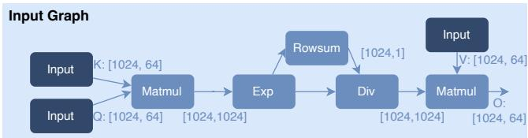  
Figure 4. Input to the superoptimizer describing attention computation. The first Matmul uses a transposed layout for the � matrix.

As discussed in §2.3, we introduce the Split operator in the symbolic graph to enable Split-K optimization. The Split operator splits a given dimension into � parts (where � is a symbolic variable). For example, Split(� : [�, �], dim = 1) yields a tensor of shape [�, �, �/�]. Using a symbolic variable � instead of a concrete value allows the algebraic transformation phase to focus its search on identifying where tensors should be split without searching for split size.

When the Split operator is included in the graph, it naturally yields a two-kernel decomposition consisting of a split kernel and a subsequent combine kernel by partitioning at the reduction nodes that reduce the split dimension (e.g., the two “Reduce(0)” nodes in Fig. 5b). In attention operators, splitting the key-value reduction dimension produces a split kernel that emits two partial tensors, a per-split row-sum used for normalization, and a per-split value-product tensor of shape [�, � , �]. The combine kernel then reduces both tensors across � and performs the final division, yielding the normalized attention output. Figure 5b shows this example.

Superoptimization with reducibility-based pruning. To speed up superoptimization’s enumeration-based search, Cleave prunes the search space by imposing constraints on what dimensions can be split and reduced for Split and any reduction operators. We first identify for every input tensor of the graph which dimensions are eventually-reduced, defined as whether there exists an element in the graph’s output tensor such that all elements that contribute to its computation cover all indices in this dimension. The main idea is that, since any algebraically equivalent graph should preserve the same set of dimensions that are eventuallyreduced, Cleave prunes the search path whenever the insertion of Split or any reduction operators breaks this property.

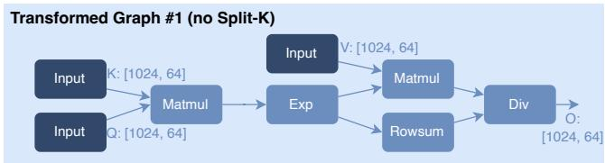

(a) An equivalent attention graph without Split operators  
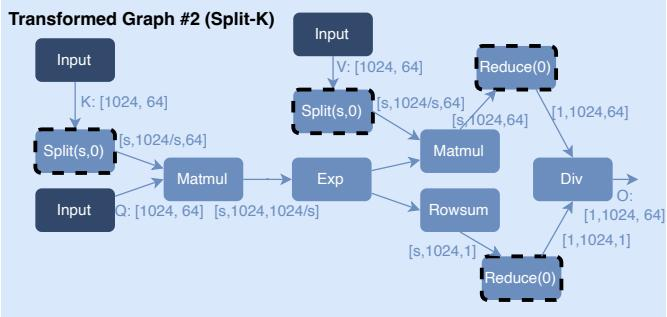  
(b) An equivalent attention graph with Split operators. Split adds a leading dimension � which is treated as a batch dimension by subsequent operators such as Matmul (which uses broadcasting semantics for inputs with a batch dimension). The symbolic � will be instantiated into valid concrete integers that divide 1024.  
Figure 5. Two equivalent attention graphs discovered via superoptimization, with and without Split nodes.

In other words, we never allow splitting or reducing noneventually-reduced dimensions, e.g., batch dimensions. Note that we prune for Split insertions as in typical Split-K optimization, the split dimensions will be eventually-reduced in the second kernel, making it similar to a reduction operator. Currently, we require the user to annotate the input tensors for which dimensions are eventually-reduced, but it can be automated with data-dependency analysis [27, 48].

The superoptimization algorithm takes the algebraic graph as input, and enumerates all possible graphs up to a predefined size. The process starts from a disconnected graph with only the input tensors from the algebraic graph and gradually inserts new nodes. To test equivalence, Cleave instantiates small concrete shapes that conform to the operator constraints and performs numerical testing using Mirage’s probabilistic testing approach (details in §A).

Recovering the original shapes. For each equivalent graph discovered by superoptimization, we can recover concrete tensor shapes by propagating concrete dimension values starting from the original concrete input tensor shapes. If a symbolic Split operator is present in the concretized graph, we enumerate all valid possible split values, which are the factors of the corresponding concrete split dimension value, and test for their validity. Doing so results in several concrete graphs, one for each valid split value. Finally, each Split-K graph is partitioned into a split and combine subgraph, each of which is independently scheduled and generates its own kernel. At runtime, both kernels need to run.

Listing 1. Tile program pseudocode for FlashAttention schedule.   
Each threadblock computes one row slice of � as highlighted.   
1 # seqlen (N), head\_dim (d), output & reduction   
tile size (b\_O & b\_R)   
2 parfor i in range (0, N, b\_O): # parallelized   
across threadblocks   
t\_Q = Load (Q[i:i+b\_O , :]) # [b\_O , d]   
for j in range (0, N, b\_R): # iterative tiling   
t\_K = Load (K[j:j+b\_R , :]) # [b\_R , d]   
t\_V = Load (V[j:j+b\_R , :]) # [b\_R , d]   
t\_mma\_0 = MMA\_transB (t\_Q , t\_K) # [b\_O , b\_R]   
8 t\_exp = Exp( t\_mma\_0 ) # [b\_O , b\_R]   
9 t\_rowsum += Rowsum ( t\_exp ) # [b\_O , 1]   
10 t\_mma\_1 += MMA(t\_exp , t\_V) # [b\_O , d]   
11 t\_O = Div( t\_mma\_1 , t\_rowsum ) # computes row   
tile O[i:i+b\_O:, :]   
12 Store (t\_O , O[i:i+b\_O, :])   
Listing 2. Comparison between schedules with and without itera  
tive tiling. g\_mma\_0 and g\_exp are the corresponding full tensors   
in the computation graph of Fig. 5a. Notice the reduction in the   
intermediate bufer sizes, as highlighted in the code.   
1 # without iterative tiling   
2 t\_mma\_0 = .. # g\_mma\_0 [i:i+ block\_O , 0:N]   
3 t\_exp = Exp( t\_mma\_0 ) # g\_exp [i:i+ block\_O , 0:N]   
4 t\_rowsum = Rowsum ( t\_exp )   
5   
6 # with iterative tiling   
7 for j in range (0 , N, b\_R) :   
8 t\_mma\_0 = .. # g\_mma\_0 [... ,j:j+b\_R]   
9 t\_exp = Exp( t\_mma\_0 ) # g\_exp [... ,j:j+b\_R]   
10 t\_rowsum += Rowsum ( t\_exp ) # [b\_O , 1]

Fig. 5 shows two example equivalent graphs discovered via superoptimization for the attention graph in Fig. 4.

## 5 Operator Scheduling Phase

## 5.1 Motivating Example and Overview

Ideally, given Figure 5a, an equivalent transformed graph for attention (returned by superoptimization), Cleave should produce the code shown in Listing 1. This code uses the FlashAttention optimization, and computes a single-head non-causal self-attention (for prefill) on one sequence, with $N ,$ � being the sequence length and head dimension, respectively. The program takes �, �, � as input tensors, and produces output tensor �, which all have shape [� , �].

Generating such a program requires applying two scheduling steps. The first scheduling step partitions computation across threadblocks. The program (lines 2—12) partitions the output tensor � into tiles along the row dimension � with tile size $b _ { O }$ , and distributes them across threadblocks. Each threadblock runs the graph to compute one output tile $O [ i : i + b _ { O } , : ]$ . The kernel uses parfor (L2) to launch $N / b _ { O }$ threadblocks. Each threadblock identifies the input slice $( e . g .$ $Q [ i : i + b _ { O } , : ] )$ needed for computing their corresponding output tile according to data-dependency, then loads them into SMEM/RMEM (e.g., �� on L3) to avoid GMEM roundtrips before executing the necessary computation, and finally stores the output tile back to GMEM (L12).

The second scheduling step schedules computation within a threadblock. This step has two goals: (a) perform iterative tiling that tiles reduction nodes to reduce SMEM/RMEM usage; and (b) perform horizontal fusion [1, 2] to reuse data.

Algorithm 1: Overall Workflow of Scheduling Phase   
Input: Concrete transformed graph $G _ { t }$   
Output: Top-� itGraph schedules   
// Step 1: enumerate tile size candidates for   
output and reduction nodes   
1 TileConfigs ← EnumerateTileSizes $( G _ { t } ) ;$ // §A   
// Step 2: construct itGraphs, filter invalid   
ones, and evaluate cost   
2 Scored ← ∅;   
3 for � ∈ TileConfigs do   
4 ��ℎ ← Schedule(��,�); // §5.3   
5 if ��ℎ.����� then   
6 � ← CostModel(��ℎ); // §A   
7 if �.���� fits hardware resources then   
8 Scored ← Scored ∪ {(��ℎ, �)};   
9 return SelectTopK(Scored);

We illustrate the efect of tiling reduction nodes in Listing 2. We denote by $g _ { m m a , 0 }$ and $g _ { e x p }$ the full tensor of the first Matmul and Exp output in the computation graph (Fig. 5a). Without iterative tiling, Rowsum would need the entire row of Exp’s output $g _ { e x p }$ to be stored in the SMEM bufer ${ t _ { e x p } }$ at once, as shown in L3. This would require allocating $[ b _ { O } , N ]$ memory, and lead to suboptimal performance because the allocation size is limited by available SMEM/RMEM. With iterative tiling, the dimension � is tiled with tile size $b _ { R } ,$ and iterated with a loop of extent $N / b _ { R }$ . Each iteration only sums the column slice $[ j : j + b _ { R } ]$ . As a result, Rowsum allows staging only these columns of $g _ { e x p }$ at each iteration, and reuses the same SMEM bufer across iterations. This reduces the bufer size of ${ t _ { e x p } }$ from $[ b _ { O } , N ]$ to $[ b _ { O } , b _ { R } ]$ (L3). Similarly, by tracking the data-dependency backwards from Exp to Matmul, we deduce the slice of Matmul’s output $g _ { m m a , 0 }$ that is needed to compute $t _ { e x p } ,$ , and stage only that slice in ����,0. In this trivial case where Exp is an elementwise operator, we stage the same column slice $\left[ j : j + b _ { R } \right]$ of $g _ { m m a , 0 }$ in ����,0, reducing the required allocation to $[ b _ { O } , b _ { R } ]$ . In the program, this is equivalent to moving all of Rowsum’s upstream nodes (i.e., Matmul and Exp) under �’s reduction loop.

Second, the kernel performs horizontal fusion on lines 9-10 in Listing 1. In detail, as the second Matmul is also a reduction sharing the same input $t _ { e x p } .$ , we schedule it to compute sideby-side with Rowsum in the same loop, reusing $t _ { e x p }$

In summary, the kernel is scheduled by first performing inter-threadblock scheduling that partitions the output tensor across threadblocks, and then intra-threadblock scheduling that tiles the reduction into sequential accumulation steps with horizontal fusion. The goal of Cleave is to automatically apply the above scheduling steps to any input graph.

Overview of the scheduling algorithm. The scheduling phase takes as input a concrete transformed graph $G _ { t }$ (e.g.,

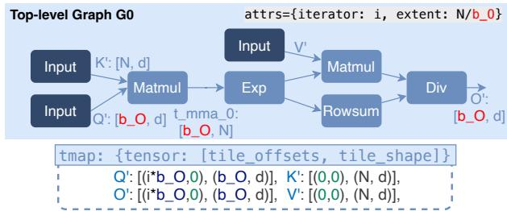  
Figure 6. Inter-threadblock scheduling result of Fig. 5a. The resulting tile program is shown in Listing 3. It causes high SMEM usage as $t _ { m m a , 0 }$ and ${ t _ { e x p } }$ do not have the second dimension � tiled.

Fig. 5a), and produces a set of candidate tile programs represented in the itGraph format. Cleave’s approach to doing so is shown in Alg. 1: it first enumerates a set of tile size candidates for output and reduction nodes (§A), schedules each candidate into an itGraph by applying the inter- and intra-threadblock scheduling and drops invalid ones (§5.3), and then uses a cost model (§A) to select the top few best itGraphs. Lower-level intra-tile optimizations are delegated to an existing tile program backend [29]. Therefore, in the subsequent codegen phase (§6), we lower our tile programs into the backend’s DSL, compile and profile them, and select the one with the best performance.

In what follows, we first describe the itGraph semantics (§5.2) and discuss how Cleave schedules the computation given the tile sizes into an itGraph (§5.3). Cleave adopts an approach similar to Welder [27] for tile size enumeration and uses a similar cost model. We describe both in Appendix A.

## 5.2 itGraph Semantics

Observe that a tile program like Listing 1 can be regarded as a multi-level loop nest with tile computation and memory IO as its instructions in loop body. Such a structure naturally maps to a multi-level computation graph, with one level for one loop, and nodes as the instructions operating on tensors. We thus enhance the traditional computation graph to support this format, and term it iterative tile graph (itGraph).

Formally, an itGraph describes a sequential or parallel forloop, and is stored as a computation graph data-structure with attributes of loop variable name and loop extent and a tensor map (tmap). The loop body is defined by the computation graph, indicating that each iteration executes this same graph but using diferent input and output slices $( i . e . ,$ tiles) in a full tensor. For instance, in Fig. 6, the computation graph of $G _ { 0 }$ is executed in lines $3 { - } 1 1$ in Listing $^ { 3 , }$ but in a parallel loop by all threadblocks, with diferent slices shown in L3 and L11 each iteration (threadblock). We use tmap to encode the slicing formula. The tmap contains two arrays, both of which have an entry for each dimension: entries in tile\_offset are symbolic expressions that can be used to compute the starting ofset of the �-th slice of the dimension; and entries in tile\_shape contain the size of each slice. For example, for $Q [ i \times b _ { O } : ( i + 1 ) \times b _ { O } , : ]$ , the $\ t i l e _ { - } { \circ } \ t$ fsets array contains the symbolic expressions $i \times b _ { O }$ and 0 for the corresponding dimensions, and the tile\_shape array contains $[ b _ { O } , d ]$ . The symbolic expression 0 indicates that the corresponding dimension is not tiled.

Listing 3. After inter-threadblock scheduling, without iterative   
tiling applied. The corresponding itGraph is in Fig. 6.   
1 # seqlen (N), head\_dim (d), output tile size $\flat \_ 0$   
$\begin{array} { r } { \mathrm { ~ 2 ~ p ~ a ~ r ~ f ~ o ~ r ~ \varepsilon ~ i ~ \mathrm { ~ i ~ n ~ } ~ r ~ a ~ n ~ g ~ e ~ ( ~ \theta ~ , ~ \mathbb { N } ~ , ~ \ b _ { - } 0 ~ ) ~ : ~ \mathrm { ~ \# ~ \operatorname { m a p } ~ t ~ o ~ \mathbb { N } ~ \varepsilon ~ \mathrm { ~ \varepsilon ~ } ~ } } } \end{array}$   
threadblocks in parallel   
3 $\mathfrak { t } _ { - } \mathtt { Q } \ = \ \mathsf { L o a d } ( \mathsf { Q } [ \mathtt { i } : \mathtt { i } + \mathtt { b } _ { - } \mathtt { 0 } , \ \mathrm { ~ : } ] ) \ \sharp [ \mathtt { b } _ { - } 0 , \ \mathrm { ~ \mathsf { d } \mathtt { Z } \ } ]$   
$\mathrm { t \_ K \ = \ \mathsf { L o a d } ( K ) \quad \# } \quad \lbrack \mathsf { N } ,$ d]   
$t \_ V = \mathsf { L o a d } ( \mathsf { V } ) \# \mathrm { ~ \mathbb ~ { [ N , ~ \mathsf { d } ] } ~ }$   
$\tan \alpha _ { - } \theta = \tt N M A _ { - } \tt t r a n s B ( \tt t _ { - } \underline { { { Q } } } , t _ { - } K ) \tt _ { - } \# [ b _ { - } 0 , \tt N ]$   
7 t\_exp = Exp ( t\_mma\_0 ) # [b\_O , N]   
8 $\begin{array} { r l } { \mathsf { t \_ r o w s u m } } & { = \mathsf { R o w s u m } \left( \mathsf { t \_ e x p } \right) , \# \mathrm { \Sigma \_ } \left[ \mathsf { b \_ } 0 , \mathsf { \Omega } \right] \mathsf { \_ } } \\ & { \quad \mathsf { t \_ f s o w s u m } } \end{array}$   
9 $\tan a \_ { - } 1 = \tan ( ( \tan ( 0 , \sqrt { 0 } , \frac { \sqrt { 0 } } { 2 } ) ) \neq [ 0 , 0 , 0 ]$   
10 $\mathrm { t } _ { - } 0 = \mathbb { D } \mathrm { i } \mathbf { v } ( \mathrm { t } _ { - } \mathsf { m m a } _ { - } 1 , \bar { \mathrm { t } } _ { - }$ \_rowsum ) $\bar { \# } \ \stackrel { - } { [ 6 _ { - } 0 \ , } \ { \mathsf { d } } ]$   
11 $\mathsf { S t o r e } ( \mathsf { t } _ { - } \mathsf { 0 } , \mathsf { 0 } [ \mathsf { i } : \mathsf { i } + \mathsf { b } _ { - } \mathsf { 0 } , : ] )$

To allow representing nested loops, we allow itGraph to nest inner graphs, where nodes in the outer graph can be a graph-node that refers to an inner itGraph that represents an inner loop. In Fig. 7, the graph-node is implicitly shown as the whole $G _ { 1 }$ graph, which now creates a for-loop on L4 in Listing 1, containing the execution logic of all nodes in $G _ { 1 }$ . Every inner graph similarly has tmap, which slices the tile from the outer graph. Diferently, every inner graph represents a sequential loop, accumulating results to the same output tile $( e . g . , t _ { m m a , 1 }$ and $t _ { r o w s u m } )$ every iteration. On the other hand, the outermost graph represents a parallel loop where each iteration writes to a diferent output tile.

## 5.3 Inter- and Intra-threadblock Scheduling

Inter- and intra-block scheduling are core to Cleave’s approach. In this step, Cleave takes as input a tile size configuration � (Algo. 1, L3), which contains a tile shape for each of the output and reduction nodes, and produces an itGraph. We will use the motivating tile program from §5.1 as the running example. For this example, the tile configuration � contains the tile shape $[ b _ { O } , d ]$ for output $O , b _ { R }$ for both the Matmul and Rowsum nodes, and the full extent � for the first matmul to indicate no tiling.

Our scheduling algorithm first runs the inter-threadblock pass to partition the output tensor and produces an initial single-level itGraph (e.g., Fig. 6). Next, it repeatedly runs the intra-threadblock passes to create inner-graphs (e.g., Fig. 7) on current itGraph for iterative tiling and horizontal fusion, until all reduction nodes are tiled according to �. We detail this algorithm below. We use “node” and “output tensor” interchangeably when the node outputs a single tensor.

Inter-threadblock scheduling with output tile size. Given a transformed computation graph $G _ { t }$ , we first build an itGraph with the same topological structure, calculate its loop extent by dividing the output tensor size by the given tile size, and finally analyze the data-dependency to build the tmap for input and output tensors. This analysis starts by constructing the tmap of the output nodes based on the output tile shape. To calculate tile\_offsets $( i . e . ,$ tile start location at each iteration), we partition the full tensor into disjoint tiles of the given size and iterate them in a linearized order (in row-major). For example, given output tile shape $[ b _ { O } , d ]$ , with $O ^ { \prime } s$ full shape as $[ N , d ]$ , its tmap would have tile\_shape $[ b _ { O } , d ]$ and tile\_offsets $( i \times b _ { O } , 0 )$ , where � is the loop variable.

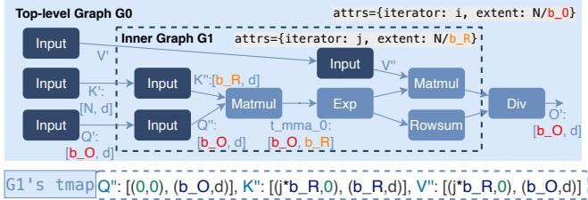  
Figure 7. Intra-threadblock scheduling result of Fig. $^ { 6 , }$ which tiles Rowsum and the second Matmul with $b _ { R }$ size and fuses them together horizontally. $G _ { 1 }$ is a graph node in $G _ { 0 }$ and represents an inner-loop. The resulting tile-program is shown in Listing 1 (with a minor diference as the tile-program includes changes made by the code generation phase, which hoists $t _ { Q }$ outside the �-loop). $G _ { 0 } \ ' s$ tmap remains unchanged and thus omitted. tmap of $Q ^ { \prime \prime }$ has ofsets of 0 as it uses the same outer $Q ^ { \prime }$ across iterations. Notice that the second dimension of $t _ { m m a , 0 }$ and ${ t _ { e x p } }$ is smaller compared to Fig. 6.

We use Welder’s data-dependency analysis to propagate the output tmap and compute tmap backwards to all other nodes in the graph. Specifically, for each operator we analyze the data-dependency using its tensor expression to deduce the axis range of each of its inputs when its output axis range is constrained to [0, output\_tile\_size). This input range’s extent is used as the tile size to construct the tmap of the input in the same way as in the output tmap.

During the backward propagation, as multiple paths may exist from the output node back to a node $u ,$ � can get multiple tmaps. To ensure correctness and for simplicity, whenever any two of $\boldsymbol { u ^ { \prime } s }$ tmap do not match exactly, we reject the current tile size candidate and abort its scheduling.

Intra-threadblock scheduling with reduction tile size. The schedule produced after the inter-threadblock pass may require large intermediate bufers (e.g., ���� 0 and $t _ { e x p } )$ , resulting in large SMEM usage, because the reduction dimensions $( e . g .$ , column dimension � of Rowsum) are not tiled and are often large. For example, in attention kernels, they equal the context length which can be thousands or more. This prohibits graphs with large reduction dimensions from being fused because the intermediate storage required would exceed available SMEM/RMEM, or prevents the use of larger tile sizes that deliver higher performance.

Our intra-threadblock scheduling applies iterative tiling and horizontal fusion to address this issue, which will break the Rowsum and the second Matmul reduction into multiple smaller steps using their reduction tile sizes $b _ { R } ,$ , and iterate over them in the same loop to realize horizontal fusion.

The algorithm first traverses the current itGraph to identify the “last-wave” reduction nodes and separate them into groups for horizontal fusion. A reduction node is “last-wave” of the current graph when it has no other iterative reduction nodes, i.e., reductions whose extent is large enough to be iterated, in any path from them to the output node, such as Rowsum and the second Matmul in Fig. 7 (whereas the first Matmul is not). We group two nodes together ifthey share any oftheir upstream nodes, to exploit the reuse of these common nodes in horizontal fusion. For example, Rowsum and the second Matmul share the Exp node, and thus are grouped together. Next, we construct one inner itGraph for each group by wrapping nodes in this group and all their upstream nodes inside, as shown in $G _ { 1 }$ in Fig. 7. Finally, we compute tmap for each inner-graph according to the given reduction tile size. This is done in a similar way as the inter-threadblock pass using tensor expression range-based data-dependency analysis. Note that horizontal fusion requires both fused reduction nodes to iterate over their shared inputs in the same pattern, which we validate by checking tmap exact match during tmap backpropagation in the same way as in the inter-threadblock step.

We repeat the same intra-threadblock scheduling on each newly generated inner-graph until all reduction nodes are tiled according to their tile sizes.

## 6 Memory Planning and Code Generation

After the scheduling phase, Cleave performs memory placement and layout planning over the resulting itGraph. The result is an itGraph annotated with these decisions. This graph is lowered into TileLang by emitting bufer allocations, data movement, and tile-level operator calls according to the planned memory and layout decisions.

## 6.1 Memory Layout Planning

Cleave performs unified memory and layout planning over the scheduled itGraph. In this process, it determines where data should reside, i.e., in RMEM or SMEM, based on operator requirements and reuse opportunities; for example, intermediate tensors associated with MatMuls may be placed in SMEM when beneficial to leverage specialized memory instructions. Further, Cleave identifies loop-invariant Input nodes with zero tmap tile\_offset in inner graphs $( e . g . , $ , the $Q ^ { \prime \prime }$ node in Fig. 7) and hoists them to avoid redundant loads from GMEM. During this process, Cleave also maintains tensor core memory layout constraints (Appendix B).

## 6.2 TileLang Code Generation

After the memory and layout passes, Cleave lowers the annotated multi-level itGraph into TileLang code for kernel generation.1 For each level of the itGraph, Cleave generates two functions: an iteration function (iter) that implements the loop body, and a wrapper (wrap) that implements the loop by calling the iteration function. Both take an argument per input/output node: the wrap function’s inputs are the tensors on which it is operating, while the iter function’s inputs are the slices on which it is operating. At each iteration, the wrapper uses the tmap to determine the arguments it should use when calling iter. Observe that with this separation, the slicing logic is implemented in wrap and execution logic is implemented in iter.

## 6.3 Compiling Dynamic Operators

Scheduling (§5) needs concrete tensor dimensions, as it must select tile shapes, thread counts and bufer sizes from them, and its cost model ranks candidates at a fixed shape. Cleave therefore schedules a dynamic operator against one representative concrete shape and then, during code generation, replaces the extents of axes declared dynamic with symbols. Each symbol denotes one dimension of an input tensor, whose size is obtained directly from the tensor at runtime. Every value derived from a dynamic dimension is re-emitted as an expression over its symbol, i.e., the launch grid and the size of reduction loops become ⌈�/�⌉ for the symbol � and the corresponding tile size �, and existing dynamic memory ofsets are computed during runtime on the device. Because a tile keeps its compile-time size, one that is larger than the input tensor actual size is handled by predicating its loads and stores, and threadblocks left without work are skipped. A single compilation per operator then serves any shape that varies only along its dynamic axes, which are the axes a serving workload changes from one invocation to the next.

## 7 Evaluation

We evaluate Cleave and answer the following questions:

1. End-to-end impact: Do Cleave-optimized kernels improve the performance of the transformer layer for a representative set of LLMs?

2. Subgraph performance: On fixed-shape subgraphs, can Cleave discover kernel optimizations that require algebraic transformations and operator scheduling? We answer this question for a variety of common subgraphs.

3. Dynamic operator performance: When a subgraph’s shapes are known only at runtime, can Cleave compile it once and reach the performance of handwritten kernels?

4. Compilation scalability: How long does Cleave take to optimize kernels? How does compilation time change across subgraphs of diferent complexity?

5. Ablation study: How does each part of our design afect the performance of Cleave-optimized kernels?

We first describe the experimental setup, then present end-to-end and subgraph-level results, analyze compilation time and workload coverage, and finally study the efect of Cleave’s main optimization components through ablations.

## 7.1 Experimental Setup

We evaluated Cleave using two single-GPU servers, one with an NVIDIA A100-SXM4-40GB and the other with an H200-SXM5-141 GB. Both servers have 12 CPU cores and 96GB of host memory. Our experiments were run on Ubuntu 22.04 and with CUDA 12.8.

Workloads. Our evaluation covers both subgraph-level and end-to-end workloads. At the subgraph level, we benchmark 9 subgraphs, including those that are commonly used in transformer models and those that have consecutive reduction nodes. For our end-to-end evaluations, we use transformer blocks from GPT-2 [25], Llama-3 8B [9], and Qwen3- 32B [35]. Across all benchmarks, computations use FP16 inputs, FP32 accumulation, and FP16 outputs. For the dynamic operators we use nine paged and ragged attention operators whose shapes are taken from workloads captured in flashinfer-trace from FlashInfer-Bench [34], 303 in total, on the NVIDIA’s SOL-ExecBench [14].

Baselines. We compare our system against Mirage [31], Welder [27], TensorRT [22], torch.compile [1], FlashAttention [6], FlashMLA [12], and cuBLAS [21] (see Appendix C for precise version). For the dynamic operators from FlashInfer-Bench we compare against FlashInfer on its cuDNN [5] and handwritten FA2 and FA3 backends [37].

Metrics. To measure both search and subgraph/model performance, we report compilation and run time. Compilation time results are included for the search-based systems, namely Cleave, Mirage, and Welder, measuring the total CPU time including superoptimization, scheduling, and NVCC compilation, while runtime measures the generated kernel latency using CUDA events on both individual subgraphs and end-to-end model execution. The dynamic operators are timed instead under NVIDIA’s SOL-ExecBench harness [14], which FlashInfer-Bench [34] is part of.

## 7.2 End-to-end Benchmark

For each evaluated architecture, we compare kernels generated by torch.compile, Mirage, Welder, TensorRT, and Cleave (ours) on a single transformer layer. Figure 10 reports the end-to-end execution speedup over torch.compile across multiple prefill shapes.

Cleave is the fastest system on all three models, achieving 2.45×, 1.47×, and 1.43× speedup over torch.compile on GPT-2, Llama-3 8B, and Qwen3-32B, respectively. TensorRT provides smaller gains on the larger models, while Welder is close to parity with torch.compile. Mirage cannot fully support the GQA-based executions used by Llama-3 8B and Qwen3-32B, so we only report Mirage results where execution is available.

Llama-8B and Qwen3-32B see smaller gains than GPT-2 because much of the computation time in these larger models is spent computing linear layers (e.g., MLP Matmul). The baseline uses highly tuned vendor kernels for these operations, limiting the possible gains from compiler optimizations.

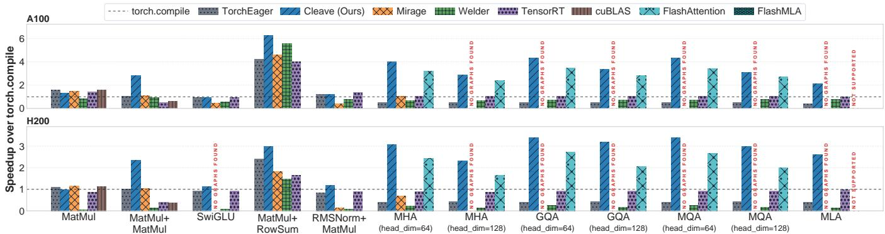  
Figure 8. Prefill-based subgraph-level kernel performance speedup against torch.compile with Torch eager mode, Mirage, Welder, TensorRT, cuBLAS, FlashAttention, FlashMLA, and Cleave (ours).

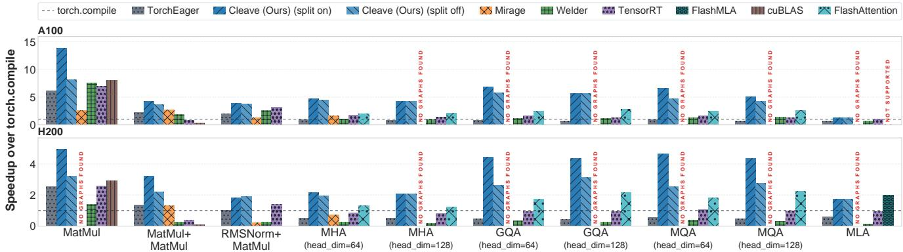  
Figure 9. Decode-based subgraph-level kernel performance speedup against torch.compile with Torch eager mode, Mirage, Welder, TensorRT, cuBLAS, FlashAttention (which automatically uses FlashDecoding for small shapes), FlashMLA and Cleave (ours).

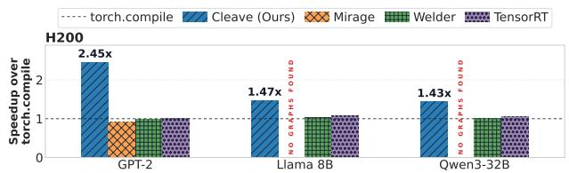  
Figure 10. End-to-end performance on a single transformer layer across 3 diferent model architectures on H200 GPU.

## 7.3 Subgraph-level Benchmark

We evaluated improvements on 9 subgraphs (Table 1). These include (a) four non-causal attention variants: Multi-Head Attention (MHA), Group-Query Attention (GQA), Multi-Query Attention (MQA), and Multi-Head Latent Attention (MLA); (b) three commonly used subgraphs that represent the common dense computation in transformer blocks: MatMul, RM-SNorm+MatMul, and SwiGLU. In particular, optimizations from FlashAttention can be applied to RMSNorm+MatMul, and horizontal fusion can be used with SwiGLU because it has a parallel reduction structure with a common input. We use shapes from Llama-3 8B for these subgraphs; (c) two consecutive reduction-based dense subgraphs where iterative tiling and memory planning are important for optimization: MatMul+MatMul and MatMul+RowSum; and (d) a subgraph containing a single MatMul operator, representing the base case where no optimization is performed.

We evaluate these subgraphs in two settings: prefill and decode. The prefill-setting uses large sequence- and contextlengths, while the decode-setting uses small sequence-lengths but has a large context-length. Split-K is particularly impor-

Prefill setting. Figure 8 compares the execution performance of Cleave optimized subgraphs to those optimized by the baseline. We evaluate all subgraphs using prefill-oriented shapes where both the input sequence length and context length are large (≥ 256). We report geometric mean speedup (across multiple shapes) compared to torch.compile.

We find that Cleave-optimized kernels have up to 2.8× better performance than the best baseline on each individual subgraph. This is because Cleave’s approach of combining algebraic transformation and operator scheduling allows it to optimize kernels across diferent shapes and diferent subgraphs. Consequently, in many cases Cleave kernels outperform even those built using the vendor-provided cuDNN library. Finally, we found that Mirage could not find opti mized graphs for subgraphs with large input shapes. For instance, it failed to find an optimized graph for MHA with head-dimension of 128, but could find one with head di mension of 64. This is because Mirage’s superoptimization algorithm is shape-sensitive. By contrast, Cleave’s symbolic approach allows it to scale to even these larger sizes.

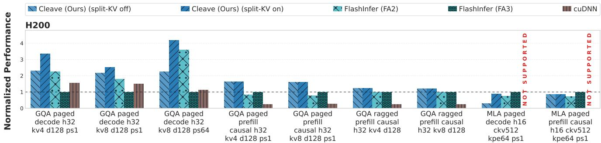  
Figure 11. Dynamic-shape operator performance when toggling split-KV, against FlashInfer’s FA2 and FA3 backends and cuDNN, normalized per operator to FA3 (dashed line at 1.0). Each bar is a geometric mean over the operator’s captured workloads. Shapes have h query heads, kv key/value heads, d head dimension and ps page size; MLA gives ckv and kpe, the widths of the compressed KV cache and the RoPE cache.

Decode setting. Similarly, Figure 9 evaluates performance for decode-oriented shapes where the input sequence length or batch size remains small (< 256) while the context length is large (≥ 1024). Split-K is particularly important in this setting, and so we also present results when Cleave does not use Split-K (‘split of’). Similar to the prefill setting, the results in this case demonstrate Cleave’s efectiveness. Beyond that, the results isolate the benefit of Split-K: with Split-K, Cleave generates kernels up to 2.1× faster than without it.

For all three evaluated combinations, Welder does not fuse consecutive reduction-based subgraphs once sequence length reaches 512. Consequently, in contrast to Cleaveoptimized kernels, the Welder-optimized kernels need to materialize intermediate tensors in GMEM, leading to significantly worse performance for long sequences.

## 7.4 Dynamic Operator Benchmark

We evaluate nine operators (see §7.1) whose shapes are known only at runtime, covering paged and ragged attention, on the workloads captured for each of them in FlashInfer-Bench [34]. Every operator is compiled once, and that single kernel runs all of its captured workloads, 303 in total and between 15 and 48 per operator, with no recompilation. Figure 11 reports the result. Cleave is faster than FlashInfer’s FA2 backend on all nine operators, by 1.16× to 2.04× (1.4× geometric mean), and faster than its FA3 backend on seven of the nine (1.7× geometric mean); it is slower only on the two MLA operators (0.85×–0.89×), where FA3 merges its partial results inside a single cooperative kernel while Cleave pays a second launch. On the four decode operators, applying

Split-K along the key-value axis of the scheduled graph is worth a further 1.15× to 2.99×. However it is not beneficial for the remaining five (prefill) operators, whose grid is already filled by one work tile per query tile per request.

## 7.5 Search Space

Table 1 shows that Cleave achieves substantially better compilation scalability than prior automated kernel generation systems while maintaining broad workload coverage. With Split-K disabled, Cleave’s compilation time (1–5 minutes) is comparable to Welder’s (1–4 minutes), while Welder still misses important optimizations due to its lack of algebraic reasoning. With Split-K enabled, Cleave compiles each subgraph in 8–14 minutes on average. In contrast, Mirage takes 121–224 minutes on average on the four subgraphs for which it generates valid code, and runs out of memory on two others. Furthermore, the version of Mirage we used is unable to generate code for GQA, MQA, and MLA.

<table><tr><td>Subgraph</td><td>n</td><td>Welder</td><td colspan="2">Mirage</td><td colspan="2">CLEAVE</td></tr><tr><td>Split-K</td><td></td><td>N/A</td><td>Off</td><td>On</td><td>Off</td><td>On</td></tr><tr><td>MatMul</td><td>1</td><td>1</td><td>3</td><td>180</td><td>1</td><td>13</td></tr><tr><td>Matmul+MatMul</td><td>2</td><td>1</td><td>10</td><td>224</td><td>2</td><td>14</td></tr><tr><td>Matmul+Rowsum</td><td>2</td><td>2</td><td>4</td><td>209</td><td>5</td><td>12</td></tr><tr><td>SwiGLU</td><td>4</td><td>4</td><td>11</td><td>OOM</td><td>3</td><td>12</td></tr><tr><td>RMSNorm+MatMul</td><td>7</td><td>2</td><td>7</td><td>OOM</td><td>2</td><td>9</td></tr><tr><td>MHA</td><td>7</td><td>2</td><td>X</td><td>121</td><td>3</td><td>8</td></tr><tr><td>GQA</td><td>7</td><td>3</td><td>X</td><td>X</td><td>3</td><td>8</td></tr><tr><td>MQA</td><td>7</td><td>2</td><td>X</td><td>X</td><td>3</td><td>8</td></tr><tr><td>MLA</td><td>7</td><td>3</td><td>X</td><td>X</td><td>3</td><td>9</td></tr></table>

Table 1. Compilation time (in minutes) of diferent subgraphs averaged across diferent shapes on A100. For Mirage, we only average compilation times for cases where it generated valid code. ✗ means no valid code is generated for the given subgraph. � denotes the number of nodes for the given subgraph.

## 7.6 Ablation Study

Finally, we perform ablation studies to understand the contribution of each technique to the kernel performance.

In Figure 12 we show the impact on kernel performance when diferent Cleave components are disabled. We report the geometric mean of normalized performance (normalized to that of kernels optimized using an unmodified Cleave) measured across 9 subgraphs and a variety of shapes. We observe that not (explicitly) maintaining tensor core layout constraints (§6.1 and Appendix B) leads to 6% lower performance; changing scheduling so that iterative tiling schedules are not generated reduces performance by 40%; and disabling algebraic transformation leads to a 44% degra dation. Finally, disabling both operator scheduling and algebraic transformation leads to a 47% degradation. These results show the importance of combining algebraic transformation and scheduling: both contribute substantially to the final performance. In Appendix C we also study the efect of adding algebraic transformations to existing compilers.

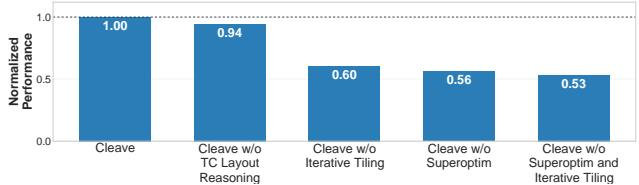  
Figure 12. Component ablation study. Each Cleave bar removes only the component(s) listed. Y-axis shows the geometric mean of the normalized performance against the original Cleave imple mentation, across 9 subgraphs on various shapes.

## 8 Related Work

Prior works that automatically fuse and optimize kernels fall into the following broad categories:

Graph and algebraic transformation. These compilers use graph substitution to search for transformations [10, 11, 28, 36, 45, 48] to achieve several goals, including optimizing computation, minimizing intermediate tensor size, and increasing the number of operators that can be mapped to eficient vendor-provided implementations. The rules used by these compilers generally do not consider scheduling, and miss many of the optimizations found by Cleave.

TASO uses superoptimization to automate the generation of substitution rules. However, to do this efectively, it must search through the set of all rules that can translate between any pair of equivalent graphs. This search space is large, and thus the rules it produces are constrained to small graphs. By contrast, we focus on finding graphs equivalent to a single input graph, allowing us to scale to larger graphs.

Scheduling-based tensor compilers. Several schedulingbased compilers have been proposed that aim to automate kernel fusion [16, 27, 30, 33, 41, 42, 44, 46, 47, 49]. These use a variety of approaches: AStitch [47], Welder [27], and Ladder [30] introduce SMEM caching to automatic kernel fusion. However, they lack support for iterative tiling and thus the schedules they produce (which resemble inter-threadblock schedules) have large SMEM usage. On the other hand, An sor [44] uses evolutionary search to find a schedule built using TVM’s scheduling primitives. This approach is general, but slow (and unscalable) due to the large search space. By contrast, Cleave uses a cost-model-guided search that achieves fast search time while discovering high-performance kernels. Chimera [46] and MCFuser [41] adopt a simpler approach to perform iterative tiling by identifying loops with identical access patterns. However, this simple analysis cannot optimize more general kernels, e.g., ones where inner loops are diferent. Recent scheduling-based compilers, including Neptune [42], Nautilus [43] and Flashlight [39] add a scheduling pass for online updates (as used by FlashAttention), that can fuse two loops with attention-like reduction and dependency structure. In doing so, they use expertprovided algebraic transformation rules, and thus, unlike Cleave, cannot automatically discover algebraic transformations. Extending this approach to other transformations, including Split-K is challenging. Importantly, none of the above solves the challenge of combining scheduling with general algebraic transformations and scaling search.

Joint optimization. Full-stack tensor compilers today, such as TVM [4], ONNXRuntime [18], and TorchInductor [1], also conduct both algebraic transformations and scheduling. However, they mostly rely on rule-based graph rewrite for algebraic optimization and expert-written scheduling templates, limiting their ability to find optimizations.

As we discussed previously (§1), Mirage [31] uses superoptimization to optimize algebraic structure and scheduling. As §7 shows, this leads to too large a search space and limits its ability to optimize common kernels. Prism [32] extends Mirage by making the tile sizes of candidate kernels (i.e., grid dimensions and loop ranges) symbolic to optimize search eficiency. However, it continues to explore algebraic structure and the scheduling decisions of which dimension to tile jointly, which can still lead to a large search space.

Concurrent with our work, Trinity [24], proposed a stateful loop-based IR and adapted e-graph algorithms to perform algebraic transformations, scheduling, and memory optimizations jointly. This approach can discover fine-grained joint optimizations, e.g., online softmax, which Cleave, Mirage and other existing compilers cannot (except for Neptune [42]). However, like other substitution-based approaches, it requires handwritten rules and does not currently support searching for loop tiling. Instead, users need to provide a tiled program as input, and therefore require additional user efort to recover Cleave’s optimizations.

Agentic kernel optimization. Using LLMs to optimize kernels [3, 8, 13, 17, 38, 40] has become an active area of research: one or multiple LLM-based agents propose and revise kernel code and select candidates by compiling, testing, and timing them. Although they can match or outperform expert-written kernels on some workloads, it often consumes a substantial amount of tokens: CAKE, for example, reports a budget of 80 million tokens for a single optimization run [38]. This cost recurs for every new optimization problem, which makes these approaches still expensive to use widely.

## 9 Conclusion

Cleave demonstrates that decoupling algebraic transformation and operator scheduling is key to enabling better ML kernel optimizations. It allows compilers to optimize and produce high-performance kernels within reasonable time. Its algebraic transformation works on graphs with symbolic tensor shapes and reducibility-pruned search space in order to scale enumeration-based search. Its operator scheduling performs iterative tiling and horizontal fusion to fuse across reduction operators and reduce SMEM usage. Our evaluation shows that Cleave reduces compilation time by 5.9× on average compared to the joint-search compiler, Mirage, while generating kernels up to 2.8× faster than the best baseline.

## Acknowledgments

This work was supported in part by grants from Google, and AMD; and was done using resources, services and staf expertise provided by NYU IT High Performance Computing.

## References

[1] Jason Ansel, Edward Yang, Horace He, Natalia Gimelshein, Animesh Jain, Michael Voznesensky, Bin Bao, Peter Bell, David Berard, Evgeni Burovski, et al. 2024. Pytorch 2: Faster machine learning through dynamic python bytecode transformation and graph compilation. In Proceedings of the 29th ACM international conference on architectural support for programming languages and operating systems, volume 2. 929–947.

[2] Peter Bell and Horace He. 2024. How does TorchInductor work? htps://github.com/meta-pytorch/workshops/blob/master/ ASPLOS\_2024/inductor.pdf.

[3] Shiyi Cao, Ziming Mao, Joseph E. Gonzalez, and Ion Stoica. 2026. K-Search: LLM Kernel Generation via Co-Evolving Intrinsic World Model. arXiv:2602.19128 [cs.AI] htps://arxiv.org/abs/2602.19128

[4] Tianqi Chen, Thierry Moreau, Ziheng Jiang, Lianmin Zheng, Eddie Yan, Haichen Shen, Meghan Cowan, Leyuan Wang, Yuwei Hu, Luis Ceze, Carlos Guestrin, and Arvind Krishnamurthy. 2018. TVM: An Automated End-to-End Optimizing Compiler for Deep Learning. In 13th USENIX Symposium on Operating Systems Design and Implementation (OSDI 18). USENIX Association, Carlsbad, CA, 578–594. htps://www.usenix.org/conference/osdi18/presentation/chen

[5] Sharan Chetlur, Clif Woolley, Philippe Vandermersch, Jonathan Cohen, John Tran, Bryan Catanzaro, and Evan Shelhamer. 2014. cuDNN: Eficient primitives for deep learning. arXiv preprint arXiv:1410.0759 (2014).

[6] Tri Dao, Dan Fu, Stefano Ermon, Atri Rudra, and Christopher Ré. 2022. Flashattention: Fast and memory-eficient exact attention with io-awareness. Advances in Neural Information Processing Systems 35 (2022), 16344–16359.

[7] Tri Dao, Daniel Haziza, Francisco Massa, and Grigory Sizov. 2023. Flash-Decoding for long-context inference. htps://crfm.stanford.edu 2023/10/12/flashdecoding.html.

[8] Doğaç Eldenk. [n. d.]. Auto GPU Kernel. htps://github.com/Dogacel auto-gpu-kernel.

[9] Aaron Grattafiori, Abhimanyu Dubey, Abhinav Jauhri, Abhinav Pandey, Abhishek Kadian, Ahmad Al-Dahle, Aiesha Letman, Akhil Mathur, Alan Schelten, Alex Vaughan, et al. 2024. The llama 3 herd of models. arXiv preprint arXiv:2407.21783 (2024).

[10] Muyan Hu, Ashwin Venkatram, Shreyashri Biswas, Balamurugan Marimuthu, Bohan Hou, Gabriele Oliaro, Haojie Wang, Liyan Zheng, Xupeng Miao, Jidong Zhai, et al. 2024. Optimal kernel orchestration for tensor programs with korch. In Proceedings of the 29th ACM International Conference on Architectural Supportfor Programming Languages and Operating Systems, Volume 3. 755–769.

[11] Zhihao Jia, Oded Padon, James Thomas, Todd Warszawski, Matei Zaharia, and Alex Aiken. 2019. TASO: optimizing deep learning computation with automatic generation of graph substitutions. In Proceedings of the 27th ACM Symposium on Operating Systems Principles. 47–62.

[12] Shengyu Liu Jiashi Li. 2025. FlashMLA: Eficient MLA decoding kernels. htps://github.com/deepseek-ai/FlashMLA.

[13] Gang Liao, Hongsen Qin, Ying Wang, Alicia Golden, Michael Kuchnik, Yavuz Yetim, Ruichao Xiao, JiaJiunn Ang, Chunli Fu, Yihan He, Samuel Hsia, Zewei Jiang, Roman Levenstein, Dianshi Li, Liyuan Li, Ajit Mathews, Varna Puvvada, Feng Shi, Nathan Yan, Xiayu Yu, Uladzimir Pashkevich, Matt Steiner, Carole-Jean Wu, and Gaoxiang Liu. 2026. KernelEvolve: Scaling Agentic Kernel Coding for Heterogeneous AI Accelerators at Meta. In Proceedings ofthe 53rd Annual International Symposium on Computer Architecture (ISCA ’26). IEEE, 733–747. doi:10. 1109/ISCA66397.2026.00063

[14] Edward Lin, Sahil Modi, Siva Kumar Sastry Hari, Qijing Huang, Zhifan Ye, Nestor Qin, Fengzhe Zhou, Yuan Zhang, Jingquan Wang, Sana Damani, Dheeraj Peri, Ouye Xie, Aditya Kane, Moshe Maor, Michael Behar, Triston Cao, Rishabh Mehta, Vartika Singh, Vikram Sharma Mailthody, Terry Chen, Zihao Ye, Hanfeng Chen, Tianqi Chen, Vinod Grover, Wei Chen, Wei Liu, Eric Chung, Luis Ceze, Roger Bringmann, Cyril Zeller, Michael Lightstone, Christos Kozyrakis, and Humphrey Shi. 2026. SOL-ExecBench: Speed-of-Light Benchmarking for Real-World GPU Kernels Against Hardware Limits. arXiv:2603.19173 [cs.LG] htps://arxiv.org/abs/2603.19173

[15] Aixin Liu, Bei Feng, Bin Wang, Bingxuan Wang, Bo Liu, Chenggang Zhao, Chengqi Dengr, Chong Ruan, Damai Dai, Daya Guo, et al. 2024. Deepseek-v2: A strong, economical, and eficient mixture-of-experts language model. arXiv preprint arXiv:2405.04434 (2024).

[16] Lingxiao Ma, Zhiqiang Xie, Zhi Yang, Jilong Xue, Youshan Miao, Wei Cui, Wenxiang Hu, Fan Yang, Lintao Zhang, and Lidong Zhou. 2020. Rammer: Enabling holistic deep learning compiler optimizations with {rTasks}. In 14th USENIX Symposium on Operating Systems Design and Implementation (OSDI 20). 881–897.

[17] HAN Lab Kernel Mafia. [n. d.]. HAN Lab Kernel Mafia ML-Sys2026 Flashinfer Constest Release. htps://github.com/mit-hanlab/mlsys2026-flashinfer-contest.

[18] Microsoft. 2020. ONNX Runtime: cross-platform, high performance ML inferencing and training accelerator. htps://onnxruntime.ai/.

[19] Wei Niu, Jiexiong Guan, Yanzhi Wang, Gagan Agrawal, and Bin Ren. 2021. Dnnfusion: accelerating deep neural networks execution with advanced operator fusion. In Proceedings ofthe 42nd ACM SIGPLAN International Conference on Programming Language Design and Implementation. 883–898.

[20] NVIDIA. [n. d.]. Parallelized Reductions. htps://github.com/NVIDIA/ cutlass/blob/main/media/docs/cpp/eficient\_gemm.md#parallelizedreductions/.

[21] NVIDIA Corporation. 2023. NVIDIA cuBLAS Library. htps://developer. nvidia.com/cublas

[22] NVIDIA Corporation. 2026. NVIDIA TensorRT. htps://developer. nvidia.com/tensorrt. Version 10.15.1.29.

[23] Anne Ouyang, Simon Guo, Simran Arora, Alex L Zhang, William Hu, Christopher Re, and Azalia Mirhoseini. 2025. KernelBench: Can LLMs Write Eficient GPU Kernels?. In Proceedings of the 42nd International

Conference on Machine Learning (Proceedings of Machine Learning Research, Vol. 267), Aarti Singh, Maryam Fazel, Daniel Hsu, Simon Lacoste-Julien, Felix Berkenkamp, Tegan Maharaj, Kiri Wagstaf, and Jerry Zhu (Eds.). PMLR, 47356–47415. htps://proceedings.mlr.press/ v267/ouyang25a.html

[24] Jaehyeong Park, Youngchan Kim, Haechan An, Gieun Jeong, Jeehoon Kang, and Dongsu Han. 2026. Trinity: Three-Dimensional Tensor Program Optimization via Tile-level Equality Saturation. In Proceedings ofthe 31st ACM International Conference on Architectural Supportfor Programming Languages and Operating Systems, Volume 2. 2079–2107.

[25] Alec Radford, Jef Wu, Rewon Child, David Luan, Dario Amodei, and Ilya Sutskever. 2019. Language Models are Unsupervised Multitask Learners. (2019).

[26] Jay Shah, Ganesh Bikshandi, Ying Zhang, Vijay Thakkar, Pradeep Ramani, and Tri Dao. 2024. Flashattention-3: Fast and accurate attention with asynchrony and low-precision. Advances in Neural Information Processing Systems 37 (2024), 68658–68685.

[27] Yining Shi, Zhi Yang, Jilong Xue, Lingxiao Ma, Yuqing Xia, Ziming Miao, Yuxiao Guo, Fan Yang, and Lidong Zhou. 2023. Welder: Scheduling deep learning memory access via tile-graph. In 17th USENIX Symposium on Operating Systems Design and Implementation (OSDI 23). 701–718.

[28] Haojie Wang, Jidong Zhai, Mingyu Gao, Zixuan Ma, Shizhi Tang, Liyan Zheng, Yuanzhi Li, Kaiyuan Rong, Yuanyong Chen, and Zhihao Jia. 2021. {PET}: Optimizing tensor programs with partially equivalent transformations and automated corrections. In 15th USENIX Symposium on Operating Systems Design and Implementation (OSDI 21). 37–54.

[29] Lei Wang, Yu Cheng, Yining Shi, Zhengju Tang, Zhiwen Mo, Wenhao Xie, Lingxiao Ma, Yuqing Xia, Jilong Xue, Fan Yang, et al. 2025. Tile lang: A composable tiled programming model for ai systems. arXiv preprint arXiv:2504.17577 (2025).

[30] Lei Wang, Lingxiao Ma, Shijie Cao, Quanlu Zhang, Jilong Xue, Yining Shi, Ningxin Zheng, Ziming Miao, Fan Yang, Ting Cao, et al. 2024. Ladder: Enabling Eficient {Low-Precision} Deep Learning Computing through Hardware-aware Tensor Transformation. In 18th USENIX Symposium on Operating Systems Design and Implementation (OSDI 24). 307–323.

[31] Mengdi Wu, Xinhao Cheng, Oded Padon, and Zhihao Jia. 2024. A Multi-Level Superoptimizer for Tensor Programs. arXiv preprint arXiv:2405.05751 (2024).

[32] Mengdi Wu, Xiaoyu Jiang, Oded Padon, and Zhihao Jia. 2026. Prism: Symbolic Superoptimization of Tensor Programs. arXiv preprint arXiv:2604.15272 (2026).

[33] Ruofan Wu, Zhen Zheng, Feng Zhang, Chuanjie Liu, Zaifeng Pan, Jidong Zhai, and Xiaoyong Du. 2025. {PluS}: Highly Eficient and Expandable {ML} Compiler with Pluggable Graph Schedules. In 2025 USENIX Annual Technical Conference (USENIX ATC 25). 647–663.

[34] Shanli Xing, Yiyan Zhai, Alexander Jiang, Yixin Dong, Yong Wu, Zihao Ye, Charlie F Ruan, Yingyi Huang, Yineng Zhang, Liangsheng Yin, et al. 2026. Flashinfer-bench: Building the virtuous cycle for ai-driven llm systems. Proceedings ofMachine Learning and Systems 8 (2026), 2016–2064.

[35] An Yang, Anfeng Li, Baosong Yang, Beichen Zhang, Binyuan Hui, Bo Zheng, Bowen Yu, Chang Gao, Chengen Huang, Chenxu Lv, et al. 2025. Qwen3 technical report. arXiv preprint arXiv:2505.09388 (2025).

[36] Yichen Yang, Phitchaya Phothilimthana, Yisu Wang, Max Willsey, Sudip Roy, and Jacques Pienaar. 2021. Equality saturation for tensor graph superoptimization. Proceedings of Machine Learning and Systems 3 (2021), 255–268.

[37] Zihao Ye, Lequn Chen, Ruihang Lai, Wuwei Lin, Yineng Zhang, Stephanie Wang, Tianqi Chen, Baris Kasikci, Vinod Grover,

Arvind Krishnamurthy, and Luis Ceze. 2025. FlashInfer: Eficient and Customizable Attention Engine for LLM Inference Serving. In Proceedings of Machine Learning and Systems (MLSys), Vol. 7. htps://proceedings.mlsys.org/paper\_files/paper/2025/file dbf02b21d77409a2db30e56866a8ab3a-Paper-Conference.pdf

[38] Zihao Ye, Yingyi Huang, Hongyi Jin, Bohan Hou, Junru Shao, Zhong ming Yu, Jinqi Chen, Meghan Cowan, Shiyi Cao, Shanli Xing, Hanfeng Chen, Vinod Grover, Tianqi Chen, and Luis Ceze. 2026. CAKE: Compiler-Agent Co-Design for Frontier Kernel Evolution. arXiv:2608.12629 [cs.LG] htps://arxiv.org/abs/2608.12629

[39] Bozhi You, Irene Wang, Zelal S Mustafaoglu, Abhinav Jangda, Angélica Moreira, Roshan Dathathri, Divya Mahajan, and Keshav Pingali. 2026. Flashlight: PyTorch Compiler Extensions to Accelerate Attention Variants. Proceedings ofMachine Learning and Systems 8 (2026), 874–891.

[40] Genghan Zhang, Shaowei Zhu, Anjiang Wei, Zhenyu Song, Allen Nie, Zhen Jia, Nandita Vijaykumar, Yida Wang, and Kunle Olukotun. 2026. AccelOpt: A Self-Improving LLM Agentic System for AI Accelerator Kernel Optimization. In Proceedings of Machine Learning and Systems, A. Chowdhery and Z. Jia (Eds.), Vol. 8. MLSys, 541–568. htps://proceedings.mlsys.org/paper\_files/paper/2026/file/ 0f8426558905746fc38da5e335700aec-Paper-Conference.pdf

[41] Zheng Zhang, Donglin Yang, Xiaobo Zhou, and Dazhao Cheng. 2024. MCFuser: High-performance and rapid fusion of memory-bound compute-intensive operators. In SC24: International Conference for High Performance Computing, Networking, Storage and Analysis. IEEE, 1–15.

[42] Yifan Zhao, Egan Johnson, Prasanth Chatarasi, Vikram Adve, and Sasa Misailovic. 2025. Neptune: Advanced ML Operator Fusion for Locality and Parallelism on GPUs. arXiv preprint arXiv:2510.08726 (2025).

[43] Yifan Zhao, Yuchen Yang, Matei Budiu, and Sasa Misailovic. 2026. Nautilus: An Auto-Scheduling Tensor Compiler for Eficient Tiled GPU Kernels. arXiv preprint arXiv:2604.14825 (2026).

[44] Lianmin Zheng, Chengfan Jia, Minmin Sun, Zhao Wu, Cody Hao Yu, Ameer Haj-Ali, Yida Wang, Jun Yang, Danyang Zhuo, Koushik Sen, et al. 2020. Ansor: Generating {High-Performance} tensor programs for deep learning. In 14th USENIX symposium on operating systems design and implementation (OSDI 20). 863–879.

[45] Liyan Zheng, Haojie Wang, Jidong Zhai, Muyan Hu, Zixuan Ma, Tuowei Wang, Shuhong Huang, Xupeng Miao, Shizhi Tang, Kezhao Huang, et al. 2023. {EINNET}: Optimizing tensor programs with {Derivation-Based} transformations. In 17th USENIX Symposium on Operating Systems Design and Implementation (OSDI 23). 739–755.

[46] Size Zheng, Siyuan Chen, Peidi Song, Renze Chen, Xiuhong Li, Shen gen Yan, Dahua Lin, Jingwen Leng, and Yun Liang. 2023. Chimera: An analytical optimizing framework for efective compute-intensive operators fusion. In 2023 IEEE International Symposium on High-Performance Computer Architecture (HPCA). IEEE, 1113–1126.

[47] Zhen Zheng, Xuanda Yang, Pengzhan Zhao, Guoping Long, Kai Zhu, Feiwen Zhu, Wenyi Zhao, Xiaoyong Liu, Jun Yang, Jidong Zhai, et al. 2022. AStitch: enabling a new multi-dimensional optimization space for memory-intensive ML training and inference on modern SIMT architectures. In Proceedings ofthe 27th ACM International Conference on Architectural Support for Programming Languages and Operating Systems. 359–373.

[48] Runxin Zhong, Yuyang Jin, Chen Zhang, Kinman Lei, Shuangyu Li, and Jidong Zhai. 2025. Flashtensor: Optimizing tensor programs by leveraging fine-grained tensor property. In Proceedings of the 30th ACM SIGPLANAnnual Symposium on Principles and Practice ofParallel Programming. 183–196.

[49] Hongyu Zhu, Ruofan Wu, Yijia Diao, Shanbin Ke, Haoyu Li, Chen Zhang, Jilong Xue, Lingxiao Ma, Yuqing Xia, Wei Cui, et al. 2022. {ROLLER}: Fast and eficient tensor compilation for deep learning. In 16th USENIX Symposium on Operating Systems Design and Implementation (OSDI 22). 233–248.

## A Implementation Details

Symbolic graph conversion. Cleave uses a simple implementation for graph symbolization (§4). It runs in two passes: a grouping pass that analyzes the operator constraints and merges dimensions constrained to have the same size, and a symbolization pass that allocates a distinct symbol to dimensions in each group. The grouping pass traverses each operator in the graph and applies the corresponding grouping rule as listed in Table 2. Reduction dimensions are grouped together, and batch dimensions are grouped when they match without broadcasting. Any dimension of size 1 is placed in a dedicated broadcast group so that the algebraic graph preserves the original broadcasting pattern. In the symbolization pass, all dimensions in the broadcast group are assigned the value 1, and each remaining group receives a distinct symbol. For example, Matmul( $[ 8 , 3 2 , 6 4 ] \times [ 1 , 6 4 , 1 2 8 ]  [ 8 , 3 2 , 1 2 8 ]$ ) will be distilled into Matmul( $[ b , m , k ] \times [ 1 , k , n ] \to [ b , m , n ] ) .$ 3

<table><tr><td>Operator</td><td>Grouping rules</td></tr><tr><td>C = MatMul(A, B)</td><td>Ak ∼ Bk,  $A _ { m } \sim C _ { m } ,$   $B _ { n } \sim C _ { n } ;$  batch axes are grouped pairwise when no broadcasting occurs.</td></tr><tr><td>C = ElemBinary(A, B)</td><td>For each axis  $j , A _ { j } \sim B _ { j } \sim C _ { j }$  when no broadcasting occurs.</td></tr><tr><td>O = ElemUnary(I)</td><td>For each axis  $j , I _ { j } \sim O _ { j }$  when no broadcasting occurs.</td></tr><tr><td>O = Reductionr (I)</td><td>For each axis  $j \neq r , I _ { j } \sim O _ { j } ;$  axis r forms a separate group.</td></tr></table>

Table 2. Dimension grouping rules. $A _ { j }$ denotes the �-th dimension of tensor �. $A _ { j } \sim B _ { j }$ means the two dimensions are grouped together and receive the same symbol. Axes of extent 1 form a broadcast group and are not merged with other axes.

Supporting algebraic graph superoptimization. We extend Mirage to support superoptimization on an algebraic graph. The search algorithm is adapted in a few places. First, when inserting a new operator, the shape validity checking on the input and shape inference of the output should be extended to operate on the symbolic shape space. As the symbols can be instantiated with any arbitrary value, we consider the insertion valid only when it is valid for all in stantiations. For eficiency, we check validity by assigning each symbol a concrete and distinct value and checking on the concrete domain. Though this may fail to reject some invalid graphs, it does not afect soundness, as it is guarded by the probabilistic checker. Second, the probabilistic testing requires running on concrete dimensions, for which we instantiate a graph with a distinct and small value per symbol and perform the test on the small graph. This is the core to eficient testing. Third, we restrict the search to one-level (i.e., no block graphs from Mirage), as our superoptimization involves kernel scheduling only in Split-K, which is resolved with our Split operator.

3We use batched Matmul where the batch dimension can broadcast.

Algorithm 2: Tile size configuration generation.   
Input: Concrete transformed graph $G _ { t }$   
Output: Tile size configuration set TileConfigs   
1 Function EnumerateTileSizes $( G _ { t } )$   
$/ /$ Step 1: infer reduction constraints   
from hardware specifications   
2 $R \gets \emptyset ;$   
3 for $n \in G _ { t }$ do   
4 if � is a reduction-based op then   
5 �[�] ← GetMinReductionRange(�);   
// Step 2: generate iterative tiling   
candidates   
6 TileConfigs $ \emptyset ;$   
7 for $T \in$ EnumerateOutputTiles $( G _ { t } , R )$ do   
8 for $c \in$ GroupedReductionConfi ${ \mathfrak { g s } } ( G _ { t } , T , R )$   
do   
9 TileConfigs ← TileConfigs ∪ {�};   
10 return TileConfigs;

Tile Size Proposal Cleave adopts a framework to systematically optimize data flow execution on hardware accelerators. Specifically, the algorithm first isolates hardware-imposed reduction constraints, then explores a search space of valid iterative graph configurations by grouping compatible reductions. Algorithm 2 details this procedure.

• Step 1 (lines 2—5): Analyze hardware constraints and build base iterations. First, given a concrete transformed graph $G _ { t } ,$ the scheduler initiates a constraint analysis to identify limitations on reduction operations. Cleave iterates through the graph nodes: for every node identified as a reduction, the algorithm invokes the GetMinReductionRange function to populate a reduction constraint map, �. This step is crucial for determining the mandatory lower-bound ranges imposed by specific hardware units, such as Tensor Core or SIMT coalescing-aware dimensions.

• Step 2 (lines 6—10): Then, the scheduler generates candidate iterative graphs. Cleave utilizes Roller’s approach to produce the set of potential output tile shapes in the EnumerateOutputTiles interface. This is achieved by ex panding a base output tile into several larger valid output tile shapes. Such shapes will act as candidate output tiles in our system. However, each output tile candidate is further enhanced with reduction metadata. Subsequently, for each tile shape �, Cleave calls GroupedReductionConfigs to explore various reduction tile sizes, i.e., the tiling dimensions on the reduction axes. To later facilitate the scheduling, this exploration groups reduction nodes to enumerate together, using the same rule as intra-threadblock scheduling, as they will share the same reduction tile size.

itGraph cost model. Cleave employs an analytical cost model that analyzes the cumulative GMEM trafic across all iterations of the itGraph, and the peak SMEM usage across the execution. Currently, our cost model assumes all bufers are located in SMEM for simplicity. Specifically, Cleave simulates the execution of the itGraph on a single threadblock and tracks the memory allocation with a fake SMEM allocator. This allows Cleave to account for the bufer liveness and the reuse of SMEM across diferent operators, which is crucial for accurately estimating the peak SMEM usage. For GMEM trafic estimation, Cleave accumulates the bufer sizes of Input and Output nodes that access GMEM across all inner-loop iterations.

## B Maintaining Tensor Core Constraints

Tensor cores impose layout constraints. To maintain these, Cleave propagates the constraints through the itGraph starting from MatMul nodes, extending across element-wise op erators and stopping at non-element-wise boundaries. This identifies bufers that need to be represented with tensor core fragment layouts. Figure 13 illustrates such tensor core layout propagation over a hierarchical itGraph with two tensor core matrix multiplications inside the nested inner graph. For such bufers, when writing to GMEM, Cleave reorganizes data through SMEM to enable vectorized and coalesced transfers; for input bufers loaded from GMEM, it applies swizzled SMEM layouts to avoid bank conflicts.

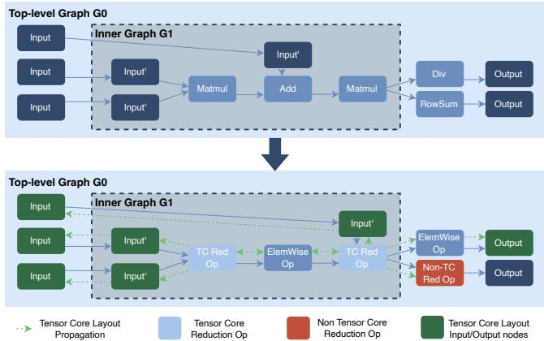  
Figure 13. Multi-level Tensor Core Layout awareness propagation through the itGraph.

## C Additional Evaluation

Codegen. Throughout our evaluation we use our TileLang codegen backend with version v0.1.5.

Baseline version details. We compare our system Cleave against Mirage with commit hash e8980e1 [31], Welder with commit hash af53ab1 [27], torch.compile (Inductor) v2.9.0+cu128 [1], TensorRT v10.15.1.29 [22], the original FlashAttention v2.8.3 [6], FlashMLA with commit hash 47c35a7 [12], and cuBLAS v12.8 [21].

<table><tr><td>Subgraph</td><td>Prefill Shapes</td></tr><tr><td>MatMul</td><td>X : (s, 4096), W : (4096, 4096)</td></tr><tr><td>MatMul+MatMul</td><td>Q : (32, s, 64), K, V : (32, L, 64)</td></tr><tr><td>MatMul+RowSum</td><td>X : (s, 64), W : (64, 4096)</td></tr><tr><td>SwiGLU</td><td>X : (s, 4096), W1, W2 : (4096, 14336)</td></tr><tr><td></td><td>RMSNorm+MatMul X : (s, 4096), W : (4096, 6144)</td></tr><tr><td>MHA</td><td>Q : (32, s, d), K : (32, d, L), V : (32, L, d)</td></tr><tr><td>GQA</td><td>Q : (32, s, d), K : (8, d, L), V : (8, L, d)</td></tr><tr><td>MQA</td><td>Q : (32, s, d), K : (1, d, L), V : (1, L, d)</td></tr><tr><td>MLA</td><td>Q : (128, s, dr), K : (128, L, dr), V : (128, L, d)</td></tr></table>

Table 3. Shapes used in the prefill subgraph benchmark. We sweep $s \in \{ 2 5 6 , 5 1 2 , \ldots , 4 0 9 6 \}$ . For all attention subgraphs, � = 4096. For MHA, GQA, and MQA, � ∈ {64, 128}. For MLA, � = 128 and �� = 192.

Prefill and decode subgraph shapes. Tables 3 and 4 summarize the tensor shapes used in our prefill and decode subgraph benchmarks (§7.3).

We use the following notation: Across all subgraphs, � denotes the input activation, � denotes a weight matrix, and �, �, and � denote the query, key, and value tensors; � denotes the prefill sequence length, while � denotes the decode batch size. For attention subgraphs, � denotes the context (or KV-cache) length, and � denotes the per-head hidden dimension, and the leading dimensions (e.g., 32 or 8) show the number of query or KV heads used by the attention variant. For MLA, �� denotes the content dimension on the absorbed variation of MLA [15], �� denotes the positional/rotary dimension, and $Q _ { p e }$ and $K _ { p e }$ denote the positional-encoding components of the query and key.

<table><tr><td>Subgraph</td><td>Decode Shapes</td></tr><tr><td>MatMul</td><td>X:(b, 4096),W:(4096, b)</td></tr><tr><td>Matmul+MatMul</td><td>Q : (32, b, 64), K, V : (32, L, 64)</td></tr><tr><td>Matmul+Rowsum</td><td>X :(b, 64), W :(64, 4096)</td></tr><tr><td>SwiGLU</td><td>X : (b, 4096), W1, W2 : (4096, 14336)</td></tr><tr><td></td><td>RMSNorm+MatMul X : (b, 4096), W : (4096, 6144)</td></tr><tr><td>MHA</td><td>Q : (32, b, d), K : (32, d, L), V : (32, L, d)</td></tr><tr><td>GQA</td><td>Q : (32, b, d), K : (8, d, L), V : (8, L, d)</td></tr><tr><td>MQA</td><td>Q : (32, b, d), K : (1, d, L), V : (1, L, d)</td></tr><tr><td>MLA</td><td>Q : (128, 128, dc), KV : (128, L, dc), Qpe : (128, 128, dr), Kpe : (128, L, dr)</td></tr></table>

Table 4. Shapes used in the decode subgraph benchmark. We sweep � ∈ {16, 32, 64, 128}. For MHA, GQA and MQA, � ∈ {64, 128} and � = 4096. For MLA, we sweep � ∈ {1024, 2048, 4096}, with �� = 512 and �� = 64.

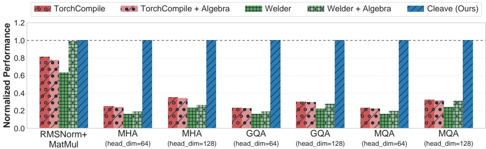  
Figure 14. Providing algebraic transformations to torch.compile and Welder.

Enabling algebraic transformations. Next we evaluate whether our approach to algebraic transformation can help existing compilers. We do so by using torch.compile and Welder to compile graphs output by Cleave’s algebraic transformation step (we used the best graph in all cases). Our results, in Figure 14, show the normalized performance (compared to Cleave) for 4 subgraphs and diferent shapes. We observe that Welder has better performance when provided transformed graphs, though the kernels still perform worse than Cleave-optimized kernels. This demonstrates the ben efit of algebraic transformation for scheduling compilers.

Surprisingly, algebraic transformation generally led to worse performance for torch.compile. We analyzed the TorchInductor log to understand the reason, and found that in this case changes made during algebraic transformation meant that the compiler was not able to identify fusion patterns (that it found in the original graph) and thus did not fuse all kernels. This demonstrates the challenge of using algebraic transformation with a rule-based compiler.

Scaling fusion to long sequences. We also evaluated the efect ofincreasing input-sequence length on Cleave’s scheduling pass. For this evaluation, we compared the performance of Cleave and Welder optimized kernels for self-attention, MatMul + MatMul, and MatMul + RowSum. Figure 15 reports the runtime as sequence length increases on diferent workloads. We demonstrate one limitation of Welder (discussed in §2.2): it cannot fuse the attention graphs (or similar workloads that involve consecutive reductions, e.g., MatMul + MatMul and MatMul + RowSum) when the sequence length is 512 or larger, and thus exhibits significant performance degradation for longer sequence lengths.

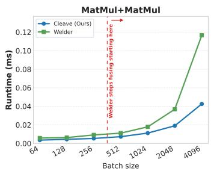

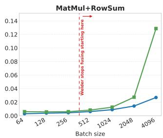

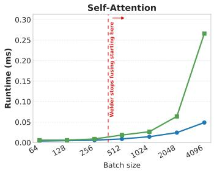  
Figure 15. Performance comparison on three diferent subgraphs against Welder with increasing input sequence length.