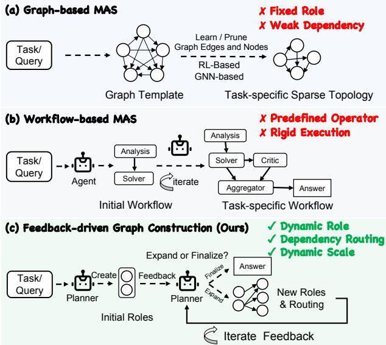
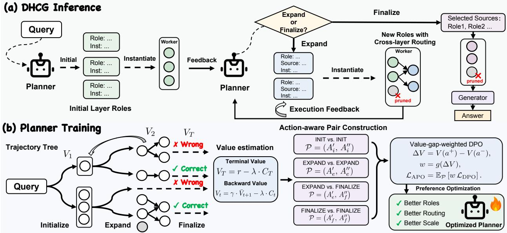
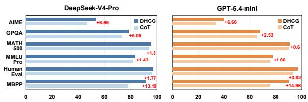
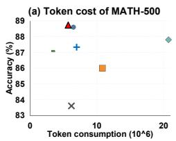
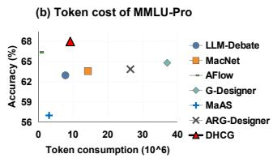

# DHCG: Dynamic Construction of Hierarchical Collaboration Graphs for LLM-Based Multi-Agent Reasoning

Jie Ren1, Jiakang Yuan1, Chenyu Huang1, Hezeer Ma1, Jiayuan Fan1, Tao Chen1, 2∗

1College of Future Information Technology, Fudan University, Shanghai, China 2Shanghai Innovation Institute, Shanghai, China

## Abstract

LLM-based multi-agent systems (MAS) have demonstrated strong capabilities in solving complex problems across diverse domains. Recently, the dynamic orchestration ofagent systems has become an important research direction. However, existing methods sufer from limited composition, misaligned depen- dencies, and inflexible scale, restricting their ability to adapt to reasoning requirements during execution. To address these limitations, we reframe MAS design as a partially observable Markov decision process, in which both the composition and scale of the MAS are d namicall determined. We ro ose DHCG, a novel framework that coordinates three modules (Planner, Worker, and Generator) to progressively construct a dynamic hierarchical collaboration graph from scratch based on the query and evolving execution feedback. At each step, guided by feedback, the Planner generates a set of distinct and complementary roles tailored to the current reasoning needs and selectively routes relevant information to each role. It can also finalize the hierarchical collaboration graph early or pro- gressively expand it when additional reasoning is required. We further introduce action-aware preference optimization to train the Planner to make more efective decisions when con- structing hierarchical collaboration graphs. We systematically evaluate DHCG across code generation, mathematical rea- soning, and domain-specific reasoning benchmarks. DHCG achieves state-of-the-art average performance among the com- pared methods, improving over the single-agent baseline by 13.06 points and outperforming both static and dynamic MAS baselines by 2.77–8.02 points. Additional experiments further demonstrate its generalization across diferent Planner back- bones and unseen Worker models.

## 1 Introduction

Agents powered by large language models (LLMs) have demonstrated strong capabilities across a wide range of tasks, including code generation, decision making, and question an- swering (Yao et al. 2023; Shinn et al. 2023; Zhang et al. 2024; Schick et al. 2023). Despite these advances, a single agent may still face challenges when solving complex problems in- volving diverse expertise and verification from multiple per- spectives. Recent studies have increasingly explored LLM- based multi-agent systems (MAS) (Wu et al. 2024; Team et al. 2025; Li et al. 2023), where multiple agents collaborate through role specialization and communication. Early frame- works such as AutoGen (Wu et al. 2024), CAMEL (Li et al. 2023), and MetaGPT (Hong et al. 2024) largely rely on man-ually designed roles and interaction patterns, requiring con- siderable human efort and providing limited task-specific adaptability. These limitations have motivated growing ef- forts to automatically design and adapt multi-agent collabo- ration for diferent tasks.

  
Figure 1: Comparison of three MAS construction paradigms: (a) graph-based MAS; (b) workflow-based MAS; and (c) our feedback-driven graph construction paradigm.

Existing approaches to automated MAS design can be broadly categorized into two paradigms: graph-based MAS and workflow-based MAS, as shown in Fig. 1(a) and Fig. 1(b). Graph-based MAS optimize inter-agent commu-nication topologies through graph optimization, pruning, or topology generation (Zhuge et al. 2024; Zhang et al. 2025b; Li et al. 2026). A representative example is G-Designer (Zhang et al. 2025c), which employs graph neural networks to generate a task-adaptive communication topol- ogy. In parallel, workflow-based MAS construct and optimize executable workflows by organizing components through search, evolution, or feedback-driven refinement (Hu, Lu, and Clune 2025; Hu et al. 2026; Wang et al. 2025a). For example, AFlow (Zhang et al. 2025d) uses Monte Carlo tree search to iteratively optimize workflows.

Despite their task-adaptive designs, existing dynamic MAS methods still sufer from several limitations. 1) Limited Composition. Existing methods construct MAS from predefined agent nodes or workflow operators. Consequently, they may provide insuficient role coverage because the agent composition cannot adapt to task-specific requirements or emerging reasoning needs during execution. 2) Misaligned Dependencies. Communication dependencies are often determined by predefined templates or global optimization ob- jectives, rather than the actual information needs of down-stream agents. Agents may receive irrelevant or redundant context while missing critical intermediate evidence, which can weaken collaboration and propagate errors through the reasoning process. 3) Inflexible scale. Fixed interaction rounds and one-shot workflow generation determine the rea- soning scale before execution. This can cause the system to continue reasoning after suficient evidence has been ob- tained, or stop before the remaining reasoning needs have been adequately addressed. Given the above limitations, a natural question arises: Can we dynamically design MAS at inference time, adapting their components, dependencies, and scale to the evolving reasoning state?

To seek the answer to the above question, we draw in- spiration from how real-world teams incrementally recruit experts according to evolving task needs, rather than assem- bling all members in advance. This motivates a feedbackdriven dynamic collaboration graph construction paradigm for MAS design, as shown in Fig. 1(c). Unlike existing paradigms that determine agent components, communica- tion structures, and interaction scales before execution, our paradigm constructs the MAS progressively from scratch us- ing real-time execution feedback. At each construction step, unresolved reasoning needs are identified, and an appropri- ate number of complementary roles are generated, enabling task- and state-specific capability composition. Dependen- cies are then established according to each new role’s infor- mation requirements, aligning communication with down- stream needs. Finally, the construction process adaptively determines whether to expand the collaboration graph or finalize the reasoning process, allowing the system scale to evolve with the current reasoning state. Together, these mech- anisms help alleviate the limitations in role composition, de- pendency alignment, and system scalability, respectively.

Building on this new paradigm, we propose DHCG: Dynamic construction of Hierarchical Collaboration Graphs for MAS. We formulate MAS construction as a partially ob- servable Markov decision process, in which a Planner makes sequential decisions based on the query and evolving execu- tion feedback. At each layer, the Planner generates comple- mentary roles for unresolved reasoning needs, assigns rel- evant predecessors through dependency-aware instructions, and decides whether to expand or finalize the graph. Conse- quently, both the collaboration structure and scale evolve with the reasoning process. Training such a sequential construc- tion policy online is expensive. We therefore devise an ofline action-aware preference optimization strategy that reuses collected trajectory trees to construct multiple preference pairs from relatively few trajectories. It evaluates alternative Planner actions through downstream outcomes, constructs within- and cross-action preferences, and weights the pairs by their value gaps. This ofline training strategy guides the Planner toward more efective role-generation, dependency- routing, and finalization decisions. Empirical results show that DHCG achieves the highest average performance, out- performing the strongest static, workflow-based, and graph- based MAS baselines by 4.76, 2.77, and 3.33 points, respec- tively. The framework also generalizes across Planner back- bones and transfers efectively to unseen Worker models. Additional analyses show that DHCG adapts its collabora- tion structure and scale to task dificulty.

Our main contributions are summarized as follows:

• We introduce an inference-time dynamic graph construction paradigm for MAS design, where collaboration struc- tures are progressively constructed according to the query and real-time execution feedback, rather than being fully specified before execution.

• We propose DHCG, a Planner-driven framework that formulates MAS construction as a POMDP and adaptively determines roles, dependencies, and graph scale. We fur- ther introduce ofline action-aware preference optimiza- tion, which derives within- and cross-action preferences from downstream trajectory quality and action-level exe-cution cost.

• We evaluate DHCG on seven benchmarks spanning math-ematical reasoning, code generation, and general knowl- edge. The results validate DHCG’s efectiveness and its generalization across Planner backbones and unseen Worker models. Additional analyses show that DHCG adapts its collaboration structure and scale to task difi- culty.

## 2 Related Work

Static and Dynamic MAS Construction. Early MAS frameworks organize collaboration through predefined roles and protocols. CAMEL (Li et al. 2023) and AutoGen (Wu et al. 2024) support structured agent interactions, while MetaGPT (Hong et al. 2024) coordinates specialized agents through standardized operating procedures. Such static de- signs rely heavily on manual specification and ofer limited adaptability across tasks. Recent dynamic MAS methods seek to replace manually specified collaboration structures with automatically optimized designs. At the topology level, GPTSwarm (Zhuge et al. 2024) and G-Designer (Zhang et al. 2025c) learn task-adaptive communication structures, while AgentPrune (Zhang et al. 2025b) and AgentDropout (Wang et al. 2025d) prune redundant agents or edges. At the workflow level, ADAS (Hu, Lu, and Clune 2025) and AFlow (Zhang et al. 2025d) search for executable procedures, whereas MASS (Zhou et al. 2026) and MaAS (Zhang et al. 2025a) optimize broader agent configurations and or-chestration. These methods reduce manual design and im- prove task-specific coordination, but predefined components or search spaces still limit adaptation during execution.

Policy Optimization for MAS Construction. Recent studies increasingly formulate MAS construction as a learn- able decision-making process. One line of work optimizes policies for generating complete workflows or global collabo- ration structures. ScoreFlow (Wang et al. 2025c) learns workflow generation from execution-score-derived preferences, while $\mathrm { \Delta \ k A s ^ { 2 } }$ (Wang et al. 2025a) combines collaborative tree search with value-guided optimization to train multiple Meta-Agents. AgentConductor (Wang et al. 2026) further introduces dificulty-aware rewards for optimizing layered communication topologies. Another line of work focuses on sequential construction guided by intermediate feedback. DyFlow (Wang et al. 2025b) trains a Designer through distilled self-play to adapt its planning decisions, whereas Workflow-R1 (Kong et al. 2026) and FlowSteer (Zhang et al. 2026) optimize multi-turn workflow construction through sub-sequence policy updates and atomic workflow editing, respectively. Collectively, these studies demonstrate the ef- fectiveness of policy optimization for automated MAS con- struction. However, the former provides only coarse super- vision at the workflow or structure level, while the latter fo- cuses on sequential refinement and ofers limited modeling of evolving inter-agent dependencies.

## 3 Methodology

## 3.1 Problem Formulation

Hierarchical Collaboration Graph. We model multi-agent collaboration as a hierarchical directed acyclic graph $\bar { G } = ( V , E )$ . Each node $v _ { i } ~ \in ~ V$ denotes an agent execution, and each edge $( v _ { j } , v _ { i } ) \in E$ routes the output of $v _ { j }$ to $v _ { i } ,$ , thereby defining an information dependency. Agent $v _ { i }$ is specified by a language model policy $\pi _ { \boldsymbol { \theta } _ { i } }$ and an instruction prompt $p _ { i }$ . Given the original task $q ,$ its routed context and output are defined as

$$
\begin{array} { r } { x _ { i } = \{ y _ { j } \mid ( v _ { j } , v _ { i } ) \in E \} , \qquad y _ { i } \sim \pi _ { \theta _ { i } } ( \cdot \mid q , p _ { i } , x _ { i } ) , } \end{array}\tag{1}
$$

where $x _ { i }$ collects the outputs $y _ { j }$ routed from the predecessors of $v _ { i } .$ , and $y _ { i }$ denotes the output generated by $v _ { i }$ . For a node without incoming edges, $x _ { i } = \varnothing$

To distinguish sequential dependencies across reasoning stages from parallel collaboration within the same stage, we partition $G$ into layers:

$$
V = \bigcup _ { l = 0 } ^ { L } { V _ { l } } , \qquad E \subseteq \bigcup _ { l = 1 } ^ { L } \left( { V _ { l - 1 } \times V _ { l } } \right) ,\tag{2}
$$

where $V _ { l }$ denotes nodes in layer $l , L$ is the maximum layer index, and $E$ denotes inter-layer edges. This constraint ex- cludes intra-layer dependencies, allowing agents in the same layer to execute in parallel.

Dynamic Graph Construction as a POMDP. Rather than determining all agent nodes and dependencies before exe- cution, we formulate collaboration graph construction as a sequential decision process in which a planner adapts the graph according to intermediate agent outputs.

We model this process as a partially observable Markov decision process (POMDP):

$$
\mathcal { M } = \langle \mathcal { S } , \mathcal { A } , T , R , \Omega , O , \gamma \rangle ,\tag{3}
$$

where $s$ is the latent state space of graph construction, A is the Planner action space, $\bar { T }$ is the transition function, Ω is the observation space, and O is the observation function. The reward function R reflects downstream task performance and execution cost, while γ is the discount factor.

At decision step t, the latent state $s _ { t } ~ \in ~ S$ summarizes the graph-construction history, accumulated agent outputs, and unobserved reasoning conditions. The Planner observes the query and the role-output pairs from the most recently executed layer:

$$
o _ { t } = O ( s _ { t } ) = \left\{ \begin{array} { l l } { ( q , \emptyset ) , } & { t = 0 , } \\ { ( q , \mathcal { Z } _ { t - 1 } ) , } & { t \geq 1 , } \end{array} \right. \qquad o _ { t } \in \Omega ,\tag{4}
$$

where $\mathcal { Z } _ { t - 1 } = \{ ( \rho _ { i } , y _ { i } ) \ | \ v _ { i } \in V _ { t - 1 } \}$ , with $\rho _ { i }$ and $y _ { i }$ denot- ing the role specification and output of agent node $v _ { i }$

Conditioned on $o _ { t }$ , the planner selects an action and tran- sitions to the next state:

$$
a _ { t } \sim \pi _ { \theta } ( \cdot \mid o _ { t } ) , \qquad s _ { t + 1 } \sim T ( \cdot \mid s _ { t } , a _ { t } ) ,\tag{5}
$$

where $\pi _ { \theta }$ is the planner policy, $a _ { t }$ is the selected construction action, and $T$ describes the transition induced by the action and subsequent agent execution.

## 3.2 Dynamic Hierarchical Collaboration Graph

Overview. Building on the POMDP formulation, we propose DHCG, a framework that dynamically constructs hi-erarchical collaboration graphs for MAS. As shown in Fig- ure $2 ( \mathrm { a } ) .$ , DHCG consists of a Planner, Workers, and a Gen- erator. Based on the query and evolving execution feedback, the Planner incrementally generates task-specific roles, spec- ifies inter-layer dependencies, and decides whether to expand or finalize the graph. Workers execute the generated roles to produce intermediate outputs, while the Generator synthe- sizes the final answer from the outputs selected by the Plan- ner. This design enables parallel intra-layer collaboration and hierarchical inter-layer information flow.

Initial Layer Construction. The initial layer provides a set of independent and complementary perspectives for ad- dressing the input query. Since communication dependen- cies may propagate and amplify errors introduced at early reasoning stages (Shen et al. 2025), DHCG avoids premature information coupling by allowing the initial agents to reason independently. Meanwhile, the required perspectives can vary across queries. Rather than relying on fixed agent configurations or constructing structures solely from learned query representations (e.g., embeddings) (Su et al. 2026), DHCG employs a Planner to analyze the task-specific rea- soning requirements of each query. Based on this analysis, the Planner determines both the number of initial agents and the complementary roles.

Formally, given the input query $q ,$ the Planner generates the initial layer as

$$
V _ { 0 } = \{ v _ { i } = ( \rho _ { i } , p _ { i } ) \} _ { i = 1 } ^ { n _ { 0 } } \sim \pi _ { \theta } ^ { \mathrm { i n i t } } ( \cdot \mid q ) ,\tag{6}
$$

where $n _ { 0 }$ denotes the number of agents, while $\rho _ { i }$ and $p _ { i }$ denote the role specification and instruction prompt of agent $v _ { i } ,$ respectively. The corresponding Workers are instantiated from these nodes and execute their assigned roles in parallel. Let $y _ { i } ^ { ( 0 ) }$ denote the output produced by the Worker associated with node $v _ { i }$ in the initial layer. The resulting role-output pairs are collected as

  
Fi ure 2: Overview of DHCG. (a) The Planner d namicall initializes ex ands and finalizes the hierarchical collaboration graph during inference. (b) The Planner is trained from tree-structured trajectories via action-aware preference optimization.

$$
\mathcal { Z } _ { 0 } = \{ ( \rho _ { i } , y _ { i } ^ { ( 0 ) } ) \} _ { i = 1 } ^ { n _ { 0 } } ,\tag{7}
$$

which are passed to the Planner for subsequent planning steps.

Dynamic Planning and Graph Construction. After ex-ecuting the initial layer, DHCG continues graph construc- tion based on the latest execution feedback. Fixed interac- tion rounds or execution stages may lead to unnecessary computation for simple queries or insuficient reasoning for complex ones (Wang et al. 2025d). Moreover, dense or predefined communication structures may introduce redundant information or fail to provide the evidence required by down- stream agents (Qian et al. 2025). Accordingly, DHCG adap- tively determines whether to finalize or expand the graph and, when expanding, establishes sparse inter-layer dependencies by routing relevant outputs from the preceding layer to each newly generated role.

Formally, after layer $V _ { t - 1 }$ is executed, the Planner observes the query q and the latest role-output pairs $\mathcal { Z } _ { t - 1 }$ , and samples a dynamic planning action:

$$
a _ { t } \sim \pi _ { \theta } ^ { \mathrm { d y n } } ( \cdot \mid q , \mathcal { Z } _ { t - 1 } ) , \qquad a _ { t } \in \mathcal { A } _ { t } ,\tag{8}
$$

where the action space is defined as

$$
\begin{array} { r } { \mathcal { A } _ { t } = \left\{ \begin{array} { l l } { \mathrm { F I N A L I Z E } ( C _ { t - 1 } ) , } & { C _ { t - 1 } \subseteq V _ { t - 1 } , } \\ { \mathrm { E X P A N D } ( V _ { t } , E _ { t } ) , } & { E _ { t } \subseteq V _ { t - 1 } \times V _ { t } . } \end{array} \right. } \end{array}\tag{9}
$$

If the Planner selects FIN $\mathrm { A L I Z E } ( C _ { t - 1 } )$ , the construction process is terminated and the selected source agents are used

for final answer synthesis. Otherwise, if the Planner selects $\mathrm { E X P A N D } ( V _ { t } , E _ { t } )$ , it generates a new layer of agents:

$$
V _ { t } = \left\{ v _ { i } ^ { ( t ) } = \left( \rho _ { i } ^ { ( t ) } , p _ { i } ^ { ( t ) } \right) \right\} _ { i = 1 } ^ { n _ { t } } ,\tag{10}
$$

where $n _ { t }$ denotes the number of newly generated agents in layer t. For each new agent $v _ { i } ^ { ( t ) }$ , the Planner selects only the necessary source agents from the previous layer, denoted by ${ S _ { i } ^ { ( t ) } \subseteq V _ { t - 1 } }$ . Agents whose outputs are irrelevant, redundant, or unnecessary for $v _ { i } ^ { ( t ) }$ are not connected. The corresponding sparse routing edges are then constructed as

$$
E _ { t } = \{ ( v _ { j } , v _ { i } ^ { ( t ) } ) \mid v _ { i } ^ { ( t ) } \in V _ { t } , v _ { j } \in S _ { i } ^ { ( t ) } \} .\tag{11}
$$

The instruction prompt $p _ { i } ^ { ( t ) }$ specifies both the new agent’s role and how it should process the routed source outputs, such as by verifying, refining, comparing, or synthesizing them. The corresponding Workers are then instantiated to execute these roles, producing role–output pairs. These role–output pairs are returned to the Planner for the next decision step, en- abling DHCG to progressively adapt the collaboration graph according to the evolving intermediate results.

Answer Synthesis. DHCG employs a dedicated Generator to produce a stable and well-formatted final response. Upon F $\mathrm { \bar { I N A L I Z E } } ( C _ { t - 1 } )$ , only the selected role-output pairs in $C _ { t - 1 }$ are provided to the Generator; ifthe maximum layer L is reached, all outputs in $V _ { L }$ are used instead. This design filters redundant context and enables focused answer synthesis.

## 3.3 Planner Training

The Planner jointly determines construction actions, agent roles, and routing dependencies, which directly afect both the collaboration graph and final answer quality. Inspired by tree-based preference construction (Wang et al. 2025a), we propose Action-aware Preference Optimization to train the Planner from the downstream outcomes of alternative con- struction decisions. As shown in Figure 2(b), we first collect tree-structured trajectories by recursively sampling and exe-cuting alternative Planner actions. We then construct action- aware preference pairs and optimize the Planner according to their relative advantages.

Algorithm 1: DHCG Inference   
Require: Query $q ;$ maximum layer $L ;$ width budget $W$   
Ensure: Final answer $\hat { y }$ and collaboration graph G   
1: Step 1: Initial Layer Construction   
2: $V _ { 0 } \dot {  } \operatorname { P l a n n e r _ { i n i t } } \dot { ( } q ) , \quad | V _ { 0 } | \le W ,$ $G \gets ( V _ { 0 } , \emptyset )$   
3: $\mathcal { Z } _ { 0 }  \mathrm { W o r k e r s } ( q , V _ { 0 } ) , \quad C  V _ { 0 }$   
4: Step 2: Dynamic Graph Construction   
5: for t = 1 to $L$ do   
6: $a _ { t } \gets \mathrm { P l a n n e r } _ { \mathrm { d y n } } ( q , \mathcal { Z } _ { t - 1 } )$   
7: if $\begin{array} { r } { \dot { \mathbf { \eta } } ^ { \mathrm { ~ } } a _ { t } = \operatorname { F I N A L I Z E } ( C _ { t - 1 } ) , \quad C _ { t - 1 } \subseteq V _ { t - 1 } } \end{array}$ then   
8: $C \gets C _ { t - 1 } ;$ break   
9: end if   
10: $( V _ { t } , E _ { t } )  a _ { t } , \quad | V _ { t } | \leq W , \quad G  G \cup ( V _ { t } , E _ { t } )$   
11: Zt ← Workers $( q , V _ { t } , E _ { t } , \mathcal { Z } _ { t - 1 } ) .$ $C  V _ { t }$   
12: end for   
13: Step 3: Answer Synthesis   
14: yˆ ← Generator(q, Outputs(C))   
15: return $( \hat { y } , G )$

Action-aware Preference Construction. Given a plan-ning observation $o _ { t } ,$ , we sample multiple candidate Planner outputs and recursively execute them to construct a tree of alternative graph-construction trajectories. Each node $n _ { t }$ rep- resents a candidate Planner action at construction step t.

We recursively estimate the value of each candidate action as

$$
V _ { t } = \left\{ \begin{array} { l l } { r - \lambda \cdot C _ { T } , } & { t = T , } \\ { \gamma \cdot \bar { V } _ { t + 1 } - \lambda \cdot C _ { t } , } & { t < T , } \end{array} \right.\tag{12}
$$

where $r \in [ 0 , 1 ]$ denotes the final-answer score, $C _ { t }$ is the token cost incurred by the current Planner action, λ controls the trade-of between accuracy and eficiency, and $\gamma \in ( 0 , 1 ]$ is the discount factor. Here, $\dot { V } _ { t + 1 }$ denotes the average recur- sively estimated value of the directly sampled child actions.

We construct preferences based on the action types being compared. Cross-action pairs, primarily Expand–Finalize, use task-only values to avoid favoring Finalize due to lower cost, whereas same-action pairs use cost-aware values to account for execution eficiency. We retain only pairs with suficiently large value gaps and discard same-action pairs when both candidates have zero downstream task scores.

Action-aware Preference Optimization. Each retained preference pair is represented as $( o _ { i } , a _ { i } ^ { + } , a _ { i } ^ { - } , w _ { i } )$ , where $w _ { i }$ is obtained by clipping the corresponding value gap. We use a smaller clipping threshold for same-action pairs, which are more frequent and partially reflect eficiency diferences. The resulting weights are normalized by their mean over the training set, yielding $\widetilde { w } _ { i }$

Let $\pi _ { \mathrm { r e f } }$ denote the frozen reference Planner. For the i-th preference pair, we define the relative log-likelihood difer- ence as

$$
\begin{array} { r } { \Delta \rho _ { \theta } ^ { ( i ) } = \log \frac { \pi _ { \theta } \left( a _ { i } ^ { + } \mid o _ { i } \right) } { \pi _ { \mathrm { r e f } } \left( a _ { i } ^ { + } \mid o _ { i } \right) } - \log \frac { \pi _ { \theta } \left( a _ { i } ^ { - } \mid o _ { i } \right) } { \pi _ { \mathrm { r e f } } \left( a _ { i } ^ { - } \mid o _ { i } \right) } . } \end{array}\tag{13}
$$

The Planner is optimized using the weighted DPO for action-aware preference optimization:

$$
\mathcal { L } _ { \mathrm { A P O } } = - \frac { 1 } { N } \sum _ { i = 1 } ^ { N } \widetilde { w } _ { i } \log \sigma \left( \beta \Delta \rho _ { \theta } ^ { ( i ) } \right) ,\tag{14}
$$

where σ is the sigmoid function and $\beta$ controls the strength of preference separation relative to the reference Planner. Cross-action preferences teach the Planner whether further graph expansion is beneficial or the current graph should be finalized, whereas same-action preferences help it distinguish among alternative decisions of the same type by considering both downstream task performance and execution eficiency.

## 4 Experiments

## 4.1 Experiment Setup

Benchmarks. To comprehensively evaluate DHCG, we conduct experiments on seven benchmarks spanning three reasoning domains. For code reasoning, we use Hu- manEval (Chen et al. 2021) and MBPP (Austin et al. 2021). For mathematical reasoning, we adopt MATH-500 (Lightman et al. 2024) to assess general mathematical problem solving, GSM8K (Cobbe et al. 2021) to evaluate multi-step arithmetic reasoning, and AIME 2025 (Mathematical Association of America 2025) to probe performance on challenging competition-level problems. For knowledge-intensive rea- soning, we use GPQA Diamond (Rein et al. 2024) to evaluate graduate-level scientific reasoning and MMLU-Pro (Wang et al. 2024) to assess complex discipline reasoning.

Baselines. We compare DHCG with representative baselines from four categories. Single-model prompting includes IO (direct LLM invocation), Chain-of-Thought (Wei et al. 2022), and Self-Consistency CoT (5 answers) (Wang et al. 2023). Static MAS include LLM-Debate (Du et al. 2024) and MacNet (Qian et al. 2025). Graph-based MAS include G-Designer (Zhang et al. 2025c) and ARG-Designer (Li et al. 2026). Workflow-based MAS include AFlow (Zhang et al. 2025d) and MaAS (Zhang et al. 2025a). For a fair comparison, all agent types in every method use the same LLM backbone and identical inference configurations. Details of benchmark curation, data splits, baseline configurations, and evaluation protocols are provided in Appendix A.

Implementation Details. Our Planner is fine-tuned from Qwen3-8B (Yang et al. 2025), while both the Workers and Generator use the original Qwen3-8B model. All experi-ments are conducted over three independent runs, and we report the average performance. For Planner training, we sample the training data from DeepMath-103K (He et al. 2025) and KodCode (Xu et al. 2025). Details of the training- data composition, selection and preprocessing procedures, preference-data construction, and optimization configura- tions are provided in Appendix B.

<table><tr><td>Method</td><td>MBPP</td><td>HumanEval</td><td>MATH-500</td><td>AIME</td><td>GSM8K</td><td>GPQA</td><td>MMLU-Pro</td><td>Average</td></tr><tr><td>IO</td><td>63.73</td><td>82.70</td><td>81.20</td><td>17.78</td><td>88.09</td><td>37.54</td><td>51.57</td><td>60.37</td></tr><tr><td>CoT</td><td> $7 0 . 4 8 \substack { \uparrow 6 . 7 5 }$ </td><td> $8 5 . 7 5 \substack { \uparrow 3 . 0 5 }$ </td><td> $8 4 . 6 0 \substack { \uparrow 3 . 4 0 }$ </td><td> $1 8 . 8 9 _ { \uparrow 1 . 1 1 }$ </td><td> $9 2 . 5 8 \substack { \uparrow 4 . 4 9 }$ </td><td> $3 9 . 9 0 \substack { \uparrow 2 . 3 6 }$ </td><td> $5 4 . 2 9 \substack { \uparrow 2 . 7 2 }$ </td><td> $6 3 . 7 8 \substack { \uparrow 3 . 4 1 }$ </td></tr><tr><td>CoT-SC</td><td> $7 1 . 3 6 \mathrm { \scriptstyle \uparrow 7 . 6 3 }$ </td><td> $8 6 . 0 1 \substack { \uparrow 3 . 3 1 }$ </td><td> $8 8 . 4 7 \substack { \uparrow 7 . 2 7 }$ </td><td> $2 5 . 5 6 \substack { \uparrow \ 7 . 7 8 }$ </td><td> $9 3 . 9 0 \substack { \uparrow 5 . 8 1 }$ </td><td> $5 2 . 0 2 \substack { \uparrow 1 4 . 4 8 }$ </td><td> $6 4 . 9 5 \substack { \uparrow 1 3 . 3 8 }$ </td><td> $6 8 . 9 0 \substack { \mathrm { \uparrow 8 . 5 2 } }$ </td></tr><tr><td>LLM-Debate</td><td> $7 1 . 0 7 \substack { \uparrow 7 . 3 4 }$ </td><td> $8 8 . 0 4 \substack { \uparrow 5 . 3 4 }$ </td><td> $\underline { { 8 8 . 6 0 } } \uparrow 7 . 4 0 $ </td><td> $2 3 . 3 3 \substack { \uparrow 5 . 5 5 }$ </td><td> $\mathbf { 9 4 . 1 9 } _ { \uparrow 6 . 1 0 }$ </td><td> $5 2 . 5 3 \substack { \uparrow 1 4 . 9 9 }$ </td><td> $6 2 . 9 5 \substack { \uparrow 1 1 . 3 8 }$ </td><td> $6 8 . 6 7 \substack { \uparrow 8 . 3 0 }$ </td></tr><tr><td>MacNet</td><td> $6 8 . 3 3 \substack { \uparrow 4 . 6 0 }$ </td><td> $8 4 . 4 8 \substack { \uparrow 1 . 7 8 }$ </td><td> $8 6 . 0 0 \substack { \uparrow 4 . 8 0 }$ </td><td> $2 6 . 6 7 \substack { \uparrow 8 . 8 9 }$ </td><td> $9 1 . 5 3 \substack { \uparrow 3 . 4 4 }$ </td><td> $4 9 . 6 6 \substack { \uparrow 1 2 . 1 2 }$ </td><td> $6 3 . 5 7 \textgreater 1 2 . 0 0$ </td><td> $6 7 . 1 8 \substack { \mathrm { \uparrow 6 . 8 0 } }$ </td></tr><tr><td>G-Designer</td><td> $7 8 . 5 9 \substack { \uparrow 1 4 . 8 6 }$ </td><td> $8 5 . 4 9 _ { \uparrow 2 . 7 9 }$ </td><td> $8 7 . 8 0 _ { \uparrow 6 . 6 0 }$ </td><td> $2 5 . 5 6 \substack { \uparrow \ 7 . 7 8 }$ </td><td> $9 3 . 3 7 \substack { \uparrow 5 . 2 8 }$ </td><td> $\underline { { 5 3 . 5 4 } } \uparrow 1 6 . 0 0$ </td><td> $\underline { { 6 6 . 3 8 } } \uparrow 1 4 . 8 1$ </td><td> $7 0 . 1 0 \substack { \uparrow 9 . 7 3 }$ </td></tr><tr><td>ARG-Designer</td><td> $7 2 . 6 3 \substack { \uparrow 8 . 9 0 }$ </td><td> $8 6 . 2 6 \substack { \mathrm { \Omega } \mathrm { \Omega } 1 3 . 5 6 }$ </td><td> $8 3 . 6 0 \substack { \uparrow 2 . 4 0 }$ </td><td> $2 0 . 0 0 \substack { \uparrow 2 . 2 2 }$ </td><td> $9 1 . 3 4 \substack { \uparrow 3 . 2 5 }$ </td><td> $5 3 . 3 7 \substack { \uparrow 1 5 . 8 3 }$ </td><td> $6 4 . 8 1 \substack { \uparrow 1 3 . 2 4 }$ </td><td> $6 7 . 4 3 \substack { \uparrow 7 . 0 6 }$ </td></tr><tr><td>AFlow</td><td> $7 2 . 3 3 \substack { \uparrow 8 . 6 0 }$ </td><td> $8 4 . 4 8 \substack { \uparrow 1 . 7 8 }$ </td><td> $8 7 . 0 7 \substack { \uparrow 5 . 8 7 }$ </td><td> $2 1 . 1 1 \substack { \uparrow 3 . 3 3 }$ </td><td> $9 2 . 8 6 \substack { \uparrow 4 . 7 7 }$ </td><td> $4 3 . 1 0 \mathrm { \Omega } _ { \uparrow 5 . 5 6 }$ </td><td> $5 6 . 9 5 \substack { \uparrow 5 . 3 8 }$ </td><td> $6 5 . 4 1 \substack { \uparrow 5 . 0 4 }$ </td></tr><tr><td>MaAS</td><td> $\underline { { 8 2 . 0 1 } } \uparrow 1 8 . 2 8$ </td><td> $\underline { { 8 9 . 8 2 } } \uparrow 7 . 1 2$ </td><td> $8 7 . 3 3 \substack { \uparrow 6 . 1 3 }$ </td><td> $2 8 . 8 9 \substack { \uparrow 1 1 . 1 1 }$ </td><td> $9 2 . 8 9 _ { \uparrow 4 . 8 0 }$ </td><td> $4 9 . 8 3 \substack { \uparrow 1 2 . 2 9 }$ </td><td> $6 3 . 8 6 \mathfrak { r } _ { 1 2 . 2 9 }$ </td><td> $7 0 . 6 6 \substack { \uparrow 1 0 . 2 9 }$ </td></tr><tr><td>DHCG (Ours)</td><td> $\mathbf { 8 4 . 3 6 } _ { \uparrow 2 0 . 6 3 }$ </td><td> $\mathbf { 9 3 . 1 3 } _ { \uparrow 1 0 . 4 3 }$ </td><td> $\mathbf { 8 8 . 7 3 } \mathrm  ‰ \textmu$ </td><td> $\mathbf { 3 0 . 0 0 } _ { \uparrow 1 2 . 2 2 }$ </td><td> $\underline { { 9 3 . 9 3 } } \uparrow 5 . 8 4$ </td><td> $\mathbf { 5 5 . 8 9 } _ { \uparrow 1 8 . 3 5 }$ </td><td> ${ \bf 6 8 . 0 0 } _ { \uparrow 1 6 . 4 3 }$ </td><td> $7 3 . 4 3 _ { \uparrow 1 3 . 0 6 }$ </td></tr></table>

Table 1: Performance comparison (%) on seven benchmarks.

## 4.2 Experimental Results

Overall Performance. Table 1 reports the results across seven benchmarks. DHCG achieves the highest average accuracy of 73.43%, outperforming the strongest static MAS method, LLM-Debate, by 4.76 points, the strongest graph-based method, G-Designer, by 3.33 points, and the strongest workflow-based method, MaAS, by 2.77 points. Among the baselines, MaAS performs particularly well on code-generation tasks, while G-Designer is strong on knowledge-intensive reasoning. DHCG achieves strong per- formance across code generation, mathematical reasoning, and knowledge-intensive reasoning, demonstrating the ef- fectiveness of dynamically constructing collaboration graphs according to evolving reasoning states. Notably, although the Planner is trained only on mathematical and code-generation data, DHCG remains highly competitive on GPQA and MMLU-Pro, indicating efective cross-domain generaliza- tion. This generalization is supported by DHCG’s dynamic graph construction, which adapts roles and dependencies to evolving reasoning needs.

<table><tr><td>Method</td><td></td><td></td><td>HumanEval MATH-500 MMLU-Pro</td><td>Avg.</td></tr><tr><td>CoT</td><td>92.37</td><td>93.40</td><td>74.68</td><td>86.82</td></tr><tr><td>DHCG</td><td>98.47</td><td>95.20</td><td>81.71</td><td>91.79</td></tr></table>

Table 2: Pass@5 performance (%) on three representative benchmarks.
<table><tr><td>Method</td><td>MBPP</td><td>AIME</td><td>MMLU-Pro Avg.</td><td></td></tr><tr><td>MaAS</td><td>82.01</td><td>28.89</td><td>63.86</td><td>58.25</td></tr><tr><td>DHCG (GPT-5.4-mini)</td><td>84.16</td><td>28.89</td><td>69.24</td><td>60.76</td></tr><tr><td>DHCG (DS-V4-Pro)</td><td>83.97</td><td>28.89</td><td>69.48</td><td>60.78</td></tr><tr><td>DHCG (Qwen3-8B†)</td><td>84.36</td><td>30.00</td><td>68.00</td><td>60.79</td></tr></table>

Table 3: Cross-Planner generalization of DHCG and com- parison with baselines (%) on three benchmarks. † denotes our Planner trained from the Qwen3-8B backbone.

Empirical Upper Bound. Table 2 reports the Pass@5 re-sults of DHCG and CoT under repeated sampling. DHCG consistently outperforms CoT across all three benchmarks, indicating a higher probability of obtaining a correct solu- tion over multiple runs. This advantage stems from the di- verse collaboration graphs and reasoning paths constructed across diferent runs. In particular, DHCG achieves a Pass@5 of 98.47% on HumanEval, demonstrating a strong empiri- cal upper bound for code generation. The improvements on MATH-500 and MMLU-Pro further show that this advan- tage extends to mathematical reasoning and multi-domain knowledge reasoning.

baseline, MaAS, indicating that DHCG is not tied to a spe- cific Planner model and generalizes well across diferent Planner families. Moreover, although our Planner is trained from the smaller 8B backbone, it achieves an average score comparable to those achieved by larger Planner models. These results suggest that our training strategy can efectively elicit the planning capability of a compact model, enabling competitive performance without relying on large-scale Plan- ner models.

## 4.3 Generalization Analysis

Cross-Planner Generalization. To assess the robustness of DHCG to diferent Planner backbones, we instantiate the framework with three distinct models: GPT-5.4-mini (Singh et al. 2025), DeepSeek-V4-Pro (DeepSeek-AI 2026), and our trained Qwen3-8B Planner. As shown in Table 3, all three variants achieve higher average accuracy than the strongest

Cross-Worker Generalization. We further investigate whether DHCG is sensitive to the choice of Worker model. To this end, we keep the trained Planner fixed and pair it with DeepSeek-V4-Pro and GPT-5.4-mini as Workers, re- spectively. As shown in Figure 3, DHCG consistently outper- forms the corresponding single-model CoT baseline across the evaluated benchmarks, although the magnitude of im- provement varies by task. These results demonstrate that the learned graph-construction policy can efectively general- ize across diferent Worker backbones, improving reasoning quality while maintaining robust and consistent performance.

  
Figure 3: Cross-worker generalization of DHCG against the corresponding single-model CoT baselines.

<table><tr><td>Method</td><td>|MMLU-Pro GSM8K HumanEval Avg.</td><td></td><td></td><td></td></tr><tr><td colspan="5">Planner Training</td></tr><tr><td>Base Planner</td><td>67.14</td><td>93.55</td><td>91.35</td><td>84.01</td></tr><tr><td>SFT</td><td>66.29</td><td>93.81</td><td>88.30</td><td>82.80</td></tr><tr><td>Vanilla DPO</td><td>66.71</td><td>93.40</td><td>92.37</td><td>84.16</td></tr><tr><td colspan="5">Graph Construction</td></tr><tr><td>w/o Dyn. Routing</td><td>67.00</td><td>93.71</td><td>91.86</td><td>84.19</td></tr><tr><td>w/o Dyn. Scale</td><td>65.62</td><td>92.76</td><td>88.80</td><td>82.39</td></tr><tr><td>w/o Dyn. Role</td><td>66.19</td><td>93.78</td><td>89.31</td><td>83.09</td></tr><tr><td>DHCG</td><td>68.00</td><td>93.93</td><td>93.13</td><td>85.02</td></tr></table>

Table 4: Ablation results (%) on three representative bench-marks.

## 4.4 Ablation Study

Planner Training. We compare the base Planner, SFT, vanilla DPO, and our action-aware preference optimization. As shown in Table 4, SFT reduces the average performance by 1.21, including a 3.05 drop on HumanEval. Since SFT optimizes token-level imitation, the Planner may overfit to specific planning patterns, reducing its ability to adapt its decisions to evolving execution feedback. This observation also supports our choice to directly optimize the base Plan- ner through reinforcement learning, rather than adopting the conventional SFT-then-RL training paradigm. Vanilla DPO uses the same value-based preference pairs as our method but assigns a uniform weight to every pair. Its slight im- provement over the base Planner confirms the efectiveness of our preference construction. Our complete method further weights each pair according to its value gap and achieves the best average score, demonstrating the additional benefit of distinguishing preference strength during optimization.

Graph Construction. We ablate dynamic routing, graph-scale control, and dynamic role generation by replacing them with fixed alternatives. Removing any of these dynamic com- ponents leads to performance degradation to varying degrees. Among them, dynamic graph-scale control has the largest overall impact, with its removal reducing average perfor- mance by 2.63 and HumanEval performance by 4.33. This highlights the necessity of adapting the collaboration scale to evolving reasoning requirements rather than determining it in advance. Together, these results show that dynamic scale, role generation, and routing provide complementary benefits for constructing efective collaboration graphs.

  
Figure 4: Performance and total token cost comparison.

## 4.5 Framework Analysis

Cost Analysis. DHCG dynamically adapts the collaboration graph to task-specific reasoning requirements, allocating diferent amounts of computational resources across queries. As shown in Figure 4, fixed graph templates and static MAS methods can introduce substantial redundant commu- nication. This advantage is particularly evident on MMLU- Pro, where DHCG outperforms G-Designer with over 50% fewer tokens and achieves higher accuracy than MacNet while reducing token consumption by 32.16%. A similar accuracy–eficiency advantage is observed on MATH-500, where DHCG surpasses MaAS with comparable token usage, whereas AFlow consumes fewer tokens but achieves lower accuracy. Overall, these results demonstrate that dynamic graph construction improves the balance between reasoning performance and computational cost.

Dificulty-Aware Graph Construction. We further examine whether DHCG adapts its collaboration graph to problem dificulty. Both the MATH-500 trend analysis and qualitative case study show that DHCG constructs larger graphs with more Workers for harder problems, while maintaining com- pact structures for easier ones. These results demonstrate that DHCG dynamically allocates computational resources according to reasoning dificulty. Additional quantitative and qualitative analyses are provided in Appendix C.

## 5 Conclusion

In this work, we proposed DHCG, a novel framework for the dynamic construction of hierarchical collaboration graphs in MAS. We formulated MAS construction as a partially observable Markov decision process and introduced a new paradigm in which the collaboration graph is progressively constructed during execution. DHCG employs a Planner to generate task-specific roles, determine dependency routing, and control graph scale through sequential expansion and finalization decisions based on evolving execution feedback, while optimizing the planning policy through action-aware preference optimization. Extensive experiments demonstrate DHCG’s efectiveness and generalization across Planner backbones and unseen Worker models, with our compact Planner performing comparably to larger ones.

## Acknowledgement

This work is supported by the National Key R&D Program of China (No. 2026YFE0101200), and the National Natural Science Foundation of China (No. 62671175). The com-

putations in this research were performed using the CFFF platform of Fudan University.

## References

Austin, J.; Odena, A.; Nye, M.; Bosma, M.; Michalewski, H.; Dohan, D.; Jiang, E.; Cai, C.; Terry, M.; Le, Q. V.; and Sutton, C. 2021. Program Synthesis with Large Language Models. arXiv preprint arXiv:2108.07732.

Chen, M.; Tworek, J.; Jun, H.; et al. 2021. Evaluating Large Language Models Trained on Code. arXiv preprint arXiv:2107.03374.

Cobbe, K.; Kosaraju, V.; Bavarian, M.; Chen, M.; Jun, H.; Kaiser, L.; Plappert, M.; Tworek, J.; Hilton, J.; Nakano, R.; Hesse, C.; and Schulman, J. 2021. Training Verifiers to Solve Math Word Problems. arXiv preprint arXiv:2110.14168.

DeepSeek-AI. 2026. DeepSeek-V4: Towards Highly Efi- cient Million-Token Context Intelligence. arXiv preprint arXiv:2606.19348.

Du, Y.; Li, S.; Torralba, A.; Tenenbaum, J. B.; and Mordatch, I. 2024. Improving Factuality and Reasoning in Language Models through Multiagent Debate. In Proceedings of the 41st International Conference on Machine Learning, volume 235 of Proceedings ofMachine Learning Research, 11733– 11763. PMLR.

He, Z.; Liang, T.; Xu, J.; Liu, Q.; Chen, X.; Wang, Y.; Song, L.; Yu, D.; Liang, Z.; Wang, W.; Zhang, Z.; Wang, R.; Tu, Z.; Mi, H.; and Yu, D. 2025. DeepMath-103K: A Large- Scale, Challenging, Decontaminated, and Verifiable Math- ematical Dataset for Advancing Reasoning. arXiv preprint arXiv:2504.11456.

Hong, S.; Zhuge, M.; Chen, J.; Zheng, X.; Cheng, Y.; Zhang, C.; Wang, J.; Wang, Z.; Yau, S. K. S.; Lin, Z.; Zhou, L.; Ran, C.; Xiao, L.; Wu, C.; and Schmidhuber, J. 2024. MetaGPT: Meta Programming for a Multi-Agent Collaborative Frame- work. In The Twelfth International Conference on Learning Representations.

Hu, S.; Lu, C.; and Clune, J. 2025. Automated Design of Agentic Systems. In The Thirteenth International Conference on Learning Representations.

Hu, Y.; Zhang, Y.; Trager, M.; Zhang, Y.; Yang, S.; Xia, W.; and Soatto, S. 2026. EvoMAS: Evolutionary Generation of Multi-Agent Systems. arXiv preprint arXiv:2602.06511.

Kong, M.; Qu, Z.; Zhou, Z.; Liang, P.; Li, X.; Shang, Z.;Hong, Z.; Huang, K.; Wang, Z.; and Dai, Z. 2026. Workflow-R1: Group Sub-Sequence Policy Optimization for Multi-TurnWorkflow Construction. arXiv preprint arXiv:2602.01202.

Li, G.; Hammoud, H. A. A. K.; Itani, H.; Khizbullin, D.; and Ghanem, B. 2023. CAMEL: Communicative Agents for “Mind” Exploration of Large Language Model Society. In Advances in Neural Information Processing Systems, vol-ume 36.

Li, S.; Liu, Y.; Wen, Q.; Zhang, C.; and Pan, S. 2026. As-semble Your Crew: Automatic Multi-Agent Communication Topology Design via Autoregressive Graph Generation. Proceedings of the AAAI Conference on Artificial Intelligence, 40(28): 23142–23150.

Lightman, H.; Kosaraju, V.; Burda, Y.; Edwards, H.; Baker, B.; Lee, T.; Leike, J.; Schulman, J.; Sutskever, I.; and Cobbe, K. 2024. Let’s Verify Step by Step. In The Twelfth International Conference on Learning Representations.

Mathematical Association of America. 2025. American In- vitational Mathematics Examination (AIME). MAA Invitational Competitions.

Qian, C.; Xie, Z.; Wang, Y.; Liu, W.; Zhu, K.; Xia, H.; Dang, Y.; Du, Z.; Chen, W.; Yang, C.; Liu, Z.; and Sun, M. 2025. Scaling Large Language Model-Based Multi-Agent Collaboration. In The Thirteenth International Conference on Learning Representations.

Rein, D.; Hou, B. L.; Stickland, A. C.; Petty, J.; Pang, R. Y.; Dirani, J.; Michael, J.; and Bowman, S. R. 2024. GPQA: A Graduate-Level Google-Proof Q&A Benchmark. In Proceedings of the First Conference on Language Modeling.

Schick, T.; Dwivedi-Yu, J.; Dessì, R.; Raileanu, R.; Lomeli, M.; Hambro, E.; Zettlemoyer, L.; Cancedda, N.; and Scialom, T. 2023. Toolformer: Language Models Can Teach Them- selves to Use Tools. In Advances in Neural Information Processing Systems, volume 36.

Shen, X.; Liu, Y.; Dai, Y.; Wang, Y.; Miao, R.; Tan, Y.; Pan, S.; and Wang, X. 2025. Understanding the Informa- tion Propagation Efects of Communication Topologies in LLM-Based Multi-Agent Systems. In Proceedings of the 2025 Conference on Empirical Methods in Natural Language Processing, 12347–12361. Suzhou, China: Association for Computational Linguistics.

Shinn, N.; Cassano, F.; Gopinath, A.; Narasimhan, K.; and Yao, S. 2023. Reflexion: Language Agents with Verbal Re- inforcement Learning. In Advances in Neural Information Processing Systems, volume 36.

Singh, A.; Fry, A.; Perelman, A.; Tart, A.; Ganesh, A.; El- Kishky, A.; McLaughlin, A.; Low, A.; Ostrow, A.; Anan- thram, A.; et al. 2025. Openai gpt-5 system card. arXiv preprint arXiv:2601.03267.

Su, J.; Lan, Q.; Xia, Y.; Sun, L.; Tian, W.; Shi, T.; and He, L. 2026. Dificulty-Aware Agentic Orchestration for Query- Specific Multi-Agent Workflows. In Proceedings of the ACM Web Conference 2026, 2060–2070. ACM.

Team, I.; Zhang, B.; Feng, S.; Yan, X.; Yuan, J.; Ma, R.; Hu, Y.; Yu, Z.; He, X.; Huang, S.; et al. 2025. InternA- gent: When Agent Becomes the Scientist–Building Closed- Loop System from Hypothesis to Verification. arXivpreprint arXiv:2505.16938.

Wang, K.; Zhang, G.; Ye, M.; Deng, X.; Wang, D.; Hu, X.; Guo, J.; Liu, Y.; and Guo, Y. 2025a. MAS2: Self- Generative, Self-Configuring, Self-Rectifying Multi-Agent Systems. arXiv preprint arXiv:2509.24323.

Wang, S.; Lu, R.; Yang, Z.; Wang, Y.; Zhang, Y.; Xu, L.; Xu, Q.; Yin, G.; Chen, C.; and Guan, X. 2026. AgentConductor: Topology Evolution for Multi-Agent Competition-Level Code Generation. arXiv preprint arXiv:2602.17100.

Wang, X.; Wei, J.; Schuurmans, D.; Le, Q. V.; Chi, E. H.; Narang, S.; Chowdhery, A.; and Zhou, D. 2023. Self- Consistency Improves Chain of Thought Reasoning in Lan-

guage Models. In The Eleventh International Conference on Learning Representations.

Wang, Y.; Ma, X.; Zhang, G.; Ni, Y.; Chandra, A.; Guo, S.; Ren, W.; Arulraj, A.; He, X.; Jiang, Z.; Li, T.; Ku, M.; Wang, K.; Zhuang, A.; Fan, R.; Yue, X.; and Chen, W. 2024. MMLU-Pro: A More Robust and Challenging Multi-Task Language Understanding Benchmark. In Advances in Neural Information Processing Systems, volume 37.

Wang, Y.; Xu, Z.; Huang, Y.; Wang, X.; Song, Z.; Gao, L.; Wang, C.; Tang, X.; Zhao, Y.; Cohan, A.; Zhang, X.; and Chen, X. 2025b. DyFlow: Dynamic Workflow Framework for Agentic Reasoning. arXiv preprint arXiv:2509.26062.

Wang, Y.; Yang, L.; Li, G.; Wang, M.; and Aragam, B. 2025c. ScoreFlow: Mastering LLM Agent Workflows via Score-based Preference Optimization. arXiv preprint arXiv:2502.04306.

Wang, Z.; Wang, Y.; Liu, X.; Ding, L.; Zhang, M.; Liu, J.; and Zhang, M. 2025d. AgentDropout: Dynamic Agent Elimina- tion for Token-Eficient and High-Performance LLM-Based Multi-Agent Collaboration. In Proceedings of the 63rd Annual Meeting ofthe Associationfor Computational Linguistics (Volume 1: Long Papers), 24013–24035. Vienna, Austria: Association for Computational Linguistics.

Wei, J.; Wang, X.; Schuurmans, D.; Bosma, M.; Ichter, B.; Xia, F.; Chi, E. H.; Le, Q. V.; and Zhou, D. 2022. Chain-of-Thought Prompting Elicits Reasoning in Large Language Models. In Advances in Neural Information Processing Systems, volume 35, 24824–24837.

Wu, Q.; Bansal, G.; Zhang, J.; Wu, Y.; Li, B.; Zhu, E.; Jiang, L.; Zhang, X.; Zhang, S.; Liu, J.; Awadallah, A. H.; White, R. W.; Burger, D.; and Wang, C. 2024. AutoGen: Enabling Next-Gen LLM Applications via Multi-Agent Conversations. In Proceedings of the First Conference on Language Modeling.

Xu, Z.; Liu, Y.; Yin, Y.; Zhou, M.; and Poovendran, R. 2025. KodCode: A Diverse, Challenging, and Verifiable Synthetic Dataset for Coding. In Findings ofthe Associationfor Computational Linguistics: ACL 2025, 6980–7008. Vienna, Austria: Association for Computational Linguistics.

Yang, A.; Li, A.; Yang, B.; Zhang, B.; Hui, B.; Zheng, B.; Yu, B.; et al. 2025. Qwen3 Technical Report. arXiv preprint arXiv:2505.09388.

Yao, S.; Zhao, J.; Yu, D.; Du, N.; Shafran, I.; Narasimhan, K.; and Cao, Y. 2023. ReAct: Synergizing Reasoning and Acting in Language Models. In The Eleventh International Conference on Learning Representations.

Zhang, G.; Niu, L.; Fang, J.; Wang, K.; Bai, L.; and Wang, X. 2025a. Multi-Agent Architecture Search via Agentic Super- net. In Proceedings ofthe 42nd International Conference on Machine Learning, volume 267 of Proceedings of Machine Learning Research, 75834–75852. PMLR.

Zhang, G.; Yue, Y.; Li, Z.; Yun, S.; Wan, G.; Wang, K.; Cheng, D.; Yu, J. X.; and Chen, T. 2025b. Cut the Crap: An Economical Communication Pipeline for LLM-based Multi- Agent Systems. In The Thirteenth International Conference on Learning Representations.

Zhang, G.; Yue, Y.; Sun, X.; Wan, G.; Yu, M.; Fang, J.; Wang, K.; Chen, T.; and Cheng, D. 2025c. G-Designer: Architecting Multi-Agent Communication Topologies via Graph Neural Networks. In Proceedings ofthe 42nd International Conference on Machine Learning, volume 267 of Proceedings of Machine Learning Research, 76678–76692. PMLR.

Zhang, J.; Xiang, J.; Yu, Z.; Teng, F.; Chen, X.; Chen, J.; Zhuge, M.; Cheng, X.; Hong, S.; Wang, J.; Zheng, B.; Liu, B.; Luo, Y.; and Wu, C. 2025d. AFlow: Automating Agen- tic Workflow Generation. In The Thirteenth International Conference on Learning Representations.

Zhang, K.; Li, J.; Li, G.; Shi, X.; and Jin, Z. 2024. CodeAgent: Enhancing Code Generation with Tool-Integrated Agent Sys- tems for Real-World Repo-level Coding Challenges. arXiv preprint arXiv:2401.07339.

Zhang, M.; Liu, W.; Shen, T.; Lin, Q.; Mao, R.; Cambria, E.; Tang, X.; and Luo, H. 2026. FlowSteer: Towards Agents Designing Agentic Workflows via Reinforced Progressive Canvas Editing. arXiv preprint arXiv:2602.01664.

Zhou, H.; Wan, X.; Sun, R.; Palangi, H.; Iqbal, S.; Vulić, I.; Korhonen, A.; and Arık, S. Ö. 2026. Multi-Agent Design: Optimizing Agents with Better Prompts and Topologies. In The Fourteenth International Conference on Learning Representations.

Zhuge, M.; Wang, W.; Kirsch, L.; Faccio, F.; Khizbullin, D.; and Schmidhuber, J. 2024. GPTSwarm: Language Agents as Optimizable Graphs. In Proceedings of the 41st International Conference on Machine Learning, volume 235 of Proceedings of Machine Learning Research, 62743–62767. PMLR.