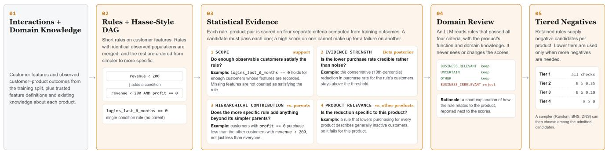
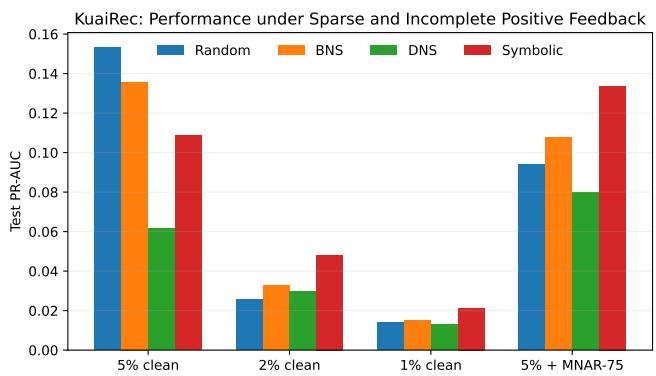
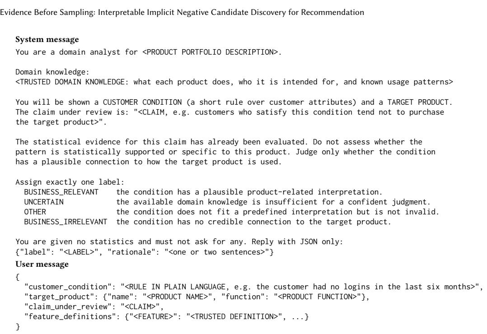

# Evidence Before Sampling: Interpretable Implicit Negative Candidate Discovery for Recommendation

Shreya Rajpal1\* Sonia Sharma2 Swapnil Parekh2 Lisa Li2 Jeyendran Balakrishnan2 Nagaraj

Janardhana2 Andrew Mattarella-Micke2

1Michigan State University, USA 2Intuit, USA

rajpalsh@msu.edu

sonia\_sharma@intuit.com

swapnil\_parekh@intuit.com

## Abstract

Recommender systems learn from observed user–item interactions, but explicit negative feedback is often unavailable. Since deep learning models require negative signals for training, negative sampling methods typically treat selected unobserved interactions as negatives. However, a missing interaction does not explain why a user is uninterested in an item or whether there is suficient evidence to label it negative. This is especially important in business recommendation, where negative signals should be interpretable and aligned with business objectives.

We formulate implicit negative candidate discovery to identify unobserved interactions supported by observed customer behavior. We encode these patterns as symbolic rules, score them based on support, informativeness, and product relevance, and rank the retained rules by evidence. An LLM then interprets the retained rules using business objectives and domain knowledge; the interpretations are combined with the statistical evidence in the final report.

We evaluate our method in an industrial B2B setting and across five public recommendation datasets. Candidate-quality evaluations in the industrial setting and three public datasets show higher precision than the evaluated baselines, while symbolic selection improves downstream test PR-AUC by 12.5% over random selection with four negatives per positive example in the industrial task. Our results show that negative candidate validity can be evaluated separately from downstream recommendation performance. This distinction enables evidence-based, business-aligned, and explainable negative selection, improving both interpretability and model training in sparse, skewed, real-world recommendation settings.

## CCS Concepts

• Information systems → Recommender systems.

## Keywords

recommender systems, negative sampling, implicit feedback, sym bolic rules, weak supervision, interpretability

## 1 Introduction

Recommender systems learn user preferences from observed interactions with items or products, such as clicks and purchases [1]. We refer to these observations as user–item interactions. In real-world data, interactions are observed for only a small subset of available items. For the rest, a missing interaction may reflect lack of expo sure or missing feedback rather than lack of interest [12, 13, 15]. Observed clicks or purchases can serve as positive examples when training a recommender. Since explicit negative feedback is often unavailable, negative sampling selects unobserved interactions as negative examples [8, 24]. However, an unobserved interaction may still correspond to a relevant item, creating a false negative and an incorrect training signal. Existing methods address this through confidence weights, exposure estimates, or recommender predic tions [9, 14, 16, 18, 20]. In real-world business settings, however, statistical or model-based signals alone may not establish whether a negative candidate is meaningful for a specific product. The same customer behavior can have diferent implications across prod ucts and business objectives. We therefore ask a separate question: which unobserved interactions have suficient evidence to be considered plausible negative candidates, and is that evidence consistent with available domain knowledge? We formulate this problem as implicit negative candidate discovery. We represent recurring cus tomer behaviors as symbolic rules for explainability and evaluate whether they are suficiently supported, add information beyond simpler patterns, and are relevant to the target product. Here, we separate candidate discovery from the downstream negative sam pling task. Once candidates are identified, a sampling strategy can still decide how many negatives to use and how often to sample them. Our goal is to establish and record the evidence for a can didate before it is used for training.1 We study this problem in a real-world business-to-business (B2B) customer-support setting with nine products and 10K customer contacts. A contact corresponds to one customer-support conversation [36]. When a product is ofered, we observe whether the customer purchases it within 30 days. Purchases provide positive outcomes, non-purchases provide observed negative outcomes, and products that were not ofered remain unobserved. We use these observed outcomes to discover symbolic rules that support negative candidates for unobserved product responses. A low purchase rate alone is not suficient evi dence for a rule. It may be based on too few observations, repeat information already captured by a simpler rule, or reflect generally low purchasing rather than behavior specific to the target product. We therefore evaluate rules using four criteria: Scope, Evidence Strength, Hierarchical Contribution, and Product Relevance, which capture support, uncertainty, added information, and prod uct specificity. These statistical criteria establish whether a rule is supported by the data, but not why it should matter for the product.

We therefore perform a separate domain-knowledge review. An LLM receives each retained rule together with the business objective and trusted domain knowledge supplied by data scientists, including feature definitions and product descriptions. It does not construct or score the rules. Instead, it assesses whether the rule has a plausible interpretation in the supplied context and flags cases without a clear explanation for human review. The discovered rules are also useful for data analysis. Data professionals spend a substantial fraction of their time preparing, inspecting, and understanding data, with prior studies estimating this efort at roughly 40–45% [38–41]. We therefore organize retained rules, statistical evidence, relevant domain knowledge, and LLM interpretations into a domainknowledge report. The report helps data scientists inspect customer patterns and review the evidence behind negative candidates. We evaluate candidate quality separately from downstream recommendation performance. Candidate quality is measured against held-out observed purchase outcomes and compared with uniform, popularity-based, and matched random selection, with Bayesian selection baselines additionally evaluated on the public datasets. In the industrial setting, retained candidates provide a 7.5% relative precision gain over the evaluated baselines, and the full statistical criteria achieve 94.9% precision. When used for the downstream training task, symbolic selection improves test PR-AUC by 12.5% relative to random selection. Negative sampling is therefore one use of the discovered candidates. The same evidence can also support data analysis and human review while keeping candidate validity separate from downstream recommendation performance.

## 1.1 Contributions

This paper makes three main contributions:

• We formulate implicit negative candidate discovery as the problem of identifying unobserved interactions for which observed customer behavior provides interpretable evidence of a negative outcome, separating candidate validity from the downstream sampling policy.

• We evaluate symbolic rules using Scope, Evidence Strength, Hierarchical Contribution, and Product Relevance. A separate LLM-based domain review relates retained rules to the business objective and trusted domain knowledge, records supported interpretations, and flags unclear cases for human review. These results are summarized in a domain-knowledge report.

• Symbolic selection achieves higher candidate precision than the evaluated baselines in the industrial setting and on three public candidate-quality datasets, with evaluation across five public recommendation datasets overall.

## 2 Related Work

## 2.1 Negative Sampling

Negative-sampling methods difer in the signals used to select unobserved interactions for training. Uniform and popularity-based sampling use fixed distributions, while Dynamic Negative Item Sampling (DNS) uses the recommender’s current scores to select harder negatives [17]. Although model-based sampling can identify more informative examples, its decisions are derived from a recommender trained on the same incomplete interaction data. Bayesian

Negative Sampling (BNS) addresses candidate reliability more directly by estimating the posterior probability that an unlabeled interaction is a true negative and using this probability for sampling [19]. However, this posterior remains a numerical selection signal rather than an explicit description of the observed behavior supporting the negative outcome.

More recent methods further address uncertainty in negative selection. Adaptive Hardness Negative Sampling (AHNS) adjusts negative hardness during training to reduce the efects of inappropriate negative dificulty [20]. Recent work has also incorporated LLM-derived information. For example, LLMHNI uses LLMencoded semantic relevance to guide hard-negative sampling and LLM-inferred logical relevance to identify hard and noisy interactions [2]. Because these inferred interactions can themselves be unreliable due to LLM hallucination, LLMHNI introduces graph contrastive learning to suppress unreliable edges. Other work avoids assigning negative labels altogether. Positive-Unlabeled Recommendation Learning (PURL) reframes implicit-feedback recommendation as a positive–unlabeled learning problem and eliminates the need for sampled negatives [23].

Building on these eforts to reduce unreliable negative selection, we formulate implicit negative candidate discovery. Instead of deriving candidate evidence primarily from recommender scores, posterior probabilities, or LLM-generated relevance, we construct symbolic rules directly from observed customer behavior. We evaluate whether these rules have suficient support and evidence strength, add information beyond simpler conditions, and are specific to the target product. This produces explicit, inspectable evidence before a candidate is used for downstream training. The LLM is introduced only afterward to relate retained rules to the business objective and trusted domain knowledge supplied by data scientists, with unclear interpretations left for human review. Thus, the LLM uses rather than generates the primary evidence for negative-candidate selection.

## 2.2 Symbolic Methods

Our rule construction is related to subgroup and pattern discovery, where symbolic descriptions identify populations whose outcomes difer from a reference group [26, 27]. Closed-pattern mining reduces redundant descriptions that cover the same observations [28]. Building on these ideas, we compare more specific customer rules with simpler conditions and test whether the observed reduction in purchase is specific to the target product rather than a general property of the customer group.

Symbolic representations have also been used to make LLM reasoning more explicit, structured, and inspectable across domains [3, 37, 42, 43]. These works motivate providing an LLM with explicit intermediate structure rather than relying entirely on unconstrained language-model reasoning. In our setting, symbolic rules provide structured evidence about customer behavior that can subsequently be interpreted using product and domain knowledge.

Our formulation is also related to weak supervision, where rules or imperfect labeling functions are used to construct training labels [31, 32]. Our rules can similarly produce candidate negative labels, but their scores quantify evidence from observed purchase outcomes rather than ground-truth preferences for unobserved interactions. We therefore treat these interactions as candidates and evaluate their evidence before using them for downstream training.

Finally, relying on LLMs themselves to construct or justify evidence can introduce faithfulness concerns [47, 49, 50]. We therefore keep rule construction and statistical evaluation outside the LLM. The LLM receives the retained symbolic evidence together with trusted domain knowledge and the business objective, allowing it to interpret the evidence without being the source of that evidence.

## 3 Methodology

## 3.1 Overview

Problem Definition: We use observed customer features and purchase outcomes to identify conditions under which customers purchase a product less often. We express each condition as a rule, such as low account balance together with low direct deposit. For a product ${ \boldsymbol { \mathit { p } } } ,$ we evaluate the rule using customers whose outcome for � is observed. We then use a supported rule to identify negative candidates among customers whose response to $\boldsymbol { p }$ is unobserved. For the formal description, a customer and a target product are written as a customer–product pair $\left( u , p \right)$ . The pair identifies the outcome we want to assess; it does not imply that an interaction was observed.

We evaluate each rule separately for each product. This is necessary because a rule can be supported by too few observations, repeat a simpler condition, or describe low purchasing across products. The scores show which of these checks the rule passes. We rank retained rules within each product using their evidence scores. During LLM inference, the model relates the rules to the business objective and domain knowledge supplied by data scientists. We report the ranked rules, scores, and interpretations together. The report gives data scientists a starting point for examining productrelated behavior and aims to reduce part of the manual exploratory work required before downstream modeling.

Figure 1 shows the procedure. We first construct short rules from customer features. We merge rules that identify the same observed customers, then organize the remaining rules from sim pler to more specific conditions. We evaluate each rule–product pair using Scope, Evidence Strength, Hierarchical Contribution, and Product Relevance. Rules that pass these checks are reviewed using the business objective and domain knowledge supplied by data scientists. The retained rules are used to construct negative candidates and a ranked domain-knowledge report.

Rule construction and statistical estimation use training data. Validation outcomes select the operating thresholds. Test outcomes are reserved for final evaluation.

## 3.2 Rule Construction

Users, features, and predicates. We are given a dataset containing customer features, customer interactions with diferent products, and product information, together with domain knowledge describ ing the features and products. Let � denote a user and $x _ { u j }$ denote the value of feature � for user �. These features describe observed properties of the customer, such as checking balance, direct-deposit amount, account tenure, or existing product usage.

We remove features that are insuficiently observed or nearly constant in the training data. For each remaining numerical feature, we construct simple conditions, called predicates, using the trainingset 25th, 50th, and 75th percentiles. These correspond to the lower quartile, median, and upper quartile. We also include a zero-valued predicate when zero has a meaningful interpretation. For example, if the 25th percentile of checking balance is \$500, the predicate checking balance ≤ \$500 identifies customers in approximately the lowest quartile of the training population.

We enumerate each individual predicate and each conjunction of two predicates from diferent feature columns. A conjunction requires both conditions to hold. For instance, a rule may be written as

� : checking balance ≤ \$500 ∧ direct deposit ≤ \$1,200.

Here, � denotes the complete customer rule, while the individual conditions are the predicates from which it is constructed.

Observed and Satisfying Users. For a rule $r ,$ let $\mathcal { T } ( r )$ denote the features required to evaluate the rule. We denote the users for whom all features in $\mathcal { T } ( r )$ are observed by $\mathcal { U } _ { r } ^ { \mathrm { { o b s } } }$ , and the users who satisfy the rule by $\mathcal { U } _ { r } ^ { \mathrm { s a t } } \subseteq \mathcal { U } _ { r } ^ { \mathrm { o b s } }$ . For example, consider the rule checking balance ≤ \$500 ∧ direct deposit ≤ \$1,200. A user for whom both features are observed, but whose checking balance is above \$500, belongs to $\mathcal { U } _ { r } ^ { \mathrm { { o b s } } }$ but not to $\mathcal { U } _ { r } ^ { \mathrm { s a t } }$ . In contrast, a user with missing direct-deposit information cannot be evaluated for the complete rule and therefore does not belong to $\mathcal { U } _ { r } ^ { \mathrm { { o b s } } }$

## 3.3 Rule Organization with a Hasse-Style DAG

Diferent rules may describe the same or closely related customer populations. We construct rules with at most two predicates. We merge two rules when their tri-state signatures are identical on the training data, meaning that they have the same observable users and the same users satisfying the rule. We organize the remaining rules from simpler to more specific conditions in a directed acyclic graph (DAG). We keep only immediate relationships, giving a Hassestyle DAG as described below. A rule $r _ { c }$ is a child of $r _ { p }$ when the customer condition represented by $r _ { c }$ is a more specific version of the condition represented by $r _ { p }$ . For example, checking balance ≤ \$500 is a parent of checking balance ≤ \$500 ∧ direct deposit $\leq$ \$1,200, since the child retains the parent’s condition and introduces an additional restriction. A rule may have multiple parents when it refines more than one simpler condition.

Having all of one rule’s users inside another rule’s population is not enough to define a parent–child relationship. A broad but unrelated rule may happen to contain all users satisfying a smaller rule and would therefore provide a misleading baseline for evaluating the contribution of the child. We therefore first remove predicates that are shared by the parent and child and examine the conditions that distinguish the two rules. If the remaining condition corresponds to adding a predicate or tightening a threshold on the same feature, the relationship is retained directly. When the remaining conditions involve diferent features, we retain the relationship only when the features are suficiently associated in the training data, the child population is strictly contained within the parent population, and the parent contains enough remaining users to support a reliable comparison. The discovery predicates are numerical, so we measure association using Spearman correlation.

  
Figure 1: The symbolic discovery procedure. Rules are evaluated using Scope, Evidence Strength, Hierarchical Contribution, and Product Relevance, followed by a separate domain review.

For example, consider the rules payment app usage rate = 0 ∧ revenue ≤ \$1,590 and payment app usage rate = 0 ∧ profit = 0. After removing the shared payment-app condition, the potential relationship depends on whether revenue ≤ \$1,590 provides a meaningful parent condition for profit = 0. Although revenue and profit are suficiently associated and the 77 users satisfying the latter rule are contained within the 79 users satisfying the former, only two users remain in the parent after excluding the child. We therefore reject this edge because it would provide too small a comparison population for evaluating the child’s additional contribution.

Finally, we retain only immediate parent–child relationships. If a relationship between two rules is already explained through an intermediate rule, the direct edge is removed. This produces a Hasse-style DAG in which each parent represents a meaningful simpler condition against which the additional contribution of a child rule can later be evaluated.

3.3.1 Scope. Scope measures how many customers satisfy a rule and have an observed product outcome. Let $\mathcal { U } _ { p } ^ { \mathrm { o u t } }$ denote the users for whom the outcome of product � is known. We define the Scope of rule � for product � as

$$
S _ { r , p } = \frac { \left| \mathcal { U } _ { r } ^ { \mathrm { s a t } } \cap \mathcal { U } _ { p } ^ { \mathrm { o u t } } \right| } { \left| \mathcal { U } _ { p } ^ { \mathrm { o u t } } \right| } .\tag{1}
$$

Thus, $S _ { r , p }$ measures the fraction of users with a known product outcome who also satisfy rule �. We denote its numerator by $n _ { r , p } ^ { \mathrm { s a t } }$ the number of users with a known outcome for $\mathcal { P }$ who satisfy �. We also define the unknown fraction as

$$
u _ { r , p } = 1 - \frac { \left| \mathcal { U } _ { r } ^ { \mathrm { o b s } } \cap \mathcal { U } _ { \mathnormal { p } } ^ { \mathrm { o u t } } \right| } { \left| \mathcal { U } _ { \mathnormal { p } } ^ { \mathrm { o u t } } \right| } .\tag{2}
$$

Because a user can satisfy the rule only when all required features are observed, these quantities capture both support and observability.

For example, suppose the outcome of product $\mathcal { P }$ is known for 1,000 users. The rule checking balance ≤ \$500 ∧ direct deposit ≤ \$1,200 can be evaluated for 900 of these users, and 180 users satisfy it. The resulting Scope is 180/1000 = 0.18, meaning that the rule is supported by 18% of the customer population for which the product outcome is known.

Scope describes the fraction of customers supporting a rule. The fraction alone does not establish that the sample is large enough, so we also require a minimum number of observed outcomes. Equation 15 gives the support and missing-feature requirements. We select their thresholds using observed validation outcomes. Missing product outcomes do not count as evidence of non-purchase.

3.3.2 Evidence Strength. Evidence Strength measures the reduction in purchase rate among users satisfying a rule. It accounts for uncertainty in the estimate because the observed rate depends on a finite number of users.

For a rule–product pair $( r , p )$ , let $n _ { r , p }$ denote the number of users satisfying rule � for whom the outcome of product � is known. Let $c _ { r , p }$ denote the number of these users who purchase the product. Their observed purchase rate is

$$
q _ { r , p } = \frac { c _ { r , p } } { n _ { r , p } } .\tag{3}
$$

We compare this rate with the purchase rate among all users for whom both the rule features and the product outcome are observed. We denote this baseline by $q _ { 0 , p } { } ,$ . It includes users who satisfy the rule and those who do not. For a positive baseline rate, the relative purchase reduction is

$$
D _ { r , p } = 1 - \frac { q _ { r , p } } { q _ { 0 , p } } .\tag{4}
$$

A positive $D _ { r , p }$ indicates that users satisfying the rule purchase product � less often than the product baseline. For example, suppose 8 of 180 users satisfying a rule purchase product $\mathcal { P } \cdot$ This gives $q _ { r , p } ~ = ~ 8 / 1 8 0 ~ = ~ 0 . 0 4 4$ . Suppose 116 of the 900 evaluable users purchase the product overall. The baseline purchase rate is then $q _ { 0 , p } = 1 1 6 / 9 0 0 = 0 . 1 2 9$ . This gives a relative purchase reduction of approximately $D _ { r , p } = 0 . 6 6 .$ . In other words, the observed purchase rate among users satisfying the rule is about 66% lower than the baseline purchase rate.

The baseline matters because some products are rarely purchased across the population. Comparing $q _ { r , p }$ with $q _ { 0 , p }$ measures whether the rule identifies an additional reduction for that product.

The same observed reduction can provide diferent evidence depending on the number of users. We account for this uncertainty in the purchase rates below.

We model the purchase probabilities among users satisfying and not satisfying the rule using a Jefreys prior, Beta $( 1 / 2 , 1 / 2 )$ . The comparison population contains only evaluable non-satisfiers:

$$
\mathcal { U } _ { r , p } ^ { \mathrm { n e g } } = \left( \mathcal { U } _ { r } ^ { \mathrm { o b s } } \mid \mathcal { U } _ { r } ^ { \mathrm { s a t } } \right) \cap \mathcal { U } _ { p } ^ { \mathrm { o u t } } .
$$

Let $n _ {  r , p } = | \mathcal { U } _ { r , p } ^ { \mathrm { n e g } } |$ and let $c _ { \lnot r , p }$ denote the number of purchases in this set. Thus, customers with a missing feature required by � are excluded from both groups rather than treated as non-satisfiers. The posterior purchase probabilities are

$$
q _ { r , p } \mid c _ { r , p } , n _ { r , p } \sim \mathrm { B e t a } \left( c _ { r , p } + \frac { 1 } { 2 } , n _ { r , p } - c _ { r , p } + \frac { 1 } { 2 } \right) ,\tag{5}
$$

and

$$
q _ { \neg r , p } \mid c _ { \neg r , p } , n _ { \neg r , p } \sim \mathrm { B e t a } \left( c _ { \neg r , p } + \frac { 1 } { 2 } , n _ { \neg r , p } - c _ { \neg r , p } + \frac { 1 } { 2 } \right) .\tag{6}
$$

These posterior distributions represent uncertainty in the purchase probabilities given the purchase and non-purchase counts. They let us calculate a range of purchase-rate reductions instead of relying on the observed rates alone.

We draw � posterior samples from these distributions. For each draw $b ,$ we reconstruct the corresponding product baseline as

$$
q _ { 0 , p } ^ { ( b ) } = \frac { n _ { r , p } q _ { r , p } ^ { ( b ) } + n _ { \neg r , p } q _ { \neg r , p } ^ { ( b ) } } { n _ { r , p } + n _ { \neg r , p } } .\tag{7}
$$

We then recompute the relative purchase reduction for that draw,

$$
D _ { r , \mathscr { P } } ^ { ( b ) } = 1 - \frac { q _ { r , \mathscr { P } } ^ { ( b ) } } { q _ { 0 , \mathscr { p } } ^ { ( b ) } } .\tag{8}
$$

We repeat this process for $B = 1 0 { , } 0 0 0$ draws. This produces a distribution of plausible relative purchase reductions instead of a single observed value. We define Evidence Strength as

$$
E _ { r , \boldsymbol { p } } = \operatorname* { m a x } \left( 0 , \ Q _ { 0 . 1 0 } \left( D _ { r , \boldsymbol { p } } ^ { ( 1 : B ) } \right) \right) ,\tag{9}
$$

where $Q _ { 0 . 1 0 }$ denotes the 10th percentile. For example, if the ob served reduction is 0.66 and the posterior 10th percentile is 0.48, the Evidence Strength is 0.48. The outer maximum assigns zero when this percentile does not support a reduction. Thus, $D _ { r , p }$ describes the observed reduction, while $E _ { r , p }$ accounts for uncertainty in the purchase rates.

We retain rule–product pairs whose Evidence Strength satisfies $E _ { r , p } \geq \tau _ { E }$ . We select this threshold using the non-purchase rate of the resulting candidates on the validation set. The rules and their scores are computed from training data.

3.3.3 Relevance. Relevance evaluates whether a rule adds information beyond simpler customer conditions and whether that information is specific to the target product. We measure these properties using Hierarchical Contribution and Product Relevance, then separately review the rule’s business meaning.

Hierarchical Contribution. A more specific rule should provide information beyond the simpler rules from which it is derived. Let $r _ { c }$ denote a child rule and $r _ { p }$ one of its immediate parents in the Hassestyle DAG. Because all users satisfying $r _ { c }$ also satisfy $r _ { p } ,$ directly comparing the child with the complete parent population would include the child population in both groups. We therefore compare users satisfying the child with the evaluable parent remainder,

$$
\mathcal { U } _ { r _ { \rho } , r _ { c } , \rho } ^ { \mathrm { r e m } } = \left( \mathcal { U } _ { r _ { \rho } } ^ { \mathrm { s a t } } \cap \mathcal { U } _ { r _ { c } } ^ { \mathrm { o b s } } \cap \mathcal { U } _ { \rho } ^ { \mathrm { o u t } } \right) \backslash \mathcal { U } _ { r _ { c } } ^ { \mathrm { s a t } } ,
$$

which we denote by $r _ { p } \backslash r _ { c }$ for brevity. Customers who satisfy the parent but have a missing feature required by the child are excluded from this comparison rather than treated as child non-satisfiers.

For example, suppose checking balance ≤ \$500 is satisfied by 300 users, while the more specific rule checking balance ≤ \$500 ∧ direct deposit $\leq \$ 1,200$ is satisfied by 180 of them. If all 300 parent users are evaluable for the child rule, the parent remainder contains the 120 users who have low checking balance but do not satisfy the complete child rule. This comparison isolates whether the additional condition introduced by the child is associated with a further reduction in purchase behavior.

For each posterior draw � and parent–child pair, we define the hierarchical contribution as

$$
H _ { r _ { c } | r _ { p } , p } ^ { ( b ) } = 1 - \frac { q _ { r _ { c } , p } ^ { ( b ) } } { q _ { r _ { p } \backslash r _ { c } , p } ^ { ( b ) } } .\tag{10}
$$

A rule may have multiple immediate parents, denoted by pa(��). For each posterior draw, we take the smallest contribution across its parent comparisons:

$$
H _ { r _ { c } , p } ^ { ( b ) } = \operatorname* { m i n } _ { \substack { r _ { p } \in \mathrm { p a } ( r _ { c } ) } } H _ { r _ { c } | r _ { p } , p } ^ { ( b ) } .\tag{11}
$$

We summarize these draws conservatively as

$$
H _ { r _ { c } , p } = Q _ { 0 . 1 0 } \left( H _ { r _ { c } , p } ^ { ( 1 : B ) } \right) .\tag{12}
$$

Here, $q _ { r _ { c } , p } ^ { ( b ) }$ and $q _ { r _ { P } \backslash r _ { c } , p } ^ { ( b ) }$ are posterior draws of the purchase rates for the child and parent-remainder populations, respectively. A positive $H _ { r _ { c } , p }$ means that the 10th percentile of this minimum remains positive. This checks the child against each immediate parent, so a favorable comparison with one parent cannot compensate for a weak comparison with another.

Product Relevance. A rule may identify customers who purchase less across several products. We need to check whether its additional condition is more informative for the target product. We therefore compare the hierarchical efect for product � with the corresponding efects observed for other products. For each posterior draw, we define

$$
R _ { r , p } ^ { ( b ) } = H _ { r , p } ^ { ( b ) } - \mathrm { m e d i a n } _ { p ^ { \prime } \neq p } H _ { r , p ^ { \prime } } ^ { ( b ) } ,\tag{13}
$$

and summarize this diference conservatively as

$$
R _ { r , p } = Q _ { 0 . 1 0 } \left( R _ { r , p } ^ { \left( 1 : B \right) } \right) .\tag{14}
$$

A positive value indicates that the added condition is associated with a larger purchase-rate reduction for the target product than for the median comparison product. When too few comparison products are available, Product Relevance is marked as not estimable rather than assigned zero.

Domain-knowledge relevance. After a rule passes the statistical checks, an LLM reviews whether the customer conditions have a plausible connection to the target product. It receives the symbolic rule, the product’s function, trusted feature definitions, and existing domain knowledge. It does not receive or modify the statistical scores during this review. For example, low login activity may coincide with fewer purchases, but its meaning depends on whether that activity is relevant to how the product is used.

The LLM assigns one of four labels and gives a short rationale. BUSINESS\_RELEVANT indicates a plausible product-related interpretation. UNCERTAIN indicates that the available domain knowledge is insuficient for a confident judgment. OTHER is used when the rule does not fit a predefined interpretation but is not judged in valid. These three labels are retained. Only BUSINESS\_IRRELEVANT rules are rejected. The LLM therefore makes a qualitative filtering decision after the statistical evaluation. Its rationale does not add numerical evidence or establish why the observed pattern occurs.

## 3.4 Candidate Admission

We define the final candidate set using explicit gates rather than combining Scope, Evidence Strength, Hierarchical Contribution, and Product Relevance into a single confidence score. These quantities capture diferent validity conditions, and a strong value on one dimension cannot compensate for failure on another.

A rule–product pair is admitted to the statistically supported candidate set when it satisfies

$$
\begin{array} { r l } { \mathbf { S c o p e } ; } & { { } n _ { r , p , \mathrm { t r a i n } } ^ { \mathrm { s a t } } \ge n _ { \mathrm { m i n } } , \qquad u _ { r , p , \mathrm { t r a i n } } \le \tau _ { u } , } \end{array}\tag{15}
$$

$$
\mathbf { E v i d e n c e  S t r e n g t h : } \quad D _ { r , p } > 0 , \qquad E _ { r , p } \ge \tau _ { E } ,\tag{16}
$$

Hierarchical Contribution: ��,� > ��,

(17)

$$
\mathbf { P r o d u c t ~ R e l e v a n c e : } \quad R _ { r , p } > \tau _ { R } .\tag{18}
$$

Here, $n _ { \mathrm { m i n } }$ is the minimum number of training examples satisfying a rule for which product � can be evaluated, $\tau _ { u }$ is the maximum allowed unknown fraction, $\tau _ { E }$ is the minimum Evidence Strength, �� is the hierarchical-contribution threshold, and �� is the productspecific relevance threshold. The gates are applied sequentially so that each retained rule is suficiently observed, exhibits credible negative evidence, contributes beyond its simpler explanations, and is relevant to the target product. The Scope gate in this section describes the industrial run. The public pipeline uses $S > 0$ and does not apply $n _ { \mathrm { m i n } }$ or $\tau _ { u }$

Some rules can have strong empirical evidence while lacking the information required for complete relevance estimation. This can occur for root rules, rules with insuficient parent-remainder support, or cases where suitable cross-product comparisons are unavailable. We retain such rules separately as SUPPORTED\_UNVERIFIED; they are not included in the set that passes all four statistical criteria.

Domain-knowledge synthesis. We rank the retained rules within each product using their evidence scores and produce a Markdown report containing the ranked rules, scores, and proposed business interpretations. During LLM inference, the model receives the rules, business objective, and domain knowledge supplied by data scientists. The statistical scores are combined with the generated interpretations when the final report is assembled.

This report gives data scientists specific customer conditions to examine when reviewing product-related behavior. The same rules can be used to select negative training examples. These are two uses of the rule evidence; a useful training result does not by itself validate the proposed business explanation.

## 3.5 Downstream Tiered Negatives

We select negative training examples from the retained rules in tiers. Each tier records which requirements a rule satisfies. Tier 1 contains rules that satisfy the full statistical procedure and pass the domain-knowledge gate, and therefore contains the rules retained after both statistical evaluation and business review. When additional negatives are required, the system progressively descends to lower tiers by relaxing the Evidence Strength threshold: Tier 2 uses $E \ge 0 . 3 5$ , Tier 3 uses $E \geq 0 . 2 0$ , and Tier 4 admits rules with $E \geq 0 .$

The remaining validity requirements are kept fixed across tiers. Rules must retain suficient support, the estimated efect must remain in the negative direction $\left( D > 0 \right)$ , and a rule with an estimable $R \leq 0$ is excluded. The tiering procedure is applied independently for each product because products have diferent numbers of candidates that pass the stricter thresholds. In the downstream experiments, tiers determine the order in which candidates are selected to fill the negative budget. The evaluation treats tiering as a candidate-selection policy rather than an additional loss-weighting mechanism; tier and evidence information are retained as audit metadata. The public experiments use the analogous ordered ladder in Table 2, which places rules that pass Evidence Strength but fail Hierarchical Contribution or Product Relevance before the relaxed Evidence levels.

## 4 Evaluation

## 4.1 Experimental Setup

Industrial data. We use the customer-support setting described by Sharma et al. [36]. A contact is one conversation, and a chunk is a segment of 20 utterances from that conversation. The source contains 93,001 chunk-level rows, which are deduplicated to 10,000 customer contacts for rule discovery. The catalog contains nine B2B products. Table 1 summarizes the data and rule counts. The discovery splits are contact-disjoint and temporally ordered, so the same contact does not appear in more than one split.

Discovery parameters. Predicate thresholds are learned from the training split only. Both pipelines use a Jefreys Beta(0.5, 0.5) prior, $B = 1 0 , 0 0 0$ posterior draws, and the 10th percentile for $E , H ,$ , and �. The industrial pipeline uses $n _ { \mathrm { m i n } } = 3 0$ and $\tau _ { E } = 0 . 4 5$ . Its tier cut-points are 0.35, 0.20, and 0. The public pipeline uses $S > 0 ,$ a minimum arm size of 5 for estimable � and � comparisons, and the same $\tau _ { E } = 0 .$ 45 without retuning. Discovery thresholds are selected without using downstream recommender performance.

Table 1: Industrial data and rule counts before downstream recommender training.
<table><tr><td>Quantity</td><td>Count</td></tr><tr><td>Raw chunk rows</td><td>93,001</td></tr><tr><td>Deduplicated contacts</td><td>10,000</td></tr><tr><td>Products</td><td>9</td></tr><tr><td>Initial feature columns</td><td>121</td></tr><tr><td>Usable numeric features</td><td>101</td></tr><tr><td>Atomic predicates</td><td>225</td></tr><tr><td>Unary/pairwise expressions</td><td>6,336</td></tr><tr><td>Distinct empirical rules</td><td>5,117</td></tr><tr><td>Frozen Hasse edges</td><td>10,704</td></tr></table>

For public experiments, LightGCN uses a graph constructed from training positives. DeepFM uses user, item, category, and user-feature fields. All public models use pointwise binary crossentropy and restore the checkpoint with the highest validation PR-AUC, breaking ties by validation Top-1. The seed controls model initialization, batch order, and negative sampling.

Downstream model and checkpoint selection. Every negativeselection method is evaluated with the same downstream recommender architecture, positive examples, optimizer, maximum epoch budget, validation population, and checkpoint-selection rule. Validation Case-Load performance selects the checkpoint for every method; PR-AUC and the operational metric are then reported at that same checkpoint. Test data are never used for checkpoint selection.

Baselines. The downstream experiments compare symbolic selection with uniform random selection and Bayesian Negative Sampling (BNS) [19]. Random and symbolic selection use matched budgets of two, four, and six negatives per positive example; BNS is evaluated at two. Industrial candidate-quality experiments use uniform, popularity-based, and product-matched random controls. The public-dataset experiments also include Bayesian selection and use category-matched controls where appropriate. Candidate counts are matched within each comparison. The downstream methods receive the same positive training examples. Public BNS and BNS-S are item-level reimplementations of BNS rather than the full modelscore method.

Metrics. We evaluate candidate quality using held-out observed outcomes because we do not know the customer’s response to a product that was never ofered. Negative-candidate precision is the fraction of selected candidates whose observed outcome is negative. We also report coverage, the fraction of eligible examples selected, and contamination, the number of observed purchases among those selected examples. Downstream evaluation uses PR-AUC and three conversation-stage metrics: Case-Load (CL), Early Recommendation (ER), and Ground Zero (GZ). Following Sharma et al. [36], these are micro-F1 at the first chunk, second chunk, and highest-weight chunk for each contact, respectively. They measure recommendation quality at diferent points in a conversation. Higher values are better.

## 5 Results

## 5.1 RQ1: How Do Evidence-Guided Negative Candidates Afect Downstream Recommendation?

Table 3 compares random, symbolic, and Bayesian negative sampling under Case-Load-based early stopping. � is the number of unobserved customer–product interactions added as negative training examples per positive example. $K = 0$ uses no additional implicit negatives. Random and symbolic sampling use matched budgets $K \in \{ 2 , 4 , 6 \}$ , while BNS is evaluated at $K = 2$ . At inference, the recommender scores each customer’s candidate products and ranks them by predicted purchase likelihood.

Results. Symbolic selection has higher CL, ER, and GZ than random selection at each matched budget. At � = 4, CL increases from 0.4120 to 0.4562 and test PR-AUC from 0.5166 to 0.5814. The PR-AUC gain is 12.5% relative to random selection. At � = 6, symbolic selection also has higher test PR-AUC. At � = 2, however, random selection gives higher test PR-AUC, 0.5907 compared with 0.5837 for symbolic selection. BNS performs below the no-additional-negatives baseline in the reported � = 2 configuration.

Adding more negatives does not consistently improve the model. Within the symbolic runs, � = 2 gives the highest CL, ER, GZ, and test PR-AUC among the tested budgets. The gain over random selection at � = 4 therefore does not mean that four negatives is the best budget. These results show that the selection method and the number of negatives both need to be evaluated for the downstream model.

## 5.2 RQ2: Does Symbolic Negative Selection Generalize Across Recommendation Settings?

We further evaluate our sampling framework on three general recommendation datasets: KuaiRec [33], MIND [4], and Retail-Rocket [5]. These datasets provide substantially diferent recommendation settings and, importantly, diferent forms of behavioral evidence for distinguishing positive and negative interactions.

KuaiRec is a nearly fully observed recommendation dataset collected from Kuaishou. Almost all 1,411 users are exposed to all 3,327 videos, which makes it considerably denser than conventional implicit-feedback datasets [33]. In our natural KuaiRec formulation, 34.5% of the training outcomes are positive. MIND is constructed from Microsoft News impression logs. Unlike conventional implicitfeedback datasets in which an unobserved item is simply treated as a potential negative, MIND records which news articles were actually shown to the user and whether each displayed article was clicked [4]. Our MIND-small preprocessing contains 50,000 users, 51,282 articles, 17 categories, 156,965 impressions, and a 4.13% click rate. RetailRocket contains real-world e-commerce events collected over 4.5 months, including views, add-to-cart events, and transactions. The original dataset contains 2.76 million events from approximately 1.41 million visitors [5]. Because most visitors have extremely short histories, we use an active-user subset with at least five events, containing 81,620 visitors. Item categories are mapped to their parent categories (268 categories), and purchases constitute 3.10% of the training interactions.

Table 2: Implementation settings for the industrial and public pipelines. The industrial pipeline is proprietary; settings described in words were fixed on validation data before downstream training.
<table><tr><td>Component</td><td>Industrial pipeline</td><td>Public pipeline</td></tr><tr><td>Rules</td><td>Train quartiles and zero predicates; maximum arity 2; identical tri-state Same, with categorical level predicates; maximum arity 2; identical tri-state signatures signatures merged</td><td>merged</td></tr><tr><td>Posterior</td><td>Beta(0.5, 0.5); 10,000 draws; 10th percentile</td><td>Same; posterior seed 42</td></tr><tr><td>Scope</td><td> $n _ { \mathrm { m i n } } = 3 0 ;$  maximum unknown fraction  $\tau _ { u }$  before downstream training</td><td>fixed on validation data S &gt; 0; no  $n _ { \operatorname* { m i n } } \mathrm { ~ o r ~ } \tau _ { u }$ </td></tr><tr><td>Thresholds</td><td> $\tau _ { E } = 0 . 4 5 , \tau _ { H } = 0 , \tau _ { R } = \stackrel { \smile } { 0 }$ </td><td> $\tau _ { E } = 0 . 4 5 , \tau _ { H } = 0 , \tau _ { R } = 0$ </td></tr><tr><td>Hasse edges</td><td>man association between the distinguishing features and a minimum parent remainder, both fixed before downstream training. A minimum</td><td>Same-feature refinements kept directly; cross-feature edges require Spear- Predicate-extension edges only; minimum child and parent-remainder arm size 5</td></tr><tr><td>Fallback tiers</td><td>arm size is enforced for H and R estimates (5 in the public pipeline).  $E \ge 0 . 3 5 , E \ge 0 . 2 0 , E \ge 0$ </td><td>Levels 0–6, from  $S + E + H + R$  through uniform random fill</td></tr><tr><td>Negative budget</td><td>K ∈ {2, 4, 6}; BNS uses  $K = 2$ </td><td>K = 4</td></tr><tr><td>Backbone</td><td>Proprietary ranking model, identical across all negative-selection methods</td><td>LightGCN (64 dimensions, 2 layers) on KuaiRec; DeepFM (32 dimensions, 256–128 MLP, dropout 0.2) on MIND and RetailRocket</td></tr><tr><td>Training</td><td>Validation Case-Load checkpoint selection</td><td>BCE, Adam, batch size 4,096, no weight decay; learning rate  $5 \times 1 0 ^ { - 3 }$  for LightGCN and 5 ×  $1 0 ^ { - 4 }$  for DeepFM; at most 40 epochs; validation PR-AUC early stopping with patience 15; seeds 42, 1, and 2</td></tr></table>

Table 3: Comparison of random, symbolic, and Bayesian negative-sampling strategies under Case-Load-based early stopping for diferent numbers of implicit negatives $K ,$ the number of unobserved interactions added as negative examples per positive training example. � = 0 uses no additional implicit negatives. CL, ER, and GZ are micro-F1 at the first chunk, second chunk, and highest-weight chunk, respectively; higher is better.
<table><tr><td>K</td><td>Sampling Strategy</td><td>CL</td><td>ER</td><td></td><td>GZ Val PR-AUC</td><td>Test PR-AUC</td></tr><tr><td>0</td><td>No Implicit Negatives</td><td>0.3989</td><td>0.4277</td><td>0.4708</td><td>0.7774</td><td>0.5071</td></tr><tr><td>2</td><td>Random</td><td>0.4706</td><td>0.5181</td><td>0.4987</td><td>0.7153</td><td>0.5907</td></tr><tr><td>2</td><td>Symbolic</td><td>0.4770</td><td>0.5319</td><td>0.5061</td><td>0.7617</td><td>0.5837</td></tr><tr><td>2</td><td>Bayesian</td><td>0.3841</td><td>0.3825</td><td>0.3826</td><td>0.4790</td><td>0.3780</td></tr><tr><td>4</td><td>Random</td><td>0.4120</td><td>0.4706</td><td>0.4541</td><td>0.6582</td><td>0.5166</td></tr><tr><td>4</td><td>Symbolic</td><td>0.4562</td><td>0.5004</td><td>0.4861</td><td>0.6866</td><td>0.5814</td></tr><tr><td>6</td><td>Random</td><td>0.3681</td><td>0.4744</td><td>0.4398</td><td>0.6185</td><td>0.5586</td></tr><tr><td>6</td><td> $\operatorname { S y m b o l i c }$ </td><td>0.4302</td><td>0.5012</td><td>0.4659</td><td>0.6906</td><td>0.5682</td></tr></table>

Table 4: Characteristics of the three public recommendation settings used in RQ2. The experimental statistics correspond to the processed data used in our experiments rather than necessarily to the full released dataset.
<table><tr><td>Dataset</td><td>Experimental scale</td><td>Observed behavioral sig- Positive rate nal</td><td></td></tr><tr><td>KuaiRec</td><td>1,411 users; 3,327 videos</td><td>Nearly fully observed user- 34.5% natural video feedback</td><td></td></tr><tr><td>MIND</td><td>ticles; 156,965 im- click</td><td>50k users; 51,282 ar- Impression → click / non- 4.13% clicks</td><td></td></tr><tr><td>RetailRocket</td><td>pressions tors</td><td>81,620 active visi- View → cart → transac- 3.10% purchases tion</td><td></td></tr></table>

These settings are useful because the motivation of our symbolic framework is not simply that recommendation data are imbalanced. The more important problem is that an unobserved interaction may not be a reliable negative. In the industrial setting, interactions are sparse and negative preference is not directly observed. The public datasets in Table 4 expose diferent amounts and types of behavioral information. KuaiRec provides dense observations, MIND provides actual impression-level non-clicks, and RetailRocket provides a sequence of positive behavioral events such as views, carts, and purchases. We therefore use these datasets to study both the direction of the symbolic evidence and where symbolic candidate selection is useful.

For downstream evaluation, we report test PR-AUC and Top-1 accuracy. PR-AUC is particularly appropriate in these settings because positive interactions are strongly imbalanced in MIND and Retail-Rocket. Top-1 measures whether the highest-ranked item in the evaluation candidate set is a positive target. The two metrics therefore capture complementary behavior: PR-AUC evaluates ranking across the complete score distribution, whereas Top-1 evaluates the correctness of the model’s highest-ranked recommendation. Results are averaged over seeds 42, 1, and 2.

Negative versus positive symbolic evidence. Our original symbolic sampler is negative-oriented: rule discovery identifies user–item regions for which the observed evidence supports treating an interaction as a defensible negative, and the sampler preferentially draws from these regions. This formulation follows the motivating industrial setting, where the primary problem is deciding whether an unobserved customer–product interaction can safely be added as negative supervision.

The public datasets, however, often contain a diferent type of information. For example, MIND explicitly records clicks, while RetailRocket records a behavioral progression from views to carts and transactions. In such cases it may be easier to identify evidence that an interaction is potentially positive than to infer that it is definitely negative.

We therefore construct a Positive Symbolic formulation. Instead of discovering rules associated with negative outcomes, we discover rules associated with positive outcomes using the same evidence-based rule discovery principle. These rules do not create additional positive training examples. Rather, they act as a protection mechanism: if a candidate lies in a symbolically supported positive region, it is prevented from being selected as a negative whenever safer candidates are available. The reported Positive Symbolic condition uses hard tier ordering.

Table 5: Negative- and positive-oriented symbolic sampling on the natural public datasets. Best Epoch is the validation selected checkpoint. Values are mean ± sample SD over seeds 42, 1, and 2. Higher PR-AUC and Top-1 are better.
<table><tr><td>Dataset</td><td>Sampler</td><td>Test PR-AUC</td><td></td><td>Top-1 Best Epoch</td></tr><tr><td>KuaiRec</td><td>Random</td><td> $0 . 4 6 1 7 \pm 0 . 0 2 0 8$ </td><td> $0 . 6 2 4 9 \pm 0 . 0 4 6 2$ </td><td>4.3</td></tr><tr><td></td><td>BNS</td><td> $0 . 5 0 8 6 \pm 0 . 0 1 2 9$ </td><td> $0 . 6 8 9 3 \pm 0 . 0 1 9 7$ </td><td>5.0</td></tr><tr><td></td><td>DNS</td><td> $0 . 4 1 3 5 \pm 0 . 0 0 6 5$ </td><td> $0 . 6 1 1 6 \pm 0 . 0 3 5 6$ </td><td>8.0</td></tr><tr><td></td><td>Negative Symbolic</td><td>0.4100 ± 0.0057</td><td> $0 . 6 4 8 5 \pm 0 . 0 1 8 6$ </td><td>1.0</td></tr><tr><td></td><td>Positive Symbolic</td><td>0.5417 ± 0.0010</td><td> $\mathbf { 0 . 7 4 2 5 \pm 0 . 0 5 4 8 }$ </td><td>1.0</td></tr><tr><td>MIND</td><td>Random</td><td> $0 . 0 3 7 8 \pm 0 . 0 0 0 5$ </td><td> $0 . 0 9 4 5 \pm 0 . 0 0 2 5$ </td><td>1.7</td></tr><tr><td></td><td>BNS</td><td>0.0385 ± 0.0010</td><td> $0 . 1 0 1 4 \pm 0 . 0 0 7 3$ </td><td>1.7</td></tr><tr><td></td><td>DNS</td><td>0.0378 ± 0.0001</td><td> $\mathbf { 0 . 1 0 2 1 \pm 0 . 0 0 1 5 }$ </td><td>3.7</td></tr><tr><td></td><td>Negative Symbolic</td><td> $0 . 0 3 7 1 \pm 0 . 0 0 0 2$ </td><td> $0 . 0 9 6 6 \pm 0 . 0 0 2 7$ </td><td>2.3</td></tr><tr><td></td><td>Positive Symbolic</td><td>0.0398 ± 0.0011</td><td> $0 . 0 9 9 3 \pm 0 . 0 0 4 1$ </td><td>5.0</td></tr><tr><td>RetailRocket Random</td><td></td><td> $0 . 0 5 0 2 \pm 0 . 0 0 0 2$ </td><td> $0 . 5 4 9 5 \pm 0 . 0 1 7 8$ </td><td>3.0</td></tr><tr><td></td><td>BNS</td><td> $0 . 0 5 1 0 \pm 0 . 0 0 1 3$ </td><td> $0 . 5 5 8 3 \pm 0 . 0 0 7 1$ </td><td>3.3</td></tr><tr><td></td><td>DNS</td><td> $\mathbf { 0 . 0 5 2 6 \pm 0 . 0 0 1 4 }$ </td><td> $\mathbf { 0 . 5 6 0 0 \pm 0 . 0 0 6 3 }$ </td><td>7.3</td></tr><tr><td></td><td>Negative Symbolic</td><td> $0 . 0 5 0 2 \pm 0 . 0 0 1 8$ </td><td> $0 . 5 4 9 2 \pm 0 . 0 0 8 1$ </td><td>3.3</td></tr><tr><td></td><td> $\mathrm { P o s i t i v e ~ S y m b o l i c }$ </td><td> $0 . 0 4 1 3 \pm 0 . 0 0 1 2$ </td><td> $0 . 5 4 9 5 \pm 0 . 0 0 8 6$ </td><td>3.3</td></tr></table>

If $E ^ { - } \left( u , i \right)$ denotes negative symbolic evidence and $E ^ { + } ( u , i )$ denotes positive symbolic evidence, the two formulations difer conceptually as

$$
E ^ { - } ( u , i ) \uparrow \quad \Rightarrow \quad P ( i \mathrm { ~ s e l e c t e d ~ a s ~ n e g a t i v e } \mid u ) \uparrow ,\tag{19}
$$

whereas Positive Symbolic implements

$$
{ \cal E } ^ { + } ( u , i ) \uparrow \quad \Longrightarrow \quad { \cal P } ( i \mathrm { s e l e c t e d a s ~ n e g a t i v e } \mid u ) \downarrow .\tag{20}
$$

Thus, the symbolic framework is unchanged in its purpose— using structured behavioral evidence to determine negative candidate validity—but the direction of the evidence is adapted to the information available in the dataset.

Results. As shown in Table 5, the direction in which symbolic evidence is used changes the downstream result. On natural KuaiRec, Positive Symbolic obtains a test PR-AUC of 0.5417 compared with 0.4100 for the original negative-oriented sampler. It also exceeds BNS (0.5086), DNS (0.4135), and Random (0.4617). Top-1 follows the same pattern: Positive Symbolic reaches 0.7425 compared with 0.6485 for Negative Symbolic and 0.6893 for BNS.

An additional diference appears in convergence. On KuaiRec, both symbolic formulations select their best validation checkpoint after the first epoch, whereas Random and BNS select checkpoints around epochs 4–5 and DNS at epoch 8. This is consistent with the symbolic candidate pool making the early training signal easier to separate: the model is not required to learn only from unrestricted unobserved candidates, but receives negatives already partitioned using behavioral evidence. We interpret this as faster convergence in epochs; because we do not report full wall-clock measurements here, we do not claim a corresponding wall-clock speedup.

The MIND result is smaller but follows the same PR-AUC direction. Positive Symbolic has mean PR-AUC 0.0398, compared with 0.0371 for Negative Symbolic, 0.0378 for Random and DNS, and 0.0385 for BNS. These diferences are comparable to the reported seed variation, so we do not interpret them as a clear separation between methods. The smaller diferences are consistent with the structure of MIND: non-clicked items are not arbitrary unobserved catalogue items, but items actually shown in an impression. The

Table 6: Quality of the strongest positive-symbolic protection region. Positive Precision is the observed positive rate within the strongly protected region; Base Rate is the positive rate over the labelled candidate pool. Lift above 1 indicates that the rule identifies a region enriched for positives. Positive precision and recall are identical across seeds 42, 1, and 2 (sample SD 0).
<table><tr><td>Dataset</td><td>Positive Prec.</td><td>Base Rate</td><td>Lift</td><td>Positive Recall</td></tr><tr><td>KuaiRec natural</td><td>0.1438</td><td>0.1327</td><td>1.08×</td><td>0.0397</td></tr><tr><td>MIND</td><td>0.0181</td><td>0.0147</td><td>1.23×</td><td>0.3808</td></tr><tr><td>RetailRocket</td><td>0.0052</td><td>0.0105</td><td>0.49×</td><td>0.0802</td></tr></table>

MIND format therefore provides a more direct negative signal than a conventional implicit-feedback matrix. Among sampled candidates with an observed label, all major samplers already achieve approximately 98.5–99.2% negative precision, leaving substantially less room for a candidate-validity mechanism to improve the downstream model.

RetailRocket gives the opposite result. DNS is strongest, reaching 0.0526 PR-AUC and 0.5600 Top-1, while Positive Symbolic reaches only 0.0413 PR-AUC. This behavior is explained more directly by the discovered positive rules. Table 6 reports whether the region protected by the strongest positive rules is actually enriched for positives.

The protected MIND region has a 1.23× positive-rate lift over the base candidate population, which is consistent with the improvement of Positive Symbolic in Table 5. On RetailRocket, however, the strongly protected region has only 0.49× the base positive rate. Thus, in the representation available to our rule-discovery procedure, the positive rules do not identify a positively enriched subset of RetailRocket candidates. Protecting those candidates consequently removes useful negatives rather than reliably protecting likely purchases.

This result is also consistent with the structure of RetailRocket. The original dataset contains approximately 1.41 million visitors, but the median visitor has only one event. Even after restricting the experiment to users with at least five events, individual histories remain short relative to the large item catalogue. The discovered user-conditional symbolic rules therefore have substantially less evidence per user than in KuaiRec. In our diagnostics, a large fraction of RetailRocket symbolic selections fall back from the primary symbolic pool. DNS, in contrast, does not need a well-supported user–category rule. It evaluates a candidate set using the current model and selects hard negatives. Hard-negative sampling is known to be particularly connected to Top-� ranking objectives [17, 29], which is consistent with DNS remaining the strongest natural RetailRocket sampler.

These results show that “positive” or “negative” symbolic sampling should not be treated as a fixed choice. The correct direction depends on the available behavioral evidence. When a dataset supplies reliable evidence for positive preference, positive symbolic rules can be used to protect likely positives. When reliable negative regions can be discovered, the original negative-oriented formulation can instead be used directly.

Table 7: Symbolic candidate selection used as a layer beneath existing samplers on the natural public datasets. BNS-S + Symbolic uses the smoothed BNS implementation, since the unsmoothed symbolic wrapper was not run on all three natural datasets. Values are mean ± sample SD over seeds 42, 1, and 2.
<table><tr><td>Dataset</td><td>Sampler</td><td>Test PR-AUC</td><td>Top-1</td></tr><tr><td>KuaiRec</td><td>Random</td><td> $0 . 4 6 1 7 \pm 0 . 0 2 0 8$ </td><td>0.6249 ± 0.0462</td></tr><tr><td></td><td>Random + Symbolic</td><td>0.3546 ± 0.0038</td><td>0.6107 ± 0.0035</td></tr><tr><td></td><td>BNS-S + Symbolic</td><td> $0 . 3 8 4 3 \pm 0 . 0 0 8 9$ </td><td> $0 . 5 7 8 5 \pm 0 . 0 1 5 5$ </td></tr><tr><td></td><td>DNS + Symbolic</td><td> $0 . 3 5 4 4 \pm 0 . 0 0 1 0$ </td><td> $0 . 6 4 7 5 \pm 0 . 0 7 4 1$ </td></tr><tr><td></td><td>Symbolic Alone</td><td>0.4100 ± 0.0057</td><td> $0 . 6 4 8 5 \pm 0 . 0 1 8 6$ </td></tr><tr><td>MIND</td><td>Random</td><td> $0 . 0 3 7 8 \pm 0 . 0 0 0 5$ </td><td>0.0945 ± 0.0025</td></tr><tr><td></td><td>Random + Symbolic</td><td>0.0380 ± 0.0010</td><td>0.0959 ± 0.0058</td></tr><tr><td></td><td>BNS-S + Symbolic</td><td>0.0384 ± 0.0012</td><td>0.0989 ± 0.0047</td></tr><tr><td></td><td>DNS + Symbolic</td><td> $0 . 0 3 7 7 \pm 0 . 0 0 0 4$ </td><td>0.0991 ± 0.0066</td></tr><tr><td></td><td>Symbolic Alone</td><td> $0 . 0 3 7 1 \pm 0 . 0 0 0 2$ </td><td>0.0966 ± 0.0027</td></tr><tr><td>RetailRocket Random</td><td></td><td>0.0502 ± 0.0002</td><td>0.5495 ± 0.0178</td></tr><tr><td></td><td>Random + Symbolic</td><td> $0 . 0 5 0 2 \pm 0 . 0 0 1 1$ </td><td>0.5500 ± 0.0160</td></tr><tr><td></td><td>BNS-S + Symbolic</td><td> $0 . 0 5 1 7 \pm 0 . 0 0 1 4$ </td><td>0.5619 ± 0.0063</td></tr><tr><td></td><td>DNS + Symbolic</td><td> $\mathbf { 0 . 0 5 2 4 \pm 0 . 0 0 0 } 7$ </td><td> $0 . 5 5 2 0 \pm 0 . 0 0 7 1$ </td></tr><tr><td></td><td>Symbolic Alone</td><td>0.0502 ± 0.0018</td><td>0.5492 ± 0.0081</td></tr></table>

Symbolic candidate selection as a sampling layer. The previous experiment treats Symbolic as a complete sampler: the symbolic pipeline orders the candidate regions and directly supplies the � negatives used for each positive training example. We next test a more general use of the framework.

Our motivation is that symbolic reasoning can instead operate as an implicit candidate-selection layer underneath an arbitrary negative sampling strategy. We separate two questions:

(1) Candidate validity: which interactions are admissible negatives given the available behavioral evidence?

(2) Candidate preference: among those admissible candidates, which negative should the downstream sampling strategy select?

The symbolic pipeline answers the first question and the existing sampler answers the second. Let C(�) be the original candidate set for user �. Symbolic reasoning first constructs

$$
\begin{array} { r } { C _ { \mathrm { { s y m } } } ( u ) = \{ i \in C ( u ) : i \ \mathrm { s a t i s f i e s ~ t h e ~ s y m b o l i c } } \\ { \qquad \mathrm { c a n d i d a t e ~ c r i t e r i o n } \} . \qquad } \end{array}\tag{21}
$$

Random + Symbolic then samples uniformly from $C _ { \mathrm { s y m } } ( u )$ . BNS + Symbolic applies the original Bayesian weights only inside this candidate set,

$$
P ( i ^ { - } = i \mid u ) \propto \mathbb { I } [ i \in C _ { \mathrm { { s y m } } } ( u ) ] ~ w _ { \mathrm { { B N S } } } ( i ) ,\tag{22}
$$

while DNS + Symbolic first restricts the candidate search and then selects a hard negative,

$$
i ^ { - } = \arg \operatorname* { m a x } _ { i \in C _ { \mathrm { { s y m } } } ( u ) } f _ { \theta } ( u , i ) .\tag{23}
$$

Thus, we do not change how BNS or DNS ranks candidates. The conceptual change is that they no longer operate over every unobserved candidate. Symbolic reasoning first decides which interactions are suficiently supported to enter the sampler’s search space.

Results. Table 7 shows that candidate filtering does not uniformly improve dense natural data, but it demonstrates that the symbolic pipeline can be composed with existing sampling procedures without changing their sampling objective.

On KuaiRec natural, filtering before the conventional samplers is harmful: Random + Symbolic, BNS-S + Symbolic, and DNS + Symbolic all have lower PR-AUC than their unrestricted counterparts. KuaiRec natural is the densest condition considered here, with a 34.5% positive rate and a nearly fully-observed matrix. In this regime, item-level interaction statistics have substantial support. BNS therefore already receives a useful marginal signal, and aggressively reducing the candidate pool can discard informative negatives. This is consistent with BNS being substantially stronger on the natural distribution than the original symbolic sampler.

On MIND, the diferences between the filtered and unfiltered variants are small. Random + Symbolic changes PR-AUC from 0.0378 to 0.0380 and BNS-S + Symbolic obtains 0.0384. This small magnitude is consistent with the impression-level nature of MIND: because a non-click corresponds to an item that was actually exposed, the candidate pool is already comparatively clean.

RetailRocket provides a more useful example of compositional behavior. BNS-S + Symbolic reaches 0.0517 PR-AUC and 0.5619 Top-1, compared with 0.0503 PR-AUC and 0.5550 Top-1 for smoothed BNS without symbolic filtering. DNS + Symbolic reaches 0.0524 PR-AUC, nearly equal to unrestricted DNS at 0.0526. Thus, symbolic filtering can be placed underneath conventional sampling with out replacing the sampling objective. In particular, BNS still uses propensity-derived weights, while DNS still selects hard examples; the symbolic component only changes the set over which those operations are performed.

Does symbolic filtering actually produce cleaner negatives? To evaluate the candidate-selection mechanism independently of downstream PR-AUC, we additionally measure negative selection precision. Because many catalogue pairs in public recommendation datasets are unlabelled, we compute this metric only over selected candidates for which a clean or observed ground-truth outcome is available:

$$
\mathrm { P r e c } _ { - } ^ { \mathrm { l a b e l l e d } } = \frac { \# \big \{ { \mathrm { s e l e c t e d c a n d i d a t e s ~ w i t h ~ } } y = 0 \big \} } { \# \big \{ { \mathrm { s e l e c t e d c a n d i d a t e s ~ w i t h ~ k n o w n ~ } } y \big \} } .\tag{24}
$$

The complementary quantity is false-negative contamination,

$$
\mathrm { C o n t a m } ^ { \mathrm { l a b e l l e d } } = 1 - \mathrm { P r e c } _ { - } ^ { \mathrm { l a b e l l e d } } .\tag{25}
$$

This avoids counting an unlabelled item as an incorrect negative merely because its true outcome is unknown.

The efect is clearest under incomplete positive feedback, where clean labels are available for the artificially hidden positives.

Table 8 shows that symbolic candidate filtering changes the quality of the negatives supplied to the model. Under MNAR-75, BNS selects true negatives with 95.55% precision; adding symbolic candidate selection increases this to 96.45%. DNS has the lowest negative precision among the three conventional samplers, 93.10%, which is consistent with the known tradeof in hard-negative sampling: selecting examples that the current model finds dificult can also move the sampler closer to unobserved positives. After symbolic filtering, DNS precision increases to 94.78%.

Table 8: Quality of selected negatives on KuaiRec MNAR-75. Negative Precision is computed among selected candidates with an available clean label. False-Neg. is its complementary positive-contamination rate. Higher precision and lower false-negative rate are better. Values are mean ± sample SD in percentage points over seeds 42, 1, and 2.
<table><tr><td>Sampler</td><td>Negative Prec. ↑ False-Neg. ↓</td><td></td></tr><tr><td>Random</td><td> $9 5 . 2 6 \pm 0 . 1 0 \%$ </td><td> $4 . 7 4 \pm 0 . 1 0 \%$ </td></tr><tr><td>BNS</td><td> $9 5 . 5 5 \pm 0 . 0 8 \%$ </td><td> $4 . 4 5 \pm 0 . 0 8 \%$ </td></tr><tr><td>DNS</td><td> $9 3 . 1 0 \pm 0 . 0 2 \%$ </td><td> $6 . 9 0 \pm 0 . 0 2 \%$ </td></tr><tr><td>Negative Symbolic</td><td> $9 6 . 8 4 \pm 0 . 1 4 \%$ </td><td> $3 . 1 6 \pm 0 . 1 4 \%$ </td></tr><tr><td> $\mathrm { P o s i t i v e  S y m b o l i c }$ </td><td>99.70 ± 0.17%</td><td> $\mathbf { 0 . 3 0 \pm 0 . 1 7 \% }$ </td></tr><tr><td> $\mathrm { R a n d o m } + \mathrm { S y m b o l i c }$ </td><td> $9 6 . 4 3 \pm 0 . 1 2 \%$ </td><td> $3 . 5 7 \pm 0 . 1 2 \%$ </td></tr><tr><td> $\mathbf { B N S } + \mathbf { S y m b o l i c }$ </td><td> $9 6 . 4 5 \pm 0 . 2 1 \%$ </td><td> $3 . 5 5 \pm 0 . 2 1 \%$ </td></tr><tr><td> $\mathrm { D N S } + \mathrm { S y m b o l i c }$ </td><td> $9 4 . 7 8 \pm 0 . 1 0 \%$ </td><td> $5 . 2 2 \pm 0 . 1 0 \%$ </td></tr></table>

The DNS analysis makes this distinction clearer. DNS and DNS + Symbolic both select approximately the hardest candidates within their own eligible pools; the symbolic layer therefore does not weaken the DNS rule itself. Instead, it changes the pool in which hardness is searched. Under MNAR-75, overall positive contamination falls from 0.00832 for DNS to 0.00441 for DNS + Symbolic. Among labelled candidates it falls from 6.90% to 5.22%. Even within the hardest 95–100% candidate band, labelled contamination falls from 9.88% to 7.37%. Thus, the symbolic layer can remove part of the false-negative risk before DNS performs its usual hardness selection.

Positive Symbolic produces the cleanest negative set in this experiment: 99.70% of its labelled selected negatives are true negatives. This is consistent with its construction. Instead of asking which candidates have negative evidence, it begins by excluding regions with positive symbolic evidence and samples from regions in which such evidence is absent.

Robustness to sparse and incomplete positive feedback. Finally, we directly test the setting that motivates our method: recommendation data in which positive feedback is either rare or incompletely observed. We distinguish two diferent forms of dificulty rather than referring to both simply as “skew.”

The clean sparsity experiment changes the prevalence of positive examples without changing their labels. We construct nested KuaiRec conditions with approximately 5%, 2%, and 1% positive outcomes. A 5% condition therefore contains substantially more observed positive evidence per item than a 1% condition, but ev ery retained label remains correct. The construction also applies category-volume thinning with exponent 1.5 and per-category positive skew, so the cells difer in category volume as well as overall positive prevalence.

The second experiment introduces missing-positive noise. MNAR-75 denotes Missing Not At Random at 75%. Starting from the KuaiRec 5% condition, we hide 75% of the positive interactions in the training data. Missingness is mildly tilted toward high-volume items,

$$
P ( \mathrm { h i d e } \ ( u , i ) ) \propto \left( \frac { \mathrm { v o l u m e } ( i ) } { \operatorname* { m a x } _ { j } \mathrm { v o l u m e } ( j ) } \right) ^ { 0 . 2 5 } ,\tag{26}
$$

subject to the experiment’s probability cap. Hidden positives are made indistinguishable from observed negatives on the features available to the sampling pipeline. Rules are rediscovered from the corrupted training data; the clean label is retained only in a sidecar for post-hoc evaluation and is never available to the sampler. Validation and test distributions remain unchanged.

Table 9: Downstream performance as KuaiRec positive feedback becomes sparse or incomplete. The 5% and 1% settings contain clean labels. MNAR-75 starts from the 5% condition and hides 75% of positive training interactions. Values are mean ± sample SD over seeds 42, 1, and 2.
<table><tr><td>Setting</td><td>Sampler</td><td>Test PR-AUC</td><td>Top-1</td></tr><tr><td>5% clean</td><td>Random</td><td> $\mathbf { 0 . 1 5 3 1 \pm 0 . 0 0 3 0 }$ </td><td> $0 . 3 5 9 8 \pm 0 . 0 0 6 7$ </td></tr><tr><td></td><td>BNS</td><td> $0 . 1 3 5 7 \pm 0 . 0 4 7 5$ </td><td> $0 . 3 5 9 6 \pm 0 . 0 6 4 4$ </td></tr><tr><td></td><td>DNS</td><td> $0 . 0 6 1 7 \pm 0 . 0 0 0 5$ </td><td> $0 . 2 3 5 3 \pm 0 . 0 1 6 1$ </td></tr><tr><td></td><td>Symbolic</td><td> $0 . 1 0 8 5 \pm 0 . 0 0 3 4$ </td><td> $0 . 2 9 7 9 \pm 0 . 0 1 3 9$ </td></tr><tr><td>1% clean</td><td>Random</td><td> $0 . 0 1 3 9 \pm 0 . 0 0 0 7$ </td><td> $0 . 0 3 4 0 \pm 0 . 0 0 4 6$ </td></tr><tr><td></td><td>BNS</td><td> $0 . 0 1 5 0 \pm 0 . 0 0 0 3$ </td><td> $0 . 0 3 7 3 \pm 0 . 0 0 4 3$ </td></tr><tr><td></td><td>DNS</td><td> $0 . 0 1 3 1 \pm 0 . 0 0 0 8$ </td><td> $0 . 0 5 5 3 \pm 0 . 0 0 9 7$ </td></tr><tr><td></td><td>Symbolic</td><td> $\mathbf { 0 . 0 2 1 3 \pm 0 . 0 0 0 4 }$ </td><td> $\mathbf { 0 . 0 7 6 8 \pm 0 . 0 1 4 5 }$ </td></tr><tr><td> $5 \% + \mathrm { M N A R } { - } 7 5$ </td><td>Random</td><td> $0 . 0 9 4 0 \pm 0 . 0 0 5 1$ </td><td> $0 . 2 4 0 0 \pm 0 . 0 1 2 0$ </td></tr><tr><td></td><td>BNS</td><td> $0 . 1 0 7 5 \pm 0 . 0 0 1 0$ </td><td> $0 . 2 7 7 3 \pm 0 . 0 0 8 2$ </td></tr><tr><td></td><td>DNS</td><td> $0 . 0 7 9 9 \pm 0 . 0 0 0 6$ </td><td> $0 . 3 3 1 2 \pm 0 . 0 1 4 3$ </td></tr><tr><td></td><td>Symbolic</td><td> $0 . 1 3 3 7 \pm 0 . 0 0 0 6$ </td><td> $\mathbf { 0 . 4 1 1 5 \pm 0 . 0 1 2 6 }$ </td></tr></table>

The 1% experiment therefore asks whether the sampler remains useful when positive evidence is sparse. MNAR-75 asks a diferent question: whether it remains useful when the apparent negative pool itself contains a substantial number of missing positives.

Results. Table 9 shows a clear regime change. At 5% clean positives, Symbolic is not the strongest sampler. Random reaches 0.1531 PR-AUC, BNS reaches 0.1357, and Symbolic reaches 0.1085. This is a useful boundary condition rather than a contradictory result. When suficient clean positive observations remain, item- and modelbased samplers have enough information to construct useful negatives, and the additional symbolic restriction can remove informative candidates.

When the clean positive rate is reduced from 5% to 1%, this ordering changes. Symbolic obtains 0.0213 PR-AUC compared with 0.0150 for BNS, 0.0139 for Random, and 0.0131 for DNS. It also has the highest Top-1 score, 0.0768. In this regime, the marginal itemlevel statistics used by BNS have very little positive support. As the positive count approaches zero for many items, their estimated negative weights become increasingly similar, and BNS approaches uniform sampling. Symbolic selection instead aggregates evidence over structured regions of the user–item space and can abstain from regions without suficient support. The gain at 1% is therefore consistent with the method’s original motivation: structured evidence becomes more valuable when fine-grained observed counts become sparse.

The MNAR-75 result is stronger because it adds a second source of dificulty. Here the sampler does not merely observe fewer positives; many actual positives are placed into the apparent negative pool. Symbolic reaches 0.1337 PR-AUC and 0.4115 Top-1, compared with 0.1075 and 0.2773 for BNS. Random reaches 0.0940 PR-AUC, while DNS reaches 0.0799.

This diference is also visible before downstream training. Table 8 shows that BNS selects 4.45% false negatives among labelled candidates under MNAR-75, whereas Negative Symbolic reduces this to 3.16%. Positive Symbolic reduces it further to 0.30%. Thus, when positives are hidden, the symbolic pipeline is able to remove candidate regions in which the apparent negative label is contradicted by other evidence.

The BNS result is particularly informative. BNS is designed to distinguish true from false negatives using an estimated negative signal [19]. When item-level positive counts are well supported, as in dense KuaiRec, this signal can be efective. Under sparse or MNAR feedback, however, hiding a positive also lowers the item’s observed positive rate. The item can therefore appear more negative precisely because its positive evidence has gone missing. The structured symbolic pipeline is less dependent on this single marginal count and is therefore more robust in the MNAR condition.

DNS exhibits a diferent failure mode. DNS deliberately selects high-scoring hard negatives, which can improve Top-� optimization [17, 29]. When all unobserved candidates are reliable, that hardness is useful. When the pool contains hidden positives, however, the hardest apparent negatives are also natural places for false negatives to occur. This is visible directly in our diagnostics: DNS has 6.90% labelled false-negative contamination under MNAR-75, the highest of the conventional samplers in Table 8. Symbolic candidate filtering reduces it to 5.22% while leaving DNS responsible for the final hardness selection.

Candidate filtering in the sparse regime. The same stress experiment also clarifies why the candidate-selection formulation is useful even when it is not beneficial on dense natural KuaiRec. At 1% clean positives, applying the symbolic candidate layer raises Random from 0.0139 ± 0.0007 to 0.0191 ± 0.0001 PR-AUC, smoothed BNS from 0.0142 ± 0.0008 to 0.0194 ± 0.0003, and DNS from 0.0131 ± 0.0008 to 0.0194 ± 0.0001. The original Symbolic sampler obtains 0.0213 ± 0.0004.

Under MNAR-75, Random increases from $0 . 0 9 4 0 \pm 0 . 0 0 5 1$ to 0.1277 ± 0.0003 after symbolic candidate filtering; smoothed BNS increases from 0.1017±0.0023 to 0.1279±0.0005; and DNS increases from 0.0799 ± 0.0006 to 0.1247 ± 0.0011. Negative Symbolic itself reaches 0.1337±0.0006. Therefore, the wrapper experiment does not suggest that every sampler should always be symbolically filtered. Rather, it shows that the symbolic layer becomes valuable precisely when candidate validity is uncertain.

This distinction is central to the proposed framework. Conventional negative sampling methods primarily answer which negative should be useful for learning? Random emphasizes coverage, BNS uses estimated negative probability, and DNS emphasizes hardness. Our symbolic stage answers an earlier question: which interactions are suficiently supported to be treated as negatives in the first place? The two decisions are therefore complementary rather than competing.

Figure 2 summarizes this transition. On clean KuaiRec, Symbolic becomes more competitive as the positive rate decreases: at 5% it trails Random and BNS, at 2% it reaches 0.0482 ± 0.0006 PR-AUC compared with 0.0327 ± 0.0036 for BNS and 0.0255 ± 0.0003 for Random, and at 1% it reaches 0.0213 compared with 0.0150 and 0.0139, respectively. The MNAR-75 condition produces the same qualitative conclusion through a diferent mechanism: rather than reducing the number of positive examples directly, it makes the observed negative pool less trustworthy.

  
5%, 2%, and 1% vary clean positive prevalence; MNAR-75 starts from 5% and hides 75% of training positives.  
Figure 2: Test PR-AUC on KuaiRec as positive feedback becomes sparse or incomplete. The first three groups (5%, 2%, and 1%) vary clean positive prevalence. The fourth group, 5% + MNAR-75, instead starts from the 5% condition and hides 75% of positive training interactions. The MNAR point should therefore be interpreted as a missing-feedback stress condition rather than as another point on the positive-rate axis.

Summary. Taken together, RQ2 shows that symbolic negative selection should be understood as a mechanism for incorporating structured behavioral evidence into candidate construction rather than as a universally dominant sampling distribution.

First, the appropriate direction of the rules depends on the type of evidence available in the data. Negative-oriented rules are natural when we can identify supported regions of negative behavior, while positive-oriented rules can instead protect candidates when clicks, purchases, or other positive behaviors provide the stronger signal. On KuaiRec and MIND, this positive-oriented formulation improves over the original negative symbolic sampler. RetailRocket provides the corresponding boundary condition: when the discovered positive rules are not enriched for actual positives, positive protection does not help.

Second, symbolic reasoning can be separated from the downstream sampling strategy. Random, BNS, and DNS can all operate within a symbolically admitted candidate pool without modifying their underlying sampling objective. This provides a general way to use symbolic reasoning as a candidate-selection layer rather than as a replacement for existing negative samplers.

Third, the benefit depends on the reliability of the apparent negative pool. When KuaiRec is dense and clean, conventional samplers are competitive or stronger. When positive evidence becomes sparse at 1%, or when 75% of positive training feedback becomes missing under MNAR, the symbolic sampler has higher PR-AUC and Top-1 than Random, BNS, and DNS. Candidate-quality diagnostics show the corresponding change in the supervision supplied to the recommender: under MNAR-75, Negative Symbolic raises labelled negative precision from 95.55% for BNS to 96.84%, while Positive Symbolic reaches 99.70%.

Overall, these results support the motivating use of symbolic evidence for recommendation settings in which missing or sparse observations make unobserved interactions unreliable negatives. They also identify the boundary of the approach: when negatives are directly observed or the interaction matrix is dense enough that conventional estimates are reliable, symbolic filtering need not improve downstream accuracy.

## 6 Conclusion

We study how observed customer behavior can support the selection of negative examples for recommendation. Our method expresses the behavior as symbolic rules and evaluates each rule using observed support, purchase-rate uncertainty, information beyond simpler conditions, and diferences across products. After these statistical checks, the LLM relates each rule to the business objective and domain knowledge supplied by data scientists. The retained rules are ranked by their evidence scores and recorded in a domain-knowledge report so that data scientists can examine the patterns used for selection.

The rules identify higher-precision negative candidates than matched random selection in the industrial setting and three public candidate-quality datasets. Across five public recommendation datasets overall, our experiments evaluate candidate quality and characterize when symbolic candidate selection improves downstream recommendation. Their use in training improves downstream recommendation at several matched budgets, but adding more negatives does not consistently help. The business review also reduces candidate precision in the reported ablation. Candidate quality, business interpretation, and downstream performance therefore need separate evaluation. The method makes the evidence behind negative selection available for both training and review.

## 7 Ethical Considerations

The method should not be interpreted as recovering a customer’s unobserved dislike of a product. It identifies observationally supported candidates for downstream training, and its outputs can reflect historical exposure, eligibility, measurement, and deploy ment biases. Any use of customer data must follow the applicable privacy, security, and retention requirements. In deployment, the rule reports and model outputs should support human review rather than determine eligibility, access, pricing, or other high-impact de cisions. The rule-level evidence and the separate domain review are intended to make potential bias and spurious correlations easier to inspect. The language model is limited to a post hoc domain audit and must not receive unnecessary customer-identifying information or override the statistical admission criteria.

## References

[1] Stefen Rendle. 2021. Item Recommendation from Implicit Feedback. arXiv preprint arXiv:2101.08769.

[2] Tianrui Song, Wen-Shuo Chao, and Hao Liu. 2026. Hard vs. Noise: Resolving Hard-Noisy Sample Confusion in Recommender Systems via Large Language Models. In Proceedings of the AAAI Conference on Artificial Intelligence, 40(18), 15743–15751. DOI: 10.1609/aaai.v40i18.38605.

[3] Liangming Pan, Alon Albalak, Xinyi Wang, and William Yang Wang. 2023. Logic LM: Empowering Large Language Models with Symbolic Solvers for Faithful Logical Reasoning. In Findings ofthe Association for Computational Linguistics: EMNLP 2023. 3806–3824. DOI: 10.18653/v1/2023.findings-emnlp.248.

[4] Fangzhao Wu, Ying Qiao, Jiun-Hung Chen, Chuhan Wu, Tao Qi, Jianxun Lian, Danyang Liu, Xing Xie, Jianfeng Gao, Winnie Wu, and Ming Zhou. 2020. MIND: A Large-scale Dataset for News Recommendation. In Proceedings ofthe 58th

Annual Meeting of the Association for Computational Linguistics. 3597–3606. DOI: 10.18653/v1/2020.acl-main.331.

[5] RetailRocket. 2015. Retailrocket Recommender System Dataset. Kaggle dataset. https://www.kaggle.com/datasets/retailrocket/ecommerce-dataset.

[6] Rong Pan, Yunhong Zhou, Bin Cao, Nathan N. Liu, Rajan M. Lukose, Martin Scholz, and Qiang Yang. 2008. One-Class Collaborative Filtering. In Proceedings ofthe 8th IEEE International Conference on Data Mining (ICDM). 502–511. DOI: 10.1109/ICDM.2008.16.

[7] Yifan Hu, Yehuda Koren, and Chris Volinsky. 2008. Collaborative Filtering for Implicit Feedback Datasets. In Proceedings ofthe 8th IEEE International Conference on Data Mining (ICDM). 263–272. DOI: 10.1109/ICDM.2008.22.

[8] Stefen Rendle, Christoph Freudenthaler, Zeno Gantner, and Lars Schmidt-Thieme. 2009. BPR: Bayesian Personalized Ranking from Implicit Feedback. In Proceedings ofthe Twenty-Fifth Conference on Uncertainty in Artificial Intelligence (UAI). 452–461.

[9] Dawen Liang, Laurent Charlin, James McInerney, and David M. Blei. 2016. Modeling User Exposure in Recommendation. In Proceedings ofthe 25th International Conference on World Wide Web. 951–961. DOI: 10.1145/2872427.2883090.

[10] Tobias Schnabel, Adith Swaminathan, Ashudeep Singh, Navin Chandak, and Thorsten Joachims. 2016. Recommendations as Treatments: Debiasing Learning and Evaluation. In Proceedings ofthe 33rd International Conference on Machine Learning. 1670–1679.

[11] Menghan Wang, Mingming Gong, Xiaolin Zheng, and Kun Zhang. 2018. Modeling Dynamic Missingness ofImplicit Feedback for Recommendation. In Advances in Neural Information Processing Systems 31. 6669–6678.

[12] Chong Chen, Weizhi Ma, Min Zhang, Chenyang Wang, Yiqun Liu, and Shaoping Ma. Revisiting Negative Sampling vs. Non-sampling in Implicit Recommendation. ACM Transactions on Information Systems, 41(1):1–25, 2023. DOI: 10.1145/3522672.

[13] Jiawei Chen, Can Wang, Sheng Zhou, Qihao Shi, Yan Feng, and Chun Chen. SamWalker: Social Recommendation with Informative Sampling Strategy. In Proceedings of The Web Conference (WWW), pages 228–239, 2019. DOI: 10.1145/3308558.3313582.

[14] Jingtao Ding, Yuhan Quan, Xiangnan He, Yong Li, and Depeng Jin. 2019. Reinforced Negative Sampling for Recommendation with Exposure Data. In Proceedings of the Twenty-Eighth International Joint Conference on Artificial Intelligence (IJCAI). 2230–2236. DOI: 10.24963/ijcai.2019/309.

[15] Yuta Saito, Suguru Yaginuma, Yuta Nishino, Hayato Sakata, and Kazuhide Nakata. 2020. Unbiased Recommender Learning from Missing-Not-At-Random Implicit Feedback. In Proceedings of the 13th International Conference on Web Search and Data Mining (WSDM). 501–509. DOI: 10.1145/3336191.3371783.

[16] Jingtao Ding, Yuhan Quan, Quanming Yao, Yong Li, and Depeng Jin. 2020. Simplify and Robustify Negative Sampling for Implicit Collaborative Filtering. In Advances in Neural Information Processing Systems 33, 1094–1105.

[17] Weinan Zhang, Tianqi Chen, Jun Wang, and Yong Yu. 2013. Optimizing Top-� Collaborative Filtering via Dynamic Negative Item Sampling. In Proceedings of the 36th International ACM SIGIR Conference on Research and Development in Information Retrieval. 785–788. DOI: 10.1145/2484028.2484126.

[18] Jiawei Chen, Can Wang, Sheng Zhou, Qihao Shi, Jingbang Chen, Yan Feng, and Chun Chen. 2020. Fast Adaptively Weighted Matrix Factorization for Recommendation with Implicit Feedback. In Proceedings ofthe AAAI Conference on Artificial Intelligence, 34(4). 3470–3477. DOI: 10.1609/aaai.v34i04.5751.

[19] Bin Liu and Bang Wang. 2023. Bayesian Negative Sampling for Recommendation. In Proceedings of the 39th IEEE International Conference on Data Engineering (ICDE). 749–761. DOI: 10.1109/ICDE55515.2023.00063.

[20] Riwei Lai, Rui Chen, Qilong Han, Chi Zhang, and Li Chen. 2024. Adaptive Hardness Negative Sampling for Collaborative Filtering. In Proceedings ofthe AAAI Conference on Artificial Intelligence, 38(8). 8645–8652. DOI: 10.1609/aaai.v38i8.28709.

[21] Weiqin Yang, Jiawei Chen, Xin Xin, Sheng Zhou, Binbin Hu, Yan Feng, Chun Chen, and Can Wang. 2024. PSL: Rethinking and Improving Softmax Loss from Pairwise Perspective for Recommendation. In Advances in Neural Information Processing Systems 37.

[22] Yidan Wang, Xuri Ge, Xin Chen, Ruobing Xie, Su Yan, Xu Zhang, Zhumin Chen, Jun Ma, and Xin Xin. 2025. Exploration and Exploitation of Hard Negative Samples for Cross-Domain Sequential Recommendation. In Proceedings of the Eighteenth ACMInternational Conference on Web Search and Data Mining (WSDM). 669–677. DOI: 10.1145/3701551.3703535.

[23] Hao Wang, Zhichao Chen, Haotian Wang, Yanchao Tan, Licheng Pan, Tianqiao Liu, Xu Chen, Haoxuan Li, and Zhouchen Lin. 2025. Unbiased Recommender Learning from Implicit Feedback via Weakly Supervised Learning. In Proceedings ofthe 42nd International Conference on Machine Learning, PMLR 267. 62575– 62595.

[24] Haokai Ma, Ruobing Xie, Lei Meng, Fuli Feng, Xiaoyu Du, Xingwu Sun, Zhanhui Kang, and Xiangxu Meng. 2026. Negative Sampling in Recommendation: A Survey and Future Directions. ACM Transactions on Information Systems 44, 4, Article 82 (2026), 1–44. DOI: 10.1145/3793855.

[25] Chen Chen, Haobo Lin, and Yuanbo Xu. 2026. Towards Reliable Negative Sampling for Recommendation with Implicit Feedback via In-Community Popularity. arXiv preprint arXiv:2602.18759.

[26] Petra Kralj Novak, Nada Lavrač, and Geofrey I. Webb. 2009. Supervised Descriptive Rule Discovery: A Unifying Survey of Contrast Set, Emerging Pattern and Subgroup Mining. Journal of Machine Learning Research 10 (2009), 377–403.

[27] Junpei Komiyama, Masakazu Ishihata, Hiroki Arimura, Takashi Nishibayashi, and Shin-Ichi Minato. 2017. Statistical Emerging Pattern Mining with Multiple Testing Correction. In Proceedings of the 23rd ACM SIGKDD International Conference on Knowledge Discovery and Data Mining. 897–906. DOI: 10.1145/3097983.3098137.

[28] Mohammed J. Zaki and Ching-Jui Hsiao. 2002. CHARM: An Eficient Algo rithm for Closed Itemset Mining. In Proceedings ofthe 2002 SIAM International Conference on Data Mining. 457–473. DOI: 10.1137/1.9781611972726.27.

[29] Wentao Shi, Jiawei Chen, Fuli Feng, Jizhi Zhang, Junkang Wu, Chongming Gao, and Xiangnan He. On the Theories Behind Hard Negative Sampling for Recommendation. In Proceedings ofthe ACM Web Conference, pages 812–822, 2023. DOI: 10.1145/3543507.3583223.

[30] Yuhan Zhao, Rui Chen, Qilong Han, Hongtao Song, and Li Chen. Unlocking the Hidden Treasures: Enhancing Recommendations with Unlabeled Data. In Proceedings ofthe 18th ACM Conference on Recommender Systems (RecSys ’24), 247–256, 2024. DOI: 10.1145/3640457.3688149.

[31] Alexander Ratner, Stephen H. Bach, Henry Ehrenberg, Jason Fries, Sen Wu, and Christopher Ré. 2017. Snorkel: Rapid Training Data Creation with Weak Supervision. Proceedings ofthe VLDB Endowment 11, 3 (2017), 269–282. DOI: 10.14778/3157794.3157797.

[32] Paroma Varma and Christopher Ré. 2018. Snuba: Automating Weak Supervision to Label Training Data. Proceedings ofthe VLDB Endowment 12, 3 (2018), 223–236. DOI: 10.14778/3291264.3291268.

[33] Chongming Gao, Shijun Li, Wenqiang Lei, Jiawei Chen, Biao Li, Peng Jiang, Xiangnan He, Jiaxin Mao, and Tat-Seng Chua. 2022. KuaiRec: A Fully-Observed Dataset and Insights for Evaluating Recommender Systems. In Proceedings of the 31st ACM International Conference on Information and Knowledge Management. 540–550. DOI: 10.1145/3511808.3557220.

[34] Chongming Gao, Shijun Li, Yuan Zhang, Jiawei Chen, Biao Li, Wenqiang Lei, Peng Jiang, and Xiangnan He. 2022. KuaiRand: An Unbiased Sequential Recommendation Dataset with Randomly Exposed Videos. In Proceedings ofthe 31st ACM International Conference on Information and Knowledge Management. 3953–3957. DOI: 10.1145/3511808.3557624.

[35] Santander. 2016. Santander Product Recommendation. Kaggle competition. https://www.kaggle.com/c/santander-product-recommendation.

[36] Sonia Sharma, Jeyendran Balakrishnan, Shreya Rajpal, Swapnil Parekh, Nagaraj Janardhana, and Andrew Mattarella-Micke. 2026. From Gradient-Boosted Trees to Deep Recommenders: Practical Lessons from Migrating a Production Customer Support Recommender. arXiv preprint arXiv:2608.24132.

[37] Shreya Rajpal, Tanawan Premsri, and Parisa Kordjamshidi. 2026. Spatial Reasoning via Modality Switching Between Language and Symbolic Representation. arXiv preprint arXiv:2606.31285.

[38] Sean Kandel, Andreas Paepcke, Joseph M. Hellerstein, and Jefrey Heer. 2012. Enterprise Data Analysis and Visualization: An Interview Study. IEEE Transactions on Visualization and Computer Graphics 18, 12 (2012), 2917–2926. DOI: 10.1109/TVCG.2012.219.

[39] John King and Roger Magoulas. 2015. 2015 Data Science Salary Survey. O’Reilly Media. https://www.oreilly.com/library/view/2015-data-science/9781492048640/ ch04.html.

[40] Kaggle. 2018. 2018 Kaggle Machine Learning & Data Science Survey. https: //www.kaggle.com/datasets/kaggle/kaggle-survey-2018.

[41] Anaconda. 2020. 2020 State of Data Science: Moving from Hype toward Maturity. https://www.anaconda.com/resources/whitepaper/state-of-data-science-2020.

[42] Luyu Gao, Aman Madaan, Shuyan Zhou, Uri Alon, Pengfei Liu, Yiming Yang, Jamie Callan, and Graham Neubig. 2023. PAL: Program-aided Language Models. In Proceedings ofthe 40th International Conference on Machine Learning, PMLR 202. 10764–10799.

[43] Zhiyu Chen, Wenhu Chen, Charese Smiley, Sameena Shah, Iana Borova, Dylan Langdon, Reema Moussa, Matt Beane, Ting-Hao Huang, Bryan Routledge, and William Yang Wang. 2021. FinQA: A Dataset of Numerical Reasoning over Financial Data. In Proceedings of the 2021 Conference on Empirical Methods in Natural Language Processing. 3697–3711. DOI: 10.18653/v1/2021.emnlp-main.300.

[44] Ryan Smith, Jason A. Fries, Braden Hancock, and Stephen H. Bach. 2022. Language Models in the Loop: Incorporating Prompting into Weak Supervision. arXiv preprint arXiv:2205.02318.

[45] Tzu-Heng Huang, Catherine Cao, Vaishnavi Bhargava, and Frederic Sala. 2024. The ALCHEmist: Automated Labeling 500x CHEaper Than LLM Data Annotators. In Advances in Neural Information Processing Systems 37.

[46] Lianmin Zheng, Wei-Lin Chiang, Ying Sheng, Siyuan Zhuang, Zhanghao Wu, Yonghao Zhuang, Zi Lin, Zhuohan Li, Dacheng Li, Eric P. Xing, Hao Zhang, Joseph E. Gonzalez, and Ion Stoica. 2023. Judging LLM-as-a-Judge with MT-Bench and Chatbot Arena. In Advances in Neural Information Processing Systems

36.

[47] Krithi Shailya, Shreya Rajpal, Gokul S. Krishnan, and Balaraman Ravindran. 2025. LExT: Towards Evaluating Trustworthiness of Natural Language Explana tions. In Proceedings ofthe 2025 ACM Conference on Fairness, Accountability, and Transparency (FAccT). 1565–1587. DOI: 10.1145/3715275.3732104.

[48] Pepa Atanasova, Oana-Maria Camburu, Christina Lioma, Thomas Lukasiewicz, Jakob Grue Simonsen, and Isabelle Augenstein. 2023. Faithfulness Tests for Natural Language Explanations. In Proceedings of the 61st Annual Meeting of the Association for Computational Linguistics (Volume 2: Short Papers). 283–294. DOI: 10.18653/v1/2023.acl-short.25.

[49] Miles Turpin, Julian Michael, Ethan Perez, and Samuel R. Bowman. 2023. Language Models Don’t Always Say What They Think: Unfaithful Explanations in Chain-of-Thought Prompting. In Advances in Neural Information Processing Systems 36. DOI: 10.52202/075280-3275.

[50] Qing Lyu, Marianna Apidianaki, and Chris Callison-Burch. 2024. Towards Faithful Model Explanation in NLP: A Survey. Computational Linguistics 50, 2 (2024), 657–723. DOI: 10.1162/coli\_a\_00511.

## A Additional Candidate-Quality Evaluation A.1 Industrial Candidate Quality

The downstream experiments measure whether diferent negativesampling strategies improve recommendation performance. Here, we ask a complementary question: does the symbolic procedure identify higher-quality negative candidates in the first place? This distinction matters because an unobserved interaction is not necessarily evidence of disinterest; it may also reflect timing, exposure, or missing context. We therefore evaluate candidate quality independently of downstream model performance.

Held-out evaluation. We evaluate on held-out customer contacts for which the product was ofered and a 30-day purchase outcome is observed. The evaluation pool contains 5,074 examples: 4,035 non-purchases and 1,039 purchases, corresponding to a 79.5% nonpurchase rate.

We use the observed 30-day outcome to check how many selected negatives correspond to purchases. This evaluates selection on observed outcomes rather than assuming that unobserved interactions are true negatives. For a selected candidate set N, we define negative-candidate precision as

$$
\mathrm { P r e c } _ { - } ( N ) = \frac { \sum _ { ( u , p ) \in N } { \mathbb { I } } [ y _ { u , p } = 0 ] } { | N | } ,\tag{27}
$$

where $y _ { u , p } ~ = ~ 1$ denotes an observed purchase and $y _ { u , p } ~ = ~ 0$ denotes no purchase within the observation period. We additionally report the number of purchases selected into the candidate set,

$$
C ( N ) = \sum _ { ( u , p ) \in N } \mathbb { I } [ y _ { u , p } = 1 ] ,\tag{28}
$$

and candidate coverage,

$$
\mathrm { C o v e r a g e } ( N ) = \frac { | N | } { | \mathcal { E } | } ,\tag{29}
$$

where E is the set of eligible evaluation pairs. Higher negative precision and lower contamination indicate cleaner candidate sets, while coverage measures how broadly the method can identify candidates. We do not interpret non-purchase as definitive user dislike; rather, these metrics measure how often a candidate-selection procedure avoids contradicting an observed purchase.

Selection controls. Higher precision could arise simply from selecting fewer pairs or from concentrating on products with naturally high non-purchase rates. We therefore compare each symbolic stage against baselines with the same candidate budget.

Uniform random selects the same number of pairs from the eligible pool. Popularity-based sampling allocates the same budget according to product-level purchase frequency. The product-matched random control preserves the exact number of selected pairs for every product and randomizes only which customers are selected within each product. Thus, diferences against this baseline isolate within-product candidate selection rather than changes in candidate budget or product composition.

Results. Scope and Evidence Strength select 2,034 candidates with precision 0.9223, compared with 0.7950 for uniform random and 0.6988 for popularity-based selection (Table 10). Product matched random gives 0.8578 precision. The relative gain over this control is 7.5%, with the candidate count and product allocation held fixed.

Adding Hierarchical Contribution reduces the candidate count to 1,637 and precision to 0.9163. Adding Product Relevance gives the highest precision, 0.9490, while retaining 1,098 candidates. These candidates include 56 observed purchases, compared with 94.9 expected under product-matched random selection. Thus, the productspecific rules select fewer purchases within the same product allocation. The hierarchy check removes rules without enough additional information, but does not increase precision in this comparison.

Domain Review further reduces the set to 255 candidates and precision to 0.8902. This remains above the matched control’s 0.8154, but is lower than precision before the LLM review. The review filters rules according to their proposed business meaning; the reported results do not show that it improves candidate precision. The accuracy of those business interpretations is not measured by the purchase-outcome evaluation.

## A.2 Generalization Across Public Recommendation Datasets

We next evaluate the method beyond the B2B setting using three public datasets. KuaiRec provides densely observed user–item interactions [33]; KuaiRand provides randomized exposure [34]; and Santander Product Recommendation has a large customer population, a small product catalog, and rich customer attributes [35].

Across all datasets, we compare Symbolic selection against uniform random, popularity-based, matched-random, and Bayesian negative selection. Matched-random preserves the candidate budget and the product or category composition of the symbolic candidate set, while randomizing which users are selected. Candidate budgets are 242,896 for KuaiRec, 232,804 for KuaiRand, and 3,706,652 for Santander, and are matched across methods within each dataset. We report negative-candidate precision, defined as the proportion of selected candidates with a negative held-out outcome, and contamination, which counts selected candidates with a positive held-out outcome.

Results. Table 11 shows consistent gains across the three settings. On KuaiRec, Symbolic reaches 0.7722 negative-candidate precision, exceeding uniform random (0.6771), category-matched random (0.6868), and Bayesian selection (0.7611). On KuaiRand, it reaches 0.9030 and reduces contamination from 38,909 under categorymatched random to 22,585. This comparison holds the candidate budget and category allocation fixed.

Santander has a much higher underlying negative rate, so absolute precision diferences are small. Symbolic still achieves the highest precision, 0.9992, and admits 2,917 positive acquisitions, a 43.2% reduction from 5,136 under product-matched random and below 6,625 under Bayesian selection. Across interaction densities, exposure mechanisms, and catalog structures, the matched-random controls indicate that the gains are not explained only by budget or product composition.

## A.3 LLM Domain Review

The public review code uses gpt-4o-mini with temperature 0 and JSON output. It makes one call for each deduplicated rule–product pair that passes all four statistical criteria. The prompt contains a plain-language rule, the target category, the claim being reviewed, and feature definitions. A banned-token guard blocks requests containing stage names, scores, counts, rates, or evaluation results. The reported public experiments do not use this gate. The released public-data code implements a simplified variant with three labels (relevant, not relevant, unresolved); no reported public result depends on this review. The industrial review used GPT-5.4 with greedy decoding for reasoning. It used one call per rule, followed by one full-review call to double-check the complete set.

Table 10: Candidate quality under successive evidence constraints. All baselines use the same candidate-pair budget as the corresponding symbolic stage; product-matched random additionally preserves the exact per-product allocation. Each stage enforces a distinct validity criterion and does not necessarily optimize negative-candidate precision monotonically. Highe negative-candidate precision and fewer selected purchases are better.
<table><tr><td>Metric</td><td>Scope + Evidence</td><td>+ Hierarchy</td><td>+ Product Relevance</td><td>+ Domain Review</td></tr><tr><td>Rules retained</td><td>111</td><td>67</td><td>55</td><td>28</td></tr><tr><td>Candidate pairs</td><td>2,034</td><td>1,637</td><td>1,098</td><td>255</td></tr><tr><td>Coverage</td><td>40.09%</td><td>32.26%</td><td>21.64%</td><td>5.03%</td></tr><tr><td>Ours: Candidate Precision ↑</td><td>0.9223</td><td>0.9163</td><td>0.9490</td><td>0.8902</td></tr><tr><td>Ours: Purchases Selected ↓</td><td>158</td><td>137</td><td>56</td><td>28</td></tr><tr><td>Uniform Random: Precision</td><td>0.7950</td><td>0.7947</td><td>0.7949</td><td>0.7932</td></tr><tr><td>Uniform Random: Expected Purchases</td><td>417</td><td>336</td><td>225</td><td>53</td></tr><tr><td>Popularity: Precision</td><td>0.6988</td><td>0.6985</td><td>0.6984</td><td>0.6989</td></tr><tr><td>Popularity: Expected Purchases</td><td>613</td><td>494</td><td>331</td><td>77</td></tr><tr><td>Product-Matched Random: Precision</td><td>0.8578</td><td>0.8349</td><td>0.9136</td><td>0.8154</td></tr><tr><td>Product-Matched Random: Expected Purchases</td><td>289.2</td><td>270.2</td><td>94.9</td><td>47.1</td></tr></table>

Table 11: Negative candidate quality across public recommendation datasets. Candidate budgets are stated in the text. Cat.-Matched and Prod.-Matched preserve category and product composition, respectively. Higher precision and lower contamination are better. Symbolic and Bayesian results use seed 42; no across-seed SD is available for this table.
<table><tr><td>Dataset</td><td>Method</td><td></td><td>Rules Precision ↑</td><td>Contam. ↓</td></tr><tr><td>KuaiRec</td><td>Uniform</td><td></td><td>0.6771</td><td>78,441</td></tr><tr><td>KuaiRec</td><td>Popularity</td><td></td><td>0.6761</td><td>78,684</td></tr><tr><td>KuaiRec</td><td>Cat.-Matched</td><td></td><td>0.6868</td><td>76,075</td></tr><tr><td>KuaiRec</td><td>Bayesian</td><td></td><td>0.7611</td><td>58,026</td></tr><tr><td>KuaiRec</td><td>Symbolic</td><td>43</td><td>0.7722</td><td>55,320</td></tr><tr><td>KuaiRand</td><td>Uniform</td><td></td><td>0.8238</td><td>41,023</td></tr><tr><td>KuaiRand</td><td>Popularity</td><td></td><td>0.7803</td><td>51,158</td></tr><tr><td>KuaiRand</td><td>Cat.-Matched</td><td></td><td>0.8329</td><td>38,909</td></tr><tr><td>KuaiRand</td><td>Bayesian</td><td>一</td><td>0.8395</td><td>37,365</td></tr><tr><td>KuaiRand</td><td>Symbolic</td><td>95</td><td>0.9030</td><td>22,585</td></tr><tr><td>Santander Uniform</td><td></td><td></td><td>0.9983</td><td>6,402</td></tr><tr><td>Santander Popularity</td><td></td><td></td><td>0.9940</td><td>22,331</td></tr><tr><td></td><td>Santander Prod.-Matched</td><td></td><td>0.9986</td><td>5,136</td></tr><tr><td>Santander Bayesian</td><td></td><td></td><td>0.9982</td><td>6,625</td></tr><tr><td>Santander Symbolic</td><td></td><td>396</td><td>0.9992</td><td>2,917</td></tr></table>

Figure 3 shows the prompt template. The system message states the reviewer role, the domain knowledge, and the labeling criteria. The user message is one structured record per rule–product pair. Bracketed fields are filled from the rule and from the trusted domain knowledge. No field contains a score, count, rate, or evaluation result.

## A.4 Positive Symbolic

Positive Symbolic uses the same rules and Evidence statistic with the contrast reversed, so the rule positive rate is compared with the category baseline. It requires at least five training interactions in the relevant category and rule arms, then applies only support and positive-evidence checks; � and � are not used. The protection tiers are no evidence, weak $( 0 ~ < ~ E _ { \mathrm { p o s } } ~ < ~ 0 . 2 0 )$ , medium $( 0 . 2 0 ~ \leq$ $E _ { \mathrm { p o s } } ~ < ~ 0 . 4 5 )$ , and strong $( E _ { \mathrm { p o s } } ~ \geq ~ 0 . 4 5 )$ . The reported hard-tier variant samples from these tiers in this order. It protects candidates from negative sampling and never adds positive training examples.

## A.5 BNS and BNS-S Implementations

Public BNS assigns item � the weight 1 − positives /interactions�. BNS-S replaces the raw rate with the Jefreys posterior mean, giving 1 − (positives + 0.5)/(interactions� + 1). Both sample � distinct negatives without replacement in proportion to these weights. They are item-level simplifications of BNS [19]. In BNS-S + Symbolic, the BNS-S weights are applied within each symbolic tier, and safer tiers are exhausted before lower tiers.

  
Figure 3: Prompt template for the LLM domain review. Bracketed fields are placeholders filled for each rule–product pair. The review receives no statistical scores.