# A Tale of Two Error Categories: Exploring Concealed Trade-Offs in the Errors of Automated Judges in Evaluation of Uncertainty Quantifiers

Evgenia Ilia University of Amsterdam e.ilia@uva.nl

Wilker Aziz University of Amsterdam w.aziz@uva.nl

## Abstract

The wide adoption of LLMs across broad NLG applications heightens the importance of providing users with the means to avert errors and hallucinations. Uncertainty quantification is poised to fill that gap; with low uncertainty (high confidence), as a proxy for correctness, allowing users to be selective (e.g., reject lowconfidence, likely incorrect responses). Correlation between confidence and correctness then serves as a useful criterion for evaluation of uncertainty quantifiers (UQs). But in NLG, where diverse responses can be adequate to a prompt, obtaining reliable correctness judgements is not simple, especially without human intervention. Errors in automated judgement are hardly avoidable and known to diminish the reliability of evaluation protocols (Santilli et al., 2025; Ielanskyi et al., 2025). In a meta-analysis of published work, we show that automated judgement is the present norm. Besides, automated judgements are rarely validated against human ones, and the validation of the UQ evaluation they automate is even rarer. With experiments in question answering, using 4 LLMs, human and automated judgements and 7 popular UQs, we find that i) a judge's performance can only coarsely predict the observed impact of its errors on the reliability of UQ evaluation, and that ii) judgement errors tend to misrepresent informative UQs most. We link these observations to patterns of correlation between confidence and categories of judgement error.

## 1 Introduction

While modern LMs have undeniably advanced the state-of-the-art of NLG applications, even large LMs still err and hallucinate (Singh et al., 2025; Comanici et al., 2025; Yang et al., 2025a; Manakul et al., 2023; Ji et al., 2023), often with no appreciable disclaimers (Yona et al., 2024; Wang et al., 2026). Uncertainty quantifiers (UQs), which qualify generated responses with a notion of uncertainty (or confidence), have been introduced to close this gap (Fomicheva et al., 2020; Malinin and Gales, 2021; Lin et al., 2024; Kadavath et al., 2022). An informative UQ is predictive of correctness, assigning low uncertainty (high confidence) to responses that are likely to be correct and high uncertainty (low confidence) otherwise. It therefore provides information that a selective decision maker can use to avoid errors (e.g., by rejecting low-confidence responses)—see Figure 1 (top).

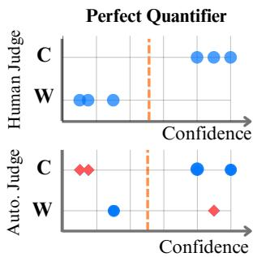

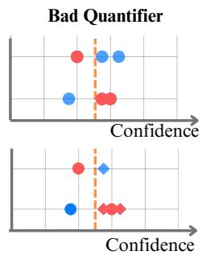  
Figure 1: An informative UQ (top-left) assigns higher confidence to responses that humans deem correct (C) than to those that humans deem wrong (W), allowing a decision maker to be selective (e.g., by rejecting lowerconfidence responses wrt a threshold (dashed line)). If assigned confidences do not neatly separate Cs from Ws (top-right), the UQ leads to selection errors (shown in red). The degree of separation gives us a criterion to choose amongst UQs. But when judgement is automated (bottom), as routinely done in UQ evaluation, judgement errors (C→W or W→C; shown as diamonds) distort our view of the relative merits of the UQs. This affects informative UQs most: on the left, we go from 0/6 to 3/6 selection errors (2 rejected Cs and 1 accepted W), while on the right we go from 3/6 to 4/6 errors.

To establish the relative merits of uncertainty quantifiers—the goal of UQ evaluation—we measure one or another notion of correlation' between correctness and uncertainty in generation. The most common strategies quantify errors in selective prediction (Varshney et al., 2022; Zablotskaia et al.,

2023). In NLG, however, a plethora of factors (e.g., paraphrastic variation, task open-endedness, input under-specification, user perspectives, etc.) render the variability in responses that are deemed plausible wrt a given prompt impossible to represent in a reference set, making correctness difficult to ascertain automatically (Novikova et al., 2017; Plank, 2022; Celikyilmaz et al., 2020). In effect, human judgement is the most reliable evaluation signal in NLG, but, in practice, it is routinely replaced by automated systems (Zhou et al., 2022). Such proxies to NLG evaluation distort our views of errors in selective prediction (SP)—see Figure 1 (compare top and bottom)—and diminish the reliability of our practical protocols for UQ evaluation (Santilli et al., 2025; Ielanskyi et al., 2025). In this work, we document the widespread neglect of human validation of these automated protocols, study the complex relationship between judgement errors and selective prediction errors, and seek to vindicate the role of human validation in UQ evaluation.

We begin by mapping out the UQ evaluation practices that have become common within the NLP community in recent years, particularly with regards to the automation of correctness judgement and the validation of this practice in the specific context of UQ evaluation. We perform a metaanalysis of published ACL papers within the uncertainty in NLG field and find that a variety of judges are employed to approximate correctness (e.g., LLM as a judge, overlap-based and semanticsimilarity-based metrics) but these are rarely validated against human judgement (～ 23% of studied papers, as per our meta-analysis). In experiments situated within question answering (TriviaQA; Joshi et al. (2017) and AmbigQA; Min et al. (2020)) using 4 LLMs (Llama-8B/3B; Grattafiori et al. (2024) and Qwen-7B/0.5B; Hui et al. (2024)), we assess a representative range of automated judges by comparing their predictions to those of human judges. This reveals that judgement quality varies across settings and is highly sensitive to hyperparameters (e.g., similarity cutoffs). We then characterise how the errors of the automated judges impact UQ evaluation: we use each one of 7 UQs to parameterise a selective decision maker, and rank these UQs in terms of AUROC (powered by either human or automated judgement). We observe how judges’ quality only coarsely relates with the quality of the UQ evaluation they induce, probing us to dig deeper into the relationship between the error patterns of automated judges and the patterns UQs scores exhibit. We indeed identify a non-trivial impact in the relationship between judges’ error types and the distribution of confidences—implying that an optimal choice of judge requires its validation within the UQ evaluation protocol.

Overall, judgement errors have non-trivial effects on UQ evaluation, often misrepresenting informative quantifiers. We caution against the careless adoption of judges without validation of their effectiveness within UQ evaluation. To that end, we introduce data analysis tools that help identify high quality judges and analyse their errors’ tradeoffs, to support more informed decision making.

## 2 Background

## 2.1 Uncertainty Quantifiers

An LM can be regarded as a tool to represent probabilistic beliefs about responses given a prompt (Du et al., 2023, 2024). These beliefs can be assessed in at least two ways: i) by assuming that an underlying probability mass function (pmf) is prescribed by the autoregressive factorisation of the model, or ii) by letting the token-level distributions parameterise an arbitrary choice of sampling algorithm (Kool et al., 2019; Holtzman et al., 2020; Meister et al., 2023), in which case a pmf exists but is unknown. Sampling is tractable in both views, making Monte Carlo (MC) estimation of probabilities (as well as entropy and other quantities) viable.

The vast majority of UQs is powered by one of these two views. Quantities derived from the probability assigned to a response are seen as the model's confidence in that prediction (e.g., log-probability of response (Jiang et al., 2021; Xiao and Wang, 2021) or its sequence-length-normalised version (Manakul et al., 2023; Bakman et al., 2024; Flores et al., 2025)). Degrees of variation in the conditional distributions (at sequence- or token-level), such as Shannon entropy, are viewed as uncertainty signals (Fomicheva et al., 2020; Xiao and Wang, 2021; Duan et al., 2024). Others, first push the LM distribution forward through a transformation (e.g., by analysing sampled outcomes in terms of some of their attributes) and assess notions of confidence or uncertainty wrt this transformed distribution: a popular choice being semantic variation (Kuhn et al., 2023; Cheng and Vlachos, 2024; Kunitomo-Jacquin et al., 2026) or consistency (Gao et al., 2024; Zhang et al., 2024; Bhattacharjya et al., 2025;

Nguyen et al., 2025; Wang et al., 2025a; Joo and Cho, 2025; Vazhentsev et al., 2025), where the transformation groups outcomes that are semantically equivalent. ‘Verbalised’ confidence quantifiers, which are estimates that are similar in essence but communicated differently, prompt LLMs to generate their confidence in a response. Some directly sample from the next-token distributions and extract the relevant confidence values from the sampled strings (Tian et al., 2023; Ishii et al., 2025), or assess the probability of tokens semantically related with correctness or confidence values (Kadavath et al., 2022; Lin et al., 2024; Khanmohammadi et al., 2025). Recently, some works focus on adapting LLMs to predict some of the above UQs, e.g. via some form of teacher-student distillation (Chen et al., 2023; Liu et al., 2024a; Xu et al., 2024; Shelmanov et al., 2025; Eikema et al., 2025).

## 2.2 Uncertainty Quantification Evaluation

An informative UQ should indicate when we will generate correct responses (with high confidence/low uncertainty) and incorrect responses (low confidence/ high uncertainty). Under this lens of informativeness, we can validate various UQs; with selective prediction comprising a useful paradigm for this purpose — it accepts or rejects responses depending on whether a confidence score surpasses a threshold (Varshney et al., 2022; Zablotskaia et al., 2023). At a given threshold t, we can measure various performance trade-offs: for example, risk/error against coverage (percentage of responses answered/accepted), or precision against recall, or the true positive rate (TPR) against the false positive rate (FPR). Existing metrics can help summarise information about trade-offs under various thresholds, by measuring the area under the curves plotting the assessed trade-offs of interest across two axes: e.g., the area under the precisionrecall curve (AUCPR) or the area under the receiver operating characteristic curve (AUROC), assessing TPR and FPR trade offs (Flach, 2016).2

To compute such performance metrics (e.g., TPR, FPR, precision, recall) at varying thresholds, it is necessary to judge whether generated responses are correct or incorrect. As human judgement is expensive to obtain at large scale, in practice this correctness judgement is delegated to an automated judge, e.g., a quality metric or a judge model. Unavoidably, automated judges err. Their errors were found to distort AUROC values and rankings (Santilli et al., 2025; Ielanskyi et al., 2025). Santilli et al. (2025) identify sequence length as a common bias affecting both UQs and judges, and partly a source of the distortion—with judges that align well with humans being impacted to a lesser extent; while Ielanskyi et al. (2025) propose combining judges’ predictions as a means to mitigate biases. We dissect even further the complex relationships between UQs and automated judges of varying quality, as assessed by their ability to predict human judgement, so as to understand how they interact within UQ evaluation. We discover a previously unidentified impact of errors that is disproportionately affecting higher quality quantifiers; and point to error categories as a factor that can explain such impacts on UQs.

## 3 Correctness Judgements

## 3.1 Meta-analysis of Current Practices

To the best of our knowledge, no extensive analysis of current practices for the choice of automated judges exists. Here we report on our own metaanalysis of such choices in recent literature.

Methodology. We survey the ACL anthology from 2020 to 2026 for papers relevant to uncertainty in NLG (we start with an automatic keywordmatching filter and proceed with careful, manual inspection). This results in 67 papers, whose choices with regards to correctness judgements we summarise next (further details in Appendix A.1).

Results. Table 1 summarises the main findings. The 2nd column documents the number of times we encounter different types of judge, and the 3rd column lists the proportion of matches amongst the 67 papers—as in some papers more than one judge is used (e.g., because different tasks use different judges, or because hybrid methods combine the predictions of multiple judges to reach a final decision) the cells are normalised independently and hence do not add up to 100%. First, it is worth to remark how human labelling is rare, with 91% of papers delegating correctness decisions to an automated judge. When it comes to automated judges, a broad range of methods is used, with the most popular being an LLM as a judge (e.g., GPT-4). However, an appreciable number of papers uses other methods such as overlap-based metrics (e.g., Rouge-L), exact or fuzzy matching, semanticsimilarity-based metrics (e.g., cosine of BERT embeddings). Even within one judge type we see high variation among implementation choices (metrics, thresholds, LLMs and their prompts, etc.; see Appendix A.2 for an in-depth analysis and a complete list of the analysed papers and their associated correctness judges). When the judge is automated (61 papers), only 23% of times (14 papers) the judge is validated against human judgements. We also tracked the choices made wrt the UQ evaluation metric (noting that some papers employ multiple). The majority of papers employ AUROC (≈ 60%), while other SP metrics (i.e., AUCPR, AURAC) and calibration metrics (i.e., ECE, Brier) remain popular (see Table 5 of Appendix A.2).

<table><tr><td>Correctness judge</td><td># Papers</td><td>Proportion</td></tr><tr><td>LLM judge</td><td>26</td><td>38.8%</td></tr><tr><td>Overlap based</td><td>19</td><td>28.3%</td></tr><tr><td>Exact/fuzzy match</td><td>14</td><td>20.9%</td></tr><tr><td>Semantic similarity</td><td>11</td><td>16.4%</td></tr><tr><td>Unidentifiable</td><td>7</td><td>10.4%</td></tr><tr><td>Human labelling</td><td>6</td><td>9.0%</td></tr></table>

Table 1: Correctness judges used in surveyed papers.

## 3.2 Evaluating Correctness Judges

Our meta-analysis reveals that automated judges are rarely validated against human judgements. Hence, we gather a representative set of such judges and collect human annotation to assess their classification performance (e.g., accuracy, F1, etc.).

Data Collection. We focus on question answering (QA): we sample 100 questions from TriviaQA (Joshi et al., 2017), which contains factual questions, and 200 questions from AmbigQA (Min et al., 2020), which contains ambiguous and unambiguous factual questions (100 non-ambiguous and 100 ambiguous questions). We employ 4 generator models: Llama-3.1-8B-Instruct, Llama-3.2-3B-Instruct,Qwen2.5-7B-Instruct and Qwen2.5-0.5B-Instruct (Grattafiori et al., 2024; Hui et al., 2024). We generate greedy responses from these models (i.e., temp = 0). A human judge annotates the correctness of each greedy response with respect to a set of references. For Llama 8B/TriviaQA and Llama 8B/AmbigQA (ambiguous), 2 judges annotate each response, so that we can appreciate the extent to which they agree (Cohen's Kappa score between annotators

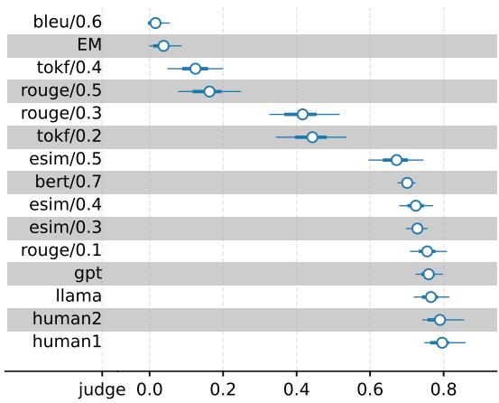  
Figure 2: Posterior F1 (horizontal axis) for a subset of judges for TriviaQA-Llama8b. Rows are sorted by posterior median (circle) and display two high density intervals (50% and 95%; thick/thin line segments).

0.88 for the former and 0.75 for the latter; see Appendix D.2 for details). We analyse various judges, representative of the categories of judges found in our meta-analysis (see Table 1): exact matching, thresholded token F1, thresholded BLEU (Reiter, 2018), thresholded ROUGE-L (Lin, 2004), thresholded embedding similarity with al1-MiniLM-L6-v2, thresholded BERT score (Zhang\* et al., 2020), and LLM as judge (using gpt-5.4-mini and Llama-3.1-8B-Instruct; an API and a Hugging Face model, resp.). Implementation details in Appendix C. Figure 3 shows one annotated data point, for one TriviaQA question.

Methodology. Our goal in this section is to use the annotated data (human and automated judgements) to infer our judges’ classification performances, but we also need to cope with various sources of uncertainty (e.g., adequacy judgements are subject to variability due to annotator perspective, prompt under-specification and ambiguity, annotation errors, etc.). To accommodate them, as well as the inevitable scarcity of human data, we model available data as draws from a hierarchical Bayesian model whose latent parameters capture the probability of correctness of each promptresponse pair, as well as each judge's sensitivity (related to TPR) and specificity (related to TNR). Together, these parameters allow us to infer posterior distributions of a judge's performance in terms of TPR, TNR, FPR, FNR and transformations thereof (e.g. F1). See complete model in Appendix B.1.

Results. Figure 2 plots the inferred posterior F1 for a subset of the judges in the setting Llama

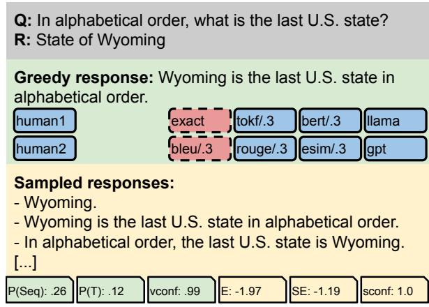  
Figure 3: An example data point of question (Q) and references (R) from TriviaQA and responses by Llama 8B. The greedy response is judged manually and automatically (e.g., via exact match, BLEU, BertScore, LLM judges, etc.); positive judgements are blue/solid, negative are red/dashed. We compute various UQs: some (e.g., P(True)) qualify the greedy response specifically (in green), others (e.g., entropy) qualify the entire conditional distribution (estimated using samples; in yellow).

8B/TriviaQA. These judges cover a representative range of F1 medians.3 Such a plot allows us to group bad (e.g., BLEU@0.6, exact match), medium (e.g. Rouge-L@0.3, Token-F1@0.2) and good judges (e.g., Rouge-L@0.1, Llama8B and GPT5.4-mini). We generally observe across dataset-generator pairs similar distribution spreads; with human F1 distributions concentrating towards higher F1 scores. The order of the judges varies across pairs; but across plots, distributions for LLM and semantic similarity judges (for one threshold or another) are skewed towards higher F1 values.

## 4 Evaluating UQ Evaluation

UQ evaluation by AUROC sorts competing UQs from least to most informative for selective prediction. Here, we evaluate whether this strategy is at all reliable when correctness judgements are automated. For a collection of UQs being compared, we characterise their AUROC using human correctness judgements to establish an oracle’ or gold-standard'. We then analyse the impact of automated correctness by assessing changes in AUROC when replacing human with automated judgement.

Experiments. We continue analysing the promptresponse pairs from TriviaQA and AmbigQA, and the generators we have used in the previous analysis (Llama 3B/8B, Qwen 0.5B/7B); whose greedy responses we have generated and annotated. We analyse 7 different UQs: log probability (Jiang et al., 2021), normalised log probability (Manakul et al., 2023), predictive entropy (Fomicheva et al., 2020), semantic entropy (i.e., entropy over semantic clusters of sampled responses; Kuhn et al. (2023)), semantic confidence (i.e., rate at which a response is not contradicted by sampled responses; Yona et al. (2024))), P(True) (i.e., the probability a model assigns to the token associated with correctness of a response; Kadavath et al. (2022)) and verbalised confidence (i.e., extracted confidence sampled from a model when prompted for the task; Tian et al. (2023)). To compute these UQs, we sample 10 responses from our generators (with temp = 1). We use the same correctness judges as before. See Figure 3 for an illustration of a datapoint (and Appendix C for more details).

Results. Table 2 and 3 present the main results. For each dataset-generator pair we separate the correctness judges as good' (G; F1 > 0.7), medium' (M; 0.3 < F1 < 0.7) or ‘bad’ (B; F1 < 0.3) in terms of their F1 score, pointed-estimated against a human judge. Then, for each case we identify the best UQ (ranked 1st), medium-quality UQ (ranked 4th) and worst UQ (ranked 7th), according to their oracle AUROC values. We then check how the oracle evaluation is distorted by automated evaluation at different levels of judgement quality (G/M/B); by tracking the change in oracle figures, for the best, medium and worst UQs, due to automation. In Table 2 we track the position at which the automated judge places these UQs and in Table 3 the change in automated AUROC relative to the oracle. These are averages, as each group (G/M/B) contributes multiple measurements (one per judge).

It is clear that automated protocols vary widely, echoing previous findings (Santilli et al., 2025; Ielanskyi et al., 2025). But the oracle allows for further insight: we can now see that automated protocols can perform very poorly, with AUROC values and rankings distorted away from the oracle. We also see that judgement quality has a nonuniform impact on how the merits of different UQs are depicted, with informative UQs being harshly downplayed. The best UQs are often seriously harmed (e.g. the actual best UQ often ranks 4th-6th under a bad correctness judge). On the other hand, the medium-quality UQs are affected somewhat less (see medium columns of Table 3). The worst UQs are affected minimally or even appear better in terms of AUROC values (see right-most columns, in green), with their absolute rankings also appearing improved (bad judges place them in rankings 2-4, when they should rank last).

<table><tr><td rowspan=1 colspan=4>Best Quantifier (Rank #1)</td></tr><tr><td rowspan=1 colspan=1>Actual</td><td rowspan=1 colspan=1>Rank G</td><td rowspan=1 colspan=2>Rank MRank B</td></tr><tr><td rowspan=1 colspan=1>VC</td><td rowspan=1 colspan=1>2.3</td><td rowspan=1 colspan=1>4.3</td><td rowspan=1 colspan=1>4.4</td></tr><tr><td rowspan=1 colspan=1>P(Seq.)</td><td rowspan=1 colspan=1>2.2</td><td rowspan=1 colspan=1>1.4</td><td rowspan=1 colspan=1>2.1</td></tr><tr><td rowspan=1 colspan=1>SC</td><td rowspan=1 colspan=1>1.5</td><td rowspan=1 colspan=1>6.0</td><td rowspan=1 colspan=1>6.3</td></tr><tr><td rowspan=1 colspan=1>SC</td><td rowspan=1 colspan=1>1.0</td><td rowspan=1 colspan=1>3.7</td><td rowspan=1 colspan=1>5.2</td></tr><tr><td rowspan=1 colspan=1>VC</td><td rowspan=1 colspan=1>1.4</td><td rowspan=1 colspan=1>2.8</td><td rowspan=1 colspan=1>4.7</td></tr><tr><td rowspan=1 colspan=1>N.P(Seq.)</td><td rowspan=1 colspan=1>1.5</td><td rowspan=1 colspan=1>1.5</td><td rowspan=1 colspan=1>1.2</td></tr><tr><td rowspan=1 colspan=1>P(True)</td><td rowspan=1 colspan=1>2.0</td><td rowspan=1 colspan=1>2.8</td><td rowspan=1 colspan=1>4.5</td></tr><tr><td rowspan=1 colspan=1>N.P(Seq.)</td><td rowspan=1 colspan=1>2.0</td><td rowspan=1 colspan=1>1.6</td><td rowspan=1 colspan=1>1.5</td></tr><tr><td rowspan=3 colspan=1>P(True)VCP(True)SC</td><td rowspan=2 colspan=1>1.41.91.5</td><td rowspan=1 colspan=1>3.3</td><td rowspan=1 colspan=1>6.4</td></tr><tr><td rowspan=1 colspan=1>3.03.6</td><td rowspan=1 colspan=1>5.55.8</td></tr><tr><td rowspan=1 colspan=1>1.5</td><td rowspan=1 colspan=1>-</td><td rowspan=1 colspan=1>5.2</td></tr></table>

<table><tr><td rowspan=1 colspan=1>Mediu</td><td rowspan=1 colspan=3>m Quantifier (Rank #4)</td></tr><tr><td rowspan=1 colspan=1>Actual</td><td rowspan=1 colspan=3>Rank GRank MRank B</td></tr><tr><td rowspan=1 colspan=1>SE</td><td rowspan=1 colspan=1>4.2</td><td rowspan=1 colspan=2>3.5    3.6</td></tr><tr><td rowspan=1 colspan=1>VC</td><td rowspan=1 colspan=1>2.5</td><td rowspan=1 colspan=1>5.6</td><td rowspan=1 colspan=1>5.2</td></tr><tr><td rowspan=1 colspan=1>N.P(Seq.)</td><td rowspan=1 colspan=1>5.0</td><td rowspan=1 colspan=1>2.0</td><td rowspan=1 colspan=1>2.8</td></tr><tr><td rowspan=1 colspan=1>N.P(Seq.)</td><td rowspan=1 colspan=1>3.0</td><td rowspan=1 colspan=1>4.2</td><td rowspan=1 colspan=1>3.5</td></tr><tr><td rowspan=1 colspan=1>P(True)</td><td rowspan=1 colspan=1>3.9</td><td rowspan=1 colspan=1>5.8</td><td rowspan=1 colspan=1>5.1</td></tr><tr><td rowspan=1 colspan=1>SC</td><td rowspan=1 colspan=1>6.7</td><td rowspan=1 colspan=1>7.0</td><td rowspan=1 colspan=1>6.8</td></tr><tr><td rowspan=1 colspan=1>VC</td><td rowspan=1 colspan=1>5.5</td><td rowspan=1 colspan=1>5.0</td><td rowspan=1 colspan=1>4.0</td></tr><tr><td rowspan=1 colspan=1>P(Seq.)</td><td rowspan=1 colspan=1>3.0</td><td rowspan=1 colspan=1>2.1</td><td rowspan=1 colspan=1>1.5</td></tr><tr><td rowspan=1 colspan=1>SE</td><td rowspan=1 colspan=1>5.6</td><td rowspan=1 colspan=1>6.0</td><td rowspan=1 colspan=1>3.9</td></tr><tr><td rowspan=1 colspan=1>N.P(Seq.)</td><td rowspan=1 colspan=1>3.4</td><td rowspan=1 colspan=1>2.2</td><td rowspan=1 colspan=1>4.5</td></tr><tr><td rowspan=1 colspan=1>N.P(Seq.)</td><td rowspan=1 colspan=1>2.5</td><td rowspan=1 colspan=1>4.3</td><td rowspan=1 colspan=1>3.4</td></tr><tr><td rowspan=1 colspan=1>N.P(Seq.)</td><td rowspan=1 colspan=1>3.0</td><td rowspan=1 colspan=1></td><td rowspan=1 colspan=1>2.2</td></tr></table>

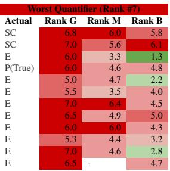  
Table 2: We separate the correctness judges as good’ (G; $F 1 > 0 . 7 ) $ medium' $( \mathrm { M } ; 0 . 3 < F 1 < 0 . 7 )$ or 'bad' (B; $F 1 < 0 . 3 )$ in terms of their F1 score, and identify the best UQ (ranked 1st), medium-quality UQ (ranked 4th) and worst UQ (ranked 7th), according to their oracle AUROC values. We show how the oracle rankings of UQs are affected on average.

<table><tr><td colspan="7">Best Quantifier (Rank #1)</td></tr><tr><td>Model/Dataset pair</td><td>Actual</td><td>AUROC</td><td></td><td>Diff. G Diff. M</td><td>Diff. B</td><td>Actual</td></tr><tr><td>TriviaQA/Llama8b</td><td>VC</td><td>0.92</td><td>-0.11</td><td>-0.22</td><td>-0.19</td><td>SE</td></tr><tr><td>TriviaQA/Llama3b</td><td>P(Seq.)</td><td>0.88</td><td>-0.09</td><td>-0.10</td><td>0.03</td><td>VC</td></tr><tr><td>TriviaQA/Qwen7b</td><td>SC</td><td>0.82</td><td>-0.08</td><td>-0.18</td><td>-0.11</td><td>N.P(Seq.)</td></tr><tr><td>TriviaQA/Qwen0.5b</td><td>SC</td><td>0.73</td><td>0.02</td><td>-0.14</td><td>0.03</td><td>N.P(Seq.)</td></tr><tr><td>AmbigQA_non/Llama8b</td><td>VC</td><td>0.78</td><td>-0.02</td><td>-0.07</td><td>-0.31</td><td>P(True)</td></tr><tr><td>AmbigQA_non/Llama3b</td><td>N.P(Seq.)</td><td>0.79</td><td>-0.02</td><td>0.02</td><td>0.11</td><td>SC</td></tr><tr><td>AmbigQA_non/Qwen7b</td><td>P(True)</td><td>0.84</td><td>-0.09</td><td>-0.11</td><td>-0.13</td><td>VC</td></tr><tr><td>AmbigQA_non/Qwen0.5b</td><td>N.P(Seq.)</td><td>0.66</td><td>0.05</td><td>0.09</td><td>0.15</td><td>P(Seq.)</td></tr><tr><td>AmbigQA_am/Llama8b</td><td>P(True)</td><td>0.79</td><td>-0.06</td><td>-0.17</td><td>-0.37</td><td>SE</td></tr><tr><td>AmbigQA_am/Llama3b</td><td>vC</td><td>0.70</td><td>0.00</td><td>-0.06</td><td>-0.27</td><td>N.P(Seq.)</td></tr><tr><td>AmbigQA_am/Qwen7b</td><td>P(True)</td><td>0.68</td><td>0.01</td><td>-0.08</td><td>-0.14</td><td>N.P(Seq.)</td></tr><tr><td>AmbigQA_am/Qwen0/5b</td><td>SC</td><td>0.71</td><td>-0.07</td><td></td><td>-0.28</td><td>N.P(Seq.)</td></tr></table>

<table><tr><td rowspan=1 colspan=1>AUROC</td><td rowspan=1 colspan=1>Diff. G</td><td rowspan=1 colspan=1>Diff. M</td><td rowspan=1 colspan=1>Diff. B</td><td rowspan=1 colspan=1>Actu</td></tr><tr><td rowspan=1 colspan=1>0.76</td><td rowspan=1 colspan=1>-0.03</td><td rowspan=1 colspan=1>-0.03</td><td rowspan=1 colspan=1>0.02</td><td rowspan=1 colspan=1>SC</td></tr><tr><td rowspan=1 colspan=1>0.79</td><td rowspan=1 colspan=1>0.00</td><td rowspan=1 colspan=1>-0.12</td><td rowspan=1 colspan=1>-0.02</td><td rowspan=1 colspan=1>SC</td></tr><tr><td rowspan=1 colspan=1>0.72</td><td rowspan=1 colspan=1>-0.08</td><td rowspan=1 colspan=1>0.08</td><td rowspan=1 colspan=1>0.23</td><td rowspan=1 colspan=1>E</td></tr><tr><td rowspan=1 colspan=1>0.56</td><td rowspan=1 colspan=1>0.03</td><td rowspan=1 colspan=1>0.05</td><td rowspan=1 colspan=1>0.32</td><td rowspan=1 colspan=1>P(Tr</td></tr><tr><td rowspan=1 colspan=1>0.68</td><td rowspan=1 colspan=1>-0.01</td><td rowspan=1 colspan=1>-0.10</td><td rowspan=1 colspan=1>-0.14</td><td rowspan=1 colspan=1>E</td></tr><tr><td rowspan=1 colspan=1>0.68</td><td rowspan=1 colspan=1>-0.11</td><td rowspan=1 colspan=1>-0.12</td><td rowspan=1 colspan=1>-0.09</td><td rowspan=1 colspan=1>E</td></tr><tr><td rowspan=1 colspan=1>0.70</td><td rowspan=1 colspan=1>-0.07</td><td rowspan=1 colspan=1>-0.03</td><td rowspan=1 colspan=1>0.00</td><td rowspan=1 colspan=1>E</td></tr><tr><td rowspan=1 colspan=1>0.61</td><td rowspan=1 colspan=1>0.09</td><td rowspan=1 colspan=1>0.12</td><td rowspan=1 colspan=1>0.20</td><td rowspan=1 colspan=1>E</td></tr><tr><td rowspan=1 colspan=1>0.68</td><td rowspan=1 colspan=1>-0.09</td><td rowspan=1 colspan=1>-0.13</td><td rowspan=1 colspan=1>0.04</td><td rowspan=1 colspan=1>E</td></tr><tr><td rowspan=1 colspan=1>0.66</td><td rowspan=1 colspan=1>-0.05</td><td rowspan=1 colspan=1>0.09</td><td rowspan=1 colspan=1>-0.15</td><td rowspan=1 colspan=1>E</td></tr><tr><td rowspan=1 colspan=1>0.65</td><td rowspan=1 colspan=1>0.03</td><td rowspan=1 colspan=1>-0.06</td><td rowspan=1 colspan=1>0.14</td><td></td></tr><tr><td rowspan=3 colspan=1>0.60</td><td rowspan=3 colspan=1>-0.02</td><td rowspan=3 colspan=1></td><td></td><td></td></tr><tr><td></td><td rowspan=2 colspan=1>EE</td></tr><tr><td rowspan=1 colspan=1>0.15</td></tr></table>

<table><tr><td rowspan=1 colspan=1>Worst Qua</td><td></td><td></td><td></td></tr><tr><td rowspan=2 colspan=1>AUROC</td><td></td><td></td><td></td></tr><tr><td rowspan=1 colspan=2>ntifier (Rank #7)Diff. GDiff. M</td><td rowspan=1 colspan=1>Diff. B</td></tr><tr><td rowspan=1 colspan=1>0.69</td><td rowspan=1 colspan=1>-0.07</td><td rowspan=1 colspan=1>-0.05</td><td rowspan=1 colspan=1>-0.01</td></tr><tr><td rowspan=1 colspan=1>0.67</td><td rowspan=1 colspan=1>-0.06</td><td rowspan=1 colspan=1>-0.02</td><td rowspan=1 colspan=1>0.06</td></tr><tr><td rowspan=1 colspan=1>0.67</td><td rowspan=1 colspan=1>-0.05</td><td rowspan=1 colspan=1>0.08</td><td rowspan=1 colspan=1>0.29</td></tr><tr><td rowspan=1 colspan=1>0.49</td><td rowspan=1 colspan=1>0.02</td><td rowspan=1 colspan=1>0.07</td><td rowspan=1 colspan=1>0.31</td></tr><tr><td rowspan=1 colspan=1>0.58</td><td rowspan=1 colspan=1>0.02</td><td rowspan=1 colspan=1>0.06</td><td rowspan=1 colspan=1>0.25</td></tr><tr><td rowspan=1 colspan=1>0.59</td><td rowspan=1 colspan=1>0.06</td><td rowspan=1 colspan=1>0.13</td><td rowspan=1 colspan=1>0.19</td></tr><tr><td rowspan=1 colspan=1>0.58</td><td rowspan=1 colspan=1>0.01</td><td rowspan=1 colspan=1>0.05</td><td rowspan=1 colspan=1>0.05</td></tr><tr><td rowspan=1 colspan=1>0.53</td><td rowspan=1 colspan=1>-0.01</td><td rowspan=1 colspan=1>0.00</td><td rowspan=1 colspan=1>-0.04</td></tr><tr><td rowspan=1 colspan=1>0.52</td><td rowspan=1 colspan=1>0.03</td><td rowspan=1 colspan=1>0.03</td><td rowspan=1 colspan=1>0.10</td></tr><tr><td rowspan=1 colspan=1>0.55</td><td rowspan=1 colspan=1>0.00</td><td rowspan=1 colspan=1>0.06</td><td rowspan=1 colspan=1>0.06</td></tr><tr><td rowspan=1 colspan=1>0.57</td><td rowspan=1 colspan=1>0.01</td><td rowspan=1 colspan=1>0.01</td><td rowspan=1 colspan=1>0.21</td></tr><tr><td rowspan=1 colspan=1>0.50</td><td rowspan=1 colspan=1>0.00</td><td rowspan=1 colspan=1></td><td rowspan=1 colspan=1>0.00</td></tr></table>

Table 3: We separate the correctness judges as good’ (G; $F 1 > 0 . 7 )$ , medium' $( \mathrm { M } ; 0 . 3 < F 1 < 0 . 7 )$ or 'bad' (B; $F 1 < 0 . 3 )$ in terms of their F1 score and identify the best UQ (ranked 1st), medium-quality UQ (ranked 4th) and worst UQ (ranked 7th), according to their oracle AUROC values. We show how the oracle AUROC values of UQs are affected on average.

In Appendix D.1, for transparency, we present a complete list of AUROC values and rankings per UQ and judge. For the dataset-generator pairs with two sets of human annotations, we analyse the AU-ROC values and rankings they induce side by side (see Appendix D.2); verifying their similar patterns. We also perform a bootstrapping analysis, where we repeatedly subsample from available prompts and compute key metrics (i.e., AUROC values and rankings; Appendix D.3), and observe similar patterns as in the main study. Lastly, we investigate the use of other SP metrics in Appendix D.4 and show that the issues discussed here persist.

## 5 Error Analysis

## 5.1 How Does NLG Evaluation and UQ Evaluation Interact?

Here we dig deeper into the relation between the quality of automated judges and their (in)ability to power a reliable proxy to oracle UQ evaluation.

Experiments. We rank UQs by oracle AUROC (with human judgements) and by proxy AUROC (with automated judgements) and measure the similarity of the rankings these protocols induce. For that, we use Rank-Biased Overlap (RBO; Webber et al. (2010)), which penalises disagreement at top positions more (we use patience 0.9).4 To grasp the relationship with judgement performance, we study how RBO co-varies with judges' F1 scores.

Results. Figure 4 shows results for TriviaQA-Llama 8B and TriviaQA-Qwen 7B (other pairs in Appendix D.6). Even within a narrow range of F1 values (i.e., similar-quality judges), there's considerable variability in their UQ evaluation performance. This is not only prominent in low-quality judges, even high-quality judges $( F 1 \simeq 0 . 8 - 0 . 9 )$ exhibit this variability (judges are distributed across the vertical axis). We also inspect Kendall τ, instead of RBO, and observe similar patterns.

This suggests that F1 may be hiding information that is relevant to UQ evaluation. Connecting with our analysis of Section 3.2, where we observed different error distributions across judges’ TPRs and TNRs, we speculate that the ways a judge's errors distribute across these two categories play an important role in UQ evaluation. This role is elusive until we relate them to confidences values.

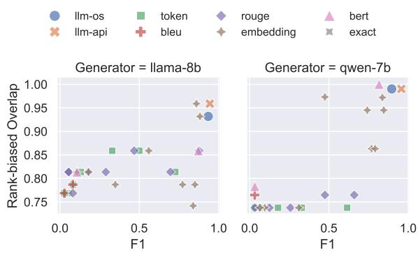  
Figure 4: F1 scores (↑) for judges against the RBO score (↑) of human- vs judge-powered UQ rankings. Even within a narrow range of F1 values (i.e., similarquality judges), there's considerable variability in their UQ evaluation performance.

## 5.2 Understanding Trade-offs

Automated judges err, predicting that a response is correct when it is incorrect (FP), or vice versa (FN); we analyse how the confidences assigned by UQ methods distribute across these error categories.

Methodology. With a heterogenous set of UQs being compared, it is hopeless to expect that the confidences they assign are comparable (many do not even lie in the same interval). For the tools we develop here, having all UQs communicate comparable confidences facilitates analysis. For that, we learn to regress from the raw scores assigned by UQs to a (normalised) confidence using a Bayesian logistic regressor (details in Appendix B.2).

Let's start with the simplest form of SP: a quantifier Q assigns confidence c to a response r; if c exceeds a fixed threshold (e.g., t = 0.5), the response is accepted, else it is rejected. An automated judge categorises the responses as correct (positive/P) or incorrect (negative/N), but, relative to human judgement, the judge may be right (i.e., then a P is a true positive/TP and an N is a true negative/TN) or wrong (i.e., then a P is a false positive/FP and an N is a false negative/FN). In Figure 5 (for TriviaQA-Llama8B), we scatter the confidences assigned by different UQs, separated by categories of classification error in automated judgement by different judges. When the judge is right (TP, TN), a metric for SP will gather reliable information about the quantifier's merits in separating Ps from Ns (i.e., Ps to the right and Ns to the left of the threshold). When the judge is wrong (FP, FN), the UQ is unfairly rewarded (i.e., it accepts a response that appears P but is not or it rejects a response that appears N, but is not; green region in plots) or penalised (i.e., it rejects a response that appears P but is not or it accepts a response that appears N but is not; red region in plots) depending on how confidence distributes. In this way to view the data, it is clear that an imbalance in concentration of points across error categories (FP, FN) amounts to a net impact that will misrepresent the informativeness of the UQ; this is will be true even for judges that are often (but not always) right.

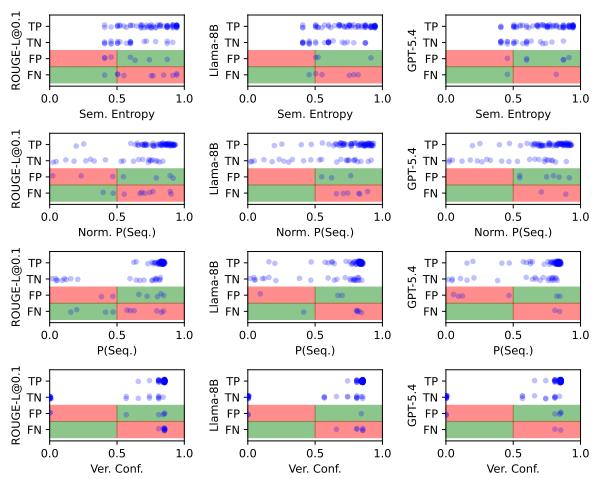  
Figure 5: Error trade-offs in SP (with threshold 0.5) for various UQs under best automated judges (TriviaQA-Llama8B). For a detailed guide on how to interpret this figure, see Section 5.2.

The figure displays the three best automated judges (as per the analysis of Figure 2). While all judges have similar F1 distributions, their errors are not always similarly distributed. For instance, Verb. Conf. seems to have a more dense region of unfair penalties (bottom, right red region) when the judge is ROUGE-L@0.1 compared to the LLM judges, indicating a higher negative impact on that UQ by the specific judge. However, GPT5.4 judge's errors may be impacting P(seq.) more harshly than ROUGE-L@0.1, since the former's negative impact regions seem to be more densely populated than positive ones. ROUGE-L@0.1 contains instances in positive and negative regions, possibly cancelling each other's effects.

Let's now turn to evaluation by AUROC, which is based on rate of ‘successful’ pairwise comparisons among correct and incorrect responses: the metric rewards the UQ when a correct response (P) has a higher confidence than an incorrect one (N), and penalises it otherwise; same-label comparisons are discarded. In Figure 6 (for TriviaQA-Llama 8B) we outline regions of unfair reward/penalty relative to the confidence value of an instance A (red cross in the plot), rather than a fixed threshold. If the judge is right for this instance (A is TP or TN), AUROC gathers reliable information about the UQ; when the judge is wrong (A is FP or FN), AUROC is distorted. Because AUROC depends on pairs of instances and discards same-label comparisons, we have more regions to consider than in SP with fixed thresholds. For A in FN, every other instance B not in FN will lead to unfair reward, if assigned confidence higher than A (green in the plots), or to unfair penalty, if assigned confidence lower than A (red in the plots): when B is TP, the UQ collects reward for ranking a P over an apparent N (under human judgement this would have been a tie); when B is TN, A and B appear to tie, but that would not be the case under human judgement, so the UQ undeservedly foregoes a penalty; when B is FP, the UQ collects rewards for ranking an apparent P over an apparent N (under human judgement this would have been a penalty). For A in FP, penalties and rewards are reversed in each case. To make each plot visually representative of an actual trend, we place A (the red cross) in the median of the scattered points. As before, imbalance in concentration of points in FP and FN amounts to a net impact that will misrepresent the informativeness of the UQ.

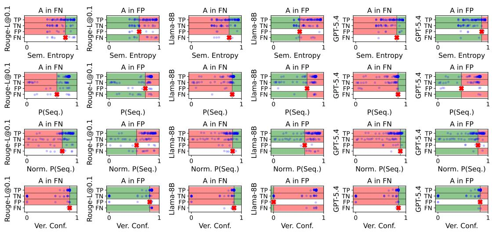  
Figure 6: Error impacts on AUROC for various quantifiers under best automated judges, for TriviaQA-Llama8B. For a detailed guide on how to interpret this figure, see Section 5.2.

GPT5.4 judge's errors may be impacting P(seq.) more profoundly than ROUGE-L@0.1. Focusing on FN instances: GPT5.4's negatively impactful (red) regions are densely populated; while ROUGE-L@0.1 seems to contain instances that trade-off unfair rewards and penalties, when we iterate across FN instances. In another example, when observing the trade-off regions of the FP instances of different judges for Norm. P(Seq.), ROUGE-L@0.1 appears to be negatively impacted (with green and red regions populated, with a dense cluster of points in the red region). Simultaneously, LLama 8B, whose FP error distribution is skewed towards higher values, will more often benefit from unfair rewards of the instances in the TP and TN green regions; with a possibly lower negative impact on the quantifier compared to ROUGE-L@0.1. Even the same judge can impact different UQs in distinct ways. Rouge-L@0.1 has a similar distribution of FP and FN errors across semantic entropy scores; with an overall minimal impact on that UQ, as the positive and negative impacts balance each other out. Considering the FP and FN distributions across Verb. Conf. scores, errors do not cancel each other out (since TP and TN errors distribute very differently; with the judge harming the UQ).

The way the judges err has a non-trivial impact on UQ evaluation, with plots such as the ones we just analysed demonstrating precisely that. Hence, the choice of judge should be informed by its use in UQ evaluation. Simply opting for a judge that is aligned with human judgment (e.g., high F1), while agnostic to the application of UQ evaluation, could lead to suboptimal decisions. Data analyses of the kind we use can help in a more thorough evaluation, which however require human annotations for the quality of the judge's predictions. Future work could investigate whether we could determine insufficient judges before the collection of human data, by analysing patterns of the data, models, judges and UQs, that underlie the different error categories.

## 6 Recommendations

We conclude this section by gathering some suggestions and recommendations for practitioners working within uncertainty quantification. To begin with, in settings we have tested, we note that even a relatively small number of annotations suffices to discriminate judges reliably. Hence, practitioners should not be discouraged if practical constraints allow for gathering only a small number of annotations. Of course, this observation may well be task/generator-sensitive, but with Bayesian analysis, of the kind we use here, we get reassurances (or warnings) in the form of posterior intervals for the metrics in consideration. When choosing an automated judge in a new experimental setup, it is necessary to validate it. At first, one might think that it is sufficient to validate the judge as a tool for NLG evaluation (e.g., correctness classification performance assessed against a human judge). That, however, turns out to be insufficient, for judgement errors and selection errors are not typically independent. Instead, validation needs to be performed within a UQ evaluation protocol (e.g., correlation between human-powered and machinepowered SP or AUROC). It must also be noted that, while validation of a judge as tool for NLG evaluation makes the conclusions dependent on task and generators, validation of a judge as a tool for UQ evaluation makes the conclusions further dependent on the specific uncertainty quantifiers being compared and the evaluation protocol in use (e.g., SP at fixed threshold, AUROC, etc.). All of that serves to emphasise that borrowing decisions from published work while transferring them to different settings is a gamble, and reference to published work in such cases cannot be safely regarded as a substitute for validation.

## 7 Conclusion

We delve into an in-depth analysis of errors caused by automated correctness judgement during UQ evaluation. We document current practices in literature, and reveal that automated judges are rarely validated. We uncover that judges’ errors impact UQs differently; with some unfairly rewarded and others harmed, in experiments we conduct using two QA datasets, four LLMs, seven popular UQs and seven judges. This impact is not fully explained by the judges' ability to simply align with human judgement. In fact, in analyses we show that how and when judges err plays an important role in explaining such impacts. Hence, employing a judge without understanding how it errs, may cloud insights and conclusions.

## Limitations

Our meta analysis only considers papers that belong to the ACL anthology from 2020 up until March 2026 (leaving other possibly relevant venues out). As such, not all published research papers that are concerned with UQ in NLG tasks that use selective prediction as part of their evaluation protocol is part of our analysis. Nevertheless, from a small scale inspection of papers published at other venues, the findings of our meta-analysis seem to hold across publication venues.

Due to the expensive nature of manual annotations, we were only able to annotate 100 responses per dataset-generator pair. However, even with a limited number of annotations, our BDA analyses piece together trends and patterns found in the data. Ideally, we would be able to have multiple annotators judge the correctness of responses for all dataset-generator pairs; due to budget constraints we only do so for two.For those, we assess the alignment among annotators and the effect of annotations from different human judges on our results. We find that human judgements are well aligned and results hold similar across annotators, showing that our results are robust to different annotators.

Lastly, our experiments are focused on shortform QA, since most UQ techniques are grounded within this task. We leave expanding to long form QA as possible future work. Nonetheless, evaluating the correctness of a longer response can be at least as difficult, if not more, as a short response; hence, it remains just as important, if not more, to validate the judges' quality within UQ evaluation.

## Acknowledgements

We would like to thank the anonymous reviewers for their feedback.

## References

Lukas Aichberger, Kajetan Schweighofer, Mykyta Ielanskyi, and Sepp Hochreiter. 2025. Improving uncertainty estimation through semantically diverse language generation. In The Thirteenth International Conference on Learning Representations.

Alfonso Amayuelas, Kyle Wong, Liangming Pan, Wenhu Chen, and William Yang Wang. 2024. Knowledge of knowledge: Exploring known-unknowns uncertainty with large language models. In Findings of the Association for Computational Linguistics: ACL 2024, pages 6416–6432, Bangkok, Thailand. Association for Computational Linguistics.

Yavuz Faruk Bakman, Duygu Nur Yaldiz, Baturalp Buyukates, Chenyang Tao, Dimitrios Dimitriadis, and Salman Avestimehr. 2024. MARS: Meaningaware response scoring for uncertainty estimation in generative LLMs. In Proceedings of the 62nd Annual Meeting of the Association for Computational Linguistics (Volume 1: Long Papers), pages 7752–7767, Bangkok, Thailand. Association for Computational Linguistics.

Yavuz Faruk Bakman, Duygu Nur Yaldiz, Sungmin Kang, Tuo Zhang, Baturalp Buyukates, Salman Avestimehr, and Sai Praneeth Karimireddy. 2025. Reconsidering LLM uncertainty estimation methods in the wild. In Proceedings of the 63rd Annual Meeting of the Association for Computational Linguistics (Volume 1: Long Papers), pages 29531–29556, Vienna, Austria. Association for Computational Linguistics.

Debarun Bhattacharjya, Balaji Ganesan, Junkyu Lee, Radu Marinescu, Katya Mirylenka, Michael Glass, and Xiao Shou. 2025. SIMBA UQ: Similarity-based aggregation for uncertainty quantification in large language models. In Findings of the Association for Computational Linguistics: EMNLP 2025, pages 15880–15894, Suzhou, China. Association for Computational Linguistics.

Umesh Bodhwani, Yuan Ling, Shujing Dong, Yarong Feng, Hongfei Li, and Ayush Goyal. 2025. A calibrated reflection approach for enhancing confidence estimation in LLMs. In Proceedings of the 5th Workshop on Trustworthy NLP (TrustNLP 2025), pages 399–411, Albuquerque, New Mexico. Association for Computational Linguistics.

Stephen P Brooks and Andrew Gelman. 1998. General methods for monitoring convergence of iterative simulations. Journal of computational and graphical statistics, 7(4):434–455.

Qi Cao, Andrew Gambardella, Takeshi Kojima, Yutaka Matsuo, and Yusuke Iwasawa. 2026. Semantic token clustering for efficient uncertainty quantification in large language models. In Proceedings of the 19th Conference of the European Chapter of the Association for Computational Linguistics (Volume 2: Short Papers), pages 682–696, Rabat, Morocco. Association for Computational Linguistics.

Nicola Cecere, Andrea Bacciu, Ignacio Fernández-Tobías, and Amin Mantrach. 2025. Monte Carlo temperature: a robust sampling strategy for LLM's uncertainty quantification methods. In Proceedings of the 5th Workshop on Trustworthy NLP (TrustNLP 2025), pages 305–320, Albuquerque, New Mexico. Association for Computational Linguistics.

Asli Celikyilmaz, Elizabeth Clark, and Jianfeng Gao. 2020. Evaluation of text generation: A survey. arXiv preprint arXiv:2006.14799.

Jiefeng Chen, Jinsung Yoon, Sayna Ebrahimi, Sercan Arik, Tomas Pfister, and Somesh Jha. 2023. Adaptation with self-evaluation to improve selective prediction in LLMs. In Findings of the Association for Computational Linguistics: EMNLP 2023, pages 5190–5213, Singapore. Association for Computational Linguistics.

Jiuhai Chen and Jonas Mueller. 2024. Quantifying uncertainty in answers from any language model and enhancing their trustworthiness. In Proceedings of the 62nd Annual Meeting of the Association for Computational Linguistics (Volume 1: Long Papers), pages 5186–5200, Bangkok, Thailand. Association for Computational Linguistics.

Zheng Chen, Zhaoxin Feng, Jianfei Ma, Jiexi Xu, and Bo Li. 2025. Can LLMs recognize their own analogical hallucinations? evaluating uncertainty estimation for analogical reasoning. In Proceedings of the 3rd Workshop on Towards Knowledgeable Foundation Models (KnowFM), pages 84–93, Vienna, Austria. Association for Computational Linguistics.

Julius Cheng and Andreas Vlachos. 2024. Measuring uncertainty in neural machine translation with similarity-sensitive entropy. In Proceedings of the 18th Conference of the European Chapter of the Association for Computational Linguistics (Volume 1: Long Papers), pages 2115–2128, St. Julian's, Malta. Association for Computational Linguistics.

Gheorghe Comanici, Eric Bieber, Mike Schaekermann, Ice Pasupat, Noveen Sachdeva, Inderjit Dhillon, Marcel Blistein, Ori Ram, Dan Zhang, Evan Rosen, and 1 others. 2025. Gemini 2.5: Pushing the frontier with advanced reasoning, multimodality, long context, and next generation agentic capabilities. arXiv preprint arXiv:2507.06261.

Shehzaad Dhuliawala, Leonard Adolphs, Rajarshi Das, and Mrinmaya Sachan. 2022. Calibration of machine reading systems at scale. In Findings of the Association for Computational Linguistics: ACL 2022, pages 1682–1693, Dublin, Ireland. Association for Computational Linguistics.

Li Du, Holden Lee, Jason Eisner, and Ryan Cotterell. 2024. When is a language process a language model? In Findings of the Association for Computational Linguistics: ACL 2024, pages 11083–11094, Bangkok, Thailand. Association for Computational Linguistics.

Li Du, Lucas Torroba Hennigen, Tiago Pimentel, Clara Meister, Jason Eisner, and Ryan Cotterell. 2023. A measure-theoretic characterization of tight language models. In Proceedings of the 61st Annual Meeting of the Association for Computational Linguistics (Volume 1: Long Papers), pages 9744–9770, Toronto, Canada. Association for Computational Linguistics.

Jinhao Duan, Hao Cheng, Shiqi Wang, Alex Zavalny, Chenan Wang, Renjing Xu, Bhavya Kailkhura, and Kaidi Xu. 2024. Shifting attention to relevance: Towards the predictive uncertainty quantification of free-form large language models. In Proceedings of the 62nd Annual Meeting of the Association for Computational Linguistics (Volume 1: Long Papers), pages 5050–5063, Bangkok, Thailand. Association for Computational Linguistics.

Bryan Eikema, Evgenia Ilia, José GC de Souza, Chrysoula Zerva, and Wilker Aziz. 2025. Teaching language models to faithfully express their uncertainty. arXiv preprint arXiv:2510.12587.

Ekaterina Fadeeva, Aleksandr Rubashevskii, Artem Shelmanov, Sergey Petrakov, Haonan Li, Hamdy Mubarak, Evgenii Tsymbalov, Gleb Kuzmin, Alexander Panchenko, Timothy Baldwin, Preslav Nakov, and Maxim Panov. 2024. Fact-checking the output of large language models via token-level uncertainty quantification. In Findings of the Association for Computational Linguistics: ACL 2024, pages 9367– 9385, Bangkok, Thailand. Association for Computational Linguistics.

Ekaterina Fadeeva, Roman Vashurin, Akim Tsvigun, Artem Vazhentsev, Sergey Petrakov, Kirill Fedyanin, Daniil Vasilev, Elizaveta Goncharova, Alexander Panchenko, Maxim Panov, Timothy Baldwin, and Artem Shelmanov. 2023. LM-polygraph: Uncertainty estimation for language models. In Proceedings of the 2023 Conference on Empirical Methods in Natural Language Processing: System Demonstrations, pages 446–461, Singapore. Association for Computational Linguistics.

Yu Feng, Phu Mon Htut, Zheng Qi, Wei Xiao, Manuel Mager, Nikolaos Pappas, Kishaloy Halder, Yang Li, Yassine Benajiba, and Dan Roth. 2025. Rethinking LLM uncertainty: A multi-agent approach to estimating black-box model uncertainty. In Findings of the Association for Computational Linguistics: EMNLP 2025, pages 12349–12375, Suzhou, China. Association for Computational Linguistics.

{Peter A} Flach. 2016. ROC Analysis, pages 1–8. Springer, United States.

Lorenzo Jaime Yu Flores, Ori Ernst, and Jackie CK Cheung. 2025. Improving the calibration of confidence scores in text generation using the output distribution's characteristics. In Proceedings of the 63rd Annual Meeting of the Association for Computational Linguistics (Volume 2: Short Papers), pages 172– 182, Vienna, Austria. Association for Computational Linguistics.

Marina Fomicheva, Shuo Sun, Lisa Yankovskaya, Frédéric Blain, Francisco Guzmán, Mark Fishel, Nikolaos Aletras, Vishrav Chaudhary, and Lucia Specia. 2020. Unsupervised quality estimation for neural machine translation. Transactions of the Association for Computational Linguistics, 8:539–555.

Xiang Gao, Jiaxin Zhang, Lalla Mouatadid, and Kamalika Das. 2024. SPUQ: Perturbation-based uncertainty quantification for large language models. In Proceedings of the 18th Conference of the European Chapter of the Association for Computational Linguistics (Volume 1: Long Papers), pages 2336–2346, St. Julian's, Malta. Association for Computational Linguistics.

Andrew Gelman, John B Carlin, Hal S Stern, and Donald B Rubin. 1995. Bayesian data analysis. Chapman and Hall/CRC.

Andrew Gelman, Aki Vehtari, Richard McElreath, Daniel Simpson, Charles C. Margossian, Yuling Yao, Lauren Kennedy, Jonah Gabry, Paul-Christian Bürkner, Martin Modrák, and Vianey Leos Barajas. 2026. Bayesian Workflow. Chapman & Hall.

Aaron Grattafiori, Abhimanyu Dubey, Abhinav Jauhri, Abhinav Pandey, Abhishek Kadian, Ahmad Al-Dahle, Aiesha Letman, Akhil Mathur, Alan Schelten, Alex Vaughan, and 1 others. 2024. The llama 3 herd of models. arXiv preprint arXiv:2407.21783.

Zhitao He, Sandeep Polisetty, Zhiyuan Fan, Yuchen Huang, Shujin Wu, and Yi R. Fung. 2025. MM-Boundary: Advancing MLLM knowledge boundary awareness through reasoning step confidence calibration. In Proceedings of the 63rd Annual Meeting of the Association for Computational Linguistics (Volume 1: Long Papers), pages 16427–16444, Vienna, Austria. Association for Computational Linguistics.

Matthew D. Hoffman and Andrew Gelman. 2014. The no-u-turn sampler: Adaptively setting path lengths in hamiltonian monte carlo. Journal of Machine Learning Research, 15(47):1593–1623.

Ari Holtzman, Jan Buys, Li Du, Maxwell Forbes, and Yejin Choi. 2020. The curious case of neural text degeneration. In International Conference on Learning Representations.

Xinmeng Huang, Shuo Li, Mengxin Yu, Matteo Sesia, Hamed Hassani, Insup Lee, Osbert Bastani, and Edgar Dobriban. 2024. Uncertainty in language models: Assessment through rank-calibration. In Proceedings of the 2024 Conference on Empirical Methods in Natural Language Processing, pages 284–312, Miami, Florida, USA. Association for Computational Linguistics.

Zhiqi Huang, Vivek Datla, Chenyang Zhu, Alfy Samuel, Daben Liu, Anoop Kumar, and Ritesh Soni. 2025. Confidence-based response abstinence: Improving LLM trustworthiness via activation-based uncertainty estimation. In Proceedings of the 2nd Workshop on Uncertainty-Aware NLP (UncertaiNLP 2025), pages

184–193, Suzhou, China. Association for Computational Linguistics.

Binyuan Hui, Jian Yang, Zeyu Cui, Jiaxi Yang, Dayiheng Liu, Lei Zhang, Tianyu Liu, Jiajun Zhang, Bowen Yu, Keming Lu, and 1 others. 2024. Qwen2. 5-coder technical report. arXiv preprint arXiv:2409.12186.

Mykyta Ielanskyi, Kajetan Schweighofer, Lukas Aichberger, and Sepp Hochreiter. 2025. Addressing pitfalls in the evaluation of uncertainty estimation methods for natural language generation. In ICLR Workshop: Quantify Uncertainty and Hallucination in Foundation Models: The Next Frontier in Reliable AI.

Ai Ishii, Naoya Inoue, Hisami Suzuki, and Satoshi Sekine. 2025. Fine-grained confidence estimation for spurious correctness detection in large language models. In Proceedings of the 14th International Joint Conference on Natural Language Processing and the 4th Conference of the Asia-Pacific Chapter of the Association for Computational Linguistics, pages 1238–1257, Mumbai, India. The Asian Federation of Natural Language Processing and The Association for Computational Linguistics.

Ziwei Ji, Nayeon Lee, Rita Frieske, Tiezheng Yu, Dan Su, Yan Xu, Etsuko Ishii, Ye Jin Bang, Andrea Madotto, and Pascale Fung. 2023. Survey of hallucination in natural language generation. ACM Comput. Surv., 55(12).

Zhengbao Jiang, Jun Araki, Haibo Ding, and Graham Neubig. 2021. How can we know when language models know? on the calibration of language models for question answering. Transactions of the Association for Computational Linguistics, 9:962–977.

Minsuh Joo and Hyunsoo Cho. 2025. Cleanse: Uncertainty estimation approach using clustering-based semantic consistency in LLMs. In Proceedings of the Fourth Workshop on Generation, Evaluation and Metrics (GEM²), pages 291–301, Vienna, Austria and virtual meeting. Association for Computational Linguistics.

Mandar Joshi, Eunsol Choi, Daniel Weld, and Luke Zettlemoyer. 2017. TriviaQA: A large scale distantly supervised challenge dataset for reading comprehension. In Proceedings of the 55th Annual Meeting of the Association for Computational Linguistics (Volume 1: Long Papers), pages 1601–1611, Vancouver, Canada. Association for Computational Linguistics.

Saurav Kadavath, Tom Conerly, Amanda Askell, Tom Henighan, Dawn Drain, Ethan Perez, Nicholas Schiefer, Zac Hatfield-Dodds, Nova DasSarma, Eli Tran-Johnson, and 1 others. 2022. Language models (mostly) know what they know. arXiv preprint arXiv:2207.05221.

Reza Khanmohammadi, Erfan Miahi, Simerjot Kaur, Charese Smiley, Ivan Brugere, Kundan S Thind, and Mohammad M. Ghassemi. 2026. How reliable are

confidence estimators for large reasoning models? a systematic benchmark on high-stakes domains. In Proceedings of the 19th Conference of the European Chapter of the Association for Computational Linguistics (Volume 1: Long Papers), pages 1669–1754, Rabat, Morocco. Association for Computational Linguistics.

Reza Khanmohammadi, Erfan Miahi, Mehrsa Mardikoraem, Simerjot Kaur, Ivan Brugere, Charese Smiley, Kundan S Thind, and Mohammad M. Ghassemi. 2025. Calibrating LLM confidence by probing perturbed representation stability. In Proceedings of the 2025 Conference on Empirical Methods in Natural Language Processing, pages 10448–10514, Suzhou, China. Association for Computational Linguistics.

Wouter Kool, Herke Van Hoof, and Max Welling. 2019. Stochastic beams and where to find them: The Gumbel-top-k trick for sampling sequences without replacement. In Proceedings of the 36th International Conference on Machine Learning, volume 97 of Proceedings of Machine Learning Research, pages 3499–3508. PMLR.

Lorenz Kuhn, Yarin Gal, and Sebastian Farquhar. 2023. Semantic uncertainty: Linguistic invariances for uncertainty estimation in natural language generation. In The Eleventh International Conference on Learning Representations.

Lucie Kunitomo-Jacquin, Edison Marrese-Taylor, and Ken Fukuda. 2025. On the role of unobserved sequences on sample-based uncertainty quantification for LLMs. In Proceedings of the 2nd Workshop on Uncertainty-Aware NLP (UncertaiNLP 2025), pages 179–183, Suzhou, China. Association for Computational Linguistics.

Lucie Kunitomo-Jacquin, Edison Marrese-Taylor, Ken Fukuda, and Masahiro Hamasaki. 2026. Evidential semantic entropy for LLM uncertainty quantification. In Proceedings of the 19th Conference of the European Chapter of the Association for Computational Linguistics (Volume 1: Long Papers), pages 7107–7122, Rabat, Morocco. Association for Computational Linguistics.

Rui Li, Jing Long, Muge Qi, Heming Xia, Lei Sha, Peiyi Wang, and Zhifang Sui. 2025. Towards harmonized uncertainty estimation for large language models. In Proceedings of the 63rd Annual Meeting of the Association for Computational Linguistics (Volume 1: Long Papers), pages 22938–22953, Vienna, Austria. Association for Computational Linguistics.

Chin-Yew Lin. 2004. ROUGE: A package for automatic evaluation of summaries. In Text Summarization Branches Out, pages 74–81, Barcelona, Spain. Association for Computational Linguistics.

Zhen Lin, Shubhendu Trivedi, and Jimeng Sun. 2024. Contextualized sequence likelihood: Enhanced confidence scores for natural language generation. In Proceedings of the 2024 Conference on Empirical Meth-

ods in Natural Language Processing, pages 10351– 10368, Miami, Florida, USA. Association for Computational Linguistics.

Shudong Liu, Zhaocong Li, Xuebo Liu, Runzhe Zhan, Derek F. Wong, Lidia S. Chao, and Min Zhang. 2024a. Can LLMs learn uncertainty on their own? expressing uncertainty effectively in a self-training manner. In Proceedings of the 2024 Conference on Empirical Methods in Natural Language Processing, pages 21635–21645, Miami, Florida, USA. Association for Computational Linguistics.

Xin Liu, Farima Fatahi Bayat, and Lu Wang. 2024b. Enhancing language model factuality via activationbased confidence calibration and guided decoding. In Proceedings of the 2024 Conference on Empirical Methods in Natural Language Processing, pages 10436–10448, Miami, Florida, USA. Association for Computational Linguistics.

Yu Lu, Jiali Zeng, Jiajun Zhang, Shuangzhi Wu, and Mu Li. 2022. Learning confidence for transformerbased neural machine translation. In Proceedings of the 60th Annual Meeting of the Association for Computational Linguistics (Volume 1: Long Papers), pages 2353–2364, Dublin, Ireland. Association for Computational Linguistics.

Matéo Mahaut, Laura Aina, Paula Czarnowska, Momchil Hardalov, Thomas Müller, and Lluis Marquez. 2024. Factual confidence of LLMs: on reliability and robustness of current estimators. In Proceedings of the 62nd Annual Meeting of the Association for Computational Linguistics (Volume 1: Long Papers), pages 4554–4570, Bangkok, Thailand. Association for Computational Linguistics.

Andrey Malinin and Mark Gales. 2021. Uncertainty estimation in autoregressive structured prediction. In International Conference on Learning Representations.

Potsawee Manakul, Adian Liusie, and Mark Gales. 2023. SelfCheckGPT: Zero-resource black-box hallucination detection for generative large language models. In Proceedings of the 2023 Conference on Empirical Methods in Natural Language Processing, pages 9004–9017, Singapore. Association for Computational Linguistics.

Richard McElreath. 2018. Statistical rethinking: A Bayesian course with examples in R and Stan. Chapman and Hall/CRC.

Clara Meister, Tiago Pimentel, Gian Wiher, and Ryan Cotterell. 2023. Locally typical sampling. Transactions of the Association for Computational Linguistics, 11:102–121.

Sabrina J. Mielke, Arthur Szlam, Emily Dinan, and Y-Lan Boureau. 2022. Reducing conversational agents' overconfidence through linguistic calibration. Transactions of the Association for Computational Linguistics, 10:857–872.

Sewon Min, Julian Michael, Hannaneh Hajishirzi, and Luke Zettlemoyer. 2020. AmbigQA: Answering ambiguous open-domain questions. In Proceedings of the 2020 Conference on Empirical Methods in Natural Language Processing (EMNLP), pages 5783– 5797, Online. Association for Computational Linguistics.

Maria Mora-Cross and Saul Calderon-Ramirez. 2024. Uncertainty estimation in large language models to support biodiversity conservation. In Proceedings of the 2024 Conference of the North American Chapter of the Association for Computational Linguistics: Human Language Technologies (Volume 6: Industry Track), pages 368–378, Mexico City, Mexico. Association for Computational Linguistics.

Dang Nguyen, Ali Payani, and Baharan Mirzasoleiman. 2025. Beyond semantic entropy: Boosting LLM uncertainty quantification with pairwise semantic similarity. In Findings of the Association for Computational Linguistics: ACL 2025, pages 4530–4540, Vienna, Austria. Association for Computational Linguistics.

Jekaterina Novikova, Ondřej Dušek, Amanda Cercas Curry, and Verena Rieser. 2017. Why we need new evaluation metrics for NLG. In Proceedings of the 2017 Conference on Empirical Methods in Natural Language Processing, pages 2241–2252, Copenhagen, Denmark. Association for Computational Linguistics.

Du Phan, Neeraj Pradhan, Martin Jankowiak, Eli Bingham, Jonathan P Chen, Fritz Obermeyer, Theofanis Karaletsos, Rohit Singh, Paul Szerlip, Paul Horsfall, and 1 others. 2025. Numpyro: Probabilistic programming with numpy. Astrophysics Source Code Library, pages ascl–2505.

Barbara Plank. 2022. The “problem" of human label variation: On ground truth in data, modeling and evaluation. In Proceedings of the 2022 Conference on Empirical Methods in Natural Language Processing, pages 10671–10682, Abu Dhabi, United Arab Emirates. Association for Computational Linguistics.

Ehud Reiter. 2018. A structured review of the validity of BLEU. Computational Linguistics, 44(3):393–401.

Andrea Santilli, Adam Golinski, Michael Kirchhof, Federico Danieli, Arno Blaas, Miao Xiong, Luca Zappella, and Sinead Williamson. 2025. Revisiting uncertainty quantification evaluation in language models: Spurious interactions with response length bias results. In Proceedings of the 63rd Annual Meeting of the Association for Computational Linguistics (Volume 2: Short Papers), pages 743–759, Vienna, Austria. Association for Computational Linguistics.

Artem Shelmanov, Ekaterina Fadeeva, Akim Tsvigun, Ivan Tsvigun, Zhuohan Xie, Igor Kiselev, Nico Daheim, Caiqi Zhang, Artem Vazhentsev, Mrinmaya Sachan, Preslav Nakov, and Timothy Baldwin. 2025. A head to predict and a head to question: Pre-trained

uncertainty quantification heads for hallucination detection in LLM outputs. In Proceedings of the 2025 Conference on Empirical Methods in Natural Language Processing, pages 35712–35731, Suzhou, China. Association for Computational Linguistics.

Yuanhao Shen, Xiaodan Zhu, and Lei Chen. 2024. SMARTCAL: An approach to self-aware tool-use evaluation and calibration. In Proceedings of the 2024 Conference on Empirical Methods in Natural Language Processing: Industry Track, pages 774— 789, Miami, Florida, US. Association for Computational Linguistics.

Chenglei Si, Chen Zhao, Sewon Min, and Jordan Boyd-Graber. 2022. Re-examining calibration: The case of question answering. In Findings of the Association for Computational Linguistics: EMNLP 2022, pages 2814–2829, Abu Dhabi, United Arab Emirates. Association for Computational Linguistics.

Aaditya Singh, Adam Fry, Adam Perelman, Adam Tart, Adi Ganesh, Ahmed El-Kishky, Aidan McLaughlin, Aiden Low, AJ Ostrow, Akhila Ananthram, and 1 others. 2025. Openai gpt-5 system card. arXiv preprint arXiv:2601.03267.

Tejas Srinivasan, Jack Hessel, Tanmay Gupta, Bill Yuchen Lin, Yejin Choi, Jesse Thomason, and Khyathi Chandu. 2024. Selective “selective prediction": Reducing unnecessary abstention in visionlanguage reasoning. In Findings of the Association for Computational Linguistics: ACL 2024, pages 12935–12948, Bangkok, Thailand. Association for Computational Linguistics.

Shuchang Tao, Liuyi Yao, Hanxing Ding, Yuexiang Xie, Qi Cao, Fei Sun, Jinyang Gao, Huawei Shen, and Bolin Ding. 2024. When to trust LLMs: Aligning confidence with response quality. In Findings of the Association for Computational Linguistics: ACL 2024, pages 5984–5996, Bangkok, Thailand. Association for Computational Linguistics.

Alberto Testoni and Iacer Calixto. 2026. Mind the gap: Benchmarking LLM uncertainty and calibration with specialty-aware clinical QA and reasoning-based behavioural features. In Proceedings of the 19th Conference of the European Chapter of the Association for Computational Linguistics (Volume 1: Long Papers), pages 2364–2382, Rabat, Morocco. Association for Computational Linguistics.

Katherine Tian, Eric Mitchell, Allan Zhou, Archit Sharma, Rafael Rafailov, Huaxiu Yao, Chelsea Finn, and Christopher Manning. 2023. Just ask for calibration: Strategies for eliciting calibrated confidence scores from language models fine-tuned with human feedback. In Proceedings of the 2023 Conference on Empirical Methods in Natural Language Processing, pages 5433–5442, Singapore. Association for Computational Linguistics.

Venktesh V, Mandeep Rathee, and Avishek Anand. 2025. SUNAR: Semantic uncertainty based neighborhood

aware retrieval for complex QA. In Proceedings of the 2025 Conference of the Nations of the Americas Chapter of the Association for Computational Linguistics: Human Language Technologies (Volume 1: Long Papers), pages 5818–5835, Albuquerque, New Mexico. Association for Computational Linguistics.

Neeraj Varshney, Swaroop Mishra, and Chitta Baral. 2022. Towards improving selective prediction ability of NLP systems. In Proceedings of the 7th Workshop on Representation Learning for NLP, pages 221–226, Dublin, Ireland. Association for Computational Linguistics.

Roman Vashurin, Ekaterina Fadeeva, Artem Vazhentsev, Lyudmila Rvanova, Daniil Vasilev, Akim Tsvigun, Sergey Petrakov, Rui Xing, Abdelrahman Sadallah, Kirill Grishchenkov, Alexander Panchenko, Timothy Baldwin, Preslav Nakov, Maxim Panov, and Artem Shelmanov. 2025a. Benchmarking uncertainty quantification methods for large language models with LM-polygraph. Transactions of the Association for Computational Linguistics, 13:220–248.

Roman Vashurin, Maiya Goloburda, Preslav Nakov, and Maxim Panov. 2025b. UNCERTAINTY-LINE: Length-invariant estimation of uncertainty for large language models. In Proceedings of the 2025 Conference on Empirical Methods in Natural Language Processing, pages 7881–7908, Suzhou, China. Association for Computational Linguistics.

Artem Vazhentsev, Lyudmila Rvanova, Ivan Lazichny, Alexander Panchenko, Maxim Panov, Timothy Baldwin, and Artem Shelmanov. 2025. Token-level density-based uncertainty quantification methods for eliciting truthfulness of large language models. In Proceedings of the 2025 Conference of the Nations of the Americas Chapter of the Association for Computational Linguistics: Human Language Technologies (Volume 1: Long Papers), pages 2246–2262, Albuquerque, New Mexico. Association for Computational Linguistics.

Chenyu Wang, Weichao Zhou, Shantanu Ghosh, Kayhan Batmanghelich, and Wenchao Li. 2025a. Semantic consistency-based uncertainty quantification for factuality in radiology report generation. In Findings of the Association for Computational Linguistics: NAACL 2025, pages 1739–1754, Albuquerque, New Mexico. Association for Computational Linguistics.

Jiawei Wang, Yanfei Zhou, Siddartha Devic, and Deqing Fu. 2026. Are llm decisions faithful to verbal confidence? arXiv preprint arXiv:2601.07767.

Shuo Wang, Zhaopeng Tu, Shuming Shi, and Yang Liu. 2020. On the inference calibration of neural machine translation. In Proceedings of the 58th Annual Meeting of the Association for Computational Linguistics, pages 3070–3079, Online. Association for Computational Linguistics.

Tuo Wang, Adithya Kulkarni, Tyler Cody, Peter A. Beling, Yujun Yan, and Dawei Zhou. 2025b. GENUINE:

Graph enhanced multi-level uncertainty estimation for large language models. In Findings of the Association for Computational Linguistics: EMNLP 2025, pages 20522–20541, Suzhou, China. Association for Computational Linguistics.

Zhiyuan Wang, Jinhao Duan, Lu Cheng, Yue Zhang, Qingni Wang, Xiaoshuang Shi, Kaidi Xu, Heng Tao Shen, and Xiaofeng Zhu. 2024. ConU: Conformal uncertainty in large language models with correctness coverage guarantees. In Findings of the Association for Computational Linguistics: EMNLP 2024, pages 6886–6898, Miami, Florida, USA. Association for Computational Linguistics.

William Webber, Alistair Moffat, and Justin Zobel. 2010. A similarity measure for indefinite rankings. ACM Trans. Inf. Syst., 28(4).

Zhiqiu Xia, Jinxuan Xu, Yuqian Zhang, and Hang Liu. 2025. A survey of uncertainty estimation methods on large language models. In Findings of the Association for Computational Linguistics: ACL 2025, pages 21381–21396, Vienna, Austria. Association for Computational Linguistics.

Yijun Xiao and William Yang Wang. 2021. On hallucination and predictive uncertainty in conditional language generation. In Proceedings of the 16th Conference of the European Chapter of the Association for Computational Linguistics: Main Volume, pages 2734–2744, Online. Association for Computational Linguistics.

Tianyang Xu, Shujin Wu, Shizhe Diao, Xiaoze Liu, Xingyao Wang, Yangyi Chen, and Jing Gao. 2024. SaySelf: Teaching LLMs to express confidence with self-reflective rationales. In Proceedings of the 2024 Conference on Empirical Methods in Natural Language Processing, pages 5985–5998, Miami, Florida, USA. Association for Computational Linguistics.

Boyang Xue, Fei Mi, Qi Zhu, Hongru Wang, Rui Wang, Sheng Wang, Erxin Yu, Xuming Hu, and Kam-Fai Wong. 2025a. UAlign: Leveraging uncertainty estimations for factuality alignment on large language models. In Proceedings of the 63rd Annual Meeting of the Association for Computational Linguistics (Volume 1: Long Papers), pages 6002–6024, Vienna, Austria. Association for Computational Linguistics.

Boyang Xue, Hongru Wang, Rui Wang, Sheng Wang, Zezhong Wang, Yiming Du, Bin Liang, Wenxuan Zhang, and Kam-Fai Wong. 2025b. MlingConf: A comprehensive study of multilingual confidence estimation on large language models. In Findings of the Association for Computational Linguistics: ACL 2025, pages 2535–2556, Vienna, Austria. Association for Computational Linguistics.

Duygu Nur Yaldiz, Yavuz Faruk Bakman, Baturalp Buyukates, Chenyang Tao, Anil Ramakrishna, Dimitrios Dimitriadis, Jieyu Zhao, and Salman Avestimehr. 2025. Do not design, learn: A trainable scoring function for uncertainty estimation in generative

LLMs. In Findings of the Association for Computational Linguistics: NAACL 2025, pages 691–713, Albuquerque, New Mexico. Association for Computational Linguistics.

An Yang, Anfeng Li, Baosong Yang, Beichen Zhang, Binyuan Hui, Bo Zheng, Bowen Yu, Chang Gao, Chengen Huang, Chenxu Lv, and 1 others. 2025a. Qwen3 technical report. arXiv preprint arXiv:2505.09388.

Yongjin Yang, Haneul Yoo, and Hwaran Lee. 2025b. MAQA: Evaluating uncertainty quantification in LLMs regarding data uncertainty. In Findings of the Association for Computational Linguistics: NAACL 2025, pages 5861–5878, Albuquerque, New Mexico. Association for Computational Linguistics.

Luke Yoffe, Alfonso Amayuelas, and William Yang Wang. 2025. DebUnc: Improving large language model agent communication with uncertainty metrics. In Findings of the Association for Computational Linguistics: EMNLP 2025, pages 23299–23315, Suzhou, China. Association for Computational Linguistics.

Gal Yona, Roee Aharoni, and Mor Geva. 2024. Can large language models faithfully express their intrinsic uncertainty in words? In Proceedings of the 2024 Conference on Empirical Methods in Natural Language Processing, pages 7752–7764, Miami, Florida, USA. Association for Computational Linguistics.

Polina Zablotskaia, Du Phan, Joshua Maynez, Shashi Narayan, Jie Ren, and Jeremiah Liu. 2023. On uncertainty calibration and selective generation in probabilistic neural summarization: A benchmark study. In Findings of the Association for Computational Linguistics: EMNLP 2023, pages 2980–2992, Singapore. Association for Computational Linguistics.

Boxuan Zhang and Ruqi Zhang. 2025. CoT-UQ: Improving response-wise uncertainty quantification in LLMs with chain-of-thought. In Findings of the Association for Computational Linguistics: ACL 2025, pages 26114–26133, Vienna, Austria. Association for Computational Linguistics.

Caiqi Zhang, Fangyu Liu, Marco Basaldella, and Nigel Collier. 2024. LUQ: Long-text uncertainty quantification for LLMs. In Proceedings of the 2024 Conference on Empirical Methods in Natural Language Processing, pages 5244–5262, Miami, Florida, USA. Association for Computational Linguistics.

Caiqi Zhang, Chang Shu, Ehsan Shareghi, and Nigel Collier. 2025a. All roads lead to Rome: Graph-based confidence estimation for large language model reasoning. In Proceedings of the 2025 Conference on Empirical Methods in Natural Language Processing, pages 31814–31824, Suzhou, China. Association for Computational Linguistics.

Caiqi Zhang, Ruihan Yang, Zhisong Zhang, Xinting Huang, Sen Yang, Dong Yu, and Nigel Collier. 2025b. Atomic calibration of LLMs in long-form generations. In Proceedings of the 14th International Joint

Conference on Natural Language Processing and the 4th Conference of the Asia-Pacific Chapter of the Association for Computational Linguistics, pages 148–169, Mumbai, India. The Asian Federation of Natural Language Processing and The Association for Computational Linguistics.

Shujian Zhang, Chengyue Gong, and Eunsol Choi. 2021. Knowing more about questions can help: Improving calibration in question answering. In Findings of the Association for Computational Linguistics: ACL-IJCNLP 2021, pages 1958–1970, Online. Association for Computational Linguistics.

Tianyi Zhang\*, Varsha Kishore\*, Felix Wu\*, Kilian Q. Weinberger, and Yoav Artzi. 2020. Bertscore: Evaluating text generation with bert. In International Conference on Learning Representations.

Xinran Zhao, Hongming Zhang, Xiaoman Pan, Wenlin Yao, Dong Yu, Tongshuang Wu, and Jianshu Chen. 2024. Fact-and-reflection (FaR) improves confidence calibration of large language models. In Findings of the Association for Computational Linguistics: ACL 2024, pages 8702–8718, Bangkok, Thailand. Association for Computational Linguistics.

Kaitlyn Zhou, Su Lin Blodgett, Adam Trischler, Hal Daumé III, Kaheer Suleman, and Alexandra Olteanu. 2022. Deconstructing NLG evaluation: Evaluation practices, assumptions, and their implications. In Proceedings of the 2022 Conference of the North American Chapter of the Association for Computational Linguistics: Human Language Technologies, pages 314–324, Seattle, United States. Association for Computational Linguistics.

Kevin Zhou, Adam Dejl, Gabriel Freedman, Lihu Chen, Antonio Rago, and Francesca Toni. 2025. Evaluating uncertainty quantification methods in argumentative large language models. In Findings of the Association for Computational Linguistics: EMNLP 2025, pages 21700–21711, Suzhou, China. Association for Computational Linguistics.

## A Meta-analysis

## A.1 Methodology

We describe in more detail below the methodology we followed in order to conduct our meta-analysis.

• We gather titles of papers from the entire ACL ontology from 2020-2026

• We create a list of relevant to the topic key words: uncertainty, variability, variation, aleatoric, epistemic, evidential, confidence, calibration, selective prediction, selective generation

• Filter papers whose title contains any of the key words. This resulted in 600 papers. We manually go through the titles of the papers and classify them as possibly relevant or irrelevant, wrt confidence or uncertainty quantifiers within language generative tasks. This resulted in 206 papers.

• We manually go through the abstracts of these papers and if necessary, the methods and experiments of those papers to identify ones that are actually relevant to uncertainty quantification within a selective prediction framework or calibration.

• We filtered irrelevant papers, papers that only concern themselves with classification problems, or have a very specific, unique or unconventional evaluation method. The final set is comprised of 67 papers.

• We identify the correctness criterion used in each of these papers and their evaluation metrics. We then analyse and summarise information and statistics from gathered information.

## A.2 Experiments

The complete table containing including all retrieved papers and their associated judges and evaluation metrics can be found in Table 4.

We observe a variety of correctness judge types, and even variation within a single type, revealing that there is no one universally employed method within the field. Our later analysis reveals tradeoffs of various of these.

Additionally, we gather statistics of the UQ evaluation metrics used in practice (see Table 5). AU-ROC is employed most often (≈ 60%of papers employ AUROC). Other SP metrics, such as AUCPR (which assesses precision-recall trade-offs), AU-RAC (which assesses accuracy or risk vs coverage tradeoffs) and Prediction Rejection Ratio (PRR) are popular. Calibration metrics such as Expected Calibration Error (ECE) and Brier Score are also often employed. Less often, but still noteworthy, correlation scores (e.g. Pearson) among confidence values and errors are used.

Table 4: An overview of all tables
<table><tr><td>Paper</td><td>Judge Type</td><td>Judge</td><td></td><td>Evaluation method</td><td></td></tr><tr><td>Khanmohammadi et al. (2026)</td><td>Exact/fuzzy matching, LLM judge</td><td>String match, (GPT-5-nano)</td><td>LLM</td><td>AUROC, Brier</td><td>AUCPR,</td></tr><tr><td>Testoni and Calixto (2026)</td><td>Exact/fuzzy matching, LLM judge, Human validation</td><td>String match, LLM (LLaMA-3.1-8B- Instruct),</td><td></td><td>AUROC, ECE, Brier</td><td></td></tr><tr><td>Kunitomo-Jacquin</td><td>LLM judge</td><td>validation LLM (gpt4o-mini)</td><td></td><td></td><td>AUROC, AUARC</td></tr><tr><td>et al. (2026) Cao et al. (2026)</td><td>LLM judge</td><td>LLM (GPT-4.1)</td><td></td><td>AUROC</td><td></td></tr><tr><td>Kunitomo-Jacquin</td><td>LLM judge</td><td>LLM (Meta-Llama-3- AUROC</td><td></td><td></td><td></td></tr><tr><td>et al. (2025) Huang et al. (2025)</td><td></td><td></td><td>8B-Instruct)</td><td>AUROC</td><td></td></tr><tr><td>Cecere et al. (2025)</td><td>Human labelling LLM judge</td><td></td><td>Human labeling</td><td>LLM (Claude Haiku AUROC, PR-AUC, AURAC</td><td></td></tr><tr><td>Bodhwani et</td><td></td><td></td><td>3.5) Human judges (from</td><td></td><td></td></tr><tr><td>(2025) Vashurin et</td><td></td><td>al. LLM judge, Overlap</td><td>datasets) Align-Score, COMET,</td><td>Brier</td><td></td></tr><tr><td>(2025a) Vazhentsev</td><td></td><td>based al. LLM judge, Overlap RougeL, FactScore</td><td>Rouge-L</td><td>(PRR)</td><td></td></tr><tr><td>(2025)</td><td></td><td>based</td><td></td><td>(PPR), AUROC, PR-AUC</td><td></td></tr><tr><td>V et al. (2025) Chen et al. (2025)</td><td></td><td>Exact/fuzzy matching Human labelling</td><td>CoverEM Human judges (au- Predictive Rate Ratio (PRR)</td><td>nDCG@k, R@k</td><td></td></tr><tr><td></td><td></td><td></td><td>thors)</td><td></td><td></td></tr><tr><td>Ishii et al. (2025)</td><td></td><td>LLM judge, Human validation</td><td>LLM judge (GPT-4.1), Human validation</td><td>ECE, AUPRC</td><td>Brier, AUROC,</td></tr><tr><td>Joo and Cho (2025)</td><td></td><td>Overlap based</td><td>Rouge-L&gt;0.7</td><td>AUROC, Pearson Correlation Coefficient</td><td></td></tr><tr><td>Yaldiz et al. (2025)</td><td>validation</td><td>LLM judge, Human LLM judge (GPT-3.5- AUROC, Prediction Rejec-</td><td>turbo), Human valida- tion Ratio (PRR) tion</td><td></td><td></td></tr></table>

Continued on the next page

<table><tr><td>Paper</td><td>Judge Type</td><td colspan="2">Judge</td><td>Evaluation method</td></tr><tr><td>Wang et al. (2025a)</td><td>Overlap based, Seman- BLEU, BertScore tic similarity</td><td colspan="2"></td><td>Pearson Corr. Coefficient, RCE, Factuality vs Coverage curve, Uncertainty Precision Alignment</td></tr><tr><td>Yang et al. (2025b)</td><td>Exact/fuzzy matching</td><td colspan="2">Exact match, precision AUROC, PR-AUC (for multiple correct an- swers)</td><td></td></tr><tr><td>Xue et al. (2025b)</td><td>Exact/fuzzy matching, positive-recall exact AUROC, ECE Human validation</td><td>matching, validation</td><td>human</td><td></td></tr><tr><td>Nguyen et al. (2025)</td><td>tic similarity</td><td></td><td></td><td>Overlap based, Seman- F1, RougeL, BertScore AUROC, AURAC, PRR</td></tr><tr><td>Xia et al. (2025)</td><td>LLM judge</td><td>LLM judge LLaMA3.1-8B- Instruct)</td><td></td><td>AUROC, AUARC</td></tr><tr><td>Zhang and Zhang (2025)</td><td>Unidentifiable</td><td colspan="2">Unidentifiable</td><td>AUROC</td></tr><tr><td>Feng et al. (2025)</td><td>Unidentifiable</td><td colspan="2">Unidentifiable</td><td>AUROC</td></tr><tr><td>Bhattacharjya et al. Overlap based (2025)</td><td></td><td colspan="2">RougeL&gt;0.5</td><td>AUROC, ACE, ATS</td></tr><tr><td>Wang et al. (2025b)</td><td>Overlap based</td><td colspan="2">Rouge-1&gt;=0.3</td><td>AUROC, ECE, NLL</td></tr><tr><td>Zhou et al. (2025)</td><td>Unidentifiable</td><td colspan="2">Unidentifiable</td><td>Brier Score</td></tr><tr><td>Yoffe et al. (2025)</td><td>Unidentifiable</td><td colspan="2">Unidentifiable</td><td>AUROC</td></tr><tr><td>Zhang et al. (2025b)</td><td>LLM judge, Human validation</td><td colspan="2">FactScore, Human vali- AUROC, Brier, ECE dation</td><td></td></tr><tr><td>Vashurin et (2025b)</td><td>al. Semantic similarity</td><td colspan="2">COMET, AlignScore</td><td>XComet- PR-curve, Prediction- XXL, MetricX-XXL, Rejection Ratio (PRR)</td></tr><tr><td>Khanmohammadi et al. (2025)</td><td>LLM judge</td><td colspan="2">LLM (GPT-4o-mini)</td><td>ECE, Brier, AUCPR, ACC</td></tr><tr><td>Zhang et al. (2025a) Unidentifiable</td><td></td><td colspan="2">Unidentifiable</td><td>AUROC, ECE, Brier</td></tr><tr><td>Shelmanov et al. LLM judge (2025)</td><td></td><td colspan="2">LLM judge (GPT-4o)</td><td>PR-AUC</td></tr></table>

Continued on the next page

<table><tr><td>Paper</td><td>Judge Type</td><td>Judge</td><td>Evaluation method</td></tr><tr><td>Xue et al. (2025a)</td><td>Exact/fuzzy matching, Human validation</td><td>Response in reference or vice versa, Human validation</td><td>Precision, Truthfulness, AU- ROC</td></tr><tr><td>He et al. (2025)</td><td>Semantic similarity, pairwise Human validation</td><td>similarity scores with threshold, Human validation</td><td>ECE, MECE, AUROC</td></tr><tr><td>Li et al. (2025)</td><td>LLM judge, Overlap based</td><td>Rouge-L&gt;0.7 + LLM AUROC, ECE judge (GPT-turbo-3.5- 061)</td><td></td></tr><tr><td>Bakman et al. (2025) LLM judge</td><td></td><td>LLM judge (GPT-4o- Prediction Rejection Ratio, mini)</td><td>Average Recall Error</td></tr><tr><td>Flores et al. (2025)</td><td>Overlap based</td><td>ROUGE-L, BLEU, F1</td><td>Spearman correlation</td></tr><tr><td>Mora-Cross and Calderon-Ramirez (2024)</td><td>Semantic similarity</td><td>BERTScore</td><td>ECE</td></tr><tr><td>Tao et al. (2024)</td><td>LLM judge</td><td>LLM judge (GPT-4)</td><td>ECE, Pearson Correlation, Spearman Correlation</td></tr><tr><td>Amayuelas et (2024)</td><td>al. Exact/fuzzy matching, Semantic similarity</td><td>SimCSE &gt; tau or fuzzy matching</td><td>AUROC curves, Equal Error Rate (EER)</td></tr><tr><td>Zhao et al. (2024)</td><td>Exact/fuzzy matching</td><td>Exact match after nor- ECE, MacroECE malization</td><td></td></tr><tr><td>Fadeeva et al. (2024)</td><td>Human labelling, LLM judge</td><td>Human labelling, FactScore trieval+ChatGPT)</td><td>AUROC, AUPRC</td></tr><tr><td>Srinivasan et (2024)</td><td>al. LLM judge</td><td>LLM (LAVEGPT-3.5)</td><td>risk, coverage, Effective Re- liability, Selective Prediction Recall</td></tr><tr><td>Wang et al. (2024)</td><td>Semantic similarity</td><td>Sentence similarity (DistillRoberta)) &gt; 0.7</td><td>AUROC</td></tr><tr><td>Huang et al. (2024)</td><td>Overlap based, seman- tic similarity, LLM judge</td><td>Rouge-L, BERT sim- Rank calibration error ilarity, LLM judge (ChatGPT)</td><td></td></tr><tr><td>Zhang et al. (2024)</td><td>LLM judge, Human validation</td><td>FACTSCORE, Human validation</td><td>Pearson Correlation Coeffi- cient (PCC), Spearman Cor- relation Coefficient (SCC)</td></tr></table>

<table><tr><td>Paper</td><td>Judge Type</td><td>Judge</td><td></td><td>Evaluation method</td></tr><tr><td>Xu et al. (2024)</td><td>Exact/fuzzy matching</td><td>annotated the responses</td><td>answers must be present within</td><td>ECE, AUROC</td></tr><tr><td>Lin et al. (2024)</td><td>LLM judge, Human validation</td><td>LLaMA2-70B + gpt- 3.5-turbo),</td><td>Human</td><td>LLMs as judges ( AUROC, AURAC</td></tr><tr><td>Liu et al. (2024b)</td><td>Overlap based, LLM judge</td><td>ROUGE &gt; 0.3, LLM ECE, Brier judge (GPT4)</td><td></td><td></td></tr><tr><td>Liu et al. (2024a)</td><td>Overlap based</td><td>Rouge-L &gt; 0.5</td><td></td><td>AUROC</td></tr><tr><td>Shen et al. (2024)</td><td>Exact/fuzzy matching</td><td>Exact Match</td><td></td><td>ECE</td></tr><tr><td>(2024)</td><td>Cheng and Vlachos Semantic similarity</td><td>COMETKiwi</td><td></td><td>Spearman (ρ) and Pearson (r) correlations</td></tr><tr><td>Gao et al. (2024)</td><td>Overlap based</td><td>F1</td><td></td><td>ECE, Pearson Correlation be- tween confidence and accu- racy</td></tr><tr><td>Mahaut et al. (2024)</td><td>Unidentifiable</td><td>Unidentifiable</td><td></td><td>AUPRC</td></tr><tr><td>Duan et al. (2024)</td><td>Overlap based, Seman- Rouge-L &gt; 0.5 + em- AUROC tic similarity, Human validation</td><td>bed. similarity (Distil- roberta) &gt; 0.5, Human validation</td><td></td><td></td></tr><tr><td>(2024)</td><td>Chen and Mueller LLM judge, Human validation</td><td>Human validation</td><td>LLM judge (GPT- 4), AUROC</td><td></td></tr><tr><td>Bakman et al. (2024) LLM judge</td><td></td><td>LLM (GPT-3.5-turbo)</td><td></td><td>AUROC</td></tr><tr><td>Zablotskaia et al. Overlap based (2023)</td><td></td><td>ROUGE-1,2,L</td><td></td><td>ECE, AUROC, Quality vs Ab- stention Curves</td></tr><tr><td>Chen et al. (2023)</td><td>validation</td><td>Overlap based, Human Rouge-L, Human vali- AUROC, AUACC dation</td><td></td><td></td></tr><tr><td>Tian et al. (2023)</td><td>validation</td><td>man validation</td><td></td><td>LLM judge, Human LLM (GPT4, 3.5), Hu- AUC, ECE, Brier Score</td></tr><tr><td>Fadeeva et al. (2023)</td><td>Overlap based, Seman- Rouge-L, BERTScore tic similarity</td><td></td><td></td><td>Prediction Rejection Ratio (PRR)</td></tr></table>

Continued on the next page

<table><tr><td>Paper</td><td>Judge Type</td><td>Judge</td><td>Evaluation method</td></tr><tr><td>Mielke et al. (2022)</td><td>Human labelling, Ex- Human mantic similarity</td><td>act/fuzzy matching, Se- Match based, Bert based trained classifier</td><td>labelling, ECE, MCE, NLL</td></tr><tr><td>Dhuliawala et al. Unidentifiable (2022)</td><td></td><td>Unidentifiable</td><td>ECE, AURC, AURCC</td></tr><tr><td>Si et al. (2022)</td><td>Exact/fuzzy matching </td><td>Exact match</td><td>ECE, MacroCE</td></tr><tr><td>Lu et al. (2022)</td><td>Human labelling</td><td>Human labelling</td><td>Pearson&#x27;s correlation, AU- ROC, AUPR</td></tr><tr><td>Zhang et al. (2021)1</td><td>Exact/fuzzy matchingexact match</td><td></td><td>AUROC, Cov@ Acc</td></tr><tr><td>(2021)</td><td>Human validation</td><td>onyms of references), BLEU, Human valida- tion</td><td>Xiao and Wang Exact/fuzzy matching, Exact match (with syn- Risk - performance curves</td></tr><tr><td>Wang et al. (2020)</td><td>Overlap based</td><td>Translation Edit Rate ECE (TER)</td><td></td></tr></table>

<table><tr><td>UQ Eval. metric</td><td># Papers</td><td>Proportion</td></tr><tr><td>AUROC</td><td>40</td><td>59.7%</td></tr><tr><td>ECE</td><td>26</td><td>38.8%</td></tr><tr><td>AUCPR</td><td>12</td><td>17.9%</td></tr><tr><td>AURAC</td><td>11</td><td>16.4%</td></tr><tr><td>Other</td><td>11</td><td>16.4%</td></tr><tr><td>Brier</td><td>10</td><td>14.9%</td></tr><tr><td>PRR</td><td>8</td><td>11.9%</td></tr><tr><td>Correlation scores</td><td>8</td><td>11.9%</td></tr></table>

Table 5: UQ evaluation metrics used in retrieved papers.

## B Bayesian Data Analysis

In Section B.1, we compare automated judges to one or more human judges in terms of their adequacy judgements. In Section B.2, we learn to map a diverse collection of uncertainty quantifiers to a comparable notion of confidence, which we use in order to analyse the impact of automated judgements on metrics of selective prediction. In both cases, we employ Bayesian data analysis techniques (BDA; Gelman et al., 1995).

We implement our hierarchical models using numpyro (Phan et al., 2025). For inference, we condition on the available data and draw posterior samples for latent parameters via Markov chain Monte Carlo (MCMC), using numpyro's implementation of the no U-turn sampler (NUTS; Hoffman and Gelman, 2014). We use standard convergence diagnostics (Brooks and Gelman, 1998), such as the rhat statistic, by comparing multiple Markov chains. In all cases, we follow the common approach of experimenting with various choice of priors (as well as tweaks to the model's hierarchical structure) in order to verify that inferences are stable across a range of sensible choices. In development, we use posterior predictive checks, such as label reconstruction, as a tool for further diagnosing design choices as well as MCMC convergence. These practices are common in BDA and they are widely documented in reference texts (Gelman et al., 1995; McElreath, 2018; Gelman et al., 2026). Our code and notebooks are available for full reproducibility here: https: $/ / { \tt g i }$ thub.com/probabl1/buqeval.

In describing our BDA tools, we will refer to a prompt-response pair as an item, each such item is classified by various (human and machine) judges who independently assess whether the response is adequate to the prompt (the item is positive') or not (‘the item is negative'). Judges (sometimes called annotators) can be human or machine.

## B.1 Judges

We have a collection of I items, each judged by J judges, for a total of $N = I \times J$ observations.5 We gather all such observations in an N-dimensional vector y of binary adequacy labels and use two other N-dimensional vectors, namely j and i, to indicate which judge and item each observation in y is about: for some $n \in [ N ] , y _ { \mathfrak { n } }$ is 1 (resp., 0) if judge $j _ { n }$ regards item $i _ { n }$ as positive (resp., negative). We model $\mathbf { y }$ as a draw from a hierarchical model

$$
\begin{array} { c } { \mathrm { f o r ~ i } \in [ I ] } \\ { \theta _ { \mathrm { i } } \sim \mathrm { B e t a } ( \alpha + \mathbf { 1 } _ { \mathrm { i } } , \beta + \mathbf { 0 } _ { \mathrm { i } } ) } \end{array}
$$

$$
\mathrm { f o r ~ j } \in [ J ]\tag{1a}
$$

$$
p _ { 0 , \mathrm { j } } \sim \mathrm { B e t a } ( a _ { 0 } , b _ { 0 } )\tag{1b}
$$

$$
p _ { 1 , \mathrm { j } } \sim \mathrm { B e t a } ( a _ { 1 } , b _ { 1 } )\tag{1c}
$$

for $n \in [ N ]$

$$
\begin{array} { r } { y _ { n } | i _ { n } = \mathrm { i } , j _ { n } = \mathrm { j } \sim \mathrm { B e r n o u l l i } ( \phi _ { n } ) \qquad ( 1 \mathrm { i } \Upsilon ) } \\ { \phi _ { n } = \theta _ { \mathrm { i } } p _ { 1 , \mathrm { j } } + ( 1 - \theta _ { \mathrm { i } } ) ( 1 - p _ { 0 , \mathrm { j } } ) \qquad } \end{array}
$$

described next. For each item $\mathsf { i } \in [ I ]$ , the parameter $\theta _ { \mathrm { i } }$ captures the probability that the item is positive. We draw this parameter from a stronglyinformed Beta distribution (1a), where $\mathbf { 1 } _ { \mathrm { i } }$ (resp., 0) counts the number of times our human judges labelled the item as positive (resp., negative), and $\alpha = \beta = 0 . 5 . ^ { 6 }$ For each judge $\mathrm { ~ j ~ } \in \ [ J ]$ (1c) $p _ { 1 , \mathrm { j } }$ models the judge's sensitivity (used to infer the judge's true positive rate), that is the probability of a positive judgement given a positive item, and (1b) $p _ { 0 , \mathrm { j } }$ models the judge's specificity (used to infer the judge's true negative rate), that is the probability of a negative judgement given a negative item. For these parameters we use uninformed, flat Beta(1, 1) priors.7 Then, given the latent parameters, the probability that the nth observation is positive (1d) can be obtained by marginalising the unknown adequacy label of the corresponding item $( i _ { n } )$ under the sensitivity and specificity of the corresponding judge $( j _ { n } )$

Inferences. For each judge ${ \mathrm { j } } \in [ J ]$ , we can then infer the following posterior classification metrics

$$
\mathrm { T P R } _ { \mathrm { j } } = \mathbb { E } \left[ \frac { 1 } { I } \sum _ { i = 1 } ^ { I } \theta _ { i } p _ { 1 , \mathrm { j } } \right]\tag{2a}
$$

$$
\mathrm { T N R } _ { \mathrm { j } } = \mathbb { E } \left[ \frac { 1 } { I } \sum _ { i = 1 } ^ { I } ( 1 - \theta _ { i } ) p _ { 0 , \mathrm { j } } \right]\tag{2b}
$$

$$
\mathrm { F P R } _ { \mathrm { j } } = \mathbb { E } \left[ \frac { 1 } { I } \sum _ { i = 1 } ^ { I } ( 1 - \theta _ { i } ) ( 1 - p _ { 0 , \mathrm { j } } ) \right]\tag{2c}
$$

$$
\mathrm { F N R } _ { \mathrm { j } } = \mathbb { E } \left[ \frac { 1 } { I } \sum _ { i = 1 } ^ { I } \theta _ { i } ( 1 - p _ { 1 , \mathrm { j } } ) \right]\tag{2d}
$$

by estimating the expected value using samples from $p ( \pmb \theta , \mathbf p _ { 0 } , \mathbf p _ { 1 } | \mathbf y , \mathbf j , \mathbf i )$ . These metrics can then be used to express posterior accuracy and posterior F1.

## B.2 Uncertainty Quantifiers

We have a collection of I items, each judged by J human judges and qualified by Q uncertainty quantifiers, for a total of $N = I \times J \times Q$ observations. We gather all such observations in a collection of N-dimensional vectors $( \mathbf { y } , \mathbf { x } , \mathbf { i } , \mathbf { j } , \mathbf { q } ) \colon y _ { \mathsf { n } }$ is 1 (resp., 0) if judge $j _ { n }$ regards item $i _ { n }$ as positive (resp., negative), while $x _ { n }$ is the uncertainty (or confidence) score assigned to $i _ { n }$ by $\mathrm { U Q } q _ { n }$ . We model $\mathbf { y } | \mathbf { x }$ as a draw from a hierarchical model described next.

$$
\beta \sim \mathcal { N } ( 0 , 2 ^ { 2 } )\tag{3a}
$$

$$
\omega \sim \mathcal { N } ( 0 , 2 ^ { 2 } )\tag{3b}
$$

$$
\mathrm { f o r ~ j } \in [ J ]
$$

$$
b _ { \mathrm { j } } \sim \mathcal { N } ( \beta , 2 ^ { 2 } )\tag{3c}
$$

$$
w _ { \mathrm { j } } \sim \mathcal { N } ( \omega , 2 ^ { 2 } )\tag{3d}
$$

for $\mathsf { q } \in [ Q ]$

$$
c _ { \mathsf { q } } \sim \mathcal { N } ( 0 , 2 ^ { 2 } )\tag{3e}
$$

$$
m _ { \mathsf { q } } \sim \mathcal { N } ( 0 , 2 ^ { 2 } )\tag{3f}
$$

for $\mathsf { n } \in [ N ]$

$$
y _ { n } | x _ { n } , j _ { n } = \mathbf { j } , i _ { n } = \mathsf { i } \sim \mathrm { B e r n o u l l i } ( \phi _ { n } )\tag{3g}
$$

$$
\phi _ { n } = \mathrm { s i g m o i d } ( u _ { n } + v _ { n } )
$$

$$
u _ { n } = b _ { \mathrm { j } } + w _ { \mathrm { j } } x _ { n }\tag{3h}
$$

$$
v _ { n } = c _ { \mathsf { q } } + m _ { \mathsf { q } } x _ { n }\tag{3i}
$$

The model is an instance of item-response theory model, with offset and slopes for judges and quantifiers, all of which are modelled by Gaussians. We group the parameters of the human judges (3c) and (3d) under shared priors (3a) and (3b), but keep the quantifiers’ parameters separate (3e) and (3f). Finally, given the latent parameters, the probability that the nth observation is positive (3g) is obtained by sigmoid-transforming the sum of the judge-specific linear predictor (3h) and the UQspecific linear predictor (3i).

Inferences. Having obtained samples from $p ( \beta , \omega , \mathbf { b } , \mathbf { w } , \mathbf { c } , \mathbf { m } | \mathbf { y } , \mathbf { x } , \mathbf { q } , \mathbf { j } , \mathbf { i } )$ , we can compute posterior confidences $\phi _ { 1 } , \ldots , \phi _ { N }$ , from which we can obtain a point estimate for the posterior confidence $p _ { \mathsf { q } , \mathsf { i } }$ under $\mathsf { q } \in [ Q ]$ with which item $\mathsf { i } \in [ I ]$ is positive: we use the posterior median of all samples $\phi _ { n }$ for which $i _ { n } = \mathrm { i }$ and $q _ { n } = \mathsf { q }$ . We use the posterior median across samples

## C Implementation details

## C.1 Uncertainty quantifiers

We present below additional information and implementation details for each of the uncertainty quantifiers used in our experiments.

Log-Probability We compute the log-probability of a response $Y ~ = ~ y$ by decomposing it in tokens and computing their corresponding sum of log-probabilities.

$$
\log P ( Y = y \mid X = x ) = - \sum _ { i = 1 } ^ { N } \log p ( t _ { i } \mid x , t _ { < i } )
$$

where $y = t _ { 1 } , . . . , t _ { N }$

(4)

Normalised Log-Probability We interpret this quantifier either as the average token logprobability, or the length-normalised log probability of the response y (i.e. perplexity). It simply is the log-probability from Equation (4), divided by the number of tokens in $y .$

$$
p e r p l e x i t y = - \frac { 1 } { n } \log P ( Y = y | X = x )\tag{5}
$$

Predictive entropy The entropy over complete responses $Y$ given a prompt $X = x .$ , is given by the formula below:

$$
H ( Y | X = x ) = - \sum _ { y \in \mathcal { V } } p ( y | x ) \log p ( y | x ) ,\tag{6}
$$

where the summation is over the entire (countably infinite) space  of possible responses. We estimate this quantity via Monte Carlo; MC. We sample 10 responses, obtain the probability of each via relative frequency and compute the entropy with the formula above.

Semantic entropy To compute semantic entropy (Kuhn et al., 2023), sampled responses are mapped to semantic clusters and entropy is estimated over those. We use Aichberger et al. (2025)'s implementation:

$$
S E ( Y | X = x ) \approx - \sum _ { c _ { j } } p ( c _ { j } | x ) \log p ( c _ { j } | x ) ,\tag{7}
$$

where $c _ { 1 } , \ldots , c _ { J }$ are clusters formed using a natural language inference (NLI) model to assess semantic equivalence via bi-directional entailment. $p ( c _ { j } | x )$ equal the number of responses, incl. repetitions, in cluster $c _ { j }$ divided by sample size). We use 10 unbiased sampled responses and deberta-large-mnli as the NLI model.

P(True) Following Kadavath et al. (2022) we prompt a model to generate true or false regarding the truthfulness of its own previously sampled response to a prompt.

Prompt:

Question:'<question>'

Here are some brainstormed ideas: '<responses>'

Possible answer:'<prediction>'

Is the possible answer: (a) true (b) false

Generate a or b. The answer is:

We assess the log-probabilities assigned by the models to the sequences P(a'lprompt) and P(b'lprompt), using the model's output layer's logits. We normalise to obtain the probability assigned to P(a’) as a proxy to P(True).

Semantic Confidence Inspired by Yona et al. (2024), we compute semantic confidence in a response as the relative frequency that a response is not contradicted by sampled responses. Contradiction is assessed by an NLI model.

$$
S C ( Y = y | X = x ) = 1 \mathrm { { - } } { \frac { \sum _ { y _ { s } \in [ y _ { 1 } , y _ { n } ] } 1 \{ y \neq y _ { s } \} } { n } } ,\tag{8}
$$

Two responses are deemed to be contradicted if the NLI model assigns higher probability to contradiction than the sum of the probability of entailment and neutrality. We use the 10 unbiased sampled responses and deberta-large-mnli as the NLI model.

Verbalised Confidence We prompt the model for a confidence value in its own previously generated response. The prompt used is found below:

You are a helpful assistant that generates faithful numerical confidence values in an answer.

Question: <question>

Answer previously generated: <prediction>

Generate ONLY your numerical confidence in the answer (which is 0-1), up to 2 decimal places.

Confidence:

## C.2 Correctness Criteria

We proceed to explain further how we implemented the various correctness criteria.

Exact matching We strip and lowercase the response string and assess whether it matches exactly any stripped and lowercased reference responses.

Token F1 For each response and reference pair (if multiple references exist), we lowercase and split them in words and retrieve the sum of common ones. Precision is defined as the sum of common words divided by the number of words in the response and recall is defined as the sum of common words divided by the number of words in the reference. Using these we compute an F1 score. We use the maximum F1 score across references and assess whether it surpasses a pre-defined threshold

BLEU Score We use the sentence\_bleu from the nltk.translate.bleu\_score library to calculate the BLEU score for the response against the reference sentences.

Rouge-L We employ Rouge-L, which measures the longest common subsequence between a response and a reference, via the rouge\_scorer.RougeScorer function from the rouge\_score library. We obtain the max score across references and assess whether it surpasses a pre-defined threshold.

Embedding similarity We embed the response and the references. We compute the consine similarity of each response-reference pair. We take the maximum value and compare it to a threshold. The embedding model we use is al1-MiniLM-L6-v2.

BERT score From bert\_score we use the score function to compute the semantic similarity between the response and references. The maximum value is used against a pre defined threshold.

LLM as judge We prompt a model using the prompt, response and reference answers for its correctness. The prompt is presented below:

You are a judge that evaluates the correctness of an answer given a question and a list of reference answers. Even if one of the reference answers is semantically equivalent to the answer, we can consider it as correct. Generate a True or False answer.

"Question: <question>

Reference answers: <references>

Answer: <answer>

Is the answer correct?

We employ 2 judges: an open source model, Llama-3.1-8B-Instruct, and a closed source API model, gpt-5.4-mini.

## D Results

## D.1 Extensive results

For transparency, we present the complete results for all dataset and generator pairs in Figures 7 - 12.

## D.2 Inter-Annotator agreement analysis

As manual annotation is expensive, we sampled 100 prompts for each dataset-generator pair. These were annotated by an annotator (one of the authors). We use the following guidelines:

1. Identify whether the response is correct or incorrect, given the set of references.

2. To deem a response as correct, it should contain at least one of the reference answers.

3. In the absence of a definitive answer under any circumstances — e.g. the model refuses to answer, claims not to know the answer etc. — mark this as incorrect.

4. If the answer is nonsensical (e.g. repetition of identical strings, non grammatical text etc.), mark this as incorrect.

5. If the response contains the correct answer, as well as other complementary claims or facts, you do not have to verify their correctness in order to mark the response as correct — except if the accompanying claims are irrational and nonsensical to the extent that the correctness of the entire response has to be deemed incorrect as per your judgement.

To verify that our results are not sensitive to the choice of judge, we employ a new annotator (another one of the authors) to annotate two sets of samples from TriviaQA-Llama 8B and AmbigQA (ambiguous)-Llama 8B. For the former, Cohen's Kappa score between annotators 0.88 and for the latter 0.75. We present result figures, side by side, for both annotators (see Figures 13 and 14).

## D.3 Bootstrapping analysis

To further validate our results, we perform a bootstrapping analysis: sampling 20 prompts 10 times, and computing the average performance metrics across runs. We compute the average AUROC (and its associated standard deviation values) across runs and the ranking of uncertainty quantifiers based on the average AUROC scores. To be less sensitive to small deviations of AUROC values when ranking, we assign 2 UQs the same ranking if their AUROCs do not vary by more than 0.025. Results appear in Figures 15 - 20. The quantifiers are ordered by decreasing quality (using F1 score comparing their predictions with human annotations as a proxy), with the leftmost scores showing the actual AU-ROC values and rankings (which are computed using manual correctness labels). The results present a similar picture with the original outcomes.

## D.4 Alternative metrics

Beyond AUROC, other metrics can measure performance trade-offs in SP. We perform a similar analysis for various automated judges and UQs. We investigate the prompts from TriviaQA and all generators. We assess: coverage at fixed risk (risk = 0.2) and risk as fixed coverage (coverage = 0.8). The results are shown in Figures 21 - 24. Results generally extend to other SP metrics — with better quantifiers getting negatively impacted to a higher extent, obscuring conclusions.

## D.5 F1 Distributions

For transparency, we present all F1 posterior distributions for all dataset-generator pairs. They are shown in Figures 25 - 27.

## D.6 Ranking correlations

We show the plots representing F1 scores of automated judges against RBO scores for all datasetgenerator pairs in Figure 28

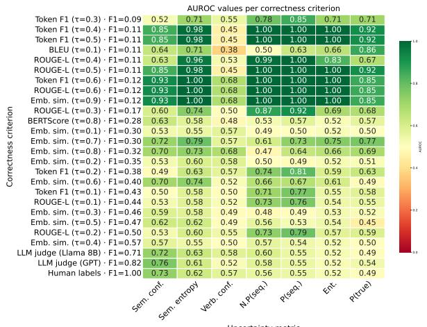

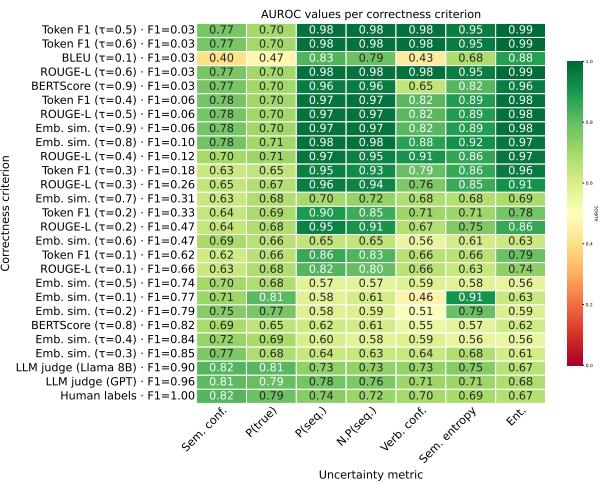

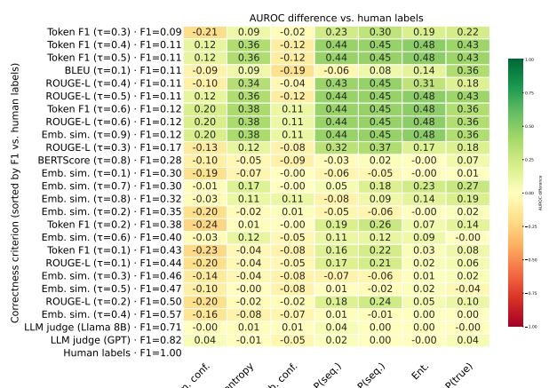

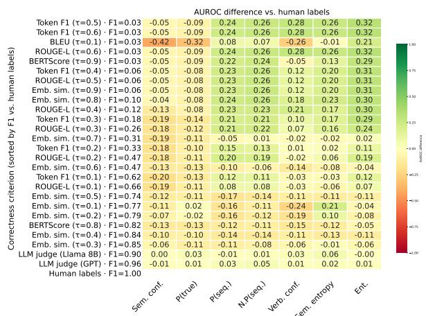

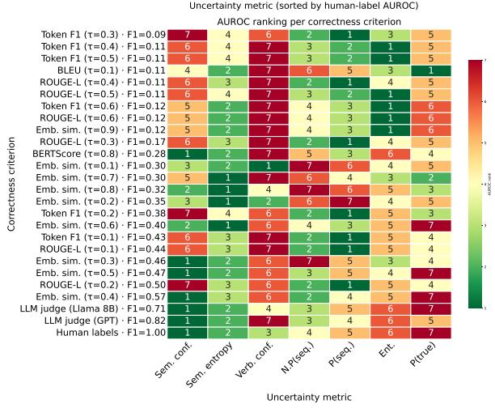  
(a) Qwen 0.5B, TriviaQA

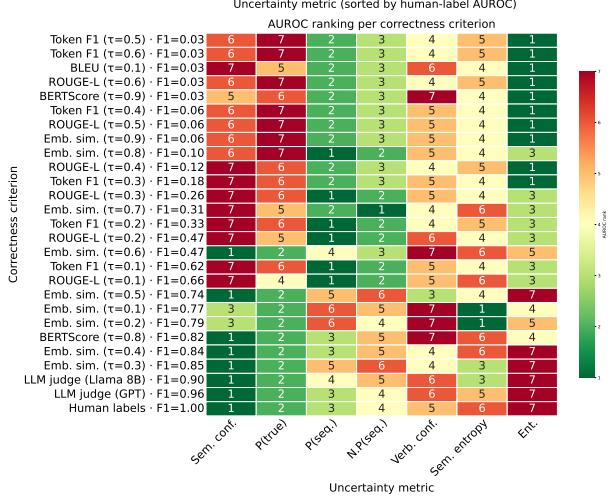  
(b) Qwen 7B, TriviaQA  
Figure 7: Top row shows AUROC values, middle row shows differences between oracle and system AUROC values and bottom row rankings for various uncertainty quantifiers (ordered from left to right in a descending order of performance) and correctness functions (ordered from top to bottom in an increasing order of quality).

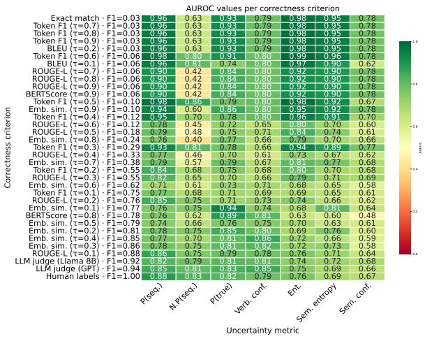

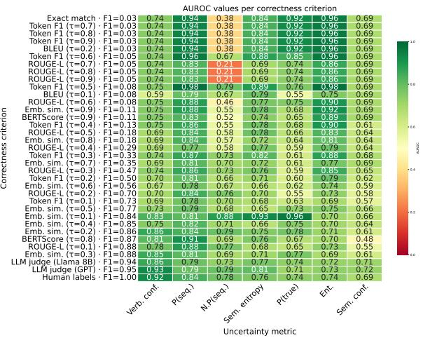

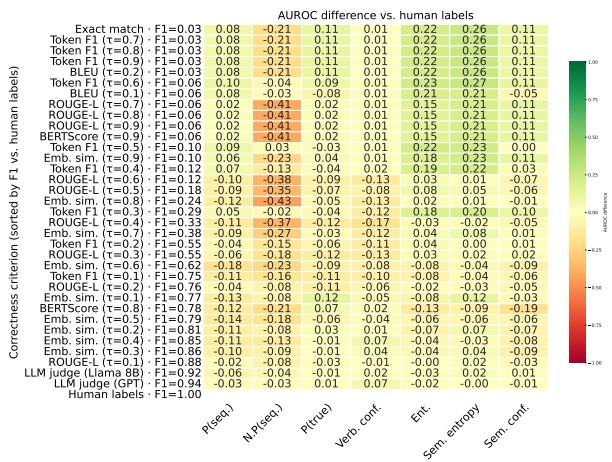

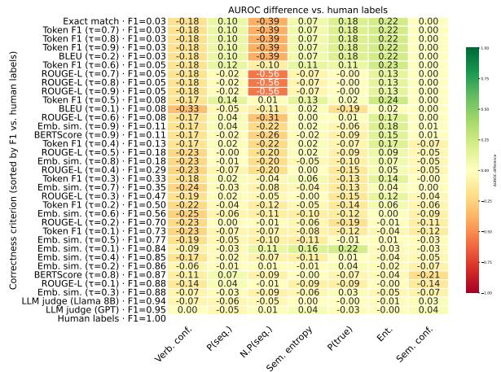

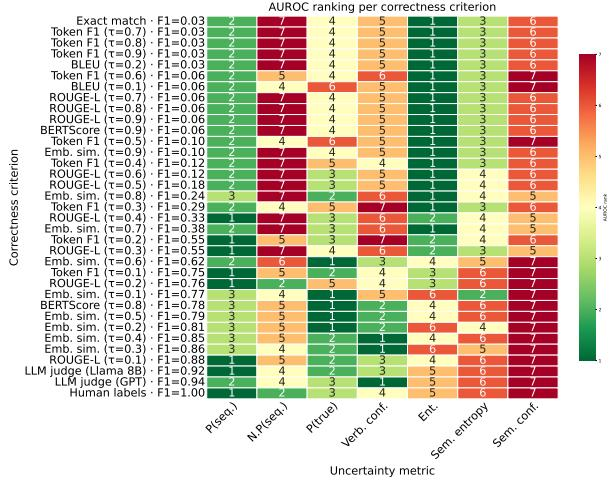  
(a) Llama 3B, TriviaQA

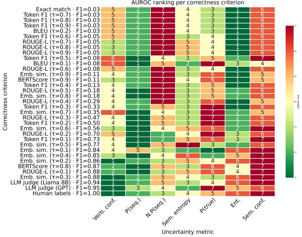  
(b) Llama 8B, TriviaQA  
Figure 8: Top row shows AUROC values, middle row shows differences between oracle and system AUROC values and bottom row rankings for various uncertainty quantifiers (ordered from left to right in a descending order of performance) and correctness functions (ordered from top to bottom in an increasing order of quality).

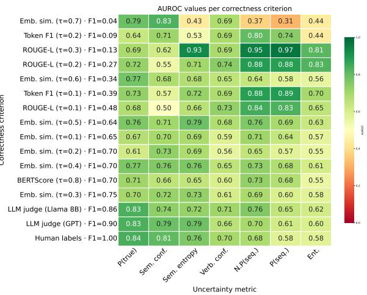

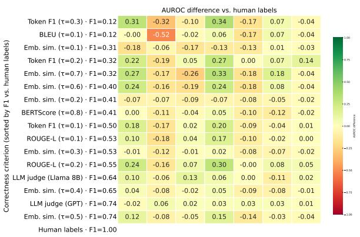

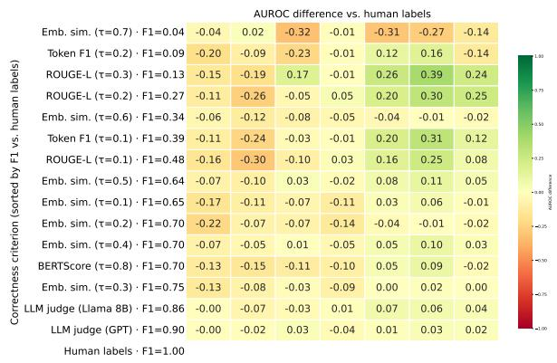

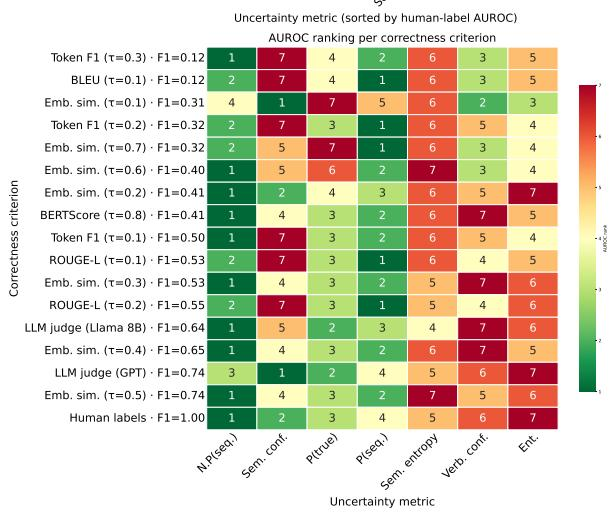  
(a) Qwen 0.5B, AmbigQA (unambiguous)

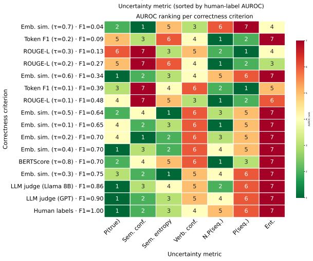  
(b) Qwen 7B, AmbigQA (unambiguous)  
Figure 9: Top row shows AUROC values, middle row shows differences between oracle and system AUROC values and bottom row rankings for various uncertainty quantifiers (ordered from left to right in a descending order of performance) and correctness functions (ordered from top to bottom in an increasing order of quality).

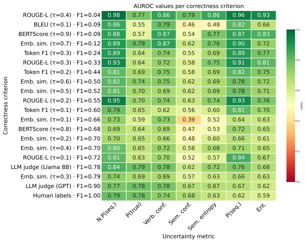

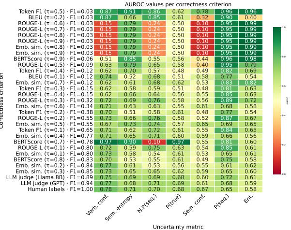

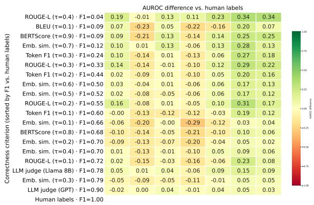

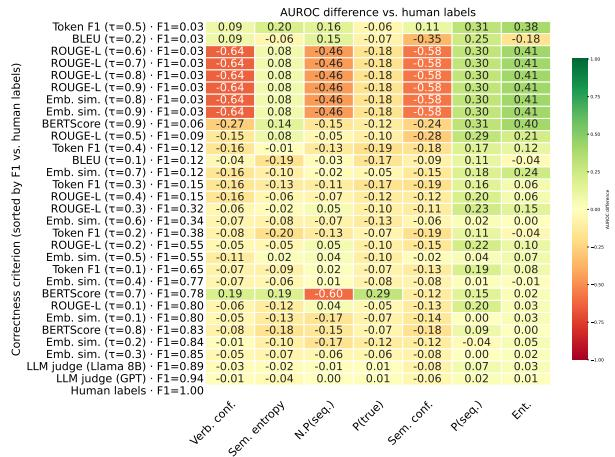

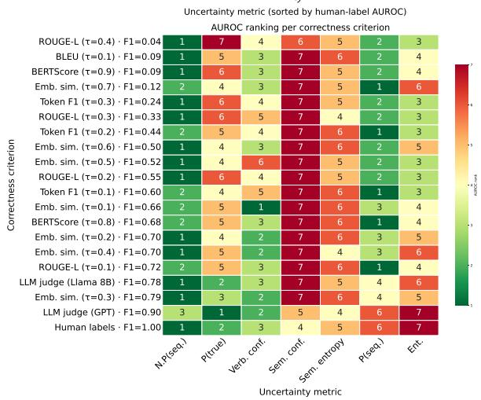  
(a) Llama 3B, AmbigQA (unambiguous)

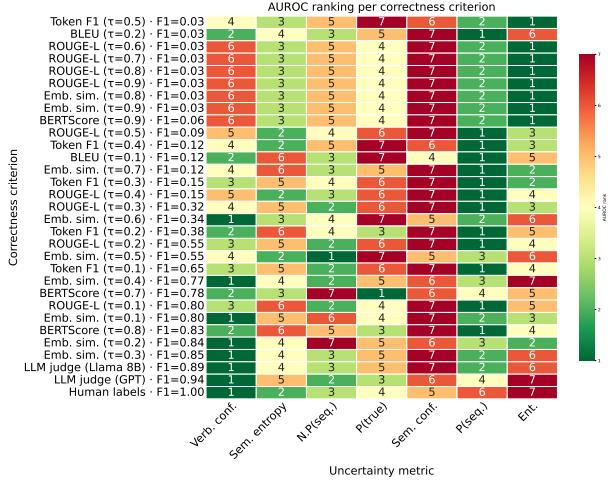  
(b) Llama 8B, AmbigQA (unambiguous)  
Figure 10: Top row shows AUROC values, middle row shows differences between oracle and system AUROC values and bottom row rankings for various uncertainty quantifiers (ordered from left to right in a descending order of performance) and correctness functions (ordered from top to bottom in an increasing order of quality).

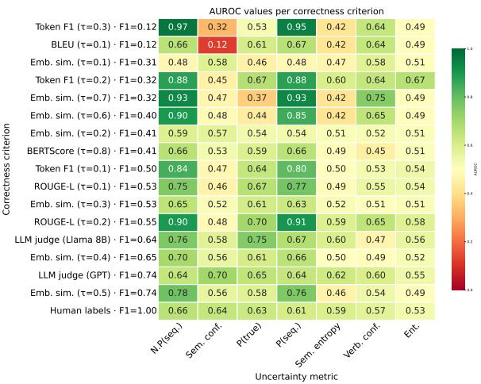

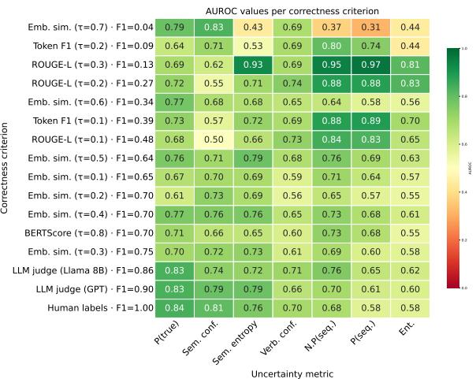

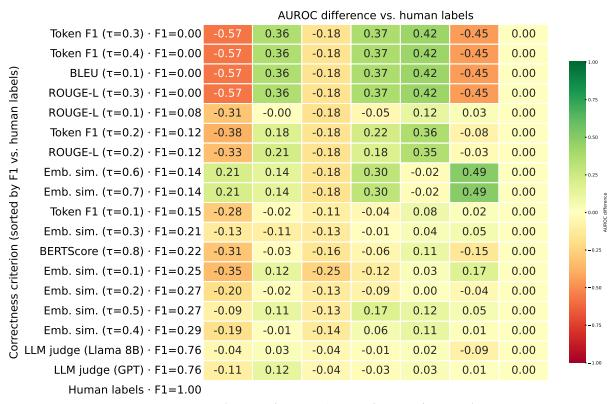

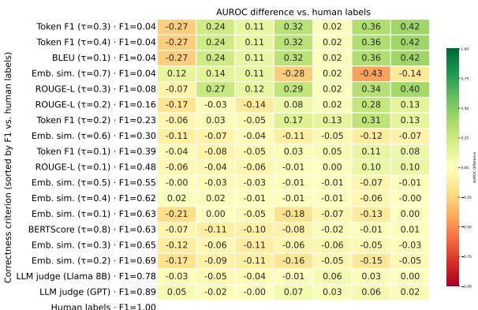

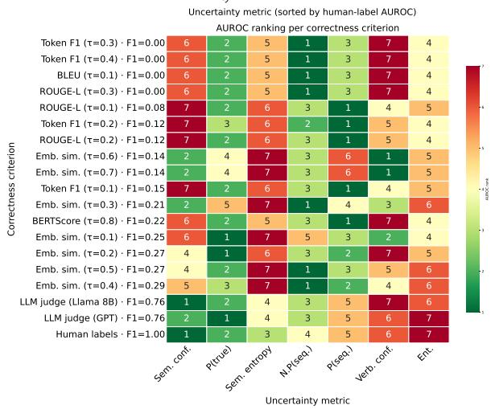  
(a) Qwen 0.5B, AmbigQA (ambiguous)

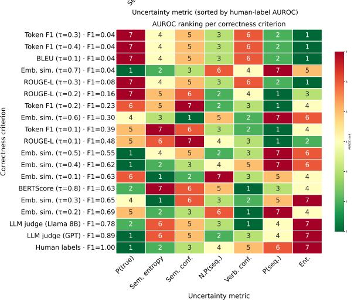  
(b) Qwen 7B, AmbigQA (ambiguous)  
Figure 11: Top row shows AUROC values, middle row shows differences between oracle and system AUROC values and bottom row rankings for various uncertainty quantifiers (ordered from left to right in a descending order of performance) and correctness functions (ordered from top to bottom in an increasing order of quality).

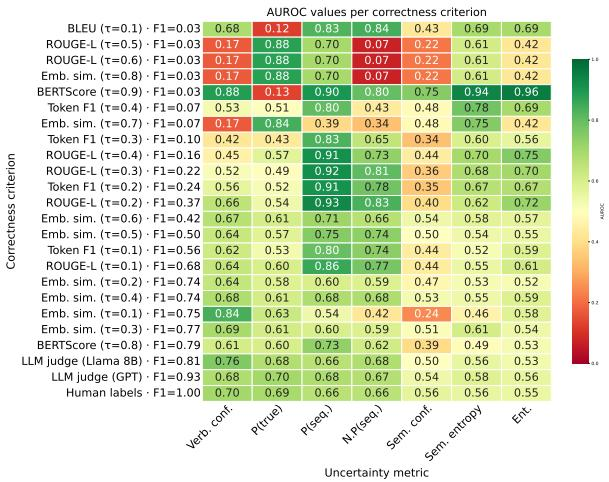

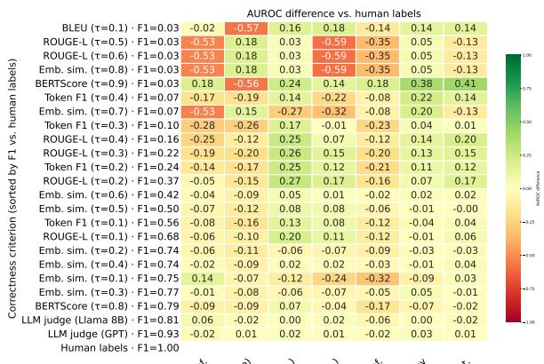

<table><tr><td colspan="9">AUROC difference vs. human labels</td></tr><tr><td></td><td>Token F1 (τ=0.3)·F1=0.03</td><td>-0.20</td><td>0.08</td><td>0.20</td><td>-0.07</td><td>-0.45</td><td>0.11</td><td>-0.08</td></tr><tr><td></td><td>BLEU (τ=0.2)·F1=0.03</td><td>-0.71</td><td>-0.47</td><td>0.10</td><td>0.14</td><td>0.02</td><td>-0.30 -0.08</td><td></td></tr><tr><td>ROUGE-L (τ=0.4)·F1=0.03</td><td></td><td>-0.51 0.08</td><td>0.21</td><td>0.22</td><td>0.02</td><td>0.32</td><td>0.46</td><td>L.00</td></tr><tr><td>BLEU (τ=0.1)·F1=0.06</td><td></td><td>-0.46 -0.19</td><td>0.15</td><td>0.04</td><td>-0.22</td><td>-0.10</td><td>-0.08</td><td></td></tr><tr><td>Emb. sim. (τ=0.7) · F1=0.06</td><td></td><td>-0.47</td><td>-0.19</td><td>-0.04</td><td>-0.10</td><td>0.02</td><td>-0.03</td><td>-0.08</td></tr><tr><td>ROUGE-L(τ=0.3)·F1=0.12</td><td></td><td>-0.25</td><td>0.09</td><td>0.24</td><td>0.16</td><td>-0.09</td><td>0.29</td><td>0.32</td></tr><tr><td>Token F1 (τ=0.2)· F1=0.14</td><td></td><td>-0.18</td><td>0.03 0.08</td><td>-0.07</td><td></td><td>-0.07 0.23</td><td>0.13</td><td></td></tr><tr><td>ROUGE-L (τ=0.2)·F1=0.26</td><td>-0.16</td><td>0.05</td><td>0.13</td><td>0.02</td><td>-0.10</td><td>0.28</td><td>0.23</td><td></td></tr><tr><td>Emb. sim. (τ=0.6) · F1=0.33</td><td>-0.15</td><td>-0.14</td><td>-0.04</td><td>-0.21</td><td>-0.03</td><td>0.01</td><td>0.00</td><td>0.25</td></tr><tr><td>Token F1 (τ=0.1)·F1=0.50</td><td>-0.23</td><td>-0.09</td><td>-0.05</td><td>-0.14</td><td>-0.13</td><td>0.08</td><td>0.03</td><td>-0.00</td></tr><tr><td>Emb. sim. (τ=0.5)·F1=0.58</td><td>-0.15</td><td>-0.07</td><td>-0.01</td><td>-0.10</td><td>-0.07</td><td>0.00</td><td>0.00</td><td></td></tr><tr><td>ROUGE-L(τ=0.1)·F1=0.69</td><td>-0.18</td><td>-0.12</td><td>-0.02</td><td>-0.07</td><td>-0.12</td><td>0.15</td><td>0.08</td><td>-0.5</td></tr><tr><td>Emb. sim. (τ=0.4)·F1=0.76</td><td>-0.03</td><td>-0.08</td><td>-0.00</td><td>-0.09</td><td>-0.10</td><td>0.04</td><td>0.04</td><td></td></tr><tr><td>BERTScore (τ=0.8) ·F1=0.76</td><td>-0.15</td><td>-0.17</td><td>-0.17</td><td>-0.18</td><td>-0.16</td><td>0.06</td><td>0.02</td><td></td></tr><tr><td>Emb. sim. (τ=0.2) ·F1=0.77</td><td>-0.12</td><td>-0.10</td><td>-0.16</td><td>-0.12</td><td>-0.15</td><td>0.04</td><td>0.05</td><td>0.50</td></tr><tr><td>Emb. sim. (τ=0.1)·F1=0.79</td><td>-0.10</td><td>-0.07</td><td>-0.14</td><td>-0.12</td><td>-0.36</td><td>0.13</td><td>0.03</td><td></td></tr><tr><td>Emb. sim. (τ=0.3)·F1=0.79</td><td>-0.04</td><td>-0.09</td><td>-0.05</td><td>-0.06</td><td>-0.09</td><td>0.00</td><td>0.05</td><td>-0.75</td></tr><tr><td>Cor     s o ls) LLM judge (Llama 8B) · F1=0.87</td><td>0.02</td><td>0.03</td><td>-0.00</td><td>-0.07</td><td>-0.05</td><td>0.05</td><td>-0.01</td><td></td></tr><tr><td>LLM judge (GPT) · F1=0.94</td><td>0.02</td><td>0.03</td><td>-0.01</td><td>-0.01</td><td>-0.02</td><td>0.05</td><td>0.01</td><td>-1.00</td></tr><tr><td>Human labels·F1=1.00</td><td></td><td></td><td></td><td></td><td></td><td></td><td></td><td></td></tr></table>

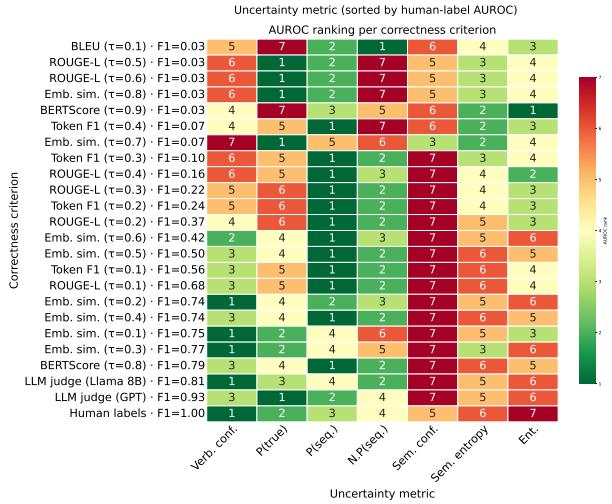  
(a) Llama 3B, AmbigQA (ambiguous)

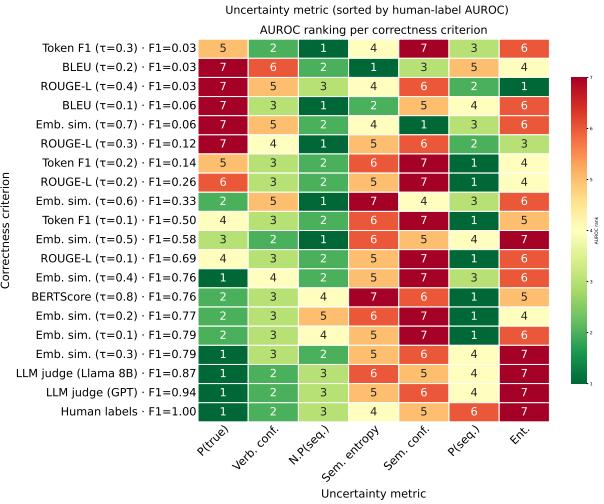  
(b) Llama 8B, AmbigQA (ambiguous)  
Figure 12: Top row shows AUROC values, middle row shows differences between oracle and system AUROC values and bottom row rankings for various uncertainty quantifiers (ordered from left to right in a descending order of performance) and correctness functions (ordered from top to bottom in an increasing order of quality).

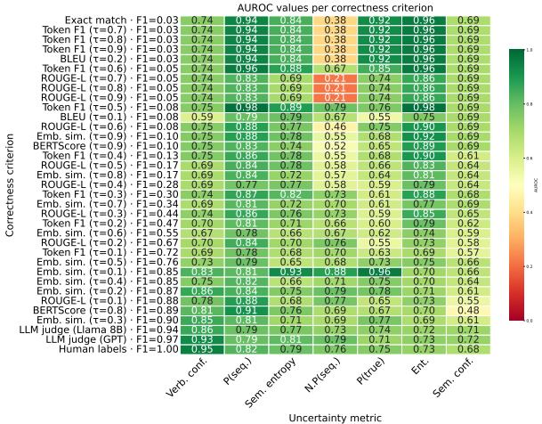

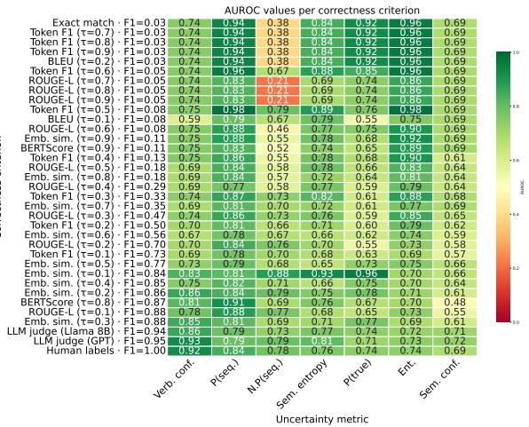

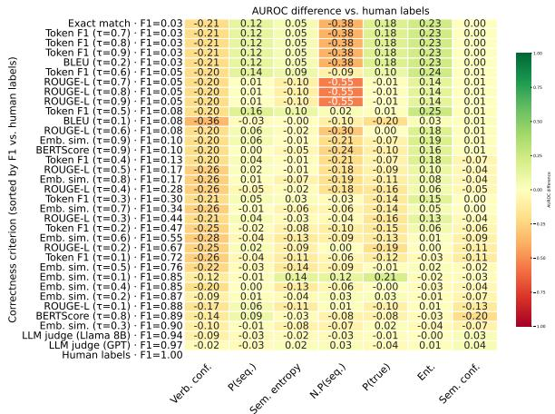

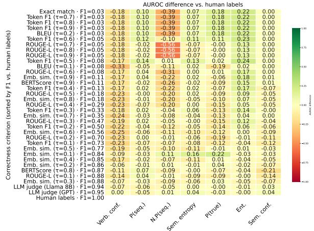

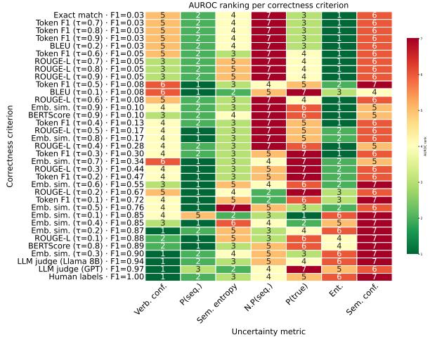  
(a) Llama 8B, TriviaQA, New annotator

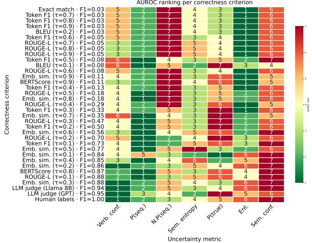  
(b) Llama 8B, TriviaQA, Original annotator  
Figure 13: Left column shows results given manual labels obtained from new annotator, and right column shows results from original annotator.

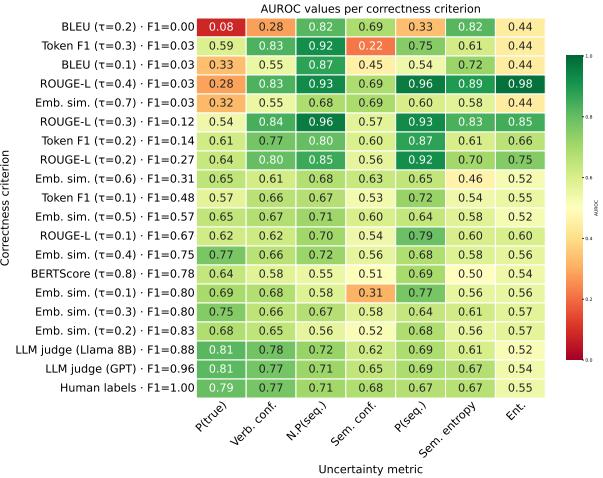

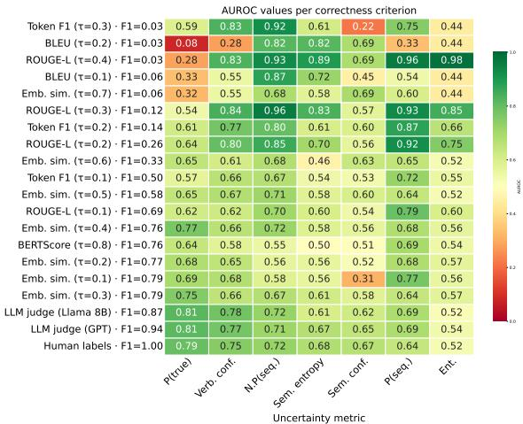

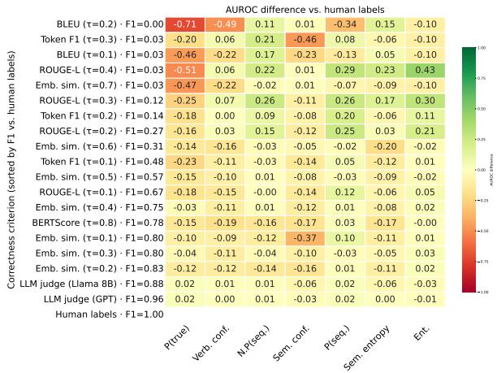


  
(a) Llama 3B, AmbigQA (ambiguous), New annotator

  
(b) Llama 8B, AmbigQA (ambiguous), Original annotator  
Figure 14: Left column shows results given manual labels obtained from new annotator, and right column shows results from original annotator.


  
Figure 15: Top two plots correspond to Llama 3B, TriviaQA. Bottom two plots correspond to Llama8b, TriviaQA.

Mean AUROC across correctness functions  


Uncertainty quantifier ranking across correctness functions  


Mean AUROC across correctness functions  


Uncertainty quantifier ranking across correctness functions  
  
Figure 16: Top two plots correspond to Qwen 0.5B, TriviaQA. Bottom two plots correspond to Qwen 7B, TriviaQA.


Uncertainty quantifier ranking across correctness functions  


Mean AUROC across correctness functions  


  
Figure 17: Top two plots correspond to Llama 3B, AmbigQA (unambiguous). Bottom two plots correspond to Llama 8B, AmbigQA (unambiguous).

Mean AUROC across correctness functions  


Uncertainty quantifier ranking across correctness functions  


Uncertainty quantifier ranking across correctness functions  
  
Figure 18: Top two plots correspond to Qwen 0.5B, AmbigQA (unambiguous). Bottom two plots correspond to Qwen 7B, AmbigQA (unambiguous).


Uncertainty quantifier ranking across correctness functions  


Uncertainty quantifier ranking across correctness functions  
  
Figure 19: Top two plots correspond to Llama 3B, AmbigQA (ambiguous). Bottom two plots correspond to Llama 8B, AmbigQA (ambiguous).


  
Figure 20: Top two plots correspond to Qwen 0.5B, AmbigQA (ambiguous). Bottom two plots correspond to Qwen 7B, AmbigQA (ambiguous).


  
(a) Llama 3B

  
(b) Llama 8B  
Figure 21: Top row shows risk at fixed coverage values, middle row shows differences and bottom row rankings for various uncertainty quantifiers.


  
(a) Qwen 0.5B

  
(b) Qwen 7B  
Figure 22: Top row shows risk at fixed coverage values, middle row shows differences and bottom row rankings for various uncertainty quantifiers.


  
(a) Llama 3B

  
(b) Llama 8B  
Figure 23: Top row shows Coverage at fixed risk values, middle row shows differences and bottom row rankings for various uncertainty quantifiers.

Coverage@Risk (20.0%) Difference per Correctness  
Coverage@Risk (20.0%) Ranking per Correctness  
  
Coverage@Risk (20.0%) Difference per Correctness


  
Uncertainty metric (sorted by actual AUROC using human-labelled correctness)  
Coverage@Risk (20.0%) Ranking per Correctness

  
(a) Qwen 0.5B

  
(b) Qwen 7B  
Figure 24: Top row shows Coverage at fixed risk values, middle row shows differences and bottom row rankings for various uncertainty quantifiers.


  
Figure 25: F1 distributions for TriviaQA dataset and Llama 8B (top left corner), Llama 3B (top right corner), Qwen 7B (bottom left corner) and Qwen 0.5B (bottom right corner)


dataset=ambig\_qa\_single\_answer generator=llama-8b-instruct | Posterior F1  


  
Figure 26: F1 distributions for AmbigQA (non-ambiguous) dataset and Llama 8B (top left corner), Llama 3B (top right corner), Qwen 7B (bottom left corner) and Qwen 0.5B (bottom right corner).

dataset=ambig\_qa\_multiple\_qas generator=llama-3b-instruct | Posterior F1  
dataset=ambig\_qa\_multiple\_qas generator=llama-8b-instruct | Posterior F1  


dataset=ambig\_qa\_multiple\_qas generator=qwen-0.5b-instruct | Posterior F1  
  
Figure 27: F1 distributions for AmbigQA (ambiguous) dataset and Llama 8B (top left corner), Llama 3B (top right corner), Qwen 7B (bottom left corner) and Qwen 0.5B (bottom right corner).

  
Figure 28: F1 scores of automated judges against RBO scores for all dataset-generator pairs.