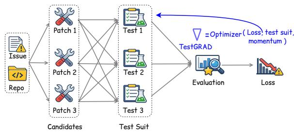
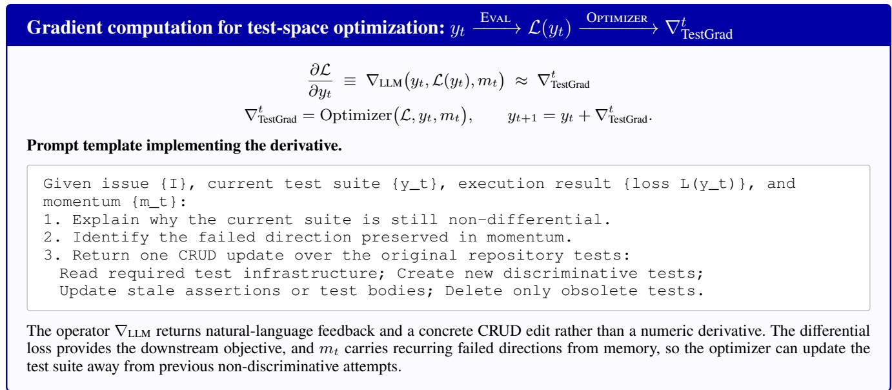
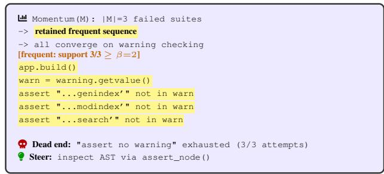
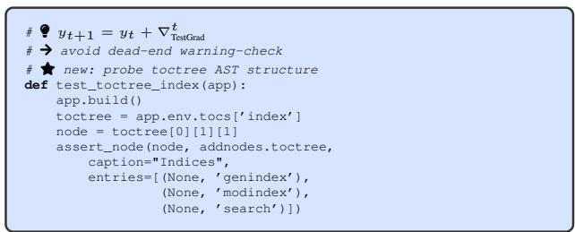
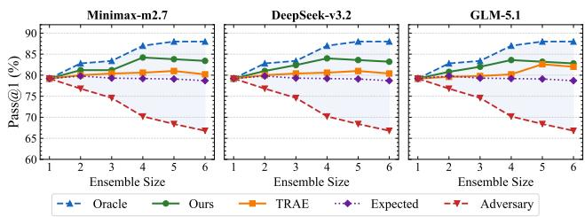
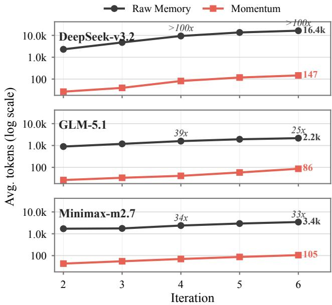
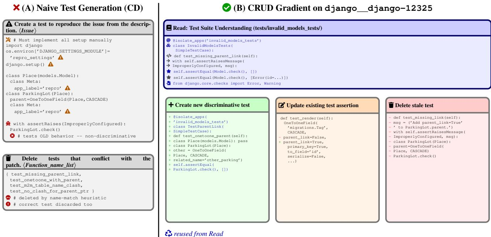

# TestGRAD: Evolving Test Suites via Failure Pattern Momentum for SWE-Agent Ensemble

Pengfei He1, Jiayuan Zhou2, Shaowei Wang1∗, Ruiqi Pan3

1University of Manitoba, Winnipeg, Canada

2Huawei Canada, Markham, Canada

3Huawei Technologies, Hangzhou, China

{hep2@myumanitoba.ca, shaowei.wang@umanitoba.ca}

jiayuan.zhou1@huawei.com, panruiqi@huawei.com

## Abstract

SWE-agent ensembles improve issue resolution by combining candidate patches from diferent agents with complementary strengths. The central problem is therefore test-based selection: generate tests, execute candidate patches, and identify the best patch. We formulate this process as test-space optimization: evolving an executable repository test suite until it distinguishes competing patches. Existing test-generation methods are limited optimizers. They usually lack an explicit loss for ensemble selection, optimize through incomplete di- rections that mostly create new tests or delete old ones, and perform one-of generation without feedback from repeated failures.

Inspired by gradient descent with momentum, we introduce TestGRAD, a framework for automatic test optimization. TestGRAD centers on three concepts. Diferential loss gives the optimizer an explicit execution-defined target: useful tests should separate candidate patches by behavior. Full CRUD gradients expand the update direction from merely creating or deleting tests to reading existing test infrastructure, creating new tests, updating stale assertions, and deleting only obsolete tests. Failure Pattern Momentum mines fre-quent failure sequences from memory, allowing the optimizer to avoid repeated non-discriminative directions while com- pressing the failure-history context. On SWE-bench Verified, TestGRAD achieves 84.2% Pass@1 with a 4-agent ensemble, outperforming the strongest baseline (80.6%) by an absolute improvement of 3.6 percentage points, while compressing failure-history context by over 100×.

## Introduction

Software engineering (SWE) agents autonomously resolve repository issues by localizing faults, generating patches, and validating fixes in a live coding environment (Jimenez et al. 2023; Lingxi Authors 2025). Diferent agents exhibit complementary strengths: an agent that fails on one issue may still produce the best patch for another. A practical way to exploit this diversity is parallel ensembling, where mul- tiple SWE agents generate candidate patches and a selector chooses the final atch (Se and Vert 2025).

The selector must be grounded in behavior. A natural but weak approach is to ask an LLM judge to compare candidate patches and select the most plausible fix (Augment Code

2025; Zhang et al. 2025). Without execution evidence, however, the judge sees surface plausibility rather than repository behavior and can be sensitive to presentation order (Wang et al. 2023; Zheng et al. 2024). The key to SWE-agent ensembling is therefore test-based selection: generate tests, ex-ecute every candidate patch, and use the resulting behavior to identify the correct patch.

This view turns ensemble selection into test-space optimization: the optimized object is the repository test suite, and the objective is to evolve it for better selection. This is dificult for three reasons. First, the loss is not obvious. A test that simply passes or fails is not necessarily useful for selec- tion; even patches that pass benchmark tests can remain be- haviorally divergent from developer fixes (Wang, Pradel, and Liu 2026). Second, the update direction cannot be limited to creating new tests. Useful repository tests often require read- ing fixtures and conventions, updating stale assertions, and deleting only confirmed obsolete tests (Mündler et al. 2025). Third, test generation is rarely solved in one step: when an attempted test is non-discriminative, the next attempt should use that failure as optimization signal rather than restart from scratch.

Inspired by gradient descent with momentum in neural networks (Polyak 1964; Sutskever et al. 2013), we introduce TestGRAD, a framework that models test-suite evolution as gradient-descent-like optimization in test space. Table 1 summarizes the analogy. A test suite is the parameter state, diferential execution is the loss, CRUD edits are gradient di- rections, frequent failure sequences are momentum, support is the retention weight, and the LLM agent is the optimizer. In the forward pass, TestGRAD executes the current test suite on candidate patches and observes whether their be- haviors difer. In the backward pass, the LLM optimizer uses this execution-defined signal and mined failure momentum to produce the next CRUD test update. The design has three components.

➀ Diferential loss. TestGRAD makes the optimization target explicit: a useful test suite should separate candidate patches by behavior. We define the loss by execution. If the current test suite contains a diferential test, meaning at least one test passes on some candidate patches and fails on others, the loss reaches zero. Otherwise, the loss remains nonzero and the failed update is used to guide the next iteration. This difers from pass-count selection (Xia et al. 2025; Gao et al. 2025), which simply chooses the patch that passes the most tests. Diferential loss instead searches for behavioral contrast among candidates rather than merely verifying the intended fix. It prunes candidates that are indistinguishable under the current tests and discourages selection based on a single weak pass/fail signal.

➁ Full CRUD gradient. TestGRAD treats test-suite evo- lution as a full CRUD update rather than a Create/Delete-only pipeline. Existing test-generation methods (Xia et al. 2025; Gao et al. 2025) mainly create a new test from the issue and, at most, delete conflicting tests by name matching. This partial direction is insuficient for repository tests, which often de- pend on existing fixtures, setup routines, imports, assertion helpers, and tests whose expected values must be revised after the fix.

TestGRAD therefore exposes all four directions as the test-space gradient. Read extracts repository-specific test- ing knowledge for reuse. Create adds new discriminative tests. Update revises stale assertions or test bodies whose expected behavior changes with the fix. Delete removes only tests confirmed obsolete. This full direction avoids shallow standalone tests, preserves high-signal tests that only need assertion updates, and prevents a correct patch from being rejected simply because an old assertion was left unchanged.

➂ Failure Pattern Momentum. In numerical optimiza- tion, momentum accumulates consistent gradient informa- tion across steps and helps avoid oscillation or repeated dead ends. TestGRAD uses an analogous mechanism for test up- dates. When a CRUD update produces a non-discriminative suite, the failed update is written into failure memory. Test- GRAD then mines maximal frequent failure sequences from this memory. These sequences form Failure Pattern Momen- tum: compact evidence of directions that have repeatedly failed. The next LLM optimizer step receives this momen- tum and can move awa from recurring non-discriminative regions of the test-suite space. Compared with summarizing failures using another LLM call (Shinn et al. 2023) or feeding raw test-execution feedback back to the generator (Huang et al. 2023), this design is deterministic, faithful to observed failures, and compresses context by over 100×.

On SWE-bench Verified (500 instances) (SWE-bench 2025), TestGRAD achieves 84.2% Pass@1 with a 4-agent ensemble using Minimax-m2.7, outperforming the next-best baseline (TRAE, 80.6%) by an absolute improvement of 3.6 percentage points and the single-agent baseline by 5.0 per-centage points. Gains are consistent across all three base LLMs. Ablations confirm the contribution of each com- ponent: removing Read drops Pass@1 by 3.0%, removing Update by 2.4%, replacing diferential loss with pass-count selection by 3.4%, removing Failure Pattern Momentum by 1.6%, and removing iterative optimization entirely by 9.2%. Contributions:

❶ We formulate SWE-agent ensemble selection as test- space optimization over executable repository test suites.

❷ We instantiate this optimization with diferential execu- tion loss and full CRUD test-suite gradients.

❸ We introduce Failure Pattern Momentum, which mines frequent failure sequences from memory to guide iter- ative test evolution while compressing context by over 100×.

Table 1: Role-level analogy between gradient descent with momentum and test-space optimization. A one-step CRUD edit plays the role of an instantaneous gradient, whereas a high-support recurring failed edit sequence plays the role of momentum carried across attempts.
<table><tr><td>Gradient Descent with Momentum</td><td>TESTGRAD</td></tr><tr><td>/&gt; Parameter state. Current parameter vector θt.</td><td>/ Test suite state. Current candidate test suite yt . Objective. Differential loss L(yt)</td></tr><tr><td> Objective. Loss function L(θt).</td><td>measuring whether the current test suite has produced a differential outcome.</td></tr><tr><td>Retention strength. β ∈ [0, 1] controls how much of the previous velocity is retained.</td><td>Support-based retention. The β = MinSupport threshold defines the minimum frequency a sequence must satisfy. Lowering this threshold retains more sequences and</td></tr><tr><td>Momentum. β∇t−1. The accumulated direction from previous steps.</td><td>Momentum analogue. mt = Mineβ (M). A persistent test update distilled from recurring failure sequences in memory M, after the latest</td></tr><tr><td>Update with Momentum.  $\nabla _ { t } = \beta \nabla _ { t - 1 } + ( 1 - \beta ) \frac { \partial \mathcal { L } } { \partial \theta _ { t } } .$  Combines instantaneous gradient with momentum to suppress noisy one-step gradients and reinforce consistent</td><td>Gradient analogue. ∇TestGrad = Optimizer(L, yt, mt). Combines current feedback with momentum to suppress one-off noisy edits and reinforce consistent</td></tr><tr><td>State update.  $\theta _ { t + 1 } = \theta _ { t } - \eta \nabla _ { t } .$ </td><td>Test update. yt+1 = yt + ∇TestGrad, where ∇TestGrad is a combination of CRUD</td></tr></table>

❹ TestGRAD achieves 84.2% Pass@1 on SWE-bench Verified with a 4-agent ensemble.

## Related Work

## Test Generation for SWE-Agent Ensemble

LLM-based agents have transformed automated program re- pair, with recent systems resolving over half of real-world GitHub issues on SWE-bench (Jimenez et al. 2023). Rep- resentative frameworks include Agentless (Xia et al. 2025), which decomposes repair into localization, patch generation, and validation, OpenHands (Wang et al. 2024), which en-ables interactive repository navigation with tool use, and Lingxi (Lingxi Authors 2025), which guides issue resolution using procedural knowledge from past fixes. Because dif- ferent SWE agents exhibit complementary strengths (Zhang et al. 2025), ensembling their candidate patches is a natural way to improve Pass@1. The key question is how to generate tests that can distinguish the correct patch from plausible but wrong alternatives.

Table 1 summarizes the analogy that motivates Test-

GRAD: tests are optimized as text-space parameters, CRUD edits instantiate the gradient direction, frequent failure se- quences provide momentum, and the LLM agent acts as the optimizer.

Create/Delete test pipelines. LIBRO (Kang, Yoon, and Yoo 2023) generates a reproduction test directly from the issue description and ranks candidate patches by pass/fail outcome. Agentless (Xia et al. 2025) follows a related Create-Delete pipeline: it creates a new test from the issue description and removes conflicting tests by name matching. These pipelines provide useful execution evidence, but they are in- complete as test optimizers in three ways. First, their update direction is mostly limited to creating tests, with deletion used only as a coarse cleanup step. They do not read and update the existing test suite, so they miss project-specific fixtures, base classes, helper assertions, and stale assertions that need in-place revision. Second, their objective is not a diferential loss over candidate patches. A test may pass or fail, but the generator is not directly optimized to maximize behavioral separation among competing patches. Third, they are largely one-of: once the first generated test is non-discriminative, there is no rinci led iterative o timization rocess that turns that failure into the next test-suite update.

Agentic test generation. AEGIS (Wang et al. 2025) uses FSM-guided script generation to reproduce bug symptoms as standalone scripts. These scripts verify whether the symptom disappears, but they do not integrate with the project’s native test suite and cannot fully capture behavioral regression. TRAE (Gao et al. 2025) adds agentic browsing over source files to inform test creation, but it still follows a Create/Delete style of test generation, does not optimize a diferential loss, and does not maintain momentum across failed test updates. TestGRAD extends this line of work by treating the test suite itself as the optimized object: it reads existing tests, updates stale assertions, creates new discriminative tests, deletes only confirmed obsolete tests, and iteratively evolves the suite us- ing Failure Pattern Momentum.

## Reflection and Text-Space Optimization

Reflexion (Shinn et al. 2023) and Self-Refine (Madaan et al. 2023) introduced the aradi m of lin uistic self-reflection: an agent receives execution feedback, generates a natural- language reflection, and uses it to guide subsequent attempts. Language Agent Tree Search (LATS) (Zhou et al. 2024) scales this idea with Monte Carlo Tree Search, using LM- powered value functions to explore the space of possible actions. These frameworks rely on an LLM evaluator to pro- duce the reflection signal, which is costly and may hallu- cinate for fine-grained code-correctness reasoning. Agent- Coder (Huang et al. 2023) instead uses a test executor agent that runs generated tests and feeds the raw execution results back to the programmer agent for refinement, without ab- stracting recurring failures across attempts.

TextGrad (Yuksekgonul et al. 2025) gives this idea a more explicit optimization form: LLM feedback is back- propagated through text variables in a computation graph, so prompts, predictions, code snippets, or other textual compo- nents can be improved by natural-language gradients. meta-

TextGrad (Xu et al. 2025) further studies how to optimize the LLM optimizer itself, adapting both its prompt and structure for a target task. These works motivate our use of gradient- style language for test-suite optimization, but they are general text-optimization frameworks rather than a test-time SWE- agent ensemble method. In our setting, the forward signal is produced by executing candidate patches against tests, the loss is diferential over patch outcomes, and the gradient di- rection is constrained to CRUD edits over the repository test suite.

TestGRAD takes a diferent approach to memory uti- lization. Rather than summarizing failed attempts with an LLM (Shinn et al. 2023) or feeding raw execution feedback back verbatim (Huang et al. 2023), it applies se-quential mining to failure memory. This produces compact maximal frequent subsequences that represent structurally identical strategies across superficially diverse patches. In TestGRAD, these sequences serve as Failure Pattern Mo- mentum: they carry aggregate information about prior nondiscriminative directions into the next LLM optimizer step. Unlike similarity-based retrieval (RAG), which returns docu-ments similar to the query and therefore also similar to each other, sequential mining extracts cross-document structure and compresses memory by over 100× in practice, keeping the optimizer’s context window available for productive repository reasoning.

## TestGRAD Framework

Table 1 ives the role-level analo that structures Test- GRAD. A test suite is the optimization state, diferential execution is the loss, a one-step CRUD edit is the instanta- neous gradient, and frequent failure sequences mined from memory are the momentum carried across attempts. The whole method follows the same loop: execute the current test suite, compute the diferential loss, update failure mem- ory and momentum, and then back-propagate the signal into the next CRUD test update. Figure 1 shows this end-to-end framework, Figure 2 highlights the derivative step imple- mented by the LLM optimizer, and Figure 3 zooms into the generic transition from $y _ { t }$ to $y _ { t + 1 }$ through failure memory and momentum.

## Problem and Test-Space State

Let ${ \boldsymbol { c } } = \left( { \boldsymbol { I } } , { \mathcal { R } } _ { 0 } \right)$ denote a SWE-bench instance, where I is the issue description and $\mathcal { R } _ { 0 }$ is the initial repository. A SWE- agent ensemble $\left\{ \pi _ { 1 } , \dots , \pi _ { N } \right\}$ produces candidate patches $\mathcal { \bar { P } } = \{ p _ { i } \} _ { i = 1 } ^ { N } . \ \mathrm { A \bar { p } p l y i r }$ g patch $p _ { i }$ to $\mathcal { R } _ { 0 }$ yields a candidate repository. The optimization state is the current test suite yt. The initial state $y _ { 0 }$ is the original repository test suite before applying the issue-specific update.

## Forward Pass: Execute Candidate Patches

The forward pass is purely execution-based. Given the cur- rent test suite $y _ { t } .$ , TestGRAD runs it against every candidate patch in $\mathcal { P }$ and records the pass/fail outcomes:

$$
y _ { t } \xrightarrow { \mathrm { \tiny ~ E v a L } ( { \cdot , \mathcal { P } } ) } \mathrm { p a s s / f a i l ~ o u t c o m e s } .\tag{1}
$$

  
Figure 1: TestGRAD framework overview. Given an issue and candidate patches from multiple SWE agents, Test- GRAD iteratively evolves the repository test suite: the for- ward pass executes tests to obtain diferential loss; failed non-diferential updates are stored in failure memory and mined into Failure Pattern Momentum; the backward pass uses the loss and momentum to produce the next CRUD test update.

A test suite is useful for ensemble selection only if at least one test is diferential: it passes on some candidate patches and fails on others. Uniform outcomes do not separate candidates and therefore provide no selection signal.

## Loss: Diferential Execution

The loss measures whether the current test suite has produced a diferential outcome:

$$
{ \mathcal { L } } ( y _ { t } ) = { \left\{ \begin{array} { l l } { 0 , } & { { \mathrm { i f ~ } } y _ { t } { \mathrm { ~ c o n t a i n s ~ a ~ d i f f e r e n t i a l ~ t e s t } } , } \\ { 1 , } & { { \mathrm { o t h e r w i s e } } . } \end{array} \right. }\tag{2}
$$

This is an execution-defined loss, following the diferential- testing intuition that behavioral diferences across execu- tions expose semantic distinctions (Rao et al. 2025). When $\begin{array} { r } { \mathcal { L } ( y _ { t } ) = 0 } \end{array}$ , optimization stops immediately. The checker agent is then invoked once, outside the loop and with a sep- arate context, to use the diferential result for final patch selection. When $\mathcal { L } ( y _ { t } ) = 1$ , the failed update becomes the optimization signal for the next iteration.

## Memory Update and Momentum

If the current test suite is non-diferential, the CRUD update that produced it has failed to separate candidate patches. TestGRAD writes this failed update into failure memory M:

$$
M  M \parallel [ \nabla _ { t - 1 } ] .\tag{3}
$$

Here $\nabla _ { t - 1 }$ is the one-step CRUD update that produced the current failed suite $y _ { t }$ , and ∥ appends it to memory so repeated failures remain available for support counting. Instead of replaying all raw failures to the next iteration, TestGRAD mines maximal frequent failure sequences from memory:

$$
\begin{array} { r } { m _ { t } = \mathrm { M i n e } _ { \beta } ( M ) . } \end{array}\tag{4}
$$

The support threshold $\beta$ (default $\beta = 2 )$ plays the role of retention strength in Table 1. Lowering $\beta$ retains more recur- ring failure sequences, giving momentum broader influence; raising $\beta$ keeps only the most stable recurring sequences.

Thus $m _ { t }$ is a compact, deterministic momentum signal: it suppresses one-of failed edits and records which directions have already been repeatedly explored, so the next update can move away from the same dead end.

## Backward Pass: CRUD Test Update

The backward pass sends the loss and momentum back to the LLM optimizer. The optimizer produces the next test-space gradient:

$$
\nabla _ { \mathrm { T e s t G r a d } } ^ { t } = \mathrm { O p t i m i z e r } ( \mathcal { L } , y _ { t } , m _ { t } ) .\tag{5}
$$

Figure 2 expands this step as a test-space derivative: the optimizer prompt receives the current suite, the execution- defined loss, and the mined momentum, then returns a CRUD edit that plays the role of $\partial \mathcal { L } / \partial y _ { t }$ . This gradient is a CRUD edit over the original repository test suite. Read collects repository-specific testing knowledge such as fixtures, im- ports, assertion utilities, and setup conventions. Create adds new tests, Update revises stale assertions or test bodies, and Delete removes tests confirmed obsolete. Following the textual-gradient view (Yuksekgonul et al. 2025; Xu et al. 2025), these CRUD edits are the gradient direction in text/- code space rather than a numerical derivative.

The state update is:

$$
y _ { t + 1 } = y _ { t } + \nabla _ { \mathrm { T e s t G r a d } } ^ { t } .\tag{6}
$$

The new suite $y _ { t + 1 }$ enters the next forward pass. The loop continues until a diferential test is found or the iteration bud- get is exhausted. Figure 3 illustrates this transition: repeated non-discriminative failures update memory and momentum, and the optimizer converts $( \bar { \mathcal { L } } , y _ { t } , m _ { t } )$ into a CRUD edit that yields $y _ { t + 1 }$

## Experimental Setup

Metrics. Pass@1: Fraction of the 500 instances resolved under the SWE-bench evaluation harness, after TestGRAD’s checker selects one patch per instance. Ensemble Gain: Ab- solute improvement in Pass@1 over the best single-agent patch source in our candidate pool (Livesweagent, 79.2%).

Dataset. We evaluate on SWE-bench Verified (OpenAI 2024), a human-validated subset of 500 real-world GitHub issues. Candidate patches are drawn from six top-performing SWE-agent leaderboard sub- missions, added incrementally to form ensembles of size $\begin{array} { r l r } { N } & { { } = } & { 1 , \dotsc , 6 \colon } \end{array}$ Livesweagent (20251215) (Live SWE-agent 2025), Sonar (20251205) (Sonar 2025), OpenHands (20251127) (Wang et al. 2024), Trae\_doubao (20250928) (Gao et al. 2025), Gemini-Live (20251120) (Live SWE-agent 2025), and Atlassian (20250902) (Atlassian 2025). At N = 1 (Livesweagent alone), the single-agent Pass@1 is 79.2%, which serves as the baseline for ensemble gain. This construction has two advantages: (1) leaderboard agents produce high-quality and diverse patches, making ensemble selection challeng- ing; (2) all patches are publicly available, ensuring full reproducibility.

  
Figure 2: TestGRAD gradient computation in the backward pass. The derivative step is implemented by an LLM optimizer that converts execution-defined loss and Failure Pattern Momentum into a CRUD update over the repository test suite.

Baselines. We compare TestGRAD against three ensem- ble methods. For a fair comparison, all methods receive the same candidate patches and difer only in their ensemble selection module. Augment (Augment Code 2025) follows the LLM-as-a-judge paradigm: the LLM scores each candidate patch against the issue description and selects the most plausible fix without any test execution. Agentless (Xia et al. 2025) generates a new test from the issue description and filters existing tests by name-matching heuristics, then ranks patches by execution outcome. It follows a Create-Delete (C/D) strategy with no repository inspection and no iterative optimization. TRAE (Gao et al. 2025) is an agentbased selector that adds repository browsing to the C/D pipeline. It reads source files to inform test creation and applies name-based deletion to remove conflicting existing tests, but still lacks an Update operation and does not refine failing tests.

Implementation. TestGRAD uses three base LLMs inter- changeably as its LLM optimizer: Minimax-m2.7 (MiniMax 2025), DeepSeek-v3.2 (DeepSeek-AI 2025), and GLM-5.1 (Zhipu AI 2025). The maximum number of optimization steps is $T _ { \mathrm { m a x } } = 8$ . Failure Pattern Momentum uses sequen- tial mining with a minimum support threshold of $\beta = 2$ (a sequence must appear in at least 2 failed test suites to be reported). All runs execute inside the oficial SWE-bench Docker images.

## Results

## Overall Efectiveness of TestGRAD

Table 2 summarizes the Pass@1 performance of all ensem- ble methods across three base LLMs on SWE-bench Verified. TestGRAD consistently achieves the highest Pass@1 in ev- ery configuration: 84.2% with Minimax-m2.7 (+ 5.0), 84.0% with DeepSeek-v3.2 (+ 4.8), and 83.6% with GLM-5.1 (+ 4.4).

Augment fails to improve over single-agent performance and even degrades it $\left( - \ 0 . 6 \ \mathrm { t o } + 0 . 0 \right)$ , confirming that LLM- as-a-judge scoring is unreliable for patch selection due to po-sitional bias and the absence of execution grounding. Agent- less and TRAE show modest improvements of up to + 1.2 and + 1.4, respectively. Both rely on a Create-Delete (C/D) pipeline: they generate new tests while filtering existing ones by test name, lacking holistic test suite understanding (Read) and in-place test updating (Update). TestGRAD surpasses both by 3.4–3.6%, demonstrating the clear benefit of evolv- ing test suites with CRUD gradients and momentum-guided optimization.

## Impact of Ensemble Size

Figure 4 plots Pass@1 as a function of ensemble size N for TestGRAD and TRAE across three LLMs, together with the Oracle and Adversary bounds and the Expected (randomselection) baseline. Table 3 reports the full numerical results for Minimax-m2.7.

TestGRAD consistently outperforms TRAE at every en- semble size N≥2. With Minimax the gap widens from +1.2% at N=2 to +3.6% at N=4, showing that CRUD-gradient updates and momentum become increasingly valu- able as the selection task grows harder with more diverse candidates.

Optimal ensemble size. Performance peaks at N=4 (Minimax: 84.2%, DeepSeek: 84.0%, GLM: 83.6%) and slightly declines for $N { = } 5 , 6$ . This trend should not be in- terpreted as a violation of the ensemble principle. When the underlying selection loss is non-convex, increasing ensem- ble size can produce plateaus, elbows, or even local non- monotonicity rather than a strictly increasing performance

Table 2: Performance comparison. Gain is computed relative to the baseline Pass@1 (79.2%). Positive gains are shown in green, while negative gains are shown in red.
<table><tr><td rowspan="2">Base LLM</td><td colspan="2">Augment</td><td colspan="2">Agentless</td><td colspan="2">TRAE</td><td colspan="2">Ours</td></tr><tr><td>Pass@1 (%)</td><td>Gain (%)</td><td>Pass@1 (%)</td><td>Gain (%)</td><td>Pass@1 (%)</td><td>Gain (%)</td><td>Pass@1 (%)</td><td>Gain (%)</td></tr><tr><td>Minimax-m2.7</td><td>79.0</td><td>- 0.2</td><td>80.4</td><td> $+ 1 . 2$ </td><td>80.6</td><td> $+ 1 . 4$ </td><td>84.2</td><td>+ 5.0</td></tr><tr><td>GLM-5.1</td><td>78.6</td><td>- 0.6</td><td>80.2</td><td> $+ 1 . 0$ </td><td>80.2</td><td> $+ 1 . 0$ </td><td>83.6</td><td>+ 4.4</td></tr><tr><td>DeepSeek-v3.2</td><td>79.2</td><td>+ 0.0</td><td>79.8</td><td> $+ 0 . 6$ </td><td>80.6</td><td> $+ 1 . 4$ </td><td>84.0</td><td>+ 4.8</td></tr></table>

# Û Read and Reuse: app/warning fixtures   
# å current suite y\_t   
def test\_toctree\_special\_pages(   
app, status, warning):   
app.build()   
warnings = warning.getvalue()   
assert "... enindex’" not in warnin s   
assert "...modindex’" not in warnings   
assert "...search’" not in warnings   
assert ’index’ in app.env.toctree\_includes  
(c) Updated suite $_ { y _ { t + 1 } }$ : AST probe  
Figure 3: TestGRAD momentum-gradient transition from yt to $y _ { t + 1 }$ , illustrated on sphinx-doc\_\_sphinx-10673. (a) The current suite y checks warning text and yields uniform outcomes $( \mathcal { L } ( y _ { t } ) = 1 )$ . (b) Failure memory is mined into $m _ { t } ;$ the highlighted statements form the frequent se- quence shared by all three failed suites (support ${ \bar { 3 } } \geq \beta )$ marking this repeated failed direction as a dead end and steer- ing the optimizer toward AST inspection. (c) The updated suite $y _ { t + 1 }$ probes toctree structure with assert\_node(), producing a discriminative signal for the checker. Colors:

test momentum

  
Figure 4: Pass@1 vs. ensemble size for TestGRAD (green) and TRAE (orange), together with Oracle (blue dashed), Adversary (red dashed), and Expected (purple dotted) bounds. Results shown for Minimax, DeepSeek, and GLM (left to right).

Table 3: Pass@1 across ensemble sizes (TestGRAD, Minimax-m2.7).
<table><tr><td>Agent</td><td></td><td>N Adv.</td><td> $\mathbf { E x p } .$ </td><td>Oracle</td><td>P@1</td></tr><tr><td>Livesweagent</td><td>1</td><td>79.2</td><td>79.2</td><td>79.2</td><td>79.2</td></tr><tr><td>+Sonar</td><td>2</td><td>76.8</td><td>79.8</td><td>82.8</td><td>81.2</td></tr><tr><td>+OpenHands</td><td>3</td><td>74.6</td><td>79.3</td><td>83.4</td><td>81.2</td></tr><tr><td>+Trae_doubao</td><td>4</td><td>70.2</td><td>79.2</td><td>87.0</td><td>84.2</td></tr><tr><td>+Gemini</td><td>5</td><td>68.4</td><td>79.1</td><td>88.0</td><td>83.8</td></tr><tr><td>+Atlassian</td><td>6</td><td>66.8</td><td>78.7</td><td>88.0</td><td>83.4</td></tr></table>

curve (Mattei and Garreau 2025). The decline is consistent with the Adversary and Expected curves, which also decrease beyond N=4 (Expected: 79.2% → 78.7%): adding weaker agents (Gemini-Live at 77.4%, Atlassian at 76.8%) increases candidate noise and lowers the probability that a simple se- lector chooses a correct patch, even though the Oracle ceiling can still rise. Despite this, TestGRAD remains well above the Expected baseline for all $N { \ge } 2 .$ , confirming it extracts reliable discriminative signal even from large candidate sets.

At N=4 the Oracle is 87.0%, leaving a 2.8% gap to Test-GRAD (84.2%). This gap represents instances where a cor-rect patch exists but the generated tests fail to discriminate it from incorrect candidates.

## Contribution of Diferential Loss and CRUD Gradients

Table 4 reports the ablation results on Minimax-m2.7. We fo- cus here on diferential loss and the two CRUD-gradient com- ponents unique to TestGRAD: Read (test suite understanding) and Update (in-place test modification). Because the complete system and each ablation are evaluated on the same

Table 4: Ablation study on SWE-bench Verified (Minimaxm2.7).
<table><tr><td>Model</td><td>Setting</td><td>P@1</td><td>∆</td></tr><tr><td>TESTGRAD</td><td>Complete</td><td>84.2</td><td></td></tr><tr><td> $\mathrm { T _ { E S T G R A D _ { w / o } R e a d } }$ </td><td>w/o suite understanding</td><td>81.2</td><td>-3.0</td></tr><tr><td> $\mathrm { T _ { E S T G R A D _ { w / o U p d a t e } } }$ </td><td>w/o updating tests</td><td>81.8</td><td>-2.4</td></tr><tr><td> $\mathrm { T _ { E S T G R A D _ { w / o R + U } } }$ </td><td>w/o Read and Update</td><td>79.4</td><td>-4.8</td></tr><tr><td> $\mathrm { T _ { E S T G R A D _ { w / o D i f f L o s s } } }$ </td><td>pass-count selection</td><td>80.8</td><td>-3.4</td></tr><tr><td> $\mathrm { T _ { E S T G R A D _ { w / o M o m e n t u m } } }$ </td><td>w/o failure momentum</td><td>82.6</td><td>-1.6</td></tr><tr><td> $\mathrm { T _ { E S T } G R A D _ { w / o } o p t }$ </td><td>w/o iterative optimizer</td><td>75.0</td><td>-9.2</td></tr></table>

SWE-bench Verified instances, we use a paired hypothesis test rather than compare unpaired aggregate Pass@1 values. Specifically, we collect multiple paired overall Pass@1 re- sults for the complete TestGRAD and each ablation variant, and apply a two-sided Wilcoxon signed-rank test (Wilcoxon 1945) at significance level $\alpha = 0 . 0 5$ . The complete Test- GRAD shows a statistically significant advantage over every ablated variant, with all p-values below $7 . 3 2 \times 1 0 ^ { - 3 }$ . The Pass@1 drops in Table 4 are then interpreted as efect sizes. For the non-diferential-loss ablation, we replace the diferen- tial stopping criterion and checker-based final selection with a pass-count rule: after executing the generated tests on all candidate patches, the candidate that passes the largest num- ber of tests wins. This variant tests whether ordinary test-pass maximization is suficient, as opposed to explicitly optimiz- ing for a test whose outcomes difer across candidates. Recent empirical evidence on SWE-bench further cautions against this assumption: patches that pass benchmark tests can still be behaviorally divergent from developer-written fixes, and diferential patch testing exposes discrepancies missed by ordinary validation tests (Wang, Pradel, and Liu 2026).

Efect of Diferential Loss. Replacing diferential loss with pass-count selection reduces Pass@1 from 84.2% to $8 0 . 8 \% ( \Delta = - 3 . 4 \% )$ . This shows that simply rewarding the patch that passes the most generated tests is not enough for ensemble selection: pass count measures compatibility with the current generated tests, not agreement with the intended fix. Because tests are not exhaustive, a broadly plausible but incorrect patch may pass many weak tests, while a correct patch can fail a stale or mis-specified one. The diferential objective instead searches for tests that separate candidate behavior before the checker is invoked.

Efect of Read. Removing test suite understanding $( \mathrm { T _ { E S T } G R A D _ { w / o } R e a d } )$ drops Pass@1 from 84.2% to 81.2% $( \Delta = - 3 . 0 \% )$ , the largest CRUD-component drop. Without Read, the agent cannot discover existing fixtures, base test classes, or helper functions. Generated tests therefore rely on bare Python imports and ad-hoc setups that frequently fail to run in the project’s test runner or exercise shallower code paths than tests built on top of the project’s own infrastructure. This confirms that understanding the repository’s testing conventions is the most critical prerequisitefor a useful test-suite gradient.

Efect of Update. Removing in-place test updating $( \mathrm { T _ { E S T G R A D _ { w / o } U p d a t e } } )$ drops Pass@1 from 84.2% to 81.8% $( \Delta = - 2 . 4 \% )$ . When Update is disabled, tests that assert old expected values are deleted rather than corrected. This breaks regression checks, since these tests still encode the correct behavioral constraints and only require updated assertions. The −2.4% drop shows that deletion-only handling introduces wrong selection and weakens the diferential signal of the test suite.

Joint efect of Read and Update. Removing both components $( \mathrm { T _ { E S T } G R A D _ { w / o \ R + U } ) }$ further reduces Pass@1 to 79.4% $( \Delta = - 4 . 8 \% )$ . This variant is close to a pure Create/Delete- style test generator: it neither grounds new tests in the repos- itory’s existing test infrastructure nor repairs stale assertions in existing tests. The larger combined drop shows that Read and Update are complementary CRUD directions. Read sup- plies the project-specific context needed to make generated tests executable, while Update preserves and corrects high- signal tests that would otherwise be discarded.

## Impact of Failure Pattern Momentum and Token Eficiency

We evaluate the momentum mechanism from two angles: (1) its contribution to Pass@1 via the ablation study, and (2) its token eficiency advantage over raw memory accumulation.

Performance impact. From Table 4, TestGRADw/o Momentum drops Pass@1 from 84.2% to $8 2 . 6 \% ~ ( \Delta ~ = ~ - 1 . 6 \% )$ . While the gap is smaller than Read or Update in isolation, Failure Pattern Momentum provides a qualitatively diferent benefit: it operates across iterations, distilling accumulated failure history into compact momentum that steers the optimizer away from dead ends. The larger baseline gap of −9.2% for $\mathrm { T _ { E S T } G R A D _ { w / o } o p t }$ (75.0%) confirms that iterative optimization as a whole is essential, and momentum is the mechanism that makes this optimization eficient rather than redundant.

Token eficiency. Figure 5 illustrates the token cost of the two strategies across optimization iterations. Raw Memory accumulates all previously failed test suites verbatim; its token count grows steadily, reaching about 1.9K–13.6K tokens by iteration 5. Momentum extracts maximal frequent subsequences from the same corpus, producing a concise momentum context that grows far more slowly, remaining on the order of tens to about a hundred tokens across itera- tions. The compression ratio exceeds 100× for DeepSeek at later iterations and stays between 25× and 40× for GLM and Minimax, meaning the model receives equivalent or richer structural guidance at a fraction of the context cost. This is particularly important because excessive context length de- grades LLM reasoning quality (Liu et al. 2023) and inflates API costs.

## Conclusion

We presented TestGRAD, a momentum-gradient optimizer for iterative test-space optimization. Following the analogy in Table 1, TestGRAD treats the current test suite as the optimization state, diferential execution as the loss, a one- step CRUD test update as the instantaneous gradient, and Failure Pattern Momentum as the retained direction. The LLM optimizer uses this feedback to evolve discriminative test suites, while the checker is invoked only after zero-loss diferential execution for final patch selection.

Kang, S.; Yoon, J.; and Yoo, S. 2023. Large Language Mod- els are Few-shot Testers: Exploring LLM-based General Bug Reproduction. In Proceedings ofthe 45th IEEE/ACM International Conference on Software Engineering, 2312–2323. Lingxi Authors. 2025. Lingxi Replication Package.

  
Figure 5: Average token consumption of Raw Memory (dark gray) vs. Momentum (coral) across optimization iterations, shown on a log scale for DeepSeek, GLM, and Minimax. Italic labels denote representative compression ratios (Raw / Momentum); ratios above 100× are capped as >100x.

On SWE-bench Verified, TestGRAD achieves 84.2% Pass@1 with a 4-agent ensemble, outperforming the strongest baseline by 3.6%. Failure Pattern Momentum also acts as a compact retention mechanism, preserving repeated failed update directions from failure memory while reducing raw failure-history context by over 100×.

## References

Atlassian. 2025. Atlassian SWE Agent. Accessed 2025-12- 15.

Augment Code. 2025. Augment Code: The Most Powerful AI Software Development Platform Backed by the Industry- Leading Context Engine. Accessed 2025-06-10.

DeepSeek-AI. 2025. DeepSeek-V3.2: Pushing the Fron- tier of Open Large Language Models. arXiv preprint arXiv:2512.02556.

Gao, P.; Tian, Z.; Meng, X.; Wang, X.; Hu, R.; Xiao, Y.; Liu, Y.; Zhang, Z.; Chen, J.; Gao, C.; et al. 2025. Trae agent: An llm-based agent for software engineering with test-time scaling. arXiv preprint arXiv:2507.23370.

Huang, D.; Bu, Q.; Zhang, J. M.; Luck, M.; and Cui, H. 2023. AgentCoder: Multi-Agent-based Code Generation with Iterative Testing and Optimisation. arXiv preprint arXiv:2312.13010.

Jimenez, C. E.; Yang, J.; Wettig, A.; Yao, S.; Pei, K.; Press, O.; and Narasimhan, K. 2023. SWE-bench: Can Language Models Resolve Real-world GitHub Issues? arXiv preprint arXiv:2310.06770.

Liu, N. F.; Lin, K.; Hewitt, J.; Paranjape, A.; Bevilacqua, M.; Petroni, F.; and Liang, P. 2023. Lost in the Middle: How Language Models Use Long Contexts. arXiv preprint arXiv:2307.03172.

Live SWE-agent. 2025. Live SWE-agent. Accessed 2025- 12-15.

Madaan, A.; Tandon, N.; Gupta, P.; Hallinan, S.; Gao, L.; Wiegrefe, S.; Alon, U.; Dziri, N.; Prabhumoye, S.; Yang, Y.; et al. 2023. Self-Refine: Iterative Refinement with Self- Feedback. Advances in Neural Information Processing Systems.

Mattei, P.-A.; and Garreau, D. 2025. Are Ensembles Getting Better All the Time? Journal ofMachine Learning Research, 26(201): 1–46.

MiniMax. 2025. MiniMax API Documentation. Accessed 2025-09-12.

Mündler, N.; Müller, M. N.; He, J.; and Vechev, M. 2025. SWT-Bench: Testing and Validating Real-World Bug-Fixes with Code Agents. arXiv:2406.12952.

OpenAI. 2024. Introducing SWE-bench Verified. Accessed 2025-07-10.

Polyak, B. T. 1964. Some methods of speeding up the con- vergence of iteration methods. USSR Computational Mathematics and Mathematical Physics, 4(5): 1–17.

Rao, N.; Gilbert, E.; Green, H.; Ramananandro, T.; Swamy, N.; Goues, C. L.; and Fakhoury, S. 2025. DifSpec: Difer- ential Testing with LLMs using Natural Language Specifica- tions and Code Artifacts. arXiv:2410.04249.

Se, K.; and Vert, A. 2025. What is Test-time Compute and How to Scale It? Accessed 2025-05-25.

Shinn, N.; Cassano, F.; Gopinath, A.; Narasimhan, K.; and Yao, S. 2023. Reflexion: Language Agents with Verbal Re- inforcement Learning. In Advances in Neural Information Processing Systems.

Sonar. 2025. Sonar SWE Agent. Accessed 2025-12-15.

Sutskever, I.; Martens, J.; Dahl, G.; and Hinton, G. 2013. On the importance of initialization and momentum in deep learning. In Proceedings of the 30th International Conference on Machine Learning, 1139–1147.

SWE-bench. 2025. SWE-bench Verified Leaderboard. Ac- cessed 2025-12-15.

Wang, P.; Li, L.; Chen, L.; Zhu, D.; Lin, B.; Cao, Y.; Liu, Q.; Liu, T.; and Sui, Z. 2023. Large Language Models are not Fair Evaluators. arXiv preprint arXiv:2305.17926.

Wang, X.; Gao, P.; Meng, X.; Peng, C.; Hu, R.; Lin, Y.; and Gao, C. 2025. AEGIS: An Agent-based Framework for Bug Reproduction from Issue Descriptions. In Proceedings of the 33rd ACM International Conference on the Foundations of Software Engineering, FSE Companion ’25, 331–342. New York, NY, USA: Association for Computing Machinery. ISBN 9798400712760.

Wang, X.; Li, B.; Song, Y.; Xu, F. F.; Tang, X.; Zhuge, M.; Pan, J.; Song, Y.; Li, B.; Singh, J.; et al. 2024. OpenHands: An Open Platform for AI Software Developers as Generalist Agents. arXiv preprint arXiv:2407.16741.

Wang, Y.; Pradel, M.; and Liu, Z. 2026. Are “Solved Issues” in SWE-bench Really Solved Correctly? An Empirical Study. In Proceedings of the IEEE/ACM International Conference on Software Engineering.

Wilcoxon, F. 1945. Individual Comparisons by Ranking Methods. Biometrics Bulletin, 1(6): 80–83.

Xia, C. S.; Deng, Y.; Dunn, S.; and Zhang, L. 2025. De- mystifying LLM-Based Software Engineering Agents. Proc. ACM Softw. Eng., 2(FSE).

Xu, G.; Yuksekgonul, M.; Guestrin, C.; and Zou, J. Y. 2025. metaTextGrad: Automatically Optimizing Language Model Optimizers. In Advances in Neural Information Processing Systems.

Yuksekgonul, M.; Bianchi, F.; Boen, J.; Liu, S.; Huang, Z.; Guestrin, C.; and Zou, J. 2025. Optimizing Generative AI by Backpropagating Language Model Feedback. Nature, 639: 609–616.

Zhang, K.; Yao, W.; Liu, Z.; et al. 2025. Diversity Empowers Intelligence: Integrating Expertise of Software Engineering Agents. In International Conference on Learning Representations.

Zheng, C.; Zhou, H.; Meng, F.; Zhou, J.; and Huang, M. 2024. Selection Biases in Large Language Models. In Findings of the Association for Computational Linguistics.

Zhipu AI. 2025. GLM Model Documentation. Accessed 2025-09-12.

Zhou, A.; Yan, K.; Shlapentokh-Rothman, M.; Wang, H.; and Wang, Y.-X. 2024. Language Agent Tree Search Unifies Reasoning, Acting, and Planning in Language Models. In International Conference on Machine Learning.

# Supplementary Material for TestGRAD

Pengfei He1, Jiayuan Zhou2, Shaowei Wang1∗, Ruiqi Pan3

1University of Manitoba, Winnipeg, Canada 2Huawei Canada, Markham, Canada 3Huawei Technologies, Hangzhou, China {hep2@myumanitoba.ca, shaowei.wang@umanitoba.ca} jiayuan.zhou1@huawei.com, panruiqi@huawei.com

In this section, we illustrate why CRUD-gradient updates over the original test suite are necessary, and why Failure Pattern Momentum is essential for efective iterative optimization.

  
Figure 1: (A) CD-only generation produces a reproduction script that must hand-roll all setup boilerplate and tests the old exception-raising behavior, making it non-discriminative; tests are deleted by name heuristic, discarding valid ones. (B) Test-GRAD applies a CRUD gradient: it reads the test suite first to extract infrastructure (@isolate\_apps, SimpleTestCase, .check() convention), creates a grounded test reusing that infrastructure (blue = reused from Read), updates the expected model state in test\_render, and semantically deletes test\_missing\_parent\_link whose expected exception is no longer raised after the fix. Instance: django\_\_django-12325.

## CRUD Gradient over Test Suites

Figure 1 contrasts two test generation strategies on django\_\_django-12325, a bug where OneToOneField to a parent model should implicitly set parent\_link=True instead of raising ImproperlyConfigured. The fix changes an exception-raising behavior into a silently-accepted one, making test design non-trivial: a test must assert the new correct behavior, not merely reproduce the old crash. We use this instance to identify two critical gaps in existing C/D-only (Create + Delete) approaches.

Read. Generating a test without first inspecting the repository forces the agent to reconstruct from scratch everything the project already provides. As shown in Figure 1(A), the C/D-only reproduction script must manually configure DJANGO\_SETTINGS\_MODULE, call django.setup(), and declare app\_label in every model’s Meta class, boilerplate that Django’s own test suite has long abstracted away behind the @isolate\_apps decorator. Beyond verbosity, this hand-rolled setup is fragile: without the app registry being properly initialized, ParkingLot.check() may raise an unrelated AppRegistryNotReady error rather than the assertion under test. Even when it does run, the reproduction script asserts that ImproperlyConfigured is raised, the old behavior, so it passes on both the correct and incorrect patches and is therefore invalid.

In contrast, TestGRAD begins by reading tests/invalid\_models\_tests/, extracting four pieces of infrastructure: the @isolate\_apps decorator, the SimpleTestCase base class, the Model.check() → [] assertion convention, and the Error/Warning imports. The subsequently created test in Figure 1(B) reuses all four elements (highlighted in blue) and requires no configuration boilerplate. Because it is executed by Django’s standard test runner inside the existing test environment, infrastructure errors are eliminated and the assertion directly targets the new correct behavior.

Update. A correct patch does not always add behavior. It often changes expected values that existing tests already assert. In django\_\_django-12325, the fix causes OneToOneField to acquire an implicit parent\_link=True attribute, which alters the serialized mi ration state that test\_render ins ects. The ori inal test\_render does not include parent\_link=True in its ex ected field kwargs, so after the correct patch is applied, test\_render fails, not because the patch is wrong, but because the test asserts the old (now-incorrect) behavior.

A C/D-only pipeline resolves this conflict in one of two ways, both harmful. If it deletes test\_render by name-based heuristics, it discards a structurally sound test that could have been a strong discriminator after a one-line edit. If it leaves test\_render unchanged, the test penalizes the correct patch: it passes on every incorrect patch (which does not change field serialization) and fails on the correct one, invertin the desired discrimination si nal.

TestGRAD applies an Update operation instead: it inserts parent\_link=True into the expected kwargs of test\_render, aligning the assertion with the correct behavior while preserving the test’s full discriminative structure. The updated test then passes exactly on th correct patch and fails on the rest, becoming a genuine discriminative signal.

These two gaps, infrastructure-unaware test generation and destructive handling of behavior-changing patches, motivate using CRUD as the gradient direction over the test suite rather than a conventional C/D pipeline.

## Failure Pattern Momentum

Momentum in iterative test optimization relies on conditioning on past history. However, how these failures are represented introduces critica limitations.

Existing approaches typically adopt one of two strategies. As discussed in the main paper, one line of work summarizes failures using an additional LLM, while another directly appends raw failed history to the model input.

Both strategies are problematic. LLM-based summarization incurs additional inference cost at every iteration, and its outputs may omit or distort key structural details due to abstraction or hallucination. In contrast, directly injecting raw failure history preserves full information but leads to rapidly growing context size and severe redundancy, as many failed test suites correspond to the same underlying strategy.

This redundancy is not merely a matter of eficiency. As illustrated in Figure 3(b) of the main paper, independently generated failed test suites often share the same core logic despite superficial diferences. When presented in raw form, such failures create an illusion of diversity, causing the optimizer to repeatedly explore equivalent strategies under diferent surface realizations.

Moreover, as failure memory grows, redundant patches occupy an increasing fraction of the context window, crowding out essential information such as the issue description and repository context, and leaving less capacity for efective reasoning.

Overall, existing failure representation strategies either sacrifice fidelity (LLM summarization) or scalability (raw history), and neither provides a compact, faithful abstraction of recurring failure modes. TestGRAD therefore treats maximal frequent failure sequences as momentum: a compact, deterministic signal that carries prior failed directions into the next CRUD update.

## Human–LLM Collaboration for Aspect Discovery in Test Suite Understanding

What the Read step collects. In the Method section, the Read step collects repository-specific test infrastructure before any CRUD update is written. In practice, this means that the optimizer first extracts a compact checklist of reusable testing knowledge from the target repository. The checklist has six categories:

• project API imports and module paths;

• project-specific assertion utilities and call signatures;

• setUp/setUpTestData bodies and conftest.py fixtures;

• test base classes and inheritance structure;

• expected literal values and behavioral contracts from similar tests;

• shared helper or factory functions defined in the test module.

These aspects are derived empirically from SWE-bench training instances, as described below.

Methodology. We sample 200 instances from SWE-bench, excluding SWE-bench Verified to avoid data leakage. For each instance, Minimax-m2.7 analyzes the ground-truth test file and summarizes the test-suite understanding aspects.

Aspects present in fewer than 50% of instances are discarded. This threshold ensures that retained aspects are suficiently pervasive across repositories; aspects below this threshold tend to reflect repository-specific idioms (e.g., custom database fixtures in a single project) and do not generalize well. The remaining six aspects form the final taxonomy used by the Read step.

Human–LLM validation. To assess annotation reliability, one of the authors independently re-labels a random subset of 40 instances (20% of the sample) without access to the LLM outputs. Agreement between the human annotator and the LLM reaches a Cohen’s κ score of 0.82, indicating almost perfect agreement and suggesting that the LLM annotations do not introduce systematic bias.

Table 2 reports average per-instance time and token consumption across all four methods and three base LLMs.

Findings. Table 1 reports the frequency of each retained aspect. All six aspects appear in over 60% of test files, confirming that they capture pervasive conventions rather than repository-specific idioms. Project APIs /Imports and Assertion Conventions are the most universal (> 90%), as nearl all test files im ort roject modules and rel on roject-s ecific assertion utilities (e. ., assertQuerysetEqual, assert\_array\_equal). Fixtures and Test Base Classes appear in roughly 80% of instances, reflecting the prevalence of Django-style TestCase inheritance and pytest conftest.py conventions. Expected Values and Helper Functions are present in about two-thirds of test files, typically in suites with shared data builders or custom matchers.

Table 1: Frequency of the six retained test-suite understanding aspects across 200 sampled SWE-bench instances (SWE-bench Verified excluded). Frequency is the fraction of instances where the aspect is present in the target test file. The six discarded aspects each fell below 50%.
<table><tr><td>Aspect</td><td>Typical evidence</td><td>Freq. (%)</td><td>Cohen&#x27;s κ</td></tr><tr><td>Project APIs / Imports</td><td>from django.core.checks import Error</td><td>96</td><td>0.91</td></tr><tr><td>Assertion Conventions</td><td>self.assertQuerysetEqual(...),assert_array_equal</td><td>91</td><td>0.88</td></tr><tr><td>setUp / Fixtures</td><td>setUp(), setUpTestData(), conftest.py</td><td>83</td><td>0.84</td></tr><tr><td>Test Base Classes</td><td>class MyTest(SimpleTestCase):</td><td>79</td><td>0.86</td></tr><tr><td>Expected Values</td><td>literals in assertEqual, docstring examples</td><td>71</td><td>0.79</td></tr><tr><td>Helper Functions</td><td>make_response(),assert_called_with(...)</td><td>64</td><td>0.76</td></tr></table>

These six aspects instantiate the Read operation used by TestGRAD. By requiring the agent to locate repository infrastructure before any CRUD update is written, TestGRAD grounds generation in the project’s own abstractions rather than reconstructing them from scratch, the failure mode of C/D pipelines discussed in the Method section.

## Overhead Analysis

Table 2: Average per-instance overhead across methods and base LLMs. Time is in minutes; tokens are in thousands (K). TestGRAD values are measured from run logs; baseline values are estimated from conversation logs and API call traces.
<table><tr><td>Metric</td><td>Method</td><td>Minimax-m2.7</td><td>DeepSeek-v3.2</td><td>GLM-5.1</td></tr><tr><td rowspan="4">Avg. Time (min)</td><td>Augment</td><td>1.3</td><td>1.8</td><td>1.4</td></tr><tr><td>Agentless</td><td>7.2</td><td>8.6</td><td>7.5</td></tr><tr><td>TRAE</td><td>19.3</td><td>26.7</td><td>20.8</td></tr><tr><td>TESTGRAD</td><td>12.2</td><td>23.0</td><td>20.7</td></tr><tr><td rowspan="4">Avg. Tokens (K)</td><td>Augment</td><td>2.8</td><td>3.2</td><td>2.9</td></tr><tr><td>Agentless</td><td>14.8</td><td>16.2</td><td>15.3</td></tr><tr><td>TRAE</td><td>318</td><td>412</td><td>334</td></tr><tr><td>TESTGRAD</td><td>670</td><td>1,670</td><td>1,307</td></tr></table>

Sources of overhead. TestGRAD’s token cost is higher than all baselines for two structural reasons. First, the Read step issues repository exploration calls once per generation round to extract test-suite understanding. Second, TestGRAD may run up to Tmax = 8 momentum-guided optimization steps per instance, which raises the average token cost to 670K–1,670K per instance. By contrast, Augment and Agentless are one-shot LLM calls, and TRAE runs a single agentic pass without iterative feedback, so their token budgets are structurally lower. This overhead is the direct cost of two design choices: holistic test-suite understanding and iterative momentum optimization, which account fo most of the accuracy gain.

Time. Despite the higher token count, TestGRAD’s time is shorter than TRAE on all three base LLMs (e.g., 12.2 vs. 19.3 min on Minimaxm2.7), because optimization steps run sequentially only when needed and early stopping applies once a discriminative test is found. Agentless and Augment are faster but operate in a one-shot regime, foregoing the +9.2% gain that iterative optimization provides.

Accuracy–cost tradeof. For applications where selection quality is critical, where a wrong patch propagates a bug to production, the additional token cost translates directly into +5.0% Pass@1 over the single-agent baseline and +3.6% over the next-best method. Reducing overhead further (e.g., by capping Tmax or pruning the Read step) is straightforward at the cost of proportionally lower accuracy, and we leave adaptive budget allocation to future work.