# Before They Can Solve: Predicting Post-Training Coding-Agent Performance from Base Models

Tan Yu1 Alexander Bukharin1 Khushi Bhardwaj1 Jennifer Williams1 Zirui Liu1,2 Jonathan Lingjie Li1 Soumye Singhal1 Joseph Jennings1 Sanjeev Satheesh1 Yash Jain1 Ashish Vaswani1 Venkat Krishna Srinivasan1 Matthew Papakipos1 Hyunwoo Kim1 Jian Zhang1 Oleksii Kuchaiev1 Markus Kliegl1 Mostofa Patwary1 Mohammad Shoeybi1 Bryan Catanzaro1 Jonathan Cohen1 Jiantao Jiao1,3,†

1NVIDIA 2University of Minnesota – Twin Cities 3University of California, Berkeley

†Corresponding Author: jiantaoj@nvidia.com

How can we predict which base checkpoint is worth an expensive round of agentic post-training? End-to-end pass@� tests whether successful behavior already appears in a base model’s distribution, but it is a poor fit for agentic coding: many base checkpoints cannot reliably produce the well-formed tool invocation required to complete a task end-to-end. Single-shot or short-horizon tasks avoid these tool-calling failures by collapsing a multi-step interaction into a fixed prompt and a single patch, but they sidestep the core capability we care about: maintaining coherent state over many tool-using steps as the repository evolves. To bridge this gap, we treat successful post-trained agent trajectories as a lookahead signal of base-model potential. Replaying each trajectory and rerunning tests after every code-changing step identifies the decisive step: the first step whose cumulative patch flips the repository from failing to passing, certifying that the recorded action solves the task given the prior context. Motivated by a coverage principle for agentic traces, we build three screens at this step that do not require a base checkpoint to drive the harness from a cold start: (i) Decisive-Action BPB (bits per byte) measures the probability mass on the certified action, (ii) Patch MCQ tests the checkpoint’s choice between that action and alternatives rejected by the same verifier, and (iii) prefix-conditioned pass@� evaluates support for functionally-correct generations and credits any continuation that the tests accept. Across ten pairs of public base and post-trained models, all three screens rank the cohort in close agreement with post-trained SWE-bench Verified pass@1. As our methods need only a benchmark’s successful trajectories and its verifier, they can be applied to turn future agentic coding benchmarks into base-model evaluations.

## 1. Introduction

Choosing a base checkpoint to post-train is a high-stakes decision made before its agentic capabilities can be fully realized. Revealing these capabilities requires substantial investment in compute, engineering, and evaluation, all of which comes only after the checkpoint has been chosen.

Existing evaluations fail to address this problem for opposite reasons. End-to-end agentic coding benchmarks such as SWE-bench Verified (Jimenez et al., 2024; OpenAI, 2024) are too demanding for base checkpoints: pass@� remains near zero because untuned base models fail to operate tooluse harnesses (Appendix F). Non-agentic coding benchmarks exercise isolated coding capabilities, but do not test sustained interaction with an evolving repository, and their correlation with posttrained agentic performance is highly inconsistent. Across ten pairs of open-source base models and their eventual post-trained checkpoints, Spearman � with post-trained SWE-Bench Verified pass@1 ranges from 0.830 on RepoBench XFirst to −0.394 on HumanEval (Appendix E). In short, current evaluations are either too agentic to run or not agentic enough to predict downstream performance.

In this paper, we address the question at the heart of this problem: how can we evaluate agentic coding potential without requiring the base checkpoint to already behave like an agent? To answer this question, we build on the coverage principle: a promising base checkpoint should retain probability mass on behaviors that post-training may later select, rather than merely maximizing average correctness or conforming to today’s agent protocol (Chen et al., 2026; Yue et al., 2026). Agentic trajectories from frontier models on existing agentic coding benchmarks are a natural source for such desirable behaviors; an important follow-up is therefore where in an agentic trajectory to probe that probability mass. We let the verifier of the original agentic coding task decide.

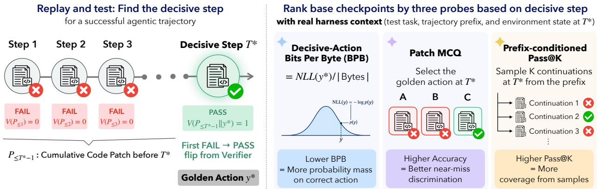  
Figure 1 | A unified agentic trajectory-derived probing framework. By replaying a coding-agent trajectory on a coding task against the task’s own verifier �, we locate the decisive step �⋆, the earliest step whose cumulative patch resolves the task. At this decisive step, (i) Decisive-Action BPB measures the byte-normalized likelihood which a base model assigns to the golden action; (ii) Patch MCQ evaluates base model’s capability of diferentiating the golden action from non-resolving alternatives; (iii) Prefix-conditioned pass@� measures a base model’s empirical success rate under sampling: it draws � continuations from �⋆ and lets the task’s own verifier � judge them.

For each step in a frontier post-trained LLM’s successful trajectory for an agentic coding task, we reconstruct the cumulative environment state and run the task’s tests at that state. This identifies the decisive step �⋆, i.e., the first step at which the verifier accepts the solution, as visualized in Figure 1. The action taken at that step is our golden action: conditioned on the preceding trajectory, executing it resolves the task, while the state immediately before it does not. Unlike the benchmark’s gold patch (i.e., the human-written reference fix), this is an action produced by a real coding agent and certified by the same verifier that defines task success.

At �⋆, we construct three complementary probes as visualized in Figure 1. Decisive-Action BPB asks an absolute question: how much probability mass does a checkpoint assign to the golden action? Patch MCQ asks a comparative question: can a checkpoint distinguish that action from plausible alternatives rejected by the verifier? Prefix-conditioned pass@� asks a generative one: given the same trajectory prefix, can a checkpoint produce a continuation that passes the verifier? The three probes each answer a distinct, interpretable question about model behavior while holding the same agentic context and success criterion fixed. We validate them both by their aggregate correlation with post-trained agentic performance and by whether they correctly order individual checkpoint pairs by that same performance.

## Our contributions are three-fold:

• A framework for converting agentic coding benchmark into base-checkpoint evaluations. We start from successful trajectories on an agentic benchmark, replay them, and run the task’s tests after every code-changing step. The first step where tests pass is the decisive step: the action taken at that step becomes the golden action, and alternative edits attempted at the same point but rejected by the verifier become distractors. Each task yields (i) trajectory context until the decisive step (ii) a golden action (iii) distractors and (iv) an interactive, restorable environment state with an executable task verifier. The construction is a generic recipe rather than a fixed test set: any current or future agentic coding benchmark can be converted into a base-model evaluation.

• Two static decision-point probes. Decisive-Action BPB scores the base model by the likelihood it assigns to the golden action, whereas Patch MCQ scores a checkpoint by its choice among the verifier-certified golden action and the rejected distractors.

• A dynamic continuation probe. Prefix-conditioned pass@� samples � continuations from the decisive step and verifies each with the task’s own tests; any edit that passes is accepted.

Across ten base checkpoints, all three probes produce rankings in close agreement with the ranking by post-trained performance on SWE-bench Verified. Decisive-Action BPB reaches Spearman $\rho = 0 . 9 6 4$ on held-out trajectories from DeepSWE (Huang et al., 2026), a separate agentic coding benchmark. Patch MCQ reaches $\rho = 0 . 9 0 3$ and prefix-conditioned pass@� at � = 16 reaches $\rho = 0 . 9 8 8$ on trajectories drawn from SWE-bench Verified itself. Together, these results support our method of probing base checkpoints at verifier-certified decision points in real agent trajectories.

## 2. Related Work

End-to-end agentic evaluation. Long-horizon, end-to-end agentic evaluations place a model inside an interactive environment and score whether the resulting model–harness system completes a task. SWE-bench Verified (Jimenez et al., 2024; OpenAI, 2024) provides human-validated repository issues with test-based grading. SWE-bench Multilingual (Yang et al., 2026) extends that task format to nine languages across 41 repositories. SWE-bench Pro (Deng et al., 2025) targets longer-horizon, enterprise-style tasks. Terminal-Bench (Merrill et al., 2026) broadens the scope from repository issues to command-line workflows. DeepSWE (Huang et al., 2026) uses original, multilingual tasks with purpose-built verifiers. FrontierCode (Lu et al., 2026) moves the bar from correctness to mergeability, grading maintainer-authored tasks against an ensemble of unit tests. Some base checkpoint evaluation work treats end-to-end pass@� as a capability ceiling (Yue et al., 2026). However, these benchmarks are poorly suited to meaningfully evaluating base checkpoints that are usually too weak at such agentic capabilities.

Non-agentic code evaluation. Traditional code benchmarks isolate capabilities within bounded input–output tasks. HumanEval (Chen et al., 2021) and MBPP (Austin et al., 2021) test function synthesis. EvalPlus (Liu et al., 2023) provides more rigorous criteria for assessing the functional correctness of LLM-synthesized code. APPS (Hendrycks et al., 2021) and DS-1000 (Lai et al., 2023) scale to competition problems and realistic libraries. BigCodeBench (Zhuo et al., 2025) adds complex instructions and library use. LiveCodeBench (Jain et al., 2025) emphasizes contamination-resistant competitive programming with one-step repair. CRUXEval (Gu et al., 2024) tests execution reasoning. RepoBench (Liu et al., 2024) and CrossCodeEval (Ding et al., 2023) add repository-level, cross-file context but retain a completion-style target. These benchmarks can be applied to base checkpoints, but do not test agentic behavior.

Base-checkpoint proxies for post-training potential. APTBench (Qin et al., 2025) and RuDE (Li et al., 2026) use answer discrimination to estimate base checkpoints’ downstream potential. RuDE contrasts answers labeled by model-judged rubric compliance; our agentic coding setting provides executable verifiers. APTBench’s SWE MCQs use reference-derived and LLM-extracted, rewritten, or generated answer choices, including gold patches paired with execution-filtered distractors. Our independent audit of 1,682 APTBench MCQs identifies questions whose designated correct option is incorrect or not uniquely correct (Appendix A); Appendix B reproduces its reported correlations on our cohort. Such defects weaken the interpretation of MCQ accuracy as the ability to distinguish correct from incorrect answers, even when aggregate scores correlate with post-training performance. We therefore construct Patch MCQ at the decisive step: the golden action is verifiercertified, while distractors are alternative actions rejected by the same verifier. This grounds the score in a specific, interpretable criterion: whether a checkpoint can distinguish the golden action from rejected plausible alternatives.

Base-model support and post-training potential. Base checkpoints can contain preference signal that their generations hide: pretrained models rank an answer with its true instruction far above a mismatched one even when their own samples are poor (Hewitt et al., 2024). Chen et al. (2026) define the “coverage” principle, where strong base models already assign high probability mass to high-quality responses. RLVR mainly sharpens solutions base models can already sample rather than creating new ones (Yue et al., 2026). Pushing further, Wu et al. (2025) find RLVR improves pass@1, yet with larger sampling budgets it loses access to more correct solutions than it gains, compared with base checkpoints before RLVR. Together, these results suggest base-model mass bounds post-training gains—exactly the quantity our probes measure.

Likelihood-based evaluation. Likelihood has been studied heavily by the LLM community. Huang et al. (2024) show bits per character on domain corpora is near-linear in downstream benchmark performance . In fact, per-domain loss correlated across public checkpoints has been shown to be strong enough to select pretraining data (Thrush et al., 2025). It is also smoother than task accuracy, giving a more usable development signal than discontinuous task scores (Heineman et al., 2026). Raw likelihood is strongly afected by sequence length, confounding comparisons unless scores are length-normalized (Holtzman et al., 2021). Bits per byte (BPB) is one normalization that keeps checkpoints with diferent tokenizers comparable (Magnusson et al., 2024). We adopt BPB when constructing our evaluation framework.

## 3. Trajectory-Derived Protocols

In this section, we define how we convert agentic coding benchmarks into base checkpoint evaluations. We define the decisive step in Section 3.1 and then use it to construct three probes: Decisive-Action BPB (Section 3.2), Patch MCQ (Section 3.3), and prefix-conditioned pass@� (Section 3.4).

## 3.1. decisive-step discovery for agentic trajectories

Given a task from an agentic coding benchmark, $e . g ,$ SWE-Bench, we collect a successful trajectory of $L$ steps from a frontier post-trained LLM using an agentic coding harness, $e . g .$ , mini-swe-agent. Let $C \subseteq \{ 1 , \ldots , L \}$ be the indices for the set of steps involving code changes. Replaying through $T \in C$ yields a cumulative code patch $P _ { \leq T }$ . We define the verifier-derived decisive step as

$$
T ^ { \star } : = \operatorname* { m i n } \{ T \in C : V ( P _ { \leq T } ) = 1 \} ,\tag{1}
$$

where $V ( \cdot ) \in \{ 0 , 1 \}$ denotes the verifier for the task. As we collected a successful trajectory, it is guaranteed that a step satisfying the above condition exists. The decisive step identifies the evaluation boundary: the evaluation context contains only steps strictly before $T ^ { \star }$

The golden action. Let $y ^ { \star }$ denote the LLM response in step $T ^ { \star }$ of the successful trajectory. Thus, by the definition of decisive step $T ^ { \star }$ in Eq. 1,

$$
V ( P _ { \leq T ^ { \star } - 1 } ) = 0 , \qquad V ( P _ { \leq T ^ { \star } - 1 } \| y ^ { \star } ) = 1 ,\tag{2}
$$

where $P _ { \leq T ^ { \star } - 1 } \| y ^ { \star }$ denotes the cumulative patch obtained by applying the action $y ^ { \star }$ on $P _ { \leq T ^ { \star } - 1 }$ We call $y ^ { \star }$ golden given its prefix. Before $T ^ { \star }$ , none of the recorded actions induces a fail-to-pass transition, so rewarding agreement with them mainly measures imitation of the trajectory generator (or incidental edits) rather than problem-solving ability. At $T ^ { \star }$ , applying $y ^ { \star }$ causes the verifier to accept the cumulative patch for the first time. After $T ^ { \star }$ , later actions may introduce changes unrelated to resolving the task. Therefore, only the decisive step yields a verifier-certified golden action, whereas the steps before and after it are not golden. Figure 2 shows that this choice is not merely principled: restricting BPB to the decisive step increases rank agreement with downstream agent capability, and reverses two checkpoint pairs that all-step BPB orders incorrectly.

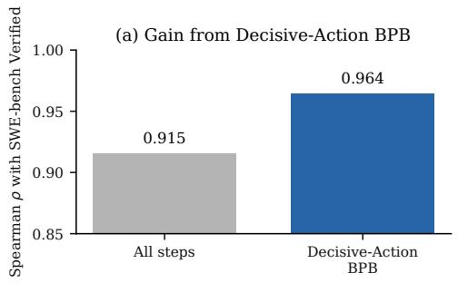

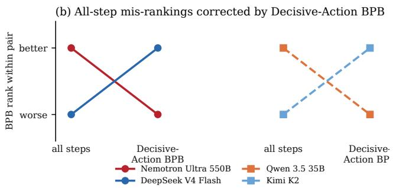  
Figure 2 | (a) Restricting BPB to the verifier-derived decisive step, instead of averaging over every step, raises its Spearman’s rank correlation (�) with downstream agent capability, from 0.915 to 0.964 against SWE-bench Verified, across the same ten checkpoints. (b) At the checkpoint level, Decisive-Action BPB ranks DeepSeek V4 Flash above Nemotron Ultra and Kimi K2 above Qwen 3.5 35B, in agreement with their downstream performance, thus reversing the incorrect orderings produced by all-step BPB.

## 3.2. Decisive-Action BPB

Decisive-Action BPB measures how much probability mass a checkpoint assigns to the golden action, given its prefix. Let $x ^ { \star }$ be the trajectory prefix before the decisive steps’ golden action, $y ^ { \star }$ . We use one fixed universal chat template and tokenize the concatenation $x ^ { \star } \| y ^ { \star }$ into �. We then compute $L ( \theta )$ , the golden action’s negative log-likelihood in bits for the tokens fully contained in $y ^ { \star }$ , and normalize it by the action’s byte length, $| B |$ , to obtain BPB. This normalization makes scores comparable across checkpoints using diferent tokenizers (Gao et al., 2020; Magnusson et al., 2024). Let � denote the set of token indices fully contained in $y ^ { \star }$ and � denote the set of bytes belonging to $y ^ { \star }$ ; Decisive-Action BPB is then formulated as

$$
L ( \theta ) : = - \sum _ { j \in S } \mathrm { l o g } _ { 2 } p _ { \theta } ( t _ { j } \mid t _ { 1 : j - 1 } ) , \qquad \mathrm { B P B } ( \theta ) : = L ( \theta ) / | B | .\tag{3}
$$

A lower BPB is better, meaning the checkpoint places more probability mass on $y ^ { \star }$

Chat Template Masking. Base models may not be familiar with the simple chat template we use for BPB calculations. To reduce the impact of template choice on the results, we mask out formatting text added by the chat template when computing BPB (Appendix H.1).

## 3.3. Patch MCQ

Decisive-Action BPB alone cannot establish whether an action resolves a task: two actions can receive similar scores even when a single-character diference causes one to pass verification and the other to fail. Our patch-based multiple-choice probe (Patch MCQ) addresses this limitation through a discriminative �-way choice, presenting the golden action alongside alternatives that fail verification when applied after the same trajectory prefix. The probe asks the checkpoint to select the action that resolves the task, rather than only measuring the likelihood of the golden action.

Conditioned on trajectory prefix $x ^ { \star }$ , we sample a set of candidate actions from post-trained LLMs, denoted �. We label each candidate by applying it on the prefix’s cumulative patch $P { _ { \mathrm { { \le } } T ^ { \star } - 1 } }$ and checking the verifier outcome. The distractor set, $y -$ , comprises the candidates that fail verification:

$$
\mathcal { V } ^ { - } = \{ y : y \in \mathcal { V } \wedge V ( P _ { \leq T ^ { \star } - 1 } \| y ) = 0 \} .\tag{4}
$$

Thus, every distractor is identified by its failure to pass the task’s verifier rather than by a human or model-based rubric. While, the golden action $y ^ { \star }$ in the original trajectory, is the correct option.

We score all options jointly through answer-letter likelihood. The MCQ context � contains the trajectory prefix and complete option set. Let $\mathcal { L } _ { k } : = \{ \ell _ { 1 } , \ldots , \ell _ { k } \}$ denote the answer-letter tokens assigned to the � displayed options (for our four-option panels, $\mathcal { L } _ { 4 } = \{ \mathrm { A , B , C , D } \} ,$ ). We select the most likely next-token answer letter:

$$
\widehat { \ell } : = \arg \operatorname* { m a x } _ { \ell \in \mathcal { L } _ { k } } p _ { \theta } ( \ell \mid u ) ,\tag{5}
$$

Thus, answer-letter likelihood compares all displayed actions within one shared context rather than scoring each action independently. Let $\mathcal { Q } = \{ q _ { i } \} _ { i = 1 } ^ { N }$ denote the set of constructed multiple-choice questions. For each question $q _ { i }$ , let $\boldsymbol { \hat { \ell } } _ { i }$ denote the predicted option and $\bar { \ell } _ { i }$ denote the golden option. The patch MCQ accuracy $r$ is computed by

$$
r = \frac 1 N \sum _ { i = 1 } ^ { n } \mathbf { 1 } ( \hat { \ell } _ { i } = \bar { \ell } _ { i } ) ,\tag{6}
$$

where $\mathbf { 1 } ( \cdot ) \in \{ 0 , 1 \}$ is indicator function. To reduce positional bias, we use cyclic option reordering (Zheng et al., 2024). The answer probabilities are aggregated across reorderings before selecting the predicted answer, $\widehat { \ell } ,$ detailed implementation details are in Appendix I.

## 3.4. Prefix-conditioned pass@�

Decisive-Action BPB and Patch MCQ both score the base checkpoint’s distribution over actions that were previously generated, but neither tests whether the checkpoint can successfully generate resolving actions. However, on agentic coding tasks, end-to-end pass@� for base models is typically zero even for very large �, since success often requires successive tool calls and agentic interactions with environments, which are not achievable by base models before post-training. Prefix-conditioned pass@� measures whether at least one of � sampled continuations from the trajectory prefix $P _ { i , \leq T _ { i } ^ { \star } - 1 }$ successfully resolves the task.

We therefore condition on real trajectories as context: for each successful trajectory � from a frontier post-trained LLM, let $T _ { i } ^ { \star }$ be its decisive step and let $P _ { i , \leq T _ { i } ^ { \star } - 1 }$ denote the cumulative patch as identified in section 3.1. We let $x _ { i } ^ { \star }$ be the trajectory prefix before the decisive step’s golden action and $\hat { y } _ { i , j }$ be a sampled continuation from a base checkpoint. Prefix-conditioned pass@� measures whether at least one of � sampled continuations from the base checkpoint resolves the task:

$$
\operatorname { p a s s @ K } ( \theta ) : = \frac { 1 } { | \mathcal { T } | } \sum _ { i \in \mathcal { I } } \mathbf { 1 } \Big [ \exists j \leq K : V _ { i } \Big ( P _ { i , \leq T _ { i } ^ { \star } - 1 } \| \hat { y } _ { i , j } \Big ) = 1 \Big ] .\tag{7}
$$

Appendix J describes the rollout mechanics, including the masking convention at $T _ { i } ^ { \star }$ , the forward budget, how a base checkpoint is bridged onto the agent interface, and how the � rollouts are verified.

## 4. Experiments

We evaluate all three trajectory-derived probes on the same ten base checkpoints. We measure how strongly each proposed metric: Decisive-Action BPB, Patch MCQ, and prefix-conditioned pass@�, correlates with models’ relative agentic capability after post-training. We use pass@1 performance on SWE-bench Verified (Jimenez et al., 2024; OpenAI, 2024), SWE-bench Multilingual (Yang et al., 2026), and Terminal-Bench 2.1 (Merrill et al., 2026) as proxies for post-training agentic capability.

## 4.1. Methodology

The three probes are built on trajectories collected from GPT-5.6-Sol (OpenAI, 2026b), Opus-5 (Anthropic, 2026b), and Kimi-K3 (Team et al., 2026b) on SWE-Bench Verified, SWE-Pro, and DeepSWE, using mini-swe-agent (Yang et al., 2024) as the harness. The distractors in Patch MCQ are generated from a set of LLMs including Opus-4.8 (Anthropic, 2026a), Sonnet-5 (Anthropic, 2026c), GPT-5.6-Terra (OpenAI, 2026c), GPT-5.6-Luna (OpenAI, 2026a), GLM-5.2 (GLM-5-Team et al., 2026), Gemini-3.7-Flash (Google, 2026b) and Gemini-3.6-Flash (Google, 2026a).

We probe a total of ten base checkpoints: Nemotron-3-Nano (Blakeman et al., 2025), Nemotron-3-Super (Chandiramani et al., 2026), Nemotron-3-Ultra (Blakeman et al., 2026), Qwen-3.5-35B-A3B-Base (Qwen Team, 2026), DeepSeek-V4-Flash-Base (DeepSeek-AI, 2026), Kimi-K2-Base (Team et al., 2025), GLM-4.5-Air-Base (Zeng et al., 2025), Hy3-Preview-Base (Tencent Hy Team, 2026), DeepSeek-V4-Pro-Base (DeepSeek-AI, 2026), and Gemma-4-26B-A4B (Team et al., 2026a).

For each metric, we measure its correlation across the ten base checkpoints with the SWE-bench Verified and Terminal-Bench 2.1 performance of the corresponding post-trained checkpoints. We use publicly reported benchmark scores when available and run the evaluations ourselves when they are not. The full pipeline for computing each metric, from trajectory collection through verification, is described in Appendix D. Further experimental details are provided in Appendix C.

We correlate each probe’s per-checkpoint score � (using � = − BPB for Decisive-Action BPB, so higher is better) with �, the downstream pass@1 of the checkpoint’s post-trained family. Pearson $r = \mathrm { c o v } ( s , d ) / ( \sigma _ { s } \sigma _ { d } )$ measures linear agreement; Spearman $\rho ,$ Pearson � on ranks, measures whether a probe orders checkpoints correctly, which is all checkpoint selection needs.

## 4.2. Correlations with SWE-Verified

Figure 3 shows that each of our probes strongly correlates with downstream SWE-bench Verified performance. While we choose DeepSWE as the source task for probe construction in Figure 3, these strong correlations hold across trajectories collected from diferent tasks, as shown in Figure 4.

Figure 5 repeats the analysis with probes built from SWE-bench Verified trajectories instead. All three still track post-trained performance closely, at Spearman � of 0.915 for Decisive-Action BPB, 0.903 for Patch MCQ, and 0.906 for prefix-conditioned pass@�. Matching the source to the target benchmark does not, however, buy higher rank agreement. For Decisive-Action BPB and prefixconditioned pass@�, the held-out DeepSWE source agrees more closely (� = 0.964 versus 0.915, and 0.951 versus 0.906), and only Patch MCQ gains from the match (0.903 versus 0.867).

Bounded code benchmarks do not recover the post-trained ranking. Table 7 in section E correlates the same ten checkpoints’ scores on bounded code benchmarks with the same downstream targets. Synthesis benchmarks carry almost no rank signal (MBPP � = 0.091, HumanEval $\rho =$ −0.394), and even the strongest baseline, RepoBench XFirst (� = 0.830), trails all three DeepSWEderived probes (� of 0.867–0.964).

DeepSWE prefix-conditioned pass@K (%)

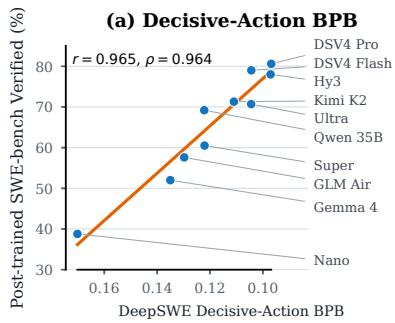

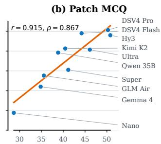  
DeepSWE Patch MCQ accuracy (%)

(c) Prefix-conditioned pass@K  
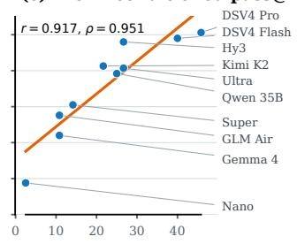

Figure 3 | All three DeepSWE-derived probes strongly track post-trained SWE-bench Verified performance. The common DeepSWE source corpus makes the panels directly comparable across Decisive-Action BPB with tool-formatting tokens masked, Patch MCQ, and prefix-conditioned pass@� at $K = 3 2 .$ . The same ten checkpoints appear in every panel; annotations report Pearson � and Spearman �. $\rho .$ The BPB axis is reversed so rightward consistently means better.  
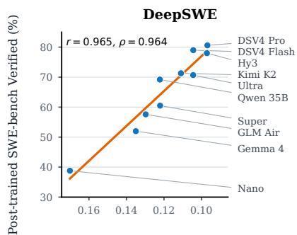

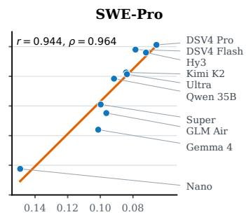  
Decisive-Action BPB

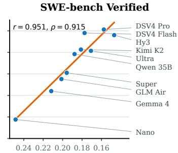

Figure 4 | Decisive-Action BPB strongly tracks post-trained SWE-bench Verified performance. Each panel measures the same ten base checkpoints on a diferent trajectory corpus. Axes run from higher to lower BPB so rightward means better; annotations report Pearson � and Spearman $\rho$ with −BPB.  
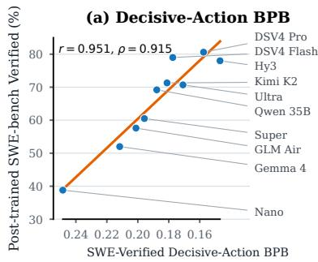

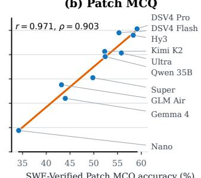

(c) Prefix-conditioned pass@K  
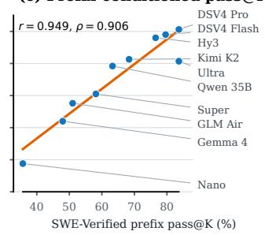  
Figure 5 | All three probes also track post-trained SWE-bench Verified performance when constructed from SWE-bench Verified trajectories. Panels use the same ten checkpoints and settings as fig. 3, but replace the DeepSWE source trajectories with SWE-bench Verified trajectories. Annotations report Pearson � and Spearman �; the BPB axis is reversed so rightward consistently means better. Because the source and downstream target use the same benchmark, this is same-benchmark rather than cross-benchmark evidence.

## 4.3. Correlations with SWE-Multilingual

Figure 6 tests whether the same DeepSWE-derived probes predict post-trained performance beyond SWE-bench Verified. On SWE-bench Multilingual, rank agreement holds or improves. All three probes keep strong rank agreement with SWE-bench Multilingual, at $\rho = 0 . 9 7 6$ for Decisive-Action

BPB, 0.927 for Patch MCQ, and 0.945 for prefix-conditioned pass@�; the first is the highest of the nine probe–target pairs in figs. 3, 6 and 9, and Patch MCQ agrees more closely here than with SWE-bench Verified (0.867). One plausible contributor is that the DeepSWE source is itself multilingual. Pearson � is noticeably lower, 0.82–0.85, and the gap between the two statistics has a single cause: Gemma 4 26B scores 17.3% on SWE-bench Multilingual against 52.0% on SWE-bench Verified. Correlations with Terminal-Bench 2.1 are reported in section G.

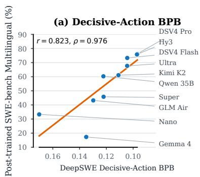

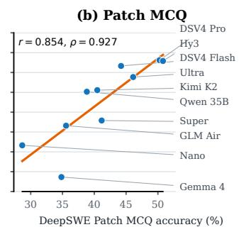

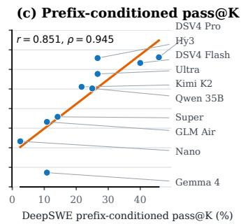  
Figure 6 | The three DeepSWE-derived probes retain strong rank agreement with post-trained SWEbench Multilingual performance. Panels use the same ten checkpoints and the same probe settings as fig. 3; annotations report Pearson � and Spearman �. The BPB axis is reversed so rightward consistently means better.

## 4.4. SFT Experiments

<table><tr><td>Base checkpoint</td><td>Post-SFT</td><td>Public SWE-Verified SWE-Verified</td><td>Decisive-Action Patch BPB</td><td>MCQ</td><td>Prefix pass@32</td></tr><tr><td>Nemotron-3-Nano-Base</td><td>28.5</td><td>38.8</td><td>0.149</td><td>33.4</td><td>13.1</td></tr><tr><td>Nemotron-3-Super-Base</td><td>53.1</td><td>60.5</td><td>0.100</td><td>34.4</td><td>34.6</td></tr><tr><td>Qwen-3.5-35B-A3B-Base</td><td>61.2</td><td>69.2</td><td>0.092</td><td>36.2</td><td>46.9</td></tr></table>

Table 1 | Under the same SFT procedure, post-SFT SWE-bench Verified follows the same ordering as the publicly reported scores, and the probes order the checkpoints consistently with it. Probe results are computed with SWE-Pro trajectories.

Under a controlled SFT recipe, the correlation trend continues. The downstream performance results in Sections 4.2 and 4.3 are computed using publicly released post-trained models, each produced by a diferent lab with their own post-training recipe and evaluation harness. To isolate the contribution of the base checkpoint, we fine-tune three base checkpoints, namely, Nemotron-3- Nano–Base, Nemotron-3-Super-Base, and Qwen-3.5-35B-A3B-Base, with an identical SFT recipe. Each model is trained on the same internal corpus for 1,000 steps, amounting to 16.8B training tokens. Table 1 shows the resulting checkpoints’ performance on SWE bench Verified, controlled for the same harness and evaluation hyperparameters. The post-SFT ordering agrees with the publicly reported one, and all three probes computed on SWE-Pro trajectories order the checkpoints the same way. With other trajectory sources the agreement is weaker for some probes (Table 16 in Appendix K), and with only three checkpoints we read this as the correlation trend continuing under a controlled recipe rather than as a precise estimate.

## 4.5. Ablation Studies

Decisive step ablation. In section 3.1, we hypothesize that decisive steps are the best parts of the trajectory to evaluate. We further examine the importance of decisive steps in (Figure 7b), where we find decisive step BPB correlates much better than all turns.

Format masking ablation. We ablate whether chat-template tokens (specifically the tool-call formatting) contribute to Decisive-Action BPB, holding the trajectory, action, and semantic content fixed. Masking the tool-call formatting improves Spearman agreement on all our corpora (Figure 7a). The diference is especially large for SWE-verified traces. We hypothesize that this is due to the fact that SWE-verified often has early decisive actions. At these early steps the base model has not seen a lot of prior tool-call formatting examples, causing BPB spikes during evaluation. These findings support our methodology in Section 3.2.

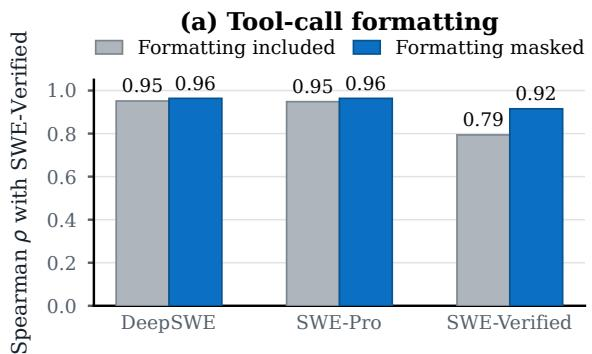

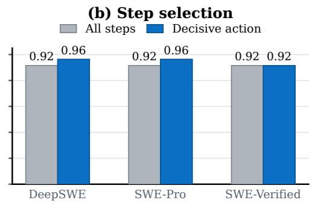  
Figure 7 | Masking tool-call formatting and scoring only decisive actions improve the BPB screen. Bars report Spearman correlation with post-trained SWE-bench Verified; all correlations use − BPB so higher is better.

Patch MCQ depends on scoring all options jointly. Table 2 ablates how Patch MCQ selects an answer. Scoring each option independently and selecting the lowest BPB (argmin-BPB) shows only weak agreement with post-trained SWE-bench Verified $( \rho = 0 . 6 6 5$ on DeepSWE questions; $\rho = 0 . 5 7 8$ on SWE-Verified questions). Presenting all four options in a single context and reading the answer-letter likelihood under cyclic rotation increases agreement to $\rho = 0 . 8 0 6$ and $\rho = 0 . 8 4 2$ without reasoning; allowing reasoning before the answer yields smaller additional gains (to 0.867 and 0.903). Thus, joint scoring explains most of the agreement on both question sets, while reasoning provides a modest refinement. Detailed results are in Appendix I.

<table><tr><td>Scoring method</td><td>DeepSWE</td><td>SWE-Verified</td></tr><tr><td>Argmin-BPB</td><td>0.665</td><td>0.578</td></tr><tr><td>Rotated, no think</td><td>0.806</td><td>0.842</td></tr><tr><td>Rotated, think</td><td>0.867</td><td>0.903</td></tr></table>

Table 2 | Patch MCQ scoring-method ablation: Spearman correlation with post-trained SWE-bench Verified on ten base checkpoints.

<table><tr><td>K</td><td>DeepSWE</td><td>SWE-Verified</td></tr><tr><td>8</td><td>0.915</td><td>0.988</td></tr><tr><td>16</td><td>0.952</td><td>0.988</td></tr><tr><td>32</td><td>0.951</td><td>0.906</td></tr></table>

Table 3 | Prefix-conditioned pass@� sampling-budget ablation: Spearman correlation with post-trained SWEbench Verified on ten base checkpoints.

A modest sampling budget sufices for prefix-conditioned pass@�. Table 3 varies the number of sampled continuations �. On held-out DeepSWE prefixes, rank agreement rises from $\rho = 0 . 9 1 5$ at $K = 8$ to 0.952 at $K = 1 6$ and then plateaus (0.951 at $K = 3 2 )$ . On same-benchmark SWE-bench Verified prefixes it is already 0.988 at $K = 8$ and $K = 1 6$ but falls to 0.906 at $K = 3 2$ where pass rates approach saturation (up to 83.7%) and Nemotron Ultra ties DeepSeek V4 Pro. Larger � therefore does not monotonically improve the screen, and $K = 1 6$ captures nearly all of the attainable agreement on both corpora. Detailed results are in Appendix J.

## 5. Conclusion

We introduce a framework for evaluating base checkpoints’ agentic coding potential before committing to expensive post-training. The framework uses successful agent trajectories to provide the context that base checkpoints cannot yet reliably produce themselves and the task’s verifier to identify the decisive step, the first step that resolves the task. Probing checkpoints at the decisive step lets us assess their agentic coding potential without requiring them to operate a tool-use harness across an entire trajectory. Using this framework, we build three complementary screens: Decisive-Action BPB, Patch MCQ, and Prefix-Conditioned pass@�. Across ten base checkpoints, all three produce rankings in close agreement with post-trained SWE-bench Verified performance. The framework thus extends existing and future agentic coding benchmarks into tools for base checkpoint selection before expensive post-training.

## References

Anthropic. Claude opus 4.8. https://www.anthropic.com/news/claude-opus-4-8, 2026a.

Anthropic. Claude opus 5. https://www.anthropic.com/news/claude-opus-5, 2026b.

Anthropic. Claude sonnet 5. https://www.anthropic.com/news/claude-sonnet-5, 2026c.

Jacob Austin, Augustus Odena, Maxwell Nye, Maarten Bosma, Henryk Michalewski, David Dohan, Ellen Jiang, Carrie Cai, Michael Terry, Quoc Le, et al. Program synthesis with large language models. arXiv preprint arXiv:2108.07732, 2021.

Aaron Blakeman, Aaron Grattafiori, Aarti Basant, Abhibha Gupta, Abhinav Khattar, Adi Renduchintala, Aditya Vavre, Akanksha Shukla, Akhiad Bercovich, Aleksander Ficek, et al. Nemotron 3 nano: Open, eficient mixture-of-experts hybrid mamba-transformer model for agentic reasoning. arXiv preprint arXiv:2512.20848, 2025.

Aaron Blakeman, Aaron Thomas, Aastha Jhunjhunwala, Abhibha Gupta, Abhinav Khattar, Adam Rajfer, Adi Renduchintala, Adil Asif, Aditya Vavre, Adriana Flores Miranda, et al. Nemotron 3 ultra: Open, eficient mixture-of-experts hybrid mamba-transformer model for agentic reasoning. arXiv preprint arXiv:2606.15007, 2026.

Aakshita Chandiramani, Aaron Blakeman, Abdullahi Olaoye, Abhibha Gupta, Abhilash Somasamudramath, Abhinav Khattar, Adeola Adesoba, Adi Renduchintala, Adil Asif, Aditya Agrawal, et al. Nemotron 3 super: Open, eficient mixture-of-experts hybrid mamba-transformer model for agentic reasoning. arXiv preprint arXiv:2604.12374, 2026.

Fan Chen, Audrey Huang, Noah Golowich, Sadhika Malladi, Adam Block, Jordan Ash, Akshay Krishnamurthy, and Dylan Foster. The coverage principle: How pre-training enables post-training. In International Conference on Learning Representations, volume 2026, pp. 112225–112293, 2026.

Mark Chen, Jerry Tworek, Heewoo Jun, Qiming Yuan, Henrique Ponde De Oliveira Pinto, Jared Kaplan, Harri Edwards, Yuri Burda, Nicholas Joseph, Greg Brockman, et al. Evaluating large language models trained on code. arXiv preprint arXiv:2107.03374, 2021.

DeepSeek-AI. Deepseek-v4: Towards highly eficient million-token context intelligence, 2026.

Xiang Deng, Jef Da, Edwin Pan, Yannis Yiming He, Charles Ide, Kanak Garg, Niklas Laufer, Andrew Park, Nitin Pasari, Chetan Rane, et al. Swe-bench pro: Can ai agents solve long-horizon software engineering tasks? arXiv preprint arXiv:2509.16941, 2025.

Yangruibo Ding, Zijian Wang, Wasi Ahmad, Hantian Ding, Ming Tan, Nihal Jain, Murali Krishna Ramanathan, Ramesh Nallapati, Parminder Bhatia, Dan Roth, et al. Crosscodeeval: A diverse and multilingual benchmark for cross-file code completion. Advances in Neural Information Processing Systems, 36:46701–46723, 2023.

Leo Gao, Stella Biderman, Sid Black, Laurence Golding, Travis Hoppe, Charles Foster, Jason Phang, Horace He, Anish Thite, Noa Nabeshima, et al. The pile: An 800gb dataset of diverse text for language modeling. arXiv preprint arXiv:2101.00027, 2020.

GLM-5-Team, :, Aohan Zeng, Xin Lv, Zhenyu Hou, Zhengxiao Du, Qinkai Zheng, Bin Chen, Da Yin, Chendi Ge, Chenghua Huang, Chengxing Xie, Chenzheng Zhu, Congfeng Yin, Cunxiang Wang, Gengzheng Pan, Hao Zeng, Haoke Zhang, Haoran Wang, Huilong Chen, Jiajie Zhang, Jian Jiao, Jiaqi Guo, Jingsen Wang, Jingzhao Du, Jinzhu Wu, Kedong Wang, Lei Li, Lin Fan, Lucen Zhong,

Mingdao Liu, Mingming Zhao, Pengfan Du, Qian Dong, Rui Lu, Shuang-Li, Shulin Cao, Song Liu, Ting Jiang, Xiaodong Chen, Xiaohan Zhang, Xuancheng Huang, Xuezhen Dong, Yabo Xu, Yao Wei, Yifan An, Yilin Niu, Yitong Zhu, Yuanhao Wen, Yukuo Cen, Yushi Bai, Zhongpei Qiao, Zihan Wang, Zikang Wang, Zilin Zhu, Ziqiang Liu, Zixuan Li, Bojie Wang, Bosi Wen, Can Huang, Changpeng Cai, Chao Yu, Chen Li, Chengwei Hu, Chenhui Zhang, Dan Zhang, Daoyan Lin, Dayong Yang, Di Wang, Ding Ai, Erle Zhu, Fangzhou Yi, Feiyu Chen, Guohong Wen, Hailong Sun, Haisha Zhao, Haiyi Hu, Hanchen Zhang, Hanrui Liu, Hanyu Zhang, Hao Peng, Hao Tai, Haobo Zhang, He Liu, Hongwei Wang, Hongxi Yan, Hongyu Ge, Huan Liu, Huanpeng Chu, Jia’ni Zhao, Jiachen Wang, Jiajing Zhao, Jiamin Ren, Jiapeng Wang, Jiaxin Zhang, Jiayi Gui, Jiayue Zhao, Jijie Li, Jing An, Jing Li, Jingwei Yuan, Jinhua Du, Jinxin Liu, Junkai Zhi, Junwen Duan, Kaiyue Zhou, Kangjian Wei, Ke Wang, Keyun Luo, Laiqiang Zhang, Leigang Sha, Liang Xu, Lindong Wu, Lintao Ding, Lu Chen, Minghao Li, Nianyi Lin, Pan Ta, Qiang Zou, Rongjun Song, Ruiqi Yang, Shangqing Tu, Shangtong Yang, Shaoxiang Wu, Shengyan Zhang, Shijie Li, Shuang Li, Shuyi Fan, Wei Qin, Wei Tian, Weining Zhang, Wenbo Yu, Wenjie Liang, Xiang Kuang, Xiangmeng Cheng, Xiangyang Li, Xiaoquan Yan, Xiaowei Hu, Xiaoying Ling, Xing Fan, Xingye Xia, Xinyuan Zhang, Xinze Zhang, Xirui Pan, Xu Zou, Xunkai Zhang, Yadi Liu, Yandong Wu, Yanfu Li, Yidong Wang, Yifan Zhu, Yijun Tan, Yilin Zhou, Yiming Pan, Ying Zhang, Yinpei Su, Yipeng Geng, Yong Yan, Yonglin Tan, Yuean Bi, Yuhan Shen, Yuhao Yang, Yujiang Li, Yunan Liu, Yunqing Wang, Yuntao Li, Yurong Wu, Yutao Zhang, Yuxi Duan, Yuxuan Zhang, Zezhen Liu, Zhengtao Jiang, Zhenhe Yan, Zheyu Zhang, Zhixiang Wei, Zhuo Chen, Zhuoer Feng, Zijun Yao, Ziwei Chai, Ziyuan Wang, Zuzhou Zhang, Bin Xu, Minlie Huang, Hongning Wang, Juanzi Li, Yuxiao Dong, and Jie Tang. Glm-5: from vibe coding to agentic engineering, 2026. URL https://arxiv.org/abs/2602.15763.

Google. Gemini 3.6 flash. https://ai.google.dev/gemini-api/docs/models/gemini-3.6-flash, 2026a.

Google. Gemini 3.7 flash. https://ai.google.dev/gemini-api/docs/models/gemini-3.7-flash, 2026b.

Alex Gu, Baptiste Roziere, Hugh James Leather, Armando Solar-Lezama, Gabriel Synnaeve, and Sida Wang. CRUXEval: A benchmark for code reasoning, understanding and execution. In Proceedings of the 41st International Conference on Machine Learning, volume 235 of Proceedings of Machine Learning Research, pp. 16568–16621, 2024.

David Heineman, Valentin Hofmann, Ian Magnusson, Yuling Gu, Noah Smith, Hanna Hajishirzi, Kyle Lo, and Jesse Dodge. Signal and noise: A framework for reducing uncertainty in language model evaluation. Advances in Neural Information Processing Systems, 38:17073–17114, 2026.

Dan Hendrycks, Steven Basart, Saurav Kadavath, Mantas Mazeika, Akul Arora, Ethan Guo, Collin Burns, Samir Puranik, Horace He, Dawn Song, et al. Measuring coding challenge competence with apps. arXiv preprint arXiv:2105.09938, 2021.

John Hewitt, Nelson F Liu, Percy Liang, and Christopher D Manning. Instruction following without instruction tuning. arXiv preprint arXiv:2409.14254, 2024.

Ari Holtzman, Peter West, Vered Shwartz, Yejin Choi, and Luke Zettlemoyer. Surface form competition: Why the highest probability answer isn’t always right, 2021. URL https://arxiv. org/abs/2104.08315.

Wenqi Huang, Charley Lee, Leonard Tng, and Serena Ge. Deepswe: Measuring frontier coding agents on original, long-horizon engineering tasks. arXiv preprint arXiv:2607.07946, 2026.

Yuzhen Huang, Jinghan Zhang, Zifei Shan, and Junxian He. Compression represents intelligence linearly. arXiv preprint arXiv:2404.09937, 2024.

Naman Jain, Alex Gu, Wen-Ding Li, Fanjia Yan, Tianjun Zhang, Sida Wang, Armando Solar-Lezama, Koushik Sen, and Ion Stoica. Livecodebench: Holistic and contamination free evaluation of large language models for code. In International Conference on Learning Representations, volume 2025, pp. 58791–58831, 2025.

Carlos E Jimenez, John Yang, Alexander Wettig, Shunyu Yao, Kexin Pei, Ofir Press, and Karthik Narasimhan. Swe-bench: Can language models resolve real-world github issues? In International Conference on Learning Representations, volume 2024, pp. 54107–54157, 2024.

Yuhang Lai, Chengxi Li, Yiming Wang, Tianyi Zhang, Ruiqi Zhong, Luke Zettlemoyer, Wen-tau Yih, Daniel Fried, Sida Wang, and Tao Yu. Ds-1000: A natural and reliable benchmark for data science code generation. In International Conference on Machine Learning, pp. 18319–18345. PMLR, 2023.

Xiaoyuan Li, Yubo Ma, Kexin Yang, Moxin Li, Keqin Bao, Wenie Wang, Fuli Feng, and Dayiheng Liu. On predicting the post-training potential of pre-trained llms. arXiv preprint arXiv:2605.11978, 2026.

Jiawei Liu, Chunqiu Steven Xia, Yuyao Wang, and Lingming Zhang. Is your code generated by chatgpt really correct? rigorous evaluation of large language models for code generation. Advances in neural information processing systems, 36:21558–21572, 2023.

Tianyang Liu, Canwen Xu, and Julian McAuley. RepoBench: Benchmarking repository-level code auto-completion systems. In International Conference on Learning Representations, 2024.

Eric Lu, Ben Pan, Deniz Birlikci, Sam Lee, Ray Wang, Rohan Choudhury, Fermi Ma, TC Qin, Carlo Baronio, and Silas Alberti. Introducing FrontierCode. https://cognition.com/blog/ frontier-code, 2026.

Ian Magnusson, Akshita Bhagia, Valentin Hofmann, Luca Soldaini, Ananya H Jha, Oyvind Tafjord, Dustin Schwenk, Evan Walsh, Yanai Elazar, Kyle Lo, et al. Paloma: A benchmark for evaluating language model fit. Advances in Neural Information Processing Systems, 37:64338–64376, 2024.

Mike A. Merrill, Alexander G. Shaw, Nicholas Carlini, Boxuan Li, Harsh Raj, Ivan Bercovich, Lin Shi, Jeong Yeon Shin, Thomas Walshe, E. Kelly Buchanan, Junhong Shen, Guanghao Ye, Haowei Lin, Jason Poulos, Maoyu Wang, Marianna Nezhurina, Jenia Jitsev, Di Lu, Orfeas Menis Mastromichalakis, Zhiwei Xu, et al. Terminal-Bench: Benchmarking agents on hard, realistic tasks in command line interfaces. In International Conference on Learning Representations, 2026.

OpenAI. Introducing SWE-bench Verified. https://openai.com/index/ introducing-swe-bench-verified/, August 2024.

OpenAI. Gpt-5.6-luna. https://openai.com/index/gpt-5-6, 2026a.

OpenAI. Gpt-5.6-sol. https://openai.com/index/gpt-5-6, 2026b.

OpenAI. Gpt-5.6-terra. https://openai.com/index/gpt-5-6, 2026c.

Jiarui Qin, Yunjia Xi, Junjie Huang, Renting Rui, Di Yin, Weiwen Liu, Yong Yu, Weinan Zhang, and Xing Sun. Aptbench: Benchmarking agentic potential of base llms during pre-training. arXiv preprint arXiv:2510.24397, 2025.

Qwen Team. Qwen3.5: Towards native multimodal agents, February 2026. URL https://qwen.ai/ blog?id=qwen3.5.

Gemma Team, Sherif El Abd, Vaibhav Aggarwal, Robin Algayres, Alek Andreev, Olivier Bachem, Ian Ballantyne, Cormac Brick, Victor Cărbune, Michelle Casbon, et al. Gemma 4 technical report. arXiv preprint arXiv:2607.02770, 2026a.

Kimi Team, Yifan Bai, Yiping Bao, Y Charles, Cheng Chen, Guanduo Chen, Haiting Chen, Huarong Chen, Jiahao Chen, Ningxin Chen, et al. Kimi k2: Open agentic intelligence. arXiv preprint arXiv:2507.20534, 2025.

Kimi Team, Tongtong Bai, Yifan Bai, Yiping Bao, Jianfeng Cai, Xinyuan Cai, Peizhou Cao, Yuxuan Cao, Ziwei Chai, Y Charles, et al. Kimi k3: Open frontier intelligence. arXiv preprint arXiv:2607.24653, 2026b.

Tencent Hy Team. Hy3. https://hy.tencent.com/research/hy3, 2026.

Tristan Thrush, Christopher Potts, and Tatsunori Hashimoto. Improving pretraining data using perplexity correlations. In International Conference on Learning Representations, volume 2025, pp. 17475–17509, 2025.

Fang Wu, Weihao Xuan, Ximing Lu, Mingjie Liu, Yi Dong, Zaid Harchaoui, and Yejin Choi. The invisible leash: Why rlvr may or may not escape its origin. arXiv preprint arXiv:2507.14843, 2025.

John Yang, Carlos Jimenez, Alexander Wettig, Kilian Lieret, Shunyu Yao, Karthik Narasimhan, and Ofir Press. Swe-agent: Agent-computer interfaces enable automated software engineering. Advances in Neural Information Processing Systems, 37:50528–50652, 2024.

John Yang, Kilian Lieret, Carlos Jimenez, Alexander Wettig, Kabir Khandpur, Yanzhe Zhang, Binyuan Hui, Ofir Press, Ludwig Schmidt, and Diyi Yang. Swe-smith: Scaling data for software engineering agents. Advances in Neural Information Processing Systems, 38, 2026.

Yang Yue, Zhiqi Chen, Rui Lu, Andrew Zhao, Zhaokai Wang, Yang Yue, Shiji Song, and Gao Huang. Does reinforcement learning really incentivize reasoning capacity in llms beyond the base model? Advances in Neural Information Processing Systems, 38:57654–57689, 2026.

Aohan Zeng, Xin Lv, Qinkai Zheng, Zhenyu Hou, Bin Chen, Chengxing Xie, Cunxiang Wang, Da Yin, Hao Zeng, Jiajie Zhang, et al. Glm-4.5: Agentic, reasoning, and coding (arc) foundation models. arXiv preprint arXiv:2508.06471, 2025.

Chujie Zheng, Hao Zhou, Fandong Meng, Jie Zhou, and Minlie Huang. Large language models are not robust multiple choice selectors. In International Conference on Learning Representations, volume 2024, pp. 19426–19454, 2024.

Terry Yue Zhuo, Minh Chien Vu, Jenny Chim, Han Hu, Wenhao Yu, Ratnadira Widyasari, Imam Nur Bani Yusuf, Haolan Zhan, Junda He, Indraneil Paul, et al. Bigcodebench: Benchmarking code generation with diverse function calls and complex instructions. In International Conference on Learning Representations, volume 2025, pp. 66602–66656, 2025.

## A. Independent Audit of SWE -MCQ Construction

To evaluate whether APTBench’s (Qin et al., 2025) SWE MCQs have a uniquely correct designated answer and incorrect distractors, we audited all 1,682 questions in four components: Fix Patch, Plan, Test Patch, and Handle Error. We developed a rubric with agent assistance and applied it through automated review, assessing whether the designated answer correctly addresses the stated question and whether another answer choice is also correct. The audit included code execution and inspection of the underlying repository where needed. table 4 reports the audit results: 727 questions (43.2%) were classified as Invalid, meaning that the rendered question does not support the designated answer choice as uniquely correct.

Table 4 | Rubric-based assessment of 1,682 APTBench SWE MCQs. An MCQ is classified as Invalid when the question does not have a uniquely correct designated answer and incorrect distractors. Percentages are relative to all questions in each row.
<table><tr><td>Component</td><td>All questions</td><td>Invalid questions Invalid (%)</td><td></td></tr><tr><td>Fix Patch</td><td>232</td><td>63</td><td>27.2%</td></tr><tr><td>Plan</td><td>243</td><td>81</td><td>33.3%</td></tr><tr><td>Test Patch</td><td>1,060</td><td>450</td><td>42.5%</td></tr><tr><td>Handle Error</td><td>147</td><td>133</td><td>90.5%</td></tr><tr><td>Total</td><td>1,682</td><td>727</td><td>43.2%</td></tr></table>

The audit identifies failures of both answer correctness and uniqueness. For example, Handle Error MCQ #67 asks how SceneNN data was processed, but its designated correct option recommends reinstalling torch\_scatter, which does not correctly answer the stated question. In Plan MCQ #66, answer choices A and C contain identical text, “I need to run the script again,” but only A is designated correct. This MCQ therefore accepts answer choice A as correct while rejecting identical answer choice C.

These examples show that selecting the designated answer choice need not mean identifying a uniquely correct answer: scoring can reward an incorrect answer or reject an identical answer that was not designated correct. Such defects weaken the interpretation of MCQ accuracy as the ability to distinguish correct from incorrect answers, even when aggregate scores correlate with post-training performance, as our APTBench evaluation in section B illustrates. These findings motivate Patch MCQ’s stricter construction (section 3.3): explicit validation of each answer choice. Patch MCQ requires the golden action to resolve the task and each distractor to fail the same verifier from the same environment state (section 3.3), grounding its answer choices in observed task outcomes.

## B. APTBench Reproduction

We evaluate APTBench on the same ten base checkpoints used to evaluate the three probes, as described in section 4.1. Table 5 reports Pearson and Spearman correlations between these checkpoints’ APTBench scores and the SWE-bench Verified performance of their corresponding post-trained releases.

Table 5 | APTBench reproduction on the same ten base checkpoints evaluated by the three probes (section 4.1). Pearson and Spearman correlations between APTBench scores and SWE-bench Verified performance of the corresponding post-trained release for each checkpoint.
<table><tr><td rowspan="2">APTBench metric</td><td colspan="2">SWE-bench Verified</td></tr><tr><td>Pearson</td><td>Spearman</td></tr><tr><td>APTBench-SWE average</td><td>0.942</td><td>0.879</td></tr><tr><td>APTBench-DR average</td><td>0.962</td><td>0.903</td></tr><tr><td>APTBench-SWE: EnvSetup Plan ACC</td><td>0.910</td><td>0.818</td></tr><tr><td>APTBench-SWE: EnvSetup Action EM</td><td>0.851</td><td>0.842</td></tr><tr><td>APTBench-SWE: EnvSetup Handle Error ACC</td><td>0.871</td><td>0.770</td></tr><tr><td>APTBench-SWE: IssueFix Locate ACC</td><td>0.457</td><td>0.377</td></tr><tr><td>APTBench-SWE: IssueFix Fix Patch ACC</td><td>0.792</td><td>0.830</td></tr><tr><td>APTBench-SWE: IssueFix Plan ACC</td><td>0.873</td><td>0.806</td></tr><tr><td>APTBench-SWE: IssueFix Action EM</td><td>0.394</td><td>0.232</td></tr><tr><td>APTBench-SWE: IssueFix Test Patch ACC</td><td>0.434</td><td>0.316</td></tr><tr><td>APTBench-DR: Closed Plan EN ACC</td><td>0.923</td><td>0.842</td></tr><tr><td>APTBench-DR: Closed Plan ZH ACC</td><td>0.903</td><td>0.855</td></tr><tr><td>APTBench-DR: Closed Action EN EM</td><td>0.834</td><td>0.646</td></tr><tr><td>APTBench-DR: Closed Action EN ROUGE-1</td><td>0.929</td><td>0.903</td></tr><tr><td>APTBench-DR: Closed Action ZH EM</td><td>0.881</td><td>0.821</td></tr><tr><td>APTBench-DR: Closed Action ZH ROUGE-1</td><td>0.964</td><td>0.988</td></tr><tr><td>APTBench-DR: Open Plan EN ACC</td><td>0.823</td><td>0.491</td></tr><tr><td>APTBench-DR: Open Citation EN ACC</td><td>0.695</td><td>0.721</td></tr><tr><td>APTBench-DR: Open Citation ZH ACC</td><td>0.859</td><td>0.927</td></tr><tr><td>APTBench-DR: Open Action EN ACC</td><td>0.762</td><td>0.650</td></tr><tr><td>APTBench-DR: Open Action ZH ACC</td><td>0.750</td><td>0.515</td></tr></table>

## C. Experimental Setup Details

Table 6 | Evaluation cohort and downstream targets: SWE-bench Verified (Jimenez et al., 2024; OpenAI, 2024) and Terminal-Bench 2.1 (Merrill et al., 2026). Each row pairs a base checkpoint with the post-trained release whose reported performance we use as the downstream target; naming it matters because several families shipped more than one. All targets are pass@1 percentages.
<table><tr><td>Base checkpoint</td><td>Post-trained model</td><td>SWE-bench Verified</td><td>SWE-bench Multilingual</td><td>Terminal-Bench 2.1</td></tr><tr><td></td><td></td><td>38.8</td><td>33.3</td><td>6.7</td></tr><tr><td>Nemotron-Nano-Base Nemotron-Super-Base</td><td>Nemotron-Nano Nemotron-Super</td><td>60.5</td><td>45.8</td><td>38.6</td></tr><tr><td>Nemotron-Ultra-Base</td><td>Nemotron-Ultra</td><td>70.7</td><td>67.7</td><td>53.9</td></tr><tr><td>Qwen-3.5-35B-A3B-Base</td><td>Qwen-3.5-35B-A3B</td><td>69.2</td><td>60.3</td><td>48.3</td></tr><tr><td>DeepSeek-V4-Flash-Base</td><td>DeepSeek-V4-Flash</td><td>79.0</td><td>73.3</td><td>78.7</td></tr><tr><td>Kimi-K2-Base</td><td>Kimi-K2-Thinking</td><td>71.3</td><td>61.1</td><td>34.8</td></tr><tr><td>GLM 4.5-Air-Base</td><td>GLM-4.5-Air</td><td>57.6</td><td>43.2</td><td>23.6</td></tr><tr><td>Hy3-Preview-Base</td><td>Hy3</td><td>78.0</td><td>75.8</td><td>63.3</td></tr><tr><td>DeepSeek-V4-Pro-Base</td><td>DeepSeek-V4-Pro</td><td>80.6</td><td>76.2</td><td>78.7</td></tr><tr><td>Gemma-4-26B</td><td>Gemma-4-26B-IT</td><td>52.0</td><td>17.3</td><td>39.0</td></tr></table>

Decisive-Action BPB corpora and checkpoints. We evaluate agent trajectories from Deep-SWE, SWE-Pro, and SWE-bench Verified on the same ten checkpoints listed in table 6. The primary Decisive-Action BPB results and the all-step versus decisive-step ablation use this matched ten-checkpoint cohort throughout. On DeepSWE, the canonical comparison reported in figs. 2 and 7 increases Spearman correlation with post-trained SWE-bench Verified from 0.915 to 0.964.

Patch MCQ cohorts. Table 10 uses two four-option question sets, each with chance accuracy 0.250: DeepSWE contributes 756 questions over 392 instances, and SWE-bench Verified 576 questions over 249 instances. Both cover the same ten checkpoints under matched none preambles. We report one accuracy per checkpoint and setting, as recorded in our source measurements; the run-to-run spread behind those figures is not stored alongside them, so we attach no repeat counts or rerun intervals to individual cells and do not read small per-checkpoint diferences as measurements of a diference. Detailed construction, coverage, and provenance auditing are reported with the results and in section I.

Prefix-conditioned pass@� cohort. The sampled probe of section 3.4 replays decisive-step prefixes on 120 DeepSWE instances and on 98 SWE-bench Verified prefixes, over the same tencheckpoint cohort, at � ∈ {8, 16, 32} rollouts per instance. Rollouts fork at the decisive step: earlier steps are served verbatim from the captured trajectory, the decisive step is masked, and the candidate checkpoint keeps control for the rest of the episode, with each rollout scored by the task’s own benchmark verifier. DeepSWE is cross-domain relative to downstream SWE-bench Verified; the SWE-bench Verified arm uses prefixes and downstream validation on the same benchmark. Because the candidate drives the harness after the fork, these scores are properties of a model–harness system and are not comparable across agent formats.

Statistical protocol. All reported comparisons use the explicitly stated completed coverage for that experiment: ten models for the primary Decisive-Action BPB, Patch MCQ, and prefixconditioned pass@� downstream correlations, 99 trajectories for the template intersection, and the per-column available cells for table 10. We report Pearson � and Spearman � (average ranks for ties) as descriptive point estimates, with no bootstrap intervals available, treating all coeficients as indicative rather than calibrated predictive guarantees.

## D. Evaluation Infrastructure

All three probes run on one pipeline and diverge only at the final scoring stage. Figure 8 shows the stages and what dominates the cost of each. The design constraint throughout is that verifier executions, not forward passes, are the expensive resource: a single candidate step must be replayed into a repository and have the task’s own test suite run against it, so the pipeline is organized to bound how many times that happens per trajectory.

Trajectory capture. A recording proxy sits between the agent CLI and the model endpoint, tees every wire request and response into a local store tagged by (batch, instance), and a post-hoc pass groups those rows into per-step records. Capture is therefore agent-agnostic, which is what lets one pipeline ingest four agent families – a Responses-API agent, a Messages-API agent, a chatcompletions agent, and a host-side agent that executes each shell command through the container – and recover the family automatically from the captured wire format during replay. It also means the recorded step boundaries are the agent’s own, not a reconstruction of them.

Per-instance execution environment. Every instance runs in its own container built from the benchmark’s published task image, with the repository checked out and the interpreter environment the task ships. Before an episode the working tree is reset to the task’s base commit with git reset –hard followed by git clean -fd; the -x flag is deliberately omitted, because these images keep compiled extensions and packaging metadata as git-ignored build artifacts, and deleting them leaves a tree that cannot import the package under test. The patch is extracted with git add -A and a binary dif against the base commit, so the same ignore rules keep those artifacts out of the extracted patch. Prompts carry the problem statement only; the benchmark’s hint fields are deliberately excluded as a leakage control.

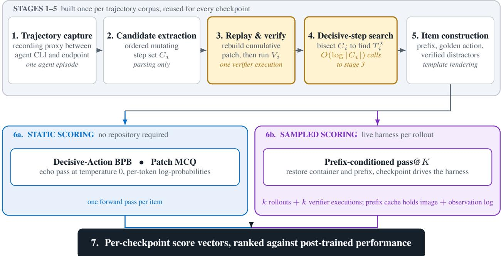  
Figure 8 | The pipeline shared by all three probes. Stages 1–5 run once per trajectory corpus and produce artifacts reused for every checkpoint; stage 6 is the only per-checkpoint work, and it is where the static and sampled probes diverge by orders of magnitude. Verifier executions, not forward passes, are the scarce resource, which is why stage 4 bisects rather than scans and why the sampled path caches prefixes.

Replay and verification. Stage 3 is the only component that executes untrusted code. For a candidate step it replays the recorded steps into a fresh container, extracts the cumulative patch, and runs the benchmark’s own verifier, recording the replay driver, the patch content or hash, the verifier command and environment, the pass/fail outcome, and an explicit infrastructure-error status. That last field is load-bearing: a verifier that rejects a patch is a normal search observation, whereas a verifier that could not run at all must not be read as rejection, so the two are recorded separately and only the latter invalidates a trial. Replay is strict in one specific way – a replayed command that does not match the recorded one raises rather than falling through to live execution. Falling through would leave the conversation the candidate reads describing a filesystem that a diferent command sequence produced, which yields a wrong-but-plausible score rather than an obvious crash. When the candidate takes over, its � rollouts are scored in � separate harness runs, because the harness keys predictions by instance identifier and � patches for one instance would otherwise collide.

Search strategy and its cost. Stage 4 bisects $C _ { i }$ rather than scanning it, which reduces the verifier executions per trajectory from |� | to $O ( \log | C _ { i } | )$ and is the single largest infrastructure saving in the pipeline. Bisection assumes monotonicity – once a cumulative patch passes, later prefixes also pass – and a linear –scan mode exists for corpora that violate it. Both modes first verify max $C _ { i }$ as a gate, so a trajectory whose final step does not resolve is discarded after one verifier execution instead of an entire search. All decisive-step metadata reported in this paper was produced by bisect.

Throughput limits and the failure mode they create. Both scoring paths are endpoint-bound rather than client-bound: raising client concurrency on a saturated endpoint changed static-scoring throughput not at all, while two hosts difered by more than an order of magnitude on identical work. Shared endpoints also impose a concurrency ceiling, and exceeding it fails in a way that is not self-announcing. Past the ceiling the retry budget exhausts, a rate-limited forward returns nothing, and the rollout falls back to a prefix-only patch that is indistinguishable from a legitimate failed attempt – a degraded window reads as a low score rather than as an error. We observed one candidate score zero under saturation and 0.347 on a clean re-run, with the size of the correction tracking each arm’s measured rate-limit fraction. Two safeguards follow: runs are capped below the measured ceiling, and empty predictions written during a degraded window are purged rather than resumed over, since resumption logic keyed on file existence would otherwise treat them as complete forever. Long prefixes are dropped when they exceed an endpoint’s context limit, and because the longest prefixes are also the most-explored instances, those drops are a selection efect and comparisons are made on the completed intersection (section C).

Sampling configuration. For base checkpoints driving the harness, sampling temperature is 0.6.

## E. Bounded Code Benchmarks as Baselines

Section 1 argues that bounded code benchmarks – those a base checkpoint can complete without sustained interaction with an evolving repository – do not measure whether it can become a capable coding agent. Table 7 quantifies that claim on the ten-checkpoint cohort of table 6 by correlating each benchmark’s base-model score with the same two post-trained downstream targets used throughout. BigCodeBench (Zhuo et al., 2025) is named in section 1 as a member of this family but is not among our measurements, so it does not appear here; the two LiveCodeBench variants and the two CRUXEval directions are reported separately because they score diferent abilities.

Table 7 | Bounded code benchmarks as baselines for post-trained agentic performance, with our three probes repeated for reference. Correlations are against each post-trained downstream target on the cohort of table 6; the probe rows use the DeepSWE-derived probes of figs. 3 and 9, with − BPB for Decisive-Action BPB. Two baselines cover only ten checkpoints, so their coeficients are not matched pairs with the rest. At � ≤ 10 with no interval estimates these are descriptive associations, and single-row diferences should not be over-read.
<table><tr><td rowspan="2">Evaluation</td><td colspan="3">vs. SWE-bench Verified</td><td colspan="2">vs. Terminal-Bench 2.1</td></tr><tr><td>n</td><td>Pearson</td><td>Spearman</td><td>Pearson</td><td>Spearman</td></tr><tr><td>MBPP</td><td>10</td><td>0.151</td><td>0.091</td><td>0.037</td><td>0.036</td></tr><tr><td>HumanEval</td><td>10</td><td>-0.369</td><td>-0.394</td><td>-0.650</td><td>-0.571</td></tr><tr><td>LiveCodeBench</td><td>10</td><td>0.523</td><td>0.455</td><td>0.429</td><td>0.383</td></tr><tr><td>CRUXEval-I</td><td>10</td><td>0.473</td><td>0.394</td><td>0.287</td><td>0.201</td></tr><tr><td>CRUXEval-O</td><td>10</td><td>0.814</td><td>0.758</td><td>0.618</td><td>0.523</td></tr><tr><td>RepoBench XFirst</td><td>10</td><td>0.690</td><td>0.830</td><td>0.557</td><td>0.505</td></tr><tr><td>Decisive-Action BPB, decisive step</td><td>10</td><td>0.965</td><td>0.964</td><td>0.863</td><td>0.833</td></tr><tr><td>Patch MCQ, think 1000</td><td>10</td><td>0.915</td><td>0.867</td><td>0.871</td><td>0.796</td></tr><tr><td>Prefix-conditioned pass@K, K = 32</td><td>10</td><td>0.917</td><td>0.951</td><td>0.947</td><td>0.930</td></tr></table>

The family spans from negatively ranked to moderate, and none matches our method. RepoBench XFirst is the strongest bounded baseline by rank agreement $( \rho = 0 . 8 3 0 )$ , which is the figure section 1 and section 5 quote as the comparison point for Decisive-Action BPB. CRUXEval-O follows and is genuinely informative $( r = 0 . 8 1 4 , \rho = 0 . 7 5 8 )$ : predicting the output of a program exercises reasoning about execution, which is closer to what resolving a repository issue demands than synthesizing a standalone function is. The synthesis benchmarks supply almost no signal on this cohort – MBPP is flat $( \rho = 0 . 0 9 1 )$ and HumanEval is negatively ranked $( \rho = - 0 . 3 9 4 )$ – and the pattern is consistent with range compression rather than noise alone: across these ten checkpoints MBPP spans only 67.2–86.0 and RepoBench XFirst 73.2–82.8, while the downstream target spans 38.8–80.6. A benchmark whose scores are bunched near the top cannot order checkpoints that difer by more than forty points downstream.

What this does and does not establish. Two readings are unsupported. First, these coeficients do not show that bounded benchmarks measure nothing: CRUXEval-O and RepoBench XFirst both carry real signal, and a practitioner with no trajectory corpus would be better of consulting them than nothing. Second, the comparison is not controlled. The baselines are single published-style scores, our probes are computed on trajectories we selected, and every downstream score comes from a diferent lab’s post-training recipe and harness. What the table supports is narrower and suficient for section 1: within one cohort, agreement with post-trained agentic performance varies enormously across bounded benchmarks, the best of them still trails all three trajectory-derived probes, and nothing in the family distinguishes itself in a way that would let a practitioner pick one in advance.

## F. End-to-End Evaluation of Base Checkpoints

If base checkpoints could simply be run end-to-end on an agentic coding benchmark, the probes in section 3 would be unnecessary. To assess the need for the proposed probes, we evaluate base models directly in an end-to-end setting. We run six base checkpoints on SWE-bench Verified, driving the harness from the task statement (with no trajectory context), and results are list in table 8.

Table 8 | End-to-end evaluation of base checkpoints on SWE-bench Verified, alongside each family’s post-trained score on the same benchmark. All values are pass@1 percentages.
<table><tr><td>Base checkpoint</td><td>End-to-end pass@1</td><td>Post-trained SWE-Verified</td></tr><tr><td>DeepSeek-V4-Pro-Base</td><td>0.0</td><td>80.6</td></tr><tr><td>DeepSeek-V4-Flash-Base</td><td>0.0</td><td>79.0</td></tr><tr><td>Nemotron-Ultra-Base</td><td>0.0</td><td>70.7</td></tr><tr><td>Qwen-3.5-35B-A3B-Base</td><td>20.2</td><td>69.2</td></tr><tr><td>Nemotron-Super-Base</td><td>0.0</td><td>60.5</td></tr><tr><td>Nemotron-Nano-Base</td><td>0.0</td><td>38.8</td></tr></table>

End-to-end evaluation cannot rank base checkpoints, and the one signal it gives points the wrong way. Five of the six checkpoints resolve no task at all, so the benchmark ties them at the floor and cannot order them. Only Qwen-3.5-35B-A3B-Base resolves any, at 20.2%, which ranks it first end to end even though its post-trained family is fourth of the six, behind both DeepSeek V4 models and Nemotron Ultra. End-to-end pass@1 therefore ties five of the six checkpoints at the floor, and its one non-zero score places a mid-ranked family first: it is not merely uninformative but, where it discriminates at all, misleading. The exception of Qwen-3.5-35B-A3B-Base more plausibly reflects its familiarity with agent-formatted interaction than coding ability.

## G. Correlations with Terminal-Bench 2.1

Figure 9 tests whether the DeepSWE-derived probes of section 4.3 also predict post-trained performance on Terminal-Bench 2.1, which scores command-line workflows rather than repository issues. On Terminal-Bench 2.1, the prefix-conditioned pass@� transfers best. Agreement is lower for the two static probes, at $\rho = 0 . 8 3 3$ for Decisive-Action BPB and 0.796 for Patch MCQ, while prefix-conditioned pass@� holds at 0.930.

Where the Terminal-Bench gap comes from. Two checkpoints account for most of the disagreement between the benchmarks. Kimi K2 ranks fourth on SWE-bench Verified but eighth on Terminal-Bench, and Gemma 4 26B ranks ninth and sixth. The probes side with the SWE view of both, placing Kimi K2 fifth or sixth and Gemma 4 26B eighth or ninth, which is what costs them agreement with Terminal-Bench. The shortfall is thus a property of how the two benchmarks rank these models rather than a failure of the probes on the SWE ranking they were built from. Capturing Terminal-Bench-specific standing would likely require trajectories from command-line tasks, and aggregating probes across trajectory sources from several task families is a natural way to do so.

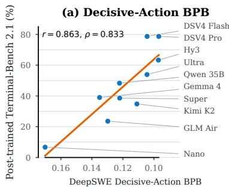

(b) Patch MCQ  
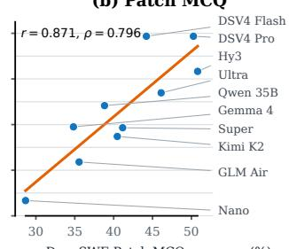  
DeepSWE Patch MCQ accuracy (%)

(c) Prefix-conditioned pass@K  
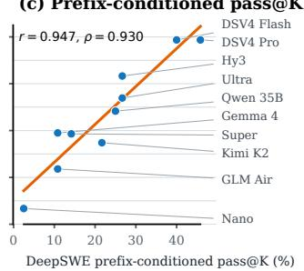  
Figure 9 | DeepSWE prefix-conditioned pass@� at $K = 3 2$ has the strongest descriptive agreement with post-trained Terminal-Bench 2.1 performance. Panels use the same ten checkpoints and the same probe settings as fig. 3; annotations report Pearson � and Spearman �. The BPB axis is reversed so rightward consistently means better.

## H. Decisive-Action BPB Method Detail

## H.1. Universal Chat Template and Formatting Masks

Universal rendering. We serialize every trajectory with the same model-independent plain-text template rather than using each checkpoint’s native chat template. Messages remain in their original chronological order, and the renderer uses the following visible labels as shown in table 9.

Table 9 | Universal serialization of trajectory components. Angle-bracketed text denotes the original message content.
<table><tr><td>Source component</td><td>Universal representation</td></tr><tr><td>Tool definitions</td><td>Tool definitions: &lt;JSON&gt;</td></tr><tr><td>System message</td><td>System: &lt;content&gt;</td></tr><tr><td>User message</td><td>User: &lt;content&gt;</td></tr><tr><td>Assistant text</td><td>Assistant: &lt;content&gt;</td></tr><tr><td>Assistant tool call</td><td>Assistant (tool call): &lt;JSON&gt;</td></tr><tr><td>Tool response</td><td>Tool Result: &lt;content&gt;</td></tr></table>

An assistant message may contain both explanatory text and one or more tool calls; in that case, both the Assistant: and Assistant (tool call): records are emitted. The template contains no model-specific control tokens such as ChatML markers or model-specific step delimiters: all labels above are ordinary text.

Canonical tool-call serialization. Tool definitions and tool calls are serialized with json.dumps( value, ensure\_ascii=False). This preserves source field insertion order, uses the standard spacing after commas and colons, and emits Unicode directly. If function.arguments is already a JSON string, it remains a string inside the outer tool-call object rather than being parsed into a nested object; reparsing would change the prediction target and make it artificially easier. Random tool-call IDs are removed before rendering because they carry no semantic information and are not predictably determined by the trajectory. All other tool-call fields are preserved.

Prefix and target construction. For an assistant step at position �, the prefix is the universal rendering of the tool definitions and messages strictly before �, while the target is the same rendering applied to message � alone. Tool definitions therefore appear in the prefix but are not repeated in the target. Using the same serializer on both sides prevents a representation mismatch at the prefix–target boundary.

Formatting mask. The complete rendered prefix and decisive response are visible to the checkpoint as conditioning context, but the primary Decisive-Action BPB result accumulates loss only over assistant-generated semantic content: natural-language assistant text, tool function names, and tool arguments. It excludes fixed role labels; tool-call wrapper keys such as type, function, name, and arguments; JSON braces, brackets, quotes, commas, and colons belonging to that wrapper; and trailing record separators. Our tool-formatting-included ablation adds the serialized tool-call wrapper to the scored region, but still excludes the fixed role labels. The rendered input is otherwise identical, so the two settings difer only in which target bytes contribute to the BPB numerator and denominator.

## I. Patch MCQ Detail

Table 10 | Source-current four-option Patch MCQ accuracy with cyclic rotation and arithmetic aggregation; chance is 0.250. Both question sets use matched none preambles. Each cell is the one accuracy our source measurements record for that checkpoint and setting; run-to-run spread is not stored with these values (section C), so column-to-column gaps of a few thousandths should not be read as diferences. Bold marks the largest value per column.

<table><tr><td rowspan="2">Base checkpoint</td><td colspan="2">DeepSWE</td><td colspan="2">SWE-Verified</td></tr><tr><td>No think</td><td>Think</td><td>No think</td><td>Think</td></tr><tr><td>Hy3-Preview-Base</td><td>0.4456</td><td>0.5080</td><td>0.552</td><td>0.583</td></tr><tr><td>DeepSeek-V4-Pro-Base</td><td>0.4206</td><td>0.5026</td><td>0.550</td><td>0.591</td></tr><tr><td>Nemotron-Ultra-Base</td><td>0.4235</td><td>0.4611</td><td>0.538</td><td>0.558</td></tr><tr><td>DeepSeek-V4-Flash-Base</td><td>0.4009</td><td>0.4421</td><td>0.536</td><td>0.553</td></tr><tr><td>Kimi-K2-Base</td><td>0.4322</td><td>0.4047</td><td>0.597</td><td>0.523</td></tr><tr><td>Qwen-3.5-35B-A3B-Base</td><td>0.3953</td><td>0.3883</td><td>0.521</td><td>0.524</td></tr><tr><td>Nemotron-Super-Base</td><td>0.3472</td><td>0.4116</td><td>0.500</td><td>0.498</td></tr><tr><td>GLM 4.5-Air-Base</td><td>0.3513</td><td>0.3556</td><td>0.425</td><td>0.432</td></tr><tr><td>Gemma-4-26B</td><td>0.3265</td><td>0.3483</td><td>0.443</td><td>0.440</td></tr><tr><td>Nemotron-Nano-Base</td><td>0.3172</td><td>0.2867</td><td>0.306</td><td>0.342</td></tr><tr><td>Mean</td><td>0.386</td><td>0.411</td><td>0.497</td><td>0.504</td></tr></table>

Table 11 | Patch MCQ read ablation on both question sets; chance is 0.250. Argmin-BPB scores each option independently and picks the lowest byte-normalized negative log-likelihood; rotated log-probability is the answer-letter read, presenting all four options jointly under four cyclic rotations, and is reported here at think-1000 to match table 10. Gap is argmin-BPB minus rotated log-probability, so negative values favor the joint read. Rows are ordered by DeepSWE rotated log-probability.
<table><tr><td></td><td colspan="3">DeepSWE</td><td colspan="3">SWE-Verified</td></tr><tr><td>Base checkpoint</td><td>Argmin</td><td>Rotated</td><td>Gap</td><td>Argmin</td><td>Rotated</td><td>Gap</td></tr><tr><td>Hy3-Preview-Base</td><td>0.266</td><td>0.508</td><td>-0.242</td><td>0.359</td><td>0.583</td><td>-0.224</td></tr><tr><td>DeepSeek-V4-Pro-Base</td><td>0.283</td><td>0.503</td><td>-0.220</td><td>0.405</td><td>0.591</td><td>-0.186</td></tr><tr><td>Nemotron-Ultra-Base</td><td>0.267</td><td>0.461</td><td>-0.194</td><td>0.366</td><td>0.558</td><td>-0.192</td></tr><tr><td>DeepSeek-V4-Flash-Base</td><td>0.266</td><td>0.442</td><td>-0.176</td><td>0.380</td><td>0.553</td><td>-0.173</td></tr><tr><td>Kimi-K2-Base</td><td>0.279</td><td>0.405</td><td>-0.126</td><td>0.387</td><td>0.523</td><td>-0.136</td></tr><tr><td>Qwen-3.5-35B-A3B-Base</td><td>0.271</td><td>0.388</td><td>-0.117</td><td>0.325</td><td>0.524</td><td>-0.199</td></tr><tr><td>Nemotron-Super-Base</td><td>0.269</td><td>0.412</td><td>-0.143</td><td>0.366</td><td>0.498</td><td>-0.132</td></tr><tr><td>GLM 4.5-Air-Base</td><td>0.265</td><td>0.356</td><td>-0.091</td><td>0.384</td><td>0.432</td><td>-0.048</td></tr><tr><td>Gemma-4-26B</td><td>0.262</td><td>0.348</td><td>-0.086</td><td>0.354</td><td>0.440</td><td>-0.086</td></tr><tr><td>Nemotron-Nano-Base</td><td>0.262</td><td>0.287</td><td>-0.025</td><td>0.347</td><td>0.342</td><td>+0.005</td></tr><tr><td>Mean</td><td>0.269</td><td>0.411</td><td>-0.142</td><td>0.367</td><td>0.504</td><td>-0.137</td></tr></table>

Question-set construction detail. Table 10’s DeepSWE question set is built by a max-flow selection over three source sets capped at two questions per instance. It contains 756 questions over 392 instances; the four gold-option length ranks and four answer slots each occur exactly 189 times, so the pick-longest baseline is exactly 0.250. The SWE-Verified question set merges the earlier pair pool with two additional single-action rollout waves, deduplicates by source, instance, target step, and trial, and retains 576 length-rebalanced questions over 249 instances.

Presentation and answer extraction. Each question $q _ { i }$ is presented under four cyclic option reorderings (rotations), indexed $r \in \{ 0 , 1 , 2 , 3 \}$ with $r = 0$ the original ordering. Each reordering is an independent request whose MCQ context $u _ { i } ^ { ( r ) }$ contains the trajectory prefix and all four options, so the options are always compared within one shared context as in eq. (5). Let $\ell _ { r } ( o ) \in \mathcal { L } _ { 4 }$ denote the answer letter under which option � is displayed in reordering $r ;$ because the reorderings are cyclic, every option is displayed under every letter exactly once across the four requests. From each request we read the next-token probability of each answer letter, restricted to the top-20 candidate tokens the endpoint returns, and renormalize over the answer letters,

$$
\tilde { p } _ { \theta } \big ( \ell \mid u _ { i } ^ { ( r ) } \big ) : = \frac { p _ { \theta } \big ( \ell \mid u _ { i } ^ { ( r ) } \big ) } { \sum _ { \ell ^ { \prime } \in \mathcal { L } _ { 4 } } p _ { \theta } \big ( \ell ^ { \prime } \mid u _ { i } ^ { ( r ) } \big ) } , \qquad \ell \in \mathcal { L } _ { 4 } ,\tag{8}
$$

assigning zero probability to any letter absent from the returned candidates. Because a given letter names a diferent option in each reordering, these probabilities are aggregated per option rather than per letter: each option’s aggregate is the mean probability of the letter it was displayed under, taken over the four reorderings,

$$
\bar { p } _ { i } ( o ) : = \frac { 1 } { 4 } \sum _ { r = 0 } ^ { 3 } \tilde { p } _ { \theta } ( \ell _ { r } ( o ) \mid u _ { i } ^ { ( r ) } ) ,\tag{9}
$$

and the prediction is the option with the largest aggregate, reported by its letter in the original ordering so that it is directly comparable with the golden option $\bar { \ell } _ { i }$ in the accuracy of section 3.3:

$$
\widehat { \ell } _ { i } : = \ell _ { 0 } \Big ( \mathop { \mathrm { a r g } } _ { o } \operatorname * { m a x } _ { \boldsymbol { o } } \bar { p } _ { i } ( \boldsymbol { o } ) \Big ) ,\tag{10}
$$

Table 12 | Single-rotation versus full cyclic rotation on the DeepSWE question set, think-1000 arm, over the same ten checkpoints as table 10; chance is 0.250. �=1 takes the answer from the first rotation alone and �=4 is the shipped aggregate, both recomputed ofline from the same finished runs, so no checkpoint was re-scored; each value is the mean of three rounds. The �=4 column is the DeepSWE think-1000 column of table 10. Rotation helps on 9 of 10 checkpoints, but not uniformly: the gain spans −0.005 to +0.081, wider than the gap between adjacent checkpoints in the �=4 ranking, and it reorders the top two. Bold marks the best value per column.
<table><tr><td>Base checkpoint</td><td>k=1</td><td>k=4</td><td>Gain</td></tr><tr><td>DeepSeek-V4-Pro-Base</td><td>0.4555</td><td>0.5026</td><td>+0.047</td></tr><tr><td>Hy3-Preview-Base</td><td>0.4271</td><td>0.5080</td><td>+0.081</td></tr><tr><td>Nemotron-Ultra-Base</td><td>0.4195</td><td>0.4611</td><td>+0.042</td></tr><tr><td>DeepSeek-V4-Flash-Base</td><td>0.3881</td><td>0.4421</td><td>+0.054</td></tr><tr><td>Kimi-K2-Base</td><td>0.3741</td><td>0.4047</td><td>+0.031</td></tr><tr><td>Nemotron-Super-Base</td><td>0.3727</td><td>0.4116</td><td>+0.039</td></tr><tr><td>Qwen-3.5-35B-A3B-Base</td><td>0.3454</td><td>0.3883</td><td>+0.043</td></tr><tr><td>GLM 4.5-Air-Base</td><td>0.3333</td><td>0.3556</td><td>+0.022</td></tr><tr><td>Gemma-4-26B</td><td>0.3126</td><td>0.3483</td><td>+0.036</td></tr><tr><td>Nemotron-Nano-Base</td><td>0.2913</td><td>0.2865</td><td>-0.005</td></tr><tr><td>Mean</td><td>0.3720</td><td>0.4109</td><td>+0.039</td></tr></table>

Table 13 | Downstream agreement of every Patch MCQ scoring method on the same ten checkpoints, with both Pearson and Spearman correlations. Rows pair a question set with a scoring method; the SWE-Verified question set draws its options from the same benchmark as the first target, so those rows are same-benchmark evidence against it while all rows are cross-domain with respect to Terminal-Bench 2.1. At � = 10 with no interval estimates we do not read small diferences as separating rows.
<table><tr><td></td><td></td><td colspan="2">vs. SWE-bench Verified</td><td colspan="2">vs. Terminal-Bench 2.1</td></tr><tr><td>Question set</td><td>Scoring method</td><td>Pearson</td><td>Spearman</td><td>Pearson</td><td>Spearman</td></tr><tr><td>DeepSWE</td><td>Argmin-BPB</td><td>0.601</td><td>0.665</td><td>0.420</td><td>0.382</td></tr><tr><td>DeepSWE</td><td>Rotated, no think</td><td>0.900</td><td>0.806</td><td>0.686</td><td>0.547</td></tr><tr><td>DeepSWE</td><td>Rotated, think 1000</td><td>0.915</td><td>0.867</td><td>0.871</td><td>0.796</td></tr><tr><td>SWE-Verified</td><td>Argmin-BPB</td><td>0.429</td><td>0.578</td><td>0.359</td><td>0.213</td></tr><tr><td>SWE-Verified</td><td>Rotated, no think</td><td>0.909</td><td>0.842</td><td>0.725</td><td>0.578</td></tr><tr><td>SWE-Verified</td><td>Rotated, think 1000</td><td>0.971</td><td>0.903</td><td>0.894</td><td>0.900</td></tr></table>

with exact ties broken by position in the original ordering. With a single reordering this reduces to eq. (5). Averaging probabilities, rather than counting per-reordering votes, keeps a near-tie between two options from being rounded away before the four reads are combined, and it cancels the position prior because that prior falls equally on every option over a full cycle. With reasoning enabled, $u _ { i } ^ { ( r ) }$ additionally contains the checkpoint’s own reasoning of up to 1,000 tokens, and the letter probabilities are read at the answer position that follows it; reconstructing the answer from the distribution before the reasoning describes a diferent quantity and yields near-chance accuracy.

Only complete reorderings are scored. A reordering fails to read if none of the answer letters appears among the returned candidates, and a question counts toward accuracy only if all four of its reorderings read successfully; a question with any failed reordering is left unscored, since eq. (9) is defined only over a complete cycle. This is a correctness requirement rather than a cleanliness preference. Rotation removes the position prior by making it common to every option so that it cancels in the comparison, and that cancellation is exactly what an incomplete set of rotations destroys: a partially rotated item still carries the prior and therefore measures a diferent quantity than a fully rotated one. Admitting partial rows changes per-checkpoint results by amounts

## Argmin-BPB Rotated log-prob., no think

Rotated log-prob., think 1000

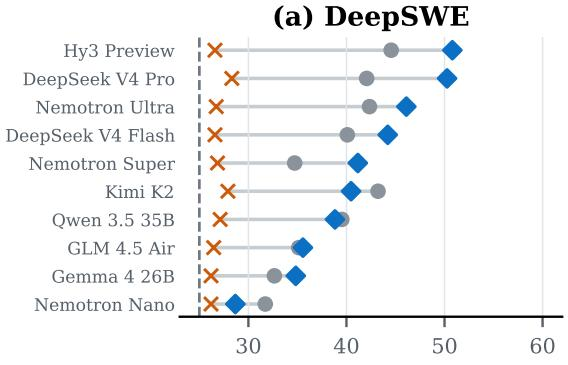  
Patch MCQ accuracy (%)

(b) SWE-bench Verified  
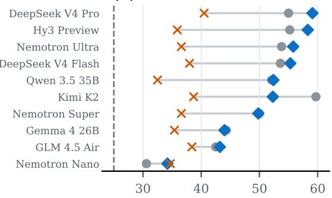

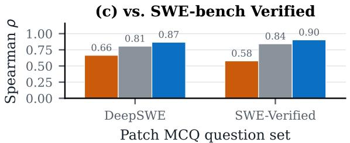

Patch MCQ accuracy (%)  
(d) vs. Terminal-Bench 2.1  
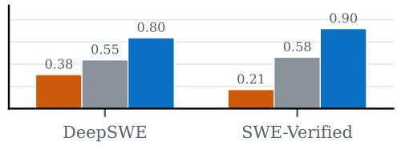  
Patch MCQ question set  
Figure 10 | Patch MCQ accuracy and downstream agreement, by scoring rule. Panels (a) and (b) rank the same ten checkpoints on each question set; panels (c) and (d) plot the rank agreement tabulated in table 13 against both downstream targets. The joint answer-letter read separates the cohort more sharply than scoring each option independently, and the gap between the two reads is larger than the gap between thinking protocols.

comparable to the efects we report, so every arm in this section is filtered to complete rotations.

Rotation count. Table 12 isolates how much the joint read owes to rotation itself. Taking the answer from the first rotation alone, rather than aggregating all four, costs 0.039 accuracy averaged over the cohort, and the cost is uneven: it ranges from −0.005 on Nemotron Nano, the one checkpoint rotation does not help, to +0.081 on Hy3 Preview. That spread is wider than the gap between adjacent checkpoints in the four-rotation ranking, and it is enough to reorder the top two: DeepSeek V4 Pro leads on a single read (0.4555 versus 0.4271) but trails on the aggregate (0.5026 versus 0.5080). Part of a checkpoint’s standing under Patch MCQ therefore reflects how much the debiasing protocol recovers for it, not its per-read judgement alone, so the read protocol belongs with the score whenever Patch MCQ numbers are quoted.

Argmin-BPB scoring ablation. Table 11 compares the two scoring methods on both question sets, with the rotated-log-probability columns taken at think-1000 so they match table 10 exactly. The joint read wins on all ten checkpoints on DeepSWE and on nine of ten on SWE-Verified, where Nano is the lone exception by 0.005. The two reads also rank the cohort diferently, at Spearman � = 0.543 on DeepSWE and 0.322 on SWE-Verified, and argmin-BPB’s agreement with post-trained SWE-bench Verified pass@1 is correspondingly weaker (� = 0.665 and 0.578, versus 0.867 and 0.903 for the joint read; table 13 reports every scoring method against both downstream targets, and fig. 10 plots the same comparison), so the choice of scoring method changes probing conclusions and not just absolute levels.

Reasoning efects require matched protocols. Both question sets now provide format-matched none-preamble comparisons. On DeepSWE, the ten-checkpoint mean rises from 0.386 to 0.411 (+0.025): seven checkpoints improve, with changes ranging from +0.082 for DeepSeek V4 Pro to −0.030 for Nano. On SWE-Verified the mean rises only from 0.497 to 0.504 (+0.008), also with 7/10 improving, and Kimi drops by 0.074 – a single checkpoint accounting for most of the diference between the two means. Without run-to-run spread for these values we do not treat small per-checkpoint diferences as measured efects, and no-think and think-1000 remain distinct protocols rather than one uniformly dominating the other.

## J. Prefix-Conditioned pass@� Detail

Fork point and masking convention. The decisive-step index is inclusive: masking at �⋆ means steps $1 , \ldots , T _ { i } ^ { \star } - 1$ are replayed verbatim from the recorded trajectory and the candidate must itself produce the action at $T _ { i } ^ { \star }$ . Replaying one step further and generating nothing reproduces the recorded resolving patch exactly, which we use as a control that the replay path is faithful before any candidate is scored.

Forward budget. Unlike a single-action evaluation, the candidate has to finish the task after the fork, so its phase is multi-turn and needs a stopping rule; every reported run caps it at three generated steps. When that budget is exhausted the proxy returns a synthetic response carrying no action, so the agent exits cleanly and the patch is still extracted, rather than the episode running to timeout and yielding nothing.

Driving the harness from a base checkpoint. A post-trained candidate is relayed: the agent’s own request is forwarded to it unchanged. A base checkpoint cannot be driven that way, because it has no chat template and cannot reliably emit a structured action, so we bridge it onto the interface instead. The bridge intercepts each request the agent CLI makes, renders it into a role-labeled plain-text transcript using the same renderer as Decisive-Action BPB (section H.1), samples a continuation from the checkpoint’s raw completion endpoint, and repackages the result as the response the agent expects, so the agent itself runs unmodified. Figure 11 shows this round trip and the prompt it produces. The prompt is assembled in a fixed order,

## transcript ‖ steer ‖ primer ‖ prefill,

and the order matters as much as the contents. The steer is a final System: line stating that the investigation is complete and asking for exactly one action that edits the existing source; given only a neutral primer, a base checkpoint tends to keep exploring or to write a reproduction script instead of a fix. The primer is the turn header Assistant (tool call):, which places the next token at the start of an action. Placing the steer after the primer instead of before it cut the share of forwards emitting a parseable action to 12%.

Prefilling the action envelope. The primer alone is not enough, and prefilling is what makes a base checkpoint usable in the harness at all. With only the primer, 47.9% of generations on one checkpoint continued it as prose rather than acting, and 56% of those fabricated a Tool Result: or User: turn: the checkpoint kept writing the transcript instead of acting in it. Adding the steer did not fix this, since 79% of the generations that still failed to parse simply echoed the steer back as another System: block. The fix is to append the opening of the action envelope after the primer, so that the checkpoint’s first sampled token already lands inside an open action and a prose continuation becomes ungrammatical; the fragment is prepended back onto the sample before parsing, so the parser sees a complete action. On eight DeepSWE prefixes with 48 generations per arm, prefilling raised the share of forwards emitting a parseable action from 27% to 50%, raised the share that edit the repository from 10% to 27%, and cut steer echoes from 19% to 8%. The envelope is wire-specific and must open exactly what the agent parses: for the function-calling agent on DeepSWE it is [{", the start of the tool-call JSON array, and for the text-mode agent on SWE-bench Verified it is the opening of the fenced command block that agent reads. Stop sequences follow the wire in the same way: they are kept in text mode, where they are load-bearing, and disabled for the function-calling agent.

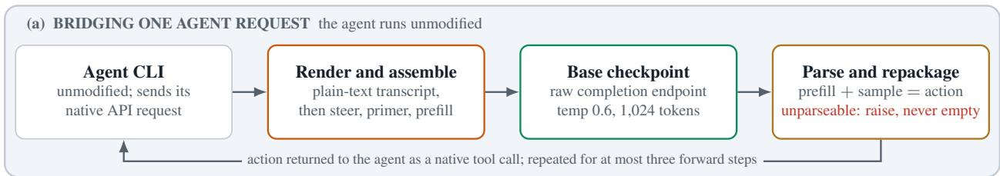

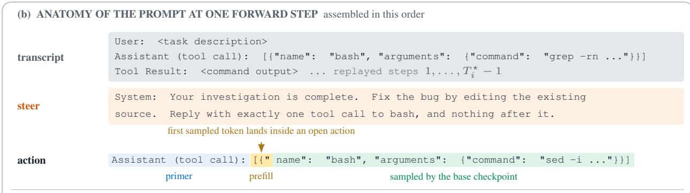  
Without the prefill, 47.9% of generations continued the primer as prose, and 56% of those fabricated a Tool Result: or User: turn. With it, forwards emitting a parseable action rose from 27% to 50% and those editing the repository from 10% to 27%. The envelope is wire-specific: [{" opens the tool-call array for a function-calling agent, while a text-mode agent is prefilled with the opening of its command fence.  
Figure 11 | Driving an agent harness from a base checkpoint. (a) The bridge sits between an unmodified agent CLI and the base checkpoint: it renders each agent request into a plain-text transcript, samples a continuation from the checkpoint’s raw completion endpoint, and returns the parsed action to the agent as a native tool call. (b) The prompt at one forward step, assembled as transcript, steer, primer, and prefill. The prefill pre-opens the action envelope so that the checkpoint’s first sampled token already lands inside an open action; only the green span is written by the base checkpoint.

Reading the action back. The completion is parsed for the checkpoint’s own action with no instruct model in the loop: nothing repairs malformed output, so what is scored is exactly what the base checkpoint wrote. A turn that cannot be parsed raises an error rather than returning an empty action, because the agent would read an empty action as the episode being finished, and the rollout would then end looking like a legitimate failed attempt rather than a formatting failure. Each forward is sampled at temperature 0.6 (section D) with a 1,024-token cap: at 512 tokens, 95% of generations hit the cap and were truncated mid-command, and raising it to 1,024 lifted the parse rate from 68% to 80%. Because prefilling forces the first token to open an action, it leaves the checkpoint no room to deliberate, so we also tested a two-step variant that samples a short plan before the action. It lowered the share of forwards emitting a parseable action from 56% to 38%, since the spliced plan gave the checkpoint more transcript to continue instead of acting; every reported run therefore samples each action directly, with no plan step, within the three-step forward budget.

Prefix caching. The � rollouts at one decisive step replay identical prefix steps, which on a 352-rollout measurement accounted for 48% of rollout wall time. Caching that work requires two artifacts, because a prefix is two kinds of state: a committed container image carries the filesystem the candidate edits, and an observation log carries the conversation it reads. Restoring only the image saves nothing, since a host-side agent rebuilds its message history by re-executing commands; restoring only the log is worse, because the candidate then edits a pristine tree while reading a history that says otherwise. On ten prefixes the cache reproduced byte-identical patches and cut prefix wall time by 96%, roughly 40% per arm over the full pool, at about 64 GB of images per 120 prefixes. Committing a container preserves the filesystem but drops running processes, so prefixes whose recorded commands leave a background service behind are detected by probing both containers and dropped from the cache, with the uncached path used as the fallback.

Scoring the rollouts. The � rollouts for one instance are scored in � separate harness runs, because the benchmark harness keys predictions by instance identifier and � patches for one instance would otherwise collide in a single predictions file. Generation is endpoint-bound while the harness is CPU- and disk-bound, so the two are pipelined: one rollout index is generated while the previous index is scored in the background. We validated the pipelined path as byte-identical to the serial one before using it for the reported runs.

Table 14 | Prefix-conditioned pass@� on DeepSWE and SWE-bench Verified trajectory prefixes, in percent. DeepSWE uses 120 held-out instances; SWE-bench Verified uses a separately eligibility-filtered cohort of 98 prefixes. Both cover the same ten checkpoints, but the two halves aggregate over diferent cohort sizes, so their means are not matched pairs. Rollouts fork at the decisive step �⋆: steps before are served verbatim, �⋆ is masked, and the checkpoint keeps control for the rest of the episode. An instance counts as resolved if at least one of � continuations passes the verifier. Row order follows table 10; bold marks the largest value per column.
<table><tr><td></td><td colspan="3">DeepSWE</td><td colspan="3">SWE-bench Verified</td></tr><tr><td>Base checkpoint</td><td>k = 8</td><td>k = 16</td><td>k = 32</td><td>k = 8</td><td>k = 16</td><td>k = 32</td></tr><tr><td>hy3-base</td><td>16.67</td><td>20.83</td><td>26.67</td><td>61.22</td><td>70.41</td><td>76.53</td></tr><tr><td>deepseek-v4-pro-base</td><td>37.50</td><td>41.67</td><td>45.83</td><td>68.37</td><td>77.55</td><td>83.67</td></tr><tr><td>ultra-base</td><td>12.50</td><td>17.50</td><td>26.67</td><td>58.16</td><td>68.37</td><td>83.67</td></tr><tr><td>dsflash-base</td><td>28.33</td><td>33.33</td><td>40.00</td><td>63.27</td><td>72.45</td><td>79.59</td></tr><tr><td>kimi-k2-base</td><td>14.17</td><td>16.67</td><td>21.67</td><td>55.10</td><td>62.24</td><td>68.37</td></tr><tr><td>qwen-base</td><td>17.50</td><td>20.00</td><td>25.00</td><td>52.04</td><td>57.17</td><td>63.27</td></tr><tr><td>super-base</td><td>5.83</td><td>10.83</td><td>14.17</td><td>41.84</td><td>50.00</td><td>58.16</td></tr><tr><td>glm-air-base</td><td>8.33</td><td>9.17</td><td>10.83</td><td>34.69</td><td>42.86</td><td>51.02</td></tr><tr><td>gemma-base</td><td>4.17</td><td>6.67</td><td>10.83</td><td>31.63</td><td>39.80</td><td>47.96</td></tr><tr><td>nano-base</td><td>1.67</td><td>2.50</td><td>2.50</td><td>18.37</td><td>26.53</td><td>35.71</td></tr><tr><td>Mean</td><td>14.67</td><td>17.92</td><td>22.42</td><td>48.47</td><td>56.74</td><td>64.80</td></tr></table>

Consistency on one previously mis-ranked pair, but not independent evidence. On held-out DeepSWE prefixes, prefix-conditioned pass@� ranks DeepSeek V4 Flash above Nemotron Ultra 550B at every � (40.00% versus 26.67% at � = 32), matching the correction made by Decisive-Action BPB. This is a consistency check rather than an independent correction, because the protocol already forks at the decisive step. The second BPB case, Qwen 3.5 35B versus Kimi K2, remains a disagreement: at � = 32 the sampled probe places Qwen above Kimi (25.00% versus 21.67%) even though Kimi scores 2.1 points higher downstream. The SWE-bench Verified arm uses prefixes from the same benchmark as the downstream target and is not held out in that sense.

Where the probes disagree. Figure 12 shows both arms against both targets. At � = 32, the held-out DeepSWE arm disagrees with downstream SWE-bench Verified pass@1 on two of 45 checkpoint pairs, both involving Kimi K2, which the sampled probe places below Nemotron Ultra

Table 15 | Downstream validation of prefix-conditioned pass@� against both targets of table 6, on the same tencheckpoint cohort used throughout the primary comparisons; higher is better agreement. SWE-bench Verified prefix rows are same-benchmark evidence against the SWE-bench Verified target, not cross-domain validation; both prefix corpora are cross-domain with respect to Terminal-Bench 2.1. The last two rows repeat the canonical all-step/decisivestep comparison from figs. 2 and 7, correlated against − BPB on the same ten checkpoints. No value is marked best: at � = 10 with no bootstrap intervals, we do not read these diferences as separating the rows.
<table><tr><td></td><td colspan="2"></td><td colspan="2">vs. SWE-bench Verified vs. Terminal-Bench 2.1</td></tr><tr><td>Probe</td><td>n</td><td>Pearson</td><td>Spearman</td><td>Pearson</td><td>Spearman</td></tr><tr><td>DeepSWE prefix pass@K, k = 8</td><td>10</td><td>0.840</td><td>0.915</td><td>0.870</td><td>0.802</td></tr><tr><td>DeepSWE prefix pass@K, k = 16</td><td>10</td><td>0.872</td><td>0.952</td><td>0.912</td><td>0.900</td></tr><tr><td>DeepSWE prefix pass@K, k = 32</td><td>10</td><td>0.917</td><td>0.951</td><td>0.947</td><td>0.930</td></tr><tr><td>SWE-bench Verified prefix pass@K, k = 8</td><td>10</td><td>0.990</td><td>0.988</td><td>0.902</td><td>0.875</td></tr><tr><td>SWE-bench Verified prefix pass@K, k = 16</td><td>10</td><td>0.984</td><td>0.988</td><td>0.911</td><td>0.875</td></tr><tr><td>SWE-bench Verified prefix pass@K, k = 32</td><td>10</td><td>0.949</td><td>0.906</td><td>0.886</td><td>0.820</td></tr><tr><td>Decisive-Action BPB, all steps (reference)</td><td>10</td><td>0.960</td><td>0.915</td><td>0.861</td><td>0.809</td></tr><tr><td>Decisive-Action BPB, decisive step only (reference) 10</td><td></td><td>0.965</td><td>0.964</td><td>0.863</td><td>0.833</td></tr></table>

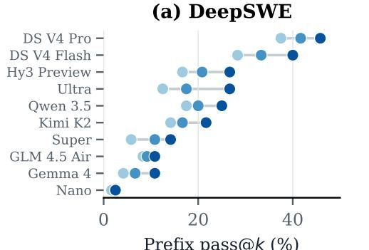  
Prefix pass@k (%)

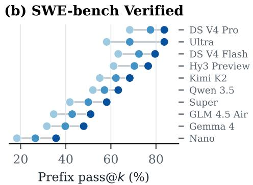

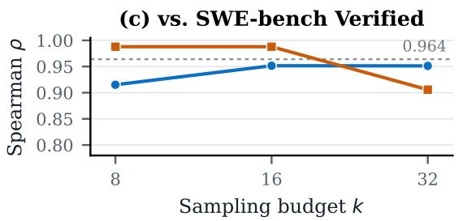

(d) vs. Terminal-Bench 2.1  
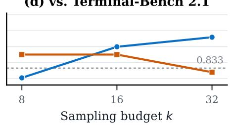  
DeepSWE prefixes SWE-bench Verified prefixes Decisive-Action BPB  
Figure 12 | Prefix-conditioned pass@� rankings and downstream agreement. Panels (a) and (b) rank the same ten checkpoints under DeepSWE and SWE-bench Verified trajectory prefixes at $k \in \{ 8 , 1 6 , 3 2 \}$ , tabulated in table 14. The two panels are sorted independently and use diferent � ranges, so marker positions are not comparable across them. Panels (c) and (d) plot the rank agreement of those scores with each downstream target from table 15; the dashed line marks Decisive-Action BPB against the same target for reference.

550B (21.67% versus 26.67%) and below Qwen 3.5 35B (21.67% versus 25.00%) despite Kimi scoring higher downstream, by 0.6 and 2.1 SWE-bench Verified points respectively. The SWE-bench Verified prefix arm disagrees on three pairs, all involving Nemotron Ultra, which it ranks above DeepSeek V4 Flash (83.67% versus 79.59%), Kimi K2 (83.67% versus 68.37%), and Hy3 Preview (83.67% versus 76.53%) despite Nemotron scoring lower downstream in each case. Kimi also leads the SWE-bench Verified no-think Patch MCQ setting in table 10, so the cheap and sampled probes disagree about this checkpoint in opposite directions across narrow downstream gaps. This is precisely the case we reserve for direct investigation rather than for arbitration by either proxy.

## K. Additional SFT Correlation Results

Table 16 shows correlations between our probes and the post-SFT SWE-bench Verified scores of Nemotron 3 Nano, Nemotron 3 Super and Qwen 3.5 35B A3B, using diferent SWE trajectories as sources. The BPB rows use the same canonical per-checkpoint measurements as the main tencheckpoint analysis. At � = 3, one pairwise inversion changes Spearman correlation by 0.5, so these coeficients are descriptive; extending the controlled SFT experiment to more base models is left to future work.
<table><tr><td></td><td colspan="2">vs. Post-SFT SWE-Verified (n = 3)</td><td colspan="2">vs. Public SWE-Verified (n = 3)</td><td colspan="2">vs. Public SWE-Verified (n = 10)</td></tr><tr><td>Evaluation</td><td>Pearson</td><td>Spearman</td><td>Pearson</td><td>Spearman</td><td>Pearson</td><td>Spearman</td></tr><tr><td>DeepSWE</td><td></td><td></td><td></td><td></td><td></td><td></td></tr><tr><td>Decisive-Action BPB</td><td>0.97</td><td>0.50</td><td>0.96</td><td>0.50</td><td>0.97</td><td>0.96</td></tr><tr><td>Patch MCQ</td><td>0.91</td><td>0.50</td><td>0.90</td><td>0.50</td><td>0.87</td><td>0.80</td></tr><tr><td>Prefix pass@32</td><td>0.97</td><td>1.00</td><td>0.98</td><td>1.00</td><td>0.95</td><td>0.93</td></tr><tr><td>SWE-Pro</td><td></td><td></td><td></td><td></td><td></td><td></td></tr><tr><td>Decisive-Action BPB</td><td>0.99</td><td>1.00</td><td>0.99</td><td>1.00</td><td>0.94</td><td>0.96</td></tr><tr><td>Patch MCQ</td><td>1.00</td><td>1.00</td><td>1.00</td><td>1.00</td><td>0.66</td><td>0.61</td></tr><tr><td>Prefix pass@32</td><td>1.00</td><td>1.00</td><td>1.00</td><td>1.00</td><td>0.85</td><td>0.83</td></tr><tr><td>SWE-bench Verified</td><td></td><td></td><td></td><td></td><td></td><td></td></tr><tr><td>Decisive-Action BPB</td><td>0.99</td><td>1.00</td><td>0.99</td><td>1.00</td><td>0.95</td><td>0.92</td></tr><tr><td>Patch MCQ</td><td>0.99</td><td>1.00</td><td>0.99</td><td>1.00</td><td>0.89</td><td>0.90</td></tr><tr><td>Prefix pass@32</td><td>1.00</td><td>1.00</td><td>0.99</td><td>1.00</td><td>0.89</td><td>0.82</td></tr></table>

Table 16 | Comparison of probe correlations across source tasks and post-SFT SWE-bench Verified results for Nemotron 3 Nano, Nemotron 3 Super, and Qwen 3.5 35B A3B. We show correlations against public SWE-bench Verified scores for the same 3 models, as well as all 10 models in our panel.