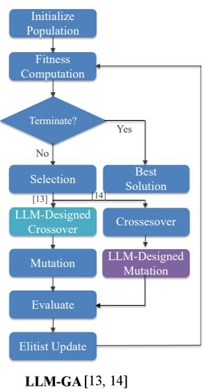
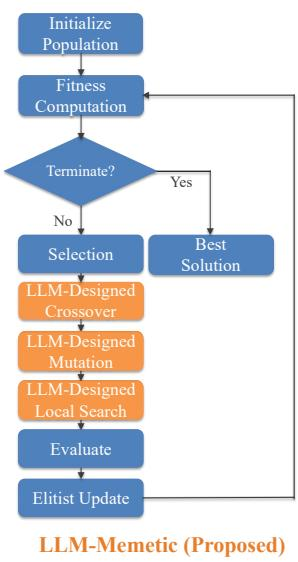
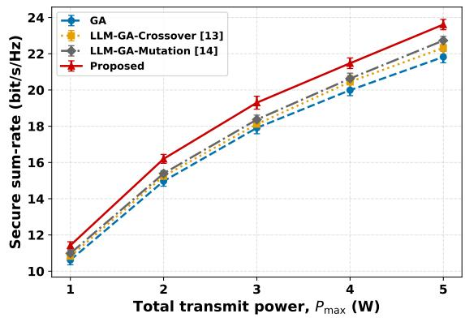
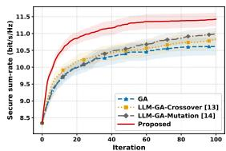
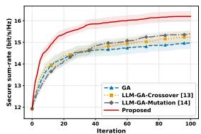
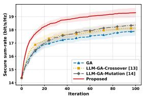
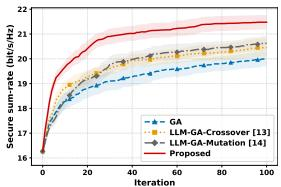
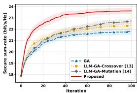

# Beyond LLM-GA: Secure Fluid Antenna Systems with ReEvo-Designed Memetic Algorithm

Hanyong Xu, Zhaolai Dang, and Tong Zhang

Abstract—Fluid antenna systems (FASs) offer significant spatial flexibility, yet securing them against eavesdropping is critical for practical FAS deployment in military, satellite, and internetof-things networks. Although large language model (LLM)- assisted genetic algorithms (LLM-GAs) can address this secure FAS port selection problem, whether further algorithmic improvement is possible warrants deeper investigation. To this end, we propose a memetic algorithm based on reflective evolution (ReEvo). Unlike the state-of-the-art LLM-GAs, which design only crossover or mutation operators with an LLM, our algorithm leverages an LLM to evolve dedicated crossover, mutation, and local-search operators offline. These operators are then embedded into a memetic search framework, thereby obviating any online LLM queries during execution. Simulation results at equal generation counts demonstrate that our proposed algorithm achieves a higher secure sum-rate than the conventional GA and the state-of-the-art LLM-GAs.

Index Terms—Fluid antenna system, large language model, memetic algorithm, physical-layer security.

## I. INTRODUCTION

The ever-increasing demand for high data rates and massive connectivity in next-generation wireless networks calls for new degrees of freedom to enhance spectral efficiency and link reliability. To this end, fluid antenna systems (FASs) enable antenna port selection over a dense aperture, improving signal strength, interference suppression, and spatial diversity without extra radio frequency (RF) chains [1]–[3]. Unfortunately, joint port selection and beamforming, if optimally designed, holds the key to fully unlocking the potential of FAS, yet it poses a mixed-integer nonconvex problem that is computationally challenging [4]–[6].

Securing FAS wireless communications against passive eavesdropping poses a distinct and formidable challenge. This, combined with the need to jointly optimize discrete port selections and continuous beamforming vectors, significantly complicates the design, as the secrecy objective is nonconvex and intricately coupled with multiuser interference and power limitations. Analytical studies characterize secrecy capacity, outage probability, and the impact of spatial channel asymmetry between legitimate users and eavesdroppers [7] and [8]. Recent works jointly optimize beamforming and antenna positions in FAS-aided non-orthogonal multiple access (NOMA) systems [9], or use penalty and majorization–minimization procedures for secure and covert links [10]. However, none of the above works has fully addressed the secure port selection problem.

TABLE I  
COMPARISON OF THE LLM-DESIGNED OPERATORS IN [13], [14], ANDTHE PROPOSED ALGORITHM.
<table><tr><td>Operator class</td><td>Ref. [13] (crossover only)</td><td>Ref. [14] (mutation only)</td><td>Proposed (memetic)</td></tr><tr><td>LLM-Designed Mutation</td><td>No</td><td>Yes</td><td>Yes</td></tr><tr><td>LLM-Designed Crossover</td><td>Yes</td><td>No</td><td>Yes</td></tr><tr><td>LLM-Designed Local Search</td><td>No</td><td>No</td><td>Yes</td></tr></table>

Large language models (LLMs) have recently been used to address the port selection/antenna position selection problem [11]–[14]. In particular, Wang et al. [13] applied reflective evolution (ReEvo) [15] to a binary-genetic algorithm (GA) crossover for power minimization. Their crossover uses population fitness, elite-port frequencies, and port co-occurrences, with conventional selection, mutation, elitism, and repair. The learned crossover is generated offline, has no explicit localsearch stage, and is not evaluated with a secrecy objective. In addition, Zheng et al. [14] proposed an efficient LLM-GA algorithm, which combines a frequency-based crossover with an LLM-designed one-port mutation. Its exchange probability and displacement range are prescribed, after which standard GA selection, elitism, and repair are applied; the target is nonsecure multiuser performance such as max-min signal-tointerference-plus-noise ratio (SINR). Thus, [13] learns only the crossover operator, whereas [14] learns only the mutation operator. Port prediction has also been investigated in [16].

In this paper, we propose a ReEvo-designed memetic optimizer [17] for secure port selection in downlink multiuser FASs, which outperforms state-of-the-art LLM-GAs in terms of secure sum-rate. Each candidate port subset is scored by its achievable secure sum rate, computed via a secure weighted minimum mean-square error (WMMSE) beamforming procedure. Under this secrecy-driven fitness, ReEvo successively evolves three complementary operators offline, namely crossover, mutation, and local-search. The learned crossover exploits elite-port statistics and grid topology; the mutation performs feasible one-in-one-out swaps at both local and global scales; and the local-search operator generates four complementary one-swap neighbors per offspring. All three operators are frozen after offline evolution and embedded into a memetic search framework, requiring no LLM queries during online execution. Unlike prior LLM-GAs that design only crossover or mutation operators without security consideration, our method covers all discrete search stages, explicitly accounts for eavesdropper leakage, and performs systematic local refinement, all under the same secrecy-aware fitness. Table I contrasts the LLM-designed operators of [13] and [14] with those of the proposed algorithm. Simulation results demonstrate that our proposed algorithm achieves a higher secure sum-rate than the conventional GA and the state-ofthe-art LLM-GAs.

## II. SYSTEM MODEL AND PROBLEM FORMULATION

We first define the system model, and then formulate joint secure port selection and beamforming Problem.

## A. System Model

We consider a multiuser downlink fluid antenna system (FAS) in which a base station (BS) serves K single-antenna users in the presence of a passive single-antenna eavesdropper. Let ${ \mathcal { K } } \ { \stackrel { \Delta } { = } } \ \left\{ 1 , \ldots , K \right\}$ denote the user index set. The BS has a rectangular FAS aperture of dimensions $\lambda W _ { x } \times \lambda W _ { y } ,$ where $\lambda = c / f _ { c }$ and $W _ { x } , W _ { y }$ are normalized by the carrier wavelength. A uniform $N _ { x } \times N _ { y }$ grid provides $N _ { s } = N _ { x } N _ { y }$ candidate ports, of which exactly $n _ { s }$ are active.

Let $( n _ { x , i } , n _ { y , i } )$ denote the two-dimensional grid index of port i, where $1 \ \leq \ n _ { x , i } \ \leq \ N _ { x } , \ 1 \ \leq \ n _ { y , i } \ \leq \ N _ { y } ,$ , and $i \ =$ $n _ { y , i } + ( n _ { x , i } - \underline { { { 1 } } } ) N _ { y }$ . The physical distance between ports i and j is $\begin{array} { r } { d _ { i , j } = \sqrt { \left( \frac { n _ { x , i } - n _ { x , j } } { N _ { x } - 1 } \lambda W _ { x } \right) ^ { 2 } + \left( \frac { n _ { y , i } - n _ { y , j } } { N _ { y } - 1 } \lambda W _ { y } \right) ^ { 2 } } } \end{array}$ . Consistent with the channel generator, define $J _ { i , j } = j _ { 0 } \dot { ( 2 \pi d _ { i , j } / \lambda ) }$ where $j _ { 0 } ( x ) = \sin ( x ) / x$ and $j _ { 0 } ( 0 ) ~ = ~ 1$ . This isotropic three-dimensional model differs from the cylindrical Bessel correlation in Jakes’ model [18]. The spatial correlation matrix is

$$
\pmb { J } = \left[ \begin{array} { c c c c } { J _ { 1 , 1 } } & { J _ { 1 , 2 } } & { \ldots } & { J _ { 1 , N _ { s } } } \\ { J _ { 2 , 1 } } & { J _ { 2 , 2 } } & { \ldots } & { J _ { 2 , N _ { s } } } \\ { \vdots } & { \vdots } & { \ddots } & { \vdots } \\ { J _ { N _ { s } , 1 } } & { J _ { N _ { s } , 2 } } & { \ldots } & { J _ { N _ { s } , N _ { s } } } \end{array} \right] \in \mathbb { R } ^ { N _ { s } \times N _ { s } } .\tag{1}
$$

Because J is real and symmetric, write its eigendecomposition as ${ \pmb J } = { \pmb U } { \pmb \Lambda } { \pmb U } ^ { \mathrm { T } }$ , where U is real and orthogonal. Let $r _ { k }$ and $r _ { e }$ denote the BS-to-user and BS-to-eavesdropper distances, respectively. We model the large-scale power gains by $\beta _ { k } =$ $\beta _ { 0 } ( r _ { k } / r _ { 0 } ) ^ { - \alpha }$ for $k \in \mathcal { K }$ and $\beta _ { e } = \beta _ { 0 } ( r _ { e } / r _ { 0 } ) ^ { - \alpha }$ , where $\beta _ { 0 }$ is the reference gain at distance $r _ { 0 }$ and α is the path-loss exponent. The channel vector of user $k \in \mathcal { K }$ is

$$
\begin{array} { r } { \pmb { h } _ { k } ^ { \mathrm { H } } = \sqrt { \beta _ { k } } \pmb { g } _ { k } ^ { \mathrm { H } } \pmb { \Lambda } ^ { 1 / 2 } \pmb { U } ^ { \mathrm { T } } , \quad k \in \mathcal { K } , } \end{array}\tag{2}
$$

where $\mathbf { \sigma } _ { { \pmb { g } } _ { k } } \sim \mathcal { C N } ( \mathbf { 0 } , { \pmb { I } } _ { N _ { s } } )$ for $k \in { \mathcal { K } }$ . The eavesdropper channel is

$$
\pmb { h } _ { e } ^ { \mathrm { H } } = \sqrt { \beta _ { e } } \pmb { g } _ { e } ^ { \mathrm { H } } \pmb { \Lambda } ^ { 1 / 2 } \pmb { U } ^ { \mathrm { T } }\tag{3}
$$

where $\mathbf { g } _ { e } \sim \mathcal { C N } ( \mathbf { 0 } , I _ { N _ { s } } )$ . Independent Gaussian vectors are drawn for the users and the eavesdropper, and are mapped through the same correlation matrix; hence, the links share spatial correlation but have independent small-scale fading. Shadowing is omitted. As an upper-bound benchmark, we assume that the BS has perfect instantaneous channel state information (CSI) for every link; eavesdropper CSI may have been acquired while that terminal was previously active. The channels remain quasi-static within each optimization run, so all candidate configurations share the same propagation state. Robust design under imperfect or delayed CSI is outside the present scope.

Let $e _ { i }$ denote the ith column of $I _ { N _ { s } }$ . When $n _ { s }$ distinct ports with indices $m _ { 1 } , \ldots , m _ { n _ { s } }$ are activated, their port selection matrix is defined as $\pmb { { E } } _ { n _ { s } } \triangleq [ \pmb { { e } } _ { m _ { 1 } } , \ldots , \pmb { { e } } _ { m _ { n _ { s } } } ] \in \mathbb { R } ^ { N _ { s } \times n _ { s } }$ . Each column of $E _ { n _ { s } }$ selects one physical port, so feasibility requires

$$
\pmb { { E } } _ { n _ { s } } ( : , \ell ) \in \{ e _ { 1 } , \dots , \pmb { { e } } _ { N _ { s } } \} , \quad \ell = 1 , \dots , n _ { s } .\tag{4}
$$

and the selected ports must be distinct:

$$
E _ { n _ { s } } ( : , \ell ) \neq E _ { n _ { s } } ( : , q ) , \quad \ell \neq q .\tag{5}
$$

Together, these constraints activate exactly $n _ { s }$ distinct ports. Define the effective channel vectors $\bar { \boldsymbol { h } } _ { k } = \mathbf { \delta E } _ { n _ { e } } ^ { \mathrm { H } } \boldsymbol { h } _ { k }$ and $\bar { h } _ { e } ~ = ~ E _ { n } ^ { \mathrm { H } } h _ { e }$ . Stacking the user channels gives $\begin{array} { r l } { \bar { \pmb { H } } } & { { } = } \end{array}$ $[ \bar { \pmb { h } } _ { 1 } , \dots , \bar { \pmb { h } } _ { K } ^ { \dots } ] ^ { \mathrm { H } } \ \in \ \mathbb { C } ^ { K \times n _ { s } }$ . The BS jointly designs the port selection matrix $E _ { n . }$ and the beamforming matrix $\begin{array} { r l } { W } & { { } = } \end{array}$ s   
$[ { \pmb w } _ { 1 } , \dots , { \pmb w } _ { K } ] .$ , where $\pmb { w } _ { k } ~ \in ~ \mathbb { C } ^ { n _ { s } \times 1 }$ is the beamformer for legitimate user $k \in \mathcal { K }$ . Let $\mathbf { \pmb { x } } _ { d } = [ x _ { 1 } , \dots , x _ { K } ] ^ { \mathrm { T } }$ collect the unit-power data symbols, i.e., $\mathbb { E } [ | x _ { k } | ^ { 2 } ] = 1$ . The transmitted signal is

$$
\pmb { x } = \pmb { E _ { n _ { s } } W } \pmb { x _ { d } } = \sum _ { k \in \mathcal K } \pmb { E _ { n _ { s } } } \pmb { w _ { k } } x _ { k } ,\tag{6}
$$

Because the columns of ${ \bf E } _ { n _ { s } }$ are orthonormal, the transmitpower constraint becomes

$$
\| E _ { n _ { s } } W \| _ { F } ^ { 2 } = \| W \| _ { F } ^ { 2 } = \sum _ { k \in { \cal K } } \| w _ { k } \| _ { 2 } ^ { 2 } \leq P _ { \operatorname* { m a x } } .\tag{7}
$$

The receiver noises satisfy $\begin{array} { l } { n _ { k } \ \sim \ \mathcal { C N } ( 0 , \sigma _ { k } ^ { 2 } ) } \end{array}$ and $n _ { e } ~ \sim$ $\mathcal { C N } ( 0 , \sigma _ { e } ^ { 2 } )$ . The received signals are

$$
y _ { k } = { \pmb h } _ { k } ^ { \mathrm { H } } { \pmb E } _ { n _ { s } } { \pmb w } _ { k } x _ { k } + \sum _ { j \neq k } { \pmb h } _ { k } ^ { \mathrm { H } } { \pmb E } _ { n _ { s } } { \pmb w } _ { j } x _ { j } + n _ { k } ,\tag{8a}
$$

$$
y _ { e } = \sum _ { k \in \mathcal { K } } h _ { e } ^ { \mathrm { H } } E _ { n _ { s } } w _ { k } x _ { k } + n _ { e } .\tag{8b}
$$

Under single-user decoding, the eavesdropper treats all other streams as interference. The resulting SINRs are

$$
\gamma _ { k } = \frac { | h _ { k } ^ { \mathrm { H } } E _ { n _ { s } } { w _ { k } } | ^ { 2 } } { \sum _ { j \in \mathcal { K } \backslash \{ k \} } | h _ { k } ^ { \mathrm { H } } E _ { n _ { s } } { w _ { j } } | ^ { 2 } + \sigma _ { k } ^ { 2 } } , \quad k \in \mathcal { K } ,\tag{9a}
$$

$$
\gamma _ { e , k } = \frac { | \boldsymbol h _ { e } ^ { \mathrm { H } } \boldsymbol E _ { n _ { s } } \boldsymbol w _ { k } | ^ { 2 } } { \sum _ { j \in \mathcal { K } \backslash \{ k \} } | \boldsymbol h _ { e } ^ { \mathrm { H } } \boldsymbol E _ { n _ { s } } \boldsymbol w _ { j } | ^ { 2 } + \sigma _ { e } ^ { 2 } } , \quad k \in \mathcal { K } .\tag{9b}
$$

Accordingly, the achievable secrecy rate of user k is

$$
\begin{array} { r } { R _ { k } ^ { s } = [ \log _ { 2 } ( 1 + \gamma _ { k } ) - \log _ { 2 } ( 1 + \gamma _ { e , k } ) ] ^ { + } , \quad k \in \mathcal { K } , } \end{array}\tag{10}
$$

following the standard wiretap-rate construction [19].

## B. Joint Secure Port Selection and Beamforming Problem

Mathematically, the joint secure port selection and beamforming problem for the downlink multiuser FAS is formulated as follows:

$$
\begin{array} { r l } { { \mathrm { P 1 : } } } & { { \displaystyle \operatorname* { m a x } _ { E _ { n _ { s } } , W } ~ \sum _ { k \in { \mathcal K } } R _ { k } ^ { s } ( E _ { n _ { s } } , W ) } } \\ { { \mathrm { s . t . } } } & { { ( 4 ) , ~ ( 5 ) , ~ \mathrm { a n d } ~ ( 7 ) . } } \end{array}
$$

  
Fig. 1. Flowchart comparison of [13] and [14] with the proposed algorithm.

Physically, selecting a port changes the sampled channels of every user and of the eavesdropper at the same time. The objective therefore rewards ports that strengthen the desired links while suppressing multiuser interference and information leakage, subject to the total transmit power. Since the portselection constraints introduce a combinatorial discrete space and the secrecy sum-rate is nonlinear in the selection and beamforming variables, Problem P1 is a nonlinear mixedinteger nonconvex program.

## III. REEVO-DESIGNED MEMETIC ALGORITHM

To solve Problem P1, we develop a ReEvo-designed memetic algorithm comprising an offline LLM-driven operator design stage and an online memetic search stage that requires no LLM application programming interface (API) calls. In the offline stage, ReEvo evolves three complementary discrete operators (crossover, mutation, and local search) under a secrecydriven fitness evaluated via secure WMMSE beamforming. In the online stage, each candidate port subset generated by the frozen operators is scored via secure WMMSE beamforming; the memetic search then evolves toward higher secure sumrates without any LLM queries. Fig. 1 illustrates the overall architecture and highlights the distinction between our method and prior LLM-GAs that design only a crossover operator [13] or only a mutation operator [14].

## A. Secure WMMSE Beamforming

For a fixed $E _ { n _ { s } }$ , we use a safeguarded WMMSE-based procedure [20]. Initialize ${ \pmb V } = \bar { \pmb H } ^ { \mathrm { H } } ( \bar { \pmb H } \bar { \pmb H } ^ { \mathrm { H } } + 1 0 ^ { - 6 } { \pmb I } ) ^ { - 1 }$ and $\mathbf { \bar { W } } ^ { ( 0 ) } \ = \ \sqrt { P _ { \mathrm { m a x } } } { \cal V } / \| { \cal V } \| _ { F } ;$ if the solve fails, use ${ \cal V }  { \mathrm { ~ \textrm ~ { ~ ~ } ~ } } =  { \mathbf { \Lambda } }$ $\bar { \pmb { H } } ^ { \mathrm { H } }$ . With the scalar estimate $\hat { x } _ { k } = u _ { k } ^ { * } y _ { k }$ , the user’s minimum mean-square error (MMSE) receiver, mean-square error (MSE), and weight are

$$
T _ { k } = \sum _ { j \in { \mathcal K } } | \bar { \pmb h } _ { k } ^ { \mathrm { H } } \pmb w _ { j } | ^ { 2 } + \sigma _ { k } ^ { 2 } ,\tag{11a}
$$

$$
u _ { k } = \frac { { \bar { h } } _ { k } ^ { \mathrm { H } } w _ { k } } { T _ { k } } , \qquad \varepsilon _ { k } = 1 - \frac { | \bar { h } _ { k } ^ { \mathrm { H } } w _ { k } | ^ { 2 } } { T _ { k } } ,\tag{11b}
$$

$$
q _ { k } = \varepsilon _ { k } ^ { - 1 } .\tag{11c}
$$

When the eavesdropper decodes stream k and treats the remaining streams as interference, its corresponding variables are

$$
T _ { e } = \sum _ { j \in \mathcal { K } } | \bar { \pmb { h } } _ { e } ^ { \mathrm { H } } \pmb { w } _ { j } | ^ { 2 } + \sigma _ { e } ^ { 2 } ,\tag{12a}
$$

$$
u _ { e , k } = \frac { \bar { h } _ { e } ^ { \mathrm { H } } w _ { k } } { T _ { e } } , \qquad \varepsilon _ { e , k } = 1 - \frac { | \bar { h } _ { e } ^ { \mathrm { H } } w _ { k } | ^ { 2 } } { T _ { e } } ,\tag{12b}
$$

$$
q _ { e , k } = \varepsilon _ { e , k } ^ { - 1 } .\tag{12c}
$$

For an arbitrary receiver u, the MSE is $e _ { k } ( u , W ) \ =$ $| u | ^ { 2 } T _ { k } - 2 \mathrm { R e } \{ u ^ { * } \mathrm { \bar { \it { h } } _ { k } ^ { H } } w _ { k } \} + 1$ . The rate identity is $\ln ( 1 +$ $\gamma _ { k } \big ) = \operatorname* { m a x } _ { u \in \mathbb { C } , q > 0 } \{ \ln q - q e _ { k } + 1 \}$ , attained at (11). For the eavesdropper, $\begin{array} { r } { - \ln ( 1 + \gamma _ { e , k } ) = \operatorname* { m i n } _ { u \in \mathbb { C } , q > 0 } \{ q e _ { e , k } - \ln q - 1 \} } \end{array}$ attained at (12). Frozen auxiliary variables lower-bound the legitimate rate but upper-bound the negative eavesdropper rate. Thus the following linearization yields a trial model for the unclipped rate difference, not a guaranteed secrecy-rate lower bound. Omitting the common 1/ ln 2 factor and constants gives

$$
\widetilde { W } = \arg \operatorname* { m a x } _ { \| W \| _ { F } ^ { 2 } \leq P _ { \operatorname* { m a x } } } - \mathrm { t r } ( W ^ { \mathrm { H } } A W ) + 2 \mathrm { R e } \{ \mathrm { t r } ( B ^ { \mathrm { H } } W ) \} ,\tag{13}
$$

where

$$
A = \sum _ { k \in \mathcal { K } } q _ { k } | u _ { k } | ^ { 2 } \bar { h } _ { k } \bar { h } _ { k } ^ { \mathrm { H } } ,\tag{14a}
$$

$$
{ \pmb b } _ { k } = q _ { k } u _ { k } { \bar { \pmb h } } _ { k } + c _ { e } { \bar { \pmb h } } _ { e } { \bar { \pmb h } } _ { e } ^ { \mathrm { H } } { \pmb w } _ { k } ^ { ( t ) } - q _ { e , k } u _ { e , k } { \bar { \pmb h } } _ { e } ,\tag{14b}
$$

$$
c _ { e } = \sum _ { j \in { \cal K } } q _ { e , j } | u _ { e , j } | ^ { 2 } , \quad { \cal B } = [ { b _ { 1 } } , \dots , { b _ { K } } ] .\tag{14c}
$$

Specifically, for the positive quadratic ${ \pmb w } _ { k } ^ { \mathrm { H } } { \pmb C } _ { e } { \pmb w } _ { k }$ , where $\begin{array} { c c c c c } { { C _ { e } } } & { { = } } & { { { c _ { e } } { \bar { h } } _ { e } { \bar { h } } _ { e } ^ { \mathrm { H } } } } & { { \succeq } } & { { 0 . } } \end{array}$ , convexity gives $\begin{array} { r l } { { \pmb w } _ { k } ^ { \mathrm { H } } { \pmb C } _ { e } { \pmb w } _ { k } } & { { } \geq } \end{array}$ $2 \mathrm { R e } \{ ( { \pmb w } _ { k } ^ { ( t ) } ) ^ { \mathrm { H } } C _ { e } { \pmb w } _ { k } \} - ( { \pmb w } _ { k } ^ { ( t ) } ) ^ { \mathrm { H } } C _ { e } { \pmb w } _ { k } ^ { ( t ) }$ . This affine minorization produces the $C _ { e } w _ { k } ^ { ( t ) }$ term in (14b). The Lagrangian stationarity condition of (13) is $( A + \mu I ) { \tilde { W } } = B$ , and hence, when nonsingular, we have

$$
\widetilde { \pmb { W } } = ( \pmb { A } + \mu \pmb { I } ) ^ { - 1 } \pmb { B } .\tag{15}
$$

Since $A \succeq 0 .$ , the KKT conditions solve (13) globally: $\mu =$ 0 for a feasible unconstrained solution, otherwise bisection enforces $\| \widetilde { \pmb { W } } \| _ { F } ^ { 2 } = { \cal P } _ { \mathrm { m a x } }$ with $\mu > 0$ . The implementation adds $1 0 ^ { - 1 0 } I$ if the zero-multiplier linear solve fails.

For each trial $W ( \eta ) ~ = ~ ( 1 - \eta ) W ^ { ( t ) } + \eta \tilde { W }$ , evaluate $\textstyle \sum _ { k \in K } R _ { k } ^ { s }$ using the per-user secrecy rates in (10). A negative per-user difference contributes zero, while that stream still causes interference. The unclipped trial model retains all streams. Start at $\eta ~ = ~ 1$ and halve it for at most 20 trials; retain the incumbent and stop if none is accepted. The acceptance tolerance is $1 0 ^ { - 1 0 }$ ; termination also occurs after 30 iterations or improvement below $\begin{array} { r } { 1 0 ^ { - 6 } \operatorname* { m a x } ( 1 , | \sum _ { k \in \mathcal { K } } R _ { k } ^ { s } | ) } \end{array}$ . In exact arithmetic, accepting only nondecreasing steps preserves feasibility and gives

$$
0 \leq \sum _ { k \in \mathcal { K } } R _ { k } ^ { s } \leq \sum _ { k } \log _ { 2 } \left( 1 + \frac { P _ { \operatorname* { m a x } } \| \bar { \pmb { h } } _ { k } \| _ { 2 } ^ { 2 } } { \sigma _ { k } ^ { 2 } } \right) .
$$

Thus exact monotone objective values converge if continued indefinitely; this is not a beamformer or stationary-point convergence guarantee.

Algorithm 1 Offline LLM operator design and API-free secure   
FAS optimization   
1: for $q \in \{ c , m , l \}$ in order do   
2: Initialize program population $\Phi _ { q }$ from seed and LLM   
code.   
3: while fewer than $N _ { \mathrm { e v a l } }$ programs have been evaluated   
do   
4: Evaluate training fitness $F _ { q }$ by secure WMMSE.   
5: Reflect on higher/lower-fitness code; generate pro  
grams and update $\Phi _ { q } .$   
6: end while   
7: Freeze the best program $\chi _ { q } ^ { * }$ by training fitness.   
8: end for   
9: Initialize P feasible chromosomes; evaluate and cache   
fitness and beamformers.   
10: for $g = 1 , \ldots , G$ do   
11: Preserve $E$ elites and select parents for $P - E$ children.   
12: Apply $\chi _ { c } ^ { * }$ and $\chi _ { m } ^ { * } ;$ repair cardinality.   
13: Apply $\chi _ { l } ^ { * }$ to create $N _ { l }$ neighbors per child.   
14: Score uncached candidates by secure WMMSE.   
15: Retain the best $P - E$ candidates with the E elites.   
16: end for   
17: return Best chromosome and its cached beamformer.   
B. ReEvo-Designed Memetic Port Search   
We encode a port subset as a binary chromosome ${ \textbf { \textit { s } } } \in$   
$\{ 0 , 1 \} ^ { N _ { s } }$ satisfying $\mathbf { 1 } ^ { \mathrm { T } } { \boldsymbol { s } } ~ = ~ n _ { s }$ . Following [15], the LLM   
acts as a hyper-heuristic. Let $\mathcal { Q } ~ = ~ \{ c , m , l \}$ denote the   
crossover, mutation, and local-search operator classes, respec  
tively. DeepSeek Reasoner evolves each class separately. For   
class $q ,$ each program $\chi _ { q }$ is an individual in population $\Phi _ { q } .$   
Its meta-fitness is the best secure sum-rate attained when an   
inner GA-based search uses $\chi _ { q }$ on the fixed training channel   
set:

$$
R _ { \mathrm { s e c } } ( \pmb { s } ) = \sum _ { k \in \mathcal { K } } R _ { k } ^ { s } ( \pmb { s } ) ,\tag{16a}
$$

$$
F _ { q } ( \chi _ { q } ) = \operatorname* { m a x } _ { s \in \mathrm { G A } _ { q } ( \chi _ { q } ) } R _ { \mathrm { s e c } } ( s ) ,\tag{16b}
$$

Because (16) includes secure WMMSE optimization, programs are selected by the target secrecy objective rather than a surrogate port score.

The three operator classes receive feasible binary chromosomes and grid indices; crossover also receives population fitness and ranks. Crossover combines two parents, mutation performs a one-in–one-out swap, and local search generates four neighbors: nearby, long-distance, same-row/column, and crowded-to-sparse relocation. Returned chromosomes are repaired to contain exactly $n _ { s }$ active ports; invalid programs are discarded. All fitness evaluations use the same training channels, beamformer initialization, and stopping rule.

Algorithm 1 summarizes the procedure. Crossover is trained with conventional mutation and no local search; mutation is trained with crossover fixed; local search is trained with both fixed. Programs are selected by training fitness and then checked on separate validation channels.

During online execution, the three frozen operators generate offspring and neighbors, while caching and elitist replacement control the WMMSE evaluations.

  
Fig. 2. Mean secure sum-rate versus total transmit power.

TABLE II  
SIMULATION PARAMETERS.
<table><tr><td>Parameter</td><td>Setting</td></tr><tr><td>Grid / aperture</td><td> $\overline { { 2 0 \times 2 0 / 0 . 5 \times 0 . 5 ~ m ^ { 2 } } }$ </td></tr><tr><td>Carrier frequency</td><td>3.4 GHz</td></tr><tr><td>Users / eavesdropper</td><td> $K = 1 0 ~ / ~ 1$ </td></tr><tr><td>Active ports</td><td> $n _ { s } = 1 0$ </td></tr><tr><td>Distances / path loss</td><td> $\begin{array} { r } { r _ { k } ^ { - } = r _ { e } = r _ { 0 } ; \beta _ { k } = \beta _ { e } = 1 } \end{array}$ </td></tr><tr><td>Noise variance</td><td> $\sigma _ { k } ^ { 2 } = \sigma _ { e } ^ { 2 } = 1$  (normalized)</td></tr><tr><td>Transmit power</td><td> $P _ { \operatorname* { m a x } } \in \{ 1 , 2 , 3 , 4 , 5 \}$  W</td></tr><tr><td>Population / elites</td><td> $P = 2 0 \stackrel { \textstyle \cdot } { / } \dot { E } = \dot { 4 }$ </td></tr><tr><td>Offspring / generations</td><td>16 /  100</td></tr><tr><td>Mutation probability</td><td>0.2</td></tr><tr><td>Operator train / validation</td><td>10 / 20 disjoint channels</td></tr><tr><td>Test channels / random seeds</td><td>20 paired / 20 seeds</td></tr><tr><td>LLM / programs</td><td>DeepSeek / 10-program population</td></tr></table>

## IV. SIMULATIONS

Table II summarizes the simulation parameters. The power sweep uses normalized gains $\beta _ { k } = \beta _ { e } = 1$ and noise variances $\sigma _ { k } ^ { 2 } \doteq \sigma _ { e } ^ { 2 } = 1$ . Equivalently, $r _ { k } = r _ { e } = r _ { 0 } , \beta _ { 0 } = 1$ , and the path-loss exponent cancels. Each realization includes all K user channels and one eavesdropper channel. All methods share test channels, initial populations, and random seeds at each power. Offline ReEvo uses DeepSeek to generate operator code with 10 programs in the population. Fitness uses 10 training channels; selected programs are checked on 20 disjoint validation channels without reranking. Training and validation searches use 20 and 50 generations at power 2.5, respectively. Final testing uses 20 separate channels and 20 random seeds; training and validation use 10 and 20 channel realizations, respectively. The online optimizer uses frozen code, with no trainable neural-network layers or hidden dimensions and no LLM calls.

Throughout, the reported rate is the total secrecy rate summed over users and averaged over test channels, never divided by K. The same test channels are reused across all total transmit power levels. The error bars show one sample standard deviation of the 20 per-channel total rates.

Fig. 2 shows that the secure sum-rate of all four methods increases as $P _ { \mathrm { m a x } }$ grows from 1 to 5 W, with the proposed algorithm remaining the highest at every point. At 1 W, it achieves 11.423 bit/s/Hz, corresponding to gains of 7.6%, approximately 6%, and approximately 4% over GA, LLM-GA-crossover [13], and LLM-GA-mutation [14], respectively. At 5 W, it achieves 23.611 bit/s/Hz, yielding gains of 8.2%, approximately 5%, and approximately 4% over the same three baselines. The two LLM-GA baselines consistently lie between GA and the proposed algorithm, with visibly overlapping error bars at some operating points. A possible explanation is that elite-aware recombination preserves useful spatial patterns, while local and global exchanges explore the tradeoffs among signal strength, interference, and leakage. This ordering holds at equal generation counts, though the additional local-search evaluations may particularly account for the gains obtained by the proposed algorithm. Note that each operating point plotted in Fig. 2 is the generation-100 terminal value of the corresponding convergence curve in Fig. 3; that is, Fig. 2 summarizes the final (generation-100) data of Fig. 3 as a function of transmit power.

  
(a) 1.0 W

  
(b) 2.0 W  
Fig. 3. Secure sum-rate convergence for five total transmit power levels.

  
(c) 3.0 W

  
(d) 4.0 W

  
(e) 5.0 W

Fig. 3 shows secure sum-rate convergence over 100 generations. The proposed algorithm separates from the baselines early and stays ahead in all five power panels, while all curves gradually flatten as the populations approach stable incumbents. The terminal values at generation 100 correspond to the respective operating-point results summarized in Fig. 2, linking the convergence endpoint to the power-sweep comparison. Local search evaluates additional one-swap neighbors, so these curves do not establish faster convergence in runtime or evaluation count.

## V. CONCLUSION

This paper presented a ReEvo-designed memetic optimizer for joint port selection and secure beamforming in multiuser fluid antenna systems. An LLM evolves dedicated crossover, mutation, and local-search operators offline under a secrecydriven fitness, and the frozen programs incur no online LLMquery overhead. For each candidate port configuration, the beamformer is optimized by secure WMMSE.

Across the tested total transmit power levels, the proposed method consistently obtains the highest mean secure sum-rate among the conventional GA and both LLM-GA baselines, with gains that remain visible from low to high transmit power. These results indicate that evolving all three discrete search operators offline can outperform LLM-GAs that design only a single operator. Extending the framework to imperfect or delayed CSI and to more general multiuser and multi-antenna scenarios is left as future work.

## REFERENCES

[1] W. K. New et al., “A tutorial on fluid antenna system for 6G networks: Encompassing communication theory, optimization methods and hardware designs,” IEEE Commun. Surveys Tuts., vol. 27, no. 4, pp. 2325– 2377, Aug. 2025.

[2] J. Peng, Y. Wan, T. Zhang, and S. Wang, “Fluid antenna-assisted edge Gaussian splatting using grey wolf algorithm,” in Proc. 2nd Asia Conf. Commun. 6G (ACC6G), Shenzhen, China, 2026, pp. 45–50, doi: 10.1109/ACC6G70208.2026.11605699.

[3] J. Peng, T. Zhang, S. Wang, M. Shao, H. Xu, and R. Wang, “Group relative policy optimization for robust blind interference alignment with fluid antennas,” in Proc. IEEE Int. Conf. Commun. (ICC), Glasgow, U.K., May 2026, pp. 1–6.

[4] Q. Zhang, M. Shao, T. Zhang et al., “An efficient sum-rate maximization algorithm for fluid antenna-assisted ISAC system,” IEEE Commun. Lett., vol. 29, no. 1, pp. 200–204, 2025.

[5] T. Zhang et al., “Indoor fluid antenna systems enabled by layout-specific modeling and group relative policy optimization,” IEEE Trans. Wireless Commun., vol. 25, pp. 9313–9329, 2026.

[6] W. Wang, T. Zhang, H. Xu, S. Wang, R. Wang, and K.-K. Wong, “MA-GRPO: Accelerated MARL training for fluid antenna-assisted wireless network optimization,” arXiv:2604.17379, 2026.

[7] Y. Zou, J. Zhu, X. Wang, and L. Hanzo, “A survey on wireless security: Technical challenges, recent advances, and future trends,” Proc. IEEE, vol. 104, no. 9, pp. 1727–1765, Sep. 2016.

[8] F. R. Ghadi, K.-K. Wong, F. J. Lopez-Martinez, W. K. New, H. Xu, and C.-B. Chae, “Physical layer security over fluid antenna systems: Secrecy performance analysis,” IEEE Trans. Wireless Commun., vol. 23, no. 12, pp. 18201–18213, Dec. 2024.

[9] L. Mai, J. Yao, J. Tang, T. Wu, K.-K. Wong, H. Shin, and F. Adachi, “A secure beamforming design: When fluid antenna meets NOMA,” arXiv:2411.08386, 2024.

[10] J. Yao, L. Xin, T. Wu, M. Jin, K.-K. Wong, C. Yuen, and H. Shin, “FAS for secure and covert communications,” IEEE Internet Things J., vol. 12, no. 11, pp. 18414–18418, Jun. 2025.

[11] C. Wang, K.-K. Wong, Z. Li, L. Jin, and C.-B. Chae, “Large language model empowered design of fluid antenna systems: Challenges, frameworks, and case studies for 6G,” IEEE Wireless Commun., vol. 33, no. 2, pp. 117–125, Apr. 2026.

[12] T. Deng, Y. Gao, T. Zhang, M. Shao, W. Ni, and H. Xu, “Integrating large language models into fluid antenna systems: A survey,” Sensors, vol. 25, no. 16, Art. no. 5177, Aug. 2025.

[13] C. Wang, B. Zhang, Z. Li, K.-K. Wong, H. Xu, G. Zheng, and C.- B. Chae, “LLM-driven design for fluid antenna systems,” IEEE Wireless Commun. Lett., vol. 15, pp. 1065–1069, 2026.

[14] G. Zheng, F. Liu, and Q. Zhang, “LLM-enabled automated algorithm design for multiuser fluid antenna communications,” IEEE Trans. Wireless Commun., vol. 25, pp. 18811–18823, 2026.

[15] H. Ye et al., “ReEvo: Large language models as hyper-heuristics with reflective evolution,” in Proc. Adv. Neural Inf. Process. Syst., 2024, pp. 1–14.

[16] Y. Zhang, H. Yin, W. Li, E. Bjornson, and M. Debbah, “Port-LLM: A port prediction method for fluid antenna based on large language models,” IEEE Trans. Commun., vol. 73, no. 12, pp. 14534–14547, Dec. 2025.

[17] P. Moscato, “Memetic algorithms: A short introduction,” in New Ideas in Optimization, D. Corne, M. Dorigo, and F. Glover, Eds. New York: McGraw-Hill, 1999, pp. 219–234.

[18] W. C. Jakes, Microwave Mobile Communications. New York, NY, USA: Wiley, 1974.

[19] A. D. Wyner, “The wire-tap channel,” Bell Syst. Tech. J., vol. 54, no. 8, pp. 1355–1387, Oct. 1975.

[20] Q. Shi, E. Razaviyayn, Z.-Q. Luo, and C. He, “An iteratively weighted MMSE approach to distributed sum-utility maximization for a MIMO interfering channel,” IEEE Trans. Signal Process., vol. 59, no. 9, pp. 4331–4340, Sep. 2011.