# CircuitATLAS: Agentic reasoning over a systems neuroscience knowledge graph for target discovery in circuitopathies

Gabriel Ocana-Santero\* and Marko Tvrdic

Exin Therapeutics, Inc., 2261 Market Street STE 22614, San Francisco, California 94114, United States \*Correspondence: gabriel@exintherapeutics.com

## Abstract

Drug discovery for neurological disease has traditionally centered on the molecules altered by disease. But the molecular changes that cause pathology are not necessarily the only or even the most effective points from which to reverse it. Here, we ask which otherwise unaltered molecular control points can be engaged to restore pathological neural circuits toward functional states. For this, we present CircuitATLAS, a provenance-grounded systems-neuroscience knowledge graph and agentic framework for target discovery in circuitopathies. CircuitATLAS structures literature-derived relationships across diseases, phenotypes, electrophysiology, circuits, brain regions, cell types and molecular effectors, while deliberately excluding direct disease-gene and disease-protein edges from target generation to reduce shortcut reasoning. The current graph contains 3.83 million nodes and 7.66 million edges, including 5.31 million LLM-extracted relations, and can incorporate structured datasets such as the Human Cell Atlas and newly generated multimodal in vivo measurements. Then we introduce a new agentic reasoning workflow that reasons from measurable disease phenotypes through their circuit and cellular substrates to molecular interventions, therapeutic feasibility and clinical constraints. Finally, we introduce a humangoverned in vivo lab-in-the-loop architecture linking hypothesis generation to experimental iteration. Within this framework an agent nominated ATP1A3, the neuronal α3 Na+/K+-ATPase, as a control point on cortical excitability; interneuron-restricted expression of ATP1A3 abolished the beta- and gamma-band response to a focal 4-aminopyridine challenge in vivo, and the validated target was then carried into a structure-guided small-molecule campaign that terminates in a defined assay to resolve the direction of modulation. Together, CircuitATLAS provides a framework for discovering therapeutics based not only on what is molecularly disrupted in disease, but on what can be controlled to restore circuit function.

## 1 Introduction

Neurological and neuropsychiatric disorders are commonly classified by clinical presentation, molecular pathology, or genetic cause, yet their resulting phenotypes ultimately emerge from the dynamics of interacting neural populations1–3. Seizures, bradykinesia, cognitive impairment, sensory hypersensitivity, and impaired social behavior are not properties of isolated genes or cells. Instead, these phenotypes emerge from aberrant activity within and across neural circuits composed of distinct cell populations and brain regions, operating over multiple temporal scales4. Different molecular perturbations can converge on similar circuit-level dysfunction5, while interventions targeting shared circuit nodes can produce therapeutic benefit despite underlying genetic heterogeneity6. We therefore view many neurological and neuropsychiatric disorders as circuitopathies, in which clinically-relevant phenotypes arise from maladaptive neural dynamics that can be measured and, in principle, therapeutically modulated.

Most molecular drug-discovery strategies begin by identifying genes or proteins that are mutated, differentially expressed, or otherwise altered in disease7,8. This approach is powerful when the causal defect is known. However, the molecule that initiates pathology is not necessarily the most effective point of intervention for reversing the downstream circuit dysfunction it produces9. A therapeutically useful target may be unaltered in the disease yet well positioned to rebalance a pathological circuit. Antiseizure medicines10, deep-brain stimulation11, responsive neurostimulation12, interneuron-replacement therapies13, and experimental excitability-modifying therapies14 all illustrate this principle: circuit function can be improved by targeting control points that are not themselves the primary cause of disease. This reframes the target-discovery problem: rather than asking only which molecules are altered in disease, we ask which molecular effectors can drive a pathological circuit toward a more functional state.

Answering this question systematically is difficult because systems-neuroscience knowledge is dis tributed across biological scales and fragmented across studies. A disease-associated electrophysiological phenotype may be described in one study, localized to a circuit in another, attributed to a particular cell population elsewhere, and connected to a potentially druggable receptor or pathway only through separate perturbation experiments. Relevant evidence spans species, disease models, anatomical nomenclatures, recording modalities, behavioral assays, and intervention classes. Conventional literature search retrieves these observations largely as isolated documents, while most biomedical knowledge graphs are organized around disease-gene, drug-target, and pathway relationships rather than the cross-scale causal chain linking neural activity to circuits, cell types, and molecular control15–18.

Large language models provide a means of structuring heterogeneous scientific literature at scale by resolving contextual relationships between biological entities across diverse experimental settings19,20. However, unconstrained language-model reasoning is difficult to audit, because intermediate inference steps need not be grounded in any retrievable evidence. Scientific target discovery therefore requires more than retrieval-augmented generation21. Evidence must be represented in a structured and traceable form, with provenance, uncertainty, and conflicting findings preserved, so that each hypothesis can be linked back to the observations that support it22. The same framework can incorporate newly generated public and experimental data, placing new observations directly in the context of existing evidence. Once organized in a structured and provenance-linked form, these data can support agentic reasoning across biological scales and experimental contexts that are difficult to integrate manually.

Here, we introduce CircuitATLAS (Circuit Agent for Therapeutic Latent Analysis and Search), a systemsneuroscience knowledge graph and agentic framework for circuit-based target discovery. CircuitATLAS connects diseases, phenotypes, electrophysiological features, circuits, brain regions, cell types, molecular effectors, interventions, disease models, and clinical evidence, while preserving supporting text, source provenance, confidence, and verification status. Direct disease-to-gene and disease-to-protein edges are deliberately excluded from the discovery graph so that candidate targets must be supported by evidence that they regulate relevant cells, circuits, or activity phenotypes, rather than by disease association alone. The graph incorporates both literature-derived knowledge and newly-acquired data, including public human atlases and in-house multimodal in vivo measurements. On top of this framework, we introduce an evidence-gated workflow that identifies disease-relevant activity phenotypes, maps them to circuits and cell populations, nominates molecular effectors capable of modulating them, and evaluates therapeutic and clinical feasibility. We connected this discovery framework with a human-governed in vivo lab-in-the-loop in which experiments are prioritized against practical constraints, 3Rs principles, and mandatory human approval, with resulting data returned to the graph to update subsequent reasoning. Thus, CircuitATLAS provides a framework for discovering therapeutic control points based on what can restore circuit function, rather than restricting the search to what is molecularly altered in disease.

## 2 Structuring systems neuroscience into a knowledge graph using LLMs

Systems-neuroscience knowledge is fragmented across studies that interrogate different levels of the same biological process, from clinical phenotypes and abnormal neural activity to the circuits, cell populations, and molecular mechanisms that control them. CircuitATLAS was designed to connect these observations into an explicit, machine-readable representation spanning disease, phenotype, circuit activity, anatomy, cell type, and molecular function (Figure 1A).

We chose the scientific literature as the initial substrate rather than attempting to reconstruct knowledge directly from raw experimental datasets. This loses some information, including fine-grained measurements, negative results, and analyses not reported by the authors. However, scientific papers also provide a processed representation of the underlying data, in which observations have been quality-controlled, statistically analysed, interpreted in the context of prior work, and expressed in biologically meaningful terms. Abstracts were particularly useful because they distill the main conclusions of a study and generally contain less exploratory interpretation than discussion sections. Full text was retained when available to recover experimental context and supporting evidence. We also included preprints from bioRxiv, medRxiv, and arXiv. These sources introduce the risk of incorporating findings that have not yet undergone peer review, but substantially improve the recency of the graph. Because these findings may not yet have undergone peer review, source type and provenance were preserved explicitly, allowing downstream workflows to distinguish between peer-reviewed and preprint evidence.

To define entities represented in the graph, we first created a curated neuroscience lexicon containing 1,701 terms and used it to screen records from PubMed, PubMed Central, Europe PMC, bioRxiv, medRxiv, and arXiv, retaining 15.9 million after screening. We then assembled the graph vocabulary from both established resources and purpose-built lists. Genes were imported from NCBI23, transcripts from Ensembl24, proteins from UniProt25, signalling pathways from Reactome26, brain regions and neuronal cell types from the Allen Brain Atlas27, and phenotypes from the Human Phenotype Ontology28. Concepts that remain poorly standardized in existing databases (e.g., including circuits, circuit motifs, brain states, and cellular- and circuit-level electrophysiological features) were curated specifically for CircuitATLAS. Every node was represented by a canonical name, a set of synonyms, a node class, and a universal identifier assigned within the graph, while external database identifiers were retained when available. This combination allowed standardized molecular knowledge and less formalized systems-neuroscience concepts to be represented in the same vocabulary.

Papers were assigned to eight overlapping subcorpora by deterministically detecting nodes from the relevant classes, rather than by asking an LLM to classify entire documents. These subcorpora covered diseases, phenotypes, behavior and cognition, brain regions, cell types, circuit motifs, and cellular- and circuit-level electrophysiological features. Candidate edges were then generated separately for each permitted pair of node classes. Whenever two nodes were co-mentioned within a 400-character window, the surrounding passage was retained as candidate evidence. Passages referring to the same candidate node pair were then aggregated across publications. This procedure yielded 57.7 million candidate co-occurrences while preserving reproducible document selection and candidate generation.

LLMs were used only after this deterministic narrowing step, as semantic verifiers rather than unconstrained extractors (Figure 1B). Candidate relations were evaluated by Nova 2 Lite, which classified each relation as supported, unsupported, or uncertain and returned a confidence score and supporting quotation. Haiku 4.5 was used as a second quality pass over edges Nova 2 Lite had already accepted. A subset of 4,050 edges, 50 per relation type, was tested on Opus 5; in 17.8% of those edges Opus 5 judged the relationship not to be clearly stated in those passages. Given the rapid evolution of frontier models, in this study we opted to retain that degree of variability and instead used a second verification placed at inference on the few edges a candidate chain depends on during graph traversal.

The resulting schema contains 23 node types connected by 105 populated relation types: 81 extracted from the literature and 24 imported from canonical datasets (Figure 1C). Literature-derived edges capture contextual relationships that are rarely available in structured databases, such as a cell type contributing to a circuit motif or an intervention modulating an electrophysiological phenotype. Canonical edges provide complementary relationships such as gene-transcript-protein mappings, pathway membership, protein interactions, and drug-target associations. Direct disease-to-gene and disease-to-protein edges were deliberately omitted. This prevents target discovery from collapsing onto familiar disease-associated molecules29 and instead requires molecular candidates to be reached through evidence that they act on relevant cell types, circuits, or activity phenotypes.

Every literature-derived edge retains the supporting quotation (Table 1), source document, publication year, canonical node identifiers, model verdict, confidence, and extraction metadata. CircuitATLAS currently contains 3,831,997 nodes and 7,659,618 edges, comprising 5,306,909 literature-extracted edges and 2,352,709 canonical edges (Figure 1D). Because papers are processed independently and evidence is stored at the edge level, new literature can be incorporated through incremental runs and released as versioned graph snapshots. CircuitATLAS transforms the scientific literature into an auditable, updateable evidence graph that supports retrieval and reasoning across biological scales.

Table 1. Example LLM-extracted edges
<table><tr><td>Edge type</td><td>Head → Tail entity IDs</td><td>% support</td><td>Evidence quote example</td><td>PMID</td></tr><tr><td>cell_ephys_feature → disease [altered_in]</td><td>Burst afterhyperpolariza- tion/slow AHP (cef276) → Alzheimer&#x27;s disease (nd1)</td><td>3/3</td><td>&quot;During normal aging and in a mouse model of Alzheimer&#x27;s disease (AD), the slow AHP is increased, making neurons less excitable and making learning more difficult.&quot;</td><td>15541708</td></tr><tr><td>drug → phenotype [ameliorates]</td><td>Capsaicin (CHEMBL294199) → Neurodegeneration (HP:0002180)</td><td>17/20</td><td>“... capsaicin alleviated other AD-type pathologies, such as tau hyperphosphorylation, neuroinflamma- tion and neurodegeneration.&quot;</td><td>32661266</td></tr><tr><td>biomarker → disease [associated_with]</td><td>Thyroxine/free T4 (HMDB:0000248) → Narcolepsy (nd230)</td><td>10/11</td><td>&quot;Narcolepsy patients had significantly lower free thyroxine (FT4) levels in comparison to controls (p &lt; 0.001).&quot;</td><td>37898692</td></tr><tr><td>disease_model → phenotype [recapitulates]</td><td>Leaner mouse (dm90) → Dyskinesia (HP:0100660)</td><td>2/2</td><td>&quot;The leaner mouse exhibits severe ataxia, parox- ysmal dyskinesia, and absence epilepsy due to a P/Q-type calcium channel mutation.&quot;</td><td>15514988</td></tr></table>

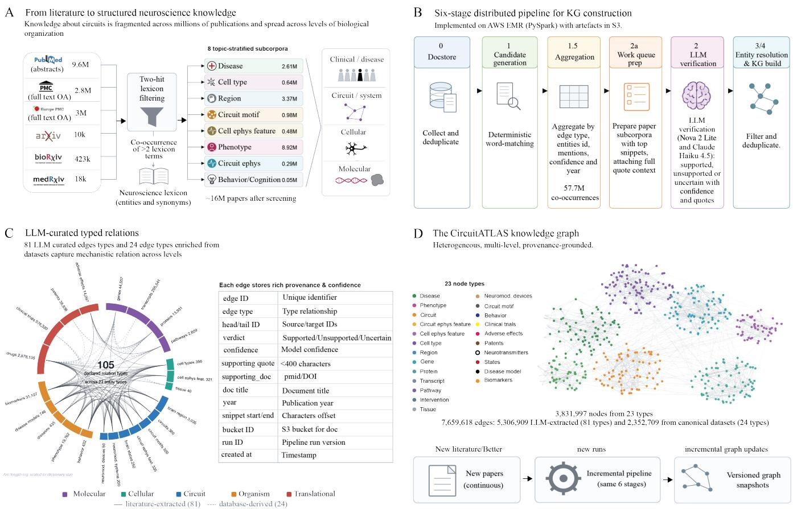

Figure 1. Construction and structure of the CircuitATLAS knowledge graph. (A) Schematic of the literaturescreening workflow. Sources shown are PubMed abstracts, PubMed Central full text, Europe PMC full text, arXiv, bioRxiv, and medRxiv. Records are passed through two-hit lexicon filtering and co-occurrence of at least two lexicon entities, yielding 15.9 million papers after screening. Retained papers are assigned to eight topic-stratified subcorpora: disease, cell type, region, circuit motif, cell electrophysiology feature, phenotype, circuit electrophysiology feature, and behavior/cognition. (B) Schematic of the six-stage distributed pipeline for knowledge-graph construction. The stages shown are datastore, candidate generation, aggregation, work-queue preparation, LLM verification, and entity resolution/KG load. Candidate mentions are aggregated by edge type, entities, confidence, and year, producing 57.7 million co-occurrences. The verification stage shows supported, unsupported, or uncertain classifications with confidence scores and quotations. (C) Circular summary of LLM curated typed relations and a table showing example edge fields. The graph is organized into molecular, cellular, circuit, organism, and translational levels. The center indicates 105 directed relation types. The accompanying table lists stored edge attributes, including edge ID, edge type, head and tail IDs, verdict, confidence, supporting quote, supporting IDs, document title, year, snippet start/end, bucket ID, run ID, and creation time. (D) Overview of the CircuitATLAS knowledge graph. Colored node clusters are shown for 23 node types. The graph contains 3,831,997 nodes and 7,659,618 edges, including 5,306,909 LLM-extracted edges and 2,352,709 edges from canonical datasets. A schematic at the bottom shows incorporation of new literature through incremental pipeline runs and versioned graph snapshots.

## 3 CircuitATLAS can integrate public molecular atlases and multimodal in vivo data

The literature-derived graph captures findings that have already been interpreted and communicated by the scientific community, but it does not contain the full resolution of the underlying datasets and lags behind newly-generated results and datasets. We therefore developed a complementary route for converting structured public datasets and in-house experimental analyses directly into the same graph representation. Rather than storing these datasets as disconnected files, each analysis output is expressed as a typed edge between canonical CircuitATLAS nodes, together with the quantitative and experimental context required to interpret it.

We first applied this approach to the adult Human Cell Atlas brain dataset30, which provides singlenucleus transcriptomic profiles across human brain regions and cell types (Figure 2A). The atlas was used to add two forms of information that are particularly important for circuit-based target discovery: (1) the cellular composition of each brain region and (2) the expression of receptor genes within individual brain regions and cell types. HCA entities were resolved against the existing CircuitATLAS vocabulary, adding 108 brain-region nodes and 24 cell-type nodes where no equivalent was already present. The ingestion generated 1,452 HAS\_CELL\_TYPE edges, 99,701 region-to-receptor EXPRESSES edges, and 28,081 cell-type-to-receptor EXPRESSES edges. Of the 1,541 receptor genes represented in the dataset, 1,538 were mapped to existing HGNC gene nodes31, producing approximately 129,234 new edges in total.

These edges retain more information than a binary expression relationship (Table 2). Region-level and cell-type-level edges include the fraction of cells expressing the receptor, expression magnitude, specificity, number of profiled cells, receptor family, species, modality, and source dataset. The resulting profiles reveal distinct patterns of receptor expression across human brain regions (Figure 2B) and cell types (Figure 2C). Grouping receptors by neurotransmitter system, including serotonergic, dopaminergic, glutamatergic, GABAergic, adrenergic, cholinergic, opioid, and other neuromodulatory receptors, provides a direct molecular interface to the circuit and cell-type relationships extracted from the literature. Thus, once an agent identifies a disease-relevant region or cell population, the graph can retrieve molecular effectors that are physically available in the corresponding human biological context.

Table 2. HCA-extract edges examples
<table><tr><td>Edge</td><td>Head node</td><td>Relation</td><td>Tail node</td><td>Quantitative evidence</td><td>Biological context</td><td>Source</td></tr><tr><td>HCA-1</td><td>Human CA2U- CA3U, hippocam- pal CA2/3</td><td>EXPRESSES</td><td>GABRB3, GABA-A re- ceptor β3</td><td>99.72% of cells ex- pressing; mean ex- pression = 37.47; specificity = 0.081; n = 11,276 cells</td><td>Region-level aggregate; ligand-gated ion channel</td><td>HCA Brain v1; Siletti et al., 2023</td></tr><tr><td>HCA-2</td><td>LAMP5-LHX6 and chandelier interneuron</td><td>EXPRESSES</td><td>GRIN2A, NMDA receptor GluN2A</td><td>99.8% of cells express- ing; mean expression = 42.98; specificity = 0.209; n = 500 cells</td><td>Human A13; ligand-gated ion channel</td><td>HCA Brain v1; Siletti et al., 2023</td></tr><tr><td>HCA-3</td><td>Human cerebel- lum</td><td>HAS_CELL_TYPE</td><td>Cerebellar gran- ule cell</td><td>95.86% of region cells assigned; n = 23,783 cells</td><td>Region-level cell-type com- position</td><td>HCA Brain v1; Siletti et al., 2023</td></tr></table>

We next defined an equivalent ingestion structure for newly acquired in vivo data (Figure 3A). The current pipeline covers EEG, intracranial electrophysiology, markerless pose estimation, fiber photometry, histology, and transcriptomics. Each modality contributes different graph-native readouts. Electrophysio logical recordings generate cellular or circuit activity features, behavioral tracking generates quantitative movement phenotypes, photometry connects neurotransmitter or calcium dynamics to circuit features, histology links interventions and disease models to cellular phenotypes, and transcriptomic analyses connect experimental conditions to genes, transcripts, pathways, and cell types. Because all modalities use the same canonical node vocabulary, observations collected in different disease models and assays can be placed within a common evidence space.

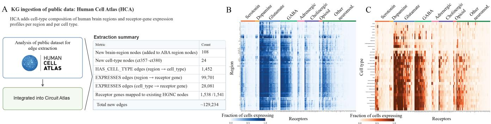  
Figure 2. Integration of the Human Cell Atlas into CircuitATLAS. (A) Schematic of Human Cell Atlas data integration and summary of extracted graph entities and relationships. The table shows the addition of 108 brain-region nodes, 24 cell-type nodes, 1,452 region-to-cell-type edges, 99,701 region-to-receptor expression edges, and 28,081 cell-type-to-receptor expression edges. Of 1,541 receptor genes, 1,538 were mapped to existing HGNC nodes, yielding approximately 129,234 new edges. (B, C) Heatmaps of receptor-gene expression across (B) human brain regions and (C) cell types. Rows represent brain regions or cell types, columns represent receptor genes, and color intensity indicates the fraction of cells expressing each receptor. Receptor genes are grouped by neurotransmitter system, as indicated above each heatmap.

To illustrate this process, we selected three experimental datasets that reproduce previously reported disease-associated phenotypes and converted their findings into graph-native relationships. In the Fmr1 knockout model of Fragile X syndrome, in vivo electrophysiological recordings revealed increased relative gamma-band power compared with wild-type controls (Figure 3B; $P = 0 . 0 0 9 8$ , Hedges’ $g = 1 . 1 7 )$ consistent with previous reports32. In the 6-OHDA model of Parkinson’s disease, markerless behavioral tracking revealed reduced open-field locomotor speed, providing a quantitative measure of motor impairment (Figure 3C; $P = 0 . 0 0 1 1$ , Hedges’ g = −1.05). In the acute 4-AP seizure model, EEG recordings showed a within-animal increase in relative gamma-band power following 4-AP administration compared with saline baseline (Figure 3D; $P = 1 \times 1 0 ^ { - 5 }$ , Cohen’s $d _ { z } = 1 . 2 5 )$ . Each observation was represented as a relationship linking the corresponding disease model to an electrophysiological or behavioral phenotype (Table 3), with associated metadata specifying the direction of effect, statistical test, effect size, sample size, assay, anatomical location, species, experimental condition, acquisition period, and data provenance.

Together, these ingestion routes connect three complementary evidence layers: published interpretations from the literature, human molecular anatomy from public atlases, and newly generated functional measurements from experimental models. The HCA data indicate which molecular effectors are expressed in relevant human regions and cell types, while in vivo data identify activity and behavioral phenotypes that can be measured and modulated experimentally. Representing both as provenance-linked graph evidence contextualizes new findings against prior knowledge and creates cross-scale paths from disease-associated phenotypes to circuits, cell populations and potentially druggable molecular targets.

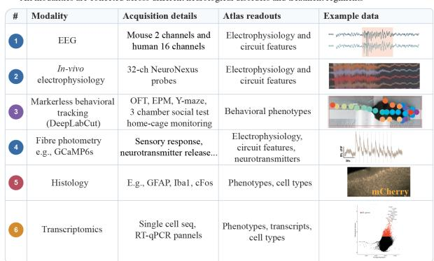

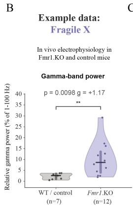

C  
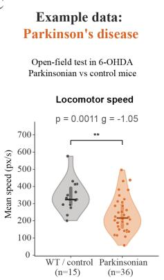

D  
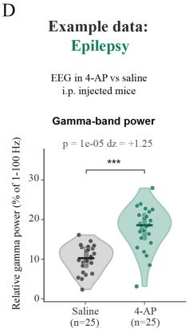  
Figure 3. Integration of newly generated multimodal in vivo data into CircuitATLAS. (A) Overview of the six experimental modalities included in the in-house data-ingestion pipeline, showing acquisition details, corresponding graph readouts, and representative data for EEG, in vivo electrophysiology, markerless behavioral tracking, fiber photometry, histology, and transcriptomics. (B) Relative gamma-band power in Fmr1 knockout mice $( n = 1 2 )$ and wild-type controls $( n = 7 ; P = 0 . 0 0 9 8$ , Hedges’ g = 1.17). (C) Mean open-field locomotor speed in 6-OHDA Parkinsonian mice (n = 36) and controls $( n = 1 5 ; P = 0 . 0 0 1 1$ , Hedges’ $g = - 1 . 0 5 )$ . (D) Relative gamma-band power following saline and 4-aminopyridine (4-AP) administration in the same animals (n = 25; $P = 1 \times 1 0 ^ { - 5 }$ , Cohen’s $d _ { z } = 1 . 2 5 )$ .

Table 3. Representative edges extracted from in-house multimodal in vivo data
<table><tr><td>Edge</td><td>Disease-model node</td><td>Relation</td><td>Feature or phe- notype node</td><td>Experimental finding</td><td>Statistical evi- dence</td><td>Assay and cohort</td></tr><tr><td>E1</td><td>6-OHDA mouse (dm31)</td><td>RECAPITULATES</td><td>Bradykinesia- related behavior (beh307)</td><td>Open-field mean locomotor speed decreased from 324 to 216 px/s</td><td>Two-sided Mann- Whitney U; P = 0.0011; Hedges&#x27;g</td><td>DeepLabCut open- field tracking; n = 15 controls and n = 36 6-OHDA mice</td></tr><tr><td>E2</td><td>Fmr1 knockout mouse (dm249)</td><td>SHOWS</td><td>Broadband gamma activ- ity (cief54)</td><td>(-33%) Relative gamma power in S1 in- creased from 2.6%</td><td>Two-sided Mann- Whitney U; P = 0.0098; Hedges&#x27;g</td><td>32-channel in vivo LFP; n = 7 wild- type and n = 12 Fmr1 knockout</td></tr><tr><td>E3</td><td>4-AP acute seizure model (dm617)</td><td>SHOWS</td><td>Broadband gamma activ- ity (cief54)</td><td>Relative EEG gamma power increased from 10.2% at saline baseline to 18.6% after 4-AP</td><td>Paired Wilcoxon signed-rank; P = 1.0 × 10−5; Co- hen&#x27;s dz = +1.25</td><td>mice Overnight two- channel EEG; n = 25 animals measured under both conditions</td></tr></table>

## 4 A new agentic workflow identifies new therapies by reasoning from circuit dysfunction to druggable effectors

Circuit-based target discovery poses a different problem from conventional molecular target identification. Rather than beginning with a gene or protein altered in disease, it begins with a measurable pathological phenotype (e.g., an oscillatory abnormality, altered excitability, or behavioral deficit) and asks which intervention could move the underlying circuit in the desired direction. This expands the therapeutic search space to molecular effectors that may be entirely intact in the disease but provide useful control over the relevant cell population or network. The same flexibility also makes the task difficult: a plausible hypothesis must connect evidence across activity features, circuits, regions, cell types, molecular mechanisms, therapeutic modalities, and clinical constraints, while preserving the direction of each effect and avoiding unsupported shortcuts between disease and target.

We therefore developed an agentic workflow modeled on the organization of a translational systems neuroscience laboratory, in which specialized agents coordinate across biological scales to generate and evaluate therapeutic hypotheses (Figure 4). First, a coordinating PI agent converts an initial disease and-modality brief into a sequence of specialized searches. The circuit agent identifies disease-relevant activity phenotypes and their anatomical and cellular substrates; the molecular agent searches for effectors capable of shifting those phenotypes while masking direct disease-molecule associations; and modality and clinical agents evaluate whether the proposed mechanism can be engaged feasibly and translated safely. Explicit gates require sourced, directionally consistent evidence before a hypothesis can advance, while an adversarial sceptic challenges each stage and can trigger renewed searches. This decomposition is intended to retain the breadth of LLM-guided exploration while making the resulting target hypotheses inspectable, falsifiable, and traceable to graph evidence.

To illustrate the hypotheses generated by this workflow, we applied the agent to Fragile X syndrome, Dravet syndrome and epilepsy (Table 4). In Fragile X syndrome, the workflow identified excessive thalamocortical gain and nominated partial suppression of SLC17A6 (VGLUT2) in excitatory thalamic relay neurons as a corrective intervention. Reducing vesicular glutamate loading was predicted to lower quantal transmission at thalamocortical synapses and thereby reduce cortical gain, although the essential role and broad subcortical expression of VGLUT2 make partial and anatomically restricted modulation an important constraint. In Dravet syndrome, the agent proposed partial suppression of the somatodendritic HTR1A autoreceptor in dorsal raphe serotonergic neurons, with the aim of releasing these neurons from autoinhibition and increasing forebrain serotonin tone. This strategy has clinical precedent in the indication, since fenfluramine is approved for seizures associated with Dravet syndrome and acts in part through serotonergic mechanisms, although the workflow also surfaced potentially divergent effects of 5-HT1A signalling across seizure phenotypes. In epilepsy, CircuitATLAS nominated ATP1A3, the neuronal α3 $\mathrm { N a ^ { + } / K ^ { + } { - } A T P a s e }$ , as a control point on cortical excitability, with potentiation predicted to increase activity-dependent hyperpolarizing current and preserve inhibitory restraint during sustained firing. We selected ATP1A3 for experimental validation and carried this hypothesis into the in vivo and structure-guided campaign described in the next section. Together, these examples illustrate how CircuitATLAS identifies targets through their capacity to control pathological circuit states rather than through their molecular association with disease.

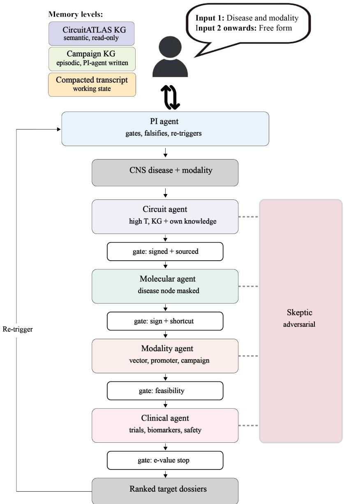  
Figure 4. A circuit-first evidence-gated agentic workflow for cross-scale target discovery. A user initiates a campaign with a central nervous system disease and therapeutic modality, after which subsequent inputs may be provided in free form. A coordinating PI agent manages the workflow, applies gates, identifies failures, and re-triggers earlier stages when evidence is insufficient. The circuit agent identifies disease-relevant activity phenotypes, circuits, regions, and cell populations using CircuitATLAS. After a gate requiring sourced and directionally coherent evidence, the molecular agent searches for effectors capable of modulating the selected circuit phenotype while direct disease-to-molecule information is masked to prevent shortcut reasoning. The modality agent evaluates the feasibility of engaging the proposed target, including intervention, vector, promoter, and campaign-level constraints, and the clinical agent assesses existing trials, biomarkers, safety, and translational evidence. An adversarial sceptic independently challenges the reasoning produced at each specialist stage. Three memory layers maintain the read-only semantic knowledge graph, an episodic campaign graph written by the PI agent, and a compacted working transcript. The workflow terminates in ranked target dossiers containing the supporting evidence, assumptions, uncertainties, and proposed route to validation; dossiers that fail predefined evidence or feasibility gates are rejected or returned for further search.

Table 4. Example of three new targets identified by CircuitATLAS
<table><tr><td></td><td>Hypothesis 1</td><td>Hypothesis 2</td><td>Hypothesis 3</td></tr><tr><td>Indication</td><td>Fragile X syndrome</td><td>Dravet syndrome</td><td>Epilepsy</td></tr><tr><td>Circuit phenotype</td><td>Thalamocortical hyperexcitability</td><td>Lowered threshold for generalised synchronous discharge, from failed inhibitory restraint</td><td>Cortical hyperexcitability and fail- ure to restrain sustained neuronal firing</td></tr><tr><td>Measure / polarity</td><td>Cortical evoked response am- plitude and habituation slope; resting gamma power; ASSR phase- locking. Higher amplitude / lower habituation = greater gain³3</td><td>Seizure and interictal discharge rate, hyperthermia seizure threshold. Higher rate / lower threshold = greater excitability</td><td>Seizure and interictal discharge rate; cortical activity during sustained ex- citation. Higher activity / discharge rate = greater excitability</td></tr><tr><td>Corrective direc- tion</td><td>Decrease thalamocortical gain</td><td>Decrease network excitability</td><td>Decrease network excitability</td></tr><tr><td>Associated pheno- types</td><td>Sensory hypersensitivity, impaired habituation, audiogenic seizures, elevated resting gamma³4, reduced auditory phase-locking³5, sleep spindle disruption, attention and arousal deficits, anxiety</td><td>SUDEP via seizure-induced res- piratory arrest, developmental regression, ataxia</td><td>Convulsive and myoclonic seizures, Seizures, interictal discharges, impaired inhibitory restraint</td></tr><tr><td>Intervention logic</td><td>Corrective: reduce the excess glutamatergic thalamocortical drive</td><td>Compensatory: recruit an intact neuromodulatory brake that is not itself deficient</td><td>Compensatory: augment an endoge- nous activity-dependent hyperpo- larizing current recruited during sustained firing</td></tr><tr><td>Region</td><td>Thalamic relay neurons (excitatory)</td><td>Dorsal raphe serotonergic neurons</td><td>Cortical neurons</td></tr><tr><td>Molecular target</td><td>SLC17A6 (VGLUT2)</td><td>HTR1A (somatodendritic 5-HT1A autoreceptor)</td><td>ATP1A3 (neuronal α3 Na+/K+- ATPase)</td></tr><tr><td>Direction on target</td><td>Partial knockdown, ~30–50%</td><td>Partial knockdown, ~50–70%</td><td>Potentiation</td></tr><tr><td>Mechanism</td><td>Lower vesicular glutamate loading → reduced quantal amplitude at thalamocortical synapses → lower cortical gain</td><td>Remove GIRK-mediated autoinhi- bition → raise tonic 5-HT firing → increase forebrain 5-HT release → engage anticonvulsant 5-HT1A and 5-HT2A signalling</td><td>Increase α3 pump capacity → greater Na+ extrusion during sustained firing → larger activity- dependent hyperpolarizing current → reduce neuronal hyperexcitabil-</td></tr><tr><td>Modality</td><td>AAV gene therapy with miRNA under VGlut2 promoter. Local delivery or IV with BBB-crossing capsid plus validated promoter</td><td>AAV gene therapy with miRNA un- der Tph2 promoter. Local delivery or IV with BBB-crossing capsid plus validated promoter targeting.</td><td>ity Small molecule. Structure-guided design against non-catalytic sites, with the cardiotonic steroid pocket excluded as an anti-target.</td></tr><tr><td>Key risks</td><td>VGLUT2 null is lethal, so degree titration is critical; broad subcorti- cal expression rules out systemic delivery</td><td>Much DRN inhibitory input is ex- trinsic; 5-HT1A activation promotes spike-wave in absence models, so mixed phenotypes may respond unevenly; anxiogenic potential</td><td>Net circuit effect may be cell-type dependent, as increased pump activity could also suppress firing in GABAergic interneurons; docking predicts binding, not polarity; limited α3 versus α1 divergence</td></tr></table>

## 5 Closing the loop from target nomination to experimental validation

A target-discovery system becomes useful when the hypotheses it generates can be converted into experiments that resolve the uncertainties on which those hypotheses depend. This is particularly difficult in in vivo neuroscience, where experiments are slow and hard to automatize, carry ethical considerations, depend on finite specialist personnel, and must proceed under approved protocols. We therefore represented our laboratory as a machine-readable resource that an experiment-design agent can query when planning the next step (Figure 5A). The Model Context Protocol server exposes 81 standard operating procedures together with operator competence, equipment state, colony and consumable stock and reserved capacity as 25 tools and 20 resources. Proposed experiments are evaluated against statistical power, expected information gain, 3Rs compliance and feasibility before human approval, while those requiring unavailable capabilities are returned as capability requests.

We used ATP1A3 to illustrate how a target hypothesis can be advanced through this process. CircuitATLAS nominated the neuronal α3 Na+/K+-ATPase as a control point on cortical excitability. Pump turnover exports net positive charge and is recruited by the intracellular $\mathrm { N a ^ { + } }$ load that firing generates, producing an activity-dependent hyperpolarizing current (Figure 5B)36. ATP1A3 is restricted to neurons and strongly expressed in GABAergic populations37, while loss of function is epileptogenic38 and pharmacological pump inhibition is convulsant39, together suggesting potentiation as the therapeutic direction. The unresolved question was whether increasing ATP1A3 in inhibitory interneurons would strengthen inhibition during sustained firing or instead suppress their output.

We therefore expressed ATP1A3 in cortical GABAergic interneurons using AAV9.mDlx.ATP1A340 and recorded cortical local field potentials at baseline and during focal 4-aminopyridine challenge (Figure 5C–D). No frequency band differed significantly between arms at baseline. Under 4-AP, the median within-animal fold change fell from 11.16 to 1.33 in beta, 9.73 to 1.19 in low gamma and 7.81 to 1.02 in high gamma, each at $q = 0 . 0 0 8 7$ with a Cliff’s δ of −1.0, while delta, theta and alpha were unchanged. These results supported the hypothesis that increasing ATP1A3 in interneurons blunts challenge-evoked cortical hyperexcitability, providing a basis for advancing the target pharmacologically.

The next question was whether ATP1A3 could be modulated with a small molecule in the required direction, so we carried the validated target into a structure-guided campaign in Claude Science with Opus 5 (Figure 5E). The campaign assembled five deposited human α3 cryo-EM structures spanning the Post-Albers cycle, re-derived 203 compact sub-pockets and combined docking, structure-based generation, retrosynthetic route finding, ADMET prediction and pose validation, excluding the inhibitory cardiotonic steroid site as an anti-target. It returned 250 predicted binders across four sites, including 74 with a verified synthetic route and 50 directly orderable compounds, with sites ranked by the prior probability that occupancy would increase rather than decrease pump turnover. The modelling also exposed the principal uncertainties: limited $\alpha 3$ versus α1 sequence divergence across most pockets, the small size of the available cavities, and most importantly the inability of docking alone to distinguish potentiators from inhibitors.

The campaign therefore converged on a functional polarity experiment as the next step: compounds are tested by thallium flux on human $\alpha 3 .$ , with α1 and $\alpha 2$ measured in parallel on an ouabain-resistant background and at sub-maximal $\mathrm { N a ^ { + } }$ load, followed for any hit by an ATPase $\mathrm { N a ^ { + } }$ dependence curve (Figure 5F). These assays were not in the laboratory catalogue and were returned as capability requests. ATP1A3 thus illustrates the broader experimental loop intended by CircuitATLAS, in which a target hypothesis is advanced until its key uncertainty becomes experimentally resolvable, the resulting evidence determines whether and how it should progress, and each subsequent uncertainty defines the next informative experiment.

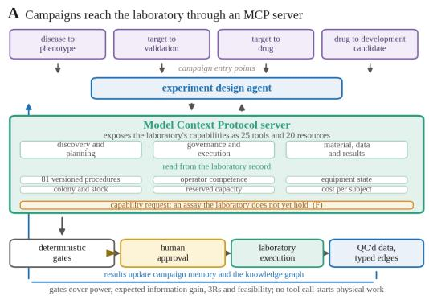

B ATP1A3 generates an activity-dependent hyperpolarising current  
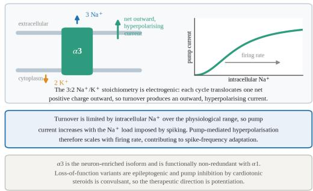

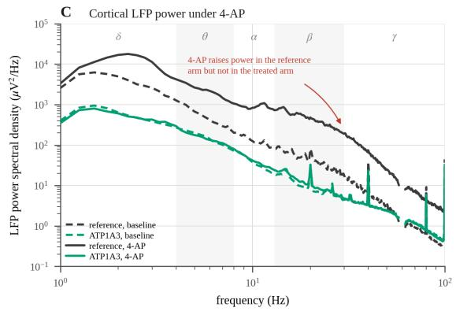

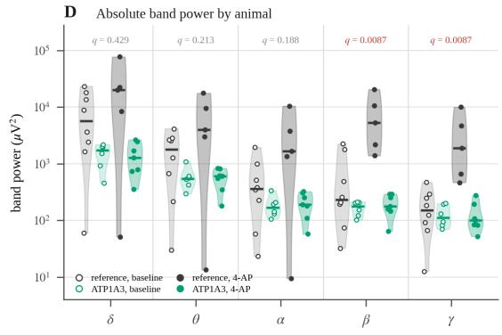

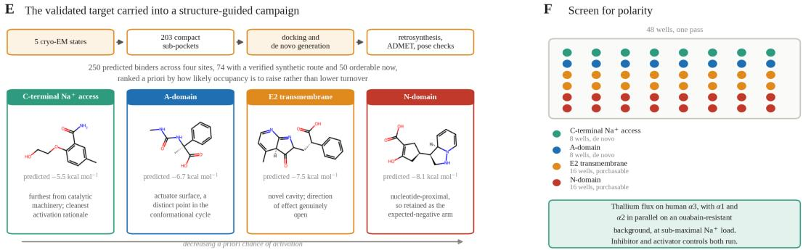  
Figure 5. An in vivo lab-in-the-loop, from a graph-derived control point to a chemistry campaign. (A) Campaigns enter at one of four points and are planned by an experiment-design agent that addresses the laboratory through a Model Context Protocol server, exposing 25 tools and 20 resources over a structured record of 81 versioned procedures, operator competence, equipment state, colony and consumable stock, reserved capacity and cost per subject. Designs pass deterministic gates before human approval; an assay the laboratory does not hold enters as a capability request. (B) Pump turnover exports net positive charge and depends on intracellular $\mathrm { N a ^ { + } }$ , so the hyperpolarizing current it generates is recruited in proportion to the $\mathrm { N a ^ { + } }$ that firing accumulates (inset). (C) Mean cortical LFP power spectra for AAV9.mDlx.ATP1A3 and the reference vector at baseline and under focal 4-AP, canonical bands shaded. Baseline power differs between arms, so the primary contrast is within-animal. (D) Absolute band power, one point per animal, with medians (reference baseline $n = 8 ,$ , ATP1A3 baseline $n = 6 ,$ reference $4 \mathrm { - A P } n = 5 , \mathrm { A T P 1 A 3 4 \mathrm { - A P } } n = 7 ) ;$ q values are Benjamini–Hochberg corrected across bands for the within-animal fold-change contrast. (E) Structure-guided campaign on the validated target, with one representative compound and predicted binding score per site, sites ordered by the prior probability that occupancy raises turnover. Docking predicts binding, not polarity. (F) The polarity screen: 48 wells across the four site classes, thallium flux on human $\alpha 3$ with α1 and α2 in parallel on an ouabain-resistant background, at sub-maximal $\mathrm { N a ^ { + } }$ load.

## 6 Discussion

Here, we introduce CircuitATLAS, a framework for CNS target discovery that begins with diseaseassociated neural activity phenotypes and identifies molecular interventions capable of shifting pathological circuits toward more functional states. We constructed a provenance-linked systems-neuroscience knowledge graph integrating published literature, human molecular atlases, and newly generated in vivo experimental data. Building on this, we developed an evidence-gated agentic workflow that connects neural activity phenotypes to their circuit and cellular substrates and identifies molecular effectors capable of modulating them. We further established a human-governed lab-in-the-loop framework linking target nomination to experimental design, execution and validation. Together, this establishes a therapeutic discovery approach in which molecular targets are selected for their capacity to correct circuit dysfunction, irrespective of whether they are themselves altered in disease.

Recent advances in protein structure prediction41, molecular generation and protein design42 are progressively lowering the barrier between a specified biological target and a candidate therapeutic, making target identification and validation an increasingly important bottleneck. As more of the proteome becomes technically addressable, therapeutic discovery may become less constrained by the availability of interventions than by our ability to identify which biological nodes are most consequential to perturb. CircuitATLAS provides a systematic way to prioritize these targets by integrating evidence across biological scales.

This work also belongs to a broader shift from biomedical knowledge retrieval toward scientific reasoning systems. Knowledge graphs such as SPOKE15, TxGNN18 and more recent systems such as PROTON43 have demonstrated the value of organizing heterogeneous biomedical relationships for prediction and hypothesis generation. Agentic systems are increasingly extending this idea from retrieval to multistep scientific workflows44,45; ROBIN46, for example, coupled literature reasoning and experimental analysis to generate and test biological hypotheses. CircuitATLAS differs principally in the representation chosen for the problem. Electrophysiological features, circuits, regions and cell populations are explicit intermediate objects rather than contextual annotations around molecular disease associations. Our agentic workflow then constrains reasoning through these intermediate levels, including deliberately masking disease-molecule relationships during target generation to reduce shortcut reasoning.

The potential of CircuitATLAS ultimately lies in combining literature-scale knowledge (Figure 1) with large volumes of standardized experimental data (Figures 2 and 3). Published studies provide a valuable record of existing scientific knowledge, but are subject to publication bias, underreporting of negative results, and incomplete documentation of the experimental conditions that influence neural measurements. This is particularly consequential in systems neuroscience, where minor sources of variation can change both neural and pharmacological phenotypes47. Addressing this variability requires more standardized approaches to neural data generation, including consistent acquisition hardware, experimental protocols, metadata collection, and analysis pipelines, together with systematic reporting of negative results. Such standardization would enable more direct comparisons of neural phenotypes and intervention effects across disease models and experiments. CircuitATLAS provides a common representation in which these newly generated observations can be integrated with existing literature derived evidence. As experimental datasets accumulate, these initially heuristic weights could themselves be calibrated against prospective outcomes, allowing the graph to learn not only more biology, but which kinds of evidence are most predictive of successful intervention.

Similarly, as agent-guided intervention-outcome datasets grow, the lab-in-the-loop could evolve into a genuine learning system. Closed-loop laboratories in chemistry and protein engineering have already shown how active learning or reinforcement-learning-style policies can use previous experiments to select increasingly informative subsequent experiments48,49. In in vivo neuroscience, however, noisy observations, slow experiments and ethical costs make human oversight essential, which is why approval by a named scientist sits between the agent’s proposal and any animal work.

Several limitations remain. First, the central translational assumption is that disease-relevant circuit phenotypes and their corrective directions are sufficiently conserved between experimental models and humans. Human systems-neuroscience datasets remain comparatively sparse and rarely permit causal perturbation; molecular atlases30 can establish that candidate effectors are present in the relevant human cells, but not that manipulating them will produce the same circuit-level response across species. Second, CircuitATLAS is constrained by the evidence from which it is built. The literature is biased toward well studied diseases, positive findings and experimentally accessible mechanisms, while deterministic entity resolution and relation extraction inevitably omit or misclassify some evidence. Although provenance and inference-time verification make individual reasoning chains auditable, they do not eliminate these limitations. Third, the performance of the discovery system itself has not yet been established prospectively. The examples presented here demonstrate that CircuitATLAS can generate biologically plausible hypotheses and, for ATP1A3, nominate a target subsequently validated in vivo, but they do not establish its success rate, relative performance against expert-led or alternative computational approaches, or ability to predict therapeutic efficacy across indications. Several prospective, preregistered campaigns will therefore be required to determine whether accumulating experimental outcomes improve target prioritization and experimental efficiency over time.

CircuitATLAS provides a framework for discovering therapeutic targets through their capacity to control pathological neural circuits. By combining structured knowledge, agentic reasoning and iterative experimentation, it offers a path toward systematically identifying biological control points capable of restoring brain function.

## 7 Methods

## 7.1 CircuitATLAS ontology and entity vocabulary

CircuitATLAS was designed as a heterogeneous graph spanning molecular, cellular, circuit, organismal and translational neuroscience. The schema defines 23 node classes, and 105 populated directed relation types (81 literature-derived, 24 canonical). Entity vocabularies were assembled from established resources where possible: genes from NCBI23, transcripts from Ensembl24, proteins from UniProt25, signalling pathways from Reactome26, brain regions and neuronal cell types from the Allen Brain Atlas27, and phenotypes from the Human Phenotype Ontology28. Concepts that are less consistently represented in existing databases, including circuit motifs, brain states, and cellular- and circuit-level electrophysiological features, were curated manually. Each entity was assigned a canonical name, node class, synonym set and unique CircuitATLAS identifier, while external identifiers were preserved when available. Direct disease-to-gene and disease-to-protein relationships were excluded from the target-discovery graph by design.

## 7.2 Literature corpus and screening

The literature corpus was collected from PubMed abstracts, PubMed Central and Europe PMC openaccess full text, and the bioRxiv, medRxiv and arXiv preprint servers. We constructed a manually curated master neuroscience lexicon containing 1,701 terms and applied a two-hit filter requiring at least two lexicon terms within a document, retaining 15.9 million records. Retained documents were then assigned deterministically to eight overlapping subcorpora based on detected entities: disease, phenotype, behavior/cognition, brain region, cell type, circuit motif, cellular electrophysiology and circuit electrophysiology. Documents were identified by PMID, PMCID or DOI and deduplicated before downstream processing.

## 7.3 Candidate relation extraction and LLM verification

Candidate relations were generated only between 81 predefined pairs of node classes. Canonical names and synonyms were matched deterministically, and a candidate evidence passage was generated when the corresponding head and tail entities occurred within a 400-character window. Evidence was aggregated by relation type and canonical node pair across documents, retaining up to three supporting passages together with document and mention counts and publication metadata. This stage generated 57.7 million candidate co-occurrences.

LLMs were subsequently used as constrained semantic verifiers rather than for unrestricted relation generation. Each candidate was presented with the proposed relation, head and tail entities and supporting passages, and verification was executed as AWS Bedrock batch inference (10,000 records per job, up to 95 concurrent jobs). Amazon Nova 2 Lite served as the default verification tier, and Claude Haiku 4.5 was applied as a second quality pass over the edges Nova 2 Lite had accepted. A subset of 4,050 edges, sampled as 50 edges per relation type, was additionally re-judged with Claude Opus 5 using the same prompt given to Nova 2 Lite and Haiku 4.5. The system message set three tasks: entity linking; relation classification as supported, unsupported or uncertain, where uncertain denotes that the head and tail entities co-occur but the passage does not state the relationship, and is flagged as both common and a correct verdict; and assignment of polarity and species. The prompt further instructed the model to judge only what the passages say and not to use outside knowledge to fill gaps, so that a claim the passage does not state is uncertain however plausible it may be. Under this test, Opus 5 judged the relationship not to be clearly stated in the supporting passages for 17.8% of the sampled edges. Models returned a supported/unsupported/uncertain verdict together with an evidence span and a set of structured attributes (polarity, directness, specificity, clarity, methodology, species, sample size, effect size, causal evidence and manipulation type). Accepted edges were resolved to canonical entities, filtered and deduplicated: 26.8 million verified mention rows across 81 relation types aggregated to 5,306,909 canonical literature edges. Each retained edge kept its relation type, head and tail identifiers, verdict counts, supporting quotation, source PMIDs, publication metadata and extraction provenance.

Canonical relationships, including gene-transcript-protein mappings, pathway membership, protein interactions and drug-target associations, were imported separately from structured databases and resolved onto the same entity vocabulary, contributing 2,352,709 edges across 24 relation types. The resulting graph contains 3,831,997 nodes and 7,659,618 edges; with the Human Cell Atlas layer described below, the additional build contains 3,832,129 nodes and 7,788,852 edges. New documents can be processed independently and incorporated through versioned incremental graph updates.

## 7.4 Human Cell Atlas integration

Adult human brain single-nucleus transcriptomic data (30; neuronal and non-neuronal h5ad matrices) were transformed into graph-native region-cell-type and receptor-expression relationships. HCA brain regions and cell types were resolved against existing CircuitATLAS entities, with unmatched entities added to the vocabulary. Groups with fewer than 20 profiled cells were discarded, and an edge was written when the receptor gene was detected in $\geq 5 \%$ of cells in that group. Each expression edge retained the fraction of cells expressing the receptor, a specificity score defined as

$$
{ \mathrm { s p e c i f i c i t y } } = \log _ { 2 } \left( { \frac { \mathrm { f r a c t i o n ~ i n ~ g r o u p } } { \mathrm { f r a c t i o n ~ a c r o s s ~ a l l ~ c e l l s } } } \right) ,\tag{1}
$$

the number of profiled cells, receptor family, species, modality, source dataset and a three-level evidencestrength label (high: ≥ 25% of cells and $\geq 1 0 0$ cells; medium: ≥ 10% and ≥ 50; low: ≥ 5% and ≥ 20). Absence of an edge therefore denotes a below-threshold combination rather than a tested negative, and explicit negative edges can be generated by joining the full gene × cell-type × region table against the retained set. This pipeline added 108 brain-region nodes, 24 cell-type nodes, 1,452 HAS\_CELL\_TYPE edges, 99,701 region-to-receptor EXPRESSES edges and 28,081 cell-type-to-receptor EXPRESSES edges; 1,538 of 1,541 receptor genes mapped to existing HGNC gene nodes31 and no new gene entities were created.

## 7.5 Integration of in vivo experimental data

Experimental analysis outputs were converted into the same typed edge representation used for literature and atlas evidence. Supported modalities included EEG, intracranial electrophysiology, markerless behavioral tracking, fiber photometry, histology and transcriptomics. Each observation was written as a canonical head-relation-tail triple for example disease\_model → behavior (RECAPITULATES) and disease\_model → circuit\_electrophysiology\_feature (SHOWS); and retained its direction of effect, statistical test, P-value, effect size, sample size, assay, brain region, species, strain or genotype, acquisition dates and data provenance.

Intracranial recordings were acquired on 32-channel NeuroNexus probes50 (Open Ephys, 30 kHz). Line noise was auto-detected per recording by 50-versus-60 Hz peak prominence and notched with three harmonics; the spike band (300-6,000 Hz) was common-median referenced and the LFP band (1-300 Hz) resampled to 1 kHz. Bad channels were detected per recording and excluded, the first 5 s of each recording was discarded, and band power was computed over δ 1-4, θ 4-8, α 8-13, β 13-30, γ 30-100 Hz. EEG was analysed by Welch $\mathrm { P S D ^ { 5 1 } }$ (2-s Hann windows, 50% overlap) after skipping the first 45 min, with mains frequencies interpolated out and gamma expressed as a percentage of 1–100 Hz total power. Behavior was tracked with DeepLabCut52 (30 fps).

Representative analyses were: open-field locomotor speed in 6-OHDA versus control mice (median 324 → 216 px/s; Mann–Whitney U = 428, P = 0.0011, Hedges’ g = −1.05; n = 15 versus 36); relative gamma power in Fmr1 knockout versus wild-type S1 $( 2 . 6 \%  8 . 7 \% ; U = 1 2 , P = 0 . 0 0 9 8 , g = + 1 . 1 7 ;$ n = 7 versus 12); and paired EEG relative gamma power at baseline and after 4-AP administration $( 1 0 . 2 \%  1 8 . 6 \%$ ; Wilcoxon signed-rank $W = 1 6 , P = 1 . 0 \times 1 0 ^ { - 5 }$ , Cohen’s $d _ { z } = + 1 . 2 5 ; n = 2 5$ paired animals). Analyses were performed at the animal level, using the earliest available session per animal where a gene-therapy arm would otherwise confound the comparison.

## 7.6 Agentic workflow

Our agentic reasoning workflow was implemented as a staged, evidence-gated reasoning workflow running Claude Opus 5 on Amazon Bedrock, with stage-specific sampling temperatures (0.2-0.9). A coordinating PI agent decomposed an initial disease and therapeutic-modality brief into specialist stages. The circuit agent proposed disease-associated activity features, anatomical regions, circuits and cell populations; substrates advanced only if their measure was directly assayable, carried an explicit polarity statement, and had an excitatory/inhibitory class consistent with the stated phenotype direction. The molecular stage searched for effectors capable of moving the selected circuit phenotype, retrieving through two channels: channel A, restricted to targets with atlas-supported expression in the substrate, and channel B, proposing effectors to be introduced ectopically. Modality and clinical agents subsequently evaluated intervention feasibility, targeting strategy, clinical precedent, known class hazards and off-target populations. An adversarial sceptic evaluated every intermediate hypothesis.

Three design invariants were enforced in code rather than by prompt. First, discovery is phenotype-down: gene-disease association (direct or indirect, e.g., through disease-model) never constitutes a reward signal. Second, the molecular stage is disease-blind by construction, it queries a masked view in which the disease class, its resolved disease models, eponym-named nodes, class-specific mediators and lowdisease-degree proxy mediators are removed at the query layer, and in which mediator node classes are de-identified to an opaque type-plus-identifier reference while molecular targets and the circuit substrate retain their names. Third, sign is first-class: the required intervention direction is computed as the product of corrective direction, excitability sign and circuit sign, and inconsistencies are rejected deterministically.

The mask’s acceptance test was adversarial re-identification: the exact masked payload was handed to a model with no other context and asked to name the disease. Under this test the specific disease was not recovered, but in some cases a stronger multi-agent attack did recover the disease class (e.g., recovered epilepsy but not Dravet syndrome) from the retained circuit substrate. Because the circuit phenotype is class-defining and removing it would defeat phenotype-down discovery, we accept this and state the claim precisely: not that the agent is always blind to the disease class, but that every candidate’s evidence chain is disease-free by construction and reconstructible from the masked subgraph alone. Class-level identifiability was recorded as a campaign property when it occurred.

Candidates passed through an independent auditor of deterministic gates covering provenance grading, shortcut exclusion and Class-A novelty (dual Open Targets and Europe PMC signals, reported separately), sign composition, level-jump completeness, sign consistency, structural viability and population scope, with an anytime-valid e-value stopping rule. Gates enforced: LLM judgement only scores, the sceptic assigns severity and never holds a veto. Hypotheses were assigned to one of five mechanism templates (cell-autonomous excitability; transmitter supply; ectopic receptor; extrinsic/glial/metabolic; synaptic/structural) and a deterministic payload tier (direct ionic conductance > transporter/enzyme > GPCR). Outputs were labelled SUPPORTED (every chain step evidence-anchored), PLAUSIBLE (coherent chain with gaps named) or EXCLUDED (structurally impossible), with only EXCLUDED hypotheses withheld from the report.

Three memory layers were maintained: the read-only CircuitATLAS semantic graph accessed through the masked view; an append-only, campaign-specific episodic store in which superseded entries are linked rather than overwritten and rejections persist as forbidden repeats; and a compacted working transcript. Final outputs were structured target dossiers containing the selected phenotype and its polarity, corrective direction, circuit and cellular substrate, molecular target and mechanistic chain, intervention modality and its trade-offs, novelty at gene and mechanism level, named evidence gaps, a pre-mortem failure analysis and a falsifiable validation package.

In a three-disease campaign (Fragile X syndrome, Dravet syndrome and epilepsy), our agent reported 29 dossiers per disease, collapsing to 16, 17 and 15 distinct hypotheses respectively. Of which five hypotheses were EXCLUDED on structural grounds, including sodium-channel blockade in a seizure disorder.

## 7.7 Laboratory interface and experiment governance

The laboratory is exposed to the experiment-design agent through a Model Context Protocol server (Figure 5A). The server reads a structured laboratory record holding 81 versioned procedures together with their controlled documents, operator competence per procedure, equipment state, animal colony and consumable stock, reserved capacity and measured cost per subject, and projects it as 25 tools and 20 resources covering retrieval of laboratory state, validation of a proposed design against each procedure’s input schema, scheduling, and the experiment lifecycle. The agent therefore plans against the procedures the laboratory can currently execute rather than against the space of procedures described in the literature, and a campaign may enter at disease to phenotype, target to validation, target to drug, or drug to development candidate.

Proposed designs are evaluated by deterministic gates for statistical power, expected information gain, 3Rs compliance and feasibility before being submitted. A design that fails a gate is returned rather than queued. Submission places an experiment in a review queue and does not initiate physical work; approval, scheduling, quality-control adjudication and data release each require an explicit decision recorded against a named operator, after which the resulting data are returned to the agent. An assay the laboratory does not hold is returned through the same interface as a capability request rather than substituted.

## 7.8 Interneuron-restricted ATP1A3 in vivo validation

ATP1A3 was packaged as AAV9.mDlx.ATP1A3 to restrict expression predominantly to GABAergic interneurons and delivered to mouse somatosensory barrel cortex, with AAV9.mDlx.mCherry delivered by the same route as the reference vector. Cortical local field potentials were recorded in vivo in awake head-fixed animals using 32-channel NeuroNexus silicon probes50, at baseline and under acute focal 4-aminopyridine challenge, and were preprocessed as described above. Power was summarised per animal in the delta, theta, alpha, beta, low gamma and high gamma bands.

Absolute baseline power differed between arms, so the primary contrast was the within-animal fold change in band power under 4-AP relative to that animal’s own baseline. Arms were compared by two-sided Mann–Whitney test with Benjamini–Hochberg correction across the six bands, and effect size was reported as Cliff’s δ. Baseline power was compared between arms using the same test and correction. The fold-change contrast used the animals contributing both conditions, five in the reference arm and six in the ATP1A3 arm. Figure 5D displays absolute band power for every recording in each condition (reference baseline n = 8, ATP1A3 baseline n = 6, reference 4-AP n = 5, ATP1A3 4-AP n = 7).

## 7.9 Structure-guided small-molecule campaign

The chemistry campaign was run in Claude Science with Opus 5 (Figure 5E). Five deposited human α3 $\mathrm { N a ^ { + } / K ^ { + } }$ -ATPase cryo-EM structures spanning the Post-Albers cycle were assembled, pockets were detected and re-derived into 203 compact sub-pockets, and candidate ligands were produced and filtered by docking, structure-based generation, retrosynthetic route finding, ADMET prediction and pose-geometry validation. The inhibitory cardiotonic steroid pocket was defined as an anti-target and excluded throughout. Sub-pockets were annotated for isoform selectivity by comparing α3 and α1 residues at lining positions, and for synthetic tractability by heavy-atom count; 175 of the 203 contain no non-conservative substitution between the two isoforms, and cavity volumes of 98 to 130 $\mathring { \mathbf { A } } ^ { 3 }$ admit only fragment-scale ligands, for which retrosynthetic success falls from 76% at twelve or fewer heavy atoms to 6% at seventeen to twenty. The campaign returned 250 predicted binders across four sites, 74 with a verified synthetic route and 50 orderable without synthesis, and the sites were ranked a priori by the likelihood that occupancy raises rather than lowers turnover. The tip-to-tip separation between D887 and R901 on the extracellular DR loop was measured across all five catalytic states.

Because docking returns a predicted binding score and does not distinguish a potentiator from an inhibitor at the same site, the campaign terminates in a polarity assay rather than a lead (Figure 5F): 48 wells distributed across the four site classes, read by thallium flux on human $\alpha 3$ with α1 and α2 run in parallel on an ouabain-resistant background and at sub-maximal $\mathrm { N a ^ { + } }$ load, with inhibitor and activator controls. Compounds modulating in the intended direction proceed to an ATPase $\mathrm { N a ^ { + } }$ dependence curve, which separates a left shift in apparent $\mathrm { N a ^ { + } }$ affinity from a uniform increase in turnover. Neither assay is in the current laboratory catalogue and both were submitted as capability requests through the interface described above.

## Ethics statement

Experiments were approved by the local ethical review committee at Exin Therapeutics and performed in accordance with local regulations. Mice of either sex were generated via targeted breeding and housed in a temperature (20–24° Celsius) and humidity (40%)-controlled room under a 12 h dark/light cycle with free access to food and water ad libitum.

## Data availability

The code and the data supporting the findings of this study will be made publicly available upon peer-reviewed publication.

## Author contributions

Gabriel Ocana-Santero conceived the study, designed and built the knowledge graph and the agentic workflows, performed the analyses, prepared the figures and wrote the manuscript. Marko Tvrdic contributed to the conception of the study and to reviewing and editing the manuscript. Large language models were used to assist with the writing and editing of this manuscript; the authors reviewed and verified all content and take full responsibility for it.

## Competing interests

The authors declare the following competing interests. Gabriel Ocana-Santero is a co-founder, Chief Executive Officer and shareholder of Exin Therapeutics, Inc., the company at which this work was carried out. Marko Tvrdic is a co-founder, Chief Operating Officer and shareholder of Exin Therapeutics, Inc. A provisional patent application relating to the work described here has been filed by Exin Therapeutics, Inc.

## References

1. Deisseroth, K. Circuit dynamics of adaptive and maladaptive behaviour. Nature 505, 309–317 (2014).

2. Bassett, D. S. & Sporns, O. Network neuroscience. Nat. Neurosci. 20, 353–364 (2017).

3. Ocana-Santero, G. et al. Perinatal serotonin signalling dynamically influences the development of cortical GABAergic circuits with consequences for lifelong sensory encoding. Nat. Commun. 16, 5203 (2025).

4. Uhlhaas, P. J. & Singer, W. Neural Synchrony in Brain Disorders: Relevance for Cognitive Dysfunctions and Pathophysiology. Neuron 52, 155–168 (2006).

5. Paz, J. T. & Huguenard, J. R. Microcircuits and their interactions in epilepsy: Is the focus out of focus? Nat. Neurosci. 18, 351–359 (2015).

6. Ligaard, J., Sannæs, J. & Pihlstrøm, L. Deep brain stimulation and genetic variability in Parkinson’s disease: a review of the literature. NPJ Park. Dis. 5, 18 (2019).

7. Santos, R. et al. A comprehensive map of molecular drug targets. Nat. Rev. Drug Discov. 16, 19–34 (2017).

8. Ocana-Santero, G., Díaz-Nido, J. & Herranz-Martín, S. Future prospects of gene therapy for Friedreich’s ataxia. Int. J. Mol. Sci. 22, 1815 (2021).

9. Gribkoff, V. K. & Kaczmarek, L. K. The Need for New Approaches in CNS Drug Discovery: Why Drugs Have Failed, and What Can Be Done to Improve Outcomes. Neuropharmacology 120, 11–19 (2017).

10. Löscher, W. & Klein, P. The Pharmacology and Clinical Efficacy of Antiseizure Medications: From Bromide Salts to Cenobamate and Beyond. CNS Drugs 35, 935–963 (2021).

11. Deuschl, G. et al. A Randomized Trial of Deep-Brain Stimulation for Parkinson’s Disease. N. Engl. J. Med. 355, 896–908 (2006).

12. Morrell, M. J. & RNS System in Epilepsy Study Group. Responsive cortical stimulation for the treatment of medically intractable partial epilepsy. Neurology 77, 1295–1304 (2011).

13. Hunt, R. F., Girskis, K. M., Rubenstein, J. L., Alvarez–Buylla, A. & Baraban, S. C. GABA progenitors grafted into the adult epileptic brain control seizures and abnormal behavior. Nat. Neurosci. 16, 692–697 (2013).

14. Wykes, R. C. et al. Optogenetic and potassium channel gene therapy in a rodent model of focal neocortical epilepsy. Sci. Transl. Med. 4, 161ra152 (2012).

15. Morris, J. H. et al. The scalable precision medicine open knowledge engine (SPOKE): a massive knowledge graph of biomedical information. Bioinformatics 39, btad080 (2023).

16. Chandak, P., Huang, K. & Zitnik, M. Building a knowledge graph to enable precision medicine. Sci. Data 10, 67 (2023).

17. Himmelstein, D. S. et al. Systematic integration of biomedical knowledge prioritizes drugs for repurposing. eLife 6, e26726 (2017).

18. Huang, K. et al. A foundation model for clinician-centered drug repurposing. Preprint at https://doi.org/10. 1101/2023.03.19.23287458 (2024).

19. Kilicoglu, H., Shin, D., Fiszman, M., Rosemblat, G. & Rindflesch, T. C. SemMedDB: a PubMed-scale repository of biomedical semantic predications. Bioinformatics 28, 3158–3160 (2012).

20. Wei, C.-H. et al. PubTator 3.0: an AI-powered literature resource for unlocking biomedical knowledge. Nucleic Acids Res. 52, W540–W546 (2024).

21. Lewis, P. et al. Retrieval-Augmented Generation for Knowledge-Intensive NLP Tasks. Preprint at https: //doi.org/10.48550/arXiv.2005.11401 (2021).

22. Skarlinski, M. D. et al. Language agents achieve superhuman synthesis of scientific knowledge. Preprint at https://doi.org/10.48550/arXiv.2409.13740 (2024).

23. Sayers, E. W. et al. Database resources of the national center for biotechnology information. Nucleic Acids Res. 50, D20–D26 (2022).

24. Dyer, S. C. et al. Ensembl 2025. Nucleic Acids Res. 53, D948–D957 (2025).

25. The UniProt Consortium. UniProt: the Universal Protein Knowledgebase in 2025. Nucleic Acids Res. 53, D609–D617 (2025).

26. Milacic, M. et al. The Reactome Pathway Knowledgebase 2024. Nucleic Acids Res. 52, D672–D678 (2024).

27. Lein, E. S. et al. Genome-wide atlas of gene expression in the adult mouse brain. Nature 445, 168–176 (2007).

28. Köhler, S. et al. The Human Phenotype Ontology in 2021. Nucleic Acids Res. 49, D1207–D1217 (2021).

29. Geirhos, R. et al. Shortcut learning in deep neural networks. Nat. Mach. Intell. 2, 665–673 (2020).

30. Siletti, K. et al. Transcriptomic diversity of cell types across the adult human brain. Science 382, eadd7046 (2023).

31. Seal, R. L. et al. Genenames.org: the HGNC resources in 2023. Nucleic Acids Res. 51, D1003–D1009 (2023).

32. Lovelace, J. W., Ethell, I. M., Binder, D. K. & Razak, K. A. Translation-relevant EEG phenotypes in a mouse model of Fragile X Syndrome. Neurobiol. Dis. 115, 39–48 (2018).

33. Ethridge, L. E. et al. Reduced habituation of auditory evoked potentials indicate cortical hyper-excitability in Fragile X Syndrome. Transl. Psychiatry 6, e787 (2016).

34. Wang, J. et al. A resting EEG study of neocortical hyperexcitability and altered functional connectivity in fragile X syndrome. J. Neurodev. Disord. 9, 11 (2017).

35. Ethridge, L. E. et al. Neural synchronization deficits linked to cortical hyper-excitability and auditory hypersensitivity in fragile X syndrome. Mol. Autism 8, 22 (2017).

36. Kim, J. H., Sizov, I., Dobretsov, M. & von Gersdorff, H. Presynaptic $\mathrm { C a } ^ { 2 + }$ buffers control the strength of a fast post-tetanic hyperpolarization mediated by the α3 $\mathrm { N a ^ { + } / K ^ { + } }$ -ATPase. Nat. Neurosci. 10, 196–205 (2007).

37. Bøttger, P. et al. Distribution of Na/K-ATPase alpha 3 isoform, a sodium-potassium P-type pump associated with rapid-onset of dystonia parkinsonism (RDP) in the adult mouse brain. J. Comp. Neurol. 519, 376–404 (2011).

38. Clapcote, S. J. et al. Mutation I810N in the α3 isoform of $\mathrm { N a ^ { + } , K ^ { + } }$ -ATPase causes impairments in the sodium pump and hyperexcitability in the CNS. Proc. Natl. Acad. Sci. U.S.A. 106, 14085–14090 (2009).

39. Vaillend, C., Mason, S. E., Cuttle, M. F. & Alger, B. E. Mechanisms of neuronal hyperexcitability caused by partial inhibition of Na+-K+-ATPases in the rat CA1 hippocampal region. J. Neurophysiol. 88, 2963–2978 (2002).

40. Dimidschstein, J. et al. A viral strategy for targeting and manipulating interneurons across vertebrate species. Nat. Neurosci. 19, 1743–1749 (2016).

41. Jumper, J. et al. Highly accurate protein structure prediction with AlphaFold. Nature 596, 583–589 (2021).

42. Watson, J. L. et al. De novo design of protein structure and function with RFdiffusion. Nature 620, 1089–1100 (2023).

43. Noori, A. et al. Graph AI generates neurological hypotheses validated in molecular, organoid, and clinical systems. Preprint at https://doi.org/10.48550/arXiv.2512.13724 (2025).

44. Boiko, D. A., MacKnight, R., Kline, B. & Gomes, G. Autonomous chemical research with large language models. Nature 624, 570–578 (2023).

45. Ifargan, T., Hafner, L., Kern, M., Alcalay, O. & Kishony, R. Autonomous LLM-driven research from data to human-verifiable research papers. Preprint at https://doi.org/10.48550/arXiv.2404.17605 (2024).

46. Ghareeb, A. E. et al. A multi-agent system for automating scientific discovery. Nature 655, 497–505 (2026).

47. Georgiou, P. et al. Experimenters’ sex modulates mouse behaviors and neural responses to ketamine via corticotropin releasing factor. Nat. Neurosci. 25, 1191–1200 (2022).

48. Burger, B. et al. A mobile robotic chemist. Nature 583, 237–241 (2020).

49. MacLeod, B. P. et al. Self-driving laboratory for accelerated discovery of thin-film materials. Sci. Adv. 6, eaaz8867 (2020).

50. Siegle, J. H. et al. Open Ephys: an open-source, plugin-based platform for multichannel electrophysiology. J. Neural Eng. 14, 045003 (2017).

51. Welch, P. The use of fast Fourier transform for the estimation of power spectra: A method based on time averaging over short, modified periodograms. IEEE Trans. Audio Electroacoustics 15, 70–73 (1967).

52. Mathis, A. et al. DeepLabCut: markerless pose estimation of user-defined body parts with deep learning. Nat. Neurosci. 21, 1281–1289 (2018).