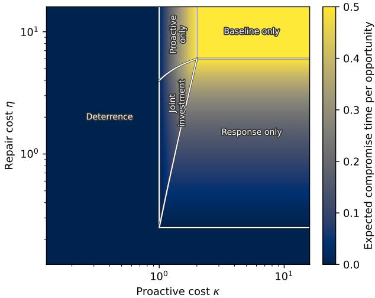
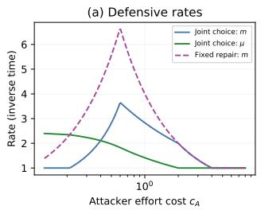
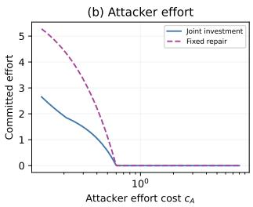
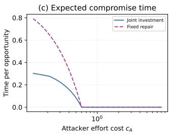
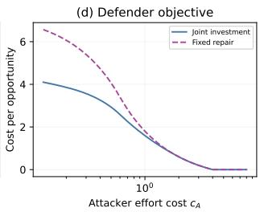
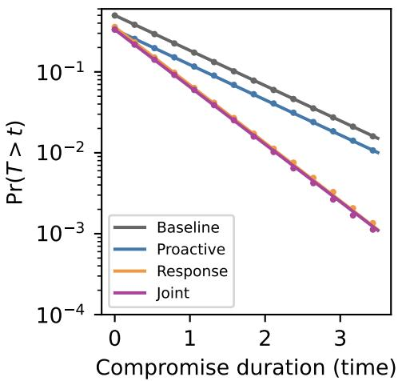

# Defensive Suficiency in a Stackelberg Model of AI Security

Subhabrata Majumdar1∗ Rajlakshmi Chavan1

1Indian Institute of Management Bangalore

## Abstract

Feedback from automated testing, human red teaming, and incident response can strengthen an AI system’s defenses when discovered failures lead to efective repairs. We study when this feedback process provides suficient protection and when investing in it is economically worthwhile. We begin by showing that an attack surface composed of finite number of inputs is defended with probability 1 if every unresolved attack has a persistent chance of discovery, repairs are efective, and subsequent updates preserve earlier protection. We derive completion-time bounds and extend the analysis to growing attack surfaces, repairs that generalize across related attacks, and multiple discovery mechanisms. These results distinguish eventual protection against each fixed attack from complete protection at a single time. We then formulate a defender-led Stackelberg game in which the defender invests in proactive discovery and reactive repair, anticipating the attacker’s choice of search efort. We characterize the least-cost allocation that deters attack and the equilibrium regimes in which the defender funds neither capability, one capability, or both. Numerical experiments illustrate these regimes and show how faster repair can reduce compromise duration without reducing compromise probability.unified theory of performance limits in generative language models.

## 1 Introduction

Compared to traditional software, generative AI systems have an expanded attack surface. Alongside vulnerabilities in connected tools, software, infrastructure, and access control, defenders must deal with attacks that exploit how the large language model (LLM) inside the AI system interprets and acts on input information [21]. For example, consider an AI assistant that reads documents and uses tools on a user’s behalf. A document can contain both information relevant to the task and instructions intended to redirect the assistant. Processing that document can therefore expose the system to an attack, even when the user’s request is benign. Indirect prompt injection demonstrates this risk in tool-calling LLM agents, including attempts to induce unauthorized actions and disclose private information [23].

This broader attack surface changes what defenders must account for when designing and implementing protection. An attack instance can depend on the wording of a prompt, the preceding conversation, retrieved content, and the tools or permissions available to the model. Increasing a system’s capabilities can also introduce new ways to attack it. Many-shot jailbreaking, for example, exploits longer context windows by supplying demonstrations that steer a model toward behavior its safeguards are intended to prevent [1, 13, 17]. Thus, protection established for short, isolated prompts may not be enough for longer interactions or a deployment with tools enabled.

While the familiar security practice of discovering vulnerabilities, applying repairs, and verifying updates remains necessary to secure LLM-driven deployments [19], the expanded attack surface requires us to examine more carefully what it takes to make these steps suficient. Blocking one malicious prompt may still leave its paraphrases or similar prompts as efective attack vectors. A repair may involve input or output filters, safety training, retrieval controls, tool permissions, or application logic—its efectiveness depending on how these components interact inside the AI system. Subsequent changes can also weaken earlier protection; for example, further fine-tuning can disrupt safety alignment [16]. On top of traditional software failures from insuficient testing and regression, LLM-driven systems add a broad space of context-dependent behaviors over which the defender must assess the repair of vulnerabilities found and the retention of those repairs.

Automated testing, human red teaming, and incident response can expose failures that inform later defenses through feedback. Methods such as MART combine repeated attack generation with safety training [5], while a lifecycle view of AI red teaming emphasizes evaluation throughout development and deployment [11]. These activities motivate a research question:

## Under what conditions does continued discovery and repair provide suficient protection?

We study this question by representing a defense through the set of attacks against which it is efective. This separates three requirements: testing must continue to reach unresolved attacks, reported vulnerabilities must be repaired, and earlier protection must be retained. Under explicit conditions on these requirements, we establish almost-sure complete coverage of a finite attack surface and bound the time required. We extend the analysis to growing attack surfaces, repairs that cover families of related attacks, and multiple discovery mechanisms.

The distinction between finite and growing attack surfaces is central to interpreting defensive suficiency. On a countably infinite surface, every fixed attack can eventually be covered even though some attack remains uncovered at every finite time. A persistent attacker may continue to seek those remaining opportunities. Thus, eventual protection against each attack does not by itself establish that a deployed system faces negligible current risk.

This leads to our second research question:

## How much should a defender invest in discovery and repair to deter an adaptive attacker?

A defender can fund proactive discovery to prevent compromise, or reactive repair to shorten its duration. Both choices afect the return an attacker expects from searching for a vulnerability. We formulate a defender-led Stackelberg game in which the defender commits to these capabilities before the attacker chooses its search efort. Our model characterizes the optimal investment regimes and the least-cost allocation that deters attack. Numerical experiments illustrate how the relative costs of attack and defense shape these decisions, and why reducing compromise duration can be valuable even when compromise remains possible. Finally, we emphasize the need for verification mechanisms to ensure the continued validity of discovery and repair. As an illustration, we implement a machine-checkable verification layer in Lean on top of the garak LLM scanner [3] and share it through an open-source repository1.

## 2 Related Work

Our work connects two questions relevant to a defender: when repeated testing and repair provide defensive coverage to an AI system, and how a defender should invest in the capabilities that support this process. The first relates to red teaming, safety training, and defense guarantees. The second relates to security investment and attacker–defender games.

Finding failures and learning from them. Automated red teaming uses a model to generate inputs that expose failures in another model. Perez et al. [15] study several ways to generate such tests and examine their efectiveness and diversity, Hong et al. [8] introduce curiosity-driven exploration to improve the coverage of generated attacks, and garak [3] and PyRIT [14] are two popular open-source LLM red teaming tools. These approaches address an important component of our framework: whether testing continues to reach vulnerabilities that remain unresolved. Greater empirical diversity, however, does not establish the persistent discovery condition used in our coverage results.

MART [5] and rainbow teaming [18] make the connection between discovery and repair explicit by alternating adversarial prompt generation with safety fine-tuning of the target model. HarmBench [12] provides an evaluation framework and an adversarial training method to improve refusal robustness. It is also easy to update input or output guardrails through continued training on new attack data [2, 22]. Our model abstracts these update procedures into efective repair and retention assumptions. It asks what follows when discovered failures are repaired without losing earlier protection. Retention requires separate justification: Qi et al. [16] show how shallow safety alignment can be disrupted by subsequent fine-tuning and study ways to make it more persistent. At the system level, Majumdar et al. [11] argue for red teaming throughout the AI lifecycle and beyond isolated model failures. Our framework gives a mathematical account of one part of that process, namely the accumulation of protection from discovery and repair.

Scope of coverage guarantees. Specifying the domain of permissible attacks drives what a protection guarantee means for the defender. For example, many-shot jailbreaking [1] and multi-turn attacks [13, 17] demonstrate how longer contexts enable new attacks. On the other hand, formal robustness guarantees can restrict the allowable changes to an input. Kumar et al. [10] introduce erase-and-check, which certifies protection against specified token-level attacks up to a bounded size, subject to the underlying safety filter’s detection of the harmful prompt. This motivates our treatment of an expanding attack surface, where eventual protection against each fixed attack need not imply complete coverage at any finite time.

In recent work, Vassilev [20] shows through incompleteness arguments that no fixed set of guardrails can protect an AI system against all possible attacks. In contrast, we permit the update of defensive guardrails to an AI system. This is a reasonable assumption to make in real-world security practices, where defenses are regularly updated to patch an ongoing feed of newly-found vulnerabilities.

Security investment and recovery. The economic value of protection has substantial literature. Gordon and Loeb [6] formulate security investment as a tradeof between expenditure and expected breach loss. Ebel and Mitra [4] incorporate a strategic attacker in a defender-led Stackelberg model, characterize optimal investment decisions, and analyze a price of deterrence. Their work already establishes the importance of distinguishing the investment needed to discourage attack from the investment a defender finds optimal. We make discovery before compromise and repair $a f t e r$ compromise separate investment choices, and model attacker response explicitly. This leads to a convex joint investment problem, from which we obtain resource allocation regimes and least-cost deterrent rates.

Stackelberg models in security. Our leader–follower structure follows the security-game literature, where a defender commits to a strategy and an attacker responds after observing it [9]. A close application to AI security is the work of Han and Zhu [7]. They model LLM jailbreak interactions as an extensive-form game, combine it with exploration of prompt space, and use Stackelberg reasoning to guide an agentic defense. While their decisions concern prompts and defensive responses during LLM interactions, our decisions concern the discovery and repair capabilities purchased before the attacker chooses its search efort.

## 3 A Model of Testing and Repair

Consider an AI system S that is attacked by an adversary and defended by a defender. Let X be the set of all attack instances. An instance may be a prompt, a conversation, or a prompt together with the environment in which it is used. For example, the same instruction can have diferent consequences depending on whether the model can invoke a tool. We consider a turn-based setup, where at the beginning of turn $t , X _ { t } \subseteq \mathcal { X }$ is the active attack surface: the attacks currently admitted by the defended system $S \oplus D _ { t }$ with $D _ { t } \subseteq { \mathcal { X } }$ containing the attacks against which the current defense is efective. We call these attacks covered. The remaining attacks form the residual vulnerable set

$$
V _ { t } = X _ { t } \setminus D _ { t } .\tag{1}
$$

Thus an attack belongs to $V _ { t }$ when it is both active and still unresolved. Initially we keep $X _ { t }$ fixed.   
Later, we allow it to grow as longer interactions become available.

The definition of efective protection is fixed throughout a given model. For a deterministic system, it might mean that an attack no longer produces the specified harmful outcome. For a randomized system, it might mean that the probability of that outcome is below a chosen threshold. The set $D _ { t }$ contains the attacks for which this property holds.

## 3.1 Attack discovery

In each round, the attacker sends a few attack instances to the defended system. In that process, the defender discovers a few undefended instances. Call them $Z _ { t } \subseteq X _ { t }$ , where $\emptyset$ represents no new discovered attacks. After processing the report, the defense updates from $D _ { t }$ to $D _ { t + 1 }$ . The update may repair the reported attack alone or may protect against additional attacks as well.

We impose two requirements on how the defender incorporates these updates.

Assumption 1. For every round, almost surely,

(i) Efective remediation: A reported vulnerability is repaired by the next round, i.e. $Z _ { t } \cap V _ { t } \subseteq D _ { t + 1 }$

(ii) Retention: Subsequent rounds preserve protection already achieved: $D _ { t } \subseteq D _ { t + 1 }$

A detector may correctly identify a failure without there being an efective patch, and a stored regression test may remain in a database even after the defense starts failing it again. The assumption requires actual repair and actual preservation of that repair.

Let $\mathcal { F } _ { t }$ denote all information available right before round t. Formally, we work on a probability space $( \Omega , \mathscr { F } , \mathbb { P } )$ with the sequence $( \mathcal { F } _ { t } ) _ { t \in  { \mathbb { N } } _ { 0 } }$ being a filtration, that is, an increasing sequence of information sets. For each attack x, membership in $D _ { t }$ is $\mathcal { F } _ { t }$ -measurable; $Z _ { t }$ and $D _ { t + 1 }$ are measurable at the next round. Unless stated otherwise, the surfaces $X _ { t }$ are deterministic, finite, and nondecreasing.

## 3.2 Evolving defenses

For a defense $C _ { i }$ , write $D ( C )$ for its covered set. A static incompleteness statement for a class C has the form

$$
\forall C \in \mathcal C , \qquad \mathcal X \setminus D ( C ) \neq \emptyset ,\tag{2}
$$

that is, every static defense misses at least one attack instance. A version of this result was introduced by Vassilev [20], who proved that no static certifier can cover all possible input prompts violating a particular policy.

We overcome this limitation of static defenses by using feedback from previous rounds to progressively strengthen defenses. This is a more realistic setting for real life guardrails. Suppose $\mathcal { X } = \{ x _ { 1 } , x _ { 2 } , . . . \}$ and allowed defenses cover finite subsets. At round t, take $D _ { t } = \{ x _ { 1 } , \ldots , x _ { t } \}$ Every defense in this sequence is incomplete, but each $x _ { i }$ is protected from round i onward. The uncovered attack can change as the defense improves.

For a finite attack surface, the conclusion is diferent. Once every attack has a finite repair time, there is a last repair time.

Proposition 1. Let $X \subseteq { \mathcal { X } }$ be finite and $( D _ { t } )$ be monotone. If every $x \in X$ belongs to some $D _ { t _ { x } }$ then there is a finite T such that $X \subseteq D _ { T }$ . Thus this property cannot hold for a sequence in a checker class all of whose members leave an element of X uncovered.

Proof. If X is empty, choose $T = 0$ . Otherwise choose one finite witness $t _ { x }$ for each $x \in X$ and set $T = \operatorname* { m a x } _ { x \in X } t _ { x }$ . Monotonicity gives $x \in D _ { T }$ for every $x \in X$ . Applying the claimed incompleteness property to the defense at time T yields a contradiction. □

The proposition explains how to interpret our first coverage theorem. If updates achieve complete coverage on a finite set X, those updates cannot all belong to a class whose every member is incomplete on that same X. There is no contradiction when the finite set is only a restricted part of a larger universe, or when the update process is allowed a diferent class of defenses. Keeping the domain and checker class explicit resolves the apparent tension.

## 4 Complete Coverage of a Finite Attack Surface

We now return to the testing process and first keep its attack surface fixed $( X _ { t } = X \forall t )$ and finite $( N : = | X | < \infty )$ . This could represent a bounded family of interactions against which a defense is to be evaluated. The aim is to understand when the residual set $V _ { t }$ eventually becomes empty and how long this may take. To this end, we assume that all attack instances remain discoverable.

Assumption 2. There exists $\epsilon \in ( 0 , 1 ]$ such that

$$
\mathbb { P } ( x \in Z _ { t } \mid { \mathcal { F } } _ { t } ) \geq \epsilon \quad o n \left\{ x \in V _ { t } \right\} , \qquad x \in X .\tag{3}
$$

Thus, as long as x remains vulnerable, the testing process has a non-zero probability of finding it in the next round. The process can prefer some attacks over others and adapt those preferences over time, provided this lower bound remains available for each unresolved attack.

Theorem 2. Under Assumptions 1-2, let $T = \operatorname* { i n f } \{ t \in \mathbb { N } _ { 0 } : V _ { t } = \emptyset \}$ , with inf $\sigma = \infty$ . Then $\mathbb { P } ( T < \infty ) = 1$ , and for every integer $t \geq 0$

$$
\mathbb { P } ( T > t ) \le \operatorname* { m i n } \bigl \{ 1 , N ( 1 - \epsilon ) ^ { t } \bigr \} .\tag{4}
$$

Consequently,

$$
\mathbb { E } [ T ] \le \sum _ { t = 0 } ^ { \infty } \operatorname* { m i n } \big \{ 1 , N ( 1 - \epsilon ) ^ { t } \big \} \le \frac { N } { \epsilon } .\tag{5}
$$

Proof. (See supplementary material for a Lean-verified version) We first follow one attack $x \in X$ Write $B _ { t } ( x ) = \{ x \in V _ { t } \}$ for the event that it is still vulnerable at the beginning of round t. If

$B _ { t } ( x )$ occurs, by Assumption 2 there is at least ϵ chance of discovering $x ,$ and efective remediation (Assumption 1(i)) then removes it before the next round. If $B _ { t } ( x )$ does not occur, retention ensures that the attack remains covered. Combining these two cases gives

$$
\mathbb { P } ( B _ { t + 1 } ( x ) \mid \mathcal { F } _ { t } ) \leq \mathbb { 1 } _ { B _ { t } ( x ) } ( 1 - \epsilon ) .\tag{6}
$$

Here $\mathbb { 1 } _ { B _ { t } ( x ) }$ is one if x is vulnerable and zero otherwise. Other updates may also happen to repair x, which can only improve this bound.

Averaging (6) over possible histories yields $\mathbb { P } ( B _ { t + 1 } ( x ) ) \le ( 1 - \epsilon ) \mathbb { P } ( B _ { t } ( x ) )$ . Applying the same inequality repeatedly, starting with $\mathbb { P } ( B _ { 0 } ( x ) ) \le 1$ , gives $\mathbb { P } ( x \in V _ { t } ) \le ( 1 - \epsilon ) ^ { t }$ . This calculation uses conditional probabilities, and therefore does not require successive rounds to be independent.

We next consider the whole surface. Because X is fixed and covered attacks stay covered, $T > t$ holds exactly when $V _ { t }$ is nonempty. The probability that at least one attack remains is no greater than the sum of the individual survival probabilities:

$$
\mathbb { P } ( T > t ) = \mathbb { P } ( V _ { t } \neq \emptyset ) \leq \sum _ { x \in X } \mathbb { P } ( x \in V _ { t } ) \leq N ( 1 - \epsilon ) ^ { t } ,
$$

giving us (4). As t increases, the bound tends to zero, so the probability of never completing the repairs is zero.

Finally, the number of rounds before completion can be written as $\begin{array} { r } { T = \sum _ { t \geq 0 } \mathbb { 1 } _ { \{ T > t \} } } \end{array}$ , so that $\begin{array} { r } { \mathbb { E } [ T ] = \sum _ { t > 0 } \mathbb { P } ( T > t ) } \end{array}$ . Substituting the tail bound and summing the geometric series proves (5).

A useful probability guarantee comes directly from the tail bound in Eq. (4). Since $1 - u \leq e ^ { - u }$ we have $\mathbb { P } ( T > t ) \le \operatorname* { m i n } \{ 1 , N \exp ( - \epsilon t ) \}$ . Thus, for any $\delta \in ( 0 , 1 )$ ), choosing

$$
t \geq \left\lceil \frac { \log ( N / \delta ) } { \epsilon } \right\rceil\tag{7}
$$

ensures at least probability $1 - \delta$ of covering the entire attack surface by round t.

Remark 1. There are two simple boundary considerations. First, if $D _ { 0 }$ is deterministic, only initially unresolved attacks need to be counted, so N may be replaced by $| X \backslash D _ { 0 } |$ . Second, if $X = \varnothing$ then $T = 0 ;$ more generally, completion is immediate whenever $X \subseteq D _ { 0 }$ . Note also that the theorem separates eventual coverage from the speed of improvement. Even a small $\epsilon > 0$ is enough for eventual repair, but it may require a large number of rounds. Thus, efective exploration is important as it shortens this waiting time.

## 5 Coverage under Growing Contexts

State of the art foundation models allow for very long context windows. To model this, we now allow context to expand infinitely in our setup. Increasing the maximum length of an interaction admits attacks that could not have been expressed within the earlier limit. In this section, we first consider

a generic extension of Theorem 2 under a growing context window, then generalize it further under realistic defense and discovery mechanisms.

## 5.1 Complete coverage

Let $X ^ { ( 1 ) } \subseteq X ^ { ( 2 ) } \subseteq \cdot .$ · be finite attack surfaces, with the index ℓ representing a context-length limit. Write $\begin{array} { r } { X ^ { ( \infty ) } = \bigcup _ { \ell > 1 } X ^ { ( \ell ) } \subseteq \mathcal { X } } \end{array}$ . Since each set is finite, their union is countable. Take a nondecreasing sequence of indices $\{ L _ { t } : 1 \leq t < \infty \}$ , and set $X _ { t } = X ^ { ( L _ { t } ) }$ . The admission time

$$
a ( x ) = \operatorname* { m i n } \{ t : x \in X _ { t } \}\tag{8}
$$

is the first round in which attack x is available. It is finite for every $x \in X ^ { ( \infty ) }$ . Note that this construction is literal for attack instances being bounded-length text over a finite vocabulary with $a ( x ) = \left| x \right|$ . For conversations or tool-using interactions, an attack instance includes more than the latest user prompt. Additional fields may describe earlier dialogue turns, retrieved documents, tool outputs, or the tools and permissions available to the model. For example, a short instruction may become harmful only when paired with a malicious passage in a retrieved document or an earlier tool response.

The appropriate conclusion now concerns each attack separately. Once an attack is admitted, we enquire if the defense can eventually protect against it.

Theorem 3. Suppose Assumption 1 holds and each $x \in X ^ { ( \infty ) }$ is discoverable, that is, there exists $\epsilon _ { x } \in ( 0 , 1 ]$ such that

$$
\mathbb { P } ( x \in Z _ { t } \mid \mathcal { F } _ { t } ) \ge \epsilon _ { x } o n \{ x \in V _ { t } \} , \qquad t \ge a ( x ) .\tag{9}
$$

Then, for $t \geq a ( x )$

$$
\mathbb { P } ( x \notin D _ { t } ) \le ( 1 - \epsilon _ { x } ) ^ { t - a ( x ) } .\tag{10}
$$

Moreover,

$$
\mathbb { P } \left( \begin{array} { c } { \forall x \in X ^ { ( \infty ) } \exists T _ { x } < \infty : } \\ { \forall t \geq T _ { x } , x \in D _ { t } } \end{array} \right) = 1 .\tag{11}
$$

Equivalently, $X ^ { ( \infty ) } \subseteq \bigcup _ { t } D _ { t }$ almost surely, with equality if the defended sets are themselves restricted to $X ^ { ( \infty ) }$

Proof. (See supplementary material for a Lean-verified version) Fix an attack x. Before its admission, the testing process is not required to find it. Starting at round $a ( x )$ , it remains active and the proof argument from Theorem 2 applies with discovery bound $\epsilon _ { x }$ . After $t - a ( x )$ opportunities for repair, it gives

$$
\mathbb { P } ( x \notin D _ { t } ) \le ( 1 - \epsilon _ { x } ) ^ { t - a ( x ) } .
$$

The events $\{ x \notin D _ { t } \}$ decrease with time because repairs are retained. Their probabilities tend to zero, so their intersection, the event that x is never covered, has probability zero.

It remains to show that this conclusion holds for all attacks on the same realization of the feedback process. Let $E _ { x }$ be the event that x is eventually covered. We have just shown that $\mathbb { P } ( E _ { x } ^ { c } ) = 0$ for each x. Since the universe is countable,

$$
\mathbb { P } \left( \bigcup _ { x \in X ^ { ( \infty ) } } E _ { x } ^ { c } \right) \leq \sum _ { x \in X ^ { ( \infty ) } } \mathbb { P } ( E _ { x } ^ { c } ) = 0 .
$$

Retention (Assumption 1(ii)) makes each attack’s coverage permanent once it occurs. Finally, membership in $\textstyle \bigcup _ { t } D _ { t }$ means membership at some finite time, which under retention is exactly eventual permanent coverage. This proves the equivalent set formulation as well. □

Each fixed context level also has a finite completion time. The reason is that it contains only finitely many attacks, even though the complete universe may be infinite.

Corollary 4. Almost surely, for every ℓ there is a finite $T _ { \ell }$ such that $X ^ { ( \ell ) } \subseteq D _ { t }$ for all $t \geq T _ { \ell }$

Proof. On the single probability-one event in (11), take the maximum of the finitely many witness times for each level; use zero for an empty level. This gives the assertion simultaneously for all levels. □

## 5.2 Robustness toward similar attacks

So far, discovering an attack has guaranteed protection against that attack alone. This is a conservative description of what a useful defensive patch $D _ { t + 1 } \setminus D _ { t }$ might accomplish. Several prompts can exploit the same failure mechanism, and changing that mechanism can protect against all of them. The next result describes how this kind of generalization can afect coverage.

For a finite attack surface X, let $R 1 , \ldots , R _ { m } \subseteq \mathcal { X }$ so that $\textstyle \bigcup _ { i = 1 } ^ { m } R _ { i } = X$ . We call them patch regions. A region represents a family of attacks that can be addressed by the same repair. The regions may overlap because an attack can belong to more than one such family. Define $H _ { i , t } = \{ R _ { i } \cap V _ { t } \neq \emptyset \}$ the event that region i still contains an unresolved attack. We place the following assumptions on these quantities.

Assumption 3. For the patch regions, the following holds.

(i) Discoverability: for an unresolved region, the discovery process has non-zero probability $\eta _ { i } \in$ (0, 1] of finding a vulnerable member:

$$
\mathbb { P } ( Z _ { t } \cap R _ { i } \cap V _ { t } \neq \emptyset ~ | ~ \mathcal { F } _ { t } ) \geq \eta _ { i } \quad o n ~ H _ { i , t } .\tag{12}
$$

(ii) Efective remediation: discovery leads to a repair covering the whole region:

$$
Z _ { t } \cap R _ { i } \cap V _ { t } \neq \emptyset \implies R _ { i } \cap V _ { t + 1 } = \emptyset \quad a l m o s t \ s u r e l y .\tag{13}
$$

Part (i) and (ii) are modified versions of Assumptions 2 and 1(i), respectively. These conditions allow us to establish a generalization of Theorem 2.

Theorem 5. Under Assumption 1 and 3, $T = \operatorname* { i n f } \{ t : V _ { t } = \varnothing \} < \infty$ almost surely, with

$$
\mathbb { P } ( T > t ) \le \operatorname* { m i n } \left\{ 1 , \sum _ { i = 1 } ^ { m } ( 1 - \eta _ { i } ) ^ { t } \right\} ,\tag{14}
$$

$$
\mathbb { E } [ T ] \leq \sum _ { i = 1 } ^ { m } \eta _ { i } ^ { - 1 } .\tag{15}
$$

Proof. (See supplementary material for a Lean-verified version) Fix a region $R _ { i }$ . If it has already been cleared, retention keeps it clear. If it still contains a vulnerability, there is probability at least $\eta _ { i }$ of discovering a vulnerable member and thereby clearing the whole region. Therefore

$$
\mathbb { P } ( H _ { i , t + 1 } \mid \mathcal { F } _ { t } ) \leq \mathbb { 1 } _ { H _ { i , t } } ( 1 - \eta _ { i } ) .
$$

Taking expectations and repeating this inequality across rounds gives $\mathbb { P } ( H _ { i , t } ) \le ( 1 - \eta _ { i } ) ^ { t }$

Since the regions cover $X$ , any remaining vulnerable attack must belong to an unresolved region. Consequently, $\textstyle \left\{ T > t \right\} = \bigcup _ { i = 1 } ^ { m } H _ { i , t }$ . Adding the region survival probabilities and bounding the result by one proves (14). The bound tends to zero, establishing almost-sure completion. Summing it over rounds, as in the finite theorem, gives $\mathbb { E } [ T ] \leq \textstyle \sum _ { i } 1 / \eta _ { i }$ . Regions that are empty or initially cleared may be left out of these sums. □

Theorem 2 is a special case where regions are singleton sets. With larger regions, a patch can complete several repairs after one discovery, with the gain depending on the number of regions and their discoverability. A large region that is rarely encountered may still take a long time to repair.

As an example, suppose $N = m r$ initially vulnerable attacks are partitioned into $m \geq 1$ regions of size $r > 1$ each. Each round independently samples one of the $N$ attacks uniformly. If a repair covers only the sampled attack, the expected completion time is $\begin{array} { r } { N H _ { N } , H _ { n } : = \sum _ { k = 1 } ^ { n } 1 / k } \end{array}$ . When k attacks are unresolved, a sample finds one of them with probability $k / N$ , so the expected wait for the next new repair is $N / k$ . Adding these waiting times as k decreases from $N$ to one gives $N H _ { N }$ For region-level repairs, the same argument applies to each of the m regions, giving $m H _ { m }$

Remark 2. It is possible to weaken the assumption of perfect repair over a region (Assumption $\mathcal { 3 } ( i i ) )$ Suppose discovery in an unresolved region occurs with probability at least $\eta _ { i }$ , and, conditional on this discovery and the preceding history, the patch clears the region with probability at least $r _ { i } > 0$ . The chance of both discovering and clearing the region is then at least $\eta _ { i } r _ { i }$ . Provided unsuccessful patches preserve earlier protection, the same proof works with $\eta _ { i } r _ { i }$ in place of $\eta _ { i }$ . Repeated opportunities can therefore compensate for imperfect repair, although they increase the waiting time. The conditional formulation is what justifies the product: multiplying unrelated marginal discovery and repair rates would not sufice.

## 5.3 Several discovery mechanisms

An organization can receive findings from automated testing, human red teams, and deployment incidents. These discovery mechanisms have their own strengths and blind spots. We now ask when these contributions, taken together, supply enough exploration for the coverage results.

## 5.3.1 Accumulating opportunities for repair

To begin with, we relax the earlier requirement of a fixed positive discovery bound in every round. A mechanism may receive less attention over time, or an attack may become progressively harder to discover. The useful quantity is then the accumulation of discovery opportunities across rounds. To study it, we first state the time-varying version of the probability argument used in the preceding proofs.

Let $B _ { t }$ be the event that an attack region remains unresolved at round t, and the conditional chance of resolving it is at least $q _ { t }$ . Thus, its conditional chance of surviving that round is at most $1 - q _ { t }$ , multiplying which across rounds provides the following bound.

Lemma 6. Let $B _ { t } \in \mathcal { F } _ { t }$ for integers $t \geq a$ , with $B _ { t + 1 } \subseteq B _ { t }$ up to null sets. Suppose $q _ { t } \in [ 0 , 1 ]$ satisfy

$$
\mathbb { P } ( B _ { t + 1 } \mid \mathcal { F } _ { t } ) \le \mathbb { 1 } _ { B _ { t } } ( 1 - q _ { t } ) .\tag{16}
$$

Then, for $n \geq a$

$$
\mathbb { P } ( B _ { n } ) \leq \mathbb { P } ( B _ { a } ) \prod _ { t = a } ^ { n - 1 } ( 1 - q _ { t } ) \leq \mathbb { P } ( B _ { a } ) \exp \left( - \sum _ { t = a } ^ { n - 1 } q _ { t } \right) .\tag{17}
$$

$\begin{array} { r } { I f \sum _ { t = a } ^ { \infty } q _ { t } = \infty , } \end{array}$ , then $\begin{array} { r } { \mathbb { P } ( \bigcap _ { n \geq a } B _ { n } ) = 0 } \end{array}$

Proof. Average (16) over the information available before round t. The tower property of conditional expectation gives

$$
\mathbb { P } ( B _ { t + 1 } ) \le ( 1 - q _ { t } ) \mathbb { P } ( B _ { t } ) .
$$

Repeating the inequality from a through $n - 1$ , then applying $1 - u \leq e ^ { - u }$ to each factor obtains (17).

If P qt diverges, the exponential bound tends to zero. The events $B _ { n }$ decrease, their intersection describing attacks that always remain unresolved. Continuity of probability for decreasing events identifies its probability with lim $\boldsymbol { \mathrm { 1 } } _ { n } \mathbb { P } ( \boldsymbol { B } _ { n } ) = \boldsymbol { 0 }$ □

Thus, discovery probability may decrease without preventing eventual repair. A suficient condition for an unresolved attack region to be repaired eventually with probability 1 is that its cumulative conditional repair-probability lower bound diverges: $\textstyle \sum _ { t } q _ { t } = \infty$

## 5.3.2 Combining the mechanisms

Let K be a finite set of discovery mechanisms. In each round, one mechanism $K _ { t }$ is selected with conditional probabilities

$$
\alpha _ { k , t } = \mathbb { P } ( K _ { t } = k \mid { \mathcal { F } } _ { t } ) , \qquad \sum _ { k \in { \mathcal { K } } } \alpha _ { k , t } = 1 .\tag{18}
$$

The probabilities describe how testing efort is allocated and may depend on the history. For each selected mechanism, let $p _ { k , t } ( \boldsymbol { x } )$ be an $\mathcal { F } _ { t } .$ -measurable lower bound on its chance of reporting an active vulnerable attack $x ,$ conditional on both $\mathcal { F } _ { t }$ and $K _ { t } = k$ . We only need this bound when $\alpha _ { k , t } > 0$ Weighting the mechanism-specific bounds by their selection probabilities gives

$$
\mathbb { P } ( x \in Z _ { t } \mid { \mathcal { F } } _ { t } ) \geq \sum _ { k \in { \cal K } } \alpha _ { k , t } p _ { k , t } ( x ) \quad { \mathrm { o n ~ } } \{ x \in V _ { t } \} .\tag{19}
$$

Thus a mechanism contributes through both its ability to discover x and the frequency with which it is used. We can now apply Lemma 6 to the combined process.

Theorem 7. Suppose Assumption 1 holds, and the discovery probability for a given attack x satisfies (19). Then for $n \geq a ( x )$ ，

$$
\mathbb { P } ( x \notin D _ { n } ) \leq \prod _ { t = a ( x ) } ^ { n - 1 } ( 1 - q _ { t } ( x ) ) .\tag{20}
$$

In particular, $\textstyle \sum _ { t = a ( x ) } ^ { \infty } q _ { t } ( x ) = \infty$ implies eventual permanent coverage of x almost surely.

Proof. (See supplementary material for a Lean-verified version) Follow x from its admission time and put $B _ { t } = \{ x \notin D _ { t } \}$ . Equation (19) and the lower bound $q _ { t } ( x )$ give a chance of at least $q _ { t } ( x )$ of discovering it whenever $B _ { t }$ occurs. Efective remediation and retention therefore yield the survival inequality in Lemma 6. Its product bound gives (20), and divergence of the sum implies that x is eventually covered with probability 1.

For a countable surface, intersect the probability-one events of eventual coverage, one for each attack, as in the proof of Theorem 3. For a fixed finite surface, there are only finitely many repair times on this event. Taking their maximum, as in Proposition 1, gives finite-time completion of the entire surface. □

Remark 3. Merely including a discovery mechanism in an organization’s defensive toolkit does not ensure persistent exploration. A mechanism may be capable of finding an attack yet be used so rarely that its cumulative discovery contribution is finite. Also, with finitely many mechanisms, an infinite combined cumulative contribution for a fixed attack requires at least one mechanism to contribute an infinite amount for that attack. Complementarity allows that mechanism to difer from one attack to another.

The weighted-sum formula describes selection of one mechanism per round. If several mechanisms operate simultaneously, one instead needs the probability that at least one reports the attack. Dependence between their reports must then be accounted for rather than adding their marginal probabilities.

An incident mechanism has a further operational interpretation: its report follows an actual failure. It can contribute to preventing recurrence, while leaving the initial harm outside the eventual-coverage guarantee.

## 6 A Stackelberg Model for Strategic Defense

The preceding results identify conditions under which continued testing and repair ensure protection for the defender. They leave open an economic question: how much should the defender invest in these capabilities? Investment also changes the attacker’s incentives. An exploit that is technically possible may not be worth pursuing if the defender is likely to discover it first or repair it shortly after compromise.

We model this interaction as a defender-led Stackelberg game. The defender first commits to its testing and response capabilities. The attacker observes this commitment and chooses its search efort. The defender anticipates that response when deciding how much protection to purchase.

## 6.1 The discovery race

Let $a \geq 0$ denote the attacker’s committed search efort and $r > 0$ the discovery rate per unit of efort. Thus, efort $a > 0$ produces an exponential discovery time with rate ra. Let $v > 0$ denote the attacker’s benefit per unit of time that the exploit remains usable, and $c _ { A } > 0$ the cost per unit of committed search efort. Let $L > 0$ be the defender’s loss per unit of compromise time.

The defender chooses additional resource amounts $d = ( g , h , i ) \in [ 0 , \infty ) ^ { 3 }$ , which are allocated to automated testing, human red teaming, and incident response, respectively. Given their respective costs per unit $K _ { G } , K _ { H } , K _ { I } > 0$ , the total investment cost is

$$
C _ { D } ( d ) = k _ { G } g + k _ { H } h + k _ { I } i .\tag{21}
$$

These investments determine the proactive discovery rate $m ( d )$ and the repair rate after compromise $\mu ( d )$ :

$$
m ( d ) = m _ { 0 } + q _ { G } g + q _ { H } h ,\tag{22}
$$

$$
\mu ( d ) = \delta + q _ { I } i .\tag{23}
$$

The coeficients $q _ { G } , q _ { H } , q _ { I }$ are nonnegative and measure the efectiveness of investment in the respective discovery mechanisms. The positive baselines $m _ { 0 }$ and $\delta$ represent discovery and repair capabilities already in place. Thus, zero additional investment does not mean an absence of defense.

Automated and human testing contribute to the same proactive discovery rate. Incident response has a diferent role: it shortens the period during which a successful exploit remains usable. The model therefore distinguishes preventing compromise from limiting its duration.

After observing $d ,$ the attacker commits efort $a \geq 0$ . Its time to discovering and exploiting the vulnerability is Exponential(ra). Independently, the defender discovers and neutralizes the vulnerability at rate $m ( d )$ . If the defender acts first, the opportunity ends without compromise. If the attacker acts first, the system enters a compromised state. Thus, the time from compromise to efective repair is distributed as Exponential $( \mu ( d ) )$ . In this model, $m ( d )$ governs the period before compromise and $\mu ( d )$ is the total repair rate afterward.

The probability of compromise is

$$
p ( a , d ) = \frac { r a } { r a + m ( d ) } .\tag{24}
$$

Conditional on compromise, the expected time until repair is $1 / \mu ( d )$ , so the expected compromise time per opportunity is

$$
W ( a , d ) = \frac { 1 } { \mu ( d ) } \frac { r a } { r a + m ( d ) } .
$$

The attacker pays $c A a$ upfront to commit its search efort. So its expected payof is

$$
U _ { A } ( a ; d ) = { \frac { v } { \mu ( d ) } } { \frac { r a } { r a + m ( d ) } } - c _ { A } a .
$$

The timing of this cost is part of the model: it is paid for the chosen efort, rather than accumulated over the random search time. Choosing $a = 0$ gives payof zero.

## 6.2 The attacker’s best response

The attacker weighs the expected benefit of finding the vulnerability first against the cost of search.   
The following result makes this tradeof explicit.

Theorem 8. For every defensive investment d, the attacker has a unique best response

$$
a ^ { * } ( d ) = \frac { 1 } { r } \left[ \sqrt { \frac { v r m ( d ) } { c _ { A } \mu ( d ) } } - m ( d ) \right] _ { + } ,\tag{25}
$$

where $[ u ] _ { + } = \operatorname* { m a x } \{ u , 0 \}$ . The attacker is deterred when

$$
a ^ { * } ( d ) = 0 \quad \Longleftrightarrow \quad m ( d ) \mu ( d ) \geq \theta ,
$$

with $\theta : = v r / c _ { A }$ . The compromise probability and expected compromise time at the best response are

$$
p ^ { * } ( d ) = \Bigg [ 1 - \sqrt { \frac { m ( d ) \mu ( d ) } { \theta } } \Bigg ] _ { + } ,
$$

$$
W ^ { * } ( d ) = \frac { 1 } { \mu ( d ) } \left[ 1 - \sqrt { \frac { m ( d ) \mu ( d ) } { \theta } } \right] _ { + } .
$$

Proof. Fix d and write $m = m ( d )$ and $\mu = \mu ( d )$ . Diferentiating the attacker’s payof gives

$$
\frac { \partial U _ { A } } { \partial a } = \frac { v r m } { \mu ( r a + m ) ^ { 2 } } - c _ { A } , \qquad \frac { \partial ^ { 2 } U _ { A } } { \partial a ^ { 2 } } = - \frac { 2 v r ^ { 2 } m } { \mu ( r a + m ) ^ { 3 } } < 0 .
$$

The payof is strictly concave and tends to −∞ as $a  \infty$ . Its unique maximizer is zero if the derivative at zero is nonpositive. Otherwise, it is the positive solution of the first-order condition. Solving gives (25).

The derivative at zero is nonpositive exactly when $v r / ( \mu m ) \leq c _ { A }$ , which gives the deterrence condition. When $a ^ { * } > 0$ , the first-order condition implies

$$
r a ^ { * } + m = \sqrt { \frac { \theta m } { \mu } } .
$$

Substitution into (24) gives $p ^ { * } = 1 - \sqrt { m \mu / \theta }$ . When $a ^ { * } = 0$ , compromise probability and expected compromise time are both zero. □

To interpret the deterrence condition $m ( d ) \mu ( d ) \geq \theta _ { \mathrm { \scriptscriptstyle \frac { 1 } { 3 } } }$ , once the product of the discovery and repair rates reaches $\theta ,$ the attacker’s optimal search efort is zero. Greater attacker value v or search productivity $r$ makes deterrence harder; greater attack cost $c _ { A }$ makes it easier. The defender can reach the threshold by improving proactive discovery, accelerating repair, or combining the two. Faster repair reduces the benefit of winning the discovery race and, therefore, reduces the proactive capability required for deterrence.

We note that attacker efort and defensive outcomes may not move in the same direction. As proactive discovery improves, an active attacker may initially increase efort to remain competitive. Nevertheless, the formulas for $p ^ { * }$ and $W ^ { * }$ show that compromise probability and expected compromise time are nonincreasing in both defensive rates.

## 6.3 The defender’s investment problem

The defender anticipates the attacker’s best response and solves

$$
d ^ { * } \in \arg \operatorname* { m i n } _ { d \geq 0 } J ( d ) , \quad J ( d ) = C _ { D } ( d ) + L W ^ { * } ( d ) .\tag{26}
$$

Investment cost and expected loss are measured on the same opportunity basis. In particular, $C _ { D }$ represents the cost allocated to providing the chosen capabilities for the modeled opportunity.

Proposition 9. The objective in (26) is continuous and convex on $\lbrack 0 , \infty ) ^ { 3 }$ and attains a minimum.   
Hence a Stackelberg equilibrium exists. The optimal investment allocation need not be unique.

Proof. Write the expected loss as

$$
F ( m , \mu ) = \frac { L } { \mu } \left[ 1 - \sqrt { \frac { m \mu } { \theta } } \right] _ { + } , \qquad m , \mu > 0 .
$$

In the region where the attacker is active, let $s = \sqrt { m \mu / \theta } < 1$ . Diferentiation gives

$$
F _ { m m } = \frac { L s } { 4 m ^ { 2 } \mu } > 0 , F _ { \mu \mu } = \frac { L } { \mu ^ { 3 } } \left( 2 - \frac { 3 s } { 4 } \right) ,
$$

and

$$
\operatorname * { d e t } \nabla ^ { 2 } F = \frac { L ^ { 2 } s ( 2 - s ) } { 4 m ^ { 2 } \mu ^ { 4 } } > 0 .
$$

Thus the Hessian is positive definite in this region. In the interior of the deterrence region, $F$ is zero. Along any line crossing the boundary $m \mu = \theta ,$ the positive-part operation makes the derivative jump upward; at tangency, there is no downward jump. The restriction to every line segment in the positive quadrant is therefore convex.

The rates $m ( d )$ and $\mu ( d )$ are afine, so composing $F$ with these rates and adding the linear investment cost preserves convexity. Positive baseline rates ensure continuity. Finally,

$$
J ( d ) \geq k _ { G } g + k _ { H } h + k _ { I } i .
$$

Because all three cost coeficients are positive, the objective tends to infinity as investment becomes unbounded. It therefore attains a minimum. Combining a minimizer with the attacker’s unique best response gives an equilibrium. □

The pair $( d ^ { * } , a ^ { * } ( d ^ { * } ) )$ is a Stackelberg equilibrium, and Proposition 9 proves its existence. Note that deterrence need not be the defender’s preferred outcome. Even when suficient investment could eliminate the attacker’s incentive, the defender may find the required capability more expensive than the expected loss it would prevent.

## 6.4 Choosing between d mechanisms

To perform proactive defensive testing, automated testing and human red teaming are substitutes. Given that at least one of $q _ { G } , q _ { H }$ is positive, the least cost of raising the proactive discovery rate by one unit is

$$
\kappa = \operatorname* { m i n } _ { \ell \in \{ G , H \} : q _ { \ell } > 0 } \frac { k _ { \ell } } { q _ { \ell } } .\tag{27}
$$

For a desired proactive discovery rate m $\geq m _ { 0 }$ , the defender must purchase an increase of $m - m _ { 0 }$ above its baseline rate. Allocating this increase to the mechanism with the lowest cost per unit of discovery gives a minimum proactive expenditure of $\kappa ( m - m _ { 0 } )$

In contrast, proactive testing and incident response afect diferent parts of the attacker’s payof. Their allocation can be characterized by the marginal reduction in expected loss. When the attacker is active, define

$$
s = \sqrt { \frac { m \mu } { \theta } } , \qquad b = \frac { L s } { 2 m \mu } , \qquad e = \frac { L } { \mu ^ { 2 } } \left( 1 - \frac { s } { 2 } \right) .
$$

Here $b = - F _ { m }$ is the benefit of increasing proactive discovery, and $e = - F _ { \mu }$ is the benefit of increasing repair speed. Both account for the attacker’s adjustment in efort.

When $m \mu > \theta _ { ; }$ , set $b = e = 0$ . At the deterrence boundary, the appropriate marginal values have the form

$$
b = \tau \frac { L } { 2 m \mu } , \qquad e = \tau \frac { L } { 2 \mu ^ { 2 } } , \qquad \tau \in [ 0 , 1 ] .
$$

The same $\tau$ appears in both expressions because the two marginal values come from a single subgradient of $F$

By convexity, an investment $d = ( g , h , i )$ is optimal if and only if these marginal values can be chosen to satisfy

$$
\begin{array} { c } { { q _ { G } b \leq k _ { G } , } } \\ { { \ } } \\ { { q _ { H } b \leq k _ { H } , } } \\ { { \ q _ { I } e \leq k _ { I } , } } \end{array}
$$

$$
\begin{array} { r } { g ( k _ { G } - q _ { G } b ) = 0 , } \\ { h ( k _ { H } - q _ { H } b ) = 0 , } \\ { i ( k _ { I } - q _ { I } e ) = 0 . } \end{array}\tag{28}
$$

For each funded mechanism, marginal benefit equals marginal cost. For an unfunded mechanism, marginal benefit is no greater than marginal cost. Depending on these comparisons, the defender may invest in proactive testing, incident response, both, or neither.

## 6.5 Defender’s investment regimes

The defender’s investment strategy changes based on the values of the proactive investment cost κ. To obtain explicit expressions for these cost thresholds, we begin by holding the repair rate $\mu > 0$ fixed. This is a restriction of the preceding game: the general model allows investment in repair as well, whereas the following result describes the decision at a given repair capability.

Assume at least one proactive mechanism has positive efectiveness, and let κ be its least efective cost from (27). Define

$$
M = \frac { v r } { c _ { A } \mu } , \qquad A = \frac { L } { \mu } .
$$

Here M is the proactive discovery rate required for deterrence, and A is the expected loss conditional on compromise. After omitting any fixed response cost, the defender’s problem is

$$
\operatorname* { m i n } _ { m \ge m _ { 0 } } \left\{ \kappa ( m - m _ { 0 } ) + A \left[ 1 - \sqrt { \frac { m } { M } } \right] _ { + } \right\} .\tag{29}
$$

Theorem 10. If $m _ { 0 } \geq M$ , baseline proactive capability already deters the attacker and the unique optimal rate is $m ^ { * } = m _ { 0 }$ $I f m _ { 0 } < M$ , the unique optimal proactive rate is

$$
m ^ { * } = \left\{ \begin{array} { l r } { { m _ { 0 } , } } & { { \kappa \ge \displaystyle { \frac { \cal A } { 2 \sqrt { M m _ { 0 } } } } , } } \\ { { \displaystyle { \frac { \cal A ^ { 2 } } { 4 \kappa ^ { 2 } { \cal M } } } , \quad { \frac { \cal A } { 2 M } } < \kappa < \displaystyle { \frac { \cal A } { 2 \sqrt { M m _ { 0 } } } } , } } \\ { { { \cal M } , \quad } } & { { 0 < \kappa \le \displaystyle { \frac { \cal A } { 2 M } } } . } \end{array} \right.
$$

These cases correspond to no additional proactive investment, additional investment with continued attack, and full deterrence.

Proof. If $m _ { 0 } \geq M$ , expected compromise loss is already zero and additional investment only increases cost. Otherwise, no rate above M can be optimal, since it costs more than M without reducing loss further.

On $[ m _ { 0 } , M )$ , let $\Phi ( m )$ denote the objective in (29). Its derivatives are

$$
\Phi ^ { \prime } ( m ) = \kappa - \frac { A } { 2 \sqrt { M m } } , \qquad \Phi ^ { \prime \prime } ( m ) = \frac { A } { 4 \sqrt { M } m ^ { 3 / 2 } } > 0 .
$$

If $\Phi ^ { \prime } ( m _ { 0 } ) \geq 0$ , the minimum occurs at $m _ { 0 }$ . If $\Phi ^ { \prime } ( M ^ { - } ) \leq 0$ , the objective decreases up to $M$ , where the minimum occurs. In the remaining case, its unique minimum is the interior solution of $\Phi ^ { \prime } ( m ) = 0$ namely $A ^ { 2 } / ( 4 \kappa ^ { 2 } M )$ . These conditions give the stated thresholds, including the boundary cases.

When proactive capability is expensive, the defender accepts the residual risk under its baseline investment. At intermediate costs, it purchases additional protection but stops before eliminating the attacker’s incentive. When capability is suficiently inexpensive, it purchases exactly enough to deter search.

For a baseline that does not already deter, the condition for optimal deterrence can also be written as

$$
\kappa \leq { \frac { L c _ { A } } { 2 v r } } .
$$

A greater loss to the defender increases its willingness to pay for deterrence. A greater cost of attacker search also favors deterrence, while greater attacker value or search productivity makes it harder to justify.

## 7 Joint Investment in Discovery and Repair

Holding repair capability fixed makes the cost regimes easy to interpret, but a defender can often invest in both finding vulnerabilities and repairing successful exploits. We now characterize this joint decision. In particular, we distinguish the least cost of deterring an attack from the decision about whether deterrence is worth purchasing.

Suppose at least one proactive mechanism has positive efectiveness and $q _ { I } > 0$ . Recall that κ is the least cost of increasing the proactive discovery rate by one unit, and define $\eta = k _ { I } / q _ { I }$ as the corresponding cost for the repair rate. The investment problem reduces to

$$
\begin{array} { c } { { \displaystyle \operatorname* { m i n } _ { m \ge m _ { 0 } , \mu \ge \delta } \Phi ( m , \mu ) , } } \\ { { \displaystyle \Phi ( m , \mu ) = \kappa ( m - m _ { 0 } ) + \eta ( \mu - \delta ) } } \\ { { \displaystyle ~ + \frac { L } { \mu } \left[ 1 - \sqrt { \frac { m \mu } { \theta } } \right] _ { + } , } } \end{array}\tag{30}
$$

where $\theta = v r / c _ { A }$ . The rates m and $\mu$ can be implemented through the least expensive proactive mechanism and incident response. If a capability cannot be increased, its rate remains fixed and the problem reduces to the corresponding boundary case.

## 7.1 The least cost of deterrence

Deterrence requires $m \mu \geq \theta$ . Once this condition is satisfied, additional capability does not further reduce the modeled compromise loss. The cheapest deterrent allocation therefore balances the costs of the two ways to reach this threshold.

Proposition 11 (Least-cost deterrence). If $m _ { 0 } \delta \geq \theta$ , the baseline allocation deters attack at zero incremental cost. Otherwise, the unique least-cost deterrent rates are

$$
\begin{array} { l } { { { \displaystyle m _ { D } = \mathrm { m i n } \left\{ \frac { \theta } { \delta } , \mathrm { m a x } \left\{ m _ { 0 } , \sqrt { \frac { \eta \theta } { \kappa } } \right\} \right\} , } } } \\ { { { \displaystyle \mu _ { D } = \frac { \theta } { m _ { D } } . } } } \end{array}\tag{31}
$$

Their cost is $C _ { D } ^ { \mathrm { d e t } } = \kappa ( m _ { D } - m _ { 0 } ) + \eta ( \mu _ { D } - \delta )$ . If both rates exceed their baselines, this simplifies to

$$
C _ { D } ^ { \mathrm { d e t } } = 2 \sqrt { \kappa \eta \theta } - \kappa m _ { 0 } - \eta \delta .\tag{32}
$$

Proof. Suppose $m _ { 0 } \delta < \theta$ . Positive investment costs imply that a least-cost deterrent satisfies $m \mu = \theta ;$ any strict excess permits a reduction in a rate above its baseline. Substituting $\mu = \theta / m$ leaves

$$
\operatorname* { m i n } _ { m \in \left[ m _ { 0 } , \theta / \delta \right] } \left\{ \kappa ( m - m _ { 0 } ) + \eta \left( \frac { \theta } { m } - \delta \right) \right\} .
$$

The derivative is $\kappa - \eta \theta / m ^ { 2 }$ and the second derivative is $2 \eta \theta / m ^ { 3 } > 0$ . Restricting the unconstrained minimizer $\sqrt { \eta \theta / \kappa }$ to the feasible interval gives the result. □

When proactive capability is expensive relative to repair, the solution has $m _ { D } = m _ { 0 }$ and relies on faster repair. When repair is expensive, it has $\mu _ { D } = \delta$ and relies on discovery. Between these cases, both receive investment. This proposition answers how to deter at least cost; it does not yet establish that deterrence minimizes investment plus expected loss.

## 7.2 When each investment regime is optimal

For an allocation at which attack continues, write

$$
s = \sqrt { \frac { m \mu } { \theta } } , \qquad b = \frac { L s } { 2 m \mu } , \qquad e = \frac { L } { \mu ^ { 2 } } \left( 1 - \frac { s } { 2 } \right) .\tag{33}
$$

The quantities b and e are the marginal reductions in expected loss from increasing discovery and repair, respectively. They include the attacker’s response to the changed rates. Comparing these

benefits with κ and η identifies the equilibrium.

Proposition 12. If $m _ { 0 } \delta \geq \theta ,$ no additional investment is optimal. If $m _ { 0 } \delta < \theta _ { ; }$ , let $b _ { 0 } , e _ { 0 }$ be the values in (33) at the baseline. Then the following characterize the optimal rates.

(i) The baseline is optimal if and only if $\kappa \geq b _ { 0 }$ and $\eta \geq e _ { 0 }$

(ii) Deterrence is optimal if and only if

$$
\kappa \leq \frac { L } { 2 \theta } o r \eta \leq \frac { L m _ { 0 } ^ { 2 } } { 2 \theta ^ { 2 } } .\tag{34}
$$

In this case the rates are $( m _ { D } , \mu _ { D } )$ from Proposition 11.

(iii) Otherwise, attack continues with additional investment in one or both capabilities. A proactiveonly solution has

$$
\mu ^ { * } = \delta , \qquad m ^ { * } = { \frac { L ^ { 2 } } { 4 \kappa ^ { 2 } \theta \delta } } > m _ { 0 } ,
$$

and is optimal precisely when $m ^ { * } \delta ~ < ~ \theta$ and $\eta \ge e ( m ^ { * } , \delta )$ . A response-only solution has $m ^ { * } = m _ { 0 }$ and the unique $\mu ^ { * } \in ( \delta , \theta / m _ { 0 } )$ solving

$$
\eta = \frac { L } { ( \mu ^ { * } ) ^ { 2 } } \left( 1 - \frac { 1 } { 2 } \sqrt { \frac { m _ { 0 } \mu ^ { * } } { \theta } } \right) ,
$$

and is optimal when $\kappa \geq b ( m _ { 0 } , \mu ^ { * } )$ . A solution funding both capabilities while attack continues is

$$
\begin{array} { l } { { \displaystyle { s ^ { * } = \frac { L } { 2 \kappa \theta } } , } } \\ { { \displaystyle { \mu ^ { * } = \sqrt { \frac { L ( 1 - s ^ { * } / 2 ) } { \eta } } } , \qquad m ^ { * } = \frac { \theta ( s ^ { * } ) ^ { 2 } } { \mu ^ { * } } . } } \end{array}\tag{35}
$$

This solution applies when $s ^ { * } < 1 , m ^ { * } > m _ { 0 }$ , and $\mu ^ { * } > \delta$

Equalities with a baseline describe the boundaries between investment regimes.

Proof. By convexity of (30), the marginal optimality conditions are necessary and suficient. In the active region they are

$$
\begin{array} { c c } { { \kappa \geq b , } } & { { ( m - m _ { 0 } ) ( \kappa - b ) = 0 , } } \\ { { } } & { { } } \\ { { \eta \geq e , } } & { { ( \mu - \delta ) ( \eta - e ) = 0 . } } \end{array}
$$

At the baseline they give the first claim. If only discovery is increased, solving $\kappa = b$ gives the stated $m ^ { * }$ ; the unused repair investment requires $\eta \geq e$ . If only repair is increased, solving $\eta = e$ and checking $\kappa \geq b$ gives the response-only solution. The function $e ( m _ { 0 } , \mu )$ is strictly decreasing in the active region, so its root is unique. If both investments are positive, $b = L / ( 2 \theta s )$ gives $s ^ { * } = L / ( 2 \kappa \theta )$ and $\eta = e$ gives (35).

It remains to check deterrence. Any optimal deterrent must be the least-cost one. At $m \mu = \theta$

the marginal benefit vector is

$$
\tau \left( \frac { L } { 2 \theta } , \frac { L } { 2 \mu ^ { 2 } } \right) , \qquad 0 \leq \tau \leq 1 .
$$

If $m _ { D } > m _ { 0 }$ , complementarity requires $\tau = { 2 \kappa \theta } / { L } .$ , so deterrence is optimal exactly when $\kappa \leq L / ( 2 \theta )$ the repair condition follows from least-cost allocation. If $m _ { D } = m _ { 0 }$ , then $\mu _ { D } = \theta / m _ { 0 } > \delta$ and complementarity requires $\tau = 2 \eta \theta ^ { 2 } / ( L m _ { 0 } ^ { 2 } )$ , giving the second threshold. The respective least-cost cases satisfy $\eta > \kappa m _ { 0 } ^ { 2 } / \theta$ and $\eta \leq \kappa m _ { 0 } ^ { 2 } / \theta$ . These inequalities make the two case-specific criteria equivalent to the union in (34). □

The result distinguishes afordability from technical feasibility. With unbounded investment and positive efectiveness, deterrence is feasible; the thresholds identify when buying it is optimal. If neither threshold holds, the defender may still fund both capabilities while accepting some compromise risk.

There is also a useful distinction within this last regime. Equation (35) gives $p ^ { * } = 1 - s ^ { * }$ , which does not depend on η while both investments remain positive. Cheaper repair then increases $\mu ^ { * }$ and reduces $m ^ { * }$ , keeping their product fixed. Compromise probability stays unchanged, but expected compromise time $W ^ { * } = p ^ { * } / \mu ^ { * }$ falls. Better response capability can therefore improve the security outcome even when the frequency of compromise does not change.

## 8 Numerical Experiments

We now study how the equilibrium changes with defense and attack costs, then simulate the discovery and repair process at selected equilibria. The cost sweeps solve deterministic optimization problems. The final experiment samples the random waiting times underlying the model.

We use normalized units with baseline rates $m _ { 0 } = \delta = 1$ , attacker productivity $r = 1$ , attacker value $v = 4$ , and defender loss $L = 8$ . Except when varied explicitly, $c _ { A } = 1$ , so $\theta = 4$ . Costs are per modeled opportunity and rates are per normalized time unit. These parameters are illustrative rather than calibrated to empirical attack data.

For each parameter setting, we compute the optimum by evaluating the baseline, the optimum on each baseline edge, the least-cost deterrent, and the feasible interior solution from Proposition 12. The response-only edge requires a one-dimensional root solve; the other candidates are explicit. We select the candidate with the smallest total objective.

We compare this calculation with constrained numerical optimization on 300 randomized parameter settings. We draw each of $\theta , L , \kappa , \eta , m _ { 0 } , \delta$ independently and uniformly on a logarithmic scale over [0.1, 10]. The numerical formulation introduces a nonnegative loss variable and uses two starting allocations. All settings pass the marginal optimality checks and the deterrence criterion. The largest objective discrepancy, divided by $1 + | \Phi ^ { * } |$ , is below $3 \times 1 0 ^ { - 1 1 }$

  
Figure 1: Equilibrium outcomes as proactive and repair costs vary, with $m _ { 0 } = \delta = r = c _ { A } = 1 , v = 4$ and $L = 8$ . The heatmap shows expected compromise time per opportunity, and white lines indicate investment regimes. Deterred equilibria are grouped together.

## 8.1 Experiment 1: investment regimes

We vary κ and η independently over [0.125, 16], giving 25,921 equilibria in total. Figure 1 shows the optimal regime and the resulting expected compromise time, where we see all five predicted regimes. At the baseline, the marginal benefits are $b _ { 0 } = 2 \mathrm { ~ a n d ~ } e _ { 0 } = 6$ . Accordingly, no additional investment is optimal when $\kappa \geq 2$ and $\eta \geq 6$ . The deterrence condition simplifies to $\kappa \leq 1 \quad \mathrm { o r } \quad \eta \leq 0 . 2 5$ . Thus either suficiently inexpensive discovery or suficiently inexpensive repair makes deterrence optimal.

Between the baseline and deterrence regions, the defender invests in one or both capabilities while attack remains profitable. For example, $( \kappa , \eta ) = ( 1 . 5 , 2 )$ gives $( m ^ { * } , \mu ^ { * } ) = ( 1 . 0 8 9 , 1 . 6 3 3 )$ , compromise probability $1 / 3 { \mathrm { . } }$ , and expected compromise time 0.204. Positive investment in both capabilities therefore need not imply deterrence. Across this grid, expected compromise time ranges from zero to the baseline value 0.5 time units per opportunity.

## 8.2 Experiment 2: efect of attacker cost on defensive investment

Next, we fix $\kappa = 0 . 6$ and $\eta = 1 . 2$ and vary $c _ { A }$ over [0.125, 8]. We compare joint optimization with a benchmark that fixes $\mu = \delta = 1$ and optimizes discovery alone. Figure 2 reports the defensive rates, attacker efort, expected compromise time, and defender objective.

When attacks are inexpensive, joint optimization places substantial weight on shortening their duration. At $c _ { A } = 0 . 1 2 5$ , the optimum has $m ^ { * } = 1$ and $\mu ^ { * } = 2 . 4 0$ : only response receives additional investment. Compared to fixed repair, expected compromise time goes down $\left( 0 . 7 9 \mathrm { ~ v s ~ } 0 . 3 0 \right)$ , as does total defender cost $( 6 . 5 7 \ \mathrm { v s } \ 4 . 1 0 )$ . This comparison accounts for the extra response investment as well as the reduction in expected loss.

At $c _ { A } = 0 . 2 5$ , both capabilities receive investment. The joint solution is $\left( m ^ { * } , \mu ^ { * } \right) = \left( 1 . 2 1 , 2 . 3 0 \right)$ whereas fixed repair requires $m ^ { * } = 2 . 7 8$ . Both solutions have compromise probability 0.58, but their expected compromise times are 0.25 and 0.58, respectively. The joint solution improves the outcome through shorter compromises, even though their probability is unchanged. This is the constant-product behavior identified after Proposition 12.

  
Figure 2: Response to changing attacker efort cost with $\kappa = 0 . 6$ and $\eta = 1 . 2$ . Joint investment chooses both rates; the benchmark fixes $\mu = 1$ and optimizes discovery. All remaining parameters have their baseline values. The two models deter at $c _ { A } = 0 . 6$ in this experiment, but can have substantially diferent costs and compromise durations.

Both models reach deterrence at $c _ { A } = 0 . 6$ . Allowing response investment reduces the cost of deterrence rather than shifting this particular threshold. At that boundary, joint investment costs 2.58, compared with 3.40 under fixed repair. Once $c _ { A } \geq 4$ , the baseline itself deters attack and neither model purchases additional capability. The discovery rate is nonmonotone over the sweep: it initially increases as stronger proactive protection becomes worthwhile, then decreases once deterrence can be maintained with less investment.

Figure 1 shows close agreement between the simulated outcomes and the analytical predictions, both for compromise probability and for mean compromise time. The duration tails also follow the predicted survival function,

$$
\mathbb { P } ( T > t ) = p ^ { * } e ^ { - \mu ^ { * } t } , \qquad t \ge 0 .
$$

We report Wilson score intervals for compromise probability and approximate normal intervals for mean duration, both at the 95% confidence level.

The survival curves distinguish the two ways investment reduces exposure. Proactive-only investment lowers the probability that compromise begins, but leaves its conditional duration unchanged: the tail starts lower and decays at the baseline rate. Response investment increases the decay rate, reducing the chance that a compromise persists for a long time. At equilibrium, faster repair also reduces the attacker’s incentive to invest, so its benefit extends to the probability of compromise. Joint investment combines these efects.

These results explain why mean compromise time should be read alongside the duration distribution. A lower mean can reflect fewer compromises, shorter compromises, or both; the survival curves reveal which mechanism produces the improvement. In particular, faster repair limits prolonged exposure even in regimes where attack remains profitable.

Compromise probability
<table><tr><td>Scenario</td><td>Theory</td><td>Simulation</td><td>95% interval</td></tr><tr><td>Baseline</td><td>0.5000</td><td>0.4979</td><td>[0.4957, 0.5000]</td></tr><tr><td>Proactive</td><td>0.3333</td><td>0.3331</td><td>[0.3310, 0.3351]</td></tr><tr><td>Response</td><td>0.3581</td><td>0.3586</td><td>[0.3565, 0.3607]</td></tr><tr><td>Joint</td><td>0.3333</td><td>0.3344</td><td>[0.3323, 0.3364]</td></tr><tr><td>Deterrence</td><td>0.0000</td><td>0.0000</td><td>[0.0000, 0.0000]</td></tr></table>

<table><tr><td colspan="4">Mean compromise time</td></tr><tr><td>Scenario</td><td>Theory</td><td>Simulation</td><td>95% interval</td></tr><tr><td>Baseline</td><td>0.5000</td><td>0.4974</td><td>[0.4936, 0.5012]</td></tr><tr><td>Proactive</td><td>0.3333</td><td>0.3343</td><td>[0.3310, 0.3376]</td></tr><tr><td>Response</td><td>0.2173</td><td>0.2189</td><td>[0.2169, 0.2210]</td></tr><tr><td>Joint</td><td>0.2041</td><td>0.2043</td><td>[0.2023, 0.2063]</td></tr><tr><td>Deterrence</td><td>0.0000</td><td>0.0000</td><td>[0.0000, 0.0000]</td></tr></table>

  
Table 1: (Left) theoretical and simulated compromise probabilities and mean compromise times with 95% intervals. Durations are in normalized time units per opportunity. (Right) analytical survival probabilities (lines) and empirical values (dots) for compromise duration.

## 9 Towards Verifiable Feedback and Retention

The suficient conditions developed in this paper assume the perfect scenario when all detected vulnerabilities are true positives that get repaired, and earlier repairs remain efective. Applying these results to a deployed system therefore requires a way to establish that its testing and update procedures satisfy those conditions. A detector reporting a failure does not by itself establish a vulnerability, and an update described as a repair does not establish that the vulnerability has been removed. Likewise, keeping a record of earlier repairs does not ensure that their protection survives subsequent updates. These distinctions motivate a verification layer connecting the evidence produced by testing to the claims made about the evolving defense.

A useful feedback record should explain the failure, the specific policy it violates, and the desired behaviour. For an interaction with an AI system, this requires preserving the relevant input and conversation context, the observed response, the system and defense versions, and the criterion used to judge the outcome. The detector’s decision is evidence to be assessed against that criterion. This assessment can be automated for verifiable requirements, whereas contextual judgments about harmfulness may require additional adjudication. In either case, the requirement must be explicit enough to distinguish a genuine repair from a change in how failures are labelled.

Resolution of a correctly identified vulnerability should also be verifiable. For a randomized system, one successful retest is insuficient to establish reliable protection. A defensive claim must specify an acceptable failure probability and the evidence supporting it.

Retention requires carrying these obligations forward. An update that fixes the latest failure can still invalidate an earlier repair, so checking only newly discovered attacks does not establish the monotonicity condition $D _ { t } \subseteq D _ { t + 1 }$ . A practical starting point is to maintain a growing collection of accepted adversarial cases together with benign cases that constrain unnecessary blocking. Let $A _ { t }$ and $B _ { t }$ denote these collections at round t, and let $c _ { t + 1 } ( x ) = 1$ mean that a proposed input filter blocks prompt x. A finite verification contract is

$$
c _ { t + 1 } ( x ) = 1 \quad \forall x \in A _ { t } , \qquad c _ { t + 1 } ( x ) = 0 \quad \forall x \in B _ { t } .
$$

Newly accepted findings extend $A _ { t } ,$ while earlier cases remain part of the contract. Every subsequent update must therefore satisfy both the new repair obligation and the retained obligations. The benign cases ensure that blocking all inputs cannot satisfy the contract. Finally, extending such guarantees to a family of attacks would require a specification and an argument covering that family.

As a proof of concept, we implement a verification layer in Lean on top of a number of attacks in garak [3] (se to illustrate how such obligations can be represented and checked in an automated manner2.

## 10 Conclusion

In this paper, we investigate the feasibility of vulnerability discovery mechanisms and the investment a defender needs to make for these mechanisms to efectively defend an AI system in deployment. Building on this framework requires studying the full feedback loop in deployed systems. Longitudinal evaluations should track whether discoveries lead to efective repairs, whether those repairs generalize, and how often later updates reintroduce earlier failures. Our verification layer implementation provides a starting point for making these claims checkable. Extending it to versioned repair histories and independently validated test cases would help connect the assumptions of the theory to evidence from practice.

A further direction is to make investment decisions part of the evolving feedback process. Defenders learn about attack costs, discovery efectiveness, and repair reliability as testing proceeds, while attackers adapt to the resulting protections. A repeated game with uncertain capabilities, imperfect retention, and constraints on benign-task performance would allow investment to respond to that evidence. Such an extension could guide when to expand testing, when to prioritize repair, and when existing protection needs to be reassessed.

## References

[1] C. Anil, E. Durmus, N. Panickssery, et al. Many-shot jailbreaking. In Advances in Neural Information Processing Systems, volume 37, 2024.

[2] M. A. Ayub and S. Majumdar. Embedding-based classifiers can detect prompt injection attacks. In Conference for Applied Machine Learning for Information Security, 2024.

[3] L. Derczynski, E. Galinkin, J. Martin, S. Majumdar, and N. Inie. garak: A framework for security probing large language models, 2024. URL https://arxiv.org/abs/2406.11036.

[4] A. Ebel and D. Mitra. Economics and optimal investment policies of attackers and defenders in cybersecurity. Journal of Cybersecurity, 10(1):tyae019, 2024. doi: 10.1093/cybsec/tyae019.

[5] S. Ge, C. Zhou, R. Hou, M. Khabsa, Y.-C. Wang, Q. Wang, J. Han, and Y. Mao. MART: Improving LLM safety with multi-round automatic red-teaming. In Proceedings of the 2024 Conference of the North American Chapter of the Association for Computational Linguistics: Human Language Technologies (Volume 1: Long Papers), pages 1927–1937. Association for Computational Linguistics, 2024. doi: 10.18653/v1/2024.naacl-long.107.

[6] L. A. Gordon and M. P. Loeb. The economics of information security investment. ACM Transactions on Information and System Security, 5(4):438–457, 2002. doi: 10.1145/581271. 581274.

[7] Z. Han and Q. Zhu. Toward a dynamic Stackelberg game-theoretic framework for agentic AI defense against LLM jailbreaking, 2026. URL https://arxiv.org/abs/2507.08207v2. Version 2, revised March 2, 2026; accepted to the ICLR 2026 AIMS Workshop.

[8] Z.-W. Hong, I. Shenfeld, T.-H. Wang, Y.-S. Chuang, A. Pareja, J. Glass, A. Srivastava, and P. Agrawal. Curiosity-driven red-teaming for large language models. In International Conference on Learning Representations, 2024.

[9] D. Korzhyk, Z. Yin, C. Kiekintveld, V. Conitzer, and M. Tambe. Stackelberg vs. Nash in security games: An extended investigation of interchangeability, equivalence, and uniqueness. Journal of Artificial Intelligence Research, 41:297–327, 2011. doi: 10.1613/jair.3269.

[10] A. Kumar, C. Agarwal, S. Srinivas, A. J. Li, S. Feizi, and H. Lakkaraju. Certifying LLM safety against adversarial prompting. In Conference on Language Modeling, 2024.

[11] S. Majumdar, B. Pendleton, and A. Gupta. Red teaming AI red teaming. In Proceedings of the 2025 Conference on Applied Machine Learning for Information Security, volume 299 of Proceedings of Machine Learning Research, pages 66–86. PMLR, 2025.

[12] M. Mazeika, L. Phan, X. Yin, A. Zou, Z. Wang, N. Mu, E. Sakhaee, N. Li, S. Basart, B. Li, D. Forsyth, and D. Hendrycks. HarmBench: A standardized evaluation framework for automated red teaming and robust refusal. In Proceedings of the 41st International Conference on Machine Learning, volume 235 of Proceedings of Machine Learning Research, pages 35181–35224. PMLR, 2024.

[13] A. Mehrotra, M. Zampetakis, P. Kassianik, B. Nelson, H. Anderson, Y. Singer, and A. Karbasi. Tree of attacks: Jailbreaking black-box llms with crafted prompts. arXiv preprint arXiv:2312.02119, 2024.

[14] G. D. L. Munoz, A. J. Minnich, R. Lutz, R. Lundeen, R. S. R. Dheekonda, N. Chikanov, B.-E. Jagdagdorj, M. Pouliot, S. Chawla, W. Maxwell, B. Bullwinkel, K. Pratt, J. de Gruyter,

C. Siska, P. Bryan, T. Westerhof, C. Kawaguchi, C. Seifert, R. S. S. Kumar, and Y. Zunger. Pyrit: A framework for security risk identification and red teaming in generative ai system, 2024. URL https://arxiv.org/abs/2410.02828.

[15] E. Perez, S. Huang, F. Song, T. Cai, R. Ring, J. Aslanides, A. Glaese, N. McAleese, and G. Irving. Red teaming language models with language models. In Proceedings of the 2022 Conference on Empirical Methods in Natural Language Processing, pages 3419–3448. Association for Computational Linguistics, 2022. doi: 10.18653/v1/2022.emnlp-main.225.

[16] X. Qi, A. Panda, K. Lyu, X. Ma, S. Roy, A. Beirami, P. Mittal, and P. Henderson. Safety alignment should be made more than just a few tokens deep. In International Conference on Learning Representations, 2025.

[17] M. Russinovich, A. Salem, and R. Eldan. Great, now write an article about that: The crescendo multi-turn llm jailbreak attack. arXiv preprint arXiv:2404.01833, 2025.

[18] M. Samvelyan, S. C. Raparthy, A. Lupu, E. Hambro, A. H. Markosyan, M. Bhatt, Y. Mao, M. Jiang, J. Parker-Holder, J. Foerster, T. Rocktäschel, and R. Raileanu. Rainbow teaming: Open-ended generation of diverse adversarial prompts. In A. Globerson, L. Mackey, D. Belgrave, A. Fan, U. Paquet, J. Tomczak, and C. Zhang, editors, Advances in Neural Information Processing Systems, volume 37, pages 69747–69786. Curran Associates, Inc., 2024. doi: 10. 52202/079017-2229.

[19] M. Souppaya and K. Scarfone. Guide to enterprise patch management planning: Preventive maintenance for technology. Technical Report NIST SP 800-40 Rev. 4, National Institute of Standards and Technology, 2022.

[20] A. Vassilev. Robust AI security and alignment: A sisyphean endeavor? IEEE Security & Privacy, 24(3):52–58, 2026. doi: 10.1109/MSEC.2026.3678214.

[21] A. Vassilev, A. Oprea, A. Fordyce, H. Anderson, X. Davies, and M. Hamin. Adversarial machine learning: A taxonomy and terminology of attacks and mitigations. Technical Report NIST AI 100-2e2025, National Institute of Standards and Technology, 2025.

[22] Vijil. Model card for vijil prompt injection, 2025. URL https://huggingface.co/vijil/ mbert-prompt-injection. Accessed: Apr 30, 2026.

[23] Q. Zhan, Z. Liang, Z. Ying, and D. Kang. InjecAgent: Benchmarking indirect prompt injections in tool-integrated large language model agents. In Findings of the Association for Computational Linguistics: ACL 2024, pages 10471–10506. Association for Computational Linguistics, 2024. doi: 10.18653/v1/2024.findings-acl.624.