# Dual- versus Single-Suggestion AI Support for Radiographic Interpretation in Residents: Randomized Multireader Study

Lin Wu1,2,\*, Zhe Xu3,\*, Hongyi Wang3, Feifei Zhou4, Wei Deng5, Chunlong Zhang1,2, Yuting Zhu1,2, Kaixiao Chen1,2, Xiao Liang1,2, Chen Yang1,2, Yeyuan Chen1,2,B, Hao Chen3,6,7,8,9,B, and Fuqing Zhou1,2,B

1Department of Radiology, The First Affiliated Hospital, Jiangxi Medical College, Nanchang University 2Jiangxi Province Medical Imaging Research Institute

3Department of Computer Science and Engineering, Hong Kong University of Science and Technology, Hong Kong, China

4Department of Radiology, Shangrao City People’s Hospital, Shangrao, China

5Department of Radiology, Nanchang People’s Hospital, Nanchang, China

6Department of Chemical and Biological Engineering, Hong Kong University of Science and Technology, Hong Kong SAR, China

7Division of Life Science, Hong Kong University of Science and Technology, Hong Kong SAR, China

8State Key Laboratory of Nervous System Disorders, The Hong Kong University of Science and Technology, Hong Kong SAR, China

9HKUST Shenzhen-Hong Kong Collaborative Innovation Research Institute, The Hong Kong University of Science and Technology, Futian, Shenzhen, China

\*Lin Wu and Zhe Xu contributed equally to this work.

BCorresponding Authors

Contact: Fuqing Zhou (ndyfy02301@ncu.edu.cn)

## ABSTRACT

Purpose: To compare dual- and single-suggestion AI support for radiographic interpretation by residents, particularly when the shared AI suggestion was incorrect.

Materials and Methods: This prospective, multicenter, randomized three-arm reader study was conducted at three hospitals in China from July to September 2026 (ChiCTR2600129243). After specialty stratification, 132 residents with fewer than 3 years of clinical experience were randomized 1:1:1 to GPT-5.4 alone (group A), GPT-5.4 plus Kimi-K2.6 (group B), or GPT-5.4 plus Gemini-3.6 Flash (group C); 123 were analyzed. Participants interpreted 60 radiographs before and after AI support. The primary outcome was accuracy change. Welch ANOVA and Holm-adjusted � tests compared support conditions; HC3 linear models assessed specialty interaction.

Results: Among 123 residents (mean age, 24.1 years ± 1.4; 65 women), radiology residents showed greater accuracy improvement with dual- than single-suggestion support (B–A, 6.69 percentage points [95% CI, 0.97–12.40]; C–A, 7.87 percentage points [95% CI, 1.64–14.11]; Holm-adjusted � = .030 for both), whereas accuracy change did not differ in non radiology residents (� = .20). When GPT-5.4 was incorrect, AI-assisted accuracy was higher with dual- than single-suggestion support in radiology residents (40.1% and 40.4% vs 20.0%) and non-radiology residents (31.3% and 31.0% vs 12.1%) (all Holm-adjusted � < .001). The dual-suggestion effect differed by specialty (interaction difference, 10.44 percentage points; 95% CI, 4.36–16.52; � < .001).

Conclusion: Dual-suggestion support may mitigate the influence of erroneous AI suggestions, with greater accuracy improvement observed in radiology but not non-radiology residents.

## 1 Introduction

Artificial intelligence (AI) has substantial potential to improve the accuracy and eficiency of radiographic interpretation1–3. By combining imaging findings with clinical information, AI can provide diagnostic suggestions and supporting rationales4, 5. However, the efectiveness of AI assistance depends not only on model performance but also on how clinicians respond to AI suggestions, particularly when those suggestions are erroneous6, 7.

Previous studies have examined how information presentation within a single-AI framework influences clinicians’ responses to AI suggestions, including diagnostic conclusions alone or with confidence scores8, 9, content-based image retrieval10, visual heatmaps10, and text-based explanations2, 11. Evidence suggests that less experienced physicians may derive greater benefit from AI assistance, yet they are also more susceptible to erroneous AI suggestions8, 12, 13. Failure to recognize and reject erroneous AI suggestions can lead to diagnostic errors14, 15. Limiting the diagnostic influence of erroneous AI suggestions among less experienced physicians is an important objective in human–AI interaction7, 16.

Drawing on multiple independent opinions is an established approach to reducing reliance on a single judgment, consistent with the principle of collective intelligence17, 18. In medical diagnosis, combining multiple independent judgments has been shown to outperform individual judgments across a range of medical cases19. Similarly, structured information sharing among clinicians has been shown to reduce diagnostic errors and improve individual clinical decisions compared with isolated reflection20. Applied to AI-assisted diagnosis, presenting two independent AI suggestions may provide an additional diagnostic reference when one suggestion is erroneous21. However, whether dual-suggestion support can mitigate the diagnostic impact of erroneous AI suggestions among residents during radiographic interpretation remains unclear.

Building on the principle of collective intelligence21, 22, we evaluated dual-suggestion support as a human–AI interaction strategy. We hypothesized that dual-suggestion support would show greater improvement in diagnostic accuracy than single suggestion support, particularly when the shared AI suggestion was incorrect. We conducted a three-arm randomized study in which participants interpreted each case first without AI assistance and then with the assigned single- or dual-suggestion support. The primary outcome was change in diagnostic accuracy after AI assistance. Diagnostic accuracy was also assessed according to whether the shared AI suggestion was correct or incorrect. Secondary outcomes included interpretation time and confidence change, and efects were also evaluated by specialty. The purpose of this study was to compare dual- and single-suggestion AI support for radiographic interpretation by residents, particularly when the shared AI suggestion was incorrect.

## 2 Materials and Methods

## 2.1 Study Design and Participants

This multicenter, prospective, randomized, three-arm, parallel-group multireader study was conducted at three hospitals in China from July to September 2026. The study was approved by the institutional ethics committee (2026-756), which waived informed consent, and was registered with the Chinese Clinical Trial Registry (ChiCTR2600129243). Residents were recruited through advertisements. Eligibility required a valid Chinese physician license, prior training in radiographic interpretation, and fewer than 3 years of clinical experience. Participants were classified a priori as radiology residents or non-radiology residents from internal medicine, general surgery, or emergency medicine. Participants with incomplete assessments due to network interruption or physical discomfort were excluded from the final analysis (Figure 1).

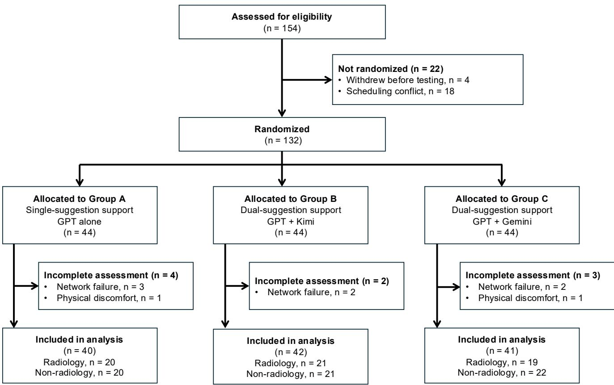  
Figure 1. Participant Flow Diagram. Participants were stratified by specialty and allocated 1:1:1 to the three AI support conditions. Testing was performed using a smartphone or tablet. Network failure was defined as connectivity or webpage failure preventing image display or response submission; physical discomfort was defined as feeling unwell enough to interfere with concentration and require termination of testing. Final analytic samples are shown by specialty.

## 2.2 Case Selection and AI Output Generation

We retrospectively assembled 218 chest and abdominal radiography examinations performed at Center 1 from January 2023 to June 2024 according to prespecified diagnostic categories. Examinations represented four chest and three abdominal conditions, were of suficient image quality, and had diagnoses confirmed pathologically or clinically. GPT-5.4 (OpenAI), Kimi-K2.6 (Moonshot AI), and Gemini-3.6 Flash (Google) independently generated a primary diagnosis and supporting rationale from the same deidentified radiograph and clinical history10, 11. Outputs were generated once, fixed before case selection, and used unchanged throughout the study. To evaluate suggestion number rather than diferences in overall model performance, 60 cases were purposively selected to balance disease composition and match overall model accuracy. The final set comprised 30 chest and 30 abdominal radiographs; each model correctly diagnosed 39 of 60 cases (65.0%), while Kimi-K2.6 and Gemini-3.6 Flash difered in case-level concordance with GPT-5.4. Before the reader study, five radiologists with 1–5 years of experience independently interpreted the 60 cases without AI assistance; mean accuracy was 54.3%. Additional details are provided in Supplementary Appendix 1.

## 2.3 Study Procedure

Participants were stratified by specialty and randomly assigned in a 1:1:1 ratio to groups A, B, or C using a prespecified computer-assisted allocation procedure. The allocation list was fixed before assessment and concealed from enrollment personnel until assignment. Details of the allocation procedure are provided in the Supplementary Methods. Group A received GPT-5.4 alone; groups B and C received GPT-5.4 plus Kimi-K2.6 and GPT-5.4 plus Gemini-3.6 Flash, respectively. The two dual-suggestion conditions assessed consistency across model pairings. GPT-5.4 was the shared model; both AI suggestions were presented simultaneously and consisted of a primary diagnosis and supporting rationale. Model identities were not disclosed to participants. All groups interpreted the same 60 cases in independently randomized order. Testing occurred in supervised group sessions using a smartphone or tablet and was completed in one session. Participants completed the assessment independently using deidentified radiographs and clinical histories. For each case, participants recorded an unaided diagnosis and confidence on a 5-point scale; responses were then locked. The assigned AI suggestion or suggestions were displayed, after which participants recorded a final diagnosis and confidence. The platform recorded responses and interpretation times (Figure 2).

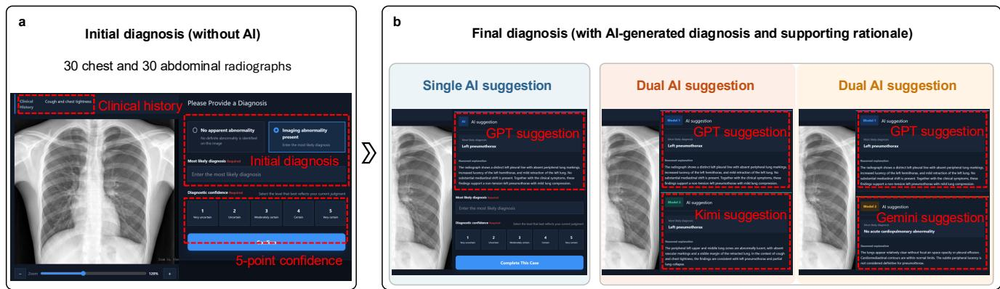  
Figure 2. Reader Workflow and AI Support Conditions. a, Initial interpretation without AI assistance, including diagnosis and confidence. b, Final interpretation after AI assistance with single-suggestion support (group A, GPT-5.4) or one of two parallel dual-suggestion conditions (group B, GPT-5.4 plus Kimi-K2.6; group C, GPT-5.4 plus Gemini-3.6 Flash). In both dual-suggestion conditions, the two AI suggestions were presented simultaneously.

## 2.4 Outcomes and Response Adjudication

The primary outcome was change in diagnostic accuracy, defined as AI-assisted minus AI-unassisted accuracy. Accuracy was also evaluated according to whether the shared GPT-5.4 suggestion was correct (39 cases) or incorrect (21 cases). Secondary outcomes were interpretation time, defined as the total time across the unaided and AI-assisted interpretation stages, and confidence change, defined as final minus initial mean confidence. Diagnostic revisions were classified as beneficial (incorrect-to-correct) or harmful (correct-to-incorrect). Responses were scored using a prespecified case-specific diagnostic lexicon (Supplementary Appendix 2) established by two senior radiologists (>10 years’ experience). Free-text responses were classified by an automated matching pipeline and independently reviewed by both radiologists while masked to participant identity and support condition; disagreements were resolved by consensus.

## 2.5 Statistical Analysis

Sample size was based on feasible recruitment; no formal a priori calculation was performed. Data are summarized as mean ± SD or counts and percentages. Paired � tests assessed changes in diagnostic accuracy before and after AI assistance. Between-specialty comparisons used Welch � tests. Prespecified primary comparisons were accuracy changes in groups B and C versus group A within each specialty. Support conditions were compared using Welch ANOVA, with B–A and C–A contrasts assessed using Welch � tests with Holm adjustment. Accuracy before and after AI assistance was also compared across support conditions for shared GPT-5.4-correct and -incorrect cases using the same approach.

Linear models with heteroskedasticity-robust standard errors (HC3 estimator) assessed specialty interactions for accuracy change and beneficial and harmful revisions23. The dual-suggestion efect was defined as $[ ( B + C ) / 2 ] - A$ , and interactions were assessed using Wald tests. Efect estimates are reported with 95% CIs. No important changes to the study methods or prespecified outcomes were made after trial commencement. All tests were two-sided, with � < .05 indicating statistical significance. Analyses were performed using Python, version 3.12.14.

## 3 Results

## 3.1 Participant Flow and Characteristics

Of 154 residents assessed for eligibility, 132 were allocated to the three support conditions; nine had incomplete assessments because of network failure (n = 7) or physical discomfort (n = 2), leaving 123 residents for analysis. The 123 residents had a mean age of 24.1 years ± 1.4; 65 were women, including 60 radiology and 63 non-radiology residents. Mean radiographic interpretation experience was 13.9 months among radiology residents and 14.7 months among non-radiology residents (mean diference, −0.8 months; 95% CI, −2.9 to 1.2; � = .43). Of the 123 residents, 87 (70.7%) were recruited from Center 1, 20 (16.3%) from Center 2, and 16 (13.0%) from Center 3 (Table 1). Participant characteristics by support condition are shown in Supplementary Table S1.

Table 1. Participant Characteristics Overall and by Specialty
<table><tr><td>Characteristic</td><td>Total residents (n = 123)</td><td>Radiology  $( n = 6 0 )$ </td><td>Non-radiology (n = 63)</td></tr><tr><td> $\operatorname { A g e } \left( \mathbf { y } \right)$ </td><td> $2 4 . 1 \pm 1 . 4$ </td><td> $2 4 . 1 \pm 1 . 5$ </td><td> $2 4 . 0 \pm 1 . 3$ </td></tr><tr><td>Sex (male)</td><td> $5 8 \ : ( 4 7 . 2 )$ </td><td> $2 2 ( 3 6 . 7 )$ </td><td>36 (57.1)</td></tr><tr><td>Experience (m)</td><td> $1 4 . 3 \pm 5 . 7$ </td><td> $1 3 . 9 \pm 5 . 9$ </td><td> $1 4 . 7 \pm 5 . 5$ </td></tr><tr><td>Center</td><td></td><td></td><td></td></tr><tr><td>Center 1</td><td>87 (70.7)</td><td>34 (56.7)</td><td>53 (84.1)</td></tr><tr><td>Center 2</td><td>20 (16.3)</td><td>18 (30.0)</td><td>2 (3.2)</td></tr><tr><td>Center 3</td><td>16 (13.0)</td><td>8 (13.3)</td><td>8 (12.7)</td></tr></table>

Note.—Data are $\mathrm { m e a n } \pm \mathrm { S D }$ or � (%). Experience denotes months of clinical work involving radiographic interpretation. Center indicates the recruiting center.

## 3.2 Diagnostic Accuracy before and after AI Assistance

The three AI models had identical overall diagnostic accuracy (65.0%), while Kimi-K2.6 and Gemini-3.6 Flash difered in case-level concordance with GPT-5.4 (Figure 3a–c). Across all 123 residents, mean diagnostic accuracy increased from $4 6 . 3 \% \pm 1 1 . 3$ to $6 1 . 5 \% \pm 8 . 0$ after AI assistance (mean change, 15.2 percentage points; 95% CI, 13.7–16.8; � < .001). Before AI assistance, radiology residents had higher accuracy than non-radiology residents (48.8% vs 43.9%; mean diference, 4.9 percentage points; 95% CI, 0.9–8.9; $P = . 0 1 7 )$ . After AI assistance, accuracy remained higher among radiology residents (63.2% vs $5 9 . 9 \% ;$ mean diference, 3.3 percentage points; 95% CI, 0.4–6.1; � = .024), whereas accuracy change did not difer between specialties (14.4 vs 16.0 percentage points; mean diference, –1.6 percentage points; 95% CI, –4.8 to 1.6; � = .32) (Supplementary Table S2). Diagnostic accuracy increased after AI assistance in all three support conditions: by 13.9 percentage points in group A (95% CI, 11.3–16.5), 15.0 percentage points in group B (95% CI, 12.0–18.0), and 16.8 percentage points in group C (95% CI, 14.1–19.6) (all $P < . 0 0 1 )$ (Figure 3d–f; Supplementary Table S3).

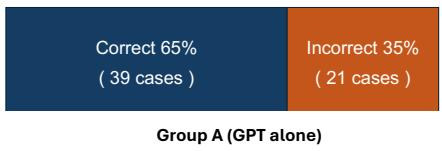

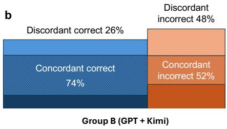

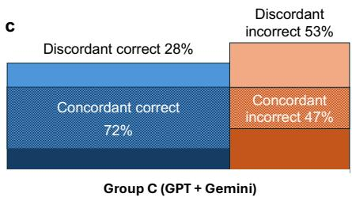

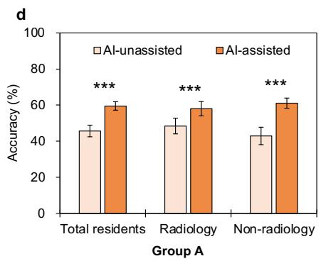

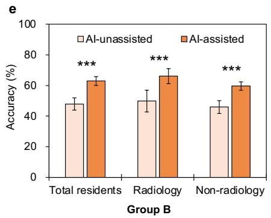

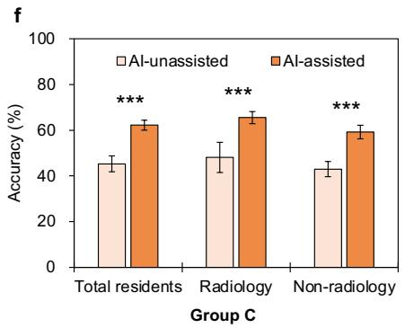  
Figure 3. AI Model Concordance and Diagnostic Accuracy With and Without AI Assistance. a–c, AI diagnostic performance and case-level concordance in groups A–C. In the dual-suggestion groups, concordant and discordant categories indicate whether the second model agreed with GPT-5.4 among GPT-5.4-correct and GPT-5.4-incorrect cases. d–f, Mean AI-unassisted and AI-assisted diagnostic accuracy among all residents, radiology residents, and non-radiology residents in groups A–C. Error bars represent 95% CIs. $* * * P < . 0 0 1$ for paired comparisons between AI-unassisted and AI-assisted accuracy.

## 3.3 Accuracy Change, Interpretation Time, and Confidence Change

Among radiology residents, accuracy change difered across support conditions (group A, 9.6 percentage points ± 7.1; group B, $1 6 . 3 \pm 1 0 . 6 ;$ group $\mathrm { C } , 1 7 . 5 \pm 1 1 . 4 ; P = . 0 1 6 )$ . Compared with group A, improvement was greater in group B by 6.69 percentage points (95% CI, $0 . 9 7 { - } 1 2 . 4 0 ;$ Holm-adjusted $P = . 0 3 0 )$ and in group C by 7.87 percentage points (95% CI, 1.64–14.11; Holm-adjusted $P = . 0 3 0 )$ (Figure 4a). Among non-radiology residents, accuracy change did not difer across support conditions (group A, 18.2 percentage points ± 6.9; group B, $1 3 . 7 \pm 8 . 5 ;$ ; group C, $1 6 . 3 \pm 5 . 6 ; P = . 2 0 )$ (Figure 4d). Interpretation time and confidence change did not difer across support conditions within either specialty stratum (all $P > . 0 5 )$ (Figure 4; Supplementary Table S4).

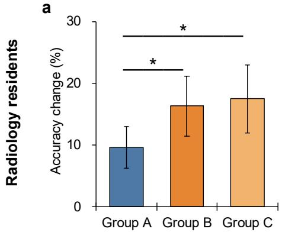

b  
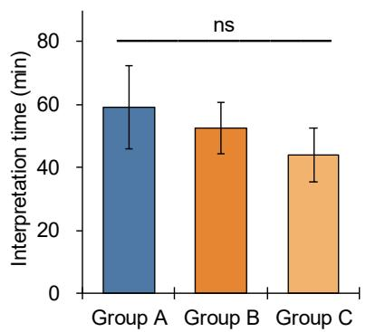

c  
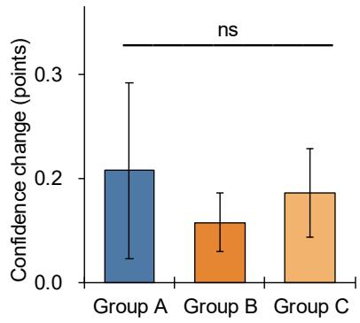

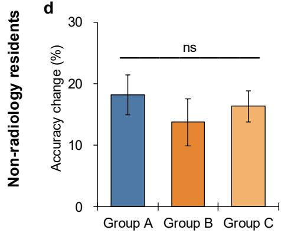

e  
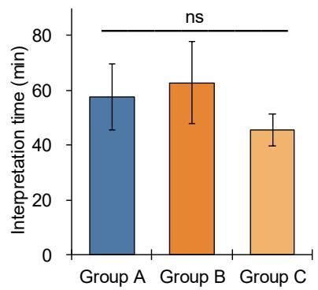

f  
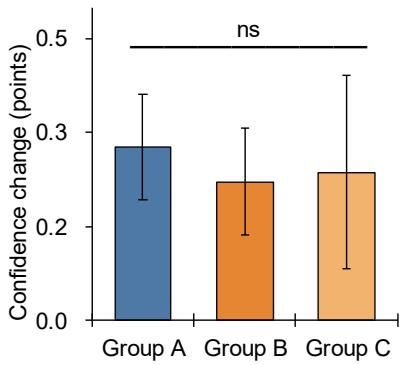  
Figure 4. Diagnostic Outcomes by Support Condition. a–c, Accuracy change, interpretation time, and confidence change, respectively, among radiology residents. d–f, Corresponding outcomes among non-radiology residents. Bars represent mean values, and error bars represent 95% CIs. \*Holm-adjusted $P < . 0 5$ versus group A. ns indicates a nonsignificant overall comparison across the three support conditions.

## 3.4 Accuracy According to GPT-5.4 Suggestion Correctness

Before AI assistance, accuracy did not difer across support conditions for GPT-5.4 correct or GPT-5.4 incorrect cases in either specialty (all $P > . 0 5 )$ . Among radiology residents, when GPT-5.4 was correct, AI-assisted accuracy did not difer across groups $( 7 8 . 5 \% \pm 1 2 . 5 , 8 0 . 1 \% \pm 9 . 8$ , and $7 9 . 1 \% \pm 8 . 6 $ , respectively; $P = . 8 9 )$ (Figure 5a). When GPT-5.4 was incorrect, AI-assisted accuracy was higher in groups B and C than in group $\mathrm { ~ A ~ } ( 2 0 . 0 \% \pm 1 3 . 5 , 4 0 . 1 \% \pm 1 7 . 9$ , and $4 0 . 4 \% \pm 9 . 4$ for groups A, B, and C, respectively; both Holm-adjusted $P < . 0 0 1 )$ (Figure 5b). Among non-radiology residents, when GPT-5.4 was correct, AI-assisted accuracy was lower in groups B and C than in group $\mathrm { ~ A ~ } ( 8 7 . 4 ^ { \circ } / \circ \pm 7 . 2 , 7 4 . 8 ^ { \circ } / \circ \pm 1 0 . 0 ,$ and $7 4 . 5 \% \pm 9 . 3 .$ respectively; both Holm-adjusted $P < . 0 0 1 )$ (Figure 5c). In contrast, when GPT-5.4 was incorrect, AI-assisted accuracy was higher in groups B and C than in group $\mathrm { { A } ( 1 2 . 1 \% \pm 1 2 . 9 , 3 1 . 3 \% \pm 1 1 . 7 } $ , and $3 1 . 0 \% \pm 1 1 . 1$ , respectively; both Holm-adjusted $P < . 0 0 1 )$ (Figure 5d) (Supplementary Tables S5–S7).

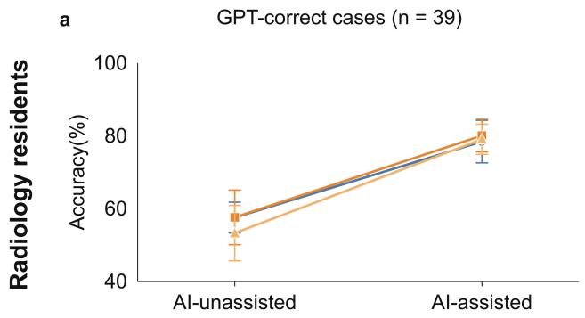

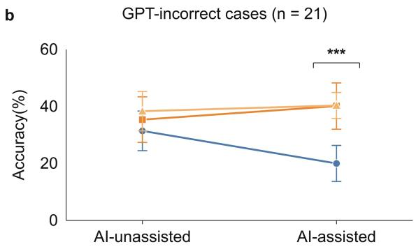

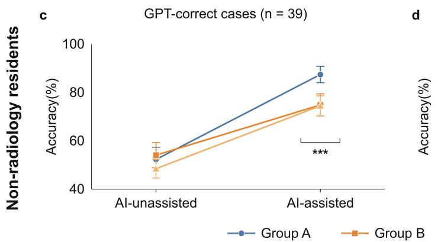

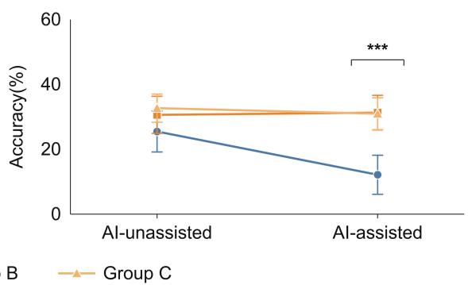  
Figure 5. Diagnostic Accuracy According to GPT-5.4 Suggestion Correctness. a–b, AI-unassisted and AI-assisted diagnostic accuracy among radiology residents in cases with correct (� = 39) and incorrect $( n = 2 1 )$ GPT-5.4 suggestions, respectively. c–d, Corresponding results among non-radiology residents. Lines represent groups A–C, and error bars represent 95% CIs. \*\*\*Holm-adjusted $P < . 0 0 1$ versus group A.

## 3.5 Revision Components and Specialty Interaction

Accuracy change was decomposed into beneficial revisions (incorrect-to-correct) and harmful revisions (correct-toincorrect). Among radiology residents, beneficial revisions difered across support conditions (group A, $1 4 . 8 \% \pm 7 . 8 ;$ group B, $1 9 . 9 \% \pm 1 1 . 0 ;$ group C, $2 2 . 8 \% \pm 1 0 . 5 ; P = . 0 2 7 )$ , whereas harmful revisions did not (group A, $5 . 2 \% \pm 3 . 9 ;$ group B, 3.7% ± 2.4; group $\mathrm { C } , 5 . 4 \% \pm 3 . 3 ; P = . 1 3 1 )$ (Figure 6a; Supplementary Table S8). Among non-radiology residents, neither beneficial revisions $( P = . 2 0 4 )$ nor harmful revisions $( P = . 7 9 6 )$ difered across support conditions. The dual-suggestion efect on accuracy change difered by specialty (interaction diference, 10.44 percentage points; 95% CI, 4.36–16.52; � < .001), with efects of 7.28 percentage points (95% CI, 2.53–12.03; � = .003) in radiology residents and −3.16 percentage points (95% CI, −6.95 to $0 . 6 4 ; P = . 1 0 3 )$ in non-radiology residents. A specialty interaction was also observed for beneficial revisions (9.37 percentage points; $9 5 \% \mathrm { C I } , 3 . 1 7 \mathrm { - } 1 5 . 5 7 ; P = . 0 0 3 )$ , but not for harmful revisions (−1.07 percentage points; 95% $\operatorname { C I } , - 3 . 9 5 \mathrm { t o } 1 . 8 1 ; P = . 4 7 )$ (Figure 6b; Supplementary Table S9). For GPT-5.4 incorrect cases, groups B and C showed higher beneficial revision rates than group A in both specialties (both $P < . 0 0 1$ ; Supplementary Table S10).

a Definition of Revision Components  
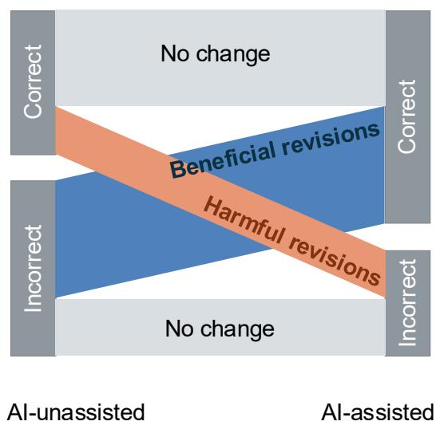

b Revision Components of Accuracy Change  
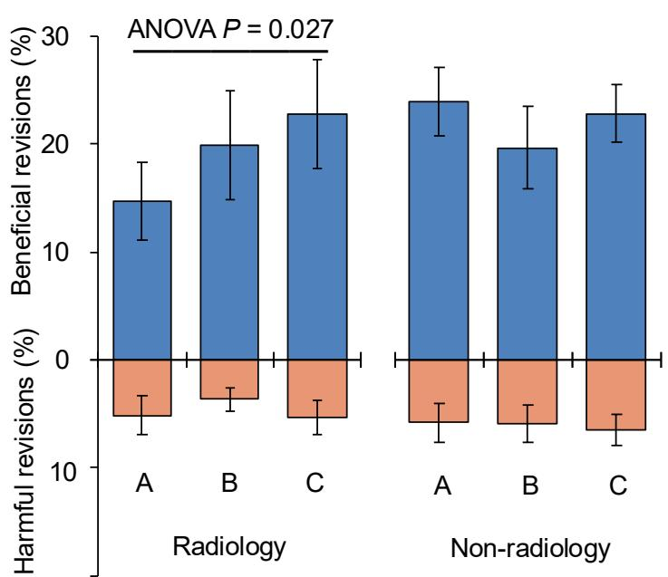

c Dual-Suggestion Effects by Specialty
<table><tr><td>Outcome</td><td>Mean difference (95% CI)</td><td></td><td></td><td></td><td>P</td><td></td><td>P for interaction</td></tr><tr><td>Accuracy change</td><td></td><td></td><td></td><td></td><td></td><td></td><td></td></tr><tr><td>Radiology</td><td>7.28 (2.53 to 12.03)</td><td></td><td></td><td></td><td></td><td>0.003</td><td>&lt; 0.001</td></tr><tr><td>Non-radiology</td><td>-3.16 (-6.95 to 0.64)</td><td></td><td></td><td></td><td></td><td>0.103</td><td></td></tr><tr><td>Beneficial revisions</td><td></td><td></td><td></td><td></td><td></td><td></td><td></td></tr><tr><td>Radiology</td><td>6.61 (1.72 to 11.51)</td><td></td><td></td><td></td><td></td><td>0.008</td><td>0.003</td></tr><tr><td>Non-radiology</td><td>-2.76 (-6.57 to 1.05)</td><td></td><td></td><td></td><td></td><td>0.156</td><td></td></tr><tr><td>Harmful revisions</td><td></td><td></td><td></td><td></td><td></td><td></td><td></td></tr><tr><td>Radiology</td><td>-0.67 (-2.66 to 1.33)</td><td></td><td></td><td></td><td></td><td>0.513</td><td>0.468</td></tr><tr><td>Non-radiology</td><td>0.40 (-1.67 to 2.47)</td><td></td><td>-5 0</td><td></td><td></td><td>0.705</td><td></td></tr><tr><td></td><td></td><td></td><td></td><td>5</td><td>10</td><td></td><td></td></tr></table>

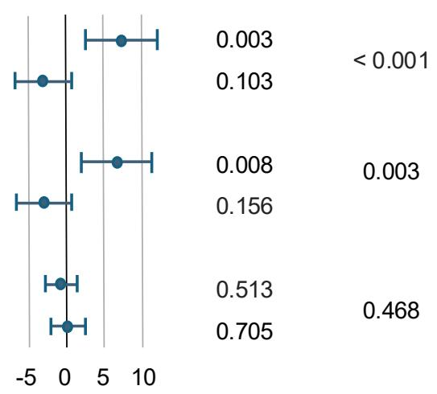  
Dual-suggestion effect (percentage points)  
Figure 6. Revision Components and Dual-Suggestion Efects by Specialty. a, Definition of revision components. Beneficial and harmful revisions represent incorrect-to-correct and correct-to-incorrect transitions, respectively; gray flows indicate no change. b, Revision components of accuracy change by support condition and specialty. Bars show means with 95% CIs; harmful revisions are plotted below zero for visualization. c, Dual-suggestion efects by specialty, defined as [(B+C)/2]–A. Points show mean diferences with 95% CIs; � for interaction indicates diferences between specialties.

## 4 Discussion

In this prospective multicenter multireader study, we compared dual- with single-suggestion AI support for radiographic interpretation by radiology and non-radiology residents. When the shared GPT-5.4 suggestion was incorrect, AI-assisted accuracy was higher with dual-suggestion support in both groups. Radiology residents showed greater overall improvement in diagnostic accuracy with dual- than with single-suggestion support, whereas accuracy change did not difer across support conditions among non-radiology residents. Interpretation time did not difer across support conditions in either specialty. These findings suggest that dual-suggestion support may help limit the diagnostic influence of erroneous AI suggestions.

Previous studies have shown that AI assistance can improve diagnostic performance, while erroneous AI suggestions can also adversely influence diagnostic decisions24, 25, particularly among less experienced physicians12, 13. Existing human–AI interaction strategies have largely focused on optimizing the presentation of information from a single AI. Our study extends this work by evaluating dual-suggestion support, in which an additional independent AI opinion is presented alongside the shared AI suggestion. The main contribution was observed when the shared AI suggestion was incorrect: diagnostic accuracy was higher with dual- than single-suggestion support in residents, suggesting that an additional independent AI opinion may help limit the diagnostic influence of erroneous AI suggestions. Importantly, this improvement was not accompanied by a detectable increase in interpretation time. These findings extend human–AI interaction research beyond single-AI presentation and suggest that dual-suggestion support may help limit the influence of erroneous AI suggestions without increasing interpretation time.

The higher diagnostic accuracy observed with dual-suggestion support when the shared AI suggestion was incorrect is consistent with evidence that access to an additional opinion can reduce inappropriate reliance on erroneous AI advice26. Outside medicine, actively seeking a second opinion has been shown to reduce overreliance on AI suggestions, including erroneous ones27. In medicine, structured information sharing among physicians has been associated with fewer diagnostic errors20. These findings provide a conceptual basis for presenting an additional independent AI opinion when evaluating an AI-supported diagnosis. Notably, in an exploratory analysis of cases in which both AI suggestions were incorrect, dual- and single-suggestion support did not difer significantly in AI-assisted accuracy or increased confidence in incorrect final diagnoses (Supplementary Table S11). Taken together, these findings support the potential value of dual-suggestion support when an AI suggestion may be erroneous

The efect of dual-suggestion support difered by specialty. Although both groups had fewer than 3 years of clinical experience, radiology and non-radiology residents difered in specialty background and baseline diagnostic performance. Greater overall accuracy improvement with dual-suggestion support was observed in radiology residents but not in non-radiology residents. Among non-radiology residents, however, the efect varied with shared-AI correctness: accuracy was higher with dual-suggestion support when the shared AI suggestion was incorrect but lower when it was correct, while overall beneficial and harmful revision rates did not difer across support conditions. Previous studies have shown that the efect of AI assistance varies with task-specific expertise10, 28. Diferences in domain-specific knowledge may influence how clinicians evaluate and accept AI suggestions2, 8, 29. In our study, specialty interactions were observed for accuracy change and beneficial revisions. The incremental efect of dual-suggestion support may vary across specialties.

Several limitations should be considered. First, process-level mechanisms were not directly assessed. Eye tracking can assess visual attention15, 30, and suggestion-weighting measures can quantify the relative influence of dual AI suggestions on diagnostic decisions31. Future studies incorporating these measures may help clarify the mechanisms underlying the diagnostic value of dual-suggestion support. Second, the paired models difered in case-level error patterns, and dual-suggestion support therefore sometimes provided a correct additional suggestion when the shared GPT-5.4 suggestion was incorrect. The frequency and direction of such disagreement may vary across model pairings, and whether the efect of dual-suggestion support depends on these disagreement patterns warrants further investigation. Third, the 60-case set was purposively selected to balance disease composition and overall AI diagnostic accuracy and may not reflect the case mix of routine clinical practice. Further evaluation in unselected clinical populations is warranted. Nevertheless, the controlled multireader design enabled direct comparison of dual- and single-suggestion support under standardized conditions

In conclusion, dual-suggestion support may help limit the diagnostic influence of erroneous AI suggestions during radiographic interpretation. Compared with single-suggestion support, it was associated with greater overall improvement in diagnostic accuracy among radiology residents but not among non-radiology residents, without increased interpretation time. These findings highlight the potential of human–AI interaction design to reduce the diagnostic consequences of erroneous AI suggestions.

## Data Availability

The deidentified 60-case radiographs, groud-truth diagnoses, and the diagnostic lexicon used for free-text scoring are available at GitHub.

## Code Availability

The inference code is available at GitHub. Model outputs were generated through platform APIs: GPT-5.4 and Kimi-K2.6 via Microsoft Foundry (formerly Azure AI Foundry), and Gemini-3.6 Flash via Google Vertex AI.

## Funding

This study was supported by the Jiangxi Province Natural Science Foundation (No. 20232BAB216099), the Jiangxi Clinical Research Center for Medical Imaging (No. 20223BCG74001), and the Jiangxi Province Key Laboratory for Precision Pathology and Intelligent Diagnosis (No. 2024SSY06281).

## References

1. Gommers JJJ, Verboom SD, Duvivier KM, et al. Influence of AI decision support on radiologists’ performance and visual search in screening mammography. Radiology 2025;316(1):e243688. doi: 10.1148/radiol.243688.

2. Schramm S, Le Guellec B, Topka M, et al. Performing best when needed least: reader experience shapes accuracy gains in large language model–assisted brain MRI diferential diagnosis. Radiology 2026;319(2):e253477. doi: 10.1148/radiol.253477.

3. Hanneman K, Patlas MN. From promise to practice: implementing artificial intelligence in radiology. Diagn Interv Imaging 2026;107(4):127–128. doi: 10.1016/j.diii.2026.01.010.

4. Duron L, Lecler A. Multimodal artificial intelligence in radiology: text-dominant reasoning limits image understanding. Diagn Interv Imaging 2025;106(10):333–334. doi: 10.1016/j.diii.2025.05.008.

5. Tanno R, Barrett DGT, Sellergren A, et al. Collaboration between clinicians and vision–language models in radiology report generation. Nat Med 2025;31(2):599–608. doi: 10.1038/s41591-024-03302-1.

6. Thrall JH. Challenges of implementing artificial intelligence–enabled programs in the clinical practice of radiology. Radiol Artif Intell 2024;6(5):e240411. doi: 10.1148/ryai.240411.

7. Angus DC, Khera R, Lieu T, et al. AI, health, and health care today and tomorrow: the JAMA summit report on artificial intelligence. JAMA 2025;334(18):1650–1664. doi: 10.1001/jama.2025.18490.

8. Prinster D, Mahmood A, Saria S, et al. Care to explain? AI explanation types diferentially impact chest radiograph diagnostic performance and physician trust in AI. Radiology 2024;313(2):e233261. doi: 10.1148/radiol.233261.

9. Tang JSN, Lai JKC, Bui J, et al. Impact of diferent artificial intelligence user interfaces on lung nodule and mass detection on chest radiographs. Radiol Artif Intell 2023;5(3):e220079. doi: 10.1148/ryai.220079.

10. Xu X, Hu H, Zhang H, et al. Divergent impacts of explainable AI for dermatological diagnosis on clinicians versus lay people. Nat Med 2026;32(8):3000–3009. doi: 10.1038/s41591-026-04553-w.

11. Song J, Jeong WG, Han DH, et al. Determinants of reader-LLM interaction in thoracic radiology: impact of model confidence and reader expertise. Radiology 2026;320(2):e253397. doi: 10.1148/radiol.253397.

12. Dratsch T, Chen X, Rezazade Mehrizi M, et al. Automation bias in mammography: the impact of artificial intelligence BI-RADS suggestions on reader performance. Radiology 2023;307(4):e222176. doi: 10.1148/radiol.222176.

13. Teng D, Tan L, Cao Q, Xia Y, Zhang N, Li J, Zhao D. Impact of AI misinformation on diagnostic accuracy and confidence calibration in novice medical students. NPJ Digit Med 2026;9(1):356. doi: 10.1038/s41746-026-02547-z.

14. Park C, Lee YI, Seo J, et al. Beyond expertise: exploring behavioral personas in AI-assisted rare renal cancer diagnosis. NPJ Digit Med. Published online August 13, 2026. doi: 10.1038/s41746-026-03134-y.

15. Taib AG, Partridge GJW, Phillips P, et al. Automation bias in action: eye tracking of humans reading screening mammograms with and without AI prompts. Radiology 2026;320(1):e252590. doi: 10.1148/radiol.252590.

16. Vaccaro M, Almaatouq A, Malone T. When combinations of humans and AI are useful: a systematic review and meta-analysis. Nat Hum Behav 2024;8(12):2293–2303. doi: 10.1038/s41562-024-02024-1.

17. Riedl C, Kim YJ, Gupta P, Malone TW, Woolley AW. Quantifying collective intelligence in human groups. Proc Natl Acad Sci U S A 2021;118(21):e2005737118. doi: 10.1073/pnas.2005737118.

18. Woolley AW, Gupta P. Understanding collective intelligence: investigating the role of collective memory, attention, and reasoning processes. Perspect Psychol Sci 2024;19(2):344–354. doi: 10.1177/17456916231191534.

19. Barnett ML, Boddupalli D, Nundy S, Bates DW. Comparative accuracy of diagnosis by collective intelligence of multiple physicians vs individual physicians. JAMA Netw Open 2019;2(3):e190096. doi: 10.1001/jamanetworkopen.2019.0096.

20. Centola D, Becker J, Zhang J, Aysola J, Guilbeault D, Khoong E. Experimental evidence for structured information–sharing networks reducing medical errors. Proc Natl Acad Sci U S A 2023;120(31):e2108290120. doi: 10.1073/pnas.2108290120.

21. Zöller N, Berger J, Lin I, et al. Human–AI collectives most accurately diagnose clinical vignettes. Proc Natl Acad Sci U S A 2025;122(24):e2426153122. doi: 10.1073/pnas.2426153122.

22. Kameda T, Toyokawa W, Tindale RS. Information aggregation and collective intelligence beyond the wisdom of crowds. Nat Rev Psychol 2022;1(6):345–357. doi: 10.1038/s44159-022-00054-y

23. Mansournia MA, Nazemipour M, Naimi AI, Collins GS, Campbell MJ. Reflection on modern methods: demystifying robust standard errors for epidemiologists. Int J Epidemiol 2021;50(1):346–351. doi: 10.1093/ije/dyaa260.

24. Jabbour S, Fouhey D, Shepard S, et al. Measuring the impact of AI in the diagnosis of hospitalized patients: a randomized clinical vignette survey study. JAMA 2023;330(23):2275–2284. doi: 10.1001/jama.2023.22295.

25. Chen M, Wang Y, Wang Q, et al. Impact of human and artificial intelligence collaboration on workload reduction in medical image interpretation. NPJ Digit Med 2024;7(1):349. doi: 10.1038/s41746-024-01328-w.

26. Sokol K, Fackler J, Vogt JE. Artificial intelligence should genuinely support clinical reasoning and decision making to bridge the translational gap. NPJ Digit Med 2025;8(1):345. doi: 10.1038/s41746-025-01725-9.

27. Lu Z, Wang D, Yin M. Does more advice help? The efects of second opinions in AI-assisted decision making. Proc ACM Hum Comput Interact 2024;8(CSCW1):1–31. doi: 10.1145/3653708.

28. Yu F, Moehring A, Banerjee O, Salz T, Agarwal N, Rajpurkar P. Heterogeneity and predictors of the efects of AI assistance on radiologists. Nat Med 2024;30(3):837–849. doi: 10.1038/s41591-024-02850-w.

29. Jackson NJ, Brown KE, Miller R, et al. Factors influencing the efectiveness of artificial intelligence-assisted decision-making in medicine: a scoping review. J Am Med Inform Assoc 2026;33(5):1054–1064. doi: 10.1093/jamia/ocag002.

30. Belde D, Kapaj A, Fabrikant SI, et al. The impact of AI on eye gaze patterns in chest X-ray interpretation: an eye tracking study of novice and expert radiologists. Invest Radiol 2026;61(11):790–796. doi: 10.1097/RLI.0000000000001289.

31. Glickman M, Sharot T. How human–AI feedback loops alter human perceptual, emotional and social judgements. Nat Hum Behav 2025;9(2):345–359. doi: 10.1038/s41562-024-02077-2.

## Supplementary Materials

These tables provide participant-level descriptive results, prespecified support-condition comparisons, and additional analyses for the 123 participants included in the study.

Group A: GPT; group B: GPT plus Kimi; group C: GPT plus Gemini. Radiology residents: � = 60 (A/B/C, 20/21/19); non-radiology residents: � = 63 (20/21/22).

All groups evaluated the same 60 cases. Conditional analyses used the 39 cases in which the common GPT suggestion was correct and the 21 cases in which it was incorrect. This classification was identical across groups.

Accuracy change is AI-assisted minus AI-unassisted accuracy. Beneficial and harmful revisions are incorrect-to-correct and correct-to-incorrect transitions, respectively. Transition percentages use all 60 cases as the denominator. Interpretation time sums both interpretation stages; confidence change is final minus initial mean confidence.

## Contents

• Supplementary Statistical Methods

• Supplementary Appendix 1. Case Composition, Model Concordance, and Representative Fixed AI Suggestions

• Figure S1. Composition of the 60-case set

• Figure S2. Correctness-status maps for the study conditions

• Supplementary Appendix 2. Prespecified Diagnostic Lexicon for Free-Text Response Scoring

• Appendix Table A1. Accepted Diagnostic Expressions and Examples Not Accepted as Standalone Answers

• Supplementary Table S1. Participant Characteristics by Specialty and Support Condition

• Supplementary Table S2. Participant-Level Outcomes by Specialty

• Supplementary Table S3. Diagnostic Accuracy Before and After AI Assistance by Specialty and Support Condition

• Supplementary Table S4. Accuracy Change, Interpretation Time, and Confidence Change by Specialty and Support Condition

• Supplementary Table S5. Diagnostic Accuracy in Cases With a Correct Common GPT Suggestion

• Supplementary Table S6. Diagnostic Accuracy in Cases With an Incorrect Common GPT Suggestion

• Supplementary Table S7. Pairwise Accuracy Contrasts by Specialty and GPT Suggestion Correctness

• Supplementary Table S8. Diagnostic Revision Patterns by Specialty and Support Condition

• Supplementary Table S9. Dual-Suggestion Efects and Specialty Interactions

• Supplementary Table S10. Revision Components by Shared GPT Suggestion Correctness, Specialty, and Support Condition

• Supplementary Table S11. Outcomes in Cases for Which Both AI Models Were Incorrect

## Supplementary Methods: Allocation Procedure

Participant allocation was performed within specialty strata by an investigator not involved in participant assessment. Deidentified participant information, including specialty classification, was submitted to DeepSeek using a prespecified prompt instructing random and balanced allocation in a 1:1:1 ratio to groups A, B, and C. The resulting allocation list was accepted without manual modification, fixed before participant assessment, and concealed from enrollment personnel until assignment. DeepSeek was used solely for participant allocation and was not one of the diagnostic AI models evaluated in the study.

## Supplementary Statistical Methods

All analyses used participant-level outcomes. Paired � tests assessed AI-unassisted versus AI-assisted accuracy within each group. Welch � tests compared specialties, and Welch ANOVA assessed diferences across support conditions within each specialty. Prespecified B–A and C–A comparisons used Welch � tests with Holm adjustment within each outcome and specialty stratum; for conditional analyses, adjustment was additionally performed within each GPT-correctness subset. B–C comparisons were exploratory and unadjusted.

Additional analyses compared AI-unassisted accuracy, AI-assisted accuracy, and accuracy change across support conditions separately within the shared GPT-correct and GPT-incorrect subsets (Supplementary Tables S5–S7). Separate ordinary least-squares models with heteroskedasticity-robust standard errors using the HC3 estimator evaluated accuracy change, beneficial revisions, and harmful revisions. Dual-suggestion efect was the equally weighted contrast $\because ( B + C ) / 2 ] - A$ . B–A and C–A efects were also estimated separately within each specialty. Specialty interaction contrasts were the radiology efect minus the corresponding non-radiology efect. Individual contrasts used two-sided Wald � tests. The overall three-group-by-specialty interaction used a two-degree-of-freedom Wald chi-square test. Model-specific B–A and C–A contrasts were Holm-adjusted in pairs within each outcome and analysis block. An additional exploratory analysis evaluated cases in which both AI suggestions were incorrect (Supplementary Table S11). For the GPT plus Kimi condition, group B was compared with group A using the 11 cases in which both GPT-5.4 and Kimi-K2.6 were incorrect; for the GPT plus Gemini condition, group C was compared with group A using the 10 cases in which both GPT-5.4 and Gemini-3.6 Flash were incorrect. Participant-level outcomes included AI-assisted accuracy, accuracy change, confidence change, and the proportion of incorrect final diagnoses with increased confidence. Comparisons used two-sided Welch � tests, with Holm adjustment applied to the two dual-versus-single comparisons within each outcome. All tests were two-sided, with � < .05 indicating statistical significance. Analyses were performed using Python, version 3.12.14.

## Supplementary Appendix 1. Case Composition, Model Concordance, and Representative Fixed AI Suggestions

This appendix describes the 60-case set, the correctness patterns of the AI suggestions, and four representative fixed outputs. Correctness refers to the primary diagnosis under the diagnostic lexicon.

Disease composition. Thirty examinations were chest radiographs and 30 were abdominal radiographs. Urinary tract calculi include renal and ureteral calculi. Normal abdominal examinations are shown separately from disease categories.

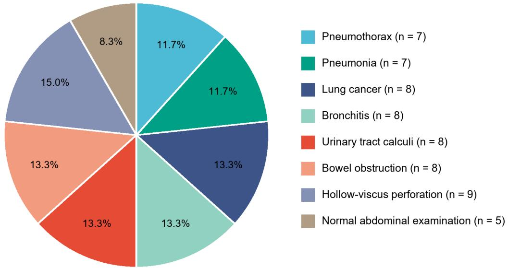

Figure S1. Composition of the 60-case set. Thirty examinations were chest radiographs and 30 were abdominal radiographs. Urinary tract calculi include renal and ureteral calculi. Normal abdominal examinations are shown separately from disease categories.

Case selection and control of model performance. Model outputs for all 218 candidate examinations were generated and fixed before selection of the final study cases. The final 60-case set was selected to balance disease composition and to match overall diagnostic accuracy across GPT-5.4, Kimi-K2.6, and Gemini-3.6 Flash. Thirty chest and 30 abdominal examinations were included, and each model correctly diagnosed 39 of 60 cases (65.0%). Matching overall accuracy did not require the models to be correct on the same cases, thereby preserving case-level diferences in model correctness and concordance.

Case-level correctness concordance. Each square represents one case, numbered 1–60 in the same order in both panels. Example case numbers correspond to these square labels. Concordance means agreement in correctness status, not agreement in diagnostic wording.

Group A (GPT). GPT correct: 39; GPT incorrect: 21. Group A has no second-model status.

Group B (GPT plus Kimi). Both correct: 29; GPT correct / second model incorrect: 10; GPT incorrect / second model correct: 10; both incorrect: 11.

Group C (GPT plus Gemini). Both correct: 28; GPT correct / second model incorrect: 11; GPT incorrect / second model correct: 11; both incorrect: 10.

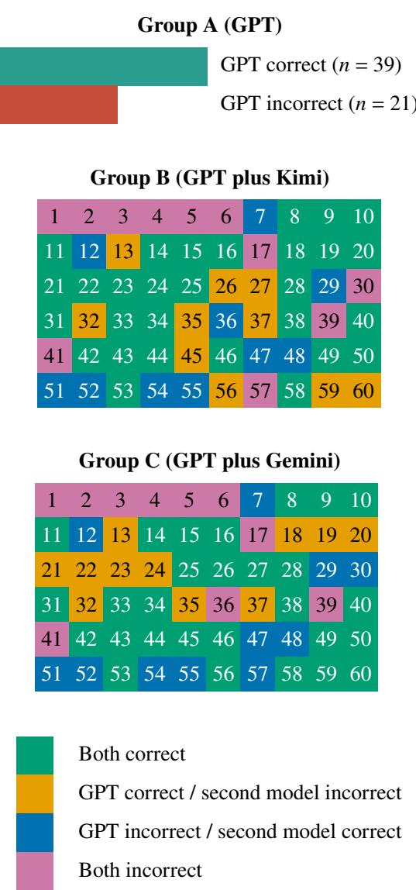  
Figure S2. Correctness-status maps for the single- and dual-suggestion conditions. Each square represents one case, numbered 1–60 in the same order in both dual-suggestion panels. Group A has no second-model status and uses the same two-color key as the examples below (teal, correct; rust, incorrect). The four colors below apply only to groups B and C. Both-incorrect cases count as correctness-concordant even when the diagnostic labels difer.

The four examples below use the same case-level correctness categories as Figure S2. Teal panels mark a correct primary diagnosis; rust panels mark an incorrect primary diagnosis.

# Example 1. Case 8 — GPT correct / Kimi correct

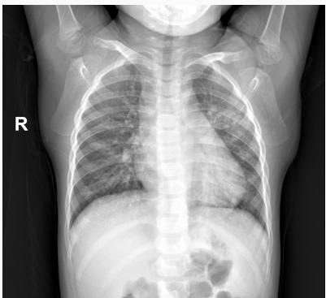  
Case ID: G0385195  
Reference diagnosis: Pneumonia  
Clinical history: Cough and chest tightness.  
Concordance: both models correct

## GPT suggestion (correct)

## Primary diagnosis: Bronchopneumonia

The chest radiograph shows patchy and reticular illdefined opacities around both hila and in both lower lungs, with increased lung markings, more pronounced in the left middle and lower lung. The heart is not enlarged, and there is no pleural efusion. With cough and chest tightness, bronchopneumonia is the first consideration, followed by acute bronchitis.

## Kimi suggestion (correct)

## Primary diagnosis: Bronchopneumonia

The chest radiograph shows increased and ill-defined lung markings bilaterally, scattered patchy ill-defined opacities, and increased hilar opacity. With cough and chest tightness, the findings are consistent with bronchopneumonia and airway inflammatory changes.

# Example 2. Case 13 — GPT correct / Kimi incorrect

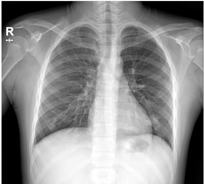  
Case ID: G0404250  
Reference diagnosis: Pneumonia

Clinical history: Cough and chest tightness.

Concordance: GPT correct / second model incorrect

## GPT suggestion (correct)

## Primary diagnosis: Left lower-lobe pneumonia

The chest radiograph shows patchy consolidation in the left lower lung and retrocardiac region, with mildly increased lung markings bilaterally. The heart is not enlarged, and there is no pleural efusion. With cough and chest tightness, left lower-lung infection with associated bronchitic changes is the first consideration.

## Kimi suggestion (incorrect)

## Primary diagnosis: Acute bronchitis

The chest radiograph shows increased and thickened lung markings with ill-defined margins, without evident consolidation or pleural efusion. With cough and chest tightness, the imaging appearance is consistent with bronchitis. The cardiac silhouette and diaphragm are unremarkable.

# Example 3. Case 7 — GPT incorrect / Kimi correct

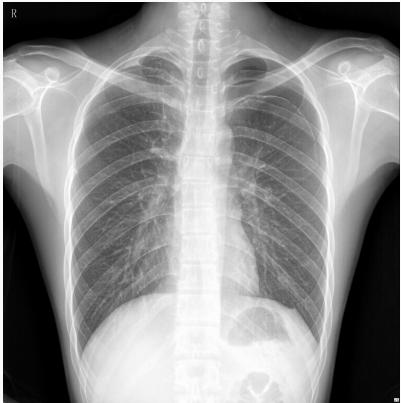

## Case ID: P4216711

Reference diagnosis: Pneumothorax

Clinical history: Cough and chest tightness.

Concordance: GPT incorrect / second model correct

## GPT suggestion (incorrect)

## Primary diagnosis: Bronchitis / small-airway inflammation

The chest radiograph shows mildly increased bilateral lung lucency and mildly increased and thickened markings in the hilar and lower-lung regions. There is no focal consolidation, pleural efusion, or pneumothorax. The heart is not enlarged. With cough and chest tightness, bronchitis or small-airway inflammation is favored.

## Kimi suggestion (correct)

## Primary diagnosis: Left pneumothorax

The chest radiograph shows abnormal lucency without lung markings in the peripheral left upper lung, with a visible visceral pleural line and the margin of the compressed lung. With cough and chest tightness, the findings are consistent with left pneumothorax.

# Example 4. Case 1 — GPT incorrect / Kimi incorrect

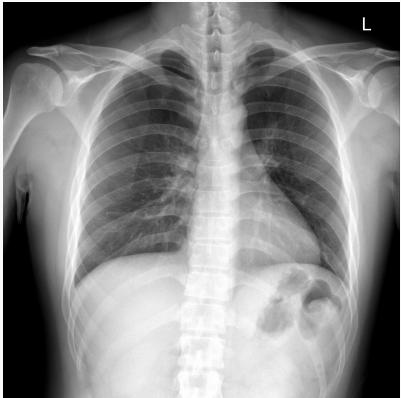  
Case ID: P537136  
Reference diagnosis: Pneumothorax

Clinical history: Cough and chest tightness.

Concordance: both models incorrect

## GPT suggestion (incorrect)

## Primary diagnosis: Bronchitis

The chest radiograph shows relatively preserved bilateral lung lucency and no cardiac enlargement. No focal consolidation, pleural efusion, or pneumothorax is seen. Markings in both lower lungs and around the hila are mildly thickened. With cough and chest tightness, bronchitis or airway inflammation is favored.

## Kimi suggestion (incorrect)

## Primary diagnosis: Bronchitis

The chest radiograph shows thickened and disorganized lung markings bilaterally and a small amount of patchy ill-defined opacity in the right lower lung. The cardiac and diaphragmatic contours are unremarkable. With cough and chest tightness, the findings are consistent with bronchitis, possibly accompanied by mild right lower-lung infection.

## Supplementary Appendix 2. Prespecified Diagnostic Lexicon for Free-Text Response Scoring

The purpose of this appendix defines the diagnostic categories, acceptable diagnostic expressions, and exclusions used to score participants’ free-text primary diagnoses before and after AI presentation. Each case was linked to its expert-established reference diagnosis before automated scoring.

## Scoring Rules.

1. Responses were considered correct when the primary diagnosis matched the reference diagnosis or an accepted diagnostic expression. Qualifiers such as “likely” or “suggestive of” did not invalidate an otherwise correct primary diagnosis.

2. Negated diagnoses were not accepted. Ambiguous statements, contradictory diagnoses, and unclear abbreviations required expert adjudication.

3. Scoring focused on the reference diagnostic category. Omitted laterality, site, or severity did not invalidate a correct category-level diagnosis. Explicitly incorrect modifiers required expert adjudication.

4. Automated matching used the locked lexicon. Two senior radiologists independently reviewed all classifications while masked to participant identity and study group. Disagreements were resolved by consensus.

Diagnostic Category Lexicon. Abbreviations: AI = artificial intelligence; GPT = generative pretrained transformer.

Appendix Table A1. Accepted Diagnostic Expressions and Examples Not Accepted as Standalone Answers
<table><tr><td>Reference diagnostic category</td><td>Accepted diagnostic expressions English equivalents and in Chinese</td><td>diagnostic scope</td><td>Examples of descriptive findings or alternative diagnoses not accepted alone</td></tr><tr><td>Pneumothorax / pleural air气胸/胸腔积气</td><td>气胸；左侧/右侧/双侧气胸； 胸腔积气；张力性气胸（存在 气胸时)</td><td>Pneumothorax; unilateral or bilateral pneumothorax; pleural air/gas; tension pneumothorax when pneumothorax is present</td><td>肺大疱；胸膜增厚；胸腔 积液；肺气肿</td></tr><tr><td>Pneumonia 肺炎</td><td>肺炎；支气管肺炎；大叶性肺 炎；肺部感染；感染性肺实 变；明确诊断为炎性浸润/炎 症</td><td>Pneumonia; bronchopneumonia; lobar pneumonia; pulmonary infection; infectious consolidation; inflammatory infiltrate stated as a diagnosis</td><td>肺纹理增多；斑片影；肺 实变或浸润影但未提示感 染；支气管炎</td></tr><tr><td>Lung cancer 肺癌</td><td>肺癌；原发性肺癌；支气管肺 癌；中央型/周围型肺癌；肺 恶性肿瘤；肺恶性占位；明确 提示恶性的肺部肿块；肺癌病 理亚型</td><td>Primary lung cancer; bronchogenic carcinoma; central/peripheral lung cancer; malignant pulmonary neoplasm or mass; a specified lung-cancer histologic subtype</td><td>肺结节；肺肿块；肺占位 （未提示恶性）；肺转移 瘤；肺炎</td></tr><tr><td>Bronchitis 支气管炎</td><td>支气管炎；急性/慢性支气管 炎；气管支气管炎；支气管感 染或炎症</td><td>Bronchitis; acute or chronic bronchitis; tracheobronchitis; bronchial infection/inflammation</td><td>肺纹理增粗或增多；肺门 影增浓；肺炎；慢性阻塞 性肺疾病</td></tr><tr><td>Urinary tract calculi 泌 尿系结石</td><td>泌尿系结石；尿路结石；肾结 石；输尿管结石；肾输尿管结 石；肾区/输尿管区结石影 (按病例参考部位复核)</td><td>Urolithiasis/urinary tract stone; nephrolithiasis/renal calculus; ureterolithiasis/ureteral calculus; renal and ureteral calculi</td><td>盆腔钙化；静脉石；肾钙 化；腹部钙化影（未明确 泌尿系来源）</td></tr><tr><td>Bowel obstruction 肠梗 阻</td><td>肠梗阻；机械性肠梗阻；小 肠/结肠梗阻；高位/低位肠梗 阻；完全性/不完全性肠梗 阻；绞窄性肠梗阻</td><td>Bowel/intestinal obstruction; mechanical obstruction; small- or large-bowel obstruction; complete, partial, high, low, or strangulated obstruction</td><td>肠胀气；肠管扩张；气液 平面；肠麻痹/麻痹性肠 梗阻（除非参考诊断为该 类别)</td></tr><tr><td>Hollow-viscus perforation / pneumoperitoneum 空腔 脏器穿孔/气腹</td><td>空腔脏器穿孔；消化道/胃肠 道穿孔；胃/十二指肠/肠穿 孔；气腹；腹腔游离气体；膈 下游离气体；腹腔积气</td><td>Hollow-viscus or gastrointestinal perforation; gastric, duodenal, or intestinal perforation; pneumoperitoneum; free intraperitoneal or subdiaphragmatic air</td><td>肠梗阻；腹胀；腹膜炎； 腹腔积液；皮下气肿（未 提示腹腔游离气体)</td></tr></table>

## Supplementary Tables

Table S1. Participant Characteristics by Specialty and Support Condition
<table><tr><td>Characteristic</td><td>Group A</td><td>Group B</td><td>Group C</td><td>Statistic</td><td>P value</td></tr><tr><td colspan="6">Radiology residents</td></tr><tr><td>Number</td><td>20</td><td>21</td><td>19</td><td></td><td></td></tr><tr><td> $\mathbf { A g e } \left( \mathbf { y } \right)$ </td><td> $2 4 . 0 \pm 1 . 8$ </td><td> $2 4 . 0 \pm 1 . 6$ </td><td> $2 4 . 2 \pm 1 . 2$ </td><td> $F = 0 . 0 5 3$ </td><td>.949</td></tr><tr><td>Sex, male</td><td>5 (25.0%)</td><td>9 (42.9%)</td><td> $8 \ : ( 4 2 . 1 \% )$ </td><td> $\chi ^ { 2 } = 1 . 7 6 1$ </td><td>.415</td></tr><tr><td>Experience (mo)</td><td>9 (9–20)</td><td>9 (9–20)</td><td>20 (9–21)</td><td> $H = 0 . 9 1 9$ </td><td>.632</td></tr><tr><td colspan="6">Non-radiology residents</td></tr><tr><td>Number</td><td>20</td><td>21</td><td>22</td><td></td><td></td></tr><tr><td>Age (y)</td><td> $2 4 . 4 \pm 1 . 5$ </td><td> $2 4 . 0 \pm 1 . 2$ </td><td> $2 3 . 8 \pm 1 . 3$ </td><td> $F = 1 . 0 9 5$ </td><td>.341</td></tr><tr><td>Sex, male</td><td>11 (55.0%)</td><td>13 (61.9%)</td><td> $1 2 \ : ( 5 4 . 5 \% )$ </td><td> $\chi ^ { 2 } = 0 . 2 9 3$ </td><td>.864</td></tr><tr><td>Experience (mo)</td><td>9 (9–19)</td><td>19 (9–20)</td><td> $1 9 \ : ( 9 \mathrm { - } 2 0 )$ </td><td> $H = 2 . 0 6 4$ </td><td>.356</td></tr></table>

Note.—Data are mean $\pm \ \mathrm { S D } ,$ , median (IQR), or � (%). Age was compared using one-way analysis of variance, experience using the Kruskal–Wallis test, and sex using the Pearson $\chi ^ { 2 }$ test.  
� = analysis-of-variance statistic; � = Kruskal–Wallis statistic; SD = standard deviation.

Table S2. Participant-Level Outcomes by Specialty
<table><tr><td>Outcome</td><td>Radiology (n = 60) Non-radiology</td><td> $( n = 6 3 )$ </td><td>Mean difference (95% CI)</td><td>Welch t (df)</td><td>P value</td></tr><tr><td>AI-unassisted accuracy (%)</td><td> $4 8 . 8 \pm 1 3 . 0$ </td><td> $4 3 . 9 \pm 9 . 0 $ </td><td> $4 . 8 9 \ : ( 0 . 8 8 \ : \mathrm { t o } \ : 8 . 9 0 )$ </td><td>2.42 (104.7)</td><td>.017</td></tr><tr><td>AI-assisted accuracy (%)</td><td> $6 3 . 2 \pm 9 . 3$ </td><td> $5 9 . 9 \pm 6 . 2 $ </td><td> $3 . 2 8 \ : ( 0 . 4 4 \ : \mathrm { t o } \ : 6 . 1 1 )$ </td><td>2.29 (102.2)</td><td>.024</td></tr><tr><td>Accuracy change (pp)</td><td> $1 4 . 4 \pm 1 0 . 3$ </td><td> $1 6 . 0 \pm 7 . 2$ </td><td> $- 1 . 6 2 \ : ( - 4 . 8 1 \ : \mathrm { t o } \ : 1 . 5 8 )$ </td><td>-1.00 (104.9)</td><td>.318</td></tr><tr><td>Total interpretation time (min)</td><td> $5 2 . 0 \pm 2 3 . 7$ </td><td> $5 5 . 1 \pm 2 7 . 3$ </td><td> $- 3 . 0 7 \ : ( - 1 2 . 1 8 \ : \mathrm { t o } \ : 6 . 0 4 )$ </td><td>–0.67 (120.0)</td><td>.505</td></tr><tr><td>AI-assisted interpretation time (min)</td><td> $2 1 . 2 \pm 8 . 3$ </td><td> $2 1 . 5 \pm 8 . 9$ </td><td> $- 0 . 2 5 \ : ( - 3 . 3 1 \ : \mathrm { t o } \ : 2 . 8 1 )$ </td><td>–0.16 (120.9)</td><td>.871</td></tr><tr><td>Confidence change (points)</td><td> $0 . 1 3 \pm 0 . 1 9$ </td><td> $0 . 2 4 \pm 0 . 2 7$ </td><td> $- 0 . 1 2 \ : ( - 0 . 2 0 \ : \mathrm { t o } - 0 . 0 4 )$ </td><td>-2.85 (113.3)</td><td>.005</td></tr></table>

Note.—Group A: GPT; group B: GPT plus Kimi; group C: GPT plus Gemini. Radiology residents: $n = 6 0$ (A/B/C, 20/21/19); non-radiology residents: � = 63 (20/21/22).  
Values are mean ± SD. Diferences are radiology minus non-radiology. Between-specialty � values are unadjusted.  
CI = confidence interval; SD = standard deviation; df = degrees of freedom; pp = percentage points.

Table S3. Diagnostic Accuracy Before and After AI Assistance by Specialty and Support Condition
<table><tr><td>Population</td><td>Group</td><td>n</td><td>AI-unassisted (%)</td><td>AI-assisted (%)</td><td>Change, pp (95% CI)</td><td>Paired t (df)</td><td>P value</td></tr><tr><td>All participants</td><td>A</td><td>40</td><td> $4 5 . 7 \pm 1 0 . 1$ </td><td> $5 9 . 5 \pm 7 . 4$ </td><td>13.87 (11.27 to 16.48)</td><td>10.77 (39)</td><td>&lt; .001</td></tr><tr><td>All participants</td><td>B</td><td>42</td><td> $4 7 . 9 \pm 1 2 . 8$ </td><td> $6 2 . 9 \pm 9 . 2 $ </td><td>15.00 (12.01 to 17.99)</td><td>10.13 (41)</td><td>&lt; .001</td></tr><tr><td>All participants</td><td>C</td><td>41</td><td> $4 5 . 3 \pm 1 1 . 0$ </td><td> $6 2 . 2 \pm 6 . 9$ </td><td>16.83 (14.10 to 19.56)</td><td>12.45 (40)</td><td>&lt; .001</td></tr><tr><td>Radiology residents</td><td>A</td><td>20</td><td> $4 8 . 4 \pm 9 . 3 $ </td><td> $5 8 . 0 \pm 8 . 4 $ </td><td>9.58 (6.26 to 12.91)</td><td>6.03 (19)</td><td>&lt; .001</td></tr><tr><td>Radiology residents</td><td>B</td><td>21</td><td> $4 9 . 8 \pm 1 5 . 6$ </td><td> $6 6 . 1 \pm 1 0 . 8$ </td><td>16.27 (11.42 to 21.12)</td><td>7.00 (20)</td><td>&lt; .001</td></tr><tr><td>Radiology residents</td><td>C</td><td>19</td><td> $4 8 . 1 \pm 1 3 . 7 $ </td><td> $6 5 . 5 \pm 5 . 5$ </td><td>17.45 (11.98 to 22.93)</td><td>6.70 (18)</td><td>&lt; .001</td></tr><tr><td>Non-radiology residents</td><td>A</td><td>20</td><td> $4 2 . 9 \pm 1 0 . 3 $ </td><td> $6 1 . 1 \pm 6 . 0$ </td><td>18.16 (14.95 to 21.37)</td><td>11.84 (19)</td><td>&lt; .001</td></tr><tr><td>Non-radiology residents</td><td>B</td><td>21</td><td> $4 5 . 9 \pm 9 . 2$ </td><td> $5 9 . 6 \pm 6 . 0$ </td><td>13.73 (9.86 to 17.60)</td><td>7.41 (20)</td><td>&lt; .001</td></tr><tr><td>Non-radiology residents</td><td>C</td><td>22</td><td> $4 3 . 0 \pm 7 . 5$ </td><td> $5 9 . 2 \pm 6 . 7 $ </td><td>16.29 (13.80 to 18.77)</td><td>13.62 (21)</td><td>&lt; .001</td></tr></table>

Note.—Values are mean ± SD. Change is final minus initial accuracy. Paired tests are two-sided and unadjusted. CI = confidence interval; SD = standard deviation; df = degrees of freedom; pp = percentage points.

Table S4. Accuracy Change, Interpretation Time, and Confidence Change by Specialty and Support Condition
<table><tr><td>Population</td><td>Outcome</td><td>Group A</td><td>Group B</td><td>Group C</td><td>Welch F (df1, df2) P value</td><td></td></tr><tr><td>Radiology residents</td><td>Accuracy change (pp)</td><td> $9 . 6 \pm 7 . 1$ </td><td> $1 6 . 3 \pm 1 0 . 6$ </td><td> $1 7 . 5 \pm 1 1 . 4$ </td><td> $4 . 6 7 \ : ( 2 , 3 6 . 0 )$ </td><td>.016</td></tr><tr><td>Radiology residents</td><td>Interpretation time (min)</td><td> $5 9 . 0 \pm 3 0 . 1 $ </td><td> $5 2 . 6 \pm 1 9 . 3$ </td><td> $4 4 . 0 \pm 1 8 . 7$ </td><td>2.01 (2, 36.8)</td><td>.148</td></tr><tr><td>Radiology residents</td><td>Confidence change (points)</td><td> $0 . 1 6 \pm 0 . 2 9$ </td><td> $0 . 0 9 \pm 0 . 1 0$ </td><td> $0 . 1 3 \pm 0 . 1 4$ </td><td>1.00 (2, 33.2)</td><td>.380</td></tr><tr><td>Non-radiology residents Accuracy change (pp)</td><td></td><td> $1 8 . 2 \pm 6 . 9$ </td><td> $1 3 . 7 \pm 8 . 5$ </td><td> $1 6 . 3 \pm 5 . 6$ </td><td>1.67 (2, 38.4)</td><td>.201</td></tr><tr><td></td><td>Non-radiology residents Interpretation time (min)</td><td> $5 7 . 6 \pm 2 7 . 4$ </td><td> $6 2 . 7 \pm 3 5 . 0$ </td><td> $4 5 . 5 \pm 1 3 . 8$ </td><td>3.21 (2, 33.3)</td><td>.053</td></tr><tr><td></td><td>Non-radiology residents Confidence change (points)</td><td> $0 . 2 8 \pm 0 . 1 9$ </td><td> $0 . 2 2 \pm 0 . 2 0$ </td><td> $0 . 2 4 \pm 0 . 3 7$ </td><td>0.41 (2, 38.8)</td><td>.666</td></tr></table>

Note.—Values are mean ± SD. Omnibus � values are unadjusted.  
CI = confidence interval; SD = standard deviation; df = degrees of freedom; pp = percentage points.

Table S4. Accuracy Change, Interpretation Time, and Confidence Change by Specialty and Support Condition (continued). Radiology residents; pairwise contrasts
<table><tr><td>Outcome</td><td></td><td>Contrast Mean difference (95% CI)</td><td>Welch t (df)</td><td>P value</td><td>Holm P</td></tr><tr><td>Accuracy change (pp)</td><td>B-A</td><td>6.69 (0.97 to 12.40)</td><td>2.38 (35.0)</td><td>.023</td><td>.030</td></tr><tr><td>Accuracy change (pp)</td><td>C-A</td><td>7.87 (1.64 to 14.11)</td><td>2.58 (30.0)</td><td>.015</td><td>.030</td></tr><tr><td>Accuracy change (pp)</td><td>B-C</td><td>–1.19 (−8.26 to 5.89)</td><td>-0.34 (37.0)</td><td>.736</td><td>NA</td></tr><tr><td>Interpretation time (min)</td><td>B-A</td><td>–6.38 (–22.57 to 9.80)</td><td>–0.80 (32.1)</td><td>.427</td><td>.427</td></tr><tr><td>Interpretation time (min)</td><td>C-A</td><td>–14.96 (–31.23 to 1.31)</td><td>-1.87 (32.0)</td><td>.070</td><td>.140</td></tr><tr><td>Interpretation time (min)</td><td>B-C</td><td>8.58 (–3.58 to 20.73)</td><td>1.43 (37.8)</td><td>.161</td><td>NA</td></tr><tr><td>Confidence change (points)</td><td>B-A</td><td>–0.08 (−0.22 to 0.07)</td><td>-1.10 (23.2)</td><td>.282</td><td>.565</td></tr><tr><td>Confidence change (points)</td><td>C-A</td><td>–0.03 (−0.18 to 0.12)</td><td>–0.45 (28.0)</td><td>.656</td><td>.656</td></tr><tr><td>Confidence change (points)</td><td>B-C</td><td>−0.04 (−0.12 to 0.04)</td><td>-1.08 (31.7)</td><td>.287</td><td>NA</td></tr></table>

Note.—Two-sided Welch � tests. Diferences are first-named minus second-named group. Holm adjustment was applied to the B–A and C–A comparisons within each outcome and specialty stratum. B–C is exploratory; its adjusted � value is not applicable. CIs are pointwise.  
CI = confidence interval; df = degrees of freedom; pp = percentage points; NA = not applicable.

Table S4. Accuracy Change, Interpretation Time, and Confidence Change by Specialty and Support Condition (continued). Non-radiology residents; pairwise contrasts
<table><tr><td>Outcome</td><td></td><td>Contrast Mean difference (95% CI)</td><td>Welch t (df)</td><td>P value Holm P</td><td></td></tr><tr><td>Accuracy change (pp)</td><td>B-A</td><td>-4.44 (–9.31 to 0.44)</td><td>-1.84 (38.0)</td><td>.073</td><td>.146</td></tr><tr><td>Accuracy change (pp)</td><td>C-A</td><td>−1.88 (−5.82 to 2.06)</td><td>-0.97 (36.8)</td><td>.340</td><td>.340</td></tr><tr><td>Accuracy change (pp)</td><td>B-C</td><td>−2.56 (–7.04 to 1.92)</td><td>-1.16 (34.4)</td><td>.254</td><td>NA</td></tr><tr><td>Interpretation time (min)</td><td>B-A</td><td>5.17 (–14.66 to 25.00)</td><td>0.53 (37.6)</td><td>.601</td><td>.601</td></tr><tr><td>Interpretation time (min)</td><td>C-A</td><td>–12.02 (–25.96 to 1.92)</td><td>-1.77 (27.4)</td><td>.088</td><td>.176</td></tr><tr><td>Interpretation time (min)</td><td>B-C</td><td>17.19 (0.37 to 34.01)</td><td>2.10 (25.8)</td><td>.046</td><td>NA</td></tr><tr><td>Confidence change (points)</td><td>B-A</td><td>–0.06 (−0.18 to 0.07)</td><td>–0.90 (39.0)</td><td>.373</td><td>.747</td></tr><tr><td>Confidence change (points)</td><td>C-A</td><td>−0.04 (−0.22 to 0.14)</td><td>–0.45 (32.2)</td><td>.656</td><td>.747</td></tr><tr><td>Confidence change (points)</td><td>B-C</td><td>–0.01 (−0.20 to 0.17)</td><td>–0.17 (32.8)</td><td>.869</td><td>NA</td></tr></table>

Note.—Two-sided Welch � tests. Diferences are first-named minus second-named group. Holm adjustment was applied to the B–A and C–A comparisons within each outcome and specialty stratum. B–C is exploratory; its adjusted � value is not applicable. CIs are pointwise.  
CI = confidence interval; df = degrees of freedom; pp = percentage points; NA = not applicable.

Table S5. Diagnostic Accuracy in Cases With a Correct Common GPT Suggestion
<table><tr><td>Population</td><td>Outcome</td><td>Group A</td><td>Group B</td><td> $\mathrm { G r o u p C }$ </td><td>Welch F (df1, df2)</td><td>P</td></tr><tr><td>Radiology residents</td><td>AI-unassisted accuracy (%)</td><td> $5 7 . 6 \pm 9 . 1$ </td><td> $5 7 . 6 \pm 1 6 . 5$ </td><td> $5 3 . 3 \pm 1 5 . 8$ </td><td>0.55 (2, 34.8)</td><td>.580</td></tr><tr><td>Radiology residents</td><td>AI-assisted accuracy (%)</td><td> $7 8 . 5 \pm 1 2 . 5$ </td><td> $8 0 . 1 \pm 9 . 8 $ </td><td> $7 9 . 1 \pm 8 . 6$ </td><td>0.12 (2, 37.4)</td><td>.889</td></tr><tr><td>Radiology residents</td><td>Accuracy change (pp)</td><td> $2 0 . 9 \pm 1 1 . 7$ </td><td> $2 2 . 5 \pm 1 5 . 1$ </td><td> $2 5 . 8 \pm 1 4 . 3$ </td><td>0.67 (2, 37.4)</td><td>.517</td></tr><tr><td></td><td>Non-radiology residents AI-unassisted accuracy (%)</td><td> $5 2 . 3 \pm 1 0 . 7 $ </td><td> $5 4 . 1 \pm 1 1 . 4$ </td><td> $4 8 . 5 \pm 8 . 8 $ </td><td>1.79 (2, 38.9)</td><td>.180</td></tr><tr><td></td><td>Non-radiology residents AI-assisted accuracy (%)</td><td> $8 7 . 4 \pm 7 . 2$ </td><td> $7 4 . 8 \pm 1 0 . 0$ </td><td> $7 4 . 5 \pm 9 . 3 $ </td><td>16.92 (2, 39.5)</td><td>&lt; .001</td></tr><tr><td>Non-radiology residents Accuracy change (pp)</td><td></td><td> $3 5 . 1 \pm 1 0 . 2 $ </td><td> $2 0 . 8 \pm 1 0 . 8$ </td><td> $2 6 . 0 { \pm } 8 . 8 $ </td><td>9.88 (2, 39.2)</td><td>&lt; .001</td></tr></table>

Note.—Values are mean ± SD. Omnibus � values are unadjusted. Conditional accuracy uses the common 39 GPT-correct cases as the denominator.  
CI = confidence interval; SD = standard deviation; df = degrees of freedom; pp = percentage points.

Table S6. Diagnostic Accuracy in Cases With an Incorrect Common GPT Suggestion
<table><tr><td>Population</td><td>Outcome</td><td>Group A</td><td>Group B</td><td>Group C</td><td>Welch F (df1, df2)</td><td>P</td></tr><tr><td>Radiology residents</td><td>AI-unassisted accuracy (%)</td><td> $3 1 . 4 \pm 1 4 . 9$ </td><td> $3 5 . 4 \pm 1 7 . 6$ </td><td> $3 8 . 3 \pm 1 4 . 3 $ </td><td>1.08 (2, 38.0)</td><td>.349</td></tr><tr><td>Radiology residents</td><td>AI-assisted accuracy (%)</td><td> $2 0 . 0 \pm 1 3 . 5$ </td><td> $4 0 . 1 \pm 1 7 . 9$ </td><td> $4 0 . 4 \pm 9 . 4$ </td><td>15.90 (2, 36.6)</td><td>&lt; .001</td></tr><tr><td>Radiology residents</td><td>Accuracy change (pp)</td><td> $- 1 1 . 4 \pm 1 0 . 6$ </td><td> $4 . 8 \pm 1 0 . 1$ </td><td> $2 . 0 \pm 9 . 7$ </td><td>13.70 (2, 37.9)</td><td>&lt; .001</td></tr><tr><td></td><td>Non-radiology residents AI-unassisted accuracy (%)</td><td> $2 5 . 5 \pm 1 3 . 5$ </td><td> $3 0 . 6 \pm 1 2 . 6$ </td><td> $3 2 . 7 \pm 9 . 8 $ </td><td>1.90 (2, 38.4)</td><td>.163</td></tr><tr><td></td><td>Non-radiology residents AI-assisted accuracy (%)</td><td> $1 2 . 1 \pm 1 2 . 9$ </td><td> $3 1 . 3 \pm 1 1 . 7$ </td><td> $3 1 . 0 \pm 1 1 . 1$ </td><td>15.66 (2, 39.4)</td><td>&lt; .001</td></tr><tr><td>Non-radiology residents Accuracy change (pp)</td><td></td><td> $- 1 3 . 3 \pm 9 . 1$ </td><td> $0 . 7 \pm 9 . 3$ </td><td> $- 1 . 7 \pm 9 . 6$ </td><td>13.35 (2, 39.9)</td><td>&lt; .001</td></tr></table>

Note.—Values are mean ± SD. Omnibus � values are unadjusted. Conditional accuracy uses the common 21 GPT-incorrect cases as the denominator.  
CI = confidence interval; SD = standard deviation; df = degrees of freedom; pp = percentage points.

Table S7. Pairwise Accuracy Contrasts by Specialty and GPT Suggestion Correctness. Radiology residents; GPT correct (39 cases); pairwise contrasts
<table><tr><td>Outcome</td><td></td><td>Contrast Mean difference (95% CI)</td><td>Welch t (df)</td><td>P value</td><td>Holm P</td></tr><tr><td>AI-unassisted accuracy (pp)</td><td>B-A</td><td>0.07 (–8.33 to 8.47)</td><td>0.02 (31.4)</td><td>.987</td><td>.987</td></tr><tr><td>AI-unassisted accuracy (pp)</td><td>C-A</td><td>-4.26 (–12.75 to 4.23)</td><td>-1.03 (28.4)</td><td>.313</td><td>.626</td></tr><tr><td>AI-unassisted accuracy (pp)</td><td>B-C</td><td>4.32 (−6.00 to 14.64)</td><td>0.85 (37.9)</td><td>.401</td><td>NA</td></tr><tr><td>AI-assisted accuracy (pp)</td><td>B-A</td><td>1.64 (–5.50 to 8.78)</td><td>0.46 (36.1)</td><td>.645</td><td>1.000</td></tr><tr><td>AI-assisted accuracy (pp)</td><td>C-A</td><td>0.62 (−6.33 to 7.57)</td><td>0.18 (33.8)</td><td>.857</td><td>1.000</td></tr><tr><td>AI-assisted accuracy (pp)</td><td>B-C</td><td>1.02 (−4.88 to 6.92)</td><td>0.35 (38.0)</td><td>.729</td><td>NA</td></tr><tr><td>Accuracy change (pp)</td><td>B-A</td><td>1.57 (–6.95 to 10.09)</td><td>0.37 (37.4)</td><td>.711</td><td>.711</td></tr><tr><td>Accuracy change (pp)</td><td>C-A</td><td>4.88 (−3.62 to 13.37)</td><td>1.17 (34.8)</td><td>.251</td><td>.503</td></tr><tr><td>Accuracy change (pp)</td><td>B-C</td><td>–3.31 (–12.72 to 6.10)</td><td>-0.71 (37.9)</td><td>.481</td><td>NA</td></tr></table>

Note.—Two-sided Welch � tests. Diferences are first-named minus second-named group. Holm adjustment was applied to the B–A and C–A comparisons within each outcome, specialty stratum, and GPT-correctness subset. B–C is exploratory; its adjusted � value is not applicable. CIs are pointwise.  
CI = confidence interval; df = degrees of freedom; pp = percentage points; NA = not applicable.

Table S7. Pairwise Accuracy Contrasts by Specialty and GPT Suggestion Correctness (continued). Non-radiology residents; GPT correct (39 cases); pairwise contrasts
<table><tr><td>Outcome</td><td></td><td>Contrast Mean difference (95% CI)</td><td>Welch t (df)</td><td>P value</td><td>Holm P</td></tr><tr><td>AI-unassisted accuracy (pp)</td><td>B-A</td><td>1.78 (−5.21 to 8.78)</td><td>0.52 (39.0)</td><td>.609</td><td>.609</td></tr><tr><td>AI-unassisted accuracy (pp)</td><td>C-A</td><td>-3.82 (−9.99 to 2.34)</td><td>-1.26 (36.8)</td><td>.217</td><td>.434</td></tr><tr><td>AI-unassisted accuracy (pp)</td><td>B-C</td><td>5.61 (–0.70 to 11.91)</td><td>1.80 (37.6)</td><td>.080</td><td>NA</td></tr><tr><td>AI-assisted accuracy (pp)</td><td>B-A</td><td>–12.59 (−18.10 to –7.07)</td><td>-4.63 (36.3)</td><td>&lt; .001</td><td>&lt; .001</td></tr><tr><td>AI-assisted accuracy (pp)</td><td>C-A</td><td>−12.96 (−18.13 to −7.79)</td><td>–5.07 (39.0)</td><td>&lt; .001</td><td>&lt; .001</td></tr><tr><td>AI-assisted accuracy (pp)</td><td>B-C</td><td>0.37 (–5.61 to 6.35)</td><td>0.13 (40.4)</td><td>.901</td><td>NA</td></tr><tr><td>Accuracy change (pp)</td><td>B-A</td><td>–14.37 (−20.99 to −7.76)</td><td>-4.39 (39.0)</td><td>&lt; .001</td><td>&lt; .001</td></tr><tr><td>Accuracy change (pp)</td><td>C-A</td><td>–9.14 (−15.09 to −3.19)</td><td>-3.11 (37.7)</td><td>.004</td><td>.004</td></tr><tr><td>Accuracy change (pp)</td><td>B-C</td><td>-5.23 (−11.31 to 0.84)</td><td>-1.74 (38.5)</td><td>.089</td><td>NA</td></tr></table>

Note.—Two-sided Welch � tests. Diferences are first-named minus second-named group. Holm adjustment was applied to the B–A and C–A comparisons within each outcome, specialty stratum, and GPT-correctness subset. B–C is exploratory; its adjusted � value is not applicable. CIs are pointwise.  
CI = confidence interval; df = degrees of freedom; pp = percentage points; NA = not applicable.

Table S7. Pairwise Accuracy Contrasts by Specialty and GPT Suggestion Correctness (continued). Radiology residents; GPT incorrect (21 cases); pairwise contrasts
<table><tr><td>Outcome</td><td></td><td>Contrast Mean difference (95% CI)</td><td>Welch t (df)</td><td>P value</td><td>Holm P</td></tr><tr><td>AI-unassisted accuracy (pp)</td><td>B-A</td><td>3.95 (–6.33 to 14.22)</td><td>0.78 (38.5)</td><td>.442</td><td>.442</td></tr><tr><td>AI-unassisted accuracy (pp)</td><td>C-A</td><td>6.92 (−2.55 to 16.38)</td><td>1.48 (37.0)</td><td>.147</td><td>.294</td></tr><tr><td>AI-unassisted accuracy (pp)</td><td>B-C</td><td>-2.97 (−13.21 to 7.26)</td><td>-0.59 (37.6)</td><td>.560</td><td>NA</td></tr><tr><td>AI-assisted accuracy (pp)</td><td>B-A</td><td>20.14 (10.15 to 30.13)</td><td>4.08 (37.2)</td><td>&lt; .001</td><td>&lt; .001</td></tr><tr><td>AI-assisted accuracy (pp)</td><td>C-A</td><td>20.35 (12.79 to 27.91)</td><td>5.47 (34.0)</td><td>&lt; .001</td><td>&lt; .001</td></tr><tr><td>AI-assisted accuracy (pp)</td><td>B-C</td><td>–0.21 (−9.31 to 8.88)</td><td>–0.05 (31.0)</td><td>.962</td><td>NA</td></tr><tr><td>Accuracy change (pp)</td><td>B-A</td><td>16.19 (9.63 to 22.75)</td><td>4.99 (38.6)</td><td>&lt; .001</td><td>&lt; .001</td></tr><tr><td>Accuracy change (pp)</td><td>C-A</td><td>13.43 (6.83 to 20.03)</td><td>4.13 (36.9)</td><td>&lt; .001</td><td>&lt; .001</td></tr><tr><td>Accuracy change (pp)</td><td>B-C</td><td>2.76 (–3.58 to 9.10)</td><td>0.88 (37.9)</td><td>.384</td><td>NA</td></tr></table>

Note.—Two-sided Welch � tests. Diferences are first-named minus second-named group. Holm adjustment was applied to the B–A and C–A comparisons within each outcome, specialty stratum, and GPT-correctness subset. B–C is exploratory; its adjusted � value is not applicable. CIs are pointwise.  
CI = confidence interval; df = degrees of freedom; pp = percentage points; NA = not applicable.

Table S7. Pairwise Accuracy Contrasts by Specialty and GPT Suggestion Correctness (continued). Non-radiology residents; GPT incorrect (21 cases); pairwise contrasts
<table><tr><td>Outcome</td><td></td><td>Contrast Mean difference (95% CI)</td><td>Welch t (df)</td><td>P value</td><td>Holm P</td></tr><tr><td>AI-unassisted accuracy (pp)</td><td>B-A</td><td>5.14 (–3.11 to 13.38)</td><td>1.26 (38.4)</td><td>.215</td><td>.215</td></tr><tr><td>AI-unassisted accuracy (pp)</td><td>C-A</td><td>7.21 (−0.24 to 14.66)</td><td>1.97 (34.4)</td><td>.058</td><td>.115</td></tr><tr><td>AI-unassisted accuracy (pp)</td><td>B-C</td><td>−2.07 (−9.04 to 4.90)</td><td>–0.60 (37.8)</td><td>.551</td><td>NA</td></tr><tr><td>AI-assisted accuracy (pp)</td><td>B-A</td><td>19.15 (11.35 to 26.94)</td><td>4.97 (38.2)</td><td>&lt; .001</td><td>&lt; .001</td></tr><tr><td>AI-assisted accuracy (pp)</td><td>C-A</td><td>18.81 (11.27 to 26.35)</td><td>5.05 (37.7)</td><td>&lt; .001</td><td>&lt; .001</td></tr><tr><td>AI-assisted accuracy (pp)</td><td>B-C</td><td>0.34 (–6.69 to 7.37)</td><td>0.10 (40.6)</td><td>.923</td><td>NA</td></tr><tr><td>Accuracy change (pp)</td><td>B-A</td><td>14.01 (8.20 to 19.83)</td><td>4.87 (39.0)</td><td>&lt; .001</td><td>&lt; .001</td></tr><tr><td>Accuracy change (pp)</td><td>C-A</td><td>11.60 (5.78 to 17.43)</td><td>4.03 (39.9)</td><td>&lt; .001</td><td>&lt; .001</td></tr><tr><td>Accuracy change (pp)</td><td>B-C</td><td>2.41 (–3.41 to 8.23)</td><td>0.84 (41.0)</td><td>.408</td><td>NA</td></tr></table>

Note.—Two-sided Welch � tests. Diferences are first-named minus second-named group. Holm adjustment was applied to the B–A and C–A comparisons within each outcome, specialty stratum, and GPT-correctness subset. B–C is exploratory; its adjusted � value is not applicable. CIs are pointwise.  
CI = confidence interval; df = degrees of freedom; pp = percentage points; NA = not applicable.

Table S8. Diagnostic Revision Patterns by Specialty and Support Condition
<table><tr><td>Population</td><td>Outcome</td><td>Group A</td><td>Group B</td><td>Group C</td><td>Welch F (df1, df2)</td><td>P</td></tr><tr><td>Radiology residents</td><td>Incorrect → correct</td><td> $1 4 . 8 \pm 7 . 8$ </td><td> $1 9 . 9 \pm 1 1 . 0$ </td><td> $2 2 . 8 \pm 1 0 . 5$ </td><td>3.98 (2, 36.9)</td><td>.027</td></tr><tr><td>Radiology residents</td><td>Correct → incorrect</td><td> $5 . 2 \pm 3 . 9$ </td><td> $3 . 7 \pm 2 . 4$ </td><td> $5 . 4 \pm 3 . 3$ </td><td>2.15 (2, 35.6)</td><td>.131</td></tr><tr><td>Radiology residents</td><td>Incorrect → incorrect</td><td> $3 6 . 8 \pm 1 1 . 1$ </td><td> $3 0 . 2 \pm 1 1 . 2$ </td><td> $2 9 . 1 \pm 6 . 5$ </td><td>3.55 (2, 36.1)</td><td>.039</td></tr><tr><td>Radiology residents</td><td>Correct → correct</td><td> $4 3 . 3 \pm 7 . 8$ </td><td> $4 6 . 2 \pm 1 5 . 8$ </td><td> $4 2 . 7 \pm 1 2 . 9$ </td><td>0.34 (2, 34.6)</td><td>.713</td></tr><tr><td>Non-radiology residents</td><td>Incorrect → correct</td><td> $2 4 . 0 { \pm } 6 . 8 $ </td><td> $1 9 . 7 \pm 8 . 4$ </td><td> $2 2 . 8 \pm 6 . 1$ </td><td>1.66 (2, 38.9)</td><td>.204</td></tr><tr><td>Non-radiology residents</td><td>Correct → incorrect</td><td> $5 . 8 \pm 3 . 9$ </td><td> $6 . 0 \pm 3 . 9$ </td><td> $6 . 5 \pm 3 . 2 $ </td><td>0.23 (2, 39.1)</td><td>.796</td></tr><tr><td>Non-radiology residents</td><td>Incorrect → incorrect</td><td> $3 3 . 1 \pm 7 . 8$ </td><td> $3 4 . 4 \pm 6 . 1$ </td><td> $3 4 . 2 \pm 8 . 3$ </td><td>0.20 (2, 39.2)</td><td>.821</td></tr><tr><td>Non-radiology residents</td><td>Correct → correct</td><td> $3 7 . 1 \pm 9 . 8 $ </td><td> $3 9 . 9 \pm 9 . 9$ </td><td> $3 6 . 4 \pm 6 . 9$ </td><td>0.89 (2, 37.9)</td><td>.418</td></tr></table>

Note.—Values are mean ± SD. Omnibus � values are unadjusted. Transition values are percentages using all 60 cases as the denominator. Beneficial revision: incorrect → correct; harmful revision: correct → incorrect. CI = confidence interval; SD = standard deviation; df = degrees of freedom; pp = percentage points.

Table S8. Diagnostic Revision Patterns by Specialty and Support Condition (continued). Radiology residents; pairwise contrasts
<table><tr><td>Outcome</td><td></td><td>Contrast Mean difference (95% CI)</td><td>Welch t (df)</td><td>P value</td><td>Holm P</td></tr><tr><td>Incorrect → correct</td><td>B-A</td><td>5.17 (–0.84 to 11.18)</td><td>1.75 (36.1)</td><td>.089</td><td>.089</td></tr><tr><td>Incorrect → correct</td><td>C-A</td><td>8.06 (2.01 to 14.10)</td><td>2.71 (33.1)</td><td>.011</td><td>.021</td></tr><tr><td>Incorrect → correct</td><td>B-C</td><td>–2.89 (–9.77 to 3.99)</td><td>-0.85 (37.9)</td><td>.401</td><td>NA</td></tr><tr><td>Correct → incorrect</td><td>B-A</td><td>–1.52 (–3.60 to 0.57)</td><td>-1.48 (31.1)</td><td>.148</td><td>.297</td></tr><tr><td>Correct → incorrect</td><td>C-A</td><td>0.18 (–2.17 to 2.54)</td><td>0.16 (36.5)</td><td>.875</td><td>.875</td></tr><tr><td>Correct → incorrect</td><td>B-C</td><td>–1.70 (–3.58 to 0.18)</td><td>-1.84 (32.5)</td><td>.074</td><td>NA</td></tr><tr><td>Incorrect → incorrect</td><td>B-A</td><td>–6.60 (–13.64 to 0.45)</td><td>-1.89 (38.9)</td><td>.066</td><td>.066</td></tr><tr><td>Incorrect → incorrect</td><td>C-A</td><td>–7.71 (–13.61 to −1.82)</td><td>-2.67 (30.9)</td><td>.012</td><td>.024</td></tr><tr><td>Incorrect → incorrect B-C</td><td></td><td>1.12 (–4.72 to 6.95)</td><td>0.39 (32.6)</td><td>.700</td><td>NA</td></tr><tr><td>Correct → correct</td><td>B-A</td><td>2.94 (–4.93 to 10.81)</td><td>0.76 (29.5)</td><td>.451</td><td>.902</td></tr><tr><td>Correct → correct</td><td>C-A</td><td>–0.53 (−7.56 to 6.50)</td><td>–0.15 (29.1)</td><td>.878</td><td>.902</td></tr><tr><td>Correct → correct</td><td>B-C</td><td>3.47 (–5.73 to 12.67)</td><td>0.76 (37.7)</td><td>.450</td><td>NA</td></tr><tr><td>Outcome</td><td></td><td>Contrast Mean difference (95% CI)</td><td>Welch t (df)</td><td>P value Holm P</td><td></td></tr><tr><td>Incorrect → correct</td><td>B-A</td><td>–4.32 (–9.16 to 0.52)</td><td>-1.81 (38.0)</td><td>.079</td><td>.157</td></tr><tr><td>Incorrect → correct</td><td>C-A</td><td>–1.20 (−5.24 to 2.85)</td><td>-0.60 (38.2)</td><td>.553</td><td>.553</td></tr><tr><td>Incorrect → correct</td><td>B-C</td><td>–3.12 (−7.68 to 1.43)</td><td>-1.39 (36.2)</td><td>.173</td><td>NA</td></tr><tr><td>Correct → incorrect</td><td>B-A</td><td>0.12 (–2.35 to 2.59)</td><td>0.10 (38.9)</td><td>.923</td><td>1.000</td></tr><tr><td>Correct → incorrect</td><td>C-A</td><td>0.68 (−1.57 to 2.93)</td><td>0.61 (36.8)</td><td>.543</td><td>1.000</td></tr><tr><td>Correct → incorrect</td><td>B-C</td><td>–0.56 (–2.77 to 1.64)</td><td>–0.52 (38.8)</td><td>.609</td><td>NA</td></tr><tr><td>Incorrect → incorrect</td><td>B-A</td><td>1.36 (–3.10 to 5.82)</td><td>0.62 (36.0)</td><td>.540</td><td>1.000</td></tr><tr><td>Incorrect → incorrect</td><td>C-A</td><td>1.16 (–3.87 to 6.18)</td><td>0.47 (39.9)</td><td>.644</td><td>1.000</td></tr><tr><td>Incorrect → incorrect B-C</td><td></td><td>0.20 (−4.28 to 4.68)</td><td>0.09 (38.6)</td><td>.928</td><td>NA</td></tr><tr><td>Correct → correct</td><td>B-A</td><td>2.84 (−3.38 to 9.06)</td><td>0.92 (38.9)</td><td>.362</td><td>.724</td></tr><tr><td>Correct → correct</td><td>C-A</td><td>−0.64 (−6.03 to 4.74)</td><td>–0.24 (33.8)</td><td>.809</td><td>.809</td></tr><tr><td>Correct → correct</td><td>B-C</td><td>3.48 (–1.81 to 8.77)</td><td>1.33 (35.7)</td><td>.190</td><td>NA</td></tr></table>

Note.—Two-sided Welch � tests. Diferences are first-named minus second-named group. Holm adjustment was applied to the B–A and C–A comparisons within each revision outcome and specialty stratum. B–C is exploratory; its adjusted $P$ value is not applicable. CIs are pointwise. Beneficial revision: incorrect → correct; harmful revision: correct → incorrect. CI = confidence interval; df = degrees of freedom; pp = percentage points; NA = not applicable.

Table S9. Dual-Suggestion Efects and Specialty Interactions. Accuracy change
<table><tr><td>Analysis</td><td>Contrast</td><td>Effect estimate, pp (95% CI)</td><td>Wald statistic</td><td>P value</td><td>e Holm P</td></tr><tr><td>Radiology residents</td><td>Dual vs single</td><td>7.28 (2.53 to 12.03)</td><td> $z = 3 . 0 0$ </td><td>.003</td><td>NA</td></tr><tr><td>Radiology residents</td><td>B-A</td><td>6.69 (1.03 to 12.34)</td><td> $z = 2 . 3 2$ </td><td>.021</td><td>.024</td></tr><tr><td>Radiology residents</td><td>C-A</td><td>7.87 (1.73 to 14.02)</td><td> $z = 2 . 5 1$ </td><td>.012</td><td>.024</td></tr><tr><td>Non-radiology residents</td><td>Dual vs single</td><td>-3.16 (–6.95 to 0.64)</td><td> $z = - 1 . 6 3$ </td><td>.103</td><td>NA</td></tr><tr><td>Non-radiology residents</td><td>B-A</td><td> $- 4 . 4 4 \ : ( - 9 . 2 7 \ : \mathrm { t o } \ : 0 . 4 0 )$ </td><td> $z = - 1 . 8 0$ </td><td>.072</td><td>.144</td></tr><tr><td>Non-radiology residents</td><td>C-A</td><td>−1.88 (–5.79 to 2.03)</td><td> $z = - 0 . 9 4$ </td><td>.346</td><td>.346</td></tr><tr><td>Specialty interaction</td><td>Dual vs single</td><td>10.44 (4.36 to 16.52)</td><td> $z = 3 . 3 6$ </td><td>&lt; .001</td><td>NA</td></tr><tr><td>Specialty interaction</td><td>B-A</td><td>11.12 (3.68 to 18.56)</td><td> $z = 2 . 9 3$ </td><td>.003</td><td>.007</td></tr><tr><td>Specialty interaction</td><td>C-A</td><td>9.75 (2.47 to 17.03)</td><td> $z = 2 . 6 2$ </td><td>.009</td><td>.009</td></tr><tr><td>Overall interaction</td><td>Group × specialty</td><td>NA</td><td> $\chi ^ { 2 } ( 2 ) = 1 1 . 3 8$ </td><td>.003</td><td>NA</td></tr><tr><td>Analysis</td><td>Contrast</td><td>Effect estimate, pp (95% CI)</td><td>Wald statistic P value</td><td></td><td>Holm P</td></tr><tr><td>Radiology residents</td><td>Dual vs single</td><td>6.61 (1.72 to 11.51)</td><td> $z = 2 . 6 5$ </td><td>.008</td><td>NA</td></tr><tr><td>Radiology residents</td><td>B-A</td><td>5.17 (–0.78 to 11.12)</td><td> $z = 1 . 7 0$ </td><td>.089</td><td>.089</td></tr><tr><td>Radiology residents</td><td>C-A</td><td>8.06 (2.08 to 14.04)</td><td> $z = 2 . 6 4$ </td><td>.008</td><td>.017</td></tr><tr><td>Non-radiology residents</td><td>Dual vs single</td><td>–2.76 (–6.57 to 1.05)</td><td> $z = - 1 . 4 2$ </td><td>.156</td><td>NA</td></tr><tr><td>Non-radiology residents</td><td>B-A</td><td>−4.32 (–9.12 to 0.48)</td><td> $z = - 1 . 7 6$ </td><td>.078</td><td>.156</td></tr><tr><td>Non-radiology residents</td><td>C-A</td><td>–1.20 (–5.21 to 2.82)</td><td> $z = - 0 . 5 8$ </td><td>.559</td><td>.559</td></tr><tr><td>Specialty interaction</td><td>Dual vs single</td><td>9.37 (3.17 to 15.57)</td><td> $z = 2 . 9 6$ </td><td>.003</td><td>NA</td></tr><tr><td>Specialty interaction</td><td>B-A</td><td>9.49 (1.84 to 17.14)</td><td> $z = 2 . 4 3$ </td><td>.015</td><td>.024</td></tr><tr><td>Specialty interaction</td><td>C-A</td><td>9.25 (2.05 to 16.46)</td><td> $z = 2 . 5 2$ </td><td>.012</td><td>.024</td></tr><tr><td>Overall interaction</td><td>Group × specialty</td><td>NA</td><td> $\chi ^ { 2 } ( 2 ) = 8 . 8 0$ </td><td>.012</td><td>NA</td></tr></table>

Note.—HC3 linear models. Specialty interaction is the radiology contrast minus the non-radiology contrast. Holm adjustment covers B–A/C–A within each outcome and analysis block. The dual-suggestion efect was defined as the equally weighted contrast $[ ( B + C ) / 2 ] - A$ . Averaged contrasts and omnibus tests are unadjusted; NA = not applicable. CI = confidence interval; pp = percentage points.

Table S9. Dual-Suggestion Efects and Specialty Interactions (continued). Harmful revisions
<table><tr><td>Analysis</td><td>Contrast</td><td>Effect estimate, pp (95% CI)</td><td>Wald statistic P value Holm P</td><td></td><td></td></tr><tr><td>Radiology residents</td><td>Dual vs single</td><td> $- 0 . 6 7 \ : ( - 2 . 6 6 \ : \mathrm { t o } \ : 1 . 3 3 )$ </td><td> $z = - 0 . 6 5$ </td><td>.513</td><td>NA</td></tr><tr><td>Radiology residents</td><td>B-A</td><td> $- 1 . 5 2 ( - 3 . 5 7 \mathrm { t o } 0 . 5 4 )$ </td><td> $z = - 1 . 4 5$ </td><td>.148</td><td>.297</td></tr><tr><td>Radiology residents</td><td>C-A</td><td>0.18 (−2.15 to 2.52)</td><td> $z = 0 . 1 5$ </td><td>.877</td><td>.877</td></tr><tr><td>Non-radiology residents</td><td>Dual vs single</td><td>0.40 (−1.67 to 2.47)</td><td> $z = 0 . 3 8$ </td><td>.705</td><td>NA</td></tr><tr><td>Non-radiology residents</td><td>B-A</td><td>0.12 (–2.33 to 2.57)</td><td> $z = 0 . 1 0$ </td><td>.924</td><td>1.000</td></tr><tr><td>Non-radiology residents</td><td>C-A</td><td>0.68 (–1.55 to 2.91)</td><td> $z = 0 . 6 0$ </td><td>.550</td><td>1.000</td></tr><tr><td>Specialty interaction</td><td>Dual vs single</td><td> $- 1 . 0 7 ( - 3 . 9 5 \mathrm { t o } 1 . 8 1 )$ </td><td> $z = - 0 . 7 3$ </td><td>.468</td><td>NA</td></tr><tr><td>Specialty interaction</td><td>B-A</td><td> $- 1 . 6 3 ( - 4 . 8 4 \mathrm { t o } 1 . 5 7 )$ </td><td> $z = - 1 . 0 0$ </td><td>.317</td><td>.633</td></tr><tr><td>Specialty interaction</td><td>C-A</td><td>–0.50 (−3.73 to 2.74)</td><td> $z = - 0 . 3 0$ </td><td>.763</td><td>.763</td></tr><tr><td>Overall interaction</td><td>Group × specialty</td><td>NA</td><td> $\chi ^ { 2 } ( 2 ) = 1 . 1 4$ </td><td>.564</td><td>NA</td></tr></table>

Note.—HC3 linear models. Specialty interaction is the radiology contrast minus the non-radiology contrast. Holm adjustment covers B–A/C–A within each outcome and analysis block. The dual-suggestion efect was defined as the equally weighted contrast $[ ( B + C ) / 2 ] - A$ . Averaged contrasts and omnibus tests are unadjusted; NA = not applicable. CI = confidence interval; pp = percentage points.

Table S10. Revision Components by Shared GPT Suggestion Correctness, Specialty, and Support Condition
<table><tr><td>Shared GPT suggestion Revision component</td><td></td><td>Group A</td><td>Group B</td><td>Group C</td><td></td><td>Overall P B-A, Holm P C–A, Holm P</td><td></td></tr><tr><td>Radiology residents</td><td></td><td></td><td></td><td></td><td></td><td></td><td></td></tr><tr><td>Correct (n = 39)</td><td>Incorrect → correct</td><td> $2 2 . 1 \pm 1 1 . 6$ </td><td> $2 4 . 3 \pm 1 5 . 4$ </td><td> $2 9 . 0 \pm 1 4 . 0$ </td><td>.260</td><td>.600</td><td>.203</td></tr><tr><td rowspan="3">Incorrect (n = 21)</td><td>Correct → incorrect</td><td> $1 . 2 \pm 1 . 9$ </td><td> $1 . 8 \pm 2 . 0$ </td><td> $3 . 2 \pm 3 . 2$ </td><td>.063</td><td>.279</td><td>.040</td></tr><tr><td>Incorrect → correct</td><td> $1 . 2 \pm 2 . 1$ </td><td> $1 1 . 8 \pm 7 . 8$ </td><td> $1 1 . 3 \pm 5 . 5$ </td><td>&lt; .001</td><td>&lt; .001</td><td>&lt; .001</td></tr><tr><td>Correct → incorrect</td><td> $1 2 . 6 \pm 1 0 . 5$ </td><td> $7 . 0 \pm 5 . 8$ </td><td> $9 . 3 \pm 6 . 8$ </td><td>.116</td><td>.089</td><td>.245</td></tr><tr><td>Non-radiology residents</td><td></td><td></td><td></td><td></td><td></td><td></td><td></td></tr><tr><td>Correct (n = 39)</td><td>Incorrect → correct</td><td> $3 6 . 0 \pm 1 0 . 5$ </td><td> $2 5 . 3 \pm 1 1 . 8$ </td><td> $2 9 . 1 \pm 8 . 3$ </td><td>.012</td><td>.007</td><td>.025</td></tr><tr><td rowspan="3">Incorrect (n = 21)</td><td>Correct → incorrect</td><td> $0 . 9 \pm 1 . 7$ </td><td> $4 . 5 \pm 3 . 5$ </td><td> $3 . 1 \pm 3 . 4$ </td><td>&lt; .001</td><td>&lt; .001</td><td>.009</td></tr><tr><td>Incorrect → correct</td><td> $1 . 7 \pm 2 . 3$ </td><td> $9 . 3 \pm 6 . 5$ </td><td> $1 1 . 0 \pm 6 . 6$ </td><td>&lt; .001</td><td>&lt;.001</td><td>&lt; .001</td></tr><tr><td>Correct → incorrect</td><td> $1 5 . 0 \pm 9 . 3$ </td><td> $8 . 6 \pm 7 . 0$ </td><td> $1 2 . 8 \pm 7 . 5$ </td><td>.042</td><td>.037</td><td>.402</td></tr></table>

Note.—Data are mean ± SD and represent the percentage of cases within each correctness stratum. Beneficial revisions are incorrect-to-correct transitions; harmful revisions are correct-to-incorrect transitions.

Table S11. Outcomes in Cases for Which Both AI Models Were Incorrect
<table><tr><td>Outcome</td><td>Single-suggestion support Dual-suggestion support Mean difference (95% CI) P value Holm P</td><td></td><td></td><td></td><td></td></tr><tr><td colspan="6">GPT + Kimi: Group B vs Group A (11 cases per participant)</td></tr><tr><td>AI-assisted accuracy (%)</td><td> $1 0 . 0 \pm 9 . 4$ </td><td> $8 . 4 \pm 1 0 . 7$ </td><td> $- 1 . 5 6 ( - 5 . 9 8 \mathrm { t o } 2 . 8 6 )$ </td><td>.485</td><td>.970</td></tr><tr><td>Accuracy change (pp)</td><td> $- 1 0 . 7 \pm 1 1 . 6$ </td><td> $- 1 2 . 1 \pm 1 0 . 2$ </td><td>-1.44 (−6.25 to 3.37)</td><td>.553</td><td>.553</td></tr><tr><td>Confidence change (points)</td><td> $0 . 1 1 \pm 0 . 3 4$ </td><td> $0 . 1 1 \pm 0 . 2 4$ </td><td> $0 . 0 0 \left( - 0 . 1 3 \mathrm { t o } 0 . 1 3 \right)$ </td><td>.956</td><td>1.000</td></tr><tr><td>Incorrect final diagnoses with increased confidence (%)</td><td> $2 0 . 5 \pm 2 2 . 1 $ </td><td> $1 7 . 3 \pm 1 7 . 5$ </td><td>-3.14 (−11.92 to 5.64)</td><td>.479</td><td>.957</td></tr><tr><td colspan="6">GPT + Gemini: Group C vs Group A (10 cases per participant)</td></tr><tr><td>AI-assisted accuracy (%)</td><td> $5 . 3 \pm 9 . 1$ </td><td> $4 . 6 \pm 1 0 . 7$ </td><td>–0.62 (−5.01 to 3.78)</td><td>.781</td><td>.970</td></tr><tr><td>Accuracy change (pp)</td><td> $- 1 5 . 3 \pm 1 3 . 6$ </td><td> $- 1 9 . 8 \pm 1 4 . 1$ </td><td>-4.51 (−10.62 to 1.61)</td><td>.146</td><td>.292</td></tr><tr><td>Confidence change (points)</td><td> $0 . 0 9 \pm 0 . 3 2$ </td><td> $0 . 0 9 \pm 0 . 3 3$ </td><td>–0.01 (−0.15 to 0.14)</td><td>.921</td><td>1.000</td></tr><tr><td>Incorrect final diagnoses with increased confidence (%)</td><td> $2 1 . 8 \pm 2 1 . 0$ </td><td> $1 9 . 3 \pm 2 2 . 4$ </td><td>-2.48 (−12.08 to 7.12)</td><td>.608</td><td>.957</td></tr></table>

Note.—Data are participant-level mean ± SD. Mean diferences are dual-suggestion minus single-suggestion support.  
Accuracy change was calculated as AI-assisted minus AI-unassisted accuracy. Negative values indicate a smaller accuracy gain or a larger decrease with dual-suggestion support.  
Incorrect final diagnoses with increased confidence were final incorrect decisions for which confidence increased after AI assistance, expressed as a percentage of cases in the corresponding stratum.  
Comparisons used two-sided Welch � tests. Holm adjustment covered the two prespecified dual-versus-single contrasts within each outcome.  
CI = confidence interval; pp = percentage points.