# EEG and Eye-Tracking Evidence That AI Disclosure Shapes Face Evaluation

TEODORA MITREVSKA, LMU Munich, Germany

LUISE DONAT, LMU Munich, Germany

ANDREAS BUTZ, LMU Munich, Germany

THOMAS KOSCH, HU Berlin, Germany

ABDALLAH EL ALI, Centrum Wiskunde & Informatica, Netherlands and Utrecht University, Netherlands FRANCESCO CHIOSSI, MDx, Spain and LMU Munich, Germany

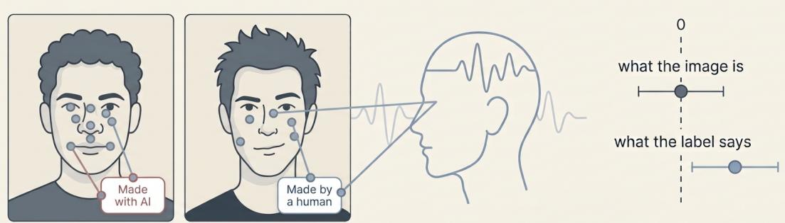  
Fig. 1. Observers cannot tell an AI-generated face from a real one, so the disclosure label atached to it becomes the only available cue to its origin. In the figure, two faces of identical apparent quality are depicted, one AI-generated and one real, and are shown with the source labels used in our study. The scanpath illustrates how participants moved between the face and the label while EEG and eye movements were recorded. Faces carrying a label drew more and shorter fixations than unlabelled ones. We found no clear diference between AI-generated and real faces on any of our measures, while the origin atributed by the label was reflected in how a face was processed. Image generated with Gemini Nanobanana 2.0 .

AI-generated faces can be dificult to distinguish from real ones, leaving viewers to rely on source labels when judging an image. Yet prior work has made it dificult to separate the efects of what an image actually is from what viewers are told it is. We validated faces as AI-generated or human in an online study (� = 169), then crossed actual source (AI, human) with label (none, Made with AI, Made by a human) in a lab study (� = 30), recording event-related potentials (ERPs) and gaze. ERP responses were equivalent for AI-generated and real faces, but varied with the label: labels drew early attention (N2), while labels that conflicted with the face’s actual source prompted re-evaluation of the face (P3). Afective processing and initial gaze orienting were unchanged, but labels altered

Authors’ Contact Information: Teodora Mitrevska, LMU Munich, Munich, German , teodora.mitrevska@ifi.lmu.de; Luise Donat, LMU Munich, Munich Germany, luise.donat@campus.lmu.de; Andreas Butz, LMU Munich, Germany, butz@ifi.lmu.de; Thomas Kosch, HU Berlin, Berlin, Germany, thomas. kosch@hu-berlin.de; Abdallah El Ali, Centrum Wiskunde & Informatica, Amsterdam, Netherlands and Utrecht University, Utrecht, Netherlands aea@cwi.nl, abdallah.el.ali@cwi.nl; Francesco Chiossi, MDx, Barcelona, Spain and LMU Munich, Munich, Germany, francesco.chiossi@mdxcro.com.

Permission to make digital or hard copies of all or part of this work for personal or classroom use is granted without fee provided that copies are not made or distributed for profit or commercial advantage and that copies bear this notice and the full citation on the first page. Copyrights for components of this work owned by others than ACM must be honored. Abstracting with credit is permitted. To copy otherwise, or republish, to post on servers or to redistribute to lists, requires prior specific permission and/or a fee. Request permissions from permissions@acm.org.   
© 2018 ACM.   
Manuscript submitted to ACM

visual exploration. We provide a validated stimulus set and evidence that attributed origin shapes face processing, with implications for disclosure design.

CCS Concepts: • Human-centered computing → Human computer interaction (HCI).

Additional Key Words and Phrases: Human-AI Interaction, AI Labels, Electroencephalography, Eye Tracking

ACM Reference Format:

Teodora Mitrevska, Luise Donat, Andreas Butz, Thomas Kosch, Abdallah El Ali, and Francesco Chiossi. 2018. EEG and Eye-Tracking Evidence That AI Disclosure Shapes Face Evaluation. In Proceedings ofMake sure to enter the correct conference title from your rights confirmation email (Conference acronym ’XX). ACM, New York, NY, USA, 29 pages. https://doi.org/XXXXXXX.XXXXXXX

## 1 Introduction

Generative models now produce synthetic faces that observers cannot reliably separate from photographs of real people, and that are sometimes judged more trustworthy than genuine ones [42, 47, 50, 72]. As synthetic portraits spread across social platforms and online news [54], the judgment of authenticity moves away from the pixels and toward the cues that accompany an image. Source labels are one such cue, and disclosure obligations for AI-generated content (cf., [20]) are now written into regulations across several jurisdictions [45]. Those rules require only that a synthetic origin be disclosed. The take no osition on how viewers rocess that information. This is relevant for how enerated conten should be disclosed. If a label only changes what viewers report [17, 23, 26], its efect is available to them: they can weigh it, disagree with it, and set it aside if they distrust the source. If a label changes how the face itself is seen, viewers cannot notice that it did, so a wrong label produces a false impression they have no way to catch. Whether labels reach face processing, or only the judgment that follows it, has not been tested.

This distinction matters for how generated content should be disclosed. If a label only changes what viewers report [17, 33], its efect is available to them: they can inspect it and set it aside if they distrust the source. If a label changes how the face itself is seen, viewers cannot notice that it did, so a wrong label produces a false impression they have no way to catch. Whether labels reach face processing, or only the judgment that follows it, has not been tested.

Two literatures approach the question from opposite sides. Work on synthetic faces changes what an image is and leaves belief about its origin to chance. Work on labeling changes belief, but does so over a single set of real photographs In previous studies, actual source and perceived source usually changed together, making it dificult to tell which one caused the observed efect [15, 19, 47, 50]. Changing only the image cannot separate the efect of the image from the efect of what viewers think it is [47, 64]. Changing only the label keeps the actual source of the face the same, so any diference between conditions could only show an efect of the label, not whether responses also difer between AI-generated and human faces. It also cannot test what happens when the label says that a face has a diferent origin from its actual source [15, 19, 33]. Most of this evidence also rests on self-re ort, which records the outcome of an evaluation and not the processing that produced it, and which is open to demand characteristics when the manipulation is a visible label [25]. The few neurophysiological studies bring belief closer to perception, showing that believing a face is fake dampens afective responses [19] and narrows gaze [9].

We conducted two studies that separate a face’s actual source from the source attributed to it. In Study 1, an online sample $( N = 1 6 9 )$ rated difusion-generated faces for perceived AI-likeness, and we retained only images classified with high agreement. In Study $2 \left( N = 3 0 \right)$ , we crossed actual source (AI, Human) with label (No Label, Made with AI, Made by a human) within participants, recording EEG and gaze while each face was presented. Crossing the two factors produces congruent and incongruent pairings, so a response can be attributed to the label, the face, or the conflict Manuscript submitted to ACM

between them. From the EEG, we analyzed three ERP components associated with diferent stages of face evaluation: the N2, a fronto-central marker of earl mismatch detection [11, 24, 37]; the P3, a centro- arietal index of stimulus re-evaluation [10, 35, 78]; and the Late Positive Potential (LPP), a sustained signal of afective engagement [34, 80].

AI-generated and human faces elicited the same N2, P3, and LPP amplitudes. Labeled faces elicited a larger N2 than unlabeled faces, regardless of whether the label matched the actual source. Faces whose label stated the wrong origin elicited a larger P3 than unlabeled faces, consistent with that component’s role in stimulus re-evaluation. The LPP did not difer across any condition. Labels did not afect the latency of the first fixation, but labeled faces received more fixations, and each fixation was shorter, than unlabeled faces. The increase in fixation count was lar er for AI- enerated faces, and fixations on AI-generated faces were shorter than on human faces regardless of label. Actual source therefore afected how faces were visually explored even though it did not afect any ERP component.

Taken together, these findings contribute in four ways. First, we show that realistic AI-generated faces did not produce clear diferences from human faces in ERP responses or initial gaze orienting. Under these conditions, the face itself provided no reliable cue to its actual source, making the label an important source of information and leaving viewers with little basis for rejecting an inaccurate one. Second, we show that labels afect diferent stages of processing: their presence was reflected in the N2, while a mismatch between the label and actual source was reflected in the P3. Third, we also show that labels change visual exploration, producing more and shorter fixations without increasing total viewing time, which makes label placement a question of how attention is distributed. Finally, we open-source a validated stimulus set and design implications for disclosure labels, covering the accuracy required when viewers cannot check a label against the content, the case for labeling human-made content alongside AI content, and the efect of placement on how attention is divided between the disclosure and the image.

## 2 Related Work

Here, we review how observers perceive synthetic faces relative to real ones, covering realism and the uncanny valley, the finding that AI faces are frequently misidentified as human and can be judged more trustworthy than genuine ones, and the electrophysiological and evaluative signatures of believing a face is artificial.

## 2.1 Perception of AI-Generated Faces

Observers can no longer separate AI-generated portraits from photographs. In a large classification study, accuracy sat at chance, and a training session on rendering artifacts helped very little [50]. The same study found that generated faces were rated as more trustworthy than real ones [50], which is the opposite of what the uncanny valley predicts for faces this close to human [48], so a viewer’s sense of unease is not a usable cue either. Faces of this kind are already in circulation. Yang and colleagues document a population of social media accounts that use them as profile pictures for scams and coordinated messaging [77].

Within a single generated set, though, some faces are much easier to place than others. Miller et al. [47] report that White AI faces were judged human more often than actual human faces, an efect they call AI hyperrealism, and that the participants who made the most errors were also the most confident. Nightingale and Farid [50] see a similar racial diference in accuracy. The imbalance comes from the training data, so perceived race and perceived humanness are hard to disentangle, and Miller and colleagues advise checking that AI stimuli look equally natural across groups before running an experiment with them. The implication for stimulus design is that "AI-generated" is a fact about how an image was made, and it tells us very little about how any particular image will be seen.

Manuscript submitted to ACM

A diferent line of work keeps the face fixed and changes what the viewer is told about it. Eiserbeck et al. [19] showed real photographs described either as authentic or as AI-generated. When a smile was believed to be fake, the usual emotional response to it largely disappeared from early visual and reflexive afective components, while later evaluative activity went up, which the authors read as more efortful appraisal. Angry faces were unafected. A belief about where an image came from can therefore reach perception, and it can do so early. Mustafa et al. [49] find something comparable for virtual characters, where lower perceived humanness appears in components that index violated expectations about appearance and motion. Cartella et al. [9] report that observers explore manipulated images less widely than untouched ones, though they used natural scenes and not faces.

In both literatures the origin of a face and the origin attributed to it move together. Studies of the first kind change what the image is while leaving the viewer’s belief to chance. Studies of the second change belief, but they do it over one set of real faces, so an efect could just as easily come from appearance. Telling the two apart needs images whose perceived origin is already known and agreed on. Study 1 produces such a set, and Study 2 crosses a label against it with appearance held constant.

## 2.2 Efects of Content Labeling on User Judgments

Source and provenance labels are the main platform-level response to synthetic media. Credibility warnings on disputed content lower perceived accuracy and reduce sharing intent, though the efects are modest and depend on how the warnin is worded and whether its source is trusted [13, 65]. Labelin re imes also s ill over: when onl some items carry a warning, the unlabeled ones gain credibility, an implied truth efect that survives explaining the labeling policy to participants [55]. A label is therefore read together with the content around it. For AI disclosure specifically, Gamage et al. [25] find that the wording, placement, and visual form of a label change what users take it to mean.

A second line of work attaches a source to material of known origin. Jakesch et al. [33] presented identical human-written Airbnb profiles as AI-written or human-written, and found the AI attribution lowered trust only when partici pants believed they were viewing a mixed set of both kinds, an asymmetry they call the Replicant Efect. Disclosure of machine authorship also depresses evaluations of visual art and poetry, even though participants identify the true producer at near chance [38, 60]. The MAIN model explains this through cue-driven heuristics, where an interface cue signaling machine origin activates a stored schema about machines that is applied before any scrutiny of the artifact itself [69, 70]. A source label does not supply evidence about the artifact; it supplies a category.

Two features of this work shape our design. First, the outcome is almost always a self-report collected after the stimulus has been processed, which cannot separate a label that changes what participants see from one that changes what they are willing to say. Second, actual source is held constant across conditions, usually because every item is human-made, so these designs estimate a label efect but cannot estimate an efect of actual source, and cannot produce a trial in which the label contradicts the item. Crossing the two factors is what defines congruence, and measuring while the stimulus is on screen is what se arates erce tion from re ort. Whether either oint extends from text and artworks to faces is untested, and faces recruit dedicated perceptual machinery that the label must compete with.

## 2.3 Electrophysiological and Eye Tracking Correlates of Face Processing

The study of face perception has long relied on measures that do not depend on what a viewer chooses to report. Electroencephalography (EEG) records voltage changes at the scalp generated by populations of neurons. When that signal is averaged across many trials time-locked to the same event, it yields event-related potentials (ERPs): a sequence of positive and negative deflections whose timing and scalp distribution have been mapped onto successive stages of Manuscript submitted to ACM

processing. Because a deflection at 170 ms and one at 600 ms correspond to diferent operations, the choice of which component to measure determines what any efect can be said to demonstrate. Eye tracking provides a complementary record, capturing where the eyes move and how long they remain, and thus how attention is distributed across a display while it is being viewed.

Faces have a dedicated early signature. The N170 is a negative deflection around 170 ms that human faces evoke and other object categories do not, and it is taken to mark the point at which an image is encoded as a face [3]. It arises in occipitotemporal cortex, so it appears at lateral posterior electrodes and cannot be recovered from central or parietal sites. The N170 also answers a question our design does not ask. Both AI and human portraits are faces, and Study 1 has already fixed how they look, so what a source label plausibly afects is the evaluation of a face rather than its detection. We therefore measure three later components.

The first, the N2, is a ne ativit between 200 and 350 ms over frontal and central sites. Folstein and Van Petten [24] separate a mismatch-related part of this component from a control-related one, both of which grow when a stimulus departs from what the viewer expected. A label that contradicts the face it sits on creates that kind of departure. The P3 comes next, a positive deflection over parietal sites that appears when a stimulus prompts the viewer to revise their current reading of the situation [58], which is what re-evaluating a face after registering a conflicting label would involve. The LPP continues that positivity for several hundred milliseconds and scales with how much the stimulus matters to the viewer [30]. Hajcak and Foti argue that the LPP and the P3 may reflect one underlying response to stimulus significance, so we read them as two windows on a single evaluative process. Earlier work on believed image origin reports efects in this late range, with enhanced late positivity for smiles that participants took to be synthetic [19].

Eye movements matter here for two reasons. The number and duration of fixations track how a viewer spreads and sustains processing across an image, and the latency of the first fixation captures initial orienting before any deliberate strategy takes hold [61]. Beyond that, a label is itself a visible object occupying part of the display, so it can pull the eyes away from the face, and a diference in ERP amplitude between labeled and unlabeled trials could in principle follow from where participants looked rather than from what they understood the label to mean. Recording both lets us separate the two. The one comparable finding to date used manipulated scenes rather than faces, where viewers explored altered images less widely than untouched ones [9], leaving open how gaze behaves when a disclosure label is attached to a face.

## 3 Study 1: AI-Images Dataset Validation

The aim of Study 1 was to create a perceptually validated dataset of AI-generated facial images that human observers consistently recognize as synthetic. Although modern difusion models such as Stable Difusion can produce highly realistic portraits, the perceptual boundary between real and generated faces remains variable across outputs. For the purposes of Study 2, see Section 4, where we compare cognitive and multimodal responses to AI- and human-labeled images—it was essential to ensure that the stimuli labeled as “AI-generated” were not only technically artificial but also perceived as such by users.

To this end, we generated a diverse set of synthetic faces using Stable Difusion and asked participants to classify whether each face appeared AI-generated or human. This rating task allowed us to identify a subset of faces that are reliably judged as artificial, ensuring perceptual consistency across experimental conditions in the main study.

Manuscript submitted to ACM

  
Fig. 2. Example images of AI-generated faces used in Study 1.

## 3.1 Procedure

The participants were first presented with an informed consent form where they were familiarized with purpose of this research, procedure, potential risks and rights associated with their data. After agreeing with the given terms, a demographics questionnaire was presented, collecting information about their age, gender and country of residence. As next, the participants were given a brief description of the task and a comprehension check. They proceeded with the task, where they were presented with an image of a human face. For each image, they had to express their judgment of the following statement "This image was created with the help of generative AI". Their judgment was collected via moving slider on a continuous scale, holding two end values : Strongly Disagree (left end value) and Strongly agree (right end value). Additionally they expressed how confident they are in their judgment by using an exact same scale, following Bray et al. [6]’s approach. In the back-end the scores translated in numeric values where using the left end value ("Strongly disagree that the image is created with the help ofgenerative AI") translates into 0 = definitely human, and using the right end value ("Strongly agree that the image is created with the help ofgenerative AI") translates into 100 = definitely AI.

## 3.2 Stimuli Generation

We chose the initial pool of 320 facial images from the standardized Stable Difusion Face Dataset 1, generated via Stable Difusion 1.5, 2.1, and SDXL 1.0. The images were generated using simple prompts such as "photo of a woman" and underwent a quality control check as well as additional editing to fix any skewed facial features by the author of the database. All images have a resolution of 512 × 512 pixels and are subsequently inspected for artifacts (e.g., facial asymmetries, anatomical distortions). This curated image set served as the input for our validation task in Study 1. An example subset is depicted in Figure 2.

## 3.3 Sample Size Determination

Sample size planning was guided by the goal of achieving adequate precision for continuous 0–100 AI-likeness ratings [18, 32]. Each image was to be classified as “reliably AI-looking” when the lower bound of the 95% confidence interval around its mean rating exceeded 60 points [76]. To ensure that confidence intervals were suficiently narrow not to cross this threshold, we targeted an average margin of error of approximately � = 6 points on the rating scale, consistent with practical constraints on participant load.

Assuming a standard deviation of � = 20 points, consistent with prior perceptual rating studies [18], the required number of ratings per image was calculated as:

$$
n = \left( \frac { t _ { \alpha / 2 } \times \sigma } { E } \right) ^ { 2 } = \left( \frac { 1 . 9 6 \times 2 0 } { 6 } \right) ^ { 2 } \approx 4 0 .\tag{1}
$$

Thus, approximately 40 ratings per image were required to achieve the desired level of precision. Given 180 total images and 40 ratings per participant, we estimated that recruiting around 175 participants would provide complete stimulus coverage while maintaining independent observations across raters. The final dataset included 169 participants after quality control, yielding 6,760 valid trials and meeting the planned level of precision for reliable image classification. Empirically, the average half-width of the 95% confidence interval across images was 4.8 rating points, confirming that the achieved precision was within the targeted margin of error.

## 3.4 Participants

We recruited 178 participants (� = 178) through Prolific Academic. The sample included 97 men (54.5%), 77 women (43.3%), 3 non-binary participants (1.7%), and 1 participant who self-described their gender. Participants’ ages ranged from 20 to 78 years (� = 37.49, �� = 12.45). The age distribution was broadly representative of an adult population, with 18–24 years (14.7%), 25–34 years (40.1%), 35–44 years (18.6%), 45–54 years (16.5%), 55–64 years (7.1%), and 65+ years (2.9%). Most participants reported English (EN) as their survey language (99.7%), and the most represented countries were Australia (10.9%), Canada (8.2%), the United States (7.6%), South Africa (5.3%), and the United Kingdom (5.0%).

After applying quality-control criteria (see Section 3.5), where we we excluded nine speeders (median per-trial time < 4.45 s)—169 participants (� = 169) and 6,760 valid trials were retained for analysis.

## 3.5 Data Processing

All preprocessing and analyses were conducted in Python. Trials with missing or non-numeric values in Rating or Time were discarded. To ensure data quality, we implemented a multi-step filtering procedure combining trial-level and participant-level checks. At the trial level, univariate outliers were identified and removed for Time, Confidence, and Rating using an interquartile-range criterion (1.5 × ��� beyond the 25th or 75th percentile). At the participant level, we excluded individuals who showed atypically short completion times (“speeders,” defined as a median per-trial time below the 5th percentile of the group distribution, corresponding to < 4.45 s), participants with very low variability in responses (“flatliners,” defined as having both rating SD and IQR below 5), and participants contributing fewer than 20 valid trials. This filtering procedure excluded nine participants (all classified as speeders), resulting in 169 retained participants out of 178 total (95%) and 6,760 valid trials out of 7,120 total (95%).

## 3.6 Analysis

After collecting the ratings described in Section 3.1, we computed the mean rating for each image, standard deviation, and 95% confidence interval (CI) across all valid responses. Images were classified as AI-looking when the lower bound of the 95% CI exceeded 60 points, ensuring that even the most conservative estimate of perceived “AI-likeness” remained above the neutral midpoint.

To further characterize perceptual agreement, we calculated (a) the proportion of raters per image whose individual rating exceeded 70 on the 0–100 scale, (b) standard deviations across images as a measure of within-image rating variability, and (c) internal consistency and split-half reliability across participants. Internal consistency was estimated using Cronbach’s �, and reliability between independent rater halves was assessed with a split-half correlation $( r _ { \mathrm { s p l i t } } )$ and its Spearman–Brown–corrected value $( r _ { \mathrm { S B } } )$

## 3.7 Results

Applying the CI-based classification criterion (Figure 3), 82 of the 320 synthetic faces (25.6%) were identified as reliably AI-looking, whereas the remaining 238 were perceived as human-like or ambiguous and excluded from the validated stimulus pool used in Study 2. As shown in Figure 4a, the distribution of mean ratings exhibits a clear separation between reliably AI-looking and discarded images. Across AI-looking faces, the average rating was $M = 7 8 . 4 , S D = 6 . 5$ and the mean width of the 95% CI was 9.2 points (Figure 4b), indicating strong perceptual convergence. Images below the 60-point threshold had lower mean ratings $( M = 4 8 . 1 , S D = 1 0 . 3 )$ and wider confidence intervals (mean width = 14.5 points).

On average, 84% $( S D = 7 . 2 \% )$ of participants rated the AI-looking images above 70, demonstrating strong consensus that these faces appeared artificial. For non–AI-looking images, the corresponding proportion was 41% $( S D = 1 2 . 5 \% )$ Internal consistency across raters was high (Cronbach’s $\alpha = . 9 0 )$ , and a split-half reliability analysis (randomly dividing raters into two groups; $r _ { \mathrm { s p l i t } } = . 7 0 $ , Spearman–Brown corrected $r _ { \mathrm { S B } } = . 8 3 )$ confirmed stable perceptual judgments across independent subsets of participants.

The overall distribution of image means and confidence intervals is illustrated in Figure 5, showing a distinct cluster of faces with consistently high AI-likeness ratings above the 60-point boundary. Together, these results indicate that the final set of 82 AI-generated faces were consistently perceived as artificial with high confidence and cross-rater agreement, providing a validated and reliable stimulus base for the subsequent experimental study.

## 3.8 Discussion and Conclusion

Study 1 validated a perceptually consistent set of AI-generated facial images that participants reliably identified as synthetic. The results demonstrate that perceptual judgments of “AI-likeness” are stable across raters and largely independent of individual noise, as indicated by high internal consistency and narrow confidence intervals. This validation provides an empirically grounded method for separating convincingly artificial from ambiguous faces—an important prerequisite for investigating cognitive and afective reactions to AI-generated imagery.

By isolating 82 faces whose lower 95% confidence bound exceeded 60 on the AI-likeness scale, we ensured that the subsequent experiment would manipulate perceived image source without confounding efects of perceptual uncertainty The criterion was deliberately conservative, retaining roughly a quarter of the initial pool, which reflects how variable the perceptual status of difusion-generated portraits remains across outputs. These validated stimuli form the basis for Study 2, where we examine how explicit source labeling (AI- vs. human-generated) influences participants’ cognitive processing and physiological responses.

## 4 Study 2: Electrophysiological Responses to Labeled AI and Human Faces

Our study investigates how users perceive and evaluate faces that are either AI-generated or real, and how this perception is influenced by the presence and type of label. We presented participants with carefully controlled facial images and captured their behavioral responses and ERP signals to assess attentional and afective processing.

Based on prior literature on visual cognition, trust, and electrophysiological responses to facial stimuli, we investigate the following research questions:

Manuscript submitted to ACM

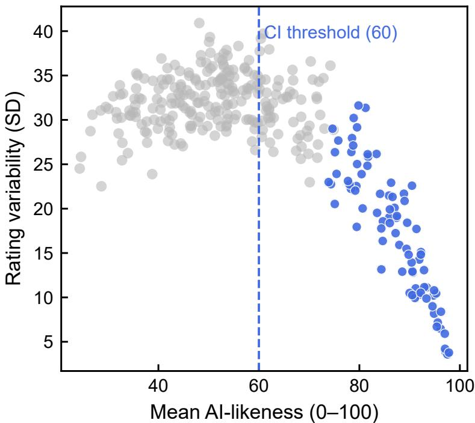

Fig. 3. Perceived AI-likeness vs. rating variability. Relationship between mean AI-likeness rating and rating variability (SD) across the 320 AI-generated faces. Blue points mark the 82 images whose lower 95% $\mathrm { C l } \geq 6 0 ,$ , satisfying the inclusion criterion for the validated set. The dashed line indicates the CI-based classification boundar .  
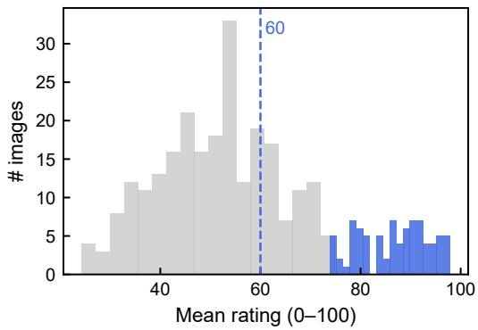  
(a) Distribution of mean ratings across all 320 AI-generated faces. Blue bars correspond to the 82 images retained as reliably AI-lookin (lower 95% $\mathrm { C l } \geq 6 0 )$ ; gray bars represent discarded or ambiguous items. The dashed line marks the perceptual threshold at 60 oints.

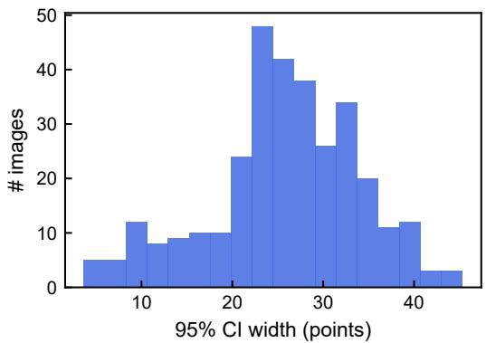  
(b) Distribution of 95% confidence-interval widths across the 320 AI-generated faces. The narrow spread (median ≈ 9 points) indicates consistent and precise judgments of AI-likeness.  
Fig. 4. Summary of perceptual consistency metrics. (a) shows how mean ratings distribute around the inclusion threshold; (b) illustrates the achieved precision of participants’ judgments via CI widths.

Perceived AI-likeness with 95% confidence intervals  
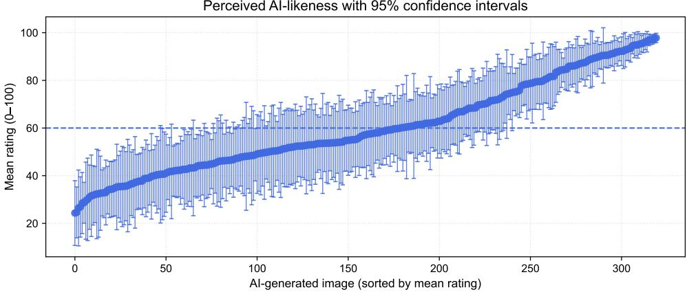  
Fig. 5. Sorted mean ratings with 95% confidence intervals. Mean AI-likeness ratings for all 320 AI-generated faces, ordered by mean value. Error bars re resent the 95% CI er ima e, and the dashed line at 60 marks the classification boundar used to identif the 82 reliabl AI-lookin stimuli.

RQ1: Does the actual source of a face (AI vs. Human) modulate its electrophysiological processing across early attentional (N2), evaluative (P3), and sustained afective (LPP) stages?

RQ2: Does the congruence between a face’s source and its label—rather than the source itself—drive ERP responses, such that label–face conflict is reflected in components indexing conflict detection (N2) and stimulus re-evaluation (P3)?

RQ3: Do disclosure labels alter how a face is visually explored (the number and duration of fixations) and does this depend on the face’s actual source?

RQ4: Does source or labeling afect the earliest allocation of attention, as indexed by the latency of the first fixation?

## 4.1 Study Design

We employed a 2 × 3 within-participant experimental design, with the independent variables Source (two levels: AI-generated, Human) and Label (three levels: No Label, Made with AI, Made by a human). Source referred to the actual origin of the facial image, whereas Label indicated the presented information label (or absence thereof), delivered using minimalistic white rectangle holding the respective label.

To control for potential order and carryover efects, we implemented a balanced Latin square design across participants [74]. This procedure ensured that each of the six experimental conditions appeared equally often in each serial position and preceded and followed every other condition an equal number of times across the sample.

## 4.2 Procedure

Upon arrival, participants were welcomed into the lab, informed about the study protocol, and provided written informed consent. They then completed a short questionnaire including demographic information (age, gender, education level, and employment status) and an AI literacy assessment [8]. To ensure participants understood the task, we presented a brief explanation along with a few example trials on paper before beginning the setup.

Participants were fitted with a 64-channel EEG cap and seated in a comfortable, ergonomically adjustable chair at a fixed distance of 60 cm from the screen. They placed their chin and forehead on a headrest to minimize movement Manuscript submitted to ACM

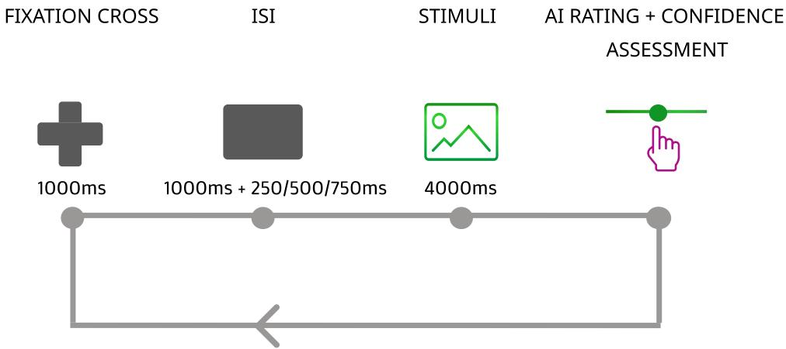  
Fig. 6. Trial structure. Each trial began with a fixation cross (1000 ms), followed by a blank inter-stimulus interval (1000 ms plus a random jiter of 250, 500, or 750 ms) to reduce temporal expectancy and ERP overlap. A face was then shown for 4000 ms, either AI-generated or human and carrying a Made with AI, Made by a human, or no label, while EEG and eye movements were recorded. After the face ofset, participants rated on a continuous scale whether the image was created with the help of generative AI and reported their confidence. Trials followed one another in fully randomized order.

and ensure consistent viewing distance. An EyeLink 1000 Plus eye tracker was calibrated using a standard 9-point calibration procedure.

The main task consisted of 240 trials, organized in a 2 × 3 within-subjects design manipulating the actual source of each face (AI-generated vs. Human) and the associated label (No Label, Made with AI, Made by a human)

We structured each trial in line with established ERP protocols for face evaluation studies, particularly following the approach used by Conrad et al. [15]. Each trial began with a black fixation cross presented for 1000 ms to stabilize gaze and establish a baseline. This was followed by a blank screen, i.e., Inter-Stimulus Interval (ISI), lasting 1000 ms plus a random jitter of 250, 500, or 750 ms to reduce temporal expectancy and overlap of ERP components. The stimulus image—either an AI-generated or real human face, with or without an accompanying label—was then shown at the center of the screen for 4000 ms. Condition order followed the balanced Latin square described above, with the particular face assigned to each condition slot randomized within participant. Identically as in Section 3.1, after the image ofset the participants used a continuous scale to had to express their judgment on whether "This image was created with the help of generative AI", ranging values from : Strongly Disagree (left end value) and Strongly agree (right end value) Additionally, they expressed how confident they are in their judgment, using an exact same scale. Trial timing and structure followed the sequence outlined in Figure 6. Participants could pause and take a break between each block to minimize fatigue and physical strain. The entire session, including setup, calibration, and task completion, lasted approximately 45 minutes.

## 4.3 Stimuli

The experimental stimuli consisted of 240 images, with 120 images in each of the two evenly distributed categories: AI-generated faces and real human faces. Each image was paired with one of three label conditions, i.e., "No label", “Made with AI” or “Made by a human”, yielding a fully crossed 2×3 design to systematically investigate how both the actual source and the assigned label influence perception. We designed the image stimuli to control for extraneous Manuscript submitted to ACM factors known to influence ERP responses, such as brightness, color, and the presence of text, as established in prior EEG and ERP research [2, 21, 52]. The images of human faces were sourced from the Ma et al. [46]’s Chicago Face Database, which ofers standardized stimuli with high image quality and ensures demographic diversity, encompassing representatives of multiple ethnic and racial groups. To convey the image source label (e.g., Made with AI or Made by a human), we used minimalist white rectangular box with the respective label and positioned it in the bottom right corner. This design decision follows Gamage et al. [25]’s design guidelines (depicted in Figure 8), suggesting that this label location provides a balance between visibility and minimal interference with image interpretation, while efectively communicating AI involvement in the created content.

  
Fig. 7. Example images used in Study 2. In the first row, all images are AI-generated faces, representing all three label possibilities from left to right: Made with AI, Made by a human, No label. In the second row, all images are real humans, also representing the above mentioned labeling possibilities.

## 4.4 Apparatus

The study was implemented in PsychoPy (v2025.2.0). Stimuli were presented on a VIEWPixx LCD monitor (23.6 in, 1920 × 1080, 120 Hz), with an active display area of 52.2 × 29.4 cm and a pixel pitch of 0.272 mm. Participants viewed the screen from a fixed distance of 60 cm on a chin-and-forehead rest. Face images were presented centrally at their native resolution of 512 × 512 pixels, corresponding to 13.9 × 13.9 cm and subtending 13.2◦ of visual angle in both dimensions. The source label occupied the bottom-right corner of the image, placing its centre at approximately 7◦ of radial eccentricity from fixation, outside the parafoveal region, so that resolving it required a saccade away from the centre of the face. Synchronisation of EEG, eye tracking, and experimental events was achieved with the Lab Streaming Layer (LSL) framework [39].

Manuscript submitted to ACM

  
Fig. 8. An example of how the label was positioned in the botom right corner, following Gamage et al. [25]’s work.

## 4.5 Eye Tracking Recording & Preprocessing

Binocular eye movements were recorded with a video-based EyeLink 1000 Plus (SR Research, Ottawa, Canada) at 1000 Hz, with the built-in heuristic filter. The head was stabilized on a chin-and-forehead rest at 60 cm. We calibrated with a 9-point procedure and validated immediately after, repeating until mean error was below 0.5◦ and maximum error below 1.0◦. Data were recorded and presented with EyeLink software (2.6.11 version), PsychoPy (v2025.2.0 version), and SR Research firmware (5.50 version). Fixations were parsed online by the EyeLink saccade detector (velocity ≥ 30◦/s or acceleration $\geq 8 0 0 0 ^ { \circ } / s ^ { 2 } ) . ^ { 3 }$

Because recording was binocular, a single dominant eye was selected per participant for further fixation and saccade analysis, defined as whichever eye yielded the greater number of valid fixations across the recording session per participant. For each trial, fixation and saccade events were retained if their onset fell within the stimulus presentation window (4000ms). First-fixation latency was defined as the onset of the first retained fixation relative to image onset. The region of interest (ROI) was defined as the full image region based on image origin : the images from the Chicago Face Database spanned 1067 x 750 px, and the Stable Difusion Face Dataset spanned 750 x 750 px, centered within a 1920 x 1080 display. For each fixation, we computed the distance to the AOI and converted it to degrees of visual angle. We introduced a tolerance of $0 . 5 ^ { \circ }$ visual angle, to include fixations that sat on the frame edge on the presented image.

## 4.6 EEG Recording

EEG data were collected using a 64-channel water-based R-Net cap (BrainProducts GmbH, Germany) with Ag-AgCl pintype passive electrodes arranged according to the international 10–20 system. Electrodes were placed at the following locations: Fp1, Fz, F3, F7, F9, FC5, FC1, C3, T7, CP5, CP1, Pz, P3, P7, P9, O1, Oz, O2, P10, P8, P4, CP2, CP6, T8, C4, Cz, FC2, FC6, F10, F8, F4, Fp2, AF7, AF3, AFz, F1, F5, FT7, FC3, C1, C5, TP7, CP3, P1, P5, PO7, PO3, Iz, POz, PO4, PO8, P6, P2, CPz, CP4, TP8, C6, C2, FC4, FT8, F6, F2, AF4, and AF8. Signals were acquired using two BrainProducts LiveAmp amplifiers at a sampling rate of 500 Hz. Electrode impedances were maintained below 50 kΩ throughout the recording session. FCz served as the online reference electrode, and AFz was used as the ground.

## 4.7 ERP Preprocessing & Analysis

EEG preprocessing was performed using MNE-Python and followed established pipelines for ERP research. First, we automatically identified and interpolated bad or outlier channels using the Random Sample Consensus (RANSAC) method [4], employing spherical spline interpolation based on Perrin’s algorithm [56]. A notch filter at 50 Hz was applied to remove line noise, and the signal was band-pass filtered between 1–15 Hz to isolate the frequency range relevant for cognitive ERP components. Data were then re-referenced to the common average reference (CAR).

Artifact correction was performed using Independent Component Analysis (ICA) with the extended Infomax algorithm [43]. Components corresponding to eye blinks, eye movements, and muscle noise were automatically identified and removed using the “ICLabel” plugin integrated with MNE [44].

The continuous EEG signal was segmented into epochs ranging from 200 ms before to 1000 ms after stimulus onset. A 200 ms pre-stimulus baseline was applied for baseline correction. We focused on three ERP components of interest: N2, P3 and the LPP.

For the N2, we quantified mean amplitude in the 200–350ms time window, comprising the electrodes Fz, Cz, FC1, FC2 [12, 31, 53]. For P3, mean amplitude was quantified in the 300–500 ms window for the P3 and the 400–800 ms window for the LPP [14, 58], time-locked to image onset. Based on prior literature [29, 67], we selected a centro-parietal region of interest (ROI) comprising electrodes $\mathrm { P z } , \mathrm { C P z } , \mathrm { C z } , \mathrm { C P 1 } , \mathrm { C P 2 } .$ , P3 and P4 for P3 and $\mathrm { P z } , \mathrm { C P z } , \mathrm { C z } , \mathrm { C P 1 } , \mathrm { C P 2 } , \mathrm { P 1 }$ and P2 for LPP efects are typically observed in response to emotional and source-related facial information. These components were extracted for statistical comparison across experimental conditions (Source × Label) in our statistical modeling, as presented in Section 5.

## 4.8 Sample Size Justification & Participants

A priori power analysis was conducted using G\*Power 3.1 [22] to determine the required sample size for a linear-mixed model, repeated-measures with six within-subject conditions. The analysis assumed a medium efect size $( f = . 2 5 )$ based on HCI guidelines [79], a significance level of $\alpha = . 0 5$ , desired power of $1 - \beta = . 9 5 ,$ , a correlation among repeated measures of $r = . 5 ,$ , and a nonsphericity correction of $\epsilon = 1 \AA$ . The results indicated that a total sample size of $N = 3 0$ participants would be suficient to detect an efect with this design. The resulting actual power was $> . 9 5 .$

We recruited participants through institutional mailing lists and convenience sampling. The sample had a mean age of 26 years $( S D = 5 . 5 7 )$ and included 17 women, 13 men, none identifying as non-binary or gender-diverse. To assess familiarity and confidence with AI-related concepts, all participants completed the Meta AI Literacy Questionnaire [8]. The overall AI literacy score was moderate $( M = 5 . 8 8 , S D = 1 . 3 3 )$ , with subscale means and standard deviations as follows: AI Literacy $( M = 6 . 2 0 , S D = 1 . 6 3 )$ , Create AI $( M = 4 . 1 9 , S D = 2 . 2 0 )$ , AI Self-Eficacy $( M = 5 . 2 7 , S D = S D = 1 . 6 6 )$ and AI Self-Competency $( M = 6 . 4 1 , S D = S D = 1 . 1 6 )$ . The study was approved by the local ethics committee, qualifying as fast-track approval since the participants were not subjected to any risk (e.g., deception, stress beyond normal levels)

## 5 Results

All analyses were performed at the trial level, so that within-participant variability was modeled rather than averaged away. Electrophysiological and eye-tracking data were analyzed within a single Bayesian hierarchical framework implemented in brms [7], which estimates group- and individual-level parameters jointly and returns a full posterio Manuscript submitted to ACM

for every efect rather than a decision against a threshold [36, 63, 73]. This suits the present design for two reasons. Our central claim concerns an absence of diference between AI- and human-sourced faces, and a posterior concentrated near zero states that directly, whereas a non-significant test does not distinguish absence of an efect from absence of evidence [16]. The hierarchical structure also lets participants and stimuli be treated as sampled rather than fixed, so estimates are not tied to the particular faces and people we happened to observe [63].

All models shared the same random-efects structure, (1 + Source \* Label | $\mathsf { P I d } ) \ + \ \mathsf { \Gamma } ( 1 \ \mathsf { \Gamma } |$ Image), giving participant-specific intercepts and slopes for the experimental factors together with by-image intercepts. Likelihoods were ada ted to each outcome. Sin le-trial ERP am litudes, avera ed across the com onent ROI, were modeled with a Student-� likelihood to accommodate the heavy tails typical of electrophysiological data [1]. Fixation counts were modeled with a negative binomial likelihood; fixation durations and dwell time were log-transformed and modeled with a Student-� likelihood; first-fixation latenc was modeled with a Gaussian likelihood.

The two modalities difer in how the label factor enters. The ERP models use the three-level LabelCond, whose crossing with Source defines congruence: a label either matches the face (AI face, “Made with AI”; human face, “Made by a human”) or contradicts it. We report this interaction as congruence contrasts, congruent and incongruent, each relative to unlabelled faces. The eye-tracking models code Label as presence versus absence, because a label is a visible object added to the display and is expected to afect exploration through its presence rather than its wording; there the interaction stays on the Source × Label scale. Source is coded with AI-generated faces as the reference level in every model, and the two modalities use opposite reference levels for the label factor: the ERP contrasts are relative to unlabelled faces, whereas the eye-tracking contrasts are relative to labelled trials. We report all efects in the text in their substantive direction. Where an interaction is credible, the corresponding main efect is conditional on the reference level of the other factor rather than averaged across it.

## 5.1 ERPs

5.1.1 N2. Actual image source did not modulate the N2: AI- and human-sourced faces elicited equivalent frontocentral amplitudes $( M d n = 0 . 0 1 \mu \mathrm { V } , 9 5 \% \mathrm { C r I } [ - 0 . 0 8 , 0 . 1 1 ] , p _ { d } = 6 1 . 5 \% )$ . What moved the early response was the label rather than the face: relative to unlabeled faces, labeled faces tended to elicit a larger N2, most clearly when label and face were congruent $( M d n = 0 . 1 9 \mu \mathrm { V } , 9 5 \% \mathrm { C r I } [ - 0 . 0 3 , 0 . 4 0 ] , \hat { p } _ { d } = 9 5 . 7 \% )$ . The N2 thus appears sensitive to the presence of a source label rather than to label–face conflict per se.

5.1.2 P3. The P3 likewise showed no diference by actual source $( M d n = - 0 . 0 4 \mu \mathrm { V } ,$ 95%CrI $[ - 0 . 1 2 , 0 . 0 4 ] , p _ { d } = 8 1 . 7 \%$ Instead, it was here that label–face conflict registered: incongruent trials—an AI face tagged “Human,” or the reverse— produced a larger P3 than unlabelled faces $( M d n = 0 . 1 7 \mu \mathrm { V } ,$ , 95% CrI $[ - 0 . 0 2 , 0 . 3 6 ] , p _ { d } = 9 5 . 6 \%$ , consistent with the P3’s role in stimulus re-evaluation. The mismatch between what the face is and what the label claims, not the face’s true origin, drove this later response.

5.1.3 LPP. The afective window was unafected by both factors. Neither actual source $( M d n = - 0 . 0 1 \mu \mathrm { V } ,$ 95% CrI $[ - 0 . 0 9 , 0 . 0 7 ] , p _ { d } = 6 0 . 0 \%$ nor congruence $( \mathrm { a l l ~ } | M d n | \le 0 . 0 8 ~ \mu \mathrm { V } )$ modulated the LPP,indicating that labelling efects did not extend into sustained afective processing.

Manuscript submitted to ACM

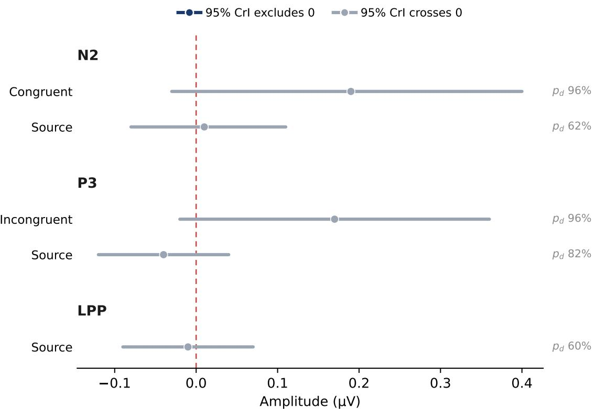  
Fig. 9. Posterior efects on the three ERP components. Each row is a contrast: the marginal diference between AI- and human-sourced faces (Source), and the congruent and incongruent labelling conditions, each relative to unlabelled faces. Points are posterior medians and bars 95% credible intervals; a row is drawn dark when its interval excludes zero and grey when it crosses zero, with the probability of direction $( p _ { d } )$ at right. Source sits close to zero in every component, while the label-related movement appears in the congruence contrasts: the N2 grows with a label present and the P3 with label–face conflict, whereas the LPP is unmoved by either factor.

## 6 Eye-Tracking

## 6.1 Number of Fixations

Labeled faces were fixated more often than unlabeled ones $( M d n = - . 0 4 3 , 9 5 \% \thinspace C \mathrm { r I } \thinspace [ - . 0 6 4 , - . 0 2 4 ] , \thinspace p _ { d } = 1 0 0 \% )$ . These extra fixations were shorter (see mean fixation duration below), so participants looked at the face more times without spending longer on it overall. The increase was larger for AI-generated faces than for human faces $( M d n = . 0 4 1 , 9 5 \%$ CrI $[ . 0 1 3 , . 0 7 0 ] , p _ { d } = 9 9 . 8 \%$ . Actual source on its own had a smaller and less certain efect. AI faces were fixated slightly more often than human faces, but the credible interval includes zero $( M d n = - . 0 1 6 , 9 5 \% \mathrm { C r I } [ - . 0 3 2 , 0 . 0 0 1 ] , p _ { d } = 9 7 . 1 \% )$

## 6.2 Mean Fixation Duration

Mean fixation duration carried credible efects of both source $( M d n = . 0 2 2 , 9 5 \% \thinspace \mathrm { C r I } \ [ . 0 1 0 , . 0 3 5 ] , \ p _ { d } = 1 0 0 \% )$ and label $( M d n = . 0 5 3 , 9 5 \% \mathrm { C r I } [ . 0 3 8 , . 0 6 8 ] , p _ { d } = 1 0 0 \% )$ . Fixations were shorter on AI faces than on human faces, and shorter again when a label was present. The Source×Label interaction was not credible $( M d n = - . 0 1 3 , 9 5 \% \mathrm { C r I } [ - . 0 3 5 , . 0 0 7 ]$ $p _ { d } = 8 9 . 9 \% )$ , so labeling shortened fixations by a comparable amount for both sources.

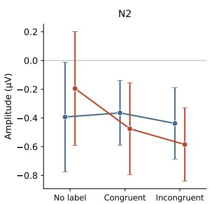

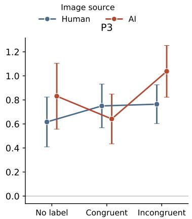

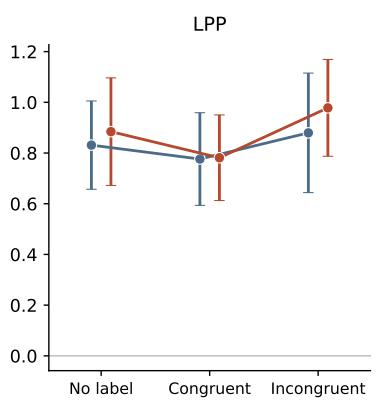  
Fig. 10. Observed amplitude means with 95% within-subject confidence intervals (Cousineau–Morey), by image source and labelling condition, for each component; amplitudes are averaged over the component region of interest (frontocentral for the N2, centroparietal for the P3 and LPP). The AI and human traces overlap at every level, showing that actual source did not separate the response. The condition axis carries what movement there is: the N2 becomes more negative once a label is present, the P3 rises under incongruence and most so for AI faces, and the LPP stays flat.

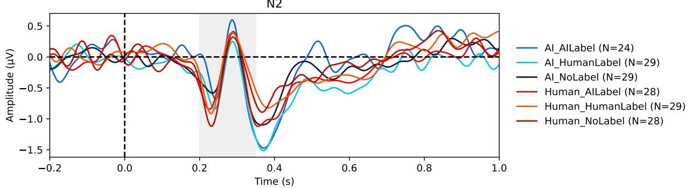  
Fig. 11. N2 grand average waveform. Averages for the six conditions (AI/Human face × Made with AI/Made by a human/No label), measured over fronto-central electrodes $( { \mathsf { F } } z , { \mathsf { C } } z , { \mathsf { F C } } 1 , { \mathsf { F C } } 2 ) ;$ the shaded region (200–350 ms) marks the analysis window. AI and human faces produced the same response. Any face carrying a label, whether the label matched the face or not, produced a larger response than a face with no label at all, though the diference is small. The earliest sensitivity is therefore to the presence of a source cue, not to its agreement with the face, which is evaluated at a later stage

## 6.3 Total Dwell Time

Total dwell time is the product of fixation count and mean fixation duration, and in these data the three are efectively collinear, so its coeficients follow from the two measures above rather than adding independent evidence; we report them for completeness. Neither source $( M d n = . 0 1 1 , 9 5 \% \thinspace C \mathrm { r I } \thinspace [ - . 0 0 5 , . 0 2 6 ] , \thinspace p _ { d } = 9 1 . 6 \% )$ nor label presence $( M d n = . 0 0 5 ,$ 95% $\operatorname { C r I } { \left[ - . 0 1 4 , . 0 2 4 \right] } , p _ { d } = 6 7 . 1 \% )$ produced a credible diference on its own, and the credible Source×Label interaction $( M d n = . 0 4 9 , 9 5 \% \thinspace C \mathrm { r } \mathrm { I } \left[ . 0 2 4 , . 0 7 6 \right] , \thinspace p _ { d } = 1 0 0 \%$ restates the fixation-count interaction already reported.

Manuscript submitted to ACM

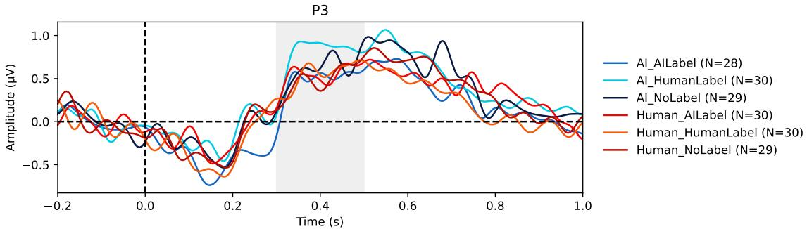  
Fig. 12. P3 grand average waveform. Averages for the six conditions (AI/Human face × Made with AI/Made by a human/No label), measured over centro-parietal electrodes (Pz, CPz, Cz, CP1, CP2, P3, P4); the shaded region (300–500 ms) marks the analysis window AI and human faces produced the same response. An AI face labelled “Made by a human”, or a human face labelled “Made with AI”, produced a larger response than a face with no label at all.

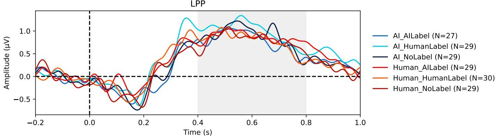  
Fig. 13. LPP grand average waveform. Stimulus-locked averages for the six experimental conditions (AI/Human source × Made with AI/Made by a human/No label), computed over centro-parietal electrodes $( \mathsf { P z } , \mathsf { C P z } , \mathsf { C z } , \mathsf { C P 1 } , \mathsf { C P 2 } , \mathsf { P 1 } , \mathsf { P 2 } )$ . The shaded region (400–800 ms) indicates the LPP analysis window. A sustained positivity rises from roughly 200 ms and is maintained across the window in every condition. The six traces overlap throughout, and the models estimate no diference by actual source or by label congruence. Whatever a disclosure label did to earlier processing did not carry into this later afective stage.

## 6.4 First Fixation Latency

The latency of the first fixation gave no credible efect of source $( M d n = 0 . 3 1 6 , 9 5 \% \mathrm { C r I } [ - 1 4 . 5 9 3 , 1 5 . 5 7 3 ] , \hat { p } _ { d } = 5 1 . 8 \% ) ,$ label $( M d n = - 7 . 3 9 7 , 9 5 \% \mathrm { C r I } [ - 2 6 . 6 6 4 , 1 1 . 3 8 4 ] , p _ { d } = 7 8 . 6 \%$ , or their interaction $( M d n = 6 . 4 9 4 , 9 5 \% \mathrm { C r I } [ - 1 8 . 8 4 0 , 3 3 . 3 5 3 ]$ $p _ { d } = 6 9 . 0 \% )$

## 7 Discussion

Whether a disclosure label changes how a face is processed, or only what a viewer reports afterwards, has been hard to establish because the two causes travel together: work that varies what an image is leaves belief about its origin to chance [47, 51, 64], and work that varies belief does so over a single set of real photographs [15, 19]. Study 1 fixed the perceptual status of the stimuli in advance, so that any later efect of a label could not be traced to visual ambiguity. Study 2 crossed source against the label attached to each face, recording EEG and gaze during stimulus presentation. Manuscript submitted to ACM

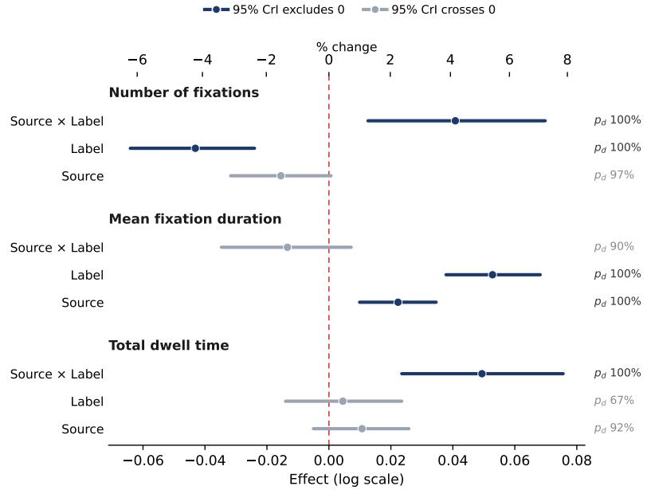

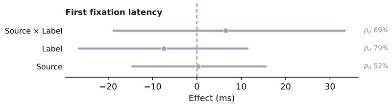  
Fig. 14. Posterior efects of image source, disclosure label, and their interaction on each eye-tracking measure. Points are posterior medians and bars the 95% CrIs; the upper axis restates the log-scale coeficients as percentage change. Efects whose interval excludes zero are dark, those overlapping zero are grey, and �� is given at right. Labels credibly shifted how faces were explored while leaving the speed of initial orienting unchanged, and image source registered only in fixation duration.

The presence of a label changed early processing; a label that contradicted the face, altered a later, evaluative stage, and labels reshaped how faces were visually explored. Actual source of the face did not separate the neural response. Together, the two studies contribute a validated stimulus set and evidence that the origin attributed to a face afects cognitive processing, unlike its true origin. In the following we summarize the results and discuss them in light of our research questions.

## 7.1 Summary of Results

The ERP results separated what a face is from what it is labeled as. At the N2, P3, and LPP, AI- and human-sourced faces produced amplitudes that did not difer credibly, with every posterior centered near zero, so actual source left no credible mark on stimulus-locked processing. Instead, the label carried the found efect. A present label enlarged the N2 relative to unlabeled faces whether or not it matched the face, which places the earliest sensitivity at the presence of a Manuscript submitted to ACM source cue. Label–face incongruence caused a stronger P3 response, in line with that component’s role in stimulus re-evaluation [58]. The LPP moved with neither factor.

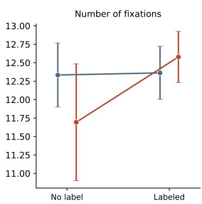

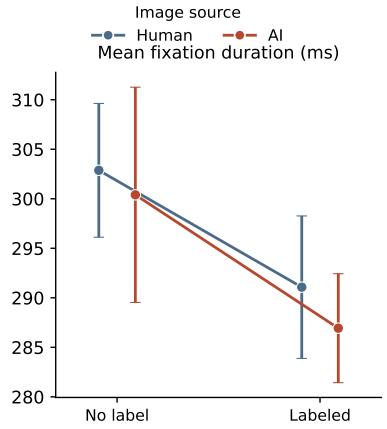

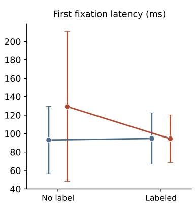  
Fig. 15. Observed cell means with 95% within-subject confidence intervals (Cousineau–Morey) for each measure, by image source and label resence, on the natural scale of each measure; total dwell time is omited as redundant. The anels show the atern behind the modelled efects: fixations were shorter and more numerous when a label was resent the fixation-count shift fell almos entirely on AI faces, and the timing of the first fixation overlapped across all conditions.

The gaze results matched this shape at the level of overt attention. The latency of the first fixation showed no credible efect of source, label, or their combination, so we have no evidence that initial orienting shifted. What labels changed was the later exploration of a face: a labeled face drew more fixations than an unlabeled one and each fixation was shorter, and the rise in fixation count fell largely on AI-generated faces. Actual source surfaced once, in slightly shorter fixations on AI faces, and it reached neither the EEG response nor the first fixation.

Across measures, the label assigned to a face shaped its processing while its true origin did not register on these measures. The efect appeared after a face had been detected and fixated, in the re-evaluative and exploratory measures rather than in early detection or the first capture of attention, which locates AI disclosure on the evaluation of a face rather than on its perception.

## 7.2 Electrophysiological Signatures of Source and Label

Actual source left no credible ERP proxy. In RQ1 we asked whether a face’s actual source, AI-generated or human, modulates its electrophysiological processing at the early attentional (N2), evaluative (P3), and sustained afective (LPP) stages. Actual source left no measurable trace on any of the three components. AI- and human-sourced faces produced equivalent amplitudes, with each posterior centered on zero. Under our conditions, the EEG response did not discriminate whether a face was real or synthetic.

Previous ERP studies have reported diferences between real and artificial faces. Schindler et al. [64], for example, varied face realism from cartoon to photorealistic images and found diferences in both the N170 and LPP. Similarly, Wheatley et al. [75] compared human faces, doll faces, and objects. They found similar early responses to human and doll faces, but only human faces produced a sustained late positivity after 400 ms, which they associated with the perception of another mind. Based on these findings, we might therefore expect the actual source of a face to afect at least the later ERP components.

Manuscript submitted to ACM

We did not find such an efect. One explanation is the diference in the visual appearance of the stimuli. The earlier studies compared faces that were clearly diferent in appearance, such as cartoons and photographs or dolls and human faces. In our study, both AI-generated and human faces were photorealistic. This is important because previous work suggests that the distinction between artificial and real faces becomes less pronounced when artificial faces are highly realistic. Geiger and Balas [27], for example, found that realistic artificial human faces produced N170 responses similar to those elicited by real faces. Our findings extend this observation to difusion-generated faces and to later stages of processing. Under our experimental conditions, the actual source of the face did not produce a clear diference in the N2, P3, or LPP.

The diference from Wheatley et al. [75] may be particularly relevant for the LPP. Their late positivity separated human faces from dolls, which were visibly inanimate. In contrast, our AI-generated faces were photorealistic and depicted people, so both the AI and human faces provided similar visual cues of another person. This could explain why the LPP did not difer between the two sources in our study. We consider this a possible explanation rather than a direct test, since the AI and human faces came from diferent databases and were not matched on low-level visual features. Still, we found no evidence of a source efect des ite these diferences. Our desi n also allows us to address a limitation of previous work. Studies that manipulate realism change both the appearance and the source of the face, while studies that manipulate beliefs about origin keep the actual source constant. We controlled the perceived origin in Study 1 and crossed actual source with the label in Study 2, thus allowing to separate these factors. Our results suggest that when AI-generated faces are suficiently realistic, their actual source does not produce a measurable diference in stimulus-locked ERP responses. Instead, the response appears to depend more on the visual appearance of the face and on the information provided by the label. These findings are in line with Lago et al. [42]’s work, which demonstrated that generative models have advanced in producing synthetic faces that are increasingly dificult to be distinguished from real ones.

For HCI, this means that viewers may not have a perceptual signal that tells them that a realistic face is AI-generated. If users need to know the origin of an image, this information therefore needs to be provided on the interface, either through provenance mechanisms or AI disclosures. Disclosure labels can convey this information directly, without relying on users to infer the source from the face itself.

How Source Labels Shape Responses to AI Content. In RQ2, we asked whether people responded to the label itself and to whether the label matched the face. We found efects in both the N2 and P3, but the two components reflected diferent parts of the response. The N2 was larger whenever a label was present, whether or not it matched the face The P3 was larger when the label and the source of the face did not match. This suggests a simple two-stage process: people first noticed the label, and then they responded when the label conflicted with the face.

This result difered from our initial expectation that the N2 would mainly reflect a conflict between the label and the face. A simpler interpretation is that the N2 reflects the early registration of a task-relevant cue Patel and Azzam [53]. This is consistent with Folstein and Van Petten [24], who distinguish between N2 responses related to cognitive control or salient events and those more specifically related to mismatch. The P3 then reflected the later mismatch, consistent with its role in updating an interpretation when new information does not fit the current one [58]. In practical terms, the label may be noticed first and compared with the face only afterward.

This sequence is also consistent with the MAIN model [69, 70]: In an interface, a cue such as an “AI-generated” label can activate an expectation about the content’s origin before the user examines it in detail, leaving that expectation to be checked against the content itself. Following this interpretation, the N2 should reflect noticing the source cue, while

Manuscript submitted to ACM

the P3 reflects the later conflict when the cue and the face do not fit together. We use the model to describe how the cue may be processed, not to claim that labels necessarily increase or decrease trust, which our study did not test.

Moreover, our findings extend the work of Conrad et al. [15], who found that an AI warning afected trust judgments while participants viewed AI-generated political images. In their study, all images were AI-generated, so the warning could only be present or absent. It could not be correct for some images and incorrect for others. Our design allowed us to create this mismatch and separate a response to seeing a label from a response to the label being wrong. This gives a clearer picture of how people may process source information in interfaces that include AI labels.

Our findin s have im lications for HCI and human–AI interaction: a label can afect how users rocess content as soon as they see it, before they have fully evaluated the content itself. For example, an “AI-generated” label on a social media post, image search result, or decision-support interface may shape the user’s initial expectations. Labels should therefore be accurate, clear, and used only when they provide useful information. A small cue may be enough to make the source noticeable, but an incorrect or unnecessary label could lead users to interpret content as machine-generated when that interpretation is not warranted.

The LPP boundary separates evaluation from afect. In our findings, neither source nor label congruence modulated the LPP, indicating that the disclosure efect does not extend into afective processing. This result stands in contrast to Eiserbeck et al. [19], who reported late-positivity efects when participants believed a smiling face was fake. That efect is likely attributable to the used stimuli, which confounded belief with appearance: smiling adds afective content that cannot be separated from the source. Our study design avoids this confound, since appearance was held constant and the label carried no afective content - we can directly attribute the absence of an LPP efect to disclosure of the label. These results build a positive case for disclosure labeling, supporting Susser et al. [71]’s distinction between legitimate persuasion and emotional manipulation: the labels appeal openly to a person’s deliberative capacities by ofering information to weigh, rather than manipulating the emotional state of the user. Here, the absence of LPP modulation indicates that the label efects were tied to evaluative processing - the categorization and re-evaluation reflected in the N2 and P3, indicating that the label informs the viewer’s judgment of the artifact rather than exploiting afect.

## 7.3 Gaze Signatures of Source and Label

In this section we turn from brain processing to visual behavior. Addressing whether disclosure labels change how a face is visually explored - and whether this depends on the face’s actual source (RQ3), as well as asking whether the image source or label shape the earliest allocation of attention (RQ4).

Labels changed how a face was explored. RQ3 asked whether disclosure labels change how a face is visually explored, and whether this depends on its actual source. We found that labeled faces received more fixations, but these fixations were shorter, while total viewing time remained unchanged. Participants therefore distributed roughly the same viewing time across more locations. We interpret this as a change in visual exploration rather than in the overall time spent viewing the face. This interpretation is necessarily cautious, since fixation count and duration alone cannot establish a shift between ambient and focal viewing, which also requires saccade amplitude [40].

The efect of labeling was larger for AI-generated than for human faces. Thus, the efect of the label on viewing depended on the face it was attached to, even though EEG showed no clear source efect. One possible explanation is that viewers used the label as a cue to look back at the face and assess whether it fit the stated origin. The extra fixations may reflect this additional inspection, although our data cannot show that directly. This would place the source-related Manuscript submitted to ACM

gaze efect later than the EEG efects: after the label has been registered, viewers may return to the image and explore it further. This is consistent with the diferent timing of the efects across the two measures.

This finding provides a partial dissociation between neural and gaze responses. Actual source was not reflected in stimulus-locked EEG, but it did matter for how the faces were explored. We treat this interaction as provisional, since the AI and human face sets came from diferent databases and were not matched on low-level visual properties [62].

Our findings are consistent with previous eye-tracking work suggesting that source efects depend on the task. Bozkir et al. [5], for example, found no reliable diference in free-viewing time between real and GAN-generated faces, with task phase and priming having a larger efect than actual origin. Our results extend this finding to difusion-generated faces in a setting where source information was also shown on screen. Other studies have found diferences between authentic and manipulated content [9, 28], but these studies changed the content itself and asked participants to detect manipulation. Our task involved static faces under free viewing, where gaze may be less sensitive to diferences in source [57].

RQ4 addressed a diferent stage of attention: whether source or labeling afects the latency of the first fixation. We found no clear efect of either factor. This suggests that neither the actual source of the face nor the disclosure label reliably changed how quickly participants first oriented to the stimulus. This is consistent with the limited evidence on early orienting to AI-generated content, which has not shown that generated material reliably attracts gaze faster than authentic material [62].

For HCI, the two RQs point to a distinction between getting attention and shaping attention after viewing has started Source labels did not clearly change initial orienting, but they did change how participants explored the face. A label is therefore not simply information placed next to an image; it becomes part of the visual interaction. Its size, placement and level of detail may afect how users distribute their limited viewing time between the disclosure and the content itself [25, 59]. For human–AI interaction, source disclosure should therefore be considered as part of interface design, particularly when labels are presented alongside visual content.

## 7.4 ERPs and Gaze Agree on When Disclosure Takes Efect

Across RQ2–RQ4, the EEG and eye-tracking results point to a similar pattern: disclosure did not clearly change the earliest stage of viewing, but its efects emerged once the face was being processed and explored. For RQ4, neither source nor label afected the latenc of the first fixation. For RQ1, actual source also did not afect an of the three ERP components. The efects associated with labeling appeared later: the P3 was larger when the label conflicted with the face’s actual source, while gaze showed more fixations and shorter fixation durations for labeled faces. Together, these findings suggest that disclosure does not determine whether a face attracts attention or how quickly it is first seen; rather, its efects are more apparent in what happens after viewing has started.

Using both measures also helps distinguish when these efects occur. The ERP analysis captures activity during the   
first second after image onset, whereas the eye-tracking measures cover the full presentation. The gaze results therefore   
suggest that the efect of disclosure can continue after the initial evaluative period captured by the ERP analysis, with   
labeled faces receiving more, shorter fixations. This complements the P3 finding. Previous work has combined EEG   
and gaze to study responses to synthetic media. Gupta et al. [28], for example, found diferences between real and   
manipulated videos in both measures, although their participants were explicitly asked to detect manipulation and   
viewed dynamic content. These task and stimulus diferences may explain why actual source registered in their study   
but not consistently in ours. More broadly, Sun et al. [68] show how behavioral and physiological measures can capture   
diferent parts of a response to AI-generated information. Co-registration of gaze and EEG has also been used in HCI to Manuscript submitted to ACM

relate visual attention to stimulus-locked activity [10]. Our findings similarly suggest that disclosure efects are easier to understand when measures capture diferent stages of the interaction.

The two modalities, however, do not tell exactly the same story: actual source appeared in the gaze data through shorter fixations on AI faces and a larger label efect for AI-generated faces, but it did not appear in the EEG. Thus, source may afect how viewers explore an image without producing a corresponding diference in stimulus-locked brain activity. We treat this dissociation cautiously because the AI and human face sets came from diferent databases and were not matched on low-level visual properties [62]. The neural and gaze findings therefore provide a partial rather than complete separation between actual source and disclosure.

For HCI, this distinction matters because disclosure can afect the interaction after a user has already looked at the content. A design may leave initial attention unchanged while still changing how users inspect the content afterwards. This is dificult to capture with post-exposure ratings alone, which measure the outcome of the evaluation rather than how it unfolded [15, 33]. Combining behavioral measures such as gaze with physiological measures can therefore provide a more detailed account of how disclosure works (cf., Sun et al. [68]). In practice, gaze is also considerably easie to de lo than EEG, makin it a more feasible tool for evaluatin source-disclosure desi ns in human–AI interaction.

## 7.5 Designing Disclosure Labels

Disclosure labels are usually treated as information that viewers can consider alongside what they see. Our results suggest that this is not always how they work. For the faces in our study, participants showed no clear sensitivity to actual source in the ERP measures, in how quickly they looked at the faces, or in how many fixations they made. We therefore found no evidence that they could reliably determine from the face itself whether it was AI-generated or human-made. The label rovided information about the face’s source that could not be reliabl determined from the face itself.

In other settings, however, provenance may not be binary. Content can involve diferent degrees and types of human and AI contribution, and the way this information is disclosed can afect how users understand that contribution [41]. This makes clear and accurate provenance information important, particularly when viewers cannot independently assess how the content was produced. If viewers can judge the source independently, they may be able to reject an incorrect label. If they cannot, there is little they can use to do so. The accuracy of the labeling process therefore becomes es eciall im ortant, which su orts usin verifiable rovenance rather than rel in on ost-hoc classification [23]

Our design also tested a case that current regulation does not require. The EU AI Act and comparable rules require providers to disclose synthetic origin [20, 45], so AI-generated content is marked while human-made content is generally left unmarked. We labeled both human and AI-generated faces. The early ERP response was larger whenever a label was present, with no clear diference between the two label types. Participants therefore responded to the presence of a source cue before there was a clear response to what the cue said. In an asymmetric system, the absence of a label does not provide the same cue. People can still draw an inference from that absence: Pennycook et al. [55] found that unwarned content is often treated as verified and rated as more accurate. With synthetic faces, there is little opportunity to correct that inference from the image itself. Labeling both origins, as we did, could reduce this ambiguity, but the way provenance is presented may also shape how users interpret the relative human and AI contribution [41]. Whether a positive human-made label can also reduce the confidence attached to otherwise unlabeled content remains to be tested.

The incongruent condition gives us a small test of what happens when the disclosure is wrong. When the label contradicted the face’s actual source, the response was more consistent with the label than with the actual source, and Manuscript submitted to ACM

we found no clear indication that participants recovered the true origin. A missing or incorrect label is therefore not necessarily just missing information. In our data, an incorrect label provided information that viewers had no reliable way to reject. This is relevant for systems that assign labels automatically, since errors will occur and viewers may not be able to detect them. Reporting labeling accuracy, and where possible communicating uncertainty in the attribution, may therefore matter more than refining the wording of the label itself.

Placement also has a cost. Our label appeared in the bottom-right corner, following Gamage et al. [25], far enough from the center that reading it required a saccade. Labeled faces received more and shorter fixations without an increase in total viewing time. The label therefore changed how participants distributed their viewing time rather than increasing the time they spent with the image. Where a disclosure is placed is consequently also a decision about where user spend their attention. This may matter more in feeds and search results, where people spend less time with individual items than the four seconds allowed in our study.

## 8 Limitations & Future Work

A few limitations should be kept in mind when interpreting this work. The main limitation is that our two stimulus sets were not matched on low-level visual properties. Human faces came from the Chicago Face Database [46], while AI faces came from a standardized Stable Difusion collection. Both sets were standardized diferently, with the photographs using a white background and gray clothing and the AI images showing their own regularities, such as pastel backgrounds and smoothed skin. This provides an alternative explanation for the shorter fixations on AI faces and the larger label efect for them. Miller et al. [47] also report that perceived AI-likeness can vary with apparent race, which we did not control. Future work should therefore match AI and human faces on visual properties and apparent demographics. At the same time, tighter matching would move the stimuli further from the varied faces people encounter on social platforms and online news [54, 77]. Future studies should therefore also test more naturalistic images across diferent settings and generators, allowing source efects to be separated from stimulus appearance without sacrificing ecological validity.

Study 1 also fixed perceived origin by selecting faces that raters reliably classified as AI-generated. This removed ambiguous cases but also meant that perceived and actual origin were not fully crossed. Future work should cross perceived origin, actual origin, and label to test whether labels still guide responses when an AI-generated face looks convincingly human.

Our participant sample was small, relatively young, and reported moderate AI literacy. It did not include older adults or people with less experience with synthetic media, although attention to credibility cues can vary with digital literacy [66]. A more diverse sample is therefore needed.

We also tested static faces under free viewing, with one label design in one position. Real disclosures appear in feeds and search results, where viewing times are shorter and labels compete with surrounding content. They also vary in wording, detail, and visual form [25]. Future work should test these variations, as well as content with visible generation artifacts, where labels supplement rather than replace perceptual cues.

## 9 Conclusion

We separated actual source from attributed origin to test whether disclosure labels change how AI-generated and human faces are processed. Across an online validation study (� = 169) and a lab study (� = 30), actual source did not produce clear diferences in N2, P3, or LPP amplitude, or in how quickly faces were first fixated. Labels, in contrast, changed how faces were explored: labeled faces received more, shorter fixations, while the ERP results suggest that labels were registered and later compared with the face’s source.

These findings make three contributions. First, we provide a perceptually validated set of difusion-generated faces for separating image source from perceived origin. Second, we show that attributed origin can afect cognitive processing even when actual origin does not, using EEG and eye tracking rather than post-exposure judgments. Third, the findings have implications for disclosure design. When content provides no reliable perceptual cue to its origin, the label becomes an im ortant source of that information, makin labelin accurac critical. Labelin both human and AI content ma also reduce the ambiguity created by an unlabeled item, while label placement afects how users distribute their limited viewing time.

## Open Science & Use of Generative A

To support transparency and further research, we have made our full experimental setup, datasets, and analysis scripts openly available on the Open Science Framework: https://osf.io/zejp3/overview?view\_only=31ead9b2ec6c4ca88b8fe2d14c62c520. We encourage others to reproduce, verify, and build upon our findings. We used a large language model (Claude Opus 5 and Claude Fable 5, Anthropic; z-ai/glm-5.2, Gemini Nanobanana 2.0, and moonshotai/kimi-k2.6) to assist with copy-editing the manuscript, teaser figure design, and with writing plotting and analysis code. All study design, data collection, statistical analysis, and interpretation were carried out by the authors, who take full responsibility for the content.

## Acknowledgments

## References

[1] Phillip Alday and Jeroen van Paridon. 2021. Away from arbitrary thresholds: using robust statistics to improve artifact rejection in ERP. (2021) doi:10.31234/osf.io/wqrb5

[2] S. Anders, G. Ende, M. Junghofer, J. Kissler, and D. Wildgruber. 2006. Event-related potential studies of language and emotion: words, phrases, and task efects. In Understanding Emotions, S. Anders, G. Ende, M. Junghofer, J. Kissler, and D. Wildgruber (Eds.). Progress in Brain Research, Vol. 156 Elsevier, 185–203. doi:10.1016/S0079-6123(06)56009-1

[3] Shlomo Bentin, Truett Allison, Aina Puce, Erik Perez, and Gregory McCarthy. 1996. Electrophysiological Studies of Face Perception in Humans Journal ofCognitive Neuroscience 8, 6 (1996), 551–565. doi:10.1162/jocn.1996.8.6.551

[4] Nima Bigdely-Shamlo, Tim Mullen, Christian Kothe, Kyung-Min Su, and Kay A Robbins. 2015. The PREP pipeline: standardized preprocessing for large-scale EEG analysis. Frontiers in Neuroinformatics 9 (2015), 16. doi:10.3389/fninf.2015.00016

[5] Efe Bozkir, Clara Riedmiller, Athanassios N. Skodras, Gjergji Kasneci, and Enkelejda Kasneci. 2024. Can You Tell Real from Fake Face Images? Perception of Computer-Generated Faces by Humans. ACM Transactions on Applied Perception 22, 2, Article 6 (2024), 23 pages. doi:10.1145/3696667

[6] Sergi D Bray, Shane D Johnson, and Bennett Kleinberg. 2023. Testing human ability to detect ‘deepfake’ images of human faces. Journal of Cybersecurity 9, 1 (01 2023), tyad011. arXiv:https://academic.oup.com/cybersecurity/article-pdf/9/1/tyad011/51343718/tyad011.pdf doi:10.1093/cybsec/tyad011

[7] Paul-Christian Bürkner. 2017. brms: An R Package for Bayesian Multilevel Models Using Stan. Journal ofStatistical Software 80, 1 (2017), 1–28 doi:10.18637/jss.v080.i0

[8] Astrid Carolus, Martin J. Koch, Samantha Straka, Marc Erich Latoschik, and Carolin Wienrich. 2023. MAILS - Meta AI literacy scale: Development and testing of an AI literacy questionnaire based on well-founded competency models and psychological change- and meta-competencies. Computers in Human Behavior: Artificial Humans 1, 2 (2023), 100014. doi:10.1016/j.chbah.2023.100014

[9] Giuseppe Cartella, Vittorio Cuculo, Marcella Cornia, and Rita Cucchiara. 2024. Unveiling the Truth: Exploring Human Gaze Patterns in Fake Images IEEE Signal Processing Letters 31 (2024), 820–824. doi:10.1109/LSP.2024.3375288

[10] Francesco Chiossi, Uwe Gruenefeld, Baosheng James Hou, Joshua Newn, Changkun Ou, Rulu Liao, Robin Welsch, and Sven Mayer. 2024. Understanding the impact of the reality-virtuality continuum on visual search using fixation-related potentials and eye tracking features. Proceedings of the ACM on Human-Computer Interaction 8, MHCI (2024), 1–33. doi:10.1145/3676528

[11] Francesco Chiossi, Yannick Weiss, Thomas Steinbrecher, Christian Mai, and Thomas Kosch. 2024. Mind the Visual Discomfort: Assessin Event Related Potentials as Indicators for Visual Strain in Head-Mounted Displays. In 2024 IEEE International Symposium on Mixed and Augmented Reality (ISMAR). 150–159. doi:10.1109/ISMAR62088.2024.00029

Manuscript submitted to ACM

[12] Hyo Jung Choi, Jeong-Sug Kyong, Jong Ho Won, and Hyun Joon Shim. 2025. Neural adaptations to temporal cues degradation in early blind: insights from envelope and fine structure vocoding. Frontiers in Neuroscience Volume 19 (2025). doi:10.3389/fnins.2025.1493641

[13] Katherine Clayton, Spencer Blair, Jonathan A. Busam, Samuel Forstner, John Glance, Guy Green, Anna Kawata, Akhila Kovvuri, Jonathan Martin, Evan Morgan, Morgan Sandhu, Rachel Sang, Rachel Scholz-Bright, Austin T. Welch, Andrew G. Wolf, Amanda Zhou, and Brendan Nyhan. 2020. Real Solutions for Fake News? Measurin the Efectiveness of General Warnin s and Fact-Check Ta s in Reducin Belief in False Stories on Social Media. Political Behavior 42, 4 (2020), 1073–1095. doi:10.1007/s11109-019-09533-0

[14] Maurizio Codispoti, Vera Ferrari, and Margaret M. Bradley. 2006. Repetitive picture processing: Autonomic and cortical correlates. Brain Research 1068, 1 (2006), 213–220. doi:10.1016/j.brainres.2005.11.009

[15] Colin Conrad, Anika Nissen, K a Masoumi, Ma ank Ramchandani, Rafael Fecur Bra a, and Aaron J. Newman. 2025. Do truthfulness notifications influence perceptions of AI-generated political images? A cognitive investigation with EEG. Computers in Human Behavior: Artificial Humans 5 (2025), 100185. doi:10.1016/j.chbah.2025.100185

[16] Alan Dix. 2022. Bayesian Statistics. In Bayesian Methods for Interaction and Design, John H. Williamson, Antti Oulasvirta, Per Ola Kristensson, and Nikola Banovic (Eds.). Cambridge University Press, 81–114. doi:10.1017/9781108874830.004

[17] Dariia Drozd and Klaus Solberg Söilen. 2026. AI Labels, Perceived Authenticity, and Consumer Trust in User-Generated Reviews. Journal of Theoretical and Applied Electronic Commerce Research 21, 5 (2026), 154. https://www.mdpi.com/0718-1876/21/5/154

[18] Nicole C. Ebner, Michaela Riediger, and Ulman Lindenberger. 2010. FACES–A database of facial expressions in young, middle-aged, and older women and men: Development and validation. Behavior Research Methods 42, 1 (2010), 351–362. doi:10.3758/BRM.42.1.351

[19] Anna Eiserbeck, Martin Maier, Julia Baum, and Rasha Abdel Rahman. 2023. Deepfake Smiles Matter Less—the Psychological and Neural Impact of Presumed AI-Generated Faces. Scientific Reports 13, 1 (2023), 16111. doi:10.1038/s41598-023-42802-x

[20] Abdallah El Ali, Karthikeya Puttur Venkatraj, Sophie Morosoli, Laurens Naudts, Natali Helberger, and Pablo Cesar. 2024. Transparent AI Disclosure Obligations: Who, What, When, Where, Why, How. In Extended Abstracts ofthe CHI Conference on Human Factors in Computing Systems (Honolulu, HI, USA) (CHI EA ’24). Association for Computing Machinery, New York, NY, USA, Article 342, 1-11 pages. doi:10.1145/3613905.3650750

[21] Kübra Eroğlu, Temel Kayıkçıoğlu, and Onur Osman. 2020. Efect of brightness of visual stimuli on EEG signals. Behavioural Brain Research 382 (2020), 112486. doi:10.1016/j.bbr.2020.112486

[22] Franz Faul, Edgar Erdfelder, Axel Buchner, and Albert-Georg Lang. 2009. Statistical power analyses using G\* Power 3.1: Tests for correlation and regression analyses. Behavior research methods 41, 4 (2009), 1149–1160. doi:10.3758/BRM.41.4.1149

[23] KJ Kevin Feng, Nick Ritchie, Pia Blumenthal, Andy Parsons, and Amy X Zhang. 2023. Examining the impact of provenance-enabled media on trust and accuracy perceptions. Proceedings ofthe ACM on Human-Computer Interaction 7, CSCW2 (2023), 1–42. doi:10.1145/3610061

[24] Jonathan R. Folstein and Cyma Van Petten. 2008. Influence of Cognitive Control and Mismatch on the N2 Component of the ERP: A Review. Psychophysiology 45, 1 (2008), 152–170. doi:10.1111/j.1469-8986.2007.00602.x

[25] Dilrukshi Gamage, Dilki Sewwandi, Min Zhang, and Arosha K Bandara. 2025. Labeling Synthetic Content: User Perceptions of Label Designs for AI-Generated Content on Social Media. In Proceedings ofthe 2025 CHI Conference on Human Factors in Computing Systems (CHI ’25). Association for Com utin Machiner , New York, NY, USA, Article 814, 29 a es. doi:10.1145/3706598.3713171

[26] Harsha Gangadharbatla. 2022. The role of AI attribution knowledge in the evaluation of artwork. Empirical Studies of the Arts 40, 2 (2022), 125–142. doi:10.1177/0276237421994697

[27] Allie R Geiger and Benjamin Balas. 2021. Robot faces elicit responses intermediate to human faces and objects at face-sensitive ERP components. Scientific Reports 11, 1 (2021), 17890. doi:10.1038/s41598-021-97527-

[28] Parul Gupta, Komal Chugh, Abhinav Dhall, and Ramanathan Subramanian. 2020. The Eyes Know It: FakeET — An Eye-Tracking Database to Understand Deepfake Perception. In Proceedings ofthe 2020 International Conference on Multimodal Interaction (ICMI ’20). 519–527. doi:10.1145/ 3382507.3418857

[29] Greg Hajcak, Jonathan P. Dunning, and Dan Foti. 2009. Motivated and controlled attention to emotion: Time-course of the late positive potential Clinical Neurophysiology 120, 3 (2009), 505–510. doi:10.1016/j.clinph.2008.11.028

[30] Greg Hajcak and Dan Foti. 2020. Significance?. . . Significance! Empirical, Methodological, and Theoretical Connections Between the Late Positive Potential and P300 as Neural Responses to Stimulus Significance: An Integrative Review. Psychophysiology 57, 7 (2020), e13570. doi:10.1111/psyp.13570

[31] Xiangfei Hong, Yao Wang, Junfeng Sun, Chunbo Li, and Shanbao Tong. 2017. Segregating Top-Down Selective Attention from Response Inhibition in a Spatial Cueing Go/NoGo Task: An ERP and Source Localization Study. Scientific Reports 7, 1 (2017), 9662. doi:10.1038/s41598-017-08807-z

[32] Constance Imbault, David I. Shore, and Victor Kuperman. 2018. Reliability of the sliding scale for collecting afective responses to words. Behavior Research Methods 50, 6 (2018), 2399–2407. doi:10.3758/s13428-018-1016-9

[33] Maurice Jakesch, Megan French, Xiao Ma, Jefrey T. Hancock, and Mor Naaman. 2019. AI-Mediated Communication: How the Perception That Profile Text Was Written by AI Afects Trustworthiness. In Proceedings ofthe 2019 CHI Conference on Human Factors in Computing Systems (CHI ’19). Association for Computing Machinery, New York, NY, USA, 1–13. doi:10.1145/3290605.3300469

[34] David Johnson, Sarah Sperry, Alexis Berry, Daniela Porro, and Brian Albanese. 2025. The association of negative urgency and sustained attention: Evidence from the late ositive otential. Journal ofAfective Disorders 388 (06 2025), 119699. doi:10.1016/j.jad.2025.11969

[35] Shih-Chun Kao, Feng-Tzu Chen, David Moreau, Eric S. Drollette, Steve Amireault, Chien-Heng Chu, and Yu-Kai Chang. 2025. Acute efects of exercise engagement on neurocognitive function: a systematic review and meta-analysis on P3 amplitude and latency. International Review ofSport and Exercise Psychology 18, 1 (2025), 111–153. arXiv:https://doi.org/10.1080/1750984X.2022.2155488 doi:10.1080/1750984X.2022.2155488

Manuscript submitted to ACM

[36] Matthew Kay, Gregory L. Nelson, and Eric B. Hekler. 2016. Researcher-Centered Design of Statistics: Why Bayesian Statistics Better Fit the Culture and Incentives of HCI. In Proceedings ofthe 2016 CHI Conference on Human Factors in Computing Systems (CHI ’16). Association for Computing Machinery, New York, NY, USA, 4521–4532. doi:10.1145/2858036.2858465

[37] Patrycja Kałamała, Jakub Szewczyk, Magdalena Senderecka, and Zofia Wodniecka. 2017. Flanker task with equiprobable congruent and incongruent conditions does not elicit the conflict N2. Psychophysiology 55 (08 2017). doi:10.1111/psyp.12980

[38] Nils Köbis and Luca D. Mossink. 2021. Artificial Intelli ence versus Ma a An elou: Ex erimental Evidence That Peo le Cannot Diferentiate AI-Generated from Human-Written Poetr . Computers in Human Behavior 114 (2021), 106553. doi:10.1016/j.chb.2020.106553

[39] Christian Kothe, Seyed Yahya Shirazi, Tristan Stenner, David Medine, Chadwick Boulay, Matthew Grivich, Fiorenzo Artoni, Tim Mullen, Arnaud Delorme, and Scott Makeig. 2025. The lab streaming layer for synchronized multimodal recording. Imaging Neuroscience 3 (09 2025). doi:10.1162/ IMAG.a.136

[40] Krzysztof Krejtz, Andrew Duchowski, Izabela Krejtz, Agnieszka Szarkowska, and Agata Kopacz. 2016. Discerning Ambient/Focal Attention with Coeficient K. ACM Transactions on Applied Perception 13, 3 (2016). doi:10.1145/2896452

[41] Amber Kusters, Pooja Prajod, Pablo Cesar, and Abdallah El Ali. 2026. More Human or More AI? Visualizing Human-AI Collaboration Disclosures in Journalistic News Production. In Proceedings ofthe 2026 CHI Conference on Human Factors in Computing Systems (CHI ’26). Association for Computing Machinery, New York, NY, USA, Article 729, 22 pages. doi:10.1145/3772318.3791288

[42] Federica Lago, Cecilia Pasquini, Rainer Böhme, Hélène Dumont, Valérie Gofaux, and Giulia Boato. 2022. More Real Than Real: A Study on Human Visual Perception of Synthetic Faces [Applications Corner]. IEEE Signal Processing Magazine 39, 1 (2022), 109–116. doi:10.1109/MSP.2021.3120982

[43] Te-Won Lee, Mark Girolami, and Terrence J Sejnowski. 1999. Independent component analysis using an extended infomax algorithm for mixed subgaussian and supergaussian sources. Neural computation 11, 2 (1999), 417–441. doi:10.1162/089976699300016719

[44] Adam Li, Jacob Feitelberg, Anand Prakash Saini, Richard Höchenberger, and Mathieu Scheltienne. 2022. MNE-ICALabel: Automatically annotating ICA components with ICLabel in Python. Journal of Open Source Software 7, 76 (2022), 4484. doi:10.21105/joss.04484

[45] Yang Li and Ting Long. 2026. Governing AI-Generated Content: Labelling, Traceability and Transparency Infrastructure in China and the EU AI Act International Journal ofDigital Law and Governance (07 2026). doi:10.1515/ijdlg-2026-0010

[46] Debbie S. Ma, Justin Kantner, and Bernd Wittenbrink. 2021. Chicago Face Database: Multiracial expansion. Behavior Research Methods 53, 3 (2021), 1289–1300. doi:10.3758/s13428-020-01482-5

[47] Elizabeth J. Miller, Ben A. Steward, Zak Witkower, Clare A. M. Sutherland, Eva G. Krumhuber, and Amy Dawel. 2023. AI Hyperrealism: Why AI Face Are Perceived as More Real Than Human Ones. Psychological Science 34, 12 (2023), 1390–1403. arXiv:https://doi.org/10.1177/09567976231207095 doi:10.1177/09567976231207095 PMID: 37955384.

[48] Masahiro Mori, Karl F MacDorman, and Norri Kageki. 2012. The uncanny valley [from the field]. IEEE Robotics & automation magazine 19, 2 (2012), 98–100. doi:10.1109/MRA.2012.219281

[49] Maryam Mustafa, Stefan Guthe, Jan-Philipp Tauscher, Michael Goesele, and Marcus Magnor. 2017. How human am I? EEG-based evaluation of virtual characters. In Proceedings ofthe 2017 CHI conference on human factors in computing systems. 5098–5108. doi:10.1145/3025453.3026043

[50] So hie J. Ni htin ale and Han Farid. 2022. AI-S nthesized Faces Are Indistin uishable from Real Faces and More Trustworth . Proceedings ofthe National Academy ofSciences 119, 8 (2022), e2120481119. doi:10.1073/ nas.2120481119

[51] Sophie J. Nightingale, Kimberley A. Wade, and Derrick G. Watson. 2017. Can People Identify Original and Manipulated Photos of Real-World Scenes? Cognitive Research: Principles and Implications 2, 1 (2017), 30. doi:10.1186/s41235-017-0067-2

[52] A. Nissen and C. Krampe. 2021. Why he buys it and she doesn’t – Exploring self-reported and neural gender diferences in the perception of eCommerce websites. Computers in Human Behavior 121 (2021), 106809. doi:10.1016/j.chb.2021.106809

[53] Salil Patel and Pierre Azzam. 2005. Characterization of N200 and P300: Selected Studies of the Event-Related Potential. International Journal of Medical Sciences (01 2005), 147–154. doi:10.7150/ijms.2.147

[54] Qiyao Peng, Yingdan Lu, Yilang Peng, Sijia Qian, Xinyi Liu, and Cuihua Shen. 2025. Crafting Synthetic Realities: Examining Visual Realism and Misinformation Potential of Photorealistic AI-Generated Images. Association for Computing Machinery, New York, NY, USA. doi:10.1145/3706599. 3719834

[55] Gordon Pennycook, Adam Bear, Evan T. Collins, and David G. Rand. 2020. The Implied Truth Efect: Attaching Warnings to a Subset of Fake New Headlines Increases Perceived Accuracy of Headlines Without Warnings. Management Science 66, 11 (2020), 4944–4957. doi:10.1287/mnsc.2019.3478

[56] François Perrin, Jacques Pernier, Olivier Bertrand, and Jean Francois Echallier. 1989. Spherical splines for scalp potential and current density mapping. Electroencephalography and clinical neurophysiology 72, 2 (1989), 184–187. doi:10.1016/0013-4694(89)90180-6

[57] Matthew F. Peterson and Miguel P. Eckstein. 2012. Looking Just Below the Eyes Is Optimal Across Face Recognition Tasks. Proceedings ofthe National Academy ofSciences 109, 48 (2012), E3314–E3323. doi:10.1073/pnas.1214269109

[58] John Polich. 2007. Updating P300: An Integrative Theory of P3a and P3b. Clinical Neurophysiology 118, 10 (2007), 2128–2148. doi:10.1016/j.clinph. 2007.04.019

[59] Pooja Prajod, Hannes Cools, Thomas Röggla, Karthikeya Puttur Venkatraj, Amber Kusters, Alia ElKattan, Pablo Cesar, and Abdallah El Ali. 2026. Full Disclosure, Less Trust? How the Level of Detail about AI Use in News Writing Afects Readers’ Trust. In Proceedings ofthe 2026 ACM Conference on Fairness, Accountability, and Transparency (FAccT ’26). Association for Com utin Machiner , New York, NY, USA, 5846–5863. doi:10.1145/3805689.3812386

[60] Martin Ragot, Nicolas Martin, and Salomé Cojean. 2020. AI-Generated vs. Human Artworks. A Perception Bias Towards Artificial Intelligence?. In Extended Abstracts ofthe 2020 CHI Conference on Human Factors in Computing Systems (CHI EA ’20). Association for Computing Machinery, New York, NY, USA, 1–10. doi:10.1145/3334480.3382892

[61] Keith Rayner. 1998. Eye Movements in Reading and Information Processing: 20 Years of Research. Psychological Bulletin 124, 3 (1998), 372–422. doi:10.1037/0033-2909.124.3.372

[62] Hakile Resulbegoviq, Valentina Hlebec, Mirjana Pejić Bach, and Irina Stamatović. 2026. Eye Tracking and AI-Generated Content: A Systematic Literature Review of Visual Attention, Cognitive Processing, and User Engagement. Journal ofEye Movement Research 19, 5 (2026), 97. doi:10.3390 jemr19050097

[63] Daniel J. Schad, Michael Betancourt, and Shravan Vasishth. 2021. Toward a Principled Bayesian Workflow in Cognitive Science. Psychological Methods 26, 1 (2021), 103–126. doi:10.1037/met0000275

[64] Sebastian Schindler, Eduard Zell, Mario Botsch, and Johanna Kissler. 2017. Diferential Efects of Face-Realism and Emotion on Event-Related Brain Potentials and Their Implications for the Uncanny Valley Theory. Scientific Reports 7 (2017), 45003. doi:10.1038/srep45003

[65] Haeseung Seo, Aiping Xiong, and Dongwon Lee. 2019. Trust It or Not: Efects of Machine-Learning Warnings in Helping Individuals Mitigate Misinformation. In Proceedings ofthe 10th ACM Conference on Web Science (WebSci ’19). Association for Computing Machinery, New York, NY, USA, 265–274. doi:10.1145/3292522.3326012

[66] Nili Steinfeld. 2023. How Do Users Examine Online Messages to Determine If They Are Credible? An Eye-Tracking Study of Digital Literacy, Visual Attention to Metadata and Success in Misinformation Identification. Social Media + Society (2023). doi:10.1177/20563051231196871

[67] Daniel Strüber and John Polich. 2002. P300 and slow wave from oddball and single-stimulus visual tasks: inter-stimulus interval efects. International Journal ofPsychophysiology 45, 3 (2002), 187–196. doi:10.1016/S0167-8760(02)00071-

[68] Xin Sun, Rongjun Ma, Shu Wei, Pablo Cesar, Jos A. Bosch, and Abdallah El Ali. 2026. Understanding trust toward human versus AI-generated health information through behavioral and physiological sensing. International Journal ofHuman-Computer Studies 209 (2026), 103714. doi:10.1016/j.ijhcs. 2025.103714

[69] S. Shyam Sundar. 2008. The MAIN Model: A Heuristic Approach to Understanding Technology Efects on Credibility. The MIT Press, Cambridge, MA. 73–100 a es. htt s://a i.semanticscholar.or /Cor usID:17588424

[70] S. Shyam Sundar and Jinyoung Kim. 2019. Machine Heuristic: When We Trust Computers More Than Humans With Our Personal Information. In Proceedings ofthe 2019 CHI Conference on Human Factors in Computing Systems (CHI ’19). Association for Computing Machinery, New York, NY, USA 1–9. doi:10.1145/3290605.3300768

[71] Daniel Susser, Beate Roessler, and Helen Nissenbaum. 2018. Online Manipulation: Hidden Influences in a Digital World. SSRN Electronic Journal (01 2018). doi:10.2139/ssrn.3306006

[72] Rafaele Tucciarelli, Neza Vehar, Shamil Chandaria, and Manos Tsakiris. 2022. On the realness of people who do not exist: The social processing of artificial faces. iScience 25, 12 (2022), 105441. doi:10.1016/j.isci.2022.105441

[73] Rens van de Schoot, Sarah Depaoli, Ruth King, Bianca Kramer, Kaspar Märtens, Mahlet G. Tadesse, Marina Vannucci, Andrew Gelman, Duco Veen, Joukje Willemsen, and Christopher Yau. 2021. Bayesian Statistics and Modelling. Nature Reviews Methods Primers 1, 1 (2021), 1. doi:10.1038/s43586- 020-00001-2

[74] Bing-Shun Wang, Xiao-Jin Wang, and Li-Kun Gong. 2009. The construction of a Williams design and randomization in cross-over clinical trials using SAS. Journal ofstatistical software 29 (2009), 1–10. doi:10.18637/jss.v029.c01

[75] Thalia Wheatley, Anna Weinberg, Christine Looser, Tim Moran, and Greg Hajcak. 2011. Mind Perception: Real but Not Artificial Faces Sustain Neural Activity beyond the N170/VPP. PLoS ONE 6, 3 (2011), e17960. doi:10.1371/journal.pone.0017960

[76] Stefan Winkler. 2009. On the properties of subjective ratings in video quality experiments. In Proceedings of2009 1st International Workshop on Quality of Multimedia Experience. 139–144. doi:10.1109/QOMEX.2009.5246961

[77] Kai-Cheng Yang, Danishjeet Singh, and Filippo Menczer. 2024. Characteristics and Prevalence of Fake Social Media Profiles with AI-generated Faces. Journal ofOnline Trust and Safety 2 (09 2024). doi:10.54501/jots.v2i4.19

[78] Qiwei Yang, Ruolei Gu, Ping Tang, and Yue-Jia Luo. 2013. How does cognitive reappraisal afect the response to gains and losses? Psychophysiology 50, 11 (2013), 1094–1103

[79] Koji Yatani. 2016. Efect Sizes and Power Analysis in HCI. In Modern Statistical Methods for HCI, Judy Robertson and Maurits Kaptein (Eds.). Springer, Cham, 87–110. doi:10.1007/978-3-319-26633-6\_5

[80] Annika Ziereis and Anne Schacht. 2023. Motivated attention and task relevance in the processing of cross-modally associated faces: Behavioral and electrophysiological evidence. Cognitive, Afective, & Behavioral Neuroscience 23, 5 (2023), 1244–1266. doi:10.3758/s13415-023-01112-5