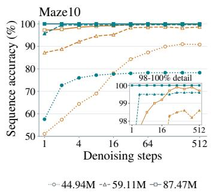
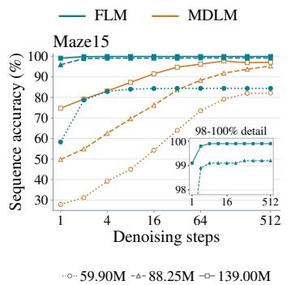
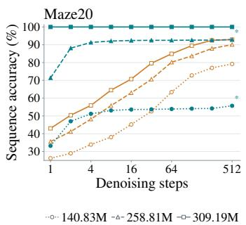
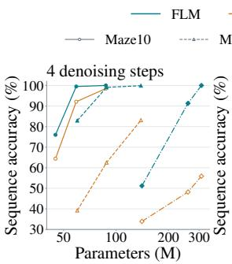
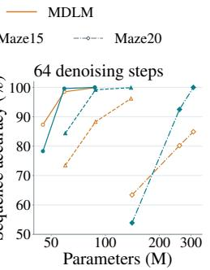
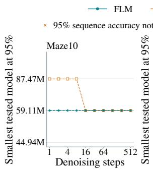
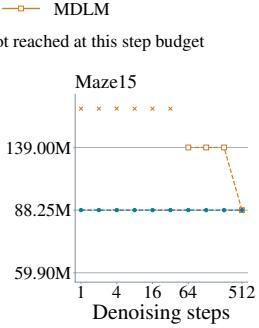
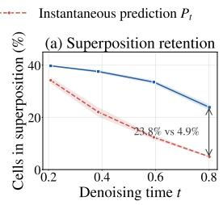
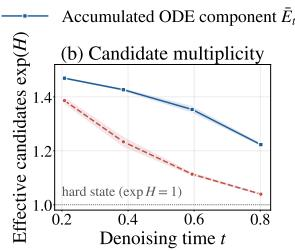
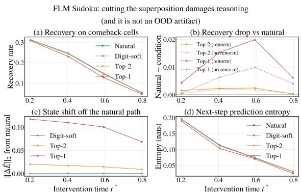

# EFFICIENT REASONING WITH FLOW LANGUAGE MODELS

Hanru Bai1,2, Faissal Izermine1,3, Oscar Davis4, T. Konstantin Rusch1,3,5,6∗ 1Max Planck Institute for Intelligent Systems, 2ETH Zurich, 3ELLIS Institute Tubingen,¨ 4University of Oxford, 5Tubingen AI Center, ¨ 6Liquid AI

## ABSTRACT

Flow Language Models (FLMs) have emerged as a continuous-state alternative to discrete diffusion language models, yet the role of their continuous representations in reasoning remains unclear. We investigate this question by comparing the reasoning efficiency of FLMs and discrete diffusion models, measured by solution accuracy under matched denoising steps. Unlike discrete diffusion, which passes categorical states between denoising steps, FLMs evolve a continuous sequence representation throughout denoising and decodes it into discrete tokens only at the end. Our theoretical analysis shows, from a superposition perspective, how information retained in these continuous states can benefit reasoning. Intermediatestate interventions provide further empirical support for this theoretical account, showing that removing information about alternative candidates reduces subsequent solution recovery. Together, these findings show that FLMs allow evidence for multiple candidates to persist and inform subsequent reasoning before a discrete answer is produced. Furthermore, our experiments on maze planning and Sudoku tasks show that FLMs achieve greater reasoning efficiency in the few-step regime: FLMs achieves higher sequence accuracy than discrete diffusion baselines at matched model sizes and small denoising steps. On maze planning tasks, FLMs can also achieve comparable accuracy with smaller models. For example, on Maze15, FLM reaches the 95% accuracy target at 64 denoising steps with 36.5% fewer parameters than MDLM. These findings point to continuous state spaces as a promising foundation for reasoning models that require fewer refinement steps.

## 1 INTRODUCTION

Reasoning is essential for many real-world decision-making problems. It requires models to integrate partial information and refine intermediate computational states before reaching a valid solution (Xu et al., 2025; Patil & Jadon, 2025). The reasoning capabilities of autoregressive models have been extensively studied, and their capabilities largely extended through chain-of-thought prompting (Wei et al., 2022) and more recent continuous chain-of-thought variants (Hao et al., 2024; Zhu et al., 2026). These methods allocate additional computation to a sequential chain of intermediate thoughts. While effective on many tasks, this sequential formulation alone may lack the flexibility needed for exploration, planning, or comparing multiple candidate solution paths (Yao et al., 2023). This motivates the study of alternative generation paradigms for reasoning.

Among these alternatives, diffusion language models provide a framework for iterative sequence generation (Austin et al., 2021; Lou et al., 2023; Sahoo et al., 2024). They refine a sequence over multiple denoising steps without requiring a fixed left-to-right generation order. The denoising process allows multiple token positions to be updated together, with some formulations also permitting previously generated tokens to be revised in subsequent steps. This ability to jointly predict undecoded tokens can also benefit reasoning tasks that require planning and global coherence (He et al., 2026).

Since language is typically represented by discrete tokens, many diffusion language models perform denoising directly in a discrete state space (Austin et al., 2021; Lou et al., 2023; Sahoo et al., 2024; Ye et al., 2025). In standard discrete sampling, the denoiser uses interactions across positions to predict token probabilities, but the state passed to the next step contains only a single categorical value per position, which may be a token or a mask. The probabilities assigned to alternative tokens are therefore not explicitly preserved in this state. Early token choices may also influence subsequent predictions at other positions through bidirectional attention, making refinement sensitive to local decisions made before sufficient information has been integrated. It therefore remains unclear whether discrete states provide a sufficiently expressive medium for iterative reasoning.

Motivated by latent reasoning (Hao et al., 2024), we ask whether reasoning can instead unfold in a continuous space without committing to a categorical state at each denoising step. Flow Language Models (FLMs) (Lee et al., 2026; Roos et al., 2026; Potaptchik et al., 2026) realize this idea by evolving continuous sequence representations throughout denoising and decoding discrete tokens only at the end. Their intermediate states can retain soft representations of multiple candidate tokens, allowing subsequent computation to refine these alternatives before producing a discrete answer.

Recent work has developed continuous diffusion and flow-matching methods for language modeling (Hu et al., 2026; Chen et al., 2026), but their reasoning efficiency remains less understood. Our goal is to compare the reasoning efficiency of continuous FLMs with discrete diffusion models, measured by solution accuracy under a fixed budget of denoiser evaluations. To isolate reasoning capability, we focus on structured, verifiable tasks. Our results indicate that continuous FLMs can offer a better accuracy–computation trade-off than discrete diffusion models in the settings studied, particularly in the few-step regime. Our main contributions are the following.

• We systematically study the reasoning efficiency of continuous FLMs relative to discrete diffusion models, measured by accuracy under a fixed denoising step. Beyond final accuracy alone, we examine the accuracy – computation trade-off throughout iterative refinement, emphasizing the few-step regime.

• From a superposition perspective, we identify a theoretical mechanism by which continuous states preserve useful intermediate information and enable its use in subsequent denoising steps. Candidate-retention measurements, controlled interventions, and decoder probes provide empirical support for this mechanism.

• Experimentally, we demonstrate that FLMs achieve stronger few-step reasoning efficiency than discrete diffusion baselines across both maze planning and Sudoku, attaining higher sequence accuracy under matched model sizes and small denoising steps. On the maze benchmarks specifically, the advantage of FLMs over MDLM becomes more pronounced as the task difficulty increases, and FLMs reach matched accuracy targets with smaller models.

## 2 PROBLEM SETUP

Tokenized sequence representation. Let $\mathcal { V } _ { \mathrm { t o k } }$ denote the tokenizer vocabulary and $K = | \nu _ { \mathrm { t o k } } |$ Each conditioning input and target output are serialized and tokenized into sequences $\begin{array} { r l } { \mathbf { c } } & { { } = } \end{array}$ $\left( c _ { 1 } , \dots , c _ { M _ { c } } \right)$ and $\mathbf { x } = \left( x _ { 1 } , \ldots , x _ { M _ { x } } \right)$ . Let $\boldsymbol { e } _ { a } \in \mathbb { R } ^ { K }$ denote the one-hot vector associated with token $a \in \mathcal { V } _ { \mathrm { t o k } }$ . For a token sequence $\mathbf { s } = ( s _ { 1 } , \hdots , s _ { m } )$ , we write the one-hot representation of s as $\mathrm { O H } ( \mathbf { s } ) = [ e _ { s _ { 1 } } , \ldots , e _ { s _ { m } } ] ^ { \top } \in \bar { \mathbb { R } } ^ { m \times K }$ . The conditioning and clean target states are

$$
\begin{array} { r } { \mathbf { C } = \mathrm { O H } ( \mathbf { c } ) \in \mathbb { R } ^ { M _ { c } \times K } , \qquad Z _ { 1 } = \mathrm { O H } ( \mathbf { x } ) \in \mathbb { R } ^ { M _ { x } \times K } . } \end{array}\tag{1}
$$

Conditional flow matching. FLM keeps ${ \bf C } _ { { \mathcal G } , { \bf q } }$ fixed and evolves a continuous answer state $\boldsymbol { Z } _ { t } \in$ $\mathbb { R } ^ { M _ { x } \times K }$ . During training, we sample $Z _ { 0 } \sim \mathcal { N } ( \mathbf { 0 } , I )$ and construct the linear interpolation

$$
\begin{array} { r } { Z _ { t } = ( 1 - t ) Z _ { 0 } + t Z _ { 1 } , \qquad t \sim \mathcal { U } [ 0 , 1 ] . } \end{array}\tag{2}
$$

Given $( Z _ { t } , t , { \bf C } _ { \mathcal { G } , q } )$ , the model predicts a distribution over the tokenizer vocabulary at each answer position: $P _ { \theta } ( Z _ { t } , t , \mathbf { C } _ { \mathcal { G } , \mathbf { q } } ) \in ( \Delta ^ { K - 1 } ) ^ { M _ { x } }$ . We train the model to recover clean answer tokens using

$$
\begin{array} { r } { \mathcal { L } _ { \mathrm { F M } } ( \theta ) = \mathbb { E } \left[ - \sum _ { i = 1 } ^ { M _ { x } } \log P _ { \theta } ( Z _ { t } , t , \mathbf { C } _ { \mathcal { G } , q } ) _ { i , x _ { i } } \right] . } \end{array}\tag{3}
$$

At inference time, we initialize $Z _ { 0 } \sim \mathcal { N } ( \mathbf { 0 } , I )$ and numerically integrate

$$
\begin{array} { r } { \frac { d Z _ { t } } { d t } = \frac { P _ { \theta } ( Z _ { t } , t , \mathbf { C } _ { \mathcal { G } , q } ) - Z _ { t } } { 1 - t } , \qquad 0 \leq t < 1 . } \end{array}\tag{4}
$$

Using N integration steps requires N forward passes. After the final update, the answer is discretized once as $\widehat { x } _ { i } = \arg \operatorname* { m a x } _ { a \in \mathcal { V } _ { \mathrm { t o k } } } ( Z _ { 1 } ) _ { i , a }$ , for all $i = 1 , \ldots , M _ { x }$ . The decoded token sequence is then detokenized and parsed into the predicted path, $\widehat { Y }$

## 3 THEORETICAL ANALYSIS

We begin by developing theoretically a representational account of how continuous FLM states preserve and use information not captured by their hard-token projections. Section 3.1 shows that FLM denoising accumulates a temporal superposition of candidate sequences. Section 3.2 characterizes how retained non-top-1 historical support can affect model computation and clean-token margins without changing the current hard state. Finally, Section 3.3 quantifies the task-relevant predictive information available beyond hard projection through decoder-risk bounds.

## 3.1 TEMPORAL CANDIDATE-SEQUENCE SUPERPOSITION

Let $\begin{array} { r } { S _ { M _ { x } } = \mathcal { V } _ { \mathrm { t o k } } ^ { M _ { x } } } \end{array}$ denote the set of candidate token sequences. Each $\mathbf { s } = ( s _ { 1 } , \ldots , s _ { M _ { x } } ) \in S _ { M _ { a } }$ corresponds to the one-hot vertex ${ \bf E } ^ { ( \bf s ) } = \mathrm { O H } ( { \bf s } ) , \mathcal { H } = \left\{ { \bf E } ^ { ( \bf s ) } : { \bf s } \in \mathcal { S } _ { M _ { x } } \right\}$ , where H is the set of complete hard-token states. At time t, let $P _ { t } = P _ { \theta } ( Z _ { t } , i , \mathbf { C } _ { \mathcal { G } , q } )$ be the position-wise clean-token prediction and define $\begin{array} { r } { \pi _ { \mathbf { s } } ( t ) = \prod _ { j = 1 } ^ { M _ { x } } ( P _ { t } ) _ { j , s _ { j } } } \end{array}$ . These weights form a probability distribution and yield the exact decomposition $\begin{array} { r } { P _ { t } = \sum _ { \mathbf s \in S _ { M _ { r } } } \pi _ { \mathbf s } ( t ) \mathbf { E } ^ { ( \mathbf { s } ) } } \end{array}$ . Thus, each instantaneous clean prediction is a convex superposition of candidate-sequence vertices.

Theorem 1 (Candidate-sequence superposition in FLM) Suppose that the FLM state follows

$$
\begin{array} { r } { \frac { d Z _ { t } } { d t } = \frac { P _ { t } - Z _ { t } } { 1 - t } , \qquad 0 \leq t < 1 , } \end{array}\tag{5}
$$

and that Pt is integrable along the trajectory. Then, for every $0 < t < 1$

$$
\begin{array} { r } { Z _ { t } = ( 1 - t ) Z _ { 0 } + t \overline { { \mathbf { E } } } _ { t } , \qquad \overline { { \mathbf { E } } } _ { t } = \sum _ { \mathbf { s } \in S _ { M _ { x } } } \overline { { \boldsymbol { \pi } } } _ { \mathbf { s } } ( t ) \mathbf { E } ^ { ( \mathbf { s } ) } , } \end{array}\tag{6}
$$

where

$$
\begin{array} { r } { \overline { { \pi } } _ { \mathbf { s } } ( t ) = \frac { 1 - t } { t } \int \displaylimits _ { 0 } ^ { t } \frac { \pi _ { \mathbf { s } } ( u ) } { ( 1 - u ) ^ { 2 } } d u , \qquad \overline { { \pi } } _ { \mathbf { s } } ( t ) \geq 0 , \qquad \sum _ { \mathbf { s } } \overline { { \pi } } _ { \mathbf { s } } ( t ) = 1 . } \end{array}\tag{7}
$$

Therefore, apart from the residual initial noise $( 1 - t ) Z _ { 0 } ,$ the FLM state contains a temporally accumulated convex superposition of candidate-sequence vertices. If two distinct sequences have positive integrated weights, then $\overline { { \mathbf { E } } } _ { t } \notin \mathcal { H } ;$ hence, this denoised component cannot be represented by any single complete hard-token state

Theorem 1 shows that the FLM state preserves historical support for non-top-1 candidates through a discounted superposition of past token distributions. Our intermediate-state intervention experiments further suggest that FLM uses those superposed candidate information for subsequent refinement during reasoning (Section 4.4). We next characterize how historical candidate information retained by superposition can affect clean-token predictions without changing the current argmax. Discrete solvers retaining only the current hard-token sequence cannot distinguish such histories at fixed time.

## 3.2 HISTORICAL INFLUENCE WITHIN A FIXED HARD STATE

We compare the original state with one in which a non-top-1 candidate’s historical contribution is removed. Fix the context, time $t \in ( 0 , 1 )$ , parameters, and attention mask. Let Π denote rowwise argmax with fixed tie-breaking, and $\mathbf { x } \ = \Pi ( Z _ { t } )$ the current hard-token sequence. For a strict non-top-1 candidate v at free position $j ,$ define

$$
h _ { t } = t ( \overline { { \mathbf { E } } } _ { t } ) _ { j , v } > 0 , \qquad \mathbf { U } _ { t } ( \lambda ) = Z _ { t } - ( h _ { t } - \lambda ) \mathbf { D } ^ { j v } , \qquad \mathbf { D } ^ { j v } = \mathbf { e } _ { j } \mathbf { e } _ { v } ^ { \top } ,
$$

where $\lambda \in [ 0 , h _ { t } ]$ is the retained historical support. Let $P _ { t } ^ { ( \lambda ) }$ be the full prediction recomputed on $\mathbf { U } _ { t } ( \lambda )$ , and write $M _ { t } ^ { ( \lambda ) } = ( P _ { t } ^ { ( \lambda ) } ) _ { j , v } - ( P _ { t } ^ { ( \lambda ) } ) _ { j , x _ { j } }$ , with $\dot { M _ { t } } = M _ { t } ^ { ( h _ { t } ) }$

For first-layer scaled dot-product attention, denote the queries, keys, values, and softmax weights by $\mathbf { q } _ { i } ^ { b } , \mathbf { k } _ { m } ^ { b } , \mathbf { v } _ { m } ^ { b } , a _ { i m } ^ { b }$ , respectively, with $\begin{array} { r } { \mathbf { o } _ { i } ^ { b } = \sum _ { m } a _ { i m } ^ { b } \mathbf { v } _ { m } ^ { b } } \end{array}$ . Write $M _ { t } ^ { ( \lambda ) } = F _ { t } ( O ( \lambda ) , \xi ( \lambda ) )$ : O collects

all head outputs at all positions, ξ collects bypass inputs, and $F _ { t }$ includes all subsequent computation. With overdots denoting derivatives with respect to $\lambda ,$ set

$$
\begin{array} { r } { \mathbf { g } _ { i } ^ { b } = \nabla _ { \mathbf { o } _ { i } ^ { b } } F _ { t } , \quad \eta _ { i m } ^ { b } = \langle \mathbf { g } _ { i } ^ { b } , \mathbf { v } _ { m } ^ { b } \rangle , \quad \rho _ { i m } ^ { Q , b } = \frac { \langle \dot { \mathbf { q } } _ { i } ^ { b } , \mathbf { k } _ { m } ^ { b } \rangle } { \sqrt { d _ { b } } } , \quad \rho _ { i m } ^ { K , b } = \frac { \langle \mathbf { q } _ { i } ^ { b } , \dot { \mathbf { k } } _ { m } ^ { b } \rangle } { \sqrt { d _ { b } } } , } \end{array}
$$

where $d _ { b }$ is the head dimension. All quantities depend on $\lambda ;$ expectations and covariances below use the attention distribution $m \sim a _ { i } ^ { b }$ over visible positions.

Theorem 2 (Historical influence within a fixed hard state) Assume deterministic evaluation and that the query, key, value, and bypass maps, together with the downstream map $F _ { t } ,$ , are continuously differentiable on open sets containing their respective inputs along the intervention path. For every $\lambda \in [ 0 , h _ { t } ] ,$

$$
\Pi ( { \bf U } _ { t } ( \lambda ) ) = { \bf x } , ~ \partial _ { \lambda } M _ { t } ^ { ( \lambda ) } = { \mathcal C } _ { Q } + { \mathcal C } _ { K } + { \mathcal C } _ { V } + { \mathcal C } _ { R } = : { \mathcal C } ( \lambda ) , w h e r e\tag{8}
$$

$$
\begin{array} { r } { \mathcal { C } _ { X } = \sum _ { b , i } \mathrm { C o v } _ { m \sim a _ { i } ^ { b } } ( \rho _ { i m } ^ { X , b } , \eta _ { i m } ^ { b } ) , X \in \{ Q , K \} ; \mathcal { C } _ { V } = \sum _ { b , i } \mathbb { E } _ { m \sim a _ { i } ^ { b } } \langle \mathbf { g } _ { i } ^ { b } , \dot { \mathbf { v } } _ { m } ^ { b } \rangle , \mathcal { C } _ { R } = \langle \nabla _ { \xi } F _ { t } , \dot { \xi } \rangle . } \end{array}\tag{9}
$$

If the maps preceding attention act independently at each position, then for $i \neq j$ with j visible,

$$
\begin{array} { r } { \dot { \mathbf { o } } _ { i } ^ { b } = a _ { i j } ^ { b } ( \mathbf { v } _ { j } ^ { b } - \mathbf { o } _ { i } ^ { b } ) \rho _ { i j } ^ { K , b } + a _ { i j } ^ { b } \dot { \mathbf { v } } _ { j } ^ { b } . } \end{array}\tag{10}
$$

Wherever $\mathcal { C } ( \lambda ) \neq 0 ,$ , sufficiently small admissible nonzero perturbations change the margin without changing x. Moreover,

$$
\begin{array} { r } { \Delta _ { t } : = M _ { t } - M _ { t } ^ { ( 0 ) } = \int _ { 0 } ^ { h _ { t } } \mathcal { C } ( \lambda ) d \lambda . } \end{array}\tag{11}
$$

Let $\begin{array} { r } { \Omega _ { t } = \operatorname* { m a x } _ { \lambda } M _ { t } ^ { ( \lambda ) } - \operatorname* { m i n } _ { \lambda } M _ { t } ^ { ( \lambda ) } } \end{array}$ over this path. $\Omega _ { t } > 0$ if and only $i f { \mathcal { C } } \not \equiv 0$ . Every scalar readout $H$ using only context, time, and the hard state satisfies

$$
\begin{array} { r } { \operatorname* { s u p } _ { \lambda \in [ 0 , h _ { t } ] } \left| M _ { t } ^ { ( \lambda ) } - H ( \mathbf { C } _ { \mathcal { G } , q } , t , \Pi ( \mathbf { U } _ { t } ( \lambda ) ) ) \right| \geq \frac { \Omega _ { t } } { 2 } \geq \frac { | \Delta _ { t } | } { 2 } . } \end{array}\tag{12}
$$

The bound is tight.

Equation 9 separates attention reweighting through $\mathrm { Q / K , }$ , message changes through $\mathrm { v , }$ and bypass responses; their signed effects may reinforce or cancel. Equation 10 makes the influence on other positions explicit, while Equation 12 bounds the margin variation that a readout of the hard state cannot reproduce. We experimentally test this mechanism by removing retained non-top-1 historical support while preserving the hard-token sequence and measuring the resulting prediction-margin changes and Q/K/V/bypass contribution in Appendix D.3.

Appendix C.3 further shows how these differences propagate through Euler updates and when the original trajectory strengthens a candidate’s relative support without changing the hard-token sequence. We next examine whether these differences help predict the correct solution. The following theorem quantifies this distinction through bounds on prediction risk.

## 3.3 TASK-RELEVANT INFORMATION BEYOND HARD PROJECTION

At fixed time t, we predict target-path membership $Y = \mathbf { 1 } \{ X _ { J } = v _ { \mathrm { p a t h } } \}$ , where $X _ { J }$ is the target token at a uniformly sampled output position J. Inputs $A _ { t } , B _ { t }$ share the context in a window $\mathcal { N }$ around J, using respectively the continuous state and its rowwise one-hot argmax with fixed tiebreaking. Let $\breve { R } _ { t } ^ { Z } , \breve { R } _ { t } ^ { \mathrm { h a r d } }$ denote their unweighted population BCE risks, $\Delta _ { t } ^ { \mathrm { d e c } } = R _ { t } ^ { \mathrm { h a r d } } - R _ { t } ^ { Z }$ , and $\varepsilon _ { \star } ^ { Z } , \varepsilon _ { \star } ^ { \mathrm { h a r \overline { { d } } } }$ their excess risks above the corresponding Bayes risks. For $\mathbf { W } _ { t } = \operatorname { s o f t m a x } \tilde { ( } ( Z _ { t } ) _ { \mathcal { N } } )$ , define $\mathring { A } _ { t } ^ { \mathrm { s o f t } ^ { \upsilon } } = \left( \mathbf { C } _ { \mathcal { N } } , \mathbf { W } _ { t } \right)$ and $A _ { t } ^ { \operatorname { c o n f } } = ( B _ { t } , \operatorname* { m a x } \mathbf { \dot { W } } _ { t } )$ , with softmax and maxima taken rowwise.

Theorem 3 (Task-relevant information beyond hard projection) Assume finite decoder risks and let $b _ { t } \geq ( \mathbb { E } \| ( { \pmb { Z } } _ { t } ) _ { J , : } - { \mathbf e } _ { X _ { J } } ^ { \top } \| _ { 2 } ^ { 2 } ) ^ { 1 / 2 }$ . Define the predictive signal beyond winner confidence by

$$
\nu _ { t } = \mathbb { E } \left[ \operatorname { V a r } \left( \operatorname* { P r } ( Y = 1 \mid A _ { t } ^ { \mathrm { s o f t } } ) \mid A _ { t } ^ { \mathrm { c o n f } } \right) \right] .\tag{13}
$$

Then, with $h _ { \mathrm { b i n } }$ denoting binary entropy in nats,

$$
2 \nu _ { t } - \varepsilon _ { t } ^ { Z } \leq \Delta _ { t } ^ { \mathrm { d e c } } \leq h _ { \mathrm { b i n } } \left( \operatorname* { m i n } \{ 1 / 2 , 2 b _ { t } ^ { 2 } \} \right) + \varepsilon _ { t } ^ { \mathrm { h a r d } } .\tag{14}
$$

Also, $R _ { t } ^ { Z } \leq h _ { \mathrm { b i n } } ( \operatorname* { m i n } \{ 1 / 2 , 2 b _ { t } ^ { 2 } \} ) + \varepsilon _ { t } ^ { Z } .$

Table 1: Sequence accuracy (%) of FLM and baseline methods on Maze10, Maze15, and Maze20 across denoising steps. + Ent. and + Conf. denote entropy-based and confidence-based remasking, respectively. For each task and method, green marks the first tested step reaching at least 95%; yellow marks the first attaining its observed maximum.
<table><tr><td>Task</td><td> $\begin{array} { c } { P a r a m s } \\ { ( M ) } \end{array}$ </td><td>N</td><td>CoT</td><td></td><td>D3PM SEDD</td><td>SEDD + Ent.</td><td>SEDD + Conf.</td><td>MDLM ReMDM</td><td></td><td>MDLM + Ent.</td><td>MDLM + Conf.</td><td>FLM</td></tr><tr><td rowspan="12">Maze10</td><td></td><td>1</td><td></td><td>77.5</td><td>94.0</td><td>94.0</td><td>94.0</td><td>87.5</td><td>87.5</td><td>87.2</td><td>87.5</td><td>95.7</td></tr><tr><td></td><td>2</td><td></td><td>82.8</td><td>96.3</td><td>99.7</td><td>98.8</td><td>89.0</td><td>89.0</td><td>66.3</td><td>93.1</td><td>99.5</td></tr><tr><td></td><td>4</td><td></td><td>85.9</td><td>96.7</td><td>98.3</td><td>NR</td><td>92.2</td><td>92.3</td><td>66.2</td><td>95.4</td><td>99.5</td></tr><tr><td></td><td>8</td><td></td><td>91.4</td><td>98.8</td><td>97.0</td><td>99.4</td><td>94.0</td><td>94.2</td><td>71.4</td><td>96.2</td><td>99.5</td></tr><tr><td>59.11</td><td>16</td><td>94.2 50.5</td><td>98.9</td><td></td><td>96.9</td><td>99.7</td><td>96.3</td><td>96.4</td><td>69.2</td><td>97.7</td><td>99.5</td></tr><tr><td></td><td>32</td><td></td><td>95.7</td><td>99.3</td><td>96.7</td><td>99.5</td><td>97.8</td><td>97.9</td><td>75.9</td><td>98.5</td><td>99.5</td></tr><tr><td></td><td>64</td><td></td><td>96.8</td><td>99.7</td><td>96.5</td><td>99.6</td><td>98.0</td><td>98.4</td><td>77.8</td><td>99.1</td><td>99.6</td></tr><tr><td></td><td>128</td><td></td><td>97.5</td><td>99.8</td><td>96.0</td><td>98.9</td><td>98.8</td><td>99.0</td><td>75.9</td><td>99.3</td><td>99.6</td></tr><tr><td></td><td>256</td><td></td><td>98.4</td><td>99.8</td><td>95.8</td><td>99.0</td><td>98.3</td><td>98.5</td><td>84.4</td><td>99.5</td><td>99.6</td></tr><tr><td></td><td>512</td><td></td><td>98.1</td><td>99.8</td><td>95.0</td><td>99.0</td><td>98.3</td><td>98.9</td><td>83.6</td><td>99.1</td><td>99.6</td></tr><tr><td rowspan="13">Maze15</td><td></td><td>1</td><td></td><td>45.7</td><td>52.6</td><td>52.6</td><td>52.6</td><td>49.8</td><td>49.8</td><td>49.8</td><td>49.8</td><td>95.9</td></tr><tr><td>2 4</td><td></td><td></td><td>52.2</td><td>61.2 67.5</td><td>73.3</td><td>77.5</td><td>54.9</td><td>54.9</td><td>32.0</td><td>75.7</td><td>98.9</td></tr><tr><td></td><td></td><td></td><td>58.1 66.8</td><td></td><td>81.1</td><td>80.5</td><td>62.5</td><td>62.9</td><td>33.7</td><td>80.4</td><td>99.1</td></tr><tr><td></td><td>8</td><td></td><td></td><td>73.3</td><td>84.8</td><td>85.6</td><td>69.6</td><td>69.8</td><td>35.2</td><td>85.8</td><td>99.1</td></tr><tr><td>88.25</td><td>16</td><td>22.3</td><td>74.6</td><td>81.1</td><td>84.3</td><td>90.4</td><td>76.2</td><td>77.4</td><td>38.5</td><td>88.2</td><td>99.1</td></tr><tr><td></td><td>32</td><td></td><td>82.4</td><td>86.8</td><td>87.4</td><td>94.4</td><td>83.7</td><td>84.4</td><td>39.6</td><td>93.1</td><td>99.1</td></tr><tr><td></td><td>64</td><td></td><td>87.0</td><td>90.8</td><td>85.4</td><td>96.4</td><td>88.3</td><td>88.6</td><td>39.4</td><td>94.0</td><td>99.2</td></tr><tr><td></td><td>128</td><td></td><td>90.8</td><td>93.2</td><td>81.6</td><td>96.6</td><td>91.8</td><td>92.1</td><td>39.4</td><td>97.8</td><td>99.2</td></tr><tr><td></td><td>256</td><td></td><td>91.5</td><td>95.0</td><td>79.7</td><td>96.1</td><td>93.7</td><td>94.2</td><td>39.9</td><td>97.8</td><td>99.2</td></tr><tr><td rowspan="13">Maze20</td><td></td><td>512</td><td></td><td>92.6</td><td>95.4</td><td>78.4</td><td>95.9</td><td>95.3</td><td>96.2</td><td>42.1</td><td>97.1</td><td>99.2</td></tr><tr><td></td><td>1</td><td></td><td>33.5 37.3</td><td>33.6</td><td>33.6</td><td>33.6</td><td>35.6</td><td>35.6</td><td>35.3</td><td>35.6</td><td>71.4</td></tr><tr><td></td><td>2</td><td></td><td>44.0</td><td>37.8 40.8</td><td>41.7</td><td>62.4</td><td>41.2</td><td>42.6</td><td>30.8</td><td>49.3</td><td>88.1</td></tr><tr><td></td><td>4 8</td><td></td><td>51.0</td><td>49.4</td><td>68.3</td><td>70.1</td><td>48.2</td><td>48.8</td><td>28.7</td><td>54.0</td><td>91.3</td></tr><tr><td></td><td>16</td><td></td><td>60.8</td><td>56.0</td><td>84.0 89.0</td><td>76.5 79.9</td><td>55.8 63.0</td><td>54.1 64.9</td><td>29.5 30.1</td><td>60.4</td><td>92.1</td></tr><tr><td>258.81</td><td></td><td>32.2</td><td></td><td>63.8</td><td>90.0</td><td>83.3</td><td>70.6</td><td>71.7</td><td>30.0</td><td>67.0 73.1</td><td>92.4 92.5</td></tr><tr><td></td><td>32</td><td></td><td>67.5</td><td>73.2</td><td>90.4</td><td>85.9</td><td>80.2</td><td>80.1</td><td>29.7</td><td>87.4</td><td>92.5</td></tr><tr><td></td><td>64</td><td></td><td>77.3</td><td>79.4</td><td>90.0</td><td>88.4</td><td>83.7</td><td>86.7</td><td>31.1</td><td>94.7</td><td>92.6</td></tr><tr><td></td><td>128 256</td><td></td><td>81.8</td><td>82.5</td><td>87.2</td><td>92.1</td><td>87.9</td><td>89.1</td><td>31.2</td><td>98.3</td><td>92.6</td></tr><tr><td></td><td></td><td></td><td>86.5</td><td>87.1</td><td>84.1</td><td>91.5</td><td>90.1</td><td>90.6</td><td>32.8</td><td>99.1</td><td>92.9</td></tr><tr><td></td><td>512</td><td></td><td>86.3</td><td></td><td></td><td></td><td></td><td></td><td></td><td></td><td></td></tr></table>

The left-hand inequality in Equation 14 guarantees a predictive advantage when $2 \nu _ { t } > \varepsilon _ { t } ^ { Z } ;$ ; the right-hand inequality implies that the Bayes-risk gap vanishes as $b _ { t } \to 0$ . We examine this retained information experimentally by using matched decoders on intermediate FLM states and their hard projections, measuring how well each representation supports prediction of the correct solution in Section 4.4. All detailed proofs are provided in the Appendix C.

## 4 EXPERIMENTS

Our experiments are designed to evaluate the reasoning capability of continuous flow-based models rather than their general language modeling ability. We therefore focus on structured, non-linguistic tasks in two complementary reasoning domains: maze planning (Section 4.2) and Sudoku (Section 4.3). The maze datasets provide a controlled family of planning problems whose difficulty increases with maze size, allowing us to study not only how performance varies with the number of denoising steps but also how it depends on task difficulty and model capacity. Sudoku-Extreme provides a substantially different constraint-satisfaction problem and allows us to test whether the behavior of FLM extends beyond path planning. Finally, motivated by our theoretical analysis, we conduct a superposition analysis of FLM’s intermediate states to examine whether the information they retain contributes to subsequent reasoning (Section 4.4).

  
Figure 1: Sequence accuracy across denoising steps and model capacities. FLM and MDLM are evaluated on Maze10 (left), Maze15 (center), and Maze20 (right), with three model sizes per task. Colors distinguish methods, while marker shapes and line styles distinguish model sizes; parameter counts are listed below each panel. Insets enlarge the 98 – 100% sequence accuracy range.

## 4.1 EXPERIMENTAL SETUP

Benchmarks. For maze reasoning, we construct Maze10, Maze15, and Maze20 based on the maze-generation procedure in Zhang et al. (2026). With a consistent task formulation, these datasets provide a controlled setting for studying reasoning as maze size and path-planning difficulty increase. We additionally evaluate on Sudoku-Extreme, which requires completing a 9 × 9 board that satisfies all row, column, and sub-grid constraints. To assess distributional generalization, we further test models trained on Sudoku-Extreme directly on Standard Sudoku without additional fine-tuning. Construction procedures, splits, and detailed statistics for all datasets are provided in Appendix D.1.

Baselines and Evaluation. We compare FLM with representative discrete diffusion models, including D3PM (Austin et al., 2021), SEDD (Lou et al., 2023), MDLM (Sahoo et al., 2024), and ReMDM (Wang et al., 2026). Among these, ReMDM modifies the reverse transition to allow previously generated tokens to be remasked and resampled, thereby permitting error correction. For masked discrete diffusion models, we additionally evaluate confidence-based remasking, which revisits lowconfidence tokens, and entropy-ordered decoding, which prioritizes low-entropy positions without revising committed tokens. A Transformer with chain-of-thought (Wei et al., 2022) serves as an additional autoregressive baseline for both maze planning and Sudoku. To ensure a fair comparison, all models use the same backbone and parameter count, with matched denoising steps for FLM and discrete diffusion methods. Across all comparisons, we use sequence accuracy as the primary metric, which counts a prediction as correct only when the complete solution sequence matches the answer.

Implementation Details. For both maze and Sudoku tasks, FLM uses a bidirectional Transformer with fixed input conditions. We train on Gaussian-to-one-hot interpolations using a clean-token cross-entropy objective, optimize with AdamW (Loshchilov et al., 2017), and evaluate EMA weights. Inference uses Euler integration on a uniform time grid followed by tokenwise argmax. All methods are adapted from their corresponding original codebases. Detailed implementations of FLM and all comparison baselines, including architecture configurations, training settings, and sampling procedures, are provided in Appendix D.2.

## 4.2 MAZE PLANNING: REASONING EFFICIENCY ACROSS TASK DIFFICULTIES

Maze provides our main controlled benchmark for studying how continuous and discrete generative reasoning behave as planning difficulty increases. We compare against baselines and study the effect of model capacity. Additional results on wall-clock inference efficiency are given in Appendix D.5.

  
(a)

  
(b)

  
Figure 2: Model capacity and denoising efficiency across maze difficulties. (a) Sequence accuracy of FLM and MDLM on Maze10, Maze15, and Maze20 at 4 and 64 denoising steps. (b) Smallest tested model reaching 95% sequence accuracy at each step budget on Maze10 and Maze15. Parameter counts in (a) use a logarithmic axis, while those in (b) are displayed as categorical levels. Crosses indicate that no tested model reaches the target at the corresponding step budget.

Table 2: Sequence accuracy (%) on Sudoku-Extreme and Standard Sudoku under selected numbers of sampling steps. Each entry reports Sudoku-Extreme / Standard Sudoku. All models have 86.88M parameters and are trained on Sudoku-Extreme; Standard Sudoku evaluates zero-shot transfer without further fine-tuning. Yellow highlights the highest accuracy for each dataset at each step budget, including ties.
<table><tr><td rowspan="3">Method</td><td colspan="6">Evaluation Sampling Steps</td></tr><tr><td>1</td><td>2</td><td>16</td><td>64</td><td>256</td><td>512</td></tr><tr><td></td><td colspan="5">2.9/3.5</td></tr><tr><td>Transformer + CoT D3PM</td><td colspan="5"></td><td>43.1/47.9</td></tr><tr><td>SEDD</td><td>11.2/19.5 18.5/25.0</td><td>14.0/22.9 21.2/28.2</td><td>32.0/38.6 37.1/43.3</td><td>40.3/45.7 46.8/50.8</td><td>42.3/46.1 48.7/51.1</td><td>47.9/53.1</td></tr><tr><td>SEDD + Ent.</td><td>18.8/25.5</td><td>36.2/41.4</td><td>52.4/57.9</td><td>53.6/57.8</td><td>53.8/58.1</td><td>54.3/57.5</td></tr><tr><td>SEDD + Conf.</td><td>18.8/25.5</td><td>26.4/32.1</td><td>44.4/50.3</td><td>56.2/60.6</td><td>57.7/61.8</td><td>57.4/62.0</td></tr><tr><td>MDLM</td><td>19.1/27.1</td><td>21.7/29.5</td><td>40.0/45.0</td><td>47.8/52.0</td><td>47.6/53.3</td><td>49.2/53.0</td></tr><tr><td>MDLM + Ent.</td><td>19.2/27.1</td><td>33.5/39.5</td><td>51.2/55.6</td><td>52.5/57.0</td><td>51.8/58.3</td><td>53.6/57.6</td></tr><tr><td>MDLM + Conf.</td><td>19.2/27.1</td><td>26.5/33.6</td><td>47.6/51.5</td><td>60.2/64.1</td><td>62.3/65.6</td><td>62.2/64.3</td></tr><tr><td>ReMDM</td><td>19.2/27.1</td><td>21.7/29.6</td><td>38.8/44.4</td><td>46.4/52.4</td><td>52.0/55.0</td><td>53.8/59.2</td></tr><tr><td></td><td></td><td></td><td></td><td></td><td></td><td></td></tr><tr><td>FLM</td><td>21.0/29.5</td><td>36.7/41.4</td><td>46.3/49.5</td><td>43.9/50.5</td><td>46.0/51.4</td><td>45.5/51.3</td></tr></table>

Comprehensive comparison with baselines. Table 1 compares FLM against discrete diffusion, enhanced sampling, and autoregressive baselines. FLM achieves the highest reported one-step sequence accuracy on all three tasks and maintains a clear few-step advantage on Maze15 and Maze20. These results highlight FLM’s reasoning efficiency under limited denoising budgets.

Effect of model capacity. We compare FLM and MDLM across three model sizes per maze task (Figure 1). At comparable model sizes, FLM maintains higher accuracy as maze difficulty increases in several evaluated settings, with a larger gap over MDLM on Maze15 than on Maze10 (Figure 2(a)). FLM can also reach the same accuracy target with a smaller model: on Maze15 at 64 denoising steps, the smallest tested models reaching 95% accuracy have 88.25M parameters for FLM and 139.00M for MDLM (Figure 2(b)). These results show an advantage for FLM on harder maze tasks under limited model capacity. We provide full results across all model sizes and denoising steps in Appendix D.4.

## 4.3 SUDOKU: FEW-STEP CONSTRAINT REASONING AND GENERALIZATION

We next test whether the same few-step advantage appears in a qualitatively different reasoning domain. Unlike maze planning, Sudoku requires resolving a large collection of mutually interacting row, column, and sub-grid constraints, providing a complementary test of structured reasoning.

Few-step refinement on Sudoku-Extreme. Table 2 shows that FLM improves rapidly within the first two sampling steps. On Sudoku-Extreme, FLM achieves 21.0% sequence accuracy at one step and 36.7% at two steps, compared with 19.2% and 36.2% for the strongest discrete baseline at each budget. Further sampling yields more limited gains for FLM, whereas enhanced discrete samplers achieve higher accuracy from 16 steps onward. These results support FLM’s effectiveness under few step denoising.

Generalization to Standard Sudoku. We further evaluate models trained on Sudoku-Extreme directly on Standard Sudoku without additional fine-tuning. At one sampling step, FLM achieves 29.5% sequence accuracy, exceeding the strongest discrete result of 27.1%. The single-step advantage therefore persists under this distribution shift.

## 4.4 SUPERPOSITION ANALYSIS

Continuous states retain non-top-1 candidate information. We first examine the accumulated denoising component $\mathbf { E } _ { t }$ from Theorem 1 and compare it with the instantaneous clean prediction $P _ { t }$ on Sudoku-Extreme. For each analyzed blank cell, we normalize the mass over the nine digit coordinates and denote the resulting distribution by $p _ { t } ( d )$ , where $d \in \{ 1 , \overline { { \cdot \cdot \cdot , 9 } } \}$ We measure We quantify the concentration of $p _ { t }$ through the effective number of candidates, exp( $H ( p _ { t } ) )$ ), where $H ( p _ { t } ) =$ $\textstyle - \sum _ { d = 1 } ^ { 9 } p _ { t } ( d )$ log $p _ { t } ( d )$ is the Shannon entropy computed with natural logarithms. For a uniform distribution over k candidate digits, $H ( p _ { t } ) ~ = ~ \log k$ and hence $\exp ( H ( p _ { t } ) ) = k _ { \cdot }$ giving this measure a direct interpretation as an effective support

  
Figure 3: Candidate retention during FLM denoising. We compare the instantaneous clean prediction $P _ { t }$ with the accumulated component $\overline { { \mathbf { E } } } _ { t }$ . (a) shows the fraction of ambiguous cells whose second-largest digit probability is at least 0.05. (b) shows the effective number of candidates, exp(H). The accumulated component retains more non-top-1 information than the instantaneous prediction.

size. As shown in Figure 3, $P _ { t }$ quickly concentrates on one digit, whereas $\overline { { \mathbf { E } } } _ { t }$ retains more mass on secondary candidates. $\mathrm { A t } \ t = 0 . 8 0 , 2 3 . 8 \%$ of cells in $\overline { { \mathbf { E } } } _ { t }$ retain a second candidate with probability at least 0.05, compared with only 4.9% in $P _ { t }$ . The larger effective candidate count of $\overline { { \mathbf { E } } } _ { t }$ further indicates that its mass remains more broadly distributed across candidate digits. These observations are consistent with our theoretical result.

Intermediate-state intervention. Candidate retention alone does not establish that the model uses the retained information. We therefore intervene at an intermediate time $t ^ { \star }$ while keeping the input, initial noise, model, and subsequent denoising schedule fixed.

We compare three intermediate-state interventions against an unmodified baseline. Natural leaves the accumulated continuous state unchanged. Digit-soft masks locally infeasible digit coordinates but retains and renormalizes all locally feasible digits. Top-2 and Top-1 apply the same candidate filtering operation while retaining only the two or one highest-scoring feasible digits, respectively. Thus, Top-2 and Top-1 progressively remove non-top-1 candidate information from the in-

  
Figure 4: Intermediate-state intervention. Removing non-top-1 candidate information reduces recovery, while Digit-soft causes little degradation.

termediate state. The Digit-soft condition controls for the effect of the projection and renormalization operation itself: it modifies the state but does not remove any locally feasible candidate. We also compare renormalized and non-renormalized top-k interventions. The same degradation pattern in both settings suggests that the result is not caused solely by rescaling the retained coordinates. We measure cell-level recovery rate on ambiguous blank cells whose correct digit ranks second among the nine digit coordinates in the unmodified accumulated state at $t ^ { \star }$ . Recovery rate measures final cell accuracy on cells whose correct digit ranks second before intervention.

As shown in Figure 4, cell-level recovery rate decreases as more candidate information is removed, Recovery $\mathrm { \Delta N a t u r a l } \geq .$ Recovery $r _ { \mathrm { T o p - 2 } } >$ Recovery $\mathrm { \Delta T o p { - } 1 }$ . Digit-soft causes little degradation, whereas Top-2 and especially Top-1 reduce recovery. Moreover, Top-1 lowers rather than increases the entropy of the next-step prediction, making increased prediction uncertainty an unlikely explanation for its poorer performance. These controlled interventions provide empirical evidence that non-top-1 candidate information retained in the continuous state contributes to subsequent denoising.

Decoding task information from intermediate states. Motivated by Theorem 3, we study whether FLM states make solution-path information more accessible than hard token assignments during denoising. On Maze15, we train decoders for each representation and step of a frozen FLM’s $N = 8$ denoising trajectory. Each decoder receives the maze input and the corresponding state representation and predicts whether each cell belongs to the solution path. We evaluate F1-score from pooled testcell predictions at a fixed probability threshold of 0.5. Experimental details are in Appendix D.2.3.

We compare raw states $Z _ { k }$ , Top-2 representations, and one-hot argmax assignments (Hard). Top-2 retains the two largest entries of softmax $\left( Z _ { k } \right)$ at each position, setting the remaining coordinates to zero. Table 3 shows

Table 3: Test F1-score for solution-path prediction along an eight-step denoising trajectory. Bold highlights the step with the largest Raw–Hard gap.
<table><tr><td>k</td><td>Raw</td><td>Top-2</td><td>Hard</td><td>Raw - Hard</td></tr><tr><td>0</td><td>0.3799</td><td>0.4072</td><td>0.4090</td><td>-0.0291</td></tr><tr><td>1</td><td>0.3927</td><td>0.4066</td><td>0.4050</td><td>-0.0123</td></tr><tr><td>2</td><td>0.4765</td><td>0.4218</td><td>0.4091</td><td>+0.0674</td></tr><tr><td>3</td><td>0.6484</td><td>0.4674</td><td>0.4565</td><td>+0.1919</td></tr><tr><td>4</td><td>0.8080</td><td>0.6614</td><td>0.5929</td><td>+0.2151</td></tr><tr><td>5</td><td>0.8989</td><td>0.8331</td><td>0.8172</td><td>+0.0817</td></tr><tr><td>6</td><td>0.9158</td><td>0.9109</td><td>0.9135</td><td>+0.0024</td></tr><tr><td>7</td><td>0.9189</td><td>0.9184</td><td>0.9189</td><td>≈0</td></tr><tr><td>8</td><td>0.9189</td><td>0.9188</td><td>0.9189</td><td>≈0</td></tr></table>

that the raw-state advantage is concentrated at intermediate steps. The largest Raw–Hard gap occurs at $k = 4$ , where Raw achieves an F1-score of 0.8080, compared with 0.6614 for Top-2 and 0.5929 for Hard. By $k = 7 , 8$ , Raw and Hard agree to four decimal places. These results suggest that solution-path information is more accessible to the tested decoders in intermediate continuous states, before comparable readout performance is achieved from hard token assignments.

## 5 RELATED WORK

Continuous diffusion language models. Diffusion-LM (Li et al., 2022) and DiffuSeq (Gong et al., 2022) denoise embeddings, while TextLDM (Jiang et al., 2026) uses autoencoding latents. Plaid (Gulrajani & Hashimoto, 2023), ELF (Hu et al., 2026), and LangFlow (Chen et al., 2026) advance continuous diffusion and flow matching for language modeling. Other representations include relaxed vocabulary states (Han et al., 2023; Mahabadi et al., 2024; Tae et al., 2025), Riemannian categorical distributions (Cheng et al., 2024; Davis et al., 2024), and continuous binary encodings in Analog Bits (Chen et al., 2022) and CoBit (Batzolis et al., 2026).

Reasoning in continuous latent spaces. Continuous latent reasoning performs intermediate computation in hidden representations without expressing every step as text. Coconut (Hao et al., 2024) feeds hidden states back as input embeddings, forming continuous thought chains that support reasoning over multiple possible next steps. Recurrent approaches refine internal representations through repeated updates. The Hierarchical Reasoning Model (HRM) (Wang et al., 2025) couples two recurrent modules at different timescales, while the Tiny Recursive Model (TRM) (Jolicoeur-Martineau, 2025) uses a single small network to recursively update latent reasoning features and answer representations. These methods highlight the potential of iterative continuous computation for reasoning tasks.

## 6 CONCLUSION

In this work, we have examined the possible advantages of a continuous state space over a discrete one for diffusion language models. Experiments on maze planning and Sudoku show that FLM can achieve higher sequence accuracy with few denoising steps. Our superposition analysis and intermediate-state experiments support a mechanism through which continuous states preserve candidate information and use it in subsequent reasoning.

Limitations and future work. This work focuses on structured reasoning tasks and does not evaluate general language modeling ability. Further study on text-based reasoning benchmarks is needed to assess whether the observed benefits extend to natural-language reasoning. Another direction is to investigate how these benefits change when scaling FLMs to larger model capacities.

## ACKNOWLEDGEMENTS

This work was supported in part by the Hector Foundation, by the Max Planck ETH Center for Learning Systems, and by EPSRC Turing AI World-Leading Research Fellowship No. EP/X040062/1 and EPSRC AI Hub on Mathematical Foundations of Intelligence: An ”Erlangen Programme” for AI No. EP/Y028872/1.

## REFERENCES

Jacob Austin, Daniel D Johnson, Jonathan Ho, Daniel Tarlow, and Rianne Van Den Berg. Structured denoising diffusion models in discrete state-spaces. Advances in neural information processing systems, 34:17981–17993, 2021.

Georgios Batzolis, Mark Girolami, and Luca Ambrogioni. Cobit: Language modeling with bitstream diffusion. arXiv preprint arXiv:2605.07013, 2026.

Ting Chen, Ruixiang Zhang, and Geoffrey Hinton. Analog bits: Generating discrete data using diffusion models with self-conditioning. arXiv preprint arXiv:2208.04202, 2022.

Yuxin Chen, Chumeng Liang, Hangke Sui, Ruihan Guo, Chaoran Cheng, Jiaxuan You, and Ge Liu. Langflow: Continuous diffusion rivals discrete in language modeling. arXiv preprint arXiv:2604.11748, 2026.

Chaoran Cheng, Jiahan Li, Jian Peng, and Ge Liu. Categorical flow matching on statistical manifolds. Advances in Neural Information Processing Systems, 37:54787–54819, 2024.

Oscar Davis, Samuel Kessler, Mircea Petrache, ˙Ismail ˙I Ceylan, Michael Bronstein, and Avishek J Bose. Fisher flow matching for generative modeling over discrete data. Advances in Neural Information Processing Systems, 37:139054–139084, 2024.

Shansan Gong, Mukai Li, Jiangtao Feng, Zhiyong Wu, and LingPeng Kong. Diffuseq: Sequence to sequence text generation with diffusion models. arXiv preprint arXiv:2210.08933, 2022.

Ishaan Gulrajani and Tatsunori B Hashimoto. Likelihood-based diffusion language models. Advances in Neural Information Processing Systems, 36:16693–16715, 2023.

Xiaochuang Han, Sachin Kumar, and Yulia Tsvetkov. Ssd-lm: Semi-autoregressive simplex-based diffusion language model for text generation and modular control. In Proceedings of the 61st Annual Meeting ofthe Associationfor Computational Linguistics (Volume 1: Long Papers), pp. 11575–11596, 2023.

Shibo Hao, Sainbayar Sukhbaatar, DiJia Su, Xian Li, Zhiting Hu, Jason Weston, and Yuandong Tian. Training large language models to reason in a continuous latent space. arXiv preprint arXiv:2412.06769, 2024.

Andre He, Sean Welleck, and Daniel Fried. Reasoning with latent tokens in diffusion language models. arXiv preprint arXiv:2602.03769, 2026.

Keya Hu, Linlu Qiu, Yiyang Lu, Hanhong Zhao, Tianhong Li, Yoon Kim, Jacob Andreas, and Kaiming He. Elf: Embedded language flows. arXiv preprint arXiv:2605.10938, 2026.

Jiaxiu Jiang, Jingjing Ren, Wenbo Li, Bo Wang, Haoze Sun, Yijun Yang, Jianhui Liu, Yanbing Zhang, Shenghe Zheng, Yuan Zhang, et al. Textldm: Language modeling with continuous latent diffusion. arXiv preprint arXiv:2605.07748, 2026.

Alexia Jolicoeur-Martineau. Less is more: Recursive reasoning with tiny networks. arXiv preprint arXiv:2510.04871, 2025.

Chanhyuk Lee, Jaehoon Yoo, Manan Agarwal, Sheel Shah, Jerry Huang, Aditi Raghunathan, Seunghoon Hong, Nicholas M Boffi, and Jinwoo Kim. Flow map language models: One-step language modeling via continuous denoising. arXiv preprint arXiv:2602.16813, 2026.

Xiang Li, John Thickstun, Ishaan Gulrajani, Percy S Liang, and Tatsunori B Hashimoto. Diffusion-lm improves controllable text generation. Advances in neural information processing systems, 35: 4328–4343, 2022.

Ilya Loshchilov, Frank Hutter, et al. Fixing weight decay regularization in adam. arXiv preprint arXiv:1711.05101, 5(5):5, 2017.

Aaron Lou, Chenlin Meng, and Stefano Ermon. Discrete diffusion modeling by estimating the ratios of the data distribution. arXiv preprint arXiv:2310.16834, 2023.

Rabeeh Karimi Mahabadi, Hamish Ivison, Jaesung Tae, James Henderson, Iz Beltagy, Matthew E Peters, and Arman Cohan. Tess: Text-to-text self-conditioned simplex diffusion. In Proceedings of the 18th Conference of the European Chapter of the Association for Computational Linguistics (Volume 1: Long Papers), pp. 2347–2361, 2024.

Shen Nie, Fengqi Zhu, Zebin You, Xiaolu Zhang, Jingyang Ou, Jun Hu, Jun Zhou, Yankai Lin, Ji-Rong Wen, and Chongxuan Li. Large language diffusion models. Advances in Neural Information Processing Systems, 38:50608–50646, 2026.

Avinash Patil and Aryan Jadon. Advancing reasoning in large language models: Promising methods and approaches. In International Conference on Computational Intelligence and Soft Computing, pp. 284–298. Springer, 2025.

Peter Potaptchik, Jason Yim, Adhi Saravanan, Peter Holderrieth, Eric Vanden-Eijnden, and Michael S. Albergo. Discrete flow maps, 2026. URL https://arxiv.org/abs/2604.09784.

Daan Roos, Oscar Davis, Floor Eijkelboom, Michael Bronstein, Max Welling, ˙Ismail ˙Ilkan Ceylan, Luca Ambrogioni, and Jan-Willem van de Meent. Categorical Flow Maps, February 2026. URL http://arxiv.org/abs/2602.12233. arXiv:2602.12233 [cs.LG].

Subham S Sahoo, Marianne Arriola, Yair Schiff, Aaron Gokaslan, Edgar Marroquin, Justin T Chiu, Alexander Rush, and Volodymyr Kuleshov. Simple and effective masked diffusion language models. Advances in Neural Information Processing Systems, 37:130136–130184, 2024.

Jaesung Tae, Hamish Ivison, Sachin Kumar, and Arman Cohan. Tess 2: A large-scale generalist diffusion language model. In Proceedings of the 63rd Annual Meeting of the Association for Computational Linguistics (Volume 1: Long Papers), pp. 21171–21188, 2025.

Guan Wang, Jin Li, Yuhao Sun, Xing Chen, Changling Liu, Yue Wu, Meng Lu, Sen Song, and Yasin Abbasi Yadkori. Hierarchical reasoning model, 2025. URL https://arxiv.org/ab s/2506.21734.

Guanghan Wang, Yair Schiff, Subham Sahoo, and Volodymyr Kuleshov. Remasking discrete diffusion models with inference-time scaling. Advances in Neural Information Processing Systems, 38: 147282–147339, 2026.

Jason Wei, Xuezhi Wang, Dale Schuurmans, Maarten Bosma, Fei Xia, Ed Chi, Quoc V Le, Denny Zhou, et al. Chain-of-thought prompting elicits reasoning in large language models. Advances in neural information processing systems, 35:24824–24837, 2022.

Fengli Xu, Qianyue Hao, Chenyang Shao, Zefang Zong, Yu Li, Jingwei Wang, Yunke Zhang, Jingyi Wang, Xiaochong Lan, Jiahui Gong, et al. Toward large reasoning models: A survey of reinforced reasoning with large language models. Patterns, 6(10), 2025.

Shunyu Yao, Dian Yu, Jeffrey Zhao, Izhak Shafran, Tom Griffiths, Yuan Cao, and Karthik Narasimhan. Tree of thoughts: Deliberate problem solving with large language models. Advances in neural information processing systems, 36:11809–11822, 2023.

Jiacheng Ye, Zhihui Xie, Lin Zheng, Jiahui Gao, Zirui Wu, Xin Jiang, Zhenguo Li, and Lingpeng Kong. Dream 7b: Diffusion large language models. arXiv preprint arXiv:2508.15487, 2025.

Tao Zhang, Jia-Shu Pan, Ruiqi Feng, and Tailin Wu. Vfscale: Intrinsic reasoning through verifier-free test-time scalable diffusion model. In International Conference on Learning Representations, volume 2026, pp. 59758–59787, 2026.

Hanlin Zhu, Shibo Hao, Zhiting Hu, Jiantao Jiao, Stuart J Russell, and Yuandong Tian. Reasoning by superposition: A theoretical perspective on chain of continuous thought. Advances in Neural Information Processing Systems, 38:79931–79963, 2026.

## APPENDIX OVERVIEW

The appendix provides training and sampling algorithms, theoretical proofs, and additional experimental details and results.

A Training and Sampling Algorithms

C Theoretical Results C.1 Proof of Theorem 1 C.1.1 Candidate Sequences as Discrete Vertices C.1.2 Geometry of Multi-Candidate Superposition C.1.3 Accessibility of the Complete Graph C.1.4 Proof of Instantaneous Candidate-Sequence Superposition C.1.5 Derivation of the FLM ODE C.1.6 Integral Representation and Proof of the Main Theorem C.2 Proof of Theorem 2 C.3 Historical persistence and continuous refinement C.4 Proof of Theorem 3

D Experiments D.1 Dataset Construction and Processing D.1.1 Maze Datasets D.1.2 Sudoku Datasets D.2 Implementation Details D.2.1 Architecture and Optimization Hyperparameters D.2.2 Inference Details D.2.3 FLM decoder experiments’ implementation details D.3 Full-state interventions on retained historical support D.4 Complete Results across Model Capacities D.5 Wall-Clock Inference Efficiency

Algorithm 1 Training the conditional flow matching model   
Require: Dataset D, tokenizer tok, model $P _ { \theta }$   
1: repeat   
2: Sample $( \mathcal { G } , \pmb { q } , Y ) \sim \mathcal { D }$   
3: $\mathbf { c } \gets \mathrm { \bar { t o k } } ( \mathrm { s e r } _ { \mathrm { i n } } ( \mathcal { G } , \pmb { q } ) ) \parallel [ \mathrm { S E P } ]$   
4: $\mathbf { x } \gets \mathrm { t o k } ( \mathrm { s e r } _ { \mathrm { o u t } } ( Y ) ) \parallel [ \mathrm { E O S } ]$   
5: $\mathbf { C } _ { \mathcal { G } , \mathbf { q } } \gets \mathrm { O H } ( \mathbf { c } ) , Z _ { 1 } \gets \mathrm { O H } ( \mathbf { \bar { x } } )$   
6: Sample $Z _ { 0 } \sim \dot { \mathcal { N } } ( 0 , I )$ and $t \sim \mathrm { U n i f } [ 0 , 1 ]$   
7: $Z _ { t } \stackrel { - } {  } ( 1 - t ) Z _ { 0 } + t Z _ { 1 }$   
8: $P \gets P _ { \theta } ( Z _ { t } , t , \mathbf { C } _ { \mathcal { G } , q } )$   
9: Update $\theta$ using $\mathrm { C E } ( \dot { \boldsymbol { Z } } _ { 1 } , \boldsymbol { P } )$ over answer positions   
10: until convergence

Algorithm 2 Sampling from the conditional flow matching model   
Require: Graph ${ \mathcal { G } } ,$ query q, tokenizer tok, model $P _ { \theta }$ , answer length $M _ { x }$ , number of evaluations $N$   
1: c ← tok(se $\left( \cdot _ { \mathrm { i n } } ( \mathcal { G } , \pmb q ) \right)$ ∥ [SEP]   
2: $\mathbf { C } _ { \mathcal { G } , q } \gets \mathrm { \partial \mathrm { O H } } ( \mathbf { c } )$   
3: Sample $\widehat { Z } _ { t _ { 0 } } \sim \mathcal { N } ( \mathbf { 0 } , I )$ in R $, M _ { x } \times K$   
4: Set $t _ { k } = k / N$ for $k = \mathrm { { 0 , \dots , } } N$   
5: for $k = 0 , \ldots , N - 1 { \bf d o }$   
6: $P _ { k } \gets P _ { \theta } ( \widehat { Z } _ { t _ { k } } , t _ { k } , { \bf C } _ { \mathcal { G } , q } )$   
7: $\widehat { v } _ { t _ { k } } \gets ( P _ { k } - \widehat { Z } _ { t _ { k } } ) / ( 1 - t _ { k } )$   
8: $\widehat { Z } _ { t _ { k + 1 } } \gets \widehat { Z } _ { t _ { k } } + ( t _ { k + 1 } - t _ { k } ) \widehat { v } _ { t _ { k } }$   
9: end for   
10: $\widehat { x } _ { i } \gets \arg \operatorname* { m a x } _ { a \in \mathcal { V } _ { \mathrm { t o k } } } \big ( \widehat { \pmb { Z } } _ { t _ { N } } \big ) _ { i , a }$ for $i = 1 , \ldots , M _ { x }$   
11: $\widehat { s } _ { \mathrm { o u t } } \gets \operatorname* { d e t o k } ( \widehat { x } _ { 1 } , \ldots , \widehat { x } _ { M _ { x } } )$   
12: return $\widehat { Y } \gets \mathrm { p a r s e } _ { \mathrm { p a t h } } ( \widehat { s } _ { \mathrm { o u t } } )$

## A TRAINING AND SAMPLING ALGORITHMS

Algorithms 1 and 2 summarize the training and sampling procedures used by our conditional FLM. Algorithm 1 constructs a continuous noisy answer state by interpolating between Gaussian noise and the clean tokenized target, and trains the model to predict the clean answer tokens. At inference time, Algorithm 2 starts from Gaussian noise, evolves the continuous answer state using the learned flow for N denoising evaluations, and discretizes the final state into a token sequence and the corresponding path.

## B ADDITIONAL RELATED WORK

Discrete diffusion language models. Discrete diffusion language models have advanced through improved corruption processes, training objectives, and sampling strategies. D3PM (Austin et al., 2021) and SEDD (Lou et al., 2023) introduced discrete transition and score-based formulations, while MDLM (Sahoo et al., 2024) simplified masked-denoising training. LLaDA (Nie et al., 2026) and Dream (Ye et al., 2025) demonstrated competitive language modeling at scale. Sampling strategies based on confidence or entropy guide token selection, while ReMDM (Wang et al., 2026) allows previously generated tokens to be remasked and resampled. These methods perform denoising through categorical intermediate states.

## C THEORETICAL RESULTS

## C.1 PROOF OF THEOREM 1

Lemma 1 (Instantaneous candidate-sequence superposition) For each candidate token sequence $\mathbf { s } \in \mathcal { V } _ { \mathrm { t o k } } ^ { M _ { x } }$ , define

$$
\pi _ { \mathbf { s } } ( t ) = \prod _ { j = 1 } ^ { M _ { x } } ( P _ { t } ) _ { j , s _ { j } } .\tag{15}
$$

We call s a positive-weight candidate at time ${ \dot { \mathbf { \rho } } } _ { i f \pi _ { \mathbf { s } } ( t ) } > 0 ,$ and define the support of the candidateweight distribution as

$$
\mathrm { s u p p } ( \pi _ { t } ) = \left\{ \mathbf { s } \in S _ { M _ { x } } : \pi _ { \mathbf { s } } ( t ) > 0 \right\} .\tag{16}
$$

Then

$$
\pi _ { \mathbf { s } } ( t ) \geq 0 , \qquad \sum _ { \mathbf { s } \in S _ { M _ { x } } } \pi _ { \mathbf { s } } ( t ) = 1 ,\tag{17}
$$

and the following exact decomposition holds:

$$
P _ { t } = \sum _ { \mathbf { s } \in \mathcal { V } _ { \mathrm { t o k } } ^ { M _ { x } } } \pi _ { \mathbf { s } } ( t ) \mathbf { E } ^ { ( \mathbf { s } ) } .\tag{18}
$$

Hence, the instantaneous clean prediction is a convex superposition of candidate token-sequence vertices. Iftwo positive-weight candidates differ at one or more token positions, then $P _ { t } \notin \mathcal { H }$ and the superposition is nontrivial.

Lemma 1 is an instantaneous geometric statement about the clean prediction $P _ { t }$ . The Theorem 1 establishes the stronger trajectory-level result: the FLM ODE integrates these instantaneous superpositions over time and retains them in its persistent continuous state. We address this question using the FLM dynamics. This appendix provides complete proofs of Lemma 1 and Theorem 1. We first represent complete hard-token sequences as discrete vertices and establish the geometry of their positive-weight superpositions. We then show that global attention provides every answer position with access to the complete input graph. Next, we prove that the position-wise clean prediction of FLM automatically admits a convex decomposition over candidate token sequences. Finally, we derive the FLM ODE and its integral representation, prove the main theorem, and compare the resulting continuous state with the persistent hard state of absorbing discrete diffusion.

## C.1.1 CANDIDATE SEQUENCES AS DISCRETE VERTICES

Let the answer contain $M _ { x }$ token positions, and let the tokenizer vocabulary $\mathcal { V } _ { \mathrm { t o k } }$ have size K. A candidate token sequence

$$
\mathbf { s } = ( s _ { 1 } , \ldots , s _ { M _ { x } } ) \in \mathcal { V } _ { \mathrm { t o k } } ^ { M _ { x } }
$$

corresponds to the one-hot matrix

$$
\mathbf { E } ^ { ( \mathbf { s } ) } = \left[ \sum _ { { \boldsymbol { \dot { \mathbf { \Pi } } } } ^ { \intercal } } ^ { e _ { s _ { 1 } } ^ { \intercal } } \right] \in \{ \boldsymbol { 0 } , 1 \} ^ { M _ { x } \times K } .\tag{19}
$$

Each row of $\mathbf { E } ^ { ( \mathbf { s } ) }$ contains exactly one entry equal to one and all remaining entries equal to zero. Define the set of complete hard-token sequence states as

$$
\mathcal { H } = \left\{ \mathbf { E } ^ { ( \mathbf { s } ) } : \mathbf { s } \in \mathcal { V } _ { \mathrm { t o k } } ^ { M _ { x } } \right\} .\tag{20}
$$

Also define the product simplex

$$
\mathcal { Q } = ( \Delta ^ { K - 1 } ) ^ { M _ { x } } = \left\{ \mathbf { P } \in \mathbb { R } ^ { M _ { x } \times K } : P _ { j , a } \geq 0 , \quad \sum _ { a = 1 } ^ { K } P _ { j , a } = 1 \mathrm { ~ f o r ~ e v e r y ~ } j \right\} .\tag{21}
$$

The set $\mathcal { H }$ is precisely the vertex set of $\mathcal { Q } ,$ , and

$$
\mathcal { Q } = \mathrm { c o n v } ( \mathcal { H } ) .\tag{22}
$$

The proof of Lemma 1 below also proves Eq. equation 22 by giving an explicit convex decomposition for every $\mathbf { P } \in \mathcal { Q } .$ . Strictly speaking, $\mathbf { E } ^ { ( \mathbf { s } ) }$ is a vertex of the product simplex $\mathcal { Q } ,$ rather than a vertex of the unconstrained vector space $\overline { { \mathbb { R } } } ^ { M _ { x } \times K }$ . A complete discrete hard-token state can take only an element of H. Following the notation of Section 2, the FLM state $\boldsymbol { Z } _ { t } \in \mathbb { R } ^ { M _ { x } \times K }$ lies in the ambient continuous space; the denoised component defined below lies in $\mathcal { Q } .$

## C.1.2 GEOMETRY OF MULTI-CANDIDATE SUPERPOSITION

Consider $R \geq 2$ distinct candidate vertices ${ \bf E } ^ { ( 1 ) } , \ldots , { \bf E } ^ { ( R ) } \in \mathcal { H }$ with strictly positive weights

$$
\pi _ { m } > 0 , \sum _ { m = 1 } ^ { R } \pi _ { m } = 1 .\tag{23}
$$

Define their continuous superposition as

$$
\mathbf { S } ( \pi ) = \sum _ { m = 1 } ^ { R } \pi _ { m } \mathbf { E } ^ { ( m ) } .\tag{24}
$$

Lemma 2 (Nontriviality of a multi-candidate convex combination) The state $\mathbf { S } ( \pi )$ belongs to the convex hull ofthe candidate vertices:

$$
\begin{array} { r } { \mathbf { S } ( \pmb { \pi } ) \in \mathrm { c o n v } \{ \mathbf { E } ^ { ( 1 ) } , \dotsc , \mathbf { E } ^ { ( R ) } \} \subseteq \mathbb { R } ^ { M _ { x } \times K } . } \end{array}\tag{25}
$$

Iftwo positive-weight candidates differ at one or more token positions, then

$$
\mathbf { S } ( \pi ) \not \in { \mathcal { H } } .\tag{26}
$$

Proof. Equation equation 25 follows directly from the definition of a convex hull. Suppose candidates r and s select different tokens at position $j \colon$

$$
s _ { j } ^ { ( r ) } = a , \qquad s _ { j } ^ { ( s ) } = b , \qquad a \neq b ,
$$

with $\pi _ { r } , \pi _ { s } > 0$ . Then

$$
\mathbf { S } ( \pi ) _ { j , a } \geq \pi _ { r } > 0 , \qquad \mathbf { S } ( \pi ) _ { j , b } \geq \pi _ { s } > 0 .\tag{27}
$$

Thus, row $j$ of $\mathbf { S } ( \pi )$ contains at least two positive coordinates and is not one-hot. Since every row of every state in $\mathcal { H }$ must be one-hot, $\mathbf { S } ( \pi ) \notin \mathcal { H }$ □

Geometrically, the convex hull of two candidate vertices is a line segment, the convex hull of three affinely independent candidate vertices is a triangle, and additional affinely independent vertices generate a higher-dimensional simplex. If the selected candidate vertices are affinely independent and all their weights are strictly positive, the superposition lies in the relative interior of that simplex. If the vertices are not affinely independent, their positive-weight combination still lies in their convex hull and, whenever the candidates disagree at a token position, is not a hard vertex. It need not, however, lie in the relative interior of the convex hull generated by every listed vertex.

## C.1.3 ACCESSIBILITY OF THE COMPLETE GRAPH

For a graph node $v ,$ let $\mathcal { T } _ { v }$ denote the token positions associated with v in the conditioning sequence. Visibility of the complete graph means that

$$
\mathcal { T } _ { v } \not = \emptyset , \qquad \forall v \in \mathcal { V } .\tag{28}
$$

In attention layer $\ell$ and head $h ,$ let the attention weight from answer position $\bar { j }$ to an unmasked position i be

$$
A _ { \bar { j } i } ^ { ( \ell , h ) } ( t ) = \frac { \exp ( \ell _ { \bar { j } i } ^ { ( \ell , h ) } ( t ) ) } { \displaystyle \sum _ { r \in \mathcal { T } _ { \mathrm { r e a l } } } \exp ( \ell _ { \bar { j } r } ^ { ( \ell , h ) } ( t ) ) } .\tag{29}
$$

Lemma 3 (Global attention covers every input node) Suppose that all attention logits are finite, attention dropout is disabled at inference time, and only padding positions are masked. Then,for every $i \in \mathcal { T } _ { v } ,$

$$
A _ { \bar { j } i } ^ { ( \ell , h ) } ( t ) > 0 .\tag{30}
$$

Consequently, every answer position has an attention route to every graph node.

Proof. The exponential of every finite logit is strictly positive, and the denominator of Eq. equation 29 is a finite sum of strictly positive terms. Hence, every unmasked position receives a strictly positive attention weight. Because $\mathcal { T } _ { v }$ is nonempty for every $v \in \mathcal V$ , each answer position has a positiveattention route to every graph node. □

This lemma establishes only structural accessibility: the model can use the complete graph to form candidate evidence. It does not guarantee that the learned network uses every node, nor does it guarantee that a candidate token sequence represents a valid graph path.

## C.1.4 PROOF OF INSTANTANEOUS CANDIDATE-SEQUENCE SUPERPOSITION

Along the FLM trajectory, let

$$
P _ { t } = P _ { \theta } ( Z _ { t } , t , \mathcal { G } , \pmb { q } ) \in ( \Delta ^ { K - 1 } ) ^ { M _ { x } }\tag{31}
$$

denote the position-wise clean-token distribution. For every $\mathbf { s } = ( s _ { 1 } , \ldots , s _ { M _ { x } } ) \in \mathcal { V } _ { \mathrm { t o k } } ^ { M _ { x } }$ , define

$$
\pi _ { \mathbf { s } } ( t ) = \prod _ { j = 1 } ^ { M _ { x } } ( P _ { t } ) _ { j , s _ { j } } .\tag{32}
$$

Proof of Lemma 1. Since every row of $P _ { t }$ is a probability distribution,

$$
\begin{array} { l } { \displaystyle \sum _ { \mathbf { s } } \pi _ { \mathbf { s } } ( t ) = \displaystyle \sum _ { s _ { 1 } , \ldots , s _ { M _ { x } } } \prod _ { j = 1 } ^ { M _ { x } } ( P _ { t } ) _ { j , s _ { j } } } \\ { = \displaystyle \prod _ { j = 1 } ^ { M _ { x } } \sum _ { a \in \mathcal { V } _ { \mathrm { t o k } } } ( P _ { t } ) _ { j , a } } \\ { = 1 . } \end{array}\tag{33}
$$

Now consider coordinate $( j , a )$ on the right-hand side of Eq. equation 3.1:

$$
\begin{array} { l } { { \displaystyle \sum _ { \mathbf { s } } \pi _ { \mathbf { s } } ( t ) ( \mathbf { E } ^ { ( \mathbf { s } ) } ) _ { j , a } } \ ~ } \\ { { \displaystyle ~ = \sum _ { { \mathbf { s } } : s _ { j } = a } \prod _ { r = 1 } ^ { M _ { x } } ( P _ { t } ) _ { r , s _ { r } } } \ ~ } \\ { { \displaystyle ~ = ( P _ { t } ) _ { j , a } \prod _ { r \neq j } \sum _ { b \in \mathcal { V } _ { { \mathrm { t o k } } } } ( P _ { t } ) _ { r , b } } \ ~ } \\ { { \displaystyle ~ = ( P _ { t } ) _ { j , a } . } } \end{array}\tag{34}
$$

The equality holds for every $j$ and $^ { a , }$ which proves Eq. equation 3.1.

If two positive-weight candidates s $\neq { \mathbf s } ^ { \prime }$ differ at position $j ,$ , let $s _ { j } = a \ne b = s _ { j } ^ { \prime }$ . The decomposition gives

$$
( { \pmb P } _ { t } ) _ { j , a } \ge \pi _ { \mathbf s } ( t ) > 0 , \qquad ( { \pmb P } _ { t } ) _ { j , b } \ge \pi _ { \mathbf s ^ { \prime } } ( t ) > 0 .\tag{35}
$$

Thus, row $j$ of $P _ { t }$ is not one-hot, and hence $P _ { t } \notin \mathcal { H } .$ . This proves the nontrivial-superposition statement. □

Equation equation 32 constructs a factorized candidate-sequence distribution induced by the position wise token marginals. It proves that $P _ { t }$ automatically belongs to the convex hull of all candidate token-sequence vertices. It does not imply that these sequences are valid graph paths, nor that this factorized distribution captures the general joint dependencies of complete paths. Because the same coordinate-wise construction applies to every $\mathbf { P } \in \mathcal { Q } .$ , it also proves Eq. equation 22.

## C.1.5 DERIVATION OF THE FLM ODE

Training uses the linear probability path

$$
\begin{array} { r } { \pmb { Z } _ { t } = ( 1 - t ) \pmb { Z } _ { 0 } + t \pmb { Z } _ { 1 } , } \end{array}\tag{36}
$$

where $Z _ { 0 }$ is Gaussian noise and $Z _ { 1 }$ is the clean one-hot answer state. Differentiating with respect to t gives

$$
\frac { d Z _ { t } } { d t } = Z _ { 1 } - Z _ { 0 } .\tag{37}
$$

Rearranging Eq. equation 36 yields

$$
Z _ { 0 } = \frac { Z _ { t } - t Z _ { 1 } } { 1 - t } , \qquad t < 1 .\tag{38}
$$

Substituting Eq. equation 38 into Eq. equation 37, we obtain

$$
\begin{array} { c } { \displaystyle { \frac { d Z _ { t } } { d t } = Z _ { 1 } - \frac { Z _ { t } - t Z _ { 1 } } { 1 - t } } } \\ { \displaystyle { = \frac { Z _ { 1 } - Z _ { t } } { 1 - t } . } } \end{array}\tag{39}
$$

At sampling time, the true $Z _ { 1 }$ is unknown. The model therefore replaces it with the clean-state prediction $\bar { P } _ { t }$ , defining the learned velocity field

$$
\mathbf { F } _ { \theta } ( Z _ { t } , t , \mathbf { C } _ { \mathcal { G } , \mathbf { q } } ) = \frac { P _ { t } - Z _ { t } } { 1 - t } ,\tag{40}
$$

and the sampling ODE

$$
{ \frac { d Z _ { t } } { d t } } = { \frac { P _ { t } - Z _ { t } } { 1 - t } } , \qquad 0 \leq t < 1 .\tag{41}
$$

Under an ideal clean-state predictor, $P _ { t }$ approximates

$$
\mathbb { E } [ Z _ { 1 } \mid Z _ { t } , t , \mathcal { G } , \pmb { q } ] ,
$$

so Eq. equation 40 corresponds to the conditional mean velocity. For a learned model, Eq. equation 40 is the continuous velocity field defined by its clean-state predictor. Since the denominator vanishes at t = 1, the following dynamics and integral identities are stated for $t < 1$

## C.1.6 INTEGRAL REPRESENTATION AND PROOF OF THE MAIN THEOREM

Rewrite Eq. equation 41 as

$$
\frac { d Z _ { t } } { d t } + \frac { Z _ { t } } { 1 - t } = \frac { P _ { t } } { 1 - t } .\tag{42}
$$

This is a first-order linear identity along the realized trajectory. Although $P _ { t }$ depends on $\boldsymbol { Z } _ { t }$ , the following integral identity remains exact along every solution of the ODE. The integrating factor is

$$
\mu ( t ) = \exp \left( \int { \frac { 1 } { 1 - t } } d t \right) = { \frac { 1 } { 1 - t } } .\tag{43}
$$

Multiplying Eq. equation 42 by $\mu ( t )$ gives

$$
\frac { 1 } { 1 - t } \frac { d Z _ { t } } { d t } + \frac { Z _ { t } } { ( 1 - t ) ^ { 2 } } = \frac { P _ { t } } { ( 1 - t ) ^ { 2 } } .\tag{44}
$$

By the product rule,

$$
\frac { d } { d t } \left( \frac { Z _ { t } } { 1 - t } \right) = \frac { 1 } { 1 - t } \frac { d Z _ { t } } { d t } + \frac { Z _ { t } } { ( 1 - t ) ^ { 2 } } .
$$

Therefore,

$$
{ \frac { d } { d t } } \left( { \frac { Z _ { t } } { 1 - t } } \right) = { \frac { P _ { t } } { ( 1 - t ) ^ { 2 } } } .\tag{45}
$$

Integrating from 0 to t and applying the fundamental theorem of calculus gives

$$
\frac { Z _ { t } } { 1 - t } - Z _ { 0 } = \int _ { 0 } ^ { t } \frac { P _ { u } } { ( 1 - u ) ^ { 2 } } d u .\tag{46}
$$

Multiplying by 1 − t yields

$$
Z _ { t } = ( 1 - t ) Z _ { 0 } + ( 1 - t ) \int _ { 0 } ^ { t } \frac { P _ { u } } { ( 1 - u ) ^ { 2 } } d u .\tag{47}
$$

Equation equation 47 decomposes the current state into a residual contribution from the initial noise and an accumulated contribution from the preceding clean predictions. Even though $P _ { u }$ depends on $Z _ { u }$ through the neural network, Eq. equation 47 is an exact integral identity along the solution trajectory.

Proof of Theorem 1. Apply Lemma 1 at time u and substitute its decomposition

$$
P _ { u } = \sum _ { \mathbf { s } } \pi _ { \mathbf { s } } ( u ) \mathbf { E } ^ { ( \mathbf { s } ) } ,\tag{48}
$$

into Eq. equation 47:

$$
\begin{array} { l } { { \displaystyle Z _ { t } = ( 1 - t ) Z _ { 0 } } } \\ { { \displaystyle \quad + \sum _ { s } \left[ ( 1 - t ) \int _ { 0 } ^ { t } \frac { \pi _ { \bf s } ( u ) } { ( 1 - u ) ^ { 2 } } d u \right] { \bf E } ^ { ( \bf s ) } } . } \end{array}\tag{49}
$$

Define

$$
\lambda _ { \mathbf { s } } ( t ) = ( 1 - t ) \int _ { 0 } ^ { t } { \frac { \pi _ { \mathbf { s } } ( u ) } { ( 1 - u ) ^ { 2 } } } d u .\tag{50}
$$

Because $\pi _ { \mathbf { s } } ( u ) \geq 0$ and the integral kernel is strictly positive, $\lambda _ { \mathbf { s } } ( t ) \geq 0$ . Furthermore, since $\sum _ { \mathbf { s } } \pi _ { \mathbf { s } } ( u ) = \mathrm { 1 }$

$$
\begin{array} { l } { \displaystyle \sum _ { \mathbf { s } } \lambda _ { \mathbf { s } } ( t ) = ( 1 - t ) \int _ { 0 } ^ { t } \frac { 1 } { ( 1 - u ) ^ { 2 } } d u } \\ { \displaystyle \qquad = ( 1 - t ) \left( \frac { 1 } { 1 - t } - 1 \right) } \\ { \displaystyle \qquad = t . } \end{array}\tag{51}
$$

For $t > 0$ , define

$$
\overline { { \pi } } _ { \mathbf { s } } ( t ) = \frac { \lambda _ { \mathbf { s } } ( t ) } { t } .\tag{52}
$$

Then $\overline { { \pi } } _ { \mathbf { s } } ( t ) \geq 0$ and $\begin{array} { r } { \sum _ { \mathbf { s } } \overline { { \pi } } _ { \mathbf { s } } ( t ) = 1 } \end{array}$ . Hence,

$$
Z _ { t } = ( 1 - t ) { \cal Z } _ { 0 } + t \sum _ { \bf s } \overline { { { \pi } } } _ { \bf s } ( t ) { \bf E } ^ { ( \bf s ) } .\tag{53}
$$

Defining

$$
\overline { { \mathbf { E } } } _ { t } = \sum _ { \mathbf { s } } \overline { { \boldsymbol { \pi } } } _ { \mathbf { s } } ( t ) \mathbf { E } ^ { ( \mathbf { s } ) }\tag{54}
$$

gives the decomposition stated in the theorem.

Suppose that two distinct candidates s $\neq { \mathbf s } ^ { \prime }$ have positive weights on subsets of time of positive measure. Because the integral kernel is strictly positive,

$$
\begin{array} { r } { \overline { { \pi } } _ { \mathbf { s } } ( t ) > 0 , \qquad \overline { { \pi } } _ { \mathbf { s } ^ { \prime } } ( t ) > 0 . } \end{array}\tag{55}
$$

Distinct sequences differ at some position $j .$ . Let $s _ { j } = a \ne b = s _ { j } ^ { \prime }$ . Then

$$
( \overline { { \mathbf { E } } } _ { t } ) _ { j , a } \geq \overline { { \pi } } _ { \mathbf { s } } ( t ) > 0 , \qquad ( \overline { { \mathbf { E } } } _ { t } ) _ { j , b } \geq \overline { { \pi } } _ { \mathbf { s } ^ { \prime } } ( t ) > 0 .\tag{56}
$$

Thus, row $j$ of $\overline { { \mathbf { E } } } _ { t }$ is not one-hot. By Lemma $^ { 2 , }$

$$
\overline { { \mathbf { E } } } _ { t } \notin \mathcal { H } .\tag{57}
$$

Therefore, contributions from multiple candidate sequences are accumulated through the same FLM ODE trajectory into a nontrivial geometric superposition. □

## C.2 PROOF OF THEOREM 2

Proof. Throughout, the context, time t, model parameters, and attention mask are fixed. All derivatives are with respect to λ. We suppress the dependence on λ where convenient.

Hard-state preservation. The intervention modifies only coordinate $( j , v )$ . Since v is a strict non-top-1 candidate and $0 \leq \lambda \leq h _ { t }$

$$
( \mathbf { U } _ { t } ( \lambda ) ) _ { j , v } = ( \pmb { Z } _ { t } ) _ { j , v } - ( h _ { t } - \lambda ) \le ( \pmb { Z } _ { t } ) _ { j , v } < ( \pmb { Z } _ { t } ) _ { j , x _ { j } } .
$$

Every other coordinate remains unchanged. Hence the set of maximizing coordinates in each row is unchanged, and fixed tie-breaking gives

$$
\Pi ( { \bf U } _ { t } ( \lambda ) ) = \Pi ( { \cal Z } _ { t } ) = { \bf x } .
$$

This proves the first equality in Equation 8.

Exact derivative decomposition. For head b and receiving position i, let $\mathcal { T } _ { i } ^ { b }$ be the fixed set of visible positions. Define

$$
s _ { i m } ^ { b } = \frac { \langle \mathbf { q } _ { i } ^ { b } , \mathbf { k } _ { m } ^ { b } \rangle } { \sqrt { d _ { b } } } , \qquad a _ { i m } ^ { b } = \frac { \exp ( s _ { i m } ^ { b } ) } { \sum _ { \ell \in \mathcal { T } _ { i } ^ { b } } \exp ( s _ { i \ell } ^ { b } ) } , \qquad m \in \mathcal { T } _ { i } ^ { b } .
$$

The product rule yields

$$
\dot { s } _ { i m } ^ { b } = \frac { \langle \dot { \bf q } _ { i } ^ { b } , { \bf k } _ { m } ^ { b } \rangle } { \sqrt { d _ { b } } } + \frac { \langle { \bf q } _ { i } ^ { b } , \dot { \bf k } _ { m } ^ { b } \rangle } { \sqrt { d _ { b } } } = \rho _ { i m } ^ { Q , b } + \rho _ { i m } ^ { K , b } .
$$

Differentiating the softmax gives

$$
\dot { a } _ { i m } ^ { b } = a _ { i m } ^ { b } \left( \dot { s } _ { i m } ^ { b } - \sum _ { \ell \in \mathcal { T } _ { i } ^ { b } } a _ { i \ell } ^ { b } \dot { s } _ { i \ell } ^ { b } \right) .\tag{58}
$$

Since $\begin{array} { r } { \mathbf { o } _ { i } ^ { b } = \sum _ { m \in \mathscr { T } _ { i } ^ { b } } a _ { i m } ^ { b } \mathbf { v } _ { m } ^ { b } } \end{array}$

$$
\dot { \mathbf { o } } _ { i } ^ { b } = \sum _ { m \in \mathbb { Z } _ { i } ^ { b } } \dot { a } _ { i m } ^ { b } \mathbf { v } _ { m } ^ { b } + \sum _ { m \in \mathbb { Z } _ { i } ^ { b } } a _ { i m } ^ { b } \dot { \mathbf { v } } _ { m } ^ { b } .\tag{59}
$$

By the complete interface representation $M _ { t } ^ { ( \lambda ) } = F _ { t } ( { \cal O } ( \lambda ) , \xi ( \lambda ) )$ ), the chain rule gives

$$
\partial _ { \lambda } M _ { t } ^ { ( \lambda ) } = \sum _ { b , i } \langle \mathbf { g } _ { i } ^ { b } , \dot { \mathbf { o } } _ { i } ^ { b } \rangle + \langle \nabla _ { \xi } F _ { t } , \dot { \xi } \rangle .\tag{60}
$$

Here all gradients are evaluated at the current intervened state, and include the dependence through all subsequent model layers.

Using $\eta _ { i m } ^ { b } = \langle \mathbf { g } _ { i } ^ { b } , \mathbf { v } _ { m } ^ { b } \rangle$ , the attention-weight contribution at each head and position is

$$
\begin{array} { r l r } & { } & { \displaystyle \sum _ { m \in \mathbb { Z } _ { i } ^ { b } } \dot { a } _ { i m } ^ { b } \eta _ { i m } ^ { b } = \mathbb { E } _ { m \sim a _ { i } ^ { b } } [ \dot { s } _ { i m } ^ { b } \eta _ { i m } ^ { b } ] - \mathbb { E } _ { m \sim a _ { i } ^ { b } } [ \dot { s } _ { i m } ^ { b } ] \mathbb { E } _ { m \sim a _ { i } ^ { b } } [ \eta _ { i m } ^ { b } ] } \\ & { } & \\ & { } & { \quad \quad \quad = \mathrm { C o v } _ { m \sim a _ { i } ^ { b } } ( \rho _ { i m } ^ { Q , b } , \eta _ { i m } ^ { b } ) + \mathrm { C o v } _ { m \sim a _ { i } ^ { b } } ( \rho _ { i m } ^ { K , b } , \eta _ { i m } ^ { b } ) . } \end{array}
$$

The value contribution is

$$
\left. \mathbf { g } _ { i } ^ { b } , \sum _ { m \in \mathcal { T } _ { i } ^ { b } } a _ { i m } ^ { b } \dot { \mathbf { v } } _ { m } ^ { b } \right. = \mathbb { E } _ { m \sim a _ { i } ^ { b } } \langle \mathbf { g } _ { i } ^ { b } , \dot { \mathbf { v } } _ { m } ^ { b } \rangle .
$$

Substituting these identities into Equation 60 and summing over all heads and receiving positions gives

$$
\partial _ { \lambda } M _ { t } ^ { ( \lambda ) } = \mathcal { C } _ { Q } + \mathcal { C } _ { K } + \mathcal { C } _ { V } + \mathcal { C } _ { R } = \mathcal { C } ( \lambda ) ,
$$

with the contributions stated in Equation 9. This proves the second equality in Equation 8. No sign restriction on the individual contributions is required.

Cross-position influence. Suppose the maps preceding attention act independently at each position. Because the intervention changes only position $j ,$ for $i \neq j$ we have

$$
\dot { \mathbf { q } } _ { i } ^ { b } = 0 , \qquad \dot { \mathbf { k } } _ { m } ^ { b } = \dot { \mathbf { v } } _ { m } ^ { b } = 0 \quad \mathrm { f o r } m \neq j .
$$

For $j \in \mathcal { I } _ { i } ^ { b }$ , it follows that

$$
\begin{array} { r } { \dot { s } _ { i m } ^ { b } = \mathbf { 1 } \{ m = j \} \rho _ { i j } ^ { K , b } . } \end{array}
$$

Equation 58 therefore becomes

$$
\dot { a } _ { i m } ^ { b } = a _ { i m } ^ { b } \big ( \mathbf { 1 } \{ m = j \} - a _ { i j } ^ { b } \big ) \rho _ { i j } ^ { K , b } .
$$

Substitution into Equation 59 yields

$$
\begin{array} { l } { { \dot { \bf o } _ { i } ^ { b } = a _ { i j } ^ { b } { \bf v } _ { j } ^ { b } \rho _ { i j } ^ { K , b } - a _ { i j } ^ { b } \rho _ { i j } ^ { K , b } \sum _ { m \in \mathcal { T } _ { i } ^ { b } } a _ { i m } ^ { b } { \bf v } _ { m } ^ { b } + a _ { i j } ^ { b } \dot { \bf v } _ { j } ^ { b } } } \\ { { \quad \quad } } \\ { { \quad \quad = a _ { i j } ^ { b } ( { \bf v } _ { j } ^ { b } - { \bf o } _ { i } ^ { b } ) \rho _ { i j } ^ { K , b } + a _ { i j } ^ { b } \dot { \bf v } _ { j } ^ { b } , } } \end{array}
$$

which is Equation 10.

Local sensitivity and the integrated response. The smoothness assumption implies that $\lambda \mapsto M _ { t } ^ { ( \lambda ) }$ is $C ^ { 1 }$ , with continuous derivative $\mathcal { C } ( \lambda )$ . Thus, by the fundamental theorem of calculus,

$$
M _ { t } ^ { ( \lambda _ { 1 } ) } - M _ { t } ^ { ( \lambda _ { 0 } ) } = \int _ { \lambda _ { 0 } } ^ { \lambda _ { 1 } } { \mathcal { C } } ( s ) d s \qquad ( \lambda _ { 0 } , \lambda _ { 1 } \in [ 0 , h _ { t } ] ) .
$$

Taking $\lambda _ { 0 } = 0$ and $\lambda _ { 1 } = h _ { t }$ proves Equation 11.

If $\mathcal { C } ( \lambda _ { * } ) \neq 0$ , continuity ensures that C has the same sign as $\mathcal { C } ( \lambda _ { * } )$ and magnitude at least $| { \mathcal { C } } ( \lambda _ { * } ) | / 2$ in a sufficiently small neighborhood of $\lambda _ { * }$ . Consequently, every sufficiently small nonzero δ with $\lambda _ { * } + \delta \in [ 0 , h _ { t } ]$ satisfies

$$
\left| M _ { t } ^ { \left( \lambda _ { * } + \delta \right) } - M _ { t } ^ { \left( \lambda _ { * } \right) } \right| = \left| \int _ { \lambda _ { * } } ^ { \lambda _ { * } + \delta } \mathcal { C } ( s ) d s \right| \geq \frac { | \mathcal { C } ( \lambda _ { * } ) | } { 2 } | \delta | > 0 .
$$

The argument also covers one-sided admissible perturbations at the endpoints. Together with hardstate preservation, this proves the claimed local prediction sensitivity at fixed hard state.

Hard-state approximation error and tightness. Continuity on the compact interval $[ 0 , h _ { t } ]$ ensures that

$$
M _ { \operatorname* { m i n } } : = \operatorname* { m i n } _ { \lambda \in [ 0 , h _ { t } ] } M _ { t } ^ { ( \lambda ) } , \qquad M _ { \operatorname* { m a x } } : = \operatorname* { m a x } _ { \lambda \in [ 0 , h _ { t } ] } M _ { t } ^ { ( \lambda ) }
$$

are attained, with $\Omega _ { t } = M _ { \operatorname* { m a x } } - M _ { \operatorname* { m i n } }$ . Since $h _ { t } > 0$ and $M _ { t } ^ { ( \lambda ) } \operatorname { i s } C ^ { 1 }$ , it is constant on this interval if and only if ${ \mathcal { C } } \equiv 0$ . Hence

$$
\Omega _ { t } > 0 \quad \Longleftrightarrow \quad \mathcal { C } \not \equiv 0 .
$$

For any scalar readout H using only context, time, and the hard state, its input is constant along the intervention path. Write

$$
c _ { H } : = H ( \mathbf { C } _ { \mathcal { G } , q } , t , \mathbf { x } ) .
$$

The triangle inequality gives

$$
\begin{array} { r l } & { \Omega _ { t } = \big \vert M _ { \mathrm { m a x } } - M _ { \mathrm { m i n } } \big \vert } \\ & { \quad \leq \big \vert M _ { \mathrm { m a x } } - c _ { H } \big \vert + \big \vert M _ { \mathrm { m i n } } - c _ { H } \big \vert } \\ & { \quad \leq 2 \displaystyle \operatorname* { s u p } _ { \lambda \in [ 0 , h _ { t } ] } \big \vert M _ { t } ^ { ( \lambda ) } - c _ { H } \big \vert . } \end{array}
$$

Moreover, both endpoint values lie in $[ M _ { \mathrm { m i n } } , M _ { \mathrm { m a x } } ] ,$ so

$$
\lvert \Delta _ { t } \rvert = \lvert M _ { t } ^ { ( h _ { t } ) } - M _ { t } ^ { ( 0 ) } \rvert \leq \Omega _ { t } .
$$

Combining these inequalities establishes Equation 12.

Finally, for this fixed intervention path, choose the constant readout

$$
H _ { * } ( \cdot ) = \frac { M _ { \mathrm { m a x } } + M _ { \mathrm { m i n } } } { 2 } .
$$

Every path value lies between $M _ { \mathrm { m i n } }$ and $M _ { \mathrm { m a x } }$ , and both extrema are attained. Therefore,

$$
\operatorname* { s u p } _ { \lambda \in [ 0 , h _ { t } ] } \Big | M _ { t } ^ { ( \lambda ) } - H _ { * } ( \mathbf { C } _ { \mathcal G , q } , t , \mathbf { x } ) \Big | = \frac { M _ { \operatorname* { m a x } } - M _ { \operatorname* { m i n } } } { 2 } = \frac { \Omega _ { t } } { 2 } .
$$

Thus the first lower bound is tight.

## C.3 HISTORICAL PERSISTENCE AND CONTINUOUS REFINEMENT

We use the notation of Theorem 2, with $P _ { t } = P _ { t } ^ { ( h _ { t } ) }$ and $\Delta _ { t } = M _ { t } - M _ { t } ^ { ( 0 ) }$ . Let $\mathcal { F }$ denote the free positions. Each row of $\mathbf { \mathit { P } } _ { t } ^ { ( \lambda ) }$ is a probability vector, and conditioning coordinates remain fixed throughout the update.

Corollary 1 (Historical persistence and continuous refinement) For a fixed coefficient $\alpha _ { t } \in$ [0, 1], define

$$
\mathbf { U } _ { t } ^ { + } ( \lambda ) = ( 1 - \alpha _ { t } ) \mathbf { U } _ { t } ( \lambda ) + \alpha _ { t } \pmb { P } _ { t } ^ { ( \lambda ) }
$$

onfree coordinates, and let

$$
d _ { t } ^ { + } ( \boldsymbol { \lambda } ) = ( \mathbf { U } _ { t } ^ { + } ( \boldsymbol { \lambda } ) ) _ { j , v } - ( \mathbf { U } _ { t } ^ { + } ( \boldsymbol { \lambda } ) ) _ { j , x _ { j } } .
$$

Then

$$
\mathbf { U } _ { t } ^ { + } ( h _ { t } ) - \mathbf { U } _ { t } ^ { + } ( 0 ) = ( 1 - \alpha _ { t } ) h _ { t } \mathbf { D } ^ { j v } + \alpha _ { t } ( \pmb { P } _ { t } - \pmb { P } _ { t } ^ { ( 0 ) } )\tag{61}
$$

on free coordinates. Consequently,

$$
d _ { t } ^ { + } ( h _ { t } ) - d _ { t } ^ { + } ( 0 ) = \underbrace { ( 1 - \alpha _ { t } ) h _ { t } } _ { d i r e c t p e r s i s t e n c e } + \underbrace { \alpha _ { t } \Delta _ { t } } _ { p r e d i c t o r r e s p o n s e } .\tag{62}
$$

Moreover, suppose the minimum winner gap is

$$
\gamma _ { t } : = \underset { i \in \mathcal { F } } { \operatorname* { m i n } } \big ( ( \boldsymbol { Z } _ { t } ) _ { i , x _ { i } } - ( \boldsymbol { Z } _ { t } ) _ { i , b } \big ) > 0
$$

and $0 < \alpha _ { t } < \gamma _ { t } / ( 1 + \gamma _ { t } )$ . Then

$$
\Pi ( { \mathbf { U } } _ { t } ^ { + } ( \lambda ) ) = { \mathbf { x } } \qquad ( 0 \leq \lambda \leq h _ { t } ) .\tag{63}
$$

Under the same winner-gap and step-size conditions, the natural update for $d _ { t } = ( Z _ { t } ) _ { j , v } - ( Z _ { t } ) _ { j , x _ { j } } <$ 0 satisfies

$$
\begin{array} { r } { d _ { t } ^ { + } ( h _ { t } ) - d _ { t } = \alpha _ { t } ( M _ { t } - d _ { t } ) , \qquad } \\ { M _ { t } > d _ { t } \qquad \Longleftrightarrow \quad d _ { t } < d _ { t } ^ { + } ( h _ { t } ) < 0 . } \end{array}\tag{64}
$$

Proof. By the intervention definition,

$$
{ \bf U } _ { t } ( h _ { t } ) = Z _ { t } , \qquad { \bf U } _ { t } ( 0 ) = Z _ { t } - h _ { t } { \bf D } ^ { j v } .
$$

Subtracting the two Euler updates on free coordinates gives

$$
\begin{array} { r l } & { \mathbf { U } _ { t } ^ { + } ( h _ { t } ) - \mathbf { U } _ { t } ^ { + } ( 0 ) = ( 1 - \alpha _ { t } ) \big ( \mathbf { U } _ { t } ( h _ { t } ) - \mathbf { U } _ { t } ( 0 ) \big ) + \alpha _ { t } ( P _ { t } - P _ { t } ^ { ( 0 ) } ) } \\ & { \qquad = ( 1 - \alpha _ { t } ) h _ { t } \mathbf { D } ^ { j v } + \alpha _ { t } ( P _ { t } - P _ { t } ^ { ( 0 ) } ) , } \end{array}
$$

proving Equation 61. Since $v \neq x _ { j } ,$ the matrix $\mathbf { D } ^ { j v }$ has entry 1 at $( j , v )$ and 0 at $( j , x _ { j } )$ . Taking the difference between these two coordinates yields

$$
\begin{array} { r l } & { d _ { t } ^ { + } ( h _ { t } ) - d _ { t } ^ { + } ( 0 ) = ( 1 - \alpha _ { t } ) h _ { t } + \alpha _ { t } \big ( M _ { t } - M _ { t } ^ { ( 0 ) } \big ) } \\ & { \qquad = ( 1 - \alpha _ { t } ) h _ { t } + \alpha _ { t } \Delta _ { t } , } \end{array}
$$

which proves Equation 62.

Next, the intervention only decreases a nonwinning coordinate. Thus, for every $i \in { \mathcal { F } } , b \neq x _ { i }$ , and $\lambda \in [ 0 , h _ { t } ]$

$$
\begin{array} { r l } & { ( \mathbf { U } _ { t } ( \lambda ) ) _ { i , x _ { i } } - ( \mathbf { U } _ { t } ( \lambda ) ) _ { i , b } = ( \pmb { Z } _ { t } ) _ { i , x _ { i } } - ( \pmb { Z } _ { t } ) _ { i , b } + ( h _ { t } - \lambda ) \mathbf { 1 } \{ i = j , b = v \} } \\ & { \qquad \geq \gamma _ { t } . } \end{array}
$$

Because predictor rows are probability vectors,

$$
( { P } _ { t } ^ { ( \lambda ) } ) _ { i , x _ { i } } - ( { P } _ { t } ^ { ( \lambda ) } ) _ { i , b } \geq - 1 .
$$

Combining these inequalities gives

$$
\begin{array} { r l } & { ( \mathbf { U } _ { t } ^ { + } ( \lambda ) ) _ { i , x _ { i } } - ( \mathbf { U } _ { t } ^ { + } ( \lambda ) ) _ { i , b } \geq ( 1 - \alpha _ { t } ) \gamma _ { t } - \alpha _ { t } } \\ & { \phantom { \ \ } = \gamma _ { t } - \alpha _ { t } ( 1 + \gamma _ { t } ) > 0 . } \end{array}
$$

Hence $x _ { i }$ remains the unique winner at every free position. Conditioning coordinates are unchanged, so $\Pi ( \mathbf { U } _ { t } ^ { + } ( \lambda ) ) = \mathbf { x }$ throughout the path, establishing Equation 63.

Finally, $\lambda = h _ { t }$ corresponds to the original, unintervened state. Its updated margin is

$$
d _ { t } ^ { + } ( h _ { t } ) = ( 1 - \alpha _ { t } ) d _ { t } + \alpha _ { t } M _ { t } ,
$$

and therefore

$$
d _ { t } ^ { + } ( h _ { t } ) - d _ { t } = \alpha _ { t } ( M _ { t } - d _ { t } ) .
$$

Under the stated conditions, $\alpha _ { t } > 0$ and $d _ { t } ^ { + } ( h _ { t } ) < 0$ by hard-state preservation. Consequently,

$$
M _ { t } > d _ { t } \quad \Longleftrightarrow \quad d _ { t } ^ { + } ( h _ { t } ) > d _ { t } \quad \Longleftrightarrow \quad d _ { t } < d _ { t } ^ { + } ( h _ { t } ) < 0 ,
$$

proving Equation 64.

Equation 62 compares the updated states with and without historical support, separating direct persistence from the model’s prediction response. Equation 64 instead compares the original trajectory before and after one update: under the stated conditions, ${ M } _ { t } > { d } _ { t }$ precisely means that the candidate’s gap to the current winner shrinks while the hard-token sequence remains unchanged.

## C.4 PROOF OF THEOREM 3

We use the representations defined in the main text:

$$
\begin{array} { r l } & { \quad A _ { t } = ( { \mathbf { C } } _ { \mathcal { N } } , ( { \mathbf { Z } } _ { t } ) _ { \mathcal { N } } ) , \quad \quad B _ { t } = ( { \mathbf { C } } _ { \mathcal { N } } , { \mathsf { H } } ( ( { \mathbf { Z } } _ { t } ) _ { \mathcal { N } } ) ) , } \\ & { \quad A _ { t } ^ { \mathrm { s o f t } } = ( { \mathbf { C } } _ { \mathcal { N } } , { \mathbf { W } } _ { t } ) , \quad \quad A _ { t } ^ { \mathrm { c o n f } } = ( B _ { t } , \operatorname* { m a x } { \mathbf { W } } _ { t } ) , } \end{array}
$$

where $\mathsf { H } = \mathrm { O H } \circ \Pi$ $\mathbf { W } _ { t } = \operatorname { s o f t m a x } ( ( Z _ { t } ) _ { \mathcal { N } } )$ , and all operations are rowwise. The receptive field $\mathcal { N }$ contains J as an identifiable center, and $Y = \mathbf { 1 } \{ X _ { J } = v _ { \mathrm { p a t h } } \}$ . Fix the trained decoders. All risks and expectations are taken over the same independent test distribution of puzzles, trajectory randomness, and uniformly sampled output positions. All logarithms are natural, and BCE is unweighted.

Proof. Step 1: Decompose the decoder risks. For any representation T, let $p _ { T } = \operatorname* { P r } ( Y = 1 \mid T )$ and let $f ( \bar { T } )$ be a decoder’s predicted probability. Conditioning the BCE loss on $T$ gives

$$
\begin{array} { r } { R ( f ; T ) = \mathbb { E } [ - Y \log f ( T ) - ( 1 - Y ) \log ( 1 - f ( T ) ) ] } \\ { = H ( Y \mid T ) + \mathbb { E } \mathrm { K L } \big ( \mathrm { B e r } ( p _ { T } ) \| \mathrm { B e r } ( f ( T ) ) \big ) . } \end{array}\tag{65}
$$

Thus $\varepsilon _ { t } ^ { Z } , \varepsilon _ { t } ^ { \mathrm { h a r d } } \geq 0$ . Since $B _ { t }$ is a deterministic function of $A _ { t } ,$ the Bayes-risk gap $\mathcal { T } _ { t } : = H ( Y \ |$ $B _ { t } ) - \breve { H } ( \breve { Y } \mid A _ { t } )$ is nonnegative, and

$$
\begin{array} { r } { \Delta _ { t } ^ { \mathrm { d e c } } = \mathcal { T } _ { t } + \varepsilon _ { t } ^ { \mathrm { h a r d } } - \varepsilon _ { t } ^ { Z } . } \end{array}\tag{66}
$$

Step 2: Lower-bound the signal lost under hard projection. Softmax preserves rowwise argmax, including ties under the fixed rule. Hence the representations generate nested sigma-algebras:

$$
\sigma ( B _ { t } ) \subseteq \sigma ( A _ { t } ^ { \mathrm { c o n f } } ) \subseteq \sigma ( A _ { t } ^ { \mathrm { s o f t } } ) \subseteq \sigma ( A _ { t } ) .
$$

Set $p _ { s } = \operatorname* { P r } ( Y = 1 \mid A _ { t } ^ { \mathrm { s o f t } } )$ and $p _ { c } = \mathrm { P r } ( Y = 1 \mid A _ { t } ^ { \mathrm { c o n f } } )$ . The tower property gives $p _ { c } = \mathbb { E } [ p _ { s } \ |$ $A _ { t } ^ { \mathrm { c o n f } } ]$ , so

$$
\nu _ { t } = \mathbb { E } [ ( p _ { s } - p _ { c } ) ^ { 2 } ] .\tag{67}
$$

Monotonicity of conditional entropy and the conditional Bernoulli KL identity yield

$$
\begin{array} { r l } & { \mathcal { T } _ { t } \geq H ( Y \mid A _ { t } ^ { \mathrm { c o n f } } ) - H ( Y \mid A _ { t } ^ { \mathrm { s o f t } } ) } \\ & { \quad = \mathbb { E } \mathrm { K L } \big ( \mathrm { B e r } ( p _ { s } ) \| \mathrm { B e r } ( p _ { c } ) \big ) } \\ & { \quad \geq 2 \mathbb { E } [ ( p _ { s } - p _ { c } ) ^ { 2 } ] = 2 \nu _ { t } . } \end{array}\tag{68}
$$

The last inequality follows from $\mathrm { K L } ( \operatorname { B e r } ( p ) \| \operatorname { B e r } ( q ) ) \geq 2 ( p - q ) ^ { 2 }$ in natural logarithms. Indeed, for $q \in ( 0 , 1 )$ , the KL as a function of $p$ has value and first derivative zero at $p = q ,$ , and second derivative $1 / [ p ( 1 - p ) ] \geq 4 ;$ boundary cases follow by limits. Combining equation 68 with equation 66 gives

$$
\Delta _ { t } ^ { \mathrm { d e c } } \geq 2 \nu _ { t } + \varepsilon _ { t } ^ { \mathrm { h a r d } } - \varepsilon _ { t } ^ { Z } \geq 2 \nu _ { t } - \varepsilon _ { t } ^ { Z } .
$$

Step 3: Upper-bound the remaining benefit by state error. Let $\widehat { X } _ { J } = [ \Pi ( Z _ { t } ) ] _ { J }$ and ${ \widehat { Y } } = \mathbf { 1 } \{ { \widehat { X } } _ { J } =$ $v _ { \mathrm { p a t h } } \}$ . Since the center J is identifiable, $\widehat { Y }$ is measurable from $B _ { t } . \mathrm { ~ A ~ }$ binary-label error implies a token error. On the event $\widehat { X } _ { J } \neq X _ { J }$ , write $\mathbf { z } = ( Z _ { t } ) _ { J , : }$ and $w = \widehat { X } _ { J }$ . Then $z _ { w } \ge z _ { X _ { J } }$ , and

$$
\begin{array} { r l } & { \| \mathbf { z } - \mathbf { e } _ { X _ { J } } ^ { \top } \| _ { 2 } ^ { 2 } \geq ( z _ { X _ { J } } - 1 ) ^ { 2 } + z _ { w } ^ { 2 } } \\ & { \qquad \geq \frac { 1 } { 2 } ( 1 - z _ { X _ { J } } + z _ { w } ) ^ { 2 } \geq \frac { 1 } { 2 } . } \end{array}\tag{69}
$$

Therefore

$$
\begin{array} { r l } & { q _ { t } : = \mathrm { P r } ( \widehat { Y } \neq Y ) \leq \mathrm { P r } ( \widehat { X } _ { J } \neq X _ { J } ) } \\ & { \qquad \leq 2 \mathbb { E } \| ( \pmb { Z } _ { t } ) _ { J ; \cdot } - \mathbf { e } _ { X _ { J } } ^ { \top } \| _ { 2 } ^ { 2 } \leq 2 b _ { t } ^ { 2 } . } \end{array}\tag{70}
$$

Let $E _ { t } = \mathbf { 1 } \{ \widehat { Y } \neq Y \}$ . Conditional on $B _ { t } , Y$ and $E _ { t }$ determine one another because $\widehat { Y }$ is known. Consequently,

$$
H ( Y \mid B _ { t } ) = H ( E _ { t } \mid B _ { t } ) \leq H ( E _ { t } ) = h _ { \mathrm { b i n } } ( q _ { t } ) .
$$

If $2 b _ { t } ^ { 2 } \leq 1 / 2$ , use the monotonicity of $h _ { \mathrm { b i n } }$ on $[ 0 , 1 / 2 ]$ ; otherwise use $H ( Y \mid B _ { t } ) \leq \log 2$ . In both cases,

$$
0 \leq H ( Y \mid A _ { t } ) \leq H ( Y \mid B _ { t } ) \leq \chi _ { t } : = h _ { \mathrm { b i n } } ( \operatorname* { m i n } \{ 1 / 2 , 2 b _ { t } ^ { 2 } \} ) .\tag{71}
$$

Using equation 66 and nonnegativity of $H ( Y \mid A _ { t } )$ and $\varepsilon _ { t } ^ { Z }$ , we conclude that

$$
\Delta _ { t } ^ { \mathrm { d e c } } \leq H ( Y \mid B _ { t } ) + \varepsilon _ { t } ^ { \mathrm { h a r d } } \leq \chi _ { t } + \varepsilon _ { t } ^ { \mathrm { h a r d } } .
$$

Finally,

$$
R _ { t } ^ { Z } = H ( Y \mid A _ { t } ) + \varepsilon _ { t } ^ { Z } \leq \chi _ { t } + \varepsilon _ { t } ^ { Z } .
$$

Together with Step 2, these are all the asserted bounds.

The proof does not assume that either trained decoder attains its Bayes risk. Matching architecture and training budget therefore does not remove the excess-risk terms.

## D EXPERIMENTS

## D.1 DATASET CONSTRUCTION AND PROCESSING

## D.1.1 MAZE DATASETS

Each of Maze10, Maze15, and Maze20 contains 10,000 training examples, and 1,000 test examples. The corresponding logical lattices are $1 0 \times 1 0$ , 15 × 15, and $2 0 \times 2 0$ , respectively. We follow the maze-generation setup of VFScale (Zhang et al., 2026).

For each size, we generate 12,000 candidate mazes with seed 42 and default generator parameters. Each maze is a tree spanning all lattice cells. We sample two distinct nodes uniformly without replacement as the start and goal, and obtain their unique path with the library’s A\* solver. We retain paths with at least five logical nodes, equivalent to four moves, without an upper length limit.

<table><tr><td>Dataset</td><td>Lattice</td><td>Raster</td><td>Tokens</td><td>Test path length</td></tr><tr><td>Maze10</td><td> $1 0 \times 1 0$ </td><td> $2 1 \times 2 1$ </td><td>884</td><td> $2 6 . 4 4 \pm 1 4 . 7 8$ </td></tr><tr><td>Maze15</td><td> $1 5 \times 1 5$ </td><td> $3 1 \times 3 1$ </td><td>1,924</td><td> $5 0 . 7 4 \pm 3 1 . 4 3$ </td></tr><tr><td>Maze20</td><td> $2 0 \times 2 0$ </td><td> $4 1 \times 4 1$ </td><td>3,364</td><td> $7 9 . 8 5 \pm 5 2 . 6 3$ </td></tr></table>

Table 4: Maze representation sizes and test-set path lengths (mean ± population standard deviation, in logical moves). Token counts include [SEP] and [EOS] and exclude padding and CoT actions.

We deduplicate by binary maze layout, excluding endpoint annotations, then shuffle with NumPy’s default rng using seed 123. The first 10,000 retained examples form the training set, followed by 1,000 for testing; remaining examples are unused. Each retained layout has one start–goal pair, and no data augmentation is applied. The fixed splits have no overlapping layouts.

An $n \times n$ logical maze is rasterized into a $( 2 n + 1 ) \times ( 2 n + 1 )$ board. Input symbols 0, 1, 2, and 3 denote traversable pixels, walls, the start, and the goal, respectively. The target preserves the board and endpoints and marks intermediate solution pixels with 4. Both boards are flattened in row-major order and serialized as [input][SEP][output][EOS] with character-level tokenization. The resulting length is $2 ( 2 n + \bar { 1 } ) ^ { 2 } + 2$ tokens before padding. Table 4 summarizes the representation sizes and test-set path lengths. Path length counts logical moves; a path of length L contains L + 1 logical nodes.

Ground-truth paths are deterministically converted to logical actions 5, 6, 7, and 8 for up, down, left, and right, respectively, with one action per logical move. The sequence format is [input][SEP][actions]=[output][EOS].

## D.1.2 SUDOKU DATASETS

We use Sudoku-Extreme1, a deduplicated collection of Sudoku puzzles with difficulty ratings based on solver backtracking counts. We take the first 1,000,000 examples for training, the following 1,000 for validation, and the next 1,000 for testing. No additional data augmentation is applied in our experiments.

Each $9 \times 9$ puzzle and its solution are flattened in row-major order into strings of length 81. In our representation, 0 denotes an empty cell and 1–9 denote filled cells. We serialize each pair as [puzzle][SEP][solution][EOS]. The puzzle remains clean conditioning, and only the solution span is generated. With character-level tokenization, each pair contains 164 tokens before padding. A correct completion must preserve the given clues and contain digits 1 through 9 exactly once in every row, column, and $3 \times 3$ sub-grid. Our primary metric is sequence accuracy, defined as exact agreement with the reference solution over all 81 cells. We also report per-cell accuracy over the full solution span.

To assess generalization across datasets, we directly evaluate models trained on Sudoku-Extreme on Standard Sudoku from the Kaggle collection2, without additional fine-tuning.

## D.2 IMPLEMENTATION DETAILS

## D.2.1 ARCHITECTURE AND OPTIMIZATION HYPERPARAMETERS

FLM and the discrete diffusion baselines use GPT-2-style Transformers with bidirectional selfattention, pre-layer normalization, learned absolute positional embeddings, and GELU feed-forward layers. The feed-forward dimension is four times the hidden dimension. Time conditioning uses a 512-dimensional sinusoidal embedding followed by a three-layer MLP, whose output is added to the input representations. At each model size, FLM and the corresponding discrete baselines share the same backbone configuration.

Both Maze and Sudoku-Extreme use character-level tokenization with a vocabulary of 31 tokens, including special tokens. Each example is serialized as [input][SEP][output][EOS]. The input and separator remain fixed during training and sampling. The loss is computed only over output positions, including [EOS], while padding positions are excluded. The unpadded sequence lengths are 884, 1,924, and 3,364 for Maze10, Maze15, and Maze20, respectively, and 164 for Sudoku-Extreme.

Table 5: Backbone configurations for Maze and Sudoku-Extreme. FFN denotes the feed-forward dimension, and maximum length denotes the capacity of the learned positional embedding table. Pa rameter counts include the input and output projections, positional embeddings, and time-conditioning network. FLM and the discrete baselines have identical parameter counts when using the same configuration.
<table><tr><td>Dataset</td><td>Model</td><td>Hidden dim.</td><td>Heads</td><td>FFN dim.</td><td>Max. length</td><td>Parameters</td></tr><tr><td rowspan="3">Maze10</td><td>6 layers</td><td>768</td><td>6</td><td>3072</td><td>1024</td><td>44.94M</td></tr><tr><td>8 layers</td><td>768</td><td>8</td><td>3072</td><td>1024</td><td>59.11M</td></tr><tr><td>12 layers</td><td>768</td><td>12</td><td>3072</td><td>1024</td><td>87.47M</td></tr><tr><td rowspan="3">Maze15</td><td>8 layers</td><td>768</td><td>8</td><td>3072</td><td>2048</td><td>59.90M</td></tr><tr><td>12 layers</td><td>768</td><td>12</td><td>3072</td><td>2048</td><td>88.25M</td></tr><tr><td>14 layers</td><td>896</td><td>14</td><td>3584</td><td>2048</td><td>139.00M</td></tr><tr><td rowspan="3">Maze20</td><td>14 layers</td><td>896</td><td>14</td><td>3584</td><td>4096</td><td>140.83M</td></tr><tr><td>20 layers</td><td>1024</td><td>16</td><td>4096</td><td>4096</td><td>258.81M</td></tr><tr><td>24 layers</td><td>1024</td><td>16</td><td>4096</td><td>4096</td><td>309.19M</td></tr><tr><td>Sudoku-Extreme</td><td>12 layers</td><td>768</td><td>12</td><td>3072</td><td>256</td><td>86.88M</td></tr></table>

Table 6: Optimization settings for Maze and Sudoku-Extreme.
<table><tr><td>Hyperparameter</td><td>Maze</td><td>Sudoku-Extreme</td></tr><tr><td>Optimizer</td><td>AdamW</td><td>AdamW</td></tr><tr><td>AdamW  $( \beta _ { 1 } , \beta _ { 2 } )$ </td><td>(0.9,0.95)</td><td>(0.9,0.95)</td></tr><tr><td>Peak learning rate</td><td> $4 \times 1 0 ^ { - 4 }$ </td><td> $1 \times 1 0 ^ { - 4 }$ </td></tr><tr><td>Minimum learning rate</td><td> $4 \times 1 0 ^ { - 6 }$ </td><td> $1 \times 1 0 ^ { - 6 }$ </td></tr><tr><td>Learning-rate schedule</td><td>Cosine decay</td><td>Cosine decay</td></tr><tr><td>Linear warmup (optimizer updates)</td><td>125</td><td>500</td></tr><tr><td>Global batch size (default)</td><td>256</td><td>1024</td></tr><tr><td>Weight decay</td><td>0.01</td><td>0.01</td></tr><tr><td>Training dropout</td><td>0.1</td><td>0.1</td></tr><tr><td>Gradient clipping</td><td>1.0</td><td>1.0</td></tr><tr><td>EMA decay</td><td>0.9999</td><td>0.9999</td></tr><tr><td>FLM training budget (epochs)</td><td>1000</td><td>300</td></tr><tr><td>Discrete baseline training budget (epochs)</td><td>2000</td><td>300</td></tr></table>

We optimize all models with AdamW (Loshchilov et al., 2017), using $\beta _ { 1 } = 0 . 9 , \beta _ { 2 } = 0 . 9 5$ , weight decay 0.01, and gradient clipping at a global norm of 1.0. The training budgets are 1,000 epochs for FLM and 2,000 epochs for the discrete baselines on each Maze dataset, and 300 epochs for all methods on Sudoku-Extreme. Table 6 summarizes the optimization settings. Reported batch sizes are global, accounting for all devices and gradient accumulation. All evaluations use exponential moving average (EMA) weights with decay 0.9999.

FLM is trained on linear interpolations between independent standard Gaussian noise and one-hot target tokens, with the input conditions held fixed. Interpolation times are sampled uniformly on [0, 1] using antithetic pairs. We minimize clean-token cross-entropy over the supervised output positions. The model predicts a clean-token distribution at every time step, from which the continuous velocity field is constructed. D3PM, SEDD, and MDLM retain their respective discrete diffusion objectives: a variational-bound objective, score entropy, and masked denoising, respectively. Their corruption processes use an absorbing mask token and preserve the same input conditions.

## D.2.2 INFERENCE DETAILS

We consider sampling budgets $K \in \{ 1 , 2 , 4 , 8 , 1 6 , 3 2 , 6 4 , 1 2 8 , 2 5 6 , 5 1 2 \}$ . For FLM, K denotes the number of integration steps on the uniform grid $t _ { k } = k / K$ . Sampling starts from standard Gaussian noise at output positions. Given the predicted clean-token probabilities $p _ { \theta } ( z _ { t } , t \mid c )$ , where c denotes the fixed input conditions, intermediate Euler updates take the form

$$
z _ { t _ { k + 1 } } = z _ { t _ { k } } + \frac { 1 } { K } \frac { p _ { \theta } ( z _ { t _ { k } } , t _ { k } \mid c ) - z _ { t _ { k } } } { 1 - t _ { k } + 1 0 ^ { - 5 } } .\tag{72}
$$

For the final interval, we directly set the state to the predicted clean-token distribution. Conditioning positions are restored after every update, and tokenwise argmax is applied to the final continuous state. This procedure requires exactly K model evaluations.

For the discrete baselines, output positions are initialized with the absorbing mask token. We use a uniform reverse-time grid from 1 to a terminal cutoff ϵ, with ancestral reverse updates for D3PM and MDLM and score-based reverse updates for SEDD. Categorical sampling uses temperature 1.0.

After the $K$ reverse updates, the discrete implementations perform one additional noise-removal model evaluation. Thus, K counts reverse-process updates for these methods, and the corresponding number of model evaluations is $K + 1$ . Input conditions remain fixed throughout sampling, and all methods use their EMA weights.

## D.2.3 FLM DECODER EXPERIMENTS’ IMPLEMENTATION DETAILS

Experimental setup. We freeze a Maze15 FLM with eight layers, eight attention heads, and hidden width 768, using EMA weights, and cache states $\boldsymbol { Z } _ { 0 } , \ldots , \boldsymbol { Z } _ { 8 }$ from one $N = 8$ trajectory per maze. Separate local CNN decoders predict the binary solution-path mask from the maze condition and each state representation at each step. All decoders share a $9 \times 9$ receptive field, 38,177 parameters, and a 480-update training budget. We use 512/128/128 disjoint training/validation/test mazes and three decoder initialization seeds, matching initialization and minibatch order across conditions. Training uses class-weighted BCE; evaluation reports unweighted BCE and path-F1 at a fixed probability threshold of 0.5.

## D.3 FULL-STATE INTERVENTIONS ON RETAINED HISTORICAL SUPPORT

Experimental setup. We test whether retained historical support affects the next prediction while the current hard-token sequence remains unchanged. For a strict non-top-1 candidate v at position $j ,$ we intervene along

$$
{ \bf U } _ { t } ( \lambda ) = { \pmb Z } _ { t } - ( h _ { t } - \lambda ) { \mathbf e } _ { j } { \mathbf e } _ { v } ^ { \top } , \qquad 0 \le \lambda \le h _ { t } .
$$

This removes only the historical contribution at $( j , v )$ , leaving context, time, other coordinates, and initial noise fixed. We recompute the complete model without renormalizing the state. The measured effect is $\Delta _ { t } = M _ { t } ^ { ( h _ { t } ) } - M _ { t } ^ { ( 0 ) }$ , where $M _ { t } ^ { ( \bar { \lambda } ) }$ is the predicted probability of v minus that of the original winner $x _ { j }$ . Thus, $\Delta _ { t } > 0$ means that retaining history increases the candidate’s relative support.

The original cohort contains 898 fixed events from Sudoku and Maze20 trajectories with $N \in \{ 2 , 4 \}$ including 261 correct-candidate events (v equals the target token). We evaluate 17 points per path. This is a retrospective mechanism analysis. Reported means first average over noise seeds within each problem and then weight problems equally; nominal 95% confidence intervals use 20,000 problem-cluster bootstrap resamples without multiple-comparison correction.

Historical support changes predictions. Retaining history increases the correct-candidate margin in 232/261 original events, with positive means and confidence intervals excluding zero in all four groups (Table 7). An additional validation cohort contains 181 eligible events, including 48 correct-candidate events, of which 47 have positive endpoint effects. These inputs differ from earlier mechanism inputs, but are not claimed to be unseen during checkpoint development; some initial-noise keys are shared with the original cohort. The additional Maze20 N = 4 group has only five correct-candidate events, so its result remains limited by sample size. For any nonzero $\Delta _ { t }$ Equation 12 implies a worst-case margin-reproduction error of at least $| \Delta _ { t } | / 2$ for a readout using only the fixed context, time, and hard state.

Table 7: Effects of retaining history on correct-candidate probability margins, in percentage points. Means and confidence intervals weight problems equally; the last column counts events with positive effects.
<table><tr><td>Setting</td><td>∆t [95% CI]</td><td>Positive events</td></tr><tr><td>Original cohort</td><td></td><td></td></tr><tr><td>Sudoku, N = 2</td><td>1.456 [0.767, 2.293]</td><td>60/73</td></tr><tr><td>Sudoku, N = 4</td><td>1.634 [0.961, 2.406]</td><td>63/71</td></tr><tr><td>Maze20, N = 2</td><td>0.188 [0.045, 0.356]</td><td>66/73</td></tr><tr><td>Maze20, N = 4</td><td>0.921 [0.316, 1.641]</td><td>43/44</td></tr><tr><td>Additional validation cohort</td><td></td><td></td></tr><tr><td>Sudoku, N = 2</td><td>1.168 [0.213, 2.361]</td><td>18/19</td></tr><tr><td>Sudoku, N = 4</td><td>1.439 [0.231, 3.084]</td><td>10/10</td></tr><tr><td>Maze20, N = 2</td><td>0.137 [0.000117, 0.389]</td><td>14/14</td></tr><tr><td>Maze20, N = 4</td><td>0.345 [0.017, 0.964]</td><td>5/5</td></tr></table>

Table 8: Signed path-integral contributions for correct candidates in the original cohort, in probability percentage points. Each cell gives the mean and nominal 95% confidence interval. V-other is the part of V transmitted through first-layer receiving positions $i \neq j$ . Negative estimates rounded to zero are shown as −0.000.
<table><tr><td>Pathway</td><td>Sudoku N = 2</td><td>Sudoku N = 4</td><td>Maze20 N = 2</td><td>Maze20 N = 4</td></tr><tr><td>Q</td><td>1.001 [0.527, 1.576]</td><td>1.114 [0.655, 1.641]</td><td>0.148 [0.040, 0.276]</td><td>0.656 [0.235, 1.151]</td></tr><tr><td>K</td><td>-0.002</td><td>0.000</td><td>-0.000</td><td>-0.005 [−0.005, 0.001] [-0.002, 0.002] [-0.002, 0.001] [-0.012,0.001]</td></tr><tr><td>V</td><td>0.052 [0.019, 0.096]</td><td>0.050 [0.017, 0.085]</td><td>0.040 [0.007, 0.082]</td><td>0.270 [0.070, 0.522]</td></tr><tr><td>R</td><td>0.405 [0.214,0.635]</td><td>0.470 [0.274, 0.696]</td><td>-0.001 [-0.001, 0.000]</td><td>-0.000 [−0.002, 0.001]</td></tr><tr><td>V-other</td><td>0.093 [0.043, 0.160]</td><td>0.099 [0.053, 0.153]</td><td>0.032 [0.006, 0.064]</td><td>0.223 [0.049, 0.450]</td></tr></table>

How the response propagates. Following Theorem 2, we integrate the four signed contributions along the same full-state path:

$$
I _ { X } = \int _ { 0 } ^ { h _ { t } } { \mathcal { C } } _ { X } ( \lambda ) d \lambda , \qquad X \in \{ Q , K , V , R \} .
$$

The calculation includes all first-layer heads and receiving positions, with gradients through the entire downstream network. Q has the largest mean contribution in each group, and V is positive in all four groups (Table 8). The bypass contribution R is positive in Sudoku and near zero in Maze20; it is distinct from the solver’s direct state-persistence term. K intervals include zero, which does not establish that K is unused.

V-other, the contribution through receiving positions $i \neq j ,$ is positive with intervals excluding zero in every group. This shows that history at j can affect its final prediction through values read by other positions and processed by subsequent layers, as described by Equation 10. In Sudoku, V-other exceeds total V, reflecting cancellation with the contribution at receiver $j ;$ these are signed effects, not mechanism percentages.

These results support computational use of retained historical support, with positive effects for most evaluated correct candidates. They concern the next prediction margin, not final puzzle accuracy, and do not establish uniformly beneficial effects or positive derivatives throughout a continuous path.

Table 9: Sequence accuracy (%) of FLM and MDLM across model capacities and denoising steps on Maze10, Maze15, and Maze20. Parameter counts are matched between methods at each model size.
<table><tr><td>Parameters</td><td>Method</td><td colspan="9">Denoising steps</td></tr><tr><td></td><td></td><td></td><td></td><td>4</td><td>8</td><td>16</td><td>32</td><td>64</td><td>128</td><td>256 512</td></tr><tr><td>Maze10</td></tr><tr><td>44.94M</td><td>FLM MDLM</td><td>57.6 51.1</td><td>72.7 57.4</td><td>76.0 64.4</td><td>77.2 69.0</td><td>77.7 78.1</td><td>78.0 84.3</td><td>78.3 87.3</td><td>78.3 89.9</td><td>78.3 91.0</td><td>78.3 90.8</td></tr><tr><td>59.11M</td><td>FLM MDLM</td><td>95.7</td><td>99.5</td><td>99.5</td><td>99.5</td><td>99.5</td><td>99.5</td><td>99.6</td><td>99.6</td><td>99.6</td><td>99.6</td></tr><tr><td>87.47M</td><td>FLM MDLM</td><td>87.2 100.0</td><td>88.8 100.0 97.6</td><td>92.1 100.0</td><td>94.6 100.0 99.0</td><td>95.2 100.0 99.2</td><td>98.3 100.0 99.7</td><td>98.5 100.0 99.9</td><td>98.6 100.0</td><td>98.2 100.0</td><td>98.6 100.0 99.7</td></tr><tr><td>Maze15</td></tr><tr><td>59.90M</td><td>FLM</td><td>58.3</td><td>78.7</td><td>82.9</td><td>84.0</td><td>84.3</td><td>84.4</td><td>84.4</td><td>84.4</td><td>84.4</td><td>84.4</td></tr><tr><td>88.25M</td><td>MDLM FLM</td><td>27.9 95.9</td><td>31.2 98.9</td><td>39.2 99.1</td><td>45.0 99.1</td><td>54.3 99.1</td><td>64.0 99.1</td><td>73.5 99.2</td><td>79.1 99.2</td><td>82.0 99.2</td><td>82.1 99.2</td></tr><tr><td>139.00M</td><td>MDLM FLM</td><td>49.8 99.1</td><td>54.9 99.8</td><td>62.5 99.9</td><td>69.6 99.9</td><td>76.2 99.9</td><td>83.7 99.9</td><td>88.3 99.9</td><td>91.8 99.9</td><td>93.7 99.9</td><td>95.3 99.9</td></tr><tr><td>Maze20</td><td>MDLM</td><td>74.7</td><td>79.2</td><td>83.1</td><td>87.3</td><td>91.5</td><td>94.7</td><td>96.2</td><td>97.7</td><td>96.9</td><td>97.1</td></tr><tr><td>140.83M</td><td>FLM</td><td>33.2</td><td>47.0</td><td>51.2</td><td>53.1</td><td>53.6</td><td>53.7</td><td>53.9</td><td>54.1</td><td>54.2</td><td>55.7*</td></tr><tr><td></td><td>MDLM</td><td>26.2</td><td>29.0</td><td>33.9</td><td>38.1</td><td>45.2</td><td>52.6</td><td>63.4</td><td>72.8</td><td>77.0</td><td>79.2</td></tr><tr><td>258.81M</td><td>FLM MDLM</td><td>71.4 35.6</td><td>88.1</td><td>91.3</td><td>92.1</td><td>92.4</td><td>92.5</td><td>92.5</td><td>92.6</td><td>92.6</td><td>92.9* 90.1</td></tr><tr><td>309.19M</td><td>FLM</td><td>100.0</td><td>41.2 100.0</td><td>48.2 100.0</td><td>55.8 100.0</td><td>63.0 100.0</td><td>70.6 100.0</td><td>80.2 100.0</td><td>83.7 100.0</td><td>87.9 100.0</td><td>100.0</td></tr></table>

## D.4 COMPLETE RESULTS ACROSS MODEL CAPACITIES

Table 9 reports the complete model-capacity sweep underlying Figures 1 and 2. For each maze task, we evaluate FLM and MDLM at three matched model sizes across ten denoising step budgets.

## D.5 WALL-CLOCK INFERENCE EFFICIENCY

We measure inference latency on a single A100 80 GB GPU using FP32 with TF32 disabled. Methods use matched Transformer depths and widths within each task. We report mean latency over 32 shared test instances at batch size one, following two warm-up calls. Timing uses GPU synchronization and covers the complete sampler, excluding model loading, tokenization, data transfer, and scoring.

Here, N denotes nominal sampling steps. FLM uses N model evaluations, while standard discrete samplers use N + 1, including terminal denoising. Confidence remasking uses 2 and 128 evaluations at N = 1 and N = 64, respectively. AR+CoT uses cached greedy decoding with fixed output lengths of 480, 1024, and 1760 tokens for Maze10, Maze15, and Maze20, with EOS stopping disabled.

FLM achieves the lowest latency at N = 1 on all three tasks. At N = 64, its cost is comparable to standard discrete samplers, while confidence remasking approximately doubles latency. Together with Table 1, these results show that FLM combines strong low-step accuracy with low wall-clock inference cost.

Table 10: Mean inference latency in seconds per instance on one A100 (batch size one; lower is better). † marks randomly initialized models used solely for architecture-level timing; other entries use trained EMA weights. Sampling budgets do not enforce matched accuracy.
<table><tr><td></td><td colspan="2">Maze10</td><td colspan="2">Maze15</td><td colspan="2">Maze20</td></tr><tr><td>Method</td><td> $N = 1$ </td><td> $N = 6 4$ </td><td> $N = 1$ </td><td> $N = 6 4$ </td><td> $N = 1$ </td><td> $N = 6 4$ </td></tr><tr><td>FLM</td><td>0.013</td><td>0.656</td><td>0.033</td><td>2.079</td><td>0.151</td><td>9.740</td></tr><tr><td>MDLM</td><td>0.023</td><td>0.693</td><td>0.067</td><td>2.144</td><td>0.303</td><td>9.845</td></tr><tr><td>MDLM + Entropy</td><td>0.022</td><td>0.714</td><td>0.067</td><td>2.162</td><td>0.303</td><td>9.902</td></tr><tr><td>MDLM + Confidence</td><td>0.023</td><td>1.371</td><td>0.066</td><td>4.204</td><td>0.303</td><td>19.392</td></tr><tr><td>SEDD</td><td>0.023†</td><td>0.705†</td><td>0.067</td><td>2.152</td><td>0.305</td><td>9.950</td></tr><tr><td>SEDD + Entropy</td><td>0.026†</td><td>0.724†</td><td>0.067</td><td>2.172</td><td>0.307</td><td>9.978</td></tr><tr><td>SEDD + Confidence</td><td>0.022†</td><td>1.369†</td><td>0.067</td><td>4.225</td><td>0.306</td><td>19.587</td></tr><tr><td>D3PM</td><td>0.025†</td><td>0.645†</td><td>0.065†</td><td>2.082†</td><td>0.301</td><td>9.808</td></tr><tr><td>ReMDM</td><td>0.021</td><td>0.651</td><td>0.066</td><td>2.089</td><td>0.301</td><td>9.772</td></tr><tr><td>AR+CoT</td><td colspan="2">1.424</td><td colspan="2">4.328</td><td colspan="2">17.384†</td></tr></table>