# EmbodiedRSI: Active Continual Robot Learning Through Hypothesis-Guided Co-Evolution

Python Song1, Zhixuan Liang2,†, Kelsey Fu2, Mengdi Wang2, Junfeng Yang1, Shilong Liu2,1,†

1Columbia University, 2Princeton University

†Corresponding Authors

Robot foundation models provide strong visuomotor control, yet their performance can degrade when object positions or task instructions change. Further improvements often require post-training on substantial robot data, which can be costly to collect through methods such as teleoperation. Agentic harnesses can adapt around the model, but current self-evolving harnesses use robot trials ineficiently when deciding which code and skill changes to pursue. We introduce EmbodiedRSI, a self-evolving agentic harness that autonomously decides where to explore next and turns the resulting physical interaction into improved code and skills. EmbodiedRSI realizes this through a Fast-Slow Dual-System Architecture, in which competing code and skill hypotheses are maintained in a Hypothesis Graph. Value-of-Information Experiment Selection chooses physical experiments that can distinguish these hypotheses. Their outcomes guide Code-Skill Co-Evolution. The Slow System builds Hierarchical Memory, and Reward-Grounded Memory Learning selects efective memory according to their value for later Fast-System improvement. On RoboCasa365, EmbodiedRSI reaches 77.0% overall success and 71.3% on Composite-Unseen, compared with 40.1% for the best baseline. EmbodiedRSI also reaches 86.8% overall success on LIBERO-Pro. Beyond benchmark performance, EmbodiedRSI transfers zero-shot to real-world robot, achieving 71.3% overall success across multiple challenging tasks.

Website: https://geeksongs.github.io/agentic\_robotics/

COLUMBIA UNIVERSITY IN THE CITY OF NEW YORK

PRINCETON UNIVERSITY

## 1 Introduction

Robot foundation models have substantially advanced general-purpose robot learning, enabling transferable behavior across diverse tasks and environments. However, their performance can degrade when deployment conditions depart from prior experience, such as changes in object positions or task instructions (Zhou et al., 2025). Adapting the underlying model typically requires additional robot data collection and post-training, while gathering suficient new interaction data for finetuning remains costly. Agentic robot harnesses provide an alternative by adapting robot behavior at the execution layer through a small number of trial executions (Liang et al., 2023; Zhang et al., 2026c; Fu et al., 2026; Ding et al., 2026; Lu et al., 2026). These harnesses use high-level reasoning to organize robot execution, and update themselves based on the outcomes of a few attempts. Some synthesize and revise executable code after observing execution failures, while others coordinate pretrained robot policies through planning, memory, and feedback. More recent systems further enable the harness to evolve from interaction, allowing skills to improve as experience accumulates.

Despite these advances, current self-evolving robotics harnesses still learn ineficiently from physical interaction. As the space of executable programs, behavioral skills, and their compositions grows, iterative proposal-and-execution loops can repeatedly pursue closely related improvement directions without explicitly deciding which physical experiment would provide the most useful evidence for the next update. Physical trials remain costly, yet existing harnesses treat them as an undiferentiated resource to consume rather than a scarce resource to actively allocate. This ineficiency is compounded by two further gaps. Code and skills are also commonly evolved through separate processes, even though long-horizon manipulation often depends on their interaction, and memory is typically accumulated for retrieval and reuse rather than learned according to whether it improves later self-evolution. As a result, existing harnesses lack a principled way to direct physical exploration toward the most informative experiments, while still coordinating code-skill improvement and retaining experience useful for future adaptation. We therefore ask how an agentic robotics harness can decide what experiment to run next, so as to eficiently transform physical interaction into continual Code-Skill Co-Evolution and reusable knowledge for adaptation to unseen scenes and long-horizon tasks.

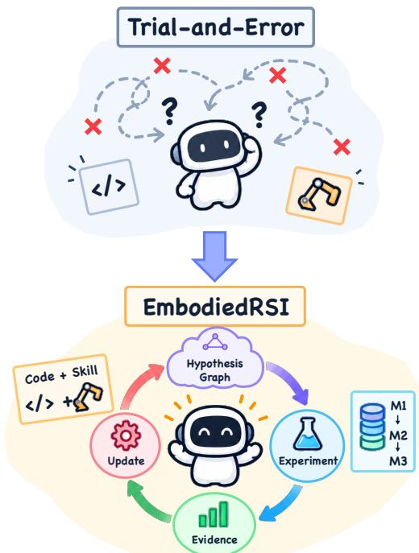  
Figure1 TheEmbodiedRSISelf-EvolutionLoop. Physical outcomes guide code and skill updates while the robot foundation model remains frozen.

We therefore present EmbodiedRSI, an agentic harness in which each physical episode informs which code or skill hypothesis to pursue next. A Fast System proposes and executes candidate experiments, each stating which hypotheses its outcome can distinguish, and revises its confidence in response to every physical outcome, while a Hypothesis Graph preserves the refinement history to inform later decisions. Within this loop, Code-Skill Co-Evolution compares each candidate pair with its individual components from the same initial states, showing that code and skills reinforce each other beyond what either achieves alone and using this evidence to choose the next physical experiment. Hierarchical Memory further distills the refinement history into reusable cognition, managed according to downstream value to the Fast System (measured by later task improvement, exploration-uncertainty reduction, and physical-experiment eficiency) through reinforcement learning rather than fixed heuristics.

Our experiments establish that a self-evolving agentic harness around a frozen robot foundation model turns physical interaction directly into reusable code and skill improvements that generalize to unseen scenes and tasks, while preserving the underlying model’s local control competence.

Our main contributions share a common goal, enabling the harness to autonomously decide where to explore so that it learns from physical interaction more eficiently. (i) A Fast-Slow Dual-System Architecture realizes this principle directly, letting the Fast System select the next physical experiment using current hypothesis weights and cost and rapidly iterate code and skill updates, while the Slow System builds Hierarchical Memory that abstracts past experience to inform this choice. (ii) Code-Skill Co-Evolution lets code and skill updates reinforce each other rather than evolve separately, comparing each candidate pair against its individual components from the same initial states, with a Hypothesis Graph keeping these comparisons traceable to the evidence behind them. (iii) Reward-Grounded Memory Learning completes the loop, training the selection of memory actions according to downstream value to the Fast System. (iv) On RoboCasa365, EmbodiedRSI reaches state-of-the-art 77.0% overall success, including 71.3% on Composite-Unseen, and 86.8% overall success on LIBERO-Pro. Beyond benchmark performance, EmbodiedRSI evolves its agent pipeline entirely in simulation and transfers it zero-shot to real-world experiments, achieving 71.3% overall success across multiple challenging tasks.

## 2 Related Work

Agentic Execution Around Frozen Robot Foundation Models. Generalist vision-language-action (VLA) policies improve transfer through scale and vision-language pretraining (Brohan et al., 2022, 2023; Kim et al., 2024). Frozen-VLA agents add planning, memory, and tools around the policy. Harness VLA uses a frozen VLA as a contact-rich primitive (Zhang et al., 2026c), while Zetta evolves runtime critics, response skills, and tools at multiple time scales (Ding et al., 2026). EmbodiedRSI links physical attempts, candidate code or skill updates, and outcomes in a Hypothesis Graph before Code-Skill Co-Evolution constructs an update.

Skill Libraries and Code-Mediated Improvement. Code as Policies writes robot-control programs from language and perception APIs (Liang et al., 2023). CaP-X and Playful Agentic Robot Learning build code-skill libraries from successful executions (Fu et al., 2026; Zhang et al., 2026b), while Voyager accumulates executable skills from environment feedback (Wang et al., 2023). Other self-evolution methods revise skills or optimize an external skill and harness layer (Ju et al., 2026; Wang et al., 2026), and Eureka evolves reward programs (Ma et al., 2023). EmbodiedRSI represents competing explanations in a Hypothesis Graph, uses Value-of-Information Experiment Selection to select physical experiments, and retains code and skill updates after trials from the same initial states.

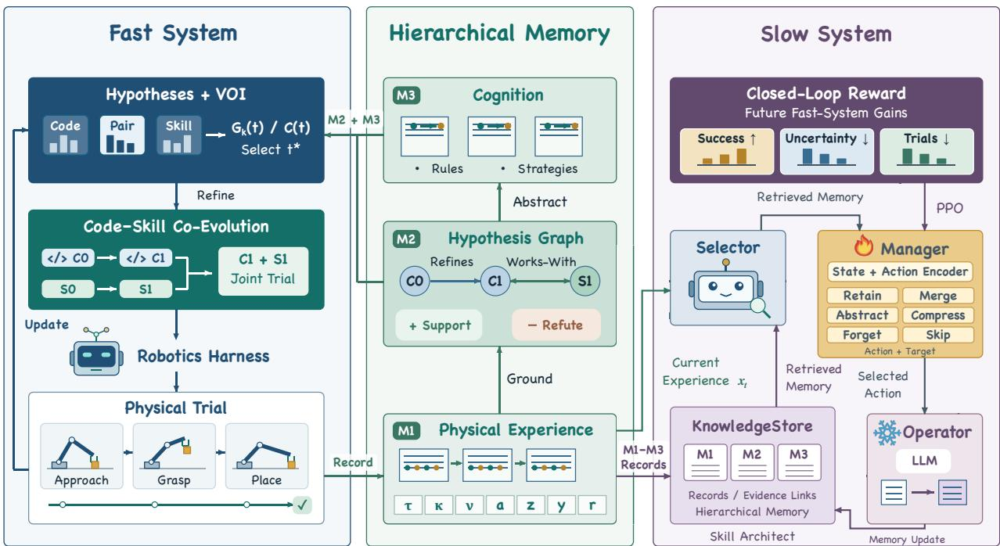  
Figure 2 Overview of EmbodiedRSI. The Fast System uses a Hypothesis Graph to choose each physical experiment. Each result guides a joint code-skill update. The Slow System retains memories that improve later adaptation.

Embodied Memory and Continual Learning. Embodied-RAG develops hierarchical memory for embodied retrieval and generation (Xie et al., 2024), and MemSkill learns memory-writing skills (Zhang et al., 2026a). EmbodiedRSI uses physical transitions to build reusable memory and learns from later task outcomes which memory actions support self-improvement.

## 3 Method

## 3.1 Problem Formulation

We formulate EmbodiedRSI as an agentic robotics harness that continually evolves through physical interaction. After k physical episodes, $\mathcal { A } _ { k }$ denotes the current harness, including its executable code and skills, hypothesis set $\mathcal { H } _ { k }$ , and accumulated memory $\mathcal { M } _ { k }$

At each episode, EmbodiedRSI determines the next physical experiment from the candidate set $\mathcal { T } _ { k }$ based on its current hypotheses and memory:

$$
t _ { k } ^ { * } = f ( T _ { k } , \mathcal { H } _ { k } , \mathcal { M } _ { k } ) ,\tag{1}
$$

where $f$ represents the experiment-selection process and $t _ { k } ^ { * }$ is the physical experiment performed at episode k. Executing $t _ { k } ^ { * }$ produces physical evidence $e _ { k }$ , including the execution trajectory and task outcome. The harness then evolves according to

$$
\begin{array} { r } { \mathcal { A } _ { k + 1 } = g ( \mathcal { A } _ { k } , t _ { k } ^ { * } , e _ { k } ) , } \end{array}\tag{2}
$$

where g represents the evolution process that incorporates new physical evidence into the harness.

Given a budget of B physical episodes, this process yields $\mathcal { A } _ { B }$ . For N evaluation episodes with binary task outcomes $b _ { i } ( \mathcal { A } _ { B } ) \in \{ 0 , 1 \}$ , the task success rate $R _ { \mathrm { t a s k } } ( \mathcal { A } _ { B } )$ is the fraction of successful evaluations. Our

objective is to maximize this task success rate:

$$
R _ { \mathrm { t a s k } } ( \varLambda _ { B } ) = \frac { 1 } { N } \sum _ { i = 1 } ^ { N } b _ { i } ( \varLambda _ { B } ) , \qquad \operatorname* { m a x } _ { \varLambda _ { B } } R _ { \mathrm { t a s k } } ( \varLambda _ { B } ) .\tag{3}
$$

## 3.2 Fast System: Rapid Code-Skill Co-Evolution

Hypothesis Graph and Confidence. Each selected experiment produces evidence about possible code and skill changes. To keep that evidence tied to hypotheses as they evolve, the Hypothesis Graph maintains code and skill hypotheses as nodes, with a directed refines edge linking each hypothesis to its revision. The Fast System uses each trajectory and outcome to generate new code or skill hypotheses and to refine existing hypotheses when the evidence supports a more specific version. To track how strongly physical experiments support each hypothesis $h _ { i } .$ , all hypotheses begin with the same Beta $( \alpha , \beta )$ prior on their support rate (Gelman et al., 2013), where α and $\beta$ are prior support and refutation counts. Let $n _ { \mathrm { s u p } , i }$ count physical experiments supporting $h _ { i }$ and $n _ { \mathrm { r e f } , i }$ count outcomes inconsistent with $h _ { i }$ . Matched trials update each tested hypothesis from its success-rate diference, holding initial states and all other calls and their order constant. The posterior mean confidence of $h _ { i }$ is:

$$
c _ { i } = \frac { n _ { \mathrm { s u p } , i } + \alpha } { n _ { \mathrm { s u p } , i } + n _ { \mathrm { r e f } , i } + \alpha + \beta } .\tag{4}
$$

The mean confidence captures support for each hypothesis; choosing the next experiment also requires knowing where that support remains uncertain. Let $D _ { k }$ be the matched outcomes observed after k physical episodes and $q _ { i } = P ( \theta _ { i } > 1 / 2 \mid D _ { k } )$ , where $\theta _ { i }$ is the support rate of $h _ { i }$ . Multiple hypotheses can jointly contribute to task success. We measure uncertainty over their support as:

$$
\mathcal { H } _ { \mathrm { e x p } } ( D _ { k } ) = \sum _ { h _ { i } \in \mathcal { H } } h _ { 2 } ( q _ { i } ) , \quad h _ { 2 } ( q ) = - q \log _ { 2 } q - ( 1 - q ) \log _ { 2 } ( 1 - q ) .\tag{5}
$$

A matched trial provides initial evidence for each new hypothesis before its subsequent experiments are selected adaptively.

Value-of-Information Experiment Selection. Physical outcomes update the confidence of each hypothesis, revealing where evidence is still needed. To decide which uncertainty to address within its limited interaction budget, the Fast System constructs experiments $t \in \mathcal { T }$ that evaluate code and skill hypotheses through matched trials. Each experiment declares the subset $S _ { t } \subseteq \mathcal { H }$ whose confidence its outcome can update. Given the evidence $D _ { k }$ , Value-of-Information Experiment Selection measures the expected reduction in exploration uncertainty from the possible outcomes e of experiment t:

$$
G _ { k } ( t ) = \mathcal { H } _ { \mathrm { e x p } } ( D _ { k } ) - \mathbb { E } _ { e \sim P ( e | D _ { k } , t ) } \big [ \mathcal { H } _ { \mathrm { e x p } } ( D _ { k } \cup \{ e \} ) \big ] .\tag{6}
$$

Appendix D gives the outcome probabilities. Let $T _ { t } , \ N _ { \mathrm { s t e p } , t } , \ C _ { \mathrm { G P U } , t } .$ and $C _ { \mathrm { r e s e t } , t }$ denote elapsed time, simulator steps, GPU cost, and reset cost, with weights $w _ { \tau } , w _ { s } , w _ { g } ,$ and $w _ { r }$ . The physical-experiment cost is $C ( t ) = w _ { \tau } T _ { t } + w _ { s } N _ { \mathrm { s t e p } , t } + w _ { g } C _ { \mathrm { G P U } , t } + w _ { r } C _ { \mathrm { r e s e t } , t }$ , the selection score is $\mathrm { { V O I } } _ { k } ( t ) = G _ { k } ( t ) / C ( t )$ , and the next experiment is $t _ { k } ^ { * } = \arg \operatorname* { m a x } _ { t \in \mathcal { T } } \mathrm { V O I } _ { k } ( t )$ . After executing $t _ { k } ^ { * }$ , the Fast System updates the evaluated hypotheses from matched outcomes. The resulting posteriors determine both exploration uncertainty and the next experiment ranking. Algorithm 1 in Appendix D gives the complete procedure. The experimental configuration is provided in Appendix E. With thresholds $\epsilon _ { H }$ and $\epsilon _ { \mathrm { V O I } } .$ , broad exploration ends when $\mathcal { H } _ { \mathrm { e x p } } < \epsilon _ { H }$ ma $\mathrm { x } _ { t } \mathrm { V O I } _ { k } ( t ) < \epsilon _ { \mathrm { V O I } }$ , the rollout budget is exhausted, or every hypothesis reaches the evaluation cap $n _ { \mathrm { m a x } } .$

Code-Skill Co-Evolution. The selected experiment provides evidence for deciding what to update. An improvement may come from code, skills, or their interaction. Code-Skill Co-Evolution separates code, skill, and joint efects by evaluating code hypothesis $C _ { i }$ , skill hypothesis $S _ { j }$ , and their joint execution from the same initial states. Let $R ( C _ { i } , S _ { j } ) , R ( C _ { i } )$ , and $R ( S _ { j } )$ denote the measured task success rates of joint, code-only, and skill-only execution, respectively. Their measured joint gain is:

$$
w _ { i j } = R ( C _ { i } , S _ { j } ) - \operatorname* { m a x } \{ R ( C _ { i } ) , R ( S _ { j } ) \} .\tag{7}
$$

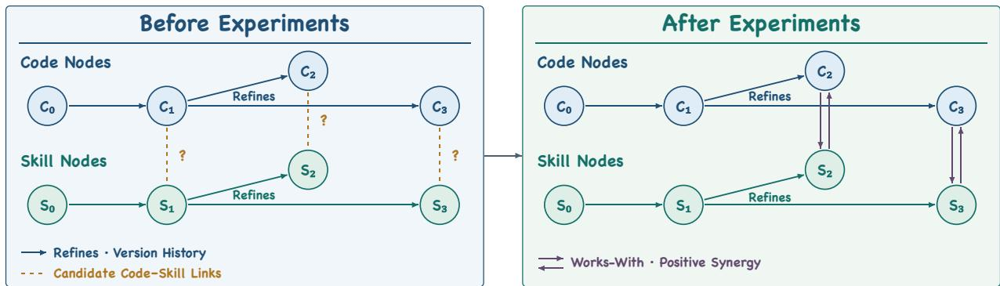  
Figure 3 Hypothesis Graph Updates from Physical Trials. Before Experiments (left). Directed refines edges show how code and skill hypotheses have evolved, while dashed links mark code-skill relations awaiting evidence. After Experiments (right). Solid bidirectional works-with edges identify relations supported by measured positive joint gain.

Positive joint gain indicates a higher success rate for joint execution in the matched trials. The Slow System records this relation as a bidirectional works-with edge in the Hypothesis Graph, prioritizing the strongest relations while directed revision edges retain the refinement history. The Fast System evaluates new and revised hypotheses in subsequent experiments and retains executable improvements for the next round. Each outcome enters Hierarchical Memory and changes what the Fast System will explore next. Figure 3 shows how physical trials turn candidate code-skill connections into retained works-with relations.

## 3.3 Slow System: Hierarchical Memory and Reward-Grounded Memory Learning

Hierarchical Memory. Each experiment produces evidence that later decisions need at diferent levels of detail. Hierarchical Memory carries this evidence forward at three levels: M1 records physical execution, M2 maintains code and skill hypotheses in the Hypothesis Graph, and M3 retains reusable cognition distilled from repeated evidence.

For an episode, let τ be the robot execution trajectory, κ the invoked tools, ν the time steps at which the VLA is invoked, a the executed actions, z the telemetry, y the physical outcome, and r the task reward. The M1 experience record is:

$$
\begin{array} { r } { \mathcal { M } _ { 1 } = \{ ( \tau , \kappa , \nu , a , z , y , r ) \} . } \end{array}\tag{8}
$$

M1 automatically records every episode and supplies matched evidence for M2 count and relation updates under the Fast-System rules. Across episodes, the Slow System abstracts recurring M1 and M2 evidence into M3. The hierarchy is:

$$
\mathcal { M } _ { 1 }  \mathcal { M } _ { 2 }  \mathcal { M } _ { 3 } .\tag{9}
$$

Before the next physical episode, the Fast System retrieves M2 hypotheses and M3 cognition to guide its candidate experiments.

Reward-Grounded Memory Learning. For the memory hierarchy to guide later experiments, the Slow System learns how to transform incoming evidence into reusable knowledge. Reward-Grounded Memory Learning bases that decision on later Fast-System improvement. Using the current experience and memory, the Manager selects an action and target records; the frozen operator executes it to update knowledge retrieved in the next round. For current experience $x _ { t } ,$ , the Slow System retrieves $N _ { \mathrm { r e t } }$ relevant records $\{ m _ { t , \ell } \} _ { \ell = 1 } ^ { { N _ { \mathrm { r e t } } } }$ from M1, M2, and M3, including hypothesis confidence and evidence links. We encode experience, retrieved records, and action descriptions with the frozen Qwen3-Embedding-0.6B encoder $e ( \cdot )$ (Zhang et al., 2025). The trainable context function $f _ { \theta } ^ { \mathrm { c t x } }$ aggregates these embeddings into Slow-System state $h _ { t }$ . Each candidate in $\boldsymbol { S } = \{ s _ { 1 } , \ldots , s _ { K } \}$ specifies an applicable action and target record or evidence group. The action space comprises Retain, Merge, Abstract, Compress, Forget, and Skip. Let $u _ { i }$ represent candidate $s _ { i } .$ , and let $z _ { t , i }$ measure compatibility between $h _ { t }$ and u . The Slow-System policy is $\pi _ { \theta } ( i \mid h _ { t } ) = \operatorname { s o f t m a x } ( z _ { t } ) _ { i }$ . Here $\boldsymbol { z } _ { t } = ( z _ { t , 1 } , \dots , z _ { t , K } )$ collects the compatibility scores and [·, ·] denotes concatenation. desc(s ) describes the action and target of candidate $s _ { i }$ The trainable skill function $f _ { \theta } ^ { \mathrm { s k i l l } }$ maps each encoded description to $u _ { i } .$ , and the trainable scoring function $f _ { \boldsymbol { \theta } } ^ { \mathrm { s c o r e } }$ maps $[ h _ { t } , u _ { i } ]$ to $z _ { t , i }$ . The operator uses frozen Qwen3.5-122B-A10B (Qwen Team, 2026) to update the retrieval index or M3 according to the selected candidate, preserving raw M1 records and M2 evidence updates. Appendix C specifies the actions.

Closed-Loop Reward and RL Training. The value of each memory action becomes visible through its efect on later Fast-System experiments. At memory decision step t, let $R _ { t }$ estimate $R _ { \mathrm { t a s k } }$ for the current harness, $H _ { t }$ denote the exploration uncertainty $\mathcal { H } _ { \mathrm { e x p } } ,$ and $C _ { t + 1 }$ be the realized cost of the next physical experiment under $C ( \cdot )$ . We compare success rates under the same evaluation protocol and compute entropy changes over the same hypothesis set. With reward weights $\lambda _ { 1 } , \lambda _ { 2 }$ , and $\lambda _ { 3 }$ , the reward following the next experiment is:

$$
r _ { t } ^ { \mathrm { m e m } } = \lambda _ { 1 } ( R _ { t + 1 } - R _ { t } ) + \lambda _ { 2 } ( H _ { t } - H _ { t + 1 } ) - \lambda _ { 3 } C _ { t + 1 } .\tag{10}
$$

For a horizon of L memory decisions and discount factor $\gamma \in \mathsf { \Gamma } ( 0 , 1 ] .$ , the discounted return is $J _ { t } ^ { \mathrm { m e m } } =$ $\Sigma _ { j = 0 } ^ { L - 1 } \gamma ^ { j } r _ { t + j } ^ { \mathrm { m e m } }$ . The Slow-System policy is trained with PPO (Schulman et al., 2017) to maximize expected discounted return. Training settings are given in Appendix F. An architect can refine action instructions from recurring experience. Thus each episode can change both the hypotheses considered by the Fast System and the memories available when the next experiment is selected.

## 4 Experiments

Our experiments address three questions about generalization, zero-shot sim-to-real transfer, and learning eficiency. Q1: How does EmbodiedRSI perform on RoboCasa365 and LIBERO-Pro, especially under cross-task, cross-scene, and out-of-distribution generalization? Q2: Can EmbodiedRSI’s agentic harness transfer zero-shot from simulation to a real robot? Q3: Which components of EmbodiedRSI improve success and learning eficiency?

## 4.1 Experimental Setup

Benchmark and Backbone. We evaluate on two simulated benchmarks. We select RoboCasa365 to evaluate generalization across household scenes and task compositions, and LIBERO-Pro to examine changes in task goals and object layouts. RoboCasa365 (Nasiriany et al., 2026) extends RoboCasa’s diverse household scenes and compositional manipulation tasks (Nasiriany et al., 2024) to large-scale mobile manipulation, with Atomic-Seen, Composite-Seen, and Composite-Unseen task suites. LIBERO-Pro (Zhou et al., 2025) extends LIBERO (Liu et al., 2023) with controlled perturbations. We evaluate instruction-redirection (T) and position-swap (S) perturbations. Backbone settings are given in Appendix I. On both benchmarks, we evaluate each task with 10 random seeds and 10 trials per seed. Evolution uses 10 separate seeds, while all methods are evaluated on another 10 mutually disjoint seeds.

Baselines. We compare against end-to-end frozen-VLA policies (OpenVLA (Kim et al., 2024), π (Black et al., 2025), π (Physical Intelligence et al., 2025), π (Yu et al., 2026), RLDX-1 (Kim et al., 2026), NORA (Hung et al., 2025), MolmoAct (Lee et al., 2025), X-VLA (Zheng et al., 2026), AtomVLA (Sun et al., 2026)), a world-model baseline (WorldDreamer (Wang et al., 2024)), a leaderboard entry (Xiaomi-Robotics-1), and code-as-policy and harness agents built on a frozen VLA (CaP-X (Fu et al., 2026), RATS (Zhang et al., 2026b), Harness VLA (Zhang et al., 2026c), and Zetta (Ding et al., 2026)).

Metrics. On RoboCasa365, we report success on the Atomic-Seen, Composite-Seen, and Composite-Unseen (out-of-distribution) suites together with the overall success rate. On LIBERO-Pro, we report success on each task-family/perturbation cell together with the overall success rate.

## 4.2 Generalization on RoboCasa365 and LIBERO-Pro

Composite-Unseen provides the most stringent RoboCasa365 evaluation: familiar skills must support task compositions absent from pretraining. With the robot foundation model frozen, EmbodiedRSI leads the baselines on all three suites and reaches 77.0% overall success (Table 1). Figure 4 illustrates the three task suites.

On Composite-Unseen, EmbodiedRSI reaches 71.3% success, compared with 40.1% for the best baseline (Harness VLA). This separation shows where the harness matters most: when previously learned behaviors must be reorganized for a new task.

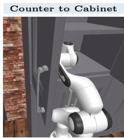

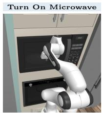  
(a) Atomic-Seen

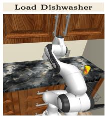

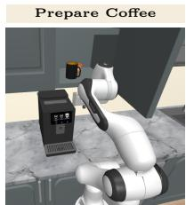  
(b) Composite-Seen

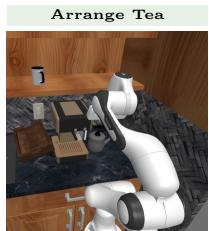  
(c) Composite-Unseen

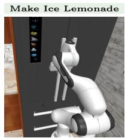  
Figure 4 RoboCasa365 Task Suites. (a) Atomic-Seen contains individual manipulation tasks observed during pretraining. (b) Composite-Seen combines multiple skills into tasks represented in pretraining. (c) Composite-Unseen combines skill into tasks absent from pretraining.

Table 1 RoboCasa365 Success Rates. Values are percentages. “–” denotes a suite without a reported result for the corresponding method.
<table><tr><td>Method</td><td>Atomic-Seen</td><td>Composite-Seen</td><td>Composite-Unseen</td><td>Overall</td></tr><tr><td>π0</td><td>34.6</td><td>6.1</td><td>1.1</td><td>14.8</td></tr><tr><td>π0.5</td><td>39.6</td><td>7.1</td><td>1.2</td><td>16.9</td></tr><tr><td>RLDX-1</td><td>60.0</td><td>21.3</td><td>5.0</td><td>30.0</td></tr><tr><td>WorldDreamer</td><td>66.3</td><td>26.7</td><td>9.0</td><td>35.3</td></tr><tr><td>Xiaomi-Robotics-1</td><td>80.2</td><td>57.1</td><td>32.1</td><td>57.4</td></tr><tr><td>Harness VLA</td><td>91.3</td><td>55.8</td><td>40.1</td><td>63.6</td></tr><tr><td>EmbodiedRSI (Ours)</td><td>94.4</td><td>63.1</td><td>71.3</td><td>77.0</td></tr></table>

LIBERO-Pro evaluates generalization under changed instructions and object positions. EmbodiedRSI reaches 86.8% overall success versus 72.1% for Harness VLA and leads Harness VLA in all eight perturbation cells (Table 2). The largest gaps occur under position-swap (S) in SPATIAL and LIBERO-10, indicating that EmbodiedRSI adapts execution when object layouts change. Appendix A provides examples of both perturbations. Together, these results answer Q1: EmbodiedRSI generalizes to unseen task compositions and to changed instructions and object positions.

Table 2 LIBERO-Pro Success Rates. The table aggregates success rates (%) across SPATIAL, OBJECT, GOAL, and LIBERO-10 under instruction-redirection (T) and position-swap (S) perturbations. “–” denotes a cell not applicable to the corresponding method.
<table><tr><td>Method</td><td>Spat-T</td><td>Spat-S</td><td>Obj-T</td><td>Obj-S</td><td>Goal-T</td><td>Goal-S</td><td>L10-T</td><td>L10-S</td><td>Overall</td></tr><tr><td>OpenVLA</td><td>0.0</td><td>0.0</td><td>0.0</td><td>0.0</td><td>0.0</td><td>0.0</td><td>0.0</td><td>0.0</td><td>0.0</td></tr><tr><td>π0</td><td>0.0</td><td>0.0</td><td>0.0</td><td>2.0</td><td>0.0</td><td>0.0</td><td>0.0</td><td>0.0</td><td>0.3</td></tr><tr><td>π0.5</td><td>1.0</td><td>20.0</td><td>1.0</td><td>17.0</td><td>2.0</td><td>38.0</td><td>1.0</td><td>8.0</td><td>11.0</td></tr><tr><td>MolmoAct</td><td>0.0</td><td>0.0</td><td>0.0</td><td>6.0</td><td>0.0</td><td>0.0</td><td>6.0</td><td>0.0</td><td>1.5</td></tr><tr><td>NORA</td><td>0.0</td><td>0.0</td><td>0.0</td><td>0.0</td><td>0.0</td><td>0.0</td><td>0.0</td><td>0.0</td><td>0.0</td></tr><tr><td>X-VLA</td><td>0.0</td><td>0.0</td><td>8.0</td><td>2.0</td><td>9.0</td><td>1.0</td><td>10.0</td><td>0.0</td><td>3.8</td></tr><tr><td>AtomVLA</td><td>1.0</td><td>16.0</td><td>0.0</td><td>10.0</td><td>11.0</td><td>2.0</td><td>9.0</td><td>1.0</td><td>6.3</td></tr><tr><td>πRLinf</td><td>42.0</td><td>59.0</td><td>71.0</td><td>78.0</td><td>45.0</td><td>42.0</td><td>49.0</td><td>14.0</td><td>50.0</td></tr><tr><td>CaP-X</td><td>14.0</td><td>12.0</td><td>18.0</td><td>22.0</td><td>17.0</td><td>26.0</td><td>一</td><td>一</td><td>18.2</td></tr><tr><td>RATS</td><td>31.0</td><td>29.0</td><td>63.0</td><td>61.0</td><td>36.0</td><td>43.0</td><td></td><td></td><td>43.8</td></tr><tr><td>Harness VLA</td><td>81.0</td><td>69.0</td><td>94.0</td><td>91.0</td><td>75.0</td><td>66.0</td><td>52.0</td><td>49.0</td><td>72.1</td></tr><tr><td>Zetta</td><td></td><td></td><td></td><td></td><td>92.5</td><td>89.0</td><td>63.0</td><td>40.0</td><td>71.1</td></tr><tr><td>EmbodiedRSI (Ours)</td><td>100.0</td><td>93.0</td><td>100.0</td><td>96.0</td><td>78.0</td><td>90.0</td><td>66.0</td><td>71.0</td><td>86.8</td></tr></table>

## 4.3 Zero-Shot Sim-to-Real Transfer of the Agentic Harness

We next examine whether the gains in simulation carry into physical manipulation by directly deploying EmbodiedRSI’s agentic harness, including code and skills evolved in simulation, on a physical SO-101 arm (Cadene et al., 2026). SmolVLA (Shukor et al., 2025) serves as the robot foundation model. We compare SmolVLA alone with the same backbone under EmbodiedRSI’s agentic harness. For each task, we collect 50 human-teleoperated demonstrations and fully fine-tune SmolVLA for 20,000 steps on 4× NVIDIA H200 GPUs. The model remains frozen during all trials. We run 30 trials per condition on each task. The remaining training settings are given in Appendix B.

These five highly challenging real-world tasks span three categories: (1) Multi-Step Manipulation (cake stacking and towel folding), (2) Semantic and Arithmetic Reasoning (Oreo placement and poker-chip selection), and (3) Precision Grasping (lifting glasses at the bridge).

The tasks require multi-step execution, grounding object descriptions in the scene, and precise control at a narrow grasp point.

In the poker-chip task, the robot must push out the chip whose value multiplied by five equals 100. The target is the chip marked 20 because 20×5 = 100. We shufle the chips’ order and orientation before every trial. Figure 5 illustrates the first three tasks. Table 3 reports success on all five. The largest gain occurs on poker-chip selection, where the agent pipeline identifies the correct chip from the arithmetic instruction before directing SmolVLA in a randomized layout.

With SmolVLA frozen, zero-shot transfer of EmbodiedRSI’s agentic harness raises overall realrobot success from 46.0% to 71.3%, answering Q2: improvements learned by the harness in simulation carry over to physical manipulation.

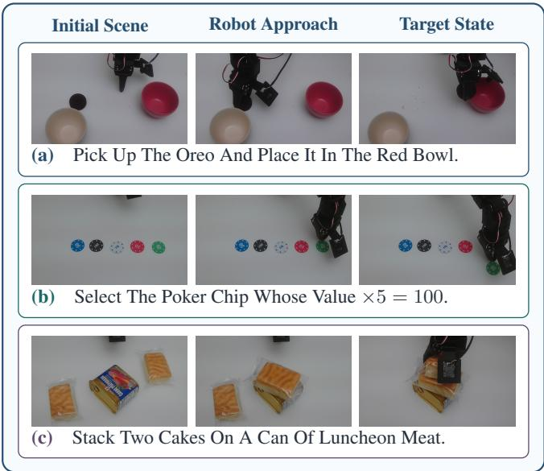  
Figure 5 Representative Real-World Evaluation Tasks. Initial and target states.

Table 3 Real-Robot Success Rates. Success over 30 trials per task on the real robot.
<table><tr><td>Task</td><td>SmolVLA</td><td>EmbodiedRSI</td></tr><tr><td>Oreo to Red Bowl</td><td>70.0%</td><td>86.7%</td></tr><tr><td>Poker Chip Selection (×5 = 100)</td><td>10.0%</td><td>90.0%</td></tr><tr><td>Stack Two Cakes on a Can of Luncheon Meat</td><td>63.3%</td><td>76.7%</td></tr><tr><td>Glasses Bridge Grasp</td><td>60.0%</td><td>56.7%</td></tr><tr><td>Towel Folding</td><td>26.7%</td><td>46.7%</td></tr><tr><td>Overall</td><td>46.0%</td><td>71.3%</td></tr></table>

## 4.4 Ablation Study

We further explore what drives EmbodiedRSI’s gains from physical interaction (Q3). The ablations isolate how Code-Skill Co-Evolution, Value-of-Information Experiment Selection, and Reward-Grounded Memory Learning afect success and learning eficiency. For the code-skill comparison, we hold the frozen VLA, task suites, physical-experiment budget, and evaluation protocol fixed. Code-only Evolution updates executable code while keeping skills fixed, Skill-only Evolution updates skills while keeping executable code fixed, and Code-Skill Co-Evolution updates both code and skills.

Physical Episodes  
Figure 6 shows that Code-Skill Co-Evolution improves success across RoboCasa365, with the clearest advantage on Composite-Unseen tasks. On this suite, Code-Skill Co-Evolution reaches 71.3% success versus 55.6% for Skill-only Evolution. Notably, Code-only Evolution outperforms Skill-only Evolution on Atomic-Seen, but the order reverses on Composite-Unseen. This reversal suggests that a change efective for familiar atomic tasks may not carry over to unseen compositions. Joint evolution leads on both suites, indicating that code and skills are more useful when updated together.  
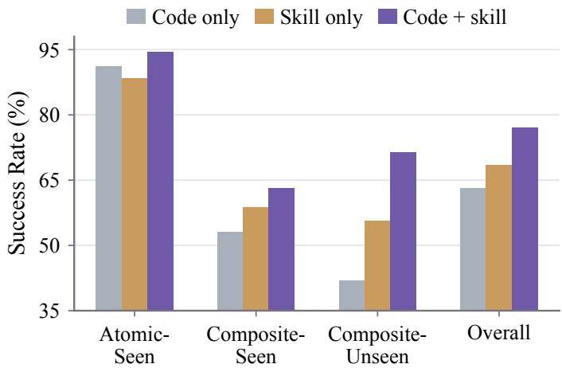  
Figure6 Code-SkillCo-EvolutionAblation. Bars show RoboCasa365 success rates.

Learning Efficiency. Table 4 compares EmbodiedRSI with Random Exploration after 50 physical episodes. EmbodiedRSI reaches 72.9% overall success versus 27.1%, and its learning AUC is 0.635 versus 0.309. A Physical Aha Moment for agentic robotics occurs when an agent identifies the critical physical state variable needed to return a VLA to its in-domain region (Ding et al., 2026). In a separate representative LIBERO-Pro SPAT-T case, Figure 7 shows the observable marker of this moment: Value-of-Information Experiment Selection reaches 100% eight-episode rolling success within 50 physical episodes and remains there. Random Selection of code and skill experiments continues to fluctuate through episode 100 and ends around 75.0% rolling success, suggesting that more physical episodes are needed for a comparable Physical Aha Moment.

Table 4 Learning Efficiency. EmbodiedRSI is compared with Random Exploration.

<table><tr><td>Method</td><td>Overall Success @ 50 Ep. ↑</td><td>Learning AUC ↑</td></tr><tr><td>Random Exploration</td><td>27.1</td><td>0.309</td></tr><tr><td>EmbodiedRSI (Ours)</td><td>72.9</td><td>0.635</td></tr></table>

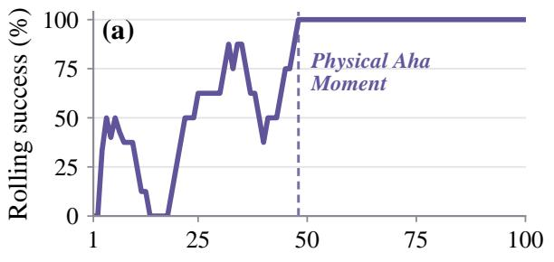

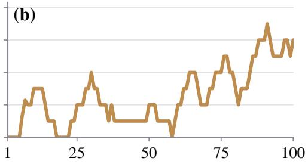  
Figure 7 Representative LIBERO-Pro Learning Curves. Eight-episode rolling success on SPAT-T over 100 physical episodes. (a) Value-of-Information Experiment Selection reaches sustained 100% at episode 48 (dashed line). (b) Random Selection continues to fluctuate.

Reward-Grounded Memory Learning. Table 5 compares retrieval-based selection, PPO with task reward alone, and the full method. The ablation settings are detailed in Appendix C. Composite-Unseen success rises from 61.7% and 65.2% to 71.3%. Learning AUC rises from 0.556 and 0.589 to 0.635. Together, the ablations resolve Q3: Code-Skill Co-Evolution, hypothesis-guided exploration, and Reward-Grounded Memory Learning improve success and learning eficiency.

Table 5 Reward-Grounded Memory Learning Ablation. Composite-Unseen and learning AUC on RoboCasa365.
<table><tr><td>Variant</td><td>Composite-Unseen ↑</td><td>Learning AUC ↑</td></tr><tr><td>Retrieval-Based</td><td>61.7%</td><td>0.556</td></tr><tr><td>PPO + Task Reward Only</td><td>65.2%</td><td>0.589</td></tr><tr><td>EmbodiedRSI (Ours)</td><td>71.3%</td><td>0.635</td></tr></table>

## 5 Conclusion

EmbodiedRSI shows that a self-evolving agentic harness can gain lasting value from each physical trial by using the outcome to select the next experiment, refine code and skills together, and retain experience for later adaptation. Across simulated benchmarks and real-robot tasks, EmbodiedRSI improves generalization and learning eficiency, and transfers the simulation-evolved harness to physical execution. More broadly, continual robot learning can take place in the harness around a frozen robot foundation model when physical evidence shapes both the next experiment and the knowledge carried into future tasks.

Limitations. Code-as-policy and agentic harness methods learn executable behavior from physical trajectories without updating the robot foundation model’s parameters. Future work could use trajectories selected by the harness for online model updates, allowing code, skills, and the model to improve together.

## References

Kevin Black, Noah Brown, Danny Driess, Adnan Esmail, Michael Equi, Chelsea Finn, Niccolo Fusai, Lachy Groom, Karol Hausman, Brian Ichter, et al. π0: A vision-language-action flow model for general robot control. In Robotics: Science and Systems, 2025. doi: 10.15607/RSS.2025.XXI.010.

Anthony Brohan, Noah Brown, Justice Carbajal, Yevgen Chebotar, Joseph Dabis, Chelsea Finn, Keerthana Gopalakrishnan, Karol Hausman, Alex Herzog, Jasmine Hsu, et al. Rt-1: Robotics transformer for real-world control at scale. arXiv preprint arXiv:2212.06817, 2022.

Anthony Brohan, Noah Brown, Justice Carbajal, Yevgen Chebotar, Xi Chen, Krzysztof Choromanski, Tianli Ding, Danny Driess, Avinava Dubey, Chelsea Finn, et al. Rt-2: Vision-language-action models transfer web knowledge to robotic control. arXiv preprint arXiv:2307.15818, 2023.

Remi Cadene, Simon Alibert, Francesco Capuano, Michel Aractingi, Adil Zouitine, Pepijn Kooijmans, Jade Choghari, Martino Russi, Caroline Pascal, Steven Palma, et al. Lerobot: An open-source library for end-to-end robot learning. In International Conference on Learning Representations, volume 2026, pp. 122398–122417, 2026.

Xin Ding, Liang Mi, Mingzhe Huang, Zixuan Wang, Chao Zhang, Zixu Hao, Fu Chen, Xiangyu Li, Yikai Zheng, Yaoyu Guo, et al. Zetta ζ: An eficient closed-loop embodied harness for self-evolving physical intelligence. arXiv preprint arXiv:2608.16590, 2026.

Letian Fu, Justin Yu, Karim El-Refai, Ethan Kou, Haoru Xue, Huang Huang, Wenli Xiao, Guanzhi Wang, Dantong Niu, Fei-Fei Li, et al. Cap-x: A framework for benchmarking and improving coding agents for robot manipulation. arXiv preprint arXiv:2603.22435, 2026.

Andrew Gelman, John B. Carlin, Hal S. Stern, David B. Dunson, Aki Vehtari, and Donald B. Rubin. Bayesian Data Analysis. Chapman and Hall/CRC, 3rd edition, 2013. ISBN 9781439840955.

Chia-Yu Hung, Qi Sun, Pengfei Hong, Amir Zadeh, Chuan Li, U Tan, Navonil Majumder, Soujanya Poria, et al. Nora: A small open-sourced generalist vision language action model for embodied tasks. arXiv preprint arXiv:2504.19854, 2025.

Ruofei Ju, Xinrui Wang, Xin Ding, Yifan Yang, Hao Wu, Shiqi Jiang, Qianxi Zhang, Hao Wen, Xiangyu Li, Weijun Wang, et al. Embodiskill: Skill-aware reflection for self-evolving embodied agents. arXiv preprint arXiv:2605.10332, 2026.

Dongyoung Kim, Huiwon Jang, Myungkyu Koo, Suhyeok Jang, Taeyoung Kim, Beomjun Kim, Byungjun Yoon, Changsung Jang, Daewon Choi, Dongsu Han, et al. Rldx-1 technical report. arXiv preprint arXiv:2605.03269, 2026.

Moo Jin Kim, Karl Pertsch, Siddharth Karamcheti, Ted Xiao, Ashwin Balakrishna, Suraj Nair, Rafael Rafailov, Ethan Foster, Grace Lam, Pannag Sanketi, et al. Openvla: An open-source vision-language-action model. arXiv preprint arXiv:2406.09246, 2024.

Jason Lee, Jiafei Duan, Haoquan Fang, Yuquan Deng, Shuo Liu, Boyang Li, Bohan Fang, Jieyu Zhang, Yi Ru Wang, Sangho Lee, et al. Molmoact: Action reasoning models that can reason in space. arXiv preprint arXiv:2508.07917, 2025.

Jacky Liang, Wenlong Huang, Fei Xia, Peng Xu, Karol Hausman, Brian Ichter, Pete Florence, and Andy Zeng. Code as policies: Language model programs for embodied control. In 2023 IEEE International conference on robotics and automation (ICRA), pp. 9493–9500. IEEE, 2023.

Bo Liu, Yifeng Zhu, Chongkai Gao, Yihao Feng, Qiang Liu, Yuke Zhu, and Peter Stone. Libero: Benchmarking knowledge transfer for lifelong robot learning. Advances in Neural Information Processing Systems, 36:44776–44791, 2023.

Runyu Lu, Yubo Wu, Ethan Kou, Letian Fu, Wenli Xiao, Ajay Mandlekar, Yinzhen Xu, Guanya Shi, Ken Goldberg, Ang Chen, et al. Aspire: Agentic/skills discovery for robotics. arXiv preprint arXiv:2607.00272, 2026.

Yecheng Jason Ma, William Liang, Guanzhi Wang, De-An Huang, Osbert Bastani, Dinesh Jayaraman, Yuke Zhu, Linxi Fan, and Anima Anandkumar. Eureka: Human-level reward design via coding large language models. arXiv preprint arXiv:2310.12931, 2023. URL https://arxiv.org/abs/2310.12931.

Soroush Nasiriany, Abhiram Maddukuri, Lance Zhang, Adeet Parikh, Aaron Lo, Abhishek Joshi, Ajay Mandlekar, and Yuke Zhu. Robocasa: Large-scale simulation of everyday tasks for generalist robots. arXiv preprint arXiv:2406.02523, 2024.

Soroush Nasiriany, Sep Nasiriany, Abhiram Maddukuri, and Yuke Zhu. Robocasa365: A large-scale simulation framework for training and benchmarking generalist robots. In International Conference on Learning Representations, volume 2026, pp. 98643–98667, 2026.

Physical Intelligence, Kevin Black, Noah Brown, James Darpinian, Karan Dhabalia, Danny Driess, Adnan Esmail, Michael Equi, Chelsea Finn, Niccolo Fusai, Manuel Y. Galliker, Dibya Ghosh, Lachy Groom, Karol Hausman, Brian Ichter, Szymon Jakubczak, Tim Jones, Liyiming Ke, Devin LeBlanc, Sergey Levine, Adrian Li-Bell, Mohith Mothukuri, Suraj Nair, Karl Pertsch, Allen Z. Ren, Lucy Xiaoyang Shi, Laura Smith, Jost Tobias Springenberg, Kyle Stachowicz, James Tanner, Quan Vuong, Homer Walke, Anna Walling, Haohuan Wang, Lili Yu, and Ury Zhilinsky. π : A Vision-Language-Action Model with Open-World Generalization. arXiv preprint arXiv:2504.16054, 2025. URL https://arxiv.org/abs/2504.16054.

Qwen Team. Qwen3.5: Towards native multimodal agents, February 2026. URL https://qwen.ai/blog?id=qwen3.5.

John Schulman, Filip Wolski, Prafulla Dhariwal, Alec Radford, and Oleg Klimov. Proximal policy optimization algorithms. arXiv preprint arXiv:1707.06347, 2017.

Mustafa Shukor, Dana Aubakirova, Francesco Capuano, Pepijn Kooijmans, Steven Palma, Adil Zouitine, Michel Aractingi, Caroline Pascal, Martino Russi, Andres Marafioti, et al. Smolvla: A vision-language-action model for afordable and eficient robotics. arXiv preprint arXiv:2506.01844, 2025.

Xiaoquan Sun, Zetian Xu, Chen Cao, Zonghe Liu, Yihan Sun, Jingrui Pang, Ruijian Zhang, Zhen Yang, Kang Pang, Dingxin He, et al. Atomvla: Scalable post-training for robotic manipulation via predictive latent world models. arXiv preprint arXiv:2603.08519, 2026.

Guanzhi Wang, Yuqi Xie, Yunfan Jiang, Ajay Mandlekar, Chaowei Xiao, Yuke Zhu, Linxi Fan, and Anima Anandkumar. Voyager: An open-ended embodied agent with large language models. arXiv preprint arXiv:2305.16291, 2023.

Peidong Wang, Zhiming Ma, Ying Chang, Xufang Luo, Yiqun Zhang, Zihan Wang, Xiaocui Yang, Shi Feng, Yuqing Yang, and Dongsheng Li. Self-evolving embodied agents via skill-harness evolution. arXiv preprint arXiv:2608.11350, 2026.

Xiaofeng Wang, Zheng Zhu, Guan Huang, Boyuan Wang, Xinze Chen, and Jiwen Lu. Worlddreamer: Towards genera world models for video generation via predicting masked tokens. arXiv preprint arXiv:2401.09985, 2024.

Quanting Xie, So Yeon Min, Pengliang Ji, Yue Yang, Tianyi Zhang, Kedi Xu, Aarav Bajaj, Ruslan Salakhutdinov, Matthew Johnson-Roberson, and Yonatan Bisk. Embodied-rag: General non-parametric embodied memory for retrieval and generation. arXiv preprint arXiv:2409.18313, 2024.

Chao Yu, Yuanqing Wang, Zhen Guo, Hao Lin, Si Xu, Hongzhi Zang, Quanlu Zhang, Yongji Wu, Chunyang Zhu, Junhao Hu, et al. RLinf: Flexible and eficient large-scale reinforcement learning via macro-to-micro flow transformation. In 20th USENIX Symposium on Operating Systems Design and Implementation (OSDI 26), pp. 829–846, 2026.

Haozhen Zhang, Quanyu Long, Jianzhu Bao, Tao Feng, Weizhi Zhang, Haodong Yue, and Wenya Wang. Memskill: Learning and evolving memory skills for self-evolving agents. arXiv preprint arXiv:2602.02474, 2026a.

Junyi Zhang, Jiaxin Ge, Hanjun Yoo, Letian Fu, Zihan Yang, Yaowei Liu, Raj Saravanan, Shaofeng Yin, Justin Yu, Dantong Niu, et al. Playful agentic robot learning. arXiv preprint arXiv:2606.19419, 2026b.

Yanzhao Zhang, Mingxin Li, Dingkun Long, Xin Zhang, Huan Lin, Baosong Yang, Pengjun Xie, An Yang, Dayiheng Liu, Junyang Lin, et al. Qwen3 embedding: Advancing text embedding and reranking through foundation models. arXiv preprint arXiv:2506.05176, 2025.

Yixian Zhang, Huanming Zhang, Feng Gao, Xiao Li, Zhihao Liu, Yi Nie, Chunyang Zhu, Jiaxing Qiu, Yuchen Yan, Jiyuan Liu, Wenhao Tang, Jiaji Rao, Zhengru Fang, Changxu Wei, Yu Wang, Wenbo Ding, and Chao Yu. Harness vla: Steering frozen vlas into reliable manipulation primitives via memory-guided agents. arXiv preprint arXiv:2607.08448, 2026c.

Jinliang Zheng, Jianxiong Li, Zhihao Wang, Dongxiu Liu, Xirui Kang, Yuchun Feng, Yinan Zheng, Jiayin Zou, Yilun Chen, Jia Zeng, et al. X-vla: Soft-prompted transformer as scalable cross-embodiment vision-language-action model. In International Conference on Learning Representations, volume 2026, pp. 60580–60606, 2026.

Xueyang Zhou, Yangming Xu, Guiyao Tie, Yongchao Chen, Guowen Zhang, Duanfeng Chu, Pan Zhou, and Lichao Sun. Libero-pro: Towards robust and fair evaluation of vision-language-action models beyond memorization. arXiv preprint arXiv:2510.03827, 2025.