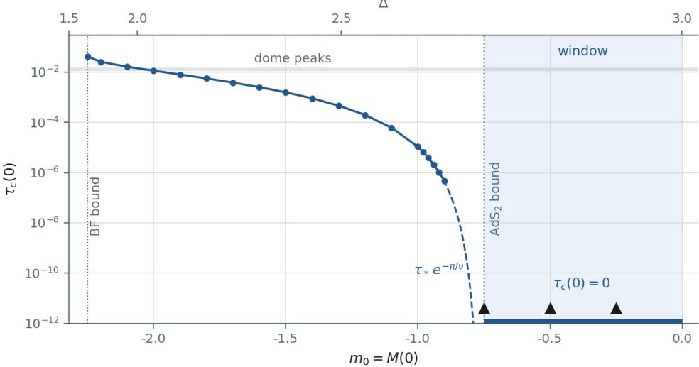
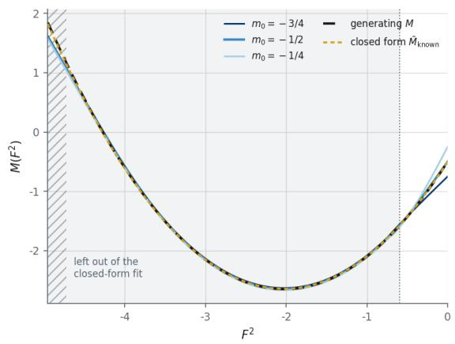
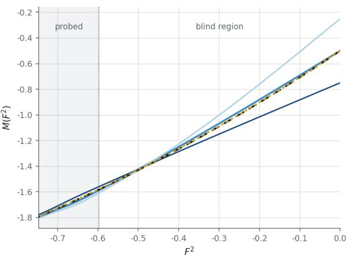
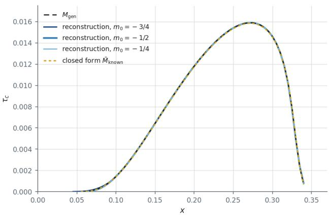
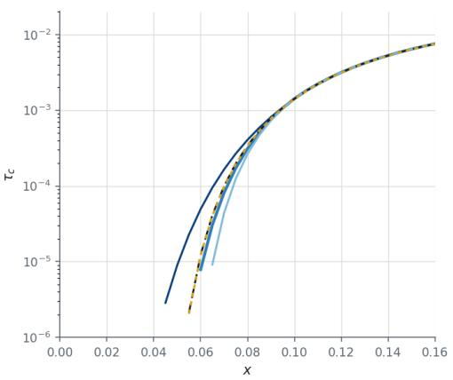
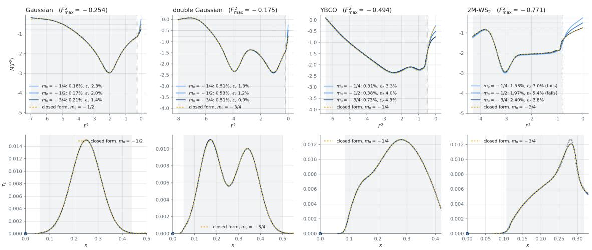

# Fast holographic inversion of superconducting domes

Sejin Kima

aCenter for AI and Natural Sciences, Korea Institute for Advanced Study, Seoul 02455, Korea

E-mail: sejin@kias.re.kr

Abstract: A holographic superconductor whose scalar mass depends on the gauge field strength, $M ( F ^ { 2 } )$ , reproduces a superconducting dome for a suitable M, and recovering that M from a given dome has so far taken days for a single training run. We propose a new way of training this model, with which an inversion takes from about ten minutes to an hour. Training needs the gradient of the condition that fixes the critical temperature, which the earlier method obtains by finite diferences, repeating the bulk integrations for every training parameter. Here that condition is obtained, without any fit, from two integrations started at the horizon and at the boundary, and its derivative with respect to M is an integral over the same two solutions, so the gradient needs no integration of its own. We use the speed to study the part of M that a dome cannot determine, on the interval between the value $F ^ { 2 }$ takes at the horizon for the lowest doping and ${ \cal F } ^ { 2 } = 0 ;$ at which M is the scalar mass $M ( 0 )$ that fixes the dimension of the dual operator. We hold the scalar mass at several values, which we call pinned masses, retrain everything else at each, and find that the reconstructions agree wherever the horizons of the dome reach, including the minima of M, and difer only on that interval. A rule that keeps the reconstruction with the simplest closed form recovers both the scalar mass and the mass function of a test dome. On Gaussian and double-Gaussian domes and on the measured phase diagrams of $\mathrm { Y B a _ { 2 } C u _ { 3 } O } _ { y }$ and $\mathrm { 2 M { - } W S _ { 2 } }$ , however, the pinned mass it keeps rests on ties or on narrow margins, so for these targets the scalar mass is left open. The dome thus constrains M where its horizons reach, and fixing the dimension of the dual operator needs a second observable.

1 Introduction 1   
2 Setup 4   
3 The blind region 5   
4 PINN with a Kolmogorov–Arnold network 8   
4.1 The network 8   
4.2 Training 9   
4.3 The rule 11   
5 Results 12   
5.1 A phase boundary whose mass function is known 12   
5.2 Four reconstructions 14   
6 Discussion 17   
A Numerical parameters 18   
B The closed forms kept 19

## 1 Introduction

Holographic duality [1–3] turns a strongly coupled phase transition into a boundary-value problem for classical fields in one more dimension, and the holographic superconductor [4– 6] is its standard example. Below a critical temperature $T _ { c }$ a charged black hole in anti-de Sitter (AdS) space acquires charged scalar hair, and the region in which such hairy black holes exist is the superconducting phase [7–10].

$T _ { c }$ is the temperature at which the linearized scalar first admits a normalizable mode regular at the horizon, the condensation mode. Measured phase diagrams of many superconductors are domes, in which the critical temperature rises and then falls with doping [11]. Holographic models produce domes from a modulated chemical potential [12], from competing orders [13], also with broken translations [14], from a doping field that shifts the efective mass of the order parameter [15] and from a coupling between two charges [16], and a dome was obtained by letting the scalar mass depend on the local field strength, $M ( F ^ { 2 } )$ [17, 18].

The dificulty is finding such a holographic model. A bulk theory that reproduces an observed phenomenon has been found by trial and error, a coupling chosen by hand, the phase diagram computed and compared with the measured one, and the coupling adjusted, so the model is tuned to the known result. Solving the inverse problem with neural networks removes the tuning of the coupling by hand. Given a dome, the critical temperature against doping, find an $M ( F ^ { 2 } )$ that produces it, so that the bulk interaction is fixed by reproducing the measurement rather than chosen by the modeler.

Recovering bulk data from boundary observables has its own history. Metrics have been recovered from geodesic or two-point data [19, 20], from extremal surfaces [21, 22] and from entanglement entropy [23]. More recently the bulk has been represented by a neural network, a composition of afine maps and pointwise nonlinearities adjusted until the output matches data [24, 25], or produced directly from boundary data by a generative model trained on many geometries [26, 27]. The radial evolution of a bulk field was interpreted as the layers of a deep network [28, 29], recast as a Boltzmann machine [30] and as a neural ordinary diferential equation [31], and used to learn spatial geometry from entanglement [32], the metric and dilaton of a holographic model of quantum chromodynamics from meson spectra [33], black-hole metrics from the shear viscosity [34] and a bulk spacetime from the frequency-dependent conductivity [35].

Recently the geometry and gauge field of a charged black hole have been reconstructed from fermionic spectral functions [36, 37], the latter applied to the strange-metal phenomenology of a cuprate, the metric from entanglement entropy and Wilson loops [38] and the bulk scalar potential from the equation of state [39, 40], and each of these reconstructions meets a degeneracy or a region of the bulk that the boundary data do not probe.

The dome itself has been inverted once [18], with a physics-informed neural network (PINN) [41, 42], one whose objective is the residual of the governing equation rather than a fit to labeled examples. The mass function it finds is lowest at the field strengths that correspond to the top of the dome, since a more negative efective mass near the horizon raises the critical temperature. Its computational cost limits what it can be used for. The source $\mathcal { I }$ is extracted by fitting the near-boundary expansion of a solution integrated from the horizon, and the objective built from it is minimized over roughly $1 0 ^ { 3 }$ iterations of Adam [43], a first-order method with per-coordinate adaptive steps. Each iteration takes a finite-diference gradient, $n _ { p } + 1$ bulk integrations per point of the dome for $n _ { p }$ parameters, so a single reconstruction is already expensive, and any number training does not determine has to be chosen once and then kept.

We change the forward computation first. The solution $\psi _ { H }$ regular at the horizon is integrated from the horizon and the normalizable solution $\psi _ { B }$ from the boundary, both are stopped at an interior point, and their Wronskian W is computed there. On shell W does not depend on where it is evaluated, and it vanishes exactly when the regular solution is normalizable, so $W = 0$ is the condition $\mathcal { I } = 0$ , obtained without fitting the near-boundary expansion. Each point of the dome fixes a background, and W evaluated on it is that point’s residual, the number training drives to zero.

The backward computation then reuses the two forward solutions. In the radial coordinate z, running from the boundary at $z = 0$ to the horizon at $z = 1$ , a Green’s identity gives, for any parameter $\theta _ { j }$ of M that leaves $M ( 0 )$ fixed,

$$
\frac { \partial W } { \partial \theta _ { j } } = \int _ { 0 } ^ { 1 } \psi _ { H } ( z ) \psi _ { B } ( z ) \frac { \partial M } { \partial \theta _ { j } } \big ( F ^ { 2 } ( z ) \big ) \frac { d z } { z ^ { 4 } } ,\tag{1.1}
$$

an integral of the product of the two forward solutions already computed, with $\psi _ { H }$ normalized by its value at the horizon and $\psi _ { B }$ by its leading coeficient at the boundary. The whole Jacobian, the matrix of derivatives of the residuals with respect to the parameters, is therefore obtained together with the residual at any number of parameters. With an analytic Jacobian, exact where the residuals vanish (Appendix A), the natural method is not gradient descent but Levenberg–Marquardt [44, 45], which for a sum of squares builds a local quadratic model from the residual sensitivities and solves for the step. At the hundred points per dome used here an inversion then takes from about ten minutes to an hour instead of days.

A faster inversion does not remove the part of M that the dome leaves undetermined. Every dome starts at a finite doping, and between the value $F ^ { 2 }$ takes at the horizon for that doping and $F ^ { 2 } = 0$ lies an interval that contains no horizon value of the dome and on which the residual depends only weakly. On that interval the dome does not determine M. What is undetermined there is a function and not a number, and its value at $F ^ { 2 } = 0$ is the scalar mass $M ( 0 )$ , the value of M at the AdS boundary, which fixes the dimension $\Delta$ of the dual operator through $\Delta ( \Delta - 3 ) = M ( 0 )$ . Section 3 calls that interval the blind region. A single training run returns some function there, determined by the regularization, the basis and the starting point rather than by the dome.

The faster inversion makes M(0) something one can scan rather than something one must choose. At this speed M(0) can be held at several values $m _ { 0 }$ , which we call pinned masses, everything else retrained at each, and the whole family inspected. One value in the scan is natural, $m _ { 0 } = - 3 / 4$ . From $m _ { 0 } = - 3 / 4$ upward the scalar respects the stability bound of the near-horizon $\mathrm { \ A d S _ { 2 } }$ and no critical temperature survives at zero doping, and we place the pinned masses there, at $m _ { 0 } = - 3 / 4 , - 1 / 2$ and $- 1 / 4$

Choosing among the members of the scan needs a rule of its own. Each reconstruction is fitted by closed forms from a library fixed in advance, and among those within 5% of a parabola across the blind region the one reproduced with the fewest symbolic parameters, the numbers a closed form needs, is kept. This is a restricted form of symbolic regression, the search for a closed-form expression that reproduces a curve [46, 47], with a descriptionlength preference for the shortest [48].

On every dome the reconstructions at the three pinned masses share the positions and depths of the minima of M and agree over the range its horizons reach, apart from the deepest end, while they difer in the blind region (Sec. 5.2), so the dome constrains M there but not its value at $F ^ { 2 } = 0$ . On a dome solved forward from a quadratic M with $M ( 0 ) = - 1 / 2$ , made after the conventions of the rule had been fixed, the rule picks the reconstruction held at $- 1 / 2$ and returns the quadratic itself (Sec. 5.1). On the Gaussian and double-Gaussian domes and on the measured phase diagrams of $\mathrm { Y B a _ { 2 } C u _ { 3 } O } _ { y }$ (YBCO) and $\mathrm { 2 M { - } W S _ { 2 } }$ it keeps one pinned mass per target (Sec. 5.2), but each is decided by a tie, by one symbolic parameter or by the 5% threshold, so the scalar mass of these four targets is left open. Fixing it needs a second observable, which Sec. 6 discusses.

## 2 Setup

We work with a charged scalar on the Reissner–Nordstr¨om (RN) black hole in $\mathrm { { A d S } _ { 4 } }$ with two linear axions [49], the background of earlier holographic superconductors with momentum relaxation [50–52] and the one on which the dome inversion was first run [18]. The scalar carries charge $q ,$ and its mass is a function of the invariant $F ^ { 2 } \equiv F _ { \mu \nu } F ^ { \mu \nu }$ , so that $M ( F ^ { 2 } ) | \psi | ^ { 2 }$ is a nonlinear interaction between the superconducting order and the charge density [17, 18]. With Newton’s constant set by $1 6 \pi G _ { N } = 1$ and unit AdS radius the action is

$$
S = \int d ^ { 4 } x \sqrt { - g } \left[ R + 6 - { \textstyle \frac { 1 } { 4 } } F ^ { 2 } - { \textstyle \frac { 1 } { 2 } } \sum _ { a = 1 } ^ { 2 } ( \partial \chi _ { a } ) ^ { 2 } - | D \psi | ^ { 2 } - M ( F ^ { 2 } ) | \psi | ^ { 2 } \right] ,\tag{2.1}
$$

with $\chi _ { a }$ the axion fields, $D _ { \mu } = \nabla _ { \mu } - i q A _ { \mu }$ and $q = 1$ throughout, so the M an inversion returns is the one that goes with this charge.

The field equations of Eq. (2.1) are

$$
\begin{array} { l } { { \displaystyle R _ { \mu \nu } - \frac { 1 } { 2 } R g _ { \mu \nu } - 3 g _ { \mu \nu } = \frac { 1 } { 2 } \big ( 1 + 4 M ^ { \prime } ( F ^ { 2 } ) | \psi | ^ { 2 } \big ) F _ { \mu \rho } F _ { \nu } ^ { ~ \rho } } } \\ { { \displaystyle \qquad + \frac { 2 } { 2 } \sum _ { a = 1 } ^ { 2 } \partial _ { \mu } \chi _ { a } \partial _ { \nu } \chi _ { a } + \frac { 1 } { 2 } \big [ D _ { \mu } \psi ( D _ { \nu } \psi ) ^ { * } + D _ { \nu } \psi ( D _ { \mu } \psi ) ^ { * } \big ] } } \\ { { \displaystyle \qquad - \frac { 1 } { 2 } g _ { \mu \nu } \left[ \frac { 1 } { 4 } F ^ { 2 } + \frac { 1 } { 2 } \sum _ { a = 1 } ^ { 2 } ( \partial \chi _ { a } ) ^ { 2 } + | D \psi | ^ { 2 } + M ( F ^ { 2 } ) | \psi | ^ { 2 } \right] } , } \end{array}\tag{2.2}
$$

$$
\begin{array} { r l } & { \nabla _ { \mu } \Big [ \big ( 1 + 4 M ^ { \prime } ( F ^ { 2 } ) | \psi | ^ { 2 } \big ) F ^ { \mu \nu } \Big ] = i q \big [ \psi ^ { * } D ^ { \nu } \psi - \psi ( D ^ { \nu } \psi ) ^ { * } \big ] , } \\ & { \qquad \nabla _ { \mu } \nabla ^ { \mu } \chi _ { a } = 0 , \qquad D _ { \mu } D ^ { \mu } \psi - M ( F ^ { 2 } ) \psi = 0 , } \end{array}
$$

with $M ^ { \prime } = d M / d F ^ { 2 }$

The dome is determined in the regime $| \psi | \ll 1 . \mathrm { A t } T _ { c }$ the condensate is infinitesimal and its contributions to Eq. (2.2) drop out at linear order, so the background is the solution with $\psi = 0$ . In the radial coordinate $z ,$ with the AdS boundary at $z = 0$ and the horizon at $z = 1$ , it is the RN black hole with axions [49],

$$
\begin{array} { c } { { d s ^ { 2 } = \displaystyle \frac { 1 } { z ^ { 2 } } \Big [ - h d t ^ { 2 } + \frac { d z ^ { 2 } } { h } + d y _ { 1 } ^ { 2 } + d y _ { 2 } ^ { 2 } \Big ] , \qquad A = { \cal Q } ( 1 - z ) d t , \qquad \chi _ { a } = \kappa y _ { a } , } } \\ { { h = ( 1 - z ) \Big [ 1 + z + \Big ( 1 - \frac { \kappa ^ { 2 } } { 2 } \Big ) z ^ { 2 } - \frac { { \cal Q } ^ { 2 } } { 4 } z ^ { 3 } \Big ] , } } \end{array}\tag{2.3}
$$

at temperature $T = ( 3 - \kappa ^ { 2 } / 2 - Q ^ { 2 } / 4 ) / 4 \pi$ . The axions, linear in the boundary coordinates $y _ { a } .$ , break translations homogeneously and relax momentum at a rate set by κ [49]. Here they serve two purposes only, to supply the scale κ in which doping and temperature are measured below and, at zero charge, an extremal horizon at $\kappa ^ { 2 } = 6$ whose near-horizon $\mathrm { { A d S } _ { 2 } }$ region sets the window of Sec. 3, and no transport property is used.

Near the boundary the asymptotic expansion of each field defines a source and a response. The scalar behaves as

$$
\psi = \mathcal { I } z ^ { 3 - \Delta } + \mathcal { O } z ^ { \Delta } + \ldots , \qquad \Delta ( \Delta - 3 ) = M ( 0 ) ,\tag{2.4}
$$

so that $\mathcal { I }$ is the source of the dual operator of dimension $\Delta$ and O is proportional to its expectation value. Only the mass at $F ^ { 2 } = 0$ enters $\Delta$ , because $F ^ { 2 }$ vanishes at the boundary. A superconducting instability is a normalizable mode, $\mathcal { I } = 0$ with $\mathcal { O } \neq 0$ , and $T _ { c }$ is the highest temperature at which one exists.

On this background the scalar obeys

$$
\biggl ( { \frac { h } { z ^ { 2 } } } \psi ^ { \prime } \biggr ) ^ { \prime } + \biggl [ { \frac { q ^ { 2 } A _ { t } ^ { 2 } } { z ^ { 2 } h } } - { \frac { M ( F ^ { 2 } ) } { z ^ { 4 } } } \biggr ] \psi = 0 .\tag{2.5}
$$

For two solutions $\psi _ { 1 }$ and $\psi _ { 2 }$ the Wronskian and its derivative, in which the terms in ${ \psi } _ { 1 } ^ { \prime } { \psi } _ { 2 } ^ { \prime }$ cancel, are

$$
W = \left( \frac { h } { z ^ { 2 } } \right) \left( \psi _ { 1 } \psi _ { 2 } ^ { \prime } - \psi _ { 1 } ^ { \prime } \psi _ { 2 } \right) , \qquad W ^ { \prime } = \psi _ { 1 } \left( \frac { h \psi _ { 2 } ^ { \prime } } { z ^ { 2 } } \right) ^ { \prime } - \psi _ { 2 } \left( \frac { h \psi _ { 1 } ^ { \prime } } { z ^ { 2 } } \right) ^ { \prime } .\tag{2.6}
$$

Equation (2.5) makes both terms of $W ^ { \prime }$ equal to $\left( M ( F ^ { 2 } ) / z ^ { 4 } - q ^ { 2 } A _ { t } ^ { 2 } / ( z ^ { 2 } h ) \right)$ ψ1ψ2, so $W ^ { \prime } = 0$ and W is independent of z. Regularity at the horizon fixes

$$
\frac { \psi ^ { \prime } } { \psi } | _ { z  1 } = - \frac { M ( F _ { h } ^ { 2 } ) } { 4 \pi T } ,\tag{2.7}
$$

with $F _ { h } ^ { 2 }$ the horizon value of $F ^ { 2 }$

The phase diagram is drawn in the dimensionless plane $( x , \tau ) = ( Q / \kappa ^ { 2 } , T / \kappa )$ , charge density and temperature in units of the momentum-relaxation scale, with x playing the role of doping and a dome the curve $\tau _ { c } ( x ) = T _ { c } / \kappa$ . Because τ decreases monotonically in κ at fixed x, each point of a dome fixes $( \kappa , Q )$ uniquely and independently of M, before any training.

The one property of Eq. (2.3) that the rest of the paper relies on is the range of $F ^ { 2 }$ . On each background $F ^ { 2 } = - 2 Q ^ { 2 } z ^ { 4 }$ runs from 0 at the boundary to $F _ { h } ^ { 2 } = - 2 Q ^ { 2 }$ at the horizon, so a point of the dome at doping x probes M on $[ F _ { h } ^ { 2 } , 0 ]$ and nowhere else. At the low temperatures of a dome κ is close to its extremal value, at which $Q = ( \sqrt { 1 + 1 2 x ^ { 2 } } - 1 ) / x$ grows with x, so |F2| $| F _ { h } ^ { 2 } |$ grows with doping and points at higher doping probe M at more negative $F ^ { 2 }$ . The horizon values of a dome fill the horizon range $[ F _ { \operatorname* { m i n } } ^ { 2 } , F _ { \operatorname* { m a x } } ^ { 2 } ]$ , with $F _ { \mathrm { m a x } } ^ { 2 } =$ $- 2 Q _ { \mathrm { m i n } } ^ { 2 }$ from the smallest doping and $F _ { \mathrm { m i n } } ^ { 2 } = - 2 Q _ { \mathrm { m a x } } ^ { 2 }$ from the largest. No $F _ { h } ^ { 2 }$ falls in $( F _ { \mathrm { m a x } } ^ { 2 } , 0 ]$ , although on every background $F ^ { 2 }$ takes all values in that interval between the horizon and the boundary. The four domes inverted in Sec. 5.2 are, in order, a Gaussian and a double Gaussian specified directly in $( x , \tau )$ and the measured phase diagrams of YBCO and 2M-WS2.

## 3 The blind region

Every dome we invert starts at a finite doping, and below its smallest doping there are no data. Since $F _ { h } ^ { 2 } = - 2 x ^ { 2 } \kappa ^ { 4 }$ grows in magnitude with doping, the missing dopings are exactly the ones whose $F _ { h } ^ { 2 }$ would have fallen in $( F _ { \mathrm { m a x } } ^ { 2 } , 0 ]$ , and $F ^ { 2 } = 0$ is the end point of that interval. Finer sampling within the measured range does not change this.

The residual depends on M in that interval through only a few combinations of its values, for a reason other than the missing data. No $F _ { h } ^ { 2 }$ falls in it, so M there never enters the horizon condition Eq. (2.7) and afects the residual only through the bulk, where the kernel of $\mathrm { E q . \ ( 1 . 1 ) }$ weights a change of M at radius z by $\psi _ { H } \psi _ { B } / z ^ { 4 }$ . When the condensation mode exists, ψH is proportional to $\psi _ { B }$ , which falls as $z ^ { \Delta }$ at the boundary, so the weight falls as $z ^ { 2 \Delta - 4 }$ toward $z  0$ , the boundary, where $F ^ { 2 } = - 2 Q ^ { 2 } z ^ { 4 }$ vanishes on every background.

Per unit $F ^ { 2 }$ , the variable of the ansatz, the weight does the opposite, since $d z \propto \infty$ $| F ^ { 2 } | ^ { - 3 / 4 } d F ^ { 2 }$ turns $z ^ { 2 \Delta - 4 } d z$ into $| F ^ { 2 } | ^ { ( 2 \Delta - 7 ) / 4 } d F ^ { 2 }$ , which grows toward $F ^ { 2 } = 0$ with the same power on every background, so near $F ^ { 2 } = 0$ the points of the dome difer mainly in a prefactor and fix only a few combinations of M. We call the interval $( F _ { \mathrm { m a x } } ^ { 2 } , 0 ]$ the blind region, a name justified at the accuracy of the reconstructions of Sec. 5, which measure how weakly it is constrained.

Weak sensitivity here does not mean that $M ( 0 )$ has no efect. The same number enters Eq. (2.4) and sets the exponent $\Delta$ with which the integration from the boundary starts, so changing $M ( 0 )$ changes the whole dome, and the rest of M has to be retrained to restore it. Retraining succeeds, because a change at $F ^ { 2 } = 0$ is absorbed by coeficients in the blind region. The dome does not determine $M ( 0 )$

We therefore scan it, holding the scalar mass at each pinned mass $m _ { 0 }$ and retraining everything else, and the family of reconstructions is the object of study. Holding $M ( 0 )$ exactly, rather than penalizing its distance from a value, is what makes that family well defined, and Sec. 4.1 builds the identity $M ( 0 ) = m _ { 0 }$ into the ansatz.

Without a pinned mass, the scalar mass that training returns is set by something other than the data. In the Gaussian basis of Ref. [18], which does not fix $M ( 0 )$ and in which every basis function is nonzero at $F ^ { 2 } = 0$ , training on the Gaussian target lowers $M ( 0 )$ until a one-sided penalty bounds it at −2.0001. Without the penalty it reaches −2.16, and on a measured target the $\mathrm { \ A d S _ { 4 } }$ Breitenlohner–Freedman bound − $\cdot 9 / 4$ [53], below which $\Delta$ ceases to be real, while training with 100 narrow functions and no penalty returns −0.11, close to its starting value.

Equation (2.4) turns the scan into a scan of the dimension of the dual operator, $\Delta = { \frac { 3 } { 2 } } +$ ${ \sqrt { \frac { 9 } { 4 } + m _ { 0 } } }$ , which gives each pinned mass a meaning independent of the training. The three pinned masses used throughout, $m _ { 0 } = - 1 / 4 , - 1 / 2$ and $- 3 / 4$ , correspond to $\Delta = 2 . 9 1 4$ t, 2.823 and 2.725. What bounds the scan below is a statement about zero doping, which training never evaluates.

As $x \to 0$ the charge $Q = x \kappa ^ { 2 }$ vanishes, and with it $A _ { t }$ and $F ^ { 2 }$ at every $z ,$ so Eq. (2.5) reduces to a neutral scalar with the single constant mass $m _ { 0 }$ . The critical temperature at $x \ll 1$ is therefore a function of $m _ { 0 }$ alone, up to corrections that vanish with $x ,$ and we write it $\tau _ { c } ( 0 )$ . Since $\tau _ { c } ( 0 )$ cannot separate one target from another, it is a property of $m _ { 0 }$ and not a test of the training.

The near-horizon geometry determines where $\tau _ { c } ( 0 )$ vanishes. At strictly zero doping the lowest available temperature is the extremal one, $\kappa ^ { 2 } = 6 ,$ , where $h  3 ( 1 - z ) ^ { 2 }$ , the near-horizon geometry is $\mathrm { A d S _ { 2 } } \times \mathbb { R } ^ { 2 }$ with radius $L _ { 2 } ^ { 2 } = 1 / 3$ , and substituting $\psi \sim ( 1 - z ) ^ { \alpha }$ in Eq. (2.5) gives

  
Figure 1. The critical temperature at zero doping, $\tau _ { c } ( 0 )$ , against the scalar mass $m _ { 0 }$ , with $\Delta$ on the top axis. Points are the calculation at $x = 1 0 ^ { - 3 }$ with M held constant at $m _ { 0 }$ , which ends at $m _ { 0 } = - 0 . 9$ where $\tau _ { c } ( 0 )$ is already below $1 0 ^ { - 6 }$ , and the dashed line is $\tau _ { * } \exp ( - \pi / \nu )$ with $\tau _ { * } = 0 . 5 5$ fixed by the point at $m _ { 0 } = - 0 . 9 2$ , continued to the $\mathrm { \ A d S _ { 2 } }$ bound $m _ { 0 } = - 3 / 4 ,$ above which $\tau _ { c } ( 0 )$ vanishes. It also agrees with the points at $m _ { 0 } = - 1$ and $- 0 . 9$ , which do not enter $\tau _ { * }$ . The shaded window $- 3 / 4 \le m _ { 0 } < 0$ holds the three pinned masses (triangles), and the gray strip is the range of the dome peaks.

$$
3 \alpha ( \alpha + 1 ) = m _ { 0 } .\tag{3.1}
$$

Above the $\mathrm { { A d S } _ { 2 } }$ stability bound $m _ { 0 } L _ { 2 } ^ { 2 } \geq - 1 / 4 [ 5 4 , 5 5 ]$ , that is for $m _ { 0 } \geq - 3 / 4 \mathrm { o r } \Delta \geq 2 . 7 2 5$ the exponent α in Eq. (3.1) is real, no condensation mode exists as $x \to 0$ , and $\tau _ { c } ( 0 ) = 0$ Below the bound α is complex and $\tau _ { c } ( 0 )$ is not zero. It rises continuously and by orders of magnitude as $m _ { 0 }$ falls, with the essential singularity expected where an $\mathrm { { A d S } _ { 2 } }$ bound is crossed $[ 5 6 , 5 7 ] , \tau _ { c } ( 0 ) \simeq \tau _ { * } \exp ( - \pi / \nu )$ with $\begin{array} { r } { \nu ^ { 2 } = - \frac { 1 } { 4 } - \frac { 1 } { 3 } m _ { 0 } } \end{array}$ . Figure 1 shows $\tau _ { c } ( 0 )$ against $m _ { 0 }$

A critical temperature at zero doping is therefore absent only for $m _ { 0 } \geq - 3 / 4$ . We take the window $- 3 / 4 \le m _ { 0 } < 0$ , with the pinned masses − $- 3 / 4 , \allowbreak - 1 / 2$ and $- 1 / 4$ , so that no reconstruction has a critical temperature at zero doping. The upper end keeps $\Delta$ below the marginal value 3, which $m _ { 0 } = 0$ reaches, so that the order parameter stays a relevant operator. The dome of Sec. 5.1, the one whose generating M is known, has $M ( 0 ) = - 1 / 2$ the middle pinned mass.

## 4 PINN with a Kolmogorov–Arnold network

## 4.1 The network

The earlier inversion [18] is a PINN in which M is expanded in Gaussian functions, the residual of each point of the dome is the source ${ \mathcal { I } } ,$ and the governing equation is imposed by integrating it rather than at collocation points, the sampled points at which a PINN ordinarily penalizes the residual of the equation. Ours keeps that structure and replaces two of its parts, the residual by the Wronskian of each point and the Gaussian expansion by a Kolmogorov–Arnold network (KAN) [58], a network whose trainable functions are expansions in B-splines, which makes the model a physics-informed KAN [59].

The forward pass, the evaluation of the output from the inputs, is two integrations of Eq. (2.5), the branches, one from the horizon with Eq. (2.7) and one from the boundary with $\psi \sim z ^ { \Delta }$ , which meet at an interior point. Each is a continuous-depth network whose depth coordinate is z and whose hidden state is the pair $( \psi , \psi ^ { \prime } )$ , of width two because the equation is second order. It is a residual network, whose layers each add a correction to their input, with all layers drawing their weights from the same parameters and the step chosen by the integrator. The background $( \kappa _ { i } , Q _ { i } )$ of the i-th point of the dome is a fixed input, determined in Sec. 2 and never trained.

The output is produced by a head with no parameters, the final layer that maps the state to the output. Each branch is fixed only up to an overall scale, since Eq. (2.5) is linear and homogeneous, so a diference of the two would change under a rescaling of either. What is invariant is whether the phase-space vectors $( \psi _ { H } , \psi _ { H } ^ { \prime } )$ and $( \psi _ { B } , \psi _ { B } ^ { \prime } )$ are parallel, which they are exactly when a normalizable mode regular at the horizon exists. At the matching point $z _ { \mathrm { m i d } }$ the head forms

$$
\hat { W } = \frac { \psi _ { H } \psi _ { B } ^ { \prime } - \psi _ { H } ^ { \prime } \psi _ { B } } { \| ( \psi _ { H } , \psi _ { H } ^ { \prime } ) \| \| ( \psi _ { B } , \psi _ { B } ^ { \prime } ) \| } | _ { z _ { \mathrm { m i d } } } \in [ - 1 , 1 ] ,\tag{4.1}
$$

the sine of the angle between the two terminal states. The normalization lets the points of a dome be compared although their raw amplitudes difer by many orders of magnitude, and since W is independent of z on shell, $z _ { \mathrm { m i d } } = 0 . 5$ is chosen only because it splits the work evenly.

The ansatz for M is the smallest KAN, a single edge from $F ^ { 2 }$ to M [58], whose trainable function is one linear layer acting on fixed features,

$$
M ( F ^ { 2 } ) = m _ { 0 } + \sum _ { j = 1 } ^ { 1 0 0 } \theta _ { j } \big [ B _ { j } ( F ^ { 2 } ) - B _ { j } ( 0 ) \big ] ,\tag{4.2}
$$

where the features $B _ { j }$ are cubic B-splines, piecewise cubics with two continuous derivatives, on knots uniform over $[ F _ { \mathrm { m i n } } ^ { 2 } , 0 ]$ . The features are not learned. The only trained quantities are the weights θ of that layer, and because they enter M linearly the residual stays close to linear in the parameters over a step, which is why Levenberg–Marquardt applies at all. Here, $m _ { 0 }$ is the bias and the pinned mass. The subtraction makes $M ( 0 ) = m _ { 0 }$ an identity in the coeficients rather than a constraint on them, so no combination of the $\theta _ { j }$ changes the scalar mass, and $m _ { 0 }$ is carried as the first entry of the parameter vector, held fixed by a box of half-width 10−9, one of 101 parameters.

The features have to be localized, and the reason is the ordering of Sec. 2. Each feature $B _ { j } - B _ { j } ( 0 )$ is nonzero on at most four knot intervals, with one exception, the last, $B _ { 1 0 0 } - 1$ ， which vanishes at $F ^ { 2 } = 0$ and equals −1 below the final knot interval, so it shifts M on the whole horizon range relative to the pinned mass and is the column through which a change at $F ^ { 2 } = 0$ afects the horizon range. Since a point of the dome probes M on $[ F _ { h } ^ { 2 } , 0 ]$ and $| F _ { h } ^ { 2 } |$ grows with doping, a feature placed at some $F ^ { 2 }$ afects only the points whose $F _ { h } ^ { 2 }$ is more negative than that value. The points at higher doping can therefore be matched by features the points at lower doping do not depend on, so matching them leaves the fit at lower doping unchanged.

An ordinary neural network in place of Eq. (4.2) breaks this property. Its features, the hidden units, are afine functions of $F ^ { 2 }$ passed through a pointwise nonlinearity such as tanh, and each varies over the whole range of $F ^ { 2 }$ . A change made to match a high doping therefore changes M everywhere, including near $F ^ { 2 } = 0$ where the points at lower doping constrain it. The Green’s identity itself holds for any parameterization, so with global features this property is lost while the derivative is unafected.

The ansatz enters the branches in three places, and two of them are easy to miss. It sets the coeficient $M ( F ^ { 2 } ( z ) ) / z ^ { 4 }$ that multiplies the state at depth z in Eq. (2.5), which is the layer weight. It fixes the horizon branch’s input through $M ( F _ { h } ^ { 2 } ) / 4 \pi T$ in Eq. (2.7). And the boundary branch starts from $z ^ { \Delta }$ with $\Delta = \Delta ( m _ { 0 } )$ , so its input depends on the bias alone. The pinned mass of Sec. 3 and the input of one branch are the same quantity, a second reason to hold it exactly.

## 4.2 Training

In deep learning the backward pass, the computation of the gradient of the output with respect to every parameter, has always been the expensive part, in memory more than in arithmetic, and a research subject of its own. Backpropagation [60], the reverse mode of automatic diferentiation [61], gives the full gradient at a small multiple of the cost of the forward pass but has to retain or recompute every intermediate state, which has led to schemes that store a few states and recompute the rest [62]. For a continuous-depth network the adjoint method [63] avoids the storage by integrating an adjoint equation backward in depth, but requires a second integration whose accuracy has to be controlled.

Here the backward pass needs no integration of its own. In network terms, Eq. (1.1) says that the gradient with respect to the weight at depth z, the forward activation there times the adjoint, the sensitivity of the output to the state at $z ,$ is $\psi _ { H } ( z ) \psi _ { B } ( z )$ . Equation (2.5) is its own adjoint, so the adjoint of the boundary branch solves the same equation with the horizon branch’s values at the matching point as terminal data, which makes it the horizon branch itself continued past $z _ { \mathrm { m i d } }$ , and conversely. The adjoint of one branch is the forward solution of the other, and there is no separate backward integration because nothing is left to compute.

Two qualifications apply. The first is that only M is trained, entering Eq. (2.5) as the mass of the scalar, while the branches are exact integrations of that equation for the current M and have no weights of their own. The Green’s identity holds because the branches solve that equation exactly and would fail for trained approximations of them, so we do not call the branches neural networks and use network terms for them only to compare their structure with the earlier PINN. The second concerns cost. The residual needs each branch only as far as $z _ { \mathrm { m i d } }$ , but the integral in Eq. (1.1) runs over the whole bulk, so a Jacobian evaluation doubles the integration. The gain is that the observable is obtained without a fit and that the Jacobian is available at any number of parameters, not that the forward pass is shorter.

<table><tr><td>parameters</td><td>method</td><td>integrations</td><td>seconds</td></tr><tr><td>25</td><td>earlier</td><td>728</td><td>12.6</td></tr><tr><td rowspan="2">50</td><td>this</td><td>56</td><td>1.27</td></tr><tr><td>earlier</td><td>1,428</td><td>25.6</td></tr><tr><td rowspan="2">101</td><td>this</td><td>56</td><td>1.33</td></tr><tr><td>earlier</td><td>2,856</td><td>53.9</td></tr><tr><td></td><td>this</td><td>56</td><td>1.35</td></tr></table>

Table 1. One update in each method, on the phase boundary of Sec. 5.1 at 28 points, with the same basis and the same integration accuracy. The earlier method is one shooting solution per point, $\mathcal { I }$ from a fit of the near-boundary expansion, and a finite-diference gradient for Adam [18]. Ours is the two solutions, each integrated across the whole bulk, with Wˆ evaluated at the matching point and the Jacobian of Eq. (1.1).

Because the ansatz is linear in θ, the Jacobian factorizes. With the product ψHψB computed once for the i-th point, the derivative

$$
\frac { \partial W _ { i } } { \partial \theta _ { j } } = \int _ { 0 } ^ { 1 } \psi _ { H } \psi _ { B } \left[ B _ { j } \big ( F ^ { 2 } ( z ) \big ) - B _ { j } ( 0 ) \right] \frac { d z } { z ^ { 4 } }\tag{4.3}
$$

is one contraction of a design matrix, the features evaluated on the integration grid and independent of θ, against a per-point kernel. Table 1 compares the cost of one update in the two methods. The earlier one integrates once per point for each evaluation of its objective and, having no backward pass, needs $n _ { p } + 1$ evaluations to finite-diference a gradient, so its cost grows with the parameter count, while ours needs two integrations per point at any count, since the residual and the whole Jacobian are computed from the same pair of solutions.

The two methods also need diferent numbers of updates. From a constant M at 101 parameters on the phase boundary of Table 1, Levenberg–Marquardt converges in nine updates and 35 seconds, while Adam is run for about $1 0 ^ { 3 }$ iterations [18], which at the last row of the table is most of a day. Every result below uses 100 points per dome, and there one reconstruction takes from about ten minutes to an hour, while $1 0 ^ { 3 }$ Adam iterations at the cost per integration of Table 1 would take more than two days. That is what makes a scan of three pinned masses on five phase boundaries practical.

The loss, minimized over the parameters $\theta ,$ is

$$
\mathcal { L } ( \theta ) = \sum _ { i } \hat { W } _ { i } ^ { 2 } + \lambda ^ { 2 } \big \| D ^ { ( 2 ) } \theta \big \| ^ { 2 } + \rho ^ { 2 } \mathcal { N } ^ { 2 } \big \| C \theta \big \| ^ { 2 } ,\tag{4.4}
$$

with i running over the points of the dome. The first term is the misfit to the data. The second is a Tikhonov term, in which $D ^ { ( 2 ) } \theta$ is the second diference of M on a uniform grid in $F ^ { 2 }$ R

$$
\left( D ^ { ( 2 ) } \theta \right) _ { a } = \frac { M ( u _ { a + 1 } ) - 2 M ( u _ { a } ) + M ( u _ { a - 1 } ) } { ( u _ { a + 1 } - u _ { a } ) ^ { 2 } } ,\tag{4.5}
$$

with $u _ { a } , a = 0 , \ldots , 2 4 9$ , evenly spaced over $[ F _ { \mathrm { m i n } } ^ { 2 } , 0 ]$ . Since M is linear in $\theta , D ^ { ( 2 ) }$ is a fixed matrix, and the term penalizes curvature everywhere. It fixes the directions the kernel leaves unconstrained. The third term acts on the blind region alone.

That third term is the shape requirement. Since the dome constrains M only weakly in the blind region, we require of a reconstruction there not that it be flat but that it continue from the horizon range without additional structure, staying close to a parabola with a single curvature. It is imposed by a penalty rather than a constraint because making M exactly linear there increases the phase-boundary error by a factor of three to nine, so a nearly linear M fits the data and an exactly linear one does not.

The matrix C takes the second divided diference of the coeficients in the blind region, each placed at the average of its three interior knots,

$$
( C \theta ) _ { j } = \frac { 1 } { \xi _ { j + 1 } - \xi _ { j - 1 } } \left( \frac { \theta _ { j + 1 } - \theta _ { j } } { \xi _ { j + 1 } - \xi _ { j } } - \frac { \theta _ { j } - \theta _ { j - 1 } } { \xi _ { j } - \xi _ { j - 1 } } \right) , \qquad \xi _ { j } = \frac { 1 } { 3 } \big ( t _ { j + 1 } + t _ { j + 2 } + t _ { j + 3 } \big ) ,\tag{4.6}
$$

for every three adjacent coeficients $\theta _ { j - 1 } , \theta _ { j } , \theta _ { j + 1 }$ whose B-splines reach the blind region, with $t _ { j }$ and $t _ { j + 4 }$ the end knots of $B _ { j }$ , so that $C \theta = 0$ exactly when M is linear there and the penalty is minimized by a straight line, the zero-curvature limit of a parabola.

On all four targets Cθ matches $M ^ { \prime \prime } / 2$ there to three digits. The prefactor $\mathcal { N } =$ $\ell _ { \mathrm { b } } ^ { 2 } / ( 4 \delta M _ { \mathrm { b } } \sqrt { n _ { \mathrm { b } } } )$ , with $\ell _ { \mathrm { b } }$ the width of the blind region, $\delta M _ { \mathrm { b } } = m _ { 0 } - M ( F _ { \mathrm { m a x } } ^ { 2 } )$ its total rise and $n _ { \mathrm { b } }$ the number of rows of $C ,$ makes $\rho$ the weight on the relative deviation from a straight line, since a curvature $M ^ { \prime \prime }$ displaces the midpoint of a segment of length $\ell _ { \mathrm { b } }$ from the straight line by $M ^ { \prime \prime } \ell _ { \mathrm { b } } ^ { 2 } / 8$ . Without it the same $\rho$ acts with strengths that difer by a factor of sixty across the four targets. On a given dome $\delta M _ { \mathrm { b } }$ grows with $m _ { 0 }$ , so the same $\rho$ allows more absolute curvature at the less negative pinned masses.

Both weights are set by shape and neither depends on the dome. Every reconstruction below minimizes $\operatorname { E q } .$ . (4.4) with the same optimizer and the same weights, $\lambda = 7 \times 1 0 ^ { - 4 }$ and $\rho = 1$ , so the shape requirement is tuned to no reconstruction. The normalization needs $M ( F _ { \mathrm { m a x } } ^ { 2 } ) < m _ { 0 }$ , since $\mathcal { N } \propto 1 / \delta M _ { \mathrm { b } }$ , and all fifteen reconstructions reported here satisfy it.

## 4.3 The rule

Choosing a value inside the window needs a rule that the residual does not provide. The rule applies two criteria after the scan, and the first checks the shape requirement, which the loss imposes only as a penalty. For each reconstruction we compute its deviation from a parabola over the blind region,

$$
\epsilon _ { 2 } = \frac { \operatorname* { m a x } \left| M - \sum _ { r = 0 } ^ { 2 } \beta _ { r } ( F ^ { 2 } ) ^ { r } \right| } { | m _ { 0 } - M ( F _ { \operatorname* { m a x } } ^ { 2 } ) | } , \qquad \beta = \arg \operatorname* { m i n } \int _ { F _ { \operatorname* { m a x } } ^ { 2 } } ^ { 0 } \Big ( M - \sum _ { r = 0 } ^ { 2 } \beta _ { r } ( F ^ { 2 } ) ^ { r } \Big ) ^ { 2 } d F ^ { 2 } ,\tag{4.7}
$$

with $\beta = ( \beta _ { 0 } , \beta _ { 1 } , \beta _ { 2 } )$ the coeficients of the least-squares parabola in $F ^ { 2 }$ , and we keep those below a threshold of 5%.

Under the second criterion, closed forms are fitted to every reconstruction, to the curve the spline returned rather than to the phase boundary, and among those that pass the first criterion the pinned mass kept is the one whose reconstruction is reproduced by the closed form with the fewest symbolic parameters. The closed forms come from a library fixed in advance,

$$
\bar { \cal M } = m _ { 0 } + \sum _ { r = 1 } ^ { n _ { c } } c _ { r } ( F ^ { 2 } ) ^ { r } + \sum _ { l = 1 } ^ { n _ { f } } d _ { l } \Phi ( s _ { l } , w _ { l } ) , \qquad \Phi ( s , w ) = e ^ { - ( ( F ^ { 2 } - s ) / w ) ^ { 2 } } - e ^ { - ( s / w ) ^ { 2 } } ,\tag{4.8}
$$

a polynomial of degree $n _ { c }$ plus $n _ { f }$ Gaussian functions of amplitude $d _ { l }$ , center $s _ { l }$ and width $w _ { l }$ , with the subtraction in Φ keeping $\bar { M } ( 0 ) ~ = ~ m _ { 0 }$ identically. The degree runs over $n _ { c } = 1 , 2 , 3$ when $n _ { f } \le 1$ and over $n _ { c } = 2 , 3$ when $2 \le n _ { f } \le 5$ , and the number of symbolic parameters is $k = n _ { c } + 3 n _ { f }$ , the pinned mass not being counted.

Each point of the dome depends on M only between $F ^ { 2 } = 0$ and its own horizon value $F _ { h } ^ { 2 }$ . The end of M on which only the last two points, the two highest dopings, depend is where the reconstruction is least reliable, so the closed form is fitted without it. Every point of the dome stays in the reconstruction. The coeficients and widths are bounded and neighboring Gaussian functions are kept apart.1 A closed form reproduces a reconstruction when its root-mean-square curve residual over the compared interval of $F ^ { 2 }$ is at most 0.6% of the range of M on the whole curve, the accuracy of the reconstruction itself, and ties in k between pinned masses are broken by the mean error of the phase boundary each closed form regenerates.

## 5 Results

## 5.1 A phase boundary whose mass function is known

Every target of Sec. 5.2 specifies a dome and leaves M unknown, so there the question can only be what the reconstruction returns and never whether it returns the M that generated the dome. Here we write one down,

$$
M _ { \mathrm { g e n } } ( F ^ { 2 } ) = - { \textstyle { \frac { 1 } { 2 } } } + 2 . 1 2 5 F ^ { 2 } + 0 . 5 2 5 ( F ^ { 2 } ) ^ { 2 } ,\tag{5.1}
$$

solve Eq. (2.5) forward at 100 values of x to obtain a phase boundary, and train on it by the same procedure, without using $M _ { \mathrm { g e n } }$ . The generating scalar mass is − $- 1 / 2$ . Equation (5.1) is chosen to give a dome of about the right shape, not a mass function anything is known to have, so recovering it is a statement about the inversion and nothing else.

Run at 101 parameters, at the weights of Sec. 4.2 and on the three pinned masses the four targets use, the scan gives mean phase-boundary errors of 0.259, 0.247 and 0.254% from $m _ { 0 } = - 1 / 4$ down to $- 3 / 4$ , flat to 5% over a range in which the scalar mass changes by $1 / 2$ . The smallest value happens to be at the generating scalar mass, but a diference of 5% is a consequence of the weak sensitivity of Sec. 3, not a minimum. Without the shape requirement the smallest value is not even at the generating scalar mass.

  
Figure 2. The 101-parameter reconstruction of the phase boundary generated by Eq. (5.1), at each pinned mass $m _ { 0 }$ , against $M _ { \mathrm { g e n } }$ (dashed) and the closed form $\bar { M } _ { \mathrm { k n o w n } }$ of Eq. (5.2) (orange dotted). Shading is the horizon range and the vertical dotted line $F _ { \mathrm { m a x } } ^ { 2 } .$ The end marked with diagonal lines, on which only the two highest dopings depend, is left out of the closed-form comparison. Left, the whole range. Right, the blind region alone.

On this dome the two highest dopings are $x = 0 . 3 3 7$ and 0.334, and the part left out of the comparison is $F ^ { 2 } < - 4 . 7 1 9$ , the $F _ { h } ^ { 2 }$ of the third-highest doping, 12 of the 250 points on which the curve is compared. All three reconstructions pass the first criterion of Sec. 4.3, and the second selects the generating scalar mass and the generating quadratic. At $m _ { 0 } = - 1 / 2$ that form is the pure quadratic,

$$
\begin{array} { r } { \bar { M } _ { \mathrm { k n o w n } } = - \frac { 1 } { 2 } + 2 . 1 1 9 1 F ^ { 2 } + 0 . 5 2 2 8 ( F ^ { 2 } ) ^ { 2 } , } \end{array}\tag{5.2}
$$

against the 2.125 and 0.525 of Eq. (5.1). At the other two pinned masses the form with the fewest symbolic parameters that reproduces the reconstruction includes a Gaussian function, a line with one at $m _ { 0 } = - 3 / 4$ and a quadratic with one at $- 1 / 4$ , so the count is two at the generating scalar mass against four and five elsewhere, with no tie.

The rule prefers the reconstruction whose shape needs the fewest parameters, and on this dome that is the one held at the generating scalar mass, because a reconstruction held elsewhere has to bend across the blind region to reach its pinned mass, and representing that bend requires additional Gaussian functions.

Figure 2 shows which parts of M the data constrain. Over the horizon range, apart from the end marked with diagonal lines, the three reconstructions agree with $M _ { \mathrm { g e n } }$ and with each other. Over the blind region the curves are set by the pinned mass and the shape requirement. Only the curve held at $- 1 / 2$ stays within 0.023 of $M _ { \mathrm { g e n } }$ , and the other two deviate from it near $F _ { \mathrm { m a x } } ^ { 2 }$ and end at their own pinned masses. The phase boundaries they regenerate, in $\mathrm { F i g . 3 } $ , lie on the phase boundary of $M _ { \mathrm { g e n } }$ over the range of the data and part only below the smallest doping, according to their pinned masses, while the closed form $\bar { M } _ { \mathrm { k n o w n } }$ stays on the phase boundary of $M _ { \mathrm { g e n } }$ there too. A change of $m _ { 0 }$ is absorbed by coeficients in the blind region, which the data constrain only weakly, while for the quadratic, whose values on the horizon range depend on its value at $F ^ { 2 } = 0$ , changing the pinned mass changes the curve where the data are, and the fit to the data becomes worse.

  
Figure 3. The phase boundaries regenerated by the reconstructions of Fig. 2 and by the closed form $\bar { M } _ { \mathrm { k n o w n } }$ of Eq. (5.2), against the phase boundary of $M _ { \mathrm { g e n } }$ itself (dashed), on which the 100 points of the dome lie. Left, on a linear scale. Right, below the smallest doping on a logarithmic scale, where the reconstructions part according to their pinned masses and every curve ends where $\tau _ { c }$ falls below about $1 0 ^ { - 6 }$

In other words, identifiability, whether the data single out one M, is a property of the class of functions and not of the dome. One phase boundary and one set of pinned masses leave the answer undetermined at 101 parameters and determine it at two, and Fig. 2 shows the region where the diference arises. On the two synthetic targets of Sec. 5.2 the scan is flat in the same way, while on the two measured ones the phase-boundary error grows toward the most negative pinned mass, by factors of 2.4 and 1.6.

## 5.2 Four reconstructions

Four domes are inverted, and training uses the phase boundary and nothing else. Two are specified directly as domes in $( x , \tau )$ , a Gaussian in $x ,$ which is the example of Ref. [18], and a sum of two Gaussians, harder because the minimum between the peaks requires compensating structure at intermediate $F ^ { 2 }$ . No M is known for either. Two are measured. The first is the critical temperature of YBCO against hole doping p [64], the data used by the earlier method [18], digitized from the published figure into 34 points. The second is the carrier-density phase diagram of $\mathrm { 2 M { - } W S _ { 2 } }$ [65], which peaks at 8.6 K and whose abscissa is already a density.

The axes of the bulk theory are dimensionless, so each measured phase diagram enters with two scale factors, $x = a _ { x } p$ and $\tau = a _ { \tau } T _ { c }$ with p the measured abscissa, chosen once so that the data lie in the part of the $( x , \tau )$ plane that the background covers, the materialdependent ambiguity noted in Ref. [18]. They are $a _ { x } = 1 . 7 8$ and $a _ { \tau } = 1 . 3 3 9 \times 1 0 ^ { - 4 } ~ \mathrm { K ^ { - 1 } }$ for

  
Figure 4. Top, the reconstructed M at each pinned mass $m _ { 0 }$ and, in orange, the closed form the rule keeps, at the $m _ { 0 }$ in the legend, with the horizon range shaded and the blind region right of the dotted line at $F _ { \mathrm { m a x } } ^ { 2 }$ . Bottom, the phase boundaries $\tau _ { c } ( x )$ they regenerate over the target (gray points), with the range of x used in training shaded. Top legends give the mean phase-boundary error and $\epsilon _ { 2 }$ of Sec. 4.3, against its threshold of 5%.

YBCO, with $p$ the hole doping, and $a _ { x } = 0 . 2$ and $a _ { \tau } = 1 . 5 \times 1 0 ^ { - 3 } ~ \mathrm { K ^ { - 1 } }$ for $\mathrm { 2 M { - } W S _ { 2 } }$ , with $p$ the carrier density in units of $1 0 ^ { 2 1 } ~ \mathrm { { c m } ^ { - 3 } }$ . Both maps are linear through the origin, so any phase boundary below returns to measured units through $p = x / a _ { x }$ and $T _ { c } = \tau / a _ { \tau }$ . Every target enters training as 100 points, sampled from a smoothing spline on the measured ones.

Figure 4 is the scan, four targets by three pinned masses at the single pair of weights. Every trained reconstruction reproduces the phase boundary of its target. The peak is reproduced closely on three of the four, and on $2 \mathrm { M } \mathrm { - } \mathrm { W } \mathrm { S } _ { 2 }$ it comes out a few percent low, because the reconstruction smooths the sharp maximum at $x = 0 . 2 8$

The top row shows the three reconstructions of each target in full. The structure visible in such a plot, the positions and depths of the local minima of M and the plateau on 2M-WS2, is common to all three and is therefore a property of the dome. The value of a curve at $F ^ { 2 } = 0$ is not, being its pinned mass, and neither is its shape across the blind region, which the shape requirement determines and which is therefore an inference rather than a reconstruction.

The two criteria of Sec. 4.3 leave one pinned mass per target. Every one of the twelve reconstructions rises monotonically across the blind region. At the 5% threshold on the deviation from a parabola, the two least negative pinned masses of $2 \mathrm { M } \mathrm { - } \mathrm { W } \mathrm { S } _ { 2 }$ fail the first criterion and every other reconstruction passes.

The second criterion is applied now where the answer is not known, again without the end on which only the two highest dopings depend, between five and seven of the 250 curve points on each target. The counts are not small. The Gaussian target needs eleven symbolic parameters at every pinned mass, the double Gaussian fourteen or fifteen, YBCO eleven at every pinned mass and 2M-WS2 fifteen to eighteen, with eighteen, the largest form in the library, on the one reconstruction that passes the first criterion. No pure polynomial passes on any of the twelve reconstructions. In three of the four forms kept a center ofset is at its smallest allowed value, one in the double Gaussian and YBCO forms and two in the $\mathrm { 2 M { - } W S _ { 2 } }$ form, so the bound of the library, not the curve, fixes the closest pair of Gaussian functions there, and in the Gaussian form one amplitude is at its bound $| d _ { l } | = 2 0$

<table><tr><td>phase boundary</td><td>m0</td><td> $\Delta$ </td><td> $( n _ { c } , n _ { f } )$ </td><td>k</td><td>spline</td><td>closed</td></tr><tr><td>generated by Eq. (5.1)</td><td> $\cdot 1 / 2$ </td><td>2.823</td><td>(2,0)</td><td>2</td><td>0.247%</td><td>0.538%</td></tr><tr><td>Gaussian</td><td>-1/2</td><td>2.823</td><td>(2,3)</td><td>11</td><td>0.172%</td><td>2.286%</td></tr><tr><td>double Gaussian</td><td>-3/4</td><td>2.725</td><td>(2,4)</td><td>14</td><td>0.512%</td><td>1.003%</td></tr><tr><td>YBCO</td><td>-1/4</td><td>2.914</td><td>(2,3)</td><td>11</td><td>0.306%</td><td>0.662%</td></tr><tr><td> $2 \mathrm { M } \mathrm { - } \mathrm { W } \mathrm { S } _ { 2 }$ </td><td>-3/4</td><td>2.725</td><td>(3,5)</td><td>18</td><td>2.398%</td><td>2.424%</td></tr></table>

Table 2. The pinned mass each phase boundary keeps under the two criteria, with the dimension it implies, under the conventions of Sec. 4.3. The form $( n _ { c } , n _ { f } )$ gives the polynomial degree and the number of Gaussian functions of Eq. (4.8), and $k = n _ { c } + 3 n _ { f }$ its symbolic parameters. The last two columns are the mean error of the phase boundary regenerated from the 101-parameter reconstruction and from the closed form. The first row is the test of Sec. 5.1. Eqs. (5.2) and (B.1) to (B.4) write the forms out.

The Gaussian target ties at eleven on all three pinned masses, with regenerated errors of 2.291, 2.286 and 2.287% from $m _ { 0 } = - 3 / 4$ to −1/4, so the one kept, −1/2, is decided by diferences below 0.01% and is in efect undetermined. YBCO ties at eleven on all three pinned masses, where 0.662% at −1/4 is lower than 0.750 and 1.325%, and the double Gaussian and $2 \mathrm { M } { - } \mathrm { W } \mathrm { S } _ { 2 }$ have no tie.

The kept closed forms regenerate the phase boundary less accurately than the reconstructions (Table 2), because matching a curve to 0.6% of the range of M cannot give a phase boundary accurate to a tenth of a percent. Table 2 collects one value per target, the one the rule infers, with the dimension it implies. Appendix B writes the closed forms kept for the four targets out.

Further tests, made after the rule was fixed, show where it stops working. On domes generated from variants of Eq. (5.1), with M(0) between pinned masses or a Gaussian function added inside the blind region, it still finds the generating scalar mass, or the nearest one, together with the quadratic. But when the dome is generated from one of the closed forms of Appendix B at its own m0, every pinned mass needs the same number of symbolic parameters for YBCO, the double Gaussian and the Gaussian, and the smallest count falls at the wrong one for 2M-WS2, so the generating scalar mass is found in two of the four cases, both through the tie-break. On each of the four targets, changing a threshold within a factor of two or another convention of the rule moves the kept pinned mass.

## 6 Discussion

The value this paper reports for each target is the output of three choices, the window of Sec. 3 and the two criteria of the rule, each of which could be made diferently. There is a window, the values of $m _ { 0 }$ at which no critical temperature survives at zero doping, set by the stability bound of the near-horizon $\mathrm { { A d S } _ { 2 } }$ . There is a shape requirement on the blind region. And there is a preference for the reconstruction reproduced by the closed form with the fewest symbolic parameters. None of the three comes from the residual, which does not determine $M ( 0 )$ and constrains the rest of the blind region in only a few combinations. What the training of Sec. 4.2 contributes is that the rule can be applied at all, to fifteen reconstructions with a closed-form search for each.

What would falsify the rule, as opposed to disagreeing with its output, is a case where the generating M is known and the rule does not return it. Section 5.1 is a case where the generating M is known, and the rule returns it on a dome made after the conventions of the rule had been fixed. Such cases also include the four domes at the end of Sec. 5.2, whose generating M are the closed forms of Appendix B, and there the rule returns the generating scalar mass only twice, each time through the tie-break. On the four targets of Sec. 5.2, however, the pinned masses are decided by ties, by a single parameter or by the threshold of the first criterion, so the values kept are not evidence for their scalar masses.

A second observable could take the place of the rule. The dome is one function of doping and leaves $M ( 0 )$ open, but observables of the condensed phase, or of pair fluctuations above $T _ { c } .$ , depend on the dimension $\Delta$ of the dual operator, and the pair susceptibility has been proposed as a measurement of that dimension in quantum critical metals [66]. Computing one of them from the reconstructions at the diferent pinned masses would show how far apart they are in measurable terms.

There are three things this paper does not establish. It does not measure any material’s scalar mass, since both measured phase diagrams enter with two scale factors chosen by hand and the number reported moves when they change. It does not claim that the mass functions displayed are unique, since the reconstructions at diferent $m _ { 0 }$ agree to a few times $1 0 ^ { - 2 }$ on the horizon range and difer by the full spacing of the pinned masses only in the blind region. And it does not claim to generalize beyond the RN black hole with axions. The construction relies on $| F _ { h } ^ { 2 } | = 2 Q ^ { 2 }$ growing along every dome, which is why localized features are the right ansatz in Sec. 4.1, and a background on which $| F _ { h } ^ { 2 } |$ does not grow monotonically along a dome would require that ansatz to be reconsidered.

Two assumptions about the condensed phase are not tested here. Every $T _ { c }$ above is the onset of the condensation mode, which is the transition temperature only if the transition is continuous, and couplings of the order parameter to the gauge field can make it first order $[ 6 7 ]$ , with the transition temperature then above the onset. Below $T _ { c }$ the coupling feeds back into the Maxwell equation through the factor $1 + 4 M ^ { \prime } ( F ^ { 2 } ) | \psi | ^ { 2 }$ of Eq. (2.2), which has to stay positive for the gauge field to keep a positive kinetic term, and that bounds the condensate where $M ^ { \prime } < 0$ , at more negative $F ^ { 2 }$ than each minimum of every reconstruction. Both questions need the hairy black holes below $T _ { c } ,$ which this paper does not construct.

Switching the shape requirement of shows what it removes. With $\rho = 0$ a measured reconstruction develops a shallow local minimum between $F _ { \mathrm { m a x } } ^ { 2 }$ and $F ^ { 2 } = 0$ , and removing it is what raises the phase-boundary error at the common weights. Such a minimum requires a suficiently wide blind region, and the geometry determines its width. Its share of the range of $F ^ { 2 }$ is $( Q _ { \mathrm { m i n } } / Q _ { \mathrm { m a x } } ) ^ { 2 }$ , so a narrower doping range gives a wider blind region. The measured doping ranges are the narrower ones, but a narrow range alone does not produce the minimum, since the two Gaussian domes restricted to the measured ranges develop it weakly or not at all, and which feature of a measured dome produces it we leave open.

In the language of inverse problems the method is a least-squares fit constrained by an ordinary diferential equation. The condition for a condensation mode is a Sturm–Liouville problem, as in analytic estimates of $T _ { c }$ [68], its derivative Eq. (1.1) is first-order perturbation theory for a self-adjoint operator, known elsewhere as the adjoint-state method [69], and which parts of M the dome determines is the question of inverse Sturm–Liouville theory [70] and of resolution analysis [71], to which the blind region is the answer here. Table 1 and the update counts after it separate the two factors of the speed-up, the analytic Jacobian, which makes an update about $n _ { p } / 2$ times cheaper in integrations than a finite-diference one, and Levenberg–Marquardt, which needs about a hundred times fewer updates than Adam, so a finite-diference Jacobian with Levenberg–Marquardt would keep the second factor and lose the first.

What the dome constrains, then, is the mass function where its horizons reach, with the same minima at every pinned mass, and not the scalar mass, which the window of Sec. 3 bounds and a second observable would have to fix.

## Acknowledgments

The author is supported by a KIAS Individual Grant (AP103401) via the Center for AI and Natural Sciences at the Korea Institute for Advanced Study. The code for the method and for the computations reported here, and the drafts of this manuscript, were written with the assistance of Claude (Anthropic). The code and the data behind every figure are available from the author on request. The formulation of the problem, the design of the tests and the interpretation of the results are the author’s own, and the author takes full responsibility for the content.

## A Numerical parameters

Integration uses DOP853, the explicit Runge–Kutta method of order eight of Dormand and Prince, with relative and absolute accuracy 10−11 and 10−13 during training, and 10−9 and 10−12 when a phase boundary is regenerated from a reconstructed M by root finding. The boundary branch starts at $z _ { 0 } = 5 \times 1 0 ^ { - 4 }$ and the horizon branch at a distance 10−6 from the horizon, which the leading-order near-horizon expansion used there needs to be small compared with 4π $\cdot T / | M ( F _ { h } ^ { 2 } ) |$ , a condition met with a wide margin at $\tau _ { c } \geq 1 0 ^ { - 4 }$

The matching point is $z _ { \mathrm { m i d } } = 0 . 5$ , and the integral of $\operatorname { E q }$ . (1.1) is evaluated on 1200 points of a grid denser at both ends. The coeficients are bounded by 5 in absolute value, the box within which the trust-region reflective solver takes its steps [72], a Levenberg– Marquardt variant that reflects steps of the bounds and solves its subproblem by singular value decomposition with column scaling taken from the Jacobian. Every reconstruction minimizes Eq. (4.4) with this solver.

The Jacobian of Eq. (4.1) keeps the kernel and drops the derivative of the normalization, which is exact at the solution because that term multiplies $\hat { W }$ itself. Against a central finite diference its columns agree to $3 . 4 \times 1 0 ^ { - 3 }$ of the largest entry on the phase boundary of Sec. 5.1 at $\rho = 0$ and $\lambda = 1 . 4 \times 1 0 ^ { - 4 }$ , where the median $| \hat { W } |$ is $1 . 9 \times 1 0 ^ { - 8 }$ , the remaining diference coming from the numerical integration of the kernel. At the common weights $\hat { W }$ does not vanish and the dropped term adds to this, so the agreement is $2 . 4 \times 1 0 ^ { - 2 }$ on the same phase boundary and $6 . 9 \times 1 0 ^ { - 2 }$ on the Gaussian target at its selected pinned mass, at median $| \hat { W } |$ of $9 . 9 \times 1 0 ^ { - 6 }$ and $3 . 6 \times 1 0 ^ { - 5 }$ . The solver therefore stops at a stationary point of an objective that difers from Eq. (4.4) by terms proportional to $\hat { W }$ , which the same two solutions could remove, since the derivative of the normalization follows from them by variation of parameters. The misfit is $\hat { W }$ and not the relative error in $\tau _ { c }$ , which it becomes to first order after division by $\tau _ { i } \partial _ { \tau } \hat { W } _ { i }$ , so the points are weighted by the sensitivity of Wˆ to $\tau ,$ and the weights $\lambda$ and $\rho$ are set by shape rather than by a discrepancy principle in $\tau _ { c }$ . Every free coeficient leaves $M ( 0 )$ fixed,

$$
\frac { \partial M ( 0 ) } { \partial \theta _ { j } } = 0 ,\tag{A.1}
$$

so the boundary term that a variation of $\Delta$ contributes appears only in the derivative with respect to the pinned mass, which is held fixed.

Because a Jacobian evaluation integrates both branches across the whole bulk, the near-extremal backgrounds at the lowest dopings occasionally fail to integrate, five of a hundred on the Gaussian target, all at $\kappa / \kappa _ { \mathrm { m a x } } > 0 . 9 9 8$ , where $\kappa _ { \operatorname* { m a x } } ( x )$ is the largest axion scale at which a horizon still exists. Such a point is given a large residual and a zero Jacobian row, so that the trust region shrinks instead of the solver stopping with an error.

## B The closed forms kept

Written out with the coeficients rounded to four significant figures, the closed forms kept for the four targets are

$$
\begin{array} { r l } & { \bar { M } _ { \mathrm { G a u s s } } = - \frac { 1 } { 2 } - 1 . 7 2 0 F ^ { 2 } - 0 . 1 3 2 9 ( F ^ { 2 } ) ^ { 2 } } \\ & { \phantom { m m m m m } - 0 . 6 8 1 7 \Phi ( - 2 . 0 5 8 , 0 . 5 5 4 0 ) + 3 . 8 5 6 \Phi ( - 0 . 1 1 1 2 , 1 . 3 7 3 ) } \\ & { \phantom { m m m m m } + 2 0 . 0 0 \Phi ( 1 . 1 7 4 , 0 . 7 2 4 3 ) , } \end{array}\tag{B.1}
$$

$$
\begin{array} { r l } & { \bar { M } _ { \mathrm { 2 G a u s s } } = - \frac { 3 } { 4 } + 1 . 6 1 0 F ^ { 2 } + 0 . 0 7 3 1 4 ( F ^ { 2 } ) ^ { 2 } } \\ & { \phantom { \frac { 1 } { 4 } + } - 0 . 7 5 4 7 \Phi ( - 3 . 9 2 9 , 0 . 6 0 2 5 ) - 4 . 7 2 7 \Phi ( - 3 . 4 4 1 , 2 . 4 2 2 ) } \\ & { \phantom { \frac { 1 } { 4 } + } - 8 . 1 9 3 \Phi ( - 0 . 4 4 8 7 , 1 . 7 3 9 ) - 0 . 7 7 3 8 \Phi ( - 0 . 0 4 9 4 4 , 0 . 2 9 1 1 ) , } \end{array}\tag{B.2}
$$

$$
\begin{array} { r l } & { \bar { M } _ { \mathrm { Y B C O } } = - \frac { 1 } { 4 } + 0 . 9 6 1 6 F ^ { 2 } + 0 . 1 5 5 8 ( F ^ { 2 } ) ^ { 2 } } \\ & { \phantom { \frac { 1 } { 4 } } - 0 . 8 9 6 2 \Phi ( - 2 . 0 7 7 , 1 . 5 2 5 ) - 0 . 7 8 2 1 \Phi ( - 0 . 9 3 0 8 , 0 . 4 3 2 1 ) } \\ & { \phantom { \frac { 1 } { 4 } } - 0 . 5 7 9 0 \Phi ( - 0 . 6 1 2 0 , 0 . 2 2 0 9 ) , } \end{array}\tag{B.3}
$$

$$
\begin{array} { r l } & { \bar { M } _ { \mathrm { W S } _ { 2 } } = - \frac { 3 } { 4 } + 0 . 4 3 3 6 F ^ { 2 } + 0 . 4 1 1 2 ( F ^ { 2 } ) ^ { 2 } + 0 . 0 7 7 8 8 ( F ^ { 2 } ) ^ { 3 } } \\ & { \phantom { \frac { 1 } { 4 } } - 1 . 7 4 8 \Phi ( - 3 . 0 9 2 , 0 . 3 8 0 4 ) - 1 . 4 3 8 \Phi ( - 2 . 4 1 1 , 0 . 7 9 2 4 ) } \\ & { \phantom { \frac { 1 } { 4 } } - 0 . 9 3 3 9 \Phi ( - 1 . 3 5 8 , 0 . 6 6 1 6 ) - 0 . 1 7 3 1 \Phi ( - 1 . 1 4 3 , 0 . 1 8 0 2 ) } \\ & { \phantom { \frac { 1 } { 4 } } - 0 . 3 4 4 7 \Phi ( - 0 . 9 2 8 6 , 0 . 0 9 3 3 4 ) , } \end{array}\tag{B.4}
$$

with Φ the Gaussian function of Eq. (4.8), while the test of Sec. 5.1 keeps Eq. (5.2). Every amplitude $d _ { l }$ in them is negative except the last two of the Gaussian form, and the last of those is at the bound $d _ { l } = 2 0$ with its center at $F ^ { 2 } = 1 . 1 7 4$ , where no background reaches since $F ^ { 2 } \le 0$ on all of them.

## References

[1] J.M. Maldacena, The Large N limit of superconformal field theories and supergravity, Adv. Theor. Math. Phys. 2 (1998) 231 [hep-th/9711200].

[2] S.S. Gubser, I.R. Klebanov and A.M. Polyakov, Gauge theory correlators from noncritical string theory, Phys. Lett. B 428 (1998) 105 [hep-th/9802109].

[3] E. Witten, Anti de Sitter space and holography, Adv. Theor. Math. Phys. 2 (1998) 253 [hep-th/9802150].

[4] S.S. Gubser, Breaking an Abelian gauge symmetry near a black hole horizon, Phys. Rev. D 78 (2008) 065034 [0801.2977].

[5] S.A. Hartnoll, C.P. Herzog and G.T. Horowitz, Building a Holographic Superconductor, Phys. Rev. Lett. 101 (2008) 031601 [0803.3295].

[6] S.A. Hartnoll, C.P. Herzog and G.T. Horowitz, Holographic Superconductors, JHEP 12 (2008) 015 [0810.1563].

[7] S.A. Hartnoll, Lectures on holographic methods for condensed matter physics, Class. Quant. Grav. 26 (2009) 224002 [0903.3246].

[8] C.P. Herzog, Lectures on Holographic Superfluidity and Superconductivity, J. Phys. A 42 (2009) 343001 [0904.1975].

[9] G.T. Horowitz, Introduction to Holographic Superconductors, Lect. Notes Phys. 828 (2011) 313 [1002.1722].

[10] R.-G. Cai, L. Li, L.-F. Li and R.-Q. Yang, Introduction to Holographic Superconductor Models, Sci. China Phys. Mech. Astron. 58 (2015) 060401 [1502.00437].

[11] B. Keimer, S.A. Kivelson, M.R. Norman, S. Uchida and J. Zaanen, From quantum matter to high-temperature superconductivity in copper oxides, Nature 518 (2015) 179.

[12] S. Ganguli, J.A. Hutasoit and G. Siopsis, Superconducting Dome from Holography, Phys. Rev. D 87 (2013) 126003 [1302.5426].

[13] E. Kiritsis and L. Li, Holographic Competition of Phases and Superconductivity, JHEP 01 (2016) 147 [1510.00020].

[14] M. Baggioli and M. Goykhman, Under The Dome: Doped holographic superconductors with broken translational symmetry, JHEP 01 (2016) 011 [1510.06363].

[15] J.-W. Chen, S.-H. Dai, D. Maity and Y.-L. Zhang, Engineering holographic phase diagrams, Phys. Rev. D 94 (2016) 086004 [1603.08259].

[16] W. Cai and S.-J. Sin, The superconducting dome for holographic doped Mott insulator with hyperscaling violation, Eur. Phys. J. C 81 (2021) 565 [2009.00381].

[17] Y. Seo, S. Kim and K.K. Kim, Construction of superconducting dome and emergence of quantum critical region in holography, Phys. Rev. D 110 (2024) 086005 [2312.06321].

[18] S. Kim, K.K. Kim and Y. Seo, Phase diagram from nonlinear interaction between superconducting order and density: toward data-based holographic superconductor, JHEP 02 (2025) 077 [2410.06523].

[19] J. Hammersley, Extracting the bulk metric from boundary information in asymptotically AdS spacetimes, JHEP 12 (2006) 047 [hep-th/0609202].

[20] S. Bilson, Extracting spacetimes using the AdS/CFT conjecture, JHEP 08 (2008) 073 [0807.3695].

[21] V.E. Hubeny, Extremal surfaces as bulk probes in AdS/CFT, JHEP 07 (2012) 093 [1203.1044].

[22] N. Engelhardt and G.T. Horowitz, Recovering the spacetime metric from a holographic dual, Adv. Theor. Math. Phys. 21 (2017) 1635 [1612.00391].

[23] M. Spillane, Constructing Space From Entanglement Entropy, 1311.4516.

[24] H.-S. Jeong, H. Kim, K.-Y. Kim, G. Yun, H. Yu and K. Yun, AdS/Deep-Learning made easy II: neural network-based approaches to holography and inverse problems, 2511.22522.

[25] C. Park, C.-O. Hwang, K. Cho and S.-J. Kim, Dual geometry of entanglement entropy via deep learning, Phys. Rev. D 106 (2022) 106017 [2205.04445].

[26] C. Park, S. Kim and J.H. Lee, Holography transformer, Mod. Phys. Lett. A 41 (2026) 2650046 [2311.01724].

[27] S. Kim, Learning the inverse Ryu-Takayanagi formula with transformers, JHEP 04 (2026) 128 [2511.06387].

[28] K. Hashimoto, S. Sugishita, A. Tanaka and A. Tomiya, Deep learning and the AdS/CFT correspondence, Phys. Rev. D 98 (2018) 046019 [1802.08313].

[29] K. Hashimoto, S. Sugishita, A. Tanaka and A. Tomiya, Deep Learning and Holographic QCD, Phys. Rev. D 98 (2018) 106014 [1809.10536].

[30] K. Hashimoto, AdS/CFT correspondence as a deep Boltzmann machine, Phys. Rev. D 99 (2019) 106017 [1903.04951].

[31] K. Hashimoto, H.-Y. Hu and Y.-Z. You, Neural ordinary diferential equation and holographic quantum chromodynamics, Mach. Learn. Sci. Tech. 2 (2021) 035011 [2006.00712].

[32] Y.-Z. You, Z. Yang and X.-L. Qi, Machine Learning Spatial Geometry from Entanglement Features, Phys. Rev. B 97 (2018) 045153 [1709.01223].

[33] T. Akutagawa, K. Hashimoto and T. Sumimoto, Deep Learning and AdS/QCD, Phys. Rev. D 102 (2020) 026020 [2005.02636].

[34] Y.-K. Yan, S.-F. Wu, X.-H. Ge and Y. Tian, Deep learning black hole metrics from shear viscosity, Phys. Rev. D 102 (2020) 101902 [2004.12112].

[35] B. Ahn, H.-S. Jeong, K.-Y. Kim and K. Yun, Deep learning bulk spacetime from boundary optical conductivity, JHEP 03 (2024) 141 [2401.00939].

[36] K. Hashimoto, H.-S. Jeong, K.-Y. Kim, D. Takeda and K. Yun, Deep learning emergent spacetime from fermionic spectral functions in holography, 2609.18566.

[37] H.-Z. Xiao, Z.-Z. He, Z.-Y. Xian and S.-F. Wu, Holographic Learning from Fermionic Spectra: Application to Strange Metal Phenomenology, 2607.02861.

[38] V.G. Filev, Holographic entanglement entropy, Wilson loops, and neural networks, JHEP 09 (2026) 073 [2604.05970].

[39] Y. Bea, R. Jimenez, D. Mateos, S. Liu, P. Protopapas, P. Taranc´on-Alvarez et al.,´ Gravitational duals from equations of state, JHEP 07 (2024) 087 [2403.14763].

[40] R. Jimenez, D. Mateos, P. Protopapas, P. Sol´e-Vilar´o, P. Taranc´on-Alvarez and´ P. Tejerina-P´erez, Gravitational Duals from Equations of State II: Large Hierarchies and False Vacua, 2606.30117.

[41] M. Raissi, P. Perdikaris and G.E. Karniadakis, Physics-informed neural networks: A deep learning framework for solving forward and inverse problems involving nonlinear partial diferential equations, J. Comput. Phys. 378 (2019) 686.

[42] G.E. Karniadakis, I.G. Kevrekidis, L. Lu, P. Perdikaris, S. Wang and L. Yang, Physics-informed machine learning, Nature Rev. Phys. 3 (2021) 422.

[43] D.P. Kingma and J. Ba, Adam: A Method for Stochastic Optimization, in International Conference on Learning Representations, 2015 [1412.6980].

[44] K. Levenberg, A method for the solution of certain non-linear problems in least squares, Quart. Appl. Math. 2 (1944) 164.

[45] D.W. Marquardt, An algorithm for least-squares estimation of nonlinear parameters, J. Soc. Indust. Appl. Math. 11 (1963) 431.

[46] M. Schmidt and H. Lipson, Distilling Free-Form Natural Laws from Experimental Data, Science 324 (2009) 81.

[47] S.-M. Udrescu and M. Tegmark, AI Feynman: a Physics-Inspired Method for Symbolic Regression, Sci. Adv. 6 (2020) eaay2631 [1905.11481].

[48] J. Rissanen, Modeling by shortest data description, Automatica 14 (1978) 465.

[49] T. Andrade and B. Withers, A simple holographic model of momentum relaxation, JHEP 05 (2014) 101 [1311.5157].

[50] T. Andrade and S.A. Gentle, Relaxed superconductors, JHEP 06 (2015) 140 [1412.6521].

[51] K.-Y. Kim, K.K. Kim and M. Park, A Simple Holographic Superconductor with Momentum Relaxation, JHEP 04 (2015) 152 [1501.00446].

[52] M. Baggioli and M. Goykhman, Phases of holographic superconductors with broken translational symmetry, JHEP 07 (2015) 035 [1504.05561].

[53] P. Breitenlohner and D.Z. Freedman, Stability in Gauged Extended Supergravity, Annals Phys. 144 (1982) 249.

[54] F. Denef and S.A. Hartnoll, Landscape of superconducting membranes, Phys. Rev. D 79 (2009) 126008 [0901.1160].

[55] T. Faulkner, H. Liu, J. McGreevy and D. Vegh, Emergent quantum criticality, Fermi surfaces, and AdS , Phys. Rev. D 83 (2011) 125002 [0907.2694].

[56] K. Jensen, A. Karch, D.T. Son and E.G. Thompson, Holographic Berezinskii-Kosterlitz-Thouless Transitions, Phys. Rev. Lett. 105 (2010) 041601 [1002.3159].

[57] N. Iqbal, H. Liu and M. Mezei, Quantum phase transitions in semilocal quantum liquids, Phys. Rev. D 91 (2015) 025024 [1108.0425].

[58] Z. Liu, Y. Wang, S. Vaidya, F. Ruehle, J. Halverson, M. Soljaˇci´c et al., KAN: Kolmogorov-Arnold Networks, in International Conference on Learning Representations, 2025 [2404.19756].

[59] K. Shukla, J.D. Toscano, Z. Wang, Z. Zou and G.E. Karniadakis, A comprehensive and FAIR comparison between MLP and KAN representations for diferential equations and operator networks, Comput. Methods Appl. Mech. Eng. 431 (2024) 117290 [2406.02917].

[60] D.E. Rumelhart, G.E. Hinton and R.J. Williams, Learning representations by back-propagating errors, Nature 323 (1986) 533.

[61] A.G. Baydin, B.A. Pearlmutter, A.A. Radul and J.M. Siskind, Automatic diferentiation in machine learning: a survey, J. Mach. Learn. Res. 18 (2018) 1 [1502.05767].

[62] T. Chen, B. Xu, C. Zhang and C. Guestrin, Training Deep Nets with Sublinear Memory Cost, 1604.06174.

[63] R.T.Q. Chen, Y. Rubanova, J. Bettencourt and D. Duvenaud, Neural Ordinary Diferential Equations, Adv. Neural Inf. Process. Syst. 31 (2018) [1806.07366].

[64] Y. Sato, S. Kasahara, H. Murayama, Y. Kasahara, E.-G. Moon, T. Nishizaki et al., Thermodynamic evidence for a nematic phase transition at the onset of the pseudogap in $Y B a _ { 2 } C u _ { 3 } O _ { y } ,$ Nature Phys. 13 (2017) 1074.

[65] C. Zhao, X. Che, Z. Zhang and F. Huang, P-type doping in 2M-WS2 for a complete phase diagram, Dalton Trans. 50 (2021) 3862.

[66] J.-H. She, B.J. Overbosch, Y.-W. Sun, Y. Liu, K. Schalm, J.A. Mydosh et al., Observing the origin of superconductivity in quantum critical metals, Phys. Rev. B 84 (2011) 144527 [1105.5377].

[67] S. Franco, A. Garc´ıa-Garc´ıa and D. Rodr´ıguez-G´omez, A General class of holographic superconductors, JHEP 04 (2010) 092 [0906.1214].

[68] G. Siopsis and J. Therrien, Analytic Calculation of Properties of Holographic Superconductors, JHEP 05 (2010) 013 [1003.4275].

[69] R.-E. Plessix, A review of the adjoint-state method for computing the gradient of a functional with geophysical applications, Geophys. J. Int. 167 (2006) 495.

[70] G. Borg, Eine Umkehrung der Sturm–Liouvilleschen Eigenwertaufgabe, Acta Math. 78 (1946) 1.

[71] G. Backus and F. Gilbert, The resolving power of gross Earth data, Geophys. J. R. Astron. Soc. 16 (1968) 169.

[72] M.A. Branch, T.F. Coleman and Y. Li, A Subspace, Interior, and Conjugate Gradient Method for Large-Scale Bound-Constrained Minimization Problems, SIAM J. Sci. Comput. 21 (1999) 1.