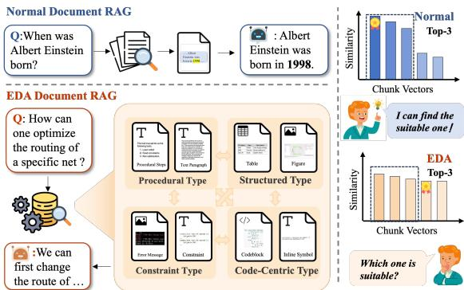
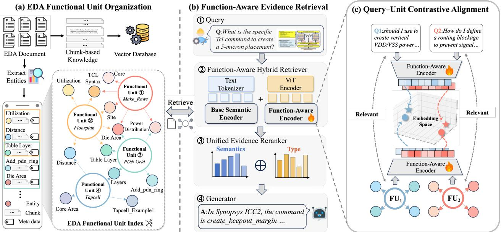

# From Chunks to Functional Evidence: Function-Aware Retrieval for EDA Documentation QA

Xiaotian Qiu1,2, Kairui Liu1, Shi Chenyi1, Jinyuan Deng1, Qi Sun1, Cheng Zhuo1

1Zhejiang University 2Shanghai Innovation Institute

## Abstract

Retrieval-Augmented Generation (RAG) is widely used to ground answers in documents. For complex technical docu- mentation, however, the primary bottleneck is often not model reasoning but a mismatch between a query and the way knowl- edge is organized for retrieval. This mismatch is pronounced in Electronic Design Automation (EDA) documentation, where the information needed for an answer is scattered across het- erogeneous yet tightly coupled artifacts. We therefore redesign the basic retrieval unit of RAG. Instead of operating on iso- lated chunks or binary relations, we collect typed artifacts into EDA functional units. Each unit is recorded as a hyper- edge with links to its source chunks. We then train an encoder to align queries with functional units and combine unit re- trieval with direct chunk retrieval. After mapping the selected units back to their sources, a unified reranker chooses the evidence given to the generator. On the newly constructed EDADocEval-QA dataset, our method improves ROUGE-L by 37.1% over Chunk RAG and 55.6% over the strongest graph baseline. On the public ORD-MMBench benchmark, it improves ROUGE-L by 30.0% over the strongest baseline. These results support function-aware evidence organization in the evaluated EDA documentation settings.

## 1 Introduction

Electronic Design Automation (EDA) tools support the com-plete circuit design flow through tightly coupled imple- mentation stages (Ajayi et al. 2019). Their documentation exemplifies a class of technical sources with intrinsically complex knowledge organization. Information is distributed across code blocks, parameter tables, figures, procedures, constraints, and descriptive text that may appear in diferent sections but jointly specify one tool function. We refer to this mixture of heterogeneous evidence forms as multi-type doc-umentation. Answering a practical question often requires composing several such artifacts rather than retrieving one isolated passage, as illustrated in Figure 1.

RAG is a natural way to ground answers in these docu- ments, but its primary bottleneck here is often not model reasoning. It is the mismatch between a question and the way evidence is organized for retrieval. Conventional dense retrievers treat each chunk as an independent unit and as- sume that vector similarity separates relevant from irrelevant passages. In EDA documentation, topically similar chunks may instead describe diferent commands, flow stages, or operating conditions. Figure 1 illustrates how repeated do- main terminology compresses the score diferences among top-ranked chunks. The retrievable unit should therefore pre- serve which artifacts participate in the same function, as well as where each artifact came from.

  
Figure 1: An illustrative embedding diagnostic: top-ranked EDA chunks have more tightly clustered similarity scores than the general-domain example, motivating retrieval units that preserve complementary functional roles.

This challenge calls for rethinking how knowledge is organized in RAG (Lewis et al. 2020). Chunk RAG retrieves independently encoded passages (Karpukhin et al. 2020). When dependent evidence appears in diferent sections, this passage-level organization does not preserve their functional grouping. GraphRAG organizes entities and com- munity summaries for global sensemaking (Edge et al. 2024), while HippoRAG uses graph traversal for multi-hop re- trieval (Gutiérrez et al. 2024). Neither necessarily retains the source context of a higher-order EDA usage event. Hy- pergraphs provide a convenient representation in which one unit can connect several artifacts (Feng et al. 2019), but the representation alone does not decide which artifacts belong together. Generic name repetition or local co-occurrence may still connect evidence that is topically similar yet functionally incompatible.

To address these issues, we redesign the basic retrieval unit around EDA functionality. Our framework organizes typed artifacts into functional units, uses a hypergraph to retain their higher-order membership and source provenance, and retrieves the original evidence that supports a question. Such grounded documentation QA also provides an evidence layer for EDA assistants that must select commands, set parame- ters, and interpret warnings before acting. Our contributions are summarized as follows:

• We characterize the mismatch between conventional retrieval units and EDA documentation: artifacts needed for one answer are functionally coupled but can be separated by chunking or flattened by binary relations.

• We introduce EDA functional units as retrievable knowl-edge units. Occurrences remain local to their sources be- fore they are grouped around a functional anchor. Hyper- edges preserve their types and provenance and support conservative connections across documents.

• We propose query–unit contrastive alignment that distin-guishes semantically similar units according to the artifact types available to answer a query.

• We develop a function-aware hybrid retriever that combines functional unit retrieval with direct chunk retrieval and returns a unified evidence context to the generator.

We evaluate our method against representative baselines on the public ORD-MMBench benchmark (Pu et al. 2025) and on EDADocEval-QA, a newly constructed domainspecific dataset. EDADocEval-QA covers parameter lookup, syntax retrieval, procedure synthesis, and constraint analysis. Our method obtains 0.473 ROUGE-L and 93.6 LLM-Score on this dataset, while the public benchmark provides a com- plementary evaluation of generation and document retrieval.

## 2 Related Work

## LLMs and RAG in EDA

LLMs are widely used in EDA, demonstrating immense po- tential in tasks such as code generation (Liu et al. 2023a; Thakur et al. 2024; Lu et al. 2024), EDA scripting (Wu et al. 2024), CPU design and verification (Wang et al. 2024), and conversational hardware design (Blocklove et al. 2023; Chang et al. 2023). Leading industrial eforts, such as Chip- NeMo (Liu et al. 2023b), have further validated the feasibility of domain-adaptive LLMs. However, EDA documen- tation presents significant challenges for general LLMs due to proprietary protocols, complex parameter constraints, and specific terminologies. LLMs often generate hallucinations or outdated information due to the lack ofdomain knowledge. RAG addresses this issue by retrieving factual information from external databases (Guu et al. 2020). Recent studies have optimized RAG for EDA by fine-tuning embedding models on domain corpora (Pu et al. 2024). Despite these improvements, most systems still organize evidence as inde- pendent chunks or generic relations rather than explicit EDA functional roles.

## Evidence Organization in RAG

A key characteristic of EDA documents is the tight coupling of multi-type entities. Existing RAG paradigms make difer- ent trade-ofs when handling this characteristic.

Chunk-based RAG treats documents as linear text sequences, utilizing sparse retrieval (e.g., BM25 (Robertson and Zaragoza 2009)) or dense retrieval (e.g., DPR (Karpukhin et al. 2020)) to fetch segments. This ap- proach can separate cross-entity dependencies. A functional definition often appears in one section, while its timing con- straints appear in another. Chunk-based retrieval can there- fore return isolated fragments. Consequently, the LLM may receive an incomplete evidence chain (Xing et al. 2026).

Graph-based RAG extracts entities and relations to construct knowledge graphs (Pan et al. 2024). GraphRAG uses entity graphs and community summaries for global sense- making (Edge et al. 2024), while HippoRAG uses knowl-edge graphs and Personalized PageRank for multi-hop re- trieval (Gutiérrez et al. 2024). In the EDA setting studied here, however, entity- or relation-level retrieval may still sep- arate a higher-order usage event in which code blocks, pa- rameter tables, and procedural descriptions jointly support an answer. Compressing detailed procedural descriptions or code blocks into relational summaries can also omit source context needed for generation.

## Structured Evidence Organization

Recent retrieval methods increasingly organize evidence above the level of independent chunks. SG-Filter builds a hi- erarchical summarized-semantic index to distinguish other- wise similar passages (Ye et al. 2025). Evidence Units groups visual assets with their contextual text through ontology- grounded document organization (Han 2026), while Tech-DocRAG preserves relations among clauses, tables, figures, and procedural steps in technical documents (Lee and Choi 2026). Hypergraphs ofer another representation: a single hyperedge can connect multiple artifacts (Feng et al. 2019; Yadati et al. 2019), and recent systems use this property to organize higher-order evidence for multi-hop retrieval (Luo et al. 2025; Zhang and Ma 2026; An et al. 2026). Our frame-work uses this representation to retain source-localized EDA occurrences, but defines retrieval units around tool functions and learns to match queries with the artifact roles available in each unit.

## Reasoning-Augmented RAG

Reasoning-enhanced frameworks such as Chain-of-Thought (CoT) (Wei et al. 2022) and Tree of Thoughts (ToT) (Yao et al. 2023a) improve LLM reasoning by decomposing problems into intermediate steps. IRCoT (Trivedi et al. 2023) interleaves retrieval with reasoning, while ReAct (Yao et al. 2023b) interleaves reasoning with external actions such as search. Their eficacy still depends on the evidence retrieved at each step. Using generic vector-based RAG or web search APIs proves inefective for the specialized and proprietary nature of EDA documentation. Our framework is comple- mentary: it encodes typed documentation dependencies in the retrieval index so that a reasoning method can begin from retrieved units with intact source context.

  
Figure 2: Framework overview. (a) Typed, source-localized EDA artifacts are organized into functional units, each represented as a hyperedge linked to its source chunks. (b) A function-aware hybrid retriever searches functional units and source chunks, after which a unified reranker selects the generation evidence. (c) Query–unit contrastive alignment trains the function-aware encoder.

## 3 Method

## Problem Formulation and Overview

We formulate EDA documentation QA as an evidence retrieval problem. Given a query q and document chunks C, the system selects a generation context $\mathcal { C } _ { q } \subseteq \mathcal { C }$ that covers the facts and artifact types needed for the answer. Fixed chunks often separate evidence that belongs to the same EDA opera- tion, while binary relations divide an event involving several complementary roles. Before receiving a query, we organize the corpus into source chunks and EDA functional units. A unit groups compatible occurrences around one canonical function while retaining the source location of every artifact. We represent it as a typed hyperedge linked to its source chunks.

Our framework has three components. First, EDA func- tional unit organization groups artifacts that play comple- mentary roles in the same operation. Second, query–unit con- trastive alignment learns which artifact combinations distin- guish one function from nearby alternatives. Third, function- aware evidence retrieval searches the unit and chunk indexes in parallel. Once selected for a query, the returned units and chunks become candidate evidence. Selected units are ex- panded to their source chunks, and a unified reranker chooses the top-K chunks as $\mathcal { C } _ { q }$

## EDA Functional Unit Organization

We first identify typed artifacts and organize them into func- tional units before any query is received. The resulting index is encoded as a hypergraph $\mathcal { H } = ( \mathcal { V } , \mathcal { E } _ { \mathrm { h y p e r } } ) ;$ : a node rep- resents a documentation artifact, and a hyperedge records the artifacts and source chunks that constitute one unit. The hypergraph is therefore the representation of the index; the substantive construction decision is which artifacts are al- lowed to form a functional unit.

Occurrences within a source. Construction begins from document structure rather than a whole-corpus lexical graph. A deterministic Markdown parser records headings, block boundaries, line spans, and image references. Blocks under the same section are grouped locally, with code blocks, or- dered procedures, and diagnostic messages serving as natural boundaries between distinct usage events. Very short neigh- boring segments are merged only within the same document. This produces occurrence candidates whose provenance is known before semantic extraction.

Each candidate is then decomposed into typed artifacts. Our schema T covers code, inline commands, tables, figures, procedures, descriptive text, constraints, diagnostics, and file artifacts. Deterministic rules identify explicit structures such as code blocks and tables, while an LLM identifies semantic spans such as procedures and constraints. For every artifact v, we retain its content, artifact type τ(v), source document, source chunk, and extraction metadata.

Artifact type and functional role are related but not in- terchangeable. τ(v) describes the evidence form, such as $\mathtt { t a b l e ~ o r ~ c o d e b l o c k }$ . A functional role describes how that artifact participates in a particular usage event, for ex- ample as the operation, parameter specification, condition, example, or diagnostic consequence. We infer this relation from the surrounding source context and its functional an- chor; it is not a second supervised node label. This distinction matters later because the training objective operates on ob-servable artifact types, not on latent role names.

Formally, a functional occurrence from source region r is

$$
o _ { r } = ( a _ { r } , \mathcal { V } _ { r } , \mathcal { C } _ { r } , p _ { r } ) ,\tag{1}
$$

where $a _ { r }$ is a command or file anchor, V contains the typed artifacts in that local event, $\mathcal { C } _ { r }$ contains its source chunks, and $p _ { r }$ stores document and line provenance. This definition is stronger than local word co-occurrence: the grouped arti- facts must belong to one structural source region and remain traceable to it.

Functional units across sources. An occurrence within one source already forms a useful unit. Some functions, however, are described across manuals: one document may define a command while another provides a parameter ta- ble or worked example. We connect such occurrences only through an admissible canonical anchor. Let ${ \mathcal O } ( a ) = \{ o _ { r } \ :$ norm $\left( a _ { r } \right) = a \}$ . A unit spanning documents is created only when $\mathcal O ( a )$ contains at least two source occurrences from diferent documents and their union contains at least two ar- tifact types. The linker accepts stable command and file an- chors, filters generic placeholders and language type aliases, and caps the number of occurrences attached to one anchor. These restrictions prevent frequent but irrelevant strings from becoming hubs across the corpus.

Each retained unit is represented as a hyperedge $e \in \mathcal { E } _ { \mathrm { h y p e r } } .$

$$
e = ( { \mathcal { V } } ( e ) , S ( e ) , \operatorname { c h u n k s } ( e ) , P ( e ) ) ,\tag{2}
$$

where $\nu ( e ) \subseteq \nu$ is the artifact set, $S ( e )$ is its retrieval sum- mary, chunks $. ( e ) \subseteq { \mathcal { C } }$ is the deduplicated set of original chunks, and $\dot { P ( e ) }$ retains the contributing occurrences and source references. We serialize $S ( e )$ by artifact type so that the unit embedding retains $\mathcal { T } ( e ) = \{ \tau ( v ) \ | \ v \in \bar { \mathcal { V } ( e ) } \}$ . The summary is used for unit retrieval only; the generator receives the original source chunks reached through chunks(e).

Validation and updates. Structural checks reject empty units, missing source references, invalid type labels, and links without suficient type diversity. They establish structural va- lidity and provenance, not the semantic accuracy of LLM extraction. Construction can resume from its cache, so vali- dated outputs survive an interrupted call. When a document is added or changed, the parser and extractor run only on its chunks. The linker then resolves their anchors against the retained index and recomputes the afected units; a deletion follows the same provenance links in reverse. Consequently, adding the 33rd document does not require extracting the unchanged 32-document corpus again.

Concrete example. Consider the define\_pdn\_grid command in OpenROAD. Its default -starts\_with: GROUND, syntax, and strap-orientation constraints occur in diferent source regions. The canonical command anchor connects the parameter table, code block, and constraint para- graph, while their source IDs remain intact. The resulting functional unit is represented by a hyperedge with type com- position {table, codeblock, text\_paragraph} and backtracks to all three chunks.

## Query–Unit Contrastive Alignment

Efective retrieval requires more than locating semantically similar text. It must also identify functional units whose avail- able artifact types can support the query. Since EDA docu- ments tend to cluster more tightly in the embedding space, relying solely on semantic similarity often fails to distinguish among candidates, resulting in recalls that appear seman- tically relevant but lack the required evidence forms. Our contrastive objective aligns queries with units that contain the required combination of types while preserving general semantic similarity.

We use the structured summary $S ( e )$ as the textual inter- face for encoding each functional unit. For units that include visual or structured entities, we serialize them into the mul- timodal input format so that the unit embedding reflects both semantic content and artifact type. This shifts supervision from local chunk matching to query–unit alignment.

Training queries are constructed from functional units, so each query q and its reference unit set $\mathcal { P } _ { q }$ share the target type combination by construction. We learn the alignment through contrastive positive and negative pairs together with an ar- tifact coverage ranking objective. For each query, we select one unit from $\mathcal { P } _ { q }$ as the positive sample $e ^ { + }$ and sample $\mathcal { N } ( q )$ from the remaining units. Hard negatives are semantically plausible but lack a critical artifact type; random negatives preserve general semantic discrimination.

Hard negatives capture a common failure mode in multi- type documentation: candidates can be topically related yet miss evidence needed for an answer. For instance, a purely descriptive paragraph may be semantically relevant to a pa- rameter query but lacks the concrete table row that specifies defaults or ranges. By contrasting such candidates against the positive unit, the model learns to prefer usable type com- binations within a narrow semantic neighborhood. We use a mixed sampler: units with partial overlap provide dificult type negatives, while semantically hard or random units keep the learned space from collapsing into a type classifier. The query is always textual, whereas a candidate unit may com- bine textual and visual content. This asymmetry teaches the query representation to select the evidence forms available in a unit without requiring a separate type router at inference.

We use pretrained Visualized-BGE-M3 as the Base Semantic Encoder. Applying Low-Rank Adaptation (LoRA) with the objective below produces the Function-Aware Encoder. Both encoders accommodate textual and visual entities in multimodal EDA documents. The semantic compo- nent follows the InfoNCE formulation:

$$
\mathcal { L } _ { \mathrm { N C E } } ( q ) = - \log \frac { \exp ( s ^ { + } / \tau ) } { \exp ( s ^ { + } / \tau ) + \sum _ { e ^ { - } \in \mathcal { N } } \exp ( s ^ { - } / \tau ) }\tag{3}
$$

where $s ^ { + } = \sin ( q , e ^ { + } ) , s ^ { - } = \sin ( q , e ^ { - } )$ , and $\tau$ is the temperature. Let $\mathcal { T } _ { q }$ denote the artifact types required by training query q and $\mathcal T ( e )$ the types present in candidate unit $e .$ . We define $\bar { \kappa _ { q } } ( e ) = \bar { | \mathcal { T } _ { q } \cap \bar { \mathcal { T } } ( e ) | } / | \mathcal { T } _ { q } |$ , with $\kappa _ { q } ( e ) = 1$ when $\mathcal { T } _ { q }$ is empty. For the positive and sampled negative candidates, let $s _ { i } = \sin ( q , e _ { i } ) / \tau$ and $\mathcal { R } _ { q } = \{ ( i , j ) : i <$ $j , \ | \kappa _ { q } ( e _ { i } ) - \kappa _ { q } ( e _ { j } ) | > 0 . 0 1 \}$ . For each $( i , j ) \in \mathcal { R } _ { q } ,$ write $\Delta _ { i i } ^ { \kappa } \stackrel { \scriptscriptstyle } { = } \kappa _ { q } ( e _ { i } ) { - \kappa _ { q } ( e _ { j } ) }$ and $\Delta _ { i i } ^ { s } = s _ { i } - s _ { j } . \mathrm { A }$ pairwise margin term then orders candidates with diferent artifact coverage:

$$
\mathcal { L } _ { \mathrm { t y p e } } = \frac { 1 } { | \mathcal { R } _ { q } | } \sum _ { ( i , j ) \in \mathcal { R } _ { q } } \operatorname* { m a x } \bigl ( 0 , m - \mathrm { s g n } ( \Delta _ { i j } ^ { \kappa } ) \Delta _ { i j } ^ { s } \bigr ) .\tag{4}
$$

We set $\mathcal { L } _ { \mathrm { t y p e } } = 0$ when $\mathcal { R } _ { q }$ is empty and use margin $m =$ $0 . 1 ;$ the final objective is $\mathcal { L } \dot { = } \mathcal { L } _ { \mathrm { N C E } } + \lambda \mathcal { L } _ { \mathrm { t y p e } }$ . At inference time, the model does not explicitly predict a type set. Instead, the learned embedding space recalls functional units whose artifact composition matches the query.

## Function-Aware Evidence Retrieval

The function-aware hybrid retriever uses two complemen- tary indices. The unit index captures the evidence forms as- sociated with an EDA operation. The chunk index preserves access to localized details. Searching both is important: func- tional units provide broader coverage, whereas direct chunk retrieval can recover a precise detail that is weakly repre- sented in a unit summary.

Given $q ,$ we retrieve the $\mathsf { t o p } \mathrm { - } k _ { p }$ functional units using the Function-Aware Encoder and expand each unit through chunks(e). Expansion is limited to the source chunks that belong to the selected units; it does not traverse unrelated neighbors. In parallel, the Base Semantic Encoder retrieves the top- $\mathbf { \nabla } \cdot k _ { c }$ source chunks. At this point, the retrieved units and chunks become candidate evidence. We merge and dedu- plicate their source chunks to obtain $\mathcal { C } _ { \mathrm { c a n d } }$

The unit path is not an unrestricted graph walk. The explicit chunks(e) mapping produces a candidate set conditioned on the function retrieved for the query. This prevents a unit with a high score from pulling in unrelated neighbors that merely share a generic entity. The chunk path plays the complemen- tary role: it can recover a local command option, table row, or warning that is highly relevant even when its unit summary is broad. Their union separates two decisions that a single retriever would conflate: locating the relevant function and locating the precise source span within or near that function.

The unified evidence reranker scores every candidate in both encoder spaces:

$$
s ( c ) = \alpha \sin ( q _ { \mathrm { b a s e } } , c _ { \mathrm { b a s e } } ) + ( 1 - \alpha ) \sin ( q _ { \mathrm { f u n c } } , c _ { \mathrm { f u n c } } )\tag{5}
$$

where $\alpha = 0 . 4$ and each query–chunk similarity is computed in one internally aligned encoder space. We select the top-K chunks as the generation context $\mathcal { C } _ { q } ^ { \phantom { \dagger } } .$

The Function-Aware Encoder carries the type preference learned in Section 3, while the Base Semantic Encoder pre- serves local semantic matching. Their fusion determines the source chunks seen by the generator rather than using unit retrieval only as an auxiliary signal. Because both paths ter- minate at source chunks, generation is grounded in the same evidence format used by conventional RAG. Functional units change how candidate evidence is organized and selected, not what is presented to the generator.

## 4 Experiments

## Experimental Setup

Evaluation settings. We use two complementary EDA documentation QA settings. (1) EDADocEval-QA contains 100 QA pairs over 33 OpenROAD technical documents (324K tokens), with 25 questions in each of four categories. The four query types have distinct evidence compositions: Parameter Lookup (PL), Syntax Retrieval (SR), Procedure

Synthesis (PS), and Debug & Constraint (DC). These cate-gories require diferent combinations of structured and tex- tual evidence. (2) ORD-MMBench (Pu et al. 2025) is a public multi-modal EDA benchmark with text and screenshot queries over EDA documentation; we report overall gener- ation quality and oficial document-retrieval performance. ORD-MMBench provides an independent public evaluation within the broader EDA documentation setting.

Baselines. We consider three families of baselines that represent mainstream RAG paradigms. Chunk-level RAG includes Chunk RAG (Lewis et al. 2020), which performs dense retrieval over fixed-length document chunks. Graph-based RAG includes GraphRAG (Edge et al. 2024), which organizes evidence with an entity-relation graph and community-based summarization, LightRAG (Guo et al. 2025), which targets lightweight graph maintenance, Hip- poRAG 2 (Gutiérrez et al. 2025), which incorporates memory-augmented retrieval, and HyperGraphRAG (Luo et al. 2025), which extends graph retrieval to multi-ary relations. Reasoning-augmented frameworks include Re-Act (Yao et al. 2023b), which interleaves reasoning with tool use, and Search-o1 (Li et al. 2025), which augments reasoning with agentic search. For ORD-MMBench, we use the benchmark’s reported baselines: VisRAG (Yu et al. 2025), EchoSight (Yan and Xie 2024), RAG-EDA (Pu et al. 2024), and VISTA-RAG (Zhou et al. 2024), which span text-based and multimodal retrieval.

Implementation. We use Qwen2.5-72B as the LLM backbone for answer generation. The retrieval encoder is Visualized-BGE-M3 (873M parameters) fine-tuned with LoRA (rank=8, $\alpha { = } 1 6 ,$ dropout=0.1) on a single NVIDIA RTX 4090 GPU, yielding 786K trainable parameters (0.09% of total). Training data consists of 1,250 query–unit pairs automatically generated from 250 training packs, with an 85/15 train/validation split. The contrastive objective combines InfoNCE with a type-aware margin ranking loss weighted by $\lambda { = } 0 . 3$ (temperature $\tau { = } 0 . 0 7$ , 7 negatives per query using mixed hard-negative mining). Training runs for 10 epochs with AdamW $( \mathrm { l r } { = } 1 0 ^ { - 4 } )$ and early stopping; the best checkpoint is selected at epoch 8 (val loss = 0.735). For functional-unit retrieval, we set top-M=10; for chunk retrieval, top-N=5; the final context uses top-K=5 after unified reranking. Unless a row is explicitly labeled DeepSeek- R1, EDADocEval-QA systems use Qwen2.5-72B for answer generation; all systems use the same 33-document corpus and QA/evaluation protocol, while retaining their method-specific evidence organization. For ORD-MMBench, we use GPT-4o as the generation backbone to align with the original benchmark configuration.

Metrics. We report BLEU (Papineni et al. 2002), ROUGE-L (Lin 2004), and a 0–100 LLM-Score that sums five 0–20 ratings for correctness, completeness, relevance, profession- alism, and conciseness against the reference answer. Because Qwen2.5-72B is both a generator and the LLM-Score judge for several systems, this metric is complementary rather than independent factuality evidence; we therefore interpret it to- gether with lexical and retrieval metrics.

## Main Results

Table 1 reports results on EDADocEval-QA under a unified RAG setting. We next analyze component contributions and construction cost before evaluating generation and retrieval on the public ORD-MMBench benchmark.

As shown in Table 1, our method achieves ROUGE-L 0.473, BLEU 0.189, and LLM-Score 93.6 on EDADocEval- QA, ranking first on all three metrics. Compared with Chunk RAG using Qwen2.5-72B, it improves ROUGE-L by 0.128 (0.345→0.473), BLEU by 0.137 (0.052→0.189), and LLM-Score by 5.3 points (88.3→93.6). The simultaneous increase in lexical metrics and LLM-Score is consistent with improved alignment to answer-critical details, although the LLM-based score is not independent factuality evidence.

Reasoning-augmented methods provide a strong base- line: ReAct achieves ROUGE-L 0.374, outperforming most retrieval-only baselines, yet still trails our method by 0.099 in ROUGE-L and 0.098 in BLEU. This pattern is consis- tent with evidence organization remaining important when support is fragmented across heterogeneous artifact types; our functional units explicitly target completeness across ev- idence types.

We also observe metric divergence where some methods obtain high LLM-Score but low lexical metrics. For example, LightRAG reaches LLM-Score 92.8 but only 0.219 ROUGE- L and 0.024 BLEU. The metrics therefore capture diferent properties of the generated answers; without answer-level analysis, their disagreement does not identify a single cause. Our method improves lexical metrics together with LLM- Score, which is consistent with retrieving both complemen- tary evidence and answer details.

## Ablation Study

We ablate functional unit organization, hybrid retrieval, and query–unit alignment on EDADocEval-QA. As shown in Table 2, organizing the corpus into functional units provides the largest gain, improving ROUGE-L from 0.345 to 0.426 (an increase of 0.081, or 23%). This indicates that grouping artifacts by their functional roles mitigates evidence frag- mentation. This is consistent with EDA queries requiring parameters, code snippets, and procedural descriptions that participate in the same function but occur in diferent docu- ment regions.

The function-aware hybrid retriever further raises ROUGE-L to 0.461, an increase of 0.035 over functional unit retrieval alone. This result indicates that source chunks complement functional units in this setup. Query–unit align-ment adds 0.012, reaching 0.473. Since this final increment is small and no confidence interval is available, we do not interpret it as a statistically established standalone gain.

## Construction and Retrieval Cost

We measured hypergraph construction on the full 33- document corpus using Qwen3.6-27B. The pipeline pro-cessed 404 chunks and extracted 3,650 typed nodes. Every chunk retained its source location and cached metadata, none required fallback processing, and all structural consistency checks passed. We did not manually label extraction accu- racy, so this result verifies index completeness and internal consistency rather than semantic correctness. Building the in- dex required 427,824 LLM tokens and 1,668.0 seconds, with peak RSS of 84.0 MiB. At query time, the function-aware hybrid retriever reduced the average generation context from 1,697 to 1,415 tokens, a reduction of 16.6%, while retrieval latency increased from 20.69 to 27.67 ms.

Incremental updates and parser robustness. To test whether the index can absorb new material without rebuild- ing the full corpus, we first constructed it from 32 documents and then added the remaining document. The updater reused 402 existing units and rebuilt two. All seven semantic out- puts matched those produced by rebuilding the index from all 33 documents. We also applied four formatting changes to the source Markdown, including alternative code fences and repeated blank lines. Every variant produced the same semantic graph, containing 404 hyperedges and 2,481 canon- ical nodes, covered all 33 documents, and retained no invalid units. These experiments test index maintenance and parser stability, not the semantic precision or recall of extracted entities.

## ORD-MMBench Results

We evaluate on the public ORD-MMBench benchmark using GPT-4o as the generation backbone to align with the original configuration.

As shown in Table 3, our method achieves the best overall performance, with an LLM-Score of 79.6, BLEU of 0.240, and ROUGE-L of 0.412. Compared with the strongest base- line VISTA-RAG, it improves overall ROUGE-L by 0.095 (0.317→0.412), BLEU by 0.060 (0.180→0.240), and LLM-Score by 10.0 points (69.6→79.6).

Document retrieval reaches Recall@1/5 of 0.700/0.917 versus 0.679/0.896 for MM-GRADE, providing an indepen- dent public retrieval comparison alongside the generation results.

ORD-MMBench assigns one target document to each query, so its oficial retrieval metric is document-level Re- call@K. We compare BGE-M3 (Chen et al. 2024), RAG-EDA (Pu et al. 2024), DEDR (Salemi, Pizzorno, and Zamani 2023), BLIP (Li et al. 2022), VisRAG (Yu et al. 2025), EchoSight (Yan and Xie 2024), Visualized-BGE-M3 (Zhou et al. 2024), and MM-GRADE (Pu et al. 2025).

As detailed in Table 4, the retrieval advantage is con- sistent but modest at every cutof: the margin over MM- GRADE ranges from 0.015 to 0.022. Text-oriented retriev- ers remain substantially stronger than vision-only retrieval on this benchmark. These results support evidence cover- age as one contributor to the generation gains, rather than attributing the full diference to the hypergraph alone.

## Discussion

Table 1 compares complete systems under a shared corpus, question set, and evaluation protocol; the DeepSeek-R1 row is the only explicitly labeled generator change. Since re- triever adaptation difers across baseline families, this table measures end-to-end performance rather than the isolated efect of hypergraph structure. The cumulative ablation of- fers a more direct comparison within our framework, while ORD-MMBench tests transfer to a public EDA benchmark. These results do not establish generality beyond technical EDA documentation.

<table><tr><td>Method</td><td>ROUGE-L ↑</td><td>BLEU↑</td><td>LLM-Score ↑</td></tr><tr><td colspan="4">Chunk-level RAG</td></tr><tr><td>Chunk RAG (Qwen2.5-72B) (Lewis et al. 2020)</td><td>0.345</td><td>0.052</td><td>88.3</td></tr><tr><td>Chunk RAG (DeepSeek-R1) (Lewis et al. 2020)</td><td>0.327</td><td>0.097</td><td>87.5</td></tr><tr><td colspan="4">Graph-based RAG</td></tr><tr><td>GraphRAG (Edge et al. 2024)</td><td>0.226</td><td>0.050</td><td>87.8</td></tr><tr><td>LightRAG (Guo et al. 2025)</td><td>0.219</td><td>0.024</td><td>92.8</td></tr><tr><td>HyperGraphRAG (Luo et al. 2025)</td><td>0.304</td><td>0.094</td><td>77.2</td></tr><tr><td>HippoRAG 2 (Gutiérrez et al. 2025)</td><td>0.301</td><td>0.168</td><td>88.0</td></tr><tr><td colspan="4">Reasoning framework</td></tr><tr><td>ReAct (Yao et al. 2023b)</td><td>0.374</td><td>0.091</td><td>84.7</td></tr><tr><td>Search-o1 (Li et al. 2025)</td><td>0.283</td><td>0.044</td><td>89.9</td></tr><tr><td>Ours</td><td>0.473</td><td>0.189</td><td>93.6</td></tr></table>

Table 1: Main results on EDADocEval-QA. LLM-Score is a five-part quality score (0–100) evaluated by Qwen2.5-72B. Best results are in bold.

<table><tr><td>Configuration</td><td>ROUGE-L</td><td>∆</td></tr><tr><td>Chunk RAG</td><td>0.345</td><td></td></tr><tr><td>+ Functional unit organization</td><td>0.426</td><td>+23%</td></tr><tr><td>+ Function-aware hybrid retrieval</td><td>0.461</td><td>+34%</td></tr><tr><td>+ Query-unit alignment</td><td>0.473</td><td>+37%</td></tr></table>

Table 2: Cumulative ablation of the three method compo- nents.

<table><tr><td>Method</td><td>LLM-Score</td><td>BLEU</td><td>ROUGE-L</td></tr><tr><td>VisRAG</td><td>20.4</td><td>0.084</td><td>0.225</td></tr><tr><td>EchoSight</td><td>57.9</td><td>0.139</td><td>0.276</td></tr><tr><td>RAG-EDA</td><td>49.1</td><td>0.134</td><td>0.268</td></tr><tr><td>VISTA-RAG</td><td>69.6</td><td>0.180</td><td>0.317</td></tr><tr><td>Ours</td><td>79.6</td><td>0.240</td><td>0.412</td></tr></table>

Table 3: Overall ORD-MMBench generation results. Base- line values are from MM-GRADE (Pu et al. 2025).

The method also introduces a practical trade-of. Retriev- ing functional units alongside source chunks reduces the context sent to the generator but adds retrieval latency. Di- rect chunk retrieval remains useful when one local passage is suficient or construction misses an occurrence. The re- ported results measure answer quality, document retrieval, construction consistency, and runtime cost, but not the se- mantic accuracy of intermediate extraction. Each table entry comes from one completed evaluation; we report neither multi-seed averages nor statistical significance.

<table><tr><td>Method</td><td>R@1 R@2 R@3 R@4 R@5</td></tr><tr><td>BGE-M3</td><td>0.590 0.6940.731 0.761 0.776</td></tr><tr><td>RAG-EDA DEDR</td><td>0.530 0.612 0.679 0.724 0.739 0.112 0.1870.2310.2840.299</td></tr><tr><td>BLIP</td><td>0.127 0.209 0.276 0.299 0.313 0.025 0.042 0.050 0.083 0.108</td></tr><tr><td>VisRAG EchoSight</td><td>0.383 0.492 0.5830.6250.667</td></tr><tr><td></td><td>Visualized-BGE-M3 0.582 0.716 0.739 0.761 0.799</td></tr><tr><td>MM-GRADE</td><td>0.679 0.828 0.843 0.866 0.896</td></tr><tr><td>Ours</td><td>0.700 0.850 0.858 0.883 0.917</td></tr></table>

Table 4: Document retrieval on ORD-MMBench. Baseline values are from MM-GRADE (Pu et al. 2025).

## 5 Conclusion

We presented a framework that organizes typed EDA artifacts into functional units and uses query–unit alignment with hybrid retrieval to select evidence from functional units and source chunks. It improves EDADocEval-QA ROUGE-L by 37% over Chunk RAG and transfers to ORD-MMBench. The study remains limited to one domain-specific dataset and one public EDA benchmark; construction requires ofline LLM extraction, and hybrid retrieval reduces generation context at the cost of latency. Future work should evaluate extraction accuracy and additional EDA tool ecosystems.

## References

Ajayi, T.; Blaauw, D.; Chan, T.-B.; Cheng, C.-K.; Chhabria, V. A.; Choo, D.-K.; Coltella, M.; Dobre, S.; Dreslinski, R.; Fogaça, M.; et al. 2019. OpenROAD: Toward a Self-Driving, Open-Source Digital Layout Implementation Tool Chain. In Proceedings of Government Microcircuit Applications and Critical Technology Conference, 1105–1110.

An, H.-Y.; Zhang, Y.-J.; Liang, C.-W.; Zhang, T.-Y.; Ding, J.; Wu, Y.-L.; Li, A.-B.; Su, W.-C.; Saifullah; and Wang, M. 2026. HyCE-RAG: Hypergraph Chain-of-Evidence

Retrieval-Augmented Generation for Explainable Multi-hop Question Answering. arXiv preprint arXiv:2607.22597.

Blocklove, J.; et al. 2023. Chip-Chat: Challenges and Op- portunities in Conversational Hardware Design. In MLCAD.

Chang, K.; Wang, Y.; Ren, H.; Wang, M.; Liang, S.; Han, Y.; Li, H.; and Li, X. 2023. ChipGPT: How Far Are We from Natural Language Hardware Design. arXiv preprint arXiv:2305.14019.

Chen, J.; Xiao, S.; Zhang, P.; Luo, K.; Lian, D.; and Liu, Z. 2024. M3-Embedding: Multi-Linguality, Multi- Functionality, Multi-Granularity Text Embeddings Through Self-Knowledge Distillation. In Findings of the Association for Computational Linguistics: ACL 2024, 2318–2335.

Edge, D.; Trinh, H.; Cheng, N.; Bradley, J.; Chao, A.; Mody, A.; Truitt, S.; Metropolitansky, D.; Ness, R. O.; and Lar- son, J. 2024. From Local to Global: A Graph RAG Ap- proach to Query-Focused Summarization. arXiv preprint arXiv:2404.16130.

Feng, Y.; et al. 2019. Hypergraph neural networks. In AAAI. Guo, Z.; et al. 2025. LightRAG: Simple and Fast Retrieval- Augmented Generation. In Findings of the Association for Computational Linguistics: EMNLP 2025, 10746–10761.

Gutiérrez, B. J.; Shu, Y.; Gu, Y.; Yasunaga, M.; and Su, Y. 2024. HippoRAG: Neurobiologically Inspired Long-Term Memory for Large Language Models. In Advances in Neural Information Processing Systems, volume 37.

Gutiérrez, B. J.; Shu, Y.; Qi, W.; Zhou, S.; and Su, Y. 2025. From RAG to Memory: Non-Parametric Continual Learning for Large Language Models. In ICML.

Guu, K.; et al. 2020. REALM: Retrieval-Augmented Lan- guage Model Pre-Training. In ICML.

Han, Y. 2026. Evidence Units: Ontology-Grounded Docu- ment Organization for Parser-Independent Retrieval. arXiv preprint arXiv:2604.00500.

Karpukhin, V.; et al. 2020. Dense Passage Retrieval for Open-Domain Question Answering. In EMNLP.

Lee, S.; and Choi, M. 2026. TechDocRAG: Relation- Preserving Retrieval-Augmented Generation (RAG) for Technical Documents. AI, 7(5): 161.

Lewis, P.; et al. 2020. Retrieval-augmented generation for knowledge-intensive nlp tasks. In NeurIPS.

Li, J.; Li, D.; Xiong, C.; and Hoi, S. 2022. BLIP: Boot- strapping Language-Image Pre-training for Unified Vision- Language Understanding and Generation. In Proceedings of the 39th International Conference on Machine Learning, volume 162 of Proceedings ofMachine Learning Research, 12888–12900. PMLR.

Li, X.; Dong, G.; Jin, J.; Zhang, Y.; Zhou, Y.; Zhu, Y.; Zhang, P.; and Dou, Z. 2025. Search-o1: Agentic Search-Enhanced Large Reasoning Models. In Proceedings ofthe 2025 Conference on Empirical Methods in Natural Language Processing, 5420–5438.

Lin, C.-Y. 2004. ROUGE: A Package for Automatic Evalu- ation of Summaries. In Text Summarization Branches Out, 74–81.

Liu, M.; Pinckney, N.; Khailany, B.; and Ren, H. 2023a. VerilogEval: Evaluating large language models for Verilog code generation. In ICCAD.

Liu, M.; et al. 2023b. ChipNeMo: Domain-Adapted LLMs for Chip Design. arXiv preprint arXiv:2311.00176.

Lu, Y.; et al. 2024. RTLLM: An Open-Source Benchmark for Design RTL Generation with Large Language Model. In ASP-DAC.

Luo, H.; E, H.; Chen, G.; Zheng, Y.; Wu, X.; Guo, Y.; Lin, Q.; Feng, Y.; Kuang, Z.; Song, M.; Zhu, Y.; and Luu, A. T. 2025. HyperGraphRAG: Retrieval-Augmented Generation via Hypergraph-Structured Knowledge Representation. In Advances in Neural Information Processing Systems, vol-ume 38.

Pan, S.; et al. 2024. Unifying Large Language Models and Knowledge Graphs: A Roadmap. IEEE Transactions on Knowledge and Data Engineering.

Papineni, K.; Roukos, S.; Ward, T.; and Zhu, W.-J. 2002. BLEU: A Method for Automatic Evaluation of Machine Translation. In ACL, 311–318.

Pu, Y.; He, Z.; Lin, S.; Qin, J.; Zhang, X.; Han, H.; Zheng, H.; Jiang, Y.; Zhuo, C.; Sun, Q.; et al. 2025. MM-GRADE: A Multi-Modal EDA Tool Documentation QA Framework Leveraging Retrieval Augmented Generation. In 2025 IEEE/ACM International Conference On Computer Aided Design (ICCAD), 1–9. IEEE.

Pu, Y.; He, Z.; Qiu, T.; Wu, H.; and Yu, B. 2024. Customized Retrieval Augmented Generation and Benchmark- ing for EDA Tool Documentation QA. In Proceedings of the 43rd IEEE/ACM International Conference on Computer-Aided Design, 116:1–116:9.

Robertson, S.; and Zaragoza, H. 2009. The probabilistic relevance framework: BM25 and beyond. Foundations and Trends in Information Retrieval.

Salemi, A.; Pizzorno, J. A.; and Zamani, H. 2023. A Symmetric Dual Encoding Dense Retrieval Framework for Knowledge-Intensive Visual Question Answering. In Proceedings of the 46th International ACM SIGIR Conference on Research and Development in Information Retrieval, 110– 120.

Thakur, S.; Ahmad, B.; Pearce, H.; Tan, B.; Dolan-Gavitt, B.; Karri, R.; and Garg, S. 2024. VeriGen: A Large Language Model for Verilog Code Generation. ACM Transactions on DesignAutomation ofElectronic Systems, 29(3): 46:1–46:31.

Trivedi, H.; Balasubramanian, N.; Khot, T.; and Sabharwal, A. 2023. Interleaving Retrieval with Chain-of-Thought Rea- soning for Knowledge-Intensive Multi-Step Questions. In Proceedings ofthe 61stAnnual Meeting oftheAssociationfor Computational Linguistics (Volume 1: Long Papers), 10014– 10037.

Wang, X.; Wan, G.-W.; Wong, S.-Z.; Zhang, L.; Liu, T.; Tian, Q.; and Ye, J. 2024. ChatCPU: An Agile CPU Design and Verification Platform with LLM. In DAC, 212:1–212:6.

Wei, J.; Wang, X.; Schuurmans, D.; Bosma, M.; Ichter, B.; Xia, F.; Chi, E. H.; Le, Q. V.; and Zhou, D. 2022. Chain-of-Thought Prompting Elicits Reasoning in Large Language Models. NeurIPS.

Wu, H.; He, Z.; Zhang, X.; Yao, X.; Zheng, S.; Zheng, H.; and Yu, B. 2024. ChatEDA: A Large Language Model Pow- ered Autonomous Agent for EDA. IEEE Transactions on Computer-Aided Design of Integrated Circuits and Systems, 43(10): 3184–3197.

Xing, C.; Wong, S.; Wan, X.; Lu, Y.; Zhang, M.; Ma, Z.; Qi, L.; Li, Z.; Guan, N.; Jiang, Z.; Wang, X.; and Yang, J. 2026. ChipMind: Retrieval-Augmented Reasoning for Long-Context Circuit Design Specifications. Proceedings of the AAAI Conference on Artificial Intelligence, 40(2): 1337– 1345.

Yadati, N.; et al. 2019. HyperGCN: A New Method for Training Graph Convolutional Networks on Hypergraphs. In NeurIPS.

Yan, Y.; and Xie, W. 2024. EchoSight: Advancing Visual- Language Models with Wiki Knowledge. In Findings ofthe Association for Computational Linguistics: EMNLP 2024, 1538–1551.

Yao, S.; Yu, D.; Zhao, J.; Shafran, I.; Grifiths, T. L.; Cao, Y.; and Narasimhan, K. 2023a. Tree of Thoughts: Deliberate Problem Solving with Large Language Models. NeurIPS.

Yao, S.; Zhao, J.; Yu, D.; Du, N.; Shafran, I.; Narasimhan, K.; and Cao, Y. 2023b. ReAct: Synergizing Reasoning and Acting in Language Models. In International Conference on Learning Representations.

Ye, J.; Liu, J.; Zhang, H.; Sheng, M.; Yang, T.; Xu, J.; Li, J.; Wang, Y.; and Dai, G. 2025. SG-Filter: Enhancing Sim- ilar Text Retrieval via Hierarchical Summarized-Semantic Index and Adaptive Filtering. In Proceedings of the 34th ACM International Conference on Information and Knowledge Management, 3866–3876.

Yu, S.; Tang, C.; Xu, B.; Cui, J.; Ran, J.; Yan, Y.; Liu, Z.; Wang, S.; Han, X.; Liu, Z.; and Sun, M. 2025. VisRAG: Vision-based Retrieval-augmented Generation on Multi- modality Documents. In The Thirteenth International Conference on Learning Representations.

Zhang, M.; and Ma, Y. 2026. HKVM-RAG: Key-Value- Separated Hypergraph Evidence Organization for Multi-Hop RAG. arXiv preprint arXiv:2606.07218.

Zhou, J.; Liu, Z.; Xiao, S.; Zhao, B.; and Xiong, Y. 2024. VISTA: Visualized Text Embedding For Universal Multi- Modal Retrieval. In Proceedings ofthe 62ndAnnual Meeting ofthe Associationfor Computational Linguistics (Volume 1: Long Papers), 3185–3200.

## A Indexing and Retrieval Procedure

Algorithm 1 Functional-unit indexing and function-aware   
retrieval   
Require: documents D, query q, trained encoders fbase, ffunc,   
budgets $k _ { p } , k _ { c } , K ; \alpha \stackrel { . } { = } 0 . \dot { 4 }$   
Ensure: generation context $\mathcal { C } _ { q }$   
Indexing   
1: O ← ∅; C ← Chunks(D)   
2: for all $r \in \operatorname { P a R s E } ( d ) , \dot { d } \in \mathcal { D }$ do   
3: V ← ExtractTypedArtifacts(r); ar ←   
CanonicalAnchor(r, Vr)   
4: append $( a _ { r } , \mathcal { V } _ { r } $ , Chunks(r), Prov(r)) to O   
5: end for   
6: $\varepsilon \gets$ MergeAdmissibleOccurrences(O)   
7: store $S ( e )$ and chunks(e) for $e \in { \mathcal { E } }$   
Retrieval   
8: $\mathcal { E } _ { q } \gets \mathrm { T o p I T E M S } _ { k _ { p } } \left( \mathcal { E } ; e \mapsto \sin ( f _ { \mathrm { f u n c } } ( q ) , f _ { \mathrm { f u n c } } ( S ( e ) ) ) \right)$   
9: $\begin{array} { r } { \dot { C _ { u } } \gets \bigcup _ { e \in \mathcal { E } _ { q } } } \end{array}$ chunks(e)   
10: $\mathcal { C } _ { c } \gets \mathrm { T o p I T e M s } _ { k _ { c } } ( \mathcal { C } ; c \mapsto \sin ( f _ { \mathrm { b a s e } } ( q ) , f _ { \mathrm { b a s e } } ( c ) ) )$   
11: C ← Deduplicate $( \mathcal { C } _ { u } \cup \mathcal { C } _ { c } )$   
12: s(c) ← α sim(fbase(q), fbase(c)) + (1 −   
α) sim $( f _ { \mathrm { f u n c } } ( q ) , f _ { \mathrm { f u n c } } ( c ) )$   
13: return Cq ← TopItemsK(Ccand; c 7→ s(c))

## B Incremental Indexing and Parser Invariance

## Incremental Updates

Starting from a 32-document index, we inserted 27Flute3.md and compared the update with a fresh 33- document build. Only the added document and anchors af- fected by it were recomputed.

<table><tr><td>Measurement</td><td>Result</td></tr><tr><td>Unchanged functional units reused</td><td>402</td></tr><tr><td>Functional units built from new document</td><td>2</td></tr><tr><td>Index outputs matching full build</td><td>7/7</td></tr><tr><td>Incremental index assembly Full index assembly</td><td>0.407 s 1.396 s</td></tr></table>

Table A1: Incremental update from 32 to 33 documents. The seven matched files are the hyperedge, node, prove- nance, bipartite-edge, chunk-content, type-bag, and rejection records; single-run times are shown.

## Markdown Normalization Invariance

We independently indexed four equivalent corpus variants: closing heading hashes, repeated blank lines, tilde code fences, and a UTF-8 byte-order mark.

<table><tr><td>Measurement</td><td>Result</td></tr><tr><td>Variants with identical semantic graph</td><td>4/4</td></tr><tr><td>Variants with byte-identical serialized output</td><td>3/4</td></tr><tr><td>Functional-unit hyperedges per variant</td><td>404</td></tr><tr><td>Source documents covered</td><td>33/33</td></tr><tr><td>Invalid retained units per variant</td><td>0</td></tr></table>

Table A2: Index invariance under equivalent Markdown syn- tax. Semantic-graph equality is determined by hash.

All four variants preserve the semantic graph. Repeated blank lines change the serialized-output hash while preserv- ing the semantic-graph hash.

## C Qualitative Example

Query. How does the -sink\_clustering\_enable pa-rameter afect the clock tree synthesis process in the clock\_tree\_synthesis command?

Reference content. Pre-clustering creates one sub-tree level before the H-tree; each cluster bufer becomes an H-tree endpoint.

Chunk RAG. “. . . enables sink clustering during the clock tree synthesis process, which groups clock sinks into clusters to optimize the clock tree structure.”

Ours. “. . . enables pre-clustering of sinks to create one level of sub-tree before building the H-tree, where each cluster is driven by a bufer that becomes an endpoint of the H-tree structure.”

One functional-unit-derived and four directly retrieved chunks re- cover the pre-H-tree subtree and bufer-endpoint relation.