## Highlights

NL2Hull: A Natural Language-Driven Constrained Ship Design Decision Framework Wenhua Huo, Fenglei Han, Wangyuan Zhao, Jialin Wu, Jiayi Han

• Defines a NURBS-based discrete decision problem for constrained ship-form editing.

• Connects typed probability prediction to executable free-form deformation actions.

• Provides common benchmark, calibration, action-level, and end-to-end evaluations.

# NL2Hull: A Natural Language-Driven Constrained Ship Design Decision Framework

Wenhua Huoa, Fenglei Hana, Wangyuan Zhaoa,∗, Jialin Wua and Jiayi Hana

aHarbin Engineering University, 145 Nantong Street, Nangang District, Harbin, P. R. China

## A R T I C L E I N F O

Keywords:   
NURBS   
free-form deformation   
ship design   
natural language decision   
constrained geometric editing

## A BS T RA C T

Ship-form design combines smooth geometric representation, local shape editing, and constraints on the resulting hull. We present the Natural-Language-to-Hull Framework (NL2Hull Framework), which formulates ship-form editing as a typed discrete decision problem and connects language decisions to numerical geometry. Its Constrained Free-Form Deformation Engine (CFFD Engine) represents hull waterlines with non-uniform rational B-splines (NURBS), applies free-form deformation (FFD) to their control points, reconstructs the hull, and checks geometric constraints. We construct the Ship Design Decision Dataset (SDD Dataset) with 134,558 cleaned records and evaluate compared models on its subset Ship Design Decision Benchmark (SDDBench), containing 5,000 records and 43,496 typed questions. We propose Chip, a constrained ship-design decision model for processing natural-language requests. Chip reaches 95.90% question accuracy and 99.32% FFD exact match, with a negative log-likelihood of 0.0951, an expected calibration error of 0.0032, and a Brier score of 0.0551. The NL2Hull Framework provides a reproducible interface for evaluating language-based ship-form decisions while identifying the geometry and continuous-control components that require further development. Our code and dataset is available at https://github.com/wenhuahuo/NL2Hull.

## 1. Introduction

Ship-form design relies on geometric representations that preserve smoothness while exposing parameters that naval architects can interpret and modify. Early parametric hull-form work combined naval-architecture features with non-uniform rational B-spline (NURBS) surfaces and used control-point manipulation to vary local hull zones (Nam and Parsons, 2000). Parametric hull-form design also connected ship-design practice with NURBS skinning and feature deformation (Abt, Bade, Birk and Harries, 2001; Shamsuddin, Ahmed and Samian, 2006; Zhou, Feng, Liu, Chang and Cheng, 2022). Parametric ship-design studies further linked hull-form variables to practical design workflows and objective-driven optimization (Wilson, Hendrix and Gorski, 2010; Peri, Rossetti and Campana, 2001). Uncertainty-aware and numerical optimization methods extended this design line (Campana, Peri, Tahara, Kandasamy and Stern, 2009; Diez and Peri, 2012). These studies establish a useful geometric foundation, while also showing that the quality of an editable hull depends on the choice of parameterization, continuity across regions, and the relation between geometric parameters and engineering requirements. A numerical hull representation alone does not specify which edit a designer intends or how a sequence of edits should be verified.

Free-form deformation (FFD) provides a general mechanism for applying local and global changes to geometric models, with continuity control and volume-preserving constructions available within the deformation formulation (Sederberg and Parry, 1986). In ship design, parametric generation and deformation have supported hull optimization and constrained hull generation. ShipGen produces parametric hull vectors under multiple objectives and constraints (Bagazinski and Ahmed, 2023), and C-ShipGen conditions hull generation on design requirements and resistance information (Bagazinski and Ahmed, 2024). These methods focus on generating or optimizing hull candidates from structured parameters and performance objectives, with hydrodynamic optimization providing established links between geometry and performance objectives (Peri et al., 2001; Campana et al., 2009). An interactive design system also needs to map a designer’s language to a sequence of localized operations and then verify the resulting geometry after each sequence.

Natural-language interfaces provide a route to this interaction. Early work on natural-language computer-aided design established the goal of translating design intent into parametric operations (Samad and Director, 1985). Work on valid parametric CAD models and relational sketch constraints emphasizes that executable design representations require structural consistency (Hofmann and Kim, 2001; Sef, Ovadia, Zhou and Adams, 2020). DeepCAD learns sequential CAD commands (Wu, Xiao and Zheng, 2021), Text2CAD generates parametric sequences from text (Khan, Sinha, Sheikh, Stricker, Ali and Afzal, 2024), and BrepGen models structured boundary-representation geometry (Xu, Lambourne, Jayaraman, Wang, Willis et al., 2024). Visualfeedback training further connects generated sequences to rendered outcomes (Wang, Yuan, Sun and Bian, 2025). Language-grounded action systems connect instructions to executable skills and policy programs (Ahn, Brohan, Brown, Chebotar, Cortes et al., 2022; Liang, Huang, Xia, Xu, Hausman et al., 2022). Multimodal embodied models incorporate observations into planning or action prediction (Driess, Xia, Sajjadi, Lynch, Chowdhery et al., 2023; Brohan, Brown, Carbajal, Chebotar, Chen et al., 2023), while closed-loop language feedback supports replanning during execution (Huang, Xia, Xiao, Chan, Liang et al., 2022). Typed decision models provide another relevant interface: they return choices, rubric scores, and probabilities for explicitly specified questions instead of unrestricted text (Deußer, Sparrenberg and Sifa, 2026). Structured-output methods constrain machine-readable output structure during generation through parsing, grammars, and programmatic constraints (Scholak, Schucher and Bahdanau, 2021; Geng, Josifoski, Peyrard and West, 2023; Willard and Louf, 2023; Beurer-Kellner, Fischer and Vechev, 2022). Together, these directions motivate a ship-specific interface in which language understanding, typed action selection, and geometric execution are evaluated as linked stages.

To connect design intent with executable ship-form edits, we propose the Natural-Language-to-Hull Framework (NL2Hull Framework). At its core is Chip, a ship-design decision model for natural-language editing requests. Chip serves as the decision layer between the designer’s language and the geometric operations. This role is motivated by the structure of ship-form editing: designers often express changes qualitatively, while each edit requires a choice of region, operation, magnitude level, and preservation constraints. We therefore formulate language interpretation as a set of typed decisions over a predefined action vocabulary. Given a request and these questions, Chip predicts probability distributions for the action count and attributes of each ordered action, translating design intent into discrete editing decisions while retaining uncertainty for calibration assessment. The highest-probability answers are then converted into actions for the Constrained Free-Form Deformation Engine (CFFD Engine), which applies them to a separately supplied NURBS hull representation. Finally, hull reconstruction and geometric constraint checks connect the predicted decisions to the resulting ship form. Together, Chip and the CFFD Engine link language interpretation, sequential editing, and geometric verification within a single framework.

The study makes four contributions:

1. We define a NURBS-based decision task for translating natural-language ship-form intent into interpretable FFD actions.

2. We propose Chip, a decision model for ship-form design. It converts natural-language requests into ordered discrete decisions and predicts probabilities for action choices, qualitative magnitude levels, and preservation constraints.

3. We implement NL2Hull Framework with the CFFD Engine. It connects Chip’s decisions to sequential deformation, hull reconstruction, and geometric constraint checks.

4. We construct the Ship Design Decision Dataset (SDD Dataset) and its Ship Design Decision Benchmark (SDDBench), with a common evaluation protocol for question accuracy, probability quality, FFD exact match, and latency across Chip, JEV, and general language models. We further validate end-to-end editing with Chip.

Figure 1 summarizes the NL2Hull pipeline, the SDD Dataset and SDDBench construction, Chip’s typed decision interface, and the CFFD Engine stages.

## 2. Methods

This section defines the CFFD Engine, the NL2Hull Framework decision interface powered by Chip, and the SDD Dataset and SDDBench. The central design choice is to use Chip as a typed decision layer rather than asking it to emit unrestricted NURBS control-point coordinates.

## 2.1. CFFD Engine: NURBS-Based Ship Representation and FFD

The CFFD Engine provides a compact parameterization for localized and global ship-form deformation. The ship form is represented by longitudinal waterline curves and fore and aft contours in the longitudinal–vertical plane. NURBS describe these curves through control points, positive weights, and knot vectors. FFD then operates directly on the waterline control points, so local and global ship-form changes can be expressed through the same parameterized representation. Together with hull reconstruction and constraint checks, this representation and its deformation rules constitute the CFFD Engine.

Coordinate system and waterline representation. To express diferent ship forms in a common coordinate system, all coordinates are first scaled by the hull length. The longitudinal origin is at the aft extremity, the transverse origin is on the centreline, and the vertical origin is at the lowest point of the hull. The normalized longitudinal extent is therefore [0, 1]. Within this coordinate system, waterlines at prescribed elevations describe the longitudinal distribution of half-breadth. Each half-waterline comprises aft and fore segments joined at the midpoint of its longitudinal extent. Each segment is represented by a cubic, clamped NURBS curve with eight control points:

$$
\mathbf { c } ( u ) = \frac { \sum _ { i = 0 } ^ { 7 } B _ { i , 3 } ( u ) w _ { i } \mathbf { p } _ { i } } { \sum _ { i = 0 } ^ { 7 } B _ { i , 3 } ( u ) w _ { i } } , \qquad 0 \leq u \leq 1 ,\tag{1}
$$

where $\mathbf { p } _ { i }$ is a control point, $w _ { i } > 0$ is its weight, and $B _ { i , 3 }$ is the cubic B-spline basis function. The knot vector is clamped at both ends and has uniformly spaced interior knots. Both segments are parameterized from the outer hull extremity towards the section midpoint. In this parameterization, three interior control points coincide to describe the transition towards the central portion of the waterline. Reflection of the half-waterline across the centreline then defines the complete symmetric section.

Longitudinal profile representation. To describe the bow and stern contours more faithfully, the waterline curves are complemented by fore and aft longitudinal profiles in the longitudinal–vertical plane. These profiles cover the normalized ranges [0.65, 1] and [0, 0.35], respectively. Each profile uses a cubic, clamped curve with 32 control points and unit weights, following the rational curve expression in Eq. 1 with the summation extended to all 32 controls. The deck and lower hull portions within each profile share one curve representation.

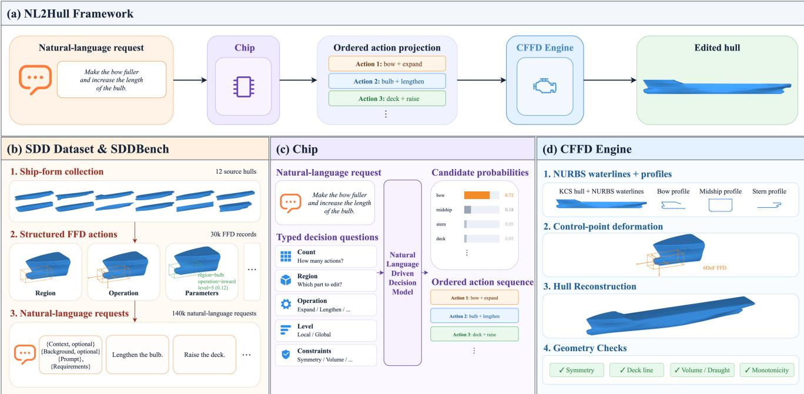  
Figure 1: Overview of the NL2Hull framework and its ship-form editing workflow. (a) Natural-language requests are converted by Chip into ordered actions and applied by the CFFD Engine to a KCS benchmark hull. (b) SDD Dataset and SDDBench construction. (c) Typed decision questions and candidate probabilities in Chip. (d) NURBS representation, control-point deformation, hull reconstruction, and geometric checks.

To preserve local geometric detail in the fore region, its knot vector uses eight locally concentrated interior knots around the bulb-related parameter and a knot of multiplicity three at the upper-contour corner. The remaining interior knots are distributed over the intervening parameter intervals, whereas the aft profile uses uniformly spaced interior knots. At each waterline elevation, the foremost intersection with the fore profile and the aftmost intersection with the aft profile specify the corresponding centreline endpoints. These intersections therefore couple the longitudinal profiles and waterlines within the ship-form representation.

Control-point deformation. With this representation established, an editing action specifies a hull region, an operation, a magnitude, and optional longitudinal and vertical extents. Regions comprise the bow, stern, bulb, midbody, deck, bilge, and complete hull. The magnitude is a fraction of the relevant hull dimension. To accommodate vague naturallanguage intents, the magnitude is discretized into six discrete FFD levels with values 0, 0.01, 0.02, 0.04, 0.08, and 0.12; the next subsection describes how the decision framework selects these levels. Waterline controls are expressed in three dimensions, with their initial vertical coordinates set to the section elevation.

Within the selected longitudinal and vertical extents, local deformation is weighted by each control point’s position.

Smooth transitions use

$$
S ( t ) = 3 \tau ^ { 2 } - 2 \tau ^ { 3 } , \qquad \tau = \operatorname * { m i n } ( 1 , \operatorname * { m a x } ( 0 , t ) ) .\tag{2}
$$

For an interval [�, �] in the current normalized coordinate system, the local weight is

$$
W ( t ; a , b ) = S \left( { \frac { t - a } { d } } \right) S \left( { \frac { b - t } { d } } \right) , \qquad d = 0 . 2 ( b - a ) .\tag{3}
$$

Full-coordinate intervals receive unit weight, and selected terminal vertical sections are included. The product of the longitudinal and vertical weights then defines the local influence factor �.

Using this influence factor, transverse expansion and contraction multiply the control-point half-breadth by 1 + �� and 1 − ��, respectively, where � is the magnitude fraction. Fullness changes follow these transverse rules, and flare-increase operations use the expansion rule over the selected extent. Vertical operations translate controls by ±���, where � is the current vertical extent. Longitudinal operations translate controls by a fraction of the current hull length, using one-sided transitions towards the bow or stern extremity and two-sided weights in other local regions. Global length changes scale longitudinal coordinates about the centre of the current longitudinal extent; global breadth changes scale transverse coordinates. Actions are applied sequentially to the updated control points.

Geometric constraints. The deformation rules are applied together with geometric constraints. Bilateral symmetry is maintained through the half-waterline representation. Deckline preservation attenuates local deformation with increasing elevation and fixes the uppermost controls. Volumepreserving edits compensate transverse control-point coordinates using the ratio of pre-edit to post-edit enclosed volume; concurrent deck-line preservation restricts this compensation to controls below the uppermost level. Fixed-draught requests reject vertical operations. Finally, longitudinal translations include an ordering correction, and updated waterlines are checked for longitudinal monotonicity and nonnegative half-breadth. An optional shape-change threshold is imposed on changes in normalized second diferences of the longitudinal and transverse control-point coordinates.

## 2.2. NL2Hull Decision Interface

Building on the parameterized ship form and deformation rules above, we formulate natural-language-driven shipform editing as a discrete decision task. A design request is decomposed into the number of deformation actions and the region and operation associated with each action. A naturallanguage decision model assigns probabilities to predefined alternatives; the highest-probability answers then define an ordered sequence of region–operation pairs. These decisions use the same region and operation vocabulary as the controlpoint deformation rules in Section 2.1.

Decision representation. To make this decision process explicit, the model receives the natural-language request together with typed questions. Each question specifies an instruction and a set of candidate answers. The number of actions is selected from one, two, and three. For each available action position, a region question selects among the bow, stern, bulb, midbody, deck, bilge, and complete hull. An operation question selects among transverse, vertical, or longitudinal movement; increased or decreased fullness; increased flare; bulb-length modification; and increased or decreased global length or breadth. Position-indexed questions preserve the order of the actions in a multi-operation request.

The decision record also characterizes the requested magnitude and constraints. A categorical question distinguishes qualitative intensity from explicit numerical magnitude or spatial extent. A discrete FFD-level question selects among the six levels introduced in Section 2.1, from no change to very large change. For requests expressed with explicit numerical values, this question uses the no-change entry by convention. Two Boolean questions identify requests to preserve displacement and the deck line. Together, these questions associate the additional design requirements with their corresponding action positions.

Decision model Chip. Chip is the ship design decision model used by NL2Hull Framework. It adapts the Kev decision interface for natural-language ship-form editing and returns a probability distribution over the candidate answers for each typed question 1. The model receives a naturallanguage request together with a question and its candidate answers; the geometric state is supplied separately to the CFFD Engine during execution.

Let � denote the request text, $q _ { j }$ the �th typed question, and $\mathcal { D } _ { j }$ its candidate set. At the interface level, Chip first maps the request and question context to a decision representation,

$$
\mathbf h _ { j } = f _ { \boldsymbol \theta } ( t , q _ { j } ) , \qquad \mathbf s _ { j } = g _ { \boldsymbol \theta } ( \mathbf h _ { j } , \mathcal V _ { j } ) ,\tag{4}
$$

where $f _ { \theta }$ denotes language processing and $g _ { \theta }$ assigns one score to each candidate answer. The scores are converted into a probability distribution by

$$
p _ { \theta } ( y \mid t , q _ { j } , \mathcal { Y } _ { j } ) = \frac { \exp ( s _ { j , y } ) } { \sum _ { y ^ { \prime } \in \mathcal { Y } _ { j } } \exp ( s _ { j , y ^ { \prime } } ) } , \qquad y \in \mathcal { Y } _ { j } ,\tag{5}
$$

where $s _ { j , y }$ is the score of candidate $y .$ Categorical, discrete FFD-level, and Boolean questions therefore share the same probability interface while using their respective candidate sets. The selected answer is the maximum-probability candidate,

$$
\hat { y } _ { j } = \underset { y \in \mathcal { Y } _ { j } } { \arg \operatorname* { m a x } } p _ { \theta } ( y \mid t , q _ { j } , \mathcal { Y } _ { j } ) .\tag{6}
$$

The full distributions are retained for calibration and likelihood metrics, and the selected answers are passed to the ordered action projection. Chip is trained with the configuration summarized in Appendix B. This interface also supports comparison with native decision services and language models prompted to return the same candidate probability distributions.

Action projection and geometric correspondence. After the individual decisions have been made, the selected action count determines how many region–operation pairs are included in the decision output. If �̂ is the selected count, and $\hat { \boldsymbol { r } } _ { i }$ and $\hat { o } _ { i }$ are the selected region and operation at position �, the projected action sequence is

$$
\hat { \mathcal { A } } = \big ( ( \hat { r } _ { 1 } , \hat { o } _ { 1 } ) , \dots , ( \hat { r } _ { \hat { k } } , \hat { o } _ { \hat { k } } ) \big ) .\tag{7}
$$

The projection checks that region and operation questions are available for every selected action position; a count exceeding the available positions is recorded as an invalid projection. Each projected region identifies the spatial support of an edit, while its operation selects the corresponding control-point update rule in Section 2.1. For example, a bow expansion corresponds to a transverse increase over the bow extent, whereas a global length increase corresponds to longitudinal scaling about the hull centre. The CFFD Engine then combines each region–operation pair with its magnitude, optional longitudinal and vertical extents, and constraint settings before applying the complete action sequence to the waterline control points. Thus, the projection preserves the ordered discrete decisions made by Chip while the CFFD Engine supplies their geometric realization.

## 2.3. SDD Dataset and SDDBench

The SDD Dataset connects ship-form representations, executable FFD actions, and natural-language design requests. The construction process has four stages: collecting and standardizing ship forms, generating valid structured FFD actions, producing natural-language descriptions, and converting each description into a typed decision record for model training and evaluation.

Ship-form sources. The source collection contains twelve ship-form models. Eleven models were collected from Grab-CAD2, and the DTC model was obtained from the oficial OpenFOAM tutorial resources3. The collection includes tankers, container ships, and other hull types, as shown in Fig. 2. To use these models within a common design framework, their coordinates were standardized with the aft extremity at longitudinal coordinate zero, the bow at one, the baseline at vertical coordinate zero, and the centreline at transverse coordinate zero. These standardized models provide the geometric states for the representation and actiongeneration procedures.

Structured FFD action dataset. According to the deformation rules in Section 2.1, we randomly sample regions and operations supported by FFD and apply each sampled action to the waterline representation. A candidate is retained after the edited waterlines produce a watertight solid with positive enclosed volume. Each retained record stores the ship-form identifier, the initial state, the ordered action specification, the interaction turns, and the geometric measurements after each turn. The action specification includes the edited region, operation, magnitude, spatial extents, symmetry, and optional geometric constraints.

This procedure produced 30,000 FFD operation records. These records form the action source for the SDD Dataset and cover four design scenarios that capture both simple edits and more involved requests. Single-edit records describe one local or global modification and account for 9,000 records. To capture instructions that combine several changes, a further 7,500 records specify edits to two or three regions in a single request.

Iterative design also requires a modification to be refined in a later step. Accordingly, 7,500 records describe two successive edits in the same region, with the second edit continuing the previous change or, for directional operations, acting in the opposite direction. Finally, 6,000 records express the desired change through an explicit numerical magnitude and longitudinal and vertical ranges. Together, these scenarios provide examples of isolated edits, combined edits, sequential refinement, and numerically specified requests.

Natural-language description generation. Each FFD operation record provides the basis for generating Chinese natural-language design requests. Its structured action specification is given through the Pi Agent interface4 to one of seven language models: Claude Opus 5 (Anthropic, 2026), Kimi K3 (Kimi Team et al., 2026), GLM-5.3 (GLM-5 Team et al., 2026), Grok-4.7, DeepSeek-V4.1-Flash (DeepSeek-AI et al., 2026), GPT-5.6 Sol, and Xiaomi MiMo-V2.6- Pro (Xiaomi MiMo Team, 2026). Four alternative descriptions are requested for each editing step, including both steps in a two-step record. The generation prompt is provided in Appendix A.2. The generation instruction requires these descriptions to preserve the edited region, operation, relative magnitude, spatial range, and geometric constraints. For numerically specified requests, the numerical values must be reproduced exactly.

To increase data diversity, we vary both the source of the descriptions and the way the design intent is expressed. Distributing generation across seven models reduces dependence on a single model’s phrasing. Within each editing step, multiple descriptions vary sentence structure, verbs, and intensity expressions while referring to the same target action. Qualitative requests use expressions such as slight or substantial change, whereas precise requests retain the specified numerical magnitude and ranges. In addition, a subset of the requests includes a short ship-design or engineering background. This introduces contextual variation around the same editing goal, alongside requests that state the modification directly.

Before constructing the typed decision records, the generated descriptions are checked for plain-language format, required numerical values, and disclosure of internal magnitude labels. The original natural-language collection contains 149,998 descriptions. We exclude 8,076 rollbackoriented augmentations with invalid labels, then remove 7,364 exact text duplicates using split priority. Identical texts with conflicting labels are rejected during validation. Thus, the resulting SDD Dataset contains 134,558 records. The training, validation, and test partitions contain 88,604, 22,758, and 23,196 records, respectively.

Each natural-language record is expanded into typed questions with labelled candidate answers. The first question selects one, two, or three actions. Each action position then receives questions for its region and operation, followed by questions for qualitative or explicit magnitude mode, the discrete FFD level, displacement preservation, and deck-line preservation. Categorical questions use named alternatives, discrete FFD-level questions use six levels from no change to very large change, and Boolean questions use true or false alternatives. The original action order is retained in the question identifiers and labels.

The test partition contains 23,196 records and 201,774 expanded questions. We select 5,000 records by hull, description source, action count, and the presence of an explicit magnitude to form SDDBench for rapid model evaluation. The selected subset contains 43,496 expanded questions, and every compared system receives the same selected requests. Figure 3 visualizes the language-space structure and the typed-question composition of the two collections. The nearoverlap of the two radar profiles shows that SDDBench preserves the question-family composition of the SDD Dataset while reducing its scale for rapid evaluation.

NL2Hull: Constrained ship design  
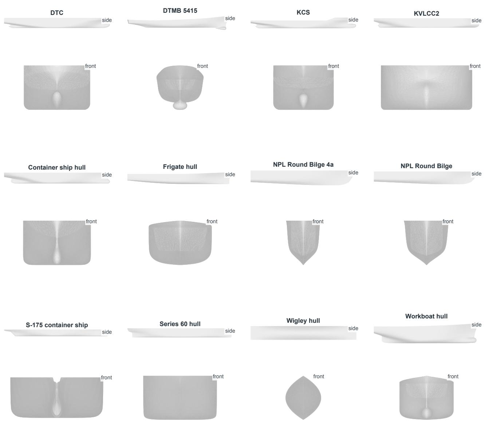  
Figure 2: The twelve source hull geometries used to construct the SDD Dataset. The collection includes the Duisburg Test Case (DTC), DTMB 5415 surface-combatant benchmark hull, KRISO Container Ship (KCS), KRISO Very Large Crude Carrier 2 (KVLCC2), a generic container-ship hull, a generic frigate hull, NPL Round Bilge 4a and NPL Round Bilge, the ITTC S-175 container ship, a Series 60 hull, the Wigley hull, and a generic workboat hull. Side and front orthographic views use unit-length normalization while preserving each hull’s geometric aspect ratio.

Evaluation protocol and metrics. All compared systems receive the same SDDBench records, typed questions, candidate sets, output format, probability validation, and metric aggregation procedure. For each question, the model returns a probability distribution over all listed answers. Questionlevel performance is measured by clean accuracy, negative log-likelihood (NLL), expected calibration error (ECE), and Brier score. These probability metrics follow established calibration practice (Guo, Pleiss, Sun and Weinberger, 2017; Kull, Perello-Nieto, K"angsepp, Silva Filho, Song and Flach,

2019). They use the expanded question set and retain the full probability distributions.

The maximum-probability answers are also projected into an ordered sequence of region–operation pairs. Freeform deformation action accuracy is computed from three components: the selected number of actions, the region at each action position, and the operation at each action position. A record is counted as an exact action match when the number, order, regions, and operations all agree with the labelled sequence. The turn-level denominator contains all 5,000 requested records. Model-call failures, malformed responses, invalid probabilities, missing answers, and incompatible predicted action counts are counted as failed records in this denominator. This protocol reports probability-based decision quality and action-level FFD quality as separate measurements.

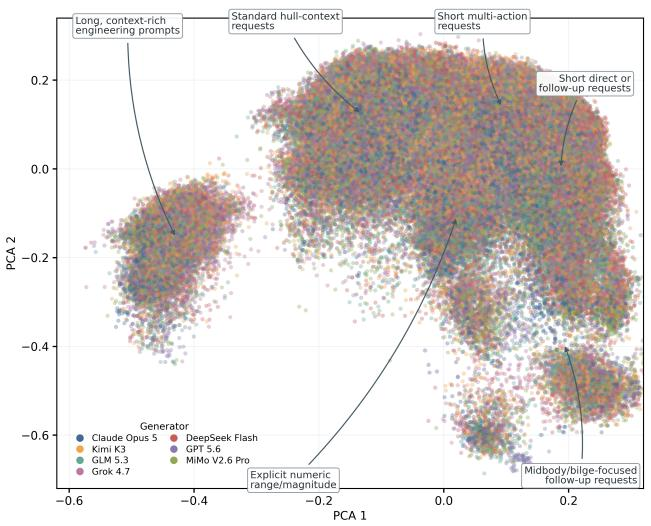  
(a) Qwen3-Embedding (Zhang et al., 2025) PCA projection.

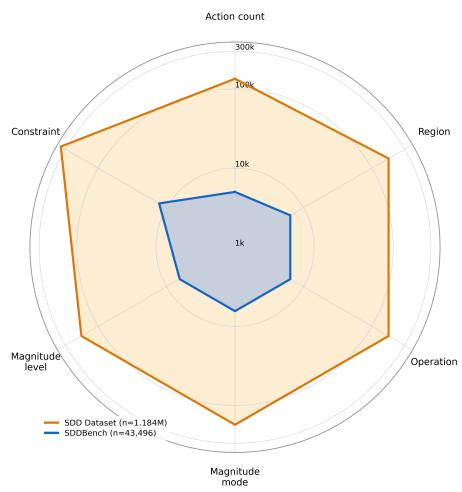  
(b) Typed-question counts.  
Figure 3: Dataset structure and typed-question composition. (a) The distribution of the 134,558 language descriptions after embedding projection and dimensionality reduction. The six annotations identify dominant linguistic or structural patterns obtained by joining the projection to the structured records; (b) Absolute counts of the six typed-question families in the SDD Dataset and SDDBench on a common radial scale. The outer polygon is the full SDD Dataset (1,184,336 questions), and the inner polygon is SDDBench (43,496 questions).

## 3. Results

## 3.1. NURBS Representation and FFD Accuracy

This section evaluates the ship-form representation and design workflow. First, the NURBS representation is assessed by reconstructing ship hulls from their extracted waterlines and longitudinal profiles. Second, the FFD operator is assessed through representative local, global, and shapeoriented edits applied to a fitted hull. The first experiment quantifies reconstruction error across a diverse hull set, while the second combines visual inspection with geometric validity and volume measurements.

## 3.1.1. NURBS-based hull reconstruction

The reconstruction experiment used twelve triangulated ship hulls covering container ships, tankers, naval hulls, benchmark hulls, and other geometries. For each input, the procedure extracted 33 horizontal sections, fitted the aft and fore segments of each section with cubic clamped NURBS curves, fitted the aft and fore longitudinal profiles, and reconstructed a closed hull mesh by connecting the sampled section rings. The reconstructed mesh was compared with the input surface using nearest-neighbour distances. Additional errors were calculated for waterline half-breadth and for the two longitudinal profile fits. All coordinates were normalized by the input hull length, so the reported errors are dimensionless.

Figure 4 illustrates the reconstruction for the KCS hull. The longitudinal profile plot shows the fitted fore and aft curves against the extracted centre-plane contours. The three-dimensional comparison shows the input and reconstructed hull surfaces, while the closure diagnostic records the geometric closure of the reconstructed section-based surface.

Table 1 summarizes the reconstruction errors. The surface nearest-neighbour root-mean-square error (RMSE) ranged from 0.0024 for Wigley to 0.0113 for DTC. KCS achieved a surface nearest-neighbour RMSE of 0.0062, a waterline half-breadth RMSE of 0.0031, a fore-profile RMSE of 0.0003, and an aft-profile RMSE of 0.0008. Across the twelve hulls, fore and aft profile-fitting errors remained below 0.0013 when measured by RMSE. These measurements show that the parameterization preserves the extracted longitudinal and transverse geometry across multiple hull forms.

## 3.1.2. FFD operation visualization and geometric validity

The FFD experiment applied 30 predefined operations to a fitted KVLCC2 hull. The cases covered bow, stern, and bulb edits; midbody, deck, and bilge edits; global length and breadth changes; and shape-oriented operations such as fullness, flare, and bulb-length changes. Directional operations used the plan view for transverse changes and the side view for vertical and longitudinal changes. Each deformed hull was reconstructed from the updated NURBS waterlines and evaluated for watertightness and valid enclosed volume.

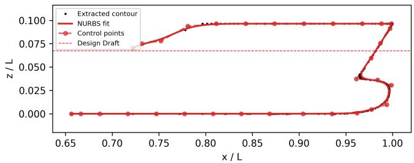

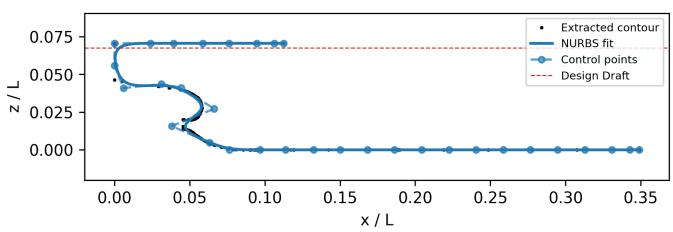  
(a) Longitudinal profile fitting.

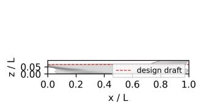

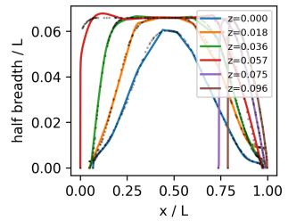

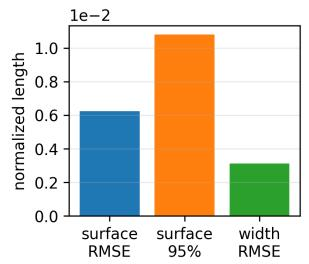  
(b) Hull reconstruction comparison.

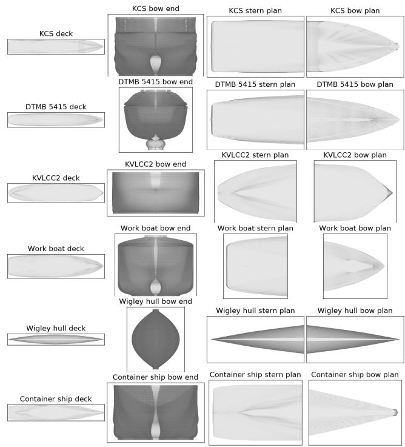  
(c) Closure diagnostic.  
Figure 4: NURBS-based reconstruction of the KCS hull. The input surface is represented by fitted longitudinal profiles and waterline curves, then reconstructed as a closed section-based hull mesh. The wide profile panel is placed above the two compact diagnostics to preserve the aspect ratio of each source plot.

Figure 5 presents three representative operations. The bow-outward case expands the forward transverse form, the bulb-forward case moves the bulb region in the longitudinal direction, and the global-breadth case scales the transverse dimension across the hull. The displayed changes remain localized for the first two operations and span the complete hull for the third operation.

Table 2 reports the geometric measurements for the same representative cases. The bow-outward, bulb-forward, and global-breadth operations produced volume ratios of 1.037, 1.033, and 1.120, respectively. All 30 tested cases passed the watertightness and enclosed-volume checks. The volume changes follow the selected operation: local transverse and longitudinal edits modify the enclosed volume in the afected region, whereas global breadth scaling produces a larger volume change across the entire hull.

Together, the reconstruction and deformation experiments establish a continuous geometric workflow from stereolithography (STL) input to NURBS parameters, from control-point updates to reconstructed hull surfaces, and from local or global FFD operations to geometric validity checks. The reconstruction errors quantify representation fidelity, while the FFD cases demonstrate the spatial selectivity and global scaling behaviour of the deformation operators. These experiments demonstrate the feasibility of the ship-form representation and reconstruction pipeline, providing the CFFD Engine for subsequent natural-languagedriven ship design.

## 3.2. SDDBench Evaluation

## 3.2.1. Performance on SDDBench

To evaluate model performance in ship design decision making, all models were tested on SDDBench. The comparison includes Chip, the native JEV decision model, three flagship language models, and three locally served small language models: Qwen3 (Yang et al., 2025), Gemma 3 (Gemma Team et al., 2025), and Llama 3.2 (Grattafiori et al., 2024). Chip and JEV expose typed decision interfaces directly. For the general language models, we used promptconstrained adaptation: each model received the record state, typed questions, candidate keys, and a strict JavaScript Object Notation (JSON) output schema, and was instructed to return a probability distribution for every question. The resulting responses were parsed and validated before the common action projection and metric aggregation. The general language models were invoked through Pi $\mathrm { \ A g e n t ^ { 5 } }$ in noninteractive mode, with agent tools and persistent sessions disabled. The prompt is given in Appendix A.1.

Table 1  
Reconstruction errors for the twelve-hull NURBS representation experiment. All quantities are normalized by the input hull length. Surface RMSE is computed from bidirectional nearest-neighbour distances between input and reconstructed surface vertices.
<table><tr><td>Hull</td><td>Surface RMSE</td><td>Waterline width RMSE</td><td>Fore-profile RMSE</td><td>Aft-profile RMSE</td></tr><tr><td>DTC</td><td>0.01130</td><td>0.00302</td><td>0.00038</td><td>0.00121</td></tr><tr><td>DTMB5415</td><td>0.00524</td><td>0.00227</td><td>0.00070</td><td>0.00072</td></tr><tr><td>KCS</td><td>0.00623</td><td>0.00312</td><td>0.00034</td><td>0.00082</td></tr><tr><td>KVLCC2</td><td>0.00975</td><td>0.00140</td><td>0.00012</td><td>0.00092</td></tr><tr><td>Containership</td><td>0.00690</td><td>0.00202</td><td>0.00003</td><td>0.00038</td></tr><tr><td>Firgate</td><td>0.00658</td><td>0.00284</td><td>0.00023</td><td>0.00084</td></tr><tr><td>NPL round bilge (model)</td><td>0.00849</td><td>0.00338</td><td>0.00004</td><td>0.00052</td></tr><tr><td>NPL round bilge (full scale)</td><td>0.00546</td><td>0.00208</td><td>0.00008</td><td>0.00097</td></tr><tr><td>S-175 U-water</td><td>0.01006</td><td>0.00313</td><td>0.00012</td><td>0.00079</td></tr><tr><td>Series 60</td><td>0.00893</td><td>0.00094</td><td>0.00021</td><td>0.00055</td></tr><tr><td>Wigley hull</td><td>0.00241</td><td>0.00018</td><td>0.00011</td><td>0.00079</td></tr><tr><td>Work boat</td><td>0.00761</td><td>0.00504</td><td>0.00030</td><td>0.00090</td></tr></table>

Table 2  
Geometric measurements for representative FFD operations on KVLCC2.
<table><tr><td>Operation</td><td>Level</td><td>Volume ratio</td><td>Watertight</td><td>Valid volume</td></tr><tr><td>Bow outward</td><td>5</td><td>1.037</td><td>Yes</td><td>Yes</td></tr><tr><td>Bulb forward</td><td>4</td><td>1.033</td><td>Yes</td><td>Yes</td></tr><tr><td>Global breadth increase</td><td>5</td><td>1.120</td><td>Yes</td><td>Yes</td></tr></table>

Question-level metrics are computed over successfully evaluated questions. For each question �, the model produces a probability distribution $p _ { i } ( c )$ over the labelled candidate answers $c \in \mathcal { V } _ { i } .$ , with true answer $y _ { i }$ . The question accuracy measures the fraction of questions whose most probable answer is correct. NLL is

$$
\mathrm { N L L } = - \frac { 1 } { N } \sum _ { i = 1 } ^ { N } \log p _ { i } ( y _ { i } ) ,\tag{8}
$$

where � is the number of successfully evaluated questions. For multiclass candidate distributions, the Brier score is

$$
\mathrm { B r i e r } = \frac { 1 } { N } \sum _ { i = 1 } ^ { N } \sum _ { c \in \mathcal { V } _ { i } } \left[ p _ { i } ( c ) - \mathbb { 1 } ( c = y _ { i } ) \right] ^ { 2 } .\tag{9}
$$

To calculate ECE, the questions are grouped into confidence bins $B _ { m }$ using $\hat { p } _ { i } ~ = ~ \operatorname* { m a x } _ { c } p _ { i } ( c )$ . With acc( $B _ { m } )$ denoting the fraction of correct argmax predictions and conf $( B _ { m } )$ the mean confidence in bin $m _ { : }$

$$
\mathrm { E C E } = \sum _ { m = 1 } ^ { M } \frac { | B _ { m } | } { N } \left| \operatorname { a c c } ( B _ { m } ) - \operatorname { c o n f } ( B _ { m } ) \right| .\tag{10}
$$

Here � denotes the indicator function, and � = 10 equalwidth confidence bins are used; empty bins contribute zero to ECE. The Brier score uses one-hot targets for every question type, including discrete magnitude levels. FFD exact match is computed after projecting the most probable typed answers into an ordered sequence of region–operation pairs. Its denominator contains all 5,000 requested records, including failed calls, malformed outputs, invalid probability structures, and incompatible predicted action counts. Table 3 summarizes the comparison.

Chip achieved the highest question accuracy among the compared systems, reaching 95.90%, and also achieved the highest FFD exact match at 99.32%. Its NLL, ECE, and Brier score were 0.0951, 0.0032, and 0.0551, respectively. These values were lower than the corresponding values of JEV, which reached 90.96% question accuracy and 84.52% FFD exact match. Chip therefore combined accurate typed answers with well-calibrated probability outputs on SD-DBench.

The flagship language models produced competitive action-level results. Claude Opus 5 reached 99.12% FFD exact match and GPT-5.6 Sol reached 98.32%, while their question accuracies were 92.87% and 92.44%. DeepSeek V4.1 Flash reached 92.84% question accuracy and 98.40% FFD exact match. The action-level scores of these models were close to Chip, while their question-level accuracies were lower and their probability error measures were higher than those of Chip.

The locally served models showed a diferent pattern under the same output protocol. Qwen3, Gemma3, and Llama3.2 achieved question accuracies of 75.61%, 66.97%, and 63.94% on their successfully evaluated questions. Their

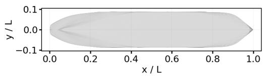

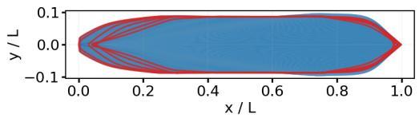

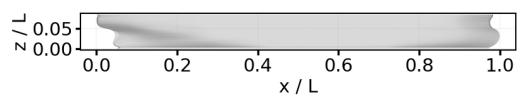

  
(a) Bow outward.

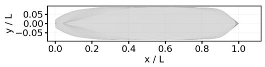

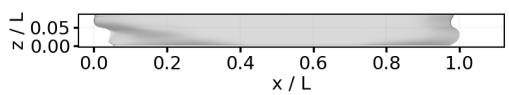

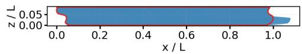  
(b) Bulb forward.

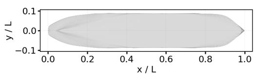

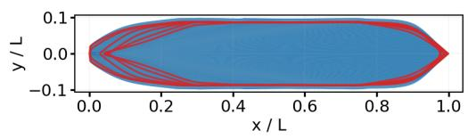

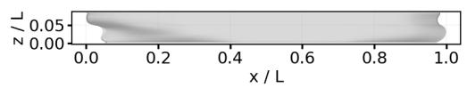

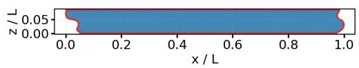  
(c) Global breadth increase.  
Figure 5: Representative FFD operations applied to the fitted KVLCC2 hull. Each panel compares the original fitted hull with the hull obtained after the indicated control-point deformation. In each row, the centered arrow points from the original hull to the modified hull. The right column overlays the deformed hull (blue) with red section lines from the original hull (gray); plan views are above side views.

FFD exact-match scores were 2.84%, 15.98%, and 2.16%, respectively. Invalid or failed probability responses occurred in 4,225, 2,359, and 4,443 records for these three models, respectively, compared with 678 for JEV and 31 for DeepSeek. Chip, Claude Opus 5, and GPT-5.6 Sol returned valid probability responses for all 5,000 records. Incompatible predicted action counts were also counted as FFD projection failures. Because FFD exact match retains every requested record in its denominator, these results jointly measure decision quality and the reliability of producing a valid typed response under the evaluation interface.

## 3.2.2. General decision capability on JevBench

To assess general decision performance after training on the ship-design SDD Dataset, Chip was tested on the public JevBench benchmark6. This evaluation applies the same typed-decision interface to tasks outside ship design. The Easy, Original, and Hard tiers contained 48, 72, and 111 planned tasks, respectively. All planned tasks produced valid probability distributions and were scorable under the publiconly protocol.

Chip solved all 48 Easy tasks, solved 59 of 72 Original tasks, and solved 41 of 111 Hard tasks. The corresponding accuracies were 100.0000%, 81.9444%, and 36.9369%. The

Table 3  
Performance on SDDBench. Question accuracy is computed over successfully evaluated questions, and FFD exact match uses all 5,000 requested records. Accuracy values are percentages; lower values are preferred for NLL, ECE, and Brier score. Best values are shown in bold.
<table><tr><td>Model</td><td>Question accuracy ↑</td><td>FFD exact match ↑</td><td>NLL ↓</td><td>ECE↓</td><td>Brier ↓</td></tr><tr><td>Small language models</td><td></td><td></td><td></td><td></td><td></td></tr><tr><td>Qwen3</td><td>75.61</td><td>2.84</td><td>1.2088</td><td>0.1148</td><td>0.3803</td></tr><tr><td>Gemma3</td><td>66.97</td><td>15.98</td><td>1.4328</td><td>0.0225</td><td>0.4471</td></tr><tr><td>Llama3.2</td><td>63.94</td><td>2.16</td><td>1.4999</td><td>0.0723</td><td>0.5063</td></tr><tr><td>Flagship language models</td><td></td><td></td><td></td><td></td><td></td></tr><tr><td>Claude Opus 5</td><td>92.87</td><td>99.12</td><td>0.2385</td><td>0.0607</td><td>0.1066</td></tr><tr><td>GPT-5.6 Sol</td><td>92.44</td><td>98.32</td><td>0.5779</td><td>0.0571</td><td>0.1340</td></tr><tr><td>DeepSeek V4.1 Flash</td><td>92.84</td><td>98.40</td><td>0.6808</td><td>0.0307</td><td>0.1158</td></tr><tr><td>Language decision models</td><td></td><td></td><td></td><td></td><td></td></tr><tr><td>JEV</td><td>90.96</td><td>84.52</td><td>0.3092</td><td>0.0271</td><td>0.1266</td></tr><tr><td>Chip (Ours)</td><td>95.90</td><td>99.32</td><td>0.0951</td><td>0.0032</td><td>0.0551</td></tr></table>

Table 4

General typed-decision evaluation on JevBench. Accuracy values are percentages. Brier score and ECE are computed by the corresponding benchmark scorers; lower values are preferred. Chip calibration metrics are from the Original tier. Public reference calibration values follow the reporting scope of the supplied JevBench comparison table.
<table><tr><td>Model</td><td>Easy</td><td>Original</td><td>Hard</td><td>Brier ↓</td><td>ECE↓</td></tr><tr><td>JEV</td><td>100.0000</td><td>98.6100</td><td>72.0700</td><td>0.3584</td><td>0.0947</td></tr><tr><td>Laya</td><td>95.8300</td><td>72.2200</td><td>28.8300</td><td>0.8042</td><td>0.2465</td></tr><tr><td>Semlf</td><td>100.0000</td><td>98.6100</td><td>61.2600</td><td>0.4980</td><td>0.1122</td></tr><tr><td>JevK5</td><td>100.0000</td><td>97.2200</td><td>73.8700</td><td>0.3662</td><td>0.0467</td></tr><tr><td>Intern-Decision-0.8B</td><td>97.9200</td><td>80.5600</td><td>52.2500</td><td>0.5295</td><td>0.0657</td></tr><tr><td>Chip (Ours)</td><td>100.0000</td><td>81.9444</td><td>36.9369</td><td>0.3489</td><td>0.1633</td></tr></table>

Original tier produced a Brier score of 0.3489 and an expected calibration error of 0.1633. The Easy and Hard tiers produced Brier scores of 0.0026 and 0.8782, with ECE values of 0.0075 and 0.3577, respectively. These results show that Chip remains operational on external typed-decision tasks, while task dificulty produces a clear performance gradient.

Table 4 presents the three tier accuracies alongside public reference results for other typed-decision models.

On the Easy tier, Chip matched the best accuracy in the supplied comparison. Its Original-tier accuracy exceeded the reported values for Laya and Intern-Decision-0.8B, while the Hard-tier accuracy remained below the strongest public reference rows. The increasing probability errors from the Easy tier to the Hard tier accompany this decline in accuracy. Taken together, the JevBench evaluation confirms that shipdesign specialization preserves a functioning typed-decision capability on an external benchmark, with performance determined by the dificulty of the underlying decision tasks.

## 3.3. End-to-End Ship Form Editing Evaluation

This section evaluates the end-to-end editing stage of NL2Hull Framework and its computational time. The workflow receives a natural-language instruction, predicts typed deformation decisions, projects them into executable FFD actions, updates the NURBS waterline parameters through the CFFD Engine, reconstructs the edited hull, and checks geometric validity and design constraints. The evaluation therefore connects decision accuracy with the resulting shipform edit.

## 3.3.1. End-to-end ship-form editing

The end-to-end evaluation used the KVLCC2 hull and 300 sampled experiments from the SDD Dataset. The experiments were evenly divided among single edits, multiregion edits within one turn, and two consecutive edits applied to the same region. The 300 experiments contained 400 natural-language requests because each continuous twoturn experiment included two requests. The evaluation used qualitative magnitude requests, while requests requiring direct continuous magnitude or spatial-extent prediction were excluded from this interface.

For each request, the model output was converted into an executable deformation action. The actions were applied in sequence to the current NURBS waterline state. The resulting waterlines were lofted into a hull mesh, after which the evaluator checked mesh validity, constraint satisfaction, action order, and qualitative magnitude levels. An experiment was counted as successful when the predicted trajectory matched the labelled action sequence and the reconstructed hull passed the geometric and constraint checks.

Figures 6 and 7 show two sets of representative edits. Each visualization places the natural-language instruction between the original and modified hulls and presents both

1. For the KVLCC2-based design refinement, move the deck region noticeably aftward, keeping the hull symmetric.

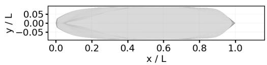  
Move the bow of the KVLCC2 parent hull significantly forward as a whole, keeping the hull symmetric.

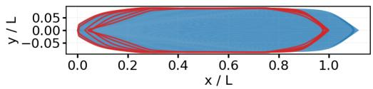

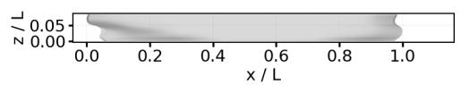

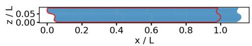  
(a) Single edit.

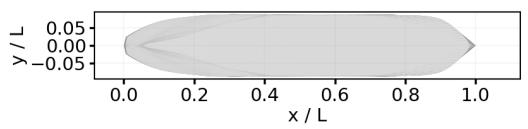  
Move the deck moderately aftward and the bow more noticeably forward.

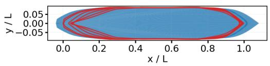

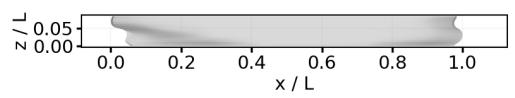

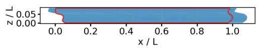  
(b) Multi-action edit.

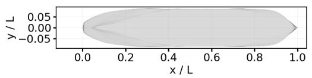

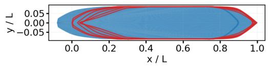  
2. Move the deck of the KVLCC2 further aftward with a more noticeable magnitude, keeping the hull symmetric.

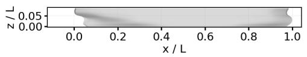

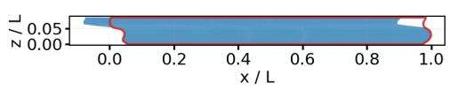  
(c) Continuous two-turn edit.  
Figure 6: Representative end-to-end ship-form editing cases. Each panel connects a natural-language instruction to the origina and modified KVLCC2 hulls in plan and side views. Each interaction category occupies one row, with the original hull on the left and the modified hull (blue) on the right; the centered arrow indicates the editing direction, and red curves trace sections of the original hull. The displayed instructions are English translations of the evaluated Chinese requests.

plan and side views. The first set covers a single edit, a multiaction edit, and a continuous two-turn edit. The second set provides alternative examples from the same three interaction categories.

Table 5 summarizes the three interaction settings. All executed edits produced geometrically valid hulls, giving a 100% geometry validity rate in every category. Single edits achieved a 100% end-to-end success rate. Continuous two-turn edits achieved 98%, with two constraint violations among the 43 constrained experiments. Multi-region single-turn edits achieved 60% end-to-end success. Their execution and geometry checks reached 100%, while 39 of 45 constrained experiments violated a constraint and one experiment contained an action-sequence mismatch. This separation identifies the constraint-handling stage as the

Table 5  
End-to-end editing results on the KVLCC2 hull. Magnitude-level accuracy is calculated over all labelled action levels. Constraint satisfaction is calculated over experiments containing at least one constraint.
<table><tr><td>Interaction type</td><td>Experiments</td><td>End-to-end success</td><td>Trajectory exact</td><td>Geometry valid</td><td>Constraints satisfied</td><td>Level accuracy</td></tr><tr><td>Single edit</td><td>100</td><td>100.00%</td><td>100.00%</td><td>100.00%</td><td>100.00%</td><td>52.00%</td></tr><tr><td>Multi-region, single turn</td><td>100</td><td>60.00%</td><td>96.00%</td><td>100.00%</td><td>13.33%</td><td>70.48%</td></tr><tr><td>Same-region, two turns</td><td>100</td><td>98.00%</td><td>100.00%</td><td>100.00%</td><td>95.35%</td><td>81.50%</td></tr></table>

## Table 6

Per-request model latency on SDDBench. Mean and 95th-percentile latency are reported in milliseconds from the recorded evaluator outputs. The API evaluators timed failed attempts as well as successful attempts; the JEV latency statistics use its 4,322 completed requests.

<table><tr><td>Model</td><td>Mean latency (ms)</td></tr><tr><td colspan="2">Small language models</td></tr><tr><td>Qwen3</td><td>25280.05</td></tr><tr><td>Gemma3</td><td>18407.59</td></tr><tr><td>Llama3.2</td><td>22589.78</td></tr><tr><td colspan="2">Flagship language models</td></tr><tr><td>Claude Opus 5</td><td>7844.00</td></tr><tr><td>GPT-5.6 Sol</td><td>12531.86 16009.20 36265.54</td></tr><tr><td>DeepSeek V4.1 Flash</td><td>4630.63 11131.43</td></tr><tr><td colspan="2">Language decision models</td></tr><tr><td>JEV</td><td>2908.01 235.55</td></tr><tr><td>Chip (Ours)</td><td>1510.33 118.01</td></tr></table>

main source of unsuccessful multi-region trajectories in this evaluation.

The result demonstrates that the complete pipeline can transform natural-language instructions into executable geometric edits and reconstruct valid hulls across all three interaction settings. The distinction between trajectory matching and end-to-end success is especially visible in multi-region editing, where the individual execution remained valid while constraint satisfaction reduced the number of accepted trajectories.

## 3.3.2. Evaluation time

We also evaluated the time required by each model to perform the ship design decision task. Model and geometric processing were measured separately. For model processing, we used the per-request latency recorded by each evaluator. The reported mean and 95th-percentile values include the model request and the evaluator-side response handling; model initialization, result aggregation, and geometric processing are excluded. The LLM evaluators recorded latency for both successful and failed attempts.

Chip had the lowest recorded latency, with a mean of 118.01 ms and a 95th-percentile latency of 235.55 ms. JEV was the next fastest language-decision model, while the flagship and small language models required longer perrequest processing under the evaluated settings. The geometric processing stage added approximately 0.13 s per end-toend experiment on average: 0.114 s for a single edit, 0.123 s for a multi-region single-turn edit, and 0.148 s for a sameregion two-turn edit. These measurements show that Chip generates ship design decisions at very low latency under the evaluated settings.

## 3.4. Ablation Studies

To isolate the contributions of geometric representation, model scale, and training-data size, we evaluated each design choice under the SDDBench protocol and compared the resulting reconstruction and decision metrics.

## 3.4.1. Sensitivity to NURBS Representation

To isolate the efect of the center-plane profile representation on hull reconstruction, we compared five configurations evaluated on the same 12 hulls, with identical waterline levels, extracted profile samples, and mesh-comparison settings. The 24-control configuration used 24 control points per stem and stern contour with uniform clamped cubicspline knots. Three representation operations were then introduced separately or together, using the labels in Figure 8: “32 controls” increases both contours to 32 control points; “Deck knot” repeats the B-spline knot at the stem deckcorner parameter, increasing its local multiplicity; and “Bulb knots” densifies the interior stem-knot distribution around the bulb parameter. The “Combined” configuration applies all three operations.

The primary metrics were the RMSEs of the fitted stem and stern contours, calculated against their 80-point resampled reference contours. These metrics directly measure the accuracy of the profile curves modified in this experiment.

  
Increase the bow fullness significantly and the stern flare substantially, keeping both edits symmetric.

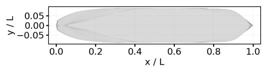

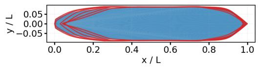

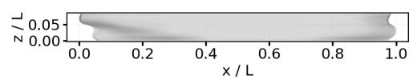  
(a) Single edit.

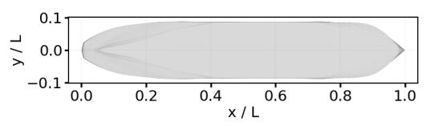

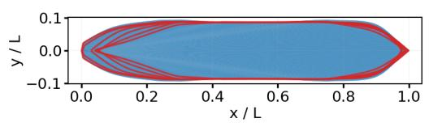

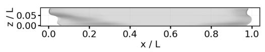

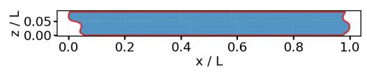  
(b) Multi-action edit.

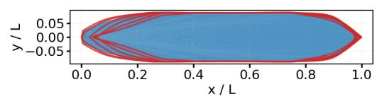

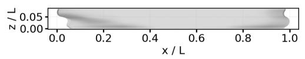

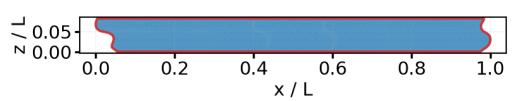  
(c) Continuous two-turn edit.  
Figure 7: Alternative representative end-to-end editing cases from the same three interaction categories. The paired views show the original hull, natural-language instruction, and reconstructed modified hull. Original hulls are on the left and modified hulls (blue) are on the right; red lines trace sections of the original hull. Arrows indicate the editing direction.

Table 7 reports both the KCS result and the arithmetic mean over all 12 hulls. Increasing the control count reduced both stem and stern errors, while the combined representation produced the lowest stem-contour RMSE in both scopes: 0.000343 for KCS and 0.000221 averaged over the hull set. The Deck knot and Bulb knots mainly afected the stem contour, with little change in the stern-contour error. Figure 8 shows the corresponding KCS reconstructions and the local changes around the bow features.

## 3.4.2. Efect of Chip Model Scale

We next evaluated the efect of model scale while keeping the data, probability questions, inference protocol, action projection, and SDDBench fixed. The comparison used Chip models with 0.8 billion, 2 billion, and 4 billion parameters. The question accuracy was computed over the successfully scored probability questions, and FFD exact match was computed over all requested turns, including failed evaluations.

Table 8  
Ablation of the center-plane profile representation. The “32 controls” operation increases the stem and stern contours from 24 to 32 control points. The “Deck knot” operation repeats the stem deck-corner knot, and “Bulb knots” densifies the interior stem-knot distribution around the bulb. “Combined” contains all three operations. Errors are normalized by the source-hull length; “Mean” is the arithmetic mean over the 12 classic hulls.
<table><tr><td>Variant</td><td>32 controls</td><td>Deck knot</td><td>Bulb knots</td><td>KCS stem RMSE</td><td>KCS stern RMSE</td><td>Mean stem RMSE</td><td>Mean stern RMSE</td></tr><tr><td>24 controls</td><td>一</td><td>1</td><td></td><td>0.002326</td><td>0.001581</td><td>0.001551</td><td>0.001236</td></tr><tr><td>32 controls</td><td>√</td><td>一</td><td></td><td>0.001222</td><td>0.000818</td><td>0.000909</td><td>0.000785</td></tr><tr><td>Deck knot</td><td></td><td>√</td><td></td><td>0.002187</td><td>0.001581</td><td>0.000994</td><td>0.001236</td></tr><tr><td>Bulb knots</td><td></td><td>1</td><td>√</td><td>0.001684</td><td>0.001581</td><td>0.001396</td><td>0.001236</td></tr><tr><td>Combined</td><td>√</td><td>√</td><td>√</td><td>0.000343</td><td>0.000818</td><td>0.000221</td><td>0.000785</td></tr></table>

Chip model-scale ablation on SDDBench. Question accuracy uses the successfully scored questions. FFD exact match uses al requested turns. Best values in each column are bold.
<table><tr><td>Model</td><td>Completed records</td><td>Question accuracy</td><td>FFD exact match</td><td>NLL</td><td>ECE</td><td>Brier score</td></tr><tr><td>Chip</td><td>5,000</td><td>95.8962%</td><td>99.32%</td><td>0.0951</td><td>0.0032</td><td>0.0551</td></tr><tr><td>Chip-2B</td><td>5,000</td><td>95.9192%</td><td>99.30%</td><td>0.0948</td><td>0.0022</td><td>0.0548</td></tr><tr><td>Chip-4B</td><td>4,999</td><td>95.8794%</td><td>99.24%</td><td>0.0951</td><td>0.0025</td><td>0.0549</td></tr></table>

NLL, ECE, and Brier score measure probability quality and calibration.

Table 8 shows closely clustered results across the three models. Chip-2B achieved the highest question accuracy and the lowest probability error measures, whereas Chip achieved the highest FFD exact match. Because ship design is formulated as a constrained decision problem, its decision freedom is relatively limited; consequently, the evaluated model sizes did not show marked performance diferences.

## 3.4.3. Efect of Training Data Size

To assess the contribution of the training-set size, we held the Chip architecture fixed and varied the amount of ship-design training data. Nested subsets containing 1%, 2%, 4%, 8%, and 25% of the SDD Dataset training partition were sampled using a fixed random seed. Each smaller subset was contained in every larger subset. The training configuration was identical to the main Chip experiment except for the amount of training data. With the epoch count fixed, the number of optimizer updates increased from 222 at 1% to 22,152 at 100%. Kev-Base supplied the 0% reference before ship-design adaptation.

All seven checkpoints were evaluated on SDDBench using the probability-question and FFD action-scoring protocol described in Section 3.2.1. Table 9 combines the subset evaluations with the full-data result reported in Section 3.4.2. Figure 9 plots the two accuracy measures against the same training-data shares. The question accuracy uses successfully scored questions, while FFD exact match includes all SDDBench records.

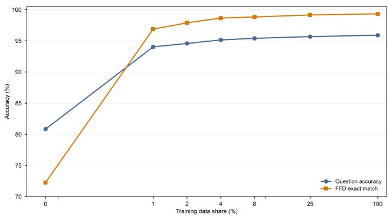  
Figure 9: Efect of training-data size on Chip accuracy. The horizontal axis shows the share of the SDD Dataset training partition; the 0% point is the Kev-Base reference before shipdesign adaptation.

Ship-design adaptation produced a large initial improvement: the 1% model reached 94.02% question accuracy and 96.86% FFD exact match, compared with 80.82% and 72.24% for the 0% reference. Across the trained checkpoints from 1% to 100%, both accuracies increased, while NLL, ECE, and Brier score decreased. The full-data model attained the best values in the table.

The gains became smaller at larger data sizes, yet the full training set still produced the best measured performance. From 1% to 100% of the original training dataset, question accuracy increased by 1.88 percentage points and FFD exact match increased by 2.46 percentage points, while NLL, ECE, and Brier score all decreased. Together with Section 3.4.2, these results show that, for the ship-design decision task, expanding the training dataset produced larger measured gains than increasing model size across the tested range.

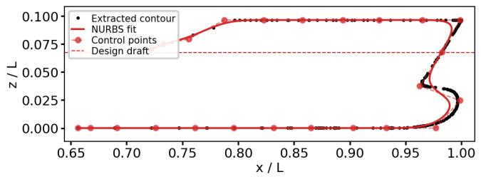

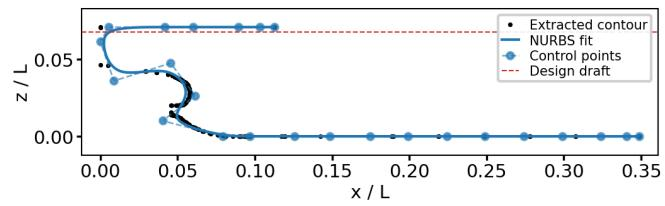

(a) 24 controls.  
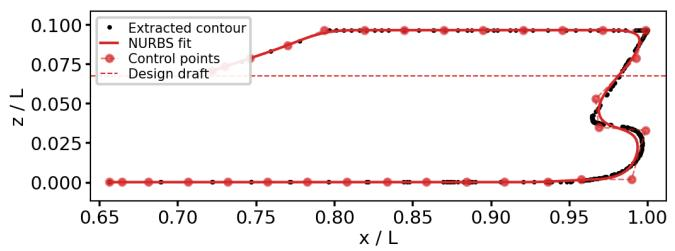

(b) 32 controls.  
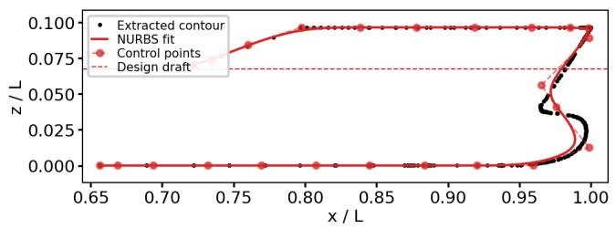

(c) Deck knot.  
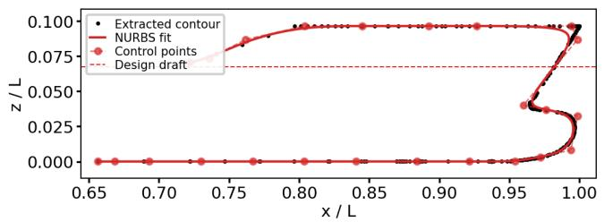

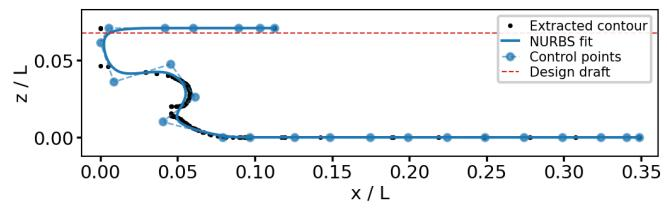

(d) Bulb knots.  
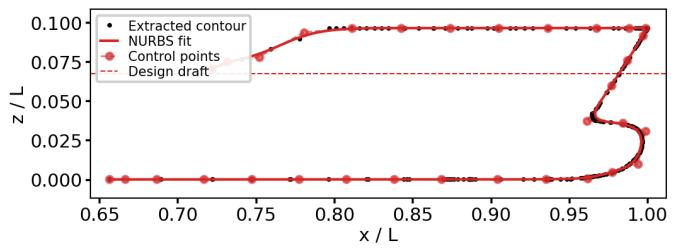

  
(e) Combined.  
Figure 8: KCS center-plane profile reconstruction for the five controlled representation variants. Each panel compares the extracted stem and stern contours with their fitted cubic-spline curves. Variants occupy separate rows, with stem contours on the left and stern contours on the right.

## 4. Discussion

## 4.1. Constraint Semantics in End-to-End Ship-Form Editing

The end-to-end experiments exposed a failure mode in the interaction between action composition and constraint enforcement. Multi-region single-turn editing achieved a

60% end-to-end success rate even though execution and geometry checks both reached 100%. Among the 45 experiments containing at least one constraint, 39 violated a constraint. Same-region two-turn editing reached 98% success, with two additional constraint violations. The concentration of failures in the constraint stage points to the semantics of sequential constraint handling as a central factor in the endto-end result.

Efect of SDD Dataset size on Chip. Training share is relative to the SDD Dataset training partition; the 0% row evaluates Kev-Base before ship-design adaptation. Accuracy values are percentages. Lower values are preferred for NLL, ECE, and Brier score. Best values are shown in bold.
<table><tr><td>Training share (%)</td><td>Training records</td><td>Question accuracy ↑</td><td>FFD exact match ↑</td><td>NLL↓</td><td>ECE↓</td><td></td></tr><tr><td></td><td></td><td></td><td></td><td></td><td></td><td>Brier ↓</td></tr><tr><td>0</td><td>0</td><td>80.82</td><td>72.24 96.86</td><td>0.6972</td><td>0.1995</td><td>0.3439</td></tr><tr><td>1</td><td>886</td><td>94.02</td><td></td><td>0.1729</td><td>0.0179</td><td>0.0850</td></tr><tr><td>2 4</td><td>1,772 3,544</td><td>94.57 95.13</td><td>97.88 98.64</td><td>0.1533 0.1331</td><td>0.0110 0.0105</td><td>0.0754 0.0682</td></tr><tr><td>8</td><td>7,088</td><td>95.39</td><td>98.82</td><td>0.1196</td><td>0.0097</td><td>0.0642</td></tr><tr><td>25</td><td>22,151</td><td>95.66</td><td>99.14</td><td>0.1040</td><td>0.0047</td><td>0.0584</td></tr><tr><td>100</td><td>88,604</td><td>95.90</td><td>99.32</td><td>0.0951</td><td>0.0032</td><td>0.0551</td></tr></table>

The implementation applies actions sequentially and performs displacement compensation inside each constrained action. Before such an action, the executor records the current volume; after the deformation, it rescales the hull to that recorded value. The end-to-end checker then evaluates the resulting turn against the volume at the beginning of the turn whenever any action in that turn carries a displacementpreservation requirement. Consequently, action-level compensation and turn-level verification use diferent reference states. An unconstrained action in the same turn can change the volume after a compensated action, and the final turn can therefore fail the global displacement check despite correct individual action semantics. The deck-line check follows the same sequential state logic and uses a strict numerical tolerance on the final top controls.

This mechanism is supported by the failure records. Across the 41 constraint violations, 34 cases had both the predicted action semantics and the predicted constraint fields matched to the reference actions. The violations comprised 31 volume-only cases, six deck-line-only cases, and four cases containing both types of residual. In the multi-region single-turn subset, the action list contained two or three sequential edits, allowing unconstrained edits to alter a quantity that an earlier constrained edit had restored. These cases show that trajectory matching and geometric validity can coexist with failure of the current constraint contract. A turn-level constraint representation, or a final projection that enforces all active constraints after the complete action list, would align execution with the end-to-end criterion.

## 4.2. Why Large Language Models Fail in Ship Free-Form Deformation Decision Making

SDDBench places two coupled requirements on a language model: it must infer the ship-form action and serialize a complete typed probability response. The evaluator first receives the model response, parses JSON, checks the required probability keys and value ranges, verifies that each distribution sums to one, and then projects the valid response into an ordered action sequence. A response can therefore fail after generation during parsing, probabilityschema validation, or action projection.

The local small models failed predominantly at these post-generation interface stages. Of 5,000 requests, Qwen3 had 4,225 rejected records, Gemma3 had 2,359, and Llama3.2 had 4,443. For Qwen3, the largest rejection groups were mismatched keys for the region, action-count, and operation distributions, with 2,463, 977, and 772 cases, respectively. Gemma3 produced 1,419 action-count key mismatches, 694 operation key mismatches, and 230 region key mismatches. Llama3.2 produced 1,820 action-count key mismatches, 1,388 responses without the required answer object, 696 operation key mismatches, and 259 region key mismatches. These records establish that output serialization is a major source of failure for the small local models.

Valid responses still contained decision errors. The question accuracy was 75.61% for Qwen3, 66.97% for Gemma3, and 63.94% for Llama3.2, while FFD exact match scores were 2.84%, 15.98%, and 2.16%, respectively. The action metric uses all requested turns, so it incorporates both rejected responses and incorrect actions; the question metric isolates decisions that passed the probability checks. The two metrics together show separate costs for semantic action selection and strict response construction. The latency results add a system cost: the mean per-request latencies of these models ranged from 18.41 to 25.28 s, while the Chip model required 118.01 ms under the same SDDBench setting. A decision interface for ship-form editing therefore benefits from training that jointly covers domain semantics, action ordering, constraint labels, and the required probability schema.

## 4.3. Specialized Model Scale and Data Eficiency

The scale and data ablations separate capacity from taskspecific coverage. With the same SDD Dataset and evaluation protocol, increasing Chip from 0.8 billion to 2 billion and 4 billion parameters changed question accuracy by only 0.0398 percentage points across the three models. Chip-2B gave the highest question accuracy and the best NLL, ECE, and Brier score, whereas Chip gave the highest FFD exact match. The close results show that the tested decision space can be represented by Chip, and that additional parameters alone produced little movement in the measured metrics.

Training-data size had a stronger measured efect. Shipdesign adaptation raised question accuracy from 80.82% at the 0% reference to 94.02% with 1% of the original training dataset, followed by continued improvement through the full dataset. From 25% to 100%, question accuracy increased from 95.66% to 95.90% and FFD exact match increased from 99.14% to 99.32%; NLL, ECE, and Brier score also decreased. The continued change at the largest evaluated data size indicates that the training examples supplied useful coverage for both action decisions and probability calibration.

The task has a finite action vocabulary but a structured composition: each request specifies an action count, regions, operations, qualitative magnitude levels, and optional preservation constraints, and the resulting sequence must remain compatible with the free-form deformation executor. This structure makes capacity suficient for the tested action space while placing high demands on label coverage, action ordering, and output regularity. The ablations therefore support a data–capacity trade-of in which task-specific data and a compatible output protocol provide larger gains than parameter growth across the tested range. Chip combines this performance with the lowest measured inference latency, making it a practical capacity point for the evaluated decision interface.

## 5. Conclusion and Future Work

This work presents NL2Hull Framework as a discrete constrained decision system and implements the complete path from natural-language requests to typed action probabilities, executable FFD, and reconstructed hull checks through the CFFD Engine. The system combines a NURBS waterline representation with an explicit action projection and the SDDBench evaluation protocol. On SDDBench, Chip achieved 95.90% question accuracy and 99.32% FFD exact match with well-calibrated probabilities. The representation study reduced the mean stem-contour error to 0.000221 over 12 hulls, and the end-to-end study verified that the system can execute single edits and multi-turn edits on a KVLCC2 hull.

The end-to-end experiments also identified a concrete CFFD Engine limitation. Displacement preservation is compensated at the action level, while the final turn is checked against the state at the beginning of the turn. Unconstrained actions composed with constrained actions can therefore alter the final volume, and strict deck-line checks can retain small numerical residuals after otherwise valid deformation. The CFFD Engine should be extended with compositionaware constraint handling, final-state projection, and tolerances linked to the reconstruction and meshing resolution. These changes would improve the flexibility and generality of sequential edits across hull forms and constraint combinations.

The current decision interface also represents qualitative magnitude through an ordinal level and uses default regional extents; it does not predict an explicit continuous deformation magnitude or spatial extent. Future model development should add continuous numerical outputs, train them against geometric outcomes, and evaluate their calibration together with discrete action accuracy. A more flexible CFFD Engine and a continuous-control decision model would extend NL2Hull Framework from validated typed edits toward broader ship-form design workflows.

This is the {variant number} natural expression of the same structured action.   
Use a sentence structure different from the other expressions while preserving   
accuracy. You may vary sentence structure, verbs, degree adverbs, and connectors.   
Do not translate one change level into one fixed word; all expressions must retain   
the same relative magnitude.

1. Return one natural and concise Chinese user sentence only. Do not return JSON,   
explanations, a title, bullet points, or quotation marks.

## A. Prompt templates

The prompts actually used in the code are written in Chinese. We translate them into English here to improve readability; the translations below document the runtime prompts without changing them. The prompts are displayed in verbatim code blocks, which provide the LaTeX equivalent of fenced Markdown code blocks. Braced fields are replaced with the current request, typed questions, or structured actions.

## A.1. SDDBench probability-output prompt

Each question block supplies its identifier, type, instruction, and all candidate keys with their descriptions. The block format is

Question ID: {question identifier}   
Type: {choice, noul, or score}   
Instruction: {question instruction}   
Options (keys must be preserved exactly):   
- {candidate key}: {candidate description}

The blocks are inserted into the following translated rendering of the Chinese runtime prompt:

You are a ship design decision model. Based on the state and questions,   
output a probability distribution for every question.

State:   
{record state}

Output strict JSON only. Do not return Markdown, explanations, or extra text:   
{"answers": {   
"question\_id": {"probabilities": {"option\_key": 0.5}}   
}}

- Answer every question; question IDs must match exactly.   
- The keys in every probabilities object must match the keys listed for that question exactly.   
- Every probability must be a number between 0 and 1, and probabilities for each question must sum to 1.   
- For choice questions, use option names as keys; for noul questions, use false and true;   
for score questions, use strings such as 0, 1, and 2 as keys.   
- Return only the JSON object above.

## A.2. Natural-language description-generation prompt

The template is applied once per editing turn and language variant. The structured action field contains every action requested in the current turn, in execution order. The translated prompt is

You are generating one Chinese natural-language user request for a ship-form   
deformation dataset.   
{previous-turn context, if present}   
{single-action or multi-action instruction}   
{background instruction}

The output must not contain internal codes, numeric intensity, magnitude, level,

grade, intensity, or tier terminology. The wording must preserve the relative strength.

4. If magnitude\_level is null, reproduce every value in magnitude\_value, longitudinal\_extent, and vertical\_extent character by character. Do not round, truncate, or rewrite decimals. In this case, words such as numerical change may be used.

5. Express constraints such as preserve\_displacement and preserve\_deck\_line in the sentence.

6. Do not introduce physical units such as metres or millimetres; the data use normalized parameters.

7. Use the fixed regional vocabulary: bow, stern, bulb, midbody, deck, bilge, and global.

8. Use the fixed directional vocabulary: forward, aftward, upward, downward, outward, and inward.

9. Use the fixed operation vocabulary for fullness, flare, length, and breadth changes.

10. change\_bulb\_length means changing bulb length by the specified value; magnitude\_value is the change, not the final length.

Hull: {hull identifier}

Interaction type: {interaction type}

Current action JSON:

{structured actions}

For a single action, the runtime instruction is “Please express only the current action.” For multiple actions, it is “One input contains changes to multiple regions; express all actions completely in one sentence.” A later turn includes this context and the previous actions:

This is a follow-up edit in the same region. The previous action is shown below.

The current description should express only this turn; a connector such as "again"

may be used:

{previous structured actions}

The background instruction either requests a direct edit without additional background or selects one of the following scenario openings while prohibiting new design goals:

I am designing a ship using {hull identifier} as the parent hull, and I need to ...

You are a ship-design expert. Please ...

I am conducting AI4CFD research and need to generate ship-form data. Please ...

For optimization of the {hull identifier} parent hull, please ...

If validation fails, the following instruction is appended to the original prompt:

The previous answer failed format or semantic validation. Generate again and return only one Chinese user sentence satisfying all requirements. Do not use the words magnitude, level, grade, intensity, or tier, and do not explain the validation process.

Table 10  
Variant-specific language-backbone and batch settings for ship-design adaptation. The batch size is the number of records per microbatch; accumulation is the number of gradient-accumulation steps.
<table><tr><td>Model</td><td>Language backbone</td><td>Batch size</td><td>Accumulation</td></tr><tr><td>Chip</td><td>Qwen3.5-0.8B-Base</td><td>2</td><td>4</td></tr><tr><td>Chip-2B</td><td>Qwen3.5-2B-Base</td><td>2</td><td>4</td></tr><tr><td>Chip-4B</td><td>Qwen3.5-4B-Base</td><td>1</td><td>8</td></tr></table>

## B. Chip training configuration

Chip was initialized from the open-sourced Kev-0.8B decision checkpoint, whose language backbone is Qwen3.5-0.8B-Base. Ship-design adaptation used all 88,604 records in the SDD Dataset training partition, 2 epochs, rank-16 low-rank adaptation, and a learning rate of $2 \times 1 0 ^ { - 5 }$ . A microbatch of two records with four gradient-accumulation steps gave an efective batch size of eight. Weights and computation used 16-bit brain floating point (bfloat16), with gradient checkpointing enabled, on an NVIDIA RTX A6000 graphics processor.

Table 10 lists the language-backbone and batch settings for the model-scale experiment. Chip-2B used a decision checkpoint trained on the original Kev decision dataset; this preliminary training used two epochs, a learning rate of $5 \times 1 0 ^ { - 5 }$ rank-16 low-rank adaptation, and the same efective batch size of eight. Chip-4B used the open-sourced Kev-4B decision checkpoint. All three variants then used the same SDD Dataset training partition and ship-design adaptation settings described above, with the batch and accumulation settings shown in the table.

For the training-data-size experiment, every adapted checkpoint was independently initialized from the same Kev-0.8B checkpoint and used the main Chip training settings. Nested subsets were sampled with random seed 0 at training shares of 1%, 2%, 4%, 8%, 25%, and 100%, corresponding to 886, 1,772, 3,544, 7,088, 22,151, and 88,604 records.

## References

Abt, C., Bade, S., Birk, L., Harries, S., 2001. Parametric hull form design — a step towards one week ship design, in: Practical Design of Ships and Other Floating Structures, pp. 67–74. doi:10.1016/B978-008043950-1/50009-0.

Ahn, M., Brohan, A., Brown, N., Chebotar, Y., Cortes, O., et al., 2022. Do as i can, not as i say: Grounding language in robotic afordances. arXiv preprint arXiv:2204.01691 arXiv:2204.01691.

Anthropic, 2026. Claude opus 5 system card. URL: https://www.alphaxiv.org/abs/2607.claude-opus-5.

Bagazinski, N.J., Ahmed, F., 2023. Shipgen: A difusion model for parametric ship hull generation with multiple objectives and constraints. Journal of Marine Science and Engineering 11, 2215. doi:10.3390/jmse11122215.

Bagazinski, N.J., Ahmed, F., 2024. C-shipgen: A conditional guided difusion model for parametric ship hull design, in: Proceedings of the International Marine Design Conference. doi:10.59490/imdc.2024.841.

Beurer-Kellner, L., Fischer, M., Vechev, M., 2022. Prompting is programming: A query language for large language models. arXiv preprint arXiv:2212.06094 arXiv:2212.06094.

Brohan, A., Brown, N., Carbajal, J., Chebotar, Y., Chen, X., et al., 2023. Rt-2: Vision-language-action models transfer web knowledge to robotic control. arXiv preprint arXiv:2307.15818 arXiv:2307.15818.

Campana, E.F., Peri, D., Tahara, Y., Kandasamy, M., Stern, F., 2009. Numerical optimization methods for ship hydrodynamic design, in: SNAME Maritime Convention. doi:10.5957/smc-2009-013.

DeepSeek-AI, et al., 2026. Deepseek-v4.1-flash: Pushing the limits of kv cache compression. arXiv preprint arXiv:2609.19969 URL: https://arxiv.org/ abs/2609.19969, arXiv:2609.19969.

Deußer, T., Sparrenberg, L., Sifa, R., 2026. Evaluating and benchmarking the system one model jev, in: arXiv preprint arXiv:2609.37647. arXiv:2609.37647.

Diez, M., Peri, D., 2012. Optimal hull-form design subject to epistemic uncertainty. Ship Technology Research 59, 14–20. doi:10.1179/str.2012.59.1.002.

Driess, D., Xia, F., Sajjadi, M.S.M., Lynch, C., Chowdhery, A., et al., 2023. Palm-e: An embodied multimodal language model. arXiv preprint arXiv:2303.03378 arXiv:2303.03378.

Gemma Team, et al., 2025. Gemma 3 technical report. arXiv preprint arXiv:2503.19786 URL: https://arxiv.org/abs/2503.19786, arXiv:2503.19786.

Geng, S., Josifoski, M., Peyrard, M., West, R., 2023. Grammar-constrained decoding for structured nlp tasks without finetuning, in: Proceedings of the 2023 Conference on Empirical Methods in Natural Language Processing, pp. 10932–10952. doi:10.18653/v1/2023.emnlp-main.674.

GLM-5 Team, et al., 2026. Glm-5: From vibe coding to agentic engineering. URL: https://arxiv.org/abs/2602.15763, arXiv:2602.15763.

Grattafiori, A., et al., 2024. The llama 3 herd of models. arXiv preprint arXiv:2407.21783 URL: https://arxiv.org/abs/2407.21783, arXiv:2407.21783.

Guo, C., Pleiss, G., Sun, Y., Weinberger, K.Q., 2017. On calibration of modern neural networks. Proceedings of the 34th International Conference on Machine Learning 70, 1321–1330. arXiv:1706.04599.

Hofmann, C.M., Kim, K.J., 2001. Towards valid parametric cad models. Computer-Aided Design 33, 81–90. doi:10.1016/S0010-4485(00)00073-7.

Huang, W., Xia, F., Xiao, T., Chan, H., Liang, J., et al., 2022. Inner monologue: Embodied reasoning through planning with language models. arXiv preprint arXiv:2207.05608 arXiv:2207.05608.

Khan, M.S., Sinha, S., Sheikh, T.U., Stricker, D., Ali, S.A., Afzal, M.Z., 2024. Text2cad: Generating sequential cad models from beginner-to-expert level text prompts, in: Advances in Neural Information Processing Systems. arXiv:2409.17106.

Kimi Team, et al., 2026. Kimi k3: Open frontier intelligence. arXiv preprint arXiv:2607.24653 URL: https://arxiv.org/abs/2607.24653, arXiv:2607.24653.

Kull, M., Perello-Nieto, M., K"angsepp, M., Silva Filho, T., Song, H., Flach, P., 2019. Beyond temperature scaling: Obtaining well-calibrated multiclass probabilities with dirichlet calibration. Advances in Neural Information Processing Systems 32. arXiv:1910.12656.

Liang, J., Huang, W., Xia, F., Xu, P., Hausman, K., et al., 2022. Code as policies: Language model programs for embodied control. arXiv preprint arXiv:2209.07753 arXiv:2209.07753.

Nam, J.H., Parsons, M.G., 2000. A parametric approach for initial hull form modeling using nurbs representation. Journal of Ship Production 16, 76–89. doi:10.5957/jsp.2000.16.2.76.

Peri, D., Rossetti, M., Campana, E.F., 2001. Design optimization of ship hulls via cfd techniques. Journal of Ship Research 45, 140–149. doi:10.5957/jsr. 2001.45.2.140.

Samad, T., Director, S.W., 1985. Towards a natural language interface for cad, in: Proceedings of the 22nd ACM/IEEE Conference on Design Automation, pp. 460–466. doi:10.1145/317825.317826.

Scholak, T., Schucher, N., Bahdanau, D., 2021. Picard: Parsing incrementally for constrained auto-regressive decoding from language models, in: Proceedings of the 2021 Conference on Empirical Methods in Natural Language Processing, pp. 9895–9901. doi:10.18653/v1/2021.emnlp-main.779.

Sederberg, T.W., Parry, S.R., 1986. Free-form deformation of solid geometric models. ACM SIGGRAPH Computer Graphics 20, 151–160. doi:10.1145/ 15886.15903.

Sef, A., Ovadia, Y., Zhou, W., Adams, R.P., 2020. Sketchgraphs: A large-scale dataset for modeling relational geometry in computer-aided design, in: arXiv preprint arXiv:2007.08506. arXiv:2007.08506.

Shamsuddin, S.M., Ahmed, M.A., Samian, Y., 2006. Nurbs skinning surface for ship hull design based on new parameterization method. The International Journal of Advanced Manufacturing Technology 28, 936–941. doi:10.1007/s00170-004-2454-3.

Wang, R., Yuan, Y., Sun, S., Bian, J., 2025. Text-to-cad generation through infusing visual feedback in large language models. arXiv preprint arXiv:2501.19054 arXiv:2501.19054.

Willard, B.T., Louf, R., 2023. Eficient guided generation for large language models. arXiv preprint arXiv:2307.09702 arXiv:2307.09702.

Wilson, W., Hendrix, D., Gorski, J., 2010. Hull form optimization for early stage ship design. Naval Engineers Journal 122, 53–65. doi:10.1111/j.1559-3584. 2010.00268.x.

Wu, R., Xiao, C., Zheng, C., 2021. Deepcad: A deep generative network for computer-aided design models, in: 2021 IEEE/CVF International Conference on Computer Vision, pp. 6752–6762. doi:10.1109/ICCV48922.2021.00670.

Xiaomi MiMo Team, 2026. Mimo-v2.6-pro-rl. https://huggingface.co/XiaomiMiMo/MiMo-V2.6-Pro-RL.

Xu, X., Lambourne, J., Jayaraman, P., Wang, Z., Willis, K., et al., 2024. Brepgen: A b-rep generative difusion model with structured latent geometry. ACM Transactions on Graphics 43, 1–14. doi:10.1145/3658129.

Yang, A., et al., 2025. Qwen3 technical report. arXiv preprint arXiv:2505.09388 URL: https://arxiv.org/abs/2505.09388, arXiv:2505.09388.

Zhang, Y., et al., 2025. Qwen3 embedding: Advancing text embedding and reranking through foundation models. arXiv preprint arXiv:2506.05176 URL: https://arxiv.org/abs/2506.05176, arXiv:2506.05176.

Zhou, H., Feng, B., Liu, Z., Chang, H., Cheng, X., 2022. Nurbs-based parametric design for ship hull form. Journal of Marine Science and Engineering 10, 686. doi:10.3390/jmse10050686.