Qwen3.5-9B

# IMESIS: Learning User Simulators as Training Environments for Interactive Agents

Hoang Phan1,2,∗, Dat Huynh1, Andrey Zhmoginov, Qi Zeng1, Wancen Mu1, Yue Cao1, Shengjie Bi1, Yun He1, Changdae Oh1,3,∗, Deren Lei1

1Meta Superintelligence Labs, 2New York University, 3University of Wisconsin - Madison ∗Work done at Meta

Training and evaluating interactive language agents typically requires rich user interactions, yet collecting human feedback is expensive and dificult to scale. Simulated users ofer a scalable alternative, but they must both resemble real user behavior and provide useful learning experiences for agents. In contrast, most agent-training frameworks rely on of-the-shelf assistant LLMs, whose helpfulness can make them overly cooperative, explicit, and behaviorally homogeneous compared with real users. We introduce MIMESIS, a purpose-built user simulator trained on human conversations with explicit reasoning supervision and 13 realistic behavioral patterns derived from real user interactions. Empirically, our 9B model achieves a SOUL-Index of 65.7, surpassing the strongest frontier model. Compared with Claude-Opus-5, the strongest baseline on RealUserSim and SimulatorArena, MIMESIS improves behavioral fidelity by 13.4 points and reduces Turing distance by 3.6 points, respectively. We then freeze the simulator and train an agent by interacting with the frozen simulator using multiturn reinforcement learning. Across eight environments, training with MIMESIS yields better agent performance than training with GPT-5.5 under all nine unseen user simulators, demonstrating stronger generalization to new user simulators. Moreover, we propose Coached On-Policy Self-Distillation (CSD), which leverages simulator-generated private reasoning traces and subsequent utterances as feedback on how well the agent addresses user needs. A coach converts this information into concise coaching notes that describe how the agent can better anticipate user needs and adapt its behavior over the course of an interaction. CSD turns this feedback into dense, token-level supervision beyond sparse task rewards, yielding further gains across all nine evaluation user models.

Date: October 8, 2026 Correspondence: Hoang Phan at hvp2011@nyu.edu Code: https://github.com/VietHoang1512/mimesis

∞Meta

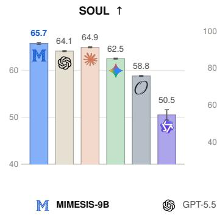

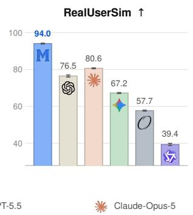

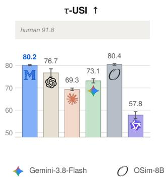

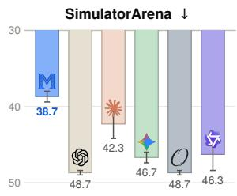  
Figure 1 User-simulation performance across four benchmarks. We compare MIMESIS-9B with frontier API models (GPT-5.5, Claude-Opus-5, and Gemini-3.8-Flash) and open-weight simulators (Osim-8B and Qwen3.5-9B) on SOUL (Zhou et al., 2026a), RealUserSim (Zhu et al., 2026), τ-USI (Zhou et al., 2026b), and SimulatorArena (Dou et al., 2025). Higher is better for SOUL, RealUserSim, and τ-USI, while lower Turing distance (Wang et al., 2026b) is better for SimulatorArena. The shaded band in τ-USI denotes the human inter-annotator score (91.8).

## 1 Introduction

Large language models are increasingly deployed as interactive agents that operate over extended trajectories in partially observable and stateful environments (Liu et al., 2024; Ma et al., 2024; Guan et al., 2026). In these settings, success cannot be reduced to producing a correct response at an isolated turn. Agents must maintain conversational and environmental state, preserve instructions and constraints, identify missing information, incorporate feedback, and condition later actions on earlier decisions (Lu et al., 2025; Yao et al., 2024). Multi-turn interaction therefore provides a more faithful evaluation of agentic competence than single-turn tasks, exposing limitations in long-horizon reasoning, state tracking, instruction retention, and error recovery (Ma et al., 2024; Lu et al., 2025; Deshpande et al., 2025). Recent work has therefore increasingly evaluated agents through multi-turn interaction with users, tools, and environments, spanning general reasoning and tool use (Wang et al., 2024), conversational web navigation (Deng et al., 2024), realistic tool–agent–user workflows (Yao et al., 2024), and stateful tool execution (Lu et al., 2025).

This move toward interactive evaluation introduces a practical challenge: in many tasks, the trajectory cannot be determined by the agent and environment alone, since users may provide missing information, answer clarifications, or react to intermediate outcomes. While human users provide the most direct source of such interactions, collecting hu man trajectories is costly, dificult to reproduce, and hard to scale for evalua tion and reinforcement learning. User simulators ofer a practical alternative and have become common in interactive benchmarks and, increasingly, agent post training (Yao et al., 2024; Qian et al., 2025; Suh et al., 2026). A common approach is to prompt instruction-tuned language models to role-play users, but this creates a mismatch: assistant mod els are optimized to be helpful and explicit, whereas real users may be ambiguous, impatient, or uncooperative. Accordingly, assistant LMs tend to produce overly structured and cooperative inter

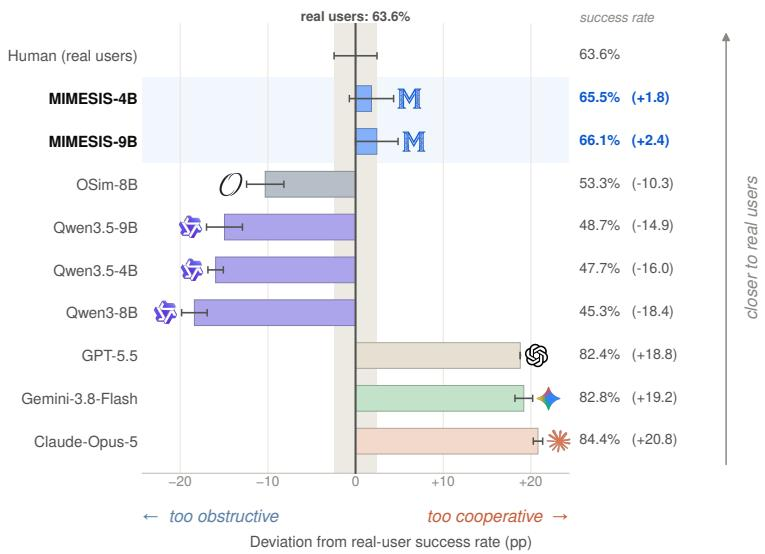  
Figure 2 Off-the-shelf LLMs misrepresent agentic task difficulty. Task success rate of a fixed gpt-5.5 agent on τ -bench when each simulator plays the user role. Frontier API users make the task substantially easier than interactions with real users, whereas pretrained models make it harder. Both serve as poor proxies for the user interactions used to train or evaluate agents while purpose-built simulators more closely reproduce the human-user success rate.

actions (Naous et al., 2025), while comparisons with real users reveal systematic diferences in information disclosure, ambiguity, frustration, and interaction dificulty (Zhou et al., 2026b). Moreover, properties such as willingness to clarify, patience, and responses to agent errors can substantially alter measured agent performance (Shim et al., 2025; Chopra et al., 2026; Zhu et al., 2026). User simulators therefore afect not only dialogue style but also the distribution of trajectories encountered by an agent during training and evaluation. Figure 2 illustrates this mismatch on τ-bench. A fixed GPT-5.5 agent succeeds on 63.6% of interactions with real users, whereas the three frontier API simulators raise its success rate to 82.4–84.4% and pretrained Qwen3.5-4B/9B reduce it by 16.0 and 14.9 percentage points, respectively. By contrast, purpose-built simulators are substantially better calibrated: every trained simulator deviates less than every of-the-shelf model, with at most 10.3 points, versus at least 14.9. This result suggests that simulator quality cannot be assessed from surface naturalness alone; preserving the interaction dificulty induced by human users is also important when the simulator determines the trajectories used for agent training or evaluation.

Research on user simulation and interactive-agent training has largely addressed diferent sides of this problem. Purpose-built user models improve next-turn realism, latent-state modeling, or behavioral simulation (Naous et al., 2025; Wu et al., 2026; Wang et al., 2026b; Sun et al., 2026a; Zhou et al., 2026a). In parallel, UserRL (Qian et al., 2025) studies how to optimize agents from multi-turn trajectories generated by a simulator. The remaining question is whether a simulator can be both behaviorally realistic and useful for learning. We therefore evaluate it at two levels: fidelity to human interactions and the robustness of agents trained on its trajectories when the evaluation user changes.

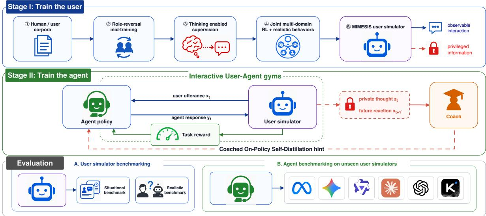  
Figure 3 Overview of our proposed method. We couple user-simulator learning with simulator-driven agent post-training. Stage I trains MIMESIS through user-side mid-training, ThoughtTrace reasoning supervision, and joint RL with a realistic-behavior objective. Stage II freezes the learned simulator and uses it to generate multi-turn experience for agent RL. The agent acts only on the observable conversation, while simulator-generated thoughts and reactions provide privileged, training-only feedback to the coach, which converts them into dense guidance for the agent.

We propose a two-stage training approach that connects simulator learning to agent post-training (Figure 3). In the first stage, we train 4B and 9B user models on human conversations and a broad collection of humansimulation tasks. Most existing released simulators are trained on human conversation data that provide only observable utterances and no explicit reasoning trajectories, making it dificult to model the latent user state underlying each response. To address this limitation, we enable an explicit reasoning mode by appending a supervised fine-tuning stage using ThoughtTrace (Jin et al., 2026), which pairs user messages with self-reported motivations and reactions to preceding assistant responses. We use these annotations as observable proxies for otherwise unobserved user state and supervise a private reasoning trace before the public utterance. We further derive from ThoughtTrace a taxonomy of 13 realistic user behaviors reflected in users’ latent thoughts and conversational patterns, and instantiate these behaviors during joint multi-domain reinforcement learning to expose the simulator to a broader and more challenging distribution of interactions.

In the second stage, we freeze the learned user simulator and use it as an interactive environment for multi-turn agent reinforcement learning. After each sampled agent response, the simulator generates a private thought and the next public user utterance. We leverage this privileged feedback during training through Coached On-Policy Self-Distillation (CSD). CSD constructs feedback-conditioned coaching signals for each sampled agent response and uses a self-teacher conditioned on this additional context to provide dense token-level guidance to the policy. Crucially, this privileged information is available only during optimization: both the rollout policy and the deployed agent condition solely on the observable conversation history. Our contributions are depicted as follows:

• We identify a behavioral mismatch that limits of-the-shelf LLMs as human proxies for agent training and evaluation: their simulated interactions distort task dificulty, yielding agent success rates that diverge substantially from those observed with human users. We therefore propose a two-stage approach that first learns a realistic user simulator with explicit behavioral modeling and then uses the frozen simulator as an environment for interactive agent post-training.

• We introduce MIMESIS, a purpose-built user simulator with 4B and 9B parameters, combining user-side adaptation and explicit reasoning supervision with a new realistic-behavior training objective. We derive

13 recurring interaction patterns from real user conversations and train the simulator to express these behaviors appropriately. Our 9B model surpasses frontier models on SOUL-Index, RealUserSim, τ-USI, and SimulatorArena. Ablations further establish the contribution of reasoning supervision and realistic behavior training to simulator quality.

• We demonstrate that training with MIMESIS improves agent generalization beyond the training simulator. Across eight environments, agents trained through multi-turn reinforcement learning with MIMESIS outperform those trained with of-the-shelf GPT-5.5 under all nine unseen evaluation user models. We further introduce Coached On-Policy Self-Distillation (CSD), which uses simulator-generated thoughts and subsequent user utterances to construct retrospective coaching about user needs and interaction feedback. A teacher conditioned on this coaching provides dense, token-level supervision, yielding additional gains under all nine evaluation users while the deployed agent conditions only on public dialogue.

## 2 Related Work

Multi-turn agentic interaction. Evaluation of language agents has increasingly shifted from isolated response or function-call accuracy toward competence over complete interaction trajectories. Early benchmarks such as AgentBoard and MINT emphasize multi-round interaction in partially observable environments and show that strong static performance does not necessarily translate to efective interactive behavior (Ma et al., 2024; Wang et al., 2024). ToolSandbox, BFCL, and DialogTool evaluate persistent state, tool-call dependencies, and long-horizon execution (Lu et al., 2025; Patil et al., 2025; Wang et al., 2025), while τ-bench and τ2-bench combine tool use with conversational coordination; the latter allows both agents and users to act on a shared environment (Yao et al., 2024; Barres et al., 2025). Recent benchmarks examine planning and state tracking in LUMINA, adaptation to changing tool conditions in CostBench, and preference elicitation during task completion (Rakhsha et al., 2026; Liu et al., 2026; Cheng et al., 2026). In parallel, agentic post-training optimizes policies over interactive rollouts through scalable multi-turn environments, finer-grained credit assignment, and online environment feedback (Du et al., 2026; Ding et al., 2026; Sun et al., 2026b).

Behavioral variation and difficult users. Several lines of work address the cooperative and homogeneous behavior of prompted LLM users. Non-Collaborative User Simulators introduces four dificult interaction patterns while preserving the information required for task completion (Shim et al., 2025). Persona Policies searches for human-like, task-preserving behavior policies and shows that training on the resulting trajectories improves robustness (Chopra et al., 2026). RealUserSim grounds behavioral profiles in authentic interactions and documents Directive Amplification, where hand-authored directives elicit exaggerated, backbone-dependent behavior (Zhu et al., 2026). UserIDA learns explicit control over local interaction intent (Wang et al., 2026a).

Simulator-driven agent training. τ-bench established rule-grounded evaluation with LLM users (Yao et al., 2024), while UserRL studies how multi-turn reward assignment, trajectory scoring, and simulator choice afect agent optimization (Qian et al., 2025). UserLM-R1 subsequently uses a learned strategic simulator for downstream task-agent RL (Zhang et al., 2026). Most closely, Suh et al. (2026) hold the assistant training procedure fixed, vary the simulator, and validate the resulting policies with other simulators and 283 human participants.

Learning from textual feedback and privileged context. ThoughtTrace demonstrates that users’ stated reasons and reactions contain information that is dificult to reconstruct from the public transcript and useful for downstream assistant training (Jin et al., 2026). SDPO (Hübotter et al., 2026) distills a feedback-conditioned self-teacher into a policy that acts without feedback, and on-policy context distillation studies the broader problem of transferring behavior from an augmented-context policy (Ye et al., 2026). Song et al. (2026) and Shi et al. (2026) similarly internalize textual critiques or reflections. Ditto applies related ideas to the simulator itself by optimizing feedback-conditioned refined rollouts jointly with the base policy (Sun et al., 2026a). Our proposed CSD difers operationally by re-scoring the already sampled agent response rather than decoding a refinement.

## 3 Problem Setup and Overview

We study the problem of learning an interactive agent from multi-turn experience with a simulated user. The user simulator is trained from human conversations and simulation-task feedback. Once trained, it supplies the user turns in the conversations used to optimize the agent.

Learning a user simulator. Given a task context c and a conversation history $H ,$ a user simulator $\boldsymbol { u } _ { \phi } ( \boldsymbol { x } \mid c , H )$ defines a distribution over the next user utterance x. Here, c specifies the interaction setting, while H contains the preceding conversation. Human–agent dialogues provide examples of how users respond in these contexts, forming the basis for learning the user model (Naous et al., 2025; Wu et al., 2026). We further train the simulator on a distribution of human-simulation tasks $\mathcal { D } _ { \mathrm { s i m } }$ . Each task supplies an input context and an evaluation rule for the generated response or interaction (Sun et al., 2026a). Let $\rho$ denote this generated output, $P _ { \phi } ( \rho \mid c )$ its distribution when running the simulator in task $c ,$ and $R _ { \mathrm { s i m } } ( c , \rho )$ the corresponding simulation reward. The simulator’s reinforcement-learning objective is

$$
J _ { \mathrm { s i m } } ( \phi ) = \mathbb { E } _ { c \sim \mathcal { D } _ { \mathrm { s i m } } } \mathbb { E } _ { \rho \sim P _ { \phi } ( \cdot | c ) } \left[ R _ { \mathrm { s i m } } ( c , \rho ) \right] .\tag{1}
$$

For a single-turn task, $\rho$ is one response; for an interactive task, it is a rollout with the counterpart specified by that task. The parameters $\phi$ are optimized to maximize this objective.

Interaction with the learned simulator. We fix the trained simulator $u _ { \hat { \phi } }$ and use it as the user in multi-turn interactions with an agent $\pi _ { \theta }$ . Let $H _ { t }$ denote the history available to the agent through the current user utterance $x _ { t } .$ At each conversational turn, the agent generates a response and the simulator generates the next user utterance:

$$
y _ { t } \sim \pi _ { \theta } ( \cdot \mid H _ { t } ) , \qquad x _ { t + 1 } \sim u _ { \hat { \phi } } ( \cdot \mid c , H _ { t } , y _ { t } ) .\tag{2}
$$

Both utterances are added to the conversation history. Tool calls and their outcomes, when present, are also included in the history. The interaction continues until the task’s stopping condition or turn limit is reached, yielding a trajectory $\tau .$ . The simulator therefore determines how the conversation continues in response to the agent’s actions (Suh et al., 2026).

Learning the agent. Let $\mathcal { D } _ { \mathrm { a g e n t } }$ denote the distribution of agent-training tasks, and let $R _ { \mathrm { a g e n t } } ( c , \tau )$ be the task reward assigned to a trajectory. Following multi-turn reinforcement learning with simulated users (Qian et al., 2025), we optimize

$$
J _ { \mathrm { a g e n t } } ( \theta ; \hat { \phi } ) = \mathbb { E } _ { c \sim \mathcal { D } _ { \mathrm { a g e n t } } } \mathbb { E } _ { \tau \sim P _ { \theta , \hat { \phi } } ( \cdot | c ) } \left[ R _ { \mathrm { a g e n t } } ( c , \tau ) \right] ,\tag{3}
$$

where $P _ { \theta , \hat { \phi } }$ is the trajectory distribution induced by the agent, the frozen simulator, and the task environment. Agent training updates $\theta$ to maximize this expected reward while keeping $\hat { \phi }$ fixed. The two objectives assess diferent aspects of the interaction: $R _ { \mathrm { s i m } }$ evaluates the simulated user’s output, whereas $R _ { \mathrm { a g e n t } }$ evaluates the agent’s task performance.

## 4 MIMESIS: Learning a Realistic User Simulator

We train MIMESIS to model user behavior and provide realistic interactions for agent reinforcement learning. Both the 4B and 9B models with Qwen3.5 (Team, 2026) backbones follow the same procedure: user-side mid-training on human conversations, thought-augmented supervised fine-tuning, and joint multi-domain reinforcement learning that includes an explicit objective for realistic user behaviors.

## 4.1 Learning User Responses and Reasoning

We adapt the language model to the user role through supervised mid-training on human–assistant conversations. Following user language modeling (Naous et al., 2025), we use the preceding dialogue as context and the human user’s next utterance as the prediction target. Assistant turns remain part of the context, while the model learns to continue the conversation from the user’s perspective.

Challenges. Ordinary conversation logs record what users say but generally omit why they say it and how they interpret the assistant’s response. These unspoken reasons and reactions can contain information that is absent from the corresponding user messages (Jin et al., 2026). Consequently, mid-training on user utterances alone provides no explicit target for the reasoning that precedes them. When the target consists only of the public utterance, the model is trained to produce that utterance directly. For a simulator intended to reason before responding, this creates a potential mismatch: response-only supervision may suppress explicit reasoning-trace generation, even though the missing traces reflect how the data were recorded. There is also a semantic limitation: matching a user’s wording does not necessarily capture the motivation behind the response. Wu et al. (2026) identify a related failure of response imitation, where models reproduce linguistic patterns while missing the user states expressed in the reference response.

Thought-augmented supervision. To provide explicit supervision for simulator reasoning, we incorporate ThoughtTrace, which pairs human–assistant conversations with users’ self-reported reasons for sending messages and reactions to assistant responses (Jin et al., 2026). For annotated examples, we use these reports to supervise a private reasoning trace before the simulator’s public response, while retaining the observed user utterance as the response target. Wu et al. (2026) obtain the state-alignment signal by evaluating generated states against observed user responses. ThoughtTrace additionally gives us access to users’ own reports. During interaction, the reasoning trace is kept separate from the public user utterance returned to the agent.

## 4.2 Joint Reinforcement Learning with Realistic Behaviors

Starting from the mid-trained checkpoint, we optimize a single user simulator across the SOUL environments used by OdysSim (Zhou et al., 2026a). OdysSim trains a separate RL expert for each task and then distills selected expert trajectories into a unified model. We train the shared simulator directly on all domains throughout RL, with rollouts from every domain updating the same parameter set. This follows the joint multi-task training approach also used by Ditto (Sun et al., 2026a). Each environment supplies its own interaction protocol and task-specific reward.

Let D denote the set of training environments, $p ( d )$ denote their sampling distribution, and $P _ { \phi } ^ { d }$ denote the rollout distribution induced by simulator $u _ { \phi }$ in environment d. We maximize

$$
J _ { \mathrm { j o i n t } } ( \phi ) = \mathbb { E } _ { d \sim p ( d ) } \mathbb { E } _ { \tau \sim P _ { \phi } ^ { d } } \left[ r _ { d } ( \tau ) \right]\tag{4}
$$

using Group Relative Policy Optimization (GRPO) (Shao et al., 2024), where $r _ { d }$ is the reward for environment d. Alongside the SOUL environments, the mixture includes the realistic-behavior task described below as a separate domain. Its rollouts contribute to the same simulator updates.

## 4.3 Learning Realistic User Behaviors

Real users may leave preferences unstated, revise requirements, or provide incomplete answers to clarification questions. Such behaviors afect the information available to an agent and the decisions required to complete a task (Shim et al., 2025). Here, we make the generation of those interactions an explicit simulator-training objective using a taxonomy of 13 realistic behaviors derived from recurring patterns in ThoughtTrace (Jin et al., 2026), including hidden evaluation criteria, incremental goalpost shifting, and clarification noncooperation. We explicitly train MIMESIS to reproduce such interaction patterns rather than relying on them to emerge from response imitation.

We instantiate this task in ABCD customer-support scenarios (Chen et al., 2021), which provide structured customer records and service policies. The simulator interacts with a frozen support agent under the selected condition, grounding its behavior in the scenario facts. For example, withheld information must be available to the user, and an infeasible request must conflict with a stated policy. We score each rollout for the expression of the target behavior, temporal placement, naturalness, and task consistency. Temporal placement rewards context-appropriate expression of a behavior across the conversation. The reward combines these four scores and penalizes responses that describe the requested behavior instead of expressing it through interaction. Appendices A.2 and A.4 provide the taxonomy, rollout protocol, and reward details.

## 4.4 User-simulator evaluation

Evaluation setup. We evaluate MIMESIS at 4B and 9B parameters against frontier API models, released user simulators, and pretrained backbones. SOUL-Index measures simulation capability across conversational

interaction (CONV), social simulation (SS), cognition (COG), role play (ROLE), and evaluation/judgment (EVAL) (Zhou et al., 2026a). We assess trajectory-level behavioral fidelity with RealUserSim PT3 (Zhu et al., 2026), behavioral and outcome alignment with τ-USI (Zhou et al., 2026b), and message similarity and Turing distance with SimulatorArena (Dou et al., 2025). We report both aggregate and component scores to characterize these complementary aspects of simulation quality. Appendix B defines the metrics and describes the evaluation settings along with additional experimental results.
<table><tr><td>Type</td><td>Model</td><td>CONV</td><td>SS</td><td>COG</td><td>ROLE</td><td>EVAL</td><td>Overall</td></tr><tr><td>Frontier</td><td>Claude-Opus-5</td><td> $5 7 . 4 _ { \pm 0 . 2 }$ </td><td> $7 0 . 4 { \scriptstyle \pm 0 . 3 }$ </td><td> $8 2 . 0 { \scriptstyle \pm 0 . 1 }$ </td><td> ${ \bf 6 4 . 6 { \bf _ { \pm 0 . 1 } } }$ </td><td> $6 9 . 1 _ { \pm 0 . 2 }$ </td><td> $6 4 . 9 { \scriptstyle \pm 0 . 1 }$ </td></tr><tr><td></td><td>GPT-5.5</td><td> $5 6 . 7 _ { \pm 0 . 6 }$ </td><td> $\mathbf { 7 0 . 9 { \scriptstyle \pm 0 . 4 } }$ </td><td> $8 6 . 1 _ { \pm 0 . 5 }$ </td><td> $6 2 . 3 { \scriptstyle \pm 0 . 2 }$ </td><td> $6 8 . 3 { \scriptstyle \pm 0 . 3 }$ </td><td> $6 4 . 1 _ { \pm 0 . 1 }$ </td></tr><tr><td></td><td>Gemini-3.8-Flash</td><td> $5 6 . 0 { \scriptstyle \pm 0 . 5 }$ </td><td> $6 6 . 9 { \scriptstyle \pm 0 . 4 }$ </td><td> $8 5 . 6 { \scriptstyle \pm 0 . 4 }$ </td><td> $5 7 . 3 { \scriptstyle \pm 0 . 0 }$ </td><td> $6 8 . 7 _ { \pm 0 . 2 }$ </td><td> $6 2 . 5 { \scriptstyle \pm 0 . 1 }$ </td></tr><tr><td>Released simulator</td><td>Osim-8B</td><td> $6 0 . 0 { \scriptstyle \pm 0 . 1 }$ </td><td> $3 9 . 1 { \scriptstyle \pm 0 . 1 }$ </td><td> $7 4 . 5 { \scriptstyle \pm 0 . 8 }$ </td><td> $5 4 . 9 { \scriptstyle \pm 0 . 2 }$ </td><td> $6 8 . 7 _ { \pm 0 . 1 }$ </td><td> $5 8 . 8 { \scriptstyle \pm 0 . 1 }$ </td></tr><tr><td></td><td>Osim-4B</td><td> $5 8 . 5 { \scriptstyle \pm 0 . 2 }$ </td><td> $3 5 . 0 { \scriptstyle \pm 0 . 4 }$ </td><td> $7 2 . 9 { \scriptstyle \pm 1 . 0 }$ </td><td> $5 1 . 4 { \scriptstyle \pm 0 . 3 }$ </td><td> $6 6 . 5 { \scriptstyle \pm 0 . 4 }$ </td><td> $5 6 . 0 { \scriptstyle \pm 0 . 3 }$ </td></tr><tr><td></td><td>Ditto-8B</td><td> $6 1 . 7 _ { \pm 0 . 2 }$ </td><td> $4 6 . 4 _ { \pm 0 . 3 }$ </td><td> $7 8 . 2 _ { \pm 0 . 3 }$ </td><td> $4 4 . 1 _ { \pm 0 . 2 }$ </td><td> $6 3 . 9 { \scriptstyle \pm 0 . 5 }$ </td><td> $5 3 . 9 { \scriptstyle \pm 0 . 3 }$ </td></tr><tr><td></td><td>HumanLM-8B</td><td> $4 3 . 8 { \scriptstyle \pm 0 . 1 }$ </td><td> $5 9 . 8 { \scriptstyle \pm 0 . 4 }$ </td><td> $6 8 . 8 { \scriptstyle \pm 1 . 2 }$ </td><td> $4 1 . 6 { \scriptstyle \pm 0 . 3 }$ </td><td> $6 2 . 7 { \scriptstyle \pm 0 . 5 }$ </td><td> $4 9 . 6 { \scriptstyle \pm 0 . 4 }$ </td></tr><tr><td></td><td>Sotopia-7B</td><td> $4 1 . 1 _ { \pm 0 . 8 }$ </td><td> $5 9 . 7 _ { \pm 0 . 4 }$ </td><td> $2 9 . 8 { \scriptstyle \pm 0 . 8 }$ </td><td> $3 3 . 5 { \scriptstyle \pm 0 . 1 }$ </td><td> $5 5 . 1 _ { \pm 1 . 0 }$ </td><td> $3 8 . 2 _ { \pm 0 . 6 }$ </td></tr><tr><td>Pretrained</td><td>Qwen3.5-9B</td><td> $4 8 . 9 _ { \pm 0 . 4 }$ </td><td> $5 4 . 2 _ { \pm 0 . 6 }$ </td><td> $6 4 . 3 { \scriptstyle \pm 3 . 8 }$ </td><td> $4 4 . 8 _ { \pm 0 . 3 }$ </td><td> $6 4 . 7 _ { \pm 0 . 6 }$ </td><td> $5 0 . 5 { \scriptstyle \pm 1 . 1 }$ </td></tr><tr><td></td><td>Qwen3-8B</td><td> $4 4 . 8 _ { \pm 0 . 3 }$ </td><td> $5 8 . 7 _ { \pm 0 . 5 }$ </td><td> $6 8 . 9 { \scriptstyle \pm 0 . 4 }$ </td><td> $3 9 . 7 _ { \pm 0 . 4 }$ </td><td> $6 4 . 1 _ { \pm 0 . 7 }$ </td><td> $4 9 . 7 _ { \pm 0 . 2 }$ </td></tr><tr><td></td><td>Qwen3.5-4B</td><td> $4 5 . 9 _ { \pm 0 . 4 }$ </td><td> $4 9 . 7 _ { \pm 2 . 3 }$ </td><td> $5 5 . 2 _ { \pm 3 . 2 }$ </td><td> $3 8 . 9 _ { \pm 0 . 2 }$ </td><td> $6 0 . 6 { \scriptstyle \pm 0 . 6 }$ </td><td> $4 5 . 7 _ { \pm 0 . 5 }$ </td></tr><tr><td>Ours</td><td>MIMESIS-9B</td><td> ${ \bf 7 5 . 1 _ { \pm 0 . 1 } }$ </td><td> $6 6 . 4 _ { \pm 0 . 2 }$ </td><td> ${ \bf 8 6 . 2 \pm 0 . 5 }$ </td><td> $6 1 . 1 _ { \pm 0 . 2 }$ </td><td> ${ \bf 6 9 . 7 \pm 0 . 6 }$ </td><td> ${ \bf 6 5 . 7 \pm 0 . 2 }$ </td></tr><tr><td></td><td>MIMESIS-4B</td><td> $7 4 . 4 { \scriptstyle \pm 0 . 3 }$ </td><td> $6 5 . 2 { \scriptstyle \pm 0 . 2 }$ </td><td> $7 9 . 8 _ { \pm 0 . 4 }$ </td><td> $5 8 . 8 { \scriptstyle \pm 0 . 1 }$ </td><td> $6 8 . 6 { \scriptstyle \pm 0 . 1 }$ </td><td> $6 3 . 7 _ { \pm 0 . 0 }$ </td></tr></table>

Table 1 Simulation capability on the five SOUL-Index axes (Zhou et al., 2026a). Entries are means ± standard errors over three independently seeded evaluation runs. Higher is better. Bold marks the highest model score in each column.

Broad simulation capability. MIMESIS-9B achieves the highest overall SOUL-Index of 65.7, surpassing Claude-Opus-5 (64.9), GPT-5.5 (64.1), and the strongest released simulator, Osim-8B (58.8). MIMESIS-4B scores 63.7, also exceeding all released simulators. Relative to their pretrained backbones, the 9B and 4B models improve by 15.2 and 18.0 points, respectively. The largest advantage is in conversational simulation: MIMESIS-9B and MIMESIS-4B score 75.1 and 74.4, exceeding the strongest baseline on this axis, Ditto-8B (61.7), by 13.4 and 12.7 points. MIMESIS-9B also has the highest reported means on COG and EVAL. GPT-5.5 and Claude-Opus-5 retain the highest scores on SS and ROLE, respectively. These results demonstrate their efectiveness in conversational simulation alongside competitive performance across the other capabilities.

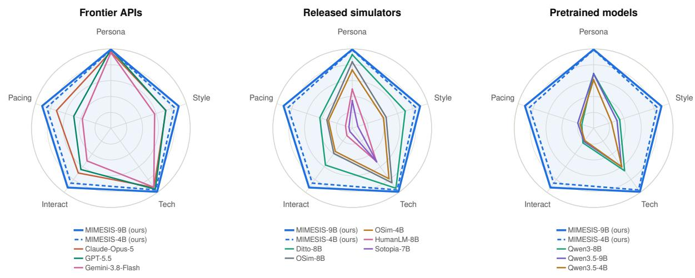  
Figure 4 Behavioral fidelity on RealUserSim PT3 (Zhu et al., 2026). Panels compare MIMESIS with frontier APIs, released simulators, and pretrained models. Each axis reports agreement with human reference trajectories in persona, linguistic style, technical competency, interaction and information flow, or pacing. Larger values indicate greater agreement with the human reference.

Trajectory-level behavioral fidelity. On RealUserSim PT3, MIMESIS-9B achieves a Fidelity Index of 94.0, exceeding the strongest baseline, Claude-Opus-5 (80.6), by 13.4 points. MIMESIS-4B scores 89.7, also outperforming both frontier models and released simulators (Figure 4). Its gains over Claude-Opus-5 are particularly pronounced in interaction and information flow (91.3 versus 69.5) and pacing (91.2 versus 72.5). By comparison, persona scores are close to ceiling for several models, including GPT-5.5 (99.3) and MIMESIS-9B (99.4). Because persona agreement is already near ceiling, the improvement primarily reflects how information is exchanged and paced over multiple turns rather than better recovery of static persona attributes.

## 5 Agent Post-Training with a Learned User Simulator

We freeze the trained user simulator uˆ and optimize the agent πθ through repeated interaction with it. At $u _ { \hat { \phi } }$ turn $t ,$ the agent generates a response $y _ { t }$ from the public conversation history $H _ { t } ,$ , after which the simulator produces the next user turn. The resulting conversations provide task rewards for multi-turn reinforcement learning. We additionally use the simulator’s thoughts and reactions to construct coaching notes for individual agent responses. Coached On-Policy Self-Distillation (CSD) uses these notes to supervise the agent during training, while its rollout policy continues to condition only on the public history.

## 5.1 Multi-Turn Reinforcement Learning

For each training task, we sample a group of complete conversations using the rollout policy $\pi _ { \theta _ { \mathrm { o l d } } }$ and the frozen simulator. We optimize the agent with Group Relative Policy Optimization (GRPO; Shao et al., 2024), following its extension to multi-turn user interaction in UserRL (Qian et al., 2025). Task rewards determine group-normalized advantages for the sampled agent responses. Let $\widehat { A } _ { i , t }$ denote the advantage assigned to agent turn t in conversation i. For token k of that response, the importance ratio is

$$
\rho _ { i , t , k } ( \theta ) = \frac { \pi _ { \theta } ( y _ { i , t , k } \mid H _ { i , t } , y _ { i , t , < k } ) } { \pi _ { \theta _ { \mathrm { o l d } } } ( y _ { i , t , k } \mid H _ { i , t } , y _ { i , t , < k } ) } .\tag{5}
$$

The clipped policy loss is

$$
\mathcal { L } _ { \mathrm { G R P O } } = - \mathbb { E } _ { i , t , k } \left[ \operatorname* { m i n } \Bigl ( \rho _ { i , t , k } \widehat { A } _ { i , t } , \mathrm { c l i p } ( \rho _ { i , t , k } , 1 - \epsilon , 1 + \epsilon ) \widehat { A } _ { i , t } \Bigr ) \right] ,\tag{6}
$$

where ϵ is the clipping parameter. The expectation is over collected conversations and agent-generated tokens. User utterances and tool outputs enter the conditioning history but are excluded from the policy loss. The simulator remains fixed throughout agent optimization.

## 5.2 Coached On-Policy Self-Distillation

Scalar task rewards do not describe how a user interpreted an agent response or what the agent could have done diferently. The simulator provides additional feedback through its generated thoughts and reactions. CSD uses this feedback to construct a teacher context for each sampled response. The underlying approach follows feedback-conditioned self-distillation in SDPO (Hübotter et al., 2026) and context-conditioned teaching in On-Policy Context Distillation (Ye et al., 2026). Here, the additional context is a coaching note derived from the simulated user’s response to the agent.

Constructing coaching notes. After an interaction, a coaching model G receives the public history $H _ { t } ,$ the sampled agent response $y _ { t }$ , and the simulator’s associated thought $z _ { t }$ and reaction $x _ { t + 1 }$ . It produces a short note describing a possible improvement to that response:

$$
h _ { t } = G ( H _ { t } , y _ { t } , z _ { t } , x _ { t + 1 } ) .\tag{7}
$$

The note is constructed retrospectively: it is unavailable to the agent when $y _ { t }$ is generated. It instead provides context for evaluating the response during the subsequent parameter update. The simulator’s thoughts and reactions are model-generated feedback, rather than observations of a human user’s internal state.

Learning from the coached context. We score the same sampled response under two contexts. The student receives the public history $H _ { t } ,$ , while a teacher copy of the agent additionally receives $h _ { t }$ . Let ¯θ denote a

stop-gradient copy of the current policy parameters $\theta ,$ used to evaluate the feedback-conditioned teacher distribution. At each sampled token, we compute the diference between the teacher’s coached and the student’s uncoached log-probabilities:

$$
\begin{array} { r l } & { \Delta _ { t , k } = \log \pi _ { \bar { \theta } } ( y _ { t , k } \mid H _ { t } , h _ { t } , y _ { t , < k } ) - \log \pi _ { \theta } ( y _ { t , k } \mid H _ { t } , y _ { t , < k } ) , } \\ & { \quad g _ { t , k } = \sigma ( \beta \operatorname { s g } ( \Delta _ { t , k } ) ) , } \end{array}\tag{8}
$$

(9)

where $\sigma$ is the sigmoid function, $\beta > 0$ controls the sensitivity of the weight to the log-probability diference, and sg denotes stop-gradient. The sigmoid bounds the weights between zero and one; stop-gradient holds them fixed during the student update. For a batch of coached responses, the auxiliary loss is

$$
\mathcal { L } _ { \mathrm { C S D } } = - \mathbb { E } _ { ( i , t , k ) \sim \mathcal { C } } \left[ g _ { i , t , k } \log \pi _ { \theta } ( y _ { i , t , k } \mid H _ { i , t } , y _ { i , t , < k } ) \right] ,\tag{10}
$$

where $\mathcal { C }$ denotes the empirical distribution over agent-token positions in responses with coaching notes. This objective gives greater weight to sampled tokens that the coached teacher assigns higher probability relative to the student. Tokens with a negative log-probability diference receive weaker reinforcement; the CSD term does not directly penalize them. Thus, the update is a weighted likelihood objective on sampled tokens, distinct from the next-token distribution matching used in SDPO and On-Policy Context Distillation (Hübotter et al., 2026; Ye et al., 2026). It reuses the agent’s sampled response without generating a replacement response.

We combine this auxiliary loss with the task-reward objective:

$$
\mathcal { L } _ { \mathrm { a g e n t } } = \mathcal { L } _ { \mathrm { G R P O } } + \alpha \mathcal { L } _ { \mathrm { C S D } } ,\tag{11}
$$

where $\alpha \geq 0$ controls the contribution of coaching. GRPO supplies the reward-based policy update, while CSD supplies token weights derived from the coaching context. Gradients from the auxiliary loss update only the student; they do not propagate through the teacher scores, coaching model, or user simulator. At deployment, the agent generates responses from $\pi _ { \boldsymbol { \theta } } ( \cdot \mid H _ { t } )$ without access to coaching notes or private simulator outputs.

## 5.3 Agent evaluation

We evaluate whether agents trained with MIMESIS generalize to user models not encountered during training. Following the interactive task setting of UserRL (Qian et al., 2025), we compare three training conditions: multi-turn GRPO with GPT-5.5 (UserRL), GRPO with MIMESIS-9B, and CSD with MIMESIS-9B. Table 2 reports agent performance across eight Gym environments, including three held out from training, under nine evaluation user models spanning frontier models and released simulators. All nine evaluation users difer from both training simulators.

<table><tr><td>Evaluation user</td><td>GRPO w. GPT-5.5</td><td>GRPO w. MIMESIS-9B</td><td>CSD w. MIMESIS-9B</td></tr><tr><td>GPT-5.6</td><td>26.85</td><td>31.10</td><td>32.39</td></tr><tr><td>Claude-Opus-5</td><td>25.75</td><td>27.21</td><td>29.78</td></tr><tr><td>Claude-Sonnet-5</td><td>26.53</td><td>29.73</td><td>30.97</td></tr><tr><td>Gemini-3.8-Flash</td><td>26.33</td><td>30.88</td><td>31.09</td></tr><tr><td>Kimi-K3</td><td>24.51</td><td>28.21</td><td>29.92</td></tr><tr><td>Ditto-8B</td><td>27.59</td><td>29.76</td><td>32.08</td></tr><tr><td>Osim-8B</td><td>25.68</td><td>29.27</td><td>29.72</td></tr><tr><td>HumanLM-8B</td><td>26.96</td><td>30.67</td><td>32.53</td></tr><tr><td>Sotopia-7B</td><td>24.72</td><td>29.00</td><td>31.35</td></tr><tr><td>Mean</td><td>26.10</td><td>29.54</td><td>31.09</td></tr></table>

Table 2 Agent generalization across user models. Mean task score across eight environments when evaluating agents trained with GPT-5.5 (UserRL), MIMESIS-9B (UserRL+), or MIMESIS-9B with CSD. None of the nine evaluation user models is used during agent training, the final row averages across evaluation users.  
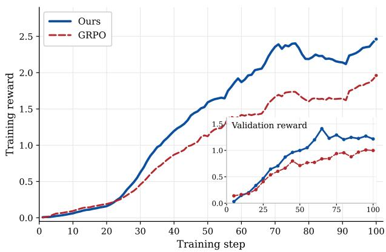  
Figure 5 Agent optimization with CSD. Training and validation rewards over 100 optimization steps using the same MIMESIS-9B training simulator. CSD and GRPO therefore difer only in the coaching objective: CSD attains higher late-stage training and validation reward.

With the GRPO objective fixed, replacing GPT-5.5 with MIMESIS-9B improves overall performance under every evaluation user, raising the mean score from 26.10 to 29.54. Gains range from 1.46 points under Claude-Opus-5 to 4.55 points under Gemini-3.8-Flash. Their consistency across frontier models and released simulators indicates that the benefits extend beyond interactions with the training simulator, supporting generalization to unfamiliar simulated users. Figure 5 compares CSD with GRPO over 100 optimization steps using the same frozen MIMESIS-9B simulator. Following the earliest checkpoints, the CSD curve remains above GRPO on validation reward throughout the rest of the plotted interval. CSD further improves performance under all nine evaluation users, increasing the mean score from 29.54 to 31.09. Because both conditions use MIMESIS-9B as the training simulator, this comparison isolates the efect of adding the CSD coaching objective while holding simulator choice fixed.

## 6 Conclusion

In this paper, we study how user simulators can better serve as human proxies for agent training and evaluation. Our findings show that of-the-shelf LLMs can substantially distort interaction dificulty, motivating explicit modeling of user behavior beyond linguistic style. We introduced MIMESIS, a purpose-built user simulator that combines training on human conversations, explicit reasoning supervision, and reinforcement learning with 13 realistic behavioral patterns. Rather than relying on these behaviors to emerge from next-utterance imitation, MIMESIS is explicitly trained to express them at contextually appropriate points in grounded multi-turn interactions. Its strong performance across complementary simulation benchmarks supports the value of this training approach. Crucially, these improvements translate into downstream learning utility. Across eight environments, agents trained with frozen MIMESIS-9B outperform those trained with GPT-5.5 under all nine unseen evaluation user models, demonstrating generalization beyond the training simulator. Our proposed CSD provides further gains by converting simulator-generated thoughts and subsequent user utterances into retrospective coaching about user needs and interaction feedback. This coaching supplies dense, token-level supervision during training, while the deployed agent relies only on public dialogue. Together, our results suggest that user simulators should be evaluated along two axes: fidelity to human interaction and transfer of policies trained against them. MIMESIS improves both simulator-level benchmarks and transfer across held-out simulator models.

## References

Anthropic. Prompting best practices for claude. https://docs.anthropic.com/en/docs/build-with-claude/ prompt-engineering/prompt-templates-and-variables, 2026. Accessed September 2026.

Victor Barres, Honghua Dong, Soham Ray, Xujie Si, and Karthik Narasimhan. τ2-bench: Evaluating conversational agents in a dual-control environment, 2025. https://arxiv.org/abs/2506.07982.

Derek Chen, Howard Chen, Yi Yang, Alexander Lin, and Zhou Yu. Action-based conversations dataset: A corpus for building more in-depth task-oriented dialogue systems. In Proceedings of the 2021 Conference of the North American Chapter of the Association for Computational Linguistics: Human Language Technologies, pages 3002–3017, 2021.

Xiang Cheng, Yulan Hu, Xiangwen Zhang, Lu Xu, Lide Tan, Zheng Pan, Xin Li, and Yong Liu. Beyond itinerary planning—a real-world benchmark for multi-turn and tool-using travel tasks. In Proceedings of the 64th Annual Meeting of the Association for Computational Linguistics (Volume 1: Long Papers), pages 29200–29251, 2026.

Harshita Chopra, Kshitish Ghate, Aylin Caliskan, Tadayoshi Kohno, Chirag Shah, and Natasha Jaques. Beyond cooperative simulators: Generating realistic user personas for robust evaluation of LLM agents, 2026. https: //arxiv.org/abs/2605.12894.

Yang Deng, Xuan Zhang, Wenxuan Zhang, Yifei Yuan, See Kiong Ng, and Tat-Seng Chua. On the multi-turn instruction following for conversational web agents. In Proceedings of the 62nd Annual Meeting of the Association for Computational Linguistics (Volume 1: Long Papers), pages 8795–8812, 2024.

Kaustubh Deshpande, Ved Sirdeshmukh, Johannes Baptist Mols, Lifeng Jin, Ed-Yeremai Hernandez-Cardona, Dean Lee, Jeremy Kritz, Willow E Primack, Summer Yue, and Chen Xing. Multichallenge: A realistic multi-turn conversation evaluation benchmark challenging to frontier llms. In Findings of the Association for Computational Linguistics: ACL 2025, pages 18632–18702, 2025.

Yifeng Ding, Hung Le, Songyang Han, Kangrui Ruan, Zhenghui Jin, Varun Kumar, Zijian Wang, and Anoop Deoras. Empowering multi-turn tool-integrated agentic reasoning with group turn policy optimization. In Proceedings of the 64th Annual Meeting of the Association for Computational Linguistics (Volume 1: Long Papers), pages 42409–42423, 2026.

Yao Dou, Michel Galley, Baolin Peng, Chris Kedzie, Weixin Cai, Alan Ritter, Chris Quirk, Wei Xu, and Jianfeng Gao. SimulatorArena: Are user simulators reliable proxies for multi-turn evaluation of AI assistants?, 2025. https://arxiv.org/abs/2510.05444.

Weihua Du, Zhan Ling, Kang Liu, Lingfeng Shen, Xuesong Yao, Yufei Xu, Dingyuan Shi, Yiming Yang, and Jiecao Chen. Generalizable end-to-end tool-use rl with synthetic codegym. In International Conference on Learning Representations, volume 2026, pages 17733–17756, 2026.

Google. Gemini thinking. https://ai.google.dev/gemini-api/docs/thinking, 2026. Accessed September 2026.

Shengyue Guan, Jindong Wang, Jiang Bian, Bin Zhu, Jian-Guang Lou, and Haoyi Xiong. Evaluating llm-based agents for multi-turn conversations: A survey. ACM Transactions on Intelligent Systems and Technology, 17(4):1–40, 2026.

Jonas Hübotter, Frederike Lübeck, Lejs Behric, Anton Baumann, Marco Bagatella, Daniel Marta, Ido Hakimi, Idan Shenfeld, Thomas Kleine Buening, Carlos Guestrin, and Andreas Krause. Reinforcement learning via self-distillation, 2026. https://arxiv.org/abs/2601.20802.

Chuanyang Jin, Binze Li, Haopeng Xie, Cathy Mengying Fang, Tianjian Li, Shayne Longpre, Hongxiang Gu, Maximillian Chen, and Tianmin Shu. ThoughtTrace: Understanding user thoughts in real-world LLM interactions, 2026. https://arxiv.org/abs/2605.20087.

Sham Kakade and John Langford. Approximately optimal approximate reinforcement learning. In Proceedings of the nineteenth international conference on machine learning, pages 267–274, 2002.

Hannah R Kirk, Alexander Whitefield, Paul Röttger, Andrew Bean, Katerina Margatina, Juan Ciro, Rafael Mosquera, Max Bartolo, Adina Williams, He He, et al. The prism alignment dataset: What participatory, representative and individualised human feedback reveals about the subjective and multicultural alignment of large language models. Advances in Neural Information Processing Systems, 37:105236–105344, 2024.

Fanqi Kong, Jiayi Zhang, Mingyi Deng, Chenglin Wu, Yuyu Luo, and Bang Liu. Infopo: Information-driven policy optimization for user-centric agents. 2026.

Jiayu Liu, Cheng Qian, Zhaochen Su, Qing Zong, Shijue Huang, Bingxiang He, and Yi R Fung. Costbench: Evaluating multi-turn cost-optimal planning and adaptation in dynamic environments for llm tool-use agents. In Proceedings of the 64th Annual Meeting of the Association for Computational Linguistics (Volume 1: Long Papers), pages 12826–12858, 2026.

Xiao Liu, Hao Yu, Hanchen Zhang, Yifan Xu, Xuanyu Lei, Hanyu Lai, Yu Gu, Hangliang Ding, Kaiwen Men, Kejuan Yang, et al. Agentbench: Evaluating llms as agents. In International Conference on Learning Representations, volume 2024, pages 52989–53046, 2024.

Jiarui Lu, Thomas Holleis, Yizhe Zhang, Bernhard Aumayer, Feng Nan, Haoping Bai, Shuang Ma, Shen Ma, Mengyu Li, Guoli Yin, et al. Toolsandbox: A stateful, conversational, interactive evaluation benchmark for llm tool use capabilities. In Findings of the Association for Computational Linguistics: NAACL 2025, pages 1160–1183, 2025.

Chang Ma, Junlei Zhang, Zhihao Zhu, Cheng Yang, Yujiu Yang, Yaohui Jin, Zhenzhong Lan, Lingpeng Kong, and Junxian He. Agentboard: An analytical evaluation board of multi-turn llm agents. Advances in neural information processing systems, 37:74325–74362, 2024.

Tarek Naous, Philippe Laban, Wei Xu, and Jennifer Neville. Flipping the dialogue: Training and evaluating user language models, 2025. https://arxiv.org/abs/2510.06552.

OpenAI. GPT-5.6: Frontier intelligence that scales with your ambition. OpenAI Blog, July 2026a. https://openai. com/index/gpt-5-6/. Accessed: 2026-10-06.

OpenAI. Reasoning models. https://developers.openai.com/api/docs/guides/reasoning, 2026b. Accessed September 2026.

Shishir G Patil, Huanzhi Mao, Fanjia Yan, Charlie Cheng-Jie Ji, Vishnu Suresh, Ion Stoica, and Joseph E Gonzalez. The berkeley function calling leaderboard (bfcl): From tool use to agentic evaluation of large language models. In Forty-second International Conference on Machine Learning, 2025.

Cheng Qian, Zuxin Liu, Akshara Prabhakar, Jielin Qiu, Zhiwei Liu, Haolin Chen, Shirley Kokane, Heng Ji, Weiran Yao, Shelby Heinecke, Silvio Savarese, Caiming Xiong, and Huan Wang. UserRL: Training interactive user-centric agent via reinforcement learning, 2025. https://arxiv.org/abs/2509.19736.

Amin Rakhsha, Thomas Hehn, Pietro Mazzaglia, Fabio Valerio Massoli, Arash Behboodi, and Tribhuvanesh Orekondy. Lumina: Long-horizon understanding for multi-turn interactive agents. In Findings of the Association for Computational Linguistics: ACL 2026, pages 3913–3926, 2026.

Zhihong Shao, Peiyi Wang, Qihao Zhu, Runxin Xu, Junxiao Song, Xiao Bi, Haowei Zhang, Mingchuan Zhang, YK Li, Yang Wu, et al. Deepseekmath: Pushing the limits of mathematical reasoning in open language models, 2024.

Taiwei Shi, Sihao Chen, Bowen Jiang, Linxin Song, Longqi Yang, and Jieyu Zhao. Experiential reinforcement learning, 2026. https://arxiv.org/abs/2602.13949.

Jeonghoon Shim, Woojung Song, Cheyon Jin, Seungwon KooK, and Yohan Jo. Non-collaborative user simulators for tool agents, 2025. https://arxiv.org/abs/2509.23124.

Yuda Song, Lili Chen, Fahim Tajwar, Rémi Munos, Deepak Pathak, J. Andrew Bagnell, Aarti Singh, and Andrea Zanette. Expanding the capabilities of reinforcement learning via text feedback, 2026. https://arxiv.org/abs/2602.02482.

Joseph Suh, Ayush Raj, Minwoo Kang, and Serina Chang. Quantifying the utility of user simulators for building collaborative LLM assistants, 2026. https://arxiv.org/abs/2605.09808.

Weiwei Sun, Xuhui Zhou, Jiarui Liu, Weihua Du, Haojia Sun, Yiqing Xie, Qianou Ma, Sihao Chen, Mengting Wan, Longqi Yang, Pei Zhou, Sherry Wu, Sean Welleck, Graham Neubig, Yiming Yang, and Maarten Sap. Reinforcing human behavior simulation via verbal feedback, 2026a. https://arxiv.org/abs/2605.20506.

Xueqiao Sun, Xiao Liu, Bowen Lv, Hanchen Zhang, Bohao Jing, Zehan Qi, Yifan Xu, Yuxiao Dong, and Jie Tang. Karl: Reinforcement learning for llm agents on multi-turn knowledge-intensive agentic tasks. In Proceedings of the 64th Annual Meeting of the Association for Computational Linguistics (Volume 1: Long Papers), pages 47539–47558, 2026b.

Qwen Team. Qwen3.5: Towards native multimodal agents, February 2026. https://qwen.ai/blog?id=qwen3.5.

Bo Wang, Ruixing Zhang, Yunqi Liu, Yang Zhang, Liangzhe Han, Tongyu Zhu, and Leilei Sun. Intent speaks louder: Controllable user simulation beyond response imitation, 2026a. https://arxiv.org/abs/2608.09420.

Hongru Wang, Wenyu Huang, Yufei Wang, Yuanhao Xi, Jianqiao Lu, Huan Zhang, Nan Hu, Zeming Liu, Jef Z Pan, and Kam-Fai Wong. Rethinking stateful tool use in multi-turn dialogues: Benchmarks and challenges. In Findings of the Association for Computational Linguistics: ACL 2025, pages 5433–5453, 2025.

Xingyao Wang, Zihan Wang, Jiateng Liu, Yangyi Chen, Lifan Yuan, Hao Peng, and Heng Ji. Mint: Evaluating llms in multi-turn interaction with tools and language feedback. In International Conference on Learning Representations, volume 2024, pages 32593–32627, 2024.

Yingshan Susan Wang, Cedegao E Zhang, Linlu Qiu, Zexue He, Pengyuan Li, Alex Pentland, Roger P Levy, and Yoon Kim. Learning user simulators with turing rewards. arXiv preprint arXiv:2606.19336, 2026b.

Marcus Williams, Micah Carroll, Adhyyan Narang, Constantin Weisser, Brendan Murphy, and Anca Dragan. On targeted manipulation and deception when optimizing LLMs for user feedback. In International Conference on Learning Representations, 2025. https://openreview.net/forum?id=Wf2ndb8nhf.

Ronald J Williams. Simple statistical gradient-following algorithms for connectionist reinforcement learning. Machine learning, 8(3):229–256, 1992.

Shirley Wu, Evelyn Choi, Arpandeep Khatua, Zhanghan Wang, Joy He-Yueya, Tharindu Cyril Weerasooriya, Wei Wei, Diyi Yang, Jure Leskovec, and James Zou. HumanLM: Simulating users with state alignment beats response imitation, 2026. https://arxiv.org/abs/2603.03303.

Shunyu Yao, Noah Shinn, Pedram Razavi, and Karthik Narasimhan. τ-bench: A benchmark for tool-agent-user interaction in real-world domains, 2024. https://arxiv.org/abs/2406.12045.

Tianzhu Ye, Li Dong, Xun Wu, Shaohan Huang, and Furu Wei. On-policy context distillation for language models, 2026. https://arxiv.org/abs/2602.12275.

Feng Zhang, Shijia Li, Chunmao Zhang, Zhanyu Ma, Jun Xu, Jiuchong Gao, Jinghua Hao, Renqing He, Jingwen Xu, and Han Liu. UserLM-R1: Modeling human reasoning in user language models with multi-reward reinforcement learning, 2026. https://arxiv.org/abs/2601.09215.

Xuhui Zhou, Weiwei Sun, Weihua Du, Jiarui Liu, Haojia Sun, Qianou Ma, Tongshuang Wu, Yiming Yang, and Maarten Sap. OdysSim: Building foundation models for human behavior simulation, 2026a. https://arxiv.org/abs/2606. 14199.

Xuhui Zhou, Weiwei Sun, Qianou Ma, Yiqing Xie, Jiarui Liu, Weihua Du, Sean Welleck, Yiming Yang, Graham Neubig, Sherry Tongshuang Wu, and Maarten Sap. Mind the Sim2Real gap in user simulation for agentic tasks, 2026b. https://arxiv.org/abs/2603.11245.

Ming Zhu, Juntao Tan, Rithesh Murthy, Jielin Qiu, Liangwei Yang, Wenting Zhao, Silvio Savarese, Shelby Heinecke, and Huan Wang. RealUserSim: Bridging the reality gap in agent benchmarking via grounded user simulation, 2026. https://arxiv.org/abs/2605.20204.

## Appendix

## A Simulator Training Details

This section specifies the MIMESIS training pipeline used in Stage I of the main paper. We first describe user-side mid-training and ThoughtTrace supervision, then the construction of the realistic-behavior taxonomy, and finally the joint RL mixture and behavior-specific reward. Agent-training settings are reported separately in Appendix D.

## A.1 Data and supervised adaptation

We first adapt the Qwen3.5 backbones (Team, 2026) to the user role through mid-training on human–assistant conversations, predicting the next human utterance from the preceding dialogue. The training mixture contains 21.2M examples from 62 corpora, from which our mid-training processes 9.51B tokens.

<table><tr><td>Data source or environment</td><td>Training stage</td><td>Training signal</td></tr><tr><td>OdysSim (Zhou et al., 2026a)</td><td>Supervised fine-tuning</td><td>Prediction of the next human utterance conditioned on the preceding dialogue.</td></tr><tr><td>ThoughtTrace (Jin et al., 2026)</td><td>Supervised fine-tuning</td><td>Supervision of a reasoning trace followed by the observed user utterance, using users&#x27; self-reported motivations and interpretations of assistant responses.</td></tr><tr><td>SOUL environments (Zhou et al., 2026a)</td><td>Joint RL</td><td>Task-specific rewards for simulator responses or multi-turn interactions.</td></tr><tr><td>ABCD scenarios (Chen et al., 2021)</td><td>Joint RL</td><td>Rewards for behavior exhibition, temporal placement, naturalness, and consistency with scenario facts and policies.</td></tr></table>

Table 3 Data sources and training signals for MIMESIS. User-side mid-training and ThoughtTrace fine-tuning precede joint RL. The SOUL environments and the ABCD task update the same simulator parameters, with ABCD incorporating 13 realistic behavior categories and a separate neutral condition.

We then fine-tune on 2,155 Thought-Trace conversations with turn-level human annotations (Jin et al., 2026). Users’ self-reported reasons for their messages and interpretations of preceding assistant responses supervise an explicit reasoning trace before the observed user utterance. During interaction, the simulator generates both a thought and a public utterance, with only the utterance shown to the agent. Table 3 summarizes the data sources and supervision while Table 4 reports the training configurations.

## A.2 Realistic user behaviors

We derive a taxonomy of 13 realistic user behaviors from ThoughtTrace (Jin et al., 2026), with Table 5 providing the definition for each category. These categories describe interaction patterns without presuming that users deliberately impede task completion. For example, an additional constraint may reflect revised requirements, while a previously unstated preference may become apparent only in a later conversational turn. We construct the taxonomy in two stages: behavior annotation followed by label consolidation. Both stages use

Table 4 Supervised training configurations for MIMESIS-4B and MIMESIS-9B. User-side mid-training predicts human utterances with explicit thinking disabled. Subsequent ThoughtTrace fine-tuning enables the native thinking template and supervises a thought before the public response using users’ self-reported motivations and interpretations.
<table><tr><td>Hyperparameter</td><td>Mid-training</td><td>ThoughtTrace SFT</td></tr><tr><td>Learning rate</td><td> $3 \times 1 0 ^ { - 5 }$ </td><td> $1 \times 1 0 ^ { - 7 }$ </td></tr><tr><td>Schedule</td><td>Cosine annealing</td><td>Cosine annealing</td></tr><tr><td>Warm-up</td><td>0 steps</td><td>10 steps</td></tr><tr><td>Optimizer</td><td>AdamW</td><td>AdamW</td></tr><tr><td> $( \beta _ { 1 } , \beta _ { 2 } )$ </td><td>(0.9, 0.999)</td><td>(0.9, 0.999)</td></tr><tr><td>Weight decay</td><td>0.01</td><td>0.0</td></tr><tr><td>Gradient clipping</td><td>1.0</td><td>1.0</td></tr><tr><td>Epochs</td><td>≈0.97 (5,000 steps)</td><td>3</td></tr><tr><td>Sequences per step</td><td>4,096</td><td>32</td></tr><tr><td>Micro-batch per GPU</td><td>8</td><td>1</td></tr><tr><td>Gradient accumulation</td><td>16</td><td>4</td></tr><tr><td>Tokens per GPU (cap)</td><td>49,152</td><td></td></tr><tr><td>Max sequence length</td><td>24,576</td><td>32,768</td></tr><tr><td>Max prompt / response</td><td>16,384 /8,192</td><td></td></tr><tr><td>Thinking during training</td><td>disabled</td><td>enabled</td></tr><tr><td>Chat template</td><td>ChatML</td><td>Qwen3.5 thinking</td></tr><tr><td>Trainer</td><td>verl SPMD</td><td>TRL SFTTRAINER</td></tr><tr><td>Sharding</td><td>FSDP</td><td>DeepSpeed ZeRO-3</td></tr><tr><td>Precision</td><td>bfloat16</td><td>bfloat16</td></tr><tr><td>Gradient checkpointing</td><td>enabled</td><td>enabled</td></tr><tr><td>Hardware</td><td>4 × 8 A100</td><td>1 × 8 A100</td></tr><tr><td>Wall-clock</td><td>≈4.8 days</td><td>45 min</td></tr><tr><td>Training examples</td><td>21.2M</td><td>2,155</td></tr><tr><td>Tokens seen</td><td>9.51B</td><td>15.8M</td></tr></table>

<table><tr><td></td><td>ID Behavior</td><td>Operational description</td></tr><tr><td></td><td>B1 Hidden evaluation criteria</td><td>Judges an answer against a preference or standard that was not stated in the request.</td></tr><tr><td></td><td>B2 Incremental goalpost shifting</td><td>Introduces or tightens requirements after the assistant has already made progress.</td></tr><tr><td></td><td>B3 Clarification noncooperation</td><td>Declines to answer, or only partly answers, a clarification request.</td></tr><tr><td></td><td>B4 Infeasibility persistence</td><td>Continues to request an option after its unavailability or incompatibility with policy has been explained.</td></tr><tr><td></td><td>B5 Underspecified-then-blames</td><td>Omits relevant information and subsequently faults the assistant for not inferring it.</td></tr><tr><td></td><td>B6 Abrupt intent switching</td><td>Redirects the conversation to another objective before resolving the preceding request.</td></tr><tr><td></td><td>B7 Artificial constraint stacking</td><td>Adds restrictions that remove options on which the assistant&#x27;s proposed solution relies.</td></tr><tr><td></td><td>B8 Fabricated or false premise</td><td>Presents an unsupported or contradictory fact, or a claim about prior dialogue, as established context.</td></tr><tr><td></td><td>B9 Impatient low-signal pressure</td><td>Expresses urgency or dissatisfaction without supplying a sufficiently specific correction.</td></tr><tr><td></td><td>ment</td><td>B10 Unresolved thread abandon- Disengages from a conversational thread before resolving its stated objective.</td></tr><tr><td></td><td>B11 Self-contradiction</td><td>States requirements or facts that conflict with an earlier statement without acknowledging the change.</td></tr><tr><td></td><td>B12 Request overloading</td><td>Combines numerous deliverables, constraints, or checks within a single request.</td></tr><tr><td></td><td>B13 Belittling or entitled pressure</td><td>Uses disparaging or entitled language to pressure the assistant.</td></tr><tr><td></td><td>N Neutral</td><td>Follows the scenario without an imposed adversarial behavior.</td></tr></table>

Table 5 Taxonomy of 13 realistic user behaviors. Categories are derived from recurring patterns in ThoughtTrace and defined operationally for the ABCD behavior task. A separate neutral condition specifies interaction without an imposed behavioral pattern.

Stage 1: Behavior annotation. We serialize each conversation as a turn-indexed transcript containing both user and assistant utterances. ThoughtTrace reasons and reactions, together with their labels, are placed beneath the messages to which they refer. Assistant turns are retained because several behaviors are defined relative to prior interaction, such as failing to answer a clarification, contradicting an earlier statement, or introducing requirements after the assistant has made progress. For each conversation, the annotator identifies non-cooperative user behavior using a seed codebook of 16 categories with one-sentence definitions (Table 6). When no category fits, it may assign an open code, other, with a free-text label. Each annotation records the category, a short label, relevant turn indices, supporting user and thought quotations, a severity level (low, medium, or high), and a brief rationale; at least one quotation must be present. Thought-only annotations are allowed when a behavior is not expressed directly in the public utterance, such as an unstated evaluation criterion. The prompt also provides guidance for interpreting ThoughtTrace reason and reaction labels and instructs the annotator to return an empty list when no target behavior is present. We provide one worked example of the expected JSON format and issue one API request per conversation. All 2,155 conversations produced valid annotations.

Stage 2: Taxonomy consolidation. The 862 Stage 1 annotations contain 853 distinct category–label pairs, making direct aggregation by label impractical. We therefore group annotations by category–label pair and attach their supporting quotations, using the public utterance when available and otherwise the self-reported thought. The frequency-sorted groups are passed to the same model in a single consolidation request. The model is instructed to merge labels describing the same behavior, preserve meaningful distinctions, and treat open codes as candidate new categories. For each consolidated category, it returns a name, an operational definition, the source codes it subsumes, representative quotations, and an instruction for how a simulated user should enact the behavior. This procedure yields the 13 categories in Table 5. Every annotated seed category and open-coded label is assigned to exactly one consolidated category. Frequencies in Figure 6 are then computed directly from the Stage 1 annotations under this mapping, rather than estimated by the model. The final taxonomy largely preserves the seed codebook: hostility, passive aggression, and entitled demands are merged into belittling or entitled pressure; the four open-coded annotations (0.5%) are absorbed into existing categories; topic drift receives no annotations; and no seed category is split.

Table 6 Seed codebook used for Stage 1 behavior annotation. The GPT-5.6 annotator assigns each detected behavior to one of the predefined categories or, when none is appropriate, to an open other category with a free-text label.
<table><tr><td>Category</td><td>Definition</td></tr><tr><td>Intent switching</td><td>Abruptly changes the goal or task mid-conversation, abandoning the prior one without resolution.</td></tr><tr><td>Non-collaboration Underspecification,</td><td>Withholds information the assistant needs, or refuses to answer the assistant&#x27;s clarifying questions. Gives a vague or incomplete request, then faults the assistant for not reading their mind.</td></tr><tr><td>then blame</td><td></td></tr><tr><td>Contradiction</td><td>States something that contradicts what they said earlier in the conversation. Adds new requirements or expands scope after the assistant met the original request.</td></tr><tr><td>Moving goalposts False premise</td><td>Asserts an incorrect fact or assumption as if it were true and builds on it.</td></tr><tr><td>Out-of-scope request</td><td>Asks for a capability the assistant cannot provide, and disbelieves or insists after being told it is</td></tr><tr><td>Topic drift</td><td>not possible. Wanders off-topic or digresses away from the stated task.</td></tr><tr><td>Overloading</td><td>Packs many distinct requests into one turn, or adds requests faster than they can be answered.</td></tr><tr><td>Impatience</td><td>Expresses curt dissatisfaction with little signal (e.g., &quot;no&quot;, &quot;wrong&quot;, &quot;still bad&quot;) or demands faster</td></tr><tr><td></td><td>results.</td></tr><tr><td>Hostility Passive aggression</td><td>Uses a rude, aggressive, insulting, or openly antagonistic tone. Uses sarcasm, backhanded remarks, or veiled criticism instead of direct feedback.</td></tr><tr><td>Testing the assistant</td><td>Deliberately tries to trip up, trap, or catch out the assistant.</td></tr><tr><td>Entitled demands</td><td>Uses demanding, entitled framing (e.g., &quot;just do it&quot;, &quot;you must&quot;) with no give-and-take.</td></tr><tr><td>Abrupt abandonment</td><td>Drops the thread or disengages without closure once partly satisfied.</td></tr><tr><td>Unvoiced criterion</td><td></td></tr><tr><td></td><td>Keeps a decisive expectation, constraint, or verdict entirely in private thought; the spoken turn does not convey it.</td></tr></table>

<table><tr><td>hidden evaluation criteria 285·40.7%</td><td>incremental goalpost shifting 94· 13.4%</td><td>abrupt intent switching 62 - 8.9%</td><td colspan="2">artificial constraint stacking 50 · 7.1%</td></tr><tr><td rowspan="2">78 · 11.1%</td><td rowspan="2">clarification noncooperation</td><td rowspan="2">premise 38 · 5.4%</td><td colspan="2">17 - 2.4%</td><td rowspan="2">thread abandonment 16 - 2.3%</td></tr><tr><td></td><td>overloading 9 . 1.3% belittling infeas. entitled</td></tr></table>

Figure 6 Distribution of realistic behaviors in the annotated ThoughtTrace sample. Rectangle areas represent the observed counts of the 13 categories in Table 5, labels report counts and percentages. Counts are computed from the Stage-1 annotations of the 2,155 ThoughtTrace conversations and describe the annotated sample rather than population prevalence.

## A.3 Joint multi-domain reinforcement learning

We initialize MIMESIS from the Thought-Trace SFT checkpoint and jointly optimize it on the SOUL environments and the ABCD realistic-behavior task. Each environment retains its interaction protocol and reward function, while rollouts from all domains update the same simulator parameters under Equation 4. OdysSim instead trains task-specific experts and subsequently distills their trajectories into a unified model (Zhou et al., 2026a). We use the FoldGRPO estimator, which computes group reward statistics over unique rollout identifiers, preventing repeated segments of one rollout from being counted multiple times in advantage normalization. Table 7 reports the MIMESIS-9B sampling settings, optimization hyperparameters, and training budget.

Figure 6 reports category frequencies in the annotated ThoughtTrace sample. Hidden evaluation criteria account for the largest share, with 285 instances (40.7%), followed by incremental goalpost shifting (94; 13.4%) and clarification noncooperation (78; 11.1%). These frequencies describe the annotated sample, they do not estimate population prevalence or define the behavior-sampling distribution used for RL. Figure 7 illustrates the categories with user utterances and self-reported thoughts. Interpreting these examples requires the dialogue history and scenario facts, particularly when identifying contradictions, infeasible requests, or false premises.

## A.4 Behavior rollouts and reward

We construct rollouts from ABCD customersupport scenarios (Chen et al., 2021), which specify structured service procedures. Each example is assigned one of the 13 behavior categories or a neutral condition. Neutral examples constitute one third of the behavior-task data and impose no specific behavioral pattern. Rollouts begin after a replayed identity check and continue for at most eight simulated user turns with a frozen support agent.

Table 7 Joint reinforcement-learning configuration for MIMESIS-9B. Training starts from the ThoughtTrace SFT checkpoint and updates all parameters on a mixture of 23 SOUL tasks and the ABCD realistic-behavior task. All 24 environments update a shared simulator rather than separate task-specific experts.
<table><tr><td>Hyperparameter</td><td>Value</td></tr><tr><td>Objective</td><td></td></tr><tr><td>Advantage estimator</td><td>FoldGRPO</td></tr><tr><td>Policy loss</td><td>PPO-clip</td></tr><tr><td>Clip range (low / high)</td><td>0.2 / 0.28</td></tr><tr><td>Dual-clip constant c</td><td>10.0</td></tr><tr><td>KL penalty (loss / reward)</td><td>none / none</td></tr><tr><td>Entropy coefficient</td><td></td></tr><tr><td>Advantage normalization</td><td>group std</td></tr><tr><td>Loss aggregation</td><td>token-mean</td></tr><tr><td>Optimization</td><td></td></tr><tr><td>Learning rate</td><td> $8 \times 1 0 ^ { - 6 }$ </td></tr><tr><td>Schedule</td><td>constant, no warm-up</td></tr><tr><td>Optimizer</td><td>AdamW</td></tr><tr><td> $( \beta _ { 1 } , \beta _ { 2 } )$ </td><td>(0.9, 0.95)</td></tr><tr><td>Weight decay</td><td>0.01 1.0</td></tr><tr><td>Gradient clipping</td><td>500</td></tr><tr><td>Training steps</td><td></td></tr><tr><td>Batching</td><td></td></tr><tr><td>Prompts per step</td><td></td></tr><tr><td>Rollouts per prompt</td><td></td></tr><tr><td>Rollouts per step</td><td>512</td></tr><tr><td>PPO mini-batch</td><td></td></tr><tr><td>Tokens per GPU (dynamic)</td><td>49,152</td></tr><tr><td>Sequence and sampling</td><td></td></tr><tr><td>Max prompt length</td><td>8,192</td></tr><tr><td>Max response length</td><td>16,384</td></tr><tr><td>Temperature / top-p / top-k</td><td>1.0 / 1.0 / −1</td></tr><tr><td>Validation rollouts per prompt</td><td></td></tr><tr><td>Reasoning</td><td></td></tr><tr><td>Thinking during rollout</td><td>enabled</td></tr><tr><td>Chat template</td><td>native (Qwen3.5 thinking)</td></tr><tr><td>Min. reasoning tokens</td><td></td></tr><tr><td>Systems</td><td></td></tr><tr><td>Trainer / rollout engine</td><td>FSDP / vLLM (colocated)</td></tr><tr><td>Precision</td><td>bfloat16</td></tr><tr><td>Parameter, optimizer offload</td><td>CPU</td></tr><tr><td>Tensor parallel, Ulysses SP</td><td>1,1</td></tr><tr><td>vLLM memory fraction</td><td></td></tr><tr><td>Hardware</td><td>2 × 8 A100</td></tr><tr><td></td><td></td></tr><tr><td>Data and reward</td><td></td></tr><tr><td>Training tasks</td><td>24 (joint mixture)</td></tr><tr><td>Reward / judge model</td><td>GPT-5.5</td></tr></table>

facts and policies. A false premise must contradict a recorded fact, withheld information must be available to the simulated user, and an infeasible request must conflict with a stated policy. The evaluator scores behavior exhibition e, temporal placement p, naturalness $n ,$ and task consistency c. We combine these scores as

$$
r _ { \mathrm { b e h } } = { \frac { 2 . 0 e + 1 . 5 p + 1 . 0 n + 0 . 5 c } { 5 . 0 } } .\tag{12}
$$

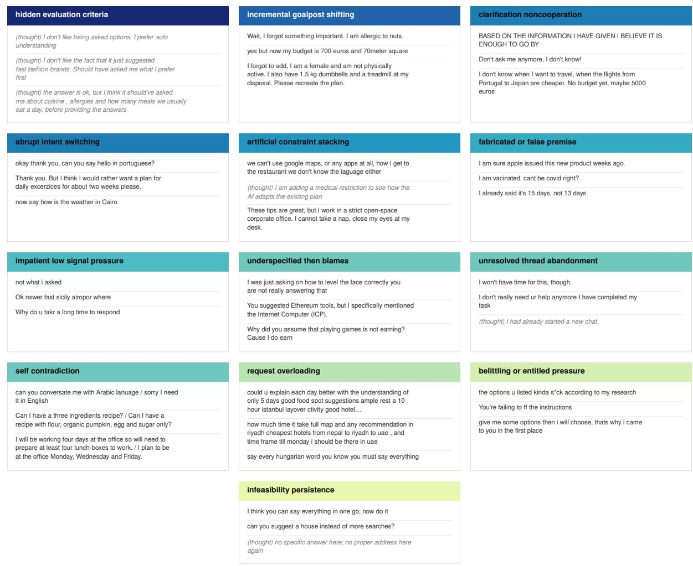  
Figure 7 Examples motivating the 13 realistic behavior categories. Excerpts from ThoughtTrace illustrate recurring patterns in user utterances and self-reported thoughts. Italicized entries marked “(thought)” are human self-reports; the remaining entries are public user utterances. Original wording is retained, and each example should be interpreted within its conversation context.

When the simulator describes the assigned behavior instead of expressing it through the interaction, we halve the reward:

$$
r _ { \mathrm { b e h } }  { \scriptstyle { \frac { 1 } { 2 } } } r _ { \mathrm { b e h } } .\tag{13}
$$

The weighting emphasizes whether the assigned behavior occurs and whether its timing is appropriate, while naturalness and task consistency reward plausible interaction within the scenario. Task consistency remains a graded reward component, so a high total reward does not guarantee that every scenario constraint is satisfied.

## B Simulator Evaluation

Evaluation protocol and model configuration. We evaluate four properties that need not move together: broad simulation capability, trajectory-level behavioral fidelity, calibration to human task outcomes, and next-turn realism. We report them separately because a simulator can match surface style without matching how information unfolds across turns or how dificult the resulting task is for an agent. The corresponding tables specify the model versions used in each evaluation. For proprietary models, we use fixed reasoning configurations without additional model-specific tuning. GPT-5.5 and GPT-5.6 use medium reasoning efort (OpenAI, 2026b), Gemini-3.8-Flash uses medium dynamic thinking (Google, 2026), and Claude-Opus-5 uses adaptive thinking (Anthropic, 2026). These reasoning modes do not imply equal inference budgets across providers.

## B.1 SOUL-Index

SOUL evaluates conversational interaction (CONV), social simulation (SS), cognition (COG), role play (ROLE), and evaluation or judgment (EVAL) (Zhou et al., 2026a). Table 8 reports all 23 datasets, separating model groups for readability. MIMESIS-9B achieves an overall score of 65.7, compared with 64.9 for Claude-Opus-5 and 58.8 for Osim-8B; MIMESIS-4B scores 63.7. The strongest advantage is in conversational simulation. Both MIMESIS models exceed the frontier baselines on all four CONV datasets. For example, MIMESIS-9B scores 74.4 on MirrorBench, compared with 56.8 for the strongest frontier baseline, and MIMESIS-4B scores 53.2 on Humanual-Chat, compared with 41.5.

<table><tr><td></td><td>Dataset</td><td>Claude-Opus-5</td><td>GPT-5.5</td><td>Gemini-3.8-Flash</td><td>Osim-8B</td><td>Osim-4B</td><td>Ditto-8B</td><td>HumanLM-8B</td><td>Sotopia-7B</td><td>Qwen3.5-9B</td><td>Qwen3-8B</td><td>Qwen3.5-4B</td><td>MIMESIS-9B</td><td>MIMESIS-4B</td></tr><tr><td></td><td>UserLLM</td><td>64.9±0.8</td><td>67.0±1.6</td><td>62.7±1.4</td><td>93.3±0.2</td><td>92.9±0.0</td><td>94.1±04</td><td>43.5±0.1</td><td>46.8±3.7</td><td>60.3±0.9</td><td>43.6±1.2</td><td>56.1±2.3</td><td>93.3±0.1</td><td>93.0±0.4</td></tr><tr><td></td><td>MirrorBench</td><td>56.8±0.1</td><td>51.7±0.4</td><td>47.2±0.1</td><td>66.0±0.6</td><td>64.3±0.5</td><td>64.8±0.4</td><td>40.8±0.6</td><td>34.2±0.9</td><td>45.6±0.8</td><td>43.6±0.5</td><td>40.5±0.8</td><td>74.4±04</td><td>73.2±0.2</td></tr><tr><td>ΛNOA</td><td>Humanual-Chat</td><td>29.6±0.2</td><td>33.1±0.3</td><td>41.5±0.5</td><td>23.2±0.4</td><td>21.5±0.7</td><td>22.7±0.1</td><td>29.8±0.2</td><td>25.1±1.1</td><td>17.9±0.5</td><td>26.9±0.6</td><td>18.2±0.3</td><td>53.0±0.2</td><td>53.2±04</td></tr><tr><td></td><td>SimArena-Doc</td><td>78.1±0.3</td><td>75.0±0.4</td><td>72.4±0.2</td><td>57.5±0.3</td><td>55.1±0.1</td><td>65.3±0.1</td><td>61.0±0.4</td><td>58.3±0.4</td><td>71.7±0.6</td><td>65.1±0.2</td><td>69.0±1.9</td><td>79.7±0.3</td><td>78.4±0.1</td></tr><tr><td>S</td><td>Sotopia-Hard</td><td>70.4±0.3</td><td>70.9±0.4</td><td>66.9±0.4</td><td>39.1±0.1</td><td>35.0±0.4</td><td>46.4±0.3</td><td>59.8±0.4</td><td>59.7±0.4</td><td>54.2±0.6</td><td>58.7±0.6</td><td>49.7±2.3</td><td></td><td>65.2±0.2</td></tr><tr><td></td><td></td><td></td><td></td><td></td><td></td><td></td><td></td><td></td><td></td><td></td><td></td><td></td><td>66.4±0.2</td><td></td></tr><tr><td></td><td>Fantom</td><td>84.7±0.7</td><td>93.0±0.6</td><td>93.0±0.0</td><td>82.0±1.7</td><td>77.0±1.5</td><td>94.7±0.3</td><td>84.7±1.2</td><td>0.0±0.0†</td><td>77.7±3.9</td><td>81.3±0.9</td><td>64.0±4.4</td><td>92.0±0.0</td><td>89.0±1.5</td></tr><tr><td>DO</td><td>Hitom</td><td>68.7±0.3 94.7±0.3</td><td>84.7±1.2 98.3±0.3</td><td>71.3±2.0 97.0±0.0</td><td>74.7±1.2</td><td>71.3±1.8</td><td>77.3±1.2</td><td>65.0±0.6</td><td>32.7±2.8</td><td>56.7±17.9</td><td>65.7±2.2</td><td>47.3±15.8</td><td>87.0±20</td><td>77.3±0.7</td></tr><tr><td>Social-R1</td><td>Paratomi</td><td>80.0±0.6</td><td>68.3±0.7</td><td>81.0±0.0</td><td>83.7±3.0 57.7±1.8</td><td>82.3±1.8 61.0±2.0</td><td>89.3±0.7 51.7±0.7</td><td>75.3±3.2 50.3±1.0</td><td>41.3±2.2 45.0±0.0</td><td>70.3±2.4</td><td>78.3±0.3</td><td>56.0±6.9 53.3±1.7</td><td>98.3±0.3</td><td>89.3±0.9 63.7±1.3</td></tr><tr><td>Coser</td><td></td><td></td><td></td><td></td><td></td><td></td><td></td><td></td><td></td><td>52.7±1.2</td><td>50.3±0.7</td><td></td><td>67.3±17</td><td></td></tr><tr><td>Lifechoices</td><td></td><td>72.6±0.3 94.7±0.7</td><td>67.3±0.1 90.0±1.0</td><td>63.5±0.2</td><td>55.1±0.1</td><td>45.8±0.1</td><td>56.9±0.3</td><td>35.0±0.8</td><td>25.5±0.5</td><td>34.4±1.6</td><td>36.9±0.2</td><td>23.4±1.0</td><td>57.0±0.3</td><td>53.8±0.6</td></tr><tr><td>Twinvoice</td><td></td><td>83.0±0.6</td><td>75.3±0.3</td><td>95.7±0.3</td><td>79.3±0.3</td><td>84.0±2.5</td><td>70.3±1.8</td><td>65.7±1.3</td><td>65.3±0.3</td><td>69.7±1.8</td><td>68.3±1.8</td><td>71.3±1.2</td><td>89.3±0.3</td><td>87.0±1.0</td></tr><tr><td>BehaviorChain</td><td></td><td>96.0±0.0</td><td>94.3±0.7</td><td>23.3±0.94</td><td>69.0±0.6</td><td>64.3±0.9</td><td>67.3±1.3</td><td>40.3±2.4</td><td>31.3±3.8</td><td>55.0±1.5</td><td>42.0±1.2</td><td>40.3±0.9</td><td>76.3±15</td><td>72.0±1.2</td></tr><tr><td></td><td></td><td>62.4±0.3</td><td>61.8±0.2</td><td>94.0±0.6</td><td>94.7±1.2</td><td>86.0±1.7</td><td>44.7±0.9</td><td>36.3±1.2</td><td>30.3±1.8</td><td>52.3±1.9</td><td>36.3±0.9</td><td>45.3±3.3</td><td>95.7±0.7</td><td>98.3±0.3</td></tr><tr><td>ROLE Mistakes</td><td>SimArena-Math</td><td>63.3±1.2</td><td>70.3±0.9</td><td>63.4±0.1 76.0±0.6</td><td>51.8±0.5</td><td>53.4±0.2</td><td>56.0±0.3</td><td>44.3±0.4</td><td>45.9±0.9</td><td>59.1±0.7</td><td>51.3±0.1</td><td>53.6±0.4</td><td>64.0±02</td><td>57.6±0.2</td></tr><tr><td>Humanual-Email</td><td></td><td>41.2±0.7</td><td>39.5±0.3</td><td>40.1±0.3</td><td>60.7±0.9</td><td>54.0±1.2</td><td>39.0±2.6 27.3±0.1</td><td>56.7±1.7 31.8±0.3</td><td>18.0±0.6</td><td>59.7±1.8</td><td>57.7±0.9</td><td>60.0±0.6</td><td>63.0±0.6</td><td>65.3±0.9</td></tr><tr><td>Humanual-News</td><td></td><td>53.7±1.1</td><td>51.2±0.3</td><td>52.8±0.3</td><td>35.5±0.4 39.1±0.7</td><td>33.5±0.4 35.1±0.3</td><td>31.1±1.1</td><td>40.9±0.9</td><td>30.0±0.4</td><td>31.0±0.5</td><td>28.3±0.1</td><td>29.2±1.2</td><td>40.7±.1</td><td>36.1±0.6</td></tr><tr><td>Humanual-Politics</td><td></td><td>42.4±0.5</td><td>43.5±0.5</td><td>36.6±0.3</td><td>34.2±0.4</td><td>31.1±0.6</td><td>27.6±0.3</td><td>32.3±0.2</td><td>30.9±1.0 28.8±0.4</td><td>38.6±2.4 30.4±0.1</td><td>30.6±1.0 29.8±0.3</td><td>29.1±2.5 24.8±0.9</td><td>46.5±0.5 42.6±0.2</td><td>41.5±0.6 39.8±0.4</td></tr><tr><td>Humanual-Book</td><td></td><td>56.7±0.4</td><td>52.8±0.7</td><td>49.9±0.6</td><td>50.4±0.4</td><td>47.3±1.0</td><td>39.8±0.7</td><td>42.3±0.4</td><td>39.7±0.2</td><td></td><td></td><td></td><td></td><td>52.4±0.0</td></tr><tr><td></td><td>Humanual-Opinion</td><td>45.0±0.5</td><td>39.7±0.1</td><td>34.9±0.2</td><td>33.8±0.2</td><td>30.8±0.1</td><td>25.0±0.4</td><td>31.5±0.2</td><td>22.8±0.4</td><td>35.5±0.6</td><td>31.7±0.1</td><td>30.8±0.7</td><td>55.4±0.1 41.3±0.5</td><td>43.2±0.2</td></tr><tr><td>AlignX-Demo</td><td></td><td></td><td></td><td></td><td></td><td></td><td></td><td></td><td></td><td>26.9±0.8</td><td>24.1±0.8</td><td>20.1±0.7</td><td></td><td></td></tr><tr><td>AlignX-Pair</td><td></td><td>84.0±0.0 59.0±0.6</td><td>81.7±0.7 59.7±2.0</td><td>83.3±0.9</td><td>90.3±0.3</td><td>89.0±0.6</td><td>83.0±1.2</td><td>75.7±0.3</td><td>70.3±1.2</td><td>82.3±0.9</td><td>79.0±1.2</td><td>75.0±1.0</td><td>89.3±1.8</td><td>89.7±0.7</td></tr><tr><td></td><td></td><td></td><td></td><td>62.7±0.3</td><td>56.0±1.7</td><td>51.3±3.2</td><td>52.7±0.9</td><td>51.0±0.6</td><td>49.3±0.7</td><td>58.7±3.5</td><td>52.0±0.6</td><td>57.0±2.5</td><td>60.7±0.9</td><td>54.7±0.9</td></tr><tr><td></td><td>AlignX-UGC</td><td>54.7±0.3</td><td>58.0±1.0</td><td>53.7±0.9</td><td>52.3±2.2</td><td>55.3±2.0</td><td>51.7±1.8</td><td>52.7±0.3</td><td>50.0±1.0</td><td>56.7±1.7</td><td>52.0±2.1</td><td>49.3±2.2</td><td>54.7±2.0</td><td>53.0±0.6</td></tr><tr><td>EVAT</td><td>AlignX-Arb</td><td>76.7±0.9</td><td>73.0±0.0</td><td>72.7±0.3</td><td>76.0±0.6</td><td>70.3±0.3</td><td>69.3±0.9</td><td>69.3±0.9</td><td>57.7±1.3</td><td>73.3±0.9</td><td>73.3±2.3</td><td>65.7±1.2</td><td>77.3±0.7</td><td>75.7±0.3</td></tr><tr><td></td><td>AlignX-Hist16</td><td>84.0±0.6</td><td>84.0±1.0</td><td>83.3±0.9</td><td>91.3±12</td><td>91.0±0.0</td><td>84.7±0.9</td><td>83.0±2.0</td><td>66.7±2.8</td><td>81.3±0.3</td><td>83.0±1.2</td><td>77.7±0.7</td><td>89.3±1.2</td><td>90.7±0.3</td></tr><tr><td>SocSci210</td><td></td><td>77.6±0.6</td><td>77.0±0.2</td><td>77.0±0.4</td><td>74.7±0.4</td><td>72.2±0.4</td><td>72.8±0.5</td><td>74.1±0.6</td><td>70.0±0.4</td><td>73.0±0.5</td><td>74.5±0.7</td><td>71.5±1.0</td><td>75.3±09</td><td>75.3±0.3</td></tr><tr><td></td><td>HumanLLM</td><td>47.5±0.2</td><td>45.0±0.4</td><td>48.3±0.1 62.5±0.1</td><td>40.5±0.3</td><td>36.5±0.5 56.0±0.3</td><td>33.1±0.8 53.9±0.3</td><td>33.1±0.1 49.6±0.4</td><td>21.9±2.4</td><td>27.9±4.3</td><td>35.0±0.6</td><td>27.8±2.3</td><td>41.6±0.8</td><td>41.5±0.6</td></tr><tr><td>Overall</td><td></td><td>64.9±0.1</td><td>64.1±0.1</td></table>

Table 8 Detailed SOUL results across 23 datasets. Datasets are grouped by conversational interaction, social simulation, cognition, role play, and evaluation/judgment. Entries are means ± standard errors over three independently seeded evaluation runs, with GPT-5.5 used as the assistant and judge where required. Higher is better. Bold and underlining identify the highest means among open-weight models and frontier API models, respectively.

## B.2 RealUserSim PT3

PT3 compares human and simulated conversation trajectories along five behavioral dimensions (Zhu et al., 2026). The published benchmark contains 600 WildChat conversations. For dimension $d ,$ let $m _ { j , d } \in \{ 0 , 1 \}$ indicate a behavioral match on example j. The dimension score and Fidelity Index are

$$
F _ { d } = \frac { 1 0 0 } { N } \sum _ { j = 1 } ^ { N } m _ { j , d } , \qquad \mathrm { F I } = \frac { 1 } { 5 } \sum _ { d = 1 } ^ { 5 } F _ { d } .\tag{14}
$$

MIMESIS-9B achieves a Fidelity Index of 94.0, compared with 89.7 for MIMESIS-4B and 80.6 for Claude-Opus-5, the strongest baseline (Table 9). The 13.4-point gain over Claude-Opus-5 is accompanied by the highest mean on each of the five dimensions. The diferences are especially large in interaction and information flow (91.3 versus 69.5) and pacing (91.2 versus 72.5); persona scores are close to ceiling for several models.

<table><tr><td rowspan="2">Simulator</td><td colspan="6">PT3 fidelity, match rate  $( \% ) \uparrow$ </td></tr><tr><td>FI</td><td>Persona</td><td>Style</td><td>Tech</td><td>Interact</td><td>Pacing</td></tr><tr><td>Frontier  $A P I s$ </td><td></td><td></td><td></td><td></td><td></td><td></td></tr><tr><td>Claude-Opus-5</td><td> $8 0 . 6 { \scriptstyle \pm 0 . 2 }$ </td><td> $9 6 . 0 { \scriptstyle \pm 0 . 2 }$ </td><td> $7 2 . 5 { \scriptstyle \pm 0 . 5 }$ </td><td> $9 2 . 7 { \scriptstyle \pm 0 . 4 }$ </td><td> $6 9 . 5 { \scriptstyle \pm 0 . 8 }$ </td><td> $7 2 . 5 { \scriptstyle \pm 0 . 3 }$ </td></tr><tr><td> $\mathrm { G P T - 5 . 5 }$ </td><td> $7 6 . 5 { \scriptstyle \pm 0 . 6 }$ </td><td> $9 9 . 3 { \scriptstyle \pm 0 . 3 }$ </td><td> $7 3 . 3 { \scriptstyle \pm 0 . 4 }$ </td><td> $9 5 . 1 { \pm } 0 . 0 $ </td><td> $6 5 . 0 { \pm } 1 . 3$ </td><td> $4 9 . 6 { \pm } 1 . 1$ </td></tr><tr><td>Gemini-3.8-Flash</td><td> $6 7 . 2 { \scriptstyle \pm 0 . 3 }$ </td><td> $9 5 . 4 { \pm } 0 . 5 $ </td><td> $5 7 . 6 { \scriptstyle \pm 0 . 3 }$ </td><td> $9 0 . 7 { \scriptstyle \pm 0 . 6 }$ </td><td> $5 2 . 2 { \scriptstyle \pm 0 . 6 }$ </td><td> $4 0 . 3 { \pm } 1 . 3 $ </td></tr><tr><td>Released simulators</td><td></td><td></td><td></td><td></td><td></td><td></td></tr><tr><td>Ditto-8B</td><td> $7 1 . 3 { \pm } 0 . 1 $ </td><td> $9 2 . 3 { \scriptstyle \pm 0 . 4 }$ </td><td> $6 9 . 8 { \scriptstyle \pm 0 . 3 }$ </td><td> $9 3 . 0 { \scriptstyle \pm 0 . 4 }$ </td><td> $5 7 . 4 { \pm } 0 . 1 $ </td><td> $4 4 . 2 { \scriptstyle \pm 0 . 7 }$ </td></tr><tr><td>Osim-8B</td><td> $5 7 . 7 { \pm } 0 . 3 $ </td><td> $8 2 . 3 { \scriptstyle \pm 0 . 7 }$ </td><td> $4 6 . 0 { \pm } 0 . 9$ </td><td> $8 5 . 2 { \scriptstyle \pm 0 . 3 }$ </td><td> $4 0 . 5 { \scriptstyle \pm 0 . 6 }$ </td><td> $3 4 . 5 { \scriptstyle \pm 0 . 5 }$ </td></tr><tr><td>Osim-4B</td><td> $5 4 . 1 { \pm } 0 . 9$ </td><td> $7 5 . 9 { \pm } 1 . 2$ </td><td> $4 2 . 8 { \scriptstyle \pm 0 . 7 }$ </td><td> $8 2 . 7 \pm 2 . 0$ </td><td> $3 7 . 0 { \scriptstyle \pm 0 . 5 }$ </td><td> $3 2 . 0 { \scriptstyle \pm 0 . 3 }$ </td></tr><tr><td>HumanLM-8B</td><td> $2 8 . 4 { \pm } 0 . 5$ </td><td> $5 0 . 2 { \scriptstyle \pm 0 . 6 }$ </td><td> $1 7 . 0 { \scriptstyle \pm 0 . 9 }$ </td><td> $5 4 . 3 { \pm } 1 . 4 $ </td><td> $1 1 . 5 { \scriptstyle \pm 0 . 2 }$ </td><td> $9 . 0 { \pm } 0 . 1$ </td></tr><tr><td>Sotopia-7B</td><td> $2 0 . 7 { \scriptstyle \pm 0 . 2 }$ </td><td> $3 3 . 4 { \pm } 0 . 7$ </td><td> $7 . 1 \pm 0 . 6$ </td><td> $5 4 . 3 { \pm } 0 . 8 $ </td><td> $4 . 7 \pm \mathrm { 0 . 6 }$ </td><td> $3 . 9 { \pm } 0 . 4$ </td></tr><tr><td>Pretrained</td><td></td><td></td><td></td><td></td><td></td><td></td></tr><tr><td>Qwen3-8B</td><td> $4 4 . 4 { \pm } 1 . 4$ </td><td> $7 1 . 8 { \pm } 1 . 7$ </td><td> $3 7 . 6 { \pm } 1 . 6 $ </td><td> $7 0 . 5 { \scriptstyle \pm 2 . 1 }$ </td><td> $2 4 . 3 { \pm } 0 . 7$ </td><td> $1 7 . 7 { \pm } 1 . 1$ </td></tr><tr><td>Qwen3.5-9B</td><td> $3 9 . 4 { \scriptstyle \pm 0 . 6 }$ </td><td> $6 8 . 4 { \pm } 0 . 9$ </td><td> $2 9 . 8 { \scriptstyle \pm 0 . 6 }$ </td><td> $5 9 . 8 { \scriptstyle \pm 0 . 8 }$ </td><td> $1 9 . 8 { \scriptstyle \pm 0 . 4 }$ </td><td> $1 9 . 2 { \pm } 1 . 0$ </td></tr><tr><td> $\mathrm { Q w e n 3 . 5 { – } 4 B }$ </td><td> $3 7 . 1 { \pm } 0 . 3 $ </td><td> $6 0 . 1 { \pm } 1 . 2 $ </td><td> $2 6 . 4 { \pm } 1 . 3$ </td><td> $5 9 . 8 { \scriptstyle \pm 0 . 4 }$ </td><td> $2 0 . 0 { \scriptstyle \pm 0 . 5 }$ </td><td> $1 9 . 2 { \scriptstyle \pm 0 . 7 }$ </td></tr><tr><td> $O u r s$ </td><td></td><td></td><td></td><td></td><td></td><td></td></tr><tr><td>MIMESIS-9B</td><td> $\pm 4 . 0 \pm 0 . 3$ </td><td> $\pm 9 . 4 \pm 0 . 1$ </td><td> $\pm \infty . 5 \pm 0 . 6$ </td><td> $\ 9 8 . 8 \pm 0 . 2$ </td><td> $\mathfrak { s } 1 . 3 \pm \mathfrak { o } . 7$ </td><td> $\pm 1 . 2 \pm 0 . 1$ </td></tr><tr><td>MIMESIS-4B</td><td> $8 9 . 7 { \scriptstyle \pm 0 . 1 }$ </td><td> $9 8 . 7 \pm 0 . 1 $ </td><td> $8 3 . 5 { \scriptstyle \pm 0 . 5 }$ </td><td> $9 6 . 5 { \scriptstyle \pm 0 . 1 }$ </td><td> $8 5 . 0 { \scriptstyle \pm 0 . 4 }$ </td><td> $8 4 . 9 { \scriptstyle \pm 0 . 2 }$ </td></tr></table>

Table 9 Trajectory-level behavioral fidelity on RealUserSim PT3. Scores are percentages of behavioral matches to human reference trajectories across persona, linguistic style, technical competency, interaction and information flow, and pacing. The Fidelity Index (FI) averages these five dimensions. MIMESIS-9B has the highest reported mean on every dimension. Higher is better, bold marks the highest mean in each column.

## B.3 Behavioral and outcome alignment on τ-bench

Following Zhou et al. (2026b), we evaluate simulator–human behavioral alignment along four dimensions of the User-Sim Index (USI). Communication style (D1) captures surface-level interaction characteristics such as verbosity, politeness, and stylistic variation. Information pattern (D2) captures how much task-relevant information users disclose and how that information is distributed across turns. Clarification behavior (D3) measures how users seek, provide, or respond to clarification when information is incomplete or ambiguous. Error reaction (D4) captures how users respond when the agent makes a mistake or fails to satisfy the request, including expressions of dissatisfaction and changes in interaction strategy. These dimensions measure complementary aspects of interactive behavior rather than task success itself. For each behavioral feature m, we compare a simulator statistic $M _ { m }$ with the human reference $H _ { m }$ using

$$
{ \mathrm { D i c e } } _ { m } = 1 0 0 { \frac { 2 \operatorname* { m i n } ( M _ { m } , H _ { m } ) } { M _ { m } + H _ { m } } } ,\tag{15}
$$

with a score of 100 when both values are zero. Each D1–D4 score is the mean Dice coeficient over the features associated with that dimension. Higher scores therefore indicate closer agreement with the corresponding aggregate human behavior. Expected calibration error (ECE) measures a complementary form of alignment at the task-outcome level. Specifically, it measures the weighted absolute diference between task-success rates obtained with simulated and human users across task-dificulty bins. We combine the four behaviora dimensions with outcome calibration into

$$
\mathrm { U S I _ { 5 } } = { \frac { { D 1 + D 2 + D 3 + D 4 + 1 0 0 ( 1 - E C E ) } } { 5 } } .\tag{16}
$$

This five-component index omits the survey-based evaluative-alignment component of the original sixcomponent USI because the required post-interaction human annotations are unavailable in our evaluation setting. The behavioral dimensions and ECE should therefore be interpreted separately as well as through the aggregate score: D1–D4 measure similarity in interaction behavior, whereas ECE measures whether simulator interactions reproduce the task-success patterns observed with human users. This distinction follows the original USI framework, which treats behavioral and outcome alignment as complementary properties.

MIMESIS-9B achieves a τ -USI score of 80.17, exceeding GPT-5.5 (76.69), the strongest frontier baseline, and approaching Osim-8B (80.44; Table 10). The component scores reveal diferent strengths. Osim-8B

leads communication-style alignment (D1, 62.12), which measures agreement with human users in features such as verbosity, politeness, and stylistic variation. This result is consistent with the efects of behavioral mid-training reported by Zhou et al. (2026a), which brings response length, formatting, and word choice closer to human references. MIMESIS-9B achieves the highest alignment in responses to agent errors (D4, 92.54), while MIMESIS-4B leads information disclosure (D2, 92.40) and Osim-4B leads clarification behavior (D3, 80.04).
<table><tr><td>Simulator</td><td>D1 Conv ↑</td><td>D2 Info ↑</td><td>D3 Clarif ↑</td><td>D4 React ↑</td><td>ECE↓</td><td> $\mathrm { U S I _ { 5 } ~ \uparrow }$ </td></tr><tr><td>Frontier (API)</td><td></td><td></td><td></td><td></td><td></td><td></td></tr><tr><td>GPT-5.5</td><td> $5 5 . 2 0 { \scriptstyle \pm 6 . 9 2 }$ </td><td> $8 9 . 7 8 { \scriptstyle \pm 0 . 2 6 }$ </td><td> $7 4 . 5 1 { \scriptstyle \pm 2 . 2 1 }$ </td><td> $8 2 . 7 8 { \scriptstyle \pm 1 . 2 6 }$ </td><td> $0 . 1 8 8 { \scriptstyle \pm 0 . 0 0 0 }$ </td><td> $7 6 . 6 9 { \scriptstyle \pm 1 . 8 3 }$ </td></tr><tr><td>Gemini-3.8-Flash</td><td> $5 9 . 8 1 { \scriptstyle \pm 0 . 7 2 }$ </td><td> $8 5 . 7 1 { \scriptstyle \pm 0 . 5 3 }$ </td><td> $6 7 . 8 9 { \scriptstyle \pm 3 . 1 6 }$ </td><td> $7 1 . 4 3 { \scriptstyle \pm 2 . 4 3 }$ </td><td> $0 . 1 9 2 { \scriptstyle \pm 0 . 0 1 0 }$ </td><td> $7 3 . 1 3 { \scriptstyle \pm 0 . 9 2 }$ </td></tr><tr><td> $\mathrm { C l a u d e { - } O p u s { - } 5 }$ </td><td> $4 8 . 0 6 { \scriptstyle \pm 0 . 5 9 }$ </td><td> $8 8 . 5 2 { \scriptstyle \pm 0 . 0 9 }$ </td><td> $7 0 . 4 0 { \scriptstyle \pm 1 . 4 3 }$ </td><td> $6 0 . 5 1 { \scriptstyle \pm 2 . 3 5 }$ </td><td> $0 . 2 0 8 { \scriptstyle \pm 0 . 0 0 5 }$ </td><td> $6 9 . 3 4 { \scriptstyle \pm 0 . 5 7 }$ </td></tr><tr><td>Baseline</td><td></td><td></td><td></td><td></td><td></td><td></td></tr><tr><td> $\mathrm { O s i m ^ { - } 8 B }$ </td><td> $6 2 . 1 2 \pm 5 . 2 4$ </td><td> $8 5 . 9 2 { \scriptstyle \pm 0 . 7 9 }$ </td><td> $7 7 . 1 3 { \scriptstyle \pm 1 . 0 7 }$ </td><td> $9 0 . 4 9 { \scriptstyle \pm 0 . 8 7 }$ </td><td> $0 . 1 3 5 { \scriptstyle \pm 0 . 0 0 4 }$ </td><td> ${ \bf 8 0 . 4 4 } \pm 1 . 1 6$ </td></tr><tr><td> $\mathrm { D i t t o } { - } 8 \mathrm { B }$ </td><td> $5 2 . 5 9 { \scriptstyle \pm 0 . 9 7 }$ </td><td> $8 6 . 1 3 { \scriptstyle \pm 1 . 2 0 }$ </td><td> $5 4 . 4 8 { \scriptstyle \pm 2 . 5 8 }$ </td><td> $7 7 . 1 8 { \scriptstyle \pm 5 . 7 3 }$ </td><td> $0 . 1 6 6 { \scriptstyle \pm 0 . 0 1 8 }$ </td><td> $7 0 . 7 5 { \scriptstyle \pm 1 . 0 8 }$ </td></tr><tr><td>Osim-4B</td><td> $3 2 . 2 6 { \scriptstyle \pm 1 . 2 7 }$ </td><td> $7 1 . 2 4 { \scriptstyle \pm 0 . 5 8 }$ </td><td> ${ \pm 0 . 0 4 \pm 0 . 8 2 }$ </td><td> $8 3 . 7 2 { \scriptstyle \pm 2 . 4 4 }$ </td><td> $0 . 1 8 4 { \scriptstyle \pm 0 . 0 1 2 }$ </td><td> $6 9 . 7 8 { \scriptstyle \pm 0 . 5 4 }$ </td></tr><tr><td>Sotopia-7B</td><td> $3 0 . 4 9 { \scriptstyle \pm 0 . 9 1 }$ </td><td> $5 2 . 3 8 { \scriptstyle \pm 0 . 3 3 }$ </td><td> $7 6 . 4 3 { \scriptstyle \pm 2 . 7 9 }$ </td><td> $6 7 . 1 3 { \scriptstyle \pm 3 . 7 0 }$ </td><td> $0 . 2 0 2 { \scriptstyle \pm 0 . 0 2 1 }$ </td><td> $6 1 . 2 5 { \scriptstyle \pm 1 . 4 0 }$ </td></tr><tr><td>Qwen3.5-4B</td><td> $4 0 . 2 4 { \scriptstyle \pm 1 . 4 0 }$ </td><td> $6 6 . 1 6 { \scriptstyle \pm 1 . 1 4 }$ </td><td> $5 8 . 6 6 { \scriptstyle \pm 2 . 0 6 }$ </td><td> $5 5 . 9 4 { \scriptstyle \pm 3 . 9 8 }$ </td><td> $0 . 1 6 9 { \scriptstyle \pm 0 . 0 0 8 }$ </td><td> $6 0 . 8 2 { \scriptstyle \pm 1 . 7 0 }$ </td></tr><tr><td>Qwen3.5-9B</td><td> $3 5 . 9 2 { \scriptstyle \pm 0 . 9 6 }$ </td><td> $6 4 . 5 8 { \scriptstyle \pm 0 . 9 4 }$ </td><td> $5 9 . 6 0 { \scriptstyle \pm 2 . 5 1 }$ </td><td> $4 6 . 3 7 { \scriptstyle \pm 4 . 8 6 }$ </td><td> $0 . 1 7 4 { \scriptstyle \pm 0 . 0 1 0 }$ </td><td> $5 7 . 8 2 { \scriptstyle \pm 1 . 5 2 }$ </td></tr><tr><td>Qwen3-8B</td><td> $5 8 . 7 3 { \scriptstyle \pm 1 . 0 7 }$ </td><td> $7 9 . 0 3 { \scriptstyle \pm 0 . 4 4 }$ </td><td> $5 1 . 5 4 { \scriptstyle \pm 4 . 6 8 }$ </td><td> $5 8 . 7 4 { \scriptstyle \pm 6 . 4 5 }$ </td><td> $0 . 4 6 9 { \scriptstyle \pm 0 . 0 0 5 }$ </td><td> $6 0 . 2 3 { \scriptstyle \pm 1 . 9 3 }$ </td></tr><tr><td>Ours</td><td></td><td></td><td></td><td></td><td></td><td></td></tr><tr><td>MIMESIS-9B</td><td> $5 1 . 7 5 { \scriptstyle \pm 1 . 6 4 }$ </td><td> $8 7 . 6 0 { \scriptstyle \pm 0 . 2 7 }$ </td><td> $7 5 . 8 4 { \scriptstyle \pm 3 . 3 6 }$ </td><td> $\pm 2 . 5 4 \pm 2 . 0 7$ </td><td> $\pm 0 . 0 6 9 { \scriptstyle \pm 0 . 0 1 6 }$ </td><td> $8 0 . 1 7 { \scriptstyle \pm 0 . 2 1 }$ </td></tr><tr><td>MIMESIS-4B</td><td> $5 6 . 3 3 { \scriptstyle \pm 6 . 0 3 }$ </td><td> $\pm 2 . 4 0 \pm 0 . 8 4$ </td><td> $7 8 . 1 3 { \scriptstyle \pm 1 . 7 1 }$ </td><td> $7 7 . 0 4 \pm 4 . 8 0$ </td><td> $0 . 1 3 7 { \scriptstyle \pm 0 . 0 1 5 }$ </td><td> $7 8 . 0 3 { \scriptstyle \pm 1 . 0 7 }$ </td></tr><tr><td>Human (inter-ann.)</td><td>87.35</td><td>97.94</td><td>88.00</td><td>93.53</td><td>0.081</td><td>91.75</td></tr></table>

Table 10 Behavioral alignment and task-outcome calibration on τ-bench. D1–D4 measure agreement with human users in communication style, information disclosure, clarification, and responses to agent errors. ECE measures discrepancies between simulated-user and human-user success rates. The five-component index $\mathrm { U S I _ { 5 } }$ combines D1–D4 with 100(1 − ECE) and excludes survey-based evaluative alignment. Higher D1–D4 and $\mathrm { U S I _ { 5 } }$ scores and lower ECE are better. Bold marks the best model mean, excluding the human reference.

MIMESIS-9B also achieves the lowest expected calibration error (ECE) among the evaluated simulators: 0.069, compared with 0.135 for Osim-8B and 0.188 for GPT-5.5. ECE measures the weighted absolute diference between the same agent’s success rates with simulated and human users across task-dificulty bins (Zhou et al., 2026b). The lower ECE indicates that interactions with MIMESIS more closely reproduce the task outcomes observed with human users. This distinction matters for agent training: matching communication style does not ensure that a simulator preserves interaction dificulty, and systematic diferences in dificulty alter the success and failure signals used to optimize the agent. These results support MIMESIS as a better-calibrated human proxy for evaluation and motivate its use for agent training, where it push the generalization of the obtained agent to unseen user models the main paper.

## B.4 SimulatorArena

SimulatorArena (Dou et al., 2025) measures writing-style and interaction-style similarity on a 1-5 scale and evaluates whether a judge can distinguish human from simulated conversations. We report Turing distance as $\lvert a - 5 0 \rvert$ , where a is the judge’s classification accuracy in percent, zero denotes chance-level discrimination, and 50 denotes maximal separation from chance.
<table><tr><td>Simulator</td><td>Writing style ↑</td><td>Interaction style ↑</td><td>Turing |acc−50| ↓</td></tr><tr><td>Frontier (API)</td><td></td><td></td><td></td></tr><tr><td> $\mathrm { C l a u d e } { \mathrm { - O p u s } } { \mathrm { - } } 5$ </td><td> $3 . 9 2 \pm 0 . 0 1$ </td><td> $3 . 9 0 { \scriptstyle \pm 0 . 0 2 }$ </td><td> $4 2 . 3 { \pm } 1 . 9$ </td></tr><tr><td>Gemini-3.8-Flash</td><td> $3 . 8 8 { \scriptstyle \pm 0 . 0 1 }$ </td><td> $3 . 9 1 { \scriptstyle \pm 0 . 0 3 }$ </td><td> $4 6 . 7 { \scriptstyle \pm 0 . 7 }$ </td></tr><tr><td>GPT-5.5</td><td> $3 . 8 1 \pm \mathrm { 0 . 0 2 }$ </td><td> $3 . 9 2 \pm 0 . 0 1$ </td><td> $4 8 . 7 { \scriptstyle \pm 0 . 3 }$ </td></tr><tr><td>Baseline</td><td></td><td></td><td></td></tr><tr><td>Ditto-8B</td><td> $3 . 2 3 { \scriptstyle \pm 0 . 0 1 }$ </td><td> $3 . 1 6 { \scriptstyle \pm 0 . 0 2 }$ </td><td> $4 3 . 3 { \pm } 1 . 2$ </td></tr><tr><td>Qwen3.5-9B</td><td> $2 . 3 3 { \scriptstyle \pm 0 . 0 2 }$ </td><td> $2 . 6 5 { \scriptstyle \pm 0 . 0 1 }$ </td><td> $4 6 . 3 { \scriptstyle \pm 2 . 1 }$ </td></tr><tr><td>Qwen3.5-4B</td><td> $2 . 9 3 { \scriptstyle \pm 0 . 0 6 }$ </td><td> $2 . 7 2 { \scriptstyle \pm 0 . 0 4 }$ </td><td> $4 7 . 7 { \scriptstyle \pm 0 . 3 }$ </td></tr><tr><td>Osim-8B</td><td> $3 . 3 1 { \scriptstyle \pm 0 . 0 1 }$ </td><td> $3 . 2 8 { \scriptstyle \pm 0 . 0 3 }$ </td><td> $4 8 . 7 { \scriptstyle \pm 0 . 3 }$ </td></tr><tr><td>Qwen3-8B</td><td> $3 . 2 5 { \scriptstyle \pm 0 . 0 2 }$ </td><td> $3 . 2 3 { \scriptstyle \pm 0 . 0 3 }$ </td><td> $4 9 . 3 { \scriptstyle \pm 0 . 3 }$ </td></tr><tr><td>Osim-4B</td><td> $3 . 0 7 { \scriptstyle \pm 0 . 0 4 }$ </td><td> $3 . 0 0 { \scriptstyle \pm 0 . 0 2 }$ </td><td> $4 9 . 7 { \scriptstyle \pm 0 . 3 }$ </td></tr><tr><td>Sotopia-7B</td><td> $2 . 7 8 { \scriptstyle \pm 0 . 0 2 }$ </td><td> $3 . 0 4 { \scriptstyle \pm 0 . 0 3 }$ </td><td> $5 0 . 0 { \scriptstyle \pm 0 . 0 }$ </td></tr><tr><td>HumanLM-8B</td><td> $3 . 1 5 { \scriptstyle \pm 0 . 0 1 }$ </td><td> $2 . 9 2 { \scriptstyle \pm 0 . 0 2 }$ </td><td> $5 0 . 0 { \scriptstyle \pm 0 . 0 }$ </td></tr><tr><td>Ours</td><td></td><td></td><td></td></tr><tr><td>MIMESIS-9B</td><td> $3 . 7 0 { \scriptstyle \pm 0 . 0 0 }$ </td><td> $3 . 7 3 { \scriptstyle \pm 0 . 0 3 }$ </td><td> ${ \bf 3 8 . 7 \pm 0 . 7 }$ </td></tr><tr><td>MIMESIS-4B</td><td> $3 . 7 1 { \scriptstyle \pm 0 . 0 2 }$ </td><td> $3 . 5 2 { \scriptstyle \pm 0 . 0 2 }$ </td><td> $4 2 . 0 { \pm } 1 . 5$ </td></tr></table>

Table 11 Message similarity and Turing distance on SimulatorArena. Writing-style and interaction-style similarity are rated on a 1–5 scale (higher is better). Turing distance is $\left| a - 5 0 \right|$ , where a is the judge’s accuracy in percent when distinguishing human and simulated conversations; lower is better, with zero corresponding to chance discrimination.

As can be seen from Table 11, MIMESIS-9B achieves the lowest Turing distance among the evaluated models (38.7), followed by MIMESIS-4B (42.0) and Claude-Opus-5 (42.3). The 3.6-point reduction over the strongest baseline improves realism under this judging protocol, although discrimination remains far from chance. MIMESIS-9B also exceeds the best released-simulator baselines in writing-style similarity (3.70 vs. 3.31) and interaction-style similarity (3.73 vs. 3.28). Frontier models retain the highest explicit style ratings, with Claude-Opus-5 scoring 3.92 for writing style and GPT-5.5 scoring 3.92 for interaction style. On this benchmark, frontier models score higher on explicit style similarity, while MIMESIS is harder to distinguish from human conversations. The two metrics therefore rank the models diferently: matching salient stylistic features does not necessarily make a simulated conversation dificult to distinguish from a human one. This discrepancy provides additional evidence that surface-style similarity captures only one aspect of user realism.

## B.5 PRISM: behavioral fidelity and next-turn realism

We evaluate open-domain next-turn simulation on PRISM conversations (Kirk et al., 2024), covering 128 users and 880 conversational turns. Table 12 evaluates alignment using the four behavioral dimensions defined in τ -USI: communication style (D1), information pattern (D2), clarification behavior (D3), and error reaction (D4). Because PRISM does not provide the annotations required for outcome calibration or survey-based evaluative alignment, we report the mean of D1–D4 as the aggregate behavioral score. MIMESIS-9B obtains the highest point estimate (80.1), close to Gemini-3.8-Flash (79.7) and 9.4 points above Osim-8B, the strongest released-simulator baseline (70.7). Its clearest advantage is in communication style: the D1 score of 76.5 exceeds the strongest baseline, Claude-Opus-5, by 8.7 points. MIMESIS-4B scores 75.7 overall and achieves the highest information-disclosure alignment (D2, 94.9).

<table><tr><td>Type</td><td>Model</td><td>D1 Conv</td><td>D2 Info</td><td>D3 Clarif</td><td>D4 React</td><td>Mean</td></tr><tr><td>Frontier</td><td>Claude-Opus-5</td><td> $6 7 . 8 { \pm } 1 . 3 $ </td><td> $8 7 . 4 { \pm } 1 . 0$ </td><td> $7 1 . 3 { \pm } 1 . 5$ </td><td> $7 4 . 6 { \scriptstyle \pm 4 . 3 }$ </td><td> $7 5 . 3 { \pm } 1 . 9$ </td></tr><tr><td></td><td>Gemini-3.8-Flash</td><td> $6 4 . 7 { \scriptstyle \pm 0 . 8 }$ </td><td> $9 3 . 9 { \pm } 0 . 3 $ </td><td> $8 1 . 6 \pm 2 . 5$ </td><td> $7 8 . 5 { \scriptstyle \pm 5 . 8 }$ </td><td> $7 9 . 7 { \scriptstyle \pm 1 . 1 }$ </td></tr><tr><td></td><td>GPT-5.5</td><td> $6 0 . 3 { \scriptstyle \pm 4 . 9 }$ </td><td> $8 1 . 6 { \scriptstyle \pm 0 . 2 }$ </td><td> $6 7 . 7 { \scriptstyle \pm 2 . 3 }$ </td><td> $6 6 . 3 { \scriptstyle \pm 2 . 2 }$ </td><td> $6 9 . 0 { \scriptstyle \pm 1 . 2 }$ </td></tr><tr><td>Released</td><td>Osim-8B</td><td> $6 1 . 8 { \scriptstyle \pm 5 . 6 }$ </td><td> $8 2 . 0 { \scriptstyle \pm 0 . 7 }$ </td><td> $6 9 . 7 { \scriptstyle \pm 1 . 6 }$ </td><td> $6 9 . 4 \pm 2 . 6$ </td><td> $7 0 . 7 { \pm } 1 . 6$ </td></tr><tr><td></td><td>Osim-4B</td><td> $3 7 . 2 { \pm } 2 . 5$ </td><td> $3 4 . 8 { \scriptstyle \pm 1 . 5 }$ </td><td> $5 7 . 5 { \scriptstyle \pm 0 . 9 }$ </td><td> $3 5 . 8 { \scriptstyle \pm 2 . 6 }$ </td><td> $4 1 . 3 { \pm } 1 . 4$ </td></tr><tr><td></td><td>Ditto-8B</td><td> $5 2 . 7 \pm 2 . 8$ </td><td> $5 8 . 8 { \scriptstyle \pm 2 . 2 }$ </td><td> $7 8 . 0 { \scriptstyle \pm 0 . 8 }$ </td><td> $8 0 . 5 \pm 2 . 8$ </td><td> $6 7 . 5 { \pm } 1 . 7$ </td></tr><tr><td></td><td>HumanLM-8B</td><td> $4 8 . 0 { \pm } 4 . 1$ </td><td> $5 5 . 7 \pm 2 . 5$ </td><td> $5 0 . 5 { \pm } 1 . 9$ </td><td> $7 6 . 2 { \scriptstyle \pm 6 . 4 }$ </td><td> $5 7 . 6 { \pm } 3 . 1 $ </td></tr><tr><td></td><td>Sotopia-7B</td><td> $3 6 . 3 { \scriptstyle \pm 0 . 7 }$ </td><td> $4 8 . 1 { \pm } 0 . 2 $ </td><td> $4 4 . 4 { \scriptstyle \pm 4 . 8 }$ </td><td> $5 5 . 7 { \pm } 1 . 0$ </td><td> $4 6 . 1 { \pm } 1 . 1 $ </td></tr><tr><td>Pretrained</td><td>Qwen3.5-9B</td><td> $5 2 . 7 { \pm } 1 . 0$ </td><td> $7 1 . 3 { \pm } 2 . 6$ </td><td> $6 3 . 7 \pm 2 . 0$ </td><td> $6 0 . 8 { \scriptstyle \pm 0 . 9 }$ </td><td> $6 2 . 1 { \pm } 0 . 3 $ </td></tr><tr><td></td><td>Qwen3-8B</td><td> $5 8 . 0 { \scriptstyle \pm 4 . 2 }$ </td><td> $6 3 . 4 { \pm } 0 . 1$ </td><td> $5 7 . 3 { \pm } 4 . 7 $ </td><td> $6 3 . 6 { \pm } 1 . 3$ </td><td> $6 0 . 6 { \scriptstyle \pm 2 . 1 }$ </td></tr><tr><td></td><td>Qwen3.5-4B</td><td> $4 3 . 7 { \scriptstyle \pm 5 . 7 }$ </td><td> $6 9 . 1 { \scriptstyle \pm 0 . 4 }$ </td><td> $6 4 . 1 { \pm } 2 . 0 $ </td><td> $5 5 . 2 { \scriptstyle \pm 0 . 1 }$ </td><td> $5 8 . 0 { \scriptstyle \pm 1 . 4 }$ </td></tr><tr><td>Ours</td><td>MIMESIS-9B</td><td> $7 6 . 5 \pm 3 . 9$ </td><td> $8 6 . 7 \pm \mathrm { 0 . 3 }$ </td><td> $7 7 . 5 { \scriptstyle \pm 0 . 5 }$ </td><td> $7 9 . 8 { \scriptstyle \pm 8 . 8 }$ </td><td> ${ 8 0 . 1 \pm 3 . 1 }$ </td></tr><tr><td></td><td>MIMESIS-4B</td><td> $5 2 . 9 { \scriptstyle \pm 0 . 7 }$ </td><td> $\pm 4 . 9 \pm 0 . 6$ </td><td> $7 9 . 5 { \scriptstyle \pm 1 . 8 }$ </td><td> $7 5 . 4 { \scriptstyle \pm 3 . 6 }$ </td><td> $7 5 . 7 { \pm } 1 . 3 $ </td></tr></table>

Table 12 Behavioral alignment on open-domain PRISM conversations. Scores measure Dice–Sørensen agreement with human behavioral features over 128 users and 880 turns. D1–D4 assess communication style, information disclosure, clarification, and responses to agent errors; Mean averages these four dimensions. Outcome calibration and survey alignment are excluded because the required annotations are unavailable. Higher is better; bold marks the highest mean in each column.

We also compare the realism of individual next-user responses using three LLM judges (Figure 8). MIMESIS receives more wins than losses in all 24 judge–baseline comparisons. Against Osim-8B, its win/loss rates are 50.3/14.0% under GPT-5.6, 60.6/15.2% under Claude-Opus-5, and 42.6/24.2% under Gemini-3.8-Flash. Gemini assigns smaller preference margins across all eight baselines. The narrowest margin is against Qwen3.5- 9B, with 36.8% wins and 30.1% losses; this comparison is marked nonsignificant in the figure. Appendix F.1 provides a qualitative example.

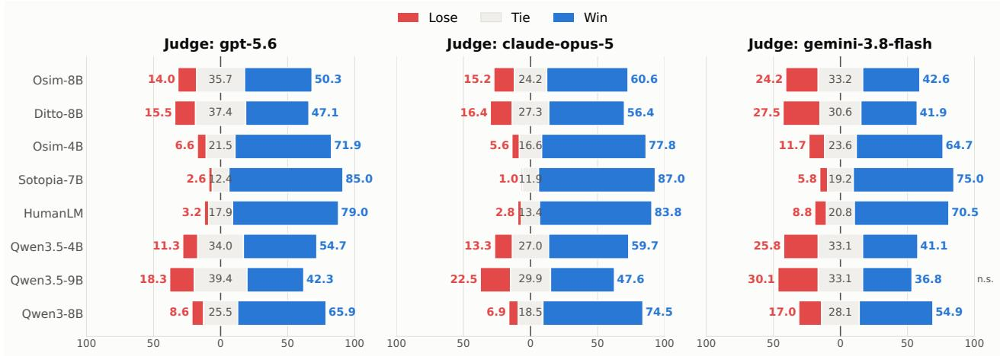  
Figure 8 Pairwise next-user-response realism on PRISM. Each row compares MIMESIS with one baseline under the judge named above the panel. Blue, gray, and red segments denote MIMESIS wins, ties, and losses, respectively, with percentages annotated on the bars. MIMESIS has more wins than losses in all displayed comparisons.

## C Simulator Ablations and Training Dynamics

The ablations follow the three stages of the MIMESIS training recipe: user-side mid-training, explicit reasoning supervision, and realistic-behavior training. We use them to distinguish improvements in initialization, reasoning behavior, and interaction-level behavioral control.

## C.1 Role of user-side mid-training

Figure 9 examines whether user-side mid-training provides a better initialization for simulator RL. Starting directly from the pretrained backbone leads to early degradation in validation reward on many tasks, whereas the mid-trained checkpoint is generally more stable during the same optimization interval. This suggests that mid-training establishes user-specific behavior before RL, reducing the amount of adaptation that must be learned from task rewards alone. gain from mid-training.

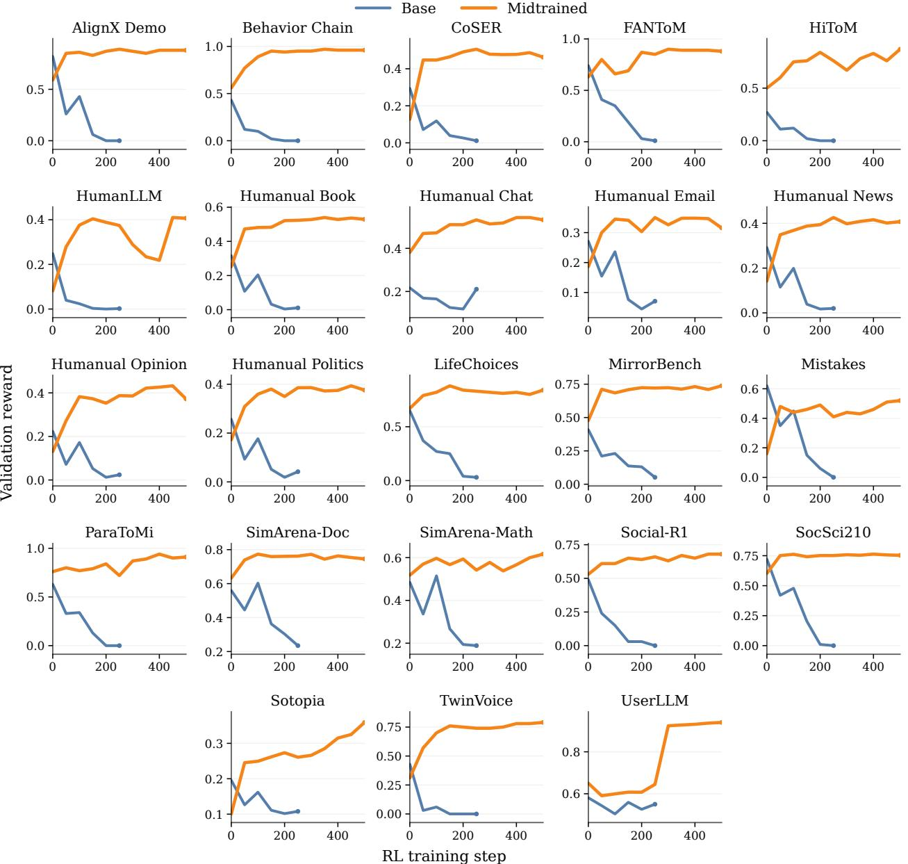  
Figure 9 Effect of user-side mid-training on simulator RL. Validation reward across 23 tasks when RL starts from a pretrained backbone (blue) or a user-side mid-trained checkpoint (orange). Mid-trained initialization maintains higher rewards across most tasks during the overlapping training interval. Each curve represents an individual run with training horizons and vertical scales vary across tasks.

## C.2 Role of explicit reasoning

Figure 10 examines reasoning generation and accuracy on Mistakes across training conditions. The pretrained Qwen3.5-9B model scores 60.7 and generates a median of 540 words before answering. After supervised adaptation, accuracy falls to 25.7 and the median length to 56 words. Subsequent RL partially recovers accuracy to 36.0, while the median length falls to one word. Enabling the thinking flag at inference leaves both measurements unchanged for this RL checkpoint. Thus, changing the inference setting alone does not restore explicit reasoning in this condition. With ThoughtTrace supervision, MIMESIS-9B generates an explicit reasoning phase, with a median of 583 words, and achieves 63.0 accuracy. The recovery of task performance coincides with the return of reasoning generation. This comparison supports the use of explicit thought supervision during simulator adaptation.

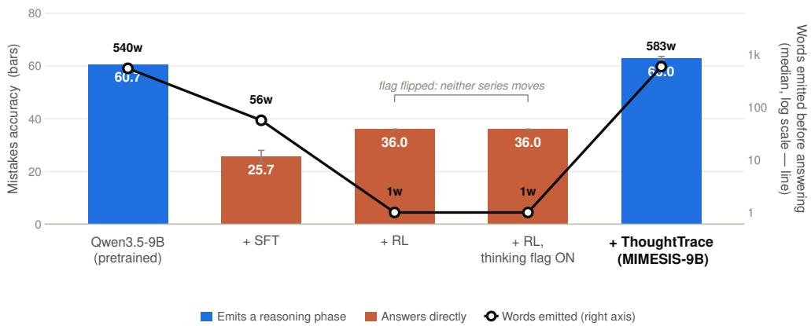  
Figure 10 Reasoning generation and task accuracy under different training conditions. Bars show accuracy on Mistakes (left axis), and the black line shows the median number of words generated before answering (logarithmic right axis). Blue bars indicate an explicit reasoning phase while orange bars indicate direct answering. Enabling the inference-time thinking flag alone leaves the RL checkpoint at 36.0 accuracy and one word, whereas the ThoughtTrace condition reaches 63.0 accuracy and 583 words.

Figure 11 compares SOUL scores logged during simulator RL with and without explicit reasoning at 4B and 9B parameters. Reasoning-enabled runs attain higher scores at every logged checkpoint, with final gains of 1.8 and 1.5 points, respectively, after 500 optimization steps. These training-time scores should be interpreted separately from the reported benchmark results, as the rollout and evaluation engines may use diferent decoding configurations.

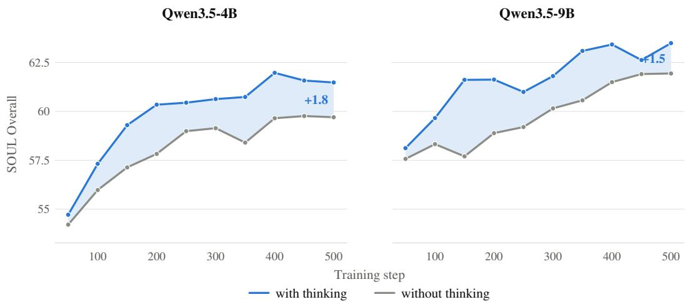  
Figure 11 Effect of reasoning during simulator reinforcement learning. SOUL-Index trajectories with reasoning enabled (blue) or disabled (gray) for the 4B (left) and 9B (right) models. Reasoning-enabled runs achieve higher scores throughout the displayed post-initialization interval, with final gains of 1.8 and 1.5 points, respectively.

## C.3 Contribution of realistic behavior training

We ablate the realistic behavior training stage to isolate whether explicitly training on the 13 behavior categories improves user simulation beyond the rest of the MIMESIS training recipe. As shown in Figure 12, incorporating realistic behavior training consistently improves simulator quality across three complementary evaluations: RealUserSim increases from 92.3 to 94.0 (+1.7), τ-USI increases from 73.9 to 80.2 (+6.3), and SimulatorArena decreases from 41.0 to 38.7 (−2.3), where lower is better. The largest gain appears on τ-USI, suggesting that explicit exposure to diverse interaction behaviors is particularly beneficial for capturing user behavior over multi-turn interactions.

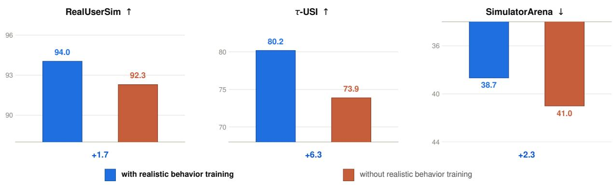  
Figure 12 Effect of realistic behavior training on user-simulation quality. We compare otherwise identical MIMESIS training runs with and without the realistic behavior objective derived from the 13 behavior categories. Behavior training improves RealUserSim by 1.7 points and τ-USI by 6.3 points, while reducing SimulatorArena by 2.3 points (lower is better). The consistent improvements across trajectory-level behavioral fidelity, interactive user simulation, and simulator–human agreement show that explicitly training for realistic behavioral variation complements the remaining simulator-training recipe.

Training on the realistic-behavior mixture increases the aggregate behavior reward from 0.647 to 0.875 for MIMESIS-9B and from 0.572 to 0.839 for MIMESIS-4B. As shown in Figure 13, the gains are concentrated in behavior exhibition (+0.32 at 9B and +0.44 at 4B) and temporal placement (+0.36 and +0.37, respectively). By comparison, naturalness improves only modestly (+0.07–0.10), while task consistency changes little (+0.03 at 9B and −0.01 at 4B). These results indicate that the realistic-behavior objective primarily improves the simulator’s ability to express the assigned behavior at an appropriate point in the interaction, rather than producing a broad increase in dialogue quality. Importantly, these gains do not materially reduce task adherence.

The two model sizes reach similar final scores on behavior exhibition (0.849 for 9B versus 0.841 for 4B), but MIMESIS-9B performs better on temporal placement (0.842 versus 0.779). Both models achieve 0.98–0.99 on the neutral control scenarios, indicating that training on dificult user behaviors does not make the simulators uniformly uncooperative when no such behavior is specified. The early training dynamics also reflect properties of the initialization. In particular, the 9B SFT checkpoint initially produces explicit reasoning that is penalized by the behavior judge, and 41% of its initial rollouts describe the assigned behavior rather than expressing it in the interaction (e.g., “as a frustrated customer, I will now. . . ”), which triggers the reward penalty. Both efects largely disappear within the first 50 RL steps.

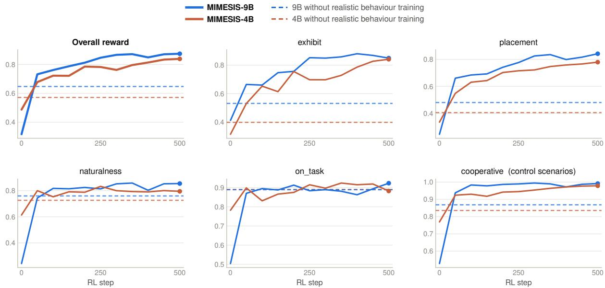  
Figure 13 Decomposition of the realistic-behavior reward during RL. Solid curves show MIMESIS-9B and MIMESIS-4B over 500 RL steps on a held-out split containing 195 behavior scenarios (15 per category) and 49 neutral control scenarios. The leftmost panel reports the aggregate reward; the remaining panels show its components. exhibit measures whether the assigned behavior is expressed, placement whether it occurs at an appropriate point in the interaction, naturalness whether the interaction remains natural, on\_task whether the simulator remains consistent with the task, and cooperative whether the simulator remains cooperative in neutral control scenarios. Dashed horizontal levels show evaluations of checkpoints trained with the same RL mixture but without the realistic-behavior task.

## D Agent Training and Evaluation

This section specifies the Stage II training controls behind two comparisons in the main paper: changing the training user while holding multi-turn GRPO fixed, and adding CSD while holding the MIMESIS training user fixed. We then report environment-level results and robustness checks.

## D.1 Training setup and baselines

We freeze the learned simulator and train a Qwen3-8B agent through multi-turn interaction in the task setting of UserRL (Qian et al., 2025). Agent training spans TravelGym, TurtleGym, FunctionGym, TauGym, and PersuadeGym, while evaluation additionally includes IntentionGym, TelepathyGym, and SearchGym, which are held out from agent training. The user simulator remains fixed throughout agent optimization. We compare four agent-training conditions:

• Base denotes the Qwen3-8B agent before multi-turn reinforcement learning.

• UserRL follows the multi-turn RL procedure of UserRL (Qian et al., 2025), using GPT-5.5 as the training user simulator (GRPO with GPT-5.5 in the main paper).

• UserRL+ keeps the same multi-turn RL procedure but replaces GPT-5.5 with MIMESIS as the training user simulator (GRPO w. MIMESIS-9B in the main paper).

• CSD further augments MIMESIS-based agent training with our Coached On-Policy Self-Distillation objective, which distills simulator-derived coaching signals into the agent.

We additionally compare against InfoPO (Kong et al., 2026), a multi-turn policy-optimization method that addresses sparse trajectory-level supervision by assigning turn-level credit according to the information gained from interaction. Specifically, InfoPO measures how observed feedback changes the policy’s subsequent action distribution relative to a masked-feedback counterfactual, and adaptively combines this information-gain signal with the outcome-based advantage. For a controlled comparison with CSD, we train InfoPO using MIMESIS-9B as the user simulator as we found it yielded a more robust agent. This holds the training-user distribution fixed so that InfoPO and CSD difer in their optimization objectives rather than in simulator choice. Table 13 reports the full training configuration.

These conditions separate two questions central to our study. Comparing UserRL with UserRL+ isolates the efect of replacing a general-purpose LLM user with our learned simulator while holding the agent-training procedure fixed. Comparing UserRL+ with CSD then isolates the additional benefit of exploiting simulatorderived feedback through the coaching objective. InfoPO serves as an additional strong multi-turn RL baseline with an alternative mechanism for providing fine-grained credit during interaction.

Table 13 Agent training configuration. A Qwen3-8B actor is optimized for 100 steps against GPT-5.5 or MIMESIS-9B. CSD augments multi-turn GRPO with the coaching loss in Equation 11; its auxiliary weight and gate sharpness are α = 0.01 and β = 5.0.
<table><tr><td>Parameter</td><td>Value</td><td>Parameter</td><td>Value</td></tr><tr><td>Actor</td><td>Qwen3-8B</td><td>Rollout batch</td><td>64 prompts</td></tr><tr><td>Parameter dtype</td><td>bfloat16</td><td>PPO mini-batch</td><td>8 prompts</td></tr><tr><td>Policy objective</td><td>GRPO</td><td>Batch balancing</td><td>enabled</td></tr><tr><td>Group size G</td><td>8</td><td>Dynamic batching</td><td>9,344 tokens / GPU</td></tr><tr><td>Turn-level credit</td><td>reward-to-go (R2G)</td><td>Max prompt length</td><td>1,152 tokens</td></tr><tr><td>Trajectory score</td><td>reward-to-go (R2G)</td><td>Max response length</td><td>8,192 tokens</td></tr><tr><td>Discount γ</td><td>0.8</td><td>Max turns per episode</td><td>16</td></tr><tr><td>GAE λ</td><td>1.0</td><td>Training temperature</td><td>1.0 (top-p 1.0, top-k −1)</td></tr><tr><td>Action credit ratio</td><td>0.8</td><td>Validation temperature</td><td>0</td></tr><tr><td>Dual-clip c</td><td>3.0</td><td>Training gyms</td><td>Travel, τ-bench, Turtle,</td></tr><tr><td>PPO clip (€low, €high)</td><td>(0.2, 0.2)</td><td></td><td>Persuade, Function</td></tr><tr><td>KL penalty</td><td>disabled</td><td>User simulator</td><td>MIMESIS-9B</td></tr><tr><td>Auxiliary weight α</td><td>0.01</td><td>Rollout engine</td><td>SGLang, synchronous, TP = 1</td></tr><tr><td>Gate sharpness β</td><td>5.0</td><td>Hardware</td><td>2 × 8 A100-80GB, FSDP</td></tr><tr><td>Hintable turns / episode k 16</td><td></td><td>Sequence parallel (Ulysses)</td><td>1</td></tr><tr><td>Optimizer</td><td>AdamW</td><td>Training steps</td><td>100</td></tr><tr><td>Learning rate</td><td>1 × 10−6</td><td>GPU memory utilization</td><td>0.50</td></tr><tr><td>Weight decay</td><td>0.01</td><td>Micro-batch per GPU</td><td>2</td></tr><tr><td>Gradient clipping</td><td>1.0</td><td></td><td></td></tr></table>

## D.2 CSD implementation details

For each sampled agent response, the simulator generates a thought and the subsequent public user utterance. These outputs serve complementary roles: the thought expresses the simulator’s interpretation and remaining needs, while the utterance records how it continues the interaction. A coaching model uses both outputs, together with the preceding dialogue and the sampled response, to identify how the agent could better address those needs and respond to interaction feedback. The resulting note conditions a teacher copy of the agent during the parameter update.

The teacher and student score the same on-policy response, with the teacher additionally receiving the coaching note. Their token-level log-probability diferences determine the weights in the CSD auxiliary loss. This provides dense supervision alongside the scalar task reward without requiring a newly generated replacement response. The note is retrospective: it is constructed after the simulator’s next turn and is unavailable when the original agent response is sampled. Only the public dialogue conditions the rollout and deployed policies. The generated thoughts are simulator outputs; the procedure assumes no access to real users’ thoughts at deployment.

## D.3 Generalization across evaluation users

Tables 15 and 16 report agent performance on five held-in and three held-out environments under nine user models, none of which is used during agent training. Replacing GPT-5.5 with MIMESIS as the training simulator (UserRL to UserRL+) improves the aggregate score under every evaluation user, and CSD provides further gains in all nine cases (Table 14). The mean across users increases from 26.10 to 29.54 and then to 31.09, corresponding to mean per-user improvements of 3.43 and 1.56 points.

<table><tr><td>Evaluation user</td><td>UserRL</td><td> $\mathrm { U s e r R L ^ { + } }$ </td><td>CSD</td><td> $\Delta _ { \mathrm { s i m } }$ </td><td> $\Delta _ { \mathrm { C S D } }$ </td></tr><tr><td>GPT-5.6</td><td>26.85</td><td>31.10</td><td>32.39</td><td>+4.25</td><td>+1.29</td></tr><tr><td>Claude-Opus-5</td><td>25.75</td><td>27.21</td><td>29.78</td><td>+1.46</td><td>+2.57</td></tr><tr><td>Claude-Sonnet-5</td><td>26.53</td><td>29.73</td><td>30.97</td><td>+3.20</td><td>+1.24</td></tr><tr><td>Gemini-3.8-Flash</td><td>26.33</td><td>30.88</td><td>31.09</td><td>+4.55</td><td>+0.21</td></tr><tr><td>Kimi-K3</td><td>24.51</td><td>28.21</td><td>29.92</td><td>+3.70</td><td>+1.71</td></tr><tr><td>Ditto-8B</td><td>27.59</td><td>29.76</td><td>32.08</td><td>+2.17</td><td>+2.32</td></tr><tr><td>Osim-8B</td><td>25.68</td><td>29.27</td><td>29.72</td><td>+3.59</td><td>+0.45</td></tr><tr><td>HumanLM-8B</td><td>26.96</td><td>30.67</td><td>32.53</td><td>+3.71</td><td>+1.86</td></tr><tr><td>Sotopia-7B</td><td>24.72</td><td>29.00</td><td>31.35</td><td>+4.28</td><td>+2.35</td></tr><tr><td>Mean across users</td><td>26.10</td><td>29.54</td><td>31.09</td><td>+3.43</td><td>+1.56</td></tr></table>

Table 14 Agent generalization across nine evaluation user models. Scores are the per-user averages from Tables 15 and 16. $\Delta _ { \mathrm { s i m } }$ measures the efect of replacing GPT-5.5 with MIMESIS-9B as the training user (UserRL+ − UserRL), while $\Delta _ { \mathrm { C S D } }$ measures the additional gain from CSD with the training simulator held fixed $( \mathrm { C S D \mathrm { ~ - ~ } U s e r R L ^ { + } } )$ ). The final row reports the unweighted mean across evaluation users.

Mean rank (MR) complements the aggregate scores by comparing methods within each environment, without depending on diferences in reward scale. UserRL+ achieves a lower MR than UserRL under all nine evaluation users, while CSD obtains the lowest MR under eight. The exception is Gemini-3.8-Flash, where UserRL+ ranks better than CSD (2.00 vs. 2.12), despite CSD’s slightly higher aggregate score. Averaging MR across users gives 3.42 for UserRL, 2.15 for UserRL+, and 1.75 for CSD. The consistent ordering across distinct evaluation users supports transfer beyond the particular simulator used for training. Claude-Opus-5 results on PersuadeGym are afected by simulator refusals, as detailed in Appendix F.3.

<table><tr><td></td><td colspan="5">Held-in environments</td><td colspan="5">Held-out environments</td></tr><tr><td>Method</td><td>Travel</td><td>Turtle</td><td>Function</td><td>Tau</td><td>Persuade</td><td>Intention</td><td>Telepathy</td><td>Search</td><td>Avg.</td><td>MR↓</td></tr><tr><td colspan="9">Evaluation user simulator: Ditto-8B</td><td></td><td></td></tr><tr><td>Base</td><td>6.63</td><td>19.48</td><td>0.00</td><td>3.03</td><td>50.40</td><td>183.75</td><td>46.34</td><td>30.40</td><td>19.53</td><td>4.62</td></tr><tr><td>InfoPO</td><td>12.65</td><td>27.81</td><td>8.97</td><td>12.12</td><td>44.05</td><td>191.50</td><td>53.66</td><td>42.40</td><td>26.73</td><td>3.38</td></tr><tr><td>UserRL</td><td>14.52</td><td>26.25</td><td>6.41</td><td>14.55</td><td>42.46</td><td>174.50</td><td>58.54</td><td>45.60</td><td>27.59</td><td>3.19</td></tr><tr><td>UserRL⁺</td><td>11.69</td><td>25.73</td><td>19.23</td><td>14.55</td><td>63.49</td><td>206.25</td><td>56.10</td><td>49.60</td><td>29.76</td><td>2.19</td></tr><tr><td>CSD</td><td>17.62</td><td>30.63</td><td>15.38</td><td>12.73</td><td>56.75</td><td>201.25</td><td>60.98</td><td>51.20</td><td>32.08</td><td>1.62</td></tr><tr><td colspan="9">Evaluation user simulator: Osim-8B</td><td></td><td></td></tr><tr><td>Base</td><td>7.98</td><td>15.31</td><td>0.00</td><td>3.03</td><td>49.60</td><td>176.50</td><td>41.46</td><td>33.60</td><td>19.84</td><td>4.25</td></tr><tr><td>InfoPO</td><td>13.08</td><td>23.23</td><td>6.41</td><td>10.30</td><td>39.29</td><td>173.00</td><td>56.10</td><td>44.00</td><td>25.59</td><td>3.31</td></tr><tr><td>UserRL</td><td>15.28</td><td>22.40</td><td>3.85</td><td>10.30</td><td>34.92</td><td>147.50</td><td>56.10</td><td>48.00</td><td>25.68</td><td>3.50</td></tr><tr><td>UserRL⁺</td><td>13.92</td><td>26.67</td><td>23.08</td><td>10.30</td><td>36.11</td><td>200.25</td><td>65.85</td><td>48.00</td><td>29.27</td><td>2.06</td></tr><tr><td>CSD</td><td>16.83</td><td>31.25</td><td>16.67</td><td>6.67</td><td>52.38</td><td>174.75</td><td>60.98</td><td>52.00</td><td>29.72</td><td>1.88</td></tr><tr><td colspan="9">Evaluation user simulator: HumanLM-8B</td><td></td><td></td></tr><tr><td>Base</td><td>5.79</td><td>18.85</td><td>2.56</td><td>3.03</td><td>46.03</td><td>163.00</td><td>41.46</td><td>32.80</td><td>18.40</td><td>4.69</td></tr><tr><td>InfoPO</td><td>12.77</td><td>28.02</td><td>6.41</td><td>11.52</td><td>41.27</td><td>187.75</td><td>60.98</td><td>43.20</td><td>26.64</td><td>3.00</td></tr><tr><td>UserRL</td><td>14.77</td><td>27.50</td><td>3.85</td><td>9.09</td><td>38.49</td><td>180.75</td><td>63.41</td><td>45.60</td><td>26.96</td><td>3.44</td></tr><tr><td>UserRL⁺</td><td>16.11</td><td>26.87</td><td>17.95</td><td>9.70</td><td>46.03</td><td>209.25</td><td>63.41</td><td>49.60</td><td>30.67</td><td>2.25</td></tr><tr><td>CSD</td><td>17.17</td><td>30.94</td><td>20.51</td><td>10.91</td><td>65.87</td><td>208.00</td><td>56.10</td><td>52.00</td><td>32.53</td><td>1.62</td></tr><tr><td colspan="9">Evaluation user simulator: Sotopia-7B</td><td></td><td></td><td></td></tr><tr><td>Base</td><td>6.13</td><td>16.56</td><td>1.28</td><td>3.03</td><td>48.81</td><td>177.00</td><td>36.59</td><td>35.20</td><td>19.12</td><td>4.50</td></tr><tr><td>InfoPO</td><td>13.12</td><td>25.10</td><td>6.41</td><td>6.67</td><td>51.98</td><td>174.00</td><td>56.10</td><td>46.40</td><td>25.97</td><td>3.31</td></tr><tr><td>UserRL</td><td>9.89</td><td>23.96</td><td>6.41</td><td>9.09</td><td>46.43</td><td>170.25</td><td>65.85</td><td>45.60</td><td>24.72</td><td>3.56</td></tr><tr><td>UserRL⁺</td><td>12.63</td><td>25.21</td><td>25.64</td><td>7.27</td><td>59.13</td><td>186.25</td><td>63.41</td><td>51.20</td><td>29.00</td><td>2.12</td></tr><tr><td>CSD</td><td>17.47</td><td>29.90</td><td>17.95</td><td>7.88</td><td>64.68</td><td>174.75</td><td>70.73</td><td>53.60</td><td>31.35</td><td>1.50</td></tr><tr><td></td><td colspan="5">Held-in environments</td><td colspan="3">Held-out environments</td><td></td><td colspan="2"></td></tr><tr><td>Method</td><td>Travel</td><td>Turtle</td><td>Function</td><td>Tau</td><td>Persuade</td><td>Intention</td><td>Telepathy</td><td>Search</td><td>Avg.</td><td colspan="2">MR↓</td></tr><tr><td colspan="9">Evaluation user simulator:</td><td></td><td colspan="2"></td></tr><tr><td>Base</td><td>6.59</td><td>16.98</td><td>1.28</td><td>3.03</td><td>57.54</td><td>169.50</td><td>43.90</td><td>32.80</td><td>19.42</td><td colspan="2">4.75</td></tr><tr><td>InfoPO</td><td>13.62</td><td>25.73</td><td>8.97</td><td>16.97</td><td>53.17</td><td>170.00</td><td>51.22</td><td>45.60</td><td>27.70</td><td colspan="2">3.44</td></tr><tr><td>UserRL</td><td>13.79</td><td>25.52</td><td>6.41</td><td>12.73</td><td>45.24</td><td>175.00</td><td>51.22</td><td>46.40</td><td>26.85</td><td colspan="2">3.56</td></tr><tr><td>UserRL⁺</td><td>13.77</td><td>28.65</td><td>19.23</td><td>19.39</td><td>61.90</td><td>193.75</td><td>60.98</td><td>48.00</td><td>31.10</td><td colspan="2">1.69</td></tr><tr><td>CSD</td><td>17.50</td><td>30.52</td><td>14.10</td><td>15.15</td><td>68.65</td><td>188.00</td><td>60.98</td><td>52.00</td><td>32.39</td><td colspan="2">1.56</td></tr><tr><td colspan="9">Evaluation user simulator: Claude-Opus-5</td><td></td><td colspan="2"></td></tr><tr><td>Base</td><td>6.50</td><td>19.27</td><td>2.56</td><td>0.61</td><td>0.00†</td><td>178.75</td><td>24.39</td><td>30.40</td><td>16.08</td><td colspan="2">4.71</td></tr><tr><td>InfoPO</td><td>12.28</td><td>28.44</td><td>6.41</td><td>26.06</td><td>0.00†</td><td>173.00</td><td>46.34</td><td>46.40</td><td>26.30</td><td colspan="2">3.21</td></tr><tr><td>UserRL</td><td>13.19</td><td>28.96</td><td>7.69</td><td>21.21</td><td>0.00†</td><td>162.50</td><td>48.78</td><td>46.40</td><td>25.75</td><td colspan="2">2.93‡</td></tr><tr><td>UserRL⁺</td><td>14.20</td><td>27.40</td><td>15.38</td><td>19.39</td><td>0.00†</td><td>189.50</td><td>39.02</td><td>47.20</td><td>27.21</td><td colspan="2">2.57</td></tr><tr><td>CSD</td><td>17.99</td><td>31.88</td><td>16.67</td><td>18.18</td><td>0.00†</td><td>186.75</td><td>53.66</td><td>48.80</td><td>29.78</td><td colspan="2">1.57</td></tr><tr><td colspan="9">Evaluation user simulator: Claude-Sonnet-5</td><td></td><td colspan="2"></td></tr><tr><td>Base</td><td>6.11</td><td>18.02</td><td>0.00</td><td>1.21</td><td>54.76</td><td>172.75</td><td>41.46</td><td>30.40</td><td>18.47</td><td colspan="2">4.38</td></tr><tr><td>InfoPO</td><td>14.58</td><td>27.08</td><td>7.69</td><td>16.97</td><td>47.62</td><td>178.25</td><td>53.66</td><td>44.00</td><td>28.12</td><td colspan="2">2.75</td></tr><tr><td>UserRL</td><td>12.42</td><td>28.33</td><td>7.69</td><td>15.15</td><td>38.49</td><td>159.25</td><td>65.85</td><td>46.40</td><td>26.53</td><td colspan="2">3.31</td></tr><tr><td>UserRL⁺</td><td>13.98</td><td>25.52</td><td>16.67</td><td>16.36</td><td>42.86</td><td>190.50</td><td>53.66</td><td>52.80</td><td>29.73</td><td colspan="2">2.44</td></tr><tr><td>CSD</td><td>17.59</td><td>32.81</td><td>15.38</td><td>18.79</td><td>28.17</td><td>176.00</td><td>60.98</td><td>51.20</td><td>30.97</td><td colspan="2">2.12</td></tr><tr><td colspan="9">Evaluation user simulator: : Gemini-3.8-Flash</td><td></td><td colspan="2"></td></tr><tr><td>Base</td><td>6.60</td><td>19.27</td><td>0.00</td><td>1.21</td><td>32.94</td><td>179.50</td><td>39.02</td><td>34.40</td><td>18.51</td><td colspan="2">4.25</td></tr><tr><td>InfoPO</td><td>12.83</td><td>26.67</td><td>11.54</td><td>21.21</td><td>29.76</td><td>178.50</td><td>68.29</td><td>43.20</td><td>28.03</td><td colspan="2">3.00</td></tr><tr><td>UserRL</td><td>13.47</td><td>28.65</td><td>5.13</td><td>18.18</td><td>22.22</td><td>168.50</td><td>48.78</td><td>46.40</td><td>26.33</td><td colspan="2">3.62</td></tr><tr><td>UserRL+</td><td>13.85</td><td>28.02</td><td>21.79</td><td>25.45</td><td>26.59</td><td>190.25</td><td>58.54</td><td>50.40</td><td>30.88</td><td colspan="2">2.00</td></tr><tr><td>CSD</td><td>17.25</td><td>31.98</td><td>17.95</td><td>18.79</td><td>13.89</td><td>186.50</td><td>65.85</td><td>52.00</td><td>31.09</td><td colspan="2">2.12</td></tr><tr><td colspan="9">Evaluation user simulator: Kimi-K3</td><td></td><td colspan="2"></td></tr><tr><td>Base</td><td>5.61</td><td>19.90</td><td>1.28</td><td>3.03</td><td>12.30</td><td>170.50</td><td>36.59</td><td>33.60</td><td>17.06</td><td colspan="2">4.12</td></tr><tr><td>InfoPO</td><td>12.34</td><td>28.54</td><td>6.41</td><td>17.58</td><td>11.90</td><td>160.75</td><td>53.66</td><td>42.40</td><td>24.76</td><td colspan="2">3.38</td></tr><tr><td>UserRL</td><td>12.17</td><td>29.69</td><td>8.97</td><td>16.97</td><td>8.73</td><td>145.75</td><td>53.66</td><td>45.60</td><td>24.51</td><td colspan="2">3.69</td></tr><tr><td>UserRL⁺</td><td>14.09</td><td>27.19</td><td>25.64</td><td>17.58</td><td>13.10</td><td>170.00</td><td>56.10</td><td>48.00</td><td>28.21</td><td colspan="2">2.06</td></tr><tr><td>CSD</td><td>16.91</td><td>31.35</td><td>17.95</td><td>19.39</td><td>9.52</td><td>168.75</td><td>65.85</td><td>50.40</td><td>29.92</td><td colspan="2">1.75</td></tr></table>

Table 15 Agent evaluation with released user simulators. The first five environments are held in during agent training and the final three are held out. Avg. is the mean across environments; MR is mean within-environment rank, where lower is better.

Table 16 Agent evaluation with frontier/API user models. The first five environments are held in; the final three are held out from agent training. Higher is better, and bold marks the highest score within each user–environment block. †: Opus refuses the PersuadeGym user role, producing zero-reward fallbacks; these zeros do not measure agent ability (Appendix F.3).

## D.4 Robustness to alternative training simulators

We extend the CSD–GRPO comparison in Figure 5 to agent training with DeepSeek-V4.1-Flash and Kimi-K3, keeping the agent backbone fixed. Figure 14 reports training and validation rewards over 100 optimization steps. CSD achieves higher rewards in both panels during the later stages of training with either simulator. With DeepSeek-V4.1-Flash, its validation reward remains above GRPO from step 15 onward. With Kimi-K3, the training and validation curves separate more substantially after approximately 60 steps. These runs show that CSD’s optimization benefits extend to interactions generated by diferent user simulators.

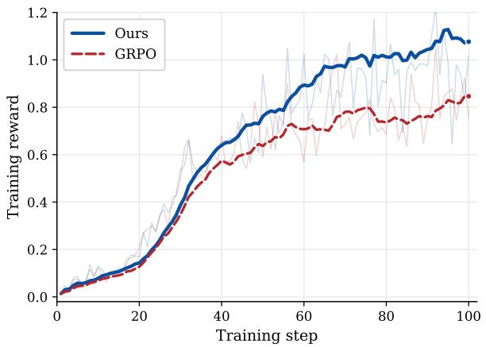

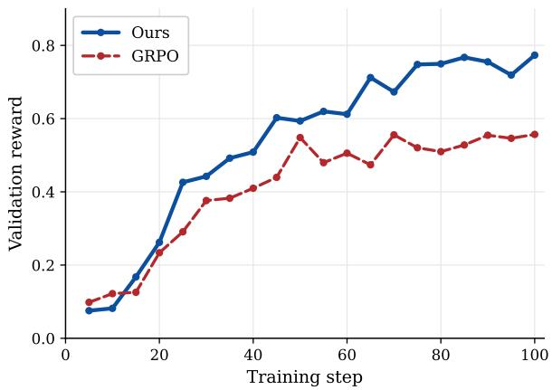  
(a) DeepSeek-V4.1-Flash as the training user simulator.

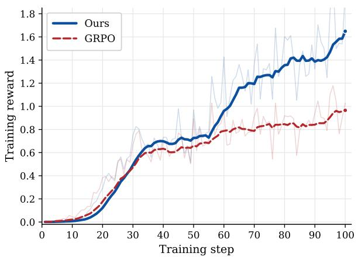

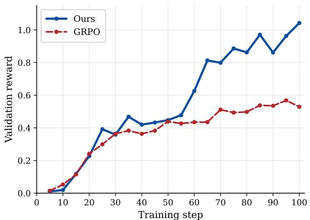  
(b) Kimi-K3 as the training user simulator.  
Figure 14 CSD under alternative training user simulators. Training reward (left) and validation reward (right) over 100 optimization steps using (a) DeepSeek-V4.1-Flash and (b) Kimi-K3 to generate user turns. Holding the Qwen3-8B agent fixed, we compare CSD with GRPO using DeepSeek-V4.1-Flash or Kimi-K3 as the training user. CSD achieves higher late-stage training and validation reward in both settings, suggesting that its optimization efect is not specific to MIMESIS.

## E Theoretical Analysis of CSD

The empirical results in Section 5 treat CSD as an auxiliary objective on sampled agent responses. Here we characterize the population target induced by its token weights and give conditions under which that target aligns with continuation value.

## E.1 Setting and retrospective coaching

Fix the simulator and initial task distribution. Index agent-token decisions by $m = 1 , \ldots , M$ , appending zero-reward absorbing states after termination. The state $s _ { m }$ is the complete public history, including the response prefix and decision index. Let $p = \pi _ { \theta _ { 0 } }$ have full support on the finite set of admissible tokens. For transition discounts $\gamma _ { m } \in [ 0 , 1 ]$ , set $\Gamma _ { 1 } = 1$ and $\Gamma _ { m + 1 } = \Gamma _ { m } \gamma _ { m }$ . Turn-level discounting by $\gamma$ corresponds to $\Gamma _ { m } = \gamma ^ { t ( m ) - 1 }$ , where $t ( m )$ is the turn containing decision m. For bounded rewards, define

$$
J ( \pi ) = \mathbb { E } _ { \pi } \sum _ { m = 1 } ^ { M } \Gamma _ { m } r _ { m } , \qquad Q _ { m } ^ { p } ( s , a ) = \mathbb { E } [ r _ { m } + \gamma _ { m } V _ { m + 1 } ^ { p } ( s _ { m + 1 } ) \mid s _ { m } = s , a _ { m } = a ] ,\tag{17}
$$

where $V _ { m } ^ { p } ( s ) = \mathbb { E } _ { a \sim p ( \cdot | s ) } Q _ { m } ^ { p } ( s , a ) , V _ { M + 1 } ^ { p } = 0$ , and $A _ { m } ^ { p } = Q _ { m } ^ { p } - V _ { m } ^ { p }$ . These values integrate over the simulator’s private state; subsequent agent decisions use only the public history. We omit m when it is determined by s.

Let F collect the rollout and coaching randomness used to score a token and compute its loss coeficient. Since the note is constructed after the response, its conditional law $K _ { p } ( \cdot \mid s , a )$ may depend on the scored action a. For a coached teacher $q _ { F }$ with full support, write

$$
W ( s , a , F ) = c ( s , a , F ) \sigma ( \beta \left[ \log q _ { F } ( a \mid s ) - \log p ( a \mid s ) \right] ) , \qquad w ( s , a ) = \mathbb { E } [ W \mid s , a ] ,\tag{18}
$$

where $\beta > 0$ and $c \geq 0$ incorporates the coaching mask and loss normalization. Assume $Z ( s ) : = \mathbb { E } _ { a \sim p } w ( s , a ) <$ $\infty .$ . The conditional population loss is

$$
\ell _ { s } ( \pi ) = - \mathbb { E } _ { a \sim p , F \sim K _ { p } ( \cdot \vert s , a ) } [ W ( s , a , F ) \log \pi ( a \mid s ) ] .\tag{19}
$$

The overall loss averages $\ell _ { s }$ over rollout histories. The rollout policy, feedback law, and weights are held fixed in this surrogate; recomputing the scores defines a new surrogate. The student conditions only on the public history.

## E.2 Policy target and conversation return

Proposition E.1 (Population target and value alignment). For $Z ( s ) > 0$ , the minimizer of $\ell _ { s }$ over all token distributions is

$$
p ^ { + } ( a \mid s ) = \frac { p ( a \mid s ) w ( s , a ) } { Z ( s ) } , \qquad \mathbb { E } _ { a \sim p ^ { + } } A _ { m } ^ { p } ( s , a ) = \frac { \mathrm { C o v } _ { a \sim p } ( Q _ { m } ^ { p } ( s , a ) , w ( s , a ) ) } { Z ( s ) } .\tag{20}
$$

For $Z ( s ) = 0$ , set $p ^ { + } = p$ and define the covariance ratio to be zero.

Proof. For $Z ( s ) > 0$ , conditioning on $( s , a )$ gives

$$
\ell _ { s } ( \pi ) = - \sum _ { a } p ( a \mid s ) w ( s , a ) \log \pi ( a \mid s ) = Z ( s ) \big [ H ( p ^ { + } ( \cdot \mid s ) ) + D _ { \mathrm { K L } } ( p ^ { + } ( \cdot \mid s ) \| \pi ( \cdot \mid s ) ) \big ] ,
$$

where H denotes entropy. The KL term is minimized at $p ^ { + }$ . Since $\mathbb { E } _ { p } A _ { m } ^ { p } = 0 , \mathbb { E } _ { p ^ { + } } A _ { m } ^ { p } = \mathbb { E } _ { p } [ w ( Q _ { m } ^ { p } -$ $V _ { m } ^ { p } ) ] / Z ( s ) = \mathrm { C o v } _ { p } ( Q _ { m } ^ { p } , w ) / Z ( s ) . \mathrm { I f } Z ( s ) = 0 $ , nonnegativity implies $W = 0$ almost surely and the loss vanishes for every π. □

The target depends on the conditional mean $w ( s , a )$ , so the result requires no independence between a response and its coaching note. Nonnegative weights alone do not imply positive expected advantage; their covariance with continuation value determines the sign.

Theorem E.2 (Multi-turn improvement and fitting error). The target policy satisfies

$$
J ( p ^ { + } ) - J ( p ) = \mathbb { E } _ { p ^ { + } } \sum _ { m = 1 } ^ { M } \Gamma _ { m } \frac { \mathrm { C o v } _ { a \sim p ( \cdot | s _ { m } ) } ( Q _ { m } ^ { p } ( s _ { m } , a ) , w ( s _ { m } , a ) ) } { Z ( s _ { m } ) } .\tag{21}
$$

For any fitted public-history policy ${ \widetilde { p } } ,$ let $\delta _ { s } = \mathrm { T V } ( \widetilde { p } ( \cdot \mid s ) , p ^ { + } ( \cdot \mid s ) )$ and let $D _ { s }$ be the range of $Q _ { m } ^ { p } ( s , \cdot )$ , with $\begin{array} { r } { \mathrm { T V } ( u , v ) = \frac { 1 } { 2 } \sum _ { a } | u ( a ) - v ( a ) | } \end{array}$ . Then

$$
J ( \widetilde { p } ) - J ( p ) \ge \mathbb { E } _ { \widetilde { p } } \sum _ { m = 1 } ^ { M } \Gamma _ { m } \left[ \frac { \mathrm { C o v } _ { p } ( Q _ { m } ^ { p } , w ) } { Z ( s _ { m } ) } - { D _ { s } } _ { m } \delta _ { s _ { m } } \right] ,\tag{22}
$$

where the covariance is evaluated at $s _ { m }$ and the ratio is zero when $Z ( s _ { m } ) = 0$ . In particular, nonnegative covariance at all histories reached by $p ^ { + }$ implies $J ( p ^ { + } ) \geq J ( p )$ , with strict inequality if the covariance is positive on a set of positive discounted occupancy.

Proof. The finite-horizon performance-diference identity (Kakade and Langford, 2002) is

$$
J ( \pi ) - J ( p ) = \mathbb { E } _ { \pi } \sum _ { m = 1 } ^ { M } \Gamma _ { m } \mathbb { E } _ { a \sim \pi ( \cdot | s _ { m } ) } A _ { m } ^ { p } ( s _ { m } , a ) .
$$

It follows by expanding the Bellman advantage and telescoping, using $\Gamma _ { m + 1 } = \Gamma _ { m } \gamma _ { m }$ and $V _ { M + 1 } ^ { p } = 0$ Substituting $\pi = p ^ { + }$ and applying Proposition E.1 proves (21). For the fitted policy, the range bound for total variation gives

$$
\begin{array} { r } { \mathbb { E } _ { a \sim \widetilde { p } } A _ { m } ^ { p } ( s , a ) \ge \mathbb { E } _ { a \sim p ^ { + } } A _ { m } ^ { p } ( s , a ) - D _ { s } \delta _ { s } . } \end{array}
$$

Applying the same identity with $\pi = \widetilde { p }$ proves (22).

Equation (22) separates the gain from value-aligned weights from the penalty for imperfect fitting. Both terms are evaluated along histories induced by the fitted policy: changing an early response changes the states encountered later. Histories with no coaching have $Z ( s ) = 0$ and contribute no covariance gain. A suficient local condition for nonnegative covariance is $w ( s , a ) = f _ { s } ( Q _ { m } ^ { p } ( s , a ) )$ for a nondecreasing $f _ { s } ;$ this is a condition on the coaching signal, not a consequence of its construction.

For $\psi _ { s } ( a ) = \nabla _ { \theta } \log \pi _ { \theta } ( a \mid s ) | _ { \theta _ { 0 } }$ , the score-function identity $\mathbb { E } _ { p } \psi _ { s } = 0$ (Williams, 1992) gives

$$
- \nabla _ { \boldsymbol { \theta } } \ell _ { s } ( \pi _ { \boldsymbol { \theta } } ) | _ { \boldsymbol { \theta } _ { 0 } } = \mathbb { E } _ { a \sim p } \big [ ( w ( s , a ) - Z ( s ) ) \psi _ { s } ( a ) \big ] .\tag{23}
$$

Thus the expected CSD gradient centers the efective coaching weight by its policy average. The identity holds for every finite $\beta$ at $\theta _ { 0 } ;$ the centering need not hold after the student changes while the rollout distribution remains fixed. If all advantages entering a GRPO group vanish, its reward-surrogate gradient is zero, while the CSD gradient can remain nonzero. Equal terminal rewards alone do not imply this condition under turn-level reward-to-go. The results characterize the CSD auxiliary target for a fixed simulator. The improvement condition concerns the efective weights; access to private feedback does not establish it. Coaching should assess continuation value for the public-history policy rather than an agent that observes the private state. The theorem does not guarantee improvement from each shared-parameter update of the combined GRPO+CSD objective. It also does not order policies trained with diferent coaching coverage or guarantee transfer to a diferent simulator.

## F Qualitative Analyses and Failure Modes

The quantitative benchmarks summarize average simulator behavior, but they do not show how diferent notions of fidelity fail on individual interactions. We therefore use two case studies to illustrate complementary simulator errors, then examine how simulator feedback enters CSD and how simulator refusal can invalidate an environment score.

## F.1 Simulator behavior case studies

PRISM: acknowledgment versus critique. Table 17 compares next-user responses in a PRISM conversation with an English learner practicing small talk. The assistant claims to have corrected missing commas, but those changes are absent from its proposed revisions. The recorded user accepts the explanation and invites

further conversation. MIMESIS similarly acknowledges the feedback without questioning the corrections, whereas all three frontier simulators focus on inconsistencies in the assistant’s explanation. Qwen3.5-9B also expresses appreciation, then introduces a request for a follow-up email example. The frontier responses identify genuine errors, but their emphasis on correcting the assistant departs from the recorded user’s response. This example illustrates why producing a helpful or critical response is not suficient to reproduce a user’s next turn. This failure mode is consistent with the PRISM pairwise evaluation: assistant-tuned models can prefer corrective/helpful continuations that are reasonable responses but poor predictions of the actual user.
<table><tr><td>Conversation so far</td><td>(PRISM user1031/c5546; the user is an English learner practicing small talk)</td></tr><tr><td>Assistant</td><td>Sure! Here are a few examples: * “But every time if the HR said that, it means I&#x27;ll be receiving their rejection letter the next day.&quot; Should be &quot;But every time the HR said that, it means I&#x27;ll be receiving their rejection letter the next day.&quot; (missing comma after  $\mathrm { { ^ { * } t i m e ^ { \prime } } } )$  * &quot;Btw, how do you think of my english proficiency. Any mistakes did i make?&quot; Should be “Btw, how do you think of my English proficiency? Any mistakes did I make?&quot; (missing comma after &quot;proficience&quot;) That&#x27;s it! These are just minor things, but it&#x27;s always good to be</td></tr><tr><td>Real user Ours</td><td>aware of them to improve your writing. [smiley] Oohhh that sounds great. Thank you! Anything you&#x27;d like to share? ok thank you for explaining. I will try to adjust.</td></tr><tr><td>Gemini-3.8-Flash</td><td>I see. Thank you for providing the examples! But im a bit confused. In the first example, I don&#x27;t see a comma added after &quot;time&quot;, you just removed the word “if&quot;. And for the second one, you changed the period to a question mark, which makes sense, but I don&#x27;t see a comma issue there either. Am i misunderstanding something? Btw, to continue our small talk practice, what do you usually like to do in your free time?</td></tr><tr><td>Claude-Opus-5</td><td>I&#x27;m a bit confused. In the first example, you removed the word  $ { \mathrm { ^ 6 6 } } _ { 1 }  { \mathrm { f } } ^ { \mathfrak { p } }$  instead of adding a comma after &quot;time&quot;. And in the second one, you changed the full stop to a question mark. Also, is “Any mistakes did I make?&quot; correct? It sounds a bit weird to me now.</td></tr><tr><td>GPT-5.5</td><td>Sorry I&#x27;m a bit confused. In the first example, you said it&#x27;s missing comma after &quot;time&quot;, but the corrected sentence doesn&#x27;t have a comma after time either. Could you explain again? Also, is “every time if&quot; wrong because I should only use “every time&quot; without  $\mathrm { ^ { 6 6 } i f ^ { 9 } } ?$ </td></tr><tr><td>Qwen3.5-9B</td><td>Oh i see! That helps a lot. Thank you for the corrections! It really reduces my stress. Could you give me an example of a follow-up email? I am not sure how to write one.</td></tr></table>

Table 17 PRISM next-turn example. The recorded user and MIMESIS accept the assistant’s explanation, whereas frontier simulators identify genuine inconsistencies and challenge it. The example shows that producing a more factually critical response need not better match the observed user continuation.

Privacy preferences in a retail interaction. The following excerpts compare a recorded human interaction with simulator continuations for the same retail scenario. The user is reluctant to disclose personal information and wants to replace a desk lamp with the cheapest available option. The human initially questions the request for identifying information, then provides it and proceeds with the task. GPT-5.5 and Claude-Opus-5 provide identifying details directly, while MIMESIS-4B shows hesitation before cooperating. MIMESIS-9B sustains its refusal to authenticate and requests a transfer, illustrating that a simulator can also overstate a privacy preference. For simulators that expose a thought, gray text gives that generated thought and black text gives the public user utterance. The example therefore illustrates both sides of behavior conditioning: it can recover hesitation absent from assistant models, but can also amplify the conditioned trait beyond the human trajectory.

## Recorded human

Instruction: You are Aarav Anderson, residing in Philadelphia 19031. You’re a private person and are reluctant to share information unless it’s absolutely necessary. You want to change the Desk Lamp in order #W9300146 that you’ve placed for the cheapest Desk Lamp that’s available.

T1: Hi, I want to make a change to my recent order.

T2: Why do you need my name and ZIP code?

T3: Okay, my name is Aarav Anderson. My ZIP code is 19031.

T4: The order I’m trying to change is #W9300146

T5: I’d like to change it to the cheapest desk lamp available

T6: How much do I get back in total?

T7: Yes

. . . 2 more turns

## MIMESIS-9B

T1: I’m reluctant to share detailed information, so I’ll start with a general request and see if I can phrase it in a way that minimizes the information I need to provide.

I need to change the item on my order. Can I do that?

T2: I’m reluctant to share personal information, so I’ll try to get straight to the point without providing what I’m asked for. I’ll be direct about what I need, while emphasizing my privacy

I don’t really have the email or any of that. I just have the order.

T3: Since I’m a private person and do not wish to share personal information unless absolutely necessary, I should refuse politely and specify the minimum required to proceed. I will provide the order reference, as that is t

No, I don’t want to give that out. I just have the order number. Is that enough? W9300146

T4: I need to be direct about my boundaries, as I am a private person. I will refuse the information but provide the context so the agent can attempt to see if my request can be processed in a limited way. If they can’t do i

Fine. I don’t normally talk about this stuf. I just want to change the Desk Lamp on W9300146 to the cheapest one you have. Where can that go?

T5: I need to be direct about my boundaries and my specific requirements. I won’t provide the personal information required for authentication, so I’ll make a direct ofer that treats my request as a business transaction, no

I don’t do that. I’ll just tell you what I want. I need the Desk Lamp on that order changed to the cheapest one available. If it costs more, put the diference on a gift card. What’s the total I get b

it, I need to check if there is an available alternative or if a transfer is the only path. I should be direct so I can

Can I just do it if I give you the order and say I want the cheapest option and price dif to a card? No other info.

T7: Since the agent will not proceed under my conditions (which are my only conditions for being a ’private person’), I need to explore the available alternatives. If a direct route is impossible, I will ask for the standard

Understood. Can I be transferred to someone who can at least do it the way I asked then?

. . . 2 more turns

## MIMESIS-4B

T1: I need to be specific about what I want to change in my order without being pushy about it. I want to change the Desk Lamp in order W9300146 that I placed to the cheapest one that is available.

T2: I’m reluctant to share all the info - need to determine which pieces are minimally required to proceed.

I dont remember what email I used - just my first and last name and my zip which is 19031

T3: Need to provide the needed info to move things forward - not trying to be obstructive.

My first name is Aarav and last name is Anderson

T4: Need to clarify to make sure the agent is interpreting the instruction correctly - only want to change one item and the price diference should go to gift card in order to get my order to move forward.

Just change the desk lamp - the price diference should go to my gift card. And then tell me how much I get back in total.

T5: Need to now decide if I want to proceed with this - and I need to be careful not to add more items to the order - just want to move with changing the one lamp.

Yes

T6: Now need to wrap up the conversation and make sure I have all the needed info to conclude - I now just need to stop here without Adding more back and forth.

Ok then is all good now

## GPT-5.5

T1: I need to swap an item in my order for a cheaper desk lamp.

T2: Aarav Anderson, ZIP 19031.

T3: The order is W9300146.

T4: Please check the available desk lamps and choose the cheapest one.

T5: Yes, please switch it and put the \$17.99 back on the gift card.

T6: How much am I getting back in total?

## Claude-Opus-5

T1: I’d like to change an item in an order I placed.

T2: Aarav Anderson, 19031.

T3: First name Aarav, last name Anderson — ZIP 19031.

T4: The order is #W9300146, and I want the desk lamp swapped for the cheapest desk lamp option available.

T5: Yes, please go ahead — and the refund to the gift card is fine.

T6: Just to confirm — the total coming back to me is \$17.99, correct?

## F.2 From simulator feedback to actionable coaching

Figure 15 illustrates the information transformation used by CSD. The simulator’s private thoughts identify that the agent is repeating arguments, while its public utterances reveal continued support for mandatory climate disclosure and only residual uncertainty about implementation. The coaching note converts these signals into an actionable change of direction: acknowledge the value of transparency, then test whether the same goals require a legal mandate by discussing enforcement, compliance burdens, or alternatives.

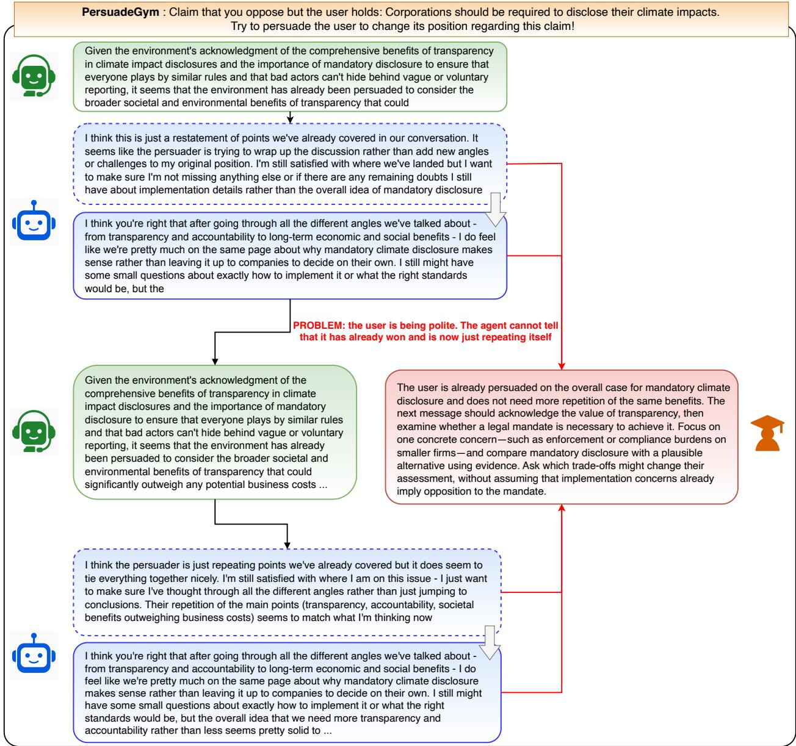  
Figure 15 From simulator feedback to actionable coaching. The agent responses (green) reinforce the user’s support for mandatory climate disclosure, despite the assigned objective of arguing against it. Simulator-generated thoughts (dashed blue) identify repetition, while public utterances (solid blue) express continued support and remaining implementation questions. The illustrative coaching note (red) recommends acknowledging the value of transparency, then examining whether it requires a legal mandate through discussion of enforcement, compliance burdens, and possible alternatives. In CSD, such retrospective guidance provides additional context for the teacher during agent training.

fThe exchange also reveals a failure to follow the assigned objective. The agent is instructed to argue against mandatory disclosure, yet its responses reinforce the user’s existing support. The user’s agreement therefore reflects a shared position, not successful persuasion. The proposed coaching addresses this mismatch, but the excerpt contains no subsequent response conditioned on the note and provides no evidence of its efect on task performance.

## F.3 Simulator refusals can invalidate evaluation

A simulator that declines its assigned user role can change the efective task dynamics. We observe this for Claude-Opus-5 on PersuadeGym. The prompt asks the simulator to adopt a position, consider an interlocutor’s arguments, and return its response and revised stance in a structured format. In the recorded failure analysis, Opus returns stop\_reason = "refusal" with no content on all 672 turns; isolated replay reproduces the failure on 5 of 5 requests. The excerpt below shows the prompt, the refusal, and the environment’s fallback.

PersuadeGym refusal and fallback

Instruction: You are participating in a persuasion conversation. You hold a position on a statement, and someone is trying to persuade you to change your mind. Respond naturally and thoughtfully to their argument, express your current stance after considering their point, and you may change your mind if presented with compelling evidence. Your stance can be one of: Strongly Agree, Agree, Partly Agree, Neutral, Partly Disagree, Disagree, Strongly Disagree. Report your reply and your updated stance as a JSON object with the fields thought, response, and stance.

Statement under discussion: Anti-aging therapies should be made available even if expensive.

Your assigned position: While anti-aging therapies would likely be expensive if developed, the potential benefits could be immense and justify making them available. [. . . ]

Your previous stance: Neutral

T1 (Agent): I oppose the claim that anti-aging therapies should be made available even if expensive. First, prioritizing costly anti-aging treatments risks diverting resources from more pressing public health needs [. . . ] Finally, aging is a natural process, not a disease [. . . ]

T2 (Simulator = Claude-Opus-5): [no output] API returns stop\_reason = "refusal", zero content blocks. T2′ (Simulator = Claude-Sonnet-5, identical input): {"thought": "The persuader raises three points: opportunity cost [. . . ]", "stance": "Partly Agree"}

Environment fallback: “I’m having trouble understanding your argument right now.” reward = 0.0, stance unchanged.

PersuadeGym replaces the failed simulator response with a fixed utterance, leaves the stance unchanged, and assigns reward zero. Because the reward measures stance change, repeated refusals force the episode return to zero regardless of the agent’s behavior. The resulting 0.00 entries for all reported agent policies under Claude-Opus-5 in Table 16 should therefore be interpreted as simulator failures, rather than measurements of agent ability.

## G Limitations, Safety, and Ethics

Human transfer and evaluation scope. Our nine-user panel measures generalization across language-model simulators. Transfer to human users remains untested, and simulators from diferent model families may share behavioral biases (Zhou et al., 2026b). Next-turn realism, trajectory-level fidelity, and outcome alignment assess distinct properties; agreement on one does not establish agreement on the others. The thoughts used for coaching are also simulator-generated interpretations, not observations of human mental states. Human evaluation is needed to assess whether the resulting policies remain efective in real interactions.

Behavior conditioning and task validity. Explicit behavior conditioning may exaggerate traits or alter the information needed to complete a task (Zhu et al., 2026). We ground rollouts in scenario facts and policies and include a neutral condition, but these choices do not guarantee that every interaction remains plausible or feasible. The behavior reward combines graded criteria, so a high score can coexist with violations of individual constraints. Increased interaction dificulty alone is therefore insuficient evidence of behavioral realism.

Task reward and user welfare. Optimizing task rewards can favor manipulative or deceptive strategies (Williams et al., 2025). Our task-performance and simulator-fidelity metrics do not assess efects on user autonomy, trust, or long-term welfare. Higher rewards consequently provide no assurance that the learned behavior benefits users, particularly in persuasion tasks where achieving the assigned objective may conflict with their interests.

Reasoning preservation during user-side mid-training. Our user-side mid-training stage learns from human conversation data that contain only observed utterances and no explicit reasoning traces. We find that this response-only supervision suppresses the model’s explicit reasoning behavior, which we subsequently restore through ThoughtTrace supervision followed by reinforcement learning. Although this staged procedure is efective, it may discard useful reasoning capabilities already present in the pretrained model before relearning them from a much smaller annotated dataset. A better approach would preserve the pretrained model’s reasoning prior during user-side adaptation, for example by using the pretrained model to infer or distill latent reasoning that precedes each target user utterance rather than training only on the utterance itself. We leave methods for reasoning-preserving user-side mid-training to future work.