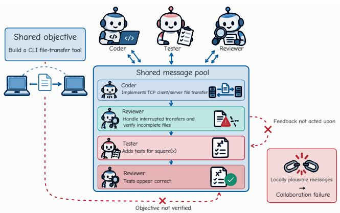
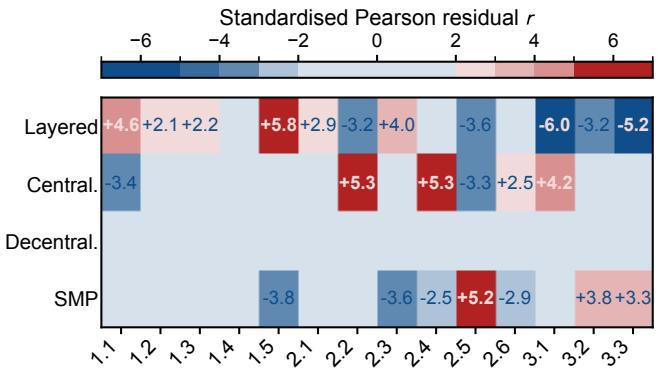
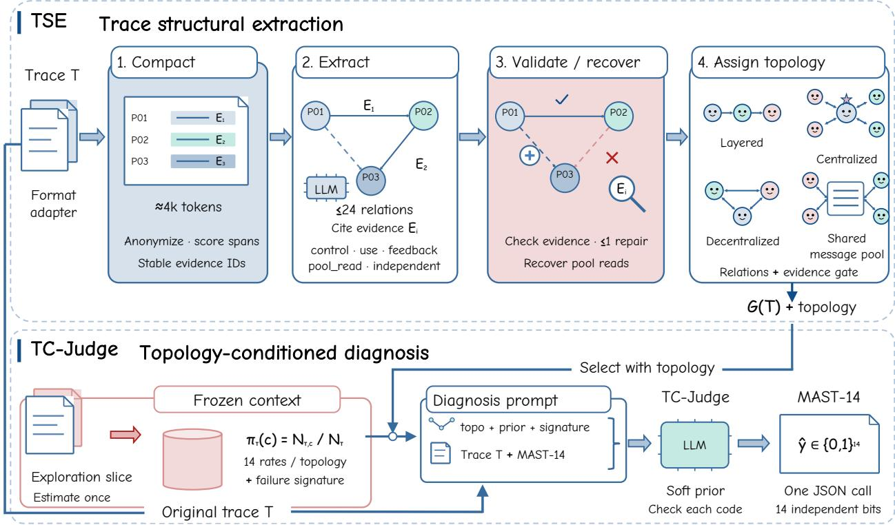
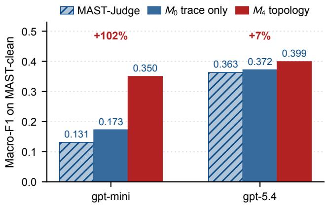
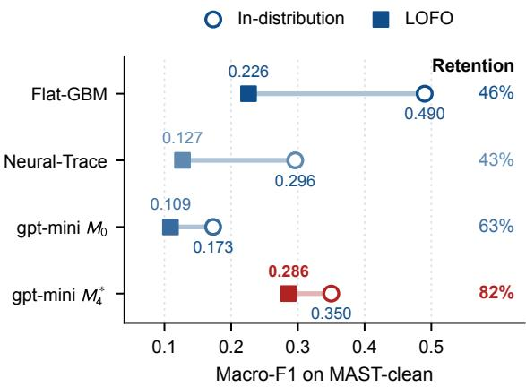
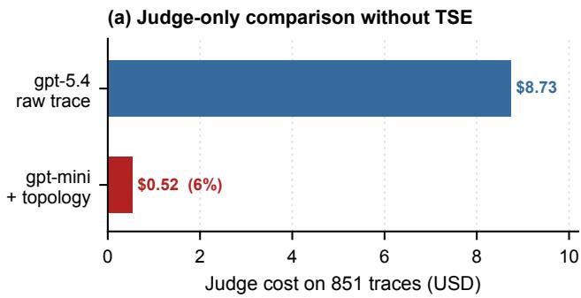
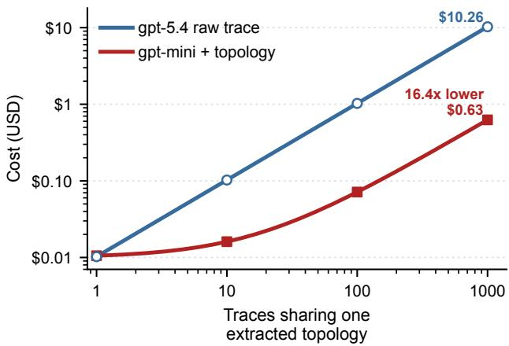

# Know the Shape, Find the Fault: Topology-Conditioned Diagnosis of Multi-Agent LLM Failures

Xinwen Liu   
liuxw24@buaa.edu.cn   
Beihang University   
Beijing, China   
Jiawei Zhang   
jw\_zhang@buaa.edu.cn   
Beihang University   
Beijing, China   
Zhuocheng Pan   
zhuochengPan@buaa.edu.cn   
Beihang University   
Beijing, China   
Xudong Liu   
liuxd@buaa.edu.cn   
Beihang University   
Beijing, China   
Isabella Zhu   
zhunini@buaa.edu.cn   
Beihang University   
Beijing, China

Tianyu Wo woty@buaa.edu.cn Beihang University Beijing, China

## Abstract

Multi-agent LLM systems coordinate task execution through exchanges of information among agents. When coordination breaks down, similar symptoms in execution traces can reflect diferent problems in how information is passed, used, or verified. Com munication topology captures how agents exchange information and provides structural cues for distinguishing coordination failure modes. Using these cues for diagnosis requires establishing how topology relates to failure patterns and recovering the relevant structure from execution traces that lack explicit topology labels.

We analyze the relationship between communication topology and failure patterns and introduce MAScope, a two-stage framework for topology-conditioned diagnosis. Its Trace Structural Extractor TSE recovers communication topology from heterogeneous execution traces by grounding an interaction graph in message evidence. The Topology-Conditioned Judge TC-Judge then classifies failures using the trace, predicted topology, an empirical failure prior estimated from separate labeled traces, and a short description of topology-specific failure patterns. Under a fixed orchestration structure, the recovered topology can be reused across executions.

Experimental results show a statistically significant association between communication topology and failure type, with $\chi ^ { 2 }$ = 409.9 and $ { p } = 1 . 2 \times 1 0 ^ { - 7 0 }$ . On the 851 MAST-clean traces, ground-truth topology context raises gpt-mini’s Macro-F1 from 0.173 to 0.350. With predicted topology, the pipeline achieves 0.346, approaching the trace-only gpt-5.4 baseline of 0.372. For 1000 traces under a fixed orchestration structure, the projected pipeline cost, including one topology extraction, is approximately 6% of repeated gpt-5.4 di- agnosis cost. These results show that topology-conditioned context improves failure diagnosis and supports lower-cost deployment.

## Keywords

multi-agent systems; LLM agents; failure diagnosis; communication topology; topology-conditioned prior; MAST taxonomy; runtime observability

## 1 Introduction

LLM multi-agent systems distribute complex tasks among agents that plan, execute, and verify one another’s work [14]. Frameworks such as AutoGen, MetaGPT, and ChatDev support this division of labour [9, 22, 27]. Successful execution depends on how these agents coordinate as well as on their individual capabilities. A requirement may be understood by one agent yet disappear during a handof, or several agents may complete their subtasks while the final result remains unchecked. Diagnosing such failures requires interpreting individual actions within the relationships through which information is passed and verified.

Existing research analyses failures in multi-agent collaboration and explores ways to improve collaborative performance. MAST organises recurring problems into fourteen failure modes [4], while Who&When and A2P examine which agents and execution steps contribute to task failure [26, 36]. Other studies focus on the or-ganisation of collaboration and use graph-based methods to op- timise communication topology for better task performance and eficiency [33, 40]. These studies motivate examining the value of communication topology as context for diagnosing collaboration failures.

Communication topology describes information transfer relationships among agents. Research on human organisations views coordination as the management of dependencies among activities and links organisational structure to the information processing required for collaboration [6, 18], while organisational structures in multi-agent systems likewise influence agents’ division of labour and information exchange [10]. Recent work further shows that agents that adhere rigidly to specialised roles may form a collabo- ration topology composed of isolated groups, turning local specialisation into bottlenecks at the system level [20]. Communication topology can provide structural context for diagnosing collaboration failures, helping to relate individual actions to information transfer among agents and shared task requirements.

  
Topology exposes broken dependencies  
Figure 1: Shared message pool context guides checks of feedback use and task verification. In this trace, the reviewer’s feedback was not acted upon and the requested verification was not performed.

Figure 1 illustrates this perspective with a representative execution from MAST-clean. In a task to build a command-line file transfer tool, the reviewer requests support for interrupted transfers and verification of incomplete files. The tester instead adds tests for an unrelated square function, and the next review accepts those tests as correct. In the shared message pool, the reviewer’s feed- back is available to the tester and specifies the task’s verification requirements. The final exchange is locally coherent, but accepting an unrelated test neither addresses the feedback nor verifies the shared task’s requirements.

To incorporate communication structure into the diagnosis of failures in multi-agent collaboration, we introduce MAScope, a two-stage diagnostic framework. Our empirical analysis finds that failure-type distributions difer across topologies, motivating topology-specific failure patterns as diagnostic context. In the first stage, the Trace Structural Extractor, TSE, recovers communication relations and topology labels from message evidence, providing structural context that heterogeneous logs may not explicitly record. In the second stage, the Topology-Conditioned Judge, TC-Judge, uses a lower-cost model to diagnose failures from the trace, recovered topology, and associated failure patterns. When communication structure remains stable, reusing topology across executions reduces repeated diagnosis cost.

To evaluate MAScope’s diagnostic performance and deployment cost, we assemble MAScope-Bench from natural execution traces, traces with controlled fault injections, and traces from diferent topologies within a single framework. On MAST-clean, supplying ground-truth topology context raises gpt-mini’s Macro-F1 from 0.173 to 0.350. Using topology recovered by TSE, the complete gpt-mini pipeline achieves a Macro-F1 of 0.346, close to the 0.372 achieved by gpt-5.4 using only the trace. The controlled corpus shows topology recovery with framework identity fixed, while in- jected traces extend diagnostic gains to additional frameworks and topologies. For 1000 traces under a fixed topology, the projected gpt-mini pipeline cost, including one structural extraction, is ap proximately 6% of repeated gpt-5.4 diagnosis cost. These results show that topology context can narrow diagnostic gaps between models while reducing cost.

The contributions of this work are as follows:

• We develop MAScope, a two-stage framework that recovers communication topology from execution traces and uses the recovered topology and its associated failure patterns to guide a lower-cost model in diagnosing failures.

• We establish an empirical association between communication topology and failure patterns, identifying the failure types that are more prevalent under each topology.

• We construct MAScope-Bench with 2220 execution traces and supporting audit materials to evaluate topology recov-ery, failure diagnosis, transfer to unseen frameworks, and deployment cost.

## 2 Related Work

## 2.1 Failure Diagnosis in LLM Multi-Agent Systems

Existing work on LLM multi-agent failure diagnosis mainly examines what types of failures occur and which agents or execution steps are responsible for them [2, 15]. Taxonomy-oriented work organizes recurring failure modes into structured categories. MAST [4] develops a taxonomy of14 failure modes through expert analysis of execution traces and uses an LLM judge for scalable annotation. Other works categorize failures across agent modules [39] and ex-plore formal dialogue verification [19] and distributed constraint reasoning for LLM agents [21]. Localisation-oriented work focuses on identifying the agents and steps responsible for failures [16]. Who&When [36] formalises this task and provides annotated failure logs. A2P [26] structures counterfactual reasoning for failure attribution, while AgenTracer [32] trains an 8B tracer on trajectories annotated through counterfactual replay and fault injection. Other approaches use spectrum analysis [7], hierarchical context [1], or iterative judging [37] for failure attribution. Related MARL work [23] analyses failure sources and propagation pathways. LumiMAS [24] combines system-level anomaly detection with vulnerability classifi- cation and root-cause analysis. These LLM-MAS diagnosis methods primarily rely on execution traces, without explicitly incorporating communication topology into the diagnostic input.

## 2.2 Communication Topology of LLM MAS

Communication topology describes how agents are connected and exchange information in LLM-MAS. Guo et al. [8] distinguish four typical communication structures, namely layered, centralized, decentralized, and shared message pool. Existing research mainly constructs or adapts communication topologies to improve task performance and eficiency. GPTSwarm [40] optimises agent graphs at the node and edge levels, while DyLAN [17] adapts agent participation to each query. AgentPrune [33] prunes redundant communication links to reduce token costs. MaAS [31] and AFlow [35] automate architecture and workflow search, respectively. HyperAgent [34] optimises communication topology using hypergraphs. Generative approaches [11, 13] produce task-specific topologies using graph difusion or trained graph designers. G2CP [3] encodes mes-sages as typed operations over a shared knowledge graph, while ROUTER-HGC [29] selects collaboration modes and agent roles using a heterogeneous graph. In MARL, ACORN [30] reduces communication redundancy through acyclic coordination. These studies show how communication design can improve task performance and eficiency [38].

## 2.3 From Execution Traces to Topology Labels

Recovering communication topology from execution traces remains underexplored in LLM-MAS. Classical process mining recovers workflow models from structured event logs [25], whereas LLM-MAS traces come from heterogeneous frameworks such as AutoGen, MetaGPT, ChatDev, LangGraph, CrewAI and Magentic. Their native logging formats $\operatorname { d i f f e r } ,$ and communication topology may not be explicitly recorded. AutoGen Studio [5] and LangSmith support trace inspection and debugging. MAST [4] and Who&When [36] provide failure annotations rather than communication topology labels. AgentPrune [33] prunes communication graphs to reduce token costs rather than label coordination structures. When the orchestration configuration is unavailable, topology must instead be inferred from observed agent interactions. The remaining challenge is to recover reliable topology labels across frameworks from raw traces and ground those labels in message- level evidence.

## 3 Empirical Foundation: Topology × Failure Correlation

In this section, we examine the association between communication topology and failure patterns in LLM-MAS.

## 3.1 Setting

A raw multi-agent execution trace is a tuple $T = ( A , M , R , S )$ , where � is the set of agents with declared roles, � is the time-stamped message stream $( t _ { i } ,$ sender�, receiver�, content�), � collects tool and retrieval returns, and � carries external state. From � we derive a canonical DAG $G ( T ) = \left( V , E \right)$ , whose vertices are agent turns and whose edges are evidence-carrying parent–child dependen- cies. The associated topology label $\tau \in$ {�������, �����������, �������������, �ℎ���������������} follows Guo et al.’s four-class taxonomy [8]. Failure annotations are represented by $\mathbf { y } \in \{ 0 , 1 \} ^ { 1 4 }$ using the MAST taxonomy [4], which covers Agent-Level Specification, Inter-Agent Misalignment, and Task Verification. A trace may have multiple failure codes. For descriptive analysis, we group withheld or ignored information as Information Loss, role violations as Coordination Stall, and specification violations, inconsistency, or reasoning–action mismatch as Semantic Drift. Task-verification failures form the Verification Misalignment group.

## 3.2 Corpora and Ground Truth

We use three corpora summarised in Table 1, with construction and auditing detailed in Section 5.1. MAST-clean contains 851 traces from the MAST release [4], retaining the original MAST-14 failure annotations, and we independently relabel a stratified subset of 200 traces. Inject-Mix contains 961 traces constructed using controlled fault injection across Layered, Centralized, and Decentralized orchestration variants, covering the Decentralized topology absent from MAST-clean and providing external validation across runtimes. The 408 traces in LG-Ctrl are controlled end to end by a single LangGraph harness in which all four topologies share the same StateGraph codebase and topology-agnostic agent identifiers, so any observed topology–failure association cannot be attributed to framework fingerprints. Across all three corpora the topology label � is obtained from the original framework-declared orches- tration graph and used as ground truth for evaluating topology extraction.

Table 1: MAScope-Bench composition. Lay., Cen., Dec., and SMP denote Layered, Centralized, Decentralized, and Shared Message Pool, based on each declared orchestration graph.
<table><tr><td>Corpus</td><td># traces</td><td>Lay.</td><td> $\mathrm { C e n . }$ </td><td>Dec.</td><td>SMP</td></tr><tr><td>MAST-clean</td><td>851</td><td>256</td><td>165</td><td>0</td><td>430</td></tr><tr><td>LG-Ctrl</td><td>408</td><td>102</td><td>102</td><td>102</td><td>102</td></tr><tr><td>Inject-Mix</td><td>961</td><td>170</td><td>284</td><td>507</td><td>0</td></tr></table>

  
Figure 2: Topology–failure association on MAST-clean (851 traces). Cells show standardised Pearson residuals for the 4 × 14 contingency table, with |�| ≥2 annotated. The independence test gives $\begin{array} { r } { \dot { \chi } ^ { 2 } = 4 0 9 . 9 , } \end{array}$ $\operatorname* { d o f } = 3 9 $ , and $p < 1 0 ^ { - 7 0 }$

## 3.3 Independence Test and Per-Topology Anchors

We construct a contingency table of topology and MAST failure annotations on MAST-clean to test their independence. As shown in Figure 2, the test yields $\chi ^ { 2 } = 4 0 9 . 9$ and $ { p } = 1 . 2 \times 1 0 ^ { - 7 0 }$ , indicating a significant association between topology and failure distributions. The standardised Pearson residuals further show that positive residuals concentrate on diferent failure types across topologies, revealing characteristic failure patterns for each topology.

In Layered pipelines, Information Loss involves 2.4 and 2.5 for information withholding and ignored input, as upstream facts are lost before reaching downstream stages along the forward-only communication path. In Centralized topologies, Verification Mis- alignment involves 3.1 through 3.3, as the hub’s global verification criterion gradually becomes misaligned with its workers. In the supplementary corpora’s Decentralized traces, Coordination Stall manifests as role violations under 2.1, with symmetric peers responsible for coordination entering cycles of mutual waiting or role confusion. In Shared Message Pool topologies, Semantic Drift involves 2.2, 2.3, and 2.6 for specification violations, inconsistency, and reasoning–action mismatch. The blackboard accumulates con- text with ambiguous scope, and later readers silently reinterpret earlier intent. These structural failure anchors provide a common basis for cross-corpus comparison.

The associations between the four topologies and their char- acteristic failure patterns remain qualitatively consistent across MAST-clean, LG-Ctrl, and Inject-Mix. The leave-one-framework- out evaluation further shows that the diagnostic method retains 82% of its in-distribution Macro-F1. Along with the independence test and residual analysis, these results inform the inclusion of topology in TC-Judge’s zero-shot prompt.

  
Figure 3: MAScope pipeline. TSE converts a heterogeneous trace into an evidence-grounded relation graph and topology label �ˆ. TC-Judge combines the trace, predicted topology, frozen topology prior, and failure signature to output a MAST-14 diagnosis.

## 4 Two-Stage Diagnosis Pipeline

MAScope follows the two-stage pipeline shown in Figure 3, first recovering the collaboration topology and then using topology information to diagnose failures in execution traces. We make this separation because topology � and failure labels y change at dif ferent rates. For example, a deployed layered LangGraph pipeline retains the same topology across thousands of runs, while failure la- bels vary with each execution. These two stages are implemented by the Trace Structural Extractor TSE and the Topology-Conditioned Judge TC-Judge, respectively. TSE recovers a canonical relation graph �(� ) and the Guo topology label �ˆ from a heterogeneous framework trace �, and TC-Judge combines the original trace � with this label �ˆ to produce the MAST-14 binary failure vector $\hat { \mathbf { y } } \in \{ 0 , 1 \} ^ { 1 4 }$ . Reusing the recovered topology within a fixed deploy- ment amortises extraction across its executions, leaving TC-Judge as the marginal runtime cost for each trace.

## 4.1 Stage 1. TSE, Trace Structural Extraction

TSE recovers the relation graph �(�) and topology label �ˆ from trace � by grounding relations and topology labels in identifiable trace evidence. Its four processing stages cover compaction, relation extraction, validation with repair, and structural labelling. Deter- ministic rules support speaker attribution over long distances and recovery of implicit shared-channel reads, giving the LLM explicit evidence for relations that require context across a long trace. All stages use a common schema consisting of a speaker-tagged mes-sage stream and optional shared-channel markers. A thin format adapter connects each framework to this schema, and we provide adapters for LangGraph, AutoGen, CrewAI, ChatDev, MetaGPT, Magentic, and Simple Chain. This shared representation lets the extraction process begin with the same evidence preparation across all seven frameworks.

TSE runs four stages per trace. (i) Compact and anonymize. Compaction prepares a bounded evidence view while preserving the participants and local cues needed for relation extraction. We parse � into a speaker-tagged message stream and replace partici-pant names with placeholders $P _ { 0 1 } , P _ { 0 2 } , . . .$ . in order of first appear- ance. Sentence-level spans are scored using named co-mentions, interaction verbs, shared-channel markers, and words indicating independent initiation. The selected spans form a view of approx imately 4k tokens, each retaining a stable identifier $E _ { i }$ for citing relation evidence.

(ii) Extract. Relation extraction turns the retained evidence into a compact set of interaction candidates. The LLM returns at most 24 relations, each assigned one of the five types control, use, feedback, pool\_read, and independent. Each candidate cites one or two spans $E _ { i }$ that identify the speaker and, where applicable, the counterpart and store.

(iii) Validate and recover relations. Validation and recovery assemble the relation set used for structural labelling. A rule-based validator checks each candidate against its cited span for JSON schema conformance, direction, grounding within the same message, a named counterpart, and a named store. If the rejection rate exceeds a threshold or shared-channel markers accompany a sparse graph, one bounded LLM repair call retries the rejected candidates through the same validator. A regular expression with a narrow con- text then supplements free-form generation by recovering implicit pool reads.

Table 2: Zero-shot diagnostic results on MAST-clean. No method uses its failure labels for fitting. The final column reports the gain from $M _ { 0 }$ to $M _ { 4 }$ on the same model.
<table><tr><td>Family</td><td>Method</td><td>Setting</td><td>Macro-F1</td><td>Gain over matched  $M _ { 0 }$ </td></tr><tr><td>External protocol</td><td>MAST-Judge</td><td>gpt-mini</td><td>0.131</td><td>一</td></tr><tr><td>External protocol</td><td>MAST-Judge</td><td>gpt-5.4</td><td>0.363</td><td>一</td></tr><tr><td>Matched control</td><td> $M _ { 0 }$ </td><td>gpt-mini</td><td>0.173</td><td>Reference</td></tr><tr><td>Matched control</td><td> $M _ { 0 }$ </td><td>gpt-5.4</td><td>0.372</td><td>Reference</td></tr><tr><td>Ours</td><td> $M _ { 4 }$ </td><td>gpt-mini with true topology</td><td>0.350</td><td>+0.177 and +102%</td></tr><tr><td>Ours</td><td> $M _ { 4 }$ </td><td>gpt-5.4 with true topology</td><td>0.399</td><td>+0.027 and +7.3%</td></tr></table>

(iv) Assign the topology label. Structural labelling converts these relations into a Guo topology label through a classifier and a positive-evidence gate. Relations are aggregated from message speakers $P _ { i }$ to graph nodes $N _ { j }$ and serialised into a table consisting entirely of these aggregated relations. This table is the complete input to the structural-labelling LLM, which assigns one of the four Guo classes or abstains. A deterministic gate resolves the final label by giving highest priority to pool\_read relations with a named producer. Independent or mutual activity comes next, followed by a persistent delegation chain and then unidirectional information flow. TSE returns the canonical DAG �(� ) and �ˆ together, with every relation and the final label linked to named spans in the retained evidence.

## 4.2 Stage 2. TC-Judge, Topology-Conditioned LLM-Judge

TC-Judge uses the recovered topology to interpret failure evidence in each execution trace. Given � and �ˆ, it produces $\hat { \mathbf { y } } \in \{ 0 , 1 \} ^ { 1 4 }$ in one structured JSON call, with one independently assigned bit for each MAST failure code. Topology enters its prompt through the label �ˆ, a per-topology empirical prior $\pi _ { \hat { \tau } } ,$ and a short failure signature describing characteristic interactions. With this topology context, the judge performs zero-shot diagnosis with fixed model parameters.

TC-Judge operates in two steps. (i) Topology context preparation. For each topology �, we prepare an empirical prior and a short failure-signature paragraph. For each of the fourteen MAST codes $^ { c , }$ the occurrence rate is computed as $\begin{array} { r } { \pi _ { \tau } ( c ) = \frac { N _ { \tau , c } } { N _ { \tau } } } \end{array}$ , where $N _ { \tau }$ counts traces with topology � and $N _ { \tau , c }$ counts those also labelled with code �. Using a 400-trace exploration slice drawn from an earlier data release, we estimate these rates once and then freeze them. The 851-trace MAST-clean evaluation set comes from a later release and is disjoint from the exploration slice. The failure-signature paragraph describes characteristic roles and interaction patterns under �. Together with the topology label, the prior and signature form the context used in the diagnostic prompt.

(ii) Topology-conditioned diagnosis. The diagnostic prompt combines the trace � with the recovered topology label �ˆ, the cor- responding prior $\pi _ { \hat { \tau } } ,$ and the failure-signature paragraph. The prior component consists entirely of the aggregate rate for each code under �ˆ, with all fourteen rates presented together. A soft-prior calibration instruction directs the judge to check each code independently against the trace evidence and then assign its corresponding bit. The judge returns the resulting fourteen-bit vector yˆ in one structured JSON call.

Remark 1. Zero-shot design. The zero-shot design supports diagnosis under the uneven label coverage of MAST-clean. Its 851 traces include several failure codes with fewer than twenty positive examples. Supervised training on these annotations for failure-code prediction would lead the judge to learn framework fingerprints as shortcuts and tie its predictions to the framework mix represented in training. The performance drop of the supervised structural classifier under leave-one-framework-out evaluation in Section 5.5 illustrates this dependence. We therefore keep the judge’s param-eters fixed and express topology knowledge through aggregate failure frequencies and structural signatures in the prompt.

Remark 2. Role of topology context. Failure signatures com-plement historical frequencies with explanations based only on topology-level roles and interactions. Examples include role dialec- tic loops in Layered systems, verifier bottlenecks in Centralized systems, unclaimed verification duties in Shared Message Pool systems, and peer critique drift in Decentralized systems.

## 5 Experiments

This section evaluates how the topology signal established in Section 3 supports failure diagnosis through the two-stage pipeline of Section 4. We first describe the evaluation corpora and comparison protocol in Sections 5.1 and 5.2, then assess topology recovery in Section 5.3. The diagnostic gain from topology conditioning is mea-sured in Section 5.4, and cross-framework performance is examined in Section 5.5. Finally, Section 5.6 evaluates the complete pipeline with predicted topology and analyses its deployment cost.

## 5.1 MAScope-Bench Construction and Audits

MAScope-Bench1 combines the three corpora introduced in Section 3.2 and uses a shared schema for all 2220 traces. MAST-clean supports the main evaluation, Inject-Mix broadens coverage, while LG-Ctrl isolates topology within one framework. Their composition is summarised in Table 1.

MAST-clean is selected under a uniform protocol whose preregistered admission rule requires agreement among framework papers, the Guo survey mapping, and independent per-trace LLM voting. The admitted traces are deduplicated by task, framework, and trajectory hash, with a stratified subset independently rela belled. These traces retain the original MAST-14 failure annota- tions and provide reliable topology labels for the main diagnostic comparison.

Inject-Mix uses three types of executable orchestrators spanning Layered, Centralized, and Decentralized topologies. Twelve deterministic code-level injectors cover four failure categories by modifying shared state through runtime hooks with fixed MAST- code mappings. The injected traces are then filtered by their tar-geted health scores, retaining only those with scores below the pre-set threshold of 0.55. The additional orchestrators and Decen- tralized traces extend coverage beyond MAST-clean to test whether topology conditioning remains useful in these settings. Because its failure labels are injection-derived, diagnostic scores are compared only within Inject-Mix.

LG-Ctrl generates four topology variants within one LangGraph codebase, keeping the state schema, log format, and agent identi- fiers fixed while varying only graph edges and iteration patterns. Its design grid samples eight LLM models, seven injectors, and a normal baseline near-uniformly, yielding 102 traces per topology. Since MAST-clean pairs each framework with only one topology, LG-Ctrl tests recovery with framework identity held fixed.

## 5.2 Comparison Methods and Evaluation Setup

We compare TC-Judge with the five baselines in Table 3, namely B1 Opus-Direct, B2 $M _ { 0 } ,$ B3 MAST-Judge, B4 Flat-GBM, and B5 Neural-Trace. B1, B2, and B3 provide LLM references, while B4 and B5 learn from execution graphs and trace text. Who&When [36], A2P [26], and LumiMAS [24] are discussed qualitatively in Section 2.1 because they output failure locations or free-text causes rather than MAST-14 vectors.

The comparison uses the 851 MAST-clean traces, which pair original MAST-14 failure annotations with audited, stable topology labels. Macro-F1 over fourteen codes gives tail modes weight under label imbalance. The zero-shot judges TC-Judge, �0, and MAST-Judge require no fitting. Flat-GBM and Neural-Trace use deterministic five-fold GroupKFold by task\_id, keeping each task in one fold. Cross-framework evaluation reports leave-one-framework-out results, denoted LOFO, for each held-out framework. LG-Ctrl and Inject-Mix provide separate structural and diagnostic validation, respectively.

Table 3: Baselines used in the main and cross-framework comparisons. All inputs are constructed from the same raw traces.
<table><tr><td>Baseline</td><td>Construction and comparison role</td></tr><tr><td>B1 OPUS-DIRECT</td><td>Complete trace, zero-shot model-capacity ref- erence</td></tr><tr><td>B2  $M _ { 0 }$ </td><td>Trace with MAST-14 schema, zero-shot matched control</td></tr><tr><td>B3 MAST-JUDGE [4]</td><td>Trace with MAST-14 schema, original MAST judge prompt</td></tr><tr><td>B4 FLAT-GBM [12]</td><td>Seventeen topology and shallow trace fea- tures, five-fold learner</td></tr><tr><td>B5 NEURAL-TRACE [28]</td><td>Frozen BGE trace embedding, five-fold textual learner</td></tr></table>

Each baseline derives its inputs from the same raw traces and pre- dicts the same MAST-14 label vector. B1 sends the complete trace to an Opus-tier model in one call. B2, $M _ { 0 } ,$ , matches $M _ { 4 }$ in traces, prompt scafolding, output format, and model, but receives no topology con- text. This paired comparison isolates gains from topology conditioning. B3 reproduces the original MAST prompt [4], adapts its output to MAST-14, and uses the same model as $M _ { 0 } .$ B4 fits LightGBM [12] to eight topology descriptors and nine shallow trace statistics, in-cluding trace length, line count, and six keyword indicators. B5 em- beds concatenated traces with frozen BGE-small-en-v1.5 [28] and trains a two-layer MLP on MAST-14 labels. Cross-method scores measure overall diagnostic utility because representations, training, and evaluation settings difer.

The internal comparison uses five nested configurations. �0 receives no topology context, $M _ { 1 }$ adds the topology tag, �2 adds the prior instead, $M _ { 3 }$ combines the tag and prior, and $M _ { 4 }$ further adds the failure signature.

We conduct the paired $M _ { 0 } { - } M _ { 4 }$ comparison separately with gpt- mini and gpt-5.4 to examine whether the gain difers between the two judge models. The combined gain from �0 to $M _ { 4 }$ for each model is reported in Table 2. We define Oracle-topology as the matched $M _ { 4 }$ judge supplied with ground-truth topology. The same $M _ { 4 }$ judge is evaluated with ground-truth topology and with topology predicted by TSE to assess the efect of topology recovery errors on diagnosis.

## 5.3 Topology Recovery

Before evaluating topology-conditioned diagnosis, we first verify whether TSE can recover the structural input required by the judge. Recovery is evaluated in two complementary settings summarised in Table 4, with MAST-clean measuring recovery on natural traces from three frameworks against their declared orchestration graphs and LG-Ctrl providing the framework-controlled setting described in Section 5.1. The MAST-clean evaluation uses TSE with gpt-5.4 on all traces. On LG-Ctrl, the released full-set TSE evaluation uses Sonnet 4.6 and is supplemented by a matched TSE replication with gpt-5.4 on a balanced 40-trace subset.

  
Figure 4: Controlled diagnostic gains from $M _ { 0 }$ to $M _ { 4 }$ on MASTclean. Each comparison fixes the traces, prompt scafolding, output space, and model. Both models improve, with gptmini gaining 102%.

On MAST-clean, TSE correctly recovers 798 of 851 topologies for 93.8% accuracy and abstains on four traces. Errors concentrate on ChatDev, where a Layered chain is occasionally classified as Centralized when the first agent takes a stronger coordinating role than the framework specification suggests. On LG-Ctrl, the full-set TSE evaluation recovers 312 of 408 topologies for 76.5% accuracy, remaining above the 25% balanced chance level after framework cues are controlled, with Shared Message Pool the most dificult controlled class at 56.9%. A matched TSE replication recovers 31 of 40 traces for 77.5% accuracy, supporting the conclusion that topology remains recoverable without framework identity, although the task becomes harder.

Table 4: Topology recovery by framework and controlled topology. C, W, and A denote correct, wrong, and abstained predictions.
<table><tr><td>Evaluation slice</td><td>N</td><td>C, W, A</td><td>Accuracy</td></tr><tr><td>MAST-clean by framework</td><td></td><td></td><td></td></tr><tr><td>ChatDev</td><td>256</td><td>211, 44,1</td><td>82.4%</td></tr><tr><td>Magentic</td><td>165</td><td>160,5,0</td><td>97.0%</td></tr><tr><td>MetaGPT</td><td>430</td><td>427,0,3</td><td>99.3%</td></tr><tr><td>MAST-clean overall</td><td>851</td><td>798,49, 4</td><td>93.8%</td></tr><tr><td>LG-Ctrl by construction topology</td><td></td><td></td><td></td></tr><tr><td>Layered</td><td>102</td><td>89, 1, 12</td><td>87.3%</td></tr><tr><td>Centralized</td><td>102</td><td>91, 11, 0</td><td>89.2%</td></tr><tr><td>Decentralized</td><td>102</td><td>74,12, 16</td><td>72.5%</td></tr><tr><td>Shared Message Pool</td><td>102</td><td>58,26,18</td><td>56.9%</td></tr><tr><td>LG-Ctrl overall</td><td>408</td><td>312, 50, 46</td><td>76.5%</td></tr></table>

## 5.4 Zero-Shot Diagnostic Performance

The evaluation of TC-Judge examines whether topology context improves failure diagnosis. On MAST-clean, ground-truth topology context improves both judge models, with a larger gain for gptmini, as shown in Figure 4. From �0 to �4, gpt-mini’s Macro-F1 rises from 0.173 to 0.350, a relative gain of 102%, while gpt-5.4 rises from 0.372 to 0.399. The gpt-mini result reaches 94% of the trace-only gpt-5.4 score. Under the matched protocol in Section 5.2, these diferences isolate topology conditioning. $M _ { 4 }$ also exceeds MAST-Judge on the same traces and models by 0.219 and 0.036, respectively, as reported in Table 2. These oracle results provide the reference for Section 5.6. Supervised learners’ in-distribution and cross-framework results are reported together in Section 5.5.

## 5.5 Cross-Framework Generalisation

Cross-framework evaluation tests whether supervised diagnostic models transfer to deployments on an unseen framework. Most public LLM-MAS traces come from a small set of frameworks and carry distinctive signatures, such as LangGraph node names, Auto-Gen [27] tool-call ordering, and ChatDev [22] role prefixes. These framework fingerprints provide distribution-specific cues to a clas- sifier. Building on existing taxonomy and attribution benchmarks [4, 26, 36], we use LOFO evaluation to measure robustness under this change in distribution.

Each LOFO fold evaluates one complete framework family and trains the supervised baseline on the other two families, with all traces from the held-out framework excluded from fitting. In MASTclean, each framework is paired with one topology, so the protocol introduces a joint framework and topology shift rather than isolating either factor. The mean across the ChatDev, Magentic, and MetaGPT folds and retention, defined as LOFO Macro-F1 divided by in-distribution Macro-F1, are reported in Figure 5. The learned baselines show substantial score reductions: Flat-GBM falls from 0.490 to 0.226, a relative decrease of 54%, while Neural-Trace falls from 0.296 to 0.127, retaining 43% of its in-distribution Macro-F1. Flat-GBM’s released confusion matrix shows that predictions on the held-out framework concentrate on the two failure modes most frequent in the retained folds. Thus, when the framework and topol- ogy change together, the strong in-distribution fit of both learned representations does not transfer reliably. The two zero-shot rows provide descriptive references and are excluded from the strict LOFO conclusion.

The diagnostic comparison on Inject-Mix covers framework and topology settings not covered by MAST-clean. Compared with the matched $M _ { 0 } , M _ { 4 }$ raises Macro-F1 on gpt-mini from 0.304 to 0.321 and on gpt-5.4 from 0.320 to 0.356. These results show that the diagnostic benefit of topology context extends to the additional framework and topology settings in Inject-Mix.

  
Figure 5: Cross-framework scores on MAST-clean. Flat-GBM and Neural-Trace use strict LOFO retraining. $M _ { 0 }$ has no fitted component. $M _ { 4 } ^ { * }$ uses a full-corpus topology prior and is a descriptive framework slice rather than a strict LOFO result. Right labels report retention.

## 5.6 End-to-End Diagnosis and Deployment Cost

The end-to-end experiment assesses diagnostic performance when the topology predicted by TSE is passed to TC-Judge. On MASTclean, the gpt-mini pipeline reaches Macro-F1 0.346 compared with 0.350 when the same judge receives ground-truth topology, giving $\Delta _ { \mathrm { o r a c l e } } = - 0 . 0 0 4 .$ This small gap indicates that topology-recovery error has little efect on downstream diagnosis at the current evalu- ation scale.

Deployment cost is determined by the diferent call frequencies of structural extraction and runtime diagnosis. The cost comparison in Figure 6 uses measured gpt-5.4 diagnosis cost and the gpt-mini estimate based on normalized token counts. Under a fixed orches tration structure, deployment cost comprises one TSE extraction per MAS and one gpt-mini TC-Judge call per trace. Reusing topology amortises extraction costs, so the cost advantage over repeated gpt-5.4 diagnosis grows with deployment volume.

## 6 Analysis

This section discusses why topology provides diagnostic information, why it helps gpt-mini more than gpt-5.4, and how this benefit lowers deployment cost.

(b) Reuse after one \$0.0099 TSE setup  
  
Figure 6: Cost comparison in USD. The upper panel reports measured gpt-5.4 cost and the normalized-token gpt-mini estimate on 851 traces without TSE. The lower panel adds one TSE call and shows deployment cost when the extracted topology is reused.

Q1. Why is topology informative beyond framework-specific trace patterns? Communication topology plays a role analogous to or-ganizational structure in human teamwork. Organization theory views structure as a means of coordinating interdependent tasks and processing information, while coordination theory defines co- ordination through the management of dependencies among activities [6, 18]. MAS research similarly describes an agent organization through the roles and relationships that guide interaction and data flow [10]. Consider a project that omits a requirement. Diagnosing the problem requires knowing who collected the requirement, who should have passed it on, and who was responsible for checking it. Topology gives the judge a reference for assessing messages against the collaboration’s information flows and responsibilities. This reference directs attention to successive handofs in Layered workflows and to the hub’s aggregation and verification in Central- ized coordination. The judge can then use trace evidence to check whether agents fulfilled these responsibilities and determine the corresponding failure types.

Q2. Why does topology help gpt-mini more than gpt-5.4? Without to olog , the judge must first infer the collaboration structure before deciding whether a message violates an agent’s role or in- terrupts an information path. Topology conditioning supplies this intermediate structure directly. Its label identifies the coordination pattern, while its prior and failure signature direct attention to vulnerable responsibilities. The judge can therefore focus on verifying evidence in the trace instead of reconstructing the collaboration scheme. gpt-5.4 can infer more structural context from the raw trace, whereas gpt-mini benefits more when that context is explicit. Section 5.4 reports the paired diagnostic results for both judge models.

Q3. Why does this design reduce deployment cost? Structural extraction and failure judgement occur at diferent frequencies. A deployed MAS usually retains one orchestration graph across many executions, so TSE runs once and its topology is reused. Each new trace then requires only one gpt-mini TC-Judge call. The total cost for � traces is therefore one extraction plus � lower-cost judge calls, rather than � gpt-5.4 calls. Section 5.6 presents the deployment-cost comparison for this reuse setting. As more traces share the fixed extraction cost, the average cost per trace decreases.

## 7 Conclusion

In this paper, we establish an empirical association between communication topology and failure patterns in LLM-based multi-agent systems. Building on this finding, we propose the two-stage diagnosis framework MAScope, which recovers topology from heterogeneous traces and combines it with empirical failure priors to guide failure judgement. In addition, we construct and release MAScope-Bench, which combines natural, injected, and framework-controlled traces for evaluating topology recovery and failure diagnosis. Ex-periments show that topology conditioning improves diagnostic performance, allowing a lower-cost judge to approach the diagnostic performance of a stronger trace-only model, while structural reuse reduces deployment cost.

## References

[1] Adi Banerjee, Anirudh Nair, and Tarik Borogovac. 2025. Where Did It All Go Wrong? A Hierarchical Look into Multi-Agent Error Attribution. Poster at the NeurIPS 2025 LLM Evaluation Workshop. arXiv:2510.04886 https://openreview. net/forum?id=0MyUdq7wLe

[2] Shraddha Barke, Arnav Goyal, Alind Khare, Avaljot Singh, Suman Nath, and Chetan Bansal. 2026. AgentRx: Diagnosing AI Agent Failures from Execution Trajectories. Accepted to Findings of EMNLP 2026. arXiv:2602.02475 https: //arxiv.org/abs/2602.02475

[3] Karim Ben Khaled and Davy Monticolo. 2026. G2CP: A Graph-Grounded Communication Protocol for Verifiable and Eficient Multi-Agent Reasoning. In Proceedings of the 25th International Conference on Autonomous Agents and Multiagent Systems (AAMAS), Extended Abstract. IFAAMAS, Paphos, Cyprus, 3486–3488. doi:10.65109/JHFW8307

[4] Mert Cemri, Melissa Z. Pan, Shuyi Yang, Lakshya A. Agrawal, Bhavya Chopra, Rishabh Tiwari, Kurt Keutzer, Aditya Parameswaran, Dan Klein, Kannan Ram chandran, Matei A. Zaharia, Joseph E. Gonzalez, and Ion Stoica. 2025. Why Do Multi-Agent LLM Systems Fail?. In Advances in Neural Information Processing Systems, Vol. 38. Curran Associates, Inc. Datasets and Benchmarks Track. doi:10.52202/085713-4082

[5] Victor Dibia, Jingya Chen, Gagan Bansal, Suf Syed, Adam Fourney, Erkang Zhu, Chi Wang, and Saleema Amershi. 2024. AutoGen Studio: A No-Code Developer Tool for Building and Debugging Multi-Agent Systems. In Proceedings ofthe 2024 Conference on Empirical Methods in Natural Language Processing: System Demonstrations. Association for Computational Linguistics, Miami, Florida, USA, 72–79. doi:10.18653/v1/2024.emnlp-demo.8

[6] Jay R. Galbraith. 1974. Organization Design: An Information Processing View. Interfaces 4, 3 (1974), 28–36. doi:10.1287/inte.4.3.28

[7] Yu Ge, Linna Xie, Zhong Li, Yu Pei, and Tian Zhang. 2026. Spectrum-Based Failure Attribution for Multi-Agent Systems. Proceedings ofthe ACM on Software Engineering 3, FSE (2026), 1888–1909. doi:10.1145/3797113

[8] Taicheng Guo, Xiuying Chen, Yaqi Wang, Ruidi Chang, Shichao Pei, Nitesh V. Chawla, Olaf Wiest, and Xiangliang Zhang. 2024. Large Language Model Based Multi-Agents: A Survey of Progress and Challenges. In Proceedings ofthe 33rd International Joint Conference on Artificial Intelligence (IJCAI), Survey Track. International Joint Conferences on Artificial Intelligence Organization, Jeju, South Korea, 8048–8057. doi:10.24963/ijcai.2024/890

[9] Sirui Hong, Mingchen Zhuge, Jonathan Chen, Xiawu Zheng, Yuheng Cheng, Jinlin Wang, Ceyao Zhang, Zili Wang, Steven Ka Shing Yau, Zijuan Lin, Liyang Zhou, Chenyu Ran, Lingfeng Xiao, Chenglin Wu, and Jürgen Schmidhuber. 2024. MetaGPT: Meta Programming for a Multi-Agent Collaborative Framework. In International Conference on Learning Representations (ICLR). OpenReview.net, Vienna, Austria. Oral. arXiv:2308.00352. htt s://o enreview.net/forum?id= VtmBAGCN7o

[10] Bryan Horling and Victor Lesser. 2004. A Survey of Multi-Agent Organizational Paradigms. The Knowledge Engineering Review 19, 4 (2004), 281–316. doi:10.1017/ S0269888905000317

[11] Eric Hanchen Jiang, Levina Li, Frank Wan, Xiao Liang, Sophia Yin, Yuchen Wu, Xinfeng Li, Yizhou Sun, Wei Wang, Kai-Wei Chang, and Ying Nian Wu. 2026. Dynamic Generation of Multi-LLM Agents Communication Topologies with Graph Difusion Models. In Proceedings of the 64th Annual Meeting of the Association for Computational Linguistics (Volume 1: Long Papers). Association for Computational Linguistics, San Diego, California, United States, 38042–38060. doi:10.18653/v1/2026.acl-long.1764

[12] Guolin Ke, Qi Meng, Thomas Finley, Taifeng Wang, Wei Chen, Weidong Ma, Qiwei Ye, and Tie-Yan Liu. 2017. LightGBM: A Highly Eficient Gradient Boosting Decision Tree. In Advances in Neural Information Processing Systems, Vol. 30. Curran Associates, Inc., Red Hook, NY, USA. https://proceedings.neurips.cc/ paper\_files/paper/2017/file/6449f44a102fde848669bdd9eb6b76fa-Paper.pdf

[13] Hui Yi Leong, Yuheng Li, Yuqing Wu, Wenwen Ouyang, Wei Zhu, Jiechao Gao, and Wei Han. 2025. AMAS: Adaptively Determining Communication Topology for LLM-based Multi-agent System. In Proceedings of the 2025 Conference on Empirical Methods in Natural Language Processing: Industry Track. Association for Com utational Lin uistics Suzhou China 2061–2070. doi:10.18653/v1/2025. emnlp-industry.144

[14] Guohao Li, Hasan Abed Al Kader Hammoud, Hani Itani, Dmitrii Khizbullin, and Bernard Ghanem. 2023. CAMEL: Communicative A ents for “Mind” Ex loration of Large Language Model Society. In Advances in Neural Information Processing Systems, Vol. 36. Curran Associates, Inc. Poster. https://openreview.net/forum? id=3I L2XWDkG

[15] Jiazheng Li, Emine Yilmaz, Bei Chen, and Thu Le. 2026. Towards Self-Improving Error Diagnosis in Multi-Agent Systems. In Findings ofthe Association for Computational Linguistics: ACL 2026. Association for Computational Linguistics, San Diego, California, United States, 2063–2077. doi:10.18653/v1/2026.findings-acl.98

[16] Jiale Liu, Huajun Xi, Shaokun Zhang, Yifan Zeng, Tianwei Yue, Chi Wang, Jian Kang, Qingyun Wu, and Huazheng Wang. 2026. Who&When Pro: Can LLMs Really Attribute Failures in AI Agents? arXiv:2607.09996 https://arxiv.org/abs/

2607.09996

[17] Zijun Liu, Yanzhe Zhang, Peng Li, Yang Liu, and Diyi Yang. 2024. A Dynamic LLM-Powered Agent Network for Task-Oriented Agent Collaboration. In Conference on Language Modeling (COLM). OpenReview.net, Philadelphia, Pennsylvania, USA. https://openreview.net/forum?id=XII0Wp1XA9

[18] Thomas W. Malone and Kevin Crowston. 1994. The Interdisciplinary Study of Coordination. Comput. Surveys 26, 1 (1994), 87–119. doi:10.1145/174666.174668

[19] Juan Carlos Nieves, Andreas Brännström, and Esteban Guerrero. 2026. No Future for LLM-based Agents Without Formal Dialogue Verification. In Proceedings of the 25th International Conference on Autonomous Agents and Multiagent Systems (AAMAS), Blue Sky Ideas Track. IFAAMAS, Paphos, Cyprus, 3921–3926. doi:10. 65109/JFKY8456

[20] Benjamin Panny, Shashank Mehrotra, Zahra Zahedi, Teruhisa Misu, and Kumar Akash. 2026. Too Many Specialists: Emergent Ineficiencies and Bottlenecks for Multi-Agent Ad-Hoc Collaboration. In Proceedings ofthe 25th International Conference on Autonomous Agents and Multiagent Systems (AAMAS). IFAAMAS, Paphos, Cyprus, 3609–3611. doi:10.65109/CYXP1261

[21] Gauthier Picard, William Yeoh, and Roie Zivan. 2026. Agentic LLMs and Distributed Constraint Reasoning: A Symbiotic Perspective for Neurosymbolic Multi-Agent Systems. In Proceedings ofthe 25th International Conference on Autonomous Agents and Multiagent Systems (AAMAS), Blue Sky Ideas Track. IFAAMAS, Paphos, C rus, 3858–3863. doi:10.65109/YNZM5391

[22] Chen Qian, Wei Liu, Hongzhang Liu, Nuo Chen, Yufan Dang, Jiahao Li, Cheng Yan , Weize Chen, Yushen Su, Xin Con , Ju uan Xu, Dahai Li, Zhi uan Liu, and Maosong Sun. 2024. ChatDev: Communicative Agents for Software Development. In Proceedings of the 62nd Annual Meeting of the Association for Computational Linguistics (ACL). Association for Computational Linguistics, Bangkok, Thailand, 15174–15186. doi:10.18653/v1/2024.acl-lon .810

[23] Risal Shahriar Shefin, Debashis Gupta, Thai Le, and Sarra Alqahtani. 2026. Interpretable Failure Analysis in Multi-Agent Reinforcement Learning Systems. In Proceedings of the 25th International Conference on Autonomous Agents and Multiagent Systems (AAMAS). IFAAMAS, Paphos, Cyprus, 2347–2355. doi:10. 65109/GWFE6009

[24] Ron Solomon, Yarin Yerushalmi Levi, Lior Waknin, Eran Aizikovich, Amit Baras, Etai Ohana, Amit Giloni, Shamik Bose, Chiara Picardi, Yuval Elovici, and Asaf Shabtai. 2026. LumiMAS: A Comprehensive Framework for Real-Time Moni toring and Enhanced Observability in Multi-Agent Systems. In Proceedings of the 25th International Conference on Autonomous Agents and Multiagent Systems (AAMAS). IFAAMAS, Paphos, Cyprus, 3749–3757. doi:10.65109/PNWL9707

[25] Wil M. P. van der Aalst. 2016. Process Mining: Data Science in Action (2 ed.). Springer Berlin, Heidelberg. doi:10.1007/978-3-662-49851-4

[26] Alva West, Yixuan Weng, Minjun Zhu, Zhen Lin, Zhiyuan Ning, and Yue Zhang. 2025. Abduct, Act, Predict: Scafolding Causal Inference for Automated Failure Attribution in Multi-Agent Systems. arXiv:2509.10401 https://arxiv.org/abs/2509. 10401

[27] Qingyun Wu, Gagan Bansal, Jieyu Zhang, Yiran Wu, Beibin Li, Erkang Zhu, Li Jiang, Xiaoyun Zhang, Shaokun Zhang, Jiale Liu, Ahmed Hassan Awadallah, Ryen W. White, Doug Burger, and Chi Wang. 2024. AutoGen: Enabling Next-Gen LLM Applications via Multi-Agent Conversations. In Conference on Language Modeling (COLM). OpenReview.net, Philadelphia, Pennsylvania, USA. https: //openreview.net/forum?id=BAakY1hNKS

[28] Shitao Xiao, Zheng Liu, Peitian Zhang, Niklas Muennighof, Defu Lian, and Jian-Yun Nie. 2024. C-Pack: Packed Resources For General Chinese Embeddings. In Proceedings ofthe 47th International ACM SIGIR Conference on Research and Development in Information Retrieval (SIGIR). Association for Computing Machinery, New York, NY, USA, 641–649. doi:10.1145/3626772.3657878

[29] Yitao Xiao, Shaoyong Guo, Guoming Yang, Qingnan Wang, Yinlin Ren, Xuesong Qiu, and Feng Qi. 2026. RouterHGC: Optimized Router for LLM-based Multi Agent Systems via Heterogeneous Graph Contrastive Learning. In Proceedings of the 25th International Conference on Autonomous Agents and Multiagent Systems (AAMAS), Extended Abstract. IFAAMAS, Pa hos, C rus, 3313–3316. doi:10. 65109/PGWI7290

[30] Yi Xie, Ziqing Zhou, Chun Ouyang, Siao Liu, Linqiang Hu, and Zhongxue Gan. 2025. ACORN: Ac clic Coordination with Reachabilit Network to Reduce Communication Redundancy in Multi-Agent Systems. In Proceedings of the 24th International Conference on Autonomous Agents and Multiagent Systems (AA-MAS). International Foundation for Autonomous A ents and Multia ent S stems, Richland, South Carolina, 2190–2198. htt s://www.ifaamas.or /Proceedin s/ aamas2025/pdfs/p2190.pdf

[31] Guibin Zhang, Luyang Niu, Junfeng Fang, Kun Wang, Lei Bai, and Xiang Wang. 2025. Multi-agent Architecture Search via Agentic Supernet. In Proceedings of the 42nd International Conference on Machine Learning (ICML) (Proceedings of Machine Learning Research, Vol. 267). PMLR, Vancouver, Canada, 75834–75852. Oral. https://proceedings.mlr.press/v267/zhang25bi.html

[32] Guibin Zhang, Junhao Wang, Junjie Chen, Wangchunshu Zhou, Kun Wang, and Shuicheng Yan. 2026. AgenTracer: Who Is Inducing Failure in the LLM Agentic Systems?. In International Conference on Learning Representations (ICLR). OpenReview.net. Poster. https://openreview.net/forum?id=l05DseqvuD

[33] Guibin Zhang, Yanwei Yue, Zhixun Li, Sukwon Yun, Guancheng Wan, Kun Wang, Dawei Cheng, Jefrey Xu Yu, and Tianlong Chen. 2025. Cut the Crap: An Economical Communication Pipeline for LLM-based Multi-Agent Systems. In International Conference on Learning Representations (ICLR). OpenReview.net, Sin gapore. Poster. arXiv:2410.02506. https://openreview.net/forum?id=LkzuPorQ5L

[34] Heng Zhang, Yuling Shi, Xiaodong Gu, Zijian Zhang, Haochen You, Lubin Gan, Yilei Yuan, and Jin Huang. 2026. HyperAgent: Leveraging Hypergraphs for Topology Optimization in Multi-Agent Communication. In Proceedings of the 25th International Conference on Autonomous Agents and Multiagent Systems (AAMAS). IFAAMAS, Paphos, Cyprus, 3087–3096. doi:10.65109/QTVF9552

[35] Jiayi Zhang, Jinyu Xiang, Zhaoyang Yu, Fengwei Teng, Xionghui Chen, Jiaqi Chen, Mingchen Zhuge, Xin Cheng, Sirui Hong, Jinlin Wang, Bingnan Zheng, Bang Liu, Yuyu Luo, and Chenglin Wu. 2025. AFlow: Automating Agentic Workflow Generation. In International Conference on Learning Representations (ICLR). OpenReview.net, Singapore. Oral. https://openreview.net/forum?id= z5uVAKwmjf

[36] Shaokun Zhang, Ming Yin, Jieyu Zhang, Jiale Liu, Zhiguang Han, Jingyang Zhang, Beibin Li, Chi Wang, Huazheng Wang, Yiran Chen, and Qingyun Wu. 2025. Which Agent Causes Task Failures and When? On Automated Failure Attribution of LLM Multi-Agent Systems. In Proceedings ofthe 42nd International Conference on Machine Learning (ICML) (Proceedings ofMachine Learning Research, Vol. 267). PMLR, Vancouver, Canada, 76583–76599. Spotlight. https://proceedings.mlr. press/v267/zhang25cq.html

[37] Chenyang Zhu, Spencer Hong, Jingyu Wu, Kushal Chawla, Yuhui Tang, Youbing Yin, Nathan Wolfe, Erin Babinsky, and Daben Liu. 2026. RAFFLES: Reasoning based Attribution of Faults for LLM Systems. In Proceedings ofthe 19th Conference of the European Chapter of the Association for Computational Linguistics (Volume 1: Long Papers). Association for Computational Linguistics, Rabat, Morocco, 7659–7688. doi:10.18653/v1/2026.eacl-long.359

[38] Kunlun Zhu, Hongyi Du, Zhaochen Hong, Xiaocheng Yang, Shuyi Guo, Zhe Wang, Zhenhailong Wang, Cheng Qian, Xiangru Tang, Heng Ji, and Jiaxuan You. 2025. MultiAgentBench: Evaluating the Collaboration and Competition of LLM Agents. In Proceedings ofthe 63rd Annual Meeting ofthe Association for Computational Linguistics (Volume 1: Long Papers). Association for Computational Linguistics, Vienna, Austria, 8580–8622. doi:10.18653/v1/2025.acl-long.421

[39] Kunlun Zhu, Zijia Liu, Bingxuan Li, Muxin Tian, Yingxuan Yang, Jiaxun Zhang, Pengrui Han, Qipeng Xie, Fuyang Cui, Weijia Zhang, Xiaoteng Ma, Xiaodong Yu, Gowtham Ramesh, Jialian Wu, Zicheng Liu, Pan Lu, James Zou, and Jiaxuan You. 2025. Where LLM A ents Fail and How The Can Learn From Failures. arXiv:2509.25370 https://arxiv.org/abs/2509.25370

[40] Mingchen Zhuge, Wenyi Wang, Louis Kirsch, Francesco Faccio, Dmitrii Khizbullin, and Jürgen Schmidhuber. 2024. GPTSwarm: Language Agents as Op- timizable Graphs. In Proceedings ofthe 41st International Conference on Machine Learning (ICML) (Proceedings ofMachine Learning Research, Vol. 235). PMLR, Vienna, Austria, 62743–62767. Oral. https://proceedings.mlr.press/v235/zhuge24a. html