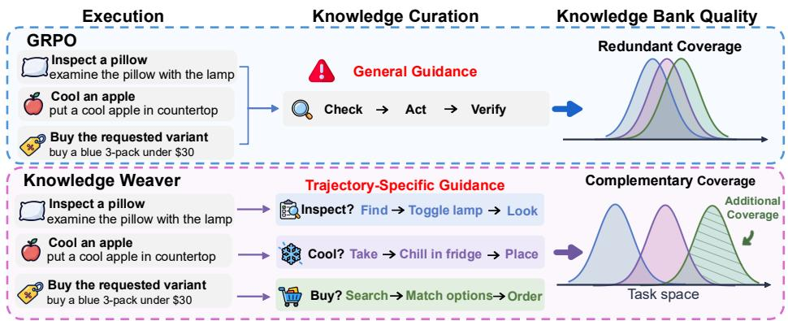
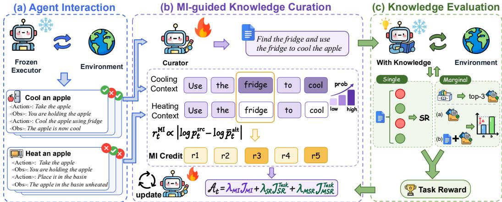
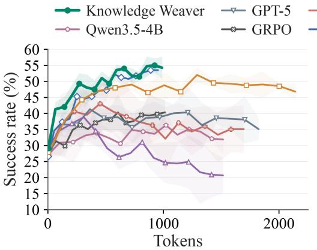
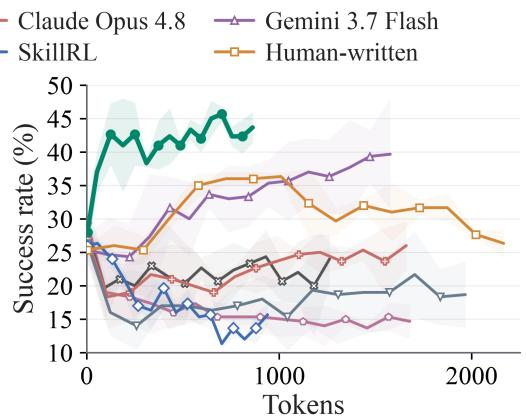
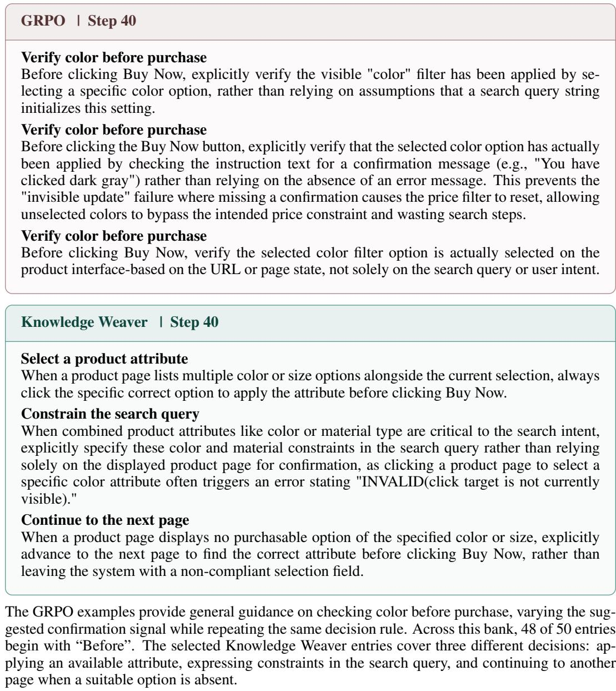
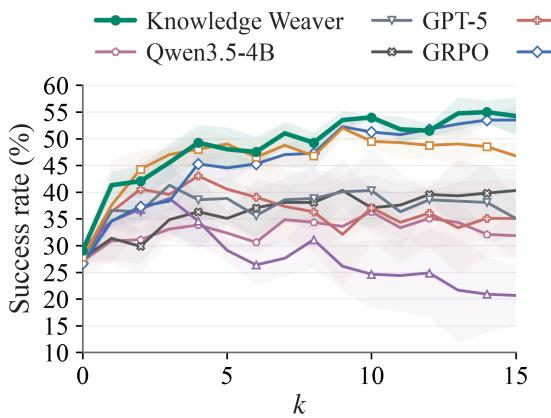
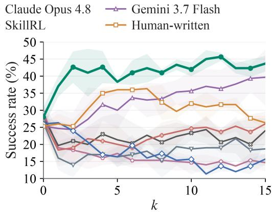

# LEARNING TO ACCUMULATE KNOWLEDGE WITH MUTUAL INFORMATION

Yuyang Zhao1 Lizi Liao2 Leyang Shen3 Xiaoyan Zhao3 Yang Zhang3 Fuli Feng1 Xiangnan He1

1University of Science and Technology of China 2Singapore Management University 3National University of Singapore

## ABSTRACT

Large language model (LLM) agents can improve their performance by reusing knowledge distilled from past interactions. However, curating new experiences into a knowledge bank that becomes more useful as it grows remains challenging. Effective knowledge accumulation should limit redundant overlap among entries and ensure that new knowledge contributes beyond what the bank already provides. Yet training a curator with Group Relative Policy Optimization (GRPO) on standalone task success can reinforce general guidance even when it duplicates existing knowledge. Therefore, we propose Knowledge Weaver, a reinforcement learning framework that trains a language model to curate reusable knowledge from agent trajectories. We couple feedback inspired by token-wise mutual information (MI) with marginal success rewards to guide knowledge accumulation. Together, these signals encourage the curator to preserve distinct information from experience and produce entries that improve task success when added to existing knowledge. Standalone success rewards also favor entries that are useful on their own. On ALFWorld and WebShop, Knowledge Weaver achieves mean success rates of 54.0% and 42.0% with k = 10 retrieved entries, exceeding GRPO by 16.9 and 18.7 percentage points, respectively. Its knowledge banks also outperform the evaluated prompt-based and established banks, including human-written banks, in overall ALFWorld success rate and WebShop score with the executor frozen. Our codebase is available at https://github.com/LaoKuiZe/Knowledge-Weaver.

## 1 INTRODUCTION

Large language model (LLM) agents interact with external environments to solve complex tasks (Yao et al., 2022b; Gur et al., 2024; Yang et al., 2024; Shen et al., 2025). Reusing knowledge from these interactions offers a route to agent self-improvement, allowing experience from previous tasks to inform future decisions. Prior work shows that high-quality, task-specific knowledge can improve agent performance (Wang et al., 2024; Li et al., 2026; Ouyang et al., 2026). Such knowledge includes reusable workflows and executable skills that guide action sequences (Wang et al., 2023; 2024; Yuan et al., 2024), as well as distilled lessons about environmental constraints and effective strategies (Majumder et al., 2023; Chen et al., 2024). Stored in external knowledge banks, relevant entries can be retrieved and incorporated into the agent’s context without updating the executor’s parameters (Zheng et al., 2024; Fu et al., 2024). This makes knowledge accumulation a means of retaining experience beyond individual interactions and supporting its reuse across tasks.

While these benefits establish the value of using knowledge, producing it reliably remains a separate challenge. Existing work relies on pipeline design or training-based methods for knowledge curation. Prompt-based methods extract reflective lessons, conditional guidelines, and reusable workflows from trajectories (Shinn et al., 2023; Zhao et al., 2024; Fu et al., 2024; Wang et al., 2024), then consolidate them through memory or playbook revision (Zhang et al., 2026a; Ouyang et al., 2026; Suzgun et al., 2026). Training-based methods integrate knowledge into policy improvement through skill internalization (Lu et al., 2026) or the joint evolution of task execution and reusable skills (Xia et al., 2026; Shi et al., 2026; Yao et al., 2026). When curation is rewarded through downstream task success, this feedback assesses whether generated knowledge helps execution. However, these advances in knowledge construction and use leave a distinct question of how to train a curator to produce better knowledge for a fixed executor. Addressing this question requires considering both the utility of individual entries and what they contribute as knowledge accumulates.

  
Figure 1: Conceptual illustration of general guidance and complementary knowledge. General guidance can remain useful for individual tasks while providing limited additional information across entries. Knowledge Weaver combines MI-inspired feedback with execution rewards to encourage experience-dependent knowledge and incremental utility.

Building on this, we propose Knowledge Weaver, an RL framework that trains a language model as a knowledge curator to extract reusable knowledge from agent trajectories. A good curator should produce knowledge that improves task performance and adds useful information as the bank grows. Effective accumulation therefore calls for both limited redundant overlap and substantial incremental utility. Figure 1 illustrates these considerations through knowledge coverage over a task space. Optimizing only for standalone task success can favor general guidance that repeatedly covers the same tasks, yielding substantial overlap and limited additional coverage as the bank grows. Complementary entries extend the bank’s coverage, with the shaded region indicating the incremental contribution of a new entry. We therefore approach knowledge accumulation through both the distinct information retained across entries and the additional utility each entry provides.

Knowledge Weaver couples token-level feedback inspired by mutual information (MI) with marginal success rewards to preserve distinct information and encourage incremental contributions to the bank. The MI-inspired signal contrasts generation probabilities across trajectory contexts, assigning greater credit to context-sensitive tokens than to tokens whose probabilities remain similar across experiences. To reward incremental contributions, we measure the gain in task success when a new entry is added to retrieved knowledge. This marginal reward favors entries that improve execution beyond what the bank already provides. We also reward task success with each entry alone to encourage individual utility. These signals jointly train the curator, whose generated knowledge is retrieved to guide a frozen executor.

We evaluate whether learned knowledge improves a frozen executor on ALFWorld, a household task environment (Shridhar et al., 2020), and WebShop, an online shopping environment (Yao et al., 2022a). Before each task, we retrieve k = 10 knowledge entries from the bank using the task query and provide them to the frozen executor as guidance. Knowledge Weaver achieves success rates of 54.0% and 42.0%, respectively. These results exceed task-success-only GRPO by 16.9 and 18.7 percentage points under the same executor. These gains demonstrate improved task performance and support a curation strategy aimed at reducing redundant overlap among knowledge entries.

Our contributions are summarized as follows.

• Redundancy in knowledge curation. We identify a limitation of GRPO using only task success as reward, which can produce general guidance with substantial informational redundancy across knowledge entries.

• MI-guided curator training. We propose Knowledge Weaver, which combines tokenlevel information feedback with execution rewards to train useful and complementary knowledge generation.

• Improved downstream performance. On ALFWorld and WebShop, Knowledge Weaver improves SR over task-reward-only GRPO by 16.9 and 18.7 percentage points at $k = 1 0 ,$ respectively. Its banks also exceed human-written banks on the reported aggregate metrics.

## 2 RELATED WORK

Knowledge Construction from Experience. LLM agents construct reusable knowledge through memory organization, experience distillation, and skill synthesis. Memory systems extract and organize information for later retrieval (Chhikara et al., 2025; Xu et al., 2026; Zhang et al., 2026b), while experience distillation produces reflective lessons and generalizable strategies (Shinn et al., 2023; Zhao et al., 2024; Majumder et al., 2023; Ouyang et al., 2026). Structured representations include conditional guidelines (Fu et al., 2024; Chen et al., 2024), reusable workflows (Wang et al., 2024), and executable skills (Wang et al., 2023; Yuan et al., 2024; Zheng et al., 2025). AutoSkill (Yang et al., 2026) maintains skills derived from interaction traces, while Trace2Skill (Ni et al., 2026) consolidates trajectory-level lessons into transferable guidance. Skill-Pro (Mi et al., 2026) uses execution feedback to generate and verify procedural skills without parameter updates. RLbased approaches further learn to use and construct reusable knowledge. Skill0 (Lu et al., 2026) trains agents to internalize supplied skills, while Skill0.5 (Zhu et al., 2026) combines general skill internalization with task-specific skill utilization. SkillRL (Xia et al., 2026) couples skill distillation and library evolution with executor training. Skill1 (Shi et al., 2026) jointly learns skill selection, utilization, and distillation, while SkillRise (Yao et al., 2026) assigns curation credit through subsequent execution outcomes. Knowledge Weaver complements execution feedback with explicit information feedback to train knowledge generation while keeping the executor fixed.

Mutual Information. Mutual information (MI) provides a general criterion for learning informative representations and encouraging dependence between related variables. In representation learning, Contrastive Predictive Coding captures information predictive of future observations, while Deep InfoMax promotes dependence between inputs and learned representations (Oord et al., 2018; Hjelm et al., 2018). InfoGAN uses MI between latent codes and generated observations to encourage interpretable factors of variation (Chen et al., 2016). In reinforcement learning, DIAYN maximizes MI between skill identities and visited states to discover distinguishable behaviors (Eysenbach et al., 2018). In dialogue generation, MI-based objectives discourage generic responses and favor responses that convey information about the conversational context (Li et al., 2016; Zhang et al., 2018). AMI further models source-target dependence through adversarial optimization of forward and backward generation networks (Pan et al., 2020). For LLM agents, RAGEN-2 introduces MI-inspired proxies to assess the dependence of generated reasoning on input prompts (Wang et al., 2026). In knowledge curation, input dependence concerns whether generated entries retain the distinct information carried by their source trajectories. Knowledge Weaver applies token-level MI-inspired feedback during curator training to encourage experience-specific content.

## 3 METHOD

## 3.1 PRELIMINARIES

As shown in Figure 2, a trainable curator π generates a knowledge entry $z \sim \pi _ { \boldsymbol { \theta } } ( \cdot \mid x )$ from a context x of trajectories sampled from a pool $\tau$ , each recording a task’s observations and actions. Training maintains an initially empty bank $B { \mathrm { , } }$ , expanded between updates. After training, the curator generates a separate evaluation bank ${ \mathcal C } = \{ z ^ { ( i ) } \} _ { i = } ^ { \bar { K } }$ of valid entries from sampled contexts. A frozen executor uses a knowledge set S to solve task $q .$ . Writing its binary success as $s ( q , S )$ , we measure empirical utility on a finite reward-task set D by

$$
U ( S ) = { \frac { 1 } { | { \mathcal { D } } | } } \sum _ { q \in { \mathcal { D } } } s ( q , S ) .\tag{1}
$$

During evaluation, $S = \mathcal { R } _ { k } ( q , \mathcal { C } )$ contains at most k entries retrieved once from the initial query and held fixed throughout execution.

  
Figure 2: Overview of Knowledge Weaver. Token-level MI feedback promotes experiencedependent knowledge, while execution rewards assess individual utility and marginal gains over retrieved knowledge. Only the curator is trained and the executor remains frozen.

## 3.2 EFFECTIVE KNOWLEDGE ACCUMULATION

Effective accumulation requires both individual utility and contributions beyond existing knowledge. With two equally weighted task types, a routine for an already-supported type and one for an uncovered type can be equally useful alone, yet only the latter extends the bank’s capabilities.

We formalize this distinction with a nonnegative, integrable utility profile $f _ { i } ( u )$ for each entry $z ^ { ( i ) }$ over an idealized task coordinate $u \in \mathbb { R }$ . The profile describes where and how strongly an entry helps; its area represents total individual utility. To avoid counting the same available utility repeatedly, bank coverage takes the best profile at each location,

$$
\mathcal { E } ( \mathcal { C } ) = \int _ { \mathbb { R } } \operatorname* { m a x } _ { 1 \leq i \leq K } f _ { i } ( u ) d u .\tag{2}
$$

Thus, repeated profiles add no coverage. This model assumes ideal selection of an entry without retrieval errors or interactions between entries; it illustrates utility overlap without predicting execution success. For a tractable comparison, use Gaussian profiles with fixed centers $c _ { 1 } < \cdots < c _ { K }$ ， $K \geq 2 .$ , common height $h > 0$ , and width $\sigma > 0$

$$
f _ { i } ( u ; h , \sigma ) = h \exp \left( - \frac { ( u - c _ { i } ) ^ { 2 } } { 2 \sigma ^ { 2 } } \right) .\tag{3}
$$

The center locates peak utility, while height and width describe its strength and extent. Each entry has total utility $A = { \sqrt { 2 \pi } } \sigma h ;$ write the resulting coverage as $\mathcal { E } ( h , \sigma )$

Proposition 1 (Utility scaling). For fixed centers and width, $\mathcal { E } ( h , \sigma ) = h \mathcal { E } ( 1 , \sigma )$ is strictly increasing in $h > 0$

To compare overlap at equal individual utility, we instead fix each profile’s area, so height must decrease as width grows.

Proposition 2 (Coverage under a fixed utility budget). For fixed centers and per-entry utility $A > 0$ let $h _ { A } ( \sigma ) = A / ( \sqrt { 2 \pi } \sigma )$ . Then $\mathcal { E } _ { A } ( \sigma ) = \mathcal { E } ( h _ { A } ( \sigma ) , \sigma )$ strictly decreases with $\sigma > 0$

The first result isolates stronger individual utility. In the second, total individual utility remains KA, but broader profiles overlap more and yield less bank coverage. Narrowing profiles at fixed height need not improve coverage. A new entry adds coverage only where its utility exceeds the existing envelope (Figure 1). Appendix A gives both proofs and the marginal-coverage identity.

Why standalone-success GRPO fails. Group Relative Policy Optimization (GRPO) (Shao et al., 2024) samples $G \geq 2$ candidates $z ^ { ( g ) }$ from a curator snapshot $\pi _ { \mathrm { o l d } } ( \cdot \mid x )$ for the same source context x. Under outcome supervision, every token t in candidate $g$ shares an advantage, the relative learning signal for the policy update,

$$
A _ { g , t } ^ { \mathrm { G R P O } } = \frac { R _ { g } - \bar { R } } { \sigma _ { R } + \epsilon _ { \mathrm { n u m } } } ,\tag{4}
$$

where $R _ { g }$ is the candidate reward, $\bar { R }$ and $\sigma _ { R }$ are its group’s reward mean and standard deviation, and $\epsilon _ { \mathrm { { n u m } } } > 0$ ensures numerical stability.

With standalone success $R _ { g } = U ( \{ z ^ { ( g ) } \} )$ , this advantage contains no bank information. An alreadycovered routine receives positive advantage when $R _ { g } > \bar { R } ,$ , with no preference for an equally successful complementary entry. Shared outcome credit also treats source-specific and generic tokens alike. We therefore introduce bank-relative gains to reward contributions beyond existing knowledge and source-dependent credit to encourage retention of the distinct information in each experience. These goals motivate two complementary signals. Marginal success feedback rewards contributions beyond existing knowledge (Section 3.3), while MI-inspired token credit encourages retention of source-dependent information (Section 3.4).

## 3.3 MARGINAL SUCCESS FEEDBACK

Marginal success-rate (MSR) feedback encourages additions that improve execution beyond what the bank already supports. For each task $q \in \mathcal { D }$ , retrieve up to m entries $B _ { q } = \mathcal { R } _ { m } ( q , \mathbf { \bar { \it B } } )$ from a fixed training-bank snapshot and compute

$$
\mathrm { M S R } ( z ) = \frac { 1 } { | \mathcal { D } | } \sum _ { q \in \mathcal { D } } \left[ s ( q , B _ { q } \cup \{ z \} ) - s ( q , B _ { q } ) \right] .\tag{5}
$$

We also evaluate standalone success $U ( \{ z \} )$ , the success rate given only that entry, while MSR measures change relative to retrieved guidance. For source context $x _ { i } ,$ candidates and all three conditions (standalone, bank-only, and bank-plus-candidate) share the reward-task set $\mathcal { D } \ : = \ : \mathcal { D } _ { i }$ with $B _ { q }$ fixed per task. The candidate is appended without replacing retrieved entries. An empty bank gives a no-knowledge baseline. Unlike ideal coverage, execution gains can be negative under interference. They operationalize incremental utility without estimating the coverage integral.

Between updates, eligible valid entries absent from the bank are ranked by positive MSR and admitted under a quota. If none has positive gain, the bank is unchanged. The updated bank is used in the next training batch; Algorithm 1 gives the schedule.

## 3.4 MI-INSPIRED INFORMATION FEEDBACK

Marginal success feedback evaluates what an entry contributes beyond the existing bank. We complement this signal with information feedback that encourages the curator to retain the distinct information contained in its input experience. Mutual information, $I ( X ; Z ) = H ( Z ) - H ( Z \mid X )$ ), with H denoting entropy, motivates measuring how source context X changes uncertainty about generated knowledge $\dot { Z }$ (Cover et al., 1991). For an entry $\boldsymbol { z } = ( z _ { 1 } , \dots , z _ { T } )$ generated from $x _ { i }$ among $N \geq 2$ contexts, we contrast token probabilities under source and alternative contexts,

$$
\delta _ { t } = \log \frac { ( N - 1 ) \pi _ { \mathrm { o l d } } ( z _ { t } \mid x _ { i } , z _ { < t } ) } { \sum _ { \ell \neq i } \pi _ { \mathrm { o l d } } ( z _ { t } \mid x _ { \ell } , z _ { < t } ) } , \quad r _ { t } ^ { \mathrm { M I } } = b _ { t } \operatorname* { m i n } \left\{ c _ { \mathrm { M I } } , \lambda _ { \mathrm { M I } } \vert \delta _ { t } \vert \right\} .\tag{6}
$$

The token and its prefix are held fixed when comparing source likelihood with the mean likelihood under alternative contexts. We take the absolute value to reward the magnitude of input dependence, whether the source context increases or decreases a token’s likelihood. Generic tokens with similar probabilities across contexts have small $| \delta _ { t } |$ and receive little credit, whereas experience-specific tokens with larger contrasts receive more. The mask $b _ { t }$ limits this credit to knowledge-body tokens, with scale $\lambda _ { \mathrm { M I } }$ and cap $c _ { \mathrm { M I } }$ . Assigning credit locally favors input-specific content over generic wording, encouraging the curator to retain more information from each source experience.

Joint feedback and policy update. We construct the joint feedback by extending the SR-only task reward used in our GRPO baseline. SR rewards an entry’s standalone utility without accounting for overlap with existing knowledge. We first add MI-inspired token credit to encourage preservation of information specific to each source experience. Because downstream evaluation concerns the utility of a knowledge bank, we further incorporate MSR to reward contributions beyond its existing entries. A formatting term additionally rewards valid structure and penalizes malformed outputs. Retaining GRPO’s group-relative normalization (Equation 4), we combine these signals in a single

token-level advantage,

$$
A _ { g , t } = \frac { \lambda _ { \mathrm { S R } } U ( \{ z ^ { ( g ) } \} ) + \lambda _ { \mathrm { M S R } } \mathrm { M S R } ( z ^ { ( g ) } ) + r _ { \mathrm { f m t } } ( z ^ { ( g ) } ) - \bar { R } _ { \mathrm { e x e c } } } { \sigma _ { \mathrm { e x e c } } + \epsilon _ { \mathrm { n u m } } } + r _ { g , t } ^ { \mathrm { M I } } ,\tag{7}
$$

where $\bar { R } _ { \mathrm { e x e c } }$ and $\sigma _ { \mathrm { e x e c } }$ are the within-group mean and standard deviation of the combined SR, MSR, and formatting reward. The weights $\lambda _ { \mathrm { S R } }$ and $\lambda _ { \mathrm { M S R } }$ control the two utility terms. MSR augments GRPO’s reward comparison with each entry’s contribution to the bank, while MI supplies local credit for source-dependent content. Invalid candidates receive only the formatting penalty and no MI credit. We retain GRPO for policy optimization, using the combined feedback to update only the curator through its clipped objective (Shao et al., 2024). Optimization details are provided in Appendix F.1.

## 4 EXPERIMENTS

## 4.1 EXPERIMENTAL SETUP

Environments. We evaluate our method on two benchmarks: ALFWorld (Shridhar et al., 2020) and WebShop (Yao et al., 2022a). ALFWorld is a text-based environment in which an agent completes household tasks through sequential natural-language interactions. We evaluate knowledge banks on the valid\_unseen split across six canonical task types: Pick, Clean, Heat, Cool, Look, and Pick Two. We report the success rate (SR) for each task type and across all evaluation tasks. WebShop is a simulated web shopping environment in which an agent searches for products, navigates product pages, and purchases an item that satisfies a user’s requirements. We sample 100 tasks from the test set to evaluate the knowledge banks and report both the environment score and SR.

Training and Evaluation Protocol. Throughout training, we freeze the executor and optimize only the curator. We assign equal weights of 0.5 to standalone SR and marginal SR. Token-level MI credit is scaled by 0.1 and capped at 0.15 after scaling. We use Qwen3.5-4B as the training model. After training, we use the trained curator to construct knowledge banks in a separate generation stage. We then evaluate the resulting banks with the frozen executor. Each knowledge bank contains 50 entries(except for SkillRL), with each entry limited to 100 words. To generate each entry, we randomly sample four trajectories from a trajectory pool. For each evaluation task, we retrieve the top-k entries using the all-mpnet-base-v2 encoder (Reimers & Gurevych, 2019), ranking entries by their cosine similarity to the initial task query. Retrieval occurs once, before the first action, and the selected entries remain fixed throughout the episode. We use $k = 1 0$ for all banks in the main comparison and evaluate every $k \in \{ 0 , \ldots , 1 5 \}$ in the scaling analysis.

Baselines. We compare four categories of knowledge banks, following Table 1: (1) LLM Curators: banks generated directly by Qwen3.5-4B, GPT-5 (OpenAI, 2025), Claude Opus 4.8 (Anthropic, 2026), and Gemini 3.7 Flash (Google DeepMind, 2026), (2) Established Knowledge Banks: publicly released banks from SkillRL (Xia et al., 2026) and human-written banks refined by human, (3) RL-Trained: GRPO (Shao et al., 2024) baseline, and SkillRise (Yao et al., 2026) and Skill1 (Shi et al., 2026), which use execution feedback to improve knowledge generation and refinement, (4) Prompt-Based: ExpeL (Zhao et al., 2024), which iteratively extracts and refines insights from successful and failed trajectories, and Mem0 (Chhikara et al., 2025), which extracts and organizes memories for later retrieval. We also include zero-shot execution (k=0) as a reference without external knowledge.

## 4.2 MAIN RESULTS

Improved Performance across Benchmarks. Table 1 shows that our method achieves the highest values on all three aggregate metrics with the same frozen executor at $k = 1 0$ . Overall SR reaches 54.0% on ALFWorld and 42.0% on WebShop, exceeding GRPO by 16.9 and 18.7 percentage points. On WebShop, its mean environment score reaches 66.4, compared with 49.0 for GRPO, indicating higher average reward alongside improved task success. Our method also outperforms SkillRise and Skill1 on both benchmarks. It exceeds SkillRL, the strongest ALFWorld baseline, by 2.8 percentage points in overall SR. Human-written banks achieve the highest baseline mean environment score on WebShop, but our method surpasses them on all three aggregate metrics. Gains over GRPO span

Table 1: Performance of knowledge banks with a frozen Qwen3.5-4B executor on ALFWorld and WebShop. Each bank supplies $k = 1 0$ retrieved entries per task and zero-shot execution uses no external knowledge. We report success rate (SR, %) and mean environment score on WebShop. All results are averaged over 3 seeds, with standard deviations shown as subscripts for the Overall and WebShop columns. Bold and underlining mark the best and second-best in each column.
<table><tr><td></td><td colspan="7">ALFWorld (SR%)</td><td colspan="2">WebShop</td></tr><tr><td>Method</td><td>Pick</td><td>Clean</td><td>Heat</td><td>Cool</td><td></td><td>Look Pick Two</td><td>Overall</td><td>Score</td><td>SR%</td></tr><tr><td>Zero-shot</td><td>30.6</td><td>10.8</td><td>31.9</td><td>30.2</td><td>24.1</td><td>25.5</td><td> $2 4 . 6 { \scriptstyle \pm 1 . 5 }$ </td><td> $5 3 . 5 { \pm } 1 . 9$ </td><td> $2 7 . 3 { \scriptstyle \pm 1 . 5 }$ </td></tr><tr><td colspan="10">LLM CURATORS</td></tr><tr><td>Qwen3.5-4B</td><td>40.3</td><td>43.0</td><td>24.6</td><td>41.3</td><td>48.1</td><td>15.7</td><td> $3 6 . 3 { \scriptstyle \pm 3 . 0 }$ </td><td> $4 0 . 6 _ { \pm 2 . 2 }$ </td><td> $1 4 . 7 _ { \pm 2 . 1 }$ </td></tr><tr><td>GPT-5</td><td>40.3</td><td>39.8</td><td>27.5</td><td>61.9</td><td>50.0</td><td>21.6</td><td> $4 0 . 3 { \scriptstyle \pm 7 . 9 }$ </td><td> $4 5 . 2 { \scriptstyle \pm 6 . 8 }$ </td><td> $1 8 . 7 { \scriptstyle \pm 7 . 4 }$ </td></tr><tr><td>Claude Opus 4.8</td><td>40.3</td><td>30.1</td><td>40.6</td><td>36.5</td><td>72.2</td><td>3.9</td><td> $3 7 . 1 { \scriptstyle \pm 6 . 2 }$ </td><td> $5 5 . 2 { \scriptstyle \pm 2 . 5 }$ </td><td> $2 4 . 7 _ { \pm 0 . 6 }$ </td></tr><tr><td>Gemini 3.7 Flash</td><td>25.0</td><td>11.8</td><td>18.8</td><td>25.4</td><td>64.8</td><td>11.8</td><td> $2 4 . 6 _ { \pm 6 . 4 }$ </td><td> $6 1 . 3 { \scriptstyle \pm 5 . 4 }$ </td><td> $3 5 . 7 _ { \pm 5 . 9 }$ </td></tr><tr><td colspan="10">ESTABLISHED KNOWLEDGE BANKS</td></tr><tr><td>SkillRL</td><td>34.7</td><td>50.5</td><td></td><td>50.7 68.3</td><td>66.7</td><td>39.2</td><td> $5 1 . 2 { \scriptstyle \pm 2 . 4 }$ </td><td> $3 6 . 6 { \scriptstyle \pm 3 . 0 }$ </td><td> $1 5 . 7 _ { \pm 0 . 6 }$ </td></tr><tr><td>Human-written</td><td>47.2</td><td>48.4</td><td>63.8</td><td>52.4</td><td>55.6</td><td>25.5</td><td> $4 9 . 5 { \scriptstyle \pm 1 . 1 }$ </td><td> $6 3 . 1 { \pm } 1 . 5$ </td><td> $3 2 . 0 { \scriptstyle \pm 1 . 0 }$ </td></tr><tr><td colspan="10">RL-TRAINED</td></tr><tr><td>GRPO</td><td>30.6</td><td>26.9</td><td>34.8</td><td>44.4 55.6</td><td></td><td>39.2</td><td> $3 7 . 1 _ { \pm 3 . 7 }$ </td><td> $4 9 . 0 { \scriptstyle \pm 4 . 8 }$ </td><td> $2 3 . 3 { \scriptstyle \pm 2 . 1 }$ </td></tr><tr><td>SkillRise</td><td>43.8</td><td>22.6</td><td>32.6</td><td>28.6</td><td>47.2</td><td>29.4</td><td> $3 3 . 2 { \scriptstyle \pm 1 . 6 }$ </td><td> $4 0 . 0 { \scriptstyle \pm 5 . 6 }$ </td><td> $1 8 . 7 _ { \pm 3 . 5 }$ </td></tr><tr><td>Skill1</td><td>37.5</td><td>25.8</td><td>14.5</td><td>34.9</td><td>44.4</td><td>25.5</td><td> $2 9 . 9 { \scriptstyle \pm 8 . 2 }$ </td><td> $3 8 . 5 { \scriptstyle \pm 0 . 9 }$ </td><td> $1 7 . 0 { \scriptstyle \pm 1 . 0 }$ </td></tr><tr><td colspan="10">PROMPT-BASED</td></tr><tr><td>ExpeL</td><td>38.9</td><td>18.3</td><td>23.2</td><td>27.0</td><td>37.0</td><td>31.4</td><td> $2 8 . 4 { \scriptstyle \pm 2 . 7 }$ </td><td> $5 8 . 4 { \scriptstyle \pm 1 . 2 }$ </td><td> $2 4 . 7 _ { \pm 2 . 1 }$ </td></tr><tr><td>Mem0</td><td>36.8</td><td>37.1</td><td>52.2</td><td>47.6</td><td>47.2</td><td>25.5</td><td> $4 1 . 2 { \scriptstyle \pm 0 . 9 }$ </td><td> $5 0 . 1 { \pm } 1 . 3 $ </td><td> $1 9 . 0 { \scriptstyle \pm 2 . 0 }$ </td></tr><tr><td>Our</td><td>45.8</td><td>48.4 63.8</td><td></td><td>54.087.0</td><td></td><td>27.5</td><td> ${ \bf 5 4 . 0 _ { \pm 0 . 4 } }$  </td><td> ${ \bf 6 6 . 4 _ { \pm 2 . 6 } }$ </td><td> $\mathbf { 4 2 . 0 } _ { \pm 2 . 0 }$ </td></tr></table>

five of six ALFWorld task types, although performance on Pick Two remains lower. These results support training knowledge curators with feedback beyond standalone task success.

Strong Base Models Do Not Guarantee Useful Knowledge. In Table 1, we evaluate strong general-purpose models as knowledge curators with the same frozen executor. Our trained $\mathrm { Q w e n } 3 . 5 \AA$ 4B curator outperforms GPT-5, Claude Opus 4.8, and Gemini 3.7 Flash on all three aggregate metrics. On ALFWorld, GPT-5 and Claude banks achieve overall SRs of 40.3% and 37.1%, respectively, above the zero-shot SR of 24.6%. On WebShop, however, their banks yield SRs of 18.7% and 24.7%, below the zero-shot SR of 27.3%. Gemini achieves the highest WebShop SR among these general-purpose curators (35.7%), whereas its overall ALFWorld SR matches the zero-shot mean (24.6%). These results show that strong general capabilities do not necessarily translate into knowledge that benefits downstream execution.

## 4.3 KNOWLEDGE BANK QUALITY ANALYSIS

Useful Knowledge Requires Relatively Little Context. Figure 3 examines whether the maintable gains persist when the number of retrieved entries changes. Knowledge Weaver achieves the highest mean WebShop SR among the eight plotted methods at every positive retrieval count. $\mathrm { A t } ~ k = 1 0$ , its knowledge context averages approximately 660 tokens on ALFWorld and 594 on WebShop, less than half the corresponding human-written context lengths. It nevertheless achieves higher SR on both benchmarks. The advantage therefore accompanies compact guidance, rather than a larger volume of injected text. As retrieval increases from $k = 9$ to 15, SR remains within 51.5-55.0% on ALFWorld and 42.0-45.7% on WebShop. The gains persist across this range despite fluctuations, reducing dependence on a single retrieval setting. ALFWorld performance is less uniformly dominant: human-written banks perform better at several smaller retrieval counts, and SkillRL slightly leads at $k = 1 2$

Additional Knowledge Can Help or Hinder Execution. Increasing retrieval exposes clear differences in how banks support the executor. On ALFWorld, Gemini’s SR declines from 38.8% at k = 3 to 20.6% at $k = 1 5$ , whereas Knowledge Weaver largely retains its gains. On WebShop, Qwen3.5-4B, GPT-5, Claude, and GRPO remain below their own no-knowledge controls at every positive retrieval count. Their additional context therefore fails to recover the performance lost when guidance is introduced. This pattern is consistent with unhelpful or conflicting guidance, although the curves alone cannot distinguish interference from retrieval mismatch or other content effects. Effective accumulation consequently requires assessing how entries work together, as well as whether individual entries appear useful. This observation motivates the marginal-utility objective and its contribution is examined alongside MI in the ablation. These sweeps retrieve from fixed banks, with observed token lengths rather than matched token budgets. To complement these execution trends, we quantify whether different knowledge entries tend to be retrieved for the same tasks. $\mathbf { A } \mathbf { t } k = 1 0$ we compute mean pairwise Jaccard overlap between these task sets for entries retrieved at least once, then average over three banks per method. Overlap is lower for Knowledge Weaver than for GRPO, with values of 12.92% versus 13.58% on ALFWorld and 15.35% versus 24.48% on WebShop. Thus, sustained execution gains with longer context coexist with lower retrieval overlap at $k = 1 0$ . These observations motivate our joint use of MI feedback and marginal success rewards to preserve useful information, with execution benefits examined in Section 4.4.

  
(a) ALFWorld

  
(b) WebShop  
Figure 3: Success rate as the number of retrieved knowledge entries k varies from 0 to 15. The horizontal axis reports the number of tokens in the formatted knowledge block injected into the frozen executor, averaged over tasks and runs. Lines and shading show the mean and one standard deviation across three runs. Each curve uses its own no-knowledge control at $k = 0$

## 4.4 ABLATION STUDIES

MI and MSR Improve Knowledge Utility. Table 2 compares SR-only training with two progressively augmented objectives, $\mathrm { S R } + \mathrm { M I }$ and $\mathrm { S R } + \mathrm { M I } + \mathrm { M S R }$ . The first extension adds tokenlevel MI, increasing ALFWorld SR from 37.1% to 46.0% and WebShop SR from 23.3% to 40.7%. WebShop score also improves from 49.0 to 65.8, supporting information feedback as a useful addition to standalone-success training.

Building on SR + MI, the full objective adds MSR to reward contributions beyond existing knowledge. ALFWorld SR increases further to 54.0%, an additional 8.0 percentage points, comparable to the 8.9-point improvement from adding MI. On WebShop, SR reaches 42.0% and score reaches 66.4, with a smaller additional SR gain of 1.3 points. Both extensions therefore improve performance, with similarly sized SR gains on ALF-World and a larger gain from MI on WebShop.

Table 2: Reward ablation at $k ~ = ~ 1 0$ with a frozen Qwen3.5-4B executor. SR rewards individual task success, MSR rewards success-rate gains over retrieved knowledge, and MI provides token-level information feedback. Formatting rewards are shared across configurations. Values are three-run means under different seeds. Bold marks column best.

<table><tr><td rowspan="2">Rewards</td><td>ALFWorld</td><td colspan="2">WebShop</td></tr><tr><td>SR</td><td>Score</td><td>SR</td></tr><tr><td>SR</td><td>37.1</td><td>49.0</td><td>23.3</td></tr><tr><td> $\mathrm { S R } + \mathrm { M I }$ </td><td>46.0</td><td>65.8</td><td>40.7</td></tr><tr><td>SR + MI + MSR</td><td>54.0</td><td>66.4</td><td>42.0</td></tr></table>

Knowledge Banks Transfer across Frozen Executors. We reuse banks generated by a curator trained with feedback from a frozen Qwen3.5-4B executor. Table 3 reports their performance with eight additional frozen executors at k = 8. Knowledge Weaver improves ALFWorld SR and both WebShop metrics over no-knowledge execution for all eight executors. Relative to GRPO, it achieves higher ALFWorld SR and WebShop scores for seven of eight executors on each metric, and higher WebShop SR for six, with one tie. GRPO banks improve ALFWorld SR for all eight executors but reduce WebShop SR for four. These results support reusing Knowledge Weaver banks across the evaluated executors without retraining the curator for each target model.

Table 3: Transfer of knowledge banks across frozen executors. None denotes execution without knowledge (k = 0), while GRPO and Knowledge Weaver (Ours) retrieve k = 8 entries per task. Knowledge-augmented results are averaged over three banks per method. Bold marks the best result for each executor and metric.
<table><tr><td rowspan="2">Executor</td><td colspan="3">ALFWorld SR (%)</td><td colspan="3">WebShop Score</td><td colspan="3">WebShop SR (%)</td></tr><tr><td>None</td><td>GRPO</td><td>Ours</td><td>None</td><td>GRPO</td><td>Ours</td><td>None</td><td>GRPO</td><td>Ours</td></tr><tr><td>Qwen3.5-4B</td><td>24.6</td><td>38.1</td><td>49.3</td><td>53.5</td><td>49.0</td><td>67.5</td><td>27.3</td><td>20.7</td><td>41.0</td></tr><tr><td>Qwen3.5-27B</td><td>48.5</td><td>61.9</td><td>61.2</td><td>54.9</td><td>55.6</td><td>66.9</td><td>25.0</td><td>23.0</td><td>41.7</td></tr><tr><td>Llama-3-8B-Instruct</td><td>6.7</td><td>7.2</td><td>12.7</td><td>2.7</td><td>10.3</td><td>10.5</td><td>0.0</td><td>4.7</td><td>4.0</td></tr><tr><td>Llama-3.1-8B-Instruct</td><td>9.7</td><td>14.9</td><td>21.1</td><td>16.0</td><td>6.7</td><td>19.7</td><td>6.0</td><td>2.3</td><td>11.7</td></tr><tr><td>Phi-4-mini-instruct</td><td>7.5</td><td>9.5</td><td>13.9</td><td>2.3</td><td>8.9</td><td>5.4</td><td>1.0</td><td>3.3</td><td>3.3</td></tr><tr><td>Phi-4</td><td>19.4</td><td>32.6</td><td>38.1</td><td>57.0</td><td>51.3</td><td>65.2</td><td>13.0</td><td>16.7</td><td>33.3</td></tr><tr><td>DeepSeek-V4-Flash</td><td>56.0</td><td>64.2</td><td>64.9</td><td>57.0</td><td>56.2</td><td>69.2</td><td>30.0</td><td>26.0</td><td>46.3</td></tr><tr><td>MiniMax-M2.5</td><td>35.1</td><td>53.7</td><td>56.5</td><td>62.8</td><td>64.8</td><td>73.6</td><td>30.0</td><td>33.0</td><td>48.0</td></tr><tr><td>MiniMax-M2.1</td><td>70.9</td><td>73.9</td><td>74.4</td><td>73.2</td><td>68.7</td><td>75.8</td><td>43.0</td><td>37.0</td><td>49.7</td></tr></table>

## 5 CONCLUSION

We introduced Knowledge Weaver, an RL framework that trains knowledge curators to preserve information through token-level MI feedback and rewards for marginal gains over retrieved knowledge, while rewarding standalone success. On ALFWorld and WebShop, the resulting banks outperform the evaluated baselines with a frozen executor, and the gains hold across retrieval sizes. Ablation indicates that MI adds value beyond task success alone. The banks also transfer to other executors, though the gains vary by model. These results support information preservation as a useful principle for building reusable knowledge from agent experience.

We plan several directions that follow from this work in the future. First, because our experiments keep the executor frozen, a natural extension is to jointly train the curator and executor, allowing knowledge construction and utilization to improve in tandem. Second, the uneven transfer gains suggest that knowledge effective for one executor may not transfer directly to another, motivating the development of knowledge banks that generalize across models. Finally, extending Knowledge Weaver to longer-horizon tasks, where the bank is continually updated as experience accumulates, would provide a stronger test of how well knowledge preservation scales over time. More broadly, we view learning to curate reusable knowledge as a step toward agents that self-improve continually through their own experience.

## AI USE STATEMENT

In this work, we used generative AI tools to assist with the implementation of software code and the analysis and interpretation of experimental results. We did not use generative AI tools to formulate the core research ideas, hypotheses, or methodological design of this work.

Additionally, we used generative AI tools to improve the readability and language of the manuscript and to create or refine minor visual elements in some figures.

All AI-assisted code was reviewed and tested by the authors, and all AI-assisted analyses of experi mental results were independently verified against the original experimental outputs. All AI-assisted text and visual elements were reviewed and revised by the authors. We take responsibility for the

final content of this work, including text, claims, code, analyses, and artifacts produced with the aid of generative AI.

## REPRODUCIBILITY STATEMENT

Section 3 defines the feedback signals and training objective. Section 4.1 describes the ALFWorld and WebShop evaluation protocol. Appendix C provides the prompts used for knowledge generation and execution. Appendix E reports the hyperparameter settings in Table 4. Appendix F presents the training pseudocode and GRPO update. Appendix D explains how the baselines were implemented and adapted to the shared evaluation protocol.

## ETHICS STATEMENT

Human volunteers wrote knowledge entries from sampled agent trajectories to construct the Humanwritten baseline. Participation was voluntary, and informed consent was obtained from all volunteers.

## REFERENCES

Anthropic. Claude Opus 4.8 System Card. System card, 2026. URL https://www. anthropic.com/claude-opus-4-8-system-card.

Minghao Chen, Yihang Li, Yanting Yang, Shiyu Yu, Binbin Lin, and Xiaofei He. Automanual: Constructing instruction manuals by llm agents via interactive environmental learning. Advances in Neural Information Processing Systems, 37:589–631, 2024.

Xi Chen, Yan Duan, Rein Houthooft, John Schulman, Ilya Sutskever, and Pieter Abbeel. Infogan: Interpretable representation learning by information maximizing generative adversarial nets. Advances in neural information processing systems, 29, 2016.

Prateek Chhikara, Dev Khant, Saket Aryan, Taranjeet Singh, and Deshraj Yadav. Mem0: Building production-ready ai agents with scalable long-term memory. arXiv preprint arXiv:2504.19413, 2025.

Thomas M Cover, Joy A Thomas, and John Kieffer. Elements of information theory, volume 2. wiley New York, 1991.

Benjamin Eysenbach, Abhishek Gupta, Julian Ibarz, and Sergey Levine. Diversity is all you need: Learning skills without a reward function. arXiv preprint arXiv:1802.06070, 2018.

Yao Fu, Dong-Ki Kim, Jaekyeom Kim, Sungryull Sohn, Lajanugen Logeswaran, Kyunghoon Bae, and Honglak Lee. Autoguide: Automated generation and selection of context-aware guidelines for large language model agents. Advances in Neural Information Processing Systems, 37: 119919–119948, 2024.

Google DeepMind. Gemini 3.7 Flash Model Card. Model card, August 2026. URL https: //deepmind.google/models/model-cards/gemini-3-7-flash/.

Izzeddin Gur, Hiroki Furuta, Austin Huang, Mustafa Safdari, Yutaka Matsuo, Douglas Eck, and Aleksandra Faust. A real-world webagent with planning, long context understanding, and program synthesis. In International Conference on Learning Representations, volume 2024, pp. 52690–52717, 2024.

R Devon Hjelm, Alex Fedorov, Samuel Lavoie-Marchildon, Karan Grewal, Phil Bachman, Adam Trischler, and Yoshua Bengio. Learning deep representations by mutual information estimation and maximization. arXiv preprint arXiv:1808.06670, 2018.

Jiwei Li, Michel Galley, Chris Brockett, Jianfeng Gao, and William B Dolan. A diversity-promoting objective function for neural conversation models. In Proceedings of the 2016 conference of the North American chapter of the association for computational linguistics: human language technologies, pp. 110–119, 2016.

Xiangyi Li, Yimin Liu, Wenbo Chen, Bingran You, Zonglin Di, Yifeng He, Shenghan Zheng, Kyoung Whan Choe, Jiankai Sun, Shuyi Wang, et al. Skillsbench: Benchmarking how well agent skills work across diverse tasks. arXiv preprint arXiv:2602.12670, 2026.

Zhengxi Lu, Zhiyuan Yao, Jinyang Wu, Chengcheng Han, Qi Gu, Xunliang Cai, Weiming Lu, Jun Xiao, Yueting Zhuang, and Yongliang Shen. Skill0: In-context agentic reinforcement learning for skill internalization. arXiv preprint arXiv:2604.02268, 2026.

Bodhisattwa Prasad Majumder, Bhavana Dalvi Mishra, Peter Jansen, Oyvind Tafjord, Niket Tandon, Li Zhang, Chris Callison-Burch, and Peter Clark. Clin: A continually learning language agent for rapid task adaptation and generalization. arXiv preprint arXiv:2310.10134, 2023.

Qirui Mi, Zhijian Ma, Mengyue Yang, Haoxuan Li, Yisen Wang, Haifeng Zhang, and Jun Wang. Skill-pro: Learning reusable skills from experience via non-parametric ppo for llm agents. arXiv preprint arXiv:2602.01869, 2026.

Jingwei Ni, Yihao Liu, Xinpeng Liu, Yutao Sun, Mengyu Zhou, Pengyu Cheng, Dexin Wang, Erchao Zhao, Xiaoxi Jiang, and Guanjun Jiang. Trace2skill: Distill trajectory-local lessons into transferable agent skills. arXiv preprint arXiv:2603.25158, 2026.

Aaron van den Oord, Yazhe Li, and Oriol Vinyals. Representation learning with contrastive predictive coding. arXiv preprint arXiv:1807.03748, 2018.

OpenAI. GPT-5 System Card. System card, 2025. URL https://openai.com/index/ gpt-5-system-card/.

Siru Ouyang, Jun Yan, I Hsu, Yanfei Chen, Ke Jiang, Zifeng Wang, Rujun Han, Long Le, Samira Daruki, Xiangru Tang, et al. Reasoningbank: Scaling agent self-evolving with reasoning memory. In International Conference on Learning Representations, volume 2026, pp. 94327–94354, 2026.

Boyuan Pan, Yazheng Yang, Kaizhao Liang, Bhavya Kailkhura, Zhongming Jin, Xian-Sheng Hua, Deng Cai, and Bo Li. Adversarial mutual information for text generation. In International Con ference on Machine Learning, pp. 7476–7486. PMLR, 2020.

Nils Reimers and Iryna Gurevych. Sentence-bert: Sentence embeddings using siamese bertnetworks. In Proceedings of the 2019 conference on empirical methods in natural language processing and the 9th international joint conference on natural language processing (EMNLP-IJCNLP), pp. 3982–3992, 2019.

Zhihong Shao, Peiyi Wang, Qihao Zhu, Runxin Xu, Junxiao Song, Xiao Bi, Haowei Zhang, Mingchuan Zhang, YK Li, Yang Wu, et al. Deepseekmath: Pushing the limits of mathematical reasoning in open language models. arXiv preprint arXiv:2402.03300, 2024.

Leyang Shen, Yang Zhang, Chun Kai Ling, Xiaoyan Zhao, and Tat-Seng Chua. Carl: Critical action focused reinforcement learning for multi-step agent. arXiv e-prints, pp. arXiv–2512, 2025.

Yaorui Shi, Yuxin Chen, Zhengxi Lu, Yuchun Miao, Shugui Liu, Qi Gu, Xunliang Cai, Xiang Wang, and An Zhang. Skill1: Unified evolution of skill-augmented agents via reinforcement learning. arXiv preprint arXiv:2605.06130, 2026.

Noah Shinn, Federico Cassano, Ashwin Gopinath, Karthik Narasimhan, and Shunyu Yao. Reflexion: Language agents with verbal reinforcement learning. Advances in neural information processing systems, 36:8634–8652, 2023.

Mohit Shridhar, Xingdi Yuan, Marc-Alexandre Côté, Yonatan Bisk, Adam Trischler, and Matthew Hausknecht. Alfworld: Aligning text and embodied environments for interactive learning. arXiv preprint arXiv:2010.03768, 2020.

Mirac Suzgun, Mert Yuksekgonul, Federico Bianchi, Dan Jurafsky, and James Zou. Dynamic cheatsheet: Test-time learning with adaptive memory. In Proceedings of the 19th Conference of the European Chapter of the Association for Computational Linguistics (Volume 1: Long Papers), pp. 7080–7106, 2026.

Guanzhi Wang, Yuqi Xie, Yunfan Jiang, Ajay Mandlekar, Chaowei Xiao, Yuke Zhu, Linxi Fan, and Anima Anandkumar. Voyager: An open-ended embodied agent with large language models. arXiv preprint arXiv:2305.16291, 2023.

Zihan Wang, Chi Gui, Xing Jin, Qineng Wang, Licheng Liu, Kangrui Wang, Shiqi Chen, Linjie Li, Zhengyuan Yang, Pingyue Zhang, et al. Ragen-2: Reasoning collapse in agentic rl. arXiv preprint arXiv:2604.06268, 2026.

Zora Zhiruo Wang, Jiayuan Mao, Daniel Fried, and Graham Neubig. Agent workflow memory. arXiv preprint arXiv:2409.07429, 2024.

Peng Xia, Jianwen Chen, Hanyang Wang, Jiaqi Liu, Kaide Zeng, Yu Wang, Siwei Han, Yiyang Zhou, Xujiang Zhao, Haifeng Chen, et al. Skillrl: Evolving agents via recursive skill-augmented reinforcement learning. arXiv preprint arXiv:2602.08234, 2026.

Wujiang Xu, Zujie Liang, Kai Mei, Hang Gao, Juntao Tan, and Yongfeng Zhang. A-mem: Agentic memory for llm agents. Advances in Neural Information Processing Systems, 38:17577–17604, 2026.

John Yang, Carlos Jimenez, Alexander Wettig, Kilian Lieret, Shunyu Yao, Karthik Narasimhan, and Ofir Press. Swe-agent: Agent-computer interfaces enable automated software engineering. Advances in Neural Information Processing Systems, 37:50528–50652, 2024.

Yutao Yang, Junsong Li, Qianjun Pan, Bihao Zhan, Yuxuan Cai, Lin Du, Jie Zhou, Kai Chen, Qin Chen, Xin Li, et al. Autoskill: Experience-driven lifelong learning via skill self-evolution. arXiv preprint arXiv:2603.01145, 2026.

Shunyu Yao, Howard Chen, John Yang, and Karthik Narasimhan. Webshop: Towards scalable real-world web interaction with grounded language agents. Advances in Neural Information Processing Systems, 35:20744–20757, 2022a.

Shunyu Yao, Jeffrey Zhao, Dian Yu, Nan Du, Izhak Shafran, Karthik Narasimhan, and Yuan Cao. React: Synergizing reasoning and acting in language models. arXiv preprint arXiv:2210.03629, 2022b.

Zhiyuan Yao, Yuxin Chen, Zhengxi Lu, Zishan Xu, Yueqing Sun, Yifu Guo, Yuquan Lu, Zhengzhou Cai, Kangning Zhang, Zhuowen Han, et al. Skillrise: Agentic reinforcement learning for crosstask skill evolution. arXiv preprint arXiv:2607.26784, 2026.

Lifan Yuan, Yangyi Chen, Xingyao Wang, Yi Fung, Hao Peng, and Heng Ji. Craft: Customizing llms by creating and retrieving from specialized toolsets. In International Conference on Learning Representations, volume 2024, pp. 40097–40125, 2024.

Qizheng Zhang, Changran Hu, Shubhangi Upasani, Boyuan Ma, Fenglu Hong, Vamsidhar Kamanuru, Jay Rainton, Chen Wu, Mengmeng Ji, Hanchen Li, et al. Agentic context engineering: Evolving contexts for self-improving language models. In International Conference on Learning Representations, volume 2026, pp. 86069–86100, 2026a.

Yizhe Zhang, Michel Galley, Jianfeng Gao, Zhe Gan, Xiujun Li, Chris Brockett, and Bill Dolan. Generating informative and diverse conversational responses via adversarial information maximization. Advances in Neural Information Processing Systems, 31, 2018.

Zeyu Zhang, Rui Li, Xiaoyan Zhao, Yang Zhang, Wenjie Wang, Xu Chen, and Tat-Seng Chua. Nextmem: Towards latent factual memory for llm-based agents. arXiv preprint arXiv:2603.15634, 2026b.

Andrew Zhao, Daniel Huang, Quentin Xu, Matthieu Lin, Yong-Jin Liu, and Gao Huang. Expel: Llm agents are experiential learners. In Proceedings of the AAAI Conference on Artificial Intelligence, volume 38, pp. 19632–19642, 2024.

Boyuan Zheng, Michael Y Fatemi, Xiaolong Jin, Zora Zhiruo Wang, Apurva Gandhi, Yueqi Song, Yu Gu, Jayanth Srinivasa, Gaowen Liu, Graham Neubig, et al. Skillweaver: Web agents can self-improve by discovering and honing skills. arXiv preprint arXiv:2504.07079, 2025.

Longtao Zheng, Rundong Wang, Xinrun Wang, and Bo An. Synapse: Trajectory-as-exemplar prompting with memory for computer control. In International Conference on Learning Representations, volume 2024, pp. 19036–19066, 2024.

Jiapeng Zhu, Jianxiang Yu, Yibo Zhao, Chengcheng Han, Qi Gu, Xunliang Cai, Xiang Li, and Weining Qian. Skill0. 5: Joint skill internalization and utilization for out-of-distribution generalization in agentic reinforcement learning. arXiv preprint arXiv:2605.28424, 2026.

## A PROOFS

We use the Gaussian utility profiles from Equation 3, with $K \geq 2$ fixed centers $c _ { 1 } < \cdots < c _ { K }$ and common height $h > 0$ and scale $\sigma > 0$ . Specializing Equation 2 gives the envelope coverage $\begin{array} { r } { \mathcal { E } ( h , \sigma ) = \int _ { \mathbb { R } } } \end{array}$ maxi $f _ { i } ( u ; h , \sigma )$ du. Write $\Delta _ { i } = c _ { i + 1 } - c _ { i } > 0$ for the adjacent gaps, and let $\phi$ and Φ denote the standard normal density and cumulative distribution function.

## A.1 PROOF OF PROPOSITION 1

Proof. For fixed $\sigma ,$ changing the common height rescales every profile by the same positive factor. This factor can be taken outside the pointwise maximum and the integral, giving

$$
\mathcal { E } ( h , \sigma ) = h \int _ { \mathbb { R } ^ { 1 \leq i \leq K } } \operatorname* { m a x } _ { } \exp \left( - \frac { ( u - c _ { i } ) ^ { 2 } } { 2 \sigma ^ { 2 } } \right) d u = h \mathcal { E } ( 1 , \sigma ) .\tag{8}
$$

To establish strict monotonicity, it remains to check that the coefficient $\mathcal { E } ( 1 , \sigma )$ is positive and finite. The envelope is bounded below by any individual profile and above by their sum. Since each unitheight profile integrates to ${ \sqrt { 2 \pi } } \sigma$ , these bounds imply

$$
0 < \sqrt { 2 \pi } \sigma \leq \mathcal { E } ( 1 , \sigma ) \leq K \sqrt { 2 \pi } \sigma < \infty .
$$

Thus coverage is linear and strictly increasing in the common height h.

## A.2 PROOF OF PROPOSITION 2

Proof. Fix the per-entry mass $A > 0$ . The Gaussian integral gives $A = { \sqrt { 2 \pi } } \sigma h$ , so the height must vary with σ according to

$$
h _ { A } ( \sigma ) = \frac { A } { \sqrt { 2 \pi } \sigma } , \qquad f _ { i } ( u ; h _ { A } ( \sigma ) , \sigma ) = \frac { A } { \sigma } \phi \biggl ( \frac { u - c _ { i } } { \sigma } \biggr ) .\tag{9}
$$

Each profile therefore has mass $A$ for every $\sigma > 0$ . We write $\mathcal { E } _ { A } ( \sigma ) = \mathcal { E } ( h _ { A } ( \sigma ) , \sigma )$ for the coverage under this constraint.

Because all profiles share the same height and scale, the nearest center provides the largest utility at each location. Define the adjacent midpoints $m _ { i } = ( c _ { i } + c _ { i + 1 } ) / 2$ for $i = 1 , \ldots , K - 1$ , with $m _ { 0 } = - \infty$ and $m _ { K } = + \infty$ . On $[ m _ { i - 1 } , m _ { i } ]$ ], the center $c _ { i }$ is nearest to u, so $f _ { i }$ attains the upper envelope. We can therefore integrate the envelope one interval at a time:

$$
\begin{array} { l } { \displaystyle \mathcal { E } _ { A } ( \sigma ) = \sum _ { i = 1 } ^ { K } \int _ { m _ { i - 1 } } ^ { m _ { i } } f _ { i } ( \boldsymbol { u } ; h _ { A } ( \sigma ) , \sigma ) d \boldsymbol { u } } \\ { \displaystyle = A \sum _ { i = 1 } ^ { K } \left[ \Phi \left( \frac { m _ { i } - c _ { i } } { \sigma } \right) - \Phi \left( \frac { m _ { i - 1 } - c _ { i } } { \sigma } \right) \right] . } \end{array}\tag{10}
$$

For each interior interval, the upper and lower bounds relative to its center are $\Delta _ { i } / 2$ and $- \Delta _ { i - 1 } / 2$ Using $\Phi ( - z ) = 1 - \Phi ( z )$ , its contribution is $A [ \Phi ( \Delta _ { i } / ( 2 \sigma ) ) + \Phi ( \Delta _ { i - 1 } / ( 2 \sigma ) ) - 1 ]$ The two end intervals contribute $\dot { A } \dot { \Phi } ( \Delta _ { 1 } / ( 2 \sigma ) )$ and $A \Phi ( \bar { \Delta } _ { K - 1 } ^ { } \dot { / } ( \dot { 2 } \sigma ) \dot { ) }$ , respectively. Thus each adjacent gap contributes twice, while each of the $K - 2$ interior intervals contributes one subtraction of $A .$ Summing gives

$$
\mathcal { E } _ { A } ( \sigma ) = A \left[ 2 \sum _ { i = 1 } ^ { K - 1 } \Phi \Big ( \frac { \Delta _ { i } } { 2 \sigma } \Big ) - ( K - 2 ) \right] .\tag{11}
$$

This expression also holds for $K = 2 ,$ , when there are no interior intervals. Differentiating with A and the centers fixed, and using $\Phi ^ { \prime } = \phi$ , yields

$$
\frac { d \mathcal { E } _ { A } ( \sigma ) } { d \sigma } = - \frac { A } { \sigma ^ { 2 } } \sum _ { i = 1 } ^ { K - 1 } \Delta _ { i } \phi \bigg ( \frac { \Delta _ { i } } { 2 \sigma } \bigg ) < 0 .\tag{12}
$$

The sum contains at least one term because $K \geq 2 ,$ and every term is positive because $\Delta _ { i } > 0$ and $\phi$ is strictly positive. Hence coverage strictly decreases with σ under the fixed per-entry mass constraint, proving the proposition. □

Redundancy and marginal coverage. At each location, utility counted by the sum of profiles but omitted by their maximum represents redundant overlap. Its integral is $\mathcal { R } _ { A } ( \sigma ) \ : = \ :$ $\begin{array} { r l } { \int _ { \mathbb { R } } [ \sum _ { i } f _ { i } ( u ; h _ { A } ( \sigma ) , \mathbf { \dot { \sigma } } ) - \operatorname* { m a x } _ { i } f _ { i } ( u ; h _ { A } ( \mathbf { \dot { \sigma } } ) , \sigma ) ] } \end{array}$ ] du. Subtracting Equation 11 from the total mass KA gives

$$
\mathcal { R } _ { A } ( \sigma ) = K A - \mathcal { E } _ { A } ( \sigma ) = 2 A \sum _ { i = 1 } ^ { K - 1 } \Phi \left( - \frac { \Delta _ { i } } { 2 \sigma } \right) .\tag{13}
$$

Since $\mathcal { R } _ { A } ^ { \prime } = - \mathcal { E } _ { A } ^ { \prime } > 0$ , increasing the common scale increases redundant overlap. As $\sigma \to 0 ^ { + }$ , each Φ term in Equation 11 tends to 1, giving coverage $K A$ in the limit. As $\sigma  \infty ,$ , each term tends to $1 / 2$ , giving limiting coverage A. Consequently, the coverage efficiency $\mathcal { E } _ { A } / ( K A )$ decreases from a limit of 1 to a limit of $1 / K$

More generally, for any nonnegative, integrable candidate profile $f _ { z }$ , its marginal coverage is

$$
\begin{array} { l } { \displaystyle \Delta _ { \mathrm { c o v } } ( z \mid \mathcal { C } ) = \mathcal { E } ( \mathcal { C } \cup \{ z \} ) - \mathcal { E } ( \mathcal { C } ) } \\ { = \displaystyle \int _ { \mathbb R } \left[ f _ { z } ( u ) - \operatorname* { m a x } _ { 1 \leq i \leq K } f _ { i } ( u ) \right] _ { + } d u , } \end{array}\tag{14}
$$

where $[ a ] _ { + } = \operatorname* { m a x } ( a , 0 )$ . This follows pointwise from max $\{ a , b \} - b = [ a - b ] _ { + }$ . Apply the identity with $a = f _ { z } ( u )$ and $b = \operatorname* { m a x } _ { i } f _ { i } ( u )$ , then integrate. It holds for any nonnegative, integrable profiles and requires no Gaussian assumption.

For the Gaussian specialization, consider adding an entry with the same $A$ and σ at $c \kappa + \Delta$ , where $\Delta \ : > \ : 0$ The coverage formula gains one gap term and one additional subtraction of $A ,$ so the marginal coverage is $\bar { A } [ 2 \Phi ( { \Delta } / ( { 2 \bar { \sigma } } ) ) - 1 ]$ . It is strictly increasing in $\Delta$ and lies in $( 0 , A )$ , approaching 0 as $\Delta  0 ^ { + }$ and A as $\Delta \to \infty$ . The same argument applies to an entry added beyond the leftmost center.

## B CASE STUDIES OF KNOWLEDGE BANK CONTENT

We inspect knowledge banks generated from step-40 curator checkpoints to examine what repeated and distinct entries contain. All examples below are complete entries from the GRPO and Knowledge Weaver used in Table 1. Each source bank contains 50 entries. We select cases from the knowledge banks of GRPO and Knowledge Weaver.

## B.1 ALFWORLD

## Possession before placement

locate your target object, verify it is on the surface with take, then immediately navigate to the destination and execute move to place it. Avoid navigating without picking up the object or performing unnecessary inventory checks that delay the action.

## Possession before placement

always take the object from the source before moving or attempting to place it there, even if the action seems redundant, to ensure possession is maintained and progress is made.

## Possession before placement

Check your inventory before moving to the destination to confirm you are carrying the correct object, then proceed directly to the destination and place the object there immediately without returning to the source.

## Knowledge Weaver | Step 40

## Cooling with the fridge

When cooling an object for placement, immediately pick it up from the countertop after navigating there, then head to the fridge and cool the object there, rather than returning to the countertop or searching for the object multiple times.

## Heating with the microwave

If you need to heat an item before placing it: verify the item is accessible by picking it up first (e.g., from the countertop), then heat it in the microwave using valid actions like move and heat; this ensures the object is in your possession and eliminates the error of heating an object that is still sitting in one location while you navigate to gain access to another, which consumes steps without progressing toward success.

## Inspection under a lamp

Before looking at an object in light, verify you are holding the object; if not, locate it by navigating to its current position and pick it up, then turn on the nearby lamp by using it only after the object is in your inventory.

The three GRPO entries reduce to the same possession-before-placement routine despite their different wording. The selected Knowledge Weaver entries retain distinct operations: cooling with a fridge, heating with a microwave, and activating a lamp while holding the object. These differences concern the prescribed action and appliance, rather than only an object-name substitution. They demonstrate task-specific content in individual entries, although bank-wide redundancy is not directly assessed by these examples.

## B.2 WEBSHOP

## C CURATOR AND EXECUTOR PROMPTS

We report the system and user message templates used for knowledge curation and execution on ALFWorld and WebShop. The curator receives four trajectories from the same task type and returns a single knowledge entry of at most 100 words, enclosed in <skill> and </skill> tags. We reproduce the evidence-conditioned prompts, including their output requirements, and retain the implementation’s term “skill.” The prompt wording is preserved; whitespace is adjusted for typesetting.

Fields such as {trajectories}, {observation}, and {guidance} represent content inserted at runtime. The trajectory field contains the rendered source histories, and the guidance field contains the knowledge supplied to the executor. For fixed-bank evaluation, multiple retrieved entries are numbered under “Retrieved guidance skills:” and remain fixed throughout the episode. The memory block is omitted when no prior interactions are available, and the WebShop invalid-response line is included only when retrying an invalid response. In the ALFWorld action vocabulary, {obj}, {recep}, and {appliance} are literal action-template slots.

The executor fields are shown after preprocessing and before model-specific chat formatting. The recorded evaluations retain up to five recent interactions. ALFWorld supplies the final 1,800 observation characters and at most 140 admissible commands; WebShop limits the current observation to 5,000 characters and lists at most 60 visible click targets. Command and click-target lists are sorted before truncation.

## C.1 ALFWORLD CURATOR

## ALFWorld curator | System

You extract one useful guidance skill from agent trajectories. The acting agent already receives general operating guidance to consult its legal actions, navigate where needed, reveal accessible contents, and carry out the requested interaction. Treat that guidance as given rather than rewriting it as the learned skill.

Study the complete trajectories as behavioral evidence. Keep investigating beyond convenient surface explanations until the histories support an additional consequential insight that can improve future decisions. The conclusion must depend on what actually happened in the trajectories. Do not merely summarize the task or action-space description, imitate a fixed writing pattern, or invent unsupported details. Reason privately and output only the final natural-language skill required by the output contract. Return exactly one skill wrapped by <skill> and </skill>, with no text outside the tags.

## ALFWorld curator | User

## # Legal action vocabulary

The agent may use these action templates: go to {recep}, open/close {recep}, take {obj} from {recep}, put {obj} in/on {recep}, use {obj}, heat/cool/clean {obj} with {appliance}, examine {obj}, look. This list only constrains which actions are legal. It is not trajectory evidence and must not be restated as the learned skill. The agent only sees the current room view. Receptacles must be navigated to, and some must be opened before their contents become visible.

\# Skill content requirements

\- Read across the complete action histories and discover a consequential issue or insight that is easy to miss from the task description alone, then give useful guidance for addressing it. - Ground the guidance in differences, consequences, or lack of progress visible in the supplied trajectories. If the same advice could be written without reading them, investigate further. - Do not mechanically recap the action sequence.

\- Use only legal actions from the action vocabulary. Do not invent actions or unsupported facts.

\- Write one compact natural-language paragraph of at most 100 words, without following a fixed rhetorical template.

\- Return exactly: <skill><one natural-language guidance paragraph></skill>

## C.2 ALFWORLD EXECUTOR

ALFWorld executor | System   
You are an ALFWorld TextWorld agent. Choose the next action using this exact format:   
Thought: <concise reasoning, max 30 words>   
Action: <copy exactly one command from the admissible command list>   
Write the Action line immediately after the Thought line. Do not add any other text.   
Guidance skill:   
{guidance}

ALFWorld executor | User   
Task: {task\_description}   
Observation: {observation}   
Recent online episodic memory:   
{online\_memory}   
Admissible commands:   
{admissible\_commands}   
Respond with Thought and Action:

## C.3 WEBSHOP CURATOR

## WebShop curator | System

You extract one useful guidance skill from shopping-agent trajectories. Read the complete histories as behavioral evidence and begin with the concrete details that explain why an action helped, failed, or changed the outcome. Infer one non-obvious, consequential insight that would materially improve a future agent’s decision in a similar situation. Let the evidence determine what the skill is about instead of starting from a predetermined workflow or restating advice that could be written without these histories.

Make the insight specific enough to guide a decision. Ground every claim in an observed state, action consequence, or outcome difference. Do not produce generic boilerplate, a reusable checklist, a trajectory recap, or unsupported product facts. Reason privately and output only the final skill required by the output contract.

Return exactly one <skill>...</skill> wrapper and no text outside it.

<table><tr><td>WebShop curator | User</td></tr><tr><td># Task category</td></tr><tr><td>WebShop product search, option selection, and purchase</td></tr><tr><td># Legal action vocabulary The agent can call search[concise query] when a search box is present and click[exact visible</td></tr><tr><td>target] for products, navigation controls, product options, and Buy Now. This vocabulary only constrains legal behavior; it is not trajectory evidence and must not be restated as the skill.</td></tr><tr><td></td></tr><tr><td># Complete trajectory evidence {trajectories}</td></tr><tr><td># Skill content requirements</td></tr><tr><td>WebShop curator | User (continued)</td></tr><tr><td>- Extract a consequential insight whose usefulness depends on reading these histories closely, including evidence from failed progress, misleading page state, or a successful change in behavior. - Prefer the smallest behaviorally meaningful correction or decision principle supported by the</td></tr><tr><td>evidence. If the same advice could be written without the histories, investigate further. - Let concrete trajectory evidence determine both the content and wording. Do not fall back on generic boilerplate, a reusable checklist, or a trajectory recap.</td></tr><tr><td>- Use only legal WebShop actions and facts supported by the supplied histories. - Write one compact natural-language paragraph of at most 100 words.</td></tr><tr><td></td></tr><tr><td># Strict output requirements - Return exactly: &lt;skill&gt;&lt;one natural-language guidance paragraph&gt;&lt;/skill&gt; - The opening tag must be the first non-whitespace text and the closing tag the last. - Use exactly one opening tag and one closing tag. Do not add analysis, markdown, labels,</td></tr></table>

## C.4 WEBSHOP EXECUTOR

<table><tr><td>WebShop executor | System</td></tr><tr><td>You are a WebShop text agent. Select the next action to satisfy the shopping instruction and maximize the final WebShop reward.</td></tr><tr><td>Respond using exactly two lines: Thought: &lt;concise reasoning, at most 35 words&gt;</td></tr><tr><td>Action: &lt;one valid action&gt; Use search[concise keywords] only when search is available. Use click[exact target] by</td></tr><tr><td>copying one currently visible clickable target. Do not add any other text.</td></tr><tr><td></td></tr><tr><td>Guidance skill:</td></tr><tr><td>{guidance}</td></tr></table>

<table><tr><td>WebShop executor | User</td></tr><tr><td>Shopping instruction: {shopping_instruction} Current page observation:</td></tr><tr><td>{observation} Recent online memory:</td></tr><tr><td>{online_memory} Search action: {available_or_unavailable}</td></tr><tr><td>Visible click targets:</td></tr><tr><td>{visible_click_targets} Previous response was invalid: {error_reason}</td></tr><tr><td>Return Thought and Action now:</td></tr></table>

## D BASELINE REPRODUCTION

We reproduced Skill1, SkillRise, and Mem0 with Qwen3.5-4B under a shared bank-evaluation protocol. The trained Skill1 and SkillRise checkpoints served as curators for separate bank generation. Each bank contained 50 entries of at most 100 words, constructed from matched bundles of four trajectories. Evaluation used the frozen Qwen3.5-4B executor and all-mpnet-base-v2 retrieval, with the top 10 entries selected once and held fixed throughout each episode. Skill1 and SkillRise results are reported as means and standard deviations across three runs.

## D.1 SKILL1

We retained Skill1’s query generation, skill reranking, library updates, and distillation objective (Shi et al., 2026). We trained query-generation and reranking responses while excluding task-execution responses from the policy loss. Complete trajectories still supplied outcome rewards. We used the step-40 checkpoints to generate the evaluation banks.

## D.2 SKILLRISE

We retained SkillRise’s cross-task training and decoupled credit assignment (Yao et al., 2026). Each trial comprised three tasks from the same family, with the skill document updated between tasks and reset between trials. Solving responses received feedback from their own task outcomes, whereas curation responses received feedback from subsequent tasks.

## D.3 MEM0

We evaluated both semantic and procedural banks constructed with Mem0 v2.1.0 (Chhikara et al., 2025) and Qwen3.5-4B, retaining the package’s native memory-writing prompts and exporting memories from the same trajectory bundles into the shared bank format. For each evaluation seed, we averaged the results of the two bank types, then reported the mean and standard deviation across three seeds.

## D.4 HUMAN KNOWLEDGE CONSTRUCTION

For the Human-written baseline, we sampled trajectories using the same procedure and distributed them to volunteers, who wrote knowledge entries based on these trajectories. We then assembled these entries into knowledge banks following the shared construction protocol and evaluated the resulting banks under the same evaluation protocol.

## E EXPERIMENTAL DETAILS

## E.1 HYPERPARAMETER DETAILS

Table 4 summarizes the training configuration for the Qwen3.5-4B curator. We update all curator parameters while keeping the executor and reference model frozen. After training, the curator generates separate knowledge banks for downstream evaluation.

## E.2 DATA SOURCES AND TASK SPLITS

Table 5 summarizes the task sources used by Knowledge Weaver. The full training split is eligible for reward sampling; each group samples eight tasks rather than evaluating the entire split at every update.

Training trajectories, reward tasks, and bank-generation sources may share training tasks. For ALF-World, these sources belong to train, whereas final evaluation uses valid\_unseen. For Web-Shop, official human training and test tasks have disjoint task IDs. Synthetic bank-generation tasks use a separate ID namespace.

## E.3 TRAINING DETAILS

We initialized the curator, executor, and reference policy from Qwen3.5-4B. Training updated all curator parameters, while the executor and reference policy remained frozen. We optimized the curator with the clipped GRPO objective using AdamW, a constant learning rate, and KL regularization against the reference policy. Table 4 specifies the principal settings for the main Knowledge Weaver configuration on ALFWorld and WebShop.

The training batch size and GRPO group size refer to different sampling levels. Each training batch contained 32 trajectory contexts, each comprising four trajectories from the same task type. For each context, the curator sampled eight candidate knowledge entries from the identical input, giving

<table><tr><td>Hyperparameter</td><td>ALFWorld WebShop</td></tr><tr><td>Optimization</td><td></td></tr><tr><td>Optimizer</td><td>AdamW</td></tr><tr><td>Learning rate</td><td> $1 \times 1 0 ^ { - 6 }$ </td></tr><tr><td>Learning-rate schedule / warmup</td><td>Constant / none</td></tr><tr><td>AdamW  $( \beta _ { 1 } , \beta _ { 2 } )$ </td><td>(0.9,0.999)</td></tr><tr><td>AdamW numerical epsilon</td><td>10⁻8</td></tr><tr><td>Weight decay</td><td>0.01</td></tr><tr><td>Gradient-norm clipping</td><td>1.0</td></tr><tr><td>Policy-ratio clipping parameter</td><td>0.2</td></tr><tr><td>KL regularization coefficient</td><td>0.01</td></tr><tr><td>PPO minibatches per training batch</td><td>32</td></tr><tr><td>Context Sampling and Generation</td><td></td></tr><tr><td>Trajectory contexts per training batch</td><td>32</td></tr><tr><td>Contexts per MI comparison set</td><td>8</td></tr><tr><td>Input trajectories per context</td><td>4</td></tr><tr><td>Candidate entries per context (GRPO group size)</td><td>8</td></tr><tr><td>Curator sampling temperature</td><td>1.0</td></tr><tr><td>Curator top-p</td><td>1.0</td></tr><tr><td>Maximum generated tokens per candidate</td><td>256</td></tr><tr><td>Maximum words per knowledge entry</td><td>100</td></tr><tr><td>Maximum rendered steps per source trajectory Source-observation character limit</td><td>24 120 400</td></tr><tr><td></td><td></td></tr><tr><td>Execution Feedback and Bank Updates</td><td></td></tr><tr><td>Executor temperature Maximum actions per reward rollout</td><td>0 15</td></tr><tr><td></td><td>50</td></tr><tr><td>Reward-task rollouts per candidate and condition</td><td>8</td></tr><tr><td>Standalone-success weight, λsR</td><td>0.5</td></tr><tr><td>Marginal-success weight, λMSR</td><td>0.5</td></tr><tr><td>Token-level MI weight, λMI</td><td>0.1</td></tr><tr><td>MI credit cap after scaling, CM1</td><td>0.15</td></tr><tr><td>Valid-format bonus / invalid-format penalty</td><td> $+ 0 . 0 2 / - 0 . 1$ </td></tr><tr><td>Retrieved entries for marginal feedback, m</td><td>3</td></tr></table>

Table 4: Key training hyperparameters for the main Qwen3.5-4B Knowledge Weaver configuration. Shared values span both benchmark columns; benchmark-specific values are shown separately. Each training batch contains 32 trajectory contexts and eight candidates per context, for 256 candidate entries before optimization. Only the curator is trained. The table describes training; the separately generated evaluation banks contain 50 entries and use $k = 1 0$ in the main comparison.

<table><tr><td>Data role</td><td>ALFWorld</td><td>WebShop</td></tr><tr><td>Training source trajectories</td><td>Collected from train across all six task types.</td><td>Collected from the full official human training split.</td></tr><tr><td>SR/MSR reward tasks</td><td>Sampled from all train tasks matching the source context&#x27;s task type.</td><td>Sampled from all 10,587 official human training tasks.</td></tr><tr><td>Evaluation-bank source</td><td>120 train trajectories, with 20 per task type.</td><td>300 synthetic training-task trajectories.</td></tr><tr><td>trajectories Final evaluation tasks</td><td>All 134 valid_unseen tasks.</td><td>A fixed subset of 100 tasks from the 500 official human test tasks.</td></tr></table>

Table 5: Task sources for training, bank construction, and final evaluation.

$3 2 \times 8 = 2 5 6$ candidates per batch. Execution rewards were normalized within each group of eight candidates. The value 32 therefore counts input contexts per training batch, whereas the value 8 counts candidate entries per context. The PPO minibatch count in the table specifies how this generated batch was partitioned for optimization.

For execution feedback, we used eight reward-task rollouts per candidate and condition, with matched tasks shared across the standalone, bank-only, and bank-plus-candidate conditions. Standalone success and marginal success received equal weights of 0.5. A valid <skill> response received a formatting bonus of 0.02; an invalid response received a penalty of −0.1 without execution or MI credit. Token-level MI credit was applied only to knowledge-body tokens, with weight 0.1 and a cap of 0.15 after scaling. We used within-group normalization for execution rewards and batch-level normalization for the resulting token advantages.

The training bank was initialized empty and held fixed while each batch was scored. Marginal feedback used up to three retrieved entries, and bank admission required a strictly positive marginal success gain. On ALFWorld, the update quota allowed at most one entry from each of two task types per batch during the first 20 updates, and at most one entry thereafter. On WebShop, at most one entry was admitted per batch. After training, the curator generated a separate evaluation bank of 50 entries. The training retrieval count of three is distinct from the main evaluation setting of $k = 1 0$

## E.4 RETRIEVAL-COUNT SCALING

We evaluate retrieval counts $k \in \{ 0 , \ldots , 1 5 \}$ while keeping each knowledge bank, the executor, and the benchmark task set fixed. For methods also shown in Figure 3, we use the same evaluation runs and replace token count with retrieval count on the horizontal axis.

Each curve uses a fixed set of runs across all retrieval counts using three runs. Each curve retains its own no-knowledge control at $k = 0$

  
(a) ALFWorld

  
(b) WebShop  
Figure 4: Success rate as the number of retrieved knowledge entries k varies from 0 to 15. The horizontal axis reports the number of retrieved knowledge injected into the frozen executor. Lines and shading show the mean and one standard deviation across three runs. Each curve uses its own no-knowledge control at $k = 0$

Figure 4 shows that the effect of additional retrieved knowledge varies across banks and environments. Knowledge Weaver achieves SRs of 54.0% and 42.0% at $k = 1 0$ on ALFWorld and Web-Shop, respectively. $\mathrm { A t } k = 1 5$ , the corresponding rates are 54.2% and 43.7%.

## F TRAINING ALGORITHM

Algorithm 1 summarizes Knowledge Weaver training. Candidates generated from the same trajectory context form a GRPO sampling group. Token-level MI feedback compares each candidate across source contexts while preserving its generated tokens and prefix. The executor and reference policy remain frozen throughout training.

All execution conditions for a candidate use the same tasks, with $B _ { q }$ fixed in the marginal comparison. With an empty bank, the bank-only condition reduces to execution without knowledge. Invalid candidates receive only the formatting penalty. MI credit is added after execution advantages are computed, so it is not propagated to preceding tokens through return estimation.

Algorithm 1 Knowledge Weaver curator training   
Require: Curator $\pi _ { \theta } ,$ frozen executor, reference policy $\pi _ { \mathrm { r e f } }$ , trajectory pool $\tau$   
Require: Updates $^ { J , }$ candidates per context $G \geq 2 ,$ retrieval count $m ,$ admission schedule $\mathcal { Q }$   
Require: Reward weights $\lambda _ { \mathrm { S R } } , \bar { \lambda _ { \mathrm { M S R } } } ,$ MI weight $\lambda _ { \mathrm { M I } }$ , MI cap $c _ { \mathrm { M I } }$   
Ensure: Trained curator πθ   
1: Initialize training knowledge bank $B \gets \emptyset$   
2: for $j = 1 , \dotsc , \bar { J }$ do   
3: πold $\gets \pi _ { \boldsymbol { \theta } } ;$ fix bank snapshot $B ^ { \mathrm { s n a p } }  B$   
4: Sample a batch of trajectory-context sets from $\tau$   
5: for each context set $\dot { \mathcal { X } } = \left( \dot { x } _ { 1 } , \dots , x _ { N } \right)$ , with $N \geq 2$ do   
6: for $i = 1 , \ldots , N$ do   
7: Sample G candidates $z \sim \pi _ { \mathrm { o l d } } ( \cdot \mid x _ { i } )$   
8: Select training reward tasks $\mathcal { D } _ { i } .$ , shared by these candidates   
9: Retrieve up to m entries $B _ { q }$ from $B ^ { \mathrm { s n a p } }$ for each $q \in \mathcal { D } _ { i }$   
10: for each candidate z generated from $x _ { i }$ do   
11: Initialize $U ( \{ z \} ) ^ { - } = 0 , \mathrm { M S R } ( z ) \gets 0 ,$ , and $r _ { t } ^ { \mathrm { M I } } \gets 0$   
12: if z has valid formatting then   
13: Evaluate $s ( q , \{ z \} ) , s ( q , B _ { q } ) .$ , and $s ( q , B _ { q } \cup \{ z \} )$ on $\mathcal { D } _ { i }$   
14: Average standalone success to obtain $U { \big ( } \{ z \} { \big ) }$   
15: Compute MSR(z) using Equation 5 on $\mathcal { D } _ { i }$   
16: Rescore $z _ { t }$ under each $x _ { \ell } \in \mathcal { X }$ with $z _ { < t }$ fixed   
17: Compute masked token credits $r _ { t } ^ { \mathrm { M I } }$ using Equation 6   
18: end if   
19: $R _ { \mathrm { e x e c } } ( z )  \lambda _ { \mathrm { S R } } U ( \{ z \} ) + \lambda _ { \mathrm { M S R } } \mathrm { M S R } ( z ) + r _ { \mathrm { f m t } } ( z )$   
20: end for   
21: Normalize $R _ { \mathrm { e x e c } } ( z )$ within the $G$ candidates generated from $x _ { i }$   
22: end for   
23: end for   
24: Combine normalized execution rewards and local MI credit as $A _ { g , t }$ (Equation 7)   
25: Compute $\widehat { A } _ { g , t }$ by reference regularization and batch normalization (Equation 16)   
26: Update $\theta$ using the clipped GRPO objective with $\pi _ { \mathrm { o l d } }$ and $\widehat { A } _ { g , t }$   
27: Select valid candidates absent from $\breve { B } ^ { \mathrm { s n a p } }$ with $\mathrm { M S R } ( z ) > 0$   
28: Admit the highest-gain eligible candidates subject to $\mathcal { Q } _ { j }$ to obtain $\boldsymbol { B }$   
29: end for   
30: return $\pi _ { \theta }$

The admission schedule $\mathcal { Q } _ { j }$ specifies the eligible task types and update quota. On ALFWorld, we admit at most one candidate per scheduled task type, selecting two types per update for the first 20 updates and one thereafter. On WebShop, we admit at most one candidate per update. Admission ranks candidates by MSR alone; if no eligible candidate has positive gain, the bank remains unchanged. The updated bank is used in the next training batch. After training, the curator generates a separate knowledge bank for downstream evaluation.

## F.1 OPTIMIZATION DETAILS

Feedback and final advantages. The combined SR, MSR, and formatting rewards in Equation 7 are normalized across candidates from the same source context before being placed at the final generated token. We use zero value estimates, unit discount, and unit GAE parameter. Referencepolicy regularization contributes a penalty at each generated token. Let $\ell _ { g , t } ^ { \mathrm { b } \mathrm { \hat { e } h } }$ and $\ell _ { g , t } ^ { \mathrm { r e f } }$ denote the sampled token log-probabilities under the behavior and frozen reference policies. The sampled KL term is

$$
\kappa _ { g , t } = \mathrm { c l i p } \big ( \ell _ { g , t } ^ { \mathrm { b e h } } - \ell _ { g , t } ^ { \mathrm { r e f } } , - 1 0 , 1 0 \big ) .\tag{15}
$$

Backward return computation accumulates these penalties from token t to the entry’s final token $T _ { g } .$ . Local MI credit is added after this computation, so it is not accumulated across token positions.

Using the modified advantage $A _ { g , i }$ from Equation 7, the final advantages are

$$
\widehat { A } _ { g , t } = \operatorname { N o r m } _ { \mathrm { b a t c h } } \left( A _ { g , t } - \beta \sum _ { s = t } ^ { T _ { g } } \kappa _ { g , s } \right) .\tag{16}
$$

The sum includes only unmasked generated tokens. Batch normalization subtracts the mean and divides by the sample standard deviation plus $\epsilon _ { \mathrm { n u m } }$ over all such tokens in the rollout batch. Group reward normalization also uses sample standard deviation, with $\epsilon _ { \mathrm { n u m } } = 1 0 ^ { - 5 }$ in both operations. The configurations use $\beta = 0 . 0 1$ and clipping radius $\varepsilon = 0 . 2$ . Reference regularization enters through these rewards, without an additional differentiated KL term in the loss.

The full configuration uses $\lambda _ { \mathrm { S R } } = \lambda _ { \mathrm { M S R } } = 0 . 5 , \lambda _ { \mathrm { M I } } = 0 . 1$ , and $c _ { \mathrm { M I } } = 0 . 1 5$ . Formatting adds 0.02 for valid entries and gives invalid entries a reward of −0.1. The backend also clips scalar rewards before group normalization and local token credits before addition to $[ - 2 0 , 2 0 ]$ . This bound is inactive for these reward ranges and does not alter the equations above.

Clipped update. We use the clipped policy surrogate underlying GRPO (Shao et al., 2024), averaged over valid tokens in each optimization minibatch. For token advantages $A = \{ A _ { g , t } \}$ , the loss is

$$
\mathcal { L } _ { \mathrm { c l i p } } ( \theta ; A ) = - \frac { 1 } { | \mathcal { V } | } \sum _ { ( g , t ) \in \mathcal { V } } \operatorname* { m i n } \{ \widetilde { \rho } _ { g , t } ( \theta ) A _ { g , t } , \mathrm { c l i p } ( \widetilde { \rho } _ { g , t } ( \theta ) , 1 - \varepsilon , 1 + \varepsilon ) A _ { g , t } \} ,\tag{17}
$$

where V contains unmasked token positions in an optimization minibatch and $g$ indexes candidates across source contexts. Training uses $A = { \widehat { A } }$ from Equation 16, with all advantage quantities held fixed during differentiation. The ratio $\widetilde { \rho } _ { g , t }$ compares the current token probability with a detached proximal probability,

$$
\begin{array} { r } { \widetilde { \rho } _ { g , t } ( \theta ) = \exp \left( \log \pi _ { \theta } ( z _ { t } ^ { ( g ) } \mid x ^ { ( g ) } , z _ { < t } ^ { ( g ) } ) - \ell _ { g , t } ^ { \mathrm { p r o x } } \right) , } \end{array}\tag{18}
$$

where $x ^ { ( g ) }$ is candidate $\boldsymbol { g ^ { \prime } } \mathbf { s }$ source context. Standard GRPO uses the behavior log-probability as $\ell _ { g , t } ^ { \mathrm { p r o x } }$ . Our backend uses a log-linear approximation based on the policy versions recorded during generation. For current training version v and token generation version $v _ { g , t } ^ { \mathrm { b e h } } < v$ , define

$$
\begin{array} { c } { \displaystyle \alpha _ { g , t } = \mathrm { c l i p } \Bigg ( \frac { v - 1 - v _ { g , t } ^ { \mathrm { b e h } } } { v - v _ { g , t } ^ { \mathrm { b e h } } } , 0 , 1 \Bigg ) , } \\ { \ell _ { g , t } ^ { \mathrm { p r o x } } = ( 1 - \alpha _ { g , t } ) \ell _ { g , t } ^ { \mathrm { b e h } } + \alpha _ { g , t } \mathrm { s t o p g r a d } \Big ( \log \pi _ { \theta } ( z _ { t } ^ { ( g ) } \mid x ^ { ( g ) } , z _ { < t } ^ { ( g ) } ) \Big ) . } \end{array}\tag{19}
$$

Otherwise $\alpha _ { g , t } = 0$ , and the behavior log-probability is used directly. Samples from the immediately preceding version also have $\alpha _ { g , t } = 0$ . The denominator is detached even when its numerical value incorporates current-policy log-probabilities. We use neither dual clipping nor rejection sampling. Algorithm 1 omits this version bookkeeping for readability; it does not change the knowledge rewards or bank-admission criterion. All updates apply only to the curator, with the executor and reference policy frozen.