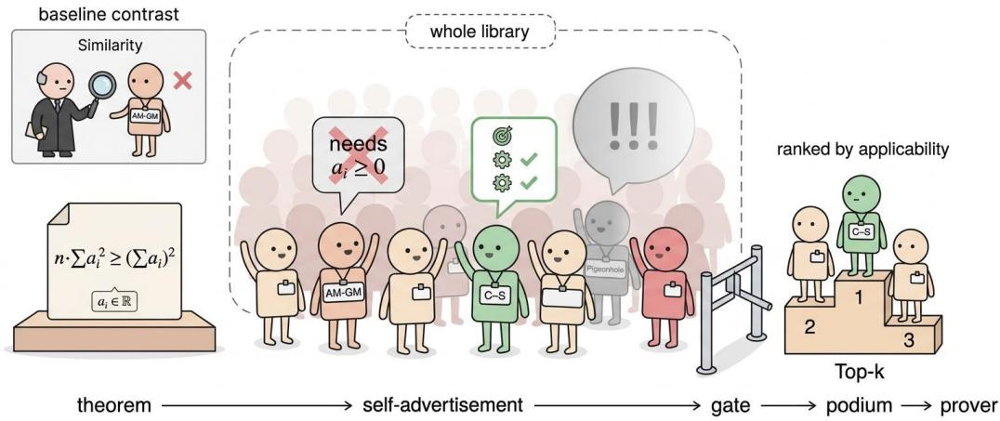
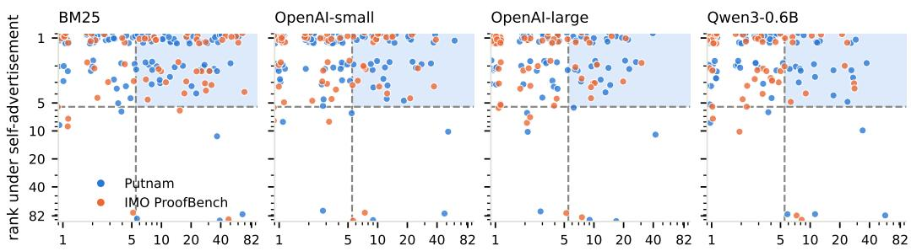

# LET THE LIBRARY SPEAK: SELF-ADVERTISED METHOD SELECTION FOR FORMAL PROVING

Xiaopeng Yuan1, Suijin Wang2, Yanli Wang3, Haibo Jin1,

Peng Kuang1, Jerry Wang1, Lijun Yu4, Haohan Wang1

1University of Illinois at Urbana-Champaign 2Tsinghua University

3Imperial College London 4Google

{xyuan30,haohanw}@illinois.edu

## ABSTRACT

LLM-based formal provers can retrieve relevant lemmas and prior proofs, but relevance alone does not say whether a mathematical method can be used on the current theorem. A method has prerequisites, a target, an intended action, and obligations that its use leaves to prove. Methods that look equally related to a theorem may therefore differ substantially in whether they offer a plausible next step. We formulate this as an applicability-aware method-selection problem and introduce self-advertisement: before candidates are ranked, a model generates a problemspecific proposal for each one, stating what part of the goal it targets, what action it would take, and what conditions that action requires. We organize 82 reusable methods from Putnam 2000–2014 as Method Contracts, which pair applicability descriptions with Mathlib anchors, a checked example or scaffold, and expected proof obligations. A single batched call elicits proposals across the library; vague or unsupported proposals are demoted, yielding a ranked shortlist accompanied by inspectable claims about each candidate’s use. We analyze when similarity-based representations cannot distinguish methods with different applicability, how errors in applicability estimates affect shortlist quality, and what a checked scaffold guarantees under its stated assumptions. Against lexical, embedding, and embeddingplus-LLM reranking baselines, self-advertisement achieves 95.0% hit@5 on Putnam 2015–2025, compared with 84.2% for the strongest reranker. On IMO Proof-Bench, it achieves 91.7% compared with 88.3%. These results indicate improved coverage of annotated methods in the retrieved shortlists, particularly on Putnam.

## 1 INTRODUCTION

Large language models can propose high-level approaches to mathematical problems (Jiang et al., 2022; Lightman et al., 2024; Shao et al., 2024), and recent theorem-proving systems use them to generate Lean code, check it, and revise it in response to feedback (Xin et al., 2025; Ren et al., 2025; Lin et al., 2026; Ospanov et al., 2026; Varambally et al., 2026). Before a prover can use a mathematical method, however, it must decide whether that method offers a useful step for the current goal. A suggestion such as “use induction” leaves open what to induct on, which part of the goal the method would address, and what remains to be proved. These questions arise for every candidate method: what would it do in this problem, and what conditions would its use require? We study method selection as the task of eliciting and comparing such problem-specific proposals before passing a method to the prover.

Existing systems support formal proof construction at several levels. Premise selection (Yang et al., 2023; Mikuła et al., 2024) and Mathlib search (Gao et al., 2024; Lu et al., 2026) provide relevant definitions and theorems; proof retrieval offers examples of how related problems were solved (Wang et al., 2024; Thompson et al., 2024); and verifier-guided loops use Lean’s errors to revise a failed attempt (Ji et al., 2025; Zheng et al., 2023; Thakur et al., 2023). These resources are valuable, but finding a related fact or proof does not by itself explain how a mathematical method fits the current goal. A retrieved inequality, for example, may require nonnegativity that has not been established, while a useful method may come from a problem that looks quite different on the surface. Lexical and embedding retrievers rank candidates by their similarity to the theorem (Zhang et al., 2025;

  
Figure 1: Self-advertised method selection. Given a theorem, a single model call asks every contract in the library how it would be used. A gate demotes proposals that are vague (Pigeonhole) or unsupported (AM-GM, since $a _ { i } \geq 0$ is not given), and the top-ranked contract (Cauchy–Schwarz) goes to the prover. Inset: similarity retrieval would pick AM-GM instead.

Neelakantan et al., 2022), and an LLM reranker may reason about their applicability (Sun et al., 2023). A relevance score alone, however, does not show why a method applies to the current goal.

The central problem is that surface similarity does not establish applicability. We therefore ask a more specific question than which methods look related: given a goal and a library of reusable methods, which methods could be applied, what part of the goal would each target, what action would it take there, and what conditions would that action require? A selector that commits to these answers makes its choices open to inspection rather than presenting only a relevance score. We evaluate whether such selections place suitable methods in the retrieved shortlist; whether the prover can then complete the remaining Lean obligations is a separate question.

We introduce self-advertisement, an approach to method selection in which candidate methods propose how they could be used for the current goal before they are ranked. Instead of receiving only a relevance score, the prover receives a proposal that answers these questions for the selected method. We make this possible with Method Contracts. Each contract describes a method’s use and appli cability conditions, together with execution guidance such as Mathlib anchors, a checked example or scaffold, and expected residual obligations. We construct 82 contracts from Putnam 2000–2014 materials and elicit their proposals in a single batched model call. Vague or unsupported proposals are demoted, so ranking depends on the concrete use a candidate offers rather than surface similarity alone. Figure 1 shows how contracts are proposed, screened, and ranked before the top-ranked contract is supplied to the Lean prover. Unlike an LLM reranker, which reorders candidates that similarity has already retrieved, self-advertisement considers every contract in the library and asks each to commit to a use that can be checked against the goal. We also show formally that a similarity-only selector can assign the same representation to goals that need different methods.

We evaluate method selection on Putnam 2015–2025 problems and IMO ProofBench problems against lexical, dense-embedding, and embedding-plus-LLM-reranking baselines, running every LLM-based selector with the same backbone under three backbones. Self-advertisement attains the highest recall@5 in all six backbone–benchmark settings, and on Putnam it also leads at hit@3, hit@5, and MRR under every backbone. With GPT-5.6 Luna, the backbone we use for proving, it reaches 95.0% hit@5 on Putnam and 91.7% on IMO ProofBench, compared with 84.2% and 88.3% for the strongest reranker. Rerankers remain more precise at rank 1 in most settings, so our claim concerns shortlist coverage rather than top-1 accuracy. A second-stage runoff narrows this gap: with GPT-5.6 Terra it raises Putnam hit@1 from 62.5% to 72.5%, above the strongest reranker at 67.5%. In an Ax-Prover-style proof loop with a fixed compile budget, adding the top-ranked contract raises the proportion of proved problems from 5.8% to 12.5% on Putnam and from 10.0% to 15.0% on

IMO ProofBench. This comparison adds the selected contract as a whole, so it does not isolate the contribution of selection, and most problems remain unsolved within the budget.

Our contributions are:

1. Method selection as an applicability problem. We define method selection as distinct from similarity-based retrieval and show that a similarity-only selector can assign the same representation to goals needing different methods. We analyze how errors in applicability estimates affect the shortlist and what a checked scaffold guarantees under its assumptions.

2. Self-advertisement over Method Contracts. Each contract links a method’s intended action and required conditions to Mathlib anchors, a checked scaffold, and the obligations it leaves. In one batched call, each contract proposes a target, an action, and the conditions it requires for the current goal; vague or unsupported proposals are demoted before ranking.

3. A contract library and evaluation. We build 82 contracts from Putnam 2000–2014 and evaluate on held-out Putnam 2015–2025 and IMO ProofBench. Self-advertisement reaches 95.0% hit@5 on Putnam, compared with 84.2% for the strongest reranker, and its coverage gains come largely from methods that do not look similar to the problem.

## 2 RELATED WORK

Knowledge for LLM-based formal proving. LLM-based provers generate Lean proofs and revise them using verifier feedback, through whole-proof regeneration (Xin et al., 2024; Lin et al., 2026), step-level repair (Liu et al., 2025; First et al., 2023), or agentic loops (Achim et al., 2025; Baba et al., 2025). Premise selection (Zhu et al., 2026; Song et al., 2024) and Mathlib search (Gao et al., 2026; Asher, 2025) supply formal facts; proof retrieval supplies worked examples (Kasaura et al., 2026); and lemma libraries preserve results for reuse across problems (Berlot-Attwell et al., 2024). Informal sketches can also guide formal proof construction (Wiedijk, 2003; Lin et al., 2025). These approaches provide different forms of useful knowledge, but retrieval typically returns a fact, lemma, or prior proof. Our retrieval unit is instead a mathematical method whose prerequisites, intended action, and execution guidance are represented together.

Selecting by applicability. An LLM reranker can reason about whether a retrieved candidate fits a goal (Qin et al., 2024; Weller et al., 2025; Zhuang et al., 2026), although standard reranking exposes the result as a score or ordering rather than a structured account of how the candidate would be used. Earlier work on proof planning represents methods with preconditions and expected effects (Bundy, 1988; Melis & Siekmann, 1999), while adaptation-guided case retrieval favors cases that can be adapted to the new problem (Leake et al., 1997; Smyth & Keane, 1998). We build on these ideas; our contribution is to elicit problem-specific applicability proposals from a library of formalization methods and evaluate them for selection against lexical, embedding, and LLM-reranked retrieval.

Self-advertisement combines reusable method knowledge with applicability-aware selection. Each Method Contract records a method’s prerequisites, Mathlib guidance, and expected proof obligations. In one batched call, a model generates for each contract a proposal specifying its target in the current goal, the action it would take, and the conditions it requires; vague proposals are demoted before ranking. The resulting shortlist presents concrete, inspectable reasons for selecting each method and can guide a verifier-guided proof loop.

## 3 APPLICABILITY-AWARE METHOD RETRIEVAL: A FORMAL FRAMEWORK

## 3.1 PROBLEM AND CONTRACTS

Let g be a Lean goal with local context Γ, and let C be a finite library of method contracts. A contract c has parameters $x _ { c } ,$ a selection-facing description, required conditions $\mathrm { P r e } _ { c } ( x _ { c } )$ , a target statement $G _ { c } ( x _ { c } )$ with an intended action, an execution scaffold $S _ { c } ,$ , and a list of residual obligations $\mathrm { O b l } _ { c } ( x _ { c } )$ The action reduces the target to the required conditions and the obligations: once $\mathrm { P r e } _ { c } ( \theta )$ and $\mathrm { O b l } _ { c } ( \theta )$ are proved for a binding θ of $x _ { c } ,$ , the action yields $G _ { c } ( \theta )$ . A selector receives $g , \Gamma$ , and the contract descriptions, and returns an ordered list $\pi ( g ) = ( c _ { 1 } , \ldots , c _ { | { \mathcal { C } } | } )$ Under self-advertisement, the selector first elicits a proposal for each contract, stating a binding ${ \hat { \theta } } ,$ the target $G _ { c } ( \hat { \theta } )$ , the action, and the conditions $\mathrm { P r e } _ { c } ( \hat { \theta } )$ that the step requires.

We distinguish semantic applicability from an observed label. A contract c is applicable to g if some correct proof of $g$ contains a step that instantiates c at a binding θ: the step establishes $\mathrm { P r e } _ { c } ( \theta )$ from the context available at that point, proves $\mathrm { O b l } _ { c } ( \theta )$ , obtains $G _ { c } ( \theta )$ by the action of $c ,$ and uses $G _ { c } ( \theta )$ in the rest of the proof. Let $\operatorname { A p p } ( g ) \subseteq { \mathcal { C } }$ denote the set of applicable contracts. In experiments we measure against a nonempty set $A ( g ) \subseteq { \mathcal { C } }$ of annotated reference contracts, which may contain several methods used in the reference solution. When the annotation is correct, $A ( g ) \subseteq \operatorname { A p p } ( g )$ , and the inclusion can be strict because other proofs may use other methods. A shortlist that contains a member of $A ( g )$ therefore also contains an applicable contract, so agreement with $A ( g )$ understates, rather than overstates, how often a shortlist contains a usable method.

## 3.2 WHAT A CHECKED SCAFFOLD ESTABLISHES

Proposition 1 (Conditional scaffold soundness). Suppose a contract provides a Lean-checked term with no sorry or admitted proofholes, oftype

$$
S _ { c } : \forall x _ { c } , \mathrm { P r e } _ { c } ( x _ { c } )  \mathrm { O b l } _ { c , 1 } ( x _ { c } )  \cdots  \mathrm { O b l } _ { c , r } ( x _ { c } )  G _ { c } ( x _ { c } ) .
$$

For any binding θ whose required conditions and obligations have checked proofs, applying $S _ { c }$ yields a checked proof of $G _ { c } ( \theta )$ .

Proofsketch. Instantiate the checked term at $\theta$ and apply it to the checked proofs of its premises.   
Lean checks the resulting term.

Proposition 1 applies only when the scaffold is checked in this parameterized form; a compiled example certifies only that example, not arbitrary new bindings. Even then, a self-advertised proposal identifies the remaining work for the new goal, $\mathrm { P r e } _ { c } ( \hat { \theta } )$ and $\mathrm { O b l } _ { c } ( \hat { \theta } )$ ; it does not discharge it.

## 3.3 SIMILARITY REPRESENTATIONS AND THE CANDIDATE-POOL CEILING

Let $X = ( g , \Gamma$ , contract descriptions) denote the selector’s input, and treat the annotated set $A =$ $A ( g )$ as random given X. Let $T = \phi { \dot { ( } } X )$ be the features available to a similarity-only selector, such as its vector of problem-to-contract similarity scores. The metrics hit@k and recall@k are defined in Appendix A. With information F, the best achievable expected hit@k is

$$
V _ { k } ( F ) = \mathbb { E } \left[ \operatorname* { m a x } _ { S \subseteq { \mathcal { C } } , \mid S \mid = k } \operatorname* { P r } ( S \cap A \neq \emptyset \mid F ) \right] .
$$

Proposition 2 (Information bound). $I f T = \phi ( X )$ , then $V _ { k } ( X ) \geq V _ { k } ( T )$ . The inequality can be strict when distinct goals share the same similarity representation but require different shortlists, and thefull descriptions distinguish them.

Proofsketch. Because $T$ is a function of $X$ , any shortlist chosen from $T$ can also be chosen from X. For a strict example, take $n > k$ equally likely goals with identical $T$ and distinct single reference contracts identifiable from X. Any T-based shortlist contains at most $k$ of these contracts and succeeds with probability at most $k / n ,$ , whereas an X-based selector succeeds on every goal.

Proposition 2 is a statement about information, not a guarantee that a particular model extracts it. An LLM reranker reads full descriptions, but only of the contracts that a similarity stage passes to it, so similarity still determines what the reranker can consider.

Corollary 1 (Candidate-pool ceiling). Consider a two-stage selector that takes the top m contracts $P _ { m } ( g )$ under a similarity-only selector and then orders them by any procedure, placing the remaining contracts after them. For every $k \leq$ m and every goal $^ { g , }$

$$
h i t @ k \leq \mathbf { 1 } \big [ P _ { m } ( g ) \cap A ( g ) \neq \emptyset \big ] , \qquad r e c a l l @ k \leq \frac { | P _ { m } ( g ) \cap A ( g ) | } { | A ( g ) | } .
$$

The two-stage selector’s hit@k and recall@k are therefore bounded by the first-stage selector’s hit@m and recall@ $m ,$ , whichever model is used in the second stage.

Our reranking baselines follow this two-stage design, and every shortlist size k we report satisfies $k \leq m ,$ so an annotated contract that similarity ranks low cannot be recovered by any reranking backbone. Both kinds of baseline depend on similarity, either as the ranking signal or as the filter that decides what the reranker sees. Self-advertisement judges every contract from its proposal and does not rely on similarity in either role; its coverage is limited by the information in $\bar { X }$ and by how accurately the model judges applicability, which we analyze next.

## 3.4 ESTIMATING APPLICABILITY AND RANKING REGRET

For a fixed description $X = x$ , let

$$
w _ { c } ( x ) = \mathbb { E } \left[ { \frac { \mathbf { 1 } [ c \in A ] } { | A | } } \Biggm | X = x \right] .
$$

By linearity of expectation, the expected recall@k of a shortlist S is $\begin{array} { r } { R _ { x } ( S ) = \sum _ { c \in S } w _ { c } ( x ) } \end{array}$ , so ranking contracts by $w _ { c } ( x )$ maximizes expected recall@k. With a single reference contract $Y .$ $w _ { c } ( x ) = \mathrm { P r } ( Y = c \mid X = x )$ and $R _ { x } ( S )$ is also the expected hit@k. Self-advertisement can be viewed as estimating this ordering from each contract’s proposal. Its scores need not be probabilities: a ranking depends only on the order of the scores, so the bound below requires only that some increasing transformation of them be close to $w _ { c } ( x )$

Proposition 3 (Top-k ranking regret). Let $S _ { k } ^ { * }$ contain the k contracts with the largest $w _ { c } ( x )$ , let $\widehat { S } _ { k }$ contain the k contracts with the largest scores $\hat { s } _ { c } ,$ , and suppose there is a strictly increasing map $f$ such that $| f ( \hat { s } _ { c } ) - w _ { c } ( x ) | \leq \epsilon f o r$ every $c \in S _ { k } ^ { * } \cup \widehat S _ { k }$ . Then

$$
R _ { x } ( S _ { k } ^ { * } ) - R _ { x } ( \widehat { S } _ { k } ) \leq 2 k \epsilon .
$$

Proofsketch. Let $\hat { w } _ { c } = f ( \hat { s } _ { c } )$ . Since f is strictly increasing, $\widehat { S } _ { k }$ also contains the k contracts with the largest $\hat { w } _ { c }$ . Write $\begin{array} { r } { R _ { x } ( S _ { k } ^ { * } ) - R _ { x } ( \widehat { S } _ { k } ) = \left[ \sum _ { c \in S _ { k } ^ { * } } \hat { w } _ { c } - \sum _ { c \in \widehat { S } _ { k } } \hat { w } _ { c } \right] + \sum _ { c \in S _ { k } ^ { * } } ( w _ { c } - \hat { w } _ { c } ) - } \end{array}$ $\textstyle \sum _ { c \in { \widehat { S } } _ { k } } ( w _ { c } - { \widehat { w } } _ { c } )$ . The bracket is nonpositive because $\widehat { S } _ { k }$ maximizes the transformed scores, and each of the remaining 2k terms has magnitude at most ϵ.

The bound is conditional: it does not assert that our scores meet its premise, and it is a worst-case statement rather than a prediction of the measured gains. Its useful consequence is that only estimation errors on contracts that are, or appear to be, among the top k affect the shortlist. Demoting vague or unsupported proposals acts on exactly these errors: it moves contracts that appear to be among the top k but cannot state a checkable use below every supported nomination. A second source of error is that self-advertisement assigns each proposal an absolute score rather than comparing proposals directly, so scores from different contracts need not lie on the common scale that the premise requires. A runoff among the leading proposals (Section 4.2) addresses this where it matters: it compares them directly and can correct their relative order without rescoring the whole library.

Proposition 4 (Multi-method coverage). Let $A \subseteq { \mathcal { C } }$ be the random set ofannotated contractsfor a goal with description $X = x ,$ , and define the expected hit@k objective

$$
H _ { x } ( S ) = \operatorname* { P r } ( S \cap A \neq \emptyset \mid X = x ) .
$$

Then $H _ { x }$ is monotone and submodular in the candidate set $S , \ A$ greedy selector using the true marginal gains, adding the contract that maximizes $H _ { x } ( S \cup \{ c \} ) - { \mathbf { \check { } } } H _ { x } ( { \dot { S } } )$ at each step, attains at least $1 - ( \bar { 1 } - 1 / k ) ^ { k }$ times the optimal size-k coverage, and hence at least $1 - 1 / \epsilon$ times the optimum.

Proof sketch. For any fixed annotated set A, adding a contract can turn a miss into a hit only if the current shortlist has not hit A; enlarging the shortlist cannot increase that marginal gain. Expectation preserves this diminishing-returns property. The greedy guarantee then follows from the classical result for monotone submodular maximization under a cardinality constraint (Nemhauser et al., 1978).

The two metrics therefore call for different selection rules. Expected recall@k is additive over contracts, so sorting by $w _ { c }$ is optimal for it. Expected hit@k is submodular: once a shortlist contains a method that is likely to apply, a near-duplicate adds little, so sorting per-contract scores need not maximize it. Our implementation sorts per-contract scores, which is optimal for expected recall@k, and also for expected hit@k whenever a goal has a single reference contract, since the two objectives then coincide. When several methods apply, Proposition 4 identifies the objective that a diversityaware selector would target.

## 3.5 SELECTION AND DOWNSTREAM PROOF SUCCESS

Let $E _ { k }$ denote the event that the first k positions contain an annotated contract, and $Z _ { B }$ the event that the prover completes a Lean proof within a budget of B compile calls. For any prover,

$$
\operatorname* { P r } ( Z _ { B } ) = \operatorname* { P r } ( Z _ { B } \mid \neg E _ { k } ) + \operatorname* { P r } ( E _ { k } ) \Delta _ { k } , \qquad \Delta _ { k } = \operatorname* { P r } ( Z _ { B } \mid E _ { k } ) - \operatorname* { P r } ( Z _ { B } \mid \neg E _ { k } ) .
$$

Selection controls $\Pr ( E _ { k } )$ , which the shortlist metrics measure. The gap $\Delta _ { k }$ measures how much a well-chosen contract helps the prover, and depends on the contract’s execution guidance and the difficulty of its residual obligations. For a fixed $\Delta _ { k } > 0 .$ , raising $\Pr ( E _ { k } )$ raises proof success, so better selection translates into more proofs whenever the selected contracts are useful to the prover.

Which selection metric matters depends on how the ranking is used. A prover that tries contracts in order within its budget needs a hit among the positions it can reach, which hit@k measures. Many problems also require several methods, so a proof along the reference route needs every method in $A ( g )$ , not just one of them; recall@k measures how much of that route a shortlist supplies. A second stage, such as the runoff, also chooses its top contract from this ranking, so the coverage of the list it re-ranks bounds the rank-1 accuracy it can reach.

## 4 METHOD

Our method centers on self-advertisement, which elicits a proposal from every contract in a single call and ranks the contracts by whether they commit to a checkable use (Section 4.1). Selfadvertisement is designed for shortlist coverage; when the first choice matters most, an optional runoff compares the leading proposals directly to improve rank-1 accuracy (Section 4.2). Both read only the selection side of each contract; the execution side of the selected contract is then passed to the prover. Section 4.3 describes how the 82 contracts are built.

## 4.1 SELF-ADVERTISEMENT

Self-advertisement replaces the question of how closely a contract resembles the goal with the question of how the contract would be used. In a single model call, the model reads the goal, its local context, and the selection-facing description of every contract, and returns a proposal for each contract. The proposal of contract c makes a commitment that can be checked against the goal: a target $t _ { c } ,$ which instantiates $G _ { c } ( \hat { \theta } )$ in terms of the goal’s own objects; an action $a _ { c } ;$ and the required facts $\mathrm { P r e } _ { c }$ , which instantiate $\mathrm { P r e } _ { c } ( \hat { \theta } )$ . It also cites verified material $\sigma _ { c }$ from the contract that supports this commitment, and records whether the contract offers itself $( o _ { c } )$ , its role $\rho _ { c } \in$ {main, support}, and an applicability score $\hat { s } _ { c }$

A commitment that is vague or unsupported cannot be checked, so a main nomination must pass the commitment gate

$$
\operatorname { G a t e } ( c ) = o _ { c } \wedge \operatorname { S p e c } ( t _ { c } ) \wedge \operatorname { S p e c } ( a _ { c } ) \wedge ( \sigma _ { c } \neq \emptyset ) ,
$$

where Spec holds when a target or action names a concrete object of the goal rather than a generic phrase. A main nomination that fails the gate is demoted to a supporting role with its score unchanged. The tiered ranking then orders contracts lexicographically by $( \tau _ { c } , - \hat { s } _ { c } )$ , where $\tau _ { c } = 1$ for main nominations that pass the gate, $\tau _ { c } = 2$ for other contracts that offer themselves, and $\tau _ { c } = 3$ otherwise. The gate thus moves down the proposals that would otherwise occupy leading positions without a checkable use, which are the errors that matter most for the shortlist (Proposition 3).

## 4.2 RUNOFF

Self-advertisement targets shortlist coverage, but a prover that receives a single contract depends on hit@1 (Section 3.5). Its absolute integer scores often leave the leading proposals close or tied, with ties broken by contract identifier rather than content. Since only errors among the leading candidates affect the shortlist (Proposition 3), the runoff re-ranks the top q contracts by comparing their proposals. It uses the same backbone, so any gain comes from direct comparison rather than a stronger model.

In one pass of q−1 calls from the top of the window down, the model sees each contract, the contract above it, and the proposal that contract wrote earlier in the pass; it writes a proposal for the lower contract and judges whether it fits the proof better, and if so the two swap. Contracts outside the window keep their order.

## 4.3 CONTRACT LIBRARY

Our library contains 82 Method Contracts built from solutions to Putnam 2000–2014 problems; no problem from the evaluation sets, Putnam 2015–2025 and IMO ProofBench, is used as a source. Each contract has two sides, following the definition in Section 3.1. The selection side is what a selector reads: the method in one sentence, the kind of target it typically addresses, the conditions under which it applies, cases in which it should not be used, and a manifest naming the verified material on its execution side, such as its scaffold and worked instance, without their Lean code. The execution side is supplied only to the prover: a Lean scaffold whose parameters make the method’s bindings explicit, a compiled worked instance, the Mathlib declarations it relies on, it required conditions stated as Lean hypotheses, and the residual obligations left after its step.

We build contracts in three steps, using GPT-5.6 Sol for both extraction and drafting. First, the model extracts the methods used in the reference solutions and proposes merges between methods that play the same role in different problems; the authors review every extracted method and every proposed merge. Second, the model drafts both sides of each contract from its source solutions. Third, every Lean artifact on the execution side is compiled with Lean v4.27.0 and Mathlib at commit a3a10db (release v4.27.0). All 82 contracts pass this check: each provides a scaffold stated for arbitrary parameters and a compiled worked instance.

## 5 EXPERIMENT

## 5.1 SETUP

Baselines and base models. We compare against random ordering, BM25 (Robertson & Zaragoza, 2009), TF-IDF cosine (Salton & Buckley, 1988), and three embedding models (OpenAI text-embedding-3-small, text-embedding-3-large (Neelakantan et al., 2022), and Qwen3- Embedding-0.6B (Zhang et al., 2025)). For each embedding model, we also evaluate a listwise LLM reranker (Sun et al., 2023) over its top-10 candidates. Self-advertisement generates goalspecific proposals for all 82 contracts in one batched call, followed by the commitment gate and tiered ranking (Section 4.1); the runoff re-ranks the top 10 of this ranking (Section 4.2), so both second stages operate on the same number of candidates. We run all LLM-based selectors with DeepSeek V4.1 Flash (Xu et al., 2026), GPT-5.6 Luna, and GPT-5.6 Terra (Singh et al., 2025); within each block of Table 1, every LLM-based selector uses the same backbone.

Benchmarks and labels. We evaluate on Putnam 2015–2025 (120 problems) and IMO Proof-Bench (60 problems). The contract library is built from Putnam 2000–2014 solutions, so no evaluation problem is a contract source. Each problem is labeled with the contracts whose method appears in its official solution: GPT-5.6 Sol proposed labels from the official solution, and a human checked every label. Labels were fixed before any selector was run, so hit@k measures agreement with these labels, a conservative estimate of applicability (Section 3.1).

## 5.2 MAIN RESULTS

Lexical matching reaches at most .525 hit@5 on Putnam, dense embeddings reach .775, and LLM reranking of the embedding shortlist adds another 7–8 points (Table 1). Self-advertisement attains the highest recall@5 in all six backbone–benchmark settings, and on Putnam it also leads at hit@3, hit@5, and MRR under every backbone. Its lead grows with the backbone while the rerankers plateau: from DeepSeek V4.1 Flash to GPT-5.6 Luna to GPT-5.6 Terra, its Putnam hit@5 rises from .900 to .950 to .975, whereas the best reranker stays at .842, .842, and .858, as Corollary 1 predicts for a reranker that cannot recover contracts its embedding stage missed. The lead under DeepSeek also shows that it does not depend on the model family used to draft contracts and propose labels. On IMO ProofBench, whose problems come from different competitions than the Putnamderived library, self-advertisement still leads at recall@5 under all three backbones (.494, .554, and .493, against at most .469, .468, and .449), and with the runoff it gives the best hit@5 under every backbone (.933, .933, and .917). Since one problem corresponds to 1.7 points there, we read these results as broader coverage at comparable top-5 hit rates.

<table><tr><td></td><td colspan="6">Putnam 2015–2025 (n=120)</td><td colspan="6">IMO ProofBench (n=60)</td></tr><tr><td>Selector</td><td></td><td>hit@1 hit@3</td><td>hit@5</td><td>R@3</td><td>R@5</td><td>MRR</td><td>hit@1</td><td>hit@3 hit@5 R@3 R@5 MRR</td><td></td><td></td><td></td><td></td></tr><tr><td>No LLM</td><td></td><td></td><td></td><td></td><td></td><td></td><td></td><td></td><td></td><td></td><td></td><td></td></tr><tr><td>Random</td><td>.058</td><td>.158</td><td>.225</td><td>.038</td><td>.053</td><td>.141</td><td>.083</td><td>.167</td><td>.267</td><td>.041</td><td>.076</td><td>.158</td></tr><tr><td>BM25</td><td>.208</td><td>.400</td><td>.508</td><td>.104</td><td>.140</td><td>.337</td><td>.183</td><td>.333</td><td>.400</td><td>.103</td><td>.147</td><td>.295</td></tr><tr><td>TF-IDF cosine</td><td>.267</td><td>.442</td><td>.525</td><td>.118</td><td>.144</td><td>.382</td><td>.233</td><td>.367</td><td>.433</td><td>.135</td><td>.165</td><td>.318</td></tr><tr><td>OpenAI emb-3-small</td><td>.325</td><td>.533</td><td>.683</td><td>.157</td><td>.229</td><td>.463</td><td>.267</td><td>.517</td><td>.617</td><td>.213</td><td>.263</td><td>.411</td></tr><tr><td>OpenAI emb-3-large</td><td>.425</td><td>.667</td><td>.725</td><td>.204</td><td>.267</td><td>.556</td><td>.367</td><td>.583</td><td>.717</td><td>.268</td><td>.339</td><td>.523</td></tr><tr><td>Qwen3-Emb-0.6B</td><td>.450</td><td>.675</td><td>.775</td><td>.217</td><td>.291</td><td>.579</td><td>.350</td><td>.617</td><td>.767</td><td>.282</td><td>.380</td><td>.510</td></tr><tr><td>GPT-5.6 Terra</td><td></td><td></td><td></td><td></td><td></td><td></td><td></td><td></td><td></td><td></td><td></td><td></td></tr><tr><td>OpenAI-small + rerank .642</td><td></td><td>.767</td><td>.775</td><td>.285</td><td>.324</td><td>.704</td><td>.483</td><td>.717</td><td>.767</td><td>.336</td><td>.397</td><td>.607</td></tr><tr><td>OpenAI-large + rerank</td><td>.667</td><td>.800</td><td>.842</td><td>.315</td><td>.373</td><td>.742</td><td>.600</td><td>.783</td><td>.900</td><td>.378</td><td>.455</td><td>.712</td></tr><tr><td>Qwen3 + rerank</td><td>.675</td><td>.808</td><td>.858</td><td>.338</td><td>.407</td><td>.751</td><td>.633</td><td>.783</td><td>.900</td><td>.373</td><td>.469</td><td>.724</td></tr><tr><td>Self-adv. (ours)</td><td>.625</td><td>.908</td><td>.975</td><td>.342</td><td>.472</td><td>.778</td><td>.517</td><td>.867</td><td>.883</td><td>.422</td><td>.494</td><td>.694</td></tr><tr><td>+ runoff</td><td>.725</td><td>.950</td><td>.983</td><td>.374</td><td>.503</td><td>.831</td><td>.600</td><td>.833</td><td>.933</td><td>.409</td><td>.512</td><td>.736</td></tr><tr><td>GPT-5.6 Luna</td><td></td><td></td><td></td><td></td><td></td><td></td><td></td><td></td><td></td><td></td><td></td><td></td></tr><tr><td>OpenAI-small + rerank .592</td><td></td><td>.742</td><td>.783</td><td>.286</td><td>.321</td><td>.673</td><td>.517</td><td>.750</td><td>.783</td><td>.350</td><td>.400</td><td>.628</td></tr><tr><td>OpenAI-large + rerank</td><td>.692</td><td>.792</td><td>.825</td><td>.312</td><td>.361</td><td>.747</td><td>.583</td><td>.833</td><td>.883</td><td>.404</td><td>.460</td><td>.714</td></tr><tr><td>Qwen3 + rerank</td><td>.683</td><td>.817</td><td>.842</td><td>.337</td><td>.385</td><td>.756</td><td>.567</td><td>.817</td><td>.883</td><td>.407</td><td>.468</td><td>.688</td></tr><tr><td>Self-adv. (ours)</td><td>.658</td><td>.917</td><td>.950</td><td>.346</td><td>.446</td><td>.787</td><td>.550</td><td>.817</td><td>.917</td><td>.414</td><td>.554</td><td>.693</td></tr><tr><td>+ runoff</td><td>.683</td><td>.908</td><td>.958</td><td>.352</td><td>.461</td><td>.800</td><td>.567</td><td>.817</td><td>.933</td><td>.417</td><td>.538</td><td>.703</td></tr><tr><td>DeepSeek V4.1 Flash</td><td></td><td></td><td></td><td></td><td></td><td></td><td></td><td></td><td></td><td></td><td></td><td></td></tr><tr><td>OpenAI-small + rerank</td><td>.550</td><td>.750</td><td>.775</td><td>.262</td><td>.305</td><td>.643</td><td>.550</td><td>.767</td><td>.767</td><td>.354</td><td>.388</td><td>.640</td></tr><tr><td>OpenAI-large + rerank</td><td>.567</td><td>.775</td><td>.825</td><td>.293</td><td>.367</td><td>.673</td><td>.550</td><td>.833</td><td>.850</td><td>.383</td><td>.446</td><td>.685</td></tr><tr><td>Qwen3 + rerank</td><td>.575</td><td>.783</td><td>.842</td><td>.307</td><td>.371</td><td>.687</td><td>.617</td><td>.783</td><td>.850</td><td>.388</td><td>.449</td><td>.705</td></tr><tr><td>Self-adv. (ours)</td><td>.600</td><td>.808</td><td>.900</td><td>.293</td><td>.393</td><td>.719</td><td>.517</td><td>.817</td><td>.883</td><td>.395</td><td>.493</td><td>.672</td></tr><tr><td>+ runoff</td><td>.608</td><td>.842</td><td>.892</td><td>.308</td><td>.399</td><td>.735</td><td>.517</td><td>.833</td><td>.917</td><td>.412</td><td>.523</td><td>.684</td></tr></table>

Table 1: Shortlist quality against annotated reference contracts. hit@k: fraction of problems whose top-k list contains at least one annotated contract. R@k: fraction of annotated contracts that appear in the top k. Bold: best within each LLM block; ties are all bolded.

Coverage and rank-1 accuracy diverge: rerankers remain more precise at rank 1 in most settings, and the runoff targets this gap by comparing the leading proposals. With GPT-5.6 Terra, it raises Putnam hit@1 from .625 to .725, above the strongest reranker (.675), and IMO ProofBench hit@1 from .517 to .600, and MRR becomes best in both Terra blocks (.831 and .736). With DeepSeek V4.1 Flash, it gives the best Putnam hit@1 and MRR in its block (.608 and .735). With GPT-5.6 Luna the changes are smaller, at most three problems per hit metric, and coverage is largely preserved.

## 5.3 APPLICABILITY BEYOND SIMILARITY

Figure 2 shows where these coverage gains come from. If self-advertisement merely rearranged methods that already looked similar to the problem, annotated methods near the top of its ranking would also sit near the top of the similarity rankings. Instead, across BM25 and all three embedding retrievers, the shaded regions contain annotated methods that similarity ranks outside its top five but self-advertisement places inside its top five. Many of them are so dissimilar to the problem that they never enter the rerankers’ candidate pool, so no reranking backbone can recover them. These are the cases that motivate our approach: a method can offer an applicable step toward the goal even when its description is not especially similar to the problem statement. Because self-advertisement judges every contract rather than only the candidates that similarity retrieves, it brings such methods into the shortlist, and each arrives with a target, an action, and required conditions that can be checked against the goal. The figure thus connects the coverage gains in Table 1 to methods that similaritybased candidate selection tends to overlook.

  
rank of annotated method under similarity

Figure 2: Each dot is one problem; y is the rank of its highest-ranked annotated method under self-advertisement (GPT-5.6 Luna, shared across panels), and x is that method’s rank by problem– method similarity under the panel’s retriever. Dashed lines mark the top five; the shaded region holds methods that similarity ranks outside its top five but self-advertisement places inside.
<table><tr><td></td><td colspan="4">Putnam 2015–2025</td><td colspan="3">IMO ProofBench</td></tr><tr><td>Method</td><td>ALG</td><td>ANA</td><td>DISC</td><td>All</td><td>Basic</td><td>Adv.</td><td>All</td></tr><tr><td>Base</td><td>0.0</td><td>0.0</td><td>0.0</td><td>0.0</td><td>3.3</td><td>0.0</td><td>1.7</td></tr><tr><td>pass@20</td><td>2.3</td><td>0.0</td><td>0.0</td><td>0.8</td><td>3.3</td><td>0.0</td><td>1.7</td></tr><tr><td>APOLLO</td><td>4.5</td><td>0.0</td><td>2.2</td><td>2.5</td><td>13.3</td><td>0.0</td><td>6.7</td></tr><tr><td>AxProverBase</td><td>9.1</td><td>3.3</td><td>4.3</td><td>5.8</td><td>20.0</td><td>0.0</td><td>10.0</td></tr><tr><td>+ Self-adv. contract (ours)</td><td>9.1</td><td>10.0</td><td>17.4</td><td>12.5</td><td>26.7</td><td>3.3</td><td>15.0</td></tr></table>

Table 2: Downstream proving success rate (%) with GPT-5.6 Luna under a budget of 10 Lean compilations per problem.

## 5.4 DOWNSTREAM PROVING

As a first check of whether selected contracts help a prover, Table 2 reports proof success with GPT-5.6 Luna and a budget of ten Lean compilations per problem. Adding the top-ranked contract to the Ax-Prover-style loop more than doubles its success rate on Putnam, from 5.8% to 12.5%, and raises it from 10.0% to 15.0% on IMO ProofBench. On Putnam the gains are concentrated in analysis (3.3% to 10.0%) and discrete problems (4.3% to 17.4%), while algebra is unchanged at 9.1%; on IMO ProofBench the contract adds Basic problems (20.0% to 26.7%) and the only Advanced problem solved by any arm. Base and pass@20 solve almost no problems, even though pass@20 uses twice the budget, and APOLLO trails the Ax-Prover-style control on both benchmarks. The comparison supplies the selected contract as a whole, so the gain reflects selection and contract content together (Section 3.5); most problems remain unsolved within this budget.

## 6 CONCLUSION

We presented self-advertisement, a method-selection approach that asks each Method Contract to propose a target, action, and required conditions for the current theorem. Across Putnam and IMO ProofBench, it improves coverage of annotated methods in shortlists, including methods ranked low by lexical or embedding similarity. Adding the top-ranked contract to a fixed-budget proof loop also increases the number of problems proved on both benchmarks. These results support selecting proof methods by their proposed use, while leaving two limits clear: shortlist coverage does not guarantee a completed proof, and the downstream comparison adds the contract as a whole rather than isolating selection from its execution guidance. Future work should separate these contributions and help provers carry promising method proposals through to verified proofs.

## AI USE STATEMENT

In this work, we used generative AI tools for the following tasks. GPT-5.6 Sol extracted methods from reference solutions, proposed merges between them, and drafted both sides of each Method Contract; the authors reviewed every extracted method and proposed merge, and every Lean artifact was compiled and checked. GPT-5.6 Sol also proposed the reference labels for evaluation problems, and a human checked every label before any selector was run. Large language models are components of the evaluated systems (Section 5.1). We also used generative AI to refine the statements of theoretical results and their proof sketches, to suggest the structure of parts of the paper, and to edit the text for readability.

## ETHICS STATEMENT

This work uses publicly available competition problems and official solutions (Putnam and IMO ProofBench) and involves no human subjects or personal data. The method selects proof strategies for formal theorem proving and raises no foreseeable risks beyond those of the underlying language models.

## REPRODUCIBILITY STATEMENT

Section 4.3 describes how the 82 contracts were built, including the Lean version (v4.27.0) and Mathlib commit (a3a10db) used to check every execution-side artifact; Appendix C.2 lists the full pinned environment, and Figure 3 shows an example contract. Section 5.1 describes the baselines, backbones, benchmarks, and labeling procedure. The tiered ranking breaks ties by contract identifier, so it is deterministic given the model outputs.

## REFERENCES

Tudor Achim, Alex Best, Alberto Bietti, Kevin Der, Math¨ıs Fed´ erico, Sergei Gukov, Daniel Halpern-´ Leistner, Kirsten Henningsgard, Yury Kudryashov, Alexander Meiburg, et al. Aristotle: Imo-level automated theorem proving. arXiv preprint arXiv:2510.01346, 2025.

Justin Asher. Leanexplore: A search engine for lean 4 declarations. arXiv preprint arXiv:2506.11085, 2025.

Kaito Baba, Chaoran Liu, Shuhei Kurita, and Akiyoshi Sannai. Prover agent: An agent-based framework for formal mathematical proofs. arXiv preprint arXiv:2506.19923, 2025.

Ian Berlot-Attwell, Frank Rudzicz, and Xujie Si. Library learning doesn’t: The curious case of the single-use” library”. arXiv preprint arXiv:2410.20274, 2024.

Alan Bundy. The use of explicit plans to guide inductive proofs. In International conference on automated deduction, pp. 111–120. Springer, 1988.

Emily First, Markus N Rabe, Talia Ringer, and Yuriy Brun. Baldur: Whole-proof generation and repair with large language models. In Proceedings of the 31st ACM Joint European Software Engineering Conference and Symposium on the Foundations of Software Engineering, pp. 1229– 1241, 2023.

Guoxiong Gao, Haocheng Ju, Jiedong Jiang, Zihan Qin, and Bin Dong. A semantic search engine for mathlib4. In Findings of the Association for Computational Linguistics: EMNLP 2024, pp. 8001–8013, 2024.

Guoxiong Gao, Zeming Sun, Jiedong Jiang, Yutong Wang, Jingda Xu, Peihao Wu, Bryan Dai, and Bin Dong. Leansearch v2: Global premise retrieval for lean 4 theorem proving. arXiv preprint arXiv:2605.13137, 2026.

Xingguang Ji, Yahui Liu, Qi Wang, Jingyuan Zhang, Yang Yue, Rui Shi, Chenxi Sun, Fuzheng Zhang, Guorui Zhou, and Kun Gai. Leanabell-prover-v2: Verifier-integrated reasoning for formal theorem proving via reinforcement learning. arXiv preprint arXiv:2507.08649, 2025.

Albert Q Jiang, Sean Welleck, Jin Peng Zhou, Wenda Li, Jiacheng Liu, Mateja Jamnik, Timothee´ Lacroix, Yuhuai Wu, and Guillaume Lample. Draft, sketch, and prove: Guiding formal theorem provers with informal proofs. arXiv preprint arXiv:2210.12283, 2022.

Kazumi Kasaura, Naoto Onda, Yuta Oriike, Masaya Taniguchi, Akiyoshi Sannai, and Sho Sonoda. Discovering new theorems via llms with in-context proof learning in lean. In Proceedings of the 6th Workshop on Natural Language Meets Logic and Machine Learning (NALOMA), pp. 40–49, 2026.

David B Leake, Andrew Kinley, and David Wilson. Case-based similarity assessment: Estimating adaptability from experience. In AAAI/IAAI, pp. 674–679, 1997.

Hunter Lightman, Vineet Kosaraju, Yuri Burda, Harrison Edwards, Bowen Baker, Teddy Lee, Jan Leike, John Schulman, Ilya Sutskever, and Karl Cobbe. Let’s verify step by step. In International Conference on Learning Representations, volume 2024, pp. 39578–39601, 2024.

Haohan Lin, Zhiqing Sun, Sean Welleck, and Yiming Yang. Lean-star: Learning to interleave thinking and proving. In International Conference on Learning Representations, volume 2025, pp. 66041–66062, 2025.

Yong Lin, Shange Tang, Bohan Lyu, Ziran Yang, Jui-Hui Chung, Haoyu Zhao, Lai Jiang, Yihan Geng, Jiawei Ge, Jingruo Sun, et al. Goedel-prover-v2: Scaling formal theorem proving with scaffolded data synthesis and self-correction. In International Conference on Learning Representations, volume 2026, pp. 11793–11818, 2026.

Haoxiong Liu, Jiacheng Sun, Zhenguo Li, and Andrew C Yao. Proofaug: Efficient neural theorem proving via fine-grained proof structure analysis. arXiv preprint arXiv:2501.18310, 2025.

Jialin Lu, Kye Emond, Kaiyu Yang, Swarat Chaudhuri, Weiran Sun, and Wuyang Chen. Lean finder: Semantic search for mathlib that understands user intents. In International Conference on Learning Representations, volume 2026, pp. 155005–155040, 2026.

Erica Melis and Jorg Siekmann. Knowledge-based proof planning. ¨ Artificial Intelligence, 115(1): 65–105, 1999.

Maciej Mikuła, Szymon Tworkowski, Szymon Antoniak, Bartosz Piotrowski, Qiaochu Jiang, Jin Zhou, Christian Szegedy, Łukasz Kucinski, Piotr Miło´ s, and Yuhuai Wu. Magnushammer: A´ transformer-based approach to premise selection. In International Conference on Learning Representations, volume 2024, pp. 39326–39350, 2024.

Arvind Neelakantan, Tao Xu, Raul Puri, Alec Radford, Jesse Michael Han, Jerry Tworek, Qiming Yuan, Nikolas Tezak, Jong Wook Kim, Chris Hallacy, et al. Text and code embeddings by contrastive pre-training. arXiv preprint arXiv:2201.10005, 2022.

George L. Nemhauser, Laurence A. Wolsey, and Marshall L. Fisher. An analysis of approximations for maximizing submodular set functions—I. Mathematical Programming, 14(1):265–294, 1978. doi: 10.1007/BF01588971.

Azim Ospanov, Farzan Farnia, and Roozbeh Mohit. Apollo: Automated llm and lean collaboration for advanced formal reasoning. Advances in Neural Information Processing Systems, 38:41599– 41633, 2026.

Zhen Qin, Rolf Jagerman, Kai Hui, Honglei Zhuang, Junru Wu, Le Yan, Jiaming Shen, Tianqi Liu, Jialu Liu, Donald Metzler, et al. Large language models are effective text rankers with pairwise ranking prompting. In Findings ofthe Associationfor Computational Linguistics: NAACL 2024, pp. 1504–1518, 2024.

ZZ Ren, Zhihong Shao, Junxiao Song, Huajian Xin, Haocheng Wang, Wanjia Zhao, Liyue Zhang, Zhe Fu, Qihao Zhu, Dejian Yang, et al. Deepseek-prover-v2: Advancing formal mathematical reasoning via reinforcement learning for subgoal decomposition. arXiv preprint arXiv:2504.21801, 2025.

Borja Requena, Austin Letson, Krystian Nowakowski, Izan Beltran-Ferreiro, and Leopoldo Sarra. A minimal agent for automated theorem proving, 2026. URL https://arxiv.org/abs/ 2602.24273.

Stephen Robertson and Hugo Zaragoza. The probabilistic relevance framework: Bm25 and beyond. Foundations and trends® in information retrieval, 4(1-2):1–174, 2009.

Gerard Salton and Christopher Buckley. Term-weighting approaches in automatic text retrieval. Information processing & management, 24(5):513–523, 1988.

Zhihong Shao, Peiyi Wang, Qihao Zhu, Runxin Xu, Junxiao Song, Xiao Bi, Haowei Zhang, Mingchuan Zhang, YK Li, Yang Wu, et al. Deepseekmath: Pushing the limits of mathematical reasoning in open language models. arXiv preprint arXiv:2402.03300, 2024.

Aaditya Singh, Adam Fry, Adam Perelman, Adam Tart, Adi Ganesh, Ahmed El-Kishky, Aidan McLaughlin, Aiden Low, AJ Ostrow, Akhila Ananthram, et al. Openai gpt-5 system card. arXiv preprint arXiv:2601.03267, 2025.

Barry Smyth and Mark T Keane. Adaptation-guided retrieval: questioning the similarity assumption in reasoning. Artificial intelligence, 102(2):249–293, 1998.

Peiyang Song, Kaiyu Yang, and Anima Anandkumar. Lean copilot: Large language models as copilots for theorem proving in lean. arXiv preprint arXiv:2404.12534, 2024.

Weiwei Sun, Lingyong Yan, Xinyu Ma, Shuaiqiang Wang, Pengjie Ren, Zhumin Chen, Dawei Yin, and Zhaochun Ren. Is chatgpt good at search? investigating large language models as re-ranking agents. In Proceedings of the 2023 conference on empirical methods in natural language processing, pp. 14918–14937, 2023.

Amitayush Thakur, George Tsoukalas, Yeming Wen, Jimmy Xin, and Swarat Chaudhuri. An incontext learning agent for formal theorem-proving. arXiv preprint arXiv:2310.04353, 2023.

Kyle Thompson, Nuno Saavedra, Pedro Carrott, Kevin Fisher, Alex Sanchez-Stern, Yuriy Brun, Joao F Ferreira, Sorin Lerner, and Emily First. Rango: Adaptive retrieval-augmented proving for˜ automated software verification. arXiv preprint arXiv:2412.14063, 2024.

Sumanth Varambally, Thomas Voice, Yanchao Sun, Zhifeng Chen, Rose Yu, and Ke Ye. Hilbert: Recursively building formal proofs with informal reasoning. In International Conference on Learning Representations, volume 2026, pp. 38998–39031, 2026.

Haiming Wang, Huajian Xin, Chuanyang Zheng, Zhengying Liu, Qingxing Cao, Yinya Huang, Jing Xiong, Han Shi, Enze Xie, Jian Yin, et al. Lego-prover: Neural theorem proving with growing libraries. In International Conference on Learning Representations, volume 2024, pp. 31566– 31597, 2024.

Orion Weller, Kathryn Ricci, Eugene Yang, Andrew Yates, Dawn Lawrie, and Benjamin Van Durme. Rank1: Test-time compute for reranking in information retrieval. arXiv preprint arXiv:2502.18418, 2025.

Freek Wiedijk. Formal proof sketches. In International Workshop on Types for Proofs and Programs, pp. 378–393. Springer, 2003.

Huajian Xin, Daya Guo, Zhihong Shao, Zhizhou Ren, Qihao Zhu, Bo Liu, Chong Ruan, Wenda Li, and Xiaodan Liang. Deepseek-prover: Advancing theorem proving in llms through large-scale synthetic data. arXiv preprint arXiv:2405.14333, 2024.

Huajian Xin, ZZ Ren, Junxiao Song, Zhihong Shao, Wanjia Zhao, Haocheng Wang, Bo Liu, Liyue Zhang, Xuan Lu, Qiushi Du, et al. Deepseek-prover-v1. 5: Harnessing proof assistant feedback for reinforcement learning and monte-carlo tree search. In International Conference on Learning Representations, volume 2025, pp. 72274–72303, 2025.

Anyi Xu, Bangcai Lin, Bing Xue, Bingxuan Wang, Bingzheng Xu, Bochao Wu, Bowei Zhang, Chaofan Lin, Chen Dong, Chenchen Ling, et al. Deepseek-v4: Towards highly efficient milliontoken context intelligence. arXiv preprint arXiv:2606.19348, 2026.

Kaiyu Yang, Aidan Swope, Alex Gu, Rahul Chalamala, Peiyang Song, Shixing Yu, Saad Godil, Ryan J Prenger, and Animashree Anandkumar. Leandojo: Theorem proving with retrievalaugmented language models. Advances in Neural Information Processing Systems, 36:21573– 21612, 2023.

Yanzhao Zhang, Mingxin Li, Dingkun Long, Xin Zhang, Huan Lin, Baosong Yang, Pengjun Xie, An Yang, Dayiheng Liu, Junyang Lin, et al. Qwen3 embedding: Advancing text embedding and reranking through foundation models. arXiv preprint arXiv:2506.05176, 2025.

Chuanyang Zheng, Haiming Wang, Enze Xie, Zhengying Liu, Jiankai Sun, Huajian Xin, Jianhao Shen, Zhenguo Li, and Yu Li. Lyra: Orchestrating dual correction in automated theorem proving. arXiv preprint arXiv:2309.15806, 2023.

Thomas Zhu, Joshua Clune, Jeremy Avigad, Qiaochu Jiang, and Sean Welleck. Premise selection for a lean hammer. In International Conference on Learning Representations, volume 2026, pp. 127594–127607, 2026.

Shengyao Zhuang, Xueguang Ma, Zheng Yao, Shuai Wang, Bevan Koopman, Jimmy Lin, and Guido Zuccon. Rank-r1: Enhancing reasoning in llm-based document rerankers via reinforcement learning. In Proceedings ofthe 49th International ACM SIGIR Conference on Research and Development in Information Retrieval, pp. 4419–4425, 2026.

## A SELECTION METRICS

For a goal $^ { g , }$ a selector returns an ordering $\pi ( g ) = ( c _ { 1 } , \ldots , c _ { | { \mathcal { C } } | } )$ of the whole library, and $A ( g ) \subseteq { \mathcal { C } }$ is the nonempty set of annotated contracts. Two-stage selectors place the contracts outside their candidate pool after the pool, so every selector orders the full library and every annotated contract has a rank. For a cutoff $k ,$ write $\pi _ { k } ( g ) = \{ c _ { 1 } , \ldots , c _ { k } \}$ , and let ran $\dot { \bf k } ( g ) =$ min $\{ i : c _ { i } \in A ( g ) \}$ be the position of the first annotated contract. Over the N problems of a benchmark we report

$$
\begin{array} { c } { { \displaystyle \mathrm { h i t } @ k = \frac { 1 } { N } \sum _ { g } { \mathbf 1 } [ \pi _ { k } ( g ) \cap A ( g ) \neq \emptyset ] } , } \\ { { \displaystyle \mathrm { r e c a l l } @ k = \frac { 1 } { N } \sum _ { g } \frac { \left. \pi _ { k } ( g ) \cap A ( g ) \right. } { \left. A ( g ) \right. } } , } \\ { { \displaystyle \mathrm { M R R } = \frac { 1 } { N } \sum _ { g } \frac { 1 } { \mathrm { r a n k } ( g ) } } . } \end{array}
$$

Table 1 abbreviates recall@k as R@k. hit@k is the fraction of problems whose shortlist contains at least one annotated method; recall@k measures how much of the annotated set the shortlist covers; MRR rewards placing the first annotated contract early. For every problem, recall $\textcircled { a } k \leq \mathrm { h i t } @ k$ , both are nondecreasing in k, and the two coincide when $| \dot { A } ( g ) | = 1$

## A.1 MULTI-METHOD COVERAGE

Section 3.4 notes that expected recall@k and expected hit@k call for different selection rules. This section proves the result that makes the second objective precise.

Proposition 4 (restated). Let $A \subseteq { \mathcal { C } }$ be the random set of annotated contracts for a goal with description $X = x ,$ and define the expected hit@k objective $H _ { x } ( S ) = \operatorname* { P r } ( S \cap A \neq \emptyset \ | \ \dot { X } = x )$ Then $H _ { x }$ is monotone and submodular in the candidate set S. A greedy selector using the true marginal gains, adding at each step the contract that maximizes $H _ { x } ( S \cup \{ c \} ) - H _ { x } ( S )$ , attains at least $1 - ( \bar { 1 } - 1 / k ) ^ { k }$ times the optimal size-k coverage, and hence at least $1 - 1 / e$ times the optimum.

Proof. Fix a realization of A and let $h _ { A } ( S ) = \mathbf { 1 } [ S \cap A \neq \emptyset ] . \mathrm { ~ I f ~ } S \subseteq S ^ { \prime }$ then $S \cap A \subseteq S ^ { \prime } \cap A$ , so $h _ { A } ( S ) \leq h _ { A } ( S ^ { \prime } ) \colon h _ { A }$ is monotone. For $c \notin S ^ { \prime }$ , the marginal gain of c at S is

$$
h _ { A } ( S \cup \{ c \} ) - h _ { A } ( S ) = \mathbf { 1 } [ c \in A ] \cdot \mathbf { 1 } [ S \cap A = \emptyset ] ,
$$

which is nonincreasing in S because $\mathbf { 1 } [ S ^ { \prime } \cap A = \emptyset ] \leq \mathbf { 1 } [ S \cap A = \emptyset ]$ when $S \subseteq S ^ { \prime } \colon h _ { A }$ is submodular. Since $\bar { H _ { x } ( S ) } = \mathbb { E } [ h _ { A } ( S ) \mid \bar { X } = x ]$ is an average of the functions $h _ { A }$ with nonnegative weights, and both properties are preserved under such averages, $H _ { x }$ is monotone and submodular, with $H _ { x } ( \alpha ) = 0$

The greedy guarantee is the classical bound of Nemhauser et al. (1978); we include the short argument. Let $\dot { S } ^ { \mathrm { o p t } }$ maximize $H _ { x }$ over sets of size $k ,$ and let $S _ { i }$ be the greedy set after i steps, with $S _ { 0 } = \emptyset$ . For each $i < k ,$ , monotonicity and submodularity give

$$
H _ { x } ( S ^ { \mathrm { o p t } } ) \leq H _ { x } ( S _ { i } \cup S ^ { \mathrm { o p t } } ) \leq H _ { x } ( S _ { i } ) + \sum _ { c \in S ^ { \mathrm { o p t } } \setminus S _ { i } } \left[ H _ { x } ( S _ { i } \cup \{ c \} ) - H _ { x } ( S _ { i } ) \right] \leq H _ { x } ( S _ { i } ) + k \left[ H _ { x } ( S _ { i + 1 } ) - H _ { x } ( S _ { i } ) \right] ,
$$

where the last step uses $| S ^ { \mathrm { o p t } } \setminus S _ { i } | \ \leq \ k$ and the fact that the greedy step picks the largest marginal gain. Writing $\delta _ { i } ^ { \cdot } = \dot { H _ { x } } ( S ^ { \mathrm { \scriptsize { o p t } } } ) - H _ { x } ( S _ { i } )$ , this rearranges to $\dot { \delta _ { i + 1 } } \le \mathsf { \bar { \Phi } } ( 1 - 1 / k ) \delta _ { i } \le$ so $\delta _ { k } \leq ( 1 - 1 / k ) ^ { k } \delta _ { 0 } = ( 1 - 1 / k ) ^ { k } H _ { x } ( S ^ { \mathrm { o p t } } )$ . Hence $H _ { x } ( S _ { k } ) \geq \big ( 1 - ( 1 - 1 / k ) ^ { k } \big ) H _ { x } ( S ^ { \mathrm { o p t } } ) \geq$ $( 1 - 1 / e ) H _ { x } ( S ^ { \mathrm { o p t } } )$ , using $( 1 - 1 / k ) ^ { k } \leq e ^ { - 1 }$

The two metrics therefore call for different selection rules. Expected recall@k is additive over contracts, $\begin{array} { r } { R _ { x } ( S ) = \sum _ { c \in S } w _ { c } ( x ) } \end{array}$ , so sorting by $w _ { c } ( x )$ is optimal for it, and Proposition 3 bounds the loss from sorting by estimates instead. Expected hit@k is submodular: once a shortlist contains a method that is likely to apply, a near-duplicate adds little, so sorting per-contract scores need not maximize it. Our implementation sorts per-contract scores, which is optimal for expected recall@k, and also for expected hit@k whenever a goal has a single reference contract, since the two objectives then coincide (Appendix A). When several methods apply, Proposition 4 identifies the objective that a diversity-aware selector would target; we do not run the greedy procedure.

## B PROOFS

This appendix gives full proofs of Propositions 1–3 and Corollary 1; Appendix A.1 proves Proposition 4.

## B.1 CONDITIONAL SCAFFOLD SOUNDNESS

Proposition 1 (restated). Suppose a contract provides a Lean-checked term with no sorry or admitted proof holes, of type

$$
S _ { c } : \forall x _ { c } , \mathrm { P r e } _ { c } ( x _ { c } )  \mathrm { O b l } _ { c , 1 } ( x _ { c } )  \cdots  \mathrm { O b l } _ { c , r } ( x _ { c } )  G _ { c } ( x _ { c } ) .
$$

For any binding θ whose precondition and obligations have checked proofs, applying $S _ { c }$ yields a checked proofof $G _ { c } ( \theta )$ .

Proof. Lean’s kernel accepts a term only together with its type, and it accepts an application $f a$ whenever $f$ has a dependent function type Π y:α, $\beta ( y )$ and a has type α, assigning the application the type $\beta ( a )$ . Instantiating the universal quantifier, $S _ { c } \theta$ is accepted with type $\mathrm { P r e } _ { c } \mathbf { \bar { ( } } \theta ) \ \to$ $\mathrm { O b l } _ { c , 1 } ( \theta ) { \mathrm { ' } } ~ \to ~ \cdots ~ \to ~ \mathrm { O b l } _ { c , r } ( \bar { \theta } ) ~ \to ~ G _ { c } ( \theta )$ Let p be a checked term of type $\mathrm { P r e } _ { c } ( \theta )$ and $q _ { 1 } , \ldots , q _ { r }$ checked terms of types $\mathrm { O b l } _ { c , 1 } ( \dot { \theta } ) , \dots , \mathrm { O b \bar { l } } _ { c , r } ( \theta )$ . Applying the rule $r + 1$ times, the term $S _ { c } \theta p q _ { 1 } \cdots q _ { r }$ is accepted with type $G _ { c } ( \theta )$ . The premise that $\bar { S _ { c } }$ contains no sorry matters because ${ \tt S O T I Y }$ is an axiom that inhabits every type, so a term built from it would type-check without proving anything. Since $S _ { c } , p$ , and the $q _ { i }$ are checked without that axiom, their application depends only on the axioms they depend on, and the result is a proof of $G _ { c } ( \theta )$ in the environment in which they were checked (Appendix C.2).

The proposition concerns reuse, not discovery. It does not say that θ is a useful binding for the goal, that $\mathrm { \bar { P r e } } _ { c } ( \theta )$ or the obligations are provable, or that $G _ { c } ( \theta )$ advances the proof; it says only that once these are discharged, the method’s own step needs no further checking.

## B.2 INFORMATION BOUND

Proposition 2 (restated). $I f T = \phi ( X )$ , then $V _ { k } ( X ) \geq V _ { k } ( T )$ . The inequality can be strict when distinct goals share the same similarity representation but require different shortlists, and the full descriptions distinguish them.

Proof. For each value t of $T ,$ , choose a set $S ( t )$ with $| S ( t ) | = k$ that attains the maximum in the definition of $V _ { k } ( T )$ ; a maximizer exists because C is finite. Then

$$
V _ { k } ( T ) = \mathbb { E } { \bigl [ } \operatorname* { P r } ( S ( T ) \cap A \neq \emptyset \mid T ) { \bigr ] } = \operatorname* { P r } { \bigl ( } S ( T ) \cap A \neq \emptyset { \bigr ) } = \mathbb { E } { \bigl [ } \operatorname* { P r } ( S ( \phi ( X ) ) \cap A \neq \emptyset \mid X ) { \bigr ] } ,
$$

where the middle equality is the tower property and the last one uses that $S ( \phi ( X ) )$ is a function of X. For every x, the set $S \dot { ( \phi ( x ) ) }$ is one of the sets over which the inner maximum in $V _ { k } ( X )$ is taken, so $\begin{array} { r } { \operatorname* { P r } ( S ( \phi ( x ) ) \cap A \neq \emptyset \mid X = x ) \le \operatorname* { m a x } _ { \mid S \mid = k } \operatorname* { P r } ( S \cap A \neq \emptyset \mid X = x ) } \end{array}$ . Taking expectations over X gives $V _ { k } ( T ) \leq V _ { k } ( X )$

For strictness, fix n with $k < n \leq | { \mathcal { C } } | .$ , and let X be uniform over n distinct values $x _ { 1 } , \ldots , x _ { n }$ with $\phi ( x _ { i } ) = t$ for every i. Let $c _ { 1 } , \ldots , c _ { n }$ be distinct contracts and set $A = \left\{ c _ { i } \right\}$ whenever $X = x _ { i }$ Given $X = x _ { i }$ , any shortlist containing $c _ { i }$ hits with probability one, so $V _ { k } \bar { ( X ) } = 1$ . Given $T = t ,$ which carries no information about i, a shortlist S hits with probability $\begin{array} { r } { \frac { 1 } { n } | S \cap \{ c _ { 1 } , \ldots , c _ { n } \} | \le k / n , } \end{array}$ so $V _ { k } ( T ) = k / n < 1$

The construction is not artificial: goals whose statements share vocabulary with the same contracts, but whose proofs use different methods, have exactly this form.

## B.3 CANDIDATE-POOL CEILING

Corollary 1 (restated). Consider a two-stage selector that takes the top m contracts $P _ { m } ( g )$ under a similarity-only selector and then orders them by any procedure, placing the remaining contracts after them. For every $k \leq m$ and every goal $^ { g , }$ $h i t @ k \stackrel { \triangledown } { \le } \mathbf { 1 } [ P _ { m } ( g ) \cap A ( \bar { g } ) \neq \emptyset ]$ and $r e c a l l @ k \le$ $| P _ { m } ( g ) \cap A ( g ) | / | A ( g ) |$

Proof. By construction, the first m positions of the final list are a permutation of $P _ { m } ( g )$ , and the remaining positions hold $\mathcal { C } \setminus P _ { m } ( g )$ . For $k \ \leq \ m$ , therefore, $\pi _ { k } ( g ) ~ \subseteq ~ P _ { m } ( g )$ , and hence $\pi _ { k } ( g ) \cap A ( g ) \bar { \subseteq } P _ { m } ( g ) \cap A ( g )$ . The two inequalities follow by taking the indicator of nonemptiness and the cardinality of both sides. The right-hand sides are the first-stage selector’s own hit@m and recall@m on g, since $P _ { m } ( g )$ is its top-m list, and averaging over problems preserves both inequalities. The same containment bounds the reciprocal rank: if $P _ { m } ( g ) \bar { \cap } A ( g ) \bar { = } \emptyset$ , the first annotated contract appears at position $m + 1$ or later, so $1 / \operatorname { r a n k } ( g ) \leq 1 / ( \stackrel { \cdot } { m } + 1 )$

## B.4 TOP-k RANKING REGRET

Proposition 3 (restated). Let $S _ { k } ^ { * }$ contain the k contracts with the largest $w _ { c } ( x )$ , let $\hat { S } _ { k }$ contain the k contracts with the largest scores $\hat { s } _ { c } ,$ and suppose there is a strictly increasing map f such that $| f ( \hat { s } _ { c } ) - w _ { c } ( x ) | \leq \epsilon f o n$ r every $c \in S _ { k } ^ { * } \cup \hat { S } _ { k }$ . Then $R _ { x } ( S _ { k } ^ { * } ) - R _ { x } ( \hat { S } _ { k } ) \leq 2 k \epsilon$

Proof. Write $w _ { c }$ for $w _ { c } ( x )$ and set $\hat { w } _ { c } = f ( \hat { s } _ { c } )$ for every $c \in { \mathcal { C } }$ . Because $f$ is strictly increasing, $\hat { s } _ { c } > \hat { s } _ { c ^ { \prime } }$ if and only if $\hat { w } _ { c } > \hat { w } _ { c ^ { \prime } }$ , so a set of k contracts with the largest $\hat { s } _ { c }$ is also a set of k contracts with the largest $\hat { w } _ { c }$ . Consequently $\begin{array} { r } { \sum _ { c \in \hat { S } _ { k } } \hat { w } _ { c } \ge \sum _ { c \in S } \hat { w } _ { \mathrm { { e } } } } \end{array}$ c for every S with $| S | = k .$ , in particular for $S = S _ { k } ^ { * }$ . Now decompose

$$
R _ { x } ( S _ { k } ^ { * } ) - R _ { x } ( \hat { S } _ { k } ) = \left[ \sum _ { c \in S _ { k } ^ { * } } \hat { w } _ { c } - \sum _ { c \in \hat { S } _ { k } } \hat { w } _ { c } \right] + \sum _ { c \in S _ { k } ^ { * } } ( w _ { c } - \hat { w } _ { c } ) - \sum _ { c \in \hat { S } _ { k } } ( w _ { c } - \hat { w } _ { c } ) .
$$

The bracket is at most 0. Every c in the two remaining sums lies in $S _ { k } ^ { * } \cup \hat { S } _ { k }$ , where $| w _ { c } - \hat { w } _ { c } | \le \epsilon$ by assumption, so the second sum is at most kϵ and the third is at least $- k \epsilon$ . The difference is therefore at most 2kϵ. Contracts in $S _ { k } ^ { * } \cap \hat { S } _ { k }$ cancel between the last two sums, so the bound sharpens to $2 | S _ { k } ^ { * }  \hat { S } _ { k } | \epsilon$

Three remarks. First, the map f only needs to exist; it need not be known, so raw scores such as integers on a fixed scale are admissible as long as some monotone rescaling of them is close to $w _ { c } ( x )$ on the leading contracts. Second, the assumption constrains at most 2k contracts; estimates elsewhere in the library may be arbitrarily poor. Third, the sharpened bound says that the regret is proportional to the number of contracts on which the two shortlists disagree, which is the reading used in Section 4.1: only errors that move a contract into or out of the top k matter.

## C CONTRACT LIBRARY

## C.1 A METHOD CONTRACT

Figure 3 shows an abridged contract from our library; auxiliary fields, such as variant rules and closing tactics, are omitted.

## C.2 LEAN ENVIRONMENT

All compile checks in this paper use the same environment: Lean v4.27.0 and Mathlib at commit a3a10db0e9d66acbebf76c5e6a135066525ac900 (release v4.27.0). This covers the checks that certify each contract’s execution side during construction (Section 4.3) and every compilation in the proving experiments, so a scaffold that compiled when its contract was built remains valid when the prover uses it, as Proposition 1 requires. Every verifier instance loads precompiled Mathlib files from a single prebuilt environment image, and the runner exits at startup if the Mathlib revision recorded in the contract library differs from the one in the environment’s Lake manifest, which prevents silent drift between the library and the verifier. Table 3 lists the pinned dependencies.

<table><tr><td>Component</td><td>Commit</td><td>Version</td></tr><tr><td>Lean toolchain</td><td></td><td>v4.27.0</td></tr><tr><td>Mathlib</td><td>a3a10db0</td><td>v4.27.0</td></tr><tr><td>Aesop</td><td>cb837cc2</td><td></td></tr><tr><td>Batteries</td><td>b25b36a7</td><td></td></tr><tr><td>Qq</td><td>bd58c9ef</td><td></td></tr><tr><td>ProofWidgets</td><td>c04225ee</td><td>v0.0.85</td></tr><tr><td>ImportGraph</td><td>8f497d55</td><td></td></tr><tr><td>LeanSearchClient</td><td>5ce7f0a3</td><td></td></tr><tr><td>Plausible</td><td>009dc1e6</td><td></td></tr><tr><td>Cli</td><td>55c37290</td><td>v4.27.0</td></tr></table>

Table 3: Pinned Lean environment. Commits are abbreviated to eight characters; the full Mathlib commit is given in the text.

## D EXPERIMENTAL DETAILS

## D.1 DOWNSTREAM

We use GPT-5.6 Luna for proving, in a whole-proof repair loop with a budget of B = 10 Lean compilations per problem. Base is one attempt without retrieval; pass@20 draws 20 independent samples and is therefore given twice the budget; APOLLO (Ospanov et al., 2026) alternates generation with Lean-guided repair; AxProverBase is Ax-Prover (Requena et al., 2026) run without contracts under the same budget and serves as the direct control; + Self-adv. contract (ours) adds the top-ranked self-advertised contract to AxProverBase’s initial prompt. All arms except pass@20 share the prover and the 10-compilation budget

Method Contract ANA.MVT: Mean value theorem / Rolle domain: analysis   
Selection side (read by the selector)   
Method Obtain an interior point where the derivative equals the secant slope (La  
grange), or vanishes when the endpoint values agree (Rolle).   
Typical target A claim about $f ^ { \prime }$ at an unspecified point, or a bound $| f ( b ) - f ( a ) | \leq$   
$M ( b - a )$ reached through $\dot { \boldsymbol { f } } ^ { \prime }$   
Applies when f is real-valued, continuous on [a, b], and differentiable on (a, b), with   
a < b; for Rolle, also $f ( a ) = f ( { \dot { b } } )$   
Not for Complex- or vector-valued $f ;$ sequences or integer-indexed data; goals   
that need a specific c.   
Manifest Scaffolds mvt slope, mvt rolle; anchors   
exists deriv eq slope, exists deriv eq zero, and variants;   
one worked instance.   
Execution side (supplied to the prover)   
Parameters x $\begin{array} { r l } { \texttt { f } : } & { { } \mathbb { R } ^ { } \texttt { \ t } \mathbb { R } , \texttt { a b } : \texttt { \textbf { R } } } \end{array}$   
Required conditions Prec a < b; for Rolle, $\mathrm { ~  ~ f ~ } \mathrm { ~  ~ a ~ } = \mathrm { ~  ~ f ~ } \mathrm { ~  ~ b ~ } .$   
Residual obligations Obl ContinuousOn f (Set.Icc a b); for Lagrange,   
DifferentiableOn R f (Set.Ioo a b).   
Target $G _ { c }$ ∃ c ∈ Set.Ioo a b, deriv f c = (f b - f a) / (b   
- a) (Lagrange); deriv $ { \mathrm { ~  ~ { ~ \cal ~ E ~ } ~ } } _ { \mathrm { ~ \scriptsize ~ C ~ } } = \mathrm { ~  ~ 0 ~ }$ (Rolle).   
Scaffolds   
theorem mvt\_slope (f : R → R) (a b : R) (hab :   
a < b)   
(hfc : ContinuousOn f (Set.Icc a b))   
(hfd : DifferentiableOn R f (Set.Ioo a b)) :   
∃ c ∈ Set.Ioo a b, deriv $\mathrm { ~  ~ { ~ f ~ } ~ } \mathrm { ~  ~ { ~ c ~ } ~ } = \mathrm { ~  ~ { ~ ( ~ f ~ } ~ b ~ - ~ f ~ } \mathrm { ~  ~ { ~ a ~ ) ~ } ~ } /$   
(b - a) :=   
exists\_deriv\_eq\_slope f hab hfc hfd   
theorem mvt\_rolle (f : R → R) (a b : R) (hab :   
a < b)   
(hfI : f a = f b) (hfc : ContinuousOn f (Set   
.Icc a b)) :   
∃ c ∈ Set.Ioo a b, deriv f c = 0 :=   
exists\_deriv\_eq\_zero hab hfc hfI   
Worked instance   
-- instantiates mvt\_slope at (f, 0, 1)   
example $( \pounds \ : \ \mathbb { R } \to \mathbb { R } )$   
(hfc : ContinuousOn f (Set.Icc (0:R) 1))   
(hfd : DifferentiableOn R f (Set.Ioo (0:R)   
1))   
(h0 : f 0 = 0) (h1 : f 1 = 1) :   
∃ c ∈ Set.Ioo (0:R) 1, deriv f c = 1 := by   
obtain ⟨c, hc, hdc⟩ := mvt\_slope f 0 1 (by   
norm\_num) hfc hfd   
exact ⟨c, hc, by rw [hdc, h1, h0]; norm\_num⟩   
Verification Lean v4.27.0, Mathlib a3a10db; axioms propext,   
Classical.choice, Quot.sound; no sorry.  
Figure 3: An example Method Contract. The selector reads the selection side; the prover receives the execution side. All Lean code compiles in the pinned environment (Appendix C.2).