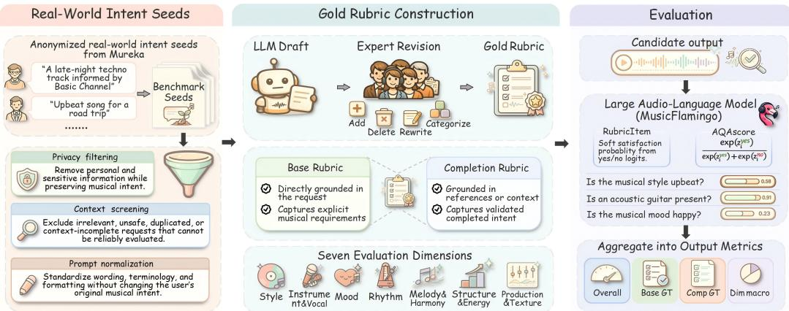
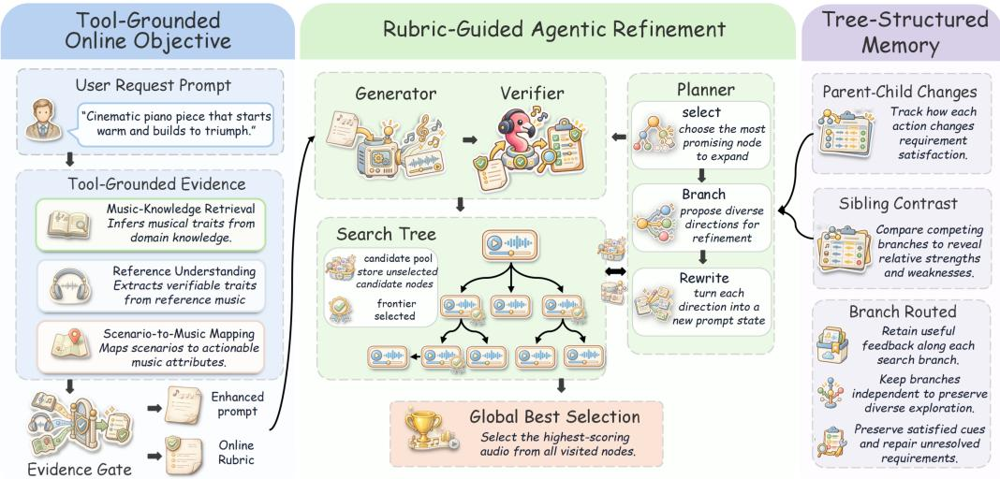
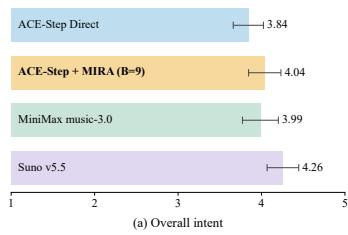
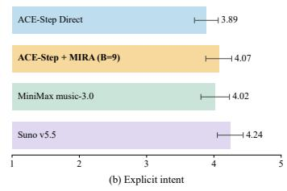
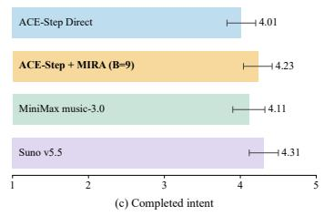
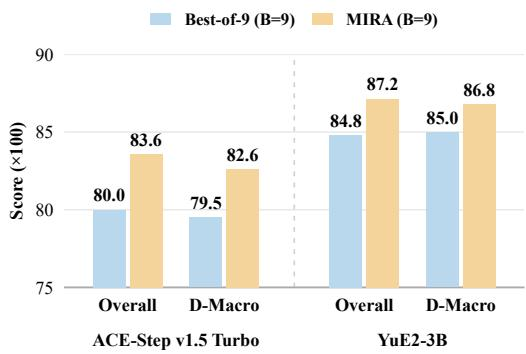

# MIRA: A MUSICAL INTENT REFINEMENT AGENT FOR ALIGNING TEXT-TO-MUSIC GENERATION WITH USER INTENT

Zekai Liu1 Zhilin Wang2 Xuzheng He3 Yu Cheng4 Yang Yang5

1Shandong University Shandong University

2University of Science and Technology of China 3Central Conservatory of Music 4Kunlun Tech Co. Ltd. 5Shanghai Jiao Tong University

## ABSTRACT

Text-to-music systems produce increasingly convincing audio, yet evaluation reveals little about whether the result matches user intent. A global text–audio relevance score can overlook the implicit intent in underspecified prompts and mask failures in specific requirements—instrumentation, structure, rhythm, or mood progression. To bridge this gap, we formulate text-to-music intent alignment as satisfying a per-request rubric of independently verifiable items covering both a request’s explicit requirements and its implied musical intent. Scoring items individually makes evaluation diagnostic—by intent source and musical dimension—rather than a single opaque score. We instantiate this as MuRA-Bench, a benchmark of real-world platform requests curated by music experts. We further propose MIRA (Musical Intent Refinement Agent), a test-time agent that first grounds a request’s intent into rubrics, then searches over prompt revisions for a black-box generator under a bounded budget—iteratively generating music, verifying it against the rubrics, and using this feedback to guide a trajectory-aware tree search. Experiments across open-source and commercial backends show that MIRA improves intent alignment, enabling an open-source generator to achieve performance comparable to representative commercial systems (e.g. Suno and Mureka). Project page: https://mirareview.github.io/.

## 1 INTRODUCTION

Text-to-music systems increasingly generate high-fidelity, complete songs from natural-language descriptions Liu et al. (2025b); Lei et al. (2024); Yang et al. (2025); Lei et al. (2026). Recent systems support lyrics, reference audio, long-form structure, and language-model planning, extending the capabilities of open-source generators Liu et al. (2025b); Lei et al. (2024); Yang et al. (2025); Gong et al. (2026); Lei et al. (2025; 2026). Yet plausible audio must also realize user intent. Real-world requests combine explicit musical constraints with references to artists, works, scenes, or use cases that convey harder-to-verbalize stylistic choices. Following these requests requires satisfying both stated constraints and contextually implied intent.

Existing evaluations primarily measure audio quality, broad text–audio relevance, or shared musical dimensions, leaving individual request requirements unspecified Kilgour et al. (2019); Elizalde et al. (2023); Deshmukh et al. (2024); Herremans & Roy (2026). Expert-rated datasets, preference platforms, learned quality metrics, and specialized benchmarks strengthen perceptual assessment, but holistic scores do not reveal which request-specific requirements remain unmet Liu et al. (2025a); Kim et al. (2025); Zhu & Li (2026); Ma et al. (2026); Wu et al. (2026). A high-scoring track may still omit a required instrument or miss traits implied by a reference. Recent methods decompose audio instructions into verifiable questions or binary rubric items Kuan et al. (2026); Li et al. (2026), but primarily address general audio semantics and instruction following rather than expert-revised musical criteria grounded in real-world requests.

We therefore formulate text-to-music intent alignment as prompt-specific musical rubric satisfaction. Each request is represented by a set of independently auditable rubric items covering both explicitly stated constraints and musical intent inferred from references and context. The specification varies with the request, revealing which requirements are satisfied or missed alongside overall alignment. We instantiate this formulation in MuRA-Bench, a public benchmark contain ing 100 controlled music-generation requests derived from anonymized intent seeds collected on the Mureka platform. For each request, a language model drafts a musical rubric, which is then reviewed and revised by a music expert. The requests are divided among three experts following shared revision guidelines.Named references are converted into generalized, audibly verifiable, and copyright-conscious musical traits rather than retained as direct imitation targets.

The same rubric perspective also provides an actionable signal for improving generation. Existing methods strengthen prompt following through pre-generation planning or model-specific inferencetime control, including reward-guided search, latent optimization, and internal intervention Gong et al. (2026); Novack et al. (2024); Koo et al. (2025); Roy et al. (2025). We focus on identifying un met request-specific requirements in completed tracks and converting them into subsequent repairs. We propose MIRA, a Musical Intent Refinement Agent that organizes text-to-music generation as verifier-guided search. MIRA uses the request and tool-grounded musical evidence to construct an online rubric, converts generated audio into requirement-level observations with a music-specialized verifier, and explores alternative prompt states under a bounded generation budget. Feedback is retained along the search structure, allowing subsequent actions to preserve satisfied requirements while targeting unresolved ones. Operating outside the generator, MIRA supports structurally different black-box backends without parameter updates.

We validate item-level scores against expert judgments, then compare generators on stated and completed musical intent. We evaluate MIRA on three generation backends under different generation budgets, analyze its major components, and use commercial systems as alignment references. The results show that request-specific evaluation exposes differences obscured by global relevance scores. MIRA consistently improves intent alignment and enables an open-source generator to match or surpass some representative commercial systems under MuRA-Bench evaluation.

Our work makes the following contributions:

• We formulate text-to-music intent alignment as prompt-specific musical rubric satisfaction and introduce MuRA-Bench, a public benchmark derived from real-world platform requests and revised by three music experts. It enables item-level verification of explicit musical constraints and expert-validated intent inferred from references and context.

• We propose MIRA, a musical intent refinement agent that combines tool-grounded objective construction, requirement-level audio verification, budgeted prompt search, and feedback memory without modifying the generation backend.

• We validate the proposed evaluation through agreement with expert judgments and demonstrate MIRA across three generation generators. With commercial systems as references, our results show that MIRA consistently improves intent alignment and enables an opensource generator to match some representative commercial systems.

## 2 RELATED WORK

Music Generation Evaluation and Benchmarks. Music generation evaluation spans distributional fidelity, text–audio correspondence, perceptual quality, and listener preference (Kilgour et al., 2019; Elizalde et al., 2023; Deshmukh et al., 2024; Liu et al., 2025a; Kim et al., 2025; Zhu & Li, 2026). FAD characterizes distribution-level fidelity, whereas CLAP measures broad semantic correspondence between text and audio. Expert ratings and preference datasets capture complementary aspects of perceived quality. Reward-model benchmarks also assess musicality and instruction following under text, lyrics, and reference-audio conditions (Ma et al., 2026). These complementary perspectives characterize system performance; diagnosing intent alignment additionally requires tracing scores to individual musical requirements.

Audio-language models enable more detailed assessment: Audio Flamingo 3 supports audio reasoning, while Music Flamingo specializes in musical properties such as harmony, structure, and timbre (Goel et al., 2025; Ghosh et al., 2025). AQAScore measures alignment through targeted audio questions, and AnyAudio-Judge decomposes instructions into binary rubric items (Kuan et al., 2026; Li et al., 2026). Related text-to-image benchmarks also evaluate verifiable prompt units and examine agreement with human judgments (Hu et al., 2023; Ghosh et al., 2023; Kamath et al., 2025). Our evaluation follows this item-level approach: MuRA-Bench uses expert-revised rubrics derived from real platform requests, separates explicitly stated requirements from intent inferred from references and context, and pairs these criteria with MF-AQA audio-question-answering scores.

  
Figure 1: Overview of MuRA-Bench construction and evaluation. Expert-revised, request-specific rubrics support fine-grained assessment with MusicFlamingo. Gold rubrics are used exclusively for evaluation and are not exposed to the generation system.

Agentic Refinement for Music Generation. Text-conditioned audio and music models provide generation backends (Liu et al., 2023; Agostinelli et al., 2023; Copet et al., 2023; Liu et al., 2024; 2025b; Lei et al., 2025; 2026), with controls over tempo, harmony, instrumentation, vocals, and structure (Melechovsky et al., 2024; Gong et al., 2026; Wang et al., 2026). DITTO further optimizes diffusion noise against differentiable musical objectives without retraining the generator at inference time (Novack et al., 2024). These controls motivate a complementary question: how can feedback on generated audio guide revisions to an open-ended musical request?

Agent research offers mechanisms for such refinement. ReAct supports interaction and external tool use (Yao et al., 2023b); Self-Refine and Reflexion use iterative feedback and experience memory (Madaan et al., 2023; Shinn et al., 2023); and Tree of Thoughts and LATS search over evaluated reasoning or action trajectories (Yao et al., 2023a; Zhou et al., 2024). GEPA derives reflective updates from execution trajectories, and GEMS combines persistent memory with domain-specific skills in multimodal generation (Agrawal et al., 2026; He et al., 2026). These methods make feedback, stored experience, and evaluated alternatives available to a planner; music refinement additionally requires observations grounded in the generated audio. MIRA brings tool-grounded intent completion, requirement-level audio feedback, and branch-specific memory into budgeted prompt search, using unmet requirements to guide repairs across music generation backends without updating their parameters.

## 3 MURA-BENCH: RUBRIC-LEVEL MUSIC INTENT ALIGNMENT

We formulate text-to-music intent alignment as the satisfaction of a prompt-specific musical rubric. Given a request x, its expert-revised gold rubric is

$$
{ \cal R } ^ { \star } ( x ) = { \cal B } ^ { \star } ( x ) \cup { \cal C } ^ { \star } ( x ) ,
$$

where $B ^ { \star } ( x )$ contains requirements directly supported by the prompt and $C ^ { \star } ( x )$ contains musical traits completed from references, use cases, and contextual information. Each rubric item describes one property that can be independently judged from the generated audio. This formulation accommodates multiple valid musical realizations without requiring a reference track.

## 3.1 BENCHMARK CONSTRUCTION

MuRA-Bench contains 100 controlled requests derived from anonymized intent seeds collected on Mureka. Seeds requiring unavailable context, containing sensitive information, or lacking stable musical criteria are excluded. The remaining seeds are normalized while preserving their central intent and realistic expression; raw user logs are not released. The benchmark includes partially specified, reference-based, and hybrid requests with multiple simultaneous constraints.

An instruction-following LLM drafts base and completion requirements and assigns dimensions. Three music experts revise the drafts to preserve explicit constraints, ensure that completed traits are musically plausible and supported by the request or reference context, enforce audible and atomic criteria, and remove or merge redundant or unsupported items. Named artists, songs, and albums are translated into general musical traits rather than direct imitation targets. Items are grouped into seven dimensions: style, instrumentation/vocal, mood, rhythm, harmony/melody, structure/energy, and production/texture. These categories organize request-specific requirements; they do not impose an identical checklist on every request. Figure 1 summarizes the construction process.

## 3.2 RUBRIC-BASED EVALUATION

For a generated track a and a gold rubric item $r _ { i } ,$ we formulate item-level evaluation as a binary audio question-answering task. The evaluator is instructed to determine whether the audible content satisfies $r _ { i }$ and to answer only yes or no. Our final evaluator uses MusicFlamingo, a musicspecialized audio-language model Ghosh et al. (2025). We compare this design with direct structured judgment and caption-plus-critic alternatives through expert agreement experiments.

Following AQAScore Kuan et al. (2026), let $z _ { i } ^ { \mathrm { y e s } }$ and $z _ { i } ^ { \mathrm { n o } }$ denote the logits assigned to the two candidate answers. We define the soft satisfaction probability as

$$
q _ { i } ( a ) = \frac { \exp ( z _ { i } ^ { \mathrm { y e s } } ) } { \exp ( z _ { i } ^ { \mathrm { y e s } } ) + \exp ( z _ { i } ^ { \mathrm { n o } } ) } .
$$

The probability retains the evaluator’s confidence and avoids an arbitrary threshold when aggregating item-level judgments.

Let E denote the set of evaluated request–audio pairs. For a rubric subset $S ( x )$ , let $\mathcal { E } _ { S } = \{ ( x , a ) \in$ $\mathcal { E } : | S ( x ) | > 0 \}$ . We average soft item scores within each audio and then equally across audios:

$$
\operatorname { S c o r e } ( S ) = { \frac { 1 } { | { \mathcal { E } } _ { S } | } } \sum _ { ( x , a ) \in { \mathcal { E } } _ { S } } { \frac { 1 } { | S ( x ) | } } \sum _ { r _ { i } \in S ( x ) } q _ { i } ( a ) .
$$

Our primary metric is $\mathrm { O v e r a l l } = \mathrm { S c o r e } ( R ^ { \star } )$ . We additionally report Base $\mathrm { G T } = \mathrm { S c o r e } ( B ^ { \star } )$ and Completion $\mathrm { G T } = \mathrm { S c o r e } ( C ^ { \star } )$ . The former measures satisfaction of requirements expressed directly in the benchmark prompt, whereas the latter measures realization of expert-revised traits completed from references and context.

To prevent dimensions containing more rubric items from dominating the analysis, we report Dim-Macro. Each dimension score uses the same within-audio then across-audio averaging, restricted to audios with at least one item in that dimension. We equally average the seven scores:

$$
\operatorname { D i m - M a c r o } = \frac { 1 } { | \mathscr { D } | } \sum _ { d \in \mathscr { D } } \operatorname { S c o r e } ( R _ { d } ^ { \star } ) ,
$$

where $R _ { d } ^ { \star } ( x )$ contains the gold items assigned to dimension $d .$ Overall averages all items within each audio, rather than averaging dimension scores or the Base and Completion scores equally.

For grader validation, music experts rate item-level satisfaction. We normalize 20-point ratings and exclude uncertain responses; Appendix B describes the calculation. These ratings are used only to measure grader agreement. The expert gold rubrics and human grading labels are never provided to the generation or refinement system.

## 4 MIRA: MUSICAL INTENT REFINEMENT AGENT

We introduce MIRA (Musical Intent Refinement Agent), a verifier-guided agentic framework that collaborates with any black-box text-to-music generator to improve intent-alignment. As shown in

  
Figure 2: Overview of MIRA and its verifier-guided refinement process.

Figure 2, MIRA is built on three core principles: 1) externalizing latent user intent to grounded, objective, and verifiable rubrics; 2) using tree-search to balance exploration and exploitation; 3) maintaining branch-specific memory to preserve rich and the most relevant optimization history.

Starting from a user prompt x and a black-box text-to-music generator $G ,$ MIRA first uncovers the implicit intents in the prompt and translates it into a set of grounded rubrics $R ,$ together with the musical control parameters κ required by the backend generator. Then, MIRA performs a verifierguided search process to iteratively improve the generation prompt. Specifically, it constructs a search tree $\boldsymbol { \mathcal { T } } = ( \boldsymbol { \mathcal { V } } , \boldsymbol { \mathcal { E } _ { T } } )$ , where each node $v \in \mathcal V$ stores

$$
\begin{array} { r } { n _ { v } = ( p _ { v } , a _ { v } , o _ { v } , M _ { v } ) , } \end{array}
$$

with $p _ { v }$ denoting complete generation prompt, $a _ { v } \sim G ( \cdot \mid p _ { v } , \kappa )$ the generated audio sample, $o _ { v }$ the rubric-level judgement produced by a music-specialized verifier, and $M _ { v }$ the branch-specific memory accumulated along the path to v.

## 4.1 TOOL-GROUNDED ONLINE RUBRIC

A user request may contain both directly stated constraints and musical intent that requires external knowledge to interpret. References, usage scenarios, and functional descriptions can imply musical properties that are not fully expressed in the prompt. MIRA preserves the original request as an immutable intent anchor and, when necessary, invokes external tools for music-knowledge retrieval, reference-audio understanding, or scenario-to-music attribute mapping.

Tool outputs first pass through an evidence gate. Only information with a traceable source, supporting evidence, and sufficient confidence is admitted for intent completion. Named references are converted into generalizable, audibly verifiable musical properties.

Given the request x and admitted external evidence $E ,$ a text LLM constructs the online musical rubric

$$
R ( x , E ) = \{ r _ { 1 } , \ldots , r _ { m } \} ,
$$

where each rubric item $r _ { i }$ represents an atomic musical requirement that can be assessed independently from the generated audio. The rubric is fixed before search and shared by all candidate nodes. It is derived only from the request and admitted evidence, without access to the expert gold rubric used for offline evaluation.

## 4.2 RUBRIC-GUIDED SEARCH

Text-to-music generation is stochastic, and the same alignment failure may admit several plausible prompt revisions. A single verification result therefore does not uniquely determine the appropriate repair. Moreover, following a single refinement trajectory may improve one rubric item while

degrading others that were previously satisfied. MIRA therefore formulates prompt refinement as rubric-guided search under a finite generation budget.

For a node $v ,$ MusicFlamingo evaluates every online rubric item and returns an item-level observation together with an aggregate score:

$$
\begin{array} { r c l } { \displaystyle { q _ { v , i } = P _ { \mathrm { M F } } \big ( \mathrm { y e s } \mid a _ { v } , r _ { i } \big ) , } } \\ { \displaystyle { o _ { v } = \big ( q _ { v , 1 } , \ldots , q _ { v , m } \big ) , } } \\ { \displaystyle { s _ { v } = \frac { 1 } { m } \sum _ { i = 1 } ^ { m } q _ { v , i } . } } \end{array}
$$

The aggregate score supports candidate comparison, while the item-level scores identify satisfied and unresolved parts of the online rubric. Rubric items with $q _ { v , i } < \eta$ , where $\eta = 0 . 6 0$ , are treated as low-scoring items and may receive concise targeted feedback.

At each search layer, the agent uses each retained parent’s prompt, item-level observation, and branch memory to propose several complete candidate prompts. Candidates expanded from the same frontier are generated and verified independently; outcomes are shared only after all candidates at that layer have been evaluated.

After evaluating a layer, MIRA retains a bounded search frontier. It preserves the candidate with the highest aggregate score and a complementary candidate with stronger mean satisfaction over its lowest-scoring quarter of rubric items; any remaining positions are filled according to aggregate score. The observed rubric state thus determines which candidates are retained and which items are targeted by subsequent repairs, while the search topology remains controlled by the generation budget.

Let $\gamma _ { B }$ denote all nodes generated and evaluated under budget B, including the initial generation. The budget constraint is

$$
| \nu _ { B } | \leq B .
$$

We evaluate a compact setting with $B = 3$ and a broader setting with $B = 9$ . Both use the same search mechanism and differ only in the available generation budget.

## 4.3 TREE-STRUCTURED FEEDBACK MEMORY

Retaining only the highest-scoring candidate does not explain why a revision succeeded or whether it improved some rubric items at the expense of others. MIRA therefore aligns its feedback memory with the search tree, allowing subsequent decisions to use both the local effect of a revision and its performance relative to competing search directions.

For a non-root node v with parent $p ( v )$ , MIRA first measures the item-level change from its parent:

$$
\Delta _ { v , i } ^ { \mathrm { p a r } } = q _ { v , i } - q _ { p ( v ) , i } .
$$

It then compares the node with the other candidates evaluated at the same search layer:

$$
\Delta _ { v , i } ^ { \mathrm { c m p } } = q _ { v , i } - \frac { 1 } { | \mathcal { N } _ { l } ( v ) | } \sum _ { u \in \mathcal { N } _ { l } ( v ) } q _ { u , i } ,
$$

where $\mathcal { N } _ { l } ( v )$ denotes the other candidates visible at layer $l .$ The contrastive term is omitted when this set is empty. The parent–child difference captures the local effect of a revision, while the candidate contrast identifies the relative strengths and weaknesses of its search direction.

To reduce sensitivity to minor verifier fluctuations, changes whose absolute magnitude does not exceed $\epsilon = 0 . 0 3$ are treated as stable; larger positive and negative changes are recorded as improvements and regressions, respectively. MIRA summarizes these signals as branch-specific memory $M _ { v }$ , recording which rubric items should be preserved, which remain unresolved, and which revision directions have produced regressions. The text LLM uses this memory when proposing subsequent candidate prompts.

Memory is propagated only along the corresponding branch. Different branches do not access one another’s complete prompts or private trajectories, preserving diversity across horizontal search while allowing feedback to persist within each branch. All memory is reset between user requests.

Table 1: Agreement with expert ratings on 100 clips from 25 requests. The first five evaluators use AQA. MF denotes MusicFlamingo.
<table><tr><td rowspan="2">Evaluator</td><td colspan="2">Item-level</td><td colspan="3">Clip-level</td><td rowspan="2">Pair</td></tr><tr><td>SRCC</td><td>Tb</td><td>LCC</td><td>SRCC</td><td>Tb Acc. (%)</td></tr><tr><td>MusicFlamingo</td><td>.690</td><td>.532</td><td>.817</td><td>.823</td><td>.646</td><td>79.59</td></tr><tr><td>Qwen3-Omni-30B-A3B</td><td>.509</td><td>.375</td><td>.632</td><td>.631</td><td>.480</td><td>74.15</td></tr><tr><td>Qwen2.5-Omni-7B</td><td>.469</td><td>.344</td><td>.599</td><td>.643</td><td>.465</td><td>72.79</td></tr><tr><td>MOSS-Music-8B</td><td>.502</td><td>.371</td><td>.591</td><td>.593</td><td>.429</td><td>62.59</td></tr><tr><td>AnyAudio-Judge-7B</td><td>.462</td><td>.335</td><td>.561</td><td>.556</td><td>.393</td><td>68.03</td></tr><tr><td>MF-Prompting</td><td>.552</td><td>.460</td><td>.732</td><td>.743</td><td>.567</td><td>72.79</td></tr><tr><td>MF-Cascade</td><td>.436</td><td>.350</td><td>.563</td><td>.608</td><td>.434</td><td>57.82</td></tr><tr><td>CLAPScore</td><td>.245</td><td>.175</td><td>.361</td><td>.331</td><td>.223</td><td>62.59</td></tr></table>

## 4.4 CANDIDATE SELECTION

Within budget B, MIRA returns the highest-scoring successfully visited candidate:

$$
v ^ { \star } = \arg \operatorname* { m a x } _ { v \in \mathcal { V } _ { B } } s _ { v } , \qquad a ^ { \star } = a _ { v ^ { \star } } .
$$

Aggregate satisfaction is the primary selection criterion. Ties are resolved using the rubric-item pass rate, lower-tail satisfaction, the minimum item score, and finally generation order.

## 5 EXPERIMENTS

Implementation Details. We evaluate MIRA on ACE-Step v1.5 Turbo (Gong et al., 2026), SongGeneration2 Large (Lei et al., 2026), and YuE2-3B (Yuan et al., 2025; Multimodal Art Projection, 2026). Kimi 2.6 (Moonshot AI, 2026) serves as the text planner, and MusicFlamingo provides requirement-level verification (Ghosh et al., 2025). For each backend, generation and verification run on a single NVIDIA A800. We compare against ten commercial models using direct prompting through their official APIs: MiniMax music-2.6/3.0 (MiniMax, 2026a;b), Mureka V9/V9.5 (Mureka, 2026a;b), StepAudio 3 Music (Feng et al., 2026), and Suno v4/v4.5/v5/v5.5/v6 (Suno, 2024; 2025a;b; 2026a;b). MIRA uses generation budgets of B = 3 and B = 9, including the initial generation. Main results cover all 100 MuRA-Bench requests; equalbudget comparisons and component analyses use a fixed subset of 20 requests. Evaluator validation covers 100 clips from 25 requests,while system-level human evaluation covers 400 clips from all 100 requests.

Agreement with Expert Judgments. We assess evaluator agreement using 1,536 rubric-item ratings from 100 clips covering 25 requests. Three music experts independently annotate assigned subsets, with system identities and automatic scores hidden; Appendix B details the protocol. We compare eight evaluation methods. Five use AQA scoring based on normalized yes/no logits (Kuan et al., 2026): MusicFlamingo (MF-AQA) (Ghosh et al., 2025), Qwen3-Omni-30B-A3B (Xu et al., 2025b), Qwen2.5-Omni-7B (Xu et al., 2025a), MOSS-Music-8B (OpenMOSS Team, 2026), and AnyAudio-Judge-7B (Li et al., 2026). The remaining methods are MF-Prompting, which directly elicits five-point requirement ratings from MusicFlamingo; MF-Cascade, which passes requirementindependent MusicFlamingo captions to a text judge; and CLAPScore (Elizalde et al., 2023; Wu et al., 2023), which measures audio–text embedding similarity.

Table 1 shows that MF-AQA achieves the highest agreement across all six metrics. These results support the use of MusicFlamingo with AQA scoring for requirement-level evaluation and candidate selection in MIRA.

Main Results. Table 2 shows consistent alignment improvements across all three generation backends. With B = 9, MIRA increases Overall by 12.9% on ACE-Step, 19.0% on SongGeneration2, and 7.3% on YuE2-3B relative to direct generation. Overall and D-Macro improve at both budgets, and increasing the budget from B = 3 to B = 9 further improves both explicit and inferred intent across all three backends.

Among commercial systems, recent Suno and Mureka models achieve the strongest overall alignment. Version updates show a clear overall trend toward better intent alignment: Suno’s Overall score rises from 73.6 in v4 to 81.9 in v5.5 and 81.8 in v6, while MiniMax and Mureka also improve across their evaluated versions. This trend highlights intent alignment as an important axis of progress in music generation. MuRA-Bench captures these advances in models’ ability to satisfy request-specific musical requirements.

Table 2: Results on the full MuRA-Bench benchmark. All scores are multiplied by 100; higher is better. Superscripts in MIRA rows indicate absolute changes from the same backend’s directprompt baseline on this scale. Bold marks the best score within each refinement backend or among the commercial models.
<table><tr><td rowspan="2">Backend / Setting</td><td colspan="4">Intent alignment</td><td colspan="7">Musical dimensions</td></tr><tr><td>Overall</td><td>D-Macro</td><td>Base</td><td>Comp.</td><td>Style</td><td>I/V</td><td>Mood</td><td>Rhythm</td><td>H/M</td><td>S/E</td><td>P/T</td></tr><tr><td colspan="10">ACE-Step v1.5 Turbo</td></tr><tr><td>Direct</td><td>67.6</td><td>67.2</td><td>69.6</td><td>66.1</td><td>68.1</td><td>62.4</td><td>71.9</td><td>71.0</td><td>64.1</td><td>69.4</td><td>63.3</td></tr><tr><td>MIRA (B = 3)</td><td>74.2↑6.6</td><td>74.1↑6.9</td><td>77.1↑7.5</td><td>71.1↑5.0</td><td>74.6↑6.5</td><td>69.5↑7.1</td><td>81.2↑9.3</td><td>75.4↑4.4</td><td>71.4↑7.3</td><td>72.8↑3.4</td><td>73.7↑10.4</td></tr><tr><td>MIRA (B = 9)</td><td>76.3↑8.7</td><td>75.6↑8.4</td><td>79.1↑9.5</td><td>73.4↑7.3</td><td>75.4↑7.3</td><td>69.1↑6.7</td><td>83.0↑11.1</td><td>77.2↑6.2</td><td>72.8↑8.7</td><td> $\mathbf { 7 4 . 6 ^ { \ : \uparrow 5 . 2 } 7 7 . 0 ^ { \ : \uparrow 1 3 . 7 } }$ </td><td></td></tr><tr><td colspan="10">SongGeneration2 Large</td></tr><tr><td>Direct</td><td>60.5</td><td>59.2</td><td>62.9</td><td>58.3</td><td>55.4</td><td>51.1</td><td>65.0</td><td>68.9</td><td>49.0</td><td>64.1</td><td>60.7</td></tr><tr><td>MIRA (B = 3)</td><td>66.2↑5.7</td><td>64.9↑5.7</td><td>68.9↑6.0</td><td>63.2↑4.9</td><td>62.0↑6.6</td><td>55.8↑4.7</td><td>75.0↑10.0</td><td>70.2↑1.3</td><td>56.2↑7.2</td><td>67.7↑3.6</td><td>67.0↑6.3</td></tr><tr><td>MIRA (B = 9)</td><td>72.0↑11.5</td><td>70.8↑11.6</td><td>75.3↑12.4</td><td>68.4↑10.1</td><td>75.1↑19.7</td><td>63.5↑12.4</td><td>77.2↑12.2</td><td>74.6↑5.7</td><td>59.8↑10.8</td><td>72.1↑8.0</td><td>73.4↑12.7</td></tr><tr><td colspan="10"></td></tr><tr><td></td><td></td><td></td><td></td><td></td><td>YuE2-3B</td><td></td><td></td><td></td><td></td><td></td><td></td></tr><tr><td>Direct</td><td>76.5</td><td>75.8</td><td>79.2</td><td>73.3</td><td>77.3</td><td>70.5</td><td>83.7</td><td>74.8</td><td>70.5</td><td>77.3</td><td>76.7</td></tr><tr><td>MIRA (B = 3) MIRA (B = 9)</td><td>80.5↑4.0 82.1↑5.6</td><td>79.9↑4.1 81.3↑5.5</td><td>83.1↑3.9 85.0↑5.8</td><td>77.6↑4.3 78.4↑5.1</td><td>82.9↑5.6 82.8↑5.5</td><td>77.1↑6.6 77.7↑7.2</td><td>86.5↑2.8 87.7↑4.0</td><td>79.3↑4.5 81.9↑7.1</td><td>73.813.3 75.8↑5.3</td><td>79.6↑2.3 81.0↑3.7</td><td>80.4↑3.7 81.9↑5.2</td></tr><tr><td colspan="10">Commercial systems (direct prompting)</td></tr><tr><td>MiniMax music-2.6</td><td>75.9</td><td>75.4</td><td>78.2</td><td>74.0</td><td>76.0</td><td>68.9</td><td>81.6</td><td>79.1</td><td>67.5</td><td>78.3</td><td>76.4</td></tr><tr><td>MiniMax music-3.0</td><td>77.0</td><td>75.6</td><td>79.8</td><td>74.8</td><td>75.9</td><td>72.3</td><td>83.1</td><td>77.1</td><td>67.4</td><td>75.1</td><td>78.6</td></tr><tr><td>Mureka V9</td><td>80.6</td><td>80.0</td><td>84.0</td><td>77.2</td><td>83.8</td><td>75.5</td><td>86.7</td><td>81.8</td><td>73.1</td><td>80.5</td><td>78.4</td></tr><tr><td>Mureka V9.5</td><td>81.2</td><td>80.6</td><td>83.8</td><td>78.9</td><td>83.0</td><td>75.2</td><td>87.6</td><td>82.4</td><td>75.1</td><td>81.0</td><td>80.2</td></tr><tr><td>StepAudio 3 Music</td><td>79.6</td><td>79.3</td><td>82.6</td><td>76.5</td><td>82.2</td><td>75.0</td><td>84.9</td><td>79.6</td><td>75.6</td><td>79.5</td><td>78.2</td></tr><tr><td>Suno v4</td><td>73.6</td><td>72.8</td><td>75.8</td><td>72.9</td><td>74.5</td><td>61.7</td><td>80.7</td><td>76.2</td><td>64.7</td><td>77.3</td><td>74.7</td></tr><tr><td>Suno v4.5</td><td>76.8</td><td>76.0</td><td>80.0</td><td>73.2</td><td>78.2</td><td>69.4</td><td>84.3</td><td>76.8</td><td>65.9</td><td>80.2</td><td>77.0</td></tr><tr><td>Suno v5</td><td>79.7</td><td>79.0</td><td>83.1</td><td>76.0</td><td>81.7</td><td>72.5</td><td>85.3</td><td>81.0</td><td>73.5</td><td>80.6</td><td>78.6</td></tr><tr><td>Suno v5.5</td><td>81.9</td><td>80.9</td><td>85.3</td><td>77.7</td><td>84.8</td><td>75.3</td><td>86.9</td><td>83.3</td><td>70.9</td><td>84.6</td><td>80.4</td></tr><tr><td>Suno v6</td><td>81.8</td><td>81.5</td><td>85.8</td><td>77.6</td><td>85.1</td><td>75.6</td><td>87.8</td><td>80.5</td><td>76.3</td><td>85.2</td><td>80.2</td></tr><tr><td></td><td></td><td></td><td></td><td></td><td></td><td></td><td></td><td></td><td></td><td></td><td></td></tr></table>

D-Macro: dimension-macro; Base/Comp.: explicit/inferred intent. I/V: instrumentation/vocal; H/M: harmony/melody; S/E: structure/energy; P/T: production/texture. Direct denotes direct prompting. ↑: increase; ↓: decrease relative to Direct.

  
Figure 3: Blinded expert ratings of overall, explicit, and inferred intent on MuRA-Bench. Bars show mean ratings on a 1–5 scale, with 95% confidence intervals.

YuE2-3B with MIRA achieves the highest Overall score among the evaluated systems, reaching 82.1 compared with 81.9 for Suno v5.5, the strongest commercial baseline on this metric. ACE-Step with MIRA also improves from 67.6 to 76.3, compared with 75.9 for MiniMax music-2.6. These results demonstrate that MIRA enables open-source generators to achieve intent-alignment performance comparable to representative commercial systems.

Human Evaluation. Figure 3 complements evaluator agreement with blinded system-level assessment. ACE-Step with MIRA receives higher mean ratings than direct ACE-Step for overall, explicit, and inferred intent. Its means also exceed MiniMax music-3.0 while remaining below Suno

Table 3: Component analysis on a fixed subset of 20 MuRA-Bench requests. Direct generation uses B = 1; all remaining configurations use B = 9. Tool grounding is first combined with best-ofnine sampling, followed by adaptive search without memory and then tree-structured memory. Bold marks the best score within each backend.
<table><tr><td colspan="2"></td><td colspan="4">ACE-Step v1.5 Turbo</td><td colspan="4">YuE2-3B</td></tr><tr><td>Setting</td><td>B</td><td>Overall</td><td>D-Macro</td><td>Base</td><td>Comp.</td><td>Overall</td><td>D-Macro</td><td>Base</td><td>Comp.</td></tr><tr><td>Direct</td><td>1</td><td>0.759</td><td>0.756</td><td>0.803</td><td>0.710</td><td>0.816</td><td>0.811</td><td>0.868</td><td>0.752</td></tr><tr><td>Best-of-9</td><td>9</td><td>0.800</td><td>0.795</td><td>0.874</td><td>0.719</td><td>0.848</td><td>0.850</td><td>0.910</td><td>0.775</td></tr><tr><td>Tools + Best-of-9</td><td>9</td><td>0.815</td><td>0.807</td><td>0.871</td><td>0.748</td><td>0.860</td><td>0.852</td><td>0.911</td><td>0.800</td></tr><tr><td>Tools + Adaptive search</td><td>9</td><td>0.826</td><td>0.814</td><td>0.862</td><td>0.781</td><td>0.867</td><td>0.863</td><td>0.913</td><td>0.808</td></tr><tr><td>Full MIRA</td><td>9</td><td>0.836</td><td>0.826</td><td>0.880</td><td>0.782</td><td>0.872</td><td>0.868</td><td>0.911</td><td>0.821</td></tr></table>

v5.5 across all three dimensions. These descriptive results provide complementary human evidence for the alignment improvements observed in automatic evaluation.

Equal-Budget Comparison. Figure 4 compares MIRA with Best-of-9 on the 20- request subset. Both use nine generations and MusicFlamingo for final selection. MIRA improves Overall by 3.6 points on ACE-Step and approximately 2.35 points on YuE2-3B, with higher D-Macro scores on both backends. These results support more effective use of the generation budget than independent sampling.

Component Analysis. Table 3 examines the contributions of tool grounding, adaptive search, and structured memory on the same 20 requests. Adding tool grounding to Best-of-9 raises Comp. from 0.719 to 0.748 on ACE-Step and from 0.775 to 0.800 on YuE2-3B. By grounding intent completion in external musical knowledge, this component provides more informed task specifications that help generators realize musical traits left implicit in the original request.

Adaptive search then improves Overall, D-Macro, and Comp. on both backends. ACE-Step’s Comp. rises from 0.748 to 0.781, illustrating how requirement-level observations guide search toward unresolved aspects of intent more effectively than independent sampling from a fixed specification.

Figure 4: Best-of-9 versus MIRA with B = 9. Scores are multiplied by 100; the vertical axis starts at 75.

Adding structured memory further improves Overall and D-Macro on both backends, with full MIRA achieving the highest scores on these metrics. These results support using branch-specific records of successful and unsuccessful revisions to guide subsequent search.

## 6 CONCLUSION

We presented a unified framework for evaluating and improving intent alignment in text-to-music generation. MuRA-Bench converts real-world platform requests into expert-revised rubrics cover ing explicit constraints and inferred intent, enabling requirement-level evaluation. Agreement with expert judgments supports requirement-targeted audio question answering for fine-grained intent assessment. MIRA integrates tool-grounded intent completion, verifier-guided search, and treestructured memory to refine black-box music generation. Experiments across three open-source backends demonstrate consistent alignment improvements, enabling an open-source generator to achieve performance comparable to representative commercial systems. Gains over repeated sampling under equal generation budgets further support the effectiveness of this search framework.

## REFERENCES

Andrea Agostinelli, Timo I. Denk, Zalan Borsos, Jesse Engel, Mauro Verzetti, Antoine Caillon,´ Qingqing Huang, Aren Jansen, Adam Roberts, Marco Tagliasacchi, Matt Sharifi, Neil Zeghidour, and Christian Frank. MusicLM: Generating music from text. arXiv preprint arXiv:2301.11325, 2023. URL https://arxiv.org/abs/2301.11325.

Lakshya A. Agrawal, Shangyin Tan, Dilara Soylu, Noah Ziems, Rishi Khare, Krista Opsahl-Ong, Arnav Singhvi, Herumb Shandilya, Michael J. Ryan, Meng Jiang, Christopher Potts, Koushik Sen, Alexandros G. Dimakis, Ion Stoica, Dan Klein, Matei Zaharia, and Omar Khattab. GEPA: Reflective prompt evolution can outperform reinforcement learning. In International Conference on Learning Representations, 2026. URL https://proceedings.iclr.cc/paper\_files/paper/2026/hash/ 0e9e708b6f48e14fd0ac29e167413f76-Abstract-Conference.html.

Jade Copet, Felix Kreuk, Itai Gat, Tal Remez, David Kant, Gabriel Synnaeve, Yossi Adi, and Alexandre Defossez. Simple and controllable music generation. In´ Advances in Neural Information Processing Systems, volume 36, 2023. URL https://proceedings.neurips. cc/paper\_files/paper/2023/hash/94b472a1842cd7c56dcb125fb2765fbd-Abstract-Conference.html.

Soham Deshmukh, Dareen Alharthi, Benjamin Elizalde, Hannes Gamper, Mahmoud Al Ismail, Rita Singh, Bhiksha Raj, and Huaming Wang. PAM: Prompting audio-language models for audio quality assessment. In Proceedings of Interspeech, pp. 3320–3324, 2024. doi: 10.21437/Interspeech.2024-325. URL https://www.isca-archive.org/ interspeech\_2024/deshmukh24b\_interspeech.html.

Benjamin Elizalde, Soham Deshmukh, Mahmoud Al Ismail, and Huaming Wang. CLAP: Learning audio concepts from natural language supervision. In Proceedings of the IEEE International Conference on Acoustics, Speech and Signal Processing, 2023. doi: 10.1109/ICASSP49357. 2023.10095889.

Chengli Feng, Zhiyue Wu, Jiahao Song, Zheqi Dai, Boyang Wang, Ruibin Yuan, Junming Gong, Wenxiao Zhao, Jing Guo, Gang Yu, Xiangyu Zhang, Xuerui Yang, and Chao Yan. StepAudio 3 Music Technical Report. arXiv preprint arXiv:2609.16034, 2026. URL https://arxiv. org/abs/2609.16034.

Dhruba Ghosh, Hanna Hajishirzi, and Ludwig Schmidt. GenEval: An object-focused framework for evaluating text-to-image alignment. In Advances in Neural Information Processing Systems, volume 36, 2023. URL https://proceedings.nips.cc/paper\_ files/paper/2023/hash/a3bf71c7c63f0c3bcb7ff67c67b1e7b1-Abstract-Datasets\_and\_Benchmarks.html.

Sreyan Ghosh, Arushi Goel, Lasha Koroshinadze, Sang-gil Lee, Zhifeng Kong, Joao Felipe Santos, Ramani Duraiswami, Dinesh Manocha, Wei Ping, Mohammad Shoeybi, and Bryan Catanzaro. Music flamingo: Scaling music understanding in audio language models. arXiv preprint arXiv:2511.10289, 2025. URL https://arxiv.org/abs/2511.10289.

Arushi Goel, Sreyan Ghosh, Jaehyeon Kim, Sonal Kumar, Zhifeng Kong, Sang-gil Lee, Chao-Han Huck Yang, Ramani Duraiswami, Dinesh Manocha, Rafael Valle, and Bryan Catanzaro. Audio flamingo 3: Advancing audio intelligence with fully open large audio language models. arXiv preprint arXiv:2507.08128, 2025. URL https://arxiv.org/abs/2507.08128.

Junmin Gong, Yulin Song, Wenxiao Zhao, Sen Wang, Shengyuan Xu, Jing Guo, and Xuerui Yang. ACE-Step 1.5: Pushing the Boundaries of Open-Source Music Generation. arXiv preprint arXiv:2602.00744, 2026. URL https://arxiv.org/abs/2602.00744v3.

Zefeng He, Siyuan Huang, Xiaoye Qu, Yafu Li, Tong Zhu, Yu Cheng, and Yang Yang. GEMS: Agent-native multimodal generation with memory and skills. arXiv preprint arXiv:2603.28088, 2026. URL https://arxiv.org/abs/2603.28088.

Dorien Herremans and Abhinaba Roy. Aligning generative music ai with human preferences: Methods and challenges. Proceedings ofthe AAAI Conference on Artificial Intelligence, 40(46):39699– 39706, 2026. doi: 10.1609/aaai.v40i46.41323.

Yushi Hu, Benlin Liu, Jungo Kasai, Yizhong Wang, Mari Ostendorf, Ranjay Krishna, and Noah A. Smith. TIFA: Accurate and interpretable text-to-image faithfulness evaluation with question answering. In Proceedings of the IEEE/CVF International Conference on Computer Vision, 2023.

Amita Kamath, Kai-Wei Chang, Ranjay Krishna, Luke Zettlemoyer, Yushi Hu, and Marjan Ghazvininejad. GenEval 2: Addressing benchmark drift in text-to-image evaluation. arXiv preprint arXiv:2512.16853, 2025. URL https://arxiv.org/abs/2512.16853.

Kevin Kilgour, Mauricio Zuluaga, Dominik Roblek, and Matthew Sharifi. Frechet audio distance:´ A reference-free metric for evaluating music enhancement algorithms. In Proceedings of Interspeech, pp. 2350–2354, 2019. doi: 10.21437/Interspeech.2019-2219. URL https://www. isca-archive.org/interspeech\_2019/kilgour19\_interspeech.html.

Yonghyun Kim, Wayne Chi, Anastasios Nikolas Angelopoulos, Wei-Lin Chiang, Koichi Saito, Shinji Watanabe, Yuki Mitsufuji, and Chris Donahue. Music arena: Live evaluation for textto-music. In NeurIPS Creative AI Track, 2025.

Junghyun Koo, Gordon Wichern, Franc¸ois G. Germain, Sameer Khurana, and Jonathan Le Roux. SMITIN: Self-monitored inference-time intervention for generative music transformers. IEEE Open Journal of Signal Processing, 6:266–275, 2025. doi: 10.1109/OJSP.2025.3534686. URL https://www.merl.com/research/downloads/SMITIN.

Chun-Yi Kuan, Kai-Wei Chang, and Hung-yi Lee. AQAScore: Evaluating semantic alignment in text-to-audio generation via audio question answering. arXiv preprint arXiv:2601.14728, 2026. URL https://arxiv.org/abs/2601.14728.

Shun Lei, Yixuan Zhou, Boshi Tang, Max W. Y. Lam, Feng Liu, Hangyu Liu, Jingcheng Wu, Shiyin Kang, Zhiyong Wu, and Helen Meng. SongCreator: Lyrics-based universal song generation. In Advances in Neural Information Processing Systems, volume 37, 2024. doi: 10.52202/079017- 2546.

Shun Lei, Yaoxun Xu, Zhiwei Lin, Huaicheng Zhang, Wei Tan, Hangting Chen, Yixuan Zhang, Chenyu Yang, Haina Zhu, Shuai Wang, Zhiyong Wu, and Dong Yu. LeVo: High-Quality Song Generation with Multi-Preference Alignment. In Advances in Neural Information Processing Systems, volume 38, 2025. doi: 10.52202/085713- 3427. URL https://proceedings.neurips.cc/paper\_files/paper/2025/ hash/944f0b5d4f224f8d2a30e65082b51b76-Abstract-Conference.html.

Shun Lei, Huaicheng Zhang, Dapeng Wu, Yaoxun Xu, Lishi Zuo, Wei Tan, Hangting Chen, Guangzheng Li, Jianwei Yu, Zhiyong Wu, and Dong Yu. LeVo 2: Stable and melodious song generation via hierarchical representation modeling and progressive post-training. arXiv preprint arXiv:2606.30642, 2026. URL https://arxiv.org/abs/2606.30642.

Haitao Li, Tian Tan, Yuguang Yang, Shan Yang, and Xie Chen. AnyAudio-Judge: A dynamic rubricbased benchmark and evaluator for audio instruction following. arXiv preprint arXiv:2606.03116, 2026. URL https://arxiv.org/abs/2606.03116.

Cheng Liu, Hui Wang, Jinghua Zhao, Shiwan Zhao, Hui Bu, Xin Xu, Jiaming Zhou, Haoqin Sun, and Yong Qin. MusicEval: A generative music dataset with expert ratings for automatic text-tomusic evaluation. In IEEE International Conference on Acoustics, Speech and Signal Processing (ICASSP), 2025a. URL https://arxiv.org/abs/2501.10811v2.

Haohe Liu, Zehua Chen, Yi Yuan, Xinhao Mei, Xubo Liu, Danilo Mandic, Wenwu Wang, and Mark D. Plumbley. AudioLDM: Text-to-audio generation with latent diffusion models. In Proceedings of the 40th International Conference on Machine Learning, pp. 21450–21474, 2023. URL https://proceedings.mlr.press/v202/liu23f.html.

Haohe Liu, Yi Yuan, Xubo Liu, Xinhao Mei, Qiuqiang Kong, Qiao Tian, Yuping Wang, Wenwu Wang, Yuxuan Wang, and Mark D. Plumbley. AudioLDM 2: Learning holistic audio generation with self-supervised pretraining. IEEE/ACM Transactions on Audio, Speech, and Language Processing, 2024. doi: 10.1109/TASLP.2024.3399607.

Zihan Liu, Shuangrui Ding, Zhixiong Zhang, Xiaoyi Dong, Pan Zhang, Yuhang Zang, Yuhang Cao, Dahua Lin, and Jiaqi Wang. SongGen: A single stage auto-regressive transformer for text-tosong generation. In Proceedings of the 42nd International Conference on Machine Learning, volume 267 of Proceedings of Machine Learning Research, pp. 38351–38364. PMLR, 2025b. URL https://proceedings.mlr.press/v267/liu25m.html.

Yinghao Ma, Haiwen Xia, Hewei Gao, Weixiong Chen, Yuxin Ye, Yuchen Yang, Sungkyun Chang, Mingshuo Ding, Yizhi Li, Ruibin Yuan, Simon Dixon, and Emmanouil Benetos. CMI-RewardBench: Evaluating music reward models with compositional multimodal instruction. arXiv preprint arXiv:2603.00610, 2026. URL https://arxiv.org/abs/2603.00610.

Aman Madaan, Niket Tandon, Prakhar Gupta, Skyler Hallinan, Luyu Gao, Sarah Wiegreffe, Uri Alon, Nouha Dziri, Shrimai Prabhumoye, Yiming Yang, Shashank Gupta, Bodhisattwa Prasad Majumder, Katherine Hermann, Sean Welleck, Amir Yazdanbakhsh, and Peter Clark. Self-refine: Iterative refinement with self-feedback. In Advances in Neural Information Processing Systems, 2023.

Jan Melechovsky, Zixun Guo, Deepanway Ghosal, Navonil Majumder, Dorien Herremans, and Soujanya Poria. Mustango: Toward controllable text-to-music generation. In Proceedings of the 2024 Conference of the North American Chapter of the Association for Computational Linguistics: Human Language Technologies (Volume 1: Long Papers), pp. 8293–8316, Mexico City, Mexico, 2024. Association for Computational Linguistics. doi: 10.18653/v1/2024.naacl-long.459.

MiniMax. MiniMax Music 2.6: Four Stories We Want to Tell. https://www.minimax.io/ news/music-26, 2026a. Official release; accessed 2026-09-26.

MiniMax. MiniMax Music 3.0: Next-Generation Open-Weights, Production-Ready & Versatile Music Model. https://www.minimax.io/blog/minimax-music-3-0-nextgeneration-open-weights-production-ready-versatile-music-model, 2026b. Official release, August 13; accessed 2026-09-26.

Moonshot AI. Kimi-K2.6. https://huggingface.co/moonshotai/Kimi-K2.6, 2026. Official model card; accessed 2026-09-26.

Multimodal Art Projection. YuE2-3B. https://huggingface.co/m-a-p/YuE2-3B, 2026. Official model card; accessed 2026-09-26. The model card requests citation of the YuE paper pending the YuE2 technical report.

Mureka. What is Mureka? https://www.mureka.ai/blog\_en/what-is-mureka. html, 2026a. Official website; accessed 2026-09-26.

Mureka. What Changed in the Mureka V9.5 Model? https://www.mureka.ai/blog\_en/ mureka-v9-5-model-changes.html, 2026b. Official release; accessed 2026-09-26.

Zachary Novack, Julian McAuley, Taylor Berg-Kirkpatrick, and Nicholas J. Bryan. DITTO: Diffusion inference-time t-optimization for music generation. In Proceedings ofthe International Conference on Machine Learning, volume 235 of Proceedings of Machine Learning Research, pp. 38426–38447, 2024. URL https://proceedings.mlr.press/v235/novack24a. html.

OpenMOSS Team. MOSS-Music Technical Report. https://github.com/OpenMOSS/ MOSS-Music, 2026. GitHub repository; accessed 2026-09-26.

Abhinaba Roy, Geeta Puri, and Dorien Herremans. Text2midi-InferAlign: Improving symbolic music generation with inference-time alignment. arXiv preprint arXiv:2505.12669, 2025. URL https://arxiv.org/abs/2505.12669.

Noah Shinn, Federico Cassano, Ashwin Gopinath, Karthik Narasimhan, and Shunyu Yao. Reflexion: Language agents with verbal reinforcement learning. In Advances in Neural Information Processing Systems, volume 36, 2023.

Suno. Introducing v4. https://suno.com/blog/v4, 2024. Official website; accessed 2026- 09-26.

Suno. Introducing v4.5. https://suno.com/blog/introducing-v4-5, 2025a. Official website; accessed 2026-09-26.

Suno. Introducing v5 - the world’s best music model. https://about.suno.com/releasenotes/introducing-v5-the-world-s-best-music-model, 2025b. Official website; accessed 2026-09-26.

Suno. Introducing v5.5: Voices, Custom Models, and My Taste. https://suno.com/ release-notes/introducing-v5-5-voices-custom-models-and-mytaste, 2026a. Official release, March 26; accessed 2026-09-26.

Suno. What’s new in v6? https://help.suno.com/en/articles/13924801, 2026b. Official help article; accessed 2026-09-26.

Yuejiao Wang, Zihao Ji, Pengfei Cai, Xu Li, Haorui Zheng, Zewen Song, Zhongliang Liu, Chen Zhang, and Pengfei Wan. SegTune: Structured and fine-grained control for song generation. In Proceedings of the 64th Annual Meeting of the Association for Computational Linguistics (Volume 1: Long Papers), pp. 12883–12897. Association for Computational Linguistics, 2026. doi: 10.18653/v1/2026.acl-long.586. URL https://aclanthology.org/2026.acllong.586/.

Dapeng Wu, Shun Lei, Wei Tan, Guangzheng Li, Yunzhe Wang, Huaicheng Zhang, Lishi Zuo, and Zhiyong Wu. SongBench: A fine-grained multi-aspect benchmark for song quality assessment. arXiv preprint arXiv:2604.25937, 2026. URL https://arxiv.org/abs/2604.25937.

Yusong Wu, Ke Chen, Tianyu Zhang, Yuchen Hui, Taylor Berg-Kirkpatrick, and Shlomo Dubnov. Large-scale Contrastive Language-Audio Pretraining with Feature Fusion and Keywordto-Caption Augmentation. In IEEE International Conference on Acoustics, Speech and Signal Processing (ICASSP), 2023. URL https://github.com/LAION-AI/CLAP.

Jin Xu, Zhifang Guo, Jinzheng He, Hangrui Hu, Ting He, Shuai Bai, Keqin Chen, Jialin Wang, Yang Fan, Kai Dang, Bin Zhang, Xiong Wang, Yunfei Chu, and Junyang Lin. Qwen2.5-Omni Technical Report. arXiv preprint arXiv:2503.20215, 2025a. URL https://arxiv.org/abs/2503. 20215.

Jin Xu, Zhifang Guo, Hangrui Hu, Yunfei Chu, Xiong Wang, Jinzheng He, Yuxuan Wang, Xian Shi, Ting He, Xinfa Zhu, Yuanjun Lv, Yongqi Wang, Dake Guo, He Wang, Linhan Ma, Pei Zhang, Xinyu Zhang, Hongkun Hao, Zishan Guo, Baosong Yang, Bin Zhang, Ziyang Ma, Xipin Wei, Shuai Bai, Keqin Chen, Xuejing Liu, Peng Wang, Mingkun Yang, Dayiheng Liu, Xingzhang Ren, Bo Zheng, Rui Men, Fan Zhou, Bowen Yu, Jianxin Yang, Le Yu, Jingren Zhou, and Junyang Lin. Qwen3-Omni Technical Report. arXiv preprint arXiv:2509.17765, 2025b. URL https: //arxiv.org/abs/2509.17765.

Chenyu Yang, Shuai Wang, Hangting Chen, Wei Tan, Jianwei Yu, and Haizhou Li. SongBloom: Coherent song generation via interleaved autoregressive sketching and diffusion refinement. In Advances in Neural Information Processing Systems, volume 38, 2025.

Shunyu Yao, Dian Yu, Jeffrey Zhao, Izhak Shafran, Thomas L. Griffiths, Yuan Cao, and Karthik Narasimhan. Tree of thoughts: Deliberate problem solving with large language models. In Advances in Neural Information Processing Systems, volume 36, pp. 11809–11822, 2023a. URL https://proceedings.neurips.cc/paper\_files/paper/2023/ hash/271db9922b8d1f4dd7aaef84ed5ac703-Abstract-Conference.html.

Shunyu Yao, Jeffrey Zhao, Dian Yu, Nan Du, Izhak Shafran, Karthik Narasimhan, and Yuan Cao. ReAct: Synergizing reasoning and acting in language models. In Proceedings of the International Conference on Learning Representations, 2023b.

Ruibin Yuan, Hanfeng Lin, Shuyue Guo, Ge Zhang, Jiahao Pan, Yongyi Zang, Haohe Liu, Yiming Liang, Wenye Ma, Xingjian Du, Xinrun Du, Zhen Ye, Tianyu Zheng, Zhengxuan Jiang, Yinghao Ma, Minghao Liu, Zeyue Tian, Ziya Zhou, Liumeng Xue, Xingwei Qu, Yizhi Li, Shangda Wu, Tianhao Shen, Ziyang Ma, Jun Zhan, Chunhui Wang, Yatian Wang, Xiaowei Chi, Xinyue Zhang, Zhenzhu Yang, Xiangzhou Wang, Shansong Liu, Lingrui Mei, Peng Li, Junjie Wang, Jianwei Yu, Guojian Pang, Xu Li, Zihao Wang, Xiaohuan Zhou, Lijun Yu, Emmanouil Benetos, Yong Chen, Chenghua Lin, Xie Chen, Gus Xia, Zhaoxiang Zhang, Chao Zhang, Wenhu Chen, Xinyu Zhou, Xipeng Qiu, Roger Dannenberg, Jiaheng Liu, Jian Yang, Wenhao Huang, Wei Xue, Xu Tan, and Yike Guo. YuE: Scaling Open Foundation Models for Long-Form Music Generation. arXiv preprint arXiv:2503.08638, 2025. URL https://arxiv.org/abs/2503.08638.

Andy Zhou, Kai Yan, Michal Shlapentokh-Rothman, Haohan Wang, and Yu-Xiong Wang. Language agent tree search unifies reasoning, acting, and planning in language models. In Proceedings of the 41st International Conference on Machine Learning, pp. 62138–62160, 2024. URL https: //proceedings.mlr.press/v235/zhou24r.html.

Di Zhu and Zixuan Li. MuQ-Eval: An open-source per-sample quality metric for ai music generation evaluation. arXiv preprint arXiv:2603.22677, 2026. URL https://arxiv.org/abs/ 2603.22677.

We used ChatGPT for grammar checking and text refinement, and AI coding assistants for portions of the code. We also used LLMs to generate candidate musical rubrics during benchmark construction, which were subsequently revised by music experts, as described in Appendix A. The authors reviewed the AI-assisted materials and take responsibility for the final content.

## A MURA-BENCH CONSTRUCTION AND EXPERT REVISION

## A.1 BENCHMARK COMPOSITION

MuRA-Bench contains 100 controlled requests derived from anonymized Mureka intent seeds. The benchmark preserves musical intent while excluding requests that require unavailable context or do not admit stable evaluation criteria. It contains 68 instrumental and 32 vocal requests, with 1,566 rubric items: 996 base items and 570 completion items. Requests contain 6–31 items (mean 15.66; median 14.5). Table 4 reports the number of rubric items in each musical dimension. A request can contain items from several dimensions.

Table 4: Distribution of the 1,566 rubric items across seven musical dimensions.
<table><tr><td>Rubric dimension</td><td>Items</td></tr><tr><td>Style</td><td>135</td></tr><tr><td>Instrumentation/vocal</td><td>303</td></tr><tr><td>Mood</td><td>218</td></tr><tr><td>Rhythm</td><td>257</td></tr><tr><td>Harmony/melody</td><td>114</td></tr><tr><td>Structure/energy</td><td>199</td></tr><tr><td>Production/texture</td><td>340</td></tr><tr><td>Total</td><td>1,566</td></tr></table>

## A.2 EXPERT REVISION PROCEDURE

Three music experts revised disjoint subsets of the benchmark independently. Each expert reviewed the original request, base and completion requirements, and dimension assignments using a shared set of revision guidelines. The interface supported editing requirements and recording revision decisions and comments.

Revision checklist. The expert-facing guidelines organize review into five steps:

1. Check explicit requirements. Compare each base item with the original request. Restore omitted constraints, including negative constraints; remove unsupported additions and duplicates; and correct truncation or changes in meaning.

2. Identify what needs interpretation. Check whether a named artist, work, scenario, use case, image, or story actually occurs in the request and needs elaboration. If the request is already explicit and complete, leave the completion target and completion requirements empty.

3. Check contextual support. Retain completion items that are relevant to the user’s goal, supported by the identified context, compatible with explicit requirements, and assessable by listening. Remove personal preferences and overly specific guesses. For referencebased requests, retain only relevant traits of that reference; for functional requests, prioritize mood, energy, and development rather than imposing unnecessary instruments or exact tempi. The interface asks reviewers to write one assessable requirement per line.

4. Assign dimensions. Organize the revised requirements into musical dimensions without inventing additional requirements merely to populate a category.

5. Record the decision. Indicate whether the revised sample is usable and whether completion is appropriate or unnecessary. Record reasons for weak support, required rewriting, or a recommendation against use.

## A.3 A COMPLETE RUBRIC EXAMPLE

Table 5 presents a complete benchmark rubric for battle music in a plains-based role-playing game. Six base items capture the requested musical elements and atmosphere; six completion items specify musical traits associated with the gameplay context.

I want upbeat combat music for a 2D RPG set in a plains biome. Add flutes, wind textures, and African drums to get the player ready for battle. The intended gameplay scene is an upbeat 2D RPG battle in an open plains biome.

Table 5: A complete expert-revised rubric for RPG battle music, comprising six base and six completion requirements.
<table><tr><td>Source</td><td>Requirement</td><td>Dimension</td></tr><tr><td>Base</td><td>upbeat combat music for a 2D role-playing game</td><td>Style</td></tr><tr><td>Base</td><td>open-plains biome atmosphere</td><td>Mood</td></tr><tr><td>Base</td><td>flute parts</td><td>Instrumentation/vocal</td></tr><tr><td>Base</td><td>wind textures</td><td>Production/texture</td></tr><tr><td>Base</td><td>African drum rhythms</td><td>Rhythm</td></tr><tr><td>Base</td><td>energizing battle-ready mood</td><td>Mood</td></tr><tr><td>Completion</td><td>open-air spaciousness</td><td>Production/texture</td></tr><tr><td>Completion</td><td>buoyant loopable battle structure</td><td>Structure/energy</td></tr><tr><td>Completion</td><td>call-and-response between flute and drums</td><td>Rhythm</td></tr><tr><td>Completion</td><td>steady forward motion without a long cinematic introduction</td><td>Structure/energy</td></tr><tr><td>Completion</td><td>bright and cheerful major-key tonality</td><td>Harmony/melody</td></tr><tr><td>Completion</td><td>drum patterns progressively intensifying to build battle readiness</td><td>Rhythm</td></tr></table>

## B HUMAN ASSESSMENT AND EVALUATOR AGREEMENT

Three music experts completed two human-assessment tasks: judging individual rubric requirements and rating intent alignment across generated candidates. For both tasks, assignments were divided approximately equally among the experts without overlapping assignments, and each expert independently assessed their assigned samples. Experts received common task and scoring instructions before annotation. They were instructed to listen to each clip in full before rating and were allowed to replay it. System identities and automatic scores were hidden in the annotation interface. Ratings concerned fulfillment of the request rather than personal musical preference.

Rating anchors. The item-level task uses a 20-point scale, and the system-level task uses a fivepoint scale. The anchors are summarized in Table 6. For the 20-point scale, experts distinguish degrees of fulfillment within each range. The two assessment tasks are scored separately using their respective scales.

Table 6: Scoring anchors for item-level and system-level expert assessments.
<table><tr><td>20-point</td><td>5-point</td><td>Interpretation</td></tr><tr><td>1-4</td><td>1</td><td>Not fulfilled: the required property is absent or clearly contradicted.</td></tr><tr><td>5-8</td><td>2</td><td>Slightly fulfilled: only weak evidence is audible, with most of the requirement unmet.</td></tr><tr><td>9-12</td><td>3</td><td>Partially fulfilled: recognizable evidence is present, but substantial shortcom- ings remain.</td></tr><tr><td>13-16</td><td>4</td><td>Mostly fulfilled: the main requirement is realized, with minor shortcomings.</td></tr><tr><td>17-20</td><td>5</td><td>Fully fulfilled: the requirement is clearly and sufficiently realized, without an evident deviation.</td></tr></table>

## B.1 RUBRIC-LEVEL ANNOTATION

For item-level assessment, the interface presents an audio clip and its rubric requirements. The instructions ask evaluators to judge whether the audible content meets each requirement, rather than whether they like the music. Experts use a 20-point scale for item-level assessment. For an integer rating $r \in \{ 1 , \ldots , 2 0 \}$ }, the normalized score is

$$
h = ( r - 1 ) / 1 9 .
$$

Uncertain responses are excluded from numerical analysis.

The agreement study in Table 1 uses 1,536 clip–item ratings from 100 clips and 25 requests, with one expert rating per target.

## B.2 MATCHING AUTOMATIC SCORES TO HUMAN TARGETS

Each evaluator is matched to human targets by clip and rubric-item identifiers. All evaluation methods in Table 1 use the same 1,536 clip–item targets from 100 clips and 25 requests. Item-level Spearman correlation and Kendall’s $\tau _ { b }$ use these matched pairs. Clip-level scores average the matched rubric items within each clip for both the automatic and human scores, then compute Pearson correlation, Spearman correlation, and Kendall’s $\tau _ { b }$ across clips.

Pairwise accuracy. We compare unordered pairs of clips generated for the same request, using their clip-level mean scores. Pairs tied under the human score are excluded. A pair counts as correct only when the automatic score orders the clips in the same direction as the human score; an automatic tie on a human-nontied pair counts as incorrect. Differences below $1 0 ^ { - 1 2 }$ in magnitude are treated as ties. The 25 requests provide 150 candidate pairs before excluding three human ties, leaving 147 comparisons. These comparisons share clips and should not be interpreted as 147 independent requests.

## B.3 SYSTEM-LEVEL LISTENING INTERFACE

The system-level listening study covers all 100 MuRA-Bench requests and 400 audio clips, with four clips per request: direct ACE-Step, ACE-Step with MIRA $( B = 9 )$ , MiniMax music-3.0, and Suno v5.5. The listening task presents the four candidates labeled A–D together with the request and its intent criteria. Candidate order is stably shuffled for each evaluator–request combination, so reloading a task preserves its presentation order. The annotation interface uses anonymous candidate labels and audio endpoints, without showing generation-system names or automatic evaluator scores.

The listening form asks evaluators to rate explicit, inferred, and overall intent on a five-point scale. The instructions focus on fulfillment of the request rather than overall music quality. The interface also allows tied best-candidate selections. We aggregate ratings separately for overall, explicit, and inferred intent to obtain the system-level results in Figure 3.

Explicit intent concerns requirements stated directly by the user. Inferred intent concerns supplementary requirements derived from references and context in the request. Overall intent is rated independently as a holistic judgment of whether the music achieves the user’s intended outcome.

Aggregation and uncertainty. Each clip receives one expert rating for each intent dimension. For each system and dimension, we compute the arithmetic mean of the 100 ratings, giving each request equal weight. Let $y _ { 1 } , \ldots , y _ { N }$ denote these ratings, with $N = 1 0 0$ . The mean and sample standard deviation are

$$
\bar { y } = \frac { 1 } { N } \sum _ { i = 1 } ^ { N } y _ { i } , \qquad s = \sqrt { \frac { 1 } { N - 1 } \sum _ { i = 1 } ^ { N } ( y _ { i } - \bar { y } ) ^ { 2 } } .
$$

The error bars show two-sided 95% Student-t confidence intervals:

$$
\left[ \bar { y } - t _ { 0 . 9 7 5 , 9 9 } \frac { s } { \sqrt { 1 0 0 } } , \quad \bar { y } + t _ { 0 . 9 7 5 , 9 9 } \frac { s } { \sqrt { 1 0 0 } } \right] .
$$

These intervals summarize variation across rated requests; they do not measure inter-rater reliability.

# C EVALUATION TARGETS AND SCORE INTERPRETATION

## C.1 EVALUATOR BASELINE IMPLEMENTATIONS

The agreement study compares four scoring procedures on individual rubric requirements. Their inputs and outputs differ as follows; matching and aggregation use the protocol in Appendix B.2.

CLAPScore. The baseline uses laion/larger clap music and speech to measure audio–text embedding similarity for each clip and rubric requirement. We use raw cosine similarity as the item score.

Prompting. MusicFlamingo receives the audio and one rubric requirement and directly generates a rating from 1 to 5. The prompt instructs it to rely on audible evidence, avoid unsupported inference, and return Score: <number>. Its anchors range from minimal or no audible support to clear and complete satisfaction. The parsed rating s is normalized as $( s - 1 ) / 4$

Cascade. MusicFlamingo first generates one detailed caption per clip without access to the target rubric requirement. The caption covers audible style, instrumentation, vocals, rhythm, harmony, structure, production, mood, and temporal development, while instructing the model not to guess uncertain details. The same caption is reused for all requirements associated with the clip. A textonly Kimi 2.6 judge then receives the caption and one requirement and rates their match from 1 to 5. It is instructed to judge only explicit caption evidence and not treat missing or unclear information as present. The returned rating is normalized as $( s - 1 ) / 4$

MF-AQA. MusicFlamingo receives the audio and a requirement-specific yes/no question. Following the probability-based scoring formulation described in the main text, its score is the normalized probability of the yes alternative. Each requirement is evaluated directly against the audio.

## C.2 GOLD RUBRICS AND ONLINE RUBRICS

The expert-revised gold rubric $R ^ { \star } ( x )$ defines offline benchmark evaluation. MIRA separately constructs an online rubric R from the request and admitted tool evidence before search. Online observations guide candidate refinement and selection, whereas gold-rubric scores evaluate the selected audio. Gold items and human grading labels are not supplied to the generation or refinement loop.

## C.3 SOFT SCORES AND REPAIR THRESHOLDS

MF-AQA evaluates each item as an audio question with yes/no alternatives. The normalized probability is

$$
q _ { i } ( a ) = \frac { \exp ( z _ { i } ^ { \mathrm { y e s } } ) } { \exp ( z _ { i } ^ { \mathrm { y e s } } ) + \exp ( z _ { i } ^ { \mathrm { n o } } ) } .
$$

Online candidate selection averages these probabilities over the fixed online rubric. The threshold $\eta = 0 . 6 0$ identifies items that may need repair; it does not binarize the probabilities used for candidate ranking. Similarly, the memory tolerance $\epsilon = 0 . 0 3$ classifies changes between candidates as improvements, regressions, or stable observations.

## C.4 SCOPE OF THE HUMAN COMPARISONS

The agreement study assesses requirement-level scoring and within-request candidate ranking against expert judgments. The listening study assesses overall, explicit, and inferred intent directly from generated tracks. Both studies focus on intent fulfillment; general perceptual quality and listener preference are outside their scope.

## D MIRA SEARCH AND REPRODUCIBILITY DETAILS

## D.1 CONFIGURATION AND BUDGET ACCOUNTING

The experiments use Kimi 2.6 as the text planner and MusicFlamingo as the music verifier. The three refinement backends in Table 2 are ACE-Step v1.5 Turbo, SongGeneration2 Large, and YuE2- 3B, each evaluated with direct prompting and MIRA at $B \ = \ 3$ and $B \ = \ 9$ For each of the three backends, generation and verification run on a single NVIDIA A800. The table additionally reports ten direct API baselines: MiniMax music-2.6 and music-3.0, Suno v4, v4.5, v5, v5.5, and v6, Mureka V9 and V9.5, and StepAudio 3 Music. Table 7 summarizes the search settings. The generation budget includes the initial candidate. It counts generated candidates, not planner calls, retrieval calls, verifier questions, or elapsed time.

Table 7: MIRA search settings and generation-budget conventions.
<table><tr><td>Setting</td><td>Value or rule</td></tr><tr><td>Generation budget B</td><td>3 or 9, including the initial candidate</td></tr><tr><td>Low-score feedback threshold η</td><td>0.60</td></tr><tr><td>Memory change tolerance €</td><td>0.03</td></tr><tr><td>Online ranking score</td><td>Mean item satisfaction over the fixed online rubric</td></tr><tr><td>Complementary frontier criterion</td><td>Mean of the lowest-scoring quarter of items</td></tr><tr><td>Final selection</td><td>Highest-scoring successfully visited candidate</td></tr><tr><td>Memory scope</td><td>Branch-specific; reset between requests</td></tr></table>

## D.2 SEARCH CONFIGURATION AND CANDIDATE SELECTION

Tool grounding and online rubric construction are performed before candidate generation. The online rubric remains fixed throughout the search for each request. With B = 9, the controller allocates one generation to the initial candidate, three to exploratory candidates, up to four to expanding two selected parents, and one to a final action from the highest-scoring candidate. Each selected parent produces up to two children. With B = 3, the budget covers the initial candidate and two exploratory candidates. Candidates in each expansion batch are evaluated before the next batch is constructed.

Parent selection retains the candidate with the highest mean requirement satisfaction and a distinct candidate with the highest lower-tail satisfaction. The latter averages the lowest max(1, ⌊m/4⌋) item scores, where m is the number of online requirements. Final selection considers all evaluated candidates, ranking them by mean satisfaction, followed by pass rate, lower-tail satisfaction, minimum item score, and generation order.

ACE-Step and YuE2 retain a fixed generation seed within each request’s adaptive search. SongGeneration2 uses its native stochastic generation interface. For the final action, the controller refines the strongest candidate; on SongGeneration2, it may instead resample that candidate when the refinement condition is not met. Vocal lyrics are supplied before execution and remain fixed across candidates.

## D.3 EQUAL-BUDGET AND COMPONENT CONFIGURATIONS

The equal-budget comparison and component analysis use the same 20 requests with ACE-Step v1.5 Turbo and YuE2-3B. Direct generation produces one candidate from the original request. Best-of-9 generates nine candidates from the unchanged original request and ranks them using an online rubric decomposed from that request. Tools + Best-of-9 performs tool grounding once, constructs an online rubric from the augmented request, and holds both the augmented request and rubric fixed across nine independent generations. Sampling uses consecutive generation seeds for ACE-Step and YuE2.

Tools + Adaptive search uses the same tool-grounding procedure and budgeted search controller as full MIRA, with memory disabled. Current candidate scores, satisfied and failed requirements, and targeted verifier feedback remain available. Historical requirement locks, successful repair phrases, persistent-failure records, recent experience notes, and tree-contrast memory are omitted. Full MIRA enables these memory inputs while retaining the same search budget and controller.

All multi-candidate configurations use MusicFlamingo mean satisfaction over their online rubric for final selection. The expert-revised gold rubric is used only to evaluate the selected output.

## D.4 CROSS-EVALUATOR ASSESSMENT

We evaluate intent alignment with two additional evaluators, MOSS-Music-8B-Instruct and Qwen3- Omni-30B-A3B. The assessment covers direct generation and MIRA at $B = 3$ and $B = 9$ on ACE-Step v1.5 Turbo, SongGeneration2 Large, and YuE2-3B, using all 100 MuRA-Bench requests for every configuration. MusicFlamingo guides search and candidate selection. The alternative evaluators apply AQA scoring to the same selected outputs against the expert-revised gold rubrics. We additionally evaluate representative commercial direct-prompting baselines with both evaluators. Scores follow the aggregation protocol in the main text.

Table 8 shows that both MIRA budgets improve Overall, D-Macro, Base, and Comp. over direct generation across all three backends under both evaluators. At $B \ = \ 9 .$ , improvements are also observed in all seven musical dimensions. These results demonstrate consistent intent-alignment gains under multiple evaluators. Comparisons are made within each evaluator, since their absolute score scales differ.

Evaluator agreement with human judgments provides additional context for interpreting these results. In Table 1, Qwen3-Omni shows lower agreement with expert ratings than MusicFlamingo across all six metrics. As a general-purpose multimodal model, Qwen3-Omni may be less sensitive to some fine-grained musical requirements than a music-specialized evaluator. This is a possible explanation rather than a directly tested cause of the agreement gap. We therefore use its scores as complementary evidence, while the stronger expert agreement of MusicFlamingo supports its use as the primary evaluator.

## D.5 TRACE FIELDS FOR QUALITATIVE ANALYSIS

The curated case records contain the original request, prompts before and after revision, generation seeds, node/round identifiers, search actions, verifier feedback, resolved and regressed requirements, tool calls, and evidence cards. An evidence card records its tool/query, claim, supporting text, confidence, and any risk note. These fields allow a prompt edit to be inspected alongside its stated motivation and observed rubric changes.

The trace links each branch action to its supporting evidence and observed rubric changes. Table 3 evaluates component contributions, while Figure 4 compares MIRA with independent sampling under the same generation budget.

Table 8: Cross-evaluator assessment on MuRA-Bench. MOSS-Music and Qwen3-Omni score outputs from direct generation and MusicFlamingo-guided MIRA. Commercial direct-prompting baselines are evaluated with MOSS-Music and Qwen3-Omni. Scores are multiplied by 100; higher is better. Superscripts indicate differences from the reported Direct score within each backend– evaluator group. Bold marks the best reported score within each refinement group or among the commercial baselines, before rounding.
<table><tr><td rowspan="2">Backend / Setting</td><td colspan="4">Intent alignment</td><td colspan="7">Musical dimensions</td></tr><tr><td>Overall</td><td>D-Macro</td><td>Base</td><td>Comp.</td><td>Style</td><td>IV</td><td>Mood</td><td>Rhythm</td><td>H/M</td><td>S/E</td><td>P/T</td></tr><tr><td colspan="10">Evaluator: MOSS-Music</td></tr><tr><td colspan="10">ACE-Step v1.5 Turbo</td></tr><tr><td>Direct</td><td>64.7</td><td>65.6</td><td>66.5</td><td>63.8</td><td>69.0</td><td>55.8</td><td>68.9</td><td>67.5</td><td>69.1</td><td>69.7</td><td>59.0</td></tr><tr><td>MIRA (B = 3)</td><td>71.2↑6.5</td><td>71.5↑5.9</td><td>73.1↑6.7</td><td>68.1↑4.3</td><td>73.3↑4.3</td><td>66.0↑10.2</td><td>80.1↑11.2</td><td>70.5↑3.0</td><td>70.9↑1.8</td><td>70.610.9</td><td>68.8↑9.8</td></tr><tr><td>MIRA (B = 9) 71.9↑7.1</td><td></td><td>72.7↑7.1</td><td>73.1↑6.6 69.8↑6.0</td><td></td><td>74.5↑5.5</td><td>59.9↑4.1</td><td>80.4↑11.4</td><td>72.2↑4.7</td><td>74.8↑5.7</td><td>73.8↑4.2</td><td>73.2↑14.2</td></tr><tr><td colspan="10">SongGeneration2 Large</td></tr><tr><td>Direct</td><td>62.9</td><td>63.1</td><td>65.0</td><td>60.5</td><td>59.7</td><td>46.6</td><td>68.7</td><td>70.2</td><td>62.3</td><td>66.8</td><td>67.1</td></tr><tr><td>MIRA (B = 3) MIRA (B = 9)</td><td>66.0↑3.1 69.816.9</td><td>66.4↑3.3 69.516.5</td><td>68.6↑3.6 71.8↑6.8</td><td>62.2↑1.7 67.0↑6.5</td><td>65.1↑5.4 74.2↑14.5</td><td>47.1↑0.5 51.5↑4.9</td><td>78.419.6 76.0↑7.3</td><td>68.3↓1.9 73.513.4</td><td>67.8↑5.5 68.716.3</td><td>69.8↑3.0 69.3↑2.5</td><td>68.2↑1.0 73.716.5</td></tr><tr><td colspan="10"></td></tr><tr><td></td><td>73.9</td><td>73.7</td><td>76.3</td><td>71.3</td><td>YuE2-3B 77.3</td><td>62.0</td><td>80.7</td><td>74.6</td><td>71.2</td><td></td><td></td></tr><tr><td>Direct MIRA (B = 3)</td><td>77.5↑3.6</td><td>77.7↑4.0</td><td>79.8↑3.4</td><td>76.0↑4.7</td><td>82.6↑5.4</td><td>69.8↑7.8</td><td>84.6↑3.9</td><td>77.4↑2.9</td><td>75.013.8</td><td>76.7 79.7↑3.0</td><td>73.5</td></tr><tr><td>MIRA (B = 9)</td><td>78.4↑4.5</td><td>78.1↑4.4</td><td>80.7↑4.4</td><td>76.8↑5.5</td><td>79.8↑2.5</td><td>71.419.4</td><td>84.0↑3.3</td><td>78.4↑3.8</td><td>75.2↑4.0</td><td>81.3↑4.5</td><td>75.0↑1.5 76.5↑3.0</td></tr><tr><td colspan="10">Commercial systems (direct prompting)</td></tr><tr><td>MiniMax music-3.0</td><td>78.4</td><td>78.3</td><td>80.4</td><td>77.5</td><td>80.1</td><td>67.5</td><td>81.4</td><td>78.3</td><td>79.9</td><td>79.4</td><td>81.4</td></tr><tr><td>Mureka V9.5</td><td>76.5</td><td>77.2</td><td>78.8</td><td>74.9</td><td>80.4</td><td>65.6</td><td>82.2</td><td>78.3</td><td>77.7</td><td>80.1</td><td>76.3</td></tr><tr><td>Suno v5</td><td>79.3</td><td>80.1</td><td>82.0</td><td>77.2</td><td>86.0</td><td>68.3</td><td>82.8</td><td>80.2</td><td>80.6</td><td>81.7</td><td>81.1</td></tr><tr><td>Suno v5.5</td><td>80.0</td><td>80.8</td><td>82.4</td><td>77.7</td><td>85.7</td><td>69.7</td><td>82.4</td><td>83.0</td><td>80.2</td><td>85.1</td><td>79.7</td></tr><tr><td>Suno v6</td><td>79.7</td><td>80.7</td><td>82.2</td><td>77.9</td><td>84.8</td><td>69.7</td><td>83.5</td><td>78.8</td><td>82.3</td><td>86.9</td><td>78.8</td></tr><tr><td colspan="10">Evaluator: Qwen3-Omni</td></tr><tr><td colspan="10">ACE-Step v1.5 Turbo</td></tr><tr><td>Direct</td><td>59.5</td><td>60.0</td><td>62.4</td><td>57.1</td><td>66.7</td><td>48.6</td><td>66.2</td><td>62.1</td><td>58.8</td><td>64.3</td><td>53.3</td></tr><tr><td>MIRA (B = 3) MIRA (B = 9)</td><td>65.716.2 67.1↑7.6</td><td>67.4↑7.4 68.2↑8.2</td><td>69.8↑7.4 70.1↑7.6</td><td>62.9↑5.9 64.7↑7.6</td><td>74.2↑7.5 74.0↑7.3</td><td>53.3↑4.7 53.3↑4.7</td><td>76.8↑10.5 77.8↑11.6</td><td>66.0↑3.9 67.4↑5.4</td><td>65.016.2 64.4↑5.6</td><td>72.7↑8.4 73.018.7</td><td>63.8↑10.5 67.5↑14.2</td></tr><tr><td colspan="10">SongGeneration2 Large</td></tr><tr><td>MIRA (B = 3) MIRA (B = 9)</td><td>53.0 56.513.6 64.3↑11.4</td><td>53.1 57.2↑4.1 64.4↑11.3</td><td>55.0 59.5↑4.5 67.9↑12.9</td><td>51.8 53.8↑2.0 61.619.8</td><td>51.4 58.7↑7.3 71.6↑20.2</td><td>35.5 39.5↑4.0 48.9↑13.5</td><td>60.9 67.0↑6.2 72.2↑11.4</td><td>62.8 63.510.7 69.6↑6.9</td><td>48.2 54.0↑5.7 55.016.8</td><td>58.9 61.1↑2.2 66.4↑7.5</td><td>54.2 57.0↑2.8 67.0↑12.8</td></tr><tr><td colspan="10">YuE2-3B</td></tr><tr><td>Direct</td><td>66.8</td><td>68.2</td><td>70.7</td><td>62.7</td><td>74.3</td><td>57.9</td><td>77.3</td><td>65.5</td><td>64.1</td><td>71.8</td><td>66.2</td></tr><tr><td>MIRA (B = 3)</td><td>69.0↑2.2 70.6↑3.8</td><td>70.1↑1.9 71.513.3</td><td>71.5↑0.9 74.2↑3.5</td><td>66.8↑4.1 67.5↑4.8</td><td>75.0↑0.7 78.0↑3.7</td><td>61.9↑4.0 62.3↑4.4</td><td>79.7↑2.4 80.6↑3.3</td><td>66.8↑1.3 69.0↑3.5</td><td>69.2↑5.0 68.1↑3.9</td><td>71.3↓0.5 73.7↑2.0</td><td>66.9↑0.7 68.8↑2.5</td></tr><tr><td colspan="10">MIRA (B = 9)</td></tr><tr><td></td><td></td><td></td><td></td><td></td><td>Commercial systems (direct prompting)</td><td></td><td></td><td></td><td></td><td></td><td></td></tr><tr><td>MiniMax music-3.0</td><td>72.5</td><td>73.1</td><td>75.5</td><td>70.4</td><td>81.9</td><td>62.1</td><td>79.9</td><td>73.4</td><td>65.3</td><td>76.7</td><td>72.5</td></tr><tr><td>Mureka V9.5</td><td>70.8</td><td>72.3</td><td>74.5</td><td>68.0</td><td>84.6</td><td>56.7</td><td>80.2</td><td>75.3</td><td>65.8</td><td>73.6</td><td>69.9</td></tr><tr><td>Suno v5</td><td>73.5</td><td>74.6</td><td>77.2</td><td>70.6</td><td>87.1</td><td>61.5</td><td>81.3</td><td>74.7</td><td>68.6</td><td>76.3</td><td>72.6</td></tr><tr><td>Suno v5.5</td><td>75.0</td><td>75.6</td><td>79.1</td><td>71.0</td><td>87.0</td><td>63.8</td><td>82.9</td><td>77.3</td><td>66.4</td><td>78.1</td><td>73.9</td></tr><tr><td></td><td></td><td></td><td></td><td></td><td></td><td></td><td></td><td></td><td></td><td></td><td></td></tr><tr><td>Suno v6</td><td>75.3</td><td>76.2</td><td>80.0</td><td>71.0</td><td>85.8</td><td>66.3</td><td>83.6</td><td>73.2</td><td>70.1</td><td>80.8</td><td>73.8</td></tr></table>

Both evaluators use AQA scoring. D-Macro: dimension-macro; Base/Comp.: explicit/inferred intent. I/V: instrumentation/vocal; H/M: harmony/melody; S/E: structure/energy; P/T: production/texture. ↑: increase; ↓: decrease relative to Direct.

## E PROMPT TEMPLATES AND IMPLEMENTATION INTERFACES

The five templates below specify tool routing, evidence fusion, online requirement decomposition, candidate refinement, and audio verification in the reference implementation. Braced placeholders denote runtime inputs, and JSON braces are shown as presented to the model. Each template is supplied as one user-role message; the verifier additionally receives audio. Memory fields are populated only when the corresponding memory mode is enabled.

## E.1 TOOLS AND EVIDENCE ADMISSION

The router exposes three tools. music reference lookup accepts an entity, reference type (artist/song/album), and reason. scene to music lookup accepts a scene query, optional scene type, and reason. track audio evidence accepts a query or local audio path and a reason. The planner selects tools according to the information required by each request.

The deterministic evidence gate requires nonempty claim and support fields, a true usable for prompt flag, and confidence at least 0.45. An addendum with blocked copy/imitate wording or no accepted evidence card is rejected. Reference-query strings are removed from the addendum before it is appended to the original request. The gate operates on the tool-added text; it does not remove references already present in the user’s request. Evidence admission uses field validation and a confidence threshold; claim support is supplied by the tool and fusion stages.

## E.2 REQUIREMENT AND CANDIDATE INTERFACES

Online requirement construction uses the structured decomposition template below. Its online type tags include style, mood, instrumentation, rhythm, structure, production, vocal, negative, reference safety, and other. They are distinct from the benchmark’s seven gold-rubric dimensions.

Candidate refinement returns a complete replacement prompt. The controller supplies up to eight lowest-scoring checks, compacted to requirement text, probability, and status. The prompt asks for fewer than 110 words; the output guard additionally filters disallowed sentences, removes repeated labels, and clips to 110 words. If fewer than eight words remain, it constructs a fallback from the original request and failure cues.

## E.3 STRUCTURED MEMORY INPUT

Tree-structured memory is computed from recorded nodes and edges. A routed view contains the selected round and strategy, comparison rounds, relative aggregate score, sibling advantages and weaknesses, parent–child improvements and regressions, newly resolved or weakened items, and the preserve next/repair next lists. This JSON view fills contrastive memory view in the candidate template when memory is enabled; otherwise the slot is None.

## E.4 MODEL INVOCATION AND ANSWER-TOKEN SCORING

The text-model interface sends the formatted text as one user-role message. Kimi 2.6 uses a temperature of 0.6 with thinking disabled.

MF-AQA reads the next-token logits after the chat template’s generation prefix. It collects unique single-token encodings of yes, Yes, YES, and their leading-space variants, and constructs the analogous no-token set. If these sets are Y and N, the effective answer logits are

$$
z ^ { \mathrm { y e s } } = \log \sum _ { t \in Y } \exp ( \ell _ { t } ) , \qquad z ^ { \mathrm { n o } } = \log \sum _ { t \in N } \exp ( \ell _ { t } ) .
$$

Their normalized ratio gives the soft satisfaction probability defined in the main text. Deduplicating token IDs avoids counting the same answer token more than once.

## E.5 CORE PROMPT TEMPLATES

The boxes reproduce the template instructions and output contracts. Line wrapping is for presentation only; the accompanying text files preserve the template content. Tool definitions and structured observations are inserted into the indicated slots at runtime.

Prompt E.1 — Tool routing   
You are an Anthropic-style tool router for a text-to-music prompt.   
Return ONLY JSON.   
Tools: {tools\_json}   
Prompt: {prompt}   
Context: {context\_json}   
Messages: {messages\_json}   
Policy:   
- Named artist/song/album or style reference -> music\_reference\_lookup   
- Specific local reference audio or exact track preview need ->   
track\_audio\_evidence   
- Scene/function/visual/use-case intent -> scene\_to\_music\_lookup only   
when that scene/function is vague and needs stylistic translation   
- Do not call scene\_to\_music\_lookup merely to restate explicit   
duration, instrumentation, breakdown, ending, BPM, or structure   
requirements   
- Tool augmentation must preserve the original prompt unchanged and   
only expand vague reference/style/scene wording   
- Use no tools for generic genre-only prompts with enough detail   
- Max {budget} tool uses total   
If tools are needed:   
{"type":"tool\_use","tool\_uses":[{"id":"toolu\_001","name":"music\_refer ⌋   
ence\_lookup","input":{"entity":"...","reference\_type":"artist","reaso ⌋   
n":"..."}}]}   
If no tools are needed:   
{"type":"final","tool\_uses":[],"evidence\_cards":[],"prompt\_addendum": ⌋   
"","notes":"No grounding needed."}

Prompt E.2 — Evidence fusion   
Fuse tool results into a compact text-to-music generation plan. Return   
ONLY JSON.   
Prompt: {prompt}   
Tool results: {tool\_results\_json}   
Rules:   
- Prefer tool\_result.reference\_plan over flat verified\_traits.   
- prompt\_addendum: English, compact generation plan bullets, only   
expanding vague reference/style/scene parts.   
- Do not restate or rewrite explicit user requirements from the   
prompt.   
- Do not add duration, BPM, key, exact timestamps, bar counts, or new   
structure.   
- Do not include artist names, song names, copy/imitate/exactly-like   
language   
- If no usable evidence, prompt\_addendum must be ""

## Prompt E.2 — Evidence fusion (continued)

- Every claim in prompt\_addendum needs an evidence\_card with matching   
support   
- notes: short explanation   
Shape:   
{"type":"final","reference\_plan":{"style\_anchor":[],"arrangement\_plan ⌋   
":[],"sound\_design":[],"rhythm\_groove":[],"mix\_space":[],"mood\_energy ⌋   
":[],"avoid":[]},"evidence\_cards":[{"source\_tool":"...","source\_query ⌋   
":"...","claim":"...","support":"...","confidence":0.0,"usable\_for\_pr ⌋   
ompt":true,"risk":""}],"prompt\_addendum":"","notes":""}

Prompt E.3 — Online requirement decomposition   
You are a music prompt analyst for a text-to-music generation loop.   
Given a music generation prompt, extract concrete requirements as a   
JSON array of objects.   
Each object MUST have exactly these keys:   
- "text": short English requirement string   
- "type": one of ["style","mood","instrumentation","rhythm","structur ⌋   
e","production","vocal","negative","reference\_safety","other"]   
- "repair\_priority": one of ["normal","low","violation\_only"]   
Rules:   
- Use normal for positive requirements useful for prompt repair.   
- Use low for subtle production/mix details or vague requirements.   
- Use violation\_only for negative constraints or reference safety.   
- Keep each text concise and checkable by an audio caption model.   
- Output JSON only.   
Music prompt: {prompt}

## Prompt E.4 — Standalone candidate refinement

You are the candidate generator in a text-to-music agent loop.   
The critic stage has already converted audio-verifier scores into   
structured feedback.   
Your job is NOT to append a small repair note. Create one complete   
alternate music prompt   
that interprets the original request through the branch strategy while   
staying faithful.   
Original request: {original\_prompt}   
Current music prompt: {current\_prompt}   
Current lyrics block: {current\_lyrics}   
Branch strategy: {branch\_strategy}   
Passed requirements: {passed}   
Lowest failed/weak checks: {failed\_checks}   
Targeted MusicFlamingo QA: {targeted\_qa}   
Locked passed requirements: {locked\_passed}

Prompt E.4 — Standalone candidate refinement (continued)   
Locked successful repair phrases: {locked\_repair\_phrases}   
Persistent failed requirements: {persistent\_failed}   
Recent iterative experience notes: {recent\_experience\_notes}   
Tree-aligned parent-specific contrast memory:   
{contrastive\_memory\_view}   
Rules:   
1. The candidate prompt must be a standalone prompt that can replace   
the current music prompt.   
2. Preserve the original request, vocal/instrumental intent, and   
locked passed requirements.   
3. Use failed/weak checks and targeted QA only as priority cues; do   
not optimize only those cues.   
4. If contrast memory is present, preserve its verified advantages,   
repair its routed weaknesses, and avoid   
intensifying edits associated with regressions. Treat numeric   
deltas as evidence, not text to copy.   
5. Make this candidate audibly different from the current prompt   
according to the branch strategy.   
6. Do not add new duration, timestamps, BPM, key, Hz/kHz, dB, bar   
counts, or exact mix numbers.   
7. Do not introduce artist names or references that were not already   
in the original request.   
8. Keep candidate\_music\_prompt English-only, concrete, musical, and   
under 110 words.   
9. If current\_lyrics is not "None", preserve it unless the failed   
requirements clearly need a small lyric change.   
10. If current\_lyrics is "None", return lyrics\_block as an empty   
string.   
11. Return ONLY JSON:   
{"variant\_focus":"...","critic\_notes":["..."],"candidate\_music\_prompt ⌋   
":"...","lyrics\_block":"","vocal\_mode":"instrumental|vocal|auto"}

Prompt E.5 — MF-AQA verification   
You are a strict music audio verifier. Listen to the audio and answer   
the question.   
Use only audible evidence. If the requirement is ambiguous, weak, only   
implied, or not clearly audible, answer no.   
Question: Does the audio clearly satisfy this requirement:   
"{requirement}"?   
Answer with exactly one word: yes or no.   
Answer:

## F ETHICAL CONSIDERATIONS

## F.1 DATA PROVENANCE AND PRIVACY

MuRA-Bench is constructed from anonymized intent seeds collected on the Mureka platform, with platform permission for research use and public release of the curated requests. We removed usernames and other personally identifying information, excluded requests containing sensitive information, and retained content relevant to musical intent. We release the curated benchmark rathe than raw user logs.

## F.2 EXPERT PARTICIPATION

The participating music experts were informed that their revisions and ratings would be used for research. Both rubric revision and human evaluation followed shared task instructions, with experts independently completing assigned subsets. During human evaluation, system identities and automatic scores were hidden, and experts were instructed to assess fulfillment of musical requirements rather than personal preference.

## F.3 MUSICAL REFERENCES AND CREATOR RIGHTS

Artist, song, and album references are interpreted as general musical characteristics that can be assessed by listening, rather than direct imitation targets. Their inclusion does not imply endorsement or authorization from the referenced creators. Intent-alignment scores assess fulfillment of musical requirements and do not establish the originality or copyright status of generated audio.

## F.4 INTERPRETIVE AND CULTURAL BIAS

Implicit musical intent can admit multiple reasonable interpretations. Our expert revision guidelines require contextual support for completed requirements and the removal of personal preferences and overly specific guesses. These checks constrain unsupported interpretations, but model judgments and the perspectives of three experts may still reflect particular musical conventions. MuRA-Bench measures alignment with request-specific rubrics, rather than a universal standard of musical quality or artistic value.