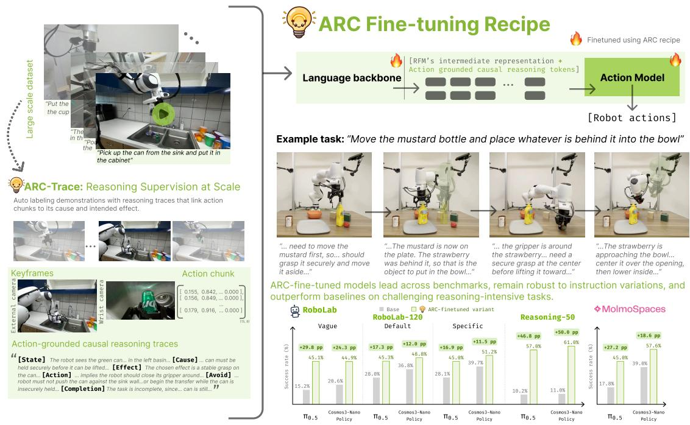

# ARC: A Reasoning Recipe for Robot Foundation Models

Gokul Puthumanaillam1,3, Tao Sun2,3, Elie Aljalbout3, Moritz Reuss3, Zhaoshuo Li3, Fabio Ramos3,4, Ankit Goyal3,5,†, Jenai Xuning Yang3,†

1University of Illinois Urbana-Champaign, 2Stanford University, 3NVIDIA, 4University of Sydney, 5Proception

†Equal advising, listed alphabetically

The prevailing approach to improving robot foundation models (RFMs) relies on larger models, more robot demonstrations, and costly training at scale. We show that there exists an efective and eficient complementary approach: the right reasoning recipe can substantially improve the zero-shot task performance of existing state-of-the-art RFMs. We refer to this recipe as $\therefore \cos \cdot A \mathsf { R c }$ It consists of three key ingredients: a reasoning trace, a scalable automatic labeling pipeline, and a strategy for adapting pretrained RFMs to use these traces for control. First, we find that efective reasoning traces should be grounded in the robot’s next action and explain its causal structure: why the action is appropriate and what efect it should produce. Second, we show that these traces can be generated automatically from existing demonstrations, enabling us to construct Arc-Trace-DROID from DROID without collecting new robot data. Third, we show how state-of-the-art VLAs such as $\pi _ { 0 . 5 }$ and WAMs such as Cosmos3-Nano-Policy can learn to use these traces for control, with fine-tuning and inference tailored to each model’s architecture and capabilities. Using Arc, we obtain gains in zero-shot RFM performance that, to our knowledge, are unprecedented without additional robot demonstrations or foundation-scale training. The adapted models establish a new state of the art on RoboLab-120 and MolmoSpaces, with gains of up to 50 percentage points on RoboLab-Reasoning-50. On real robots, Arc improves $\pi _ { 0 . 5 } \mathrm { ^ { 5 } s }$ task success by 82.2 percentage points. Project website: https://arc-robot-reasoning.github.io/

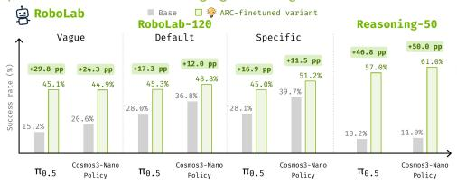

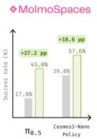  
Figure 1 Overview of Arc: Arc-Trace automatically relabels DROID with action-grounded causal traces to produce Arc-Trace-DROID. We show how to fine-tune VLAs and WAMs with this supervision, achieving benchmark-leading performance without additional robot demonstrations.

## 1 Introduction

Robot foundation models (RFMs), trained by imitation on large demonstration datasets, have become broadly capable at manipulation (Kim et al., 2024; NVIDIA, 2026; Black et al., 2025b;a). Yet the dominant recipe for making them better remains brute-force scaling, with more robot data, larger models, and another round of foundation-scale training. This makes every gain in task success expensive to obtain. How can we improve the performance of existing RFMs without modifying their architectures, adding new robot data, or training at the scale of foundation models?

In this work, we study this problem. Specifically, we find that adding or refining the reasoning capabilities of RFMs is an efective and eficient strategy for improving them. With the right recipe, reasoning can substantially improve the performance of existing state-of-the-art models such as $\pi _ { 0 . 5 }$ (Black et al., 2025a) and Cosmos3-Nano-Policy (NVIDIA, 2026) (Fig. 1). To our knowledge, this is the first work to achieve such substantial gains in zero-shot RFM performance through any strategy that does not require additional robot demonstrations or foundation-scale training. We call this reasoning recipe $\widehat { \Theta } \mathrm { A R C }$

In Arc, we bring together three pieces: the right reasoning content, a scalable source of supervision, and a training procedure that adapts the model to use that reasoning for control. First, what should the reasoning contain? We find that reasoning for control should be causal, explaining why an action is appropriate in the current situation and what efect it should produce, as well as grounded in action, specifying the concrete step the robot should take to bring about that efect. We introduce action-grounded causal traces that connect what is true now to what the robot should do next and what should become true as a result. Second, how do we obtain this supervision at scale? Robot demonstrations record observations and actions but typically omit the reasoning behind individual decisions. We present an approach for automatically labeling demonstrations with causal traces aligned to action chunks. We use it to construct Arc-Trace-DROID by relabeling DROID (Khazatsky et al., 2024). And third, how do we adapt models to use this reasoning for control? We show that an RFM can be fine-tuned to condition its behavior on reasoning traces while retaining its existing control capabilities. We use the same reasoning traces and training data across models and show how to tailor the fine-tuning and inference procedures to each model’s architecture and capabilities.

We evaluate this recipe on two representative state-of-the-art RFMs: Cosmos3-Nano-Policy (NVIDIA, 2026), a world action model (WAM), and $\pi _ { 0 . 5 }$ (Black et al., 2025a), a vision-language-action model (VLA). We find that Arc improves both RFMs across all three settings on RoboLab-120, with the adapted models ranking first and second in each setting. On MolmoSpaces, task success improves by 27.2 and 18.6 percentage points (p.p.) for $\pi _ { 0 . 5 }$ and Cosmos3-Nano-Policy. These results establish a new state of the art on RoboLab 120 (Yang et al., 2026) and MolmoSpaces (Kim et al., 2026). On the reasoning-focused RoboLab-Reasoning 50, Arc improves task success by 46.8 p.p. for $\pi _ { 0 . 5 }$ and 50.0 p.p. for Cosmos3-Nano-Policy. Further, these improvements carry over to real world execution, where the Arc gains 82.2 p.p. on reasoning and long horizon tasks. Across these evaluations, Arc-trained models more reliably follow underspecified instructions, infer missing steps, complete long-horizon tasks, adapt to changes, and recover from mistakes.

We further quantify how diferent components of the recipe contribute to performance. Our results show that adding intermediate language without the right structure provides limited improvement; larger gains arise from combining causal reasoning content with a training procedure that grounds it in action. As a side efect, the recipe also improves training and inference eficiency. Cosmos3-Nano-Policy reaches baseline success with 4.3× fewer training updates, while $\pi _ { 0 . 5 }$ and Cosmos3-Nano-Policy match their base policies at inference with 10× and 2× fewer denoising steps.

Contributions: We introduce Arc, a recipe for instilling reasoning into pretrained RFMs. We make four contributions. (i) We identify action-grounded causal traces as an intermediate representation for robot reasoning. (ii) We introduce ARC-Trace, a labeling pipeline that generates action-grounded causal traces aligned to action chunks and use it to create Arc-Trace-DROID by relabeling DROID. (iii) We develop a strategy for adapting pretrained RFMs to use reasoning for control and show how to tailor the fine-tuning and inference procedures to each model’s architecture. (iv) We validate Arc on Cosmos3-Nano-Policy and $\pi _ { 0 . 5 }$ in simulation and on real-robot benchmarks, demonstrating substantial gains in zero-shot task performance that, to our knowledge, are unprecedented without additional robot demonstrations or foundation-scale training.

## 2 Related Work

Robot foundation models. General-purpose robot policies have been developed by learning across tasks and embodiments (Reed et al., 2022; Jang et al., 2022; Jiang et al., 2023; Brohan et al., 2023; Bousmalis et al., 2023; O’Neill et al., 2024) and transferring pretrained visual and linguistic knowledge to action prediction (Driess et al., 2023; Zitkovich et al., 2023; Kim et al., 2024; Black et al., 2025b;a). Video-pretrained and world-action models additionally learn how the environment evolves during execution (Wu et al., 2023; Cheang et al., 2024; Cen et al., 2025; NVIDIA, 2026; Ye et al., 2026). Our work builds on these pretrained controllers and investigates how reasoning supervision can improve their performance using robot demonstrations already available.

Reasoning in foundation models. Reasoning allows pretrained models to work through intermediate decisions before producing a final answer (Wei et al., 2023; Zhang et al., 2024). Prior work improves this process by considering alternative solutions (Wang et al., 2023; Yao et al., 2023a), incorporating tools and feedback (Yao et al., 2023b), and learning from intermediate supervision (Zelikman et al., 2024; DeepSeek-AI et al., 2025). In robotics, these ideas have been used in two particularly relevant ways: to determine the steps a robot should execute, and to train a policy to reason about the actions it predicts. The first includes selecting available skills to accomplish an instruction (Ahn et al., 2022; Huang et al., 2023b), generating programs that combine perception and control (Liang et al., 2023; Singh et al., 2022), and revising plans using observations and execution feedback (Huang et al., 2022; Zeng et al., 2022a). The second uses reasoning annotations to teach a policy which information matters for action prediction (Zawalski et al., 2024; Sun et al., 2026). Both approaches allow robots to benefit from knowledge beyond their demonstrated motions, but require the controller to understand the guidance it receives. Recent work addresses this requirement through richer steering commands and visually grounded hierarchical control (Chen et al., 2026).

Reasoning modalities. There are several ways to express the intermediate decisions needed for robotic control. Spatial representations specify where an interaction should occur through image features, action maps, or voxel representations (Zeng et al., 2022b; Shridhar et al., 2021; 2023), while keypoints and geometric constraints describe relationships that the robot should establish between objects (Liu et al., 2024; Huang et al., 2023a; 2024). Motion-based representations provide guidance through trajectory sketches and visual traces (Gu et al., 2023; Zheng et al., 2025; Lee et al., 2025; Zhong et al., 2026). Predictive representations specify how the scene should evolve, using future predictions (Du et al., 2023; Ko et al., 2024; Zhou et al., 2024; Zhen et al., 2024). These approaches give the controller an explicit spatial or temporal target. Their connection to control depends on the representation. Geometric constraints can be solved through motion optimization (Huang et al., 2023a; 2024), depth and trajectory predictions can be encoded as intermediate tokens (Lee et al., 2025), and visual traces can be presented through the existing image input (Zheng et al., 2025). While these methods demonstrate the value of structured guidance, our interest is in reasoning supervision that can be shared across RFMs without additional architecture changes.

Natural language ofers this opportunity because it can describe task conditions, spatial relationships, and intended outcomes without committing to a particular set of robot coordinates. It is already supported by the pretrained tokenizers and language components of many robot foundation models (Zitkovich et al., 2023; Kim et al., 2024; Black et al., 2025a), and its annotations can be generated from existing demonstrations (Zawalski et al., 2024). Prior work uses natural language to describe fine-grained motions (Belkhale et al., 2024), convey the current semantic subtask (Black et al., 2025a), and reason about plans, objects, and robot state before predicting actions (Mu et al., 2023). These methods show that language can provide useful intermediate supervision.

## 3 Preliminaries and Problem Statement

Robot task setting. We consider a robot operating in a partially observed environment. A task is specified by an instruction $g \in { \mathcal { G } }$ . At time t, the robot receives an observation $o _ { t } \in \mathcal { O }$ and executes an action $a _ { t }$ $\in { \mathcal { A } } .$ We denote the interaction history by $h _ { t } = \left( o _ { 0 } , a _ { 0 } , \ldots , a _ { t - 1 } , o _ { t } \right)$ . To cover models that predict several actions at once, we write $\mathbf { a } _ { t } = \left( a _ { t } , \ldots , a _ { t + H - 1 } \right)$ for an action chunk of horizon H. A robot demonstration is a trajectory $\tau = ( g , o _ { 0 } , a _ { 0 } , \dots , o _ { T } )$ , and the training dataset is $\mathcal { D } = \{ \tau _ { i } \} _ { i = 1 } ^ { N }$ . We treat a pretrained robot foundation model independently of its internal architecture. At each time step, it defines a conditional action distribution $\pi _ { \boldsymbol { \theta } _ { 0 } } ( \mathbf { a } _ { t } \mid h _ { t } , \boldsymbol { g } )$ , where $\theta _ { 0 }$ denotes the pretrained parameters. Let $S ( \tau , g ) \in [ 0 , 1 ]$ measure whether the resulting trajectory completes the task. The objective of the policy is to maximize $J ( \pi ) = \mathbb { E } _ { g , \tau \sim \pi } \left[ S ( \tau , g ) \right]$

Reasoning as intermediate computation. A standard policy predicts actions directly from the task and interaction history. We define reasoning more generally as forming an intermediate representation $\boldsymbol { r } _ { t } \in \mathcal { R }$ that is formed before action prediction and carries information relevant to the current decision: $\begin{array} { r } { \boldsymbol { r } _ { t } \sim q _ { \phi } ( \boldsymbol { r } _ { t } \ ) } \end{array}$ $h _ { t } , g ) , \mathbf { a } _ { t } \sim \pi _ { \theta } ( \mathbf { a } _ { t } \mid h _ { t } , g , r _ { t } )$ . The resulting action distribution is $\begin{array} { r } { \pi _ { \theta , \phi } ( \mathbf { a } _ { t } \mid h _ { t } , g ) = \int _ { \mathcal { R } } \pi _ { \theta } ( \mathbf { a } _ { t } \mid h _ { t } , g , r _ { t } ) q _ { \phi } ( r _ { t } \mid } \end{array}$ $h _ { t } , g ) d r _ { t }$

Problem statement. Given a pretrained robot foundation model $\pi _ { \theta _ { 0 } }$ and a demonstration dataset D containing observations and actions but no reasoning supervision, our goal is to learn a reasoned policy $\pi _ { \boldsymbol { \theta } , \boldsymbol { \phi } }$ that improves task success while retaining the model’s existing control abilities. Crucially, this improvement should not require a new model architecture, a new foundation-scale pretraining stage, or the collection of another large robot dataset.

## 4 The ARC Framework

We now describe the components of Arc: the reasoning representation (Sec. 4.1), the Arc-Trace relabeling pipeline (Sec. 4.2), and the fine-tuning recipe that connects reasoning to control (Sec. 4.3).

## 4.1 Action Grounded Causal Reasoning

We represent $r _ { t }$ in natural language, reusing the model’s pretrained language conditioning. We examine ECoT-style reasoning and semantic subtask supervision, adapting both formats to the same $\pi _ { 0 . 5 }$ backbone and fine-tuning it with each (Zawalski et al., 2024; Black et al., 2025a).

To determine whether these representations actually afect action prediction, we inspect how the action expert distributes attention over image and natural-language tokens in Fig. 2. Under both ECoT and subtask supervision, the action expert remains strongly focused on the visual observation and assigns little attention to the intermediate language. We treat attention as a diagnostic rather than proof of causal dependence, but the pattern exposes a plausible shortcut. Plans, object lists, motion directions, and subtask la bels are often predictable from the same image and instruction already available to the model. The observed pattern is therefore consistent with shortcut learning, where the

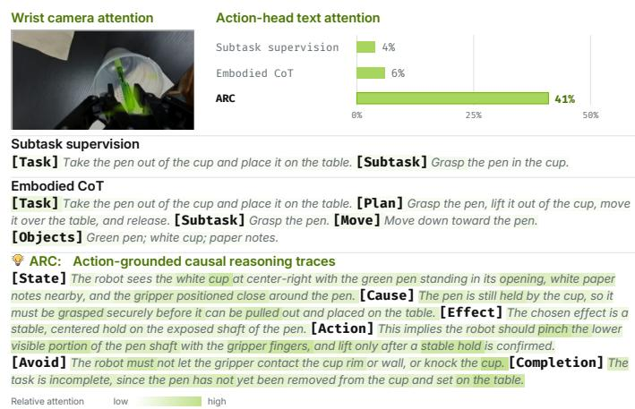  
Figure 2 Reasoning traces and action-expert attention.

model can satisfy the language objective while continuing to predict actions from vision. Similar grounding failures have been reported in other robot foundation models, which can continue pursuing the original target even when the instruction specifies a diferent one (Fei et al., 2025). This suggests that the missing information is neither a longer scene description nor a finer decomposition of the task. An action is selected because of the change it is expected to produce in the world. Reasoning should make this relation explicit (Wang et al., 2025). Following this principle, we develop an action-grounded causal representation for robot control.

For an action chunk ${ \bf { a } } _ { t } .$ , Arc-Trace represents reasoning as $r _ { t } = [ \mathrm { S t a t e } .$ , Cause, Consequence, Effect, Action, Avoid, Completion]t. State and Cause identify the task-relevant facts and why they matter at the current step. Consequence reasons forward from those facts, while Efect selects the state change that should advance the task. Action connects that efect to the upcoming action chunk. Avoid records unwanted changes, and Completion preserves task progress across successive decisions. We call these action-grounded causal reasoning traces because they explain an action through the efect it is intended to cause, rather than describing the action in isolation.

When the same backbone is trained with Arc traces, the action expert distributes substantially more attention to the natural-language reasoning, particularly to the spans that connect the current condition, intended efect, and resulting action. This does not by itself establish behavioral dependence. It does show that the trace now carries information used by the action expert rather than remaining a redundant auxiliary target; Sec. 5 examines how this change afects task performance.

## 4.2 ARC-Trace: Reasoning Supervision at Scale

The representation above creates a supervision problem: existing robot datasets record what the robot did, but not the reasoning that made each action appropriate. Action-grounded reasoning is therefore unavailable at the scale required to train robot foundation models. Collecting it alongside new demonstrations would also be costly.

Our key observation is that the information needed to recover this supervision is already present in a successful demonstration. The task instruction specifies the goal, the video records how the scene changes, and the action sequence reveals how those changes were produced. Modern vision-language models can extract this structure and express it in natural language. We can therefore create reasoning supervision after data collection, without gathering new robot trajectories or manually annotating individual actions.

We use this observation to construct Arc-Trace-DROID by automatically relabeling the DROID dataset with action-grounded causal reasoning. Figure 3 summarizes the labeling pipeline. For each episode, we first generate a temporally

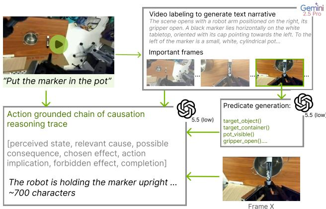  
Figure 3 Overview of the Arc-Trace relabeling pipeline, illustrated with an example task.

grounded description of the task execution from the instruction and video. We then derive episode-specific state checks that capture the objects, relations, and task conditions needed to track progress through the demonstration. These checks provide structured evidence about what is true at each point in the episode and reduce the need for the final labeler to infer the entire task state from a single frame. Finally, at selected keyframes, a vision-language model combines the task instruction, episode description, current observations, and state checks to produce a reasoning trace aligned with the corresponding action chunk. This process yields approximately 75K relabeled episodes and 1.2M action-aligned frames. The full labeling prompts, sampling strategy, and filtering steps are provided in Appendix A.1.

## 4.3 Fine-Tuning for Reasoning-Guided Control

We fine-tune pretrained models to predict demonstrations conditioned on their aligned causal traces, observations, and task instructions. Traces reuse the base tokenizer and embeddings, and are processed by the language transformer with the task and visual context. The action-generation layers attend to these representations throughout denoising; token placement, projections, and masks depend on the architecture.

We retain each model’s flow-matching objective, predicting actions for the VLA and actions plus future observations for the WAM. Let K index these modalities, with target $\mathbf { y } _ { t } ^ { k }$ in normalized action or encodedobservation space. Its noisy counterpart is $\mathbf { x } _ { t } ^ { k } = ( 1 - s _ { k } ) \mathbf { y } _ { t } ^ { k } + s _ { k } \epsilon ^ { k }$ , with $\epsilon ^ { k } \sim \mathcal { N } ( 0 , I )$ and $s _ { k } \in [ 0 , 1 ]$ sampled from the base noise schedule. The current observation $o _ { t }$ , instruction $^ { g , }$ and trace $r _ { t }$ remain uncorrupted. Collecting the noisy targets and noise levels as $\mathbf { x } _ { t }$ and s, we minimize

$$
\mathcal { L } _ { \mathrm { p r e d } } = \mathbb { E } \left[ \sum _ { k \in { \cal K } } \alpha _ { k } ~ \mathrm { M S E } _ { k } \big ( v _ { \theta } ^ { k } ( \mathbf { x } _ { t } , \mathbf { s } ~ \vert ~ o _ { t } , g , r _ { t } ) , \epsilon ^ { k } - \mathbf { y } _ { t } ^ { k } \big ) \right] .\tag{1}
$$

Here, $v _ { \theta } ^ { k }$ is the velocity predicted by model parameters $\theta ,$ and the expectation covers demonstrations, noise, and noise levels. Modality weights $\alpha _ { k }$ and the masking, time weighting, and normalization in $\mathrm { M S E } _ { k }$ follow the base recipe.

VLA Implementation. We use $\pi _ { 0 . 5 } – \mathrm { D R O I D }$ (Black et al., 2025a), with a PaliGemma backbone comprising a SigLIP vision encoder and Gemma language model, and a separate 300M-parameter action expert. A twolayer encoder maps PaliGemma trace embeddings to tokens appended to the image-and-instruction context. The trace attends to this context, and the action expert attends to both; all components are jointly fine-tuned. Here, ${ \bf y } _ { t } ^ { \mathrm { a c t } } = { \bf a } _ { t }$ is the demonstrated action chunk.

With factual supervision alone, predictions change little under conflicting traces for the same observation. To discourage this shortcut, we replace approximately 5% of traces with counterfactuals $r _ { t } ^ { - }$ contradicting the demonstrated action and exclude these examples from $\mathcal { L } _ { \mathrm { p r e d } }$ . Setting $s _ { \mathrm { a c t } } = 1$ and writing $\epsilon = \epsilon ^ { \mathrm { a c t } }$ , the one-step estimate is $\widehat { \mathbf { a } } _ { t } ^ { - } = \epsilon - v _ { \theta } ^ { \mathrm { a c t } } ( \epsilon , 1 \mid o _ { t } , g , r _ { t } ^ { - } )$ . We penalize its proximity to the demonstration:

$$
\mathcal { L } _ { \mathrm { c f } } = \mathbb { E } \left[ \operatorname* { m a x } \left( 0 , m - \mathrm { M A E } _ { \mathrm { r e a l } } ( \widehat { \mathbf { a } } _ { t } ^ { - } , \mathbf { a } _ { t } ) \right) ^ { 2 } \right] , \quad \mathcal { L } _ { \mathrm { V L A } } \quad = \mathcal { L } _ { \mathrm { p r e d } } + \lambda _ { \mathrm { c f } } \mathcal { L } _ { \mathrm { c f } } .\tag{2}
$$

The expectation in ${ \mathcal L } _ { \mathrm { c f } }$ covers counterfactual samples and action noise; $\mathcal { L } _ { \mathrm { p r e d } }$ uses only factual samples. The margin $m > 0$ is in normalized action space, $\lambda _ { \mathrm { c f } }$ weights the penalty, and $\mathrm { M A E } _ { \mathrm { r e a l } }$ averages over the horizon and eight non-padding action coordinates. This supplies negative supervision without alternative-action demonstrations. Implementation details appear in Appendix B.1.

WAM Implementation. Cosmos3-Nano-Policy (NVIDIA, 2026) combines a vision-language reasoner and difu sion generator with separate parameters connected through attention at every layer. The generator attends to both token sets; the reasoner attends only to its own, allowing trace conditioning without architectural changes. Each window contains one observed frame and 32 future frames with actions, paired with the first frame’s trace. We jointly fine-tune both components with

$$
\begin{array} { r l r l } { \mathcal { L } _ { \mathrm { W A M } } = \mathcal { L } _ { \mathrm { p r e d } } + \lambda _ { \mathrm { t r a c e } } \mathcal { L } _ { \mathrm { t r a c e } } , } & { \mathcal { L } _ { \mathrm { t r a c e } } } & { = - \mathbb { E } \left[ \displaystyle \sum _ { j = 1 } ^ { | r _ { t } | } \log q _ { \phi } ( r _ { t , j } \mid o _ { t } , g , r _ { t , < j } ) \right] . } \end{array}\tag{3}
$$

Here, $q _ { \phi }$ is the reasoner’s next-token distribution with parameters $\phi , \ \vert r _ { t } \vert$ is the trace length, and $\boldsymbol { r } _ { t , j }$ and $r _ { t , < j }$ denote token j and its prefix. The coeficient $\lambda _ { \mathrm { t r a c e } }$ weights trace supervision, whose expectation is over labeled windows. The generator conditions on ground-truth traces, and prediction-loss gradients also update the reasoner. Cosmos3’s larger reasoner (8B versus $\pi _ { 0 . 5 } \mathrm { ^ { 5 } s }$ 2B) already produces distinct action distributions under conflicting traces. Adding ${ \mathcal L } _ { \mathrm { c f } }$ yields no measurable gain, so we omit it. Supporting ablations and training details appear in Appendix B.2.

Inference. At inference, we freeze the Arc-fine-tuned models and use an external VLM to generate reasoning traces from the task instruction and current camera observations, refreshing them at a selected frequency during execution. The VLA’s vision-language backbone and the WAM’s reasoner encode these traces into representations that condition the action expert and generator, respectively. We use external generation because the built-in language components are less reliable at generating these traces than at using them for control (Section 5.2). Separately, Arc maintains comparable task performance across the external VLMs evaluated. Since the traces are natural language, their generation can benefit directly from standard LLM inference optimizations. Appendix B.3.1 details the refresh schedules and serving optimizations, including a near-real-time VLA deployment with ∼ 10 ms of added control-loop overhead.

## 5 Experiments

We evaluate $\pi _ { 0 . 5 } { + } \mathrm { A }$ rc (VLA) and Cosmos3-Nano+Arc (WAM) (both finetuned on Arc-Trace-DROID) zero-shot on RoboLab-120 (Yang et al., 2026), MolmoSpaces (Kim et al., 2026), and RoboLab-Reasoning-50. We additionally evaluate $\mathrm { A R C } { - } \pi _ { 0 . 5 }$ on paired real-world tasks without further fine-tuning. All simulation and hardware experiments use the DROID embodiment. We use Qwen3.6-35B-A3B as the default external VLM (ablated in section 5.2).

## 5.1 Quantitative Results: Simulation and Hardware Benchmarks

General task performance. Tables 1 and 2 highlight task success for Arc-variants, its base models, on Robo Lab and MolmoSpaces. Across both benchmarks, Arc substantially improves both base models, enabling the comparatively weaker $\pi _ { 0 . 5 }$ to outperform stronger pretrained policies while further improving Cosmos3- Nano-Policy. Importantly, these gains hold without benchmark-specific training, demonstrating that the same reasoning recipe improves general manipulation across diferent architectures and starting levels of performance. Table breakdowns, multi-seed runs, evaluation settings and baseline details are provided in Appendix C.4.

RoboLab-Reasoning-Hardware
<table><tr><td>a RoboLab-120: Vague</td><td colspan="2">日 RoboLab-120: Default</td><td colspan="3">日 RoboLab-120: Specific</td></tr><tr><td># Policy</td><td>SR</td><td># Policy</td><td>SR</td><td># Policy</td><td>SR</td></tr><tr><td>1 π0.5 + 0ARC</td><td>45.1% +29.8</td><td>1 Cosmos3-Nano + ARC 48.8% +12.0</td><td></td><td>1 Cosmos3-Nano + ARC 51.2% +11.5</td><td></td></tr><tr><td>2 Cosmos3-Nano +</td><td>ARC 44.9% +24.3</td><td>2 π0.5 + 9ARC</td><td>45.3% +17.3</td><td>2 π0.5 + OARC</td><td>45.0% +16.9</td></tr><tr><td>3 Atomic-WAM</td><td>31.6%</td><td>3 FLUX 3 Action</td><td>42.9%</td><td>3 Cosmos3-Nano-Policy</td><td>39.7%</td></tr><tr><td>4 BiMind v0.1</td><td>30.2%</td><td>4 HiDream-O1-Embodied</td><td>39.9%</td><td>4 VoLo</td><td>31.4%</td></tr><tr><td>5 VoLo</td><td>29.5%</td><td>5 Atomic-WAM</td><td>39.6%</td><td>5BiMind v0.1</td><td>30.6%</td></tr><tr><td>6 Cosmos3-Nano-Policy</td><td>20.6%</td><td>6 OASIS WAM</td><td>39.0%</td><td>6 Cosmos3-Edge-Policy</td><td>28.8%</td></tr><tr><td>7 Cosmos3-Edge-Policy</td><td>15.4%</td><td>7 Cosmos3-Nano-Policy</td><td>36.8%</td><td>7 π0.5</td><td>28.1%</td></tr><tr><td>8π0.5</td><td>15.2%</td><td>8 Phoenix</td><td>34.4%</td><td>8 DreamZero</td><td>23.9%</td></tr><tr><td>9 DreamZero</td><td>14.9%</td><td>9 BiMind v0.1</td><td>33.3%</td><td>9π₀-FAST</td><td>14.9%</td></tr><tr><td>10π0-FAST</td><td>9.2%</td><td>10 VoLo</td><td>28.2%</td><td>10 paligemma-binning</td><td>5.5%</td></tr><tr><td>11 GR00T N1.6</td><td>5.4%</td><td>11π0.5</td><td>28.0%</td><td>11 GR00T N1.6</td><td>5.3%</td></tr></table>

<table><tr><td colspan="2"># Policy SR</td><td># tasks</td></tr><tr><td colspan="2">1 Cosmos3-Nano + ARC 57.6% +18.6</td><td>9/9</td></tr><tr><td>2 Zoelnside-VLA</td><td>49.5%</td><td>9/9</td></tr><tr><td>3 Phoenix</td><td>48.0%</td><td>9/9</td></tr><tr><td>4 π0.5 + 0ARC</td><td>45.0% +27.2</td><td>9/9</td></tr><tr><td>5Cosmos3-Nano-Policy</td><td>39.0%</td><td>9/9</td></tr><tr><td>6 WALL-OSS-0.5</td><td>38.5%</td><td>9/9</td></tr><tr><td>7 TiPToP</td><td>34.7%</td><td>7/9</td></tr><tr><td>8 PRTS-Droid</td><td>27.8%</td><td>9/9</td></tr><tr><td>9 MolmoAct2 DROID</td><td>25.9%</td><td>9/9</td></tr><tr><td>10Psi-R2</td><td>22.8%</td><td>9/9</td></tr><tr><td>11 π0.5 DROID</td><td>17.8%</td><td>9/9</td></tr></table>

Table 1 RoboLab-120 benchmark results. SR is success rate; +values give gains over Table 2 MolmoSpaces bench the corresponding base policy in p.p. mark results.

Reasoning-focused evaluation. RoboLab and MolmoSpaces target general task performance. To evaluate reasoning more directly, we introduce RoboLab-Reasoning-50, a reasoning-focused benchmark built on Robo-Lab. This complements the broader evaluations by testing Arc on tasks specifically designed to require reasoning during execution. Specifically, this benchmark evaluates four major capabilities that require reasoning: 1) Contextual tasks, requiring visual and semantic understanding; 2) Long-Horizon, requiring memory; 3) Discovery, requiring exploration via scene interaction; 4) Negation, requiring understanding exclusions. Table 3 compares Arc and the baselines on this suite. The benchmark construction, individual tasks, and evaluation protocol are described in Appendix C.1.3. Beyond general manipulation, Arc substantially improves both models on tasks requiring them to reason, infer unstated steps and complete long-horizon plans.

RoboLab-Reasoning-50
<table><tr><td>Policy</td><td>SR</td></tr><tr><td>Cosmos3-Nano + ARC</td><td>61.0% +50.0</td></tr><tr><td>π0.5 + 0ARC</td><td>57.0% +46.8</td></tr><tr><td>π0.5 + explicit subtasks</td><td>21.0%</td></tr><tr><td>Cosmos3-Nano-Policy</td><td>11.0%</td></tr><tr><td>π0.5</td><td>10.2%</td></tr></table>

<table><tr><td>Policy SR</td></tr><tr><td>π0.5 + 0ARC 91.7% +82.2</td></tr><tr><td>Cosmos3-Nano-Policy 11.9%</td></tr><tr><td>π0.5 9.5%</td></tr></table>

Table 3 Reasoning-50 and Reasoning-Hardware results.

Hardware Evaluation. We deploy $\pi _ { 0 . 5 } { + } \mathrm { A }$ rc alongside $\pi _ { 0 . 5 }$ and Cosmos3-

Nano-Policy on the DROID hardware setup using the same checkpoints evaluated in simulation. We recreate 28 tasks from RoboLab-Reasoning-50 on hardware. Details of the comparison policies are provided in Ap pendix C.2. Table 3 reports task success across categories and the corresponding simulation results. These paired evaluations test whether the improvements from reasoning persist during physical execution. The gains observed in simulation carry over to physical execution, with $\pi _ { 0 . 5 } \cdot$ +Arc substantially improving $\pi _ { 0 . 5 } \mathrm { ^ { 5 } s }$ task success on paired hardware tasks without hardware-specific fine-tuning. Category definitions, hardware specifications and evaluation procedures appear in Appendix C.2.

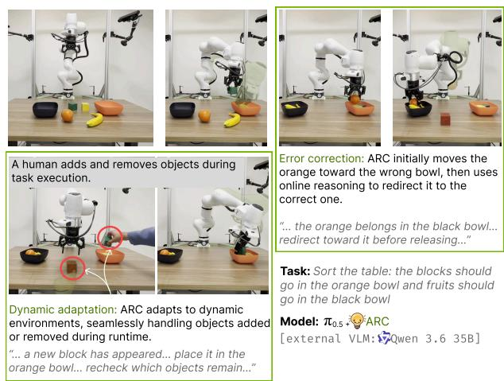

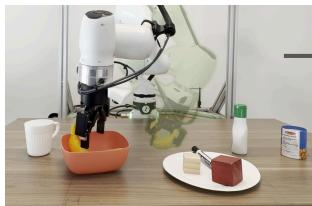  
“... the bowl must be cleared first... move the banana temporarily...”

Model: 0.5

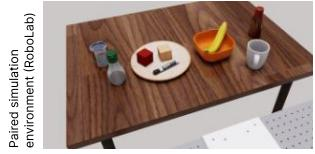  
Figure 4 Hardware rollout of π0.5+Arc on RoboLab-Reasoning-Hardware. The VLM dynamically refreshes the rea soning traces ( 1 Hz in this episode), while robot control runs at 15 Hz.

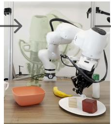  
“... the banana is set aside... grasp the marker securely and transfer it from the plate into the bowl...”

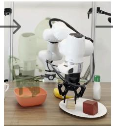  
“... the blocks still need to leave the plate... grasp the light wooden block, lift it clear, and lower it into the bowl...”

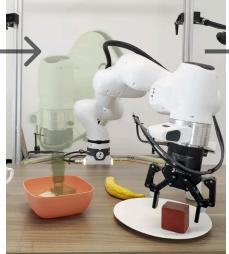  
“... the red block is the last object on the plate... transfer it into the bowl so the plate is ready for the banana...”

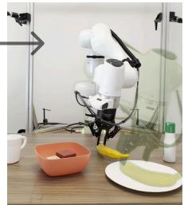  
“... the plate is now clear... retrieve the banana from the table and place it on the plate to complete the swap...”

## 5.2 Key Findings and Ablations

Tables 1, 2 and 3 support the central finding of this work that stronger grounding of causal language leads to stronger overall performance. The improvement extends across both model families. Arc lifts comparatively weaker models such as π0.5 above unmodified WAM baselines, while substantially improving already strong models such as Cosmos3-Nano-Policy. These gains extend beyond task success to robustness and eficiency. We identify four key findings (KF) that indicate Arc as a useful recipe for uplifting existing RFM performance.

(KF#1) Reasoning improves execution across longhorizon, dynamic, and reasoning-intensive tasks. The reasoning-focused evaluations and hardware rollouts reveal additional benefits (Tables 3; Fig. 5). In long-horizon tasks, Arc tracks progress and maintains the ordering of the remaining steps. When the scene changes during execution, updated reasoning redirects the robot toward what is currently needed. Reasoning-intensive tasks expose another benefit: the robot identifies prerequisites absent from the instruction and takes the intermediate steps needed to complete the task. These behaviors are accompanied by stronger error recovery, with failed actions followed by corrected attempts. Our interpretation is that explicitly connecting the current state to the intended efect supports several forms of decisionmaking through the same representation: sequencing actions, discovering necessary steps, responding to changes, and correcting mistakes.

Figure 5 Illustrative hardware rollout on a long-horizon, reasoning-intensive task in a dynamic environment.

(KF#2) Performance becomes nearly invariant to instruction specificity. On RoboLab-120, policies finetuned using Arc maintains comparable success across vague, default, and specific instructions, while the base policies deteriorate as instructions become less explicit (Fig. 6). This naturally suggests that reasoning reduces the amount of detail the user must supply. The trace interprets the instruction in the context of the scene and identifies the intended effect of the next action, giving the controller a more specific target even when the original instruction is underspecified.

(KF#3) Reasoning buys inference-time speed-up. On RoboLab-120, $\pi _ { 0 . 5 } { + } \mathrm { A R C }$ matches its ten-step base policy with a single Euler step (10× improvement), while Cosmos3-Nano+Arc matches its four-step base policy with two UniPC steps (2× improvement)(Fig. 7). We hypothesize that specifying the intended efect narrows the set of plausible actions, reducing multimodality and simplifying the flow each model must integrate. Coarse integration can then sufice because more of the decision has already been resolved through reasoning. Cosmos3-Nano still loses performance at one step, consistent with UniPC losing the multistep history needed for higherorder correction.

(KF#4) Reasoning reaches target performance with fewer training updates. Figure 8 shows that Arc reaches the instruction-only baseline’s 10K-iteration performance with approximately 4.3× fewer updates, and continues to improve with further training. We conduct this study on Cosmos3-Nano-Policy using its open training implementation. Our interpretation is that causal supervision makes each demonstration more informative. The model receives the reason for the demonstrated action alongside the action itself, reducing what it must infer from repeated observation–action examples alone. Reasoning thus improves how eficiently training produces useful behavior, in addition to improving the final policy.

## Key ablations. We conduct three key design ablations

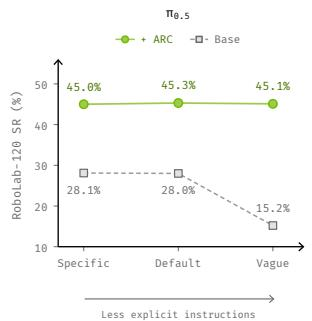

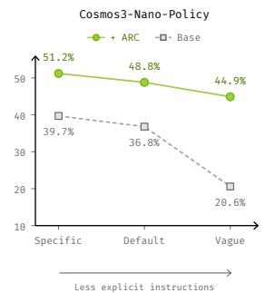  
Figure 6 Instruction robustness on RoboLab-120.

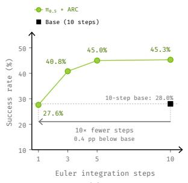  
(a)

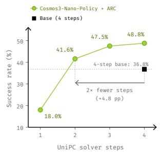  
(b)  
Figure 7 Inference-time eficiency on RoboLab-120 (default).

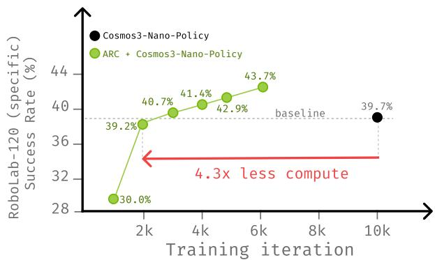  
Figure 8 Training eficiency on RoboLab-120 (specific) for Cosmos3-Nano-Policy with and without Arc.

on RoboLab-120. (AB#1) First, we vary the external VLM while keeping the Arc-fine-tuned $\pi _ { 0 . 5 }$ checkpoint frozen (Fig. 9 (a)). Performance remains comparable across the VLMs evaluated, showing that Arc is not tied to a particular trace generator. (AB#2) Second, we separately fine-tune $\pi _ { 0 . 5 }$ for each trace variant (Fig. 9 (b)). The results points to two complementary roles within the trace: The causal account identifies which state change matters and why, while the action implication connects that change to a physical step. Without the action implication, the controller must infer how to realize the intended efect; with the action implication alone, it receives a command without the causal context that makes it appropriate. Forbidden efects likewise constrain an intended behavior but do not specify one, explaining why they help within a complete causal account but not necessarily in isolation. (AB#3) Finally, we compare full fine-tuning with action-expert-only training in the VLA and generator-only training in the WAM (Fig. 9(c)). Our interpretation is that pretrained language features do not expose causal distinctions in a form the controller can readily use. Action-head-only training leaves these features fixed and expects the controller to recover the relevant distinctions from them.

Full fine-tuning allows prediction errors to reshape the features themselves, teaching the backbone which conditions and intended efects must be distinguished because they require diferent actions.

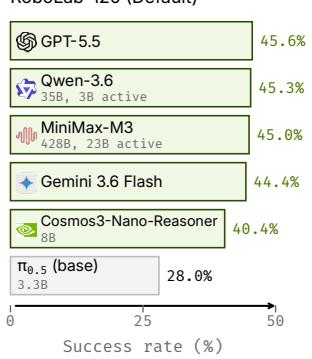  
(a)

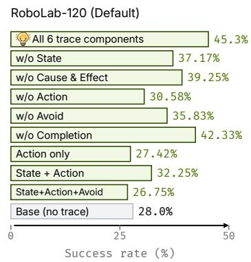  
(b)

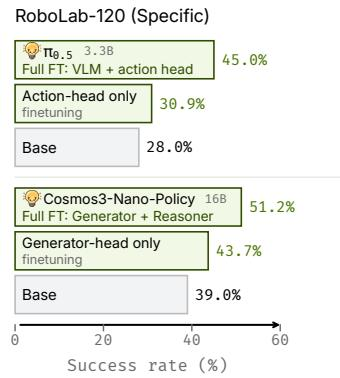  
(c)  
Figure 9 Key ablations of ARC on RoboLab-120.

## 6 Conclusion

We presented Arc, a reasoning recipe that substantially improves zero-shot task execution in pretrained RFMs without collecting new robot demonstrations or repeating foundation-scale training. Applied to π0.5 and Cosmos3-Nano-Policy, Arc establishes a new state of the art on RoboLab-120 and MolmoSpaces, im proves robustness to ambiguous and underspecified instructions, and increases training and inference ef ficiency. Promising future directions include policies that reliably generate their own causal traces and extending the recipe across embodiments. In simpler terms, we discover that RFMs do not need to be rebuilt to reason. Grounded causal language is a cheap, high-leverage axis for scaling them.

## AI Use Statement

We used vision-language models to automatically generate action-grounded causal annotations for ARC-Trace and, during evaluation, to generate reasoning traces from task instructions and camera observations. The models and prompting procedures are described in the methodology and appendix. Large language models also assisted with manuscript drafting and editing. The authors take responsibility for the final manuscript, reported results, and all AI-assisted content.

## Reproducibility statement

We describe ARC’s reasoning representation and training objectives in Sections 4.1 and 4.3. Appendix A.1 details the ARC-Trace construction pipeline and labeling prompts. Model-specific training configurations and hyperparameters are provided in Appendices B.1 and B.2, while inference prompts and deployment procedures are documented in Appendices B.3 and B.3.1. The evaluation protocols, benchmark construction, baseline implementations, and hardware setup are described in Appendices C.1.3, C.3, and C.2. Rollout videos are available on our fully anonymized project website at https://arc-robot-reasoning.github.io. The models, code, and ARC-Trace dataset will be released after the review period.

## References

Michael Ahn, Anthony Brohan, Noah Brown, Yevgen Chebotar, Omar Cortes, Byron David, Chelsea Finn, Chuyuan Fu, Keerthana Gopalakrishnan, Karol Hausman, Alex Herzog, Daniel Ho, Jasmine Hsu, Julian Ibarz, Brian Ichter, Alex Irpan, Eric Jang, Rosario Jauregui Ruano, Kyle Jefrey, Sally Jesmonth, Nikhil J. Joshi, Ryan Julian, Dmitry Kalashnikov, Yuheng Kuang, Kuang-Huei Lee, Sergey Levine, Yao Lu, Linda Luu, Carolina Parada, Peter Pastor, Jornell Quiambao, Kanishka Rao, Jarek Rettinghouse, Diego Reyes, Pierre Sermanet, Nicolas Sievers, Clayton Tan, Alexander Toshev, Vincent Vanhoucke, Fei Xia, Ted Xiao, Peng Xu, Sichun Xu, Mengyuan Yan, and Andy Zeng. Do As I Can, Not As I Say: Grounding Language in Robotic Afordances, August 2022. URL http: //arxiv.org/abs/2204.01691. arXiv:2204.01691 [cs.RO].

Suneel Belkhale, Tianli Ding, Ted Xiao, Pierre Sermanet, Quon Vuong, Jonathan Tompson, Yevgen Chebotar, Debidatta Dwibedi, and Dorsa Sadigh. Rt-h: Action hierarchies using language. arXiv preprint arXiv:2403.01823, 2024.

Kevin Black, Noah Brown, James Darpinian, Karan Dhabalia, Danny Driess, Adnan Esmail, Michael Equi, Chelsea Finn, Niccolo Fusai, et al. π0.5: A vision-language-action model with open-world generalization. arXiv preprint arXiv:2504.16054, 2025a.

Kevin Black, Noah Brown, Danny Driess, Adnan Esmail, Michael Equi, Chelsea Finn, Niccolo Fusai, Lachy Groom, Karol Hausman, Brian Ichter, et al. π0: A vision-language-action flow model for general robot control. In Robotics: Science and Systems, 2025b.

Konstantinos Bousmalis, Giulia Vezzani, Dushyant Rao, Coline Devin, Alex X. Lee, Maria Bauza, Todor Davchev, Yuxiang Zhou, Agrim Gupta, Akhil Raju, Antoine Laurens, Claudio Fantacci, Valentin Dalibard, Martina Zam belli, Murilo Martins, Rugile Pevceviciute, Michiel Blokzijl, Misha Denil, Nathan Batchelor, Thomas Lampe, Emilio Parisotto, Konrad Żołna, Scott Reed, Sergio Gómez Colmenarejo, Jon Scholz, Abbas Abdolmaleki, Oliver Groth, Jean-Baptiste Regli, Oleg Sushkov, Tom Rothörl, José Enrique Chen, Yusuf Aytar, Dave Barker, Joy Ortiz, Mar tin Riedmiller, Jost Tobias Springenberg, Raia Hadsell, Francesco Nori, and Nicolas Heess. RoboCat: A Self Improving Generalist Agent for Robotic Manipulation, December 2023. URL http://arxiv.org/abs/2306.11706. arXiv:2306.11706 [cs.RO].

Anthony Brohan, Noah Brown, Justice Carbajal, Yevgen Chebotar, Joseph Dabis, Chelsea Finn, Keerthana Gopalakrishnan, Karol Hausman, Alex Herzog, Jasmine Hsu, et al. RT-1: Robotics transformer for real-world control at scale. In Robotics: Science and Systems, 2023.

Jun Cen, Chaohui Yu, Hangjie Yuan, Yuming Jiang, Siteng Huang, Jiayan Guo, Xin Li, Yibing Song, Hao Luo, Fan Wang, Deli Zhao, and Hao Chen. WorldVLA: Towards Autoregressive Action World Model, June 2025. URL http://arxiv.org/abs/2506.21539. arXiv:2506.21539 [cs.RO].

Chi-Lam Cheang, Guangzeng Chen, Ya Jing, Tao Kong, Hang Li, Yifeng Li, Yuxiao Liu, Hongtao Wu, Jiafeng Xu, Yichu Yang, Hanbo Zhang, and Minzhao Zhu. GR-2: A Generative Video-Language-Action Model with Web Scale Knowledge for Robot Manipulation, October 2024. URL http://arxiv.org/abs/2410.06158. arXiv:2410.06158 [cs.RO].

William Chen, Jagdeep Singh Bhatia, Catherine Glossop, Nikhil Mathihalli, Ria Doshi, Andy Tang, Danny Driess, Karl Pertsch, and Sergey Levine. Steerable vision-language-action policies for embodied reasoning and hierarchical control. arXiv preprint arXiv:2602.13193, 2026.

DeepSeek-AI, Daya Guo, Dejian Yang, Haowei Zhang, Junxiao Song, Peiyi Wang, Qihao Zhu, Runxin Xu, Ruoyu Zhang, Shirong Ma, Xiao Bi, Xiaokang Zhang, Xingkai Yu, Yu Wu, Z. F. Wu, Zhibin Gou, Zhihong Shao, Zhuoshu Li, Ziyi Gao, Aixin Liu, Bing Xue, Bingxuan Wang, Bochao Wu, Bei Feng, Chengda Lu, Chenggang Zhao, Chengqi Deng, Chenyu Zhang, Chong Ruan, Damai Dai, Deli Chen, Dongjie Ji, Erhang Li, Fangyun Lin, Fucong Dai, Fuli Luo, Guangbo Hao, Guanting Chen, Guowei Li, H. Zhang, Han Bao, Hanwei Xu, Haocheng Wang, Honghui Ding, Huajian Xin, Huazuo Gao, Hui Qu, Hui Li, Jianzhong Guo, Jiashi Li, Jiawei Wang, Jingchang Chen, Jingyang Yuan, Junjie Qiu, Junlong Li, J. L. Cai, Jiaqi Ni, Jian Liang, Jin Chen, Kai Dong, Kai Hu, Kaige Gao, Kang Guan, Kexin Huang, Kuai Yu, Lean Wang, Lecong Zhang, Liang Zhao, Litong Wang, Liyue Zhang, Lei Xu, Leyi Xia, Mingchuan Zhang, Minghua Zhang, Minghui Tang, Meng Li, Miaojun Wang, Mingming Li, Ning Tian, Panpan Huang, Peng Zhang, Qiancheng Wang, Qinyu Chen, Qiushi Du, Ruiqi Ge, Ruisong Zhang, Ruizhe Pan, Runji Wang, R. J. Chen, R. L. Jin, Ruyi Chen, Shanghao Lu, Shangyan Zhou, Shanhuang Chen, Shengfeng Ye, Shiyu Wang, Shuiping Yu, Shunfeng Zhou, Shuting Pan, S. S. Li, Shuang Zhou, Shaoqing Wu, Shengfeng Ye, Tao Yun, Tian Pei, Tianyu Sun, T. Wang, Wangding Zeng, Wanjia Zhao, Wen Liu, Wenfeng Liang, Wenjun Gao, Wenqin Yu, Wentao Zhang, W. L. Xiao, Wei An, Xiaodong Liu, Xiaohan Wang, Xiaokang Chen, Xiaotao Nie, Xin Cheng, Xin Liu, Xin Xie, Xingchao Liu, Xinyu Yang, Xinyuan Li, Xuecheng Su, Xuheng Lin, X. Q. Li, Xiangyue Jin, Xiaojin Shen, Xiaosha Chen, Xiaowen Sun, Xiaoxiang Wang, Xinnan Song, Xinyi Zhou, Xianzu Wang, Xinxia Shan, Y. K. Li, Y. Q. Wang, Y. X. Wei, Yang Zhang, Yanhong Xu, Yao Li, Yao Zhao, Yaofeng Sun, Yaohui Wang, Yi Yu, Yichao Zhang, Yifan Shi, Yiliang Xiong, Ying He, Yishi Piao, Yisong Wang, Yixuan Tan, Yiyang Ma, Yiyuan Liu, Yongqiang Guo, Yuan Ou, Yuduan Wang, Yue Gong, Yuheng Zou, Yujia He, Yunfan Xiong, Yuxiang Luo, Yuxiang You, Yuxuan Liu, Yuyang Zhou, Y. X. Zhu, Yanhong Xu, Yanping Huang, Yaohui Li, Yi Zheng, Yuchen Zhu, Yunxian Ma, Ying Tang, Yukun Zha, Yuting Yan, Z. Z. Ren, Zehui Ren, Zhangli Sha, Zhe Fu, Zhean Xu, Zhenda Xie, Zhengyan Zhang, Zhewen Hao, Zhicheng Ma, Zhigang Yan, Zhiyu Wu, Zihui Gu, Zijia Zhu, Zijun Liu, Zilin Li, Ziwei Xie, Ziyang Song, Zizheng Pan, Zhen Huang, Zhipeng Xu, Zhongyu Zhang, and Zhen Zhang. DeepSeek-R1: Incentivizing Reasoning Capability in LLMs via Reinforcement Learning. Nature, 645(8081):633–638, September 2025. ISSN 0028-0836, 1476-4687. doi: 10.1038/s41586-025-09422-z. URL http://arxiv.org/abs/2501.12948. arXiv:2501.12948 [cs.CL].

Danny Driess, Fei Xia, Mehdi S. M. Sajjadi, Corey Lynch, Aakanksha Chowdhery, Brian Ichter, Ayzaan Wahid, Jonathan Tompson, Quan Vuong, Tianhe Yu, Wenlong Huang, Yevgen Chebotar, Pierre Sermanet, Daniel Duckworth, Sergey Levine, Vincent Vanhoucke, Karol Hausman, Marc Toussaint, Klaus Gref, Andy Zeng, Igor Mordatch, and Pete Florence. PaLM-E: An Embodied Multimodal Language Model, March 2023. URL http://arxiv.org/abs/2303.03378. arXiv:2303.03378 [cs.LG].

Yilun Du, Sherry Yang, Bo Dai, Hanjun Dai, Ofir Nachum, Josh Tenenbaum, Dale Schuurmans, and Pieter Abbeel. Learning universal policies via text-guided video generation. Advances in neural information processing systems, 36:9156–9172, 2023.

Senyu Fei, Siyin Wang, Junhao Shi, Zihao Dai, Jikun Cai, Pengfang Qian, Li Ji, Xinzhe He, Shiduo Zhang, Zhaoye Fei, Jinlan Fu, Jingjing Gong, and Xipeng Qiu. LIBERO-Plus: In-depth robustness analysis of vision-language-action models. arXiv preprint arXiv:2510.13626, 2025.

Jiayuan Gu, Sean Kirmani, Paul Wohlhart, Yao Lu, Montserrat Gonzalez Arenas, Kanishka Rao, Wenhao Yu, Chuyuan Fu, Keerthana Gopalakrishnan, Zhuo Xu, et al. Rt-trajectory: Robotic task generalization via hindsight trajectory sketches. arXiv preprint arXiv:2311.01977, 2023.

Wenlong Huang, Fei Xia, Ted Xiao, Harris Chan, Jacky Liang, Pete Florence, Andy Zeng, Jonathan Tompson, Igor Mordatch, Yevgen Chebotar, Pierre Sermanet, Noah Brown, Tomas Jackson, Linda Luu, Sergey Levine, Karol Hausman, and Brian Ichter. Inner Monologue: Embodied Reasoning through Planning with Language Models, July 2022. URL http://arxiv.org/abs/2207.05608. arXiv:2207.05608 [cs.RO].

Wenlong Huang, Chen Wang, Ruohan Zhang, Yunzhu Li, Jiajun Wu, and Li Fei-Fei. Voxposer: Composable 3d value maps for robotic manipulation with language models. arXiv preprint arXiv:2307.05973, 2023a.

Wenlong Huang, Fei Xia, Dhruv Shah, Danny Driess, Andy Zeng, Yao Lu, Pete Florence, Igor Mordatch, Sergey Levine, Karol Hausman, and Brian Ichter. Grounded Decoding: Guiding Text Generation with Grounded Models for Embodied Agents, December 2023b. URL http://arxiv.org/abs/2303.00855. arXiv:2303.00855 [cs.RO].

Wenlong Huang, Chen Wang, Yunzhu Li, Ruohan Zhang, and Li Fei-Fei. Rekep: Spatio-temporal reasoning of relational keypoint constraints for robotic manipulation. arXiv preprint arXiv:2409.01652, 2024.

Eric Jang, Alex Irpan, Mohi Khansari, Daniel Kappler, Frederik Ebert, Corey Lynch, Sergey Levine, and Chelsea Finn. BC-Z: Zero-Shot Task Generalization with Robotic Imitation Learning, February 2022. URL http://arxiv. org/abs/2202.02005. arXiv:2202.02005 [cs.RO].

Yunfan Jiang, Agrim Gupta, Zichen Zhang, Guanzhi Wang, Yongqiang Dou, Yanjun Chen, Li Fei-Fei, Anima Anand kumar, Yuke Zhu, and Linxi Fan. VIMA: General Robot Manipulation with Multimodal Prompts, May 2023. URL http://arxiv.org/abs/2210.03094. arXiv:2210.03094 [cs.RO].

Alexander Khazatsky, Karl Pertsch, et al. DROID: A large-scale in-the-wild robot manipulation dataset. In Robotics: Science and Systems, 2024.

Moo Jin Kim, Karl Pertsch, Siddharth Karamcheti, Ted Xiao, Ashwin Balakrishna, Suraj Nair, Rafael Rafailov, Ethan Foster, Grace Lam, Pannag Sanketi, et al. OpenVLA: An open-source vision-language-action model. In Conference on Robot Learning, 2024.

Yejin Kim, Wilbert Pumacay, Omar Rayyan, Max Argus, Winson Han, Eli VanderBilt, Jordi Salvador, Abhay Deshpande, Rose Hendrix, Snehal Jauhri, et al. Molmospaces: A large-scale open ecosystem for robot navigation and manipulation. arXiv preprint arXiv:2602.11337, 2026.

Po-Chen Ko, Jiayuan Mao, Yilun Du, Shao-Hua Sun, and Joshua B Tenenbaum. Learning to act from actionless videos through dense correspondences. In International Conference on Learning Representations, volume 2024, pp. 40938–40958, 2024.

Jason Lee, Jiafei Duan, Haoquan Fang, Yuquan Deng, Shuo Liu, Boyang Li, Bohan Fang, Jieyu Zhang, Yi Ru Wang, Sangho Lee, et al. MolmoAct: Action reasoning models that can reason in space. arXiv preprint arXiv:2508.07917, 2025.

Jacky Liang, Wenlong Huang, Fei Xia, Peng Xu, Karol Hausman, Brian Ichter, Pete Florence, and Andy Zeng. Code as Policies: Language Model Programs for Embodied Control, May 2023. URL http://arxiv.org/abs/2209.07753. arXiv:2209.07753 [cs.RO].

Fangchen Liu, Kuan Fang, Pieter Abbeel, and Sergey Levine. Moka: Open-world robotic manipulation through mark-based visual prompting. arXiv preprint arXiv:2403.03174, 2024.

Yao Mu, Qinglong Zhang, Mengkang Hu, Wenhai Wang, Mingyu Ding, Jun Jin, Bin Wang, Jifeng Dai, Yu Qiao, and Ping Luo. Embodiedgpt: Vision-language pre-training via embodied chain of thought. Advances in neural information processing systems, 36:25081–25094, 2023.

NVIDIA. Cosmos 3: Omnimodal world models for physical AI. arXiv preprint arXiv:2606.02800, 2026.

Abby O’Neill, Abdul Rehman, Abhiram Maddukuri, Abhishek Gupta, Abhishek Padalkar, Abraham Lee, Acorn Pooley, Agrim Gupta, Ajay Mandlekar, Ajinkya Jain, Albert Tung, Alex Bewley, Alex Herzog, Alex Irpan, Alexander Khazatsky, Anant Rai, Anchit Gupta, Andrew Wang, Anikait Singh, Animesh Garg, Aniruddha Kembhavi, Annie Xie, Anthony Brohan, Antonin Rafin, Archit Sharma, Arefeh Yavary, Arhan Jain, Ashwin Balakrishna, Ayzaan Wahid, Ben Burgess-Limerick, Beomjoon Kim, Bernhard Schölkopf, Blake Wulfe, Brian Ichter, Cewu Lu, Charles Xu, Charlotte Le, Chelsea Finn, Chen Wang, Chenfeng Xu, Cheng Chi, Chenguang Huang, Christine Chan, Christo pher Agia, Chuer Pan, Chuyuan Fu, Coline Devin, Danfei Xu, Daniel Morton, Danny Driess, Daphne Chen, Deepak Pathak, Dhruv Shah, Dieter Büchler, Dinesh Jayaraman, Dmitry Kalashnikov, Dorsa Sadigh, Edward Johns, Ethan Foster, Fangchen Liu, Federico Ceola, Fei Xia, Feiyu Zhao, Freek Stulp, Gaoyue Zhou, Gaurav S. Sukhatme, Gau tam Salhotra, Ge Yan, Gilbert Feng, Giulio Schiavi, Glen Berseth, Gregory Kahn, Guanzhi Wang, Hao Su, Hao-Shu Fang, Haochen Shi, Henghui Bao, Heni Ben Amor, Henrik I Christensen, Hiroki Furuta, Homer Walke, Hongjie Fang, Huy Ha, Igor Mordatch, Ilija Radosavovic, Isabel Leal, Jacky Liang, Jad Abou-Chakra, Jaehyung Kim, Jaimyn Drake, Jan Peters, Jan Schneider, Jasmine Hsu, Jeannette Bohg, Jefrey Bingham, Jefrey Wu, Jensen Gao, Jiaheng Hu, Jiajun Wu, Jialin Wu, Jiankai Sun, Jianlan Luo, Jiayuan Gu, Jie Tan, Jihoon Oh, Jimmy Wu, Jingpei Lu, Jingyun Yang, Jitendra Malik, João Silvério, Joey Hejna, Jonathan Booher, Jonathan Tompson, Jonathan Yang, Jordi Salvador, Joseph J. Lim, Junhyek Han, Kaiyuan Wang, Kanishka Rao, Karl Pertsch, Karol Hausman, Keegan Go, Keerthana Gopalakrishnan, Ken Goldberg, Kendra Byrne, Kenneth Oslund, Kento Kawaharazuka, Kevin Black, Kevin Lin, Kevin Zhang, Kiana Ehsani, Kiran Lekkala, Kirsty Ellis, Krishan Rana, Krishnan Srini vasan, Kuan Fang, Kunal Pratap Singh, Kuo-Hao Zeng, Kyle Hatch, Kyle Hsu, Laurent Itti, Lawrence Yunliang Chen, Lerrel Pinto, Li Fei-Fei, Liam Tan, Linxi Jim Fan, Lionel Ott, Lisa Lee, Luca Weihs, Magnum Chen, Marion Lepert, Marius Memmel, Masayoshi Tomizuka, Masha Itkina, Mateo Guaman Castro, Max Spero, Maximilian Du, Michael Ahn, Michael C. Yip, Mingtong Zhang, Mingyu Ding, Minho Heo, Mohan Kumar Srirama, Mohit Sharma,

Moo Jin Kim, Naoaki Kanazawa, Nicklas Hansen, Nicolas Heess, Nikhil J Joshi, Niko Suenderhauf, Ning Liu, Nor man Di Palo, Nur Muhammad Mahi Shafiullah, Oier Mees, Oliver Kroemer, Osbert Bastani, Pannag R Sanketi, Patrick Tree Miller, Patrick Yin, Paul Wohlhart, Peng Xu, Peter David Fagan, Peter Mitrano, Pierre Sermanet, Pieter Abbeel, Priya Sundaresan, Qiuyu Chen, Quan Vuong, Rafael Rafailov, Ran Tian, Ria Doshi, Roberto Martín Martín, Rohan Baijal, Rosario Scalise, Rose Hendrix, Roy Lin, Runjia Qian, Ruohan Zhang, Russell Mendonca, Rutav Shah, Ryan Hoque, Ryan Julian, Samuel Bustamante, Sean Kirmani, Sergey Levine, Shan Lin, Sherry Moore, Shikhar Bahl, Shivin Dass, Shubham Sonawani, Shuran Song, Sichun Xu, Siddhant Haldar, Siddharth Karamcheti, Simeon Adebola, Simon Guist, Soroush Nasiriany, Stefan Schaal, Stefan Welker, Stephen Tian, Subramanian Ra mamoorthy, Sudeep Dasari, Suneel Belkhale, Sungjae Park, Suraj Nair, Suvir Mirchandani, Takayuki Osa, Tanmay Gupta, Tatsuya Harada, Tatsuya Matsushima, Ted Xiao, Thomas Kollar, Tianhe Yu, Tianli Ding, Todor Davchev, Tony Z. Zhao, Travis Armstrong, Trevor Darrell, Trinity Chung, Vidhi Jain, Vincent Vanhoucke, Wei Zhan, Wenx uan Zhou, Wolfram Burgard, Xi Chen, Xiaolong Wang, Xinghao Zhu, Xinyang Geng, Xiyuan Liu, Xu Liangwei, Xuanlin Li, Yao Lu, Yecheng Jason Ma, Yejin Kim, Yevgen Chebotar, Yifan Zhou, Yifeng Zhu, Yilin Wu, Ying Xu, Yixuan Wang, Yonatan Bisk, Yoonyoung Cho, Youngwoon Lee, Yuchen Cui, Yue Cao, Yueh-Hua Wu, Yu jin Tang, Yuke Zhu, Yunchu Zhang, Yunfan Jiang, Yunshuang Li, Yunzhu Li, Yusuke Iwasawa, Yutaka Matsuo, Zehan Ma, Zhuo Xu, Zichen Jef Cui, Zichen Zhang, and Zipeng Lin. Open X-Embodiment: Robotic Learning Datasets and RT-X Models : Open X-Embodiment Collaboration0. In 2024 IEEE International Conference on Robotics and Automation (ICRA), pp. 6892–6903, Yokohama, Japan, May 2024. IEEE. ISBN 9798350384574. doi: 10.1109/ICRA57147.2024.10611477. URL https://ieeexplore.ieee.org/document/10611477/.

Scott Reed, Konrad Zolna, Emilio Parisotto, Sergio Gomez Colmenarejo, Alexander Novikov, Gabriel Barth-Maron, Mai Gimenez, Yury Sulsky, Jackie Kay, Jost Tobias Springenberg, Tom Eccles, Jake Bruce, Ali Razavi, Ashley Edwards, Nicolas Heess, Yutian Chen, Raia Hadsell, Oriol Vinyals, Mahyar Bordbar, and Nando de Freitas. A generalist agent, 2022. URL https://arxiv.org/abs/2205.06175.

Mohit Shridhar, Lucas Manuelli, and Dieter Fox. Cliport: What and where pathways for robotic manipulation, 2021. URL https://arxiv. org/abs/2109.12098, 2021.

Mohit Shridhar, Lucas Manuelli, and Dieter Fox. Perceiver-actor: A multi-task transformer for robotic manipulation. In Conference on Robot Learning, pp. 785–799. PMLR, 2023.

Ishika Singh, Valts Blukis, Arsalan Mousavian, Ankit Goyal, Danfei Xu, Jonathan Tremblay, Dieter Fox, Jesse Thomason, and Animesh Garg. ProgPrompt: Generating Situated Robot Task Plans using Large Language Models, September 2022. URL http://arxiv.org/abs/2209.11302. arXiv:2209.11302 [cs.RO].

Nan Sun, Yuan Zhang, Yongkun Yang, Wentao Zhao, Peiyan Li, Jun Guo, Wenxuan Song, Pengxiang Ding, Runze Suo, Yifei Su, et al. Revisiting embodied chain-of-thought for generalizable robot manipulation. arXiv preprint arXiv:2606.03784, 2026.

Xuezhi Wang, Jason Wei, Dale Schuurmans, Quoc Le, Ed Chi, Sharan Narang, Aakanksha Chowdhery, and Denny Zhou. Self-Consistency Improves Chain of Thought Reasoning in Language Models, March 2023. URL http: //arxiv.org/abs/2203.11171. arXiv:2203.11171 [cs.CL].

Yan Wang, Wenjie Luo, Junjie Bai, Yulong Cao, Tong Che, Ke Chen, Yuxiao Chen, Jenna Diamond, Yifan Ding, Wenhao Ding, et al. Alpamayo-R1: Bridging reasoning and action prediction for generalizable autonomous driving in the long tail. arXiv preprint arXiv:2511.00088, 2025.

Jason Wei, Xuezhi Wang, Dale Schuurmans, Maarten Bosma, Brian Ichter, Fei Xia, Ed Chi, Quoc Le, and Denny Zhou. Chain-of-Thought Prompting Elicits Reasoning in Large Language Models, January 2023. URL http: //arxiv.org/abs/2201.11903. arXiv:2201.11903 [cs.CL].

Hongtao Wu, Ya Jing, Chilam Cheang, Guangzeng Chen, Jiafeng Xu, Xinghang Li, Minghuan Liu, Hang Li, and Tao Kong. Unleashing Large-Scale Video Generative Pre-training for Visual Robot Manipulation, December 2023. URL http://arxiv.org/abs/2312.13139. arXiv:2312.13139 [cs.RO].

Jenai Xuning Yang, Rishit Dagli, Alex Zook, Hugo Hadfield, Ankit Goyal, Stan Birchfield, Fabio Ramos, and Jonathan Tremblay. RoboLab: A high-fidelity simulation benchmark for analysis of task generalist policies. arXiv preprint arXiv:2604.09860, 2026.

Shunyu Yao, Dian Yu, Jefrey Zhao, Izhak Shafran, Thomas L. Grifiths, Yuan Cao, and Karthik Narasimhan. Tree of Thoughts: Deliberate Problem Solving with Large Language Models, December 2023a. URL http://arxiv.org/ abs/2305.10601. arXiv:2305.10601 [cs.CL].

Shunyu Yao, Jefrey Zhao, Dian Yu, Nan Du, Izhak Shafran, Karthik Narasimhan, and Yuan Cao. ReAct: Synergizing

Reasoning and Acting in Language Models, March 2023b. URL http://arxiv.org/abs/2210.03629. arXiv:2210.03629 [cs.CL].

Seonghyeon Ye, Yunhao Ge, Kaiyuan Zheng, Shenyuan Gao, Sihyun Yu, George Kurian, Suneel Indupuru, You Liang Tan, Chuning Zhu, Jiannan Xiang, Ayaan Malik, Kyungmin Lee, William Liang, Nadun Ranawaka, Jiasheng Gu, Yinzhen Xu, Guanzhi Wang, Fengyuan Hu, Avnish Narayan, Johan Bjorck, Jing Wang, Gwanghyun Kim, Dantong Niu, Ruijie Zheng, Yuqi Xie, Jimmy Wu, Qi Wang, Ryan Julian, Danfei Xu, Yilun Du, Yevgen Chebotar, Scott Reed, Jan Kautz, Yuke Zhu, Linxi ”Jim” Fan, and Joel Jang. World Action Models are Zero-shot Policies, February 2026. URL http://arxiv.org/abs/2602.15922. arXiv:2602.15922 [cs.RO].

Michał Zawalski, William Chen, Karl Pertsch, Oier Mees, Chelsea Finn, and Sergey Levine. Robotic control via embodied chain-of-thought reasoning. In Conference on Robot Learning, 2024.

Eric Zelikman, Georges Harik, Yijia Shao, Varuna Jayasiri, Nick Haber, and Noah D. Goodman. Quiet-STaR: Lan guage Models Can Teach Themselves to Think Before Speaking, March 2024. URL http://arxiv.org/abs/2403. 09629. arXiv:2403.09629 [cs.CL].

Andy Zeng, Maria Attarian, Brian Ichter, Krzysztof Choromanski, Adrian Wong, Stefan Welker, Federico Tombari, Aveek Purohit, Michael Ryoo, Vikas Sindhwani, Johnny Lee, Vincent Vanhoucke, and Pete Florence. Socratic Models: Composing Zero-Shot Multimodal Reasoning with Language, May 2022a. URL http://arxiv.org/abs/ 2204.00598. arXiv:2204.00598 [cs.CV].

Andy Zeng, Pete Florence, Jonathan Tompson, Stefan Welker, Jonathan Chien, Maria Attarian, Travis Armstrong, Ivan Krasin, Dan Duong, Ayzaan Wahid, Vikas Sindhwani, and Johnny Lee. Transporter networks: Rearranging the visual world for robotic manipulation, 2022b. URL https://arxiv.org/abs/2010.14406.

Zhuosheng Zhang, Aston Zhang, Mu Li, Hai Zhao, George Karypis, and Alex Smola. Multimodal Chain-of-Thought Reasoning in Language Models, May 2024. URL http://arxiv.org/abs/2302.00923. arXiv:2302.00923 [cs.CL].

Haoyu Zhen, Xiaowen Qiu, Peihao Chen, Jincheng Yang, Xin Yan, Yilun Du, Yining Hong, and Chuang Gan. 3d-vla: A 3d vision-language-action generative world model. arXiv preprint arXiv:2403.09631, 2024.

Ruijie Zheng, Yongyuan Liang, Shuaiyi Huang, Jianfeng Gao, Hal Daumé III, Andrey Kolobov, Furong Huang, and Jianwei Yang. Tracevla: Visual trace prompting enhances spatial-temporal awareness for generalist robotic policies. In International Conference on Learning Representations, volume 2025, pp. 54277–54296, 2025.

Linqing Zhong, Yi Liu, Yifei Wei, Ziyu Xiong, Si Liu, and Guanghui Ren. Acot-vla: Action chain-of-thought for vision-language-action models. In Proceedings of the IEEE/CVF Conference on Computer Vision and Pattern Recognition, pp. 8152–8162, 2026.

Siyuan Zhou, Yilun Du, Jiaben Chen, Yandong Li, Dit-Yan Yeung, and Chuang Gan. Robodreamer: Learning compositional world models for robot imagination. arXiv preprint arXiv:2404.12377, 2024.

Brianna Zitkovich, Tianhe Yu, Sichun Xu, Peng Xu, Ted Xiao, Fei Xia, Jialin Wu, Paul Wohlhart, Stefan Welker, Ayzaan Wahid, et al. RT-2: Vision-language-action models transfer web knowledge to robotic control. In Conference on Robot Learning, 2023.

## Appendix

This appendix provides detailed recipes for data labeling, training, and inference, together with hyperparameters, prompts, additional qualitative results, and a discussion of limitations. All experiment videos are available on our fully anonymized project website at https://arc-robot-reasoning.github.io. The models, code, and ARC-Trace dataset will be released after the review period.

A ARC-TRACE and ARC-TRACE-DROID details 17   
A.1 ARC-Trace: Data Labeling Details 17   
B Fine-tuning and inference recipe details 20   
B.1 VLA Fine-Tuning Details 20   
B.2 WAM Fine-Tuning Details 21   
B.3 Inference . 23   
B.3.1 Real-Time Deployment 23   
C Experiment Details 24   
C.1 Simulation Benchmark Details 24   
C.1.1 RoboLab-120 24   
C.1.2 MolmoSpaces 24   
C.1.3 RoboLab-Reasoning-50 24   
C.2 RoboLab-Reasoning-Hardware 26   
C.3 Evaluated Policies 32   
C.4 Detailed RoboLab-120 results. 32   
D Training Hyperparameters and Configurations. 33   
E Additional Qualitative Results 35   
F Limitations of ARC 36   
G Prompts 36   
G.1 Video annotation 36   
G.2 Frame-by-frame reasoning with predicates 39   
G.3 Inference-time reasoner prompts 40

## A ARC-TRACE and ARC-TRACE-DROID details

## A.1 ARC-Trace: Data Labeling Details

ARC-Trace is constructed through three stages, illustrated in Fig. 3. Gemini 2.5 Pro interprets the episode video and selects important frames. GPT-5.5 then generates episode-specific state checks and combines this evidence with the task, episode narrative, and selected observations to produce action-grounded causal traces. Separating episode-level interpretation from frame-level annotation gives each trace the context needed to explain the current decision.

Source data and coverage. We use the training split of DROID v1.0.1 (Khazatsky et al., 2024), containing 95,658 episodes in RLDS/TFDS format. Demonstrations are recorded at 15,Hz and include wrist and two exterior camera views, robot states, actions, and task instructions. The labeling run covers approximately 74,740 episodes, or 78.1% of the source split, and produces approximately 1.2 million annotated frames. This corresponds to roughly 16.1 annotations per labeled episode. Most episodes without labels lack a usable task instruction; processing failures are recorded separately.

Episode narration and keyframe selection. Gemini 2.5 Pro receives the task instruction and episode video and produces a temporally grounded narrative of the demonstration. The narrative describes the objects involved, the robot’s actions, and the resulting changes in the scene. This episode-level account provides context that an isolated image cannot establish, including which parts of the task have already been completed. The same video-labeling stage selects important frames for annotation. Selection is guided by the VLM’s interpretation of the demonstration, rather than a fixed uniform sampling interval. Each selected frame is mapped back to its original frame index f and timestamp f/15.

Episode-specific predicate generation. For the selected observations, GPT-5.5 generates state checks describing the objects, relations, and conditions relevant to the task. We use the low reasoning-efort setting for this stage. In the example in Fig. 3, these checks include target\_object, target\_container, pot\_visible, gripper\_open They identify the object and destination named by the instruction and make relevant visual conditions explicit before the final trace is composed. Their outputs provide structured evidence to the trace labeler, reducing the need to reconstruct the task state from the image and narrative alone. These are model-generated descriptions of visual evidence, not independently measured ground-truth states.

Action-grounded trace generation. GPT-5.5, again using low reasoning efort, combines the task instruction, episode narrative, selected wrist observation, and state-check outputs into a structured reasoning annotation. The annotation contains the seven semantic fields defined in Sec. 4.1, linking the perceived state and relevant cause to a possible consequence, chosen efect, action implication, forbidden efect, and completion status. Each record includes a natural\_language\_construction, a fluent paragraph of three to six sentences targeting approximately 700 characters. This paragraph combines the causal account with the relevant object and grasp information. The structured fields support inspection and representation ablations, while the paragraph provides the natural-language reasoning used for policy conditioning.

Temporal alignment and saved artifacts. Each annotation retains its episode index, keyframe identifier, original frame index, and timestamp. The episode index identifies the source record in the RLDS training split, and the frame index identifies the corresponding observation and start of the associated action chunk. This preserves alignment with the original demonstration without modifying its observations or actions. We store one JSON record per episode, with annotations ordered chronologically. Selected images, episode videos, raw model responses, parsed outputs, model identifiers, and prompt versions are retained alongside the labels. The full episode video is used ofline to construct supervision; it is not an additional input to the deployed policy.

We show an annotated example from a randomly selected DROID episode in Figures 10 and 11.

Task: “Put the marker in the pot.”

Keyframes  
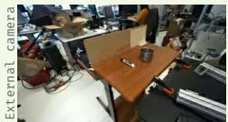  
000 0.00 s

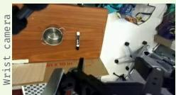  
Action-grounded causal reasoning traces  
001 1.20 s  
Keyframes

[State] The scene shows an open metal pot on the left side of the table and a black-and-white marker standing upright closer to the center. [Cause] This matters because the marker must be movedfrom its current separated position into the pot, and the robot has not yet made contact with it. [Effect] The next useful step is for the gripper to approach the marker carefully so it can be grasped without tipping or pushing it away. [Action] The robot should continue toward the marker [Avoid] while avoiding collisions with the pot, the table edge, or nearby clutter. [Completion] The task is incomplete because the marker remains outside the pot.

Keyframes  
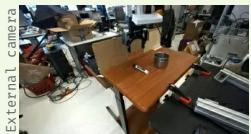  
002 2.40 s

[State] The pot remains open on the left, while the marker is still on the tabletop to its right. The gripper has moved closer and appears to be lining up for a grasp, [Cause] which is a necessary causal step before the marker can be lifted or moved into the pot. [Avoid] If the robot approaches with too much sideways motion or closes too early, it may push the marker away rather than secure it. [Action] The robot should continue with careful alignment and prepare to grasp the marker [Avoid] without disturbing the pot. [Completion] The task is not complete because the marker has not been placed in the pot.

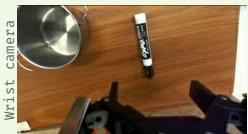  
Action-grounded causal reasoning traces

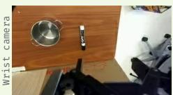  
Action-grounded causal reasoning traces  
004 3.80 s

Keyframes  
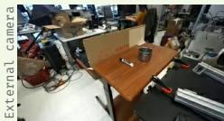

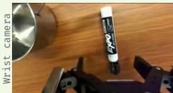

  
Keyframes  
Action-grounded causal reasoning traces

[State] The marker is still lying on the tabletop near the robot gripper, while the open pot remains to the left. [Cause] This moment matters because the robot appears to be shiftingfrom approach into the grasping phase, and the marker must be controlled before it can be put into the pot. [Avoid] A poorly aligned contact could roll the marker away or push it across the table instead of securing it. [Action] The robot should continue by making a careful, stable grasp and then move the marker toward the pot. [Completion] The task remains incomplete because the marker is not yet inside the pot.

[State] The pot is open on the left side of the table while the marker remains upright on the tabletop to its right. [Cause] This separation matters because the robot still needs to pick up or otherwise move the marker before it can be put into the pot. [Effect] The next likely step is to bring the gripper closer and align it with the markerfor a stable grasp. [Action] The robot should continue carefully, [Avoid] avoiding any motion that would topple the marker or shift the pot. [Completion] The task is still incomplete because the marker is not in the pot.

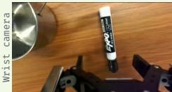  
Action-grounded causal reasoning traces  
003 3.67 s

[State] The marker is on the tabletop near the robot gripper, while the open pot remains to the left. [Cause] This matters because the robot has reached the critical pre-grasp position where small alignment errors could determine whether the marker is captured or pushed away. [Effect] The intended next effect is to close or position the gripper so the marker is held securely for transport. [Action] The robot should continue carefully, [Avoid] avoiding any sideways contact that could roll the marker or disturb the pot. [Completion] The task is still incomplete because the marker has not been deposited in the pot.

Keyframes  
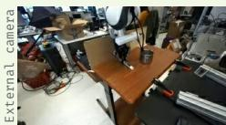  
005 4.87 s

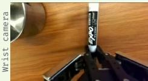  
Action-grounded causal reasoning traces

[State] The robot gripper is now contacting the marker near its lower end, and the marker is upright or nearly upright at the grasp point. [Cause] This matters because the robot mustfirst secure the marker before it can move it into the open pot visible on the left. [Avoid] If the grip is not stable, the marker may slip, rotate, or be pushed away instead of being carried. [Action] The robot should continue by confirming a firm grasp and then moving the marker toward the pot [Avoid] without bumping the pot or table. [Completion] The task is still incomplete because the marker has not been deposited inside the pot.

Figure 1: All labeled keyframes from DROID episode 0, part 1 of 2 (keyframes 000–005). EachFigure 10 Full natural-language reasoning annotations for “Put the marker in the pot,” with synchronized external card pairs synchronized external- and wrist-cameraand wrist-camera views. Part 1: labeled keyframes 000–005.

Keyframes  
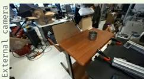  
006 6.07 s  
Action-grounded causal reasoning traces

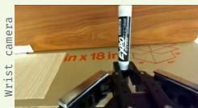

[State] The robot is now holding the marker upright near its lower end, indicating that the grasp has likely been established. [Cause] This matters because controlled possession ofthe marker is required before the robot can carry it to the pot. [State] The pot is not visible in thisframe, [Effect] so the next useful effect is to transport the held marker toward the pot while keeping it stable. [Action] The robot should continue carefully [Avoid] and avoid dropping the marker or colliding with surrounding surfaces. [Completion] The task remains incomplete because the marker has not been placed into the pot.

Keyframes  
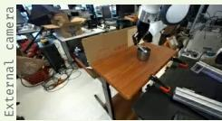  
008 8.53 s

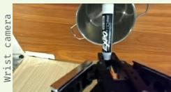  
Action-grounded causal reasoning traces

[State] The robot is holding the marker upright and has moved it directly infront ofthe open metal pot. [Cause] This matters because the marker is now close enough that the next small positioning motion can determine whether it enters the pot or misses the opening. [Effect] Ifthe robot centers and lowers it carefully, the marker can be placed inside, [Avoid] but an off-center release could make it hit the rim orfall outside. [Action] The robot should continue withfine alignment and release only when the marker is clearly over the pot. [Completion] The task is still incomplete because the marker remains in the gripper rather than inside the pot.

Keyframes  
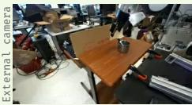  
010 10.40 s

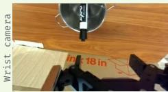  
Action-grounded causal reasoning traces

[State] The marker is still visibly inside the open metal pot, and the robot gripper is now awayfrom the marker rather than holding it. [Cause] This matters because the required placement has already been achieved, and the remaining concern is preserving that state. [Effect] A careful withdrawal will keep the marker in the pot, [Avoid] while unnecessary motion could hit the rim or dislodge the marker. [Action] The robot should retract or stop without re-contacting the pot or marker. [Completion] The task is complete because the marker has been placed in the pot.

Keyframes  
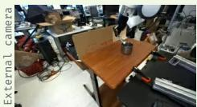  
007 7.33 s

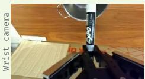  
Action-grounded causal reasoning traces

[State] The robot is holding the marker upright and has brought it close to the open metal pot visible ahead. [Cause] This matters because the task has progressed from grasping to target alignment, and the marker must now be placed into the pot rather than simply carried near it. [Effect] A carefulforward or upward alignment could put the marker over the opening, [Avoid] but an early release or poor positioning could cause it to hit the rim orfall outside. [Action] The robot should continue by centering the marker over the pot and lowering or releasing it only when placement is secure. [Completion] The task is still incomplete because the marker is not yet inside the pot.

Keyframes  
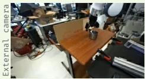  
009 9.73 s  
Action-grounded causal reasoning traces

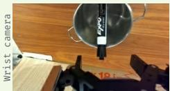

[State] The marker is now visibly positioned inside the open metal pot, and the gripper appears open rather than holding it. [Cause] This matters because the required object has reached the target container, satisfying the main goal ofthe instruction. [Avoid] The robot should avoid any additional motion that might strike the pot or knock the marker back out. [Action] A safe withdrawal or stopping motion is appropriate now that the placement has been achieved. [Completion] The task is complete because the marker is in the pot.

Keyframes  
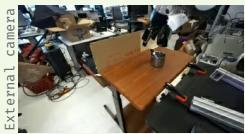  
011 11.00 s

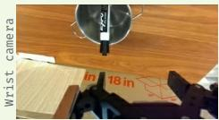  
Action-grounded causal reasoning traces

[State] The marker is still visibly inside the open metal pot, and the robot gripper is awayfrom it. [Cause] This matters because the placement has remained stable after release, which satisfies the instruction to put the marker in the pot. [Effect] The best next outcome is to preserve this state [Action] by stopping or staying clear ofthe container. [Avoid] The robot should avoid re-contacting the marker or bumping the pot, since that could undo the successful placement. [Completion] The task is complete because the marker is in the pot.

Figure 2: All labeled keyframes from DROID episode 0, part 2 of 2 (keyframes 006–011). EachFigure 11 Full natural-language reasoning annotations for “Put the marker in the pot,” continued. Part 2: labeled card pairkeyframes 006–011.

## B Fine-tuning and inference recipe details

## B.1 VLA Fine-Tuning Details

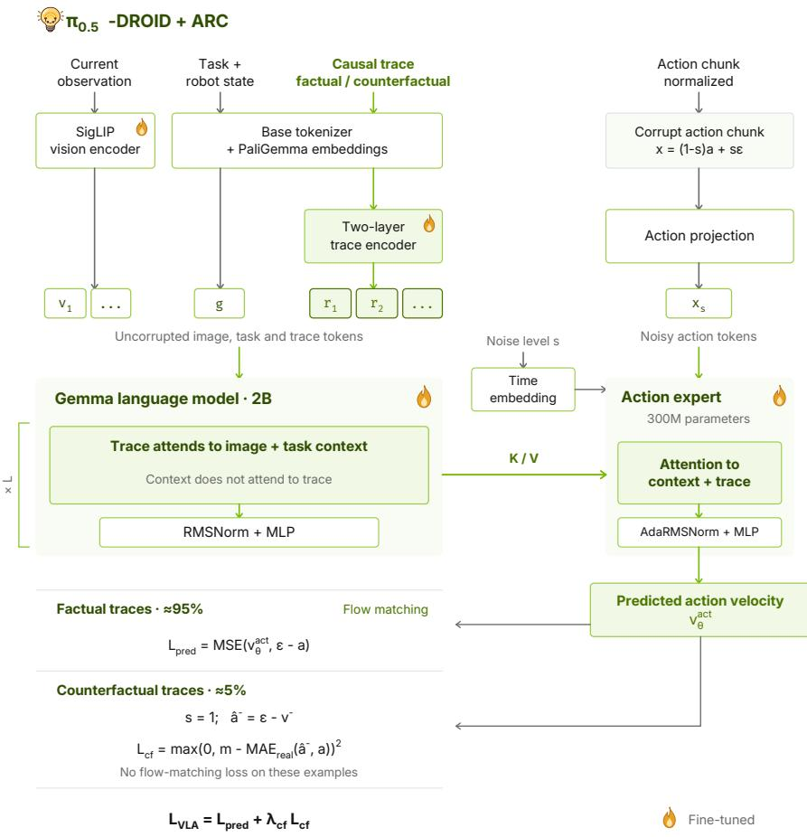  
Figure 12 Arc fine-tuning architecture for π0.5

Observation and instruction encoding. Figure 12 shows the $\pi _ { 0 . 5 ^ { - } } \mathrm { D R O I D }$ implementation. The exterior and wrist images in $o _ { t }$ are resized to $2 2 4 \times 2 2 4$ and encoded by SigLIP into 256 tokens per view. These tokens are projected to the Gemma backbone’s width of 2048. The task instruction g and discretized robot state are encoded together using the PaliGemma tokenizer, with a maximum length of 200 tokens. Image and instruction tokens form the original context; unused camera slots and padding are masked.

Trace encoding. The trace $r _ { t }$ is tokenized separately, with a maximum length of 320 tokens, and embedded using the same PaliGemma embedding table. The trace encoder projects these 2048-dimensional embeddings to width 512, adds learned positional embeddings, and applies two pre-normalized transformer blocks, each with eight attention heads and a feed-forward width of 2048. A final projection returns the representations to width 2048 before they are appended to the context. This projection is zero-initialized, so the added representations initially carry no trace-specific information.

Layerwise conditioning. Context and trace tokens are processed by the Gemma-2B parameters, while noisy action tokens are processed by the 300M-parameter action expert. The two components have widths 2048 and 1024, respectively, and interact through shared attention at each of the 18 transformer layers. Their attention projections produce compatible keys, queries, and values despite the diferent hidden widths. The block mask is

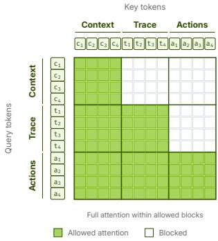

where rows denote the attending tokens, columns denote the attended tokens, and 1 permits attention to all valid tokens in the corresponding block. Thus, the trace can use the observed scene and instruction, while the action expert can combine both with the noisy action chunk. Neither context nor trace representations depend on the noisy actions. Although trace tokens precede action tokens in the input sequence, their rotary position indices are assigned after the action positions, preserving the pretrained positional indices of the action tokens.

Action prediction and training. With chunk length $H = 1 5$ , the normalized action target is $\mathbf { y } _ { t } ^ { \mathrm { a c t } } = \mathbf { a } _ { t } \in \mathbb { R } ^ { H \times 3 2 }$ Eight coordinates represent the seven joints and gripper; the remaining coordinates are padding. Each row of ${ \bf x } _ { t } ^ { \mathrm { a c t } }$ is projected to one 1024-dimensional action token. A sinusoidal embedding of $s _ { \mathrm { a c t } }$ , followed by an MLP, conditions the action expert through adaptive RMS normalization. Its final token representations are projected back to 32 coordinates to produce $v _ { \theta } ^ { \mathrm { a c t } }$

The vision encoder, language backbone, trace encoder, and action expert are jointly optimized with Eq. 2. Factual and counterfactual examples share one batched forward pass. Their loss masks select flow matching or the counterfactual penalty, respectively, with $s _ { \mathrm { a c t } } = 1$ for counterfactual examples. The flow loss uses the padded action representation, whereas $\mathrm { M A E } _ { \mathrm { r e a l } }$ excludes padding when measuring counterfactual separation.

## B.2 WAM Fine-Tuning Details

Token construction. Figure 13 shows the Cosmos3-Nano-Policy implementation. The reasoner receives ViTencoded current observations followed by the task instruction g and trace $r _ { t } .$ , using the pretrained language tokenizer and embeddings. The trace is appended directly to the instruction without a separate trace encoder. End-of-sequence and begin-of-generation tokens mark the boundary between the reasoner and generator sequences.

The generator operates on continuous observation and action representations. Each training window contains one observed frame and 32 future frames with aligned actions. The video VAE encodes the future observations into ${ \bf y } _ { t } ^ { \mathrm { o b s } }$ , while the normalized actions form ${ \bf y } _ { t } ^ { \mathrm { a c t } }$ . Their noisy versions, $\mathbf { x } _ { t } ^ { \mathrm { { o b s } } }$ and ${ \bf x } _ { t } ^ { \mathrm { a c t } }$ , are projected into generator tokens. The base Cosmos video input also retains the initial frame as clean VAE conditioning, separate from the noised future targets (NVIDIA, 2026).

Reasoner–generator attention. Cosmos3-Nano uses 36 paired transformer layers of width 4096. The reasoner and generator have separate normalization layers, attention projections, and feed-forward networks, but their tokens interact through a shared attention operation (NVIDIA, 2026). The block mask is

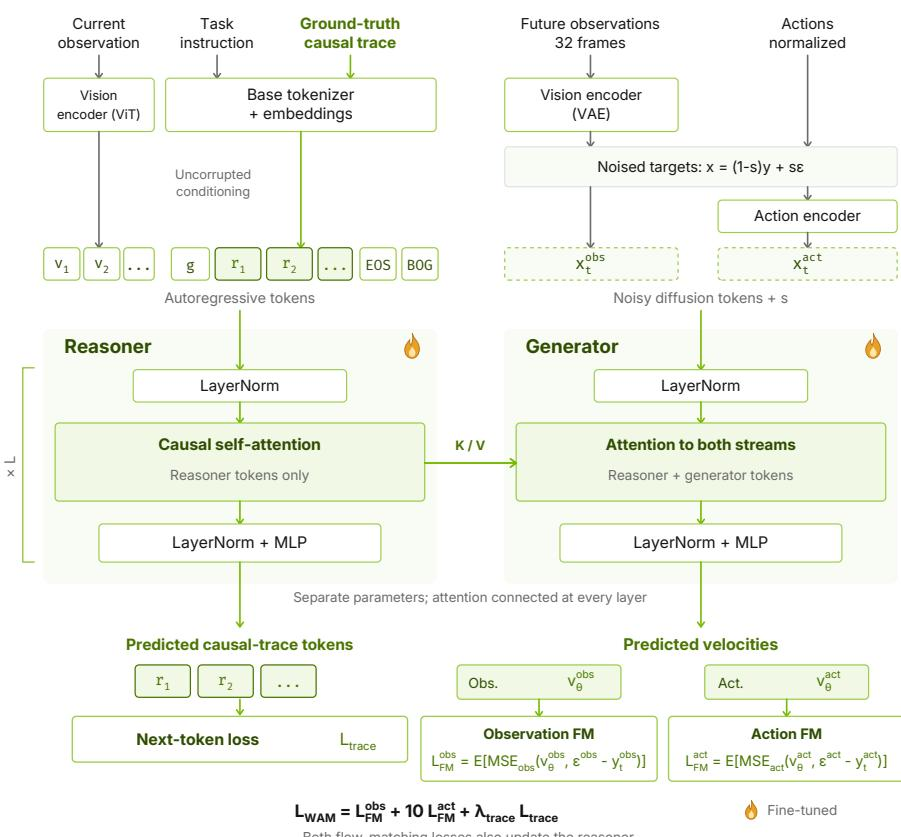  
Figure 13 Arc fine-tuning architecture for Cosmos3-nano-policy

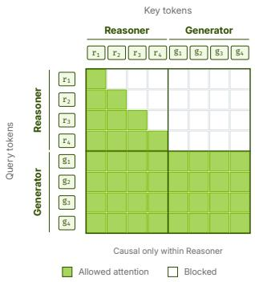

using the same row and column convention as the VLA. Causal attention restricts each reasoner token to its preceding context and itself. Generator tokens attend to the complete reasoner sequence and to one another, allowing action and future-observation predictions to exchange information while remaining conditioned on the trace. Separate output projections produce $v _ { \theta } ^ { \mathrm { a c t } }$ and $v _ { \theta } ^ { \mathrm { o b s } }$ in their respective target spaces.

Joint supervision. The ground-truth trace serves two roles during training. It supplies conditioning to the generator and next-token targets to the reasoner. For $\mathcal { L } _ { \mathrm { t r a c e } }$ , targets are shifted so that prediction of $\boldsymbol { r } _ { t , j }$ uses only $o _ { t } , g _ { : }$ , and $r _ { t , < j }$ . The reasoner cannot attend to later trace tokens or difusion targets. The generator, however, conditions on the complete ground-truth trace when predicting actions and future observations.

We jointly update both components using Eq. 3. The trace loss supervises the reasoner’s language predictions, while $\mathcal { L } _ { \mathrm { p r e d } }$ also updates its representations through the keys and values used by the generator. Consequently, the reasoner is trained both to express the annotated reasoning and to provide features useful for continuous prediction. The counterfactual objective is omitted, as described in Sec. 4.3.

## B.3 Inference

During evaluation, we freeze the ARC-fine-tuned policies and use an external VLM to generate actiongrounded causal traces. Each request contains the task instruction and the current exterior- and wrist-camera images. A fixed prompt specifies the ARC trace format and requests a single natural-language paragraph of at most 900 characters, grounded in the current observations.

The generated trace is supplied alongside the original instruction and observations. In the VLA, the vision language backbone encodes the trace for the action expert; in the WAM, the reasoner encodes it for the generator. The external VLM provides the reasoning, while the ARC-fine-tuned policy remains responsible for generating continuous robot actions. Responses are checked for format and length before use, and a rejected response leaves the previous accepted trace unchanged. Trace generation runs asynchronously, with each policy call using the latest accepted trace.

## B.3.1 Real-Time Deployment

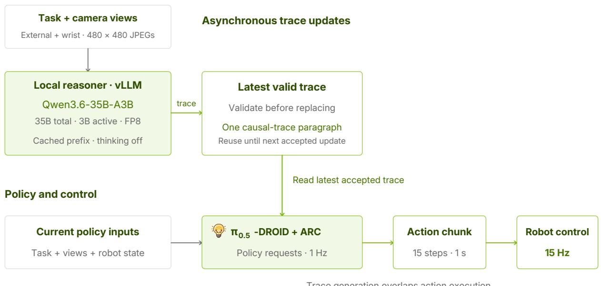  
Figure 14 Real-time deployment strategy

We separate reasoning generation from action execution so that the robot does not wait for a new trace at every policy query. The robot executes 15-action chunks at 15 Hz, while a background thread generates reasoning from the latest camera observations. After episode initialization, each policy query uses the most recent validated trace; delayed or invalid responses leave the previous trace in place. Reasoning latency therefore afects how recently the scene was interpreted, without blocking subsequent action generation.

To refresh the reasoning within the action-chunk duration, we serve Qwen3.6-35B-A3B-FP8 locally using vLLM on a dedicated GPU host. Local serving avoids remote API delays, while FP8 inference and prefix caching reduce computation and memory costs. The shared system prompt and task instruction precede the images, allowing their cached representations to be reused across requests. We disable auxiliary thinking token generation and request a single causal paragraph of at most 900 characters. Each request contains two camera images, with bounded concurrency to limit queueing.

## C Experiment Details

## C.1 Simulation Benchmark Details

## C.1.1 RoboLab-120

We evaluate ARC-fine-tuned $\pi _ { 0 . 5 }$ and Cosmos3-Nano-Policy on all 120 tasks in RoboLab-120 (Yang et al., 2026), using the released benchmark without modifying its tasks, scenes, or success criteria. Evaluation uses the DROID embodiment and follows the standard protocol of 10 episodes per task. We repeat this evaluation for the vague, default, and specific instruction variants, yielding 1,200 episodes per model for each instruction setting. We report success as the fraction of episodes that satisfy the benchmark’s task-completion criteria. All evaluations are zero-shot, with model weights frozen and no training on benchmark data. We refer the readers to the original paper Yang et al. (2026) for the full dataset split and examples.

## C.1.2 MolmoSpaces

We evaluate the same checkpoints on all nine manipulation tasks reported in Table 2, following the oficial MolmoSpaces evaluation protocol (Kim et al., 2026). We use the released episode sets and task configurations, preserving the specified scenes, object placements, camera configurations, instructions, and success criteria. All tasks use the DROID embodiment, with no benchmark-specific training or modification of the evaluation environments. We report success for each task and the aggregate performance using the benchmark’s scoring procedure. We refer the readers to the original paper Kim et al. (2026) for the full dataset split and examples.

For both benchmarks, results for the other baseline policies are taken from the corresponding benchmark reports and oficial leaderboards.

## C.1.3 RoboLab-Reasoning-50

We build RoboLab-Reasoning-50 using the RoboLab framework, introducing 50 tasks that require target inference, multi-step execution, discovery, or reasoning about exclusions. Of these, 34 leave the target unnamed and require the policy to identify it from the instruction and scene. The remaining 16 name their targets but require long-horizon or discovery behavior.

The benchmark combines 27 tasks adapted from our real-world evaluation with 23 simulation-only tasks that extend the object sets and destinations. The paired tasks preserve the instruction wording used on hardware. Tasks span 44 scene and use objects from a processed library of 371 NVIDIA Isaac objects. The robot and camera configuration match the DROID embodiment used in RoboLab-120.

Evaluation. We run 10 episodes for each of the 50 tasks, totaling 500 episodes per model. Control runs at 15 Hz, with task-specific time limits ranging from 50 to 240 s. Budgets allow at least 45 s for the first required move and 30 s for each additional move, with a further 30 s for discovery tasks. An episode terminates on success, timeout, or a tracked object leaving the workspace.

Scoring. Headline results use binary task success, evaluated from the final scene state with the gripper detached. Predicates check containment, placement, stacking, exclusion constraints, or task-specific combi nations of these conditions. Scoring does not impose a fixed execution sequence, although the required final arrangement must be satisfied.

Table 4 RoboLab-Reasoning-50 tasks and categories. Tasks assigned to two categories retain both labels.

<table><tr><td rowspan=1 colspan=1>RoboLab-Reasoning-50                                                                                   50 tasks</td></tr><tr><td rowspan=1 colspan=1>Task                                                                                                    Category</td></tr><tr><td rowspan=1 colspan=1>&quot;The plate should only have edible items”                                                             Simple</td></tr><tr><td rowspan=1 colspan=1>“Everything made of wood goes in the bowl”                                                          Simple</td></tr><tr><td rowspan=1 colspan=1>Continued on next page</td></tr></table>

<table><tr><td>RoboLab-Reasoning-50</td><td>continued</td></tr><tr><td>Task</td><td>Category</td></tr><tr><td>"Put the smallest item in the bowl"</td><td>Simple</td></tr><tr><td>"Put the second tallest object in the bowl"</td><td>Simple</td></tr><tr><td>"Put the item that matches the bowl's color into it"</td><td>Simple</td></tr><tr><td>"Move the object closest to the table's edge to the bowl or plate"</td><td>Simple</td></tr><tr><td>"Put the kitchen utensils in the plate”</td><td>Simple</td></tr><tr><td>"Stack the blocks in order: red, blue, green”</td><td>Long horizon</td></tr><tr><td>"Reverse the stacking order of the three colored blocks"</td><td>Long horizon</td></tr><tr><td>"Reverse the arrangement: whatever is on the plate goes in the bowl, and whatever is in the bowl Long horizon goes on the plate”</td><td></td></tr><tr><td>"The plate is for utensils, the bowl is for blocks; sort the table accordingly”</td><td>Long horizon</td></tr><tr><td>"Nothing should be left on the left plate”</td><td>Long horizon</td></tr><tr><td>“Every container on the table should hold exactly two things"</td><td>Long horizon</td></tr><tr><td>"Put the green vegetables and a fruit in the blue basket”</td><td>Long horizon</td></tr><tr><td>"Put the drink cans in the cardboard box”</td><td>Long horizon</td></tr><tr><td>"Pack all the bread into the basket”</td><td>Long horizon</td></tr><tr><td>"Put the apples in the cardboard box"</td><td>Long horizon</td></tr><tr><td>"Put all the citrus fruits into the basket”</td><td>Long horizon</td></tr><tr><td>"Put the cups onto the tray, upright”</td><td>Long horizon</td></tr><tr><td>"Put the yellow things onto the yellow plate and the green things onto the green plate"</td><td>Long horizon</td></tr><tr><td>"Put all the fruits except the red ones on the higher plate”</td><td>Long horizon + Negation</td></tr><tr><td>"Put two bags of chips in the green basket"</td><td>Long horizon</td></tr><tr><td>“Empty the right half of the desk into the grey bin”</td><td>Long horizon</td></tr><tr><td>"Put all the tapes into the bin, except the tape in the tape dispenser”</td><td>Long horizon</td></tr><tr><td>"Put the reusable cups in the bussing bin and put the disposable cups in the trash bin”</td><td>+ Negation Long horizon</td></tr><tr><td>"Put the cutlery in the bussing bin”</td><td>Long horizon</td></tr><tr><td>"Put a zucchini, the eggplant, and a knife on the cutting board"</td><td>Long horizon</td></tr><tr><td>“Sort everything on the table into the recycling, compost, and trash bins”</td><td>Long horizon</td></tr><tr><td></td><td></td></tr><tr><td>"Sort the chips bag, the banana, the drink can, and the paper cup into the correct bins"</td><td>Long horizon Continued on next page</td></tr><tr><td>"Put the food snacks in the black bin, and leave the drinks”</td><td>Long horizon</td></tr><tr><td>“"Put the number cubes in the basket”</td><td>Long horizon</td></tr><tr><td>"Move the grey plate and put whatever is under it into the red bowl”</td><td>Discovery</td></tr><tr><td>"Take the black plate off of the bowl and put what you find underneath onto the grey plate”</td><td>Discovery</td></tr><tr><td>"Move the carton, then put whatever was hidden behind it into the bowl"</td><td>Discovery</td></tr><tr><td>"Move the mustard bottle aside and put whatever was behind it into the bowl"</td><td>Discovery</td></tr><tr><td>"Take the item out of the plate and place it on the table. Then put the item that was on the table onto the plate."</td><td>Discovery</td></tr><tr><td>"Put the banana on the plate”</td><td>Discovery</td></tr><tr><td>"Put the spatula on the plate”</td><td>Discovery</td></tr><tr><td>"Put the bananas on the plate”</td><td>Discovery</td></tr><tr><td>“Put the cans in the recycling”</td><td>Discovery</td></tr><tr><td>"Put what's under the plate into the grey bin"</td><td>Discovery</td></tr><tr><td>“Stack the blue block behind the paddle on the rubik's cube”</td><td>Discovery</td></tr><tr><td>"Pack the can behind the box into the box”</td><td>Discovery</td></tr><tr><td>"One container is empty and one has something in it. Put the block into the empty container”</td><td>Negation</td></tr><tr><td>"Put all the fruits into the bowl except the orange”</td><td>Negation</td></tr><tr><td>"Put all items on the table into the bowl except the can”</td><td>Negation</td></tr><tr><td>"Put every item on the table into the bowl except the blue block and the wood block”</td><td>Negation</td></tr><tr><td>"Items are arranged in two groups on either side of the wall of blocks. Put all items from the group that does NOT contain a can into the bowl"</td><td>Negation</td></tr><tr><td>"Three items are on the table: two are fruits and one is not. Put the non-fruit into the bowl"</td><td>Negation</td></tr><tr><td>"Put every item on the table into the crate except the green colored objects”</td><td>Negation</td></tr></table>

## C.2 RoboLab-Reasoning-Hardware

We conduct hardware experiments on the DROID embodiment (Khazatsky et al., 2024), consisting of a sevendegree-of-freedom Franka Emika Panda arm equipped with a Robotiq 2F-85 two-finger gripper. Figure 15 shows the workspace layout and camera placements.

The evaluation includes simple reasoning, long-horizon, discovery, and negation tasks paired with their counterparts in RoboLab-Reasoning-50. Each pair uses the same task instruction, allowing direct comparison between simulation and physical execution. We evaluate ARC-fine-tuned π and the comparison policies for three episodes per task, using the same checkpoints evaluated in simulation without hardware-specific fine-tuning.

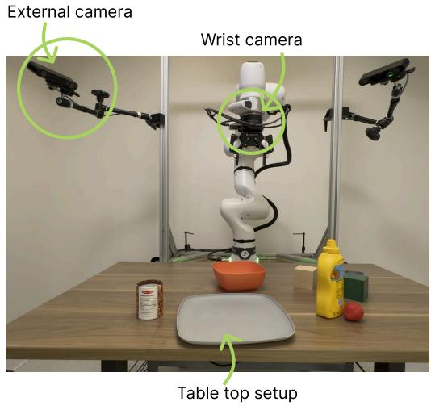  
Figure 15 Hardware setup for real-world experiments  
Figures 16, 17, 18, 19 represents the benchmark tasks and the paired hardware and simulation environments.

<table><tr><td colspan="2">Category: Simple</td><td colspan="2">7 tasks</td></tr><tr><td>Task</td><td>Hardware (external)</td><td>Simulation</td><td></td></tr><tr><td>SIM1 &quot;The plate should only have edible items&quot;</td><td>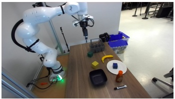</td><td>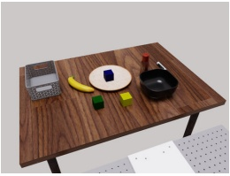</td><td></td></tr><tr><td>SIM2 “Everything made of wood goes in the bowl&quot;</td><td></td><td></td><td></td></tr><tr><td>SIM3 &quot;Put the smallest item in the bowl”</td><td></td><td></td><td></td></tr><tr><td>SIM4 &quot;Put the second tallest object in the bowl&quot;</td><td></td><td></td><td></td></tr><tr><td>SIM5 &quot;Put the item that matches the bowl&#x27;s color into it”</td><td></td><td></td><td></td></tr><tr><td>SIM6 &quot;Move the object closest to the table&#x27;s edge to the bowl or plate&quot;</td><td></td><td></td><td></td></tr><tr><td>SIM7 &quot;Put the kitchen utensils in the plate”</td><td></td><td></td><td></td></tr></table>

Figure 16 RoboLab-Reasoning-Hardware task setups for the simple category. Each row pairs the task instruction with the external hardware-camera view and its simulation setup.

<table><tr><td colspan="2">Category: Long horizon</td><td colspan="2">6 tasks</td></tr><tr><td colspan="2">Task</td><td>Hardware (external)</td><td>Simulation</td></tr><tr><td colspan="2">LH1 &quot;Stack the blocks in order: red, blue, green&quot;</td><td></td><td></td></tr><tr><td colspan="2">LH2 &quot;Reverse the stacking order of the three colored blocks”</td><td></td><td></td></tr><tr><td colspan="2">LH3 &quot;Reverse the arrangement: whatever is on the plate goes in the bowl, and whatever is in the bowl goes on the plate”</td><td></td><td></td></tr><tr><td colspan="2">LH4 &quot;The plate is for utensils, the bowl is for blocks; sort the table accordingly&quot;</td><td></td><td></td></tr><tr><td colspan="2">LH5 &quot;Nothing should be left on the left plate”</td><td></td><td></td></tr><tr><td colspan="2">LH6 &quot;Every container on the table should hold exactly two things&quot;</td><td></td><td></td></tr></table>

Figure 17 RoboLab-Reasoning-Hardware task setups for the long horizon category. Task instructions are shown alongside external hardware-camera views and simulation illustrations.

## Category: Discovery

<table><tr><td colspan="3"></td></tr><tr><td>Task D1 "Move the lid and put whatever is under the lid into the bowl"</td><td>Hardware (external) </td><td>Simulation </td></tr><tr><td>D2 "Take the cloth off of the bowl and put what you find underneath into the plate"</td><td></td><td></td></tr><tr><td>D3 "Move the carton, then put whatever was hidden behind it into the bowl"</td><td></td><td></td></tr><tr><td>D4 "Move the mustard bottle aside and put whatever was behind it into the bowl"</td><td></td><td></td></tr><tr><td>D5 "Take the item out of the plate and place it on the table. Then put the item that was on the table onto the plate."</td><td></td><td></td></tr><tr><td rowspan="2">D6 "Put the banana on the plate” D7 "Put the spatula on the plate”</td><td></td><td></td></tr><tr><td></td><td></td></tr><tr><td>Category: Negation</td><td colspan="2">7 tasks</td></tr><tr><td>Task</td><td>Hardware (external)</td><td>Simulation</td></tr><tr><td>NEG1 "One container is empty and one has something in it. Put the block into the empty container"</td><td></td><td></td></tr><tr><td>NEG2 "Put all the fruits into the bowl except the orange"</td><td></td><td></td></tr><tr><td>NEG3 "Put all items on the table into the bowl except the can"</td><td></td><td></td></tr><tr><td>NEG4 "Put every item on the table into the bowl except the blue block and the wood block"</td><td></td><td></td></tr><tr><td>NEG5 "Items are arranged in two groups on either side of the wall of blocks. Put all items from the group that does NOT contain a can into the bowl</td><td></td><td></td></tr><tr><td>NEG6 "Three items are on the table - two are fruits and one is not. Put the non-fruit into the bowl"</td><td></td><td></td></tr><tr><td>NEG7 "Put every item on the table into the crate except the green colored objects"</td><td></td><td></td></tr></table>

Figure 18 RoboLab-Reasoning-Hardware task setups for the discovery category. Each row pairs the task instruction with the external hardware-camera view and its simulation setup.

Figure 19 RoboLab-Reasoning-Hardware task setups for the negation category. Each row pairs the task instruction with the external hardware-camera view and its simulation setup.

## C.3 Evaluated Policies

π0.5. We use the released $\pi _ { 0 . 5 } – \mathrm { D R O I D }$ joint-position checkpoint. Its PaliGemma backbone combines a SigLIP vision encoder with a Gemma language model to process camera observations, the task instruction, and tokenized robot state. A separate 300M-parameter action expert attends to these representations and predicts continuous action chunks through flow matching. The baseline receives the original task instruction without additional reasoning, using the default ten Euler steps for action generation.

Cosmos3-Nano-Policy. We use the DROID checkpoint of Cosmos3-Nano-Policy, a world-action model built on a mixture-of-transformers architecture. It combines a vision-language reasoner with a difusion generator, each with separate parameters connected through attention at every layer. The reasoner processes the visual and language inputs, while the generator jointly predicts future observations and actions conditioned on the reasoner’s representations. We refer readers to the original papers for detailed architecture and pretraining descriptions (Black et al., 2025a; NVIDIA, 2026).

$\pi _ { 0 . 5 }$ with explicit subtasks. This baseline evaluates external task decomposition without modifying or finetuning the policy. We retain the stock $\pi _ { 0 . 5 }$ -DROID checkpoint and use GPT-5.5 to generate an ordered plan from the task instruction and initial exterior-camera image. The plan contains at most 12 coarse subtasks, with a complete pick-and-place operation treated as one subtask. For multi-object instructions, the planner names the matching objects explicitly and excludes those ruled out by the instruction. Single-object and discovery instructions are passed through unchanged under this coarse decomposition scheme.

During execution, a client-side wrapper replaces the original instruction with the current subtask, leaving the observations, robot state, and policy unchanged. The client executes 15 actions per policy query. Every 30 simulation steps, GPT-5.5 checks the current subtask against the exterior and wrist-camera images. Completion requires the object to be at its destination, released, and stable; two consecutive positive checks advance the plan. A subtask also advances when its allocated step budget expires, with the episode budget divided across subtasks subject to a minimum of 225 steps per subtask. Failed subtasks are skipped rather than retried, and the final subtask remains active until the episode ends.

The planner and completion checker use low reasoning efort and a temperature of 0.2. The plan is generated once per episode, with no replanning; an empty or invalid plan falls back to the original instruction. The external VLM only supplies subtask prompts and completion judgments, while $\pi _ { 0 . 5 }$ remains responsible for all robot actions.

## C.4 Detailed RoboLab-120 results.

We now present detailed benchmark results under vague, default, and specific instructions. Alongside success rates, we report end-efector speed and EE SPARC, together with the available uncertainty estimates. Figure 20 compares both ARC policies with the leading baselines.

RoboLab-120: Specific  
RoboLab-120: Default  
RoboLab-120: Vague
<table><tr><td># Policy</td><td></td><td>Type</td><td>N</td><td>SR (%)</td><td>EE speed (cm/s)</td><td>EE SPARC</td><td>Obs.</td></tr><tr><td></td><td>1 π0.5 + 0ARC</td><td>VLA</td><td>一</td><td>45.1 ±3.1 (+29.8)</td><td>4.63 ±3.45</td><td>−5.38 ±2.01</td><td>RGB+P</td></tr><tr><td></td><td>2 Cosmos3-Nano-Policy + ARC</td><td>WAM</td><td></td><td> $4 4 . 9 \pm 2 . 3 ( + 2 4 . 3 )$ </td><td>6.34 ±3.01</td><td>−6.01 ±2.04</td><td>RGB+P</td></tr><tr><td></td><td>3 Atomic-WAM</td><td>VLM+WAM</td><td>379/1200</td><td>31.6 ± 5.3</td><td>7.45 ±1.79</td><td>-4.77</td><td>RGB+P</td></tr><tr><td></td><td>4 BiMind v0.1</td><td>VLA</td><td>363/1200</td><td>30.2 ± 5.3</td><td> $5 . 2 4 \pm 1 . 7 2$ </td><td>-5.88</td><td>RGB+P</td></tr><tr><td>5 VoLo</td><td></td><td>AGENT</td><td>354/1200</td><td>29.5 ± 5.2</td><td>5.51 ±1.62</td><td>-8.92</td><td>RGB+D+P</td></tr><tr><td></td><td>6 Cosmos3-Nano-Policy</td><td>WAM</td><td>247/1200</td><td>20.6 ± 4.7</td><td>6.37 ±1.59</td><td>-5.99</td><td>RGB+P</td></tr><tr><td></td><td>7 Cosmos3-Edge-Policy</td><td>WAM</td><td>185/1200</td><td>15.4 ± 4.2</td><td>6.35 ±1.74</td><td>-5.46</td><td>RGB+P</td></tr><tr><td>8 π0.5</td><td></td><td>VLA</td><td>183/1200</td><td>15.2 ±4.1</td><td>5.35 ±1.41</td><td>-8.34</td><td>RGB+P</td></tr><tr><td>9 DreamZero</td><td></td><td>WAM</td><td>179/1200</td><td>14.9 ± 4.1</td><td>3.11 ±1.24</td><td>-6.41</td><td>RGB+P</td></tr><tr><td>10π0-FAST</td><td></td><td>VLA</td><td>111/1200</td><td>9.2 ± 3.4</td><td> $4 . 8 5 \pm 1 . 7 7$ </td><td>-9.63</td><td>RGB+P</td></tr><tr><td>11 GR00T N1.6</td><td></td><td>VLA</td><td>65/1200</td><td>5.4 ± 2.6</td><td> $4 . 1 9 \pm 1 . 2 4$ </td><td>-6.87</td><td>RGB+P</td></tr></table>

N: successes/trials; —: not provided. SR uncertainty and green gains over the base policy are in percentage points. Reported values are reproduced as supplied

<table><tr><td># Policy</td><td></td><td>Type</td><td>N</td><td>SR (%)</td><td>EE speed (cm/s)</td><td>EE SPARC</td><td>Obs.</td></tr><tr><td></td><td>1 Cosmos3-Nano-Policy + ARC</td><td>WAM</td><td>一</td><td>48.8 ±2.4 (+12.0)</td><td>6.39 ±3.12</td><td>–5.98 ±3.31</td><td>RGB+P</td></tr><tr><td></td><td>2 π0.5 + ♀ARC</td><td>VLA</td><td></td><td>45.3 ±2.3 (+17.3)</td><td>4.64±1.35</td><td>−5.81 ±2.10</td><td>RGB+P</td></tr><tr><td></td><td>3 FLUX 3 Action</td><td>WAM</td><td>515/1200</td><td>42.9 ± 5.7</td><td>7.36 ±1.85</td><td>-5.37</td><td>RGB+P</td></tr><tr><td></td><td>4 HiDream-O1-Embodied</td><td>VLA</td><td>479/1200</td><td>39.9 ± 5.6</td><td>5.32 ±2.23</td><td>-4.95</td><td>RGB+P</td></tr><tr><td></td><td>5 Atomic-WAM</td><td>VLM+WAM</td><td>475/1200</td><td>39.6 ± 5.6</td><td>7.69 ±1.97</td><td>-4.77</td><td>RGB+P</td></tr><tr><td></td><td>6 OASIS WAM</td><td>VLM+WAM</td><td>468/1200</td><td>39.0 ± 5.6</td><td>6.91 ±1.81</td><td>-5.26</td><td>RGB+P</td></tr><tr><td></td><td>7 Cosmos3-Nano-Policy</td><td>WAM</td><td>441/1200</td><td>36.8 ± 5.5</td><td>7.13 ±1.77</td><td>-5.99</td><td>RGB+P</td></tr><tr><td>8 Phoenix</td><td></td><td>TAMP+FM</td><td>413/1200</td><td>34.4 ± 5.5</td><td>6.13 ±4.56</td><td>-5.55</td><td>RGB+D+P</td></tr><tr><td>9 BiMind v0.1</td><td></td><td>VLA</td><td>400/1200</td><td>33.3 ± 5.4</td><td> $5 . 2 6 \pm 1 . 7 2$ </td><td>-5.88</td><td>RGB+P</td></tr><tr><td>10 VoLo</td><td></td><td>AGENT</td><td>339/1200</td><td>28.2 ± 5.2</td><td> $5 . 5 0 \pm 1 . 6 7$ </td><td>-8.92</td><td>RGB+D+P</td></tr><tr><td>11π0.5</td><td></td><td>VLA</td><td>336/1200</td><td>28.0 ± 5.2</td><td>5.35 ±1.59</td><td>-8.34</td><td>RGB+P</td></tr></table>

N: successes/trials; —: not provided. SR uncertainty and green gains over the base policy are in percentage points. Reported values are reproduced as supplied.

<table><tr><td># Policy</td><td></td><td>Type</td><td>N</td><td>SR (%)</td><td>EE speed (cm/s)</td><td>EE SPARC</td><td>Obs.</td></tr><tr><td></td><td>1 Cosmos3-Nano-Policy + ARC</td><td>WAM</td><td>一</td><td> $5 1 . 2 \pm 2 . 7 ( + 1 1 . 5 )$ </td><td> $7 . 3 4 \pm 2 . 4 5$ </td><td>−5.90 ±3.11</td><td>RGB+P</td></tr><tr><td></td><td>2 π0.5 + 0ARC</td><td>VLA</td><td>一</td><td> $4 5 . 0 \pm 2 . 5 ( + 1 6 . 9 )$ </td><td> $4 . 3 4 \pm 1 . 4 5$ </td><td>−5.88 ±2.11</td><td>RGB+P</td></tr><tr><td></td><td>3 Cosmos3-Nano-Policy</td><td>WAM</td><td>476/1200</td><td>39.7 ± 5.6</td><td> $7 . 3 1 \pm 1 . 9 4$ </td><td>-5.99</td><td>RGB+P</td></tr><tr><td>4 VoLo</td><td></td><td>AGENT</td><td>377/1200</td><td>31.4 ± 5.3</td><td> $5 . 4 9 \pm 1 . 6 7$ </td><td>-8.92</td><td>RGB+D+P</td></tr><tr><td></td><td>5 BiMind v0.1</td><td>VLA</td><td>367/1200</td><td>30.6 ± 5.3</td><td>5.05 ±1.71</td><td>-5.88</td><td>RGB+P</td></tr><tr><td></td><td>6 Cosmos3-Edge-Policy</td><td>WAM</td><td>346/1200</td><td>28.8 ± 5.2</td><td>7.14 ±1.89</td><td>-5.46</td><td>RGB+P</td></tr><tr><td>7 π0.5</td><td></td><td>VLA</td><td>337/1200</td><td>28.1 ± 5.2</td><td>5.32 ±1.59</td><td>-8.34</td><td>RGB+P</td></tr><tr><td>8 DreamZero</td><td></td><td>WAM</td><td>287/1200</td><td>23.9 ± 4.9</td><td>3.81 ±1.41</td><td>-6.41</td><td>RGB+P</td></tr><tr><td>9 π0-FAST</td><td></td><td>VLA</td><td>179/1200</td><td>14.9 ± 4.1</td><td>4.66 ±1.77</td><td>-9.63</td><td>RGB+P</td></tr><tr><td></td><td>10 paligemma-binning</td><td>VLA</td><td>66/1200</td><td>5.5 ±2.7</td><td> $2 . 0 1 \pm 1 . 7 7$ </td><td>-16.52</td><td>RGB+P</td></tr><tr><td>11 GR00T N1.6</td><td></td><td>VLA</td><td>64/1200</td><td>5.3 ± 2.6</td><td>4.45 ±1.41</td><td>-6.87</td><td>RGB+P</td></tr></table>

N: successes/trials; —: not provided. SR uncertainty and green gains over the base policy are in percentage points. Reported values are reproduced as supplied.

Figure 20 Detailed RoboLab-120 benchmark results. Results under vague, default, and specific instructions are shown from top to bottom. Each table lists the top 11 policies, including both ARC variants, ranked by success rate. Green-shaded rows highlight ARC policies; +values indicate success-rate gains over their respective base policies in percentage points. Reported uncertainty is included where available.

## D Training Hyperparameters and Configurations.

We now present the model configurations and training settings for both ARC implementations. Table 5 details the $\pi _ { 0 . 5 } – \mathrm { D R O I D }$ implementation, while Table 6 reports the settings for Cosmos3-Nano-Policy, including its compute resources and measured training runtime.

Table 5 Training hyperparameters and model configuration for $\pi _ { 0 . 5 } \mathrm { \mathrm { - D R O I D } } + \mathrm { A R C } \ \mathrm { ( V L A ) }$  
Training configuration: $\pi _ { 0 . 5 } { \bf - D } { \sf R } { \sf O } { \sf I } { \sf D }$ + ARC
<table><tr><td>Parameter</td><td>Value</td></tr><tr><td>Optimisation</td><td></td></tr><tr><td>Base checkpoint</td><td>Released π0.5-DROID (pi05_droid); full fine-tuning (freeze_filter = Nothing).</td></tr><tr><td>Trainable components</td><td>SigLIP encoder, Gemma 2B trunk, 300M action expert, and the new CausalTraceModule.</td></tr><tr><td>Training steps</td><td>30000.</td></tr><tr><td>Global batch size</td><td>8.</td></tr><tr><td>Optimiser</td><td>AdamW; β1 = 0.9, β2 = 0.95, e = 10−8; weight decay 10−10.</td></tr><tr><td>Gradient clipping</td><td>Global norm 1.0.</td></tr><tr><td>Learning rate</td><td>Peak 10−5; decay target 10−5</td></tr><tr><td>Learning-rate schedule</td><td>Cosine schedule; warm-up min(1 000, S/10) = 1000 steps for S = 30 000; constant after warm-up.</td></tr><tr><td>EMA of weights</td><td>Decay 0.99.</td></tr><tr><td>Precision</td><td>bfloat16 parameters and activations; trace embeddings cast to float32 inside the trace encoder.</td></tr><tr><td>Sharding and hardware</td><td>FSDP across 8 NVIDIA A100 GPUs on 1 node.</td></tr><tr><td>Objective</td><td></td></tr><tr><td>Flow time</td><td>u ∼ Beta(1.5, 1), t = 0.999u + 0.001; t = 1 denotes pure noise.</td></tr><tr><td>Counterfactual fraction</td><td>0.05 of rows receive the Do not grasp the {target} paragraph.</td></tr><tr><td>Counterfactual rows</td><td>Flow time fixed to t = 1; excluded from the flow loss.</td></tr><tr><td>Counterfactual margin</td><td>m = 0.3; distance d is mean L1 in normalised action space over the 8 real action dimensions.</td></tr><tr><td>Counterfactual hinge</td><td>max(m – d, 0)2; masked mean over counterfactual rows.</td></tr><tr><td>Loss weight</td><td> $\lambda = 1 . 0 ; \mathcal { L } = \mathcal { L } _ { \mathrm { f i o w } } + \lambda \mathcal { L } _ { \mathrm { c f } } .$ </td></tr><tr><td>Counterfactual detection</td><td>Token-pattern match on the opener Do not grasp the.</td></tr><tr><td>Model and inference</td><td></td></tr><tr><td>Vision encoder</td><td>SigLIP So400m/14; 224 × 224 inputs; 256 tokens per camera; 3 camera slots (third zeroed and masked on DROID).</td></tr><tr><td>Language trunk</td><td>Gemma 2B: width 2048, 18 layers, MLP 16 384, 8 attention heads, 1 KV head, head dimension 256.</td></tr><tr><td>Action expert</td><td>Gemma 300M: width 1 024, 18 layers, MLP 4096; adaRMSNorm time conditioning.</td></tr><tr><td>Prompt stream</td><td>200 tokens: instruction and discretised state (256 bins).</td></tr><tr><td>Trace stream</td><td>320 tokens; CausalTraceModule: input projection 2 048→512, learned positional embedding, 2 encoder blocks (8 heads, MLP 2 048), and zero-initialised output projection 512→2 048.</td></tr><tr><td>Action chunk</td><td>Horizon 15; action dimension 32: 8 real dimensions (7 joints and gripper), with the rest zero-padded.</td></tr><tr><td>Inference sampling</td><td>10 Euler steps from t = 1 to t = 0.</td></tr></table>

## Table 6 Model configuration and training run settings for Cosmos3-Nano-Policy + ARC (WAM).

Training configuration: Cosmos3-Nano-Policy + ARC
<table><tr><td>Parameter</td><td>Value</td></tr><tr><td>Model and objective</td><td></td></tr><tr><td>Base model</td><td>Cosmos3-Nano-Policy.</td></tr><tr><td>Released DROID checkpoint</td><td>nvidia/Cosmos3-Nano-Policy-DROID.</td></tr><tr><td>Architecture</td><td>Mixture-of-Transformers: an autoregressive reasoner and a diffusion generator.</td></tr><tr><td>Trainable components</td><td>Joint fine-tuning of the reasoner and generator.</td></tr><tr><td>Training conditioning</td><td>Current observation, task instruction, and ground-truth causal trace.</td></tr><tr><td>Generator objective</td><td>Separate velocity flow-matching losses for future observations and actions; action-loss coefficient 10.</td></tr><tr><td>Trace objective</td><td>Next-token prediction of the causal trace.</td></tr><tr><td>Total objective</td><td> $\mathcal { L } _ { \mathrm { W A M } } = \mathcal { L } _ { \mathrm { F M } } ^ { \mathrm { o b s } } + 1 0 \mathcal { L } _ { \mathrm { F M } } ^ { \mathrm { a c t } } + \lambda _ { \mathrm { t r a c e } } \mathcal { L } _ { \mathrm { t r a c e } } .$ </td></tr><tr><td>Training configuration</td><td></td></tr><tr><td>Sequence length</td><td>33.</td></tr><tr><td>Batch size per rank</td><td>64.</td></tr><tr><td>Resolution setting</td><td>480.</td></tr><tr><td>Learning rate</td><td> $2 \times 1 0 ^ { - 4 } .$ </td></tr><tr><td>Run end iteration</td><td>25 450.</td></tr><tr><td>Hardware and measured runtime</td><td></td></tr><tr><td>Compute nodes</td><td>32.</td></tr><tr><td>GPUs</td><td>128 NVIDIA GB200 GPUs.</td></tr><tr><td>Latest iteration time</td><td>22.09 seconds per iteration.</td></tr><tr><td>Measured run wall time</td><td>154.29 hours.</td></tr></table>

## E Additional Qualitative Results

We now present additional qualitative hardware results. All the videos are available on the project website.

Task: Reverse the arrangement, whatever is on the plate goes in the bowl, and whatever is in the bowl goes on the plate Model: π0.5 + ARC [external VLM: Qwen 3.6 35B]

  
... the banana must leave the bowl first... place it temporarily on the table to make room for the plate contents...  
Trace summaries

  
... the bowl is clear... grasp the marker on the plate, lift it securely, and lower it into the bowl...

  
... the wooden block is still on the plate... secure the block before lifting, then place it inside the bowl...

  
... the red block is the last object on the plate... transfer it into the bowl so the plate is clear...

  
... the original plate contents are now in the bowl... return the banana from the table to the cleared plate...

## Task: Every container on the table should hold exactly two things Model: π0.5 + ARC [external VLM: Qwen 3.6 35B]

  
... both bowls are empty... each needs two objects; begin with the banana and place it in the orange bowl...  
Trace summaries

  
... the banana is inside the orange bowl... add one more item here before moving to the empty black bowl...

  
... the blue block joins the banana... the orange bowl now has two items; move on to the black bowl...

  
... the wooden block is now in the black bowl... add one more object without changing the completed orange bowl...

  
... the apple joins the wooden block... both bowls now contain exactly two items, so no further transfer is needed...

Task: Put every item on the table into the crate except the green colored objects Model: π + ARC [external VLM: Qwen 3.6 35B]

  
... the green pear and green block must stay... collect the orange, banana, and blue block into the crate...  
Trace summaries

  
... the orange is now in the crate... leave both green objects untouched and continue with the yellow banana...

  
... the banana is held above the crate... lower it into the opening while keeping the green pear outside...

  
... the blue block is the last eligible object... lift it clear of the table and move it into the crate...

  
... the orange, banana, and blue block are in the crate... the green pear and green block remain outside...

  
Trace summaries

Task: Put every item on the table into the bowl except the can and the wood block Model: π + ARC [external VLM: Qwen 3.6 35B]

## F Limitations of ARC

Dependence on reasoning quality. ARC relies on the VLM to produce faithful reasoning. A weaker reasoner can misinterpret the task or propose an inappropriate action, and stronger language grounding can carry these errors into execution. Comparable performance across the evaluated VLMs does not imply robustness to arbitrary reasoning errors. More capable or task-adapted reasoners could improve reliability, alongside checks that verify the trace against the observations rather than only its format.

Occlusions and incomplete observations. Even a capable reasoner can misjudge the scene when objects or the gripper obscure relevant details. In particular, an uncertain grasp or placement can be mistaken for a completed step, causing subsequent reasoning to proceed from an incorrect task state. Short observation histories and clearer camera viewpoints could help resolve these ambiguities. Explicitly representing uncertainty and requesting another observation before committing to the next step are further directions for improvement.

Inference overhead. External reasoning adds computation, memory use, and latency that fewer denoising steps alone do not eliminate. Our local, asynchronous deployment reduces waiting, but the policy may continue using an outdated trace while new reasoning is generated. This trade-of matters particularly when the scene changes rapidly. Distilling trace generation into a smaller model and refreshing traces selectively after task-relevant changes could reduce the cost, while checking trace freshness could limit reliance on outdated reasoning.

## G Prompts

This section documents the prompts for video annotation, frame-by-frame reasoning with predicates, and inference-time reasoning. Prompt text is reproduced in full. Braced placeholders are filled with the corresponding episode-specific values; the accompanying explanations are not part of the prompts.

## G.1 Video annotation

The system and user messages describe the visible execution from wrist-camera video. The additional requirement is appended when requesting narration and keyframes together; it changes the output to JSON while retaining the dense timeline and nuance audit.

## System prompt

You watch robot manipulation videos directly and write precise, high-fidelity natural-language narratives. Do not compress the video into a generic task script. Preserve small physical details: pre-lift movement, dragging, sliding, object extraction, contact changes, failed attempts, corrections, releases, collisions,

<table><tr><td>System prompt (continued)</td><td></td></tr><tr><td colspan="2">occlusions, and final state. Do not return JSON unless explicitly asked.</td></tr><tr><td colspan="2">User prompt Watch this full robot demonstration video directly and write a high-fidelity</td></tr><tr><td colspan="2">free-form narrative of what happens. Episode: {episode_index}</td></tr><tr><td colspan="2">Instruction: {instruction} Camera: observation.images.wrist_image_left Video context: Only the wrist camera video is provided. This camera moves with the robot gripper, so prioritize close-up gripper contact, finger opening/closing,</td></tr><tr><td colspan="2">grasp, drag, lift, release, and local object motion. Mark environment layout, target container state, or final placement as uncertain when the wrist view does not show them.</td></tr><tr><td colspan="2">Dataset and robot context: This demonstration comes from the DROID robot manipulation dataset. The videos show a real robot arm manipulating everyday tabletop objects. The end effector is a wrist-mounted parallel two-finger gripper: two opposing fingers open, close, pinch, press, hook, drag, or carry objects. The wrist camera moves with the gripper and</td></tr><tr><td colspan="2">often gives a close-up but partial view of contact; exterior cameras give wider context about object locations, surfaces, containers, and final placement. Your goal is not to summarize the task. Your goal is to reconstruct the visible physical execution.</td></tr><tr><td colspan="2">Do not assume the robot performed the canonical plan implied by the instruction. Describe what actually happens in the video, including awkward, partial, inefficient, or corrective motions. Mandatory output style:</td></tr><tr><td colspan="2">• Use a dense numbered timeline with many small steps, not a short paragraph summary. • Add a short &quot;Nuance audit&quot; at the end listing small physical motions that are easy</td></tr><tr><td colspan="2">to miss, especially any object motion before a clean lift/carry phase. • Use natural language only. Do not output JSON.</td></tr><tr><td colspan="2">Mandatory granularity rules: • Split the timeline whenever robot direction, gripper open/closed state, end-effector contact, object contact, object motion, manipulation mode, target</td></tr><tr><td colspan="2">relation, or visibility changes. Before saying an object is picked up, lifted, carried, or placed, first describe</td></tr><tr><td colspan="2">the pre-lift contact phase: how the gripper approached, what it touched, whether the object moved while still on the support surface, and whether the object was pulled/slid/dragged out from nearby objects or along an edge.</td></tr><tr><td colspan="2">• Do not write &quot;cleanly picks up&quot;, &quot;lifts&quot;, or &quot;carries&quot; unless the object visibly leaves the support surface with air underneath. If the object remains in contact</td></tr><tr><td colspan="2">with the table, tray, container, another object, or an edge, use physical verbs such as slides, drags, scrapes, nudges, pushes, pulls, pivots, rotates, separates, extracts, or repositions.</td></tr><tr><td colspan="2">• If a motion has two phases, name both phases. Example pattern: contact/drag/extract first, then lift/carry later; or push/nudge first, then</td></tr><tr><td colspan="2">release/settle later. Distinguish a secure grasp from partial contact, pinching, hooking, pressing from</td></tr><tr><td colspan="2">the side, bumping, scooping, dragging with the gripper, or using the wrist/end-effector body.</td></tr><tr><td colspan="2">• Track the manipulated object&#x27;s full path before the final state: initial position,</td></tr><tr><td colspan="2">first movement, any surface-contact movement, lift-off if visible, transport, alignment, lowering, release, post-release adjustment, and final resting pose.</td></tr></table>

User prompt (continued)   
tray/container edges, fixtures, or the target area.   
• Mention all failed or partial attempts: missed grasp, weak grasp, slip, regrasp,   
re-approach, over/under-shoot, pause, hesitation, correction, repeated alignment,   
or object settling after release.   
• Explicitly mark uncertainty. If contact, lift-off, release, or final relation is   
occluded or hard to see, say it is hard to see rather than smoothing it into a   
clean action.   
• Avoid over-clean narratives. Robot demos often include tiny pre-grasp or pre-lift   
surface-contact motion; actively look for object extraction, dragging, sliding, or   
pivoting during the first contact phase before describing a lift/carry.   
• If the video could support either a clean lift or a short drag/slide, prefer the   
cautious wording: "the object appears to be contacted and may slide/drag briefly   
before lift-off" rather than asserting a clean lift.   
Self-check before final answer:   
Ask yourself these questions and revise the narrative before responding: Did I skip   
any object motion before lift-off? Did I describe dragging/sliding/pushing as a   
clean grasp? Did I omit a nudge, correction, or post-release adjustment? Did the   
robot move the object along the surface before carrying it? Did I confuse gripper   
contact with secure grasp?   
Do not invent details that are not visible. Do not make confident negative claims   
like "no dragging is visible" or "clean lift" unless the entire contact phase is   
clearly visible across multiple moments. If the contact phase is brief, partly   
occluded, or visually ambiguous, write that the pre-lift motion is uncertain and   
describe the possible surface-contact motion instead of denying it.   
Additional requirement: narration + keyframes   
For this run, return JSON only so the narration and selected keyframes can be saved   
together. Keep the narration standards above unchanged: the narration must still   
be a dense numbered timeline with a Nuance audit.   
Also choose keyframes from the same wrist−camera video.   
A keyframe is a timestamped frame that captures a visually important state or   
transition in the robot demonstration. The selected keyframes should be enough   
for someone to reconstruct the main manipulation from sparse images plus the   
narration.   
Choose exactly {target\_keyframe\_count} keyframes.   
Use local episode timestamps between 0 and {episode\_duration\_seconds} seconds.   
Prefer frames where something physically meaningful is visible, such as the initial   
scene, approach, first contact, object starts moving, drag/slide/extract, grasp,   
lift−off, transport, alignment, placement, release, post−release adjustment, or   
final state.   
Do not choose frames only because they are evenly spaced. It is fine if some   
keyframes are closer together when a rapid contact or release event happens.   
Return this JSON shape:   
{   
"episode\_index": int,   
"instruction": string,   
"narration": "full dense numbered timeline plus Nuance audit",   
"keyframes": [   
{   
"keyframe\_id": "tandem\_kf\_000",   
"timestamp": float,

Additional requirement: narration + keyframes (continued)   
"reason": "short reason this frame matters",   
"narration\_anchor": "short phrase linking this frame to the narration"   
}   
],   
"notes": ["optional short notes"]   
}

## G.2 Frame-by-frame reasoning with predicates

Each episode uses one chat thread. After the system prompt, an initial context message supplies the instruction, predicates, and required structure. Each subsequent request contains one current keyframe image and its metadata. Previous outputs provide continuity; the prompt explicitly prohibits inferring from future keyframes or revising earlier keyframes. Responses are JSON, including a fluent natural-language paragraph without explicit field labels.

## System prompt

You generate frame-by-frame chain-of-causation reasoning for robot demonstrations. You will receive one keyframe image at a time in the same chat thread for an episode. Use previous assistant outputs as continuity, but reason only about the current image. Return JSON only.

Initial episode context message   
Episode setup for this frame−by−frame reasoning chat. Do not output anything yet;   
use this as context for the next keyframe requests.   
{   
"prompt\_version": "frame\_chat\_coc\_compare\_v1",   
"instruction": "{instruction}",   
"condition": "with\_predicates",   
"episode\_threading": "This chat thread will receive one keyframe image at a time,   
in chronological order. Keep continuity from your previous outputs in this same   
thread.",   
"predicate\_condition": "Use the supplied predicates as symbolic anchors.",   
"predicates": [   
"{predicate\_strings\_from\_predicate\_generation}"   
],   
"required\_structure": [   
"perceived\_state",   
"relevant\_cause",   
"possible\_consequence",   
"chosen\_effect",   
"action\_implication",   
"forbidden\_effect",   
"completion",   
"supporting\_predicates",   
"visual\_evidence",   
"natural\_language\_construction"   
],   
"natural\_language\_rule": "natural\_language\_construction must be a fluent   
paragraph with no explicit labels like ’Perceived state:’ or ’Relevant cause:’.   
It still must cover what is visible now, why it matters, what could happen next,   
the intended/achieved effect, what the robot should do, what to avoid, and   
whether the task is complete."   
}

Per-keyframe message   
Return JSON for only this keyframe.   
{   
"episode\_index": "{episode\_index}",   
"instruction": "{instruction}",   
"condition": "with\_predicates",   
"current\_keyframe": {   
"keyframe\_id": "{keyframe\_id}",   
"frame\_index": "{frame\_index}",   
"timestamp": "{timestamp}",   
"reason": "{reason}"   
},   
"request": "Generate the chain−of−causation reasoning for this current keyframe   
only. Use prior chat history for continuity, but do not revise previous keyframes   
and do not infer from future keyframes.",   
"output\_schema": {   
"keyframe\_id": "copy exactly",   
"frame\_index": "copy exactly",   
"timestamp": "copy exactly",   
"perceived\_state": "what is visible in this image now",   
"relevant\_cause": "why this current state matters causally for the task",   
"possible\_consequence": "what could happen next or what risk follows from this   
state",   
"chosen\_effect": "effect achieved or intended from this state",   
"action\_implication": "continue|stop|retract|repair|avoid|monitor|uncertain   
plus reason",   
"forbidden\_effect": "string, list, or null",   
"completion": "complete|incomplete|violated|uncertain plus short reason",   
"supporting\_predicates": "predicate strings from supplied predicates, or []   
when no predicates were supplied",   
"visual\_evidence": "specific evidence from this image",   
"natural\_language\_construction": "3−6 fluent sentences, no explicit field   
labels"   
}   
}

## G.3 Inference-time reasoner prompts

At inference time, each reasoner request contains the system message, the user message with the task instruc tion substituted, and two current camera images: the exterior image first and the wrist image second. The user message supplies no previous reasoning. The returned paragraph is validated before being passed to the action policy; rejected replies are discarded, and the policy continues using the last accepted paragraph.

## Inference-time system prompt

You are the reasoning module of a robot manipulation system. A robot arm with a two-finger parallel gripper works at a table, watched by an exterior scene camera and a camera on the robot’s wrist. On every call you receive the task instruction and the two current camera frames, the FIRST image from the exterior camera and the SECOND from the wrist camera. Your entire reply is ONE paragraph of plain English prose. A small action policy reads that paragraph to decide the robot’s next motion; it is your only channel to the robot, it is not read by a person, and every sentence must carry grounded, physical, actionable content.

OUTPUT FORMAT, HARD RULES. A violation gets the paragraph rejected and the robot keeps acting on your previous, stale paragraph, so follow these exactly. Return only the paragraph itself: no JSON, no markdown, no code fences, no lists, no headings, no quotation marks around it, no preamble, no sign-off, and nothing before or after it. Write it as one single paragraph on one line with ordinary sentences

Inference-time system prompt (continued)

separated by single spaces, never line breaks or tabs. Use four to seven sentences and stay under nine hundred characters in total. Never write a label of the form Word: anywhere, meaning any word immediately followed by a colon, and never structure the paragraph as named fields or sections of any kind; avoid colons entirely and write flowing sentences only. Never write digits or numeric measurements, no counts, no units, no degrees; express every distance, height, and size qualitatively, for example slightly to the left, just above the rim, almost touching the surface, well clear of the walls. Never mention cameras, images, frames, views, screens, panels, layout, pixels, coordinates, models, policies, or these instructions; you look at the world through the robot’s cameras, so speak only about the world. Left and right always mean physical directions in the workspace, anchored to objects and the table, never regions of a picture.

CONTENT. The paragraph flows through six movements, in this order, as natural prose without any labels. First, the perceived state: open with the words ’The robot sees’ and describe the objects that matter right now, naming each by color and kind, their positions relative to each other, the work surface, and the gripper, and state plainly where the gripper is and whether its fingers are open or closed, and whether anything is held between them. Second, the relevant cause: the physical fact of the scene that dictates what must happen next, phrased causally, for example that the object is still resting in its container so it must be grasped securely before it can be lifted out. Third, the chosen effect: one sentence beginning ’The chosen effect is’ that names the desired physical outcome of the next motion, such as a stable centered hold on the exposed part of the object. Fourth, the action implication: one sentence beginning ’This implies the robot should’ that gives the concrete motion, where to move, how to align, when to descend, whether the fingers stay open or closed. Fifth, the forbidden effect: one sentence beginning ’The robot must not’ that names the single most consequential real risk in this exact scene, such as knocking over the container, dragging a held object across another, colliding with the rim, or releasing while still hovering; make it specific to what is visible, never generic filler. Sixth, the completion state: end the paragraph with ’The task is incomplete, since ...’ or ’The task is complete, since ...’ and the visible evidence for that judgment.

JUDGE THE SCENE FRESH. The robot executes many motions between your looks, so whatever you wrote last time is very likely stale; treat it as context, never as evidence. Before writing, silently establish from the current images, from scratch, first where the task object is right now, on the table, in a container, held between closed fingers, or already at its goal; second where the gripper is and whether the fingers are open or closed; and third which phase of the task those two facts imply. Then write for that phase only. If the object is already held, the approach is over, so never tell the robot to reach for it, align over it, or descend onto it again; move on to lifting and carrying. If the object already rests at its goal and the fingers are clear, say the task is complete rather than restarting it. Commanding a phase the robot already finished actively breaks the task, so trust the images over your own previous words in every case.

CAMERA ROLES. The two views answer different questions and you need both. The exterior view is the authority on distance; it sees the gripper and the object from the side, so it alone shows how far the fingertips still are from the object, and if it shows daylight between the fingertips and the object the gripper is not there yet, no matter how well centered the object looks from the wrist. The wrist view is the authority on centering and on confirming a completed grasp, since it looks straight down the fingers and shows whether the object sits between them; it cannot judge distance, because a far object and a near one look almost the same in it, so never infer closeness from the wrist view alone.

VERIFY, DO NOT ASSUME. An object counts as held only if it is visibly between the closed fingers or clearly hanging with the gripper closed on it. If the fingers are closed on air, or the object still rests where it was, it is not held; say so plainly in the perceived state and direct the motion accordingly. Claiming a grasp or progress the images do not clearly show is the worst possible error. Right after the fingers close, the next paragraph is a verification: check the wrist view, and

Inference-time system prompt (continued)   
if the object is truly held, advance to lifting and carrying with the fingers kept   
closed; if it is not, the fingers almost certainly closed too high, so the renewed   
approach must bring the fingers visibly deeper, beside the body of the object and   
below where they closed before, before they close again.   
RECOVERY IS FORWARD-LOOKING ONLY. Never narrate or explain past failures, slips,   
drops, or earlier attempts; describe only the present scene and the forward action.   
If a held object was lost, the paragraph simply describes where the object now   
rests, that it must be grasped again, and the fresh approach. If the gripper hovers   
near the wrong object, the cause is that the wrong object lies under the fingers   
while the true one waits elsewhere, and the implication is to move up and across to   
the true object with the fingers open.   
COMPLETION DISCIPLINE. Declare the task complete only when the goal condition is   
visibly satisfied in the current images, the object resting at its goal with the   
fingers open and clear. Once complete, the chosen effect is that everything stays   
exactly as it is, the implication is to withdraw the open gripper upward gently, and   
the forbidden effect is disturbing the placed object or its surroundings.   
Inference-time user message   
Two current camera frames from the robot are attached; the FIRST is the exterior   
scene camera, the SECOND is the wrist camera. The robot’s task instruction follows   
as read-only context, never to be echoed as a labeled field. Instruction.   
{instruction}   
There is deliberately no previous reasoning given to you; the robot has executed   
several motions since anyone last looked, so decide everything from these two images   
alone. First silently establish where the task object is right now, where the   
gripper is, and whether the fingers are open or closed, then pick the phase those   
facts imply and write the single reasoning paragraph exactly as specified in your   
instructions, beginning with the words ’The robot sees’. Return only the paragraph.

Serving configuration. The request uses max\_tokens=4096 and temperature=0.2; when reasoning\_efort is specified, it is sent instead of the temperature. Both images are encoded as JPEG at quality 90.

Response acceptance. After whitespace normalization, the validator checks that the paragraph:

• begins with one of four accepted openings: The robot sees, The robot currently sees, The robot observes, or The robot detects;

• contains 150–950 characters and 3–8 sentences;

• contains no digits and no Word: label;

• includes must not and either task is complete or task is incomplete.

These acceptance checks are distinct from the generation instructions: the system prompt requests the exact opening The robot sees, four to seven sentences, and fewer than 900 characters, along with the additional content and formatting rules reproduced above.

Bootstrap input to the action policy. Until the first valid reasoner paragraph arrives, or when the server is started with --no-reasoner, the action policy receives the fixed paragraph below.

The robot sees its workspace with the task objects resting on the surface in front of it, and the gripper idle and open at its starting pose above the table. Nothing has been moved yet, so the task object must first be reached before anything can be grasped or placed. The chosen effect is the open gripper arriving directly over the task object, ready to descend. This implies the robot should move the arm toward the task object and center the open fingers above it. The robot must not bump any

<table><tr><td>Bootstrap paragraph (continued)</td></tr><tr><td>object on the way or drag the fingers across the surface. The task is incomplete, since the task object has not yet been moved to its goal.</td></tr></table>