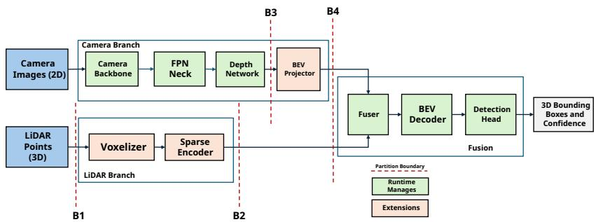

# The Operator Mismatch Problem: Deploying BEV Perception with Portable GPU Compute

Rohit Verma, Anand V Bodas,

Intel

rohit1.verma@intel.com, anand.v.bodas@intel.com

## Abstract

Modern autonomous driving systems rely on bird’s-eye-view (BEV) perception models that fuse camera and LiDAR inputs to detect objects in 3D space. These models are accurate, but they cannot be deployed through standard inference run- times. The reason is an operator mismatch between dense convolutions (which runtimes handle well), sparse 3D convolutions (which runtimes cannot represent), and geometric scatter operations (which runtimes have no vocabulary for). Today, every sparse convolution library is CUDA-only and PyTorch-coupled, locking BEV deployment to a single ven- dor’s hardware and a single execution framework.

We present BEVPIPE, a framework for deploying multi-modal BEV perception pipeline using portable GPU compute APIs, integrated with production inference runtime. BEVPIPE par- titions the model into runtime-managed dense subgraphs and three external operator extensions (voxelizer, sparse encoder, BEV projector), connected through a shared GPU memory space. BEVPIPE achieves a 19.5× end-to-end speedup over conventional deployments while retaining 98.5% of reference mAP. We also showcase that BEVPIPE is portable across diferent GPU backends.

## Introduction

Autonomous vehicles perceive the world through sensors and cameras that see color and texture, and LiDAR scanners that measure precise 3D geometry. The most accurate perception systems fuse both modalities into a unified bird’s-eye view (BEV) representation, where objects are detected in the coordinate frame relevant to planning (Liu et al. 2023; Liang et al. 2022; Li et al. 2022). Although training these models is a solved problem, deploying them is not.

The dificulty lies in a mismatch between what these mod- els compute and what inference runtimes understand. A BEV perception pipeline interleaves three fundamentally diferent kinds of computation: Dense operations consisting of image convolutions, transformers, and fully-connected layers, that operate on regular tensors with static shapes; Sparse 3D con- volutions, which are applied to the irregular set of occupied voxels in a point cloud, where the number of active loca- tions and their connectivity change with every input; and Geometric scatter operations which include voxelization (hashing points into bins) and BEV projection (scattering depth-weighted features into a grid), that involve hash tables, atomic accumulation, and coordinate-dependent branching.

When a runtime encounters an operator it cannot represent, it has three options: (a) fall back to a slow CPU reference implementation, (b) write a custom kernel plugin, or (c) reject the model entirely (NVIDIA Corporation 2024; Intel Corporation 2024). The existence of entire libraries such as SpConv (Contributors 2022), TorchSparse (Tang et al. 2022, 2023), MinkowskiEngine (Choy, Gwak, and Savarese 2019), built outside the inference stack is direct evidence that runtimes cannot handle this class of computation.1

This operator mismatch has a concrete consequence: state-of-the-art BEV perception models cannot be deployed through standard inference pathways without substantial cus- tom engineering. And that engineering, today, is locked to a single hardware vendor. Every existing sparse convolution library is CUDA-only and PyTorch-coupled (Contributors 2022; Tang et al. 2022; Choy, Gwak, and Savarese 2019). BEVFusion’s own deployment uses TensorRT with custom CUDA plugins (Liu et al. 2023). If one wants to run BEV perception on Intel, AMD, or mobile GPUs, or through any runtime other than TensorRT, they are on their own.

In this paper, we answer the question: Can a complete multimodal BEV perception pipeline be deployed eficiently using portable GPU compute APIs (OpenCL/SYCL) without CUDA and integrated with a production inference runtime? We present BEVPIPE, a system that does this by partitioning the pipeline between the runtime (which handles dense operations) and three portable OpenCL GPU extensions (which handle the rest). Answering this question involves addressing the below research questions.

Q1. How should a heterogeneous perception pipeline be split between a runtime’s native operators and external custom kernels?

Q2. How does the granularity of that split afect overhead?

Q3. Where does execution time actually go in each operator class?

The key contributions of this work are summarized below which address these questions.

• We formalize the operator-mismatch problem as a partition boundary placement problem and demonstrate which partitioning approach works efectively.

• We design BEVPIPE, an end-to-end BEV perception system suitable for portable GPU compute APIs and inte- grated with a production inference runtime, enabling de- ployment on Intel, AMD, and other hardwares without modification.

• Our experiments demonstrate the efectiveness of the pro-posed system in terms of both performance and accuracy. We also showcase that the pipeline partitioning method- ology generalizes beyond OpenCL to SYCL, enabling a single pipeline to target multiple GPU backends.

## Related Work

The operator mismatch problem has been addressed from several directions, including specialized sparse convolution libraries, inference runtime extensions, compiler-based code generation, and direct BEV deployment eforts. Each ad- dresses part of the problem but leaves a gap that motivates our work.

## Sparse Convolution Libraries

Sparse 3D convolution (Graham 2015) and its submanifold variant (Graham and van der Maaten 2018) are implemented by three mature libraries: SpConv (Contributors 2022) (fused gather–GEMM–scatter CUDA kernels), TorchSparse/++ (Tang et al. 2022, 2023) (locality- driven reordering and auto-tuned kernel selection), and MinkowskiEngine (Choy, Gwak, and Savarese 2019) (generalized sparse convolution).

However, all three are CUDA-only and PyTorch-coupled, cannot be composed with a runtime’s graph optimizer, mem- ory planner, or INT8 pipeline, and lock deployment to NVIDIA hardware. For production on Intel, AMD, or Qual-comm GPUs, they are unavailable.

## Inference Runtimes and Compilers

OpenVINO (Intel Corporation 2024), TensorRT (NVIDIA Cor oration 2024), ONNX Runtime (Microsoft 2021), and TVM (Chen et al. 2018) optimize dense models via fusion, memory planning, and hardware-targeted codegen, and all expose custom-operator extension APIs. However, the run- time treats custom operators as opaque black boxes (Chen et al. 2018; Zheng et al. 2020): graph fusion stops at exten-sion boundaries and memory planning cannot span runtime- and extension-managed bufers. Thus how and at what granularity we partition has first-order impact, a trade-of prior works have not analyzed. Compiler stacks (Ansor (Zheng et al. 2020), Triton (Tillet, Kung, and Cox 2019)) can gen-erate novel-operator code but do not integrate the INT8 cal- ibration, memory pools, and accelerated dense kernels that vendor runtimes provide, forcing reimplementation of exist- ing functionality.

## BEV Model Deployment

The closest prior work is BEVFusion’s deployments (Liu et al. 2023; Liang et al. 2022), using custom CUDA plug- ins for sparse convolution and BEV projection. MMDeploy ofers a similar NVIDIA-stack pipeline (MMDeploy Contributors 2021).

These show BEV deployment can work on one runtime and one hardware famil , but do not anal ze the methodol ogy such as partitioning criteria, boundary cost trade-ofs, operator-heterogeneity/scheduling interaction, nor the porta- bility question of whether the approach holds when CUDA is unavailable?

## Geometric Operations

Lift-Splat-Shoot (Philion and Fidler 2020) established depthbased camera-to-BEV projection, with eficient CUDA kernels (Liu et al. 2023), geometry caching (Huang and Huang 2022), and attention-based alternatives (Li et al. 2022); voxelization uses GPU hash tables with atomic accumula- tion (Yan, Mao, and Li 2018; Choy, Gwak, and Savarese 2019). Both involve irregular access and atomic contention, poor fits for dense runtimes regardless of vendor.

## What a Solution Needs

Surveying these state-of-the-art approaches, we identify three properties that a successful deployment approach must have:

1. Portability: no single platform dependency; must work through portable GPU compute APIs (OpenCL, SYCL) that target multiple hardware vendors.

2. Runtime integration: sparse and geometric kernels must compose with the runtime’s dense optimization pipeline, not bypass it entirely.

3. Partition-aware design: the boundary between runtime- native and custom operators must be explicitly managed to minimize synchronization and format conversion over- head.

Next, we provide an overview of BEVPIPE, which is de- signed to satisfy all three.

## System Overview

In this section, we describe the BEV perception pipeline, what a deployment system must handle, and a broad overview of the BEVPIPE architecture.

## BEV Perception Model

A BEV perception model’s computational graph G = (V, E) contains operators vi from three distinct classes:

Dense (D): Regular tensor operations with static shapes and predictable memory access, such as convolutions, batch normalization, activation functions, and linear projections. These are the native domains of every inference runtime.

Sparse (S): Operations on irregularly-indexed data structures with dynamic shapes determined at runtime. The canonical example is submanifold sparse convolu- tion (Graham and van der Maaten 2018), where the set of active voxels N and their neighbor connectivity change with every point cloud.

Geometric (G): Coordinate-dependent transformations in-volving hash table construction, spatial indexing, and atomic scatter-gather. Voxelization (Yan, Mao, and Li 2018) and BEV pooling (Philion and Fidler 2020) are representative examples.

  
Figure 1: System architecture of BEVPIPE.

A critical observation is that operator classes cluster by pipeline branch: the camera branch is predominantly dense, the LiDAR branch is predominantly sparse (after an initial geometric voxelization), and the fusion stage mixes a geometric BEV projection with dense processing. This clustering is consistent across BEV architectures.

## The Partition Problem

The deployment problem is to split G into subgraphs $\{ G _ { 1 } ^ { R } , G _ { 2 } ^ { X } , \mathbf { \bar { G } } _ { 3 } ^ { R } , . . . \}$ , where $G _ { i } ^ { R }$ is managed by the runtime and $G _ { j } ^ { X }$ is managed by external custom kernels, such that:

1. All operators in $G _ { i } ^ { R }$ are dense (or have runtime-native support).

2. Operators in $G _ { i } ^ { X }$ are sparse or geometric.

3. Total execution time, including partition boundary overhead, is minimized.

The last constraint is the minimization of total execution time, including partition boundary overhead. Each boundary between runtime and extension incurs:

$$
C _ { \mathrm { b o u n d a r y } } = C _ { \mathrm { s y n c } } + C _ { \mathrm { f o r m a t } } + C _ { \mathrm { f u s i o n \_ l o s s } }\tag{1}
$$

where $C _ { \mathrm { s y n c } }$ is the command queue synchronization cost, $C _ { \mathrm { f o r m a t } }$ is the memory layout conversion cost, and $C _ { \mathrm { f u s i o n \_ l o s s } }$ is the performance loss because the runtime’s graph optimizer cannot fuse across the boundary.

For a sub-pipeline of $L$ layers implemented externally, fine-grained partitioning (one extension per layer) incurs $( \dot { L }$ $C _ { \mathrm { b o u n d a r y } } )$ . Coarse partitioning (one extension for the whole sub-pipeline) incurs just $C _ { \mathrm { b o u n d a r y } }$ . With $L = 2 1$ for a typical sparse encoder, this diference is substantial.

We identify four criteria that determine where to place boundaries: (i) Can the operator be expressed in the runtime’s Intermediate Representation (Intel Corporation 2024)? (ii) Even if representable, does the runtime generate well opti- mized code? (iii) The cost must be amortized over the com-putation saved by external execution. (iv) Related non-dense operators that would form separate extensions can often be fused into one.

## Architecture of BEVPIPE

BEVPIPE implements the end-to-end BEV Perception pipeline as shown in Figure 1. The pipeline is partitioned into runtime-managed dense subgraphs (green) and external custom extensions (orange). Dashed red lines mark partition boundaries $B _ { 1 } { - } B _ { 4 }$ . All operators execute within a shared GPU context, enabling zero-copy tensor passing at bound- aries. The LiDAR branch contains two external extensions (Voxelizer, Sparse Encoder); the camera branch contains one (BEV Projector). The fusion stage and detection head are entirely runtime-managed.

## BEVPIPE: Design and Implementation

This section presents the design and implementation of BEVPIPE. The architectural principles generalize to any runtime supporting custom operator extensions (e.g., TensorRT plugins (NVIDIA Corporation 2024), ONNX Runtime custom ops (Microsoft 2021)) and any GPU compute API (CUDA, SYCL, Vulkan Compute).

We organize the section around four concerns: how the model is partitioned between the runtime and custom exten- sions, how sparse 3D convolution is implemented portably, how geometric operators handle irregular scatter patterns, and what system-level trade-ofs govern the composition of these components.

## Partition Granularity

The choice of where to place boundaries between runtime- managed and extension-managed execution has first-order performance impact. Each boundary incurs a cost Cboundary comprising synchronization, format conversion, and lost fu- sion opportunities (Equation 1). We evaluate three granular-ity strategies,

Fine-grained partitioning registers each non-dense layer as an individual custom operator. For the SECOND (Yan, Mao, and Li 2018) sparse encoder with $L = 2 1$ convolutional layers, this produces 21 partition boundaries, each requiring a command-queue barrier and potentially a memory format conversion between the extension’s internal representation and the runtime’s expected layout.

Medium-grained partitioning groups operators by their computational class. All sparse convolutions form one ex- tension, all geometric operations form another. This reduces the boundary count to O(1) per class (typically 3 boundaries for the SECOND sparse encoder) but prevents optimizations that span operator types. For example, the sparse encoder cannot fuse its final layer with the sparse-to-dense scatter because they reside in separate extensions.

Coarse-grained partitioning assigns one extension per pipeline branch. The sparse encoder becomes a single mono- lithic extension encompassing all convolutional layers, batch normalization, residual connections, and the sparse-to-dense BEV conversion. This introduces only one entry boundary and one exit boundary per branch.

We adopt coarse-grained partitioning because it enables four internal optimizations that are impossible when the run- time controls intermediate bufers between layers:

1. Feature tensors remain in GPU memory across all lay- ers in the boundary without host-side materialization or runtime-driven memory reallocation.

2. Hash tables and neighbor index maps, which are expen- sive to compute, are built once at the start of the extension invocation and reused across all layers sharing the same voxel topology.

3. Two persistent GPU bufers alternate as source and des- tination across consecutive layers, eliminating per-layer allocation and deallocation overhead.

4. Weights for all layers within a boundary are pre-converted to device-optimal format during the first invocation and retained in GPU memory, avoiding per-invocation format conversion that fine-grained extensions would require.

## Sparse 3D Convolution Engine

The sparse convolution engine is responsible for processing the LiDAR voxel features through multiple layers of 3D con- volution on an irregular grid. We describe the mathematical formulation and the engine design next.

Fused Sparse Convolution Standard sparse 3D convo- lution (Graham 2015; Graham and van der Maaten 2018) computes output features only at locations where input vox- els exist (submanifold-preserving property). For each active voxel i with input feature vector $\mathbf { \hat { f } } _ { i } \in \mathbb { R } ^ { \boldsymbol { C } _ { \mathrm { i n } } }$ , the fused sparse convolution with batch normalization and ReLU activation produces an output feature $\mathbf { g } _ { i } \in \mathbb { R } ^ { \mathcal { C } _ { \mathrm { o u t } } }$

$$
\mathbf { g } _ { i } = \mathrm { R e L U } \left( \gamma \cdot \frac { \sum _ { k = 1 } ^ { K ^ { 3 } } \mathbf { W } _ { k } \cdot \mathbf { f } _ { n _ { k } ( i ) } - \mu } { \sqrt { \sigma ^ { 2 } + \epsilon } } + \beta \right)\tag{2}
$$

Here, $\mathbb { R } ^ { n }$ depicts an n-dimensional vector of real numbers and $\mathcal { C } _ { \mathrm { i n } }$ and $\mathcal { C } _ { \mathrm { o u t } }$ are the number of input and output channels. $K = 3$ is the kernel size (yielding $K ^ { 3 } = 2 7$ positions in the $3 \times 3 \times 3$ neighborhood), $\mathbf { W } _ { k } \in \mathbb { R } ^ { \mathcal { C } _ { \mathrm { o u t } } \times \mathcal { C } _ { \mathrm { i n } } }$ is the weight matrix for the k-th kernel position, and $n _ { k } ( i )$ is the neigh- bor mapping function that returns the index of voxel i’s k-th spatial neighbor (or −1 if that neighbor is unoccupied). The batch normalization parameters $\gamma$ (scale), β (shift), µ (running mean), and $\sigma ^ { 2 }$ (running variance) are frozen at inference time and fused into the convolution output, eliminating the need for a separate normalization pass. The constant ϵ (typi-cally $1 0 ^ { - 5 } )$ prevents division by zero.

Fusing batch normalization and ReLU activation into the convolution kernel eliminates two intermediate tensor mate- rializations per layer, reducing memory trafic by $2 \cdot N \cdot \mathcal { C } _ { \mathrm { o u t } }$ elements per layer (where N denotes the number of active voxels at that layer).

Locality-Aware Voxel Ordering Sparse convolution pro- cesses voxels in the order they appear in the compact feature array. When voxels are stored in arbitrary order (e.g., insertion order during voxelization), spatially adjacent voxels may reside at distant memory addresses, causing poor cache utilization when their neighborhoods are accessed.

We reorder voxels using a Morton Z-curve (space-filling curve) (Morton 1966) prior to convolution. Given a voxel’s integer grid coordinates $( x , y , z )$ , its Morton code m is com-puted by bit-interleaving:

$$
m ( x , y , z ) = \operatorname { s p r e a d } ( x ) \mid ( \operatorname { s p r e a d } ( y ) \ll 1 ) \mid ( \operatorname { s p r e a d } ( z ) \ll 2 )\tag{3}
$$

where spread(·) inserts two zero bits between each bit of the input coordinate, and | denotes bitwise OR. Sorting voxels by ascending Morton code ensures that spatially proximate voxels occupy nearby positions in the linear array, improv- ing spatial locality for neighbor feature loads. Reordering is applied after each strided convolution, since downsampling produces a new set of output coordinates with a diferent spatial distribution.

Strided Sparse Convolution While submanifold convolu- tions preserve the input voxel topology, strided convolutions downsample the grid such that the output voxel set occupies a coarser resolution and generally contains fewer active posi- tions. This capability is essential for the SECOND encoder’s multi-scale architecture, where each stage halves the spatial resolution while doubling the channel count (Yan, Mao, and Li 2018).

Implementing strided convolution requires two additional steps beyond the submanifold case:

1. Output coordinate computation. For each input voxel at position $( x , y , z )$ , the corresponding output position is $\bar { ( } \lfloor x / s \rfloor , \lfloor \dot { y } / s \rfloor , \lfloor \dot { z } / s \rfloor )$ where s is the stride. Duplicate output positions must be deduplicated to produce a com- pact output set.

2. Strided neighbor map. A new neighbor map must be precomputed that encodes, for each output voxel, which input voxels fall within its $K ^ { 3 }$ receptive field at the orig- inal (fine) resolution.

We implement a gather-based approach where a prepro- cessing kernel executed on the GPU builds the complete strided neighbor map in a single pass, avoiding per-voxel hash table lookups during the subsequent convolution loop. This map is stored in a persistent bufer and reused for all samples.

## Geometric Operators

Both geometric operators, point cloud voxelization and camera-to-BEV projection, perform irregular scatter operations where multiple source elements contribute to the same destination cell, requiring atomic accumulation. Both oper- ators have data-dependent access patterns that prevent the inference runtime from generating eficient code, necessitat- ing custom GPU kernel implementations.

Point Cloud Voxelization Voxelization transforms an un- structured LiDAR point cloud of $N _ { \mathrm { { p t s } } }$ points into a compact tensor of M voxels $( M \ll N _ { \mathrm { p t s } } )$ , where each voxel stores the mean of the feature vectors of all points falling within its spatial extent.

We implement voxelization as a two-phase GPU pipeline:

Phase 1: Atomic scatter. Each GPU work-item processes one point, computes its voxel bin index via a hash table, and atomically accumulates the point’s features into the cor- responding bin. Direct floating-point atomic addition is not eficiently supported on all target hardware. Hence, we em- ploy fixed-point integer atomics where each floating-point feature value f is multiplied by a scale factor S (typically $S \ = \ 2 ^ { 1 6 } )$ and rounded to a 32-bit integer before accu- mulation using hardware-native atomic add. A per-bin atomic counter simultaneously tracks the number of con- tributing points. This approach achieves significantly higher throughput than compare-and-swap (CAS) loops required for floating-point atomics, at the cost of introducing a quantiza- tion error bounded by 1/S per accumulation.

Phase 2: Compaction and normalization. A second ker- nel sequentially scans the hash table, identifies non-empty bins (M out of the table’s fixed capacity), divides each bin’s accumulated integer sum by its point count and the scale factor S to recover the mean feature in floating-point, and writes the result into a compact output tensor indexed from 0 to M−1.

Camera-to-BEV Projection The camera-to-BEV projection implements the Lift-Splat-Shoot (LSS) (Philion and Fidler 2020) geometric transformation where for each pixel in each of the 6 surround-view cameras, the depth estimation network produces a discrete depth distribution.

We observe that the softmax-normalized depth distribu- tion is typically highly peaked, i.e., for most pixels, the vast majority of probability mass concentrates in 2–5 bins (out of 59). We exploit this sparsity by introducing a threshold parameter $\tau _ { \mathrm { d e p t h } }$ where for each pixel, depth bin d is processed only if softmax $( \mathbf { d } ) _ { d } \geq \tau _ { \mathrm { d e p t h } }$ . Bins falling below the threshold contribute negligible feature weight and are skipped entirely.

## System-Level Design Decisions

Next we address two cross-cutting system-level concerns that arise from composing heterogeneous operator types into a unified pipeline.

Command Queue Scheduling The inference runtime and our custom extensions submit GPU work to the same h si- cal device. To avoid serialization while maintaining correct- ness, we adopt a separate command queue architecture where each extension maintains its own command queue with in- dependent dispatch cadence. Synchronization between the runtime’s queue and the extension queues occurs only at par- tition boundaries, through explicit barrier events. This design ensures that internal kernel sequences within an extension execute without external interference, while cross-boundary ordering is guaranteed.

CPU–GPU Computation Overlap The sparse encoder’s execution naturally decomposes into CPU-bound phases (hash table construction, coordinate generation) and GPUbound phases (convolution kernel execution). These phases can be overlapped. After submitting the GPU convolution kernels for stage s, the CPU immediately begins constructing the neighbor data structures for stage s+1, synchronizing only when the GPU results from stage s are needed as input to the stage s+1 convolution.

## Evaluation

This section evaluates BEVPIPE along four dimensions: (1) operator-level profiling to identify where execution time is spent, (2) end-to-end pipeline latency along with the effectiveness of the partition granularity, (3) portability across diferent GPU backends, and (4) ablation studies to assess the impact of design decisions.

## Experimental Setup

We describe the model configuration, hardware platform, and software environment, dataset, and evaluation protocol used throughout this section.

Model Configuration We evaluate on BEVFusion (Liu et al. 2023), a representative multi-modal 3D object detection model. The LiDAR branch uses the SECOND (Yan, Mao, and Li 2018) sparse encoder comprising 21 convolutional layers The voxel size is $0 . 0 7 5 \times 0 . 0 7 5 \times 0 . 2$ m (width × length × height), and the detection range spans [−54m, 54m] in both the x- and y-axes. All experiments run on an Intel processor with an integrated GPU with 96 execution units, shared DDR5 memory subsystem. The inference runtime is OpenVINO 2026.x with its GPU plugin. The camera back- bone uses INT8 quantization, while the fusion network and detection head use FP16 precision. Custom operator exten- sions (voxelizer, sparse encoder, BEV projector) are imple-mented in OpenCL 2.0 and registered as monolithic runtime extensions.

Dataset and Evaluation Protocol We evaluate on an 81- sample subset of the nuScenes (Caesar et al. 2020) validation split. Each sample consists of a synchronized set of 6 surround-view camera images and one LiDAR point cloud sweep (∼70,000 points, yielding ∼20,000–26,000 voxels after voxelization).

Latency measurement. We execute 84 consecutive infer- ence passes. The first 3 are discarded as warm-up to allow GPU resource initialization and JIT compilation to stabilize, and latency is reported as the mean wall-clock time over the remaining 81 steady-state samples.

Accuracy measurement. We compute the oficial nuScenes mean Average Precision (mAP), defined as the mean of per-class Average Precision values computed at bird’s-eye-view center-distance thresholds of 0.5, 1.0, 2.0, and 4.0 meters.

Competing Approaches We compare BEVPIPE against a conventional deployment baseline and against alternative partitioning strategies.

The conventional deployment baseline (Conventional henceforth) reflects the current state of practice for non-CUDA BEV inference where dense operators execute on the GPU via the runtime’s native kernels, while sparse and geometric operators fall back to host-side CPU execution. This deployment strategy is followed by available non-CUDA tools, for e.g., ONNX Runtime’s CPU fallback for unregis- tered ops (Microsoft 2021), TVM’s OpenCL backend (Chen et al. 2018), and of-the-shelf OpenVINO (Intel Corporation 2024) without extension registration.

Table 1: Dense operator latency breakdown. Values are means over 81 steady-state samples on the 96-EU integrated GPU. “% Pipeline” is the fraction of end-to-end latency.
<table><tr><td>Stage</td><td>% Pipeline</td></tr><tr><td>Camera branch (INT8 backbone + BEV proj.)</td><td>19.87%</td></tr><tr><td>Fusion + detection (FP16)</td><td>23.65%</td></tr><tr><td>Total runtime-managed</td><td>43.52%</td></tr></table>

The remaining three configurations all execute the same GPU kernels and difer only in the number of partitions. Fine granularity leads to 29 boundaries in the complete pipeline, medium granularity leads to 7 boundaries, and coarse granu- larity leads to just 4 boundaries. The coarse-grained strategy is the one adopted by BEVPIPE.

## Operator-Level Profiling

To understand where computation time is spent, we profile each operator class independently. We define three classes following the earlier taxonomy, dense operators handled natively by the runtime, sparse operators in the custom sparse encoder extension, and geometric operators (voxelization, BEV projection) in the remaining extensions.

Dense Operators Dense operators comprise the camera backbone, depth estimation network, feature pyramid neck, BEV fusion layer, and detection head. These are compiled and scheduled entirely by the OpenVINO GPU plugin.

Table 1 reports aggregated timings. The camera branch averages 19.87% of the end-to-end pipeline, comprising the INT8 backbone and BEV projection. The fusion and detection stages together average 23.65%. In total, runtimemanaged dense operators account for 43.52% of the end-to-end pipeline latency. The LiDAR branch accounts for the re- maining 56.48%, driven by CPU/GPU synchronisation overhead in the sparse encoder.

Sparse Operators The sparse encoder is the most com- plex of our three custom extensions. To understand its inter- nal time allocation, we instrument it with per-phase timing. We decompose execution into four phases: precomputation, which builds hash tables and neighbor maps on the CPU; submanifold convolution, which applies same-topology 3D convolutions on the GPU; strided convolution, which downsamples the voxel grid; and sparse-to-BEV scatter, which converts the final sparse representation to a dense BEV fea- ture map for downstream fusion.

Table 2 presents the breakdown. GPU convolution kernels account for only 8.65% of total encoder time (4.61% submanifold and 4.04% strided, measured via OpenCL event timers). The dominant cost is GPU dispatch and synchronisation overhead (52.91%), arising from host–device roundtrips at each encoder stage boundary. Fine-grained wall-clock profiling with per-stage clFinish barriers reveals that this timeframe arises from per-kernel dispatch latency accumu- lated across the 21 submanifold layers + 4 strided layers + 4 hash builds + 4 neighbour map builds and upload() calls for coords at each level, constituting of 30+ kernel submis- sions. The sparse-to-BEV scatter (at 11.15%) reads 1.8 MB of sparse output features (∼7,000 voxels × 128 channels × 2 bytes in FP16) and writes them into a 33 MB dense BEV tensor (1440 × 1440 × 128 × FP16/8). On a shared-memory architecture where CPU and GPU share the same physical DRAM, the bottleneck shifts from arithmetic throughput to scheduling and synchronisation latency.

Table 2: Sparse encoder internal phase breakdown. Values are means over 81 steady-state samples on the 96-EU integrated GPU. “% Encoder” is the fraction of total sparse encoder latency.
<table><tr><td>Phase</td><td>% Encoder</td></tr><tr><td>Precomputation (CPU hash + neighbor map)</td><td>27.29%</td></tr><tr><td>Submanifold convolution (GPU kernel)</td><td>4.61%</td></tr><tr><td>Strided convolution (GPU kernel)</td><td>4.04%</td></tr><tr><td>Sparse-to-BEV scatter</td><td>11.15%</td></tr><tr><td>GPU dispatch + sync overhead</td><td>52.91%</td></tr><tr><td>Total</td><td>100%</td></tr></table>

Table 3: Geometric operator kernel latencies as % of total pipeline time.
<table><tr><td>Operator</td><td>% Pipeline</td></tr><tr><td>Voxelization (scatter)</td><td>0.934</td></tr><tr><td>Voxelization (compact)</td><td>0.198</td></tr><tr><td>BEV projection (scatter)</td><td>1.824</td></tr><tr><td>BEV projection (convert)</td><td>1.474</td></tr></table>

Geometric Operators The geometric operators, voxeliza- tion in the LiDAR branch and depth-based BEV projection in the camera branch, are subsumed within the branch- level timings. Isolating their individual contributions requires OpenCL event-level profiling of each kernel dispatch which is reported in Table 3.

## End-to-End Pipeline Performance

Having profiled individual operators, we now report the end- to-end pipeline speedup of each competing approach rela- tive to Conventional. The full inference pipeline executes three stages: (1) the LiDAR branch (voxelization followed by sparse encoding), (2) the camera branch (backbone, depth estimation, and BEV projection), and (3) fusion with detection.

Table 4 reports per-stage speedup factors for each compet- ing approach relative to Conventional.

Moving custom operators from the CPU fallback to GPU- resident OpenCL kernels yields the largest per-stage gain, reaching 29.5× under the coarse configuration for the Li-DAR branch. Even at fine granularity, where 21 bound- ary crossings impose substantial synchronisation overhead, the LiDAR branch still achieves a 19.2× speedup. Overall, the coarse-grained strategy adopted by BEVPIPE achieves a 19.5× end-to-end speedup over Conventional, compared to

Table 4: End-to-end pipeline performance of all competing approaches relative to Conventional. All values show the latency speedup compared to Conventional.
<table><tr><td>Stage</td><td>Fine</td><td>Medium</td><td>BEVPIPE (Coarse)</td></tr><tr><td>LiDAR branch (voxelize + sparse enc.)</td><td>19.2×</td><td>24.7×</td><td>29.5×</td></tr><tr><td>Camera branch (backbone + depth + proj.)</td><td>2.6×</td><td>5.2×</td><td>7.9×</td></tr><tr><td>Fusion + detection</td><td>2.8×</td><td>3.9×</td><td>5.6×</td></tr><tr><td>Total</td><td>10.1×</td><td>14.9×</td><td>19.5×</td></tr></table>

14.9× for medium and 10.1× for fine granularity. The gap between fine and coarse, nearly 2× in end-to-end speedup, is attributable entirely to boundary-crossing overhead, since all three configurations execute identical GPU kernels.

## Portability: SYCL Backend

A central design requirement of BEVPIPE is that custom kernels are implemented using portable GPU compute APIs rather than CUDA. To validate this, we re-implement the pipeline in SYCL, compiled with Intel oneAPI DPC++. The resulting binary is run on Intel and NVIDIA GPU without modification to the inference pipeline, and produces detec- tion outputs numerically identical to the OpenCL baseline.

Table 5: Functional portability across GPU backends with detection accuracy. mAP is computed on the same 81-sample subset. Max deviation is the maximum absolute diference in predicted output tensors relative to the OpenCL reference.
<table><tr><td>Backend</td><td>Device</td><td>mAP</td><td>Max deviation</td></tr><tr><td>PyTorch + CUDA</td><td>NVIDIA GPU</td><td>0.585</td><td></td></tr><tr><td>OpenCL</td><td>Intel iGPU</td><td>0.576</td><td></td></tr><tr><td>SYCL</td><td>Intel iGPU</td><td>0.578</td><td> $< 1 0 ^ { - 4 }$ </td></tr><tr><td>SYCL</td><td>NVIDIA GPU</td><td>0.578</td><td> $< 1 0 ^ { - 4 }$ </td></tr></table>

Table 5 confirms the functional portability of BEVPIPE. The SYCL binary compiled for Intel and recompiled for NVIDIA with no kernel or host code modifications pro- duces similar mAP on both devices, identical to the OpenCL baseline, with a maximum per-tensor output deviation be- low $1 0 ^ { - 4 }$ . This confirms that the custom kernels contain no architecture-specific assumptions that produce incorrect results on a diferent device microarchitecture.

## Detection Accuracy

Table 5 compares the detection accuracy of BEVPIPE against the reference PyTorch implementation. The refer- ence achieves 0.585 mAP with CUDA. BEVPIPE achieves 0.576 mAP using mixed precision (INT8 camera backbone, FP16 fusion and detection) with OpenCL and similar mAP with SYCL on Intel and NVIDIA GPUs. This demonstrates that BEVPIPE maintains competitive detection accuracy while achieving eficient execution on a non-CUDA plat- form.

## Ablation Studies

We conduct ablation experiments to quantify the contribution of individual design decisions. Each experiment modifies one component while holding all others fixed, and reports the efect on latency.

We ablate four design decisions from Design and Im- plementation section, each measured relative to its disabled counterpart on the same hardware (Table 6).

Table 6: Ablation of system-level design decisions. Each row disables one optimization and reports the relative regression (> 1× means the enabled design is faster).
<table><tr><td>Design Decision</td><td>Relative Effect</td></tr><tr><td>Depth-threshold sparsity</td><td>3.0× faster</td></tr><tr><td>Int32 atomic accumulation</td><td>12.7× faster</td></tr><tr><td>Async queue dispatch</td><td>1.35× faster</td></tr><tr><td>CPU-GPU overlap</td><td>1.18× faster</td></tr></table>

Depth-threshold sparsity. Skipping depth bins below τde th in the BEV scatter kernel reduces the number of atomic scatter-add operations by exploiting the peaked nature of the depth distribution. Disabling the threshold $( \tau _ { \mathrm { d e p t h } } = 0 )$ incurs a 3.0× latency increase in the scatter kernel, confirming the sparsity claim.

Integer atomic strategy. Replacing the fixed-point int32 atomic accumulation with a floating-point compare-and- swap (CAS) loop degrades BEV projection throughput by 12.7×. The CAS loop requires multiple memory transactions per update under contention, whereas native atomic add on 32-bit integers retires in a single hardware operation.

Command queue scheduling. Inserting clFinish bar-riers after every convolution block, serializing the GPU com- mand stream, increases latency by 1.35×. The async dispatch design allows the driver to pipeline kernel launches, hiding scheduling overhead behind execution.

CPU–GPU computation overlap. Forcing CPU-side co- ordinate precomputation to wait for the preceding GPU ker- nel increases the latency by 1.18×. The modest magnitude reflects that GPU convolution dominates the critical path; the overlap hides the shorter CPU preprocessing behind the longer GPU phase.

## Conclusion

In this paper, we presented BEVPIPE, a deployment frame- work that solves the operator mismatch problem in BEV perception, namely the inability of production inference run- times to handle the sparse and geometric operators that these models require. Our solution is systematic coarse- grained partitioning into runtime-managed dense subgraphs and monolithic custom extensions, which reduces the number of costly runtime/extension boundaries yielding a 19.5× endto-end speedup over the conventional CPU-fallback base- lines. We also showcased that the framework is portable to multiple GPU backends.

Future work would focus on automating model partition- ing by selecting optimal operator boundaries and granularity to minimize latency. We also plan to look into developing a portable abstraction layer for deployment across multiple inference runtimes, and enabling eficient CPU-GPU multi- device scheduling.

## References

Caesar, H.; Bankiti, V.; Lang, A. H.; Vora, S.; Liong, V. E.; Xu, Q.; Krishnan, A.; Pan, Y.; Baldan, G.; and Beijbom, O. 2020. nuScenes: A Multimodal Dataset for Autonomous Driving. In IEEE/CVF Conference on Computer Vision and Pattern Recognition (CVPR).

Chen, T.; Moreau, T.; Jiang, Z.; Zheng, L.; Yan, E.; Cowan, M.; Shen, H.; Wang, L.; Hu, Y.; Ceze, L.; Guestrin, C.; and Krishnamurthy, A. 2018. TVM: An Automated End-to-End Optimizing Compiler for Deep Learning. In USENIX Symposium on Operating Systems Design and Implementation (OSDI).

Choy, C.; Gwak, J.; and Savarese, S. 2019. 4D Spatio- Temporal ConvNets: Minkowski Convolutional Neural Net- works. In IEEE/CVF Conference on Computer Vision and Pattern Recognition (CVPR).

Contributors, S. 2022. SpConv: Spatially Sparse Convolution Library. https://github.com/traveller59/spconv.

Graham, B. 2015. Sparse 3D convolutional neural networks. arXiv preprint arXiv:1505.02890.

Graham, B.; and van der Maaten, L. 2018. 3D Semantic Segmentation with Submanifold Sparse Convolutional Net- works. In IEEE/CVF Conference on Computer Vision and Pattern Recognition (CVPR).

Huang, J.; and Huang, G. 2022. BEVDet4D: Exploit Tem- poral Cues in Multi-Camera 3D Object Detection. In arXiv preprint arXiv:2203.17054.

Intel Corporation. 2024. OpenVINO Toolkit. https://docs.openvino.ai/.

Li, Z.; Wang, W.; Li, H.; Xie, E.; Sima, C.; Lu, T.; Qiao, Y.; and Dai, J. 2022. BEVFormer: Learning Bird’s-Eye-View Representation from Multi-Camera Images via Spatiotem- poral Transformers. In European Conference on Computer Vision (ECCV).

Liang, T.; Xie, H.; Yu, K.; Xia, Z.; Lin, Z.; Wang, Y.; Tang,T.; Wang, B.; and Tang, Z. 2022. BEVFusion: A Simple andRobust LiDAR-Camera Fusion Framework. In Advances inNeural Information Processing Systems (NeurIPS).

Liu, Z.; Tang, H.; Amini, A.; Yang, X.; Mao, H.; Rus, D.; and Han, S. 2023. BEVFusion: Multi-Task Multi-Sensor Fusion with Unified Bird’s-Eye View Representation. In IEEE International Conference on Robotics and Automation (ICRA).

Microsoft. 2021. ONNX Runtime: Cross-platform, High Performance ML Inferencing and Training Accelerator. https://onnxruntime.ai/.

MMDeploy Contributors. 2021. MMDeploy: OpenMM- Lab’s Model Deployment Toolbox. https://github.com/open- mmlab/mmdeploy.

Morton, G. M. 1966. A computer oriented geodetic data base and a new technique in file sequencing. International Business Machines Company.

NVIDIA Corporation. 2024. TensorRT: Programmable In- ference Accelerator. https://developer.nvidia.com/tensorrt.

Philion, J.; and Fidler, S. 2020. Lift, Splat, Shoot: Encoding Images from Arbitrary Camera Rigs by Implicitly Unpro- jecting to 3D. In European Conference on Computer Vision (ECCV).

Tang, H.; Liu, Z.; Zhao, S.; Lin, Y.; Lin, J.; Wang, H.; and Han, S. 2022. TorchSparse: Eficient Point Cloud Inference Engine. In Conference on Machine Learning and Systems (MLSys).

Tang, H.; Yang, S.; Liu, Z.; Hong, K.; Yu, Z.; Li, X.; Dai,G.; Wang, Y.; and Han, S. 2023. TorchSparse++: EficientTraining and Inference Framework for Sparse Convolutionon GPUs. In IEEE/ACM International Symposium on Mi-croarchitecture (MICRO).

Tillet, P.; Kung, H.-T.; and Cox, D. 2019. Triton: an in- termediate language and compiler for tiled neural network computations. In Proceedings of the 3rd ACM SIGPLAN International Workshop on Machine Learning and Programming Languages, 10–19.

Yan, Y.; Mao, Y.; and Li, B. 2018. SECOND: Sparsely Embedded Convolutional Detection. In Sensors, volume 18, 3337.

Zheng, L.; Jia, C.; Sun, M.; Zhao, Z.; Yu, C. H.; Haj-Ali, A.; Wang, Y.; Yang, J.; Zhuo, D.; Sen, K.; Gonzalez, J. E.; and Stoica, I. 2020. Ansor: Generating High-Performance Tensor Programs for Deep Learning. In USENIX Symposium on Operating Systems Design and Implementation (OSDI).