# AliO: Output Alignment Matters in Long-Term Time Series Forecasting

Kwangryeol Park Artificial Intelligence Graduate School Ulsan National Institute of Science & Technology (UNIST), South Korea pkr7098@unist.ac.kr

Jaeho Kim∗ Artificial Intelligence Korea University, South Korea kjh3690@korea.ac.kr

Seulki Lee† Department of Computer Science and Engineering Ulsan National Institute of Science & Technology (UNIST), South Korea seulki.lee@unist.ac.kr

## Abstract

Long-term Time Series Forecasting (LTSF) tasks, which leverage the current data sequence as input to predict the future sequence, have become increasingly crucial in real-world applications such as weather forecasting and planning of electricity consumption. However, state-of-the-art LTSF models often fail to achieve prediction output alignment for the same timestamps across lagged input sequences. Instead, these models exhibit low output alignment, resulting in fluctuation in prediction outputs for the same timestamps, undermining the model’s reliability. To address this, we propose AliO (Align Outputs), a novel approach designed to improve the output alignment of LTSF models by reducing the discrepancies between prediction outputs for the same timestamps in both the time and frequency domains. To measure output alignment, we introduce a new metric, TAM (Time Alignment Metric), which quantifies the alignment between prediction outputs, whereas existing metrics such as MSE only capture the distance between prediction outputs and ground truths. Experimental results show that AliO effectively improves the output alignment, i.e., up to 58.2% in TAM, while maintaining or enhancing the forecasting performance (up to 27.5%). This improved output alignment increases the reliability of the LTSF models, making them more applicable in real-world scenarios. The code implementation is on the GitHub repository3.

## 1 Introduction

The task of long-term time series forecasting (LTSF) is essential in various fields such as prediction of electricity demand [13], weather forecasting [37], health data [20], and so on. Recently, deep neural network models [40, 30, 33, 43] have shown strong performance in predicting long-term time series based on historical information, which typically aim to minimize the error between the prediction output and the ground-truth sequence as a regression task. However, in real-world applications, merely minimizing the prediction error in LTSF is insufficient. It is equally important to ensure that the forecasting model generates consistent (aligned) prediction outputs for overlapping timestamps across lagged input sequences. For example, Fig. 1 illustrates a scenario in which a trained forecasting model predicts future electricity usage in two instances: (1) for the period from April to November (Prediction 1, purple), using input data from January to March, and (2) for the period from May to December (Prediction 2, yellow), using input data from February to April, where the forecasting periods overlap between May and November. A reliable model should provide consistent predictions for these overlapping months, regardless of the partially differing input sequences. If the model produces inconsistent predictions on the electricity usage for the same timestamps (i.e., May to November) between two input sequences, it could result in significant time and financial costs for rescheduling budget allocation and undermine the reliability of the predictions.

We refer to this phenomenon as the output alignment problem, which has not been adequately acknowledged and addressed by existing LTSF studies [25, 7, 18], despite its significance and substantial impact on real-world applications. To the best of our knowledge, state-of-the-art LTSF models [37, 33, 30] often fail to maintain the prediction output consistency, and none of existing works has explicitly recognized or attempted to address this inconsistency in LTSF tasks.

In this paper, we present AliO (Align Outputs), a novel method designed to enhance output alignment in LTSF models. For the first time, AliO enables LTSF models to produce consistent predictions for overlapping timestamps across lagged in put sequences. By aligning predictions for overlapping timestamps through the minimization of discrepancies in both time and frequency domains, AliO improves output consistency even when input sequences lagged. AliO achieves this by directing the model’s predictions toward the ground-truth sequences while simultaneously minimizing discrepancies across multiple predictions obtained from a set of lagged input sequences. It allows AliO to integrate seamlessly with the model’s forecasting objectives, such as regression loss (e.g., MSE), without adding implementation complexity or requiring modifications to the model. As a result, AliO enhances the reliability of forecasts by improving output alignment (consistency), while maintaining or even improving overall forecasting performance.

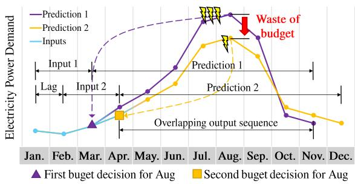  
Figure 1: An example of low output alignment between two predictions on future electricity usages: (1) Prediction 1 (purple) forecast spanning from Apr to Nov and (2) Prediction 2 (yellow) forecast spanning from May to Dec. These two predictions are generated from two partially overlapping input sequences—(1) one from Jan to Mar (Input 1), and (2) the other from Feb to Apr (Input 2). The inconsistency between these two prediction outputs over the same timestamps (i.e., May to Nov) leads to differing budget allocation plannings for electricity power consumption in Aug, resulting in time and financial waste due to rescheduling resource allocation.

## This represents a significant advancement

over existing methods [37, 40] that focus solely on minimizing the forecasting objective without considering prediction output alignment.

To quantify output alignment, which represents the consistency of a model’s predictions across lagged input sequences, we propose a new metric, Time Alignment Metric (TAM). TAM quantitatively assesses the model’s output alignment by measuring discrepancies between predictions for overlapping timestamps for multiple input sequences. To the best of our knowledge, the proposed TAM is the first metric designed to measure the output alignment.

We experiment with AliO on representative LTSF tasks, including ETT{h1, h2, m1, m2}, Electricity (ECL), Traffic, Weather, and ILI dataset [37], using various state-of-the-art LTSF models such as CycleNet [27], GPT4S [43], iTransformer [30], PatchTST [33], TimesNet [36], DLinear [40] and Autoformer [37]. The evaluation results demonstrate that AliO effectively aligns prediction over overlapping timestamps, i.e., improving TAM up to 58.2%, while maintaining or enhancing forecasting regression accuracy up to 17.4% measured in MSE. The detailed descriptions on additional datasets and experimental configurations are provided in Secs. G to I.

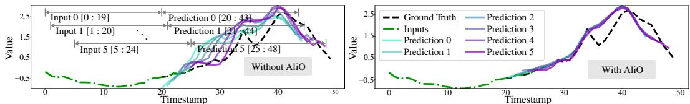  
Figure 2: (Left) Six prediction outputs from the DLinear [40] model trained with regression loss (MSE) only, forecasting a length-24 sequence for ILI data [37], where six input sequences (green dotted line) are lagged one timestamp apart. (Right) Six predicted sequences from DLinear trained with AliO, under the same conditions. The predicted sequences exhibit improved output alignment, showing a closer match to the ground truth for all six predictions, which significantly reduces the prediction shifts observed when using regression loss alone.

## 2 Motivation

A system with low prediction consistency leads to user distrust and increased costs. For instance, studies on the consistency of weather forecasts have reported cases where consistent forecasts lead to greater trust in the system, whereas inconsistent forecasts result in user distrust [5, 31, 4]. Furthermore, accroding to research in non-weather domains, consumers tend to perceive consistency among multiple estimates from the same system as a signal of skill [11, 5, 3]. The inconsistency in predictions necessitates replanning, which consumes unnecessary organizational time. The resulting resource reallocation leads to the investment of more resources, contrary toe th original goal of Rolling forecasting, which aims for resource savings [16, 14]. This can be described as an additional sunk cost [35], as frequent fluctuations in predictions can induce irrational decision-making and result in lost opportunity costs [35, 6].

While modern Long-Term Times Series Forecasting (LTSF) models demonstrate high accuracy, research on the aforementioned consistency has been insufficient. Consequently, we examined the consistency of existing models through rolling forecasting on representative LTSF datasets. The left panel of Fig. 2 shows the prediction results of DLinear [37] on the ILI dataset [37] using only regression loss (MSE), revealing a significant lack of consistency. In contrast, the right panel, where AliO is applied, shows that consistency is improved while accuracy is maintained. As can be seen in Sec. I, this is a phenomenon observed across other models and datasets.

Although both consistency and accuracy are crucial for addressing users’ psychological and economic concerns, our experiments revealed that while modern LTSF models achieve high accuracy, they fall short in terms of consistency. AliO, as a loss function used in conjunction with regression loss, aims to achieve two goals: maintaining the high accruacy of existing LTSF models while improving their prediction consistency. Furthermore, to quantify consistency, we propose the Time Alignment Metric (TAM). Regression metrics such as MSE, MAE, and DTW [34] represent accuracy, which is the distance between predictions and ground truth. Therefore, they have limitations in measuring consistency, which is a measure of performance between predictions. Complementing this, TAM measures the distance between predictions, serving as an indicator that represents consistency.

Through Sec. 5 and Sec. I, we show that AliO successfully achieves the dual goals of maintaining/improveing the high accuracy of existing models and enhancing consistency. Additionally, in ??, we experimentally verify the relationship between the inconsistency value (TAM) of existing models and the MSE improvement in models trained with AliO. To the best our knowledge, this is the first study to address the improvemnet of consistency in LTSF

## 3 Time alignment metric (TAM)

We first define the concept of output alignment and then introduce Time Alignment Metric (TAM), which enables a quantitative assessment of output alignment.

Definition 3.1. (Output Alignment) Output alignment refers to the property wherein the prediction outputs of a model, derived from a set of lagged input sequences, exhibit consistent alignment, characterized by uniform patterns across overlapping timestamps in the prediction outputs.

For instance, as illustrated in Fig. 2, the six prediction outputs for the overlapping timestamps $( \mathrm { i . e . }$ from $2 5 \ \mathrm { t o } \ 4 3 )$ in the left figure demonstrate a lower degree of output alignment. Conversely, the six prediction outputs in the right figure exhibit similar and consistent patterns, demonstrating a high degree of output alignment. To quantify the output alignment (Theorem 3.1) in model predictions, we propose Time Alignment Metric (TAM). We begin by defining the necessary concepts, including lagged input and output sequences, and overlapping output sequences, as provided below.

Definition 3.2. (Input and Output Sequence) Given a time-series sequence $\pmb { X } \in \mathbb { R } ^ { c \times d }$ , where c is the input channel, and d is the length of the sequence, respectively, the n-th input sequence $\pmb { X } ^ { n } \in \mathbb { R } ^ { c \times d ^ { \prime } }$ of the length $d ^ { \prime } \leq d$ is defined as the segment $X _ { \substack { s : s + d ^ { \prime } - 1 } }$ , where s is the starting timestamp, and $s + d ^ { \prime } - \overline { { 1 } }$ is the ending timestamp.

Then, taking $\pmb { X } ^ { n } \in \mathbb { R } ^ { c \times d ^ { \prime } }$ as input, $f ( \boldsymbol { X } ^ { n } ; \pmb { \theta } ) = \boldsymbol { Y } ^ { n } \in \mathbb { R } ^ { c ^ { \prime } \times h }$ is defined as the prediction output sequence of the length h provided by the forecasting model $f ,$ where $c ^ { \prime }$ is the output channel, and θ is the model parameter. Having the input sequence $X ^ { n }$ and the corresponding output sequence $\mathbf { Y } ^ { n }$ of the model $f ,$ the lagged input and output sequences, $X ^ { n + 1 }$ and $\mathbf { \nabla } \mathbf { Y } ^ { n + 1 }$ , are derived by shifting their timestamps by the lag parameter $l ,$ as described below.

Definition 3.3. (Lagged Input and Output Sequence) Given the n-th input sequence $\pmb { X } ^ { n } \in \mathbb { R } ^ { c \times d ^ { \prime } }$ of the segment $X _ { \substack { s : s + d ^ { \prime } - 1 } }$ , the sequence $\boldsymbol { X } ^ { n + 1 } \in \mathbb { R } ^ { c \times d ^ { \prime } }$ of the segment $X _ { \mathit { s } + l : s + d ^ { \prime } + l - 1 }$ is defined as the lagged input sequence of $X ^ { \stackrel { \cdot } { n } }$ with l being the lag parameter.

Then, given the lagged input sequence $\boldsymbol { X } ^ { n + 1 } \in \mathbb { R } ^ { c \times d ^ { \prime } }$ , the prediction output of the length $h ,$ $\pmb { f } ( \pmb { X } ^ { n + 1 } ; \pmb { \theta } ) = \pmb { Y } ^ { n + 1 } \in \mathbb { R } ^ { \bar { c } ^ { \prime } \times h }$ , is defined as the model $f ^ { \ast } \mathrm { \mathbf { s } }$ lagged output sequence. From $\mathbf { Y } ^ { n }$ and $Y ^ { n + 1 }$ , the overlapping output sequences $\pmb { P } ^ { n }$ and $P ^ { n + 1 }$ are derived to compute TAM, as follows.

Definition 3.4. (Overlapping Output Sequence) Given two output sequences $Y ^ { n } \in \mathbb { R } ^ { c ^ { \prime } \times h }$ and $Y ^ { n + 1 } \in \mathbb { R } ^ { c ^ { \prime } \times h }$ of the model $f$ generated from $X ^ { n }$ and $X ^ { n + 1 }$ as input, respectively, $P ^ { n } \in \mathbb { R } ^ { c ^ { \prime } \times h ^ { \prime } }$ and $P ^ { n + 1 } \in \mathbb { R } ^ { c ^ { \prime } \times h ^ { \prime } }$ are defined as the overlapping output sequences between $\mathbf { Y } ^ { n }$ and $Y ^ { n + 1 }$ , whose segments are given by $\mathbf { Y } _ { 1 + l : h } ^ { n }$ and $Y _ { 1 : h - l } ^ { n + 1 }$ , respectively, where $h ^ { \prime } = h - l$ is the overlapping length.

From these, Time Alignment Metric (TAM) is defined to quantify output alignment by evaluating the consistency between overlapping output sequences $\pmb { P } ^ { n }$ and $P ^ { n + 1 }$ , as follows.

Definition 3.5. (TAM; Time Alignment Metric) Given N overlapping output sequences $P ^ { n } \in \mathbb { R } ^ { c ^ { \prime } \times h ^ { \prime } }$ for $n = 1 , 2 , \ldots , N$ , where the input and output sequences, $X ^ { n + 1 }$ and $\mathbf { \widehat { Y } } ^ { n + 1 }$ , are offset from $X ^ { n }$ and $\mathbf { Y } ^ { n }$ by the lag $l , T A M _ { N }$ (Time Alignment Metric) is calculated as the average of the MAE values between all pairs of $\{ P ^ { n } , P ^ { m } \}$ , which is given by:

$$
T A M _ { N } \triangleq \frac { ( N - 1 ) N } { 2 } \sum _ { n = 1 } ^ { N - 1 } \sum _ { m = n + 1 } ^ { N } \frac { | P ^ { n } - P ^ { m } | _ { 1 } } { h ^ { \prime } }\tag{1}
$$

TAM offers a distinct advantage over traditional forecasting regression metrics, such as the MSE or MAE between model outputs and ground truth, which only measure forecasting performance and fail to capture prediction fluctuations across different predictions. Unlike these metrics, TAM evaluates the distances between overlapping predictions, allowing for an assessment of how predictions evolve over time. For instance, regression metrics do not determine whether overlapping predictions remain consistent or exhibit smooth transitions, making it challenging to assess data-model robustness. In contrast, TAM computes the distance between overlapping predictions, providing a robust measure of data-model consistency. A lower TAM value reflects improved alignment and data-model robustness.

## 4 Improving output alignment (AliO)

To enhance the output alignment of LTSF models, we propose AliO (Align Outputs), which minimizes the discrepancy between overlapping predictions (Theorem 3.4). AliO is designed to simultaneously achieve two key objectives: (1) improving output alignment by reducing discrepancies between the overlapping predictions, and (2) maintaining the model’s forecasting regression performance by aligning the model’s prediction outputs with the ground truths. The two objectives are achieved through the technique that we call regression pulling with the stop-gradient operation, which ensures that the forecasting regression loss remains unaffected while improving output alignment simultaneously.

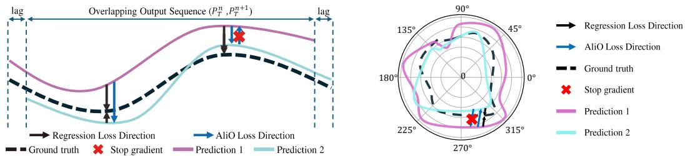  
Figure 3: Output alignments in both time and frequency domains. (Left) In the time domain, AliO minimizes the difference between two predictions in the overlapping timestamps, i.e., $P _ { T } ^ { n }$ and $P _ { T } ^ { n + 1 }$ (T means time domain). To preserve the regression loss direction while improving the output alignment, the regression pulling (Sec. 4.2) is applied through the stop-gradient operation to each time point, ensuring that the overall loss is calculated in the direction towards the ground truth. (Right) In the frequency domain, AliO aligns both the phase and amplitude components of $P _ { F } ^ { n }$ and $P _ { F } ^ { n + 1 }$ (the transformed frequency domain of $P _ { T } ^ { n }$ and $P _ { T } ^ { n + 1 } )$ , applied with the stop-gradient operation. The figure is represented in polar coordinates, where the angle indicates the phase, and the distance from the center point corresponds to the amplitude

Given two overlapping predictions, $P ^ { n } = f ( X ^ { n } ; \pmb { \theta } ) _ { 1 + l : h }$ and $P ^ { n + 1 } = f ( X ^ { n + 1 } ; \pmb { \theta } ) _ { 1 : h - l }$ defined in Theorem 3.4, AliO aligns these predictions such that $P ^ { n } \simeq P ^ { n + 1 }$ for $n = 1 , 2 , \ldots , N$ by minimizing the following objective with respect to the model $f ^ { \ast } \mathrm { \mathbf { s } }$ parameter θ, as:

$$
\operatorname* { m i n } _ { \pmb { \theta } } D ( f ( \pmb { X } ^ { n } ; \pmb { \theta } ) _ { 1 + l : h } , f ( \pmb { X } ^ { n + 1 } ; \pmb { \theta } ) _ { 1 : h - l } )\tag{2}
$$

where D denotes a distance function and subscripts denote the segment ranges of the model $f ^ { \ast } \mathrm { \mathbf { s } }$ prediction output sequences, $\operatorname { i . e . , } 1 + l : h$ and $\bar { 1 : h - l }$ correspond to the same timestamps for $X ^ { n }$ and $X ^ { n + 1 }$ , respectively. Eq. (2) can be easily extended to handle non-consecutive overlapping output sequences, enabling its application to TAM (Theorem 3.5). AliO aligns the overlapping predictions $\pmb { P } ^ { n }$ and $P ^ { n + 1 }$ in both time and frequency domains, as illustrated in Fig. 3 with further details provided in the following subsections. The algorithmic procedure of AliO is summarized in Alg. 1.

## 4.1 Time domain alignment

To enhance the temporal alignment, AliO aligns the overlapping predictions, $P _ { T } ^ { n }$ and ${ \pmb { P } } _ { T } ^ { m }$ for $n , m =$ $1 , 2 , \ldots , N$ , in the time domain, where the subscript $T$ denotes the time domain. This alignment can be achieved using a distance function, $D _ { T }$ , such as MSE or Dynamic Time Warping (DTW) [34]. The computed distance is back-propagated to encourage the model f to produce overlapping predictions that align with each other. However, solely aligning the overlapping predictions by minimizing the time domain alignment loss $\mathcal { L } _ { T } = D _ { T } ( P _ { T } ^ { \bar { n } } , P _ { T } ^ { \breve { m } } )$ may lead to both prediction outputs deviating from the ground truth, degrading the forecasting regression performance of the model $f .$

## 4.2 Regression pulling (RegPull)

To maintain forecasting regression performance while aligning predictions, we propose Regression Pulling $( R e g P u l l )$ , which identifies which prediction output points of $P _ { T } ^ { n }$ and $\pmb { P } _ { T } ^ { m }$ are relatively further from the ground truth than the other at the same timestamp, indicated by the index variable $i d x _ { T }$ , as shown on line (1) in Alg. 1. By applying the stop-gradient operation, denoted as $s g ( \cdot )$ , to the prediction output points farther from the ground truth, the time domain alignment loss $\mathcal { L } _ { T }$ pulls these distant points closer to the ground truth, aligning its optimization direction with that of the forecasting regression loss and reinforcing to minimize the regression loss. Consequently, regression pulling effectively reduces the misalignment between prediction outputs with the forecasting regression performance being unaffected, inducing overall predictions closely aligned with the ground truths.

Algorithm 1 The procedure of AliO. ⊙ denotes element-wise multiplication. $F F T ( \cdot , \cdot , \cdot )$ returns the frequency   
domain representation of each signal sequences, $s g ( \cdot )$ is stop-gradient operator.   
Input: The number of predictions N, consecutive predictions $\mathbf { Y } ^ { n }$ with at time lag of $l ,$ and their   
ground truth ${ \hat { \mathbf { Y } } } ^ { n }$ , where $n \in [ 1 , N ]$ , and distance function $D _ { T }$ and $D _ { F }$ for the time and frequency   
domain, respectively. The subscript $T$ and $F$ denotes the time and frequency domain, respectively.   
Output: The time domain alignment loss $\mathcal { L } _ { T }$ and frequency domain alignment loss $\mathcal { L } _ { F }$   
Initialize $\mathcal { L } _ { t } = 0 , \mathcal { L } _ { f } = 0 , c o u n t = 0$   
for $n = 1$ to $N - 1$ do   
for $m = n + 1$ to N do   
$g a p = | m - n | \times l$   
$( { \pmb P } _ { T } ^ { n } , { \pmb P } _ { T } ^ { m } , { \pmb G } { \pmb T } _ { T } ) = ( { \pmb Y } _ { g a p ; } ^ { n } , { \pmb Y } _ { : - g a p } ^ { m } , \hat { \pmb Y } _ { g a p ; } ^ { n } )$   
${ \mathrm { \it ~ i d } } x _ { T } = \mathrm { I n d e x } ( | P _ { T } ^ { n } - G { \dot { T } } _ { T } | > | { \dot { P } } _ { T } ^ { \dot { m } } - { \dot { G } } { \dot { T } } _ { T } | )$ (1)   
$\mathcal { L } _ { t } = \mathcal { L } _ { t } + D _ { T } ( \hat { P _ { T , i \in i d x _ { T } } ^ { n } } , \overset { \cdot } { s g } ( \dot { P } _ { T , i \in i d x _ { T } } ^ { m } ) ) \overset { \cdot } { + } D _ { T } ( s g ( P _ { T , i \notin i d x _ { T } } ^ { n } ) , P _ { T , i \notin i d x _ { T } } ^ { m } )$ [RegPull] (2)   
$( P _ { F } ^ { n } , P _ { F } ^ { m } , G T _ { F } ) \stackrel { } { = } F F T ( P _ { T } ^ { n } , P _ { T } ^ { m } , G \dot { T } _ { T } )$ (3)   
$\begin{array} { r } { i d \dot { x } _ { F } = \mathbf { \hat { I } } \mathbf { \tilde { n } } \mathbf { d e x } ( | \pmb { \dot { P } } _ { F } ^ { n } - \pmb { G } \pmb { T } _ { F } | \cdot > | \pmb { \dot { P _ { F } ^ { m } } } - \pmb { G } \pmb { T } _ { F } | ) } \end{array}$ (4)   
$\begin{array} { r } { \mathcal { L } _ { f } = \mathcal { L } _ { f } + D _ { F } ( \bar { P } _ { F , i \in i d x _ { F } } ^ { n } ; s g ( \dot { P } _ { F , i \in i d x _ { F } } ^ { \bar { m } } ) ) \stackrel {  } { + } D _ { F } ( s g ( P _ { F , i \notin i d x _ { F } } ^ { n } ) , P _ { F , i \notin i d x _ { F } } ^ { m } ) } \end{array}$ [RegPull] (5)   
count = count $+ 1$   
end for   
end for   
$( \mathcal { L } _ { T } , \mathcal { L } _ { F } ) = ( \mathcal { L } _ { t } / c o u n t , \mathcal { L } _ { f } / c o u n t )$   
Return: $\dot { \mathcal { L } } _ { T }$ and $\dot { \mathcal { L } } _ { F }$

For each prediction output point $i \in [ 1 , h ^ { \prime } ]$ in Alg. 1, $D _ { T } ( { P _ { T , i \in i d x _ { T } } ^ { n } } , s g ( { P _ { T , i \in i d x _ { T } } ^ { m } } ) )$ on line $( 2 )$ encourages the prediction $P _ { T } ^ { n }$ to move closer to the prediction $P _ { T } ^ { m }$ . On the other hand, $\dot { D _ { T } } ( s g ( { P _ { T , i \notin i d x _ { T } } ^ { n } } ) , \mathbf { \dot { P } } _ { T , i \notin i d x _ { T } } ^ { m } )$ on the same line (2) promotes the alignment of ${ \pmb { P } } _ { T } ^ { m }$ towards $P _ { T } ^ { n }$ The direction of alignment is determined by the index variable, idxT. These two distance values are combined into the time domain alignment loss $\mathcal { L } _ { T }$ , which is expressed as:

$$
\mathcal { L } _ { T } = D _ { T } ( \pmb { P } _ { T , i \in i d x _ { T } } ^ { n } , s g ( \pmb { P } _ { T , i \in i d x _ { T } } ^ { m } ) ) + D _ { T } ( s g ( \pmb { P } _ { T , i \notin i d x _ { T } } ^ { n } ) , \pmb { P } _ { T , i \notin i d x _ { T } } ^ { m } )\tag{3}
$$

Consequently, Eq. (3) aligns the direction of the time domain alignment loss $\mathcal { L } _ { T }$ with the forecasting regression loss while improving output alignment. The regression pulling can also be applied in the same way to the frequency domain; Fig. 3 shows a visual illustration of output alignment in the time (left) and frequency domain (right) using regression pulling (red cross marks).

## 4.3 Frequency domain alignment

In addition to the time domain alignment, we propose frequency domain alignment as a complementary approach that supports and enhances time-domain alignment by aligning overlapping predictions in the frequency representation. It promotes the alignment of both the phase and the amplitude components, improving overall consistency in the time domain.

As shown in Alg. 1, the time domain overlapping predictions, $P _ { T } ^ { n }$ and $P _ { T } ^ { m }$ , along with the ground truths $G T _ { T } ,$ , are first transformed into frequency domain representations, resulting in $P _ { F } ^ { n } , P _ { F } ^ { m }$ , and $\pmb { G T } _ { F }$ on line (3), where the subscript $F$ denotes the frequency domain. Subsequently, the index variable idxF is determined by identifying output points further from $\pmb { G T } _ { F }$ between ${ \dot { P } } _ { F } ^ { n }$ and ${ \pmb { P } } _ { F } ^ { m }$ on line (4). The distance function $D _ { F }$ is then applied with regression pulling to facilitate alignment in the frequency domain on lines (5) in the same manner to the time domain. From this, the frequency domain alignment loss $\mathcal { L } _ { F }$ is obtained as:

$$
\mathcal { L } _ { F } = D _ { F } ( \pmb { P } _ { F , i \in i d x _ { F } } ^ { n } , s g ( \pmb { P } _ { F , i \in i d x _ { F } } ^ { m } ) ) + D _ { F } ( s g ( \pmb { P } _ { F , i \notin i d x _ { F } } ^ { n } ) , \pmb { P } _ { F , i \notin i d x _ { F } } ^ { m } )\tag{4}
$$

We use MSE (mean squared error) as the main distance function for the frequency domain alignment, $\mathrm { i . e . , } D _ { F } = \| \pmb { P } _ { F } ^ { n } - \pmb { P } _ { F } ^ { m } \| _ { 2 } ^ { 2 } / h ^ { \prime }$ . The following Theorem 4.1 demonstrates that applying MSE in the frequency domain facilitates phase alignment between prediction outputs.

Theorem 4.1. Given two frequency domain prediction vectors, $\pmb { p } _ { F } ^ { n }$ and pm in $\mathbb { C } ^ { h ^ { \prime } }$ , where C means the set ofcomplex numbers, minimizing their MSE, $\| \pmb { p } _ { F } ^ { n } - \pmb { p } _ { F } ^ { m } \| _ { 2 } ^ { 2 }$ , results in a reduction ofthe difference

in the phase components, $\angle { \pmb p } _ { F } ^ { n }$ and $\angle { \pmb p } _ { F } ^ { m }$ , as shown below (the proof is provided in Sec. B.1):

$$
\frac { 1 } { h ^ { \prime } } \| { \pmb { p } } _ { F } ^ { n } - { \pmb { p } } _ { F } ^ { m } \| _ { 2 } ^ { 2 } \to 0 \implies | { \angle } { \pmb { p } } _ { F } ^ { n } - { \angle } { \pmb { p } } _ { F } ^ { m } | \to 0\tag{5}
$$

Fig. 3 (Right) shows a polar-coordinate depiction of frequency alignment conducted through Eq. (5) in the frequency domain. Theorem 4.2 shows that minimizing MSE, i.e., $D _ { F } = \| P _ { F } ^ { n } - \check { P } _ { F } ^ { m } \| _ { 2 } ^ { 2 }$ , also reduces the differences in amplitude once the phase components $\angle P _ { F } ^ { n }$ and $\angle { P _ { F } ^ { m } }$ have been aligned.

Theorem 4.2. Once the phases of two frequency domain prediction vectors, pn and $\pmb { p } _ { F } ^ { m }$ in $\mathbb { C } ^ { h ^ { \prime } } ,$ , are aligned, $i . e . , \angle p _ { F } ^ { n } \simeq \angle p _ { F } ^ { m }$ , the minimization ofMSE between the two prediction outputs, $\| \pmb { p } _ { F } ^ { n } - \pmb { p } _ { F } ^ { m } \| _ { 2 } ^ { 2 }$ leads to a reduction in the amplitude difference, as shown below (the proofis provided in Sec. B.2):

$$
\frac { 1 } { h ^ { \prime } } \| { \pmb { p } } _ { F } ^ { n } - { \pmb { p } } _ { F } ^ { m } \| _ { 2 } ^ { 2 } \to 0 \implies | { \pmb { p } } _ { F } ^ { n } | - | { \pmb { p } } _ { F } ^ { m } | \to 0\tag{6}
$$

## 4.4 AliO loss

By combining the time $\mathcal { L } _ { T }$ in Eq. (3) and frequency domain alignment loss $\mathcal { L } _ { F }$ in Eq. (4), we derive the AliO loss, $\mathcal { L } _ { A l i O }$ , which is incorporated with the forecasting regression loss, $\mathcal { L } _ { r e g }$ as shown below, where $\lambda _ { T }$ and $\lambda _ { F }$ control the extent of alignment in the time and frequency domain, respectively.

$$
\begin{array} { r } { \mathcal { L } _ { A l i O } = \lambda _ { T } \mathcal { L } _ { T } + \lambda _ { F } \mathcal { L } _ { F } \mathrm { ~ } \mathrm { ~ . ~ . ~ } \dot { \mathcal { L } } _ { t o t a l } = \mathcal { L } _ { r e g } + \mathcal { L } _ { A l i O } } \end{array}\tag{7}
$$

## 5 Experiment

We evaluate AliO on representative LTSF models and datasets. In model training, MSE is employed as the regression loss. The model performance is assessed using both MSE and $T A M _ { N }$ for output alignment evaluation, with $N = 2 .$ . To reproduce experimental results of baselines and ensure a fair evaluation, we follow the same hyper-parameters presented in each model papers [37, 27, 40, 43, 30, 33, 36]. For AliO, we set N = 2 and l = 1, covering a wide prediction range. The search space for λ and $\lambda _ { F }$ are $\{ 1 . 0 , 2 . 0 , 5 . 0 \}$ and $\{ 0 . 0 , 0 . 5 , 1 . 0 , 2 . 0 \}$ , respectively, and we report the best results in the main results. All results are reported as the average performance across all prediction lengths. Detailed descriptions of the experiment and results are provided in Secs. G to I.

Models. We apply AliO to various LTSF architectures, experimenting it with a diverse range of LTSF approaches, categorized into four groups: (1) Transformer-based models, i.e., Autoformer [37], PatchTST [33], and iTransformer [30], (2) Linear-based models, i.e., DLinear [40] and CycleNet [27], (3) CNN-based models, i.e., TimesNet [36], and (4) LLM-based models, i.e., GPT4TS [43].

Datasets. On the main text of the paper, we report results on representative LTSF datasets, i.e., Electricity (ECL) [13], ETT {h1, h2, m1, and m2} [42], Traffic, [37], Weather [37], and National-Illness (ILI) dataset [37]. The experiments results on full datasets can be found in Sec. I.

Context Length Following the official settings for each model, we set the context length to 336 for PatchTST and DLinear, and 96 for the other models. For the ILI dataset specifically, the context lengths were set to 104 for PatchTST and DLinear, and 36 for TimesNet.

Prediction Length Furthermore, as per the official settings, the prediction lengths were set to {96, 192, 336, 720} for most datasets. The exceptions were the PEMS-related datasets with {12, 24, 48, 96}, the ILI dataset with {24, 36, 48, 60}, and the Autoformer model on the ETT datasets, for which we used {24, 48, 168, 336, 720}.

## 5.1 Output alignment and forecasting performance

Tab. 1 summarizes the performance of LTSF models on seven datasets (excluding ILI) for multivariate LTSF tasks, comparing baselines (without AliO) and AliO-integrated models in terms of MSE and TAM. As shown in the table, integrating AliO with the regression loss substantially improves alignment performance (TAM), achieving gains of up to 70.5% for CycleNet, 45.8% for GPT4TS, 45.8% for iTransformer, 36.8% for PatchTST, 45.6% for TimesNet, 64.0% for DLinear, and 39.0% for Autoformer. Simultaneously, forecasting performance (MSE) also improves by up to 11.5%. As summarized in Tab. 2, for the ILI dataset exhibiting insufficient initial output alignment, AliO achieves up to a 17.4% higher MSE improvement compared to other benchmarks.

Table 1: The forecasting and alignment performance, measured by MSE and $\mathrm { T A M _ { 2 } , }$ , respectively, are compared between the baseline (MSE only) and AliO, with best results indicated in bold. The results are averaged over three random seeds and prediction lengths. The more metrics (MAE, MAPE, and RMSE) with standard deviations are provided in Sec. I.
<table><tr><td colspan="2">Models</td><td colspan="2">CycleNet</td><td colspan="2">GPT4TS</td><td colspan="2">iTransformer</td><td colspan="2">PatchTST</td><td colspan="2">TimesNet</td><td colspan="2">DLinear</td><td colspan="2">Autoformer</td></tr><tr><td colspan="2">Metric</td><td>MSE</td><td>TAM2</td><td>MSE</td><td>TAM2</td><td>MSE</td><td>TAM2</td><td>MSE</td><td>TAM2</td><td>MSE</td><td>TAM2</td><td>MSE</td><td>TAM2</td><td>MSE</td><td>TAM2</td></tr><tr><td>ECL</td><td>baseline AliO</td><td>0.171 0.170</td><td>0.016 0.014</td><td>0.167 0.167</td><td>0.036 0.025</td><td>0.176 0.172</td><td>0.050 0.031</td><td>0.162 0.161</td><td>0.037 0.024</td><td>0.196 0.191</td><td>0.040 0.028</td><td>0.166 0.166</td><td>0.013 0.010</td><td>0.229 0.221</td><td>0.041 0.036</td></tr><tr><td>ETTh1</td><td>baseline AliO</td><td>0.432 0.429</td><td>0.044 0.013</td><td>0.424 0.417</td><td>0.056 0.039</td><td>0.455 0.438</td><td>0.088 0.052</td><td>0.418 0.415</td><td>0.076 0.048</td><td>0.476 0.468</td><td>0.05 0.032</td><td>0.422 0.419</td><td>0.025 0.014</td><td>0.477 0.444</td><td>0.05 0.046</td></tr><tr><td>ETTh2</td><td>baseline AliO</td><td>0.385 0.381</td><td>0.047 0.025</td><td>0.363 0.354</td><td>0.048 0.033</td><td>0.382 0.377</td><td>0.074 0.052</td><td>0.341 0.341</td><td>0.061 0.050</td><td>0.416 0.402</td><td>0.079 0.043</td><td>0.449 0.446</td><td>0.054 0.033</td><td>0.401 0.377</td><td>0.041 0.025</td></tr><tr><td>ETTm1</td><td>baseline AliO</td><td>0.386 0.383</td><td>0.032 0.014</td><td>0.351 0.346</td><td>0.044 0.031</td><td>0.407 0.396</td><td>0.060 0.033</td><td>0.352 0.349</td><td>0.050 0.032</td><td>0.412 0.398</td><td>0.045 0.026</td><td>0.358 0.354</td><td>0.024 0.010</td><td>0.488 0.448</td><td>0.070 0.053</td></tr><tr><td>ETTm2</td><td>baseline AliO</td><td>0.272 0.271</td><td>0.027 0.019</td><td>0.270 0.265</td><td>0.042 0.028</td><td>0.292 0.289</td><td>0.048 0.026</td><td>0.257 0.255</td><td>0.059 0.039</td><td>0.296 0.295</td><td>0.036 0.022</td><td>0.289 0.268</td><td>0.037 0.020</td><td>0.271 0.254</td><td>0.052 0.032</td></tr><tr><td>Traffic</td><td>baseline AliO</td><td>0.487 0.481</td><td>0.021 0.008</td><td>0.411 0.405</td><td>0.059 0.032</td><td>0.422 0.423</td><td>0.061 0.044</td><td>0.389 0388</td><td>0.041 0.027</td><td>0.626 0.554</td><td>0.040 0.030</td><td>0.436 0.434</td><td>0.025 0.009</td><td>0.634 0.624</td><td>0.048 0.045</td></tr><tr><td>Weather</td><td>baseline AliO</td><td>0.255 0.255</td><td>0.010 0.008</td><td>0.227 0.225</td><td>0.024 0.011</td><td>0.260 0.259</td><td>0.024 0.017</td><td>0.229 0.228</td><td>0.018 0.012</td><td>0.262 0.262</td><td>0.018 0.014</td><td>0.245 0.244</td><td>0.007 0.005</td><td>0.342 0.311</td><td>0.056 0.042</td></tr></table>

## 5.2 How AliO maintains or improves regression performance

Tab. 2 shows AliO’s effectiveness in improving both forecasting accuracy and alignment performance on the ILI dataset [37], which exhibits poor output alignment in the absence of AliO. The proposed regression pulling enhances model training by analyzing prediction distances at each timestamp, adaptively strengthening the effect of regression loss to align predictions with each other and ground truth. On ILI, which exhibits poor initial alignment, AliO achieves 17.4% MSE and 58.1% TAM improvement. Conversely, datasets with better initial alignment, presented in Tab. 1, achieve comparatively smaller MSE improvements. Figs. 4 and 13 shows this trend; higher initial TAM (poor alignment) correlates with greater MSE gains, demonstrating AliO’s efficacy in suboptimal alignment conditions.

Figs. 2 and 5 visualize DLinear predictions on the ILI dataset. The left figures (without AliO) exhibit prediction shifts [18] in both time (Fig. 2) and frequency (Fig. 5) domains, reflected in high TAM values. In contrast, the right figures (with AliO) show improved alignment in both domains, which reduces TAM value and enhances regression performance (MSE).

Table 2: The forecasting regression and alignment performance on ILI [37], measured in MSE, and $\mathrm { T A M _ { 2 } , }$ are compared between the baseline (without AliO) and AliO. The best results are highlighted in bold. For robust evaluation, we conduct experiments with three random seeds. Results are rounded to three decimal places for simplicity.
<table><tr><td>Models</td><td colspan="2">GPT4TS</td><td colspan="2">PatchTST</td><td colspan="2">TimesNet</td><td colspan="2">DLinear</td></tr><tr><td>Metric</td><td>MSE</td><td>TAM2</td><td>MSE</td><td>TAM2</td><td>MSE</td><td>TAM2</td><td>MSE</td><td>TAM2</td></tr><tr><td>base</td><td>1.898</td><td>0.117</td><td>1.813</td><td>0.110</td><td>2.176</td><td>0.322</td><td>2.247</td><td>0.152</td></tr><tr><td>AliO</td><td>1.755</td><td>0.098</td><td>1.497</td><td>0.046</td><td>1.963</td><td>0.258</td><td>2.187</td><td>0.119</td></tr></table>

## 5.3 Hyper-parameter Analysis

Time and Frequency Domain Coefficients. AliO utilizes the two coefficients, λ and $\lambda _ { F }$ in Eq. (7), to balance the regression performance and output alignment by adjusting the alignment strengths over the time and frequency domains, respectively. To evaluate AliO with respect to these two coefficients, we provide Fig. 6, which presents heatmaps of the normalized MSE and TAM for various coefficient values. The x-axis represents $\lambda _ { F }$ in {0.0, 0.5, 1.0, 2.0}, and the y-axis corresponds to $\lambda _ { T }$ in {1.0, 2.0, 5.0}. The left heatmap shows normalized MSE, where the maximum MSE in each dataset is scaled to 1.0 and the minimum to 0, followed by averaging across all models. The right heatmap presents normalized TAM in the same manner. Additional results are in Sec. F.

As AliO is designed to enhance alignment, a clear trend is observed in TAM where increasing the time domain alignment coefficient $\lambda _ { T }$ from 1.0 to 5.0 leads to a consistent improvement. Interestingly, the normalized MSE also shows a general improvement as $\lambda _ { T }$ increases, suggesting that the regression pulling effectively aligns the directions of the AliO loss with those of the regression loss. The influence of the frequency domain alignment coefficient $\lambda _ { F }$ is less pronounced compared to the time coefficient $\lambda _ { T }$ . However, in cases where $\lambda _ { T }$ alone cannot improve performance, $\lambda _ { F }$ shows its impact on both the MSE and TAM metrics, as exemplified by values of 0.28 and 0.50, respectively. This demonstrates the significance of the frequency domain alignment to overcome limitations in the time domain alignment, indicating that both phase and amplitude contribute to performance enhancements.

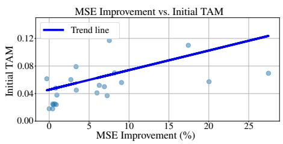

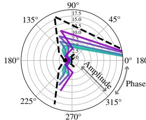

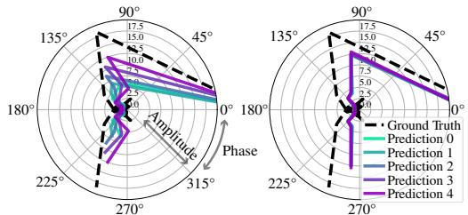

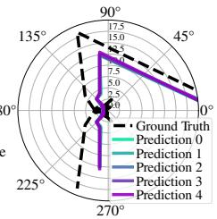  
Figure 5: (Left) The frequency domain of five predictions in polar coordinates from DLinear [40] trained with regression loss, forecasting the ILI dataset. (Right) Five phases from the same setup, with AliO applied. AliO effectively aligns both the phase and amplitude of the model’s predictions in the frequency domain.

Figure 4: The relationship between initial TAM and MSE improvement (%). The correlation coefficient is 0.33, indicating a positive trend; when the initial alignment is poor (i.e., higher TAM values), the MSE improvement tends to be greater. For more detailed information, please check Sec. E.  
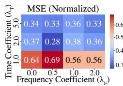

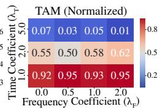

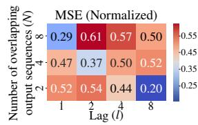

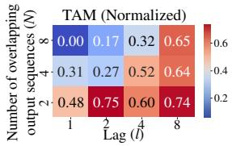  
Figure 6: Comparison of the normalized MSE (left) and TAM (right) over different settings of $\lambda _ { T }$ and $\lambda _ { F }$ . The x-axis represents $\lambda _ { F }$ $( \{ 0 . 0 , 0 . 5 , 1 . 0 , 2 . 0 \} )$ ), and the y-axis represents $\lambda _ { T }$ ({1.0, 2.0, 5.0}). Increasing λ consistently improves TAM performance, while $\lambda _ { F }$ shows its impact depending on the value of λT. Blue represents better performance.  
Figure 7: Comparison of the normalized MSE (left) and TAM (right) over different settings of the overlapping predictions N and the lag l. The x-axis represents the lag l, and the y-axis represents the number of overlapping predictions $N .$ Increasing N improves TAM, while increasing l degrades the performance. No distinct tendencies are observed regarding MSE. Blue represents better performance.

Number of Overlapping Output Sequences and Lag Size. We investigate how the model’s MSE and TAM vary with different numbers of overlapping output sequences N and the lag l. Fig. 7 shows the normalized MSE and TAM with a range between 0 and 1.0. TAM is improved as the lag decreases, which can be attributed to an increased length of overlapping timestamps at smaller lag value. This allows AliO to align longer overlapping sequence effectively. Additionally, the model performance improves as N increases. As shown in Alg. 1, a higher N enables AliO to align predictions from distant timestamps, significantly enhancing TAM. In contrast, no clear trend is observed for MSE, since the window size increases as both N and l grow. Prior studies [12, 2, 17, 32] suggest that large window sizes can cause overfitting, whereas an optimal window size leads to better performance. As shown in Fig. 7, when both N and l are large, MSE tends to increase, indicating degraded performance. Conversely, lower MSE values (0.29, 0.37, 0.20) are observed along the diagonal elements, representing proper window sizes, such as (l, N) = (1, 8), (2, 4), (8, 2), which indicates that balanced combinations of l and N yield better performance.

## 6 Related works

To the best of our knowledge, no prior work has adequately identified the output alignment problem and provided a solution for it, as AliO proposed in this paper.

Data-Model Robustness. While existing research [30] primarily focuses on model initialization robustness, i.e., the consistency of model performance across randomly initialized weights [30], the output alignment emphasizes data-model robustness. This aspect underscores the model’s ability to produce consistent prediction outputs for lagged input sequences. The data-model robustness is equally critical for practical applications as discussed in this paper and can be quantified using the proposed TAM, which can be enhanced through the proposed time and frequency domain alignment. We anticipate this aspect of LTSF study will inspire further active research in the field.

Contrastive Learning. Contrastive learning [41, 8, 1, 9, 38, 22] employ pretraining strategies that encourage augmented positive pairs to be closely aligned in the representation space. However, they differ from AliO in several key aspects. First, they operate in the representation space rather than in the output space where AliO functions. Second, they minimize the distance between whole vectors rather than focusing on overlapping timestamps. Third, they do not incorporate regression-aware algorithms like regression pulling. These differences highlight the distinctive approach of AliO in output alignment, operating independently of existing methodes and can thus be integrated with them.

## 7 Limitations and discussions

On Volatile Datasets. TAM is a metric designed to assess the output alignment of LTSF models. However, its application should be approached with caution on highly volatile datasets that fall outside the typical scope of LTSF tasks, as model predictions may experience considerable volatility. Nevertheless, as demonstrated in Sec. I, the results on the Exchange Rate dataset [37], which is influenced by abrupt external shocks, suggest that TAM retains potential applicability even in volatile settings. Designing more robust metrics for inherently volatile data is our next research objective.

Distance Functions. AliO improves regression performance under high initial TAM conditions (a low degree of output alignment). This is likely attributable to its use of MSE as the distance function, which is consistent with the regression loss employed during model training. To further enhance performance, alternative distance functions such as [25, 29, 15, 7], which capture different characteristics of time series data (e.g., shape), may serve as promising directions for future exploration.

## 8 Conclusion

In this paper, we investigate the output alignment problem, which can commonly arise in LTSF tasks and propose Time Alignment Metric (TAM) as a quantitative measure for this problem. To solve the output alignment problem, we propose AliO (Output Alignment) applied in both time and frequency domains. AliO achieves up to 27.5% improvement in MSE across various LTSF models and datasets, and up to 58.2% improvement in TAM, effectively addressing the output alignment problem.

## Acknowledgment

This work was supported by the Institute of Information & communications Technology Planning & Evaluation(IITP) grant funded by the Korea government(MSIT)(No.RS-202400508465) and Institute of Information & communications Technology Planning & Evaluation(IITP) grant funded by the Korea government(MSIT) (No.RS-2020-II201336, Artificial Intelligence Graduate School Program(UNIST)).

## References

[1] R. Akerkar and P. Sajja. Knowledge-based systems. Jones & Bartlett Publishers, 2009.

[2] A. Azlan, Y. Yusof, and M. F. M. Mohsin. Determining the impact of window length on time series forecasting using deep learning. International Journal of Advanced Computer Research, 9(44):260–267, 2019.

[3] D. V. Budescu, A. K. Rantilla, H.-T. Yu, and T. M. Karelitz. The effects of asymmetry among advisors on the aggregation of their opinions. Organizational Behavior and Human Decision Processes, 90(1):178–194, 2003.

[4] J. Burgeno and S. Joslyn. The impact of weather forecast inconsistency on user trust. wea. climate soc., 12, 679–694, 2020.

[5] J. N. Burgeno and S. L. Joslyn. The impact of forecast inconsistency and probabilistic forecasts on users’ trust and decision-making. Weather, Climate, and Society, 15(3):693–709, 2023.

[6] S.-H. Chung and K.-C. Cheng. How does cognitive dissonance influence the sunk cost effect? Psychology research and behavior management, pages 37–45, 2018.

[7] M. Cuturi and M. Blondel. Soft-dtw: a differentiable loss function for time-series. In International conference on machine learning, pages 894–903. PMLR, 2017.

[8] E. Eldele, M. Ragab, Z. Chen, M. Wu, C. K. Kwoh, X. Li, and C. Guan. Time-series representation learning via temporal and contextual contrasting. arXiv preprint arXiv:2106.14112, 2021.

[9] E. Eldele, M. Ragab, Z. Chen, M. Wu, C.-K. Kwoh, X. Li, and C. Guan. Self-supervised contrastive representation learning for semi-supervised time-series classification. IEEE Transactions on Pattern Analysis and Machine Intelligence, 45(12):15604–15618, 2023.

[10] L. Euler. Introductio in analysin infinitorum, volume 2. MM Bousquet, 1748.

[11] A. Falk and F. Zimmermann. Consistency as a signal of skills. Management Science, 63(7):2197– 2210, 2017.

[12] J. D. Freitas, C. Ponte, R. Bomfim, and C. Caminha. The impact of window size on univariate time series forecasting using machine learning. In Symposium on Knowledge Discovery, Mining and Learning (KDMiLe), pages 65–72. SBC, 2023.

[13] G. Hebrail and A. Berard. Individual Household Electric Power Consumption. UCI Machine Learning Repository, 2006. DOI: https://doi.org/10.24432/C58K54.

[14] T. Henttu-Aho. The role of rolling forecasting in budgetary control systems: reactive and proactive types of planning. Journal of management control, 29(3):327–360, 2018.

[15] P. J. Huber. Robust estimation of a location parameter. In Breakthroughs in statistics: Methodology and distribution, pages 492–518. Springer, 1992.

[16] O. Huhtakangas. Rolling forecasting in budgetary systems: case study. 2020.

[17] A. Iqbal, A. Shahid, M. Roman, M. T. Afzal, and U. u. Hassan. Optimising window size of semantic of classification model for identification of in-text citations based on context and intent. PloS one, 20(3):e0309862, 2025.

[18] S. Y. Jhin, S. Kim, and N. Park. Addressing prediction delays in time series forecasting: A continuous gru approach with derivative regularization. In Proceedings of the 30th ACM SIGKDD Conference on Knowledge Discovery and Data Mining, pages 1234–1245, 2024.

[19] X. Jin, Y. Park, D. Maddix, H. Wang, and Y. Wang. Domain adaptation for time series forecasting via attention sharing. In International Conference on Machine Learning, pages 10280–10297. PMLR, 2022.

[20] H. Khadem, H. Nemat, J. Elliott, and M. Benaissa. Blood glucose level time series forecasting: nested deep ensemble learning lag fusion. Bioengineering, 10(4):487, 2023.

[21] H. Kim, S. Kim, J. Mok, and S. Yoon. Battling the non-stationarity in time series forecasting via test-time adaptation. arXiv preprint arXiv:2501.04970, 2025.

[22] J. Kim, K. Park, S. Yun, and S. Lee. Ppt: Patch order do matters in time series pretext task. In The Thirteenth International Conference on Learning Representations.

[23] D. P. Kingma and J. Ba. Adam: A method for stochastic optimization, 2017.

[24] G. Lai, W.-C. Chang, Y. Yang, and H. Liu. Modeling long-and short-term temporal patterns with deep neural networks. In The 41st international ACM SIGIR conference on research & development in information retrieval, pages 95–104, 2018.

[25] V. Le Guen and N. Thome. Shape and time distortion loss for training deep time series forecasting models. Advances in neural information processing systems, 32, 2019.

[26] L. Liebel and M. Körner. Auxiliary tasks in multi-task learning. arXiv preprint arXiv:1805.06334, 2018.

[27] S. Lin, W. Lin, X. Hu, W. Wu, R. Mo, and H. Zhong. Cyclenet: enhancing time series forecasting through modeling periodic patterns. Advances in Neural Information Processing Systems, 37:106315–106345, 2024.

[28] M. Liu, A. Zeng, M. Chen, Z. Xu, Q. Lai, L. Ma, and Q. Xu. Scinet: Time series modeling and forecasting with sample convolution and interaction. Advances in Neural Information Processing Systems, 35:5816–5828, 2022.

[29] X. Liu, N. Li, and S. Xia. Gdtw: A novel differentiable dtw loss for time series tasks. ICASSP 2021 - 2021 IEEE International Conference on Acoustics, Speech and Signal Processing (ICASSP), pages 2860–2864, 2021.

[30] Y. Liu, T. Hu, H. Zhang, H. Wu, S. Wang, L. Ma, and M. Long. itransformer: Inverted transformers are effective for time series forecasting. arXiv preprint arXiv:2310.06625, 2023.

[31] J. E. Losee and S. Joslyn. The need to trust: How features of the forecasted weather influence forecast trust. International journal of disaster risk reduction, 30:95–104, 2018.

[32] C. Ma, Y. Hou, X. Li, Y. Sun, and H. Yu. Long input sequence network for long time series forecasting. arXiv preprint arXiv:2407.15869, 2024.

[33] Y. Nie, N. H. Nguyen, P. Sinthong, and J. Kalagnanam. A time series is worth 64 words: Long-term forecasting with transformers. arXiv preprint arXiv:2211.14730, 2022.

[34] H. Sakoe and S. Chiba. Dynamic programming algorithm optimization for spoken word recognition. IEEE transactions on acoustics, speech, and signal processing, 26(1):43–49, 1978.

[35] J. Wang, B. Zhang, S. Liang, and J. Li. Sunk cost effects hinge on the neural recalibration of reference points in mental accounting. Progress in Neurobiology, 208:102178, 2022.

[36] H. Wu, T. Hu, Y. Liu, H. Zhou, J. Wang, and M. Long. Timesnet: Temporal 2d-variation modeling for general time series analysis. arXiv preprint arXiv:2210.02186, 2022.

[37] H. Wu, J. Xu, J. Wang, and M. Long. Autoformer: Decomposition transformers with autocorrelation for long-term series forecasting. Advances in neural information processing systems, 34:22419–22430, 2021.

[38] Z. Yue, Y. Wang, J. Duan, T. Yang, C. Huang, Y. Tong, and B. Xu. Ts2vec: Towards universal representation of time series, 2022.

[39] Z. Zamanzadeh Darban, G. I. Webb, S. Pan, C. Aggarwal, and M. Salehi. Deep learning for time series anomaly detection: A survey. ACM Computing Surveys, 57(1):1–42, 2024.

[40] A. Zeng, M. Chen, L. Zhang, and Q. Xu. Are transformers effective for time series forecasting? In Proceedings of the AAAI conference on artificial intelligence, volume 37, pages 11121– 11128, 2023.

[41] X. Zhang, Z. Zhao, T. Tsiligkaridis, and M. Zitnik. Self-supervised contrastive pre-training for time series via time-frequency consistency. Advances in neural information processing systems, 35:3988–4003, 2022.

[42] H. Zhou, S. Zhang, J. Peng, S. Zhang, J. Li, H. Xiong, and W. Zhang. Informer: Beyond efficient transformer for long sequence time-series forecasting. In Proceedings of the AAAI conference on artificial intelligence, volume 35, pages 11106–11115, 2021.

[43] T. Zhou, P. Niu, L. Sun, R. Jin, et al. One fits all: Power general time series analysis by pretrained lm. Advances in neural information processing systems, 36:43322–43355, 2023.

# A Exemplar illustrations on importance of output alignment

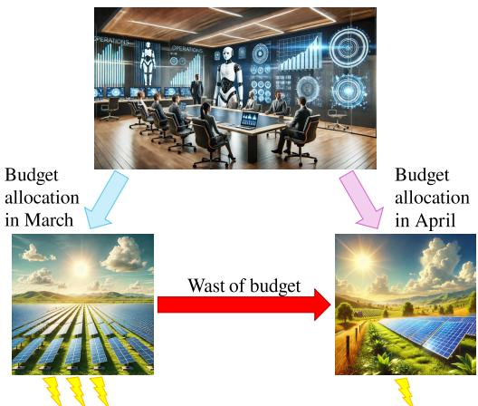  
Figure 8: A simple example illustrating the importance of output alignment in electricity power demand forecasting. The two predictions differ, causing confusion among people, and they realize that the budget allocated in March was a waste.

## B Proof

## B.1 Proof of Theorem 4.1

Proof. Rewriting the equation on the left side of the theorem, we can express it form the perspective of individual elements:

$$
\frac { | { \pmb p } _ { F } ^ { 1 } - { \pmb p } _ { F } ^ { 2 } | _ { 2 } ^ { 2 } } { h ^ { \prime } } = \frac { 1 } { h ^ { \prime } } \sum _ { i } ^ { h ^ { \prime } } | { \pmb p } _ { F , i } ^ { 1 } - { \pmb p } _ { F , i } ^ { 2 } | ^ { 2 }\tag{8}
$$

The squared magnitude of the difference between two complex numbers $p _ { F , i } ^ { 1 }$ and $p _ { F , i } ^ { 2 }$ are given as follows:

$$
| { p } _ { F , i } ^ { 1 } - { p } _ { F , i } ^ { 2 } | ^ { 2 } = ( { p } _ { F , i } ^ { 1 } - { p } _ { F , i } ^ { 2 } ) ( \overline { { { p ^ { 1 } } } } _ { F , i } - \overline { { { p ^ { 2 } } } } _ { F , i } )\tag{9}
$$

Where $\overline { { { p ^ { 1 } } } } _ { F , i }$ and $\overline { { p ^ { 2 } } } _ { F , i }$ are the complex conjugate of $p _ { F , i } ^ { 1 }$ and $p _ { F , i } ^ { 2 }$ . Now, expressing $p _ { F , i } ^ { 1 }$ and $p _ { F , \ast } ^ { 2 }$ including the complex conjugate in polar form:

$$
p _ { F , i } ^ { 1 } = | p _ { F , i } ^ { 1 } | e ^ { j \theta _ { p _ { F , i } ^ { 1 } } } , \quad p _ { F , i } ^ { 2 } = | p _ { F , i } ^ { 2 } | e ^ { j \theta _ { p _ { F , i } ^ { 2 } } }\tag{10}
$$

$$
\overline { { { p ^ { 1 } } } } _ { F , i } = | { p } _ { F , i } ^ { 1 } | e ^ { - j \theta _ { p _ { F , i } ^ { 1 } } } , \quad \overline { { { p ^ { 2 } } } } _ { F , i } = | { p } _ { F , i } ^ { 2 } | e ^ { - j \theta _ { p _ { F , i } ^ { 2 } } }\tag{11}
$$

where $j = \sqrt { - 1 }$ and θ is the angle (phase) for the corresponding complex number. We substitute into the expression and simplify the expression:

$$
| p _ { F , i } ^ { 1 } - p _ { F , i } ^ { 2 } | ^ { 2 } = ( | p _ { F , i } ^ { 1 } | e ^ { j \theta _ { p _ { F , i } ^ { 1 } } } - | p _ { F , i } ^ { 2 } | e ^ { j \theta _ { p _ { F , i } ^ { 2 } } } ) ( | p _ { F , i } ^ { 1 } | e ^ { - j \theta _ { p _ { F , i } ^ { 1 } } } - | p _ { F , i } ^ { 2 } | e ^ { - j \theta _ { p _ { F , i } ^ { 2 } } } )\tag{12}
$$

$$
= | \pmb { p } _ { F , i } ^ { 1 } | ^ { 2 } + | \pmb { p } _ { F , i } ^ { 2 } | ^ { 2 } - | \pmb { p } _ { F , i } ^ { 1 } | | \pmb { p } _ { F , i } ^ { 2 } | ( e ^ { j ( \pmb { \theta } _ { p _ { F , i } ^ { 1 } } - \pmb { \theta } _ { p _ { F , i } ^ { 2 } } ) } + e ^ { - j ( \pmb { \theta } _ { p _ { F , i } ^ { 1 } } - \pmb { \theta } _ { p _ { F , i } ^ { 2 } } ) } )\tag{13}
$$

Using Euler’s formula $e ^ { j \theta } = c o s ( \theta ) + j s i n ( \theta ) \left[ 1 0 \right]$ , we can convert the exponential expressions to trigonometric expressions:

$$
\begin{array} { r } { | p _ { F , i } ^ { 1 } - p _ { F , i } ^ { 2 } | ^ { 2 } = | p _ { F , i } ^ { 1 } | ^ { 2 } + | p _ { F , i } ^ { 2 } | ^ { 2 } - | p _ { F , i } ^ { 1 } | | p _ { F , i } ^ { 2 } | \{ c o s ( \theta _ { p _ { F , i } ^ { 1 } } - \theta _ { p _ { F , i } ^ { 2 } } ) + j s i n ( \theta _ { p _ { F , i } ^ { 1 } } - \theta _ { p _ { F , i } ^ { 2 } } ) \} | ^ { 2 } } \end{array}\tag{14}
$$

$$
+ c o s ( - ( \theta _ { p _ { F , i } ^ { 1 } } - \theta _ { p _ { F , i } ^ { 2 } } ) ) + j s i n ( - ( \theta _ { p _ { F , i } ^ { 1 } } - \theta _ { p _ { F , i } ^ { 2 } } ) ) \}\tag{15}
$$

$$
= | \pmb { p } _ { F , i } ^ { 1 } | ^ { 2 } + | \pmb { p } _ { F , i } ^ { 2 } | ^ { 2 } - 2 | \pmb { p } _ { F , i } ^ { 1 } | | \pmb { p } _ { F , i } ^ { 2 } | c o s ( \theta _ { p _ { F , i } ^ { 1 } } - \theta _ { p _ { F , i } ^ { 2 } } )\tag{16}
$$

Utilizing the angle (phase) notation $\angle ,$ we can express the equation as:

$$
| p _ { F , i } ^ { 1 } - p _ { F , i } ^ { 2 } | ^ { 2 } = | p _ { F , i } ^ { 1 } | ^ { 2 } + | p _ { F , i } ^ { 2 } | ^ { 2 } - 2 | p _ { F , i } ^ { 1 } | | p _ { F , i } ^ { 2 } | c o s ( \angle p _ { F , i } ^ { 1 } - \angle p _ { F , i } ^ { 2 } )\tag{17}
$$

Reducing the final equation implies increasing the cosine term, which in turn signifies aligning the two phases, since one of predictions is constant by stop-gradient $s g ( \cdot )$ operator in Alg. 1.

$$
| { p } _ { F , i } ^ { 1 } - { p } _ { F , i } ^ { 2 } | ^ { 2 }  0 \implies c o s ( \angle { p } _ { F , i } ^ { 1 } - \angle { p } _ { F , i } ^ { 2 } )  1\tag{18}
$$

$$
c o s ( \angle p _ { F , i } ^ { 1 } - \angle p _ { F , i } ^ { 2 } )  1 \implies | \angle p _ { F } ^ { 1 } - \angle p _ { F } ^ { 2 } |  0\tag{19}
$$

$$
\therefore | p _ { F , i } ^ { 1 } - p _ { F , i } ^ { 2 } | ^ { 2 }  0 \implies | \angle p _ { F } ^ { 1 } - \angle p _ { F } ^ { 2 } |  0\tag{20}
$$

□

## B.2 Proof of Theorem 4.2

Proof. Since the two phases, i.e., $\angle { \pmb p } _ { F , i } ^ { 1 }$ and $\angle { p _ { F , i } ^ { 2 } }$ , are aligned, the Eq. (17) in Sec. B.1 is modified as follows:

$$
| { p } _ { F , i } ^ { 1 } - { p } _ { F , i } ^ { 2 } | ^ { 2 } = | { p } _ { F , i } ^ { 1 } | ^ { 2 } + | { p } _ { F , i } ^ { 2 } | ^ { 2 } - 2 | { p } _ { F , i } ^ { 1 } | | { p } _ { F , i } ^ { 2 } |\tag{21}
$$

By factoring, it can be expressed in the following perfect square form.

$$
| { p } _ { F , i } ^ { 1 } - { p } _ { F , i } ^ { 2 } | ^ { 2 } = ( | { p } _ { F , i } ^ { 1 } | ^ { 2 } - | { p } _ { F , i } ^ { 2 } | ^ { 2 } ) ^ { 2 }\tag{22}
$$

Since one of predictions is constant by stop-gradient $s g ( \cdot )$ operator in Alg. 1, minimizing $\lvert p _ { F , i } ^ { 1 } - p _ { F , i } ^ { 2 } \rvert ^ { 2 }$ leads to a reduction in the amplitude difference

## C Visualization of alignment

In this section, we visualize the model’s prediction outputs and alignment differences when trained solely with regression loss versus with both regression loss and AliO. Each figure is arranged in a 2×2 grid: the top row shows results using regression loss alone, while the bottom row presents results incorporating AliO; the left column illustrates the time domain, and the right column displays the frequency domain visualized in a polar coordinate system, where the azimuth angle represents the phase and the radial distance from the origin corresponds to the amplitude. Overlapping timestamps of prediction outputs for five lagged inputs are shown, with the ground truth indicated by black dashed lines. Figs. 9 to 12 show the results from DLinear [40], PatchTST [33], TimesNet [36], and iTransformer [30].

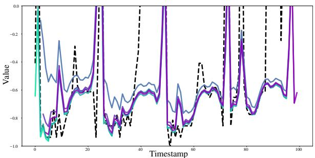

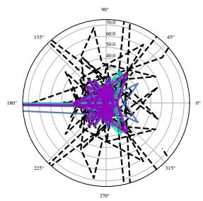

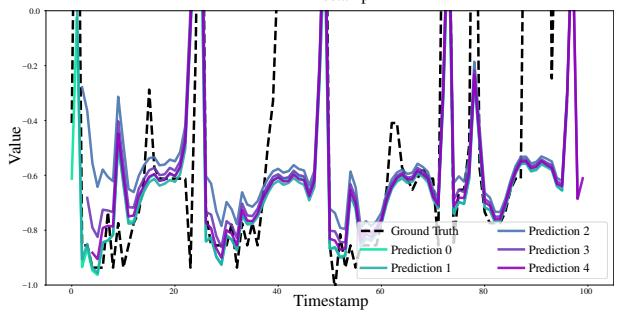

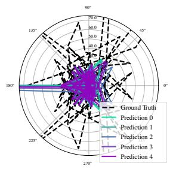  
Figure 9: Visualization: Upper shows the prediction of DLinear [40] using only the regression loss on the ECL dataset [13], while Bottom shows the result under the same conditions when AliO is also applied. It is observed that AliO improves alignment performance for overlapping timestamps.

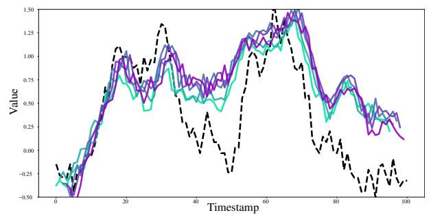

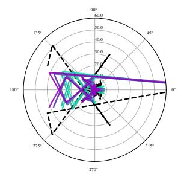

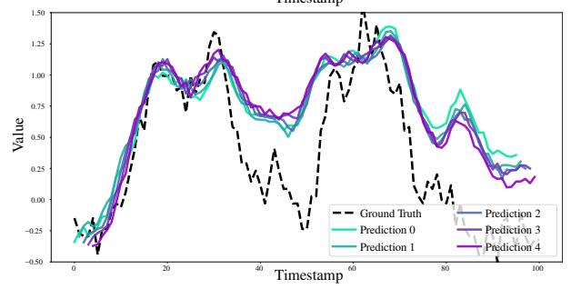

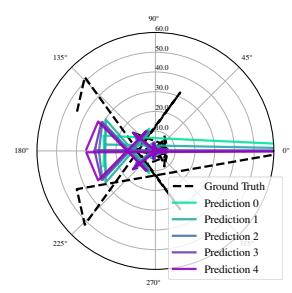  
Figure 10: Visualization: Upper shows the prediction of PatchTST [33] using only the regression loss on the ETTm1 dataset [42], while Bottom shows the result under the same conditions when AliO is also applied. It is observed that AliO improves alignment performance for overlapping timestamps.

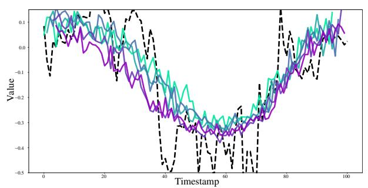

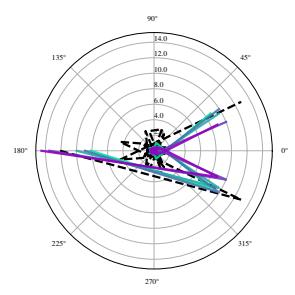

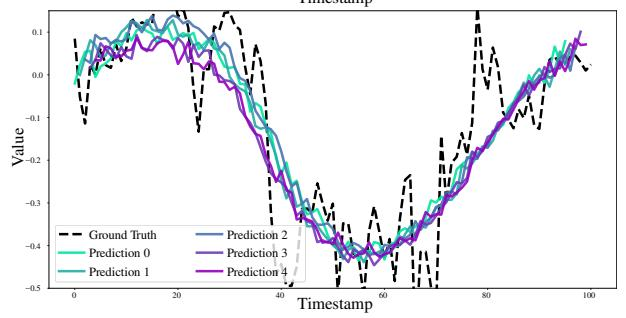

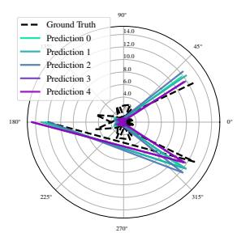  
Figure 11: Visualization: Upper shows the prediction of TimesNet [36] using only the regression loss on the ETTm2 dataset [42], while Bottom shows the result under the same conditions when AliO is also applied. It is observed that AliO improves alignment performance for overlapping timestamps.

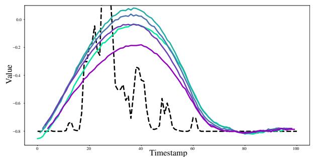

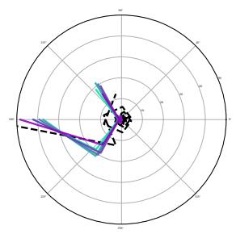

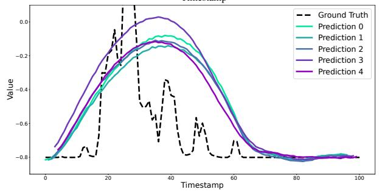

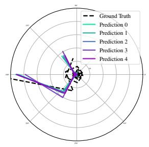  
Figure 12: Visualization: Upper shows the prediction of iTransformer [30] using only the regression loss on the Solar dataset [24], while Bottom shows the result under the same conditions when AliO is also applied. It is observed that AliO improves alignment performance for overlapping timestamps.

## D On sudden event

This section expands on the sudden events mentioned in Sec. 7.

Definition D.1. The sudden event refers to an anomalous data point in the input sequence that can be interpreted as out-of-distribution (OOD), causing perturbations in the output sequence. Such event occur when input-level perturbations lead to unpredictable output patterns.

These scenarios deviate from the core objective of Long-term Time Series Forecasting (LTSF), which focuses on predictable sequences. Instead, they align more closely with:

• Domain Adaptation [19]

• Anomaly Detection [39]

• Test-Time Adaptation [21]

The TAM metric is specifically designed for LTSF tasks with predictable, stable output sequences (i.e., non-perturbed scenarios). In contexts involving sudden events or OOD (out-of-distribution) data, the inherent assumptions of TAM-particularly its reliance on sequence stability-may not hold, necessitating cautious application. However, if a sudden event includes precursor signals (i.e., detectable input patterns) and the model can sufficiently predict the output sequence using this information, TAM remains valid even under such conditions.

## E Initial TAM vs. MSE improvement

Fig. 4 may be difficult to interpret as there is no explicit distinction between models and datasets. In this section [Fig. 13], to facilitate easier interpretation, models are represented by different shapes and datasets are represented by different colors.

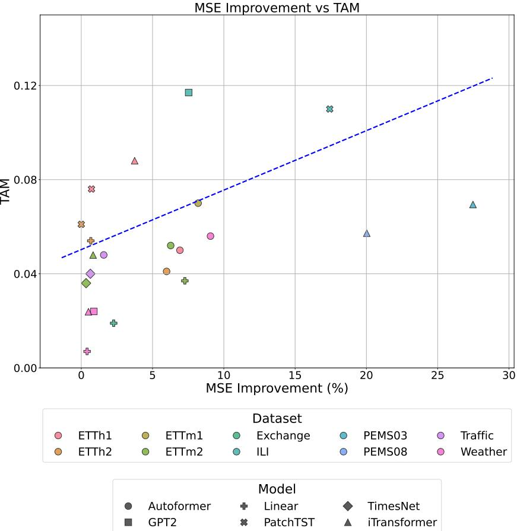  
Figure 13: The relationship between initial TAM and MSE improvement (%).

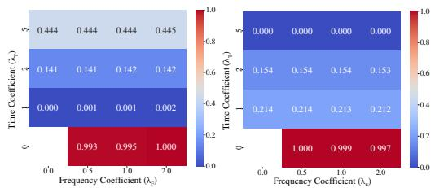

## F Zero coefficient of time domain alignment $( \lambda _ { T } )$

By default, AliO operates in the time domain, so scenarios where the time-scaling coefficient is zero were excluded from the main context. However, we conducted experiments on CycleNet [27], iTransformer [30], TimesNet [36] under conditions with a zero time-scaling coefficient. The results, shown in Figs. 14 to 25, are normalized between 0 and 1. Since the condition $( \lambda _ { T } = 0 , \lambda _ { F } = 0 )$ implies that AliO is not used, so it is empty. As demonstrated in Fig. 6 increasing $\lambda _ { T }$ concsistently improves TAM performance. When it comes to MSE performance, there’s a general trend for it to improve as the coefficient increases, similar to what’s seen with TAM (I’m assuming this refers to a specific model or method you’re using). However, in some environments, the coefficient can become excessively large, dominating the regression loss and causing performance to degrade. Despite this, our experiments confirmed that an appropriate, non-zero coefficient leads to improved performance. The tables show the results where the lag is 1 and the number of sequences is 2 (default).

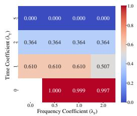

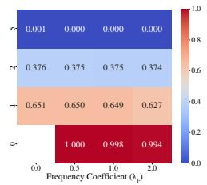

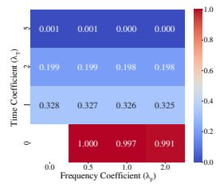

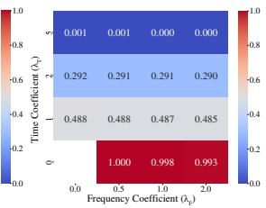  
Figure 15: Comparison of the normalized MSE (left) and TAM (right) of CycleNet trained on ETTm2 dataset. The x-axis represents $\lambda _ { F }$ $( \{ 0 . 0 , 0 . 5 , 1 . 0 , 2 . 0 \} )$ , and the y-axis represents $\dot { \lambda _ { T } } ( \{ 0 . 0 , 1 . 0 , 2 . 0 , \overleftarrow { 5 . 0 } \} )$ .

Figure 14: Comparison of the normalized MSE (left) and TAM (right) of CycleNet trained on ETTm1 dataset. The x-axis represents $\lambda _ { F }$ $( \{ 0 . 0 , 0 . 5 , 1 . 0 , 2 . 0 \} )$ , and the y-axis represents $\check { \lambda _ { T } } \left( \left\{ 0 . 0 , 1 . 0 , 2 . 0 , \mathbf { \bar { \zeta } } . 0 \right\} \right)$ ).  
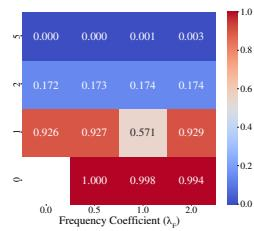

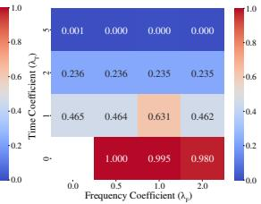  
Figure 17: Comparison of the normalized MSE (left) and TAM (right) of iTransformer trained on ETTh1 dataset. The x-axis represents $\lambda _ { F }$ $( \{ 0 . 0 , 0 . 5 , 1 . 0 , 2 . 0 \} )$ , and the y-axis represents $\dot { \lambda _ { T } } ( \{ 0 . 0 , 1 . 0 , 2 . 0 , 5 . 0 \} )$ ).

Figure 16: Comparison of the normalized MSE (left) and TAM (right) of CycleNet trained on Traffic dataset. The x-axis represents $\lambda _ { F }$ $( \{ 0 . 0 , 0 . 5 , 1 . 0 , 2 . 0 \} )$ , and the y-axis represents $\check { \lambda _ { T } } \left( \left\{ 0 . 0 , 1 . 0 , 2 . 0 , \mathbf { \bar { \zeta } } . 0 \right\} \right)$ ).  
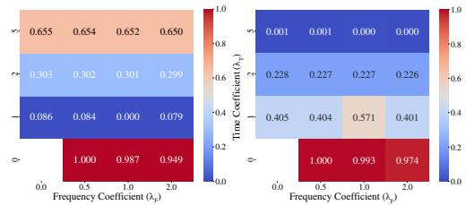  
Figure 18: Comparison of the normalized MSE (left) and TAM (right) of iTransformer trained on ETTh2 dataset. The x-axis represents $\lambda _ { F }$ $( \{ 0 . 0 , 0 . 5 , 1 . 0 , 2 . 0 \} )$ , and the y-axis represents $\dot { \lambda _ { T } } ( \{ 0 . 0 , 1 . 0 , 2 . 0 , 5 . 0 \} )$ ).

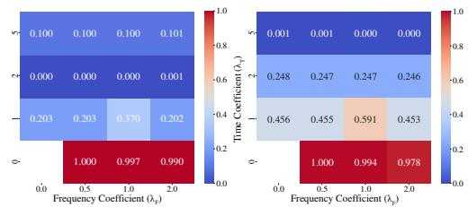  
Figure 19: Comparison of the normalized MSE (left) and TAM (right) of iTransformer trained on ETTm1 dataset. The x-axis represents $\lambda _ { F }$ $( \{ 0 . 0 , 0 . 5 , 1 . 0 , 2 . 0 \} )$ , and the y-axis represents $\dot { \lambda _ { T } } ( \{ 0 . 0 , 1 . 0 , 2 . 0 , 5 . 0 \} )$ ).

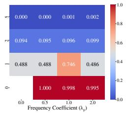

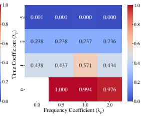  
Figure 20: Comparison of the normalized MSE (left) and TAM (right) of iTransformer trained on ETTm2 dataset. The x-axis represents $\lambda _ { F }$ ({0.0, 0.5, 1.0, 2.0}), and the y-axis represents λ ({0.0, 1.0, 2.0, 5.0}).

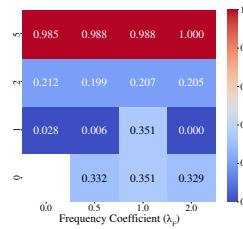

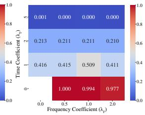  
Figure 21: Comparison of the normalized MSE (left) and TAM (right) of iTransformer trained on Traffic dataset. The x-axis represents $\lambda _ { F }$ $( \{ 0 . 0 , 0 . 5 , 1 . 0 , 2 . 0 \} )$ , and the y-axis represents λT $( \{ 0 . 0 , 1 . 0 , 2 . 0 , \mathrm { \bar { 5 } . 0 } \} $ ).

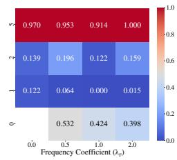

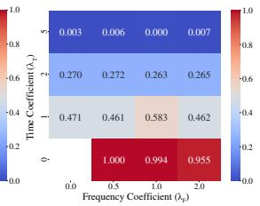  
Figure 22: Comparison of the normalized MSE (left) and TAM (right) of iTransformer trained on Weather dataset. The x-axis represents $\lambda _ { F }$ $( \{ 0 . 0 , 0 . 5 , 1 . 0 , 2 . 0 \} )$ , and the y-axis represents λT ({0.0, 1.0, 2.0, 5.0}).

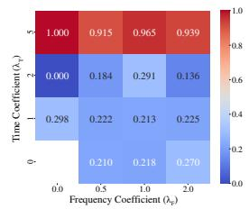

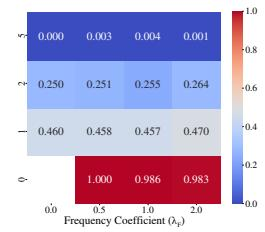  
Figure 23: Comparison of the normalized MSE (left) and TAM (right) of TimesNet trained on ETTh1 dataset. The x-axis represents $\lambda _ { F }$ $( \{ 0 . 0 , 0 . 5 , 1 . 0 , 2 . 0 \} )$ , and the y-axis represents λT ({0.0, 1.0, 2.0, 5.0}).

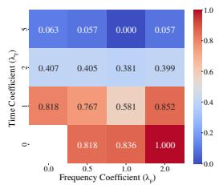

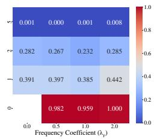  
Figure 24: Comparison of the normalized MSE (left) and TAM (right) of TimesNet trained on ETTm1 dataset. The x-axis represents $\lambda _ { F }$ $( \{ 0 . 0 , 0 . 5 , 1 . 0 , 2 . 0 \} )$ , and the y-axis represents $\lambda _ { T } \left( \left\{ 0 . 0 , 1 . 0 , 2 . 0 , 5 . 0 \right\} \right)$ ).

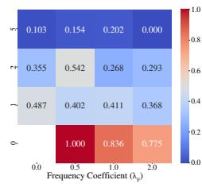

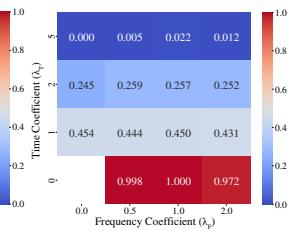  
Figure 25: Comparison of the normalized MSE (left) and TAM (right) of TimesNet trained on ETTm2 dataset. The x-axis represents $\lambda _ { F }$ $( \{ 0 . 0 , 0 . 5 , 1 . 0 , 2 . 0 \} )$ , and the y-axis represents $\lambda _ { T } \left( \left\{ 0 . 0 , 1 . 0 , 2 . 0 , 5 . 0 \right\} \right)$ .

## G Dataset explanation

We provide a brief description of each dataset used in our experiments, as referenced in Secs. 5 and I.

• Electricity transformer temperature (ETT) [42]: This dataset consists of two years of data collected from two counties in China. It is divided into four subsets: ETTh1 and ETTh2 (sampled hourly), and ETTm1 and ETTm2 (sampled every 15 minutes). Each record contains six power load features and one target variable representing the oil temperature.

• Exchange [37]: Contains daily exchange rates from eight countries, spanning from 1990 to 2016.

• Electricity (ECL) [13]: Comprises electric power consumption data sampled every minute over four years for a single household.

• ILI (https: / / github.com / thuml / Autoformer): Weekly records from 2002 to 2021, provided by the US Centers for Disease Control and Prevention, representing the number of influenza-like illness patients.

• PEMS: Contains traffic information measured at 5-minute intervals on California highways. The subsets PEMS03, PEMS04, PEMS07, and PEMS08 correspond to different regions and time spans, with varying numbers of sensors [28].

• Solar-Energy [24]: Includes solar energy production data from 137 plants in 2006, measured at 10-minute intervals.

• Traffic [37]: Consists of hourly traffic congestion data collected by 862 sensors on San Francisco freeways from January 2015 to December 2016.

To ensure fair performance evaluation, we adopted the sequence length, prediction length, and label length settings used in recent LTSF models, such as Autoformer [37], DLinear [40], PatchTST [33], TimesNet [36], iTransformer [30], GPT4TS [43], CycleNet [27]. Following previous works [37, 30, 28]. Tab. 3 shows the descriptions of datasets including the number of variate in each dataset, prediction length, dataset size, sampling frequency, and domain. Since the official Autoformer implementation provides the results in different prediction length (24, 48, 168, 336, 720), we follow their implementation and show the results on Sec. I.

Table 3: Descriptions of datasets. # of vars means the number of variate in each dataset.
<table><tr><td rowspan="2">Dataset</td><td rowspan="2"># of vars</td><td rowspan="2">Prediction Length</td><td rowspan="2">Dataset size (Train / Validation / Test)</td><td rowspan="2">Frequency</td><td rowspan="2">Domain</td></tr><tr><td>24, 48, 168, 336, 720 (Autoformer)</td></tr><tr><td>ETTh1</td><td>7</td><td>96, 192, 336, 720 (other models) 24, 48, 168, 336, 720 (Autoformer)</td><td>8545 / 2881 / 2881</td><td>Hourly</td><td>Temperature</td></tr><tr><td>ETTh2</td><td>7</td><td>96, 192, 336, 720 (other models)</td><td>8545 / 2881 / 2881</td><td>Hourly</td><td>Temperature</td></tr><tr><td>ETTm1</td><td>7</td><td>24, 48, 168, 336, 720 (Autoformer) 96, 192, 336, 720 (other models) 24, 48, 168, 336, 720 (Autoformer)</td><td>34465 / 11521 / 11521</td><td>15 min</td><td>Temperature</td></tr><tr><td>ETTm2</td><td>7</td><td>96, 192, 336, 720 (other models)</td><td>34465 / 11521 / 11521</td><td>15 min</td><td>Temperature</td></tr><tr><td>Weather Electricity</td><td>21</td><td>96, 192, 336, 720</td><td>36792 / 5271 / 10540</td><td>10 min</td><td>Weather</td></tr><tr><td>(ECL)</td><td>321</td><td>96, 192, 336, 720</td><td>18317 / 2633 / 5261</td><td>Hourly</td><td>Electricity</td></tr><tr><td>Traffic ILI</td><td>862</td><td>96, 192, 336, 720</td><td>12185 / 1757 / 3509</td><td>Hourly</td><td>Transportation</td></tr><tr><td>Exchange Rate</td><td>7</td><td>24, 36, 48, 60</td><td>617 / 74 /170</td><td>Weekly</td><td>Health</td></tr><tr><td>(Exchange)</td><td>8</td><td>96, 192, 336, 720</td><td>5120 / 665 / 1422</td><td>Daily</td><td>Economy</td></tr><tr><td>Solar</td><td>137</td><td>96, 192, 336, 720</td><td>36601 / 5161 / 10417</td><td>10 min</td><td>Energy</td></tr><tr><td>PEMS03</td><td>358</td><td>12, 24, 48,96</td><td>15617 / 5135 / 5135 10172 /3375 /3375</td><td>5min</td><td>Transportation</td></tr><tr><td>PEMS04</td><td>307 883</td><td>12, 24, 48, 96 12, 24, 48, 96</td><td>16911 / 5622 / 5622</td><td>5min 5min</td><td>Transportation</td></tr><tr><td>PEMS07 PEMS08</td><td>170</td><td>12, 24, 48, 96</td><td>10690 / 3548 / 3548</td><td>5min</td><td>Transportation Transportation</td></tr></table>

## H Experiment configurations

To ensure fair model evaluation, we utilized the official GitHub codes provided by six benchmark mod els: Autoformer [37], DLinear [40], PatchTST [33], TimesNet [36], iTransformer [30], GPT4TS [43], CycleNet [27]. For all experiments, we adopted the same prediction length, label length, and sequence length as the official implementations, and maintained the original architecture of each model.

Context lengths. According to the papers [37, 40, 33, 36, 30, 43, 27], the used context lenghts are followed by:

• CycleNet, Autoformer, iTransformer: 96

• TimesNet: 96 (36 for the ILI dataset)

• PatchTST, DLinear: 336 (104 for the ILI dataset)

Prediction lengths. We primarily used prediction lengths of {96, 192, 336, 720}. For the ILI dataset (https://github.com/thuml/Autoformer), we followed prior works and used {24, 36, 48, 60}. As an exception, for the ETT{h1, h2, m1, m2} datasets, we followed the Autoformer paper and used {24, 48, 168, 336, 720} (for Autoformer) and {96, 192, 336, 720} (for other models).

Optimization. The optimizer and scheduler were used under the same conditions as specified in the official codes for each model.

Our method. For our method (AliO), the hyperparameters—the number of samples N in Alg. 1 and lag l in Alg. 1—were set to their default values of 2 and 1, respectively. The Mean Squared Error (MSE) function was used as the distance function for both the time and frequency domains. The coefficients for the time domain $( \lambda _ { T } )$ and frequency domain $( \lambda _ { F } )$ were selected from the ranges {1.0, 2.0, 5.0} and {0.0, 0.5, 1.0, 2.0}, respectively (default values are $\lambda _ { T } = 1$ and $\lambda _ { F } = 0$ since the frequency domain is optional). Additionally, the AWL [26] technique was employed to automatically tune these coefficients and report the best performance.

Evaluation. We used Mean Squared Error (MSE) as our baseline loss function and reported forecasting performance using MSE, Mean Absolute Error (MAE), Mean Absolute Percentage Error (MAPE), Root Mean Squared Error (RMSE), and TAM. For all these metrics, lower values indicate better performance.

Robustness. To ensure robust results, we used three random seeds (2023, 2024, 2025) for initialization and report the standard deviation using ±. All experiments were conducted on NVIDIA RTX 3090 and A6000 GPUs. We conducted all experiments using the same GPU when comparing the baseline and AliO under the same conditions.

Training hyper-parameters. We used the same learning rate, batch size, and epoch as the official implementation of each model for reproducibility and fair comparison. The implementation code for each model is as follows.

• Autoformer: https://github.com/thuml/Autoformer

• DLinear: https://github.com/vivva/DLinear

• PatchTST: https://github.com/yuqinie98/PatchTST

• TimesNet: https://github.com/thuml/TimesNet

• iTransformer: https://github.com/thuml/iTransformer

• GPT4TS: https://github.com/DAMO-DI-ML/NeurIPS2023-One-Fits-All

• CycleNet: https://github.com/ACAT-SCUT/CycleNet

We followed the implementation code listed above (GitHub) and used the same learning rate, batch size, and number of epochs as shown in Tabs. 4 to 11. The optimizer we used is Adam [23].

Table 4: Learning rate and batch size of Autoformer used in each datasets.
<table><tr><td>Dataset</td><td>ECL</td><td>ETTh1</td><td>ETTh2</td><td>ETTm1</td><td>ETTm2</td><td>Exchange</td><td>Traffic</td><td>Weather</td></tr><tr><td>Learning rate</td><td>0.0001</td><td>0.0001</td><td>0.0001</td><td>0.0001</td><td>0.0001</td><td>0.0001</td><td>0.0001</td><td>0.0001</td></tr><tr><td>batch size</td><td>32</td><td>32</td><td>32</td><td>32</td><td>32</td><td>32</td><td>32</td><td>32</td></tr><tr><td>Epoch</td><td>10</td><td>10</td><td>10</td><td>10</td><td>10</td><td>10</td><td>3</td><td>10</td></tr></table>

Table 5: Learning rate and batch size of DLinear used in each datasets.
<table><tr><td>Dataset</td><td>ECL</td><td>ETTh1</td><td>ETTh2</td><td>ETTm1</td><td>ETTm2</td><td>Exchange</td><td>ILI</td><td>Traffic</td><td>Weather</td></tr><tr><td>Learning rate</td><td>0.001</td><td>0.0001</td><td>0.05</td><td>0.0001</td><td>0.001 0.01</td><td>0.0005 0.005</td><td>0.05</td><td>0.05</td><td>0.0001</td></tr><tr><td>batch size</td><td>16</td><td>8</td><td>32</td><td>8</td><td>32</td><td>8 32</td><td>32</td><td>16</td><td>16</td></tr><tr><td>Epoch</td><td>10</td><td>10</td><td>10</td><td>10</td><td>10</td><td>10</td><td>10</td><td>10</td><td>10</td></tr></table>

Table 6: Learning rate and batch size of PatchTST used in each datasets.
<table><tr><td>Dataset</td><td>ECL</td><td>ETTh1</td><td>ETTh2</td><td>ETTm1</td><td>ETTm2</td><td>ILI</td><td>Traffic</td><td>Weather</td></tr><tr><td>Learning rate</td><td>0.0001</td><td>0.0001</td><td>0.0001</td><td>0.0001</td><td>0.0001</td><td>0.0025</td><td>0.0001</td><td>0.0001</td></tr><tr><td>batch size</td><td>32</td><td>128</td><td>128</td><td>128</td><td>128</td><td>16</td><td>6</td><td>128</td></tr><tr><td>Epoch</td><td>100</td><td>100</td><td>100</td><td>100</td><td>100</td><td>100</td><td>100</td><td>100</td></tr></table>

Table 7: Learning rate and batch size of TimesNet used in each datasets.
<table><tr><td>Dataset</td><td>ECL</td><td>ETTh1</td><td>ETTh2</td><td>ETTm1</td><td>ETTm2</td><td>ILI</td><td>Exchange</td><td>Traffic</td><td>Weather</td></tr><tr><td>Learning rate</td><td>0.0001</td><td>0.0001</td><td>0.0001</td><td>0.0001</td><td>0.0001</td><td>0.0001</td><td>0.0001</td><td>0.0001</td><td>0.0001</td></tr><tr><td>batch size</td><td>32</td><td>32</td><td>32</td><td>32</td><td>32</td><td>32</td><td>32</td><td>16</td><td>32</td></tr><tr><td>Epoch</td><td>10</td><td>10</td><td>10</td><td>10</td><td>10</td><td>10</td><td>10</td><td>10</td><td>10</td></tr></table>

Table 8: Learning rate and batch size of iTransformer used in each datasets (excluding PEMS and Solar).
<table><tr><td>Dataset</td><td>ECL</td><td>ETTh1</td><td>ETTh2</td><td>ETTm1</td><td>ETTm2</td><td>ILI</td><td>Exchange</td><td>Traffic</td><td>Weather</td></tr><tr><td>Learning rate</td><td>0.0005</td><td>0.0001</td><td>0.0001</td><td>0.0001</td><td>0.0001</td><td>0.0001</td><td>0.0001</td><td>0.001</td><td>0.0001</td></tr><tr><td>batch size</td><td>16</td><td>32</td><td>32</td><td>32</td><td>32</td><td>32</td><td>32</td><td>16</td><td>32</td></tr><tr><td>Epoch</td><td>10</td><td>10</td><td>10</td><td>10</td><td>10</td><td>10</td><td>10</td><td>10</td><td>10</td></tr></table>

Table 9: Learning rate and batch size of iTransformer used in each datasets (including PEMS and Solar.
<table><tr><td>Dataset</td><td>PEMS03</td><td>PEMS04</td><td>PEMS07</td><td>PEMS08</td><td>Solar</td></tr><tr><td>Learning rate</td><td>0.001</td><td>0.0005</td><td>0.001</td><td>0.0001 0.001</td><td>0.0005</td></tr><tr><td>batch size</td><td>32</td><td>32</td><td>32</td><td>32</td><td>32</td></tr><tr><td></td><td></td><td></td><td>16</td><td>16</td><td></td></tr><tr><td>Epoch</td><td>10</td><td>10</td><td>10</td><td>10</td><td>10</td></tr></table>

Table 10: Learning rate and batch size of GPT4TS used in each datasets.
<table><tr><td>Dataset</td><td>ECL</td><td>ETTh1</td><td>ETTh2</td><td>ETTm1</td><td>ETTm2</td><td>ILI</td><td>Traffic</td><td>Weather</td></tr><tr><td>Learning rate</td><td>0.0001</td><td>0.0001</td><td>0.0001</td><td>0.0001</td><td>0.0001</td><td>0.0001</td><td>0.001</td><td>0.0001</td></tr><tr><td>batch size</td><td>512</td><td>256</td><td>256</td><td>256</td><td>256</td><td>16</td><td>256</td><td>512</td></tr><tr><td>Epoch</td><td>10</td><td>10</td><td>10</td><td>10</td><td>10</td><td>10</td><td>10</td><td>10</td></tr></table>

Table 11: Learning rate and batch size of CycleNet used in each datasets.
<table><tr><td>Dataset</td><td>ECL</td><td>ETTh1</td><td>ETTh2</td><td>ETTm1</td><td>ETTm2</td><td>Traffic</td><td>Weather</td><td>Solar</td></tr><tr><td>Learning rate</td><td>0.0001</td><td>0.0001</td><td>0.0001</td><td>0.0001</td><td>0.0001</td><td>0.0001</td><td>0.0001</td><td>0.0001</td></tr><tr><td>batch size</td><td>128</td><td>128</td><td>128</td><td>128</td><td>128</td><td>128</td><td>128</td><td>128</td></tr><tr><td>Epoch</td><td>30</td><td>30</td><td>30</td><td>30</td><td>30</td><td>30</td><td>30</td><td>30</td></tr></table>

## I Full experimental results

This section presents the comprehensive results of each Long-Term Series Forecasting (LTSF) models, Autoformer [37] (Tabs. 12 and 13), DLinear [40] (Tabs. 14 and 15), PatchTST [33] (Tabs. 16 and 17), TimesNet [36] (Tabs. 18 and 19), iTransformer [30] (Tabs. 20 to 22), GPT4TS [43] (Tabs. 23 and 24), and CycleNet [27] (Tabs. 25 and 26). The evaluation metrics include Mean Squared Error (MSE), Temporal Alignment Metric (TAM), Mean Absolute Error (MAE), Mean Absolute Percentage Error (MAPE), and Root Mean Squared Error (RMSE). The ± symbol denotes the standard deviation across multiple seeds (we used three random seeds for robust experiment). AVG represents the average value across all prediction lengths, with the best performance highlighted in bold.

proposed AliO method on the ECL, ETTh1, ETTh2, ETTm1, ETTm2, Exchange, Traffic, and Weather dat terms of MSE, TAM, MAE, MAPE, and RMSE. The best results are highlighted inbold. We use offi toformer)totrainthemodelwiththeofficialconfiurationTheaveraeimrovementofAliOoverthebase g.  g p     PE: 3.76%, and RMSE: 3.12%. The maximum improvement of AliO over the baseline is MSE: 27.90%, TA , %, and RMSE: 8.58%. Exchange, Traffix, and Weather a
<table><tr><td colspan="11">PE: 15.42%, and RMSE: 8.58%. Exchange, Traffix, and Weather are in Tab. 13.</td></tr><tr><td colspan="2">Models</td><td colspan="7">Autoformer</td></tr><tr><td colspan="2">Method</td><td colspan="6">Baseline AliO</td></tr><tr><td colspan="2">Metric 96</td><td>MSE↓</td><td>TAM↓</td><td>MAE↓</td><td>MAPE↓</td><td>RMSE↓</td><td>MSE↓</td><td>TAM↓ MAE↓</td><td>MAPE↓</td><td>RMSE↓</td></tr><tr><td colspan="2">ECL</td><td>0.204±0.008 0.219±0.005</td><td>0.035±0.002 0.042±0.002</td><td>0.319±0.008 0.329±0.003</td><td>3.398±0.230 3.416±0.185</td><td>0.452±0.009 0.468±0.005</td><td>0.193±0.003 0.215±0.003</td><td>0.029±0.001</td><td>0.308±0.003 3.296±0.132</td><td>0.440±0.004</td></tr><tr><td rowspan="10"></td><td>192 336</td><td>0.232±0.004</td><td>0.040±0.004</td><td>0.340±0.004</td><td></td><td></td><td>0.038±0.004 0.223±0.007 0.034±0.004</td><td>0.324±0.004 0.331±0.005</td><td>3.402±0.091 3.350±0.136</td><td>0.464±0.004</td></tr><tr><td>720</td><td></td><td></td><td></td><td>3.466±0.224</td><td>0.481±0.004</td><td>0.042±0.002</td><td></td><td></td><td>0.472±0.007</td></tr><tr><td></td><td>0.260±0.013</td><td>0.046±0.007</td><td>0.362±0.009</td><td>3.501±0.118</td><td>0.509±0.013</td><td>0.253±0.008</td><td>0.356±0.006</td><td>3.404±0.035</td><td>0.503±0.008</td></tr><tr><td>AVG</td><td>0.229±0.018</td><td>0.041±0.003</td><td>0.337±0.015</td><td>3.445±0.036</td><td>0.478±0.019</td><td>0.221±0.019</td><td>0.036±0.004 0.330±0.015</td><td>3.363±0.040</td><td>0.469±0.020</td></tr><tr><td>24</td><td>0.408±0.008</td><td>0.063±0.005</td><td>0.427±0.002</td><td>10.853±0.413</td><td>0.639±0.006</td><td>0.373±0.008</td><td>0.051±0.002 0.416±0.007</td><td>10.747±0.477</td><td>0.611±0.007</td></tr><tr><td>48</td><td>0.408±0.014</td><td>0.048±0.004</td><td>0.431±0.008</td><td>11.632±0.477</td><td>0.639±0.011</td><td>0.395±0.024</td><td>0.037±0.002 0.420±0.012</td><td>10.889±0.175</td><td>0.628±0.019</td></tr><tr><td>168</td><td>0.502±0.028</td><td>0.051±0.012</td><td>0.482±0.016</td><td>11.810±0.142</td><td>0.708±0.020</td><td>0.445±0.014</td><td>0.036±0.005 0.451</td><td>±0.010 11.573±0.593</td><td>0.667±0.011</td></tr><tr><td>ETTh1 336</td><td>0.517±0.013</td><td>0.039±0.003</td><td>0.491±0.006</td><td>11.786±0.326</td><td>0.719±0.009</td><td>0.484±0.013</td><td>0.048±0.002 0.479±0.008</td><td>11.957±0.223</td><td>0.696±0.009</td></tr><tr><td>720</td><td>0.549±0.016</td><td>0.047±0.002</td><td>0.527±0.008</td><td>12.533±0.659</td><td>0.741±0.011</td><td>0.521±0.009</td><td>0.057±0.009 0.516±0.010</td><td>13.217±1.015</td><td>0.722±0.007</td></tr><tr><td>AVG</td><td>0.477±0.053</td><td>0.050±0.007</td><td>0.472±0.034</td><td>11.723±0.488</td><td>0.689±0.039</td><td>0.444±0.050 0.046±0.008</td><td>0.456±0.034</td><td>11.677±0.811</td><td>0.665±0.038</td></tr><tr><td>24</td><td>0.280±0.009</td><td>0.054±0.004</td><td>0.356±0.006</td><td>1.524±0.038</td><td>0.529±0.008</td><td>0.265±0.003</td><td>0.034±0.003</td><td>0.340±0.003 1.392±0.028</td><td>0.515±0.003</td></tr><tr><td></td><td>48 0.335±0.029 0.442±0.008</td><td>0.051±0.009 0.044±0.009</td><td>0.390±0.021</td><td>1.624±0.067 1.868±0.150</td><td>0.578±0.025</td><td>0.301±0.009 0.421±0.008</td><td>0.025±0.002 0.027±0.002</td><td>0.360±0.006</td><td>1.422±0.054</td><td>0.549±0.008</td></tr><tr><td>ETTh2</td><td>168 336 0.479±0.012</td><td>0.031±0.012</td><td>0.482±0.012</td><td>0.448±0.009</td><td></td><td>0.665±0.006</td><td>0.448±0.002 0.018±0.004</td><td>0.427±0.005</td><td>1.580±0.084</td><td>0.649±0.006</td></tr><tr><td></td><td>720 0.470±0.022</td><td>0.025±0.005</td><td></td><td>0.483±0.013</td><td>2.003±0.194 2.273±0.166</td><td>0.692±0.009 0.685±0.016</td><td>0.450±0.005 0.020±0.000</td><td>0.455±0.002 0.466±0.003</td><td>1.749±0.020</td><td>0.669±0.001</td></tr><tr><td></td><td>AVG</td><td>0.401±0.072</td><td>0.041±0.010</td><td>0.432±0.046</td><td>1.858±0.245</td><td>0.630±0.059 0.377</td><td>:0.071 0.025±0.005</td><td>0.410±0.046</td><td>2.044±0.024 1.637±0.219</td><td>0.670±0.004</td></tr><tr><td></td><td>24</td><td>0.377±0.015</td><td>0.092±0.003</td><td>0.415±0.005</td><td>2.563±0.005</td><td>0.614±0.012</td><td>0.351±0.023</td><td>0.084±0.001 0.394</td><td>2.455±0.019</td><td>0.610±0.060</td></tr><tr><td></td><td>48</td><td>0.447±0.048</td><td>0.079±0.014</td><td>0.452±0.017</td><td>2.789±0.130</td><td>0.668±0.035</td><td>0.381±0.002</td><td>0.053±0.001 0.412±0.003</td><td>±0.011 2.458±0.074</td><td>0.592±0.019 0.617±0.001</td></tr><tr><td></td><td>96</td><td>0.493±0.054</td><td>0.074±0.010</td><td>0.478±0.019</td><td>2.834±0.081</td><td>0.701±0.038</td><td>0.440±0.029</td><td>0.055±0.006 0.445±0.012</td><td>2.579±0.078</td><td>0.663±0.022</td></tr><tr><td>ETTm1</td><td>288</td><td>0.579±0.030</td><td>0.070±0.013</td><td>0.513±0.012</td><td>2.851±0.060</td><td>0.760±0.020</td><td>0.515±0.003</td><td>0.041±0.002 0.479±</td><td>±0.004 2.604±0.049</td><td></td></tr><tr><td></td><td>672</td><td>0.544±0.013</td><td>0.036±0.001</td><td>0.501±0.005</td><td>2.788±0.062</td><td>0.737±0.009</td><td>0.554±0.013 0.031±0.002</td><td>0.501±0.009</td><td></td><td>0.718±0.002</td></tr><tr><td></td><td>AVG</td><td>0.488±0.065</td><td>0.070±0.017</td><td>0.472±0.032</td><td>2.765±0.095</td><td>0.696±0.047</td><td>0.448±0.070 0.053±0.016</td><td>0.446±0.036</td><td>2.728±0.044</td><td>0.744±0.009</td></tr><tr><td></td><td></td><td></td><td></td><td></td><td></td><td></td><td></td><td></td><td>2.565±0.093</td><td>0.667±0.053</td></tr><tr><td rowspan="6">ETTm2</td><td>24</td><td>0.161±0.013 0.217±0.012</td><td>0.078±0.010 0.080±0.005</td><td>0.268±0.010 0.308±0.009</td><td>1.081±0.039</td><td>0.401±0.016</td><td>0.148±0.005</td><td>0.057±0.005 0.259±0.005</td><td>1.054±0.041</td><td>0.385±0.007</td></tr><tr><td>48</td><td></td><td></td><td></td><td>1.196±0.046</td><td>0.466±0.013</td><td>0.182±0.006</td><td>0.041±0.009</td><td>0.279±0.007</td><td>1.094±0.033</td><td>0.426±0.007</td></tr><tr><td>96</td><td>0.252±0.029</td><td>0.058±0.008</td><td>0.324±0.015</td><td>1.302±0.024</td><td>0.502±0.028</td><td>0.217±0.003</td><td>0.030±0.006</td><td>0.298±0.004</td><td>1.158±0.019</td><td>0.466±0.003</td></tr><tr><td>288</td><td>0.319±0.005</td><td>0.027±0.004</td><td>0.362±0.003</td><td>1.407±0.029</td><td>0.565±0.005</td><td>0.313±0.001</td><td>0.019±0.005</td><td>0.354±0.001</td><td>1.307±0.013</td><td>0.559±0.001</td></tr><tr><td>672</td><td>0.408±0.002</td><td>0.017±0.003</td><td>0.410±0.001</td><td>1.577±0.014</td><td>0.639±0.001</td><td>0.409±0.003</td><td>0.012±0.004</td><td>0.409±0.002</td><td>1.538±0.047</td><td>0.640±0.002</td></tr><tr><td>AVG</td><td>0.271±0.078</td><td>0.052±0.024</td><td>0.334±0.044</td><td>1.313±0.156</td><td>0.514±0.075</td><td>0.254±0.087</td><td>0.032±0.015</td><td>0.320±0.050</td><td>1.230±0.161</td><td>0.495±0.084</td></tr></table>

<table><tr><td colspan="10">Table 13: Full results of the proposed AliO method on the ECL, ETTh1, ETTh2, ETTm1, ETTm2, Exchange, Traffic, and Weather datasets and Autoformer [37]. The results are reported in terms of MSE, TAM, MAE, MAPE, and RMSE. The best results are highlighted in bold. We use official GitHub code (https : //github. com/thuml/Autof ormer) to train the model with the official configuration. The average improvement of AliO over the baseline is MSE: 6.98%, TAM: 24.24%, MAE: 3.38%, MAPE: 3.76%, and RMSE: 3.12%. The maximum improvement of AliO over the baseline is MSE: 27.90%, TAM: 81.18%, MAE: 15.17%, MAPE: 15.42%, and RMSE: 8.58%. ECL, ETTh1, ETTh2, ETTm1, and ETTm2 are in Tab. 12.</td></tr><tr><td></td><td colspan="7">Models Method</td><td colspan="4">AliO</td></tr><tr><td>Metric</td><td>96 0.155±0.012</td><td>MSE↓</td><td>TAM↓ MAE↓</td><td>MAPE↓</td><td>RMSE↓</td><td>MSE↓</td><td>TAM↓</td><td>MAE</td><td>MAPE↓</td><td>RMSE↓</td></tr><tr><td rowspan="12">Exchange</td><td>192</td><td></td><td>0.031±0.016 0.286±0.011</td><td>1.700±0.053 2.345±0.025</td><td>0.394±0.015 0.532±0.016</td><td>0.139±0.005 0.275±0.012</td><td>0.018±0.007</td><td>0.270±0.005</td><td>1.648±0.010</td><td>0.373±0.007</td></tr><tr><td>336</td><td>0.284±0.017</td><td>0.014±0.004</td><td>0.389±0.009</td><td></td><td></td><td>0.015±0.008</td><td>0.379±0.009</td><td>2.338±0.025</td><td>0.525±0.011</td></tr><tr><td>720</td><td>0.447±0.041</td><td>0.020±0.007</td><td>0.496±0.023</td><td>3.403±0.130</td><td>0.668±0.031</td><td>0.436±0.012 0.011±0.000</td><td>0.488±0.007</td><td>3.369±0.002</td><td>0.660±0.009</td></tr><tr><td>AVG</td><td>1.110±0.035</td><td>0.037±0.044</td><td>0.814±0.022</td><td>6.640±0.123</td><td>1.053±0.017 0.800±0.011</td><td>0.007±0.002</td><td>1.079±0.022</td><td>6.627±0.094</td><td>1.039±0.011</td></tr><tr><td>96</td><td>0.499±0.329</td><td>0.025±0.008</td><td>0.496±0.177</td><td>3.522±1.699</td><td>0.662±0.220</td><td>0.413±0.221 0.013±0.004</td><td>0.554±0.280</td><td>3.495±1.707</td><td>0.649±0.221</td></tr><tr><td></td><td>0.637±0.018</td><td>0.051±0.005</td><td>0.400±0.014</td><td>4.222±0.261</td><td>0.798±0.011</td><td>0.613±0.009 0.041±0.003</td><td>0.375±0.002</td><td>3.782±0.014</td><td>0.783±0.006</td></tr><tr><td></td><td>192 0.626±0.009</td><td>0.055±0.006</td><td>0.389±0.006</td><td>4.104±0.090</td><td>0.791±0.006</td><td>0.621±0.008 0.051±0.005</td><td>0.386±0.006</td><td>4.130±0.079</td><td>0.788±0.005</td></tr><tr><td>Traffic</td><td>336 0.623±0.006</td><td>0.042±0.002</td><td>0.386±0.005</td><td>4.207±0.091</td><td>0.789±0.004</td><td>0.614±0.003</td><td>0.048±0.006</td><td>0.379±0.003 4.313±0.167</td><td>0.784±0.002</td></tr><tr><td></td><td>720</td><td>0.651±0.010 0.045±0.004</td><td>0.398±0.006</td><td>4.326±0.033</td><td>0.807±0.006</td><td>0.648±0.005</td><td>0.039±0.001</td><td>0.386±0.003</td><td>3.970±0.063 0.805±0.003</td></tr><tr><td></td><td>AVG</td><td>0.634±0.010 0.048±0.005</td><td>0.393±0.005</td><td>4.215±0.070</td><td>0.796±0.006</td><td>0.624±0.013</td><td>0.045±0.004 0.382±0.004</td><td>4.049±0.175</td><td>0.790±0.008</td></tr><tr><td></td><td>96 0.269±0.032</td><td>0.069±0.011</td><td>0.340±0.023</td><td>13.016±1.557</td><td>0.518±0.031</td><td>0.224±0.009</td><td>0.051±0.003 0.288±0.011</td><td>13.076±0.455</td><td>0.474±0.010</td></tr><tr><td></td><td>192</td><td>0.298±0.013 0.055±0.003</td><td>0.356±0.008</td><td>14.001±0.960</td><td>0.546±0.012 0.606±0.021</td><td>0.282±0.007 0.338±0.011</td><td>0.043±0.005 0.332±0.006 0.045±0.014</td><td>15.517±0.589 14.002±0.378</td><td>0.531±0.007</td></tr><tr><td>Weather</td><td>336</td><td>0.367±0.026 0.046±0.006 0.056±0.004</td><td>0.398±0.020 0.441±0.013</td><td>13.587±2.218 11.666±0.645</td><td>0.659±0.011</td><td>0.401±0.005</td><td>0.027±0.007</td><td>0.368±0.008</td><td>0.581±0.010</td></tr><tr><td></td><td>720</td><td>0.434±0.014</td><td></td><td></td><td>0.582±0.049</td><td></td><td>0.042±0.008</td><td>0.410±0.004 0.350±0.040</td><td>12.468±0.723 0.633±0.004</td></tr><tr><td></td><td>AVG</td><td>0.342±0.057 0.056±0.007</td><td>0.384±0.035</td><td>13.068±0.788</td><td></td><td>0.311±0.058</td><td></td><td>13.766±1.028</td><td>0.555±0.053</td></tr></table>

proposed AliO method on the ECL, ETTh1, ETTh2, ETTm1, ETTm2, Exchange, ILI, Traffix, and Weather termsofMSETAMMAEMAPEandRMSEThebestresultsarehighlightedinboldWeuseoffi , , , ,  .       .   inear) to train the model with the official configuration. The average improvement of AliO over the basel PE: 2.25%, and RMSE: 0.79%. The maximum improvement of AliO over the baseline is MSE: 36.07%, TA , %, and RMSE: 5.61%. Exchange ILI Traffic Weather
<table><tr><td>Models</td><td colspan="9">DLinear</td></tr><tr><td>Method</td><td></td><td></td><td>Baseline</td><td></td><td></td><td></td><td></td><td>AliO</td><td></td><td></td></tr><tr><td colspan="2">Metric</td><td>MSE↓</td><td>TAM↓</td><td>MAE↓</td><td>MAPE↓</td><td>RMSE↓</td><td>MSE↓ TAM↓</td><td>MAE↓</td><td>MAPE↓</td><td>RMSE↓</td></tr><tr><td rowspan="7">ECL</td><td>96</td><td>0.140±0.000</td><td>0.017±0.000</td><td>0.237±0.000</td><td>2.149±0.005 0.374±0.000</td><td>0.140±0.000</td><td>0.013±0.000</td><td>0.237±0.000</td><td>2.149±0.003</td><td>0.374±0.000</td></tr><tr><td>192</td><td>0.153±0.000 0.013±0.000</td><td>0.250±0.000</td><td>2.300±0.003</td><td>0.391±0.000</td><td>0.153±0.000</td><td>0.010±0.000</td><td>0.250±0.000</td><td>2.301±0.001</td><td>0.391±0.000</td></tr><tr><td>336</td><td>0.169±0.000</td><td>0.011±0.000 0.268±0.000</td><td>2.283±0.004</td><td>0.411±0.000</td><td>0.169±0.000</td><td>0.008±0.000</td><td>0.267±0.000</td><td>2.283±0.001</td><td>0.411±0.000</td></tr><tr><td>720</td><td>0.204±0.000</td><td>0.011±0.001</td><td>0.301±0.000</td><td>2.457±0.002 0.451±0.000</td><td>0.203±0.000</td><td>0.008±0.001</td><td>0.300±0.000</td><td>2.451±0.004</td><td>0.451±0.000</td></tr><tr><td>AVG</td><td>0.166±0.021</td><td>0.013±0.002</td><td>0.264±0.021</td><td>2.297±0.098 0.407±0.026</td><td>0.166±0.021</td><td>0.010±0.002</td><td>0.264±0.021</td><td>2.296±0.096</td><td>0.407±0.026</td></tr><tr><td>96</td><td>0.371±0.000</td><td>0.028±0.001</td><td>0.395±0.001</td><td>8.691±0.011</td><td>0.609±0.000</td><td>0.369±0.000 0.019±0.000</td><td>0.392±0.000</td><td>8.743±0.003</td><td>0.608±0.000</td></tr><tr><td>192</td><td>0.408±0.002</td><td>0.028±0.002</td><td>0.419±0.002</td><td>8.481±0.081</td><td>0.638±0.002 0.404±0.000</td><td>0.015±0.000</td><td>0.413±0.000</td><td>8.496±0.006</td><td>0.635±0.000</td></tr><tr><td rowspan="6">ETTh1</td><td>336 0.435±0.002</td><td>0.024±0.005</td><td>0.439±0.003</td><td>8.545±0.053</td><td>0.660±0.001</td><td>0.432±0.000</td><td>0.013±0.000</td><td>0.435±0.000</td><td>8.489±0.001</td><td>0.658±0.000</td></tr><tr><td>720</td><td>0.474±0.001 0.022±0.003</td><td>0.493±0.001</td><td>9.459±0.056</td><td>0.689±0.001</td><td>0.469±0.000</td><td>0.010±0.000</td><td>0.488±0.000</td><td>9.429±0.001</td><td>0.685±0.000</td></tr><tr><td>AVG 0.422±0.034</td><td>0.025±0.003</td><td>0.436±0.032</td><td>8.794±0.350</td><td>0.649±0.026</td><td>0.419±0.033</td><td>0.014±0.003</td><td>0.432±0.032</td><td>8.789±0.343</td><td>0.646±0.025</td></tr><tr><td>96 0.291±0.003</td><td>0.069±0.016</td><td>0.354±0.002</td><td>1.359±0.048</td><td>0.539±0.003</td><td>0.290±0.006</td><td>0.046±0.010</td><td>0.353±0.006</td><td>1.321±0.028</td><td>0.538±0.006</td></tr><tr><td>192</td><td>0.381±0.008</td><td>0.049±0.005 0.416±0.006</td><td>1.369±0.007</td><td>0.617±0.007</td><td>0.369±0.007</td><td>0.023±0.004</td><td>0.405±0.006</td><td>1.376±0.022</td><td>0.607 ±0.006</td></tr><tr><td>336</td><td>0.438+0.011</td><td>0.039 ±0.001</td><td>0.456±0.007</td><td>1.494±0.008 0.662±0.008</td><td>0.454±0.009</td><td>0.050±0.027</td><td>0.465±0.004</td><td>1.497±0.041</td><td>0.674±0.007</td></tr><tr><td rowspan="8">ETTh2 ETTm1</td><td>720</td><td>0.687±0.044</td><td>0.057±0.020</td><td>0.586±0.018</td><td>1.605±0.033</td><td>0.828±0.026</td><td>0.672±0.025</td><td>0.013±0.002</td><td>0.577±0.013</td><td>1.544±0.019</td><td>0.820±0.015</td></tr><tr><td>AVG</td><td>0.449±0.131</td><td>0.054±0.010</td><td>0.453±0.076</td><td>1.457±0.090</td><td>0.662±0.095</td><td>0.446±0.128</td><td>0.033±0.014</td><td>0.450±0.075</td><td>1.434±0.080</td><td>0.660±0.093</td></tr><tr><td>96</td><td>0.300±0.001</td><td>0.031±0.002</td><td>0.344±0.001</td><td>2.021±0.011</td><td>0.548±0.001</td><td>0.296±0.000</td><td>0.014±0.000</td><td>0.338±0.000</td><td>1.983±0.001</td><td>0.544±0.000</td></tr><tr><td>192</td><td>0.338±0.000</td><td>0.026±0.001</td><td>0.369±0.001</td><td>2.079±0.008</td><td>0.581±0.000</td><td>0.333±0.000</td><td>0.010±0.000</td><td>0.361±0.000</td><td>2.068±0.001</td><td>0.577±0.000</td></tr><tr><td>336</td><td>0.369±0.000</td><td>0.020±0.001</td><td>0.386±0.001</td><td>2.131±0.008</td><td>0.608±0.000</td><td>0.367±0.000</td><td>0.008±0.000</td><td>0.382±0.000</td><td>2.124±0.001</td><td>0.606±0.000</td></tr><tr><td>720</td><td>0.427±0.000</td><td>0.019±0.001</td><td>0.422±0.001</td><td>2.240±0.018</td><td>0.653±0.000</td><td>0.422±0.000</td><td>0.006±0.000</td><td>0.416±0.000</td><td>2.237±0.001</td><td>0.650±0.000</td></tr><tr><td>AVG</td><td>0.358±0.041</td><td>0.024±0.004</td><td>0.380±0.025</td><td>2.118±0.072</td><td>0.597±0.034</td><td>0.354±0.042</td><td>0.010±0.002</td><td>0.374±0.025</td><td>2.103±0.082</td><td>0.594±0.035</td></tr><tr><td>96</td><td>0.171±0.002</td><td>0.034±0.002</td><td>0.265±0.004</td><td>..047 ±0.009</td><td>0.413±0.002</td><td>0.166±0.001</td><td>0.018±0.00</td><td>0.258±0.001</td><td>1.056±0.003</td><td>0.407 ±0.001</td></tr><tr><td rowspan="5">ETTm2</td><td>192</td><td>0.233±0.004</td><td>0.031±0.004</td><td>0.312±0.007</td><td>..153 ±0.024</td><td>0.483±0.004</td><td>0.229 ±0.002</td><td>0.015±0.001</td><td>0.307±0.002</td><td>1.162±0.005</td><td>0.478±0.002</td></tr><tr><td>336</td><td>0.311±0.022</td><td>0.053±0.023</td><td>0.366±0.017</td><td>.325±0.085</td><td>0.557±0.019</td><td>0.284±0.005</td><td>0.026±0.007</td><td>0.344±0.004</td><td>1.274±0.018</td><td>0.533±0.005</td></tr><tr><td>720</td><td>0.443±0.012</td><td>0.030±0.003</td><td>0.453±0.008</td><td>1.315±0.019</td><td>0.665±0.009</td><td>0.394±0.004</td><td>0.020±0.005</td><td>0.415±0.003</td><td>.384±0.007</td><td>0.628±0.003</td></tr><tr><td>AVG</td><td>0.289±0.091</td><td>0.037±0.009</td><td>0.349±0.062</td><td>1.210±0.104</td><td>0.530±0.083</td><td>0.268±0.075</td><td>0.020±0.004</td><td>0.331±0.051</td><td>1.219±0.110</td><td>0.512±0.072</td></tr><tr><td></td><td></td><td></td><td></td><td></td><td></td><td></td><td></td><td></td><td></td><td></td></tr><tr><td colspan="12">Table 15: Full results of the proposed AliO method on the ECL, ETTh1, ETTh2, ETTm1, ETTm2, Exchange, ILI, Traffix, and Weather datasets and DLinear [40]. The results are reported in terms of MSE, TAM, MAE, MAPE, and RMSE. The best results are highlighted in bold. We use official GitHub code (https : //github . com/vivva/DLinear) to train the model with the official configuration. The average improvement of AliO over the baseline is MSE: 5.62%, TAM: 36.21%, MAE: -3.82%, MAPE: 2.25%, and RMSE: 0.79%. The maximum improvement of AliO over the baseline is MSE: 36.07%, TAM: 77.73%, MAE: 8.21%, MAPE: 15.19%, and RMSE: 5.61%. ECL, ETTh1, ETTh2, ETTm1, and ETTm2 are in Tab. 14.</td></tr><tr><td colspan="12">Models Method</td></tr><tr><td colspan="3">Metric</td><td colspan="4">Baseline</td><td colspan="5"></td></tr><tr><td></td><td>96</td><td>MSE↓</td><td>TAM↓</td><td>MAE↓</td><td>MAPE↓</td><td>RMSE↓</td><td>MSE↓ TAM↓</td><td>AliO MAE↓</td><td>MAPE↓</td><td>RMSE↓</td></tr><tr><td rowspan="12">Exchange</td><td></td><td>0.086±0.006</td><td>0.017±0.000</td><td>0.208±0.008</td><td>1.198±0.036</td><td>0.293±0.010</td><td>0.078±0.000 0.015±0.000</td><td>0.201±0.000</td><td>1.120±0.001</td><td>0.280±0.000</td></tr><tr><td>192</td><td>0.160±0.002</td><td>0.015±0.001</td><td>0.295±0.002</td><td>1.584±0.033</td><td>0.400±0.003</td><td>0.157±0.002 0.014±0.001</td><td>0.291±0.002</td><td>1.594±0.019</td><td>0.396±0.002</td></tr><tr><td></td><td>336 0.330±0.032</td><td>0.012±0.005</td><td>0.434±0.016</td><td>2.120±0.139</td><td>0.574±0.028</td><td>0.320±0.034 0.012±0.003</td><td>0.425±0.022</td><td>2.222±0.207</td><td>0.565±0.030</td></tr><tr><td></td><td>720 0.833±0.129</td><td>0.033±0.017</td><td>0.689±0.050</td><td>2.298±0.441</td><td>0.910±0.072</td><td>0.822±0.135 0.054±0.033</td><td>0.679±0.051</td><td>2.186±0.258</td><td>0.904±0.074</td></tr><tr><td></td><td></td><td></td><td></td><td>1.800±0.390</td><td>0.544±0.209</td><td>0.344±0.259 0.024±0.016</td><td>0.399±0.161</td><td>1.781±0.407</td><td></td></tr><tr><td></td><td>AVG 0.352±0.260</td><td>0.019±0.007</td><td>0.407±0.163 1.078±0.060</td><td>4.052±0.445</td><td>1.527±0.049</td><td>2.229 ±0.019 0.131±0.003</td><td>1.036±0.005</td><td>3.689±0.059</td><td>0.536±0.210</td></tr><tr><td></td><td>24 2.335±0.149 36 2.072±0.026</td><td>0.196±0.039 0.144±0.009</td><td>1.018±0.012</td><td>2.497±0.075</td><td>1.439±0.009</td><td>2.076±0.036 0.153±0.063</td><td>1.024±0.005</td><td>2.507±0.190</td><td>1.493±0.006 1.441±0.013</td></tr><tr><td>ILI</td><td>48 2.269±0.077</td><td>0.136±0.020</td><td>1.091±0.032</td><td>2.685±0.249</td><td>1.506±0.026</td><td>2.161±0.016 0.078±0.003</td><td>1.049±0.003</td><td>2.278±0.016</td><td>1.470±0.005</td></tr><tr><td></td><td>60 2.315±0.022</td><td>0.132±0.028</td><td>1.088±0.006</td><td>2.542±0.176</td><td>1.521±0.007</td><td>2.280±0.080 0.112±0.021</td><td>1.078±0.019</td><td>2.412±0.050</td><td>1.510±0.027</td></tr><tr><td></td><td>AVG</td><td>2.247±0.093 0.152±0.023</td><td>1.069±0.027</td><td>2.944±0.576</td><td>1.498±0.031</td><td>2.187±0.069 0.119±0.025</td><td>1.047±0.018</td><td>2.721±0.505</td><td>1.478±0.023</td></tr><tr><td></td><td>96</td><td>0.412±0.001 0.024±0.001</td><td>0.286±0.001</td><td>3.123±0.030</td><td>0.642±0.001</td><td>0.269±0.000 0.007±0.000</td><td>0.426±0.000</td><td>2.749±0.000</td><td>0.653±0.000</td></tr><tr><td></td><td>192 0.424±0.000</td><td>0.026±0.003</td><td>0.291±0.000</td><td>3.073±0.018</td><td>0.651±0.000</td><td>0.276±0.000 0.007±0.002 0.006±0.002</td><td>0.430±0.000 0.440±0.000</td><td>2.718±0.006</td><td>0.656±0.000</td></tr><tr><td>Traffic</td><td>336</td><td>0.438±0.001 0.023±0.000</td><td>0.299±0.001 0.319±0.001</td><td>3.047±0.008 3.139±0.022</td><td>0.662±0.000 0.684±0.001</td><td>0.282±0.000 0.299±0.000 0.009±0.002</td><td>0.466±0.000</td><td>2.690±0.006 2.769±0.005</td><td>0.664±0.000</td></tr><tr><td></td><td>720 AVG</td><td>0.468±0.001 0.026±0.004 0.436±0.019 0.025±0.001</td><td>0.299±0.011</td><td>3.095±0.033</td><td>0.660±0.014</td><td>0.282±0.010</td><td>0.007±0.001 0.441±0.014</td><td>2.731±0.027</td><td>0.683±0.000</td></tr><tr><td></td><td>96</td><td>0.175±0.001</td><td>0.009±0.001 0.237±0.003</td><td>10.585±0.247</td><td>0.419±0.001</td><td>0.175±0.001</td><td>0.007±0.000 0.236±0.002</td><td>10.679±0.122</td><td>0.664±0.010 0.419±0.001</td></tr><tr><td rowspan="4">Weather</td><td>192</td><td>0.216±0.001</td><td>0.007±0.000</td><td>0.275±0.001</td><td>10.767±0.080</td><td>0.465±0.001 0.217±0.000</td><td>0.005±0.000</td><td>0.273±0.000</td><td>10.893±0.009 0.466±0.000</td></tr><tr><td>336</td><td>0.264±0.002</td><td>0.007±0.000</td><td>0.316±0.003</td><td>11.698±0.232</td><td>0.513±0.002</td><td>0.262±0.000 0.004±0.000</td><td>0.310±0.000</td><td></td></tr><tr><td></td><td>720 0.326±0.001</td><td>0.006±0.000</td><td>0.367±0.002</td><td>10.920±0.188</td><td>0.571±0.001</td><td>0.324±0.000 0.003±0.000</td><td>0.362±0.000</td><td>11.930±0.005 0.511±0.000 11.236±0.009 0.569±0.000</td></tr><tr><td></td><td>AVG 0.245±0.050</td><td>0.007±0.001</td><td>0.299±0.043</td><td>10.993±0.380</td><td>0.492±0.051</td><td>0.244±0.049 0.005±0.001</td><td>0.295±0.041</td><td>11.184±0.424 0.491±0.050</td></tr></table>

he proposed AliO method on the ECL, ETTh1, ETTh2, ETTm1, ETTm2, ILI, Traffix, and Weather da terms of MSE, TAM, MAE, MAPE, and RMSE. The best results are highlighted inbold. We use offi 8/PatchTST) to train the model with the official configuration. The average improvement of AliO over th %, MAPE: 4.40%, and RMSE: 1.34%. The maximum improvement of AliO over the baseline is MSE: 20. E: 29.81%, and RMSE: 11.01%. ILI, Traffic, and Weather
<table><tr><td colspan="17">Λ: 35.69%, MAE: 2.42%, MAPE: 4.40%, and RMSE: 1.34%. The maximum improvement of AliO over the baseline is MSE: 20.93%, TAM: 60.37%, M 4%, MAPE: 29.81%, and RMSE: 11.01%. ILI, Traffic, and Weather are in Tab. 17.</td></tr><tr><td colspan="2">Models Method</td><td colspan="11">PatchTST</td></tr><tr><td colspan="4">Metric TAM↓</td><td>Baseline MAE↓</td><td>MAPE↓</td><td>RMSE↓</td><td>MSE↓</td><td>TAM↓</td><td></td><td>AliO MAE↓</td><td>MAPE↓</td><td>RMSE↓</td></tr><tr><td colspan="2"></td><td>MSE↓ 0.130±0.000</td><td>0.030±0.000</td><td>0.223±0.000</td><td>2.332±0.034</td><td>0.360±0.000</td><td>0.130±0.000</td><td>0.016±0.000</td><td></td><td>0.221±0.000</td><td>2.276±0.006</td><td>0.361±0.000</td></tr><tr><td rowspan="6">ECL</td><td>96 192</td><td>0.149±0.001</td><td>0.032±0.002</td><td>0.241±0.001</td><td>2.488±0.040</td><td>0.386±0.001</td><td>0.148±0.001</td><td>0.021±0.000</td><td>0.238±0.000</td><td>2.462±0.004</td><td></td><td>0.385±0.001</td></tr><tr><td>336</td><td>0.166±0.000</td><td>0.037±0.001</td><td>0.260±0.001</td><td>2.493±0.008</td><td>0.408±0.001</td><td>0.165±0.001</td><td>0.028±0.001</td><td></td><td>0.257±0.000</td><td>2.468±0.008</td><td></td></tr><tr><td>720</td><td>0.203±0.001</td><td>0.049±0.002</td><td>0.293±0.001</td><td>2.583±0.027</td><td>0.451±0.001</td><td>0.202±0.001</td><td>0.030±0.000</td><td></td><td></td><td></td><td>0.406±0.001</td></tr><tr><td></td><td></td><td></td><td></td><td></td><td></td><td></td><td></td><td></td><td>0.289±0.001</td><td>2.554±0.012</td><td>0.449±0.001</td></tr><tr><td>AVG</td><td>0.162±0.024</td><td>0.037±0.007</td><td>0.254±0.023</td><td>2.474±0.081</td><td>0.401±0.030</td><td>0.161±0.024</td><td></td><td>0.024±0.005</td><td>0.251±0.023</td><td>2.440±0.091</td><td>0.400±0.029</td></tr><tr><td>96</td><td>0.379±0.000</td><td>0.065±0.002</td><td>0.401±0.000</td><td>9.413±0.032</td><td>0.616±0.000</td><td>0.378±0.001</td><td>0.053±0.002</td><td></td><td>0.401±0.001</td><td>9.358±0.026</td><td>0.615±0.001</td></tr><tr><td rowspan="6">ETTh1</td><td>192</td><td>0.412±0.000</td><td>0.063±0.002</td><td>0.420±0.000</td><td>9.490±0.037</td><td>0.642±0.000</td><td>0.411±0.000</td><td>0.050±0.002</td><td>0.419±0.000</td><td>9.454±0.027</td><td></td><td>0.641±0.000</td></tr><tr><td>336</td><td>0.435±0.002</td><td>0.072±0.007</td><td>0.436±0.001</td><td>9.524±0.066</td><td>0.659±0.001</td><td>0.432±0.001</td><td></td><td>0.045±0.002</td><td>0.434±0.000</td><td>9.425±0.038</td><td>0.657±0.000</td></tr><tr><td>720</td><td>0.448±0.003</td><td>0.103±0.013</td><td>0.465±0.002</td><td>10.184±0.163</td><td>0.669±0.002</td><td>0.439±0.003</td><td></td><td>0.042±0.005</td><td>0.461±0.002</td><td>9.896±0.092</td><td>0.663±0.002</td></tr><tr><td>AVG</td><td>0.418±0.023</td><td>0.076±0.014</td><td>0.431±0.021</td><td>9.653±0.277</td><td>0.646±0.018</td><td>0.415±0.021</td><td></td><td>0.048±0.004</td><td>0.429±0.020</td><td>9.533±0.190</td><td>0.644±0.017</td></tr><tr><td>96</td><td>0.276±0.000</td><td>0.067±0.001</td><td>0.338±0.000</td><td>1.378±0.002</td><td>0.525±0.000</td><td>0.275±0.000</td><td></td><td>0.055±0.001</td><td>0.337±0.000</td><td>1.368±0.003</td><td>0.525±0.000</td></tr><tr><td>192</td><td>0.336±0.000</td><td>0.062±0.001</td><td>0.378±0.000</td><td>1.510±0.003</td><td>0.580±0.000</td><td>0.337±0.000</td><td>0.051±0.001</td><td></td><td>0.377±0.001</td><td>1.495±0.024</td><td>0.580±0.000</td></tr><tr><td rowspan="4">ETTh2</td><td>336</td><td>0.361±0.000</td><td>0.060±0.002</td><td>0.401±0.001</td><td>1.700±0.011</td><td>0.601±0.000</td><td>0.360±0.000</td><td>0.048±0.002</td><td></td><td>0.399±0.002</td><td>1.672±0.027</td><td>0.600±0.000</td></tr><tr><td>720</td><td>0.391±0.000</td><td>0.055±0.002</td><td>0.429±0.000</td><td>2.013±0.003</td><td>0.625±0.000</td><td>0.391±0.001</td><td></td><td>0.044±0.002</td><td>0.429±0.001</td><td>2.010±0.003</td><td>0.625±0.001</td></tr><tr><td>AVG</td><td>0.341±0.038</td><td>0.061±0.004</td><td>0.387±0.030</td><td>1.650±0.214</td><td>0.583±0.033</td><td>0.341±0.038</td><td></td><td>0.050±0.004</td><td>0.386±0.030</td><td>1.636±0.216</td><td>0.583±0.033</td></tr><tr><td>96</td><td>0.290±0.001</td><td>0.052±0.001</td><td>0.342±0.001</td><td>2.175±0.015</td><td></td><td>0.538±0.001</td><td>0.285±0.001</td><td>0.029±0.000</td><td>0.334±0.001</td><td>2.102±0.015</td><td>0.534±0.001</td></tr><tr><td rowspan="6">ETTm1</td><td>192</td><td>0.334±0.002</td><td>0.049±0.001</td><td>0.370±0.002</td><td>2.302±0.014</td><td>0.578±0.002</td><td>0.329±0.002</td><td>0.035±0.001</td><td>0.364±0.001</td><td>2.241±0.001</td><td></td><td>0.574±0.001</td></tr><tr><td>336</td><td>0.366±0.001 0.418±0.005</td><td>0.049±0.001</td><td>0.391±0.001</td><td>2.350±0.014</td><td>0.605±0.001</td><td>0.367±0.002</td><td></td><td>0.026±0.000</td><td>0.386±0.001</td><td>2.284±0.008</td><td>0.606±0.002</td></tr><tr><td>720</td><td></td><td>0.052±0.002</td><td>0.423±0.004</td><td>2.452±0.026</td><td>0.646±0.004</td><td>0.415±0.002</td><td></td><td>0.037±0.001</td><td>0.419±0.001</td><td>2.459±0.016</td><td>0.644±0.001</td></tr><tr><td>AVG</td><td>0.352±0.042</td><td>0.050±0.001</td><td>0.382±0.026</td><td>2.320±0.089</td><td>0.592±0.035</td><td>0.349±0.043</td><td></td><td>0.032±0.004</td><td>0.376±0.028</td><td>2.271±0.114</td><td>0.589±0.036</td></tr><tr><td>96</td><td>0.164±0.001</td><td>0.051±0.001</td><td>0.252±0.000</td><td>1.057±0.004 1.194±0.004</td><td>0.405±0.001 0.469±0.000</td><td>0.162±0.000 0.218±0.001</td><td>0.033±0.001</td><td>0.036±0.001</td><td>0.251±0.000</td><td>1.053±0.001</td><td>0.403±0.000</td></tr><tr><td>192</td><td>0.220±0.000</td><td>0.059±0.002</td><td>0.292±0.001 0.329±0.000</td><td>1.318±0.001</td><td>0.525±0.001</td><td>0.274±0.000</td><td>0.045±0.001</td><td>0.327±0.000</td><td>0.289±0.001</td><td>1.194±0.006</td><td>0.467±0.001</td></tr><tr><td rowspan="4">ETTm2</td><td>336 720</td><td>0.275±0.001</td><td>0.063±0.000 0.063±0.002</td><td>0.384±0.001</td><td>1.478±0.003</td><td>0.606±0.001</td><td>0.366±0.001</td><td></td><td>0.044±0.000</td><td>0.383±0.001</td><td>1.316±0.003 1.480±0.002</td><td>0.523±0.000</td></tr><tr><td></td><td>0.368±0.002 0.257±0.067</td><td>0.059±0.004</td><td>0.314±0.043</td><td>1.262±0.139</td><td>0.501±0.066</td><td></td><td>0.255±0.067</td><td>0.039±0.005</td><td>0.312±0.044</td><td></td><td>0.605±0.001</td></tr><tr><td>AVG</td><td></td><td></td><td></td><td></td><td></td><td></td><td></td><td></td><td></td><td>1.261±0.141</td><td>0.500±0.067</td></tr><tr><td></td><td></td><td></td><td></td><td></td><td></td><td></td><td></td><td></td><td></td><td></td><td></td></tr></table>

he proposed AliO method on the ECL, ETTh1, ETTh2, ETTm1, ETTm2, ILI, Traffix, and Weather da terms of MSE, TAM, MAE, MAPE, and RMSE. The best results are highlighted inbold. We use offi 8/PatchTST) to train the model with the official configuration. The average improvement of AliO over th %, MAPE: 4.40%, and RMSE: 1.34%. The maximum improvement of AliO over the baseline is MSE: 20. 9.81%, and RMSE: 11.01%. ECL, ETTh1, ETTh2, ETTm1, and ETT
<table><tr><td colspan="2">Models</td><td colspan="10">PatchTST</td></tr><tr><td colspan="2">Method</td><td colspan="7"></td><td colspan="3">AliO</td></tr><tr><td colspan="2">Metric</td><td>MSE↓</td><td>TAM↓</td><td>Baseline MAE↓</td><td>MAPE↓</td><td>RMSE↓</td><td>MSE↓</td><td>TAM↓</td><td>MAE↓</td><td>MAPE↓</td><td>RMSE↓</td></tr><tr><td rowspan="7">ILI</td><td>24</td><td>2.132±0.179</td><td>0.128±0.015</td><td>0.917±0.064</td><td>4.121±0.100</td><td>1.459±0.062</td><td>1.686±0.053</td><td>0.056±0.003</td><td>0.811±0.011</td><td>3.004±0.048</td><td>1.298±0.020</td></tr><tr><td>36</td><td>1.559±0.045</td><td>0.106±0.017</td><td>0.830±0.013</td><td>2.305±0.216</td><td>1.248±0.018</td><td>1.391±0.047</td><td>0.044±0.002</td><td>0.767±0.004</td><td>1.751±0.077</td><td>1.179±0.020</td></tr><tr><td>48</td><td>1.736±0.078</td><td>0.099±0.009</td><td>0.900±0.021</td><td>2.306±0.099</td><td>1.317±0.030</td><td>1.431±0.109</td><td>0.042±0.001</td><td>0.774±0.034</td><td>1.682±0.049</td><td>1.195±0.045</td></tr><tr><td>60</td><td>1.824±0.140</td><td>0.107±0.005</td><td>0.923±0.046</td><td>2.476±0.098</td><td>1.349±0.053</td><td>1.479±0.097</td><td>0.042±0.002</td><td>0.790±0.034</td><td>1.738±0.096</td><td>1.216±0.040</td></tr><tr><td>AVG</td><td>1.813±0.186</td><td>0.110±0.010</td><td>0.893±0.033</td><td>2.802±0.684</td><td>1.343±0.068</td><td>1.497±0.101</td><td>0.046±0.005</td><td>0.785±0.015</td><td>2.044±0.497</td><td>1.222±0.041</td></tr><tr><td>96</td><td>0.358±0.000</td><td>0.040±0.000</td><td>0.245±0.000</td><td>2.553±0.018</td><td>0.598±0.000</td><td>0.357±0.000</td><td>0.029 ±0.001</td><td>0.242±0.000</td><td>2.472±0.005</td><td></td></tr><tr><td>192</td><td>0.378±0.001</td><td>0.039±0.000</td><td>0.254±0.000</td><td>2.570±0.022</td><td>0.615±0.001</td><td>0.378±0.000</td><td>0.022±0.000</td><td>0.248±0.000</td><td>2.482±0.001</td><td>0.598±0.000 0.615±0.000</td></tr><tr><td rowspan="4">Traffic</td><td>0.391±0.001</td><td>0.040±0.001</td><td>0.262±0.001</td><td></td><td>2.620±0.004</td><td>0.626±0.001</td><td>0.390±0.001 0.027±0.001</td><td></td><td>0.257±0.001</td><td>2.542±0.003</td><td>0.625±0.000</td></tr><tr><td>336 720</td><td>0.431±0.000 0.044±0.001</td><td></td><td>0.285±0.000</td><td>2.845±0.018</td><td>0.657±0.000</td><td>0.427±0.001</td><td>0.029±0.000</td><td>0.278±0.000</td><td>2.707±0.017</td><td>0.653±0.001</td></tr><tr><td>AVG</td><td>0.390±0.024</td><td>0.041±0.002</td><td>0.262±0.013</td><td>2.647±0.105</td><td>0.624±0.019</td><td>0.388±0.023</td><td>0.027±0.003</td><td>0.256±0.012</td><td>2.551 1±0.084</td><td>0.623±0.018</td></tr><tr><td>96</td><td>0.152±0.002</td><td>0.020±0.000</td><td>0.201±0.003</td><td>11.697±0.303</td><td>0.390±0.003</td><td>0.151±0.000</td><td>0.015±0.000</td><td>0.197±0.000</td><td>11.913±0.090</td><td>0.388±0.000</td></tr><tr><td rowspan="4">Weather</td><td>192</td><td>0.196±0.001</td><td>0.018±0.001</td><td>0.242±0.001</td><td>13.084±0.650</td><td>0.443±0.002</td><td>0.196±0.001</td><td>0.013±0.000</td><td>0.240±0.001</td><td>13.325±0.405</td><td>0.442±0.001</td></tr><tr><td>336</td><td>0.247±0.000</td><td>0.017±0.000</td><td>0.282±0.000</td><td>14.374±0.254</td><td>0.497±0.000</td><td>0.246±0.000</td><td>0.012±0.000</td><td>0.279±0.001</td><td>14.242±0.366</td><td>0.496±0.000</td></tr><tr><td>720</td><td>0.320±0.001</td><td>0.016±0.000</td><td>0.334±0.001</td><td>13.976±0.119</td><td>0.566±0.000</td><td>0.321±0.000</td><td>0.007±0.000</td><td>0.329±0.000</td><td>14.243±0.026</td><td>0.566±0.000</td></tr><tr><td>AVG</td><td>0.229±0.056</td><td>0.018±0.001</td><td>0.265±0.044</td><td>13.283±0.919</td><td>0.474±0.058</td><td>0.228±0.056</td><td>0.012±0.003</td><td>0.261±0.044</td><td>13.431±0.853</td><td>0.473±0.059</td></tr></table>

proposed AliO method on the ECL, ETTh1, ETTh2, ETTm1, ETTm2, Exchange, Traffic, ILI, and Weather terms of MSE, TAM, MAE, MAPE, and RMSE. The best results are highlighted inbold. We use offi mesNet) to train the model with the official configuration. The average improvement of AliO over the base PE: 4.01%, and RMSE: 1.76%. The maximum improvement of AliO over the baseline is MSE: 29.03%, TA , , and RMSE: 16.56%. Exchange, Traffic, ILI, and Weather
<table><tr><td colspan="2">Models</td><td colspan="12">TimesNet</td></tr><tr><td colspan="2">Method</td><td colspan="12">Baseline AliO</td></tr><tr><td colspan="2">Metric</td><td>MSE↓</td><td>TAM↓</td><td>MAE↓</td><td>MAPE↓</td><td>RMSE↓</td><td>MSE↓ TAM↓</td><td>MAE↓</td><td>MAPE↓</td><td colspan="4">RMSE↓</td></tr><tr><td rowspan="8">ECL</td><td>96 192</td><td>0.168±0.001</td><td>0.038±0.001</td><td>0.271±0.001 0.288±0.002</td><td>2.666±0.048 2.787±0.097</td><td>0.409±0.001</td><td>0.166±0.001</td><td>0.025±0.000</td><td>0.269±0.001</td><td colspan="4">2.563±0.067 0.408±0.001</td></tr><tr><td></td><td>0.186±0.001</td><td>0.038±0.002</td><td></td><td>0.431±0.001</td><td>0.183±0.001</td><td>0.023 ±0.000</td><td>0.284±0.001</td><td>2.712±0.013</td><td colspan="4">0.428±0.002</td></tr><tr><td>336</td><td>0.202±0.005</td><td>0.041±0.002 0.302±0.003</td><td>2.944±0.075</td><td>0.449±0.006</td><td>0.196±0.001</td><td>0.025 ±0.001</td><td>0.297±0.002</td><td>2.944±0.091</td><td colspan="4">0.443±0.002</td></tr><tr><td>720</td><td>0.228±0.012</td><td>0.044±0.005 0.322±0.011</td><td>2.883±0.092</td><td>0.477±0.013</td><td>0.219±0.002</td><td>0.039 ±0.003</td><td>0.313±0.001</td><td>2.933±0.027</td><td colspan="4">0.468±0.002</td></tr><tr><td>AVG</td><td>0.196±0.020</td><td>0.040±0.002 0.296±0.017</td><td>2.820±0.094</td><td>0.442±0.022</td><td>0.191±0.01</td><td>0.028±0.006</td><td>0.291±0.014</td><td>2.788±0.143</td><td colspan="4">0.436±0.020</td></tr><tr><td>96</td><td>0.409±0.010</td><td>0.055±0.001</td><td>0.425±0.006 10.015±0.31</td><td>0.640±0.008</td><td>0.410±0.010</td><td>0.045±0.001</td><td>0.426±0.006</td><td>10.036±0.280</td><td colspan="4">0.641±0.008</td></tr><tr><td>192</td><td>0.469±0.006</td><td>0.054±0.003</td><td>0.460±0.004</td><td>10.999±0.070 0.685±0.004</td><td>0.461±0.005</td><td>0.030±0.002</td><td>0.455±0.001</td><td>10.429±0.286</td><td colspan="4">0.679±0.003</td></tr><tr><td>ETTh1 336</td><td>0.507±0.013</td><td>0.046±0.003</td><td>0.478±0.008</td><td>10.926±0.266 0.712±0.009</td><td>0.497±0.003</td><td>0.027 ±0.001</td><td>0.472±0.002</td><td>10.342±0.156</td><td colspan="4">0.705±0.002</td></tr><tr><td>720</td><td>0.521±0.006</td><td>0.046±0.003</td><td>0.497±0.003</td><td>10.981±0.954</td><td>0.722±0.004</td><td>0.502±0.007</td><td>0.027±0.001 0.487±0.003</td><td>10.451±0.332</td><td colspan="5">0.708±0.005</td></tr><tr><td rowspan="6">ETTh2</td><td>AVG</td><td>0.476±0.039</td><td>0.050±0.004</td><td>0.465±0.024 10.730±0.370</td><td>0.689±0.029</td><td>0.468±0.033</td><td>0.032±0.007</td><td>0.460±0.020</td><td>10.314±0.148</td><td colspan="4">0.683±0.024</td></tr><tr><td>96</td><td>0.328±0.014</td><td>0.067±0.006</td><td>0.370±0.010</td><td>1.607±0.053</td><td>0.573±0.012 0.318±0.003</td><td>0.041±0.006</td><td>0.362±0.002</td><td>1.500±0.021</td><td colspan="4">0.564±0.003</td></tr><tr><td>192</td><td>0.429±0.030</td><td>0.089±0.034 0.424±0.019</td><td>1.646±0.069</td><td>0.655±0.023</td><td>0.398±0.01</td><td>0.044±0.002</td><td>0.408±0.005</td><td>1.626±0.040</td><td colspan="4">0.631±0.008</td></tr><tr><td>336</td><td>0.452±0.013</td><td>0.085±0.023</td><td>0.453±0.009</td><td>1.826±0.034 0.672±0.010</td><td>0.448±0.002</td><td>0.051±0.003</td><td>0.447 ±0.002</td><td>1.839±0.052</td><td colspan="4">0.669±0.001</td></tr><tr><td>720</td><td>0.454±0.006</td><td>0.075±0.025</td><td>0.463±0.006 2.177±0.158</td><td>0.673±0.005</td><td>0.446±0.016</td><td>0.036±0.005</td><td>0.459±0.010</td><td>2.064±0.132</td><td colspan="4">0.668±0.012</td></tr><tr><td>AVG</td><td>0.416±0.046</td><td>0.079±0.008</td><td>0.428±0.032 1.814±0.201</td><td>0.643±0.037</td><td>0.402±0.047</td><td>0.043±0.005</td><td>0.419±0.034</td><td>1.757±0.192</td><td colspan="4">0.633±0.038</td></tr><tr><td rowspan="8">ETTm1</td><td>96</td><td>0.334±0.005</td><td>0.052±0.001</td><td>0.374±0.003</td><td>2.366±0.011</td><td>0.578±0.004</td><td>0.328±0.005 0.029±0.001</td><td>0.368±0.002</td><td>2.308±0.045</td><td colspan="4">0.572±0.004</td></tr><tr><td>192</td><td>0.386±0.000</td><td>0.045±0.001</td><td>0.399±0.001</td><td>2.478±0.070 0.622±0.000</td><td>0.381±0.001</td><td>0.033±0.002</td><td>0.397±0.001</td><td>2.458±0.045</td><td colspan="4">0.618±0.001</td></tr><tr><td>336</td><td>0.429±0.007</td><td>0.044±0.002</td><td>0.427±0.003</td><td>2.593±0.091</td><td>0.655±0.005 0.409±0.003</td><td>0.022±0.001</td><td>0.417±0.001</td><td>2.483±0.014</td><td colspan="4">0.640±0.003</td></tr><tr><td>720</td><td>0.499±0.004</td><td>0.042±0.002</td><td>0.465±0.003</td><td>2.801±0.051</td><td>0.706±0.003 0.475±0.001</td><td>0.020±0.001</td><td>0.452±0.002</td><td>2.686±0.023</td><td colspan="4"></td></tr><tr><td>AVG</td><td>0.412±0.054</td><td>0.045±0.003</td><td>0.416±0.030 2.560±0.144</td><td>0.640±0.042</td><td>0.398±0.048</td><td>0.026±0.005</td><td>0.409±0.027</td><td>2.484±0.121</td><td colspan="4">0.689±0.001 0.630±0.038</td></tr><tr><td>96</td><td>0.186±0.000</td><td>0.040±0.002 0.266±0.001</td><td>1.181±0.013</td><td>0.431±0.000</td><td>0.186±0.002</td><td>0.030±0.002</td><td>0.265±0.001</td><td>1.155±0.026</td><td colspan="4"></td></tr><tr><td>192</td><td>0.255±0.002</td><td>0.037±0.001 0.308±0.002</td><td>1.290±0.020</td><td>0.505±0.002</td><td>0.253±0.001</td><td>0.020±0.001</td><td>0.307±0.002</td><td>1.292±0.036</td><td colspan="4">0.431±0.002</td></tr><tr><td>ETTm2 336</td><td>0.315±0.003</td><td>0.033±0.003 0.345±0.001</td><td>1.351±0.017</td><td>0.561±0.003</td><td>0.317±0.004</td><td>0.020±0.002</td><td>0.348±0.002</td><td>1.335±0.015</td><td colspan="4">0.503±0.001 0.563±0.003</td></tr><tr><td rowspan="3"></td><td>720 AVG</td><td>0.430±0.001</td><td>0.034±0.004 0.410±0.001</td><td>1.584±0.039</td><td>0.656±0.001</td><td>0.423±0.001</td><td>0.017±0.001</td><td>0.406±0.000</td><td>1.545±0.021</td><td colspan="4">0.650±0.000</td></tr><tr><td></td><td>0.296±0.080</td><td>0.036±0.003</td><td>0.332±0.047</td><td>1.352±0.132</td><td>0.538±0.073</td><td>0.295±0.078</td><td>0.022±0.005</td><td>0.331±0.047</td><td>1.332±0.125</td><td colspan="3">0.537±0.072</td></tr><tr><td></td><td></td><td></td><td></td><td></td><td></td><td></td><td></td><td></td><td></td><td colspan="3"></td></tr><tr><td colspan="12">Table 19: Full results of the proposed AliO method on the ECL, ETTh1, ETTh2, ETTm1, ETTm2, Exchange, Traffic, ILI, and Weather datasets and TimesNet [36]. The results are reported in terms of MSE, TAM, MAE, MAPE, and RMSE. The best results are highlighted in bold. We use official GitHub code (https : //github . com/thuml/TimesNet) to train the model with the official configuration. The average improvement of AliO over the baseline is MSE: 3.42%, TAM: 33.36%, MAE: 1.81%, MAPE: 4.01%, and RMSE: 1.76%. The maximum improvement of AliO over the baseline is MSE: 29.03%, TAM: 51.96%, MAE: 9.34%, MAPE: 23.09%, and RMSE: 16.56%. ECL, ETTh1, ETTh2, ETTm1, and ETTm2 are in Tab. 18.</td></tr><tr><td>Models</td><td colspan="13">Method</td></tr><tr><td rowspan="10"></td><td colspan="2">Metric</td><td colspan="4"></td><td colspan="5">RMSE↓</td></tr><tr><td></td><td>MSE↓</td><td>TAM↓</td><td>Baseline MAE↓</td><td>MAPE↓</td><td>RMSE↓</td><td>MSE↓</td><td>TAM↓</td><td>AliO MAE↓</td><td>MAPE↓</td></tr><tr><td></td><td>96</td><td>0.112±0.001 0.038±0.004</td><td>0.241±0.001</td><td>1.405±0.100</td><td>0.334±0.002</td><td>0.105±0.002</td><td>0.023±0.001</td><td>0.232±0.001</td><td>1.300±0.041</td></tr><tr><td></td><td>192 0.217±0.008</td><td>0.036±0.004</td><td>0.337±0.005</td><td>1.951±0.061</td><td>0.466±0.009</td><td>0.207±0.002</td><td>0.020±0.000 0.330±0.001</td><td>2.002±0.054</td><td>0.324±0.003 0.455±0.003</td></tr><tr><td>Exchange</td><td>336 0.366±0.008</td><td>0.031±0.003</td><td>0.440±0.006</td><td>3.197±0.076</td><td>0.605±0.007</td><td>0.364±0.005 0.029±0.004</td><td>0.439±0.004</td><td>3.249±0.070</td><td>0.603±0.004</td></tr><tr><td></td><td>720 0.964±0.025</td><td>0.033±0.005</td><td>0.746±0.012</td><td>6.519±0.188</td><td>0.982±0.013</td><td>0.944±0.034 0.024±0.004</td><td>0.740±0.015</td><td>6.473±0.189</td><td>0.972±0.017</td></tr><tr><td></td><td>AVG 0.415±0.295</td><td>0.035±0.003</td><td>0.441±0.170</td><td>3.268±1.777</td><td>0.597±0.217</td><td>0.405± ±0.290</td><td>0.024±0.003 0.435±0.171</td><td>3.256±1.775</td><td>0.588±0.217</td></tr><tr><td></td><td>0.593±0.007</td><td>0.042±0.001</td><td>0.313±0.002</td><td>2.957±0.073</td><td>0.770±0.004</td><td>0.589±0.003 0.028±0.001</td><td>0.310±0.001</td><td>2.798±0.051</td><td>0.767±0.002</td></tr><tr><td></td><td>96 192 0.618±0.005</td><td>0.041±0.004</td><td>0.325±0.004</td><td>3.115±0.107</td><td>0.786±0.003</td><td>0.614±0.003</td><td>0.025±0.001 0.320±0.001</td><td>2.882±0.053</td><td>0.783±0.002</td></tr><tr><td>Traffic</td><td>336</td><td>0.631±0.008 0.041±0.005</td><td>0.334±0.006</td><td>3.420±0.219</td><td>0.794±0.005</td><td>0.448±0.128</td><td>0.026±0.001</td><td>0.303±0.018</td><td>2.712±0.320</td><td>0.663±0.092</td></tr><tr><td></td><td>720 AVG</td><td>0.661±0.002 0.626±0.022 0.040±0.003</td><td>0.035±0.002</td><td>0.347±0.001</td><td>3.477±0.016 0.813±0.001</td><td>0.653±0.002</td><td>0.032±0.005 0.028±0.003</td><td>0.344±0.002 0.319±0.014</td><td>3.456±0.094 2.962±0.261</td><td>0.808±0.001</td></tr><tr><td></td><td>24</td><td>2.759±0.839</td><td>0.371±0.026</td><td>0.330±0.011 0.972±0.077</td><td>3.242±0.192</td><td>0.791±0.014 0.576±0.069 2.239</td><td>±0.347 0.256±0.011</td><td>0.924±0.045</td><td>3.424±0.129</td><td>0.755±0.050</td></tr><tr><td></td><td></td><td>1.949±0.033</td><td>0.330±0.031</td><td>0.919±0.006</td><td>4.452±0.551 2.976±0.224</td><td>1.643±0.246</td><td>1.734±0.025 0.262±0.027</td><td>0.846±0.007</td><td>2.508±0.167</td><td>1.492±0.114</td></tr><tr><td></td><td>36</td><td>1.976±0.112</td><td>0.305±0.030</td><td>0.896±0.029</td><td>2.906±0.050</td><td>1.396±0.012 1.405±0.040</td><td>1.911±0.033 0.263±0.016</td><td>0.862±0.015</td><td>2.686±0.047</td><td>1.317±0.010</td></tr><tr><td>ILI</td><td>48 60</td><td>2.002±0.098</td><td>0.289±0.006</td><td>0.919±0.033</td><td>3.060±0.179</td><td>1.414±0.035</td><td>1.970±0.054 0.251±0.021</td><td>0.899±0.002</td><td>2.779±0.123</td><td>1.382±0.012</td></tr><tr><td></td><td>AVG</td><td>2.171±0.304</td><td>0.324±0.028</td><td>0.926±0.025</td><td>3.348±0.572</td><td>1.465±0.092</td><td>1.963±0.162 0.258±0.004</td><td>0.883±0.027</td><td>2.849±0.309</td><td>1.403±0.019</td></tr><tr><td></td><td>96</td><td>0.174±0.003</td><td>0.021±0.001</td><td>0.223±0.002</td><td>11.767±0.301 0.417±0.004</td><td></td><td>0.174±0.003 0.017±0.000</td><td>0.223±0.001</td><td>11.659±0.718</td><td>1.399±0.056</td></tr><tr><td></td><td>192</td><td>0.231±0.005</td><td>0.017±0.002</td><td>0.271±0.004</td><td>14.158±0.953</td><td>0.481±0.006</td><td>0.237±0.007 0.014±0.001</td><td>0.276±0.006</td><td>13.831±0.810</td><td>0.417±0.003 0.487±0.007</td></tr><tr><td>Weather</td><td>336</td><td>0.285±0.002</td><td>0.020±0.002</td><td>0.307±0.001</td><td>13.782±0.351</td><td>0.534±0.002</td><td>0.280±0.001 0.011±0.001</td><td>0.302±0.000</td><td>13.819±0.139</td><td>0.529±0.001</td></tr><tr><td></td><td>720</td><td>0.359±0.001</td><td>0.015±0.001</td><td>0.353±0.002</td><td>14.045± ±0.438</td><td>0.599±0.001</td><td>0.358±0.001 0.012±0.001</td><td>0.353±0.001</td><td>14.367±0.365</td><td>0.599 ±0.001</td></tr><tr><td></td><td>AVG</td><td>0.262±0.061</td><td>0.018±0.002</td><td>0.289±0.043</td><td>13.438±0.871</td><td>0.508±0.060</td><td>0.262±0.060 0.014±0.002</td><td>0.289±0.042</td><td>13.419±0.930</td><td>0.508±0.059</td></tr><tr><td></td><td></td><td></td><td></td><td></td><td></td><td></td><td></td><td></td><td></td><td></td></tr></table>

proposed AliO method on the ECL, ETTh1, ETTh2, ETTm1, ETTm2, Solar, PEMS03, PEMS04, PEMS07, P ransformer 30]. The results are reported in terms of MSE, TAM, MAE, MAPE, and RMSE. The best results [ tps://github.com/thuml/iTransformer) to train the model with the official configuration. The average %, TAM: 28.04%, MAE: 5.41%, MAPE: 0.46%, and RMSE: 3.85%. The maximum improvement of AliO AE: 73.75%, MAPE: 18.04%, and RMSE: 66.10%. Solar, PEMS03, PEMS04, PEMS07, and PEMS08 are in Weather are in Tab.
<table><tr><td>Models</td><td colspan="10">iTransformer</td></tr><tr><td>Method</td><td colspan="3"></td><td colspan="3">Baseline</td><td colspan="4">AliO</td></tr><tr><td colspan="3">Metric</td><td>MSE↓ TAM↓</td><td>MAE↓</td><td>MAPE↓</td><td>RMSE↓</td><td>MSE↓ TAM↓</td><td>MAE↓</td><td>MAPE↓</td><td>RMSE↓</td></tr><tr><td rowspan="7">ECL</td><td>96</td><td>0.148±0.000</td><td>0.046±0.000</td><td>0.240±0.000</td><td>2.525±0.030</td><td>0.385±0.000</td><td>0.147±0.000</td><td>0.034±0.000</td><td>0.238±0.000</td><td>2.512±0.018 0.383±0.000</td></tr><tr><td>192</td><td>0.165±0.001</td><td>0.042±0.000</td><td>0.256±0.001</td><td>2.732±0.033</td><td>0.406±0.001</td><td>0.160±0.000 0.031</td><td>±0.000 0.250±0.000</td><td>2.671±0.023</td><td>0.400±0.000</td></tr><tr><td>336</td><td>0.180±0.001</td><td>0.049±0.001</td><td>0.273±0.001</td><td>2.736±0.005</td><td>0.424±0.001</td><td>0.175±0.001 0.036±0.001</td><td>0.267±0.000</td><td>2.802±0.025</td><td>0.418±0.001</td></tr><tr><td>720</td><td>0.211±0.000</td><td>0.063±0.000</td><td>0.301±0.000</td><td>3.068±0.024</td><td>0.459±0.000</td><td>0.207±0.001 0.025</td><td>±0.001 0.294 ±0.001</td><td>3.073±0.032</td><td>0.455±0.001</td></tr><tr><td>AVG</td><td>0.176±0.021</td><td>0.050±0.007</td><td>0.267±0.020</td><td>2.765±0.174</td><td>0.418±0.024</td><td>0.172±0.020 0.031</td><td>1±0.004 0.262 ±0.019</td><td>2.764±0.184</td><td>0.414±0.024</td></tr><tr><td>96</td><td>0.386±0.001</td><td>0.083±0.001</td><td>0.404±0.001</td><td>10.066±0.052</td><td>0.621±0.001</td><td>0.380±0.000 0.057</td><td>7±0.000 0.397±0.000</td><td>9.673±0.026</td><td>0.616±0.000</td></tr><tr><td>192</td><td>0.443±0.001</td><td>0.083±0.001</td><td>0.437±0.001</td><td>9.867±0.093</td><td>0.666±0.001</td><td>0.431±0.000 0.064</td><td>±0.001 0.428±0.000</td><td>9.624±0.060</td><td>0.657±0.000</td></tr><tr><td rowspan="7">ETTh1</td><td>336</td><td>0.487±0.003</td><td>0.089±0.002</td><td>0.459±0.002</td><td>10.520±0.334</td><td>0.698±0.002</td><td>0.471±0.001 0.038±0.000</td><td>0.445±0.001</td><td>10.034±0.076</td><td>0.686±0.001</td></tr><tr><td>720</td><td>0.506±0.007</td><td>0.098±0.001</td><td>0.492±0.003</td><td>11.807±0.649</td><td>0.711±0.005</td><td>0.471±0.008</td><td>0.048±0.002 0.469±0.004</td><td>11.258±0.051</td><td>0.687±0.006</td></tr><tr><td>AVG</td><td>0.455±0.041</td><td>0.088±0.005</td><td>0.448±0.029</td><td>10.565±0.676</td><td>0.674±0.031 0.438±0.034</td><td>0.052±0.009</td><td>0.435±0.023</td><td>10.147±0.591</td><td>0.661±0.026</td></tr><tr><td>96</td><td>0.300±0.001</td><td>0.080±0.002</td><td>0.350±0.001</td><td>1.469±0.010</td><td>0.548±0.001</td><td>0.300±0.000 0.045</td><td>±0.001 0.348±0.000</td><td>1.422±0.004</td><td>0.548±0.000</td></tr><tr><td>192</td><td>0.378±0.000</td><td>0.076±0.001</td><td>0.398±0.00</td><td>1.596±0.014</td><td>0.615±0.000</td><td>0.375±0.001</td><td>0.058±0.002 0.396±0.000</td><td>1.560±0.006</td><td>0.612 ±0.001</td></tr><tr><td>336</td><td>0.421±0.002</td><td>0.073±0.002</td><td>0.431±0.001</td><td>1.775±0.008</td><td>0.649±0.001 0.413±0.001</td><td>0.055±0.003</td><td>0.427±0.001</td><td>1.712±0.002</td><td>0.643±0.001</td></tr><tr><td rowspan="6">ETTh2</td><td>720</td><td>0.429±0.001</td><td>0.069±0.002</td><td>0.447±0.000</td><td>2.018±0.012</td><td>0.655±0.001 0.419±0.002</td><td>0.050 ±0.002</td><td>0.441±0.001</td><td>1.981±0.024</td><td>0.647±0.001</td></tr><tr><td>AVG</td><td>0.382±0.046 0.343±0.003</td><td>0.074±0.003</td><td>0.406±0.033</td><td>1.714±0.184</td><td>0.617±0.038</td><td>0.377 0.042 0.052</td><td>0.005</td><td>0.403±0.032</td><td>1.669±0.186 0.613 ±0.036</td></tr><tr><td>96</td><td></td><td>0.067±0.001</td><td>0.377±0.001</td><td>2.354±0.012</td><td>0.586±0.002 0.330±0.001</td><td>0.037 0.000</td><td>0.361±0.000</td><td>2.142±0.005</td><td>0.575 ±0.001</td></tr><tr><td>192</td><td>0.380±0.002</td><td>0.060±0.001</td><td>0.394±0.001</td><td>2.383±0.013</td><td>0.617±0.001</td><td>0.375±0.001 0.031</td><td>0.000 0.383±</td><td>±0.001 2.203 ±0.011</td><td>0.612 ±0.001</td></tr><tr><td>ETTm1 336</td><td>0.418±0.000</td><td>0.058±0.001</td><td>0.418±0.000</td><td>2.443±0.006</td><td>0.647±0.000</td><td>0.408±0.001 0.037</td><td>0.000 0.406±0.000</td><td>2.302±0.005</td><td>0.639±0.001</td></tr><tr><td>720</td><td>0.488±0.001</td><td>0.056±0.001</td><td>0.457±0.001</td><td>2.670±0.012</td><td>0.699±0.001 0.472±0.001</td><td>0.026±0.000</td><td>0.441±0.001</td><td>2.451±0.005</td><td>0.687±0.001</td></tr><tr><td rowspan="5">ETTm2</td><td>AVG</td><td>0.407±0.048</td><td>0.060±0.004</td><td>0.412±0.027</td><td>2.462±0.111</td><td>0.637±0.037</td><td>0.396±0.046</td><td>0.033±0.004</td><td>0.398±0.026</td><td>2.275±0.104</td><td>0.628±0.037</td></tr><tr><td>96 192</td><td>0.185±0.001 0.254±0.000</td><td>0.050±0.001</td><td>0.270±0.001</td><td>1.169±0.009</td><td>0.430±0.001</td><td>0.184±0.000</td><td>0.038±0.000</td><td>0.267±0.000</td><td>1.160±0.002</td><td>0.428±0.000</td></tr><tr><td>336</td><td>0.315±0.004</td><td>0.050±0.001</td><td>0.314±0.001</td><td>1.302±0.018</td><td>0.504±0.000</td><td>0.250±0.001</td><td>0.025±0.000</td><td>0.310±0.001</td><td>1.287±0.005</td><td>0.500±0.001</td></tr><tr><td>720</td><td>0.413±0.001</td><td>0.049±0.006</td><td>0.352±0.003</td><td>1.411±0.005</td><td>0.562±0.004</td><td>0.312±0.001 0.411±0.001</td><td>0.022±0.000 0.019±0.000</td><td>0.348±0.001 0.404±0.001</td><td>1.399±0.003</td><td>0.559±0.001</td></tr><tr><td></td><td></td><td>0.044±0.003</td><td>0.407±0.001</td><td>1.615±0.006</td><td>0.643±0.001</td><td></td><td></td><td></td><td>1.594±0.009</td><td>0.641±0.001</td></tr><tr><td></td><td>AVG</td><td>0.292±0.075</td><td>0.048±0.002</td><td>0.336±0.045</td><td>1.374±0.146</td><td>0.534±0.070</td><td>0.289±0.075</td><td>0.026±0.007</td><td>0.332±0.045</td><td>1.360±0.142</td><td>0.532±0.070</td></tr></table>

proposed AliO method on the ECL, ETTh1, ETTh2, ETTm1, ETTm2, Solar, PEMS03, PEMS04, PEMS07, P ransformer 30]. The results are reported in terms of MSE, TAM, MAE, MAPE, and RMSE. The best results [ tps://github.com/thuml/iTransformer) to train the model with the official configuration. The average , TAM: 28.04%, MAE: 5.41%, MAPE: 0.46%, and RMSE: 3.85%. The maximum improvement of AliO AE: 73.75%, MAPE: 18.04%, and RMSE: 66.10%. ECL, ETTh1, ETTh2, ETTm1, and ETTm2 are in Tab. ther are in Tab.
<table><tr><td colspan="2">Models</td><td colspan="17">iTransformer</td></tr><tr><td colspan="2">Method</td><td colspan="3">Baseline</td><td colspan="2"></td><td colspan="2"></td><td colspan="10">AliO</td></tr><tr><td colspan="2">Metric</td><td>MSE↓</td><td>TAM↓</td><td>MAE↓</td><td>MAPE↓</td><td>RMSE↓</td><td>MSE↓</td><td>TAM↓</td><td>MAE↓</td><td>MAPE↓</td><td colspan="8">RMSE↓</td></tr><tr><td rowspan="7">Solar</td><td>96</td><td>0.206±0.002</td><td>0.038±0.002</td><td>0.237±0.002</td><td>1.846±0.033</td><td>0.454±0.002</td><td>0.192±0.002</td><td>0.021±0.001</td><td>0.217±0.002</td><td>1.843±0.035</td><td colspan="8">0.438±0.002</td></tr><tr><td>192</td><td>0.237±0.001</td><td>0.040±0.000</td><td>0.263±0.001</td><td>1.976±0.014</td><td>0.487±0.001</td><td>0.225±0.001</td><td>0.020±0.000</td><td>0.241±0.001</td><td>1.980±0.008</td><td colspan="8">0.474±0.001</td></tr><tr><td>336</td><td>0.250±0.001</td><td>0.038±0.001</td><td>0.275±0.001</td><td>2.011±0.011</td><td>0.500±0.001</td><td>0.242±0.001</td><td>0.019±0.000</td><td>0.257±0.000</td><td>2.017±0.011</td><td colspan="8">0.492±0.001</td></tr><tr><td>720</td><td>0.251±0.000</td><td>0.035±0.000</td><td>0.275±0.000</td><td>2.066±0.025</td><td>0.501±0.000</td><td>0.247 ±0.001</td><td>0.016±0.000</td><td>0.261±0.000</td><td>2.092±0.012</td><td colspan="8">0.497 7±0.001</td></tr><tr><td>AVG</td><td>0.236±0.016</td><td>0.038±0.002</td><td>0.263±0.014</td><td>1.975±0.072</td><td>0.485±0.017</td><td>0.227 0.019</td><td>0.019±0.002</td><td>0.244±0.015</td><td>1.983±0.081</td><td colspan="8">0.475±0.021</td></tr><tr><td>12</td><td>0.069±0.000</td><td>0.048±0.000</td><td>0.175 ±0.001</td><td>1.417±0.006</td><td>0.263±0.001</td><td>0.069±0.000</td><td>0.028±0.000</td><td>0.175±0.000</td><td>1.424±0.006</td><td colspan="8">0.263±0.000</td></tr><tr><td>24</td><td>0.098±0.001</td><td>0.052±0.000</td><td>0.209±0.001</td><td>1.671±0.011</td><td>0.313±0.001</td><td>0.098±0.000</td><td>0.041±0.000</td><td>0.209±0.000</td><td>1.663±0.006</td><td colspan="8">0.313±0.001</td></tr><tr><td>PEMS03 48</td><td>0.163±0.001</td><td>0.061±0.001</td><td>0.274±0.001</td><td>2.022±0.009</td><td>0.404±0.001</td><td>0.162±0.001</td><td>0.047±0.000</td><td>0.273±0.001</td><td>2.000±0.015</td><td colspan="9">0.402±0.001</td></tr><tr><td rowspan="6">PEMS04</td><td>96</td><td>0.918±0.310</td><td>0.117±0.026</td><td>0.720±0.127</td><td>3.747±0.531</td><td>0.944±0.162</td><td>0.576±0.044</td><td>0.080±0.009</td><td>0.575±0.028</td><td>3.383±0.266</td><td colspan="8">0.759±0.029</td></tr><tr><td>AVG</td><td>0.312±0.314</td><td>0.069±0.025</td><td>0.345±0.196</td><td>2.214±0.814</td><td>0.481±0.243</td><td>0.226± ±0.183</td><td>0.049±0.017</td><td>0.308±0.141</td><td>2.117 0.679</td><td colspan="8">0.434±0.173</td></tr><tr><td>12</td><td>0.081±0.000</td><td>0.042±0.000</td><td>0.188±0.000</td><td>1.283±0.007</td><td>0.284±0.000</td><td>0.082±0.000</td><td>0.033±0.000</td><td>0.190±0.001</td><td>1.294±0.013</td><td colspan="8">0.286±0.000</td></tr><tr><td>24</td><td>0.100±0.000</td><td>0.041±0.000</td><td>0.212±0.000</td><td>1.512±0.019</td><td>0.316±0.000</td><td>0.101±0.000</td><td>0.031±0.000</td><td>0.213±0.000</td><td>1.521±0.009</td><td colspan="8">0.317±0.001</td></tr><tr><td>48</td><td>0.134±0.002</td><td>0.041±0.000</td><td>0.248±0.002</td><td>1.782±0.029</td><td>0.366±0.002</td><td>0.131±0.001</td><td>0.029±0.000</td><td>0.245±0.001</td><td>1.771±0.017</td><td colspan="8">0.362±0.002</td></tr><tr><td>96</td><td>0.169±0.001</td><td>0.041±0.000</td><td>0.280±0.000</td><td>2.090±0.015</td><td>0.411±0.001</td><td>0.166±0.002</td><td>0.028±0.000</td><td>0.277±0.002</td><td>2.081±0.008</td><td colspan="8">0.407±0.003</td></tr><tr><td rowspan="8">PEMS07</td><td>AVG</td><td>0.121±0.030</td><td>0.041±0.001</td><td>0.232±0.031</td><td>1.667±0.270</td><td>0.344±0.043</td><td>0.120± ±0.028</td><td>0.030±0.002</td><td>0.231±0.030</td><td>1.667±0.262</td><td colspan="8">0.343±0.041</td></tr><tr><td>12</td><td>0.067±0.000</td><td>0.044±0.000</td><td>0.164±0.001</td><td>1.670±0.003</td><td>0.258±0.000</td><td>0.070±0.001</td><td>0.036±0.001</td><td>0.168±0.001</td><td>1.706±0.017</td><td colspan="8">0.264±0.001</td></tr><tr><td>24</td><td>0.087±0.000</td><td>0.042±0.000</td><td>0.190±0.001</td><td>1.898±0.019</td><td>0.295±0.001</td><td>0.090±0.001</td><td>0.035±0.000</td><td>0.193±0.001</td><td>1.943±0.028</td><td colspan="8">0.300±0.001</td></tr><tr><td>48</td><td>0.995±0.054</td><td>0.020±0.019</td><td>0.832±0.032</td><td>1.540±0.702</td><td>0.997±0.027</td><td>0.114±0.001</td><td>0.031±0.001</td><td>0.218±0.002</td><td>2.158±0.017</td><td colspan="8">0.338±0.002</td></tr><tr><td>96</td><td>1.172±0.189</td><td>0.021 1±0.023</td><td>0.895±0.050</td><td>2.412±1.881</td><td>1.079±0.085</td><td>0.402±0.161</td><td>0.052±0.017</td><td>0.435±0.089</td><td>4.015±0.667</td><td colspan="8">0.623±0.121</td></tr><tr><td>AVG</td><td>0.580±0.454</td><td>0.031 1±0.010</td><td>0.520±0.308</td><td>1.880±0.298</td><td>0.657±0.342</td><td>0.169±0.121</td><td>0.038±0.007</td><td>0.254±0.095</td><td>2.455±0.818</td><td colspan="8">0.381±0.127</td></tr><tr><td>12</td><td>0.088±0.001</td><td>0.053±0.000</td><td>0.193±0.001</td><td>1.637±0.004</td><td>0.297±0.001</td><td>0.089±0.000</td><td>0.046±0.000</td><td>0.193±0.000</td><td>1.643±0.003</td><td colspan="8">0.298±0.001</td></tr><tr><td>24</td><td>0.138±0.000</td><td>0.059±0.000</td><td>0.243±0.001</td><td>2.074±0.005</td><td>0.371±0.001</td><td>0.138±0.000</td><td>0.051±0.000</td><td>0.242±0.000</td><td>2.076±0.011</td><td colspan="8">0.371±0.001</td></tr><tr><td rowspan="4">PEMS08</td><td>48</td><td>0.247±0.010</td><td>0.052±0.001</td><td>0.287±0.006</td><td>2.242±0.070</td><td>0.497±0.010</td><td>0.232±0.003</td><td>0.037±0.001</td><td>0.271±0.002</td><td>2.085±0.038</td><td colspan="8">0.481±0.003</td></tr><tr><td>96</td><td>0.452±0.020</td><td>0.065±0.005</td><td>0.431±0.013</td><td>2.921±0.217</td><td>0.672±0.015</td><td>0.282 ±0.003</td><td>0.030±0.001</td><td>0.312±0.002</td><td>2.394±0.052</td><td colspan="8">0.531±0.003</td></tr><tr><td>AVG</td><td>0.231±0.125</td><td>0.057±0.005</td><td>0.288±0.079</td><td>2.219±0.413</td><td>0.459±0.127</td><td>0.185±0.068</td><td>0.041±0.007</td><td>0.255±0.039</td><td>2.050±0.239</td><td colspan="8">0.420±0.082</td></tr><tr><td></td><td></td><td></td><td></td><td></td><td></td><td></td><td></td><td></td><td></td><td colspan="8"></td></tr><tr><td colspan="12">Table 22: Full results of the proposed AliO method on the ECL, ETTh1, ETTh2, ETTm1, ETTm2, Solar, PEMS03, PEMS04, PEMS07, PEMS08, Exchange, Traffix, and Weather datasets and iTransformer [30]. The results are reported in terms of MSE, TAM, MAE, MAPE, and RMSE. The best results are highlighted in bold. We use official GitHub code (https: //github . com/thuml/iTransf ormer) to train the model with the official configuration. The average improvement of AliO over the baseline is MSE: 6.59%, TAM: 28.04%, MAE: 5.41%, MAPE: 0.46%, and RMSE: 3.85%. The maximum improvement of AliO over the baseline is MSE: 88.52%, TAM: 60.37%, MAE: 73.75%, MAPE: 18.04%, and RMSE: 66.10%. ECL, ETTh1, ETTh2, ETTm1, and ETTm2 are in Tab. 20. Solar, PEMS03, PEMS04, PEMS07, and PEMS08 are in Tab. 21.</td></tr><tr><td rowspan="2">Models Method</td><td colspan="10">iTransformer Baseline</td><td rowspan="2"></td></tr><tr><td rowspan="2"></td><td rowspan="2">TAM↓ 0.035±0.001</td><td rowspan="2"></td><td rowspan="2">MAPE↓</td><td rowspan="2"></td><td rowspan="2">RMSE↓</td><td rowspan="2">MSE↓ TAM↓</td><td rowspan="2">AliO MAE↓</td><td rowspan="2">MAPE↓</td><td rowspan="2">RMSE↓</td></tr><tr><td rowspan="2">Metric</td><td rowspan="2">MSE↓</td><td rowspan="2">MAE↓</td><td rowspan="2">1.287±0.007</td><td rowspan="2"></td><td rowspan="2"></td><td rowspan="2"></td><td rowspan="2"></td><td rowspan="2"></td></tr><tr><td>96</td><td>0.086±0.001</td></tr><tr><td rowspan="5">Exchange</td><td></td><td></td><td></td><td>0.206±0.001 0.302±0.001</td><td>1.926±0.011</td><td>0.294±0.001 0.423±0.001</td><td>0.086±0.000</td><td>0.030±0.000 0.031±0.000</td><td>0.205±0.001</td><td>1.280±0.006</td><td>0.293±0.001</td></tr><tr><td>192 336</td><td>0.179±0.001 0.335±0.003</td><td>0.037±0.000</td><td></td><td></td><td></td><td>0.178±0.001</td><td>0.032±0.001</td><td>0.300±0.001</td><td>1.895±0.003</td><td>0.421±0.001</td></tr><tr><td></td><td>720 0.865±0.006</td><td>0.042±0.000</td><td>0.420±0.002</td><td>2.952±0.014</td><td>0.579±0.003 0.930±0.003</td><td>0.331±0.002</td><td>0.031±0.002</td><td>0.417±0.001 0.699±0.002</td><td>2.914±0.013</td><td>0.576±0.001</td></tr><tr><td></td><td>AVG 0.366±0.270</td><td>0.038±0.002 0.038±0.002</td><td>0.702±0.003 0.408±0.166</td><td>6.170±0.019 3.084±1.680</td><td>0.557±0.213</td><td>0.857±0.006 0.363±0.267</td><td>0.031±0.001</td><td>0.405±0.166</td><td>6.150±0.021 3.060±1.679</td><td>0.926±0.003 0.554±0.212</td></tr><tr><td></td><td>96</td><td>0.394±0.001 0.066±0.001</td><td>0.269±0.001</td><td>2.897±0.005</td><td>0.628±0.001</td><td>0.393±0.001</td><td>0.049±0.000</td><td>0.264±0.000</td><td>2.723±0.010</td><td>0.627±0.001</td></tr><tr><td>Traffic</td><td>192 336</td><td>0.413±0.001</td><td>0.061±0.000</td><td>0.277±0.000</td><td>2.948±0.011</td><td>0.643±0.001</td><td>0.412±0.000</td><td>0.043±0.000</td><td>0.271±0.000</td><td>2.757±0.011</td><td>0.642±0.000</td></tr><tr><td></td><td></td><td>0.425±0.001</td><td>0.059±0.000</td><td>0.283±0.001</td><td>2.947±0.021</td><td>0.652±0.001</td><td>0.428±0.000</td><td>0.041±0.000</td><td>0.278±0.000</td><td>2.788±0.009</td><td>0.654±0.000</td></tr><tr><td></td><td>720</td><td>0.457±0.002</td><td>0.060±0.000</td><td>0.300±0.001</td><td>3.108±0.034</td><td>0.676±0.001</td><td>0.460±0.000</td><td>0.041±0.000</td><td>0.296±0.000</td><td>2.889±0.008</td><td>0.678±0.000</td></tr><tr><td></td><td>AVG</td><td>0.422±0.020</td><td>0.061±0.002</td><td>0.282±0.010</td><td>2.975±0.071</td><td>0.649±0.016</td><td>0.423±0.022</td><td>0.044±0.003</td><td>0.277±0.011</td><td>2.789±0.055</td><td>0.650±0.017</td></tr><tr><td></td><td>96</td><td>0.176±0.002</td><td>0.024±0.001</td><td>0.216±0.002</td><td>16.182±0.603</td><td>0.420±0.002</td><td>0.175±0.000</td><td>0.021±0.000</td><td>0.215±0.000</td><td>14.334±0.300</td><td>0.418±0.000</td></tr><tr><td>Weather</td><td>192 336</td><td>0.225±0.001</td><td>0.024±0.002</td><td>0.257±0.001</td><td>16.029±0.036 15.771±0.132</td><td>0.474±0.001 0.531±0.001</td><td>0.223±0.000</td><td>0.019±0.000 0.016±0.000</td><td>0.257±0.000 0.298±0.000</td><td>15.938±0.131</td><td>0.473±0.000</td></tr><tr><td></td><td>720</td><td>0.282±0.001</td><td>0.024±0.000</td><td>0.299±0.001 0.350±0.001</td><td>15.409±0.151</td><td>0.599±0.001</td><td>0.281±0.001 0.357±0.000</td><td>0.013±0.000</td><td>0.347±0.000</td><td>15.376±0.069 15.819±0.052</td><td>0.530±0.001</td></tr><tr><td></td><td></td><td>0.359±0.001</td><td>0.023±0.001</td><td>0.281±0.045</td><td>15.848±0.262</td><td>0.506±0.059</td><td>0.259±0.061</td><td>0.017±0.003</td><td>0.279±0.044</td><td>15.367±0.565</td><td>0.597±0.000</td></tr><tr><td></td><td>AVG</td><td>0.260±0.061</td><td>0.024±0.000</td><td></td><td></td><td></td><td></td><td></td><td></td><td></td><td>0.505±0.060</td></tr></table>

he proposed AliO method on the ECL, ETTh1, ETTh2, ETTm1, ETTm2, ILI, Traffix, and Weather d terms of MSE, TAM, MAE, MAPE, and RMSE. The best results are highlighted inbold. We use offi ML/NeurIPS2023-One-Fits-All) to train the model with the official configuration. The average impr M: 32.13%, MAE: 2.43%, MAPE: 1.56%, and RMSE: 1.14%. The maximum improvement of AliO over th , AE: 10.98%, MAPE: 8.16%, and RMSE: 5.93%. ILI, Traffix, and Weat
<table><tr><td>Models</td><td colspan="3"></td><td colspan="8">GPT4TS</td></tr><tr><td colspan="3">Method</td><td colspan="3">Baseline</td><td colspan="2"></td><td colspan="3">AliO</td><td></td></tr><tr><td colspan="2">Metric</td><td>MSE↓</td><td>TAM↓</td><td>MAE↓</td><td>MAPE↓</td><td>RMSE↓</td><td>MSE↓</td><td>TAM↓</td><td>MAE↓</td><td>MAPE↓</td><td>RMSE↓</td></tr><tr><td rowspan="7">ETTh1</td><td>96</td><td>0.380±0.003</td><td>0.060±0.001</td><td>0.401±0.001</td><td>9.556±0.065</td><td>0.616±0.002</td><td>0.374±0.003</td><td>0.034±0.001</td><td>0.393±0.001</td><td>9.675±0.079</td><td>0.612±0.002</td></tr><tr><td>192</td><td>0.418±0.001</td><td>0.051±0.001</td><td>0.419±0.003</td><td>9.502 ±0.101</td><td>0.646±0.001</td><td>0.412±0.002</td><td>0.037 ±0.001</td><td>0.416±0.001</td><td>9.532±0.276</td><td>0.642 ±0.001</td></tr><tr><td>336</td><td>0.441±0.007</td><td>0.054±0.004</td><td>0.435±0.004</td><td>9.507±0.157</td><td>0.664±0.006</td><td>0.431±0.004</td><td>0.031±0.000</td><td>0.427±0.003</td><td>9.519±0.180</td><td>0.656±0.003</td></tr><tr><td>720</td><td>0.458±0.006</td><td>0.058±0.005</td><td>0.465±0.003</td><td>10.152±0.159</td><td>0.677±0.004</td><td>0.452 ±0.009</td><td>0.053±0.002</td><td>0.456±0.004</td><td>10.804±0.153</td><td>0.672±0.007</td></tr><tr><td>AVG</td><td>0.424±0.026</td><td>0.056±0.003</td><td>0.430±0.021</td><td>9.679 ±0.245</td><td>0.651±0.020</td><td>0.417±0.026</td><td>0.039 -0.008</td><td>0.423±0.020</td><td>9.883±0.479</td><td>0.646±0.020</td></tr><tr><td>96</td><td>0.292±0.003</td><td>0.053±0.003</td><td>0.353±0.001</td><td>1.377±0.031</td><td>0.540±0.002</td><td>0.288±0.003</td><td>0.041 1±0.001</td><td>0.348±0.004</td><td>1.352±0.023</td><td>0.537±0.003</td></tr><tr><td>192</td><td>0.368±0.008</td><td>0.054±0.006</td><td>0.400±0.004</td><td>1.484±0.017</td><td>0.606±0.006</td><td>0.351±0.001</td><td>0.033±0.002</td><td>0.388±0.001</td><td>1.470±0.024</td><td>0.592±0.001</td></tr><tr><td rowspan="7">ETTh2</td><td>336</td><td>0.376±0.003</td><td>0.041±0.002</td><td>0.414±0.002</td><td>1.674±0.030</td><td>0.613±0.002</td><td>0.373±0.002</td><td>0.029 ±0.001</td><td>0.409±0.002</td><td>1.622±0.025</td><td>0.611±0.001</td></tr><tr><td>720</td><td>0.414±0.004</td><td>0.042±0.003</td><td>0.449±0.005</td><td>2.051±0.056</td><td>0.644±0.003</td><td>0.404±0.002</td><td>0.027±0.002</td><td>0.441±0.002</td><td>1.981±0.017</td><td>0.635±0.002</td></tr><tr><td>AVG</td><td>0.363±0.040 0.292±0.002</td><td>0.048±0.005</td><td>0.404±0.031</td><td>1.646±0.230</td><td>0.601±0.034</td><td>0.354±0.038</td><td>0.033±0.005</td><td>0.396±0.030</td><td>1.606±0.212</td><td>0.594±0.032</td></tr><tr><td>96</td><td></td><td>0.047±0.001</td><td>0.347±0.002</td><td>2.184±0.033</td><td>0.540±0.002</td><td>0.286±0.001</td><td>0.036±0.000</td><td>0.340±0.001</td><td>2.136±0.011</td><td>0.535±0.001</td></tr><tr><td>192</td><td>0.330±0.001</td><td>0.043±0.002</td><td>0.369±0.001</td><td>2.241±0.011</td><td>0.575±0.001</td><td>0.325±0.001</td><td>0.029±0.000</td><td>0.362±0.001</td><td>2.220±0.004</td><td>0.570±0.001</td></tr><tr><td>ETTm1 336</td><td>0.365±0.002</td><td>0.042±0.002</td><td>0.392±0.003</td><td>2.350±0.054</td><td>0.605±0.002</td><td>0.361±0.001</td><td>0.027±0.001</td><td>0.385±0.000</td><td>2.305±0.008</td><td>0.601±0.000</td></tr><tr><td>720</td><td>0.418±0.001</td><td>0.043±0.001</td><td>0.423±0.001</td><td>2.506±0.031</td><td>0.646±0.001</td><td>0.414±0.001</td><td>0.033±0.001</td><td>0.418±0.001</td><td>2.469±0.009</td><td>0.643±0.001</td></tr><tr><td rowspan="7">ETTm2</td><td>AVG</td><td>0.351±0.041</td><td>0.044±0.002</td><td>0.383±0.025</td><td>2.320±0.110</td><td>0.592±0.035</td><td>0.346±0.042</td><td>0.031±0.003</td><td>0.376±0.026</td><td>2.283±0.110</td><td>0.587±0.036</td></tr><tr><td>96</td><td>0.170±0.002</td><td>0.039±0.002</td><td>0.259±0.002</td><td>1.096±0.010</td><td>0.412±0.002</td><td>0.168±0.000</td><td>0.033±0.001</td><td>0.257±0.000</td><td>1.079±0.003</td><td>0.410±0.001</td></tr><tr><td>192</td><td>0.233±0.004</td><td>0.042±0.003</td><td>0.305±0.003</td><td>1.224±0.020</td><td>0.483±0.004</td><td>0.225±0.000</td><td>0.025±0.001</td><td>0.297 0.001</td><td>1.199±0.012</td><td>0.474±0.001</td></tr><tr><td>336</td><td>0.297±0.009</td><td>0.048±0.007</td><td>0.348±0.005</td><td>1.363±0.011</td><td>0.545±0.008</td><td>0.284±0.003</td><td>0.026±0.001</td><td>0.337±0.002</td><td>1.323±0.016</td><td>0.533±0.002</td></tr><tr><td>720</td><td>0.382±0.006</td><td>0.041±0.003</td><td>0.401±0.005</td><td>1.532±0.034</td><td>0.618±0.005</td><td>0.382±0.001</td><td>0.028±0.000</td><td>0.400±0.000</td><td>1.531±0.015</td><td>0.618±0.001</td></tr><tr><td>AVG</td><td>0.270±0.070</td><td>0.042±0.003</td><td>0.328±0.047</td><td>1.304±0.145</td><td>0.514±0.068</td><td>0.265±0.071</td><td>0.028±0.003</td><td>0.323±0.047</td><td>1.283±0.150</td><td>0.509±0.068</td></tr><tr><td>96</td><td>0.138±0.000</td><td>0.034±0.000</td><td>0.237±0.000</td><td>2.442±0.003</td><td>0.372±0.000</td><td>0.138±0.000</td><td>0.025±0.000</td><td>0.237±0.001</td><td>2.412±0.003</td><td>0.372±0.000</td></tr><tr><td rowspan="5">ECL</td><td>192</td><td>0.155±0.000</td><td>0.034±0.000</td><td>0.252±0.001</td><td>2.679±0.026</td><td>0.393±0.000</td><td>0.154±0.000</td><td>0.025±0.000</td><td>0.251±0.000</td><td>2.652±0.033</td><td>0.392±0.000</td></tr><tr><td>336</td><td>0.169±0.000 0.206±0.000</td><td>0.036±0.000</td><td>0.266±0.001</td><td>2.707±0.030</td><td>0.411±0.001</td><td>0.169±0.001</td><td>0.021±0.000</td><td>0.266±0.001</td><td>2.665±0.023</td><td>0.411±0.001</td></tr><tr><td>720</td><td></td><td>0.042±0.001</td><td>0.297±0.001</td><td>2.915±0.033</td><td>0.454±0.000</td><td>0.206±0.000</td><td>0.028±0.003</td><td>0.296±0.000</td><td>2.818±0.063</td><td>0.454±0.000</td></tr><tr><td>AVG</td><td>0.167±0.023</td><td>0.036±0.003</td><td>0.263±0.020</td><td>2.686±0.150</td><td>0.407±0.027</td><td>0.167±0.022</td><td>0.025±0.002</td><td>0.262±0.020</td><td>2.637±0.130</td><td>0.407±0.027</td></tr><tr><td></td><td></td><td></td><td></td><td></td><td></td><td></td><td></td><td></td><td></td><td></td></tr></table>

he proposed AliO method on the ECL, ETTh1, ETTh2, ETTm1, ETTm2, ILI, Traffix, and Weather d terms of MSE, TAM, MAE, MAPE, and RMSE. The best results are highlighted inbold. We use offi ML/NeurIPS2023-One-Fits-All) to train the model with the official configuration. The average impr M: 32.13%, MAE: 2.43%, MAPE: 1.56%, and RMSE: 1.14%. The maximum improvement of AliO over th : 10.98%, MAPE: 8.16%, and RMSE: 5.93%. ECL, ETTh1, ETTh2, ETTm1, and E
<table><tr><td colspan="2">Models</td><td colspan="10">GPT4TS</td></tr><tr><td colspan="2">Method</td><td colspan="10">Baseline AliO</td></tr><tr><td colspan="2">Metric</td><td>MSE↓</td><td>TAM↓</td><td>MAE↓</td><td>MAPE↓</td><td>RMSE↓</td><td>MSE↓</td><td>TAM↓</td><td>MAE↓</td><td>MAPE↓</td><td>RMSE↓</td></tr><tr><td rowspan="6">ILI</td><td>24</td><td>1.965±0.046</td><td>0.137±0.010</td><td>0.862±0.009</td><td>3.994±0.129</td><td>1.402±0.016</td><td>1.897±0.036</td><td>0.115±0.007</td><td>0.839±0.007</td><td>3.967±0.117</td><td>1.377±0.013</td></tr><tr><td>36</td><td>1.914±0.090</td><td>0.104±0.026</td><td>0.913±0.037</td><td>3.408±0.334</td><td>1.383±0.033</td><td>1.693±0.044</td><td>0.090±0.007</td><td>0.812±0.020</td><td>3.182±0.090</td><td>1.301±0.017</td></tr><tr><td>48</td><td>1.851±0.096</td><td>0.112±0.014</td><td>0.915±0.032</td><td>3.073±0.103</td><td>1.360±0.036</td><td>1.722±0.041</td><td>0.091±0.008</td><td>0.852±0.006</td><td>3.268±0.148</td><td>1.312±0.015</td></tr><tr><td>60</td><td>1.861±0.056</td><td>0.114±0.011</td><td>0.927±0.031</td><td>3.225±0.188</td><td>1.364±0.020</td><td>1.707±0.032</td><td>0.097±0.005</td><td>0.880±0.011</td><td>3.376±0.155</td><td>1.306±0.012</td></tr><tr><td>AVG</td><td>1.898±0.041</td><td>0.117±0.011</td><td>0.904±0.023</td><td>3.425±0.313</td><td>1.377±0.015</td><td>1.755±0.074</td><td>0.098±0.009</td><td>0.846±0.022</td><td>3.448±0.275</td><td>1.324±0.028</td></tr><tr><td>96</td><td>0.386±0.001</td><td>0.056±0.000</td><td>0.279±0.000</td><td>2.996±0.001</td><td>0.621±0.001</td><td>0.377±0.002</td><td>0.039 ±0.000</td><td>0.267±0.002</td><td>2.819±0.007</td><td>0.614±0.002</td></tr><tr><td rowspan="6">Traffic</td><td>192</td><td>0.404±0.001</td><td>0.058±0.002</td><td>0.286±0.003</td><td>3.081±0.043</td><td>0.636±0.001</td><td>0.399±0.001</td><td>0.032±0.001</td><td>0.276±0.001</td><td>2.854±0.002</td><td>0.632±0.001</td></tr><tr><td>336</td><td>0.411±0.000</td><td>0.061±0.001</td><td>0.290±0.000</td><td>3.106±0.016</td><td>0.641±0.000</td><td>0.406±0.002</td><td>0.032±0.000</td><td>0.282±0.002</td><td>2.888±0.011</td><td>0.637±0.002</td></tr><tr><td>720</td><td>0.444±0.000</td><td>0.063±0.001</td><td>0.304±0.001</td><td>3.212±0.029</td><td>0.667±0.000</td><td>0.438±0.000</td><td>0.024±0.000</td><td>0.295±0.000</td><td>2.950±0.007</td><td>0.662±0.000</td></tr><tr><td>AVG</td><td>0.411±0.019</td><td>0.059±0.002</td><td>0.289±0.008</td><td>3.099±0.069</td><td>0.641±0.015</td><td>0.405±0.020</td><td>0.032± ±0.005</td><td>0.280±0.009</td><td>2.878±0.043</td><td>0.636±0.015</td></tr><tr><td>96</td><td>0.148±0.002</td><td>0.026±0.001</td><td>0.199±0.003</td><td>12.027±0.525</td><td>0.385±0.002</td><td>0.147±0.001</td><td>0.018±0.000</td><td>0.194±0.002</td><td>11.946±0.167</td><td></td></tr><tr><td>192</td><td>0.195±0.000</td><td>0.024±0.001</td><td>0.244±0.000</td><td>14.653±0.401</td><td>0.442±0.000</td><td>0.192±0.001</td><td>0.017±0.000</td><td>0.237±0.001</td><td>14.616±0.251</td><td>0.384±0.002 0.439±0.001</td></tr><tr><td rowspan="4">Weather</td><td>336</td><td>0.246±0.002</td><td>0.024±0.000</td><td>0.284±0.001</td><td>15.431±0.356</td><td>0.496±0.002</td><td>0.244±0.001</td><td>0.013±0.000</td><td>0.276±0.001</td><td>14.887±0.367</td><td>0.494±0.001</td></tr><tr><td>720</td><td>0.319±0.001</td><td>0.022±0.001</td><td>0.336±0.002</td><td>14.770±0.506</td><td>0.565±0.001</td><td>0.316±0.001</td><td>0.011±0.000</td><td>0.328±0.001</td><td>14.877±0.092</td><td>0.562±0.000</td></tr><tr><td>AVG</td><td>0.227±0.057</td><td>0.024±0.001</td><td>0.266±0.045</td><td>14.220±1.163</td><td>0.472±0.060</td><td>0.225±0.056</td><td>0.015±0.002</td><td>0.259±0.044</td><td>14.081±1.107</td><td>0.469±0.059</td></tr><tr><td></td><td></td><td></td><td></td><td></td><td></td><td></td><td></td><td></td><td></td><td></td></tr></table>

he proposed AliO method on the ECL, ETTh1, ETTh2, ETTm1, ETTm2, Solar, traffic, and Weather d terms of MSE, TAM, MAE, MAPE, and RMSE. The best results are highlighted inbold. We use offi T/CycleNet) to train the model with the official configuration. The average improvement of AliO over th %, MAPE: 1.84%, and RMSE: 0.26%. The maximum improvement of AliO over the baseline is MSE: 2.7 , : 13.27%, and RMSE: 1.38%. Solar, Traffix, and Weather
<table><tr><td colspan="2">Models</td><td colspan="10">CycleNet</td></tr><tr><td colspan="2">Method</td><td colspan="9">Baseline AliO</td></tr><tr><td>Metric</td><td>MSE↓</td><td>TAM↓</td><td>MAE↓</td><td>MAPE↓</td><td></td><td>RMSE↓</td><td>MSE↓</td><td>TAM↓</td><td>MAE↓</td><td>MAPE↓</td><td>RMSE↓</td></tr><tr><td colspan="2">96</td><td>0.141±0.000</td><td>0.019 ±0.000</td><td>0.234±0.000</td><td>2.305±0.002</td><td>0.376±0.000</td><td>0.142±0.000</td><td>0.019±0.000</td><td>0.234±0.000</td><td>2.304±0.004</td><td>0.376±0.000</td></tr><tr><td rowspan="6">ECL</td><td>192</td><td>0.156±0.000</td><td>0.017±0.002</td><td>0.247±0.000</td><td>2.450±0.007</td><td>0.395±0.000</td><td>0.156±0.000</td><td>0.015±0.000</td><td>0.247±0.000</td><td>2.444±0.003</td><td>0.394±0.000</td></tr><tr><td>336</td><td>0.173±0.000</td><td>0.014±0.000</td><td>0.265±0.000</td><td>2.439±0.003</td><td>0.415±0.000</td><td>0.173±0.000</td><td>0.010±0.000</td><td>0.265±0.000</td><td>2.439±0.001</td><td>0.415±0.000</td></tr><tr><td>720</td><td>0.211±0.000</td><td>0.013±0.000</td><td>0.297±0.000</td><td>2.583±0.001</td><td>0.459±0.000</td><td>0.211±0.000</td><td>0.010±0.000</td><td>0.297±0.000</td><td>2.584±0.002</td><td>0.459 ±0.000</td></tr><tr><td>AVG</td><td>0.170±0.023</td><td>0.016±0.002</td><td>0.261±0.021</td><td>2.444±0.088</td><td>0.411±0.028</td><td>0.170±0.023</td><td>0.014±0.003</td><td>0.261±0.021</td><td>2.443±0.089</td><td>0.411±0.028</td></tr><tr><td>96</td><td>0.380±0.002</td><td>0.054±0.011</td><td>0.393±0.002</td><td>9.380±0.023</td><td>0.616±0.002</td><td>0.376±0.000</td><td>0.016±0.001</td><td>0.387 7±0.000</td><td>9.142= ±0.027</td><td>0.613±0.000</td></tr><tr><td>192</td><td>0.425±0.001</td><td>0.043±0.005</td><td>0.418±0.001</td><td>9.471±0.032</td><td>0.652±0.001</td><td>0.422±0.000</td><td>0.013±0.001</td><td>0.414 ±0.000</td><td>9.185±0.033</td><td>0.650±0.000</td></tr><tr><td rowspan="4">ETTh1 336</td><td>0.462±0.001</td><td>0.041±0.005</td><td>0.438±0.001</td><td>9.443±0.011</td><td>0.680±0.001</td><td>0.459±0.001</td><td>0.012±0.001</td><td>0.434±0.000</td><td>9.210±0.029</td><td>0.678±0.000</td></tr><tr><td>720 0.461±0.000</td><td>0.038±0.002</td><td>0.460±0.000</td><td>9.559±0.015</td><td>0.679±0.000</td><td>0.458±0.001</td><td>0.011±0.000</td><td>0.454±0.000</td><td>9.408±0.029</td><td>0.676±0.000</td></tr><tr><td>AVG</td><td>0.432±0.030</td><td>0.044±0.005</td><td>0.427±0.022</td><td>9.463±0.058</td><td>0.657±0.023</td><td>0.429±0.030</td><td>0.013±0.002</td><td>0.422±0.022</td><td>9.236±0.091</td><td>0.654±0.024</td></tr><tr><td>96</td><td>0.285±0.001</td><td>0.047±0.002</td><td>0.335±0.001</td><td>1.343±0.005</td><td>0.534±0.001</td><td>0.283±0.000</td><td>0.032± 0.000</td><td>0.334 ±0.000</td><td>1.324±0.001</td><td>0.532 ±0.000</td></tr><tr><td rowspan="6">ETTh2</td><td>192</td><td>0.373±0.002</td><td>0.042±0.002</td><td>0.392±0.002</td><td>1.512±0.011</td><td>0.611±0.001</td><td>0.371±0.000</td><td>0.029 ±0.00</td><td>0.390±0.000</td><td>1.504±0.004</td><td>0.609±0.000</td></tr><tr><td>336</td><td>0.424±0.004</td><td>0.048±0.013</td><td>0.435±0.002</td><td>1.770±0.012</td><td>0.651±0.003</td><td>0.418±0.000</td><td>0.015±0.000</td><td>0.431±0.000</td><td>1.735±0.005</td><td>0.647±0.000</td></tr><tr><td>720</td><td>0.456±0.003</td><td>0.053±0.013</td><td>0.459±0.002</td><td>2.066±0.009</td><td>0.675±0.003</td><td>0.449±0.000</td><td>0.023±0.005</td><td>0.456±0.000</td><td>2.049±0.001</td><td>0.670±0.000</td></tr><tr><td>AVG</td><td>0.385±0.058</td><td>0.047±0.003</td><td>0.405±0.042</td><td>1.672±0.244</td><td>0.618±0.048</td><td>0.381±0.056</td><td>0.025 ±0.006</td><td>0.402±0.041</td><td>1.653±0.243</td><td>0.615±0.047</td></tr><tr><td>96</td><td>0.326±0.001</td><td>0.039±0.003</td><td>0.364±0.001</td><td>2.208±0.001</td><td>0.571±0.001</td><td>0.320±0.000</td><td>0.017±0.000</td><td>0.355±0.000</td><td>2.112±0.002</td><td>0.566±0.000</td></tr><tr><td>192</td><td>0.366±0.000</td><td>0.032±0.003</td><td>0.382±0.000</td><td>2.263±0.005</td><td>0.605±0.000</td><td>0.364±0.000</td><td>0.013±0.000</td><td>0.376±0.000</td><td>2.204±0.000</td><td>0.603±0.000</td></tr><tr><td rowspan="6">ETTm1</td><td>336</td><td>0.396±0.001</td><td>0.031±0.003</td><td>0.402±0.001</td><td>2.316±0.002</td><td>0.629±0.000</td><td>0.394±0.000</td><td>0.012±0.000</td><td>0.396±0.000</td><td>2.261±0.000</td><td>0.627±0.000</td></tr><tr><td>720</td><td>0.457±0.000</td><td>0.026±0.001</td><td>0.434±0.000</td><td>2.476±0.003</td><td>0.676±0.000</td><td>0.455±0.000</td><td>0.016±0.001</td><td>0.431±0.000</td><td>2.449±0.007</td><td>0.675±0.000</td></tr><tr><td>AVG</td><td>0.386±0.043</td><td>0.032±0.004</td><td>0.395±0.023</td><td>2.316±0.089</td><td>0.620±0.034</td><td>0.383±0.044</td><td>0.014±0.002</td><td>0.390±0.025</td><td>2.256±0.110</td><td>0.618±0.035</td></tr><tr><td>96</td><td>0.167±0.001</td><td>0.033±0.002</td><td>0.248±0.001</td><td>1.041±0.004</td><td>0.408±0.001</td><td>0.166±0.000</td><td>0.022 ±0.000</td><td>0.247±0.000</td><td>1.032±0.000</td><td></td></tr><tr><td>192</td><td>0.233±0.000</td><td>0.029±0.002</td><td>0.291±0.000</td><td>1.158±0.002</td><td>0.482±0.001</td><td>0.232±0.000</td><td>0.020±0.000</td><td>0.290±0.000</td><td>1.151±0.000</td><td>0.407±0.000</td></tr><tr><td>336</td><td>0.294±0.001</td><td>0.025±0.001</td><td>0.330±0.000</td><td>1.265±0.005</td><td>0.542±0.001</td><td>0.293±0.000</td><td>0.018±0.000</td><td>0.330±0.000</td><td>1.264±0.000</td><td>0.481±0.000 0.541±0.000</td></tr><tr><td rowspan="4">ETTm2</td><td>720</td><td>0.394±0.000</td><td>0.022±0.000</td><td>0.389±0.000</td><td>1.470±0.004</td><td>0.628±0.000</td><td>0.394±0.000</td><td>0.017±0.000</td><td>0.389±0.000</td><td>1.469±0.000</td><td>0.628±0.000</td></tr><tr><td>AVG</td><td>0.272±0.075</td><td>0.027±0.004</td><td>0.315±0.046</td><td>1.233±0.141</td><td>0.515±0.072</td><td>0.271±0.075</td><td>0.019±0.002</td><td>0.314±0.047</td><td>1.229±0.144</td><td>0.514±0.072</td></tr><tr><td></td><td></td><td></td><td></td><td></td><td></td><td></td><td></td><td></td><td></td><td></td></tr><tr><td></td><td></td><td></td><td></td><td></td><td></td><td></td><td></td><td></td><td></td><td></td></tr></table>

he proposed AliO method on the ECL, ETTh1, ETTh2, ETTm1, ETTm2, Solar, traffic, and Weather d terms of MSE, TAM, MAE, MAPE, and RMSE. The best results are highlighted inbold. We use offi T/CycleNet) to train the model with the official configuration. The average improvement of AliO over th %, MAPE: 1.84%, and RMSE: 0.26%. The maximum improvement of AliO over the baseline is MSE: 2.7 . 3.27%, and RMSE: 1.38%. ECL, ETTh1, ETTh2, ETTm1, and ETTm
<table><tr><td colspan="2">Models</td><td colspan="10">CycleNet</td></tr><tr><td colspan="2">Method</td><td colspan="10">Baseline AliO</td></tr><tr><td colspan="2">Metric</td><td>MSE↓</td><td>TAM↓</td><td>MAE↓</td><td>MAPE↓</td><td>RMSE↓</td><td>MSE↓</td><td>TAM↓</td><td>MAE↓</td><td>MAPE↓</td><td>RMSE↓</td></tr><tr><td rowspan="7">Solar</td><td>96</td><td>0.250±0.001</td><td>0.030±0.002</td><td>0.278±0.001</td><td>1.984±0.005</td><td>0.500±0.001</td><td>0.250±0.000</td><td>0.026±0.000</td><td>0.277±0.000</td><td>1.982 ±0.000</td><td>0.500±0.000</td></tr><tr><td>192</td><td>0.289±0.000</td><td>0.027±0.000</td><td>0.298±0.001</td><td>2.101±0.005</td><td>0.538±0.000</td><td>0.290±0.000</td><td>0.026±0.000</td><td>0.299±0.000</td><td>2.110±0.001</td><td>0.539±0.000</td></tr><tr><td>336</td><td>0.338±0.000</td><td>0.024±0.000</td><td>0.322±0.000</td><td>2.335±0.001</td><td>0.582±0.000</td><td>0.338±0.000</td><td>0.026±0.002</td><td>0.323±0.001</td><td>2.328±0.003</td><td>0.581±0.000</td></tr><tr><td>720</td><td>0.351±0.000</td><td>0.021±0.001</td><td>0.327±0.000</td><td>2.478±0.005</td><td>0.593 ±0.000</td><td>0.352±0.000</td><td>0.020±0.000</td><td>0.327±0.000</td><td>2.480±0.001</td><td>0.593±0.000</td></tr><tr><td>AVG</td><td>0.307±0.036</td><td>0.026±0.003</td><td>0.306±0.018</td><td>2.224±0.173</td><td>0.553±0.033</td><td>0.308±0.036</td><td>0.024 ±0.002</td><td>0.307±0.018</td><td>2.225±0.172</td><td>0.553±0.033</td></tr><tr><td>96</td><td>0.481±0.000</td><td>0.028±0.003</td><td>0.314±0.001</td><td>3.675±0.005</td><td>0.693±0.000</td><td>0.468±0.000</td><td>0.007 -0.000</td><td>0.293±0.001</td><td>3.187±0.028</td><td>0.684±0.000</td></tr><tr><td>192</td><td>0.482±0.001</td><td>0.021±0.000</td><td>0.313±0.000</td><td>3.619±0.004</td><td>0.694±0.000</td><td>0.469±0.000</td><td>0.007±0.000</td><td>0.295±0.000</td><td>3.181±0.007</td><td>0.685±0.000</td></tr><tr><td>Traffic 336</td><td>0.480±0.005</td><td>0.015±0.004</td><td>0.308±0.006</td><td>3.428±0.058</td><td>0.693±0.004</td><td>0.481±0.000</td><td>0.006±0.000</td><td>0.301±0.000</td><td>3.185±0.009</td><td>0.694±0.000</td></tr><tr><td rowspan="6"></td><td>720</td><td>0.507±0.005</td><td>0.022±0.001</td><td>0.324±0.006</td><td>3.490±0.038</td><td>0.712±0.003</td><td>0.506±0.005</td><td>0.012±0.004</td><td>0.323±0.006</td><td>3.465±0.050</td><td>0.711±0.004</td></tr><tr><td>AVG</td><td>0.487±0.010</td><td>0.021±0.004</td><td>0.315±0.005</td><td>3.553±0.088</td><td>0.698±0.007</td><td>0.481 1±0.014</td><td>0.008 0.002</td><td>0.303 0.011</td><td>3.255±0.109</td><td>0.693±0.010</td></tr><tr><td>96</td><td>0.170±0.000</td><td>0.010±0.000</td><td>0.216±0.000</td><td>12.814±0.055</td><td>0.413±0.000</td><td>0.171±0.000</td><td>0.010±0.000</td><td>0.217±0.001</td><td>12.942±0.059</td><td>0.413±0.000</td></tr><tr><td>192</td><td>0.223±0.001</td><td>0.013±0.003</td><td>0.260±0.000</td><td>13.923±0.100</td><td>0.472±0.001</td><td>0.222 ±0.000</td><td>0.010±0.002</td><td>0.259±0.000</td><td>13.935±0.035</td><td>0.472±0.000</td></tr><tr><td>Weather 336</td><td>0.276±0.000</td><td>0.009±0.001</td><td>0.297±0.000</td><td>14.299±0.037</td><td>0.525±0.000</td><td>0.276±0.000</td><td>0.007±0.000</td><td>0.297±0.000</td><td>14.302±0.006</td><td>0.525±0.000</td></tr><tr><td>720</td><td>0.350±0.000</td><td>0.009±0.002</td><td>0.345±0.000</td><td>14.876±0.083</td><td>0.591±0.000</td><td>0.350± ±0.000</td><td>0.006±0.000</td><td>0.345 ±0.000</td><td>14.851 ±0.003</td><td>0.591 1±0.000</td></tr><tr><td></td><td>AVG</td><td>0.255±0.059</td><td>0.010±0.001</td><td>0.280±0.042</td><td>13.978±0.674</td><td>0.500±0.059</td><td>0.255±0.059</td><td>0.008±0.002</td><td>0.280±0.042</td><td>14.007±0.623</td><td>0.500±0.059</td></tr></table>

## J Pronunciation of a.li.o

To prevent confusion regarding the pronunciation, this section explicitly describes how to pronounce a.li.o.

[a.li.o]

The pronunciation consists of three syllables:

• a: Pronounced like the ‘a’ in father (ah).

• li: Pronounced with a clear ‘L’ sound, as in Lee (lee).

• o: Pronounced like the ‘o’ in go (oh).

Consequently, it is pronounced as $^ { \ d } A h { \cdot } L e e { \cdot } O h ^ { \dag }$ , ensuring the ‘L’ is clearly articulated.

## NeurIPS Paper Checklist

## 1. Claims

Question: Do the main claims made in the abstract and introduction accurately reflect the paper’s contributions and scope?

Answer: [Yes]

Justification: We briefly described our methodology in the Abstract and stated its effects accordingly.

Guidelines:

• The answer NA means that the abstract and introduction do not include the claims made in the paper.

• The abstract and/or introduction should clearly state the claims made, including the contributions made in the paper and important assumptions and limitations. A No or NA answer to this question will not be perceived well by the reviewers.

• The claims made should match theoretical and experimental results, and reflect how much the results can be expected to generalize to other settings.

• It is fine to include aspirational goals as motivation as long as it is clear that these goals are not attained by the paper.

## 2. Limitations

Question: Does the paper discuss the limitations of the work performed by the authors?

Answer: [Yes]

Justification: We provide the limitations in Sec. 7.

Guidelines:

• The answer NA means that the paper has no limitation while the answer No means that the paper has limitations, but those are not discussed in the paper.

• The authors are encouraged to create a separate "Limitations" section in their paper.

• The paper should point out any strong assumptions and how robust the results are to violations of these assumptions (e.g., independence assumptions, noiseless settings, model well-specification, asymptotic approximations only holding locally). The authors should reflect on how these assumptions might be violated in practice and what the implications would be.

• The authors should reflect on the scope of the claims made, e.g., if the approach was only tested on a few datasets or with a few runs. In general, empirical results often depend on implicit assumptions, which should be articulated.

• The authors should reflect on the factors that influence the performance of the approach. For example, a facial recognition algorithm may perform poorly when image resolution is low or images are taken in low lighting. Or a speech-to-text system might not be used reliably to provide closed captions for online lectures because it fails to handle technical jargon.

• The authors should discuss the computational efficiency of the proposed algorithms and how they scale with dataset size.

• If applicable, the authors should discuss possible limitations of their approach to address problems of privacy and fairness.

• While the authors might fear that complete honesty about limitations might be used by reviewers as grounds for rejection, a worse outcome might be that reviewers discover limitations that aren’t acknowledged in the paper. The authors should use their best judgment and recognize that individual actions in favor of transparency play an important role in developing norms that preserve the integrity of the community. Reviewers will be specifically instructed to not penalize honesty concerning limitations.

## 3. Theory assumptions and proofs

Question: For each theoretical result, does the paper provide the full set of assumptions and a complete (and correct) proof?

Answer: [Yes]

Justification: We provide the proofs of our theorems in Secs. B.1 and B.2.

Guidelines:

• The answer NA means that the paper does not include theoretical results.

• All the theorems, formulas, and proofs in the paper should be numbered and crossreferenced.

• All assumptions should be clearly stated or referenced in the statement of any theorems.

• The proofs can either appear in the main paper or the supplemental material, but if they appear in the supplemental material, the authors are encouraged to provide a short proof sketch to provide intuition.

• Inversely, any informal proof provided in the core of the paper should be complemented by formal proofs provided in appendix or supplemental material.

• Theorems and Lemmas that the proof relies upon should be properly referenced.

## 4. Experimental result reproducibility

Question: Does the paper fully disclose all the information needed to reproduce the main experimental results of the paper to the extent that it affects the main claims and/or conclusions of the paper (regardless of whether the code and data are provided or not)?

Answer: [Yes]

Justification: We provide the experimental settings in Sec. H with the proper code references. Guidelines:

• The answer NA means that the paper does not include experiments.

• If the paper includes experiments, a No answer to this question will not be perceived well by the reviewers: Making the paper reproducible is important, regardless of whether the code and data are provided or not.

• If the contribution is a dataset and/or model, the authors should describe the steps taken to make their results reproducible or verifiable.

• Depending on the contribution, reproducibility can be accomplished in various ways. For example, if the contribution is a novel architecture, describing the architecture fully might suffice, or if the contribution is a specific model and empirical evaluation, it may be necessary to either make it possible for others to replicate the model with the same dataset, or provide access to the model. In general. releasing code and data is often one good way to accomplish this, but reproducibility can also be provided via detailed instructions for how to replicate the results, access to a hosted model (e.g., in the case of a large language model), releasing of a model checkpoint, or other means that are appropriate to the research performed.

• While NeurIPS does not require releasing code, the conference does require all submissions to provide some reasonable avenue for reproducibility, which may depend on the nature of the contribution. For example

(a) If the contribution is primarily a new algorithm, the paper should make it clear how to reproduce that algorithm.

(b) If the contribution is primarily a new model architecture, the paper should describe the architecture clearly and fully.

(c) If the contribution is a new model (e.g., a large language model), then there should either be a way to access this model for reproducing the results or a way to reproduce the model (e.g., with an open-source dataset or instructions for how to construct the dataset).

(d) We recognize that reproducibility may be tricky in some cases, in which case authors are welcome to describe the particular way they provide for reproducibility. In the case of closed-source models, it may be that access to the model is limited in some way (e.g., to registered users), but it should be possible for other researchers to have some path to reproducing or verifying the results.

## 5. Open access to data and code

Question: Does the paper provide open access to the data and code, with sufficient instructions to faithfully reproduce the main experimental results, as described in supplemental material?

Answer: [Yes]

Justification: We provide the anonymous GitHub link.

## Guidelines:

• The answer NA means that paper does not include experiments requiring code.

• Please see the NeurIPS code and data submission guidelines (https://nips.cc/ public/guides/CodeSubmissionPolicy) for more details.

• While we encourage the release of code and data, we understand that this might not be possible, so “No” is an acceptable answer. Papers cannot be rejected simply for not including code, unless this is central to the contribution (e.g., for a new open-source benchmark).

• The instructions should contain the exact command and environment needed to run to reproduce the results. See the NeurIPS code and data submission guidelines (https: //nips.cc/public/guides/CodeSubmissionPolicy) for more details.

• The authors should provide instructions on data access and preparation, including how to access the raw data, preprocessed data, intermediate data, and generated data, etc.

• The authors should provide scripts to reproduce all experimental results for the new proposed method and baselines. If only a subset of experiments are reproducible, they should state which ones are omitted from the script and why.

• At submission time, to preserve anonymity, the authors should release anonymized versions (if applicable).

• Providing as much information as possible in supplemental material (appended to the paper) is recommended, but including URLs to data and code is permitted.

## 6. Experimental setting/details

Question: Does the paper specify all the training and test details (e.g., data splits, hyperparameters, how they were chosen, type of optimizer, etc.) necessary to understand the results?

Answer: [Yes]

Justification: We provide the data splits, hyper-parameters, and type of optimizer in Secs. G and H.

Guidelines:

• The answer NA means that the paper does not include experiments.

• The experimental setting should be presented in the core of the paper to a level of detail that is necessary to appreciate the results and make sense of them.

• The full details can be provided either with the code, in appendix, or as supplemental material.

## 7. Experiment statistical significance

Question: Does the paper report error bars suitably and correctly defined or other appropriate information about the statistical significance of the experiments?

Answer: [Yes]

Justification: We report error in Sec. I.

Guidelines:

• The answer NA means that the paper does not include experiments.

• The authors should answer "Yes" if the results are accompanied by error bars, confidence intervals, or statistical significance tests, at least for the experiments that support the main claims of the paper.

• The factors of variability that the error bars are capturing should be clearly stated (for example, train/test split, initialization, random drawing of some parameter, or overall run with given experimental conditions).

• The method for calculating the error bars should be explained (closed form formula, call to a library function, bootstrap, etc.)

• The assumptions made should be given (e.g., Normally distributed errors).

• It should be clear whether the error bar is the standard deviation or the standard error of the mean.

• It is OK to report 1-sigma error bars, but one should state it. The authors should preferably report a 2-sigma error bar than state that they have a 96% CI, if the hypothesis of Normality of errors is not verified.

• For asymmetric distributions, the authors should be careful not to show in tables or figures symmetric error bars that would yield results that are out of range (e.g. negative error rates).

• If error bars are reported in tables or plots, The authors should explain in the text how they were calculated and reference the corresponding figures or tables in the text.

## 8. Experiments compute resources

Question: For each experiment, does the paper provide sufficient information on the computer resources (type of compute workers, memory, time of execution) needed to reproduce the experiments?

Answer: [Yes]

Justification: We provide the GPUs information in Sec. H. (RTX A6000, RTX 3090).

Guidelines:

• The answer NA means that the paper does not include experiments.

• The paper should indicate the type of compute workers CPU or GPU, internal cluster, or cloud provider, including relevant memory and storage.

• The paper should provide the amount of compute required for each of the individual experimental runs as well as estimate the total compute.

• The paper should disclose whether the full research project required more compute than the experiments reported in the paper (e.g., preliminary or failed experiments that didn’t make it into the paper).

## 9. Code of ethics

Question: Does the research conducted in the paper conform, in every respect, with the NeurIPS Code of Ethics https://neurips.cc/public/EthicsGuidelines?

Answer: [Yes] .

Justification: All the data and models we used are open source, and there are no potential risks, adverse outcomes, or ethical concerns associated with their use.

Guidelines:

• The answer NA means that the authors have not reviewed the NeurIPS Code of Ethics.

• If the authors answer No, they should explain the special circumstances that require a deviation from the Code of Ethics.

• The authors should make sure to preserve anonymity (e.g., if there is a special consideration due to laws or regulations in their jurisdiction).

## 10. Broader impacts

Question: Does the paper discuss both potential positive societal impacts and negative societal impacts of the work performed?

Answer: [Yes] .

Justification: We discussed the positive aspects that our technology can bring in Sec. 2. Specifically, by using our technology, the predictive stability of time series forecasting models can be improved, which in turn can reduce the social time and resource costs associated with potential budget reallocations.

Guidelines:

• The answer NA means that there is no societal impact of the work performed.

• If the authors answer NA or No, they should explain why their work has no societal impact or why the paper does not address societal impact.

• Examples of negative societal impacts include potential malicious or unintended uses (e.g., disinformation, generating fake profiles, surveillance), fairness considerations (e.g., deployment of technologies that could make decisions that unfairly impact specific groups), privacy considerations, and security considerations.

• The conference expects that many papers will be foundational research and not tied to particular applications, let alone deployments. However, if there is a direct path to any negative applications, the authors should point it out. For example, it is legitimate to point out that an improvement in the quality of generative models could be used to generate deepfakes for disinformation. On the other hand, it is not needed to point out that a generic algorithm for optimizing neural networks could enable people to train models that generate Deepfakes faster.

• The authors should consider possible harms that could arise when the technology is being used as intended and functioning correctly, harms that could arise when the technology is being used as intended but gives incorrect results, and harms following from (intentional or unintentional) misuse of the technology.

• If there are negative societal impacts, the authors could also discuss possible mitigation strategies (e.g., gated release of models, providing defenses in addition to attacks, mechanisms for monitoring misuse, mechanisms to monitor how a system learns from feedback over time, improving the efficiency and accessibility of ML).

## 11. Safeguards

Question: Does the paper describe safeguards that have been put in place for responsible release of data or models that have a high risk for misuse (e.g., pretrained language models, image generators, or scraped datasets)?

Answer: [NA] .

Justification: The paper does not pose no such risks.

Guidelines:

• The answer NA means that the paper poses no such risks.

• Released models that have a high risk for misuse or dual-use should be released with necessary safeguards to allow for controlled use of the model, for example by requiring that users adhere to usage guidelines or restrictions to access the model or implementing safety filters.

• Datasets that have been scraped from the Internet could pose safety risks. The authors should describe how they avoided releasing unsafe images.

• We recognize that providing effective safeguards is challenging, and many papers do not require this, but we encourage authors to take this into account and make a best faith effort.

## 12. Licenses for existing assets

Question: Are the creators or original owners of assets (e.g., code, data, models), used in the paper, properly credited and are the license and terms of use explicitly mentioned and properly respected?

Answer: [Yes]

Justification: We have included descriptions of all datasets and models used in the paper (see Appendix).

Guidelines:

• The answer NA means that the paper does not use existing assets.

• The authors should cite the original paper that produced the code package or dataset.

• The authors should state which version of the asset is used and, if possible, include a URL.

• The name of the license (e.g., CC-BY 4.0) should be included for each asset.

• For scraped data from a particular source (e.g., website), the copyright and terms of service of that source should be provided.

• If assets are released, the license, copyright information, and terms of use in the package should be provided. For popular datasets, paperswithcode.com/datasets has curated licenses for some datasets. Their licensing guide can help determine the license of a dataset.

• For existing datasets that are re-packaged, both the original license and the license of the derived asset (if it has changed) should be provided.

• If this information is not available online, the authors are encouraged to reach out to the asset’s creators.

## 13. New assets

Question: Are new assets introduced in the paper well documented and is the documentation provided alongside the assets?

Answer: [Yes]

Justification: We provide our method using Anonymous GitHub repository.

Guidelines:

• The answer NA means that the paper does not release new assets.

• Researchers should communicate the details of the dataset/code/model as part of their submissions via structured templates. This includes details about training, license, limitations, etc.

• The paper should discuss whether and how consent was obtained from people whose asset is used.

• At submission time, remember to anonymize your assets (if applicable). You can either create an anonymized URL or include an anonymized zip file.

## 14. Crowdsourcing and research with human subjects

Question: For crowdsourcing experiments and research with human subjects, does the paper include the full text of instructions given to participants and screenshots, if applicable, as well as details about compensation (if any)?

Answer: [NA] .

Justification: We did not involve crowdsourcing nor research with human subjects.

Guidelines:

• The answer NA means that the paper does not involve crowdsourcing nor research with human subjects.

• Including this information in the supplemental material is fine, but if the main contribution of the paper involves human subjects, then as much detail as possible should be included in the main paper.

• According to the NeurIPS Code of Ethics, workers involved in data collection, curation, or other labor should be paid at least the minimum wage in the country of the data collector.

## 15. Institutional review board (IRB) approvals or equivalent for research with human subjects

Question: Does the paper describe potential risks incurred by study participants, whether such risks were disclosed to the subjects, and whether Institutional Review Board (IRB) approvals (or an equivalent approval/review based on the requirements of your country or institution) were obtained?

Answer: [NA] .

Justification: We did not involve crowdsourcing nor research with human subjects.

Guidelines:

• The answer NA means that the paper does not involve crowdsourcing nor research with human subjects.

• Depending on the country in which research is conducted, IRB approval (or equivalent) may be required for any human subjects research. If you obtained IRB approval, you should clearly state this in the paper.

• We recognize that the procedures for this may vary significantly between institutions and locations, and we expect authors to adhere to the NeurIPS Code of Ethics and the guidelines for their institution.

• For initial submissions, do not include any information that would break anonymity (if applicable), such as the institution conducting the review.

## 16. Declaration of LLM usage

Question: Does the paper describe the usage of LLMs if it is an important, original, or non-standard component of the core methods in this research? Note that if the LLM is used only for writing, editing, or formatting purposes and does not impact the core methodology, scientific rigorousness, or originality of the research, declaration is not required.

Answer: [NA] .

Justification: We did not use LLMs for core development.

Guidelines:

• The answer NA means that the core method development in this research does not involve LLMs as any important, original, or non-standard components.

• Please refer to our LLM policy (https://neurips.cc/Conferences/2025/LLM) for what should or should not be described.