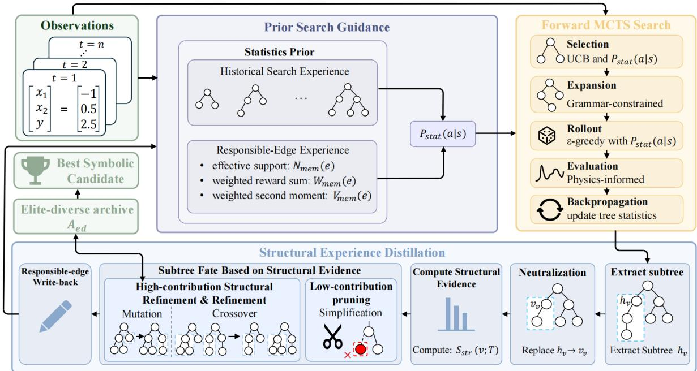
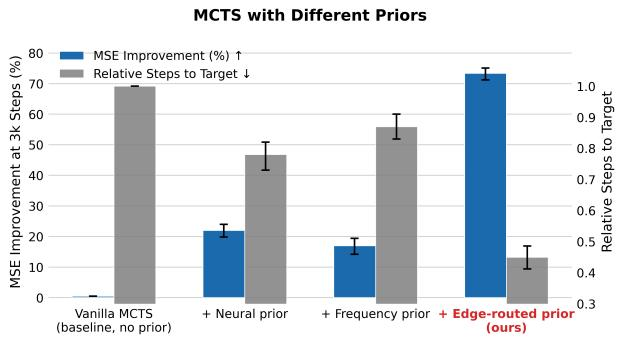
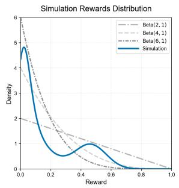
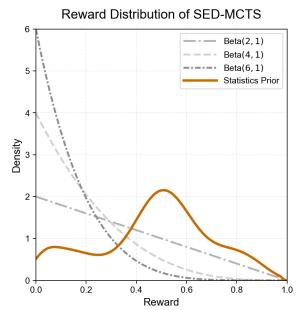
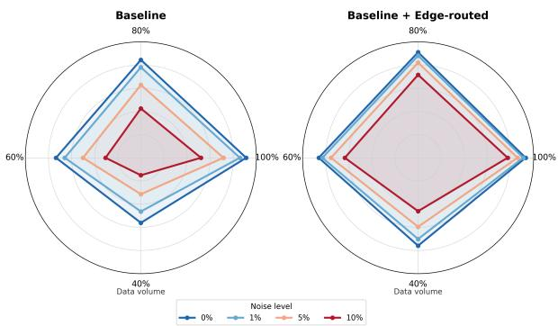
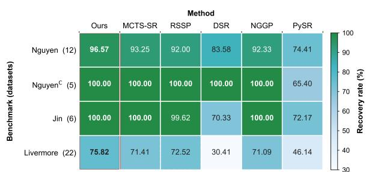

# An Interpretable Approach to PDE Solution Discovery via Structural Experience Distillation

Yunpeng Gong, Huolong Wu, Can Yang, and Min JiangB

School of Informatics, Xiamen University

## Abstract

PDE solution discovery aims to identify explicit symbolic expressions for unknown physical fields from observations under known physical constraints. Existing methods, however, collapse data fidelity and physical consistency into a single terminal score used as the sole feedback signal, providing little information about which subexpressions are responsible for a candidate’s final performance. This opaque terminal feedback severely limits the interpretability of the search process itself, offering no insight into why a candidate succeeds or fails. Consequently, reusable structures in otherwise suboptimal candidates are often discarded, whereas incidental syntax along successful search trajectories may be repeatedly reinforced. We propose SED-MCTS, a Monte Carlo tree search approach that distills structural experience from evaluated expressions and reuses it to guide subsequent symbolic solution search. Through counterfactual subtree interventions, SED-MCTS estimates local structural contributions, routes reliable evidence to the responsible construction edges, and preserves useful components in a refined structural archive. The approach naturally extends to coupled multiphysics systems. Across a diverse suite of PDE benchmarks, SED-MCTS achieves strong performance under a fixed evaluation budget and improves search efficiency and robustness under noisy or scarce observations.

## 1 Introduction

Symbolic regression (SR) seeks explicit mathematical expressions directly from observational data, yielding models that can be inspected, simplified, and reused in scientific reasoning [8, 5, 7]. In conventional SR, a candidate expression is judged primarily by how accurately its values reproduce a finite set of input–output observations. Consequently, many structurally different expressions may achieve similar data-fitting accuracy, especially when observations are sparse or noisy, even though their extrapolation behavior and scientific meaning can differ substantially.

Physics-informed symbolic regression imposes a stronger requirement. For a system governed by partial differential equations (PDEs), the desired expression must not only reproduce the observed field values, but also remain consistent with the governing differential operator throughout the domain and, where imposed, with the corresponding initial and boundary conditions. Numerical solvers provide discrete approximations of such fields [2, 3, 4], whereas a symbolic solution must encode the underlying spatiotemporal structure in a compact closed-form expression. A candidate may reproduce all available observations while still exhibiting nonzero PDE residuals at unobserved collocation points. Physics-informed symbolic search must therefore identify expressions that simultaneously reduce observation error and differential residual [9], while controlling expression complexity.

This additional physical requirement poses new challenges for symbolic search, rather than merely adding another evaluation term. Candidate quality is determined not only by the values produced by an expression, but also by the behavior of the complete expression under the governing differential operator. A local symbolic component may contribute differently to data accuracy and physical consistency: it may have only a limited effect on the observed values while being essential for reducing the PDE residual, or it may improve data fitting while introducing physically inconsistent derivatives. Existing methods typically aggregate data accuracy and physical consistency into a single value, failing to reveal how individual symbolic components contribute to either objective. This difficulty becomes more pronounced in coupled multiphysics problems, where multiple field expressions must be constructed jointly and a subtree in one field may affect the residuals of other fields through the coupled equations, further exacerbating the complexity of the problem.

The above discussion reveals a fundamental difficulty: for a complete candidate expression, its terminal score, whether data-fitting error or PDE residual, is provided as a single aggregated value, with no indication of which specific substructures are responsible for the final performance. However, symbolic regression is inherently a compositional construction process, in which the contributions of individual local components (subexpressions) to the overall performance are often highly uneven. A poorly scoring expression may internally contain physically plausible and reusable substructures; conversely, a well-scoring expression may contain redundant or even detrimental syntactic components. Therefore, how to identify and extract valuable local structural information from the aggregate terminal feedback of complete expressions, referred to as the subtree credit assignment problem, remains a key unresolved challenge in physics-informed symbolic regression.

Closely related to the credit assignment problem is the effective reuse of structural knowledge. Symbolic regression search typically maintains a population or a set of candidate solutions, yet most existing methods retain only a few optimal complete expressions after evaluation, discarding candidates with lower overall ranks even if they contain high-quality substructures internally. These discarded components may be precisely the key building blocks for solving certain subproblems, such as temporal decay terms, spatial oscillatory factors, or cross-coupling terms. If such useful structures scattered across different candidates could be accumulated and reused throughout the search, both search efficiency and solution quality would be significantly improved. Nevertheless, existing symbolic regression frameworks lack a systematic mechanism to convert one-shot terminal evaluations into structural knowledge that can be persistently accumulated and reused.

Monte Carlo tree search (MCTS) provides an attractive foundational framework for addressing these challenges. MCTS constructs expressions by incrementally expanding grammar-valid prefixes, and its stepwise decision-making process naturally aligns with the compositional nature of symbolic expression construction. More importantly, MCTS maintains a progressively expanding tree structure during search, which offers the potential to decompose terminal feedback into local construction decisions: each node, corresponding to a partial expression, and each edge, corresponding to a grammar action, can be assigned individual statistics. However, standard MCTS applied to symbolic regression still primarily uses complete expressions through a delayed scalar return that is backed up uniformly along the entire construction path. This treatment fails to exploit the tree structure of MCTS to address the subtree credit assignment problem: it cannot distinguish the actual contributions of different construction steps to the final return, nor can it extract and accumulate local structural knowledge from individual candidates.

To address these two interconnected problems of subtree credit assignment and effective reuse of structural knowledge, we propose SED-MCTS, where SED denotes structural experience distillation. Rather than using terminal candidates only through their scalar returns, SED-MCTS treats every evaluated expression as a potential source of reusable structural knowledge. It estimates the contribution of local subtrees through physics-informed counterfactual interventions, filters weak or redundant components, and routes reliable evidence only to the prefix-action edges responsible for generating useful structures. The accumulated responsible-edge statistics define an endogenous search prior, while a refined elite-diverse archive preserves high-quality components for subsequent mutation and crossover. In this way, terminal evaluation is transformed from a one-time scalar judgment into persistent structural experience that continuously improves subsequent expression construction. The same framework naturally extends to coupled multiphysics problems through its conditional attribution mechanism; detailed implementations are deferred to Section 3.

  
Figure 1: Overview of SED-MCTS. The forward search constructs grammar-valid symbolic expressions using MCTS and evaluates each completed candidate with the joint data–physics objective. After terminal evaluation, context-preserving subtree neutralization estimates the residual contribution of editable subtrees. The resulting structural evidence is routed back to the responsible prefix–action edges to update the statistical prior, while high-contribution structures are refined through guided mutation and crossover and low-contribution structures are considered for pruning. The refined elite-diverse archive and accumulated edge statistics are then reused to guide subsequent MCTS selection, rollout, and structural editing.

Our contributions are threefold. First, we formulate physics-informed structural distillation as a post-terminal knowledge-reuse problem for MCTS-based symbolic regression, replacing undifferentiated trajectory-level feedback with localized structural evidence. Second, we introduce responsible-edge statistics and a refined structural archive that jointly guide forward search and structural editing: the responsible-edge statistics define an endogenous prior for MCTS selection and mutation, while the archive preserves reusable components for compatible crossover. Third, we evaluate SED-MCTS on single-field PDE symbolic-solution recovery, coupled multiphysics systems, and settings with noisy or scarce observations, demonstrating improved accuracy, search efficiency under a fixed terminal-expression budget, and robustness across diverse benchmarks. The supplementary material provides pseudocode, theoretical analyses, complete PDE definitions, hyperparameter settings, recovered expressions, and extended diagnostic results.

## 2 Related Work

Classical symbolic regression constructs expression trees through genetic programming [8], while more recent approaches improve expression generation through risk-seeking policies, neural-guided population initialization, and efficient evolutionary search [34, 35, 36]. Scientific symbolic discovery broadly includes two related but distinct settings. Sparse equation-discovery methods select governing terms from a predefined candidate library [10, 11], whereas symbolic solution discovery searches directly for a closed-form function represented by a grammar or expression tree. Physics-informed symbolic methods further evaluate candidate expressions using differential-equation residuals and, when applicable, initial or boundary constraints [12, 14,

13, 15]. These approaches substantially strengthen the terminal objective used to judge an expression, but typically retain an aggregate candidate-level evaluation. Consequently, they provide limited information about which internal structures are responsible for data agreement or physical consistency. Genetic-programming research has long exploited reusable building blocks through subtree recombination, semantic-aware variation, component libraries, diversity-preserving archives, and transfer across related tasks or representations [26, 27, 28, 29, 30]. Such mechanisms commonly assess component utility through the fitness of its source individual, semantic compatibility, archive-niche quality, ancestry, or realized transfer performance [31]. RSSP is more closely related to our setting because it evaluates local subexpressions and uses physics-informed structural sensitivity to guide pruning and variation [16]. However, local sensitivity is primarily used to modify the currently evaluated candidate, while conventional libraries and archives preserve concrete individuals or subtrees without explicitly converting a physics-informed terminal objective into persistent construction-level credit. Existing work therefore offers either local structural diagnostics without cross-candidate statistical memory, or reusable component repositories whose contents are not grounded in responsibility-aware physical attribution.

MCTS is well suited to symbolic regression because grammar-valid expressions can be constructed through sequential decisions while computation is adaptively allocated among promising prefixes [18, 19]. Existing MCTS-based symbolic-regression methods improve expression discovery through learned or heuristic proposals, modified value estimates, and transitions between promising search states [19, 20]. Nevertheless, their feedback is predominantly associated with complete candidates, prefixes, or entire construction trajectories. Standard backup consequently propagates a terminal return through all decisions on a successful path, without distinguishing actions that create useful local motifs from incidental syntax elsewhere in the expression. It also provides no direct mechanism for retaining valuable components found inside lower-ranked candidates. SED-MCTS addresses the missing connection between structural assessment and persistent reuse by converting evaluated candidates into structure-aware search experience that guides subsequent tree construction and compatible component-level variation. This positioning distinguishes SED-MCTS from trajectory-level MCTS feedback and from conventional archives, while leaving the specific attribution and reuse mechanisms to the method section.

## 3 Method

SED-MCTS converts terminal evaluations into reusable structural experience. For each completed expression, a context-preserving neutralization operation produces node-level evidence from the joint data–physics objective. This evidence is routed to the grammar edges that generated the corresponding subtree and is also stored in a refined structural archive. The accumulated experience then biases subsequent MCTS construction and lightweight structural editing. We use structural evidence for attribution extracted from one terminal expression and structural experience for evidence accumulated across expressions.

## 3.1 Physics-Informed Symbolic Search

Let $z = ( \mathbf { x } , t )$ denote the spatiotemporal coordinates and $\mathcal { D } _ { d } = \{ ( z _ { i } , y _ { i } ) \} _ { i = 1 } ^ { n _ { d } }$ the observations. Given a differential operator ${ \mathcal { N } } ,$ , we search a typed grammar for an expression $f _ { \theta }$ , where $\theta$ collects all free constants.

With residual points $\{ \tilde { z } _ { j } \} _ { j = 1 } ^ { n _ { r } }$ , we define

$$
D _ { \mathrm { d a t a } } ( f ) = \frac { 1 } { n _ { d } } \sum _ { i = 1 } ^ { n _ { d } } \frac { | f ( z _ { i } ) - y _ { i } | ^ { 2 } } { \sigma _ { y } ^ { 2 } + \epsilon } ,\tag{1}
$$

$$
D _ { \mathrm { p h y s } } ( f ) = \frac { 1 } { n _ { r } } \sum _ { j = 1 } ^ { n _ { r } } \frac { | \mathcal { N } [ f ] ( \tilde { z } _ { j } ) | ^ { 2 } } { \sigma _ { r } ^ { 2 } + \epsilon } ,\tag{2}
$$

$$
L ( f ) = D _ { \mathrm { d a t a } } ( f ) + \lambda _ { \mathrm { p d e } } D _ { \mathrm { p h y s } } ( f ) .\tag{3}
$$

The two terms are separately variance-normalized, so we fix $\lambda _ { \mathrm { p d e } } = 1$ for all tasks. We use the same numerical stabilizer $\epsilon = 1 0 ^ { - 8 }$ throughout. After optimizing $\theta ,$ the terminal reward is $R ( f ) = \exp [ - L ( f ) - \eta \mathcal { C } ( f ) ]$ where $\mathcal { C } ( f ) = \vert T _ { f } \vert$ is the number of nodes in the expression tree and $\eta = 1 0 ^ { - 2 }$ is fixed across all experiments.

MCTS represents expression construction as grammar-constrained decisions. A state s is a partial expression and $a \in \mathcal { A } ( s )$ is a valid production. Let $N ( s , a )$ be the visit count of edge $( s , a )$ and $N ( s ) =$ $\textstyle \sum _ { a ^ { \prime } \in { \mathcal { A } } ( s ) } N ( s , a ^ { \prime } )$ the total visit count of state s, obtained by summing its outgoing-edge visits; $a ^ { \prime }$ is only the summation index over valid actions. Let $M _ { K } ( s , a )$ denote the extreme-value statistic computed from the $K$ best terminal descendants of edge $( s , a )$ . Selection maximizes

$$
\begin{array} { r } { I ( s , a ) = M _ { K } ( s , a ) + c \left( \cfrac { \log ( 1 + N ( s ) ) } { 1 + N ( s , a ) } \right) ^ { \gamma } } \\ { + \lambda _ { s } \log ( P _ { \mathrm { s t a t } } ( a \mid s ) + \epsilon ) , } \end{array}\tag{4}
$$

where $c > 0$ and $\gamma \in ( 0 , 1 ]$ control exploration, $\lambda _ { s } \geq 0$ weights the structural prior, and ϵ prevents undefined logarithms and divisions. The state-conditioned prior $P _ { \mathrm { s t a t } }$ is defined below. Each completed expression is evaluated by Eq. (3) and then structurally distilled.

Standard MCTS backs up one terminal reward along the whole trajectory and therefore cannot identify which local decisions created useful structure. Motivated by numerically stable masking strategies [16], we instead neutralize every editable subtree and measure the resulting data–physics response.

Let terminal tree $T$ represent $f _ { T } = C _ { v } [ h _ { v } ]$ , where $h _ { v }$ is the subtree rooted at node v and $C _ { v } [ \cdot ]$ its surrounding context. We define the neutralized expression

$$
\begin{array} { r } { \bar { f } _ { v } : = C _ { v } [ \nu _ { v } ] , } \end{array}\tag{5}
$$

where $\nu _ { v }$ removes the subtree’s input-dependent response while preserving type validity and numerical scale. For a binary-rooted subtree $h _ { v } = \psi ( h _ { l } , h _ { r } )$ , we use $\nu _ { v } = 0$ for $\psi \in \{ + , - \}$ and $\nu _ { v } = 1 { \mathrm { f o r } } \psi \in \{ \times , { \div } \}$ . For a unary subtree $h _ { v } ( z ) = \phi ( g ( z ) )$ , let $\mathcal { Z } = \{ z _ { i } \} _ { i = 1 } ^ { n _ { d } } \cup \{ \tilde { z } _ { j } \} _ { j = 1 } ^ { n _ { r } }$ and

$$
\bar { g } _ { v } = \frac { 1 } { | \mathcal { Z } | } \sum _ { z \in \mathcal { Z } } g ( z ) , \qquad \nu _ { v } = \phi \big ( \Pi _ { \Omega _ { \phi } } ( \bar { g } _ { v } ) \big ) ,\tag{6}
$$

where $\Pi _ { \Omega _ { \phi } }$ projects the reference input to the numerically safe domain of $\phi .$ . Variable leaves are replaced by their empirical mean over $\mathcal { Z }$ , while pure constants are not attributed separately. All fitted constants remain frozen during neutralization.

The response of node v is evaluated through the two objective channels,

$$
\mathbf { r } ( v ; T ) = \left[ \begin{array} { l } { r _ { \mathrm { d a t a } } ( v ; T ) } \\ { r _ { \mathrm { p h y s } } ( v ; T ) } \end{array} \right] = \left[ \begin{array} { l l } { D _ { \mathrm { d a t a } } ( \bar { f } _ { v } ) - D _ { \mathrm { d a t a } } ( f _ { T } ) } \\ { D _ { \mathrm { p h y s } } ( \bar { f } _ { v } ) - D _ { \mathrm { p h y s } } ( f _ { T } ) } \end{array} \right] ,\tag{7}
$$

$$
S _ { \mathrm { s t r } } ( v ; T ) = \frac { [ r _ { \mathrm { d a t a } } ( v ; T ) + r _ { \mathrm { p h y s } } ( v ; T ) ] _ { + } } { ( 1 + | h _ { v } | ) ^ { \zeta } } ,\tag{8}
$$

where $[ x ] _ { + } = \operatorname* { m a x } ( x , 0 )$ and $| h _ { v } |$ is the subtree size. A positive score means that neutralizing $h _ { v }$ worsens the complete objective. We evaluate every non-root node for which a valid neutralization is defined; their set is denoted by $V ( T )$ . To make trees of different sizes comparable, the evidence is normalized within each terminal expression:

$$
\rho _ { v } ( T ) = \frac { S _ { \mathrm { s t r } } ( v ; T ) } { \sum _ { v ^ { \prime } \in V ( T ) } S _ { \mathrm { s t r } } ( v ^ { \prime } ; T ) + \epsilon } .\tag{9}
$$

Here $v$ is the currently evaluated subtree root and $v ^ { \prime }$ indexes all nodes in $V ( T )$ for summation in the denominator.

For coupled fields $\mathbf { f } = \left( f _ { 1 } , \ldots , f _ { K } \right)$ , only the selected subtree in field $f _ { k }$ is neutralized; all other fields and fitted constants are fixed, so the resulting response includes both within-field and cross-field effects.

## 3.2 Responsible-Edge Experience and Statistical Prior

For each node w in $T$ , let $e _ { T } ( w ) = ( s _ { w } , a _ { w } )$ be the grammar edge that instantiated it. If $\mathcal { V } ( h _ { v } )$ is the node set of subtree $h _ { v }$ , its responsible-edge set is

$$
\Gamma _ { T } ( v ) = \{ e _ { T } ( w ) : w \in \mathcal { V } ( h _ { v } ) \} .\tag{10}
$$

Thus, node-level evidence is assigned only to decisions that actually generated the attributed subtree. With $R _ { T } : = R ( f _ { T } )$ , the share of node v assigned to an edge e is

$$
w _ { v , e } ( T ) = \frac { \rho _ { v } ( T ) } { | \Gamma _ { T } ( v ) | } \mathbb { I } [ e \in \Gamma _ { T } ( v ) ] ,\tag{11}
$$

where $\mathbb { I } [ \cdot ]$ is the indicator function. For every grammar edge $e = ( s , a )$ , we maintain effective support $N _ { \mathrm { m e m } } ( e )$ , weighted reward sum $W _ { \mathrm { m e m } } ( e )$ , and weighted second moment $V _ { \mathrm { m e m } } ( e )$ , updated after terminal tree $T$ by

$$
[ \begin{array} { l } { N _ { \mathrm { m e m } } ( e ) } \\ { W _ { \mathrm { m e m } } ( e ) } \\ { V _ { \mathrm { m e m } } ( e ) } \end{array} ]  [ \begin{array} { l } { N _ { \mathrm { m e m } } ( e ) } \\ { W _ { \mathrm { m e m } } ( e ) } \\ { V _ { \mathrm { m e m } } ( e ) } \end{array} ] + \sum _ { v \in V ( T ) } w _ { v , e } ( T ) [ \begin{array} { l } { 1 } \\ { R _ { T } } \\ { R _ { T } ^ { 2 } } \end{array} ] .\tag{12}
$$

The corresponding mean, variance, and lower-confidence score are

$$
\mu _ { \mathrm { m e m } } ( e ) = \frac { W _ { \mathrm { m e m } } ( e ) } { N _ { \mathrm { m e m } } ( e ) + \epsilon } ,\tag{13}
$$

$$
\sigma _ { \mathrm { m e m } } ^ { 2 } ( e ) = \mathrm { m a x } \bigg \{ 0 , \frac { V _ { \mathrm { m e m } } ( e ) } { N _ { \mathrm { m e m } } ( e ) + \epsilon } - \mu _ { \mathrm { m e m } } ^ { 2 } ( e ) \bigg \} ,\tag{14}
$$

$$
q _ { \mathrm { s t a t } } ( e ) = \mu _ { \mathrm { m e m } } ( e ) - \frac { \sigma _ { \mathrm { m e m } } ( e ) } { \sqrt { N _ { \mathrm { m e m } } ( e ) + 1 } } .\tag{15}
$$

The second term, $\sigma _ { \mathrm { m e m } } ( e ) / \sqrt { N _ { \mathrm { m e m } } ( e ) + 1 }$ , is the uncertainty penalty: it lowers the score of edges supported by few or highly variable observations. No additional tunable coefficient is introduced. For $a \in { \mathcal { A } } ( s )$ , the state-conditioned prior is

$$
P _ { \mathrm { s t a t } } ( a \mid s ) = 0 . 9 5 \frac { \exp ( q _ { \mathrm { s t a t } } ( s , a ) ) } { \sum _ { a ^ { \prime } \in A ( s ) } \exp ( q _ { \mathrm { s t a t } } ( s , a ^ { \prime } ) ) } + \frac { 0 . 0 5 } { \left| A ( s ) \right| } .\tag{16}
$$

We fix the softmax temperature to one and the uniform component to 0.05 in all experiments. Unseen edges have zero statistics and therefore receive a uniform prior.

  
(a) Comparison of MCTS Prior Sources.

  
(b) Reward Distribution Comparison.

  
Figure 2: Ablation study and reward analysis on the Advection equation. (a) Prior source comparison. (b) Reward density shift from Vanilla MCTS to SED-MCTS.

## 3.3 Refined Structural Archive

The edge memory records how useful subtrees are generated, whereas the archive stores concrete subtrees for reuse. For each positively attributed subtree, we store its canonical form, return type, active variables, depth, complexity, source reward $R _ { T }$ , normalized evidence $\rho _ { v } ( T )$ , and responsible-edge signature. Fitted constants are metadata only; commutative children are canonically ordered, and grammar-equivalent or constant-only variants are merged. The archive is partitioned by return type and complexity; within each partition, components with large $R _ { T } \rho _ { v } ( T )$ are retained while structurally novel operator and variable patterns are preserved. Removing an archive entry does not remove its grammar actions or shrink the search space.

## 3.4 Prior-Guided Structural Editing

Accumulated experience is reused through bounded simplification, mutation, and crossover. High-attribution subtrees are useful but not necessarily locally optimal; we therefore preserve their parent context, return type, and principal variable dependencies as a semantic anchor while generating diverse local variants. This protected diversification avoids repeatedly reusing one motif and helps the search escape local optima. Low-attribution regions are considered for type-valid lower-complexity replacements, whereas regions with sparse or conflicting evidence remain editable to prevent early memory from becoming self-reinforcing.

Mutation regenerates a local subtree production by production using $P _ { \mathrm { s t a t } }$ , including its fixed uniform exploration component. Crossover inserts a concrete donor subtree from the refined archive after checking return type, available variables, grammar role, depth, and complexity. Thus, mutation reuses statistical knowledge of how useful structures are constructed, while crossover reuses previously validated components. Every edited expression is reoptimized and reevaluated by the complete objective in Eq. (3); simplification is accepted only when complexity decreases with negligible loss increase, and mutation or crossover only when the complexity-regularized reward improves. The realized utility is assigned to newly instantiated recipient edges, while the donor’s historical evidence is retained. Detailed operators, budgets, archive capacity, and acceptance thresholds are given in the supplement.

## 4 Experiments

## 4.1 Experimental Setup

Six PDE benchmarks are evaluated, with complete equations, domains, and deterministic conditions provided in the supplementary material. The one-dimensional ADVECTION benchmark models the linear transport of a scalar field under a constant velocity field, expressed as $\partial _ { t } \phi + \partial _ { x } \phi = 0$ with $\phi ( x , 0 ) = \sin ( x )$ on $x \in [ 0 , 1 ] , t \in [ 0 , 1 ]$ . Its analytical solution $\phi ( x , t ) = \sin ( x - t )$ represents a traveling wave of preserved amplitude and shape, providing an ideal scenario for testing structural fidelity in symbolic recovery. The one-dimensional DIFFUSION benchmark satisfies $\partial _ { t } u - 3 \partial _ { x } ^ { 2 } u - u = 0$ with exact solution $u ( x , t ) =$ $e ^ { - 2 t } \sin ( x )$ , capturing the combined effects of diffusion and a linear reaction term. The POISSON2D benchmark solves $\partial _ { x _ { 1 } } ^ { 2 } u + \partial _ { x _ { 2 } } ^ { 2 } u = 3 0 x _ { 1 } ^ { 2 } - 7 . 8 x _ { 1 } + 1 \mathrm { o n } [ - 1 , 1 ] ^ { 2 }$ , with the manufactured solution $u ( { \bf x } ) =$ $2 . 5 x _ { 1 } ^ { 4 } - 1 . 3 x _ { 1 } ^ { 3 } + 0 . 5 x _ { 2 } ^ { 2 } - 1 . 7 x _ { 2 }$ enforced via Dirichlet boundary conditions. The POISSON3D benchmark extends the elliptic operator to three dimensions as $\partial _ { x _ { 1 } } ^ { 2 } u + \partial _ { x _ { 2 } } ^ { 2 } u + \partial _ { x _ { 3 } } ^ { 2 } u = 3 0 x _ { 1 } ^ { 2 } - 7 . 8 x _ { 2 } + 1 \mathrm { o n } [ - 1 , 1 ] ^ { 3 }$ with the manufactured solution $u ( \mathbf { x } ) = 2 . 5 x _ { 1 } ^ { 4 } - 1 . 3 x _ { 2 } ^ { 3 } + 0 . 5 x _ { 3 } ^ { 2 }$ also specified through Dirichlet boundary conditions. Both Poisson benchmarks feature polynomial source terms and manufactured solutions containing quadratic, cubic, and quartic components. The nonlinear WAVE2D and WAVE3D benchmarks take the general form $\partial _ { t } ^ { 2 } u - \Delta u = \mathcal { G } ( u , \mathbf { x } , t )$ . The two-dimensional equation contains nonlinear reaction terms $- u - u ^ { 3 }$ with exact solution $u ( \mathbf x , t ) = \exp ( x _ { 1 } ^ { 2 } ) \sin ( x _ { 2 } ) e$ −0.5t, whereas the three-dimensional equation contains a quadratic term $u ^ { 2 }$ and uses $u ( { \bf x } , t ) = \exp ( x _ { 1 } ^ { 2 } + x _ { 3 } ^ { 2 } ) \cos ( x _ { 2 } ) e ^ { - 0 . 5 t }$ These benchmarks therefore cover transport, diffusion–reaction, elliptic polynomial structure, nonlinear wave dynamics, and compositions of exponential, trigonometric, polynomial, and temporal factors.

  
Figure 3: Robustness to Noise and Data Scarcity.

  
Figure 4: Exact-recovery rate on symbolicregression suites.

Table 1: MSE on PDE benchmarks (mean ± std over 30 independent runs).
<table><tr><td>PDE</td><td>MCTS-SR</td><td>PINN-SR</td><td>PISN</td><td>RSSP</td><td>Ours</td></tr><tr><td>Advection</td><td> $\overline { { 5 . 7 \mathrm { e } \mathrm { - } 1 0 \pm 2 . 3 \mathrm { e } \mathrm { - } 1 0 } }$ </td><td> $\overline { { 4 . 2 \mathrm { e } \mathrm { - } 1 0 \pm 1 . 8 \mathrm { e } \mathrm { - } 1 0 } }$ </td><td> $\overline { { 7 . 1 \mathrm { e } \mathrm { - } 1 1 \pm 3 . 5 \mathrm { e } \mathrm { - } 1 1 } }$ </td><td> $\overline { { 9 . 5 \mathrm { e } \mathrm { - } 1 4 \pm 4 . 1 \mathrm { e } \mathrm { - } 1 4 } }$ </td><td> $\mathbf { \overline { { 8 . 1 e - 1 4 \pm 3 . 2 e - 1 4 } } }$ </td></tr><tr><td>Diffusion</td><td> $3 . 2 \mathrm { e } { - 3 } \pm 1 . 4 \mathrm { e } { - 3 }$ </td><td> $8 . 9 \mathrm { { e } \mathrm { { - } 3 \pm 4 . 2 \mathrm { { e } \mathrm { { - } 3 } } } }$ </td><td> $4 . 6 \mathrm { { e } \mathrm { { - } 3 \pm 2 . 1 \mathrm { { e } \mathrm { { - } 3 } } } }$ </td><td> $5 . 7 \mathrm { e } \mathrm { - } 4 \pm 2 . 5 \mathrm { e } \mathrm { - } 4$ </td><td> $\mathbf { 4 . 3 e { - 4 } \pm 1 . 8 e { - 4 } }$ </td></tr><tr><td>Poisson2D</td><td> $6 . 4 \mathrm { { e } \mathrm { { - } 3 \pm 2 . 9 \mathrm { { e } \mathrm { { - } 3 } } } }$ </td><td> $2 . 2 \mathrm { e } { - 3 } \pm 1 . 1 \mathrm { e } { - 3 }$ </td><td> $5 . 8 \mathrm { e } { - 5 } \pm 2 . 6 \mathrm { e } { - 5 }$ </td><td> $4 . 9 \mathrm { e } { - } 6 \pm 2 . 2 \mathrm { e } { - } 6$ </td><td> $\mathbf { 2 . 8 e { - 6 } \pm 1 . 3 e { - 6 } }$ </td></tr><tr><td>Poisson3D</td><td> $1 . 2 { \mathrm { e } } { - } 2 \pm 5 . 6 { \mathrm { e } } { - } 3$ </td><td> $4 . 4 \mathrm { { e } \mathrm { { - } 3 \pm 2 . 0 \mathrm { { e } \mathrm { { - } 3 } } } }$ </td><td> $9 . 7 \mathrm { e } \mathrm { - } 5 \pm 4 . 3 \mathrm { e } \mathrm { - } 5$ </td><td> $\mathbf { 7 . 3 e { - 6 } \pm 3 . 1 e { - 6 } }$ </td><td> $8 . 1 \mathrm { e } \mathrm { - } 6 \pm 3 . 5 \mathrm { e - } 6$ </td></tr><tr><td>Wave2D</td><td> $2 . 6 \mathsf { e } \cdot 1 \pm 1 . 1 \mathsf { e } \cdot 1$ </td><td> $7 . 3 \mathrm { e } \mathrm { - } 2 \pm 3 . 4 \mathrm { e } \mathrm { - } 2$ </td><td> $2 . 1 \mathrm { { e } \mathrm { { - } 1 \pm 9 . 2 \mathrm { { e } \mathrm { { - } 2 } } } }$ </td><td> $7 . 8 \mathrm { { e } - 2 \pm 3 . 6 \mathrm { { e } - 2 } }$ </td><td> ${ \bf 3 . 4 e - 3 \pm 1 . 5 e - 3 }$ </td></tr><tr><td>Wave3D</td><td> $3 . 4 \mathrm { e } \mathrm { - } 1 \pm 1 . 5 \mathrm { e } \mathrm { - } 1$ </td><td> $8 . 2 { \mathrm { e } } { - } 2 \pm 3 . 9 { \mathrm { e } } { - } 2$ </td><td> $7 . 0 \mathrm { { e } - 2 \pm 3 . 2 \mathrm { { e } - 2 } }$ </td><td> $6 . 3 \mathrm { e } { - 2 } \pm 2 . 8 \mathrm { e } { - 2 }$ </td><td> $\mathbf { 4 . 9 e { - 3 } \pm 2 . 1 e { - 3 } }$ </td></tr></table>

All search methods are compared under the same evaluation budget, with shared observations, residual collocation points, grammar, constant optimizer, and evaluation grid. It is important to emphasize that subtree interventions are intrinsic and bounded structural-diagnostic operations within SED-MCTS, rather than additional candidate-expression evaluations. They neither trigger new tree expansions nor require constant re-optimization. Therefore, we use the number of terminal expressions undergoing full constant optimization as the common search budget across all methods. Baselines include PINN-SR, PISN, RSSP, and an MCTS-SR adaptation. Exact recovery is additionally tested on Nguyen, NguyenC, Jin, and Livermore. Reported metrics cover dense-grid MSE, evaluations to a target error, exact recovery, and expression size. Mutation and crossover candidates count against the same terminal-evaluation budget. Complete PDE definitions, implementation details, hyperparameter settings, recovered expressions, and additional ablations are provided in the supplementary material.

Table 2: Comparison of different algorithms on coupled PDE benchmark systems. $f _ { 1 }$ and $f _ { 2 }$ denote the two unknown functions in each system.
<table><tr><td rowspan="2">Name</td><td colspan="2">T-NNGP</td><td colspan="2">DeepM&amp;Mnet</td><td colspan="2">PhySO</td><td colspan="2">Ours</td></tr><tr><td> $f _ { 1 }$ </td><td> $f _ { 2 }$ </td><td> $f _ { 1 }$ </td><td> $f _ { 2 }$ </td><td> $f _ { 1 }$ </td><td> $f _ { 2 }$ </td><td> $f _ { 1 }$ </td><td> $f _ { 2 }$ </td></tr><tr><td>Diffusion-convection</td><td>8.07e-02</td><td>1.44e-02</td><td>1.86e-02</td><td>1.52e-02</td><td>1.84e-02</td><td>1.41e-02</td><td>2.05e-02</td><td>1.25e-02</td></tr><tr><td>Joule heating 1</td><td>2.65e-05</td><td>3.16e+01</td><td>4.28e-03</td><td>2.94e+00</td><td>2.08e-05</td><td>7.45e+00</td><td>1.79e-05</td><td>8.10e-01</td></tr><tr><td>Joule heating 2</td><td>2.71e-05</td><td>1.49e+01</td><td>4.69e-03</td><td>2.12e-01</td><td>1.83e-05</td><td>1.50e+00</td><td>1.63e-05</td><td>7.93e-01</td></tr><tr><td>Joule heating 3</td><td>1.97e-05</td><td>1.59e+01</td><td>5.70e-03</td><td>2.52e+00</td><td>1.81e-05</td><td>5.59e+00</td><td>1.77e-05</td><td>1.75e-01</td></tr><tr><td>Joule heating 4</td><td>3.77e-05</td><td>1.19e+01</td><td>1.39e-02</td><td>3.26e+01</td><td>2.04e-05</td><td>6.52e+00</td><td>1.81e-05</td><td>1.59e-01</td></tr><tr><td>Joule heating 5</td><td>1.60e-05</td><td>2.41e+01</td><td>7.58e-04</td><td>3.42e-01</td><td>1.65e-05</td><td>7.32e+00</td><td>1.63e-05</td><td>5.26e-01</td></tr><tr><td>Parabolic 1</td><td>2.27e-01</td><td>1.66e-01</td><td>1.15e-01</td><td>6.37e-02</td><td>1.29e-01</td><td>8.38e-02</td><td>1.30e-01</td><td>5.52e-02</td></tr><tr><td>Parabolic 2</td><td>2.14e-01</td><td>1.53e-01</td><td>8.87e-02</td><td>6.33e-02</td><td>9.04e-02</td><td>8.95e-01</td><td>1.99e-01</td><td>8.95e-02</td></tr><tr><td>Parabolic 3</td><td>6.48e-02</td><td>5.37e-01</td><td>9.56e-02</td><td>3.68e-02</td><td>2.17e-02</td><td>1.47e-02</td><td>1.76e-02</td><td>1.38e-02</td></tr></table>

Beyond single-field benchmarks, three coupled multiphysics systems with distinct coupling structures are considered. (1) Diffusion–Convection models passive scalar transport under an incompressible flow: $- \nabla \cdot \nabla u + \nabla v \cdot \nabla u = 0$ with $\nabla \cdot \boldsymbol { v } = 0$ , where v is the velocity field and u is the transported scalar. (2) Joule Heating couples electric and thermal fields via $- \nabla \cdot ( \sigma \nabla V ) = 0$ and $\rho C \partial _ { t } T - \nabla \cdot ( k \nabla T ) = \sigma | \nabla V | ^ { 2 }$ with electric potential V and temperature T. (3) Parabolic describes a two-species diffusion–reaction system: $\partial _ { t } u _ { 1 } = 0 . 0 2 4 \partial _ { x } ^ { 2 } u _ { 1 } - F ( u _ { 1 } - u _ { 2 } )$ and $\partial _ { t } u _ { 2 } = 0 . 1 7 0 \partial _ { x } ^ { 2 } u _ { 2 } + F ( u _ { 1 } - u _ { 2 } )$ , capturing bidirectional exchange between u1 and $u _ { 2 }$

## 4.2 Comparison of MCTS Prior Sources

In Fig. 2a, we compare four prior sources under a fixed budget of 10,000 fully evaluated expressions. All variants share the same grammar, constant optimizer, and evaluation protocol, without archive or structural editing; they differ only in how $P _ { \mathrm { s t a t } }$ in (16) is constructed. Vanilla MCTS sets $\lambda _ { s } = 0$ (no external prior) as baseline. Neural prior adopts the RSSP-style pretrained network that extracts Taylor-expansion features and computes a similarity metric to the target solution manifold. Frequency prior counts raw occurrences of each grammar edge among the elite set and normalizes the counts into $P _ { \mathrm { s t a t } }$ without contribution weighting. Edge-routed prior (ours) applies counterfactual subtree neutralization to estimate each subtree’s marginal contribution and routes the credit exclusively to the responsible grammar edges. We report two metrics: MSE improvement over Vanilla (higher is better) and relative steps to reach a prescribed target accuracy normalized by Vanilla (lower is better). Experiments are conducted on the Advection equation, results show that any external prior outperforms the prior-free baseline. Frequency prior improves modestly because indiscriminate edge counting reinforces incidental correlations; neural prior provides medium acceleration but is bounded by the fidelity of the Taylor-expansion similarity metric. Our edge-routed contribution prior achieves the best performance on both metrics, confirming that responsibility-aware, contribution-weighted structural experience yields a substantially more efficient search prior than undifferentiated trajectory feedback or externally trained heuristics.

The reward distributions in Fig. 2b reveal how the gain is obtained. Vanilla MCTS concentrates on low- and medium-reward candidates. The edge-routed contribution prior shifts probability mass toward higher-quality expressions, producing a pronounced secondary peak in the high-reward regime. Structural distillation therefore changes which regions of the program space are explored, rather than merely re-ranking an unchanged candidate set.

## 4.3 PDE Recovery, Robustness, and General Symbolic Recovery

Tab. 1 reports the dense-grid MSE across six PDE benchmarks. SED-MCTS achieves the best performance on five of six problems, ranking second only to RSSP on Poisson3D. The largest gains occur on Wave2D and Wave3D, where solutions contain challenging compositions of exponential, trigonometric, and polynomial factors. On elliptic Poisson benchmarks, SED-MCTS remains competitive or achieves the lowest error, confirming its effectiveness for both stationary and time-dependent PDEs. The smaller absolute differences on Advection and Diffusion are consistent with their simpler structures, although SED-MCTS still obtains the best average MSE.

We next examine robustness under noisy and scarce observations. Gaussian noise $\alpha \in \{ 0 \% , 1 \% , 5 \% , 1 0 \% \}$ is combined with retained-data ratios $r _ { d } \in \{ 1 0 0 \% , 8 0 \% , 6 0 \% , 4 0 \% \}$ . A run is considered successful when the recovered expression is symbolically equivalent to the ground truth or achieves sufficiently low dense-grid error and PDE residual. Fig. 3 reports recovery rates over 100 trials per setting. Responsible-edge routing consistently improves recovery across all conditions, with the most pronounced gains under high noise and low data, indicating that counterfactual subtree attribution alleviates credit diffusion.

To evaluate generalization beyond PDE-constrained problems, we test SED-MCTS on Nguyen, NguyenC, Jin, and Livermore symbolic regression suites, which cover polynomial, trigonometric, exponential, logarithmic, and nested nonlinear expressions. Fig. 4 compares exact-recovery rates with MCTS-SR, RSSP, DSR, NGGP, and PySR. SED-MCTS achieves the highest recovery on Nguyen, perfect recovery on NguyenC and Jin, and the best result on the more challenging Livermore suite. Together, Tab. 1 and Figs. 3–4 demonstrate that responsible-edge structural experience improves PDE discovery, robustness, and general symbolic regression performance.

## 4.4 Coupled Multiphysics Systems

We further evaluate SED-MCTS on nine coupled multiphysics problems, covering diffusion–convection, Joule-heating, and coupled parabolic systems. For each problem, the two unknown fields $f _ { 1 }$ and $f _ { 2 }$ are evaluated jointly under the coupled PDE constraints. As shown in Table 2, SED-MCTS achieves the best results for both unknown fields on Joule Heating 1, 3, and 4, as well as Parabolic 3. It also obtains the lowest error for $f _ { 2 }$ on Diffusion–convection and Parabolic 1, and for $f _ { 1 }$ on Joule Heating 2. The improvements are especially pronounced for the thermal field in the strongly coupled Joule-heating cases. Although other methods perform better on several individual cases, particularly Joule Heating 5 and Parabolic 2, SED-MCTS demonstrates consistently competitive performance across different coupling structures. These results indicate that responsibility-aware structural experience can effectively guide symbolic search in coupled PDE systems.

## 5 Conclusion

This work presented SED-MCTS, an interpretable framework that converts terminal evaluations into reusable structural experience for symbolic PDE solution discovery. Context-preserving subtree neutralization identifies useful components, whose evidence is routed to responsible grammar edges and reused through a statistical prior and structural archive. Experiments demonstrate improved recovery accuracy, search efficiency, and robustness under noisy and scarce observations. Results on coupled multiphysics systems further confirm its ability to capture within-field and cross-field structural effects. Future work will reduce intervention costs and extend the framework to larger, more strongly coupled PDE systems.

## References

[1] L. C. Evans, Partial Differential Equations, 2nd ed. Providence, RI, USA: American Mathematical Society, 2010.

[2] R. J. LeVeque, Finite Difference Methods for Ordinary and Partial Differential Equations: Steady-State and Time-Dependent Problems. Philadelphia, PA, USA: SIAM, 2007. doi: 10.1137/1.9780898717839.

[3] T. J. R. Hughes, The Finite Element Method: Linear Static and Dynamic Finite Element Analysis. Englewood Cliffs, NJ, USA: Prentice-Hall, 1987.

[4] L. N. Trefethen, Spectral Methods in MATLAB. Philadelphia, PA, USA: SIAM, 2000. doi: 10.1137/1.9780898719598.

[5] M. Schmidt and H. Lipson, “Distilling free-form natural laws from experimental data,” Science, vol. 324, no. 5923, pp. 81–85, 2009. doi: 10.1126/science.1165893.

[6] M. Cranmer, A. Sanchez-Gonzalez, P. Battaglia, R. Xu, K. Cranmer, D. Spergel, and S. Ho, “Discovering symbolic models from deep learning with inductive biases,” in Advances in Neural Information Processing Systems, vol. 33, 2020, pp. 17429–17442.

[7] S.-M. Udrescu and M. Tegmark, “AI Feynman: A physics-inspired method for symbolic regression,” Science Advances, vol. 6, no. 16, Art. no. eaay2631, 2020.

[8] J. R. Koza, Genetic Programming: On the Programming ofComputers by Means ofNatural Selection. Cambridge, MA, USA: MIT Press, 1992.

[9] M. Raissi, P. Perdikaris, and G. E. Karniadakis, “Physics-informed neural networks: A deep learning framework for solving forward and inverse problems involving nonlinear partial differential equations,” Journal ofComputational Physics, vol. 378, pp. 686–707, 2019.

[10] S. L. Brunton, J. L. Proctor, and J. N. Kutz, “Discovering governing equations from data by sparse identification of nonlinear dynamical systems,” Proc. Natl. Acad. Sci. U.S.A., vol. 113, no. 15, pp. 3932–3937, 2016.

[11] S. H. Rudy, S. L. Brunton, J. L. Proctor, and J. N. Kutz, “Data-driven discovery of partial differential equations,” Science Advances, vol. 3, no. 4, Art. no. e1602614, 2017.

[12] J. Das, B. Bhaumik, S. De, and S. Changdar, “Physics-informed neural network with symbolic regression for deriving analytical approximate solutions to nonlinear partial differential equations,” Neural Computing and Applications, vol. 37, pp. 20205–20240, 2025.

[13] H. D. Mazraeh and K. Parand, “Approximate symbolic solutions to differential equations using a novel combination of Monte Carlo tree search and physics-informed neural networks approach,” Engineering with Computers, vol. 41, pp. 2707–2735, 2025.

[14] R. Majumdar, V. Jadhav, A. Deodhar, S. Karande, L. Vig, and V. Runkana, “Physics informed symbolic networks,” arXiv preprint arXiv:2207.06240, 2022.

[15] B. G. Cohen, S. A. M. Beck, and S. H. Strogatz, “Physics-informed genetic programming for discovery of partial differential equations,” Journal ofComputational Physics, vol. 514, Art. no. 113261, 2024.

[16] Y. Gong, C. Liu, S. Lan, J. Liao, C. Yang, J. Lin, M. Jiang, and G. G. Yen, “Symbolic regression with physics-informed residual and structural sensitivity pruning,” IEEE Transactions on Evolutionary Computation, 2026. doi: 10.1109/TEVC.2026.3698776.

[17] Y. Gong, C. Yang, S. Lan, J. Liao, Z. Lin, H. Wu, and M. Jiang, “Physics-preserving evolutionary operators for symbolic regression,” in Proc. Int. Conf. Mach. Intell. Nature-Inspired Comput. (MIND), pp. 115–120, 2025.

[18] L. Kocsis and C. Szepesvári, “Bandit based Monte-Carlo planning,” in Proc. European Conf. Machine Learning, 2006, pp. 282–293. doi: 10.1007/11871842\_29.

[19] P.-A. Kamienny, G. Lample, S. Lamprier, and M. Virgolin, “Deep generative symbolic regression with Monte-Carlo tree search,” in Proc. Int. Conf. Mach. Learn., 2023, pp. 14695–14727.

[20] Z. Huang, D. Z. Huang, T. Xiao, D. Ma, Z. Ming, H. Shi, and Y. Wen, “Improving Monte Carlo Tree Search for Symbolic Regression,” in Advances in Neural Information Processing Systems, 2025. Also available as arXiv:2509.15929.

[21] D. Silver, A. Huang, C. J. Maddison, A. Guez, L. Sifre, G. van den Driessche, J. Schrittwieser, I. Antonoglou, V. Panneershelvam, M. Lanctot, et al., “Mastering the game of Go with deep neural networks and tree search,” Nature, vol. 529, no. 7587, pp. 484–489, 2016.

[22] D. Silver, J. Schrittwieser, K. Simonyan, I. Antonoglou, A. Huang, A. Guez, T. Hubert, L. Baker, M. Lai, A. Bolton, et al., “Mastering the game of Go without human knowledge,” Nature, vol. 550, no. 7676, pp. 354–359, 2017.

[23] L. Lu, P. Jin, G. Pang, Z. Zhang, and G. E. Karniadakis, “Learning nonlinear operators via DeepONet based on the universal approximation theorem of operators,” Nature Machine Intelligence, vol. 3, no. 3, pp. 218–229, 2021.

[24] W. B. Langdon and R. Poli, Foundations of Genetic Programming. Berlin, Germany: Springer, 2002.

[25] R. Poli, W. B. Langdon, and N. F. McPhee, A Field Guide to Genetic Programming. Morrisville, NC, USA: Lulu Press, 2008.

[26] A. Moraglio, K. Krawiec, and C. G. Johnson, “Geometric semantic genetic programming,” in Proc. Parallel Problem Solving from Nature – PPSN XII, 2012, pp. 21–31.

[27] K. Krawiec and T. Pawlak, “Locally geometric semantic crossover: A study on the roles of semantics and homology in recombination operators,” Genetic Programming and Evolvable Machines, vol. 14, no. 1, pp. 31–63, Mar. 2013. doi: 10.1007/s10710-012-9172-7.

[28] J.-P. Bruneton, L. Cazenille, A. Douin, and V. Reverdy, “Exploration and exploitation in symbolic regres sion using quality-diversity and evolutionary strategies algorithms,” arXiv preprint arXiv:1906.03959, 2019.

[29] Q. Chen, B. Xue, and M. Zhang, “Genetic programming for instance transfer learning in symbolic regression,” IEEE Transactions on Cybernetics, vol. 52, no. 1, pp. 25–38, Jan. 2022.

[30] J. Zhong, J. Dong, W.-L. Liu, L. Feng, and J. Zhang, “Multiform genetic programming framework for symbolic regression problems,” IEEE Transactions on Evolutionary Computation, vol. 29, no. 2, pp. 429–443, Apr. 2025.

[31] B. Burlacu, M. Affenzeller, and M. Kommenda, “On the effectiveness of genetic operations in symbolic regression,” in Computer Aided Systems Theory–EUROCAST 2015, R. Moreno-Díaz, F. Pichler, and A. Quesada-Arencibia, Eds., Lecture Notes in Computer Science, vol. 9520. Cham, Switzerland: Springer, 2015, pp. 367–374. doi: 10.1007/978-3-319-27340-2\_46.

[32] S. S. Sahoo, C. H. Lampert, and G. Martius, “Learning equations for extrapolation and control,” in Proc. 35th Int. Conf. Mach. Learn., 2018, pp. 4442–4450.

[33] J. Dong, J. Zhong, W.-L. Liu, and J. Zhang, “Evolving equation learner for symbolic regression,” IEEE Transactions on Evolutionary Computation, vol. 29, no. 5, pp. 1745–1759, Oct. 2025.

[34] B. K. Petersen, M. Landajuela, T. N. Mundhenk, C. P. Santiago, S. K. Kim, and J. T. Kim, “Deep symbolic regression: Recovering mathematical expressions from data via risk-seeking policy gradients,” in Proc. Int. Conf. Learn. Represent., 2021.

[35] T. N. Mundhenk, M. Landajuela, R. Glatt, C. P. Santiago, D. M. Faissol, and B. K. Petersen, “Symbolic regression via neural-guided genetic programming population seeding,” in Advances in Neural Information Processing Systems, vol. 34, 2021. Also available as arXiv:2111.00053.

[36] M. Cranmer, “Interpretable machine learning for science with PySR and SymbolicRegression.jl,” arXiv preprint arXiv:2305.01582, 2023.

[37] J. C. Wong, A. Gupta, C. C. Ooi, P.-H. Chiu, J. Liu, and Y.-S. Ong, “Evolutionary optimization of physics-informed neural networks: Evo-PINN frontiers and opportunities,” IEEE Comput. Intell. Mag., vol. 21, no. 1, pp. 16–36, 2026.

[38] J. C. Wong, C. C. Ooi, A. Gupta, P.-H. Chiu, J. S. Z. Low, M. H. Dao, and Y.-S. Ong, “Evolutionary optimization of physics-informed neural networks: Advancing generalizability by the Baldwin effect,” IEEE Trans. Evol. Comput., early access, pp. 1–1, 2026.

[39] Z. Wei, C. C. Ooi, J. C. Wong, A. Gupta, P.-H. Chiu, and Y.-S. Ong, “Out-of-distribution generalization for neural physics solvers,” arXiv preprint arXiv:2601.19091, 2026.

[40] R. Majumdar, V. Jadhav, A. Deodhar, S. Karande, L. Vig, and V. Runkana, “Symbolic regression for PDEs using pruned differentiable programs,” arXiv preprint arXiv:2303.07009, 2023.

[41] S. Hong, H. Zhuo, K. Jin, G. Shao, and Z. Zhou, “Retrosynthetic planning with experience-guided Monte Carlo tree search,” Communications Chemistry, vol. 6, no. 1, p. 120, 2023.

[42] W. La Cava, P. Orzechowski, B. Burlacu, F. O. de Franca, M. Virgolin, Y. Jin, M. Kommenda, and J. H. Moore, “Contemporary symbolic regression methods and their relative performance,” in Proc. NeurIPS Datasets and Benchmarks Track, 2021.

[43] M. Virgolin, T. Alderliesten, C. Witteveen, and P. A. N. Bosman, “Improving model-based genetic programming for symbolic regression of small expressions,” Evolutionary Computation, vol. 29, no. 2, pp. 211–237, 2021.

[44] T. McConaghy, “FFX: Fast, scalable, deterministic symbolic regression technology,” in Genetic Programming Theory and Practice IX. New York, NY, USA: Springer, 2011, pp. 235–260.

[45] H. Zhang, Q. Chen, B. Xue, W. Banzhaf, and M. Zhang, “RAG-SR: Retrieval-augmented generation for neural symbolic regression,” in Proc. Int. Conf. Learn. Represent., 2025.