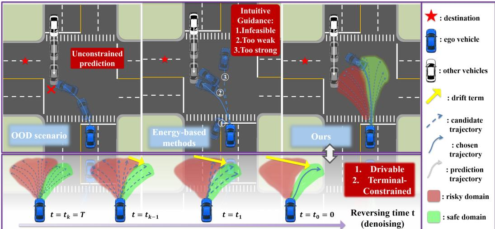
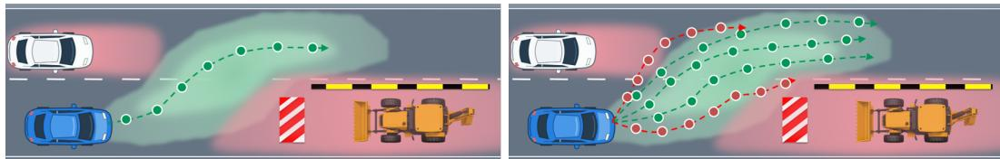
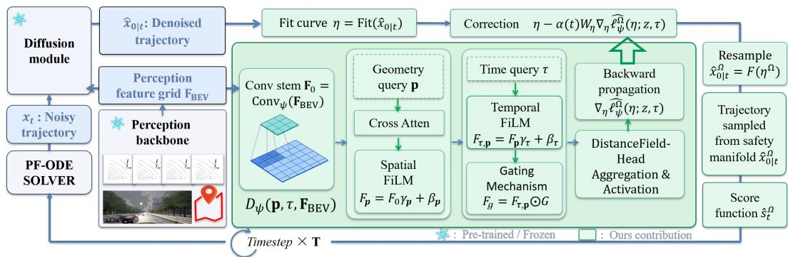
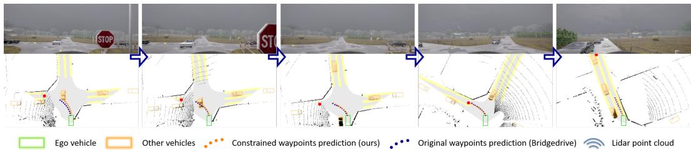
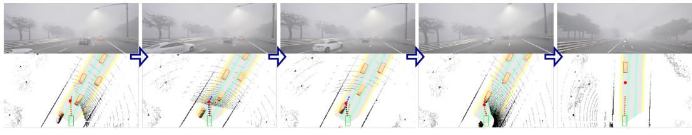

# BRIDGEGUARD: EXPLICIT SAFETY DRIFT FOR DIFFUSION-BASED AUTONOMOUS DRIVING

Zhenjun Qiu1,2∗, Jianing Huang1, Dongang Liu2, Baiyu Du2, Yixun Niu2, Hao Yang1, Xinyu Huang1, Chuan Hu2†, Shu Liu1†

1Bosch Research 2Shanghai Jiao Tong University

## ABSTRACT

Diffusion-based driving planners capture diverse behaviors but can generate unsafe trajectories under distribution shift. We propose BridgeGuard, a safety-constrained diffusion planning method that progressively strengthens a constraint term during denoising to drive intermediate trajectories toward a scene-dependent safety domain. Corrections operate in a low-dimensional curve space, promoting geometric coherence. A learned module, DistanceFieldNet, predicts a time-dependent distance field from bird’s-eye-view features. Value and spatial-gradient supervision at queries sampled beyond expert trajectories teaches this field about both safe and unsafe regions. The learned field supplies the constraint term through safety injection while the pretrained perception backbone and planner remain frozen. We further establish sufficient conditions for terminal safety in an idealized continuoustime bridge. On Bench2Drive, BridgeGuard improves driving score/success rate from 87.99/74.99% to 90.88/76.36% for BridgeDrive and from 80.79/58.18% to 90.46/74.09% for DiffusionDrivegeo, demonstrating cross-model generalization.

## 1 INTRODUCTION

Motion planning converts scene observations and route intent into safe, comfortable, and dynamically feasible trajectories. Classical planners use search, sampling, or optimization with explicit constraints (Paden et al., 2016; Schwarting et al., 2018), while learning-based systems learn from demonstrations (Bansal et al., 2018; Hu et al., 2023). Diffusion and flow models support multimodal planning through conditional generation (Ho et al., 2020; Lipman et al., 2023). DiffusionDrive denoises multimodal trajectory anchors (Liao et al., 2025), while BridgeDrive refines anchors through diffusion bridges with efficient probability-flow ODE solvers (Liu et al., 2026b; Zhou et al., 2024).

Learning expert behavior does not ensure safety under limited data coverage or distribution shift. Existing strategies include cost-gradient guidance during denoising (Jiang et al., 2023; Zhong et al., 2023), reward-based search in Diffusion-ES (Yang et al., 2024), risk-based candidate ranking in SafeDrive (Kim et al., 2026), and flow-based planning with control barrier functions (SafeFlow) (Yang et al., 2026) or learned energies and physical constraints (GuideFlow) (Liu et al., 2026a). However, candidate selection depends on proposal coverage, cost guidance on informative gradients along the sampling path, and barrier constraints on accurate scene geometry.

Manually Bridged Models (MBM) (Naderiparizi et al., 2025) add the time-weighted negative gradient of a constraint distance to the diffusion score. This distance is zero on a feasible set Ω and positive outside it. Directly applying MBM to driving poses two challenges: the collision-free set depends on the scene and prediction horizon, requiring future obstacle geometry, and direct waypoint corrections can distort trajectory geometry.

We propose BridgeGuard, which adapts MBM through a learned distance field and low-dimensional curve corrections. DistanceFieldNet predicts a scene- and horizon-dependent field from bird’s-eyeview (BEV) features, with value and spatial-gradient supervision covering safe and unsafe regions beyond expert paths. Its gradients refine curves during denoising to promote geometric coherence, while the pretrained backbone and planner remain frozen. Our terminal-safety guarantee concerns an idealized continuous-time bridge and does not directly extend to the learned field and discretized corrections.

  
Figure 1: BridgeGuard safety correction. A learned distance field guides curve refinement during denoising, promoting geometric coherence. Terminal safety is guaranteed only for the idealized continuous-time bridge under the stated assumptions.

Our contributions are threefold:

• We adapt Manually Bridged Model to autonomous driving using a distance function encoding dynamic obstacle constraints and establish sufficient conditions for terminal safety in an idealized continuous-time bridge.

• We introduce DistanceFieldNet with value and spatial-gradient supervision beyond expert paths, and inject its learned constraint corrections into a frozen planner through lowdimensional curve updates.

• On the Bench2Drive (Jia et al., 2024) closed-loop benchmark, BridgeGuard improves BridgeDrive’s driving score from 87.99 to 90.88 and success rate from 74.99% to 76.36%. It also improves DiffusionDrivegeo’s driving score from 80.79 to 90.46 and success rate from 58.18% to 74.09%, demonstrating cross-model generalization.

## 2 PRELIMINARIES

## 2.1 DIFFUSION MODELS IN TRAJECTORY PLANNING

Diffusion models. Diffusion models generate samples by integrating the reverse-time SDE from T to 0 (Zhou et al., 2024):

$$
\mathrm { d } x _ { t } = \left[ f ( x _ { t } , t ) - g ^ { 2 } ( t ) s ( x _ { t } , t ) \right] \mathrm { d } t + g ( t ) \mathrm { d } \bar { w } _ { t } ,\tag{1}
$$

where $f$ and g are the forward drift and diffusion coefficients, $s ( x _ { t } , t ) = \nabla _ { x _ { } }$ log $q _ { t } ( x _ { t } )$ is the score of the forward marginal, and $\bar { w } _ { t }$ is a reverse-time Wiener process. For the Gaussian perturbation kernel $q _ { t } ( x _ { t } \mid x _ { 0 } ) \stackrel { \smile } { = } \mathcal { N } ( \lambda _ { t } x _ { 0 } , \sigma _ { t } ^ { 2 } I )$ , the endpoint prediction $\hat { x } _ { 0 \mid t } = x _ { \theta } ( x _ { t } , t )$ induces the score

$$
\hat { s } _ { t } = \frac { \lambda _ { t } \hat { x } _ { 0 | t } - x _ { t } } { \sigma _ { t } ^ { 2 } } .\tag{2}
$$

Diffusion bridges condition on an endpoint $x _ { T } ,$ , allowing initialization from structured priors. For the Gaussian bridge kernel $q _ { t } ( x _ { t } \mid x _ { 0 } , \hat { x _ { T } } ) = \mathcal { N } ( a _ { t } x _ { T } + \hat { b } _ { t } x _ { 0 } , c _ { t } ^ { 2 } I )$ , the endpoint prediction similarly induces $\hat { s } _ { t } = ( a _ { t } x _ { T } + b _ { t } \hat { x } _ { 0 | t } - x _ { t } ) / c _ { t } ^ { 2 }$ , where $x _ { T }$ is the fixed terminal endpoint and $a _ { t } , b _ { t } , c _ { t }$ are the bridge-scheduler coefficients (Zheng et al., 2025). Appendix B gives the forward dynamics, training objectives, and reverse SDE/ODE formulations.

Diffusion models for planning. Given scene context z, the planner predicts H planar waypoints $x _ { 0 } \in \mathbb { R } ^ { 2 H }$ using temporal or geometric sampling. Anchors $\mathcal { Y } = \{ y _ { m } \} _ { m = 1 } ^ { \bar { M } } \subset \mathbb { R } ^ { 2 H }$ represent different trajectory modes. DiffusionDrive (Liao et al., 2025) initializes noisy candidates around multiple anchors, then refines and ranks them with a short, truncated denoising process. BridgeDrive (Liu et al., 2026b) uses a mode classifier $h _ { \phi }$ to select an anchor as $x _ { T }$ and refines it through a diffusion bridge. BridgeDrive and DiffusionDrivegeo output $( x ^ { \mathrm { g e o } } , v )$ : geometric waypoints and a separate target speed; only the waypoints undergo diffusion. Our correction retains each planner’s waypoint representation and any separately predicted speed, evaluating safety at physical horizons τ (Section 3.1).

## 2.2 CONSTRAINED DIFFUSION AND MANUALLY BRIDGED MODELS

Ω-Bridge. For a constraint set $\Omega \subseteq \mathbb { R } ^ { d }$ and reverse drift $\nu ( x _ { t } , t ) = f ( x _ { t } , t ) - g ^ { 2 } ( t ) s ( x _ { t } , t )$ , a vector field $B ^ { \Omega }$ is an Ω-bridge (Liu et al., 2023) if the modified reverse process

$$
\mathrm { d } x _ { t } = \left[ \nu ( x _ { t } , t ) - g ^ { 2 } ( t ) \mathcal { B } ^ { \Omega } ( x _ { t } , t ) \right] \mathrm { d } t + g ( t ) \mathrm { d } { \bar { w } _ { t } }\tag{3}
$$

satisfies $\mathbb { P } ( x _ { 0 } \in \Omega ) = 1$

Manually bridged models. Manually Bridged Models (Naderiparizi et al., 2025) use an Ω-distance: a nonnegative, continuous function $\ell ^ { \Omega }$ with finite gradients almost everywhere, satisfying

$$
\ell ^ { \Omega } ( x ) = 0 \quad \Longleftrightarrow \quad x \in \Omega .\tag{4}
$$

For a schedule $\gamma \in C ^ { 1 } ( ( 0 , T ] , \mathbb { R } _ { > 0 } )$ satisfying

$$
\gamma ( T ) \approx 0 , \qquad \operatorname* { l i m } _ { t \downarrow 0 } \gamma ( t ) = + \infty ,\tag{5}
$$

the manual bridge and the resulting score are

$$
b ^ { \Omega } ( x _ { t } , t ) = - \gamma ( t ) \nabla _ { x _ { t } } \ell ^ { \Omega } ( x _ { t } ) , \qquad s ^ { \Omega } ( x _ { t } , t ) = s ( x _ { t } , t ) + b ^ { \Omega } ( x _ { t } , t ) .\tag{6}
$$

This is the score of the tilted density $q _ { t } ^ { \Omega } ( x ) \propto q _ { t } ( x ) \exp [ - \gamma ( t ) \ell ^ { \Omega } ( x ) ]$ , which downweights constraint violations. The construction alone does not establish an Ω-bridge; sufficient conditions (Wu et al., 2022) are given in Appendix I.1. Nonnegative component distances can be summed to obtain a manual bridge for a nonempty intersection of constraint sets.

## 3 METHOD

We augment a pretrained diffusion-bridge planner with a scene-dependent safety field. The field represents obstacle-avoidance constraints and supplies spatial gradients for refining the planner’s intermediate predictions. We first define the safety domain and its violation loss, then describe safety injection through curve-space correction and trajectory-sampled field supervision. Finally, we present the architecture that learns the field from sensor features and couples it to the frozen planner.

## 3.1 SAFETY DOMAIN AND DISTANCE FUNCTION

Spatial and temporal representation. Let z denote the observed driving scene and $x \in \mathbb { R } ^ { 2 H }$ the planner’s waypoint sequence, which may use temporal or geometric sampling. The diffusion state $x _ { t }$ uses the same representation. For safety evaluation, we map x to positions at K physical prediction horizons $\pmb { \tau } = ( \tau _ { 1 } , \dots , \tau _ { K } )$

$$
P = \mathcal { E } _ { \pmb { \tau } } ( x ) = ( \mathbf { p } _ { 1 } , \dots , \mathbf { p } _ { K } ) \in \mathbb { R } ^ { 2 K } , \qquad \mathbf { p } _ { i } = \mathcal { E } _ { \tau _ { i } } ( x ) .\tag{7}
$$

For temporal waypoints already indexed by $\tau , \mathcal { E } _ { \tau }$ is the identity; otherwise it evaluates the trajectory at the query horizons. For geometric plans $( x ^ { \mathrm { g e o } } , v )$ , it extrapolates temporal positions along $x ^ { \mathrm { g e o } }$ using the separately predicted target speed v. Such auxiliary predictions are held fixed and suppressed in the arguments of E. The safety domain and distance function are defined in the space of time-indexed positions $P .$ . The diffusion model predicts waypoints in the base planner’s original representation. Safety correction updates the parameters of a curve fitted to these waypoints, then resamples the corrected curve into the same waypoint representation. Physical horizons are measured from the current observation and remain fixed during correction. They are distinct from diffusion time t, which decreases from T to 0.

Dynamic obstacle geometry. For obstacle $j ,$ let $\mathbf { c } _ { j } ( \tau )$ and $\psi _ { j } ( \tau )$ denote its center and heading at horizon $\tau ,$ and let $a _ { j } , b _ { j } > 0$ be its half-length and half-width. During training, these quantities are obtained from obstacle-box and motion annotations, with short-horizon kinematic extrapolation used to construct the queried future geometry prediction. Thus, an ego query and an obstacle are compared at the same time horizon. In the obstacle’s local frame, define

$$
\left[ \tilde { p } _ { j } ^ { x } \right] = \left[ \begin{array} { c c } { \cos \psi _ { j } ( \tau ) } & { \sin \psi _ { j } ( \tau ) } \\ { - \sin \psi _ { j } ( \tau ) } & { \cos \psi _ { j } ( \tau ) } \end{array} \right] \left( \mathbf { p } - \mathbf { c } _ { j } ( \tau ) \right) , \qquad \Gamma _ { j } ( \mathbf { p } , \tau ) = \left( \frac { \tilde { p } _ { j } ^ { x } } { a _ { j } } \right) ^ { 8 } + \left( \frac { \tilde { p } _ { j } ^ { y } } { b _ { j } } \right) ^ { 8 } - 1 .\tag{8}
$$

The eighth-order super-ellipse approximates an oriented obstacle footprint. The resulting safety domain in temporal-waypoint space is

$$
\Omega ( z ; \tau ) = \left\{ P \in \mathbb { R } ^ { 2 K } \ \vert \ \Gamma _ { j } ( \mathbf { p } _ { i } , \tau _ { i } ) \geq 0 , \quad \forall i = 1 , \ldots , K , \quad \forall j = 1 , \ldots , J \right\} .\tag{9}
$$

Here $J$ is the number of surrounding obstacles. A plan x satisfies these sampled safety constraints when $\mathcal { E } _ { \tau } ( x ) \in \Omega ( z ; \tau )$

Distance function. We assign each temporal query $( \mathbf { p } _ { i } , \tau _ { i } )$ a per-obstacle pointwise distance function

$$
\ell _ { j } ^ { \Omega } ( \mathbf { p } _ { i } , \tau _ { i } ; z ) = [ \arctan ( - \Gamma _ { j } ( \mathbf { p } _ { i } , \tau _ { i } ) ) ] _ { + } , \qquad [ u ] _ { + } = \operatorname* { m a x } ( u , 0 ) .\tag{10}
$$

This bounded value is positive inside the obstacle region and exactly zero on its boundary and exterior. It is continuous and differentiable almost everywhere with finite gradients. It is an Ω-distance in the sense of Eq. (4).

To aggregate obstacles, let $\kappa ( \mathbf { p } , \tau ; z )$ contain the indices of the min $( \kappa , J )$ largest per-obstacle values, with $\kappa \geq 1$ . For a fixed query $( \mathbf { p } _ { i } , \tau _ { i } )$ , we define the pointwise distance $d ^ { \Omega } ( \mathbf { p } _ { i } , \tau _ { i } ; z )$ by summing the per-obstacle distances over the retained obstacles $\dot { \mathcal { K } } ( \mathbf { p } _ { i } , \tau _ { i } ; z )$ . The trajectory-level distance then sums these pointwise distances over all query points:

$$
\ell ^ { \Omega } ( P ; z , \tau ) = \sum _ { i = 1 } ^ { K } d ^ { \Omega } ( \mathbf { p } _ { i } , \tau _ { i } ; z ) = \sum _ { i = 1 } ^ { K } \sum _ { \substack { j \in K ( \mathbf { p } _ { i } , \tau _ { i } ; z ) } } \ell _ { j } ^ { \Omega } ( \mathbf { p } _ { i } , \tau _ { i } ; z ) .\tag{11}
$$

An empty obstacle set contributes zero. Because all components are nonnegative and the largest is always retained, the top-κ reduction preserves the zero set of the full sum:

$$
\ell ^ { \Omega } ( P ; z , \pmb { \tau } ) = 0 \quad \Longleftrightarrow \quad P \in \Omega ( z ; \pmb { \tau } ) .\tag{12}
$$

For a planner output x, the corresponding distance function is therefore $\ell ^ { \Omega } ( \mathcal { E } _ { \tau } ( x ) ; z , \tau )$ The aggregation is continuous and differentiable almost everywhere; ranking switches introduce additional nondifferentiable points. Its negative spatial gradient supplies a local direction for reducing the distance function.

## 3.2 THEORETICAL ANALYSIS

We analyze terminal safety for the idealized continuous-time manual bridge acting directly in the full temporal-waypoint space, with $X _ { t } \in \mathbb { R } ^ { 2 K }$ and safety set $\Omega ( z ; \tau )$ . The resulting guarantee applies to this idealized process and does not directly extend to the approximate curve-space correction introduced in Section 3.3. The following result summarizes Corollary 1; the full assumptions and proof are provided in Appendix I.

Sufficient condition for terminal safety. Consider the manually bridged reverse SDE in Eq. (40). If the distance function satisfies the expected Polyak–Łojasiewicz condition in Eq. (44) and Assumptions A1–A5 in Eqs. (46)–(50) of Appendix I.2 hold, then the manual bridge term $b ^ { \Omega }$ is an Ω-bridge, and

$$
\mathbb { P } ( X _ { 0 } \in \Omega ) = 1 .
$$

Thus, the terminal generated trajectory belongs to the prescribed safe set almost surely, as stated in Eq. (61).

The key requirements are expected gradient dominance (Condition 1, Eq. (44)), linking distance function to gradient strength, and terminal domination (A3 and A4, Eqs. (48) and (49)), ensuring schedule strength dominates the drift and diffusion contributions.

## 3.3 SAFETY INJECTION

The goal of safety injection is to refine the planner’s waypoints x so that $\mathcal { E } _ { \tau } ( x )$ lies in $\Omega ( z ; \tau )$ . We learn a distance field $D _ { \psi } ^ { \Omega } ( \mathbf { p } , \tau ; z )$ over spatial positions and prediction horizons. At inference, we refine the predicted trajectory in a low-dimensional curve space using field values at temporal query waypoints. During training, temporal queries from multiple driving modes teach the field where correction is needed, including locations absent from the scene’s expert trajectory. Detailed training and inference procedures are described in 3.4.

Correction in a parameterized curve space. Direct waypoint corrections can distort path geometry. We therefore fit each denoised waypoint sequence $\hat { x } _ { 0 \mid t } \in \dot { \mathbb { R } } ^ { 2 H }$ with parameters $\pmb { \eta } = \mathrm { F i } \bar { \mathrm { t } } ( \hat { x } _ { 0 | t } ) \in \mathbb { R } ^ { d _ { \eta } }$ where $d _ { \eta } \ll 2 H$ . Let $F ( \eta )$ resample the curve into the base planner’s waypoint representation, following its spatial sampling or temporal indexing. The learned distance is evaluated at the corresponding physical query horizons:

$$
\widehat { \ell } _ { \psi } ^ { \Omega } ( \eta ; z , \tau ) = \sum _ { i = 1 } ^ { K } D _ { \psi } ^ { \Omega } ( \mathcal { E } _ { \tau _ { i } } ( F ( \eta ) ) , \tau _ { i } ; z ) .\tag{13}
$$

We differentiate through E and $F ,$ holding the query horizons, sampling convention, and any auxiliary predictions fixed. After updating η, the corrected endpoint is $\hat { x } _ { 0 \mid t } ^ { \Omega } \stackrel { - } { = } F \bar { ( \eta ^ { \Omega } ) }$ . Thus, safety is evaluated in temporal-waypoint space, while correction acts on the curve parameters. Please see more details on inference process in 3.4. The induced waypoint correction is restricted to directions expressible by the chosen curve family; its first-order form is derived in Appendix D.

Supervision beyond the expert path. The learned distance function $D _ { \psi } ^ { \Omega } ( \mathbf { p } , \tau ; z )$ must provide useful values and gradients wherever the planner may query it, whereas expert waypoints cover only a narrow and typically safe part of this domain. We thus leverage additional sources, such as trajectories sampled from a pretrained planner or trajectory anchors, including the clustered anchors used for training 2. For each training scene z, we map sampled plans through $\mathcal { E } _ { \tau }$ and sample the resulting temporal waypoint–horizon pairs $( \mathbf { p } _ { i } , \tau _ { i } )$ . We denote this distribution of sampled points and time horizon as $( \mathbf { \dot { p } } , \tau ) \sim \mathcal { Q } ( z )$ . These queries cover both safe and dangerous regions (Luo et al., 2026; Bansal et al., 2018) without requiring additional expert demonstrations. The sampling configuration is given in Section 4. Quantitative improvements are reported in Sec. 4.2.

  
Ego vehicle Other vehicles --- Sampled coordinates (unsafe)---Sampled coordinates (safe)  
Figure 2: DistanceFieldNet training queries. Expert-only sampling (left) covers a narrow, typically safe region. Anchor-based sampling (right) broadens coverage to safe (green) and violating (red) queries beyond the expert path.

## 3.4 TRAINING OBJECTIVE AND INFERENCE

Training objective. We train the distance function with the following value and gradient (Li et al., 2023; Peng et al., 2022; Rakib and Bagavathi, 2025) supervision from distance function

$$
\begin{array} { r } { \mathcal { L } _ { \mathrm { D } } = \mathbb { E } _ { z , ( \mathbf { p } , \tau ) \sim \mathcal { Q } ( z ) } \left[ \left| D _ { \psi } ^ { \Omega } ( \mathbf { p } , \tau ; z ) - d ^ { \Omega } ( \mathbf { p } , \tau ; z ) \right| ^ { 2 } \right] , } \end{array}\tag{14}
$$

$$
\begin{array} { r } { \mathcal { L } _ { \mathrm { G D } } = \mathbb { E } _ { z , ( \mathbf { p } , \tau ) \sim Q ( z ) } \left[ \left| \left| \nabla _ { \mathbf { p } } D _ { \psi } ^ { \Omega } ( \mathbf { p } , \tau ; z ) - \nabla _ { \mathbf { p } } d ^ { \Omega } ( \mathbf { p } , \tau ; z ) \right| \right| _ { 2 } ^ { 2 } \right] . } \end{array}\tag{15}
$$

At nondifferentiable target locations, a consistent subgradient convention is used. The two supervision terms give the overall training loss

$$
\begin{array} { r } { \mathcal { L } = \mathcal { L } _ { \mathrm { D } } + \lambda _ { \mathrm { g d } } \mathcal { L } _ { \mathrm { G D } } . } \end{array}\tag{16}
$$

Algorithm 1 Diffusion Planning with Learned Safety Injection (on BridgeDrive)   
Input: Scene z, anchors $\mathcal { V } = \{ y _ { m } \}$ , pretrained planner $( h _ { \phi } , x _ { \theta } )$ , separately predicted speed v, trained   
DistanceFieldNet $D _ { \psi } ^ { \Omega } ,$ horizons τ, reverse times $T = t _ { N } > \cdot \cdot \cdot > t _ { 0 } = 0$   
Output: Refined geometric path x0 with unchanged target speed v   
1: $m ^ { \star } \gets$ arg maxm $h _ { \phi } ( y _ { m } , z ) ; x _ { t _ { N } } \gets x _ { T } \gets y _ { m ^ { \star } }$   
2: for each reverse step $t = t _ { n } \to t ^ { \prime } = t _ { n - 1 } , n = N , \dots , 1$ do   
3: $\hat { x } _ { 0 | t }  x _ { \theta } ( x _ { t } , t , x _ { T } , z )$ ▷ Predict the clean path   
4: $\eta \dot {  } \operatorname { F i t } ( \hat { x } _ { 0 \mid t } )$ ▷ Project the path into curve space   
5: Evaluate $\nabla _ { \eta } \widehat { \ell } _ { \psi } ^ { \Omega }$ using $\mathcal { E } _ { \tau } \circ F$ in Eq. (13) ▷ Compute the safety direction   
6: Update $\eta ^ { \Omega }$ by Eq. (18) with $\alpha ( t ) = ( c _ { t } ^ { 2 } / b _ { t } ) \gamma _ { \varepsilon } ( t )$ ▷ Correct the curve coefficients   
7: $\hat { x } _ { 0 | t } ^ { \hat { \Omega } } \gets \dot { F } ( \eta ^ { \hat { \Omega } } )$ ▷ Recover refined waypoints   
8: $\mathbf { \Phi } _ { \mathrm { \Lambda } _ { t ^ { \prime } } } \gets \mathrm { O D E S o l v e r S t e p } ( x _ { t } , \hat { x } _ { 0 \mid t } ^ { \Omega } , x _ { T } , t , t ^ { \prime } )$ ▷ Advance the reverse ODE   
9: end for   
10: return $( x _ { 0 } , v )$

During training, only parameters $\psi$ are optimized; the original perception backbone and diffusion planner remain frozen.

Inference. DistanceFieldNet predicts the field from observed BEV features and spatial–temporal queries. We use a finite, stabilized score-level schedule $\gamma _ { \varepsilon } ( t )$ that is small near $\dot { T }$ and increases toward $t = 0$ . At fixed $x _ { t }$ and z, Eq. (2) gives

$$
\hat { x } _ { 0 \vert t } ^ { \Omega } = \hat { x } _ { 0 \vert t } + \frac { \sigma _ { t } ^ { 2 } } { \lambda _ { t } } \Delta s _ { t } , \qquad \Delta s _ { t } = \hat { s } _ { t } ^ { \Omega } - \hat { s } _ { t } .\tag{17}
$$

At each reverse step, we fit $\pmb { \eta } = \mathrm { F i t } ( \hat { x } _ { 0 \mid t } )$ and apply

$$
\eta ^ { \Omega } = \eta - \alpha ( t ) W _ { \eta } \nabla _ { \eta } \widehat { \ell } _ { \psi } ^ { \Omega } ( \eta ; z , \tau ) , \qquad \alpha ( t ) = \frac { \sigma _ { t } ^ { 2 } } { \lambda _ { t } } \gamma _ { \varepsilon } ( t ) .\tag{18}
$$

Here $W _ { \eta }$ is positive diagonal and sets the relative parameter scales. Query horizons and auxiliary predictions remain fixed, while positions are recomputed through $\mathcal { E } _ { \tau } \circ F .$ . For Gaussian diffusion bridges, $\alpha ( t ) = ( c _ { t } ^ { 2 } / b _ { t } ) \gamma _ { \varepsilon } ( t )$ The effective step is the full product $\alpha ( t )$ ; conversion ratios are evaluated at nonsingular interior times, with endpoint limits handled by the base scheduler.

We resample $\hat { x } _ { 0 \mid t } ^ { \Omega } = F ( \eta ^ { \Omega } )$ and use its induced score in the base reverse SDE or probability-flow ODE. For diffusion bridges, we keep $x _ { T }$ fixed and retain the base solver’s anchor-conditioning drift. Algorithm 1 summarizes the procedure; Appendix C derives the score–endpoint conversion.

Scope of the bridge interpretation. Equation (17) is exact, but curve fitting, resampling, and restricted gradients (Eq. (38)) approximate full-state manual-bridge dynamics. The idealized guarantee in Appendix I does not directly extend to learned fields, finite schedules, or discretized updates. The curve representation promotes geometric coherence without certifying kinematic feasibility or collision freedom.

## 3.5 MODEL ARCHITECTURE

Perception and base planner. The system comprises a perception backbone, an anchor-based diffusion planner, and the learned distance-field module, DistanceFieldNet. Our BridgeDrive implementation retains the pretrained TransFuser++ perception backbone (Jaeger et al., 2023). Its pretraining includes predicting other agents’ velocities, so its BEV features encode motion information for DistanceFieldNet. The correction can also be coupled to DiffusionDrivegeo, the geometric adaptation of DiffusionDrive described in the BridgeDrive paper (Liao et al., 2025; Liu et al., 2026b). The backbone and selected planner remain frozen. Sensor observations are encoded into $\mathbf { F } _ { \mathrm { B E V } } ( z )$ which is shared by the planner and DistanceFieldNet. We retain each planner’s denoising and trajectory-selection procedure, while DistanceFieldNet supplies the safety objective for refining its clean waypoint predictions at each reverse step.

  
Figure 3: BridgeGuard inference. Green components denote BridgeGuard additions. At each denoising step, DistanceFieldNet supplies gradients for curve correction; resampled waypoints are returned to the frozen planner’s solver.

Query-conditioned DistanceFieldNet. DistanceFieldNet takes a waypoint sequence $P =$ $\left( \mathbf { p } _ { 1 } , \ldots , \mathbf { p } _ { K } \right)$ , the corresponding physical horizons $\pmb { \tau } = ( \tau _ { 1 } , \dots , \tau _ { K } )$ , and shared BEV features ${ \bf F } _ { \mathrm { B E V } } ( z )$ as input. A shared convolutional stem encodes the BEV features as $\mathbf { F } _ { 0 } = \mathrm { C o n v } _ { \psi } ( \mathbf { F } _ { \mathrm { B E V } } )$ We describe the per-waypoint computation for one query pair $( \mathbf { p } , \tau )$ , omitting the waypoint index below. Sinusoidal positional features (Vaswani et al., 2017) and MLPs embed the BEV-normalized coordinate p¯ and horizon τ as $\mathbf { e _ { p } }$ and $\mathbf { e } _ { \tau }$ . The spatial query embedding cross-attends to positionencoded BEV tokens $\mathbf { Z } _ { \mathrm { B E V } }$ , yielding a context h that generates spatial FiLM (Perez et al., 2018) parameters. Spatial FiLM modulates $\mathbf { F } _ { 0 }$ into $\mathbf { F _ { p } } .$ , and temporal FiLM driven by $\mathbf { e } _ { \tau }$ further produces $\mathbf { F } _ { \tau , \mathbf { p } } .$ A query-specific gate filters the conditioned features as $\mathbf { F } _ { g } = \mathbf { F } _ { \tau , \mathbf { p } } \odot \dot { G } .$ . DistanceFieldHead aggregates $\mathbf { F } _ { g }$ into a dense response map R, reduces the flattened map to a scalar logit r, and applies a bounded monotonic activation. The same network evaluates all K query pairs, and their scalar outputs are summed to obtain the trajectory-level safety objective. Backpropagating this sum through the waypoint coordinates and trajectory parameterization provides the curve-space correction direction. Architecture details are given in Appendix E.

## 4 EXPERIMENTS

## 4.1 CLOSED-LOOP EVALUATION IN CARLA SIMULATOR

Benchmark We evaluate BridgeGuard on Bench2Drive (Jia et al., 2024), a closed-loop benchmark in CARLA (Dosovitskiy et al., 2017) built on the CARLA Leaderboard 2.0 protocol. Its 220 routes span CARLA towns, each covering approximately 150 m and one safety-critical scenario. This setting exposes failures arising from interactions with the environment. Motivated by safety failures observed in our reproductions of leading end-to-end and vision-language-action (VLA) planners (Liu et al., 2026b; Jaeger et al., 2023; Fu et al., 2025; Renz et al., 2025), we compare their performance with BridgeGuard on these challenging scenarios.

Dataset Following BridgeDrive (Liu et al., 2026b), we use the publicly released CARLA Garage training dataset (Zimmerlin et al., 2024). The data were generated using the PDM-Lite expert (Beißwenger, 2024; Sima et al., 2024) and include camera images, LiDAR observations, and expert driving annotations. Table 1 also includes baselines trained on the official Bench2Drive dataset, generated using the Think2Drive expert (Li et al., 2024).

Baselines We compare BridgeGuard with ten end-to-end driving baseline configurations in Table 1. DriveTransformer (Jia et al., 2025), TransFuser++ (Zimmerlin et al., 2024), and SparseDriveV2 (Sun et al., 2026) provide non-VLA, non-diffusion reference points; ORION (Fu et al., 2025), Mind-Drive (Fu et al., 2026), and SimLingo (Renz et al., 2025) represent VLA-based planners; Diffusion-Drive (Liao et al., 2025) and BridgeDrive (Liu et al., 2026b) represent diffusion-based planners; and AutoMoT (Huang et al., 2026) combines VLA and diffusion-based planning. We report both DiffusionDrive adaptations from BridgeDrive (Liu et al., 2026b): DiffusionDrivetemp retains the original temporal waypoint representation, while DiffusionDrivegeo predicts geometric waypoints and a separate target speed. Our DiffusionDrive-based results use the geometric variant. The table also identifies the data-collection expert for each method.

Implementation Details We freeze the pretrained perception backbone and diffusion planner and train only DistanceFieldNet. For each training scene, we sample 20 query points from two anchors and supervise field values and spatial gradients using annotated obstacle geometry. Safety is evaluated over a 0.5 s horizon. We fit planar paths with $y ( x ) = \eta _ { 1 } x + \eta _ { 2 } x ^ { 2 } + \eta _ { 4 } x ^ { 4 }$ , where x and y denote forward and lateral ego-frame coordinates. This quartic family has three free coefficients, with constant and cubic terms fixed at zero. Correction updates these coefficients while keeping the target speed fixed. At inference, DistanceFieldNet uses observed BEV features and waypoint– horizon queries, without explicit obstacle dimensions or ground-truth geometry. Detailed network, supervision, curve-refinement, training, and sensor settings are given in Appendix F.

Table 1: Comparison of different methods on Bench2Drive.
<table><tr><td>Method</td><td>Expert</td><td>VLA</td><td>Diffusion</td><td>DS</td><td>SR(%)</td></tr><tr><td>DriveTransformer (Jia et al., 2025)</td><td>Think2Drive</td><td></td><td>X</td><td>63.46</td><td>35.01</td></tr><tr><td>ORION (Fu et al., 2025)</td><td>Think2Drive</td><td></td><td>X</td><td>77.74</td><td>54.62</td></tr><tr><td>MindDrive (Fu et al., 2026)</td><td>Think2Drive</td><td></td><td>X</td><td>80.59</td><td>58.26</td></tr><tr><td>TransFuser++ (Zimmerlin et al., 2024)</td><td>PDM-Lite</td><td></td><td>X</td><td>84.21</td><td>67.27</td></tr><tr><td>SimLingo (Renz et al., 2025)</td><td>PDM-Lite</td><td></td><td></td><td>85.07</td><td>67.27</td></tr><tr><td>AutoMoT (Huang et al., 2026)</td><td>PDM-Lite</td><td></td><td></td><td>89.42</td><td>74.09</td></tr><tr><td>SparseDriveV2 (Sun et al., 2026)</td><td>PDM-Lite</td><td></td><td>X</td><td>89.15</td><td>70.00</td></tr><tr><td>DiffusionDrivetemp (Liu et al., 2026b)</td><td>PDM-Lite</td><td></td><td></td><td>77.68</td><td>52.72</td></tr><tr><td>DiffusionDrivegeo (Liu et al., 2026b)</td><td>PDM-Lite</td><td></td><td></td><td>80.79</td><td>58.18</td></tr><tr><td>BridgeDrive (Liu et al., 2026b)</td><td>PDM-Lite</td><td></td><td></td><td>87.99</td><td>74.99</td></tr><tr><td>Ours (based on DiffusionDrivegeo)</td><td>PDM-Lite</td><td></td><td></td><td>90.46(+9.67)</td><td>74.09(+15.91)</td></tr><tr><td>Ours (based on BridgeDrive)</td><td>PDM-Lite</td><td></td><td></td><td>90.88(+2.89)</td><td>76.36(+1.37)</td></tr></table>

Main results Table 1 shows that BridgeGuard on BridgeDrive achieves the highest Driving Score (DS, 90.88) and Success Rate (SR, 76.36%) among the compared methods, outperforming VLA baselines with a much smaller model. BridgeGuard improves DS by 2.89 and SR by 1.37% over BridgeDrive, 9.67 and 15.91% over DiffusionDrivegeo. These gains support its effectiveness across both diffusion planners. The larger improvements on DiffusionDrivegeo may reflect its higher baseline collision rate, which leaves more room for safety correction. When trained on LEAD, BridgeGuard reaches 96.76 DS and 89.78% SR, outperforming the compared baselines (Appendix G.2).

## 4.2 ABLATION STUDY AND QUALITATIVE ANALYSIS

Curve dimensionality. The quadratic ablation fixes $\eta _ { 4 } = 0 ,$ , leaving the two coefficients of $y ( s ) = \eta _ { 1 } s + \eta _ { 2 } s ^ { 2 }$ . Allowing the third coefficient $\eta _ { 4 }$ gives our quartic curve and improves DS from 88.65 to 90.88 and SR from 73.18% to 76.36% (Table 2). Mean ability also rises from 64.77% to 69.74%, despite a small decline in merging performance (75.00% to 73.75%). These results favor the richer curve representation for safety correction; full results are in Appendix G.1.

Training-query sampling. Anchor-based queries outperform expert-only queries at the same tenpoint budget (Table 3). Sampling 20 points from two anchors yields the best mean DS (90.96) and SR (75.23%), while increasing to 100 points from ten anchors provides no further improvement. These results support supervising the distance field beyond expert trajectories with a moderate query budget.

Advantages over BridgeDrive Figures 4 and 5 show traffic conflicts that BridgeDrive fails to resolve during an unprotected left turn and a multi-lane change on Bench2Drive. BridgeGuard instead yields and completes both maneuvers safely. These cases illustrate how our safety drift term corrects potentially dangerous trajectories, pulling the ego vehicle away from imminent conflicts and back into the safe region in an explicit manner. We refer readers to the supplementary videos described in Appendix H for comparisons of BridgeDrive and BridgeGuard in two lane-changing cases and one unprotected left-turn case.

Ego vehicleOther vehiclesConstrained waypoints prediction (ours) Original waypoints prediction (BridgeDrive)Lidar point cloud

Table 2: Curve dimensionality.
<table><tr><td>Metric</td><td>Quadratic</td><td>Quartic</td></tr><tr><td>DS</td><td>88.65</td><td>90.88</td></tr><tr><td>SR (%)</td><td>73.18</td><td>76.36</td></tr><tr><td>Merging (%)</td><td>75.00</td><td>73.75</td></tr><tr><td>Mean ability (%)</td><td>64.77</td><td>69.74</td></tr></table>

Table 3: Training-query sampling.
<table><tr><td>Queries Source</td><td>DS</td><td>SR (%)</td></tr><tr><td>10 Expert</td><td> $8 9 . 1 7 \pm 0 . 6 8$ </td><td> $7 0 . 2 3 \pm 2 . 2 5$ </td></tr><tr><td>10 1 anchor</td><td> $8 9 . 6 7 \pm 0 . 2 3 $ </td><td> $7 2 . 7 3 \pm 1 . 9 3$ </td></tr><tr><td>20 2 anchors</td><td>90.96± 0.34</td><td> ${ \bf 7 5 . 2 3 \pm 0 . 9 6 }$ </td></tr><tr><td>100 10 anchors 90.69 ± 0.01</td><td></td><td> $7 3 . 4 1 \pm 0 . 9 6$ </td></tr></table>

Figure 4: Unprotected left turn on Bench2Drive. BridgeDrive (blue) collides with an oncoming vehicle; BridgeGuard (orange) avoids the collision by bypassing the vehicle. See also Appendix H.  
  
Figure 5: Multi-lane change on Bench2Drive. BridgeDrive (blue) enters an occupied lane; Bridge-Guard (orange) yields to the white vehicle and merges safely. See also Appendix H.

## 5 LIMITATIONS & FUTURE WORK

BridgeGuard has two main limitations. First, we consider only one distance function, constructed from eighth-order superellipses. Although it correctly identifies the prescribed safe set, its gradient can be small in the interior of a superellipse, providing a weak correction for waypoints that lie deep inside an unsafe region. This behavior may also make the gradient-dominance condition underlying the idealized Ω-bridge guarantee more difficult to satisfy. Future work should explore alternative smooth distance functions with well-conditioned gradients throughout unsafe regions and characterize when they satisfy the sufficient conditions for an Ω-bridge.

Second, our correction is restricted to a low-dimensional parametric curve space. This promotes geometric coherence but limits the available correction directions and may not capture the full diversity of drivable, dynamically feasible trajectories. A promising direction is to learn a richer drivable trajectory manifold or a constraint-aware trajectory representation that preserves feasibility while allowing more flexible safety corrections.

## 6 CONCLUSION

We introduced BridgeGuard, which combines a learned safety field with low-dimensional curve corrections for diffusion-based driving. DistanceFieldNet learns values and spatial gradients beyond expert trajectories, drifting denoising while the perception backbone and planner remain frozen. On Bench2Drive, BridgeGuard improves DS and SR for both BridgeDrive and DiffusionDrivegeo. Our analysis establishes sufficient conditions for terminal safety in an idealized continuous-time bridge; these do not directly guarantee safety for the learned field and discretized corrections.

## AI USE STATEMENT

We used ChatGPT and Codex to assist in drafting portions of the manuscript, including some mathematical expressions. ChatGPT also helped improve the clarity and readability of the text, while Codex assisted with the design of selected modules and the development of scripts. The authors manually reviewed all AI-assisted work and checked the correctness of the text, mathematical expressions, module designs, and scripts. We take full responsibility for the final content of this work, including all text, mathematical claims, code, and results produced with the assistance of these tools.

## REPRODUCIBILITY STATEMENT

To support reproducibility, Section 3 describes our method, model architecture, and training and inference procedures. Section 4 reports the datasets, evaluation protocol, and implementation settings used in our experiments. The assumptions and proofs underlying our theoretical analysis are provided in Appendix I. We plan to open-source our code and release our trained model to enable independent reproduction of the reported results and support further research.

## REFERENCES

Bansal, M., Krizhevsky, A., and Ogale, A. S. (2018). Chauffeurnet: Learning to drive by imitating the best and synthesizing the worst. ArXiv, abs/1812.03079.

Beißwenger, J. (2024). PDM-Lite: A rule-based planner for carla leaderboard 2.0. https://github.com/OpenDriveLab/DriveLM/blob/DriveLM-CARLA/ docs/report.pdf.

Dhariwal, P. and Nichol, A. Q. (2021). Diffusion models beat GANs on image synthesis. In Beygelzimer, A., Dauphin, Y., Liang, P., and Vaughan, J. W., editors, Advances in Neural Information Processing Systems.

Doob, J. L. et al. (1984). Classical potential theory and its probabilistic counterpart, volume 19. Springer.

Dosovitskiy, A., Ros, G., Codevilla, F., Lopez, A., and Koltun, V. (2017). CARLA: An open urban driving simulator. In Proceedings of the 1st Annual Conference on Robot Learning, pages 1–16.

Fu, H., Zhang, D., Zhao, Z., Cui, J., Liang, D., Zhang, C., Zhang, D., Xie, H., Wang, B., and Bai, X. (2025). Orion: A holistic end-to-end autonomous driving framework by vision-language instructed action generation. In Proceedings of the IEEE/CVF International Conference on Computer Vision.

Fu, H., Zhang, D., Zhao, Z., Cui, J., Xie, H., Wang, B., Chen, G., Liang, D., and Bai, X. (2026). Minddrive: A vision-language-action model for autonomous driving via online reinforcement learning. In Proceedings of the European Conference on Computer Vision.

Ho, J., Jain, A. N., and Abbeel, P. (2020). Denoising diffusion probabilistic models. In Advances in Neural Information Processing Systems, volume 33, pages 6840–6851.

Ho, J. and Salimans, T. (2021). Classifier-free diffusion guidance. In NeurIPS 2021 Workshop on Deep Generative Models and Downstream Applications.

Hu, Y., Yang, J., Chen, L., Li, K., Sima, C., Zhu, X., Chai, S., Du, S., Lin, T., Wang, W., Lu, L., Jia, X., Liu, Q., Dai, J., Qiao, Y., and Li, H. (2023). Planning-oriented Autonomous Driving . In 2023 IEEE/CVF Conference on Computer Vision and Pattern Recognition (CVPR), pages 17853–17862, Los Alamitos, CA, USA. IEEE Computer Society.

Huang, W., Zhang, S., Huang, Q., Wang, Z., Mao, Z., Chua, C., Chen, Z., Chen, L., and Lv, C. (2026). Automot: A unified vision-language-action model with asynchronous mixture -of-transformers for end-to-end autonomous driving. In Forty-third International Conference on Machine Learning.

Jaeger, B., Chitta, K., and Geiger, A. (2023). Hidden biases of end-to-end driving models. In Proc. of the IEEE International Conf. on Computer Vision (ICCV), pages 8240–8249.

Jia, X., Yang, Z., Li, Q., Zhang, Z., and Yan, J. (2024). Bench2drive: Towards multi-ability benchmarking of closed-loop end-to-end autonomous driving. In NeurIPS 2024 Datasets and Benchmarks Track.

Jia, X., You, J., Zhang, Z., and Yan, J. (2025). Drivetransformer: Unified transformer for scalable end-to-end autonomous driving. In International Conference on Learning Representations (ICLR).

Jiang, C., Cornman, A., Park, C., Sapp, B., Zhou, Y., and Anguelov, D. (2023). MotionDiffuser: Controllable multi-agent motion prediction using diffusion. In Proceedings of the IEEE/CVF Conference on Computer Vision and Pattern Recognition, pages 9644–9653.

Kim, J., Oh, J., Yu, S., Shin, H., Kwak, D., and Choi, J. W. (2026). Safedrive: Fine-grained safety reasoning for end-to-end driving in a sparse world. In Proceedings of the IEEE/CVF Conference on Computer Vision and Pattern Recognition.

Li, H., Li, X., Hu, P., Lei, Y., Li, C.-X., and Zhou, Y. (2023). Boosting multi-modal model performance with adaptive gradient modulation. 2023 IEEE/CVF International Conference on Computer Vision (ICCV), pages 22157–22167.

Li, Q., Jia, X., Wang, S., and Yan, J. (2024). Think2drive: Efficient reinforcement learning by thinking in latent world model for quasi-realistic autonomous driving (in carla-v2).

Liao, B., Chen, S., Yin, H., Jiang, B., Wang, C., Yan, S., Zhang, X., Li, X., Zhang, Y., Zhang, Q., and Wang, X. (2025). DiffusionDrive: Truncated diffusion model for end-to-end autonomous driving. In Proceedings of the IEEE/CVF Conference on Computer Vision and Pattern Recognition, pages 12037–12047.

Lipman, Y., Chen, R. T. Q., Ben-Hamu, H., Nickel, M., and Le, M. (2023). Flow matching for generative modeling. In International Conference on Learning Representations.

Liu, L., Jia, C., Yu, G., Song, Z., Li, J., Jia, F., Wu, P., Hao, X., and Luo, Y. (2026a). GuideFlow: Constraint-guided flow matching for planning in end-to-end autonomous driving. In Proceedings of the IEEE/CVF Conference on Computer Vision and Pattern Recognition, pages 3719–3728.

Liu, S., Chen, W., Li, W., Wang, Z., Yang, L., Huang, J., YipinZhang, Huang, Z., Cheng, Z., and Yang, H. (2026b). Bridgedrive: Diffusion bridge policy for closed-loop trajectory planning in autonomous driving. In The Fourteenth International Conference on Learning Representations.

Liu, X., Wu, L., Ye, M., and qiang liu (2023). Learning diffusion bridges on constrained domains. In The Eleventh International Conference on Learning Representations.

Luo, Y., Chen, Q., Li, F., Xu, S., Liu, J., Song, Z., xin Yang, Z., and Wen, F. (2026). Unleashing vla potentials in autonomous driving via explicit learning from failures.

Naderiparizi, S., Liang, X., Zwartsenberg, B., and Wood, F. (2025). Constrained generative modeling with manually bridged diffusion models. Proceedings of the AAAI Conference on Artificial Intelligence, 39(18):19607–19615.

Nguyen, L., Fauth, M., Jaeger, B., Dauner, D., Igl, M., Geiger, A., and Chitta, K. (2026). Lead: Minimizing learner-expert asymmetry in end-to-end driving. In Conference on Computer Vision and Pattern Recognition (CVPR).

Paden, B., Cáp, M., Yong, S. Z., Yershov, D., and Frazzoli, E. (2016). A survey of motion planning ˇ and control techniques for self-driving urban vehicles. IEEE Transactions on Intelligent Vehicles, 1(1):33–55.

Peng, X., Wei, Y., Deng, A., Wang, D., and Hu, D. (2022). Balanced multimodal learning via on-the-fly gradient modulation. In 2022 IEEE/CVF Conference on Computer Vision and Pattern Recognition (CVPR), pages 8228–8237.

Perez, E., Strub, F., de Vries, H., Dumoulin, V., and Courville, A. C. (2018). Film: Visual reasoning with a general conditioning layer. In AAAI.

Rakib, M. and Bagavathi, A. (2025). $\mathrm { G ^ { 2 } d } \mathrm { : }$ Boosting multimodal learning with gradient-guided distillation.

Renz, K., Chen, L., Arani, E., and Sinavski, O. (2025). Simlingo: Vision-only closed-loop autonomous driving with language-action alignment. In Conference on Computer Vision and Pattern Recognition (CVPR).

Schwarting, W., Alonso-Mora, J., and Rus, D. (2018). Planning and decision-making for autonomous vehicles. Annual Review of Control, Robotics, and Autonomous Systems, 1:187–210.

Sima, C., Renz, K., Chitta, K., Chen, L., Zhang, H., Xie, C., Beißwenger, J., Luo, P., Geiger, A., and Li, H. (2024). Drivelm: Driving with graph visual question answering. In Proc. of the European Conf. on Computer Vision (ECCV).

Stratonovich, R. L. (1965). Conditional markov processes. In KUZNETSOV, P., STRATONOVICH, R., and TIKHONOV, V., editors, Non-Linear Transformations of Stochastic Processes, pages 427–453. Pergamon.

Sun, W., Lin, X., Chen, K., Pei, Z., Li, X., Shi, Y., and Zheng, S. (2026). Sparsedrivev2: Scoring is all you need for end-to-end autonomous driving. arXiv preprint arXiv:2603.29163.

Vaswani, A., Shazeer, N., Parmar, N., Uszkoreit, J., Jones, L., Gomez, A. N., Kaiser, L. u., and Polosukhin, I. (2017). Attention is all you need. In Guyon, I., Luxburg, U. V., Bengio, S., Wallach, H., Fergus, R., Vishwanathan, S., and Garnett, R., editors, Advances in Neural Information Processing Systems, volume 30. Curran Associates, Inc.

Wu, L., Gong, C., Liu, X., Ye, M., and Liu, Q. (2022). Diffusion-based molecule generation with informative prior bridges. Advances in neural information processing systems, 35:36533–36545.

Yang, B., Su, H., Gkanatsios, N., Ke, T.-W., Jain, A., Schneider, J., and Fragkiadaki, K. (2024). Diffusion-es: Gradient-free planning with diffusion for autonomous and instruction-guided driving. In 2024 IEEE/CVF Conference on Computer Vision and Pattern Recognition (CVPR), pages 15342–15353.

Yang, J., Jang, S., and Han, S. (2026). Safeflowmatcher: Safe and fast planning using flow matching with control barrier functions. In The Fourteenth International Conference on Learning Representations.

Yin, L., Ju, R., Guo, G., and Cheng, E. (2025). Diffrefiner: Coarse to fine trajectory planning via diffusion refinement with semantic interaction for end to end autonomous driving.

Zheng, K., He, G., Chen, J., Bao, F., and Zhu, J. (2025). Diffusion bridge implicit models.

Zheng, W., Song, R., Guo, X., Zhang, C., and Chen, L. (2024). Genad: Generative end-to-end autonomous driving. arXiv preprint arXiv: 2402.11502.

Zheng, Y., Tan, T., Huang, B., Liu, E., Liang, R., Zhang, J., Cui, J., Chen, G., Ma, K., Ye, H., Chen, L., Zhang, Y.-Q., Zhan, X., and Liu, J. (2026). Unleashing the potential of diffusion models for end-to-end autonomous driving. arXiv preprint arXiv:2602.22801.

Zhong, Z., Rempe, D., Xu, D., Chen, Y., Veer, S., Che, T., Ray, B., and Pavone, M. (2023). Guided conditional diffusion for controllable traffic simulation. In 2023 IEEE International Conference on Robotics and Automation (ICRA), pages 3560–3566.

Zhou, L., Lou, A., Khanna, S., and Ermon, S. (2024). Denoising diffusion bridge models. In International Conference on Learning Representations

Zimmerlin, J., Beißwenger, J., Jaeger, B., Geiger, A., and Chitta, K. (2024). Hidden biases of end-to-end driving datasets. arXiv.org, 2412.09602.

## A RELATED WORK

## A.1 GENERATIVE MODELS FOR END-TO-END AUTONOMOUS DRIVING

Classical autonomous-driving planners use search, sampling, or optimization with explicit vehicle models and constraints (Paden et al., 2016; Schwarting et al., 2018). Learning-based approaches instead derive driving policies from demonstrations; representative systems range from ChauffeurNet, which augments imitation with synthesized perturbations (Bansal et al., 2018), to planning-oriented end-to-end architectures that jointly optimize perception, prediction, and planning (Hu et al., 2023). Although these methods can learn rich scene–action mappings, a single deterministic prediction may not represent the multiple plausible behaviors in an interactive scene.

Generative planners address this ambiguity by modeling a distribution over future trajectories. Diffusion models (Ho et al., 2020) and flow matching (Lipman et al., 2023) provide general frameworks for iterative conditional generation. In end-to-end driving, GenAD learns a latent space of multimodal driving behaviors with a variational autoencoder (Zheng et al., 2024), whereas DiffusionDrive performs efficient truncated denoising from multimodal trajectory anchors (Liao et al., 2025). DiffRefiner uses diffusion to refine coarse proposals through fine-grained semantic interaction (Yin et al., 2025). BridgeDrive instead casts anchor-to-trajectory refinement as a diffusion bridge, allowing informative endpoints and efficient probability-flow ODE sampling (Liu et al., 2026b; Zhou et al., 2024). Recent large-scale studies further investigate diffusion-planner scaling and real-world deployment (Zheng et al., 2026). BridgeGuard is complementary to these advances: it retains a pretrained diffusion-bridge planner and adds an explicit safety-correction mechanism to its reverse process.

## A.2 SAFETY-GUIDED AND CONSTRAINED TRAJECTORY GENERATION

Guidance provides a flexible way to control a pretrained diffusion model. Classifier guidance modifies the score using gradients from an auxiliary model (Dhariwal and Nichol, 2021), while classifier-free guidance combines conditional and unconditional predictions (Ho and Salimans, 2021). In motion generation, differentiable objectives have similarly been used to guide denoising toward desired behaviors or away from collisions (Jiang et al., 2023; Zhong et al., 2023). Such objectives bias the generated distribution, but their effectiveness depends on the quality and scale of the guidance gradients; without additional assumptions, they do not by themselves establish terminal constraint satisfaction.

Other approaches incorporate safety through search, ranking, or constrained dynamics. Diffusion-ES performs gradient-free reward optimization over diffusion-generated trajectories (Yang et al., 2024), while SafeDrive uses trajectory-conditioned safety reasoning to rank candidate plans (Kim et al., 2026). Flow-based planners have introduced control barrier functions in SafeFlowMatcher (Yang et al., 2026), and GuideFlow combines learned energy guidance with physical constraints (Liu et al., 2026a). Candidate-based methods depend on the coverage of their proposals, while barrier-based methods require an appropriate barrier and sufficiently accurate state and geometry estimates.

Constrained-domain diffusion bridges offer a more direct connection between generation and feasibleset membership (Wu et al., 2022; Liu et al., 2023). Manually Bridged Models (MBM) define a distance function that vanishes on a feasible set Ω and add its time-weighted negative gradient to the reverse diffusion dynamics (Naderiparizi et al., 2025). BridgeGuard adapts this idea to autonomous driving in two ways: it learns a scene- and horizon-dependent distance field from BEV features, and it applies the resulting correction in a low-dimensional curve space to preserve path coherence. We additionally give sufficient conditions under which the idealized continuous-time manual bridge reaches Ω at the terminal time. This guarantee applies to the idealized full-space process; the learned field and discretized curve-space correction remain practical approximations.

## B DIFFUSION MODELS AND DIFFUSION BRIDGE MODELS

This section expands the diffusion-model background in Section 2.1 and makes explicit how an ordinary diffusion model extends to a diffusion bridge.

Diffusion models. Consider the forward Itô SDE

$$
\mathrm { d } x _ { t } = f ( x _ { t } , t ) \mathrm { d } t + g ( t ) \mathrm { d } w _ { t } ,\tag{19}
$$

and let $q _ { t }$ denote the marginal density of $x _ { t }$ . Its score is $s ( x _ { t } , t ) = \nabla _ { x _ { t } }$ log $q _ { t } ( x _ { t } )$ . Starting from the terminal distribution $q _ { T }$ and evolving from $T$ to 0, the reverse-time SDE and the corresponding probability-flow ODE are, respectively,

$$
\mathrm { d } x _ { t } = \left[ f ( x _ { t } , t ) - g ^ { 2 } ( t ) s ( x _ { t } , t ) \right] \mathrm { d } t + g ( t ) \mathrm { d } \bar { w } _ { t } ,\tag{20}
$$

$$
\mathrm { d } x _ { t } = \left[ f ( x _ { t } , t ) - \frac { 1 } { 2 } g ^ { 2 } ( t ) s ( x _ { t } , t ) \right] \mathrm { d } t .\tag{21}
$$

The ODE has the same time-indexed marginal densities as the SDE, but defines a deterministic transport once its terminal state is fixed.

The score can be learned without evaluating the generally intractable marginal $q _ { t }$ . Given a tractable perturbation kernel $q _ { t \mid 0 } ( x _ { t } \mid x _ { 0 } )$ , denoising score matching minimizes (Ho et al., 2020; Zhou et al., 2024)

$$
\begin{array} { r } { \mathcal { L } _ { \mathrm { D S M } } ( \theta ) = \mathbb { E } _ { t , x _ { 0 } , x _ { t } } \left[ w ( t ) \left| \left| s _ { \theta } ( x _ { t } , t ) - \nabla _ { x _ { t } } \log q _ { t | 0 } ( x _ { t } \mid x _ { 0 } ) \right| \right| _ { 2 } ^ { 2 } \right] , } \end{array}\tag{22}
$$

where t is sampled from (0, T), $x _ { 0 }$ is a data sample, $x _ { t } \sim q _ { t \mid 0 } ( \cdot \mid x _ { 0 } )$ , and $w ( t ) > 0$ is a weighting function. An equivalent parameterization predicts the clean sample by minimizing

$$
\begin{array} { r } { \mathcal { L } _ { x _ { 0 } } ( \theta ) = \mathbb { E } _ { t , x _ { 0 } , x _ { t } } \Big [ w ( t ) \big \lVert x _ { \theta } ( x _ { t } , t ) - x _ { 0 } \big \rVert _ { 2 } ^ { 2 } \Big ] . } \end{array}\tag{23}
$$

For the Gaussian kernel $q _ { t | 0 } ( x _ { t } \mid x _ { 0 } ) = \mathcal { N } ( \lambda _ { t } x _ { 0 } , \sigma _ { t } ^ { 2 } I )$ , a clean-sample prediction $\hat { x } _ { 0 \mid t } = x _ { \theta } ( x _ { t } , t )$ yields the score estimate

$$
\hat { s } _ { \theta } ( x _ { t } , t ) = \frac { \lambda _ { t } \hat { x } _ { 0 \mid t } - x _ { t } } { \sigma _ { t } ^ { 2 } } .\tag{24}
$$

Diffusion bridge models. Ordinary diffusion models transport samples between data and a simple reference distribution, usually Gaussian noise. In applications where both endpoints carry information, a diffusion bridge instead models paired endpoints $( x _ { 0 } , x _ { T } )$ and interpolates between their distributions. Conditioning the reference SDE in Eq. (19) on the terminal event $x _ { T } = y$ gives the Doob h-transform (Doob et al., 1984; Zhou et al., 2024)

$$
\begin{array} { r } { \mathrm { d } x _ { t } = \left[ f ( x _ { t } , t ) + g ^ { 2 } ( t ) h ( x _ { t } , t ; y , T ) \right] \mathrm { d } t + g ( t ) \mathrm { d } w _ { t } , \qquad h ( x _ { t } , t ; y , T ) = \nabla _ { x _ { t } } \log q _ { T | t } ( y \mid x _ { t } ) , } \end{array}\tag{25}
$$

where $q _ { T \mid t }$ is the transition density of the unconditioned reference process. The additional drift attracts the process to y as $t \to T$

Let $s ^ { y } ( x _ { t } , t ) = \nabla _ { x }$ log $q _ { t } ( x _ { t } \mid x _ { T } = y )$ denote the score of the bridge marginal. The reverse-time SDE and its probability-flow ODE are

$$
\begin{array} { r } { \mathrm { d } x _ { t } = \left\{ f ( x _ { t } , t ) - g ^ { 2 } ( t ) \left[ s ^ { y } ( x _ { t } , t ) - h ( x _ { t } , t ; y , T ) \right] \right\} \mathrm { d } t + g ( t ) \mathrm { d } \bar { w } _ { t } , \qquad x _ { T } = y , } \end{array}\tag{26}
$$

$$
\mathrm { d } x _ { t } = \left\{ f ( x _ { t } , t ) - g ^ { 2 } ( t ) \left[ \frac { 1 } { 2 } s ^ { y } ( x _ { t } , t ) - h ( x _ { t } , t ; y , T ) \right] \right\} \mathrm { d } t , \qquad x _ { T } = y .\tag{27}
$$

Thus, relative to Eqs. (20) and (21), bridge dynamics retain the terminal endpoint through both the conditional score and the h-transform drift. If terminal information is discarded and $x _ { T }$ is drawn from a fixed noise distribution, the formulation reduces to the ordinary diffusion-model setting.

Bridge scores can likewise be learned by denoising bridge score matching (Zhou et al., 2024). For a tractable bridge kerne $q _ { t \mid 0 , T } ( x _ { t } \mid x _ { 0 } , x _ { T } )$ , the objective is

$$
\begin{array} { r } { \mathcal { L } _ { \mathrm { B D S M } } ( \theta ) = \mathbb { E } _ { t , x _ { 0 } , x _ { T } , x _ { t } } \left[ w ( t ) \left| \left| s _ { \theta } ( x _ { t } , t , x _ { T } ) - \nabla _ { x _ { t } } \log q _ { t | 0 , T } ( x _ { t } \mid x _ { 0 } , x _ { T } ) \right| \right| _ { 2 } ^ { 2 } \right] . } \end{array}\tag{28}
$$

For the Gaussian bridge kernel used in Section 2.1,

$$
q _ { t | 0 , T } ( x _ { t } \mid x _ { 0 } , x _ { T } ) = { \mathcal { N } } ( a _ { t } x _ { T } + b _ { t } x _ { 0 } , c _ { t } ^ { 2 } I ) , \qquad \nabla _ { x _ { t } } \log q _ { t | 0 , T } = { \frac { a _ { t } x _ { T } + b _ { t } x _ { 0 } - x _ { t } } { c _ { t } ^ { 2 } } } .\tag{29}
$$

Consequently, a bridge model may predict the clean endpoint directly via $\hat { x } _ { 0 \mid t } = x _ { \theta } ( x _ { t } , t , x _ { T } )$ and minimize

$$
\begin{array} { r } { \mathcal { L } _ { \mathrm { b r i d g e } } ( \theta ) = \mathbb { E } _ { t , x _ { 0 } , x _ { T } , x _ { t } } \Big [ w ( t ) | | x _ { \theta } ( x _ { t } , t , x _ { T } ) - x _ { 0 } | \Big | _ { 2 } ^ { 2 } \Big ] , } \end{array}\tag{30}
$$

with induced conditional-score estimate

$$
\hat { s } _ { \theta } ( x _ { t } , t , x _ { T } ) = \frac { a _ { t } x _ { T } + b _ { t } \hat { x } _ { 0 \mid t } - x _ { t } } { c _ { t } ^ { 2 } } .\tag{31}
$$

This endpoint parameterization is the one used by the diffusion-bridge planner and motivates the score-to-endpoint conversion derived next.

## C DERIVING ENDPOINT CORRECTIONS FROM SCORE CORRECTIONS

Since the diffusion-bridge planner is parameterized by the clean-endpoint prediction $\hat { x } _ { 0 \mid t }$ rather than by an explicit score network, we express the score correction as an equivalent endpoint correction. We first consider the Gaussian perturbation kernel of a standard diffusion model, $q _ { t } ( x _ { t } \mid x _ { 0 } ) =$ $\mathcal { N } ( \lambda _ { t } x _ { 0 } , \sigma _ { t } ^ { 2 } I )$ . Its original and corrected endpoint predictions induce

$$
\hat { s } _ { t } = \frac { \lambda _ { t } \hat { x } _ { 0 \mid t } - x _ { t } } { \sigma _ { t } ^ { 2 } } , \qquad \hat { s } _ { t } ^ { \Omega } = \frac { \lambda _ { t } \hat { x } _ { 0 \mid t } ^ { \Omega } - x _ { t } } { \sigma _ { t } ^ { 2 } } .\tag{32}
$$

Evaluating both scores at the same $x _ { t }$ and subtracting gives

$$
\Delta s _ { t } = \hat { s } _ { t } ^ { \Omega } - \hat { s } _ { t } = \frac { \lambda _ { t } } { \sigma _ { t } ^ { 2 } } \left( \hat { x } _ { 0 \mid t } ^ { \Omega } - \hat { x } _ { 0 \mid t } \right) , \qquad \hat { x } _ { 0 \mid t } ^ { \Omega } = \hat { x } _ { 0 \mid t } + \frac { \sigma _ { t } ^ { 2 } } { \lambda _ { t } } \Delta s _ { t } ,\tag{33}
$$

which is Eq. (17).

We next consider the Gaussian bridge kernel in Section 2.1, $q _ { t } ( x _ { t } \mid x _ { 0 } , x _ { T } ) = { \mathcal { N } } ( a _ { t } x _ { T } + b _ { t } x _ { 0 } , c _ { t } ^ { 2 } I )$ With the anchor $x _ { T }$ and scene context z fixed, the corresponding scores are

$$
\hat { s } _ { t } = \frac { a _ { t } x _ { T } + b _ { t } \hat { x } _ { 0 \mid t } - x _ { t } } { c _ { t } ^ { 2 } } , \qquad \hat { s } _ { t } ^ { \Omega } = \frac { a _ { t } x _ { T } + b _ { t } \hat { x } _ { 0 \mid t } ^ { \Omega } - x _ { t } } { c _ { t } ^ { 2 } } .\tag{34}
$$

Subtracting cancels the shared anchor and current-state terms, yielding

$$
\Delta s _ { t } = \frac { b _ { t } } { c _ { t } ^ { 2 } } \left( \hat { x } _ { 0 | t } ^ { \Omega } - \hat { x } _ { 0 | t } \right) , \qquad \hat { x } _ { 0 | t } ^ { \Omega } = \hat { x } _ { 0 | t } + \frac { c _ { t } ^ { 2 } } { b _ { t } } \Delta s _ { t } .\tag{35}
$$

Here $\Delta s _ { t } \in \mathbb { R } ^ { 2 H }$ is the score increment in the base planner’s waypoint space, induced by resampling the corrected curve. Any separately predicted target speed is absent from the diffusion state and its score. The score increment is distinct from the update in curve-parameter space.

A diffusion bridge differs from a conventional diffusion model because its reverse transition is conditioned not only on the current state $x _ { t }$ but also on the terminal anchor $x _ { T }$ . During one rollout, the selected anchor $x _ { T }$ and scene context z are fixed conditioning variables. Thus, the reverse dynamics can be regarded as a conditional Markov process (Stratonovich, 1965):

$$
p _ { \theta } ( x _ { t ^ { \prime } } \mid x _ { t } , x _ { T } , z ) .
$$

Under fixed $( x _ { T } , z )$ , the bridge score depends on the current state $x _ { t }$ and diffusion time t. This justifies evaluating both the original and corrected scores at the same $x _ { t }$ when deriving the endpoint correction induced by the manual bridge term.

## D LOW-DIMENSIONAL CONSTRAINED CORRECTION

The planner’s waypoint sequence $x \in \mathbb { R } ^ { 2 H }$ and the temporal trajectory $P \in \mathbb { R } ^ { 2 K }$ used for safety evaluation are connected by $\bar { P ^ { \mathrm { { \Phi } } } } = \mathcal { E } _ { \tau } ( x )$ ) (Eq. (7)). This map is the identity for temporal waypoints at the query horizons and uses extrapolation for geometric waypoints with a separate target speed. During correction, the scene $z ,$ physical horizons τ, sampling convention, and any auxiliary predictions are fixed. For parameter space $\Theta \subset \mathbb { R } ^ { d _ { \eta } }$ , the resampling map $F : \Theta \xrightarrow { } \mathbb { R } ^ { 2 H }$ follows the base planner’s representation and restricts waypoints to $\mathcal { M } = \mathop { \bf \tilde { F } } _ { } { ( \Theta ) }$ . The fitting map is generally not invertible.

The temporal safety domain $\Omega = \Omega ( z ; \tau )$ induces safe sets for planner waypoints and curve parameters:

$$
\begin{array} { r l } & { \Omega _ { \mathrm { p l a n } } = \{ x \in \mathbb { R } ^ { 2 H } : { \mathcal E } _ { \pmb { \tau } } ( x ) \in \Omega \} , } \\ & { \quad \Theta ^ { \Omega } = \{ \pmb { \eta } \in \Theta : { \mathcal E } _ { \pmb { \tau } } ( F ( \pmb { \eta } ) ) \in \Omega \} . } \end{array}\tag{36}
$$

Consequently, $F ( \Theta ^ { \Omega } ) = \mathcal { M } \cap \Omega _ { \mathrm { p l a n } }$ . Curve refinement searches only among representable waypoint sequences whose temporal query positions satisfy the safety constraints.

The learned temporal-trajectory loss is $\begin{array} { r } { \widehat { \ell } _ { \psi } ^ { \Omega } ( P ; z , \tau ) = \sum _ { i = 1 } ^ { K } D _ { \psi } ^ { \Omega } ( \mathbf { p } _ { i } , \tau _ { i } ; z ) } \end{array}$ . The curve objective composes resampling with evaluation at physical horizons:

$$
\widehat { \ell } _ { \psi } ^ { \Omega } ( \eta ; z , \tau ) = \widehat { \ell } _ { \psi } ^ { \Omega } ( \mathcal { E } _ { \tau } ( F ( \eta ) ) ; z , \tau ) .\tag{37}
$$

Let $J _ { F } = \partial F / \partial \eta$ and $J _ { \mathcal { E } } = \partial \mathcal { E } _ { \tau } ( x ) / \partial x$ . At differentiable points, the update in Eq. (18) induces displacements in planner waypoints and temporal query positions, $\Delta \bar { x } = F ( \pmb { \eta } ^ { \Omega } ) - F ( \pmb { \eta } )$ and $\Delta \bar { P } = \mathcal { E } _ { \tau } ( F ( \pmb { \eta } ^ { \Omega } ) ) ^ { \bot } - P ;$

$$
\begin{array} { r l } & { \nabla _ { \eta } \widehat { \ell } _ { \psi } ^ { \Omega } = J _ { F } ^ { \top } J _ { \mathcal { E } } ^ { \top } \nabla _ { P } \widehat { \ell } _ { \psi } ^ { \Omega } , } \\ & { \quad \Delta x = - \alpha ( t ) J _ { F } W _ { \eta } J _ { F } ^ { \top } J _ { \mathcal { E } } ^ { \top } \nabla _ { P } \widehat { \ell } _ { \psi } ^ { \Omega } + o ( \alpha ( t ) ) , } \\ & { \quad \Delta P = - \alpha ( t ) J _ { \mathcal { E } } J _ { F } W _ { \eta } J _ { F } ^ { \top } J _ { \mathcal { E } } ^ { \top } \nabla _ { P } \widehat { \ell } _ { \psi } ^ { \Omega } + o ( \alpha ( t ) ) . } \end{array}\tag{38}
$$

All derivatives are evaluated at the current parameters, $x = F ( \eta )$ , and $P = \mathcal { E } _ { \tau } ( x )$ . For temporal waypoints at the query horizons, $J _ { \mathcal { E } } ~ = ~ I$ and $\Delta P = \Delta x ;$ otherwise the safety gradient also propagates through $\mathcal { E } _ { \tau }$ . With positive diagonal $W _ { \eta } ,$ the parameter update is a descent direction whenever this pulled-back gradient is nonzero; whether a finite step decreases the objective depends on its magnitude. This construction restricts waypoint changes to the tangent space of $\bar { \mathcal { M } }$ and temporal query changes to their images under $\mathcal { E } _ { \tau }$ . It is an approximation to direct manual-bridge correction in the full temporal-waypoint space.

## E QUERY-CONDITIONED DISTANCE FIELD NETWORK

DistanceFieldNet takes a waypoint sequence $P = \left( \mathbf { p } _ { 1 } , \ldots , \mathbf { p } _ { K } \right)$ , the corresponding physical horizons $\pmb { \tau } = \left( \tau _ { 1 } , \dots , \tau _ { K } \right)$ , and BEV features ${ \bf F } _ { \mathrm { B E V } } ( z )$ as input. It predicts a scalar distance-function value for each waypoint–horizon pair and sums these values to obtain the trajectory-level output. The BEV features are first encoded by a shared convolutional stem,

$$
\mathbf { F } _ { 0 } = \mathrm { C o n v } _ { \psi } ( \mathbf { F } _ { \mathrm { B E V } } ) ,
$$

which provides a base spatial representation shared across all K queries. We describe the perwaypoint computation for one query pair $\left( \mathbf { p } , \tau \right) = \left( \mathbf { p } _ { i } , \tau _ { i } \right)$ , omitting the waypoint index below. This representation is conditioned on both the queried spatial location and the queried prediction time.

The query point p is normalized by the BEV metric extent and encoded with sinusoidal positional features:

$$
\bar { \bf p } = \left( \frac { x } { x _ { \mathrm { m a x } } } , \frac { y } { y _ { \mathrm { m a x } } } \right) , \qquad { \bf e _ { p } } = \mathrm { M L P } _ { \psi } \left( \left[ \bar { \bf p } , { \mathrm { P E } } ( \bar { \bf p } ) \right] \right) .
$$

The query token attends to dense BEV tokens through a stack of cross-attention blocks:

$$
{ \bf h } = \mathrm { C r o s s A t t n B l o c k s } \left( { \bf e _ { p } } , { \bf Z } _ { \mathrm { B E V } } \right) ,
$$

where $\mathbf { Z } _ { \mathrm { B E V } }$ denotes the BEV tokens with spatial positional encoding. The resulting query context produces spatial FiLM (Perez et al., 2018) parameters:

$$
( \gamma _ { \mathbf { p } } , \beta _ { \mathbf { p } } ) = \mathrm { S p a t i a l F i L M } _ { \psi } ( \mathbf { h } ) .
$$

These parameters condition the BEV feature on the queried coordinate:

$$
\mathbf { F _ { p } } = \gamma _ { \mathbf { p } } \odot \mathbf { F } _ { 0 } + \beta _ { \mathbf { p } } .
$$

The prediction time τ is encoded by a sinusoidal embedding followed by an MLP, and transformed into temporal FiLM parameters:

$$
\mathbf { e } _ { \tau } = \mathrm { M L P } _ { \tau } ( \mathrm { P E } ( \tau ) ) , \qquad ( \gamma _ { \tau } , \beta _ { \tau } ) = \mathrm { T e m p o r a l F i L M } _ { \psi } ( \mathbf { e } _ { \tau } ) .
$$

The temporal FiLM injects future-time information into the query-conditioned BEV feature:

$$
\mathbf { F } _ { \tau , \mathbf { p } } = \gamma _ { \tau } \odot \mathbf { F _ { p } } + \beta _ { \tau } .
$$

The essential design is to condition the BEV representation on both query location and prediction time before distance-field prediction. We further compute a query-specific gate:

$$
G = { \bf G } _ { \psi } \left( { \bf Z } _ { \mathrm { B E V } } , { \bf h } , { \bf F } _ { \tau , { \bf p } } \right) .
$$

Together with a learned convolutional gate, the conditioned BEV feature is filtered as

$$
\mathbf { F } _ { g } = \mathbf { F } _ { \tau , \mathbf { p } } \odot G .
$$

Finally, the gated feature is passed to a DistanceFieldHead, which denotes the complete output mapping from the query-conditioned BEV feature to a scalar distance-function value. It consists of three components: a BEV aggregation head that integrates spatial BEV evidence into a dense response map, a lightweight reducer that gradually reduces the flattened response map to a scalar logit, and a bounded monotonic activation:

$$
\mathbf { R } = \operatorname { A g g r e g a t i o n } _ { \psi } ( \mathbf { F } _ { g } ) , \qquad r = \operatorname { R e d u c e r } _ { \psi } ( \operatorname { F l a t t e n } ( \mathbf { R } ) ) .
$$

The final distance-function value is then obtained by the activation part of DistanceFieldHead:

$$
D _ { \psi } ( { \bf p } , \tau , { \bf F } _ { \mathrm { B E V } } ) = \frac { \pi } { 2 } - \arctan ( \mathrm { s o f t p l u s } ( r ) ) .
$$

The same network parameters are used for all waypoint–horizon pairs. Summing the per-waypoint predictions gives the trajectory-level safety objective:

$$
\widehat { \ell } _ { \psi } ^ { \Omega } ( P ; z , \tau ) = \sum _ { i = 1 } ^ { K } D _ { \psi } ( \mathbf { p } _ { i } , \tau _ { i } , \mathbf { F } _ { \mathrm { B E V } } ( z ) ) .\tag{39}
$$

Here $D _ { \psi } ( \mathbf { p } , \tau , \mathbf { F } _ { \mathrm { B E V } } ( z ) )$ ) implements the scene-conditioned field $D _ { \psi } ^ { \Omega } ( \mathbf { p } , \tau ; z )$ used in the method. Differentiating the summed objective through the waypoint coordinates and trajectory parameterization provides the curve-space correction direction.

## F IMPLEMENTATION CONFIGURATION

Tables 4 and 5 summarize the DistanceFieldNet architecture and the training and sensor settings used in our BridgeDrive-based implementation. Network operations are described in Appendix E.

Planner and control. The pretrained perception backbone and diffusion planner remain frozen during DistanceFieldNet training. The planner outputs ten geometric waypoints in the ego frame $( H = 1 0 )$ and a scalar target speed. Safety injection refines the path while keeping the target speed fixed, and a PID controller generates throttle and steering commands. All remaining decoding settings follow the respective pretrained diffusion planner.

Safety labels and query horizons. Training labels use ground-truth obstacle half-lengths $a _ { j }$ and half-widths $b _ { j }$ without additional safety margins. Obstacle positions are linearly extrapolated using their annotated velocities, while headings remain constant. We set $\kappa = 1$ , so each query is supervised by its largest per-obstacle violation. Physical query times are uniformly spaced over a horizon of 0.5 s. At inference, the field is predicted from observed BEV features and waypoint–horizon queries, without explicit obstacle dimensions or ground-truth geometry.

Curve refinement. We fit denoised waypoints by ridge regression using $y ( x ) = \eta _ { 1 } x + \eta _ { 2 } x ^ { 2 } + \eta _ { 4 } x ^ { 4 }$ where x is the forward coordinate and y is the lateral displacement in the ego frame. Thus, $\eta =$ $( \eta _ { 1 } , \eta _ { 2 } , \eta _ { 4 } )$ has dimension $d _ { \eta } = 3$ , with zero constant and cubic terms. The quadratic ablation omits the quartic term, giving $d _ { \eta } \doteq 2$ . Corrected curves are resampled at approximately 1 m arc-length intervals. We use $\gamma _ { \epsilon } ( t ) = 1 / ( t + \epsilon )$ with $\epsilon > 0$ and $W _ { \eta } = 1 0 ^ { - 3 } I _ { d _ { \eta } }$ in Eq. (18), including the corresponding score-to-endpoint conversion factor.

Table 4: DistanceFieldNet configuration (B: batch size, $Q \colon$ query number).
<table><tr><td>Component</td><td>Configuration</td></tr><tr><td>Inputs</td><td>Shared BEV features, waypoint coordinates, and corresponding time horizons</td></tr><tr><td>BEV feature shape</td><td> $( B , 6 4 , 6 4 , 6 4 )$ </td></tr><tr><td>Convolutional stem</td><td> $\mathbf { \check { F } } _ { \mathrm { B E V } } \in \mathbb { R } ^ { B \times 6 4 \times H \times W } \to \mathbf { F } _ { 0 } \in \mathbb { R } ^ { B }$  ×32×H×W</td></tr><tr><td>Spatial query encoding</td><td>Sinusoidal positional encoding and MLP; dimensions = 256</td></tr><tr><td>Temporal query encoding</td><td>Sinusoidal positional encoding and MLP; dimensions = 256</td></tr><tr><td>Query normalization</td><td>Position scaled by BEV metric extent  $( y _ { \mathrm { { m a x } } } = x _ { \mathrm { { m a x } } } = 3 2 )$ </td></tr><tr><td>Cross-attention</td><td>Query:  $\mathbf { z } _ { q } \in \mathbb { R } ^ { B \dot { Q } \times 1 \times 2 5 6 }$  ; Key/Value:  $\mathbf { \bar { Z } } _ { \mathrm { B E V } } \in \mathbb { R } ^ { B Q \times H W \times 2 5 6 }$ </td></tr><tr><td>Feature modulation</td><td> $\mathbf { F } ^ { \prime } = \mathbf { F } \odot ( 1 + \boldsymbol { \gamma } ) + \beta$ </td></tr><tr><td>Gate</td><td> $\mathrm { C o n v } _ { 3 \times 3 } ( 3 2 , 1 6 ) , \mathrm { G N } ( 4 )$  , GELU,  $\mathrm { C o n v } _ { 3 \times 3 } ( 1 6 , 1 )$  , Sigmoid.</td></tr><tr><td>DistanceFieldHead</td><td> $\mathbf { F } _ { q } ^ { g } \in \mathbb { R } ^ { B \setminus Q \times 3 2 \times H \times W }  \mathbf { R } _ { q } \in \mathbb { R } ^ { B Q \times 1 \times H \times W }$ </td></tr><tr><td>Reducer</td><td> $\mathbf { R } _ { q } ^ { \dot { } } \in \mathbb { R } ^ { B Q \times 1 \times H \times W }  r _ { q } \stackrel { \cdot } { \in } \mathbb { R } ^ { B Q }$ </td></tr><tr><td>Output activation</td><td> $\pi / 2 - \arctan ( \operatorname { s o f t p l u s } ( r _ { q } ) )$ </td></tr></table>

Table 5: Training and sensor configuration.
<table><tr><td>Setting</td><td>Configuration</td></tr><tr><td>Trainable module</td><td>DistanceFieldNet only; perception backbone and planner frozen</td></tr><tr><td>Optimizer</td><td>AdamW</td></tr><tr><td>Initial learning rate / epochs</td><td> $3 \times 1 0 ^ { - 4 } / 3 0$ </td></tr><tr><td>Batch size</td><td>50 (per GPU)</td></tr><tr><td>Learning-rate schedule</td><td>cosine annealing schedule</td></tr><tr><td>Gradient clipping</td><td>none</td></tr><tr><td>Supervision</td><td>Field values and spatial gradients, equally weighted  $( \lambda _ { \mathrm { g d } } = 1 )$ </td></tr><tr><td>Anchor bank</td><td>60 trajectory anchors adapted from BridgeDrive for mode classi- fication and training-query construction</td></tr><tr><td>Training queries per scene</td><td>20 spatial points randomly sampled from two randomly selected anchors</td></tr><tr><td>Range observations</td><td>4 LiDAR frames</td></tr><tr><td>Motion compensation</td><td>Constant Velocity Prediction</td></tr><tr><td>Camera input</td><td>One front-view image  $( 2 5 6 \times 2 5 6 )$ </td></tr><tr><td>Navigation input</td><td>Target-point coordinates</td></tr><tr><td>Hardware</td><td>Eight NVIDIA H20 GPUs, 96 GB each</td></tr><tr><td>Training cost</td><td>Approximately 190 GPU hours</td></tr></table>

## G ADDITIONAL EXPERIMENTAL RESULTS

## G.1 CURVE DIMENSIONALITY: FULL RESULTS

Table 6 reports the full Bench2Drive results for the quadratic ablation $( \eta _ { 4 } = 0 )$ and the quartic curve representation. The quartic representation improves four of the five ability metrics, with the largest gains in giving way (20.00% to 30.00%) and overtaking (60.00% to 68.89%). Although merging performance decreases slightly from 75.00% to 73.75%, mean ability increases from 64.77% to 69.74%, alongside improvements in DS and SR. These results support retaining the quartic term for safety correction across diverse driving scenarios.

Table 6: Full curve-dimensionality results on Bench2Drive.
<table><tr><td>Metric</td><td>Quadratic</td><td>Quartic</td></tr><tr><td>DS</td><td>88.65</td><td>90.88</td></tr><tr><td>SR (%)</td><td>73.18</td><td>76.36</td></tr><tr><td>Merging (%)</td><td>75.00</td><td>73.75</td></tr><tr><td>Overtaking (%)</td><td>60.00</td><td>68.89</td></tr><tr><td>Emer. brake (%)</td><td>78.33</td><td>85.00</td></tr><tr><td>Give way (%)</td><td>20.00</td><td>30.00</td></tr><tr><td>Traffic sign (%)</td><td>90.53</td><td>91.05</td></tr><tr><td>Mean ability (%)</td><td>64.77</td><td>69.74</td></tr></table>

## G.2 EVALUATION WITH LEAD TRAINING

Table 7: Performance adapted to LEAD on Bench2Drive.
<table><tr><td>Method</td><td>Expert</td><td>DS</td><td>SR(%)</td><td>Effi.</td><td>Comfort.</td></tr><tr><td>TFv6 (Nguyen et al., 2026)</td><td>LEAD</td><td> $9 5 . 2 \pm 0 . 3$ </td><td> $8 6 . 8 \pm 0 . 7$ </td><td>N/A</td><td>N/A</td></tr><tr><td>BridgeDrive (Liu et al., 2026b)</td><td>LEAD</td><td> $9 6 . 3 4 \pm 0 . 5 5$ </td><td> $8 9 . 2 5 \pm 0 . 5 0$ </td><td> $2 0 2 . 9 2 \pm 3 . 2 7$ </td><td> $\mathbf { 2 3 . 2 4 \pm 1 . 0 6 }$ </td></tr><tr><td>BridgeGuard(Ours)</td><td>LEAD</td><td> ${ \bf 9 6 . 7 6 \pm 0 . 1 5 }$ </td><td> ${ \bf 8 9 . 7 8 \pm 0 . 3 2 }$ </td><td> $\mathbf { 2 0 8 . 5 0 \pm 2 . 0 4 }$ </td><td> $2 0 . 3 7 { \pm } 0 . 1 9$  一</td></tr></table>

Table 7 presents the evaluation results of our method on the Bench2Drive benchmark when trained with the LEAD dataset, where BridgeGuard achieves state-of-the-art performance. Compared with training on the original dataset, the performance gap between different baselines becomes noticeably smaller under LEAD. We attribute this reduced margin to the higher quality of the LEAD dataset, which substantially alleviates safety-critical failure cases for existing baselines and consequently leaves less room for further improvement.

## H SUPPLEMENTARY VIDEOS

We provide six videos in the supplementary materials comparing BridgeDrive and BridgeGuard (ours) in three scenarios: two lane-changing cases and one unprotected left-turn case. Each scenario includes one video for each model. We refer readers to these paired videos for a qualitative comparison of the models’ driving behavior and interactions with surrounding traffic.

## I SUFFICIENT CONDITIONS FOR Ω-BRIDGE

This section specializes the sufficient conditions in Appendix C.1 of Naderiparizi et al. (2025) to the autonomous-driving setting.

## I.1 ORIGINAL SUFFICIENT CONDITION

Let $X _ { t } \in \mathbb { R } ^ { d }$ denote the stochastic process generated by the manually bridged model 2.2

$$
\mathrm { d } x _ { t } = \left[ \nu ( x _ { t } , t ) - g ^ { 2 } ( t ) b ^ { \Omega } ( x _ { t } , t ) \right] \mathrm { d } t + g ( t ) \mathrm { d } { \bar { w } _ { t } }\tag{40}
$$

and let $p _ { t } ^ { \Omega }$ be its marginal law. Following the notation of Naderiparizi et al. (2025), define

$$
\beta ( t ) : = \mathbb { E } _ { X _ { t } \sim p _ { t } ^ { \Omega } } \left[ \nabla _ { x } \ell ^ { \Omega } ( X _ { t } ; t ) ^ { \top } \nu ( X _ { t } , t ) \right] ,\tag{41}
$$

$$
\rho ( t ) : = \mathbb { E } _ { X _ { t } \sim p _ { t } ^ { \Omega } } \bigg [ \partial _ { t } \ell ^ { \Omega } ( X _ { t } ; t ) + \frac { 1 } { 2 } g ^ { 2 } ( t ) \mathrm { t r } \big ( \nabla _ { x } ^ { 2 } \ell ^ { \Omega } ( X _ { t } ; t ) \big ) \bigg ] ,\tag{42}
$$

$$
\zeta ( t ) : = \exp \left( \int _ { t } ^ { T } \gamma ( s ) \mathrm { d } s \right) .\tag{43}
$$

The two sufficient conditions in Appendix C.1 of Naderiparizi et al. (2025) are as follows.

1. The Ω-distance satisfies the expected Polyak–Łojasiewicz condition, at every fixed diffusion time,

$$
\begin{array} { r } { \mathbb { E } _ { X _ { t } \sim p _ { t } ^ { \Omega } } \left[ \ell ^ { \Omega } ( X _ { t } ; t ) \right] \leq \mathbb { E } _ { X _ { t } \sim p _ { t } ^ { \Omega } } \left[ \Vert \nabla _ { x } \ell ^ { \Omega } ( X _ { t } ; t ) \Vert ^ { 2 } \right] , \qquad t \in [ 0 , T ] . } \end{array}\tag{44}
$$

2. The integrating factor dominates both the initial value and the accumulated drift, timevariation, and diffusion-curvature terms:

$$
\operatorname* { l i m } _ { t \downarrow 0 } \zeta ( t ) = + \infty , \qquad \operatorname* { l i m } _ { t \downarrow 0 } \frac { \zeta ( t ) } { \displaystyle \int _ { t } ^ { T } \zeta ( s ) \big ( \beta ( s ) + \rho ( s ) \big ) \mathrm { d } s } = + \infty .\tag{45}
$$

We leave Condition 1 in Eq. (44) unchanged. The remainder of this section replaces only the less transparent asymptotic Condition 2 by assumptions with a direct interpretation for trajectory planning.

## I.2 A TERMINAL-DOMINATION CONDITION FOR TRAJECTORY PLANNING

Fix a terminal interval (0, δ]. Assume that there are constants $G _ { \Omega } , H _ { \Omega } , M _ { \nu } , \overline { { { g } } } ^ { 2 } , \kappa > 0$ and an exponent $q \in [ 0 , 1 )$ such that the following named assumptions hold for $0 < t \leq \delta \colon$

(A1) Time-invariant distance function:

$$
\ell ^ { \Omega } ( x ; t ) = \ell ^ { \Omega } ( x ) ,\tag{46}
$$

(A2) Bounded gradient and curvature of the distance function:

$$
\| \nabla _ { x } \ell ^ { \Omega } ( x ) \| \leq G _ { \Omega } ,
$$

$$
\| \nabla _ { x } ^ { 2 } \ell ^ { \Omega } ( x ) \| _ { \mathrm { o p } } \leq H _ { \Omega } ,\tag{47}
$$

(A3) Controlled non-safety drift and diffusion terms:

$$
\begin{array} { r } { \mathbb { E } _ { t , X _ { t } \sim p _ { t } ^ { \Omega } } [ \| \nu ( X _ { t } , t ) \| ] \le M _ { \nu } t ^ { - q } , } \end{array}
$$

$$
g ^ { 2 } ( t ) \leq \overline { { g } } ^ { 2 } ,\tag{48}
$$

(A4) Sufficiently singular terminal guidance:

$$
\gamma ( t ) \geq { \frac { \kappa } { t } } ,\tag{49}
$$

(A5) Well-behaved coefficients away from the terminal endpoint:

$$
\gamma , \beta , \rho \in L ^ { 1 } ( [ \varepsilon , T ] ) , \quad \mathrm { f o r e v e r y } \varepsilon \in ( 0 , T ) .\tag{50}
$$

Proposition 1 (Terminal domination implies the original Condition 2). Under Assumptions A1–A5 in Eqs. (46)– (50), we have

$$
\operatorname* { l i m } _ { t \downarrow 0 } \zeta ( t ) = + \infty , \qquad \operatorname* { l i m } _ { t \downarrow 0 } \frac { 1 } { \zeta ( t ) } \int _ { t } ^ { T } \zeta ( s ) \big ( | \beta ( s ) | + | \rho ( s ) | \big ) \mathrm { d } s = 0 .\tag{51}
$$

Proof. Time independence of the safety potential gives

$$
| \rho ( t ) | \leq \frac { d } { 2 } \overline { { g } } ^ { 2 } H _ { \Omega } .\tag{52}
$$

The Cauchy–Schwarz inequality for the Euclidean inner product and the first moment bound on ν give

$$
\begin{array} { r } { | \beta ( t ) | \leq \mathbb { E } \left[ \Vert \nabla _ { x } \ell ^ { \Omega } ( X _ { t } ) \Vert \left. \nu ( X _ { t } , t ) \right. \right] \leq G _ { \Omega } M _ { \nu } t ^ { - q } . } \end{array}\tag{53}
$$

It follows that, for some finite constant $C _ { R } { \mathrm { : } }$

$$
R ( t ) = | \beta ( t ) | + | \rho ( t ) | \le C _ { R } t ^ { - q } , \qquad 0 < t \le \delta .\tag{54}
$$

By Eqs. (49) and (50), let

$$
C _ { \delta } : = \exp \left( \int _ { \delta } ^ { T } \gamma ( r ) \mathrm { d } r \right) \in ( 0 , \infty ) .\tag{55}
$$

Then, for $0 < t \leq \delta$

$$
\zeta ( t ) = C _ { \delta } \exp \left( \int _ { t } ^ { \delta } \gamma ( r ) \mathrm { d } r \right)\tag{56}
$$

$$
\geq C _ { \delta } \exp \left( \int _ { t } ^ { \delta } \frac { \kappa } { r } \mathrm { d } r \right) = C _ { \delta } \left( \frac { \delta } { t } \right) ^ { \kappa } .\tag{57}
$$

so $\zeta ( t ) \to + \infty$ . Moreover, whenever $t \le s \le \delta ,$

$$
{ \frac { \zeta ( s ) } { \zeta ( t ) } } = \exp \left( - \int _ { t } ^ { s } \gamma ( r ) \mathrm { d } r \right) \leq \left( { \frac { t } { s } } \right) ^ { \kappa } .\tag{58}
$$

Therefore,

$$
\begin{array} { r l } { \displaystyle \frac { 1 } { \zeta ( t ) } \int _ { t } ^ { \delta } \zeta ( s ) R ( s ) \mathrm { d } s \leq C _ { R } t ^ { \kappa } \displaystyle \int _ { t } ^ { \delta } s ^ { - ( \kappa + q ) } \mathrm { d } s } & { } \\ { \displaystyle } & { = \left\{ { O } ( t ^ { \kappa } ) , \right. \kappa + q < 1 , } \\ { \displaystyle { O } ( t ^ { \kappa } \log ( \delta / t ) ) , } & { \kappa + q = 1 , } \\ { \displaystyle { O } ( t ^ { 1 - q } ) , } & { \kappa + q > 1 . } \end{array}\tag{59}
$$

All three cases converge to zero because $\kappa > 0$ and $q < 1$ . The integral over $[ \delta , T ]$ is finite and independent of the lower limit $t ;$ after division by $\zeta ( t ) \to \infty$ , its contribution also vanishes. This proves Eq. (51). Finally,

$$
\left| \int _ { t } ^ { T } \zeta ( s ) ( \beta ( s ) + \rho ( s ) ) \mathrm { d } s \right| \le \int _ { t } ^ { T } \zeta ( s ) R ( s ) \mathrm { d } s ,\tag{60}
$$

which proves the claimed implication.

Corollary 1 (The manual bridge is an Ω-bridge). Suppose that Condition 1 in $E q .$ (44) and Assumptions A1–A5 in $E q s$ . (46)– (50) hold. Then the manual bridge term $b ^ { \Omega }$ in $E q .$ . (40) is an Ω-bridge; equivalently, the solution ofthe manually bridged reverse SDE satisfies

$$
\mathbb { P } ( X _ { 0 } \in \Omega ) = 1 .\tag{61}
$$

## I.3 INTERPRETATION OF CONDITION 1 AND ASSUMPTION A3

Condition 1 and Assumption A3 are the only two conditions that can present difficulty in verification because they may involve calculating an expectation under the marginal distribution of the reverse SDE. Let us give some interpretation on these conditions.

Condition 1 is a distributional gradient-dominance requirement. At each fixed diffusion time, define

$$
L _ { t } : = \mathbb { E } _ { p _ { t } ^ { \Omega } } [ \ell ^ { \Omega } ( X _ { t } ; t ) ] , \qquad D _ { t } : = \mathbb { E } _ { p _ { t } ^ { \Omega } } \big [ \| \nabla _ { x } \ell ^ { \Omega } ( X _ { t } ; t ) \| ^ { 2 } \big ] .\tag{62}
$$

Then Eq. (44) requires $L _ { t } \leq D _ { t } . \mathrm { ~ A ~ }$ stronger, easier-to-check sufficient condition is the pointwise inequality $\ell ^ { \Omega } ( x ; t ) \leq \| \nabla _ { x } \ell ^ { \Omega } ( x ; t ) \| ^ { 2 }$ on the states reachable by the process. More generally, a finite constant in $\ell ^ { \Omega } \leq \dot { C } \| \ddot { \nabla _ { x } } \ell ^ { \Omega } \| ^ { 2 }$ can be absorbed by rescaling the potential and inversely rescaling its guidance coefficient.

However, no non-zero, globally bounded $C ^ { 1 }$ distance function can satisfy a pointwise PL inequality on all of $\mathbb { R } ^ { d }$ because the gradient of $\ell ^ { \Omega } ( x )$ vanishes at maximum point. The expected condition can nevertheless hold if $p _ { t } ^ { \Omega }$ assigns sufficiently little mass to such regions.

Assumption A3 controls the drift of the original reverse dynamics along its actual marginal law. Its drift requirement is equivalently

$$
\operatorname* { s u p } _ { 0 < t \leq \delta } t ^ { q } \mathbb { E } _ { X _ { t } \sim p _ { t } ^ { \Omega } } [ \| \nu ( X _ { t } , t ) \| ] < \infty \qquad { \mathrm { f o r ~ s o m e ~ } } q < 1 .\tag{63}
$$

The remaining part of $\mathbf { A } 3 ,$ , boundedness of $g ^ { 2 }$ , follows directly from the chosen analytic diffusion schedule in both VP and VE cases Zhou et al. (2024).