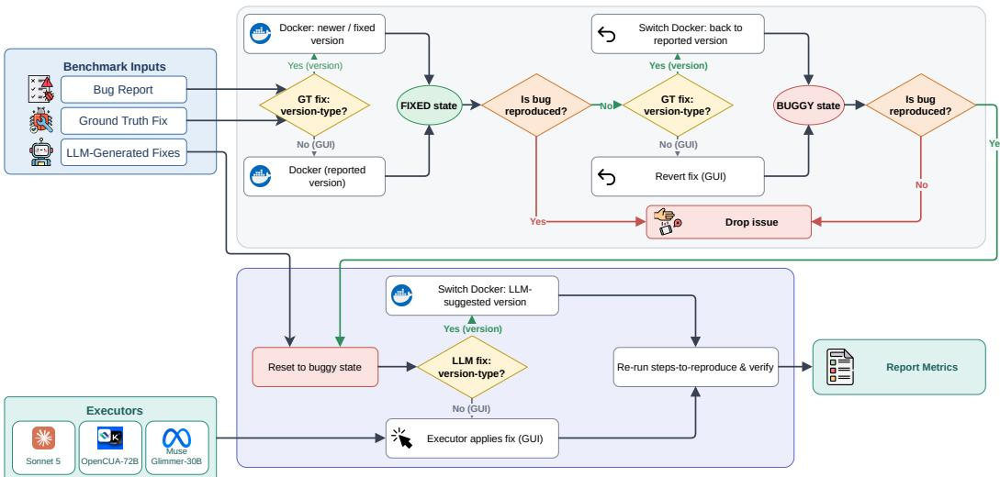

# Can LLMs Fix It Without Code? Toward Automated Verification of No-Code Bug Fixes

UTKU BORAN TORUN∗, Bilkent University, Turkey VELI KARAKAYA∗, Bilkent University, Turkey ERAY TÜZÜN, Bilkent University, Turkey

Context. A no-code fix resolves an invalid bug report by directing the user to change a setting, update to a version where the problem is already fixed, or adjust their workflow, rather than by modifying the source code. Bug reports frequently admit such fixes, but manually verifying whether a proposed no-code fix genuinely resolves the reported bug consumes considerable developer time that could otherwise go toward core development work.

Objective. This study proposes and evaluates an automated pipeline for the capability of large language models (LLMs) to generate no-code fixes, replacing manual verification with execution-based evaluation in a real browser environment.

Method. We evaluate 322 no-code fixes generated by the 12 LLM-based configurations released with the benchmark of a previous study. From this benchmark, we select the bug reports categorized as Faulty Configuration, Wrong Version, or External System & Dependency. For each report, evaluation proceeds through an execution pipeline in which an executor agent applies each fix by following its natural-language instructions in a real browser environment, and an issue-specific checker determines whether the reported bug persists. We repeat the full pipeline with three executors from diferent providers: two Computer-Use Agents (CUAs), OpenCUA-72B and Anthropic’s Claude Sonnet 5 with computer use, and one multimodal agentic LLM, Meta’s Muse Glimmer, to characterize how much the choice of executor afects the outcome.

Results. 17.6% of the candidate issues could be set up in the environment and passed both sanity gates, and the remaining issues could not be reproduced. Across the 322 fixes 14.6% to 49.7% resolved the bug depending on the executor, and the strongest configuration, Claude Opus 4.6 in the Vanilla pipeline, resolved up to 74.1% of its fixes under the executor Claude Sonnet 5. Changing only the executor shifted a configuration’s resolution rate by 38.8% on average, and the three executors reached the same verdict on only 46.9% of the fixes. Compared with human execution, the executors matched the outcome on which two human executors agreed for 66.1% to 88.1% of the sampled fixes.

Conclusion. Even under the best executor, fewer than half of the LLM-generated no-code fixes resolve the reported bug, so such fixes need verification before they reach users. Execution-based verification can provide this without manual inspection, but the measured capability depends strongly on the executor, which evaluations must therefore report and control.

CCS Concepts: • Software and its engineering → Empirical software validation; Software testing and debugging; • Computing methodologies → Natural language generation.

Additional Key Words and Phrases: Large Language Models, No-Code Bug Fixes, Computer-Use Agents, Automated Fix Verification, Bug Reports, Automated Evaluation

## 1 Introduction

Large language models (LLMs) have rapidly become part of everyday software engineering practice. They now assist developers across the software development lifecycle, powering code generation [26, 27, 57], automated code review [10, 39, 52], test generation [7, 40, 56], and bug triage [5, 13, 15]. As these systems move from research prototypes into tools developers rely on daily [42] software engineering tasks, they are increasingly applied not only to writing and analyzing code, but to the surrounding work of managing the issues that software projects accumulate [28].

One of the most time-consuming parts of that work is triaging bug reports, and in particular dealing with reports that turn out not to require a code change at all [19]. A bug report is invalid when it does not describe a defect in the source code: the reported behavior instead stems from user misconfiguration, an outdated version, a conflicting extension, or a misunderstanding of intended behavior, or the report is not considered as a bug report at all, such as a feature request or a question. Such reports make up a substantial share of what projects receive [17, 23]: a manual inspection of more than 7,000 reports across five open-source projects found that 33.8% of those filed as bugs were misclassified [23]. Rather than with a patch, many invalid reports are resolved by directing the reporter to adjust a setting, update to a version where the problem is already fixed, or disable a conflicting extension. Following Gön et al. [19], we call such a resolution a no-code fix. Triage already consumes a large fraction of maintenance efort, and invalid reports add to that burden without leading to a code change: in an industrial case study, Laiq et al. [31] found that 14 to 17% of submitted reports were invalid, yet these took roughly 16 to 18 calendar days to resolve on average, about as long as valid reports despite requiring no code change. A maintainer must still read the report, reproduce or investigate the problem, determine that no code fix is needed, and explain the resolution to the reporter [19, 49].

Gön et al. [19] introduced a benchmark of invalid Brave1 browser bug reports, subclassify them by root cause, and generate no-code fixes for them with several LLM configurations, the same benchmark and fixes we evaluate in this paper. Evaluating such fixes is hard. The only reference is the maintainer’s resolution, a free-form comment written for one reporter in one situation, so two fixes can be worded diferently while doing the same thing, or worded almost identically while one points to a setting that does not exist. Their study therefore relies on text similarity and an LLM judge, the usual fallbacks when an output cannot be checked by running it [45]. Their BERTScore [58] values fall within a narrow band of 0.81 to 0.82 across all models and configurations, and the LLM judge, while more discriminative, inherits the documented biases of LLM judges [41]. Neither shows whether a fix would work if a user followed it (Section 5.2 revisits this on the fixes we execute). This is the gap we address. Execution ofers an alternative. A code patch either passes the test suite or not, and Zhang et al. [59] have extended this principle to code review by turning review comments into executable tests. A no-code fix produces no code change, but its instructions can still be carried out: changing a setting or disabling an extension is an action in a real environment, after which the reported symptom either persists or disappears. Our goal is therefore to evaluate LLM-generated no-code fixes by whether they actually resolve the reported problem, not by whether they resemble a fix that did. Recent Computer-Use Agents (CUAs) make this process practical to automate, since they interpret natural-language instructions and act on a real interface, which is exactly what applying a no-code fix requires.

Building on this observation, we design an automated, execution-based pipeline for evaluating no-code fixes. For each bug report, the pipeline first applies the maintainer’s fix and then rolls it back, which yields a verified fixed state and, from it, a verified buggy state; it then applies a candidate fix to the buggy state and checks whether the bug persists afterwards. Every candidate fix is applied by an executor agent directly from its natural-language text and verified by a deterministic, issue-specific checker; the bug-specific parts of the pipeline are confined to setting up each issue’s environment and its checker. We run it with three executors (Claude Sonnet 5 [3], OpenCUA-72B [46], Meta Muse Glimmer [34]) from diferent providers and validate the automated verdicts against humans performing the same procedure by hand. Concretely, we investigate three research questions:

• RQ1: How efectively do agentic executors resolve LLM-generated no-code fixes? We measure the fix-generation capability of 12 LLM-based configurations by executing their fixes end-to-end, reporting resolution and applicability rates overall and broken down by bug subclass.

• RQ2: To what extent does the choice of executor afect the measured fix capability? We run the same fixes through three executors from diferent providers to separate variance introduced by the executor from variance in the underlying fix quality, and to test whether conclusions about LLM performance are stable across executor choice.

• RQ3: How accurately do agentic executors execute LLM-generated fixes compared to human execution? On a sampled subset of fixes, we compare each executor’s outcome against a human performing the same procedure by hand, establishing how far the automated verdicts can be trusted.

This paper makes the following contributions:

• We introduce a rollback-based, execution-driven pipeline for evaluating LLM-generated no-code fixes. Two sanity gates confirm that the bug is absent once the maintainer’s fix is applied and present once it is rolled back, so every candidate fix runs on a verified buggy state and is judged by whether it removes the bug.

• We instantiate the pipeline with agentic executors that apply each natural-language fix directly, verified by issue-specific state check, and we compare three executors, two CUAs and one multimodal agentic LLM, to quantify the efect of executor choice.

• We evaluate 322 individual no-code fixes (12 LLM-based configurations × three generation runs × nine reproducible bug reports, of which two generations are missing from the source benchmark), reporting per-configuration resolution and applicability rates at the level of individual fixes and their variation across bug subclasses.

• We compare the automated verdicts with human execution of the same fixes, indicating how far each executor’s verdicts can be trusted and in which direction they diverge.

## 2 Related Work

## 2.1 Invalid Bug Reports: Classification and No-Code Fix Generation

Not all issues submitted to a bug tracker call for a code change. Herzig et al. [23] manually examined more than 7,000 issue reports across five open-source projects and found that 33.8% were misclassified: they did not point to a defect but requested a new feature, a documentation update, or an internal refactoring, introducing measurable bias into downstream bug-prediction studies. Distinguishing such reports from genuine defects has since become a task in its own right, studied extensively before the arrival of LLMs. Antoniol et al. [4] and Zanetti et al. [53] used text-based and social-network features, respectively, to separate genuine bugs from other change requests; Fan et al. [17], Otoom et al. [37], and Pandey et al. [38] trained SVM and random-forest classifiers for the same task, with Fan et al. identifying textual content and submitter experience as the strongest predictors. Meng and Visser [33] fine-tuned BERT to classify and explain bug report validity, and Laiq et al. [32] compared classical and transformer-based models on a unified benchmark, finding fine-tuned RoBERTa to perform best. Du et al. [15] propose LLM-BRC, a large-language-model– based framework for bug report classification; Aracena et al. [5] and Colavito et al. [13] likewise apply and benchmark LLMs for automated issue labeling. Closer to our setting, Dinç and Tüzün [14] apply a range of LLM and machine-learning methods specifically to the valid/invalid distinction, characterizing where LLMs succeed and fail at this classification.

Once a report is identified as invalid, resolving it typically requires no patch, only an explanation ofa configuration change, a version update, or a workaround. This is what we call a no-code fix. Gön et al. [19] introduce a benchmark of invalid Brave browser issues, subclassify them by root cause, and generate no-code fixes for them using 12 LLM-based configurations (Section 3.2). We build directly on this benchmark (Section 3.1). Torun et al. [44] situate this task within a broader vision for artificial intelligence (AI)-assisted bug tracking, in which incoming reports are automatically triaged as valid or invalid, invalid reports are resolved by agent-suggested no-code fixes, and valid ones proceed to patch generation and human review. Our work can be read as an empirical test of whether the no-code-fix step of that vision is achievable with current LLMs. Where prior work [19] in this space evaluates generated fixes by comparing them to a reference resolution, we evaluate by execution: applying each fix to a live environment and checking whether the reported bug persists.

## 2.2 Agent-Based Bug Reproduction and Fix Verification

A separate line of work uses LLMs and agents to interact with running software. Kang et al. [29] prompt LLMs to generate bug-reproducing tests directly from natural-language bug reports and evaluate 15 models on the Defects4J benchmark, reproducing roughly one third of the included bugs; their technique, like later agentic approaches [9, 21], operates at the level of unit tests rather than a live GUI. Feng and Chen [18] instead target a live GUI directly: their AdbGPT system prompts an LLM to extract steps-to-reproduce from an Android bug report and replays them as GUI events on the device without any bug-specific scripting, closer in spirit to how our pipeline executes steps-to-reproduce in a browser. Closer to our environment, Yapağcı et al. [51] introduce BugCraft, which uses an LLM to synthesize steps-to-reproduce from a Minecraft crash report and a vision-based agent to execute them in the game, reproducing 34.9% of crash bugs end-to-end and outperforming baseline computer-use agents by 37%; our sanity checks follow the same executesteps-and-observe-the-outcome principle, applied to a browser instead of a game. Chen et al. [8] take a complementary retrieval-augmented approach, using bug reports from similar Android apps to guide GUI exploration toward paths likely to trigger a bug, again treating a bug report as an executable specification for an agent.

The work closest to ours is Fixpad++ [25], which verifies whether a candidate patch fixes a reported crash in the GUI-based Notepad++ editor: a multi-agent system reproduces the bug via an extended ReAct loop with self-reflection, then replays the same trajectory on the patched build to judge fix correctness. Fixpad++ and our pipeline share the core idea of verifying a fix by re-executing a reproduction trajectory rather than by comparing text, but difer in what is being verified and how: Fixpad++ judges source-code patches with a purpose-built multi-agent architecture tuned to a single application. We instead judge natural-language no-code fixes with of-the-shelf agentic executors, both open-weight and proprietary, and treat the choice of executor itself as an independent variable (RQ2).

Agent-based verification of GUI artifacts has also been studied outside the bug-fixing setting. Kolthof et al. [30] introduce GUISpector, which uses a multi-modal LLM agent, built on a commercial CUA, to autonomously verify whether a GUI prototype satisfies natural-language requirements and to report which acceptance criteria are met or violated; unlike Fixpad++ and our pipeline, GUISpector checks conformance to a specification, not whether a previously observed bug has disappeared. Closer to our concern with executor reliability, Hong et al. [24] show that GUI-agent evaluators frequently misattribute their own execution failures to genuine software defects, and propose reusing a failed trajectory to disambiguate the two; this distinction between evaluator error and actual software defect is precisely what our sanity checks and our RQ3 human-comparison are designed to control for in our own pipeline.

Taken together, this line of work reproduces bugs in unit-test, game, and mobile-GUI settings [8, 9, 18, 21, 29, 51], verifies fixes with a bespoke agent tied to a single desktop application [25], or verifies specification conformance rather than bug resolution [30]. None evaluates no-code fixes specifically, and none treats the choice of executing agent as an experimental variable, which is the focus of our RQ2.

## 2.3 LLM Evaluation in Software Engineering

Evaluating LLM-based software engineering tools reliably is dificult in its own right. Torun et al. [45] survey current evaluation practices and argue that the open-endedness and non-determinism of LLM outputs undermine the single-ground-truth, deterministic assumptions that conventional SE evaluation relies on. One increasingly common workaround, the LLM-as-a-Judge paradigm, used by Gön et al. [19] alongside BERTScore to grade generated no-code fixes, is itself the subject of active scrutiny: He et al. [22] survey LLM-as-a-Judge practice in software engineering and identify a lack of validation against ground truth as one of the paradigm’s central open problems.

Unlike execution-free critics [50], execution-based evaluation sidesteps this problem directly, and it has an established track record for LLM-generated code. SWE-bench [28] and SWE-bench Live [55] evaluate whether a model’s patch to a real codebase makes a GitHub issue’s associated tests pass, instead of scoring the patch’s similarity to a reference dif. The same execution-based principle has recently been extended from source code to the GUI: OSWorld [48] scores agents on 369 real desktop and web tasks by checking the resulting operating-system state against a task-specific verification script, and WebArena [60] evaluates web agents on self-hosted, fully functional websites by checking the functional correctness of the completed task. Our pipeline borrows this state-based checking but inverts the role of the agent: in OSWorld and WebArena the agent is the subject under evaluation, whereas here the agentic executor is part of the measurement instrument and the subject is the LLM-generated no-code fix it applies. This is why we treat the executor as an experimental variable (RQ2) and validate it against human execution (RQ3).

## 3 Methodology

This section describes the dataset we work with, the rollback-based evaluation pipeline shown in Figure 1, the use of three agentic executors as pipeline executors, and the metrics we report.

## 3.1 Dataset

We reuse the benchmark released by Gön et al. [19], which contains 302 annotated bug reports drawn from the Brave browser GitHub issue tracker. Each report is annotated with an invalid-bugreport subclass and, where available, a link to the maintainer comment containing the successful no-code fix. Of the 302 reports, 188 fall into one of seven invalid subclasses, while the remaining 114 are outliers that the original annotation placed outside the taxonomy (reports found to be valid, internal developer-workflow items, or cases with too little information to classify). The benchmark also includes no-code fixes generated by 12 LLM-based configurations for each bug report, spanning four pipeline variants and six backbone LLMs; we describe these configurations in detail in Section 3.2. Each configuration was executed three times in the original study to account for LLM stochasticity, yielding 36 candidate no-code fixes per bug report (12 configurations × three runs), all of which we evaluate independently in our pipeline.

Not every subclass in the benchmark is suitable for execution-based evaluation. Fixes for the Working as Designed (48 reports), Feature Request (41), Non-Reproducible (35), and Question (13) subclasses do not correspond to actions that can be applied and verified in a browser environment: they are explanations, requests for information, or acknowledgments none of which changes the application state. We therefore select the 51 bug reports in the three subclasses whose maintainer fix takes the form of a concrete action on the browser or its environment: Faulty Configuration & Environment Setup (19), Wrong Version (Already Fixed) (12), and External System & Dependency Issues (20).

Table 1. The 12 LLM-based fix-generation configurations reused from Gön et al. [19], with the short identifiers used throughout this paper. Rows are pipelines and columns are backbone LLMs; a dash marks a combination that was not run.
<table><tr><td></td><td colspan="6">Backbone LLM</td></tr><tr><td>Pipeline</td><td>Gemini 3.1 Pro Preview</td><td>GPT-5.4</td><td>Claude Opus 4.6</td><td>GLM-5</td><td>MiniMax M2.7</td><td>Kimi K2.5</td></tr><tr><td>Vanilla</td><td>V-Gemini</td><td>V-GPT</td><td>V-Claude</td><td>V-GLM</td><td>V-MiniMax</td><td>V-Kimi</td></tr><tr><td>Ablation (no subclass prior)</td><td>Abl-Gemini</td><td></td><td></td><td>一</td><td></td><td>Abl-Kimi</td></tr><tr><td>RAG</td><td>RAG-Gemini</td><td></td><td>一</td><td>1</td><td></td><td>RAG-Kimi</td></tr><tr><td>Agentic web search</td><td>1 Agentic-Gemini</td><td></td><td></td><td>一</td><td></td><td>Agentic-Kimi</td></tr></table>

## 3.2 LLM-Based Fix-Generation Configurations

For each bug report, the benchmark provides no-code fixes generated by 12 distinct configurations, spanning four pipeline variants and six backbone LLMs. Table 1 lists all 12 configurations together with the short identifiers we use to refer to them for the remainder of the paper.

Vanilla. The baseline pipeline prompts a single backbone LLM with the bug report and its predicted invalid-subclass label, and is instantiated with six backbone models: three proprietary (Gemini 3.1 Pro Preview [20], GPT-5.4 [36], and Claude Opus 4.6 [2]) and three open-weight (GLM-5 [54], MiniMax M2.7 [35], and Kimi K2.5 [43]).

Ablation (No-Prior). Identical to Vanilla but withholds the invalid-subclass prior from the prompt, isolating its contribution to fix quality. Instantiated with the best-performing proprietary and open-weight backbones from the Vanilla setting (Gemini 3.1 Pro and Kimi K2.5).

RAG. Retrieves from two corpora, Brave Browser wiki pages and historical invalid bug reports, embedded with the Zembed-1 model2 and indexed in LanceDB3. For each query issue, the pipeline retrieves the top-20 nearest neighbors from each corpus via dense vector search, discards candidates created after the query issue (chronological filtering, to prevent data leakage), and re-ranks the remaining candidates with the Zerank-24 cross-encoder to select the top-5 contexts, which are appended to the prompt. Instantiated with the same two backbones as the ablation setting (Gemini 3.1 Pro and Kimi K2.5).

Agentic Web Search. Follows a WebThinker-style “Think-Search-and-Draft” architecture: the backbone LLM first drafts a research brief, then a bounded orchestration loop issues queries against the Serper Search API. The canonical original-issue page is excluded from results to prevent leakage, and the content of any visited page is compressed before being returned. Retrieved evidence is passed back to the LLM in chronological order before it produces the final classification and fix. Instantiated with Gemini 3.1 Pro Preview (paired with Gemini 2.5 Flash for the search loop) and Kimi K2.5.

## 3.3 Pipeline Overview

For each of the 51 selected bug reports, evaluation proceeds through the pipeline shown in Figure 1. The pipeline takes three inputs on the left: the bug report itself (including its steps-to-reproduce and stated actual result), the maintainer’s ground-truth fix, and the 12 candidate LLM-generated fixes.

  
Fig. 1. Overview of the evaluation pipeline.

It produces a per-LLM resolution rate at the right, indicating how often each LLM’s fix resolved the reported bug.

The main flow is bracketed by two sanity checks and separated by an explicit state rollback. A further branch, based on whether the ground-truth fix is a version update or a GUI-level change, determines how that fix is applied and rolled back. We describe each stage in turn, following Figure 1 left to right.

Fresh environment and ground-truth application. For each bug report, we classify the maintainer’s ground-truth fix as version-type (the bug is resolved simply by moving to a newer Brave release) or GUI-type (the bug is resolved by a configuration change, extension toggle, or other in-browser action). This classification follows the content of the maintainer’s resolution (GT fix: version-type? in Figure 1). The Wrong Version issue is version-type by definition, and so are two external system issues whose maintainer resolved the report by pointing to a later release that contains an upstream Chromium fix; the remaining six issues are GUI-type. For a version-type fix, we provision a Docker container already running the newer, fixed Brave release (Docker: newer / fixed version). For a GUI-type fix, we provision a container running the version originally reported by the issue reporter (Docker (reported version)), and we apply the maintainer’s fix to it through the browser GUI. Either path yields the fixed state (green ellipse in Figure 1).

Fixed-state sanity check. Before rolling anything back, we verify that the fixed state is genuinely fixed: the steps-to-reproduce from the bug report are executed and checked against the report’s stated actual result (Is bug reproduced? in Figure 1). If the actual result is not observed, this check passes and the pipeline continues to the rollback stage. If it is observed, the ground-truth fix as applied does not resolve the bug in our environment; the issue is dropped (Drop issue) and no further evaluation is attempted for it.

Rollback to the buggy state. Once this check passes, the ground-truth fix is rolled back, branching again on whether it was version-type or GUI-type. For a version-type fix, we switch the Docker container back to the originally reported version (Switch Docker: back to reported version). For a GUI-type fix, a scripted sequence of GUI actions reverts the fix without changing the container version (Revert fix (GUI)). Either path returns the environment to the configuration that exhibited the bug before the fix, which we call the buggy state (red ellipse in Figure 1). The rollback confirms that the state the checker reads in the buggy environment corresponds to the reported symptom.

Buggy-state sanity check. We now verify that the rollback actually produced the reported bug: the steps-to-reproduce are executed again and checked against the stated actual result (the second Is bug reproduced? check in Figure 1). If the actual result is observed, this check passes, and the issue proceeds to per-LLM evaluation. If not, the rollback failed to reproduce the bug, and the issue is dropped (Drop issue). Together, these two checks ensure that every issue carried into the LLM evaluation stage has a genuinely fixed reference state and a genuinely buggy state derived from it. Of the 51 selected issues, 38 could not be set up in our environment at all, for example because they were specific to a platform other than Linux or required a live backend service, and four did not exhibit the reported bug when tested; the remaining nine passed both checks and formed the efective evaluation set.

Per-LLMfix application and verification. For each ofthe 36 candidate fixes (12 configurations, three independently generated runs each), every episode starts from a fresh container in the buggy state verified above (Reset to buggy state): for GUI-type issues, a fresh profile on the gate-verified build, with the buggy value pre-seeded where the bug is not Brave’s default state; for the version-type issues, the originally reported build. The executor then applies the LLM’s fix through the browser GUI (Executor applies fix (GUI)). On the version-type issues, a fix may instead call for an update: when the executor opens Brave’s update page (brave://settings/help), the harness switches the container to the fixed build (Switch Docker in Figure 1), which is what a user would obtain by updating. Because the switch is triggered by the executor’s own action, resolution rates on these issues can difer across executors. After the episode, an issue-specific checker reads the resulting browser state and decides whether the reported actual result is still present; we additionally replay the steps-to-reproduce and keep the screenshots as a visual record (Re-run steps-to-reproduce & verify). This verdict is produced by the checker (Section 3.4). Each attempt therefore yields two independent signals: the checker’s verdict on whether the bug persists, and the executor’s own termination status (DONE, BLOCKED, step budget exhausted, or stopped without a verdict), which feed the metrics in Section 3.6.

## 3.4 Executors and Checkers

Executors are used in the per-fix stage: every candidate fix is applied by an agentic executor instead of a bug-specific script, which is what allows the pipeline to consume the natural-language fixes directly. The sanity gates and the rollback (Section 3.3) are scripted, so that the validity of each issue’s environment does not depend on the agents under study.

To isolate variance introduced by the choice of executor from variance in the underlying LLM fix quality, we run the per-fix stage once with each of three executors. The three executors we compare are OpenCUA-72B [46], an open-weight model trained for computer use; Meta’s Muse Glimmer [34], an open-weight general-purpose agentic model; and Anthropic’s Claude Sonnet 5 [3] with its computer-use tool (bottom left side of Figure 1). All three act on the same browser environment through a shared action interface. OpenCUA and Sonnet 5 use the action formats defined by their developers, while Muse Glimmer, which has no oficial computer-use harness, is driven through a function-calling schema we designed; implementation details are provided in our replication package (Section 8). All three executors receive the same task prompt, containing the bug report and the fix text, and act for at most 20 steps per episode. Sonnet 5 uses its default sampling settings, OpenCUA-72B greedy decoding (temperature 0) as in its reference evaluation code, and Muse Glimmer temperature 1.0 and top-� 0.95 as recommended by its model card5.

Checker. The executor applies a fix but does not decide whether the fix worked. For each issue, we implement a deterministic checker that reads the browser state tied to the reported symptom, such as a value in the browser’s preference files or a property of the rendered page queried through the Chrome DevTools Protocol, and reports whether the reported actual result is still present. The executor’s own claim of success is recorded but never used as the verdict. The checkers are the only issue-specific code in the pipeline and are part of our replication package.

Repetition and aggregation. Because executor behavior is stochastic, each fix is executed three times by each executor. We count a fix as resolved under an executor if the checker reports the bug as absent in at least one of the three runs. The fix text is identical across runs, so if the checker finds the bug absent after any run, following the fix’s instructions can remove the bug; a run in which the same fix fails may instead reflect an executor error. We therefore treat one successful run as suficient, an assumption that RQ3 tests against human execution. We count a fix as non-applicable under an executor if the executor declared it BLOCKED in at least two of the three runs.

## 3.5 Human Execution for Executor Accuracy

The pipeline’s verdicts depend on the executors correctly applying LLM-generated fixes and correctly observing whether the reported bug persists afterwards. To measure how reliably they do this, we compare the executors against humans performing the same task manually.

We draw a simple random sample of 75 of the 322 individual fixes in the evaluation set, using a fixed random seed. This sample size yields a 95% confidence level with a margin of error of ±10% for proportions estimated over the population of 322 fixes, following Cochran’s formula with finite population correction [11] and assuming maximum variability (� = 0.5). For each sampled fix, the buggy state is reproduced identically to how the executors experience it: a fresh Brave environment with the ground-truth fix rolled back. A human then executes the LLM’s fix on this environment literally, performing the actions the fix describes without judging their correctness. The human then runs the steps-to-reproduce and records whether the reported actual result is observed.

Executor assignment and blinding. The human executors are the first two authors. Each author independently executes all 75 sampled fixes, which allows us to measure inter-rater agreement between the two executors. Before executing a fix, an author sees neither the configuration that generated it nor any executor’s outcome for it.

Because the browser state determines the outcome, the comparison does not rest on subjective agreement. If the executor and the human executed the same fix on the same starting state, both should in principle arrive at the same outcome. A divergence may reflect an executor or checker error, an ambiguous fix that admits more than one reasonable reading, or an imperfect human execution, so we treat the human outcome as a reference rather than a ground truth. We compare each executor’s resolved verdict with the human outcome and report the percentage of matching fixes, with 95% Wilson [47] confidence intervals, as the accuracy of that executor.

## 3.6 Metrics

We report the following metrics computed over the outcomes produced by the pipeline:

Resolution rate: For each (configuration, executor) pair, the fraction of the configuration’s individual fixes (27 fixes for 11 configurations and 25 for Agentic-Kimi) that the executor resolved, as defined in Section 3.4. Aggregated across all 12 configurations, this yields a resolution rate over the 322 fixes per executor. This fix-level rate, rather than an issue-level one, is the primary measure of fix quality in this paper.

Applicability rate: The fraction of fixes that the executor did not declare BLOCKED in the majority of its runs, regardless of whether the bug was ultimately resolved. This separates fixes the executor judged non-actionable (advice, requests for information, deferrals) from applied fixes that failed to resolve the bug. Because it relies on the executor’s judgment, applicability is reported per executor.

Subclass breakdown: Fix-level resolution and applicability rates, computed over the relevant subset of the 322 fixes, broken down by the three subclasses in the evaluation set: Faulty Configuration & Environment Setup, Wrong Version (Already Fixed), and External System & Dependency Issues.

For RQ2, we additionally report per-LLM resolution rates side by side across the three executors, and characterize the spread as a measure of executor sensitivity. For RQ3, we compare each executor’s aggregated verdict with the human-executed outcome on the random sample described in Section 3.5, reporting the percentage of matching outcomes with 95% Wilson intervals, Cohen’s � [12] on the consensus set, and the direction of mismatches.

## 3.7 Use of generative AI

We used Claude Sonnet 5 [3] to assist in writing the evaluation harness (container orchestration, executor adapters, and the Muse Glimmer function-calling schema), the issue-specific checkers, the human-evaluation tool, the analysis scripts, and the documentation of the replication package. The authors reviewed this code, verified every checker and scripted gate action against a live container before use.

## 4 Results

## 4.1 RQ1: Fix-Generation Capability of LLMs

Overall. Table 2 summarizes resolution and applicability per executor. Across the 322 fixes, the resolution rate was 49.7% under Sonnet 5, 45.7% under OpenCUA-72B, and 14.6% under Muse Glimmer. Applicability was 66.1%, 99.1%, and 70.5%, respectively. To separate fixes that proposed no executable action from fixes that were applied but did not remove the bug, we also compute the resolution rate among applicable fixes only, that is, the share of applicable fixes that resolved the bug. This rate was 69.5% under Sonnet 5, 45.8% under OpenCUA-72B, and 18.1% under Muse Glimmer.

Table 2. Resolution and applicability per executor over the 322 fixes (fix counts in parentheses). The last column restricts the resolution rate to the fixes the executor found applicable.
<table><tr><td>Executor</td><td>Resolution (%)</td><td>Applicability (%)</td><td>Resolution among applicable (%)</td></tr><tr><td>Claude Sonnet 5</td><td>49.7 (160)</td><td>66.1 (213)</td><td>69.5 (148)</td></tr><tr><td>OpenCUA-72B</td><td>45.7 (147)</td><td>99.1 (319)</td><td>45.8 (146)</td></tr><tr><td>Muse Glimmer</td><td>14.6 (47)</td><td>70.5 (227)</td><td>18.1 (41)</td></tr></table>

Per configuration. Table 3 reports resolution and applicability for each of the 12 configurations. V-Claude had the highest resolution rate under Sonnet 5 (74.1%), but not under the other two executors: under OpenCUA-72B, RAG-Kimi and Agentic-Gemini led (55.6%) and V-Claude was third (51.9%, tied with V-Gemini), and under Muse Glimmer, Agentic-Kimi led (28.0%) and V-Claude tied for second (25.9%). The lowest rate was 25.9% under Sonnet 5 (V-MiniMax), 33.3% under OpenCUA-72B (V-Kimi), and 0.0% under Muse Glimmer (V-Kimi). OpenCUA-72B declared at most one fix per configuration non-applicable, whereas under Sonnet 5 applicability ranged from 44.4% (V-MiniMax) to 88.9% (V-Claude). Agentic-Kimi has 25 fixes instead of 27 because its second generation run for issues 25057 and 45912 is absent from the source benchmark.

Table 3. Resolution (Res.) and applicability (App.) rate (%) per configuration and executor. Each configuration has 27 fixes (Agentic-Kimi: 25). Backbones: Gem. = Gemini 3.1 Pro, Cla. = Claude Opus 4.6, MiniM. = MiniMax M2.7. Executors: S5 = Sonnet 5, OC = OpenCUA-72B, MG = Muse Glimmer.
<table><tr><td rowspan="2" colspan="2"></td><td colspan="6">Vanilla</td><td colspan="2">Ablation</td><td colspan="2">RAG</td><td colspan="2">Agentic</td></tr><tr><td>Gem.</td><td>GPT</td><td>Cla.</td><td>GLM</td><td>MiniM.</td><td>Kimi</td><td>Gem.</td><td>Kimi</td><td>Gem.</td><td>Kimi</td><td>Gem.</td><td>Kimi</td></tr><tr><td rowspan="3">Res.</td><td>S5</td><td>44.4</td><td>40.7</td><td>74.1</td><td>44.4</td><td>25.9</td><td>44.4</td><td>59.3</td><td>51.9</td><td>48.1</td><td>44.4</td><td>63.0</td><td>56.0</td></tr><tr><td>OC</td><td>51.9</td><td>48.1</td><td>51.9</td><td>37.0</td><td>44.4</td><td>33.3</td><td>44.4</td><td>40.7</td><td>48.1</td><td>55.6</td><td>55.6</td><td>36.0</td></tr><tr><td>MG</td><td>11.1</td><td>11.1</td><td>25.9</td><td>18.5</td><td>11.1</td><td>0.0</td><td>14.8</td><td>11.1</td><td>7.4</td><td>11.1</td><td>25.9</td><td>28.0</td></tr><tr><td rowspan="3">App.</td><td>S5</td><td>55.6</td><td>55.6</td><td>88.9</td><td>51.9</td><td>44.4</td><td>66.7</td><td>70.4</td><td>74.1</td><td>63.0</td><td>70.4</td><td>81.5</td><td>72.0</td></tr><tr><td>OC</td><td>100.0</td><td>96.3</td><td>100.0</td><td>100.0</td><td>100.0</td><td>100.0</td><td>100.0</td><td>96.3</td><td>96.3</td><td>100.0</td><td>100.0</td><td>100.0</td></tr><tr><td>MG</td><td>63.0</td><td>63.0</td><td>81.5</td><td>70.4</td><td>63.0</td><td>81.5</td><td>66.7</td><td>77.8</td><td>70.4</td><td>70.4</td><td>74.1</td><td>64.0</td></tr></table>

Pipeline variants. Gemini 3.1 Pro and Kimi K2.5 are the only backbones instantiated in all four pipelines (Section 3.2), so they allow comparing pipelines while holding the backbone fixed. With Gemini, Agentic had the highest resolution rate under both Sonnet 5 (63.0%) and OpenCUA-72B (55.6%); the lowest was Vanilla under Sonnet 5 (44.4%) and Ablation under OpenCUA-72B (44.4%). With Kimi, Agentic had the highest rate under Sonnet 5 (56.0%) and RAG under OpenCUA-72B (55.6%); no pipeline resolved fewer fixes than Vanilla (44.4% under Sonnet 5, 33.3% under OpenCUA-72B). Agentic also had the highest rate under Muse Glimmer for both backbones (25.9% and 28.0%).

Per subclass. Table 4 breaks the results down by subclass. The subclass with the highest resolution rate difered by executor: External System & Dependency under Sonnet 5 (59.3%) and Muse Glimmer (21.3%), and Faulty Configuration under OpenCUA-72B (65.7%). Faulty Configuration fixes reached only 13.5% under Muse Glimmer. The single Wrong Version issue had the lowest resolution rate under OpenCUA-72B (8.3%) and Muse Glimmer (0.0%), but not under Sonnet 5 (50.0%), which completes the update and the gradient selection that this issue requires. Applicability was lowest for the Wrong Version issue under Sonnet 5 (44.4%) and for External System under Muse Glimmer (67.6%), and close to 100% for OpenCUA-72B in every subclass.

Table 4. Resolution and applicability rate (%) per subclass.
<table><tr><td></td><td></td><td></td><td colspan="2">Sonnet 5</td><td colspan="2">OpenCUA-72B</td><td colspan="2">Muse Glimmer</td></tr><tr><td>Subclass</td><td>Iss.</td><td>Fixes</td><td>Res.</td><td>App.</td><td>Res.</td><td>App.</td><td>Res.</td><td>App.</td></tr><tr><td>Faulty Configuration</td><td>5</td><td>178</td><td>43.8</td><td>66.3</td><td>65.7</td><td>98.9</td><td>13.5</td><td>69.7</td></tr><tr><td>Wrong Version</td><td>1</td><td>36</td><td>50.0</td><td>44.4</td><td>8.3</td><td>100.0</td><td>0.0</td><td>83.3</td></tr><tr><td>External System</td><td>3</td><td>108</td><td>59.3</td><td>73.1</td><td>25.0</td><td>99.1</td><td>21.3</td><td>67.6</td></tr></table>

Answer to RQ1. Depending on the executor, 14.6% to 49.7% of the 322 LLM-generated no-code fixes resolved the reported bug, and 66.1% to 99.1% were applicable. V-Claude had the highest resolution rate under Sonnet 5 (74.1%), but ranked third under OpenCUA-72B, where RAG-Kimi and Agentic-Gemini tied for first, and second under Muse Glimmer, where Agentic-Kimi led. The weakest configuration and the best-resolved subclass also depended on the executor. The Wrong Version issue was resolved least often under OpenCUA-72B and Muse Glimmer, but not under Sonnet 5.

## 4.2 RQ2: Sensitivity to the Choice of Executor

Run-to-run stability. Table 5 reports the pass counts of each individual executor run and the number of fixes resolved in at least one run. Within an executor, the pass rate varied by at most 3.4% across runs (Sonnet 5, 38.8% to 42.2%), while Muse Glimmer trailed the other two executors by at least 20.5 points in every run. All three runs reached the same verdict for 92.2% of fixes under Muse Glimmer, 82.3% under Sonnet 5, and 73.9% under OpenCUA-72B. Counting a fix as resolved if any run passed added 24 fixes over the best single run for Sonnet 5 (160 against 136), 38 for OpenCUA-72B (147 against 109), and 12 for Muse Glimmer (47 against 35). Under a majority vote the rates were 39.8%, 30.7%, and 9.9%, so Sonnet 5 leads OpenCUA-72B under both aggregation rules.

Table 5. Resolved fixes per individual executor run, fixes resolved in at least one run, and the share of fixes on which all three runs agreed (� = 322).
<table><tr><td>Executor</td><td>Run 1</td><td>Run 2</td><td>Run 3</td><td>Any run</td><td>All runs agree</td></tr><tr><td>Claude Sonnet 5</td><td>136 (42.2%)</td><td>125 (38.8%)</td><td>130 (40.4%)</td><td>160 (49.7%)</td><td>82.3%</td></tr><tr><td>OpenCUA-72B</td><td>100 (31.1%)</td><td>109 (33.9%)</td><td>100 (31.1%)</td><td>147 (45.7%)</td><td>73.9%</td></tr><tr><td>Muse Glimmer</td><td>34 (10.6%)</td><td>35 (10.9%)</td><td>32 (9.9%)</td><td>47 (14.6%)</td><td>92.2%</td></tr></table>

Agreement between executors. All three executors reached the same verdict on 46.9% of fixes. Sonnet 5 and OpenCUA-72B agreed on 62.4% of fixes (Cohen’s � = 0.25), Sonnet 5 and Muse Glimmer on 64.3% (� = 0.28), and OpenCUA-72B and Muse Glimmer on 67.1% (� = 0.30). The ranking of the 12 configurations was only weakly preserved: Kendall’s �� was 0.13 between Sonnet 5 and OpenCUA-72B, 0.45 between Sonnet 5 and Muse Glimmer, and 0.05 between OpenCUA-72B and Muse Glimmer. For a single configuration, the resolution rate difered across executors by 38.8% on average (range 25.9 to 48.1; 95% bootstrap interval 31.2 to 52.1). The disagreement is not concentrated on the three version-dependent issues, where the outcome depends on whether the executor performs the update: without them, agreement drops further (� = 0.22, 0.24, and 0.17), and all three executors agree on only 40.7% of the fixes.

Per-issue diferences. Table 6 lists resolved fixes per issue. On the three version-dependent issues, Sonnet 5 resolved the most fixes (16, 18, and 29 for 22252, 25379, and 31108), and the executors no longer resolved the same number of fixes. On 25379, OpenCUA-72B resolved 3 fixes and Muse Glimmer none, because an update alone is not enough there and a gradient must be chosen afterwards. On issue 24747, Sonnet 5 resolved 19 fixes, while neither OpenCUA-72B nor Muse Glimmer resolved any. On issue 37372, OpenCUA-72B resolved all 36 fixes against 20 for Sonnet 5 and 12 for Muse Glimmer, and on 20537 and 25057 it resolved roughly twice as many fixes as Sonnet 5. Muse Glimmer resolved no fix for issues 24747, 25057, 25379, and 45912.

Table 6. Resolved fixes per issue and executor. Column headers are Brave GitHub issue numbers, grouped by subclass.
<table><tr><td></td><td colspan="5">Faulty Configuration</td><td>Wrong Version</td><td colspan="3">External System</td><td></td></tr><tr><td>Issue</td><td>20537</td><td>22987</td><td>25057</td><td>37372</td><td>45912</td><td>25379</td><td>22252</td><td>24747</td><td>31108</td><td>Total</td></tr><tr><td>Fixes</td><td>36</td><td>36</td><td>35</td><td>36</td><td>35</td><td>36</td><td>36</td><td>36</td><td>36</td><td>322</td></tr><tr><td>Sonnet 5</td><td>9</td><td>13</td><td>10</td><td>20</td><td>26</td><td>18</td><td>16</td><td>19</td><td>29</td><td>160</td></tr><tr><td>OpenCUA-72B</td><td>19</td><td>20</td><td>19</td><td>36</td><td>23</td><td>3</td><td>12</td><td>0</td><td>15</td><td>147</td></tr><tr><td>Muse Glimmer</td><td>3</td><td>9</td><td>0</td><td>12</td><td>0</td><td>0</td><td>10</td><td>0</td><td>13</td><td>47</td></tr></table>

Episode termination. Each episode ends with the executor’s own verdict, which is independent of the checker. Sonnet 5 ended 83.0% of its 966 episodes with an explicit verdict (50.2% DONE, 32.8% BLOCKED), OpenCUA-72B 59.7% (55.1% DONE, 4.7% BLOCKED), and Muse Glimmer 44.9% (13.4% DONE, 31.6% BLOCKED); nearly all remaining episodes exhausted the 20-step budget (16.3%, 40.2%, and 55.1%). Across all executors, the checker recorded the bug as resolved in 621 of the 1,146 episodes ending in DONE (54.2%), 162 of the 1,077 episodes ending at the step budget (15.0%), and 18 of the 667 episodes ending in BLOCKED (2.7%).

Answer to RQ2. The choice of executor changed the measured fix capability substantially: overall resolution ranged from 14.6% to 49.7%, the rate of a single configuration difered across executors by 38.8% on average, and the executors reached the same verdict on only 46.9% of the fixes. Each executor was stable across its own runs (at most 3.4 points), so the diferences between executors exceeded their run-to-run variation. Configuration rankings were only weakly preserved (�� between 0.05 and 0.45), and V-Claude, first under Sonnet 5, ranked third under OpenCUA-72B and second under Muse Glimmer.

## 4.3 RQ3: Agreement with Human Execution

The two authors independently executed all 75 randomly sampled fixes and reached the same outcome on 78.7% of them (59 fixes, Cohen’s $\kappa = 0 . 5 4 )$ . Table 7 reports, for each executor, the percentage of sampled fixes on which its verdict matched the outcome of each human executor and of the consensus set, with 95% Wilson confidence intervals. Claude Sonnet 5 matched the consensus outcome on 88.1% of fixes (� = 0.74), Muse Glimmer on 79.7% (� = 0.48), and OpenCUA-72B on 66.1% (� = 0.28).

The mismatches difered in direction. Of the 20 consensus mismatches of OpenCUA-72B, 13 were fixes it counted as resolved that the humans did not. Of the 12 mismatches of Muse Glimmer, 10 were fixes it did not resolve although the humans did, and Sonnet 5 erred in both directions (5 false positives and 2 false negatives). On the 75 sampled fixes, OpenCUA-72B resolved 33, Muse Glimmer 13, and Sonnet 5 33, against 25 and 29 for the two humans. Replacing “any run” with a majority vote over the three runs changed the agreement with the consensus to 86.4% for Sonnet 5, 72.9% for OpenCUA-72B, and 81.4% for Muse Glimmer, so the aggregation rule did not alter the ordering. The human outcomes difered on the remaining 16 fixes, which are therefore not part of the consensus set.

Table 7. Agreement (%) between each executor and human execution on the 75 randomly sampled fixes, with 95% Wilson confidence intervals. Consensus: the 59 fixes on which both humans reached the same outcome.
<table><tr><td>Executor</td><td>Human 1</td><td>Human 2</td><td>Consensus</td><td>κ (consensus)</td></tr><tr><td>Claude Sonnet 5</td><td>81.3 [71.1, 88.5]</td><td>78.7 [68.1, 86.4]</td><td>88.1 [77.5, 94.1]</td><td>0.74</td></tr><tr><td>OpenCUA-72B</td><td>68.0 [56.8, 77.5]</td><td>57.3 [46.1, 67.9]</td><td>66.1 [53.4, 76.9]</td><td>0.28</td></tr><tr><td>Muse Glimmer</td><td>78.7 [68.1, 86.4]</td><td>68.0 [56.8, 77.5]</td><td>79.7 [67.7, 88.0]</td><td>0.48</td></tr><tr><td>Human 1 vs. Human 2</td><td>78.7 [68.1, 86.4]</td><td></td><td></td><td>0.54</td></tr></table>

Answer to RQ3. The authors agreed on 78.7% of the 75 sampled fixes $( \kappa = 0 . 5 4 )$ . On the fixes with a shared human outcome, Sonnet 5 matched on 88.1% (� = 0.74), Muse Glimmer on 79.7% $( \kappa = 0 . 4 8 )$ , and OpenCUA-72B on 66.1% $( \kappa = 0 . 2 8 )$ . OpenCUA-72B and Sonnet 5 overstated and Muse Glimmer understated the number of resolved fixes; Sonnet 5 had both the highest resolution rate and the highest agreement with the humans.

## 5 Discussion

## 5.1 The Executor Is Part of the Measurement

RQ2 shows that an executor-based evaluation does not measure fix quality in isolation. The same 322 fixes produced resolution rates between 14.6% and 49.7%, and the rate of a single configuration moved by 38.8% on average when only the executor changed. These gaps are much larger than the run-to-run variation within any executor (at most 3.4 points), so they reflect systematic properties of the executors rather than noise. Conclusions about which LLM produces better no-code fixes are therefore conditional on the executor. Even the strongest configuration was not stable: V-Claude led under Sonnet 5 but ranked third under OpenCUA-72B and second under Muse Glimmer, and the rankings of the 12 configurations were nearly unrelated between Sonnet 5 and OpenCUA-72B $( \tau _ { b } = 0 . 1 3 )$ and between OpenCUA-72B and Muse Glimmer $( \tau _ { b } = 0 . 0 5 )$ . Some comparisons changed substantially: RAG-Kimi resolved 22.3% more fixes than V-Kimi under OpenCUA-72B (55.6% against 33.3%) and exactly as many under Sonnet 5.

The executors also difered in where they succeeded. OpenCUA-72B resolved every fix for issue $3 7 3 7 2 ^ { 6 }$ , whose checker is lenient (Section 6), while Sonnet 5 resolved 20 of 36, whereas Sonnet 5 was the only executor to resolve any fix for issue $2 4 7 4 7 ^ { 7 }$ . Muse Glimmer exhausted its step budget in 55.1% of its episodes and resolved no fix for four of the nine issues. No single executor is thus a neutral instrument, and a verdict of “fix failed” can mean that the executor failed. We draw three practical implications for execution-based evaluation with agentic executors. First, the executor and its harness should be reported as part of the experimental setup, in the same way as the model under evaluation. Second, results should be obtained with more than one executor or calibrated against human execution, as we do in RQ3. Third, run-level results and the aggregation rule should be reported, because the rule interacts with executor stability: counting a fix as resolved if any run passed added 38 fixes over the best single run for OpenCUA-72B, the least stable executor, but only 12 to 24 for the other two.

RQ3 indicates which of the three executors agrees best with human execution. Sonnet 5, which also had the highest resolution rate (49.7%), agreed most with the humans (88.1% with the consensus, $\kappa = 0 . 7 4 )$ , although it resolved more fixes than the humans on the sample (33 against 25 and 29). OpenCUA-72B had the lowest agreement $( 6 6 . 1 \% , \kappa = 0 . 2 8 )$ , and most of its mismatches were false positives (13 of 20). Muse Glimmer mismatched in the opposite direction (10 of its 12 mismatches were fixes it did not resolve although the humans did), which is consistent with the 55.1% of its episodes that exhausted the step budget. Rates under OpenCUA-72B and, to a lesser extent, Sonnet 5 are therefore likely to overstate, and those under Muse Glimmer to understate, the share of fixes that work when a human applies them.

The executors’ termination status also shows why the verdict should not be left to the executor. An executor reports DONE when it believes it has applied the fix, not when the bug is gone, and the two diverge in both directions: the checker found the bug resolved in only 621 of the 1,146 episodes that ended in DONE, while 162 of the 1,077 episodes that ran out of steps nevertheless left the browser in a resolved state. On the version-dependent issues alone, Sonnet 5, OpenCUA-72B, and Muse Glimmer said DONE while the checker failed in 7, 121, and 1 of 324 episodes, and the checker passed without a DONE report in 54, 38, and 26. Using the agent’s own completion signal as the outcome would therefore both inflate and deflate the measured capability, which is consistent with the observation of Hong et al. [24] that GUI agents often misattribute their own execution failures. Separating the executor from an independent checker keeps the verdict reproducible, at the cost of per-issue setup and checker code (Section 6).

## 5.2 What Text Similarity Misses

As argued in Section 1 reference-based metrics cannot show whether a no-code fix works. Our execution results allow a first look at this claim. For each LLM-generated fix, we took the BERTScore [58] value against the maintainer’s ground-truth fix released in the replication package of Gön et al. [19], and examined the 108 fixes that failed in all nine attempts, that is, in every run under every executor. Because no executor resolved these fixes, their failure does not depend on the executor sensitivity discussed in Section 5.1.

These fixes received BERTScore F1 values between 0.757 and 0.867 (median 0.831), within or above the range of 0.81 to 0.82 that Gön et al. [19] report for fixes across their benchmark. A fix that never removed the reported symptom was thus scored as close to the maintainer’s resolution as a typical fix. The 214 fixes that at least one executor resolved scored the same (median 0.832, mean 0.824 against 0.823). Scores also varied far more between issues than within them. Fixes for issue 25379 averaged 0.762, while those for every other issue with such fixes averaged between 0.818 and 0.846 (issue 37372 has none, because OpenCUA-72B resolved all its fixes), which suggests that the score reflects the wording of the reference resolution more than the correctness of the fix. A single BERTScore threshold therefore cannot separate working from failing fixes across issues, and a comparison of configurations by BERTScore partly reflects which issues their fixes belong to.

Execution-based evaluation does not replace text-based evaluation everywhere. It applies only to reports whose bug can be re-established in a controlled environment (Section 5.4), whereas BERTScore and an LLM judge apply to any report with a reference fix. For reports that can be executed, however, these fixes show that a high similarity to the maintainer’s resolution does not indicate that a fix works.

## 5.3 What the Results Say About No-Code Fix Generation

Even under the executor with the highest resolution rate and the highest agreement with the humans (Sonnet 5, 49.7%), just under half of the LLM-generated fixes resolved the reported bug (39.8% under a majority vote), and the best configuration reached 74.1%. Automatically generated nocode fixes are therefore not yet reliable enough to be sent to reporters without review, although the best configurations resolve a majority of cases under two of the three executors. No configuration led under every executor. V-Claude, which also had the highest applicability under Sonnet 5 (88.9%), and Agentic-Gemini were the only configurations in the top three under all three executors, but the intervals overlap heavily, so we do not claim a robust winner. The pipeline enhancements proposed by Gön et al. [19] did not translate into consistent gains: for Gemini, RAG resolved fewer fixes than Vanilla under OpenCUA-72B and Muse Glimmer but more under Sonnet 5, whereas for Kimi neither RAG nor Agentic web search resolved fewer fixes than Vanilla under Sonnet 5 or OpenCUA-72B. Agentic web search had the highest rate for both backbones under Sonnet 5 and Muse Glimmer, but not for Kimi under OpenCUA-72B.

Applicability and resolution capture diferent ways in which a fix can fail. A configuration can fail by not proposing an executable action, as V-MiniMax did for almost half of its fixes under Sonnet 5, or by proposing an action that does not remove the symptom. The two failure modes call for diferent remedies: the first concerns the model’s willingness to commit to a concrete instruction, the second its knowledge of the application. At the same time, applicability as measured here depends on the executor, since OpenCUA-72B rarely declared any fix non-applicable.

## 5.4 The Scarcity of Executable No-Code Fixes

The reduction from 302 annotated reports to 51 candidates and finally to nine executable issues is worth reading as a finding rather than merely as a description of our sample. Bug reports resolved without a code change are only part of what an issue tracker receives [1, 16], and only a subset of those are resolved by an action that can be carried out in an environment at all; the remainder are answered with an explanation, a request for further information, or a decision that the reported behavior is intended [16] (Section 3.1). What makes such reports costly to collect is that this distinction leaves no structural trace. Issue trackers do not label invalid reports as such, and their resolutions are not linked to commits, so there is no signal analogous to a fixing commit that can be mined automatically, as is routinely done when constructing code-level benchmarks. Identifying a no-code fix requires reading the maintainer discussion of a closed issue and judging what the resolution consisted of. Any efort to scale execution-based evaluation of no-code fixes will therefore have to confront dataset construction as a research problem in its own right, most plausibly by automating the recognition of no-code resolutions in maintainer comments.

The reduction observed before and at the sanity gates is informative for a second reason. Of the 51 candidates, 38 could not be set up in a Linux browser environment at all, because they depended on another platform, a live backend, or information the report did not provide [6], and 4 more did not exhibit the reported bug when tested. These are reports whose resolution was accepted by both the reporter and the maintainer, yet whose bug-fix pair could not be re-established outside the original reporting context. This suggests that no-code bugs are frequently entangled with state that the report does not capture, such as an accumulated user profile, a particular operating system or hardware configuration, the behavior of a third-party service at the time of reporting, or a server-side change that no local rollback can undo. Seen this way, the gates are not only a filter that reduced our evaluation set but a measurement instrument: they quantify how often a documented no-code fix can be independently re-executed at all, which is a precondition that any execution-based evaluation of this task, ours or otherwise, must satisfy. We consequently kept them strict, on the view that a verdict grounded in a verified buggy state and a verified fixed state carries more evidential weight than a larger set of verdicts resting on unchecked assumptions about the environment. Threats arising from the resulting set size are discussed in Section 6.

## 6 Threats to Validity

## 6.1 Internal Validity

Executor reliability. Every verdict in our study depends on an executor carrying out a naturallanguage fix in a real browser. An executor may misapply a fix, apply it only partially, or change unrelated state, in which case a failed fix says nothing about the fix itself. The 20-step budget adds a related threat: an episode that is cut of may have succeeded with more steps, which matters most for Muse Glimmer, whose episodes exhausted the budget in 55.1% of cases. To reduce the efect of individual execution failures, we executed every fix three times per executor and counted a fix as resolved if any run succeeded, and we compare executor outcomes with human execution on a random sample of fixes. Executors could also act outside the browser: the container desktop ofers a shell, and 10 OpenCUA-72B episodes typed shell-like commands. Nine of them failed without an update and one passed through the settings-page update, so no resolved episode depended on a shell.

Harness diferences. The three executors could not be driven by an identical harness. Sonnet 5 used its native computer-use tool, OpenCUA-72B used its own action format with the screenshot history window of its reference harness, and Muse Glimmer, which has no oficial computer-use harness, was driven through a function-calling schema that we designed. The executors also used diferent sampling settings (Section 3.4), which we did not tune. A higher temperature yields more varied runs and thus benefits more from counting a fix as resolved if any of three runs succeeds. Diferences between executors may therefore partly stem from their harnesses and sampling settings, and our own schema may disadvantage Muse Glimmer. We kept the task prompt, the step budget, and the environment identical across executors, and we interpret RQ2 as a comparison of executors together with their harnesses rather than of the underlying models alone.

Checker validity. Whether a fix resolves the bug is decided by an issue-specific checker that reads the browser state tied to the symptom in the bug report, such as a preference value or a property of the rendered page. A checker may accept a state that was reached without addressing the reported problem, or reject a valid fix that removes the symptom through a diferent route. In particular, for issues 25057 and 37372, the expected value is the browser’s default, which the browser does not store explicitly, so the checker also accepts the absence of the preference; any action that removes it, including a general reset of the browser settings, therefore counts as a resolution. We derived each checker from the actual result stated in the bug report, release all checkers and execution traces in our replication package, and use the human execution in RQ3 as an independent check of their verdicts.

Metric definitions. Two of our metrics involve design choices that afect the reported values. Applicability relies on the executor’s decision to declare a fix BLOCKED and thus reflects the executor’s judgment as well as the fix; OpenCUA-72B, for instance, ended only 4.7% of its episodes in BLOCKED. Counting a fix as resolved if any of three runs succeeded yields higher rates than a majority vote, and the gain is larger for less stable executors. We therefore report every individual run (Table 5) and provide majority-vote results in the replication package. On the RQ3 sample, a majority vote changed the agreement with the human consensus by at most 6.8% per executor, and dropping the six fixes on which the first human recorded partial or not applicable changed the agreement by at most 4.2 points. The BERTScore analysis in Section 5.2 covers only fixes that failed in every attempt, whereas the range reported by Gön et al. [19] spans all seven subclasses and their reference fixes.

Buggy-state fidelity. Per-fix episodes start from a reconstructed buggy state: a fresh profile on the gate-verified build, with the buggy value pre-seeded for three issues, or the reported build for version-type issues. The sanity gates confirm that this state shows the reported symptom and that the maintainer’s fix removes it, but the reporter’s original state may have depended on context we cannot recreate, such as an accumulated profile or a server-side condition. Two reports state no version (25057 and 37372), so we used a nearby pinned build for them.

Human reference. The human executors in RQ3 are the first two authors. Their familiarity with the pipeline, and in some cases with a bug’s ground-truth resolution, may influence how they execute a fix. We blinded both executors to the configuration that generated each fix and to the executors’ outcomes, and had both execute every sampled fix independently. Their agreement was moderate (78.7%, � = 0.54), and the second human resolved more fixes than the first (29 against 25), so the human outcome is a reference rather than a validated ground truth. Restricting the comparison to the 59 fixes with a shared outcome removes the fixes that were hardest to judge and may therefore overstate executor accuracy; we report the agreement with each human separately for this reason. Each human executed a fix once, whereas an executor’s verdict aggregates three runs, and the consensus set contains only 19 resolved fixes, so the intervals in Table 7 are wide and we do not test diferences between executors for significance.

## 6.2 External Validity

Application and bug types. All issues come from a single application, the Brave browser, and a single prior benchmark [19], and are restricted to the three subclasses whose resolutions are executable actions. Our findings may not transfer to other browsers, to desktop or mobile applications with diferent interaction models, or to the subclasses we excluded by design. Moreover, our environment runs on Linux, and 17 of the 51 candidate issues were excluded because they were specific to another platform; the evaluated issues may therefore difer systematically from those that could not be reproduced.

Size ofthe evaluation set. The efective evaluation set contains nine issues and 322 fixes, further divided across 12 configurations and three executors. The subclass breakdown rests on five, one, and three issues, so the Wrong Version result describes a single issue. We report agreement statistics and rank correlations descriptively, together with issue-clustered bootstrap intervals, and do not perform significance tests. The intervals are wide and overlap (for example 38.6 to 61.3 for Sonnet 5 and 27.6 to 64.5 for OpenCUA-72B), so diferences between configurations and between executors should be read as descriptive rather than statistically confirmed.

## 7 Conclusion

We presented a rollback-based, automated execution-driven pipeline that verifies LLM-generated no-code fixes by applying them with an executor in a real browser and checking the resulting state. Applied to 322 fixes from 12 LLM-based configurations on nine reproducible Brave bug reports, the pipeline shows that current LLMs resolve between 14.6% and 49.7% of the reported bugs depending on the executor, with V-Claude the strongest configuration under Sonnet 5 but not under the other two executors. The choice of executor shifted the measured capability of a configuration by 38.8% on average and only weakly preserved configuration rankings, which makes the executor a first-order variable in any execution-based evaluation of this kind. Only nine of 51 candidate reports could be re-established in a controlled environment, so scaling this form of evaluation will require automated construction of executable no-code benchmarks. Compared with human execution on a random sample, Sonnet 5 was the most accurate executor (88.1% agreement with the human consensus), whereas OpenCUA-72B overstated resolution and agreed on 66.1%. Future work will extend the pipeline to more applications and bug types, and study how executor harnesses can be standardized so that verdicts become comparable across executors.

## 8 Data Availability

Our replication package is available at https://figshare.com/s/eda4e478ccbf242fbdab. It contains the Dockerfile and build scripts for the pinned Brave builds of the evaluated issues, the perissue environment setup (profile seeds and scripted gate actions), the issue-specific checkers, the executor prompts and action interfaces (including our function-calling schema for Muse Glimmer), the verdicts of executor episodes and the text traces of them, the 322 evaluated fix texts, the human verdicts and sampling seed for RQ3, the status of all 51 candidate issues with the reason each excluded issue was dropped, and the scripts that produce every table, including the majority-vote variants.

## Acknowledgements

We thank OpenZeka for generously providing access to their GPU resources, which made the experiments in this work possible.

## References

[1] Ethem Utku Aktas, Ebru Cakmak, Mete Cihad Inan, and Cemal Yilmaz. 2023. Issue report validation in an industrial context. In Proceedings of the 31st ACM joint european software engineering conference and symposium on the foundations ofsoftware engineering. 2026–2031.

[2] Anthropic. 2026. Introducing Claude Opus 4.6. https://www.anthropic.com/news/claude-opus-4-6. Accessed: 2026-10-01.

[3] Anthropic. 2026. Introducing Claude Sonnet 5. https://www.anthropic.com/news/claude-sonnet-5. Accessed: 2026-09-24.

[4] Giuliano Antoniol, Kamel Ayari, Massimiliano Di Penta, Foutse Khomh, and Yann-Gaël Guéhéneuc. 2008. Is it a bug or an enhancement? a text-based approach to classify change requests. In Proceedings of the 2008 conference of the center for advanced studies on collaborative research: meeting ofminds. 304–318.

[5] Gabriel Aracena, Kyle Luster, Fabio Santos, Igor Steinmacher, and Marco Aurelio Gerosa. 2024. Applying large language models to issue classification. In Proceedings ofthe Third ACM/IEEE International Workshop on NL-based Software Engineering. 57–60.

[6] Vincenzo Luigi Bruno, Alessandro Giagnorio, Daniele Bifolco, Leon Wienges, Massimiliano Di Penta, and Gabriele Bavota. 2026. Writing Bug Reports for Software Repair Agents: What Information Matters Most? arXiv preprint arXiv:2607.09553 (2026).

[7] Arda Celik and Qusay H Mahmoud. 2025. A review of large language models for automated test case generation. Machine Learning and Knowledge Extraction 7, 3 (2025), 97.

[8] Mengzhuo Chen, Zhe Liu, Chunyang Chen, Junjie Wang, Boyu Wu, Jun Hu, and Qing Wang. 2025. Standing on the shoulders of giants: Bug-aware automated gui testing via retrieval augmentation. Proceedings ofthe ACM on Software Engineering 2, FSE (2025), 825–846.

[9] Runxiang Cheng, Michele Tufano, Jürgen Cito, José Cambronero, Pat Rondon, Renyao Wei, Aaron Sun, and Satish Chandra. 2025. Agentic bug reproduction for efective automated program repair at google. arXiv preprint arXiv:2502.01821 (2025).

[10] Umut Cihan, Vahid Haratian, Arda İçöz, Mert Kaan Gül, Ömercan Devran, Emircan Furkan Bayendur, Baykal Mehmet Uçar, and Eray Tüzün. 2025. Automated code review in practice. In 2025 IEEE/ACM 47th International Conference on Software Engineering: Software Engineering in Practice (ICSE-SEIP). IEEE, 425–436.

[11] William Gemmell Cochran. 1977. Sampling techniques. Vol. 3. wiley New York.

[12] Jacob Cohen. 1960. A coeficient of agreement for nominal scales. Educational and psychological measurement 20, 1 (1960), 37–46.

[13] Giuseppe Colavito, Filippo Lanubile, and Nicole Novielli. 2025. Benchmarking large language models for automated labeling: The case of issue report classification. Information and Software Technology 184 (2025), 107758.

[14] Emre Dinç and Eray Tüzün. 2025. Judge the Votes: A System to Classify Bug Reports and Give Suggestions. In 2025 2nd IEEE/ACM International Conference on AI-powered Software (AIware). IEEE, 01–10.

[15] Xiaoting Du, Zhihao Liu, Chenglong Li, Xiangyue Ma, Yingzhuo Li, and Xinyu Wang. 2024. LLM-BRC: A large language model-based bug report classification framework. Software Quality Journal 32, 3 (2024), 985–1005.

[16] Mona Erfani Joorabchi, Mehdi Mirzaaghaei, and Ali Mesbah. 2014. Works for me! characterizing non-reproducible bug reports. In Proceedings of the 11th working conference on mining software repositories. 62–71.

[17] Yuanrui Fan, Xin Xia, David Lo, and Ahmed E Hassan. 2018. Chaf from the wheat: Characterizing and determining valid bug reports. IEEE transactions on software engineering 46, 5 (2018), 495–525.

[18] Sidong Feng and Chunyang Chen. 2024. Prompting is all you need: Automated android bug replay with large language models. In Proceedings of the 46th IEEE/ACM International Conference on Software Engineering. 1–13.

[19] Mahmut Furkan Gon, Emre Dinc, Tevfik Emre Sungur, and Eray Tuzun. 2026. Automated Root-Cause Subclassification and No-Code Fix Generation for Invalid Bug Reports. arXiv:2605.17561 [cs.SE] https://arxiv.org/abs/2605.17561

[20] Google. 2026. Gemini 3.1 Pro: A Smarter Model for Your Most Complex Tasks. https://blog.google/innovation-andai/models-and-research/gemini-models/gemini-3-1-pro/. Accessed: 2026-10-01.

[21] Yaoqi Guo, Yang Liu, Jie M Zhang, Yun Ma, Yiling Lou, and Zhenpeng Chen. 2026. SWE-Doctor: Guiding Software Engineering Agents with Runtime Diagnosis from Multi-Faceted Bug Reproduction Tests. arXiv preprint arXiv:2607.00990 (2026).

[22] Junda He, Jieke Shi, Terry Yue Zhuo, Christoph Treude, Jiamou Sun, Zhenchang Xing, Xiaoning Du, and David Lo. 2025. From code to courtroom: Llms as the new software judges. arXiv preprint arXiv:2503.02246 (2025).

[23] Kim Herzig, Sascha Just, and Andreas Zeller. 2013. It’s not a bug, it’s a feature: how misclassification impacts bug prediction. In 2013 35th international conference on software engineering (ICSE). IEEE, 392–401.

[24] Sirui Hong, Zhijie Liu, Tengfei Li, Wei Tao, Yifan Wu, and Chenglin Wu. 2026. DiagEval: Trajectory-Conditioned Diagnosis for Reliable Software Evaluation with GUI Agents. arXiv preprint arXiv:2605.17439 (2026).

[25] Mustafa Özkan İr, Mehmet Dedeler, Anıl Koyuncu, and Eray Tüzün. 2026. Fixpad++: Automated Bug Fix Verification Using LLM Agents. In Proceedings of the 3rd ACM International Conference on AI-Powered Software. 248–258.

[26] Juyong Jiang, Fan Wang, Jiasi Shen, Sungju Kim, and Sunghun Kim. 2026. A survey on large language models for code generation. ACM Transactions on Software Engineering and Methodology 35, 2 (2026), 1–72.

[27] Xue Jiang, Yihong Dong, Lecheng Wang, Zheng Fang, Qiwei Shang, Ge Li, Zhi Jin, and Wenpin Jiao. 2024. Self-planning code generation with large language models. ACM Transactions on Software Engineering and Methodology 33, 7 (2024), 1–30.

[28] Carlos E Jimenez, John Yang, Alexander Wettig, Shunyu Yao, Kexin Pei, Ofir Press, and Karthik Narasimhan. 2024. Swebench: Can language models resolve real-world github issues?. In International Conference on Learning Representations, Vol. 2024. 54107–54157.

[29] Sungmin Kang, Juyeon Yoon, Nargiz Askarbekkyzy, and Shin Yoo. 2024. Evaluating diverse large language models for automatic and general bug reproduction. IEEE Transactions on Software Engineering 50, 10 (2024), 2677–2694.

[30] Kristian Kolthof, Felix Kretzer, Simone Paolo Ponzetto, Alexander Maedche, and Christian Bartelt. 2025. GUISpector: An MLLM Agent Framework for Automated Verification of Natural Language Requirements in GUI Prototypes. arXiv preprint arXiv:2510.04791 (2025).

[31] Muhammad Laiq, Nauman bin Ali, Jürgen Böstler, and Emelie Engström. 2022. Early identification of invalid bug reports in industrial settings–a case study. In International Conference on Product-Focused Software Process Improvement. Springer, 497–507.

[32] Muhammad Laiq, Nauman bin Ali, Jürgen Börstler, and Emelie Engström. 2025. A comparative analysis of ML techniques for bug report classification. Journal ofSystems and Software 227 (2025), 112457.

[33] Qianru Meng and Joost Visser. 2023. Which bug reports are valid and why? Using the BERT transformer to classify bug reports and explain their validity. In Proceedings ofthe 4th European Symposium on Software Engineering. 52–60.

[34] Meta Superintelligence Labs. 2026. Introducing Muse Glimmer: An Open Agentic Model. https://research.meta.ai blog/introducing-muse-glimmer-open-agentic-model. Accessed: 2026-09-24

[35] MiniMax. 2026. MiniMax M2.7: Early Echoes of Self-Evolution. https://www.minimax.io/news/minimax-m27-en. Accessed: 2026-10-01

[36] OpenAI. 2026. Introducing GPT-5.4. https://openai.com/index/introducing-gpt-5-4/. Accessed: 2026-10-01.

[37] Ahmed Fawzi Otoom, Sara Al-jdaeh, and Maen Hammad. 2019. Automated classification of software bug reports. In Proceedings of the 9th international conference on information communication and management. 17–21.

[38] Nitish Pandey, Debarshi Kumar Sanyal, Abir Hudait, and Amitava Sen. 2017. Automated classification of software issue reports using machine learning techniques: an empirical study. Innovations in Systems and Software Engineering 13, 4 (2017), 279–297.

[39] Chanathip Pornprasit and Chakkrit Tantithamthavorn. 2024. Fine-tuning and prompt engineering for large language models-based code review automation. Information and Software Technology 175 (2024), 107523.

[40] Max Schäfer, Sarah Nadi, Aryaz Eghbali, and Frank Tip. 2023. An empirical evaluation of using large language models for automated unit test generation. IEEE Transactions on Software Engineering 50, 1 (2023), 85–105.

[41] Lin Shi, Chiyu Ma, Wenhua Liang, Xingjian Diao, Weicheng Ma, and Soroush Vosoughi. 2025. Judging the judges: A systematic study of position bias in llm-as-a-judge. In Proceedings ofthe 14th International Joint Conference on Natural Language Processing and the 4th Conference of the Asia-Pacific Chapter of the Association for Computational Linguistics. 292–314.

[42] Stack Overflow. 2025. Stack Overflow Developer Survey 2025: AI. https://survey.stackoverflow.co/2025/ai. Accessed: 2026-09-08.

[43] Kimi Team, Tongtong Bai, Yifan Bai, Yiping Bao, SH Cai, Yuan Cao, Ziwei Chai, Y Charles, HS Che, Cheng Chen, et al. 2026. Kimi k2. 5: Visual agentic intelligence. arXiv preprint arXiv:2602.02276 (2026).

[44] Utku Boran Torun, Mehmet Taha Demircan, Mahmut Furkan Gön, and Eray Tüzün. 2026. Past, present, and future of bug tracking in the generative ai era. ACM Transactions on Software Engineering and Methodology (2026).

[45] Utku Boran Torun, Veli Karakaya, Ali Babar, and Eray Tüzün. 2026. Evaluation of LLM-Based Software Engineering Tools: Practices, Challenges, and Future Directions. arXiv:2604.24621 [cs.SE] https://arxiv.org/abs/2604.24621

[46] Xinyuan Wang, Bowen Wang, Dunjie Lu, Junlin Yang, Tianbao Xie, Junli Wang, Jiaqi Deng, Xiaole Guo, Yiheng Xu, Chen Henry Wu, Zhennan Shen, Zhuokai Li, Ryan Li, Xiaochuan Li, Junda Chen, Boyuan Zheng, Peihang Li, Fangyu Lei, Ruisheng Cao, Yeqiao Fu, Dongchan Shin, Martin Shin, Jiarui Hu, Yuyan Wang, Jixuan Chen, Yuxiao Ye, Danyang Zhang, Dikang Du, Hao Hu, Huarong Chen, Zaida Zhou, Haotian Yao, Ziwei Chen, Qizheng Gu, Yipu Wang, Heng Wang, Diyi Yang, Victor Zhong, Flood Sung, Y. Charles, Zhilin Yang, and Tao Yu. 2025. OpenCUA: Open Foundations for Computer-Use Agents. arXiv:2508.09123 [cs.AI] https://arxiv.org/abs/2508.09123

[47] Edwin B Wilson. 1927. Probable inference, the law of succession, and statistical inference. J. Amer. Statist. Assoc. 22, 158 (1927), 209–212.

[48] Tianbao Xie, Danyang Zhang, Jixuan Chen, Xiaochuan Li, Siheng Zhao, Ruisheng Cao, Toh J Hua, Zhoujun Cheng, Dongchan Shin, Fangyu Lei, et al. 2024. Osworld: Benchmarking multimodal agents for open-ended tasks in rea computer environments. Advances in Neural Information Processing Systems 37 (2024), 52040–52094.

[49] Jifeng Xuan, He Jiang, Yan Hu, Zhilei Ren, Weiqin Zou, Zhongxuan Luo, and Xindong Wu. 2014. Towards efective bug triage with software data reduction techniques. IEEE transactions on knowledge and data engineering 27, 1 (2014), 264–280.

[50] Aashish Yadavally, Hoan Nguyen, Laurent Callot, and Gauthier Guinet. 2025. Large language model critics for execution-free evaluation of code changes. arXiv preprint arXiv:2501.16655 (2025).

[51] Eray Yapağcı, Yavuz Alp Sencer Öztürk, and Eray Tüzün. 2025. Agents in the Sandbox: End-to-End Crash Bug Reproduction for Minecraft. In 2025 40th IEEE/ACM International Conference on Automated Software Engineering (ASE). IEEE, 3095–3107.

[52] Yongda Yu, Guoping Rong, Haifeng Shen, He Zhang, Dong Shao, Min Wang, Zhao Wei, Yong Xu, and Juhong Wang. 2024. Fine-tuning large language models to improve accuracy and comprehensibility of automated code review. ACM transactions on software engineering and methodology 34, 1 (2024), 1–26.

[53] Marcelo Serrano Zanetti, Ingo Scholtes, Claudio Juan Tessone, and Frank Schweitzer. 2013. Categorizing bugs with social networks: a case study on four open source software communities. In 2013 35th International Conference on Software Engineering (ICSE). IEEE, 1032–1041.

[54] Aohan Zeng, Xin Lv, Zhenyu Hou, Zhengxiao Du, Qinkai Zheng, Bin Chen, Da Yin, Chendi Ge, Chenghua Huang, Chengxing Xie, et al. 2026. Glm-5: from vibe coding to agentic engineering. arXiv preprint arXiv:2602.15763 (2026).

[55] Linghao Zhang, Shilin He, Chaoyun Zhang, Yu Kang, Bowen Li, Chengxing Xie, Junhao Wang, Maoquan Wang, Yufan Huang, Shengyu Fu, et al. 2026. Swe-bench goes live! Advances in Neural Information Processing Systems 38 (2026).

[56] Quanjun Zhang, Ye Shang, Chunrong Fang, Siqi Gu, Jianyi Zhou, and Zhenyu Chen. 2024. Testbench: Evaluating class-level test case generation capability of large language models. arXiv preprint arXiv:2409.17561 (2024).

[57] Shun Zhang, Zhenfang Chen, Yikang Shen, Mingyu Ding, Joshua B Tenenbaum, and Chuang Gan. 2023. Planning with large language models for code generation. arXiv preprint arXiv:2303.05510 (2023).

[58] Tianyi Zhang, Varsha Kishore, Felix Wu, Kilian Q Weinberger, and Yoav Artzi. 2019. Bertscore: Evaluating text generation with bert. arXiv preprint arXiv:1904.09675 (2019).

[59] Yuntong Zhang, Zhiyuan Pan, Imam Nur Bani Yusuf, Haifeng Ruan, Ridwan Sharifdeen, and Abhik Roychoudhury. 2026. Code review agent benchmark. arXiv preprint arXiv:2603.23448 (2026).

[60] Shuyan Zhou, Frank F Xu, Hao Zhu, Xuhui Zhou, Robert Lo, Abishek Sridhar, Xianyi Cheng, Tianyue Ou, Yonatan Bisk, Daniel Fried, et al. 2024. Webarena: A realistic web environment for building autonomous agents. In International Conference on Learning Representations, Vol. 2024. 15585–15606.